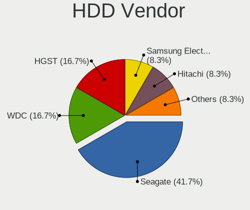
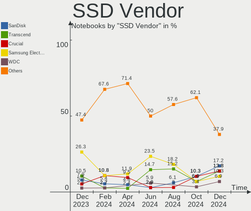
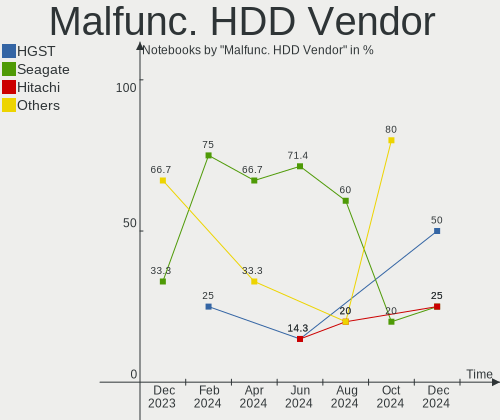
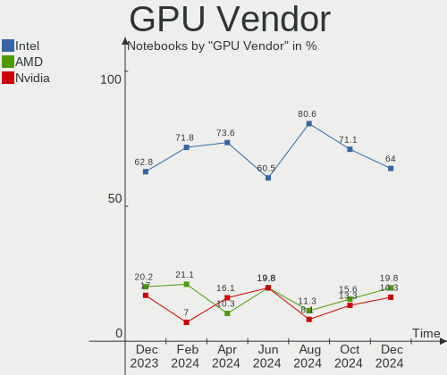
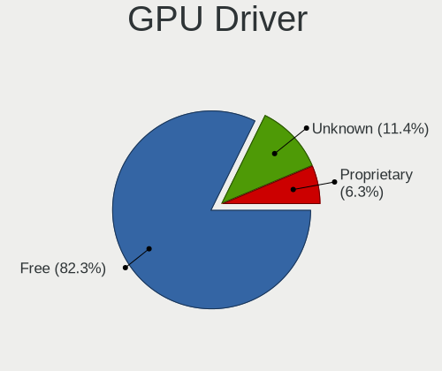
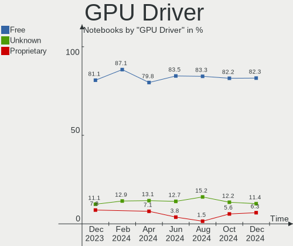
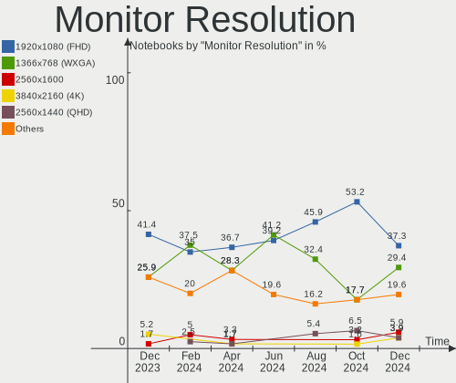

BSD Hardware Trends (Notebooks)
-------------------------------

A project to identify most popular hardware characteristics and track their change
over time based on data collected by BSD users at https://BSD-Hardware.info.

Anyone can contribute to this report by the [hw-probe](https://github.com/linuxhw/hw-probe/blob/master/INSTALL.BSD.md) tool:

    hw-probe -all -upload

Full-feature report is available here: https://bsd-hardware.info/?view=trends&formfactor=notebook

Period: Jul, 2021.

Contents
--------

* [ System ](#system)
  - [ OS                       ](#os)
  - [ OS Family                ](#os-family)
  - [ Arch                     ](#arch)
  - [ DE                       ](#de)
  - [ Display Server           ](#display-server)
  - [ Display Manager          ](#display-manager)
  - [ OS Lang                  ](#os-lang)
  - [ Boot Mode                ](#boot-mode)
  - [ Filesystem               ](#filesystem)
  - [ Part. scheme             ](#part-scheme)

* [ Board ](#board)
  - [ Vendor                   ](#vendor)
  - [ Model                    ](#model)
  - [ Model Family             ](#model-family)
  - [ MFG Year                 ](#mfg-year)
  - [ Form Factor              ](#form-factor)
  - [ Coreboot                 ](#coreboot)
  - [ RAM Size                 ](#ram-size)
  - [ RAM Used                 ](#ram-used)
  - [ Total Drives             ](#total-drives)
  - [ Has CD-ROM               ](#has-cd-rom)
  - [ Has Ethernet             ](#has-ethernet)
  - [ Has WiFi                 ](#has-wifi)
  - [ Has Bluetooth            ](#has-bluetooth)

* [ Location ](#location)
  - [ Country                  ](#country)
  - [ City                     ](#city)

* [ Drives ](#drives)
  - [ Drive Vendor             ](#drive-vendor)
  - [ Drive Model              ](#drive-model)
  - [ HDD Vendor               ](#hdd-vendor)
  - [ SSD Vendor               ](#ssd-vendor)
  - [ Drive Kind               ](#drive-kind)
  - [ Drive Connector          ](#drive-connector)
  - [ Drive Size               ](#drive-size)
  - [ Space Total              ](#space-total)
  - [ Space Used               ](#space-used)
  - [ Malfunc. Drives          ](#malfunc-drives)
  - [ Malfunc. Drive Vendor    ](#malfunc-drive-vendor)
  - [ Malfunc. HDD Vendor      ](#malfunc-hdd-vendor)
  - [ Malfunc. Drive Kind      ](#malfunc-drive-kind)
  - [ Failed Drives            ](#failed-drives)
  - [ Failed Drive Vendor      ](#failed-drive-vendor)
  - [ Drive Status             ](#drive-status)

* [ Storage controller ](#storage-controller)
  - [ Storage Vendor           ](#storage-vendor)
  - [ Storage Model            ](#storage-model)
  - [ Storage Kind             ](#storage-kind)

* [ Processor ](#processor)
  - [ CPU Vendor               ](#cpu-vendor)
  - [ CPU Model                ](#cpu-model)
  - [ CPU Model Family         ](#cpu-model-family)
  - [ CPU Cores                ](#cpu-cores)
  - [ CPU Sockets              ](#cpu-sockets)
  - [ CPU Threads              ](#cpu-threads)
  - [ CPU Microarch            ](#cpu-microarch)

* [ Graphics ](#graphics)
  - [ GPU Vendor               ](#gpu-vendor)
  - [ GPU Model                ](#gpu-model)
  - [ GPU Combo                ](#gpu-combo)
  - [ GPU Driver               ](#gpu-driver)
  - [ GPU Memory               ](#gpu-memory)

* [ Monitor ](#monitor)
  - [ Monitor Vendor           ](#monitor-vendor)
  - [ Monitor Model            ](#monitor-model)
  - [ Monitor Resolution       ](#monitor-resolution)
  - [ Monitor Diagonal         ](#monitor-diagonal)
  - [ Monitor Width            ](#monitor-width)
  - [ Aspect Ratio             ](#aspect-ratio)
  - [ Monitor Area             ](#monitor-area)
  - [ Pixel Density            ](#pixel-density)
  - [ Multiple Monitors        ](#multiple-monitors)

* [ Network ](#network)
  - [ Net Controller Vendor    ](#net-controller-vendor)
  - [ Net Controller Model     ](#net-controller-model)
  - [ Wireless Vendor          ](#wireless-vendor)
  - [ Wireless Model           ](#wireless-model)
  - [ Ethernet Vendor          ](#ethernet-vendor)
  - [ Ethernet Model           ](#ethernet-model)
  - [ Net Controller Kind      ](#net-controller-kind)
  - [ Used Controller          ](#used-controller)
  - [ NICs                     ](#nics)
  - [ IPv6                     ](#ipv6)

* [ Bluetooth ](#bluetooth)
  - [ Bluetooth Vendor         ](#bluetooth-vendor)
  - [ Bluetooth Model          ](#bluetooth-model)

* [ Sound ](#sound)
  - [ Sound Vendor             ](#sound-vendor)
  - [ Sound Model              ](#sound-model)

* [ Memory ](#memory)
  - [ Memory Vendor            ](#memory-vendor)
  - [ Memory Model             ](#memory-model)
  - [ Memory Kind              ](#memory-kind)
  - [ Memory Form Factor       ](#memory-form-factor)
  - [ Memory Size              ](#memory-size)
  - [ Memory Speed             ](#memory-speed)

* [ Printers & scanners ](#printers-scanners)
  - [ Printer Vendor           ](#printer-vendor)
  - [ Printer Model            ](#printer-model)
  - [ Scanner Vendor           ](#scanner-vendor)
  - [ Scanner Model            ](#scanner-model)

* [ Camera ](#camera)
  - [ Camera Vendor            ](#camera-vendor)
  - [ Camera Model             ](#camera-model)

* [ Security ](#security)
  - [ Fingerprint Vendor       ](#fingerprint-vendor)
  - [ Fingerprint Model        ](#fingerprint-model)
  - [ Chipcard Vendor          ](#chipcard-vendor)
  - [ Chipcard Model           ](#chipcard-model)

* [ Unsupported ](#unsupported)
  - [ Unsupported Devices      ](#unsupported-devices)
  - [ Unsupported Device Types ](#unsupported-device-types)

System
------

OS
--

Installed operating systems

| Name                 | Notebooks | Percent |
|----------------------|-----------|---------|
| FreeBSD 13.0-p3      | 13        | 18.84%  |
| FreeBSD 13.0         | 10        | 14.49%  |
| OpenBSD 6.9          | 9         | 13.04%  |
| helloSystem 0.5.0    | 9         | 13.04%  |
| FreeBSD 14.0-CURRENT | 7         | 10.14%  |
| OPNsense 21.1.8      | 4         | 5.8%    |
| helloSystem 0.1.0    | 3         | 4.35%   |
| GhostBSD 20.04.02    | 3         | 4.35%   |
| NomadBSD 5806f915    | 2         | 2.9%    |
| FreeBSD 12.2-p9      | 2         | 2.9%    |
| OPNsense 21.1.5      | 1         | 1.45%   |
| NomadBSD 1.4         | 1         | 1.45%   |
| helloSystem 0.6.0    | 1         | 1.45%   |
| helloSystem 0.4.0    | 1         | 1.45%   |
| FreeBSD 13.0-STABLE  | 1         | 1.45%   |
| FreeBSD 12.2-p6      | 1         | 1.45%   |
| FreeBSD 12.2-p2      | 1         | 1.45%   |

OS Family
---------

OS without a version

| Name        | Notebooks | Percent |
|-------------|-----------|---------|
| FreeBSD     | 35        | 50.72%  |
| helloSystem | 14        | 20.29%  |
| OpenBSD     | 9         | 13.04%  |
| OPNsense    | 5         | 7.25%   |
| NomadBSD    | 3         | 4.35%   |
| GhostBSD    | 3         | 4.35%   |

Arch
----

OS architecture (x86_64, i586, etc.)

| Name  | Notebooks | Percent |
|-------|-----------|---------|
| amd64 | 66        | 95.65%  |
| i386  | 3         | 4.35%   |

DE
--

Desktop Environment

| Name         | Notebooks | Percent |
|--------------|-----------|---------|
| helloDesktop | 15        | 21.74%  |
| Console      | 11        | 15.94%  |
| XFCE         | 10        | 14.49%  |
| fvwm         | 9         | 13.04%  |
| KDE5         | 8         | 11.59%  |
| MATE         | 4         | 5.8%    |
| GNOME        | 3         | 4.35%   |
| Fluxbox      | 3         | 4.35%   |
| TWM          | 2         | 2.9%    |
| Openbox      | 2         | 2.9%    |
| LXQt         | 1         | 1.45%   |
| Cinnamon     | 1         | 1.45%   |

Display Server
--------------

X11 or Wayland

| Name    | Notebooks | Percent |
|---------|-----------|---------|
| X11     | 57        | 82.61%  |
| Console | 12        | 17.39%  |

Display Manager
---------------

SDDM, LightDM, etc.

| Name    | Notebooks | Percent |
|---------|-----------|---------|
| Console | 29        | 42.03%  |
| SLiM    | 21        | 30.43%  |
| SDDM    | 9         | 13.04%  |
| XDM     | 5         | 7.25%   |
| LightDM | 3         | 4.35%   |
| GDM     | 2         | 2.9%    |

OS Lang
-------

Language

| Lang             | Notebooks | Percent |
|------------------|-----------|---------|
| en_US            | 24        | 34.78%  |
| C                | 21        | 30.43%  |
| Unknown          | 16        | 23.19%  |
| ru_RU            | 3         | 4.35%   |
| pl_PL            | 1         | 1.45%   |
| it_IT.ISO8859-15 | 1         | 1.45%   |
| fr_FR            | 1         | 1.45%   |
| en_GB            | 1         | 1.45%   |
| de_DE            | 1         | 1.45%   |

Boot Mode
---------

EFI or BIOS

| Mode | Notebooks | Percent |
|------|-----------|---------|
| EFI  | 49        | 71.01%  |
| BIOS | 20        | 28.99%  |

Filesystem
----------

Type of filesystem

| Type | Notebooks | Percent |
|------|-----------|---------|
| Zfs  | 35        | 50.72%  |
| Ufs  | 25        | 36.23%  |
| Ffs  | 9         | 13.04%  |

Part. scheme
------------

Scheme of partitioning

| Type | Notebooks | Percent |
|------|-----------|---------|
| GPT  | 57        | 82.61%  |
| MBR  | 12        | 17.39%  |

Board
-----

Vendor
------

Motherboard manufacturer

| Name                   | Notebooks | Percent |
|------------------------|-----------|---------|
| Lenovo                 | 23        | 33.33%  |
| Dell                   | 10        | 14.49%  |
| Hewlett-Packard        | 8         | 11.59%  |
| Apple                  | 4         | 5.8%    |
| Samsung Electronics    | 3         | 4.35%   |
| ASUSTek Computer       | 3         | 4.35%   |
| Acer                   | 3         | 4.35%   |
| Unknown                | 3         | 4.35%   |
| Notebook               | 1         | 1.45%   |
| MSI                    | 1         | 1.45%   |
| MouseComputer          | 1         | 1.45%   |
| Intel                  | 1         | 1.45%   |
| IBM                    | 1         | 1.45%   |
| GPU Company            | 1         | 1.45%   |
| Gigabyte Technology    | 1         | 1.45%   |
| Fujitsu Siemens        | 1         | 1.45%   |
| Fujitsu                | 1         | 1.45%   |
| eMachines              | 1         | 1.45%   |
| Avell High Performance | 1         | 1.45%   |
| Alienware              | 1         | 1.45%   |

Model
-----

Motherboard model

| Name                                       | Notebooks | Percent |
|--------------------------------------------|-----------|---------|
| Unknown                                    | 3         | 4.35%   |
| Samsung 3570R/370R/470R/450R/510R/4450RV   | 2         | 2.9%    |
| Samsung 340XAA/350XAA/550XAA               | 1         | 1.45%   |
| Notebook W510LU                            | 1         | 1.45%   |
| MSI MS-1613                                | 1         | 1.45%   |
| MouseComputer W331AU                       | 1         | 1.45%   |
| Lenovo Yoga 330-11IGM 81A6                 | 1         | 1.45%   |
| Lenovo XiaoXinPro-13ARE 2020 82DM          | 1         | 1.45%   |
| Lenovo ThinkPad X270 20HNA006ID            | 1         | 1.45%   |
| Lenovo ThinkPad X230 2325IG2               | 1         | 1.45%   |
| Lenovo ThinkPad X230 2325A95               | 1         | 1.45%   |
| Lenovo ThinkPad X230 232578G               | 1         | 1.45%   |
| Lenovo ThinkPad X1 Carbon Gen 8 20U9CTO1WW | 1         | 1.45%   |
| Lenovo ThinkPad W520 42763KU               | 1         | 1.45%   |
| Lenovo ThinkPad T510 4384FF3               | 1         | 1.45%   |
| Lenovo ThinkPad T470p 20J6A012CD           | 1         | 1.45%   |
| Lenovo ThinkPad T430 2349U2B               | 1         | 1.45%   |
| Lenovo ThinkPad T420 4236MBG               | 1         | 1.45%   |
| Lenovo ThinkPad T420 42368A3               | 1         | 1.45%   |
| Lenovo ThinkPad T410 2516DCU               | 1         | 1.45%   |
| Lenovo ThinkPad T400 2767WSB               | 1         | 1.45%   |
| Lenovo ThinkPad SL 2746M3C                 | 1         | 1.45%   |
| Lenovo ThinkPad S1 Yoga 12 20DKS0AA00      | 1         | 1.45%   |
| Lenovo ThinkPad E590 20NB0012RT            | 1         | 1.45%   |
| Lenovo Rescuer-15ISK 80RQ                  | 1         | 1.45%   |
| Lenovo IdeaPad 100S-14IBR 80R9             | 1         | 1.45%   |
| Lenovo G550 2958                           | 1         | 1.45%   |
| Lenovo G500 20236                          | 1         | 1.45%   |
| Lenovo B590 62743PG                        | 1         | 1.45%   |
| Intel Skylake Platform                     | 1         | 1.45%   |
| IBM ThinkPad T43 26686CU                   | 1         | 1.45%   |
| HP ZBook 17 G2                             | 1         | 1.45%   |
| HP Stream 11 Pro G4 EE                     | 1         | 1.45%   |
| HP ProBook 4440s                           | 1         | 1.45%   |
| HP ProBook 440 G7                          | 1         | 1.45%   |
| HP Pavilion dm1                            | 1         | 1.45%   |
| HP EliteBook 8570p                         | 1         | 1.45%   |
| HP 250 G4 Notebook PC                      | 1         | 1.45%   |
| HP 15                                      | 1         | 1.45%   |
| GPU Company GWTN156-5                      | 1         | 1.45%   |
| Gigabyte MMLP3AP-00                        | 1         | 1.45%   |
| Fujitsu Siemens AMILO PRO V3515            | 1         | 1.45%   |
| Fujitsu LIFEBOOK E780                      | 1         | 1.45%   |
| eMachines eM350                            | 1         | 1.45%   |
| Dell XPS 13 9343                           | 1         | 1.45%   |
| Dell Latitude E5520                        | 1         | 1.45%   |
| Dell Inspiron N5110                        | 1         | 1.45%   |
| Dell Inspiron N4030                        | 1         | 1.45%   |
| Dell Inspiron 5758                         | 1         | 1.45%   |
| Dell Inspiron 5559                         | 1         | 1.45%   |
| Dell Inspiron 3521                         | 1         | 1.45%   |
| Dell Inspiron 3442                         | 1         | 1.45%   |
| Dell Inspiron 15-5568                      | 1         | 1.45%   |
| Dell G5 5505                               | 1         | 1.45%   |
| Avell High Performance A62 LIV             | 1         | 1.45%   |
| ASUS X58LE                                 | 1         | 1.45%   |
| ASUS VivoBook_ASUSLaptop X512DA_F512DA     | 1         | 1.45%   |
| ASUS G74Sx                                 | 1         | 1.45%   |
| Apple MacBookPro9,2                        | 1         | 1.45%   |
| Apple MacBookPro8,1                        | 1         | 1.45%   |

Model Family
------------

Motherboard model prefix

| Name                       | Notebooks | Percent |
|----------------------------|-----------|---------|
| Lenovo ThinkPad            | 16        | 23.19%  |
| Dell Inspiron              | 7         | 10.14%  |
| Acer Aspire                | 3         | 4.35%   |
| Unknown                    | 3         | 4.35%   |
| Samsung 3570R              | 2         | 2.9%    |
| HP ProBook                 | 2         | 2.9%    |
| Samsung 340XAA             | 1         | 1.45%   |
| Notebook W510LU            | 1         | 1.45%   |
| MSI MS-1613                | 1         | 1.45%   |
| MouseComputer W331AU       | 1         | 1.45%   |
| Lenovo Yoga                | 1         | 1.45%   |
| Lenovo XiaoXinPro-13ARE    | 1         | 1.45%   |
| Lenovo Rescuer-15ISK       | 1         | 1.45%   |
| Lenovo IdeaPad             | 1         | 1.45%   |
| Lenovo G550                | 1         | 1.45%   |
| Lenovo G500                | 1         | 1.45%   |
| Lenovo B590                | 1         | 1.45%   |
| Intel Skylake              | 1         | 1.45%   |
| IBM ThinkPad               | 1         | 1.45%   |
| HP ZBook                   | 1         | 1.45%   |
| HP Stream                  | 1         | 1.45%   |
| HP Pavilion                | 1         | 1.45%   |
| HP EliteBook               | 1         | 1.45%   |
| HP 250                     | 1         | 1.45%   |
| HP 15                      | 1         | 1.45%   |
| GPU Company GWTN156-5      | 1         | 1.45%   |
| Gigabyte MMLP3AP-00        | 1         | 1.45%   |
| Fujitsu Siemens AMILO      | 1         | 1.45%   |
| Fujitsu LIFEBOOK           | 1         | 1.45%   |
| eMachines eM350            | 1         | 1.45%   |
| Dell XPS                   | 1         | 1.45%   |
| Dell Latitude              | 1         | 1.45%   |
| Dell G5                    | 1         | 1.45%   |
| Avell High Performance A62 | 1         | 1.45%   |
| ASUS X58LE                 | 1         | 1.45%   |
| ASUS VivoBook              | 1         | 1.45%   |
| ASUS G74Sx                 | 1         | 1.45%   |
| Apple MacBookPro9          | 1         | 1.45%   |
| Apple MacBookPro8          | 1         | 1.45%   |
| Apple MacBookPro6          | 1         | 1.45%   |
| Apple MacBook5             | 1         | 1.45%   |
| Alienware 17               | 1         | 1.45%   |

MFG Year
--------

Motherboard manufacture year

| Year    | Notebooks | Percent |
|---------|-----------|---------|
| 2019    | 12        | 17.39%  |
| 2020    | 10        | 14.49%  |
| 2018    | 9         | 13.04%  |
| 2016    | 6         | 8.7%    |
| 2015    | 5         | 7.25%   |
| 2013    | 5         | 7.25%   |
| 2010    | 5         | 7.25%   |
| 2021    | 4         | 5.8%    |
| 2014    | 3         | 4.35%   |
| 2011    | 3         | 4.35%   |
| 2012    | 2         | 2.9%    |
| 2006    | 2         | 2.9%    |
| 2009    | 1         | 1.45%   |
| 2008    | 1         | 1.45%   |
| Unknown | 1         | 1.45%   |

Form Factor
-----------

Physical design of the computer

| Name     | Notebooks | Percent |
|----------|-----------|---------|
| Notebook | 69        | 100%    |

Coreboot
--------

Have coreboot on board

| Used | Notebooks | Percent |
|------|-----------|---------|
| No   | 68        | 98.55%  |
| Yes  | 1         | 1.45%   |

RAM Size
--------

Total RAM memory

| Size in GB  | Notebooks | Percent |
|-------------|-----------|---------|
| 8.01-16.0   | 29        | 42.03%  |
| 4.01-8.0    | 18        | 26.09%  |
| 16.01-24.0  | 11        | 15.94%  |
| 2.01-3.0    | 6         | 8.7%    |
| 3.01-4.0    | 3         | 4.35%   |
| 32.01-64.0  | 1         | 1.45%   |
| 64.01-256.0 | 1         | 1.45%   |

RAM Used
--------

Used RAM memory

| Used GB    | Notebooks | Percent |
|------------|-----------|---------|
| 0.01-0.5   | 46        | 66.67%  |
| 0.51-1.0   | 13        | 18.84%  |
| 2.01-3.0   | 3         | 4.35%   |
| 3.01-4.0   | 2         | 2.9%    |
| 1.01-2.0   | 2         | 2.9%    |
| 4.01-8.0   | 1         | 1.45%   |
| 24.01-32.0 | 1         | 1.45%   |
| Unknown    | 1         | 1.45%   |

Total Drives
------------

Number of drives on board

| Drives | Notebooks | Percent |
|--------|-----------|---------|
| 1      | 49        | 71.01%  |
| 2      | 11        | 15.94%  |
| 0      | 7         | 10.14%  |
| 3      | 2         | 2.9%    |

Has CD-ROM
----------

Has CD-ROM on board

| Presented | Notebooks | Percent |
|-----------|-----------|---------|
| No        | 40        | 57.97%  |
| Yes       | 29        | 42.03%  |

Has Ethernet
------------

Has Ethernet on board

| Presented | Notebooks | Percent |
|-----------|-----------|---------|
| Yes       | 60        | 86.96%  |
| No        | 9         | 13.04%  |

Has WiFi
--------

Has WiFi module

| Presented | Notebooks | Percent |
|-----------|-----------|---------|
| Yes       | 64        | 92.75%  |
| No        | 5         | 7.25%   |

Has Bluetooth
-------------

Has Bluetooth module

| Presented | Notebooks | Percent |
|-----------|-----------|---------|
| Yes       | 39        | 56.52%  |
| No        | 30        | 43.48%  |

Location
--------

Country
-------

Geographic location (country)

| Country            | Notebooks | Percent |
|--------------------|-----------|---------|
| USA                | 15        | 21.74%  |
| Germany            | 8         | 11.59%  |
| Russia             | 5         | 7.25%   |
| UK                 | 3         | 4.35%   |
| Portugal           | 3         | 4.35%   |
| Italy              | 3         | 4.35%   |
| France             | 3         | 4.35%   |
| Brazil             | 3         | 4.35%   |
| Sweden             | 2         | 2.9%    |
| Latvia             | 2         | 2.9%    |
| Japan              | 2         | 2.9%    |
| Iran               | 2         | 2.9%    |
| China              | 2         | 2.9%    |
| Bulgaria           | 2         | 2.9%    |
| Tanzania           | 1         | 1.45%   |
| Switzerland        | 1         | 1.45%   |
| South Korea        | 1         | 1.45%   |
| Poland             | 1         | 1.45%   |
| Netherlands        | 1         | 1.45%   |
| Malaysia           | 1         | 1.45%   |
| Lithuania          | 1         | 1.45%   |
| Ireland            | 1         | 1.45%   |
| Indonesia          | 1         | 1.45%   |
| India              | 1         | 1.45%   |
| Finland            | 1         | 1.45%   |
| Dominican Republic | 1         | 1.45%   |
| Chile              | 1         | 1.45%   |
| Canada             | 1         | 1.45%   |

City
----

Geographic location (city)

| City                | Notebooks | Percent |
|---------------------|-----------|---------|
| Tehran              | 2         | 2.9%    |
| Riga                | 2         | 2.9%    |
| Hannibal            | 2         | 2.9%    |
| Brighton            | 2         | 2.9%    |
| Yegorlykskaya       | 1         | 1.45%   |
| Wuhan               | 1         | 1.45%   |
| Wloszczowa          | 1         | 1.45%   |
| Whittier            | 1         | 1.45%   |
| Wenatchee           | 1         | 1.45%   |
| Weimar              | 1         | 1.45%   |
| Washington          | 1         | 1.45%   |
| Varna               | 1         | 1.45%   |
| Valdivia            | 1         | 1.45%   |
| Ufa                 | 1         | 1.45%   |
| The Hague           | 1         | 1.45%   |
| Surabaya            | 1         | 1.45%   |
| Sungai Buloh        | 1         | 1.45%   |
| St Petersburg       | 1         | 1.45%   |
| Solna               | 1         | 1.45%   |
| Sofia               | 1         | 1.45%   |
| Shibakoen           | 1         | 1.45%   |
| Seoul               | 1         | 1.45%   |
| Seattle             | 1         | 1.45%   |
| Santo Domingo Este  | 1         | 1.45%   |
| Rodenberg           | 1         | 1.45%   |
| Resana              | 1         | 1.45%   |
| Porto União        | 1         | 1.45%   |
| Porto Torres        | 1         | 1.45%   |
| Porto               | 1         | 1.45%   |
| Oeiras              | 1         | 1.45%   |
| Moscow              | 1         | 1.45%   |
| Montreuil           | 1         | 1.45%   |
| Montreal            | 1         | 1.45%   |
| Midvale             | 1         | 1.45%   |
| London              | 1         | 1.45%   |
| Kolkata             | 1         | 1.45%   |
| Klaipėda           | 1         | 1.45%   |
| Kaiserslautern      | 1         | 1.45%   |
| Jilin City          | 1         | 1.45%   |
| Inzai               | 1         | 1.45%   |
| Hoeviksnaes         | 1         | 1.45%   |
| Hockenheim          | 1         | 1.45%   |
| Henderson           | 1         | 1.45%   |
| Hayes               | 1         | 1.45%   |
| Grafing bei Munchen | 1         | 1.45%   |
| Eureka              | 1         | 1.45%   |
| Estoril             | 1         | 1.45%   |
| Espoo               | 1         | 1.45%   |
| Dresden             | 1         | 1.45%   |
| Dinhard             | 1         | 1.45%   |
| Dar es Salaam       | 1         | 1.45%   |
| Cropwell            | 1         | 1.45%   |
| Commack             | 1         | 1.45%   |
| Colmar              | 1         | 1.45%   |
| Cogolo              | 1         | 1.45%   |
| Chelyabinsk         | 1         | 1.45%   |
| Chandler            | 1         | 1.45%   |
| Carrigaline         | 1         | 1.45%   |
| Bordeaux            | 1         | 1.45%   |
| Bielefeld           | 1         | 1.45%   |

Drives
------

Drive Vendor
------------

Hard drive vendors

| Vendor              | Notebooks | Drives | Percent |
|---------------------|-----------|--------|---------|
| Samsung Electronics | 14        | 16     | 19.72%  |
| WDC                 | 12        | 12     | 16.9%   |
| Seagate             | 7         | 8      | 9.86%   |
| Crucial             | 6         | 6      | 8.45%   |
| Hitachi             | 4         | 4      | 5.63%   |
| SanDisk             | 3         | 3      | 4.23%   |
| Kingston            | 3         | 3      | 4.23%   |
| HGST                | 3         | 3      | 4.23%   |
| Toshiba             | 2         | 2      | 2.82%   |
| SK Hynix            | 2         | 2      | 2.82%   |
| Fujitsu             | 2         | 2      | 2.82%   |
| Apple               | 2         | 2      | 2.82%   |
| Transcend           | 1         | 1      | 1.41%   |
| Team                | 1         | 1      | 1.41%   |
| SPCC                | 1         | 1      | 1.41%   |
| Netac               | 1         | 1      | 1.41%   |
| LITEON              | 1         | 1      | 1.41%   |
| Leven               | 1         | 1      | 1.41%   |
| KingDian            | 1         | 1      | 1.41%   |
| Hoodisk             | 1         | 1      | 1.41%   |
| Hewlett-Packard     | 1         | 1      | 1.41%   |
| FORESEE             | 1         | 1      | 1.41%   |
| A-DATA Technology   | 1         | 1      | 1.41%   |

Drive Model
-----------

Hard drive models

| Model                                   | Notebooks | Percent |
|-----------------------------------------|-----------|---------|
| Samsung SSD 860 EVO 500GB               | 2         | 2.74%   |
| Samsung SSD 860 EVO 1TB                 | 2         | 2.74%   |
| Samsung HM251JX 250GB                   | 2         | 2.74%   |
| HGST HTS725050A7E630 500GB              | 2         | 2.74%   |
| WDC WDS480G2G0B-00EPW0 480GB            | 1         | 1.37%   |
| WDC WD5000LPVX-75V0TT0 500GB            | 1         | 1.37%   |
| WDC WD5000LPVX-00V0TT0 500GB            | 1         | 1.37%   |
| WDC WD5000BEVT-75A0RT0 500GB            | 1         | 1.37%   |
| WDC WD3200BPVT-75ZEST0 320GB            | 1         | 1.37%   |
| WDC WD3200BEKT-08PVMT1 320GB            | 1         | 1.37%   |
| WDC WD2500BEVS-08VAT2 250GB             | 1         | 1.37%   |
| WDC WD1200BEVS-07LAT0 120GB             | 1         | 1.37%   |
| WDC WD10JPVX-22JC3T0 1TB                | 1         | 1.37%   |
| WDC PC SN730 SDBPNTY-512G-1101 512GB    | 1         | 1.37%   |
| WDC PC SN730 NVMe 1024GB                | 1         | 1.37%   |
| WDC PC SN530 SDBPNPZ-512G-1014 512GB    | 1         | 1.37%   |
| Transcend TS64GSSD370S 64GB             | 1         | 1.37%   |
| Toshiba MQ01ABF050 500GB                | 1         | 1.37%   |
| Toshiba MK3256GSY 320GB                 | 1         | 1.37%   |
| Team T253X2001T 1TB                     | 1         | 1.37%   |
| SPCC Solid State Disk 256GB             | 1         | 1.37%   |
| SK Hynix HFM256GDHTNG-8510B 256GB       | 1         | 1.37%   |
| SK Hynix BC511 HFM256GDJTNI-82A0A 256GB | 1         | 1.37%   |
| Seagate ST9320320AS 320GB               | 1         | 1.37%   |
| Seagate ST500LM000-1EJ162 500GB         | 1         | 1.37%   |
| Seagate ST320LT012-9WS14C 320GB         | 1         | 1.37%   |
| Seagate ST2000LX001-1RG174 2TB          | 1         | 1.37%   |
| Seagate ST2000LM003 HN-M201RAD 2TB      | 1         | 1.37%   |
| Seagate ST1000LM048-2E7172 1TB          | 1         | 1.37%   |
| Seagate ST1000LM035-1RK172 1TB          | 1         | 1.37%   |
| SanDisk Ultra II 480GB                  | 1         | 1.37%   |
| SanDisk SDSSDH3512G 512GB               | 1         | 1.37%   |
| SanDisk pSSD 256GB                      | 1         | 1.37%   |
| Samsung SSD PM851 M.2 2280 256GB        | 1         | 1.37%   |
| Samsung SSD 860 PRO 256GB               | 1         | 1.37%   |
| Samsung SSD 850 PRO 256GB               | 1         | 1.37%   |
| Samsung SSD 840 Series 500GB            | 1         | 1.37%   |
| Samsung SSD 840 Series 120GB            | 1         | 1.37%   |
| Samsung SSD 840 EVO 500GB               | 1         | 1.37%   |
| Samsung MZVLB1T0HBLR-000L7 1TB          | 1         | 1.37%   |
| Samsung MZNTY256HDHP-000L2 256GB        | 1         | 1.37%   |
| Samsung MZ7TD256HAFV-000L7 256GB        | 1         | 1.37%   |
| Samsung MZ7LN256HCHP-000L7 256GB        | 1         | 1.37%   |
| Netac SSD 256GB                         | 1         | 1.37%   |
| LITEON IT LCS-128L9S-HP 128GB           | 1         | 1.37%   |
| Leven JAJS300M480C 480GB                | 1         | 1.37%   |
| Kingston SA400S37480G 480GB             | 1         | 1.37%   |
| Kingston RBUSNS8154P3512GJ1 512GB       | 1         | 1.37%   |
| Kingston RBUSNS8154P3256GJ3 256GB       | 1         | 1.37%   |
| KingDian S200 60GB                      | 1         | 1.37%   |
| Hoodisk SSD 64GB                        | 1         | 1.37%   |
| Hitachi HTS727550A9E364 500GB           | 1         | 1.37%   |
| Hitachi HTS721010G9AT00 100GB           | 1         | 1.37%   |
| Hitachi HTS545025B9A300 250GB           | 1         | 1.37%   |
| Hitachi HTS541612J9SA00 120GB           | 1         | 1.37%   |
| HGST HTS725032A7E630 320GB              | 1         | 1.37%   |
| HP SSD S700 1TB                         | 1         | 1.37%   |
| Fujitsu MHV2120BH PL 120GB              | 1         | 1.37%   |
| Fujitsu MHV2100BH PL 100GB              | 1         | 1.37%   |
| FORESEE 64GB SSD                        | 1         | 1.37%   |

HDD Vendor
----------

Hard disk drive vendors

| Vendor              | Notebooks | Drives | Percent |
|---------------------|-----------|--------|---------|
| WDC                 | 8         | 8      | 27.59%  |
| Seagate             | 7         | 8      | 24.14%  |
| Hitachi             | 4         | 4      | 13.79%  |
| HGST                | 3         | 3      | 10.34%  |
| Toshiba             | 2         | 2      | 6.9%    |
| Samsung Electronics | 2         | 2      | 6.9%    |
| Fujitsu             | 2         | 2      | 6.9%    |
| Apple               | 1         | 1      | 3.45%   |

SSD Vendor
----------

Solid state drive vendors

| Vendor              | Notebooks | Drives | Percent |
|---------------------|-----------|--------|---------|
| Samsung Electronics | 11        | 13     | 34.38%  |
| Crucial             | 5         | 5      | 15.63%  |
| SanDisk             | 3         | 3      | 9.38%   |
| WDC                 | 1         | 1      | 3.13%   |
| Transcend           | 1         | 1      | 3.13%   |
| Team                | 1         | 1      | 3.13%   |
| SPCC                | 1         | 1      | 3.13%   |
| Netac               | 1         | 1      | 3.13%   |
| LITEON              | 1         | 1      | 3.13%   |
| Leven               | 1         | 1      | 3.13%   |
| Kingston            | 1         | 1      | 3.13%   |
| KingDian            | 1         | 1      | 3.13%   |
| Hoodisk             | 1         | 1      | 3.13%   |
| Hewlett-Packard     | 1         | 1      | 3.13%   |
| FORESEE             | 1         | 1      | 3.13%   |
| Apple               | 1         | 1      | 3.13%   |

Drive Kind
----------

HDD or SSD

| Kind | Notebooks | Drives | Percent |
|------|-----------|--------|---------|
| SSD  | 29        | 34     | 43.94%  |
| HDD  | 28        | 30     | 42.42%  |
| NVMe | 9         | 10     | 13.64%  |

Drive Connector
---------------

SATA, SAS, NVMe, etc.

| Type | Notebooks | Drives | Percent |
|------|-----------|--------|---------|
| SATA | 54        | 64     | 85.71%  |
| NVMe | 9         | 10     | 14.29%  |

Drive Size
----------

Size of hard drive

| Size in TB | Notebooks | Drives | Percent |
|------------|-----------|--------|---------|
| 0.01-0.5   | 47        | 51     | 79.66%  |
| 0.51-1.0   | 9         | 9      | 15.25%  |
| 1.01-2.0   | 3         | 4      | 5.08%   |

Space Total
-----------

Amount of disk space available on the file system

| Size in GB | Notebooks | Percent |
|------------|-----------|---------|
| 251-500    | 19        | 27.54%  |
| 101-250    | 19        | 27.54%  |
| 1-20       | 13        | 18.84%  |
| 501-1000   | 6         | 8.7%    |
| 51-100     | 6         | 8.7%    |
| 21-50      | 4         | 5.8%    |
| 1001-2000  | 2         | 2.9%    |

Space Used
----------

Amount of used disk space

| Used GB | Notebooks | Percent |
|---------|-----------|---------|
| 1-20    | 55        | 79.71%  |
| 21-50   | 8         | 11.59%  |
| 51-100  | 3         | 4.35%   |
| 101-250 | 2         | 2.9%    |
| 251-500 | 1         | 1.45%   |

Malfunc. Drives
---------------

Drive models with a malfunction

| Model                                    | Notebooks | Drives | Percent |
|------------------------------------------|-----------|--------|---------|
| HGST HTS725050A7E630 500GB               | 2         | 2      | 14.29%  |
| WDC WD5000BEVT-75A0RT0 500GB             | 1         | 1      | 7.14%   |
| WDC WD3200BPVT-75ZEST0 320GB             | 1         | 1      | 7.14%   |
| WDC WD1200BEVS-07LAT0 120GB              | 1         | 1      | 7.14%   |
| Seagate ST9320320AS 320GB                | 1         | 1      | 7.14%   |
| Seagate ST320LT012-9WS14C 320GB          | 1         | 1      | 7.14%   |
| Seagate ST2000LX001-1RG174 2TB           | 1         | 2      | 7.14%   |
| Samsung Electronics SSD 840 Series 500GB | 1         | 1      | 7.14%   |
| Samsung Electronics SSD 840 EVO 500GB    | 1         | 1      | 7.14%   |
| Hitachi HTS541612J9SA00 120GB            | 1         | 1      | 7.14%   |
| Hewlett-Packard SSD S700 1TB             | 1         | 1      | 7.14%   |
| Crucial CT525MX300SSD4 528GB             | 1         | 1      | 7.14%   |
| Apple HDD HTS545050A7E362 500GB          | 1         | 1      | 7.14%   |

Malfunc. Drive Vendor
---------------------

Vendors of faulty drives

| Vendor              | Notebooks | Drives | Percent |
|---------------------|-----------|--------|---------|
| WDC                 | 3         | 3      | 21.43%  |
| Seagate             | 3         | 4      | 21.43%  |
| Samsung Electronics | 2         | 2      | 14.29%  |
| HGST                | 2         | 2      | 14.29%  |
| Hitachi             | 1         | 1      | 7.14%   |
| Hewlett-Packard     | 1         | 1      | 7.14%   |
| Crucial             | 1         | 1      | 7.14%   |
| Apple               | 1         | 1      | 7.14%   |

Malfunc. HDD Vendor
-------------------

Vendors of faulty HDD drives

| Vendor  | Notebooks | Drives | Percent |
|---------|-----------|--------|---------|
| WDC     | 3         | 3      | 30%     |
| Seagate | 3         | 4      | 30%     |
| HGST    | 2         | 2      | 20%     |
| Hitachi | 1         | 1      | 10%     |
| Apple   | 1         | 1      | 10%     |

Malfunc. Drive Kind
-------------------

Kinds of faulty drives

| Kind | Notebooks | Drives | Percent |
|------|-----------|--------|---------|
| HDD  | 10        | 11     | 71.43%  |
| SSD  | 4         | 4      | 28.57%  |

Failed Drives
-------------

Failed drive models

| Model                         | Notebooks | Drives | Percent |
|-------------------------------|-----------|--------|---------|
| SanDisk pSSD 256GB            | 1         | 1      | 50%     |
| Hitachi HTS545025B9A300 250GB | 1         | 1      | 50%     |

Failed Drive Vendor
-------------------

Failed drive vendors

| Vendor  | Notebooks | Drives | Percent |
|---------|-----------|--------|---------|
| SanDisk | 1         | 1      | 50%     |
| Hitachi | 1         | 1      | 50%     |

Drive Status
------------

Number of failed and malfunc. drives

| Status   | Notebooks | Drives | Percent |
|----------|-----------|--------|---------|
| Works    | 48        | 54     | 71.64%  |
| Malfunc  | 14        | 15     | 20.9%   |
| Detected | 3         | 3      | 4.48%   |
| Failed   | 2         | 2      | 2.99%   |

Storage controller
------------------

Storage Vendor
--------------

Storage controller vendors

| Vendor                      | Notebooks | Percent |
|-----------------------------|-----------|---------|
| Intel                       | 57        | 77.03%  |
| AMD                         | 6         | 8.11%   |
| SK Hynix                    | 2         | 2.7%    |
| Sandisk                     | 2         | 2.7%    |
| Kingston Technology Company | 2         | 2.7%    |
| VIA Technologies            | 1         | 1.35%   |
| Samsung Electronics         | 1         | 1.35%   |
| Nvidia                      | 1         | 1.35%   |
| Micron Technology           | 1         | 1.35%   |
| ADATA Technology            | 1         | 1.35%   |

Storage Model
-------------

Storage controller models

| Model                                                                                  | Notebooks | Percent |
|----------------------------------------------------------------------------------------|-----------|---------|
| Intel 7 Series Chipset Family 6-port SATA Controller [AHCI mode]                       | 11        | 13.58%  |
| Intel 6 Series/C200 Series Chipset Family 6 port Mobile SATA AHCI Controller           | 6         | 7.41%   |
| Intel Sunrise Point-LP SATA Controller [AHCI mode]                                     | 5         | 6.17%   |
| Intel 8 Series SATA Controller 1 [AHCI mode]                                           | 5         | 6.17%   |
| AMD FCH SATA Controller [AHCI mode]                                                    | 5         | 6.17%   |
| Intel Wildcat Point-LP SATA Controller [AHCI Mode]                                     | 4         | 4.94%   |
| Intel Atom/Celeron/Pentium Processor x5-E8000/J3xxx/N3xxx Series SATA Controller       | 3         | 3.7%    |
| Intel 82801IBM/IEM (ICH9M/ICH9M-E) 4 port SATA Controller [AHCI mode]                  | 3         | 3.7%    |
| Intel 5 Series/3400 Series Chipset 6 port SATA AHCI Controller                         | 3         | 3.7%    |
| Sandisk WD Black SN750 / PC SN730 NVMe SSD                                             | 2         | 2.47%   |
| Kingston Company U-SNS8154P3 NVMe SSD                                                  | 2         | 2.47%   |
| Intel HM170/QM170 Chipset SATA Controller [AHCI Mode]                                  | 2         | 2.47%   |
| Intel Comet Lake SATA AHCI Controller                                                  | 2         | 2.47%   |
| Intel 82801 Mobile SATA Controller [RAID mode]                                         | 2         | 2.47%   |
| Unknown                                                                                | 2         | 2.47%   |
| VIA VT82C586A/B/VT82C686/A/B/VT823x/A/C PIPC Bus Master IDE                            | 1         | 1.23%   |
| VIA VT8237A SATA 2-Port Controller                                                     | 1         | 1.23%   |
| SK Hynix BC511                                                                         | 1         | 1.23%   |
| SK Hynix BC501 NVMe Solid State Drive                                                  | 1         | 1.23%   |
| Samsung NVMe SSD Controller SM981/PM981/PM983                                          | 1         | 1.23%   |
| Nvidia MCP79 AHCI Controller                                                           | 1         | 1.23%   |
| Intel NM10/ICH7 Family SATA Controller [AHCI mode]                                     | 1         | 1.23%   |
| Intel Celeron/Pentium Silver Processor SATA Controller                                 | 1         | 1.23%   |
| Intel 82801HM/HEM (ICH8M/ICH8M-E) SATA Controller [AHCI mode]                          | 1         | 1.23%   |
| Intel 82801HM/HEM (ICH8M/ICH8M-E) IDE Controller                                       | 1         | 1.23%   |
| Intel 82801GBM/GHM (ICH7-M Family) SATA Controller [IDE mode]                          | 1         | 1.23%   |
| Intel 82801FBM (ICH6M) SATA Controller                                                 | 1         | 1.23%   |
| Intel 8 Series/C220 Series Chipset Family 6-port SATA Controller 1 [AHCI mode]         | 1         | 1.23%   |
| Intel 7 Series/C210 Series Chipset Family IDE-r Controller                             | 1         | 1.23%   |
| Intel 7 Series Chipset Family 4-port SATA Controller [IDE mode]                        | 1         | 1.23%   |
| Intel 7 Series Chipset Family 2-port SATA Controller [IDE mode]                        | 1         | 1.23%   |
| Intel 6 Series/C200 Series Chipset Family Mobile SATA Controller (IDE mode, ports 0-3) | 1         | 1.23%   |
| Intel 6 Series/C200 Series Chipset Family IDE-r Controller                             | 1         | 1.23%   |
| Intel 5 Series/3400 Series Chipset PT IDER Controller                                  | 1         | 1.23%   |
| Intel 5 Series/3400 Series Chipset 4 port SATA IDE Controller                          | 1         | 1.23%   |
| Intel 5 Series/3400 Series Chipset 4 port SATA AHCI Controller                         | 1         | 1.23%   |
| Intel 5 Series/3400 Series Chipset 2 port SATA IDE Controller                          | 1         | 1.23%   |
| Intel 400 Series Chipset Family SATA AHCI Controller                                   | 1         | 1.23%   |
| AMD SB7x0/SB8x0/SB9x0 SATA Controller [AHCI mode]                                      | 1         | 1.23%   |

Storage Kind
------------

Kind of storage controller (IDE, SATA, NVMe, SAS, ...)

| Kind | Notebooks | Percent |
|------|-----------|---------|
| SATA | 57        | 74.03%  |
| IDE  | 10        | 12.99%  |
| NVMe | 8         | 10.39%  |
| RAID | 2         | 2.6%    |

Processor
---------

CPU Vendor
----------

Processor vendors

| Vendor | Notebooks | Percent |
|--------|-----------|---------|
| Intel  | 62        | 89.86%  |
| AMD    | 7         | 10.14%  |

CPU Model
---------

Processor models

| Model                                                        | Notebooks | Percent |
|--------------------------------------------------------------|-----------|---------|
| Intel Core i7-3520M CPU @ 2.90GHz                            | 2         | 2.9%    |
| Intel Core i5-6200U CPU @ 2.30GHz                            | 2         | 2.9%    |
| Intel Core i5-4210U CPU @ 1.70GHz                            | 2         | 2.9%    |
| Intel Core i5-3320M CPU @ 2.60GHz                            | 2         | 2.9%    |
| Intel Core i5-3210M CPU @ 2.50GHz                            | 2         | 2.9%    |
| Intel Core i5 CPU M 560 @ 2.67GHz                            | 2         | 2.9%    |
| Intel Pentium Silver N5000 CPU @ 1.10GHz                     | 1         | 1.45%   |
| Intel Pentium M processor                                    | 1         | 1.45%   |
| Intel Pentium Dual CPU T3400 @ 2.16GHz                       | 1         | 1.45%   |
| Intel Pentium CPU N3700 @ 1.60GHz                            | 1         | 1.45%   |
| Intel Pentium CPU 997 @ 1.60GHz                              | 1         | 1.45%   |
| Intel CPU Version                                            | 1         | 1.45%   |
| Intel Core i7-9750H CPU @ 2.60GHz                            | 1         | 1.45%   |
| Intel Core i7-8565U CPU @ 1.80GHz                            | 1         | 1.45%   |
| Intel Core i7-7500U CPU @ 2.70GHz                            | 1         | 1.45%   |
| Intel Core i7-6500U CPU @ 2.50GHz                            | 1         | 1.45%   |
| Intel Core i7-5600U CPU @ 2.60GHz                            | 1         | 1.45%   |
| Intel Core i7-4710MQ CPU @ 2.50GHz                           | 1         | 1.45%   |
| Intel Core i7-4700MQ CPU @ 2.40GHz                           | 1         | 1.45%   |
| Intel Core i7-2860QM CPU @ 2.50GHz                           | 1         | 1.45%   |
| Intel Core i7-2760QM CPU @ 2.40GHz                           | 1         | 1.45%   |
| Intel Core i7-10750H CPU @ 2.60GHz                           | 1         | 1.45%   |
| Intel Core i7-10510U CPU @ 1.80GHz                           | 1         | 1.45%   |
| Intel Core i7 CPU M 620 @ 2.67GHz                            | 1         | 1.45%   |
| Intel Core i5-8250U CPU @ 1.60GHz                            | 1         | 1.45%   |
| Intel Core i5-7300HQ CPU @ 2.50GHz                           | 1         | 1.45%   |
| Intel Core i5-6300HQ CPU @ 2.30GHz                           | 1         | 1.45%   |
| Intel Core i5-5300U CPU @ 2.30GHz                            | 1         | 1.45%   |
| Intel Core i5-4250U CPU @ 1.30GHz                            | 1         | 1.45%   |
| Intel Core i5-3230M CPU @ 2.60GHz                            | 1         | 1.45%   |
| Intel Core i5-2540M CPU @ 2.60GHz                            | 1         | 1.45%   |
| Intel Core i5-2520M CPU @ 2.50GHz                            | 1         | 1.45%   |
| Intel Core i5-2435M CPU @ 2.40GHz                            | 1         | 1.45%   |
| Intel Core i5-2430M CPU @ 2.40GH                             | 1         | 1.45%   |
| Intel Core i5-2410M CPU @ 2.30GHz                            | 1         | 1.45%   |
| Intel Core i5-10310U CPU @ 1.70GHz                           | 1         | 1.45%   |
| Intel Core i5-10210U CPU @ 1.60GHz                           | 1         | 1.45%   |
| Intel Core i5 CPU M 540 @ 2.53GHz                            | 1         | 1.45%   |
| Intel Core i3-5005U CPU @ 2.00GHz                            | 1         | 1.45%   |
| Intel Core i3-4010U CPU @ 1.70GHz                            | 1         | 1.45%   |
| Intel Core i3-4005U CPU @ 1.70GHz                            | 1         | 1.45%   |
| Intel Core i3-3227U CPU @ 1.90GHz                            | 1         | 1.45%   |
| Intel Core i3-3110M CPU @ 2.40GHz                            | 1         | 1.45%   |
| Intel Core i3 CPU M 380 @ 2.53GH                             | 1         | 1.45%   |
| Intel Core 2 Duo CPU T5870 @ 2.00GHz                         | 1         | 1.45%   |
| Intel Core 2 Duo CPU P9700 @ 2.80GHz                         | 1         | 1.45%   |
| Intel Core 2 Duo CPU P7350 @ 2.00GHz                         | 1         | 1.45%   |
| Intel Celeron M CPU 430 @ 1.73GHz ("GenuineIntel" 686-class) | 1         | 1.45%   |
| Intel Celeron M CPU                                          | 1         | 1.45%   |
| Intel Celeron CPU N3450 @ 1.10GHz                            | 1         | 1.45%   |
| Intel Celeron CPU N3150 @ 1.60GHz                            | 1         | 1.45%   |
| Intel Celeron CPU N3060 @ 1.60GHz                            | 1         | 1.45%   |
| Intel Celeron CPU B840 @ 1.90GHz                             | 1         | 1.45%   |
| Intel Celeron CPU 3215U @ 1.70GHz                            | 1         | 1.45%   |
| Intel Celeron CPU 1005M @ 1.90GHz                            | 1         | 1.45%   |
| Intel Atom CPU N450 @ 1.66GHz                                | 1         | 1.45%   |
| AMD Ryzen 7 4800U with Radeon Graphics                       | 1         | 1.45%   |
| AMD Ryzen 7 4800H with Radeon Graphics                       | 1         | 1.45%   |
| AMD Ryzen 5 3500U with Radeon Vega Mobile Gfx                | 1         | 1.45%   |
| AMD Ryzen 5 3450U with Radeon Vega Mobile Gfx                | 1         | 1.45%   |

CPU Model Family
----------------

Processor model prefix

| Model                | Notebooks | Percent |
|----------------------|-----------|---------|
| Intel Core i5        | 24        | 34.78%  |
| Intel Core i7        | 14        | 20.29%  |
| Intel Core i3        | 6         | 8.7%    |
| Intel Celeron        | 6         | 8.7%    |
| Intel Core 2 Duo     | 3         | 4.35%   |
| Intel Pentium        | 2         | 2.9%    |
| Intel Celeron M      | 2         | 2.9%    |
| AMD Ryzen 7          | 2         | 2.9%    |
| AMD Ryzen 5          | 2         | 2.9%    |
| Other                | 1         | 1.45%   |
| Intel Pentium Silver | 1         | 1.45%   |
| Intel Pentium M      | 1         | 1.45%   |
| Intel Pentium Dual   | 1         | 1.45%   |
| Intel Atom           | 1         | 1.45%   |
| AMD E2               | 1         | 1.45%   |
| AMD Athlon II Neo    | 1         | 1.45%   |
| AMD A10              | 1         | 1.45%   |

CPU Cores
---------

Number of processor cores

| Number  | Notebooks | Percent |
|---------|-----------|---------|
| 2       | 38        | 55.07%  |
| 4       | 17        | 24.64%  |
| 1       | 4         | 5.8%    |
| Unknown | 4         | 5.8%    |
| 16      | 2         | 2.9%    |
| 8       | 2         | 2.9%    |
| 6       | 2         | 2.9%    |

CPU Sockets
-----------

Number of sockets

| Number  | Notebooks | Percent |
|---------|-----------|---------|
| 1       | 66        | 95.65%  |
| Unknown | 2         | 2.9%    |
| 2       | 1         | 1.45%   |

CPU Threads
-----------

Threads per core (Hyper-Threading)

| Number  | Notebooks | Percent |
|---------|-----------|---------|
| 2       | 43        | 62.32%  |
| 1       | 19        | 27.54%  |
| Unknown | 7         | 10.14%  |

CPU Microarch
-------------

Microarchitecture

| Name          | Notebooks | Percent |
|---------------|-----------|---------|
| IvyBridge     | 10        | 14.49%  |
| SandyBridge   | 9         | 13.04%  |
| KabyLake      | 8         | 11.59%  |
| Haswell       | 7         | 10.14%  |
| Westmere      | 5         | 7.25%   |
| Skylake       | 4         | 5.8%    |
| Broadwell     | 4         | 5.8%    |
| Silvermont    | 3         | 4.35%   |
| Penryn        | 3         | 4.35%   |
| P6            | 3         | 4.35%   |
| Zen+          | 2         | 2.9%    |
| Zen 2         | 2         | 2.9%    |
| Puma          | 2         | 2.9%    |
| Core          | 2         | 2.9%    |
| K10           | 1         | 1.45%   |
| Goldmont plus | 1         | 1.45%   |
| Goldmont      | 1         | 1.45%   |
| CometLake     | 1         | 1.45%   |
| Bonnell       | 1         | 1.45%   |

Graphics
--------

GPU Vendor
----------

Vendors of graphics cards

| Vendor           | Notebooks | Percent |
|------------------|-----------|---------|
| Intel            | 54        | 64.29%  |
| Nvidia           | 16        | 19.05%  |
| AMD              | 13        | 15.48%  |
| VIA Technologies | 1         | 1.19%   |

GPU Model
---------

Graphics card models

| Model                                                                                    | Notebooks | Percent |
|------------------------------------------------------------------------------------------|-----------|---------|
| Intel 3rd Gen Core processor Graphics Controller                                         | 9         | 10.34%  |
| Intel 2nd Generation Core Processor Family Integrated Graphics Controller                | 7         | 8.05%   |
| Intel Haswell-ULT Integrated Graphics Controller                                         | 5         | 5.75%   |
| Intel Core Processor Integrated Graphics Controller                                      | 4         | 4.6%    |
| Intel Skylake GT2 [HD Graphics 520]                                                      | 3         | 3.45%   |
| Intel HD Graphics 5500                                                                   | 3         | 3.45%   |
| Intel CometLake-U GT2 [UHD Graphics]                                                     | 3         | 3.45%   |
| Intel Atom/Celeron/Pentium Processor x5-E8000/J3xxx/N3xxx Integrated Graphics Controller | 3         | 3.45%   |
| Nvidia TU117M                                                                            | 2         | 2.3%    |
| Intel Mobile 4 Series Chipset Integrated Graphics Controller                             | 2         | 2.3%    |
| Intel 4th Gen Core Processor Integrated Graphics Controller                              | 2         | 2.3%    |
| AMD Renoir                                                                               | 2         | 2.3%    |
| AMD Picasso                                                                              | 2         | 2.3%    |
| VIA Technologies CN896/VN896/P4M900 [Chrome 9 HC]                                        | 1         | 1.15%   |
| Nvidia GT216M [GeForce GT 330M]                                                          | 1         | 1.15%   |
| Nvidia GP108M [GeForce MX250]                                                            | 1         | 1.15%   |
| Nvidia GM108M [GeForce MX110]                                                            | 1         | 1.15%   |
| Nvidia GM108M [GeForce 940MX]                                                            | 1         | 1.15%   |
| Nvidia GM107M [GeForce GTX 960M]                                                         | 1         | 1.15%   |
| Nvidia GK208BM [GeForce 920M]                                                            | 1         | 1.15%   |
| Nvidia GK107GLM [Quadro K1100M]                                                          | 1         | 1.15%   |
| Nvidia GK106M [GeForce GTX 770M]                                                         | 1         | 1.15%   |
| Nvidia GF117M [GeForce 610M/710M/810M/820M / GT 620M/625M/630M/720M]                     | 1         | 1.15%   |
| Nvidia GF116M [GeForce GT 560M]                                                          | 1         | 1.15%   |
| Nvidia GF108M [GeForce GT 525M]                                                          | 1         | 1.15%   |
| Nvidia GF108GLM [Quadro 1000M]                                                           | 1         | 1.15%   |
| Nvidia G98M [GeForce G 105M]                                                             | 1         | 1.15%   |
| Nvidia C79 [GeForce 9400M]                                                               | 1         | 1.15%   |
| Intel WhiskeyLake-U GT2 [UHD Graphics 620]                                               | 1         | 1.15%   |
| Intel UHD Graphics 620                                                                   | 1         | 1.15%   |
| Intel Mobile GM965/GL960 Integrated Graphics Controller (secondary)                      | 1         | 1.15%   |
| Intel Mobile GM965/GL960 Integrated Graphics Controller (primary)                        | 1         | 1.15%   |
| Intel Mobile 945GM/GMS/GME, 943/940GML Express Integrated Graphics Controller            | 1         | 1.15%   |
| Intel Mobile 945GM/GMS, 943/940GML Express Integrated Graphics Controller                | 1         | 1.15%   |
| Intel HD Graphics 630                                                                    | 1         | 1.15%   |
| Intel HD Graphics 620                                                                    | 1         | 1.15%   |
| Intel HD Graphics 530                                                                    | 1         | 1.15%   |
| Intel HD Graphics 500                                                                    | 1         | 1.15%   |
| Intel HD Graphics                                                                        | 1         | 1.15%   |
| Intel GeminiLake [UHD Graphics 605]                                                      | 1         | 1.15%   |
| Intel CometLake-H GT2 [UHD Graphics]                                                     | 1         | 1.15%   |
| Intel CoffeeLake-H GT2 [UHD Graphics 630]                                                | 1         | 1.15%   |
| Intel Atom Processor D4xx/D5xx/N4xx/N5xx Integrated Graphics Controller                  | 1         | 1.15%   |
| AMD Thames [Radeon HD 7550M/7570M/7650M]                                                 | 1         | 1.15%   |
| AMD Sun XT [Radeon HD 8670A/8670M/8690M / R5 M330 / M430 / Radeon 520 Mobile]            | 1         | 1.15%   |
| AMD RV370/M22 [Mobility Radeon X300]                                                     | 1         | 1.15%   |
| AMD RS880M [Mobility Radeon HD 4225/4250]                                                | 1         | 1.15%   |
| AMD Park [Mobility Radeon HD 5430]                                                       | 1         | 1.15%   |
| AMD Navi 10 [Radeon RX 5600 OEM/5600 XT / 5700/5700 XT]                                  | 1         | 1.15%   |
| AMD Mullins [Radeon R6 Graphics]                                                         | 1         | 1.15%   |
| AMD Mullins [Radeon R2 Graphics]                                                         | 1         | 1.15%   |
| AMD Mars [Radeon HD 8670A/8670M/8750M / R7 M370]                                         | 1         | 1.15%   |
| AMD Lexa PRO [Radeon 540/540X/550/550X / RX 540X/550/550X]                               | 1         | 1.15%   |

GPU Combo
---------

Combinations of graphics cards

| Name           | Notebooks | Percent |
|----------------|-----------|---------|
| 1 x Intel      | 34        | 49.28%  |
| Intel + Nvidia | 12        | 17.39%  |
| 1 x AMD        | 9         | 13.04%  |
| 2 x Intel      | 5         | 7.25%   |
| 1 x Nvidia     | 4         | 5.8%    |
| Intel + AMD    | 3         | 4.35%   |
| 2 x AMD        | 1         | 1.45%   |
| 1 x VIA        | 1         | 1.45%   |

GPU Driver
----------

Free vs proprietary

| Driver      | Notebooks | Percent |
|-------------|-----------|---------|
| Free        | 61        | 88.41%  |
| Proprietary | 5         | 7.25%   |
| Unknown     | 3         | 4.35%   |

GPU Memory
----------

Total video memory

| Size in GB | Notebooks | Percent |
|------------|-----------|---------|
| Unknown    | 64        | 92.75%  |
| 1.01-2.0   | 3         | 4.35%   |
| 2.01-3.0   | 1         | 1.45%   |
| 0.51-1.0   | 1         | 1.45%   |

Monitor
-------

Monitor Vendor
--------------

Monitor vendors

| Vendor                  | Notebooks | Percent |
|-------------------------|-----------|---------|
| AU Optronics            | 10        | 18.52%  |
| LG Display              | 9         | 16.67%  |
| Samsung Electronics     | 5         | 9.26%   |
| Lenovo                  | 5         | 9.26%   |
| BOE                     | 5         | 9.26%   |
| Chimei Innolux          | 4         | 7.41%   |
| Philips                 | 2         | 3.7%    |
| PANDA                   | 2         | 3.7%    |
| Chi Mei Optoelectronics | 2         | 3.7%    |
| Apple                   | 2         | 3.7%    |
| Sharp                   | 1         | 1.85%   |
| SDC                     | 1         | 1.85%   |
| LGD                     | 1         | 1.85%   |
| InfoVision              | 1         | 1.85%   |
| Hewlett-Packard         | 1         | 1.85%   |
| Goldstar                | 1         | 1.85%   |
| Dell                    | 1         | 1.85%   |
| AOC                     | 1         | 1.85%   |

Monitor Model
-------------

Monitor models

| Model                                                                    | Notebooks | Percent |
|--------------------------------------------------------------------------|-----------|---------|
| LG Display LCD Monitor LGD02D8 1366x768 280x160mm 12.7-inch              | 2         | 3.7%    |
| Apple LCD Monitor APP9CC5 1280x800 290x180mm 13.4-inch                   | 2         | 3.7%    |
| Sharp LCD Monitor SHP1420 1920x1080 290x170mm 13.2-inch                  | 1         | 1.85%   |
| SDC LCD Monitor 3520x1080                                                | 1         | 1.85%   |
| Samsung Electronics LCD Monitor SEC5441 1280x800 330x210mm 15.4-inch     | 1         | 1.85%   |
| Samsung Electronics LCD Monitor SEC3849 1366x768 310x170mm 13.9-inch     | 1         | 1.85%   |
| Samsung Electronics LCD Monitor SEC324C 1600x900 310x170mm 13.9-inch     | 1         | 1.85%   |
| Samsung Electronics LCD Monitor SDC8B4F 1920x1080 340x190mm 15.3-inch    | 1         | 1.85%   |
| Samsung Electronics LCD Monitor SDC3754 1600x900 380x210mm 17.1-inch     | 1         | 1.85%   |
| Philips LCD Monitor PHL08C3 1920x1080 600x340mm 27.2-inch                | 1         | 1.85%   |
| Philips LCD Monitor 271P4                                                | 1         | 1.85%   |
| PANDA LCD Monitor NCP004F 1920x1080 310x170mm 13.9-inch                  | 1         | 1.85%   |
| PANDA LCD Monitor NCP0040 1920x1080 340x190mm 15.3-inch                  | 1         | 1.85%   |
| LGD LCD Monitor 1920x1080                                                | 1         | 1.85%   |
| LG Display LCD Monitor LGD0437 1920x1080 280x160mm 12.7-inch             | 1         | 1.85%   |
| LG Display LCD Monitor LGD03AB 1366x768 340x190mm 15.3-inch              | 1         | 1.85%   |
| LG Display LCD Monitor LGD0360 1600x900 290x170mm 13.2-inch              | 1         | 1.85%   |
| LG Display LCD Monitor LGD02E2 1600x900 310x170mm 13.9-inch              | 1         | 1.85%   |
| LG Display LCD Monitor LGD02DC 1366x768 340x190mm 15.3-inch              | 1         | 1.85%   |
| LG Display LCD Monitor LGD02DA 1920x1080 380x210mm 17.1-inch             | 1         | 1.85%   |
| LG Display LCD Monitor LGD0258 1600x900 350x190mm 15.7-inch              | 1         | 1.85%   |
| Lenovo LCD Monitor LEN40BA 1920x1080 340x190mm 15.3-inch                 | 1         | 1.85%   |
| Lenovo LCD Monitor LEN40B1 1600x900 340x190mm 15.3-inch                  | 1         | 1.85%   |
| Lenovo LCD Monitor LEN40B0 1366x768 340x190mm 15.3-inch                  | 1         | 1.85%   |
| Lenovo LCD Monitor LEN4036 1440x900 300x190mm 14.0-inch                  | 1         | 1.85%   |
| Lenovo LCD Monitor LEN4035 1280x800 300x190mm 14.0-inch                  | 1         | 1.85%   |
| InfoVision LCD Monitor IVO03F4 1024x600 220x130mm 10.1-inch              | 1         | 1.85%   |
| Hewlett-Packard LCD Monitor LA2306 3520x1080                             | 1         | 1.85%   |
| Goldstar LG ULTRAWIDE GSM5AFB 2560x1080 800x340mm 34.2-inch              | 1         | 1.85%   |
| Dell P2317H DEL40F3 1920x1080 480x270mm 21.7-inch                        | 1         | 1.85%   |
| Chimei Innolux LCD Monitor CMN15B8 1366x768 340x190mm 15.3-inch          | 1         | 1.85%   |
| Chimei Innolux LCD Monitor CMN15AB 1366x768 340x190mm 15.3-inch          | 1         | 1.85%   |
| Chimei Innolux LCD Monitor CMN1469 1366x768 310x170mm 13.9-inch          | 1         | 1.85%   |
| Chimei Innolux LCD Monitor CMN1343 1920x1080 280x160mm 12.7-inch         | 1         | 1.85%   |
| Chi Mei Optoelectronics LCD Monitor CMO15A7 1366x768 350x190mm 15.7-inch | 1         | 1.85%   |
| Chi Mei Optoelectronics LCD Monitor CMO1107 1366x768 250x140mm 11.3-inch | 1         | 1.85%   |
| BOE LCD Monitor BOE07F1 1920x1080 340x190mm 15.3-inch                    | 1         | 1.85%   |
| BOE LCD Monitor BOE0747 1920x1080 340x190mm 15.3-inch                    | 1         | 1.85%   |
| BOE LCD Monitor BOE0731 1366x768 260x140mm 11.6-inch                     | 1         | 1.85%   |
| BOE LCD Monitor BOE0715 1366x768 250x140mm 11.3-inch                     | 1         | 1.85%   |
| BOE LCD Monitor BOE06D3 1366x768 340x190mm 15.3-inch                     | 1         | 1.85%   |
| AU Optronics LCD Monitor AUODF87 1920x1080 340x190mm 15.3-inch           | 1         | 1.85%   |
| AU Optronics LCD Monitor AUO71EC 1366x768 340x190mm 15.3-inch            | 1         | 1.85%   |
| AU Optronics LCD Monitor AUO46EC 1366x768 340x190mm 15.3-inch            | 1         | 1.85%   |
| AU Optronics LCD Monitor AUO313C 1366x768 310x170mm 13.9-inch            | 1         | 1.85%   |
| AU Optronics LCD Monitor AUO243D 1920x1080 310x170mm 13.9-inch           | 1         | 1.85%   |
| AU Optronics LCD Monitor AUO235C 1366x768 260x140mm 11.6-inch            | 1         | 1.85%   |
| AU Optronics LCD Monitor AUO22EC 1366x768 340x190mm 15.3-inch            | 1         | 1.85%   |
| AU Optronics LCD Monitor AUO226D 1920x1080 280x160mm 12.7-inch           | 1         | 1.85%   |
| AU Optronics LCD Monitor AUO10ED 1920x1080 340x190mm 15.3-inch           | 1         | 1.85%   |
| AU Optronics LCD Monitor AUO106C 1366x768 280x160mm 12.7-inch            | 1         | 1.85%   |
| AOC 936W AOC1936 1366x768 410x230mm 18.5-inch                            | 1         | 1.85%   |

Monitor Resolution
------------------

Monitor screen resolution

| Resolution       | Notebooks | Percent |
|------------------|-----------|---------|
| 1366x768 (WXGA)  | 21        | 41.18%  |
| 1920x1080 (FHD)  | 16        | 31.37%  |
| 1600x900 (HD+)   | 6         | 11.76%  |
| 1280x800 (WXGA)  | 3         | 5.88%   |
| 3520x1080        | 1         | 1.96%   |
| 2560x1080        | 1         | 1.96%   |
| 1440x900 (WXGA+) | 1         | 1.96%   |
| 1024x600         | 1         | 1.96%   |
| Unknown          | 1         | 1.96%   |

Monitor Diagonal
----------------

Diagonal size in inches

| Inches  | Notebooks | Percent |
|---------|-----------|---------|
| 15      | 20        | 38.46%  |
| 13      | 11        | 21.15%  |
| 12      | 6         | 11.54%  |
| 11      | 4         | 7.69%   |
| 17      | 2         | 3.85%   |
| 14      | 2         | 3.85%   |
| Unknown | 2         | 3.85%   |
| 34      | 1         | 1.92%   |
| 27      | 1         | 1.92%   |
| 21      | 1         | 1.92%   |
| 18      | 1         | 1.92%   |
| 10      | 1         | 1.92%   |

Monitor Width
-------------

Physical width

| Width in mm | Notebooks | Percent |
|-------------|-----------|---------|
| 301-350     | 27        | 51.92%  |
| 201-300     | 17        | 32.69%  |
| 401-500     | 2         | 3.85%   |
| 351-400     | 2         | 3.85%   |
| Unknown     | 2         | 3.85%   |
| 701-800     | 1         | 1.92%   |
| 501-600     | 1         | 1.92%   |

Aspect Ratio
------------

Proportional relationship between the width and the height

| Ratio   | Notebooks | Percent |
|---------|-----------|---------|
| 16/9    | 41        | 83.67%  |
| 16/10   | 5         | 10.2%   |
| Unknown | 2         | 4.08%   |
| 21/9    | 1         | 2.04%   |

Monitor Area
------------

Area in inch²

| Area in inch² | Notebooks | Percent |
|----------------|-----------|---------|
| 91-100         | 15        | 28.85%  |
| 81-90          | 11        | 21.15%  |
| 61-70          | 6         | 11.54%  |
| 101-110        | 5         | 9.62%   |
| 51-60          | 4         | 7.69%   |
| 71-80          | 2         | 3.85%   |
| 121-130        | 2         | 3.85%   |
| Unknown        | 2         | 3.85%   |
| 351-500        | 1         | 1.92%   |
| 41-50          | 1         | 1.92%   |
| 301-350        | 1         | 1.92%   |
| 201-250        | 1         | 1.92%   |
| 141-150        | 1         | 1.92%   |

Pixel Density
-------------

Pixels per inch

| Density | Notebooks | Percent |
|---------|-----------|---------|
| 121-160 | 21        | 40.38%  |
| 101-120 | 19        | 36.54%  |
| 51-100  | 6         | 11.54%  |
| 161-240 | 4         | 7.69%   |
| Unknown | 2         | 3.85%   |

Multiple Monitors
-----------------

Total monitors connected

| Total | Notebooks | Percent |
|-------|-----------|---------|
| 1     | 43        | 62.32%  |
| 0     | 21        | 30.43%  |
| 2     | 5         | 7.25%   |

Network
-------

Net Controller Vendor
---------------------

Controller vendors

| Vendor                   | Notebooks | Percent |
|--------------------------|-----------|---------|
| Intel                    | 38        | 34.23%  |
| Realtek Semiconductor    | 31        | 27.93%  |
| Qualcomm Atheros         | 14        | 12.61%  |
| Broadcom                 | 11        | 9.91%   |
| Xiaomi                   | 2         | 1.8%    |
| Qualcomm                 | 2         | 1.8%    |
| D-Link                   | 2         | 1.8%    |
| VIA Technologies         | 1         | 0.9%    |
| TP-Link                  | 1         | 0.9%    |
| Realtek                  | 1         | 0.9%    |
| Ralink Technology        | 1         | 0.9%    |
| Ralink                   | 1         | 0.9%    |
| Nvidia                   | 1         | 0.9%    |
| Micro Star International | 1         | 0.9%    |
| Hewlett-Packard          | 1         | 0.9%    |
| Edimax Technology        | 1         | 0.9%    |
| D-Link System            | 1         | 0.9%    |
| Atheros                  | 1         | 0.9%    |

Net Controller Model
--------------------

Controller models

| Model                                                                      | Notebooks | Percent |
|----------------------------------------------------------------------------|-----------|---------|
| Realtek RTL8111/8168/8411 PCI Express Gigabit Ethernet Controller          | 18        | 13.24%  |
| Realtek RTL810xE PCI Express Fast Ethernet controller                      | 10        | 7.35%   |
| Intel Centrino Advanced-N 6205 [Taylor Peak]                               | 8         | 5.88%   |
| Intel 82579LM Gigabit Network Connection (Lewisville)                      | 8         | 5.88%   |
| Intel Wireless 7265                                                        | 4         | 2.94%   |
| Qualcomm Atheros AR9285 Wireless Network Adapter (PCI-Express)             | 3         | 2.21%   |
| Intel Wireless 8265 / 8275                                                 | 3         | 2.21%   |
| Intel 82577LM Gigabit Network Connection                                   | 3         | 2.21%   |
| Realtek RTL8723BE PCIe Wireless Network Adapter                            | 2         | 1.47%   |
| Qualcomm Atheros QCA9565 / AR9565 Wireless Network Adapter                 | 2         | 1.47%   |
| Qualcomm Atheros QCA9377 802.11ac Wireless Network Adapter                 | 2         | 1.47%   |
| Qualcomm Atheros AR9485 Wireless Network Adapter                           | 2         | 1.47%   |
| Qualcomm Atheros AR928X Wireless Network Adapter (PCI-Express)             | 2         | 1.47%   |
| Qualcomm ALCATEL Composite RNDIS Interface                                 | 2         | 1.47%   |
| Intel Wireless-AC 9260                                                     | 2         | 1.47%   |
| Intel Wireless 3165                                                        | 2         | 1.47%   |
| Intel Wireless 3160                                                        | 2         | 1.47%   |
| Intel Wi-Fi 6 AX200                                                        | 2         | 1.47%   |
| Intel Dual Band Wireless-AC 3165 Plus Bluetooth                            | 2         | 1.47%   |
| Intel Comet Lake PCH-LP CNVi WiFi                                          | 2         | 1.47%   |
| Intel Centrino Ultimate-N 6300                                             | 2         | 1.47%   |
| Broadcom NetXtreme BCM57765 Gigabit Ethernet PCIe                          | 2         | 1.47%   |
| Broadcom BCM4331 802.11a/b/g/n                                             | 2         | 1.47%   |
| Broadcom BCM4313 802.11bgn Wireless Network Adapter                        | 2         | 1.47%   |
| Xiaomi Mi/Redmi series (RNDIS)                                             | 1         | 0.74%   |
| Xiaomi Mi/Redmi series (RNDIS + ADB)                                       | 1         | 0.74%   |
| VIA VT6102/VT6103 [Rhine-II]                                               | 1         | 0.74%   |
| TP-Link AC600 wireless Realtek RTL8811AU [Archer T2U Nano]                 | 1         | 0.74%   |
| Realtek RTL8821CE 802.11ac PCIe Wireless Network Adapter                   | 1         | 0.74%   |
| Realtek RTL8723AE PCIe Wireless Network Adapter                            | 1         | 0.74%   |
| Realtek RTL8191SEvB Wireless LAN Controller                                | 1         | 0.74%   |
| Realtek RTL8188EUS 802.11n Wireless Network Adapter                        | 1         | 0.74%   |
| Realtek RTL-8100/8101L/8139 PCI Fast Ethernet Adapter                      | 1         | 0.74%   |
| Ralink RT2870/RT3070 Wireless Adapter                                      | 1         | 0.74%   |
| Ralink RT3290 Wireless 802.11n 1T/1R PCIe                                  | 1         | 0.74%   |
| Qualcomm Atheros QCA8172 Fast Ethernet                                     | 1         | 0.74%   |
| Qualcomm Atheros Killer E220x Gigabit Ethernet Controller                  | 1         | 0.74%   |
| Qualcomm Atheros AR8152 v2.0 Fast Ethernet                                 | 1         | 0.74%   |
| Qualcomm Atheros AR8132 Fast Ethernet                                      | 1         | 0.74%   |
| Qualcomm Atheros AR242x / AR542x Wireless Network Adapter (PCI-Express)    | 1         | 0.74%   |
| Nvidia MCP79 Ethernet                                                      | 1         | 0.74%   |
| Micro Star International RT2573                                            | 1         | 0.74%   |
| Intel Wireless 7260                                                        | 1         | 0.74%   |
| Intel PRO/Wireless 2915ABG [Calexico2] Network Connection                  | 1         | 0.74%   |
| Intel I211 Gigabit Network Connection                                      | 1         | 0.74%   |
| Intel I210 Gigabit Network Connection                                      | 1         | 0.74%   |
| Intel Ethernet Connection I217-LM                                          | 1         | 0.74%   |
| Intel Ethernet Connection (5) I219-V                                       | 1         | 0.74%   |
| Intel Ethernet Connection (4) I219-V                                       | 1         | 0.74%   |
| Intel Ethernet Connection (10) I219-LM                                     | 1         | 0.74%   |
| Intel Comet Lake PCH CNVi WiFi                                             | 1         | 0.74%   |
| Intel Centrino Advanced-N 6235                                             | 1         | 0.74%   |
| Intel Centrino Advanced-N 6200                                             | 1         | 0.74%   |
| Intel 82801FB/FBM/FR/FW/FRW (ICH6 Family) AC'97 Modem Controller           | 1         | 0.74%   |
| Intel 82567LM Gigabit Network Connection                                   | 1         | 0.74%   |
| HP hs2350 HSPA+ Mobile Broadband Module Network Adapter                    | 1         | 0.74%   |
| Edimax EW-7811Un 802.11n Wireless Adapter [Realtek RTL8188CUS]             | 1         | 0.74%   |
| D-Link System AirPlus G DWL-G122 Wireless Adapter(rev.C1) [Ralink RT2571W] | 1         | 0.74%   |
| D-Link DWA-171 AC600 DB Wireless Adapter(rev.A1) [Realtek RTL8811AU]       | 1         | 0.74%   |
| D-Link DWA-125 Wireless N 150 Adapter(rev.B1) [Ralink RT5370]              | 1         | 0.74%   |

Wireless Vendor
---------------

Wireless vendors

| Vendor                   | Notebooks | Percent |
|--------------------------|-----------|---------|
| Intel                    | 33        | 47.14%  |
| Qualcomm Atheros         | 12        | 17.14%  |
| Broadcom                 | 10        | 14.29%  |
| Realtek Semiconductor    | 6         | 8.57%   |
| D-Link                   | 2         | 2.86%   |
| TP-Link                  | 1         | 1.43%   |
| Ralink Technology        | 1         | 1.43%   |
| Ralink                   | 1         | 1.43%   |
| Micro Star International | 1         | 1.43%   |
| Edimax Technology        | 1         | 1.43%   |
| D-Link System            | 1         | 1.43%   |
| Atheros                  | 1         | 1.43%   |

Wireless Model
--------------

Wireless models

| Model                                                                      | Notebooks | Percent |
|----------------------------------------------------------------------------|-----------|---------|
| Intel Centrino Advanced-N 6205 [Taylor Peak]                               | 8         | 11.43%  |
| Intel Wireless 7265                                                        | 4         | 5.71%   |
| Qualcomm Atheros AR9285 Wireless Network Adapter (PCI-Express)             | 3         | 4.29%   |
| Intel Wireless 8265 / 8275                                                 | 3         | 4.29%   |
| Realtek RTL8723BE PCIe Wireless Network Adapter                            | 2         | 2.86%   |
| Qualcomm Atheros QCA9565 / AR9565 Wireless Network Adapter                 | 2         | 2.86%   |
| Qualcomm Atheros QCA9377 802.11ac Wireless Network Adapter                 | 2         | 2.86%   |
| Qualcomm Atheros AR9485 Wireless Network Adapter                           | 2         | 2.86%   |
| Qualcomm Atheros AR928X Wireless Network Adapter (PCI-Express)             | 2         | 2.86%   |
| Intel Wireless-AC 9260                                                     | 2         | 2.86%   |
| Intel Wireless 3165                                                        | 2         | 2.86%   |
| Intel Wireless 3160                                                        | 2         | 2.86%   |
| Intel Wi-Fi 6 AX200                                                        | 2         | 2.86%   |
| Intel Dual Band Wireless-AC 3165 Plus Bluetooth                            | 2         | 2.86%   |
| Intel Comet Lake PCH-LP CNVi WiFi                                          | 2         | 2.86%   |
| Broadcom BCM4331 802.11a/b/g/n                                             | 2         | 2.86%   |
| Broadcom BCM4313 802.11bgn Wireless Network Adapter                        | 2         | 2.86%   |
| TP-Link AC600 wireless Realtek RTL8811AU [Archer T2U Nano]                 | 1         | 1.43%   |
| Realtek RTL8821CE 802.11ac PCIe Wireless Network Adapter                   | 1         | 1.43%   |
| Realtek RTL8723AE PCIe Wireless Network Adapter                            | 1         | 1.43%   |
| Realtek RTL8191SEvB Wireless LAN Controller                                | 1         | 1.43%   |
| Realtek RTL8188EUS 802.11n Wireless Network Adapter                        | 1         | 1.43%   |
| Ralink RT2870/RT3070 Wireless Adapter                                      | 1         | 1.43%   |
| Ralink RT3290 Wireless 802.11n 1T/1R PCIe                                  | 1         | 1.43%   |
| Qualcomm Atheros AR242x / AR542x Wireless Network Adapter (PCI-Express)    | 1         | 1.43%   |
| Micro Star International RT2573                                            | 1         | 1.43%   |
| Intel Wireless 7260                                                        | 1         | 1.43%   |
| Intel PRO/Wireless 2915ABG [Calexico2] Network Connection                  | 1         | 1.43%   |
| Intel Comet Lake PCH CNVi WiFi                                             | 1         | 1.43%   |
| Intel Centrino Ultimate-N 6300                                             | 1         | 1.43%   |
| Intel Centrino Advanced-N 6235                                             | 1         | 1.43%   |
| Intel Centrino Advanced-N 6200                                             | 1         | 1.43%   |
| Edimax EW-7811Un 802.11n Wireless Adapter [Realtek RTL8188CUS]             | 1         | 1.43%   |
| D-Link System AirPlus G DWL-G122 Wireless Adapter(rev.C1) [Ralink RT2571W] | 1         | 1.43%   |
| D-Link DWA-171 AC600 DB Wireless Adapter(rev.A1) [Realtek RTL8811AU]       | 1         | 1.43%   |
| D-Link DWA-125 Wireless N 150 Adapter(rev.B1) [Ralink RT5370]              | 1         | 1.43%   |
| Broadcom BCM4352 802.11ac Wireless Network Adapter                         | 1         | 1.43%   |
| Broadcom BCM43228 802.11a/b/g/n                                            | 1         | 1.43%   |
| Broadcom BCM43224 802.11a/b/g/n                                            | 1         | 1.43%   |
| Broadcom BCM4322 802.11a/b/g/n Wireless LAN Controller                     | 1         | 1.43%   |
| Broadcom BCM43142 802.11b/g/n                                              | 1         | 1.43%   |
| Broadcom BCM4312 802.11b/g LP-PHY                                          | 1         | 1.43%   |
| Atheros AR2413/AR2414 Wireless Network Adapter [AR5005G(S) 802.11bg]       | 1         | 1.43%   |

Ethernet Vendor
---------------

Ethernet vendors

| Vendor                | Notebooks | Percent |
|-----------------------|-----------|---------|
| Realtek Semiconductor | 28        | 44.44%  |
| Intel                 | 18        | 28.57%  |
| Broadcom              | 6         | 9.52%   |
| Qualcomm Atheros      | 4         | 6.35%   |
| Xiaomi                | 2         | 3.17%   |
| Qualcomm              | 2         | 3.17%   |
| VIA Technologies      | 1         | 1.59%   |
| Realtek               | 1         | 1.59%   |
| Nvidia                | 1         | 1.59%   |

Ethernet Model
--------------

Ethernet models

| Model                                                             | Notebooks | Percent |
|-------------------------------------------------------------------|-----------|---------|
| Realtek RTL8111/8168/8411 PCI Express Gigabit Ethernet Controller | 18        | 28.57%  |
| Realtek RTL810xE PCI Express Fast Ethernet controller             | 10        | 15.87%  |
| Intel 82579LM Gigabit Network Connection (Lewisville)             | 8         | 12.7%   |
| Intel 82577LM Gigabit Network Connection                          | 3         | 4.76%   |
| Qualcomm ALCATEL Composite RNDIS Interface                        | 2         | 3.17%   |
| Broadcom NetXtreme BCM57765 Gigabit Ethernet PCIe                 | 2         | 3.17%   |
| Xiaomi Mi/Redmi series (RNDIS)                                    | 1         | 1.59%   |
| Xiaomi Mi/Redmi series (RNDIS + ADB)                              | 1         | 1.59%   |
| VIA VT6102/VT6103 [Rhine-II]                                      | 1         | 1.59%   |
| Realtek RTL-8100/8101L/8139 PCI Fast Ethernet Adapter             | 1         | 1.59%   |
| Qualcomm Atheros QCA8172 Fast Ethernet                            | 1         | 1.59%   |
| Qualcomm Atheros Killer E220x Gigabit Ethernet Controller         | 1         | 1.59%   |
| Qualcomm Atheros AR8152 v2.0 Fast Ethernet                        | 1         | 1.59%   |
| Qualcomm Atheros AR8132 Fast Ethernet                             | 1         | 1.59%   |
| Nvidia MCP79 Ethernet                                             | 1         | 1.59%   |
| Intel I211 Gigabit Network Connection                             | 1         | 1.59%   |
| Intel I210 Gigabit Network Connection                             | 1         | 1.59%   |
| Intel Ethernet Connection I217-LM                                 | 1         | 1.59%   |
| Intel Ethernet Connection (5) I219-V                              | 1         | 1.59%   |
| Intel Ethernet Connection (4) I219-V                              | 1         | 1.59%   |
| Intel Ethernet Connection (10) I219-LM                            | 1         | 1.59%   |
| Intel 82567LM Gigabit Network Connection                          | 1         | 1.59%   |
| Broadcom NetXtreme BCM5764M Gigabit Ethernet PCIe                 | 1         | 1.59%   |
| Broadcom NetXtreme BCM5761 Gigabit Ethernet PCIe                  | 1         | 1.59%   |
| Broadcom NetXtreme BCM5751M Gigabit Ethernet PCI Express          | 1         | 1.59%   |
| Broadcom NetLink BCM5906M Fast Ethernet PCI Express               | 1         | 1.59%   |

Net Controller Kind
-------------------

Ethernet, WiFi or modem

| Kind     | Notebooks | Percent |
|----------|-----------|---------|
| WiFi     | 64        | 50.39%  |
| Ethernet | 60        | 47.24%  |
| Modem    | 2         | 1.57%   |
| Unknown  | 1         | 0.79%   |

Used Controller
---------------

Currently used network controller

| Kind     | Notebooks | Percent |
|----------|-----------|---------|
| Ethernet | 47        | 50%     |
| WiFi     | 45        | 47.87%  |
| Modem    | 1         | 1.06%   |
| Unknown  | 1         | 1.06%   |

NICs
----

Total network controllers on board

| Total | Notebooks | Percent |
|-------|-----------|---------|
| 2     | 53        | 76.81%  |
| 1     | 14        | 20.29%  |
| 6     | 2         | 2.9%    |

IPv6
----

IPv6 vs IPv4

| Used | Notebooks | Percent |
|------|-----------|---------|
| No   | 63        | 91.3%   |
| Yes  | 6         | 8.7%    |

Bluetooth
---------

Bluetooth Vendor
----------------

Controller vendors

| Vendor                          | Notebooks | Percent |
|---------------------------------|-----------|---------|
| Intel                           | 19        | 48.72%  |
| Qualcomm Atheros Communications | 4         | 10.26%  |
| Broadcom                        | 4         | 10.26%  |
| Apple                           | 4         | 10.26%  |
| Realtek Semiconductor           | 3         | 7.69%   |
| Lite-On Technology              | 2         | 5.13%   |
| IMC Networks                    | 2         | 5.13%   |
| Ralink                          | 1         | 2.56%   |

Bluetooth Model
---------------

Controller models

| Model                                                       | Notebooks | Percent |
|-------------------------------------------------------------|-----------|---------|
| Intel Bluetooth wireless interface                          | 11        | 28.21%  |
| Intel AX201 Bluetooth                                       | 3         | 7.69%   |
| Apple Bluetooth Host Controller                             | 3         | 7.69%   |
| Intel Wireless-AC 9260 Bluetooth Adapter                    | 2         | 5.13%   |
| Intel AX200 Bluetooth                                       | 2         | 5.13%   |
| Broadcom BCM20702 Bluetooth 4.0 [ThinkPad]                  | 2         | 5.13%   |
| Realtek RTL8723B Bluetooth                                  | 1         | 2.56%   |
| Realtek  Bluetooth Adapter                                  | 1         | 2.56%   |
| Realtek  Bluetooth 4.0 Adapter                              | 1         | 2.56%   |
| Ralink RT3290 Bluetooth                                     | 1         | 2.56%   |
| Qualcomm Atheros  QCA9377 Bluetooth 4.1                     | 1         | 2.56%   |
| Qualcomm Atheros Dell Wireless 1707 Bluetooth 4.0 LE Device | 1         | 2.56%   |
| Qualcomm Atheros AR3012 Bluetooth 4.0                       | 1         | 2.56%   |
| Qualcomm Atheros AR3011 Bluetooth                           | 1         | 2.56%   |
| Lite-On Qualcomm Atheros QCA9377 Bluetooth                  | 1         | 2.56%   |
| Lite-On Atheros AR3012 Bluetooth                            | 1         | 2.56%   |
| Intel Centrino Bluetooth Wireless Transceiver               | 1         | 2.56%   |
| IMC Networks Broadcom BCM20702 Bluetooth 4.0 +HS USB Device | 1         | 2.56%   |
| IMC Networks Bluetooth                                      | 1         | 2.56%   |
| Broadcom BCM43142 Bluetooth 4.0                             | 1         | 2.56%   |
| Broadcom BCM2045B (BDC-2.1)                                 | 1         | 2.56%   |
| Apple Apple Broadcom Built-in Bluetooth                     | 1         | 2.56%   |

Sound
-----

Sound Vendor
------------

Sound card vendors

| Vendor           | Notebooks | Percent |
|------------------|-----------|---------|
| Intel            | 60        | 75%     |
| AMD              | 9         | 11.25%  |
| Nvidia           | 8         | 10%     |
| VIA Technologies | 1         | 1.25%   |
| Lenovo           | 1         | 1.25%   |
| CMX Systems      | 1         | 1.25%   |

Sound Model
-----------

Sound card models

| Model                                                                                             | Notebooks | Percent |
|---------------------------------------------------------------------------------------------------|-----------|---------|
| Intel 7 Series/C216 Chipset Family High Definition Audio Controller                               | 12        | 12.37%  |
| Intel 6 Series/C200 Series Chipset Family High Definition Audio Controller                        | 7         | 7.22%   |
| Intel Sunrise Point-LP HD Audio                                                                   | 5         | 5.15%   |
| Intel Haswell-ULT HD Audio Controller                                                             | 5         | 5.15%   |
| Intel 8 Series HD Audio Controller                                                                | 5         | 5.15%   |
| Intel 5 Series/3400 Series Chipset High Definition Audio                                          | 5         | 5.15%   |
| Intel Broadwell-U Audio Controller                                                                | 4         | 4.12%   |
| AMD Family 17h (Models 10h-1fh) HD Audio Controller                                               | 4         | 4.12%   |
| Intel Wildcat Point-LP High Definition Audio Controller                                           | 3         | 3.09%   |
| Intel Comet Lake PCH-LP cAVS                                                                      | 3         | 3.09%   |
| Intel Atom/Celeron/Pentium Processor x5-E8000/J3xxx/N3xxx Series High Definition Audio Controller | 3         | 3.09%   |
| Intel 82801I (ICH9 Family) HD Audio Controller                                                    | 3         | 3.09%   |
| Nvidia TU107 GeForce GTX 1650 High Definition Audio Controller                                    | 2         | 2.06%   |
| Nvidia GF108 High Definition Audio Controller                                                     | 2         | 2.06%   |
| Intel NM10/ICH7 Family High Definition Audio Controller                                           | 2         | 2.06%   |
| Intel 8 Series/C220 Series Chipset High Definition Audio Controller                               | 2         | 2.06%   |
| AMD Renoir Radeon High Definition Audio Controller                                                | 2         | 2.06%   |
| AMD Raven/Raven2/Fenghuang HDMI/DP Audio Controller                                               | 2         | 2.06%   |
| AMD Kabini HDMI/DP Audio                                                                          | 2         | 2.06%   |
| AMD FCH Azalia Controller                                                                         | 2         | 2.06%   |
| VIA Technologies VX900/VT8xxx High Definition Audio Controller                                    | 1         | 1.03%   |
| Nvidia MCP79 High Definition Audio                                                                | 1         | 1.03%   |
| Nvidia GT216 HDMI Audio Controller                                                                | 1         | 1.03%   |
| Nvidia GK107 HDMI Audio Controller                                                                | 1         | 1.03%   |
| Nvidia GF116 High Definition Audio Controller                                                     | 1         | 1.03%   |
| Lenovo Lenovo ThinkPad OneLink Pro Dock                                                           | 1         | 1.03%   |
| Intel Xeon E3-1200 v3/4th Gen Core Processor HD Audio Controller                                  | 1         | 1.03%   |
| Intel Comet Lake PCH cAVS                                                                         | 1         | 1.03%   |
| Intel CM238 HD Audio Controller                                                                   | 1         | 1.03%   |
| Intel Celeron/Pentium Silver Processor High Definition Audio                                      | 1         | 1.03%   |
| Intel Celeron N3350/Pentium N4200/Atom E3900 Series Audio Cluster                                 | 1         | 1.03%   |
| Intel Cannon Point-LP High Definition Audio Controller                                            | 1         | 1.03%   |
| Intel Cannon Lake PCH cAVS                                                                        | 1         | 1.03%   |
| Intel 82801H (ICH8 Family) HD Audio Controller                                                    | 1         | 1.03%   |
| Intel 82801FB/FBM/FR/FW/FRW (ICH6 Family) AC'97 Audio Controller                                  | 1         | 1.03%   |
| Intel 100 Series/C230 Series Chipset Family HD Audio Controller                                   | 1         | 1.03%   |
| CMX Systems USB PnP Audio Device                                                                  | 1         | 1.03%   |
| AMD Turks HDMI Audio [Radeon HD 6500/6600 / 6700M Series]                                         | 1         | 1.03%   |
| AMD SBx00 Azalia (Intel HDA)                                                                      | 1         | 1.03%   |
| AMD RS880 HDMI Audio [Radeon HD 4200 Series]                                                      | 1         | 1.03%   |
| AMD Navi 10 HDMI Audio                                                                            | 1         | 1.03%   |
| AMD Cedar HDMI Audio [Radeon HD 5400/6300/7300 Series]                                            | 1         | 1.03%   |

Memory
------

Memory Vendor
-------------

Memory module vendors

| Vendor              | Notebooks | Percent |
|---------------------|-----------|---------|
| Samsung Electronics | 21        | 29.17%  |
| SK Hynix            | 16        | 22.22%  |
| Micron Technology   | 7         | 9.72%   |
| Unknown             | 5         | 6.94%   |
| Kingston            | 5         | 6.94%   |
| Crucial             | 4         | 5.56%   |
| Elpida              | 3         | 4.17%   |
| Nanya Technology    | 2         | 2.78%   |
| G.Skill             | 2         | 2.78%   |
| A-DATA Technology   | 2         | 2.78%   |
| Transcend           | 1         | 1.39%   |
| SHARETRONIC         | 1         | 1.39%   |
| Ramaxel Technology  | 1         | 1.39%   |
| PNY                 | 1         | 1.39%   |
| Corsair             | 1         | 1.39%   |

Memory Model
------------

Memory module models

| Model                                                       | Notebooks | Percent |
|-------------------------------------------------------------|-----------|---------|
| Samsung RAM M471B5273CH0-CH9 4GB SODIMM 1333MT/s            | 6         | 8%      |
| Samsung RAM M471B5273DH0-CH9 4GB SODIMM DDR3 1334MT/s       | 3         | 4%      |
| Unknown RAM Module 2GB SODIMM DDR2 667MT/s                  | 2         | 2.67%   |
| SK Hynix RAM Module 2GB SODIMM DDR3 1600MT/s                | 2         | 2.67%   |
| SK Hynix RAM HMT41GS6BFR8A-PB 8GB SODIMM DDR3 1600MT/s      | 2         | 2.67%   |
| SK Hynix RAM HMT351S6CFR8C-PB 4GB SODIMM DDR3 1600MT/s      | 2         | 2.67%   |
| Samsung RAM M471B1G73QH0-YK0 8GB SODIMM DDR3 1600MT/s       | 2         | 2.67%   |
| Kingston RAM 99U5428-018.A00LF 8GB SODIMM DDR3 1600MT/s     | 2         | 2.67%   |
| Unknown RAM Module 4GB SODIMM DDR4 2667MT/s                 | 1         | 1.33%   |
| Unknown RAM Module 1GB SODIMM DRAM 533MT/s                  | 1         | 1.33%   |
| Unknown RAM Module 1GB SODIMM DDR2 667MT/s                  | 1         | 1.33%   |
| Unknown RAM Module 1GB SODIMM DDR                           | 1         | 1.33%   |
| Transcend RAM TS4L30BA20SNS1 4GB SODIMM DDR3 800MT/s        | 1         | 1.33%   |
| SK Hynix RAM Module 8GB Row Of Chips LPDDR3 2133MT/s        | 1         | 1.33%   |
| SK Hynix RAM HMT451S6BFR8A-PB 4GB SODIMM DDR3 1600MT/s      | 1         | 1.33%   |
| SK Hynix RAM HMT451S6AFR8C-PB 4GB SODIMM DDR3 1600MT/s      | 1         | 1.33%   |
| SK Hynix RAM HMT451S6AFR8A-PB 4GB SODIMM DDR3 1600MT/s      | 1         | 1.33%   |
| SK Hynix RAM HMT425S6AFR6A-PB 2GB SODIMM DDR3 1600MT/s      | 1         | 1.33%   |
| SK Hynix RAM HMT351S6CFR8C-H9 4GB SODIMM DDR3 1333MT/s      | 1         | 1.33%   |
| SK Hynix RAM HMT325S6BFR8C-H9 2GB SODIMM DDR3 1333MT/s      | 1         | 1.33%   |
| SK Hynix RAM HMA851S6AFR6N-UH 4GB SODIMM DDR4 2400MT/s      | 1         | 1.33%   |
| SK Hynix RAM HMA81GS6CJR8N-VK 8GB SODIMM DDR4 2667MT/s      | 1         | 1.33%   |
| SK Hynix RAM HMA81GS6AFR8N-UH 8GB SODIMM DDR4 2400MT/s      | 1         | 1.33%   |
| SK Hynix RAM HMA451S6AFR8N-TF 4GB SODIMM DDR4 2133MT/s      | 1         | 1.33%   |
| SHARETRONIC RAM Module 2GB SODIMM DDR3 1600MT/s             | 1         | 1.33%   |
| Samsung RAM Module 2GB SODIMM DDR3 1333MT/s                 | 1         | 1.33%   |
| Samsung RAM M471B5674EB0-YMA 2GB Row Of Chips DDR3 1600MT/s | 1         | 1.33%   |
| Samsung RAM M471B5273DH0-CK0 4GB SODIMM DDR3 1600MT/s       | 1         | 1.33%   |
| Samsung RAM M471B5273CH0-CK0 4GB SODIMM DDR3 1600MT/s       | 1         | 1.33%   |
| Samsung RAM M471B5173QH0-YK0 4GB SODIMM DDR3 1600MT/s       | 1         | 1.33%   |
| Samsung RAM M471B5173DB0-YK0 4GB SODIMM DDR3 1600MT/s       | 1         | 1.33%   |
| Samsung RAM M471B5173BH0-CK0 4096MB SODIMM DDR3 1600MT/s    | 1         | 1.33%   |
| Samsung RAM M471B1G73QH0-CH9 8GB SODIMM DDR3 1333MT/s       | 1         | 1.33%   |
| Samsung RAM M471A5244CB0-CTD 4GB SODIMM DDR4 2667MT/s       | 1         | 1.33%   |
| Samsung RAM M471A5244CB0-CRC 4GB SODIMM DDR4 2400MT/s       | 1         | 1.33%   |
| Samsung RAM M471A1K43CB1-CRC 8GB SODIMM DDR4 2400MT/s       | 1         | 1.33%   |
| Ramaxel RAM RMSA3260MB78HAF2400 8GB SODIMM DDR4 2133MT/s    | 1         | 1.33%   |
| PNY RAM 16GU2X16LIII43-12-K 16GB SODIMM DDR4 2667MT/s       | 1         | 1.33%   |
| Nanya RAM NT2GC64B88B0NS-CG 2GB SODIMM DDR3 1334MT/s        | 1         | 1.33%   |
| Nanya RAM Module 4GB SODIMM DDR3 1067MT/s                   | 1         | 1.33%   |
| Micron RAM Module 8GB SODIMM DDR4 3200MT/s                  | 1         | 1.33%   |
| Micron RAM 8JSF12864HZ-1G1F1 1GB SODIMM DDR3 800MT/s        | 1         | 1.33%   |
| Micron RAM 4ATF51264HZ-2G6E1 8GB SODIMM DDR4 2667MT/s       | 1         | 1.33%   |
| Micron RAM 4ATF1G64HZ-3G2E1 8GB Row Of Chips DDR4 3200MT/s  | 1         | 1.33%   |
| Micron RAM 16KTF51264HZ-1G6M1 4GB SODIMM DDR3 1600MT/s      | 1         | 1.33%   |
| Micron RAM 16KTF1G64HZ-1G6N1 8GB SODIMM DDR3 1600MT/s       | 1         | 1.33%   |
| Micron RAM 16KTF1G64HZ-1G6E1 8GB SODIMM DDR3 1600MT/s       | 1         | 1.33%   |
| Kingston RAM KNWMX1-HYA 4GB SODIMM DDR3 1600MT/s            | 1         | 1.33%   |
| Kingston RAM ACR32D4S2S1ME-8 8GB SODIMM DDR4 3200MT/s       | 1         | 1.33%   |
| Kingston RAM 99U5469-035.A00LF 4096MB SODIMM DDR3 1333MT/s  | 1         | 1.33%   |
| G.Skill RAM Module 4GB SODIMM DDR3 1333MT/s                 | 1         | 1.33%   |
| G.Skill RAM F3-1600C11-4GRSL 4GB SODIMM DDR3 1600MT/s       | 1         | 1.33%   |
| Elpida RAM EBJ81UG8EFU0-GN-F 8GB SODIMM DDR3 1600MT/s       | 1         | 1.33%   |
| Elpida RAM EBJ40UG8EFU0-GN-F 4GB SODIMM DDR3 1600MT/s       | 1         | 1.33%   |
| Elpida RAM 8KTS51264HDZ-1G6E1 4GB Chip DDR3 1600MT/s        | 1         | 1.33%   |
| Crucial RAM CT4G3S1339M.M16FMR 4GB SODIMM DDR3 1333MT/s     | 1         | 1.33%   |
| Crucial RAM CT102464BF160B.T16 8GB SODIMM DDR3 1600MT/s     | 1         | 1.33%   |
| Crucial RAM CT102464BF160B.M16 8GB SODIMM DDR3 1600MT/s     | 1         | 1.33%   |
| Crucial RAM BL32G32C16S4B.M16FB1 32GB SODIMM DDR4 2667MT/s  | 1         | 1.33%   |
| Corsair RAM CMSO4GX3M1A1333C9 4GB SODIMM 1333MT/s           | 1         | 1.33%   |

Memory Kind
-----------

Memory module kinds

| Kind   | Notebooks | Percent |
|--------|-----------|---------|
| DDR3   | 43        | 69.35%  |
| DDR4   | 13        | 20.97%  |
| DDR2   | 3         | 4.84%   |
| LPDDR3 | 1         | 1.61%   |
| DRAM   | 1         | 1.61%   |
| DDR    | 1         | 1.61%   |

Memory Form Factor
------------------

Physical design of the memory module

| Name         | Notebooks | Percent |
|--------------|-----------|---------|
| SODIMM       | 58        | 93.55%  |
| Row Of Chips | 3         | 4.84%   |
| Chip         | 1         | 1.61%   |

Memory Size
-----------

Memory module size

| Size  | Notebooks | Percent |
|-------|-----------|---------|
| 4096  | 31        | 46.27%  |
| 8192  | 19        | 28.36%  |
| 2048  | 11        | 16.42%  |
| 1024  | 4         | 5.97%   |
| 32768 | 1         | 1.49%   |
| 16384 | 1         | 1.49%   |

Memory Speed
------------

Memory module speed

| Speed   | Notebooks | Percent |
|---------|-----------|---------|
| 1600    | 28        | 41.18%  |
| 1333    | 12        | 17.65%  |
| 2667    | 6         | 8.82%   |
| 2400    | 4         | 5.88%   |
| 1334    | 4         | 5.88%   |
| 3200    | 3         | 4.41%   |
| 2133    | 3         | 4.41%   |
| 667     | 3         | 4.41%   |
| 800     | 2         | 2.94%   |
| 1067    | 1         | 1.47%   |
| 533     | 1         | 1.47%   |
| Unknown | 1         | 1.47%   |

Printers & scanners
-------------------

Printer Vendor
--------------

Printer device vendors

Zero info for selected period =(

Printer Model
-------------

Printer device models

Zero info for selected period =(

Scanner Vendor
--------------

Scanner device vendors

Zero info for selected period =(

Scanner Model
-------------

Scanner device models

Zero info for selected period =(

Camera
------

Camera Vendor
-------------

Camera device vendors

| Vendor                                 | Notebooks | Percent |
|----------------------------------------|-----------|---------|
| Chicony Electronics                    | 11        | 22%     |
| Sunplus Innovation Technology          | 7         | 14%     |
| Microdia                               | 4         | 8%      |
| IMC Networks                           | 4         | 8%      |
| Silicon Motion                         | 3         | 6%      |
| Realtek Semiconductor                  | 3         | 6%      |
| Cheng Uei Precision Industry (Foxlink) | 3         | 6%      |
| Acer                                   | 3         | 6%      |
| Suyin                                  | 2         | 4%      |
| Apple                                  | 2         | 4%      |
| Syntek                                 | 1         | 2%      |
| Quanta                                 | 1         | 2%      |
| Logitech                               | 1         | 2%      |
| Lite-On Technology                     | 1         | 2%      |
| Lenovo                                 | 1         | 2%      |
| Intel                                  | 1         | 2%      |
| ALi                                    | 1         | 2%      |
| Alcor Micro                            | 1         | 2%      |

Camera Model
------------

Camera device models

| Model                                                                    | Notebooks | Percent |
|--------------------------------------------------------------------------|-----------|---------|
| Chicony Integrated Camera                                                | 4         | 8%      |
| Sunplus Integrated Camera                                                | 2         | 4%      |
| Silicon Motion Realtek USB2.0 PC Camera                                  | 2         | 4%      |
| Realtek Integrated_Webcam_HD                                             | 2         | 4%      |
| Cheng Uei Precision Industry (Foxlink) Realtek DMFT - RGB                | 2         | 4%      |
| Apple FaceTime HD Camera                                                 | 2         | 4%      |
| Syntek Lenovo EasyCamera                                                 | 1         | 2%      |
| Suyin UVC 1.3MPixel WebCam                                               | 1         | 2%      |
| Suyin HP Integrated Webcam                                               | 1         | 2%      |
| Sunplus MTD camera                                                       | 1         | 2%      |
| Sunplus Laptop_Integrated_Webcam_FHD                                     | 1         | 2%      |
| Sunplus Integrated_Webcam_HD                                             | 1         | 2%      |
| Sunplus Integrated Webcam                                                | 1         | 2%      |
| Sunplus Dell HD Webcam                                                   | 1         | 2%      |
| Silicon Motion Web Camera                                                | 1         | 2%      |
| Realtek Realtek USB2.0 PC Camera                                         | 1         | 2%      |
| Quanta HP Webcam-50                                                      | 1         | 2%      |
| Microdia Laptop_Integrated_Webcam_FHD                                    | 1         | 2%      |
| Microdia Laptop_Integrated_Webcam_0.3M                                   | 1         | 2%      |
| Microdia Integrated Webcam HD                                            | 1         | 2%      |
| Microdia Dell Laptop Integrated Webcam HD                                | 1         | 2%      |
| Logitech Webcam C270                                                     | 1         | 2%      |
| Lite-On HP HD Camera                                                     | 1         | 2%      |
| Lenovo Integrated Webcam [R5U877]                                        | 1         | 2%      |
| Intel Intel(R) RealSense(TM) 3D Camera (Front F200)                      | 1         | 2%      |
| IMC Networks USB2.0 HD UVC WebCam                                        | 1         | 2%      |
| IMC Networks Integrated Webcam                                           | 1         | 2%      |
| IMC Networks Integrated Camera                                           | 1         | 2%      |
| IMC Networks EasyCamera                                                  | 1         | 2%      |
| Chicony Lenovo Integrated Camera (0.3MP)                                 | 1         | 2%      |
| Chicony Integrated HP HD Webcam                                          | 1         | 2%      |
| Chicony Integrated Camera [ThinkPad]                                     | 1         | 2%      |
| Chicony HP HD Webcam [Fixed]                                             | 1         | 2%      |
| Chicony HD WebCam                                                        | 1         | 2%      |
| Chicony Chicony USB2.0 Camera                                            | 1         | 2%      |
| Chicony Chicony USB 2.0 Camera                                           | 1         | 2%      |
| Cheng Uei Precision Industry (Foxlink) HP EliteBook integrated HD Webcam | 1         | 2%      |
| ALi WebCam                                                               | 1         | 2%      |
| Alcor Micro USB 2.0 Camera                                               | 1         | 2%      |
| Acer Lenovo EasyCamera                                                   | 1         | 2%      |
| Acer HD Webcam                                                           | 1         | 2%      |
| Acer EasyCamera                                                          | 1         | 2%      |

Security
--------

Fingerprint Vendor
------------------

Fingerprint sensor vendors

| Vendor             | Notebooks | Percent |
|--------------------|-----------|---------|
| Synaptics          | 3         | 37.5%   |
| Validity Sensors   | 1         | 12.5%   |
| Upek               | 1         | 12.5%   |
| STMicroelectronics | 1         | 12.5%   |
| Focal-systems.Corp | 1         | 12.5%   |
| AuthenTec          | 1         | 12.5%   |

Fingerprint Model
-----------------

Fingerprint sensor models

| Model                                                     | Notebooks | Percent |
|-----------------------------------------------------------|-----------|---------|
| Validity Sensors Synaptics WBDI                           | 1         | 12.5%   |
| Upek Biometric Touchchip/Touchstrip Fingerprint Sensor    | 1         | 12.5%   |
| Synaptics  FS7604 Touch Fingerprint Sensor with PurePrint | 1         | 12.5%   |
| Synaptics Prometheus MIS Touch Fingerprint Reader         | 1         | 12.5%   |
| Synaptics Metallica MOH Touch Fingerprint Reader          | 1         | 12.5%   |
| STMicroelectronics Fingerprint Reader                     | 1         | 12.5%   |
| Focal-systems.Corp FocalTech Fingerprint reader           | 1         | 12.5%   |
| AuthenTec AES2550 Fingerprint Sensor                      | 1         | 12.5%   |

Chipcard Vendor
---------------

Chipcard module vendors

Zero info for selected period =(

Chipcard Model
--------------

Chipcard module models

Zero info for selected period =(

Unsupported
-----------

Unsupported Devices
-------------------

Total unsupported devices on board

| Total | Notebooks | Percent |
|-------|-----------|---------|
| 2     | 30        | 43.48%  |
| 1     | 16        | 23.19%  |
| 0     | 9         | 13.04%  |
| 3     | 8         | 11.59%  |
| 4     | 4         | 5.8%    |
| 6     | 1         | 1.45%   |
| 5     | 1         | 1.45%   |

Unsupported Device Types
------------------------

Types of unsupported devices

| Type                     | Notebooks | Percent |
|--------------------------|-----------|---------|
| Communication controller | 50        | 40.98%  |
| Net/wireless             | 18        | 14.75%  |
| Card reader              | 15        | 12.3%   |
| Bluetooth                | 14        | 11.48%  |
| Firewire controller      | 10        | 8.2%    |
| Fingerprint reader       | 7         | 5.74%   |
| Net/ethernet             | 2         | 1.64%   |
| Graphics card            | 2         | 1.64%   |
| Storage/ide              | 1         | 0.82%   |
| Storage                  | 1         | 0.82%   |
| Sound                    | 1         | 0.82%   |
| Modem                    | 1         | 0.82%   |

