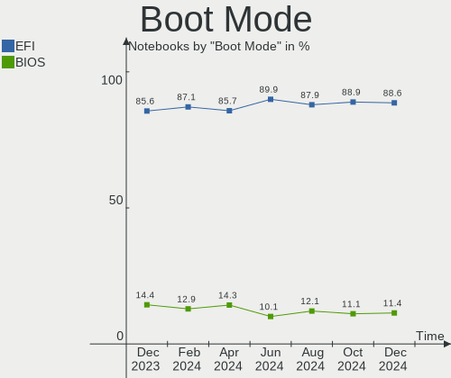
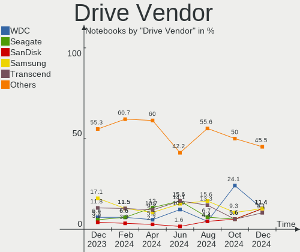
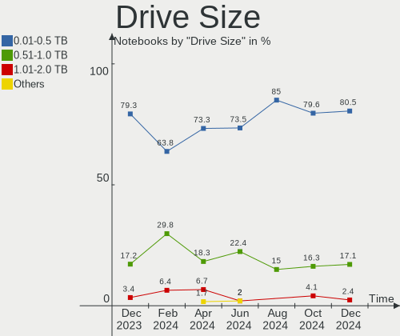
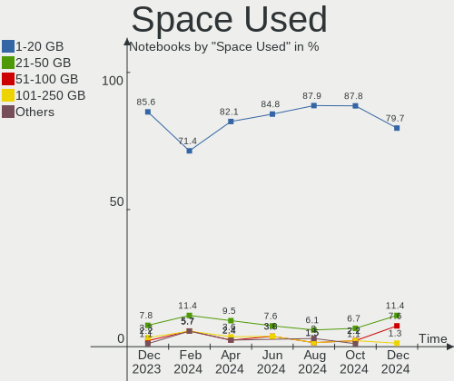
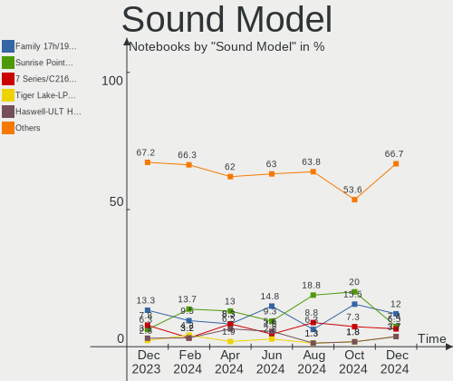

BSD Hardware Trends (Notebook)
------------------------------

A project to identify most popular hardware characteristics and track their change
over time based on data collected by BSD users at https://BSD-Hardware.info.

Anyone can contribute to the study by uploading probes of their computers by
the [hw-probe](https://github.com/linuxhw/hw-probe/blob/master/INSTALL.BSD.md) tool:

    hw-probe -all -upload

Full-feature report is available here: https://bsd-hardware.info/?view=trends&formfactor=notebook

Period: Oct, 2020.

Contents
--------

- [ OS                       ](#os)
- [ OS Family                ](#os-family)
- [ Arch                     ](#arch)
- [ DE                       ](#de)
- [ Display Server           ](#display-server)
- [ Display Manager          ](#display-manager)
- [ OS Lang                  ](#os-lang)
- [ Boot Mode                ](#boot-mode)
- [ Filesystem               ](#filesystem)
- [ Part. scheme             ](#part-scheme)
- [ Country                  ](#country)
- [ City                     ](#city)
- [ Vendor                   ](#vendor)
- [ Model                    ](#model)
- [ Model Family             ](#model-family)
- [ MFG Year                 ](#mfg-year)
- [ Form Factor              ](#form-factor)
- [ Coreboot                 ](#coreboot)
- [ RAM Size                 ](#ram-size)
- [ RAM Used                 ](#ram-used)
- [ Has CD-ROM               ](#has-cd-rom)
- [ Total Drives             ](#total-drives)
- [ Has Ethernet             ](#has-ethernet)
- [ Drive Vendor             ](#drive-vendor)
- [ HDD Vendor               ](#hdd-vendor)
- [ SSD Vendor               ](#ssd-vendor)
- [ Drive Model              ](#drive-model)
- [ Drive Kind               ](#drive-kind)
- [ Drive Connector          ](#drive-connector)
- [ Drive Size               ](#drive-size)
- [ Space Total              ](#space-total)
- [ Space Used               ](#space-used)
- [ Malfunc. Drives          ](#malfunc-drives)
- [ Malfunc. Drive Vendor    ](#malfunc-drive-vendor)
- [ Malfunc. HDD Vendor      ](#malfunc-hdd-vendor)
- [ Malfunc. Drive Kind      ](#malfunc-drive-kind)
- [ Failed Drives            ](#failed-drives)
- [ Failed Drive Vendor      ](#failed-drive-vendor)
- [ Drive Status             ](#drive-status)
- [ Storage Vendor           ](#storage-vendor)
- [ Storage Model            ](#storage-model)
- [ Storage Kind             ](#storage-kind)
- [ CPU Vendor               ](#cpu-vendor)
- [ CPU Model                ](#cpu-model)
- [ CPU Model Family         ](#cpu-model-family)
- [ CPU Cores                ](#cpu-cores)
- [ CPU Sockets              ](#cpu-sockets)
- [ CPU Threads              ](#cpu-threads)
- [ CPU Microarch            ](#cpu-microarch)
- [ GPU Vendor               ](#gpu-vendor)
- [ GPU Model                ](#gpu-model)
- [ GPU Combo                ](#gpu-combo)
- [ GPU Driver               ](#gpu-driver)
- [ GPU Memory               ](#gpu-memory)
- [ Monitor Vendor           ](#monitor-vendor)
- [ Monitor Model            ](#monitor-model)
- [ Monitor Resolution       ](#monitor-resolution)
- [ Monitor Diagonal         ](#monitor-diagonal)
- [ Monitor Width            ](#monitor-width)
- [ Aspect Ratio             ](#aspect-ratio)
- [ Monitor Area             ](#monitor-area)
- [ Pixel Density            ](#pixel-density)
- [ Multiple Monitors        ](#multiple-monitors)
- [ Net Controller Vendor    ](#net-controller-vendor)
- [ Net Controller Model     ](#net-controller-model)
- [ Wireless Vendor          ](#wireless-vendor)
- [ Wireless Model           ](#wireless-model)
- [ Ethernet Vendor          ](#ethernet-vendor)
- [ Ethernet Model           ](#ethernet-model)
- [ Net Controller Kind      ](#net-controller-kind)
- [ Used Controller          ](#used-controller)
- [ NICs                     ](#nics)
- [ Memory Vendor            ](#memory-vendor)
- [ Memory Model             ](#memory-model)
- [ Memory Kind              ](#memory-kind)
- [ Memory Form Factor       ](#memory-form-factor)
- [ Memory Size              ](#memory-size)
- [ Memory Speed             ](#memory-speed)
- [ Sound Vendor             ](#sound-vendor)
- [ Sound Model              ](#sound-model)
- [ Camera Vendor            ](#camera-vendor)
- [ Camera Model             ](#camera-model)
- [ Fingerprint Vendor       ](#fingerprint-vendor)
- [ Fingerprint Model        ](#fingerprint-model)
- [ Chipcard Vendor          ](#chipcard-vendor)
- [ Chipcard Model           ](#chipcard-model)
- [ Printer Vendor           ](#printer-vendor)
- [ Printer Model            ](#printer-model)
- [ Scanner Vendor           ](#scanner-vendor)
- [ Scanner Model            ](#scanner-model)
- [ Bluetooth Vendor         ](#bluetooth-vendor)
- [ Bluetooth Model          ](#bluetooth-model)
- [ Unsupported Devices      ](#unsupported-devices)
- [ Unsupported Device Types ](#unsupported-device-types)

OS
--

Installed operating systems

| Name                 | Notebooks | Percent |
|----------------------|-----------|---------|
| OpenBSD 6.8          | 12        | 22.22%  |
| FreeBSD 12.1-p10     | 11        | 20.37%  |
| FreeBSD 12.2         | 9         | 16.67%  |
| FreeBSD 12.1         | 5         | 9.26%   |
| NomadBSD 1.3.2       | 4         | 7.41%   |
| FreeBSD 13.0-CURRENT | 4         | 7.41%   |
| GhostBSD 20.04.02    | 3         | 5.56%   |
| FreeBSD 11.4-p4      | 2         | 3.7%    |
| FreeBSD 12.1-p9      | 1         | 1.85%   |
| FreeBSD 12.1-p3      | 1         | 1.85%   |
| FreeBSD 12.1-p1      | 1         | 1.85%   |
| FreeBSD 12.0         | 1         | 1.85%   |

OS Family
---------

OS without a version

| Name     | Notebooks | Percent |
|----------|-----------|---------|
| FreeBSD  | 35        | 64.81%  |
| OpenBSD  | 12        | 22.22%  |
| NomadBSD | 4         | 7.41%   |
| GhostBSD | 3         | 5.56%   |

Arch
----

OS architecture (x86_64, i586, etc.)

| Name  | Notebooks | Percent |
|-------|-----------|---------|
| amd64 | 49        | 90.74%  |
| i386  | 5         | 9.26%   |

DE
--

Desktop Environment

| Name      | Notebooks | Percent |
|-----------|-----------|---------|
| XFCE      | 13        | 24.07%  |
| fvwm      | 10        | 18.52%  |
| Openbox   | 7         | 12.96%  |
| i3        | 5         | 9.26%   |
| GNOME     | 5         | 9.26%   |
| MATE      | 4         | 7.41%   |
| TWM       | 3         | 5.56%   |
| Console   | 3         | 5.56%   |
| KDE5      | 2         | 3.7%    |
| CDE       | 1         | 1.85%   |
| AwesomeWM | 1         | 1.85%   |

Display Server
--------------

X11 or Wayland

| Name    | Notebooks | Percent |
|---------|-----------|---------|
| X11     | 51        | 94.44%  |
| Console | 3         | 5.56%   |

Display Manager
---------------

SDDM, LightDM, etc.

| Name    | Notebooks | Percent |
|---------|-----------|---------|
| Console | 20        | 37.04%  |
| SLiM    | 14        | 25.93%  |
| SDDM    | 6         | 11.11%  |
| LightDM | 5         | 9.26%   |
| GDM     | 5         | 9.26%   |
| XDM     | 4         | 7.41%   |

OS Lang
-------

Language

| Lang    | Notebooks | Percent |
|---------|-----------|---------|
| Unknown | 24        | 44.44%  |
| en_US   | 13        | 24.07%  |
| it_IT   | 3         | 5.56%   |
| C       | 3         | 5.56%   |
| es_ES   | 2         | 3.7%    |
| en_AU   | 2         | 3.7%    |
| de_DE   | 2         | 3.7%    |
| sl_SI   | 1         | 1.85%   |
| ru_RU   | 1         | 1.85%   |
| fr_FR   | 1         | 1.85%   |
| en_GB   | 1         | 1.85%   |
| en_CA   | 1         | 1.85%   |

Boot Mode
---------

EFI or BIOS

| Mode | Notebooks | Percent |
|------|-----------|---------|
| EFI  | 29        | 53.7%   |
| BIOS | 25        | 46.3%   |

Filesystem
----------

Type of filesystem

| Type | Notebooks | Percent |
|------|-----------|---------|
| Ufs  | 29        | 53.7%   |
| Zfs  | 25        | 46.3%   |

Part. scheme
------------

Scheme of partitioning

| Type | Notebooks | Percent |
|------|-----------|---------|
| GPT  | 41        | 75.93%  |
| MBR  | 13        | 24.07%  |

Country
-------

Geographic location (country)

| Country            | Notebooks | Percent |
|--------------------|-----------|---------|
| USA                | 6         | 11.11%  |
| Russia             | 6         | 11.11%  |
| Germany            | 6         | 11.11%  |
| Italy              | 5         | 9.26%   |
| Poland             | 3         | 5.56%   |
| Australia          | 3         | 5.56%   |
| Ukraine            | 2         | 3.7%    |
| UK                 | 2         | 3.7%    |
| Spain              | 2         | 3.7%    |
| Indonesia          | 2         | 3.7%    |
| France             | 2         | 3.7%    |
| Canada             | 2         | 3.7%    |
| Switzerland        | 1         | 1.85%   |
| Slovenia           | 1         | 1.85%   |
| Singapore          | 1         | 1.85%   |
| Saudi Arabia       | 1         | 1.85%   |
| Norway             | 1         | 1.85%   |
| New Zealand        | 1         | 1.85%   |
| Korea, Republic of | 1         | 1.85%   |
| Iran               | 1         | 1.85%   |
| Honduras           | 1         | 1.85%   |
| Czech Republic     | 1         | 1.85%   |
| Croatia            | 1         | 1.85%   |
| Colombia           | 1         | 1.85%   |
| Austria            | 1         | 1.85%   |

City
----

Geographic location (city)

| City                | Notebooks | Percent |
|---------------------|-----------|---------|
| Vladivostok         | 2         | 3.7%    |
| Sydney              | 2         | 3.7%    |
| Sassuolo            | 2         | 3.7%    |
| Rome                | 2         | 3.7%    |
| Paisley             | 2         | 3.7%    |
| Moscow              | 2         | 3.7%    |
| Jakarta             | 2         | 3.7%    |
| České Budějovice | 1         | 1.85%   |
| Zgierz              | 1         | 1.85%   |
| Zagreb              | 1         | 1.85%   |
| Vienna              | 1         | 1.85%   |
| Tehran              | 1         | 1.85%   |
| Tegucigalpa         | 1         | 1.85%   |
| St Petersburg       | 1         | 1.85%   |
| Singapore           | 1         | 1.85%   |
| Secaucus            | 1         | 1.85%   |
| Schwabach           | 1         | 1.85%   |
| Santa Rosa          | 1         | 1.85%   |
| Sallanches          | 1         | 1.85%   |
| Rotorua             | 1         | 1.85%   |
| Rosny-sous-Bois     | 1         | 1.85%   |
| Regensburg          | 1         | 1.85%   |
| Ottawa              | 1         | 1.85%   |
| Montreal            | 1         | 1.85%   |
| Milan               | 1         | 1.85%   |
| Madison             | 1         | 1.85%   |
| Lübeck             | 1         | 1.85%   |
| Ljubljana           | 1         | 1.85%   |
| Lenzburg            | 1         | 1.85%   |
| Langenhagen         | 1         | 1.85%   |
| Kyiv                | 1         | 1.85%   |
| Krasnoyarsk         | 1         | 1.85%   |
| Krakow              | 1         | 1.85%   |
| Konstantinovka      | 1         | 1.85%   |
| Kansas City         | 1         | 1.85%   |
| Jeddah              | 1         | 1.85%   |
| Ibiza Town          | 1         | 1.85%   |
| Halden              | 1         | 1.85%   |
| Gwangmyeong-si      | 1         | 1.85%   |
| Gettysburg          | 1         | 1.85%   |
| Gdańsk             | 1         | 1.85%   |
| Frederick           | 1         | 1.85%   |
| Erlangen            | 1         | 1.85%   |
| Cundinamarca        | 1         | 1.85%   |
| Crows Nest          | 1         | 1.85%   |
| Berlin              | 1         | 1.85%   |
| Barcelona           | 1         | 1.85%   |

Vendor
------

Motherboard manufacturer

| Name                           | Notebooks | Percent |
|--------------------------------|-----------|---------|
| Lenovo                         | 23        | 42.59%  |
| Acer                           | 7         | 12.96%  |
| Dell                           | 6         | 11.11%  |
| Hewlett-Packard                | 4         | 7.41%   |
| Apple                          | 3         | 5.56%   |
| Toshiba                        | 2         | 3.7%    |
| System76                       | 1         | 1.85%   |
| Sony                           | 1         | 1.85%   |
| Schenker                       | 1         | 1.85%   |
| Matsushita Electric Industrial | 1         | 1.85%   |
| HUAWEI                         | 1         | 1.85%   |
| Google                         | 1         | 1.85%   |
| Fujitsu                        | 1         | 1.85%   |
| ASUSTek Computer               | 1         | 1.85%   |
| Alienware                      | 1         | 1.85%   |

Model
-----

Motherboard model

| Name                                        | Notebooks | Percent |
|---------------------------------------------|-----------|---------|
| Apple MacBookAir7,2                         | 2         | 3.7%    |
| Toshiba Satellite L50-C                     | 1         | 1.85%   |
| Toshiba Satellite C655D                     | 1         | 1.85%   |
| System76 Lemur Pro                          | 1         | 1.85%   |
| Sony SVP1321V9RB                            | 1         | 1.85%   |
| Schenker N13xWU                             | 1         | 1.85%   |
| Matsushita Electric Industrial CF-51RCVDNLM | 1         | 1.85%   |
| Lenovo Y50-70 20378                         | 1         | 1.85%   |
| Lenovo ThinkPad X61 7675A29                 | 1         | 1.85%   |
| Lenovo ThinkPad X60s 17033JM                | 1         | 1.85%   |
| Lenovo ThinkPad X230 23257Y1                | 1         | 1.85%   |
| Lenovo ThinkPad X230 23254S6                | 1         | 1.85%   |
| Lenovo ThinkPad X230 2320JXM                | 1         | 1.85%   |
| Lenovo ThinkPad X220 4291OQ6                | 1         | 1.85%   |
| Lenovo ThinkPad X1 Carbon 5th 20HRCTO1WW    | 1         | 1.85%   |
| Lenovo ThinkPad W530 2436CTO                | 1         | 1.85%   |
| Lenovo ThinkPad W520 4284W5L                | 1         | 1.85%   |
| Lenovo ThinkPad T495s 20QKS1812F            | 1         | 1.85%   |
| Lenovo ThinkPad T495 20NJS0KP00             | 1         | 1.85%   |
| Lenovo ThinkPad T490 20N3X50500             | 1         | 1.85%   |
| Lenovo ThinkPad T480 20L5S1S000             | 1         | 1.85%   |
| Lenovo ThinkPad T430 23501B3                | 1         | 1.85%   |
| Lenovo ThinkPad T410 2537AT1                | 1         | 1.85%   |
| Lenovo ThinkPad S5-S540 20B3001XFR          | 1         | 1.85%   |
| Lenovo ThinkPad E495 20NE0001US             | 1         | 1.85%   |
| Lenovo ThinkPad E490 20N8CTO1WW             | 1         | 1.85%   |
| Lenovo IdeaPad S540-15IWL GTX 81SW          | 1         | 1.85%   |
| Lenovo G50-80 80E5                          | 1         | 1.85%   |
| Lenovo G50-45 80E3                          | 1         | 1.85%   |
| Lenovo 3000 N100 0768B9G                    | 1         | 1.85%   |
| HUAWEI MACH-WX9                             | 1         | 1.85%   |
| HP ProBook 6550b                            | 1         | 1.85%   |
| HP OmniBook PC                              | 1         | 1.85%   |
| HP Laptop 15-da0xxx                         | 1         | 1.85%   |
| HP 635                                      | 1         | 1.85%   |
| Google Chell                                | 1         | 1.85%   |
| Fujitsu LIFEBOOK AH531                      | 1         | 1.85%   |
| Dell Vostro 3550                            | 1         | 1.85%   |
| Dell Precision M4800                        | 1         | 1.85%   |
| Dell Latitude E7240                         | 1         | 1.85%   |
| Dell Latitude C400                          | 1         | 1.85%   |
| Dell Inspiron MM061                         | 1         | 1.85%   |
| Dell Inspiron 3542                          | 1         | 1.85%   |
| ASUS TUF Gaming FX505DT_FX505DT             | 1         | 1.85%   |
| Apple MacBookAir6,2                         | 1         | 1.85%   |
| Alienware m15                               | 1         | 1.85%   |
| Acer Peppy                                  | 1         | 1.85%   |
| Acer Extensa 2540                           | 1         | 1.85%   |
| Acer Aspire V5-531                          | 1         | 1.85%   |
| Acer Aspire V3-575G                         | 1         | 1.85%   |
| Acer Aspire one                             | 1         | 1.85%   |
| Acer Aspire E1-532                          | 1         | 1.85%   |
| Acer Aspire A315-42                         | 1         | 1.85%   |

Model Family
------------

Motherboard model prefix

| Name                                        | Notebooks | Percent |
|---------------------------------------------|-----------|---------|
| Lenovo ThinkPad                             | 18        | 33.33%  |
| Acer Aspire                                 | 5         | 9.26%   |
| Toshiba Satellite                           | 2         | 3.7%    |
| Dell Latitude                               | 2         | 3.7%    |
| Dell Inspiron                               | 2         | 3.7%    |
| Apple MacBookAir7                           | 2         | 3.7%    |
| System76 Lemur                              | 1         | 1.85%   |
| Sony SVP1321V9RB                            | 1         | 1.85%   |
| Schenker N13xWU                             | 1         | 1.85%   |
| Matsushita Electric Industrial CF-51RCVDNLM | 1         | 1.85%   |
| Lenovo Y50-70                               | 1         | 1.85%   |
| Lenovo IdeaPad                              | 1         | 1.85%   |
| Lenovo G50-80                               | 1         | 1.85%   |
| Lenovo G50-45                               | 1         | 1.85%   |
| Lenovo 3000                                 | 1         | 1.85%   |
| HUAWEI MACH-WX9                             | 1         | 1.85%   |
| HP ProBook                                  | 1         | 1.85%   |
| HP OmniBook                                 | 1         | 1.85%   |
| HP Laptop                                   | 1         | 1.85%   |
| HP 635                                      | 1         | 1.85%   |
| Google Chell                                | 1         | 1.85%   |
| Fujitsu LIFEBOOK                            | 1         | 1.85%   |
| Dell Vostro                                 | 1         | 1.85%   |
| Dell Precision                              | 1         | 1.85%   |
| ASUS TUF                                    | 1         | 1.85%   |
| Apple MacBookAir6                           | 1         | 1.85%   |
| Alienware m15                               | 1         | 1.85%   |
| Acer Peppy                                  | 1         | 1.85%   |
| Acer Extensa                                | 1         | 1.85%   |

MFG Year
--------

Motherboard manufacture year

| Year | Notebooks | Percent |
|------|-----------|---------|
| 2020 | 11        | 20.37%  |
| 2018 | 7         | 12.96%  |
| 2019 | 6         | 11.11%  |
| 2015 | 6         | 11.11%  |
| 2014 | 4         | 7.41%   |
| 2017 | 3         | 5.56%   |
| 2012 | 3         | 5.56%   |
| 2011 | 3         | 5.56%   |
| 2007 | 3         | 5.56%   |
| 2010 | 2         | 3.7%    |
| 2016 | 1         | 1.85%   |
| 2013 | 1         | 1.85%   |
| 2009 | 1         | 1.85%   |
| 2006 | 1         | 1.85%   |
| 2004 | 1         | 1.85%   |
| 2003 | 1         | 1.85%   |

Form Factor
-----------

Physical design of the computer

| Name     | Notebooks | Percent |
|----------|-----------|---------|
| Notebook | 54        | 100%    |

Coreboot
--------

Have coreboot on board

| Used | Notebooks | Percent |
|------|-----------|---------|
| No   | 50        | 92.59%  |
| Yes  | 4         | 7.41%   |

RAM Size
--------

Total RAM memory

| Size in GB | Notebooks | Percent |
|------------|-----------|---------|
| 8.01-16.0  | 18        | 33.33%  |
| 16.01-24.0 | 13        | 24.07%  |
| 4.01-8.0   | 8         | 14.81%  |
| 32.01-64.0 | 4         | 7.41%   |
| 0.01-1.0   | 4         | 7.41%   |
| 3.01-4.0   | 3         | 5.56%   |
| 2.01-3.0   | 2         | 3.7%    |
| 24.01-32.0 | 1         | 1.85%   |
| 1.01-2.0   | 1         | 1.85%   |

RAM Used
--------

Used RAM memory

| Used GB    | Notebooks | Percent |
|------------|-----------|---------|
| 0.01-1.0   | 42        | 77.78%  |
| 2.01-3.0   | 4         | 7.41%   |
| 0          | 4         | 7.41%   |
| 4.01-8.0   | 1         | 1.85%   |
| 3.01-4.0   | 1         | 1.85%   |
| 16.01-24.0 | 1         | 1.85%   |
| 1.01-2.0   | 1         | 1.85%   |

Has CD-ROM
----------

Has CD-ROM on board

| Presented | Notebooks | Percent |
|-----------|-----------|---------|
| No        | 42        | 77.78%  |
| Yes       | 12        | 22.22%  |

Total Drives
------------

Number of drives on board

| Drives | Notebooks | Percent |
|--------|-----------|---------|
| 1      | 37        | 68.52%  |
| 2      | 14        | 25.93%  |
| 4      | 1         | 1.85%   |
| 3      | 1         | 1.85%   |
| 0      | 1         | 1.85%   |

Has Ethernet
------------

Has Ethernet on board

| Presented | Notebooks | Percent |
|-----------|-----------|---------|
| Yes       | 45        | 83.33%  |
| No        | 9         | 16.67%  |

Drive Vendor
------------

Hard drive vendors

| Vendor              | Notebooks | Drives | Percent |
|---------------------|-----------|--------|---------|
| WDC                 | 14        | 14     | 20.9%   |
| Samsung Electronics | 11        | 12     | 16.42%  |
| Toshiba             | 7         | 7      | 10.45%  |
| Seagate             | 4         | 4      | 5.97%   |
| SanDisk             | 3         | 3      | 4.48%   |
| Hitachi             | 3         | 3      | 4.48%   |
| Apple               | 3         | 3      | 4.48%   |
| Union Memory        | 2         | 2      | 2.99%   |
| SK Hynix            | 2         | 2      | 2.99%   |
| Micron Technology   | 2         | 2      | 2.99%   |
| Kingston            | 2         | 2      | 2.99%   |
| Intel               | 2         | 2      | 2.99%   |
| HGST                | 2         | 2      | 2.99%   |
| Transcend           | 1         | 1      | 1.49%   |
| Team                | 1         | 1      | 1.49%   |
| SPCC                | 1         | 1      | 1.49%   |
| Phison              | 1         | 1      | 1.49%   |
| NVMe                | 1         | 2      | 1.49%   |
| KingDian            | 1         | 1      | 1.49%   |
| Dogfish             | 1         | 1      | 1.49%   |
| Crucial             | 1         | 1      | 1.49%   |
| Apacer              | 1         | 1      | 1.49%   |
| A-DATA Technology   | 1         | 1      | 1.49%   |

HDD Vendor
----------

Hard disk drive vendors

| Vendor  | Notebooks | Drives | Percent |
|---------|-----------|--------|---------|
| WDC     | 10        | 10     | 41.67%  |
| Toshiba | 4         | 4      | 16.67%  |
| Seagate | 4         | 4      | 16.67%  |
| Hitachi | 3         | 3      | 12.5%   |
| HGST    | 2         | 2      | 8.33%   |
| NVMe    | 1         | 2      | 4.17%   |

SSD Vendor
----------

Solid state drive vendors

| Vendor              | Notebooks | Drives | Percent |
|---------------------|-----------|--------|---------|
| Samsung Electronics | 9         | 10     | 30%     |
| WDC                 | 3         | 3      | 10%     |
| SanDisk             | 3         | 3      | 10%     |
| Apple               | 3         | 3      | 10%     |
| Kingston            | 2         | 2      | 6.67%   |
| Transcend           | 1         | 1      | 3.33%   |
| Toshiba             | 1         | 1      | 3.33%   |
| Team                | 1         | 1      | 3.33%   |
| SK Hynix            | 1         | 1      | 3.33%   |
| Micron Technology   | 1         | 1      | 3.33%   |
| KingDian            | 1         | 1      | 3.33%   |
| Intel               | 1         | 1      | 3.33%   |
| Dogfish             | 1         | 1      | 3.33%   |
| Crucial             | 1         | 1      | 3.33%   |
| Apacer              | 1         | 1      | 3.33%   |

Drive Model
-----------

Hard drive models

| Model                              | Notebooks | Percent |
|------------------------------------|-----------|---------|
| SSD U110 16GB                      | 2         | 2.94%   |
| SSD SM0128G 121GB                  | 2         | 2.94%   |
| SSD 860 EVO 250GB                  | 2         | 2.94%   |
| SSD 850 EVO 500GB                  | 2         | 2.94%   |
| MQ04ABF100 1TB                     | 2         | 2.94%   |
| HTS543232A7A384 320GB              | 2         | 2.94%   |
| WDS240G2G0A-00JH30 240GB           | 1         | 1.47%   |
| WDS120G1G0A-00SS50 120GB           | 1         | 1.47%   |
| WDBNCE5000PNC 500GB                | 1         | 1.47%   |
| WD5000LPCX-24VHAT0 500GB           | 1         | 1.47%   |
| WD5000LPCX-21VHAT0 500GB           | 1         | 1.47%   |
| WD3200BEVE-00A0HT0 320GB           | 1         | 1.47%   |
| WD3200BEKT-75PVMT1 320GB           | 1         | 1.47%   |
| WD2500LPCX-24C6HT0 250GB           | 1         | 1.47%   |
| WD1600BEVT-22ZCT0 160GB            | 1         | 1.47%   |
| WD10SPZX-24Z10 1TB                 | 1         | 1.47%   |
| WD10SPZX-21Z10T0 1TB               | 1         | 1.47%   |
| WD10SPZX-00Z10T0 1TB               | 1         | 1.47%   |
| WD10JPCX-24UE4T0 1TB               | 1         | 1.47%   |
| UMIS LENSE40512GMSP34MESTB3A 512GB | 1         | 1.47%   |
| TS128GMSA370 128GB                 | 1         | 1.47%   |
| TR200 240GB                        | 1         | 1.47%   |
| T253X1240G 240GB                   | 1         | 1.47%   |
| SX6000LNP 512GB                    | 1         | 1.47%   |
| SUV400S37 120G                     | 1         | 1.47%   |
| ST9120822AS 120GB                  | 1         | 1.47%   |
| ST6000VN0041-2EL11C 6TB            | 1         | 1.47%   |
| ST1000LX015-1U7172 1TB             | 1         | 1.47%   |
| ST1000LM024 HN-M101MBB 1TB         | 1         | 1.47%   |
| SSDSC2BF180A4L 180GB               | 1         | 1.47%   |
| SSDPEKKF512G8L 512GB               | 1         | 1.47%   |
| SSD SD0128F 121GB                  | 1         | 1.47%   |
| SSD PM830 mSATA 128GB              | 1         | 1.47%   |
| SSD 970 EVO Plus 250GB             | 1         | 1.47%   |
| SSD 860 QVO 4TB                    | 1         | 1.47%   |
| SSD 860 QVO 1TB                    | 1         | 1.47%   |
| SSD 860 EVO 500GB                  | 1         | 1.47%   |
| SSD 850 EVO M.2 250GB              | 1         | 1.47%   |
| SSD 64GB                           | 1         | 1.47%   |
| SNS4151S316G 16GB                  | 1         | 1.47%   |
| SD7SF6S512G1122 512GB              | 1         | 1.47%   |
| SC210 mSATA 256GB                  | 1         | 1.47%   |
| S280 120GB                         | 1         | 1.47%   |
| RPFTJ128PDD2EWX 128GB              | 1         | 1.47%   |
| PCIe SSD 512GB                     | 1         | 1.47%   |
| PC SN730 SDBQNTY-512G-1001 512GB   | 1         | 1.47%   |
| MZVLB512HAJQ-000L7 512GB           | 1         | 1.47%   |
| MZ7TD256HAFV-000L7 256GB           | 1         | 1.47%   |
| MTFDDAT128MAM-1J2 128GB            | 1         | 1.47%   |
| MK3265GSXN 320GB                   | 1         | 1.47%   |
| MK1517GAP 16GB                     | 1         | 1.47%   |
| M.2 PCIe SSD 1TB                   | 1         | 1.47%   |
| KXG50ZNV512G 512GB                 | 1         | 1.47%   |
| KXG50ZNV1T02 NVM 1TB               | 1         | 1.47%   |
| KBG30ZMT512G 512GB                 | 1         | 1.47%   |
| HTS721010A9E630 1TB                | 1         | 1.47%   |
| HTS541010A9E680 1TB                | 1         | 1.47%   |
| HFM256GDJTNG-8310A 256GB           | 1         | 1.47%   |
| DK23AA-12 12GB                     | 1         | 1.47%   |
| CT1000MX500SSD1 1TB                | 1         | 1.47%   |

Drive Kind
----------

HDD or SSD

| Kind | Notebooks | Drives | Percent |
|------|-----------|--------|---------|
| SSD  | 27        | 31     | 42.19%  |
| HDD  | 24        | 25     | 37.5%   |
| NVMe | 13        | 13     | 20.31%  |

Drive Connector
---------------

SATA, SAS, NVMe, etc.

| Type | Notebooks | Drives | Percent |
|------|-----------|--------|---------|
| SATA | 43        | 56     | 76.79%  |
| NVMe | 13        | 13     | 23.21%  |

Drive Size
----------

Size of hard drive

| Size in TB | Notebooks | Drives | Percent |
|------------|-----------|--------|---------|
| 0.01-0.5   | 34        | 39     | 70.83%  |
| 0.51-1.0   | 11        | 13     | 22.92%  |
| 3.01-4.0   | 1         | 1      | 2.08%   |
| 1.01-2.0   | 1         | 2      | 2.08%   |
| 4.01-10.0  | 1         | 1      | 2.08%   |

Space Total
-----------

Amount of disk space available on the file system

| Size in GB     | Notebooks | Percent |
|----------------|-----------|---------|
| 251-500        | 17        | 31.48%  |
| 101-250        | 17        | 31.48%  |
| 1-20           | 8         | 14.81%  |
| 501-1000       | 4         | 7.41%   |
| 51-100         | 4         | 7.41%   |
| 1001-2000      | 2         | 3.7%    |
| More than 3000 | 1         | 1.85%   |
| 21-50          | 1         | 1.85%   |

Space Used
----------

Amount of used disk space

| Used GB        | Notebooks | Percent |
|----------------|-----------|---------|
| 1-20           | 36        | 66.67%  |
| 21-50          | 9         | 16.67%  |
| 101-250        | 4         | 7.41%   |
| 51-100         | 2         | 3.7%    |
| More than 3000 | 1         | 1.85%   |
| 251-500        | 1         | 1.85%   |
| 501-1000       | 1         | 1.85%   |

Malfunc. Drives
---------------

Drive models with a malfunction

| Model                 | Notebooks | Drives | Percent |
|-----------------------|-----------|--------|---------|
| ST9120822AS 120GB     | 1         | 1      | 14.29%  |
| SSDSC2BF180A4L 180GB  | 1         | 1      | 14.29%  |
| SNS4151S316G 16GB     | 1         | 1      | 14.29%  |
| SC210 mSATA 256GB     | 1         | 1      | 14.29%  |
| MK3265GSXN 320GB      | 1         | 1      | 14.29%  |
| HTS543232A7A384 320GB | 1         | 1      | 14.29%  |
| DK23AA-12 12GB        | 1         | 1      | 14.29%  |

Malfunc. Drive Vendor
---------------------

Vendors of faulty drives

| Vendor   | Notebooks | Drives | Percent |
|----------|-----------|--------|---------|
| Hitachi  | 2         | 2      | 28.57%  |
| Toshiba  | 1         | 1      | 14.29%  |
| SK Hynix | 1         | 1      | 14.29%  |
| Seagate  | 1         | 1      | 14.29%  |
| Kingston | 1         | 1      | 14.29%  |
| Intel    | 1         | 1      | 14.29%  |

Malfunc. HDD Vendor
-------------------

Vendors of faulty HDD drives

| Vendor  | Notebooks | Drives | Percent |
|---------|-----------|--------|---------|
| Hitachi | 2         | 2      | 50%     |
| Toshiba | 1         | 1      | 25%     |
| Seagate | 1         | 1      | 25%     |

Malfunc. Drive Kind
-------------------

Kinds of faulty drives

| Kind | Notebooks | Drives | Percent |
|------|-----------|--------|---------|
| HDD  | 4         | 4      | 57.14%  |
| SSD  | 3         | 3      | 42.86%  |

Failed Drives
-------------

Failed drive models

Zero info for selected period =(

Failed Drive Vendor
-------------------

Failed drive vendors

Zero info for selected period =(

Drive Status
------------

Number of failed and malfunc. drives

| Status   | Notebooks | Drives | Percent |
|----------|-----------|--------|---------|
| Works    | 45        | 60     | 84.91%  |
| Malfunc  | 7         | 7      | 13.21%  |
| Detected | 1         | 2      | 1.89%   |

Storage Vendor
--------------

Storage controller vendors

| Vendor                   | Notebooks | Percent |
|--------------------------|-----------|---------|
| Intel                    | 37        | 63.79%  |
| AMD                      | 5         | 8.62%   |
| Samsung Electronics      | 4         | 6.9%    |
| Toshiba                  | 3         | 5.17%   |
| Union Memory (Shenzhen)  | 2         | 3.45%   |
| Phison Electronics       | 2         | 3.45%   |
| SK Hynix                 | 1         | 1.72%   |
| Sandisk                  | 1         | 1.72%   |
| Realtek Semiconductor    | 1         | 1.72%   |
| Micron Technology        | 1         | 1.72%   |
| Marvell Technology Group | 1         | 1.72%   |

Storage Model
-------------

Storage controller models

| Model                                                                      | Notebooks | Percent |
|----------------------------------------------------------------------------|-----------|---------|
| 7 Series Chipset Family 6-port SATA Controller [AHCI mode]                 | 6         | 9.84%   |
| 8 Series SATA Controller 1 [AHCI mode]                                     | 5         | 8.2%    |
| 6 Series/C200 Series Chipset Family 6 port Mobile SATA AHCI Controller     | 4         | 6.56%   |
| Unknown                                                                    | 4         | 6.56%   |
| Sunrise Point-LP SATA Controller [AHCI mode]                               | 3         | 4.92%   |
| FCH SATA Controller [AHCI mode]                                            | 3         | 4.92%   |
| 82801GBM/GHM (ICH7-M Family) SATA Controller [IDE mode]                    | 3         | 4.92%   |
| unknown                                                                    | 2         | 3.28%   |
| SM951 AHCI                                                                 | 2         | 3.28%   |
| SB7x0/SB8x0/SB9x0 SATA Controller [AHCI mode]                              | 2         | 3.28%   |
| NVMe SSD Controller SM981/PM981/PM983                                      | 2         | 3.28%   |
| E12 NVMe Controller                                                        | 2         | 3.28%   |
| 82801GBM/GHM (ICH7-M Family) SATA Controller [AHCI mode]                   | 2         | 3.28%   |
| 82801G (ICH7 Family) IDE Controller                                        | 2         | 3.28%   |
| 82801CAM IDE U100 Controller                                               | 2         | 3.28%   |
| 82801 Mobile SATA Controller [RAID mode]                                   | 2         | 3.28%   |
| 8 Series/C220 Series Chipset Family 6-port SATA Controller 1 [AHCI mode]   | 2         | 3.28%   |
| 5 Series/3400 Series Chipset 6 port SATA AHCI Controller                   | 2         | 3.28%   |
| Wildcat Point-LP SATA Controller [AHCI Mode]                               | 1         | 1.64%   |
| WD Black 2019/PC SN750 NVMe SSD                                            | 1         | 1.64%   |
| SSD Pro 7600p/760p/E 6100p Series                                          | 1         | 1.64%   |
| Cannon Point-LP SATA Controller [AHCI Mode]                                | 1         | 1.64%   |
| Cannon Lake Mobile PCH SATA AHCI Controller                                | 1         | 1.64%   |
| BG3 NVMe SSD Controller                                                    | 1         | 1.64%   |
| BC501 NVMe Solid State Drive 512GB                                         | 1         | 1.64%   |
| Atom/Celeron/Pentium Processor x5-E8000/J3xxx/N3xxx Series SATA Controller | 1         | 1.64%   |
| 88SS9183 PCIe SSD Controller                                               | 1         | 1.64%   |
| 82801HM/HEM (ICH8M/ICH8M-E) SATA Controller [AHCI mode]                    | 1         | 1.64%   |
| 82801HM/HEM (ICH8M/ICH8M-E) IDE Controller                                 | 1         | 1.64%   |

Storage Kind
------------

Kind of storage controller (IDE, SATA, NVMe, SAS, ...)

| Kind | Notebooks | Percent |
|------|-----------|---------|
| SATA | 37        | 60.66%  |
| NVMe | 14        | 22.95%  |
| IDE  | 8         | 13.11%  |
| RAID | 2         | 3.28%   |

CPU Vendor
----------

Processor vendors

| Vendor | Notebooks | Percent |
|--------|-----------|---------|
| Intel  | 46        | 85.19%  |
| AMD    | 8         | 14.81%  |

CPU Model
---------

Processor models

| Model                                                               | Notebooks | Percent |
|---------------------------------------------------------------------|-----------|---------|
| Intel Core i7-8550U CPU @ 1.80GHz                                   | 3         | 5.56%   |
| Intel Core i7-8565U CPU @ 1.80GHz                                   | 2         | 3.7%    |
| Intel Core i5-5350U CPU @ 1.80GHz                                   | 2         | 3.7%    |
| Intel Core i5-4200U CPU @ 1.60GHz                                   | 2         | 3.7%    |
| Intel Celeron 2955U @ 1.40GHz                                       | 2         | 3.7%    |
| AMD Ryzen 7 PRO 3700U w/ Radeon Vega Mobile Gfx                     | 2         | 3.7%    |
| Intel Pentium M                                                     | 1         | 1.85%   |
| Intel Pentium CPU N3700 @ 1.60GHz                                   | 1         | 1.85%   |
| Intel Pentium CPU 967 @ 1.30GHz                                     | 1         | 1.85%   |
| Intel Mobile Pentium III CPU - M 1200MHz ("GenuineIntel" 686-class) | 1         | 1.85%   |
| Intel Mobile Pentium III CPU - M 1000MHz ("GenuineIntel" 686-class) | 1         | 1.85%   |
| Intel CPU T2300 @ 1.66GHz ("GenuineIntel" 686-class)                | 1         | 1.85%   |
| Intel Core m5-6Y57 CPU @ 1.10GHz                                    | 1         | 1.85%   |
| Intel Core i7-8750H CPU @ 2.20GHz                                   | 1         | 1.85%   |
| Intel Core i7-7500U CPU @ 2.70GHz                                   | 1         | 1.85%   |
| Intel Core i7-5500U CPU @ 2.40GHz                                   | 1         | 1.85%   |
| Intel Core i7-4910MQ CPU @ 2.90GHz                                  | 1         | 1.85%   |
| Intel Core i7-4720HQ CPU @ 2.60GHz                                  | 1         | 1.85%   |
| Intel Core i7-3820QM CPU @ 2.70GHz                                  | 1         | 1.85%   |
| Intel Core i7-2820QM CPU @ 2.30GHz                                  | 1         | 1.85%   |
| Intel Core i7-2640M CPU @ 2.80GHz                                   | 1         | 1.85%   |
| Intel Core i5-8365U CPU @ 1.60GHz                                   | 1         | 1.85%   |
| Intel Core i5-8250U CPU @ 1.60GHz                                   | 1         | 1.85%   |
| Intel Core i5-6200U CPU @ 2.30GHz                                   | 1         | 1.85%   |
| Intel Core i5-4310U CPU @ 2.00GHz                                   | 1         | 1.85%   |
| Intel Core i5-4260U CPU @ 1.40GHz                                   | 1         | 1.85%   |
| Intel Core i5-3380M CPU @ 2.90GHz                                   | 1         | 1.85%   |
| Intel Core i5-3360M CPU @ 2.80GHz                                   | 1         | 1.85%   |
| Intel Core i5-3320M CPU @ 2.60GHz                                   | 1         | 1.85%   |
| Intel Core i5-3210M CPU @ 2.50GHz                                   | 1         | 1.85%   |
| Intel Core i5-10210U CPU @ 1.60GHz                                  | 1         | 1.85%   |
| Intel Core i5 CPU M 560 @ 2.67GHz                                   | 1         | 1.85%   |
| Intel Core i5 CPU M 450 @ 2.40GHz                                   | 1         | 1.85%   |
| Intel Core i3-6006U CPU @ 2.00GHz                                   | 1         | 1.85%   |
| Intel Core i3-4030U CPU @ 1.90GHz                                   | 1         | 1.85%   |
| Intel Core i3-2350M CPU @ 2.30GHz                                   | 1         | 1.85%   |
| Intel Core i3-2310M CPU @ 2.10GHz                                   | 1         | 1.85%   |
| Intel Core Duo CPU L2400 @ 1.66GHz ("GenuineIntel" 686-class)       | 1         | 1.85%   |
| Intel Core 2 Duo CPU T7250 @ 2.00GHz                                | 1         | 1.85%   |
| Intel Core 2 CPU T5500 @ 1.66GHz                                    | 1         | 1.85%   |
| Intel Atom CPU N270 @ 1.60GHz                                       | 1         | 1.85%   |
| AMD Ryzen 7 3700U with Radeon Vega Mobile Gfx                       | 1         | 1.85%   |
| AMD Ryzen 5 3550H with Radeon Vega Mobile Gfx                       | 1         | 1.85%   |
| AMD Ryzen 3 3200U with Radeon Vega Mobile Gfx                       | 1         | 1.85%   |
| AMD E1-6010 APU with AMD Radeon R2 Graphics                         | 1         | 1.85%   |
| AMD E-300 APU with Radeon HD Graphics                               | 1         | 1.85%   |
| AMD C-50 Processor                                                  | 1         | 1.85%   |

CPU Model Family
----------------

Processor model prefix

| Model            | Notebooks | Percent |
|------------------|-----------|---------|
| Intel Core i5    | 16        | 29.63%  |
| Intel Core i7    | 13        | 24.07%  |
| Intel Core i3    | 4         | 7.41%   |
| Other            | 3         | 5.56%   |
| Intel Pentium    | 2         | 3.7%    |
| Intel Celeron    | 2         | 3.7%    |
| AMD Ryzen 7 PRO  | 2         | 3.7%    |
| Intel Pentium M  | 1         | 1.85%   |
| Intel Core m5    | 1         | 1.85%   |
| Intel Core Duo   | 1         | 1.85%   |
| Intel Core 2 Duo | 1         | 1.85%   |
| Intel Core 2     | 1         | 1.85%   |
| Intel Atom       | 1         | 1.85%   |
| AMD Ryzen 7      | 1         | 1.85%   |
| AMD Ryzen 5      | 1         | 1.85%   |
| AMD Ryzen 3      | 1         | 1.85%   |
| AMD E1           | 1         | 1.85%   |
| AMD E            | 1         | 1.85%   |
| AMD C-50         | 1         | 1.85%   |

CPU Cores
---------

Number of processor cores

| Number  | Notebooks | Percent |
|---------|-----------|---------|
| 2       | 28        | 51.85%  |
| 4       | 14        | 25.93%  |
| Unknown | 5         | 9.26%   |
| 8       | 4         | 7.41%   |
| 1       | 2         | 3.7%    |
| 6       | 1         | 1.85%   |

CPU Sockets
-----------

Number of sockets

| Number  | Notebooks | Percent |
|---------|-----------|---------|
| 1       | 49        | 90.74%  |
| Unknown | 5         | 9.26%   |

CPU Threads
-----------

Threads per core (Hyper-Threading)

| Number  | Notebooks | Percent |
|---------|-----------|---------|
| 2       | 34        | 62.96%  |
| 1       | 13        | 24.07%  |
| Unknown | 7         | 12.96%  |

CPU Microarch
-------------

Microarchitecture

| Name        | Notebooks | Percent |
|-------------|-----------|---------|
| KabyLake    | 10        | 18.52%  |
| Haswell     | 9         | 16.67%  |
| Zen+        | 5         | 9.26%   |
| SandyBridge | 5         | 9.26%   |
| IvyBridge   | 5         | 9.26%   |
| Skylake     | 3         | 5.56%   |
| P6          | 3         | 5.56%   |
| Core        | 3         | 5.56%   |
| Broadwell   | 3         | 5.56%   |
| Westmere    | 2         | 3.7%    |
| Bobcat      | 2         | 3.7%    |
| Silvermont  | 1         | 1.85%   |
| Puma        | 1         | 1.85%   |
| Bonnell     | 1         | 1.85%   |
| Unknown     | 1         | 1.85%   |

GPU Vendor
----------

Vendors of graphics cards

| Vendor | Notebooks | Percent |
|--------|-----------|---------|
| Intel  | 42        | 67.74%  |
| AMD    | 13        | 20.97%  |
| Nvidia | 7         | 11.29%  |

GPU Model
---------

Graphics card models

| Model                                                                              | Notebooks | Percent |
|------------------------------------------------------------------------------------|-----------|---------|
| Haswell-ULT Integrated Graphics Controller                                         | 7         | 10.45%  |
| Picasso                                                                            | 5         | 7.46%   |
| 3rd Gen Core processor Graphics Controller                                         | 5         | 7.46%   |
| 2nd Generation Core Processor Family Integrated Graphics Controller                | 5         | 7.46%   |
| UHD Graphics 620                                                                   | 4         | 5.97%   |
| Mobile 945GM/GMS/GME, 943/940GML Express Integrated Graphics Controller            | 4         | 5.97%   |
| UHD Graphics 620 (Whiskey Lake)                                                    | 3         | 4.48%   |
| Mobile 945GM/GMS, 943/940GML Express Integrated Graphics Controller                | 3         | 4.48%   |
| TU117M [GeForce GTX 1650 Mobile / Max-Q]                                           | 2         | 2.99%   |
| Skylake GT2 [HD Graphics 520]                                                      | 2         | 2.99%   |
| HD Graphics 6000                                                                   | 2         | 2.99%   |
| Wrestler [Radeon HD 6310]                                                          | 1         | 1.49%   |
| Wrestler [Radeon HD 6250]                                                          | 1         | 1.49%   |
| Whistler [Radeon HD 6630M/6650M/6750M/7670M/7690M]                                 | 1         | 1.49%   |
| UHD Graphics 630 (Mobile)                                                          | 1         | 1.49%   |
| UHD Graphics                                                                       | 1         | 1.49%   |
| Sun XT [Radeon HD 8670A/8670M/8690M / R5 M330 / M430 / Radeon 520 Mobile]          | 1         | 1.49%   |
| RV710/M92 [Mobility Radeon HD 4350/4550]                                           | 1         | 1.49%   |
| RV515/M54 [Mobility Radeon X1400]                                                  | 1         | 1.49%   |
| RV100/M6 [Rage/Radeon Mobility Series]                                             | 1         | 1.49%   |
| Mullins [Radeon R2 Graphics]                                                       | 1         | 1.49%   |
| Mobile GM965/GL960 Integrated Graphics Controller (secondary)                      | 1         | 1.49%   |
| Mobile GM965/GL960 Integrated Graphics Controller (primary)                        | 1         | 1.49%   |
| Mobile 945GSE Express Integrated Graphics Controller                               | 1         | 1.49%   |
| HD Graphics 620                                                                    | 1         | 1.49%   |
| HD Graphics 5500                                                                   | 1         | 1.49%   |
| HD Graphics 515                                                                    | 1         | 1.49%   |
| GP108M [GeForce MX150]                                                             | 1         | 1.49%   |
| GP104M [GeForce GTX 1070 Mobile]                                                   | 1         | 1.49%   |
| GM108M [GeForce MX130]                                                             | 1         | 1.49%   |
| GM108M [GeForce 940M]                                                              | 1         | 1.49%   |
| GK106GLM [Quadro K2100M]                                                           | 1         | 1.49%   |
| Core Processor Integrated Graphics Controller                                      | 1         | 1.49%   |
| Atom/Celeron/Pentium Processor x5-E8000/J3xxx/N3xxx Integrated Graphics Controller | 1         | 1.49%   |
| 82830M/MG Integrated Graphics Controller                                           | 1         | 1.49%   |
| 4th Gen Core Processor Integrated Graphics Controller                              | 1         | 1.49%   |

GPU Combo
---------

Combinations of graphics cards

| Name           | Notebooks | Percent |
|----------------|-----------|---------|
| 1 x Intel      | 30        | 55.56%  |
| 1 x AMD        | 10        | 18.52%  |
| 2 x Intel      | 5         | 9.26%   |
| Intel + Nvidia | 5         | 9.26%   |
| Intel + AMD    | 2         | 3.7%    |
| 1 x Nvidia     | 1         | 1.85%   |
| AMD + Nvidia   | 1         | 1.85%   |

GPU Driver
----------

Free vs proprietary

| Driver      | Notebooks | Percent |
|-------------|-----------|---------|
| Free        | 51        | 94.44%  |
| Proprietary | 2         | 3.7%    |
| Unknown     | 1         | 1.85%   |

GPU Memory
----------

Total video memory

| Size in GB | Notebooks | Percent |
|------------|-----------|---------|
| Unknown    | 45        | 83.33%  |
| 1.01-2.0   | 7         | 12.96%  |
| 3.01-4.0   | 1         | 1.85%   |
| 0.01-0.5   | 1         | 1.85%   |

Monitor Vendor
--------------

Monitor vendors

| Vendor               | Notebooks | Percent |
|----------------------|-----------|---------|
| LG Display           | 9         | 19.15%  |
| AU Optronics         | 9         | 19.15%  |
| Lenovo               | 5         | 10.64%  |
| BOE                  | 5         | 10.64%  |
| Samsung Electronics  | 4         | 8.51%   |
| Chimei Innolux       | 3         | 6.38%   |
| Apple                | 2         | 4.26%   |
| Sharp                | 1         | 2.13%   |
| PANDA                | 1         | 2.13%   |
| Panasonic            | 1         | 2.13%   |
| LG Philips           | 1         | 2.13%   |
| JDI                  | 1         | 2.13%   |
| InfoVision           | 1         | 2.13%   |
| Hewlett-Packard      | 1         | 2.13%   |
| Dell                 | 1         | 2.13%   |
| AOC                  | 1         | 2.13%   |
| Ancor Communications | 1         | 2.13%   |

Monitor Model
-------------

Monitor models

| Model                                              | Notebooks | Percent |
|----------------------------------------------------|-----------|---------|
| LCD Monitor LGD0456 1366x768 340x190mm 15.3-inch   | 2         | 4.26%   |
| LCD Monitor LEN40B2 1920x1080 340x190mm 15.3-inch  | 2         | 4.26%   |
| LCD Monitor BOE0742 1920x1080 310x170mm 13.9-inch  | 2         | 4.26%   |
| Color LCD APPA01B 1440x900 290x180mm 13.4-inch     | 2         | 4.26%   |
| VVX13F009G00 MEI96A2 1920x1080 290x170mm 13.2-inch | 1         | 2.13%   |
| P2720D DELD100 2560x1440 600x340mm 27.2-inch       | 1         | 2.13%   |
| LM133LF5L01 NCP0020 1920x1080 290x170mm 13.2-inch  | 1         | 2.13%   |
| LCD Monitor SHP1430 3840x2160 350x190mm 15.7-inch  | 1         | 2.13%   |
| LCD Monitor SEC3047 1366x768 280x160mm 12.7-inch   | 1         | 2.13%   |
| LCD Monitor SDC4852 1366x768 340x190mm 15.3-inch   | 1         | 2.13%   |
| LCD Monitor SDC415A 3200x1800 290x160mm 13.0-inch  | 1         | 2.13%   |
| LCD Monitor SDC4141 1366x768 340x190mm 15.3-inch   | 1         | 2.13%   |
| LCD Monitor LPLC400 1440x900 330x210mm 15.4-inch   | 1         | 2.13%   |
| LCD Monitor LGD0430 1366x768 350x190mm 15.7-inch   | 1         | 2.13%   |
| LCD Monitor LGD033B 1366x768 340x190mm 15.3-inch   | 1         | 2.13%   |
| LCD Monitor LGD033A 1366x768 340x190mm 15.3-inch   | 1         | 2.13%   |
| LCD Monitor LGD02F1 1366x768 340x190mm 15.3-inch   | 1         | 2.13%   |
| LCD Monitor LGD02E3 1366x768 340x190mm 15.3-inch   | 1         | 2.13%   |
| LCD Monitor LGD02DC 1366x768 340x190mm 15.3-inch   | 1         | 2.13%   |
| LCD Monitor LGD02D8 1366x768 280x160mm 12.7-inch   | 1         | 2.13%   |
| LCD Monitor LEN40A3 1920x1080 310x170mm 13.9-inch  | 1         | 2.13%   |
| LCD Monitor LEN4036 1440x900 300x190mm 14.0-inch   | 1         | 2.13%   |
| LCD Monitor LEN4000 1024x768 250x180mm 12.1-inch   | 1         | 2.13%   |
| LCD Monitor JDI422A 3000x2000 290x200mm 13.9-inch  | 1         | 2.13%   |
| LCD Monitor IVO057D 1920x1080 310x170mm 13.9-inch  | 1         | 2.13%   |
| LCD Monitor CMN15E8 1920x1080 340x190mm 15.3-inch  | 1         | 2.13%   |
| LCD Monitor CMN14D4 1920x1080 310x170mm 13.9-inch  | 1         | 2.13%   |
| LCD Monitor CMN1132 1366x768 260x140mm 11.6-inch   | 1         | 2.13%   |
| LCD Monitor BOE0791 1920x1080 310x170mm 13.9-inch  | 1         | 2.13%   |
| LCD Monitor BOE0675 1366x768 340x190mm 15.3-inch   | 1         | 2.13%   |
| LCD Monitor BOE05DA 1366x768 280x160mm 12.7-inch   | 1         | 2.13%   |
| LCD Monitor AUO573D 1920x1080 310x170mm 13.9-inch  | 1         | 2.13%   |
| LCD Monitor AUO38ED 1920x1080 340x190mm 15.3-inch  | 1         | 2.13%   |
| LCD Monitor AUO36ED 1920x1080 340x190mm 15.3-inch  | 1         | 2.13%   |
| LCD Monitor AUO34ED 1920x1080 340x190mm 15.3-inch  | 1         | 2.13%   |
| LCD Monitor AUO34EB 3840x2160 340x190mm 15.3-inch  | 1         | 2.13%   |
| LCD Monitor AUO31EC 1366x768 340x190mm 15.3-inch   | 1         | 2.13%   |
| LCD Monitor AUO313D 1920x1080 310x170mm 13.9-inch  | 1         | 2.13%   |
| LCD Monitor AUO30D2 1024x600 220x130mm 10.1-inch   | 1         | 2.13%   |
| LCD Monitor AUO106C 1366x768 280x160mm 12.7-inch   | 1         | 2.13%   |
| LCD Monitor 2260W 1920x1080                        | 1         | 2.13%   |
| ASUS PB278 ACI27A3 2560x1440 600x340mm 27.2-inch   | 1         | 2.13%   |
| 24fw HPN3605 1920x1080 530x300mm 24.0-inch         | 1         | 2.13%   |

Monitor Resolution
------------------

Monitor screen resolution

| Resolution       | Notebooks | Percent |
|------------------|-----------|---------|
| 1920x1080 (FHD)  | 17        | 36.96%  |
| 1366x768 (WXGA)  | 17        | 36.96%  |
| 1440x900 (WXGA+) | 4         | 8.7%    |
| 3840x2160 (4K)   | 2         | 4.35%   |
| 2560x1440 (QHD)  | 2         | 4.35%   |
| 3200x1800 (QHD+) | 1         | 2.17%   |
| 3000x2000        | 1         | 2.17%   |
| 1024x768 (XGA)   | 1         | 2.17%   |
| 1024x600         | 1         | 2.17%   |

Monitor Diagonal
----------------

Diagonal size in inches

| Inches  | Notebooks | Percent |
|---------|-----------|---------|
| 15      | 21        | 44.68%  |
| 13      | 14        | 29.79%  |
| 12      | 5         | 10.64%  |
| 27      | 2         | 4.26%   |
| 24      | 1         | 2.13%   |
| 14      | 1         | 2.13%   |
| 11      | 1         | 2.13%   |
| 10      | 1         | 2.13%   |
| Unknown | 1         | 2.13%   |

Monitor Width
-------------

Physical width

| Width in mm | Notebooks | Percent |
|-------------|-----------|---------|
| 301-350     | 29        | 61.7%   |
| 201-300     | 14        | 29.79%  |
| 501-600     | 3         | 6.38%   |
| Unknown     | 1         | 2.13%   |

Aspect Ratio
------------

Proportional relationship between the width and the height

| Ratio   | Notebooks | Percent |
|---------|-----------|---------|
| 16/9    | 38        | 84.44%  |
| 16/10   | 4         | 8.89%   |
| 4/3     | 2         | 4.44%   |
| Unknown | 1         | 2.22%   |

Monitor Area
------------

Area in inch²

| Area in inch² | Notebooks | Percent |
|----------------|-----------|---------|
| 91-100         | 18        | 38.3%   |
| 81-90          | 12        | 25.53%  |
| 61-70          | 5         | 10.64%  |
| 71-80          | 3         | 6.38%   |
| 101-110        | 3         | 6.38%   |
| 301-350        | 2         | 4.26%   |
| 51-60          | 1         | 2.13%   |
| 41-50          | 1         | 2.13%   |
| 201-250        | 1         | 2.13%   |
| Unknown        | 1         | 2.13%   |

Pixel Density
-------------

Pixels per inch

| Density       | Notebooks | Percent |
|---------------|-----------|---------|
| 121-160       | 22        | 46.81%  |
| 101-120       | 16        | 34.04%  |
| More than 240 | 4         | 8.51%   |
| 161-240       | 2         | 4.26%   |
| 51-100        | 2         | 4.26%   |
| Unknown       | 1         | 2.13%   |

Multiple Monitors
-----------------

Total monitors connected

| Total | Notebooks | Percent |
|-------|-----------|---------|
| 1     | 44        | 81.48%  |
| 0     | 6         | 11.11%  |
| 2     | 4         | 7.41%   |

Net Controller Vendor
---------------------

Controller vendors

| Vendor                            | Notebooks | Percent |
|-----------------------------------|-----------|---------|
| Intel                             | 38        | 44.19%  |
| Realtek Semiconductor             | 23        | 26.74%  |
| Qualcomm Atheros                  | 12        | 13.95%  |
| Broadcom Inc. and subsidiaries    | 6         | 6.98%   |
| Van Ooijen Technische Informatica | 1         | 1.16%   |
| Ralink Technology                 | 1         | 1.16%   |
| Qualcomm Atheros Communications   | 1         | 1.16%   |
| Marvell Technology Group          | 1         | 1.16%   |
| Ericsson Business Mobile Networks | 1         | 1.16%   |
| Edimax Technology                 | 1         | 1.16%   |
| 3Com                              | 1         | 1.16%   |

Net Controller Model
--------------------

Controller models

| Model                                                     | Notebooks | Percent |
|-----------------------------------------------------------|-----------|---------|
| RTL8111/8168/8411 PCI Express Gigabit Ethernet Controller | 17        | 16.5%   |
| 82579LM Gigabit Network Connection (Lewisville)           | 7         | 6.8%    |
| Wireless-AC 9260                                          | 5         | 4.85%   |
| Wireless 8265 / 8275                                      | 5         | 4.85%   |
| Wireless 7260                                             | 4         | 3.88%   |
| Centrino Advanced-N 6205 [Taylor Peak]                    | 4         | 3.88%   |
| RTL810xE PCI Express Fast Ethernet controller             | 3         | 2.91%   |
| PRO/Wireless 3945ABG [Golan] Network Connection           | 3         | 2.91%   |
| BCM4360 802.11ac Wireless Network Adapter                 | 3         | 2.91%   |
| AR9462 Wireless Network Adapter                           | 3         | 2.91%   |
| Wireless 3160                                             | 2         | 1.94%   |
| RTL8821CE 802.11ac PCIe Wireless Network Adapter          | 2         | 1.94%   |
| QCA9565 / AR9565 Wireless Network Adapter                 | 2         | 1.94%   |
| Ethernet Connection (4) I219-V                            | 2         | 1.94%   |
| Centrino Ultimate-N 6300                                  | 2         | 1.94%   |
| Cannon Point-LP CNVi [Wireless-AC]                        | 2         | 1.94%   |
| Wireless 7265                                             | 1         | 0.97%   |
| RTL8723BE PCIe Wireless Network Adapter                   | 1         | 0.97%   |
| RTL8188EUS 802.11n Wireless Network Adapter               | 1         | 0.97%   |
| RTL8188CE 802.11b/g/n WiFi Adapter                        | 1         | 0.97%   |
| RTL-8100/8101L/8139 PCI Fast Ethernet Adapter             | 1         | 0.97%   |
| RT5370 Wireless Adapter                                   | 1         | 0.97%   |
| QCA9377 802.11ac Wireless Network Adapter                 | 1         | 0.97%   |
| QCA6174 802.11ac Wireless Network Adapter                 | 1         | 0.97%   |
| PRO/Wireless 4965 AG or AGN [Kedron] Network Connection   | 1         | 0.97%   |
| NetXtreme BCM57786 Gigabit Ethernet PCIe                  | 1         | 0.97%   |
| Killer E2500 Gigabit Ethernet Controller                  | 1         | 0.97%   |
| H5321 gw Mobile Broadband Module                          | 1         | 0.97%   |
| EW-7811Un 802.11n Wireless Adapter [Realtek RTL8188CUS]   | 1         | 0.97%   |
| Ethernet Connection I218-LM                               | 1         | 0.97%   |
| Ethernet Connection I217-LM                               | 1         | 0.97%   |
| Ethernet Connection (6) I219-LM                           | 1         | 0.97%   |
| Dual Band Wireless-AC 3168NGW [Stone Peak]                | 1         | 0.97%   |
| Comet Lake PCH-LP CNVi WiFi                               | 1         | 0.97%   |
| Centrino Wireless-N 1030 [Rainbow Peak]                   | 1         | 0.97%   |
| CDC-ACM class devices (modems)                            | 1         | 0.97%   |
| BCM4401-B0 100Base-TX                                     | 1         | 0.97%   |
| BCM4313 802.11bgn Wireless Network Adapter                | 1         | 0.97%   |
| BCM4311 802.11b/g WLAN                                    | 1         | 0.97%   |
| AR928X Wireless Network Adapter (PCI-Express)             | 1         | 0.97%   |
| AR9285 Wireless Network Adapter (PCI-Express)             | 1         | 0.97%   |
| AR9271 802.11n                                            | 1         | 0.97%   |
| AR8152 v2.0 Fast Ethernet                                 | 1         | 0.97%   |
| AR8132 Fast Ethernet                                      | 1         | 0.97%   |
| AR242x / AR542x Wireless Network Adapter (PCI-Express)    | 1         | 0.97%   |
| 88E8053 PCI-E Gigabit Ethernet Controller                 | 1         | 0.97%   |
| 82801CAM (ICH3) PRO/100 VM (KM) Ethernet Controller       | 1         | 0.97%   |
| 82801CA/CAM AC'97 Modem Controller                        | 1         | 0.97%   |
| 82577LM Gigabit Network Connection                        | 1         | 0.97%   |
| 82577LC Gigabit Network Connection                        | 1         | 0.97%   |
| 82573L Gigabit Ethernet Controller                        | 1         | 0.97%   |
| 82566MM Gigabit Network Connection                        | 1         | 0.97%   |
| 3c905C-TX/TX-M [Tornado]                                  | 1         | 0.97%   |

Wireless Vendor
---------------

Wireless vendors

| Vendor                          | Notebooks | Percent |
|---------------------------------|-----------|---------|
| Intel                           | 32        | 58.18%  |
| Qualcomm Atheros                | 10        | 18.18%  |
| Realtek Semiconductor           | 5         | 9.09%   |
| Broadcom Inc. and subsidiaries  | 5         | 9.09%   |
| Ralink Technology               | 1         | 1.82%   |
| Qualcomm Atheros Communications | 1         | 1.82%   |
| Edimax Technology               | 1         | 1.82%   |

Wireless Model
--------------

Wireless models

| Model                                                   | Notebooks | Percent |
|---------------------------------------------------------|-----------|---------|
| Wireless-AC 9260                                        | 5         | 9.09%   |
| Wireless 8265 / 8275                                    | 5         | 9.09%   |
| Wireless 7260                                           | 4         | 7.27%   |
| Centrino Advanced-N 6205 [Taylor Peak]                  | 4         | 7.27%   |
| PRO/Wireless 3945ABG [Golan] Network Connection         | 3         | 5.45%   |
| BCM4360 802.11ac Wireless Network Adapter               | 3         | 5.45%   |
| AR9462 Wireless Network Adapter                         | 3         | 5.45%   |
| Wireless 3160                                           | 2         | 3.64%   |
| RTL8821CE 802.11ac PCIe Wireless Network Adapter        | 2         | 3.64%   |
| QCA9565 / AR9565 Wireless Network Adapter               | 2         | 3.64%   |
| Centrino Ultimate-N 6300                                | 2         | 3.64%   |
| Cannon Point-LP CNVi [Wireless-AC]                      | 2         | 3.64%   |
| Wireless 7265                                           | 1         | 1.82%   |
| RTL8723BE PCIe Wireless Network Adapter                 | 1         | 1.82%   |
| RTL8188EUS 802.11n Wireless Network Adapter             | 1         | 1.82%   |
| RTL8188CE 802.11b/g/n WiFi Adapter                      | 1         | 1.82%   |
| RT5370 Wireless Adapter                                 | 1         | 1.82%   |
| QCA9377 802.11ac Wireless Network Adapter               | 1         | 1.82%   |
| QCA6174 802.11ac Wireless Network Adapter               | 1         | 1.82%   |
| PRO/Wireless 4965 AG or AGN [Kedron] Network Connection | 1         | 1.82%   |
| EW-7811Un 802.11n Wireless Adapter [Realtek RTL8188CUS] | 1         | 1.82%   |
| Dual Band Wireless-AC 3168NGW [Stone Peak]              | 1         | 1.82%   |
| Comet Lake PCH-LP CNVi WiFi                             | 1         | 1.82%   |
| Centrino Wireless-N 1030 [Rainbow Peak]                 | 1         | 1.82%   |
| BCM4313 802.11bgn Wireless Network Adapter              | 1         | 1.82%   |
| BCM4311 802.11b/g WLAN                                  | 1         | 1.82%   |
| AR928X Wireless Network Adapter (PCI-Express)           | 1         | 1.82%   |
| AR9285 Wireless Network Adapter (PCI-Express)           | 1         | 1.82%   |
| AR9271 802.11n                                          | 1         | 1.82%   |
| AR242x / AR542x Wireless Network Adapter (PCI-Express)  | 1         | 1.82%   |

Ethernet Vendor
---------------

Ethernet vendors

| Vendor                         | Notebooks | Percent |
|--------------------------------|-----------|---------|
| Realtek Semiconductor          | 21        | 46.67%  |
| Intel                          | 17        | 37.78%  |
| Qualcomm Atheros               | 3         | 6.67%   |
| Broadcom Inc. and subsidiaries | 2         | 4.44%   |
| Marvell Technology Group       | 1         | 2.22%   |
| 3Com                           | 1         | 2.22%   |

Ethernet Model
--------------

Ethernet models

| Model                                                     | Notebooks | Percent |
|-----------------------------------------------------------|-----------|---------|
| RTL8111/8168/8411 PCI Express Gigabit Ethernet Controller | 17        | 37.78%  |
| 82579LM Gigabit Network Connection (Lewisville)           | 7         | 15.56%  |
| RTL810xE PCI Express Fast Ethernet controller             | 3         | 6.67%   |
| Ethernet Connection (4) I219-V                            | 2         | 4.44%   |
| RTL-8100/8101L/8139 PCI Fast Ethernet Adapter             | 1         | 2.22%   |
| NetXtreme BCM57786 Gigabit Ethernet PCIe                  | 1         | 2.22%   |
| Killer E2500 Gigabit Ethernet Controller                  | 1         | 2.22%   |
| Ethernet Connection I218-LM                               | 1         | 2.22%   |
| Ethernet Connection I217-LM                               | 1         | 2.22%   |
| Ethernet Connection (6) I219-LM                           | 1         | 2.22%   |
| BCM4401-B0 100Base-TX                                     | 1         | 2.22%   |
| AR8152 v2.0 Fast Ethernet                                 | 1         | 2.22%   |
| AR8132 Fast Ethernet                                      | 1         | 2.22%   |
| 88E8053 PCI-E Gigabit Ethernet Controller                 | 1         | 2.22%   |
| 82801CAM (ICH3) PRO/100 VM (KM) Ethernet Controller       | 1         | 2.22%   |
| 82577LM Gigabit Network Connection                        | 1         | 2.22%   |
| 82577LC Gigabit Network Connection                        | 1         | 2.22%   |
| 82573L Gigabit Ethernet Controller                        | 1         | 2.22%   |
| 82566MM Gigabit Network Connection                        | 1         | 2.22%   |
| 3c905C-TX/TX-M [Tornado]                                  | 1         | 2.22%   |

Net Controller Kind
-------------------

Ethernet, WiFi or modem

| Kind     | Notebooks | Percent |
|----------|-----------|---------|
| WiFi     | 51        | 51.52%  |
| Ethernet | 45        | 45.45%  |
| Modem    | 3         | 3.03%   |

Used Controller
---------------

Currently used network controller

| Kind     | Notebooks | Percent |
|----------|-----------|---------|
| WiFi     | 41        | 52.56%  |
| Ethernet | 36        | 46.15%  |
| Modem    | 1         | 1.28%   |

NICs
----

Total network controllers on board

| Total | Notebooks | Percent |
|-------|-----------|---------|
| 2     | 42        | 77.78%  |
| 1     | 12        | 22.22%  |

Memory Vendor
-------------

Memory module vendors

| Vendor              | Notebooks | Percent |
|---------------------|-----------|---------|
| SK Hynix            | 15        | 26.32%  |
| Samsung Electronics | 15        | 26.32%  |
| Unknown             | 5         | 8.77%   |
| Micron Technology   | 5         | 8.77%   |
| Crucial             | 5         | 8.77%   |
| Ramaxel Technology  | 3         | 5.26%   |
| Kingston            | 3         | 5.26%   |
| A-DATA Technology   | 2         | 3.51%   |
| Team                | 1         | 1.75%   |
| Nanya Technology    | 1         | 1.75%   |
| ELPIDA              | 1         | 1.75%   |
| Corsair             | 1         | 1.75%   |

Memory Model
------------

Memory module models

| Model                                                  | Notebooks | Percent |
|--------------------------------------------------------|-----------|---------|
| RAM HMT451S6BFR8A-PB 4096MB SODIMM DDR3 1600MT/s       | 2         | 3.33%   |
| RAM HMT41GS6BFR8A-PB 8GB SODIMM DDR3 1600MT/s          | 2         | 3.33%   |
| RAM HMT351S6CFR8C-H9 4096MB SODIMM DDR3 1333MT/s       | 2         | 3.33%   |
| RAM CT102464BF160B.M16 8192MB SODIMM DDR3 1600MT/s     | 2         | 3.33%   |
| RAM 4ATS1G64HZ-2G6E1 8192MB SODIMM DDR4 2667MT/s       | 2         | 3.33%   |
| RAM TEAMGROUP-SD3-1600 8192MB SODIMM DDR3 1600MT/s     | 1         | 1.67%   |
| RAM RMT3020EC58E9F1333 4GB SODIMM DDR3 1333MT/s        | 1         | 1.67%   |
| RAM RMSA3270ME86H9F-2666 4GB SODIMM DDR4 2400MT/s      | 1         | 1.67%   |
| RAM RMSA3260ME78HAF-2666 8192MB SODIMM DDR4 2400MT/s   | 1         | 1.67%   |
| RAM NT4GC64B8HG0NS-CG 4096MB SODIMM DDR3 1334MT/s      | 1         | 1.67%   |
| RAM MT52L1G32D4PG-093 8GB Row Of Chips LPDDR3 2133MT/s | 1         | 1.67%   |
| RAM Module 8192MB SODIMM DDR3 1600MT/s                 | 1         | 1.67%   |
| RAM Module 4096MB SODIMM DDR3 1600MT/s                 | 1         | 1.67%   |
| RAM Module 256MB SODIMM DRAM                           | 1         | 1.67%   |
| RAM Module 2048MB SODIMM DDR3                          | 1         | 1.67%   |
| RAM Module 2048MB SODIMM DDR2 667MT/s                  | 1         | 1.67%   |
| RAM Module 16384MB SODIMM DDR4 2400MT/s                | 1         | 1.67%   |
| RAM Module 128MB SODIMM DRAM                           | 1         | 1.67%   |
| RAM Module 1024MB SODIMM DDR2 533MT/s                  | 1         | 1.67%   |
| RAM MIF4D2C087KZ1 4096MB SODIMM DDR3 1600MT/s          | 1         | 1.67%   |
| RAM M471B5773DH0-CH9 2048MB SODIMM DDR3 1333MT/s       | 1         | 1.67%   |
| RAM M471B5773CHS-CH9 2048MB SODIMM DDR3 1333MT/s       | 1         | 1.67%   |
| RAM M471B5273DH0-CH9 4096MB SODIMM DDR3 1334MT/s       | 1         | 1.67%   |
| RAM M471B5273CH0-CH9 4GB SODIMM DDR3 1333MT/s          | 1         | 1.67%   |
| RAM M471B5173QH0-YK0 4096MB SODIMM DDR3 1600MT/s       | 1         | 1.67%   |
| RAM M471B5173DB0-YK0 4096MB SODIMM DDR3 1600MT/s       | 1         | 1.67%   |
| RAM M471B2873FHS-CH9 1024MB SODIMM DDR3 1066MT/s       | 1         | 1.67%   |
| RAM M471B1G73QH0-CH9 8192MB SODIMM DDR3 1333MT/s       | 1         | 1.67%   |
| RAM M471B1G73EB0-YK0 8GB SODIMM DDR3 1600MT/s          | 1         | 1.67%   |
| RAM M471B1G73DB0-YK0 8192MB SODIMM DDR3 1600MT/s       | 1         | 1.67%   |
| RAM M471A5244CB0-CTD 4GB SODIMM DDR4 2400MT/s          | 1         | 1.67%   |
| RAM M471A2G44AM0-CTD 16GB SODIMM DDR4 2667MT/s         | 1         | 1.67%   |
| RAM M471A1K43CB1-CRC 8192MB SODIMM DDR4 2400MT/s       | 1         | 1.67%   |
| RAM K4EBE304EB-EGCF 8GB Row Of Chips LPDDR3 1867MT/s   | 1         | 1.67%   |
| RAM K4AAG165WA-BCTD 8GB SODIMM DDR4 2667MT/s           | 1         | 1.67%   |
| RAM HYMP325S64AMP8-Y5 2048MB SODIMM DDR 667MT/s        | 1         | 1.67%   |
| RAM HMT451S6BFR8A-PB 4096MB SODIMM DDR3 800MT/s        | 1         | 1.67%   |
| RAM HMT41GS6MFR8C-PB 8192MB SODIMM DDR3 1600MT/s       | 1         | 1.67%   |
| RAM HMT41GS6BFR8A-PB 8192MB SODIMM DDR3 1600MT/s       | 1         | 1.67%   |
| RAM HMT351S6CFR8C-PB 4096MB SODIMM DDR3 1600MT/s       | 1         | 1.67%   |
| RAM HMT351S6BFR8C-H9 4096MB SODIMM DDR3 1333MT/s       | 1         | 1.67%   |
| RAM HMT112S6TFR8C-H9 1GB SODIMM DDR3 1066MT/s          | 1         | 1.67%   |
| RAM HMA82GS6CJR8N-VK 16384MB SODIMM DDR4 2667MT/s      | 1         | 1.67%   |
| RAM HMA81GS6JJR8N-VK 8192MB SODIMM DDR4 2667MT/s       | 1         | 1.67%   |
| RAM HMA81GS6AFR8N-UH 8192MB SODIMM DDR4 2400MT/s       | 1         | 1.67%   |
| RAM H9CCNNNBJTMLAR-NUD 4096MB SODIMM LPDDR3 1867MT/s   | 1         | 1.67%   |
| RAM EBJ21UE8BFU0-DJ-F 2GB SODIMM DDR3 1066MT/s         | 1         | 1.67%   |
| RAM CT8G4SFS824A.M8FE 8GB SODIMM DDR4 2400MT/s         | 1         | 1.67%   |
| RAM CT16G4SFD824A.C16FDD 16384MB SODIMM DDR4 2400MT/s  | 1         | 1.67%   |
| RAM CT102464BF160B.C16 8192MB SODIMM DDR3 1600MT/s     | 1         | 1.67%   |
| RAM CMSX8GX3M1A1600C 8192MB SODIMM DDR3 800MT/s        | 1         | 1.67%   |
| RAM ACR16D3LS1NGG/4G 4096MB SODIMM DDR3 1333MT/s       | 1         | 1.67%   |
| RAM ACR16D3LFS1KBG/2G 2048MB SODIMM DDR3 1600MT/s      | 1         | 1.67%   |
| RAM 9905469-157.A01LF 4096MB SODIMM DDR3 1600MT/s      | 1         | 1.67%   |
| RAM 16ATF2G64HZ-3G2J1 16384MB SODIMM DDR4 3200MT/s     | 1         | 1.67%   |

Memory Kind
-----------

Memory module kinds

| Kind   | Notebooks | Percent |
|--------|-----------|---------|
| DDR3   | 26        | 56.52%  |
| DDR4   | 12        | 26.09%  |
| LPDDR3 | 3         | 6.52%   |
| DRAM   | 2         | 4.35%   |
| DDR2   | 2         | 4.35%   |
| DDR    | 1         | 2.17%   |

Memory Form Factor
------------------

Physical design of the memory module

| Name         | Notebooks | Percent |
|--------------|-----------|---------|
| SODIMM       | 44        | 95.65%  |
| Row Of Chips | 2         | 4.35%   |

Memory Size
-----------

Memory module size

| Size  | Notebooks | Percent |
|-------|-----------|---------|
| 8192  | 21        | 40.38%  |
| 4096  | 14        | 26.92%  |
| 2048  | 7         | 13.46%  |
| 16384 | 5         | 9.62%   |
| 1024  | 3         | 5.77%   |
| 256   | 1         | 1.92%   |
| 128   | 1         | 1.92%   |

Memory Speed
------------

Memory module speed

| Speed   | Notebooks | Percent |
|---------|-----------|---------|
| 1600    | 15        | 31.25%  |
| 2667    | 6         | 12.5%   |
| 2400    | 6         | 12.5%   |
| 1333    | 6         | 12.5%   |
| Unknown | 3         | 6.25%   |
| 1867    | 2         | 4.17%   |
| 1066    | 2         | 4.17%   |
| 800     | 2         | 4.17%   |
| 667     | 2         | 4.17%   |
| 3200    | 1         | 2.08%   |
| 2133    | 1         | 2.08%   |
| 1334    | 1         | 2.08%   |
| 533     | 1         | 2.08%   |

Sound Vendor
------------

Sound card vendors

| Vendor              | Notebooks | Percent |
|---------------------|-----------|---------|
| Intel               | 45        | 76.27%  |
| AMD                 | 9         | 15.25%  |
| Nvidia              | 3         | 5.08%   |
| ESS Technology      | 1         | 1.69%   |
| C-Media Electronics | 1         | 1.69%   |

Sound Model
-----------

Sound card models

| Model                                                                                       | Notebooks | Percent |
|---------------------------------------------------------------------------------------------|-----------|---------|
| Sunrise Point-LP HD Audio                                                                   | 8         | 10.53%  |
| Haswell-ULT HD Audio Controller                                                             | 7         | 9.21%   |
| 8 Series HD Audio Controller                                                                | 7         | 9.21%   |
| 7 Series/C216 Chipset Family High Definition Audio Controller                               | 6         | 7.89%   |
| NM10/ICH7 Family High Definition Audio Controller                                           | 5         | 6.58%   |
| Family 17h (Models 10h-1fh) HD Audio Controller                                             | 5         | 6.58%   |
| Raven/Raven2/Fenghuang HDMI/DP Audio Controller                                             | 4         | 5.26%   |
| 6 Series/C200 Series Chipset Family High Definition Audio Controller                        | 4         | 5.26%   |
| Wildcat Point-LP High Definition Audio Controller                                           | 3         | 3.95%   |
| Cannon Point-LP High Definition Audio Controller                                            | 3         | 3.95%   |
| Broadwell-U Audio Controller                                                                | 3         | 3.95%   |
| TU107 GeForce GTX 1650 High Definition Audio Controller                                     | 2         | 2.63%   |
| SBx00 Azalia (Intel HDA)                                                                    | 2         | 2.63%   |
| 8 Series/C220 Series Chipset High Definition Audio Controller                               | 2         | 2.63%   |
| 5 Series/3400 Series Chipset High Definition Audio                                          | 2         | 2.63%   |
| Xeon E3-1200 v3/4th Gen Core Processor HD Audio Controller                                  | 1         | 1.32%   |
| Wrestler HDMI Audio                                                                         | 1         | 1.32%   |
| RV710/730 HDMI Audio [Radeon HD 4000 series]                                                | 1         | 1.32%   |
| Kabini HDMI/DP Audio                                                                        | 1         | 1.32%   |
| GK106 HDMI Audio Controller                                                                 | 1         | 1.32%   |
| FCH Azalia Controller                                                                       | 1         | 1.32%   |
| ES1988 Allegro-1                                                                            | 1         | 1.32%   |
| Comet Lake PCH-LP cAVS                                                                      | 1         | 1.32%   |
| Cannon Lake PCH cAVS                                                                        | 1         | 1.32%   |
| Audio Adapter (Unitek Y-247A)                                                               | 1         | 1.32%   |
| Atom/Celeron/Pentium Processor x5-E8000/J3xxx/N3xxx Series High Definition Audio Controller | 1         | 1.32%   |
| 82801H (ICH8 Family) HD Audio Controller                                                    | 1         | 1.32%   |
| 82801CA/CAM AC'97 Audio Controller                                                          | 1         | 1.32%   |

Camera Vendor
-------------

Camera device vendors

| Vendor                                 | Notebooks | Percent |
|----------------------------------------|-----------|---------|
| Chicony Electronics                    | 11        | 28.21%  |
| Suyin                                  | 4         | 10.26%  |
| Microdia                               | 4         | 10.26%  |
| Lite-On Technology                     | 4         | 10.26%  |
| Realtek Semiconductor                  | 3         | 7.69%   |
| Acer                                   | 3         | 7.69%   |
| Sunplus Innovation Technology          | 2         | 5.13%   |
| IMC Networks                           | 2         | 5.13%   |
| Syntek                                 | 1         | 2.56%   |
| Ricoh                                  | 1         | 2.56%   |
| Quanta                                 | 1         | 2.56%   |
| Lenovo                                 | 1         | 2.56%   |
| Importek                               | 1         | 2.56%   |
| Cheng Uei Precision Industry (Foxlink) | 1         | 2.56%   |

Camera Model
------------

Camera device models

| Model                                    | Notebooks | Percent |
|------------------------------------------|-----------|---------|
| Lenovo EasyCamera                        | 4         | 10.26%  |
| Integrated Camera                        | 4         | 10.26%  |
| Integrated Webcam                        | 3         | 7.69%   |
| HD WebCam                                | 3         | 7.69%   |
| Integrated Camera [ThinkPad]             | 2         | 5.13%   |
| VGA WebCam                               | 1         | 2.56%   |
| USB2.0 HD UVC WebCam                     | 1         | 2.56%   |
| USB Webcam                               | 1         | 2.56%   |
| TOSHIBA Web Camera - HD                  | 1         | 2.56%   |
| TOSHIBA Web Camera                       | 1         | 2.56%   |
| ThinkPad T490 Webcam                     | 1         | 2.56%   |
| Thinkpad T430 camera                     | 1         | 2.56%   |
| ThinkPad Integrated Camera               | 1         | 2.56%   |
| RGBIR Camera                             | 1         | 2.56%   |
| PC Camera (SN9C201 + OV9650)             | 1         | 2.56%   |
| Integrated_Webcam_HD                     | 1         | 2.56%   |
| Integrated_Webcam_FHD                    | 1         | 2.56%   |
| Integrated Webcam [R5U877]               | 1         | 2.56%   |
| Integrated Camera (1280x720@30)          | 1         | 2.56%   |
| HP TrueVision HD Camera                  | 1         | 2.56%   |
| HP Laptop Integrated Webcam [2 MP Fixed] | 1         | 2.56%   |
| HP Integrated Webcam                     | 1         | 2.56%   |
| HD Camera                                | 1         | 2.56%   |
| Fujitsu Integrated Camera                | 1         | 2.56%   |
| Chicony USB2.0 Camera                    | 1         | 2.56%   |
| Acer CrystalEye Webcam                   | 1         | 2.56%   |
| Acer 640 x 480 laptop camera             | 1         | 2.56%   |
| 1.3M HD Webcam                           | 1         | 2.56%   |

Fingerprint Vendor
------------------

Fingerprint sensor vendors

| Vendor                     | Notebooks | Percent |
|----------------------------|-----------|---------|
| Validity Sensors           | 3         | 42.86%  |
| Synaptics                  | 1         | 14.29%  |
| STMicroelectronics         | 1         | 14.29%  |
| Shenzhen Goodix Technology | 1         | 14.29%  |
| AuthenTec                  | 1         | 14.29%  |

Fingerprint Model
-----------------

Fingerprint sensor models

| Model                                  | Notebooks | Percent |
|----------------------------------------|-----------|---------|
| Fingerprint Reader                     | 2         | 28.57%  |
| VFS5011 Fingerprint Reader             | 1         | 14.29%  |
| VFS451 Fingerprint Reader              | 1         | 14.29%  |
| Synaptics WBDI                         | 1         | 14.29%  |
| Metallica MIS Touch Fingerprint Reader | 1         | 14.29%  |
| AES2501 Fingerprint Sensor             | 1         | 14.29%  |

Chipcard Vendor
---------------

Chipcard module vendors

Zero info for selected period =(

Chipcard Model
--------------

Chipcard module models

Zero info for selected period =(

Printer Vendor
--------------

Printer device vendors

Zero info for selected period =(

Printer Model
-------------

Printer device models

Zero info for selected period =(

Scanner Vendor
--------------

Scanner device vendors

Zero info for selected period =(

Scanner Model
-------------

Scanner device models

Zero info for selected period =(

Bluetooth Vendor
----------------

Controller vendors

| Vendor                          | Notebooks | Percent |
|---------------------------------|-----------|---------|
| Intel                           | 18        | 47.37%  |
| Broadcom                        | 4         | 10.53%  |
| Lite-On Technology              | 3         | 7.89%   |
| Apple                           | 3         | 7.89%   |
| Realtek Semiconductor           | 2         | 5.26%   |
| Qualcomm Atheros Communications | 2         | 5.26%   |
| Hewlett-Packard                 | 2         | 5.26%   |
| Foxconn / Hon Hai               | 2         | 5.26%   |
| IMC Networks                    | 1         | 2.63%   |
| Dell                            | 1         | 2.63%   |

Bluetooth Model
---------------

Controller models

| Model                                      | Notebooks | Percent |
|--------------------------------------------|-----------|---------|
| Bluetooth wireless interface               | 10        | 26.32%  |
| Wireless-AC 9260 Bluetooth Adapter         | 3         | 7.89%   |
| Bluetooth USB Module                       | 3         | 7.89%   |
| Bluetooth 9460/9560 Jefferson Peak (JfP)   | 3         | 7.89%   |
| Apple Broadcom Built-in Bluetooth          | 3         | 7.89%   |
| Wireless-AC 3168 Bluetooth                 | 1         | 2.63%   |
| Wireless 355 Bluetooth                     | 1         | 2.63%   |
| RTL8723B Bluetooth                         | 1         | 2.63%   |
| Realtek Bluetooth Adapter                  | 1         | 2.63%   |
| Realtek Bluetooth 4.2 Adapter              | 1         | 2.63%   |
| Qualcomm Atheros QCA9377 Bluetooth         | 1         | 2.63%   |
| Centrino Advanced-N 6230 Bluetooth adapter | 1         | 2.63%   |
| Broadcom 2070 Bluetooth Combo              | 1         | 2.63%   |
| BCM20702A0 Bluetooth 4.0                   | 1         | 2.63%   |
| BCM20702 Bluetooth 4.0 [ThinkPad]          | 1         | 2.63%   |
| BCM2045B (BDC-2) [Bluetooth Controller]    | 1         | 2.63%   |
| BCM2045 Bluetooth                          | 1         | 2.63%   |
| Atheros AR9462 Bluetooth 3.0 + HS Adapter  | 1         | 2.63%   |
| Atheros AR9285 Malbec Bluetooth Adapter    | 1         | 2.63%   |
| Atheros AR3012 Bluetooth                   | 1         | 2.63%   |
| AR9462 Bluetooth                           | 1         | 2.63%   |

Unsupported Devices
-------------------

Total unsupported devices on board

| Total | Notebooks | Percent |
|-------|-----------|---------|
| 1     | 21        | 38.89%  |
| 2     | 18        | 33.33%  |
| 3     | 7         | 12.96%  |
| 4     | 5         | 9.26%   |
| 0     | 3         | 5.56%   |

Unsupported Device Types
------------------------

Types of unsupported devices

| Type                     | Notebooks | Percent |
|--------------------------|-----------|---------|
| Communication controller | 36        | 38.71%  |
| Card reader              | 15        | 16.13%  |
| Bluetooth                | 13        | 13.98%  |
| Net/wireless             | 11        | 11.83%  |
| Firewire controller      | 7         | 7.53%   |
| Fingerprint reader       | 6         | 6.45%   |
| Graphics card            | 4         | 4.3%    |
| Modem                    | 1         | 1.08%   |

