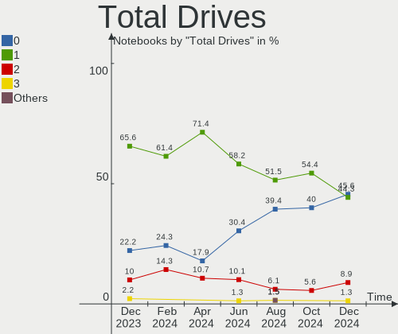

BSD - Hardware Trends (Notebooks)
---------------------------------

A project to identify most popular hardware characteristics and track their change
over time based on data collected by BSD users at https://BSD-Hardware.info.

Anyone can contribute to this report by the [hw-probe](https://github.com/linuxhw/hw-probe/blob/master/INSTALL.BSD.md) tool:

    hw-probe -all -upload

This report is for one last month. Overall report since the beginning of time: [TestCoverage](https://github.com/bsdhw/TestCoverage)

Period: Dec, 2022.

Contents
--------

* [ System ](#system)
  - [ OS                       ](#os)
  - [ OS Family                ](#os-family)
  - [ Arch                     ](#arch)
  - [ DE                       ](#de)
  - [ Display Server           ](#display-server)
  - [ Display Manager          ](#display-manager)
  - [ OS Lang                  ](#os-lang)
  - [ Boot Mode                ](#boot-mode)
  - [ Filesystem               ](#filesystem)
  - [ Part. scheme             ](#part-scheme)

* [ Board ](#board)
  - [ Vendor                   ](#vendor)
  - [ Model                    ](#model)
  - [ Model Family             ](#model-family)
  - [ MFG Year                 ](#mfg-year)
  - [ Form Factor              ](#form-factor)
  - [ Coreboot                 ](#coreboot)
  - [ RAM Size                 ](#ram-size)
  - [ RAM Used                 ](#ram-used)
  - [ Total Drives             ](#total-drives)
  - [ Has CD-ROM               ](#has-cd-rom)
  - [ Has Ethernet             ](#has-ethernet)
  - [ Has WiFi                 ](#has-wifi)
  - [ Has Bluetooth            ](#has-bluetooth)

* [ Location ](#location)
  - [ Country                  ](#country)
  - [ City                     ](#city)

* [ Drives ](#drives)
  - [ Drive Vendor             ](#drive-vendor)
  - [ Drive Model              ](#drive-model)
  - [ HDD Vendor               ](#hdd-vendor)
  - [ SSD Vendor               ](#ssd-vendor)
  - [ Drive Kind               ](#drive-kind)
  - [ Drive Connector          ](#drive-connector)
  - [ Drive Size               ](#drive-size)
  - [ Space Total              ](#space-total)
  - [ Space Used               ](#space-used)
  - [ Malfunc. Drives          ](#malfunc-drives)
  - [ Malfunc. Drive Vendor    ](#malfunc-drive-vendor)
  - [ Malfunc. HDD Vendor      ](#malfunc-hdd-vendor)
  - [ Malfunc. Drive Kind      ](#malfunc-drive-kind)
  - [ Failed Drives            ](#failed-drives)
  - [ Failed Drive Vendor      ](#failed-drive-vendor)
  - [ Drive Status             ](#drive-status)

* [ Storage controller ](#storage-controller)
  - [ Storage Vendor           ](#storage-vendor)
  - [ Storage Model            ](#storage-model)
  - [ Storage Kind             ](#storage-kind)

* [ Processor ](#processor)
  - [ CPU Vendor               ](#cpu-vendor)
  - [ CPU Model                ](#cpu-model)
  - [ CPU Model Family         ](#cpu-model-family)
  - [ CPU Cores                ](#cpu-cores)
  - [ CPU Sockets              ](#cpu-sockets)
  - [ CPU Threads              ](#cpu-threads)
  - [ CPU Microarch            ](#cpu-microarch)

* [ Graphics ](#graphics)
  - [ GPU Vendor               ](#gpu-vendor)
  - [ GPU Model                ](#gpu-model)
  - [ GPU Combo                ](#gpu-combo)
  - [ GPU Driver               ](#gpu-driver)
  - [ GPU Memory               ](#gpu-memory)

* [ Monitor ](#monitor)
  - [ Monitor Vendor           ](#monitor-vendor)
  - [ Monitor Model            ](#monitor-model)
  - [ Monitor Resolution       ](#monitor-resolution)
  - [ Monitor Diagonal         ](#monitor-diagonal)
  - [ Monitor Width            ](#monitor-width)
  - [ Aspect Ratio             ](#aspect-ratio)
  - [ Monitor Area             ](#monitor-area)
  - [ Pixel Density            ](#pixel-density)
  - [ Multiple Monitors        ](#multiple-monitors)

* [ Network ](#network)
  - [ Net Controller Vendor    ](#net-controller-vendor)
  - [ Net Controller Model     ](#net-controller-model)
  - [ Wireless Vendor          ](#wireless-vendor)
  - [ Wireless Model           ](#wireless-model)
  - [ Ethernet Vendor          ](#ethernet-vendor)
  - [ Ethernet Model           ](#ethernet-model)
  - [ Net Controller Kind      ](#net-controller-kind)
  - [ Used Controller          ](#used-controller)
  - [ NICs                     ](#nics)
  - [ IPv6                     ](#ipv6)

* [ Bluetooth ](#bluetooth)
  - [ Bluetooth Vendor         ](#bluetooth-vendor)
  - [ Bluetooth Model          ](#bluetooth-model)

* [ Sound ](#sound)
  - [ Sound Vendor             ](#sound-vendor)
  - [ Sound Model              ](#sound-model)

* [ Memory ](#memory)
  - [ Memory Vendor            ](#memory-vendor)
  - [ Memory Model             ](#memory-model)
  - [ Memory Kind              ](#memory-kind)
  - [ Memory Form Factor       ](#memory-form-factor)
  - [ Memory Size              ](#memory-size)
  - [ Memory Speed             ](#memory-speed)

* [ Printers & scanners ](#printers--scanners)
  - [ Printer Vendor           ](#printer-vendor)
  - [ Printer Model            ](#printer-model)
  - [ Scanner Vendor           ](#scanner-vendor)
  - [ Scanner Model            ](#scanner-model)

* [ Camera ](#camera)
  - [ Camera Vendor            ](#camera-vendor)
  - [ Camera Model             ](#camera-model)

* [ Security ](#security)
  - [ Fingerprint Vendor       ](#fingerprint-vendor)
  - [ Fingerprint Model        ](#fingerprint-model)
  - [ Chipcard Vendor          ](#chipcard-vendor)
  - [ Chipcard Model           ](#chipcard-model)

* [ Unsupported ](#unsupported)
  - [ Unsupported Devices      ](#unsupported-devices)
  - [ Unsupported Device Types ](#unsupported-device-types)

System
------

OS
--

Installed operating systems

| Name                 | Notebooks | Percent |
|----------------------|-----------|---------|
| FreeBSD 13.1-p5      | 16        | 25%     |
| OpenBSD 7.2          | 13        | 20.31%  |
| helloSystem 0.7.0    | 11        | 17.19%  |
| FreeBSD 13.1         | 6         | 9.38%   |
| OPNsense 22.7.9      | 3         | 4.69%   |
| helloSystem 0.8.0    | 3         | 4.69%   |
| OPNsense 22.10       | 2         | 3.13%   |
| NomadBSD 20221130    | 2         | 3.13%   |
| FreeBSD 14.0-CURRENT | 2         | 3.13%   |
| OPNsense 22.7.10     | 1         | 1.56%   |
| GhostBSD 22.11.22    | 1         | 1.56%   |
| GhostBSD 22.06.18    | 1         | 1.56%   |
| FreeBSD 13.1-p4      | 1         | 1.56%   |
| FreeBSD 13.1-p3      | 1         | 1.56%   |
| FreeBSD 12.4         | 1         | 1.56%   |

OS Family
---------

OS without a version

| Name        | Notebooks | Percent |
|-------------|-----------|---------|
| FreeBSD     | 27        | 42.19%  |
| helloSystem | 14        | 21.88%  |
| OpenBSD     | 13        | 20.31%  |
| OPNsense    | 6         | 9.38%   |
| NomadBSD    | 2         | 3.13%   |
| GhostBSD    | 2         | 3.13%   |

Arch
----

OS architecture (x86_64, i586, etc.)

| Name  | Notebooks | Percent |
|-------|-----------|---------|
| amd64 | 63        | 98.44%  |
| i386  | 1         | 1.56%   |

DE
--

Desktop Environment

| Name         | Notebooks | Percent |
|--------------|-----------|---------|
| helloDesktop | 26        | 40.63%  |
| Console      | 8         | 12.5%   |
| KDE5         | 7         | 10.94%  |
| XFCE         | 6         | 9.38%   |
| MATE         | 4         | 6.25%   |
| i3           | 4         | 6.25%   |
| GNOME        | 4         | 6.25%   |
| Openbox      | 2         | 3.13%   |
| TWM          | 1         | 1.56%   |
| LXQt         | 1         | 1.56%   |
| Fluxbox      | 1         | 1.56%   |

Display Server
--------------

X11 or Wayland

| Name    | Notebooks | Percent |
|---------|-----------|---------|
| X11     | 55        | 85.94%  |
| Console | 8         | 12.5%   |
| Wayland | 1         | 1.56%   |

Display Manager
---------------

SDDM, LightDM, etc.

| Name    | Notebooks | Percent |
|---------|-----------|---------|
| Console | 27        | 42.19%  |
| SLiM    | 19        | 29.69%  |
| SDDM    | 11        | 17.19%  |
| GDM     | 3         | 4.69%   |
| XDM     | 2         | 3.13%   |
| LightDM | 2         | 3.13%   |

OS Lang
-------

Language

| Lang    | Notebooks | Percent |
|---------|-----------|---------|
| C       | 19        | 29.69%  |
| Unknown | 18        | 28.13%  |
| en_US   | 16        | 25%     |
| ru_RU   | 3         | 4.69%   |
| pt_BR   | 1         | 1.56%   |
| ja_JP   | 1         | 1.56%   |
| fr_FR   | 1         | 1.56%   |
| es_ES   | 1         | 1.56%   |
| en_BE   | 1         | 1.56%   |
| en      | 1         | 1.56%   |
| de      | 1         | 1.56%   |
| ba_RU   | 1         | 1.56%   |

Boot Mode
---------

EFI or BIOS

| Mode | Notebooks | Percent |
|------|-----------|---------|
| EFI  | 51        | 79.69%  |
| BIOS | 13        | 20.31%  |

Filesystem
----------

Type of filesystem

| Type   | Notebooks | Percent |
|--------|-----------|---------|
| Zfs    | 30        | 46.88%  |
| Ufs    | 13        | 20.31%  |
| Ffs    | 13        | 20.31%  |
| Cd9660 | 8         | 12.5%   |

Part. scheme
------------

Scheme of partitioning

| Type | Notebooks | Percent |
|------|-----------|---------|
| GPT  | 58        | 90.63%  |
| MBR  | 6         | 9.38%   |

Board
-----

Vendor
------

Motherboard manufacturer

| Name             | Notebooks | Percent |
|------------------|-----------|---------|
| Lenovo           | 18        | 28.13%  |
| Dell             | 8         | 12.5%   |
| Hewlett-Packard  | 6         | 9.38%   |
| Google           | 3         | 4.69%   |
| Deciso           | 3         | 4.69%   |
| ASUSTek Computer | 3         | 4.69%   |
| Apple            | 3         | 4.69%   |
| Acer             | 3         | 4.69%   |
| TUXEDO           | 2         | 3.13%   |
| HUAWEI           | 2         | 3.13%   |
| Toshiba          | 1         | 1.56%   |
| Timi             | 1         | 1.56%   |
| Tactus           | 1         | 1.56%   |
| Star Labs        | 1         | 1.56%   |
| Sony             | 1         | 1.56%   |
| Panasonic        | 1         | 1.56%   |
| Intel            | 1         | 1.56%   |
| HASEE Computer   | 1         | 1.56%   |
| Framework        | 1         | 1.56%   |
| DFI              | 1         | 1.56%   |
| Alienware        | 1         | 1.56%   |
| Acidanthera      | 1         | 1.56%   |
| Unknown          | 1         | 1.56%   |

Model
-----

Motherboard model

| Name                                         | Notebooks | Percent |
|----------------------------------------------|-----------|---------|
| Deciso NetBoard-A10                          | 2         | 3.13%   |
| Acer Swift SF114-34                          | 2         | 3.13%   |
| TUXEDO Pulse 15 Gen1                         | 1         | 1.56%   |
| TUXEDO InfinityBook Pro 14 Gen6              | 1         | 1.56%   |
| Toshiba Satellite BE96-F299                  | 1         | 1.56%   |
| Timi Redmi Book Pro 14 2022                  | 1         | 1.56%   |
| Tactus GeoFlex 110                           | 1         | 1.56%   |
| Star Labs Lite                               | 1         | 1.56%   |
| Sony VPCSB11FX                               | 1         | 1.56%   |
| Panasonic CF-54-1                            | 1         | 1.56%   |
| Lenovo Yoga 710-11IKB 80V6                   | 1         | 1.56%   |
| Lenovo ThinkPad X250 20CLS5BU00              | 1         | 1.56%   |
| Lenovo ThinkPad X200 Tablet 744943U          | 1         | 1.56%   |
| Lenovo ThinkPad X1 Extreme Gen 4i 20Y5001DMX | 1         | 1.56%   |
| Lenovo ThinkPad X1 Carbon Gen 10 21CB000DUS  | 1         | 1.56%   |
| Lenovo ThinkPad T60 1951A47                  | 1         | 1.56%   |
| Lenovo ThinkPad T530 2392AQU                 | 1         | 1.56%   |
| Lenovo ThinkPad T490 20N2CTO1WW              | 1         | 1.56%   |
| Lenovo ThinkPad T480 20L6S13100              | 1         | 1.56%   |
| Lenovo ThinkPad T460 20FN002JUS              | 1         | 1.56%   |
| Lenovo ThinkPad T440p 20AWS0Y40T             | 1         | 1.56%   |
| Lenovo ThinkPad T410 2518C3U                 | 1         | 1.56%   |
| Lenovo ThinkPad A485 20MVS0LG00              | 1         | 1.56%   |
| Lenovo Legion Y530-15ICH 81FV                | 1         | 1.56%   |
| Lenovo IdeaPad L340-17IWL 81M0               | 1         | 1.56%   |
| Lenovo IdeaPad 330-15IKB 81DE                | 1         | 1.56%   |
| Lenovo G510 20238                            | 1         | 1.56%   |
| Lenovo B50-80 80EW                           | 1         | 1.56%   |
| Intel H81U                                   | 1         | 1.56%   |
| HUAWEI KLVL-WXXW                             | 1         | 1.56%   |
| HUAWEI CREM-WXX9                             | 1         | 1.56%   |
| HP ProBook 440 G8 Notebook PC                | 1         | 1.56%   |
| HP ProBook 430 G7                            | 1         | 1.56%   |
| HP Pavilion dv4                              | 1         | 1.56%   |
| HP EliteBook 8570p                           | 1         | 1.56%   |
| HP 245 G6                                    | 1         | 1.56%   |
| HP 2000                                      | 1         | 1.56%   |
| HASEE N95XKP6                                | 1         | 1.56%   |
| Google Peppy                                 | 1         | 1.56%   |
| Google Lick                                  | 1         | 1.56%   |

Model Family
------------

Motherboard model prefix

| Name                | Notebooks | Percent |
|---------------------|-----------|---------|
| Lenovo ThinkPad     | 12        | 18.75%  |
| Dell Latitude       | 3         | 4.69%   |
| Lenovo IdeaPad      | 2         | 3.13%   |
| HP ProBook          | 2         | 3.13%   |
| Dell Vostro         | 2         | 3.13%   |
| Dell Inspiron       | 2         | 3.13%   |
| Deciso NetBoard-A10 | 2         | 3.13%   |
| Acer Swift          | 2         | 3.13%   |
| TUXEDO Pulse        | 1         | 1.56%   |
| TUXEDO InfinityBook | 1         | 1.56%   |
| Toshiba Satellite   | 1         | 1.56%   |
| Timi Redmi          | 1         | 1.56%   |
| Tactus GeoFlex      | 1         | 1.56%   |
| Star Labs Lite      | 1         | 1.56%   |
| Sony VPCSB11FX      | 1         | 1.56%   |
| Panasonic CF-54-1   | 1         | 1.56%   |
| Lenovo Yoga         | 1         | 1.56%   |
| Lenovo Legion       | 1         | 1.56%   |
| Lenovo G510         | 1         | 1.56%   |
| Lenovo B50-80       | 1         | 1.56%   |
| Intel H81U          | 1         | 1.56%   |
| HUAWEI KLVL-WXXW    | 1         | 1.56%   |
| HUAWEI CREM-WXX9    | 1         | 1.56%   |
| HP Pavilion         | 1         | 1.56%   |
| HP EliteBook        | 1         | 1.56%   |
| HP 245              | 1         | 1.56%   |
| HP 2000             | 1         | 1.56%   |
| HASEE N95XKP6       | 1         | 1.56%   |
| Google Peppy        | 1         | 1.56%   |
| Google Lick         | 1         | 1.56%   |
| Google Lars         | 1         | 1.56%   |
| Framework Laptop    | 1         | 1.56%   |
| DFI BE17X(170       | 1         | 1.56%   |
| Dell Precision      | 1         | 1.56%   |
| Deciso OPNsense     | 1         | 1.56%   |
| ASUS ZenBook        | 1         | 1.56%   |
| ASUS K50IN          | 1         | 1.56%   |
| ASUS ASUS           | 1         | 1.56%   |
| Apple MacBookPro14  | 1         | 1.56%   |
| Apple MacBookAir5   | 1         | 1.56%   |

MFG Year
--------

Motherboard manufacture year

| Year | Notebooks | Percent |
|------|-----------|---------|
| 2022 | 16        | 25%     |
| 2021 | 10        | 15.63%  |
| 2019 | 6         | 9.38%   |
| 2016 | 5         | 7.81%   |
| 2015 | 5         | 7.81%   |
| 2020 | 4         | 6.25%   |
| 2013 | 3         | 4.69%   |
| 2018 | 2         | 3.13%   |
| 2017 | 2         | 3.13%   |
| 2014 | 2         | 3.13%   |
| 2012 | 2         | 3.13%   |
| 2011 | 2         | 3.13%   |
| 2008 | 2         | 3.13%   |
| 2010 | 1         | 1.56%   |
| 2009 | 1         | 1.56%   |
| 2006 | 1         | 1.56%   |

Form Factor
-----------

Physical design of the computer

| Name     | Notebooks | Percent |
|----------|-----------|---------|
| Notebook | 64        | 100%    |

Coreboot
--------

Have coreboot on board

| Used | Notebooks | Percent |
|------|-----------|---------|
| No   | 59        | 92.19%  |
| Yes  | 5         | 7.81%   |

RAM Size
--------

Total RAM memory

| Size in GB | Notebooks | Percent |
|------------|-----------|---------|
| 8.01-16.0  | 23        | 35.94%  |
| 4.01-8.0   | 15        | 23.44%  |
| 16.01-24.0 | 15        | 23.44%  |
| 32.01-64.0 | 7         | 10.94%  |
| 3.01-4.0   | 3         | 4.69%   |
| 2.01-3.0   | 1         | 1.56%   |

RAM Used
--------

Used RAM memory

| Used GB  | Notebooks | Percent |
|----------|-----------|---------|
| 0.01-0.5 | 39        | 60.94%  |
| 0.51-1.0 | 14        | 21.88%  |
| 1.01-2.0 | 11        | 17.19%  |

Total Drives
------------

Number of drives on board

| Drives | Notebooks | Percent |
|--------|-----------|---------|
| 1      | 46        | 71.88%  |
| 2      | 12        | 18.75%  |
| 0      | 6         | 9.38%   |

Has CD-ROM
----------

Has CD-ROM on board

| Presented | Notebooks | Percent |
|-----------|-----------|---------|
| No        | 51        | 79.69%  |
| Yes       | 13        | 20.31%  |

Has Ethernet
------------

Has Ethernet on board

| Presented | Notebooks | Percent |
|-----------|-----------|---------|
| Yes       | 47        | 73.44%  |
| No        | 17        | 26.56%  |

Has WiFi
--------

Has WiFi module

| Presented | Notebooks | Percent |
|-----------|-----------|---------|
| Yes       | 58        | 90.63%  |
| No        | 6         | 9.38%   |

Has Bluetooth
-------------

Has Bluetooth module

| Presented | Notebooks | Percent |
|-----------|-----------|---------|
| Yes       | 46        | 71.88%  |
| No        | 18        | 28.13%  |

Location
--------

Country
-------

Geographic location (country)

| Country     | Notebooks | Percent |
|-------------|-----------|---------|
| USA         | 15        | 23.44%  |
| Germany     | 8         | 12.5%   |
| Russia      | 6         | 9.38%   |
| Spain       | 4         | 6.25%   |
| Netherlands | 3         | 4.69%   |
| Canada      | 3         | 4.69%   |
| UK          | 2         | 3.13%   |
| Italy       | 2         | 3.13%   |
| France      | 2         | 3.13%   |
| China       | 2         | 3.13%   |
| Brazil      | 2         | 3.13%   |
| Austria     | 2         | 3.13%   |
| Vietnam     | 1         | 1.56%   |
| Sweden      | 1         | 1.56%   |
| Slovenia    | 1         | 1.56%   |
| Romania     | 1         | 1.56%   |
| Poland      | 1         | 1.56%   |
| Lithuania   | 1         | 1.56%   |
| Japan       | 1         | 1.56%   |
| Iraq        | 1         | 1.56%   |
| India       | 1         | 1.56%   |
| Guatemala   | 1         | 1.56%   |
| Egypt       | 1         | 1.56%   |
| Ecuador     | 1         | 1.56%   |
| Cyprus      | 1         | 1.56%   |

City
----

Geographic location (city)

| City                    | Notebooks | Percent |
|-------------------------|-----------|---------|
| Moscow                  | 5         | 7.81%   |
| Navalcarnero            | 2         | 3.13%   |
| Yokohama                | 1         | 1.56%   |
| Vorchdorf               | 1         | 1.56%   |
| Vilnius                 | 1         | 1.56%   |
| Vienna                  | 1         | 1.56%   |
| Trebnje                 | 1         | 1.56%   |
| Tala                    | 1         | 1.56%   |
| Sun Prairie             | 1         | 1.56%   |
| Stuttgart               | 1         | 1.56%   |
| Shantou                 | 1         | 1.56%   |
| Sartrouville            | 1         | 1.56%   |
| San Jose                | 1         | 1.56%   |
| Saint-Zotique           | 1         | 1.56%   |
| Raleigh                 | 1         | 1.56%   |
| Quito                   | 1         | 1.56%   |
| Portland                | 1         | 1.56%   |
| Pine Mountain Club      | 1         | 1.56%   |
| Perm                    | 1         | 1.56%   |
| Ouderkerk aan de Amstel | 1         | 1.56%   |
| North York              | 1         | 1.56%   |
| Niterói                | 1         | 1.56%   |
| Neuss                   | 1         | 1.56%   |
| Mumbai                  | 1         | 1.56%   |
| Montreal                | 1         | 1.56%   |
| Lübeck                 | 1         | 1.56%   |
| Lincolnwood             | 1         | 1.56%   |
| Larnaca                 | 1         | 1.56%   |
| Lafayette               | 1         | 1.56%   |
| Karlsruhe               | 1         | 1.56%   |
| Karbala                 | 1         | 1.56%   |
| Ho Chi Minh City        | 1         | 1.56%   |
| Henrico                 | 1         | 1.56%   |
| Guatemala City          | 1         | 1.56%   |
| Guangzhou               | 1         | 1.56%   |
| Girard                  | 1         | 1.56%   |
| Gerzat                  | 1         | 1.56%   |
| Fürth                  | 1         | 1.56%   |
| Farnborough             | 1         | 1.56%   |
| Falkenstein             | 1         | 1.56%   |

Drives
------

Drive Vendor
------------

Hard drive vendors

| Vendor              | Notebooks | Drives | Percent |
|---------------------|-----------|--------|---------|
| WDC                 | 9         | 9      | 14.06%  |
| Samsung Electronics | 9         | 10     | 14.06%  |
| Toshiba             | 6         | 6      | 9.38%   |
| NVMe                | 6         | 7      | 9.38%   |
| Transcend           | 5         | 5      | 7.81%   |
| Kingston            | 5         | 5      | 7.81%   |
| PNY                 | 3         | 3      | 4.69%   |
| Phison              | 3         | 3      | 4.69%   |
| SK hynix            | 2         | 2      | 3.13%   |
| Seagate             | 2         | 3      | 3.13%   |
| Zheino              | 1         | 1      | 1.56%   |
| Team                | 1         | 1      | 1.56%   |
| Star Drive          | 1         | 1      | 1.56%   |
| SSSTC               | 1         | 1      | 1.56%   |
| Plextor             | 1         | 1      | 1.56%   |
| OCZ                 | 1         | 1      | 1.56%   |
| Lexar               | 1         | 1      | 1.56%   |
| KIOXIA              | 1         | 1      | 1.56%   |
| Intel               | 1         | 1      | 1.56%   |
| Hikvision           | 1         | 1      | 1.56%   |
| HGST                | 1         | 1      | 1.56%   |
| Crucial             | 1         | 1      | 1.56%   |
| Apple               | 1         | 1      | 1.56%   |
| A-DATA Technology   | 1         | 1      | 1.56%   |

Drive Model
-----------

Hard drive models

| Model                                | Notebooks | Percent |
|--------------------------------------|-----------|---------|
| Transcend TS256GMTE652T2 256GB       | 2         | 3.03%   |
| Toshiba MQ01ABD100 1TB               | 2         | 3.03%   |
| NVMe Samsung SSD 980 2TB             | 2         | 3.03%   |
| Kingston SA400S37120G 120GB          | 2         | 3.03%   |
| Zheino CHN-25SATAC3-120 120GB        | 1         | 1.52%   |
| WDC WD3200LPVX-60V0TT0 320GB         | 1         | 1.52%   |
| WDC WD3200BEVT-60A23T0 320GB         | 1         | 1.52%   |
| WDC WD2500BEVS-22UST0 250GB          | 1         | 1.52%   |
| WDC WD10SPZX-21Z10T0 1TB             | 1         | 1.52%   |
| WDC WD10SPZX-00Z10T0 1TB             | 1         | 1.52%   |
| WDC PC SN730 SDBPNTY-512G            | 1         | 1.52%   |
| WDC PC SN530 SDBPNPZ-512G-1014 512GB | 1         | 1.52%   |
| WDC PC SN530 SDBPNPZ-256G-1014 256GB | 1         | 1.52%   |
| WDC PC SN520 NVMe 512GB              | 1         | 1.52%   |
| Transcend TS64GSSD370S 64GB          | 1         | 1.52%   |
| Transcend TS256GMTS952T2 256GB       | 1         | 1.52%   |
| Transcend TS256GMTS430S 256GB        | 1         | 1.52%   |
| Toshiba MQ01ACF032 320GB             | 1         | 1.52%   |
| Toshiba MQ01ABF050 500GB             | 1         | 1.52%   |
| Toshiba MK6475GSX 640GB              | 1         | 1.52%   |
| Toshiba MK1637GSX 160GB              | 1         | 1.52%   |
| Team TEAML5Lite3D120G 120GB          | 1         | 1.52%   |
| Star Drive SATA SSD 960GB            | 1         | 1.52%   |
| SSSTC CL1-8D256-HP 256GB             | 1         | 1.52%   |
| SK hynix HFM512GD3JX013N 512GB       | 1         | 1.52%   |
| SK hynix BC711 NVMe 512GB            | 1         | 1.52%   |
| Seagate ST9320320AS 320GB            | 1         | 1.52%   |
| Seagate ST500LM030-1RK17D 500GB      | 1         | 1.52%   |
| Seagate ST1000LM024 HN-M101MBB 1TB   | 1         | 1.52%   |
| Samsung SSD 870 QVO 2TB              | 1         | 1.52%   |
| Samsung SSD 860 PRO 256GB            | 1         | 1.52%   |
| Samsung SSD 860 EVO M.2 250GB        | 1         | 1.52%   |
| Samsung SSD 860 EVO 1TB              | 1         | 1.52%   |
| Samsung PM9A1 NVMe 512GB             | 1         | 1.52%   |
| Samsung MZYLF128HCHP-000L2 128GB     | 1         | 1.52%   |
| Samsung MZVLB256HAHQ-000L7 256GB     | 1         | 1.52%   |
| Samsung MZVL21T0HCLR-00BL7 1TB       | 1         | 1.52%   |
| Samsung MZNLN128HAHQ-000L2 128GB     | 1         | 1.52%   |
| PNY CS900 250GB SSD                  | 1         | 1.52%   |
| PNY CS900 240GB SSD                  | 1         | 1.52%   |

HDD Vendor
----------

Hard disk drive vendors

| Vendor  | Notebooks | Drives | Percent |
|---------|-----------|--------|---------|
| Toshiba | 6         | 6      | 33.33%  |
| WDC     | 5         | 5      | 27.78%  |
| NVMe    | 4         | 5      | 22.22%  |
| Seagate | 2         | 3      | 11.11%  |
| HGST    | 1         | 1      | 5.56%   |

SSD Vendor
----------

Solid state drive vendors

| Vendor              | Notebooks | Drives | Percent |
|---------------------|-----------|--------|---------|
| Samsung Electronics | 6         | 6      | 21.43%  |
| Kingston            | 4         | 4      | 14.29%  |
| Transcend           | 3         | 3      | 10.71%  |
| PNY                 | 3         | 3      | 10.71%  |
| NVMe                | 2         | 2      | 7.14%   |
| Zheino              | 1         | 1      | 3.57%   |
| Team                | 1         | 1      | 3.57%   |
| Star Drive          | 1         | 1      | 3.57%   |
| Plextor             | 1         | 1      | 3.57%   |
| Phison              | 1         | 1      | 3.57%   |
| OCZ                 | 1         | 1      | 3.57%   |
| Lexar               | 1         | 1      | 3.57%   |
| Crucial             | 1         | 1      | 3.57%   |
| Apple               | 1         | 1      | 3.57%   |
| A-DATA Technology   | 1         | 1      | 3.57%   |

Drive Kind
----------

HDD or SSD

| Kind | Notebooks | Drives | Percent |
|------|-----------|--------|---------|
| SSD  | 26        | 28     | 42.62%  |
| NVMe | 18        | 19     | 29.51%  |
| HDD  | 17        | 20     | 27.87%  |

Drive Connector
---------------

SATA, SAS, NVMe, etc.

| Type | Notebooks | Drives | Percent |
|------|-----------|--------|---------|
| SATA | 42        | 48     | 70%     |
| NVMe | 18        | 19     | 30%     |

Drive Size
----------

Size of hard drive

| Size in TB | Notebooks | Drives | Percent |
|------------|-----------|--------|---------|
| 0.01-0.5   | 27        | 29     | 58.7%   |
| 0.51-1.0   | 15        | 15     | 32.61%  |
| 1.01-2.0   | 4         | 4      | 8.7%    |

Space Total
-----------

Amount of disk space available on the file system

| Size in GB | Notebooks | Percent |
|------------|-----------|---------|
| 101-250    | 20        | 31.25%  |
| 251-500    | 16        | 25%     |
| 1-20       | 10        | 15.63%  |
| 501-1000   | 7         | 10.94%  |
| 51-100     | 6         | 9.38%   |
| 21-50      | 3         | 4.69%   |
| 1001-2000  | 2         | 3.13%   |

Space Used
----------

Amount of used disk space

| Used GB | Notebooks | Percent |
|---------|-----------|---------|
| 1-20    | 51        | 79.69%  |
| 21-50   | 6         | 9.38%   |
| 51-100  | 5         | 7.81%   |
| 251-500 | 2         | 3.13%   |

Malfunc. Drives
---------------

Drive models with a malfunction

| Model                              | Notebooks | Drives | Percent |
|------------------------------------|-----------|--------|---------|
| WDC WD3200BEVT-60A23T0 320GB       | 1         | 1      | 10%     |
| WDC WD2500BEVS-22UST0 250GB        | 1         | 1      | 10%     |
| WDC WD10SPZX-21Z10T0 1TB           | 1         | 1      | 10%     |
| Toshiba MQ01ACF032 320GB           | 1         | 1      | 10%     |
| Toshiba MK6475GSX 640GB            | 1         | 1      | 10%     |
| Toshiba MK1637GSX 160GB            | 1         | 1      | 10%     |
| Seagate ST1000LM024 HN-M101MBB 1TB | 1         | 1      | 10%     |
| OCZ AGILITY3 64GB                  | 1         | 1      | 10%     |
| Kingston SNS4151S316GD 16GB        | 1         | 1      | 10%     |
| HGST HTS721010A9E630 1TB           | 1         | 1      | 10%     |

Malfunc. Drive Vendor
---------------------

Vendors of faulty drives

| Vendor   | Notebooks | Drives | Percent |
|----------|-----------|--------|---------|
| WDC      | 3         | 3      | 30%     |
| Toshiba  | 3         | 3      | 30%     |
| Seagate  | 1         | 1      | 10%     |
| OCZ      | 1         | 1      | 10%     |
| Kingston | 1         | 1      | 10%     |
| HGST     | 1         | 1      | 10%     |

Malfunc. HDD Vendor
-------------------

Vendors of faulty HDD drives

| Vendor  | Notebooks | Drives | Percent |
|---------|-----------|--------|---------|
| WDC     | 3         | 3      | 37.5%   |
| Toshiba | 3         | 3      | 37.5%   |
| Seagate | 1         | 1      | 12.5%   |
| HGST    | 1         | 1      | 12.5%   |

Malfunc. Drive Kind
-------------------

Kinds of faulty drives

| Kind | Notebooks | Drives | Percent |
|------|-----------|--------|---------|
| HDD  | 8         | 8      | 80%     |
| SSD  | 2         | 2      | 20%     |

Failed Drives
-------------

Failed drive models

Zero info for selected period =(

Failed Drive Vendor
-------------------

Failed drive vendors

Zero info for selected period =(

Drive Status
------------

Number of failed and malfunc. drives

| Status   | Notebooks | Drives | Percent |
|----------|-----------|--------|---------|
| Works    | 44        | 50     | 73.33%  |
| Malfunc  | 10        | 10     | 16.67%  |
| Detected | 6         | 7      | 10%     |

Storage controller
------------------

Storage Vendor
--------------

Storage controller vendors

| Vendor                         | Notebooks | Percent |
|--------------------------------|-----------|---------|
| Intel                          | 39        | 54.93%  |
| Samsung Electronics            | 7         | 9.86%   |
| AMD                            | 7         | 9.86%   |
| SanDisk                        | 5         | 7.04%   |
| SK hynix                       | 3         | 4.23%   |
| Transcend                      | 2         | 2.82%   |
| Phison Electronics             | 2         | 2.82%   |
| Solid State Storage Technology | 1         | 1.41%   |
| Silicon Motion                 | 1         | 1.41%   |
| Nvidia                         | 1         | 1.41%   |
| KIOXIA                         | 1         | 1.41%   |
| Kingston Technology Company    | 1         | 1.41%   |
| ADATA Technology               | 1         | 1.41%   |

Storage Model
-------------

Storage controller models

| Model                                                                            | Notebooks | Percent |
|----------------------------------------------------------------------------------|-----------|---------|
| AMD FCH SATA Controller [AHCI mode]                                              | 6         | 8%      |
| Intel Sunrise Point-LP SATA Controller [AHCI mode]                               | 5         | 6.67%   |
| Intel 7 Series Chipset Family 6-port SATA Controller [AHCI mode]                 | 5         | 6.67%   |
| Unknown                                                                          | 5         | 6.67%   |
| Samsung NVMe SSD Controller PM9A1/PM9A3/980PRO                                   | 4         | 5.33%   |
| Intel Wildcat Point-LP SATA Controller [AHCI Mode]                               | 4         | 5.33%   |
| Intel 8 Series SATA Controller 1 [AHCI mode]                                     | 3         | 4%      |
| SK hynix Gold P31/PC711 NVMe Solid State Drive                                   | 2         | 2.67%   |
| SanDisk WD Blue SN550 NVMe SSD                                                   | 2         | 2.67%   |
| SanDisk WD Black SN750 / PC SN730 NVMe SSD                                       | 2         | 2.67%   |
| Samsung NVMe SSD Controller SM981/PM981/PM983                                    | 2         | 2.67%   |
| Phison PS5013 E13 NVMe Controller                                                | 2         | 2.67%   |
| Intel Celeron/Pentium Silver Processor SATA Controller                           | 2         | 2.67%   |
| Intel Cannon Point-LP SATA Controller [AHCI Mode]                                | 2         | 2.67%   |
| Intel Cannon Lake Mobile PCH SATA AHCI Controller                                | 2         | 2.67%   |
| Intel 82801IBM/IEM (ICH9M/ICH9M-E) 4 port SATA Controller [AHCI mode]            | 2         | 2.67%   |
| Intel 82801HM/HEM (ICH8M/ICH8M-E) SATA Controller [AHCI mode]                    | 2         | 2.67%   |
| Intel 82801HM/HEM (ICH8M/ICH8M-E) IDE Controller                                 | 2         | 2.67%   |
| Intel 8 Series/C220 Series Chipset Family 6-port SATA Controller 1 [AHCI mode]   | 2         | 2.67%   |
| SK hynix BC501 NVMe Solid State Drive                                            | 1         | 1.33%   |
| Silicon Motion SM2262/SM2262EN SSD Controller                                    | 1         | 1.33%   |
| SanDisk PC SN520 NVMe SSD                                                        | 1         | 1.33%   |
| Samsung NVMe SSD Controller 980                                                  | 1         | 1.33%   |
| Nvidia MCP79 AHCI Controller                                                     | 1         | 1.33%   |
| Intel Volume Management Device NVMe RAID Controller                              | 1         | 1.33%   |
| Intel SSD Pro 7600p/760p/E 6100p Series                                          | 1         | 1.33%   |
| Intel Comet Lake SATA AHCI Controller                                            | 1         | 1.33%   |
| Intel Celeron N3350/Pentium N4200/Atom E3900 Series SATA AHCI Controller         | 1         | 1.33%   |
| Intel Atom/Celeron/Pentium Processor x5-E8000/J3xxx/N3xxx Series SATA Controller | 1         | 1.33%   |
| Intel 82801GBM/GHM (ICH7-M Family) SATA Controller [AHCI mode]                   | 1         | 1.33%   |
| Intel 82801G (ICH7 Family) IDE Controller                                        | 1         | 1.33%   |
| Intel 82801 Mobile SATA Controller [RAID mode]                                   | 1         | 1.33%   |
| Intel 6 Series/C200 Series Chipset Family 6 port Mobile SATA AHCI Controller     | 1         | 1.33%   |
| Intel 5 Series/3400 Series Chipset 6 port SATA AHCI Controller                   | 1         | 1.33%   |
| Intel 200 Series PCH SATA controller [AHCI mode]                                 | 1         | 1.33%   |
| AMD FCH SATA Controller [IDE mode]                                               | 1         | 1.33%   |
| AMD FCH IDE Controller                                                           | 1         | 1.33%   |
| ADATA XPG SX8200 Pro PCIe Gen3x4 M.2 2280 Solid State Drive                      | 1         | 1.33%   |

Storage Kind
------------

Kind of storage controller (IDE, SATA, NVMe, SAS, ...)

| Kind | Notebooks | Percent |
|------|-----------|---------|
| SATA | 43        | 58.9%   |
| NVMe | 24        | 32.88%  |
| IDE  | 4         | 5.48%   |
| RAID | 2         | 2.74%   |

Processor
---------

CPU Vendor
----------

Processor vendors

| Vendor | Notebooks | Percent |
|--------|-----------|---------|
| Intel  | 52        | 81.25%  |
| AMD    | 12        | 18.75%  |

CPU Model
---------

Processor models

| Model                                                         | Notebooks | Percent |
|---------------------------------------------------------------|-----------|---------|
| Intel Core i7-8650U CPU @ 1.90GHz                             | 2         | 3.13%   |
| Intel Core i5-5300U CPU @ 2.30GHz                             | 2         | 3.13%   |
| Intel Celeron N4020 CPU @ 1.10GHz                             | 2         | 3.13%   |
| Intel 11th Gen Core i5-1135G7 @ 2.40GHz                       | 2         | 3.13%   |
| AMD Ryzen Embedded V1500B                                     | 2         | 3.13%   |
| Intel Pentium Silver N6000 @ 1.10GHz                          | 1         | 1.56%   |
| Intel Pentium Silver N5030 CPU @ 1.10GHz                      | 1         | 1.56%   |
| Intel Pentium Dual-Core CPU T4200 @ 2.00GHz                   | 1         | 1.56%   |
| Intel Pentium Dual CPU T3400 @ 2.16GHz                        | 1         | 1.56%   |
| Intel Core i9-10980HK CPU @ 2.40GHz                           | 1         | 1.56%   |
| Intel Core i7-8750H CPU @ 2.20GHz                             | 1         | 1.56%   |
| Intel Core i7-8665U CPU @ 1.90GHz                             | 1         | 1.56%   |
| Intel Core i7-8565U CPU @ 1.80GHz                             | 1         | 1.56%   |
| Intel Core i7-4810MQ CPU @ 2.80GHz                            | 1         | 1.56%   |
| Intel Core i7-4712MQ CPU @ 2.30GHz                            | 1         | 1.56%   |
| Intel Core i7-4700MQ CPU @ 2.40GHz                            | 1         | 1.56%   |
| Intel Core i7-3520M CPU @ 2.90GHz                             | 1         | 1.56%   |
| Intel Core i7-10510U CPU @ 1.80GHz                            | 1         | 1.56%   |
| Intel Core i5-8400 CPU @ 2.80GHz                              | 1         | 1.56%   |
| Intel Core i5-8300H CPU @ 2.30GHz                             | 1         | 1.56%   |
| Intel Core i5-8265U CPU @ 1.60GHz                             | 1         | 1.56%   |
| Intel Core i5-8250U CPU @ 1.60GHz                             | 1         | 1.56%   |
| Intel Core i5-7Y54 CPU @ 1.20GHz                              | 1         | 1.56%   |
| Intel Core i5-7360U CPU @ 2.30GHz                             | 1         | 1.56%   |
| Intel Core i5-6300U CPU @ 2.40GHz                             | 1         | 1.56%   |
| Intel Core i5-5200U CPU @ 2.20GHz                             | 1         | 1.56%   |
| Intel Core i5-4210U CPU @ 1.70GHz                             | 1         | 1.56%   |
| Intel Core i5-4200U CPU @ 1.60GHz                             | 1         | 1.56%   |
| Intel Core i5-3320M CPU @ 2.60GHz                             | 1         | 1.56%   |
| Intel Core i5-3317U CPU @ 1.70GHz                             | 1         | 1.56%   |
| Intel Core i5-3230M CPU @ 2.60GHz                             | 1         | 1.56%   |
| Intel Core i5-2410M CPU @ 2.30GHz                             | 1         | 1.56%   |
| Intel Core i5-10210U CPU @ 1.60GHz                            | 1         | 1.56%   |
| Intel Core i5 CPU M 540 @ 2.53GHz                             | 1         | 1.56%   |
| Intel Core i3-6006U CPU @ 2.00GHz                             | 1         | 1.56%   |
| Intel Core i3-3120M CPU @ 2.50GHz                             | 1         | 1.56%   |
| Intel Core Duo CPU T2500 @ 2.00GHz ("GenuineIntel" 686-class) | 1         | 1.56%   |
| Intel Core 2 Duo CPU T7300 @ 2.00GHz                          | 1         | 1.56%   |
| Intel Core 2 Duo CPU L9600 @ 2.13GHz                          | 1         | 1.56%   |
| Intel Core 2 Duo                                              | 1         | 1.56%   |

CPU Model Family
----------------

Processor model prefix

| Model                   | Notebooks | Percent |
|-------------------------|-----------|---------|
| Intel Core i5           | 18        | 28.13%  |
| Intel Core i7           | 10        | 15.63%  |
| Intel Celeron           | 8         | 12.5%   |
| Other                   | 7         | 10.94%  |
| AMD Ryzen 7             | 4         | 6.25%   |
| Intel Core 2 Duo        | 3         | 4.69%   |
| Intel Pentium Silver    | 2         | 3.13%   |
| Intel Core i3           | 2         | 3.13%   |
| AMD Ryzen Embedded      | 2         | 3.13%   |
| Intel Pentium Dual-Core | 1         | 1.56%   |
| Intel Pentium Dual      | 1         | 1.56%   |
| Intel Core i9           | 1         | 1.56%   |
| Intel Core Duo          | 1         | 1.56%   |
| AMD Ryzen 5 PRO         | 1         | 1.56%   |
| AMD Ryzen 5             | 1         | 1.56%   |
| AMD EPYC                | 1         | 1.56%   |
| AMD E1                  | 1         | 1.56%   |

CPU Cores
---------

Number of processor cores

| Number  | Notebooks | Percent |
|---------|-----------|---------|
| 2       | 27        | 42.19%  |
| 4       | 19        | 29.69%  |
| 8       | 6         | 9.38%   |
| 16      | 4         | 6.25%   |
| Unknown | 4         | 6.25%   |
| 6       | 2         | 3.13%   |
| 12      | 1         | 1.56%   |
| 10      | 1         | 1.56%   |

CPU Sockets
-----------

Number of sockets

| Number  | Notebooks | Percent |
|---------|-----------|---------|
| 1       | 61        | 95.31%  |
| Unknown | 2         | 3.13%   |
| 2       | 1         | 1.56%   |

CPU Threads
-----------

Threads per core (Hyper-Threading)

| Number  | Notebooks | Percent |
|---------|-----------|---------|
| 2       | 35        | 54.69%  |
| 1       | 25        | 39.06%  |
| Unknown | 4         | 6.25%   |

CPU Microarch
-------------

Microarchitecture

| Name          | Notebooks | Percent |
|---------------|-----------|---------|
| KabyLake      | 13        | 20.31%  |
| Unknown       | 7         | 10.94%  |
| Haswell       | 6         | 9.38%   |
| IvyBridge     | 5         | 7.81%   |
| Zen           | 4         | 6.25%   |
| Broadwell     | 4         | 6.25%   |
| TigerLake     | 3         | 4.69%   |
| Skylake       | 3         | 4.69%   |
| Penryn        | 3         | 4.69%   |
| Goldmont plus | 3         | 4.69%   |
| Core          | 2         | 3.13%   |
| Zen 3         | 1         | 1.56%   |
| Zen 2         | 1         | 1.56%   |
| Westmere      | 1         | 1.56%   |
| Steamroller   | 1         | 1.56%   |
| Silvermont    | 1         | 1.56%   |
| SandyBridge   | 1         | 1.56%   |
| P6            | 1         | 1.56%   |
| Jaguar        | 1         | 1.56%   |
| Goldmont      | 1         | 1.56%   |
| Excavator     | 1         | 1.56%   |
| CometLake     | 1         | 1.56%   |

Graphics
--------

GPU Vendor
----------

Vendors of graphics cards

| Vendor | Notebooks | Percent |
|--------|-----------|---------|
| Intel  | 50        | 70.42%  |
| AMD    | 13        | 18.31%  |
| Nvidia | 8         | 11.27%  |

GPU Model
---------

Graphics card models

| Model                                                                                    | Notebooks | Percent |
|------------------------------------------------------------------------------------------|-----------|---------|
| Intel 3rd Gen Core processor Graphics Controller                                         | 4         | 5.41%   |
| Intel WhiskeyLake-U GT2 [UHD Graphics 620]                                               | 3         | 4.05%   |
| Intel UHD Graphics 620                                                                   | 3         | 4.05%   |
| Intel TigerLake-LP GT2 [Iris Xe Graphics]                                                | 3         | 4.05%   |
| Intel HD Graphics 5500                                                                   | 3         | 4.05%   |
| Intel Haswell-ULT Integrated Graphics Controller                                         | 3         | 4.05%   |
| Intel 4th Gen Core Processor Integrated Graphics Controller                              | 3         | 4.05%   |
| Nvidia GP107M [GeForce GTX 1050 Ti Mobile]                                               | 2         | 2.7%    |
| Intel Skylake GT2 [HD Graphics 520]                                                      | 2         | 2.7%    |
| Intel Mobile GM965/GL960 Integrated Graphics Controller (secondary)                      | 2         | 2.7%    |
| Intel Mobile GM965/GL960 Integrated Graphics Controller (primary)                        | 2         | 2.7%    |
| Intel Mobile 4 Series Chipset Integrated Graphics Controller                             | 2         | 2.7%    |
| Intel JasperLake [UHD Graphics]                                                          | 2         | 2.7%    |
| Intel GeminiLake [UHD Graphics 600]                                                      | 2         | 2.7%    |
| Intel CometLake-U GT2 [UHD Graphics]                                                     | 2         | 2.7%    |
| Intel CoffeeLake-H GT2 [UHD Graphics 630]                                                | 2         | 2.7%    |
| AMD Lucienne                                                                             | 2         | 2.7%    |
| Nvidia GP108M [GeForce MX230]                                                            | 1         | 1.35%   |
| Nvidia GP108M [GeForce MX150]                                                            | 1         | 1.35%   |
| Nvidia GP106M [GeForce GTX 1060 Mobile]                                                  | 1         | 1.35%   |
| Nvidia GA107M [GeForce RTX 3050 Ti Mobile]                                               | 1         | 1.35%   |
| Nvidia GA104M [GeForce RTX 3080 Mobile / Max-Q 8GB/16GB]                                 | 1         | 1.35%   |
| Nvidia C79 [GeForce G102M]                                                               | 1         | 1.35%   |
| Intel TigerLake-H GT1 [UHD Graphics]                                                     | 1         | 1.35%   |
| Intel Mobile 945GM/GMS/GME, 943/940GML Express Integrated Graphics Controller            | 1         | 1.35%   |
| Intel Mobile 945GM/GMS, 943/940GML Express Integrated Graphics Controller                | 1         | 1.35%   |
| Intel Iris Plus Graphics 640                                                             | 1         | 1.35%   |
| Intel HD Graphics 615                                                                    | 1         | 1.35%   |
| Intel HD Graphics 510                                                                    | 1         | 1.35%   |
| Intel HD Graphics 500                                                                    | 1         | 1.35%   |
| Intel HD Graphics                                                                        | 1         | 1.35%   |
| Intel GeminiLake [UHD Graphics 605]                                                      | 1         | 1.35%   |
| Intel Core Processor Integrated Graphics Controller                                      | 1         | 1.35%   |
| Intel CometLake-H GT2 [UHD Graphics]                                                     | 1         | 1.35%   |
| Intel CoffeeLake-S GT2 [UHD Graphics 630]                                                | 1         | 1.35%   |
| Intel Atom/Celeron/Pentium Processor x5-E8000/J3xxx/N3xxx Integrated Graphics Controller | 1         | 1.35%   |
| Intel Alder Lake-P Integrated Graphics Controller                                        | 1         | 1.35%   |
| Intel 2nd Generation Core Processor Family Integrated Graphics Controller                | 1         | 1.35%   |
| AMD Venus XT [Radeon HD 8870M / R9 M270X/M370X]                                          | 1         | 1.35%   |
| AMD Thames [Radeon HD 7550M/7570M/7650M]                                                 | 1         | 1.35%   |

GPU Combo
---------

Combinations of graphics cards

| Name           | Notebooks | Percent |
|----------------|-----------|---------|
| 1 x Intel      | 35        | 54.69%  |
| 1 x AMD        | 10        | 15.63%  |
| Intel + Nvidia | 7         | 10.94%  |
| 2 x Intel      | 5         | 7.81%   |
| Other          | 3         | 4.69%   |
| Intel + AMD    | 3         | 4.69%   |
| 1 x Nvidia     | 1         | 1.56%   |

GPU Driver
----------

Free vs proprietary

| Driver      | Notebooks | Percent |
|-------------|-----------|---------|
| Free        | 58        | 90.63%  |
| Unknown     | 4         | 6.25%   |
| Proprietary | 2         | 3.13%   |

GPU Memory
----------

Total video memory

| Size in GB | Notebooks | Percent |
|------------|-----------|---------|
| Unknown    | 56        | 87.5%   |
| 0.01-0.5   | 6         | 9.38%   |
| 7.01-8.0   | 1         | 1.56%   |
| 0.51-1.0   | 1         | 1.56%   |

Monitor
-------

Monitor Vendor
--------------

Monitor vendors

| Vendor                  | Notebooks | Percent |
|-------------------------|-----------|---------|
| BOE                     | 12        | 23.08%  |
| LG Display              | 10        | 19.23%  |
| AU Optronics            | 6         | 11.54%  |
| Chimei Innolux          | 5         | 9.62%   |
| Samsung Electronics     | 3         | 5.77%   |
| Lenovo                  | 3         | 5.77%   |
| Apple                   | 3         | 5.77%   |
| TRU                     | 1         | 1.92%   |
| Philips                 | 1         | 1.92%   |
| PANDA                   | 1         | 1.92%   |
| Mi                      | 1         | 1.92%   |
| Hewlett-Packard         | 1         | 1.92%   |
| Dell                    | 1         | 1.92%   |
| CSO                     | 1         | 1.92%   |
| Chi Mei Optoelectronics | 1         | 1.92%   |
| BenQ                    | 1         | 1.92%   |
| ASUSTek Computer        | 1         | 1.92%   |

Monitor Model
-------------

Monitor models

| Model                                                                    | Notebooks | Percent |
|--------------------------------------------------------------------------|-----------|---------|
| TRU LCD Monitor TRU235C 1366x768 260x140mm 11.6-inch                     | 1         | 1.92%   |
| Samsung Electronics LCD Monitor SEC5441 1366x768 340x190mm 15.3-inch     | 1         | 1.92%   |
| Samsung Electronics LCD Monitor SEC3157 1280x800 300x190mm 14.0-inch     | 1         | 1.92%   |
| Samsung Electronics LCD Monitor SDC4158 1920x1080 290x170mm 13.2-inch    | 1         | 1.92%   |
| Philips LCD Monitor PHL08C3 1920x1080 600x340mm 27.2-inch                | 1         | 1.92%   |
| PANDA LM156LF1L03 NCP001C 1920x1080 340x190mm 15.3-inch                  | 1         | 1.92%   |
| Mi 27 NFGL XMIB004 1920x1080 600x330mm 27.0-inch                         | 1         | 1.92%   |
| LG Display LCD Monitor LGD06AA 3840x2400 340x210mm 15.7-inch             | 1         | 1.92%   |
| LG Display LCD Monitor LGD066E 1920x1080 340x190mm 15.3-inch             | 1         | 1.92%   |
| LG Display LCD Monitor LGD05CF 1920x1080 340x190mm 15.3-inch             | 1         | 1.92%   |
| LG Display LCD Monitor LGD058B 2560x1440 310x170mm 13.9-inch             | 1         | 1.92%   |
| LG Display LCD Monitor LGD046F 1920x1080 340x190mm 15.3-inch             | 1         | 1.92%   |
| LG Display LCD Monitor LGD045E 1366x768 310x170mm 13.9-inch              | 1         | 1.92%   |
| LG Display LCD Monitor LGD03ED 1366x768 280x160mm 12.7-inch              | 1         | 1.92%   |
| LG Display LCD Monitor LGD033E 1366x768 310x170mm 13.9-inch              | 1         | 1.92%   |
| LG Display LCD Monitor LGD033A 1366x768 340x190mm 15.3-inch              | 1         | 1.92%   |
| LG Display LCD Monitor LGD0258 1600x900 350x190mm 15.7-inch              | 1         | 1.92%   |
| Lenovo LCD Monitor LEN40B1 1600x900 340x190mm 15.3-inch                  | 1         | 1.92%   |
| Lenovo LCD Monitor LEN4035 1280x800 300x190mm 14.0-inch                  | 1         | 1.92%   |
| Lenovo LCD Monitor LEN4011 1280x800 260x160mm 12.0-inch                  | 1         | 1.92%   |
| Hewlett-Packard 32f HPN365B 1920x1080 700x400mm 31.7-inch                | 1         | 1.92%   |
| Dell P1917S DELD093 1280x1024 380x300mm 19.1-inch                        | 1         | 1.92%   |
| CSO LCD Monitor CSO1402 2880x1800 300x190mm 14.0-inch                    | 1         | 1.92%   |
| Chimei Innolux LCD Monitor CMN15DB 1366x768 340x190mm 15.3-inch          | 1         | 1.92%   |
| Chimei Innolux LCD Monitor CMN15BD 1366x768 340x190mm 15.3-inch          | 1         | 1.92%   |
| Chimei Innolux LCD Monitor CMN14D4 1920x1080 310x170mm 13.9-inch         | 1         | 1.92%   |
| Chimei Innolux LCD Monitor CMN14B1 1920x1080 310x170mm 13.9-inch         | 1         | 1.92%   |
| Chimei Innolux LCD Monitor CMN1137 1920x1080 260x140mm 11.6-inch         | 1         | 1.92%   |
| Chi Mei Optoelectronics LCD Monitor CMO1425 1280x800 300x190mm 14.0-inch | 1         | 1.92%   |
| BOE LCD Monitor BOE096F 1920x1080 250x140mm 11.3-inch                    | 1         | 1.92%   |
| BOE LCD Monitor BOE095F 2256x1504 280x190mm 13.3-inch                    | 1         | 1.92%   |
| BOE LCD Monitor BOE092F 2520x1680 340x230mm 16.2-inch                    | 1         | 1.92%   |
| BOE LCD Monitor BOE0900 1920x1080 340x190mm 15.3-inch                    | 1         | 1.92%   |
| BOE LCD Monitor BOE08A6 1920x1080 290x170mm 13.2-inch                    | 1         | 1.92%   |
| BOE LCD Monitor BOE0893 2160x1440 300x200mm 14.2-inch                    | 1         | 1.92%   |
| BOE LCD Monitor BOE0731 1366x768 260x140mm 11.6-inch                     | 1         | 1.92%   |
| BOE LCD Monitor BOE06BD 1366x768 310x170mm 13.9-inch                     | 1         | 1.92%   |
| BOE LCD Monitor BOE0675 1366x768 340x190mm 15.3-inch                     | 1         | 1.92%   |
| BOE LCD Monitor BOE0674 1366x768 340x190mm 15.3-inch                     | 1         | 1.92%   |
| BOE LCD Monitor BOE0671 1366x768 340x190mm 15.3-inch                     | 1         | 1.92%   |

Monitor Resolution
------------------

Monitor screen resolution

| Resolution       | Notebooks | Percent |
|------------------|-----------|---------|
| 1920x1080 (FHD)  | 17        | 33.33%  |
| 1366x768 (WXGA)  | 16        | 31.37%  |
| 1280x800 (WXGA)  | 5         | 9.8%    |
| 2560x1440 (QHD)  | 3         | 5.88%   |
| 1600x900 (HD+)   | 3         | 5.88%   |
| 2880x1800        | 2         | 3.92%   |
| 3840x2400        | 1         | 1.96%   |
| 2520x1680        | 1         | 1.96%   |
| 2256x1504        | 1         | 1.96%   |
| 2160x1440        | 1         | 1.96%   |
| 1280x1024 (SXGA) | 1         | 1.96%   |

Monitor Diagonal
----------------

Diagonal size in inches

| Inches | Notebooks | Percent |
|--------|-----------|---------|
| 15     | 17        | 32.69%  |
| 13     | 15        | 28.85%  |
| 14     | 5         | 9.62%   |
| 11     | 5         | 9.62%   |
| 27     | 3         | 5.77%   |
| 12     | 2         | 3.85%   |
| 31     | 1         | 1.92%   |
| 24     | 1         | 1.92%   |
| 19     | 1         | 1.92%   |
| 17     | 1         | 1.92%   |
| 16     | 1         | 1.92%   |

Monitor Width
-------------

Physical width

| Width in mm | Notebooks | Percent |
|-------------|-----------|---------|
| 301-350     | 28        | 53.85%  |
| 201-300     | 17        | 32.69%  |
| 501-600     | 4         | 7.69%   |
| 351-400     | 2         | 3.85%   |
| 601-700     | 1         | 1.92%   |

Aspect Ratio
------------

Proportional relationship between the width and the height

| Ratio | Notebooks | Percent |
|-------|-----------|---------|
| 16/9  | 34        | 72.34%  |
| 16/10 | 8         | 17.02%  |
| 3/2   | 4         | 8.51%   |
| 5/4   | 1         | 2.13%   |

Monitor Area
------------

Area in inch²

| Area in inch² | Notebooks | Percent |
|----------------|-----------|---------|
| 81-90          | 17        | 32.69%  |
| 91-100         | 13        | 25%     |
| 51-60          | 5         | 9.62%   |
| 101-110        | 4         | 7.69%   |
| 301-350        | 3         | 5.77%   |
| 71-80          | 2         | 3.85%   |
| 61-70          | 2         | 3.85%   |
| 121-130        | 2         | 3.85%   |
| 351-500        | 1         | 1.92%   |
| 201-250        | 1         | 1.92%   |
| 151-200        | 1         | 1.92%   |
| 111-120        | 1         | 1.92%   |

Pixel Density
-------------

Pixels per inch

| Density       | Notebooks | Percent |
|---------------|-----------|---------|
| 101-120       | 19        | 36.54%  |
| 121-160       | 15        | 28.85%  |
| 161-240       | 9         | 17.31%  |
| 51-100        | 6         | 11.54%  |
| More than 240 | 3         | 5.77%   |

Multiple Monitors
-----------------

Total monitors connected

| Total | Notebooks | Percent |
|-------|-----------|---------|
| 1     | 42        | 65.63%  |
| 0     | 15        | 23.44%  |
| 2     | 7         | 10.94%  |

Network
-------

Net Controller Vendor
---------------------

Controller vendors

| Vendor                   | Notebooks | Percent |
|--------------------------|-----------|---------|
| Intel                    | 42        | 43.3%   |
| Realtek Semiconductor    | 26        | 26.8%   |
| Qualcomm Atheros         | 12        | 12.37%  |
| Broadcom                 | 5         | 5.15%   |
| AMD                      | 3         | 3.09%   |
| Google                   | 2         | 2.06%   |
| Xiaomi                   | 1         | 1.03%   |
| Sierra Wireless          | 1         | 1.03%   |
| Ralink Technology        | 1         | 1.03%   |
| Marvell Technology Group | 1         | 1.03%   |
| Hewlett-Packard          | 1         | 1.03%   |
| Edimax Technology        | 1         | 1.03%   |
| Apple                    | 1         | 1.03%   |

Net Controller Model
--------------------

Controller models

| Model                                                             | Notebooks | Percent |
|-------------------------------------------------------------------|-----------|---------|
| Realtek RTL8111/8168/8411 PCI Express Gigabit Ethernet Controller | 17        | 13.93%  |
| Realtek RTL810xE PCI Express Fast Ethernet controller             | 4         | 3.28%   |
| Intel Wireless 7265                                               | 4         | 3.28%   |
| Qualcomm Atheros QCA9565 / AR9565 Wireless Network Adapter        | 3         | 2.46%   |
| Intel Wireless 8265 / 8275                                        | 3         | 2.46%   |
| Intel Wireless 7260                                               | 3         | 2.46%   |
| Intel Wi-Fi 6 AX201                                               | 3         | 2.46%   |
| Intel I211 Gigabit Network Connection                             | 3         | 2.46%   |
| Intel 82579LM Gigabit Network Connection (Lewisville)             | 3         | 2.46%   |
| AMD Family 17h Processor 10 Gb Ethernet Controller Port 0         | 3         | 2.46%   |
| Realtek RTL8822CE 802.11ac PCIe Wireless Network Adapter          | 2         | 1.64%   |
| Realtek RTL8188EUS 802.11n Wireless Network Adapter               | 2         | 1.64%   |
| Qualcomm Atheros QCA9377 802.11ac Wireless Network Adapter        | 2         | 1.64%   |
| Qualcomm Atheros AR9285 Wireless Network Adapter (PCI-Express)    | 2         | 1.64%   |
| Intel Wireless 8260                                               | 2         | 1.64%   |
| Intel Wi-Fi 6 AX201 160MHz                                        | 2         | 1.64%   |
| Intel Wi-Fi 6 AX200                                               | 2         | 1.64%   |
| Intel I210 Gigabit Network Connection                             | 2         | 1.64%   |
| Intel Gemini Lake PCH CNVi WiFi                                   | 2         | 1.64%   |
| Intel Ethernet Connection I217-LM                                 | 2         | 1.64%   |
| Intel Ethernet Connection (4) I219-LM                             | 2         | 1.64%   |
| Intel Ethernet Connection (3) I218-LM                             | 2         | 1.64%   |
| Intel Dual Band Wireless-AC 3168NGW [Stone Peak]                  | 2         | 1.64%   |
| Intel Comet Lake PCH-LP CNVi WiFi                                 | 2         | 1.64%   |
| Intel Centrino Advanced-N 6205 [Taylor Peak]                      | 2         | 1.64%   |
| Intel Cannon Point-LP CNVi [Wireless-AC]                          | 2         | 1.64%   |
| Xiaomi Mi/Redmi series (RNDIS + ADB)                              | 1         | 0.82%   |
| Sierra Wireless EM7305 Modem                                      | 1         | 0.82%   |
| Realtek RTL8822BE 802.11a/b/g/n/ac WiFi adapter                   | 1         | 0.82%   |
| Realtek RTL8821CE 802.11ac PCIe Wireless Network Adapter          | 1         | 0.82%   |
| Realtek RTL8723DE Wireless Network Adapter                        | 1         | 0.82%   |
| Realtek RTL8723BE PCIe Wireless Network Adapter                   | 1         | 0.82%   |
| Realtek RTL8723AE PCIe Wireless Network Adapter                   | 1         | 0.82%   |
| Realtek RTL8191SEvB Wireless LAN Controller                       | 1         | 0.82%   |
| Realtek RTL8188FTV 802.11b/g/n 1T1R 2.4G WLAN Adapter             | 1         | 0.82%   |
| Realtek RTL8188CUS 802.11n WLAN Adapter                           | 1         | 0.82%   |
| Realtek RTL8188CE 802.11b/g/n WiFi Adapter                        | 1         | 0.82%   |
| Realtek Realtek Bluetooth 4.2 Adapter                             | 1         | 0.82%   |
| Ralink RT5370 Wireless Adapter                                    | 1         | 0.82%   |
| Qualcomm Atheros QCA8172 Fast Ethernet                            | 1         | 0.82%   |

Wireless Vendor
---------------

Wireless vendors

| Vendor                | Notebooks | Percent |
|-----------------------|-----------|---------|
| Intel                 | 33        | 53.23%  |
| Qualcomm Atheros      | 12        | 19.35%  |
| Realtek Semiconductor | 11        | 17.74%  |
| Broadcom              | 4         | 6.45%   |
| Ralink Technology     | 1         | 1.61%   |
| Edimax Technology     | 1         | 1.61%   |

Wireless Model
--------------

Wireless models

| Model                                                                   | Notebooks | Percent |
|-------------------------------------------------------------------------|-----------|---------|
| Intel Wireless 7265                                                     | 4         | 6.15%   |
| Qualcomm Atheros QCA9565 / AR9565 Wireless Network Adapter              | 3         | 4.62%   |
| Intel Wireless 8265 / 8275                                              | 3         | 4.62%   |
| Intel Wireless 7260                                                     | 3         | 4.62%   |
| Intel Wi-Fi 6 AX201                                                     | 3         | 4.62%   |
| Realtek RTL8822CE 802.11ac PCIe Wireless Network Adapter                | 2         | 3.08%   |
| Realtek RTL8188EUS 802.11n Wireless Network Adapter                     | 2         | 3.08%   |
| Qualcomm Atheros QCA9377 802.11ac Wireless Network Adapter              | 2         | 3.08%   |
| Qualcomm Atheros AR9285 Wireless Network Adapter (PCI-Express)          | 2         | 3.08%   |
| Intel Wireless 8260                                                     | 2         | 3.08%   |
| Intel Wi-Fi 6 AX201 160MHz                                              | 2         | 3.08%   |
| Intel Wi-Fi 6 AX200                                                     | 2         | 3.08%   |
| Intel Gemini Lake PCH CNVi WiFi                                         | 2         | 3.08%   |
| Intel Dual Band Wireless-AC 3168NGW [Stone Peak]                        | 2         | 3.08%   |
| Intel Comet Lake PCH-LP CNVi WiFi                                       | 2         | 3.08%   |
| Intel Centrino Advanced-N 6205 [Taylor Peak]                            | 2         | 3.08%   |
| Intel Cannon Point-LP CNVi [Wireless-AC]                                | 2         | 3.08%   |
| Realtek RTL8822BE 802.11a/b/g/n/ac WiFi adapter                         | 1         | 1.54%   |
| Realtek RTL8821CE 802.11ac PCIe Wireless Network Adapter                | 1         | 1.54%   |
| Realtek RTL8723DE Wireless Network Adapter                              | 1         | 1.54%   |
| Realtek RTL8723BE PCIe Wireless Network Adapter                         | 1         | 1.54%   |
| Realtek RTL8723AE PCIe Wireless Network Adapter                         | 1         | 1.54%   |
| Realtek RTL8191SEvB Wireless LAN Controller                             | 1         | 1.54%   |
| Realtek RTL8188FTV 802.11b/g/n 1T1R 2.4G WLAN Adapter                   | 1         | 1.54%   |
| Realtek RTL8188CUS 802.11n WLAN Adapter                                 | 1         | 1.54%   |
| Realtek RTL8188CE 802.11b/g/n WiFi Adapter                              | 1         | 1.54%   |
| Realtek Realtek Bluetooth 4.2 Adapter                                   | 1         | 1.54%   |
| Ralink RT5370 Wireless Adapter                                          | 1         | 1.54%   |
| Qualcomm Atheros AR9485 Wireless Network Adapter                        | 1         | 1.54%   |
| Qualcomm Atheros AR9462 Wireless Network Adapter                        | 1         | 1.54%   |
| Qualcomm Atheros AR9287 Wireless Network Adapter (PCI-Express)          | 1         | 1.54%   |
| Qualcomm Atheros AR5212 802.11abg NIC                                   | 1         | 1.54%   |
| Qualcomm Atheros AR242x / AR542x Wireless Network Adapter (PCI-Express) | 1         | 1.54%   |
| Intel Wireless-AC 9260                                                  | 1         | 1.54%   |
| Intel Wi-Fi 6 AX210/AX211/AX411 160MHz                                  | 1         | 1.54%   |
| Intel Cannon Lake PCH CNVi WiFi                                         | 1         | 1.54%   |
| Intel Alder Lake-P PCH CNVi WiFi                                        | 1         | 1.54%   |
| Edimax EW-7811Un 802.11n Wireless Adapter [Realtek RTL8188CUS]          | 1         | 1.54%   |
| Broadcom BCM4352 802.11ac Wireless Network Adapter                      | 1         | 1.54%   |
| Broadcom BCM4350 802.11ac Wireless Network Adapter                      | 1         | 1.54%   |

Ethernet Vendor
---------------

Ethernet vendors

| Vendor                   | Notebooks | Percent |
|--------------------------|-----------|---------|
| Intel                    | 22        | 42.31%  |
| Realtek Semiconductor    | 21        | 40.38%  |
| AMD                      | 3         | 5.77%   |
| Xiaomi                   | 1         | 1.92%   |
| Qualcomm Atheros         | 1         | 1.92%   |
| Marvell Technology Group | 1         | 1.92%   |
| Google                   | 1         | 1.92%   |
| Broadcom                 | 1         | 1.92%   |
| Apple                    | 1         | 1.92%   |

Ethernet Model
--------------

Ethernet models

| Model                                                             | Notebooks | Percent |
|-------------------------------------------------------------------|-----------|---------|
| Realtek RTL8111/8168/8411 PCI Express Gigabit Ethernet Controller | 17        | 32.08%  |
| Realtek RTL810xE PCI Express Fast Ethernet controller             | 4         | 7.55%   |
| Intel I211 Gigabit Network Connection                             | 3         | 5.66%   |
| Intel 82579LM Gigabit Network Connection (Lewisville)             | 3         | 5.66%   |
| AMD Family 17h Processor 10 Gb Ethernet Controller Port 0         | 3         | 5.66%   |
| Intel I210 Gigabit Network Connection                             | 2         | 3.77%   |
| Intel Ethernet Connection I217-LM                                 | 2         | 3.77%   |
| Intel Ethernet Connection (4) I219-LM                             | 2         | 3.77%   |
| Intel Ethernet Connection (3) I218-LM                             | 2         | 3.77%   |
| Xiaomi Mi/Redmi series (RNDIS + ADB)                              | 1         | 1.89%   |
| Qualcomm Atheros QCA8172 Fast Ethernet                            | 1         | 1.89%   |
| Marvell Group 88E8058 PCI-E Gigabit Ethernet Controller           | 1         | 1.89%   |
| Intel I225-K2                                                     | 1         | 1.89%   |
| Intel Ethernet Connection I219-LM                                 | 1         | 1.89%   |
| Intel Ethernet Connection (6) I219-V                              | 1         | 1.89%   |
| Intel Ethernet Connection (6) I219-LM                             | 1         | 1.89%   |
| Intel Ethernet Connection (10) I219-V                             | 1         | 1.89%   |
| Intel 82577LM Gigabit Network Connection                          | 1         | 1.89%   |
| Intel 82573L Gigabit Ethernet Controller                          | 1         | 1.89%   |
| Intel 82571EB/82571GB Gigabit Ethernet Controller (Copper)        | 1         | 1.89%   |
| Intel 82567LM Gigabit Network Connection                          | 1         | 1.89%   |
| Google Nexus/Pixel Device (tether)                                | 1         | 1.89%   |
| Broadcom NetLink BCM5906M Fast Ethernet PCI Express               | 1         | 1.89%   |
| Apple Ethernet Adapter [A1277]                                    | 1         | 1.89%   |

Net Controller Kind
-------------------

Ethernet, WiFi or modem

| Kind     | Notebooks | Percent |
|----------|-----------|---------|
| WiFi     | 58        | 53.21%  |
| Ethernet | 47        | 43.12%  |
| Unknown  | 3         | 2.75%   |
| Modem    | 1         | 0.92%   |

Used Controller
---------------

Currently used network controller

| Kind     | Notebooks | Percent |
|----------|-----------|---------|
| WiFi     | 33        | 60%     |
| Ethernet | 22        | 40%     |

NICs
----

Total network controllers on board

| Total | Notebooks | Percent |
|-------|-----------|---------|
| 2     | 37        | 57.81%  |
| 1     | 20        | 31.25%  |
| 3     | 3         | 4.69%   |
| 6     | 2         | 3.13%   |
| 5     | 2         | 3.13%   |

IPv6
----

IPv6 vs IPv4

| Used | Notebooks | Percent |
|------|-----------|---------|
| No   | 59        | 92.19%  |
| Yes  | 5         | 7.81%   |

Bluetooth
---------

Bluetooth Vendor
----------------

Controller vendors

| Vendor                          | Notebooks | Percent |
|---------------------------------|-----------|---------|
| Intel                           | 29        | 61.7%   |
| Qualcomm Atheros Communications | 4         | 8.51%   |
| Realtek Semiconductor           | 3         | 6.38%   |
| Realtek                         | 2         | 4.26%   |
| Broadcom                        | 2         | 4.26%   |
| Apple                           | 2         | 4.26%   |
| Opticis                         | 1         | 2.13%   |
| Hewlett-Packard                 | 1         | 2.13%   |
| Foxconn / Hon Hai               | 1         | 2.13%   |
| Dell                            | 1         | 2.13%   |
| Creative Technology             | 1         | 2.13%   |

Bluetooth Model
---------------

Controller models

| Model                                                       | Notebooks | Percent |
|-------------------------------------------------------------|-----------|---------|
| Intel Bluetooth wireless interface                          | 11        | 23.4%   |
| Intel AX201 Bluetooth                                       | 6         | 12.77%  |
| Intel Bluetooth 9460/9560 Jefferson Peak (JfP)              | 5         | 10.64%  |
| Realtek Bluetooth Radio                                     | 2         | 4.26%   |
| Intel Wireless-AC 3168 Bluetooth                            | 2         | 4.26%   |
| Intel AX200 Bluetooth                                       | 2         | 4.26%   |
| Realtek RTL8822BE Bluetooth 4.2 Adapter                     | 1         | 2.13%   |
| Realtek RTL8723B Bluetooth                                  | 1         | 2.13%   |
| Realtek  Bluetooth Adapter                                  | 1         | 2.13%   |
| Qualcomm Atheros  QCA9377 Bluetooth 4.1                     | 1         | 2.13%   |
| Qualcomm Atheros Dell Wireless 1707 Bluetooth 4.0 LE Device | 1         | 2.13%   |
| Qualcomm Atheros AR9462 Bluetooth                           | 1         | 2.13%   |
| Qualcomm Atheros AR3012 Bluetooth 4.0                       | 1         | 2.13%   |
| Opticis Bluetooth Radio                                     | 1         | 2.13%   |
| Intel Wireless-AC 9260 Bluetooth Adapter                    | 1         | 2.13%   |
| Intel Intel Wireless Bluetooth                              | 1         | 2.13%   |
| Intel AX210 Bluetooth                                       | 1         | 2.13%   |
| HP Bluetooth 2.0 Interface [Broadcom BCM2045]               | 1         | 2.13%   |
| Foxconn / Hon Hai Bluetooth USB Module                      | 1         | 2.13%   |
| Dell Broadcom BCM20702A0 Bluetooth                          | 1         | 2.13%   |
| Creative Creative Bluetooth Audio W2                        | 1         | 2.13%   |
| Broadcom BCM2045B (BDC-2.1) [Bluetooth Controller]          | 1         | 2.13%   |
| Broadcom BCM2045B (BDC-2) [Bluetooth Controller]            | 1         | 2.13%   |
| Apple Built-in iSight (no firmware loaded)                  | 1         | 2.13%   |
| Apple Built-in Bluetooth 2.0+EDR HCI                        | 1         | 2.13%   |

Sound
-----

Sound Vendor
------------

Sound card vendors

| Vendor | Notebooks | Percent |
|--------|-----------|---------|
| Intel  | 51        | 75%     |
| AMD    | 14        | 20.59%  |
| Nvidia | 3         | 4.41%   |

Sound Model
-----------

Sound card models

| Model                                                                                             | Notebooks | Percent |
|---------------------------------------------------------------------------------------------------|-----------|---------|
| Intel Sunrise Point-LP HD Audio                                                                   | 8         | 9.3%    |
| AMD Family 17h/19h HD Audio Controller                                                            | 7         | 8.14%   |
| Intel 7 Series/C216 Chipset Family High Definition Audio Controller                               | 5         | 5.81%   |
| Intel Wildcat Point-LP High Definition Audio Controller                                           | 4         | 4.65%   |
| Intel Broadwell-U Audio Controller                                                                | 4         | 4.65%   |
| AMD Renoir Radeon High Definition Audio Controller                                                | 4         | 4.65%   |
| Intel Xeon E3-1200 v3/4th Gen Core Processor HD Audio Controller                                  | 3         | 3.49%   |
| Intel Tiger Lake-LP Smart Sound Technology Audio Controller                                       | 3         | 3.49%   |
| Intel Haswell-ULT HD Audio Controller                                                             | 3         | 3.49%   |
| Intel Celeron/Pentium Silver Processor High Definition Audio                                      | 3         | 3.49%   |
| Intel Cannon Point-LP High Definition Audio Controller                                            | 3         | 3.49%   |
| Intel 8 Series/C220 Series Chipset High Definition Audio Controller                               | 3         | 3.49%   |
| Intel 8 Series HD Audio Controller                                                                | 3         | 3.49%   |
| Intel Jasper Lake HD Audio                                                                        | 2         | 2.33%   |
| Intel Comet Lake PCH-LP cAVS                                                                      | 2         | 2.33%   |
| Intel Cannon Lake PCH cAVS                                                                        | 2         | 2.33%   |
| Intel 82801I (ICH9 Family) HD Audio Controller                                                    | 2         | 2.33%   |
| Intel 82801H (ICH8 Family) HD Audio Controller                                                    | 2         | 2.33%   |
| AMD FCH Azalia Controller                                                                         | 2         | 2.33%   |
| Nvidia MCP79 High Definition Audio                                                                | 1         | 1.16%   |
| Nvidia GA104 High Definition Audio Controller                                                     | 1         | 1.16%   |
| Intel Tiger Lake-H HD Audio Controller                                                            | 1         | 1.16%   |
| Intel NM10/ICH7 Family High Definition Audio Controller                                           | 1         | 1.16%   |
| Intel Comet Lake PCH cAVS                                                                         | 1         | 1.16%   |
| Intel Celeron N3350/Pentium N4200/Atom E3900 Series Audio Cluster                                 | 1         | 1.16%   |
| Intel Atom/Celeron/Pentium Processor x5-E8000/J3xxx/N3xxx Series High Definition Audio Controller | 1         | 1.16%   |
| Intel Alder Lake PCH-P High Definition Audio Controller                                           | 1         | 1.16%   |
| Intel 6 Series/C200 Series Chipset Family High Definition Audio Controller                        | 1         | 1.16%   |
| Intel 5 Series/3400 Series Chipset High Definition Audio                                          | 1         | 1.16%   |
| Intel 200 Series PCH HD Audio                                                                     | 1         | 1.16%   |
| AMD Turks HDMI Audio [Radeon HD 6500/6600 / 6700M Series]                                         | 1         | 1.16%   |
| AMD Rembrandt Radeon High Definition Audio Controller                                             | 1         | 1.16%   |
| AMD Raven/Raven2/Fenghuang HDMI/DP Audio Controller                                               | 1         | 1.16%   |
| AMD Oland/Hainan/Cape Verde/Pitcairn HDMI Audio [Radeon HD 7000 Series]                           | 1         | 1.16%   |
| AMD Kaveri HDMI/DP Audio Controller                                                               | 1         | 1.16%   |
| AMD Kabini HDMI/DP Audio                                                                          | 1         | 1.16%   |
| AMD High Definition Audio Controller                                                              | 1         | 1.16%   |
| AMD Family 17h (Models 00h-0fh) HD Audio Controller                                               | 1         | 1.16%   |
| AMD Family 15h (Models 60h-6fh) Audio Controller                                                  | 1         | 1.16%   |
| Unknown                                                                                           | 1         | 1.16%   |

Memory
------

Memory Vendor
-------------

Memory module vendors

| Vendor                       | Notebooks | Percent |
|------------------------------|-----------|---------|
| Samsung Electronics          | 15        | 27.78%  |
| SK hynix                     | 12        | 22.22%  |
| Micron Technology            | 8         | 14.81%  |
| Transcend                    | 4         | 7.41%   |
| Kingston                     | 4         | 7.41%   |
| Unknown                      | 2         | 3.7%    |
| Unknown (8AFD)               | 1         | 1.85%   |
| Unknown (0x3D7F000000000000) | 1         | 1.85%   |
| Unknown                      | 1         | 1.85%   |
| Super Talent                 | 1         | 1.85%   |
| Ramaxel Technology           | 1         | 1.85%   |
| PNY                          | 1         | 1.85%   |
| Crucial                      | 1         | 1.85%   |
| A-DATA Technology            | 1         | 1.85%   |
| 4ea5                         | 1         | 1.85%   |

Memory Model
------------

Memory module models

| Model                                                           | Notebooks | Percent |
|-----------------------------------------------------------------|-----------|---------|
| Transcend RAM TS1GLH64V6BL 8GB SODIMM DDR4 2667MT/s             | 3         | 5.36%   |
| Samsung RAM M471B1G73QH0-YK0 8GB SODIMM DDR3 1867MT/s           | 2         | 3.57%   |
| Samsung RAM M471A1K43CB1-CTD 8GB SODIMM DDR4 2667MT/s           | 2         | 3.57%   |
| Unknown                                                         | 2         | 3.57%   |
| Unknown RAM Module 4GB SODIMM DDR3                              | 1         | 1.79%   |
| Unknown (8AFD) RAM SED2666S1908 8GB SODIMM DDR4 2667MT/s        | 1         | 1.79%   |
| Unknown (0x3D7F000000000000) RAM Module 2GB SODIMM DDR2 667MT/s | 1         | 1.79%   |
| Transcend RAM TS4GSH64V2E3 32GB SODIMM DDR4 3200MT/s            | 1         | 1.79%   |
| Super Talent RAM SUPERTALENT02 8GB SODIMM DDR3 1600MT/s         | 1         | 1.79%   |
| SK hynix RAM Module 2GB SODIMM DDR3 1600MT/s                    | 1         | 1.79%   |
| SK hynix RAM Module 2GB SODIMM DDR2 667MT/s                     | 1         | 1.79%   |
| SK hynix RAM HYMP125S64CP8-S6 2GB SODIMM SDRAM 2048MT/s         | 1         | 1.79%   |
| SK hynix RAM HMT451S6BFR8A-PB 4GB SODIMM DDR3 1600MT/s          | 1         | 1.79%   |
| SK hynix RAM HMT451S6AFR8A-PB 4GB SODIMM DDR3 1600MT/s          | 1         | 1.79%   |
| SK hynix RAM HMT425S6AFR6A-PB 2GB SODIMM DDR3 3200MT/s          | 1         | 1.79%   |
| SK hynix RAM HMAB2GS6AMR6N-XN 16GB Row Of Chips DDR4 3200MT/s   | 1         | 1.79%   |
| SK hynix RAM HMA82GS6DJR8N-VK 16GB SODIMM DDR4 2667MT/s         | 1         | 1.79%   |
| SK hynix RAM HMA81GS6CJR8N-VK 8GB SODIMM DDR4 2667MT/s          | 1         | 1.79%   |
| SK hynix RAM HCNNNBKMMLXR-NEE 4GB Row Of Chips LPDDR4 4267MT/s  | 1         | 1.79%   |
| SK hynix RAM H9HCNNNCPMMLXR-NEE 8GB SODIMM LPDDR4 4266MT/s      | 1         | 1.79%   |
| SK hynix RAM H9CCNNN8JTBLAR-NUD 2GB LPDDR3 1867MT/s             | 1         | 1.79%   |
| Samsung RAM U6E3S4AA-MGCR 4GB Row Of Chips LPDDR4 4267MT/s      | 1         | 1.79%   |
| Samsung RAM Module 8GB SODIMM DDR4 3200MT/s                     | 1         | 1.79%   |
| Samsung RAM M471B5273EB0-YK0 4GB SODIMM DDR3 1600MT/s           | 1         | 1.79%   |
| Samsung RAM M471B5173QH0-YK0 4GB SODIMM DDR3 1600MT/s           | 1         | 1.79%   |
| Samsung RAM M471B5173DB0-YK0 4GB SODIMM DDR3 1600MT/s           | 1         | 1.79%   |
| Samsung RAM M471B1G73EB0-YK0 8GB SODIMM DDR3 1600MT/s           | 1         | 1.79%   |
| Samsung RAM M471A5244CB0-CTD 4GB SODIMM DDR4 2667MT/s           | 1         | 1.79%   |
| Samsung RAM M471A5244CB0-CRC 4GB SODIMM DDR4 2400MT/s           | 1         | 1.79%   |
| Samsung RAM M471A1K43DB1-CTD 8GB SODIMM DDR4 2667MT/s           | 1         | 1.79%   |
| Samsung RAM M471A1K43CB1-CRC 8GB SODIMM DDR4 2400MT/s           | 1         | 1.79%   |
| Samsung RAM M471A1G44AB0-CWE 8GB Row Of Chips DDR4 3200MT/s     | 1         | 1.79%   |
| Samsung RAM K4E6E304EB-EGCF 4GB Row Of Chips LPDDR3 1867MT/s    | 1         | 1.79%   |
| Samsung RAM K3LKCKC0BM-MGCP 4GB Row Of Chips LPDDR5 6400MT/s    | 1         | 1.79%   |
| Ramaxel RAM RMT3170EB68F9W1600 4GB SODIMM DDR3 1600MT/s         | 1         | 1.79%   |
| PNY RAM M4S16S682LJJJ43-12 16GB SODIMM DDR4 2667MT/s            | 1         | 1.79%   |
| Micron RAM MT53E512M32D2NP 2GB LPDDR4 2400MT/s                  | 1         | 1.79%   |
| Micron RAM Module 4GB SODIMM LPDDR3 2133MT/s                    | 1         | 1.79%   |
| Micron RAM CT102464BF160B.M16 8GB SODIMM DDR3 1600MT/s          | 1         | 1.79%   |
| Micron RAM 8ATF1G64HZ-2G6E1 8GB SODIMM DDR4 2667MT/s            | 1         | 1.79%   |

Memory Kind
-----------

Memory module kinds

| Kind   | Notebooks | Percent |
|--------|-----------|---------|
| DDR4   | 19        | 38%     |
| DDR3   | 18        | 36%     |
| LPDDR4 | 4         | 8%      |
| LPDDR3 | 3         | 6%      |
| LPDDR5 | 2         | 4%      |
| DDR2   | 2         | 4%      |
| SDRAM  | 1         | 2%      |
| DDR    | 1         | 2%      |

Memory Form Factor
------------------

Physical design of the memory module

| Name         | Notebooks | Percent |
|--------------|-----------|---------|
| SODIMM       | 40        | 80%     |
| Row Of Chips | 8         | 16%     |
| Unknown      | 2         | 4%      |

Memory Size
-----------

Memory module size

| Size  | Notebooks | Percent |
|-------|-----------|---------|
| 8192  | 20        | 40%     |
| 4096  | 16        | 32%     |
| 2048  | 9         | 18%     |
| 16384 | 4         | 8%      |
| 32768 | 1         | 2%      |

Memory Speed
------------

Memory module speed

| Speed   | Notebooks | Percent |
|---------|-----------|---------|
| 1600    | 13        | 25.49%  |
| 2667    | 11        | 21.57%  |
| 3200    | 6         | 11.76%  |
| 2400    | 5         | 9.8%    |
| 1867    | 4         | 7.84%   |
| 6400    | 2         | 3.92%   |
| 4267    | 2         | 3.92%   |
| 667     | 2         | 3.92%   |
| 4266    | 1         | 1.96%   |
| 2133    | 1         | 1.96%   |
| 2048    | 1         | 1.96%   |
| 1333    | 1         | 1.96%   |
| 800     | 1         | 1.96%   |
| Unknown | 1         | 1.96%   |

Printers & scanners
-------------------

Printer Vendor
--------------

Printer device vendors

Zero info for selected period =(

Printer Model
-------------

Printer device models

Zero info for selected period =(

Scanner Vendor
--------------

Scanner device vendors

Zero info for selected period =(

Scanner Model
-------------

Scanner device models

Zero info for selected period =(

Camera
------

Camera Vendor
-------------

Camera device vendors

| Vendor                                 | Notebooks | Percent |
|----------------------------------------|-----------|---------|
| Chicony Electronics                    | 9         | 19.15%  |
| Microdia                               | 7         | 14.89%  |
| IMC Networks                           | 7         | 14.89%  |
| Acer                                   | 7         | 14.89%  |
| Realtek Semiconductor                  | 4         | 8.51%   |
| Syntek                                 | 3         | 6.38%   |
| Tripath Technology                     | 1         | 2.13%   |
| Suyin                                  | 1         | 2.13%   |
| SunplusIT                              | 1         | 2.13%   |
| Sunplus Innovation Technology          | 1         | 2.13%   |
| ShineTech                              | 1         | 2.13%   |
| OmniVision Technologies                | 1         | 2.13%   |
| Luxvisions Innotech Limited            | 1         | 2.13%   |
| Lite-On Technology                     | 1         | 2.13%   |
| Cheng Uei Precision Industry (Foxlink) | 1         | 2.13%   |
| Apple                                  | 1         | 2.13%   |

Camera Model
------------

Camera device models

| Model                                                                      | Notebooks | Percent |
|----------------------------------------------------------------------------|-----------|---------|
| Microdia Integrated_Webcam_HD                                              | 3         | 6.25%   |
| Chicony HD WebCam                                                          | 3         | 6.25%   |
| Acer Integrated Camera                                                     | 3         | 6.25%   |
| Syntek EasyCamera                                                          | 2         | 4.17%   |
| Realtek Integrated_Webcam_HD                                               | 2         | 4.17%   |
| Microdia Integrated Webcam                                                 | 2         | 4.17%   |
| IMC Networks EasyCamera                                                    | 2         | 4.17%   |
| Chicony Integrated Camera (1280x720@30)                                    | 2         | 4.17%   |
| Tripath PC Camera                                                          | 1         | 2.08%   |
| Syntek Lenovo EasyCamera                                                   | 1         | 2.08%   |
| Suyin HP webcam [dv6-1190en]                                               | 1         | 2.08%   |
| SunplusIT XiaoMi USB 2.0 Webcam                                            | 1         | 2.08%   |
| Sunplus Integrated Webcam                                                  | 1         | 2.08%   |
| ShineTech HD Camera                                                        | 1         | 2.08%   |
| Realtek Laptop Camera                                                      | 1         | 2.08%   |
| Realtek Acer 640 x 480 laptop camera                                       | 1         | 2.08%   |
| OmniVision OV2640 Webcam                                                   | 1         | 2.08%   |
| Microdia USB 2.0 Camera                                                    | 1         | 2.08%   |
| Microdia Ltd., USB 2.0 Camera                                              | 1         | 2.08%   |
| Luxvisions Innotech Limited HP HD Camera                                   | 1         | 2.08%   |
| Lite-On Integrated Camera                                                  | 1         | 2.08%   |
| IMC Networks USB2.0 HD UVC WebCam                                          | 1         | 2.08%   |
| IMC Networks USB2.0 HD IR UVC WebCam                                       | 1         | 2.08%   |
| IMC Networks Integrated RGB Camera                                         | 1         | 2.08%   |
| IMC Networks Integrated Camera                                             | 1         | 2.08%   |
| IMC Networks HD Camera                                                     | 1         | 2.08%   |
| Chicony Realtek DMFT - RGB                                                 | 1         | 2.08%   |
| Chicony Integrated HP HD Webcam                                            | 1         | 2.08%   |
| Chicony Chicony USB2.0 Camera                                              | 1         | 2.08%   |
| Chicony 2.0M UVC Webcam / CNF7129                                          | 1         | 2.08%   |
| Cheng Uei Precision Industry (Foxlink) HP Wide Vision HD Integrated Webcam | 1         | 2.08%   |
| Apple FaceTime HD Camera (Built-in)                                        | 1         | 2.08%   |
| Acer ThinkPad P50 Integrated Camera                                        | 1         | 2.08%   |
| Acer ThinkPad Integrated Camera                                            | 1         | 2.08%   |
| Acer SunplusIT Integrated Camera                                           | 1         | 2.08%   |
| Acer Lenovo EasyCamera                                                     | 1         | 2.08%   |
| Acer EasyCamera                                                            | 1         | 2.08%   |

Security
--------

Fingerprint Vendor
------------------

Fingerprint sensor vendors

| Vendor                     | Notebooks | Percent |
|----------------------------|-----------|---------|
| Validity Sensors           | 3         | 33.33%  |
| Shenzhen Goodix Technology | 2         | 22.22%  |
| LighTuning Technology      | 2         | 22.22%  |
| Synaptics                  | 1         | 11.11%  |
| AuthenTec                  | 1         | 11.11%  |

Fingerprint Model
-----------------

Fingerprint sensor models

| Model                                                     | Notebooks | Percent |
|-----------------------------------------------------------|-----------|---------|
| Shenzhen Goodix  Fingerprint Device                       | 2         | 22.22%  |
| LighTuning EgisTec EH575                                  | 2         | 22.22%  |
| Validity Sensors VFS5011 Fingerprint Reader               | 1         | 11.11%  |
| Validity Sensors VFS101 Fingerprint Reader                | 1         | 11.11%  |
| Validity Sensors VFS 5011 fingerprint sensor              | 1         | 11.11%  |
| Synaptics  FS7604 Touch Fingerprint Sensor with PurePrint | 1         | 11.11%  |
| AuthenTec AES2810                                         | 1         | 11.11%  |

Chipcard Vendor
---------------

Chipcard module vendors

Zero info for selected period =(

Chipcard Model
--------------

Chipcard module models

Zero info for selected period =(

Unsupported
-----------

Unsupported Devices
-------------------

Total unsupported devices on board

| Total | Notebooks | Percent |
|-------|-----------|---------|
| 1     | 22        | 34.38%  |
| 2     | 15        | 23.44%  |
| 3     | 12        | 18.75%  |
| 0     | 10        | 15.63%  |
| 4     | 4         | 6.25%   |
| 5     | 1         | 1.56%   |

Unsupported Device Types
------------------------

Types of unsupported devices

| Type                     | Notebooks | Percent |
|--------------------------|-----------|---------|
| Communication controller | 42        | 43.75%  |
| Bluetooth                | 20        | 20.83%  |
| Net/wireless             | 10        | 10.42%  |
| Fingerprint reader       | 7         | 7.29%   |
| Card reader              | 7         | 7.29%   |
| Sound                    | 3         | 3.13%   |
| Graphics card            | 3         | 3.13%   |
| Network                  | 2         | 2.08%   |
| Storage/ata              | 1         | 1.04%   |
| Firewire controller      | 1         | 1.04%   |

