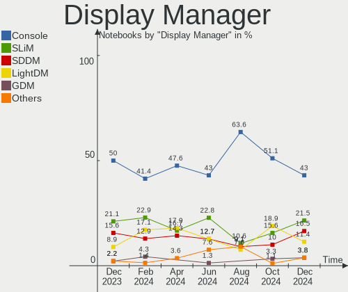
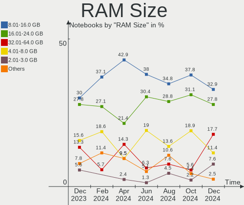
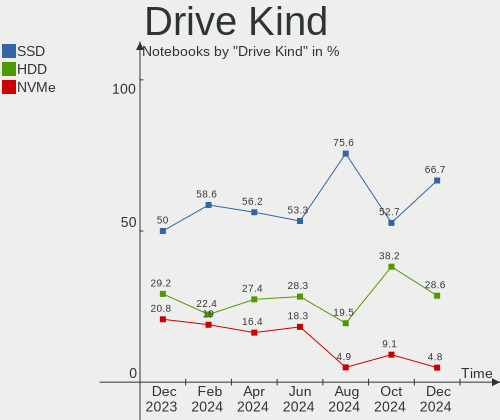
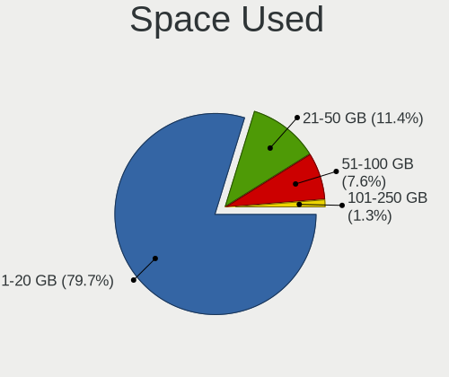
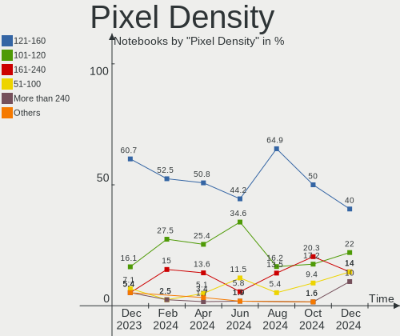
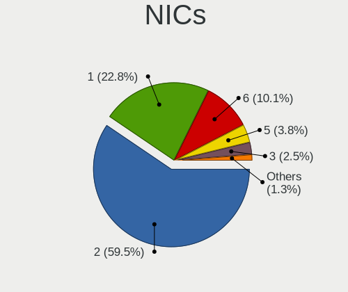

BSD - Hardware Trends (Notebooks)
---------------------------------

A project to identify most popular hardware characteristics and track their change
over time based on data collected by BSD users at https://BSD-Hardware.info.

Anyone can contribute to this report by the [hw-probe](https://github.com/linuxhw/hw-probe/blob/master/INSTALL.BSD.md) tool:

    hw-probe -all -upload

This report is for one last month. Overall report since the beginning of time: [TestCoverage](https://github.com/bsdhw/TestCoverage)

Period: Jul, 2022.

Contents
--------

* [ System ](#system)
  - [ OS                       ](#os)
  - [ OS Family                ](#os-family)
  - [ Arch                     ](#arch)
  - [ DE                       ](#de)
  - [ Display Server           ](#display-server)
  - [ Display Manager          ](#display-manager)
  - [ OS Lang                  ](#os-lang)
  - [ Boot Mode                ](#boot-mode)
  - [ Filesystem               ](#filesystem)
  - [ Part. scheme             ](#part-scheme)

* [ Board ](#board)
  - [ Vendor                   ](#vendor)
  - [ Model                    ](#model)
  - [ Model Family             ](#model-family)
  - [ MFG Year                 ](#mfg-year)
  - [ Form Factor              ](#form-factor)
  - [ Coreboot                 ](#coreboot)
  - [ RAM Size                 ](#ram-size)
  - [ RAM Used                 ](#ram-used)
  - [ Total Drives             ](#total-drives)
  - [ Has CD-ROM               ](#has-cd-rom)
  - [ Has Ethernet             ](#has-ethernet)
  - [ Has WiFi                 ](#has-wifi)
  - [ Has Bluetooth            ](#has-bluetooth)

* [ Location ](#location)
  - [ Country                  ](#country)
  - [ City                     ](#city)

* [ Drives ](#drives)
  - [ Drive Vendor             ](#drive-vendor)
  - [ Drive Model              ](#drive-model)
  - [ HDD Vendor               ](#hdd-vendor)
  - [ SSD Vendor               ](#ssd-vendor)
  - [ Drive Kind               ](#drive-kind)
  - [ Drive Connector          ](#drive-connector)
  - [ Drive Size               ](#drive-size)
  - [ Space Total              ](#space-total)
  - [ Space Used               ](#space-used)
  - [ Malfunc. Drives          ](#malfunc-drives)
  - [ Malfunc. Drive Vendor    ](#malfunc-drive-vendor)
  - [ Malfunc. HDD Vendor      ](#malfunc-hdd-vendor)
  - [ Malfunc. Drive Kind      ](#malfunc-drive-kind)
  - [ Failed Drives            ](#failed-drives)
  - [ Failed Drive Vendor      ](#failed-drive-vendor)
  - [ Drive Status             ](#drive-status)

* [ Storage controller ](#storage-controller)
  - [ Storage Vendor           ](#storage-vendor)
  - [ Storage Model            ](#storage-model)
  - [ Storage Kind             ](#storage-kind)

* [ Processor ](#processor)
  - [ CPU Vendor               ](#cpu-vendor)
  - [ CPU Model                ](#cpu-model)
  - [ CPU Model Family         ](#cpu-model-family)
  - [ CPU Cores                ](#cpu-cores)
  - [ CPU Sockets              ](#cpu-sockets)
  - [ CPU Threads              ](#cpu-threads)
  - [ CPU Microarch            ](#cpu-microarch)

* [ Graphics ](#graphics)
  - [ GPU Vendor               ](#gpu-vendor)
  - [ GPU Model                ](#gpu-model)
  - [ GPU Combo                ](#gpu-combo)
  - [ GPU Driver               ](#gpu-driver)
  - [ GPU Memory               ](#gpu-memory)

* [ Monitor ](#monitor)
  - [ Monitor Vendor           ](#monitor-vendor)
  - [ Monitor Model            ](#monitor-model)
  - [ Monitor Resolution       ](#monitor-resolution)
  - [ Monitor Diagonal         ](#monitor-diagonal)
  - [ Monitor Width            ](#monitor-width)
  - [ Aspect Ratio             ](#aspect-ratio)
  - [ Monitor Area             ](#monitor-area)
  - [ Pixel Density            ](#pixel-density)
  - [ Multiple Monitors        ](#multiple-monitors)

* [ Network ](#network)
  - [ Net Controller Vendor    ](#net-controller-vendor)
  - [ Net Controller Model     ](#net-controller-model)
  - [ Wireless Vendor          ](#wireless-vendor)
  - [ Wireless Model           ](#wireless-model)
  - [ Ethernet Vendor          ](#ethernet-vendor)
  - [ Ethernet Model           ](#ethernet-model)
  - [ Net Controller Kind      ](#net-controller-kind)
  - [ Used Controller          ](#used-controller)
  - [ NICs                     ](#nics)
  - [ IPv6                     ](#ipv6)

* [ Bluetooth ](#bluetooth)
  - [ Bluetooth Vendor         ](#bluetooth-vendor)
  - [ Bluetooth Model          ](#bluetooth-model)

* [ Sound ](#sound)
  - [ Sound Vendor             ](#sound-vendor)
  - [ Sound Model              ](#sound-model)

* [ Memory ](#memory)
  - [ Memory Vendor            ](#memory-vendor)
  - [ Memory Model             ](#memory-model)
  - [ Memory Kind              ](#memory-kind)
  - [ Memory Form Factor       ](#memory-form-factor)
  - [ Memory Size              ](#memory-size)
  - [ Memory Speed             ](#memory-speed)

* [ Printers & scanners ](#printers--scanners)
  - [ Printer Vendor           ](#printer-vendor)
  - [ Printer Model            ](#printer-model)
  - [ Scanner Vendor           ](#scanner-vendor)
  - [ Scanner Model            ](#scanner-model)

* [ Camera ](#camera)
  - [ Camera Vendor            ](#camera-vendor)
  - [ Camera Model             ](#camera-model)

* [ Security ](#security)
  - [ Fingerprint Vendor       ](#fingerprint-vendor)
  - [ Fingerprint Model        ](#fingerprint-model)
  - [ Chipcard Vendor          ](#chipcard-vendor)
  - [ Chipcard Model           ](#chipcard-model)

* [ Unsupported ](#unsupported)
  - [ Unsupported Devices      ](#unsupported-devices)
  - [ Unsupported Device Types ](#unsupported-device-types)

System
------

OS
--

Installed operating systems

| Name                 | Notebooks | Percent |
|----------------------|-----------|---------|
| FreeBSD 13.1         | 16        | 23.19%  |
| helloSystem 0.7.0    | 13        | 18.84%  |
| helloSystem 0.8.0    | 6         | 8.7%    |
| OpenBSD 7.1          | 5         | 7.25%   |
| OPNsense 22.1.10     | 3         | 4.35%   |
| GhostBSD 22.06.26    | 3         | 4.35%   |
| FreeBSD 14.0-CURRENT | 3         | 4.35%   |
| OPNsense 22.7        | 2         | 2.9%    |
| OPNsense 22.1.9      | 2         | 2.9%    |
| GhostBSD 22.07.16    | 2         | 2.9%    |
| GhostBSD 22.06.18    | 2         | 2.9%    |
| FreeBSD 13.0         | 2         | 2.9%    |
| OPNsense 21.7.8      | 1         | 1.45%   |
| OPNsense 21.1        | 1         | 1.45%   |
| OpenBSD 7.2          | 1         | 1.45%   |
| NomadBSD 5806f915    | 1         | 1.45%   |
| MyBee 13.1           | 1         | 1.45%   |
| helloSystem 0.6.0    | 1         | 1.45%   |
| GhostBSD 22.07.28    | 1         | 1.45%   |
| GhostBSD 22.07.13    | 1         | 1.45%   |
| GhostBSD 22.07.10    | 1         | 1.45%   |
| FreeBSD 12.3-STABLE  | 1         | 1.45%   |

OS Family
---------

OS without a version

| Name        | Notebooks | Percent |
|-------------|-----------|---------|
| FreeBSD     | 22        | 31.88%  |
| helloSystem | 20        | 28.99%  |
| GhostBSD    | 10        | 14.49%  |
| OPNsense    | 9         | 13.04%  |
| OpenBSD     | 6         | 8.7%    |
| NomadBSD    | 1         | 1.45%   |
| MyBee       | 1         | 1.45%   |

Arch
----

OS architecture (x86_64, i586, etc.)

| Name  | Notebooks | Percent |
|-------|-----------|---------|
| amd64 | 68        | 98.55%  |
| i386  | 1         | 1.45%   |

DE
--

Desktop Environment

| Name         | Notebooks | Percent |
|--------------|-----------|---------|
| helloDesktop | 23        | 33.33%  |
| Console      | 16        | 23.19%  |
| MATE         | 9         | 13.04%  |
| XFCE         | 8         | 11.59%  |
| KDE5         | 5         | 7.25%   |
| GNOME        | 4         | 5.8%    |
| TWM          | 2         | 2.9%    |
| Openbox      | 1         | 1.45%   |
| i3           | 1         | 1.45%   |

Display Server
--------------

X11 or Wayland

| Name    | Notebooks | Percent |
|---------|-----------|---------|
| X11     | 53        | 76.81%  |
| Console | 16        | 23.19%  |

Display Manager
---------------

SDDM, LightDM, etc.

| Name    | Notebooks | Percent |
|---------|-----------|---------|
| Console | 26        | 37.68%  |
| SLiM    | 25        | 36.23%  |
| LightDM | 12        | 17.39%  |
| SDDM    | 3         | 4.35%   |
| GDM     | 2         | 2.9%    |
| XDM     | 1         | 1.45%   |

OS Lang
-------

Language

| Lang    | Notebooks | Percent |
|---------|-----------|---------|
| en_US   | 25        | 36.23%  |
| C       | 20        | 28.99%  |
| Unknown | 17        | 24.64%  |
| es_ES   | 2         | 2.9%    |
| ru_RU   | 1         | 1.45%   |
| pt_BR   | 1         | 1.45%   |
| ja_JP   | 1         | 1.45%   |
| it_IT   | 1         | 1.45%   |
| en_GB   | 1         | 1.45%   |

Boot Mode
---------

EFI or BIOS

| Mode | Notebooks | Percent |
|------|-----------|---------|
| EFI  | 61        | 88.41%  |
| BIOS | 8         | 11.59%  |

Filesystem
----------

Type of filesystem

| Type   | Notebooks | Percent |
|--------|-----------|---------|
| Zfs    | 37        | 53.62%  |
| Ufs    | 14        | 20.29%  |
| Cd9660 | 12        | 17.39%  |
| Ffs    | 6         | 8.7%    |

Part. scheme
------------

Scheme of partitioning

| Type | Notebooks | Percent |
|------|-----------|---------|
| GPT  | 65        | 94.2%   |
| MBR  | 4         | 5.8%    |

Board
-----

Vendor
------

Motherboard manufacturer

| Name                | Notebooks | Percent |
|---------------------|-----------|---------|
| Lenovo              | 17        | 24.64%  |
| Dell                | 13        | 18.84%  |
| Hewlett-Packard     | 9         | 13.04%  |
| Deciso              | 6         | 8.7%    |
| ASUSTek Computer    | 5         | 7.25%   |
| Acer                | 4         | 5.8%    |
| Apple               | 3         | 4.35%   |
| Unknown             | 3         | 4.35%   |
| Fujitsu             | 2         | 2.9%    |
| Toshiba             | 1         | 1.45%   |
| Star Labs           | 1         | 1.45%   |
| Sony                | 1         | 1.45%   |
| Shuttle             | 1         | 1.45%   |
| Samsung Electronics | 1         | 1.45%   |
| MSI                 | 1         | 1.45%   |
| LG Electronics      | 1         | 1.45%   |

Model
-----

Motherboard model

| Name                                    | Notebooks | Percent |
|-----------------------------------------|-----------|---------|
| Deciso Netboard A20                     | 4         | 5.8%    |
| Unknown                                 | 3         | 4.35%   |
| HP 250 G6 Notebook PC                   | 2         | 2.9%    |
| Fujitsu LIFEBOOK A555                   | 2         | 2.9%    |
| Dell XPS 13 7390                        | 2         | 2.9%    |
| Toshiba Satellite L305D                 | 1         | 1.45%   |
| Star Labs LabTop                        | 1         | 1.45%   |
| Sony VGN-NS21M_S                        | 1         | 1.45%   |
| Shuttle DS437                           | 1         | 1.45%   |
| Samsung 340XAA/350XAA/550XAA            | 1         | 1.45%   |
| MSI GF63 Thin 10SC                      | 1         | 1.45%   |
| LG 17Z990-R.AAC9U1                      | 1         | 1.45%   |
| Lenovo V580 20147                       | 1         | 1.45%   |
| Lenovo ThinkPad X61s 76693KG            | 1         | 1.45%   |
| Lenovo ThinkPad X260 20F6S0KA00         | 1         | 1.45%   |
| Lenovo ThinkPad X200 7458NP9            | 1         | 1.45%   |
| Lenovo ThinkPad T61 7661GY9             | 1         | 1.45%   |
| Lenovo ThinkPad T495 20NJ0010PB         | 1         | 1.45%   |
| Lenovo ThinkPad T480 20L6SB2N00         | 1         | 1.45%   |
| Lenovo ThinkPad T470 20HD000MUK         | 1         | 1.45%   |
| Lenovo ThinkPad T420 4236C92            | 1         | 1.45%   |
| Lenovo ThinkPad L450 20DSS1S402         | 1         | 1.45%   |
| Lenovo ThinkPad L412 0585AD9            | 1         | 1.45%   |
| Lenovo IdeaPad Y580 20132               | 1         | 1.45%   |
| Lenovo IdeaPad S145-15API 81V7          | 1         | 1.45%   |
| Lenovo IdeaPad S12 20021,2959           | 1         | 1.45%   |
| Lenovo IdeaPad 5 Pro 16ACH6 82L5        | 1         | 1.45%   |
| Lenovo IdeaPad 330-15ARR 81D2           | 1         | 1.45%   |
| Lenovo G40-45 80E1                      | 1         | 1.45%   |
| HP ProBook 4730s                        | 1         | 1.45%   |
| HP ProBook 430 G4                       | 1         | 1.45%   |
| HP OMEN by Laptop                       | 1         | 1.45%   |
| HP Laptop 15-da0xxx                     | 1         | 1.45%   |
| HP Laptop 15-bs1xx                      | 1         | 1.45%   |
| HP EliteBook 8570p                      | 1         | 1.45%   |
| HP EliteBook 8540w                      | 1         | 1.45%   |
| Dell Studio XPS 1340                    | 1         | 1.45%   |
| Dell Precision 5560                     | 1         | 1.45%   |
| Dell Latitude E7440                     | 1         | 1.45%   |
| Dell Latitude E6420                     | 1         | 1.45%   |
| Dell Latitude E5450                     | 1         | 1.45%   |
| Dell Inspiron MP061                     | 1         | 1.45%   |
| Dell Inspiron 5559                      | 1         | 1.45%   |
| Dell Inspiron 5515                      | 1         | 1.45%   |
| Dell Inspiron 3505                      | 1         | 1.45%   |
| Dell Inspiron 15-3567                   | 1         | 1.45%   |
| Dell Inspiron 15-3552                   | 1         | 1.45%   |
| Deciso OPNsense Appliance               | 1         | 1.45%   |
| Deciso NetBoard-A10                     | 1         | 1.45%   |
| ASUS ZenBook UX325UA_UM325UA            | 1         | 1.45%   |
| ASUS X751LB                             | 1         | 1.45%   |
| ASUS VivoBook_ASUSLaptop X545FA_X545FA  | 1         | 1.45%   |
| ASUS VivoBook_ASUSLaptop X515JA_X515JA  | 1         | 1.45%   |
| ASUS VivoBook_ASUSLaptop E210MAB_E210MA | 1         | 1.45%   |
| Apple MacBookAir5,2                     | 1         | 1.45%   |
| Apple MacBook6,1                        | 1         | 1.45%   |
| Apple MacBook4,1                        | 1         | 1.45%   |
| Acer Nitro AN515-55                     | 1         | 1.45%   |
| Acer Aspire E5-571G                     | 1         | 1.45%   |
| Acer Aspire E5-521G                     | 1         | 1.45%   |

Model Family
------------

Motherboard model prefix

| Name                | Notebooks | Percent |
|---------------------|-----------|---------|
| Lenovo ThinkPad     | 10        | 14.49%  |
| Dell Inspiron       | 6         | 8.7%    |
| Lenovo IdeaPad      | 5         | 7.25%   |
| Deciso Netboard     | 4         | 5.8%    |
| Dell Latitude       | 3         | 4.35%   |
| ASUS VivoBook       | 3         | 4.35%   |
| Acer Aspire         | 3         | 4.35%   |
| Unknown             | 3         | 4.35%   |
| HP ProBook          | 2         | 2.9%    |
| HP Laptop           | 2         | 2.9%    |
| HP EliteBook        | 2         | 2.9%    |
| HP 250              | 2         | 2.9%    |
| Fujitsu LIFEBOOK    | 2         | 2.9%    |
| Dell XPS            | 2         | 2.9%    |
| Toshiba Satellite   | 1         | 1.45%   |
| Star Labs LabTop    | 1         | 1.45%   |
| Sony VGN-NS21M      | 1         | 1.45%   |
| Shuttle DS437       | 1         | 1.45%   |
| Samsung 340XAA      | 1         | 1.45%   |
| MSI GF63            | 1         | 1.45%   |
| LG 17Z990-R.AAC9U1  | 1         | 1.45%   |
| Lenovo V580         | 1         | 1.45%   |
| Lenovo G40-45       | 1         | 1.45%   |
| HP OMEN             | 1         | 1.45%   |
| Dell Studio         | 1         | 1.45%   |
| Dell Precision      | 1         | 1.45%   |
| Deciso OPNsense     | 1         | 1.45%   |
| Deciso NetBoard-A10 | 1         | 1.45%   |
| ASUS ZenBook        | 1         | 1.45%   |
| ASUS X751LB         | 1         | 1.45%   |
| Apple MacBookAir5   | 1         | 1.45%   |
| Apple MacBook6      | 1         | 1.45%   |
| Apple MacBook4      | 1         | 1.45%   |
| Acer Nitro          | 1         | 1.45%   |

MFG Year
--------

Motherboard manufacture year

| Year    | Notebooks | Percent |
|---------|-----------|---------|
| 2021    | 14        | 20.29%  |
| 2018    | 8         | 11.59%  |
| 2022    | 7         | 10.14%  |
| 2019    | 6         | 8.7%    |
| 2016    | 5         | 7.25%   |
| 2020    | 4         | 5.8%    |
| 2013    | 4         | 5.8%    |
| 2011    | 4         | 5.8%    |
| 2009    | 4         | 5.8%    |
| 2015    | 3         | 4.35%   |
| 2012    | 2         | 2.9%    |
| 2008    | 2         | 2.9%    |
| 2007    | 2         | 2.9%    |
| 2017    | 1         | 1.45%   |
| 2014    | 1         | 1.45%   |
| 2010    | 1         | 1.45%   |
| Unknown | 1         | 1.45%   |

Form Factor
-----------

Physical design of the computer

| Name     | Notebooks | Percent |
|----------|-----------|---------|
| Notebook | 69        | 100%    |

Coreboot
--------

Have coreboot on board

| Used | Notebooks | Percent |
|------|-----------|---------|
| No   | 69        | 100%    |

RAM Size
--------

Total RAM memory

| Size in GB | Notebooks | Percent |
|------------|-----------|---------|
| 8.01-16.0  | 28        | 40.58%  |
| 16.01-24.0 | 18        | 26.09%  |
| 4.01-8.0   | 17        | 24.64%  |
| 24.01-32.0 | 2         | 2.9%    |
| 2.01-3.0   | 2         | 2.9%    |
| 32.01-64.0 | 1         | 1.45%   |
| 3.01-4.0   | 1         | 1.45%   |

RAM Used
--------

Used RAM memory

| Used GB  | Notebooks | Percent |
|----------|-----------|---------|
| 0.01-0.5 | 39        | 56.52%  |
| 0.51-1.0 | 20        | 28.99%  |
| 2.01-3.0 | 5         | 7.25%   |
| 1.01-2.0 | 5         | 7.25%   |

Total Drives
------------

Number of drives on board

| Drives | Notebooks | Percent |
|--------|-----------|---------|
| 1      | 51        | 73.91%  |
| 2      | 15        | 21.74%  |
| 0      | 3         | 4.35%   |

Has CD-ROM
----------

Has CD-ROM on board

| Presented | Notebooks | Percent |
|-----------|-----------|---------|
| No        | 47        | 68.12%  |
| Yes       | 22        | 31.88%  |

Has Ethernet
------------

Has Ethernet on board

| Presented | Notebooks | Percent |
|-----------|-----------|---------|
| Yes       | 56        | 81.16%  |
| No        | 13        | 18.84%  |

Has WiFi
--------

Has WiFi module

| Presented | Notebooks | Percent |
|-----------|-----------|---------|
| Yes       | 62        | 89.86%  |
| No        | 7         | 10.14%  |

Has Bluetooth
-------------

Has Bluetooth module

| Presented | Notebooks | Percent |
|-----------|-----------|---------|
| Yes       | 45        | 65.22%  |
| No        | 24        | 34.78%  |

Location
--------

Country
-------

Geographic location (country)

| Country     | Notebooks | Percent |
|-------------|-----------|---------|
| USA         | 15        | 21.74%  |
| Brazil      | 6         | 8.7%    |
| Netherlands | 4         | 5.8%    |
| Germany     | 4         | 5.8%    |
| UK          | 3         | 4.35%   |
| Spain       | 3         | 4.35%   |
| Russia      | 3         | 4.35%   |
| Italy       | 3         | 4.35%   |
| India       | 3         | 4.35%   |
| Malaysia    | 2         | 2.9%    |
| Czechia     | 2         | 2.9%    |
| China       | 2         | 2.9%    |
| Canada      | 2         | 2.9%    |
| Turkey      | 1         | 1.45%   |
| Thailand    | 1         | 1.45%   |
| Taiwan      | 1         | 1.45%   |
| Switzerland | 1         | 1.45%   |
| Sweden      | 1         | 1.45%   |
| Slovenia    | 1         | 1.45%   |
| Poland      | 1         | 1.45%   |
| Philippines | 1         | 1.45%   |
| Norway      | 1         | 1.45%   |
| Namibia     | 1         | 1.45%   |
| Mexico      | 1         | 1.45%   |
| Japan       | 1         | 1.45%   |
| Iceland     | 1         | 1.45%   |
| Hungary     | 1         | 1.45%   |
| France      | 1         | 1.45%   |
| Finland     | 1         | 1.45%   |
| Bahamas     | 1         | 1.45%   |

City
----

Geographic location (city)

| City                  | Notebooks | Percent |
|-----------------------|-----------|---------|
| Riverside             | 2         | 2.9%    |
| Brno                  | 2         | 2.9%    |
| Yichun                | 1         | 1.45%   |
| Wraysbury             | 1         | 1.45%   |
| Winnipeg              | 1         | 1.45%   |
| Windhoek              | 1         | 1.45%   |
| Vienna                | 1         | 1.45%   |
| Vaudreuil-Dorion      | 1         | 1.45%   |
| Ufa                   | 1         | 1.45%   |
| Thousand Oaks         | 1         | 1.45%   |
| Taipei                | 1         | 1.45%   |
| Szeged                | 1         | 1.45%   |
| Shah Alam             | 1         | 1.45%   |
| Sao Paulo             | 1         | 1.45%   |
| Sao Bernardo do Campo | 1         | 1.45%   |
| Sandefjord            | 1         | 1.45%   |
| Salinas               | 1         | 1.45%   |
| Rho                   | 1         | 1.45%   |
| Reykjavik             | 1         | 1.45%   |
| Renton                | 1         | 1.45%   |
| Redondela             | 1         | 1.45%   |
| Quezon City           | 1         | 1.45%   |
| Putkilahti            | 1         | 1.45%   |
| Pessano Con Bornago   | 1         | 1.45%   |
| Osaka                 | 1         | 1.45%   |
| Omaha                 | 1         | 1.45%   |
| OEvertornea           | 1         | 1.45%   |
| Oegstgeest            | 1         | 1.45%   |
| New York              | 1         | 1.45%   |
| Nassau                | 1         | 1.45%   |
| Mumbai                | 1         | 1.45%   |
| Milan                 | 1         | 1.45%   |
| Mazatlán             | 1         | 1.45%   |
| Maracanau             | 1         | 1.45%   |
| Manchester            | 1         | 1.45%   |
| Madrid                | 1         | 1.45%   |
| London                | 1         | 1.45%   |
| Kollam                | 1         | 1.45%   |
| Khabarovsk            | 1         | 1.45%   |
| Katowice              | 1         | 1.45%   |
| Juelich               | 1         | 1.45%   |
| Istanbul              | 1         | 1.45%   |
| Indore                | 1         | 1.45%   |
| Houston               | 1         | 1.45%   |
| Hampton               | 1         | 1.45%   |
| Groningen             | 1         | 1.45%   |
| Glattbrugg            | 1         | 1.45%   |
| Frankfurt am Main     | 1         | 1.45%   |
| Ermont                | 1         | 1.45%   |
| Ede                   | 1         | 1.45%   |
| East Lansing          | 1         | 1.45%   |
| Dongguan              | 1         | 1.45%   |
| Detroit               | 1         | 1.45%   |
| Chita                 | 1         | 1.45%   |
| Chachoengsao          | 1         | 1.45%   |
| Campinas              | 1         | 1.45%   |
| Bucka                 | 1         | 1.45%   |
| Brooklyn              | 1         | 1.45%   |
| Bochum                | 1         | 1.45%   |
| Belo Horizonte        | 1         | 1.45%   |

Drives
------

Drive Vendor
------------

Hard drive vendors

| Vendor              | Notebooks | Drives | Percent |
|---------------------|-----------|--------|---------|
| WDC                 | 15        | 16     | 20.55%  |
| Samsung Electronics | 10        | 12     | 13.7%   |
| Seagate             | 9         | 9      | 12.33%  |
| Transcend           | 6         | 6      | 8.22%   |
| Toshiba             | 4         | 4      | 5.48%   |
| Kingston            | 4         | 5      | 5.48%   |
| NVMe                | 3         | 3      | 4.11%   |
| SSSTC               | 2         | 2      | 2.74%   |
| Hitachi             | 2         | 2      | 2.74%   |
| HGST                | 2         | 2      | 2.74%   |
| Crucial             | 2         | 2      | 2.74%   |
| China               | 2         | 2      | 2.74%   |
| Star Drive          | 1         | 1      | 1.37%   |
| SK hynix            | 1         | 1      | 1.37%   |
| SanDisk             | 1         | 1      | 1.37%   |
| Phison              | 1         | 1      | 1.37%   |
| Micron Technology   | 1         | 1      | 1.37%   |
| Indilinx            | 1         | 1      | 1.37%   |
| Hewlett-Packard     | 1         | 1      | 1.37%   |
| Fujitsu             | 1         | 1      | 1.37%   |
| Apple               | 1         | 1      | 1.37%   |
| Apacer              | 1         | 1      | 1.37%   |
| ANACOMDA            | 1         | 1      | 1.37%   |
| A-DATA Technology   | 1         | 2      | 1.37%   |

Drive Model
-----------

Hard drive models

| Model                            | Notebooks | Percent |
|----------------------------------|-----------|---------|
| Transcend TS256GMTS952T2 256GB   | 4         | 5.19%   |
| WDC WD10JPVX-22JC3T0 1TB         | 2         | 2.6%    |
| Transcend TS256GMTE652T2 256GB   | 2         | 2.6%    |
| Seagate ST500LT012-1DG142 500GB  | 2         | 2.6%    |
| Seagate ST1000LM049-2GH172 1TB   | 2         | 2.6%    |
| Seagate ST1000LM035-1RK172 1TB   | 2         | 2.6%    |
| Samsung SSD 870 EVO 1TB          | 2         | 2.6%    |
| WDC WDS500G3X0C-00SJG0 500GB     | 1         | 1.3%    |
| WDC WDS500G2B0A-00SM50 500GB     | 1         | 1.3%    |
| WDC WDS240G2G0B-00EPW0 240GB     | 1         | 1.3%    |
| WDC WD6400BPVT-60HXZT1 640GB     | 1         | 1.3%    |
| WDC WD5000LPVX-22V0TT0 500GB     | 1         | 1.3%    |
| WDC WD5000LPCX-35VHAT0 500GB     | 1         | 1.3%    |
| WDC WD3200BPVT-22JJ5T0 320GB     | 1         | 1.3%    |
| WDC WD1600BEVT-22ZCT0 160GB      | 1         | 1.3%    |
| WDC WD10SPZX-75Z10T3 1TB         | 1         | 1.3%    |
| WDC WD10SPZX-24Z10T0 1TB         | 1         | 1.3%    |
| WDC WD10JPVX-60JC3T1 1TB         | 1         | 1.3%    |
| WDC WD10JPVT-08A1YT2 1TB         | 1         | 1.3%    |
| WDC WD10EZEX-60WN4A0 1TB         | 1         | 1.3%    |
| WDC PC SN530 NVMe 256GB          | 1         | 1.3%    |
| Toshiba THNSF5256GPUK 256GB      | 1         | 1.3%    |
| Toshiba MQ01ABF050 500GB         | 1         | 1.3%    |
| Toshiba MQ01ABD100 1TB           | 1         | 1.3%    |
| Toshiba MK6034GSX 64GB           | 1         | 1.3%    |
| Star Drive PCIe SSD 960GB        | 1         | 1.3%    |
| SSSTC CL1-4D256 256GB            | 1         | 1.3%    |
| SSSTC CL1-3D256-Q11 NVMe 256GB   | 1         | 1.3%    |
| SK hynix HFM512GD3JX013N 512GB   | 1         | 1.3%    |
| Seagate ST9120821AS 118GB        | 1         | 1.3%    |
| Seagate ST500LT032-1E9142 500GB  | 1         | 1.3%    |
| Seagate ST320LT020-9YG142 320GB  | 1         | 1.3%    |
| SanDisk SSD U100 16GB            | 1         | 1.3%    |
| Samsung SSD PM810 2.5-inch 128GB | 1         | 1.3%    |
| Samsung SSD 970 PRO 1TB          | 1         | 1.3%    |
| Samsung SSD 970 EVO 250GB        | 1         | 1.3%    |
| Samsung SSD 860 QVO 1TB          | 1         | 1.3%    |
| Samsung SSD 860 PRO 512GB        | 1         | 1.3%    |
| Samsung SSD 860 EVO 500GB        | 1         | 1.3%    |
| Samsung SSD 850 EVO 120GB        | 1         | 1.3%    |
| Samsung MZVLB1T0HBLR-000L2 1TB   | 1         | 1.3%    |
| Samsung MZVKW512HMJP-000H1 512GB | 1         | 1.3%    |
| Samsung MZ7LN512HMJP-000L7 512GB | 1         | 1.3%    |
| Phison SWG256G-112HI 256GB       | 1         | 1.3%    |
| NVMe WDC PC SN530 SDB 256GB      | 1         | 1.3%    |
| NVMe KBG40ZNS512G NVM 512GB      | 1         | 1.3%    |
| NVMe INTEL SSDPEKNW51 512GB      | 1         | 1.3%    |
| Micron 2300 NVMe 512GB           | 1         | 1.3%    |
| Kingston SV300S37A240G 240GB     | 1         | 1.3%    |
| Kingston SNV425S2128GB           | 1         | 1.3%    |
| Kingston SA400S37120G 120GB      | 1         | 1.3%    |
| Kingston OM8PDP3256B-AI1 256GB   | 1         | 1.3%    |
| Indilinx InM2246S3-64G           | 1         | 1.3%    |
| Hitachi HTS721080G9SA00 80GB     | 1         | 1.3%    |
| Hitachi HTS545025B9SA02 250GB    | 1         | 1.3%    |
| HGST HTS721010A9E630 1TB         | 1         | 1.3%    |
| HGST HTS541010A9E680 1TB         | 1         | 1.3%    |
| HP SSD EX920 512GB               | 1         | 1.3%    |
| Fujitsu MHZ2250BH G2 250GB       | 1         | 1.3%    |
| Crucial CT240BX500SSD1 240GB     | 1         | 1.3%    |

HDD Vendor
----------

Hard disk drive vendors

| Vendor  | Notebooks | Drives | Percent |
|---------|-----------|--------|---------|
| WDC     | 12        | 12     | 38.71%  |
| Seagate | 9         | 9      | 29.03%  |
| Toshiba | 3         | 3      | 9.68%   |
| NVMe    | 2         | 2      | 6.45%   |
| Hitachi | 2         | 2      | 6.45%   |
| HGST    | 2         | 2      | 6.45%   |
| Fujitsu | 1         | 1      | 3.23%   |

SSD Vendor
----------

Solid state drive vendors

| Vendor              | Notebooks | Drives | Percent |
|---------------------|-----------|--------|---------|
| Samsung Electronics | 7         | 8      | 25.93%  |
| Transcend           | 4         | 4      | 14.81%  |
| Kingston            | 3         | 4      | 11.11%  |
| WDC                 | 2         | 2      | 7.41%   |
| Crucial             | 2         | 2      | 7.41%   |
| China               | 2         | 2      | 7.41%   |
| SanDisk             | 1         | 1      | 3.7%    |
| NVMe                | 1         | 1      | 3.7%    |
| Indilinx            | 1         | 1      | 3.7%    |
| Apple               | 1         | 1      | 3.7%    |
| Apacer              | 1         | 1      | 3.7%    |
| ANACOMDA            | 1         | 1      | 3.7%    |
| A-DATA Technology   | 1         | 2      | 3.7%    |

Drive Kind
----------

HDD or SSD

| Kind | Notebooks | Drives | Percent |
|------|-----------|--------|---------|
| HDD  | 28        | 31     | 39.44%  |
| SSD  | 26        | 30     | 36.62%  |
| NVMe | 17        | 17     | 23.94%  |

Drive Connector
---------------

SATA, SAS, NVMe, etc.

| Type | Notebooks | Drives | Percent |
|------|-----------|--------|---------|
| SATA | 51        | 61     | 75%     |
| NVMe | 17        | 17     | 25%     |

Drive Size
----------

Size of hard drive

| Size in TB | Notebooks | Drives | Percent |
|------------|-----------|--------|---------|
| 0.01-0.5   | 33        | 38     | 62.26%  |
| 0.51-1.0   | 20        | 23     | 37.74%  |

Space Total
-----------

Amount of disk space available on the file system

| Size in GB | Notebooks | Percent |
|------------|-----------|---------|
| 101-250    | 22        | 31.88%  |
| 1-20       | 17        | 24.64%  |
| 251-500    | 13        | 18.84%  |
| 501-1000   | 10        | 14.49%  |
| 21-50      | 3         | 4.35%   |
| 51-100     | 2         | 2.9%    |
| Unknown    | 2         | 2.9%    |

Space Used
----------

Amount of used disk space

| Used GB | Notebooks | Percent |
|---------|-----------|---------|
| 1-20    | 57        | 82.61%  |
| 21-50   | 5         | 7.25%   |
| 51-100  | 4         | 5.8%    |
| Unknown | 2         | 2.9%    |
| 251-500 | 1         | 1.45%   |

Malfunc. Drives
---------------

Drive models with a malfunction

| Model                                        | Notebooks | Drives | Percent |
|----------------------------------------------|-----------|--------|---------|
| WDC WD10SPZX-24Z10T0 1TB                     | 1         | 1      | 5.56%   |
| WDC WD10JPVX-60JC3T1 1TB                     | 1         | 1      | 5.56%   |
| Toshiba MQ01ABF050 500GB                     | 1         | 1      | 5.56%   |
| Toshiba MQ01ABD100 1TB                       | 1         | 1      | 5.56%   |
| Toshiba MK6034GSX 64GB                       | 1         | 1      | 5.56%   |
| Seagate ST9120821AS 118GB                    | 1         | 1      | 5.56%   |
| Seagate ST500LT012-1DG142 500GB              | 1         | 1      | 5.56%   |
| Seagate ST320LT020-9YG142 320GB              | 1         | 1      | 5.56%   |
| Seagate ST1000LM035-1RK172 1TB               | 1         | 1      | 5.56%   |
| Samsung Electronics SSD PM810 2.5-inch 128GB | 1         | 1      | 5.56%   |
| Kingston SV300S37A240G 240GB                 | 1         | 1      | 5.56%   |
| Hitachi HTS721080G9SA00 80GB                 | 1         | 1      | 5.56%   |
| Hitachi HTS545025B9SA02 250GB                | 1         | 1      | 5.56%   |
| HGST HTS721010A9E630 1TB                     | 1         | 1      | 5.56%   |
| Fujitsu MHZ2250BH G2 250GB                   | 1         | 1      | 5.56%   |
| China SH00M128GB                             | 1         | 1      | 5.56%   |
| China JWX 16GB MSATA                         | 1         | 1      | 5.56%   |
| A-DATA Technology SU630 240GB                | 1         | 1      | 5.56%   |

Malfunc. Drive Vendor
---------------------

Vendors of faulty drives

| Vendor              | Notebooks | Drives | Percent |
|---------------------|-----------|--------|---------|
| Seagate             | 4         | 4      | 22.22%  |
| Toshiba             | 3         | 3      | 16.67%  |
| WDC                 | 2         | 2      | 11.11%  |
| Hitachi             | 2         | 2      | 11.11%  |
| China               | 2         | 2      | 11.11%  |
| Samsung Electronics | 1         | 1      | 5.56%   |
| Kingston            | 1         | 1      | 5.56%   |
| HGST                | 1         | 1      | 5.56%   |
| Fujitsu             | 1         | 1      | 5.56%   |
| A-DATA Technology   | 1         | 1      | 5.56%   |

Malfunc. HDD Vendor
-------------------

Vendors of faulty HDD drives

| Vendor  | Notebooks | Drives | Percent |
|---------|-----------|--------|---------|
| Seagate | 4         | 4      | 30.77%  |
| Toshiba | 3         | 3      | 23.08%  |
| WDC     | 2         | 2      | 15.38%  |
| Hitachi | 2         | 2      | 15.38%  |
| HGST    | 1         | 1      | 7.69%   |
| Fujitsu | 1         | 1      | 7.69%   |

Malfunc. Drive Kind
-------------------

Kinds of faulty drives

| Kind | Notebooks | Drives | Percent |
|------|-----------|--------|---------|
| HDD  | 12        | 13     | 70.59%  |
| SSD  | 5         | 5      | 29.41%  |

Failed Drives
-------------

Failed drive models

Zero info for selected period =(

Failed Drive Vendor
-------------------

Failed drive vendors

Zero info for selected period =(

Drive Status
------------

Number of failed and malfunc. drives

| Status   | Notebooks | Drives | Percent |
|----------|-----------|--------|---------|
| Works    | 50        | 57     | 71.43%  |
| Malfunc  | 17        | 18     | 24.29%  |
| Detected | 3         | 3      | 4.29%   |

Storage controller
------------------

Storage Vendor
--------------

Storage controller vendors

| Vendor                         | Notebooks | Percent |
|--------------------------------|-----------|---------|
| Intel                          | 44        | 57.89%  |
| AMD                            | 12        | 15.79%  |
| Samsung Electronics            | 4         | 5.26%   |
| SanDisk                        | 3         | 3.95%   |
| Solid State Storage Technology | 2         | 2.63%   |
| Phison Electronics             | 2         | 2.63%   |
| Nvidia                         | 2         | 2.63%   |
| Unknown                        | 2         | 2.63%   |
| Toshiba                        | 1         | 1.32%   |
| SK hynix                       | 1         | 1.32%   |
| Micron Technology              | 1         | 1.32%   |
| KIOXIA                         | 1         | 1.32%   |
| Biwin Storage Technology       | 1         | 1.32%   |

Storage Model
-------------

Storage controller models

| Model                                                                            | Notebooks | Percent |
|----------------------------------------------------------------------------------|-----------|---------|
| AMD FCH SATA Controller [AHCI mode]                                              | 11        | 13.41%  |
| Intel Sunrise Point-LP SATA Controller [AHCI mode]                               | 8         | 9.76%   |
| Intel Wildcat Point-LP SATA Controller [AHCI Mode]                               | 6         | 7.32%   |
| Unknown                                                                          | 6         | 7.32%   |
| Intel 7 Series Chipset Family 6-port SATA Controller [AHCI mode]                 | 5         | 6.1%    |
| Intel 6 Series/C200 Series Chipset Family 6 port Mobile SATA AHCI Controller     | 4         | 4.88%   |
| Samsung NVMe SSD Controller SM981/PM981/PM983                                    | 3         | 3.66%   |
| Intel 82801HM/HEM (ICH8M/ICH8M-E) SATA Controller [AHCI mode]                    | 3         | 3.66%   |
| Intel 82801HM/HEM (ICH8M/ICH8M-E) IDE Controller                                 | 3         | 3.66%   |
| Intel 82801 Mobile SATA Controller [RAID mode]                                   | 3         | 3.66%   |
| Nvidia MCP79 AHCI Controller                                                     | 2         | 2.44%   |
| Intel Comet Lake SATA AHCI Controller                                            | 2         | 2.44%   |
| Intel 82801IBM/IEM (ICH9M/ICH9M-E) 4 port SATA Controller [AHCI mode]            | 2         | 2.44%   |
| Intel 8 Series SATA Controller 1 [AHCI mode]                                     | 2         | 2.44%   |
| Toshiba XG4 NVMe SSD Controller                                                  | 1         | 1.22%   |
| SK hynix Gold P31 SSD                                                            | 1         | 1.22%   |
| SanDisk WD Blue SN550 NVMe SSD                                                   | 1         | 1.22%   |
| SanDisk WD Black SN750 / PC SN730 NVMe SSD                                       | 1         | 1.22%   |
| SanDisk unknown                                                                  | 1         | 1.22%   |
| Samsung NVMe SSD Controller SM961/PM961/SM963                                    | 1         | 1.22%   |
| Phison PS5013 E13 NVMe Controller                                                | 1         | 1.22%   |
| Phison E12 NVMe Controller                                                       | 1         | 1.22%   |
| KIOXIA NVMe SSD Controller BG4                                                   | 1         | 1.22%   |
| Intel SSD 660P Series                                                            | 1         | 1.22%   |
| Intel HM170/QM170 Chipset SATA Controller [AHCI Mode]                            | 1         | 1.22%   |
| Intel Celeron/Pentium Silver Processor SATA Controller                           | 1         | 1.22%   |
| Intel Celeron N3350/Pentium N4200/Atom E3900 Series SATA AHCI Controller         | 1         | 1.22%   |
| Intel Atom/Celeron/Pentium Processor x5-E8000/J3xxx/N3xxx Series SATA Controller | 1         | 1.22%   |
| Intel 82801GBM/GHM (ICH7-M Family) SATA Controller [IDE mode]                    | 1         | 1.22%   |
| Intel 82801GBM/GHM (ICH7-M Family) SATA Controller [AHCI mode]                   | 1         | 1.22%   |
| Intel 82801G (ICH7 Family) IDE Controller                                        | 1         | 1.22%   |
| Intel 5 Series/3400 Series Chipset 6 port SATA AHCI Controller                   | 1         | 1.22%   |
| Intel 5 Series/3400 Series Chipset 4 port SATA AHCI Controller                   | 1         | 1.22%   |
| Intel 400 Series Chipset Family SATA AHCI Controller                             | 1         | 1.22%   |
| AMD SB7x0/SB8x0/SB9x0 SATA Controller [AHCI mode]                                | 1         | 1.22%   |
| AMD SB7x0/SB8x0/SB9x0 IDE Controller                                             | 1         | 1.22%   |

Storage Kind
------------

Kind of storage controller (IDE, SATA, NVMe, SAS, ...)

| Kind | Notebooks | Percent |
|------|-----------|---------|
| SATA | 54        | 65.85%  |
| NVMe | 19        | 23.17%  |
| IDE  | 6         | 7.32%   |
| RAID | 3         | 3.66%   |

Processor
---------

CPU Vendor
----------

Processor vendors

| Vendor | Notebooks | Percent |
|--------|-----------|---------|
| Intel  | 52        | 75.36%  |
| AMD    | 17        | 24.64%  |

CPU Model
---------

Processor models

| Model                                                    | Notebooks | Percent |
|----------------------------------------------------------|-----------|---------|
| Intel Core i7-10510U CPU @ 1.80GHz                       | 3         | 4.35%   |
| AMD EPYC 3201 8-Core Processor                           | 3         | 4.35%   |
| Intel Core i7-6500U CPU @ 2.50GHz                        | 2         | 2.9%    |
| Intel Core i7-5500U CPU @ 2.40GHz                        | 2         | 2.9%    |
| Intel Core i7-3520M CPU @ 2.90GHz                        | 2         | 2.9%    |
| Intel Core i5-7200U CPU @ 2.50GHz                        | 2         | 2.9%    |
| Intel Core i3-5005U CPU @ 2.00GHz                        | 2         | 2.9%    |
| AMD Ryzen Embedded V1500B                                | 2         | 2.9%    |
| Intel Pentium M                                          | 1         | 1.45%   |
| Intel Pentium Dual CPU T3400 @ 2.16GHz                   | 1         | 1.45%   |
| Intel Pentium CPU N3700 @ 1.60GHz                        | 1         | 1.45%   |
| Intel Genuine CPU                                        | 1         | 1.45%   |
| Intel Core i7-8565U CPU @ 1.80GHz                        | 1         | 1.45%   |
| Intel Core i7-8550U CPU @ 1.80GHz                        | 1         | 1.45%   |
| Intel Core i7-3630QM CPU @ 2.40GHz                       | 1         | 1.45%   |
| Intel Core i7-10710U CPU @ 1.10GHz                       | 1         | 1.45%   |
| Intel Core i7 CPU M 620 @ 2.67GHz                        | 1         | 1.45%   |
| Intel Core i5-8350U CPU @ 1.70GHz                        | 1         | 1.45%   |
| Intel Core i5-8250U CPU @ 1.60GHz                        | 1         | 1.45%   |
| Intel Core i5-7300U CPU @ 2.60GHz                        | 1         | 1.45%   |
| Intel Core i5-6300HQ CPU @ 2.30GHz                       | 1         | 1.45%   |
| Intel Core i5-5300U CPU @ 2.30GHz                        | 1         | 1.45%   |
| Intel Core i5-5200U CPU @ 2.20GHz                        | 1         | 1.45%   |
| Intel Core i5-4310U CPU @ 2.00GHz                        | 1         | 1.45%   |
| Intel Core i5-3427U CPU @ 1.80GHz                        | 1         | 1.45%   |
| Intel Core i5-2540M CPU @ 2.60GHz                        | 1         | 1.45%   |
| Intel Core i5-2540M CPU @ 2.60GH                         | 1         | 1.45%   |
| Intel Core i5-2520M CPU @ 2.50GHz                        | 1         | 1.45%   |
| Intel Core i5-2410M CPU @ 2.30GHz                        | 1         | 1.45%   |
| Intel Core i5-10500H CPU @ 2.50GHz                       | 1         | 1.45%   |
| Intel Core i5-1035G1 CPU @ 1.00GHz                       | 1         | 1.45%   |
| Intel Core i5-10300H CPU @ 2.50GHz                       | 1         | 1.45%   |
| Intel Core i3-7100U CPU @ 2.40GHz                        | 1         | 1.45%   |
| Intel Core i3-7020U CPU @ 2.30GHz                        | 1         | 1.45%   |
| Intel Core 2 Duo CPU T9300 @ 2.50GHz                     | 1         | 1.45%   |
| Intel Core 2 Duo CPU T8300 @ 2.40GHz                     | 1         | 1.45%   |
| Intel Core 2 Duo CPU P9500 @ 2.53GHz                     | 1         | 1.45%   |
| Intel Core 2 Duo CPU P8700 @ 2.53GHz                     | 1         | 1.45%   |
| Intel Core 2 Duo CPU P7550 @ 2.26GHz                     | 1         | 1.45%   |
| Intel Core 2 Duo CPU L7500 @ 1.60GHz                     | 1         | 1.45%   |
| Intel Celeron N4020 CPU @ 1.10GHz                        | 1         | 1.45%   |
| Intel Celeron CPU N3450 @ 1.10GHz                        | 1         | 1.45%   |
| Intel Celeron CPU 3865U @ 1.80GHz                        | 1         | 1.45%   |
| Intel Celeron CPU 1037U @ 1.80GHz                        | 1         | 1.45%   |
| Intel Celeron 2980U @ 1.60GHz                            | 1         | 1.45%   |
| Intel Atom CPU N270 @ 1.60GHz ("GenuineIntel" 686-class) | 1         | 1.45%   |
| Intel 11th Gen Core i7-11850H @ 2.50GHz                  | 1         | 1.45%   |
| AMD Ryzen 7 PRO 3700U w/ Radeon Vega Mobile Gfx          | 1         | 1.45%   |
| AMD Ryzen 7 5800H with Radeon Graphics                   | 1         | 1.45%   |
| AMD Ryzen 7 5700U with Radeon Graphics                   | 1         | 1.45%   |
| AMD Ryzen 5 5500U with Radeon Graphics                   | 1         | 1.45%   |
| AMD Ryzen 5 3500U with Radeon Vega Mobile Gfx            | 1         | 1.45%   |
| AMD Ryzen 5 3450U with Radeon Vega Mobile Gfx            | 1         | 1.45%   |
| AMD Ryzen 3 2200U with Radeon Vega Mobile Gfx            | 1         | 1.45%   |
| AMD EPYC 3101 4-Core Processor                           | 1         | 1.45%   |
| AMD E1-2500 APU with Radeon HD Graphics                  | 1         | 1.45%   |
| AMD Athlon X2 Dual-Core QL-62                            | 1         | 1.45%   |
| AMD A8-6410 APU with AMD Radeon R5 Graphics              | 1         | 1.45%   |
| AMD A6-6310 APU with AMD Radeon R4 Graphics              | 1         | 1.45%   |

CPU Model Family
----------------

Processor model prefix

| Model              | Notebooks | Percent |
|--------------------|-----------|---------|
| Intel Core i5      | 17        | 24.64%  |
| Intel Core i7      | 14        | 20.29%  |
| Intel Core 2 Duo   | 6         | 8.7%    |
| Intel Celeron      | 5         | 7.25%   |
| Intel Core i3      | 4         | 5.8%    |
| AMD EPYC           | 4         | 5.8%    |
| AMD Ryzen 5        | 3         | 4.35%   |
| AMD Ryzen Embedded | 2         | 2.9%    |
| AMD Ryzen 7        | 2         | 2.9%    |
| Other              | 1         | 1.45%   |
| Intel Pentium M    | 1         | 1.45%   |
| Intel Pentium Dual | 1         | 1.45%   |
| Intel Pentium      | 1         | 1.45%   |
| Intel Genuine      | 1         | 1.45%   |
| Intel Atom         | 1         | 1.45%   |
| AMD Ryzen 7 PRO    | 1         | 1.45%   |
| AMD Ryzen 3        | 1         | 1.45%   |
| AMD E1             | 1         | 1.45%   |
| AMD Athlon X2      | 1         | 1.45%   |
| AMD A8             | 1         | 1.45%   |
| AMD A6             | 1         | 1.45%   |

CPU Cores
---------

Number of processor cores

| Number  | Notebooks | Percent |
|---------|-----------|---------|
| 2       | 31        | 44.93%  |
| 4       | 17        | 24.64%  |
| 8       | 9         | 13.04%  |
| Unknown | 7         | 10.14%  |
| 16      | 2         | 2.9%    |
| 6       | 2         | 2.9%    |
| 12      | 1         | 1.45%   |

CPU Sockets
-----------

Number of sockets

| Number  | Notebooks | Percent |
|---------|-----------|---------|
| 1       | 65        | 94.2%   |
| 2       | 2         | 2.9%    |
| Unknown | 2         | 2.9%    |

CPU Threads
-----------

Threads per core (Hyper-Threading)

| Number  | Notebooks | Percent |
|---------|-----------|---------|
| 2       | 36        | 52.17%  |
| 1       | 26        | 37.68%  |
| Unknown | 7         | 10.14%  |

CPU Microarch
-------------

Microarchitecture

| Name            | Notebooks | Percent |
|-----------------|-----------|---------|
| KabyLake        | 13        | 18.84%  |
| Zen             | 7         | 10.14%  |
| Broadwell       | 6         | 8.7%    |
| Penryn          | 5         | 7.25%   |
| IvyBridge       | 5         | 7.25%   |
| SandyBridge     | 4         | 5.8%    |
| Zen+            | 3         | 4.35%   |
| Skylake         | 3         | 4.35%   |
| Core            | 3         | 4.35%   |
| CometLake       | 3         | 4.35%   |
| Unknown         | 3         | 4.35%   |
| Westmere        | 2         | 2.9%    |
| Puma            | 2         | 2.9%    |
| Haswell         | 2         | 2.9%    |
| Zen 3           | 1         | 1.45%   |
| Silvermont      | 1         | 1.45%   |
| K8 & K10 hybrid | 1         | 1.45%   |
| Jaguar          | 1         | 1.45%   |
| IceLake         | 1         | 1.45%   |
| Goldmont plus   | 1         | 1.45%   |
| Goldmont        | 1         | 1.45%   |
| Bonnell         | 1         | 1.45%   |

Graphics
--------

GPU Vendor
----------

Vendors of graphics cards

| Vendor | Notebooks | Percent |
|--------|-----------|---------|
| Intel  | 47        | 61.84%  |
| AMD    | 17        | 22.37%  |
| Nvidia | 12        | 15.79%  |

GPU Model
---------

Graphics card models

| Model                                                                                    | Notebooks | Percent |
|------------------------------------------------------------------------------------------|-----------|---------|
| Intel HD Graphics 5500                                                                   | 6         | 7.23%   |
| Intel HD Graphics 620                                                                    | 5         | 6.02%   |
| Intel 3rd Gen Core processor Graphics Controller                                         | 4         | 4.82%   |
| Intel 2nd Generation Core Processor Family Integrated Graphics Controller                | 4         | 4.82%   |
| Intel UHD Graphics 620                                                                   | 3         | 3.61%   |
| Intel Mobile GM965/GL960 Integrated Graphics Controller (secondary)                      | 3         | 3.61%   |
| Intel Mobile GM965/GL960 Integrated Graphics Controller (primary)                        | 3         | 3.61%   |
| Intel CometLake-U GT2 [UHD Graphics]                                                     | 3         | 3.61%   |
| AMD Picasso/Raven 2 [Radeon Vega Series / Radeon Vega Mobile Series]                     | 3         | 3.61%   |
| Nvidia TU117M [GeForce GTX 1650 Mobile / Max-Q]                                          | 2         | 2.41%   |
| Intel Skylake GT2 [HD Graphics 520]                                                      | 2         | 2.41%   |
| Intel Mobile 4 Series Chipset Integrated Graphics Controller                             | 2         | 2.41%   |
| Intel Haswell-ULT Integrated Graphics Controller                                         | 2         | 2.41%   |
| Intel CometLake-H GT2 [UHD Graphics]                                                     | 2         | 2.41%   |
| AMD Sun XT [Radeon HD 8670A/8670M/8690M / R5 M330 / M430 / Radeon 520 Mobile]            | 2         | 2.41%   |
| AMD Mullins [Radeon R4/R5 Graphics]                                                      | 2         | 2.41%   |
| AMD Lucienne                                                                             | 2         | 2.41%   |
| Nvidia TU117M                                                                            | 1         | 1.2%    |
| Nvidia GM108M [GeForce MX130]                                                            | 1         | 1.2%    |
| Nvidia GM108M [GeForce 940M]                                                             | 1         | 1.2%    |
| Nvidia GM107M [GeForce GTX 950M]                                                         | 1         | 1.2%    |
| Nvidia GK107M [GeForce GTX 660M]                                                         | 1         | 1.2%    |
| Nvidia GK107M [GeForce GT 645M]                                                          | 1         | 1.2%    |
| Nvidia GF117M [GeForce 610M/710M/810M/820M / GT 620M/625M/630M/720M]                     | 1         | 1.2%    |
| Nvidia GA107GLM [RTX A2000 Mobile]                                                       | 1         | 1.2%    |
| Nvidia G98M [GeForce 9200M GS]                                                           | 1         | 1.2%    |
| Nvidia C79 [GeForce 9400M]                                                               | 1         | 1.2%    |
| Nvidia C79 [GeForce 9400M G]                                                             | 1         | 1.2%    |
| Intel WhiskeyLake-U GT2 [UHD Graphics 620]                                               | 1         | 1.2%    |
| Intel TigerLake-H GT1 [UHD Graphics]                                                     | 1         | 1.2%    |
| Intel Mobile 945GSE Express Integrated Graphics Controller                               | 1         | 1.2%    |
| Intel Mobile 945GM/GMS/GME, 943/940GML Express Integrated Graphics Controller            | 1         | 1.2%    |
| Intel Kaby Lake-U GT1 Integrated Graphics Controller                                     | 1         | 1.2%    |
| Intel Iris Plus Graphics G1 (Ice Lake)                                                   | 1         | 1.2%    |
| Intel HD Graphics 530                                                                    | 1         | 1.2%    |
| Intel HD Graphics 500                                                                    | 1         | 1.2%    |
| Intel GeminiLake [UHD Graphics 600]                                                      | 1         | 1.2%    |
| Intel Core Processor Integrated Graphics Controller                                      | 1         | 1.2%    |
| Intel Comet Lake UHD Graphics                                                            | 1         | 1.2%    |
| Intel Atom/Celeron/Pentium Processor x5-E8000/J3xxx/N3xxx Integrated Graphics Controller | 1         | 1.2%    |
| AMD Thames [Radeon HD 7550M/7570M/7650M]                                                 | 1         | 1.2%    |
| AMD Sun LE [Radeon HD 8550M / R5 M230]                                                   | 1         | 1.2%    |
| AMD Seymour [Radeon HD 6400M/7400M Series]                                               | 1         | 1.2%    |
| AMD RV515/M54 [Mobility Radeon X1400]                                                    | 1         | 1.2%    |
| AMD RS780MC [Mobility Radeon HD 3100]                                                    | 1         | 1.2%    |
| AMD Raven Ridge [Radeon Vega Series / Radeon Vega Mobile Series]                         | 1         | 1.2%    |
| AMD Madison [Mobility Radeon HD 5730 / 6570M]                                            | 1         | 1.2%    |
| AMD Kabini [Radeon HD 8240 / R3 Series]                                                  | 1         | 1.2%    |
| AMD Jet XT [Radeon R5 M240]                                                              | 1         | 1.2%    |
| AMD Cezanne                                                                              | 1         | 1.2%    |

GPU Combo
---------

Combinations of graphics cards

| Name           | Notebooks | Percent |
|----------------|-----------|---------|
| 1 x Intel      | 29        | 42.03%  |
| 1 x AMD        | 11        | 15.94%  |
| Intel + Nvidia | 9         | 13.04%  |
| Other          | 6         | 8.7%    |
| 2 x Intel      | 6         | 8.7%    |
| Intel + AMD    | 3         | 4.35%   |
| 2 x AMD        | 2         | 2.9%    |
| 2 x Nvidia     | 1         | 1.45%   |
| 1 x Nvidia     | 1         | 1.45%   |
| AMD + Nvidia   | 1         | 1.45%   |

GPU Driver
----------

Free vs proprietary

| Driver      | Notebooks | Percent |
|-------------|-----------|---------|
| Free        | 61        | 88.41%  |
| Unknown     | 6         | 8.7%    |
| Proprietary | 2         | 2.9%    |

GPU Memory
----------

Total video memory

| Size in GB | Notebooks | Percent |
|------------|-----------|---------|
| Unknown    | 58        | 84.06%  |
| 0.01-0.5   | 6         | 8.7%    |
| 1.01-2.0   | 2         | 2.9%    |
| 0.51-1.0   | 2         | 2.9%    |
| 3.01-4.0   | 1         | 1.45%   |

Monitor
-------

Monitor Vendor
--------------

Monitor vendors

| Vendor                  | Notebooks | Percent |
|-------------------------|-----------|---------|
| Chimei Innolux          | 14        | 25.45%  |
| LG Display              | 10        | 18.18%  |
| AU Optronics            | 9         | 16.36%  |
| Samsung Electronics     | 5         | 9.09%   |
| Lenovo                  | 4         | 7.27%   |
| BenQ                    | 3         | 5.45%   |
| PANDA                   | 2         | 3.64%   |
| BOE                     | 2         | 3.64%   |
| Apple                   | 2         | 3.64%   |
| Philips                 | 1         | 1.82%   |
| Goldstar                | 1         | 1.82%   |
| Fujitsu Siemens         | 1         | 1.82%   |
| Chi Mei Optoelectronics | 1         | 1.82%   |

Monitor Model
-------------

Monitor models

| Model                                                                    | Notebooks | Percent |
|--------------------------------------------------------------------------|-----------|---------|
| LG Display LCD Monitor LGD0353 1366x768 350x190mm 15.7-inch              | 2         | 3.64%   |
| Chimei Innolux LCD Monitor CMN14C9 1920x1080 310x170mm 13.9-inch         | 2         | 3.64%   |
| BenQ BL2480 BNQ802C 1920x1080 530x300mm 24.0-inch                        | 2         | 3.64%   |
| AU Optronics LCD Monitor AUO5B2D 1920x1080 290x160mm 13.0-inch           | 2         | 3.64%   |
| Samsung Electronics U28E590 SAM0C4E 3840x2160 610x350mm 27.7-inch        | 1         | 1.82%   |
| Samsung Electronics LCD Monitor SEC3741 1280x800 330x210mm 15.4-inch     | 1         | 1.82%   |
| Samsung Electronics LCD Monitor SDC8B4F 1920x1080 340x190mm 15.3-inch    | 1         | 1.82%   |
| Samsung Electronics LCD Monitor SDC4158 1920x1080 290x170mm 13.2-inch    | 1         | 1.82%   |
| Samsung Electronics C24F390 SAM0D2C 1920x1080 520x290mm 23.4-inch        | 1         | 1.82%   |
| Philips LCD Monitor PHL08C3 1920x1080 600x340mm 27.2-inch                | 1         | 1.82%   |
| PANDA LCD Monitor NCP0046 1920x1080 340x190mm 15.3-inch                  | 1         | 1.82%   |
| PANDA LC133LF1L02 NCP0019 1920x1080 290x170mm 13.2-inch                  | 1         | 1.82%   |
| LG Display LCD Monitor LGD05F8 2560x1600 370x230mm 17.2-inch             | 1         | 1.82%   |
| LG Display LCD Monitor LGD0532 1920x1080 340x190mm 15.3-inch             | 1         | 1.82%   |
| LG Display LCD Monitor LGD0484 1366x768 340x190mm 15.3-inch              | 1         | 1.82%   |
| LG Display LCD Monitor LGD02EB 1366x768 310x170mm 13.9-inch              | 1         | 1.82%   |
| LG Display LCD Monitor LGD02E2 1600x900 310x170mm 13.9-inch              | 1         | 1.82%   |
| LG Display LCD Monitor LGD027B 1600x900 380x210mm 17.1-inch              | 1         | 1.82%   |
| LG Display LCD Monitor LGD01E9 1920x1080 350x190mm 15.7-inch             | 1         | 1.82%   |
| LG Display LCD Monitor LGD01AB 1280x800 260x160mm 12.0-inch              | 1         | 1.82%   |
| Lenovo LCD Monitor LEN40A0 1366x768 310x170mm 13.9-inch                  | 1         | 1.82%   |
| Lenovo LCD Monitor LEN4031 1280x800 300x190mm 14.0-inch                  | 1         | 1.82%   |
| Lenovo LCD Monitor LEN4011 1280x800 260x170mm 12.2-inch                  | 1         | 1.82%   |
| Lenovo LCD Monitor LEN4000 1024x768 250x180mm 12.1-inch                  | 1         | 1.82%   |
| Goldstar LCD Monitor GSM580D 1920x1080 510x290mm 23.1-inch               | 1         | 1.82%   |
| Fujitsu Siemens XE17-4 FUS0674 1280x1024 340x270mm 17.1-inch             | 1         | 1.82%   |
| Chimei Innolux LCD Monitor CMN1734 1600x900 380x210mm 17.1-inch          | 1         | 1.82%   |
| Chimei Innolux LCD Monitor CMN15F5 1920x1080 340x190mm 15.3-inch         | 1         | 1.82%   |
| Chimei Innolux LCD Monitor CMN15E3 1920x1080 340x190mm 15.3-inch         | 1         | 1.82%   |
| Chimei Innolux LCD Monitor CMN15DB 1366x768 340x190mm 15.3-inch          | 1         | 1.82%   |
| Chimei Innolux LCD Monitor CMN15D5 1920x1080 340x190mm 15.3-inch         | 1         | 1.82%   |
| Chimei Innolux LCD Monitor CMN15CC 1366x768 340x190mm 15.3-inch          | 1         | 1.82%   |
| Chimei Innolux LCD Monitor CMN15C6 1366x768 340x190mm 15.3-inch          | 1         | 1.82%   |
| Chimei Innolux LCD Monitor CMN15BF 1366x768 340x190mm 15.3-inch          | 1         | 1.82%   |
| Chimei Innolux LCD Monitor CMN152E 1920x1080 340x190mm 15.3-inch         | 1         | 1.82%   |
| Chimei Innolux LCD Monitor CMN1521 1920x1080 340x190mm 15.3-inch         | 1         | 1.82%   |
| Chimei Innolux LCD Monitor CMN1492 1366x768 310x170mm 13.9-inch          | 1         | 1.82%   |
| Chimei Innolux LCD Monitor CMN1368 1366x768 290x160mm 13.0-inch          | 1         | 1.82%   |
| Chi Mei Optoelectronics LCD Monitor CMO15A3 1366x768 350x190mm 15.7-inch | 1         | 1.82%   |
| BOE LCD Monitor BOE0757 1366x768 340x190mm 15.3-inch                     | 1         | 1.82%   |
| BOE LCD Monitor BOE0600 1366x768 310x170mm 13.9-inch                     | 1         | 1.82%   |
| BenQ EX3203R BNQ7F66 2560x1440 700x390mm 31.5-inch                       | 1         | 1.82%   |
| AU Optronics LCD Monitor AUODF87 1920x1080 340x190mm 15.3-inch           | 1         | 1.82%   |
| AU Optronics LCD Monitor AUO71EC 1366x768 340x190mm 15.3-inch            | 1         | 1.82%   |
| AU Optronics LCD Monitor AUO40EC 1366x768 340x190mm 15.3-inch            | 1         | 1.82%   |
| AU Optronics LCD Monitor AUO38ED 1920x1080 340x190mm 15.3-inch           | 1         | 1.82%   |
| AU Optronics LCD Monitor AUO2A3C 1366x768 310x170mm 13.9-inch            | 1         | 1.82%   |
| AU Optronics LCD Monitor AUO23ED 1920x1080 340x190mm 15.3-inch           | 1         | 1.82%   |
| AU Optronics LCD Monitor AUO226D 1920x1080 280x160mm 12.7-inch           | 1         | 1.82%   |
| Apple LCD Monitor APP9CD1 1280x800 290x180mm 13.4-inch                   | 1         | 1.82%   |
| Apple LCD Monitor APP9C5F 1280x800 290x180mm 13.4-inch                   | 1         | 1.82%   |

Monitor Resolution
------------------

Monitor screen resolution

| Resolution       | Notebooks | Percent |
|------------------|-----------|---------|
| 1920x1080 (FHD)  | 22        | 42.31%  |
| 1366x768 (WXGA)  | 17        | 32.69%  |
| 1280x800 (WXGA)  | 6         | 11.54%  |
| 1600x900 (HD+)   | 3         | 5.77%   |
| 3840x2160 (4K)   | 1         | 1.92%   |
| 2560x1600        | 1         | 1.92%   |
| 2560x1440 (QHD)  | 1         | 1.92%   |
| 1280x1024 (SXGA) | 1         | 1.92%   |

Monitor Diagonal
----------------

Diagonal size in inches

| Inches | Notebooks | Percent |
|--------|-----------|---------|
| 15     | 24        | 43.64%  |
| 13     | 15        | 27.27%  |
| 17     | 4         | 7.27%   |
| 23     | 3         | 5.45%   |
| 12     | 3         | 5.45%   |
| 27     | 2         | 3.64%   |
| 24     | 2         | 3.64%   |
| 31     | 1         | 1.82%   |
| 14     | 1         | 1.82%   |

Monitor Width
-------------

Physical width

| Width in mm | Notebooks | Percent |
|-------------|-----------|---------|
| 301-350     | 33        | 60%     |
| 201-300     | 11        | 20%     |
| 501-600     | 6         | 10.91%  |
| 351-400     | 3         | 5.45%   |
| 601-700     | 2         | 3.64%   |

Aspect Ratio
------------

Proportional relationship between the width and the height

| Ratio | Notebooks | Percent |
|-------|-----------|---------|
| 16/9  | 42        | 84%     |
| 16/10 | 6         | 12%     |
| 5/4   | 1         | 2%      |
| 3/2   | 1         | 2%      |

Monitor Area
------------

Area in inch²

| Area in inch² | Notebooks | Percent |
|----------------|-----------|---------|
| 91-100         | 19        | 34.55%  |
| 81-90          | 11        | 20%     |
| 71-80          | 5         | 9.09%   |
| 201-250        | 5         | 9.09%   |
| 101-110        | 5         | 9.09%   |
| 61-70          | 3         | 5.45%   |
| 301-350        | 2         | 3.64%   |
| 121-130        | 2         | 3.64%   |
| 351-500        | 1         | 1.82%   |
| 141-150        | 1         | 1.82%   |
| 131-140        | 1         | 1.82%   |

Pixel Density
-------------

Pixels per inch

| Density | Notebooks | Percent |
|---------|-----------|---------|
| 121-160 | 19        | 34.55%  |
| 101-120 | 18        | 32.73%  |
| 51-100  | 12        | 21.82%  |
| 161-240 | 6         | 10.91%  |

Multiple Monitors
-----------------

Total monitors connected

| Total | Notebooks | Percent |
|-------|-----------|---------|
| 1     | 45        | 65.22%  |
| 0     | 18        | 26.09%  |
| 2     | 6         | 8.7%    |

Network
-------

Net Controller Vendor
---------------------

Controller vendors

| Vendor                   | Notebooks | Percent |
|--------------------------|-----------|---------|
| Intel                    | 42        | 36.52%  |
| Realtek Semiconductor    | 28        | 24.35%  |
| Qualcomm Atheros         | 14        | 12.17%  |
| Broadcom                 | 7         | 6.09%   |
| AMD                      | 6         | 5.22%   |
| Samsung Electronics      | 4         | 3.48%   |
| Nvidia                   | 2         | 1.74%   |
| Marvell Technology Group | 2         | 1.74%   |
| Xiaomi                   | 1         | 0.87%   |
| TP-Link                  | 1         | 0.87%   |
| Sierra Wireless          | 1         | 0.87%   |
| Ralink Technology        | 1         | 0.87%   |
| Ralink                   | 1         | 0.87%   |
| Novatel Wireless         | 1         | 0.87%   |
| MediaTek                 | 1         | 0.87%   |
| Hewlett-Packard          | 1         | 0.87%   |
| Generic                  | 1         | 0.87%   |
| Edimax Technology        | 1         | 0.87%   |

Net Controller Model
--------------------

Controller models

| Model                                                             | Notebooks | Percent |
|-------------------------------------------------------------------|-----------|---------|
| Realtek RTL8111/8168/8411 PCI Express Gigabit Ethernet Controller | 19        | 14.07%  |
| Qualcomm Atheros QCA9565 / AR9565 Wireless Network Adapter        | 6         | 4.44%   |
| AMD Family 17h Processor 10 Gb Ethernet Controller Port 0         | 6         | 4.44%   |
| Realtek RTL810xE PCI Express Fast Ethernet controller             | 5         | 3.7%    |
| Intel Wireless 7265                                               | 5         | 3.7%    |
| Intel I210 Gigabit Network Connection                             | 5         | 3.7%    |
| Realtek RTL8821CE 802.11ac PCIe Wireless Network Adapter          | 4         | 2.96%   |
| Intel Wireless 8265 / 8275                                        | 4         | 2.96%   |
| Samsung Galaxy series, misc. (tethering mode)                     | 3         | 2.22%   |
| Qualcomm Atheros QCA9377 802.11ac Wireless Network Adapter        | 3         | 2.22%   |
| Qualcomm Atheros AR928X Wireless Network Adapter (PCI-Express)    | 3         | 2.22%   |
| Intel 82579LM Gigabit Network Connection (Lewisville)             | 3         | 2.22%   |
| Broadcom BCM43224 802.11a/b/g/n                                   | 3         | 2.22%   |
| Nvidia MCP79 Ethernet                                             | 2         | 1.48%   |
| Intel Wi-Fi 6 AX200                                               | 2         | 1.48%   |
| Intel I211 Gigabit Network Connection                             | 2         | 1.48%   |
| Intel Dual Band Wireless-AC 3168NGW [Stone Peak]                  | 2         | 1.48%   |
| Intel Comet Lake PCH CNVi WiFi                                    | 2         | 1.48%   |
| Intel Centrino Advanced-N 6205 [Taylor Peak]                      | 2         | 1.48%   |
| Intel 82566MM Gigabit Network Connection                          | 2         | 1.48%   |
| Xiaomi Mi/Redmi series (RNDIS + ADB)                              | 1         | 0.74%   |
| TP-Link AC600 wireless Realtek RTL8811AU [Archer T2U Nano]        | 1         | 0.74%   |
| Sierra Wireless Sierra Wireless EM7345 4G LTE                     | 1         | 0.74%   |
| Samsung GT-I9070 (network tethering, USB debugging enabled)       | 1         | 0.74%   |
| Realtek RTL8723DE Wireless Network Adapter                        | 1         | 0.74%   |
| Realtek RTL8723BE PCIe Wireless Network Adapter                   | 1         | 0.74%   |
| Realtek RTL8192CU 802.11n WLAN Adapter                            | 1         | 0.74%   |
| Realtek RTL8188CE 802.11b/g/n WiFi Adapter                        | 1         | 0.74%   |
| Realtek Realtek Bluetooth Adapter                                 | 1         | 0.74%   |
| Realtek Realtek Bluetooth 4.2 Adapter                             | 1         | 0.74%   |
| Realtek Killer E2600 Gigabit Ethernet Controller                  | 1         | 0.74%   |
| Ralink MT7610U ("Archer T2U" 2.4G+5G WLAN Adapter                 | 1         | 0.74%   |
| Ralink RT3592 Wireless 802.11abgn 2T/2R PCIe                      | 1         | 0.74%   |
| Qualcomm Atheros QCA8171 Gigabit Ethernet                         | 1         | 0.74%   |
| Qualcomm Atheros AR9285 Wireless Network Adapter (PCI-Express)    | 1         | 0.74%   |
| Qualcomm Atheros AR8161 Gigabit Ethernet                          | 1         | 0.74%   |
| Novatel Wireless MiFi 8800L RNDIS Control RNDIS Ethernet Data     | 1         | 0.74%   |
| MediaTek MT7921 802.11ax PCI Express Wireless Network Adapter     | 1         | 0.74%   |
| Marvell Group 88E8058 PCI-E Gigabit Ethernet Controller           | 1         | 0.74%   |
| Marvell Group 88E8055 PCI-E Gigabit Ethernet Controller           | 1         | 0.74%   |
| Intel Wireless-AC 9260                                            | 1         | 0.74%   |
| Intel Wireless 8260                                               | 1         | 0.74%   |
| Intel Wireless 7260                                               | 1         | 0.74%   |
| Intel Wireless 3160                                               | 1         | 0.74%   |
| Intel Wi-Fi 6 AX210/AX211/AX411 160MHz                            | 1         | 0.74%   |
| Intel Ultimate N WiFi Link 5300                                   | 1         | 0.74%   |
| Intel Tiger Lake PCH CNVi WiFi                                    | 1         | 0.74%   |
| Intel PRO/Wireless 4965 AG or AGN [Kedron] Network Connection     | 1         | 0.74%   |
| Intel PRO/Wireless 3945ABG [Golan] Network Connection             | 1         | 0.74%   |
| Intel Ice Lake-LP PCH CNVi WiFi                                   | 1         | 0.74%   |
| Intel Ethernet Connection I219-V                                  | 1         | 0.74%   |
| Intel Ethernet Connection I219-LM                                 | 1         | 0.74%   |
| Intel Ethernet Connection I218-LM                                 | 1         | 0.74%   |
| Intel Ethernet Connection (4) I219-LM                             | 1         | 0.74%   |
| Intel Ethernet Connection (3) I218-V                              | 1         | 0.74%   |
| Intel Ethernet Connection (3) I218-LM                             | 1         | 0.74%   |
| Intel Comet Lake PCH-LP CNVi WiFi                                 | 1         | 0.74%   |
| Intel Centrino Wireless-N 2200                                    | 1         | 0.74%   |
| Intel Centrino Ultimate-N 6300                                    | 1         | 0.74%   |
| Intel Centrino Advanced-N 6200                                    | 1         | 0.74%   |

Wireless Vendor
---------------

Wireless vendors

| Vendor                | Notebooks | Percent |
|-----------------------|-----------|---------|
| Intel                 | 32        | 48.48%  |
| Qualcomm Atheros      | 13        | 19.7%   |
| Realtek Semiconductor | 9         | 13.64%  |
| Broadcom              | 6         | 9.09%   |
| TP-Link               | 1         | 1.52%   |
| Sierra Wireless       | 1         | 1.52%   |
| Ralink Technology     | 1         | 1.52%   |
| Ralink                | 1         | 1.52%   |
| MediaTek              | 1         | 1.52%   |
| Edimax Technology     | 1         | 1.52%   |

Wireless Model
--------------

Wireless models

| Model                                                          | Notebooks | Percent |
|----------------------------------------------------------------|-----------|---------|
| Qualcomm Atheros QCA9565 / AR9565 Wireless Network Adapter     | 6         | 8.96%   |
| Intel Wireless 7265                                            | 5         | 7.46%   |
| Realtek RTL8821CE 802.11ac PCIe Wireless Network Adapter       | 4         | 5.97%   |
| Intel Wireless 8265 / 8275                                     | 4         | 5.97%   |
| Qualcomm Atheros QCA9377 802.11ac Wireless Network Adapter     | 3         | 4.48%   |
| Qualcomm Atheros AR928X Wireless Network Adapter (PCI-Express) | 3         | 4.48%   |
| Broadcom BCM43224 802.11a/b/g/n                                | 3         | 4.48%   |
| Intel Wi-Fi 6 AX200                                            | 2         | 2.99%   |
| Intel Dual Band Wireless-AC 3168NGW [Stone Peak]               | 2         | 2.99%   |
| Intel Comet Lake PCH CNVi WiFi                                 | 2         | 2.99%   |
| Intel Centrino Advanced-N 6205 [Taylor Peak]                   | 2         | 2.99%   |
| TP-Link AC600 wireless Realtek RTL8811AU [Archer T2U Nano]     | 1         | 1.49%   |
| Sierra Wireless Sierra Wireless EM7345 4G LTE                  | 1         | 1.49%   |
| Realtek RTL8723DE Wireless Network Adapter                     | 1         | 1.49%   |
| Realtek RTL8723BE PCIe Wireless Network Adapter                | 1         | 1.49%   |
| Realtek RTL8192CU 802.11n WLAN Adapter                         | 1         | 1.49%   |
| Realtek RTL8188CE 802.11b/g/n WiFi Adapter                     | 1         | 1.49%   |
| Realtek Realtek Bluetooth Adapter                              | 1         | 1.49%   |
| Realtek Realtek Bluetooth 4.2 Adapter                          | 1         | 1.49%   |
| Ralink MT7610U ("Archer T2U" 2.4G+5G WLAN Adapter              | 1         | 1.49%   |
| Ralink RT3592 Wireless 802.11abgn 2T/2R PCIe                   | 1         | 1.49%   |
| Qualcomm Atheros AR9285 Wireless Network Adapter (PCI-Express) | 1         | 1.49%   |
| MediaTek MT7921 802.11ax PCI Express Wireless Network Adapter  | 1         | 1.49%   |
| Intel Wireless-AC 9260                                         | 1         | 1.49%   |
| Intel Wireless 8260                                            | 1         | 1.49%   |
| Intel Wireless 7260                                            | 1         | 1.49%   |
| Intel Wireless 3160                                            | 1         | 1.49%   |
| Intel Wi-Fi 6 AX210/AX211/AX411 160MHz                         | 1         | 1.49%   |
| Intel Ultimate N WiFi Link 5300                                | 1         | 1.49%   |
| Intel Tiger Lake PCH CNVi WiFi                                 | 1         | 1.49%   |
| Intel PRO/Wireless 4965 AG or AGN [Kedron] Network Connection  | 1         | 1.49%   |
| Intel PRO/Wireless 3945ABG [Golan] Network Connection          | 1         | 1.49%   |
| Intel Ice Lake-LP PCH CNVi WiFi                                | 1         | 1.49%   |
| Intel Comet Lake PCH-LP CNVi WiFi                              | 1         | 1.49%   |
| Intel Centrino Wireless-N 2200                                 | 1         | 1.49%   |
| Intel Centrino Ultimate-N 6300                                 | 1         | 1.49%   |
| Intel Centrino Advanced-N 6200                                 | 1         | 1.49%   |
| Intel Cannon Point-LP CNVi [Wireless-AC]                       | 1         | 1.49%   |
| Edimax EW-7811Un 802.11n Wireless Adapter [Realtek RTL8188CUS] | 1         | 1.49%   |
| Broadcom BCM4321 802.11a/b/g/n                                 | 1         | 1.49%   |
| Broadcom BCM4313 802.11bgn Wireless Network Adapter            | 1         | 1.49%   |
| Broadcom BCM4312 802.11b/g LP-PHY                              | 1         | 1.49%   |

Ethernet Vendor
---------------

Ethernet vendors

| Vendor                   | Notebooks | Percent |
|--------------------------|-----------|---------|
| Realtek Semiconductor    | 25        | 37.88%  |
| Intel                    | 21        | 31.82%  |
| AMD                      | 6         | 9.09%   |
| Samsung Electronics      | 4         | 6.06%   |
| Qualcomm Atheros         | 2         | 3.03%   |
| Nvidia                   | 2         | 3.03%   |
| Marvell Technology Group | 2         | 3.03%   |
| Broadcom                 | 2         | 3.03%   |
| Xiaomi                   | 1         | 1.52%   |
| Novatel Wireless         | 1         | 1.52%   |

Ethernet Model
--------------

Ethernet models

| Model                                                             | Notebooks | Percent |
|-------------------------------------------------------------------|-----------|---------|
| Realtek RTL8111/8168/8411 PCI Express Gigabit Ethernet Controller | 19        | 28.79%  |
| AMD Family 17h Processor 10 Gb Ethernet Controller Port 0         | 6         | 9.09%   |
| Realtek RTL810xE PCI Express Fast Ethernet controller             | 5         | 7.58%   |
| Intel I210 Gigabit Network Connection                             | 5         | 7.58%   |
| Samsung Galaxy series, misc. (tethering mode)                     | 3         | 4.55%   |
| Intel 82579LM Gigabit Network Connection (Lewisville)             | 3         | 4.55%   |
| Nvidia MCP79 Ethernet                                             | 2         | 3.03%   |
| Intel I211 Gigabit Network Connection                             | 2         | 3.03%   |
| Intel 82566MM Gigabit Network Connection                          | 2         | 3.03%   |
| Xiaomi Mi/Redmi series (RNDIS + ADB)                              | 1         | 1.52%   |
| Samsung GT-I9070 (network tethering, USB debugging enabled)       | 1         | 1.52%   |
| Realtek Killer E2600 Gigabit Ethernet Controller                  | 1         | 1.52%   |
| Qualcomm Atheros QCA8171 Gigabit Ethernet                         | 1         | 1.52%   |
| Qualcomm Atheros AR8161 Gigabit Ethernet                          | 1         | 1.52%   |
| Novatel Wireless MiFi 8800L RNDIS Control RNDIS Ethernet Data     | 1         | 1.52%   |
| Marvell Group 88E8058 PCI-E Gigabit Ethernet Controller           | 1         | 1.52%   |
| Marvell Group 88E8055 PCI-E Gigabit Ethernet Controller           | 1         | 1.52%   |
| Intel Ethernet Connection I219-V                                  | 1         | 1.52%   |
| Intel Ethernet Connection I219-LM                                 | 1         | 1.52%   |
| Intel Ethernet Connection I218-LM                                 | 1         | 1.52%   |
| Intel Ethernet Connection (4) I219-LM                             | 1         | 1.52%   |
| Intel Ethernet Connection (3) I218-V                              | 1         | 1.52%   |
| Intel Ethernet Connection (3) I218-LM                             | 1         | 1.52%   |
| Intel 82583V Gigabit Network Connection                           | 1         | 1.52%   |
| Intel 82577LM Gigabit Network Connection                          | 1         | 1.52%   |
| Intel 82567LM Gigabit Network Connection                          | 1         | 1.52%   |
| Broadcom NetLink BCM5906M Fast Ethernet PCI Express               | 1         | 1.52%   |
| Broadcom BCM4401-B0 100Base-TX                                    | 1         | 1.52%   |

Net Controller Kind
-------------------

Ethernet, WiFi or modem

| Kind     | Notebooks | Percent |
|----------|-----------|---------|
| WiFi     | 62        | 51.67%  |
| Ethernet | 56        | 46.67%  |
| Modem    | 2         | 1.67%   |

Used Controller
---------------

Currently used network controller

| Kind     | Notebooks | Percent |
|----------|-----------|---------|
| WiFi     | 31        | 52.54%  |
| Ethernet | 28        | 47.46%  |

NICs
----

Total network controllers on board

| Total | Notebooks | Percent |
|-------|-----------|---------|
| 2     | 43        | 62.32%  |
| 1     | 14        | 20.29%  |
| 6     | 6         | 8.7%    |
| 5     | 2         | 2.9%    |
| 3     | 2         | 2.9%    |
| 0     | 2         | 2.9%    |

IPv6
----

IPv6 vs IPv4

| Used | Notebooks | Percent |
|------|-----------|---------|
| No   | 59        | 85.51%  |
| Yes  | 10        | 14.49%  |

Bluetooth
---------

Bluetooth Vendor
----------------

Controller vendors

| Vendor                          | Notebooks | Percent |
|---------------------------------|-----------|---------|
| Intel                           | 21        | 44.68%  |
| Lite-On Technology              | 4         | 8.51%   |
| Broadcom                        | 4         | 8.51%   |
| Realtek Semiconductor           | 3         | 6.38%   |
| Qualcomm Atheros Communications | 3         | 6.38%   |
| IMC Networks                    | 3         | 6.38%   |
| Hewlett-Packard                 | 2         | 4.26%   |
| Dell                            | 2         | 4.26%   |
| Apple                           | 2         | 4.26%   |
| Foxconn / Hon Hai               | 1         | 2.13%   |
| Cambridge Silicon Radio         | 1         | 2.13%   |
| ASUSTek Computer                | 1         | 2.13%   |

Bluetooth Model
---------------

Controller models

| Model                                                       | Notebooks | Percent |
|-------------------------------------------------------------|-----------|---------|
| Intel Bluetooth wireless interface                          | 9         | 19.15%  |
| Intel AX201 Bluetooth                                       | 4         | 8.51%   |
| Lite-On Atheros AR3012 Bluetooth                            | 3         | 6.38%   |
| Qualcomm Atheros  QCA9377 Bluetooth 4.1                     | 2         | 4.26%   |
| Intel Wireless-AC 3168 Bluetooth                            | 2         | 4.26%   |
| Intel Bluetooth 9460/9560 Jefferson Peak (JfP)              | 2         | 4.26%   |
| Intel AX200 Bluetooth                                       | 2         | 4.26%   |
| IMC Networks Realtek Bluetooth Adapter                      | 2         | 4.26%   |
| Realtek  Bluetooth Adapter                                  | 1         | 2.13%   |
| Realtek  Bluetooth 4.2 Adapter                              | 1         | 2.13%   |
| Realtek  Bluetooth 4.0 Adapter                              | 1         | 2.13%   |
| Qualcomm Atheros Dell Wireless 1707 Bluetooth 4.0 LE Device | 1         | 2.13%   |
| Lite-On Broadcom Bluetooth 4.0 USB                          | 1         | 2.13%   |
| Intel Wireless-AC 9260 Bluetooth Adapter                    | 1         | 2.13%   |
| Intel AX210 Bluetooth                                       | 1         | 2.13%   |
| IMC Networks Qualcomm Atheros Bluetooth 4.0 + HS            | 1         | 2.13%   |
| HP Broadcom 2070 Bluetooth Combo                            | 1         | 2.13%   |
| HP Atheros AR9285 Malbec Bluetooth Adapter                  | 1         | 2.13%   |
| Foxconn / Hon Hai Wireless_Device                           | 1         | 2.13%   |
| Dell Wireless 355 Bluetooth                                 | 1         | 2.13%   |
| Dell DW375 Bluetooth Module                                 | 1         | 2.13%   |
| Cambridge Silicon Radio Bluetooth Dongle (HCI mode)         | 1         | 2.13%   |
| Broadcom Broadcom Bluetooth 4.0                             | 1         | 2.13%   |
| Broadcom BCM2046 Bluetooth Device                           | 1         | 2.13%   |
| Broadcom BCM2045B (BDC-2.1)                                 | 1         | 2.13%   |
| Broadcom BCM2045B (BDC-2) [Bluetooth Controller]            | 1         | 2.13%   |
| ASUS ASUS USB-BT500                                         | 1         | 2.13%   |
| Apple Built-in Bluetooth 2.0+EDR HCI                        | 1         | 2.13%   |
| Apple Bluetooth Host Controller                             | 1         | 2.13%   |

Sound
-----

Sound Vendor
------------

Sound card vendors

| Vendor                | Notebooks | Percent |
|-----------------------|-----------|---------|
| Intel                 | 48        | 65.75%  |
| AMD                   | 19        | 26.03%  |
| Nvidia                | 3         | 4.11%   |
| RODE Microphones      | 1         | 1.37%   |
| Realtek Semiconductor | 1         | 1.37%   |
| Cambridge Audio       | 1         | 1.37%   |

Sound Model
-----------

Sound card models

| Model                                                                                             | Notebooks | Percent |
|---------------------------------------------------------------------------------------------------|-----------|---------|
| Intel Sunrise Point-LP HD Audio                                                                   | 11        | 12.22%  |
| AMD Family 17h/19h HD Audio Controller                                                            | 9         | 10%     |
| Intel Wildcat Point-LP High Definition Audio Controller                                           | 6         | 6.67%   |
| Intel Broadwell-U Audio Controller                                                                | 6         | 6.67%   |
| Intel 7 Series/C216 Chipset Family High Definition Audio Controller                               | 5         | 5.56%   |
| Intel Comet Lake PCH-LP cAVS                                                                      | 4         | 4.44%   |
| AMD Raven/Raven2/Fenghuang HDMI/DP Audio Controller                                               | 4         | 4.44%   |
| AMD Family 17h (Models 00h-0fh) HD Audio Controller                                               | 4         | 4.44%   |
| Intel 82801H (ICH8 Family) HD Audio Controller                                                    | 3         | 3.33%   |
| Intel 6 Series/C200 Series Chipset Family High Definition Audio Controller                        | 3         | 3.33%   |
| AMD Renoir Radeon High Definition Audio Controller                                                | 3         | 3.33%   |
| AMD Kabini HDMI/DP Audio                                                                          | 3         | 3.33%   |
| AMD FCH Azalia Controller                                                                         | 3         | 3.33%   |
| Nvidia MCP79 High Definition Audio                                                                | 2         | 2.22%   |
| Intel NM10/ICH7 Family High Definition Audio Controller                                           | 2         | 2.22%   |
| Intel Haswell-ULT HD Audio Controller                                                             | 2         | 2.22%   |
| Intel Comet Lake PCH cAVS                                                                         | 2         | 2.22%   |
| Intel 82801I (ICH9 Family) HD Audio Controller                                                    | 2         | 2.22%   |
| RODE Microphones RDE NT-USB Mini                                                                  | 1         | 1.11%   |
| Realtek Semiconductor Realtek USB Audio                                                           | 1         | 1.11%   |
| Nvidia TU107 GeForce GTX 1650 High Definition Audio Controller                                    | 1         | 1.11%   |
| Intel Tiger Lake-H HD Audio Controller                                                            | 1         | 1.11%   |
| Intel Ice Lake-LP Smart Sound Technology Audio Controller                                         | 1         | 1.11%   |
| Intel Celeron/Pentium Silver Processor High Definition Audio                                      | 1         | 1.11%   |
| Intel Celeron N3350/Pentium N4200/Atom E3900 Series Audio Cluster                                 | 1         | 1.11%   |
| Intel Cannon Point-LP High Definition Audio Controller                                            | 1         | 1.11%   |
| Intel Atom/Celeron/Pentium Processor x5-E8000/J3xxx/N3xxx Series High Definition Audio Controller | 1         | 1.11%   |
| Intel 8 Series HD Audio Controller                                                                | 1         | 1.11%   |
| Intel 5 Series/3400 Series Chipset High Definition Audio                                          | 1         | 1.11%   |
| Intel 100 Series/C230 Series Chipset Family HD Audio Controller                                   | 1         | 1.11%   |
| Cambridge Audio Azur DacMagic 100                                                                 | 1         | 1.11%   |
| AMD Turks HDMI Audio [Radeon HD 6500/6600 / 6700M Series]                                         | 1         | 1.11%   |
| AMD SBx00 Azalia (Intel HDA)                                                                      | 1         | 1.11%   |
| AMD Redwood HDMI Audio [Radeon HD 5000 Series]                                                    | 1         | 1.11%   |

Memory
------

Memory Vendor
-------------

Memory module vendors

| Vendor              | Notebooks | Percent |
|---------------------|-----------|---------|
| SK hynix            | 21        | 27.27%  |
| Samsung Electronics | 16        | 20.78%  |
| Micron Technology   | 7         | 9.09%   |
| Transcend           | 6         | 7.79%   |
| Kingston            | 6         | 7.79%   |
| Unknown             | 4         | 5.19%   |
| Nanya Technology    | 4         | 5.19%   |
| Unknown             | 4         | 5.19%   |
| Ramaxel Technology  | 2         | 2.6%    |
| Crucial             | 2         | 2.6%    |
| Unknown (ABCD)      | 1         | 1.3%    |
| Smart Brazil        | 1         | 1.3%    |
| Smart               | 1         | 1.3%    |
| Elpida              | 1         | 1.3%    |
| Apacer              | 1         | 1.3%    |

Memory Model
------------

Memory module models

| Model                                                            | Notebooks | Percent |
|------------------------------------------------------------------|-----------|---------|
| Unknown                                                          | 4         | 5.06%   |
| Transcend RAM TS1GLH64V6B3 8GB SODIMM DDR4 1333MT/s              | 3         | 3.8%    |
| Unknown RAM Module 2GB SODIMM DDR2 667MT/s                       | 2         | 2.53%   |
| Transcend RAM TS1GLH64V6BL 8GB SODIMM DDR4 2667MT/s              | 2         | 2.53%   |
| SK hynix RAM HYMP125S64CP8-S6 2GB SODIMM DDR 975MT/s             | 2         | 2.53%   |
| SK hynix RAM HMT451S6BFR8A-PB 4GB SODIMM DDR3 1600MT/s           | 2         | 2.53%   |
| SK hynix RAM HMT41GS6BFR8A-PB 8GB SODIMM DDR3 1600MT/s           | 2         | 2.53%   |
| SK hynix RAM HMA851S6AFR6N-UH 4GB SODIMM DDR4 2400MT/s           | 2         | 2.53%   |
| SK hynix RAM HMA81GS6AFR8N-UH 8GB SODIMM DDR4 2400MT/s           | 2         | 2.53%   |
| Samsung RAM M471B5173EB0-YK0 4GB SODIMM DDR3 1600MT/s            | 2         | 2.53%   |
| Micron RAM 4ATF51264HZ-2G3B1 4GB SODIMM DDR4 2400MT/s            | 2         | 2.53%   |
| Unknown RAM Module 2GB SODIMM DDR3 1067MT/s                      | 1         | 1.27%   |
| Unknown RAM Module 2GB SODIMM DDR2                               | 1         | 1.27%   |
| Unknown (ABCD) RAM 123456789012345678 2GB SODIMM LPDDR3 2133MT/s | 1         | 1.27%   |
| Transcend RAM TS1GLH64V6B 8GB SODIMM DDR4 1333MT/s               | 1         | 1.27%   |
| Smart RAM SH564128FJ8NWRNSQR 4GB SODIMM DDR3 1600MT/s            | 1         | 1.27%   |
| Smart Brazil RAM SMS4TDC3C0K0446SCG 4GB SODIMM DDR4 2400MT/s     | 1         | 1.27%   |
| SK hynix RAM HYMP512S64CP8-C4 1GB SODIMM DDR 533MT/s             | 1         | 1.27%   |
| SK hynix RAM HMT451S6MFR8C-PB 4GB SODIMM DDR3 1600MT/s           | 1         | 1.27%   |
| SK hynix RAM HMT451S6MFR8A-PB 4GB SODIMM DDR3 800MT/s            | 1         | 1.27%   |
| SK hynix RAM HMT425S6AFR6A-PB 2GB SODIMM DDR3 1600MT/s           | 1         | 1.27%   |
| SK hynix RAM HMT351S6BFR8C-H9 4GB SODIMM DDR3 1333MT/s           | 1         | 1.27%   |
| SK hynix RAM HMAA1GS6CJR6N-XN 8GB SODIMM DDR4 3200MT/s           | 1         | 1.27%   |
| SK hynix RAM HMA82GS6MFR8N-TF 16GB SODIMM DDR4 2133MT/s          | 1         | 1.27%   |
| SK hynix RAM HMA82GS6JJR8N-VK 16GB SODIMM DDR4 2667MT/s          | 1         | 1.27%   |
| SK hynix RAM HMA81GS6DJR8N-XN 8GB SODIMM DDR4 3200MT/s           | 1         | 1.27%   |
| SK hynix RAM HMA425S6AFR6N-UH 2GB SODIMM DDR4 2400MT/s           | 1         | 1.27%   |
| SK hynix RAM H9HCNNNCPMMLXR-NEE 8GB SODIMM LPDDR4 4266MT/s       | 1         | 1.27%   |
| SK hynix RAM H9CCNNNCLGALAR-NVD 8GB Row Of Chips LPDDR3 2133MT/s | 1         | 1.27%   |
| Samsung RAM Module 8GB SODIMM DDR4 2133MT/s                      | 1         | 1.27%   |
| Samsung RAM Module 4GB SODIMM DDR4 2133MT/s                      | 1         | 1.27%   |
| Samsung RAM M471B5273DH0-CK0 4GB SODIMM DDR3 1600MT/s            | 1         | 1.27%   |
| Samsung RAM M471B5273DH0-CH9 4GB SODIMM DDR3 1334MT/s            | 1         | 1.27%   |
| Samsung RAM M471B5173QH0-YK0 4GB SODIMM DDR3 1600MT/s            | 1         | 1.27%   |
| Samsung RAM M471B1G73QH0-YK0 8GB SODIMM DDR3 1867MT/s            | 1         | 1.27%   |
| Samsung RAM M471B1G73BH0-YK0 8GB SODIMM DDR3 1600MT/s            | 1         | 1.27%   |
| Samsung RAM M471A5244CB0-CTD 4GB SODIMM DDR4 2667MT/s            | 1         | 1.27%   |
| Samsung RAM M471A5244CB0-CRC 4GB SODIMM DDR4 2400MT/s            | 1         | 1.27%   |
| Samsung RAM M471A2K43BB1-CRC 16GB SODIMM DDR4 2400MT/s           | 1         | 1.27%   |
| Samsung RAM M471A1G44AB0-CWE 8GB Row Of Chips DDR4 3200MT/s      | 1         | 1.27%   |
| Samsung RAM M471A1G44AB0-CTD 8GB SODIMM DDR4 2667MT/s            | 1         | 1.27%   |
| Samsung RAM M471A1G43DB0-CPB 8GB SODIMM DDR4 2133MT/s            | 1         | 1.27%   |
| Samsung RAM M4 70T5663QZ3-CF7 2GB SODIMM DDR2 667MT/s            | 1         | 1.27%   |
| Samsung RAM K4EBE304EC-EGCG 8GB Row Of Chips LPDDR3 2133MT/s     | 1         | 1.27%   |
| Ramaxel RAM RMT3160ED58E9W1600 4GB SODIMM DDR3 1600MT/s          | 1         | 1.27%   |
| Ramaxel RAM RMSA3260ME78HAF-2666 8GB SODIMM DDR4 2667MT/s        | 1         | 1.27%   |
| Nanya RAM NT2GC64B88G0NS-CG 2GB SODIMM DDR3 1333MT/s             | 1         | 1.27%   |
| Nanya RAM Module 1GB SODIMM DDR2 667MT/s                         | 1         | 1.27%   |
| Nanya RAM M2S8G64CC8HB5N-DI 8GB SODIMM DDR3 1600MT/s             | 1         | 1.27%   |
| Nanya RAM M2S4G64CB8HG5N-CG 4GB SODIMM DDR3 667MT/s              | 1         | 1.27%   |
| Micron RAM Module 2GB SODIMM DDR3 1600MT/s                       | 1         | 1.27%   |
| Micron RAM 8ATF1G64HZ-3G2R1 8GB SODIMM DDR4 3200MT/s             | 1         | 1.27%   |
| Micron RAM 4ATF51264HZ-2G3E1 4GB SODIMM DDR4 2400MT/s            | 1         | 1.27%   |
| Micron RAM 4ATF51264HZ-2G3BZ 8GB SODIMM DDR4 2667MT/s            | 1         | 1.27%   |
| Micron RAM 16KTF51264HZ-1G6M1 4GB SODIMM DDR3 1600MT/s           | 1         | 1.27%   |
| Kingston RAM KHX2400C14S4/4G 4GB SODIMM DDR4 2400MT/s            | 1         | 1.27%   |
| Kingston RAM KF2666C16S4/16G 16GB SODIMM DDR4 2667MT/s           | 1         | 1.27%   |
| Kingston RAM ACR16D3LS1KFG/4G 4GB SODIMM DDR3 1600MT/s           | 1         | 1.27%   |
| Kingston RAM 9905711-015.A00G 4GB SODIMM DDR4 2400MT/s           | 1         | 1.27%   |
| Kingston RAM 9905711-005.A00G 4GB SODIMM DDR4 2133MT/s           | 1         | 1.27%   |

Memory Kind
-----------

Memory module kinds

| Kind    | Notebooks | Percent |
|---------|-----------|---------|
| DDR4    | 28        | 43.75%  |
| DDR3    | 24        | 37.5%   |
| DDR2    | 6         | 9.38%   |
| LPDDR4  | 2         | 3.13%   |
| LPDDR3  | 2         | 3.13%   |
| DDR     | 1         | 1.56%   |
| Unknown | 1         | 1.56%   |

Memory Form Factor
------------------

Physical design of the memory module

| Name         | Notebooks | Percent |
|--------------|-----------|---------|
| SODIMM       | 60        | 95.24%  |
| Row Of Chips | 3         | 4.76%   |

Memory Size
-----------

Memory module size

| Size  | Notebooks | Percent |
|-------|-----------|---------|
| 8192  | 27        | 38.57%  |
| 4096  | 26        | 37.14%  |
| 2048  | 10        | 14.29%  |
| 16384 | 5         | 7.14%   |
| 1024  | 2         | 2.86%   |

Memory Speed
------------

Memory module speed

| Speed   | Notebooks | Percent |
|---------|-----------|---------|
| 1600    | 15        | 22.39%  |
| 2400    | 11        | 16.42%  |
| 2667    | 7         | 10.45%  |
| 2133    | 7         | 10.45%  |
| 1333    | 7         | 10.45%  |
| 667     | 5         | 7.46%   |
| 3200    | 4         | 5.97%   |
| 975     | 2         | 2.99%   |
| 800     | 2         | 2.99%   |
| 4266    | 1         | 1.49%   |
| 1867    | 1         | 1.49%   |
| 1334    | 1         | 1.49%   |
| 1067    | 1         | 1.49%   |
| 1066    | 1         | 1.49%   |
| 533     | 1         | 1.49%   |
| Unknown | 1         | 1.49%   |

Printers & scanners
-------------------

Printer Vendor
--------------

Printer device vendors

Zero info for selected period =(

Printer Model
-------------

Printer device models

Zero info for selected period =(

Scanner Vendor
--------------

Scanner device vendors

Zero info for selected period =(

Scanner Model
-------------

Scanner device models

Zero info for selected period =(

Camera
------

Camera Vendor
-------------

Camera device vendors

| Vendor                        | Notebooks | Percent |
|-------------------------------|-----------|---------|
| Chicony Electronics           | 11        | 25%     |
| IMC Networks                  | 6         | 13.64%  |
| Realtek Semiconductor         | 5         | 11.36%  |
| Microdia                      | 5         | 11.36%  |
| Acer                          | 4         | 9.09%   |
| Sunplus Innovation Technology | 3         | 6.82%   |
| Lite-On Technology            | 2         | 4.55%   |
| Syntek                        | 1         | 2.27%   |
| Suyin                         | 1         | 2.27%   |
| Silicon Motion                | 1         | 2.27%   |
| Ricoh                         | 1         | 2.27%   |
| Logitech                      | 1         | 2.27%   |
| Intel                         | 1         | 2.27%   |
| Apple                         | 1         | 2.27%   |
| Alcor Micro                   | 1         | 2.27%   |

Camera Model
------------

Camera device models

| Model                                  | Notebooks | Percent |
|----------------------------------------|-----------|---------|
| Microdia Integrated_Webcam_HD          | 3         | 6.82%   |
| IMC Networks USB2.0 VGA UVC WebCam     | 3         | 6.82%   |
| Realtek USB Camera                     | 2         | 4.55%   |
| Realtek Realtek USB2.0 PC Camera       | 2         | 4.55%   |
| Microdia Integrated Webcam             | 2         | 4.55%   |
| IMC Networks EasyCamera                | 2         | 4.55%   |
| Chicony Integrated HP HD Webcam        | 2         | 4.55%   |
| Chicony Integrated Camera              | 2         | 4.55%   |
| Chicony HD WebCam                      | 2         | 4.55%   |
| Acer Integrated Camera                 | 2         | 4.55%   |
| Syntek Lenovo EasyCamera               | 1         | 2.27%   |
| Suyin Integrated_Webcam_HD             | 1         | 2.27%   |
| Sunplus Laptop_Integrated_Webcam_FHD   | 1         | 2.27%   |
| Sunplus Integrated_Webcam_HD           | 1         | 2.27%   |
| Sunplus Integrated Camera              | 1         | 2.27%   |
| Silicon Motion Web Camera              | 1         | 2.27%   |
| Ricoh Integrated Webcam                | 1         | 2.27%   |
| Realtek Integrated_Webcam_HD           | 1         | 2.27%   |
| Logitech HD Pro Webcam C920            | 1         | 2.27%   |
| Lite-On HP TrueVision HD Camera        | 1         | 2.27%   |
| Lite-On HP HD Camera                   | 1         | 2.27%   |
| Intel RealSense 3D Camera (Front F200) | 1         | 2.27%   |
| IMC Networks USB2.0 HD UVC WebCam      | 1         | 2.27%   |
| Chicony ThinkPad T490 Webcam           | 1         | 2.27%   |
| Chicony LG Camera                      | 1         | 2.27%   |
| Chicony HD WebCam (Acer)               | 1         | 2.27%   |
| Chicony FJ Camera                      | 1         | 2.27%   |
| Chicony Camera                         | 1         | 2.27%   |
| Apple FaceTime HD Camera (Built-in)    | 1         | 2.27%   |
| Alcor Micro USB 2.0 Camera             | 1         | 2.27%   |
| Acer ThinkPad P50 Integrated Camera    | 1         | 2.27%   |
| Acer BisonCam, NB Pro                  | 1         | 2.27%   |

Security
--------

Fingerprint Vendor
------------------

Fingerprint sensor vendors

| Vendor                     | Notebooks | Percent |
|----------------------------|-----------|---------|
| Validity Sensors           | 4         | 40%     |
| Upek                       | 2         | 20%     |
| Synaptics                  | 2         | 20%     |
| STMicroelectronics         | 1         | 10%     |
| Shenzhen Goodix Technology | 1         | 10%     |

Fingerprint Model
-----------------

Fingerprint sensor models

| Model                                                  | Notebooks | Percent |
|--------------------------------------------------------|-----------|---------|
| Validity Sensors VFS495 Fingerprint Reader             | 1         | 10%     |
| Validity Sensors VFS471 Fingerprint Reader             | 1         | 10%     |
| Validity Sensors VFS 5011 fingerprint sensor           | 1         | 10%     |
| Validity Sensors Synaptics WBDI                        | 1         | 10%     |
| Upek TCS5B Fingerprint sensor                          | 1         | 10%     |
| Upek Biometric Touchchip/Touchstrip Fingerprint Sensor | 1         | 10%     |
| Synaptics Prometheus MIS Touch Fingerprint Reader      | 1         | 10%     |
| Synaptics Metallica MIS Touch Fingerprint Reader       | 1         | 10%     |
| STMicroelectronics Fingerprint Reader                  | 1         | 10%     |
| Shenzhen Goodix Fingerprint Reader                     | 1         | 10%     |

Chipcard Vendor
---------------

Chipcard module vendors

Zero info for selected period =(

Chipcard Model
--------------

Chipcard module models

Zero info for selected period =(

Unsupported
-----------

Unsupported Devices
-------------------

Total unsupported devices on board

| Total | Notebooks | Percent |
|-------|-----------|---------|
| 2     | 22        | 31.88%  |
| 1     | 21        | 30.43%  |
| 0     | 14        | 20.29%  |
| 3     | 7         | 10.14%  |
| 4     | 4         | 5.8%    |
| 5     | 1         | 1.45%   |

Unsupported Device Types
------------------------

Types of unsupported devices

| Type                     | Notebooks | Percent |
|--------------------------|-----------|---------|
| Communication controller | 42        | 42.42%  |
| Net/wireless             | 15        | 15.15%  |
| Bluetooth                | 15        | 15.15%  |
| Fingerprint reader       | 9         | 9.09%   |
| Card reader              | 9         | 9.09%   |
| Graphics card            | 4         | 4.04%   |
| Firewire controller      | 4         | 4.04%   |
| Storage                  | 1         | 1.01%   |

