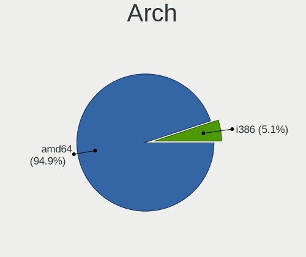
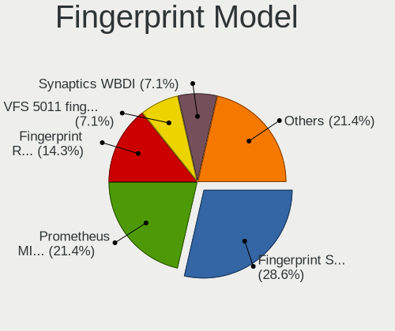

BSD - Hardware Trends (Notebooks)
---------------------------------

A project to identify most popular hardware characteristics and track their change
over time based on data collected by BSD users at https://BSD-Hardware.info.

Anyone can contribute to this report by the [hw-probe](https://github.com/linuxhw/hw-probe/blob/master/INSTALL.BSD.md) tool:

    hw-probe -all -upload

This report is for one last month. Overall report since the beginning of time: [TestDays](https://github.com/bsdhw/TestDays)

Period: Jun, 2023.

Contents
--------

* [ System ](#system)
  - [ OS                       ](#os)
  - [ OS Family                ](#os-family)
  - [ Arch                     ](#arch)
  - [ DE                       ](#de)
  - [ Display Server           ](#display-server)
  - [ Display Manager          ](#display-manager)
  - [ OS Lang                  ](#os-lang)
  - [ Boot Mode                ](#boot-mode)
  - [ Filesystem               ](#filesystem)
  - [ Part. scheme             ](#part-scheme)

* [ Board ](#board)
  - [ Vendor                   ](#vendor)
  - [ Model                    ](#model)
  - [ Model Family             ](#model-family)
  - [ MFG Year                 ](#mfg-year)
  - [ Form Factor              ](#form-factor)
  - [ Coreboot                 ](#coreboot)
  - [ RAM Size                 ](#ram-size)
  - [ RAM Used                 ](#ram-used)
  - [ Total Drives             ](#total-drives)
  - [ Has CD-ROM               ](#has-cd-rom)
  - [ Has Ethernet             ](#has-ethernet)
  - [ Has WiFi                 ](#has-wifi)
  - [ Has Bluetooth            ](#has-bluetooth)

* [ Location ](#location)
  - [ Country                  ](#country)
  - [ City                     ](#city)

* [ Drives ](#drives)
  - [ Drive Vendor             ](#drive-vendor)
  - [ Drive Model              ](#drive-model)
  - [ HDD Vendor               ](#hdd-vendor)
  - [ SSD Vendor               ](#ssd-vendor)
  - [ Drive Kind               ](#drive-kind)
  - [ Drive Connector          ](#drive-connector)
  - [ Drive Size               ](#drive-size)
  - [ Space Total              ](#space-total)
  - [ Space Used               ](#space-used)
  - [ Malfunc. Drives          ](#malfunc-drives)
  - [ Malfunc. Drive Vendor    ](#malfunc-drive-vendor)
  - [ Malfunc. HDD Vendor      ](#malfunc-hdd-vendor)
  - [ Malfunc. Drive Kind      ](#malfunc-drive-kind)
  - [ Failed Drives            ](#failed-drives)
  - [ Failed Drive Vendor      ](#failed-drive-vendor)
  - [ Drive Status             ](#drive-status)

* [ Storage controller ](#storage-controller)
  - [ Storage Vendor           ](#storage-vendor)
  - [ Storage Model            ](#storage-model)
  - [ Storage Kind             ](#storage-kind)

* [ Processor ](#processor)
  - [ CPU Vendor               ](#cpu-vendor)
  - [ CPU Model                ](#cpu-model)
  - [ CPU Model Family         ](#cpu-model-family)
  - [ CPU Cores                ](#cpu-cores)
  - [ CPU Sockets              ](#cpu-sockets)
  - [ CPU Threads              ](#cpu-threads)
  - [ CPU Microarch            ](#cpu-microarch)

* [ Graphics ](#graphics)
  - [ GPU Vendor               ](#gpu-vendor)
  - [ GPU Model                ](#gpu-model)
  - [ GPU Combo                ](#gpu-combo)
  - [ GPU Driver               ](#gpu-driver)
  - [ GPU Memory               ](#gpu-memory)

* [ Monitor ](#monitor)
  - [ Monitor Vendor           ](#monitor-vendor)
  - [ Monitor Model            ](#monitor-model)
  - [ Monitor Resolution       ](#monitor-resolution)
  - [ Monitor Diagonal         ](#monitor-diagonal)
  - [ Monitor Width            ](#monitor-width)
  - [ Aspect Ratio             ](#aspect-ratio)
  - [ Monitor Area             ](#monitor-area)
  - [ Pixel Density            ](#pixel-density)
  - [ Multiple Monitors        ](#multiple-monitors)

* [ Network ](#network)
  - [ Net Controller Vendor    ](#net-controller-vendor)
  - [ Net Controller Model     ](#net-controller-model)
  - [ Wireless Vendor          ](#wireless-vendor)
  - [ Wireless Model           ](#wireless-model)
  - [ Ethernet Vendor          ](#ethernet-vendor)
  - [ Ethernet Model           ](#ethernet-model)
  - [ Net Controller Kind      ](#net-controller-kind)
  - [ Used Controller          ](#used-controller)
  - [ NICs                     ](#nics)
  - [ IPv6                     ](#ipv6)

* [ Bluetooth ](#bluetooth)
  - [ Bluetooth Vendor         ](#bluetooth-vendor)
  - [ Bluetooth Model          ](#bluetooth-model)

* [ Sound ](#sound)
  - [ Sound Vendor             ](#sound-vendor)
  - [ Sound Model              ](#sound-model)

* [ Memory ](#memory)
  - [ Memory Vendor            ](#memory-vendor)
  - [ Memory Model             ](#memory-model)
  - [ Memory Kind              ](#memory-kind)
  - [ Memory Form Factor       ](#memory-form-factor)
  - [ Memory Size              ](#memory-size)
  - [ Memory Speed             ](#memory-speed)

* [ Printers & scanners ](#printers--scanners)
  - [ Printer Vendor           ](#printer-vendor)
  - [ Printer Model            ](#printer-model)
  - [ Scanner Vendor           ](#scanner-vendor)
  - [ Scanner Model            ](#scanner-model)

* [ Camera ](#camera)
  - [ Camera Vendor            ](#camera-vendor)
  - [ Camera Model             ](#camera-model)

* [ Security ](#security)
  - [ Fingerprint Vendor       ](#fingerprint-vendor)
  - [ Fingerprint Model        ](#fingerprint-model)
  - [ Chipcard Vendor          ](#chipcard-vendor)
  - [ Chipcard Model           ](#chipcard-model)

* [ Unsupported ](#unsupported)
  - [ Unsupported Devices      ](#unsupported-devices)
  - [ Unsupported Device Types ](#unsupported-device-types)

System
------

OS
--

Installed operating systems

| Name                 | Notebooks | Percent |
|----------------------|-----------|---------|
| FreeBSD 13.2         | 21        | 27.63%  |
| helloSystem 0.8.1    | 17        | 22.37%  |
| OPNsense 23.1.9      | 6         | 7.89%   |
| helloSystem 0.8.2    | 6         | 7.89%   |
| FreeBSD 14.0-CURRENT | 4         | 5.26%   |
| OPNsense 23.4        | 3         | 3.95%   |
| OpenBSD 7.3          | 3         | 3.95%   |
| OPNsense 23.4.1      | 2         | 2.63%   |
| OPNsense 23.1.10     | 2         | 2.63%   |
| NomadBSD 20221130    | 2         | 2.63%   |
| GhostBSD 23.06.05    | 2         | 2.63%   |
| GhostBSD 23.06.01    | 2         | 2.63%   |
| OPNsense 22.7.11     | 1         | 1.32%   |
| NomadBSD 81e34fc3    | 1         | 1.32%   |
| NetBSD 9.3           | 1         | 1.32%   |
| helloSystem 0.7.0    | 1         | 1.32%   |
| FreeBSD 13.2-p1      | 1         | 1.32%   |
| FreeBSD 13.1-p8      | 1         | 1.32%   |

OS Family
---------

OS without a version

| Name        | Notebooks | Percent |
|-------------|-----------|---------|
| FreeBSD     | 27        | 35.53%  |
| helloSystem | 24        | 31.58%  |
| OPNsense    | 14        | 18.42%  |
| GhostBSD    | 4         | 5.26%   |
| OpenBSD     | 3         | 3.95%   |
| NomadBSD    | 3         | 3.95%   |
| NetBSD      | 1         | 1.32%   |

Arch
----

OS architecture (x86_64, i586, etc.)

| Name  | Notebooks | Percent |
|-------|-----------|---------|
| amd64 | 75        | 98.68%  |
| i386  | 1         | 1.32%   |

DE
--

Desktop Environment

| Name         | Notebooks | Percent |
|--------------|-----------|---------|
| helloDesktop | 27        | 35.53%  |
| Console      | 17        | 22.37%  |
| KDE5         | 12        | 15.79%  |
| XFCE         | 6         | 7.89%   |
| MATE         | 5         | 6.58%   |
| TWM          | 3         | 3.95%   |
| Openbox      | 3         | 3.95%   |
| LXQt         | 1         | 1.32%   |
| GNOME        | 1         | 1.32%   |
| Budgie       | 1         | 1.32%   |

Display Server
--------------

X11 or Wayland

| Name    | Notebooks | Percent |
|---------|-----------|---------|
| X11     | 61        | 80.26%  |
| Console | 15        | 19.74%  |

Display Manager
---------------

SDDM, LightDM, etc.

| Name    | Notebooks | Percent |
|---------|-----------|---------|
| SLiM    | 28        | 36.84%  |
| Console | 25        | 32.89%  |
| SDDM    | 16        | 21.05%  |
| LightDM | 6         | 7.89%   |
| GDM     | 1         | 1.32%   |

OS Lang
-------

Language

| Lang    | Notebooks | Percent |
|---------|-----------|---------|
| C       | 22        | 28.95%  |
| Unknown | 21        | 27.63%  |
| en_US   | 14        | 18.42%  |
| fr_FR   | 5         | 6.58%   |
| de_DE   | 3         | 3.95%   |
| ru_RU   | 2         | 2.63%   |
| pl_PL   | 2         | 2.63%   |
| es_ES   | 2         | 2.63%   |
| zh_CN   | 1         | 1.32%   |
| pt_BR   | 1         | 1.32%   |
| nl_NL   | 1         | 1.32%   |
| it_IT   | 1         | 1.32%   |
| Default | 1         | 1.32%   |

Boot Mode
---------

EFI or BIOS

| Mode | Notebooks | Percent |
|------|-----------|---------|
| EFI  | 66        | 86.84%  |
| BIOS | 10        | 13.16%  |

Filesystem
----------

Type of filesystem

| Type   | Notebooks | Percent |
|--------|-----------|---------|
| Zfs    | 47        | 61.84%  |
| Ufs    | 14        | 18.42%  |
| Cd9660 | 12        | 15.79%  |
| Ffs    | 3         | 3.95%   |

Part. scheme
------------

Scheme of partitioning

| Type | Notebooks | Percent |
|------|-----------|---------|
| GPT  | 72        | 94.74%  |
| MBR  | 4         | 5.26%   |

Board
-----

Vendor
------

Motherboard manufacturer

| Name                | Notebooks | Percent |
|---------------------|-----------|---------|
| Lenovo              | 23        | 30.26%  |
| Hewlett-Packard     | 15        | 19.74%  |
| Dell                | 11        | 14.47%  |
| Deciso              | 7         | 9.21%   |
| Unknown             | 4         | 5.26%   |
| ASUSTek Computer    | 3         | 3.95%   |
| Samsung Electronics | 2         | 2.63%   |
| Panasonic           | 2         | 2.63%   |
| Apple               | 2         | 2.63%   |
| Acer                | 2         | 2.63%   |
| Toshiba             | 1         | 1.32%   |
| Notebook            | 1         | 1.32%   |
| MSI                 | 1         | 1.32%   |
| HUAWEI              | 1         | 1.32%   |
| Fujitsu Siemens     | 1         | 1.32%   |

Model
-----

Motherboard model

| Name                                      | Notebooks | Percent |
|-------------------------------------------|-----------|---------|
| Unknown                                   | 4         | 5.26%   |
| Deciso NetBoard-A20                       | 2         | 2.63%   |
| Deciso NetBoard-A10                       | 2         | 2.63%   |
| Toshiba Satellite C70-B                   | 1         | 1.32%   |
| Samsung R530/R730/R540                    | 1         | 1.32%   |
| Samsung NC210/NC110                       | 1         | 1.32%   |
| Panasonic CFSX4-1                         | 1         | 1.32%   |
| Panasonic CF-NX1GDHYS                     | 1         | 1.32%   |
| Notebook NL5xRU                           | 1         | 1.32%   |
| MSI GE63 Raider RGB 8RE                   | 1         | 1.32%   |
| Lenovo ThinkPad X240 20AMS0250T           | 1         | 1.32%   |
| Lenovo ThinkPad X1 Extreme 2nd 20QV001CPB | 1         | 1.32%   |
| Lenovo ThinkPad X1 Carbon 6th 20KH002LUS  | 1         | 1.32%   |
| Lenovo ThinkPad W520 4284GZ1              | 1         | 1.32%   |
| Lenovo ThinkPad T60 20076PU               | 1         | 1.32%   |
| Lenovo ThinkPad T530 2429AP0              | 1         | 1.32%   |
| Lenovo ThinkPad T500 2082BNU              | 1         | 1.32%   |
| Lenovo ThinkPad T480 20L6S5VP4C           | 1         | 1.32%   |
| Lenovo ThinkPad T480 20L6S2S800           | 1         | 1.32%   |
| Lenovo ThinkPad T450 20BV000BUS           | 1         | 1.32%   |
| Lenovo ThinkPad T440p 20AWS1CH00          | 1         | 1.32%   |
| Lenovo ThinkPad T440p 20AW000BUS          | 1         | 1.32%   |
| Lenovo ThinkPad T430 2347GR2              | 1         | 1.32%   |
| Lenovo ThinkPad T430 2347A45              | 1         | 1.32%   |
| Lenovo ThinkPad T430 2344BZU              | 1         | 1.32%   |
| Lenovo ThinkPad E495 20NE000BSP           | 1         | 1.32%   |
| Lenovo ThinkPad E15 Gen 4 21EDCTO1WW      | 1         | 1.32%   |
| Lenovo ThinkBook 14 G4+ ARA 21D0          | 1         | 1.32%   |
| Lenovo S10-3                              | 1         | 1.32%   |
| Lenovo IdeaPad Slim 9 14ITL5 82D2         | 1         | 1.32%   |
| Lenovo IdeaPad 310-15IKB 80TV             | 1         | 1.32%   |
| Lenovo B590 20208                         | 1         | 1.32%   |
| Lenovo B40-30 80F10002BR                  | 1         | 1.32%   |
| HUAWEI BOHB-WAX9                          | 1         | 1.32%   |
| HP Stream Laptop 14-ds0xxx                | 1         | 1.32%   |
| HP Pavilion Laptop 15-eh1xxx              | 1         | 1.32%   |
| HP Pavilion g4                            | 1         | 1.32%   |
| HP Pavilion 15                            | 1         | 1.32%   |
| HP Laptop 15-ra0xx                        | 1         | 1.32%   |
| HP Laptop 15-bs1xx                        | 1         | 1.32%   |

Model Family
------------

Motherboard model prefix

| Name                  | Notebooks | Percent |
|-----------------------|-----------|---------|
| Lenovo ThinkPad       | 17        | 22.37%  |
| HP EliteBook          | 5         | 6.58%   |
| Dell Inspiron         | 5         | 6.58%   |
| Dell Latitude         | 4         | 5.26%   |
| Unknown               | 4         | 5.26%   |
| HP Pavilion           | 3         | 3.95%   |
| Lenovo IdeaPad        | 2         | 2.63%   |
| HP Laptop             | 2         | 2.63%   |
| Deciso NetBoard-A20   | 2         | 2.63%   |
| Deciso NetBoard-A10   | 2         | 2.63%   |
| Acer Aspire           | 2         | 2.63%   |
| Toshiba Satellite     | 1         | 1.32%   |
| Samsung R530          | 1         | 1.32%   |
| Samsung NC210         | 1         | 1.32%   |
| Panasonic CFSX4-1     | 1         | 1.32%   |
| Panasonic CF-NX1GDHYS | 1         | 1.32%   |
| Notebook NL5xRU       | 1         | 1.32%   |
| MSI GE63              | 1         | 1.32%   |
| Lenovo ThinkBook      | 1         | 1.32%   |
| Lenovo S10-3          | 1         | 1.32%   |
| Lenovo B590           | 1         | 1.32%   |
| Lenovo B40-30         | 1         | 1.32%   |
| HUAWEI BOHB-WAX9      | 1         | 1.32%   |
| HP Stream             | 1         | 1.32%   |
| HP Compaq             | 1         | 1.32%   |
| HP 250                | 1         | 1.32%   |
| HP 15                 | 1         | 1.32%   |
| HP 1000               | 1         | 1.32%   |
| Fujitsu Siemens AMILO | 1         | 1.32%   |
| Dell XPS              | 1         | 1.32%   |
| Dell G5               | 1         | 1.32%   |
| Deciso OPNsense       | 1         | 1.32%   |
| Deciso Netboard       | 1         | 1.32%   |
| Deciso DEC2700        | 1         | 1.32%   |
| ASUS ASUS             | 1         | 1.32%   |
| ASUS 1015P            | 1         | 1.32%   |
| ASUS 1015BX           | 1         | 1.32%   |
| Apple MacBook7        | 1         | 1.32%   |
| Apple MacBook2        | 1         | 1.32%   |

MFG Year
--------

Motherboard manufacture year

| Year | Notebooks | Percent |
|------|-----------|---------|
| 2022 | 12        | 15.79%  |
| 2013 | 10        | 13.16%  |
| 2018 | 7         | 9.21%   |
| 2020 | 6         | 7.89%   |
| 2019 | 6         | 7.89%   |
| 2016 | 6         | 7.89%   |
| 2021 | 5         | 6.58%   |
| 2010 | 5         | 6.58%   |
| 2014 | 4         | 5.26%   |
| 2012 | 4         | 5.26%   |
| 2015 | 3         | 3.95%   |
| 2011 | 2         | 2.63%   |
| 2023 | 1         | 1.32%   |
| 2017 | 1         | 1.32%   |
| 2009 | 1         | 1.32%   |
| 2008 | 1         | 1.32%   |
| 2007 | 1         | 1.32%   |
| 2006 | 1         | 1.32%   |

Form Factor
-----------

Physical design of the computer

| Name     | Notebooks | Percent |
|----------|-----------|---------|
| Notebook | 76        | 100%    |

Coreboot
--------

Have coreboot on board

| Used | Notebooks | Percent |
|------|-----------|---------|
| No   | 75        | 98.68%  |
| Yes  | 1         | 1.32%   |

RAM Size
--------

Total RAM memory

| Size in GB  | Notebooks | Percent |
|-------------|-----------|---------|
| 8.01-16.0   | 25        | 32.89%  |
| 16.01-24.0  | 23        | 30.26%  |
| 4.01-8.0    | 14        | 18.42%  |
| 2.01-3.0    | 5         | 6.58%   |
| 32.01-64.0  | 4         | 5.26%   |
| 64.01-256.0 | 4         | 5.26%   |
| 3.01-4.0    | 1         | 1.32%   |

RAM Used
--------

Used RAM memory

| Used GB  | Notebooks | Percent |
|----------|-----------|---------|
| 0.01-0.5 | 38        | 50%     |
| 0.51-1.0 | 24        | 31.58%  |
| 1.01-2.0 | 8         | 10.53%  |
| 2.01-3.0 | 4         | 5.26%   |
| 4.01-8.0 | 1         | 1.32%   |
| Unknown  | 1         | 1.32%   |

Total Drives
------------

Number of drives on board

| Drives | Notebooks | Percent |
|--------|-----------|---------|
| 1      | 61        | 80.26%  |
| 2      | 9         | 11.84%  |
| 3      | 3         | 3.95%   |
| 0      | 3         | 3.95%   |

Has CD-ROM
----------

Has CD-ROM on board

| Presented | Notebooks | Percent |
|-----------|-----------|---------|
| No        | 51        | 67.11%  |
| Yes       | 25        | 32.89%  |

Has Ethernet
------------

Has Ethernet on board

| Presented | Notebooks | Percent |
|-----------|-----------|---------|
| Yes       | 71        | 93.42%  |
| No        | 5         | 6.58%   |

Has WiFi
--------

Has WiFi module

| Presented | Notebooks | Percent |
|-----------|-----------|---------|
| Yes       | 65        | 85.53%  |
| No        | 11        | 14.47%  |

Has Bluetooth
-------------

Has Bluetooth module

| Presented | Notebooks | Percent |
|-----------|-----------|---------|
| Yes       | 48        | 63.16%  |
| No        | 28        | 36.84%  |

Location
--------

Country
-------

Geographic location (country)

| Country     | Notebooks | Percent |
|-------------|-----------|---------|
| USA         | 15        | 19.74%  |
| Germany     | 9         | 11.84%  |
| Poland      | 6         | 7.89%   |
| UK          | 5         | 6.58%   |
| Spain       | 4         | 5.26%   |
| Russia      | 3         | 3.95%   |
| Netherlands | 3         | 3.95%   |
| China       | 3         | 3.95%   |
| Brazil      | 3         | 3.95%   |
| Italy       | 2         | 2.63%   |
| Israel      | 2         | 2.63%   |
| Iceland     | 2         | 2.63%   |
| Hungary     | 2         | 2.63%   |
| France      | 2         | 2.63%   |
| Austria     | 2         | 2.63%   |
| Australia   | 2         | 2.63%   |
| Vietnam     | 1         | 1.32%   |
| Turkey      | 1         | 1.32%   |
| Syria       | 1         | 1.32%   |
| Switzerland | 1         | 1.32%   |
| San Marino  | 1         | 1.32%   |
| Nepal       | 1         | 1.32%   |
| Czechia     | 1         | 1.32%   |
| Canada      | 1         | 1.32%   |
| Bulgaria    | 1         | 1.32%   |
| Belarus     | 1         | 1.32%   |
| Argentina   | 1         | 1.32%   |

City
----

Geographic location (city)

| City                | Notebooks | Percent |
|---------------------|-----------|---------|
| Indian Trail        | 3         | 3.95%   |
| Sun Prairie         | 2         | 2.63%   |
| Reykjavik           | 2         | 2.63%   |
| Moscow              | 2         | 2.63%   |
| Las Vegas           | 2         | 2.63%   |
| Flushing            | 2         | 2.63%   |
| East Grinstead      | 2         | 2.63%   |
| Cologne             | 2         | 2.63%   |
| Xom Pho             | 1         | 1.32%   |
| Würzburg           | 1         | 1.32%   |
| Wuppertal           | 1         | 1.32%   |
| Wuerselen           | 1         | 1.32%   |
| Warsaw              | 1         | 1.32%   |
| Vitebsk             | 1         | 1.32%   |
| Villefontaine       | 1         | 1.32%   |
| Vienna              | 1         | 1.32%   |
| Uherské Hradiště | 1         | 1.32%   |
| Uelzen              | 1         | 1.32%   |
| The Hague           | 1         | 1.32%   |
| Tel Aviv            | 1         | 1.32%   |
| Tata                | 1         | 1.32%   |
| South Croydon       | 1         | 1.32%   |
| Sofia               | 1         | 1.32%   |
| Sete Lagoas         | 1         | 1.32%   |
| Sesto San Giovanni  | 1         | 1.32%   |
| Seattle             | 1         | 1.32%   |
| Sao Paulo           | 1         | 1.32%   |
| San Marino          | 1         | 1.32%   |
| Rubí               | 1         | 1.32%   |
| Reda                | 1         | 1.32%   |
| Perth               | 1         | 1.32%   |
| Padul               | 1         | 1.32%   |
| Ourense             | 1         | 1.32%   |
| Neulengbach         | 1         | 1.32%   |
| Netanya             | 1         | 1.32%   |
| Navalcarnero        | 1         | 1.32%   |
| Mooresville         | 1         | 1.32%   |
| Montreal            | 1         | 1.32%   |
| Milan               | 1         | 1.32%   |
| Macaiba             | 1         | 1.32%   |

Drives
------

Drive Vendor
------------

Hard drive vendors

| Vendor              | Notebooks | Drives | Percent |
|---------------------|-----------|--------|---------|
| Samsung Electronics | 12        | 16     | 15%     |
| Transcend           | 9         | 9      | 11.25%  |
| Seagate             | 8         | 8      | 10%     |
| Toshiba             | 5         | 5      | 6.25%   |
| SK hynix            | 5         | 5      | 6.25%   |
| SanDisk             | 5         | 5      | 6.25%   |
| Kingston            | 4         | 4      | 5%      |
| WDC                 | 3         | 3      | 3.75%   |
| Hitachi             | 3         | 3      | 3.75%   |
| HGST                | 3         | 3      | 3.75%   |
| A-DATA Technology   | 3         | 3      | 3.75%   |
| PNY                 | 2         | 3      | 2.5%    |
| Intel               | 2         | 2      | 2.5%    |
| Crucial             | 2         | 2      | 2.5%    |
| Advantech           | 2         | 2      | 2.5%    |
| Silicon Motion      | 1         | 1      | 1.25%   |
| Phison              | 1         | 1      | 1.25%   |
| OCZ                 | 1         | 1      | 1.25%   |
| NVMe                | 1         | 2      | 1.25%   |
| Lexar               | 1         | 1      | 1.25%   |
| KIOXIA-EXCERIA      | 1         | 1      | 1.25%   |
| KingSpec            | 1         | 2      | 1.25%   |
| Gigabyte Technology | 1         | 1      | 1.25%   |
| FLEXXON             | 1         | 1      | 1.25%   |
| Dell                | 1         | 1      | 1.25%   |
| BHT                 | 1         | 1      | 1.25%   |
| Apple               | 1         | 1      | 1.25%   |

Drive Model
-----------

Hard drive models

| Model                               | Notebooks | Percent |
|-------------------------------------|-----------|---------|
| Transcend TS256GMTS952T2 256GB      | 3         | 3.53%   |
| Transcend TS256GMTE652T2 256GB      | 2         | 2.35%   |
| Toshiba MQ01ABF050 500GB            | 2         | 2.35%   |
| Samsung SSD 860 EVO 500GB           | 2         | 2.35%   |
| Kingston SA400S37240G 240GB         | 2         | 2.35%   |
| HGST HTS721010A9E630 1TB            | 2         | 2.35%   |
| Advantech SQF-S25M4-64G-S9C 64GB    | 2         | 2.35%   |
| WDC WD3200BPVT-22JJ5T0 320GB        | 1         | 1.18%   |
| WDC WD1600BEVT-22ZCT0 160GB         | 1         | 1.18%   |
| WDC WD1600BEVS-07RST0 160GB         | 1         | 1.18%   |
| Transcend TS512GMTS952T2 512GB      | 1         | 1.18%   |
| Transcend TS256GMTS400 256GB        | 1         | 1.18%   |
| Transcend TS256GMTE710T 256GB       | 1         | 1.18%   |
| Transcend TS120GSSD220S 120GB       | 1         | 1.18%   |
| Toshiba THNSNJ256G8NY 256GB         | 1         | 1.18%   |
| Toshiba MQ01ABD075 752GB            | 1         | 1.18%   |
| Toshiba KBG30ZMV256G 256GB          | 1         | 1.18%   |
| SK hynix SHGS31-500GS-2 500GB       | 1         | 1.18%   |
| SK hynix PC401 NVMe 512GB           | 1         | 1.18%   |
| SK hynix HFM512GDHTNG-8710B 512GB   | 1         | 1.18%   |
| SK hynix BC511 NVMe 512GB           | 1         | 1.18%   |
| SK hynix BC511 NVMe 256GB           | 1         | 1.18%   |
| Silicon Motion whalekom 256GB       | 1         | 1.18%   |
| Seagate ST9320325AS 320GB           | 1         | 1.18%   |
| Seagate ST9250410AS 250GB           | 1         | 1.18%   |
| Seagate ST750LM022 HN-M750MBB 752GB | 1         | 1.18%   |
| Seagate ST500LT012-9WS142 500GB     | 1         | 1.18%   |
| Seagate ST250LM000 HM251HI 250GB    | 1         | 1.18%   |
| Seagate ST2000LM007-1R8174 2TB      | 1         | 1.18%   |
| Seagate ST1000LM035-1RK172 1TB      | 1         | 1.18%   |
| Seagate ST1000LM024 HN-M101MBB 1TB  | 1         | 1.18%   |
| SanDisk SDSSDH3 500G                | 1         | 1.18%   |
| SanDisk SDSSDA240G 240GB            | 1         | 1.18%   |
| SanDisk SDSSDA120G 120GB            | 1         | 1.18%   |
| SanDisk SD9SN8W-256G-1006 256GB     | 1         | 1.18%   |
| SanDisk SD8SN8U-128G-1006 128GB     | 1         | 1.18%   |
| Samsung SSD 980 500GB               | 1         | 1.18%   |
| Samsung SSD 970 EVO Plus 500GB      | 1         | 1.18%   |
| Samsung SSD 870 QVO 4TB             | 1         | 1.18%   |
| Samsung SSD 870 EVO 500GB           | 1         | 1.18%   |

HDD Vendor
----------

Hard disk drive vendors

| Vendor              | Notebooks | Drives | Percent |
|---------------------|-----------|--------|---------|
| Seagate             | 8         | 8      | 33.33%  |
| WDC                 | 3         | 3      | 12.5%   |
| Toshiba             | 3         | 3      | 12.5%   |
| Hitachi             | 3         | 3      | 12.5%   |
| HGST                | 3         | 3      | 12.5%   |
| Samsung Electronics | 1         | 1      | 4.17%   |
| NVMe                | 1         | 2      | 4.17%   |
| Lexar               | 1         | 1      | 4.17%   |
| Apple               | 1         | 1      | 4.17%   |

SSD Vendor
----------

Solid state drive vendors

| Vendor              | Notebooks | Drives | Percent |
|---------------------|-----------|--------|---------|
| Transcend           | 6         | 6      | 15.79%  |
| Samsung Electronics | 6         | 9      | 15.79%  |
| SanDisk             | 5         | 5      | 13.16%  |
| Kingston            | 4         | 4      | 10.53%  |
| A-DATA Technology   | 3         | 3      | 7.89%   |
| PNY                 | 2         | 3      | 5.26%   |
| Advantech           | 2         | 2      | 5.26%   |
| Toshiba             | 1         | 1      | 2.63%   |
| SK hynix            | 1         | 1      | 2.63%   |
| OCZ                 | 1         | 1      | 2.63%   |
| KIOXIA-EXCERIA      | 1         | 1      | 2.63%   |
| KingSpec            | 1         | 2      | 2.63%   |
| Gigabyte Technology | 1         | 1      | 2.63%   |
| FLEXXON             | 1         | 1      | 2.63%   |
| Dell                | 1         | 1      | 2.63%   |
| Crucial             | 1         | 1      | 2.63%   |
| BHT                 | 1         | 1      | 2.63%   |

Drive Kind
----------

HDD or SSD

| Kind | Notebooks | Drives | Percent |
|------|-----------|--------|---------|
| SSD  | 36        | 43     | 47.37%  |
| HDD  | 23        | 25     | 30.26%  |
| NVMe | 17        | 19     | 22.37%  |

Drive Connector
---------------

SATA, SAS, NVMe, etc.

| Type | Notebooks | Drives | Percent |
|------|-----------|--------|---------|
| SATA | 57        | 68     | 77.03%  |
| NVMe | 17        | 19     | 22.97%  |

Drive Size
----------

Size of hard drive

| Size in TB | Notebooks | Drives | Percent |
|------------|-----------|--------|---------|
| 0.01-0.5   | 45        | 50     | 75%     |
| 0.51-1.0   | 12        | 14     | 20%     |
| 1.01-2.0   | 2         | 3      | 3.33%   |
| 3.01-4.0   | 1         | 1      | 1.67%   |

Space Total
-----------

Amount of disk space available on the file system

| Size in GB | Notebooks | Percent |
|------------|-----------|---------|
| 101-250    | 24        | 31.58%  |
| 251-500    | 19        | 25%     |
| 1-20       | 14        | 18.42%  |
| 51-100     | 7         | 9.21%   |
| 501-1000   | 5         | 6.58%   |
| 21-50      | 4         | 5.26%   |
| 1001-2000  | 2         | 2.63%   |
| Unknown    | 1         | 1.32%   |

Space Used
----------

Amount of used disk space

| Used GB | Notebooks | Percent |
|---------|-----------|---------|
| 1-20    | 67        | 88.16%  |
| 21-50   | 5         | 6.58%   |
| 51-100  | 3         | 3.95%   |
| Unknown | 1         | 1.32%   |

Malfunc. Drives
---------------

Drive models with a malfunction

| Model                               | Notebooks | Drives | Percent |
|-------------------------------------|-----------|--------|---------|
| WDC WD1600BEVS-07RST0 160GB         | 1         | 1      | 10%     |
| Seagate ST9320325AS 320GB           | 1         | 1      | 10%     |
| Seagate ST750LM022 HN-M750MBB 752GB | 1         | 1      | 10%     |
| Seagate ST500LT012-9WS142 500GB     | 1         | 1      | 10%     |
| OCZ AGILITY3 120GB                  | 1         | 1      | 10%     |
| Hitachi HTS547550A9E384 500GB       | 1         | 1      | 10%     |
| Hitachi HTS542525K9A300 250GB       | 1         | 1      | 10%     |
| Hitachi HTS542512K9SA00 120GB       | 1         | 1      | 10%     |
| HGST HTS721010A9E630 1TB            | 1         | 1      | 10%     |
| HGST HTS541010A9E680 1TB            | 1         | 1      | 10%     |

Malfunc. Drive Vendor
---------------------

Vendors of faulty drives

| Vendor  | Notebooks | Drives | Percent |
|---------|-----------|--------|---------|
| Seagate | 3         | 3      | 30%     |
| Hitachi | 3         | 3      | 30%     |
| HGST    | 2         | 2      | 20%     |
| WDC     | 1         | 1      | 10%     |
| OCZ     | 1         | 1      | 10%     |

Malfunc. HDD Vendor
-------------------

Vendors of faulty HDD drives

| Vendor  | Notebooks | Drives | Percent |
|---------|-----------|--------|---------|
| Seagate | 3         | 3      | 33.33%  |
| Hitachi | 3         | 3      | 33.33%  |
| HGST    | 2         | 2      | 22.22%  |
| WDC     | 1         | 1      | 11.11%  |

Malfunc. Drive Kind
-------------------

Kinds of faulty drives

| Kind | Notebooks | Drives | Percent |
|------|-----------|--------|---------|
| HDD  | 9         | 9      | 90%     |
| SSD  | 1         | 1      | 10%     |

Failed Drives
-------------

Failed drive models

Zero info for selected period =(

Failed Drive Vendor
-------------------

Failed drive vendors

Zero info for selected period =(

Drive Status
------------

Number of failed and malfunc. drives

| Status   | Notebooks | Drives | Percent |
|----------|-----------|--------|---------|
| Works    | 64        | 74     | 84.21%  |
| Malfunc  | 10        | 10     | 13.16%  |
| Detected | 2         | 3      | 2.63%   |

Storage controller
------------------

Storage Vendor
--------------

Storage controller vendors

| Vendor                      | Notebooks | Percent |
|-----------------------------|-----------|---------|
| Intel                       | 52        | 63.41%  |
| AMD                         | 9         | 10.98%  |
| Samsung Electronics         | 6         | 7.32%   |
| SK hynix                    | 4         | 4.88%   |
| Transcend                   | 3         | 3.66%   |
| Toshiba                     | 2         | 2.44%   |
| Phison Electronics          | 2         | 2.44%   |
| Silicon Motion              | 1         | 1.22%   |
| Nvidia                      | 1         | 1.22%   |
| Micron Technology           | 1         | 1.22%   |
| Kingston Technology Company | 1         | 1.22%   |

Storage Model
-------------

Storage controller models

| Model                                                                                  | Notebooks | Percent |
|----------------------------------------------------------------------------------------|-----------|---------|
| Intel 7 Series Chipset Family 6-port SATA Controller [AHCI mode]                       | 8         | 9.41%   |
| AMD FCH SATA Controller [AHCI mode]                                                    | 8         | 9.41%   |
| Intel Sunrise Point-LP SATA Controller [AHCI mode]                                     | 7         | 8.24%   |
| Intel Wildcat Point-LP SATA Controller [AHCI Mode]                                     | 6         | 7.06%   |
| Intel 8 Series SATA Controller 1 [AHCI mode]                                           | 5         | 5.88%   |
| Samsung NVMe SSD Controller SM981/PM981/PM983                                          | 4         | 4.71%   |
| Unknown                                                                                | 4         | 4.71%   |
| Intel NM10/ICH7 Family SATA Controller [AHCI mode]                                     | 3         | 3.53%   |
| Intel 82801IBM/IEM (ICH9M/ICH9M-E) 4 port SATA Controller [AHCI mode]                  | 3         | 3.53%   |
| Intel 6 Series/C200 Series Chipset Family 6 port Mobile SATA AHCI Controller           | 3         | 3.53%   |
| SK hynix BC511 NVMe SSD                                                                | 2         | 2.35%   |
| Phison PS5013 E13 NVMe Controller                                                      | 2         | 2.35%   |
| Intel 82801G (ICH7 Family) IDE Controller                                              | 2         | 2.35%   |
| Intel 82801 Mobile SATA Controller [RAID mode]                                         | 2         | 2.35%   |
| Intel 8 Series/C220 Series Chipset Family 6-port SATA Controller 1 [AHCI mode]         | 2         | 2.35%   |
| Toshiba XG5 NVMe SSD Controller                                                        | 1         | 1.18%   |
| Toshiba BG3 NVMe SSD Controller                                                        | 1         | 1.18%   |
| SK hynix PC401 NVMe Solid State Drive 256GB                                            | 1         | 1.18%   |
| SK hynix BC501 NVMe Solid State Drive                                                  | 1         | 1.18%   |
| Silicon Motion SM2263EN/SM2263XT SSD Controller                                        | 1         | 1.18%   |
| Samsung NVMe SSD Controller PM9A1/PM9A3/980PRO                                         | 1         | 1.18%   |
| Samsung NVMe SSD Controller 980                                                        | 1         | 1.18%   |
| Nvidia MCP89 SATA Controller (AHCI mode)                                               | 1         | 1.18%   |
| Micron NVMe Storage Controller                                                         | 1         | 1.18%   |
| Kingston Company unknown                                                               | 1         | 1.18%   |
| Intel Tiger Lake-LP SATA Controller                                                    | 1         | 1.18%   |
| Intel SSD Pro 7600p/760p/E 6100p Series                                                | 1         | 1.18%   |
| Intel Ice Lake-LP SATA Controller [AHCI mode]                                          | 1         | 1.18%   |
| Intel Comet Lake SATA AHCI Controller                                                  | 1         | 1.18%   |
| Intel Cannon Lake Mobile PCH SATA AHCI Controller                                      | 1         | 1.18%   |
| Intel Atom/Celeron/Pentium Processor x5-E8000/J3xxx/N3xxx Series SATA Controller       | 1         | 1.18%   |
| Intel Atom Processor E3800 Series SATA AHCI Controller                                 | 1         | 1.18%   |
| Intel 82801GBM/GHM (ICH7-M Family) SATA Controller [IDE mode]                          | 1         | 1.18%   |
| Intel 82801GBM/GHM (ICH7-M Family) SATA Controller [AHCI mode]                         | 1         | 1.18%   |
| Intel 6 Series/C200 Series Chipset Family Mobile SATA Controller (IDE mode, ports 4-5) | 1         | 1.18%   |
| Intel 6 Series/C200 Series Chipset Family Mobile SATA Controller (IDE mode, ports 0-3) | 1         | 1.18%   |
| Intel 5 Series/3400 Series Chipset 6 port SATA AHCI Controller                         | 1         | 1.18%   |
| Intel 5 Series/3400 Series Chipset 4 port SATA AHCI Controller                         | 1         | 1.18%   |
| AMD SB7x0/SB8x0/SB9x0 SATA Controller [AHCI mode]                                      | 1         | 1.18%   |

Storage Kind
------------

Kind of storage controller (IDE, SATA, NVMe, SAS, ...)

| Kind | Notebooks | Percent |
|------|-----------|---------|
| SATA | 56        | 70%     |
| NVMe | 19        | 23.75%  |
| IDE  | 3         | 3.75%   |
| RAID | 2         | 2.5%    |

Processor
---------

CPU Vendor
----------

Processor vendors

| Vendor | Notebooks | Percent |
|--------|-----------|---------|
| Intel  | 58        | 76.32%  |
| AMD    | 18        | 23.68%  |

CPU Model
---------

Processor models

| Model                                  | Notebooks | Percent |
|----------------------------------------|-----------|---------|
| AMD EPYC 3201 8-Core Processor         | 4         | 5.26%   |
| Intel Core i7-8550U CPU @ 1.80GHz      | 3         | 3.95%   |
| Intel Core i5-8350U CPU @ 1.70GHz      | 3         | 3.95%   |
| AMD Ryzen Embedded V1500B              | 3         | 3.95%   |
| Intel Core i7-5500U CPU @ 2.40GHz      | 2         | 2.63%   |
| Intel Core i7-3520M CPU @ 2.90GHz      | 2         | 2.63%   |
| Intel Core i5-4300U CPU @ 1.90GHz      | 2         | 2.63%   |
| Intel Core i5-4210U CPU @ 1.70GHz      | 2         | 2.63%   |
| Intel Core i5-3320M CPU @ 2.60GHz      | 2         | 2.63%   |
| Intel Core 2 CPU                       | 2         | 2.63%   |
| Intel Celeron CPU 3765U @ 1.90GHz      | 2         | 2.63%   |
| Intel Atom CPU N455 @ 1.66GHz          | 2         | 2.63%   |
| AMD Ryzen 7 6800H with Radeon Graphics | 2         | 2.63%   |
| Intel Genuine CPU                      | 1         | 1.32%   |
| Intel CPU Version                      | 1         | 1.32%   |
| Intel Core i7-8750H CPU @ 2.20GHz      | 1         | 1.32%   |
| Intel Core i7-8650U CPU @ 1.90GHz      | 1         | 1.32%   |
| Intel Core i7-7500U CPU @ 2.70GHz      | 1         | 1.32%   |
| Intel Core i7-6500U CPU @ 2.50GHz      | 1         | 1.32%   |
| Intel Core i7-4702MQ CPU @ 2.20GHz     | 1         | 1.32%   |
| Intel Core i7-4700MQ CPU @ 2.40GHz     | 1         | 1.32%   |
| Intel Core i7-2630QM CPU @ 2.00GHz     | 1         | 1.32%   |
| Intel Core i7-1065G7 CPU @ 1.30GHz     | 1         | 1.32%   |
| Intel Core i5-9300H CPU @ 2.40GHz      | 1         | 1.32%   |
| Intel Core i5-8365U CPU @ 1.60GHz      | 1         | 1.32%   |
| Intel Core i5-8250U CPU @ 1.60GHz      | 1         | 1.32%   |
| Intel Core i5-6300U CPU @ 2.40GHz      | 1         | 1.32%   |
| Intel Core i5-5300U CPU @ 2.30GHz      | 1         | 1.32%   |
| Intel Core i5-5200U CPU @ 2.20GHz      | 1         | 1.32%   |
| Intel Core i5-3230M CPU @ 2.60GHz      | 1         | 1.32%   |
| Intel Core i5-3210M CPU @ 2.50GHz      | 1         | 1.32%   |
| Intel Core i5-2540M CPU @ 2.60GHz      | 1         | 1.32%   |
| Intel Core i5-2520M CPU @ 2.50GH       | 1         | 1.32%   |
| Intel Core i5-10210U CPU @ 1.60GHz     | 1         | 1.32%   |
| Intel Core i5 CPU M 520 @ 2.40GH       | 1         | 1.32%   |
| Intel Core i3-7020U CPU @ 2.30GHz      | 1         | 1.32%   |
| Intel Core i3-4005U CPU @ 1.70GHz      | 1         | 1.32%   |
| Intel Core i3-3120M CPU @ 2.50GHz      | 1         | 1.32%   |
| Intel Core i3-2350M CPU @ 2.30GHz      | 1         | 1.32%   |
| Intel Core i3-2330M CPU @ 2.20GHz      | 1         | 1.32%   |

CPU Model Family
----------------

Processor model prefix

| Model              | Notebooks | Percent |
|--------------------|-----------|---------|
| Intel Core i5      | 21        | 27.63%  |
| Intel Core i7      | 15        | 19.74%  |
| AMD Ryzen 7        | 7         | 9.21%   |
| Intel Core i3      | 5         | 6.58%   |
| Intel Celeron      | 5         | 6.58%   |
| Intel Core 2 Duo   | 4         | 5.26%   |
| AMD EPYC           | 4         | 5.26%   |
| Other              | 3         | 3.95%   |
| AMD Ryzen Embedded | 3         | 3.95%   |
| Intel Core 2       | 2         | 2.63%   |
| Intel Atom         | 2         | 2.63%   |
| Intel Genuine      | 1         | 1.32%   |
| AMD C-60           | 1         | 1.32%   |
| AMD A6             | 1         | 1.32%   |
| AMD A4             | 1         | 1.32%   |
| AMD A10            | 1         | 1.32%   |

CPU Cores
---------

Number of processor cores

| Number  | Notebooks | Percent |
|---------|-----------|---------|
| 2       | 35        | 46.05%  |
| 4       | 18        | 23.68%  |
| 8       | 9         | 11.84%  |
| Unknown | 6         | 7.89%   |
| 16      | 5         | 6.58%   |
| 1       | 2         | 2.63%   |
| 6       | 1         | 1.32%   |

CPU Sockets
-----------

Number of sockets

| Number  | Notebooks | Percent |
|---------|-----------|---------|
| 1       | 73        | 96.05%  |
| 2       | 2         | 2.63%   |
| Unknown | 1         | 1.32%   |

CPU Threads
-----------

Threads per core (Hyper-Threading)

| Number  | Notebooks | Percent |
|---------|-----------|---------|
| 2       | 46        | 60.53%  |
| 1       | 24        | 31.58%  |
| Unknown | 6         | 7.89%   |

CPU Microarch
-------------

Microarchitecture

| Name        | Notebooks | Percent |
|-------------|-----------|---------|
| KabyLake    | 14        | 18.42%  |
| IvyBridge   | 8         | 10.53%  |
| Zen         | 7         | 9.21%   |
| Haswell     | 7         | 9.21%   |
| Broadwell   | 6         | 7.89%   |
| SandyBridge | 5         | 6.58%   |
| Penryn      | 3         | 3.95%   |
| Core        | 3         | 3.95%   |
| Bonnell     | 3         | 3.95%   |
| Unknown     | 3         | 3.95%   |
| Zen 2       | 2         | 2.63%   |
| Westmere    | 2         | 2.63%   |
| TigerLake   | 2         | 2.63%   |
| Skylake     | 2         | 2.63%   |
| Silvermont  | 2         | 2.63%   |
| Excavator   | 2         | 2.63%   |
| Zen+        | 1         | 1.32%   |
| Zen 3       | 1         | 1.32%   |
| Puma        | 1         | 1.32%   |
| IceLake     | 1         | 1.32%   |
| Bobcat      | 1         | 1.32%   |

Graphics
--------

GPU Vendor
----------

Vendors of graphics cards

| Vendor | Notebooks | Percent |
|--------|-----------|---------|
| Intel  | 53        | 66.25%  |
| AMD    | 18        | 22.5%   |
| Nvidia | 9         | 11.25%  |

GPU Model
---------

Graphics card models

| Model                                                                                    | Notebooks | Percent |
|------------------------------------------------------------------------------------------|-----------|---------|
| Intel UHD Graphics 620                                                                   | 8         | 9.76%   |
| Intel 3rd Gen Core processor Graphics Controller                                         | 7         | 8.54%   |
| Intel Haswell-ULT Integrated Graphics Controller                                         | 5         | 6.1%    |
| Intel 2nd Generation Core Processor Family Integrated Graphics Controller                | 5         | 6.1%    |
| Intel HD Graphics 5500                                                                   | 4         | 4.88%   |
| Intel Atom Processor D4xx/D5xx/N4xx/N5xx Integrated Graphics Controller                  | 3         | 3.66%   |
| Intel TigerLake-LP GT2 [Iris Xe Graphics]                                                | 2         | 2.44%   |
| Intel Skylake GT2 [HD Graphics 520]                                                      | 2         | 2.44%   |
| Intel Mobile 4 Series Chipset Integrated Graphics Controller                             | 2         | 2.44%   |
| Intel HD Graphics 620                                                                    | 2         | 2.44%   |
| Intel HD Graphics                                                                        | 2         | 2.44%   |
| Intel Core Processor Integrated Graphics Controller                                      | 2         | 2.44%   |
| Intel 4th Gen Core Processor Integrated Graphics Controller                              | 2         | 2.44%   |
| AMD Topaz XT [Radeon R7 M260/M265 / M340/M360 / M440/M445 / 530/535 / 620/625 Mobile]    | 2         | 2.44%   |
| AMD Sun XT [Radeon HD 8670A/8670M/8690M / R5 M330 / M430 / Radeon 520 Mobile]            | 2         | 2.44%   |
| AMD Stoney [Radeon R2/R3/R4/R5 Graphics]                                                 | 2         | 2.44%   |
| AMD Renoir                                                                               | 2         | 2.44%   |
| AMD Rembrandt [Radeon 680M]                                                              | 2         | 2.44%   |
| Nvidia TU117M [GeForce GTX 1650 Mobile / Max-Q]                                          | 1         | 1.22%   |
| Nvidia MCP89 [GeForce 320M]                                                              | 1         | 1.22%   |
| Nvidia GP106M [GeForce GTX 1060 Mobile]                                                  | 1         | 1.22%   |
| Nvidia GM108M [GeForce 840M]                                                             | 1         | 1.22%   |
| Nvidia GM107M [GeForce GTX 850M]                                                         | 1         | 1.22%   |
| Nvidia GK208M [GeForce GT 730M]                                                          | 1         | 1.22%   |
| Nvidia GF117M [GeForce 610M/710M/810M/820M / GT 620M/625M/630M/720M]                     | 1         | 1.22%   |
| Nvidia GF108GLM [Quadro 1000M]                                                           | 1         | 1.22%   |
| Nvidia GA107M [GeForce RTX 3050 Mobile]                                                  | 1         | 1.22%   |
| Intel WhiskeyLake-U GT2 [UHD Graphics 620]                                               | 1         | 1.22%   |
| Intel Mobile 945GM/GMS/GME, 943/940GML Express Integrated Graphics Controller            | 1         | 1.22%   |
| Intel Mobile 945GM/GMS, 943/940GML Express Integrated Graphics Controller                | 1         | 1.22%   |
| Intel Iris Plus Graphics G7                                                              | 1         | 1.22%   |
| Intel CometLake-U GT2 [UHD Graphics]                                                     | 1         | 1.22%   |
| Intel CoffeeLake-H GT2 [UHD Graphics 630]                                                | 1         | 1.22%   |
| Intel Atom/Celeron/Pentium Processor x5-E8000/J3xxx/N3xxx Integrated Graphics Controller | 1         | 1.22%   |
| Intel Atom Processor Z36xxx/Z37xxx Series Graphics & Display                             | 1         | 1.22%   |
| AMD Wrestler [Radeon HD 6290]                                                            | 1         | 1.22%   |
| AMD Thames [Radeon HD 7550M/7570M/7650M]                                                 | 1         | 1.22%   |
| AMD RV620/M82 [Mobility Radeon HD 3410/3430]                                             | 1         | 1.22%   |
| AMD RV515/M54 [Mobility Radeon X1400]                                                    | 1         | 1.22%   |
| AMD Picasso/Raven 2 [Radeon Vega Series / Radeon Vega Mobile Series]                     | 1         | 1.22%   |

GPU Combo
---------

Combinations of graphics cards

| Name           | Notebooks | Percent |
|----------------|-----------|---------|
| 1 x Intel      | 37        | 48.68%  |
| 1 x AMD        | 12        | 15.79%  |
| Other          | 7         | 9.21%   |
| 2 x Intel      | 6         | 7.89%   |
| Intel + Nvidia | 6         | 7.89%   |
| Intel + AMD    | 4         | 5.26%   |
| 1 x Nvidia     | 2         | 2.63%   |
| 2 x AMD        | 1         | 1.32%   |
| AMD + Nvidia   | 1         | 1.32%   |

GPU Driver
----------

Free vs proprietary

| Driver      | Notebooks | Percent |
|-------------|-----------|---------|
| Free        | 68        | 89.47%  |
| Unknown     | 7         | 9.21%   |
| Proprietary | 1         | 1.32%   |

GPU Memory
----------

Total video memory

| Size in GB | Notebooks | Percent |
|------------|-----------|---------|
| Unknown    | 68        | 89.47%  |
| 0.01-0.5   | 3         | 3.95%   |
| 3.01-4.0   | 2         | 2.63%   |
| 5.01-6.0   | 1         | 1.32%   |
| 1.01-2.0   | 1         | 1.32%   |
| 0.51-1.0   | 1         | 1.32%   |

Monitor
-------

Monitor Vendor
--------------

Monitor vendors

| Vendor                  | Notebooks | Percent |
|-------------------------|-----------|---------|
| AU Optronics            | 16        | 26.23%  |
| Chimei Innolux          | 10        | 16.39%  |
| LG Display              | 8         | 13.11%  |
| Samsung Electronics     | 6         | 9.84%   |
| BOE                     | 6         | 9.84%   |
| Lenovo                  | 3         | 4.92%   |
| HannStar                | 2         | 3.28%   |
| BenQ                    | 2         | 3.28%   |
| Sharp                   | 1         | 1.64%   |
| Philips                 | 1         | 1.64%   |
| Hewlett-Packard         | 1         | 1.64%   |
| Goldstar                | 1         | 1.64%   |
| CPT                     | 1         | 1.64%   |
| Chi Mei Optoelectronics | 1         | 1.64%   |
| BOE Technology Group    | 1         | 1.64%   |
| Apple                   | 1         | 1.64%   |

Monitor Model
-------------

Monitor models

| Model                                                                    | Notebooks | Percent |
|--------------------------------------------------------------------------|-----------|---------|
| HannStar LCD Monitor HSD03E9 1024x600 220x130mm 10.1-inch                | 2         | 3.28%   |
| Sharp LCD Monitor SHP1449 1920x1080 290x170mm 13.2-inch                  | 1         | 1.64%   |
| Samsung Electronics LCD Monitor SEC504B 1600x900 380x210mm 17.1-inch     | 1         | 1.64%   |
| Samsung Electronics LCD Monitor SEC324C 1600x900 310x170mm 13.9-inch     | 1         | 1.64%   |
| Samsung Electronics LCD Monitor SEC3245 1366x768 340x190mm 15.3-inch     | 1         | 1.64%   |
| Samsung Electronics LCD Monitor SDC8B4F 1920x1080 340x190mm 15.3-inch    | 1         | 1.64%   |
| Samsung Electronics LCD Monitor SDC4951 1366x768 340x190mm 15.3-inch     | 1         | 1.64%   |
| Samsung Electronics C32HG7x SAM0E13 2560x1440 700x390mm 31.5-inch        | 1         | 1.64%   |
| Philips 271P4 PHL08C3 1920x1080 600x340mm 27.2-inch                      | 1         | 1.64%   |
| LG Display LCD Monitor LGD6E01 1366x768 340x190mm 15.3-inch              | 1         | 1.64%   |
| LG Display LCD Monitor LGD0616 1920x1080 340x190mm 15.3-inch             | 1         | 1.64%   |
| LG Display LCD Monitor LGD04FF 1920x1080 310x170mm 13.9-inch             | 1         | 1.64%   |
| LG Display LCD Monitor LGD0385 1366x768 310x170mm 13.9-inch              | 1         | 1.64%   |
| LG Display LCD Monitor LGD02DC 1366x768 340x190mm 15.3-inch              | 1         | 1.64%   |
| LG Display LCD Monitor LGD0258 1600x900 350x190mm 15.7-inch              | 1         | 1.64%   |
| LG Display LCD Monitor LGD024D 1366x768 290x170mm 13.2-inch              | 1         | 1.64%   |
| LG Display LCD Monitor LGD0214 1600x900 340x190mm 15.3-inch              | 1         | 1.64%   |
| Lenovo LCD Monitor LEN40A3 1920x1080 310x170mm 13.9-inch                 | 1         | 1.64%   |
| Lenovo LCD Monitor LEN4053 1680x1050 330x210mm 15.4-inch                 | 1         | 1.64%   |
| Lenovo LCD Monitor LEN4022 1400x1050 290x210mm 14.1-inch                 | 1         | 1.64%   |
| Hewlett-Packard LA2405x HWP301F 1920x1200 520x320mm 24.0-inch            | 1         | 1.64%   |
| Goldstar LG FULL HD GSM5ABB 1920x1080 480x270mm 21.7-inch                | 1         | 1.64%   |
| CPT LCD Monitor CPT1BC0 1024x600 220x120mm 9.9-inch                      | 1         | 1.64%   |
| Chimei Innolux LCD Monitor CMN15F4 1920x1080 340x190mm 15.3-inch         | 1         | 1.64%   |
| Chimei Innolux LCD Monitor CMN15E3 1920x1080 340x190mm 15.3-inch         | 1         | 1.64%   |
| Chimei Innolux LCD Monitor CMN15DC 1366x768 340x190mm 15.3-inch          | 1         | 1.64%   |
| Chimei Innolux LCD Monitor CMN15DB 1366x768 340x190mm 15.3-inch          | 1         | 1.64%   |
| Chimei Innolux LCD Monitor CMN15BF 1366x768 340x190mm 15.3-inch          | 1         | 1.64%   |
| Chimei Innolux LCD Monitor CMN14FF 1920x1080 310x170mm 13.9-inch         | 1         | 1.64%   |
| Chimei Innolux LCD Monitor CMN14F2 1920x1080 310x170mm 13.9-inch         | 1         | 1.64%   |
| Chimei Innolux LCD Monitor CMN14C9 1920x1080 310x170mm 13.9-inch         | 1         | 1.64%   |
| Chimei Innolux LCD Monitor CMN1493 1366x768 310x170mm 13.9-inch          | 1         | 1.64%   |
| Chimei Innolux LCD Monitor CMN1132 1366x768 260x140mm 11.6-inch          | 1         | 1.64%   |
| Chi Mei Optoelectronics LCD Monitor CMO15A7 1366x768 350x190mm 15.7-inch | 1         | 1.64%   |
| BOE Technology Group LCD Monitor 1920x1080                               | 1         | 1.64%   |
| BOE LCD Monitor BOE0AC1 2560x1600 340x210mm 15.7-inch                    | 1         | 1.64%   |
| BOE LCD Monitor BOE0960 1366x768 340x190mm 15.3-inch                     | 1         | 1.64%   |
| BOE LCD Monitor BOE08E2 1920x1080 340x190mm 15.3-inch                    | 1         | 1.64%   |
| BOE LCD Monitor BOE0742 1920x1080 310x170mm 13.9-inch                    | 1         | 1.64%   |
| BOE LCD Monitor BOE06A9 1920x1080 340x190mm 15.3-inch                    | 1         | 1.64%   |

Monitor Resolution
------------------

Monitor screen resolution

| Resolution         | Notebooks | Percent |
|--------------------|-----------|---------|
| 1920x1080 (FHD)    | 27        | 45.76%  |
| 1366x768 (WXGA)    | 16        | 27.12%  |
| 1600x900 (HD+)     | 5         | 8.47%   |
| 1024x600           | 3         | 5.08%   |
| 2560x1440 (QHD)    | 2         | 3.39%   |
| 3840x2160 (4K)     | 1         | 1.69%   |
| 2560x1600          | 1         | 1.69%   |
| 1920x1200 (WUXGA)  | 1         | 1.69%   |
| 1680x1050 (WSXGA+) | 1         | 1.69%   |
| 1400x1050          | 1         | 1.69%   |
| 1280x800 (WXGA)    | 1         | 1.69%   |

Monitor Diagonal
----------------

Diagonal size in inches

| Inches  | Notebooks | Percent |
|---------|-----------|---------|
| 15      | 26        | 42.62%  |
| 13      | 22        | 36.07%  |
| 27      | 2         | 3.28%   |
| 24      | 2         | 3.28%   |
| 10      | 2         | 3.28%   |
| 31      | 1         | 1.64%   |
| 21      | 1         | 1.64%   |
| 17      | 1         | 1.64%   |
| 14      | 1         | 1.64%   |
| 11      | 1         | 1.64%   |
| 9       | 1         | 1.64%   |
| Unknown | 1         | 1.64%   |

Monitor Width
-------------

Physical width

| Width in mm | Notebooks | Percent |
|-------------|-----------|---------|
| 301-350     | 45        | 73.77%  |
| 201-300     | 8         | 13.11%  |
| 501-600     | 4         | 6.56%   |
| 601-700     | 1         | 1.64%   |
| 401-500     | 1         | 1.64%   |
| 351-400     | 1         | 1.64%   |
| Unknown     | 1         | 1.64%   |

Aspect Ratio
------------

Proportional relationship between the width and the height

| Ratio   | Notebooks | Percent |
|---------|-----------|---------|
| 16/9    | 50        | 89.29%  |
| 16/10   | 4         | 7.14%   |
| 4/3     | 1         | 1.79%   |
| Unknown | 1         | 1.79%   |

Monitor Area
------------

Area in inch²

| Area in inch² | Notebooks | Percent |
|----------------|-----------|---------|
| 91-100         | 22        | 36.07%  |
| 81-90          | 20        | 32.79%  |
| 101-110        | 4         | 6.56%   |
| 41-50          | 3         | 4.92%   |
| 71-80          | 2         | 3.28%   |
| 301-350        | 2         | 3.28%   |
| 201-250        | 2         | 3.28%   |
| 51-60          | 1         | 1.64%   |
| 351-500        | 1         | 1.64%   |
| 251-300        | 1         | 1.64%   |
| 121-130        | 1         | 1.64%   |
| 111-120        | 1         | 1.64%   |
| Unknown        | 1         | 1.64%   |

Pixel Density
-------------

Pixels per inch

| Density       | Notebooks | Percent |
|---------------|-----------|---------|
| 121-160       | 30        | 49.18%  |
| 101-120       | 22        | 36.07%  |
| 51-100        | 5         | 8.2%    |
| 161-240       | 2         | 3.28%   |
| More than 240 | 1         | 1.64%   |
| Unknown       | 1         | 1.64%   |

Multiple Monitors
-----------------

Total monitors connected

| Total | Notebooks | Percent |
|-------|-----------|---------|
| 1     | 52        | 68.42%  |
| 0     | 18        | 23.68%  |
| 2     | 6         | 7.89%   |

Network
-------

Net Controller Vendor
---------------------

Controller vendors

| Vendor                            | Notebooks | Percent |
|-----------------------------------|-----------|---------|
| Intel                             | 49        | 40.16%  |
| Realtek Semiconductor             | 28        | 22.95%  |
| Qualcomm Atheros                  | 12        | 9.84%   |
| Broadcom                          | 7         | 5.74%   |
| AMD                               | 7         | 5.74%   |
| Marvell Technology Group          | 3         | 2.46%   |
| Hewlett-Packard                   | 2         | 1.64%   |
| Ericsson Business Mobile Networks | 2         | 1.64%   |
| Xiaomi                            | 1         | 0.82%   |
| TP-Link                           | 1         | 0.82%   |
| Sierra Wireless                   | 1         | 0.82%   |
| Samsung Electronics               | 1         | 0.82%   |
| Ralink Technology                 | 1         | 0.82%   |
| Ralink                            | 1         | 0.82%   |
| Qualcomm                          | 1         | 0.82%   |
| Nvidia                            | 1         | 0.82%   |
| NetGear                           | 1         | 0.82%   |
| MediaTek                          | 1         | 0.82%   |
| Huawei Technologies               | 1         | 0.82%   |
| Edimax Technology                 | 1         | 0.82%   |

Net Controller Model
--------------------

Controller models

| Model                                                             | Notebooks | Percent |
|-------------------------------------------------------------------|-----------|---------|
| Realtek RTL8111/8168/8411 PCI Express Gigabit Ethernet Controller | 17        | 10.9%   |
| Realtek RTL810xE PCI Express Fast Ethernet controller             | 9         | 5.77%   |
| Intel 82579LM Gigabit Network Connection (Lewisville)             | 8         | 5.13%   |
| AMD Family 17h Processor 10 Gb Ethernet Controller Port 0         | 7         | 4.49%   |
| Intel I210 Gigabit Network Connection                             | 6         | 3.85%   |
| Intel Centrino Advanced-N 6205 [Taylor Peak]                      | 6         | 3.85%   |
| Intel Wireless 8265 / 8275                                        | 5         | 3.21%   |
| Intel Wi-Fi 6 AX200                                               | 5         | 3.21%   |
| Intel Ethernet Connection I218-LM                                 | 5         | 3.21%   |
| Intel Ethernet Connection (4) I219-LM                             | 4         | 2.56%   |
| Qualcomm Atheros AR9485 Wireless Network Adapter                  | 3         | 1.92%   |
| Intel Wireless 7265                                               | 3         | 1.92%   |
| Intel Wireless 7260                                               | 3         | 1.92%   |
| Intel I211 Gigabit Network Connection                             | 3         | 1.92%   |
| Broadcom BCM4313 802.11bgn Wireless Network Adapter               | 3         | 1.92%   |
| Qualcomm Atheros QCA9565 / AR9565 Wireless Network Adapter        | 2         | 1.28%   |
| Qualcomm Atheros AR9285 Wireless Network Adapter (PCI-Express)    | 2         | 1.28%   |
| Qualcomm Atheros AR8152 v2.0 Fast Ethernet                        | 2         | 1.28%   |
| Intel Wireless 3160                                               | 2         | 1.28%   |
| Intel Wi-Fi 6 AX201                                               | 2         | 1.28%   |
| Intel PRO/Wireless 5100 AGN [Shiloh] Network Connection           | 2         | 1.28%   |
| Intel Ethernet Connection I217-LM                                 | 2         | 1.28%   |
| Intel Centrino Ultimate-N 6300                                    | 2         | 1.28%   |
| Broadcom BCM43142 802.11b/g/n                                     | 2         | 1.28%   |
| Xiaomi Mi/Redmi series (RNDIS)                                    | 1         | 0.64%   |
| TP-Link AC600 wireless Realtek RTL8811AU [Archer T2U Nano]        | 1         | 0.64%   |
| Sierra Wireless EM7345 4G LTE                                     | 1         | 0.64%   |
| Samsung GT-I9070 (network tethering, USB debugging enabled)       | 1         | 0.64%   |
| Realtek RTL8822CE 802.11ac PCIe Wireless Network Adapter          | 1         | 0.64%   |
| Realtek RTL8822BE 802.11a/b/g/n/ac WiFi adapter                   | 1         | 0.64%   |
| Realtek RTL8821CE 802.11ac PCIe Wireless Network Adapter          | 1         | 0.64%   |
| Realtek RTL8821AE 802.11ac PCIe Wireless Network Adapter          | 1         | 0.64%   |
| Realtek RTL8723DE Wireless Network Adapter                        | 1         | 0.64%   |
| Realtek RTL8723BE PCIe Wireless Network Adapter                   | 1         | 0.64%   |
| Realtek Realtek Bluetooth 4.2 Adapter                             | 1         | 0.64%   |
| Ralink RT2870/RT3070 Wireless Adapter                             | 1         | 0.64%   |
| Ralink RT5390 [802.11 b/g/n 1T1R G-band PCI Express Single Chip]  | 1         | 0.64%   |
| Qualcomm Atheros QCA9377 802.11ac Wireless Network Adapter        | 1         | 0.64%   |
| Qualcomm Atheros QCA6174 802.11ac Wireless Network Adapter        | 1         | 0.64%   |
| Qualcomm Atheros Killer E2500 Gigabit Ethernet Controller         | 1         | 0.64%   |

Wireless Vendor
---------------

Wireless vendors

| Vendor                | Notebooks | Percent |
|-----------------------|-----------|---------|
| Intel                 | 38        | 55.07%  |
| Qualcomm Atheros      | 11        | 15.94%  |
| Broadcom              | 7         | 10.14%  |
| Realtek Semiconductor | 6         | 8.7%    |
| TP-Link               | 1         | 1.45%   |
| Sierra Wireless       | 1         | 1.45%   |
| Ralink Technology     | 1         | 1.45%   |
| Ralink                | 1         | 1.45%   |
| NetGear               | 1         | 1.45%   |
| MediaTek              | 1         | 1.45%   |
| Edimax Technology     | 1         | 1.45%   |

Wireless Model
--------------

Wireless models

| Model                                                                                 | Notebooks | Percent |
|---------------------------------------------------------------------------------------|-----------|---------|
| Intel Centrino Advanced-N 6205 [Taylor Peak]                                          | 6         | 8.57%   |
| Intel Wireless 8265 / 8275                                                            | 5         | 7.14%   |
| Intel Wi-Fi 6 AX200                                                                   | 5         | 7.14%   |
| Qualcomm Atheros AR9485 Wireless Network Adapter                                      | 3         | 4.29%   |
| Intel Wireless 7265                                                                   | 3         | 4.29%   |
| Intel Wireless 7260                                                                   | 3         | 4.29%   |
| Broadcom BCM4313 802.11bgn Wireless Network Adapter                                   | 3         | 4.29%   |
| Qualcomm Atheros QCA9565 / AR9565 Wireless Network Adapter                            | 2         | 2.86%   |
| Qualcomm Atheros AR9285 Wireless Network Adapter (PCI-Express)                        | 2         | 2.86%   |
| Intel Wireless 3160                                                                   | 2         | 2.86%   |
| Intel Wi-Fi 6 AX201                                                                   | 2         | 2.86%   |
| Intel PRO/Wireless 5100 AGN [Shiloh] Network Connection                               | 2         | 2.86%   |
| Intel Centrino Ultimate-N 6300                                                        | 2         | 2.86%   |
| Broadcom BCM43142 802.11b/g/n                                                         | 2         | 2.86%   |
| TP-Link AC600 wireless Realtek RTL8811AU [Archer T2U Nano]                            | 1         | 1.43%   |
| Sierra Wireless EM7345 4G LTE                                                         | 1         | 1.43%   |
| Realtek RTL8822CE 802.11ac PCIe Wireless Network Adapter                              | 1         | 1.43%   |
| Realtek RTL8822BE 802.11a/b/g/n/ac WiFi adapter                                       | 1         | 1.43%   |
| Realtek RTL8821CE 802.11ac PCIe Wireless Network Adapter                              | 1         | 1.43%   |
| Realtek RTL8821AE 802.11ac PCIe Wireless Network Adapter                              | 1         | 1.43%   |
| Realtek RTL8723DE Wireless Network Adapter                                            | 1         | 1.43%   |
| Realtek RTL8723BE PCIe Wireless Network Adapter                                       | 1         | 1.43%   |
| Realtek Realtek Bluetooth 4.2 Adapter                                                 | 1         | 1.43%   |
| Ralink RT2870/RT3070 Wireless Adapter                                                 | 1         | 1.43%   |
| Ralink RT5390 [802.11 b/g/n 1T1R G-band PCI Express Single Chip]                      | 1         | 1.43%   |
| Qualcomm Atheros QCA9377 802.11ac Wireless Network Adapter                            | 1         | 1.43%   |
| Qualcomm Atheros QCA6174 802.11ac Wireless Network Adapter                            | 1         | 1.43%   |
| Qualcomm Atheros AR5418 Wireless Network Adapter [AR5008E 802.11(a)bgn] (PCI-Express) | 1         | 1.43%   |
| Qualcomm Atheros AR242x / AR542x Wireless Network Adapter (PCI-Express)               | 1         | 1.43%   |
| NetGear WNA1000M 802.11bgn [Realtek RTL8188CUS]                                       | 1         | 1.43%   |
| MediaTek MT7921 802.11ax PCI Express Wireless Network Adapter                         | 1         | 1.43%   |
| Intel Wireless 8260                                                                   | 1         | 1.43%   |
| Intel PRO/Wireless 3945ABG [Golan] Network Connection                                 | 1         | 1.43%   |
| Intel Dual Band Wireless-AC 3168NGW [Stone Peak]                                      | 1         | 1.43%   |
| Intel Comet Lake PCH-LP CNVi WiFi                                                     | 1         | 1.43%   |
| Intel Centrino Advanced-N 6235                                                        | 1         | 1.43%   |
| Intel Centrino Advanced-N 6200                                                        | 1         | 1.43%   |
| Intel Cannon Point-LP CNVi [Wireless-AC]                                              | 1         | 1.43%   |
| Intel Cannon Lake PCH CNVi WiFi                                                       | 1         | 1.43%   |
| Edimax EW-7811Un 802.11n Wireless Adapter [Realtek RTL8188CUS]                        | 1         | 1.43%   |

Ethernet Vendor
---------------

Ethernet vendors

| Vendor                   | Notebooks | Percent |
|--------------------------|-----------|---------|
| Intel                    | 35        | 44.3%   |
| Realtek Semiconductor    | 26        | 32.91%  |
| AMD                      | 7         | 8.86%   |
| Qualcomm Atheros         | 4         | 5.06%   |
| Marvell Technology Group | 3         | 3.8%    |
| Xiaomi                   | 1         | 1.27%   |
| Samsung Electronics      | 1         | 1.27%   |
| Qualcomm                 | 1         | 1.27%   |
| Nvidia                   | 1         | 1.27%   |

Ethernet Model
--------------

Ethernet models

| Model                                                             | Notebooks | Percent |
|-------------------------------------------------------------------|-----------|---------|
| Realtek RTL8111/8168/8411 PCI Express Gigabit Ethernet Controller | 17        | 20.99%  |
| Realtek RTL810xE PCI Express Fast Ethernet controller             | 9         | 11.11%  |
| Intel 82579LM Gigabit Network Connection (Lewisville)             | 8         | 9.88%   |
| AMD Family 17h Processor 10 Gb Ethernet Controller Port 0         | 7         | 8.64%   |
| Intel I210 Gigabit Network Connection                             | 6         | 7.41%   |
| Intel Ethernet Connection I218-LM                                 | 5         | 6.17%   |
| Intel Ethernet Connection (4) I219-LM                             | 4         | 4.94%   |
| Intel I211 Gigabit Network Connection                             | 3         | 3.7%    |
| Qualcomm Atheros AR8152 v2.0 Fast Ethernet                        | 2         | 2.47%   |
| Intel Ethernet Connection I217-LM                                 | 2         | 2.47%   |
| Xiaomi Mi/Redmi series (RNDIS)                                    | 1         | 1.23%   |
| Samsung GT-I9070 (network tethering, USB debugging enabled)       | 1         | 1.23%   |
| Qualcomm Atheros Killer E2500 Gigabit Ethernet Controller         | 1         | 1.23%   |
| Qualcomm Atheros AR8132 Fast Ethernet                             | 1         | 1.23%   |
| Qualcomm ALCATEL RNDIS Interface                                  | 1         | 1.23%   |
| Nvidia MCP89 Ethernet                                             | 1         | 1.23%   |
| Marvell Group 88E8072 PCI-E Gigabit Ethernet Controller           | 1         | 1.23%   |
| Marvell Group 88E8053 PCI-E Gigabit Ethernet Controller           | 1         | 1.23%   |
| Marvell Group 88E8040 PCI-E Fast Ethernet Controller              | 1         | 1.23%   |
| Intel Ethernet Connection I219-LM                                 | 1         | 1.23%   |
| Intel Ethernet Connection (7) I219-V                              | 1         | 1.23%   |
| Intel Ethernet Connection (6) I219-LM                             | 1         | 1.23%   |
| Intel Ethernet Connection (4) I219-V                              | 1         | 1.23%   |
| Intel Ethernet Connection (3) I218-LM                             | 1         | 1.23%   |
| Intel 82583V Gigabit Network Connection                           | 1         | 1.23%   |
| Intel 82577LM Gigabit Network Connection                          | 1         | 1.23%   |
| Intel 82573L Gigabit Ethernet Controller                          | 1         | 1.23%   |
| Intel 82567LF Gigabit Network Connection                          | 1         | 1.23%   |

Net Controller Kind
-------------------

Ethernet, WiFi or modem

| Kind     | Notebooks | Percent |
|----------|-----------|---------|
| Ethernet | 71        | 50%     |
| WiFi     | 65        | 45.77%  |
| Unknown  | 4         | 2.82%   |
| Modem    | 2         | 1.41%   |

Used Controller
---------------

Currently used network controller

| Kind     | Notebooks | Percent |
|----------|-----------|---------|
| Ethernet | 46        | 62.16%  |
| WiFi     | 27        | 36.49%  |
| Unknown  | 1         | 1.35%   |

NICs
----

Total network controllers on board

| Total | Notebooks | Percent |
|-------|-----------|---------|
| 2     | 60        | 78.95%  |
| 1     | 8         | 10.53%  |
| 6     | 5         | 6.58%   |
| 5     | 3         | 3.95%   |

IPv6
----

IPv6 vs IPv4

| Used | Notebooks | Percent |
|------|-----------|---------|
| No   | 70        | 92.11%  |
| Yes  | 6         | 7.89%   |

Bluetooth
---------

Bluetooth Vendor
----------------

Controller vendors

| Vendor                          | Notebooks | Percent |
|---------------------------------|-----------|---------|
| Intel                           | 24        | 50%     |
| Broadcom                        | 7         | 14.58%  |
| Realtek Semiconductor           | 5         | 10.42%  |
| Qualcomm Atheros Communications | 2         | 4.17%   |
| Apple                           | 2         | 4.17%   |
| TP-Link                         | 1         | 2.08%   |
| Ralink Technology               | 1         | 2.08%   |
| Lite-On Technology              | 1         | 2.08%   |
| IMC Networks                    | 1         | 2.08%   |
| Hewlett-Packard                 | 1         | 2.08%   |
| Foxconn / Hon Hai               | 1         | 2.08%   |
| Dell                            | 1         | 2.08%   |
| Alps Electric                   | 1         | 2.08%   |

Bluetooth Model
---------------

Controller models

| Model                                              | Notebooks | Percent |
|----------------------------------------------------|-----------|---------|
| Intel Bluetooth wireless interface                 | 12        | 25%     |
| Intel AX200 Bluetooth                              | 5         | 10.42%  |
| Intel Bluetooth 9460/9560 Jefferson Peak (JfP)     | 3         | 6.25%   |
| Intel AX201 Bluetooth                              | 2         | 4.17%   |
| Broadcom BCM20702 Bluetooth 4.0 [ThinkPad]         | 2         | 4.17%   |
| TP-Link Bluetooth 5.0 USB Adapter                  | 1         | 2.08%   |
| Realtek RTL8822BE Bluetooth 4.2 Adapter            | 1         | 2.08%   |
| Realtek RTL8821A Bluetooth                         | 1         | 2.08%   |
| Realtek  Bluetooth 4.2 Adapter                     | 1         | 2.08%   |
| Realtek Bluetooth 4.2 Adapter                      | 1         | 2.08%   |
| Realtek Bluetooth 4.0 + High Speed Chip            | 1         | 2.08%   |
| Ralink Motorola BC8 Bluetooth 3.0+HS Adapter       | 1         | 2.08%   |
| Qualcomm Atheros QCA61x4 Bluetooth 4.0             | 1         | 2.08%   |
| Qualcomm Atheros AR3012 Bluetooth 4.0              | 1         | 2.08%   |
| Lite-On Atheros AR3012 Bluetooth                   | 1         | 2.08%   |
| Intel Wireless-AC 3168 Bluetooth                   | 1         | 2.08%   |
| Intel Centrino Bluetooth Wireless Transceiver      | 1         | 2.08%   |
| IMC Networks MediaTek Bluetooth Adapter            | 1         | 2.08%   |
| HP Bluetooth 2.0 Interface [Broadcom BCM2045]      | 1         | 2.08%   |
| Foxconn / Hon Hai Broadcom Bluetooth 2.1 Device    | 1         | 2.08%   |
| Dell DW375 Bluetooth Module                        | 1         | 2.08%   |
| Broadcom BCM43142A0 Bluetooth Device               | 1         | 2.08%   |
| Broadcom BCM2070 Bluetooth 2.1+EDR USB Device      | 1         | 2.08%   |
| Broadcom BCM2045B (BDC-2.1) [Bluetooth Controller] | 1         | 2.08%   |
| Broadcom BCM2045B (BDC-2.1)                        | 1         | 2.08%   |
| Broadcom BCM2045B (BDC-2) [Bluetooth Controller]   | 1         | 2.08%   |
| Apple Built-in iSight (no firmware loaded)         | 1         | 2.08%   |
| Apple Bluetooth Host Controller                    | 1         | 2.08%   |
| Alps Electric UGTZ4 Bluetooth                      | 1         | 2.08%   |

Sound
-----

Sound Vendor
------------

Sound card vendors

| Vendor                            | Notebooks | Percent |
|-----------------------------------|-----------|---------|
| Intel                             | 56        | 69.14%  |
| AMD                               | 18        | 22.22%  |
| Nvidia                            | 3         | 3.7%    |
| Lenovo                            | 1         | 1.23%   |
| Elitegroup Computer Systems (ECS) | 1         | 1.23%   |
| C-Media Electronics               | 1         | 1.23%   |
| ASUSTek Computer                  | 1         | 1.23%   |

Sound Model
-----------

Sound card models

| Model                                                                                             | Notebooks | Percent |
|---------------------------------------------------------------------------------------------------|-----------|---------|
| Intel Sunrise Point-LP HD Audio                                                                   | 12        | 11.43%  |
| AMD Family 17h/19h HD Audio Controller                                                            | 9         | 8.57%   |
| Intel 7 Series/C216 Chipset Family High Definition Audio Controller                               | 8         | 7.62%   |
| Intel Wildcat Point-LP High Definition Audio Controller                                           | 6         | 5.71%   |
| Intel Broadwell-U Audio Controller                                                                | 6         | 5.71%   |
| Intel NM10/ICH7 Family High Definition Audio Controller                                           | 5         | 4.76%   |
| Intel Haswell-ULT HD Audio Controller                                                             | 5         | 4.76%   |
| Intel 8 Series HD Audio Controller                                                                | 5         | 4.76%   |
| Intel 6 Series/C200 Series Chipset Family High Definition Audio Controller                        | 4         | 3.81%   |
| AMD Renoir Radeon High Definition Audio Controller                                                | 4         | 3.81%   |
| AMD Family 17h (Models 00h-0fh) HD Audio Controller                                               | 4         | 3.81%   |
| Intel 82801I (ICH9 Family) HD Audio Controller                                                    | 3         | 2.86%   |
| Intel Xeon E3-1200 v3/4th Gen Core Processor HD Audio Controller                                  | 2         | 1.9%    |
| Intel Tiger Lake-LP Smart Sound Technology Audio Controller                                       | 2         | 1.9%    |
| Intel Cannon Lake PCH cAVS                                                                        | 2         | 1.9%    |
| Intel 8 Series/C220 Series Chipset High Definition Audio Controller                               | 2         | 1.9%    |
| Intel 5 Series/3400 Series Chipset High Definition Audio                                          | 2         | 1.9%    |
| AMD High Definition Audio Controller                                                              | 2         | 1.9%    |
| AMD Family 15h (Models 60h-6fh) Audio Controller                                                  | 2         | 1.9%    |
| Nvidia TU107 GeForce GTX 1650 High Definition Audio Controller                                    | 1         | 0.95%   |
| Nvidia MCP89 High Definition Audio                                                                | 1         | 0.95%   |
| Lenovo Realtek USB Audio                                                                          | 1         | 0.95%   |
| Intel Ice Lake-LP Smart Sound Technology Audio Controller                                         | 1         | 0.95%   |
| Intel Comet Lake PCH-LP cAVS                                                                      | 1         | 0.95%   |
| Intel Cannon Point-LP High Definition Audio Controller                                            | 1         | 0.95%   |
| Intel Atom/Celeron/Pentium Processor x5-E8000/J3xxx/N3xxx Series High Definition Audio Controller | 1         | 0.95%   |
| Intel Atom Processor Z36xxx/Z37xxx Series High Definition Audio Controller                        | 1         | 0.95%   |
| Elitegroup Computer Systems (ECS) FOSTEX USB AUDIO HP-A4                                          | 1         | 0.95%   |
| C-Media Electronics USB Audio Class 1.0 and 2.0 Device                                            | 1         | 0.95%   |
| ASUSTek Computer C-Media CM6549 Extension                                                         | 1         | 0.95%   |
| AMD Wrestler HDMI Audio                                                                           | 1         | 0.95%   |
| AMD Turks HDMI Audio [Radeon HD 6500/6600 / 6700M Series]                                         | 1         | 0.95%   |
| AMD SBx00 Azalia (Intel HDA)                                                                      | 1         | 0.95%   |
| AMD Rembrandt Radeon High Definition Audio Controller                                             | 1         | 0.95%   |
| AMD Raven/Raven2/Fenghuang HDMI/DP Audio Controller                                               | 1         | 0.95%   |
| AMD Navi 10 HDMI Audio                                                                            | 1         | 0.95%   |
| AMD Kabini HDMI/DP Audio                                                                          | 1         | 0.95%   |
| AMD FCH Azalia Controller                                                                         | 1         | 0.95%   |
| Unknown                                                                                           | 1         | 0.95%   |

Memory
------

Memory Vendor
-------------

Memory module vendors

| Vendor              | Notebooks | Percent |
|---------------------|-----------|---------|
| SK hynix            | 20        | 23.53%  |
| Samsung Electronics | 16        | 18.82%  |
| Transcend           | 11        | 12.94%  |
| Micron Technology   | 9         | 10.59%  |
| Kingston            | 9         | 10.59%  |
| Unknown             | 6         | 7.06%   |
| Crucial             | 5         | 5.88%   |
| Unknown             | 3         | 3.53%   |
| Smart               | 1         | 1.18%   |
| Patriot             | 1         | 1.18%   |
| Nanya Technology    | 1         | 1.18%   |
| ASint Technology    | 1         | 1.18%   |
| A-DATA Technology   | 1         | 1.18%   |
| 48spaces            | 1         | 1.18%   |

Memory Model
------------

Memory module models

| Model                                                            | Notebooks | Percent |
|------------------------------------------------------------------|-----------|---------|
| Transcend RAM TS1GLH64V6BL 8GB SODIMM DDR4 2667MT/s              | 5         | 5.49%   |
| SK hynix RAM HMT41GS6BFR8A-PB 8GB SODIMM DDR3 1600MT/s           | 4         | 4.4%    |
| Samsung RAM M471B1G73QH0-YK0 8GB SODIMM DDR3 1867MT/s            | 3         | 3.3%    |
| Unknown                                                          | 3         | 3.3%    |
| Unknown RAM Module 2GB SODIMM DDR2 667MT/s                       | 2         | 2.2%    |
| Transcend RAM AQD-SD3L4GN16-S G 4GB SODIMM DDR3 1600MT/s         | 2         | 2.2%    |
| Samsung RAM M471B5673FH0-CF8 2GB SODIMM DDR3 1067MT/s            | 2         | 2.2%    |
| Micron RAM 16KTF1G64HZ-1G6E1 8GB SODIMM DDR3 1600MT/s            | 2         | 2.2%    |
| Kingston RAM ACR16D3LS1KFG/4G 4GB SODIMM DDR3 1600MT/s           | 2         | 2.2%    |
| Kingston RAM 99U5428-018.A00LF 8GB SODIMM DDR3 1600MT/s          | 2         | 2.2%    |
| Crucial RAM CT102464BF160B.M16 8GB SODIMM DDR3 1600MT/s          | 2         | 2.2%    |
| Unknown RAM Module 4GB SODIMM DDR3 1067MT/s                      | 1         | 1.1%    |
| Unknown RAM Module 2GB SODIMM DDR3 1600MT/s                      | 1         | 1.1%    |
| Unknown RAM Module 2GB SODIMM DDR2                               | 1         | 1.1%    |
| Unknown RAM Module 2GB SODIMM 667MT/s                            | 1         | 1.1%    |
| Transcend RAM TS1GSK64W6H 8GB SODIMM DDR3 800MT/s                | 1         | 1.1%    |
| Transcend RAM TS1GLH64V6B3 8GB SODIMM DDR4 1333MT/s              | 1         | 1.1%    |
| Transcend RAM JM667QSU-2G 2GB SODIMM DDR2 667MT/s                | 1         | 1.1%    |
| Transcend RAM JM3200HSE-32G 32GB SODIMM DDR4 3200MT/s            | 1         | 1.1%    |
| Smart RAM SH564128FH8NZQNSCG 4GB SODIMM DDR3 1600MT/s            | 1         | 1.1%    |
| SK hynix RAM Module 8GB SODIMM DDR4 2133MT/s                     | 1         | 1.1%    |
| SK hynix RAM Module 512MB SODIMM DDR2 667MT/s                    | 1         | 1.1%    |
| SK hynix RAM Module 2GB SODIMM DDR3 1067MT/s                     | 1         | 1.1%    |
| SK hynix RAM HYMP125S64CP8-S6 2GB SODIMM DDR2 800MT/s            | 1         | 1.1%    |
| SK hynix RAM HMT451S6BFR8A-PB 4GB SODIMM DDR3 1600MT/s           | 1         | 1.1%    |
| SK hynix RAM HMT351S6CFR8C-PB 4GB SODIMM DDR3 1600MT/s           | 1         | 1.1%    |
| SK hynix RAM HMT351S6CFR8C-PB 4GB SODIMM DDR3 1333MT/s           | 1         | 1.1%    |
| SK hynix RAM HMT325S6EFR8A-PB 2GB SODIMM DDR3 1067MT/s           | 1         | 1.1%    |
| SK hynix RAM HMT325S6BFR8C-H9 2GB SODIMM DDR3 1333MT/s           | 1         | 1.1%    |
| SK hynix RAM HMAA1GS6CJR6N-XN 8GB SODIMM DDR4 3200MT/s           | 1         | 1.1%    |
| SK hynix RAM HMA851S6CJR6N-VK 4GB SODIMM DDR4 2400MT/s           | 1         | 1.1%    |
| SK hynix RAM HMA851S6CJR6N-UH 4GB SODIMM DDR4 1200MT/s           | 1         | 1.1%    |
| SK hynix RAM HMA851S6AFR6N-UH 4GB SODIMM DDR4 2400MT/s           | 1         | 1.1%    |
| SK hynix RAM HMA82GS6CJR8N-VK 16GB SODIMM DDR4 2667MT/s          | 1         | 1.1%    |
| SK hynix RAM HMA82GS6AFR8N-UH 16GB SODIMM DDR4 2400MT/s          | 1         | 1.1%    |
| SK hynix RAM HCNNNCRMBLPR-NEE 2GB Row Of Chips LPDDR4 4267MT/s   | 1         | 1.1%    |
| SK hynix RAM H9CCNNNCLGALAR-NVD 8GB Row Of Chips LPDDR3 2133MT/s | 1         | 1.1%    |
| Samsung RAM M471B5773DH0-CH9 2GB SODIMM DDR3 1334MT/s            | 1         | 1.1%    |
| Samsung RAM M471B5273DH0-CH9 4GB SODIMM DDR3 1334MT/s            | 1         | 1.1%    |
| Samsung RAM M471B5173QH0-YK0 4GB SODIMM DDR3 1600MT/s            | 1         | 1.1%    |

Memory Kind
-----------

Memory module kinds

| Kind    | Notebooks | Percent |
|---------|-----------|---------|
| DDR3    | 34        | 45.95%  |
| DDR4    | 28        | 37.84%  |
| DDR2    | 6         | 8.11%   |
| LPDDR3  | 2         | 2.7%    |
| LPDDR5  | 1         | 1.35%   |
| LPDDR4  | 1         | 1.35%   |
| DDR5    | 1         | 1.35%   |
| Unknown | 1         | 1.35%   |

Memory Form Factor
------------------

Physical design of the memory module

| Name         | Notebooks | Percent |
|--------------|-----------|---------|
| SODIMM       | 69        | 94.52%  |
| Row Of Chips | 4         | 5.48%   |

Memory Size
-----------

Memory module size

| Size  | Notebooks | Percent |
|-------|-----------|---------|
| 8192  | 31        | 39.74%  |
| 4096  | 19        | 24.36%  |
| 2048  | 15        | 19.23%  |
| 16384 | 7         | 8.97%   |
| 32768 | 4         | 5.13%   |
| 1024  | 1         | 1.28%   |
| 512   | 1         | 1.28%   |

Memory Speed
------------

Memory module speed

| Speed   | Notebooks | Percent |
|---------|-----------|---------|
| 1600    | 23        | 28.4%   |
| 2667    | 11        | 13.58%  |
| 2400    | 8         | 9.88%   |
| 667     | 6         | 7.41%   |
| 3200    | 5         | 6.17%   |
| 1067    | 5         | 6.17%   |
| 2133    | 4         | 4.94%   |
| 1333    | 4         | 4.94%   |
| 800     | 4         | 4.94%   |
| 1867    | 3         | 3.7%    |
| 1334    | 3         | 3.7%    |
| 6400    | 1         | 1.23%   |
| 4800    | 1         | 1.23%   |
| 4267    | 1         | 1.23%   |
| 1200    | 1         | 1.23%   |
| Unknown | 1         | 1.23%   |

Printers & scanners
-------------------

Printer Vendor
--------------

Printer device vendors

| Vendor              | Notebooks | Percent |
|---------------------|-----------|---------|
| Prolific Technology | 1         | 100%    |

Printer Model
-------------

Printer device models

| Model                         | Notebooks | Percent |
|-------------------------------|-----------|---------|
| Prolific PL2305 Parallel Port | 1         | 100%    |

Scanner Vendor
--------------

Scanner device vendors

| Vendor | Notebooks | Percent |
|--------|-----------|---------|
| Canon  | 1         | 100%    |

Scanner Model
-------------

Scanner device models

| Model                   | Notebooks | Percent |
|-------------------------|-----------|---------|
| Canon CanoScan LiDE 120 | 1         | 100%    |

Camera
------

Camera Vendor
-------------

Camera device vendors

| Vendor                                 | Notebooks | Percent |
|----------------------------------------|-----------|---------|
| Chicony Electronics                    | 14        | 29.17%  |
| Bison Electronics                      | 8         | 16.67%  |
| Sunplus Innovation Technology          | 5         | 10.42%  |
| Realtek Semiconductor                  | 4         | 8.33%   |
| Quanta                                 | 3         | 6.25%   |
| IMC Networks                           | 3         | 6.25%   |
| Lite-On Technology                     | 2         | 4.17%   |
| Suyin                                  | 1         | 2.08%   |
| Supreme Electronics                    | 1         | 2.08%   |
| Silicon Motion                         | 1         | 2.08%   |
| Microdia                               | 1         | 2.08%   |
| Luxvisions Innotech Limited            | 1         | 2.08%   |
| Intel                                  | 1         | 2.08%   |
| DigiTech                               | 1         | 2.08%   |
| Cheng Uei Precision Industry (Foxlink) | 1         | 2.08%   |
| ALi                                    | 1         | 2.08%   |

Camera Model
------------

Camera device models

| Model                                            | Notebooks | Percent |
|--------------------------------------------------|-----------|---------|
| Chicony Integrated Camera                        | 5         | 10.2%   |
| Sunplus Integrated_Webcam_HD                     | 4         | 8.16%   |
| Chicony HP Universal Camera                      | 2         | 4.08%   |
| Bison SunplusIT Integrated Camera                | 2         | 4.08%   |
| Bison Lenovo EasyCamera                          | 2         | 4.08%   |
| Suyin USB Video Device                           | 1         | 2.04%   |
| Supreme Realtek PC Camera                        | 1         | 2.04%   |
| Sunplus Laptop_Integrated_Webcam_FHD             | 1         | 2.04%   |
| Silicon Motion WebCam SCB-0385N                  | 1         | 2.04%   |
| Realtek USB 2.0 Webcam                           | 1         | 2.04%   |
| Realtek USB 2.0 PC Camera                        | 1         | 2.04%   |
| Realtek Integrated_Webcam_HD                     | 1         | 2.04%   |
| Realtek Integrated Webcam HD                     | 1         | 2.04%   |
| Quanta Realtek DMFT RGB                          | 1         | 2.04%   |
| Quanta HP TrueVision HD Camera                   | 1         | 2.04%   |
| Quanta HD Camera                                 | 1         | 2.04%   |
| Microdia Integrated_Webcam_HD                    | 1         | 2.04%   |
| Luxvisions Innotech Limited Integrated Camera    | 1         | 2.04%   |
| Lite-On Integrated Camera                        | 1         | 2.04%   |
| Lite-On HP Universal Camera                      | 1         | 2.04%   |
| Intel RealSense 3D Camera (Front F200)           | 1         | 2.04%   |
| IMC Networks UVC VGA Webcam                      | 1         | 2.04%   |
| IMC Networks USB 2.0 UVC VGA WebCam              | 1         | 2.04%   |
| IMC Networks EasyCamera                          | 1         | 2.04%   |
| DigiTech WebCam SCB-0350M                        | 1         | 2.04%   |
| Chicony thinkpad t430s camera                    | 1         | 2.04%   |
| Chicony Thinkpad T430 camera                     | 1         | 2.04%   |
| Chicony Lenovo Integrated Camera (0.3MP)         | 1         | 2.04%   |
| Chicony Integrated IR Camera                     | 1         | 2.04%   |
| Chicony Integrated HP HD Webcam                  | 1         | 2.04%   |
| Chicony Integrated Camera [ThinkPad]             | 1         | 2.04%   |
| Chicony HP Wide Vision HD Camera                 | 1         | 2.04%   |
| Chicony HD WebCam                                | 1         | 2.04%   |
| Cheng Uei Precision Industry (Foxlink) HP Webcam | 1         | 2.04%   |
| Bison USB HD Webcam                              | 1         | 2.04%   |
| Bison SunplusIT INC. Integrated Camera           | 1         | 2.04%   |
| Bison HD Webcam                                  | 1         | 2.04%   |
| Bison EasyCamera                                 | 1         | 2.04%   |
| ALi WebCam                                       | 1         | 2.04%   |

Security
--------

Fingerprint Vendor
------------------

Fingerprint sensor vendors

| Vendor                     | Notebooks | Percent |
|----------------------------|-----------|---------|
| Validity Sensors           | 4         | 30.77%  |
| Synaptics                  | 4         | 30.77%  |
| Elan Microelectronics      | 2         | 15.38%  |
| STMicroelectronics         | 1         | 7.69%   |
| Shenzhen Goodix Technology | 1         | 7.69%   |
| AuthenTec                  | 1         | 7.69%   |

Fingerprint Model
-----------------

Fingerprint sensor models

| Model                                                     | Notebooks | Percent |
|-----------------------------------------------------------|-----------|---------|
| Validity Sensors VFS 5011 fingerprint sensor              | 2         | 15.38%  |
| Synaptics Metallica MIS Touch Fingerprint Reader          | 2         | 15.38%  |
| Elan Fingerprint Sensor                                   | 2         | 15.38%  |
| Validity Sensors VFS7552 Touch Fingerprint Sensor         | 1         | 7.69%   |
| Validity Sensors Swipe Fingerprint Sensor                 | 1         | 7.69%   |
| Synaptics VFS7552 Touch Fingerprint Sensor with PurePrint | 1         | 7.69%   |
| Synaptics Prometheus MIS Touch Fingerprint Reader         | 1         | 7.69%   |
| STMicroelectronics Fingerprint Reader                     | 1         | 7.69%   |
| Shenzhen Goodix Fingerprint Reader                        | 1         | 7.69%   |
| AuthenTec AES2810                                         | 1         | 7.69%   |

Chipcard Vendor
---------------

Chipcard module vendors

Zero info for selected period =(

Chipcard Model
--------------

Chipcard module models

Zero info for selected period =(

Unsupported
-----------

Unsupported Devices
-------------------

Total unsupported devices on board

| Total | Notebooks | Percent |
|-------|-----------|---------|
| 1     | 24        | 31.58%  |
| 2     | 23        | 30.26%  |
| 0     | 16        | 21.05%  |
| 3     | 10        | 13.16%  |
| 4     | 2         | 2.63%   |
| 5     | 1         | 1.32%   |

Unsupported Device Types
------------------------

Types of unsupported devices

| Type                     | Notebooks | Percent |
|--------------------------|-----------|---------|
| Communication controller | 47        | 45.63%  |
| Net/wireless             | 15        | 14.56%  |
| Fingerprint reader       | 13        | 12.62%  |
| Bluetooth                | 13        | 12.62%  |
| Card reader              | 8         | 7.77%   |
| Firewire controller      | 6         | 5.83%   |
| Storage                  | 1         | 0.97%   |

