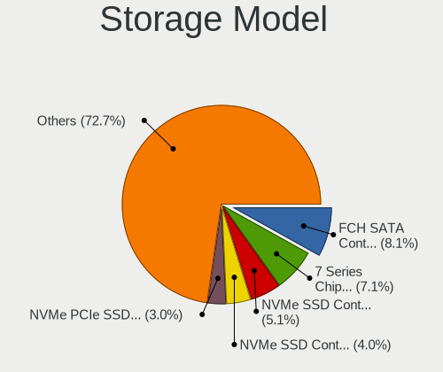
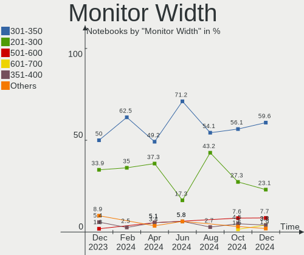
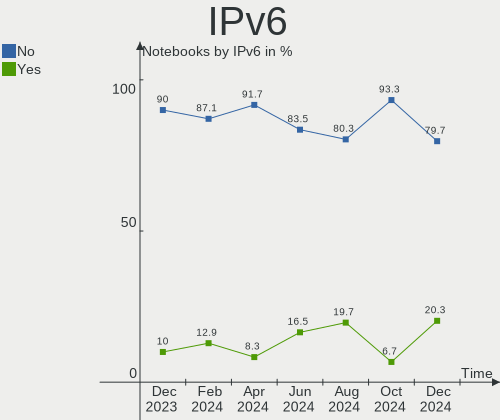

BSD - Hardware Trends (Notebooks)
---------------------------------

A project to identify most popular hardware characteristics and track their change
over time based on data collected by BSD users at https://BSD-Hardware.info.

Anyone can contribute to this report by the [hw-probe](https://github.com/linuxhw/hw-probe/blob/master/INSTALL.BSD.md) tool:

    hw-probe -all -upload

This report is for one last month. Overall report since the beginning of time: [TestDays](https://github.com/bsdhw/TestDays)

Period: May, 2023.

Contents
--------

* [ System ](#system)
  - [ OS                       ](#os)
  - [ OS Family                ](#os-family)
  - [ Arch                     ](#arch)
  - [ DE                       ](#de)
  - [ Display Server           ](#display-server)
  - [ Display Manager          ](#display-manager)
  - [ OS Lang                  ](#os-lang)
  - [ Boot Mode                ](#boot-mode)
  - [ Filesystem               ](#filesystem)
  - [ Part. scheme             ](#part-scheme)

* [ Board ](#board)
  - [ Vendor                   ](#vendor)
  - [ Model                    ](#model)
  - [ Model Family             ](#model-family)
  - [ MFG Year                 ](#mfg-year)
  - [ Form Factor              ](#form-factor)
  - [ Coreboot                 ](#coreboot)
  - [ RAM Size                 ](#ram-size)
  - [ RAM Used                 ](#ram-used)
  - [ Total Drives             ](#total-drives)
  - [ Has CD-ROM               ](#has-cd-rom)
  - [ Has Ethernet             ](#has-ethernet)
  - [ Has WiFi                 ](#has-wifi)
  - [ Has Bluetooth            ](#has-bluetooth)

* [ Location ](#location)
  - [ Country                  ](#country)
  - [ City                     ](#city)

* [ Drives ](#drives)
  - [ Drive Vendor             ](#drive-vendor)
  - [ Drive Model              ](#drive-model)
  - [ HDD Vendor               ](#hdd-vendor)
  - [ SSD Vendor               ](#ssd-vendor)
  - [ Drive Kind               ](#drive-kind)
  - [ Drive Connector          ](#drive-connector)
  - [ Drive Size               ](#drive-size)
  - [ Space Total              ](#space-total)
  - [ Space Used               ](#space-used)
  - [ Malfunc. Drives          ](#malfunc-drives)
  - [ Malfunc. Drive Vendor    ](#malfunc-drive-vendor)
  - [ Malfunc. HDD Vendor      ](#malfunc-hdd-vendor)
  - [ Malfunc. Drive Kind      ](#malfunc-drive-kind)
  - [ Failed Drives            ](#failed-drives)
  - [ Failed Drive Vendor      ](#failed-drive-vendor)
  - [ Drive Status             ](#drive-status)

* [ Storage controller ](#storage-controller)
  - [ Storage Vendor           ](#storage-vendor)
  - [ Storage Model            ](#storage-model)
  - [ Storage Kind             ](#storage-kind)

* [ Processor ](#processor)
  - [ CPU Vendor               ](#cpu-vendor)
  - [ CPU Model                ](#cpu-model)
  - [ CPU Model Family         ](#cpu-model-family)
  - [ CPU Cores                ](#cpu-cores)
  - [ CPU Sockets              ](#cpu-sockets)
  - [ CPU Threads              ](#cpu-threads)
  - [ CPU Microarch            ](#cpu-microarch)

* [ Graphics ](#graphics)
  - [ GPU Vendor               ](#gpu-vendor)
  - [ GPU Model                ](#gpu-model)
  - [ GPU Combo                ](#gpu-combo)
  - [ GPU Driver               ](#gpu-driver)
  - [ GPU Memory               ](#gpu-memory)

* [ Monitor ](#monitor)
  - [ Monitor Vendor           ](#monitor-vendor)
  - [ Monitor Model            ](#monitor-model)
  - [ Monitor Resolution       ](#monitor-resolution)
  - [ Monitor Diagonal         ](#monitor-diagonal)
  - [ Monitor Width            ](#monitor-width)
  - [ Aspect Ratio             ](#aspect-ratio)
  - [ Monitor Area             ](#monitor-area)
  - [ Pixel Density            ](#pixel-density)
  - [ Multiple Monitors        ](#multiple-monitors)

* [ Network ](#network)
  - [ Net Controller Vendor    ](#net-controller-vendor)
  - [ Net Controller Model     ](#net-controller-model)
  - [ Wireless Vendor          ](#wireless-vendor)
  - [ Wireless Model           ](#wireless-model)
  - [ Ethernet Vendor          ](#ethernet-vendor)
  - [ Ethernet Model           ](#ethernet-model)
  - [ Net Controller Kind      ](#net-controller-kind)
  - [ Used Controller          ](#used-controller)
  - [ NICs                     ](#nics)
  - [ IPv6                     ](#ipv6)

* [ Bluetooth ](#bluetooth)
  - [ Bluetooth Vendor         ](#bluetooth-vendor)
  - [ Bluetooth Model          ](#bluetooth-model)

* [ Sound ](#sound)
  - [ Sound Vendor             ](#sound-vendor)
  - [ Sound Model              ](#sound-model)

* [ Memory ](#memory)
  - [ Memory Vendor            ](#memory-vendor)
  - [ Memory Model             ](#memory-model)
  - [ Memory Kind              ](#memory-kind)
  - [ Memory Form Factor       ](#memory-form-factor)
  - [ Memory Size              ](#memory-size)
  - [ Memory Speed             ](#memory-speed)

* [ Printers & scanners ](#printers--scanners)
  - [ Printer Vendor           ](#printer-vendor)
  - [ Printer Model            ](#printer-model)
  - [ Scanner Vendor           ](#scanner-vendor)
  - [ Scanner Model            ](#scanner-model)

* [ Camera ](#camera)
  - [ Camera Vendor            ](#camera-vendor)
  - [ Camera Model             ](#camera-model)

* [ Security ](#security)
  - [ Fingerprint Vendor       ](#fingerprint-vendor)
  - [ Fingerprint Model        ](#fingerprint-model)
  - [ Chipcard Vendor          ](#chipcard-vendor)
  - [ Chipcard Model           ](#chipcard-model)

* [ Unsupported ](#unsupported)
  - [ Unsupported Devices      ](#unsupported-devices)
  - [ Unsupported Device Types ](#unsupported-device-types)

System
------

OS
--

Installed operating systems

| Name                 | Notebooks | Percent |
|----------------------|-----------|---------|
| OpenBSD 7.3          | 22        | 28.57%  |
| helloSystem 0.8.1    | 15        | 19.48%  |
| FreeBSD 13.2         | 13        | 16.88%  |
| FreeBSD 14.0-CURRENT | 6         | 7.79%   |
| helloSystem 0.8.2    | 4         | 5.19%   |
| OPNsense 23.4        | 2         | 2.6%    |
| OPNsense 23.1.8      | 2         | 2.6%    |
| OPNsense 23.1.7      | 2         | 2.6%    |
| GhostBSD 23.05.22    | 2         | 2.6%    |
| GhostBSD 23.04.23    | 2         | 2.6%    |
| OPNsense 23.1.6      | 1         | 1.3%    |
| OPNsense 22.10.2     | 1         | 1.3%    |
| helloSystem 0.8.0    | 1         | 1.3%    |
| GhostBSD 23.05.18    | 1         | 1.3%    |
| GhostBSD 22.06.18    | 1         | 1.3%    |
| FreeBSD 13.1-p7      | 1         | 1.3%    |
| FreeBSD 12.4-p2      | 1         | 1.3%    |

OS Family
---------

OS without a version

| Name        | Notebooks | Percent |
|-------------|-----------|---------|
| OpenBSD     | 22        | 28.57%  |
| FreeBSD     | 21        | 27.27%  |
| helloSystem | 20        | 25.97%  |
| OPNsense    | 8         | 10.39%  |
| GhostBSD    | 6         | 7.79%   |

Arch
----

OS architecture (x86_64, i586, etc.)

| Name  | Notebooks | Percent |
|-------|-----------|---------|
| amd64 | 70        | 90.91%  |
| i386  | 6         | 7.79%   |
| arm64 | 1         | 1.3%    |

DE
--

Desktop Environment

| Name         | Notebooks | Percent |
|--------------|-----------|---------|
| helloDesktop | 39        | 50.65%  |
| Console      | 10        | 12.99%  |
| GNOME        | 9         | 11.69%  |
| MATE         | 7         | 9.09%   |
| XFCE         | 5         | 6.49%   |
| KDE5         | 4         | 5.19%   |
| TWM          | 1         | 1.3%    |
| i3           | 1         | 1.3%    |
| Budgie       | 1         | 1.3%    |

Display Server
--------------

X11 or Wayland

| Name    | Notebooks | Percent |
|---------|-----------|---------|
| X11     | 65        | 84.42%  |
| Console | 12        | 15.58%  |

Display Manager
---------------

SDDM, LightDM, etc.

| Name    | Notebooks | Percent |
|---------|-----------|---------|
| Console | 39        | 50.65%  |
| SLiM    | 20        | 25.97%  |
| LightDM | 9         | 11.69%  |
| SDDM    | 4         | 5.19%   |
| XDM     | 3         | 3.9%    |
| GDM     | 2         | 2.6%    |

OS Lang
-------

Language

| Lang    | Notebooks | Percent |
|---------|-----------|---------|
| Unknown | 31        | 40.26%  |
| C       | 17        | 22.08%  |
| en_US   | 14        | 18.18%  |
| fr_FR   | 6         | 7.79%   |
| ru_RU   | 4         | 5.19%   |
| es_ES   | 2         | 2.6%    |
| pt_BR   | 1         | 1.3%    |
| en      | 1         | 1.3%    |
| de_DE   | 1         | 1.3%    |

Boot Mode
---------

EFI or BIOS

| Mode | Notebooks | Percent |
|------|-----------|---------|
| EFI  | 59        | 76.62%  |
| BIOS | 18        | 23.38%  |

Filesystem
----------

Type of filesystem

| Type   | Notebooks | Percent |
|--------|-----------|---------|
| Zfs    | 37        | 48.05%  |
| Ffs    | 22        | 28.57%  |
| Ufs    | 11        | 14.29%  |
| Cd9660 | 7         | 9.09%   |

Part. scheme
------------

Scheme of partitioning

| Type | Notebooks | Percent |
|------|-----------|---------|
| GPT  | 63        | 81.82%  |
| MBR  | 13        | 16.88%  |
| BSD  | 1         | 1.3%    |

Board
-----

Vendor
------

Motherboard manufacturer

| Name                           | Notebooks | Percent |
|--------------------------------|-----------|---------|
| Lenovo                         | 29        | 37.66%  |
| Hewlett-Packard                | 7         | 9.09%   |
| Acer                           | 5         | 6.49%   |
| Apple                          | 4         | 5.19%   |
| Panasonic                      | 3         | 3.9%    |
| Dell                           | 3         | 3.9%    |
| Deciso                         | 3         | 3.9%    |
| Sony                           | 2         | 2.6%    |
| Matsushita Electric Industrial | 2         | 2.6%    |
| ASUSTek Computer               | 2         | 2.6%    |
| Unknown                        | 2         | 2.6%    |
| Valve                          | 1         | 1.3%    |
| TUXEDO                         | 1         | 1.3%    |
| Toshiba                        | 1         | 1.3%    |
| Timi                           | 1         | 1.3%    |
| Tactus                         | 1         | 1.3%    |
| Samsung Electronics            | 1         | 1.3%    |
| Packard Bell                   | 1         | 1.3%    |
| Notebook                       | 1         | 1.3%    |
| MSI                            | 1         | 1.3%    |
| Medion                         | 1         | 1.3%    |
| Intel                          | 1         | 1.3%    |
| IGEL Technology                | 1         | 1.3%    |
| Google                         | 1         | 1.3%    |
| Fujitsu                        | 1         | 1.3%    |
| Alienware                      | 1         | 1.3%    |

Model
-----

Motherboard model

| Name                                        | Notebooks | Percent |
|---------------------------------------------|-----------|---------|
| Unknown                                     | 3         | 3.9%    |
| HP EliteBook 8570p                          | 2         | 2.6%    |
| Valve Jupiter                               | 1         | 1.3%    |
| TUXEDO Aura 15 Gen1                         | 1         | 1.3%    |
| Toshiba NB250                               | 1         | 1.3%    |
| Timi TM1701                                 | 1         | 1.3%    |
| Tactus GeoFlex 110                          | 1         | 1.3%    |
| Sony VPCEG15FB                              | 1         | 1.3%    |
| Sony SVF14A15CBB                            | 1         | 1.3%    |
| Samsung NC110P/NC108P/NC111P                | 1         | 1.3%    |
| Panasonic CF-53AAGHYDM                      | 1         | 1.3%    |
| Panasonic CF-52PFPBSFQ                      | 1         | 1.3%    |
| Panasonic CF-30KAPAXAM                      | 1         | 1.3%    |
| Packard Bell EasyNote LJ65                  | 1         | 1.3%    |
| Notebook N7x0WU                             | 1         | 1.3%    |
| MSI GE62 6QC                                | 1         | 1.3%    |
| Medion Major X10                            | 1         | 1.3%    |
| Matsushita Electric Industrial CF-51RCVDNLM | 1         | 1.3%    |
| Matsushita Electric Industrial CF-48V4KNDQM | 1         | 1.3%    |
| Lenovo Yoga Slim 7 Pro 14ACH5 82MS          | 1         | 1.3%    |
| Lenovo Yoga 2 Pro 20266                     | 1         | 1.3%    |
| Lenovo ThinkPad X270 W10DG 20K5S5Q507       | 1         | 1.3%    |
| Lenovo ThinkPad X270 W10DG 20K5S0TT1N       | 1         | 1.3%    |
| Lenovo ThinkPad X270 20HMCTO1WW             | 1         | 1.3%    |
| Lenovo ThinkPad X260 20F5S2GM00             | 1         | 1.3%    |
| Lenovo ThinkPad X230 2325T4T                | 1         | 1.3%    |
| Lenovo ThinkPad X220 429043U                | 1         | 1.3%    |
| Lenovo ThinkPad X201 3323BBG                | 1         | 1.3%    |
| Lenovo ThinkPad X140e 20BMS03E00            | 1         | 1.3%    |
| Lenovo ThinkPad X13 Gen 1 20UGS48105        | 1         | 1.3%    |
| Lenovo ThinkPad X1 Carbon 4th 20FCS13H00    | 1         | 1.3%    |
| Lenovo ThinkPad T61 7659AS5                 | 1         | 1.3%    |
| Lenovo ThinkPad T560 20FJS03Q00             | 1         | 1.3%    |
| Lenovo ThinkPad T500 205663G                | 1         | 1.3%    |
| Lenovo ThinkPad T480s 20L8A00KCL            | 1         | 1.3%    |
| Lenovo ThinkPad T430 2347GZU                | 1         | 1.3%    |
| Lenovo ThinkPad T430 2347CTO                | 1         | 1.3%    |
| Lenovo ThinkPad T420s 41742BU               | 1         | 1.3%    |
| Lenovo ThinkPad T410 2537N24                | 1         | 1.3%    |
| Lenovo ThinkPad T15p Gen 3 21DA000QUS       | 1         | 1.3%    |

Model Family
------------

Motherboard model prefix

| Name                                        | Notebooks | Percent |
|---------------------------------------------|-----------|---------|
| Lenovo ThinkPad                             | 25        | 32.47%  |
| Unknown                                     | 3         | 3.9%    |
| Lenovo Yoga                                 | 2         | 2.6%    |
| HP EliteBook                                | 2         | 2.6%    |
| Dell Inspiron                               | 2         | 2.6%    |
| Apple MacBookPro10                          | 2         | 2.6%    |
| Acer Nitro                                  | 2         | 2.6%    |
| Acer Aspire                                 | 2         | 2.6%    |
| Valve Jupiter                               | 1         | 1.3%    |
| TUXEDO Aura                                 | 1         | 1.3%    |
| Toshiba NB250                               | 1         | 1.3%    |
| Timi TM1701                                 | 1         | 1.3%    |
| Tactus GeoFlex                              | 1         | 1.3%    |
| Sony VPCEG15FB                              | 1         | 1.3%    |
| Sony SVF14A15CBB                            | 1         | 1.3%    |
| Samsung NC110P                              | 1         | 1.3%    |
| Panasonic CF-53AAGHYDM                      | 1         | 1.3%    |
| Panasonic CF-52PFPBSFQ                      | 1         | 1.3%    |
| Panasonic CF-30KAPAXAM                      | 1         | 1.3%    |
| Packard Bell EasyNote                       | 1         | 1.3%    |
| Notebook N7x0WU                             | 1         | 1.3%    |
| MSI GE62                                    | 1         | 1.3%    |
| Medion Major                                | 1         | 1.3%    |
| Matsushita Electric Industrial CF-51RCVDNLM | 1         | 1.3%    |
| Matsushita Electric Industrial CF-48V4KNDQM | 1         | 1.3%    |
| Lenovo Flex                                 | 1         | 1.3%    |
| Lenovo B570e                                | 1         | 1.3%    |
| Intel HuronRiver                            | 1         | 1.3%    |
| IGEL H830C                                  | 1         | 1.3%    |
| HP ZBook                                    | 1         | 1.3%    |
| HP ProBook                                  | 1         | 1.3%    |
| HP Pavilion                                 | 1         | 1.3%    |
| HP Laptop                                   | 1         | 1.3%    |
| HP Compaq                                   | 1         | 1.3%    |
| Google Sentry                               | 1         | 1.3%    |
| Dell System                                 | 1         | 1.3%    |
| Deciso OPNsense                             | 1         | 1.3%    |
| Deciso NetBoard-A20                         | 1         | 1.3%    |
| Deciso NetBoard-A10                         | 1         | 1.3%    |
| ASUS K42Jc                                  | 1         | 1.3%    |

MFG Year
--------

Motherboard manufacture year

| Year    | Notebooks | Percent |
|---------|-----------|---------|
| 2022    | 12        | 15.58%  |
| 2011    | 7         | 9.09%   |
| 2020    | 6         | 7.79%   |
| 2013    | 6         | 7.79%   |
| 2012    | 6         | 7.79%   |
| 2021    | 5         | 6.49%   |
| 2017    | 5         | 6.49%   |
| 2016    | 5         | 6.49%   |
| 2010    | 5         | 6.49%   |
| 2018    | 4         | 5.19%   |
| 2015    | 4         | 5.19%   |
| 2014    | 3         | 3.9%    |
| 2009    | 2         | 2.6%    |
| 2008    | 2         | 2.6%    |
| 2019    | 1         | 1.3%    |
| 2007    | 1         | 1.3%    |
| 2006    | 1         | 1.3%    |
| 2002    | 1         | 1.3%    |
| Unknown | 1         | 1.3%    |

Form Factor
-----------

Physical design of the computer

| Name     | Notebooks | Percent |
|----------|-----------|---------|
| Notebook | 77        | 100%    |

Coreboot
--------

Have coreboot on board

| Used | Notebooks | Percent |
|------|-----------|---------|
| No   | 76        | 98.7%   |
| Yes  | 1         | 1.3%    |

RAM Size
--------

Total RAM memory

| Size in GB | Notebooks | Percent |
|------------|-----------|---------|
| 8.01-16.0  | 25        | 32.47%  |
| 16.01-24.0 | 18        | 23.38%  |
| 4.01-8.0   | 16        | 20.78%  |
| 3.01-4.0   | 5         | 6.49%   |
| 32.01-64.0 | 4         | 5.19%   |
| 2.01-3.0   | 4         | 5.19%   |
| 24.01-32.0 | 2         | 2.6%    |
| 0.51-1.0   | 2         | 2.6%    |
| 1.01-2.0   | 1         | 1.3%    |

RAM Used
--------

Used RAM memory

| Used GB   | Notebooks | Percent |
|-----------|-----------|---------|
| 0.01-0.5  | 45        | 58.44%  |
| 0.51-1.0  | 17        | 22.08%  |
| 1.01-2.0  | 10        | 12.99%  |
| 0         | 3         | 3.9%    |
| 2.01-3.0  | 1         | 1.3%    |
| 8.01-16.0 | 1         | 1.3%    |

Total Drives
------------

Number of drives on board

| Drives | Notebooks | Percent |
|--------|-----------|---------|
| 1      | 55        | 71.43%  |
| 2      | 14        | 18.18%  |
| 3      | 4         | 5.19%   |
| 0      | 4         | 5.19%   |

Has CD-ROM
----------

Has CD-ROM on board

| Presented | Notebooks | Percent |
|-----------|-----------|---------|
| No        | 62        | 80.52%  |
| Yes       | 15        | 19.48%  |

Has Ethernet
------------

Has Ethernet on board

| Presented | Notebooks | Percent |
|-----------|-----------|---------|
| Yes       | 68        | 88.31%  |
| No        | 9         | 11.69%  |

Has WiFi
--------

Has WiFi module

| Presented | Notebooks | Percent |
|-----------|-----------|---------|
| Yes       | 69        | 89.61%  |
| No        | 8         | 10.39%  |

Has Bluetooth
-------------

Has Bluetooth module

| Presented | Notebooks | Percent |
|-----------|-----------|---------|
| Yes       | 50        | 64.94%  |
| No        | 27        | 35.06%  |

Location
--------

Country
-------

Geographic location (country)

| Country       | Notebooks | Percent |
|---------------|-----------|---------|
| Canada        | 15        | 19.48%  |
| USA           | 11        | 14.29%  |
| Russia        | 6         | 7.79%   |
| Poland        | 6         | 7.79%   |
| Brazil        | 6         | 7.79%   |
| France        | 5         | 6.49%   |
| Germany       | 4         | 5.19%   |
| UK            | 3         | 3.9%    |
| Netherlands   | 3         | 3.9%    |
| Uruguay       | 2         | 2.6%    |
| Indonesia     | 2         | 2.6%    |
| Venezuela     | 1         | 1.3%    |
| Thailand      | 1         | 1.3%    |
| Switzerland   | 1         | 1.3%    |
| Spain         | 1         | 1.3%    |
| Romania       | 1         | 1.3%    |
| New Caledonia | 1         | 1.3%    |
| Mexico        | 1         | 1.3%    |
| Jordan        | 1         | 1.3%    |
| Japan         | 1         | 1.3%    |
| Ireland       | 1         | 1.3%    |
| Hungary       | 1         | 1.3%    |
| Bulgaria      | 1         | 1.3%    |
| Belgium       | 1         | 1.3%    |
| Australia     | 1         | 1.3%    |

City
----

Geographic location (city)

| City                | Notebooks | Percent |
|---------------------|-----------|---------|
| Saint-Laurent       | 13        | 16.88%  |
| Warsaw              | 2         | 2.6%    |
| Skiatook            | 2         | 2.6%    |
| Montevideo          | 2         | 2.6%    |
| Bordeaux            | 2         | 2.6%    |
| Blumenau            | 2         | 2.6%    |
| Zurich              | 1         | 1.3%    |
| Zgierz              | 1         | 1.3%    |
| Wroclaw             | 1         | 1.3%    |
| Vila Velha          | 1         | 1.3%    |
| Veendam             | 1         | 1.3%    |
| Ulyanovsk           | 1         | 1.3%    |
| Toronto             | 1         | 1.3%    |
| Tolyatti            | 1         | 1.3%    |
| The Hague           | 1         | 1.3%    |
| Takasago            | 1         | 1.3%    |
| Sydney              | 1         | 1.3%    |
| Swilcza             | 1         | 1.3%    |
| Sun Prairie         | 1         | 1.3%    |
| St Petersburg       | 1         | 1.3%    |
| South San Francisco | 1         | 1.3%    |
| Seattle             | 1         | 1.3%    |
| Schoten             | 1         | 1.3%    |
| Saratov             | 1         | 1.3%    |
| Sao Paulo           | 1         | 1.3%    |
| Portland            | 1         | 1.3%    |
| Patrocinio          | 1         | 1.3%    |
| Paris               | 1         | 1.3%    |
| Palmas              | 1         | 1.3%    |
| Oudon               | 1         | 1.3%    |
| Ottawa              | 1         | 1.3%    |
| Noumea              | 1         | 1.3%    |
| Mytishchi           | 1         | 1.3%    |
| Munich              | 1         | 1.3%    |
| Moers               | 1         | 1.3%    |
| Lübeck             | 1         | 1.3%    |
| Krakow              | 1         | 1.3%    |
| Jakarta             | 1         | 1.3%    |
| Irkutsk             | 1         | 1.3%    |
| Indramayu           | 1         | 1.3%    |

Drives
------

Drive Vendor
------------

Hard drive vendors

| Vendor              | Notebooks | Drives | Percent |
|---------------------|-----------|--------|---------|
| WDC                 | 12        | 12     | 13.48%  |
| Samsung Electronics | 12        | 13     | 13.48%  |
| Seagate             | 8         | 8      | 8.99%   |
| Toshiba             | 7         | 8      | 7.87%   |
| Kingston            | 7         | 7      | 7.87%   |
| HGST                | 5         | 6      | 5.62%   |
| NVMe                | 4         | 4      | 4.49%   |
| Hitachi             | 4         | 4      | 4.49%   |
| Transcend           | 3         | 3      | 3.37%   |
| SanDisk             | 3         | 3      | 3.37%   |
| Crucial             | 3         | 3      | 3.37%   |
| Apple               | 3         | 3      | 3.37%   |
| SK hynix            | 2         | 2      | 2.25%   |
| A-DATA Technology   | 2         | 2      | 2.25%   |
| Verbatim            | 1         | 1      | 1.12%   |
| Union Memory        | 1         | 1      | 1.12%   |
| UMIS                | 1         | 1      | 1.12%   |
| SPCC                | 1         | 1      | 1.12%   |
| SMI                 | 1         | 1      | 1.12%   |
| Phison              | 1         | 1      | 1.12%   |
| OCZ                 | 1         | 1      | 1.12%   |
| KIOXIA              | 1         | 1      | 1.12%   |
| Kingmax             | 1         | 1      | 1.12%   |
| Intenso             | 1         | 1      | 1.12%   |
| Intel               | 1         | 1      | 1.12%   |
| Goldenfir           | 1         | 1      | 1.12%   |
| Biostar             | 1         | 1      | 1.12%   |
| 2-Power             | 1         | 1      | 1.12%   |

Drive Model
-----------

Hard drive models

| Model                                  | Notebooks | Percent |
|----------------------------------------|-----------|---------|
| HGST HTS725050A7E630 500GB             | 3         | 3.3%    |
| Transcend TS256GMTS952T2 256GB         | 2         | 2.2%    |
| Toshiba MQ04ABF100 1TB                 | 2         | 2.2%    |
| SanDisk Extreme SSD 500GB              | 2         | 2.2%    |
| Samsung SSD 980 1TB                    | 2         | 2.2%    |
| NVMe SAMSUNG MZVLW256 256GB            | 2         | 2.2%    |
| Kingston SA400S37240G 240GB            | 2         | 2.2%    |
| HGST HTS721010A9E630 1TB               | 2         | 2.2%    |
| Crucial CT500P2SSD8 500GB              | 2         | 2.2%    |
| WDC WDS200T3X0C-00SJG0 2TB             | 1         | 1.1%    |
| WDC WDS120G2G0B-00EPW0 120GB           | 1         | 1.1%    |
| WDC WDBNCE0010PNC 1TB                  | 1         | 1.1%    |
| WDC WD7500BPKX-00HPJT0 752GB           | 1         | 1.1%    |
| WDC WD7500BPKT-00PK4T0 752GB           | 1         | 1.1%    |
| WDC WD5000LPLX-00ZNTT0 500GB           | 1         | 1.1%    |
| WDC WD5000LPCX-60VHAT0 500GB           | 1         | 1.1%    |
| WDC WD3200BEVE-00A0HT0 320GB           | 1         | 1.1%    |
| WDC WD1600BEVT-60ZCT0 160GB            | 1         | 1.1%    |
| WDC WD10JPVX-22JC3T0 1TB               | 1         | 1.1%    |
| WDC WD10JPLX-00MBPT0 1TB               | 1         | 1.1%    |
| WDC PC SN730 SDBQNTY-256G-1001 256GB   | 1         | 1.1%    |
| Verbatim STORE N GO 64GB               | 1         | 1.1%    |
| Union Memory RTOTJ128VGD2EYX 128GB     | 1         | 1.1%    |
| UMIS RPETJ1T24MGE2QDQ 1TB              | 1         | 1.1%    |
| Transcend TS256GMTE652T2 256GB         | 1         | 1.1%    |
| Toshiba THNSN51T02DUK NVMe 1024GB      | 1         | 1.1%    |
| Toshiba MK8034GSX 80GB                 | 1         | 1.1%    |
| Toshiba MK5059GSXP 500GB               | 1         | 1.1%    |
| Toshiba MK3261GSYN 320GB               | 1         | 1.1%    |
| Toshiba MK1246GSX 120GB                | 1         | 1.1%    |
| SPCC Solid State Disk 128GB            | 1         | 1.1%    |
| SMI USB DISK 18302PB                   | 1         | 1.1%    |
| SK hynix SKHynix_HFS512GDE9X081N 512GB | 1         | 1.1%    |
| SK hynix HFS128G39MND-3310A 128GB      | 1         | 1.1%    |
| Seagate ST9160821AS 160GB              | 1         | 1.1%    |
| Seagate ST9160821A 160GB               | 1         | 1.1%    |
| Seagate ST9160314AS 160GB              | 1         | 1.1%    |
| Seagate ST500LM012 HN-M500MBB 500GB    | 1         | 1.1%    |
| Seagate ST500LM000-SSHD-8GB            | 1         | 1.1%    |
| Seagate ST320LT020-9YG142 320GB        | 1         | 1.1%    |

HDD Vendor
----------

Hard disk drive vendors

| Vendor              | Notebooks | Drives | Percent |
|---------------------|-----------|--------|---------|
| WDC                 | 8         | 8      | 21.62%  |
| Seagate             | 8         | 8      | 21.62%  |
| Toshiba             | 6         | 6      | 16.22%  |
| HGST                | 5         | 6      | 13.51%  |
| Hitachi             | 4         | 4      | 10.81%  |
| NVMe                | 3         | 3      | 8.11%   |
| Verbatim            | 1         | 1      | 2.7%    |
| SMI                 | 1         | 1      | 2.7%    |
| Samsung Electronics | 1         | 2      | 2.7%    |

SSD Vendor
----------

Solid state drive vendors

| Vendor              | Notebooks | Drives | Percent |
|---------------------|-----------|--------|---------|
| Samsung Electronics | 5         | 5      | 15.63%  |
| Kingston            | 5         | 5      | 15.63%  |
| SanDisk             | 3         | 3      | 9.38%   |
| Apple               | 3         | 3      | 9.38%   |
| WDC                 | 2         | 2      | 6.25%   |
| Transcend           | 2         | 2      | 6.25%   |
| Union Memory        | 1         | 1      | 3.13%   |
| SPCC                | 1         | 1      | 3.13%   |
| SK hynix            | 1         | 1      | 3.13%   |
| OCZ                 | 1         | 1      | 3.13%   |
| NVMe                | 1         | 1      | 3.13%   |
| Kingmax             | 1         | 1      | 3.13%   |
| Intenso             | 1         | 1      | 3.13%   |
| Goldenfir           | 1         | 1      | 3.13%   |
| Crucial             | 1         | 1      | 3.13%   |
| Biostar             | 1         | 1      | 3.13%   |
| A-DATA Technology   | 1         | 1      | 3.13%   |
| 2-Power             | 1         | 1      | 3.13%   |

Drive Kind
----------

HDD or SSD

| Kind | Notebooks | Drives | Percent |
|------|-----------|--------|---------|
| HDD  | 33        | 39     | 40.24%  |
| SSD  | 31        | 32     | 37.8%   |
| NVMe | 18        | 21     | 21.95%  |

Drive Connector
---------------

SATA, SAS, NVMe, etc.

| Type | Notebooks | Drives | Percent |
|------|-----------|--------|---------|
| SATA | 59        | 71     | 76.62%  |
| NVMe | 18        | 21     | 23.38%  |

Drive Size
----------

Size of hard drive

| Size in TB      | Notebooks | Drives | Percent |
|-----------------|-----------|--------|---------|
| 0.01-0.5        | 46        | 53     | 73.02%  |
| 0.51-1.0        | 14        | 15     | 22.22%  |
| 1.01-2.0        | 2         | 2      | 3.17%   |
| More than 100.0 | 1         | 1      | 1.59%   |

Space Total
-----------

Amount of disk space available on the file system

| Size in GB | Notebooks | Percent |
|------------|-----------|---------|
| 101-250    | 23        | 29.87%  |
| 251-500    | 13        | 16.88%  |
| 21-50      | 11        | 14.29%  |
| 1-20       | 11        | 14.29%  |
| 51-100     | 10        | 12.99%  |
| 501-1000   | 9         | 11.69%  |

Space Used
----------

Amount of used disk space

| Used GB | Notebooks | Percent |
|---------|-----------|---------|
| 1-20    | 62        | 80.52%  |
| 21-50   | 10        | 12.99%  |
| 101-250 | 2         | 2.6%    |
| 51-100  | 2         | 2.6%    |
| 251-500 | 1         | 1.3%    |

Malfunc. Drives
---------------

Drive models with a malfunction

| Model                             | Notebooks | Drives | Percent |
|-----------------------------------|-----------|--------|---------|
| Toshiba MK5059GSXP 500GB          | 1         | 1      | 10%     |
| Toshiba MK1246GSX 120GB           | 1         | 1      | 10%     |
| Seagate ST9160314AS 160GB         | 1         | 1      | 10%     |
| Seagate ST500LM000-SSHD-8GB       | 1         | 1      | 10%     |
| Seagate ST320LT020-9YG142 320GB   | 1         | 1      | 10%     |
| Samsung Electronics HM321HI 320GB | 1         | 1      | 10%     |
| HGST HTS725050A7E630 500GB        | 1         | 1      | 10%     |
| HGST HTS721010A9E630 1TB          | 1         | 1      | 10%     |
| HGST HTS541010A9E680 1TB          | 1         | 1      | 10%     |
| A-DATA Technology SP550 480GB     | 1         | 1      | 10%     |

Malfunc. Drive Vendor
---------------------

Vendors of faulty drives

| Vendor              | Notebooks | Drives | Percent |
|---------------------|-----------|--------|---------|
| Seagate             | 3         | 3      | 30%     |
| HGST                | 3         | 3      | 30%     |
| Toshiba             | 2         | 2      | 20%     |
| Samsung Electronics | 1         | 1      | 10%     |
| A-DATA Technology   | 1         | 1      | 10%     |

Malfunc. HDD Vendor
-------------------

Vendors of faulty HDD drives

| Vendor              | Notebooks | Drives | Percent |
|---------------------|-----------|--------|---------|
| Seagate             | 3         | 3      | 33.33%  |
| HGST                | 3         | 3      | 33.33%  |
| Toshiba             | 2         | 2      | 22.22%  |
| Samsung Electronics | 1         | 1      | 11.11%  |

Malfunc. Drive Kind
-------------------

Kinds of faulty drives

| Kind | Notebooks | Drives | Percent |
|------|-----------|--------|---------|
| HDD  | 8         | 9      | 88.89%  |
| SSD  | 1         | 1      | 11.11%  |

Failed Drives
-------------

Failed drive models

| Model                             | Notebooks | Drives | Percent |
|-----------------------------------|-----------|--------|---------|
| Samsung Electronics HM500JJ 500GB | 1         | 1      | 100%    |

Failed Drive Vendor
-------------------

Failed drive vendors

| Vendor              | Notebooks | Drives | Percent |
|---------------------|-----------|--------|---------|
| Samsung Electronics | 1         | 1      | 100%    |

Drive Status
------------

Number of failed and malfunc. drives

| Status   | Notebooks | Drives | Percent |
|----------|-----------|--------|---------|
| Works    | 63        | 74     | 80.77%  |
| Malfunc  | 9         | 10     | 11.54%  |
| Detected | 5         | 7      | 6.41%   |
| Failed   | 1         | 1      | 1.28%   |

Storage controller
------------------

Storage Vendor
--------------

Storage controller vendors

| Vendor                                  | Notebooks | Percent |
|-----------------------------------------|-----------|---------|
| Intel                                   | 51        | 62.96%  |
| Samsung Electronics                     | 9         | 11.11%  |
| AMD                                     | 5         | 6.17%   |
| Kingston Technology Company             | 3         | 3.7%    |
| SanDisk                                 | 2         | 2.47%   |
| Micron/Crucial Technology               | 2         | 2.47%   |
| Transcend                               | 1         | 1.23%   |
| Toshiba                                 | 1         | 1.23%   |
| SK hynix                                | 1         | 1.23%   |
| Shenzhen Unionmemory Information System | 1         | 1.23%   |
| Phison Electronics                      | 1         | 1.23%   |
| Nvidia                                  | 1         | 1.23%   |
| MAXIO Technology (Hangzhou)             | 1         | 1.23%   |
| KIOXIA                                  | 1         | 1.23%   |
| ADATA Technology                        | 1         | 1.23%   |

Storage Model
-------------

Storage controller models

| Model                                                                            | Notebooks | Percent |
|----------------------------------------------------------------------------------|-----------|---------|
| Intel 7 Series Chipset Family 6-port SATA Controller [AHCI mode]                 | 8         | 9.41%   |
| Intel 6 Series/C200 Series Chipset Family 6 port Mobile SATA AHCI Controller     | 7         | 8.24%   |
| Intel Sunrise Point-LP SATA Controller [AHCI mode]                               | 5         | 5.88%   |
| Intel 82801IBM/IEM (ICH9M/ICH9M-E) 4 port SATA Controller [AHCI mode]            | 4         | 4.71%   |
| AMD FCH SATA Controller [AHCI mode]                                              | 4         | 4.71%   |
| Samsung NVMe SSD Controller SM961/PM961/SM963                                    | 3         | 3.53%   |
| Samsung NVMe SSD Controller 980                                                  | 3         | 3.53%   |
| Intel 8 Series SATA Controller 1 [AHCI mode]                                     | 3         | 3.53%   |
| Intel 5 Series/3400 Series Chipset 6 port SATA AHCI Controller                   | 3         | 3.53%   |
| Samsung NVMe SSD Controller SM981/PM981/PM983                                    | 2         | 2.35%   |
| Micron/Crucial P2 NVMe PCIe SSD                                                  | 2         | 2.35%   |
| Intel Wildcat Point-LP SATA Controller [AHCI Mode]                               | 2         | 2.35%   |
| Intel Q170/Q150/B150/H170/H110/Z170/CM236 Chipset SATA Controller [AHCI Mode]    | 2         | 2.35%   |
| Intel Atom Processor E3800 Series SATA AHCI Controller                           | 2         | 2.35%   |
| Intel 82801GBM/GHM (ICH7-M Family) SATA Controller [IDE mode]                    | 2         | 2.35%   |
| Intel 82801 Mobile SATA Controller [RAID mode]                                   | 2         | 2.35%   |
| Unknown                                                                          | 2         | 2.35%   |
| Toshiba XG4 NVMe SSD Controller                                                  | 1         | 1.18%   |
| SK hynix Gold P31/PC711 NVMe Solid State Drive                                   | 1         | 1.18%   |
| SanDisk WD Black SN750 / PC SN730 NVMe SSD                                       | 1         | 1.18%   |
| SanDisk WD Black 2018/SN750 / PC SN720 NVMe SSD                                  | 1         | 1.18%   |
| Samsung SM951 AHCI                                                               | 1         | 1.18%   |
| Phison E18 PCIe4 NVMe Controller                                                 | 1         | 1.18%   |
| Nvidia MCP79 AHCI Controller                                                     | 1         | 1.18%   |
| MAXIO (Hangzhou) NVMe SSD Controller MAP1202                                     | 1         | 1.18%   |
| KIOXIA NVMe SSD Controller BG4                                                   | 1         | 1.18%   |
| Kingston Company unknown                                                         | 1         | 1.18%   |
| Kingston Company SNVS2000G [NV1 NVMe PCIe SSD 2TB]                               | 1         | 1.18%   |
| Kingston Company OM3PDP3 NVMe SSD                                                | 1         | 1.18%   |
| Intel Volume Management Device NVMe RAID Controller                              | 1         | 1.18%   |
| Intel Tiger Lake-LP SATA Controller                                              | 1         | 1.18%   |
| Intel SSD Pro 7600p/760p/E 6100p Series                                          | 1         | 1.18%   |
| Intel NM10/ICH7 Family SATA Controller [IDE mode]                                | 1         | 1.18%   |
| Intel HM170/QM170 Chipset SATA Controller [AHCI Mode]                            | 1         | 1.18%   |
| Intel Celeron/Pentium Silver Processor SATA Controller                           | 1         | 1.18%   |
| Intel Atom/Celeron/Pentium Processor x5-E8000/J3xxx/N3xxx Series SATA Controller | 1         | 1.18%   |
| Intel 82801HM/HEM (ICH8M/ICH8M-E) SATA Controller [AHCI mode]                    | 1         | 1.18%   |
| Intel 82801CAM IDE U100 Controller                                               | 1         | 1.18%   |
| Intel 7 Series Chipset Family 4-port SATA Controller [IDE mode]                  | 1         | 1.18%   |
| Intel 7 Series Chipset Family 2-port SATA Controller [IDE mode]                  | 1         | 1.18%   |

Storage Kind
------------

Kind of storage controller (IDE, SATA, NVMe, SAS, ...)

| Kind | Notebooks | Percent |
|------|-----------|---------|
| SATA | 50        | 62.5%   |
| NVMe | 21        | 26.25%  |
| IDE  | 6         | 7.5%    |
| RAID | 3         | 3.75%   |

Processor
---------

CPU Vendor
----------

Processor vendors

| Vendor  | Notebooks | Percent |
|---------|-----------|---------|
| Intel   | 64        | 83.12%  |
| AMD     | 12        | 15.58%  |
| Unknown | 1         | 1.3%    |

CPU Model
---------

Processor models

| Model                                       | Notebooks | Percent |
|---------------------------------------------|-----------|---------|
| Intel Core i5-6300U CPU @ 2.40GHz           | 4         | 5.19%   |
| Intel Core i5-2520M CPU @ 2.50GHz           | 4         | 5.19%   |
| Intel Core i5-3320M CPU @ 2.60GHz           | 3         | 3.9%    |
| Intel Core i5-4210U CPU @ 1.70GHz           | 2         | 2.6%    |
| Intel Core i5 CPU M 520 @ 2.40GHz           | 2         | 2.6%    |
| AMD Ryzen 5 PRO 4650U with Radeon Graphics  | 2         | 2.6%    |
| AMD EPYC 3201 8-Core Processor              | 2         | 2.6%    |
| Intel Pentium Dual-Core CPU T4500 @ 2.30GHz | 1         | 1.3%    |
| Intel Pentium 4 Mobile CPU 1.60GHz          | 1         | 1.3%    |
| Intel Genuine CPU T2300 @ 1.66GHz           | 1         | 1.3%    |
| Intel Genuine CPU 575 @ 2.00GHz             | 1         | 1.3%    |
| Intel Core i7-8650U CPU @ 1.90GHz           | 1         | 1.3%    |
| Intel Core i7-8550U CPU @ 1.80GHz           | 1         | 1.3%    |
| Intel Core i7-7820HK CPU @ 2.90GHz          | 1         | 1.3%    |
| Intel Core i7-6820HQ CPU @ 2.70GHz          | 1         | 1.3%    |
| Intel Core i7-6700HQ CPU @ 2.60GHz          | 1         | 1.3%    |
| Intel Core i7-6500U CPU @ 2.50GHz           | 1         | 1.3%    |
| Intel Core i7-4870HQ CPU @ 2.50GHz          | 1         | 1.3%    |
| Intel Core i7-4510U CPU @ 2.00GHz           | 1         | 1.3%    |
| Intel Core i7-3615QM CPU @ 2.30GHz          | 1         | 1.3%    |
| Intel Core i7-3520M CPU @ 2.90GHz           | 1         | 1.3%    |
| Intel Core i7-2720QM CPU @ 2.20GHz          | 1         | 1.3%    |
| Intel Core i7-2630QM CPU @ 2.00GHz          | 1         | 1.3%    |
| Intel Core i7-10610U CPU @ 1.80GHz          | 1         | 1.3%    |
| Intel Core i5-8300H CPU @ 2.30GHz           | 1         | 1.3%    |
| Intel Core i5-7200U CPU @ 2.50GHz           | 1         | 1.3%    |
| Intel Core i5-6200U CPU @ 2.30GHz           | 1         | 1.3%    |
| Intel Core i5-5200U CPU @ 2.20GHz           | 1         | 1.3%    |
| Intel Core i5-3360M CPU @ 2.80GHz           | 1         | 1.3%    |
| Intel Core i5-3337U CPU @ 1.80GHz           | 1         | 1.3%    |
| Intel Core i5-3210M CPU @ 2.50GHz           | 1         | 1.3%    |
| Intel Core i5-2410M CPU @ 2.30GHz           | 1         | 1.3%    |
| Intel Core i5-10210U CPU @ 1.60GHz          | 1         | 1.3%    |
| Intel Core i5 CPU M 460 @ 2.53GH            | 1         | 1.3%    |
| Intel Core i3-8130U CPU @ 2.20GHz           | 1         | 1.3%    |
| Intel Core i3-7020U CPU @ 2.30GHz           | 1         | 1.3%    |
| Intel Core i3-5020U CPU @ 2.20GHz           | 1         | 1.3%    |
| Intel Core i3-2310M CPU @ 2.10GHz           | 1         | 1.3%    |
| Intel Core i3 CPU M 350 @ 2.27GHz           | 1         | 1.3%    |
| Intel Core 2 Duo CPU T9400 @ 2.53GHz        | 1         | 1.3%    |

CPU Model Family
----------------

Processor model prefix

| Model                   | Notebooks | Percent |
|-------------------------|-----------|---------|
| Intel Core i5           | 25        | 32.47%  |
| Intel Core i7           | 13        | 16.88%  |
| Other                   | 6         | 7.79%   |
| Intel Celeron           | 6         | 7.79%   |
| Intel Core i3           | 5         | 6.49%   |
| Intel Core 2 Duo        | 4         | 5.19%   |
| Intel Atom              | 3         | 3.9%    |
| Intel Genuine           | 2         | 2.6%    |
| AMD Ryzen 7             | 2         | 2.6%    |
| AMD Ryzen 5 PRO         | 2         | 2.6%    |
| AMD EPYC                | 2         | 2.6%    |
| Intel Pentium Dual-Core | 1         | 1.3%    |
| Intel Pentium 4         | 1         | 1.3%    |
| AMD Ryzen Embedded      | 1         | 1.3%    |
| AMD Ryzen 5             | 1         | 1.3%    |
| AMD Ryzen 3 PRO         | 1         | 1.3%    |
| AMD E1                  | 1         | 1.3%    |
| AMD A10                 | 1         | 1.3%    |

CPU Cores
---------

Number of processor cores

| Number  | Notebooks | Percent |
|---------|-----------|---------|
| 2       | 38        | 49.35%  |
| 4       | 15        | 19.48%  |
| Unknown | 10        | 12.99%  |
| 8       | 7         | 9.09%   |
| 12      | 2         | 2.6%    |
| 20      | 1         | 1.3%    |
| 16      | 1         | 1.3%    |
| 10      | 1         | 1.3%    |
| 6       | 1         | 1.3%    |
| 1       | 1         | 1.3%    |

CPU Sockets
-----------

Number of sockets

| Number  | Notebooks | Percent |
|---------|-----------|---------|
| 1       | 72        | 93.51%  |
| Unknown | 4         | 5.19%   |
| 2       | 1         | 1.3%    |

CPU Threads
-----------

Threads per core (Hyper-Threading)

| Number  | Notebooks | Percent |
|---------|-----------|---------|
| 2       | 46        | 59.74%  |
| 1       | 20        | 25.97%  |
| Unknown | 11        | 14.29%  |

CPU Microarch
-------------

Microarchitecture

| Name          | Notebooks | Percent |
|---------------|-----------|---------|
| Skylake       | 9         | 11.69%  |
| KabyLake      | 9         | 11.69%  |
| IvyBridge     | 9         | 11.69%  |
| SandyBridge   | 8         | 10.39%  |
| Unknown       | 5         | 6.49%   |
| Zen 2         | 4         | 5.19%   |
| Zen           | 4         | 5.19%   |
| Westmere      | 4         | 5.19%   |
| Penryn        | 4         | 5.19%   |
| Haswell       | 4         | 5.19%   |
| Silvermont    | 3         | 3.9%    |
| Bonnell       | 3         | 3.9%    |
| Core          | 2         | 2.6%    |
| Broadwell     | 2         | 2.6%    |
| Zen 3         | 1         | 1.3%    |
| TigerLake     | 1         | 1.3%    |
| P6            | 1         | 1.3%    |
| NetBurst      | 1         | 1.3%    |
| Jaguar        | 1         | 1.3%    |
| Goldmont plus | 1         | 1.3%    |
| Excavator     | 1         | 1.3%    |

Graphics
--------

GPU Vendor
----------

Vendors of graphics cards

| Vendor | Notebooks | Percent |
|--------|-----------|---------|
| Intel  | 57        | 66.28%  |
| Nvidia | 15        | 17.44%  |
| AMD    | 14        | 16.28%  |

GPU Model
---------

Graphics card models

| Model                                                                         | Notebooks | Percent |
|-------------------------------------------------------------------------------|-----------|---------|
| Intel 2nd Generation Core Processor Family Integrated Graphics Controller     | 8         | 8.79%   |
| Intel 3rd Gen Core processor Graphics Controller                              | 7         | 7.69%   |
| Intel Skylake GT2 [HD Graphics 520]                                           | 6         | 6.59%   |
| Intel Core Processor Integrated Graphics Controller                           | 4         | 4.4%    |
| AMD Renoir                                                                    | 4         | 4.4%    |
| Intel UHD Graphics 620                                                        | 3         | 3.3%    |
| Intel Mobile 4 Series Chipset Integrated Graphics Controller                  | 3         | 3.3%    |
| Intel Haswell-ULT Integrated Graphics Controller                              | 3         | 3.3%    |
| Intel Mobile 945GM/GMS/GME, 943/940GML Express Integrated Graphics Controller | 2         | 2.2%    |
| Intel HD Graphics 620                                                         | 2         | 2.2%    |
| Intel HD Graphics 5500                                                        | 2         | 2.2%    |
| Intel HD Graphics 530                                                         | 2         | 2.2%    |
| Intel CometLake-U GT2 [UHD Graphics]                                          | 2         | 2.2%    |
| Intel Atom Processor Z36xxx/Z37xxx Series Graphics & Display                  | 2         | 2.2%    |
| Intel Alder Lake-P Integrated Graphics Controller                             | 2         | 2.2%    |
| AMD Thames [Radeon HD 7550M/7570M/7650M]                                      | 2         | 2.2%    |
| Nvidia TU117M [GeForce GTX 1650 Mobile / Max-Q]                               | 1         | 1.1%    |
| Nvidia GT218M [GeForce 310M]                                                  | 1         | 1.1%    |
| Nvidia GT216M [GeForce GT 240M]                                               | 1         | 1.1%    |
| Nvidia GP108M [GeForce MX150]                                                 | 1         | 1.1%    |
| Nvidia GP108GLM [Quadro P520]                                                 | 1         | 1.1%    |
| Nvidia GP107M [GeForce GTX 1050 Mobile]                                       | 1         | 1.1%    |
| Nvidia GP104BM [GeForce GTX 1080 Mobile]                                      | 1         | 1.1%    |
| Nvidia GM107M [GeForce GTX 960M]                                              | 1         | 1.1%    |
| Nvidia GM107GLM [Quadro M2000M]                                               | 1         | 1.1%    |
| Nvidia GK208M [GeForce GT 735M]                                               | 1         | 1.1%    |
| Nvidia GK107M [GeForce GT 650M Mac Edition]                                   | 1         | 1.1%    |
| Nvidia GF119M [GeForce 410M]                                                  | 1         | 1.1%    |
| Nvidia GF106M [GeForce GT 555M]                                               | 1         | 1.1%    |
| Nvidia GA107M [GeForce RTX 3050 Mobile]                                       | 1         | 1.1%    |
| Nvidia C79 [GeForce 9400M]                                                    | 1         | 1.1%    |
| Intel TigerLake-LP GT2 [Iris Xe Graphics]                                     | 1         | 1.1%    |
| Intel TigerLake-H GT1 [UHD Graphics]                                          | 1         | 1.1%    |
| Intel Mobile GM965/GL960 Integrated Graphics Controller (secondary)           | 1         | 1.1%    |
| Intel Mobile GM965/GL960 Integrated Graphics Controller (primary)             | 1         | 1.1%    |
| Intel Mobile 945GSE Express Integrated Graphics Controller                    | 1         | 1.1%    |
| Intel Mobile 945GM/GMS, 943/940GML Express Integrated Graphics Controller     | 1         | 1.1%    |
| Intel HD Graphics 630                                                         | 1         | 1.1%    |
| Intel HD Graphics 510                                                         | 1         | 1.1%    |
| Intel GeminiLake [UHD Graphics 600]                                           | 1         | 1.1%    |

GPU Combo
---------

Combinations of graphics cards

| Name           | Notebooks | Percent |
|----------------|-----------|---------|
| 1 x Intel      | 37        | 48.05%  |
| Intel + Nvidia | 13        | 16.88%  |
| 1 x AMD        | 12        | 15.58%  |
| 2 x Intel      | 7         | 9.09%   |
| Other          | 5         | 6.49%   |
| 1 x Nvidia     | 2         | 2.6%    |
| 2 x AMD        | 1         | 1.3%    |

GPU Driver
----------

Free vs proprietary

| Driver      | Notebooks | Percent |
|-------------|-----------|---------|
| Free        | 66        | 85.71%  |
| Unknown     | 8         | 10.39%  |
| Proprietary | 3         | 3.9%    |

GPU Memory
----------

Total video memory

| Size in GB | Notebooks | Percent |
|------------|-----------|---------|
| Unknown    | 68        | 88.31%  |
| 0.51-1.0   | 3         | 3.9%    |
| 0.01-0.5   | 3         | 3.9%    |
| 7.01-8.0   | 1         | 1.3%    |
| 3.01-4.0   | 1         | 1.3%    |
| 1.01-2.0   | 1         | 1.3%    |

Monitor
-------

Monitor Vendor
--------------

Monitor vendors

| Vendor                  | Notebooks | Percent |
|-------------------------|-----------|---------|
| AU Optronics            | 14        | 25.45%  |
| Samsung Electronics     | 8         | 14.55%  |
| Chimei Innolux          | 8         | 14.55%  |
| LG Display              | 5         | 9.09%   |
| BOE                     | 5         | 9.09%   |
| InfoVision              | 2         | 3.64%   |
| Apple                   | 2         | 3.64%   |
| YTH                     | 1         | 1.82%   |
| TRU                     | 1         | 1.82%   |
| Philips                 | 1         | 1.82%   |
| LG Philips              | 1         | 1.82%   |
| Lenovo                  | 1         | 1.82%   |
| Hewlett-Packard         | 1         | 1.82%   |
| Dell                    | 1         | 1.82%   |
| CSO                     | 1         | 1.82%   |
| Chi Mei Optoelectronics | 1         | 1.82%   |
| AOC                     | 1         | 1.82%   |
| Acer                    | 1         | 1.82%   |

Monitor Model
-------------

Monitor models

| Model                                                                    | Notebooks | Percent |
|--------------------------------------------------------------------------|-----------|---------|
| YTH HS133PC YTH1330 1920x1080 250x220mm 13.1-inch                        | 1         | 1.82%   |
| TRU LCD Monitor TRU235C 1366x768 260x140mm 11.6-inch                     | 1         | 1.82%   |
| Samsung Electronics SyncMaster SAM058D 1600x900 440x250mm 19.9-inch      | 1         | 1.82%   |
| Samsung Electronics LCD Monitor SEC3659 1600x900 340x190mm 15.3-inch     | 1         | 1.82%   |
| Samsung Electronics LCD Monitor SEC3541 1366x768 300x170mm 13.6-inch     | 1         | 1.82%   |
| Samsung Electronics LCD Monitor SEC324C 1600x900 310x170mm 13.9-inch     | 1         | 1.82%   |
| Samsung Electronics LCD Monitor SEC304C 1366x768 310x170mm 13.9-inch     | 1         | 1.82%   |
| Samsung Electronics LCD Monitor SDC8B4F 1920x1080 340x190mm 15.3-inch    | 1         | 1.82%   |
| Samsung Electronics LCD Monitor SDC424A 3200x1800 290x170mm 13.2-inch    | 1         | 1.82%   |
| Samsung Electronics LCD Monitor SAM0902 1920x1080 890x500mm 40.2-inch    | 1         | 1.82%   |
| Philips 271P4 PHL08C3 1920x1080 600x340mm 27.2-inch                      | 1         | 1.82%   |
| LG Philips LP154WX4-TLCB LPL3101 1280x800 330x210mm 15.4-inch            | 1         | 1.82%   |
| LG Display LCD Monitor LGD046F 1920x1080 350x190mm 15.7-inch             | 1         | 1.82%   |
| LG Display LCD Monitor LGD0456 1366x768 340x190mm 15.3-inch              | 1         | 1.82%   |
| LG Display LCD Monitor LGD033A 1366x768 340x190mm 15.3-inch              | 1         | 1.82%   |
| LG Display LCD Monitor LGD02D8 1366x768 280x160mm 12.7-inch              | 1         | 1.82%   |
| LG Display LCD Monitor LGD0258 1600x900 350x190mm 15.7-inch              | 1         | 1.82%   |
| Lenovo LCD Monitor LEN4053 1680x1050 330x210mm 15.4-inch                 | 1         | 1.82%   |
| InfoVision LCD Monitor IVO0533 1366x768 290x170mm 13.2-inch              | 1         | 1.82%   |
| InfoVision LCD Monitor IVO0489 1366x768 260x140mm 11.6-inch              | 1         | 1.82%   |
| Hewlett-Packard vs15 HWP2646 1024x768 300x220mm 14.6-inch                | 1         | 1.82%   |
| Dell S2718D DEL410F 2560x1440 610x350mm 27.7-inch                        | 1         | 1.82%   |
| CSO LCD Monitor CSO1402 2880x1800 300x190mm 14.0-inch                    | 1         | 1.82%   |
| Chimei Innolux LCD Monitor CMN15D7 1920x1080 340x190mm 15.3-inch         | 1         | 1.82%   |
| Chimei Innolux LCD Monitor CMN15D2 1920x1080 340x190mm 15.3-inch         | 1         | 1.82%   |
| Chimei Innolux LCD Monitor CMN15C9 1366x768 340x190mm 15.3-inch          | 1         | 1.82%   |
| Chimei Innolux LCD Monitor CMN15C5 1366x768 340x190mm 15.3-inch          | 1         | 1.82%   |
| Chimei Innolux LCD Monitor CMN14F2 1920x1080 310x170mm 13.9-inch         | 1         | 1.82%   |
| Chimei Innolux LCD Monitor CMN14C9 1920x1080 310x170mm 13.9-inch         | 1         | 1.82%   |
| Chimei Innolux LCD Monitor CMN1394 1366x768 290x170mm 13.2-inch          | 1         | 1.82%   |
| Chimei Innolux LCD Monitor CMN1239 1920x1080 280x160mm 12.7-inch         | 1         | 1.82%   |
| Chi Mei Optoelectronics LCD Monitor CMO1465 1366x768 310x180mm 14.1-inch | 1         | 1.82%   |
| BOE LCD Monitor BOE081D 1920x1080 310x170mm 13.9-inch                    | 1         | 1.82%   |
| BOE LCD Monitor BOE0802 1920x1080 340x190mm 15.3-inch                    | 1         | 1.82%   |
| BOE LCD Monitor BOE07DB 1920x1080 310x170mm 13.9-inch                    | 1         | 1.82%   |
| BOE LCD Monitor BOE0747 1920x1080 340x190mm 15.3-inch                    | 1         | 1.82%   |
| BOE LCD Monitor BOE0729 1920x1080 340x190mm 15.3-inch                    | 1         | 1.82%   |
| AU Optronics LCD Monitor AUOAF90 1920x1080 340x190mm 15.3-inch           | 1         | 1.82%   |
| AU Optronics LCD Monitor AUO403D 1920x1080 310x170mm 13.9-inch           | 1         | 1.82%   |
| AU Optronics LCD Monitor AUO325C 1366x768 260x140mm 11.6-inch            | 1         | 1.82%   |

Monitor Resolution
------------------

Monitor screen resolution

| Resolution         | Notebooks | Percent |
|--------------------|-----------|---------|
| 1920x1080 (FHD)    | 20        | 37.74%  |
| 1366x768 (WXGA)    | 18        | 33.96%  |
| 1600x900 (HD+)     | 5         | 9.43%   |
| 2880x1800          | 2         | 3.77%   |
| 2560x1440 (QHD)    | 2         | 3.77%   |
| 3200x1800 (QHD+)   | 1         | 1.89%   |
| 2560x1600          | 1         | 1.89%   |
| 1680x1050 (WSXGA+) | 1         | 1.89%   |
| 1440x900 (WXGA+)   | 1         | 1.89%   |
| 1280x800 (WXGA)    | 1         | 1.89%   |
| 1024x768 (XGA)     | 1         | 1.89%   |

Monitor Diagonal
----------------

Diagonal size in inches

| Inches  | Notebooks | Percent |
|---------|-----------|---------|
| 15      | 18        | 32.73%  |
| 13      | 18        | 32.73%  |
| 14      | 4         | 7.27%   |
| 11      | 4         | 7.27%   |
| 27      | 3         | 5.45%   |
| 12      | 3         | 5.45%   |
| 40      | 1         | 1.82%   |
| 21      | 1         | 1.82%   |
| 19      | 1         | 1.82%   |
| 17      | 1         | 1.82%   |
| Unknown | 1         | 1.82%   |

Monitor Width
-------------

Physical width

| Width in mm | Notebooks | Percent |
|-------------|-----------|---------|
| 301-350     | 31        | 57.41%  |
| 201-300     | 15        | 27.78%  |
| 501-600     | 2         | 3.7%    |
| 401-500     | 2         | 3.7%    |
| 801-900     | 1         | 1.85%   |
| 601-700     | 1         | 1.85%   |
| 351-400     | 1         | 1.85%   |
| Unknown     | 1         | 1.85%   |

Aspect Ratio
------------

Proportional relationship between the width and the height

| Ratio   | Notebooks | Percent |
|---------|-----------|---------|
| 16/9    | 41        | 82%     |
| 16/10   | 6         | 12%     |
| 4/3     | 1         | 2%      |
| 11/10   | 1         | 2%      |
| Unknown | 1         | 2%      |

Monitor Area
------------

Area in inch²

| Area in inch² | Notebooks | Percent |
|----------------|-----------|---------|
| 81-90          | 17        | 30.91%  |
| 91-100         | 12        | 21.82%  |
| 101-110        | 7         | 12.73%  |
| 71-80          | 4         | 7.27%   |
| 51-60          | 4         | 7.27%   |
| 61-70          | 3         | 5.45%   |
| 301-350        | 3         | 5.45%   |
| 201-250        | 1         | 1.82%   |
| 151-200        | 1         | 1.82%   |
| 121-130        | 1         | 1.82%   |
| 501-1000       | 1         | 1.82%   |
| Unknown        | 1         | 1.82%   |

Pixel Density
-------------

Pixels per inch

| Density       | Notebooks | Percent |
|---------------|-----------|---------|
| 121-160       | 26        | 48.15%  |
| 101-120       | 15        | 27.78%  |
| 51-100        | 7         | 12.96%  |
| 161-240       | 3         | 5.56%   |
| More than 240 | 2         | 3.7%    |
| Unknown       | 1         | 1.85%   |

Multiple Monitors
-----------------

Total monitors connected

| Total | Notebooks | Percent |
|-------|-----------|---------|
| 1     | 55        | 71.43%  |
| 0     | 17        | 22.08%  |
| 2     | 4         | 5.19%   |
| 3     | 1         | 1.3%    |

Network
-------

Net Controller Vendor
---------------------

Controller vendors

| Vendor                            | Notebooks | Percent |
|-----------------------------------|-----------|---------|
| Intel                             | 49        | 41.53%  |
| Realtek Semiconductor             | 30        | 25.42%  |
| Qualcomm Atheros                  | 11        | 9.32%   |
| Broadcom                          | 8         | 6.78%   |
| Sierra Wireless                   | 3         | 2.54%   |
| AMD                               | 3         | 2.54%   |
| TP-Link                           | 2         | 1.69%   |
| MediaTek                          | 2         | 1.69%   |
| Ericsson Business Mobile Networks | 2         | 1.69%   |
| Samsung Electronics               | 1         | 0.85%   |
| Ralink Technology                 | 1         | 0.85%   |
| Nvidia                            | 1         | 0.85%   |
| Marvell Technology Group          | 1         | 0.85%   |
| JMicron Technology                | 1         | 0.85%   |
| Huawei Technologies               | 1         | 0.85%   |
| Hewlett-Packard                   | 1         | 0.85%   |
| Google                            | 1         | 0.85%   |

Net Controller Model
--------------------

Controller models

| Model                                                             | Notebooks | Percent |
|-------------------------------------------------------------------|-----------|---------|
| Realtek RTL8111/8168/8411 PCI Express Gigabit Ethernet Controller | 18        | 11.39%  |
| Intel Centrino Advanced-N 6205 [Taylor Peak]                      | 8         | 5.06%   |
| Intel 82579LM Gigabit Network Connection (Lewisville)             | 8         | 5.06%   |
| Intel Wireless 8260                                               | 6         | 3.8%    |
| Realtek RTL810xE PCI Express Fast Ethernet controller             | 5         | 3.16%   |
| Intel Ethernet Connection I219-LM                                 | 4         | 2.53%   |
| Realtek RTL8852AE 802.11ax PCIe Wireless Network Adapter          | 3         | 1.9%    |
| Qualcomm Atheros AR9285 Wireless Network Adapter (PCI-Express)    | 3         | 1.9%    |
| Intel Wireless 8265 / 8275                                        | 3         | 1.9%    |
| Intel Wireless 7265                                               | 3         | 1.9%    |
| Intel 82577LM Gigabit Network Connection                          | 3         | 1.9%    |
| AMD Family 17h Processor 10 Gb Ethernet Controller Port 0         | 3         | 1.9%    |
| Sierra Wireless EM7455                                            | 2         | 1.27%   |
| Realtek RTL8188CE 802.11b/g/n WiFi Adapter                        | 2         | 1.27%   |
| Qualcomm Atheros QCA9377 802.11ac Wireless Network Adapter        | 2         | 1.27%   |
| Qualcomm Atheros QCA6174 802.11ac Wireless Network Adapter        | 2         | 1.27%   |
| Intel Wireless 7260                                               | 2         | 1.27%   |
| Intel WiFi Link 5100                                              | 2         | 1.27%   |
| Intel Wi-Fi 6 AX200                                               | 2         | 1.27%   |
| Intel PRO/Wireless 3945ABG [Golan] Network Connection             | 2         | 1.27%   |
| Intel I210 Gigabit Network Connection                             | 2         | 1.27%   |
| Intel Comet Lake PCH-LP CNVi WiFi                                 | 2         | 1.27%   |
| Intel Centrino Wireless-N 1000 [Condor Peak]                      | 2         | 1.27%   |
| Intel Centrino Advanced-N 6200                                    | 2         | 1.27%   |
| Intel 82567LM Gigabit Network Connection                          | 2         | 1.27%   |
| Broadcom NetXtreme BCM57786 Gigabit Ethernet PCIe                 | 2         | 1.27%   |
| Broadcom BCM4331 802.11a/b/g/n                                    | 2         | 1.27%   |
| TP-Link TL-WN823N v2/v3 [Realtek RTL8192EU]                       | 1         | 0.63%   |
| TP-Link AC600 wireless Realtek RTL8811AU [Archer T2U Nano]        | 1         | 0.63%   |
| Sierra Wireless EM7345 4G LTE                                     | 1         | 0.63%   |
| Samsung Galaxy series, misc. (tethering mode)                     | 1         | 0.63%   |
| Realtek RTL8822CE 802.11ac PCIe Wireless Network Adapter          | 1         | 0.63%   |
| Realtek RTL8723DE Wireless Network Adapter                        | 1         | 0.63%   |
| Realtek RTL8723BE PCIe Wireless Network Adapter                   | 1         | 0.63%   |
| Realtek RTL8192EU 802.11b/g/n WLAN Adapter                        | 1         | 0.63%   |
| Realtek RTL8191SEvB Wireless LAN Controller                       | 1         | 0.63%   |
| Realtek RTL8191SEvA Wireless LAN Controller                       | 1         | 0.63%   |
| Realtek RTL8188CUS 802.11n WLAN Adapter                           | 1         | 0.63%   |
| Realtek RTL-8100/8101L/8139 PCI Fast Ethernet Adapter             | 1         | 0.63%   |
| Realtek Realtek Bluetooth 4.2 Adapter                             | 1         | 0.63%   |

Wireless Vendor
---------------

Wireless vendors

| Vendor                | Notebooks | Percent |
|-----------------------|-----------|---------|
| Intel                 | 43        | 56.58%  |
| Realtek Semiconductor | 11        | 14.47%  |
| Qualcomm Atheros      | 10        | 13.16%  |
| Broadcom              | 5         | 6.58%   |
| Sierra Wireless       | 3         | 3.95%   |
| TP-Link               | 2         | 2.63%   |
| Ralink Technology     | 1         | 1.32%   |
| MediaTek              | 1         | 1.32%   |

Wireless Model
--------------

Wireless models

| Model                                                                   | Notebooks | Percent |
|-------------------------------------------------------------------------|-----------|---------|
| Intel Centrino Advanced-N 6205 [Taylor Peak]                            | 8         | 10.26%  |
| Intel Wireless 8260                                                     | 6         | 7.69%   |
| Realtek RTL8852AE 802.11ax PCIe Wireless Network Adapter                | 3         | 3.85%   |
| Qualcomm Atheros AR9285 Wireless Network Adapter (PCI-Express)          | 3         | 3.85%   |
| Intel Wireless 8265 / 8275                                              | 3         | 3.85%   |
| Intel Wireless 7265                                                     | 3         | 3.85%   |
| Sierra Wireless EM7455                                                  | 2         | 2.56%   |
| Realtek RTL8188CE 802.11b/g/n WiFi Adapter                              | 2         | 2.56%   |
| Qualcomm Atheros QCA9377 802.11ac Wireless Network Adapter              | 2         | 2.56%   |
| Qualcomm Atheros QCA6174 802.11ac Wireless Network Adapter              | 2         | 2.56%   |
| Intel Wireless 7260                                                     | 2         | 2.56%   |
| Intel WiFi Link 5100                                                    | 2         | 2.56%   |
| Intel Wi-Fi 6 AX200                                                     | 2         | 2.56%   |
| Intel PRO/Wireless 3945ABG [Golan] Network Connection                   | 2         | 2.56%   |
| Intel Comet Lake PCH-LP CNVi WiFi                                       | 2         | 2.56%   |
| Intel Centrino Wireless-N 1000 [Condor Peak]                            | 2         | 2.56%   |
| Intel Centrino Advanced-N 6200                                          | 2         | 2.56%   |
| Broadcom BCM4331 802.11a/b/g/n                                          | 2         | 2.56%   |
| TP-Link TL-WN823N v2/v3 [Realtek RTL8192EU]                             | 1         | 1.28%   |
| TP-Link AC600 wireless Realtek RTL8811AU [Archer T2U Nano]              | 1         | 1.28%   |
| Sierra Wireless EM7345 4G LTE                                           | 1         | 1.28%   |
| Realtek RTL8822CE 802.11ac PCIe Wireless Network Adapter                | 1         | 1.28%   |
| Realtek RTL8723DE Wireless Network Adapter                              | 1         | 1.28%   |
| Realtek RTL8723BE PCIe Wireless Network Adapter                         | 1         | 1.28%   |
| Realtek RTL8192EU 802.11b/g/n WLAN Adapter                              | 1         | 1.28%   |
| Realtek RTL8191SEvB Wireless LAN Controller                             | 1         | 1.28%   |
| Realtek RTL8191SEvA Wireless LAN Controller                             | 1         | 1.28%   |
| Realtek RTL8188CUS 802.11n WLAN Adapter                                 | 1         | 1.28%   |
| Realtek Realtek Bluetooth 4.2 Adapter                                   | 1         | 1.28%   |
| Ralink RT2501/RT2573 Wireless Adapter                                   | 1         | 1.28%   |
| Qualcomm Atheros AR93xx Wireless Network Adapter                        | 1         | 1.28%   |
| Qualcomm Atheros AR928X Wireless Network Adapter (PCI-Express)          | 1         | 1.28%   |
| Qualcomm Atheros AR242x / AR542x Wireless Network Adapter (PCI-Express) | 1         | 1.28%   |
| MediaTek MT7921 802.11ax PCI Express Wireless Network Adapter           | 1         | 1.28%   |
| Intel Wireless 3165                                                     | 1         | 1.28%   |
| Intel Wireless 3160                                                     | 1         | 1.28%   |
| Intel Wi-Fi 6 AX210/AX211/AX411 160MHz                                  | 1         | 1.28%   |
| Intel Tiger Lake PCH CNVi WiFi                                          | 1         | 1.28%   |
| Intel PRO/Wireless 5100 AGN [Shiloh] Network Connection                 | 1         | 1.28%   |
| Intel Dual Band Wireless-AC 3168NGW [Stone Peak]                        | 1         | 1.28%   |

Ethernet Vendor
---------------

Ethernet vendors

| Vendor                   | Notebooks | Percent |
|--------------------------|-----------|---------|
| Intel                    | 31        | 41.33%  |
| Realtek Semiconductor    | 25        | 33.33%  |
| Broadcom                 | 6         | 8%      |
| Qualcomm Atheros         | 4         | 5.33%   |
| AMD                      | 3         | 4%      |
| Samsung Electronics      | 1         | 1.33%   |
| Nvidia                   | 1         | 1.33%   |
| MediaTek                 | 1         | 1.33%   |
| Marvell Technology Group | 1         | 1.33%   |
| JMicron Technology       | 1         | 1.33%   |
| Huawei Technologies      | 1         | 1.33%   |

Ethernet Model
--------------

Ethernet models

| Model                                                             | Notebooks | Percent |
|-------------------------------------------------------------------|-----------|---------|
| Realtek RTL8111/8168/8411 PCI Express Gigabit Ethernet Controller | 18        | 24%     |
| Intel 82579LM Gigabit Network Connection (Lewisville)             | 8         | 10.67%  |
| Realtek RTL810xE PCI Express Fast Ethernet controller             | 5         | 6.67%   |
| Intel Ethernet Connection I219-LM                                 | 4         | 5.33%   |
| Intel 82577LM Gigabit Network Connection                          | 3         | 4%      |
| AMD Family 17h Processor 10 Gb Ethernet Controller Port 0         | 3         | 4%      |
| Intel I210 Gigabit Network Connection                             | 2         | 2.67%   |
| Intel 82567LM Gigabit Network Connection                          | 2         | 2.67%   |
| Broadcom NetXtreme BCM57786 Gigabit Ethernet PCIe                 | 2         | 2.67%   |
| Samsung Galaxy series, misc. (tethering mode)                     | 1         | 1.33%   |
| Realtek RTL-8100/8101L/8139 PCI Fast Ethernet Adapter             | 1         | 1.33%   |
| Realtek Killer E2600 Gigabit Ethernet Controller                  | 1         | 1.33%   |
| Qualcomm Atheros Killer E2500 Gigabit Ethernet Controller         | 1         | 1.33%   |
| Qualcomm Atheros Killer E2400 Gigabit Ethernet Controller         | 1         | 1.33%   |
| Qualcomm Atheros AR8151 v2.0 Gigabit Ethernet                     | 1         | 1.33%   |
| Qualcomm Atheros AR8121/AR8113/AR8114 Gigabit or Fast Ethernet    | 1         | 1.33%   |
| Nvidia MCP79 Ethernet                                             | 1         | 1.33%   |
| MediaTek USB Ethernet-RNDIS                                       | 1         | 1.33%   |
| Marvell Group 88E8053 PCI-E Gigabit Ethernet Controller           | 1         | 1.33%   |
| JMicron JMC250 PCI Express Gigabit Ethernet Controller            | 1         | 1.33%   |
| Intel I211 Gigabit Network Connection                             | 1         | 1.33%   |
| Intel Ethernet Connection I219-V                                  | 1         | 1.33%   |
| Intel Ethernet Connection (4) I219-V                              | 1         | 1.33%   |
| Intel Ethernet Connection (4) I219-LM                             | 1         | 1.33%   |
| Intel Ethernet Connection (3) I218-V                              | 1         | 1.33%   |
| Intel Ethernet Connection (16) I219-V                             | 1         | 1.33%   |
| Intel Ethernet Connection (16) I219-LM                            | 1         | 1.33%   |
| Intel Ethernet Connection (10) I219-V                             | 1         | 1.33%   |
| Intel Ethernet Connection (10) I219-LM                            | 1         | 1.33%   |
| Intel 82579V Gigabit Network Connection                           | 1         | 1.33%   |
| Intel 82574L Gigabit Network Connection                           | 1         | 1.33%   |
| Intel 82566MM Gigabit Network Connection                          | 1         | 1.33%   |
| Huawei USB Device                                                 | 1         | 1.33%   |
| Broadcom NetXtreme BCM57762 Gigabit Ethernet PCIe                 | 1         | 1.33%   |
| Broadcom NetXtreme BCM5722 Gigabit Ethernet PCI Express           | 1         | 1.33%   |
| Broadcom NetLink BCM5784M Gigabit Ethernet PCIe                   | 1         | 1.33%   |
| Broadcom NetLink BCM57785 Gigabit Ethernet PCIe                   | 1         | 1.33%   |

Net Controller Kind
-------------------

Ethernet, WiFi or modem

| Kind     | Notebooks | Percent |
|----------|-----------|---------|
| WiFi     | 69        | 48.59%  |
| Ethernet | 68        | 47.89%  |
| Unknown  | 3         | 2.11%   |
| Modem    | 2         | 1.41%   |

Used Controller
---------------

Currently used network controller

| Kind     | Notebooks | Percent |
|----------|-----------|---------|
| WiFi     | 40        | 59.7%   |
| Ethernet | 27        | 40.3%   |

NICs
----

Total network controllers on board

| Total | Notebooks | Percent |
|-------|-----------|---------|
| 2     | 60        | 77.92%  |
| 1     | 10        | 12.99%  |
| 3     | 3         | 3.9%    |
| 6     | 2         | 2.6%    |
| 5     | 1         | 1.3%    |
| 0     | 1         | 1.3%    |

IPv6
----

IPv6 vs IPv4

| Used | Notebooks | Percent |
|------|-----------|---------|
| No   | 71        | 92.21%  |
| Yes  | 6         | 7.79%   |

Bluetooth
---------

Bluetooth Vendor
----------------

Controller vendors

| Vendor                          | Notebooks | Percent |
|---------------------------------|-----------|---------|
| Intel                           | 26        | 52%     |
| Realtek Semiconductor           | 4         | 8%      |
| Broadcom                        | 4         | 8%      |
| Apple                           | 4         | 8%      |
| Lite-On Technology              | 3         | 6%      |
| Alps Electric                   | 3         | 6%      |
| Foxconn / Hon Hai               | 2         | 4%      |
| ASUSTek Computer                | 2         | 4%      |
| Qualcomm Atheros Communications | 1         | 2%      |
| IMC Networks                    | 1         | 2%      |

Bluetooth Model
---------------

Controller models

| Model                                                       | Notebooks | Percent |
|-------------------------------------------------------------|-----------|---------|
| Intel Bluetooth wireless interface                          | 16        | 32%     |
| Apple Bluetooth Host Controller                             | 4         | 8%      |
| Realtek Bluetooth Adapter                                   | 3         | 6%      |
| Intel AX201 Bluetooth                                       | 3         | 6%      |
| Alps Electric UGTZ4 Bluetooth                               | 3         | 6%      |
| Intel AX200 Bluetooth                                       | 2         | 4%      |
| Broadcom BCM20702 Bluetooth 4.0 [ThinkPad]                  | 2         | 4%      |
| Broadcom BCM2045B (BDC-2.1)                                 | 2         | 4%      |
| Realtek Bluetooth 4.0 Adapter                               | 1         | 2%      |
| Qualcomm Atheros QCA61x4 Bluetooth 4.0                      | 1         | 2%      |
| Lite-On Qualcomm Atheros QCA9377 Bluetooth                  | 1         | 2%      |
| Lite-On MediaTek Bluetooth MT7921                           | 1         | 2%      |
| Lite-On Bluetooth USB Module                                | 1         | 2%      |
| Intel Wireless-AC 3168 Bluetooth                            | 1         | 2%      |
| Intel Wireless Bluetooth                                    | 1         | 2%      |
| Intel Centrino Advanced-N 6230 Bluetooth adapter            | 1         | 2%      |
| Intel Bluetooth 9460/9560 Jefferson Peak (JfP)              | 1         | 2%      |
| Intel AX210 Bluetooth                                       | 1         | 2%      |
| IMC Networks Realtek Bluetooth Adapter                      | 1         | 2%      |
| Foxconn / Hon Hai Qualcomm Atheros AR3011 Bluetooth Adapter | 1         | 2%      |
| Foxconn / Hon Hai Broadcom BCM20702 Bluetooth USB Device    | 1         | 2%      |
| ASUS BT-270 Bluetooth Adapter                               | 1         | 2%      |
| ASUS Broadcom Bluetooth 2.1                                 | 1         | 2%      |

Sound
-----

Sound Vendor
------------

Sound card vendors

| Vendor            | Notebooks | Percent |
|-------------------|-----------|---------|
| Intel             | 62        | 72.09%  |
| AMD               | 15        | 17.44%  |
| Nvidia            | 4         | 4.65%   |
| Texas Instruments | 1         | 1.16%   |
| Sony              | 1         | 1.16%   |
| Lenovo            | 1         | 1.16%   |
| Conexant Systems  | 1         | 1.16%   |
| CMX Systems       | 1         | 1.16%   |

Sound Model
-----------

Sound card models

| Model                                                                                             | Notebooks | Percent |
|---------------------------------------------------------------------------------------------------|-----------|---------|
| Intel Sunrise Point-LP HD Audio                                                                   | 12        | 12%     |
| Intel 7 Series/C216 Chipset Family High Definition Audio Controller                               | 9         | 9%      |
| Intel 6 Series/C200 Series Chipset Family High Definition Audio Controller                        | 8         | 8%      |
| AMD Family 17h/19h HD Audio Controller                                                            | 7         | 7%      |
| AMD Renoir Radeon High Definition Audio Controller                                                | 5         | 5%      |
| Intel 82801I (ICH9 Family) HD Audio Controller                                                    | 4         | 4%      |
| Intel 5 Series/3400 Series Chipset High Definition Audio                                          | 4         | 4%      |
| Intel NM10/ICH7 Family High Definition Audio Controller                                           | 3         | 3%      |
| Intel Haswell-ULT HD Audio Controller                                                             | 3         | 3%      |
| Intel 8 Series HD Audio Controller                                                                | 3         | 3%      |
| Intel Wildcat Point-LP High Definition Audio Controller                                           | 2         | 2%      |
| Intel Comet Lake PCH-LP cAVS                                                                      | 2         | 2%      |
| Intel Broadwell-U Audio Controller                                                                | 2         | 2%      |
| Intel Atom Processor Z36xxx/Z37xxx Series High Definition Audio Controller                        | 2         | 2%      |
| Intel Alder Lake PCH-P High Definition Audio Controller                                           | 2         | 2%      |
| Intel 100 Series/C230 Series Chipset Family HD Audio Controller                                   | 2         | 2%      |
| AMD Turks HDMI Audio [Radeon HD 6500/6600 / 6700M Series]                                         | 2         | 2%      |
| AMD Kabini HDMI/DP Audio                                                                          | 2         | 2%      |
| AMD Family 17h (Models 00h-0fh) HD Audio Controller                                               | 2         | 2%      |
| Texas Instruments PCM2902 Audio Codec                                                             | 1         | 1%      |
| Sony UAB-80                                                                                       | 1         | 1%      |
| Nvidia TU107 GeForce GTX 1650 High Definition Audio Controller                                    | 1         | 1%      |
| Nvidia MCP79 High Definition Audio                                                                | 1         | 1%      |
| Nvidia GT216 HDMI Audio Controller                                                                | 1         | 1%      |
| Nvidia GK107 HDMI Audio Controller                                                                | 1         | 1%      |
| Lenovo Lenovo USB-C Mini Dock                                                                     | 1         | 1%      |
| Intel Tiger Lake-LP Smart Sound Technology Audio Controller                                       | 1         | 1%      |
| Intel Tiger Lake-H HD Audio Controller                                                            | 1         | 1%      |
| Intel DG2 Audio Controller                                                                        | 1         | 1%      |
| Intel CM238 HD Audio Controller                                                                   | 1         | 1%      |
| Intel Celeron/Pentium Silver Processor High Definition Audio                                      | 1         | 1%      |
| Intel Cannon Lake PCH cAVS                                                                        | 1         | 1%      |
| Intel Atom/Celeron/Pentium Processor x5-E8000/J3xxx/N3xxx Series High Definition Audio Controller | 1         | 1%      |
| Intel 82801H (ICH8 Family) HD Audio Controller                                                    | 1         | 1%      |
| Intel 82801CA/CAM AC'97 Audio Controller                                                          | 1         | 1%      |
| Intel 8 Series/C220 Series Chipset High Definition Audio Controller                               | 1         | 1%      |
| Conexant Systems Hi-Res Audio                                                                     | 1         | 1%      |
| CMX Systems USB PnP Audio Device                                                                  | 1         | 1%      |
| AMD Rembrandt Radeon High Definition Audio Controller                                             | 1         | 1%      |
| AMD Raven/Raven2/Fenghuang HDMI/DP Audio Controller                                               | 1         | 1%      |

Memory
------

Memory Vendor
-------------

Memory module vendors

| Vendor              | Notebooks | Percent |
|---------------------|-----------|---------|
| Samsung Electronics | 29        | 36.71%  |
| SK hynix            | 12        | 15.19%  |
| Unknown             | 10        | 12.66%  |
| Micron Technology   | 6         | 7.59%   |
| Unknown             | 5         | 6.33%   |
| Crucial             | 4         | 5.06%   |
| Transcend           | 3         | 3.8%    |
| Ramaxel Technology  | 2         | 2.53%   |
| Kingston            | 2         | 2.53%   |
| Team                | 1         | 1.27%   |
| Smart Modular       | 1         | 1.27%   |
| Nanya Technology    | 1         | 1.27%   |
| Corsair             | 1         | 1.27%   |
| A-DATA Technology   | 1         | 1.27%   |
| 0B45000080CE        | 1         | 1.27%   |

Memory Model
------------

Memory module models

| Model                                                         | Notebooks | Percent |
|---------------------------------------------------------------|-----------|---------|
| Unknown                                                       | 5         | 5.81%   |
| Unknown RAM Module 4GB SODIMM DDR3 1333MT/s                   | 2         | 2.33%   |
| Transcend RAM TS1GLH64V6BL 8GB SODIMM DDR4 2667MT/s           | 2         | 2.33%   |
| SK hynix RAM HMT451S6BFR8A-PB 4GB SODIMM DDR3 1600MT/s        | 2         | 2.33%   |
| Samsung RAM M471B5673FH0-CF8 2GB SODIMM DDR3 1067MT/s         | 2         | 2.33%   |
| Samsung RAM M471B5273DH0-CH9 4GB SODIMM DDR3 1334MT/s         | 2         | 2.33%   |
| Unknown RAM Module 8GB SODIMM DDR3 1600MT/s                   | 1         | 1.16%   |
| Unknown RAM Module 512MB SODIMM SDRAM                         | 1         | 1.16%   |
| Unknown RAM Module 4GB SODIMM DDR3                            | 1         | 1.16%   |
| Unknown RAM Module 2GB SODIMM DDR3 1333MT/s                   | 1         | 1.16%   |
| Unknown RAM Module 2GB SODIMM DDR3 1067MT/s                   | 1         | 1.16%   |
| Unknown RAM Module 2GB SODIMM DDR3                            | 1         | 1.16%   |
| Unknown RAM Module 2GB SODIMM DDR2 667MT/s                    | 1         | 1.16%   |
| Unknown RAM Module 2GB SODIMM DDR2                            | 1         | 1.16%   |
| Unknown RAM Module 1GB SODIMM DDR2                            | 1         | 1.16%   |
| Transcend RAM TS2GSH64V1B 16GB SODIMM DDR4 2133MT/s           | 1         | 1.16%   |
| Team RAM TEAMGROUP-SD4-2666 8GB SODIMM DDR4 2667MT/s          | 1         | 1.16%   |
| Smart Modular RAM SMS4WEC8C1K0446FCG 8GB SODIMM DDR4 3200MT/s | 1         | 1.16%   |
| SK hynix RAM Module 4GB SODIMM DDR3 1600MT/s                  | 1         | 1.16%   |
| SK hynix RAM HMT451S6MFR8C-PB 4GB SODIMM DDR3 1600MT/s        | 1         | 1.16%   |
| SK hynix RAM HMT41GS6MFR8C-PB 8GB SODIMM DDR3 1600MT/s        | 1         | 1.16%   |
| SK hynix RAM HMT351S6EFR8A-PB 4GB SODIMM DDR3 1600MT/s        | 1         | 1.16%   |
| SK hynix RAM HMCG78MEBSA092N 16GB SODIMM DDR5 4800MT/s        | 1         | 1.16%   |
| SK hynix RAM HMAB2GS6AMR6N-XN 16GB SODIMM DDR4 3200MT/s       | 1         | 1.16%   |
| SK hynix RAM HMA851S6JJR6N-VK 4GB SODIMM DDR4 2667MT/s        | 1         | 1.16%   |
| SK hynix RAM HMA81GS6JJR8N-VK 8GB SODIMM DDR4 2667MT/s        | 1         | 1.16%   |
| SK hynix RAM HMA81GS6CJR8N-VK 8GB SODIMM DDR4 2667MT/s        | 1         | 1.16%   |
| SK hynix RAM H9CCNNNBJTMLAR 4GB SODIMM LPDDR3 1867MT/s        | 1         | 1.16%   |
| SK hynix RAM H9CCNNNBJTMLAR 4GB Chip LPDDR3 1867MT/s          | 1         | 1.16%   |
| Samsung RAM Module 8GB SODIMM DDR4 2133MT/s                   | 1         | 1.16%   |
| Samsung RAM Module 8GB SODIMM DDR3 1600MT/s                   | 1         | 1.16%   |
| Samsung RAM M471B5773DH0-CH9 2GB SODIMM DDR3 1334MT/s         | 1         | 1.16%   |
| Samsung RAM M471B5673EH1-CF8 2GB SODIMM DDR3 1067MT/s         | 1         | 1.16%   |
| Samsung RAM M471B5273BH1-CF8 4GB SODIMM DDR3 1067MT/s         | 1         | 1.16%   |
| Samsung RAM M471B5173QHY-YK0 4GB SODIMM DDR3 1333MT/s         | 1         | 1.16%   |
| Samsung RAM M471B5173QH0-YK0 4GB SODIMM DDR3 1600MT/s         | 1         | 1.16%   |
| Samsung RAM M471B5173EB0-YK0 4GB SODIMM DDR3 1600MT/s         | 1         | 1.16%   |
| Samsung RAM M471B5173DB0-YK0 4GB SODIMM DDR3 1600MT/s         | 1         | 1.16%   |
| Samsung RAM M471B5173DB0-YK0 4GB DDR3 1600MT/s                | 1         | 1.16%   |
| Samsung RAM M471B5173BH0-CK0 4GB SODIMM DDR3 1600MT/s         | 1         | 1.16%   |

Memory Kind
-----------

Memory module kinds

| Kind    | Notebooks | Percent |
|---------|-----------|---------|
| DDR3    | 33        | 47.14%  |
| DDR4    | 24        | 34.29%  |
| DDR2    | 4         | 5.71%   |
| SDRAM   | 2         | 2.86%   |
| LPDDR3  | 2         | 2.86%   |
| DDR5    | 2         | 2.86%   |
| Unknown | 2         | 2.86%   |
| LPDDR5  | 1         | 1.43%   |

Memory Form Factor
------------------

Physical design of the memory module

| Name         | Notebooks | Percent |
|--------------|-----------|---------|
| SODIMM       | 67        | 93.06%  |
| Chip         | 2         | 2.78%   |
| Unknown      | 2         | 2.78%   |
| Row Of Chips | 1         | 1.39%   |

Memory Size
-----------

Memory module size

| Size  | Notebooks | Percent |
|-------|-----------|---------|
| 4096  | 30        | 38.46%  |
| 8192  | 23        | 29.49%  |
| 2048  | 12        | 15.38%  |
| 16384 | 10        | 12.82%  |
| 1024  | 2         | 2.56%   |
| 512   | 1         | 1.28%   |

Memory Speed
------------

Memory module speed

| Speed   | Notebooks | Percent |
|---------|-----------|---------|
| 1600    | 17        | 23.94%  |
| 3200    | 8         | 11.27%  |
| 2667    | 7         | 9.86%   |
| 1333    | 7         | 9.86%   |
| Unknown | 6         | 8.45%   |
| 2400    | 5         | 7.04%   |
| 1067    | 5         | 7.04%   |
| 2133    | 3         | 4.23%   |
| 1867    | 3         | 4.23%   |
| 1334    | 3         | 4.23%   |
| 4800    | 2         | 2.82%   |
| 667     | 2         | 2.82%   |
| 4266    | 1         | 1.41%   |
| 1200    | 1         | 1.41%   |
| 800     | 1         | 1.41%   |

Printers & scanners
-------------------

Printer Vendor
--------------

Printer device vendors

Zero info for selected period =(

Printer Model
-------------

Printer device models

Zero info for selected period =(

Scanner Vendor
--------------

Scanner device vendors

Zero info for selected period =(

Scanner Model
-------------

Scanner device models

Zero info for selected period =(

Camera
------

Camera Vendor
-------------

Camera device vendors

| Vendor                                 | Notebooks | Percent |
|----------------------------------------|-----------|---------|
| Chicony Electronics                    | 20        | 40%     |
| IMC Networks                           | 7         | 14%     |
| Bison Electronics                      | 6         | 12%     |
| Realtek Semiconductor                  | 2         | 4%      |
| Quanta                                 | 2         | 4%      |
| Cheng Uei Precision Industry (Foxlink) | 2         | 4%      |
| Apple                                  | 2         | 4%      |
| Tripath Technology                     | 1         | 2%      |
| Suyin                                  | 1         | 2%      |
| Sunplus Innovation Technology          | 1         | 2%      |
| Silicon Motion                         | 1         | 2%      |
| Microdia                               | 1         | 2%      |
| Logitech                               | 1         | 2%      |
| Lite-On Technology                     | 1         | 2%      |
| Lenovo                                 | 1         | 2%      |
| Intel                                  | 1         | 2%      |

Camera Model
------------

Camera device models

| Model                                                        | Notebooks | Percent |
|--------------------------------------------------------------|-----------|---------|
| IMC Networks Integrated Camera                               | 6         | 12%     |
| Chicony Integrated Camera                                    | 5         | 10%     |
| Bison Integrated Camera                                      | 5         | 10%     |
| Chicony Integrated HP HD Webcam                              | 2         | 4%      |
| Chicony HP Universal Camera                                  | 2         | 4%      |
| Apple FaceTime HD Camera (Built-in)                          | 2         | 4%      |
| Tripath PC Camera                                            | 1         | 2%      |
| Suyin Acer/HP Integrated Webcam [CN0314]                     | 1         | 2%      |
| Sunplus Integrated Camera                                    | 1         | 2%      |
| Silicon Motion WebCam SCX Series                             | 1         | 2%      |
| Realtek USB 2.0 Webcam                                       | 1         | 2%      |
| Realtek HD Webcam - Realtek                                  | 1         | 2%      |
| Quanta Integrated Webcam                                     | 1         | 2%      |
| Quanta HD Webcam                                             | 1         | 2%      |
| Microdia Integrated_Webcam_FHD                               | 1         | 2%      |
| Logitech HD Pro Webcam C920                                  | 1         | 2%      |
| Lite-On Integrated Camera                                    | 1         | 2%      |
| Lenovo Integrated Webcam                                     | 1         | 2%      |
| Intel RealSense 3D Camera (Front F200)                       | 1         | 2%      |
| IMC Networks Integrated Webcam                               | 1         | 2%      |
| Chicony thinkpad t430s camera                                | 1         | 2%      |
| Chicony Sony Visual Communication Camera                     | 1         | 2%      |
| Chicony Sonix ST50220 USB Video Camera                       | 1         | 2%      |
| Chicony Realtek DMFT RGB                                     | 1         | 2%      |
| Chicony Lenovo Integrated Camera (0.3MP)                     | 1         | 2%      |
| Chicony Lenovo EasyCamera                                    | 1         | 2%      |
| Chicony Integrated Camera [ThinkPad]                         | 1         | 2%      |
| Chicony Integrated Camera (1280x720@30)                      | 1         | 2%      |
| Chicony Front Camera                                         | 1         | 2%      |
| Chicony FJ Camera                                            | 1         | 2%      |
| Chicony 2.0M UVC Webcam / CNF7129                            | 1         | 2%      |
| Cheng Uei Precision Industry (Foxlink) XiaoMi USB 2.0 Webcam | 1         | 2%      |
| Cheng Uei Precision Industry (Foxlink) HP Webcam             | 1         | 2%      |
| Bison Lenovo EasyCamera integrated webcam                    | 1         | 2%      |

Security
--------

Fingerprint Vendor
------------------

Fingerprint sensor vendors

| Vendor                | Notebooks | Percent |
|-----------------------|-----------|---------|
| Validity Sensors      | 5         | 35.71%  |
| Synaptics             | 5         | 35.71%  |
| Elan Microelectronics | 2         | 14.29%  |
| Upek                  | 1         | 7.14%   |
| AuthenTec             | 1         | 7.14%   |

Fingerprint Model
-----------------

Fingerprint sensor models

| Model                                                  | Notebooks | Percent |
|--------------------------------------------------------|-----------|---------|
| Synaptics Prometheus MIS Touch Fingerprint Reader      | 4         | 28.57%  |
| Elan Fingerprint Sensor                                | 2         | 14.29%  |
| Validity Sensors VFS7500 Touch Fingerprint Sensor      | 1         | 7.14%   |
| Validity Sensors VFS495 Fingerprint Reader             | 1         | 7.14%   |
| Validity Sensors VFS491                                | 1         | 7.14%   |
| Validity Sensors VFS 5011 fingerprint sensor           | 1         | 7.14%   |
| Validity Sensors Synaptics WBDI                        | 1         | 7.14%   |
| Upek Biometric Touchchip/Touchstrip Fingerprint Sensor | 1         | 7.14%   |
| Synaptics Metallica MIS Touch Fingerprint Reader       | 1         | 7.14%   |
| AuthenTec AES2810                                      | 1         | 7.14%   |

Chipcard Vendor
---------------

Chipcard module vendors

Zero info for selected period =(

Chipcard Model
--------------

Chipcard module models

Zero info for selected period =(

Unsupported
-----------

Unsupported Devices
-------------------

Total unsupported devices on board

| Total | Notebooks | Percent |
|-------|-----------|---------|
| 1     | 32        | 41.56%  |
| 0     | 14        | 18.18%  |
| 2     | 13        | 16.88%  |
| 3     | 12        | 15.58%  |
| 4     | 4         | 5.19%   |
| 5     | 2         | 2.6%    |

Unsupported Device Types
------------------------

Types of unsupported devices

| Type                     | Notebooks | Percent |
|--------------------------|-----------|---------|
| Communication controller | 52        | 46.43%  |
| Net/wireless             | 13        | 11.61%  |
| Card reader              | 10        | 8.93%   |
| Fingerprint reader       | 8         | 7.14%   |
| Firewire controller      | 7         | 6.25%   |
| Bluetooth                | 7         | 6.25%   |
| Graphics card            | 4         | 3.57%   |
| Sound                    | 3         | 2.68%   |
| Network                  | 3         | 2.68%   |
| Net/ethernet             | 3         | 2.68%   |
| Storage/ata              | 2         | 1.79%   |

