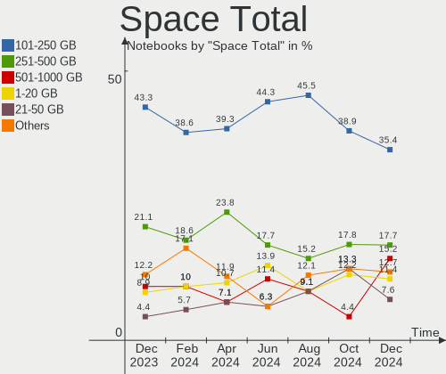

BSD Hardware Trends (Notebooks)
-------------------------------

A project to identify most popular hardware characteristics and track their change
over time based on data collected by BSD users at https://BSD-Hardware.info.

Anyone can contribute to this report by the [hw-probe](https://github.com/linuxhw/hw-probe/blob/master/INSTALL.BSD.md) tool:

    hw-probe -all -upload

Full-feature report is available here: https://bsd-hardware.info/?view=trends

Period: Nov, 2021.

Contents
--------

* [ System ](#system)
  - [ OS                       ](#os)
  - [ OS Family                ](#os-family)
  - [ Arch                     ](#arch)
  - [ DE                       ](#de)
  - [ Display Server           ](#display-server)
  - [ Display Manager          ](#display-manager)
  - [ OS Lang                  ](#os-lang)
  - [ Boot Mode                ](#boot-mode)
  - [ Filesystem               ](#filesystem)
  - [ Part. scheme             ](#part-scheme)

* [ Board ](#board)
  - [ Vendor                   ](#vendor)
  - [ Model                    ](#model)
  - [ Model Family             ](#model-family)
  - [ MFG Year                 ](#mfg-year)
  - [ Form Factor              ](#form-factor)
  - [ Coreboot                 ](#coreboot)
  - [ RAM Size                 ](#ram-size)
  - [ RAM Used                 ](#ram-used)
  - [ Total Drives             ](#total-drives)
  - [ Has CD-ROM               ](#has-cd-rom)
  - [ Has Ethernet             ](#has-ethernet)
  - [ Has WiFi                 ](#has-wifi)
  - [ Has Bluetooth            ](#has-bluetooth)

* [ Location ](#location)
  - [ Country                  ](#country)
  - [ City                     ](#city)

* [ Drives ](#drives)
  - [ Drive Vendor             ](#drive-vendor)
  - [ Drive Model              ](#drive-model)
  - [ HDD Vendor               ](#hdd-vendor)
  - [ SSD Vendor               ](#ssd-vendor)
  - [ Drive Kind               ](#drive-kind)
  - [ Drive Connector          ](#drive-connector)
  - [ Drive Size               ](#drive-size)
  - [ Space Total              ](#space-total)
  - [ Space Used               ](#space-used)
  - [ Malfunc. Drives          ](#malfunc-drives)
  - [ Malfunc. Drive Vendor    ](#malfunc-drive-vendor)
  - [ Malfunc. HDD Vendor      ](#malfunc-hdd-vendor)
  - [ Malfunc. Drive Kind      ](#malfunc-drive-kind)
  - [ Failed Drives            ](#failed-drives)
  - [ Failed Drive Vendor      ](#failed-drive-vendor)
  - [ Drive Status             ](#drive-status)

* [ Storage controller ](#storage-controller)
  - [ Storage Vendor           ](#storage-vendor)
  - [ Storage Model            ](#storage-model)
  - [ Storage Kind             ](#storage-kind)

* [ Processor ](#processor)
  - [ CPU Vendor               ](#cpu-vendor)
  - [ CPU Model                ](#cpu-model)
  - [ CPU Model Family         ](#cpu-model-family)
  - [ CPU Cores                ](#cpu-cores)
  - [ CPU Sockets              ](#cpu-sockets)
  - [ CPU Threads              ](#cpu-threads)
  - [ CPU Microarch            ](#cpu-microarch)

* [ Graphics ](#graphics)
  - [ GPU Vendor               ](#gpu-vendor)
  - [ GPU Model                ](#gpu-model)
  - [ GPU Combo                ](#gpu-combo)
  - [ GPU Driver               ](#gpu-driver)
  - [ GPU Memory               ](#gpu-memory)

* [ Monitor ](#monitor)
  - [ Monitor Vendor           ](#monitor-vendor)
  - [ Monitor Model            ](#monitor-model)
  - [ Monitor Resolution       ](#monitor-resolution)
  - [ Monitor Diagonal         ](#monitor-diagonal)
  - [ Monitor Width            ](#monitor-width)
  - [ Aspect Ratio             ](#aspect-ratio)
  - [ Monitor Area             ](#monitor-area)
  - [ Pixel Density            ](#pixel-density)
  - [ Multiple Monitors        ](#multiple-monitors)

* [ Network ](#network)
  - [ Net Controller Vendor    ](#net-controller-vendor)
  - [ Net Controller Model     ](#net-controller-model)
  - [ Wireless Vendor          ](#wireless-vendor)
  - [ Wireless Model           ](#wireless-model)
  - [ Ethernet Vendor          ](#ethernet-vendor)
  - [ Ethernet Model           ](#ethernet-model)
  - [ Net Controller Kind      ](#net-controller-kind)
  - [ Used Controller          ](#used-controller)
  - [ NICs                     ](#nics)
  - [ IPv6                     ](#ipv6)

* [ Bluetooth ](#bluetooth)
  - [ Bluetooth Vendor         ](#bluetooth-vendor)
  - [ Bluetooth Model          ](#bluetooth-model)

* [ Sound ](#sound)
  - [ Sound Vendor             ](#sound-vendor)
  - [ Sound Model              ](#sound-model)

* [ Memory ](#memory)
  - [ Memory Vendor            ](#memory-vendor)
  - [ Memory Model             ](#memory-model)
  - [ Memory Kind              ](#memory-kind)
  - [ Memory Form Factor       ](#memory-form-factor)
  - [ Memory Size              ](#memory-size)
  - [ Memory Speed             ](#memory-speed)

* [ Printers & scanners ](#printers--scanners)
  - [ Printer Vendor           ](#printer-vendor)
  - [ Printer Model            ](#printer-model)
  - [ Scanner Vendor           ](#scanner-vendor)
  - [ Scanner Model            ](#scanner-model)

* [ Camera ](#camera)
  - [ Camera Vendor            ](#camera-vendor)
  - [ Camera Model             ](#camera-model)

* [ Security ](#security)
  - [ Fingerprint Vendor       ](#fingerprint-vendor)
  - [ Fingerprint Model        ](#fingerprint-model)
  - [ Chipcard Vendor          ](#chipcard-vendor)
  - [ Chipcard Model           ](#chipcard-model)

* [ Unsupported ](#unsupported)
  - [ Unsupported Devices      ](#unsupported-devices)
  - [ Unsupported Device Types ](#unsupported-device-types)

System
------

OS
--

Installed operating systems

| Name                 | Notebooks | Percent |
|----------------------|-----------|---------|
| helloSystem 0.6.0    | 15        | 18.52%  |
| FreeBSD 13.0-p5      | 12        | 14.81%  |
| OpenBSD 7.0          | 9         | 11.11%  |
| helloSystem 0.7.0    | 7         | 8.64%   |
| GhostBSD 21.08.27    | 7         | 8.64%   |
| FreeBSD 13.0         | 6         | 7.41%   |
| OPNsense 21.7.6      | 3         | 3.7%    |
| OPNsense 21.7.4      | 3         | 3.7%    |
| FreeBSD 13.0-STABLE  | 3         | 3.7%    |
| OPNsense 21.7.5      | 2         | 2.47%   |
| NomadBSD 5806f915    | 2         | 2.47%   |
| FreeBSD 14.0-CURRENT | 2         | 2.47%   |
| FreeBSD 13.0-p4      | 2         | 2.47%   |
| FreeBSD 12.2-p11     | 2         | 2.47%   |
| PC-BSD 13.0-p5       | 1         | 1.23%   |
| OPNsense 22.1        | 1         | 1.23%   |
| helloSystem 0.5.0    | 1         | 1.23%   |
| FreeBSD 12.2-p6      | 1         | 1.23%   |
| FreeBSD 12.2-p4      | 1         | 1.23%   |
| FreeBSD 12.2-p10     | 1         | 1.23%   |

OS Family
---------

OS without a version

| Name        | Notebooks | Percent |
|-------------|-----------|---------|
| FreeBSD     | 30        | 37.04%  |
| helloSystem | 23        | 28.4%   |
| OPNsense    | 9         | 11.11%  |
| OpenBSD     | 9         | 11.11%  |
| GhostBSD    | 7         | 8.64%   |
| NomadBSD    | 2         | 2.47%   |
| PC-BSD      | 1         | 1.23%   |

Arch
----

OS architecture (x86_64, i586, etc.)

| Name  | Notebooks | Percent |
|-------|-----------|---------|
| amd64 | 78        | 96.3%   |
| i386  | 3         | 3.7%    |

DE
--

Desktop Environment

| Name         | Notebooks | Percent |
|--------------|-----------|---------|
| helloDesktop | 23        | 28.4%   |
| Console      | 16        | 19.75%  |
| MATE         | 10        | 12.35%  |
| KDE5         | 8         | 9.88%   |
| fvwm         | 8         | 9.88%   |
| XFCE         | 7         | 8.64%   |
| i3           | 5         | 6.17%   |
| Openbox      | 2         | 2.47%   |
| Mutter       | 1         | 1.23%   |
| GNOME        | 1         | 1.23%   |

Display Server
--------------

X11 or Wayland

| Name    | Notebooks | Percent |
|---------|-----------|---------|
| X11     | 64        | 79.01%  |
| Console | 14        | 17.28%  |
| Wayland | 3         | 3.7%    |

Display Manager
---------------

SDDM, LightDM, etc.

| Name    | Notebooks | Percent |
|---------|-----------|---------|
| SLiM    | 32        | 39.51%  |
| Console | 26        | 32.1%   |
| LightDM | 10        | 12.35%  |
| SDDM    | 9         | 11.11%  |
| XDM     | 3         | 3.7%    |
| GDM     | 1         | 1.23%   |

OS Lang
-------

Language

| Lang    | Notebooks | Percent |
|---------|-----------|---------|
| en_US   | 28        | 34.57%  |
| Unknown | 24        | 29.63%  |
| C       | 22        | 27.16%  |
| de_DE   | 3         | 3.7%    |
| uk_UA   | 1         | 1.23%   |
| nl_NL   | 1         | 1.23%   |
| es_ES   | 1         | 1.23%   |
| es_AR   | 1         | 1.23%   |

Boot Mode
---------

EFI or BIOS

| Mode | Notebooks | Percent |
|------|-----------|---------|
| EFI  | 63        | 77.78%  |
| BIOS | 18        | 22.22%  |

Filesystem
----------

Type of filesystem

| Type   | Notebooks | Percent |
|--------|-----------|---------|
| Zfs    | 43        | 53.09%  |
| Ufs    | 26        | 32.1%   |
| Ffs    | 9         | 11.11%  |
| Cd9660 | 3         | 3.7%    |

Part. scheme
------------

Scheme of partitioning

| Type | Notebooks | Percent |
|------|-----------|---------|
| GPT  | 70        | 86.42%  |
| MBR  | 10        | 12.35%  |
| BSD  | 1         | 1.23%   |

Board
-----

Vendor
------

Motherboard manufacturer

| Name             | Notebooks | Percent |
|------------------|-----------|---------|
| Lenovo           | 26        | 32.1%   |
| Dell             | 12        | 14.81%  |
| Hewlett-Packard  | 10        | 12.35%  |
| Acer             | 7         | 8.64%   |
| Toshiba          | 5         | 6.17%   |
| ASUSTek Computer | 3         | 3.7%    |
| Apple            | 3         | 3.7%    |
| Unknown          | 3         | 3.7%    |
| Alienware        | 2         | 2.47%   |
| TUXEDO           | 1         | 1.23%   |
| Sony             | 1         | 1.23%   |
| Shuttle          | 1         | 1.23%   |
| Semp Toshiba     | 1         | 1.23%   |
| IBM              | 1         | 1.23%   |
| Google           | 1         | 1.23%   |
| Deciso           | 1         | 1.23%   |
| Datto            | 1         | 1.23%   |
| BESSTAR Tech     | 1         | 1.23%   |
| AZW              | 1         | 1.23%   |

Model
-----

Motherboard model

| Name                                        | Notebooks | Percent |
|---------------------------------------------|-----------|---------|
| Unknown                                     | 3         | 3.7%    |
| HP Compaq 6720s                             | 2         | 2.47%   |
| TUXEDO Pulse 15 Gen1                        | 1         | 1.23%   |
| Toshiba Satellite S55t-B                    | 1         | 1.23%   |
| Toshiba Satellite Pro L510                  | 1         | 1.23%   |
| Toshiba Satellite C855-1U4                  | 1         | 1.23%   |
| Toshiba Satellite C640                      | 1         | 1.23%   |
| Toshiba PORTEGE M780                        | 1         | 1.23%   |
| Sony SVP13225SCBI                           | 1         | 1.23%   |
| Shuttle DS437                               | 1         | 1.23%   |
| Semp Toshiba STI NA 1401                    | 1         | 1.23%   |
| Lenovo V310-14IKB 80T2                      | 1         | 1.23%   |
| Lenovo ThinkPad Yoga 11e 20DAS02S00         | 1         | 1.23%   |
| Lenovo ThinkPad X270 20HMCTO1WW             | 1         | 1.23%   |
| Lenovo ThinkPad X240 20AMS2QDOC             | 1         | 1.23%   |
| Lenovo ThinkPad X220 42915CG                | 1         | 1.23%   |
| Lenovo ThinkPad X220 429043U                | 1         | 1.23%   |
| Lenovo ThinkPad X1 Extreme Gen 3 20TLA055CD | 1         | 1.23%   |
| Lenovo ThinkPad X1 Carbon Gen 9 20XWA003CD  | 1         | 1.23%   |
| Lenovo ThinkPad W530 2447AV9                | 1         | 1.23%   |
| Lenovo ThinkPad W520 4276CTO                | 1         | 1.23%   |
| Lenovo ThinkPad T60 1951FEG                 | 1         | 1.23%   |
| Lenovo ThinkPad T520 4243E51                | 1         | 1.23%   |
| Lenovo ThinkPad T470s W10DG 20JS001FGE      | 1         | 1.23%   |
| Lenovo ThinkPad T450s 20BX001PUS            | 1         | 1.23%   |
| Lenovo ThinkPad T430u 3352AA5               | 1         | 1.23%   |
| Lenovo ThinkPad T430 2347G7G                | 1         | 1.23%   |
| Lenovo ThinkPad T420 4236MBG                | 1         | 1.23%   |
| Lenovo ThinkPad T420 4180EE8                | 1         | 1.23%   |
| Lenovo ThinkPad R60e 0658W2M                | 1         | 1.23%   |
| Lenovo ThinkPad E490 20N8CTO1WW             | 1         | 1.23%   |
| Lenovo IdeaPad Z360                         | 1         | 1.23%   |
| Lenovo IdeaPad U430 Touch 20270             | 1         | 1.23%   |
| Lenovo IdeaPad S510p 20298                  | 1         | 1.23%   |
| Lenovo IdeaPad S130-14IGM 81J2              | 1         | 1.23%   |
| Lenovo IdeaPad 330-15ARR 81D2               | 1         | 1.23%   |
| Lenovo IdeaPad 320-15IKB Touch 81BH         | 1         | 1.23%   |
| IBM ThinkPad R52 185869G                    | 1         | 1.23%   |
| HP Mini 110-1000                            | 1         | 1.23%   |
| HP Laptop 15s-du1xxx                        | 1         | 1.23%   |
| HP Laptop 15-db0xxx                         | 1         | 1.23%   |
| HP EliteBook 8570p                          | 1         | 1.23%   |
| HP EliteBook 840 G5                         | 1         | 1.23%   |
| HP EliteBook 840 G3                         | 1         | 1.23%   |
| HP EliteBook 2560p                          | 1         | 1.23%   |
| HP 14                                       | 1         | 1.23%   |
| Google Grunt                                | 1         | 1.23%   |
| Dell XPS 13 9350                            | 1         | 1.23%   |
| Dell XPS 13 9343                            | 1         | 1.23%   |
| Dell Vostro 3500                            | 1         | 1.23%   |
| Dell Vostro 1400                            | 1         | 1.23%   |
| Dell Vostro 14-5480                         | 1         | 1.23%   |
| Dell Studio 1747                            | 1         | 1.23%   |
| Dell Latitude E6430                         | 1         | 1.23%   |
| Dell Latitude D630                          | 1         | 1.23%   |
| Dell Latitude 5510                          | 1         | 1.23%   |
| Dell Inspiron N5050                         | 1         | 1.23%   |
| Dell Inspiron 5566                          | 1         | 1.23%   |
| Dell G15 5510                               | 1         | 1.23%   |
| Deciso Netboard A20                         | 1         | 1.23%   |

Model Family
------------

Motherboard model prefix

| Name              | Notebooks | Percent |
|-------------------|-----------|---------|
| Lenovo ThinkPad   | 19        | 23.46%  |
| Lenovo IdeaPad    | 6         | 7.41%   |
| Acer Aspire       | 5         | 6.17%   |
| Toshiba Satellite | 4         | 4.94%   |
| HP EliteBook      | 4         | 4.94%   |
| Dell Vostro       | 3         | 3.7%    |
| Dell Latitude     | 3         | 3.7%    |
| Unknown           | 3         | 3.7%    |
| HP Laptop         | 2         | 2.47%   |
| HP Compaq         | 2         | 2.47%   |
| Dell XPS          | 2         | 2.47%   |
| Dell Inspiron     | 2         | 2.47%   |
| Alienware m15     | 2         | 2.47%   |
| TUXEDO Pulse      | 1         | 1.23%   |
| Toshiba PORTEGE   | 1         | 1.23%   |
| Sony SVP13225SCBI | 1         | 1.23%   |
| Shuttle DS437     | 1         | 1.23%   |
| Semp Toshiba STI  | 1         | 1.23%   |
| Lenovo V310-14IKB | 1         | 1.23%   |
| IBM ThinkPad      | 1         | 1.23%   |
| HP Mini           | 1         | 1.23%   |
| HP 14             | 1         | 1.23%   |
| Google Grunt      | 1         | 1.23%   |
| Dell Studio       | 1         | 1.23%   |
| Dell G15          | 1         | 1.23%   |
| Deciso Netboard   | 1         | 1.23%   |
| Datto 1000        | 1         | 1.23%   |
| BESSTAR Tech U820 | 1         | 1.23%   |
| AZW BT3           | 1         | 1.23%   |
| ASUS K52Jc        | 1         | 1.23%   |
| ASUS 1015BX       | 1         | 1.23%   |
| ASUS 1001P        | 1         | 1.23%   |
| Apple MacBookPro9 | 1         | 1.23%   |
| Apple MacBookAir5 | 1         | 1.23%   |
| Apple MacBook3    | 1         | 1.23%   |
| Acer TravelMate   | 1         | 1.23%   |
| Acer AO722        | 1         | 1.23%   |

MFG Year
--------

Motherboard manufacture year

| Year | Notebooks | Percent |
|------|-----------|---------|
| 2018 | 12        | 14.81%  |
| 2021 | 11        | 13.58%  |
| 2019 | 11        | 13.58%  |
| 2020 | 7         | 8.64%   |
| 2013 | 7         | 8.64%   |
| 2014 | 6         | 7.41%   |
| 2011 | 4         | 4.94%   |
| 2010 | 4         | 4.94%   |
| 2008 | 4         | 4.94%   |
| 2016 | 3         | 3.7%    |
| 2012 | 3         | 3.7%    |
| 2009 | 3         | 3.7%    |
| 2015 | 2         | 2.47%   |
| 2006 | 2         | 2.47%   |
| 2017 | 1         | 1.23%   |
| 2007 | 1         | 1.23%   |

Form Factor
-----------

Physical design of the computer

| Name     | Notebooks | Percent |
|----------|-----------|---------|
| Notebook | 81        | 100%    |

Coreboot
--------

Have coreboot on board

| Used | Notebooks | Percent |
|------|-----------|---------|
| No   | 80        | 98.77%  |
| Yes  | 1         | 1.23%   |

RAM Size
--------

Total RAM memory

| Size in GB  | Notebooks | Percent |
|-------------|-----------|---------|
| 4.01-8.0    | 30        | 37.04%  |
| 8.01-16.0   | 25        | 30.86%  |
| 16.01-24.0  | 13        | 16.05%  |
| 32.01-64.0  | 4         | 4.94%   |
| 2.01-3.0    | 4         | 4.94%   |
| 3.01-4.0    | 3         | 3.7%    |
| 64.01-256.0 | 1         | 1.23%   |
| 0.51-1.0    | 1         | 1.23%   |

RAM Used
--------

Used RAM memory

| Used GB    | Notebooks | Percent |
|------------|-----------|---------|
| 0.01-0.5   | 54        | 66.67%  |
| 0.51-1.0   | 19        | 23.46%  |
| 1.01-2.0   | 5         | 6.17%   |
| 2.01-3.0   | 2         | 2.47%   |
| 24.01-32.0 | 1         | 1.23%   |

Total Drives
------------

Number of drives on board

| Drives | Notebooks | Percent |
|--------|-----------|---------|
| 1      | 60        | 74.07%  |
| 2      | 13        | 16.05%  |
| 0      | 5         | 6.17%   |
| 3      | 3         | 3.7%    |

Has CD-ROM
----------

Has CD-ROM on board

| Presented | Notebooks | Percent |
|-----------|-----------|---------|
| No        | 54        | 66.67%  |
| Yes       | 27        | 33.33%  |

Has Ethernet
------------

Has Ethernet on board

| Presented | Notebooks | Percent |
|-----------|-----------|---------|
| Yes       | 73        | 90.12%  |
| No        | 8         | 9.88%   |

Has WiFi
--------

Has WiFi module

| Presented | Notebooks | Percent |
|-----------|-----------|---------|
| Yes       | 75        | 92.59%  |
| No        | 6         | 7.41%   |

Has Bluetooth
-------------

Has Bluetooth module

| Presented | Notebooks | Percent |
|-----------|-----------|---------|
| Yes       | 48        | 59.26%  |
| No        | 33        | 40.74%  |

Location
--------

Country
-------

Geographic location (country)

| Country     | Notebooks | Percent |
|-------------|-----------|---------|
| Germany     | 13        | 16.05%  |
| USA         | 11        | 13.58%  |
| UK          | 4         | 4.94%   |
| Poland      | 4         | 4.94%   |
| Czechia     | 4         | 4.94%   |
| China       | 4         | 4.94%   |
| Brazil      | 4         | 4.94%   |
| Sweden      | 3         | 3.7%    |
| Netherlands | 3         | 3.7%    |
| Indonesia   | 3         | 3.7%    |
| Ukraine     | 2         | 2.47%   |
| Spain       | 2         | 2.47%   |
| Singapore   | 2         | 2.47%   |
| Russia      | 2         | 2.47%   |
| Italy       | 2         | 2.47%   |
| Denmark     | 2         | 2.47%   |
| Colombia    | 2         | 2.47%   |
| Canada      | 2         | 2.47%   |
| Vietnam     | 1         | 1.23%   |
| Peru        | 1         | 1.23%   |
| Namibia     | 1         | 1.23%   |
| Mexico      | 1         | 1.23%   |
| Japan       | 1         | 1.23%   |
| Hong Kong   | 1         | 1.23%   |
| Finland     | 1         | 1.23%   |
| Cuba        | 1         | 1.23%   |
| Bulgaria    | 1         | 1.23%   |
| Austria     | 1         | 1.23%   |
| Australia   | 1         | 1.23%   |
| Argentina   | 1         | 1.23%   |

City
----

Geographic location (city)

| City                | Notebooks | Percent |
|---------------------|-----------|---------|
| Tuklaty             | 3         | 3.7%    |
| Warsaw              | 2         | 2.47%   |
| Singapore           | 2         | 2.47%   |
| S??o Paulo          | 2         | 2.47%   |
| Portland            | 2         | 2.47%   |
| Madrid              | 2         | 2.47%   |
| Jakarta             | 2         | 2.47%   |
| Henan               | 2         | 2.47%   |
| Frankfurt am Main   | 2         | 2.47%   |
| Yekaterinburg       | 1         | 1.23%   |
| Windhoek            | 1         | 1.23%   |
| Whittier            | 1         | 1.23%   |
| Warner              | 1         | 1.23%   |
| V?¤ster??s          | 1         | 1.23%   |
| Valencia            | 1         | 1.23%   |
| Turku               | 1         | 1.23%   |
| Stade               | 1         | 1.23%   |
| Sofia               | 1         | 1.23%   |
| Shanghai            | 1         | 1.23%   |
| San Angelo          | 1         | 1.23%   |
| Saint-Laurent       | 1         | 1.23%   |
| Rionegro            | 1         | 1.23%   |
| Pruszcz Gdanski     | 1         | 1.23%   |
| Pacierzow           | 1         | 1.23%   |
| Oldenburg           | 1         | 1.23%   |
| Okehampton          | 1         | 1.23%   |
| Oegstgeest          | 1         | 1.23%   |
| Odense              | 1         | 1.23%   |
| Nuremberg           | 1         | 1.23%   |
| Novosibirsk         | 1         | 1.23%   |
| Nai Chung           | 1         | 1.23%   |
| Mykolayiv           | 1         | 1.23%   |
| Mission             | 1         | 1.23%   |
| Minato              | 1         | 1.23%   |
| Melbourne           | 1         | 1.23%   |
| Medell?­n           | 1         | 1.23%   |
| Meckenbeuren        | 1         | 1.23%   |
| Maria Enzersdorf    | 1         | 1.23%   |
| London              | 1         | 1.23%   |
| Lima                | 1         | 1.23%   |
| Leatherhead         | 1         | 1.23%   |
| Lauf an der Pegnitz | 1         | 1.23%   |
| Knoxville           | 1         | 1.23%   |
| Katy                | 1         | 1.23%   |
| Jag??ey Grande      | 1         | 1.23%   |
| Isernhagen          | 1         | 1.23%   |
| Ibiuna              | 1         | 1.23%   |
| Ho Chi Minh City    | 1         | 1.23%   |
| Guangzhou Shi       | 1         | 1.23%   |
| Glendale            | 1         | 1.23%   |
| F??rth              | 1         | 1.23%   |
| Farneto             | 1         | 1.23%   |
| Dreieich            | 1         | 1.23%   |
| Detmold             | 1         | 1.23%   |
| Den Dolder          | 1         | 1.23%   |
| D??sseldorf         | 1         | 1.23%   |
| Corona              | 1         | 1.23%   |
| Chengdu             | 1         | 1.23%   |
| Chapec??            | 1         | 1.23%   |
| Cercany             | 1         | 1.23%   |

Drives
------

Drive Vendor
------------

Hard drive vendors

| Vendor              | Notebooks | Drives | Percent |
|---------------------|-----------|--------|---------|
| Samsung Electronics | 22        | 23     | 24.44%  |
| WDC                 | 12        | 12     | 13.33%  |
| Toshiba             | 11        | 11     | 12.22%  |
| Kingston            | 6         | 7      | 6.67%   |
| Seagate             | 5         | 5      | 5.56%   |
| Crucial             | 5         | 5      | 5.56%   |
| NVMe                | 4         | 5      | 4.44%   |
| Intel               | 4         | 4      | 4.44%   |
| SanDisk             | 3         | 4      | 3.33%   |
| Hitachi             | 3         | 3      | 3.33%   |
| Transcend           | 2         | 2      | 2.22%   |
| HGST                | 2         | 2      | 2.22%   |
| Apple               | 2         | 2      | 2.22%   |
| SPCC                | 1         | 1      | 1.11%   |
| SK Hynix            | 1         | 1      | 1.11%   |
| Phison              | 1         | 1      | 1.11%   |
| Micron Technology   | 1         | 1      | 1.11%   |
| Kston               | 1         | 1      | 1.11%   |
| KingSpec            | 1         | 1      | 1.11%   |
| Gigabyte Technology | 1         | 1      | 1.11%   |
| Fujitsu             | 1         | 1      | 1.11%   |
| Corsair             | 1         | 1      | 1.11%   |

Drive Model
-----------

Hard drive models

| Model                                | Notebooks | Percent |
|--------------------------------------|-----------|---------|
| Toshiba MQ01ABF050 500GB             | 3         | 3.3%    |
| Samsung SSD 850 EVO 500GB            | 3         | 3.3%    |
| WDC WD10JPCX-24UE4T0 1TB             | 2         | 2.2%    |
| Toshiba MK2546GSX 250GB              | 2         | 2.2%    |
| Seagate ST1000LM024 HN-M101MBB 1TB   | 2         | 2.2%    |
| Samsung SSD 860 EVO 1TB              | 2         | 2.2%    |
| Samsung MZ7TE128HMGR-000L1 128GB     | 2         | 2.2%    |
| Kingston SA400S37240G 240GB          | 2         | 2.2%    |
| HGST HTS721010A9E630 1TB             | 2         | 2.2%    |
| Crucial CT525MX300SSD1 528GB         | 2         | 2.2%    |
| WDC WDS250G2B0B-00YS70 250GB         | 1         | 1.1%    |
| WDC WDS240G2G0A-00JH30 240GB         | 1         | 1.1%    |
| WDC WDBNCE5000PNC 500GB              | 1         | 1.1%    |
| WDC WD5000BPKX-22HPJT0 500GB         | 1         | 1.1%    |
| WDC WD5000BPKT-00PK4T0 500GB         | 1         | 1.1%    |
| WDC WD1600BPVT-11JJ5T0 160GB         | 1         | 1.1%    |
| WDC WD1600BEVT-80A23T0 160GB         | 1         | 1.1%    |
| WDC WD1200BEVS-07RST0 120GB          | 1         | 1.1%    |
| WDC WD10JPVX-22JC3T0 1TB             | 1         | 1.1%    |
| WDC PC SN530 NVMe 512GB              | 1         | 1.1%    |
| Transcend TS256GMTS952T2 256GB       | 1         | 1.1%    |
| Transcend TS240GMTS420S 240GB        | 1         | 1.1%    |
| Toshiba MQ01ABD100 1TB               | 1         | 1.1%    |
| Toshiba MK3265GSXN 320GB             | 1         | 1.1%    |
| Toshiba MK3261GSYN 320GB             | 1         | 1.1%    |
| Toshiba MK1637GSX 160GB              | 1         | 1.1%    |
| Toshiba KXG6APNV2T04 2TB             | 1         | 1.1%    |
| Toshiba KBG30ZMV256G 256GB           | 1         | 1.1%    |
| SPCC Solid State Disk 240GB          | 1         | 1.1%    |
| SK Hynix HFS128G39TNF-N3A0A 128GB    | 1         | 1.1%    |
| Seagate ST9640320AS 640GB            | 1         | 1.1%    |
| Seagate ST9500420AS 500GB            | 1         | 1.1%    |
| Seagate ST1000LM048-2E7172 1TB       | 1         | 1.1%    |
| SanDisk SSD U110 16GB                | 1         | 1.1%    |
| SanDisk SSD PLUS 120GB               | 1         | 1.1%    |
| SanDisk SSD G5 BICS4 1TB             | 1         | 1.1%    |
| Samsung SSD PM851 M.2 2280 256GB     | 1         | 1.1%    |
| Samsung SSD 980 PRO 1TB              | 1         | 1.1%    |
| Samsung SSD 850 EVO 250GB            | 1         | 1.1%    |
| Samsung SSD 840 Series 120GB         | 1         | 1.1%    |
| Samsung SSD 840 EVO 250GB            | 1         | 1.1%    |
| Samsung PM9A1 NVMe 512GB             | 1         | 1.1%    |
| Samsung PM951 NVMe 256GB             | 1         | 1.1%    |
| Samsung MZVLW256HEHP-000L7 256GB     | 1         | 1.1%    |
| Samsung MZVLB512HBJQ-000H1 512GB     | 1         | 1.1%    |
| Samsung MZVL21T0HCLR-00BL7 1TB       | 1         | 1.1%    |
| Samsung MZNTE128HMGR-000SO 128GB     | 1         | 1.1%    |
| Samsung MZMPA024HMCD-000L1 24GB      | 1         | 1.1%    |
| Samsung MZ7PC128HAFU-000L1 128GB     | 1         | 1.1%    |
| Samsung HM251JX 250GB                | 1         | 1.1%    |
| Samsung Flash Drive FIT 32GB         | 1         | 1.1%    |
| Phison Sabrent Rocket 4.0 2TB        | 1         | 1.1%    |
| NVMe SAMSUNG MZVLB256 256GB          | 1         | 1.1%    |
| NVMe PC SN530 WD 512GB               | 1         | 1.1%    |
| NVMe OM3PDP3-AD 256GB                | 1         | 1.1%    |
| NVMe KXG50ZNV1T02 NVM 1TB            | 1         | 1.1%    |
| Micron MTFDDAV256TBN-1AR15ABHA 256GB | 1         | 1.1%    |
| Kston SSD 64GB                       | 1         | 1.1%    |
| Kingston SUV300S37A120G 120GB        | 1         | 1.1%    |
| Kingston SNV425S264GB                | 1         | 1.1%    |

HDD Vendor
----------

Hard disk drive vendors

| Vendor              | Notebooks | Drives | Percent |
|---------------------|-----------|--------|---------|
| Toshiba             | 9         | 9      | 27.27%  |
| WDC                 | 8         | 8      | 24.24%  |
| Seagate             | 5         | 5      | 15.15%  |
| Hitachi             | 3         | 3      | 9.09%   |
| Samsung Electronics | 2         | 2      | 6.06%   |
| NVMe                | 2         | 3      | 6.06%   |
| HGST                | 2         | 2      | 6.06%   |
| Fujitsu             | 1         | 1      | 3.03%   |
| Apple               | 1         | 1      | 3.03%   |

SSD Vendor
----------

Solid state drive vendors

| Vendor              | Notebooks | Drives | Percent |
|---------------------|-----------|--------|---------|
| Samsung Electronics | 14        | 14     | 32.56%  |
| Kingston            | 5         | 6      | 11.63%  |
| Intel               | 4         | 4      | 9.3%    |
| Crucial             | 4         | 4      | 9.3%    |
| WDC                 | 3         | 3      | 6.98%   |
| SanDisk             | 3         | 4      | 6.98%   |
| Transcend           | 2         | 2      | 4.65%   |
| SPCC                | 1         | 1      | 2.33%   |
| SK Hynix            | 1         | 1      | 2.33%   |
| Micron Technology   | 1         | 1      | 2.33%   |
| Kston               | 1         | 1      | 2.33%   |
| KingSpec            | 1         | 1      | 2.33%   |
| Gigabyte Technology | 1         | 1      | 2.33%   |
| Corsair             | 1         | 1      | 2.33%   |
| Apple               | 1         | 1      | 2.33%   |

Drive Kind
----------

HDD or SSD

| Kind | Notebooks | Drives | Percent |
|------|-----------|--------|---------|
| SSD  | 38        | 45     | 47.5%   |
| HDD  | 29        | 34     | 36.25%  |
| NVMe | 13        | 15     | 16.25%  |

Drive Connector
---------------

SATA, SAS, NVMe, etc.

| Type | Notebooks | Drives | Percent |
|------|-----------|--------|---------|
| SATA | 63        | 79     | 82.89%  |
| NVMe | 13        | 15     | 17.11%  |

Drive Size
----------

Size of hard drive

| Size in TB | Notebooks | Drives | Percent |
|------------|-----------|--------|---------|
| 0.01-0.5   | 50        | 59     | 74.63%  |
| 0.51-1.0   | 16        | 18     | 23.88%  |
| 1.01-2.0   | 1         | 2      | 1.49%   |

Space Total
-----------

Amount of disk space available on the file system

| Size in GB | Notebooks | Percent |
|------------|-----------|---------|
| 1-20       | 25        | 30.86%  |
| 101-250    | 23        | 28.4%   |
| 51-100     | 11        | 13.58%  |
| 501-1000   | 9         | 11.11%  |
| 251-500    | 7         | 8.64%   |
| 21-50      | 4         | 4.94%   |
| 1001-2000  | 2         | 2.47%   |

Space Used
----------

Amount of used disk space

| Used GB | Notebooks | Percent |
|---------|-----------|---------|
| 1-20    | 73        | 90.12%  |
| 51-100  | 4         | 4.94%   |
| 21-50   | 3         | 3.7%    |
| 101-250 | 1         | 1.23%   |

Malfunc. Drives
---------------

Drive models with a malfunction

| Model                                           | Notebooks | Drives | Percent |
|-------------------------------------------------|-----------|--------|---------|
| Toshiba MQ01ABF050 500GB                        | 1         | 1      | 6.67%   |
| Toshiba MK3265GSXN 320GB                        | 1         | 1      | 6.67%   |
| Toshiba MK3261GSYN 320GB                        | 1         | 1      | 6.67%   |
| Toshiba MK2546GSX 250GB                         | 1         | 1      | 6.67%   |
| Toshiba MK1637GSX 160GB                         | 1         | 1      | 6.67%   |
| Seagate ST9640320AS 640GB                       | 1         | 1      | 6.67%   |
| Seagate ST9500420AS 500GB                       | 1         | 1      | 6.67%   |
| Seagate ST1000LM048-2E7172 1TB                  | 1         | 1      | 6.67%   |
| Samsung Electronics HM251JX 250GB               | 1         | 1      | 6.67%   |
| Micron Technology MTFDDAV256TBN-1AR15ABHA 256GB | 1         | 1      | 6.67%   |
| Kingston SNV425S264GB                           | 1         | 1      | 6.67%   |
| Intel SSDSA2M080G2GC 80GB                       | 1         | 1      | 6.67%   |
| Hitachi HTS541680J9SA00 80GB                    | 1         | 1      | 6.67%   |
| HGST HTS721010A9E630 1TB                        | 1         | 1      | 6.67%   |
| Corsair Force GT 120GB                          | 1         | 1      | 6.67%   |

Malfunc. Drive Vendor
---------------------

Vendors of faulty drives

| Vendor              | Notebooks | Drives | Percent |
|---------------------|-----------|--------|---------|
| Toshiba             | 5         | 5      | 33.33%  |
| Seagate             | 3         | 3      | 20%     |
| Samsung Electronics | 1         | 1      | 6.67%   |
| Micron Technology   | 1         | 1      | 6.67%   |
| Kingston            | 1         | 1      | 6.67%   |
| Intel               | 1         | 1      | 6.67%   |
| Hitachi             | 1         | 1      | 6.67%   |
| HGST                | 1         | 1      | 6.67%   |
| Corsair             | 1         | 1      | 6.67%   |

Malfunc. HDD Vendor
-------------------

Vendors of faulty HDD drives

| Vendor              | Notebooks | Drives | Percent |
|---------------------|-----------|--------|---------|
| Toshiba             | 5         | 5      | 45.45%  |
| Seagate             | 3         | 3      | 27.27%  |
| Samsung Electronics | 1         | 1      | 9.09%   |
| Hitachi             | 1         | 1      | 9.09%   |
| HGST                | 1         | 1      | 9.09%   |

Malfunc. Drive Kind
-------------------

Kinds of faulty drives

| Kind | Notebooks | Drives | Percent |
|------|-----------|--------|---------|
| HDD  | 9         | 11     | 69.23%  |
| SSD  | 4         | 4      | 30.77%  |

Failed Drives
-------------

Failed drive models

Zero info for selected period =(

Failed Drive Vendor
-------------------

Failed drive vendors

Zero info for selected period =(

Drive Status
------------

Number of failed and malfunc. drives

| Status   | Notebooks | Drives | Percent |
|----------|-----------|--------|---------|
| Works    | 63        | 73     | 77.78%  |
| Malfunc  | 13        | 15     | 16.05%  |
| Detected | 5         | 6      | 6.17%   |

Storage controller
------------------

Storage Vendor
--------------

Storage controller vendors

| Vendor                      | Notebooks | Percent |
|-----------------------------|-----------|---------|
| Intel                       | 62        | 70.45%  |
| AMD                         | 11        | 12.5%   |
| Samsung Electronics         | 7         | 7.95%   |
| Toshiba                     | 3         | 3.41%   |
| Kingston Technology Company | 2         | 2.27%   |
| Sandisk                     | 1         | 1.14%   |
| Phison Electronics          | 1         | 1.14%   |
| Micron/Crucial Technology   | 1         | 1.14%   |

Storage Model
-------------

Storage controller models

| Model                                                                                  | Notebooks | Percent |
|----------------------------------------------------------------------------------------|-----------|---------|
| Intel 7 Series Chipset Family 6-port SATA Controller [AHCI mode]                       | 11        | 11.22%  |
| Intel 8 Series SATA Controller 1 [AHCI mode]                                           | 7         | 7.14%   |
| Intel 6 Series/C200 Series Chipset Family 6 port Mobile SATA AHCI Controller           | 7         | 7.14%   |
| AMD FCH SATA Controller [AHCI mode]                                                    | 7         | 7.14%   |
| Intel Sunrise Point-LP SATA Controller [AHCI mode]                                     | 5         | 5.1%    |
| Intel 82801HM/HEM (ICH8M/ICH8M-E) SATA Controller [AHCI mode]                          | 5         | 5.1%    |
| Intel 82801HM/HEM (ICH8M/ICH8M-E) IDE Controller                                       | 5         | 5.1%    |
| Intel 5 Series/3400 Series Chipset 4 port SATA AHCI Controller                         | 4         | 4.08%   |
| Samsung NVMe SSD Controller PM9A1/PM9A3/980PRO                                         | 3         | 3.06%   |
| Intel Wildcat Point-LP SATA Controller [AHCI Mode]                                     | 3         | 3.06%   |
| AMD SB7x0/SB8x0/SB9x0 SATA Controller [AHCI mode]                                      | 3         | 3.06%   |
| Samsung NVMe SSD Controller SM981/PM981/PM983                                          | 2         | 2.04%   |
| Kingston Company OM3PDP3 NVMe SSD                                                      | 2         | 2.04%   |
| Intel Cannon Point-LP SATA Controller [AHCI Mode]                                      | 2         | 2.04%   |
| Intel 82801GBM/GHM (ICH7-M Family) SATA Controller [IDE mode]                          | 2         | 2.04%   |
| Intel 82801 Mobile SATA Controller [RAID mode]                                         | 2         | 2.04%   |
| Intel 6 Series/C200 Series Chipset Family Mobile SATA Controller (IDE mode, ports 4-5) | 2         | 2.04%   |
| Intel 6 Series/C200 Series Chipset Family Mobile SATA Controller (IDE mode, ports 0-3) | 2         | 2.04%   |
| Toshiba XG6 NVMe SSD Controller                                                        | 1         | 1.02%   |
| Toshiba unknown                                                                        | 1         | 1.02%   |
| Toshiba BG3 NVMe SSD Controller                                                        | 1         | 1.02%   |
| Sandisk unknown                                                                        | 1         | 1.02%   |
| Samsung NVMe SSD Controller SM961/PM961/SM963                                          | 1         | 1.02%   |
| Samsung NVMe SSD Controller SM951/PM951                                                | 1         | 1.02%   |
| Phison E16 PCIe4 NVMe Controller                                                       | 1         | 1.02%   |
| Micron/Crucial NVMe Controller                                                         | 1         | 1.02%   |
| Intel Tiger Lake-LP SATA Controller [AHCI mode]                                        | 1         | 1.02%   |
| Intel NM10/ICH7 Family SATA Controller [AHCI mode]                                     | 1         | 1.02%   |
| Intel Comet Lake SATA AHCI Controller                                                  | 1         | 1.02%   |
| Intel Celeron/Pentium Silver Processor SATA Controller                                 | 1         | 1.02%   |
| Intel Cannon Lake Mobile PCH SATA AHCI Controller                                      | 1         | 1.02%   |
| Intel Atom/Celeron/Pentium Processor x5-E8000/J3xxx/N3xxx Series SATA Controller       | 1         | 1.02%   |
| Intel Atom Processor E3800 Series SATA AHCI Controller                                 | 1         | 1.02%   |
| Intel 82801IBM/IEM (ICH9M/ICH9M-E) 4 port SATA Controller [AHCI mode]                  | 1         | 1.02%   |
| Intel 82801IBM/IEM (ICH9M/ICH9M-E) 2 port SATA Controller [IDE mode]                   | 1         | 1.02%   |
| Intel 82801GBM/GHM (ICH7-M Family) SATA Controller [AHCI mode]                         | 1         | 1.02%   |
| Intel 82801G (ICH7 Family) IDE Controller                                              | 1         | 1.02%   |
| Intel 82801FBM (ICH6M) SATA Controller                                                 | 1         | 1.02%   |
| Intel 5 Series/3400 Series Chipset 6 port SATA AHCI Controller                         | 1         | 1.02%   |
| Intel 5 Series/3400 Series Chipset 4 port SATA IDE Controller                          | 1         | 1.02%   |
| Intel 5 Series/3400 Series Chipset 2 port SATA IDE Controller                          | 1         | 1.02%   |
| AMD FCH SATA Controller [IDE mode]                                                     | 1         | 1.02%   |

Storage Kind
------------

Kind of storage controller (IDE, SATA, NVMe, SAS, ...)

| Kind | Notebooks | Percent |
|------|-----------|---------|
| SATA | 64        | 67.37%  |
| NVMe | 15        | 15.79%  |
| IDE  | 14        | 14.74%  |
| RAID | 2         | 2.11%   |

Processor
---------

CPU Vendor
----------

Processor vendors

| Vendor | Notebooks | Percent |
|--------|-----------|---------|
| Intel  | 69        | 85.19%  |
| AMD    | 12        | 14.81%  |

CPU Model
---------

Processor models

| Model                                         | Notebooks | Percent |
|-----------------------------------------------|-----------|---------|
| Intel Core i5-2520M CPU @ 2.50GHz             | 4         | 4.94%   |
| Intel Core i7-3520M CPU @ 2.90GHz             | 3         | 3.7%    |
| Intel Pentium Dual CPU T2390 @ 1.86GHz        | 2         | 2.47%   |
| Intel Core i7-3720QM CPU @ 2.60GHz            | 2         | 2.47%   |
| Intel Core i5-7200U CPU @ 2.50GHz             | 2         | 2.47%   |
| Intel Core i5-6300U CPU @ 2.40GHz             | 2         | 2.47%   |
| Intel Core i5-5200U CPU @ 2.20GHz             | 2         | 2.47%   |
| Intel Core i5-4200U CPU @ 1.60GHz             | 2         | 2.47%   |
| Intel Core i5-3317U CPU @ 1.70GHz             | 2         | 2.47%   |
| Intel Core i3 CPU M 370 @ 2.40GHz             | 2         | 2.47%   |
| Intel Core 2 Duo                              | 2         | 2.47%   |
| Intel Celeron CPU 1037U @ 1.80GHz             | 2         | 2.47%   |
| AMD C-50 Processor                            | 2         | 2.47%   |
| Intel Pentium Silver N5000 CPU @ 1.10GHz      | 1         | 1.23%   |
| Intel Pentium M processor                     | 1         | 1.23%   |
| Intel Genuine CPU U7300 @ 1.30GHz             | 1         | 1.23%   |
| Intel Genuine CPU                             | 1         | 1.23%   |
| Intel CPU Version                             | 1         | 1.23%   |
| Intel Core i9-10980HK CPU @ 2.40GHz           | 1         | 1.23%   |
| Intel Core i7-8750H CPU @ 2.20GHz             | 1         | 1.23%   |
| Intel Core i7-8550U CPU @ 1.80GHz             | 1         | 1.23%   |
| Intel Core i7-7500U CPU @ 2.70GHz             | 1         | 1.23%   |
| Intel Core i7-5600U CPU @ 2.60GHz             | 1         | 1.23%   |
| Intel Core i7-4600U CPU @ 2.10GHz             | 1         | 1.23%   |
| Intel Core i7-4500U CPU @ 1.80GHz             | 1         | 1.23%   |
| Intel Core i7-2860QM CPU @ 2.50GHz            | 1         | 1.23%   |
| Intel Core i7-2620M CPU @ 2.70GHz             | 1         | 1.23%   |
| Intel Core i7-10750H CPU @ 2.60GHz            | 1         | 1.23%   |
| Intel Core i7-10510U CPU @ 1.80GHz            | 1         | 1.23%   |
| Intel Core i5-8350U CPU @ 1.70GHz             | 1         | 1.23%   |
| Intel Core i5-8279U CPU @ 2.40GHz             | 1         | 1.23%   |
| Intel Core i5-8265U CPU @ 1.60GHz             | 1         | 1.23%   |
| Intel Core i5-6200U CPU @ 2.30GHz             | 1         | 1.23%   |
| Intel Core i5-3320M CPU @ 2.60GHz             | 1         | 1.23%   |
| Intel Core i5-3210M CPU @ 2.50GHz             | 1         | 1.23%   |
| Intel Core i5-2540M CPU @ 2.60GHz             | 1         | 1.23%   |
| Intel Core i5-2450M CPU @ 2.50GHz             | 1         | 1.23%   |
| Intel Core i5-10310U CPU @ 1.70GHz            | 1         | 1.23%   |
| Intel Core i5-10200H CPU @ 2.40GHz            | 1         | 1.23%   |
| Intel Core i3-4010U CPU @ 1.70GHz             | 1         | 1.23%   |
| Intel Core i3-4005U CPU @ 1.70GHz             | 1         | 1.23%   |
| Intel Core i3 CPU M 390 @ 2.67GHz             | 1         | 1.23%   |
| Intel Core i3 CPU M 350 @ 2.27GH              | 1         | 1.23%   |
| Intel Core 2 Duo CPU T7500 @ 2.20GHz          | 1         | 1.23%   |
| Intel Core 2 Duo CPU T6570 @ 2.10GHz          | 1         | 1.23%   |
| Intel Core 2 CPU                              | 1         | 1.23%   |
| Intel Celeron M CPU                           | 1         | 1.23%   |
| Intel Celeron CPU N3160 @ 1.60GHz             | 1         | 1.23%   |
| Intel Celeron CPU N2930 @ 1.83GHz             | 1         | 1.23%   |
| Intel Celeron 2955U @ 1.40GHz                 | 1         | 1.23%   |
| Intel Atom x5-Z8350 CPU @ 1.44GHz             | 1         | 1.23%   |
| Intel Atom CPU N450 @ 1.66GHz                 | 1         | 1.23%   |
| Intel Atom CPU N270 @ 1.60GHz                 | 1         | 1.23%   |
| Intel 11th Gen Core i7-1165G7 @ 2.80GHz       | 1         | 1.23%   |
| Intel 11th Gen Core i5-1135G7 @ 2.40GHz       | 1         | 1.23%   |
| AMD Ryzen 7 4800H with Radeon Graphics        | 1         | 1.23%   |
| AMD Ryzen 3 2200U with Radeon Vega Mobile Gfx | 1         | 1.23%   |
| AMD GX-415GA SOC with Radeon HD Graphics      | 1         | 1.23%   |
| AMD EPYC 3201 8-Core Processor                | 1         | 1.23%   |
| AMD C-60 APU with Radeon HD Graphics          | 1         | 1.23%   |

CPU Model Family
----------------

Processor model prefix

| Model                | Notebooks | Percent |
|----------------------|-----------|---------|
| Intel Core i5        | 24        | 29.63%  |
| Intel Core i7        | 15        | 18.52%  |
| Intel Core i3        | 6         | 7.41%   |
| Intel Celeron        | 5         | 6.17%   |
| Other                | 4         | 4.94%   |
| Intel Core 2 Duo     | 4         | 4.94%   |
| Intel Atom           | 3         | 3.7%    |
| Intel Pentium Dual   | 2         | 2.47%   |
| Intel Genuine        | 2         | 2.47%   |
| AMD C-50             | 2         | 2.47%   |
| AMD A6               | 2         | 2.47%   |
| AMD A4               | 2         | 2.47%   |
| Intel Pentium Silver | 1         | 1.23%   |
| Intel Pentium M      | 1         | 1.23%   |
| Intel Core i9        | 1         | 1.23%   |
| Intel Core 2         | 1         | 1.23%   |
| Intel Celeron M      | 1         | 1.23%   |
| AMD Ryzen 7          | 1         | 1.23%   |
| AMD Ryzen 3          | 1         | 1.23%   |
| AMD GX               | 1         | 1.23%   |
| AMD EPYC             | 1         | 1.23%   |
| AMD C-60             | 1         | 1.23%   |

CPU Cores
---------

Number of processor cores

| Number  | Notebooks | Percent |
|---------|-----------|---------|
| 2       | 46        | 56.79%  |
| 4       | 20        | 24.69%  |
| Unknown | 7         | 8.64%   |
| 1       | 3         | 3.7%    |
| 8       | 2         | 2.47%   |
| 6       | 2         | 2.47%   |
| 16      | 1         | 1.23%   |

CPU Sockets
-----------

Number of sockets

| Number | Notebooks | Percent |
|--------|-----------|---------|
| 1      | 80        | 98.77%  |
| 2      | 1         | 1.23%   |

CPU Threads
-----------

Threads per core (Hyper-Threading)

| Number  | Notebooks | Percent |
|---------|-----------|---------|
| 2       | 51        | 62.96%  |
| 1       | 21        | 25.93%  |
| Unknown | 9         | 11.11%  |

CPU Microarch
-------------

Microarchitecture

| Name          | Notebooks | Percent |
|---------------|-----------|---------|
| IvyBridge     | 11        | 13.58%  |
| KabyLake      | 10        | 12.35%  |
| SandyBridge   | 8         | 9.88%   |
| Haswell       | 7         | 8.64%   |
| Westmere      | 5         | 6.17%   |
| Core          | 5         | 6.17%   |
| Skylake       | 3         | 3.7%    |
| Silvermont    | 3         | 3.7%    |
| Penryn        | 3         | 3.7%    |
| Excavator     | 3         | 3.7%    |
| CometLake     | 3         | 3.7%    |
| Broadwell     | 3         | 3.7%    |
| Bobcat        | 3         | 3.7%    |
| Zen           | 2         | 2.47%   |
| TigerLake     | 2         | 2.47%   |
| P6            | 2         | 2.47%   |
| Bonnell       | 2         | 2.47%   |
| Zen 2         | 1         | 1.23%   |
| Puma          | 1         | 1.23%   |
| Nehalem       | 1         | 1.23%   |
| K10 Llano     | 1         | 1.23%   |
| Jaguar        | 1         | 1.23%   |
| Goldmont plus | 1         | 1.23%   |

Graphics
--------

GPU Vendor
----------

Vendors of graphics cards

| Vendor | Notebooks | Percent |
|--------|-----------|---------|
| Intel  | 63        | 68.48%  |
| AMD    | 17        | 18.48%  |
| Nvidia | 12        | 13.04%  |

GPU Model
---------

Graphics card models

| Model                                                                                    | Notebooks | Percent |
|------------------------------------------------------------------------------------------|-----------|---------|
| Intel 3rd Gen Core processor Graphics Controller                                         | 8         | 8.08%   |
| Intel 2nd Generation Core Processor Family Integrated Graphics Controller                | 8         | 8.08%   |
| Intel Haswell-ULT Integrated Graphics Controller                                         | 7         | 7.07%   |
| Intel Core Processor Integrated Graphics Controller                                      | 4         | 4.04%   |
| Intel Skylake GT2 [HD Graphics 520]                                                      | 3         | 3.03%   |
| Intel Mobile GM965/GL960 Integrated Graphics Controller (secondary)                      | 3         | 3.03%   |
| Intel Mobile GM965/GL960 Integrated Graphics Controller (primary)                        | 3         | 3.03%   |
| Intel Mobile 945GM/GMS/GME, 943/940GML Express Integrated Graphics Controller            | 3         | 3.03%   |
| Intel HD Graphics 620                                                                    | 3         | 3.03%   |
| Intel HD Graphics 5500                                                                   | 3         | 3.03%   |
| AMD Stoney [Radeon R2/R3/R4/R5 Graphics]                                                 | 3         | 3.03%   |
| Intel UHD Graphics 620                                                                   | 2         | 2.02%   |
| Intel TigerLake-LP GT2 [Iris Xe Graphics]                                                | 2         | 2.02%   |
| Intel Mobile GME965/GLE960 Integrated Graphics Controller                                | 2         | 2.02%   |
| Intel Mobile 945GM/GMS, 943/940GML Express Integrated Graphics Controller                | 2         | 2.02%   |
| Intel CometLake-U GT2 [UHD Graphics]                                                     | 2         | 2.02%   |
| Intel CometLake-H GT2 [UHD Graphics]                                                     | 2         | 2.02%   |
| Intel Atom/Celeron/Pentium Processor x5-E8000/J3xxx/N3xxx Integrated Graphics Controller | 2         | 2.02%   |
| AMD Wrestler [Radeon HD 6250]                                                            | 2         | 2.02%   |
| Nvidia TU117M [GeForce GTX 1650 Ti Mobile]                                               | 1         | 1.01%   |
| Nvidia GP108M [GeForce MX250]                                                            | 1         | 1.01%   |
| Nvidia GP104M [GeForce GTX 1070 Mobile]                                                  | 1         | 1.01%   |
| Nvidia GK107GLM [Quadro K1000M]                                                          | 1         | 1.01%   |
| Nvidia GF119M [Quadro NVS 4200M]                                                         | 1         | 1.01%   |
| Nvidia GF117M [GeForce 610M/710M/810M/820M / GT 620M/625M/630M/720M]                     | 1         | 1.01%   |
| Nvidia GF108M [NVS 5400M]                                                                | 1         | 1.01%   |
| Nvidia GF108M [GeForce GT 420M]                                                          | 1         | 1.01%   |
| Nvidia GF108GLM [NVS 5200M]                                                              | 1         | 1.01%   |
| Nvidia GF106GLM [Quadro 2000M]                                                           | 1         | 1.01%   |
| Nvidia GA107M [GeForce RTX 3050 Mobile]                                                  | 1         | 1.01%   |
| Nvidia GA104M [GeForce RTX 3080 Mobile / Max-Q 8GB/16GB]                                 | 1         | 1.01%   |
| Intel WhiskeyLake-U GT2 [UHD Graphics 620]                                               | 1         | 1.01%   |
| Intel Mobile 945GSE Express Integrated Graphics Controller                               | 1         | 1.01%   |
| Intel Mobile 915GM/GMS/910GML Express Graphics Controller                                | 1         | 1.01%   |
| Intel Mobile 4 Series Chipset Integrated Graphics Controller                             | 1         | 1.01%   |
| Intel GeminiLake [UHD Graphics 605]                                                      | 1         | 1.01%   |
| Intel Comet Lake UHD Graphics                                                            | 1         | 1.01%   |
| Intel CoffeeLake-U GT3e [Iris Plus Graphics 655]                                         | 1         | 1.01%   |
| Intel CoffeeLake-H GT2 [UHD Graphics 630]                                                | 1         | 1.01%   |
| Intel Atom Processor Z36xxx/Z37xxx Series Graphics & Display                             | 1         | 1.01%   |
| Intel Atom Processor D4xx/D5xx/N4xx/N5xx Integrated Graphics Controller                  | 1         | 1.01%   |
| AMD Wrestler [Radeon HD 6290]                                                            | 1         | 1.01%   |
| AMD Whistler LE [Radeon HD 6610M/7610M]                                                  | 1         | 1.01%   |
| AMD Thames [Radeon HD 7550M/7570M/7650M]                                                 | 1         | 1.01%   |
| AMD SuperSumo [Radeon HD 6480G]                                                          | 1         | 1.01%   |
| AMD RV730/M96 [Mobility Radeon HD 4650/5165]                                             | 1         | 1.01%   |
| AMD RV710/M92 [Mobility Radeon HD 4530/4570/545v]                                        | 1         | 1.01%   |
| AMD RV710/M92 [Mobility Radeon HD 4330/4350/4550]                                        | 1         | 1.01%   |
| AMD Renoir                                                                               | 1         | 1.01%   |
| AMD Raven Ridge [Radeon Vega Series / Radeon Vega Mobile Series]                         | 1         | 1.01%   |
| AMD Mullins [Radeon R4/R5 Graphics]                                                      | 1         | 1.01%   |
| AMD Lexa PRO [Radeon 540/540X/550/550X / RX 540X/550/550X]                               | 1         | 1.01%   |
| AMD Kabini [Radeon HD 8330E]                                                             | 1         | 1.01%   |
| AMD Jet XT [Radeon R5 M240]                                                              | 1         | 1.01%   |

GPU Combo
---------

Combinations of graphics cards

| Name           | Notebooks | Percent |
|----------------|-----------|---------|
| 1 x Intel      | 41        | 50.62%  |
| 1 x AMD        | 15        | 18.52%  |
| 2 x Intel      | 10        | 12.35%  |
| Intel + Nvidia | 10        | 12.35%  |
| 1 x Nvidia     | 2         | 2.47%   |
| Other          | 1         | 1.23%   |
| 2 x AMD        | 1         | 1.23%   |
| Intel + AMD    | 1         | 1.23%   |

GPU Driver
----------

Free vs proprietary

| Driver      | Notebooks | Percent |
|-------------|-----------|---------|
| Free        | 73        | 90.12%  |
| Proprietary | 5         | 6.17%   |
| Unknown     | 3         | 3.7%    |

GPU Memory
----------

Total video memory

| Size in GB | Notebooks | Percent |
|------------|-----------|---------|
| Unknown    | 70        | 86.42%  |
| 0.01-0.5   | 7         | 8.64%   |
| 0.51-1.0   | 4         | 4.94%   |

Monitor
-------

Monitor Vendor
--------------

Monitor vendors

| Vendor                  | Notebooks | Percent |
|-------------------------|-----------|---------|
| AU Optronics            | 13        | 19.7%   |
| LG Display              | 12        | 18.18%  |
| Chimei Innolux          | 8         | 12.12%  |
| Samsung Electronics     | 6         | 9.09%   |
| Lenovo                  | 6         | 9.09%   |
| BOE                     | 5         | 7.58%   |
| Apple                   | 3         | 4.55%   |
| Sharp                   | 2         | 3.03%   |
| Philips                 | 2         | 3.03%   |
| InfoVision              | 2         | 3.03%   |
| Toshiba                 | 1         | 1.52%   |
| Panasonic               | 1         | 1.52%   |
| HannStar                | 1         | 1.52%   |
| Gigabyte Technology     | 1         | 1.52%   |
| CSO                     | 1         | 1.52%   |
| Chi Mei Optoelectronics | 1         | 1.52%   |
| Ancor Communications    | 1         | 1.52%   |

Monitor Model
-------------

Monitor models

| Model                                                                    | Notebooks | Percent |
|--------------------------------------------------------------------------|-----------|---------|
| Lenovo LCD Monitor LEN40B2 1920x1080 340x190mm 15.3-inch                 | 3         | 4.55%   |
| Lenovo LCD Monitor LEN4040 1024x768 300x230mm 14.9-inch                  | 2         | 3.03%   |
| Chimei Innolux LCD Monitor CMN1132 1366x768 260x140mm 11.6-inch          | 2         | 3.03%   |
| Toshiba TV TSB0108 1360x768 480x270mm 21.7-inch                          | 1         | 1.52%   |
| Sharp LCD Monitor SHP1449 1920x1080 290x170mm 13.2-inch                  | 1         | 1.52%   |
| Sharp LCD Monitor SHP1421 3200x1800 290x170mm 13.2-inch                  | 1         | 1.52%   |
| Samsung Electronics S24F350 SAM0D20 1920x1080 520x290mm 23.4-inch        | 1         | 1.52%   |
| Samsung Electronics LCD Monitor SEC544B 1600x900 310x170mm 13.9-inch     | 1         | 1.52%   |
| Samsung Electronics LCD Monitor SEC4457 1440x900 300x190mm 14.0-inch     | 1         | 1.52%   |
| Samsung Electronics LCD Monitor SEC324C 1600x900 310x170mm 13.9-inch     | 1         | 1.52%   |
| Samsung Electronics LCD Monitor SEC3157 1280x800 300x190mm 14.0-inch     | 1         | 1.52%   |
| Samsung Electronics LCD Monitor SEC3143 1366x768 310x180mm 14.1-inch     | 1         | 1.52%   |
| Philips PHL 221V8 PHLC211 1920x1080 480x270mm 21.7-inch                  | 1         | 1.52%   |
| Philips LCD Monitor PHL08C3 1920x1080 600x340mm 27.2-inch                | 1         | 1.52%   |
| Panasonic VVX13F009G00 MEI96A2 1920x1080 290x170mm 13.2-inch             | 1         | 1.52%   |
| LG Display LCD Monitor LGD066E 1920x1080 340x190mm 15.3-inch             | 1         | 1.52%   |
| LG Display LCD Monitor LGD0470 1920x1080 350x190mm 15.7-inch             | 1         | 1.52%   |
| LG Display LCD Monitor LGD03CD 1366x768 280x160mm 12.7-inch              | 1         | 1.52%   |
| LG Display LCD Monitor LGD03C4 1366x768 350x190mm 15.7-inch              | 1         | 1.52%   |
| LG Display LCD Monitor LGD0385 1366x768 310x170mm 13.9-inch              | 1         | 1.52%   |
| LG Display LCD Monitor LGD02DC 1366x768 340x190mm 15.3-inch              | 1         | 1.52%   |
| LG Display LCD Monitor LGD02D8 1366x768 280x160mm 12.7-inch              | 1         | 1.52%   |
| LG Display LCD Monitor LGD029B 1366x768 310x170mm 13.9-inch              | 1         | 1.52%   |
| LG Display LCD Monitor LGD0258 1600x900 350x190mm 15.7-inch              | 1         | 1.52%   |
| LG Display LCD Monitor LGD021D 1600x900 380x210mm 17.1-inch              | 1         | 1.52%   |
| LG Display LCD Monitor LGD01F7 1366x768 290x160mm 13.0-inch              | 1         | 1.52%   |
| LG Display LCD Monitor LGD01E6 1366x768 310x170mm 13.9-inch              | 1         | 1.52%   |
| Lenovo LEN X24A LEN60CF 1920x1080 530x300mm 24.0-inch                    | 1         | 1.52%   |
| InfoVision LCD Monitor IVO057F 1920x1080 310x170mm 13.9-inch             | 1         | 1.52%   |
| InfoVision LCD Monitor IVO03F4 1024x600 220x130mm 10.1-inch              | 1         | 1.52%   |
| HannStar HSD100IFW1 HSD03E9 1024x600 220x130mm 10.1-inch                 | 1         | 1.52%   |
| Gigabyte Technology M28U GBT2800 3840x2160 630x360mm 28.6-inch           | 1         | 1.52%   |
| CSO LCD Monitor CSO1404 1920x1200 300x190mm 14.0-inch                    | 1         | 1.52%   |
| Chimei Innolux LCD Monitor CMN15DB 1366x768 340x190mm 15.3-inch          | 1         | 1.52%   |
| Chimei Innolux LCD Monitor CMN15CC 1366x768 340x190mm 15.3-inch          | 1         | 1.52%   |
| Chimei Innolux LCD Monitor CMN15C6 1366x768 340x190mm 15.3-inch          | 1         | 1.52%   |
| Chimei Innolux LCD Monitor CMN14A7 1920x1080 310x170mm 13.9-inch         | 1         | 1.52%   |
| Chimei Innolux LCD Monitor CMN1490 1366x768 310x170mm 13.9-inch          | 1         | 1.52%   |
| Chimei Innolux LCD Monitor CMN1239 1920x1080 280x160mm 12.7-inch         | 1         | 1.52%   |
| Chi Mei Optoelectronics LCD Monitor CMO1593 1366x768 340x190mm 15.3-inch | 1         | 1.52%   |
| BOE LCD Monitor BOE092A 1920x1080 340x190mm 15.3-inch                    | 1         | 1.52%   |
| BOE LCD Monitor BOE07A3 1920x1080 340x190mm 15.3-inch                    | 1         | 1.52%   |
| BOE LCD Monitor BOE06BB 1920x1080 310x170mm 13.9-inch                    | 1         | 1.52%   |
| BOE LCD Monitor BOE05E9 1366x768 250x140mm 11.3-inch                     | 1         | 1.52%   |
| BOE LCD Monitor BOE05B1 1366x768 310x170mm 13.9-inch                     | 1         | 1.52%   |
| AU Optronics LCD Monitor AUO423D 1920x1080 310x170mm 13.9-inch           | 1         | 1.52%   |
| AU Optronics LCD Monitor AUO4199 1920x1080 340x190mm 15.3-inch           | 1         | 1.52%   |
| AU Optronics LCD Monitor AUO34EB 3840x2160 340x190mm 15.3-inch           | 1         | 1.52%   |
| AU Optronics LCD Monitor AUO325C 1366x768 260x140mm 11.6-inch            | 1         | 1.52%   |
| AU Optronics LCD Monitor AUO313C 1366x768 310x170mm 13.9-inch            | 1         | 1.52%   |
| AU Optronics LCD Monitor AUO303E 1600x900 310x170mm 13.9-inch            | 1         | 1.52%   |
| AU Optronics LCD Monitor AUO2E3C 1366x768 310x170mm 13.9-inch            | 1         | 1.52%   |
| AU Optronics LCD Monitor AUO26ED 1920x1080 340x190mm 15.3-inch           | 1         | 1.52%   |
| AU Optronics LCD Monitor AUO253C 1366x768 310x170mm 13.9-inch            | 1         | 1.52%   |
| AU Optronics LCD Monitor AUO243D 1920x1080 310x170mm 13.9-inch           | 1         | 1.52%   |
| AU Optronics LCD Monitor AUO22EC 1366x768 340x190mm 15.3-inch            | 1         | 1.52%   |
| AU Optronics LCD Monitor AUO206C 1366x768 280x160mm 12.7-inch            | 1         | 1.52%   |
| AU Optronics LCD Monitor AUO106C 1366x768 280x160mm 12.7-inch            | 1         | 1.52%   |
| Apple LCD Monitor APP9CC3 1280x800 290x180mm 13.4-inch                   | 1         | 1.52%   |
| Apple LCD Monitor APP9C5F 1280x800 290x180mm 13.4-inch                   | 1         | 1.52%   |

Monitor Resolution
------------------

Monitor screen resolution

| Resolution        | Notebooks | Percent |
|-------------------|-----------|---------|
| 1366x768 (WXGA)   | 26        | 40%     |
| 1920x1080 (FHD)   | 19        | 29.23%  |
| 1600x900 (HD+)    | 5         | 7.69%   |
| 1280x800 (WXGA)   | 3         | 4.62%   |
| 3840x2160 (4K)    | 2         | 3.08%   |
| 1920x1200 (WUXGA) | 2         | 3.08%   |
| 1024x768 (XGA)    | 2         | 3.08%   |
| 1024x600          | 2         | 3.08%   |
| 3200x1800 (QHD+)  | 1         | 1.54%   |
| 2880x1620         | 1         | 1.54%   |
| 1920x540          | 1         | 1.54%   |
| 1440x900 (WXGA+)  | 1         | 1.54%   |

Monitor Diagonal
----------------

Diagonal size in inches

| Inches | Notebooks | Percent |
|--------|-----------|---------|
| 13     | 21        | 31.82%  |
| 15     | 19        | 28.79%  |
| 14     | 6         | 9.09%   |
| 12     | 5         | 7.58%   |
| 11     | 5         | 7.58%   |
| 24     | 2         | 3.03%   |
| 10     | 2         | 3.03%   |
| 31     | 1         | 1.52%   |
| 28     | 1         | 1.52%   |
| 27     | 1         | 1.52%   |
| 23     | 1         | 1.52%   |
| 21     | 1         | 1.52%   |
| 17     | 1         | 1.52%   |

Monitor Width
-------------

Physical width

| Width in mm | Notebooks | Percent |
|-------------|-----------|---------|
| 301-350     | 36        | 54.55%  |
| 201-300     | 22        | 33.33%  |
| 501-600     | 4         | 6.06%   |
| 601-700     | 2         | 3.03%   |
| 401-500     | 1         | 1.52%   |
| 351-400     | 1         | 1.52%   |

Aspect Ratio
------------

Proportional relationship between the width and the height

| Ratio | Notebooks | Percent |
|-------|-----------|---------|
| 16/9  | 53        | 86.89%  |
| 16/10 | 6         | 9.84%   |
| 4/3   | 2         | 3.28%   |

Monitor Area
------------

Area in inch²

| Area in inch² | Notebooks | Percent |
|----------------|-----------|---------|
| 81-90          | 22        | 33.33%  |
| 91-100         | 16        | 24.24%  |
| 61-70          | 5         | 7.58%   |
| 51-60          | 5         | 7.58%   |
| 101-110        | 5         | 7.58%   |
| 71-80          | 3         | 4.55%   |
| 201-250        | 3         | 4.55%   |
| 351-500        | 2         | 3.03%   |
| 41-50          | 2         | 3.03%   |
| 301-350        | 1         | 1.52%   |
| 251-300        | 1         | 1.52%   |
| 121-130        | 1         | 1.52%   |

Pixel Density
-------------

Pixels per inch

| Density       | Notebooks | Percent |
|---------------|-----------|---------|
| 121-160       | 29        | 43.94%  |
| 101-120       | 23        | 34.85%  |
| 51-100        | 8         | 12.12%  |
| 161-240       | 4         | 6.06%   |
| More than 240 | 2         | 3.03%   |

Multiple Monitors
-----------------

Total monitors connected

| Total | Notebooks | Percent |
|-------|-----------|---------|
| 1     | 55        | 67.9%   |
| 0     | 20        | 24.69%  |
| 2     | 6         | 7.41%   |

Network
-------

Net Controller Vendor
---------------------

Controller vendors

| Vendor                            | Notebooks | Percent |
|-----------------------------------|-----------|---------|
| Intel                             | 51        | 37.23%  |
| Realtek Semiconductor             | 31        | 22.63%  |
| Qualcomm Atheros                  | 21        | 15.33%  |
| Broadcom                          | 14        | 10.22%  |
| Ericsson Business Mobile Networks | 4         | 2.92%   |
| TP-Link                           | 2         | 1.46%   |
| JMicron Technology                | 2         | 1.46%   |
| Xiaomi                            | 1         | 0.73%   |
| Sierra Wireless                   | 1         | 0.73%   |
| Ralink Technology                 | 1         | 0.73%   |
| OPPO Electronics                  | 1         | 0.73%   |
| Novatel Wireless                  | 1         | 0.73%   |
| Marvell Technology Group          | 1         | 0.73%   |
| Hewlett-Packard                   | 1         | 0.73%   |
| Google                            | 1         | 0.73%   |
| Dell                              | 1         | 0.73%   |
| D-Link                            | 1         | 0.73%   |
| ASUSTek Computer                  | 1         | 0.73%   |
| AMD                               | 1         | 0.73%   |

Net Controller Model
--------------------

Controller models

| Model                                                                       | Notebooks | Percent |
|-----------------------------------------------------------------------------|-----------|---------|
| Realtek RTL8111/8168/8411 PCI Express Gigabit Ethernet Controller           | 21        | 12.14%  |
| Intel Centrino Advanced-N 6205 [Taylor Peak]                                | 11        | 6.36%   |
| Intel 82579LM Gigabit Network Connection (Lewisville)                       | 11        | 6.36%   |
| Qualcomm Atheros AR9285 Wireless Network Adapter (PCI-Express)              | 6         | 3.47%   |
| Realtek RTL810xE PCI Express Fast Ethernet controller                       | 5         | 2.89%   |
| Intel Wireless 7260                                                         | 5         | 2.89%   |
| Realtek RTL8188EUS 802.11n Wireless Network Adapter                         | 4         | 2.31%   |
| Intel Wi-Fi 6 AX200                                                         | 4         | 2.31%   |
| Ericsson Business Mobile Networks F5521 gw Mobile Broadband Serial Port III | 4         | 2.31%   |
| Qualcomm Atheros AR9485 Wireless Network Adapter                            | 3         | 1.73%   |
| Intel Wireless 7265                                                         | 3         | 1.73%   |
| Realtek RTL8821CE 802.11ac PCIe Wireless Network Adapter                    | 2         | 1.16%   |
| Realtek RTL8188CE 802.11b/g/n WiFi Adapter                                  | 2         | 1.16%   |
| Qualcomm Atheros QCA9565 / AR9565 Wireless Network Adapter                  | 2         | 1.16%   |
| Qualcomm Atheros QCA9377 802.11ac Wireless Network Adapter                  | 2         | 1.16%   |
| Qualcomm Atheros AR8152 v2.0 Fast Ethernet                                  | 2         | 1.16%   |
| Qualcomm Atheros AR8152 v1.1 Fast Ethernet                                  | 2         | 1.16%   |
| Qualcomm Atheros AR8132 Fast Ethernet                                       | 2         | 1.16%   |
| JMicron JMC250 PCI Express Gigabit Ethernet Controller                      | 2         | 1.16%   |
| Intel Wireless-AC 9260                                                      | 2         | 1.16%   |
| Intel Wireless 8265 / 8275                                                  | 2         | 1.16%   |
| Intel Wireless 8260                                                         | 2         | 1.16%   |
| Intel Wireless 3160                                                         | 2         | 1.16%   |
| Intel Wi-Fi 6 AX201                                                         | 2         | 1.16%   |
| Intel I211 Gigabit Network Connection                                       | 2         | 1.16%   |
| Intel Ethernet Connection I219-LM                                           | 2         | 1.16%   |
| Intel Dual Band Wireless-AC 3165 Plus Bluetooth                             | 2         | 1.16%   |
| Intel Comet Lake PCH CNVi WiFi                                              | 2         | 1.16%   |
| Intel 82562GT 10/100 Network Connection                                     | 2         | 1.16%   |
| Broadcom NetXtreme BCM5751M Gigabit Ethernet PCI Express                    | 2         | 1.16%   |
| Broadcom BCM4311 802.11a/b/g                                                | 2         | 1.16%   |
| Xiaomi Mi/Redmi series (RNDIS)                                              | 1         | 0.58%   |
| TP-Link TP-LINK Wireless USB Adapter                                        | 1         | 0.58%   |
| TP-Link AC600 wireless Realtek RTL8811AU [Archer T2U Nano]                  | 1         | 0.58%   |
| Sierra Wireless EM7455                                                      | 1         | 0.58%   |
| Realtek RTL8723DE Wireless Network Adapter                                  | 1         | 0.58%   |
| Realtek RTL8723AE PCIe Wireless Network Adapter                             | 1         | 0.58%   |
| Realtek RTL8188FTV 802.11b/g/n 1T1R 2.4G WLAN Adapter                       | 1         | 0.58%   |
| Realtek Realtek Bluetooth 4.2 Adapter                                       | 1         | 0.58%   |
| Ralink RT5370 Wireless Adapter                                              | 1         | 0.58%   |
| Qualcomm Atheros Killer E2500 Gigabit Ethernet Controller                   | 1         | 0.58%   |
| Qualcomm Atheros AR9462 Wireless Network Adapter                            | 1         | 0.58%   |
| Qualcomm Atheros AR9287 Wireless Network Adapter (PCI-Express)              | 1         | 0.58%   |
| Qualcomm Atheros AR8162 Fast Ethernet                                       | 1         | 0.58%   |
| Qualcomm Atheros AR8131 Gigabit Ethernet                                    | 1         | 0.58%   |
| Qualcomm Atheros AR5212 802.11abg NIC                                       | 1         | 0.58%   |
| Qualcomm Atheros AR2427 802.11bg Wireless Network Adapter (PCI-Express)     | 1         | 0.58%   |
| OPPO SDM720G-IDP _SN:8A58D65F RNDIS Control RNDIS Ethernet Data             | 1         | 0.58%   |
| Novatel Wireless MiFi 8800L RNDIS Control RNDIS Ethernet Data               | 1         | 0.58%   |
| Marvell Group 88E8058 PCI-E Gigabit Ethernet Controller                     | 1         | 0.58%   |
| Intel WiMAX/WiFi Link 5150                                                  | 1         | 0.58%   |
| Intel PRO/Wireless 3945ABG [Golan] Network Connection                       | 1         | 0.58%   |
| Intel PRO/Wireless 2200BG [Calexico2] Network Connection                    | 1         | 0.58%   |
| Intel I210 Gigabit Network Connection                                       | 1         | 0.58%   |
| Intel Ethernet Controller I225-V                                            | 1         | 0.58%   |
| Intel Ethernet Connection I218-LM                                           | 1         | 0.58%   |
| Intel Ethernet Connection (4) I219-V                                        | 1         | 0.58%   |
| Intel Ethernet Connection (4) I219-LM                                       | 1         | 0.58%   |
| Intel Ethernet Connection (3) I218-V                                        | 1         | 0.58%   |
| Intel Ethernet Connection (10) I219-LM                                      | 1         | 0.58%   |

Wireless Vendor
---------------

Wireless vendors

| Vendor                | Notebooks | Percent |
|-----------------------|-----------|---------|
| Intel                 | 44        | 50%     |
| Qualcomm Atheros      | 17        | 19.32%  |
| Realtek Semiconductor | 11        | 12.5%   |
| Broadcom              | 9         | 10.23%  |
| TP-Link               | 2         | 2.27%   |
| Sierra Wireless       | 1         | 1.14%   |
| Ralink Technology     | 1         | 1.14%   |
| Dell                  | 1         | 1.14%   |
| D-Link                | 1         | 1.14%   |
| ASUSTek Computer      | 1         | 1.14%   |

Wireless Model
--------------

Wireless models

| Model                                                                   | Notebooks | Percent |
|-------------------------------------------------------------------------|-----------|---------|
| Intel Centrino Advanced-N 6205 [Taylor Peak]                            | 11        | 12.36%  |
| Qualcomm Atheros AR9285 Wireless Network Adapter (PCI-Express)          | 6         | 6.74%   |
| Intel Wireless 7260                                                     | 5         | 5.62%   |
| Realtek RTL8188EUS 802.11n Wireless Network Adapter                     | 4         | 4.49%   |
| Intel Wi-Fi 6 AX200                                                     | 4         | 4.49%   |
| Qualcomm Atheros AR9485 Wireless Network Adapter                        | 3         | 3.37%   |
| Intel Wireless 7265                                                     | 3         | 3.37%   |
| Realtek RTL8821CE 802.11ac PCIe Wireless Network Adapter                | 2         | 2.25%   |
| Realtek RTL8188CE 802.11b/g/n WiFi Adapter                              | 2         | 2.25%   |
| Qualcomm Atheros QCA9565 / AR9565 Wireless Network Adapter              | 2         | 2.25%   |
| Qualcomm Atheros QCA9377 802.11ac Wireless Network Adapter              | 2         | 2.25%   |
| Intel Wireless-AC 9260                                                  | 2         | 2.25%   |
| Intel Wireless 8265 / 8275                                              | 2         | 2.25%   |
| Intel Wireless 8260                                                     | 2         | 2.25%   |
| Intel Wireless 3160                                                     | 2         | 2.25%   |
| Intel Wi-Fi 6 AX201                                                     | 2         | 2.25%   |
| Intel Dual Band Wireless-AC 3165 Plus Bluetooth                         | 2         | 2.25%   |
| Intel Comet Lake PCH CNVi WiFi                                          | 2         | 2.25%   |
| Broadcom BCM4311 802.11a/b/g                                            | 2         | 2.25%   |
| TP-Link TP-LINK Wireless USB Adapter                                    | 1         | 1.12%   |
| TP-Link AC600 wireless Realtek RTL8811AU [Archer T2U Nano]              | 1         | 1.12%   |
| Sierra Wireless EM7455                                                  | 1         | 1.12%   |
| Realtek RTL8723DE Wireless Network Adapter                              | 1         | 1.12%   |
| Realtek RTL8723AE PCIe Wireless Network Adapter                         | 1         | 1.12%   |
| Realtek RTL8188FTV 802.11b/g/n 1T1R 2.4G WLAN Adapter                   | 1         | 1.12%   |
| Realtek Realtek Bluetooth 4.2 Adapter                                   | 1         | 1.12%   |
| Ralink RT5370 Wireless Adapter                                          | 1         | 1.12%   |
| Qualcomm Atheros AR9462 Wireless Network Adapter                        | 1         | 1.12%   |
| Qualcomm Atheros AR9287 Wireless Network Adapter (PCI-Express)          | 1         | 1.12%   |
| Qualcomm Atheros AR5212 802.11abg NIC                                   | 1         | 1.12%   |
| Qualcomm Atheros AR2427 802.11bg Wireless Network Adapter (PCI-Express) | 1         | 1.12%   |
| Intel WiMAX/WiFi Link 5150                                              | 1         | 1.12%   |
| Intel PRO/Wireless 3945ABG [Golan] Network Connection                   | 1         | 1.12%   |
| Intel PRO/Wireless 2200BG [Calexico2] Network Connection                | 1         | 1.12%   |
| Intel Dual Band Wireless-AC 3168NGW [Stone Peak]                        | 1         | 1.12%   |
| Intel Comet Lake PCH-LP CNVi WiFi                                       | 1         | 1.12%   |
| Intel Centrino Wireless-N 2230                                          | 1         | 1.12%   |
| Intel Centrino Ultimate-N 6300                                          | 1         | 1.12%   |
| Dell Dell Wireless 5560 Single-mode HSPA Mini Card with A-GPS           | 1         | 1.12%   |
| D-Link DWA-131 Wireless N Nano Adapter (Rev. E1) [Realtek RTL8192EU]    | 1         | 1.12%   |
| Broadcom BCM4360 802.11ac Wireless Network Adapter                      | 1         | 1.12%   |
| Broadcom BCM4331 802.11a/b/g/n                                          | 1         | 1.12%   |
| Broadcom BCM43227 802.11b/g/n                                           | 1         | 1.12%   |
| Broadcom BCM43224 802.11a/b/g/n                                         | 1         | 1.12%   |
| Broadcom BCM4321 802.11a/b/g/n                                          | 1         | 1.12%   |
| Broadcom BCM4313 802.11bgn Wireless Network Adapter                     | 1         | 1.12%   |
| Broadcom BCM4312 802.11b/g LP-PHY                                       | 1         | 1.12%   |
| ASUS USB-N13 802.11n Network Adapter (rev. B1) [Realtek RTL8192CU]      | 1         | 1.12%   |

Ethernet Vendor
---------------

Ethernet vendors

| Vendor                   | Notebooks | Percent |
|--------------------------|-----------|---------|
| Intel                    | 28        | 35.9%   |
| Realtek Semiconductor    | 26        | 33.33%  |
| Qualcomm Atheros         | 9         | 11.54%  |
| Broadcom                 | 7         | 8.97%   |
| JMicron Technology       | 2         | 2.56%   |
| Xiaomi                   | 1         | 1.28%   |
| OPPO Electronics         | 1         | 1.28%   |
| Novatel Wireless         | 1         | 1.28%   |
| Marvell Technology Group | 1         | 1.28%   |
| Google                   | 1         | 1.28%   |
| AMD                      | 1         | 1.28%   |

Ethernet Model
--------------

Ethernet models

| Model                                                             | Notebooks | Percent |
|-------------------------------------------------------------------|-----------|---------|
| Realtek RTL8111/8168/8411 PCI Express Gigabit Ethernet Controller | 21        | 26.92%  |
| Intel 82579LM Gigabit Network Connection (Lewisville)             | 11        | 14.1%   |
| Realtek RTL810xE PCI Express Fast Ethernet controller             | 5         | 6.41%   |
| Qualcomm Atheros AR8152 v2.0 Fast Ethernet                        | 2         | 2.56%   |
| Qualcomm Atheros AR8152 v1.1 Fast Ethernet                        | 2         | 2.56%   |
| Qualcomm Atheros AR8132 Fast Ethernet                             | 2         | 2.56%   |
| JMicron JMC250 PCI Express Gigabit Ethernet Controller            | 2         | 2.56%   |
| Intel I211 Gigabit Network Connection                             | 2         | 2.56%   |
| Intel Ethernet Connection I219-LM                                 | 2         | 2.56%   |
| Intel 82562GT 10/100 Network Connection                           | 2         | 2.56%   |
| Broadcom NetXtreme BCM5751M Gigabit Ethernet PCI Express          | 2         | 2.56%   |
| Xiaomi Mi/Redmi series (RNDIS)                                    | 1         | 1.28%   |
| Qualcomm Atheros Killer E2500 Gigabit Ethernet Controller         | 1         | 1.28%   |
| Qualcomm Atheros AR8162 Fast Ethernet                             | 1         | 1.28%   |
| Qualcomm Atheros AR8131 Gigabit Ethernet                          | 1         | 1.28%   |
| OPPO SDM720G-IDP _SN:8A58D65F RNDIS Control RNDIS Ethernet Data   | 1         | 1.28%   |
| Novatel Wireless MiFi 8800L RNDIS Control RNDIS Ethernet Data     | 1         | 1.28%   |
| Marvell Group 88E8058 PCI-E Gigabit Ethernet Controller           | 1         | 1.28%   |
| Intel I210 Gigabit Network Connection                             | 1         | 1.28%   |
| Intel Ethernet Controller I225-V                                  | 1         | 1.28%   |
| Intel Ethernet Connection I218-LM                                 | 1         | 1.28%   |
| Intel Ethernet Connection (4) I219-V                              | 1         | 1.28%   |
| Intel Ethernet Connection (4) I219-LM                             | 1         | 1.28%   |
| Intel Ethernet Connection (3) I218-V                              | 1         | 1.28%   |
| Intel Ethernet Connection (10) I219-LM                            | 1         | 1.28%   |
| Intel 82583V Gigabit Network Connection                           | 1         | 1.28%   |
| Intel 82577LC Gigabit Network Connection                          | 1         | 1.28%   |
| Intel 82573L Gigabit Ethernet Controller                          | 1         | 1.28%   |
| Google Nexus/Pixel Device (tether)                                | 1         | 1.28%   |
| Broadcom NetXtreme BCM57765 Gigabit Ethernet PCIe                 | 1         | 1.28%   |
| Broadcom NetXtreme BCM5755M Gigabit Ethernet PCI Express          | 1         | 1.28%   |
| Broadcom NetLink BCM5906M Fast Ethernet PCI Express               | 1         | 1.28%   |
| Broadcom NetLink BCM57785 Gigabit Ethernet PCIe                   | 1         | 1.28%   |
| Broadcom NetLink BCM57780 Gigabit Ethernet PCIe                   | 1         | 1.28%   |
| AMD Family 17h Processor 10 Gb Ethernet Controller Port 0         | 1         | 1.28%   |
| Unknown                                                           | 1         | 1.28%   |

Net Controller Kind
-------------------

Ethernet, WiFi or modem

| Kind     | Notebooks | Percent |
|----------|-----------|---------|
| WiFi     | 75        | 48.7%   |
| Ethernet | 73        | 47.4%   |
| Unknown  | 4         | 2.6%    |
| Modem    | 2         | 1.3%    |

Used Controller
---------------

Currently used network controller

| Kind     | Notebooks | Percent |
|----------|-----------|---------|
| Ethernet | 62        | 52.1%   |
| WiFi     | 54        | 45.38%  |
| Unknown  | 3         | 2.52%   |

NICs
----

Total network controllers on board

| Total | Notebooks | Percent |
|-------|-----------|---------|
| 2     | 62        | 76.54%  |
| 1     | 12        | 14.81%  |
| 3     | 3         | 3.7%    |
| 6     | 2         | 2.47%   |
| 8     | 1         | 1.23%   |
| 7     | 1         | 1.23%   |

IPv6
----

IPv6 vs IPv4

| Used | Notebooks | Percent |
|------|-----------|---------|
| No   | 74        | 91.36%  |
| Yes  | 7         | 8.64%   |

Bluetooth
---------

Bluetooth Vendor
----------------

Controller vendors

| Vendor                          | Notebooks | Percent |
|---------------------------------|-----------|---------|
| Intel                           | 26        | 53.06%  |
| Broadcom                        | 5         | 10.2%   |
| Qualcomm Atheros Communications | 4         | 8.16%   |
| Apple                           | 4         | 8.16%   |
| Hewlett-Packard                 | 3         | 6.12%   |
| Realtek Semiconductor           | 2         | 4.08%   |
| Lite-On Technology              | 2         | 4.08%   |
| Toshiba                         | 1         | 2.04%   |
| Dell                            | 1         | 2.04%   |
| ASUSTek Computer                | 1         | 2.04%   |

Bluetooth Model
---------------

Controller models

| Model                                            | Notebooks | Percent |
|--------------------------------------------------|-----------|---------|
| Intel Bluetooth wireless interface               | 13        | 26.53%  |
| Intel AX201 Bluetooth                            | 4         | 8.16%   |
| Intel AX200 Bluetooth                            | 4         | 8.16%   |
| Qualcomm Atheros AR3012 Bluetooth 4.0            | 2         | 4.08%   |
| Intel Wireless-AC 9260 Bluetooth Adapter         | 2         | 4.08%   |
| HP Bluetooth 2.0 Interface [Broadcom BCM2045]    | 2         | 4.08%   |
| Broadcom BCM2045B (BDC-2.1)                      | 2         | 4.08%   |
| Apple Apple Broadcom Built-in Bluetooth          | 2         | 4.08%   |
| Toshiba Realtek Bluetooth 4.0 + High Speed Chip  | 1         | 2.04%   |
| Realtek  Bluetooth Adapter                       | 1         | 2.04%   |
| Realtek  Bluetooth 4.2 Adapter                   | 1         | 2.04%   |
| Qualcomm Atheros  QCA9377 Bluetooth 4.1          | 1         | 2.04%   |
| Qualcomm Atheros Dell Wireless 1703 Bluetooth    | 1         | 2.04%   |
| Lite-On Qualcomm Atheros QCA9377 Bluetooth       | 1         | 2.04%   |
| Lite-On Atheros AR3012 Bluetooth                 | 1         | 2.04%   |
| Intel Wireless-AC 3168 Bluetooth                 | 1         | 2.04%   |
| Intel Centrino Bluetooth Wireless Transceiver    | 1         | 2.04%   |
| Intel Bluetooth 9460/9560 Jefferson Peak (JfP)   | 1         | 2.04%   |
| HP Broadcom 2070 Bluetooth Combo                 | 1         | 2.04%   |
| Dell Dell Wireless 380 Bluetooth 4.0 Module      | 1         | 2.04%   |
| Broadcom Broadcom Bluetooth 4.0                  | 1         | 2.04%   |
| Broadcom BCM20702 Bluetooth 4.0 [ThinkPad]       | 1         | 2.04%   |
| Broadcom BCM2045B (BDC-2) [Bluetooth Controller] | 1         | 2.04%   |
| ASUS ASUS USB-BT500                              | 1         | 2.04%   |
| Apple Built-in iSight (no firmware loaded)       | 1         | 2.04%   |
| Apple Built-in Bluetooth 2.0+EDR HCI             | 1         | 2.04%   |

Sound
-----

Sound Vendor
------------

Sound card vendors

| Vendor            | Notebooks | Percent |
|-------------------|-----------|---------|
| Intel             | 68        | 74.73%  |
| AMD               | 16        | 17.58%  |
| Nvidia            | 5         | 5.49%   |
| XMOS              | 1         | 1.1%    |
| Texas Instruments | 1         | 1.1%    |

Sound Model
-----------

Sound card models

| Model                                                                                             | Notebooks | Percent |
|---------------------------------------------------------------------------------------------------|-----------|---------|
| Intel 7 Series/C216 Chipset Family High Definition Audio Controller                               | 11        | 9.91%   |
| Intel Sunrise Point-LP HD Audio                                                                   | 8         | 7.21%   |
| Intel 6 Series/C200 Series Chipset Family High Definition Audio Controller                        | 8         | 7.21%   |
| Intel Haswell-ULT HD Audio Controller                                                             | 7         | 6.31%   |
| Intel 8 Series HD Audio Controller                                                                | 7         | 6.31%   |
| Intel 5 Series/3400 Series Chipset High Definition Audio                                          | 6         | 5.41%   |
| Intel 82801H (ICH8 Family) HD Audio Controller                                                    | 5         | 4.5%    |
| Intel NM10/ICH7 Family High Definition Audio Controller                                           | 4         | 3.6%    |
| Intel Comet Lake PCH cAVS                                                                         | 3         | 2.7%    |
| Intel Broadwell-U Audio Controller                                                                | 3         | 2.7%    |
| AMD Wrestler HDMI Audio                                                                           | 3         | 2.7%    |
| AMD SBx00 Azalia (Intel HDA)                                                                      | 3         | 2.7%    |
| AMD High Definition Audio Controller                                                              | 3         | 2.7%    |
| AMD FCH Azalia Controller                                                                         | 3         | 2.7%    |
| Nvidia GF108 High Definition Audio Controller                                                     | 2         | 1.8%    |
| Intel Wildcat Point-LP High Definition Audio Controller                                           | 2         | 1.8%    |
| Intel Tiger Lake-LP Smart Sound Technology Audio Controller                                       | 2         | 1.8%    |
| Intel Comet Lake PCH-LP cAVS                                                                      | 2         | 1.8%    |
| Intel Cannon Point-LP High Definition Audio Controller                                            | 2         | 1.8%    |
| Intel 82801I (ICH9 Family) HD Audio Controller                                                    | 2         | 1.8%    |
| AMD Turks HDMI Audio [Radeon HD 6500/6600 / 6700M Series]                                         | 2         | 1.8%    |
| AMD RV710/730 HDMI Audio [Radeon HD 4000 series]                                                  | 2         | 1.8%    |
| AMD Kabini HDMI/DP Audio                                                                          | 2         | 1.8%    |
| AMD Family 17h (Models 10h-1fh) HD Audio Controller                                               | 2         | 1.8%    |
| AMD Family 15h (Models 60h-6fh) Audio Controller                                                  | 2         | 1.8%    |
| XMOS retrieving string failed                                                                     | 1         | 0.9%    |
| Texas Instruments PCM2900 Audio Codec                                                             | 1         | 0.9%    |
| Nvidia unknown                                                                                    | 1         | 0.9%    |
| Nvidia TU107 GeForce GTX 1650 High Definition Audio Controller                                    | 1         | 0.9%    |
| Nvidia GA104 High Definition Audio Controller                                                     | 1         | 0.9%    |
| Intel Celeron/Pentium Silver Processor High Definition Audio                                      | 1         | 0.9%    |
| Intel Cannon Lake PCH cAVS                                                                        | 1         | 0.9%    |
| Intel Atom/Celeron/Pentium Processor x5-E8000/J3xxx/N3xxx Series High Definition Audio Controller | 1         | 0.9%    |
| Intel Atom Processor Z36xxx/Z37xxx Series High Definition Audio Controller                        | 1         | 0.9%    |
| Intel 82801FB/FBM/FR/FW/FRW (ICH6 Family) AC'97 Audio Controller                                  | 1         | 0.9%    |
| AMD Renoir Radeon High Definition Audio Controller                                                | 1         | 0.9%    |
| AMD Raven/Raven2/Fenghuang HDMI/DP Audio Controller                                               | 1         | 0.9%    |
| AMD Family 17h (Models 00h-0fh) HD Audio Controller                                               | 1         | 0.9%    |
| AMD BeaverCreek HDMI Audio [Radeon HD 6500D and 6400G-6600G series]                               | 1         | 0.9%    |
| Unknown                                                                                           | 1         | 0.9%    |

Memory
------

Memory Vendor
-------------

Memory module vendors

| Vendor              | Notebooks | Percent |
|---------------------|-----------|---------|
| Samsung Electronics | 25        | 28.41%  |
| SK Hynix            | 18        | 20.45%  |
| Kingston            | 13        | 14.77%  |
| Unknown             | 7         | 7.95%   |
| Transcend           | 5         | 5.68%   |
| Micron Technology   | 4         | 4.55%   |
| Ramaxel Technology  | 3         | 3.41%   |
| Elpida              | 3         | 3.41%   |
| Crucial             | 3         | 3.41%   |
| Corsair             | 2         | 2.27%   |
| Smart               | 1         | 1.14%   |
| Nanya Technology    | 1         | 1.14%   |
| A-DATA Technology   | 1         | 1.14%   |
| 09490000802C        | 1         | 1.14%   |
| Unknown             | 1         | 1.14%   |

Memory Model
------------

Memory module models

| Model                                                         | Notebooks | Percent |
|---------------------------------------------------------------|-----------|---------|
| Samsung RAM M471B5273DH0-CH9 4GB SODIMM DDR3 1334MT/s         | 4         | 4.21%   |
| Samsung RAM M471B1G73QH0-YK0 8GB SODIMM DDR3 1600MT/s         | 4         | 4.21%   |
| Unknown RAM Module 2GB SODIMM DDR2                            | 2         | 2.11%   |
| SK Hynix RAM Module 2GB SODIMM DDR3 1600MT/s                  | 2         | 2.11%   |
| SK Hynix RAM HMT351S6EFR8C-PB 4GB SODIMM DDR3 1600MT/s        | 2         | 2.11%   |
| SK Hynix RAM HMT351S6CFR8C-PB 4GB SODIMM DDR3 1600MT/s        | 2         | 2.11%   |
| SK Hynix RAM HMA851S6AFR6N-UH 4GB SODIMM DDR4 2400MT/s        | 2         | 2.11%   |
| Kingston RAM ACR16D3LS1KFG/4G 4GB SODIMM DDR3 1600MT/s        | 2         | 2.11%   |
| Unknown RAM Module 4GB SODIMM DDR3 1333MT/s                   | 1         | 1.05%   |
| Unknown RAM Module 2GB SODIMM DDR3                            | 1         | 1.05%   |
| Unknown RAM Module 2GB SODIMM DDR2 667MT/s                    | 1         | 1.05%   |
| Unknown RAM Module 1GB SODIMM DDR2 667MT/s                    | 1         | 1.05%   |
| Unknown RAM Module 1GB SODIMM DDR2                            | 1         | 1.05%   |
| Unknown RAM Module 1GB SODIMM DDR                             | 1         | 1.05%   |
| Transcend RAM TS512MSK64V1N 4GB SODIMM 800MT/s                | 1         | 1.05%   |
| Transcend RAM TS2GSH64V1B 16GB SODIMM DDR4 2133MT/s           | 1         | 1.05%   |
| Transcend RAM TS1GLH64V6B3 8GB SODIMM DDR4 1333MT/s           | 1         | 1.05%   |
| Transcend RAM JM800QSU-2G 2GB SODIMM DDR 667MT/s              | 1         | 1.05%   |
| Transcend RAM JM1066KSN-4G 4GB SODIMM DDR3 1066MT/s           | 1         | 1.05%   |
| Smart RAM SH564128FJ8NWRNSQG 4GB SODIMM DDR3 1600MT/s         | 1         | 1.05%   |
| SK Hynix RAM Module 8GB SODIMM DDR4 2400MT/s                  | 1         | 1.05%   |
| SK Hynix RAM Module 4GB SODIMM DDR3 1066MT/s                  | 1         | 1.05%   |
| SK Hynix RAM HYMP125S64CP8-Y5 2GB SODIMM DDR2 667MT/s         | 1         | 1.05%   |
| SK Hynix RAM HYMP125S64CP8-Y5 2GB SODIMM DDR 667MT/s          | 1         | 1.05%   |
| SK Hynix RAM HMT425S6AFR6A-PB 2GB SODIMM DDR3 1600MT/s        | 1         | 1.05%   |
| SK Hynix RAM HMT351S6BFR8C-H9 4GB SODIMM DDR3 1333MT/s        | 1         | 1.05%   |
| SK Hynix RAM HMT325S6BFR8C-H9 2GB SODIMM DDR3 1333MT/s        | 1         | 1.05%   |
| SK Hynix RAM HMAB2GS6AMR6N-XN 16GB Row Of Chips DDR4 3200MT/s | 1         | 1.05%   |
| SK Hynix RAM HMAA1GS6CJR6N-XN 8GB SODIMM DDR4 3200MT/s        | 1         | 1.05%   |
| SK Hynix RAM HMA82GS6DJR8N-XN 16GB SODIMM DDR4 3200MT/s       | 1         | 1.05%   |
| SK Hynix RAM HMA425S6BJR6N-UH 2GB SODIMM DDR4 1200MT/s        | 1         | 1.05%   |
| Samsung RAM Module 4GB SODIMM DDR2 667MT/s                    | 1         | 1.05%   |
| Samsung RAM M471B5773CHS-CH9 2GB SODIMM DDR3 1333MT/s         | 1         | 1.05%   |
| Samsung RAM M471B5674QH0-YK0 2GB SODIMM DDR3 1600MT/s         | 1         | 1.05%   |
| Samsung RAM M471B5673FH0-CH9 2GB SODIMM DDR3 1333MT/s         | 1         | 1.05%   |
| Samsung RAM M471B5673FH0-CF8 2GB SODIMM DDR3 1067MT/s         | 1         | 1.05%   |
| Samsung RAM M471B5673EH1-CF8 2GB SODIMM DDR3 1067MT/s         | 1         | 1.05%   |
| Samsung RAM M471B5273DH0-CK0 4GB SODIMM DDR3 1600MT/s         | 1         | 1.05%   |
| Samsung RAM M471B5273CH0-CF8 4GB SODIMM DDR3 1067MT/s         | 1         | 1.05%   |
| Samsung RAM M471B5173QH0-YK0 4GB SODIMM DDR3 1600MT/s         | 1         | 1.05%   |
| Samsung RAM M471B5173BH0-CK0 4GB SODIMM DDR3 1600MT/s         | 1         | 1.05%   |
| Samsung RAM M471B1G73BH0-CK0 8GB SODIMM DDR3 1600MT/s         | 1         | 1.05%   |
| Samsung RAM M471A5244CB0-CWE 4GB SODIMM DDR4 3200MT/s         | 1         | 1.05%   |
| Samsung RAM M471A5244CB0-CTD 4GB SODIMM DDR4 2667MT/s         | 1         | 1.05%   |
| Samsung RAM M471A5244CB0-CRC 4GB SODIMM DDR4 2400MT/s         | 1         | 1.05%   |
| Samsung RAM M471A4G43AB1-CWE 32GB SODIMM DDR4 3200MT/s        | 1         | 1.05%   |
| Samsung RAM M471A1K43CB1-CTD 8GB SODIMM DDR4 2667MT/s         | 1         | 1.05%   |
| Samsung RAM M471A1K43BB0-CPB 8GB SODIMM DDR4 2133MT/s         | 1         | 1.05%   |
| Samsung RAM M4 70T5663QZ3-CE6 2GB SODIMM DDR2 667MT/s         | 1         | 1.05%   |
| Samsung RAM K4F8E304HB-MGCJ 1GB DIMM LPDDR4 2133MT/s          | 1         | 1.05%   |
| Samsung RAM K4B8G1646B-MYK0 4GB SODIMM DDR3 1600MT/s          | 1         | 1.05%   |
| Samsung RAM DDR3 4GB 1600MHz 4GB SODIMM DDR3 1600MT/s         | 1         | 1.05%   |
| Ramaxel RAM RMT3190ME76F8F1600 2GB SODIMM DDR3 1067MT/s       | 1         | 1.05%   |
| Ramaxel RAM RMT3170EB68F9W1600 4GB SODIMM DDR3 1600MT/s       | 1         | 1.05%   |
| Ramaxel RAM RMSA3260MH78HAF-2666 8GB SODIMM DDR4 2133MT/s     | 1         | 1.05%   |
| Nanya RAM NT2GC64B8HA1NS-BE 2GB SODIMM DDR3 1067MT/s          | 1         | 1.05%   |
| Micron RAM 8KTF51264HZ-1G6N1 4GB SODIMM DDR3 1600MT/s         | 1         | 1.05%   |
| Micron RAM 53E1G32D2NP-046 2GB Row Of Chips LPDDR4 4267MT/s   | 1         | 1.05%   |
| Micron RAM 4ATF51264HZ-2G6E! 4GB SODIMM DDR4 2400MT/s         | 1         | 1.05%   |
| Micron RAM 16HTF25664HY-800E1 2GB SODIMM DDR 800MT/s          | 1         | 1.05%   |

Memory Kind
-----------

Memory module kinds

| Kind    | Notebooks | Percent |
|---------|-----------|---------|
| DDR3    | 42        | 56.76%  |
| DDR4    | 17        | 22.97%  |
| DDR2    | 7         | 9.46%   |
| DDR     | 3         | 4.05%   |
| LPDDR4  | 2         | 2.7%    |
| SDRAM   | 1         | 1.35%   |
| LPDDR3  | 1         | 1.35%   |
| Unknown | 1         | 1.35%   |

Memory Form Factor
------------------

Physical design of the memory module

| Name         | Notebooks | Percent |
|--------------|-----------|---------|
| SODIMM       | 68        | 93.15%  |
| Row Of Chips | 2         | 2.74%   |
| Chip         | 2         | 2.74%   |
| DIMM         | 1         | 1.37%   |

Memory Size
-----------

Memory module size

| Size  | Notebooks | Percent |
|-------|-----------|---------|
| 4096  | 32        | 37.65%  |
| 2048  | 23        | 27.06%  |
| 8192  | 19        | 22.35%  |
| 16384 | 5         | 5.88%   |
| 1024  | 5         | 5.88%   |
| 32768 | 1         | 1.18%   |

Memory Speed
------------

Memory module speed

| Speed   | Notebooks | Percent |
|---------|-----------|---------|
| 1600    | 25        | 30.49%  |
| 1333    | 11        | 13.41%  |
| 1067    | 6         | 7.32%   |
| 3200    | 5         | 6.1%    |
| 2400    | 5         | 6.1%    |
| 2133    | 5         | 6.1%    |
| Unknown | 5         | 6.1%    |
| 2667    | 4         | 4.88%   |
| 1334    | 4         | 4.88%   |
| 667     | 4         | 4.88%   |
| 1066    | 2         | 2.44%   |
| 800     | 2         | 2.44%   |
| 4267    | 1         | 1.22%   |
| 1867    | 1         | 1.22%   |
| 1200    | 1         | 1.22%   |
| 975     | 1         | 1.22%   |

Printers & scanners
-------------------

Printer Vendor
--------------

Printer device vendors

Zero info for selected period =(

Printer Model
-------------

Printer device models

Zero info for selected period =(

Scanner Vendor
--------------

Scanner device vendors

Zero info for selected period =(

Scanner Model
-------------

Scanner device models

Zero info for selected period =(

Camera
------

Camera Vendor
-------------

Camera device vendors

| Vendor                                 | Notebooks | Percent |
|----------------------------------------|-----------|---------|
| Chicony Electronics                    | 19        | 33.33%  |
| Acer                                   | 11        | 19.3%   |
| Microdia                               | 6         | 10.53%  |
| Realtek Semiconductor                  | 4         | 7.02%   |
| Importek                               | 3         | 5.26%   |
| IMC Networks                           | 3         | 5.26%   |
| Sunplus Innovation Technology          | 2         | 3.51%   |
| Cheng Uei Precision Industry (Foxlink) | 2         | 3.51%   |
| Apple                                  | 2         | 3.51%   |
| Suyin                                  | 1         | 1.75%   |
| OmniVision Technologies                | 1         | 1.75%   |
| Luxvisions Innotech Limited            | 1         | 1.75%   |
| Intel                                  | 1         | 1.75%   |
| ALi                                    | 1         | 1.75%   |

Camera Model
------------

Camera device models

| Model                                                          | Notebooks | Percent |
|----------------------------------------------------------------|-----------|---------|
| Acer Integrated Camera                                         | 5         | 8.77%   |
| Realtek Integrated_Webcam_HD                                   | 3         | 5.26%   |
| Chicony Lenovo Integrated Camera (0.3MP)                       | 3         | 5.26%   |
| Chicony HD WebCam                                              | 3         | 5.26%   |
| Microdia Integrated_Webcam_HD                                  | 2         | 3.51%   |
| Microdia Integrated Webcam HD                                  | 2         | 3.51%   |
| Chicony Lenovo EasyCamera                                      | 2         | 3.51%   |
| Chicony Integrated Camera                                      | 2         | 3.51%   |
| Chicony EasyCamera                                             | 2         | 3.51%   |
| Acer EasyCamera                                                | 2         | 3.51%   |
| Suyin 1.3M HD WebCam                                           | 1         | 1.75%   |
| Sunplus Integrated_Webcam_FHD                                  | 1         | 1.75%   |
| Sunplus HP Universal Camera                                    | 1         | 1.75%   |
| Realtek Front Camera                                           | 1         | 1.75%   |
| OmniVision OV2640 Webcam                                       | 1         | 1.75%   |
| Microdia Laptop_Integrated_Webcam_HD                           | 1         | 1.75%   |
| Microdia Laptop_Integrated_Webcam_2M                           | 1         | 1.75%   |
| Luxvisions Innotech Limited HP TrueVision HD Camera            | 1         | 1.75%   |
| Intel WiMAX Connection 2400m                                   | 1         | 1.75%   |
| Importek Webcam-101                                            | 1         | 1.75%   |
| Importek USB 2.0 Camera                                        | 1         | 1.75%   |
| Importek TOSHIBA Web Camera                                    | 1         | 1.75%   |
| IMC Networks USB2.0 UVC VGA WebCam                             | 1         | 1.75%   |
| IMC Networks Integrated Webcam                                 | 1         | 1.75%   |
| IMC Networks Integrated Camera                                 | 1         | 1.75%   |
| Chicony VGA WebCam                                             | 1         | 1.75%   |
| Chicony USB 2.0 VGA UVC WebCam                                 | 1         | 1.75%   |
| Chicony TOSHIBA Web Camera - HD                                | 1         | 1.75%   |
| Chicony thinkpad t430s camera                                  | 1         | 1.75%   |
| Chicony Integrated HP HD Webcam                                | 1         | 1.75%   |
| Chicony HP HD Camera                                           | 1         | 1.75%   |
| Chicony 1.3M Webcam                                            | 1         | 1.75%   |
| Cheng Uei Precision Industry (Foxlink) HP Universal Camera     | 1         | 1.75%   |
| Cheng Uei Precision Industry (Foxlink) HP TrueVision HD Camera | 1         | 1.75%   |
| Apple FaceTime HD Camera (Built-in)                            | 1         | 1.75%   |
| Apple FaceTime HD Camera                                       | 1         | 1.75%   |
| ALi WebCam                                                     | 1         | 1.75%   |
| Acer ThinkPad Integrated Camera                                | 1         | 1.75%   |
| Acer SunplusIT Integrated Camera                               | 1         | 1.75%   |
| Acer Lenovo EasyCamera                                         | 1         | 1.75%   |
| Acer HD Webcam                                                 | 1         | 1.75%   |

Security
--------

Fingerprint Vendor
------------------

Fingerprint sensor vendors

| Vendor             | Notebooks | Percent |
|--------------------|-----------|---------|
| Validity Sensors   | 7         | 41.18%  |
| Upek               | 6         | 35.29%  |
| Synaptics          | 2         | 11.76%  |
| STMicroelectronics | 1         | 5.88%   |
| AuthenTec          | 1         | 5.88%   |

Fingerprint Model
-----------------

Fingerprint sensor models

| Model                                                                      | Notebooks | Percent |
|----------------------------------------------------------------------------|-----------|---------|
| Upek Biometric Touchchip/Touchstrip Fingerprint Sensor                     | 6         | 35.29%  |
| Validity Sensors VFS5011 Fingerprint Reader                                | 2         | 11.76%  |
| Validity Sensors Synaptics WBDI                                            | 2         | 11.76%  |
| Validity Sensors VFS495 Fingerprint Reader                                 | 1         | 5.88%   |
| Validity Sensors VFS 5011 fingerprint sensor                               | 1         | 5.88%   |
| Validity Sensors Synaptics VFS7552 Touch Fingerprint Sensor with PurePrint | 1         | 5.88%   |
| Synaptics Prometheus MIS Touch Fingerprint Reader                          | 1         | 5.88%   |
| Synaptics Metallica MOH Touch Fingerprint Reader                           | 1         | 5.88%   |
| STMicroelectronics Fingerprint Reader                                      | 1         | 5.88%   |
| AuthenTec AES1600                                                          | 1         | 5.88%   |

Chipcard Vendor
---------------

Chipcard module vendors

Zero info for selected period =(

Chipcard Model
--------------

Chipcard module models

Zero info for selected period =(

Unsupported
-----------

Unsupported Devices
-------------------

Total unsupported devices on board

| Total | Notebooks | Percent |
|-------|-----------|---------|
| 1     | 27        | 33.33%  |
| 2     | 18        | 22.22%  |
| 0     | 17        | 20.99%  |
| 4     | 10        | 12.35%  |
| 3     | 7         | 8.64%   |
| 5     | 2         | 2.47%   |

Unsupported Device Types
------------------------

Types of unsupported devices

| Type                     | Notebooks | Percent |
|--------------------------|-----------|---------|
| Communication controller | 51        | 40.8%   |
| Net/wireless             | 22        | 17.6%   |
| Bluetooth                | 16        | 12.8%   |
| Fingerprint reader       | 14        | 11.2%   |
| Card reader              | 10        | 8%      |
| Firewire controller      | 5         | 4%      |
| Graphics card            | 3         | 2.4%    |
| Storage                  | 1         | 0.8%    |
| Network                  | 1         | 0.8%    |
| Net/ethernet             | 1         | 0.8%    |
| Modem                    | 1         | 0.8%    |

