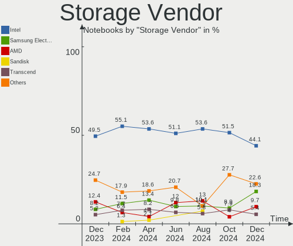
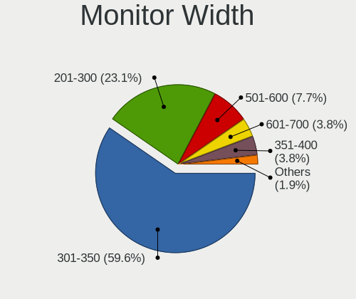

BSD Hardware Trends (Notebook)
------------------------------

A project to identify most popular hardware characteristics and track their change
over time based on data collected by BSD users at https://BSD-Hardware.info.

Anyone can contribute to the study by uploading probes of their computers by
the [hw-probe](https://github.com/linuxhw/hw-probe/blob/master/INSTALL.BSD.md) tool:

    hw-probe -all -upload

Full-feature report is available here: https://bsd-hardware.info/?view=trends&formfactor=notebook

Period: May, 2020.

Contents
--------

- [ OS                       ](#os)
- [ OS Family                ](#os-family)
- [ Arch                     ](#arch)
- [ DE                       ](#de)
- [ Display Server           ](#display-server)
- [ Display Manager          ](#display-manager)
- [ OS Lang                  ](#os-lang)
- [ Boot Mode                ](#boot-mode)
- [ Filesystem               ](#filesystem)
- [ Part. scheme             ](#part-scheme)
- [ Country                  ](#country)
- [ City                     ](#city)
- [ Vendor                   ](#vendor)
- [ Model                    ](#model)
- [ Model Family             ](#model-family)
- [ MFG Year                 ](#mfg-year)
- [ Form Factor              ](#form-factor)
- [ Coreboot                 ](#coreboot)
- [ RAM Size                 ](#ram-size)
- [ RAM Used                 ](#ram-used)
- [ Drive Vendor             ](#drive-vendor)
- [ Drive Model              ](#drive-model)
- [ Drive Kind               ](#drive-kind)
- [ Drive Connector          ](#drive-connector)
- [ Drive Size               ](#drive-size)
- [ Space Total              ](#space-total)
- [ Space Used               ](#space-used)
- [ Malfunc. Drives          ](#malfunc-drives)
- [ Malfunc. Drive Vendor    ](#malfunc-drive-vendor)
- [ Malfunc. Drive Kind      ](#malfunc-drive-kind)
- [ Failed Drives            ](#failed-drives)
- [ Failed Drive Vendor      ](#failed-drive-vendor)
- [ Drive Status             ](#drive-status)
- [ Storage Vendor           ](#storage-vendor)
- [ Storage Model            ](#storage-model)
- [ Storage Kind             ](#storage-kind)
- [ CPU Vendor               ](#cpu-vendor)
- [ CPU Model                ](#cpu-model)
- [ CPU Model Family         ](#cpu-model-family)
- [ CPU Cores                ](#cpu-cores)
- [ CPU Sockets              ](#cpu-sockets)
- [ CPU Threads              ](#cpu-threads)
- [ CPU Microarch            ](#cpu-microarch)
- [ GPU Vendor               ](#gpu-vendor)
- [ GPU Model                ](#gpu-model)
- [ GPU Combo                ](#gpu-combo)
- [ GPU Driver               ](#gpu-driver)
- [ GPU Memory               ](#gpu-memory)
- [ Monitor Vendor           ](#monitor-vendor)
- [ Monitor Model            ](#monitor-model)
- [ Monitor Resolution       ](#monitor-resolution)
- [ Monitor Diagonal         ](#monitor-diagonal)
- [ Monitor Width            ](#monitor-width)
- [ Aspect Ratio             ](#aspect-ratio)
- [ Monitor Area             ](#monitor-area)
- [ Pixel Density            ](#pixel-density)
- [ Multiple Monitors        ](#multiple-monitors)
- [ Net Controller Vendor    ](#net-controller-vendor)
- [ Net Controller Model     ](#net-controller-model)
- [ Net Controller Kind      ](#net-controller-kind)
- [ Used Controller          ](#used-controller)
- [ NICs                     ](#nics)
- [ Unsupported Devices      ](#unsupported-devices)
- [ Unsupported Device Types ](#unsupported-device-types)

OS
--

Installed operating systems

| Name                          | Computers | Percent |
|-------------------------------|-----------|---------|
| FreeBSD 12.1-p5               | 18        | 28.13%  |
| OpenBSD 6.7                   | 11        | 17.19%  |
| FreeBSD 12.1-STABLE           | 7         | 10.94%  |
| FreeBSD 13.0-CURRENT          | 4         | 6.25%   |
| GhostBSD 20.04                | 3         | 4.69%   |
| NomadBSD 1.3.1                | 2         | 3.13%   |
| FreeBSD 12.1-p4               | 2         | 3.13%   |
| OS108 9.0                     | 1         | 1.56%   |
| OpenBSD 6.6                   | 1         | 1.56%   |
| NetBSD 9.0                    | 1         | 1.56%   |
| NetBSD 7.2                    | 1         | 1.56%   |
| MidnightBSD 1.2               | 1         | 1.56%   |
| HardenedBSD 13.0-CURRENT-HBSD | 1         | 1.56%   |
| HardenedBSD 12.1--HBSD        | 1         | 1.56%   |
| GhostBSD 20.03                | 1         | 1.56%   |
| FreeBSD 8.4                   | 1         | 1.56%   |
| FreeBSD 12.1-p3               | 1         | 1.56%   |
| FreeBSD 12.1-p2               | 1         | 1.56%   |
| FreeBSD 12.0-p3               | 1         | 1.56%   |
| FreeBSD 11.3-STABLE           | 1         | 1.56%   |
| FreeBSD 11.3-p9               | 1         | 1.56%   |
| FreeBSD 11.3-p6               | 1         | 1.56%   |
| DragonFly 5.9-DEVELOPMENT     | 1         | 1.56%   |
| DragonFly 5.8                 | 1         | 1.56%   |

OS Family
---------

OS without a version

| Name        | Computers | Percent |
|-------------|-----------|---------|
| FreeBSD     | 38        | 59.38%  |
| OpenBSD     | 12        | 18.75%  |
| GhostBSD    | 4         | 6.25%   |
| NomadBSD    | 2         | 3.13%   |
| NetBSD      | 2         | 3.13%   |
| HardenedBSD | 2         | 3.13%   |
| DragonFly   | 2         | 3.13%   |
| OS108       | 1         | 1.56%   |
| MidnightBSD | 1         | 1.56%   |

Arch
----

OS architecture (x86_64, i586, etc.)

| Name   | Computers | Percent |
|--------|-----------|---------|
| amd64  | 59        | 92.19%  |
| i386   | 3         | 4.69%   |
| x86_64 | 2         | 3.13%   |

DE
--

Desktop Environment

| Name     | Computers | Percent |
|----------|-----------|---------|
| Terminal | 37        | 57.81%  |
| XFCE     | 13        | 20.31%  |
| MATE     | 5         | 7.81%   |
| GNOME    | 5         | 7.81%   |
| LXQt     | 1         | 1.56%   |
| LXDE     | 1         | 1.56%   |
| Lumina   | 1         | 1.56%   |
| KDE5     | 1         | 1.56%   |

Display Server
--------------

X11 or Wayland

| Name     | Computers | Percent |
|----------|-----------|---------|
| X11      | 56        | 87.5%   |
| Terminal | 7         | 10.94%  |
| Wayland  | 1         | 1.56%   |

Display Manager
---------------

SDDM, LightDM, etc.

| Name     | Computers | Percent |
|----------|-----------|---------|
| Terminal | 33        | 51.56%  |
| SLiM     | 16        | 25%     |
| XDM      | 6         | 9.38%   |
| LightDM  | 6         | 9.38%   |
| SDDM     | 3         | 4.69%   |

OS Lang
-------

Language

| Lang    | Computers | Percent |
|---------|-----------|---------|
| Unknown | 26        | 40.63%  |
| en_US   | 19        | 29.69%  |
| ru_RU   | 7         | 10.94%  |
| en_GB   | 4         | 6.25%   |
| ""      | 2         | 3.13%   |
| sk_SK   | 1         | 1.56%   |
| pl_PL   | 1         | 1.56%   |
| fr_FR   | 1         | 1.56%   |
| en_IE   | 1         | 1.56%   |
| de_DE   | 1         | 1.56%   |
| cs_CZ   | 1         | 1.56%   |

Boot Mode
---------

EFI or BIOS

| Mode | Computers | Percent |
|------|-----------|---------|
| BIOS | 33        | 51.56%  |
| EFI  | 31        | 48.44%  |

Filesystem
----------

Type of filesystem

| Type    | Computers | Percent |
|---------|-----------|---------|
| Ufs     | 35        | 54.69%  |
| Zfs     | 28        | 43.75%  |
| Hammer2 | 1         | 1.56%   |

Part. scheme
------------

Scheme of partitioning

| Type    | Computers | Percent |
|---------|-----------|---------|
| GPT     | 43        | 67.19%  |
| MBR     | 12        | 18.75%  |
| Unknown | 9         | 14.06%  |

Country
-------

Geographic location (country)

| Country     | Computers | Percent |
|-------------|-----------|---------|
| USA         | 13        | 20.31%  |
| Russia      | 13        | 20.31%  |
| Germany     | 9         | 14.06%  |
| Ukraine     | 4         | 6.25%   |
| France      | 4         | 6.25%   |
| Canada      | 3         | 4.69%   |
| Austria     | 3         | 4.69%   |
| Italy       | 2         | 3.13%   |
| UK          | 1         | 1.56%   |
| Switzerland | 1         | 1.56%   |
| Slovakia    | 1         | 1.56%   |
| Portugal    | 1         | 1.56%   |
| Poland      | 1         | 1.56%   |
| Latvia      | 1         | 1.56%   |
| Kazakhstan  | 1         | 1.56%   |
| Ireland     | 1         | 1.56%   |
| Indonesia   | 1         | 1.56%   |
| Finland     | 1         | 1.56%   |
| Croatia     | 1         | 1.56%   |
| Australia   | 1         | 1.56%   |
| Armenia     | 1         | 1.56%   |

City
----

Geographic location (city)

| City                | Computers | Percent |
|---------------------|-----------|---------|
| Moscow              | 5         | 7.81%   |
| Vienna              | 3         | 4.69%   |
| St Petersburg       | 2         | 3.13%   |
| Neuss               | 2         | 3.13%   |
| Clemmons            | 2         | 3.13%   |
| Zurich              | 1         | 1.56%   |
| Ypsilanti           | 1         | 1.56%   |
| Yerevan             | 1         | 1.56%   |
| Yaroslavl           | 1         | 1.56%   |
| Warsaw              | 1         | 1.56%   |
| Varaždin           | 1         | 1.56%   |
| Vancouver           | 1         | 1.56%   |
| Treviglio           | 1         | 1.56%   |
| Stupava             | 1         | 1.56%   |
| San Francisco       | 1         | 1.56%   |
| Riga                | 1         | 1.56%   |
| Regensburg          | 1         | 1.56%   |
| Portland            | 1         | 1.56%   |
| Pine Mountain Club  | 1         | 1.56%   |
| Peterborough        | 1         | 1.56%   |
| Penza               | 1         | 1.56%   |
| Paris               | 1         | 1.56%   |
| Omsk                | 1         | 1.56%   |
| Nuremberg           | 1         | 1.56%   |
| Mykolayiv           | 1         | 1.56%   |
| Modane              | 1         | 1.56%   |
| Millinocket         | 1         | 1.56%   |
| Lysterfield         | 1         | 1.56%   |
| Lviv                | 1         | 1.56%   |
| Los Angeles         | 1         | 1.56%   |
| Leander             | 1         | 1.56%   |
| Kyiv                | 1         | 1.56%   |
| Kirov               | 1         | 1.56%   |
| Kiliya              | 1         | 1.56%   |
| Karlsruhe           | 1         | 1.56%   |
| Kaliningrad         | 1         | 1.56%   |
| Issy-les-Moulineaux | 1         | 1.56%   |
| Herne               | 1         | 1.56%   |
| Hamilton            | 1         | 1.56%   |
| Frascati            | 1         | 1.56%   |
| Espoo               | 1         | 1.56%   |
| Erlangen            | 1         | 1.56%   |
| Dublin              | 1         | 1.56%   |
| Columbia            | 1         | 1.56%   |
| Cluses              | 1         | 1.56%   |
| Chicago             | 1         | 1.56%   |
| Cheshunt            | 1         | 1.56%   |
| Bothell             | 1         | 1.56%   |
| Berwick             | 1         | 1.56%   |
| Berlin              | 1         | 1.56%   |
| Batam               | 1         | 1.56%   |
| Aveiro              | 1         | 1.56%   |
| Almaty              | 1         | 1.56%   |
| Albstadt            | 1         | 1.56%   |
| Abakan              | 1         | 1.56%   |

Vendor
------

Motherboard manufacturer

| Name             | Computers | Percent |
|------------------|-----------|---------|
| Lenovo           | 34        | 53.13%  |
| Dell             | 10        | 15.63%  |
| ASUSTek Computer | 6         | 9.38%   |
| Hewlett-Packard  | 3         | 4.69%   |
| Sony             | 2         | 3.13%   |
| Acer             | 2         | 3.13%   |
| TUXEDO           | 1         | 1.56%   |
| Toshiba          | 1         | 1.56%   |
| Schenker         | 1         | 1.56%   |
| Panasonic        | 1         | 1.56%   |
| Intel            | 1         | 1.56%   |
| IBM              | 1         | 1.56%   |
| Fujitsu          | 1         | 1.56%   |

Model
-----

Motherboard model

| Name                                       | Computers | Percent |
|--------------------------------------------|-----------|---------|
| Lenovo ThinkPad T430s 2352CTO              | 2         | 3.13%   |
| Lenovo ThinkPad T420 4180B39               | 2         | 3.13%   |
| Lenovo ThinkPad T410s 291245G              | 2         | 3.13%   |
| Dell XPS 13 9360                           | 2         | 3.13%   |
| Dell Latitude E6420                        | 2         | 3.13%   |
| TUXEDO N13xWU                              | 1         | 1.56%   |
| Toshiba Satellite L355D                    | 1         | 1.56%   |
| Sony VPCM12M1E                             | 1         | 1.56%   |
| Sony SVE1713S1RW                           | 1         | 1.56%   |
| Schenker SCHENKER_COMPACT15_17_SCO15_17M19 | 1         | 1.56%   |
| Panasonic CF-19ADUAX1M                     | 1         | 1.56%   |
| Lenovo ThinkPad X60 1707YF8                | 1         | 1.56%   |
| Lenovo ThinkPad X270 20HNCTO1WW            | 1         | 1.56%   |
| Lenovo ThinkPad X260 20F5S1H800            | 1         | 1.56%   |
| Lenovo ThinkPad X240 20AMS0J01N            | 1         | 1.56%   |
| Lenovo ThinkPad X240 20AMA52RUK            | 1         | 1.56%   |
| Lenovo ThinkPad X230 2325V4M               | 1         | 1.56%   |
| Lenovo ThinkPad X230 2324A57               | 1         | 1.56%   |
| Lenovo ThinkPad X220 4291C35               | 1         | 1.56%   |
| Lenovo ThinkPad X220 42902WU               | 1         | 1.56%   |
| Lenovo ThinkPad X220 42872WU               | 1         | 1.56%   |
| Lenovo ThinkPad X1 Carbon 6th 20KH002RUS   | 1         | 1.56%   |
| Lenovo ThinkPad X1 Carbon 5th 20HRCTO1WW   | 1         | 1.56%   |
| Lenovo ThinkPad X1 Carbon 4th 20FCS1DW00   | 1         | 1.56%   |
| Lenovo ThinkPad X1 Carbon 3460AWU          | 1         | 1.56%   |
| Lenovo ThinkPad T60 2007J3G                | 1         | 1.56%   |
| Lenovo ThinkPad T495 20NJCTO1WW            | 1         | 1.56%   |
| Lenovo ThinkPad T460p 20FXS0H700           | 1         | 1.56%   |
| Lenovo ThinkPad T440s 20AR003VMS           | 1         | 1.56%   |
| Lenovo ThinkPad T440p 20AWS07F00           | 1         | 1.56%   |
| Lenovo ThinkPad T440p 20AN00DEUS           | 1         | 1.56%   |
| Lenovo ThinkPad T440 20B7S1C600            | 1         | 1.56%   |
| Lenovo ThinkPad T430s 23539LU              | 1         | 1.56%   |
| Lenovo ThinkPad T410 2537H21               | 1         | 1.56%   |
| Lenovo ThinkPad P51 20HH001RMX             | 1         | 1.56%   |
| Lenovo ThinkPad A485 20MU000VUS            | 1         | 1.56%   |
| Lenovo IdeaPad Z570 HuronRiver Platform    | 1         | 1.56%   |
| Lenovo IdeaPad 320-15ISK 80XH              | 1         | 1.56%   |
| Lenovo G570 20079                          | 1         | 1.56%   |
| Intel Intel powered classmate PC           | 1         | 1.56%   |
| IBM ThinkPad X41 2525FAG                   | 1         | 1.56%   |
| HP ZBook 15                                | 1         | 1.56%   |
| HP EliteBook 8560w                         | 1         | 1.56%   |
| HP EliteBook 840 G3                        | 1         | 1.56%   |
| Fujitsu LIFEBOOK A357                      | 1         | 1.56%   |
| Dell Precision M4700                       | 1         | 1.56%   |
| Dell Precision 7540                        | 1         | 1.56%   |
| Dell Latitude E7240                        | 1         | 1.56%   |
| Dell Latitude E6530                        | 1         | 1.56%   |
| Dell Latitude E5470                        | 1         | 1.56%   |
| Dell Inspiron 3543                         | 1         | 1.56%   |
| ASUS X71SL                                 | 1         | 1.56%   |
| ASUS U47A                                  | 1         | 1.56%   |
| ASUS K52JK                                 | 1         | 1.56%   |
| ASUS GL553VE                               | 1         | 1.56%   |
| ASUS A9T                                   | 1         | 1.56%   |
| ASUS A3L                                   | 1         | 1.56%   |
| Acer Predator PH517-61                     | 1         | 1.56%   |
| Acer Aspire 4820T                          | 1         | 1.56%   |

Model Family
------------

Motherboard model prefix

| Name                   | Computers | Percent |
|------------------------|-----------|---------|
| Lenovo ThinkPad        | 31        | 48.44%  |
| Dell Latitude          | 5         | 7.81%   |
| Lenovo IdeaPad         | 2         | 3.13%   |
| HP EliteBook           | 2         | 3.13%   |
| Dell XPS               | 2         | 3.13%   |
| Dell Precision         | 2         | 3.13%   |
| TUXEDO N13xWU          | 1         | 1.56%   |
| Toshiba Satellite      | 1         | 1.56%   |
| Sony VPCM12M1E         | 1         | 1.56%   |
| Sony SVE1713S1RW       | 1         | 1.56%   |
| Schenker SCHENKER      | 1         | 1.56%   |
| Panasonic CF-19ADUAX1M | 1         | 1.56%   |
| Lenovo G570            | 1         | 1.56%   |
| Intel Intel            | 1         | 1.56%   |
| IBM ThinkPad           | 1         | 1.56%   |
| HP ZBook               | 1         | 1.56%   |
| Fujitsu LIFEBOOK       | 1         | 1.56%   |
| Dell Inspiron          | 1         | 1.56%   |
| ASUS X71SL             | 1         | 1.56%   |
| ASUS U47A              | 1         | 1.56%   |
| ASUS K52JK             | 1         | 1.56%   |
| ASUS GL553VE           | 1         | 1.56%   |
| ASUS A9T               | 1         | 1.56%   |
| ASUS A3L               | 1         | 1.56%   |
| Acer Predator          | 1         | 1.56%   |
| Acer Aspire            | 1         | 1.56%   |

MFG Year
--------

Motherboard manufacture year

| Year | Computers | Percent |
|------|-----------|---------|
| 2019 | 14        | 21.88%  |
| 2018 | 9         | 14.06%  |
| 2016 | 7         | 10.94%  |
| 2017 | 5         | 7.81%   |
| 2012 | 5         | 7.81%   |
| 2011 | 5         | 7.81%   |
| 2013 | 4         | 6.25%   |
| 2010 | 3         | 4.69%   |
| 2020 | 2         | 3.13%   |
| 2015 | 2         | 3.13%   |
| 2008 | 2         | 3.13%   |
| 2007 | 2         | 3.13%   |
| 2005 | 2         | 3.13%   |
| 2014 | 1         | 1.56%   |
| 2006 | 1         | 1.56%   |

Form Factor
-----------

Physical design of the computer

| Name     | Computers | Percent |
|----------|-----------|---------|
| Notebook | 64        | 100%    |

Coreboot
--------

Have coreboot on board

| Used | Computers | Percent |
|------|-----------|---------|
| No   | 64        | 100%    |

RAM Size
--------

Total RAM memory

| Size in GB  | Computers | Percent |
|-------------|-----------|---------|
| 8.01-16.0   | 33        | 51.56%  |
| 16.01-24.0  | 14        | 21.88%  |
| 4.01-8.0    | 4         | 6.25%   |
| 32.01-64.0  | 4         | 6.25%   |
| 1.01-2.0    | 4         | 6.25%   |
| 2.01-3.0    | 2         | 3.13%   |
| 3.01-4.0    | 1         | 1.56%   |
| 64.01-256.0 | 1         | 1.56%   |
| 0.01-1.0    | 1         | 1.56%   |

RAM Used
--------

Used RAM memory

| Used GB     | Computers | Percent |
|-------------|-----------|---------|
| 0.01-1.0    | 49        | 76.56%  |
| 1.01-2.0    | 5         | 7.81%   |
| 4.01-8.0    | 4         | 6.25%   |
| Unknown     | 3         | 4.69%   |
| 2.01-3.0    | 1         | 1.56%   |
| 64.01-256.0 | 1         | 1.56%   |
| 0           | 1         | 1.56%   |

Drive Vendor
------------

Hard drive vendors

| Vendor              | Computers | Drives | Percent |
|---------------------|-----------|--------|---------|
| Samsung Electronics | 16        | 16     | 21.62%  |
| WDC                 | 6         | 7      | 8.11%   |
| Seagate             | 6         | 7      | 8.11%   |
| Hitachi             | 6         | 6      | 8.11%   |
| HGST                | 5         | 6      | 6.76%   |
| SanDisk             | 4         | 4      | 5.41%   |
| Kingston            | 4         | 4      | 5.41%   |
| Intel               | 4         | 4      | 5.41%   |
| Crucial             | 4         | 4      | 5.41%   |
| SPCC                | 3         | 3      | 4.05%   |
| Transcend           | 2         | 2      | 2.7%    |
| Toshiba             | 2         | 2      | 2.7%    |
| NVMe                | 2         | 2      | 2.7%    |
| LITEON              | 2         | 2      | 2.7%    |
| Verbatim            | 1         | 1      | 1.35%   |
| OCZ                 | 1         | 1      | 1.35%   |
| Micron Technology   | 1         | 1      | 1.35%   |
| LITEONIT            | 1         | 1      | 1.35%   |
| Leven               | 1         | 1      | 1.35%   |
| Gigabyte Technology | 1         | 1      | 1.35%   |
| Fujitsu             | 1         | 1      | 1.35%   |
| A-DATA Technology   | 1         | 1      | 1.35%   |

Drive Model
-----------

Hard drive models

| Model                            | Computers | Percent |
|----------------------------------|-----------|---------|
| HTS721010A9E630 1TB              | 3         | 3.9%    |
| SUV500MS480G 480GB               | 2         | 2.6%    |
| SSD 860 EVO 500GB                | 2         | 2.6%    |
| SSD 850 EVO 250GB                | 2         | 2.6%    |
| LCH-128V2S 128GB                 | 2         | 2.6%    |
| HTS725050A7E630 500GB            | 2         | 2.6%    |
| CT240M500SSD3 240GB              | 2         | 2.6%    |
| WDS500G1B0A-00H9H0 500GB         | 1         | 1.3%    |
| WDS100T2B0A-00SM50 1TB           | 1         | 1.3%    |
| WDC PC SN720 SDA 1TB             | 1         | 1.3%    |
| WD5000LPLX-08ZNTT0 500GB         | 1         | 1.3%    |
| WD5000BPVT-24HXZT3 500GB         | 1         | 1.3%    |
| WD2500BEVT-22A23T0 250GB         | 1         | 1.3%    |
| WD20NMVW-11EDZS7 2TB             | 1         | 1.3%    |
| WD20NMVW-11AV3S2 2TB             | 1         | 1.3%    |
| Vi500 S3 480GB SSD               | 1         | 1.3%    |
| Ultra II 480GB                   | 1         | 1.3%    |
| TS240GMTS420S 240GB              | 1         | 1.3%    |
| TS128GMTS430S 128GB              | 1         | 1.3%    |
| SV300S37A120G 120GB              | 1         | 1.3%    |
| SU750 256GB                      | 1         | 1.3%    |
| ST9500420AS 500GB                | 1         | 1.3%    |
| ST9250315AS 250GB                | 1         | 1.3%    |
| ST500LM030-2E717D 500GB          | 1         | 1.3%    |
| ST500LM021-1KJ152 500GB          | 1         | 1.3%    |
| ST320VT000-1BS14C 320GB          | 1         | 1.3%    |
| ST2000LM015-2E8174 2TB           | 1         | 1.3%    |
| ST1000LM048-2E7172 1TB           | 1         | 1.3%    |
| SSDSCKKF256G8H 256GB             | 1         | 1.3%    |
| SSDSC2BW240A3L 240GB             | 1         | 1.3%    |
| SSDSC2BF180A4L 180GB             | 1         | 1.3%    |
| SSDSC2BB480G7 480GB              | 1         | 1.3%    |
| SSD PM830 FDE 2.5-inch 7mm 256GB | 1         | 1.3%    |
| SSD 960 EVO 1TB                  | 1         | 1.3%    |
| SSD 850 EVO mSATA 250GB          | 1         | 1.3%    |
| SSD 850 EVO M.2 250GB            | 1         | 1.3%    |
| SSD 850 EVO 1TB                  | 1         | 1.3%    |
| SSD 850 EVO 120GB                | 1         | 1.3%    |
| SSD 840 Series 250GB             | 1         | 1.3%    |
| Solid State Disk 64GB            | 1         | 1.3%    |
| Solid State Disk 256GB           | 1         | 1.3%    |
| Solid State Disk 120GB           | 1         | 1.3%    |
| SD8SN8U128G1002 128GB            | 1         | 1.3%    |
| SD5SG2256G1052E 256GB            | 1         | 1.3%    |
| SATA HTS721010A9 1TB             | 1         | 1.3%    |
| SA400S37120G 120GB               | 1         | 1.3%    |
| MZVPV256HDGL-000L7 256GB         | 1         | 1.3%    |
| MZMTE1T0HMJH-00000 1TB           | 1         | 1.3%    |
| MZ7TY256HDHP-000L7 256GB         | 1         | 1.3%    |
| MZ7PC128HAFU-000L1 128GB         | 1         | 1.3%    |
| MQ04ABF100 1TB                   | 1         | 1.3%    |
| MK5061GSYN 500GB                 | 1         | 1.3%    |
| MJA2160BH FFS G1 160GB           | 1         | 1.3%    |
| LMT-128M6M mSATA 128GB           | 1         | 1.3%    |
| LENSE30512GMSP34 512GB           | 1         | 1.3%    |
| JAJS600M512C 512GB               | 1         | 1.3%    |
| HTS721060G9AT00 64GB             | 1         | 1.3%    |
| HTS543212L9A300 120GB            | 1         | 1.3%    |
| HTS541660J9SA00 64GB             | 1         | 1.3%    |
| HTS541075A7E630 752GB            | 1         | 1.3%    |

Drive Kind
----------

HDD or SSD

| Kind | Computers | Drives | Percent |
|------|-----------|--------|---------|
| SSD  | 35        | 45     | 56.45%  |
| HDD  | 25        | 30     | 40.32%  |
| NVMe | 2         | 2      | 3.23%   |

Drive Connector
---------------

SATA, SAS, NVMe, etc.

| Type | Computers | Drives | Percent |
|------|-----------|--------|---------|
| SATA | 55        | 75     | 96.49%  |
| NVMe | 2         | 2      | 3.51%   |

Drive Size
----------

Size of hard drive

| Size in TB | Computers | Drives | Percent |
|------------|-----------|--------|---------|
| 0.01-0.5   | 50        | 59     | 75.76%  |
| 0.51-1.0   | 12        | 13     | 18.18%  |
| 1.01-2.0   | 4         | 5      | 6.06%   |

Space Total
-----------

Amount of disk space available on the file system

| Size in GB | Computers | Percent |
|------------|-----------|---------|
| 101-250    | 22        | 34.38%  |
| 251-500    | 15        | 23.44%  |
| Unknown    | 8         | 12.5%   |
| 51-100     | 7         | 10.94%  |
| 21-50      | 6         | 9.38%   |
| 501-1000   | 3         | 4.69%   |
| 1-20       | 2         | 3.13%   |
| 1001-2000  | 1         | 1.56%   |

Space Used
----------

Amount of used disk space

| Used GB | Computers | Percent |
|---------|-----------|---------|
| 1-20    | 30        | 46.88%  |
| 21-50   | 12        | 18.75%  |
| 51-100  | 8         | 12.5%   |
| Unknown | 8         | 12.5%   |
| 101-250 | 4         | 6.25%   |
| 251-500 | 2         | 3.13%   |

Malfunc. Drives
---------------

Drive models with a malfunction

| Model                   | Computers | Drives | Percent |
|-------------------------|-----------|--------|---------|
| ST9500420AS 500GB       | 1         | 1      | 8.33%   |
| ST500LM021-1KJ152 500GB | 1         | 1      | 8.33%   |
| SSDSCKKF256G8H 256GB    | 1         | 1      | 8.33%   |
| SSDSC2BF180A4L 180GB    | 1         | 1      | 8.33%   |
| SSDSC2BB480G7 480GB     | 1         | 1      | 8.33%   |
| SSD 960 EVO 1TB         | 1         | 1      | 8.33%   |
| MQ04ABF100 1TB          | 1         | 1      | 8.33%   |
| HTS721060G9AT00 64GB    | 1         | 1      | 8.33%   |
| HTS543212L9A300 120GB   | 1         | 1      | 8.33%   |
| HTS421260H9AT00 64GB    | 1         | 1      | 8.33%   |
| HTC426060G9AT00 64GB    | 1         | 1      | 8.33%   |
| CT525MX300SSD1 528GB    | 1         | 1      | 8.33%   |

Malfunc. Drive Vendor
---------------------

Vendors of faulty drives

| Vendor              | Computers | Drives | Percent |
|---------------------|-----------|--------|---------|
| Hitachi             | 4         | 4      | 33.33%  |
| Intel               | 3         | 3      | 25%     |
| Seagate             | 2         | 2      | 16.67%  |
| Toshiba             | 1         | 1      | 8.33%   |
| Samsung Electronics | 1         | 1      | 8.33%   |
| Crucial             | 1         | 1      | 8.33%   |

Malfunc. Drive Kind
-------------------

Kinds of faulty drives

| Kind | Computers | Drives | Percent |
|------|-----------|--------|---------|
| HDD  | 7         | 7      | 58.33%  |
| SSD  | 4         | 4      | 33.33%  |
| NVMe | 1         | 1      | 8.33%   |

Failed Drives
-------------

Failed drive models

Zero info for selected period =(

Failed Drive Vendor
-------------------

Failed drive vendors

Zero info for selected period =(

Drive Status
------------

Number of failed and malfunc. drives

| Status   | Computers | Drives | Percent |
|----------|-----------|--------|---------|
| Works    | 45        | 63     | 76.27%  |
| Malfunc  | 12        | 12     | 20.34%  |
| Detected | 2         | 2      | 3.39%   |

Storage Vendor
--------------

Storage controller vendors

| Vendor                           | Computers | Percent |
|----------------------------------|-----------|---------|
| Intel                            | 51        | 76.12%  |
| Samsung Electronics              | 5         | 7.46%   |
| AMD                              | 3         | 4.48%   |
| SK Hynix                         | 2         | 2.99%   |
| Silicon Integrated Systems [SiS] | 2         | 2.99%   |
| Toshiba                          | 1         | 1.49%   |
| Sandisk                          | 1         | 1.49%   |
| Lenovo                           | 1         | 1.49%   |
| ADATA Technology                 | 1         | 1.49%   |

Storage Model
-------------

Storage controller models

| Model                                                                    | Computers | Percent |
|--------------------------------------------------------------------------|-----------|---------|
| 6 Series/C200 Series Chipset Family 6 port Mobile SATA AHCI Controller   | 11        | 15.28%  |
| 7 Series Chipset Family 6-port SATA Controller [AHCI mode]               | 10        | 13.89%  |
| Sunrise Point-LP SATA Controller [AHCI mode]                             | 5         | 6.94%   |
| 8 Series SATA Controller 1 [AHCI mode]                                   | 5         | 6.94%   |
| 8 Series/C220 Series Chipset Family 6-port SATA Controller 1 [AHCI mode] | 3         | 4.17%   |
| 5 Series/3400 Series Chipset 6 port SATA AHCI Controller                 | 3         | 4.17%   |
| NVMe SSD Controller SM981/PM981/PM983                                    | 2         | 2.78%   |
| NVMe SSD Controller SM961/PM961                                          | 2         | 2.78%   |
| HM170/QM170 Chipset SATA Controller [AHCI Mode]                          | 2         | 2.78%   |
| FCH SATA Controller [AHCI mode]                                          | 2         | 2.78%   |
| Cannon Lake Mobile PCH SATA AHCI Controller                              | 2         | 2.78%   |
| 82801GBM/GHM (ICH7-M Family) SATA Controller [AHCI mode]                 | 2         | 2.78%   |
| 82801G (ICH7 Family) IDE Controller                                      | 2         | 2.78%   |
| 5513 IDE Controller                                                      | 2         | 2.78%   |
| 5 Series/3400 Series Chipset 4 port SATA AHCI Controller                 | 2         | 2.78%   |
| XPG SX8200 Pro PCIe Gen3x4 M.2 2280 Solid State Drive                    | 1         | 1.39%   |
| XG4 NVMe SSD Controller                                                  | 1         | 1.39%   |
| Wildcat Point-LP SATA Controller [AHCI Mode]                             | 1         | 1.39%   |
| WD Black 2018/PC SN720 NVMe SSD                                          | 1         | 1.39%   |
| unknown                                                                  | 1         | 1.39%   |
| SC300 512GB M.2 2280 SATA Solid State Drive                              | 1         | 1.39%   |
| SB7x0/SB8x0/SB9x0 SATA Controller [AHCI mode]                            | 1         | 1.39%   |
| SB7x0/SB8x0/SB9x0 IDE Controller                                         | 1         | 1.39%   |
| SATA Controller / IDE mode                                               | 1         | 1.39%   |
| Q170/Q150/B150/H170/H110/Z170/CM236 Chipset SATA Controller [AHCI Mode]  | 1         | 1.39%   |
| NVMe SSD Controller SM951/PM951                                          | 1         | 1.39%   |
| NM10/ICH7 Family SATA Controller [IDE mode]                              | 1         | 1.39%   |
| NM10/ICH7 Family SATA Controller [AHCI mode]                             | 1         | 1.39%   |
| 82801FBM (ICH6M) SATA Controller                                         | 1         | 1.39%   |
| 82801DBM (ICH4-M) IDE Controller                                         | 1         | 1.39%   |
| 400 Series Chipset SATA Controller                                       | 1         | 1.39%   |
| Unknown                                                                  | 1         | 1.39%   |

Storage Kind
------------

Kind of storage controller (IDE, SATA, NVMe, SAS, ...)

| Kind | Computers | Percent |
|------|-----------|---------|
| SATA | 51        | 72.86%  |
| NVMe | 11        | 15.71%  |
| IDE  | 8         | 11.43%  |

CPU Vendor
----------

Processor vendors

| Vendor | Computers | Percent |
|--------|-----------|---------|
| Intel  | 60        | 93.75%  |
| AMD    | 4         | 6.25%   |

CPU Model
---------

Processor models

| Model                                               | Computers | Percent |
|-----------------------------------------------------|-----------|---------|
| Intel Core i5-2520M CPU @ 2.50GHz                   | 5         | 7.81%   |
| Intel Core i5-3320M CPU @ 2.60GHz                   | 4         | 6.25%   |
| Intel Core i5-4300U CPU @ 1.90GHz                   | 3         | 4.69%   |
| Intel Core i7-7500U CPU @ 2.70GHz                   | 2         | 3.13%   |
| Intel Core i5-2540M CPU @ 2.60GHz                   | 2         | 3.13%   |
| Intel Core i5-2430M CPU @ 2.40GHz                   | 2         | 3.13%   |
| Intel Core i5 CPU M 560 @ 2.67GHz                   | 2         | 3.13%   |
| Intel Core i3-6006U CPU @ 2.00GHz                   | 2         | 3.13%   |
| Intel Core 2 CPU                                    | 2         | 3.13%   |
| Intel Xeon E-2286M CPU @ 2.40GHz                    | 1         | 1.56%   |
| Intel Pentium M processor 1.60GHz                   | 1         | 1.56%   |
| Intel Pentium M processor                           | 1         | 1.56%   |
| Intel Pentium 3805U @ 1.90GHz                       | 1         | 1.56%   |
| Intel Core i7-9750H CPU @ 2.60GHz                   | 1         | 1.56%   |
| Intel Core i7-8650U CPU @ 1.90GHz                   | 1         | 1.56%   |
| Intel Core i7-7820HQ CPU @ 2.90GHz                  | 1         | 1.56%   |
| Intel Core i7-7700HQ CPU @ 2.80GHz                  | 1         | 1.56%   |
| Intel Core i7-7600U CPU @ 2.80GHz                   | 1         | 1.56%   |
| Intel Core i7-6820HQ CPU @ 2.70GHz                  | 1         | 1.56%   |
| Intel Core i7-6600U CPU @ 2.60GHz                   | 1         | 1.56%   |
| Intel Core i7-4900MQ CPU @ 2.80GHz                  | 1         | 1.56%   |
| Intel Core i7-4600U CPU @ 2.10GHz                   | 1         | 1.56%   |
| Intel Core i7-3740QM CPU @ 2.70GHz                  | 1         | 1.56%   |
| Intel Core i7-3667U CPU @ 2.00GHz                   | 1         | 1.56%   |
| Intel Core i7-3630QM CPU @ 2.40GHz                  | 1         | 1.56%   |
| Intel Core i7-3520M CPU @ 2.90GHz                   | 1         | 1.56%   |
| Intel Core i7-2640M CPU @ 2.80GHz                   | 1         | 1.56%   |
| Intel Core i5-8250U CPU @ 1.60GHz                   | 1         | 1.56%   |
| Intel Core i5-7200U CPU @ 2.50GHz                   | 1         | 1.56%   |
| Intel Core i5-6440HQ CPU @ 2.60GHz                  | 1         | 1.56%   |
| Intel Core i5-6300U CPU @ 2.40GHz                   | 1         | 1.56%   |
| Intel Core i5-6200U CPU @ 2.30GHz                   | 1         | 1.56%   |
| Intel Core i5-4340M CPU @ 2.90GHz                   | 1         | 1.56%   |
| Intel Core i5-4210U CPU @ 1.70GHz                   | 1         | 1.56%   |
| Intel Core i5-4210M CPU @ 2.60GHz                   | 1         | 1.56%   |
| Intel Core i5-2540M CPU @ 2.60GH                    | 1         | 1.56%   |
| Intel Core i5-2520M CPU @ 2.50GH                    | 1         | 1.56%   |
| Intel Core i5 CPU M 520 @ 2.40GHz                   | 1         | 1.56%   |
| Intel Core i5 CPU M 430 @ 2.27GH                    | 1         | 1.56%   |
| Intel Core i3-3120M CPU @ 2.50GHz                   | 1         | 1.56%   |
| Intel Core i3 CPU M 350 @ 2.27GHz                   | 1         | 1.56%   |
| Intel Core 2 Duo CPU P8600 @ 2.40GHz                | 1         | 1.56%   |
| Intel Celeron M processor 1.70GHz                   | 1         | 1.56%   |
| Intel C1                                            | 1         | 1.56%   |
| Intel Atom CPU N470 @ 1.83GHz                       | 1         | 1.56%   |
| AMD Turion X2 Dual-Core Mobile RM-72                | 1         | 1.56%   |
| AMD Ryzen 7 PRO 3700U w/ Radeon Vega Mobile Gfx     | 1         | 1.56%   |
| AMD AMD Ryzen 7 2700 Eight-Core Processor           | 1         | 1.56%   |
| AMD AMD Ryzen 5 PRO 2500U w/ Radeon Vega Mobile Gfx | 1         | 1.56%   |

CPU Model Family
----------------

Processor model prefix

| Model                          | Computers | Percent |
|--------------------------------|-----------|---------|
| Intel Core i5                  | 30        | 46.88%  |
| Intel Core i7                  | 16        | 25%     |
| Intel Core i3                  | 4         | 6.25%   |
| Other                          | 3         | 4.69%   |
| Intel Pentium M                | 2         | 3.13%   |
| Intel Core 2                   | 2         | 3.13%   |
| Intel Xeon                     | 1         | 1.56%   |
| Intel Pentium                  | 1         | 1.56%   |
| Intel Core 2 Duo               | 1         | 1.56%   |
| Intel Celeron M                | 1         | 1.56%   |
| Intel Atom                     | 1         | 1.56%   |
| AMD Turion X2 Dual-Core Mobile | 1         | 1.56%   |
| AMD Ryzen 7 PRO                | 1         | 1.56%   |

CPU Cores
---------

Number of processor cores

| Number  | Computers | Percent |
|---------|-----------|---------|
| 2       | 42        | 65.63%  |
| 4       | 10        | 15.63%  |
| Unknown | 5         | 7.81%   |
| 1       | 3         | 4.69%   |
| 8       | 2         | 3.13%   |
| 16      | 1         | 1.56%   |
| 6       | 1         | 1.56%   |

CPU Sockets
-----------

Number of sockets

| Number | Computers | Percent |
|--------|-----------|---------|
| 1      | 64        | 100%    |

CPU Threads
-----------

Threads per core (Hyper-Threading)

| Number  | Computers | Percent |
|---------|-----------|---------|
| 2       | 52        | 81.25%  |
| Unknown | 7         | 10.94%  |
| 1       | 5         | 7.81%   |

CPU Microarch
-------------

Microarchitecture

| Name            | Computers | Percent |
|-----------------|-----------|---------|
| SandyBridge     | 12        | 18.75%  |
| KabyLake        | 10        | 15.63%  |
| IvyBridge       | 9         | 14.06%  |
| Haswell         | 8         | 12.5%   |
| Skylake         | 7         | 10.94%  |
| Westmere        | 3         | 4.69%   |
| P6              | 3         | 4.69%   |
| Unknown         | 3         | 4.69%   |
| Zen+            | 2         | 3.13%   |
| Core            | 2         | 3.13%   |
| Bonnell         | 2         | 3.13%   |
| Penryn          | 1         | 1.56%   |
| K8 & K10 hybrid | 1         | 1.56%   |
| Broadwell       | 1         | 1.56%   |

GPU Vendor
----------

Vendors of graphics cards

| Vendor                           | Computers | Percent |
|----------------------------------|-----------|---------|
| Intel                            | 47        | 69.12%  |
| Nvidia                           | 11        | 16.18%  |
| AMD                              | 8         | 11.76%  |
| Silicon Integrated Systems [SiS] | 1         | 1.47%   |
| ATI                              | 1         | 1.47%   |

GPU Model
---------

Graphics card models

| Model                                                                   | Computers | Percent |
|-------------------------------------------------------------------------|-----------|---------|
| 2nd Generation Core Processor Family Integrated Graphics Controller     | 9         | 13.24%  |
| 3rd Gen Core processor Graphics Controller                              | 7         | 10.29%  |
| Skylake GT2 [HD Graphics 520]                                           | 4         | 5.88%   |
| HD Graphics 620                                                         | 4         | 5.88%   |
| Haswell-ULT Integrated Graphics Controller                              | 4         | 5.88%   |
| Core Processor Integrated Graphics Controller                           | 4         | 5.88%   |
| 4th Gen Core Processor Integrated Graphics Controller                   | 3         | 4.41%   |
| UHD Graphics 620                                                        | 2         | 2.94%   |
| HD Graphics 530                                                         | 2         | 2.94%   |
| Vega 10 XL/XT [Radeon RX Vega 56/64]                                    | 1         | 1.47%   |
| UHD Graphics 630 (Mobile)                                               | 1         | 1.47%   |
| TU106M [GeForce RTX 2070 Mobile]                                        | 1         | 1.47%   |
| TU106GLM [Quadro RTX 3000 Mobile / Max-Q]                               | 1         | 1.47%   |
| Thames [Radeon HD 7550M/7570M/7650M]                                    | 1         | 1.47%   |
| RV710/M92 [Mobility Radeon HD 4530/4570/545v]                           | 1         | 1.47%   |
| RV515/M52 [Mobility Radeon X1300]                                       | 1         | 1.47%   |
| RS780MC [Mobility Radeon HD 3100]                                       | 1         | 1.47%   |
| Robson CE [Radeon HD 6370M/7370M]                                       | 1         | 1.47%   |
| Raven Ridge [Radeon Vega Series / Radeon Vega Mobile Series]            | 1         | 1.47%   |
| Picasso                                                                 | 1         | 1.47%   |
| Mobile 945GM/GMS/GME, 943/940GML Express Integrated Graphics Controller | 1         | 1.47%   |
| Mobile 945GM/GMS, 943/940GML Express Integrated Graphics Controller     | 1         | 1.47%   |
| Mobile 915GM/GMS/910GML Express Graphics Controller                     | 1         | 1.47%   |
| HD Graphics 630                                                         | 1         | 1.47%   |
| HD Graphics 520                                                         | 1         | 1.47%   |
| HD Graphics                                                             | 1         | 1.47%   |
| GP107M [GeForce GTX 1050 Ti Mobile]                                     | 1         | 1.47%   |
| GM206GLM [Quadro M2200 Mobile]                                          | 1         | 1.47%   |
| GM108M [GeForce 940MX]                                                  | 1         | 1.47%   |
| GK107GLM [Quadro K1000M]                                                | 1         | 1.47%   |
| GF119M [NVS 4200M]                                                      | 1         | 1.47%   |
| GF117M [GeForce 610M/710M/810M/820M / GT 620M/625M/630M/720M]           | 1         | 1.47%   |
| GF108GLM [Quadro 1000M]                                                 | 1         | 1.47%   |
| GF108GLM [NVS 5200M]                                                    | 1         | 1.47%   |
| G98M [GeForce 9300M GS]                                                 | 1         | 1.47%   |
| Atom Processor D4xx/D5xx/N4xx/N5xx Integrated Graphics Controller       | 1         | 1.47%   |
| 82852/855GM Integrated Graphics Device                                  | 1         | 1.47%   |
| 661/741/760 PCI/AGP or 662/761Gx PCIE VGA Display Adapter               | 1         | 1.47%   |

GPU Combo
---------

Combinations of graphics cards

| Name           | Computers | Percent |
|----------------|-----------|---------|
| 1 x Intel      | 40        | 62.5%   |
| 1 x AMD        | 7         | 10.94%  |
| 1 x Nvidia     | 6         | 9.38%   |
| Intel + Nvidia | 5         | 7.81%   |
| 2 x Intel      | 4         | 6.25%   |
| 1 x SiS        | 1         | 1.56%   |
| Intel + AMD    | 1         | 1.56%   |

GPU Driver
----------

Free vs proprietary

| Driver | Computers | Percent |
|--------|-----------|---------|
| Free   | 64        | 100%    |

GPU Memory
----------

Total video memory

| Size in GB | Computers | Percent |
|------------|-----------|---------|
| Unknown    | 47        | 73.44%  |
| 1.01-2.0   | 8         | 12.5%   |
| 0.01-0.5   | 3         | 4.69%   |
| 3.01-4.0   | 2         | 3.13%   |
| 0.51-1.0   | 2         | 3.13%   |
| 7.01-8.0   | 1         | 1.56%   |
| 5.01-6.0   | 1         | 1.56%   |

Monitor Vendor
--------------

Monitor vendors

| Vendor                  | Computers | Percent |
|-------------------------|-----------|---------|
| LG Display              | 14        | 26.92%  |
| AU Optronics            | 11        | 21.15%  |
| Lenovo                  | 6         | 11.54%  |
| Chimei Innolux          | 6         | 11.54%  |
| Samsung Electronics     | 3         | 5.77%   |
| Dell                    | 3         | 5.77%   |
| Ancor Communications    | 2         | 3.85%   |
| Sharp                   | 1         | 1.92%   |
| LG Philips              | 1         | 1.92%   |
| Goldstar                | 1         | 1.92%   |
| Fujitsu Siemens         | 1         | 1.92%   |
| CPT                     | 1         | 1.92%   |
| Chi Mei Optoelectronics | 1         | 1.92%   |
| BOE                     | 1         | 1.92%   |

Monitor Model
-------------

Monitor models

| Model                                             | Computers | Percent |
|---------------------------------------------------|-----------|---------|
| LCD Monitor LEN4036 1440x900 300x190mm 14.0-inch  | 3         | 5.77%   |
| U2414H DELA0A2 1920x1080 530x300mm 24.0-inch      | 2         | 3.85%   |
| LCD Monitor AUO106C 1366x768 280x160mm 12.7-inch  | 2         | 3.85%   |
| W2242 GSM5677 1680x1050 490x320mm 23.0-inch       | 1         | 1.92%   |
| U2312HM DEL4071 1920x1080 510x290mm 23.1-inch     | 1         | 1.92%   |
| P27T-6 IPS FUS07EF 2560x1440 600x340mm 27.2-inch  | 1         | 1.92%   |
| LCD Monitor SHP1449 1920x1080 290x170mm 13.2-inch | 1         | 1.92%   |
| LCD Monitor SEC3047 1366x768 280x160mm 12.7-inch  | 1         | 1.92%   |
| LCD Monitor SDCA029 3840x2160 340x190mm 15.3-inch | 1         | 1.92%   |
| LCD Monitor SDC364D 1920x1080 310x170mm 13.9-inch | 1         | 1.92%   |
| LCD Monitor LPLA101 1440x900 370x230mm 17.2-inch  | 1         | 1.92%   |
| LCD Monitor LGD058B 2560x1440 310x170mm 13.9-inch | 1         | 1.92%   |
| LCD Monitor LGD04A3 1366x768 280x160mm 12.7-inch  | 1         | 1.92%   |
| LCD Monitor LGD046F 1920x1080 340x190mm 15.3-inch | 1         | 1.92%   |
| LCD Monitor LGD045E 1366x768 310x170mm 13.9-inch  | 1         | 1.92%   |
| LCD Monitor LGD03ED 1366x768 280x160mm 12.7-inch  | 1         | 1.92%   |
| LCD Monitor LGD03CD 1366x768 280x160mm 12.7-inch  | 1         | 1.92%   |
| LCD Monitor LGD0382 1600x900 310x170mm 13.9-inch  | 1         | 1.92%   |
| LCD Monitor LGD0362 1600x900 310x170mm 13.9-inch  | 1         | 1.92%   |
| LCD Monitor LGD0335 1366x768 310x170mm 13.9-inch  | 1         | 1.92%   |
| LCD Monitor LGD032C 1920x1080 340x190mm 15.3-inch | 1         | 1.92%   |
| LCD Monitor LGD02EB 1366x768 310x170mm 13.9-inch  | 1         | 1.92%   |
| LCD Monitor LGD02E2 1600x900 310x170mm 13.9-inch  | 1         | 1.92%   |
| LCD Monitor LGD02DC 1366x768 340x190mm 15.3-inch  | 1         | 1.92%   |
| LCD Monitor LGD02D8 1366x768 280x160mm 12.7-inch  | 1         | 1.92%   |
| LCD Monitor LEN40B0 1366x768 340x190mm 15.3-inch  | 1         | 1.92%   |
| LCD Monitor LEN4043 1400x1050 300x230mm 14.9-inch | 1         | 1.92%   |
| LCD Monitor LEN4000 1024x768 250x180mm 12.1-inch  | 1         | 1.92%   |
| LCD Monitor COR0207 1366x768 310x170mm 13.9-inch  | 1         | 1.92%   |
| LCD Monitor CMO1457 1366x768 310x170mm 13.9-inch  | 1         | 1.92%   |
| LCD Monitor CMN15DB 1366x768 340x190mm 15.3-inch  | 1         | 1.92%   |
| LCD Monitor CMN15C2 1920x1080 340x190mm 15.3-inch | 1         | 1.92%   |
| LCD Monitor CMN14F2 1920x1080 310x170mm 13.9-inch | 1         | 1.92%   |
| LCD Monitor CMN14C3 1366x768 310x170mm 13.9-inch  | 1         | 1.92%   |
| LCD Monitor CMN1471 1366x768 310x170mm 13.9-inch  | 1         | 1.92%   |
| LCD Monitor CMN1375 1920x1080 290x170mm 13.2-inch | 1         | 1.92%   |
| LCD Monitor BOE0714 1920x1080 310x170mm 13.9-inch | 1         | 1.92%   |
| LCD Monitor AUO40EC 1366x768 340x190mm 15.3-inch  | 1         | 1.92%   |
| LCD Monitor AUO333C 1366x768 310x170mm 13.9-inch  | 1         | 1.92%   |
| LCD Monitor AUO313D 1920x1080 310x170mm 13.9-inch | 1         | 1.92%   |
| LCD Monitor AUO2A3C 1366x768 310x170mm 13.9-inch  | 1         | 1.92%   |
| LCD Monitor AUO24ED 1920x1080 340x190mm 15.3-inch | 1         | 1.92%   |
| LCD Monitor AUO226D 1920x1080 280x160mm 12.7-inch | 1         | 1.92%   |
| LCD Monitor AUO173D 1920x1080 310x170mm 13.9-inch | 1         | 1.92%   |
| LCD Monitor 3840x2160                             | 1         | 1.92%   |
| LCD Monitor 1920x1080                             | 1         | 1.92%   |
| ASUS VS229 ACI22C2 1920x1080 480x270mm 21.7-inch  | 1         | 1.92%   |
| ASUS PB278 ACI27A3 2560x1440 600x340mm 27.2-inch  | 1         | 1.92%   |

Monitor Resolution
------------------

Monitor screen resolution

| Resolution         | Computers | Percent |
|--------------------|-----------|---------|
| 1366x768 (WXGA)    | 20        | 38.46%  |
| 1920x1080 (FHD)    | 17        | 32.69%  |
| 1440x900 (WXGA+)   | 4         | 7.69%   |
| 2560x1440 (QHD)    | 3         | 5.77%   |
| 1600x900 (HD+)     | 3         | 5.77%   |
| 3840x2160 (4K)     | 2         | 3.85%   |
| 1680x1050 (WSXGA+) | 1         | 1.92%   |
| 1400x1050          | 1         | 1.92%   |
| 1024x768 (XGA)     | 1         | 1.92%   |

Monitor Diagonal
----------------

Diagonal size in inches

| Inches  | Computers | Percent |
|---------|-----------|---------|
| 13      | 20        | 38.46%  |
| 15      | 9         | 17.31%  |
| 12      | 9         | 17.31%  |
| 14      | 4         | 7.69%   |
| 27      | 2         | 3.85%   |
| 24      | 2         | 3.85%   |
| 23      | 2         | 3.85%   |
| Unknown | 2         | 3.85%   |
| 21      | 1         | 1.92%   |
| 17      | 1         | 1.92%   |

Monitor Width
-------------

Physical width

| Width in mm | Computers | Percent |
|-------------|-----------|---------|
| 301-350     | 27        | 51.92%  |
| 201-300     | 15        | 28.85%  |
| 501-600     | 5         | 9.62%   |
| 401-500     | 2         | 3.85%   |
| Unknown     | 2         | 3.85%   |
| 351-400     | 1         | 1.92%   |

Aspect Ratio
------------

Proportional relationship between the width and the height

| Ratio   | Computers | Percent |
|---------|-----------|---------|
| 16/9    | 38        | 80.85%  |
| 16/10   | 4         | 8.51%   |
| 4/3     | 2         | 4.26%   |
| Unknown | 2         | 4.26%   |
| 3/2     | 1         | 2.13%   |

Monitor Area
------------

Area in inch²

| Area in inch² | Computers | Percent |
|----------------|-----------|---------|
| 81-90          | 21        | 40.38%  |
| 61-70          | 9         | 17.31%  |
| 91-100         | 9         | 17.31%  |
| 201-250        | 5         | 9.62%   |
| 71-80          | 2         | 3.85%   |
| 301-350        | 2         | 3.85%   |
| Unknown        | 2         | 3.85%   |
| 131-140        | 1         | 1.92%   |
| 101-110        | 1         | 1.92%   |

Pixel Density
-------------

Pixels per inch

| Density       | Computers | Percent |
|---------------|-----------|---------|
| 121-160       | 22        | 42.31%  |
| 101-120       | 18        | 34.62%  |
| 51-100        | 5         | 9.62%   |
| 161-240       | 4         | 7.69%   |
| Unknown       | 2         | 3.85%   |
| More than 240 | 1         | 1.92%   |

Multiple Monitors
-----------------

Total monitors connected

| Total | Computers | Percent |
|-------|-----------|---------|
| 1     | 46        | 71.88%  |
| 0     | 10        | 15.63%  |
| 2     | 8         | 12.5%   |

Net Controller Vendor
---------------------

Controller vendors

| Vendor                           | Computers | Percent |
|----------------------------------|-----------|---------|
| Intel                            | 52        | 56.52%  |
| Realtek Semiconductor            | 15        | 16.3%   |
| Qualcomm Atheros                 | 13        | 14.13%  |
| Silicon Integrated Systems [SiS] | 2         | 2.17%   |
| JMicron Technology               | 2         | 2.17%   |
| Broadcom Inc. and subsidiaries   | 2         | 2.17%   |
| Realtek                          | 1         | 1.09%   |
| Ralink                           | 1         | 1.09%   |
| Hewlett-Packard                  | 1         | 1.09%   |
| Attansic                         | 1         | 1.09%   |
| Atheros                          | 1         | 1.09%   |
| ASUSTek Computer                 | 1         | 1.09%   |

Net Controller Model
--------------------

Controller models

| Model                                                        | Computers | Percent |
|--------------------------------------------------------------|-----------|---------|
| 82579LM Gigabit Network Connection (Lewisville)              | 16        | 12.8%   |
| Centrino Advanced-N 6205 [Taylor Peak]                       | 11        | 8.8%    |
| Wireless 8265 / 8275                                         | 8         | 6.4%    |
| RTL8111/8168/8411 PCI Express Gigabit Ethernet Controller    | 8         | 6.4%    |
| Wireless 7260                                                | 6         | 4.8%    |
| Wireless 8260                                                | 4         | 3.2%    |
| RTL810xE PCI Express Fast Ethernet controller                | 4         | 3.2%    |
| Ethernet Connection I218-LM                                  | 4         | 3.2%    |
| Centrino Ultimate-N 6300                                     | 4         | 3.2%    |
| Ethernet Connection I217-LM                                  | 3         | 2.4%    |
| AR9285 Wireless Network Adapter (PCI-Express)                | 3         | 2.4%    |
| 82577LM Gigabit Network Connection                           | 3         | 2.4%    |
| Wireless 7265                                                | 2         | 1.6%    |
| RTL8188CE 802.11b/g/n WiFi Adapter                           | 2         | 1.6%    |
| Ethernet Connection I219-LM                                  | 2         | 1.6%    |
| Ethernet Connection (4) I219-LM                              | 2         | 1.6%    |
| Ethernet Connection (2) I219-LM                              | 2         | 1.6%    |
| Centrino Advanced-N 6200                                     | 2         | 1.6%    |
| 82573L Gigabit Ethernet Controller                           | 2         | 1.6%    |
| Wireless-AC 9260                                             | 1         | 0.8%    |
| Wi-Fi 6 AX200                                                | 1         | 0.8%    |
| SiS900 PCI Fast Ethernet                                     | 1         | 0.8%    |
| RTL8191SEvB Wireless LAN Controller                          | 1         | 0.8%    |
| RTL-8100/8101L/8139 PCI Fast Ethernet Adapter                | 1         | 0.8%    |
| RT3090 Wireless 802.11n 1T/1R PCIe                           | 1         | 0.8%    |
| QCA6174 802.11ac Wireless Network Adapter                    | 1         | 0.8%    |
| PRO/Wireless 3945ABG [Golan] Network Connection              | 1         | 0.8%    |
| PRO/Wireless 2915ABG [Calexico2] Network Connection          | 1         | 0.8%    |
| NetXtreme BCM5751M Gigabit Ethernet PCI Express              | 1         | 0.8%    |
| Killer E2500 Gigabit Ethernet Controller                     | 1         | 0.8%    |
| JMC260 PCI Express Fast Ethernet Controller                  | 1         | 0.8%    |
| JMC250 PCI Express Gigabit Ethernet Controller               | 1         | 0.8%    |
| hs2340 HSPA+ mobile broadband                                | 1         | 0.8%    |
| Ethernet Connection I219-V                                   | 1         | 0.8%    |
| Ethernet Connection I218-V                                   | 1         | 0.8%    |
| Ethernet Connection (7) I219-LM                              | 1         | 0.8%    |
| Ethernet Connection (5) I219-LM                              | 1         | 0.8%    |
| Ethernet Connection (4) I219-V                               | 1         | 0.8%    |
| Dual Band Wireless-AC 3165 Plus Bluetooth                    | 1         | 0.8%    |
| Centrino Wireless-N 6150                                     | 1         | 0.8%    |
| Centrino Wireless-N 2230                                     | 1         | 0.8%    |
| Centrino Wireless-N 1000 [Condor Peak]                       | 1         | 0.8%    |
| Centrino Advanced-N 6235                                     | 1         | 0.8%    |
| BCM4313 802.11bgn Wireless Network Adapter                   | 1         | 0.8%    |
| ASUS USB-AC53 Nano USB Wieless adapter                       | 1         | 0.8%    |
| AR9485 Wireless Network Adapter                              | 1         | 0.8%    |
| AR9462 Wireless Network Adapter                              | 1         | 0.8%    |
| AR928X Wireless Network Adapter (PCI-Express)                | 1         | 0.8%    |
| AR8152 v2.0 Fast Ethernet                                    | 1         | 0.8%    |
| AR8151 v2.0 Gigabit Ethernet                                 | 1         | 0.8%    |
| AR8151 v1.0 Gigabit Ethernet                                 | 1         | 0.8%    |
| AR5212 802.11abg NIC                                         | 1         | 0.8%    |
| AR242x / AR542x Wireless Network Adapter (PCI-Express)       | 1         | 0.8%    |
| AR2413/AR2414 Wireless Network Adapter [AR5005G(S) 802.11bg] | 1         | 0.8%    |
| AC'97 Modem Controller                                       | 1         | 0.8%    |
| 191 Gigabit Ethernet Adapter                                 | 1         | 0.8%    |

Net Controller Kind
-------------------

Ethernet, WiFi or modem

| Kind     | Computers | Percent |
|----------|-----------|---------|
| WiFi     | 62        | 49.6%   |
| Ethernet | 61        | 48.8%   |
| Modem    | 2         | 1.6%    |

Used Controller
---------------

Currently used network controller

| Kind     | Computers | Percent |
|----------|-----------|---------|
| WiFi     | 44        | 62.86%  |
| Ethernet | 26        | 37.14%  |

NICs
----

Total network controllers on board

| Total | Computers | Percent |
|-------|-----------|---------|
| 2     | 59        | 92.19%  |
| 1     | 4         | 6.25%   |
| 0     | 1         | 1.56%   |

Unsupported Devices
-------------------

Total unsupported devices on board

| Total | Computers | Percent |
|-------|-----------|---------|
| 1     | 22        | 34.38%  |
| 3     | 16        | 25%     |
| 2     | 16        | 25%     |
| 4     | 6         | 9.38%   |
| 0     | 2         | 3.13%   |
| 7     | 1         | 1.56%   |
| 5     | 1         | 1.56%   |

Unsupported Device Types
------------------------

Types of unsupported devices

| Type                     | Computers | Percent |
|--------------------------|-----------|---------|
| Communication controller | 51        | 38.93%  |
| Card reader              | 25        | 19.08%  |
| Fingerprint reader       | 18        | 13.74%  |
| Firewire controller      | 10        | 7.63%   |
| Bluetooth                | 9         | 6.87%   |
| Network                  | 8         | 6.11%   |
| Sound                    | 4         | 3.05%   |
| Storage                  | 2         | 1.53%   |
| Graphics card            | 2         | 1.53%   |
| Net/wireless             | 1         | 0.76%   |
| Modem                    | 1         | 0.76%   |

