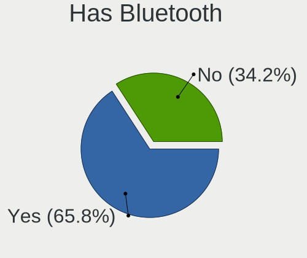
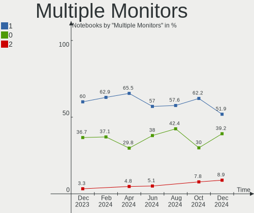
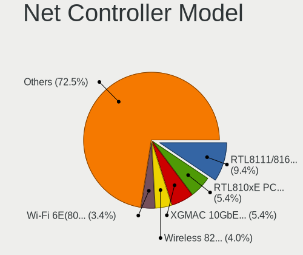
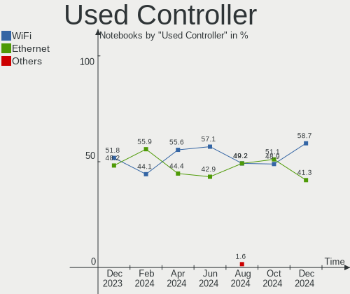
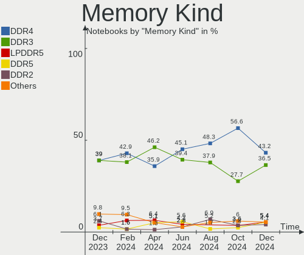

BSD - Hardware Trends (Notebooks)
---------------------------------

A project to identify most popular hardware characteristics and track their change
over time based on data collected by BSD users at https://BSD-Hardware.info.

Anyone can contribute to this report by the [hw-probe](https://github.com/linuxhw/hw-probe/blob/master/INSTALL.BSD.md) tool:

    hw-probe -all -upload

This report is for one last month. Overall report since the beginning of time: [TestDays](https://github.com/bsdhw/TestDays)

Period: Jul, 2023.

Contents
--------

* [ System ](#system)
  - [ OS                       ](#os)
  - [ OS Family                ](#os-family)
  - [ Arch                     ](#arch)
  - [ DE                       ](#de)
  - [ Display Server           ](#display-server)
  - [ Display Manager          ](#display-manager)
  - [ OS Lang                  ](#os-lang)
  - [ Boot Mode                ](#boot-mode)
  - [ Filesystem               ](#filesystem)
  - [ Part. scheme             ](#part-scheme)

* [ Board ](#board)
  - [ Vendor                   ](#vendor)
  - [ Model                    ](#model)
  - [ Model Family             ](#model-family)
  - [ MFG Year                 ](#mfg-year)
  - [ Form Factor              ](#form-factor)
  - [ Coreboot                 ](#coreboot)
  - [ RAM Size                 ](#ram-size)
  - [ RAM Used                 ](#ram-used)
  - [ Total Drives             ](#total-drives)
  - [ Has CD-ROM               ](#has-cd-rom)
  - [ Has Ethernet             ](#has-ethernet)
  - [ Has WiFi                 ](#has-wifi)
  - [ Has Bluetooth            ](#has-bluetooth)

* [ Location ](#location)
  - [ Country                  ](#country)
  - [ City                     ](#city)

* [ Drives ](#drives)
  - [ Drive Vendor             ](#drive-vendor)
  - [ Drive Model              ](#drive-model)
  - [ HDD Vendor               ](#hdd-vendor)
  - [ SSD Vendor               ](#ssd-vendor)
  - [ Drive Kind               ](#drive-kind)
  - [ Drive Connector          ](#drive-connector)
  - [ Drive Size               ](#drive-size)
  - [ Space Total              ](#space-total)
  - [ Space Used               ](#space-used)
  - [ Malfunc. Drives          ](#malfunc-drives)
  - [ Malfunc. Drive Vendor    ](#malfunc-drive-vendor)
  - [ Malfunc. HDD Vendor      ](#malfunc-hdd-vendor)
  - [ Malfunc. Drive Kind      ](#malfunc-drive-kind)
  - [ Failed Drives            ](#failed-drives)
  - [ Failed Drive Vendor      ](#failed-drive-vendor)
  - [ Drive Status             ](#drive-status)

* [ Storage controller ](#storage-controller)
  - [ Storage Vendor           ](#storage-vendor)
  - [ Storage Model            ](#storage-model)
  - [ Storage Kind             ](#storage-kind)

* [ Processor ](#processor)
  - [ CPU Vendor               ](#cpu-vendor)
  - [ CPU Model                ](#cpu-model)
  - [ CPU Model Family         ](#cpu-model-family)
  - [ CPU Cores                ](#cpu-cores)
  - [ CPU Sockets              ](#cpu-sockets)
  - [ CPU Threads              ](#cpu-threads)
  - [ CPU Microarch            ](#cpu-microarch)

* [ Graphics ](#graphics)
  - [ GPU Vendor               ](#gpu-vendor)
  - [ GPU Model                ](#gpu-model)
  - [ GPU Combo                ](#gpu-combo)
  - [ GPU Driver               ](#gpu-driver)
  - [ GPU Memory               ](#gpu-memory)

* [ Monitor ](#monitor)
  - [ Monitor Vendor           ](#monitor-vendor)
  - [ Monitor Model            ](#monitor-model)
  - [ Monitor Resolution       ](#monitor-resolution)
  - [ Monitor Diagonal         ](#monitor-diagonal)
  - [ Monitor Width            ](#monitor-width)
  - [ Aspect Ratio             ](#aspect-ratio)
  - [ Monitor Area             ](#monitor-area)
  - [ Pixel Density            ](#pixel-density)
  - [ Multiple Monitors        ](#multiple-monitors)

* [ Network ](#network)
  - [ Net Controller Vendor    ](#net-controller-vendor)
  - [ Net Controller Model     ](#net-controller-model)
  - [ Wireless Vendor          ](#wireless-vendor)
  - [ Wireless Model           ](#wireless-model)
  - [ Ethernet Vendor          ](#ethernet-vendor)
  - [ Ethernet Model           ](#ethernet-model)
  - [ Net Controller Kind      ](#net-controller-kind)
  - [ Used Controller          ](#used-controller)
  - [ NICs                     ](#nics)
  - [ IPv6                     ](#ipv6)

* [ Bluetooth ](#bluetooth)
  - [ Bluetooth Vendor         ](#bluetooth-vendor)
  - [ Bluetooth Model          ](#bluetooth-model)

* [ Sound ](#sound)
  - [ Sound Vendor             ](#sound-vendor)
  - [ Sound Model              ](#sound-model)

* [ Memory ](#memory)
  - [ Memory Vendor            ](#memory-vendor)
  - [ Memory Model             ](#memory-model)
  - [ Memory Kind              ](#memory-kind)
  - [ Memory Form Factor       ](#memory-form-factor)
  - [ Memory Size              ](#memory-size)
  - [ Memory Speed             ](#memory-speed)

* [ Printers & scanners ](#printers--scanners)
  - [ Printer Vendor           ](#printer-vendor)
  - [ Printer Model            ](#printer-model)
  - [ Scanner Vendor           ](#scanner-vendor)
  - [ Scanner Model            ](#scanner-model)

* [ Camera ](#camera)
  - [ Camera Vendor            ](#camera-vendor)
  - [ Camera Model             ](#camera-model)

* [ Security ](#security)
  - [ Fingerprint Vendor       ](#fingerprint-vendor)
  - [ Fingerprint Model        ](#fingerprint-model)
  - [ Chipcard Vendor          ](#chipcard-vendor)
  - [ Chipcard Model           ](#chipcard-model)

* [ Unsupported ](#unsupported)
  - [ Unsupported Devices      ](#unsupported-devices)
  - [ Unsupported Device Types ](#unsupported-device-types)

System
------

OS
--

Installed operating systems

| Name                 | Notebooks | Percent |
|----------------------|-----------|---------|
| helloSystem 0.8.1    | 15        | 20.55%  |
| FreeBSD 13.2         | 10        | 13.7%   |
| OpenBSD 7.3          | 9         | 12.33%  |
| OPNsense 23.1.11     | 8         | 10.96%  |
| FreeBSD 13.2-p1      | 7         | 9.59%   |
| helloSystem 0.8.2    | 6         | 8.22%   |
| GhostBSD 23.07.13    | 4         | 5.48%   |
| OPNsense 23.4.1      | 2         | 2.74%   |
| OPNsense 23.7        | 1         | 1.37%   |
| OPNsense 23.1.10     | 1         | 1.37%   |
| NomadBSD 20221130    | 1         | 1.37%   |
| GhostBSD 23.07.20    | 1         | 1.37%   |
| GhostBSD 23.07.04    | 1         | 1.37%   |
| GhostBSD 23.06.22    | 1         | 1.37%   |
| GhostBSD 23.06.05    | 1         | 1.37%   |
| GhostBSD 23.06.01    | 1         | 1.37%   |
| FreeBSD 14.0-CURRENT | 1         | 1.37%   |
| FreeBSD 13.2-STABLE  | 1         | 1.37%   |
| FreeBSD 13.1         | 1         | 1.37%   |
| FreeBSD 12.4         | 1         | 1.37%   |

OS Family
---------

OS without a version

| Name        | Notebooks | Percent |
|-------------|-----------|---------|
| helloSystem | 21        | 28.77%  |
| FreeBSD     | 21        | 28.77%  |
| OPNsense    | 12        | 16.44%  |
| OpenBSD     | 9         | 12.33%  |
| GhostBSD    | 9         | 12.33%  |
| NomadBSD    | 1         | 1.37%   |

Arch
----

OS architecture (x86_64, i586, etc.)

| Name  | Notebooks | Percent |
|-------|-----------|---------|
| amd64 | 70        | 95.89%  |
| i386  | 3         | 4.11%   |

DE
--

Desktop Environment

| Name         | Notebooks | Percent |
|--------------|-----------|---------|
| helloDesktop | 27        | 36.99%  |
| Console      | 18        | 24.66%  |
| MATE         | 7         | 9.59%   |
| XFCE         | 4         | 5.48%   |
| KDE5         | 4         | 5.48%   |
| TWM          | 3         | 4.11%   |
| LXQt         | 2         | 2.74%   |
| GNOME        | 2         | 2.74%   |
| Window Maker | 1         | 1.37%   |
| stumpwm      | 1         | 1.37%   |
| Openbox      | 1         | 1.37%   |
| JWM          | 1         | 1.37%   |
| i3           | 1         | 1.37%   |
| Budgie       | 1         | 1.37%   |

Display Server
--------------

X11 or Wayland

| Name    | Notebooks | Percent |
|---------|-----------|---------|
| X11     | 55        | 75.34%  |
| Console | 13        | 17.81%  |
| Wayland | 5         | 6.85%   |

Display Manager
---------------

SDDM, LightDM, etc.

| Name    | Notebooks | Percent |
|---------|-----------|---------|
| Console | 32        | 43.84%  |
| SLiM    | 22        | 30.14%  |
| LightDM | 15        | 20.55%  |
| SDDM    | 3         | 4.11%   |
| GDM     | 1         | 1.37%   |

OS Lang
-------

Language

| Lang    | Notebooks | Percent |
|---------|-----------|---------|
| Unknown | 24        | 32.88%  |
| C       | 17        | 23.29%  |
| en_US   | 14        | 19.18%  |
| de_DE   | 3         | 4.11%   |
| ru_RU   | 2         | 2.74%   |
| pl_PL   | 2         | 2.74%   |
| zh_TW   | 1         | 1.37%   |
| zh_CN   | 1         | 1.37%   |
| pt_PT   | 1         | 1.37%   |
| pt_BR   | 1         | 1.37%   |
| nl_NL   | 1         | 1.37%   |
| jp_JP   | 1         | 1.37%   |
| it_IT   | 1         | 1.37%   |
| fr_FR   | 1         | 1.37%   |
| fi_FI   | 1         | 1.37%   |
| es_MX   | 1         | 1.37%   |
| es_ES   | 1         | 1.37%   |

Boot Mode
---------

EFI or BIOS

| Mode | Notebooks | Percent |
|------|-----------|---------|
| EFI  | 62        | 84.93%  |
| BIOS | 11        | 15.07%  |

Filesystem
----------

Type of filesystem

| Type   | Notebooks | Percent |
|--------|-----------|---------|
| Zfs    | 43        | 58.9%   |
| Ufs    | 12        | 16.44%  |
| Ffs    | 9         | 12.33%  |
| Cd9660 | 9         | 12.33%  |

Part. scheme
------------

Scheme of partitioning

| Type | Notebooks | Percent |
|------|-----------|---------|
| GPT  | 67        | 91.78%  |
| MBR  | 6         | 8.22%   |

Board
-----

Vendor
------

Motherboard manufacturer

| Name                | Notebooks | Percent |
|---------------------|-----------|---------|
| Lenovo              | 25        | 34.25%  |
| Hewlett-Packard     | 7         | 9.59%   |
| Deciso              | 7         | 9.59%   |
| ASUSTek Computer    | 7         | 9.59%   |
| Dell                | 5         | 6.85%   |
| Unknown             | 3         | 4.11%   |
| Samsung Electronics | 2         | 2.74%   |
| Panasonic           | 2         | 2.74%   |
| Acer                | 2         | 2.74%   |
| Toshiba             | 1         | 1.37%   |
| Tactus              | 1         | 1.37%   |
| Sony                | 1         | 1.37%   |
| SLIMBOOK            | 1         | 1.37%   |
| NOBLEX              | 1         | 1.37%   |
| MSI                 | 1         | 1.37%   |
| IBM                 | 1         | 1.37%   |
| HUAWEI              | 1         | 1.37%   |
| HONOR               | 1         | 1.37%   |
| Getac               | 1         | 1.37%   |
| Fujitsu Siemens     | 1         | 1.37%   |
| Apple               | 1         | 1.37%   |
| 10ZiG Technology    | 1         | 1.37%   |

Model
-----

Motherboard model

| Name                                     | Notebooks | Percent |
|------------------------------------------|-----------|---------|
| Deciso Netboard A20                      | 3         | 4.11%   |
| Unknown                                  | 3         | 4.11%   |
| Deciso NetBoard-A20                      | 2         | 2.74%   |
| Deciso NetBoard-A10                      | 2         | 2.74%   |
| Toshiba Satellite L655                   | 1         | 1.37%   |
| Tactus GeoBook 140                       | 1         | 1.37%   |
| Sony VPCX115KX                           | 1         | 1.37%   |
| SLIMBOOK PROX-AMD5                       | 1         | 1.37%   |
| Samsung RC530/RC730                      | 1         | 1.37%   |
| Samsung 100NZB                           | 1         | 1.37%   |
| Panasonic CFSX4-1                        | 1         | 1.37%   |
| Panasonic CF-F9JYFNDR                    | 1         | 1.37%   |
| NOBLEX SF20BA                            | 1         | 1.37%   |
| MSI Sword 17 A11UD                       | 1         | 1.37%   |
| Lenovo Yoga Slim 7 Pro 14ACH5 82MS       | 1         | 1.37%   |
| Lenovo ThinkPad X395 20NLCTO1WW          | 1         | 1.37%   |
| Lenovo ThinkPad X270 20HNA04GCD          | 1         | 1.37%   |
| Lenovo ThinkPad X260 20F5S10W0H          | 1         | 1.37%   |
| Lenovo ThinkPad X250 20CLS13Q06          | 1         | 1.37%   |
| Lenovo ThinkPad X230 23202DG             | 1         | 1.37%   |
| Lenovo ThinkPad X1C 5th W10DG 20K3A03CAU | 1         | 1.37%   |
| Lenovo ThinkPad W530 2447GW3             | 1         | 1.37%   |
| Lenovo ThinkPad W520 4284GZ1             | 1         | 1.37%   |
| Lenovo ThinkPad T590 20N4001PUS          | 1         | 1.37%   |
| Lenovo ThinkPad T520 42435GG             | 1         | 1.37%   |
| Lenovo ThinkPad T480s 20L8S45W00         | 1         | 1.37%   |
| Lenovo ThinkPad T470s 20HGS3AX02         | 1         | 1.37%   |
| Lenovo ThinkPad T440s 20ARS1BK08         | 1         | 1.37%   |
| Lenovo ThinkPad T440p 20AWS1HL00         | 1         | 1.37%   |
| Lenovo ThinkPad T410 2522NP6             | 1         | 1.37%   |
| Lenovo ThinkPad R14 Gen 4 21E5A05RCD     | 1         | 1.37%   |
| Lenovo ThinkPad L15 Gen 1 20U8S2TM02     | 1         | 1.37%   |
| Lenovo ThinkPad E15 Gen 2 20TDS0G500     | 1         | 1.37%   |
| Lenovo Legion 5 15IMH05 82AU             | 1         | 1.37%   |
| Lenovo IdeaPad S210 Touch 20257          | 1         | 1.37%   |
| Lenovo IdeaPad S145-14AST 81ST           | 1         | 1.37%   |
| Lenovo IdeaPad 5 15ALC05 82LN            | 1         | 1.37%   |
| Lenovo G550 2958                         | 1         | 1.37%   |
| Lenovo B590 20208                        | 1         | 1.37%   |
| IBM ThinkPad T43 1871F1G                 | 1         | 1.37%   |

Model Family
------------

Motherboard model prefix

| Name                  | Notebooks | Percent |
|-----------------------|-----------|---------|
| Lenovo ThinkPad       | 18        | 24.66%  |
| Lenovo IdeaPad        | 3         | 4.11%   |
| Deciso Netboard       | 3         | 4.11%   |
| Unknown               | 3         | 4.11%   |
| HP Pavilion           | 2         | 2.74%   |
| HP EliteBook          | 2         | 2.74%   |
| Dell Latitude         | 2         | 2.74%   |
| Deciso NetBoard-A20   | 2         | 2.74%   |
| Deciso NetBoard-A10   | 2         | 2.74%   |
| Acer Aspire           | 2         | 2.74%   |
| Toshiba Satellite     | 1         | 1.37%   |
| Tactus GeoBook        | 1         | 1.37%   |
| Sony VPCX115KX        | 1         | 1.37%   |
| SLIMBOOK PROX-AMD5    | 1         | 1.37%   |
| Samsung RC530         | 1         | 1.37%   |
| Samsung 100NZB        | 1         | 1.37%   |
| Panasonic CFSX4-1     | 1         | 1.37%   |
| Panasonic CF-F9JYFNDR | 1         | 1.37%   |
| NOBLEX SF20BA         | 1         | 1.37%   |
| MSI Sword             | 1         | 1.37%   |
| Lenovo Yoga           | 1         | 1.37%   |
| Lenovo Legion         | 1         | 1.37%   |
| Lenovo G550           | 1         | 1.37%   |
| Lenovo B590           | 1         | 1.37%   |
| IBM ThinkPad          | 1         | 1.37%   |
| HUAWEI MRG-WXX        | 1         | 1.37%   |
| HONOR NMH-WCX9        | 1         | 1.37%   |
| HP Notebook           | 1         | 1.37%   |
| HP Laptop             | 1         | 1.37%   |
| HP Compaq             | 1         | 1.37%   |
| Getac F110G2          | 1         | 1.37%   |
| Fujitsu Siemens AMILO | 1         | 1.37%   |
| Dell Precision        | 1         | 1.37%   |
| Dell Inspiron         | 1         | 1.37%   |
| Dell G3               | 1         | 1.37%   |
| ASUS X555LD           | 1         | 1.37%   |
| ASUS X541UVK          | 1         | 1.37%   |
| ASUS VivoBook         | 1         | 1.37%   |
| ASUS K42Jr            | 1         | 1.37%   |
| ASUS 900              | 1         | 1.37%   |

MFG Year
--------

Motherboard manufacture year

| Year | Notebooks | Percent |
|------|-----------|---------|
| 2022 | 9         | 12.33%  |
| 2021 | 8         | 10.96%  |
| 2012 | 6         | 8.22%   |
| 2023 | 5         | 6.85%   |
| 2017 | 5         | 6.85%   |
| 2015 | 5         | 6.85%   |
| 2011 | 5         | 6.85%   |
| 2010 | 5         | 6.85%   |
| 2009 | 5         | 6.85%   |
| 2020 | 4         | 5.48%   |
| 2018 | 4         | 5.48%   |
| 2013 | 4         | 5.48%   |
| 2019 | 3         | 4.11%   |
| 2016 | 3         | 4.11%   |
| 2014 | 1         | 1.37%   |
| 2006 | 1         | 1.37%   |

Form Factor
-----------

Physical design of the computer

| Name     | Notebooks | Percent |
|----------|-----------|---------|
| Notebook | 73        | 100%    |

Coreboot
--------

Have coreboot on board

| Used | Notebooks | Percent |
|------|-----------|---------|
| No   | 73        | 100%    |

RAM Size
--------

Total RAM memory

| Size in GB | Notebooks | Percent |
|------------|-----------|---------|
| 16.01-24.0 | 24        | 32.88%  |
| 8.01-16.0  | 24        | 32.88%  |
| 4.01-8.0   | 13        | 17.81%  |
| 2.01-3.0   | 7         | 9.59%   |
| 32.01-64.0 | 3         | 4.11%   |
| 3.01-4.0   | 2         | 2.74%   |

RAM Used
--------

Used RAM memory

| Used GB  | Notebooks | Percent |
|----------|-----------|---------|
| 0.01-0.5 | 38        | 52.05%  |
| 0.51-1.0 | 25        | 34.25%  |
| 1.01-2.0 | 7         | 9.59%   |
| 2.01-3.0 | 3         | 4.11%   |

Total Drives
------------

Number of drives on board

| Drives | Notebooks | Percent |
|--------|-----------|---------|
| 1      | 55        | 75.34%  |
| 2      | 12        | 16.44%  |
| 0      | 4         | 5.48%   |
| 3      | 2         | 2.74%   |

Has CD-ROM
----------

Has CD-ROM on board

| Presented | Notebooks | Percent |
|-----------|-----------|---------|
| No        | 59        | 80.82%  |
| Yes       | 14        | 19.18%  |

Has Ethernet
------------

Has Ethernet on board

| Presented | Notebooks | Percent |
|-----------|-----------|---------|
| Yes       | 65        | 89.04%  |
| No        | 8         | 10.96%  |

Has WiFi
--------

Has WiFi module

| Presented | Notebooks | Percent |
|-----------|-----------|---------|
| Yes       | 63        | 86.3%   |
| No        | 10        | 13.7%   |

Has Bluetooth
-------------

Has Bluetooth module

| Presented | Notebooks | Percent |
|-----------|-----------|---------|
| Yes       | 41        | 56.16%  |
| No        | 32        | 43.84%  |

Location
--------

Country
-------

Geographic location (country)

| Country     | Notebooks | Percent |
|-------------|-----------|---------|
| USA         | 13        | 17.81%  |
| Germany     | 10        | 13.7%   |
| Russia      | 9         | 12.33%  |
| UK          | 5         | 6.85%   |
| China       | 4         | 5.48%   |
| Poland      | 3         | 4.11%   |
| Australia   | 3         | 4.11%   |
| Argentina   | 3         | 4.11%   |
| Switzerland | 2         | 2.74%   |
| Netherlands | 2         | 2.74%   |
| Mexico      | 2         | 2.74%   |
| India       | 2         | 2.74%   |
| Taiwan      | 1         | 1.37%   |
| Spain       | 1         | 1.37%   |
| Portugal    | 1         | 1.37%   |
| Japan       | 1         | 1.37%   |
| Italy       | 1         | 1.37%   |
| Ireland     | 1         | 1.37%   |
| Indonesia   | 1         | 1.37%   |
| Hungary     | 1         | 1.37%   |
| France      | 1         | 1.37%   |
| Finland     | 1         | 1.37%   |
| Cyprus      | 1         | 1.37%   |
| Colombia    | 1         | 1.37%   |
| Canada      | 1         | 1.37%   |
| Brazil      | 1         | 1.37%   |
| Belarus     | 1         | 1.37%   |

City
----

Geographic location (city)

| City                  | Notebooks | Percent |
|-----------------------|-----------|---------|
| St Petersburg         | 5         | 6.85%   |
| Sydney                | 2         | 2.74%   |
| Saratov               | 2         | 2.74%   |
| Moscow                | 2         | 2.74%   |
| Manchester            | 2         | 2.74%   |
| Zurich                | 1         | 1.37%   |
| Yuzhong Chengguanzhen | 1         | 1.37%   |
| Yunlin                | 1         | 1.37%   |
| Wyk auf Foehr         | 1         | 1.37%   |
| Wroclaw               | 1         | 1.37%   |
| Whitby                | 1         | 1.37%   |
| Veracruz              | 1         | 1.37%   |
| Turku                 | 1         | 1.37%   |
| Sun Prairie           | 1         | 1.37%   |
| Sulzbach-Rosenberg    | 1         | 1.37%   |
| Starkville            | 1         | 1.37%   |
| Shenzhen              | 1         | 1.37%   |
| Shanghai              | 1         | 1.37%   |
| Seattle               | 1         | 1.37%   |
| Sapporo               | 1         | 1.37%   |
| San Miguel            | 1         | 1.37%   |
| San Francisco         | 1         | 1.37%   |
| Rome                  | 1         | 1.37%   |
| Oxford                | 1         | 1.37%   |
| Orizaba               | 1         | 1.37%   |
| Olfen                 | 1         | 1.37%   |
| Nicosia               | 1         | 1.37%   |
| New York              | 1         | 1.37%   |
| Munfordville          | 1         | 1.37%   |
| Montería             | 1         | 1.37%   |
| Miramar               | 1         | 1.37%   |
| Miami Beach           | 1         | 1.37%   |
| Marburg               | 1         | 1.37%   |
| Mainz                 | 1         | 1.37%   |
| Lublin                | 1         | 1.37%   |
| Lübeck               | 1         | 1.37%   |
| Loehningen            | 1         | 1.37%   |
| Lisbon                | 1         | 1.37%   |
| Kochi                 | 1         | 1.37%   |
| Jarosław             | 1         | 1.37%   |

Drives
------

Drive Vendor
------------

Hard drive vendors

| Vendor              | Notebooks | Drives | Percent |
|---------------------|-----------|--------|---------|
| Samsung Electronics | 15        | 15     | 18.29%  |
| WDC                 | 9         | 9      | 10.98%  |
| Transcend           | 9         | 9      | 10.98%  |
| Seagate             | 7         | 7      | 8.54%   |
| SK hynix            | 4         | 4      | 4.88%   |
| Intel               | 4         | 4      | 4.88%   |
| Hitachi             | 4         | 4      | 4.88%   |
| Crucial             | 4         | 4      | 4.88%   |
| Toshiba             | 3         | 3      | 3.66%   |
| SanDisk             | 3         | 3      | 3.66%   |
| Kingston            | 3         | 3      | 3.66%   |
| Micron Technology   | 2         | 2      | 2.44%   |
| Intenso             | 2         | 2      | 2.44%   |
| UMIS                | 1         | 1      | 1.22%   |
| SPCC                | 1         | 1      | 1.22%   |
| Silicon Motion      | 1         | 1      | 1.22%   |
| NVMe                | 1         | 1      | 1.22%   |
| MidasForce          | 1         | 1      | 1.22%   |
| Lexar               | 1         | 1      | 1.22%   |
| KIOXIA-EXCERIA      | 1         | 1      | 1.22%   |
| HGST                | 1         | 1      | 1.22%   |
| Gigabyte Technology | 1         | 1      | 1.22%   |
| Fujitsu             | 1         | 1      | 1.22%   |
| Dell                | 1         | 1      | 1.22%   |
| ASUSTek Computer    | 1         | 2      | 1.22%   |
| Apacer              | 1         | 1      | 1.22%   |

Drive Model
-----------

Hard drive models

| Model                                  | Notebooks | Percent |
|----------------------------------------|-----------|---------|
| Transcend TS256GMTS952T2 256GB         | 5         | 6.02%   |
| Seagate ST1000LM024 HN-M101MBB 1TB     | 3         | 3.61%   |
| Transcend TS256GMTE710T 256GB          | 2         | 2.41%   |
| SK hynix SC311 SATA 128GB              | 2         | 2.41%   |
| WDC WD5000LUCT-63C26Y0 500GB           | 1         | 1.2%    |
| WDC WD5000LPLX-00ZNTT0 500GB           | 1         | 1.2%    |
| WDC WD3200BPVT-80JJ5T0 320GB           | 1         | 1.2%    |
| WDC WD3200BEVT-60ZCT1 320GB            | 1         | 1.2%    |
| WDC WD10SPZX-75Z10T2 1TB               | 1         | 1.2%    |
| WDC WD10SPZX-24Z10 1TB                 | 1         | 1.2%    |
| WDC PC SN730 SDBQNTY-256G-1001 256GB   | 1         | 1.2%    |
| WDC PC SN730 SDBPNTY-512G-1101 512GB   | 1         | 1.2%    |
| WDC PC SN530 SDBPNPZ-512G-1036 512GB   | 1         | 1.2%    |
| UMIS RPJYJ512MKN1QWQ 512GB             | 1         | 1.2%    |
| Transcend TS64GSSD370S 64GB            | 1         | 1.2%    |
| Transcend TS128GSSD340 128GB           | 1         | 1.2%    |
| Toshiba MQ01ACF050 500GB               | 1         | 1.2%    |
| Toshiba MQ01ABF050 500GB               | 1         | 1.2%    |
| Toshiba MK1252GSX 120GB                | 1         | 1.2%    |
| SPCC Solid State Disk 512GB            | 1         | 1.2%    |
| SK hynix SKHynix_HFS512GDE9X081N 512GB | 1         | 1.2%    |
| SK hynix PC711 NVMe 512GB              | 1         | 1.2%    |
| Silicon Motion PCIe-8 SSD 512GB        | 1         | 1.2%    |
| Seagate ST9500325ASG 500GB             | 1         | 1.2%    |
| Seagate ST9250315AS 250GB              | 1         | 1.2%    |
| Seagate ST9160314AS 160GB              | 1         | 1.2%    |
| Seagate ST9120821AS 120GB              | 1         | 1.2%    |
| SanDisk X400 M.2 2280 128GB            | 1         | 1.2%    |
| SanDisk SDSSDP064G 64GB                | 1         | 1.2%    |
| SanDisk SD8SB8U128G1001 128GB          | 1         | 1.2%    |
| Samsung SSD 860 EVO 500GB              | 1         | 1.2%    |
| Samsung SSD 850 EVO 120GB              | 1         | 1.2%    |
| Samsung SSD 840 PRO Series 256GB       | 1         | 1.2%    |
| Samsung SSD 840 EVO 500GB mSATA        | 1         | 1.2%    |
| Samsung SSD 840 EVO 250GB              | 1         | 1.2%    |
| Samsung MZVLW512HMJP-000L7 512GB       | 1         | 1.2%    |
| Samsung MZVLQ1T0HBLB-00B00 1TB         | 1         | 1.2%    |
| Samsung MZVLB512HBJQ-000L7 512GB       | 1         | 1.2%    |
| Samsung MZVLB256HAHQ-000L7 256GB       | 1         | 1.2%    |
| Samsung MZALQ512HBLU-00BL2 512GB       | 1         | 1.2%    |

HDD Vendor
----------

Hard disk drive vendors

| Vendor  | Notebooks | Drives | Percent |
|---------|-----------|--------|---------|
| Seagate | 7         | 7      | 30.43%  |
| WDC     | 6         | 6      | 26.09%  |
| Hitachi | 4         | 4      | 17.39%  |
| Toshiba | 3         | 3      | 13.04%  |
| NVMe    | 1         | 1      | 4.35%   |
| HGST    | 1         | 1      | 4.35%   |
| Fujitsu | 1         | 1      | 4.35%   |

SSD Vendor
----------

Solid state drive vendors

| Vendor              | Notebooks | Drives | Percent |
|---------------------|-----------|--------|---------|
| Samsung Electronics | 8         | 8      | 21.05%  |
| Transcend           | 7         | 7      | 18.42%  |
| SanDisk             | 3         | 3      | 7.89%   |
| Kingston            | 3         | 3      | 7.89%   |
| Intel               | 3         | 3      | 7.89%   |
| SK hynix            | 2         | 2      | 5.26%   |
| Intenso             | 2         | 2      | 5.26%   |
| Crucial             | 2         | 2      | 5.26%   |
| SPCC                | 1         | 1      | 2.63%   |
| MidasForce          | 1         | 1      | 2.63%   |
| Micron Technology   | 1         | 1      | 2.63%   |
| Lexar               | 1         | 1      | 2.63%   |
| KIOXIA-EXCERIA      | 1         | 1      | 2.63%   |
| Dell                | 1         | 1      | 2.63%   |
| ASUSTek Computer    | 1         | 2      | 2.63%   |
| Apacer              | 1         | 1      | 2.63%   |

Drive Kind
----------

HDD or SSD

| Kind | Notebooks | Drives | Percent |
|------|-----------|--------|---------|
| SSD  | 37        | 39     | 50%     |
| HDD  | 19        | 23     | 25.68%  |
| NVMe | 18        | 21     | 24.32%  |

Drive Connector
---------------

SATA, SAS, NVMe, etc.

| Type | Notebooks | Drives | Percent |
|------|-----------|--------|---------|
| SATA | 52        | 62     | 74.29%  |
| NVMe | 18        | 21     | 25.71%  |

Drive Size
----------

Size of hard drive

| Size in TB | Notebooks | Drives | Percent |
|------------|-----------|--------|---------|
| 0.01-0.5   | 48        | 54     | 87.27%  |
| 0.51-1.0   | 7         | 8      | 12.73%  |

Space Total
-----------

Amount of disk space available on the file system

| Size in GB | Notebooks | Percent |
|------------|-----------|---------|
| 101-250    | 25        | 34.25%  |
| 251-500    | 17        | 23.29%  |
| 51-100     | 12        | 16.44%  |
| 1-20       | 11        | 15.07%  |
| 21-50      | 6         | 8.22%   |
| 501-1000   | 2         | 2.74%   |

Space Used
----------

Amount of used disk space

| Used GB | Notebooks | Percent |
|---------|-----------|---------|
| 1-20    | 61        | 83.56%  |
| 21-50   | 6         | 8.22%   |
| 51-100  | 4         | 5.48%   |
| 101-250 | 2         | 2.74%   |

Malfunc. Drives
---------------

Drive models with a malfunction

| Model                              | Notebooks | Drives | Percent |
|------------------------------------|-----------|--------|---------|
| Seagate ST1000LM024 HN-M101MBB 1TB | 2         | 2      | 16.67%  |
| Toshiba MQ01ABF050 500GB           | 1         | 1      | 8.33%   |
| Toshiba MK1252GSX 120GB            | 1         | 1      | 8.33%   |
| Seagate ST9500325ASG 500GB         | 1         | 1      | 8.33%   |
| Seagate ST9250315AS 250GB          | 1         | 1      | 8.33%   |
| Seagate ST9120821AS 120GB          | 1         | 1      | 8.33%   |
| Intel SSDSC2BW480H6 480GB          | 1         | 1      | 8.33%   |
| Intel SSDSC2BF180A4L 180GB         | 1         | 1      | 8.33%   |
| Hitachi HTS721060G9SA00 64GB       | 1         | 1      | 8.33%   |
| Hitachi HTS542512K9SA00 120GB      | 1         | 1      | 8.33%   |
| HGST HTS721010A9E630 1TB           | 1         | 1      | 8.33%   |

Malfunc. Drive Vendor
---------------------

Vendors of faulty drives

| Vendor  | Notebooks | Drives | Percent |
|---------|-----------|--------|---------|
| Seagate | 5         | 5      | 41.67%  |
| Toshiba | 2         | 2      | 16.67%  |
| Intel   | 2         | 2      | 16.67%  |
| Hitachi | 2         | 2      | 16.67%  |
| HGST    | 1         | 1      | 8.33%   |

Malfunc. HDD Vendor
-------------------

Vendors of faulty HDD drives

| Vendor  | Notebooks | Drives | Percent |
|---------|-----------|--------|---------|
| Seagate | 5         | 5      | 50%     |
| Toshiba | 2         | 2      | 20%     |
| Hitachi | 2         | 2      | 20%     |
| HGST    | 1         | 1      | 10%     |

Malfunc. Drive Kind
-------------------

Kinds of faulty drives

| Kind | Notebooks | Drives | Percent |
|------|-----------|--------|---------|
| HDD  | 8         | 10     | 80%     |
| SSD  | 2         | 2      | 20%     |

Failed Drives
-------------

Failed drive models

Zero info for selected period =(

Failed Drive Vendor
-------------------

Failed drive vendors

Zero info for selected period =(

Drive Status
------------

Number of failed and malfunc. drives

| Status   | Notebooks | Drives | Percent |
|----------|-----------|--------|---------|
| Works    | 60        | 68     | 83.33%  |
| Malfunc  | 10        | 12     | 13.89%  |
| Detected | 2         | 3      | 2.78%   |

Storage controller
------------------

Storage Vendor
--------------

Storage controller vendors

| Vendor                                  | Notebooks | Percent |
|-----------------------------------------|-----------|---------|
| Intel                                   | 48        | 61.54%  |
| AMD                                     | 9         | 11.54%  |
| Samsung Electronics                     | 7         | 8.97%   |
| SanDisk                                 | 3         | 3.85%   |
| Transcend                               | 2         | 2.56%   |
| SK hynix                                | 2         | 2.56%   |
| Micron/Crucial Technology               | 2         | 2.56%   |
| Silicon Motion                          | 1         | 1.28%   |
| Shenzhen Unionmemory Information System | 1         | 1.28%   |
| Phison Electronics                      | 1         | 1.28%   |
| Micron Technology                       | 1         | 1.28%   |
| Kingston Technology Company             | 1         | 1.28%   |

Storage Model
-------------

Storage controller models

| Model                                                                                  | Notebooks | Percent |
|----------------------------------------------------------------------------------------|-----------|---------|
| AMD FCH SATA Controller [AHCI mode]                                                    | 9         | 11.39%  |
| Intel 7 Series Chipset Family 6-port SATA Controller [AHCI mode]                       | 6         | 7.59%   |
| Intel Wildcat Point-LP SATA Controller [AHCI Mode]                                     | 5         | 6.33%   |
| Intel Sunrise Point-LP SATA Controller [AHCI mode]                                     | 5         | 6.33%   |
| Intel 82801IBM/IEM (ICH9M/ICH9M-E) 4 port SATA Controller [AHCI mode]                  | 5         | 6.33%   |
| Unknown                                                                                | 4         | 5.06%   |
| Samsung NVMe SSD Controller 980                                                        | 3         | 3.8%    |
| Intel 8 Series SATA Controller 1 [AHCI mode]                                           | 3         | 3.8%    |
| SK hynix Gold P31/BC711/PC711 NVMe Solid State Drive                                   | 2         | 2.53%   |
| SanDisk WD Black SN750 / PC SN730 NVMe SSD                                             | 2         | 2.53%   |
| Samsung NVMe SSD Controller SM981/PM981/PM983                                          | 2         | 2.53%   |
| Micron/Crucial P2 [Nick P2] / P3 / P3 Plus NVMe PCIe SSD (DRAM-less)                   | 2         | 2.53%   |
| Intel NM10/ICH7 Family SATA Controller [AHCI mode]                                     | 2         | 2.53%   |
| Intel Cannon Lake Mobile PCH SATA AHCI Controller                                      | 2         | 2.53%   |
| Intel 82801FBM (ICH6M) SATA Controller                                                 | 2         | 2.53%   |
| Intel 82801 Mobile SATA Controller [RAID mode]                                         | 2         | 2.53%   |
| Intel 6 Series/C200 Series Chipset Family 6 port Mobile SATA AHCI Controller           | 2         | 2.53%   |
| Intel 5 Series/3400 Series Chipset 6 port SATA AHCI Controller                         | 2         | 2.53%   |
| Intel 5 Series/3400 Series Chipset 4 port SATA AHCI Controller                         | 2         | 2.53%   |
| SanDisk WD Blue SN550 NVMe SSD                                                         | 1         | 1.27%   |
| Samsung NVMe SSD Controller SM961/PM961/SM963                                          | 1         | 1.27%   |
| Samsung NVMe SSD Controller PM9B1                                                      | 1         | 1.27%   |
| Phison PS5013 E13 NVMe Controller                                                      | 1         | 1.27%   |
| Micron 2400 NVMe SSD (DRAM-less)                                                       | 1         | 1.27%   |
| Kingston Company NVMe Controller                                                       | 1         | 1.27%   |
| Intel US15W/US15X/US15L/UL11L SCH [Poulsbo] IDE Controller                             | 1         | 1.27%   |
| Intel Tiger Lake SATA AHCI Controller                                                  | 1         | 1.27%   |
| Intel SSD 670p Series [Keystone Harbor]                                                | 1         | 1.27%   |
| Intel NM10/ICH7 Family SATA Controller [IDE mode]                                      | 1         | 1.27%   |
| Intel Celeron/Pentium Silver Processor SATA Controller                                 | 1         | 1.27%   |
| Intel Atom/Celeron/Pentium Processor x5-E8000/J3xxx/N3xxx Series SATA Controller       | 1         | 1.27%   |
| Intel Atom Processor E3800 Series SATA AHCI Controller                                 | 1         | 1.27%   |
| Intel 8 Series/C220 Series Chipset Family 6-port SATA Controller 1 [AHCI mode]         | 1         | 1.27%   |
| Intel 6 Series/C200 Series Chipset Family Mobile SATA Controller (IDE mode, ports 4-5) | 1         | 1.27%   |
| Intel 6 Series/C200 Series Chipset Family Mobile SATA Controller (IDE mode, ports 0-3) | 1         | 1.27%   |
| Intel 400 Series Chipset Family SATA AHCI Controller                                   | 1         | 1.27%   |

Storage Kind
------------

Kind of storage controller (IDE, SATA, NVMe, SAS, ...)

| Kind | Notebooks | Percent |
|------|-----------|---------|
| SATA | 49        | 65.33%  |
| NVMe | 19        | 25.33%  |
| IDE  | 5         | 6.67%   |
| RAID | 2         | 2.67%   |

Processor
---------

CPU Vendor
----------

Processor vendors

| Vendor | Notebooks | Percent |
|--------|-----------|---------|
| Intel  | 56        | 76.71%  |
| AMD    | 17        | 23.29%  |

CPU Model
---------

Processor models

| Model                                       | Notebooks | Percent |
|---------------------------------------------|-----------|---------|
| AMD EPYC 3201 8-Core Processor              | 4         | 5.48%   |
| Intel Core i5-7300U CPU @ 2.60GHz           | 2         | 2.74%   |
| Intel Core i5-7200U CPU @ 2.50GHz           | 2         | 2.74%   |
| Intel Core i5-5300U CPU @ 2.30GHz           | 2         | 2.74%   |
| Intel Core i5 CPU M 520 @ 2.40GHz           | 2         | 2.74%   |
| AMD Ryzen Embedded V1500B                   | 2         | 2.74%   |
| AMD Ryzen 5 5500U with Radeon Graphics      | 2         | 2.74%   |
| Intel Pentium M processor                   | 1         | 1.37%   |
| Intel Pentium Dual-Core CPU T4300 @ 2.10GHz | 1         | 1.37%   |
| Intel Pentium Dual-Core CPU T4200 @ 2.00GHz | 1         | 1.37%   |
| Intel Pentium CPU P6100 @ 2.00GHz           | 1         | 1.37%   |
| Intel Pentium CPU N3710 @ 1.60GHz           | 1         | 1.37%   |
| Intel Pentium CPU 2117U @ 1.80GHz           | 1         | 1.37%   |
| Intel Pentium 3558U @ 1.70GHz               | 1         | 1.37%   |
| Intel CPU Version                           | 1         | 1.37%   |
| Intel Core i7-8750H CPU @ 2.20GHz           | 1         | 1.37%   |
| Intel Core i7-8565U CPU @ 1.80GHz           | 1         | 1.37%   |
| Intel Core i7-5500U CPU @ 2.40GHz           | 1         | 1.37%   |
| Intel Core i7-3740QM CPU @ 2.70GHz          | 1         | 1.37%   |
| Intel Core i7-3520M CPU @ 2.90GHz           | 1         | 1.37%   |
| Intel Core i7-2670QM CPU @ 2.20GHz          | 1         | 1.37%   |
| Intel Core i7-2670QM CPU                    | 1         | 1.37%   |
| Intel Core i7-2630QM CPU @ 2.00GHz          | 1         | 1.37%   |
| Intel Core i7-10875H CPU @ 2.30GHz          | 1         | 1.37%   |
| Intel Core i5-8350U CPU @ 1.70GHz           | 1         | 1.37%   |
| Intel Core i5-8300H CPU @ 2.30GHz           | 1         | 1.37%   |
| Intel Core i5-6300U CPU @ 2.40GHz           | 1         | 1.37%   |
| Intel Core i5-6200U CPU @ 2.30GHz           | 1         | 1.37%   |
| Intel Core i5-4300U CPU @ 1.90GHz           | 1         | 1.37%   |
| Intel Core i5-4300M CPU @ 2.60GHz           | 1         | 1.37%   |
| Intel Core i5-4210U CPU @ 1.70GHz           | 1         | 1.37%   |
| Intel Core i5-3210M CPU @ 2.50GHz           | 1         | 1.37%   |
| Intel Core i5-10300H CPU @ 2.50GHz          | 1         | 1.37%   |
| Intel Core i5 CPU M 430 @ 2.27GHz           | 1         | 1.37%   |
| Intel Core i3-7100U CPU @ 2.40GHz           | 1         | 1.37%   |
| Intel Core i3-5020U CPU @ 2.20GHz           | 1         | 1.37%   |
| Intel Core i3-5010U CPU @ 2.10GHz           | 1         | 1.37%   |
| Intel Core i3-3120M CPU @ 2.50GHz           | 1         | 1.37%   |
| Intel Core i3-2370M CPU @ 2.40GHz           | 1         | 1.37%   |
| Intel Core i3-2330M CPU @ 2.20GH            | 1         | 1.37%   |

CPU Model Family
----------------

Processor model prefix

| Model                   | Notebooks | Percent |
|-------------------------|-----------|---------|
| Intel Core i5           | 18        | 24.66%  |
| Intel Core i7           | 9         | 12.33%  |
| Intel Core i3           | 6         | 8.22%   |
| Other                   | 5         | 6.85%   |
| AMD EPYC                | 5         | 6.85%   |
| Intel Pentium           | 4         | 5.48%   |
| Intel Celeron           | 4         | 5.48%   |
| Intel Atom              | 4         | 5.48%   |
| AMD Ryzen 7             | 3         | 4.11%   |
| Intel Pentium Dual-Core | 2         | 2.74%   |
| AMD Ryzen Embedded      | 2         | 2.74%   |
| AMD Ryzen 5             | 2         | 2.74%   |
| Intel Pentium M         | 1         | 1.37%   |
| Intel Core 2 Duo        | 1         | 1.37%   |
| Intel Celeron M         | 1         | 1.37%   |
| Intel Celeron Dual-Core | 1         | 1.37%   |
| AMD Ryzen 7 PRO         | 1         | 1.37%   |
| AMD Ryzen 3             | 1         | 1.37%   |
| AMD A6                  | 1         | 1.37%   |
| AMD A4                  | 1         | 1.37%   |
| AMD A10                 | 1         | 1.37%   |

CPU Cores
---------

Number of processor cores

| Number  | Notebooks | Percent |
|---------|-----------|---------|
| 2       | 35        | 47.95%  |
| 4       | 15        | 20.55%  |
| 8       | 9         | 12.33%  |
| 16      | 4         | 5.48%   |
| Unknown | 4         | 5.48%   |
| 1       | 3         | 4.11%   |
| 12      | 2         | 2.74%   |
| 6       | 1         | 1.37%   |

CPU Sockets
-----------

Number of sockets

| Number  | Notebooks | Percent |
|---------|-----------|---------|
| 1       | 72        | 98.63%  |
| Unknown | 1         | 1.37%   |

CPU Threads
-----------

Threads per core (Hyper-Threading)

| Number  | Notebooks | Percent |
|---------|-----------|---------|
| 2       | 39        | 53.42%  |
| 1       | 28        | 38.36%  |
| Unknown | 6         | 8.22%   |

CPU Microarch
-------------

Microarchitecture

| Name          | Notebooks | Percent |
|---------------|-----------|---------|
| KabyLake      | 9         | 12.33%  |
| Zen           | 7         | 9.59%   |
| SandyBridge   | 5         | 6.85%   |
| Penryn        | 5         | 6.85%   |
| IvyBridge     | 5         | 6.85%   |
| Broadwell     | 5         | 6.85%   |
| Unknown       | 5         | 6.85%   |
| Westmere      | 4         | 5.48%   |
| Haswell       | 4         | 5.48%   |
| Bonnell       | 4         | 5.48%   |
| Silvermont    | 3         | 4.11%   |
| Zen 2         | 2         | 2.74%   |
| TigerLake     | 2         | 2.74%   |
| Skylake       | 2         | 2.74%   |
| P6            | 2         | 2.74%   |
| Goldmont plus | 2         | 2.74%   |
| Excavator     | 2         | 2.74%   |
| CometLake     | 2         | 2.74%   |
| Zen+          | 1         | 1.37%   |
| Zen 3         | 1         | 1.37%   |
| Piledriver    | 1         | 1.37%   |

Graphics
--------

GPU Vendor
----------

Vendors of graphics cards

| Vendor | Notebooks | Percent |
|--------|-----------|---------|
| Intel  | 53        | 68.83%  |
| AMD    | 13        | 16.88%  |
| Nvidia | 11        | 14.29%  |

GPU Model
---------

Graphics card models

| Model                                                                                    | Notebooks | Percent |
|------------------------------------------------------------------------------------------|-----------|---------|
| Intel Mobile 4 Series Chipset Integrated Graphics Controller                             | 5         | 6.49%   |
| Intel HD Graphics 620                                                                    | 5         | 6.49%   |
| Intel HD Graphics 5500                                                                   | 5         | 6.49%   |
| Intel 2nd Generation Core Processor Family Integrated Graphics Controller                | 5         | 6.49%   |
| Intel Haswell-ULT Integrated Graphics Controller                                         | 3         | 3.9%    |
| Intel Core Processor Integrated Graphics Controller                                      | 3         | 3.9%    |
| Intel 3rd Gen Core processor Graphics Controller                                         | 3         | 3.9%    |
| AMD Lucienne                                                                             | 3         | 3.9%    |
| Intel TigerLake-LP GT2 [Iris Xe Graphics]                                                | 2         | 2.6%    |
| Intel Skylake GT2 [HD Graphics 520]                                                      | 2         | 2.6%    |
| Intel Mobile 915GM/GMS/910GML Express Graphics Controller                                | 2         | 2.6%    |
| Intel GeminiLake [UHD Graphics 600]                                                      | 2         | 2.6%    |
| Intel CometLake-H GT2 [UHD Graphics]                                                     | 2         | 2.6%    |
| Intel CoffeeLake-H GT2 [UHD Graphics 630]                                                | 2         | 2.6%    |
| Intel Atom/Celeron/Pentium Processor x5-E8000/J3xxx/N3xxx Integrated Graphics Controller | 2         | 2.6%    |
| Intel Atom Processor D4xx/D5xx/N4xx/N5xx Integrated Graphics Controller                  | 2         | 2.6%    |
| AMD Stoney [Radeon R2/R3/R4/R5 Graphics]                                                 | 2         | 2.6%    |
| AMD Renoir                                                                               | 2         | 2.6%    |
| Nvidia TU117M [GeForce GTX 1650 Ti Mobile]                                               | 1         | 1.3%    |
| Nvidia TU117GLM [Quadro T2000 Mobile / Max-Q]                                            | 1         | 1.3%    |
| Nvidia GP107M [GeForce MX350]                                                            | 1         | 1.3%    |
| Nvidia GP107M [GeForce GTX 1050 Ti Mobile]                                               | 1         | 1.3%    |
| Nvidia GP107M [GeForce GTX 1050 Mobile]                                                  | 1         | 1.3%    |
| Nvidia GM108M [GeForce 920MX]                                                            | 1         | 1.3%    |
| Nvidia GK107GLM [Quadro K1000M]                                                          | 1         | 1.3%    |
| Nvidia GF119M [Quadro NVS 4200M]                                                         | 1         | 1.3%    |
| Nvidia GF117M [GeForce 610M/710M/810M/820M / GT 620M/625M/630M/720M]                     | 1         | 1.3%    |
| Nvidia GF108GLM [Quadro 1000M]                                                           | 1         | 1.3%    |
| Nvidia GA107M [GeForce RTX 3050 Ti Mobile]                                               | 1         | 1.3%    |
| Intel WhiskeyLake-U GT2 [UHD Graphics 620]                                               | 1         | 1.3%    |
| Intel US15W/US15X SCH [Poulsbo] Graphics Controller                                      | 1         | 1.3%    |
| Intel UHD Graphics 620                                                                   | 1         | 1.3%    |
| Intel TigerLake-H GT1 [UHD Graphics]                                                     | 1         | 1.3%    |
| Intel Atom Processor Z36xxx/Z37xxx Series Graphics & Display                             | 1         | 1.3%    |
| Intel Atom Processor D2xxx/N2xxx Integrated Graphics Controller                          | 1         | 1.3%    |
| Intel Alder Lake-P Integrated Graphics Controller                                        | 1         | 1.3%    |
| Intel 4th Gen Core Processor Integrated Graphics Controller                              | 1         | 1.3%    |
| AMD Topaz XT [Radeon R7 M260/M265 / M340/M360 / M440/M445 / 530/535 / 620/625 Mobile]    | 1         | 1.3%    |
| AMD Thames [Radeon HD 7550M/7570M/7650M]                                                 | 1         | 1.3%    |
| AMD Richland [Radeon HD 8650G]                                                           | 1         | 1.3%    |

GPU Combo
---------

Combinations of graphics cards

| Name           | Notebooks | Percent |
|----------------|-----------|---------|
| 1 x Intel      | 34        | 46.58%  |
| 1 x AMD        | 12        | 16.44%  |
| 2 x Intel      | 9         | 12.33%  |
| Intel + Nvidia | 9         | 12.33%  |
| Other          | 7         | 9.59%   |
| 1 x Nvidia     | 1         | 1.37%   |
| Intel + AMD    | 1         | 1.37%   |

GPU Driver
----------

Free vs proprietary

| Driver      | Notebooks | Percent |
|-------------|-----------|---------|
| Free        | 61        | 83.56%  |
| Unknown     | 10        | 13.7%   |
| Proprietary | 2         | 2.74%   |

GPU Memory
----------

Total video memory

| Size in GB | Notebooks | Percent |
|------------|-----------|---------|
| Unknown    | 62        | 84.93%  |
| 0.01-0.5   | 6         | 8.22%   |
| 1.01-2.0   | 3         | 4.11%   |
| 0.51-1.0   | 2         | 2.74%   |

Monitor
-------

Monitor Vendor
--------------

Monitor vendors

| Vendor                  | Notebooks | Percent |
|-------------------------|-----------|---------|
| BOE                     | 9         | 20.45%  |
| Chimei Innolux          | 8         | 18.18%  |
| AU Optronics            | 7         | 15.91%  |
| LG Display              | 5         | 11.36%  |
| Samsung Electronics     | 4         | 9.09%   |
| CSO                     | 2         | 4.55%   |
| Apple                   | 2         | 4.55%   |
| Sharp                   | 1         | 2.27%   |
| Philips                 | 1         | 2.27%   |
| Lenovo                  | 1         | 2.27%   |
| KDC                     | 1         | 2.27%   |
| InfoVision              | 1         | 2.27%   |
| HannStar                | 1         | 2.27%   |
| Chi Mei Optoelectronics | 1         | 2.27%   |

Monitor Model
-------------

Monitor models

| Model                                                                    | Notebooks | Percent |
|--------------------------------------------------------------------------|-----------|---------|
| LG Display LP156WH2-TLAA LGD0230 1366x768 340x190mm 15.3-inch            | 2         | 4.55%   |
| Sharp LCD Monitor SHP14D1 1920x1200 340x210mm 15.7-inch                  | 1         | 2.27%   |
| Samsung Electronics LS24A40xU SAM71D1 1920x1080 530x300mm 24.0-inch      | 1         | 2.27%   |
| Samsung Electronics LCD Monitor SEC4E41 1366x768 350x200mm 15.9-inch     | 1         | 2.27%   |
| Samsung Electronics LCD Monitor SEC3245 1366x768 340x190mm 15.3-inch     | 1         | 2.27%   |
| Samsung Electronics LCD Monitor SEC3050 1366x768 320x190mm 14.7-inch     | 1         | 2.27%   |
| Philips 271P4 PHL08C3 1920x1080 600x340mm 27.2-inch                      | 1         | 2.27%   |
| LG Display LCD Monitor LGD040A 1920x1080 310x170mm 13.9-inch             | 1         | 2.27%   |
| LG Display LCD Monitor LGD0384 1366x768 340x190mm 15.3-inch              | 1         | 2.27%   |
| LG Display LCD Monitor LGD0258 1600x900 350x190mm 15.7-inch              | 1         | 2.27%   |
| Lenovo LCD Monitor LEN40BA 1920x1080 340x190mm 15.3-inch                 | 1         | 2.27%   |
| KDC LCD Monitor KDC05F1 1366x768 280x170mm 12.9-inch                     | 1         | 2.27%   |
| InfoVision LCD Monitor IVO03F4 1024x600 220x130mm 10.1-inch              | 1         | 2.27%   |
| HannStar LCD Monitor HSD03E9 1024x600 220x130mm 10.1-inch                | 1         | 2.27%   |
| CSO LCD Monitor CSO1408 3120x2080 300x200mm 14.2-inch                    | 1         | 2.27%   |
| CSO LCD Monitor CSO1402 2880x1800 300x190mm 14.0-inch                    | 1         | 2.27%   |
| Chimei Innolux LCD Monitor CMN1738 1920x1080 380x210mm 17.1-inch         | 1         | 2.27%   |
| Chimei Innolux LCD Monitor CMN15E7 1920x1080 340x190mm 15.3-inch         | 1         | 2.27%   |
| Chimei Innolux LCD Monitor CMN15B8 1366x768 340x190mm 15.3-inch          | 1         | 2.27%   |
| Chimei Innolux LCD Monitor CMN152D 1920x1080 340x190mm 15.3-inch         | 1         | 2.27%   |
| Chimei Innolux LCD Monitor CMN14E5 1920x1080 310x170mm 13.9-inch         | 1         | 2.27%   |
| Chimei Innolux LCD Monitor CMN1415 1920x1080 310x170mm 13.9-inch         | 1         | 2.27%   |
| Chimei Innolux LCD Monitor CMN13A2 1920x1080 290x170mm 13.2-inch         | 1         | 2.27%   |
| Chimei Innolux LCD Monitor CMN1132 1366x768 260x140mm 11.6-inch          | 1         | 2.27%   |
| Chi Mei Optoelectronics LCD Monitor CMO1558 1366x768 350x190mm 15.7-inch | 1         | 2.27%   |
| BOE LCD Monitor BOE09A4 1920x1080 380x220mm 17.3-inch                    | 1         | 2.27%   |
| BOE LCD Monitor BOE092C 1366x768 310x170mm 13.9-inch                     | 1         | 2.27%   |
| BOE LCD Monitor BOE08E2 1920x1080 340x190mm 15.3-inch                    | 1         | 2.27%   |
| BOE LCD Monitor BOE07B0 1920x1080 340x190mm 15.3-inch                    | 1         | 2.27%   |
| BOE LCD Monitor BOE074F 1920x1080 310x170mm 13.9-inch                    | 1         | 2.27%   |
| BOE LCD Monitor BOE06E2 1920x1080 310x170mm 13.9-inch                    | 1         | 2.27%   |
| BOE LCD Monitor BOE06CE 1366x768 280x160mm 12.7-inch                     | 1         | 2.27%   |
| BOE LCD Monitor BOE0610 1920x1080 340x190mm 15.3-inch                    | 1         | 2.27%   |
| BOE LCD Monitor BOE05E0 1366x768 280x160mm 12.7-inch                     | 1         | 2.27%   |
| AU Optronics LCD Monitor AUOD1ED 1920x1080 340x190mm 15.3-inch           | 1         | 2.27%   |
| AU Optronics LCD Monitor AUO315C 1366x768 260x140mm 11.6-inch            | 1         | 2.27%   |
| AU Optronics LCD Monitor AUO2E3C 1366x768 310x170mm 13.9-inch            | 1         | 2.27%   |
| AU Optronics LCD Monitor AUO243D 1920x1080 310x170mm 13.9-inch           | 1         | 2.27%   |
| AU Optronics LCD Monitor AUO193C 1366x768 310x170mm 13.9-inch            | 1         | 2.27%   |
| AU Optronics LCD Monitor AUO11ED 1920x1080 340x190mm 15.3-inch           | 1         | 2.27%   |

Monitor Resolution
------------------

Monitor screen resolution

| Resolution        | Notebooks | Percent |
|-------------------|-----------|---------|
| 1920x1080 (FHD)   | 18        | 41.86%  |
| 1366x768 (WXGA)   | 18        | 41.86%  |
| 1024x600          | 2         | 4.65%   |
| 3120x2080         | 1         | 2.33%   |
| 2880x1800         | 1         | 2.33%   |
| 1920x1200 (WUXGA) | 1         | 2.33%   |
| 1600x900 (HD+)    | 1         | 2.33%   |
| 1280x800 (WXGA)   | 1         | 2.33%   |

Monitor Diagonal
----------------

Diagonal size in inches

| Inches | Notebooks | Percent |
|--------|-----------|---------|
| 15     | 17        | 38.64%  |
| 13     | 11        | 25%     |
| 12     | 4         | 9.09%   |
| 14     | 3         | 6.82%   |
| 11     | 3         | 6.82%   |
| 17     | 2         | 4.55%   |
| 10     | 2         | 4.55%   |
| 27     | 1         | 2.27%   |
| 24     | 1         | 2.27%   |

Monitor Width
-------------

Physical width

| Width in mm | Notebooks | Percent |
|-------------|-----------|---------|
| 301-350     | 27        | 61.36%  |
| 201-300     | 13        | 29.55%  |
| 501-600     | 2         | 4.55%   |
| 351-400     | 2         | 4.55%   |

Aspect Ratio
------------

Proportional relationship between the width and the height

| Ratio | Notebooks | Percent |
|-------|-----------|---------|
| 16/9  | 37        | 88.1%   |
| 16/10 | 4         | 9.52%   |
| 3/2   | 1         | 2.38%   |

Monitor Area
------------

Area in inch²

| Area in inch² | Notebooks | Percent |
|----------------|-----------|---------|
| 91-100         | 15        | 34.09%  |
| 81-90          | 11        | 25%     |
| 61-70          | 3         | 6.82%   |
| 51-60          | 3         | 6.82%   |
| 101-110        | 3         | 6.82%   |
| 71-80          | 2         | 4.55%   |
| 41-50          | 2         | 4.55%   |
| 121-130        | 2         | 4.55%   |
| 301-350        | 1         | 2.27%   |
| 201-250        | 1         | 2.27%   |
| 111-120        | 1         | 2.27%   |

Pixel Density
-------------

Pixels per inch

| Density       | Notebooks | Percent |
|---------------|-----------|---------|
| 121-160       | 24        | 54.55%  |
| 101-120       | 13        | 29.55%  |
| 51-100        | 4         | 9.09%   |
| More than 240 | 2         | 4.55%   |
| 161-240       | 1         | 2.27%   |

Multiple Monitors
-----------------

Total monitors connected

| Total | Notebooks | Percent |
|-------|-----------|---------|
| 1     | 47        | 64.38%  |
| 0     | 23        | 31.51%  |
| 2     | 3         | 4.11%   |

Network
-------

Net Controller Vendor
---------------------

Controller vendors

| Vendor                   | Notebooks | Percent |
|--------------------------|-----------|---------|
| Intel                    | 46        | 40.35%  |
| Realtek Semiconductor    | 28        | 24.56%  |
| Qualcomm Atheros         | 15        | 13.16%  |
| AMD                      | 7         | 6.14%   |
| Broadcom                 | 3         | 2.63%   |
| TP-Link                  | 2         | 1.75%   |
| Xiaomi                   | 1         | 0.88%   |
| Sierra Wireless          | 1         | 0.88%   |
| Samsung Electronics      | 1         | 0.88%   |
| Ralink Technology        | 1         | 0.88%   |
| Ralink                   | 1         | 0.88%   |
| Qualcomm Technologies    | 1         | 0.88%   |
| Motorola PCS             | 1         | 0.88%   |
| MediaTek                 | 1         | 0.88%   |
| Marvell Technology Group | 1         | 0.88%   |
| JMicron Technology       | 1         | 0.88%   |
| Hewlett-Packard          | 1         | 0.88%   |
| Google                   | 1         | 0.88%   |
| ASUSTek Computer         | 1         | 0.88%   |

Net Controller Model
--------------------

Controller models

| Model                                                                   | Notebooks | Percent |
|-------------------------------------------------------------------------|-----------|---------|
| Realtek RTL8111/8168/8411 PCI Express Gigabit Ethernet Controller       | 16        | 11.19%  |
| Realtek RTL810xE PCI Express Fast Ethernet controller                   | 7         | 4.9%    |
| Qualcomm Atheros AR9285 Wireless Network Adapter (PCI-Express)          | 7         | 4.9%    |
| Intel I210 Gigabit Network Connection                                   | 7         | 4.9%    |
| AMD Family 17h Processor 10 Gb Ethernet Controller Port 0               | 7         | 4.9%    |
| Intel 82579LM Gigabit Network Connection (Lewisville)                   | 6         | 4.2%    |
| Intel Wireless 8265 / 8275                                              | 5         | 3.5%    |
| Intel Centrino Advanced-N 6205 [Taylor Peak]                            | 4         | 2.8%    |
| Realtek RTL8821CE 802.11ac PCIe Wireless Network Adapter                | 3         | 2.1%    |
| Intel Wireless 7265                                                     | 3         | 2.1%    |
| Intel Wireless 7260                                                     | 3         | 2.1%    |
| Intel Ethernet Connection (4) I219-LM                                   | 3         | 2.1%    |
| TP-Link TL-WN722N v2/v3 [Realtek RTL8188EUS]                            | 2         | 1.4%    |
| Qualcomm Atheros QCA9565 / AR9565 Wireless Network Adapter              | 2         | 1.4%    |
| Qualcomm Atheros AR9485 Wireless Network Adapter                        | 2         | 1.4%    |
| Qualcomm Atheros AR8152 v2.0 Fast Ethernet                              | 2         | 1.4%    |
| Qualcomm Atheros AR242x / AR542x Wireless Network Adapter (PCI-Express) | 2         | 1.4%    |
| Intel Wireless 8260                                                     | 2         | 1.4%    |
| Intel Wi-Fi 6 AX201                                                     | 2         | 1.4%    |
| Intel Wi-Fi 6 AX200                                                     | 2         | 1.4%    |
| Intel Ethernet Connection (3) I218-LM                                   | 2         | 1.4%    |
| Intel Comet Lake PCH CNVi WiFi                                          | 2         | 1.4%    |
| Intel Centrino Ultimate-N 6300                                          | 2         | 1.4%    |
| Intel Cannon Lake PCH CNVi WiFi                                         | 2         | 1.4%    |
| Intel 82577LM Gigabit Network Connection                                | 2         | 1.4%    |
| Xiaomi Mi/Redmi series (RNDIS)                                          | 1         | 0.7%    |
| Sierra Wireless EM7305 Modem                                            | 1         | 0.7%    |
| Samsung GT-I9070 (network tethering, USB debugging enabled)             | 1         | 0.7%    |
| Realtek RTL8852BE PCIe 802.11ax Wireless Network Controller             | 1         | 0.7%    |
| Realtek RTL8852AE 802.11ax PCIe Wireless Network Adapter                | 1         | 0.7%    |
| Realtek RTL8723BE PCIe Wireless Network Adapter                         | 1         | 0.7%    |
| Realtek RTL8188CE 802.11b/g/n WiFi Adapter                              | 1         | 0.7%    |
| Ralink RT5572 Wireless Adapter                                          | 1         | 0.7%    |
| Ralink RT2790 Wireless 802.11n 1T/2R PCIe                               | 1         | 0.7%    |
| Qualcomm QCNFA765 Wireless Network Adapter                              | 1         | 0.7%    |
| Qualcomm Atheros Attansic L2 Fast Ethernet                              | 1         | 0.7%    |
| Qualcomm Atheros AR8152 v1.1 Fast Ethernet                              | 1         | 0.7%    |
| Qualcomm Atheros AR8121/AR8113/AR8114 Gigabit or Fast Ethernet          | 1         | 0.7%    |
| Motorola PCS USB RNDIS Device                                           | 1         | 0.7%    |
| MediaTek MT7921 802.11ax PCI Express Wireless Network Adapter           | 1         | 0.7%    |

Wireless Vendor
---------------

Wireless vendors

| Vendor                | Notebooks | Percent |
|-----------------------|-----------|---------|
| Intel                 | 37        | 56.06%  |
| Qualcomm Atheros      | 13        | 19.7%   |
| Realtek Semiconductor | 7         | 10.61%  |
| TP-Link               | 2         | 3.03%   |
| Broadcom              | 2         | 3.03%   |
| Ralink Technology     | 1         | 1.52%   |
| Ralink                | 1         | 1.52%   |
| Qualcomm Technologies | 1         | 1.52%   |
| MediaTek              | 1         | 1.52%   |
| ASUSTek Computer      | 1         | 1.52%   |

Wireless Model
--------------

Wireless models

| Model                                                                   | Notebooks | Percent |
|-------------------------------------------------------------------------|-----------|---------|
| Qualcomm Atheros AR9285 Wireless Network Adapter (PCI-Express)          | 7         | 10.61%  |
| Intel Wireless 8265 / 8275                                              | 5         | 7.58%   |
| Intel Centrino Advanced-N 6205 [Taylor Peak]                            | 4         | 6.06%   |
| Realtek RTL8821CE 802.11ac PCIe Wireless Network Adapter                | 3         | 4.55%   |
| Intel Wireless 7265                                                     | 3         | 4.55%   |
| Intel Wireless 7260                                                     | 3         | 4.55%   |
| TP-Link TL-WN722N v2/v3 [Realtek RTL8188EUS]                            | 2         | 3.03%   |
| Qualcomm Atheros QCA9565 / AR9565 Wireless Network Adapter              | 2         | 3.03%   |
| Qualcomm Atheros AR9485 Wireless Network Adapter                        | 2         | 3.03%   |
| Qualcomm Atheros AR242x / AR542x Wireless Network Adapter (PCI-Express) | 2         | 3.03%   |
| Intel Wireless 8260                                                     | 2         | 3.03%   |
| Intel Wi-Fi 6 AX201                                                     | 2         | 3.03%   |
| Intel Wi-Fi 6 AX200                                                     | 2         | 3.03%   |
| Intel Comet Lake PCH CNVi WiFi                                          | 2         | 3.03%   |
| Intel Centrino Ultimate-N 6300                                          | 2         | 3.03%   |
| Intel Cannon Lake PCH CNVi WiFi                                         | 2         | 3.03%   |
| Realtek RTL8852BE PCIe 802.11ax Wireless Network Controller             | 1         | 1.52%   |
| Realtek RTL8852AE 802.11ax PCIe Wireless Network Adapter                | 1         | 1.52%   |
| Realtek RTL8723BE PCIe Wireless Network Adapter                         | 1         | 1.52%   |
| Realtek RTL8188CE 802.11b/g/n WiFi Adapter                              | 1         | 1.52%   |
| Ralink RT5572 Wireless Adapter                                          | 1         | 1.52%   |
| Ralink RT2790 Wireless 802.11n 1T/2R PCIe                               | 1         | 1.52%   |
| Qualcomm QCNFA765 Wireless Network Adapter                              | 1         | 1.52%   |
| MediaTek MT7921 802.11ax PCI Express Wireless Network Adapter           | 1         | 1.52%   |
| Intel Wireless 3165                                                     | 1         | 1.52%   |
| Intel WiFi Link 5100                                                    | 1         | 1.52%   |
| Intel Tiger Lake PCH CNVi WiFi                                          | 1         | 1.52%   |
| Intel PRO/Wireless 2915ABG [Calexico2] Network Connection               | 1         | 1.52%   |
| Intel Centrino Wireless-N 105                                           | 1         | 1.52%   |
| Intel Centrino Wireless-N 1000 [Condor Peak]                            | 1         | 1.52%   |
| Intel Centrino Wireless-N 100                                           | 1         | 1.52%   |
| Intel Centrino Advanced-N + WiMAX 6250 [Kilmer Peak]                    | 1         | 1.52%   |
| Intel Cannon Point-LP CNVi [Wireless-AC]                                | 1         | 1.52%   |
| Intel Alder Lake-P PCH CNVi WiFi                                        | 1         | 1.52%   |
| Broadcom BCM4331 802.11a/b/g/n                                          | 1         | 1.52%   |
| Broadcom BCM4312 802.11b/g LP-PHY                                       | 1         | 1.52%   |
| ASUS Realtek 8188EUS [USB-N10 Nano]                                     | 1         | 1.52%   |

Ethernet Vendor
---------------

Ethernet vendors

| Vendor                   | Notebooks | Percent |
|--------------------------|-----------|---------|
| Intel                    | 29        | 39.73%  |
| Realtek Semiconductor    | 23        | 31.51%  |
| AMD                      | 7         | 9.59%   |
| Qualcomm Atheros         | 5         | 6.85%   |
| Broadcom                 | 3         | 4.11%   |
| Xiaomi                   | 1         | 1.37%   |
| Samsung Electronics      | 1         | 1.37%   |
| Motorola PCS             | 1         | 1.37%   |
| Marvell Technology Group | 1         | 1.37%   |
| JMicron Technology       | 1         | 1.37%   |
| Google                   | 1         | 1.37%   |

Ethernet Model
--------------

Ethernet models

| Model                                                             | Notebooks | Percent |
|-------------------------------------------------------------------|-----------|---------|
| Realtek RTL8111/8168/8411 PCI Express Gigabit Ethernet Controller | 16        | 21.92%  |
| Realtek RTL810xE PCI Express Fast Ethernet controller             | 7         | 9.59%   |
| Intel I210 Gigabit Network Connection                             | 7         | 9.59%   |
| AMD Family 17h Processor 10 Gb Ethernet Controller Port 0         | 7         | 9.59%   |
| Intel 82579LM Gigabit Network Connection (Lewisville)             | 6         | 8.22%   |
| Intel Ethernet Connection (4) I219-LM                             | 3         | 4.11%   |
| Qualcomm Atheros AR8152 v2.0 Fast Ethernet                        | 2         | 2.74%   |
| Intel Ethernet Connection (3) I218-LM                             | 2         | 2.74%   |
| Intel 82577LM Gigabit Network Connection                          | 2         | 2.74%   |
| Xiaomi Mi/Redmi series (RNDIS)                                    | 1         | 1.37%   |
| Samsung GT-I9070 (network tethering, USB debugging enabled)       | 1         | 1.37%   |
| Qualcomm Atheros Attansic L2 Fast Ethernet                        | 1         | 1.37%   |
| Qualcomm Atheros AR8152 v1.1 Fast Ethernet                        | 1         | 1.37%   |
| Qualcomm Atheros AR8121/AR8113/AR8114 Gigabit or Fast Ethernet    | 1         | 1.37%   |
| Motorola PCS USB RNDIS Device                                     | 1         | 1.37%   |
| Marvell Group 88E8057 PCI-E Gigabit Ethernet Controller           | 1         | 1.37%   |
| JMicron JMC250 PCI Express Gigabit Ethernet Controller            | 1         | 1.37%   |
| Intel I211 Gigabit Network Connection                             | 1         | 1.37%   |
| Intel Ethernet Connection I219-V                                  | 1         | 1.37%   |
| Intel Ethernet Connection I219-LM                                 | 1         | 1.37%   |
| Intel Ethernet Connection I218-LM                                 | 1         | 1.37%   |
| Intel Ethernet Connection I217-LM                                 | 1         | 1.37%   |
| Intel Ethernet Connection (6) I219-V                              | 1         | 1.37%   |
| Intel Ethernet Connection (4) I219-V                              | 1         | 1.37%   |
| Intel Ethernet Connection (16) I219-V                             | 1         | 1.37%   |
| Intel 82567LM Gigabit Network Connection                          | 1         | 1.37%   |
| Google Nexus/Pixel Device (tether)                                | 1         | 1.37%   |
| Broadcom NetXtreme BCM57765 Gigabit Ethernet PCIe                 | 1         | 1.37%   |
| Broadcom NetXtreme BCM5751M Gigabit Ethernet PCI Express          | 1         | 1.37%   |
| Broadcom NetLink BCM5906M Fast Ethernet PCI Express               | 1         | 1.37%   |

Net Controller Kind
-------------------

Ethernet, WiFi or modem

| Kind     | Notebooks | Percent |
|----------|-----------|---------|
| Ethernet | 65        | 49.24%  |
| WiFi     | 63        | 47.73%  |
| Modem    | 2         | 1.52%   |
| Unknown  | 2         | 1.52%   |

Used Controller
---------------

Currently used network controller

| Kind     | Notebooks | Percent |
|----------|-----------|---------|
| Ethernet | 36        | 58.06%  |
| WiFi     | 26        | 41.94%  |

NICs
----

Total network controllers on board

| Total | Notebooks | Percent |
|-------|-----------|---------|
| 2     | 51        | 69.86%  |
| 1     | 13        | 17.81%  |
| 6     | 6         | 8.22%   |
| 5     | 2         | 2.74%   |
| 3     | 1         | 1.37%   |

IPv6
----

IPv6 vs IPv4

| Used | Notebooks | Percent |
|------|-----------|---------|
| No   | 69        | 94.52%  |
| Yes  | 4         | 5.48%   |

Bluetooth
---------

Bluetooth Vendor
----------------

Controller vendors

| Vendor                          | Notebooks | Percent |
|---------------------------------|-----------|---------|
| Intel                           | 22        | 53.66%  |
| Realtek Semiconductor           | 5         | 12.2%   |
| Qualcomm Atheros Communications | 2         | 4.88%   |
| Lite-On Technology              | 2         | 4.88%   |
| Foxconn / Hon Hai               | 2         | 4.88%   |
| Cambridge Silicon Radio         | 2         | 4.88%   |
| Broadcom                        | 2         | 4.88%   |
| IMC Networks                    | 1         | 2.44%   |
| ASUSTek Computer                | 1         | 2.44%   |
| Apple                           | 1         | 2.44%   |
| Alps Electric                   | 1         | 2.44%   |

Bluetooth Model
---------------

Controller models

| Model                                                | Notebooks | Percent |
|------------------------------------------------------|-----------|---------|
| Intel Bluetooth wireless interface                   | 12        | 29.27%  |
| Intel Bluetooth 9460/9560 Jefferson Peak (JfP)       | 4         | 9.76%   |
| Intel AX201 Bluetooth                                | 4         | 9.76%   |
| Realtek Bluetooth Adapter                            | 3         | 7.32%   |
| Intel AX200 Bluetooth                                | 2         | 4.88%   |
| Cambridge Silicon Radio Bluetooth Dongle (HCI mode)  | 2         | 4.88%   |
| Broadcom BCM2045B (BDC-2.1)                          | 2         | 4.88%   |
| Realtek  Bluetooth 4.2 Adapter                       | 1         | 2.44%   |
| Realtek Bluetooth 4.0 Adapter                        | 1         | 2.44%   |
| Qualcomm Atheros AR3012 Bluetooth 4.0                | 1         | 2.44%   |
| Qualcomm Atheros AR3011 Bluetooth                    | 1         | 2.44%   |
| Lite-On Qualcomm Atheros Bluetooth 4.0 + HS          | 1         | 2.44%   |
| Lite-On Atheros AR3012 Bluetooth                     | 1         | 2.44%   |
| IMC Networks Realtek Bluetooth Adapter               | 1         | 2.44%   |
| Foxconn / Hon Hai Qualcomm WCN685x Bluetooth Adapter | 1         | 2.44%   |
| Foxconn / Hon Hai MediaTek Bluetooth Adapter         | 1         | 2.44%   |
| ASUS BT-270 Bluetooth Adapter                        | 1         | 2.44%   |
| Apple Broadcom Built-in Bluetooth                    | 1         | 2.44%   |
| Alps Electric BCM2046 Bluetooth Device               | 1         | 2.44%   |

Sound
-----

Sound Vendor
------------

Sound card vendors

| Vendor | Notebooks | Percent |
|--------|-----------|---------|
| Intel  | 55        | 72.37%  |
| AMD    | 19        | 25%     |
| Nvidia | 2         | 2.63%   |

Sound Model
-----------

Sound card models

| Model                                                                                             | Notebooks | Percent |
|---------------------------------------------------------------------------------------------------|-----------|---------|
| AMD Family 17h/19h HD Audio Controller                                                            | 9         | 9.47%   |
| Intel Sunrise Point-LP HD Audio                                                                   | 8         | 8.42%   |
| Intel 7 Series/C216 Chipset Family High Definition Audio Controller                               | 6         | 6.32%   |
| AMD Renoir Radeon High Definition Audio Controller                                                | 6         | 6.32%   |
| Intel Wildcat Point-LP High Definition Audio Controller                                           | 5         | 5.26%   |
| Intel Broadwell-U Audio Controller                                                                | 5         | 5.26%   |
| Intel 82801I (ICH9 Family) HD Audio Controller                                                    | 5         | 5.26%   |
| AMD Family 17h (Models 00h-0fh) HD Audio Controller                                               | 5         | 5.26%   |
| Intel 5 Series/3400 Series Chipset High Definition Audio                                          | 4         | 4.21%   |
| Intel NM10/ICH7 Family High Definition Audio Controller                                           | 3         | 3.16%   |
| Intel Haswell-ULT HD Audio Controller                                                             | 3         | 3.16%   |
| Intel 8 Series HD Audio Controller                                                                | 3         | 3.16%   |
| Intel 6 Series/C200 Series Chipset Family High Definition Audio Controller                        | 3         | 3.16%   |
| Intel Tiger Lake-LP Smart Sound Technology Audio Controller                                       | 2         | 2.11%   |
| Intel Comet Lake PCH cAVS                                                                         | 2         | 2.11%   |
| Intel Celeron/Pentium Silver Processor High Definition Audio                                      | 2         | 2.11%   |
| Intel Cannon Lake PCH cAVS                                                                        | 2         | 2.11%   |
| Intel Atom/Celeron/Pentium Processor x5-E8000/J3xxx/N3xxx Series High Definition Audio Controller | 2         | 2.11%   |
| AMD High Definition Audio Controller                                                              | 2         | 2.11%   |
| AMD Family 15h (Models 60h-6fh) Audio Controller                                                  | 2         | 2.11%   |
| Nvidia TU107 GeForce GTX 1650 High Definition Audio Controller                                    | 1         | 1.05%   |
| Nvidia GK107 HDMI Audio Controller                                                                | 1         | 1.05%   |
| Intel Xeon E3-1200 v3/4th Gen Core Processor HD Audio Controller                                  | 1         | 1.05%   |
| Intel US15W/US15X/US15L/UL11L SCH [Poulsbo] HD Audio Controller                                   | 1         | 1.05%   |
| Intel Tiger Lake-H HD Audio Controller                                                            | 1         | 1.05%   |
| Intel Cannon Point-LP High Definition Audio Controller                                            | 1         | 1.05%   |
| Intel Atom Processor Z36xxx/Z37xxx Series High Definition Audio Controller                        | 1         | 1.05%   |
| Intel Alder Lake PCH-P High Definition Audio Controller                                           | 1         | 1.05%   |
| Intel 82801FB/FBM/FR/FW/FRW (ICH6 Family) High Definition Audio Controller                        | 1         | 1.05%   |
| Intel 82801FB/FBM/FR/FW/FRW (ICH6 Family) AC'97 Audio Controller                                  | 1         | 1.05%   |
| Intel 8 Series/C220 Series Chipset High Definition Audio Controller                               | 1         | 1.05%   |
| AMD Turks HDMI Audio [Radeon HD 6500/6600 / 6700M Series]                                         | 1         | 1.05%   |
| AMD Trinity HDMI Audio Controller                                                                 | 1         | 1.05%   |
| AMD Raven/Raven2/Fenghuang HDMI/DP Audio Controller                                               | 1         | 1.05%   |
| AMD FCH Azalia Controller                                                                         | 1         | 1.05%   |
| AMD Cedar HDMI Audio [Radeon HD 5400/6300/7300 Series]                                            | 1         | 1.05%   |

Memory
------

Memory Vendor
-------------

Memory module vendors

| Vendor              | Notebooks | Percent |
|---------------------|-----------|---------|
| Samsung Electronics | 26        | 32.91%  |
| Micron Technology   | 10        | 12.66%  |
| Transcend           | 8         | 10.13%  |
| SK hynix            | 8         | 10.13%  |
| Crucial             | 7         | 8.86%   |
| Unknown             | 5         | 6.33%   |
| Kingston            | 5         | 6.33%   |
| Unknown             | 2         | 2.53%   |
| Smart               | 1         | 1.27%   |
| SHARETRONIC         | 1         | 1.27%   |
| Magnum Tech         | 1         | 1.27%   |
| Lenovo              | 1         | 1.27%   |
| High Bridge         | 1         | 1.27%   |
| Goldkey             | 1         | 1.27%   |
| Elpida              | 1         | 1.27%   |
| A-DATA Technology   | 1         | 1.27%   |

Memory Model
------------

Memory module models

| Model                                                       | Notebooks | Percent |
|-------------------------------------------------------------|-----------|---------|
| Transcend RAM TS1GLH64V6BL 8GB SODIMM DDR4 2667MT/s         | 4         | 4.71%   |
| Transcend RAM TS1GLH64V6B3 8GB SODIMM DDR4 1333MT/s         | 3         | 3.53%   |
| Samsung RAM M471B5273DH0-CK0 4GB SODIMM DDR3 1600MT/s       | 3         | 3.53%   |
| Samsung RAM M471B5173QH0-YK0 4GB SODIMM DDR3 1600MT/s       | 2         | 2.35%   |
| Samsung RAM M471B5173EB0-YK0 4GB SODIMM DDR3 1600MT/s       | 2         | 2.35%   |
| Samsung RAM M471A1K43EB1-CWE 8GB SODIMM DDR4 3200MT/s       | 2         | 2.35%   |
| Samsung RAM M471A1K43CB1-CRC 8GB SODIMM DDR4 2667MT/s       | 2         | 2.35%   |
| Crucial RAM CT8G4SFS824A.M8FR 8GB SODIMM DDR4 2400MT/s      | 2         | 2.35%   |
| Unknown                                                     | 2         | 2.35%   |
| Unknown RAM Module 8GB SODIMM DDR3 1600MT/s                 | 1         | 1.18%   |
| Unknown RAM Module 2GB SODIMM DDR3 800MT/s                  | 1         | 1.18%   |
| Unknown RAM Module 2GB SODIMM DDR2 667MT/s                  | 1         | 1.18%   |
| Unknown RAM Module 2GB SODIMM 667MT/s                       | 1         | 1.18%   |
| Unknown RAM Module 1GB SODIMM DDR                           | 1         | 1.18%   |
| Transcend RAM TS1GSK64W6H 8GB SODIMM DDR3 1600MT/s          | 1         | 1.18%   |
| Transcend RAM JM800QSU-2G 2GB SODIMM DDR2 667MT/s           | 1         | 1.18%   |
| Smart RAM SH564128FJ8NWRNSQG 4GB SODIMM DDR3 1600MT/s       | 1         | 1.18%   |
| SK hynix RAM Module 4GB SODIMM DDR3 1600MT/s                | 1         | 1.18%   |
| SK hynix RAM HMT851S6AMR6A-PB 4GB Chip DDR3 1600MT/s        | 1         | 1.18%   |
| SK hynix RAM HMT41GS6AFR8A-PB 8GB SODIMM DDR3 1600MT/s      | 1         | 1.18%   |
| SK hynix RAM HMT351S6CFR8C-PB 4GB SODIMM DDR3 1600MT/s      | 1         | 1.18%   |
| SK hynix RAM HMT112S6AFP6C-G7 1GB SODIMM 800MT/s            | 1         | 1.18%   |
| SK hynix RAM HMA851S6AFR6N-UH 4GB SODIMM DDR4 2400MT/s      | 1         | 1.18%   |
| SK hynix RAM HMA81GS6CJR8N-VK 8GB SODIMM DDR4 2667MT/s      | 1         | 1.18%   |
| SK hynix RAM HMA425S6AFR6N-UH 2GB SODIMM DDR4 2400MT/s      | 1         | 1.18%   |
| SHARETRONIC RAM Module 4GB SODIMM DDR3 1600MT/s             | 1         | 1.18%   |
| Samsung RAM M471B5773DH0-CH9 2GB SODIMM DDR3 1334MT/s       | 1         | 1.18%   |
| Samsung RAM M471B5673FH0-CF8 2GB SODIMM 1067MT/s            | 1         | 1.18%   |
| Samsung RAM M471B5673EH1-CF8 2GB SODIMM 1067MT/s            | 1         | 1.18%   |
| Samsung RAM M471B5273DH0-CH9 4GB SODIMM DDR3 1334MT/s       | 1         | 1.18%   |
| Samsung RAM M471B5173DB0-YK0 4GB SODIMM DDR3 1600MT/s       | 1         | 1.18%   |
| Samsung RAM M471B5173BH0-CK0 4GB SODIMM DDR3 1600MT/s       | 1         | 1.18%   |
| Samsung RAM M471B1G73QH0-YK0 8GB SODIMM DDR3 1867MT/s       | 1         | 1.18%   |
| Samsung RAM M471B1G73EB0-YK0 8GB SODIMM DDR3 1600MT/s       | 1         | 1.18%   |
| Samsung RAM M471B1G73BH0-YK0 8GB SODIMM DDR3 1600MT/s       | 1         | 1.18%   |
| Samsung RAM M471B1G73BH0-CH9 8GB SODIMM DDR3 1066MT/s       | 1         | 1.18%   |
| Samsung RAM M471A5244CB0-CWE 4GB SODIMM DDR4 3200MT/s       | 1         | 1.18%   |
| Samsung RAM M471A5244CB0-CWE 4GB Row Of Chips DDR4 3200MT/s | 1         | 1.18%   |
| Samsung RAM M471A5143EB0-CPB 4GB SODIMM DDR4 2133MT/s       | 1         | 1.18%   |
| Samsung RAM M471A2K43DB1-CWE 16GB SODIMM DDR4 3200MT/s      | 1         | 1.18%   |

Memory Kind
-----------

Memory module kinds

| Kind    | Notebooks | Percent |
|---------|-----------|---------|
| DDR4    | 30        | 42.86%  |
| DDR3    | 30        | 42.86%  |
| DDR2    | 4         | 5.71%   |
| Unknown | 2         | 2.86%   |
| SDRAM   | 1         | 1.43%   |
| LPDDR4  | 1         | 1.43%   |
| LPDDR3  | 1         | 1.43%   |
| DDR     | 1         | 1.43%   |

Memory Form Factor
------------------

Physical design of the memory module

| Name         | Notebooks | Percent |
|--------------|-----------|---------|
| SODIMM       | 64        | 91.43%  |
| Row Of Chips | 5         | 7.14%   |
| Chip         | 1         | 1.43%   |

Memory Size
-----------

Memory module size

| Size  | Notebooks | Percent |
|-------|-----------|---------|
| 8192  | 35        | 45.45%  |
| 4096  | 21        | 27.27%  |
| 2048  | 13        | 16.88%  |
| 16384 | 5         | 6.49%   |
| 1024  | 2         | 2.6%    |
| 32768 | 1         | 1.3%    |

Memory Speed
------------

Memory module speed

| Speed   | Notebooks | Percent |
|---------|-----------|---------|
| 1600    | 24        | 31.17%  |
| 3200    | 11        | 14.29%  |
| 2667    | 11        | 14.29%  |
| 1333    | 6         | 7.79%   |
| 2400    | 4         | 5.19%   |
| 2133    | 3         | 3.9%    |
| 667     | 3         | 3.9%    |
| 1867    | 2         | 2.6%    |
| 1334    | 2         | 2.6%    |
| 1067    | 2         | 2.6%    |
| 800     | 2         | 2.6%    |
| 400     | 2         | 2.6%    |
| 4267    | 1         | 1.3%    |
| 2048    | 1         | 1.3%    |
| 1200    | 1         | 1.3%    |
| 1066    | 1         | 1.3%    |
| Unknown | 1         | 1.3%    |

Printers & scanners
-------------------

Printer Vendor
--------------

Printer device vendors

Zero info for selected period =(

Printer Model
-------------

Printer device models

Zero info for selected period =(

Scanner Vendor
--------------

Scanner device vendors

Zero info for selected period =(

Scanner Model
-------------

Scanner device models

Zero info for selected period =(

Camera
------

Camera Vendor
-------------

Camera device vendors

| Vendor                                 | Notebooks | Percent |
|----------------------------------------|-----------|---------|
| Chicony Electronics                    | 18        | 33.96%  |
| IMC Networks                           | 7         | 13.21%  |
| Bison Electronics                      | 6         | 11.32%  |
| Realtek Semiconductor                  | 4         | 7.55%   |
| Lite-On Technology                     | 3         | 5.66%   |
| Syntek                                 | 2         | 3.77%   |
| Silicon Motion                         | 2         | 3.77%   |
| Suyin                                  | 1         | 1.89%   |
| SunplusIT                              | 1         | 1.89%   |
| Sunplus Innovation Technology          | 1         | 1.89%   |
| Qtech                                  | 1         | 1.89%   |
| Luxvisions Innotech Limited            | 1         | 1.89%   |
| Lenovo                                 | 1         | 1.89%   |
| Jiangxi Shinetech Optical              | 1         | 1.89%   |
| Genesys Logic                          | 1         | 1.89%   |
| Cheng Uei Precision Industry (Foxlink) | 1         | 1.89%   |
| Apple                                  | 1         | 1.89%   |
| Alcor Micro                            | 1         | 1.89%   |

Camera Model
------------

Camera device models

| Model                                                   | Notebooks | Percent |
|---------------------------------------------------------|-----------|---------|
| Chicony Integrated Camera                               | 5         | 9.43%   |
| Lite-On Integrated Camera                               | 2         | 3.77%   |
| IMC Networks Integrated Camera                          | 2         | 3.77%   |
| Chicony Lenovo Integrated Camera (0.3MP)                | 2         | 3.77%   |
| Chicony Integrated Camera (1280x720@30)                 | 2         | 3.77%   |
| Syntek Integrated Camera                                | 1         | 1.89%   |
| Syntek EasyCamera                                       | 1         | 1.89%   |
| Suyin Acer/HP Integrated Webcam [CN0314]                | 1         | 1.89%   |
| SunplusIT USB camera                                    | 1         | 1.89%   |
| Sunplus Integrated_Webcam_HD                            | 1         | 1.89%   |
| Silicon Motion WebCam SCB-1100N                         | 1         | 1.89%   |
| Silicon Motion Realtek USB 2.0 PC Camera                | 1         | 1.89%   |
| Realtek USB 2.0 Webcam                                  | 1         | 1.89%   |
| Realtek USB 2.0 PC Camera                               | 1         | 1.89%   |
| Realtek PC Camera                                       | 1         | 1.89%   |
| Realtek HD WebCam                                       | 1         | 1.89%   |
| Qtech USB Camera                                        | 1         | 1.89%   |
| Luxvisions Innotech Limited Integrated Camera           | 1         | 1.89%   |
| Lite-On Realtek DMFT RGB                                | 1         | 1.89%   |
| Lenovo Integrated Webcam [R5U877]                       | 1         | 1.89%   |
| Jiangxi Shinetech Optical Realtek PC Camera             | 1         | 1.89%   |
| IMC Networks UVC VGA Webcam                             | 1         | 1.89%   |
| IMC Networks USB2.0 VGA UVC WebCam                      | 1         | 1.89%   |
| IMC Networks USB 2.0 UVC VGA WebCam                     | 1         | 1.89%   |
| IMC Networks SunplusIT Integrated Camera                | 1         | 1.89%   |
| IMC Networks ov9734_azurewave_camera                    | 1         | 1.89%   |
| Genesys Logic ASUS USB 2.0 UVC 1.3M WebCam              | 1         | 1.89%   |
| Chicony USB2.0 VGA UVC WebCam                           | 1         | 1.89%   |
| Chicony USB 2.0 Camera                                  | 1         | 1.89%   |
| Chicony ThinkPad T490 Webcam                            | 1         | 1.89%   |
| Chicony Integrated IR Camera                            | 1         | 1.89%   |
| Chicony Integrated HP HD Webcam                         | 1         | 1.89%   |
| Chicony Integrated Camera [ThinkPad]                    | 1         | 1.89%   |
| Chicony HP TrueVision HD Camera                         | 1         | 1.89%   |
| Chicony HD camera                                       | 1         | 1.89%   |
| Chicony 2.0M UVC Webcam / CNF7129                       | 1         | 1.89%   |
| Cheng Uei Precision Industry (Foxlink) Realtek DMFT RGB | 1         | 1.89%   |
| Bison USB HD Webcam                                     | 1         | 1.89%   |
| Bison ThinkPad Integrated Camera                        | 1         | 1.89%   |
| Bison Lenovo Integrated Webcam                          | 1         | 1.89%   |

Security
--------

Fingerprint Vendor
------------------

Fingerprint sensor vendors

| Vendor                     | Notebooks | Percent |
|----------------------------|-----------|---------|
| Validity Sensors           | 3         | 21.43%  |
| Shenzhen Goodix Technology | 3         | 21.43%  |
| Upek                       | 2         | 14.29%  |
| Synaptics                  | 2         | 14.29%  |
| STMicroelectronics         | 1         | 7.14%   |
| Fingerprint Cards          | 1         | 7.14%   |
| Broadcom                   | 1         | 7.14%   |
| AuthenTec                  | 1         | 7.14%   |

Fingerprint Model
-----------------

Fingerprint sensor models

| Model                                                                        | Notebooks | Percent |
|------------------------------------------------------------------------------|-----------|---------|
| Validity Sensors Synaptics WBDI                                              | 2         | 14.29%  |
| Upek Biometric Touchchip/Touchstrip Fingerprint Sensor                       | 2         | 14.29%  |
| Synaptics Prometheus MIS Touch Fingerprint Reader                            | 2         | 14.29%  |
| Shenzhen Goodix  Fingerprint Device                                          | 2         | 14.29%  |
| Validity Sensors VFS 5011 fingerprint sensor                                 | 1         | 7.14%   |
| STMicroelectronics Fingerprint Reader                                        | 1         | 7.14%   |
| Shenzhen Goodix Fingerprint Reader                                           | 1         | 7.14%   |
| Fingerprint Cards FPC Fingerprint Reader                                     | 1         | 7.14%   |
| Broadcom BCM5880 Secure Applications Processor with fingerprint swipe sensor | 1         | 7.14%   |
| AuthenTec AES2810                                                            | 1         | 7.14%   |

Chipcard Vendor
---------------

Chipcard module vendors

Zero info for selected period =(

Chipcard Model
--------------

Chipcard module models

Zero info for selected period =(

Unsupported
-----------

Unsupported Devices
-------------------

Total unsupported devices on board

| Total | Notebooks | Percent |
|-------|-----------|---------|
| 1     | 25        | 34.25%  |
| 0     | 20        | 27.4%   |
| 2     | 12        | 16.44%  |
| 3     | 10        | 13.7%   |
| 4     | 4         | 5.48%   |
| 5     | 2         | 2.74%   |

Unsupported Device Types
------------------------

Types of unsupported devices

| Type                     | Notebooks | Percent |
|--------------------------|-----------|---------|
| Communication controller | 40        | 40.82%  |
| Bluetooth                | 15        | 15.31%  |
| Fingerprint reader       | 12        | 12.24%  |
| Net/wireless             | 7         | 7.14%   |
| Card reader              | 7         | 7.14%   |
| Firewire controller      | 5         | 5.1%    |
| Sound                    | 4         | 4.08%   |
| Graphics card            | 3         | 3.06%   |
| Network                  | 2         | 2.04%   |
| Storage/ata              | 1         | 1.02%   |
| Storage                  | 1         | 1.02%   |
| Modem                    | 1         | 1.02%   |

