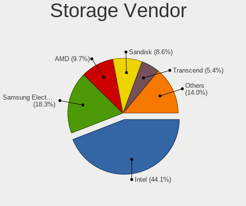
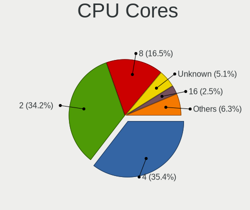
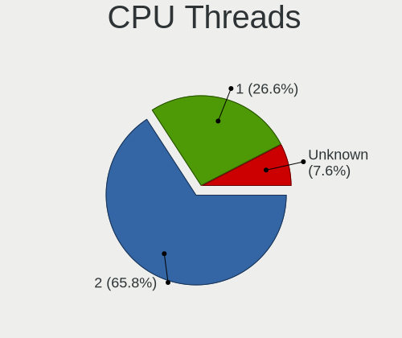
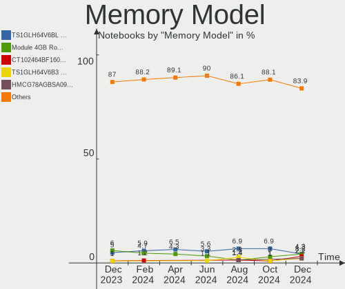

BSD - Hardware Trends (Notebooks)
---------------------------------

A project to identify most popular hardware characteristics and track their change
over time based on data collected by BSD users at https://BSD-Hardware.info.

Anyone can contribute to this report by the [hw-probe](https://github.com/linuxhw/hw-probe/blob/master/INSTALL.BSD.md) tool:

    hw-probe -all -upload

This report is for one last month. Overall report since the beginning of time: [TestDays](https://github.com/bsdhw/TestDays)

Period: Feb, 2023.

Contents
--------

* [ System ](#system)
  - [ OS                       ](#os)
  - [ OS Family                ](#os-family)
  - [ Arch                     ](#arch)
  - [ DE                       ](#de)
  - [ Display Server           ](#display-server)
  - [ Display Manager          ](#display-manager)
  - [ OS Lang                  ](#os-lang)
  - [ Boot Mode                ](#boot-mode)
  - [ Filesystem               ](#filesystem)
  - [ Part. scheme             ](#part-scheme)

* [ Board ](#board)
  - [ Vendor                   ](#vendor)
  - [ Model                    ](#model)
  - [ Model Family             ](#model-family)
  - [ MFG Year                 ](#mfg-year)
  - [ Form Factor              ](#form-factor)
  - [ Coreboot                 ](#coreboot)
  - [ RAM Size                 ](#ram-size)
  - [ RAM Used                 ](#ram-used)
  - [ Total Drives             ](#total-drives)
  - [ Has CD-ROM               ](#has-cd-rom)
  - [ Has Ethernet             ](#has-ethernet)
  - [ Has WiFi                 ](#has-wifi)
  - [ Has Bluetooth            ](#has-bluetooth)

* [ Location ](#location)
  - [ Country                  ](#country)
  - [ City                     ](#city)

* [ Drives ](#drives)
  - [ Drive Vendor             ](#drive-vendor)
  - [ Drive Model              ](#drive-model)
  - [ HDD Vendor               ](#hdd-vendor)
  - [ SSD Vendor               ](#ssd-vendor)
  - [ Drive Kind               ](#drive-kind)
  - [ Drive Connector          ](#drive-connector)
  - [ Drive Size               ](#drive-size)
  - [ Space Total              ](#space-total)
  - [ Space Used               ](#space-used)
  - [ Malfunc. Drives          ](#malfunc-drives)
  - [ Malfunc. Drive Vendor    ](#malfunc-drive-vendor)
  - [ Malfunc. HDD Vendor      ](#malfunc-hdd-vendor)
  - [ Malfunc. Drive Kind      ](#malfunc-drive-kind)
  - [ Failed Drives            ](#failed-drives)
  - [ Failed Drive Vendor      ](#failed-drive-vendor)
  - [ Drive Status             ](#drive-status)

* [ Storage controller ](#storage-controller)
  - [ Storage Vendor           ](#storage-vendor)
  - [ Storage Model            ](#storage-model)
  - [ Storage Kind             ](#storage-kind)

* [ Processor ](#processor)
  - [ CPU Vendor               ](#cpu-vendor)
  - [ CPU Model                ](#cpu-model)
  - [ CPU Model Family         ](#cpu-model-family)
  - [ CPU Cores                ](#cpu-cores)
  - [ CPU Sockets              ](#cpu-sockets)
  - [ CPU Threads              ](#cpu-threads)
  - [ CPU Microarch            ](#cpu-microarch)

* [ Graphics ](#graphics)
  - [ GPU Vendor               ](#gpu-vendor)
  - [ GPU Model                ](#gpu-model)
  - [ GPU Combo                ](#gpu-combo)
  - [ GPU Driver               ](#gpu-driver)
  - [ GPU Memory               ](#gpu-memory)

* [ Monitor ](#monitor)
  - [ Monitor Vendor           ](#monitor-vendor)
  - [ Monitor Model            ](#monitor-model)
  - [ Monitor Resolution       ](#monitor-resolution)
  - [ Monitor Diagonal         ](#monitor-diagonal)
  - [ Monitor Width            ](#monitor-width)
  - [ Aspect Ratio             ](#aspect-ratio)
  - [ Monitor Area             ](#monitor-area)
  - [ Pixel Density            ](#pixel-density)
  - [ Multiple Monitors        ](#multiple-monitors)

* [ Network ](#network)
  - [ Net Controller Vendor    ](#net-controller-vendor)
  - [ Net Controller Model     ](#net-controller-model)
  - [ Wireless Vendor          ](#wireless-vendor)
  - [ Wireless Model           ](#wireless-model)
  - [ Ethernet Vendor          ](#ethernet-vendor)
  - [ Ethernet Model           ](#ethernet-model)
  - [ Net Controller Kind      ](#net-controller-kind)
  - [ Used Controller          ](#used-controller)
  - [ NICs                     ](#nics)
  - [ IPv6                     ](#ipv6)

* [ Bluetooth ](#bluetooth)
  - [ Bluetooth Vendor         ](#bluetooth-vendor)
  - [ Bluetooth Model          ](#bluetooth-model)

* [ Sound ](#sound)
  - [ Sound Vendor             ](#sound-vendor)
  - [ Sound Model              ](#sound-model)

* [ Memory ](#memory)
  - [ Memory Vendor            ](#memory-vendor)
  - [ Memory Model             ](#memory-model)
  - [ Memory Kind              ](#memory-kind)
  - [ Memory Form Factor       ](#memory-form-factor)
  - [ Memory Size              ](#memory-size)
  - [ Memory Speed             ](#memory-speed)

* [ Printers & scanners ](#printers--scanners)
  - [ Printer Vendor           ](#printer-vendor)
  - [ Printer Model            ](#printer-model)
  - [ Scanner Vendor           ](#scanner-vendor)
  - [ Scanner Model            ](#scanner-model)

* [ Camera ](#camera)
  - [ Camera Vendor            ](#camera-vendor)
  - [ Camera Model             ](#camera-model)

* [ Security ](#security)
  - [ Fingerprint Vendor       ](#fingerprint-vendor)
  - [ Fingerprint Model        ](#fingerprint-model)
  - [ Chipcard Vendor          ](#chipcard-vendor)
  - [ Chipcard Model           ](#chipcard-model)

* [ Unsupported ](#unsupported)
  - [ Unsupported Devices      ](#unsupported-devices)
  - [ Unsupported Device Types ](#unsupported-device-types)

System
------

OS
--

Installed operating systems

| Name                    | Notebooks | Percent |
|-------------------------|-----------|---------|
| helloSystem 0.8.0       | 40        | 37.38%  |
| FreeBSD 13.1            | 9         | 8.41%   |
| OPNsense 23.1           | 6         | 5.61%   |
| FreeBSD 13.1-p5         | 6         | 5.61%   |
| OPNsense 23.1.1         | 5         | 4.67%   |
| OpenBSD 7.2             | 5         | 4.67%   |
| helloSystem 0.8.1       | 5         | 4.67%   |
| GhostBSD 23.02.02       | 4         | 3.74%   |
| FreeBSD 13.1-STABLE     | 4         | 3.74%   |
| NomadBSD 20221130       | 3         | 2.8%    |
| FreeBSD 13.1-p6         | 3         | 2.8%    |
| OPNsense 22.10.2        | 2         | 1.87%   |
| helloSystem 0.7.0       | 2         | 1.87%   |
| GhostBSD 22.06.18       | 2         | 1.87%   |
| FreeBSD 13.1-p7         | 2         | 1.87%   |
| OPNsense 22.10.1        | 1         | 0.93%   |
| NetBSD 10.0_BETA        | 1         | 0.93%   |
| MidnightBSD 3.1.0       | 1         | 0.93%   |
| FuryBSD 13.1-p5         | 1         | 0.93%   |
| FreeBSD 14.0-CURRENT    | 1         | 0.93%   |
| FreeBSD 13.2-PRERELEASE | 1         | 0.93%   |
| FreeBSD 13.1-p3         | 1         | 0.93%   |
| FreeBSD 12.3-p1         | 1         | 0.93%   |
| FreeBSD 12.3            | 1         | 0.93%   |

OS Family
---------

OS without a version

| Name        | Notebooks | Percent |
|-------------|-----------|---------|
| helloSystem | 47        | 43.93%  |
| FreeBSD     | 29        | 27.1%   |
| OPNsense    | 14        | 13.08%  |
| GhostBSD    | 6         | 5.61%   |
| OpenBSD     | 5         | 4.67%   |
| NomadBSD    | 3         | 2.8%    |
| NetBSD      | 1         | 0.93%   |
| MidnightBSD | 1         | 0.93%   |
| FuryBSD     | 1         | 0.93%   |

Arch
----

OS architecture (x86_64, i586, etc.)

| Name  | Notebooks | Percent |
|-------|-----------|---------|
| amd64 | 104       | 97.2%   |
| i386  | 3         | 2.8%    |

DE
--

Desktop Environment

| Name          | Notebooks | Percent |
|---------------|-----------|---------|
| helloDesktop  | 50        | 46.73%  |
| Console       | 18        | 16.82%  |
| XFCE          | 16        | 14.95%  |
| MATE          | 8         | 7.48%   |
| KDE5          | 6         | 5.61%   |
| Openbox       | 3         | 2.8%    |
| GNOME         | 2         | 1.87%   |
| Enlightenment | 2         | 1.87%   |
| xinitrc       | 1         | 0.93%   |
| LXQt          | 1         | 0.93%   |

Display Server
--------------

X11 or Wayland

| Name    | Notebooks | Percent |
|---------|-----------|---------|
| X11     | 88        | 82.24%  |
| Console | 18        | 16.82%  |
| Wayland | 1         | 0.93%   |

Display Manager
---------------

SDDM, LightDM, etc.

| Name    | Notebooks | Percent |
|---------|-----------|---------|
| SLiM    | 53        | 49.53%  |
| Console | 27        | 25.23%  |
| LightDM | 14        | 13.08%  |
| SDDM    | 10        | 9.35%   |
| XDM     | 1         | 0.93%   |
| Ly      | 1         | 0.93%   |
| GDM     | 1         | 0.93%   |

OS Lang
-------

Language

| Lang           | Notebooks | Percent |
|----------------|-----------|---------|
| en             | 25        | 23.36%  |
| Unknown        | 23        | 21.5%   |
| C              | 20        | 18.69%  |
| en_US          | 14        | 13.08%  |
| pt             | 5         | 4.67%   |
| de             | 3         | 2.8%    |
| it             | 2         | 1.87%   |
| tr_TR          | 1         | 0.93%   |
| sv             | 1         | 0.93%   |
| pt_BR          | 1         | 0.93%   |
| pl             | 1         | 0.93%   |
| nl             | 1         | 0.93%   |
| lt_LT          | 1         | 0.93%   |
| ko_KR          | 1         | 0.93%   |
| fr             | 1         | 0.93%   |
| es_ES          | 1         | 0.93%   |
| es             | 1         | 0.93%   |
| en_IE.US-ASCII | 1         | 0.93%   |
| en_GB          | 1         | 0.93%   |
| de_DE          | 1         | 0.93%   |
| de_CH          | 1         | 0.93%   |
| cs_CZ          | 1         | 0.93%   |

Boot Mode
---------

EFI or BIOS

| Mode | Notebooks | Percent |
|------|-----------|---------|
| EFI  | 100       | 93.46%  |
| BIOS | 7         | 6.54%   |

Filesystem
----------

Type of filesystem

| Type   | Notebooks | Percent |
|--------|-----------|---------|
| Zfs    | 57        | 53.27%  |
| Cd9660 | 23        | 21.5%   |
| Ufs    | 22        | 20.56%  |
| Ffs    | 5         | 4.67%   |

Part. scheme
------------

Scheme of partitioning

| Type | Notebooks | Percent |
|------|-----------|---------|
| GPT  | 101       | 94.39%  |
| MBR  | 6         | 5.61%   |

Board
-----

Vendor
------

Motherboard manufacturer

| Name                | Notebooks | Percent |
|---------------------|-----------|---------|
| Lenovo              | 40        | 37.38%  |
| Hewlett-Packard     | 17        | 15.89%  |
| ASUSTek Computer    | 8         | 7.48%   |
| Deciso              | 6         | 5.61%   |
| Acer                | 6         | 5.61%   |
| Dell                | 4         | 3.74%   |
| Unknown             | 3         | 2.8%    |
| Toshiba             | 2         | 1.87%   |
| Samsung Electronics | 2         | 1.87%   |
| Notebook            | 2         | 1.87%   |
| Apple               | 2         | 1.87%   |
| TUXEDO              | 1         | 0.93%   |
| Sony                | 1         | 0.93%   |
| SLIMBOOK            | 1         | 0.93%   |
| Shuttle             | 1         | 0.93%   |
| Plaisio             | 1         | 0.93%   |
| Panasonic           | 1         | 0.93%   |
| MSI                 | 1         | 0.93%   |
| Monster             | 1         | 0.93%   |
| MECHREVO S1 Series  | 1         | 0.93%   |
| IGEL Technology     | 1         | 0.93%   |
| Google              | 1         | 0.93%   |
| Gigabyte Technology | 1         | 0.93%   |
| Fujitsu Siemens     | 1         | 0.93%   |
| Framework           | 1         | 0.93%   |
| Alienware           | 1         | 0.93%   |

Model
-----

Motherboard model

| Name                                       | Notebooks | Percent |
|--------------------------------------------|-----------|---------|
| Unknown                                    | 3         | 2.8%    |
| HP Notebook                                | 2         | 1.87%   |
| Deciso OPNsense Appliance                  | 2         | 1.87%   |
| Deciso Netboard A20                        | 2         | 1.87%   |
| TUXEDO InfinityBook Pro 14 Gen6            | 1         | 0.93%   |
| Toshiba PORTEGE Z930                       | 1         | 0.93%   |
| Toshiba dynabook R63/P                     | 1         | 0.93%   |
| Sony SVF1421E4E                            | 1         | 0.93%   |
| SLIMBOOK PROX-AMD5                         | 1         | 0.93%   |
| Shuttle DS437T                             | 1         | 0.93%   |
| Samsung 700T1C                             | 1         | 0.93%   |
| Samsung 270E5K/270E5Q/271E5K/2570EK        | 1         | 0.93%   |
| Plaisio Turbo X                            | 1         | 0.93%   |
| Panasonic CF-30KAPAXAM                     | 1         | 0.93%   |
| Notebook NV4XMB,ME,MZ                      | 1         | 0.93%   |
| Notebook N2x0WU                            | 1         | 0.93%   |
| MSI GF76 12UE                              | 1         | 0.93%   |
| Monster ABRA A7 V11.2                      | 1         | 0.93%   |
| MECHREVO S1 Series S1 Series               | 1         | 0.93%   |
| Lenovo ThinkPad X280 20KFCTO1WW            | 1         | 0.93%   |
| Lenovo ThinkPad X1 Carbon Gen 9 20XXS5J00X | 1         | 0.93%   |
| Lenovo ThinkPad X1 Carbon 7th 20QES53R00   | 1         | 0.93%   |
| Lenovo ThinkPad X1 Carbon 6th 20KGS6J30W   | 1         | 0.93%   |
| Lenovo ThinkPad X1 Carbon 3448AWU          | 1         | 0.93%   |
| Lenovo ThinkPad X1 Carbon 2nd 20A7002FUS   | 1         | 0.93%   |
| Lenovo ThinkPad W520 42844DG               | 1         | 0.93%   |
| Lenovo ThinkPad W520 427638U               | 1         | 0.93%   |
| Lenovo ThinkPad T61p 6457UN2               | 1         | 0.93%   |
| Lenovo ThinkPad T530 24297XG               | 1         | 0.93%   |
| Lenovo ThinkPad T520 4243F39               | 1         | 0.93%   |
| Lenovo ThinkPad T480s 20L7002CUS           | 1         | 0.93%   |
| Lenovo ThinkPad T460p 20FW0018AD           | 1         | 0.93%   |
| Lenovo ThinkPad T460 20FMS3320G            | 1         | 0.93%   |
| Lenovo ThinkPad T460 20FMS06V00            | 1         | 0.93%   |
| Lenovo ThinkPad T460 20FMS04200            | 1         | 0.93%   |
| Lenovo ThinkPad T440s 20AQ005SUS           | 1         | 0.93%   |
| Lenovo ThinkPad T440 20B60061MB            | 1         | 0.93%   |
| Lenovo ThinkPad T430u 33522D5              | 1         | 0.93%   |
| Lenovo ThinkPad T430 2349S31               | 1         | 0.93%   |
| Lenovo ThinkPad T430 2347FV6               | 1         | 0.93%   |

Model Family
------------

Motherboard model prefix

| Name                   | Notebooks | Percent |
|------------------------|-----------|---------|
| Lenovo ThinkPad        | 31        | 28.97%  |
| Lenovo IdeaPad         | 6         | 5.61%   |
| Acer Aspire            | 6         | 5.61%   |
| Dell Inspiron          | 3         | 2.8%    |
| Unknown                | 3         | 2.8%    |
| HP Victus              | 2         | 1.87%   |
| HP Pavilion            | 2         | 1.87%   |
| HP Notebook            | 2         | 1.87%   |
| HP EliteBook           | 2         | 1.87%   |
| Deciso OPNsense        | 2         | 1.87%   |
| Deciso Netboard        | 2         | 1.87%   |
| ASUS VivoBook          | 2         | 1.87%   |
| ASUS ASUS              | 2         | 1.87%   |
| TUXEDO InfinityBook    | 1         | 0.93%   |
| Toshiba PORTEGE        | 1         | 0.93%   |
| Toshiba dynabook       | 1         | 0.93%   |
| Sony SVF1421E4E        | 1         | 0.93%   |
| SLIMBOOK PROX-AMD5     | 1         | 0.93%   |
| Shuttle DS437T         | 1         | 0.93%   |
| Samsung 700T1C         | 1         | 0.93%   |
| Samsung 270E5K         | 1         | 0.93%   |
| Plaisio Turbo          | 1         | 0.93%   |
| Panasonic CF-30KAPAXAM | 1         | 0.93%   |
| Notebook NV4XMB        | 1         | 0.93%   |
| Notebook N2x0WU        | 1         | 0.93%   |
| MSI GF76               | 1         | 0.93%   |
| Monster ABRA           | 1         | 0.93%   |
| MECHREVO S1 Series S1  | 1         | 0.93%   |
| Lenovo G70-70          | 1         | 0.93%   |
| Lenovo G400s           | 1         | 0.93%   |
| Lenovo B50-80          | 1         | 0.93%   |
| IGEL H830C             | 1         | 0.93%   |
| HP ZBook               | 1         | 0.93%   |
| HP ProBook             | 1         | 0.93%   |
| HP OMEN                | 1         | 0.93%   |
| HP Mini                | 1         | 0.93%   |
| HP Laptop              | 1         | 0.93%   |
| HP ENVY                | 1         | 0.93%   |
| HP 650                 | 1         | 0.93%   |
| HP 240                 | 1         | 0.93%   |

MFG Year
--------

Motherboard manufacture year

| Year    | Notebooks | Percent |
|---------|-----------|---------|
| 2022    | 17        | 15.89%  |
| 2021    | 14        | 13.08%  |
| 2016    | 11        | 10.28%  |
| 2013    | 11        | 10.28%  |
| 2018    | 9         | 8.41%   |
| 2014    | 7         | 6.54%   |
| 2020    | 6         | 5.61%   |
| 2012    | 6         | 5.61%   |
| 2017    | 5         | 4.67%   |
| 2019    | 4         | 3.74%   |
| 2011    | 4         | 3.74%   |
| 2009    | 4         | 3.74%   |
| 2015    | 3         | 2.8%    |
| 2010    | 2         | 1.87%   |
| 2023    | 1         | 0.93%   |
| 2007    | 1         | 0.93%   |
| 2006    | 1         | 0.93%   |
| Unknown | 1         | 0.93%   |

Form Factor
-----------

Physical design of the computer

| Name     | Notebooks | Percent |
|----------|-----------|---------|
| Notebook | 107       | 100%    |

Coreboot
--------

Have coreboot on board

| Used | Notebooks | Percent |
|------|-----------|---------|
| No   | 106       | 99.07%  |
| Yes  | 1         | 0.93%   |

RAM Size
--------

Total RAM memory

| Size in GB  | Notebooks | Percent |
|-------------|-----------|---------|
| 8.01-16.0   | 38        | 35.51%  |
| 16.01-24.0  | 28        | 26.17%  |
| 4.01-8.0    | 22        | 20.56%  |
| 32.01-64.0  | 7         | 6.54%   |
| 24.01-32.0  | 3         | 2.8%    |
| 2.01-3.0    | 3         | 2.8%    |
| 64.01-256.0 | 3         | 2.8%    |
| 0.51-1.0    | 2         | 1.87%   |
| 3.01-4.0    | 1         | 0.93%   |

RAM Used
--------

Used RAM memory

| Used GB  | Notebooks | Percent |
|----------|-----------|---------|
| 0.01-0.5 | 52        | 48.6%   |
| 0.51-1.0 | 37        | 34.58%  |
| 1.01-2.0 | 15        | 14.02%  |
| 2.01-3.0 | 2         | 1.87%   |
| Unknown  | 1         | 0.93%   |

Total Drives
------------

Number of drives on board

| Drives | Notebooks | Percent |
|--------|-----------|---------|
| 1      | 76        | 71.03%  |
| 2      | 21        | 19.63%  |
| 0      | 7         | 6.54%   |
| 3      | 3         | 2.8%    |

Has CD-ROM
----------

Has CD-ROM on board

| Presented | Notebooks | Percent |
|-----------|-----------|---------|
| No        | 83        | 77.57%  |
| Yes       | 24        | 22.43%  |

Has Ethernet
------------

Has Ethernet on board

| Presented | Notebooks | Percent |
|-----------|-----------|---------|
| Yes       | 92        | 85.98%  |
| No        | 15        | 14.02%  |

Has WiFi
--------

Has WiFi module

| Presented | Notebooks | Percent |
|-----------|-----------|---------|
| Yes       | 98        | 91.59%  |
| No        | 9         | 8.41%   |

Has Bluetooth
-------------

Has Bluetooth module

| Presented | Notebooks | Percent |
|-----------|-----------|---------|
| Yes       | 71        | 66.36%  |
| No        | 36        | 33.64%  |

Location
--------

Country
-------

Geographic location (country)

| Country      | Notebooks | Percent |
|--------------|-----------|---------|
| USA          | 18        | 16.82%  |
| Germany      | 11        | 10.28%  |
| Indonesia    | 6         | 5.61%   |
| Brazil       | 6         | 5.61%   |
| UK           | 5         | 4.67%   |
| France       | 5         | 4.67%   |
| Netherlands  | 4         | 3.74%   |
| China        | 4         | 3.74%   |
| Sweden       | 3         | 2.8%    |
| Spain        | 3         | 2.8%    |
| Romania      | 3         | 2.8%    |
| Hungary      | 3         | 2.8%    |
| Czechia      | 3         | 2.8%    |
| Bulgaria     | 3         | 2.8%    |
| Belgium      | 3         | 2.8%    |
| Switzerland  | 2         | 1.87%   |
| Russia       | 2         | 1.87%   |
| Poland       | 2         | 1.87%   |
| Mauritius    | 2         | 1.87%   |
| Italy        | 2         | 1.87%   |
| Greece       | 2         | 1.87%   |
| Canada       | 2         | 1.87%   |
| Vietnam      | 1         | 0.93%   |
| Turkey       | 1         | 0.93%   |
| Sri Lanka    | 1         | 0.93%   |
| South Korea  | 1         | 0.93%   |
| Saudi Arabia | 1         | 0.93%   |
| Mexico       | 1         | 0.93%   |
| Malaysia     | 1         | 0.93%   |
| Lithuania    | 1         | 0.93%   |
| Ireland      | 1         | 0.93%   |
| India        | 1         | 0.93%   |
| Chile        | 1         | 0.93%   |
| Austria      | 1         | 0.93%   |
| Australia    | 1         | 0.93%   |

City
----

Geographic location (city)

| City             | Notebooks | Percent |
|------------------|-----------|---------|
| Jakarta          | 3         | 2.8%    |
| Munich           | 2         | 1.87%   |
| Moscow           | 2         | 1.87%   |
| Marcq-en-Baroeul | 2         | 1.87%   |
| Hangzhou         | 2         | 1.87%   |
| Berlin           | 2         | 1.87%   |
| Zwolle           | 1         | 0.93%   |
| Zurich           | 1         | 0.93%   |
| Ypsilanti        | 1         | 0.93%   |
| Wroclaw          | 1         | 0.93%   |
| Wappingers Falls | 1         | 0.93%   |
| Vilnius          | 1         | 0.93%   |
| Villapresente    | 1         | 0.93%   |
| Vigonza          | 1         | 0.93%   |
| Vienna           | 1         | 0.93%   |
| Varna            | 1         | 0.93%   |
| Varekil          | 1         | 0.93%   |
| Valencia         | 1         | 0.93%   |
| Uiwang-si        | 1         | 0.93%   |
| Toronto          | 1         | 0.93%   |
| Timișoara       | 1         | 0.93%   |
| Tielt            | 1         | 0.93%   |
| Szentistvan      | 1         | 0.93%   |
| Stockholm        | 1         | 0.93%   |
| Sofia            | 1         | 0.93%   |
| Shenzhen         | 1         | 0.93%   |
| Seville          | 1         | 0.93%   |
| Semarang         | 1         | 0.93%   |
| Saskatoon        | 1         | 0.93%   |
| Santiago         | 1         | 0.93%   |
| Ruislip          | 1         | 0.93%   |
| Rosny-sous-Bois  | 1         | 0.93%   |
| Rockville        | 1         | 0.93%   |
| Riyadh           | 1         | 0.93%   |
| Rathmore         | 1         | 0.93%   |
| Qiqihar          | 1         | 0.93%   |
| Puebla City      | 1         | 0.93%   |
| Prague           | 1         | 0.93%   |
| Plymouth         | 1         | 0.93%   |
| Pflugerville     | 1         | 0.93%   |

Drives
------

Drive Vendor
------------

Hard drive vendors

| Vendor              | Notebooks | Drives | Percent |
|---------------------|-----------|--------|---------|
| Samsung Electronics | 19        | 21     | 15.83%  |
| Kingston            | 15        | 16     | 12.5%   |
| WDC                 | 10        | 11     | 8.33%   |
| Toshiba             | 9         | 10     | 7.5%    |
| Transcend           | 7         | 7      | 5.83%   |
| Crucial             | 7         | 7      | 5.83%   |
| Seagate             | 6         | 6      | 5%      |
| SanDisk             | 6         | 6      | 5%      |
| Intel               | 4         | 4      | 3.33%   |
| A-DATA Technology   | 4         | 5      | 3.33%   |
| Micron Technology   | 3         | 3      | 2.5%    |
| Hitachi             | 3         | 4      | 2.5%    |
| HGST                | 3         | 3      | 2.5%    |
| Gigabyte Technology | 3         | 3      | 2.5%    |
| Silicon Motion      | 2         | 2      | 1.67%   |
| NVMe                | 2         | 2      | 1.67%   |
| Apple               | 2         | 2      | 1.67%   |
| XUM                 | 1         | 1      | 0.83%   |
| XPG                 | 1         | 1      | 0.83%   |
| Verbatim            | 1         | 1      | 0.83%   |
| UMIS                | 1         | 1      | 0.83%   |
| SSSTC               | 1         | 1      | 0.83%   |
| SPCC                | 1         | 1      | 0.83%   |
| SK hynix            | 1         | 1      | 0.83%   |
| OCZ                 | 1         | 1      | 0.83%   |
| MyDigitalSSD        | 1         | 1      | 0.83%   |
| LITEON              | 1         | 1      | 0.83%   |
| KingSpec            | 1         | 1      | 0.83%   |
| Intenso             | 1         | 1      | 0.83%   |
| GOODRAM             | 1         | 1      | 0.83%   |
| General             | 1         | 1      | 0.83%   |
| FORESEE             | 1         | 1      | 0.83%   |

Drive Model
-----------

Hard drive models

| Model                                  | Notebooks | Percent |
|----------------------------------------|-----------|---------|
| Transcend TS256GMTS952T2 256GB         | 5         | 4.03%   |
| Kingston SA400S37240G 240GB            | 5         | 4.03%   |
| Toshiba MQ04ABF100 1TB                 | 2         | 1.61%   |
| SanDisk SSD U110 16GB                  | 2         | 1.61%   |
| Samsung SSD 980 1TB                    | 2         | 1.61%   |
| Kingston SNV2S500G 500GB               | 2         | 1.61%   |
| Intel SSDPEKNU512GZ 512GB              | 2         | 1.61%   |
| A-DATA SU630 480GB                     | 2         | 1.61%   |
| XUM HX256GSSDSATA3 256GB               | 1         | 0.81%   |
| XPG GAMMIX S5 1TB                      | 1         | 0.81%   |
| WDC WDS500G2B0A 500GB                  | 1         | 0.81%   |
| WDC WDS250G2B0A-00SM50 250GB           | 1         | 0.81%   |
| WDC WDS100T3X0C-00SJG0 1TB             | 1         | 0.81%   |
| WDC WD7500BPKX-00HPJT0 752GB           | 1         | 0.81%   |
| WDC WD20SDRW-11VUUS0 2TB               | 1         | 0.81%   |
| WDC WD1600BEVT-22ZCT0 160GB            | 1         | 0.81%   |
| WDC WD10SPZX-35Z10T0 1TB               | 1         | 0.81%   |
| WDC WD10SPZX-24Z10 1TB                 | 1         | 0.81%   |
| WDC WD10SPZX-08Z10 1TB                 | 1         | 0.81%   |
| WDC PC SN530 SDBPNPZ-512G-1002 512GB   | 1         | 0.81%   |
| WDC PC SN530 SDBPMPZ-256G-1101 256GB   | 1         | 0.81%   |
| Verbatim Vi550 S3 SSD 512GB            | 1         | 0.81%   |
| UMIS RPJTJ256MED1OWX 256GB             | 1         | 0.81%   |
| Transcend TS256GMTE652T2 256GB         | 1         | 0.81%   |
| Transcend TS128GMTS400S 128GB          | 1         | 0.81%   |
| Toshiba THNSNJ256GMCY 256GB            | 1         | 0.81%   |
| Toshiba MQ01ACF050 500GB               | 1         | 0.81%   |
| Toshiba MQ01ABF050 500GB               | 1         | 0.81%   |
| Toshiba MQ01ABD100 1TB                 | 1         | 0.81%   |
| Toshiba MK5065GSXF 500GB               | 1         | 0.81%   |
| Toshiba KXG50ZNV512G NVMe 512GB        | 1         | 0.81%   |
| Toshiba KXG50ZNV1T02 NVMe 1024GB       | 1         | 0.81%   |
| SSSTC CL1-4D256 256GB                  | 1         | 0.81%   |
| SPCC Solid State Disk 128GB            | 1         | 0.81%   |
| SK hynix SKHynix_HFS001TDE9X081N 1TB   | 1         | 0.81%   |
| Silicon Motion AAR240GS112620030 240GB | 1         | 0.81%   |
| Silicon Motion 512GB                   | 1         | 0.81%   |
| Seagate ST9500420AS 500GB              | 1         | 0.81%   |
| Seagate ST9500325AS 500GB              | 1         | 0.81%   |
| Seagate ST9320325AS 320GB              | 1         | 0.81%   |

HDD Vendor
----------

Hard disk drive vendors

| Vendor  | Notebooks | Drives | Percent |
|---------|-----------|--------|---------|
| WDC     | 6         | 6      | 22.22%  |
| Toshiba | 6         | 6      | 22.22%  |
| Seagate | 6         | 6      | 22.22%  |
| Hitachi | 3         | 4      | 11.11%  |
| HGST    | 3         | 3      | 11.11%  |
| NVMe    | 2         | 2      | 7.41%   |
| General | 1         | 1      | 3.7%    |

SSD Vendor
----------

Solid state drive vendors

| Vendor              | Notebooks | Drives | Percent |
|---------------------|-----------|--------|---------|
| Kingston            | 13        | 13     | 21.67%  |
| Samsung Electronics | 10        | 10     | 16.67%  |
| Transcend           | 6         | 6      | 10%     |
| SanDisk             | 6         | 6      | 10%     |
| Crucial             | 4         | 4      | 6.67%   |
| WDC                 | 2         | 2      | 3.33%   |
| Intel               | 2         | 2      | 3.33%   |
| Gigabyte Technology | 2         | 2      | 3.33%   |
| Apple               | 2         | 2      | 3.33%   |
| A-DATA Technology   | 2         | 2      | 3.33%   |
| XUM                 | 1         | 1      | 1.67%   |
| Verbatim            | 1         | 1      | 1.67%   |
| Toshiba             | 1         | 1      | 1.67%   |
| SPCC                | 1         | 1      | 1.67%   |
| Silicon Motion      | 1         | 1      | 1.67%   |
| OCZ                 | 1         | 1      | 1.67%   |
| MyDigitalSSD        | 1         | 1      | 1.67%   |
| LITEON              | 1         | 1      | 1.67%   |
| KingSpec            | 1         | 1      | 1.67%   |
| Intenso             | 1         | 1      | 1.67%   |
| GOODRAM             | 1         | 1      | 1.67%   |

Drive Kind
----------

HDD or SSD

| Kind | Notebooks | Drives | Percent |
|------|-----------|--------|---------|
| SSD  | 54        | 60     | 47.79%  |
| NVMe | 32        | 39     | 28.32%  |
| HDD  | 27        | 28     | 23.89%  |

Drive Connector
---------------

SATA, SAS, NVMe, etc.

| Type | Notebooks | Drives | Percent |
|------|-----------|--------|---------|
| SATA | 76        | 88     | 70.37%  |
| NVMe | 32        | 39     | 29.63%  |

Drive Size
----------

Size of hard drive

| Size in TB | Notebooks | Drives | Percent |
|------------|-----------|--------|---------|
| 0.01-0.5   | 62        | 71     | 78.48%  |
| 0.51-1.0   | 14        | 14     | 17.72%  |
| 1.01-2.0   | 3         | 3      | 3.8%    |

Space Total
-----------

Amount of disk space available on the file system

| Size in GB | Notebooks | Percent |
|------------|-----------|---------|
| 101-250    | 36        | 33.64%  |
| 251-500    | 27        | 25.23%  |
| 1-20       | 24        | 22.43%  |
| 501-1000   | 8         | 7.48%   |
| 51-100     | 7         | 6.54%   |
| 21-50      | 3         | 2.8%    |
| 1001-2000  | 1         | 0.93%   |
| Unknown    | 1         | 0.93%   |

Space Used
----------

Amount of used disk space

| Used GB | Notebooks | Percent |
|---------|-----------|---------|
| 1-20    | 95        | 88.79%  |
| 21-50   | 5         | 4.67%   |
| 101-250 | 3         | 2.8%    |
| 51-100  | 3         | 2.8%    |
| Unknown | 1         | 0.93%   |

Malfunc. Drives
---------------

Drive models with a malfunction

| Model                                 | Notebooks | Drives | Percent |
|---------------------------------------|-----------|--------|---------|
| Kingston SA400S37240G 240GB           | 2         | 2      | 12.5%   |
| Toshiba MQ04ABF100 1TB                | 1         | 1      | 6.25%   |
| Toshiba MQ01ABD100 1TB                | 1         | 1      | 6.25%   |
| Seagate ST9500420AS 500GB             | 1         | 1      | 6.25%   |
| Seagate ST9500325AS 500GB             | 1         | 1      | 6.25%   |
| Seagate ST9250410AS 250GB             | 1         | 1      | 6.25%   |
| Seagate ST9160412AS 160GB             | 1         | 1      | 6.25%   |
| SanDisk SSD PLUS 240GB                | 1         | 1      | 6.25%   |
| Samsung Electronics SSD 870 EVO 500GB | 1         | 1      | 6.25%   |
| Kingston SV300S37A240G 240GB          | 1         | 1      | 6.25%   |
| Kingston SUV400S37240G 240GB          | 1         | 1      | 6.25%   |
| Hitachi HTS545050B9A300 500GB         | 1         | 2      | 6.25%   |
| Hitachi HTS545050A7E380 500GB         | 1         | 1      | 6.25%   |
| HGST HTS725050A7E630 500GB            | 1         | 1      | 6.25%   |
| HGST HTS721010A9E630 1TB              | 1         | 1      | 6.25%   |

Malfunc. Drive Vendor
---------------------

Vendors of faulty drives

| Vendor              | Notebooks | Drives | Percent |
|---------------------|-----------|--------|---------|
| Seagate             | 4         | 4      | 25%     |
| Kingston            | 4         | 4      | 25%     |
| Toshiba             | 2         | 2      | 12.5%   |
| Hitachi             | 2         | 3      | 12.5%   |
| HGST                | 2         | 2      | 12.5%   |
| SanDisk             | 1         | 1      | 6.25%   |
| Samsung Electronics | 1         | 1      | 6.25%   |

Malfunc. HDD Vendor
-------------------

Vendors of faulty HDD drives

| Vendor  | Notebooks | Drives | Percent |
|---------|-----------|--------|---------|
| Seagate | 4         | 4      | 40%     |
| Toshiba | 2         | 2      | 20%     |
| Hitachi | 2         | 3      | 20%     |
| HGST    | 2         | 2      | 20%     |

Malfunc. Drive Kind
-------------------

Kinds of faulty drives

| Kind | Notebooks | Drives | Percent |
|------|-----------|--------|---------|
| HDD  | 10        | 11     | 62.5%   |
| SSD  | 6         | 6      | 37.5%   |

Failed Drives
-------------

Failed drive models

| Model             | Notebooks | Drives | Percent |
|-------------------|-----------|--------|---------|
| SanDisk pSSD 32GB | 1         | 1      | 100%    |

Failed Drive Vendor
-------------------

Failed drive vendors

| Vendor  | Notebooks | Drives | Percent |
|---------|-----------|--------|---------|
| SanDisk | 1         | 1      | 100%    |

Drive Status
------------

Number of failed and malfunc. drives

| Status   | Notebooks | Drives | Percent |
|----------|-----------|--------|---------|
| Works    | 86        | 107    | 81.9%   |
| Malfunc  | 16        | 17     | 15.24%  |
| Detected | 2         | 2      | 1.9%    |
| Failed   | 1         | 1      | 0.95%   |

Storage controller
------------------

Storage Vendor
--------------

Storage controller vendors

| Vendor                                  | Notebooks | Percent |
|-----------------------------------------|-----------|---------|
| Intel                                   | 75        | 60%     |
| Samsung Electronics                     | 11        | 8.8%    |
| AMD                                     | 8         | 6.4%    |
| SanDisk                                 | 7         | 5.6%    |
| Micron/Crucial Technology               | 3         | 2.4%    |
| Micron Technology                       | 3         | 2.4%    |
| Marvell Technology Group                | 3         | 2.4%    |
| Kingston Technology Company             | 3         | 2.4%    |
| ADATA Technology                        | 3         | 2.4%    |
| Transcend                               | 1         | 0.8%    |
| Toshiba                                 | 1         | 0.8%    |
| Solid State Storage Technology          | 1         | 0.8%    |
| SK hynix                                | 1         | 0.8%    |
| Silicon Motion                          | 1         | 0.8%    |
| Silicon Integrated Systems [SiS]        | 1         | 0.8%    |
| Shenzhen Unionmemory Information System | 1         | 0.8%    |
| Phison Electronics                      | 1         | 0.8%    |
| Nvidia                                  | 1         | 0.8%    |

Storage Model
-------------

Storage controller models

| Model                                                                         | Notebooks | Percent |
|-------------------------------------------------------------------------------|-----------|---------|
| Intel 7 Series Chipset Family 6-port SATA Controller [AHCI mode]              | 14        | 10.45%  |
| Unknown                                                                       | 10        | 7.46%   |
| Intel Sunrise Point-LP SATA Controller [AHCI mode]                            | 9         | 6.72%   |
| AMD FCH SATA Controller [AHCI mode]                                           | 8         | 5.97%   |
| Intel 8 Series SATA Controller 1 [AHCI mode]                                  | 7         | 5.22%   |
| Intel Wildcat Point-LP SATA Controller [AHCI Mode]                            | 6         | 4.48%   |
| Samsung NVMe SSD Controller SM981/PM981/PM983                                 | 4         | 2.99%   |
| Samsung NVMe SSD Controller 980                                               | 4         | 2.99%   |
| Intel 6 Series/C200 Series Chipset Family 6 port Mobile SATA AHCI Controller  | 4         | 2.99%   |
| Intel Volume Management Device NVMe RAID Controller                           | 3         | 2.24%   |
| Intel Tiger Lake-LP SATA Controller                                           | 3         | 2.24%   |
| Intel Q170/Q150/B150/H170/H110/Z170/CM236 Chipset SATA Controller [AHCI Mode] | 3         | 2.24%   |
| Intel Comet Lake SATA AHCI Controller                                         | 3         | 2.24%   |
| SanDisk WD PC SN810 / Black SN850 NVMe SSD                                    | 2         | 1.49%   |
| SanDisk WD Black SN750 / PC SN730 NVMe SSD                                    | 2         | 1.49%   |
| Samsung NVMe SSD Controller PM9A1/PM9A3/980PRO                                | 2         | 1.49%   |
| Micron/Crucial P2 NVMe PCIe SSD                                               | 2         | 1.49%   |
| Intel HM170/QM170 Chipset SATA Controller [AHCI Mode]                         | 2         | 1.49%   |
| Intel Celeron/Pentium Silver Processor SATA Controller                        | 2         | 1.49%   |
| Intel Atom Processor E3800 Series SATA AHCI Controller                        | 2         | 1.49%   |
| Intel 82801IBM/IEM (ICH9M/ICH9M-E) 4 port SATA Controller [AHCI mode]         | 2         | 1.49%   |
| Intel 82801 Mobile SATA Controller [RAID mode]                                | 2         | 1.49%   |
| Intel 5 Series/3400 Series Chipset 4 port SATA AHCI Controller                | 2         | 1.49%   |
| Toshiba XG5 NVMe SSD Controller                                               | 1         | 0.75%   |
| SK hynix Gold P31/PC711 NVMe Solid State Drive                                | 1         | 0.75%   |
| Silicon Motion SM2263EN/SM2263XT SSD Controller                               | 1         | 0.75%   |
| Silicon Integrated Systems [SiS] SATA Controller / IDE mode                   | 1         | 0.75%   |
| Silicon Integrated Systems [SiS] 5513 IDE Controller                          | 1         | 0.75%   |
| SanDisk WD Blue SN550 NVMe SSD                                                | 1         | 0.75%   |
| Sandisk unknown                                                               | 1         | 0.75%   |
| SanDisk PC SN530                                                              | 1         | 0.75%   |
| Samsung NVMe SSD Controller SM951/PM951                                       | 1         | 0.75%   |
| Samsung Apple PCIe SSD                                                        | 1         | 0.75%   |
| Phison PS5013 E13 NVMe Controller                                             | 1         | 0.75%   |
| Nvidia MCP79 SATA Controller                                                  | 1         | 0.75%   |
| Micron/Crucial P1 NVMe PCIe SSD                                               | 1         | 0.75%   |
| Micron unknown                                                                | 1         | 0.75%   |
| Marvell Group 88SS9183 PCIe SSD Controller                                    | 1         | 0.75%   |
| Marvell Group 88SE6101/6102 single-port PATA133 interface                     | 1         | 0.75%   |
| Kingston Company A2000 NVMe SSD                                               | 1         | 0.75%   |

Storage Kind
------------

Kind of storage controller (IDE, SATA, NVMe, SAS, ...)

| Kind | Notebooks | Percent |
|------|-----------|---------|
| SATA | 79        | 62.7%   |
| NVMe | 34        | 26.98%  |
| IDE  | 8         | 6.35%   |
| RAID | 5         | 3.97%   |

Processor
---------

CPU Vendor
----------

Processor vendors

| Vendor | Notebooks | Percent |
|--------|-----------|---------|
| Intel  | 94        | 87.85%  |
| AMD    | 13        | 12.15%  |

CPU Model
---------

Processor models

| Model                                   | Notebooks | Percent |
|-----------------------------------------|-----------|---------|
| Intel Core i5-5200U CPU @ 2.20GHz       | 4         | 3.74%   |
| Intel Core i5-6300U CPU @ 2.40GHz       | 3         | 2.8%    |
| Intel Core i5-4200U CPU @ 1.60GHz       | 3         | 2.8%    |
| Intel 12th Gen Core i7-12700H           | 3         | 2.8%    |
| AMD EPYC 3201 8-Core Processor          | 3         | 2.8%    |
| Intel Core i7-7500U CPU @ 2.70GHz       | 2         | 1.87%   |
| Intel Core i7-2630QM CPU @ 2.00GHz      | 2         | 1.87%   |
| Intel Core i5-10210U CPU @ 1.60GHz      | 2         | 1.87%   |
| Intel Core i3-7100U CPU @ 2.40GHz       | 2         | 1.87%   |
| Intel Core i3-4005U CPU @ 1.70GHz       | 2         | 1.87%   |
| Intel Core i3-2328M CPU @ 2.20GHz       | 2         | 1.87%   |
| Intel Celeron CPU 1037U @ 1.80GHz       | 2         | 1.87%   |
| Intel 11th Gen Core i7-1165G7 @ 2.80GHz | 2         | 1.87%   |
| Intel 11th Gen Core i7-11370H @ 3.30GHz | 2         | 1.87%   |
| AMD EPYC 3101 4-Core Processor          | 2         | 1.87%   |
| Intel Xeon CPU E3-1505M v5 @ 2.80GHz    | 1         | 0.93%   |
| Intel Unknown                           | 1         | 0.93%   |
| Intel Pentium CPU P6200 @ 2.13GHz       | 1         | 0.93%   |
| Intel Pentium CPU N3710 @ 1.60GHz       | 1         | 0.93%   |
| Intel Pentium CPU G2020 @ 2.90GHz       | 1         | 0.93%   |
| Intel Pentium CPU 987 @ 1.50GHz         | 1         | 0.93%   |
| Intel Pentium CPU 6405U @ 2.40GHz       | 1         | 0.93%   |
| Intel Pentium 3556U @ 1.70GHz           | 1         | 0.93%   |
| Intel CPU Version                       | 1         | 0.93%   |
| Intel Core i7-8850H CPU @ 2.60GHz       | 1         | 0.93%   |
| Intel Core i7-8750H CPU @ 2.20GHz       | 1         | 0.93%   |
| Intel Core i7-8650U CPU @ 1.90GHz       | 1         | 0.93%   |
| Intel Core i7-8550U CPU @ 1.80GHz       | 1         | 0.93%   |
| Intel Core i7-7820HQ CPU @ 2.90GHz      | 1         | 0.93%   |
| Intel Core i7-6820HQ CPU @ 2.70GHz      | 1         | 0.93%   |
| Intel Core i7-6700HQ CPU @ 2.60GHz      | 1         | 0.93%   |
| Intel Core i7-3667U CPU @ 2.00GHz       | 1         | 0.93%   |
| Intel Core i7-3630QM CPU @ 2.40GHz      | 1         | 0.93%   |
| Intel Core i7-3612QM CPU @ 2.10GHz      | 1         | 0.93%   |
| Intel Core i7-3610QM CPU @ 2.30GHz      | 1         | 0.93%   |
| Intel Core i7-3520M CPU @ 2.90GHz       | 1         | 0.93%   |
| Intel Core i7-2720QM CPU @ 2.20GHz      | 1         | 0.93%   |
| Intel Core i7-10750H CPU @ 2.60GHz      | 1         | 0.93%   |
| Intel Core i7 CPU M 640 @ 2.80GHz       | 1         | 0.93%   |
| Intel Core i5-8365U CPU @ 1.60GHz       | 1         | 0.93%   |

CPU Model Family
----------------

Processor model prefix

| Model              | Notebooks | Percent |
|--------------------|-----------|---------|
| Intel Core i5      | 28        | 26.17%  |
| Intel Core i7      | 19        | 17.76%  |
| Other              | 16        | 14.95%  |
| Intel Core i3      | 11        | 10.28%  |
| Intel Celeron      | 7         | 6.54%   |
| Intel Pentium      | 6         | 5.61%   |
| AMD EPYC           | 5         | 4.67%   |
| Intel Atom         | 3         | 2.8%    |
| AMD Ryzen 7        | 3         | 2.8%    |
| Intel Core 2 Duo   | 2         | 1.87%   |
| Intel Xeon         | 1         | 0.93%   |
| Intel Celeron M    | 1         | 0.93%   |
| AMD Ryzen Embedded | 1         | 0.93%   |
| AMD Ryzen 7 PRO    | 1         | 0.93%   |
| AMD Ryzen 5        | 1         | 0.93%   |
| AMD E1             | 1         | 0.93%   |
| AMD A10            | 1         | 0.93%   |

CPU Cores
---------

Number of processor cores

| Number  | Notebooks | Percent |
|---------|-----------|---------|
| 2       | 53        | 49.53%  |
| 4       | 29        | 27.1%   |
| 8       | 6         | 5.61%   |
| 16      | 5         | 4.67%   |
| 6       | 4         | 3.74%   |
| 10      | 3         | 2.8%    |
| 1       | 3         | 2.8%    |
| Unknown | 3         | 2.8%    |
| 12      | 1         | 0.93%   |

CPU Sockets
-----------

Number of sockets

| Number | Notebooks | Percent |
|--------|-----------|---------|
| 1      | 107       | 100%    |

CPU Threads
-----------

Threads per core (Hyper-Threading)

| Number  | Notebooks | Percent |
|---------|-----------|---------|
| 2       | 73        | 68.22%  |
| 1       | 29        | 27.1%   |
| Unknown | 5         | 4.67%   |

CPU Microarch
-------------

Microarchitecture

| Name          | Notebooks | Percent |
|---------------|-----------|---------|
| KabyLake      | 15        | 14.02%  |
| IvyBridge     | 13        | 12.15%  |
| Skylake       | 10        | 9.35%   |
| Haswell       | 9         | 8.41%   |
| SandyBridge   | 8         | 7.48%   |
| Unknown       | 8         | 7.48%   |
| TigerLake     | 7         | 6.54%   |
| Zen           | 6         | 5.61%   |
| Broadwell     | 6         | 5.61%   |
| Westmere      | 3         | 2.8%    |
| Silvermont    | 3         | 2.8%    |
| Penryn        | 3         | 2.8%    |
| Goldmont plus | 3         | 2.8%    |
| Bonnell       | 3         | 2.8%    |
| Zen 3         | 2         | 1.87%   |
| Zen+          | 1         | 0.93%   |
| Zen 2         | 1         | 0.93%   |
| Piledriver    | 1         | 0.93%   |
| P6            | 1         | 0.93%   |
| IceLake       | 1         | 0.93%   |
| Core          | 1         | 0.93%   |
| CometLake     | 1         | 0.93%   |
| Bobcat        | 1         | 0.93%   |

Graphics
--------

GPU Vendor
----------

Vendors of graphics cards

| Vendor                           | Notebooks | Percent |
|----------------------------------|-----------|---------|
| Intel                            | 86        | 69.35%  |
| Nvidia                           | 25        | 20.16%  |
| AMD                              | 12        | 9.68%   |
| Silicon Integrated Systems [SiS] | 1         | 0.81%   |

GPU Model
---------

Graphics card models

| Model                                                                                 | Notebooks | Percent |
|---------------------------------------------------------------------------------------|-----------|---------|
| Intel 3rd Gen Core processor Graphics Controller                                      | 10        | 7.94%   |
| Intel Haswell-ULT Integrated Graphics Controller                                      | 9         | 7.14%   |
| Intel 2nd Generation Core Processor Family Integrated Graphics Controller             | 8         | 6.35%   |
| Intel TigerLake-LP GT2 [Iris Xe Graphics]                                             | 6         | 4.76%   |
| Intel Skylake GT2 [HD Graphics 520]                                                   | 6         | 4.76%   |
| Intel HD Graphics 5500                                                                | 6         | 4.76%   |
| Intel Alder Lake-P Integrated Graphics Controller                                     | 5         | 3.97%   |
| Intel UHD Graphics 620                                                                | 4         | 3.17%   |
| Intel HD Graphics 620                                                                 | 4         | 3.17%   |
| Nvidia GA107M [GeForce RTX 3050 Ti Mobile]                                            | 3         | 2.38%   |
| Intel GeminiLake [UHD Graphics 600]                                                   | 3         | 2.38%   |
| Intel Core Processor Integrated Graphics Controller                                   | 3         | 2.38%   |
| Nvidia TU117M                                                                         | 2         | 1.59%   |
| Nvidia GF117M [GeForce 610M/710M/810M/820M / GT 620M/625M/630M/720M]                  | 2         | 1.59%   |
| Nvidia GA106M [GeForce RTX 3060 Mobile / Max-Q]                                       | 2         | 1.59%   |
| Intel Mobile 945GM/GMS/GME, 943/940GML Express Integrated Graphics Controller         | 2         | 1.59%   |
| Intel HD Graphics 530                                                                 | 2         | 1.59%   |
| Intel CometLake-U GT2 [UHD Graphics]                                                  | 2         | 1.59%   |
| Intel CoffeeLake-H GT2 [UHD Graphics 630]                                             | 2         | 1.59%   |
| Intel Atom Processor Z36xxx/Z37xxx Series Graphics & Display                          | 2         | 1.59%   |
| AMD Topaz XT [Radeon R7 M260/M265 / M340/M360 / M440/M445 / 530/535 / 620/625 Mobile] | 2         | 1.59%   |
| AMD Sun XT [Radeon HD 8670A/8670M/8690M / R5 M330 / M430 / Radeon 520 Mobile]         | 2         | 1.59%   |
| Silicon Integrated Systems [SiS] 771/671 PCIE VGA Display Adapter                     | 1         | 0.79%   |
| Nvidia TU117M [GeForce GTX 1650 Ti Mobile]                                            | 1         | 0.79%   |
| Nvidia TU117M [GeForce GTX 1650 Mobile / Max-Q]                                       | 1         | 0.79%   |
| Nvidia TU117GLM [T550 Laptop GPU]                                                     | 1         | 0.79%   |
| Nvidia TU117GLM [T1200 Laptop GPU]                                                    | 1         | 0.79%   |
| Nvidia GT216M [GeForce GT 240M]                                                       | 1         | 0.79%   |
| Nvidia GP108M [GeForce MX150]                                                         | 1         | 0.79%   |
| Nvidia GP104M [GeForce GTX 1070 Mobile]                                               | 1         | 0.79%   |
| Nvidia GM206GLM [Quadro M2200 Mobile]                                                 | 1         | 0.79%   |
| Nvidia GM107GLM [Quadro M2000M]                                                       | 1         | 0.79%   |
| Nvidia GM107GLM [Quadro M1000M]                                                       | 1         | 0.79%   |
| Nvidia GK107M [GeForce GT 650M]                                                       | 1         | 0.79%   |
| Nvidia GF108M [NVS 5400M]                                                             | 1         | 0.79%   |
| Nvidia GF108M [GeForce GT 540M]                                                       | 1         | 0.79%   |
| Nvidia GF108GLM [Quadro 1000M]                                                        | 1         | 0.79%   |
| Nvidia G84GLM [Quadro FX 570M]                                                        | 1         | 0.79%   |
| Nvidia C79 [GeForce 9400M / ION]                                                      | 1         | 0.79%   |
| Intel Xeon E3-1200 v2/3rd Gen Core processor Graphics Controller                      | 1         | 0.79%   |

GPU Combo
---------

Combinations of graphics cards

| Name           | Notebooks | Percent |
|----------------|-----------|---------|
| 1 x Intel      | 61        | 57.01%  |
| Intel + Nvidia | 17        | 15.89%  |
| Other          | 6         | 5.61%   |
| 1 x Nvidia     | 6         | 5.61%   |
| 1 x AMD        | 6         | 5.61%   |
| 2 x Intel      | 4         | 3.74%   |
| Intel + AMD    | 4         | 3.74%   |
| AMD + Nvidia   | 2         | 1.87%   |
| 1 x SiS        | 1         | 0.93%   |

GPU Driver
----------

Free vs proprietary

| Driver      | Notebooks | Percent |
|-------------|-----------|---------|
| Free        | 86        | 80.37%  |
| Proprietary | 11        | 10.28%  |
| Unknown     | 10        | 9.35%   |

GPU Memory
----------

Total video memory

| Size in GB | Notebooks | Percent |
|------------|-----------|---------|
| Unknown    | 98        | 91.59%  |
| 0.51-1.0   | 3         | 2.8%    |
| 3.01-4.0   | 2         | 1.87%   |
| 0.01-0.5   | 2         | 1.87%   |
| 7.01-8.0   | 1         | 0.93%   |
| 1.01-2.0   | 1         | 0.93%   |

Monitor
-------

Monitor Vendor
--------------

Monitor vendors

| Vendor       | Notebooks | Percent |
|--------------|-----------|---------|
| AU Optronics | 2         | 22.22%  |
| AOC          | 2         | 22.22%  |
| LGD          | 1         | 11.11%  |
| LG Display   | 1         | 11.11%  |
| BenQ         | 1         | 11.11%  |
| Acer         | 1         | 11.11%  |
| Unknown      | 1         | 11.11%  |

Monitor Model
-------------

Monitor models

| Model                                                         | Notebooks | Percent |
|---------------------------------------------------------------|-----------|---------|
| LGD LCD Monitor 7040x1440                                     | 1         | 11.11%  |
| LG Display LCD Monitor LGD04F9 1920x1080 310x170mm 13.9-inch  | 1         | 11.11%  |
| BenQ LCD Monitor EX2710Q                                      | 1         | 11.11%  |
| AU Optronics LCD Monitor AUO32EC 1366x768 340x190mm 15.3-inch | 1         | 11.11%  |
| AU Optronics LCD Monitor 1920x1080                            | 1         | 11.11%  |
| AOC LCD Monitor Q27G2G3R3B 2560x1440                          | 1         | 11.11%  |
| AOC 2752 AOC2752 1920x1080 580x340mm 26.5-inch                | 1         | 11.11%  |
| Acer LCD Monitor VG270U                                       | 1         | 11.11%  |
| Unknown                                                       | 1         | 11.11%  |

Monitor Resolution
------------------

Monitor screen resolution

| Resolution      | Notebooks | Percent |
|-----------------|-----------|---------|
| 1920x1080 (FHD) | 3         | 33.33%  |
| Unknown         | 2         | 22.22%  |
| 9600x2160       | 1         | 11.11%  |
| 7040x1440       | 1         | 11.11%  |
| 2560x1440 (QHD) | 1         | 11.11%  |
| 1366x768 (WXGA) | 1         | 11.11%  |

Monitor Diagonal
----------------

Diagonal size in inches

| Inches  | Notebooks | Percent |
|---------|-----------|---------|
| Unknown | 4         | 57.14%  |
| 26      | 1         | 14.29%  |
| 15      | 1         | 14.29%  |
| 13      | 1         | 14.29%  |

Monitor Width
-------------

Physical width

| Width in mm | Notebooks | Percent |
|-------------|-----------|---------|
| Unknown     | 4         | 57.14%  |
| 301-350     | 2         | 28.57%  |
| 501-600     | 1         | 14.29%  |

Aspect Ratio
------------

Proportional relationship between the width and the height

| Ratio   | Notebooks | Percent |
|---------|-----------|---------|
| Unknown | 4         | 66.67%  |
| 16/9    | 2         | 33.33%  |

Monitor Area
------------

Area in inch²

| Area in inch² | Notebooks | Percent |
|----------------|-----------|---------|
| Unknown        | 4         | 57.14%  |
| 81-90          | 1         | 14.29%  |
| 301-350        | 1         | 14.29%  |
| 91-100         | 1         | 14.29%  |

Pixel Density
-------------

Pixels per inch

| Density | Notebooks | Percent |
|---------|-----------|---------|
| Unknown | 4         | 57.14%  |
| 121-160 | 1         | 14.29%  |
| 101-120 | 1         | 14.29%  |
| 51-100  | 1         | 14.29%  |

Multiple Monitors
-----------------

Total monitors connected

| Total | Notebooks | Percent |
|-------|-----------|---------|
| 1     | 70        | 65.42%  |
| 0     | 29        | 27.1%   |
| 2     | 8         | 7.48%   |

Network
-------

Net Controller Vendor
---------------------

Controller vendors

| Vendor                            | Notebooks | Percent |
|-----------------------------------|-----------|---------|
| Intel                             | 74        | 43.27%  |
| Realtek Semiconductor             | 46        | 26.9%   |
| Qualcomm Atheros                  | 16        | 9.36%   |
| Broadcom                          | 10        | 5.85%   |
| AMD                               | 6         | 3.51%   |
| Ericsson Business Mobile Networks | 3         | 1.75%   |
| Sierra Wireless                   | 2         | 1.17%   |
| Ralink                            | 2         | 1.17%   |
| NetGear                           | 2         | 1.17%   |
| Xiaomi                            | 1         | 0.58%   |
| TP-Link                           | 1         | 0.58%   |
| Silicon Integrated Systems [SiS]  | 1         | 0.58%   |
| Qualcomm Atheros Communications   | 1         | 0.58%   |
| MediaTek                          | 1         | 0.58%   |
| Kinesis                           | 1         | 0.58%   |
| Huawei Technologies               | 1         | 0.58%   |
| Hewlett-Packard                   | 1         | 0.58%   |
| Edimax Technology                 | 1         | 0.58%   |
| BUFFALO                           | 1         | 0.58%   |

Net Controller Model
--------------------

Controller models

| Model                                                                       | Notebooks | Percent |
|-----------------------------------------------------------------------------|-----------|---------|
| Realtek RTL8111/8168/8411 PCI Express Gigabit Ethernet Controller           | 31        | 13.96%  |
| Realtek RTL810xE PCI Express Fast Ethernet controller                       | 8         | 3.6%    |
| Intel 82579LM Gigabit Network Connection (Lewisville)                       | 8         | 3.6%    |
| Intel Wi-Fi 6 AX201                                                         | 7         | 3.15%   |
| Intel Centrino Advanced-N 6205 [Taylor Peak]                                | 7         | 3.15%   |
| Intel Wireless 8260                                                         | 6         | 2.7%    |
| AMD Family 17h Processor 10 Gb Ethernet Controller Port 0                   | 6         | 2.7%    |
| Realtek RTL8188EUS 802.11n Wireless Network Adapter                         | 5         | 2.25%   |
| Intel Wireless 8265 / 8275                                                  | 5         | 2.25%   |
| Intel Wireless 7260                                                         | 5         | 2.25%   |
| Intel I210 Gigabit Network Connection                                       | 5         | 2.25%   |
| Qualcomm Atheros QCA9565 / AR9565 Wireless Network Adapter                  | 4         | 1.8%    |
| Intel Wi-Fi 6 AX210/AX211/AX411 160MHz                                      | 4         | 1.8%    |
| Intel Ethernet Connection I219-LM                                           | 4         | 1.8%    |
| Intel Alder Lake-P PCH CNVi WiFi                                            | 4         | 1.8%    |
| Realtek RTL8821CE 802.11ac PCIe Wireless Network Adapter                    | 3         | 1.35%   |
| Qualcomm Atheros AR9485 Wireless Network Adapter                            | 3         | 1.35%   |
| Qualcomm Atheros AR9285 Wireless Network Adapter (PCI-Express)              | 3         | 1.35%   |
| Intel Ethernet Connection (2) I219-LM                                       | 3         | 1.35%   |
| Intel Comet Lake PCH-LP CNVi WiFi                                           | 3         | 1.35%   |
| Realtek RTL8723BE PCIe Wireless Network Adapter                             | 2         | 0.9%    |
| NetGear A6100 AC600 DB Wireless Adapter [Realtek RTL8811AU]                 | 2         | 0.9%    |
| Intel Wireless-AC 9260                                                      | 2         | 0.9%    |
| Intel Wireless 7265                                                         | 2         | 0.9%    |
| Intel Wireless 3165                                                         | 2         | 0.9%    |
| Intel WiFi Link 5100                                                        | 2         | 0.9%    |
| Intel I211 Gigabit Network Connection                                       | 2         | 0.9%    |
| Intel Ethernet Connection I218-V                                            | 2         | 0.9%    |
| Intel Ethernet Connection I218-LM                                           | 2         | 0.9%    |
| Intel Ethernet Connection (4) I219-LM                                       | 2         | 0.9%    |
| Intel Ethernet Connection (3) I218-V                                        | 2         | 0.9%    |
| Intel Dual Band Wireless-AC 3168NGW [Stone Peak]                            | 2         | 0.9%    |
| Intel Centrino Wireless-N 2230                                              | 2         | 0.9%    |
| Intel Centrino Advanced-N 6235                                              | 2         | 0.9%    |
| Ericsson Business Mobile Networks F5521 gw Mobile Broadband Serial Port III | 2         | 0.9%    |
| Broadcom BCM4360 802.11ac Wireless Network Adapter                          | 2         | 0.9%    |
| Broadcom BCM43142 802.11b/g/n                                               | 2         | 0.9%    |
| Xiaomi Mi/Redmi series (RNDIS)                                              | 1         | 0.45%   |
| TP-Link TP-LINK Wireless USB Adapter                                        | 1         | 0.45%   |
| Silicon Integrated Systems [SiS] 191 Gigabit Ethernet Adapter               | 1         | 0.45%   |

Wireless Vendor
---------------

Wireless vendors

| Vendor                          | Notebooks | Percent |
|---------------------------------|-----------|---------|
| Intel                           | 64        | 56.14%  |
| Realtek Semiconductor           | 19        | 16.67%  |
| Qualcomm Atheros                | 13        | 11.4%   |
| Broadcom                        | 7         | 6.14%   |
| Sierra Wireless                 | 2         | 1.75%   |
| Ralink                          | 2         | 1.75%   |
| NetGear                         | 2         | 1.75%   |
| TP-Link                         | 1         | 0.88%   |
| Qualcomm Atheros Communications | 1         | 0.88%   |
| MediaTek                        | 1         | 0.88%   |
| Edimax Technology               | 1         | 0.88%   |
| BUFFALO                         | 1         | 0.88%   |

Wireless Model
--------------

Wireless models

| Model                                                                                         | Notebooks | Percent |
|-----------------------------------------------------------------------------------------------|-----------|---------|
| Intel Wi-Fi 6 AX201                                                                           | 7         | 6.03%   |
| Intel Centrino Advanced-N 6205 [Taylor Peak]                                                  | 7         | 6.03%   |
| Intel Wireless 8260                                                                           | 6         | 5.17%   |
| Realtek RTL8188EUS 802.11n Wireless Network Adapter                                           | 5         | 4.31%   |
| Intel Wireless 8265 / 8275                                                                    | 5         | 4.31%   |
| Intel Wireless 7260                                                                           | 5         | 4.31%   |
| Qualcomm Atheros QCA9565 / AR9565 Wireless Network Adapter                                    | 4         | 3.45%   |
| Intel Wi-Fi 6 AX210/AX211/AX411 160MHz                                                        | 4         | 3.45%   |
| Intel Alder Lake-P PCH CNVi WiFi                                                              | 4         | 3.45%   |
| Realtek RTL8821CE 802.11ac PCIe Wireless Network Adapter                                      | 3         | 2.59%   |
| Qualcomm Atheros AR9485 Wireless Network Adapter                                              | 3         | 2.59%   |
| Qualcomm Atheros AR9285 Wireless Network Adapter (PCI-Express)                                | 3         | 2.59%   |
| Intel Comet Lake PCH-LP CNVi WiFi                                                             | 3         | 2.59%   |
| Realtek RTL8723BE PCIe Wireless Network Adapter                                               | 2         | 1.72%   |
| NetGear A6100 AC600 DB Wireless Adapter [Realtek RTL8811AU]                                   | 2         | 1.72%   |
| Intel Wireless-AC 9260                                                                        | 2         | 1.72%   |
| Intel Wireless 7265                                                                           | 2         | 1.72%   |
| Intel Wireless 3165                                                                           | 2         | 1.72%   |
| Intel WiFi Link 5100                                                                          | 2         | 1.72%   |
| Intel Dual Band Wireless-AC 3168NGW [Stone Peak]                                              | 2         | 1.72%   |
| Intel Centrino Wireless-N 2230                                                                | 2         | 1.72%   |
| Intel Centrino Advanced-N 6235                                                                | 2         | 1.72%   |
| Broadcom BCM4360 802.11ac Wireless Network Adapter                                            | 2         | 1.72%   |
| Broadcom BCM43142 802.11b/g/n                                                                 | 2         | 1.72%   |
| TP-Link TP-LINK Wireless USB Adapter                                                          | 1         | 0.86%   |
| Sierra Wireless Sierra Wireless EM7345 4G LTE                                                 | 1         | 0.86%   |
| Sierra Wireless EM7455                                                                        | 1         | 0.86%   |
| Realtek RTL88x2bu [AC1200 Techkey]                                                            | 1         | 0.86%   |
| Realtek RTL8852AE 802.11ax PCIe Wireless Network Adapter                                      | 1         | 0.86%   |
| Realtek RTL8822CE 802.11ac PCIe Wireless Network Adapter                                      | 1         | 0.86%   |
| Realtek RTL8723DE Wireless Network Adapter                                                    | 1         | 0.86%   |
| Realtek RTL8191SEvA Wireless LAN Controller                                                   | 1         | 0.86%   |
| Realtek RTL8188SU 802.11n WLAN Adapter                                                        | 1         | 0.86%   |
| Realtek RTL8188CUS 802.11n WLAN Adapter                                                       | 1         | 0.86%   |
| Realtek RTL8188CE 802.11b/g/n WiFi Adapter                                                    | 1         | 0.86%   |
| Realtek Realtek Bluetooth 4.2 Adapter                                                         | 1         | 0.86%   |
| Realtek Realtek 8812AU/8821AU 802.11ac WLAN Adapter [USB Wireless Dual-Band Adapter 2.4/5Ghz] | 1         | 0.86%   |
| Realtek Realtek 8811CU Wireless LAN 802.11ac USB NIC                                          | 1         | 0.86%   |
| Ralink RT5390R 802.11bgn PCIe Wireless Network Adapter                                        | 1         | 0.86%   |
| Ralink RT3290 Wireless 802.11n 1T/1R PCIe                                                     | 1         | 0.86%   |

Ethernet Vendor
---------------

Ethernet vendors

| Vendor                           | Notebooks | Percent |
|----------------------------------|-----------|---------|
| Intel                            | 42        | 42.42%  |
| Realtek Semiconductor            | 39        | 39.39%  |
| Qualcomm Atheros                 | 7         | 7.07%   |
| AMD                              | 6         | 6.06%   |
| Broadcom                         | 3         | 3.03%   |
| Xiaomi                           | 1         | 1.01%   |
| Silicon Integrated Systems [SiS] | 1         | 1.01%   |

Ethernet Model
--------------

Ethernet models

| Model                                                             | Notebooks | Percent |
|-------------------------------------------------------------------|-----------|---------|
| Realtek RTL8111/8168/8411 PCI Express Gigabit Ethernet Controller | 31        | 31%     |
| Realtek RTL810xE PCI Express Fast Ethernet controller             | 8         | 8%      |
| Intel 82579LM Gigabit Network Connection (Lewisville)             | 8         | 8%      |
| AMD Family 17h Processor 10 Gb Ethernet Controller Port 0         | 6         | 6%      |
| Intel I210 Gigabit Network Connection                             | 5         | 5%      |
| Intel Ethernet Connection I219-LM                                 | 4         | 4%      |
| Intel Ethernet Connection (2) I219-LM                             | 3         | 3%      |
| Intel I211 Gigabit Network Connection                             | 2         | 2%      |
| Intel Ethernet Connection I218-V                                  | 2         | 2%      |
| Intel Ethernet Connection I218-LM                                 | 2         | 2%      |
| Intel Ethernet Connection (4) I219-LM                             | 2         | 2%      |
| Intel Ethernet Connection (3) I218-V                              | 2         | 2%      |
| Xiaomi Mi/Redmi series (RNDIS)                                    | 1         | 1%      |
| Silicon Integrated Systems [SiS] 191 Gigabit Ethernet Adapter     | 1         | 1%      |
| Qualcomm Atheros QCA8172 Fast Ethernet                            | 1         | 1%      |
| Qualcomm Atheros Killer E2500 Gigabit Ethernet Controller         | 1         | 1%      |
| Qualcomm Atheros AR8161 Gigabit Ethernet                          | 1         | 1%      |
| Qualcomm Atheros AR8152 v2.0 Fast Ethernet                        | 1         | 1%      |
| Qualcomm Atheros AR8151 v2.0 Gigabit Ethernet                     | 1         | 1%      |
| Qualcomm Atheros AR8132 Fast Ethernet                             | 1         | 1%      |
| Qualcomm Atheros AR8121/AR8113/AR8114 Gigabit or Fast Ethernet    | 1         | 1%      |
| Intel I350 Gigabit Fiber Network Connection                       | 1         | 1%      |
| Intel Ethernet Controller I225-V                                  | 1         | 1%      |
| Intel Ethernet Connection I219-V                                  | 1         | 1%      |
| Intel Ethernet Connection (7) I219-LM                             | 1         | 1%      |
| Intel Ethernet Connection (6) I219-LM                             | 1         | 1%      |
| Intel Ethernet Connection (5) I219-LM                             | 1         | 1%      |
| Intel Ethernet Connection (4) I219-V                              | 1         | 1%      |
| Intel Ethernet Connection (16) I219-V                             | 1         | 1%      |
| Intel Ethernet Connection (16) I219-LM                            | 1         | 1%      |
| Intel 82583V Gigabit Network Connection                           | 1         | 1%      |
| Intel 82577LM Gigabit Network Connection                          | 1         | 1%      |
| Intel 82567LM Gigabit Network Connection                          | 1         | 1%      |
| Intel 82566MM Gigabit Network Connection                          | 1         | 1%      |
| Broadcom NetXtreme BCM5751M Gigabit Ethernet PCI Express          | 1         | 1%      |
| Broadcom NetXtreme BCM5722 Gigabit Ethernet PCI Express           | 1         | 1%      |
| Broadcom NetLink BCM5784M Gigabit Ethernet PCIe                   | 1         | 1%      |

Net Controller Kind
-------------------

Ethernet, WiFi or modem

| Kind     | Notebooks | Percent |
|----------|-----------|---------|
| WiFi     | 98        | 50%     |
| Ethernet | 92        | 46.94%  |
| Modem    | 3         | 1.53%   |
| Unknown  | 3         | 1.53%   |

Used Controller
---------------

Currently used network controller

| Kind     | Notebooks | Percent |
|----------|-----------|---------|
| WiFi     | 48        | 50.53%  |
| Ethernet | 47        | 49.47%  |

NICs
----

Total network controllers on board

| Total | Notebooks | Percent |
|-------|-----------|---------|
| 2     | 82        | 76.64%  |
| 1     | 17        | 15.89%  |
| 6     | 6         | 5.61%   |
| 10    | 1         | 0.93%   |
| 5     | 1         | 0.93%   |

IPv6
----

IPv6 vs IPv4

| Used | Notebooks | Percent |
|------|-----------|---------|
| No   | 97        | 90.65%  |
| Yes  | 10        | 9.35%   |

Bluetooth
---------

Bluetooth Vendor
----------------

Controller vendors

| Vendor                          | Notebooks | Percent |
|---------------------------------|-----------|---------|
| Intel                           | 45        | 63.38%  |
| Broadcom                        | 7         | 9.86%   |
| Realtek Semiconductor           | 5         | 7.04%   |
| Qualcomm Atheros Communications | 3         | 4.23%   |
| Foxconn / Hon Hai               | 3         | 4.23%   |
| IMC Networks                    | 2         | 2.82%   |
| Apple                           | 2         | 2.82%   |
| Ralink                          | 1         | 1.41%   |
| Lite-On Technology              | 1         | 1.41%   |
| ASUSTek Computer                | 1         | 1.41%   |
| Alps Electric                   | 1         | 1.41%   |

Bluetooth Model
---------------

Controller models

| Model                                                  | Notebooks | Percent |
|--------------------------------------------------------|-----------|---------|
| Intel Bluetooth wireless interface                     | 18        | 25.35%  |
| Intel AX201 Bluetooth                                  | 8         | 11.27%  |
| Intel Bluetooth 9460/9560 Jefferson Peak (JfP)         | 5         | 7.04%   |
| Intel AX210 Bluetooth                                  | 4         | 5.63%   |
| Intel Centrino Bluetooth Wireless Transceiver          | 3         | 4.23%   |
| Broadcom BCM20702 Bluetooth 4.0 [ThinkPad]             | 3         | 4.23%   |
| Realtek Bluetooth Radio                                | 2         | 2.82%   |
| Qualcomm Atheros AR3012 Bluetooth 4.0                  | 2         | 2.82%   |
| Intel Wireless-AC 9260 Bluetooth Adapter               | 2         | 2.82%   |
| Intel Wireless-AC 3168 Bluetooth                       | 2         | 2.82%   |
| Intel Intel Wireless Bluetooth                         | 2         | 2.82%   |
| Broadcom BCM2045B (BDC-2.1)                            | 2         | 2.82%   |
| Realtek RTL8723B Bluetooth                             | 1         | 1.41%   |
| Realtek  Bluetooth 4.2 Adapter                         | 1         | 1.41%   |
| Realtek  Bluetooth 4.0 Adapter                         | 1         | 1.41%   |
| Ralink RT3290 Bluetooth                                | 1         | 1.41%   |
| Qualcomm Atheros AR3012 Bluetooth                      | 1         | 1.41%   |
| Lite-On Realtek Bluetooth Adapter                      | 1         | 1.41%   |
| Intel AX200 Bluetooth                                  | 1         | 1.41%   |
| IMC Networks Realtek Bluetooth Adapter                 | 1         | 1.41%   |
| IMC Networks Asus Integrated Bluetooth module [AR3011] | 1         | 1.41%   |
| Foxconn / Hon Hai Wireless_Device                      | 1         | 1.41%   |
| Foxconn / Hon Hai Qualcomm Atheros Bluetooth 4.0       | 1         | 1.41%   |
| Foxconn / Hon Hai BCM43142 Bluetooth Adapter           | 1         | 1.41%   |
| Broadcom BCM43142A0 Bluetooth 4.0                      | 1         | 1.41%   |
| Broadcom BCM2045B (BDC-2) [Bluetooth Controller]       | 1         | 1.41%   |
| ASUS BT-270 Bluetooth Adapter                          | 1         | 1.41%   |
| Apple Bluetooth Host Controller                        | 1         | 1.41%   |
| Apple Apple Broadcom Built-in Bluetooth                | 1         | 1.41%   |
| Alps Electric UGTZ4 Bluetooth                          | 1         | 1.41%   |

Sound
-----

Sound Vendor
------------

Sound card vendors

| Vendor                           | Notebooks | Percent |
|----------------------------------|-----------|---------|
| Intel                            | 90        | 73.77%  |
| AMD                              | 14        | 11.48%  |
| Nvidia                           | 13        | 10.66%  |
| Silicon Integrated Systems [SiS] | 1         | 0.82%   |
| Kingston Technology              | 1         | 0.82%   |
| Creative Technology              | 1         | 0.82%   |
| C-Media Electronics              | 1         | 0.82%   |
| ASUSTek Computer                 | 1         | 0.82%   |

Sound Model
-----------

Sound card models

| Model                                                                                             | Notebooks | Percent |
|---------------------------------------------------------------------------------------------------|-----------|---------|
| Intel Sunrise Point-LP HD Audio                                                                   | 14        | 9.66%   |
| Intel 7 Series/C216 Chipset Family High Definition Audio Controller                               | 14        | 9.66%   |
| Intel Haswell-ULT HD Audio Controller                                                             | 9         | 6.21%   |
| Intel 8 Series HD Audio Controller                                                                | 9         | 6.21%   |
| Intel Tiger Lake-LP Smart Sound Technology Audio Controller                                       | 7         | 4.83%   |
| Intel Wildcat Point-LP High Definition Audio Controller                                           | 6         | 4.14%   |
| Intel Broadwell-U Audio Controller                                                                | 6         | 4.14%   |
| Intel Alder Lake PCH-P High Definition Audio Controller                                           | 6         | 4.14%   |
| AMD Family 17h/19h HD Audio Controller                                                            | 6         | 4.14%   |
| Intel 6 Series/C200 Series Chipset Family High Definition Audio Controller                        | 5         | 3.45%   |
| AMD Family 17h (Models 00h-0fh) HD Audio Controller                                               | 5         | 3.45%   |
| Nvidia TU107 GeForce GTX 1650 High Definition Audio Controller                                    | 4         | 2.76%   |
| Intel 100 Series/C230 Series Chipset Family HD Audio Controller                                   | 4         | 2.76%   |
| AMD Renoir Radeon High Definition Audio Controller                                                | 4         | 2.76%   |
| Intel NM10/ICH7 Family High Definition Audio Controller                                           | 3         | 2.07%   |
| Intel Comet Lake PCH-LP cAVS                                                                      | 3         | 2.07%   |
| Intel Celeron/Pentium Silver Processor High Definition Audio                                      | 3         | 2.07%   |
| Intel 5 Series/3400 Series Chipset High Definition Audio                                          | 3         | 2.07%   |
| Nvidia GM107 High Definition Audio Controller [GeForce 940MX]                                     | 2         | 1.38%   |
| Nvidia GA106 High Definition Audio Controller                                                     | 2         | 1.38%   |
| Intel Cannon Lake PCH cAVS                                                                        | 2         | 1.38%   |
| Intel Atom Processor Z36xxx/Z37xxx Series High Definition Audio Controller                        | 2         | 1.38%   |
| Intel 82801I (ICH9 Family) HD Audio Controller                                                    | 2         | 1.38%   |
| AMD FCH Azalia Controller                                                                         | 2         | 1.38%   |
| Unknown                                                                                           | 2         | 1.38%   |
| Silicon Integrated Systems [SiS] Azalia Audio Controller                                          | 1         | 0.69%   |
| Nvidia MCP79 High Definition Audio                                                                | 1         | 0.69%   |
| Nvidia GT216 HDMI Audio Controller                                                                | 1         | 0.69%   |
| Nvidia GF108 High Definition Audio Controller                                                     | 1         | 0.69%   |
| Kingston Technology HyperX 7.1 Audio                                                              | 1         | 0.69%   |
| Intel USB2.0 Device                                                                               | 1         | 0.69%   |
| Intel Tiger Lake-H HD Audio Controller                                                            | 1         | 0.69%   |
| Intel Ice Lake-LP Smart Sound Technology Audio Controller                                         | 1         | 0.69%   |
| Intel Comet Lake PCH cAVS                                                                         | 1         | 0.69%   |
| Intel CM238 HD Audio Controller                                                                   | 1         | 0.69%   |
| Intel Cannon Point-LP High Definition Audio Controller                                            | 1         | 0.69%   |
| Intel Atom/Celeron/Pentium Processor x5-E8000/J3xxx/N3xxx Series High Definition Audio Controller | 1         | 0.69%   |
| Intel 82801H (ICH8 Family) HD Audio Controller                                                    | 1         | 0.69%   |
| Creative Technology Sound Blaster Play! 3                                                         | 1         | 0.69%   |
| C-Media Electronics USB Audio Class 1.0 and 2.0 Device                                            | 1         | 0.69%   |

Memory
------

Memory Vendor
-------------

Memory module vendors

| Vendor              | Notebooks | Percent |
|---------------------|-----------|---------|
| Samsung Electronics | 40        | 33.06%  |
| SK hynix            | 24        | 19.83%  |
| Micron Technology   | 13        | 10.74%  |
| Unknown             | 6         | 4.96%   |
| Transcend           | 6         | 4.96%   |
| Kingston            | 5         | 4.13%   |
| Ramaxel Technology  | 4         | 3.31%   |
| Crucial             | 4         | 3.31%   |
| A-DATA Technology   | 3         | 2.48%   |
| Smart               | 2         | 1.65%   |
| Elpida              | 2         | 1.65%   |
| Unknown             | 2         | 1.65%   |
| Team                | 1         | 0.83%   |
| Smart Brazil        | 1         | 0.83%   |
| PNY                 | 1         | 0.83%   |
| Nayna               | 1         | 0.83%   |
| Nanya Technology    | 1         | 0.83%   |
| High Bridge         | 1         | 0.83%   |
| GOODRAM             | 1         | 0.83%   |
| G.Skill             | 1         | 0.83%   |
| Essencore           | 1         | 0.83%   |
| Corsair             | 1         | 0.83%   |

Memory Model
------------

Memory module models

| Model                                                              | Notebooks | Percent |
|--------------------------------------------------------------------|-----------|---------|
| Samsung RAM M471B5173QH0-YK0 4GB SODIMM DDR3 1600MT/s              | 5         | 3.82%   |
| Transcend RAM TS1GLH64V6BL 8GB SODIMM DDR4 2667MT/s                | 3         | 2.29%   |
| SK hynix RAM HMT451S6BFR8A-PB 4GB SODIMM DDR3 1600MT/s             | 3         | 2.29%   |
| SK hynix RAM HMA81GS6AFR8N-UH 8GB SODIMM DDR4 2400MT/s             | 3         | 2.29%   |
| SK hynix RAM HMT41GS6BFR8A-PB 8GB SODIMM DDR3 1600MT/s             | 2         | 1.53%   |
| SK hynix RAM HMT351S6CFR8C-PB 4GB SODIMM DDR3 1600MT/s             | 2         | 1.53%   |
| Samsung RAM M471B5273DH0-CH9 4GB SODIMM DDR3 1334MT/s              | 2         | 1.53%   |
| Samsung RAM M471B1G73QH0-YK0 8GB SODIMM DDR3 1867MT/s              | 2         | 1.53%   |
| Samsung RAM M471B1G73EB0-YK0 8GB SODIMM DDR3 1600MT/s              | 2         | 1.53%   |
| Samsung RAM M471A1K43EB1-CWE 8GB SODIMM DDR4 3200MT/s              | 2         | 1.53%   |
| Samsung RAM M471A1K43BB1-CRC 8GB SODIMM DDR4 2400MT/s              | 2         | 1.53%   |
| Micron RAM 8KTF51264HZ-1G6E1 4GB SODIMM DDR3 1600MT/s              | 2         | 1.53%   |
| Micron RAM 16ATF2G64HZ-2G6E1 16GB SODIMM DDR4 2667MT/s             | 2         | 1.53%   |
| Unknown                                                            | 2         | 1.53%   |
| Unknown RAM Module 8GB SODIMM DDR4 2400MT/s                        | 1         | 0.76%   |
| Unknown RAM Module 4GB SODIMM DDR3 1333MT/s                        | 1         | 0.76%   |
| Unknown RAM Module 4GB SODIMM DDR3                                 | 1         | 0.76%   |
| Unknown RAM Module 2GB SODIMM DDR3                                 | 1         | 0.76%   |
| Unknown RAM Module 2GB SODIMM DDR2 667MT/s                         | 1         | 0.76%   |
| Unknown RAM Module 2GB SODIMM DDR2                                 | 1         | 0.76%   |
| Unknown RAM Module 1GB SODIMM DDR2 667MT/s                         | 1         | 0.76%   |
| Unknown RAM Module 1GB SODIMM DDR2                                 | 1         | 0.76%   |
| Transcend RAM TS256MSK64V6N 2GB SODIMM DDR3 1333MT/s               | 1         | 0.76%   |
| Transcend RAM TS1GLH64V6B3 8GB SODIMM DDR4 1333MT/s                | 1         | 0.76%   |
| Transcend RAM TS1GLH64V6B 8GB SODIMM DDR4 1333MT/s                 | 1         | 0.76%   |
| Team RAM TEAMGROUP-SD4-2400 8GB SODIMM DDR4 2400MT/s               | 1         | 0.76%   |
| Smart RAM SH564128FJ8NWRNSQR 4GB SODIMM DDR3 1600MT/s              | 1         | 0.76%   |
| Smart RAM SH564128FH8NZPHSCR 4GB SODIMM DDR3 1333MT/s              | 1         | 0.76%   |
| Smart Brazil RAM SMS4WEC3C0K0446SCG 4GB SODIMM DDR4 2667MT/s       | 1         | 0.76%   |
| Smart Brazil RAM SDQC8G8W16XCWE9N1T 4GB Row Of Chips DDR4 2667MT/s | 1         | 0.76%   |
| SK hynix RAM Module 8GB SODIMM DDR4 2133MT/s                       | 1         | 0.76%   |
| SK hynix RAM Module 8GB Row Of Chips LPDDR3 2133MT/s               | 1         | 0.76%   |
| SK hynix RAM LX8GDDR3LS1600 8GB SODIMM DDR3 1600MT/s               | 1         | 0.76%   |
| SK hynix RAM HMT451S6MFR8A-PB 4GB SODIMM DDR3 800MT/s              | 1         | 0.76%   |
| SK hynix RAM HMT451S6CFR6A-PB 4GB SODIMM DDR3 1600MT/s             | 1         | 0.76%   |
| SK hynix RAM HMT451S6AFR8C-PB 4GB SODIMM DDR3 1600MT/s             | 1         | 0.76%   |
| SK hynix RAM HMT451S6AFR6A-PB N0 2GB Chip DDR3 1600MT/s            | 1         | 0.76%   |
| SK hynix RAM HMT41GS6MFR8C-PB 8GB SODIMM DDR3 1600MT/s             | 1         | 0.76%   |
| SK hynix RAM HMT41GS6AFR8A-PB 8GB SODIMM DDR3 1600MT/s             | 1         | 0.76%   |
| SK hynix RAM HMT351S6CFR8C-PB 4GB SODIMM DDR3 1333MT/s             | 1         | 0.76%   |

Memory Kind
-----------

Memory module kinds

| Kind   | Notebooks | Percent |
|--------|-----------|---------|
| DDR4   | 45        | 44.55%  |
| DDR3   | 44        | 43.56%  |
| DDR2   | 5         | 4.95%   |
| LPDDR3 | 2         | 1.98%   |
| DDR5   | 2         | 1.98%   |
| SDRAM  | 1         | 0.99%   |
| LPDDR4 | 1         | 0.99%   |
| DRAM   | 1         | 0.99%   |

Memory Form Factor
------------------

Physical design of the memory module

| Name         | Notebooks | Percent |
|--------------|-----------|---------|
| SODIMM       | 93        | 86.92%  |
| Row Of Chips | 7         | 6.54%   |
| Chip         | 4         | 3.74%   |
| DIMM         | 2         | 1.87%   |
| Unknown      | 1         | 0.93%   |

Memory Size
-----------

Memory module size

| Size  | Notebooks | Percent |
|-------|-----------|---------|
| 8192  | 45        | 39.82%  |
| 4096  | 38        | 33.63%  |
| 2048  | 13        | 11.5%   |
| 16384 | 12        | 10.62%  |
| 1024  | 4         | 3.54%   |
| 32768 | 1         | 0.88%   |

Memory Speed
------------

Memory module speed

| Speed   | Notebooks | Percent |
|---------|-----------|---------|
| 1600    | 31        | 27.68%  |
| 3200    | 17        | 15.18%  |
| 2667    | 12        | 10.71%  |
| 2400    | 11        | 9.82%   |
| 1333    | 10        | 8.93%   |
| 2133    | 9         | 8.04%   |
| 1334    | 5         | 4.46%   |
| Unknown | 4         | 3.57%   |
| 4800    | 2         | 1.79%   |
| 1867    | 2         | 1.79%   |
| 667     | 2         | 1.79%   |
| 4267    | 1         | 0.89%   |
| 2048    | 1         | 0.89%   |
| 1200    | 1         | 0.89%   |
| 1067    | 1         | 0.89%   |
| 1066    | 1         | 0.89%   |
| 800     | 1         | 0.89%   |
| 533     | 1         | 0.89%   |

Printers & scanners
-------------------

Printer Vendor
--------------

Printer device vendors

Zero info for selected period =(

Printer Model
-------------

Printer device models

Zero info for selected period =(

Scanner Vendor
--------------

Scanner device vendors

Zero info for selected period =(

Scanner Model
-------------

Scanner device models

Zero info for selected period =(

Camera
------

Camera Vendor
-------------

Camera device vendors

| Vendor                        | Notebooks | Percent |
|-------------------------------|-----------|---------|
| Chicony Electronics           | 27        | 34.62%  |
| Bison Electronics             | 12        | 15.38%  |
| Sunplus Innovation Technology | 8         | 10.26%  |
| IMC Networks                  | 7         | 8.97%   |
| Realtek Semiconductor         | 4         | 5.13%   |
| Luxvisions Innotech Limited   | 4         | 5.13%   |
| Suyin                         | 3         | 3.85%   |
| Microdia                      | 3         | 3.85%   |
| Sonix Technology              | 2         | 2.56%   |
| Silicon Motion                | 2         | 2.56%   |
| Lite-On Technology            | 2         | 2.56%   |
| Unknown                       | 1         | 1.28%   |
| Syntek                        | 1         | 1.28%   |
| Lenovo                        | 1         | 1.28%   |
| Alcor Micro                   | 1         | 1.28%   |

Camera Model
------------

Camera device models

| Model                                                | Notebooks | Percent |
|------------------------------------------------------|-----------|---------|
| Chicony Integrated Camera                            | 7         | 8.86%   |
| Bison Integrated Camera                              | 6         | 7.59%   |
| IMC Networks Integrated Camera                       | 3         | 3.8%    |
| Chicony Lenovo Integrated Camera (0.3MP)             | 3         | 3.8%    |
| Sunplus Integrated Camera                            | 2         | 2.53%   |
| Microdia Integrated_Webcam_HD                        | 2         | 2.53%   |
| Luxvisions Innotech Limited HP Wide Vision HD Camera | 2         | 2.53%   |
| IMC Networks USB2.0 VGA UVC WebCam                   | 2         | 2.53%   |
| Chicony Lenovo EasyCamera                            | 2         | 2.53%   |
| Chicony Integrated IR Camera                         | 2         | 2.53%   |
| Chicony Chicony USB2.0 Camera                        | 2         | 2.53%   |
| Bison Lenovo EasyCamera                              | 2         | 2.53%   |
| Unknown Realtek PC Camera                            | 1         | 1.27%   |
| Syntek Integrated Camera                             | 1         | 1.27%   |
| Suyin WebCam                                         | 1         | 1.27%   |
| Suyin Integrated_Webcam_HD                           | 1         | 1.27%   |
| Suyin HD Video WebCam                                | 1         | 1.27%   |
| Sunplus SPCA2085 PC Camera                           | 1         | 1.27%   |
| Sunplus Integrated_Webcam_HD                         | 1         | 1.27%   |
| Sunplus Integrated_Webcam_FHD                        | 1         | 1.27%   |
| Sunplus HP TrueVision HD Camera                      | 1         | 1.27%   |
| Sunplus HD WebCam                                    | 1         | 1.27%   |
| Sunplus Asus Webcam                                  | 1         | 1.27%   |
| Sonix USB2.0 VGAUVC WebCam                           | 1         | 1.27%   |
| Sonix USB2.0 HD UVC WebCam                           | 1         | 1.27%   |
| Silicon Motion WebCam SC-50AFL11C54N                 | 1         | 1.27%   |
| Silicon Motion Realtek USB2.0 PC Camera              | 1         | 1.27%   |
| Silicon Motion HP Webcam-50                          | 1         | 1.27%   |
| Realtek Realtek USB2.0 PC Camera                     | 1         | 1.27%   |
| Realtek Realtek PC Camera                            | 1         | 1.27%   |
| Realtek Integrated Webcam HD                         | 1         | 1.27%   |
| Realtek Acer 640 x 480 laptop camera                 | 1         | 1.27%   |
| Microdia Sonix USB 2.0 Camera                        | 1         | 1.27%   |
| Luxvisions Innotech Limited Integrated RGB Camera    | 1         | 1.27%   |
| Luxvisions Innotech Limited Integrated Camera        | 1         | 1.27%   |
| Lite-On Integrated Camera                            | 1         | 1.27%   |
| Lite-On HP HD Webcam                                 | 1         | 1.27%   |
| Lenovo Integrated Webcam [R5U877]                    | 1         | 1.27%   |
| IMC Networks UVC VGA Webcam                          | 1         | 1.27%   |
| IMC Networks USB2.0 HD UVC WebCam                    | 1         | 1.27%   |

Security
--------

Fingerprint Vendor
------------------

Fingerprint sensor vendors

| Vendor                | Notebooks | Percent |
|-----------------------|-----------|---------|
| Validity Sensors      | 8         | 42.11%  |
| Synaptics             | 5         | 26.32%  |
| Upek                  | 3         | 15.79%  |
| STMicroelectronics    | 1         | 5.26%   |
| LighTuning Technology | 1         | 5.26%   |
| AuthenTec             | 1         | 5.26%   |

Fingerprint Model
-----------------

Fingerprint sensor models

| Model                                                  | Notebooks | Percent |
|--------------------------------------------------------|-----------|---------|
| Validity Sensors VFS 5011 fingerprint sensor           | 4         | 21.05%  |
| Upek Biometric Touchchip/Touchstrip Fingerprint Sensor | 3         | 15.79%  |
| Validity Sensors VFS7500 Touch Fingerprint Sensor      | 2         | 10.53%  |
| Synaptics Metallica MIS Touch Fingerprint Reader       | 2         | 10.53%  |
| Validity Sensors VFS5011 Fingerprint Reader            | 1         | 5.26%   |
| Validity Sensors Synaptics WBDI                        | 1         | 5.26%   |
| Synaptics Prometheus MIS Touch Fingerprint Reader      | 1         | 5.26%   |
| Synaptics product 0x00f9                               | 1         | 5.26%   |
| STMicroelectronics Fingerprint Reader                  | 1         | 5.26%   |
| LighTuning Fingerprint Reader                          | 1         | 5.26%   |
| AuthenTec AuthenTec Inc. AES1660                       | 1         | 5.26%   |
| Unknown                                                | 1         | 5.26%   |

Chipcard Vendor
---------------

Chipcard module vendors

Zero info for selected period =(

Chipcard Model
--------------

Chipcard module models

Zero info for selected period =(

Unsupported
-----------

Unsupported Devices
-------------------

Total unsupported devices on board

| Total | Notebooks | Percent |
|-------|-----------|---------|
| 2     | 33        | 30.84%  |
| 1     | 28        | 26.17%  |
| 0     | 18        | 16.82%  |
| 3     | 17        | 15.89%  |
| 4     | 7         | 6.54%   |
| 5     | 4         | 3.74%   |

Unsupported Device Types
------------------------

Types of unsupported devices

| Type                     | Notebooks | Percent |
|--------------------------|-----------|---------|
| Communication controller | 81        | 45.76%  |
| Bluetooth                | 26        | 14.69%  |
| Card reader              | 22        | 12.43%  |
| Fingerprint reader       | 19        | 10.73%  |
| Net/wireless             | 18        | 10.17%  |
| Sound                    | 5         | 2.82%   |
| Firewire controller      | 4         | 2.26%   |
| Network                  | 1         | 0.56%   |
| Graphics card            | 1         | 0.56%   |

