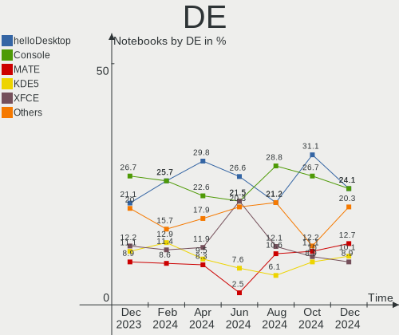
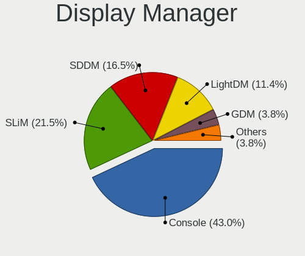
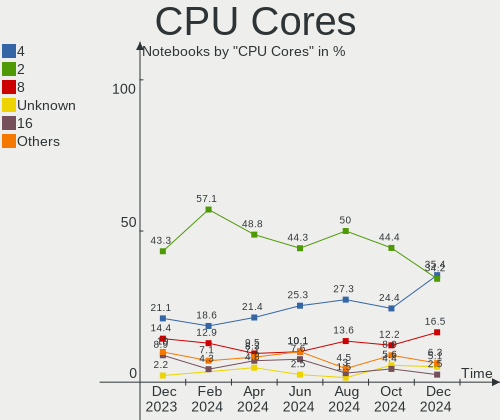
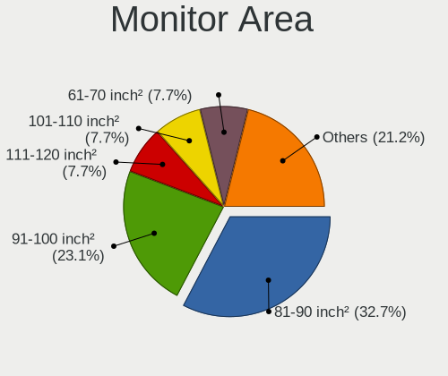

BSD - Hardware Trends (Notebooks)
---------------------------------

A project to identify most popular hardware characteristics and track their change
over time based on data collected by BSD users at https://BSD-Hardware.info.

Anyone can contribute to this report by the [hw-probe](https://github.com/linuxhw/hw-probe/blob/master/INSTALL.BSD.md) tool:

    hw-probe -all -upload

This report is for one last month. Overall report since the beginning of time: [TestDays](https://github.com/bsdhw/TestDays)

Period: Dec, 2024.

Contents
--------

* [ System ](#system)
  - [ OS                       ](#os)
  - [ OS Family                ](#os-family)
  - [ Arch                     ](#arch)
  - [ DE                       ](#de)
  - [ Display Server           ](#display-server)
  - [ Display Manager          ](#display-manager)
  - [ OS Lang                  ](#os-lang)
  - [ Boot Mode                ](#boot-mode)
  - [ Filesystem               ](#filesystem)
  - [ Part. scheme             ](#part-scheme)

* [ Board ](#board)
  - [ Vendor                   ](#vendor)
  - [ Model                    ](#model)
  - [ Model Family             ](#model-family)
  - [ MFG Year                 ](#mfg-year)
  - [ Form Factor              ](#form-factor)
  - [ Coreboot                 ](#coreboot)
  - [ RAM Size                 ](#ram-size)
  - [ RAM Used                 ](#ram-used)
  - [ Total Drives             ](#total-drives)
  - [ Has CD-ROM               ](#has-cd-rom)
  - [ Has Ethernet             ](#has-ethernet)
  - [ Has WiFi                 ](#has-wifi)
  - [ Has Bluetooth            ](#has-bluetooth)

* [ Location ](#location)
  - [ Country                  ](#country)
  - [ City                     ](#city)

* [ Drives ](#drives)
  - [ Drive Vendor             ](#drive-vendor)
  - [ Drive Model              ](#drive-model)
  - [ HDD Vendor               ](#hdd-vendor)
  - [ SSD Vendor               ](#ssd-vendor)
  - [ Drive Kind               ](#drive-kind)
  - [ Drive Connector          ](#drive-connector)
  - [ Drive Size               ](#drive-size)
  - [ Space Total              ](#space-total)
  - [ Space Used               ](#space-used)
  - [ Malfunc. Drives          ](#malfunc-drives)
  - [ Malfunc. Drive Vendor    ](#malfunc-drive-vendor)
  - [ Malfunc. HDD Vendor      ](#malfunc-hdd-vendor)
  - [ Malfunc. Drive Kind      ](#malfunc-drive-kind)
  - [ Failed Drives            ](#failed-drives)
  - [ Failed Drive Vendor      ](#failed-drive-vendor)
  - [ Drive Status             ](#drive-status)

* [ Storage controller ](#storage-controller)
  - [ Storage Vendor           ](#storage-vendor)
  - [ Storage Model            ](#storage-model)
  - [ Storage Kind             ](#storage-kind)

* [ Processor ](#processor)
  - [ CPU Vendor               ](#cpu-vendor)
  - [ CPU Model                ](#cpu-model)
  - [ CPU Model Family         ](#cpu-model-family)
  - [ CPU Cores                ](#cpu-cores)
  - [ CPU Sockets              ](#cpu-sockets)
  - [ CPU Threads              ](#cpu-threads)
  - [ CPU Microarch            ](#cpu-microarch)

* [ Graphics ](#graphics)
  - [ GPU Vendor               ](#gpu-vendor)
  - [ GPU Model                ](#gpu-model)
  - [ GPU Combo                ](#gpu-combo)
  - [ GPU Driver               ](#gpu-driver)
  - [ GPU Memory               ](#gpu-memory)

* [ Monitor ](#monitor)
  - [ Monitor Vendor           ](#monitor-vendor)
  - [ Monitor Model            ](#monitor-model)
  - [ Monitor Resolution       ](#monitor-resolution)
  - [ Monitor Diagonal         ](#monitor-diagonal)
  - [ Monitor Width            ](#monitor-width)
  - [ Aspect Ratio             ](#aspect-ratio)
  - [ Monitor Area             ](#monitor-area)
  - [ Pixel Density            ](#pixel-density)
  - [ Multiple Monitors        ](#multiple-monitors)

* [ Network ](#network)
  - [ Net Controller Vendor    ](#net-controller-vendor)
  - [ Net Controller Model     ](#net-controller-model)
  - [ Wireless Vendor          ](#wireless-vendor)
  - [ Wireless Model           ](#wireless-model)
  - [ Ethernet Vendor          ](#ethernet-vendor)
  - [ Ethernet Model           ](#ethernet-model)
  - [ Net Controller Kind      ](#net-controller-kind)
  - [ Used Controller          ](#used-controller)
  - [ NICs                     ](#nics)
  - [ IPv6                     ](#ipv6)

* [ Bluetooth ](#bluetooth)
  - [ Bluetooth Vendor         ](#bluetooth-vendor)
  - [ Bluetooth Model          ](#bluetooth-model)

* [ Sound ](#sound)
  - [ Sound Vendor             ](#sound-vendor)
  - [ Sound Model              ](#sound-model)

* [ Memory ](#memory)
  - [ Memory Vendor            ](#memory-vendor)
  - [ Memory Model             ](#memory-model)
  - [ Memory Kind              ](#memory-kind)
  - [ Memory Form Factor       ](#memory-form-factor)
  - [ Memory Size              ](#memory-size)
  - [ Memory Speed             ](#memory-speed)

* [ Printers & scanners ](#printers--scanners)
  - [ Printer Vendor           ](#printer-vendor)
  - [ Printer Model            ](#printer-model)
  - [ Scanner Vendor           ](#scanner-vendor)
  - [ Scanner Model            ](#scanner-model)

* [ Camera ](#camera)
  - [ Camera Vendor            ](#camera-vendor)
  - [ Camera Model             ](#camera-model)

* [ Security ](#security)
  - [ Fingerprint Vendor       ](#fingerprint-vendor)
  - [ Fingerprint Model        ](#fingerprint-model)
  - [ Chipcard Vendor          ](#chipcard-vendor)
  - [ Chipcard Model           ](#chipcard-model)

* [ Unsupported ](#unsupported)
  - [ Unsupported Devices      ](#unsupported-devices)
  - [ Unsupported Device Types ](#unsupported-device-types)

System
------

OS
--

Installed operating systems

| Name                         | Notebooks | Percent |
|------------------------------|-----------|---------|
| FreeBSD 14.2                 | 22        | 27.85%  |
| FreeBSD 14.1-p6              | 9         | 11.39%  |
| helloSystem 0.9.0            | 8         | 10.13%  |
| OpenBSD 7.6                  | 7         | 8.86%   |
| OPNsense 24.7.11             | 6         | 7.59%   |
| OPNsense 24.7.10             | 5         | 6.33%   |
| helloSystem 0.8.1            | 5         | 6.33%   |
| GhostBSD 24.10.1             | 5         | 6.33%   |
| OPNsense 24.10.1             | 2         | 2.53%   |
| OPNsense 25.1                | 1         | 1.27%   |
| OPNsense 24.7.8              | 1         | 1.27%   |
| OPNsense 24.1.9              | 1         | 1.27%   |
| OPNsense 24.1.10             | 1         | 1.27%   |
| NomadBSD 20240711            | 1         | 1.27%   |
| NetBSD 10.1                  | 1         | 1.27%   |
| HardenedBSD 14.2-STABLE-HBSD | 1         | 1.27%   |
| FreeBSD 15.0-CURRENT         | 1         | 1.27%   |
| FreeBSD 14.2-STABLE          | 1         | 1.27%   |
| FreeBSD 14.1-p3              | 1         | 1.27%   |

OS Family
---------

OS without a version

| Name        | Notebooks | Percent |
|-------------|-----------|---------|
| FreeBSD     | 34        | 43.04%  |
| OPNsense    | 17        | 21.52%  |
| helloSystem | 13        | 16.46%  |
| OpenBSD     | 7         | 8.86%   |
| GhostBSD    | 5         | 6.33%   |
| NomadBSD    | 1         | 1.27%   |
| NetBSD      | 1         | 1.27%   |
| HardenedBSD | 1         | 1.27%   |

Arch
----

OS architecture (x86_64, i586, etc.)

| Name  | Notebooks | Percent |
|-------|-----------|---------|
| amd64 | 75        | 94.94%  |
| i386  | 4         | 5.06%   |

DE
--

Desktop Environment

| Name         | Notebooks | Percent |
|--------------|-----------|---------|
| helloDesktop | 19        | 24.05%  |
| Console      | 19        | 24.05%  |
| MATE         | 10        | 12.66%  |
| KDE5         | 8         | 10.13%  |
| XFCE         | 7         | 8.86%   |
| GNOME        | 6         | 7.59%   |
| i3           | 2         | 2.53%   |
| TWM          | 1         | 1.27%   |
| LXQt         | 1         | 1.27%   |
| LXDE         | 1         | 1.27%   |
| KDE6         | 1         | 1.27%   |
| KDE          | 1         | 1.27%   |
| iwm          | 1         | 1.27%   |
| fvwm         | 1         | 1.27%   |
| Fluxbox      | 1         | 1.27%   |

Display Server
--------------

X11 or Wayland

| Name    | Notebooks | Percent |
|---------|-----------|---------|
| X11     | 56        | 70.89%  |
| Console | 20        | 25.32%  |
| Wayland | 3         | 3.8%    |

Display Manager
---------------

SDDM, LightDM, etc.

| Name    | Notebooks | Percent |
|---------|-----------|---------|
| Console | 34        | 43.04%  |
| SLiM    | 17        | 21.52%  |
| SDDM    | 13        | 16.46%  |
| LightDM | 9         | 11.39%  |
| GDM     | 3         | 3.8%    |
| XDM     | 2         | 2.53%   |
| Ly      | 1         | 1.27%   |

OS Lang
-------

Language

| Lang         | Notebooks | Percent |
|--------------|-----------|---------|
| Unknown      | 30        | 37.97%  |
| C            | 26        | 32.91%  |
| en_US        | 10        | 12.66%  |
| fr_FR        | 4         | 5.06%   |
| ru_RU        | 2         | 2.53%   |
| zh_CN        | 1         | 1.27%   |
| LANG="en_US" | 1         | 1.27%   |
| es_ES        | 1         | 1.27%   |
| es_AR        | 1         | 1.27%   |
| en_CA        | 1         | 1.27%   |
| de_DE        | 1         | 1.27%   |
| de_CH        | 1         | 1.27%   |

Boot Mode
---------

EFI or BIOS

| Mode | Notebooks | Percent |
|------|-----------|---------|
| EFI  | 70        | 88.61%  |
| BIOS | 9         | 11.39%  |

Filesystem
----------

Type of filesystem

| Type   | Notebooks | Percent |
|--------|-----------|---------|
| Zfs    | 53        | 67.09%  |
| Ufs    | 11        | 13.92%  |
| Cd9660 | 8         | 10.13%  |
| Ffs    | 7         | 8.86%   |

Part. scheme
------------

Scheme of partitioning

| Type    | Notebooks | Percent |
|---------|-----------|---------|
| GPT     | 74        | 93.67%  |
| MBR     | 4         | 5.06%   |
| Unknown | 1         | 1.27%   |

Board
-----

Vendor
------

Motherboard manufacturer

| Name                    | Notebooks | Percent |
|-------------------------|-----------|---------|
| Lenovo                  | 19        | 24.05%  |
| Dell                    | 13        | 16.46%  |
| Hewlett-Packard         | 8         | 10.13%  |
| Deciso                  | 8         | 10.13%  |
| HUAWEI                  | 3         | 3.8%    |
| ASUSTek Computer        | 3         | 3.8%    |
| Apple                   | 3         | 3.8%    |
| Acer                    | 3         | 3.8%    |
| Unknown                 | 3         | 3.8%    |
| TUXEDO                  | 2         | 2.53%   |
| Sony                    | 2         | 2.53%   |
| Framework               | 2         | 2.53%   |
| Alienware               | 2         | 2.53%   |
| Timi                    | 1         | 1.27%   |
| Razer                   | 1         | 1.27%   |
| Radio Victoria Fueguina | 1         | 1.27%   |
| Notebook                | 1         | 1.27%   |
| IGEL Technology         | 1         | 1.27%   |
| IBM                     | 1         | 1.27%   |
| Gateway                 | 1         | 1.27%   |
| Fujitsu                 | 1         | 1.27%   |

Model
-----

Motherboard model

| Name                                        | Notebooks | Percent |
|---------------------------------------------|-----------|---------|
| Deciso Netboard A20                         | 3         | 3.8%    |
| Unknown                                     | 3         | 3.8%    |
| HUAWEI KPL-W0X                              | 2         | 2.53%   |
| Framework Laptop 16 (AMD Ryzen 7040 Series) | 2         | 2.53%   |
| Dell Precision 5510                         | 2         | 2.53%   |
| Deciso NetBoard-A20                         | 2         | 2.53%   |
| Deciso NetBoard-A10_Gen.3                   | 2         | 2.53%   |
| Alienware m15 R6                            | 2         | 2.53%   |
| TUXEDO Pulse 14 Gen3                        | 1         | 1.27%   |
| TUXEDO InfinityBook Pro AMD Gen9            | 1         | 1.27%   |
| Timi TM1703                                 | 1         | 1.27%   |
| Sony VGN-FZ11MR                             | 1         | 1.27%   |
| Sony SVE11115ELW                            | 1         | 1.27%   |
| Razer Blade 16 - RZ09-0510                  | 1         | 1.27%   |
| Radio Victoria Fueguina A24Win8             | 1         | 1.27%   |
| Notebook N7x0WU                             | 1         | 1.27%   |
| Lenovo V15-ADA 82C7                         | 1         | 1.27%   |
| Lenovo ThinkPad X60s 1704R8G                | 1         | 1.27%   |
| Lenovo ThinkPad X270 20HN0015MX             | 1         | 1.27%   |
| Lenovo ThinkPad X250 20CLS14400             | 1         | 1.27%   |
| Lenovo ThinkPad X201 3626HMG                | 1         | 1.27%   |
| Lenovo ThinkPad X1 Carbon Gen 9 20XW006FSP  | 1         | 1.27%   |
| Lenovo ThinkPad X1 Carbon 7th 20R1CTO1WW    | 1         | 1.27%   |
| Lenovo ThinkPad T495 20NKS01Y00             | 1         | 1.27%   |
| Lenovo ThinkPad T490 20N3S61A13             | 1         | 1.27%   |
| Lenovo ThinkPad T490 20N20028US             | 1         | 1.27%   |
| Lenovo ThinkPad T480 20L6S29D1V             | 1         | 1.27%   |
| Lenovo ThinkPad T430 2344BPU                | 1         | 1.27%   |
| Lenovo ThinkPad T430 2342CTO                | 1         | 1.27%   |
| Lenovo ThinkPad P14s Gen 1 20Y1CTO1WW       | 1         | 1.27%   |
| Lenovo ThinkBook 15 G2 ITL 20VE             | 1         | 1.27%   |
| Lenovo ThinkBook 14 G6 IRL 21KG             | 1         | 1.27%   |
| Lenovo ThinkBook 14 G2 ARE 20VF             | 1         | 1.27%   |
| Lenovo IdeaPad 320-15IKB Touch 81BH         | 1         | 1.27%   |
| Lenovo IdeaPad 320-14IKB 80YF               | 1         | 1.27%   |
| IGEL H830C                                  | 1         | 1.27%   |
| IBM ThinkPad T43 1871F1G                    | 1         | 1.27%   |
| HUAWEI MRGFG-XX                             | 1         | 1.27%   |
| HP Victus by Laptop 16-d0xxx                | 1         | 1.27%   |
| HP ProBook 4430s                            | 1         | 1.27%   |

Model Family
------------

Motherboard model prefix

| Name                            | Notebooks | Percent |
|---------------------------------|-----------|---------|
| Lenovo ThinkPad                 | 13        | 16.46%  |
| Dell Latitude                   | 6         | 7.59%   |
| Lenovo ThinkBook                | 3         | 3.8%    |
| Dell Precision                  | 3         | 3.8%    |
| Dell Inspiron                   | 3         | 3.8%    |
| Deciso Netboard                 | 3         | 3.8%    |
| Unknown                         | 3         | 3.8%    |
| Lenovo IdeaPad                  | 2         | 2.53%   |
| HUAWEI KPL-W0X                  | 2         | 2.53%   |
| Framework Laptop                | 2         | 2.53%   |
| Deciso NetBoard-A20             | 2         | 2.53%   |
| Deciso NetBoard-A10             | 2         | 2.53%   |
| Alienware m15                   | 2         | 2.53%   |
| Acer Aspire                     | 2         | 2.53%   |
| TUXEDO Pulse                    | 1         | 1.27%   |
| TUXEDO InfinityBook             | 1         | 1.27%   |
| Timi TM1703                     | 1         | 1.27%   |
| Sony VGN-FZ11MR                 | 1         | 1.27%   |
| Sony SVE11115ELW                | 1         | 1.27%   |
| Razer Blade                     | 1         | 1.27%   |
| Radio Victoria Fueguina A24Win8 | 1         | 1.27%   |
| Notebook N7x0WU                 | 1         | 1.27%   |
| Lenovo V15-ADA                  | 1         | 1.27%   |
| IGEL H830C                      | 1         | 1.27%   |
| IBM ThinkPad                    | 1         | 1.27%   |
| HUAWEI MRGFG-XX                 | 1         | 1.27%   |
| HP Victus                       | 1         | 1.27%   |
| HP ProBook                      | 1         | 1.27%   |
| HP Presario                     | 1         | 1.27%   |
| HP Pavilion                     | 1         | 1.27%   |
| HP Laptop                       | 1         | 1.27%   |
| HP EliteBook                    | 1         | 1.27%   |
| HP 250                          | 1         | 1.27%   |
| HP 2000                         | 1         | 1.27%   |
| Gateway LT40                    | 1         | 1.27%   |
| Fujitsu LIFEBOOK                | 1         | 1.27%   |
| Dell XPS                        | 1         | 1.27%   |
| Deciso OPNsense                 | 1         | 1.27%   |
| ASUS N550JV                     | 1         | 1.27%   |
| ASUS K53BY                      | 1         | 1.27%   |

MFG Year
--------

Motherboard manufacture year

| Year | Notebooks | Percent |
|------|-----------|---------|
| 2019 | 10        | 12.66%  |
| 2013 | 9         | 11.39%  |
| 2022 | 8         | 10.13%  |
| 2021 | 8         | 10.13%  |
| 2020 | 8         | 10.13%  |
| 2024 | 7         | 8.86%   |
| 2023 | 7         | 8.86%   |
| 2012 | 5         | 6.33%   |
| 2018 | 4         | 5.06%   |
| 2017 | 2         | 2.53%   |
| 2011 | 2         | 2.53%   |
| 2007 | 2         | 2.53%   |
| 2016 | 1         | 1.27%   |
| 2015 | 1         | 1.27%   |
| 2014 | 1         | 1.27%   |
| 2010 | 1         | 1.27%   |
| 2009 | 1         | 1.27%   |
| 2008 | 1         | 1.27%   |
| 2006 | 1         | 1.27%   |

Form Factor
-----------

Physical design of the computer

| Name     | Notebooks | Percent |
|----------|-----------|---------|
| Notebook | 79        | 100%    |

Coreboot
--------

Have coreboot on board

| Used | Notebooks | Percent |
|------|-----------|---------|
| No   | 79        | 100%    |

RAM Size
--------

Total RAM memory

| Size in GB  | Notebooks | Percent |
|-------------|-----------|---------|
| 8.01-16.0   | 26        | 32.91%  |
| 16.01-24.0  | 22        | 27.85%  |
| 32.01-64.0  | 14        | 17.72%  |
| 4.01-8.0    | 9         | 11.39%  |
| 2.01-3.0    | 6         | 7.59%   |
| 24.01-32.0  | 1         | 1.27%   |
| 64.01-256.0 | 1         | 1.27%   |

RAM Used
--------

Used RAM memory

| Used GB  | Notebooks | Percent |
|----------|-----------|---------|
| 0.51-1.0 | 32        | 40.51%  |
| 0.01-0.5 | 29        | 36.71%  |
| 1.01-2.0 | 11        | 13.92%  |
| 3.01-4.0 | 3         | 3.8%    |
| 4.01-8.0 | 2         | 2.53%   |
| 2.01-3.0 | 1         | 1.27%   |
| Unknown  | 1         | 1.27%   |

Total Drives
------------

Number of drives on board

| Drives | Notebooks | Percent |
|--------|-----------|---------|
| 0      | 36        | 45.57%  |
| 1      | 35        | 44.3%   |
| 2      | 7         | 8.86%   |
| 3      | 1         | 1.27%   |

Has CD-ROM
----------

Has CD-ROM on board

| Presented | Notebooks | Percent |
|-----------|-----------|---------|
| No        | 69        | 87.34%  |
| Yes       | 10        | 12.66%  |

Has Ethernet
------------

Has Ethernet on board

| Presented | Notebooks | Percent |
|-----------|-----------|---------|
| Yes       | 65        | 82.28%  |
| No        | 14        | 17.72%  |

Has WiFi
--------

Has WiFi module

| Presented | Notebooks | Percent |
|-----------|-----------|---------|
| Yes       | 64        | 81.01%  |
| No        | 15        | 18.99%  |

Has Bluetooth
-------------

Has Bluetooth module

| Presented | Notebooks | Percent |
|-----------|-----------|---------|
| Yes       | 52        | 65.82%  |
| No        | 27        | 34.18%  |

Location
--------

Country
-------

Geographic location (country)

| Country         | Notebooks | Percent |
|-----------------|-----------|---------|
| USA             | 18        | 22.78%  |
| Germany         | 8         | 10.13%  |
| Russia          | 6         | 7.59%   |
| France          | 6         | 7.59%   |
| Spain           | 5         | 6.33%   |
| Brazil          | 4         | 5.06%   |
| Turkey          | 2         | 2.53%   |
| Italy           | 2         | 2.53%   |
| Chile           | 2         | 2.53%   |
| Canada          | 2         | 2.53%   |
| Argentina       | 2         | 2.53%   |
| UK              | 1         | 1.27%   |
| UAE             | 1         | 1.27%   |
| The Netherlands | 1         | 1.27%   |
| Switzerland     | 1         | 1.27%   |
| Sweden          | 1         | 1.27%   |
| Serbia          | 1         | 1.27%   |
| Portugal        | 1         | 1.27%   |
| Poland          | 1         | 1.27%   |
| Mexico          | 1         | 1.27%   |
| Malta           | 1         | 1.27%   |
| Lithuania       | 1         | 1.27%   |
| Indonesia       | 1         | 1.27%   |
| India           | 1         | 1.27%   |
| Hungary         | 1         | 1.27%   |
| Egypt           | 1         | 1.27%   |
| Czechia         | 1         | 1.27%   |
| China           | 1         | 1.27%   |
| Bulgaria        | 1         | 1.27%   |
| Bangladesh      | 1         | 1.27%   |
| Austria         | 1         | 1.27%   |
| Australia       | 1         | 1.27%   |
| Andorra         | 1         | 1.27%   |

City
----

Geographic location (city)

| City             | Notebooks | Percent |
|------------------|-----------|---------|
| St Petersburg    | 4         | 5.06%   |
| Seattle          | 2         | 2.53%   |
| Sao Paulo        | 2         | 2.53%   |
| Neuengors        | 2         | 2.53%   |
| Los Realejos     | 2         | 2.53%   |
| Denver           | 2         | 2.53%   |
| Waterbury        | 1         | 1.27%   |
| Vitória         | 1         | 1.27%   |
| Vilnius          | 1         | 1.27%   |
| Villefrancoeur   | 1         | 1.27%   |
| Villalfonsina    | 1         | 1.27%   |
| Vienna           | 1         | 1.27%   |
| Victoria         | 1         | 1.27%   |
| Turin            | 1         | 1.27%   |
| Temuco           | 1         | 1.27%   |
| Tampa            | 1         | 1.27%   |
| Sydney           | 1         | 1.27%   |
| Subotica         | 1         | 1.27%   |
| Stockport        | 1         | 1.27%   |
| Sparks           | 1         | 1.27%   |
| Santiago         | 1         | 1.27%   |
| Sanford          | 1         | 1.27%   |
| Salzgitter       | 1         | 1.27%   |
| Saint-Mammes     | 1         | 1.27%   |
| Rosario          | 1         | 1.27%   |
| Pune             | 1         | 1.27%   |
| Prague           | 1         | 1.27%   |
| Plasencia        | 1         | 1.27%   |
| Ottawa           | 1         | 1.27%   |
| Oklahoma City    | 1         | 1.27%   |
| Nottuln          | 1         | 1.27%   |
| Neustadt         | 1         | 1.27%   |
| Naxxar           | 1         | 1.27%   |
| Murutinga do Sul | 1         | 1.27%   |
| Moscow           | 1         | 1.27%   |
| Montrose         | 1         | 1.27%   |
| Los Angeles      | 1         | 1.27%   |
| Lohr a. Main     | 1         | 1.27%   |
| Logan            | 1         | 1.27%   |
| Lisbon           | 1         | 1.27%   |

Drives
------

Drive Vendor
------------

Hard drive vendors

| Vendor              | Notebooks | Drives | Percent |
|---------------------|-----------|--------|---------|
| WDC                 | 5         | 5      | 11.36%  |
| Seagate             | 5         | 5      | 11.36%  |
| SanDisk             | 5         | 6      | 11.36%  |
| Samsung Electronics | 5         | 5      | 11.36%  |
| Transcend           | 4         | 4      | 9.09%   |
| Crucial             | 4         | 5      | 9.09%   |
| SPCC                | 2         | 2      | 4.55%   |
| Kingston            | 2         | 2      | 4.55%   |
| HGST                | 2         | 2      | 4.55%   |
| Toshiba             | 1         | 1      | 2.27%   |
| SK hynix            | 1         | 1      | 2.27%   |
| Phison              | 1         | 1      | 2.27%   |
| Intel               | 1         | 2      | 2.27%   |
| Hitachi             | 1         | 1      | 2.27%   |
| Fujitsu             | 1         | 1      | 2.27%   |
| FORESEE             | 1         | 1      | 2.27%   |
| Dogfish             | 1         | 1      | 2.27%   |
| ASUSTek Computer    | 1         | 2      | 2.27%   |
| Apple               | 1         | 1      | 2.27%   |

Drive Model
-----------

Hard drive models

| Model                                | Notebooks | Percent |
|--------------------------------------|-----------|---------|
| Transcend TS256GMTS952T2 256GB       | 2         | 4.26%   |
| Seagate ST320LT020-9YG142 320GB      | 2         | 4.26%   |
| WDC WDS240G2G0C-00AJM0 240GB         | 1         | 2.13%   |
| WDC WDS120G2G0B-00EPW0 120GB         | 1         | 2.13%   |
| WDC WDS120G1G0A-00SS50 120GB         | 1         | 2.13%   |
| WDC WD3200BPVT-80JJ5T0 320GB         | 1         | 2.13%   |
| WDC WD2500BEVT-08A23T1 250GB         | 1         | 2.13%   |
| Transcend TS256GMTS830S 256GB        | 1         | 2.13%   |
| Transcend TS120GSSD220S 120GB        | 1         | 2.13%   |
| Toshiba THNSNK256GVN8 M.2 2280 256GB | 1         | 2.13%   |
| SPCC Solid State Disk 512GB          | 1         | 2.13%   |
| SPCC Solid State Disk 128GB          | 1         | 2.13%   |
| SK hynix HFS256G39TNF-N3A0A 256GB    | 1         | 2.13%   |
| Seagate ST500LM030-2E717D 500GB      | 1         | 2.13%   |
| Seagate ST2000LM015-2E8174 2TB       | 1         | 2.13%   |
| Seagate ST1000LM024 HN-M101MBB 1TB   | 1         | 2.13%   |
| SanDisk Ultra USB 3.0 64GB           | 1         | 2.13%   |
| SanDisk Ultra II 480GB               | 1         | 2.13%   |
| SanDisk SSD PLUS 240GB               | 1         | 2.13%   |
| SanDisk SSD G5 BICS4 1TB             | 1         | 2.13%   |
| SanDisk SDSSDHII240G 240GB           | 1         | 2.13%   |
| Samsung SSD 860 EVO 500GB            | 1         | 2.13%   |
| Samsung MZVLB256HBHQ-000L7 256GB     | 1         | 2.13%   |
| Samsung MZ7TE256HMHP-000H1 256GB     | 1         | 2.13%   |
| Samsung MMCRE64G8MXP-0VBL1 64GB      | 1         | 2.13%   |
| Samsung HM080GI 80GB                 | 1         | 2.13%   |
| Phison M.2 128G SSO128GTLC9-SB0-2    | 1         | 2.13%   |
| Kingston SV300S37A120G 120GB         | 1         | 2.13%   |
| Kingston SKC600MS256G 256GB          | 1         | 2.13%   |
| Intel HBRPEKNL0202AHO 32GB           | 1         | 2.13%   |
| Intel HBRPEKNL0202AH 512GB           | 1         | 2.13%   |
| Hitachi HTS727575A9E362 752GB        | 1         | 2.13%   |
| HGST HTS541075A9E680 752GB           | 1         | 2.13%   |
| HGST HTS541010A9E680 1TB             | 1         | 2.13%   |
| Fujitsu MHV2040AH 40GB               | 1         | 2.13%   |
| FORESEE 64GB SSD                     | 1         | 2.13%   |
| Dogfish SSD 256GB                    | 1         | 2.13%   |
| Crucial CT500MX500SSD1 500GB         | 1         | 2.13%   |
| Crucial CT480BX500SSD1 480GB         | 1         | 2.13%   |
| Crucial CT240M500SSD1 240GB          | 1         | 2.13%   |

HDD Vendor
----------

Hard disk drive vendors

| Vendor              | Notebooks | Drives | Percent |
|---------------------|-----------|--------|---------|
| Seagate             | 5         | 5      | 41.67%  |
| WDC                 | 2         | 2      | 16.67%  |
| HGST                | 2         | 2      | 16.67%  |
| Samsung Electronics | 1         | 1      | 8.33%   |
| Hitachi             | 1         | 1      | 8.33%   |
| Fujitsu             | 1         | 1      | 8.33%   |

SSD Vendor
----------

Solid state drive vendors

| Vendor              | Notebooks | Drives | Percent |
|---------------------|-----------|--------|---------|
| SanDisk             | 5         | 6      | 17.24%  |
| Transcend           | 4         | 4      | 13.79%  |
| Crucial             | 4         | 5      | 13.79%  |
| Samsung Electronics | 3         | 3      | 10.34%  |
| WDC                 | 2         | 2      | 6.9%    |
| SPCC                | 2         | 2      | 6.9%    |
| Kingston            | 2         | 2      | 6.9%    |
| Toshiba             | 1         | 1      | 3.45%   |
| SK hynix            | 1         | 1      | 3.45%   |
| Phison              | 1         | 1      | 3.45%   |
| FORESEE             | 1         | 1      | 3.45%   |
| Dogfish             | 1         | 1      | 3.45%   |
| ASUSTek Computer    | 1         | 2      | 3.45%   |
| Apple               | 1         | 1      | 3.45%   |

Drive Kind
----------

HDD or SSD

| Kind | Notebooks | Drives | Percent |
|------|-----------|--------|---------|
| SSD  | 28        | 32     | 66.67%  |
| HDD  | 12        | 12     | 28.57%  |
| NVMe | 2         | 4      | 4.76%   |

Drive Connector
---------------

SATA, SAS, NVMe, etc.

| Type | Notebooks | Drives | Percent |
|------|-----------|--------|---------|
| SATA | 40        | 44     | 95.24%  |
| NVMe | 2         | 4      | 4.76%   |

Drive Size
----------

Size of hard drive

| Size in TB | Notebooks | Drives | Percent |
|------------|-----------|--------|---------|
| 0.01-0.5   | 33        | 35     | 80.49%  |
| 0.51-1.0   | 7         | 8      | 17.07%  |
| 1.01-2.0   | 1         | 1      | 2.44%   |

Space Total
-----------

Amount of disk space available on the file system

| Size in GB     | Notebooks | Percent |
|----------------|-----------|---------|
| 101-250        | 28        | 35.44%  |
| 251-500        | 14        | 17.72%  |
| 501-1000       | 12        | 15.19%  |
| 1-20           | 9         | 11.39%  |
| 21-50          | 6         | 7.59%   |
| 51-100         | 5         | 6.33%   |
| 1001-2000      | 4         | 5.06%   |
| More than 3000 | 1         | 1.27%   |

Space Used
----------

Amount of used disk space

| Used GB | Notebooks | Percent |
|---------|-----------|---------|
| 1-20    | 63        | 79.75%  |
| 21-50   | 9         | 11.39%  |
| 51-100  | 6         | 7.59%   |
| 101-250 | 1         | 1.27%   |

Malfunc. Drives
---------------

Drive models with a malfunction

| Model                                | Notebooks | Drives | Percent |
|--------------------------------------|-----------|--------|---------|
| Transcend TS256GMTS830S 256GB        | 1         | 1      | 16.67%  |
| Toshiba THNSNK256GVN8 M.2 2280 256GB | 1         | 1      | 16.67%  |
| Seagate ST1000LM024 HN-M101MBB 1TB   | 1         | 1      | 16.67%  |
| Hitachi HTS727575A9E362 752GB        | 1         | 1      | 16.67%  |
| HGST HTS541075A9E680 752GB           | 1         | 1      | 16.67%  |
| HGST HTS541010A9E680 1TB             | 1         | 1      | 16.67%  |

Malfunc. Drive Vendor
---------------------

Vendors of faulty drives

| Vendor    | Notebooks | Drives | Percent |
|-----------|-----------|--------|---------|
| HGST      | 2         | 2      | 33.33%  |
| Transcend | 1         | 1      | 16.67%  |
| Toshiba   | 1         | 1      | 16.67%  |
| Seagate   | 1         | 1      | 16.67%  |
| Hitachi   | 1         | 1      | 16.67%  |

Malfunc. HDD Vendor
-------------------

Vendors of faulty HDD drives

| Vendor  | Notebooks | Drives | Percent |
|---------|-----------|--------|---------|
| HGST    | 2         | 2      | 50%     |
| Seagate | 1         | 1      | 25%     |
| Hitachi | 1         | 1      | 25%     |

Malfunc. Drive Kind
-------------------

Kinds of faulty drives

| Kind | Notebooks | Drives | Percent |
|------|-----------|--------|---------|
| HDD  | 4         | 4      | 66.67%  |
| SSD  | 2         | 2      | 33.33%  |

Failed Drives
-------------

Failed drive models

Zero info for selected period =(

Failed Drive Vendor
-------------------

Failed drive vendors

Zero info for selected period =(

Drive Status
------------

Number of failed and malfunc. drives

| Status   | Notebooks | Drives | Percent |
|----------|-----------|--------|---------|
| Works    | 35        | 40     | 83.33%  |
| Malfunc  | 6         | 6      | 14.29%  |
| Detected | 1         | 2      | 2.38%   |

Storage controller
------------------

Storage Vendor
--------------

Storage controller vendors

| Vendor                      | Notebooks | Percent |
|-----------------------------|-----------|---------|
| Intel                       | 41        | 44.09%  |
| Samsung Electronics         | 17        | 18.28%  |
| AMD                         | 9         | 9.68%   |
| Sandisk                     | 8         | 8.6%    |
| Transcend                   | 5         | 5.38%   |
| Micron/Crucial Technology   | 4         | 4.3%    |
| SK hynix                    | 2         | 2.15%   |
| Micron Technology           | 2         | 2.15%   |
| Kingston Technology Company | 2         | 2.15%   |
| Realtek Semiconductor       | 1         | 1.08%   |
| MAXIO Technology (Hangzhou) | 1         | 1.08%   |
| KIOXIA                      | 1         | 1.08%   |

Storage Model
-------------

Storage controller models

| Model                                                                          | Notebooks | Percent |
|--------------------------------------------------------------------------------|-----------|---------|
| AMD FCH SATA Controller [AHCI mode]                                            | 8         | 8.08%   |
| Intel 7 Series Chipset Family 6-port SATA Controller [AHCI mode]               | 7         | 7.07%   |
| Samsung NVMe SSD Controller 980 (DRAM-less)                                    | 5         | 5.05%   |
| Samsung NVMe SSD Controller PM9A1/PM9A3/980PRO                                 | 4         | 4.04%   |
| Transcend NVMe PCIe SSD 220S/240S/MTE710T                                      | 3         | 3.03%   |
| Samsung NVMe SSD Controller SM981/PM981/PM983                                  | 3         | 3.03%   |
| Intel Wildcat Point-LP SATA Controller [AHCI Mode]                             | 3         | 3.03%   |
| Intel Sunrise Point-LP SATA Controller [AHCI mode]                             | 3         | 3.03%   |
| Intel 6 Series/C200 Series Chipset Family 6 port Mobile SATA AHCI Controller   | 3         | 3.03%   |
| SanDisk Extreme Pro / WD Black SN750 / PC SN730 / Red SN700 NVMe SSD           | 2         | 2.02%   |
| Samsung S4LN053X01 AHCI SSD Controller(Apple slot)                             | 2         | 2.02%   |
| Samsung NVMe SSD Controller SM961/PM961/SM963                                  | 2         | 2.02%   |
| Micron/Crucial P2 [Nick P2] / P3 / P3 Plus NVMe PCIe SSD (DRAM-less)           | 2         | 2.02%   |
| Intel Volume Management Device NVMe RAID Controller                            | 2         | 2.02%   |
| Intel Tiger Lake SATA AHCI Controller                                          | 2         | 2.02%   |
| Intel 82801FBM (ICH6M) SATA Controller                                         | 2         | 2.02%   |
| Intel 82801 Mobile SATA Controller [RAID mode]                                 | 2         | 2.02%   |
| Intel 8 Series/C220 Series Chipset Family 6-port SATA Controller 1 [AHCI mode] | 2         | 2.02%   |
| Intel 8 Series SATA Controller 1 [AHCI mode]                                   | 2         | 2.02%   |
| Transcend NVMe PCIe SSD 110S/112S/120S/MTE300S/MTE400S/MTE652T2 (DRAM-less)    | 1         | 1.01%   |
| Transcend NVMe PCIe SSD 110Q (DRAM-less)                                       | 1         | 1.01%   |
| SK hynix PC611 NVMe Solid State Drive                                          | 1         | 1.01%   |
| SK hynix Gold P31/BC711/PC711 NVMe Solid State Drive                           | 1         | 1.01%   |
| Sandisk WD PC SN740 NVMe SSD 512GB (DRAM-less)                                 | 1         | 1.01%   |
| SanDisk WD Green SN350 240GB (DRAM-less) / SN560E NVMe SSD                     | 1         | 1.01%   |
| Sandisk WD Black SN850X NVMe SSD                                               | 1         | 1.01%   |
| Sandisk WD Black SN770M NVMe SSD (DRAM-less)                                   | 1         | 1.01%   |
| Sandisk WD Black SN770 / PC SN740 256GB / PC SN560 (DRAM-less) NVMe SSD        | 1         | 1.01%   |
| SanDisk Ultra 3D / WD PC SN530, IX SN530, Blue SN550 NVMe SSD (DRAM-less)      | 1         | 1.01%   |
| SanDisk Extreme Pro / WD Black 2018/SN750/PC SN720 NVMe SSD                    | 1         | 1.01%   |
| Samsung NVMe SSD Controller S4LV008[Pascal]                                    | 1         | 1.01%   |
| Realtek RTS5765DL NVMe SSD Controller (DRAM-less)                              | 1         | 1.01%   |
| Micron/Crucial T700 NVMe PCIe SSD                                              | 1         | 1.01%   |
| Micron/Crucial P3 Plus NVMe PCIe SSD (DRAM-less)                               | 1         | 1.01%   |
| Micron 3400 NVMe SSD [Hendrix]                                                 | 1         | 1.01%   |
| Micron 2450 NVMe SSD [HendrixV] (DRAM-less)                                    | 1         | 1.01%   |
| MAXIO (Hangzhou) NVMe SSD Controller MAP1202 (DRAM-less)                       | 1         | 1.01%   |
| KIOXIA NVMe SSD Controller BG4 (DRAM-less)                                     | 1         | 1.01%   |
| Kingston Company OM8SEP4 Design-In PCIe 4 NVMe SSD (TLC) (DRAM-less)           | 1         | 1.01%   |
| Kingston Company NV1 NVMe SSD [SM2263XT] (DRAM-less)                           | 1         | 1.01%   |

Storage Kind
------------

Kind of storage controller (IDE, SATA, NVMe, SAS, ...)

| Kind | Notebooks | Percent |
|------|-----------|---------|
| SATA | 43        | 46.74%  |
| NVMe | 37        | 40.22%  |
| IDE  | 8         | 8.7%    |
| RAID | 4         | 4.35%   |

Processor
---------

CPU Vendor
----------

Processor vendors

| Vendor | Notebooks | Percent |
|--------|-----------|---------|
| Intel  | 58        | 73.42%  |
| AMD    | 21        | 26.58%  |

CPU Model
---------

Processor models

| Model                                         | Notebooks | Percent |
|-----------------------------------------------|-----------|---------|
| AMD EPYC 3201 8-Core Processor                | 4         | 5.06%   |
| Intel 11th Gen Core i7-11800H @ 2.30GHz       | 3         | 3.8%    |
| AMD Ryzen Embedded V1500B                     | 3         | 3.8%    |
| Intel Core i5-5300U CPU @ 2.30GHz             | 2         | 2.53%   |
| Intel Core i5-3230M CPU @ 2.60GHz             | 2         | 2.53%   |
| AMD Ryzen 5 2500U with Radeon Vega Mobile Gfx | 2         | 2.53%   |
| Intel Pentium M processor                     | 1         | 1.27%   |
| Intel Pentium CPU G630 @ 2.70GHz              | 1         | 1.27%   |
| Intel N100                                    | 1         | 1.27%   |
| Intel Core i9-14900HX                         | 1         | 1.27%   |
| Intel Core i7-8665U CPU @ 1.90GHz             | 1         | 1.27%   |
| Intel Core i7-8650U CPU @ 1.90GHz             | 1         | 1.27%   |
| Intel Core i7-8565U CPU @ 1.80GHz             | 1         | 1.27%   |
| Intel Core i7-8550U CPU @ 1.80GHz             | 1         | 1.27%   |
| Intel Core i7-6820HQ CPU @ 2.70GHz            | 1         | 1.27%   |
| Intel Core i7-4810MQ CPU @ 2.80GHz            | 1         | 1.27%   |
| Intel Core i7-4800MQ CPU @ 2.70GHz            | 1         | 1.27%   |
| Intel Core i7-4700HQ CPU @ 2.40GHz            | 1         | 1.27%   |
| Intel Core i7-4650U CPU @ 1.70GHz             | 1         | 1.27%   |
| Intel Core i7-3632QM CPU @ 2.20GHz            | 1         | 1.27%   |
| Intel Core i7-3520M CPU @ 2.90GHz             | 1         | 1.27%   |
| Intel Core i7-2760QM CPU @ 2.40GHz            | 1         | 1.27%   |
| Intel Core i7-10510U CPU @ 1.80GHz            | 1         | 1.27%   |
| Intel Core i5-8400H CPU @ 2.50GHz             | 1         | 1.27%   |
| Intel Core i5-8365U CPU @ 1.60GHz             | 1         | 1.27%   |
| Intel Core i5-8350U CPU @ 1.70GHz             | 1         | 1.27%   |
| Intel Core i5-8250U CPU @ 1.60GHz             | 1         | 1.27%   |
| Intel Core i5-7200U CPU @ 2.50GHz             | 1         | 1.27%   |
| Intel Core i5-6300HQ CPU @ 2.30GHz            | 1         | 1.27%   |
| Intel Core i5-6200U CPU @ 2.30GHz             | 1         | 1.27%   |
| Intel Core i5-4278U CPU @ 2.60GHz             | 1         | 1.27%   |
| Intel Core i5-4200U CPU @ 1.60GHz             | 1         | 1.27%   |
| Intel Core i5-3337U CPU @ 1.80GHz             | 1         | 1.27%   |
| Intel Core i5-2520M CPU @ 2.50GHz             | 1         | 1.27%   |
| Intel Core i5-2450M CPU @ 2.50GHz             | 1         | 1.27%   |
| Intel Core i5-2410M CPU @ 2.30GHz             | 1         | 1.27%   |
| Intel Core i5 CPU M 520 @ 2.40GHz             | 1         | 1.27%   |
| Intel Core i3-N305                            | 1         | 1.27%   |
| Intel Core i3-8130U CPU @ 2.20GHz             | 1         | 1.27%   |
| Intel Core i3-6006U CPU @ 2.00GHz             | 1         | 1.27%   |

CPU Model Family
----------------

Processor model prefix

| Model              | Notebooks | Percent |
|--------------------|-----------|---------|
| Intel Core i5      | 18        | 22.78%  |
| Intel Core i7      | 13        | 16.46%  |
| Other              | 12        | 15.19%  |
| Intel Core i3      | 5         | 6.33%   |
| AMD EPYC           | 5         | 6.33%   |
| AMD Ryzen 5        | 4         | 5.06%   |
| Intel Celeron      | 3         | 3.8%    |
| AMD Ryzen Embedded | 3         | 3.8%    |
| AMD Ryzen 7        | 2         | 2.53%   |
| AMD E              | 2         | 2.53%   |
| Intel Pentium M    | 1         | 1.27%   |
| Intel Pentium      | 1         | 1.27%   |
| Intel Core i9      | 1         | 1.27%   |
| Intel Core Duo     | 1         | 1.27%   |
| Intel Core 2 Duo   | 1         | 1.27%   |
| Intel Core 2       | 1         | 1.27%   |
| Intel Celeron M    | 1         | 1.27%   |
| Intel Atom         | 1         | 1.27%   |
| AMD Ryzen 9        | 1         | 1.27%   |
| AMD Ryzen 7 PRO    | 1         | 1.27%   |
| AMD Ryzen 5 PRO    | 1         | 1.27%   |
| AMD E2             | 1         | 1.27%   |

CPU Cores
---------

Number of processor cores

| Number  | Notebooks | Percent |
|---------|-----------|---------|
| 4       | 28        | 35.44%  |
| 2       | 27        | 34.18%  |
| 8       | 13        | 16.46%  |
| Unknown | 4         | 5.06%   |
| 16      | 2         | 2.53%   |
| 6       | 2         | 2.53%   |
| 1       | 2         | 2.53%   |
| 10      | 1         | 1.27%   |

CPU Sockets
-----------

Number of sockets

| Number  | Notebooks | Percent |
|---------|-----------|---------|
| 1       | 77        | 97.47%  |
| Unknown | 2         | 2.53%   |

CPU Threads
-----------

Threads per core (Hyper-Threading)

| Number  | Notebooks | Percent |
|---------|-----------|---------|
| 2       | 52        | 65.82%  |
| 1       | 21        | 26.58%  |
| Unknown | 6         | 7.59%   |

CPU Microarch
-------------

Microarchitecture

| Name        | Notebooks | Percent |
|-------------|-----------|---------|
| Unknown     | 13        | 16.46%  |
| Zen         | 11        | 13.92%  |
| KabyLake    | 10        | 12.66%  |
| Haswell     | 7         | 8.86%   |
| SandyBridge | 6         | 7.59%   |
| IvyBridge   | 6         | 7.59%   |
| TigerLake   | 4         | 5.06%   |
| Skylake     | 4         | 5.06%   |
| P6          | 3         | 3.8%    |
| Broadwell   | 3         | 3.8%    |
| Bobcat      | 3         | 3.8%    |
| Zen 2       | 2         | 2.53%   |
| Core        | 2         | 2.53%   |
| Zen+        | 1         | 1.27%   |
| Zen 3       | 1         | 1.27%   |
| Westmere    | 1         | 1.27%   |
| Silvermont  | 1         | 1.27%   |
| Bonnell     | 1         | 1.27%   |

Graphics
--------

GPU Vendor
----------

Vendors of graphics cards

| Vendor | Notebooks | Percent |
|--------|-----------|---------|
| Intel  | 55        | 63.95%  |
| AMD    | 17        | 19.77%  |
| Nvidia | 14        | 16.28%  |

GPU Model
---------

Graphics card models

| Model                                                                         | Notebooks | Percent |
|-------------------------------------------------------------------------------|-----------|---------|
| Intel 3rd Gen Core processor Graphics Controller                              | 6         | 6.82%   |
| Intel 2nd Generation Core Processor Family Integrated Graphics Controller     | 6         | 6.82%   |
| Intel UHD Graphics 620                                                        | 5         | 5.68%   |
| Intel Haswell-ULT Integrated Graphics Controller                              | 4         | 4.55%   |
| Intel WhiskeyLake-U GT2 [UHD Graphics 620]                                    | 3         | 3.41%   |
| Intel TigerLake-LP GT2 [Iris Xe Graphics]                                     | 3         | 3.41%   |
| Intel TigerLake-H GT1 [UHD Graphics]                                          | 3         | 3.41%   |
| Intel HD Graphics 5500                                                        | 3         | 3.41%   |
| Intel 4th Gen Core Processor Integrated Graphics Controller                   | 3         | 3.41%   |
| Nvidia GP108M [GeForce MX150]                                                 | 2         | 2.27%   |
| Nvidia GM107GLM [Quadro M1000M]                                               | 2         | 2.27%   |
| Nvidia GA106M [GeForce RTX 3060 Mobile / Max-Q]                               | 2         | 2.27%   |
| Intel Raptor Lake-P [Iris Xe Graphics]                                        | 2         | 2.27%   |
| Intel Mobile 915GM/GMS/910GML Express Graphics Controller                     | 2         | 2.27%   |
| Intel HD Graphics 530                                                         | 2         | 2.27%   |
| Intel Alder Lake-N [UHD Graphics]                                             | 2         | 2.27%   |
| AMD Renoir [Radeon Vega Series / Radeon Vega Mobile Series]                   | 2         | 2.27%   |
| AMD Raven Ridge [Radeon Vega Series / Radeon Vega Mobile Series]              | 2         | 2.27%   |
| AMD Picasso/Raven 2 [Radeon Vega Series / Radeon Vega Mobile Series]          | 2         | 2.27%   |
| AMD Phoenix1                                                                  | 2         | 2.27%   |
| AMD Mars XTX [Radeon HD 8790M]                                                | 2         | 2.27%   |
| Nvidia GK208BM [GeForce 920M]                                                 | 1         | 1.14%   |
| Nvidia GK107M [GeForce GT 750M]                                               | 1         | 1.14%   |
| Nvidia GF108M [NVS 5400M]                                                     | 1         | 1.14%   |
| Nvidia GF108M [GeForce GT 620M/630M/635M/640M LE]                             | 1         | 1.14%   |
| Nvidia GA104M [GeForce RTX 3070 Mobile / Max-Q]                               | 1         | 1.14%   |
| Nvidia G86M [GeForce 8400M GT]                                                | 1         | 1.14%   |
| Nvidia G72M [Quadro NVS 110M/GeForce Go 7300]                                 | 1         | 1.14%   |
| Nvidia AD104M [GeForce RTX 4080 Max-Q / Mobile]                               | 1         | 1.14%   |
| Intel Tiger Lake-LP GT2 [UHD Graphics G4]                                     | 1         | 1.14%   |
| Intel Skylake GT2 [HD Graphics 520]                                           | 1         | 1.14%   |
| Intel Mobile 945GM/GMS/GME, 943/940GML Express Integrated Graphics Controller | 1         | 1.14%   |
| Intel Mobile 945GM/GMS, 943/940GML Express Integrated Graphics Controller     | 1         | 1.14%   |
| Intel HD Graphics 620                                                         | 1         | 1.14%   |
| Intel HD Graphics 520                                                         | 1         | 1.14%   |
| Intel Core Processor Integrated Graphics Controller                           | 1         | 1.14%   |
| Intel CometLake-U GT2 [UHD Graphics]                                          | 1         | 1.14%   |
| Intel CoffeeLake-H GT2 [UHD Graphics 630]                                     | 1         | 1.14%   |
| Intel Atom Processor Z36xxx/Z37xxx Series Graphics & Display                  | 1         | 1.14%   |
| Intel Atom Processor D2xxx/N2xxx Integrated Graphics Controller               | 1         | 1.14%   |

GPU Combo
---------

Combinations of graphics cards

| Name           | Notebooks | Percent |
|----------------|-----------|---------|
| 1 x Intel      | 37        | 46.84%  |
| 1 x AMD        | 12        | 15.19%  |
| Intel + Nvidia | 11        | 13.92%  |
| Other          | 8         | 10.13%  |
| Intel + AMD    | 4         | 5.06%   |
| 2 x Intel      | 3         | 3.8%    |
| 1 x Nvidia     | 3         | 3.8%    |
| 2 x AMD        | 1         | 1.27%   |

GPU Driver
----------

Free vs proprietary

| Driver      | Notebooks | Percent |
|-------------|-----------|---------|
| Free        | 65        | 82.28%  |
| Unknown     | 9         | 11.39%  |
| Proprietary | 5         | 6.33%   |

GPU Memory
----------

Total video memory

| Size in GB | Notebooks | Percent |
|------------|-----------|---------|
| Unknown    | 70        | 88.61%  |
| 1.01-2.0   | 5         | 6.33%   |
| 0.01-0.5   | 2         | 2.53%   |
| 8.01-16.0  | 1         | 1.27%   |
| 0.51-1.0   | 1         | 1.27%   |

Monitor
-------

Monitor Vendor
--------------

Monitor vendors

| Vendor                  | Notebooks | Percent |
|-------------------------|-----------|---------|
| BOE                     | 9         | 17.31%  |
| Chimei Innolux          | 8         | 15.38%  |
| AU Optronics            | 8         | 15.38%  |
| LG Display              | 7         | 13.46%  |
| Sharp                   | 3         | 5.77%   |
| Goldstar                | 3         | 5.77%   |
| Samsung Electronics     | 2         | 3.85%   |
| Lenovo                  | 2         | 3.85%   |
| CSO                     | 2         | 3.85%   |
| Chi Mei Optoelectronics | 2         | 3.85%   |
| InfoVision              | 1         | 1.92%   |
| Iiyama                  | 1         | 1.92%   |
| Hewlett-Packard         | 1         | 1.92%   |
| Dell                    | 1         | 1.92%   |
| CSW                     | 1         | 1.92%   |
| Apple                   | 1         | 1.92%   |

Monitor Model
-------------

Monitor models

| Model                                                                    | Notebooks | Percent |
|--------------------------------------------------------------------------|-----------|---------|
| Sharp LCD Monitor SHP143E 3840x2160 350x190mm 15.7-inch                  | 2         | 3.85%   |
| Chimei Innolux LCD Monitor CMN15BA 1920x1080 340x190mm 15.3-inch         | 2         | 3.85%   |
| Chi Mei Optoelectronics LCD Monitor CMO15A2 1366x768 340x190mm 15.3-inch | 2         | 3.85%   |
| Sharp LCD Monitor SHP1548 1920x1200 290x180mm 13.4-inch                  | 1         | 1.92%   |
| Samsung Electronics LCD Monitor SDC41AB 2560x1600 340x220mm 15.9-inch    | 1         | 1.92%   |
| Samsung Electronics LCD Monitor SDC324C 1920x1080 340x190mm 15.3-inch    | 1         | 1.92%   |
| LG Display LCD Monitor LGD0773 1920x1200 340x220mm 15.9-inch             | 1         | 1.92%   |
| LG Display LCD Monitor LGD06B8 1920x1080 340x190mm 15.3-inch             | 1         | 1.92%   |
| LG Display LCD Monitor LGD068F 1920x1080 310x170mm 13.9-inch             | 1         | 1.92%   |
| LG Display LCD Monitor LGD0521 1920x1080 310x170mm 13.9-inch             | 1         | 1.92%   |
| LG Display LCD Monitor LGD046B 1366x768 340x190mm 15.3-inch              | 1         | 1.92%   |
| LG Display LCD Monitor LGD03ED 1366x768 280x160mm 12.7-inch              | 1         | 1.92%   |
| LG Display LCD Monitor LGD02E9 1366x768 310x170mm 13.9-inch              | 1         | 1.92%   |
| Lenovo P24h-10 LEN61AE 2560x1440 530x300mm 24.0-inch                     | 1         | 1.92%   |
| Lenovo LCD Monitor LEN4011 1280x800 260x160mm 12.0-inch                  | 1         | 1.92%   |
| InfoVision LCD Monitor IVO057D 1920x1080 310x170mm 13.9-inch             | 1         | 1.92%   |
| Iiyama PL3270Q IVM7607 2560x1440 700x390mm 31.5-inch                     | 1         | 1.92%   |
| Hewlett-Packard E271i HWP3107 1920x1080 600x340mm 27.2-inch              | 1         | 1.92%   |
| Goldstar LG ULTRAWIDE GSM7770 2560x1080 800x340mm 34.2-inch              | 1         | 1.92%   |
| Goldstar LG ULTRAWIDE GSM5BF7 2560x1080 670x280mm 28.6-inch              | 1         | 1.92%   |
| Goldstar LG FHD GSM5C66 1920x1080 530x300mm 24.0-inch                    | 1         | 1.92%   |
| Dell P2422HE DELA1C8 1920x1080 530x300mm 24.0-inch                       | 1         | 1.92%   |
| CSW MNE007ZA3-2 CSW1431 2880x1800 300x190mm 14.0-inch                    | 1         | 1.92%   |
| CSO LCD Monitor CSO1415 3120x2080 300x200mm 14.2-inch                    | 1         | 1.92%   |
| CSO LCD Monitor CSO1403 3840x2400 300x190mm 14.0-inch                    | 1         | 1.92%   |
| Chimei Innolux LCD Monitor CMN1606 1920x1080 360x200mm 16.2-inch         | 1         | 1.92%   |
| Chimei Innolux LCD Monitor CMN15CC 1366x768 340x190mm 15.3-inch          | 1         | 1.92%   |
| Chimei Innolux LCD Monitor CMN14D4 1920x1080 310x170mm 13.9-inch         | 1         | 1.92%   |
| Chimei Innolux LCD Monitor CMN1409 1920x1080 310x170mm 13.9-inch         | 1         | 1.92%   |
| Chimei Innolux LCD Monitor CMN1239 1920x1080 280x160mm 12.7-inch         | 1         | 1.92%   |
| Chimei Innolux LCD Monitor CMN1119 1366x768 260x140mm 11.6-inch          | 1         | 1.92%   |
| BOE LCD Monitor BOE0BC9 2560x1600 340x220mm 15.9-inch                    | 1         | 1.92%   |
| BOE LCD Monitor BOE0868 1920x1080 310x170mm 13.9-inch                    | 1         | 1.92%   |
| BOE LCD Monitor BOE083C 1920x1080 310x170mm 13.9-inch                    | 1         | 1.92%   |
| BOE LCD Monitor BOE07CB 1920x1080 340x190mm 15.3-inch                    | 1         | 1.92%   |
| BOE LCD Monitor BOE0729 1920x1080 340x190mm 15.3-inch                    | 1         | 1.92%   |
| BOE LCD Monitor BOE06D9 1366x768 280x160mm 12.7-inch                     | 1         | 1.92%   |
| BOE LCD Monitor BOE06BD 1366x768 310x170mm 13.9-inch                     | 1         | 1.92%   |
| BOE LCD Monitor BOE06B7 1920x1080 290x170mm 13.2-inch                    | 1         | 1.92%   |
| BOE LCD Monitor BOE059F 1366x768 310x170mm 13.9-inch                     | 1         | 1.92%   |

Monitor Resolution
------------------

Monitor screen resolution

| Resolution        | Notebooks | Percent |
|-------------------|-----------|---------|
| 1920x1080 (FHD)   | 19        | 37.25%  |
| 1366x768 (WXGA)   | 15        | 29.41%  |
| 2560x1600         | 3         | 5.88%   |
| 3840x2160 (4K)    | 2         | 3.92%   |
| 2560x1440 (QHD)   | 2         | 3.92%   |
| 2560x1080         | 2         | 3.92%   |
| 1920x1200 (WUXGA) | 2         | 3.92%   |
| 1600x900 (HD+)    | 2         | 3.92%   |
| 3840x2400         | 1         | 1.96%   |
| 3120x2080         | 1         | 1.96%   |
| 2880x1800         | 1         | 1.96%   |
| 1280x800 (WXGA)   | 1         | 1.96%   |

Monitor Diagonal
----------------

Diagonal size in inches

| Inches | Notebooks | Percent |
|--------|-----------|---------|
| 15     | 18        | 34.62%  |
| 13     | 17        | 32.69%  |
| 12     | 4         | 7.69%   |
| 24     | 3         | 5.77%   |
| 14     | 3         | 5.77%   |
| 34     | 1         | 1.92%   |
| 31     | 1         | 1.92%   |
| 28     | 1         | 1.92%   |
| 27     | 1         | 1.92%   |
| 17     | 1         | 1.92%   |
| 16     | 1         | 1.92%   |
| 11     | 1         | 1.92%   |

Monitor Width
-------------

Physical width

| Width in mm | Notebooks | Percent |
|-------------|-----------|---------|
| 301-350     | 31        | 59.62%  |
| 201-300     | 12        | 23.08%  |
| 501-600     | 4         | 7.69%   |
| 601-700     | 2         | 3.85%   |
| 351-400     | 2         | 3.85%   |
| 701-800     | 1         | 1.92%   |

Aspect Ratio
------------

Proportional relationship between the width and the height

| Ratio | Notebooks | Percent |
|-------|-----------|---------|
| 16/9  | 36        | 76.6%   |
| 3/2   | 5         | 10.64%  |
| 16/10 | 4         | 8.51%   |
| 21/9  | 2         | 4.26%   |

Monitor Area
------------

Area in inch²

| Area in inch² | Notebooks | Percent |
|----------------|-----------|---------|
| 81-90          | 17        | 32.69%  |
| 91-100         | 12        | 23.08%  |
| 61-70          | 4         | 7.69%   |
| 111-120        | 4         | 7.69%   |
| 101-110        | 4         | 7.69%   |
| 201-250        | 3         | 5.77%   |
| 71-80          | 2         | 3.85%   |
| 351-500        | 2         | 3.85%   |
| 51-60          | 1         | 1.92%   |
| 301-350        | 1         | 1.92%   |
| 251-300        | 1         | 1.92%   |
| 121-130        | 1         | 1.92%   |

Pixel Density
-------------

Pixels per inch

| Density       | Notebooks | Percent |
|---------------|-----------|---------|
| 121-160       | 20        | 40%     |
| 101-120       | 11        | 22%     |
| 161-240       | 7         | 14%     |
| 51-100        | 7         | 14%     |
| More than 240 | 5         | 10%     |

Multiple Monitors
-----------------

Total monitors connected

| Total | Notebooks | Percent |
|-------|-----------|---------|
| 1     | 41        | 51.9%   |
| 0     | 31        | 39.24%  |
| 2     | 7         | 8.86%   |

Network
-------

Net Controller Vendor
---------------------

Controller vendors

| Vendor                                 | Notebooks | Percent |
|----------------------------------------|-----------|---------|
| Intel                                  | 60        | 48.78%  |
| Realtek Semiconductor                  | 26        | 21.14%  |
| Qualcomm Atheros                       | 8         | 6.5%    |
| Broadcom                               | 8         | 6.5%    |
| AMD                                    | 8         | 6.5%    |
| Lenovo                                 | 2         | 1.63%   |
| Xiaomi                                 | 1         | 0.81%   |
| TP-Link                                | 1         | 0.81%   |
| Suzhou Motorcomm Electronic Technology | 1         | 0.81%   |
| Sierra Wireless                        | 1         | 0.81%   |
| Ralink Technology                      | 1         | 0.81%   |
| Ralink                                 | 1         | 0.81%   |
| Qualcomm                               | 1         | 0.81%   |
| Motorola PCS                           | 1         | 0.81%   |
| Marvell Technology Group               | 1         | 0.81%   |
| Edimax Technology                      | 1         | 0.81%   |
| D-Link System                          | 1         | 0.81%   |

Net Controller Model
--------------------

Controller models

| Model                                                                  | Notebooks | Percent |
|------------------------------------------------------------------------|-----------|---------|
| Realtek RTL8111/8168/8211/8411 PCI Express Gigabit Ethernet Controller | 14        | 9.4%    |
| Realtek RTL810xE PCI Express Fast Ethernet controller                  | 8         | 5.37%   |
| AMD XGMAC 10GbE Controller                                             | 8         | 5.37%   |
| Intel Wireless 8265 / 8275                                             | 6         | 4.03%   |
| Intel Wi-Fi 6E(802.11ax) AX210/AX1675* 2x2 [Typhoon Peak]              | 5         | 3.36%   |
| Qualcomm Atheros AR9485 Wireless Network Adapter                       | 4         | 2.68%   |
| Intel I210 Gigabit Network Connection                                  | 4         | 2.68%   |
| Intel Wi-Fi 6 AX201                                                    | 3         | 2.01%   |
| Intel Wi-Fi 6 AX200                                                    | 3         | 2.01%   |
| Intel Cannon Point-LP CNVi [Wireless-AC]                               | 3         | 2.01%   |
| Realtek RTL8188EUS 802.11n Wireless Network Adapter                    | 2         | 1.34%   |
| Realtek Killer E2600 GbE Controller                                    | 2         | 1.34%   |
| Qualcomm Atheros AR9285 Wireless Network Adapter (PCI-Express)         | 2         | 1.34%   |
| Intel Wireless 8260                                                    | 2         | 1.34%   |
| Intel Wireless 7265                                                    | 2         | 1.34%   |
| Intel Tiger Lake PCH CNVi WiFi                                         | 2         | 1.34%   |
| Intel Raptor Lake PCH CNVi WiFi                                        | 2         | 1.34%   |
| Intel PRO/Wireless 3945ABG [Golan] Network Connection                  | 2         | 1.34%   |
| Intel Ethernet Controller I226-V                                       | 2         | 1.34%   |
| Intel Ethernet Connection I217-LM                                      | 2         | 1.34%   |
| Intel Ethernet Connection (6) I219-LM                                  | 2         | 1.34%   |
| Intel Ethernet Connection (4) I219-LM                                  | 2         | 1.34%   |
| Intel Ethernet Connection (3) I218-LM                                  | 2         | 1.34%   |
| Intel Dual Band Wireless-AC 3168NGW [Stone Peak]                       | 2         | 1.34%   |
| Intel Dual Band Wireless-AC 3165 Plus Bluetooth                        | 2         | 1.34%   |
| Intel CNVi: Wi-Fi                                                      | 2         | 1.34%   |
| Intel 82579LM Gigabit Network Connection (Lewisville)                  | 2         | 1.34%   |
| Intel 82574L Gigabit Network Connection                                | 2         | 1.34%   |
| Broadcom BCM4360 802.11ac Dual Band Wireless Network Adapter           | 2         | 1.34%   |
| Xiaomi Mi/Redmi series (RNDIS)                                         | 1         | 0.67%   |
| TP-Link AC600 wireless Realtek RTL8811AU [Archer T2U Nano]             | 1         | 0.67%   |
| Suzhou Motorcomm Electronic YT6801 Gigabit Ethernet Controller         | 1         | 0.67%   |
| Sierra Wireless EM7305 Modem                                           | 1         | 0.67%   |
| Realtek USB 2.5GbE Controller                                          | 1         | 0.67%   |
| Realtek RTL8852AE WiFi 6 802.11ax PCIe Adapter                         | 1         | 0.67%   |
| Realtek RTL8822CE 802.11ac PCIe Wireless Network Adapter               | 1         | 0.67%   |
| Realtek RTL8188CE 802.11b/g/n WiFi Adapter                             | 1         | 0.67%   |
| Ralink MT7601U Wireless Adapter                                        | 1         | 0.67%   |
| Ralink RT3290 Wireless 802.11n 1T/1R PCIe                              | 1         | 0.67%   |
| Qualcomm Atheros QCA9565 / AR9565 Wireless Network Adapter             | 1         | 0.67%   |

Wireless Vendor
---------------

Wireless vendors

| Vendor                | Notebooks | Percent |
|-----------------------|-----------|---------|
| Intel                 | 48        | 69.57%  |
| Qualcomm Atheros      | 7         | 10.14%  |
| Broadcom              | 5         | 7.25%   |
| Realtek Semiconductor | 4         | 5.8%    |
| TP-Link               | 1         | 1.45%   |
| Ralink Technology     | 1         | 1.45%   |
| Ralink                | 1         | 1.45%   |
| Edimax Technology     | 1         | 1.45%   |
| D-Link System         | 1         | 1.45%   |

Wireless Model
--------------

Wireless models

| Model                                                                      | Notebooks | Percent |
|----------------------------------------------------------------------------|-----------|---------|
| Intel Wireless 8265 / 8275                                                 | 6         | 8.57%   |
| Intel Wi-Fi 6E(802.11ax) AX210/AX1675* 2x2 [Typhoon Peak]                  | 5         | 7.14%   |
| Qualcomm Atheros AR9485 Wireless Network Adapter                           | 4         | 5.71%   |
| Intel Wi-Fi 6 AX201                                                        | 3         | 4.29%   |
| Intel Wi-Fi 6 AX200                                                        | 3         | 4.29%   |
| Intel Cannon Point-LP CNVi [Wireless-AC]                                   | 3         | 4.29%   |
| Realtek RTL8188EUS 802.11n Wireless Network Adapter                        | 2         | 2.86%   |
| Qualcomm Atheros AR9285 Wireless Network Adapter (PCI-Express)             | 2         | 2.86%   |
| Intel Wireless 8260                                                        | 2         | 2.86%   |
| Intel Wireless 7265                                                        | 2         | 2.86%   |
| Intel Tiger Lake PCH CNVi WiFi                                             | 2         | 2.86%   |
| Intel Raptor Lake PCH CNVi WiFi                                            | 2         | 2.86%   |
| Intel PRO/Wireless 3945ABG [Golan] Network Connection                      | 2         | 2.86%   |
| Intel Dual Band Wireless-AC 3168NGW [Stone Peak]                           | 2         | 2.86%   |
| Intel Dual Band Wireless-AC 3165 Plus Bluetooth                            | 2         | 2.86%   |
| Intel CNVi: Wi-Fi                                                          | 2         | 2.86%   |
| Broadcom BCM4360 802.11ac Dual Band Wireless Network Adapter               | 2         | 2.86%   |
| TP-Link AC600 wireless Realtek RTL8811AU [Archer T2U Nano]                 | 1         | 1.43%   |
| Realtek RTL8852AE WiFi 6 802.11ax PCIe Adapter                             | 1         | 1.43%   |
| Realtek RTL8822CE 802.11ac PCIe Wireless Network Adapter                   | 1         | 1.43%   |
| Realtek RTL8188CE 802.11b/g/n WiFi Adapter                                 | 1         | 1.43%   |
| Ralink MT7601U Wireless Adapter                                            | 1         | 1.43%   |
| Ralink RT3290 Wireless 802.11n 1T/1R PCIe                                  | 1         | 1.43%   |
| Qualcomm Atheros QCA9565 / AR9565 Wireless Network Adapter                 | 1         | 1.43%   |
| Intel WiFi Link 5100                                                       | 1         | 1.43%   |
| Intel Wi-Fi 7(802.11be) AX1775*/AX1790*/BE20*/BE401/BE1750* 2x2            | 1         | 1.43%   |
| Intel Wi-Fi 5(802.11ac) Wireless-AC 9x6x [Thunder Peak]                    | 1         | 1.43%   |
| Intel PRO/Wireless 2915ABG [Calexico2] Network Connection                  | 1         | 1.43%   |
| Intel Comet Lake PCH-LP CNVi WiFi                                          | 1         | 1.43%   |
| Intel Centrino Wireless-N 2200                                             | 1         | 1.43%   |
| Intel Centrino Wireless-N 1030 [Rainbow Peak]                              | 1         | 1.43%   |
| Intel Centrino Ultimate-N 6300                                             | 1         | 1.43%   |
| Intel Centrino Advanced-N 6235                                             | 1         | 1.43%   |
| Intel Centrino Advanced-N 6205 [Taylor Peak]                               | 1         | 1.43%   |
| Intel Cannon Lake PCH CNVi WiFi                                            | 1         | 1.43%   |
| Intel Alder Lake-P PCH CNVi WiFi                                           | 1         | 1.43%   |
| Edimax EW-7811Un 802.11n Wireless Adapter [Realtek RTL8188CUS]             | 1         | 1.43%   |
| D-Link System AirPlus G DWL-G122 Wireless Adapter(rev.C1) [Ralink RT2571W] | 1         | 1.43%   |
| Broadcom BCM4331 802.11a/b/g/n                                             | 1         | 1.43%   |
| Broadcom BCM4313 802.11bgn Wireless Network Adapter                        | 1         | 1.43%   |

Ethernet Vendor
---------------

Ethernet vendors

| Vendor                                 | Notebooks | Percent |
|----------------------------------------|-----------|---------|
| Intel                                  | 30        | 38.96%  |
| Realtek Semiconductor                  | 25        | 32.47%  |
| AMD                                    | 8         | 10.39%  |
| Broadcom                               | 6         | 7.79%   |
| Lenovo                                 | 2         | 2.6%    |
| Xiaomi                                 | 1         | 1.3%    |
| Suzhou Motorcomm Electronic Technology | 1         | 1.3%    |
| Qualcomm Atheros                       | 1         | 1.3%    |
| Qualcomm                               | 1         | 1.3%    |
| Motorola PCS                           | 1         | 1.3%    |
| Marvell Technology Group               | 1         | 1.3%    |

Ethernet Model
--------------

Ethernet models

| Model                                                                  | Notebooks | Percent |
|------------------------------------------------------------------------|-----------|---------|
| Realtek RTL8111/8168/8211/8411 PCI Express Gigabit Ethernet Controller | 14        | 18.18%  |
| Realtek RTL810xE PCI Express Fast Ethernet controller                  | 8         | 10.39%  |
| AMD XGMAC 10GbE Controller                                             | 8         | 10.39%  |
| Intel I210 Gigabit Network Connection                                  | 4         | 5.19%   |
| Realtek Killer E2600 GbE Controller                                    | 2         | 2.6%    |
| Intel Ethernet Controller I226-V                                       | 2         | 2.6%    |
| Intel Ethernet Connection I217-LM                                      | 2         | 2.6%    |
| Intel Ethernet Connection (6) I219-LM                                  | 2         | 2.6%    |
| Intel Ethernet Connection (4) I219-LM                                  | 2         | 2.6%    |
| Intel Ethernet Connection (3) I218-LM                                  | 2         | 2.6%    |
| Intel 82579LM Gigabit Network Connection (Lewisville)                  | 2         | 2.6%    |
| Intel 82574L Gigabit Network Connection                                | 2         | 2.6%    |
| Xiaomi Mi/Redmi series (RNDIS)                                         | 1         | 1.3%    |
| Suzhou Motorcomm Electronic YT6801 Gigabit Ethernet Controller         | 1         | 1.3%    |
| Realtek USB 2.5GbE Controller                                          | 1         | 1.3%    |
| Qualcomm Atheros Attansic L2 Fast Ethernet                             | 1         | 1.3%    |
| Qualcomm ALCATEL RNDIS Interface                                       | 1         | 1.3%    |
| Motorola PCS USB RNDIS Device                                          | 1         | 1.3%    |
| Marvell Group 88E8036 PCI-E Fast Ethernet Controller                   | 1         | 1.3%    |
| Lenovo USB-C Dock Ethernet                                             | 1         | 1.3%    |
| Lenovo ThinkPad Dock Ethernet [Realtek RTL8153B]                       | 1         | 1.3%    |
| Intel I211 Gigabit Network Connection                                  | 1         | 1.3%    |
| Intel Ethernet Controller I225-V                                       | 1         | 1.3%    |
| Intel Ethernet Connection I219-LM                                      | 1         | 1.3%    |
| Intel Ethernet Connection (7) I219-LM                                  | 1         | 1.3%    |
| Intel Ethernet Connection (6) I219-V                                   | 1         | 1.3%    |
| Intel Ethernet Connection (4) I219-V                                   | 1         | 1.3%    |
| Intel Ethernet Connection (23) I219-V                                  | 1         | 1.3%    |
| Intel Ethernet Connection (13) I219-LM                                 | 1         | 1.3%    |
| Intel Ethernet Connection (10) I219-V                                  | 1         | 1.3%    |
| Intel 82583V Gigabit Network Connection                                | 1         | 1.3%    |
| Intel 82577LM Gigabit Network Connection                               | 1         | 1.3%    |
| Intel 82573L Gigabit Ethernet Controller                               | 1         | 1.3%    |
| Broadcom NetXtreme BCM57765 Gigabit Ethernet PCIe                      | 1         | 1.3%    |
| Broadcom NetXtreme BCM57762 Gigabit Ethernet PCIe                      | 1         | 1.3%    |
| Broadcom NetXtreme BCM5752 Gigabit Ethernet PCI Express                | 1         | 1.3%    |
| Broadcom NetXtreme BCM5751M Gigabit Ethernet PCI Express               | 1         | 1.3%    |
| Broadcom NetXtreme BCM5722 Gigabit Ethernet PCI Express                | 1         | 1.3%    |
| Broadcom NetLink BCM57785 Gigabit Ethernet PCIe                        | 1         | 1.3%    |

Net Controller Kind
-------------------

Ethernet, WiFi or modem

| Kind     | Notebooks | Percent |
|----------|-----------|---------|
| Ethernet | 65        | 49.62%  |
| WiFi     | 64        | 48.85%  |
| Modem    | 1         | 0.76%   |
| Unknown  | 1         | 0.76%   |

Used Controller
---------------

Currently used network controller

| Kind     | Notebooks | Percent |
|----------|-----------|---------|
| WiFi     | 44        | 58.67%  |
| Ethernet | 31        | 41.33%  |

NICs
----

Total network controllers on board

| Total | Notebooks | Percent |
|-------|-----------|---------|
| 2     | 47        | 59.49%  |
| 1     | 18        | 22.78%  |
| 6     | 8         | 10.13%  |
| 5     | 3         | 3.8%    |
| 3     | 2         | 2.53%   |
| 0     | 1         | 1.27%   |

IPv6
----

IPv6 vs IPv4

| Used | Notebooks | Percent |
|------|-----------|---------|
| No   | 63        | 79.75%  |
| Yes  | 16        | 20.25%  |

Bluetooth
---------

Bluetooth Vendor
----------------

Controller vendors

| Vendor                          | Notebooks | Percent |
|---------------------------------|-----------|---------|
| Intel                           | 37        | 71.15%  |
| Broadcom                        | 3         | 5.77%   |
| Apple                           | 3         | 5.77%   |
| Realtek Semiconductor           | 2         | 3.85%   |
| Qualcomm Atheros Communications | 2         | 3.85%   |
| Ralink                          | 1         | 1.92%   |
| IMC Networks                    | 1         | 1.92%   |
| Hewlett-Packard                 | 1         | 1.92%   |
| Foxconn / Hon Hai               | 1         | 1.92%   |
| Alps Electric                   | 1         | 1.92%   |

Bluetooth Model
---------------

Controller models

| Model                                                       | Notebooks | Percent |
|-------------------------------------------------------------|-----------|---------|
| Intel Bluetooth wireless interface                          | 12        | 23.08%  |
| Intel AX201 Bluetooth                                       | 7         | 13.46%  |
| Intel AX210 Bluetooth                                       | 5         | 9.62%   |
| Intel Bluetooth 9460/9560 Jefferson Peak (JfP)              | 4         | 7.69%   |
| Intel AX200 Bluetooth                                       | 3         | 5.77%   |
| Intel Wireless-AC 3168 Bluetooth                            | 2         | 3.85%   |
| Broadcom BCM20702 Bluetooth 4.0 [ThinkPad]                  | 2         | 3.85%   |
| Apple Bluetooth Host Controller                             | 2         | 3.85%   |
| Realtek Wireless Bluetooth Adapter                          | 1         | 1.92%   |
| Realtek Bluetooth 4.2 Adapter                               | 1         | 1.92%   |
| Ralink RT3290 Bluetooth                                     | 1         | 1.92%   |
| Qualcomm Atheros Dell Wireless 1703 Bluetooth               | 1         | 1.92%   |
| Qualcomm Atheros AR9462 Bluetooth                           | 1         | 1.92%   |
| Intel Wireless-AC 9260 Bluetooth Adapter                    | 1         | 1.92%   |
| Intel Centrino Bluetooth Wireless Transceiver               | 1         | 1.92%   |
| Intel Centrino Advanced-N 6230 Bluetooth adapter            | 1         | 1.92%   |
| Intel AX211 Bluetooth                                       | 1         | 1.92%   |
| IMC Networks Qualcomm Atheros AR3012 Bluetooth 4.0 + HS     | 1         | 1.92%   |
| HP Atheros AR9285 Malbec Bluetooth Adapter                  | 1         | 1.92%   |
| Foxconn / Hon Hai Qualcomm Atheros AR3012 Bluetooth Adapter | 1         | 1.92%   |
| Broadcom BCM2045B (BDC-2.1)                                 | 1         | 1.92%   |
| Apple Broadcom Built-in Bluetooth                           | 1         | 1.92%   |
| Alps Electric Bluetooth Controller (ALPS/UGPZ6)             | 1         | 1.92%   |

Sound
-----

Sound Vendor
------------

Sound card vendors

| Vendor                | Notebooks | Percent |
|-----------------------|-----------|---------|
| Intel                 | 56        | 65.88%  |
| AMD                   | 19        | 22.35%  |
| Nvidia                | 4         | 4.71%   |
| Lenovo                | 3         | 3.53%   |
| Realtek Semiconductor | 1         | 1.18%   |
| Plantronics           | 1         | 1.18%   |
| Logitech              | 1         | 1.18%   |

Sound Model
-----------

Sound card models

| Model                                                                      | Notebooks | Percent |
|----------------------------------------------------------------------------|-----------|---------|
| AMD Family 17h/19h/1ah HD Audio Controller                                 | 13        | 12.04%  |
| Intel Sunrise Point-LP HD Audio                                            | 8         | 7.41%   |
| Intel 7 Series/C216 Chipset Family High Definition Audio Controller        | 7         | 6.48%   |
| Intel Tiger Lake-LP Smart Sound Technology Audio Controller                | 4         | 3.7%    |
| Intel Haswell-ULT HD Audio Controller                                      | 4         | 3.7%    |
| Intel 8 Series HD Audio Controller                                         | 4         | 3.7%    |
| Intel 6 Series/C200 Series Chipset Family High Definition Audio Controller | 4         | 3.7%    |
| AMD Raven/Raven2/Fenghuang HDMI/DP Audio Controller                        | 4         | 3.7%    |
| Intel Xeon E3-1200 v3/4th Gen Core Processor HD Audio Controller           | 3         | 2.78%   |
| Intel Wildcat Point-LP High Definition Audio Controller                    | 3         | 2.78%   |
| Intel Tiger Lake-H HD Audio Controller                                     | 3         | 2.78%   |
| Intel NM10/ICH7 Family High Definition Audio Controller                    | 3         | 2.78%   |
| Intel Cannon Point-LP High Definition Audio Controller                     | 3         | 2.78%   |
| Intel Broadwell-U Audio Controller                                         | 3         | 2.78%   |
| Intel 8 Series/C220 Series Chipset High Definition Audio Controller        | 3         | 2.78%   |
| AMD Wrestler HDMI Audio                                                    | 3         | 2.78%   |
| AMD Renoir Radeon High Definition Audio Controller                         | 3         | 2.78%   |
| AMD Rembrandt Radeon High Definition Audio Controller                      | 3         | 2.78%   |
| Nvidia GA106 High Definition Audio Controller                              | 2         | 1.85%   |
| Intel Raptor Lake-P/U/H cAVS                                               | 2         | 1.85%   |
| Intel Alder Lake-N PCH High Definition Audio Controller                    | 2         | 1.85%   |
| Intel 100 Series/C230 Series Chipset Family HD Audio Controller            | 2         | 1.85%   |
| AMD FCH Azalia Controller                                                  | 2         | 1.85%   |
| AMD Family 17h (Models 00h-0fh) HD Audio Controller                        | 2         | 1.85%   |
| Realtek Semiconductor USB Audio                                            | 1         | 0.93%   |
| Plantronics Plantronics Blackwire 315.1                                    | 1         | 0.93%   |
| Nvidia GA104 High Definition Audio Controller                              | 1         | 0.93%   |
| Nvidia AD104 High Definition Audio Controller                              | 1         | 0.93%   |
| Logitech H390 headset with microphone                                      | 1         | 0.93%   |
| Lenovo ThinkPad USB-C Dock Gen2 USB Audio                                  | 1         | 0.93%   |
| Lenovo ThinkPad USB-C Dock Audio                                           | 1         | 0.93%   |
| Lenovo ThinkPad Dock Audio                                                 | 1         | 0.93%   |
| Intel Raptor Lake High Definition Audio Controller                         | 1         | 0.93%   |
| Intel Comet Lake PCH-LP cAVS                                               | 1         | 0.93%   |
| Intel Atom Processor Z36xxx/Z37xxx Series High Definition Audio Controller | 1         | 0.93%   |
| Intel Alder Lake PCH-P High Definition Audio Controller                    | 1         | 0.93%   |
| Intel 82801H (ICH8 Family) HD Audio Controller                             | 1         | 0.93%   |
| Intel 82801FB/FBM/FR/FW/FRW (ICH6 Family) High Definition Audio Controller | 1         | 0.93%   |
| Intel 82801FB/FBM/FR/FW/FRW (ICH6 Family) AC'97 Audio Controller           | 1         | 0.93%   |
| Intel 5 Series/3400 Series Chipset High Definition Audio                   | 1         | 0.93%   |

Memory
------

Memory Vendor
-------------

Memory module vendors

| Vendor              | Notebooks | Percent |
|---------------------|-----------|---------|
| Samsung Electronics | 21        | 23.86%  |
| SK hynix            | 13        | 14.77%  |
| Micron Technology   | 12        | 13.64%  |
| Transcend           | 8         | 9.09%   |
| Crucial             | 7         | 7.95%   |
| Kingston            | 5         | 5.68%   |
| Unknown             | 4         | 4.55%   |
| Ramaxel Technology  | 4         | 4.55%   |
| Unknown             | 4         | 4.55%   |
| A-DATA Technology   | 3         | 3.41%   |
| Timetec             | 1         | 1.14%   |
| Team                | 1         | 1.14%   |
| Novatech            | 1         | 1.14%   |
| Nanya Technology    | 1         | 1.14%   |
| Elpida              | 1         | 1.14%   |
| Corsair             | 1         | 1.14%   |
| AMD                 | 1         | 1.14%   |

Memory Model
------------

Memory module models

| Model                                                            | Notebooks | Percent |
|------------------------------------------------------------------|-----------|---------|
| Transcend RAM TS1GLH64V6BL 8GB SODIMM DDR4 2667MT/s              | 4         | 4.3%    |
| Unknown                                                          | 4         | 4.3%    |
| Crucial RAM CT102464BF160B.C16 8GB SODIMM DDR3 1600MT/s          | 3         | 3.23%   |
| Transcend RAM TS1GLH64V6B3 8GB SODIMM DDR4 1333MT/s              | 2         | 2.15%   |
| SK hynix RAM HMCG78AGBSA092N 16GB SODIMM DDR5 5600MT/s           | 2         | 2.15%   |
| Samsung RAM M471B5173QH0-YK0 4GB SODIMM DDR3 1600MT/s            | 2         | 2.15%   |
| Samsung RAM M471B1G73QH0-YK0 8GB SODIMM DDR3 1867MT/s            | 2         | 2.15%   |
| Samsung RAM M471B1G73EB0-YK0 8GB SODIMM DDR3 1600MT/s            | 2         | 2.15%   |
| Samsung RAM M471A5244CB0-CRC 4GB SODIMM DDR4 2400MT/s            | 2         | 2.15%   |
| Samsung RAM M471A5244BB0-CRC 4GB Row Of Chips DDR4 2400MT/s      | 2         | 2.15%   |
| Micron RAM 4ATF1G64HZ-3G2E2 8GB SODIMM DDR4 3200MT/s             | 2         | 2.15%   |
| Unknown RAM Module 2GB SODIMM DDR3                               | 1         | 1.08%   |
| Unknown RAM Module 2GB SODIMM DDR2                               | 1         | 1.08%   |
| Unknown RAM Module 1GB SODIMM DDR2                               | 1         | 1.08%   |
| Unknown RAM Module 1GB SODIMM DDR                                | 1         | 1.08%   |
| Transcend RAM TS512MSK64V6H 4GB SODIMM DDR3 1600MT/s             | 1         | 1.08%   |
| Transcend RAM TS512MLH64V6HL 4GB SODIMM DDR4 2667MT/s            | 1         | 1.08%   |
| Timetec RAM S8G-1600 8GB SODIMM DDR3 1600MT/s                    | 1         | 1.08%   |
| Team RAM TEAMGROUP-SD3-1600 8GB SODIMM DDR3 1600MT/s             | 1         | 1.08%   |
| SK hynix RAM Module 8GB SODIMM DDR3 1600MT/s                     | 1         | 1.08%   |
| SK hynix RAM Module 4GB SODIMM DDR3 1600MT/s                     | 1         | 1.08%   |
| SK hynix RAM Module 4GB SODIMM DDR3 1333MT/s                     | 1         | 1.08%   |
| SK hynix RAM HMT451S6BFR8A-PB 4GB SODIMM DDR3 1600MT/s           | 1         | 1.08%   |
| SK hynix RAM HMT451S6AFR8C-PB 4GB SODIMM DDR3 1600MT/s           | 1         | 1.08%   |
| SK hynix RAM HMT41GS6AFR8A-PB 8GB SODIMM DDR3 1600MT/s           | 1         | 1.08%   |
| SK hynix RAM HMT351S6CFR8C-H9 4GB SODIMM DDR3 1334MT/s           | 1         | 1.08%   |
| SK hynix RAM HMT325S6EFR8A-PB 2GB SODIMM DDR3 1333MT/s           | 1         | 1.08%   |
| SK hynix RAM HMAA2GS6AJR8N-XN 16GB SODIMM DDR4 3200MT/s          | 1         | 1.08%   |
| SK hynix RAM HMA81GS6JJR8N-VK 8GB SODIMM DDR4 2667MT/s           | 1         | 1.08%   |
| SK hynix RAM HMA41GS6AFR8N-TF 8GB SODIMM DDR4 2667MT/s           | 1         | 1.08%   |
| SK hynix RAM H9JCNNNCP3MLYR-N6E 2GB Row Of Chips LPDDR5 6400MT/s | 1         | 1.08%   |
| Samsung RAM Module 8GB Row Of Chips LPDDR3 2133MT/s              | 1         | 1.08%   |
| Samsung RAM M471B5173DB0-YK0 4GB SODIMM DDR3 1600MT/s            | 1         | 1.08%   |
| Samsung RAM M471B1G73DB0-YK0 8GB SODIMM DDR3 1600MT/s            | 1         | 1.08%   |
| Samsung RAM M471A5244CB0-CWE 4GB SODIMM DDR4 3200MT/s            | 1         | 1.08%   |
| Samsung RAM M471A4G43MB1-CTD 32GB SODIMM DDR4 2667MT/s           | 1         | 1.08%   |
| Samsung RAM M471A2K43CB1-CRC 16GB SODIMM DDR4 2400MT/s           | 1         | 1.08%   |
| Samsung RAM M471A2G44AM0-CWE 16GB SODIMM DDR4 3200MT/s           | 1         | 1.08%   |
| Samsung RAM M471A1K43BB1-CTD 8GB SODIMM DDR4 2667MT/s            | 1         | 1.08%   |
| Samsung RAM M471A1K43BB1-CRC 8GB SODIMM DDR4 2400MT/s            | 1         | 1.08%   |

Memory Kind
-----------

Memory module kinds

| Kind   | Notebooks | Percent |
|--------|-----------|---------|
| DDR4   | 32        | 43.24%  |
| DDR3   | 27        | 36.49%  |
| LPDDR5 | 4         | 5.41%   |
| DDR5   | 4         | 5.41%   |
| DDR2   | 3         | 4.05%   |
| LPDDR4 | 2         | 2.7%    |
| LPDDR3 | 1         | 1.35%   |
| DDR    | 1         | 1.35%   |

Memory Form Factor
------------------

Physical design of the memory module

| Name         | Notebooks | Percent |
|--------------|-----------|---------|
| SODIMM       | 64        | 86.49%  |
| Row Of Chips | 9         | 12.16%  |
| DIMM         | 1         | 1.35%   |

Memory Size
-----------

Memory module size

| Size  | Notebooks | Percent |
|-------|-----------|---------|
| 8192  | 35        | 42.17%  |
| 4096  | 22        | 26.51%  |
| 16384 | 10        | 12.05%  |
| 2048  | 9         | 10.84%  |
| 32768 | 4         | 4.82%   |
| 1024  | 2         | 2.41%   |
| 49152 | 1         | 1.2%    |

Memory Speed
------------

Memory module speed

| Speed   | Notebooks | Percent |
|---------|-----------|---------|
| 1600    | 19        | 24.05%  |
| 2667    | 12        | 15.19%  |
| 2400    | 10        | 12.66%  |
| 3200    | 9         | 11.39%  |
| 1333    | 5         | 6.33%   |
| Unknown | 5         | 6.33%   |
| 5600    | 4         | 5.06%   |
| 6400    | 3         | 3.8%    |
| 1867    | 2         | 2.53%   |
| 1334    | 2         | 2.53%   |
| 800     | 2         | 2.53%   |
| 7500    | 1         | 1.27%   |
| 4267    | 1         | 1.27%   |
| 4266    | 1         | 1.27%   |
| 2133    | 1         | 1.27%   |
| 1066    | 1         | 1.27%   |
| 400     | 1         | 1.27%   |

Printers & scanners
-------------------

Printer Vendor
--------------

Printer device vendors

Zero info for selected period =(

Printer Model
-------------

Printer device models

Zero info for selected period =(

Scanner Vendor
--------------

Scanner device vendors

Zero info for selected period =(

Scanner Model
-------------

Scanner device models

Zero info for selected period =(

Camera
------

Camera Vendor
-------------

Camera device vendors

| Vendor                                 | Notebooks | Percent |
|----------------------------------------|-----------|---------|
| Chicony Electronics                    | 12        | 25.53%  |
| Sunplus Innovation Technology          | 5         | 10.64%  |
| Microdia                               | 5         | 10.64%  |
| Bison Electronics                      | 4         | 8.51%   |
| Realtek Semiconductor                  | 3         | 6.38%   |
| IMC Networks                           | 3         | 6.38%   |
| Quanta                                 | 2         | 4.26%   |
| Luxvisions Innotech Limited            | 2         | 4.26%   |
| Alcor Micro                            | 2         | 4.26%   |
| Unknown (3730304233343731345430)       | 1         | 2.13%   |
| Syntek                                 | 1         | 2.13%   |
| Suyin                                  | 1         | 2.13%   |
| Shenzhen Kingcome Optoelectronic       | 1         | 2.13%   |
| Ricoh                                  | 1         | 2.13%   |
| Lite-On Technology                     | 1         | 2.13%   |
| Lenovo                                 | 1         | 2.13%   |
| Cheng Uei Precision Industry (Foxlink) | 1         | 2.13%   |
| Apple                                  | 1         | 2.13%   |

Camera Model
------------

Camera device models

| Model                                                | Notebooks | Percent |
|------------------------------------------------------|-----------|---------|
| Sunplus Integrated_Webcam_HD                         | 4         | 8.33%   |
| IMC Networks Integrated Camera                       | 3         | 6.25%   |
| Chicony Integrated Camera                            | 3         | 6.25%   |
| Microdia Integrated_Webcam_HD                        | 2         | 4.17%   |
| Luxvisions Innotech Limited Integrated Camera        | 2         | 4.17%   |
| Chicony thinkpad t430s camera                        | 2         | 4.17%   |
| Bison SunplusIT Integrated Camera                    | 2         | 4.17%   |
| Unknown (3730304233343731345430) USB Camera          | 1         | 2.08%   |
| Syntek Integrated Camera                             | 1         | 2.08%   |
| Suyin Integrated_Webcam_HD                           | 1         | 2.08%   |
| Sunplus HP HD Webcam [Fixed]                         | 1         | 2.08%   |
| Shenzhen Kingcome Optoelectronic FHD WebCam          | 1         | 2.08%   |
| Ricoh USB2.0 Camera                                  | 1         | 2.08%   |
| Realtek LG Camera                                    | 1         | 2.08%   |
| Realtek Integrated_Webcam_HD                         | 1         | 2.08%   |
| Realtek Integrated Webcam HD                         | 1         | 2.08%   |
| Quanta HP Wide Vision HD Camera                      | 1         | 2.08%   |
| Quanta HP TrueVision HD Camera                       | 1         | 2.08%   |
| Microdia USB 2.0 Camera                              | 1         | 2.08%   |
| Microdia Integrated Webcam                           | 1         | 2.08%   |
| Microdia Dell Laptop Integrated Webcam HD            | 1         | 2.08%   |
| Lite-On Integrated Camera                            | 1         | 2.08%   |
| Lenovo Integrated Webcam                             | 1         | 2.08%   |
| Chicony XiaoMi USB 2.0 Webcam                        | 1         | 2.08%   |
| Chicony WebCam                                       | 1         | 2.08%   |
| Chicony ThinkPad T490 Webcam                         | 1         | 2.08%   |
| Chicony Realtek DMFT RGB                             | 1         | 2.08%   |
| Chicony HD WebCam (Asus N-series)                    | 1         | 2.08%   |
| Chicony FJ Camera                                    | 1         | 2.08%   |
| Chicony EasyCamera                                   | 1         | 2.08%   |
| Cheng Uei Precision Industry (Foxlink) HP Webcam-101 | 1         | 2.08%   |
| Bison Integrated Camera                              | 1         | 2.08%   |
| Bison HD Webcam                                      | 1         | 2.08%   |
| Bison EasyCamera                                     | 1         | 2.08%   |
| Apple FaceTime HD Camera                             | 1         | 2.08%   |
| Alcor Micro ASUS USB2.0 WebCam                       | 1         | 2.08%   |
| Alcor Micro Acer Integrated Webcam                   | 1         | 2.08%   |

Security
--------

Fingerprint Vendor
------------------

Fingerprint sensor vendors

| Vendor                | Notebooks | Percent |
|-----------------------|-----------|---------|
| Synaptics             | 4         | 28.57%  |
| Elan Microelectronics | 4         | 28.57%  |
| Validity Sensors      | 2         | 14.29%  |
| STMicroelectronics    | 2         | 14.29%  |
| Upek                  | 1         | 7.14%   |
| Fingerprint Cards     | 1         | 7.14%   |

Fingerprint Model
-----------------

Fingerprint sensor models

| Model                                                  | Notebooks | Percent |
|--------------------------------------------------------|-----------|---------|
| Elan Fingerprint Sensor                                | 4         | 28.57%  |
| Synaptics Prometheus MIS Touch Fingerprint Reader      | 3         | 21.43%  |
| STMicroelectronics Fingerprint Reader                  | 2         | 14.29%  |
| Validity Sensors VFS 5011 fingerprint sensor           | 1         | 7.14%   |
| Validity Sensors Synaptics WBDI                        | 1         | 7.14%   |
| Upek Biometric Touchchip/Touchstrip Fingerprint Sensor | 1         | 7.14%   |
| Synaptics Metallica MIS Touch Fingerprint Reader       | 1         | 7.14%   |
| Fingerprint Cards FPC Fingerprint Reader               | 1         | 7.14%   |

Chipcard Vendor
---------------

Chipcard module vendors

Zero info for selected period =(

Chipcard Model
--------------

Chipcard module models

Zero info for selected period =(

Unsupported
-----------

Unsupported Devices
-------------------

Total unsupported devices on board

| Total | Notebooks | Percent |
|-------|-----------|---------|
| 2     | 25        | 31.65%  |
| 1     | 25        | 31.65%  |
| 0     | 16        | 20.25%  |
| 3     | 10        | 12.66%  |
| 4     | 2         | 2.53%   |
| 5     | 1         | 1.27%   |

Unsupported Device Types
------------------------

Types of unsupported devices

| Type                     | Notebooks | Percent |
|--------------------------|-----------|---------|
| Communication controller | 51        | 45.95%  |
| Bluetooth                | 26        | 23.42%  |
| Fingerprint reader       | 11        | 9.91%   |
| Net/wireless             | 6         | 5.41%   |
| Card reader              | 6         | 5.41%   |
| Sound                    | 3         | 2.7%    |
| Graphics card            | 3         | 2.7%    |
| Firewire controller      | 2         | 1.8%    |
| Storage                  | 1         | 0.9%    |
| Net/ethernet             | 1         | 0.9%    |
| Modem                    | 1         | 0.9%    |

