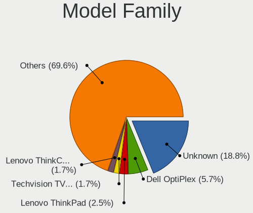
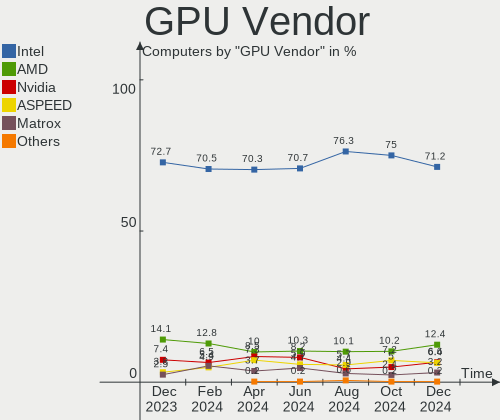
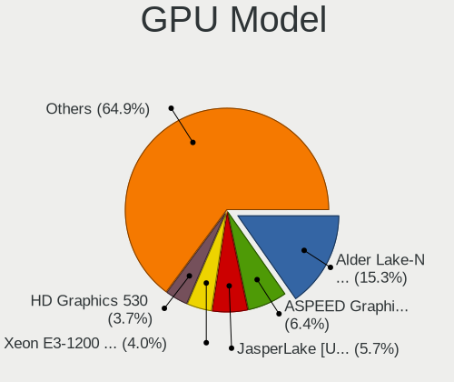
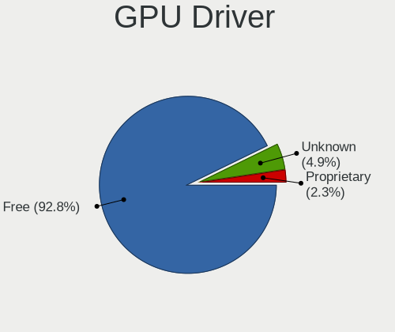
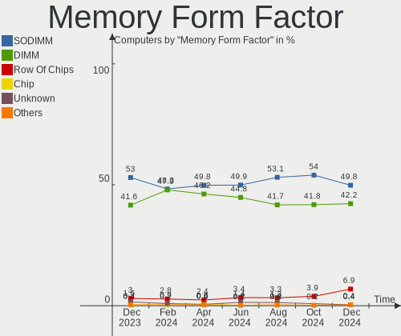

BSD Hardware Trends
-------------------

A project to identify most popular hardware characteristics and track their change
over time based on data collected by BSD users at https://BSD-Hardware.info.

Anyone can contribute to the study by uploading probes of their computers by
the [hw-probe](https://github.com/linuxhw/hw-probe/blob/master/INSTALL.BSD.md) tool:

    hw-probe -all -upload

This is a report for all computer types. See also reports for [desktops](/Desktop/README.md) and [notebooks](/Notebook/README.md).

Full-feature report is available here: https://bsd-hardware.info/?view=trends

OS-specific reports: [FreeBSD](/Dist/FreeBSD), [OPNsense](/Dist/OPNsense), [helloSystem](/Dist/helloSystem), [OpenBSD](/Dist/OpenBSD).

Period: May, 2021.

Contents
--------

- [ OS                       ](#os)
- [ OS Family                ](#os-family)
- [ Arch                     ](#arch)
- [ DE                       ](#de)
- [ Display Server           ](#display-server)
- [ Display Manager          ](#display-manager)
- [ OS Lang                  ](#os-lang)
- [ Boot Mode                ](#boot-mode)
- [ Filesystem               ](#filesystem)
- [ Part. scheme             ](#part-scheme)
- [ Country                  ](#country)
- [ City                     ](#city)
- [ Vendor                   ](#vendor)
- [ Model                    ](#model)
- [ Model Family             ](#model-family)
- [ MFG Year                 ](#mfg-year)
- [ Form Factor              ](#form-factor)
- [ Coreboot                 ](#coreboot)
- [ RAM Size                 ](#ram-size)
- [ RAM Used                 ](#ram-used)
- [ Has CD-ROM               ](#has-cd-rom)
- [ Total Drives             ](#total-drives)
- [ Has Ethernet             ](#has-ethernet)
- [ Has WiFi                 ](#has-wifi)
- [ Has Bluetooth            ](#has-bluetooth)
- [ Drive Vendor             ](#drive-vendor)
- [ Drive Model              ](#drive-model)
- [ HDD Vendor               ](#hdd-vendor)
- [ SSD Vendor               ](#ssd-vendor)
- [ Drive Kind               ](#drive-kind)
- [ Drive Connector          ](#drive-connector)
- [ Drive Size               ](#drive-size)
- [ Space Total              ](#space-total)
- [ Space Used               ](#space-used)
- [ Malfunc. Drives          ](#malfunc-drives)
- [ Malfunc. Drive Vendor    ](#malfunc-drive-vendor)
- [ Malfunc. HDD Vendor      ](#malfunc-hdd-vendor)
- [ Malfunc. Drive Kind      ](#malfunc-drive-kind)
- [ Failed Drives            ](#failed-drives)
- [ Failed Drive Vendor      ](#failed-drive-vendor)
- [ Drive Status             ](#drive-status)
- [ Storage Vendor           ](#storage-vendor)
- [ Storage Model            ](#storage-model)
- [ Storage Kind             ](#storage-kind)
- [ CPU Vendor               ](#cpu-vendor)
- [ CPU Model                ](#cpu-model)
- [ CPU Model Family         ](#cpu-model-family)
- [ CPU Cores                ](#cpu-cores)
- [ CPU Sockets              ](#cpu-sockets)
- [ CPU Threads              ](#cpu-threads)
- [ CPU Microarch            ](#cpu-microarch)
- [ GPU Vendor               ](#gpu-vendor)
- [ GPU Model                ](#gpu-model)
- [ GPU Combo                ](#gpu-combo)
- [ GPU Driver               ](#gpu-driver)
- [ GPU Memory               ](#gpu-memory)
- [ Monitor Vendor           ](#monitor-vendor)
- [ Monitor Model            ](#monitor-model)
- [ Monitor Resolution       ](#monitor-resolution)
- [ Monitor Diagonal         ](#monitor-diagonal)
- [ Monitor Width            ](#monitor-width)
- [ Aspect Ratio             ](#aspect-ratio)
- [ Monitor Area             ](#monitor-area)
- [ Pixel Density            ](#pixel-density)
- [ Multiple Monitors        ](#multiple-monitors)
- [ Net Controller Vendor    ](#net-controller-vendor)
- [ Net Controller Model     ](#net-controller-model)
- [ Wireless Vendor          ](#wireless-vendor)
- [ Wireless Model           ](#wireless-model)
- [ Ethernet Vendor          ](#ethernet-vendor)
- [ Ethernet Model           ](#ethernet-model)
- [ Net Controller Kind      ](#net-controller-kind)
- [ Used Controller          ](#used-controller)
- [ NICs                     ](#nics)
- [ IPv6                     ](#ipv6)
- [ Memory Vendor            ](#memory-vendor)
- [ Memory Model             ](#memory-model)
- [ Memory Kind              ](#memory-kind)
- [ Memory Form Factor       ](#memory-form-factor)
- [ Memory Size              ](#memory-size)
- [ Memory Speed             ](#memory-speed)
- [ Sound Vendor             ](#sound-vendor)
- [ Sound Model              ](#sound-model)
- [ Camera Vendor            ](#camera-vendor)
- [ Camera Model             ](#camera-model)
- [ Fingerprint Vendor       ](#fingerprint-vendor)
- [ Fingerprint Model        ](#fingerprint-model)
- [ Chipcard Vendor          ](#chipcard-vendor)
- [ Chipcard Model           ](#chipcard-model)
- [ Printer Vendor           ](#printer-vendor)
- [ Printer Model            ](#printer-model)
- [ Scanner Vendor           ](#scanner-vendor)
- [ Scanner Model            ](#scanner-model)
- [ Bluetooth Vendor         ](#bluetooth-vendor)
- [ Bluetooth Model          ](#bluetooth-model)
- [ Unsupported Devices      ](#unsupported-devices)
- [ Unsupported Device Types ](#unsupported-device-types)

OS
--

Installed operating systems

| Name                   | Computers | Percent |
|------------------------|-----------|---------|
| OPNsense 21.1.5        | 171       | 46.72%  |
| FreeBSD 13.0           | 54        | 14.75%  |
| OPNsense 21.1.6        | 35        | 9.56%   |
| OpenBSD 6.9            | 21        | 5.74%   |
| helloSystem 0.4.0      | 10        | 2.73%   |
| FreeBSD 14.0-CURRENT   | 8         | 2.19%   |
| OPNsense 21.7          | 5         | 1.37%   |
| GhostBSD 20.04.02      | 5         | 1.37%   |
| FreeBSD 13.0-p1        | 5         | 1.37%   |
| FreeBSD 12.2-p6        | 5         | 1.37%   |
| OPNsense 21.1.4        | 4         | 1.09%   |
| OPNsense 21.1          | 4         | 1.09%   |
| NomadBSD 5806f915      | 4         | 1.09%   |
| TrueNAS 12.2-p6        | 3         | 0.82%   |
| OpenBSD 6.8            | 3         | 0.82%   |
| OPNsense 21.1.3        | 2         | 0.55%   |
| OPNsense 20.7.8        | 2         | 0.55%   |
| NetBSD 9.2             | 2         | 0.55%   |
| MidnightBSD 2.0.7      | 2         | 0.55%   |
| FreeBSD 12.2-STABLE    | 2         | 0.55%   |
| FreeBSD 12.2-p4        | 2         | 0.55%   |
| FreeBSD 11.4-p9        | 2         | 0.55%   |
| XigmaNAS 12.2-p6       | 1         | 0.27%   |
| TrueNAS 12.2-p2        | 1         | 0.27%   |
| OPNsense 21.1.2        | 1         | 0.27%   |
| OPNsense 20.7          | 1         | 0.27%   |
| OPNsense 12.1-p16-HBSD | 1         | 0.27%   |
| NetBSD 9.2_STABLE      | 1         | 0.27%   |
| helloSystem 0.3.0      | 1         | 0.27%   |
| FreeNAS 11.2-STABLE    | 1         | 0.27%   |
| FreeNAS 11.2-p9        | 1         | 0.27%   |
| FreeBSD 13.0-STABLE    | 1         | 0.27%   |
| FreeBSD 12.2-p3        | 1         | 0.27%   |
| FreeBSD 12.2-p2        | 1         | 0.27%   |
| FreeBSD 12.1-p16-HBSD  | 1         | 0.27%   |
| FreeBSD 12.1           | 1         | 0.27%   |
| DragonFly 6.0          | 1         | 0.27%   |

OS Family
---------

OS without a version

| Name        | Computers | Percent |
|-------------|-----------|---------|
| OPNsense    | 226       | 61.75%  |
| FreeBSD     | 83        | 22.68%  |
| OpenBSD     | 24        | 6.56%   |
| helloSystem | 11        | 3.01%   |
| GhostBSD    | 5         | 1.37%   |
| TrueNAS     | 4         | 1.09%   |
| NomadBSD    | 4         | 1.09%   |
| NetBSD      | 3         | 0.82%   |
| MidnightBSD | 2         | 0.55%   |
| FreeNAS     | 2         | 0.55%   |
| XigmaNAS    | 1         | 0.27%   |
| DragonFly   | 1         | 0.27%   |

Arch
----

OS architecture (x86_64, i586, etc.)

| Name   | Computers | Percent |
|--------|-----------|---------|
| amd64  | 347       | 94.81%  |
| i386   | 9         | 2.46%   |
| arm64  | 6         | 1.64%   |
| macppc | 2         | 0.55%   |
| evbarm | 1         | 0.27%   |
| arm    | 1         | 0.27%   |

DE
--

Desktop Environment

| Name         | Computers | Percent |
|--------------|-----------|---------|
| Console      | 265       | 72.4%   |
| XFCE         | 16        | 4.37%   |
| KDE5         | 16        | 4.37%   |
| fvwm         | 16        | 4.37%   |
| GNOME        | 12        | 3.28%   |
| MATE         | 11        | 3.01%   |
| helloDesktop | 11        | 3.01%   |
| TWM          | 7         | 1.91%   |
| Openbox      | 5         | 1.37%   |
| AwesomeWM    | 2         | 0.55%   |
| LXQt         | 1         | 0.27%   |
| i3           | 1         | 0.27%   |
| GNUstep      | 1         | 0.27%   |
| Fluxbox      | 1         | 0.27%   |
| Cinnamon     | 1         | 0.27%   |

Display Server
--------------

X11 or Wayland

| Name    | Computers | Percent |
|---------|-----------|---------|
| Console | 267       | 72.95%  |
| X11     | 98        | 26.78%  |
| Wayland | 1         | 0.27%   |

Display Manager
---------------

SDDM, LightDM, etc.

| Name    | Computers | Percent |
|---------|-----------|---------|
| Console | 301       | 82.24%  |
| SLiM    | 23        | 6.28%   |
| SDDM    | 15        | 4.1%    |
| GDM     | 10        | 2.73%   |
| LightDM | 9         | 2.46%   |
| XDM     | 7         | 1.91%   |
| Ly      | 1         | 0.27%   |

OS Lang
-------

Language

| Lang    | Computers | Percent |
|---------|-----------|---------|
| Unknown | 259       | 70.77%  |
| C       | 49        | 13.39%  |
| en_US   | 31        | 8.47%   |
| ru_RU   | 7         | 1.91%   |
| fr_FR   | 4         | 1.09%   |
| de_DE   | 4         | 1.09%   |
| en_GB   | 3         | 0.82%   |
| nb_NO   | 2         | 0.55%   |
| es_ES   | 2         | 0.55%   |
| uk_UA   | 1         | 0.27%   |
| sv_SE   | 1         | 0.27%   |
| pt_BR   | 1         | 0.27%   |
| ja_JP   | 1         | 0.27%   |
| de_CH   | 1         | 0.27%   |

Boot Mode
---------

EFI or BIOS

| Mode | Computers | Percent |
|------|-----------|---------|
| EFI  | 278       | 75.96%  |
| BIOS | 88        | 24.04%  |

Filesystem
----------

Type of filesystem

| Type    | Computers | Percent |
|---------|-----------|---------|
| Ufs     | 262       | 71.58%  |
| Zfs     | 79        | 21.58%  |
| Ffs     | 24        | 6.56%   |
| Hammer2 | 1         | 0.27%   |

Part. scheme
------------

Scheme of partitioning

| Type    | Computers | Percent |
|---------|-----------|---------|
| GPT     | 310       | 84.7%   |
| MBR     | 53        | 14.48%  |
| Unknown | 3         | 0.82%   |

Country
-------

Geographic location (country)

| Country                | Computers | Percent |
|------------------------|-----------|---------|
| USA                    | 104       | 28.42%  |
| Germany                | 70        | 19.13%  |
| UK                     | 19        | 5.19%   |
| France                 | 17        | 4.64%   |
| Canada                 | 17        | 4.64%   |
| Switzerland            | 11        | 3.01%   |
| Russia                 | 11        | 3.01%   |
| Australia              | 10        | 2.73%   |
| Poland                 | 9         | 2.46%   |
| Netherlands            | 9         | 2.46%   |
| Brazil                 | 8         | 2.19%   |
| Ukraine                | 7         | 1.91%   |
| Sweden                 | 7         | 1.91%   |
| Austria                | 6         | 1.64%   |
| Thailand               | 4         | 1.09%   |
| Taiwan                 | 3         | 0.82%   |
| Japan                  | 3         | 0.82%   |
| Italy                  | 3         | 0.82%   |
| Guadeloupe             | 3         | 0.82%   |
| Spain                  | 2         | 0.55%   |
| Romania                | 2         | 0.55%   |
| Norway                 | 2         | 0.55%   |
| Mexico                 | 2         | 0.55%   |
| Ireland                | 2         | 0.55%   |
| Indonesia              | 2         | 0.55%   |
| India                  | 2         | 0.55%   |
| Greece                 | 2         | 0.55%   |
| Egypt                  | 2         | 0.55%   |
| Denmark                | 2         | 0.55%   |
| Czechia                | 2         | 0.55%   |
| Colombia               | 2         | 0.55%   |
| Belgium                | 2         | 0.55%   |
| Vietnam                | 1         | 0.27%   |
| Turkey                 | 1         | 0.27%   |
| South Korea            | 1         | 0.27%   |
| South Africa           | 1         | 0.27%   |
| Slovakia               | 1         | 0.27%   |
| Qatar                  | 1         | 0.27%   |
| Portugal               | 1         | 0.27%   |
| Pakistan               | 1         | 0.27%   |
| Nepal                  | 1         | 0.27%   |
| Malaysia               | 1         | 0.27%   |
| Lithuania              | 1         | 0.27%   |
| Liechtenstein          | 1         | 0.27%   |
| Hungary                | 1         | 0.27%   |
| Finland                | 1         | 0.27%   |
| Estonia                | 1         | 0.27%   |
| Costa Rica             | 1         | 0.27%   |
| China                  | 1         | 0.27%   |
| Bosnia and Herzegovina | 1         | 0.27%   |
| Argentina              | 1         | 0.27%   |

City
----

Geographic location (city)

| City                | Computers | Percent |
|---------------------|-----------|---------|
| Saint-Laurent       | 7         | 1.91%   |
| Munich              | 5         | 1.37%   |
| Hamburg             | 5         | 1.37%   |
| Berlin              | 5         | 1.37%   |
| Seattle             | 4         | 1.09%   |
| Ozersk              | 4         | 1.09%   |
| Kyiv                | 4         | 1.09%   |
| Cologne             | 4         | 1.09%   |
| Vienna              | 3         | 0.82%   |
| São Paulo          | 3         | 0.82%   |
| San Diego           | 3         | 0.82%   |
| Redmond             | 3         | 0.82%   |
| Raleigh             | 3         | 0.82%   |
| Ottawa              | 3         | 0.82%   |
| Moscow              | 3         | 0.82%   |
| London              | 3         | 0.82%   |
| Bielefeld           | 3         | 0.82%   |
| Beaverton           | 3         | 0.82%   |
| Alphen aan den Rijn | 3         | 0.82%   |
| Zurich              | 2         | 0.55%   |
| Ypsilanti           | 2         | 0.55%   |
| Wuppertal           | 2         | 0.55%   |
| Victoria            | 2         | 0.55%   |
| Taipei              | 2         | 0.55%   |
| Stuttgart           | 2         | 0.55%   |
| Sollentuna          | 2         | 0.55%   |
| San Antonio         | 2         | 0.55%   |
| Royal Oak           | 2         | 0.55%   |
| Prague              | 2         | 0.55%   |
| Plainfield          | 2         | 0.55%   |
| Paris               | 2         | 0.55%   |
| Nuremberg           | 2         | 0.55%   |
| North Bend          | 2         | 0.55%   |
| New Albany          | 2         | 0.55%   |
| Menlo Park          | 2         | 0.55%   |
| Los Angeles         | 2         | 0.55%   |
| Le Gosier           | 2         | 0.55%   |
| Layton              | 2         | 0.55%   |
| Iowa City           | 2         | 0.55%   |
| Hohenlockstedt      | 2         | 0.55%   |
| Graz                | 2         | 0.55%   |
| Frankfurt am Main   | 2         | 0.55%   |
| El Dorado Hills     | 2         | 0.55%   |
| Dallas              | 2         | 0.55%   |
| Buchs               | 2         | 0.55%   |
| Brighton            | 2         | 0.55%   |
| Athens              | 2         | 0.55%   |
| Świętochłowice   | 1         | 0.27%   |
| Zufikon             | 1         | 0.27%   |
| Zeuthen             | 1         | 0.27%   |
| Zajaczki Pierwsze   | 1         | 0.27%   |
| Wylie               | 1         | 0.27%   |
| Wroclaw             | 1         | 0.27%   |
| Wolfsburg           | 1         | 0.27%   |
| Windsor             | 1         | 0.27%   |
| Wiesbaden           | 1         | 0.27%   |
| Westland            | 1         | 0.27%   |
| West Hartford       | 1         | 0.27%   |
| Wenatchee           | 1         | 0.27%   |
| Waverly             | 1         | 0.27%   |

Vendor
------

Motherboard manufacturer

| Name                           | Computers | Percent |
|--------------------------------|-----------|---------|
| Dell                           | 40        | 10.93%  |
| ASUSTek Computer               | 39        | 10.66%  |
| Unknown                        | 34        | 9.29%   |
| Lenovo                         | 29        | 7.92%   |
| Hewlett-Packard                | 26        | 7.1%    |
| Supermicro                     | 22        | 6.01%   |
| MSI                            | 20        | 5.46%   |
| Protectli                      | 15        | 4.1%    |
| ASRock                         | 15        | 4.1%    |
| PC Engines                     | 14        | 3.83%   |
| Gigabyte Technology            | 12        | 3.28%   |
| Intel                          | 11        | 3.01%   |
| Shuttle                        | 9         | 2.46%   |
| AMI                            | 9         | 2.46%   |
| Fujitsu                        | 7         | 1.91%   |
| Apple                          | 6         | 1.64%   |
| Acer                           | 5         | 1.37%   |
| ZOTAC                          | 4         | 1.09%   |
| SeeedStudio                    | 4         | 1.09%   |
| AWOW                           | 3         | 0.82%   |
| ASRockRack                     | 3         | 0.82%   |
| Sophos                         | 2         | 0.55%   |
| Panasonic                      | 2         | 0.55%   |
| Notebook                       | 2         | 0.55%   |
| Matsushita Electric Industrial | 2         | 0.55%   |
| BESSTAR Tech                   | 2         | 0.55%   |
| Advantech                      | 2         | 0.55%   |
| Yanling                        | 1         | 0.27%   |
| Toshiba                        | 1         | 0.27%   |
| Thomas-Krenn.AG                | 1         | 0.27%   |
| System76                       | 1         | 0.27%   |
| Sony                           | 1         | 0.27%   |
| Semp Toshiba                   | 1         | 0.27%   |
| Pegatron                       | 1         | 0.27%   |
| Packard Bell                   | 1         | 0.27%   |
| Nuage Networks                 | 1         | 0.27%   |
| NU941                          | 1         | 0.27%   |
| NU591                          | 1         | 0.27%   |
| NEXCOM                         | 1         | 0.27%   |
| Lex                            | 1         | 0.27%   |
| Kontron Europe                 | 1         | 0.27%   |
| Jetway                         | 1         | 0.27%   |
| Inventec                       | 1         | 0.27%   |
| IBM                            | 1         | 0.27%   |
| GVC                            | 1         | 0.27%   |
| Google                         | 1         | 0.27%   |
| Foxconn                        | 1         | 0.27%   |
| EVGA                           | 1         | 0.27%   |
| Deciso                         | 1         | 0.27%   |
| Compulab                       | 1         | 0.27%   |
| CheckPoint                     | 1         | 0.27%   |
| Biostar                        | 1         | 0.27%   |
| Barracuda Networks             | 1         | 0.27%   |
| Alienware                      | 1         | 0.27%   |

Model
-----

Motherboard model

| Name                                           | Computers | Percent |
|------------------------------------------------|-----------|---------|
| Unknown                                        | 34        | 9.29%   |
| Protectli FW4B                                 | 9         | 2.46%   |
| AMI Aptio CRB                                  | 8         | 2.19%   |
| PC Engines apu4                                | 6         | 1.64%   |
| PC Engines APU2                                | 6         | 1.64%   |
| ASUS All Series                                | 6         | 1.64%   |
| Supermicro Super Server                        | 5         | 1.37%   |
| Supermicro X9SCL/X9SCM                         | 4         | 1.09%   |
| Protectli FW6                                  | 4         | 1.09%   |
| Intel Q3XXG4-P V1.0                            | 4         | 1.09%   |
| Dell PowerEdge R210 II                         | 4         | 1.09%   |
| SeeedStudio ODYSSEY-X86J4105                   | 3         | 0.82%   |
| HP t730 Thin Client                            | 3         | 0.82%   |
| AWOW PC BOX                                    | 3         | 0.82%   |
| ZOTAC ZBOX-CI327NANO-GS-01                     | 2         | 0.55%   |
| Supermicro A1SAi                               | 2         | 0.55%   |
| MSI MS-7C08                                    | 2         | 0.55%   |
| HP Z230 SFF Workstation                        | 2         | 0.55%   |
| HP ProLiant MicroServer Gen8                   | 2         | 0.55%   |
| Gigabyte B365M DS3H                            | 2         | 0.55%   |
| Fujitsu PRIMERGY RX2530 M5                     | 2         | 0.55%   |
| Dell Wyse 5070 Extended Thin Client            | 2         | 0.55%   |
| Dell OptiPlex 9020                             | 2         | 0.55%   |
| Dell OptiPlex 780                              | 2         | 0.55%   |
| Dell OptiPlex 7010                             | 2         | 0.55%   |
| Dell Latitude E6410                            | 2         | 0.55%   |
| ASUS P8H77-M PRO                               | 2         | 0.55%   |
| ZOTAC ZBOX-MI522NANO/MI542NANO                 | 1         | 0.27%   |
| ZOTAC ZBOX-CI323NANO                           | 1         | 0.27%   |
| Yanling YL-KBR6L                               | 1         | 0.27%   |
| Toshiba TECRA M11                              | 1         | 0.27%   |
| Thomas-Krenn.AG LES network+                   | 1         | 0.27%   |
| System76 Gazelle                               | 1         | 0.27%   |
| Supermicro X8STi                               | 1         | 0.27%   |
| Supermicro X8DTU-LN4+                          | 1         | 0.27%   |
| Supermicro X7SPA-HF                            | 1         | 0.27%   |
| Supermicro X7DCL                               | 1         | 0.27%   |
| Supermicro X10SLH-N6-ST031                     | 1         | 0.27%   |
| Supermicro SYS-E301-9D-8CN8TP                  | 1         | 0.27%   |
| Supermicro SYS-5019A-FTN4                      | 1         | 0.27%   |
| Supermicro SYS-5018A-TN4                       | 1         | 0.27%   |
| Supermicro NSMPX-5500                          | 1         | 0.27%   |
| Supermicro IB-1050                             | 1         | 0.27%   |
| Supermicro 1HE Intel Single-CPU RI1104H Server | 1         | 0.27%   |
| Sophos XG                                      | 1         | 0.27%   |
| Sophos SG                                      | 1         | 0.27%   |
| Sony SVP1322M1EBI                              | 1         | 0.27%   |
| Shuttle XS35V5                                 | 1         | 0.27%   |
| Shuttle TERRA_PC                               | 1         | 0.27%   |
| Shuttle SH87R                                  | 1         | 0.27%   |
| Shuttle DS81D                                  | 1         | 0.27%   |
| Shuttle DS77U                                  | 1         | 0.27%   |
| Shuttle DS10U                                  | 1         | 0.27%   |
| Shuttle DH370                                  | 1         | 0.27%   |
| Shuttle DH310V2                                | 1         | 0.27%   |
| Shuttle DH110                                  | 1         | 0.27%   |
| Semp Toshiba STI                               | 1         | 0.27%   |
| SeeedStudio ODYSSEY-X86J4125                   | 1         | 0.27%   |
| Protectli LES compact 4L                       | 1         | 0.27%   |
| Protectli FW6E                                 | 1         | 0.27%   |

Model Family
------------

Motherboard model prefix

| Name                          | Computers | Percent |
|-------------------------------|-----------|---------|
| Unknown                       | 34        | 9.29%   |
| Lenovo ThinkPad               | 16        | 4.37%   |
| Dell PowerEdge                | 12        | 3.28%   |
| Dell OptiPlex                 | 11        | 3.01%   |
| Protectli FW4B                | 9         | 2.46%   |
| HP ProLiant                   | 8         | 2.19%   |
| Dell Latitude                 | 8         | 2.19%   |
| AMI Aptio                     | 8         | 2.19%   |
| PC Engines apu4               | 6         | 1.64%   |
| PC Engines apu2               | 6         | 1.64%   |
| Lenovo ThinkCentre            | 6         | 1.64%   |
| ASUS TUF                      | 6         | 1.64%   |
| ASUS All                      | 6         | 1.64%   |
| Supermicro Super              | 5         | 1.37%   |
| Supermicro X9SCL              | 4         | 1.09%   |
| Protectli FW6                 | 4         | 1.09%   |
| Intel Q3XXG4-P                | 4         | 1.09%   |
| Fujitsu PRIMERGY              | 4         | 1.09%   |
| SeeedStudio ODYSSEY-X86J4105  | 3         | 0.82%   |
| HP t730                       | 3         | 0.82%   |
| Dell Inspiron                 | 3         | 0.82%   |
| AWOW PC                       | 3         | 0.82%   |
| ZOTAC ZBOX-CI327NANO-GS-01    | 2         | 0.55%   |
| Supermicro A1SAi              | 2         | 0.55%   |
| MSI MS-7C08                   | 2         | 0.55%   |
| Lenovo ThinkStation           | 2         | 0.55%   |
| HP Z230                       | 2         | 0.55%   |
| HP Pavilion                   | 2         | 0.55%   |
| HP Compaq                     | 2         | 0.55%   |
| Gigabyte B365M                | 2         | 0.55%   |
| Fujitsu FUTRO                 | 2         | 0.55%   |
| Dell Wyse                     | 2         | 0.55%   |
| Dell Precision                | 2         | 0.55%   |
| ASUS PRIME                    | 2         | 0.55%   |
| ASUS P8H77-M                  | 2         | 0.55%   |
| ASRock X570                   | 2         | 0.55%   |
| Acer Aspire                   | 2         | 0.55%   |
| ZOTAC ZBOX-MI522NANO          | 1         | 0.27%   |
| ZOTAC ZBOX-CI323NANO          | 1         | 0.27%   |
| Yanling YL-KBR6L              | 1         | 0.27%   |
| Toshiba TECRA                 | 1         | 0.27%   |
| Thomas-Krenn.AG LES           | 1         | 0.27%   |
| System76 Gazelle              | 1         | 0.27%   |
| Supermicro X8STi              | 1         | 0.27%   |
| Supermicro X8DTU-LN4+         | 1         | 0.27%   |
| Supermicro X7SPA-HF           | 1         | 0.27%   |
| Supermicro X7DCL              | 1         | 0.27%   |
| Supermicro X10SLH-N6-ST031    | 1         | 0.27%   |
| Supermicro SYS-E301-9D-8CN8TP | 1         | 0.27%   |
| Supermicro SYS-5019A-FTN4     | 1         | 0.27%   |
| Supermicro SYS-5018A-TN4      | 1         | 0.27%   |
| Supermicro NSMPX-5500         | 1         | 0.27%   |
| Supermicro IB-1050            | 1         | 0.27%   |
| Supermicro 1HE                | 1         | 0.27%   |
| Sophos XG                     | 1         | 0.27%   |
| Sophos SG                     | 1         | 0.27%   |
| Sony SVP1322M1EBI             | 1         | 0.27%   |
| Shuttle XS35V5                | 1         | 0.27%   |
| Shuttle TERRA                 | 1         | 0.27%   |
| Shuttle SH87R                 | 1         | 0.27%   |

MFG Year
--------

Motherboard manufacture year

| Year    | Computers | Percent |
|---------|-----------|---------|
| 2020    | 86        | 23.5%   |
| 2019    | 47        | 12.84%  |
| 2018    | 39        | 10.66%  |
| 2015    | 27        | 7.38%   |
| 2021    | 23        | 6.28%   |
| 2016    | 21        | 5.74%   |
| 2014    | 21        | 5.74%   |
| 2013    | 18        | 4.92%   |
| 2012    | 16        | 4.37%   |
| 2011    | 14        | 3.83%   |
| 2010    | 13        | 3.55%   |
| Unknown | 13        | 3.55%   |
| 2008    | 11        | 3.01%   |
| 2017    | 9         | 2.46%   |
| 2009    | 6         | 1.64%   |
| 2006    | 1         | 0.27%   |
| 2002    | 1         | 0.27%   |

Form Factor
-----------

Physical design of the computer

| Name           | Computers | Percent |
|----------------|-----------|---------|
| Desktop        | 225       | 61.48%  |
| Notebook       | 66        | 18.03%  |
| Mini pc        | 32        | 8.74%   |
| Server         | 31        | 8.47%   |
| System on chip | 7         | 1.91%   |
| Firewall       | 3         | 0.82%   |
| Convertible    | 2         | 0.55%   |

Coreboot
--------

Have coreboot on board

| Used | Computers | Percent |
|------|-----------|---------|
| No   | 344       | 93.99%  |
| Yes  | 22        | 6.01%   |

RAM Size
--------

Total RAM memory

| Size in GB  | Computers | Percent |
|-------------|-----------|---------|
| 8.01-16.0   | 121       | 33.06%  |
| 4.01-8.0    | 74        | 20.22%  |
| 16.01-24.0  | 66        | 18.03%  |
| 32.01-64.0  | 41        | 11.2%   |
| 64.01-256.0 | 25        | 6.83%   |
| 2.01-3.0    | 14        | 3.83%   |
| 24.01-32.0  | 7         | 1.91%   |
| 0.51-1.0    | 7         | 1.91%   |
| 3.01-4.0    | 6         | 1.64%   |
| 1.01-2.0    | 3         | 0.82%   |
| 0.01-0.5    | 2         | 0.55%   |

RAM Used
--------

Used RAM memory

| Used GB     | Computers | Percent |
|-------------|-----------|---------|
| 0.01-0.5    | 193       | 52.73%  |
| 0.51-1.0    | 82        | 22.4%   |
| 1.01-2.0    | 45        | 12.3%   |
| 3.01-4.0    | 10        | 2.73%   |
| 2.01-3.0    | 8         | 2.19%   |
| 4.01-8.0    | 6         | 1.64%   |
| 0           | 6         | 1.64%   |
| 32.01-64.0  | 5         | 1.37%   |
| 8.01-16.0   | 3         | 0.82%   |
| Unknown     | 3         | 0.82%   |
| 24.01-32.0  | 2         | 0.55%   |
| 16.01-24.0  | 2         | 0.55%   |
| 64.01-256.0 | 1         | 0.27%   |

Has CD-ROM
----------

Has CD-ROM on board

| Presented | Computers | Percent |
|-----------|-----------|---------|
| No        | 296       | 80.87%  |
| Yes       | 70        | 19.13%  |

Total Drives
------------

Number of drives on board

| Drives | Computers | Percent |
|--------|-----------|---------|
| 1      | 256       | 69.95%  |
| 2      | 49        | 13.39%  |
| 0      | 24        | 6.56%   |
| 3      | 16        | 4.37%   |
| 7      | 4         | 1.09%   |
| 6      | 4         | 1.09%   |
| 4      | 4         | 1.09%   |
| 9      | 2         | 0.55%   |
| 8      | 2         | 0.55%   |
| 5      | 2         | 0.55%   |
| 26     | 1         | 0.27%   |
| 12     | 1         | 0.27%   |
| 10     | 1         | 0.27%   |

Has Ethernet
------------

Has Ethernet on board

| Presented | Computers | Percent |
|-----------|-----------|---------|
| Yes       | 353       | 96.45%  |
| No        | 13        | 3.55%   |

Has WiFi
--------

Has WiFi module

| Presented | Computers | Percent |
|-----------|-----------|---------|
| No        | 238       | 65.03%  |
| Yes       | 128       | 34.97%  |

Has Bluetooth
-------------

Has Bluetooth module

| Presented | Computers | Percent |
|-----------|-----------|---------|
| No        | 284       | 77.6%   |
| Yes       | 82        | 22.4%   |

Drive Vendor
------------

Hard drive vendors

| Vendor              | Computers | Drives | Percent |
|---------------------|-----------|--------|---------|
| Samsung Electronics | 68        | 91     | 15.42%  |
| WDC                 | 53        | 100    | 12.02%  |
| Seagate             | 47        | 77     | 10.66%  |
| Kingston            | 31        | 33     | 7.03%   |
| Toshiba             | 29        | 35     | 6.58%   |
| Crucial             | 22        | 25     | 4.99%   |
| SanDisk             | 21        | 22     | 4.76%   |
| Transcend           | 15        | 15     | 3.4%    |
| Intel               | 14        | 15     | 3.17%   |
| Hoodisk             | 11        | 11     | 2.49%   |
| A-DATA Technology   | 11        | 11     | 2.49%   |
| Phison              | 9         | 9      | 2.04%   |
| Hitachi             | 8         | 10     | 1.81%   |
| HGST                | 8         | 9      | 1.81%   |
| Dogfish             | 7         | 7      | 1.59%   |
| NVMe                | 6         | 7      | 1.36%   |
| Hewlett-Packard     | 6         | 9      | 1.36%   |
| FORESEE             | 6         | 6      | 1.36%   |
| PNY                 | 4         | 4      | 0.91%   |
| PLEXTOR             | 4         | 4      | 0.91%   |
| China               | 4         | 4      | 0.91%   |
| ATP                 | 4         | 4      | 0.91%   |
| SPCC                | 3         | 3      | 0.68%   |
| SK Hynix            | 3         | 3      | 0.68%   |
| Protectli           | 3         | 3      | 0.68%   |
| LITEON              | 3         | 3      | 0.68%   |
| Gigabyte Technology | 3         | 3      | 0.68%   |
| Corsair             | 3         | 3      | 0.68%   |
| BIWIN               | 3         | 3      | 0.68%   |
| Silicon Motion      | 2         | 2      | 0.45%   |
| Micron Technology   | 2         | 3      | 0.45%   |
| HPE                 | 2         | 2      | 0.45%   |
| GOODRAM             | 2         | 2      | 0.45%   |
| FTS                 | 2         | 2      | 0.45%   |
| Apacer              | 2         | 2      | 0.45%   |
| ZTC                 | 1         | 1      | 0.23%   |
| Verbatim            | 1         | 1      | 0.23%   |
| Team                | 1         | 1      | 0.23%   |
| Smartbuy            | 1         | 1      | 0.23%   |
| Pioneer             | 1         | 1      | 0.23%   |
| Patriot             | 1         | 1      | 0.23%   |
| OWC                 | 1         | 1      | 0.23%   |
| OPENBSD             | 1         | 1      | 0.23%   |
| OCZ                 | 1         | 1      | 0.23%   |
| Multiple            | 1         | 1      | 0.23%   |
| LSILOGIC            | 1         | 1      | 0.23%   |
| Lenovo              | 1         | 1      | 0.23%   |
| Kston               | 1         | 1      | 0.23%   |
| KingDian            | 1         | 1      | 0.23%   |
| Intenso             | 1         | 1      | 0.23%   |
| HP Phison           | 1         | 1      | 0.23%   |
| Fujitsu             | 1         | 1      | 0.23%   |
| Dell                | 1         | 1      | 0.23%   |
| BAITITON            | 1         | 1      | 0.23%   |
| AMD                 | 1         | 2      | 0.23%   |

Drive Model
-----------

Hard drive models

| Model                            | Computers | Percent |
|----------------------------------|-----------|---------|
| Seagate ST500LM021-1KJ152 500GB  | 5         | 1.04%   |
| Samsung SSD 850 EVO 250GB        | 5         | 1.04%   |
| Phison SATA SSD 16GB             | 5         | 1.04%   |
| Kingston SUV500MS120G 120GB      | 5         | 1.04%   |
| Samsung SSD 860 EVO 500GB        | 4         | 0.83%   |
| Samsung SSD 840 EVO 250GB        | 4         | 0.83%   |
| Kingston SA400S37240G 240GB      | 4         | 0.83%   |
| Hoodisk SSD 32GB                 | 4         | 0.83%   |
| FORESEE 128GB SSD                | 4         | 0.83%   |
| WDC WD30EFRX-68EUZN0 3TB         | 3         | 0.62%   |
| Transcend TS128GMSA230S 128GB    | 3         | 0.62%   |
| Toshiba MQ01ABD100 1TB           | 3         | 0.62%   |
| Toshiba DT01ACA100 1TB           | 3         | 0.62%   |
| Seagate ST4000DM000-1F2168 4TB   | 3         | 0.62%   |
| Samsung SSD 970 EVO Plus 1TB     | 3         | 0.62%   |
| Samsung MZVLB256HBHQ-000L7 256GB | 3         | 0.62%   |
| Hoodisk SSD 64GB                 | 3         | 0.62%   |
| Hoodisk SSD 128GB                | 3         | 0.62%   |
| HP RAID 0 240GB                  | 3         | 0.62%   |
| Crucial CT500MX500SSD1 500GB     | 3         | 0.62%   |
| Crucial CT240BX500SSD1 240GB     | 3         | 0.62%   |
| WDC WD30EFRX-68N32N0 3TB         | 2         | 0.41%   |
| WDC WD20EARX-00PASB0 2TB         | 2         | 0.41%   |
| WDC WD1600BEVT-22ZCT0 160GB      | 2         | 0.41%   |
| Transcend TS256GMTS430S 256GB    | 2         | 0.41%   |
| Toshiba HDWE160 6TB              | 2         | 0.41%   |
| SPCC SPCCSolidStateDisk 256GB    | 2         | 0.41%   |
| Seagate ST8000VN004-2M2101 8TB   | 2         | 0.41%   |
| Seagate ST500DM002-1BD142 500GB  | 2         | 0.41%   |
| Seagate ST2000LM015-2E8174 2TB   | 2         | 0.41%   |
| Seagate ST1000LM049-2GH172 1TB   | 2         | 0.41%   |
| SanDisk SSD PLUS 120GB           | 2         | 0.41%   |
| SanDisk SDSA6MM-032G-1006 32GB   | 2         | 0.41%   |
| Samsung SSD 970 PRO 512GB        | 2         | 0.41%   |
| Samsung SSD 970 EVO 500GB        | 2         | 0.41%   |
| Samsung SSD 970 EVO 1TB          | 2         | 0.41%   |
| Samsung SSD 960 EVO 250GB        | 2         | 0.41%   |
| Samsung SSD 870 EVO 250GB        | 2         | 0.41%   |
| Samsung SSD 870 EVO 1TB          | 2         | 0.41%   |
| Samsung SSD 860 PRO 256GB        | 2         | 0.41%   |
| Samsung SSD 860 EVO M.2 250GB    | 2         | 0.41%   |
| Samsung SSD 860 EVO M.2 1TB      | 2         | 0.41%   |
| Samsung SSD 860 EVO 2TB          | 2         | 0.41%   |
| Samsung SSD 850 EVO 1TB          | 2         | 0.41%   |
| Samsung SSD 840 PRO Series 256GB | 2         | 0.41%   |
| Samsung SSD 840 PRO Series 128GB | 2         | 0.41%   |
| Samsung SSD 840 EVO 120GB        | 2         | 0.41%   |
| Protectli 120GB mSATA            | 2         | 0.41%   |
| NVMe Samsung SSD 960 500GB       | 2         | 0.41%   |
| Kingston SUV500MS240G 240GB      | 2         | 0.41%   |
| Kingston SMS200S3120G 120GB      | 2         | 0.41%   |
| Kingston SA400S37120G 120GB      | 2         | 0.41%   |
| Kingston SA2000M8250G 250GB      | 2         | 0.41%   |
| Kingston DataTraveler 3.0 32GB   | 2         | 0.41%   |
| Intel SSDPEKNW020T8 2TB          | 2         | 0.41%   |
| HPE MK0400GCTZA 400GB            | 2         | 0.41%   |
| HGST HUS724020ALA640 2TB         | 2         | 0.41%   |
| HGST HTS541010A9E680 1TB         | 2         | 0.41%   |
| FTS PRAID EP580i 2.8TB           | 2         | 0.41%   |
| FORESEE 64GB SSD                 | 2         | 0.41%   |

HDD Vendor
----------

Hard disk drive vendors

| Vendor              | Computers | Drives | Percent |
|---------------------|-----------|--------|---------|
| Seagate             | 45        | 75     | 30.41%  |
| WDC                 | 44        | 90     | 29.73%  |
| Toshiba             | 22        | 28     | 14.86%  |
| Hitachi             | 8         | 10     | 5.41%   |
| HGST                | 8         | 9      | 5.41%   |
| Samsung Electronics | 6         | 7      | 4.05%   |
| Hewlett-Packard     | 6         | 9      | 4.05%   |
| NVMe                | 4         | 4      | 2.7%    |
| OPENBSD             | 1         | 1      | 0.68%   |
| Multiple            | 1         | 1      | 0.68%   |
| LSILOGIC            | 1         | 1      | 0.68%   |
| Fujitsu             | 1         | 1      | 0.68%   |
| Dell                | 1         | 1      | 0.68%   |

SSD Vendor
----------

Solid state drive vendors

| Vendor              | Computers | Drives | Percent |
|---------------------|-----------|--------|---------|
| Samsung Electronics | 49        | 59     | 19.84%  |
| Kingston            | 26        | 28     | 10.53%  |
| SanDisk             | 21        | 22     | 8.5%    |
| Crucial             | 21        | 24     | 8.5%    |
| Transcend           | 15        | 15     | 6.07%   |
| Hoodisk             | 11        | 11     | 4.45%   |
| Intel               | 10        | 11     | 4.05%   |
| A-DATA Technology   | 8         | 8      | 3.24%   |
| Phison              | 7         | 7      | 2.83%   |
| DOGFISH             | 7         | 7      | 2.83%   |
| FORESEE             | 6         | 6      | 2.43%   |
| WDC                 | 5         | 5      | 2.02%   |
| PNY                 | 4         | 4      | 1.62%   |
| China               | 4         | 4      | 1.62%   |
| Toshiba             | 3         | 3      | 1.21%   |
| Protectli           | 3         | 3      | 1.21%   |
| LITEON              | 3         | 3      | 1.21%   |
| Corsair             | 3         | 3      | 1.21%   |
| BIWIN               | 3         | 3      | 1.21%   |
| ATP                 | 3         | 3      | 1.21%   |
| SPCC                | 2         | 2      | 0.81%   |
| PLEXTOR             | 2         | 2      | 0.81%   |
| NVMe                | 2         | 2      | 0.81%   |
| Micron Technology   | 2         | 3      | 0.81%   |
| HPE                 | 2         | 2      | 0.81%   |
| GOODRAM             | 2         | 2      | 0.81%   |
| Gigabyte Technology | 2         | 2      | 0.81%   |
| FTS                 | 2         | 2      | 0.81%   |
| Apacer              | 2         | 2      | 0.81%   |
| ZTC                 | 1         | 1      | 0.4%    |
| Verbatim            | 1         | 1      | 0.4%    |
| Team                | 1         | 1      | 0.4%    |
| Smartbuy            | 1         | 1      | 0.4%    |
| SK Hynix            | 1         | 1      | 0.4%    |
| Seagate             | 1         | 1      | 0.4%    |
| Pioneer             | 1         | 1      | 0.4%    |
| Patriot             | 1         | 1      | 0.4%    |
| OWC                 | 1         | 1      | 0.4%    |
| OCZ                 | 1         | 1      | 0.4%    |
| Lenovo              | 1         | 1      | 0.4%    |
| Kston               | 1         | 1      | 0.4%    |
| KingDian            | 1         | 1      | 0.4%    |
| Intenso             | 1         | 1      | 0.4%    |
| HP Phison           | 1         | 1      | 0.4%    |
| BAITITON            | 1         | 1      | 0.4%    |
| AMD                 | 1         | 2      | 0.4%    |

Drive Kind
----------

HDD or SSD

| Kind | Computers | Drives | Percent |
|------|-----------|--------|---------|
| SSD  | 223       | 266    | 56.17%  |
| HDD  | 123       | 237    | 30.98%  |
| NVMe | 51        | 60     | 12.85%  |

Drive Connector
---------------

SATA, SAS, NVMe, etc.

| Type | Computers | Drives | Percent |
|------|-----------|--------|---------|
| SATA | 311       | 503    | 85.91%  |
| NVMe | 51        | 60     | 14.09%  |

Drive Size
----------

Size of hard drive

| Size in TB | Computers | Drives | Percent |
|------------|-----------|--------|---------|
| 0.01-0.5   | 262       | 314    | 72.38%  |
| 0.51-1.0   | 50        | 66     | 13.81%  |
| 1.01-2.0   | 18        | 30     | 4.97%   |
| 2.01-3.0   | 11        | 32     | 3.04%   |
| 4.01-10.0  | 10        | 30     | 2.76%   |
| 3.01-4.0   | 9         | 20     | 2.49%   |
| 10.01-20.0 | 2         | 11     | 0.55%   |

Space Total
-----------

Amount of disk space available on the file system

| Size in GB     | Computers | Percent |
|----------------|-----------|---------|
| 101-250        | 140       | 38.25%  |
| 251-500        | 58        | 15.85%  |
| 21-50          | 50        | 13.66%  |
| 1-20           | 40        | 10.93%  |
| 51-100         | 39        | 10.66%  |
| 501-1000       | 25        | 6.83%   |
| 1001-2000      | 9         | 2.46%   |
| More than 3000 | 3         | 0.82%   |
| 2001-3000      | 2         | 0.55%   |

Space Used
----------

Amount of used disk space

| Used GB   | Computers | Percent |
|-----------|-----------|---------|
| 1-20      | 336       | 91.8%   |
| 21-50     | 16        | 4.37%   |
| 51-100    | 6         | 1.64%   |
| 251-500   | 3         | 0.82%   |
| 1001-2000 | 3         | 0.82%   |
| 101-250   | 2         | 0.55%   |

Malfunc. Drives
---------------

Drive models with a malfunction

| Model                                        | Computers | Drives | Percent |
|----------------------------------------------|-----------|--------|---------|
| Seagate ST500LM021-1KJ152 500GB              | 3         | 3      | 5.17%   |
| Seagate ST500DM002-1BD142 500GB              | 2         | 5      | 3.45%   |
| ZTC SM201-064G                               | 1         | 1      | 1.72%   |
| WDC WD60EFRX-68MYMN1 6TB                     | 1         | 1      | 1.72%   |
| WDC WD5000LPVX-22V0TT0 500GB                 | 1         | 1      | 1.72%   |
| WDC WD5000AAKS-22V1A0 500GB                  | 1         | 1      | 1.72%   |
| WDC WD360ADFD-00NLR1 37GB                    | 1         | 1      | 1.72%   |
| WDC WD3200BEVT-60ZCT1 320GB                  | 1         | 1      | 1.72%   |
| WDC WD30EFRX-68AX9N0 3TB                     | 1         | 4      | 1.72%   |
| WDC WD3000BLFS-60YBU2 304GB                  | 1         | 2      | 1.72%   |
| WDC WD2500AAKX-083CA1 250GB                  | 1         | 1      | 1.72%   |
| WDC WD20EFRX-68AX9N0 2TB                     | 1         | 1      | 1.72%   |
| WDC WD20EARX-00PASB0 2TB                     | 1         | 1      | 1.72%   |
| WDC WD2000FYYZ-01UL1B2 2TB                   | 1         | 2      | 1.72%   |
| WDC WD1600BEVT-22ZCT0 160GB                  | 1         | 1      | 1.72%   |
| WDC WD10JPVX-75JC3T0 1TB                     | 1         | 1      | 1.72%   |
| WDC WD10EADS-00P8B0 1TB                      | 1         | 1      | 1.72%   |
| Toshiba MQ02ABD100H 1TB                      | 1         | 1      | 1.72%   |
| Toshiba MK2555GSX 250GB                      | 1         | 1      | 1.72%   |
| SK Hynix SC308 SATA 256GB                    | 1         | 1      | 1.72%   |
| Seagate ST9320325AS 320GB                    | 1         | 1      | 1.72%   |
| Seagate ST9250827AS 250GB                    | 1         | 1      | 1.72%   |
| Seagate ST9160310AS 160GB                    | 1         | 1      | 1.72%   |
| Seagate ST500LT012-9WS142 500GB              | 1         | 1      | 1.72%   |
| Seagate ST500LM000-SSHD-8GB                  | 1         | 1      | 1.72%   |
| Seagate ST3250620AS 250GB                    | 1         | 1      | 1.72%   |
| Seagate ST31000524AS 1TB                     | 1         | 1      | 1.72%   |
| Seagate ST1000LM025 HN-M101ABB 1TB           | 1         | 1      | 1.72%   |
| Seagate ST1000LM014-1EJ164 1TB               | 1         | 1      | 1.72%   |
| SanDisk SSD i110 32GB                        | 1         | 1      | 1.72%   |
| Samsung Electronics SSD 840 PRO Series 256GB | 1         | 1      | 1.72%   |
| Samsung Electronics SSD 840 EVO 120GB        | 1         | 1      | 1.72%   |
| Samsung Electronics MZNTE128HMGR-000SO 128GB | 1         | 1      | 1.72%   |
| Samsung Electronics MZHPV512HDGL-00000 512GB | 1         | 1      | 1.72%   |
| Samsung Electronics HM160HI 160GB            | 1         | 1      | 1.72%   |
| Kston SSD 128GB                              | 1         | 1      | 1.72%   |
| Kingston SV300S37A120G 120GB                 | 1         | 1      | 1.72%   |
| Intenso SSD SATAIII 120GB                    | 1         | 1      | 1.72%   |
| HP Phison PSSBN032GA27MC0 32GB               | 1         | 1      | 1.72%   |
| Hitachi HTS543225A7A384 250GB                | 1         | 1      | 1.72%   |
| Hitachi HDS721050CLA660 500GB                | 1         | 1      | 1.72%   |
| HGST HTS725050A7E630 500GB                   | 1         | 1      | 1.72%   |
| HGST HTS541010A7E630 1TB                     | 1         | 1      | 1.72%   |
| HGST HDN726060ALE614 6TB                     | 1         | 2      | 1.72%   |
| DOGFISH SSD 480GB                            | 1         | 1      | 1.72%   |
| Dogfish SSD 120GB                            | 1         | 1      | 1.72%   |
| Crucial M4-CT128M4SSD1 128GB                 | 1         | 1      | 1.72%   |
| Crucial CT512M550SSD1 512GB                  | 1         | 1      | 1.72%   |
| Crucial CT500MX500SSD1 500GB                 | 1         | 1      | 1.72%   |
| Crucial CT250MX200SSD1 250GB                 | 1         | 1      | 1.72%   |
| Crucial CT240M500SSD1 240GB                  | 1         | 1      | 1.72%   |
| Corsair Force 3 SSD 180GB                    | 1         | 1      | 1.72%   |
| Corsair Force 3 SSD 120GB                    | 1         | 1      | 1.72%   |
| Apacer 16GB SATA Flash Drive                 | 1         | 1      | 1.72%   |
| A-DATA Technology SP550 480GB                | 1         | 1      | 1.72%   |

Malfunc. Drive Vendor
---------------------

Vendors of faulty drives

| Vendor              | Computers | Drives | Percent |
|---------------------|-----------|--------|---------|
| Seagate             | 13        | 17     | 23.64%  |
| WDC                 | 12        | 19     | 21.82%  |
| Samsung Electronics | 5         | 5      | 9.09%   |
| Crucial             | 5         | 5      | 9.09%   |
| HGST                | 3         | 4      | 5.45%   |
| Toshiba             | 2         | 2      | 3.64%   |
| Hitachi             | 2         | 2      | 3.64%   |
| DOGFISH             | 2         | 2      | 3.64%   |
| Corsair             | 2         | 2      | 3.64%   |
| ZTC                 | 1         | 1      | 1.82%   |
| SK Hynix            | 1         | 1      | 1.82%   |
| SanDisk             | 1         | 1      | 1.82%   |
| Kston               | 1         | 1      | 1.82%   |
| Kingston            | 1         | 1      | 1.82%   |
| Intenso             | 1         | 1      | 1.82%   |
| HP Phison           | 1         | 1      | 1.82%   |
| Apacer              | 1         | 1      | 1.82%   |
| A-DATA Technology   | 1         | 1      | 1.82%   |

Malfunc. HDD Vendor
-------------------

Vendors of faulty HDD drives

| Vendor              | Computers | Drives | Percent |
|---------------------|-----------|--------|---------|
| Seagate             | 13        | 17     | 39.39%  |
| WDC                 | 12        | 19     | 36.36%  |
| HGST                | 3         | 4      | 9.09%   |
| Toshiba             | 2         | 2      | 6.06%   |
| Hitachi             | 2         | 2      | 6.06%   |
| Samsung Electronics | 1         | 1      | 3.03%   |

Malfunc. Drive Kind
-------------------

Kinds of faulty drives

| Kind | Computers | Drives | Percent |
|------|-----------|--------|---------|
| HDD  | 30        | 45     | 57.69%  |
| SSD  | 22        | 22     | 42.31%  |

Failed Drives
-------------

Failed drive models

Zero info for selected period =(

Failed Drive Vendor
-------------------

Failed drive vendors

Zero info for selected period =(

Drive Status
------------

Number of failed and malfunc. drives

| Status   | Computers | Drives | Percent |
|----------|-----------|--------|---------|
| Works    | 295       | 471    | 80.38%  |
| Malfunc  | 52        | 67     | 14.17%  |
| Detected | 20        | 25     | 5.45%   |

Storage Vendor
--------------

Storage controller vendors

| Vendor                        | Computers | Percent |
|-------------------------------|-----------|---------|
| Intel                         | 290       | 64.88%  |
| AMD                           | 57        | 12.75%  |
| Samsung Electronics           | 23        | 5.15%   |
| Broadcom / LSI                | 17        | 3.8%    |
| Sandisk                       | 9         | 2.01%   |
| ASMedia Technology            | 9         | 2.01%   |
| Marvell Technology Group      | 8         | 1.79%   |
| Toshiba                       | 5         | 1.12%   |
| Phison Electronics            | 4         | 0.89%   |
| Kingston Technology Company   | 4         | 0.89%   |
| Hewlett-Packard               | 4         | 0.89%   |
| SK Hynix                      | 2         | 0.45%   |
| Silicon Motion                | 2         | 0.45%   |
| Lite-On Technology            | 2         | 0.45%   |
| JMicron Technology            | 2         | 0.45%   |
| ADATA Technology              | 2         | 0.45%   |
| Silicon Image                 | 1         | 0.22%   |
| Seagate Technology            | 1         | 0.22%   |
| Realtek Semiconductor         | 1         | 0.22%   |
| Micron Technology             | 1         | 0.22%   |
| Integrated Technology Express | 1         | 0.22%   |
| Chelsio Communications        | 1         | 0.22%   |
| ATP ELECTRONICS               | 1         | 0.22%   |

Storage Model
-------------

Storage controller models

| Model                                                                            | Computers | Percent |
|----------------------------------------------------------------------------------|-----------|---------|
| AMD FCH SATA Controller [AHCI mode]                                              | 45        | 8.88%   |
| Intel 8 Series/C220 Series Chipset Family 6-port SATA Controller 1 [AHCI mode]   | 35        | 6.9%    |
| Intel Sunrise Point-LP SATA Controller [AHCI mode]                               | 21        | 4.14%   |
| Intel 6 Series/C200 Series Chipset Family 6 port Desktop SATA AHCI Controller    | 20        | 3.94%   |
| Intel Atom/Celeron/Pentium Processor x5-E8000/J3xxx/N3xxx Series SATA Controller | 18        | 3.55%   |
| Intel Atom Processor E3800 Series SATA AHCI Controller                           | 14        | 2.76%   |
| Samsung NVMe SSD Controller SM981/PM981/PM983                                    | 12        | 2.37%   |
| AMD 400 Series Chipset SATA Controller                                           | 10        | 1.97%   |
| Intel Wildcat Point-LP SATA Controller [AHCI Mode]                               | 9         | 1.78%   |
| Intel Celeron N3350/Pentium N4200/Atom E3900 Series SATA AHCI Controller         | 9         | 1.78%   |
| Intel 82801G (ICH7 Family) IDE Controller                                        | 9         | 1.78%   |
| Intel 8 Series SATA Controller 1 [AHCI mode]                                     | 9         | 1.78%   |
| ASMedia ASM1062 Serial ATA Controller                                            | 9         | 1.78%   |
| Intel NM10/ICH7 Family SATA Controller [IDE mode]                                | 8         | 1.58%   |
| Intel Celeron/Pentium Silver Processor SATA Controller                           | 8         | 1.58%   |
| Intel Atom processor C2000 AHCI SATA3 Controller                                 | 8         | 1.58%   |
| Intel SATA Controller [RAID mode]                                                | 6         | 1.18%   |
| Intel Q170/Q150/B150/H170/H110/Z170/CM236 Chipset SATA Controller [AHCI Mode]    | 6         | 1.18%   |
| Intel Cannon Lake PCH SATA AHCI Controller                                       | 6         | 1.18%   |
| Intel Atom processor C2000 AHCI SATA2 Controller                                 | 6         | 1.18%   |
| Intel 82801 Mobile SATA Controller [RAID mode]                                   | 6         | 1.18%   |
| Intel 5 Series/3400 Series Chipset 6 port SATA AHCI Controller                   | 6         | 1.18%   |
| Intel 200 Series PCH SATA controller [AHCI mode]                                 | 6         | 1.18%   |
| Samsung NVMe SSD Controller SM961/PM961/SM963                                    | 5         | 0.99%   |
| Intel 82801JI (ICH10 Family) SATA AHCI Controller                                | 5         | 0.99%   |
| Intel 82801GBM/GHM (ICH7-M Family) SATA Controller [IDE mode]                    | 5         | 0.99%   |
| Intel 7 Series/C210 Series Chipset Family 6-port SATA Controller [AHCI mode]     | 5         | 0.99%   |
| Intel 7 Series Chipset Family 6-port SATA Controller [AHCI mode]                 | 5         | 0.99%   |
| Intel 6 Series/C200 Series Chipset Family 6 port Mobile SATA AHCI Controller     | 5         | 0.99%   |
| Broadcom / LSI SAS2008 PCI-Express Fusion-MPT SAS-2 [Falcon]                     | 5         | 0.99%   |
| Intel NM10/ICH7 Family SATA Controller [AHCI mode]                               | 4         | 0.79%   |
| Intel Comet Lake SATA AHCI Controller                                            | 4         | 0.79%   |
| Intel Cannon Point-LP SATA Controller [AHCI Mode]                                | 4         | 0.79%   |
| Intel C620 Series Chipset Family SSATA Controller [AHCI mode]                    | 4         | 0.79%   |
| Intel 82801JI (ICH10 Family) 4 port SATA IDE Controller #1                       | 4         | 0.79%   |
| Intel 82801JI (ICH10 Family) 2 port SATA IDE Controller #2                       | 4         | 0.79%   |
| AMD FCH IDE Controller                                                           | 4         | 0.79%   |
| Unknown                                                                          | 4         | 0.79%   |
| Sandisk WD Blue SN550 NVMe SSD                                                   | 3         | 0.59%   |
| Sandisk WD Black SN750 / PC SN730 NVMe SSD                                       | 3         | 0.59%   |
| Samsung NVMe Controller                                                          | 3         | 0.59%   |
| Marvell Group 88SE9172 SATA 6Gb/s Controller                                     | 3         | 0.59%   |
| Intel Cannon Lake Mobile PCH SATA AHCI Controller                                | 3         | 0.59%   |
| Intel C620 Series Chipset Family SATA Controller [AHCI mode]                     | 3         | 0.59%   |
| Intel C600/X79 series chipset 6-Port SATA AHCI Controller                        | 3         | 0.59%   |
| Intel Atom Processor C3000 Series SATA Controller 1                              | 3         | 0.59%   |
| Intel 9 Series Chipset Family SATA Controller [AHCI Mode]                        | 3         | 0.59%   |
| Intel 82801IR/IO/IH (ICH9R/DO/DH) 6 port SATA Controller [AHCI mode]             | 3         | 0.59%   |
| Intel 82801IR/IO/IH (ICH9R/DO/DH) 4 port SATA Controller [IDE mode]              | 3         | 0.59%   |
| Intel 82801IBM/IEM (ICH9M/ICH9M-E) 4 port SATA Controller [AHCI mode]            | 3         | 0.59%   |
| Intel 82801I (ICH9 Family) 2 port SATA Controller [IDE mode]                     | 3         | 0.59%   |
| HP Smart Array G6 controllers                                                    | 3         | 0.59%   |
| Broadcom / LSI SAS1068E PCI-Express Fusion-MPT SAS                               | 3         | 0.59%   |
| AMD Starship/Matisse Chipset SATA Controller [AHCI mode]                         | 3         | 0.59%   |
| AMD SB7x0/SB8x0/SB9x0 SATA Controller [IDE mode]                                 | 3         | 0.59%   |
| AMD SB7x0/SB8x0/SB9x0 SATA Controller [AHCI mode]                                | 3         | 0.59%   |
| Toshiba XG4 NVMe SSD Controller                                                  | 2         | 0.39%   |
| Toshiba BG3 NVMe SSD Controller                                                  | 2         | 0.39%   |
| Sandisk WD Black SN850                                                           | 2         | 0.39%   |
| Marvell Group 88SE9215 PCIe 2.0 x1 4-port SATA 6 Gb/s Controller                 | 2         | 0.39%   |

Storage Kind
------------

Kind of storage controller (IDE, SATA, NVMe, SAS, ...)

| Kind | Computers | Percent |
|------|-----------|---------|
| SATA | 297       | 67.19%  |
| NVMe | 58        | 13.12%  |
| IDE  | 50        | 11.31%  |
| RAID | 25        | 5.66%   |
| SAS  | 8         | 1.81%   |
| SCSI | 4         | 0.9%    |

CPU Vendor
----------

Processor vendors

| Vendor  | Computers | Percent |
|---------|-----------|---------|
| Intel   | 299       | 81.69%  |
| AMD     | 57        | 15.57%  |
| ARM     | 7         | 1.91%   |
| Unknown | 2         | 0.55%   |
| PowerPC | 1         | 0.27%   |

CPU Model
---------

Processor models

| Model                                                    | Computers | Percent |
|----------------------------------------------------------|-----------|---------|
| Intel Celeron CPU J3160 @ 1.60GHz                        | 12        | 3.28%   |
| AMD GX-412TC SOC                                         | 12        | 3.28%   |
| Intel Celeron CPU J1900 @ 1.99GHz                        | 7         | 1.91%   |
| Intel Core i5-7200U CPU @ 2.50GHz                        | 6         | 1.64%   |
| Intel Core i7-7500U CPU @ 2.70GHz                        | 4         | 1.09%   |
| Intel Core i5-8365U CPU @ 1.60GHz                        | 4         | 1.09%   |
| Intel Core i3-4005U CPU @ 1.70GHz                        | 4         | 1.09%   |
| Intel Celeron J4105 CPU @ 1.50GHz                        | 4         | 1.09%   |
| Intel Xeon CPU E3-1230 V2 @ 3.30GHz                      | 3         | 0.82%   |
| Intel Core i5-5300U CPU @ 2.30GHz                        | 3         | 0.82%   |
| Intel Core i5-4570 CPU @ 3.20GHz                         | 3         | 0.82%   |
| Intel Core i5-2520M CPU @ 2.50GHz                        | 3         | 0.82%   |
| Intel Core i5-2400 CPU @ 3.10GHz                         | 3         | 0.82%   |
| Intel Core i5-10210U CPU @ 1.60GHz                       | 3         | 0.82%   |
| Intel Celeron CPU N3450 @ 1.10GHz                        | 3         | 0.82%   |
| Intel Celeron CPU N2940 @ 1.83GHz                        | 3         | 0.82%   |
| Intel Celeron CPU J3455E @ 1.50GHz                       | 3         | 0.82%   |
| Intel Atom CPU D525 @ 1.80GHz                            | 3         | 0.82%   |
| Intel Atom CPU C2358 @ 1.74GHz                           | 3         | 0.82%   |
| ARM Cortex-A72 r0p3                                      | 3         | 0.82%   |
| AMD Ryzen 7 2700 Eight-Core Processor                    | 3         | 0.82%   |
| AMD RX-427BB with AMD Radeon R7 Graphics                 | 3         | 0.82%   |
| Intel Xeon Silver 4210 CPU @ 2.20GHz                     | 2         | 0.55%   |
| Intel Xeon CPU E5-2630 v3 @ 2.40GHz                      | 2         | 0.55%   |
| Intel Xeon CPU E31260L @ 2.40GHz                         | 2         | 0.55%   |
| Intel Xeon CPU E31220 @ 3.10GHz                          | 2         | 0.55%   |
| Intel Xeon CPU E3-1265L v3 @ 2.50GHz                     | 2         | 0.55%   |
| Intel Xeon CPU E3-1225 v3 @ 3.20GHz                      | 2         | 0.55%   |
| Intel Xeon CPU E3-1220 v5 @ 3.00GHz                      | 2         | 0.55%   |
| Intel Xeon CPU D-1518 @ 2.20GHz                          | 2         | 0.55%   |
| Intel Pentium Silver J5005 CPU @ 1.50GHz                 | 2         | 0.55%   |
| Intel Pentium CPU N3700 @ 1.60GHz                        | 2         | 0.55%   |
| Intel Pentium CPU G3220 @ 3.00GHz                        | 2         | 0.55%   |
| Intel Core i7-9750H CPU @ 2.60GHz                        | 2         | 0.55%   |
| Intel Core i7-8550U CPU @ 1.80GHz                        | 2         | 0.55%   |
| Intel Core i7-4770K CPU @ 3.50GHz                        | 2         | 0.55%   |
| Intel Core i7-3770 CPU @ 3.40GHz                         | 2         | 0.55%   |
| Intel Core i5-8250U CPU @ 1.60GHz                        | 2         | 0.55%   |
| Intel Core i5-4210U CPU @ 1.70GHz                        | 2         | 0.55%   |
| Intel Core i5-4200U CPU @ 1.60GHz                        | 2         | 0.55%   |
| Intel Core i5 CPU M 560 @ 2.67GH                         | 2         | 0.55%   |
| Intel Core i5 CPU M 520 @ 2.40GHz                        | 2         | 0.55%   |
| Intel Core i3-9100F CPU @ 3.60GHz                        | 2         | 0.55%   |
| Intel Core i3-9100 CPU @ 3.60GHz                         | 2         | 0.55%   |
| Intel Core i3-4170 CPU @ 3.70GHz                         | 2         | 0.55%   |
| Intel Core i3-3240 CPU @ 3.40GHz                         | 2         | 0.55%   |
| Intel Core 2 Duo                                         | 2         | 0.55%   |
| Intel Celeron J4125 CPU @ 2.00GHz                        | 2         | 0.55%   |
| Intel Celeron CPU N3160 @ 1.60GHz                        | 2         | 0.55%   |
| Intel Celeron CPU J3455 @ 1.50GHz                        | 2         | 0.55%   |
| Intel Celeron CPU 3865U @ 1.80GHz                        | 2         | 0.55%   |
| Intel Atom CPU N270 @ 1.60GHz ("GenuineIntel" 686-class) | 2         | 0.55%   |
| Intel Atom CPU D510 @ 1.66GHz                            | 2         | 0.55%   |
| Intel Atom CPU D2550 @ 1.86GHz                           | 2         | 0.55%   |
| Intel Atom CPU C3558 @ 2.20GHz                           | 2         | 0.55%   |
| Intel Atom CPU C2758 @ 2.40GHz                           | 2         | 0.55%   |
| Intel Atom CPU C2750 @ 2.40GHz                           | 2         | 0.55%   |
| Intel 686-class                                          | 2         | 0.55%   |
| AMD Ryzen 9 5900X 12-Core Processor                      | 2         | 0.55%   |
| AMD Ryzen 7 5800X 8-Core Processor                       | 2         | 0.55%   |

CPU Model Family
----------------

Processor model prefix

| Model                   | Computers | Percent |
|-------------------------|-----------|---------|
| Intel Core i5           | 62        | 16.94%  |
| Intel Celeron           | 53        | 14.48%  |
| Intel Xeon              | 50        | 13.66%  |
| Intel Core i7           | 37        | 10.11%  |
| Intel Core i3           | 29        | 7.92%   |
| Intel Atom              | 26        | 7.1%    |
| AMD GX                  | 15        | 4.1%    |
| Other                   | 13        | 3.55%   |
| Intel Pentium           | 13        | 3.55%   |
| AMD Ryzen 7             | 11        | 3.01%   |
| AMD Ryzen 5             | 8         | 2.19%   |
| ARM Cortex              | 6         | 1.64%   |
| Intel Core 2 Duo        | 5         | 1.37%   |
| Intel Core 2 Quad       | 4         | 1.09%   |
| AMD Ryzen 9             | 4         | 1.09%   |
| Intel Xeon Silver       | 3         | 0.82%   |
| AMD G                   | 3         | 0.82%   |
| Intel Pentium Silver    | 2         | 0.55%   |
| Intel Pentium Dual-Core | 2         | 0.55%   |
| Intel Core i9           | 2         | 0.55%   |
| Intel 686-class         | 2         | 0.55%   |
| AMD Ryzen 3             | 2         | 0.55%   |
| AMD FX                  | 2         | 0.55%   |
| Intel Pentium M         | 1         | 0.27%   |
| Intel Pentium Dual      | 1         | 0.27%   |
| Intel Pentium 4         | 1         | 0.27%   |
| Intel Core Duo          | 1         | 0.27%   |
| AMD Ryzen Threadripper  | 1         | 0.27%   |
| AMD Ryzen 7 PRO         | 1         | 0.27%   |
| AMD Ryzen 5 PRO         | 1         | 0.27%   |
| AMD EPYC                | 1         | 0.27%   |
| AMD Athlon Dual Core    | 1         | 0.27%   |
| AMD Athlon              | 1         | 0.27%   |
| AMD A6                  | 1         | 0.27%   |
| AMD A4                  | 1         | 0.27%   |

CPU Cores
---------

Number of processor cores

| Number  | Computers | Percent |
|---------|-----------|---------|
| 4       | 158       | 43.17%  |
| 2       | 114       | 31.15%  |
| Unknown | 25        | 6.83%   |
| 8       | 22        | 6.01%   |
| 6       | 16        | 4.37%   |
| 16      | 10        | 2.73%   |
| 12      | 9         | 2.46%   |
| 1       | 4         | 1.09%   |
| 24      | 3         | 0.82%   |
| 20      | 2         | 0.55%   |
| 10      | 2         | 0.55%   |
| 32      | 1         | 0.27%   |

CPU Sockets
-----------

Number of sockets

| Number  | Computers | Percent |
|---------|-----------|---------|
| 1       | 335       | 91.53%  |
| Unknown | 18        | 4.92%   |
| 2       | 13        | 3.55%   |

CPU Threads
-----------

Threads per core (Hyper-Threading)

| Number  | Computers | Percent |
|---------|-----------|---------|
| 1       | 185       | 50.55%  |
| 2       | 153       | 41.8%   |
| Unknown | 28        | 7.65%   |

CPU Microarch
-------------

Microarchitecture

| Name          | Computers | Percent |
|---------------|-----------|---------|
| Haswell       | 53        | 14.48%  |
| KabyLake      | 47        | 12.84%  |
| Silvermont    | 40        | 10.93%  |
| IvyBridge     | 25        | 6.83%   |
| SandyBridge   | 21        | 5.74%   |
| Unknown       | 16        | 4.37%   |
| Penryn        | 15        | 4.1%    |
| Skylake       | 14        | 3.83%   |
| Puma          | 13        | 3.55%   |
| Bonnell       | 13        | 3.55%   |
| Zen 2         | 12        | 3.28%   |
| Goldmont      | 12        | 3.28%   |
| Broadwell     | 12        | 3.28%   |
| Westmere      | 11        | 3.01%   |
| Nehalem       | 9         | 2.46%   |
| Goldmont plus | 8         | 2.19%   |
| Zen+          | 6         | 1.64%   |
| Zen           | 6         | 1.64%   |
| Core          | 6         | 1.64%   |
| Zen 3         | 5         | 1.37%   |
| CometLake     | 4         | 1.09%   |
| Steamroller   | 3         | 0.82%   |
| Piledriver    | 3         | 0.82%   |
| Jaguar        | 3         | 0.82%   |
| Bobcat        | 3         | 0.82%   |
| P6            | 2         | 0.55%   |
| K8 Hammer     | 2         | 0.55%   |
| IceLake       | 1         | 0.27%   |
| Bulldozer     | 1         | 0.27%   |

GPU Vendor
----------

Vendors of graphics cards

| Vendor                                       | Computers | Percent |
|----------------------------------------------|-----------|---------|
| Intel                                        | 212       | 60.4%   |
| AMD                                          | 47        | 13.39%  |
| Nvidia                                       | 43        | 12.25%  |
| Matrox Electronics Systems                   | 26        | 7.41%   |
| ASPEED Technology                            | 21        | 5.98%   |
| XGI Technology (eXtreme Graphics Innovation) | 1         | 0.28%   |
| NVidia / SGS Thomson (Joint Venture)         | 1         | 0.28%   |

GPU Model
---------

Graphics card models

| Model                                                                                    | Computers | Percent |
|------------------------------------------------------------------------------------------|-----------|---------|
| ASPEED Technology ASPEED Graphics Family                                                 | 21        | 5.85%   |
| Intel Xeon E3-1200 v3/4th Gen Core Processor Integrated Graphics Controller              | 20        | 5.57%   |
| Intel Atom/Celeron/Pentium Processor x5-E8000/J3xxx/N3xxx Integrated Graphics Controller | 18        | 5.01%   |
| Intel Atom Processor Z36xxx/Z37xxx Series Graphics & Display                             | 14        | 3.9%    |
| Matrox Electronics Systems MGA G200eW WPCM450                                            | 13        | 3.62%   |
| Intel HD Graphics 620                                                                    | 13        | 3.62%   |
| Intel 2nd Generation Core Processor Family Integrated Graphics Controller                | 12        | 3.34%   |
| Intel HD Graphics 500                                                                    | 9         | 2.51%   |
| Intel Haswell-ULT Integrated Graphics Controller                                         | 9         | 2.51%   |
| Nvidia GK208B [GeForce GT 710]                                                           | 8         | 2.23%   |
| Intel Xeon E3-1200 v2/3rd Gen Core processor Graphics Controller                         | 8         | 2.23%   |
| Intel 4 Series Chipset Integrated Graphics Controller                                    | 8         | 2.23%   |
| Intel Mobile 945GM/GMS/GME, 943/940GML Express Integrated Graphics Controller            | 7         | 1.95%   |
| Intel HD Graphics 5500                                                                   | 7         | 1.95%   |
| Intel Core Processor Integrated Graphics Controller                                      | 7         | 1.95%   |
| Intel Atom Processor D4xx/D5xx/N4xx/N5xx Integrated Graphics Controller                  | 7         | 1.95%   |
| Intel WhiskeyLake-U GT2 [UHD Graphics 620]                                               | 6         | 1.67%   |
| Intel UHD Graphics 620                                                                   | 6         | 1.67%   |
| Intel GeminiLake [UHD Graphics 600]                                                      | 6         | 1.67%   |
| AMD ES1000                                                                               | 6         | 1.67%   |
| Intel Xeon E3-1200 v3 Processor Integrated Graphics Controller                           | 5         | 1.39%   |
| Intel Mobile 945GSE Express Integrated Graphics Controller                               | 5         | 1.39%   |
| Intel 4th Generation Core Processor Family Integrated Graphics Controller                | 5         | 1.39%   |
| AMD Renoir                                                                               | 5         | 1.39%   |
| Nvidia GP108 [GeForce GT 1030]                                                           | 4         | 1.11%   |
| Matrox Electronics Systems MGA G200EH                                                    | 4         | 1.11%   |
| Matrox Electronics Systems G200eR2                                                       | 4         | 1.11%   |
| Intel CometLake-S GT2 [UHD Graphics 630]                                                 | 4         | 1.11%   |
| Intel CoffeeLake-S GT2 [UHD Graphics 630]                                                | 4         | 1.11%   |
| Intel 3rd Gen Core processor Graphics Controller                                         | 4         | 1.11%   |
| AMD Ellesmere [Radeon RX 470/480/570/570X/580/580X/590]                                  | 4         | 1.11%   |
| Matrox Electronics Systems MGA G200e [Pilot] ServerEngines (SEP1)                        | 3         | 0.84%   |
| Intel HD Graphics 530                                                                    | 3         | 0.84%   |
| Intel CometLake-U GT2 [UHD Graphics]                                                     | 3         | 0.84%   |
| Intel 4th Gen Core Processor Integrated Graphics Controller                              | 3         | 0.84%   |
| AMD Navi 10 [Radeon RX 5600 OEM/5600 XT / 5700/5700 XT]                                  | 3         | 0.84%   |
| AMD Kaveri [Radeon R7 Graphics]                                                          | 3         | 0.84%   |
| Nvidia TU116M [GeForce GTX 1660 Ti Mobile]                                               | 2         | 0.56%   |
| Nvidia GT218 [GeForce 210]                                                               | 2         | 0.56%   |
| Nvidia GF119 [GeForce GT 610]                                                            | 2         | 0.56%   |
| Nvidia GA104 [GeForce RTX 3070]                                                          | 2         | 0.56%   |
| Nvidia G98 [Quadro NVS 295]                                                              | 2         | 0.56%   |
| Intel Skylake GT2 [HD Graphics 520]                                                      | 2         | 0.56%   |
| Intel Mobile 945GM/GMS, 943/940GML Express Integrated Graphics Controller                | 2         | 0.56%   |
| Intel Mobile 4 Series Chipset Integrated Graphics Controller                             | 2         | 0.56%   |
| Intel Kaby Lake-U GT1 Integrated Graphics Controller                                     | 2         | 0.56%   |
| Intel GeminiLake [UHD Graphics 605]                                                      | 2         | 0.56%   |
| Intel CoffeeLake-H GT2 [UHD Graphics 630]                                                | 2         | 0.56%   |
| Intel Atom Processor D2xxx/N2xxx Integrated Graphics Controller                          | 2         | 0.56%   |
| AMD Vega 10 XL/XT [Radeon RX Vega 56/64]                                                 | 2         | 0.56%   |
| XGI Technology (eXtreme Graphics Innovation) Z9s/Z9m (XG21 core)                         | 1         | 0.28%   |
| Nvidia TU117M [GeForce GTX 1650 Mobile / Max-Q]                                          | 1         | 0.28%   |
| Nvidia TU117GLM [Quadro T2000 Mobile / Max-Q]                                            | 1         | 0.28%   |
| Nvidia TU104M [GeForce RTX 2070 SUPER Mobile / Max-Q]                                    | 1         | 0.28%   |
| Nvidia TU104 [GeForce RTX 2080 Rev. A]                                                   | 1         | 0.28%   |
| Nvidia GT216M [GeForce GT 330M]                                                          | 1         | 0.28%   |
| Nvidia GP108M [GeForce MX150]                                                            | 1         | 0.28%   |
| Nvidia GP104 [GeForce GTX 1080]                                                          | 1         | 0.28%   |
| Nvidia GM206 [GeForce GTX 960]                                                           | 1         | 0.28%   |
| Nvidia GM107M [GeForce GTX 860M]                                                         | 1         | 0.28%   |

GPU Combo
---------

Combinations of graphics cards

| Name                                     | Computers | Percent |
|------------------------------------------|-----------|---------|
| 1 x Intel                                | 181       | 49.45%  |
| 1 x AMD                                  | 43        | 11.75%  |
| 1 x Nvidia                               | 35        | 9.56%   |
| Other                                    | 28        | 7.65%   |
| 1 x Matrox                               | 26        | 7.1%    |
| 1 x ASPEED                               | 20        | 5.46%   |
| 2 x Intel                                | 18        | 4.92%   |
| Intel + Nvidia                           | 8         | 2.19%   |
| Intel + AMD                              | 3         | 0.82%   |
| 2 x AMD                                  | 1         | 0.27%   |
| 1 x XGI                                  | 1         | 0.27%   |
| 1 x NVidia / SGS Thomson (Joint Venture) | 1         | 0.27%   |
| Intel + ASPEED                           | 1         | 0.27%   |

GPU Driver
----------

Free vs proprietary

| Driver      | Computers | Percent |
|-------------|-----------|---------|
| Free        | 314       | 85.79%  |
| Unknown     | 34        | 9.29%   |
| Proprietary | 18        | 4.92%   |

GPU Memory
----------

Total video memory

| Size in GB | Computers | Percent |
|------------|-----------|---------|
| Unknown    | 342       | 93.44%  |
| 1.01-2.0   | 6         | 1.64%   |
| 7.01-8.0   | 5         | 1.37%   |
| 0.51-1.0   | 5         | 1.37%   |
| 3.01-4.0   | 4         | 1.09%   |
| 0.01-0.5   | 2         | 0.55%   |
| 5.01-6.0   | 1         | 0.27%   |
| 8.01-16.0  | 1         | 0.27%   |

Monitor Vendor
--------------

Monitor vendors

| Vendor               | Computers | Percent |
|----------------------|-----------|---------|
| AU Optronics         | 11        | 13.58%  |
| Samsung Electronics  | 9         | 11.11%  |
| Goldstar             | 8         | 9.88%   |
| BOE                  | 8         | 9.88%   |
| LG Display           | 7         | 8.64%   |
| Chimei Innolux       | 7         | 8.64%   |
| Dell                 | 5         | 6.17%   |
| Philips              | 3         | 3.7%    |
| Iiyama               | 3         | 3.7%    |
| Ancor Communications | 3         | 3.7%    |
| LG Electronics       | 2         | 2.47%   |
| ViewSonic            | 1         | 1.23%   |
| Toshiba              | 1         | 1.23%   |
| Sharp                | 1         | 1.23%   |
| Panasonic            | 1         | 1.23%   |
| NEC Computers        | 1         | 1.23%   |
| LG Philips           | 1         | 1.23%   |
| InfoVision           | 1         | 1.23%   |
| Hewlett-Packard      | 1         | 1.23%   |
| HannStar             | 1         | 1.23%   |
| Eizo                 | 1         | 1.23%   |
| BenQ                 | 1         | 1.23%   |
| ASUSTek Computer     | 1         | 1.23%   |
| Apple                | 1         | 1.23%   |
| AOC                  | 1         | 1.23%   |
| Acer                 | 1         | 1.23%   |

Monitor Model
-------------

Monitor models

| Model                                                                  | Computers | Percent |
|------------------------------------------------------------------------|-----------|---------|
| LG Display LCD Monitor LGD0437 1920x1080 280x160mm 12.7-inch           | 2         | 2.47%   |
| ViewSonic VX3209-2K VSC328E 2560x1440 700x390mm 31.5-inch              | 1         | 1.23%   |
| Toshiba TV TSB010F 1920x1080 890x500mm 40.2-inch                       | 1         | 1.23%   |
| Sharp LCD Monitor SHP143A 3840x2160 350x190mm 15.7-inch                | 1         | 1.23%   |
| Samsung Electronics SyncMaster SAM0304 1680x1050 490x320mm 23.0-inch   | 1         | 1.23%   |
| Samsung Electronics SyncMaster SAM027D 1680x1050 430x270mm 20.0-inch   | 1         | 1.23%   |
| Samsung Electronics S27D590 SAM0B49 1920x1080 600x340mm 27.2-inch      | 1         | 1.23%   |
| Samsung Electronics S24E510C SAM0C61 1920x1080 520x300mm 23.6-inch     | 1         | 1.23%   |
| Samsung Electronics LCD Monitor SEC5442 1440x900 300x190mm 14.0-inch   | 1         | 1.23%   |
| Samsung Electronics LCD Monitor SEC304C 1366x768 310x170mm 13.9-inch   | 1         | 1.23%   |
| Samsung Electronics LCD Monitor SEC3047 1366x768 280x160mm 12.7-inch   | 1         | 1.23%   |
| Samsung Electronics LCD Monitor SAM7016 3840x2160 1210x680mm 54.6-inch | 1         | 1.23%   |
| Samsung Electronics LCD Monitor SAM0D4F 1920x1080 1020x570mm 46.0-inch | 1         | 1.23%   |
| Philips PHL 276E8V PHLC18F 3840x2160 600x340mm 27.2-inch               | 1         | 1.23%   |
| Philips PHL 273V7 PHLC156 1920x1080 600x340mm 27.2-inch                | 1         | 1.23%   |
| Philips LCD Monitor PHL08C3 1920x1080 600x340mm 27.2-inch              | 1         | 1.23%   |
| Panasonic VVX13F009G00 MEI96A2 1920x1080 290x170mm 13.2-inch           | 1         | 1.23%   |
| NEC Computers EA294WMi NEC68CF 2560x1080 670x280mm 28.6-inch           | 1         | 1.23%   |
| LG Philips LCD Monitor LPLDB00 1280x800 330x210mm 15.4-inch            | 1         | 1.23%   |
| LG Electronics LCD Monitor LX20D 1600x1200                             | 1         | 1.23%   |
| LG Electronics LCD Monitor LG Ultra HD 3840x2160                       | 1         | 1.23%   |
| LG Display LCD Monitor LGD05E5 1920x1080 340x190mm 15.3-inch           | 1         | 1.23%   |
| LG Display LCD Monitor LGD05B3 1920x1080 290x170mm 13.2-inch           | 1         | 1.23%   |
| LG Display LCD Monitor LGD0521 1920x1080 310x170mm 13.9-inch           | 1         | 1.23%   |
| LG Display LCD Monitor LGD0458 1366x768 310x170mm 13.9-inch            | 1         | 1.23%   |
| LG Display LCD Monitor LGD0258 1600x900 350x190mm 15.7-inch            | 1         | 1.23%   |
| InfoVision LCD Monitor IVO04E3 1366x768 280x160mm 12.7-inch            | 1         | 1.23%   |
| Iiyama PLX2483H IVM6114 1920x1080 530x300mm 24.0-inch                  | 1         | 1.23%   |
| Iiyama PL2888UH IVM7104 3840x2160 620x340mm 27.8-inch                  | 1         | 1.23%   |
| Iiyama PL2209HD IVM560B 1920x1080 480x270mm 21.7-inch                  | 1         | 1.23%   |
| Hewlett-Packard ZR24w HWP286A 1920x1200 540x350mm 25.3-inch            | 1         | 1.23%   |
| HannStar HSD100IFW1 HSD03E9 1024x600 220x130mm 10.1-inch               | 1         | 1.23%   |
| Goldstar W2261 GSM56CF 1920x1080 530x300mm 24.0-inch                   | 1         | 1.23%   |
| Goldstar W2246 GSM5784 1920x1080 480x270mm 21.7-inch                   | 1         | 1.23%   |
| Goldstar LG Ultra HD GSM5B09 3840x2160 600x340mm 27.2-inch             | 1         | 1.23%   |
| Goldstar LG Ultra HD GSM5B08 3840x2160 600x340mm 27.2-inch             | 1         | 1.23%   |
| Goldstar LG TV GSMC0A0 3840x2160                                       | 1         | 1.23%   |
| Goldstar LG FULL HD GSM5B54 1920x1080 480x270mm 21.7-inch              | 1         | 1.23%   |
| Goldstar LCD Monitor GSM5AB7 1920x1080 480x270mm 21.7-inch             | 1         | 1.23%   |
| Goldstar 27GL850 GSM5B7F 2560x1440 600x340mm 27.2-inch                 | 1         | 1.23%   |
| Eizo EV2450 ENC2530 1920x1080 530x300mm 24.0-inch                      | 1         | 1.23%   |
| Dell UP2715K DEL40B6 848x480 600x340mm 27.2-inch                       | 1         | 1.23%   |
| Dell U3415W DELA0A6 3440x1440 800x330mm 34.1-inch                      | 1         | 1.23%   |
| Dell S2419HGF DELD0E1 1920x1080 530x300mm 24.0-inch                    | 1         | 1.23%   |
| Dell S2340M DELD05A 1920x1080 510x290mm 23.1-inch                      | 1         | 1.23%   |
| Dell LCD Monitor U3011 2560x1600                                       | 1         | 1.23%   |
| Chimei Innolux LCD Monitor CMN15C5 1366x768 340x190mm 15.3-inch        | 1         | 1.23%   |
| Chimei Innolux LCD Monitor CMN15C4 1920x1080 340x190mm 15.3-inch       | 1         | 1.23%   |
| Chimei Innolux LCD Monitor CMN1509 1920x1080 340x190mm 15.3-inch       | 1         | 1.23%   |
| Chimei Innolux LCD Monitor CMN14D4 1920x1080 310x170mm 13.9-inch       | 1         | 1.23%   |
| Chimei Innolux LCD Monitor CMN14D2 1920x1080 310x170mm 13.9-inch       | 1         | 1.23%   |
| Chimei Innolux LCD Monitor CMN14C9 1920x1080 310x170mm 13.9-inch       | 1         | 1.23%   |
| Chimei Innolux LCD Monitor CMN1348 1920x1080 280x160mm 12.7-inch       | 1         | 1.23%   |
| BOE LCD Monitor BOE0729 1920x1080 340x190mm 15.3-inch                  | 1         | 1.23%   |
| BOE LCD Monitor BOE071A 1920x1080 290x170mm 13.2-inch                  | 1         | 1.23%   |
| BOE LCD Monitor BOE0718 1920x1080 310x170mm 13.9-inch                  | 1         | 1.23%   |
| BOE LCD Monitor BOE06E2 1920x1080 310x170mm 13.9-inch                  | 1         | 1.23%   |
| BOE LCD Monitor BOE06A4 1366x768 340x190mm 15.3-inch                   | 1         | 1.23%   |
| BOE LCD Monitor BOE069B 1600x900 380x210mm 17.1-inch                   | 1         | 1.23%   |
| BOE LCD Monitor BOE0697 1366x768 310x170mm 13.9-inch                   | 1         | 1.23%   |

Monitor Resolution
------------------

Monitor screen resolution

| Resolution         | Computers | Percent |
|--------------------|-----------|---------|
| 1920x1080 (FHD)    | 34        | 43.59%  |
| 1366x768 (WXGA)    | 12        | 15.38%  |
| 3840x2160 (4K)     | 10        | 12.82%  |
| 2560x1440 (QHD)    | 3         | 3.85%   |
| 1280x800 (WXGA)    | 3         | 3.85%   |
| 1920x1200 (WUXGA)  | 2         | 2.56%   |
| 1680x1050 (WSXGA+) | 2         | 2.56%   |
| 1600x900 (HD+)     | 2         | 2.56%   |
| 1024x600           | 2         | 2.56%   |
| 3440x1440          | 1         | 1.28%   |
| 2880x1620          | 1         | 1.28%   |
| 2560x1600          | 1         | 1.28%   |
| 2560x1080          | 1         | 1.28%   |
| 1600x1200          | 1         | 1.28%   |
| 1440x900 (WXGA+)   | 1         | 1.28%   |
| 1280x854           | 1         | 1.28%   |
| 1280x1024 (SXGA)   | 1         | 1.28%   |

Monitor Diagonal
----------------

Diagonal size in inches

| Inches  | Computers | Percent |
|---------|-----------|---------|
| 15      | 18        | 22.5%   |
| 13      | 11        | 13.75%  |
| 27      | 9         | 11.25%  |
| 12      | 6         | 7.5%    |
| 24      | 5         | 6.25%   |
| 21      | 5         | 6.25%   |
| Unknown | 5         | 6.25%   |
| 23      | 4         | 5%      |
| 17      | 3         | 3.75%   |
| 14      | 2         | 2.5%    |
| 54      | 1         | 1.25%   |
| 46      | 1         | 1.25%   |
| 40      | 1         | 1.25%   |
| 34      | 1         | 1.25%   |
| 32      | 1         | 1.25%   |
| 31      | 1         | 1.25%   |
| 28      | 1         | 1.25%   |
| 25      | 1         | 1.25%   |
| 20      | 1         | 1.25%   |
| 19      | 1         | 1.25%   |
| 10      | 1         | 1.25%   |
| 9       | 1         | 1.25%   |

Monitor Width
-------------

Physical width

| Width in mm | Computers | Percent |
|-------------|-----------|---------|
| 301-350     | 27        | 34.18%  |
| 501-600     | 16        | 20.25%  |
| 201-300     | 11        | 13.92%  |
| 401-500     | 7         | 8.86%   |
| Unknown     | 5         | 6.33%   |
| 351-400     | 4         | 5.06%   |
| 601-700     | 3         | 3.8%    |
| 701-800     | 2         | 2.53%   |
| 1001-1500   | 2         | 2.53%   |
| 801-900     | 1         | 1.27%   |
| 101-200     | 1         | 1.27%   |

Aspect Ratio
------------

Proportional relationship between the width and the height

| Ratio   | Computers | Percent |
|---------|-----------|---------|
| 16/9    | 58        | 79.45%  |
| 16/10   | 5         | 6.85%   |
| Unknown | 4         | 5.48%   |
| 3/2     | 3         | 4.11%   |
| 21/9    | 2         | 2.74%   |
| 5/4     | 1         | 1.37%   |

Monitor Area
------------

Area in inch²

| Area in inch² | Computers | Percent |
|----------------|-----------|---------|
| 91-100         | 13        | 16.67%  |
| 201-250        | 12        | 15.38%  |
| 81-90          | 11        | 14.1%   |
| 301-350        | 9         | 11.54%  |
| 61-70          | 6         | 7.69%   |
| 101-110        | 5         | 6.41%   |
| Unknown        | 5         | 6.41%   |
| 351-500        | 3         | 3.85%   |
| 121-130        | 3         | 3.85%   |
| 71-80          | 2         | 2.56%   |
| 251-300        | 2         | 2.56%   |
| 151-200        | 2         | 2.56%   |
| 501-1000       | 2         | 2.56%   |
| More than 1000 | 1         | 1.28%   |
| 41-50          | 1         | 1.28%   |
| 1-40           | 1         | 1.28%   |

Pixel Density
-------------

Pixels per inch

| Density       | Computers | Percent |
|---------------|-----------|---------|
| 51-100        | 22        | 27.5%   |
| 101-120       | 21        | 26.25%  |
| 121-160       | 19        | 23.75%  |
| 161-240       | 9         | 11.25%  |
| Unknown       | 5         | 6.25%   |
| More than 240 | 2         | 2.5%    |
| 1-50          | 2         | 2.5%    |

Multiple Monitors
-----------------

Total monitors connected

| Total | Computers | Percent |
|-------|-----------|---------|
| 0     | 286       | 78.14%  |
| 1     | 72        | 19.67%  |
| 2     | 7         | 1.91%   |
| 3     | 1         | 0.27%   |

Net Controller Vendor
---------------------

Controller vendors

| Vendor                            | Computers | Percent |
|-----------------------------------|-----------|---------|
| Intel                             | 288       | 55.92%  |
| Realtek Semiconductor             | 121       | 23.5%   |
| Broadcom                          | 36        | 6.99%   |
| Qualcomm Atheros                  | 27        | 5.24%   |
| Ralink Technology                 | 4         | 0.78%   |
| IMC Networks                      | 4         | 0.78%   |
| TP-Link                           | 3         | 0.58%   |
| Marvell Technology Group          | 3         | 0.58%   |
| American Megatrends               | 3         | 0.58%   |
| Ralink                            | 2         | 0.39%   |
| QLogic                            | 2         | 0.39%   |
| Mellanox Technologies             | 2         | 0.39%   |
| Ericsson Business Mobile Networks | 2         | 0.39%   |
| Edimax Technology                 | 2         | 0.39%   |
| D-Link System                     | 2         | 0.39%   |
| Apple                             | 2         | 0.39%   |
| VIA Technologies                  | 1         | 0.19%   |
| U-Blox                            | 1         | 0.19%   |
| Seeed Technology                  | 1         | 0.19%   |
| NetGear                           | 1         | 0.19%   |
| IBM                               | 1         | 0.19%   |
| Hewlett-Packard                   | 1         | 0.19%   |
| Fibocom                           | 1         | 0.19%   |
| Emulex                            | 1         | 0.19%   |
| Digium                            | 1         | 0.19%   |
| Chelsio Communications            | 1         | 0.19%   |
| AMD                               | 1         | 0.19%   |
| ADMtek                            | 1         | 0.19%   |

Net Controller Model
--------------------

Controller models

| Model                                                                         | Computers | Percent |
|-------------------------------------------------------------------------------|-----------|---------|
| Realtek RTL8111/8168/8411 PCI Express Gigabit Ethernet Controller             | 100       | 15.43%  |
| Intel I211 Gigabit Network Connection                                         | 52        | 8.02%   |
| Intel I210 Gigabit Network Connection                                         | 39        | 6.02%   |
| Intel I350 Gigabit Network Connection                                         | 26        | 4.01%   |
| Intel 82574L Gigabit Network Connection                                       | 26        | 4.01%   |
| Intel 82579LM Gigabit Network Connection (Lewisville)                         | 19        | 2.93%   |
| Intel Ethernet Connection I217-LM                                             | 14        | 2.16%   |
| Intel Wi-Fi 6 AX200                                                           | 13        | 2.01%   |
| Intel 82580 Gigabit Network Connection                                        | 13        | 2.01%   |
| Intel 82583V Gigabit Network Connection                                       | 11        | 1.7%    |
| Realtek RTL8125 2.5GbE Controller                                             | 9         | 1.39%   |
| Intel Ethernet Connection I217-V                                              | 9         | 1.39%   |
| Intel Wireless 7265                                                           | 8         | 1.23%   |
| Intel 82576 Gigabit Network Connection                                        | 8         | 1.23%   |
| Broadcom NetXtreme BCM5720 Gigabit Ethernet PCIe                              | 8         | 1.23%   |
| Intel Wireless 8265 / 8275                                                    | 7         | 1.08%   |
| Intel Ethernet Connection I354                                                | 7         | 1.08%   |
| Intel 82571EB/82571GB Gigabit Ethernet Controller D0/D1 (copper applications) | 6         | 0.93%   |
| Intel 82571EB/82571GB Gigabit Ethernet Controller (Copper)                    | 5         | 0.77%   |
| Broadcom NetXtreme II BCM5716 Gigabit Ethernet                                | 5         | 0.77%   |
| Intel Wireless 8260                                                           | 4         | 0.62%   |
| Intel Wireless 3165                                                           | 4         | 0.62%   |
| Intel Wireless 3160                                                           | 4         | 0.62%   |
| Intel Gemini Lake PCH CNVi WiFi                                               | 4         | 0.62%   |
| Intel Ethernet Controller 10-Gigabit X540-AT2                                 | 4         | 0.62%   |
| Intel Ethernet Connection (3) I218-LM                                         | 4         | 0.62%   |
| Intel Ethernet Connection (2) I219-V                                          | 4         | 0.62%   |
| Intel Centrino Advanced-N 6205 [Taylor Peak]                                  | 4         | 0.62%   |
| Intel Centrino Advanced-N 6200                                                | 4         | 0.62%   |
| Intel 82577LM Gigabit Network Connection                                      | 4         | 0.62%   |
| Intel 82572EI Gigabit Ethernet Controller (Copper)                            | 4         | 0.62%   |
| IMC Networks 802.11 n/g/b Wireless LAN USB Mini-Card                          | 4         | 0.62%   |
| Broadcom NetXtreme II BCM5709 Gigabit Ethernet                                | 4         | 0.62%   |
| Realtek RTL8821CE 802.11ac PCIe Wireless Network Adapter                      | 3         | 0.46%   |
| Realtek RTL810xE PCI Express Fast Ethernet controller                         | 3         | 0.46%   |
| Realtek RTL-8100/8101L/8139 PCI Fast Ethernet Adapter                         | 3         | 0.46%   |
| Ralink RT5370 Wireless Adapter                                                | 3         | 0.46%   |
| Qualcomm Atheros AR9485 Wireless Network Adapter                              | 3         | 0.46%   |
| Qualcomm Atheros AR93xx Wireless Network Adapter                              | 3         | 0.46%   |
| Qualcomm Atheros AR9285 Wireless Network Adapter (PCI-Express)                | 3         | 0.46%   |
| Intel Wireless-AC 9260                                                        | 3         | 0.46%   |
| Intel Wireless 7260                                                           | 3         | 0.46%   |
| Intel PRO/Wireless 3945ABG [Golan] Network Connection                         | 3         | 0.46%   |
| Intel Ethernet Controller X710 for 10GbE SFP+                                 | 3         | 0.46%   |
| Intel Ethernet Connection X553 1GbE                                           | 3         | 0.46%   |
| Intel Ethernet Connection (7) I219-V                                          | 3         | 0.46%   |
| Intel Ethernet Connection (6) I219-LM                                         | 3         | 0.46%   |
| Intel Ethernet Connection (4) I219-LM                                         | 3         | 0.46%   |
| Intel Dual Band Wireless-AC 3168NGW [Stone Peak]                              | 3         | 0.46%   |
| Intel Cannon Point-LP CNVi [Wireless-AC]                                      | 3         | 0.46%   |
| Intel 82599ES 10-Gigabit SFI/SFP+ Network Connection                          | 3         | 0.46%   |
| Intel 82567LM-3 Gigabit Network Connection                                    | 3         | 0.46%   |
| Intel 82541PI Gigabit Ethernet Controller                                     | 3         | 0.46%   |
| American Megatrends Virtual Ethernet                                          | 3         | 0.46%   |
| Realtek RTL8188EUS 802.11n Wireless Network Adapter                           | 2         | 0.31%   |
| Realtek RTL8188EE Wireless Network Adapter                                    | 2         | 0.31%   |
| Realtek RTL8169 PCI Gigabit Ethernet Controller                               | 2         | 0.31%   |
| Qualcomm Atheros QCA9565 / AR9565 Wireless Network Adapter                    | 2         | 0.31%   |
| Qualcomm Atheros QCA8171 Gigabit Ethernet                                     | 2         | 0.31%   |
| Qualcomm Atheros Killer E2500 Gigabit Ethernet Controller                     | 2         | 0.31%   |

Wireless Vendor
---------------

Wireless vendors

| Vendor                | Computers | Percent |
|-----------------------|-----------|---------|
| Intel                 | 75        | 55.56%  |
| Qualcomm Atheros      | 20        | 14.81%  |
| Broadcom              | 12        | 8.89%   |
| Realtek Semiconductor | 11        | 8.15%   |
| Ralink Technology     | 4         | 2.96%   |
| IMC Networks          | 4         | 2.96%   |
| TP-Link               | 3         | 2.22%   |
| Ralink                | 2         | 1.48%   |
| Edimax Technology     | 2         | 1.48%   |
| NetGear               | 1         | 0.74%   |
| D-Link System         | 1         | 0.74%   |

Wireless Model
--------------

Wireless models

| Model                                                                   | Computers | Percent |
|-------------------------------------------------------------------------|-----------|---------|
| Intel Wi-Fi 6 AX200                                                     | 13        | 9.63%   |
| Intel Wireless 7265                                                     | 8         | 5.93%   |
| Intel Wireless 8265 / 8275                                              | 7         | 5.19%   |
| Intel Wireless 8260                                                     | 4         | 2.96%   |
| Intel Wireless 3165                                                     | 4         | 2.96%   |
| Intel Wireless 3160                                                     | 4         | 2.96%   |
| Intel Gemini Lake PCH CNVi WiFi                                         | 4         | 2.96%   |
| Intel Centrino Advanced-N 6205 [Taylor Peak]                            | 4         | 2.96%   |
| Intel Centrino Advanced-N 6200                                          | 4         | 2.96%   |
| IMC Networks 802.11 n/g/b Wireless LAN USB Mini-Card                    | 4         | 2.96%   |
| Realtek RTL8821CE 802.11ac PCIe Wireless Network Adapter                | 3         | 2.22%   |
| Ralink RT5370 Wireless Adapter                                          | 3         | 2.22%   |
| Qualcomm Atheros AR9485 Wireless Network Adapter                        | 3         | 2.22%   |
| Qualcomm Atheros AR93xx Wireless Network Adapter                        | 3         | 2.22%   |
| Qualcomm Atheros AR9285 Wireless Network Adapter (PCI-Express)          | 3         | 2.22%   |
| Intel Wireless-AC 9260                                                  | 3         | 2.22%   |
| Intel Wireless 7260                                                     | 3         | 2.22%   |
| Intel PRO/Wireless 3945ABG [Golan] Network Connection                   | 3         | 2.22%   |
| Intel Dual Band Wireless-AC 3168NGW [Stone Peak]                        | 3         | 2.22%   |
| Intel Cannon Point-LP CNVi [Wireless-AC]                                | 3         | 2.22%   |
| Realtek RTL8188EUS 802.11n Wireless Network Adapter                     | 2         | 1.48%   |
| Realtek RTL8188EE Wireless Network Adapter                              | 2         | 1.48%   |
| Qualcomm Atheros QCA9565 / AR9565 Wireless Network Adapter              | 2         | 1.48%   |
| Qualcomm Atheros AR9462 Wireless Network Adapter                        | 2         | 1.48%   |
| Qualcomm Atheros AR9287 Wireless Network Adapter (PCI-Express)          | 2         | 1.48%   |
| Qualcomm Atheros AR242x / AR542x Wireless Network Adapter (PCI-Express) | 2         | 1.48%   |
| Intel Comet Lake PCH CNVi WiFi                                          | 2         | 1.48%   |
| Edimax EW-7811Un 802.11n Wireless Adapter [Realtek RTL8188CUS]          | 2         | 1.48%   |
| Broadcom BCM4352 802.11ac Wireless Network Adapter                      | 2         | 1.48%   |
| Broadcom BCM4313 802.11bgn Wireless Network Adapter                     | 2         | 1.48%   |
| TP-Link TL-WN722N v2/v3 [Realtek RTL8188EUS]                            | 1         | 0.74%   |
| TP-Link Archer T3U [Realtek RTL8812BU]                                  | 1         | 0.74%   |
| TP-Link AC600 wireless Realtek RTL8811AU [Archer T2U Nano]              | 1         | 0.74%   |
| Realtek RTL8723BE PCIe Wireless Network Adapter                         | 1         | 0.74%   |
| Realtek RTL8191SEvA Wireless LAN Controller                             | 1         | 0.74%   |
| Realtek RTL8188FTV 802.11b/g/n 1T1R 2.4G WLAN Adapter                   | 1         | 0.74%   |
| Realtek RTL8188CE 802.11b/g/n WiFi Adapter                              | 1         | 0.74%   |
| Ralink RT2870/RT3070 Wireless Adapter                                   | 1         | 0.74%   |
| Ralink RT3062 Wireless 802.11n 2T/2R                                    | 1         | 0.74%   |
| Ralink RT2790 Wireless 802.11n 1T/2R PCIe                               | 1         | 0.74%   |
| Qualcomm Atheros QCA9377 802.11ac Wireless Network Adapter              | 1         | 0.74%   |
| Qualcomm Atheros AR928X Wireless Network Adapter (PCI-Express)          | 1         | 0.74%   |
| Qualcomm Atheros AR9227 Wireless Network Adapter                        | 1         | 0.74%   |
| NetGear A6100 AC600 DB Wireless Adapter [Realtek RTL8811AU]             | 1         | 0.74%   |
| Intel WiFi Link 5100                                                    | 1         | 0.74%   |
| Intel Dual Band Wireless-AC 3165 Plus Bluetooth                         | 1         | 0.74%   |
| Intel Comet Lake PCH-LP CNVi WiFi                                       | 1         | 0.74%   |
| Intel Centrino Wireless-N 1000 [Condor Peak]                            | 1         | 0.74%   |
| Intel Centrino Advanced-N 6235                                          | 1         | 0.74%   |
| Intel Cannon Lake PCH CNVi WiFi                                         | 1         | 0.74%   |
| D-Link System DWA-125 Wireless N 150 Adapter(rev.A1) [Ralink RT3070]    | 1         | 0.74%   |
| Broadcom BCM43602 802.11ac Wireless LAN SoC                             | 1         | 0.74%   |
| Broadcom BCM4360 802.11ac Wireless Network Adapter                      | 1         | 0.74%   |
| Broadcom BCM4331 802.11a/b/g/n                                          | 1         | 0.74%   |
| Broadcom BCM43225 802.11b/g/n                                           | 1         | 0.74%   |
| Broadcom BCM43224 802.11a/b/g/n                                         | 1         | 0.74%   |
| Broadcom BCM4322 802.11a/b/g/n Wireless LAN Controller                  | 1         | 0.74%   |
| Broadcom BCM4312 802.11b/g LP-PHY                                       | 1         | 0.74%   |
| Broadcom BCM4306 802.11b/g Wireless LAN Controller                      | 1         | 0.74%   |

Ethernet Vendor
---------------

Ethernet vendors

| Vendor                   | Computers | Percent |
|--------------------------|-----------|---------|
| Intel                    | 249       | 60.14%  |
| Realtek Semiconductor    | 112       | 27.05%  |
| Broadcom                 | 27        | 6.52%   |
| Qualcomm Atheros         | 10        | 2.42%   |
| Marvell Technology Group | 3         | 0.72%   |
| American Megatrends      | 3         | 0.72%   |
| QLogic                   | 2         | 0.48%   |
| Apple                    | 2         | 0.48%   |
| VIA Technologies         | 1         | 0.24%   |
| Emulex                   | 1         | 0.24%   |
| D-Link System            | 1         | 0.24%   |
| Chelsio Communications   | 1         | 0.24%   |
| AMD                      | 1         | 0.24%   |
| ADMtek                   | 1         | 0.24%   |

Ethernet Model
--------------

Ethernet models

| Model                                                                         | Computers | Percent |
|-------------------------------------------------------------------------------|-----------|---------|
| Realtek RTL8111/8168/8411 PCI Express Gigabit Ethernet Controller             | 100       | 20.12%  |
| Intel I211 Gigabit Network Connection                                         | 52        | 10.46%  |
| Intel I210 Gigabit Network Connection                                         | 39        | 7.85%   |
| Intel I350 Gigabit Network Connection                                         | 26        | 5.23%   |
| Intel 82574L Gigabit Network Connection                                       | 26        | 5.23%   |
| Intel 82579LM Gigabit Network Connection (Lewisville)                         | 19        | 3.82%   |
| Intel Ethernet Connection I217-LM                                             | 14        | 2.82%   |
| Intel 82580 Gigabit Network Connection                                        | 13        | 2.62%   |
| Intel 82583V Gigabit Network Connection                                       | 11        | 2.21%   |
| Intel Ethernet Connection I217-V                                              | 9         | 1.81%   |
| Intel 82576 Gigabit Network Connection                                        | 8         | 1.61%   |
| Broadcom NetXtreme BCM5720 Gigabit Ethernet PCIe                              | 8         | 1.61%   |
| Realtek RTL8125 2.5GbE Controller                                             | 7         | 1.41%   |
| Intel Ethernet Connection I354                                                | 7         | 1.41%   |
| Intel 82571EB/82571GB Gigabit Ethernet Controller D0/D1 (copper applications) | 6         | 1.21%   |
| Intel 82571EB/82571GB Gigabit Ethernet Controller (Copper)                    | 5         | 1.01%   |
| Broadcom NetXtreme II BCM5716 Gigabit Ethernet                                | 5         | 1.01%   |
| Intel Ethernet Controller 10-Gigabit X540-AT2                                 | 4         | 0.8%    |
| Intel Ethernet Connection (3) I218-LM                                         | 4         | 0.8%    |
| Intel Ethernet Connection (2) I219-V                                          | 4         | 0.8%    |
| Intel 82577LM Gigabit Network Connection                                      | 4         | 0.8%    |
| Intel 82572EI Gigabit Ethernet Controller (Copper)                            | 4         | 0.8%    |
| Broadcom NetXtreme II BCM5709 Gigabit Ethernet                                | 4         | 0.8%    |
| Realtek RTL810xE PCI Express Fast Ethernet controller                         | 3         | 0.6%    |
| Realtek RTL-8100/8101L/8139 PCI Fast Ethernet Adapter                         | 3         | 0.6%    |
| Intel Ethernet Controller X710 for 10GbE SFP+                                 | 3         | 0.6%    |
| Intel Ethernet Connection X553 1GbE                                           | 3         | 0.6%    |
| Intel Ethernet Connection (7) I219-V                                          | 3         | 0.6%    |
| Intel Ethernet Connection (6) I219-LM                                         | 3         | 0.6%    |
| Intel Ethernet Connection (4) I219-LM                                         | 3         | 0.6%    |
| Intel 82599ES 10-Gigabit SFI/SFP+ Network Connection                          | 3         | 0.6%    |
| Intel 82567LM-3 Gigabit Network Connection                                    | 3         | 0.6%    |
| Intel 82541PI Gigabit Ethernet Controller                                     | 3         | 0.6%    |
| American Megatrends Virtual Ethernet                                          | 3         | 0.6%    |
| Realtek RTL8169 PCI Gigabit Ethernet Controller                               | 2         | 0.4%    |
| Qualcomm Atheros QCA8171 Gigabit Ethernet                                     | 2         | 0.4%    |
| Qualcomm Atheros Killer E2500 Gigabit Ethernet Controller                     | 2         | 0.4%    |
| Qualcomm Atheros AR8151 v2.0 Gigabit Ethernet                                 | 2         | 0.4%    |
| Qualcomm Atheros AR8121/AR8113/AR8114 Gigabit or Fast Ethernet                | 2         | 0.4%    |
| QLogic cLOM8214 1/10GbE Controller                                            | 2         | 0.4%    |
| Marvell Group 88E8056 PCI-E Gigabit Ethernet Controller                       | 2         | 0.4%    |
| Intel NM10/ICH7 Family LAN Controller                                         | 2         | 0.4%    |
| Intel Ethernet Controller 10G X550T                                           | 2         | 0.4%    |
| Intel Ethernet Connection X722 for 1GbE                                       | 2         | 0.4%    |
| Intel Ethernet Connection X722 for 10GbE SFP+                                 | 2         | 0.4%    |
| Intel Ethernet Connection X552 10 GbE SFP+                                    | 2         | 0.4%    |
| Intel Ethernet Connection I219-LM                                             | 2         | 0.4%    |
| Intel Ethernet Connection (2) I219-LM                                         | 2         | 0.4%    |
| Intel Ethernet Connection (14) I219-V                                         | 2         | 0.4%    |
| Intel 82579V Gigabit Network Connection                                       | 2         | 0.4%    |
| Intel 82575GB Gigabit Network Connection                                      | 2         | 0.4%    |
| Intel 82575EB Gigabit Network Connection                                      | 2         | 0.4%    |
| Intel 82573L Gigabit Ethernet Controller                                      | 2         | 0.4%    |
| Intel 82573E Gigabit Ethernet Controller (Copper)                             | 2         | 0.4%    |
| Broadcom NetXtreme BCM5719 Gigabit Ethernet PCIe                              | 2         | 0.4%    |
| Apple UniNorth 2 GMAC (Sun GEM)                                               | 2         | 0.4%    |
| VIA VT6105/VT6106S [Rhine-III]                                                | 1         | 0.2%    |
| Realtek RTL-8110SC/8169SC Gigabit Ethernet                                    | 1         | 0.2%    |
| Realtek Killer E2600 Gigabit Ethernet Controller                              | 1         | 0.2%    |
| Qualcomm Atheros AR8161 Gigabit Ethernet                                      | 1         | 0.2%    |

Net Controller Kind
-------------------

Ethernet, WiFi or modem

| Kind     | Computers | Percent |
|----------|-----------|---------|
| Ethernet | 353       | 71.17%  |
| WiFi     | 128       | 25.81%  |
| Unknown  | 10        | 2.02%   |
| Modem    | 5         | 1.01%   |

Used Controller
---------------

Currently used network controller

| Kind     | Computers | Percent |
|----------|-----------|---------|
| Ethernet | 343       | 83.86%  |
| WiFi     | 62        | 15.16%  |
| Modem    | 2         | 0.49%   |
| Unknown  | 2         | 0.49%   |

NICs
----

Total network controllers on board

| Total | Computers | Percent |
|-------|-----------|---------|
| 2     | 127       | 34.7%   |
| 4     | 68        | 18.58%  |
| 3     | 49        | 13.39%  |
| 6     | 37        | 10.11%  |
| 1     | 35        | 9.56%   |
| 5     | 22        | 6.01%   |
| 8     | 7         | 1.91%   |
| 7     | 7         | 1.91%   |
| 0     | 7         | 1.91%   |
| 9     | 3         | 0.82%   |
| 10    | 2         | 0.55%   |
| 16    | 1         | 0.27%   |
| 14    | 1         | 0.27%   |

IPv6
----

IPv6 vs IPv4

| Used | Computers | Percent |
|------|-----------|---------|
| No   | 292       | 79.78%  |
| Yes  | 74        | 20.22%  |

Memory Vendor
-------------

Memory module vendors

| Vendor              | Computers | Percent |
|---------------------|-----------|---------|
| Samsung Electronics | 70        | 19.44%  |
| Unknown             | 62        | 17.22%  |
| SK Hynix            | 51        | 14.17%  |
| Kingston            | 45        | 12.5%   |
| Crucial             | 29        | 8.06%   |
| Corsair             | 22        | 6.11%   |
| Micron Technology   | 16        | 4.44%   |
| G.Skill             | 12        | 3.33%   |
| Unknown (ABCD)      | 8         | 2.22%   |
| Transcend           | 7         | 1.94%   |
| Patriot             | 4         | 1.11%   |
| Elpida              | 4         | 1.11%   |
| PNY                 | 3         | 0.83%   |
| ATP                 | 3         | 0.83%   |
| Smart               | 2         | 0.56%   |
| Ramaxel Technology  | 2         | 0.56%   |
| Qimonda             | 2         | 0.56%   |
| Nanya Technology    | 2         | 0.56%   |
| A-DATA Technology   | 2         | 0.56%   |
| V-GeN               | 1         | 0.28%   |
| Unigen              | 1         | 0.28%   |
| Toshiba             | 1         | 0.28%   |
| Team                | 1         | 0.28%   |
| Silicon Power       | 1         | 0.28%   |
| Kimtigo             | 1         | 0.28%   |
| Hewlett-Packard     | 1         | 0.28%   |
| GOODRAM             | 1         | 0.28%   |
| Goldenmars          | 1         | 0.28%   |
| Avant               | 1         | 0.28%   |
| Atermiter           | 1         | 0.28%   |
| AMD                 | 1         | 0.28%   |
| 7F61000000000000    | 1         | 0.28%   |
| 019400000A07        | 1         | 0.28%   |

Memory Model
------------

Memory module models

| Model                                                          | Computers | Percent |
|----------------------------------------------------------------|-----------|---------|
| Unknown RAM Module 4GB SODIMM DDR3 1333MT/s                    | 10        | 2.61%   |
| Unknown (ABCD) RAM 123456789012345678 2GB DIMM LPDDR4 2400MT/s | 8         | 2.09%   |
| SK Hynix RAM HMT451S6BFR8A-PB 4GB SODIMM DDR3 1600MT/s         | 4         | 1.04%   |
| Unknown RAM Module 8GB DIMM DDR3 1600MT/s                      | 3         | 0.78%   |
| Unknown RAM Module 8GB 1600MT/s                                | 3         | 0.78%   |
| SK Hynix RAM HMA41GS6AFR8N-TF 8GB SODIMM DDR4 2133MT/s         | 3         | 0.78%   |
| Samsung RAM M471B5173QH0-YK0 4GB SODIMM DDR3 1600MT/s          | 3         | 0.78%   |
| Samsung RAM M471B5173EB0-YK0 4GB SODIMM DDR3 1600MT/s          | 3         | 0.78%   |
| Samsung RAM M471B5173DB0-YK0 4GB SODIMM DDR3 1600MT/s          | 3         | 0.78%   |
| Kingston RAM KHX2400C15/8G 8GB DIMM DDR4 2400MT/s              | 3         | 0.78%   |
| Unknown RAM Module 4GB SODIMM DDR3 667MT/s                     | 2         | 0.52%   |
| Unknown RAM Module 4GB DIMM DDR2 800MT/s                       | 2         | 0.52%   |
| Unknown RAM Module 4GB DIMM 400MT/s                            | 2         | 0.52%   |
| Unknown RAM Module 2GB SODIMM DDR2 800MT/s                     | 2         | 0.52%   |
| Unknown RAM Module 2GB SODIMM DDR2 667MT/s                     | 2         | 0.52%   |
| Unknown RAM Module 2GB DIMM DDR3 1333MT/s                      | 2         | 0.52%   |
| Unknown RAM Module 2GB DIMM DDR2 667MT/s                       | 2         | 0.52%   |
| Unknown RAM Module 2GB DIMM DDR 1333MT/s                       | 2         | 0.52%   |
| Unknown RAM Module 1GB DIMM SDRAM                              | 2         | 0.52%   |
| SK Hynix RAM HMT451U6BFR8A-PB 4GB DIMM DDR3 1600MT/s           | 2         | 0.52%   |
| SK Hynix RAM HMT451U6AFR8C-PB 4GB DIMM DDR3 1600MT/s           | 2         | 0.52%   |
| SK Hynix RAM HMT41GS6BFR8A-PB 8GB SODIMM DDR3 1600MT/s         | 2         | 0.52%   |
| SK Hynix RAM HMT351U6CFR8C-PB 4GB DIMM DDR3 1600MT/s           | 2         | 0.52%   |
| SK Hynix RAM HMA82GS6JJR8N-VK 16GB SODIMM DDR4 2667MT/s        | 2         | 0.52%   |
| SK Hynix RAM HMA82GR7CJR4N-WM 16GB DIMM DDR4 2933MT/s          | 2         | 0.52%   |
| SK Hynix RAM HMA81GS6CJR8N-VK 8GB SODIMM DDR4 2667MT/s         | 2         | 0.52%   |
| SK Hynix RAM HMA81GS6AFR8N-UH 8GB SODIMM DDR4 2400MT/s         | 2         | 0.52%   |
| Samsung RAM M471B5773DH0-CH9 2GB SODIMM DDR3 1333MT/s          | 2         | 0.52%   |
| Samsung RAM M471B5673FH0-CF8 2GB SODIMM 1066MT/s               | 2         | 0.52%   |
| Samsung RAM M471B5273DH0-CH9 4GB SODIMM DDR3 1334MT/s          | 2         | 0.52%   |
| Samsung RAM M471B1G73QH0-YK0 8GB SODIMM DDR3 1600MT/s          | 2         | 0.52%   |
| Samsung RAM M471B1G73QH0-YK0 8GB DIMM DDR3 1600MT/s            | 2         | 0.52%   |
| Samsung RAM M471B1G73EB0-YK0 8GB SODIMM DDR3 1600MT/s          | 2         | 0.52%   |
| Samsung RAM M471A5244CB0-CRC 4GB SODIMM DDR4 2400MT/s          | 2         | 0.52%   |
| Samsung RAM M471A1K43CB1-CRC 8GB SODIMM DDR4 2400MT/s          | 2         | 0.52%   |
| Samsung RAM M391B5173QH0-YK0 4096MB DIMM DDR3 1600MT/s         | 2         | 0.52%   |
| Samsung RAM M378B5773DH0-CH9 2048MB DIMM DDR3 1333MT/s         | 2         | 0.52%   |
| Samsung RAM M378B5173DB0-CK0 4GB DIMM DDR3 1600MT/s            | 2         | 0.52%   |
| Patriot RAM PSD38G1600L2S 8GB DIMM DDR3 1600MT/s               | 2         | 0.52%   |
| Micron RAM 18KSF1G72AZ-1G6P1 8192MB DIMM DDR3 1600MT/s         | 2         | 0.52%   |
| Kingston RAM KHX2666C16/8G 8GB DIMM DDR4 2667MT/s              | 2         | 0.52%   |
| Kingston RAM 99U5663-007.A00G 16GB SODIMM DDR4 2667MT/s        | 2         | 0.52%   |
| Kingston RAM 99U5428-018.A00LF 8GB SODIMM DDR3 1600MT/s        | 2         | 0.52%   |
| Kingston RAM 9965525-116.A00LF 8192MB DIMM DDR3 1600MT/s       | 2         | 0.52%   |
| Crucial RAM CT51264BF160BJ.M8F 4GB DIMM DDR3 1600MT/s          | 2         | 0.52%   |
| Crucial RAM CT51264BF160B.C16F 4GB SODIMM DDR3 1600MT/s        | 2         | 0.52%   |
| Crucial RAM CT51264BA160B.C16F 4GB DIMM DDR3 1600MT/s          | 2         | 0.52%   |
| Crucial RAM CT32G4SFD8266.C16FB 32GB SODIMM DDR4 2667MT/s      | 2         | 0.52%   |
| Crucial RAM CT102464BF160B.M16 8GB DIMM DDR3 1600MT/s          | 2         | 0.52%   |
| Crucial RAM CT102464BF160B.C16 8GB SODIMM DDR3 1600MT/s        | 2         | 0.52%   |
| Corsair RAM CMZ16GX3M4A1600C9 4GB DIMM DDR3 1600MT/s           | 2         | 0.52%   |
| Corsair RAM CMSX64GX4M2A2666C18 32GB SODIMM DDR4 2667MT/s      | 2         | 0.52%   |
| Corsair RAM CMSO8GX3M1C1600C11 8GB SODIMM DDR3 1600MT/s        | 2         | 0.52%   |
| ATP RAM AW12P6438BLK0S 4GB DIMM DDR3 1600MT/s                  | 2         | 0.52%   |
| V-GeN RAM D4R8GS24A8R 8192MB SODIMM DDR4 2133MT/s              | 1         | 0.26%   |
| Unknown RAM X4C16QE8BNTDSE-7-TN1 16GB DIMM DDR4 2667MT/s       | 1         | 0.26%   |
| Unknown RAM R3 4G 1600 CL11 4GB DIMM DDR3 1600MT/s             | 1         | 0.26%   |
| Unknown RAM Module 8GB SODIMM DDR3 1600MT/s                    | 1         | 0.26%   |
| Unknown RAM Module 8GB DIMM DDR4 2666MT/s                      | 1         | 0.26%   |
| Unknown RAM Module 8GB DIMM DDR3 1333MT/s                      | 1         | 0.26%   |

Memory Kind
-----------

Memory module kinds

| Kind    | Computers | Percent |
|---------|-----------|---------|
| DDR3    | 186       | 55.69%  |
| DDR4    | 99        | 29.64%  |
| DDR2    | 18        | 5.39%   |
| Unknown | 13        | 3.89%   |
| LPDDR4  | 9         | 2.69%   |
| DDR     | 5         | 1.5%    |
| SDRAM   | 4         | 1.2%    |

Memory Form Factor
------------------

Physical design of the memory module

| Name         | Computers | Percent |
|--------------|-----------|---------|
| DIMM         | 193       | 58.13%  |
| SODIMM       | 128       | 38.55%  |
| Unknown      | 6         | 1.81%   |
| Row Of Chips | 2         | 0.6%    |
| RIMM         | 2         | 0.6%    |
| FB-DIMM      | 1         | 0.3%    |

Memory Size
-----------

Memory module size

| Size  | Computers | Percent |
|-------|-----------|---------|
| 8192  | 135       | 38.79%  |
| 4096  | 109       | 31.32%  |
| 2048  | 46        | 13.22%  |
| 16384 | 36        | 10.34%  |
| 32768 | 13        | 3.74%   |
| 1024  | 8         | 2.3%    |
| 512   | 1         | 0.29%   |

Memory Speed
------------

Memory module speed

| Speed   | Computers | Percent |
|---------|-----------|---------|
| 1600    | 123       | 36.07%  |
| 1333    | 51        | 14.96%  |
| 2667    | 30        | 8.8%    |
| 2400    | 30        | 8.8%    |
| 2133    | 23        | 6.74%   |
| 800     | 13        | 3.81%   |
| 667     | 13        | 3.81%   |
| 3200    | 9         | 2.64%   |
| 2666    | 8         | 2.35%   |
| 1067    | 8         | 2.35%   |
| 1066    | 8         | 2.35%   |
| 2933    | 7         | 2.05%   |
| Unknown | 6         | 1.76%   |
| 3600    | 2         | 0.59%   |
| 1334    | 2         | 0.59%   |
| 533     | 2         | 0.59%   |
| 400     | 2         | 0.59%   |
| 3000    | 1         | 0.29%   |
| 1867    | 1         | 0.29%   |
| 1866    | 1         | 0.29%   |
| 975     | 1         | 0.29%   |

Sound Vendor
------------

Sound card vendors

| Vendor                               | Computers | Percent |
|--------------------------------------|-----------|---------|
| Intel                                | 208       | 68.65%  |
| AMD                                  | 51        | 16.83%  |
| Nvidia                               | 34        | 11.22%  |
| VIA Technologies                     | 1         | 0.33%   |
| Thesycon Systemsoftware & Consulting | 1         | 0.33%   |
| Samsung Electronics                  | 1         | 0.33%   |
| Realtek Semiconductor                | 1         | 0.33%   |
| JMTek                                | 1         | 0.33%   |
| Griffin Technology                   | 1         | 0.33%   |
| GN Netcom                            | 1         | 0.33%   |
| Ensoniq                              | 1         | 0.33%   |
| Creative Technology                  | 1         | 0.33%   |
| BEHRINGER International              | 1         | 0.33%   |

Sound Model
-----------

Sound card models

| Model                                                                                             | Computers | Percent |
|---------------------------------------------------------------------------------------------------|-----------|---------|
| Intel Xeon E3-1200 v3/4th Gen Core Processor HD Audio Controller                                  | 27        | 7.36%   |
| Intel 8 Series/C220 Series Chipset High Definition Audio Controller                               | 27        | 7.36%   |
| Intel Sunrise Point-LP HD Audio                                                                   | 20        | 5.45%   |
| Intel Atom/Celeron/Pentium Processor x5-E8000/J3xxx/N3xxx Series High Definition Audio Controller | 14        | 3.81%   |
| Intel Atom Processor Z36xxx/Z37xxx Series High Definition Audio Controller                        | 14        | 3.81%   |
| Intel 7 Series/C216 Chipset Family High Definition Audio Controller                               | 14        | 3.81%   |
| Intel 6 Series/C200 Series Chipset Family High Definition Audio Controller                        | 13        | 3.54%   |
| AMD Starship/Matisse HD Audio Controller                                                          | 12        | 3.27%   |
| Intel NM10/ICH7 Family High Definition Audio Controller                                           | 11        | 3%      |
| Intel Wildcat Point-LP High Definition Audio Controller                                           | 9         | 2.45%   |
| Intel Broadwell-U Audio Controller                                                                | 9         | 2.45%   |
| Intel 8 Series HD Audio Controller                                                                | 9         | 2.45%   |
| Intel 5 Series/3400 Series Chipset High Definition Audio                                          | 9         | 2.45%   |
| Nvidia GK208 HDMI/DP Audio Controller                                                             | 8         | 2.18%   |
| Intel Haswell-ULT HD Audio Controller                                                             | 8         | 2.18%   |
| Intel Celeron N3350/Pentium N4200/Atom E3900 Series Audio Cluster                                 | 8         | 2.18%   |
| Intel Cannon Lake PCH cAVS                                                                        | 8         | 2.18%   |
| AMD FCH Azalia Controller                                                                         | 8         | 2.18%   |
| AMD Family 17h (Models 00h-0fh) HD Audio Controller                                               | 8         | 2.18%   |
| Intel Celeron/Pentium Silver Processor High Definition Audio                                      | 6         | 1.63%   |
| Intel Cannon Point-LP High Definition Audio Controller                                            | 6         | 1.63%   |
| Intel 200 Series PCH HD Audio                                                                     | 6         | 1.63%   |
| Intel 82801I (ICH9 Family) HD Audio Controller                                                    | 5         | 1.36%   |
| AMD Renoir Radeon High Definition Audio Controller                                                | 5         | 1.36%   |
| AMD Family 17h (Models 10h-1fh) HD Audio Controller                                               | 5         | 1.36%   |
| Nvidia GP108 High Definition Audio Controller                                                     | 4         | 1.09%   |
| Intel Comet Lake PCH cAVS                                                                         | 4         | 1.09%   |
| AMD Kabini HDMI/DP Audio                                                                          | 4         | 1.09%   |
| AMD Ellesmere HDMI Audio [Radeon RX 470/480 / 570/580/590]                                        | 4         | 1.09%   |
| Nvidia GF119 HDMI Audio Controller                                                                | 3         | 0.82%   |
| Intel 9 Series Chipset Family HD Audio Controller                                                 | 3         | 0.82%   |
| Intel 82801JI (ICH10 Family) HD Audio Controller                                                  | 3         | 0.82%   |
| Intel 82801JD/DO (ICH10 Family) HD Audio Controller                                               | 3         | 0.82%   |
| Intel 100 Series/C230 Series Chipset Family HD Audio Controller                                   | 3         | 0.82%   |
| AMD Turks HDMI Audio [Radeon HD 6500/6600 / 6700M Series]                                         | 3         | 0.82%   |
| AMD SBx00 Azalia (Intel HDA)                                                                      | 3         | 0.82%   |
| AMD Navi 10 HDMI Audio                                                                            | 3         | 0.82%   |
| AMD Kaveri HDMI/DP Audio Controller                                                               | 3         | 0.82%   |
| Nvidia TU116 High Definition Audio Controller                                                     | 2         | 0.54%   |
| Nvidia TU107 GeForce GTX 1650 High Definition Audio Controller                                    | 2         | 0.54%   |
| Nvidia TU104 HD Audio Controller                                                                  | 2         | 0.54%   |
| Nvidia High Definition Audio Controller                                                           | 2         | 0.54%   |
| Nvidia GF108 High Definition Audio Controller                                                     | 2         | 0.54%   |
| Nvidia GA104 High Definition Audio Controller                                                     | 2         | 0.54%   |
| Intel Tiger Lake-H HD Audio Controller                                                            | 2         | 0.54%   |
| Intel Comet Lake PCH-LP cAVS                                                                      | 2         | 0.54%   |
| Intel 82801H (ICH8 Family) HD Audio Controller                                                    | 2         | 0.54%   |
| AMD Vega 10 HDMI Audio [Radeon Vega 56/64]                                                        | 2         | 0.54%   |
| AMD Trinity HDMI Audio Controller                                                                 | 2         | 0.54%   |
| AMD Oland/Hainan/Cape Verde/Pitcairn HDMI Audio [Radeon HD 7000 Series]                           | 2         | 0.54%   |
| AMD Caicos HDMI Audio [Radeon HD 6450 / 7450/8450/8490 OEM / R5 230/235/235X OEM]                 | 2         | 0.54%   |
| AMD Baffin HDMI/DP Audio [Radeon RX 550 640SP / RX 560/560X]                                      | 2         | 0.54%   |
| VIA Technologies VT1720/24 [Envy24PT/HT] PCI Multi-Channel Audio Controller                       | 1         | 0.27%   |
| Thesycon Systemsoftware & Consulting Topping DX3 Pro Audio Control                                | 1         | 0.27%   |
| Samsung Electronics Samsung Type-C to 3.5pi gender adapter                                        | 1         | 0.27%   |
| Realtek Semiconductor TX-384Khz Hifi Type-C Audio                                                 | 1         | 0.27%   |
| Nvidia GT216 HDMI Audio Controller                                                                | 1         | 0.27%   |
| Nvidia GP104 High Definition Audio Controller                                                     | 1         | 0.27%   |
| Nvidia GM206 High Definition Audio Controller                                                     | 1         | 0.27%   |
| Nvidia GK107 HDMI Audio Controller                                                                | 1         | 0.27%   |

Camera Vendor
-------------

Camera device vendors

| Vendor                        | Computers | Percent |
|-------------------------------|-----------|---------|
| Chicony Electronics           | 20        | 42.55%  |
| Suyin                         | 4         | 8.51%   |
| Realtek Semiconductor         | 4         | 8.51%   |
| Logitech                      | 4         | 8.51%   |
| Sunplus Innovation Technology | 3         | 6.38%   |
| IMC Networks                  | 3         | 6.38%   |
| Acer                          | 3         | 6.38%   |
| Valve Software                | 1         | 2.13%   |
| Ricoh                         | 1         | 2.13%   |
| Quanta                        | 1         | 2.13%   |
| Lite-On Technology            | 1         | 2.13%   |
| Lenovo                        | 1         | 2.13%   |
| Apple                         | 1         | 2.13%   |

Camera Model
------------

Camera device models

| Model                                    | Computers | Percent |
|------------------------------------------|-----------|---------|
| Chicony Integrated Camera                | 5         | 10.64%  |
| Acer Integrated Camera                   | 3         | 6.38%   |
| Realtek Integrated_Webcam_HD             | 2         | 4.26%   |
| Logitech HD Pro Webcam C920              | 2         | 4.26%   |
| Chicony USB2.0 HD UVC WebCam             | 2         | 4.26%   |
| Chicony Lenovo Integrated Camera (0.3MP) | 2         | 4.26%   |
| Chicony Lenovo EasyCamera                | 2         | 4.26%   |
| Chicony HD WebCam                        | 2         | 4.26%   |
| Valve Software 3D Camera                 | 1         | 2.13%   |
| Suyin HP webcam [dv6-1190en]             | 1         | 2.13%   |
| Suyin Acer/Lenovo Webcam [CN0316]        | 1         | 2.13%   |
| Suyin Acer Crystal Eye webcam            | 1         | 2.13%   |
| Suyin 1.3M HD Webcam                     | 1         | 2.13%   |
| Sunplus Laptop_Integrated_Webcam_HD      | 1         | 2.13%   |
| Sunplus Laptop Integrated Webcam HD      | 1         | 2.13%   |
| Sunplus Integrated_Webcam_HD             | 1         | 2.13%   |
| Ricoh HD Webcam                          | 1         | 2.13%   |
| Realtek Realtek USB2.0 PC Camera         | 1         | 2.13%   |
| Realtek Front Camera                     | 1         | 2.13%   |
| Quanta HD Webcam                         | 1         | 2.13%   |
| Logitech Webcam C170                     | 1         | 2.13%   |
| Logitech Labtec Webcam Pro               | 1         | 2.13%   |
| Lite-On Integrated Camera                | 1         | 2.13%   |
| Lenovo Integrated Camera                 | 1         | 2.13%   |
| IMC Networks UVC VGA Webcam              | 1         | 2.13%   |
| IMC Networks USB2.0 HD UVC WebCam        | 1         | 2.13%   |
| IMC Networks Integrated Camera           | 1         | 2.13%   |
| Chicony Integrated HP HD Webcam          | 1         | 2.13%   |
| Chicony Integrated Camera (1280x720@30)  | 1         | 2.13%   |
| Chicony HP Wide Vision HD Camera         | 1         | 2.13%   |
| Chicony HP TrueVision HD Camera          | 1         | 2.13%   |
| Chicony Chicony USB2.0 Camera            | 1         | 2.13%   |
| Chicony Chicony USB 2.0 Camera           | 1         | 2.13%   |
| Chicony 2.0M UVC Webcam / CNF7129        | 1         | 2.13%   |
| Apple FaceTime HD Camera                 | 1         | 2.13%   |

Fingerprint Vendor
------------------

Fingerprint sensor vendors

| Vendor                | Computers | Percent |
|-----------------------|-----------|---------|
| Validity Sensors      | 7         | 63.64%  |
| Synaptics             | 1         | 9.09%   |
| Elan Microelectronics | 1         | 9.09%   |
| Broadcom              | 1         | 9.09%   |
| AuthenTec             | 1         | 9.09%   |

Fingerprint Model
-----------------

Fingerprint sensor models

| Model                                                                        | Computers | Percent |
|------------------------------------------------------------------------------|-----------|---------|
| Validity Sensors VFS 5011 fingerprint sensor                                 | 4         | 36.36%  |
| Validity Sensors Synaptics WBDI                                              | 3         | 27.27%  |
| Synaptics Metallica MIS Touch Fingerprint Reader                             | 1         | 9.09%   |
| Elan ELAN WBF Fingerprint Sensor                                             | 1         | 9.09%   |
| Broadcom BCM5880 Secure Applications Processor with fingerprint swipe sensor | 1         | 9.09%   |
| AuthenTec AuthenTec Inc. AES1660                                             | 1         | 9.09%   |

Chipcard Vendor
---------------

Chipcard module vendors

Zero info for selected period =(

Chipcard Model
--------------

Chipcard module models

Zero info for selected period =(

Printer Vendor
--------------

Printer device vendors

| Vendor | Computers | Percent |
|--------|-----------|---------|
| Canon  | 1         | 100%    |

Printer Model
-------------

Printer device models

| Model         | Computers | Percent |
|---------------|-----------|---------|
| Canon LBP2900 | 1         | 100%    |

Scanner Vendor
--------------

Scanner device vendors

| Vendor | Computers | Percent |
|--------|-----------|---------|
| Canon  | 1         | 100%    |

Scanner Model
-------------

Scanner device models

| Model                   | Computers | Percent |
|-------------------------|-----------|---------|
| Canon CanoScan LiDE 110 | 1         | 100%    |

Bluetooth Vendor
----------------

Controller vendors

| Vendor                          | Computers | Percent |
|---------------------------------|-----------|---------|
| Intel                           | 51        | 60.71%  |
| Broadcom                        | 6         | 7.14%   |
| IMC Networks                    | 4         | 4.76%   |
| Apple                           | 4         | 4.76%   |
| Realtek Semiconductor           | 3         | 3.57%   |
| Qualcomm Atheros Communications | 3         | 3.57%   |
| Dell                            | 3         | 3.57%   |
| ASUSTek Computer                | 3         | 3.57%   |
| Foxconn / Hon Hai               | 2         | 2.38%   |
| Cambridge Silicon Radio         | 2         | 2.38%   |
| Alps Electric                   | 2         | 2.38%   |
| Integrated System Solution      | 1         | 1.19%   |

Bluetooth Model
---------------

Controller models

| Model                                                | Computers | Percent |
|------------------------------------------------------|-----------|---------|
| Intel Bluetooth wireless interface                   | 21        | 25%     |
| Intel AX200 Bluetooth                                | 12        | 14.29%  |
| Intel Bluetooth 9460/9560 Jefferson Peak (JfP)       | 7         | 8.33%   |
| Apple Bluetooth Host Controller                      | 4         | 4.76%   |
| Intel Wireless-AC 9260 Bluetooth Adapter             | 3         | 3.57%   |
| Intel Wireless-AC 3168 Bluetooth                     | 3         | 3.57%   |
| Intel Intel Wireless Bluetooth                       | 3         | 3.57%   |
| Broadcom BCM20702A0 Bluetooth 4.0                    | 3         | 3.57%   |
| Realtek  Bluetooth 4.2 Adapter                       | 2         | 2.38%   |
| Intel Centrino Bluetooth Wireless Transceiver        | 2         | 2.38%   |
| Foxconn / Hon Hai Bluetooth USB Module               | 2         | 2.38%   |
| Cambridge Silicon Radio Bluetooth Dongle (HCI mode)  | 2         | 2.38%   |
| Alps Electric UGTZ4 Bluetooth                        | 2         | 2.38%   |
| Realtek Bluetooth Radio                              | 1         | 1.19%   |
| Qualcomm Atheros Dell Wireless 1703 Bluetooth        | 1         | 1.19%   |
| Qualcomm Atheros AR9462 Bluetooth                    | 1         | 1.19%   |
| Qualcomm Atheros AR3012 Bluetooth 4.0                | 1         | 1.19%   |
| Integrated System Solution Bluetooth Device          | 1         | 1.19%   |
| IMC Networks Realtek Bluetooth Adapter               | 1         | 1.19%   |
| IMC Networks Realtek Bluetooth 4.0 + High Speed Chip | 1         | 1.19%   |
| IMC Networks Qualcomm Atheros Bluetooth 4.1          | 1         | 1.19%   |
| IMC Networks Bluetooth Module                        | 1         | 1.19%   |
| Dell DW375 Bluetooth Module                          | 1         | 1.19%   |
| Dell Dell Wireless 380 Bluetooth 4.0 Module          | 1         | 1.19%   |
| Dell Broadcom BCM20702A0 Bluetooth                   | 1         | 1.19%   |
| Broadcom HP Bluethunder                              | 1         | 1.19%   |
| Broadcom BCM2045B (BDC-2.1)                          | 1         | 1.19%   |
| Broadcom BCM2045 Bluetooth                           | 1         | 1.19%   |
| ASUS BT-253 Bluetooth Adapter                        | 1         | 1.19%   |
| ASUS Broadcom Bluetooth 2.1                          | 1         | 1.19%   |
| ASUS Broadcom BCM20702A0 Bluetooth                   | 1         | 1.19%   |

Unsupported Devices
-------------------

Total unsupported devices on board

| Total | Computers | Percent |
|-------|-----------|---------|
| 1     | 136       | 37.16%  |
| 0     | 136       | 37.16%  |
| 2     | 55        | 15.03%  |
| 3     | 24        | 6.56%   |
| 4     | 10        | 2.73%   |
| 5     | 5         | 1.37%   |

Unsupported Device Types
------------------------

Types of unsupported devices

| Type                     | Computers | Percent |
|--------------------------|-----------|---------|
| Communication controller | 196       | 56.48%  |
| Net/wireless             | 36        | 10.37%  |
| Bluetooth                | 29        | 8.36%   |
| Card reader              | 27        | 7.78%   |
| Firewire controller      | 17        | 4.9%    |
| Fingerprint reader       | 10        | 2.88%   |
| Sound                    | 8         | 2.31%   |
| Graphics card            | 8         | 2.31%   |
| Net/ethernet             | 7         | 2.02%   |
| Network                  | 6         | 1.73%   |
| Storage/ata              | 2         | 0.58%   |
| Storage/ide              | 1         | 0.29%   |

