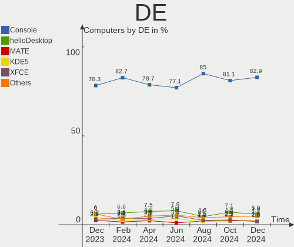
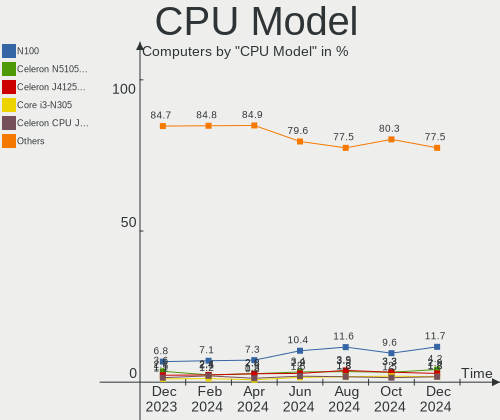
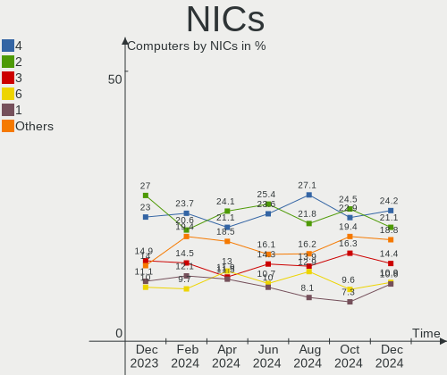

BSD Hardware Trends
-------------------

A project to identify most popular hardware characteristics and track their change
over time based on data collected by BSD users at https://BSD-Hardware.info.

Anyone can contribute to the study by uploading probes of their computers by
the [hw-probe](https://github.com/linuxhw/hw-probe/blob/master/INSTALL.BSD.md) tool:

    hw-probe -all -upload

This is a report for all computer types. See also reports for [desktops](/Desktop/README.md) and [notebooks](/Notebook/README.md).

Full-feature report is available here: https://bsd-hardware.info/?view=trends

OS-specific reports: [FreeBSD](/Dist/FreeBSD), [OpenBSD](/Dist/OpenBSD).

Period: Oct, 2020.

Contents
--------

- [ OS                       ](#os)
- [ OS Family                ](#os-family)
- [ Arch                     ](#arch)
- [ DE                       ](#de)
- [ Display Server           ](#display-server)
- [ Display Manager          ](#display-manager)
- [ OS Lang                  ](#os-lang)
- [ Boot Mode                ](#boot-mode)
- [ Filesystem               ](#filesystem)
- [ Part. scheme             ](#part-scheme)
- [ Country                  ](#country)
- [ City                     ](#city)
- [ Vendor                   ](#vendor)
- [ Model                    ](#model)
- [ Model Family             ](#model-family)
- [ MFG Year                 ](#mfg-year)
- [ Form Factor              ](#form-factor)
- [ Coreboot                 ](#coreboot)
- [ RAM Size                 ](#ram-size)
- [ RAM Used                 ](#ram-used)
- [ Has CD-ROM               ](#has-cd-rom)
- [ Total Drives             ](#total-drives)
- [ Has Ethernet             ](#has-ethernet)
- [ Drive Vendor             ](#drive-vendor)
- [ HDD Vendor               ](#hdd-vendor)
- [ SSD Vendor               ](#ssd-vendor)
- [ Drive Model              ](#drive-model)
- [ Drive Kind               ](#drive-kind)
- [ Drive Connector          ](#drive-connector)
- [ Drive Size               ](#drive-size)
- [ Space Total              ](#space-total)
- [ Space Used               ](#space-used)
- [ Malfunc. Drives          ](#malfunc-drives)
- [ Malfunc. Drive Vendor    ](#malfunc-drive-vendor)
- [ Malfunc. HDD Vendor      ](#malfunc-hdd-vendor)
- [ Malfunc. Drive Kind      ](#malfunc-drive-kind)
- [ Failed Drives            ](#failed-drives)
- [ Failed Drive Vendor      ](#failed-drive-vendor)
- [ Drive Status             ](#drive-status)
- [ Storage Vendor           ](#storage-vendor)
- [ Storage Model            ](#storage-model)
- [ Storage Kind             ](#storage-kind)
- [ CPU Vendor               ](#cpu-vendor)
- [ CPU Model                ](#cpu-model)
- [ CPU Model Family         ](#cpu-model-family)
- [ CPU Cores                ](#cpu-cores)
- [ CPU Sockets              ](#cpu-sockets)
- [ CPU Threads              ](#cpu-threads)
- [ CPU Microarch            ](#cpu-microarch)
- [ GPU Vendor               ](#gpu-vendor)
- [ GPU Model                ](#gpu-model)
- [ GPU Combo                ](#gpu-combo)
- [ GPU Driver               ](#gpu-driver)
- [ GPU Memory               ](#gpu-memory)
- [ Monitor Vendor           ](#monitor-vendor)
- [ Monitor Model            ](#monitor-model)
- [ Monitor Resolution       ](#monitor-resolution)
- [ Monitor Diagonal         ](#monitor-diagonal)
- [ Monitor Width            ](#monitor-width)
- [ Aspect Ratio             ](#aspect-ratio)
- [ Monitor Area             ](#monitor-area)
- [ Pixel Density            ](#pixel-density)
- [ Multiple Monitors        ](#multiple-monitors)
- [ Net Controller Vendor    ](#net-controller-vendor)
- [ Net Controller Model     ](#net-controller-model)
- [ Wireless Vendor          ](#wireless-vendor)
- [ Wireless Model           ](#wireless-model)
- [ Ethernet Vendor          ](#ethernet-vendor)
- [ Ethernet Model           ](#ethernet-model)
- [ Net Controller Kind      ](#net-controller-kind)
- [ Used Controller          ](#used-controller)
- [ NICs                     ](#nics)
- [ Memory Vendor            ](#memory-vendor)
- [ Memory Model             ](#memory-model)
- [ Memory Kind              ](#memory-kind)
- [ Memory Form Factor       ](#memory-form-factor)
- [ Memory Size              ](#memory-size)
- [ Memory Speed             ](#memory-speed)
- [ Sound Vendor             ](#sound-vendor)
- [ Sound Model              ](#sound-model)
- [ Camera Vendor            ](#camera-vendor)
- [ Camera Model             ](#camera-model)
- [ Fingerprint Vendor       ](#fingerprint-vendor)
- [ Fingerprint Model        ](#fingerprint-model)
- [ Chipcard Vendor          ](#chipcard-vendor)
- [ Chipcard Model           ](#chipcard-model)
- [ Printer Vendor           ](#printer-vendor)
- [ Printer Model            ](#printer-model)
- [ Scanner Vendor           ](#scanner-vendor)
- [ Scanner Model            ](#scanner-model)
- [ Bluetooth Vendor         ](#bluetooth-vendor)
- [ Bluetooth Model          ](#bluetooth-model)
- [ Unsupported Devices      ](#unsupported-devices)
- [ Unsupported Device Types ](#unsupported-device-types)

OS
--

Installed operating systems

| Name                 | Computers | Percent |
|----------------------|-----------|---------|
| OpenBSD 6.8          | 119       | 40.48%  |
| FreeBSD 12.1-p10     | 55        | 18.71%  |
| FreeBSD 12.2         | 34        | 11.56%  |
| FreeBSD 12.1         | 13        | 4.42%   |
| NomadBSD 1.3.2       | 7         | 2.38%   |
| FreeBSD 13.0-CURRENT | 6         | 2.04%   |
| GhostBSD 20.04.02    | 5         | 1.7%    |
| OPNsense 20.7.3      | 4         | 1.36%   |
| FreeBSD 12.1-p7      | 4         | 1.36%   |
| NetBSD 9.1           | 3         | 1.02%   |
| FreeBSD 12.1-STABLE  | 3         | 1.02%   |
| FreeBSD 12.1-p9      | 3         | 1.02%   |
| FreeBSD 12.1-p6      | 3         | 1.02%   |
| FreeBSD 12.1-p1      | 3         | 1.02%   |
| FreeBSD 11.4-p4      | 3         | 1.02%   |
| FreeNAS 11.4-p4      | 2         | 0.68%   |
| FreeNAS 11.3-p7      | 2         | 0.68%   |
| FreeNAS 11.3-p14     | 2         | 0.68%   |
| FreeBSD 12.2-RC3     | 2         | 0.68%   |
| FreeBSD 12.0         | 2         | 0.68%   |
| pfSense 2.4.5        | 1         | 0.34%   |
| PC-BSD 12.1-p10      | 1         | 0.34%   |
| OPNsense 20.7        | 1         | 0.34%   |
| NetBSD 9.99.74       | 1         | 0.34%   |
| NetBSD 9.99.71       | 1         | 0.34%   |
| NetBSD 9.0_STABLE    | 1         | 0.34%   |
| MidnightBSD 1.2.9    | 1         | 0.34%   |
| FuryBSD 12.2         | 1         | 0.34%   |
| FuryBSD 12.1-p9      | 1         | 0.34%   |
| FuryBSD 12.1-p10     | 1         | 0.34%   |
| FreeNAS 11.3-p8      | 1         | 0.34%   |
| FreeBSD 12.2-STABLE  | 1         | 0.34%   |
| FreeBSD 12.1-p8      | 1         | 0.34%   |
| FreeBSD 12.1-p3      | 1         | 0.34%   |
| FreeBSD 11.3-p5      | 1         | 0.34%   |
| FreeBSD 11.3         | 1         | 0.34%   |
| DragonFly 5.8        | 1         | 0.34%   |
| ClonOS 13.0-CURRENT  | 1         | 0.34%   |
| ClonOS 12.1-p10      | 1         | 0.34%   |

OS Family
---------

OS without a version

| Name        | Computers | Percent |
|-------------|-----------|---------|
| FreeBSD     | 136       | 46.26%  |
| OpenBSD     | 119       | 40.48%  |
| NomadBSD    | 7         | 2.38%   |
| FreeNAS     | 7         | 2.38%   |
| NetBSD      | 6         | 2.04%   |
| OPNsense    | 5         | 1.7%    |
| GhostBSD    | 5         | 1.7%    |
| FuryBSD     | 3         | 1.02%   |
| ClonOS      | 2         | 0.68%   |
| pfSense     | 1         | 0.34%   |
| PC-BSD      | 1         | 0.34%   |
| MidnightBSD | 1         | 0.34%   |
| DragonFly   | 1         | 0.34%   |

Arch
----

OS architecture (x86_64, i586, etc.)

| Name   | Computers | Percent |
|--------|-----------|---------|
| amd64  | 274       | 93.2%   |
| i386   | 15        | 5.1%    |
| arm64  | 3         | 1.02%   |
| macppc | 1         | 0.34%   |
| arm    | 1         | 0.34%   |

DE
--

Desktop Environment

| Name      | Computers | Percent |
|-----------|-----------|---------|
| Console   | 138       | 46.94%  |
| fvwm      | 72        | 24.49%  |
| XFCE      | 28        | 9.52%   |
| TWM       | 12        | 4.08%   |
| Openbox   | 11        | 3.74%   |
| i3        | 10        | 3.4%    |
| GNOME     | 9         | 3.06%   |
| MATE      | 7         | 2.38%   |
| KDE5      | 3         | 1.02%   |
| LXDE      | 2         | 0.68%   |
| CDE       | 1         | 0.34%   |
| AwesomeWM | 1         | 0.34%   |

Display Server
--------------

X11 or Wayland

| Name    | Computers | Percent |
|---------|-----------|---------|
| Console | 160       | 54.42%  |
| X11     | 134       | 45.58%  |

Display Manager
---------------

SDDM, LightDM, etc.

| Name    | Computers | Percent |
|---------|-----------|---------|
| Console | 229       | 77.89%  |
| SLiM    | 26        | 8.84%   |
| SDDM    | 13        | 4.42%   |
| GDM     | 11        | 3.74%   |
| LightDM | 9         | 3.06%   |
| XDM     | 6         | 2.04%   |

OS Lang
-------

Language

| Lang             | Computers | Percent |
|------------------|-----------|---------|
| Unknown          | 187       | 63.61%  |
| en_US            | 51        | 17.35%  |
| ru_RU            | 7         | 2.38%   |
| de_DE            | 5         | 1.7%    |
| C                | 5         | 1.7%    |
| it_IT            | 4         | 1.36%   |
| es_ES            | 4         | 1.36%   |
| en_GB            | 4         | 1.36%   |
| el_GR            | 4         | 1.36%   |
| ""               | 4         | 1.36%   |
| en_CA            | 3         | 1.02%   |
| en_AU            | 3         | 1.02%   |
| sl_SI            | 2         | 0.68%   |
| pl_PL            | 2         | 0.68%   |
| nb_NO            | 2         | 0.68%   |
| en_IE            | 2         | 0.68%   |
| ja_JP            | 1         | 0.34%   |
| fr_FR            | 1         | 0.34%   |
| fi_FI            | 1         | 0.34%   |
| fi_FI.ISO8859-15 | 1         | 0.34%   |
| en_DE            | 1         | 0.34%   |

Boot Mode
---------

EFI or BIOS

| Mode | Computers | Percent |
|------|-----------|---------|
| BIOS | 164       | 55.78%  |
| EFI  | 130       | 44.22%  |

Filesystem
----------

Type of filesystem

| Type    | Computers | Percent |
|---------|-----------|---------|
| Ufs     | 189       | 64.29%  |
| Zfs     | 103       | 35.03%  |
| Hammer2 | 1         | 0.34%   |
| Unknown | 1         | 0.34%   |

Part. scheme
------------

Scheme of partitioning

| Type    | Computers | Percent |
|---------|-----------|---------|
| GPT     | 183       | 62.24%  |
| MBR     | 109       | 37.07%  |
| Unknown | 2         | 0.68%   |

Country
-------

Geographic location (country)

| Country              | Computers | Percent |
|----------------------|-----------|---------|
| USA                  | 43        | 14.63%  |
| Germany              | 36        | 12.24%  |
| Russia               | 27        | 9.18%   |
| Poland               | 20        | 6.8%    |
| Netherlands          | 14        | 4.76%   |
| France               | 14        | 4.76%   |
| Canada               | 14        | 4.76%   |
| Norway               | 10        | 3.4%    |
| Australia            | 10        | 3.4%    |
| UK                   | 9         | 3.06%   |
| Italy                | 9         | 3.06%   |
| Austria              | 9         | 3.06%   |
| Spain                | 7         | 2.38%   |
| Japan                | 5         | 1.7%    |
| Finland              | 5         | 1.7%    |
| Croatia              | 5         | 1.7%    |
| Ukraine              | 4         | 1.36%   |
| Greece               | 4         | 1.36%   |
| Switzerland          | 3         | 1.02%   |
| Slovenia             | 3         | 1.02%   |
| New Zealand          | 3         | 1.02%   |
| Ireland              | 3         | 1.02%   |
| Indonesia            | 3         | 1.02%   |
| Denmark              | 3         | 1.02%   |
| Colombia             | 3         | 1.02%   |
| Bulgaria             | 3         | 1.02%   |
| Sweden               | 2         | 0.68%   |
| Serbia               | 2         | 0.68%   |
| Romania              | 2         | 0.68%   |
| Hungary              | 2         | 0.68%   |
| Estonia              | 2         | 0.68%   |
| China                | 2         | 0.68%   |
| Brazil               | 2         | 0.68%   |
| UAE                  | 1         | 0.34%   |
| South Africa         | 1         | 0.34%   |
| Singapore            | 1         | 0.34%   |
| Saudi Arabia         | 1         | 0.34%   |
| Nicaragua            | 1         | 0.34%   |
| Moldova, Republic of | 1         | 0.34%   |
| Latvia               | 1         | 0.34%   |
| Korea, Republic of   | 1         | 0.34%   |
| Iran                 | 1         | 0.34%   |
| Honduras             | 1         | 0.34%   |
| Czech Republic       | 1         | 0.34%   |

City
----

Geographic location (city)

| City                | Computers | Percent |
|---------------------|-----------|---------|
| Moscow              | 15        | 5.1%    |
| Gdynia              | 11        | 3.74%   |
| Berlin              | 8         | 2.72%   |
| Vienna              | 7         | 2.38%   |
| Utrecht             | 6         | 2.04%   |
| Zagreb              | 5         | 1.7%    |
| Vladivostok         | 5         | 1.7%    |
| Sydney              | 5         | 1.7%    |
| Montreal            | 5         | 1.7%    |
| Ibiza Town          | 4         | 1.36%   |
| Amsterdam           | 4         | 1.36%   |
| Voyenenga           | 3         | 1.02%   |
| Paris               | 3         | 1.02%   |
| Longmont            | 3         | 1.02%   |
| Dublin              | 3         | 1.02%   |
| Victoria            | 2         | 0.68%   |
| Tyreso Strand       | 2         | 0.68%   |
| Tampere             | 2         | 0.68%   |
| Tallinn             | 2         | 0.68%   |
| Subotica            | 2         | 0.68%   |
| St Petersburg       | 2         | 0.68%   |
| Sofia               | 2         | 0.68%   |
| Skien               | 2         | 0.68%   |
| Shenzhen            | 2         | 0.68%   |
| Sassuolo            | 2         | 0.68%   |
| Saint-Herblain      | 2         | 0.68%   |
| Rome                | 2         | 0.68%   |
| Porto Alegre        | 2         | 0.68%   |
| Paisley             | 2         | 0.68%   |
| Odense              | 2         | 0.68%   |
| Notaresco           | 2         | 0.68%   |
| Ljubljana           | 2         | 0.68%   |
| Leipzig             | 2         | 0.68%   |
| Langenhagen         | 2         | 0.68%   |
| Krakow              | 2         | 0.68%   |
| Kansas City         | 2         | 0.68%   |
| Jakarta             | 2         | 0.68%   |
| Igoumenitsa         | 2         | 0.68%   |
| Grenoble            | 2         | 0.68%   |
| Erlangen            | 2         | 0.68%   |
| Erding              | 2         | 0.68%   |
| Cundinamarca        | 2         | 0.68%   |
| Crows Nest          | 2         | 0.68%   |
| Calgary             | 2         | 0.68%   |
| Banino              | 2         | 0.68%   |
| Auckland            | 2         | 0.68%   |
| Athens              | 2         | 0.68%   |
| České Budějovice | 1         | 0.34%   |
| Zurich              | 1         | 0.34%   |
| Zhukovskiy          | 1         | 0.34%   |
| Zgierz              | 1         | 0.34%   |
| Zerkow              | 1         | 0.34%   |
| Ypsilanti           | 1         | 0.34%   |
| Yanchep             | 1         | 0.34%   |
| Wolmirstedt         | 1         | 0.34%   |
| Winterswijk         | 1         | 0.34%   |
| Wetzlar             | 1         | 0.34%   |
| Waukesha            | 1         | 0.34%   |
| Warsaw              | 1         | 0.34%   |
| Wackersberg         | 1         | 0.34%   |

Vendor
------

Motherboard manufacturer

| Name                           | Computers | Percent |
|--------------------------------|-----------|---------|
| Lenovo                         | 51        | 17.35%  |
| Dell                           | 40        | 13.61%  |
| ASUSTek Computer               | 26        | 8.84%   |
| Hewlett-Packard                | 23        | 7.82%   |
| PC Engines                     | 20        | 6.8%    |
| Unknown                        | 17        | 5.78%   |
| Intel                          | 16        | 5.44%   |
| Gigabyte Technology            | 16        | 5.44%   |
| ASRock                         | 16        | 5.44%   |
| Supermicro                     | 10        | 3.4%    |
| Acer                           | 9         | 3.06%   |
| MSI                            | 6         | 2.04%   |
| Fujitsu                        | 5         | 1.7%    |
| Apple                          | 5         | 1.7%    |
| IBM                            | 3         | 1.02%   |
| Toshiba                        | 2         | 0.68%   |
| Shuttle                        | 2         | 0.68%   |
| Panasonic                      | 2         | 0.68%   |
| AZW                            | 2         | 0.68%   |
| ASRockRack                     | 2         | 0.68%   |
| ZOTAC                          | 1         | 0.34%   |
| TYAN Computer                  | 1         | 0.34%   |
| Thomas-Krenn.AG                | 1         | 0.34%   |
| System76                       | 1         | 0.34%   |
| Sun Microsystems               | 1         | 0.34%   |
| Sony                           | 1         | 0.34%   |
| Schenker                       | 1         | 0.34%   |
| NF541                          | 1         | 0.34%   |
| NA                             | 1         | 0.34%   |
| Matsushita Electric Industrial | 1         | 0.34%   |
| HUAWEI                         | 1         | 0.34%   |
| HPE                            | 1         | 0.34%   |
| Google                         | 1         | 0.34%   |
| Foxconn                        | 1         | 0.34%   |
| eMachines                      | 1         | 0.34%   |
| ECS                            | 1         | 0.34%   |
| Compaq                         | 1         | 0.34%   |
| Bluechip Computer              | 1         | 0.34%   |
| AMD                            | 1         | 0.34%   |
| Alienware                      | 1         | 0.34%   |
| ADI Engineering                | 1         | 0.34%   |

Model
-----

Motherboard model

| Name                                        | Computers | Percent |
|---------------------------------------------|-----------|---------|
| Unknown                                     | 21        | 7.14%   |
| PC Engines apu2                             | 12        | 4.08%   |
| Dell OEM-R 720xd                            | 8         | 2.72%   |
| PC Engines apu4                             | 4         | 1.36%   |
| Dell PowerEdge R620                         | 4         | 1.36%   |
| PC Engines apu1                             | 3         | 1.02%   |
| HP ProLiant MicroServer Gen8                | 3         | 1.02%   |
| Lenovo ThinkPad X1 Carbon 5th 20HRCTO1WW    | 2         | 0.68%   |
| Lenovo ThinkPad X1 Carbon 3rd 20BSCTO1WW    | 2         | 0.68%   |
| HP ProLiant MicroServer                     | 2         | 0.68%   |
| HP ProLiant DL380 Gen9                      | 2         | 0.68%   |
| Gigabyte Z77X-UD5H                          | 2         | 0.68%   |
| Fujitsu ESPRIMO E510                        | 2         | 0.68%   |
| ASUS H110I-PLUS                             | 2         | 0.68%   |
| ASUS All Series                             | 2         | 0.68%   |
| ASRock J3455-ITX                            | 2         | 0.68%   |
| Apple MacBookAir7,2                         | 2         | 0.68%   |
| ZOTAC XXXXXX                                | 1         | 0.34%   |
| Toshiba Satellite L50-C                     | 1         | 0.34%   |
| Toshiba Satellite C655D                     | 1         | 0.34%   |
| System76 Lemur Pro                          | 1         | 0.34%   |
| Supermicro X8STi                            | 1         | 0.34%   |
| Supermicro X8DT3                            | 1         | 0.34%   |
| Supermicro X7SPA-HF                         | 1         | 0.34%   |
| Supermicro X11SSW-F                         | 1         | 0.34%   |
| Supermicro X10SL7-F                         | 1         | 0.34%   |
| Supermicro X10SAE                           | 1         | 0.34%   |
| Supermicro SYS-6018R-WTR                    | 1         | 0.34%   |
| Supermicro Super Server                     | 1         | 0.34%   |
| Supermicro H8DGU                            | 1         | 0.34%   |
| Supermicro C7Z270-CG-L                      | 1         | 0.34%   |
| Sun Microsystems SUN FIRE X4150             | 1         | 0.34%   |
| Sony SVP1321V9RB                            | 1         | 0.34%   |
| Shuttle XH270                               | 1         | 0.34%   |
| Shuttle DS77U                               | 1         | 0.34%   |
| Schenker N13xWU                             | 1         | 0.34%   |
| PC Engines APU                              | 1         | 0.34%   |
| Panasonic CF-C1BT02EGE                      | 1         | 0.34%   |
| Panasonic CF-52PFPBSFQ                      | 1         | 0.34%   |
| NF541 1.0                                   | 1         | 0.34%   |
| MSI MS-7C02                                 | 1         | 0.34%   |
| MSI MS-7B89                                 | 1         | 0.34%   |
| MSI MS-7B22                                 | 1         | 0.34%   |
| MSI MS-7816                                 | 1         | 0.34%   |
| MSI MS-7345                                 | 1         | 0.34%   |
| MSI MS-6533                                 | 1         | 0.34%   |
| Matsushita Electric Industrial CF-51RCVDNLM | 1         | 0.34%   |
| Lenovo Y50-70 20378                         | 1         | 0.34%   |
| Lenovo ThinkPad X61 7675A29                 | 1         | 0.34%   |
| Lenovo ThinkPad X60s 17033JM                | 1         | 0.34%   |
| Lenovo ThinkPad X270 20HNA004CD             | 1         | 0.34%   |
| Lenovo ThinkPad X250 20CLS4WV08             | 1         | 0.34%   |
| Lenovo ThinkPad X240 20AMS2QD0C             | 1         | 0.34%   |
| Lenovo ThinkPad X240 20AL00DKRT             | 1         | 0.34%   |
| Lenovo ThinkPad X230 2325Y36                | 1         | 0.34%   |
| Lenovo ThinkPad X230 2325R74                | 1         | 0.34%   |
| Lenovo ThinkPad X230 2325AJ9                | 1         | 0.34%   |
| Lenovo ThinkPad X230 23257Y1                | 1         | 0.34%   |
| Lenovo ThinkPad X230 23254S6                | 1         | 0.34%   |
| Lenovo ThinkPad X230 2320JXM                | 1         | 0.34%   |

Model Family
------------

Motherboard model prefix

| Name                                        | Computers | Percent |
|---------------------------------------------|-----------|---------|
| Lenovo ThinkPad                             | 40        | 13.61%  |
| Unknown                                     | 21        | 7.14%   |
| Dell PowerEdge                              | 16        | 5.44%   |
| PC Engines apu2                             | 12        | 4.08%   |
| HP ProLiant                                 | 11        | 3.74%   |
| Dell OEM-R                                  | 8         | 2.72%   |
| Dell OptiPlex                               | 6         | 2.04%   |
| Acer Aspire                                 | 6         | 2.04%   |
| Dell Precision                              | 5         | 1.7%    |
| PC Engines apu4                             | 4         | 1.36%   |
| Lenovo ThinkCentre                          | 4         | 1.36%   |
| PC Engines apu1                             | 3         | 1.02%   |
| Fujitsu ESPRIMO                             | 3         | 1.02%   |
| ASUS PRIME                                  | 3         | 1.02%   |
| Toshiba Satellite                           | 2         | 0.68%   |
| Lenovo IdeaPad                              | 2         | 0.68%   |
| Intel DH61CR                                | 2         | 0.68%   |
| Gigabyte Z77X-UD5H                          | 2         | 0.68%   |
| Dell Latitude                               | 2         | 0.68%   |
| Dell Inspiron                               | 2         | 0.68%   |
| ASUS VivoBook                               | 2         | 0.68%   |
| ASUS TUF                                    | 2         | 0.68%   |
| ASUS M5A78L-M                               | 2         | 0.68%   |
| ASUS H110I-PLUS                             | 2         | 0.68%   |
| ASUS All                                    | 2         | 0.68%   |
| ASRock J3455-ITX                            | 2         | 0.68%   |
| Apple MacBookAir7                           | 2         | 0.68%   |
| ZOTAC XXXXXX                                | 1         | 0.34%   |
| System76 Lemur                              | 1         | 0.34%   |
| Supermicro X8STi                            | 1         | 0.34%   |
| Supermicro X8DT3                            | 1         | 0.34%   |
| Supermicro X7SPA-HF                         | 1         | 0.34%   |
| Supermicro X11SSW-F                         | 1         | 0.34%   |
| Supermicro X10SL7-F                         | 1         | 0.34%   |
| Supermicro X10SAE                           | 1         | 0.34%   |
| Supermicro SYS-6018R-WTR                    | 1         | 0.34%   |
| Supermicro Super                            | 1         | 0.34%   |
| Supermicro H8DGU                            | 1         | 0.34%   |
| Supermicro C7Z270-CG-L                      | 1         | 0.34%   |
| Sun Microsystems SUN                        | 1         | 0.34%   |
| Sony SVP1321V9RB                            | 1         | 0.34%   |
| Shuttle XH270                               | 1         | 0.34%   |
| Shuttle DS77U                               | 1         | 0.34%   |
| Schenker N13xWU                             | 1         | 0.34%   |
| PC Engines APU                              | 1         | 0.34%   |
| Panasonic CF-C1BT02EGE                      | 1         | 0.34%   |
| Panasonic CF-52PFPBSFQ                      | 1         | 0.34%   |
| NF541 1.0                                   | 1         | 0.34%   |
| MSI MS-7C02                                 | 1         | 0.34%   |
| MSI MS-7B89                                 | 1         | 0.34%   |
| MSI MS-7B22                                 | 1         | 0.34%   |
| MSI MS-7816                                 | 1         | 0.34%   |
| MSI MS-7345                                 | 1         | 0.34%   |
| MSI MS-6533                                 | 1         | 0.34%   |
| Matsushita Electric Industrial CF-51RCVDNLM | 1         | 0.34%   |
| Lenovo Y50-70                               | 1         | 0.34%   |
| Lenovo G50-80                               | 1         | 0.34%   |
| Lenovo G50-45                               | 1         | 0.34%   |
| Lenovo 70TT0008EA                           | 1         | 0.34%   |
| Lenovo 3000                                 | 1         | 0.34%   |

MFG Year
--------

Motherboard manufacture year

| Year    | Computers | Percent |
|---------|-----------|---------|
| 2019    | 42        | 14.29%  |
| 2020    | 39        | 13.27%  |
| 2018    | 34        | 11.56%  |
| 2015    | 28        | 9.52%   |
| 2013    | 21        | 7.14%   |
| Unknown | 20        | 6.8%    |
| 2012    | 17        | 5.78%   |
| 2017    | 16        | 5.44%   |
| 2014    | 16        | 5.44%   |
| 2016    | 13        | 4.42%   |
| 2011    | 13        | 4.42%   |
| 2010    | 11        | 3.74%   |
| 2007    | 7         | 2.38%   |
| 2009    | 4         | 1.36%   |
| 2008    | 4         | 1.36%   |
| 2006    | 4         | 1.36%   |
| 2003    | 2         | 0.68%   |
| 2005    | 1         | 0.34%   |
| 2004    | 1         | 0.34%   |
| 2001    | 1         | 0.34%   |

Form Factor
-----------

Physical design of the computer

| Name        | Computers | Percent |
|-------------|-----------|---------|
| Desktop     | 201       | 68.37%  |
| Notebook    | 54        | 18.37%  |
| Server      | 31        | 10.54%  |
| Mini pc     | 6         | 2.04%   |
| Convertible | 2         | 0.68%   |

Coreboot
--------

Have coreboot on board

| Used | Computers | Percent |
|------|-----------|---------|
| No   | 269       | 91.5%   |
| Yes  | 25        | 8.5%    |

RAM Size
--------

Total RAM memory

| Size in GB      | Computers | Percent |
|-----------------|-----------|---------|
| 8.01-16.0       | 74        | 25.17%  |
| 16.01-24.0      | 54        | 18.37%  |
| 4.01-8.0        | 51        | 17.35%  |
| 32.01-64.0      | 36        | 12.24%  |
| 64.01-256.0     | 21        | 7.14%   |
| 0.01-1.0        | 14        | 4.76%   |
| 3.01-4.0        | 13        | 4.42%   |
| 24.01-32.0      | 10        | 3.4%    |
| 2.01-3.0        | 10        | 3.4%    |
| 1.01-2.0        | 7         | 2.38%   |
| More than 256.0 | 3         | 1.02%   |
| Unknown         | 1         | 0.34%   |

RAM Used
--------

Used RAM memory

| Used GB     | Computers | Percent |
|-------------|-----------|---------|
| 0.01-1.0    | 199       | 67.69%  |
| 1.01-2.0    | 24        | 8.16%   |
| 0           | 13        | 4.42%   |
| 4.01-8.0    | 11        | 3.74%   |
| 2.01-3.0    | 10        | 3.4%    |
| 16.01-24.0  | 8         | 2.72%   |
| 8.01-16.0   | 7         | 2.38%   |
| Unknown     | 7         | 2.38%   |
| 3.01-4.0    | 6         | 2.04%   |
| 32.01-64.0  | 5         | 1.7%    |
| 64.01-256.0 | 3         | 1.02%   |
| 24.01-32.0  | 1         | 0.34%   |

Has CD-ROM
----------

Has CD-ROM on board

| Presented | Computers | Percent |
|-----------|-----------|---------|
| No        | 249       | 84.69%  |
| Yes       | 45        | 15.31%  |

Total Drives
------------

Number of drives on board

| Drives | Computers | Percent |
|--------|-----------|---------|
| 1      | 129       | 43.88%  |
| 2      | 72        | 24.49%  |
| 3      | 24        | 8.16%   |
| 4      | 19        | 6.46%   |
| 0      | 19        | 6.46%   |
| 5      | 8         | 2.72%   |
| 6      | 5         | 1.7%    |
| 7      | 4         | 1.36%   |
| 12     | 3         | 1.02%   |
| 10     | 3         | 1.02%   |
| 8      | 2         | 0.68%   |
| 63     | 1         | 0.34%   |
| 25     | 1         | 0.34%   |
| 17     | 1         | 0.34%   |
| 14     | 1         | 0.34%   |
| 13     | 1         | 0.34%   |
| 11     | 1         | 0.34%   |

Has Ethernet
------------

Has Ethernet on board

| Presented | Computers | Percent |
|-----------|-----------|---------|
| Yes       | 275       | 93.54%  |
| No        | 19        | 6.46%   |

Drive Vendor
------------

Hard drive vendors

| Vendor              | Computers | Drives | Percent |
|---------------------|-----------|--------|---------|
| WDC                 | 77        | 158    | 18.29%  |
| Seagate             | 53        | 92     | 12.59%  |
| Samsung Electronics | 50        | 68     | 11.88%  |
| Kingston            | 28        | 36     | 6.65%   |
| Toshiba             | 21        | 35     | 4.99%   |
| Intel               | 20        | 23     | 4.75%   |
| SanDisk             | 18        | 20     | 4.28%   |
| Hitachi             | 18        | 29     | 4.28%   |
| Crucial             | 16        | 18     | 3.8%    |
| HGST                | 13        | 25     | 3.09%   |
| NVMe                | 12        | 14     | 2.85%   |
| Transcend           | 10        | 10     | 2.38%   |
| Phison              | 10        | 10     | 2.38%   |
| Dell                | 6         | 10     | 1.43%   |
| SK Hynix            | 4         | 4      | 0.95%   |
| PNY                 | 4         | 5      | 0.95%   |
| OPENBSD             | 4         | 4      | 0.95%   |
| MAXTOR              | 4         | 5      | 0.95%   |
| China               | 4         | 4      | 0.95%   |
| Apple               | 4         | 4      | 0.95%   |
| A-DATA Technology   | 4         | 4      | 0.95%   |
| SPCC                | 3         | 4      | 0.71%   |
| Hewlett-Packard     | 3         | 90     | 0.71%   |
| Union Memory        | 2         | 2      | 0.48%   |
| ORICO               | 2         | 2      | 0.48%   |
| OCZ                 | 2         | 2      | 0.48%   |
| NETAPP              | 2         | 7      | 0.48%   |
| Micron Technology   | 2         | 2      | 0.48%   |
| LSI                 | 2         | 2      | 0.48%   |
| KingDian            | 2         | 2      | 0.48%   |
| Generic             | 2         | 2      | 0.48%   |
| Corsair             | 2         | 2      | 0.48%   |
| Apacer              | 2         | 2      | 0.48%   |
| ZTC                 | 1         | 1      | 0.24%   |
| Vaseky              | 1         | 1      | 0.24%   |
| Team                | 1         | 1      | 0.24%   |
| SABRENT             | 1         | 1      | 0.24%   |
| QUMO                | 1         | 1      | 0.24%   |
| LITEONIT            | 1         | 1      | 0.24%   |
| LITEON              | 1         | 1      | 0.24%   |
| Lexar               | 1         | 1      | 0.24%   |
| IBM                 | 1         | 1      | 0.24%   |
| HPE                 | 1         | 4      | 0.24%   |
| Hoodisk             | 1         | 1      | 0.24%   |
| FREEBSD             | 1         | 1      | 0.24%   |
| FORESEE             | 1         | 1      | 0.24%   |
| Dogfish             | 1         | 1      | 0.24%   |
| Biwin               | 1         | 1      | 0.24%   |

HDD Vendor
----------

Hard disk drive vendors

| Vendor              | Computers | Drives | Percent |
|---------------------|-----------|--------|---------|
| WDC                 | 68        | 146    | 32.54%  |
| Seagate             | 53        | 92     | 25.36%  |
| Toshiba             | 18        | 32     | 8.61%   |
| Hitachi             | 18        | 29     | 8.61%   |
| HGST                | 13        | 25     | 6.22%   |
| Samsung Electronics | 8         | 10     | 3.83%   |
| NVMe                | 7         | 8      | 3.35%   |
| Dell                | 6         | 10     | 2.87%   |
| OPENBSD             | 4         | 4      | 1.91%   |
| MAXTOR              | 4         | 5      | 1.91%   |
| Hewlett-Packard     | 3         | 90     | 1.44%   |
| Generic             | 2         | 2      | 0.96%   |
| SABRENT             | 1         | 1      | 0.48%   |
| Lexar               | 1         | 1      | 0.48%   |
| IBM                 | 1         | 1      | 0.48%   |
| HPE                 | 1         | 4      | 0.48%   |
| Apple               | 1         | 1      | 0.48%   |

SSD Vendor
----------

Solid state drive vendors

| Vendor              | Computers | Drives | Percent |
|---------------------|-----------|--------|---------|
| Samsung Electronics | 38        | 53     | 20%     |
| Kingston            | 28        | 36     | 14.74%  |
| SanDisk             | 18        | 20     | 9.47%   |
| Intel               | 18        | 21     | 9.47%   |
| Crucial             | 15        | 17     | 7.89%   |
| Transcend           | 10        | 10     | 5.26%   |
| Phison              | 9         | 9      | 4.74%   |
| WDC                 | 8         | 11     | 4.21%   |
| NVMe                | 6         | 6      | 3.16%   |
| PNY                 | 4         | 5      | 2.11%   |
| China               | 4         | 4      | 2.11%   |
| Apple               | 3         | 3      | 1.58%   |
| A-DATA Technology   | 3         | 3      | 1.58%   |
| SK Hynix            | 2         | 2      | 1.05%   |
| OCZ                 | 2         | 2      | 1.05%   |
| NETAPP              | 2         | 7      | 1.05%   |
| LSI                 | 2         | 2      | 1.05%   |
| KingDian            | 2         | 2      | 1.05%   |
| Apacer              | 2         | 2      | 1.05%   |
| ZTC                 | 1         | 1      | 0.53%   |
| Vaseky              | 1         | 1      | 0.53%   |
| Toshiba             | 1         | 1      | 0.53%   |
| Team                | 1         | 1      | 0.53%   |
| SPCC                | 1         | 1      | 0.53%   |
| QUMO                | 1         | 1      | 0.53%   |
| ORICO               | 1         | 1      | 0.53%   |
| Micron Technology   | 1         | 1      | 0.53%   |
| LITEONIT            | 1         | 1      | 0.53%   |
| LITEON              | 1         | 1      | 0.53%   |
| Hoodisk             | 1         | 1      | 0.53%   |
| FREEBSD             | 1         | 1      | 0.53%   |
| FORESEE             | 1         | 1      | 0.53%   |
| Dogfish             | 1         | 1      | 0.53%   |

Drive Model
-----------

Hard drive models

| Model                      | Computers | Percent |
|----------------------------|-----------|---------|
| SATA SSD 16GB              | 8         | 1.68%   |
| ST1000DM010-2EP102 1TB     | 6         | 1.26%   |
| WD60EFRX-68L0BN1 6TB       | 5         | 1.05%   |
| SSD 850 EVO 250GB          | 5         | 1.05%   |
| SA400S37240G 240GB         | 5         | 1.05%   |
| SA400S37120G 120GB         | 5         | 1.05%   |
| WD30EFRX-68EUZN0 3TB       | 4         | 0.84%   |
| PERC H710 2.9TB            | 4         | 0.84%   |
| WDS240G2G0A-00JH30 240GB   | 3         | 0.63%   |
| WD40EFRX-68N32N0 4TB       | 3         | 0.63%   |
| ST8000DM004-2CX188 8TB     | 3         | 0.63%   |
| ST4000DM004-2CV104 4TB     | 3         | 0.63%   |
| ST4000DM000-1F2168 4TB     | 3         | 0.63%   |
| ST3000DM001-1CH166 3TB     | 3         | 0.63%   |
| ST1000LM024 HN-M101MBB 1TB | 3         | 0.63%   |
| SSD U110 16GB              | 3         | 0.63%   |
| SSD 860 EVO 250GB          | 3         | 0.63%   |
| SSD 850 EVO 500GB          | 3         | 0.63%   |
| SR RAID 1 2TB              | 3         | 0.63%   |
| Samsung SSD 970 250GB      | 3         | 0.63%   |
| RAID 1(1+0) 73GB           | 3         | 0.63%   |
| MQ04ABF100 1TB             | 3         | 0.63%   |
| HUS724020ALA640 2TB        | 3         | 0.63%   |
| DT01ACA100 1TB             | 3         | 0.63%   |
| CT525MX300SSD1 528GB       | 3         | 0.63%   |
| CT250MX500SSD1 250GB       | 3         | 0.63%   |
| CS900 120GB SSD            | 3         | 0.63%   |
| X446_RALS200MCHT 200GB     | 2         | 0.42%   |
| WDS240G2G0B-00EPW0 240GB   | 2         | 0.42%   |
| WD20EFRX-68EUZN0 2TB       | 2         | 0.42%   |
| WD10SPZX-24Z10 1TB         | 2         | 0.42%   |
| TS64GMSA370 64GB           | 2         | 0.42%   |
| TS32GMSA370 32GB           | 2         | 0.42%   |
| SUV500MS240G 240GB         | 2         | 0.42%   |
| SUV500MS120G 120GB         | 2         | 0.42%   |
| SUV500240G 240GB           | 2         | 0.42%   |
| STM3250310AS 250GB         | 2         | 0.42%   |
| ST8000AS0002-1NA17Z 8TB    | 2         | 0.42%   |
| ST500DM002-1BD142 500GB    | 2         | 0.42%   |
| ST2000NE0025-2FL101 2TB    | 2         | 0.42%   |
| ST2000DL003-9VT166 2TB     | 2         | 0.42%   |
| SSDSC2KG480G8 480GB        | 2         | 0.42%   |
| SSD SM0128G 121GB          | 2         | 0.42%   |
| SSD 860 QVO 1TB            | 2         | 0.42%   |
| SSD 860 EVO 500GB          | 2         | 0.42%   |
| SSD 860 EVO 2TB            | 2         | 0.42%   |
| SSD 850 PRO 256GB          | 2         | 0.42%   |
| SSD 850 EVO M.2 500GB      | 2         | 0.42%   |
| SSD 850 EVO 1TB            | 2         | 0.42%   |
| SSD 64GB                   | 2         | 0.42%   |
| SMS200S360G 64GB           | 2         | 0.42%   |
| RAID 0 6TB                 | 2         | 0.42%   |
| Logical Volume 1TB         | 2         | 0.42%   |
| HUA723020ALA640 2TB        | 2         | 0.42%   |
| HTS725050A7E630 500GB      | 2         | 0.42%   |
| HTS543232A7A384 320GB      | 2         | 0.42%   |
| HD103UJ 1TB                | 2         | 0.42%   |
| CT240BX500SSD1 240GB       | 2         | 0.42%   |
| CT1000MX500SSD1 1TB        | 2         | 0.42%   |
| X400 M.2 2280 512GB        | 1         | 0.21%   |

Drive Kind
----------

HDD or SSD

| Kind | Computers | Drives | Percent |
|------|-----------|--------|---------|
| SSD  | 170       | 229    | 47.75%  |
| HDD  | 162       | 461    | 45.51%  |
| NVMe | 24        | 25     | 6.74%   |

Drive Connector
---------------

SATA, SAS, NVMe, etc.

| Type | Computers | Drives | Percent |
|------|-----------|--------|---------|
| SATA | 260       | 690    | 91.55%  |
| NVMe | 24        | 25     | 8.45%   |

Drive Size
----------

Size of hard drive

| Size in TB | Computers | Drives | Percent |
|------------|-----------|--------|---------|
| 0.01-0.5   | 202       | 271    | 55.8%   |
| 0.51-1.0   | 65        | 95     | 17.96%  |
| 1.01-2.0   | 37        | 82     | 10.22%  |
| 3.01-4.0   | 19        | 52     | 5.25%   |
| 2.01-3.0   | 19        | 48     | 5.25%   |
| 4.01-10.0  | 19        | 141    | 5.25%   |
| 10.01-20.0 | 1         | 1      | 0.28%   |

Space Total
-----------

Amount of disk space available on the file system

| Size in GB     | Computers | Percent |
|----------------|-----------|---------|
| 101-250        | 89        | 30.27%  |
| 251-500        | 59        | 20.07%  |
| 1-20           | 32        | 10.88%  |
| 51-100         | 32        | 10.88%  |
| 21-50          | 26        | 8.84%   |
| 501-1000       | 19        | 6.46%   |
| 1001-2000      | 16        | 5.44%   |
| More than 3000 | 11        | 3.74%   |
| 2001-3000      | 9         | 3.06%   |
| Unknown        | 1         | 0.34%   |

Space Used
----------

Amount of used disk space

| Used GB        | Computers | Percent |
|----------------|-----------|---------|
| 1-20           | 197       | 67.01%  |
| 21-50          | 36        | 12.24%  |
| 101-250        | 21        | 7.14%   |
| 51-100         | 15        | 5.1%    |
| 251-500        | 8         | 2.72%   |
| 1001-2000      | 6         | 2.04%   |
| 501-1000       | 6         | 2.04%   |
| More than 3000 | 4         | 1.36%   |
| Unknown        | 1         | 0.34%   |

Malfunc. Drives
---------------

Drive models with a malfunction

| Model                   | Computers | Drives | Percent |
|-------------------------|-----------|--------|---------|
| WD60EFRX-68L0BN1 6TB    | 2         | 7      | 3.85%   |
| WD800BB-00HEA0 80GB     | 1         | 1      | 1.92%   |
| WD30EFRX-68EUZN0 3TB    | 1         | 3      | 1.92%   |
| WD2001FASS-00W2B0 2TB   | 1         | 1      | 1.92%   |
| WD10SPZX-24Z10 1TB      | 1         | 1      | 1.92%   |
| WD10EZEX-60M2NA0 1TB    | 1         | 1      | 1.92%   |
| SV300S37A120G 120GB     | 1         | 1      | 1.92%   |
| ST9500325AS 500GB       | 1         | 1      | 1.92%   |
| ST9120822AS 120GB       | 1         | 1      | 1.92%   |
| ST3750640NS 752GB       | 1         | 2      | 1.92%   |
| ST320LT007-9ZV142 320GB | 1         | 1      | 1.92%   |
| ST3160815A 160GB        | 1         | 1      | 1.92%   |
| ST31500341AS 1.5TB      | 1         | 1      | 1.92%   |
| ST3120211AS 120GB       | 1         | 1      | 1.92%   |
| ST3000DM008-2DM166 3TB  | 1         | 1      | 1.92%   |
| ST3000DM001-1CH166 3TB  | 1         | 1      | 1.92%   |
| ST2000NM0011 2TB        | 1         | 1      | 1.92%   |
| ST2000DM001-9YN164 2TB  | 1         | 1      | 1.92%   |
| ST2000DL003-9VT166 2TB  | 1         | 2      | 1.92%   |
| ST1000DM010-2EP102 1TB  | 1         | 1      | 1.92%   |
| SSDSC2KW120H6 120GB     | 1         | 1      | 1.92%   |
| SSDSC2CW060A3 64GB      | 1         | 1      | 1.92%   |
| SSDSC2CT240A3 240GB     | 1         | 1      | 1.92%   |
| SSDSC2BF180A4L 180GB    | 1         | 1      | 1.92%   |
| SSDSC2BB080G4 80GB      | 1         | 1      | 1.92%   |
| SSDSC2BA200G3T 200GB    | 1         | 2      | 1.92%   |
| SSDSA2M040G2GC 40GB     | 1         | 1      | 1.92%   |
| SNS4151S316G 16GB       | 1         | 1      | 1.92%   |
| SMSM151S3128GD 128GB    | 1         | 1      | 1.92%   |
| SMS200S330G 32GB        | 1         | 1      | 1.92%   |
| SMS200S3120G 120GB      | 1         | 1      | 1.92%   |
| SD7UB3Q256G1001 256GB   | 1         | 1      | 1.92%   |
| SC210 mSATA 256GB       | 1         | 1      | 1.92%   |
| MK3265GSXN 320GB        | 1         | 1      | 1.92%   |
| HUS722T2TALA604 2TB     | 1         | 1      | 1.92%   |
| HTS725050A7E630 500GB   | 1         | 1      | 1.92%   |
| HTS721060G9SA00 64GB    | 1         | 1      | 1.92%   |
| HTS547550A9E384 500GB   | 1         | 1      | 1.92%   |
| HTS545050A7E380 500GB   | 1         | 1      | 1.92%   |
| HTS543232A7A384 320GB   | 1         | 1      | 1.92%   |
| HTS541010A7E630 1TB     | 1         | 1      | 1.92%   |
| HM500JI 500GB           | 1         | 1      | 1.92%   |
| HDS721010KLA330 1TB     | 1         | 1      | 1.92%   |
| HDP725016GLA380 160GB   | 1         | 1      | 1.92%   |
| HD154UI 1.5TB           | 1         | 1      | 1.92%   |
| HD103SJ 1TB             | 1         | 2      | 1.92%   |
| DK23AA-12 12GB          | 1         | 1      | 1.92%   |
| CT525MX300SSD1 528GB    | 1         | 1      | 1.92%   |
| CT480M500SSD1 480GB     | 1         | 1      | 1.92%   |
| 6Y080P0 82GB            | 1         | 2      | 1.92%   |
| 32GB SATA Flash Drive   | 1         | 1      | 1.92%   |

Malfunc. Drive Vendor
---------------------

Vendors of faulty drives

| Vendor              | Computers | Drives | Percent |
|---------------------|-----------|--------|---------|
| Seagate             | 12        | 15     | 23.53%  |
| WDC                 | 7         | 14     | 13.73%  |
| Intel               | 7         | 8      | 13.73%  |
| Hitachi             | 7         | 7      | 13.73%  |
| Kingston            | 5         | 5      | 9.8%    |
| Samsung Electronics | 3         | 4      | 5.88%   |
| HGST                | 3         | 3      | 5.88%   |
| Crucial             | 2         | 2      | 3.92%   |
| Toshiba             | 1         | 1      | 1.96%   |
| SK Hynix            | 1         | 1      | 1.96%   |
| SanDisk             | 1         | 1      | 1.96%   |
| Maxtor              | 1         | 2      | 1.96%   |
| Apacer              | 1         | 1      | 1.96%   |

Malfunc. HDD Vendor
-------------------

Vendors of faulty HDD drives

| Vendor              | Computers | Drives | Percent |
|---------------------|-----------|--------|---------|
| Seagate             | 12        | 15     | 35.29%  |
| WDC                 | 7         | 14     | 20.59%  |
| Hitachi             | 7         | 7      | 20.59%  |
| Samsung Electronics | 3         | 4      | 8.82%   |
| HGST                | 3         | 3      | 8.82%   |
| Toshiba             | 1         | 1      | 2.94%   |
| Maxtor              | 1         | 2      | 2.94%   |

Malfunc. Drive Kind
-------------------

Kinds of faulty drives

| Kind | Computers | Drives | Percent |
|------|-----------|--------|---------|
| HDD  | 33        | 46     | 66%     |
| SSD  | 17        | 18     | 34%     |

Failed Drives
-------------

Failed drive models

| Model        | Computers | Drives | Percent |
|--------------|-----------|--------|---------|
| HD204UI 2TB  | 1         | 2      | 50%     |
| 6E040L0 41GB | 1         | 1      | 50%     |

Failed Drive Vendor
-------------------

Failed drive vendors

| Vendor              | Computers | Drives | Percent |
|---------------------|-----------|--------|---------|
| Samsung Electronics | 1         | 2      | 50%     |
| Maxtor              | 1         | 1      | 50%     |

Drive Status
------------

Number of failed and malfunc. drives

| Status   | Computers | Drives | Percent |
|----------|-----------|--------|---------|
| Works    | 228       | 511    | 73.55%  |
| Malfunc  | 48        | 64     | 15.48%  |
| Detected | 32        | 137    | 10.32%  |
| Failed   | 2         | 3      | 0.65%   |

Storage Vendor
--------------

Storage controller vendors

| Vendor                           | Computers | Percent |
|----------------------------------|-----------|---------|
| Intel                            | 191       | 53.35%  |
| AMD                              | 62        | 17.32%  |
| Broadcom / LSI                   | 38        | 10.61%  |
| Samsung Electronics              | 12        | 3.35%   |
| ASMedia Technology               | 8         | 2.23%   |
| Marvell Technology Group         | 7         | 1.96%   |
| Phison Electronics               | 6         | 1.68%   |
| Hewlett-Packard                  | 6         | 1.68%   |
| Toshiba                          | 4         | 1.12%   |
| Union Memory (Shenzhen)          | 3         | 0.84%   |
| Silicon Image                    | 3         | 0.84%   |
| Nvidia                           | 3         | 0.84%   |
| SK Hynix                         | 2         | 0.56%   |
| Silicon Motion                   | 2         | 0.56%   |
| Sandisk                          | 2         | 0.56%   |
| VIA Technologies                 | 1         | 0.28%   |
| Silicon Integrated Systems [SiS] | 1         | 0.28%   |
| Realtek Semiconductor            | 1         | 0.28%   |
| Micron/Crucial Technology        | 1         | 0.28%   |
| Micron Technology                | 1         | 0.28%   |
| Lenovo                           | 1         | 0.28%   |
| Kingston Technology Company      | 1         | 0.28%   |
| JMicron Technology               | 1         | 0.28%   |
| Dell                             | 1         | 0.28%   |

Storage Model
-------------

Storage controller models

| Model                                                                      | Computers | Percent |
|----------------------------------------------------------------------------|-----------|---------|
| FCH SATA Controller [AHCI mode]                                            | 30        | 7.28%   |
| Q170/Q150/B150/H170/H110/Z170/CM236 Chipset SATA Controller [AHCI Mode]    | 16        | 3.88%   |
| SB7x0/SB8x0/SB9x0 SATA Controller [AHCI mode]                              | 15        | 3.64%   |
| 8 Series/C220 Series Chipset Family 6-port SATA Controller 1 [AHCI mode]   | 14        | 3.4%    |
| 7 Series Chipset Family 6-port SATA Controller [AHCI mode]                 | 14        | 3.4%    |
| 6 Series/C200 Series Chipset Family 6 port Desktop SATA AHCI Controller    | 14        | 3.4%    |
| SAS2008 PCI-Express Fusion-MPT SAS-2 [Falcon]                              | 12        | 2.91%   |
| MegaRAID SAS 2208 [Thunderbolt]                                            | 12        | 2.91%   |
| FCH SATA Controller [IDE mode]                                             | 12        | 2.91%   |
| Sunrise Point-LP SATA Controller [AHCI mode]                               | 10        | 2.43%   |
| 8 Series SATA Controller 1 [AHCI mode]                                     | 9         | 2.18%   |
| NVMe SSD Controller SM981/PM981/PM983                                      | 8         | 1.94%   |
| 7 Series/C210 Series Chipset Family 6-port SATA Controller [AHCI mode]     | 8         | 1.94%   |
| Unknown                                                                    | 8         | 1.94%   |
| Wildcat Point-LP SATA Controller [AHCI Mode]                               | 7         | 1.7%    |
| SB7x0/SB8x0/SB9x0 IDE Controller                                           | 7         | 1.7%    |
| ASM1062 Serial ATA Controller                                              | 7         | 1.7%    |
| 82801G (ICH7 Family) IDE Controller                                        | 7         | 1.7%    |
| C600/X79 series chipset 6-Port SATA AHCI Controller                        | 6         | 1.46%   |
| 6 Series/C200 Series Chipset Family 6 port Mobile SATA AHCI Controller     | 6         | 1.46%   |
| Celeron N3350/Pentium N4200/Atom E3900 Series SATA AHCI Controller         | 5         | 1.21%   |
| Cannon Lake PCH SATA AHCI Controller                                       | 5         | 1.21%   |
| Atom/Celeron/Pentium Processor x5-E8000/J3xxx/N3xxx Series SATA Controller | 5         | 1.21%   |
| 5 Series/3400 Series Chipset 6 port SATA AHCI Controller                   | 5         | 1.21%   |
| unknown                                                                    | 4         | 0.97%   |
| Smart Array G6 controllers                                                 | 4         | 0.97%   |
| SAS2308 PCI-Express Fusion-MPT SAS-2                                       | 4         | 0.97%   |
| NM10/ICH7 Family SATA Controller [IDE mode]                                | 4         | 0.97%   |
| E12 NVMe Controller                                                        | 4         | 0.97%   |
| 88SE9172 SATA 6Gb/s Controller                                             | 4         | 0.97%   |
| 82801JI (ICH10 Family) 4 port SATA IDE Controller #1                       | 4         | 0.97%   |
| 82801GBM/GHM (ICH7-M Family) SATA Controller [IDE mode]                    | 4         | 0.97%   |
| 631xESB/632xESB IDE Controller                                             | 4         | 0.97%   |
| 200 Series PCH SATA controller [AHCI mode]                                 | 4         | 0.97%   |
| SSD Pro 7600p/760p/E 6100p Series                                          | 3         | 0.73%   |
| SM951 AHCI                                                                 | 3         | 0.73%   |
| SiI 3114 [SATALink/SATARaid] Serial ATA Controller                         | 3         | 0.73%   |
| SAS1068E PCI-Express Fusion-MPT SAS                                        | 3         | 0.73%   |
| FCH IDE Controller                                                         | 3         | 0.73%   |
| C610/X99 series chipset sSATA Controller [AHCI mode]                       | 3         | 0.73%   |
| C610/X99 series chipset 6-Port SATA Controller [AHCI mode]                 | 3         | 0.73%   |
| C600/X79 series chipset SATA RAID Controller                               | 3         | 0.73%   |
| 9 Series Chipset Family SATA Controller [AHCI Mode]                        | 3         | 0.73%   |
| 82801JI (ICH10 Family) SATA AHCI Controller                                | 3         | 0.73%   |
| 82801JI (ICH10 Family) 2 port SATA IDE Controller #2                       | 3         | 0.73%   |
| 400 Series Chipset SATA Controller                                         | 3         | 0.73%   |
| 300 Series Chipset SATA Controller                                         | 3         | 0.73%   |
| Smart Array Gen9 Controllers                                               | 2         | 0.49%   |
| SB7x0/SB8x0/SB9x0 SATA Controller [IDE mode]                               | 2         | 0.49%   |
| SATA Controller [RAID mode]                                                | 2         | 0.49%   |
| SAS3008 PCI-Express Fusion-MPT SAS-3                                       | 2         | 0.49%   |
| NM10/ICH7 Family SATA Controller [AHCI mode]                               | 2         | 0.49%   |
| MegaRAID SAS-3 3008 [Fury]                                                 | 2         | 0.49%   |
| MegaRAID SAS 2108 [Liberator]                                              | 2         | 0.49%   |
| MCP61 SATA Controller                                                      | 2         | 0.49%   |
| MCP61 IDE                                                                  | 2         | 0.49%   |
| FCH SATA Controller D                                                      | 2         | 0.49%   |
| BG3 NVMe SSD Controller                                                    | 2         | 0.49%   |
| BC501 NVMe Solid State Drive 512GB                                         | 2         | 0.49%   |
| 82801IR/IO/IH (ICH9R/DO/DH) 6 port SATA Controller [AHCI mode]             | 2         | 0.49%   |

Storage Kind
------------

Kind of storage controller (IDE, SATA, NVMe, SAS, ...)

| Kind | Computers | Percent |
|------|-----------|---------|
| SATA | 218       | 59.4%   |
| IDE  | 52        | 14.17%  |
| NVMe | 37        | 10.08%  |
| RAID | 36        | 9.81%   |
| SAS  | 20        | 5.45%   |
| SCSI | 4         | 1.09%   |

CPU Vendor
----------

Processor vendors

| Vendor  | Computers | Percent |
|---------|-----------|---------|
| Intel   | 221       | 75.17%  |
| AMD     | 68        | 23.13%  |
| ARM     | 4         | 1.36%   |
| PowerPC | 1         | 0.34%   |

CPU Model
---------

Processor models

| Model                                           | Computers | Percent |
|-------------------------------------------------|-----------|---------|
| AMD GX-412TC SOC                                | 16        | 5.44%   |
| Intel Xeon CPU E5-2650 v2 @ 2.60GHz             | 9         | 3.06%   |
| Intel Core i5-3320M CPU @ 2.60GHz               | 5         | 1.7%    |
| Intel Xeon CPU E3-1220 v5 @ 3.00GHz             | 4         | 1.36%   |
| Intel Core i7-3770 CPU @ 3.40GHz                | 4         | 1.36%   |
| Intel Core i3-3220 CPU @ 3.30GHz                | 4         | 1.36%   |
| AMD G-T40E Processor                            | 4         | 1.36%   |
| Intel Xeon CPU E5620 @ 2.40GHz                  | 3         | 1.02%   |
| Intel Pentium CPU G4560 @ 3.50GHz               | 3         | 1.02%   |
| Intel Core i7-8550U CPU @ 1.80GHz               | 3         | 1.02%   |
| Intel Core i5-4200U CPU @ 1.60GHz               | 3         | 1.02%   |
| Intel Celeron CPU J3455 @ 1.50GHz               | 3         | 1.02%   |
| AMD Ryzen 5 2400G with Radeon Vega Graphics     | 3         | 1.02%   |
| Intel Xeon CPU E5-2630 0 @ 2.30GHz              | 2         | 0.68%   |
| Intel Xeon CPU E5-2620 v3 @ 2.40GHz             | 2         | 0.68%   |
| Intel Core i7-8565U CPU @ 1.80GHz               | 2         | 0.68%   |
| Intel Core i7-7700 CPU @ 3.60GHz                | 2         | 0.68%   |
| Intel Core i7-7500U CPU @ 2.70GHz               | 2         | 0.68%   |
| Intel Core i7-6700 CPU @ 3.40GHz                | 2         | 0.68%   |
| Intel Core i7-4790K CPU @ 4.00GHz               | 2         | 0.68%   |
| Intel Core i7-4770 CPU @ 3.40GHz                | 2         | 0.68%   |
| Intel Core i7-4720HQ CPU @ 2.60GHz              | 2         | 0.68%   |
| Intel Core i7-3770K CPU @ 3.50GHz               | 2         | 0.68%   |
| Intel Core i5-8250U CPU @ 1.60GHz               | 2         | 0.68%   |
| Intel Core i5-6300U CPU @ 2.40GHz               | 2         | 0.68%   |
| Intel Core i5-5350U CPU @ 1.80GHz               | 2         | 0.68%   |
| Intel Core i5-5300U CPU @ 2.30GHz               | 2         | 0.68%   |
| Intel Core i5-5200U CPU @ 2.20GHz               | 2         | 0.68%   |
| Intel Core i5-4570T CPU @ 2.90GHz               | 2         | 0.68%   |
| Intel Core i5-4260U CPU @ 1.40GHz               | 2         | 0.68%   |
| Intel Core i5-2400 CPU @ 3.10GHz                | 2         | 0.68%   |
| Intel Core i5 CPU M 520 @ 2.40GHz               | 2         | 0.68%   |
| Intel Celeron CPU N3050 @ 1.60GHz               | 2         | 0.68%   |
| Intel Celeron CPU G1610T @ 2.30GHz              | 2         | 0.68%   |
| Intel Celeron 2955U @ 1.40GHz                   | 2         | 0.68%   |
| Intel 686-class                                 | 2         | 0.68%   |
| ARM Cortex-A53 r0p4                             | 2         | 0.68%   |
| AMD Ryzen 7 PRO 3700U w/ Radeon Vega Mobile Gfx | 2         | 0.68%   |
| AMD Ryzen 5 2500U with Radeon Vega Mobile Gfx   | 2         | 0.68%   |
| AMD FX-8320E Eight-Core Processor               | 2         | 0.68%   |
| AMD E2-1800 APU with Radeon HD Graphics         | 2         | 0.68%   |
| PowerPC 7447A (Revision 0x105)                  | 1         | 0.34%   |
| Intel Xeon Gold 5220R CPU @ 2.20GHz             | 1         | 0.34%   |
| Intel Xeon E-2278G CPU @ 3.40GHz                | 1         | 0.34%   |
| Intel Xeon E-2224 CPU @ 3.40GHz                 | 1         | 0.34%   |
| Intel Xeon CPU X5680 @ 3.33GHz                  | 1         | 0.34%   |
| Intel Xeon CPU X5460 @ 3.16GHz                  | 1         | 0.34%   |
| Intel Xeon CPU X3430 @ 2.40GHz                  | 1         | 0.34%   |
| Intel Xeon CPU W3530 @ 2.80GHz                  | 1         | 0.34%   |
| Intel Xeon CPU L5640 @ 2.27GHz                  | 1         | 0.34%   |
| Intel Xeon CPU E5640 @ 2.67GHz                  | 1         | 0.34%   |
| Intel Xeon CPU E5504 @ 2.00GHz                  | 1         | 0.34%   |
| Intel Xeon CPU E5450 @ 3.00GHz                  | 1         | 0.34%   |
| Intel Xeon CPU E5410 @ 2.33GHz                  | 1         | 0.34%   |
| Intel Xeon CPU E5320 @ 1.86GHz                  | 1         | 0.34%   |
| Intel Xeon CPU E5310 @ 1.60GHz                  | 1         | 0.34%   |
| Intel Xeon CPU E5-2690 0 @ 2.90GHz              | 1         | 0.34%   |
| Intel Xeon CPU E5-2683 v4 @ 2.10GHz             | 1         | 0.34%   |
| Intel Xeon CPU E5-2670 v3 @ 2.30GHz             | 1         | 0.34%   |
| Intel Xeon CPU E5-2650L v3 @ 1.80GHz            | 1         | 0.34%   |

CPU Model Family
----------------

Processor model prefix

| Model                   | Computers | Percent |
|-------------------------|-----------|---------|
| Intel Xeon              | 53        | 18.03%  |
| Intel Core i5           | 51        | 17.35%  |
| Intel Core i7           | 44        | 14.97%  |
| AMD GX                  | 17        | 5.78%   |
| Intel Celeron           | 16        | 5.44%   |
| Intel Core i3           | 14        | 4.76%   |
| AMD Ryzen 5             | 12        | 4.08%   |
| Intel Pentium           | 9         | 3.06%   |
| Intel Atom              | 9         | 3.06%   |
| AMD FX                  | 5         | 1.7%    |
| Other                   | 4         | 1.36%   |
| Intel Core 2 Duo        | 4         | 1.36%   |
| ARM Cortex              | 4         | 1.36%   |
| AMD G                   | 4         | 1.36%   |
| Intel Pentium 4         | 3         | 1.02%   |
| AMD Turion II Neo       | 3         | 1.02%   |
| AMD Ryzen 7             | 3         | 1.02%   |
| AMD Opteron             | 3         | 1.02%   |
| AMD A4                  | 3         | 1.02%   |
| Intel Pentium M         | 2         | 0.68%   |
| Intel Core 2            | 2         | 0.68%   |
| Intel 686-class         | 2         | 0.68%   |
| AMD Ryzen 7 PRO         | 2         | 0.68%   |
| AMD Ryzen 3             | 2         | 0.68%   |
| AMD E2                  | 2         | 0.68%   |
| Intel Xeon Gold         | 1         | 0.34%   |
| Intel Pentium Silver    | 1         | 0.34%   |
| Intel Pentium III       | 1         | 0.34%   |
| Intel Pentium Dual-Core | 1         | 0.34%   |
| Intel Pentium D         | 1         | 0.34%   |
| Intel Core m5           | 1         | 0.34%   |
| Intel Core m3           | 1         | 0.34%   |
| Intel Core Duo          | 1         | 0.34%   |
| Intel Core 2 Quad       | 1         | 0.34%   |
| AMD V120                | 1         | 0.34%   |
| AMD Ryzen Threadripper  | 1         | 0.34%   |
| AMD Phenom II X6        | 1         | 0.34%   |
| AMD Phenom II X4        | 1         | 0.34%   |
| AMD Geode Integrated    | 1         | 0.34%   |
| AMD EPYC                | 1         | 0.34%   |
| AMD E1                  | 1         | 0.34%   |
| AMD E                   | 1         | 0.34%   |
| AMD C-50                | 1         | 0.34%   |
| AMD Athlon              | 1         | 0.34%   |
| AMD A10                 | 1         | 0.34%   |
| AMD 686-class           | 1         | 0.34%   |

CPU Cores
---------

Number of processor cores

| Number  | Computers | Percent |
|---------|-----------|---------|
| 4       | 100       | 34.01%  |
| 2       | 94        | 31.97%  |
| 8       | 26        | 8.84%   |
| Unknown | 25        | 8.5%    |
| 12      | 12        | 4.08%   |
| 1       | 12        | 4.08%   |
| 16      | 11        | 3.74%   |
| 6       | 8         | 2.72%   |
| 24      | 2         | 0.68%   |
| 128     | 1         | 0.34%   |
| 64      | 1         | 0.34%   |
| 32      | 1         | 0.34%   |
| 20      | 1         | 0.34%   |

CPU Sockets
-----------

Number of sockets

| Number  | Computers | Percent |
|---------|-----------|---------|
| 1       | 240       | 81.63%  |
| 2       | 29        | 9.86%   |
| Unknown | 25        | 8.5%    |

CPU Threads
-----------

Threads per core (Hyper-Threading)

| Number  | Computers | Percent |
|---------|-----------|---------|
| 2       | 144       | 48.98%  |
| 1       | 116       | 39.46%  |
| Unknown | 34        | 11.56%  |

CPU Microarch
-------------

Microarchitecture

| Name          | Computers | Percent |
|---------------|-----------|---------|
| IvyBridge     | 38        | 12.93%  |
| KabyLake      | 33        | 11.22%  |
| Haswell       | 32        | 10.88%  |
| SandyBridge   | 21        | 7.14%   |
| Skylake       | 19        | 6.46%   |
| Puma          | 17        | 5.78%   |
| Broadwell     | 13        | 4.42%   |
| Unknown       | 13        | 4.42%   |
| Westmere      | 11        | 3.74%   |
| Silvermont    | 8         | 2.72%   |
| Bobcat        | 8         | 2.72%   |
| Zen 2         | 7         | 2.38%   |
| Zen           | 7         | 2.38%   |
| Piledriver    | 7         | 2.38%   |
| K10           | 7         | 2.38%   |
| Core          | 7         | 2.38%   |
| Zen+          | 6         | 2.04%   |
| Penryn        | 6         | 2.04%   |
| P6            | 6         | 2.04%   |
| Bonnell       | 6         | 2.04%   |
| Nehalem       | 5         | 1.7%    |
| NetBurst      | 4         | 1.36%   |
| Goldmont      | 4         | 1.36%   |
| Jaguar        | 3         | 1.02%   |
| K8 Hammer     | 2         | 0.68%   |
| Goldmont plus | 2         | 0.68%   |
| K10 Llano     | 1         | 0.34%   |
| Geode         | 1         | 0.34%   |

GPU Vendor
----------

Vendors of graphics cards

| Vendor                     | Computers | Percent |
|----------------------------|-----------|---------|
| Intel                      | 141       | 49.65%  |
| AMD                        | 60        | 21.13%  |
| Nvidia                     | 39        | 13.73%  |
| Matrox Electronics Systems | 33        | 11.62%  |
| ASPEED Technology          | 10        | 3.52%   |
| S3 Graphics                | 1         | 0.35%   |

GPU Model
---------

Graphics card models

| Model                                                                              | Computers | Percent |
|------------------------------------------------------------------------------------|-----------|---------|
| G200eR2                                                                            | 15        | 5.14%   |
| 2nd Generation Core Processor Family Integrated Graphics Controller                | 13        | 4.45%   |
| 3rd Gen Core processor Graphics Controller                                         | 12        | 4.11%   |
| Haswell-ULT Integrated Graphics Controller                                         | 11        | 3.77%   |
| ASPEED Graphics Family                                                             | 10        | 3.42%   |
| MGA G200eW WPCM450                                                                 | 8         | 2.74%   |
| ES1000                                                                             | 8         | 2.74%   |
| Xeon E3-1200 v2/3rd Gen Core processor Graphics Controller                         | 7         | 2.4%    |
| HD Graphics 5500                                                                   | 7         | 2.4%    |
| UHD Graphics 620                                                                   | 6         | 2.05%   |
| Raven Ridge [Radeon Vega Series / Radeon Vega Mobile Series]                       | 6         | 2.05%   |
| MGA G200EH                                                                         | 6         | 2.05%   |
| Atom/Celeron/Pentium Processor x5-E8000/J3xxx/N3xxx Integrated Graphics Controller | 6         | 2.05%   |
| Xeon E3-1200 v3/4th Gen Core Processor Integrated Graphics Controller              | 5         | 1.71%   |
| Skylake GT2 [HD Graphics 520]                                                      | 5         | 1.71%   |
| Picasso                                                                            | 5         | 1.71%   |
| Mobile 945GM/GMS/GME, 943/940GML Express Integrated Graphics Controller            | 5         | 1.71%   |
| HD Graphics 530                                                                    | 5         | 1.71%   |
| Ellesmere [Radeon RX 470/480/570/570X/580/580X/590]                                | 5         | 1.71%   |
| RS880M [Mobility Radeon HD 4225/4250]                                              | 4         | 1.37%   |
| HD Graphics 620                                                                    | 4         | 1.37%   |
| HD Graphics 500                                                                    | 4         | 1.37%   |
| GK208B [GeForce GT 710]                                                            | 4         | 1.37%   |
| UHD Graphics 620 (Whiskey Lake)                                                    | 3         | 1.03%   |
| Mobile 945GM/GMS, 943/940GML Express Integrated Graphics Controller                | 3         | 1.03%   |
| HD Graphics 610                                                                    | 3         | 1.03%   |
| HD Graphics 6000                                                                   | 3         | 1.03%   |
| Core Processor Integrated Graphics Controller                                      | 3         | 1.03%   |
| 82945G/GZ Integrated Graphics Controller                                           | 3         | 1.03%   |
| 4th Gen Core Processor Integrated Graphics Controller                              | 3         | 1.03%   |
| Wrestler [Radeon HD 7340]                                                          | 2         | 0.68%   |
| UHD Graphics 630 (Desktop)                                                         | 2         | 0.68%   |
| UHD Graphics 605                                                                   | 2         | 0.68%   |
| UHD Graphics                                                                       | 2         | 0.68%   |
| TU117M [GeForce GTX 1650 Mobile / Max-Q]                                           | 2         | 0.68%   |
| RS780L [Radeon 3000]                                                               | 2         | 0.68%   |
| Rage 3 [Rage XL PCI]                                                               | 2         | 0.68%   |
| Mobile 945GSE Express Integrated Graphics Controller                               | 2         | 0.68%   |
| MGA G200e [Pilot] ServerEngines (SEP1)                                             | 2         | 0.68%   |
| HD Graphics P530                                                                   | 2         | 0.68%   |
| HD Graphics 630                                                                    | 2         | 0.68%   |
| GT218 [GeForce 8400 GS Rev. 3]                                                     | 2         | 0.68%   |
| GP107 [GeForce GTX 1050 Ti]                                                        | 2         | 0.68%   |
| GF119 [GeForce GT 610]                                                             | 2         | 0.68%   |
| GF114 [GeForce GTX 560]                                                            | 2         | 0.68%   |
| Atom Processor D2xxx/N2xxx Integrated Graphics Controller                          | 2         | 0.68%   |
| 4 Series Chipset Integrated Graphics Controller                                    | 2         | 0.68%   |
| Wrestler [Radeon HD 6310]                                                          | 1         | 0.34%   |
| Wrestler [Radeon HD 6250]                                                          | 1         | 0.34%   |
| Whistler [Radeon HD 6630M/6650M/6750M/7670M/7690M]                                 | 1         | 0.34%   |
| UHD Graphics 630 (Mobile)                                                          | 1         | 0.34%   |
| TU116 [GeForce GTX 1660 SUPER]                                                     | 1         | 0.34%   |
| Tonga PRO [Radeon R9 285/380]                                                      | 1         | 0.34%   |
| SuperSumo [Radeon HD 6410D]                                                        | 1         | 0.34%   |
| Sun XT [Radeon HD 8670A/8670M/8690M / R5 M330 / M430 / Radeon 520 Mobile]          | 1         | 0.34%   |
| Sun LE [Radeon HD 8550M / R5 M230]                                                 | 1         | 0.34%   |
| Stoney [Radeon R2/R3/R4/R5 Graphics]                                               | 1         | 0.34%   |
| RV710/M92 [Mobility Radeon HD 4350/4550]                                           | 1         | 0.34%   |
| RV635/M86 [Mobility Radeon HD 3650]                                                | 1         | 0.34%   |
| RV515/M54 [Mobility Radeon X1400]                                                  | 1         | 0.34%   |

GPU Combo
---------

Combinations of graphics cards

| Name            | Computers | Percent |
|-----------------|-----------|---------|
| 1 x Intel       | 118       | 40.14%  |
| 1 x AMD         | 50        | 17.01%  |
| 1 x Matrox      | 33        | 11.22%  |
| Other           | 28        | 9.52%   |
| 1 x Nvidia      | 25        | 8.5%    |
| 2 x Intel       | 9         | 3.06%   |
| Intel + Nvidia  | 9         | 3.06%   |
| 1 x ASPEED      | 9         | 3.06%   |
| Intel + AMD     | 5         | 1.7%    |
| AMD + Nvidia    | 3         | 1.02%   |
| 2 x AMD         | 2         | 0.68%   |
| 2 x Nvidia      | 1         | 0.34%   |
| 1 x S3 Graphics | 1         | 0.34%   |
| Nvidia + ASPEED | 1         | 0.34%   |

GPU Driver
----------

Free vs proprietary

| Driver      | Computers | Percent |
|-------------|-----------|---------|
| Free        | 240       | 81.63%  |
| Unknown     | 35        | 11.9%   |
| Proprietary | 19        | 6.46%   |

GPU Memory
----------

Total video memory

| Size in GB | Computers | Percent |
|------------|-----------|---------|
| Unknown    | 262       | 89.12%  |
| 1.01-2.0   | 14        | 4.76%   |
| 0.51-1.0   | 5         | 1.7%    |
| 3.01-4.0   | 4         | 1.36%   |
| 0.01-0.5   | 4         | 1.36%   |
| 7.01-8.0   | 2         | 0.68%   |
| 5.01-6.0   | 2         | 0.68%   |
| 2.01-3.0   | 1         | 0.34%   |

Monitor Vendor
--------------

Monitor vendors

| Vendor               | Computers | Percent |
|----------------------|-----------|---------|
| LG Display           | 17        | 13.08%  |
| Samsung Electronics  | 15        | 11.54%  |
| AU Optronics         | 14        | 10.77%  |
| Dell                 | 12        | 9.23%   |
| BOE                  | 9         | 6.92%   |
| Lenovo               | 6         | 4.62%   |
| Chimei Innolux       | 6         | 4.62%   |
| Iiyama               | 5         | 3.85%   |
| Goldstar             | 5         | 3.85%   |
| AOC                  | 5         | 3.85%   |
| Ancor Communications | 5         | 3.85%   |
| BenQ                 | 4         | 3.08%   |
| Philips              | 3         | 2.31%   |
| Apple                | 3         | 2.31%   |
| PANDA                | 2         | 1.54%   |
| LG Electronics       | 2         | 1.54%   |
| InfoVision           | 2         | 1.54%   |
| Hewlett-Packard      | 2         | 1.54%   |
| Sony                 | 1         | 0.77%   |
| Sharp                | 1         | 0.77%   |
| Panasonic            | 1         | 0.77%   |
| NEC Computers        | 1         | 0.77%   |
| LTM                  | 1         | 0.77%   |
| LG Philips           | 1         | 0.77%   |
| JDI                  | 1         | 0.77%   |
| IBM                  | 1         | 0.77%   |
| HPN                  | 1         | 0.77%   |
| Gateway              | 1         | 0.77%   |
| Envision             | 1         | 0.77%   |
| Eizo                 | 1         | 0.77%   |
| Acer                 | 1         | 0.77%   |

Monitor Model
-------------

Monitor models

| Model                                              | Computers | Percent |
|----------------------------------------------------|-----------|---------|
| LCD Monitor BOE0742 1920x1080 310x170mm 13.9-inch  | 3         | 2.24%   |
| LCD Monitor SAM0C39 1920x1080 890x500mm 40.2-inch  | 2         | 1.49%   |
| LCD Monitor LGD0456 1366x768 340x190mm 15.3-inch   | 2         | 1.49%   |
| LCD Monitor LGD0418 2560x1440 310x170mm 13.9-inch  | 2         | 1.49%   |
| LCD Monitor LGD02DC 1366x768 340x190mm 15.3-inch   | 2         | 1.49%   |
| LCD Monitor LEN40B2 1920x1080 340x190mm 15.3-inch  | 2         | 1.49%   |
| LCD Monitor IVO057D 1920x1080 310x170mm 13.9-inch  | 2         | 1.49%   |
| LCD Monitor AUO38ED 1920x1080 340x190mm 15.3-inch  | 2         | 1.49%   |
| LCD Monitor AUO34ED 1920x1080 340x190mm 15.3-inch  | 2         | 1.49%   |
| LCD Monitor 2260W 1920x1080                        | 2         | 1.49%   |
| Color LCD APPA01B 1440x900 290x180mm 13.4-inch     | 2         | 1.49%   |
| 1707FP DEL4012 1280x1024 340x270mm 17.1-inch       | 2         | 1.49%   |
| VVX13F009G00 MEI96A2 1920x1080 290x170mm 13.2-inch | 1         | 0.75%   |
| VS248 ACI2498 1920x1080 530x300mm 24.0-inch        | 1         | 0.75%   |
| VG248 ACI24E1 1920x1080 530x300mm 24.0-inch        | 1         | 0.75%   |
| VE247 ACI2493 1920x1080 530x300mm 24.0-inch        | 1         | 0.75%   |
| U3417W DELA0DF 3440x1440 800x330mm 34.1-inch       | 1         | 0.75%   |
| U32R59x SAM0F94 3840x2160 700x390mm 31.5-inch      | 1         | 0.75%   |
| U2415 DELA0BA 1920x1200 520x320mm 24.0-inch        | 1         | 0.75%   |
| U2414H DELA0A4 1920x1080 530x300mm 24.0-inch       | 1         | 0.75%   |
| U2414H DELA0A2 1920x1080 530x300mm 24.0-inch       | 1         | 0.75%   |
| U2212HM DELD046 1920x1080 480x270mm 21.7-inch      | 1         | 0.75%   |
| T24D390 SAM0B6E 1920x1080 520x290mm 23.4-inch      | 1         | 0.75%   |
| SyncMaster SAM00A1 1280x1024 340x270mm 17.1-inch   | 1         | 0.75%   |
| SMB2340 SAM0691 1920x1080 510x290mm 23.1-inch      | 1         | 0.75%   |
| SE790C SAM0BFE 3440x1440 800x330mm 34.1-inch       | 1         | 0.75%   |
| SE2216H DELF070 1920x1080 480x270mm 21.7-inch      | 1         | 0.75%   |
| SDM-X72 SNY1D70 1280x1024 340x270mm 17.1-inch      | 1         | 0.75%   |
| S24E310 SAM0C2E 1920x1080 520x290mm 23.4-inch      | 1         | 0.75%   |
| S24C450 SAM09CF 1920x1200 520x320mm 24.0-inch      | 1         | 0.75%   |
| R221Q ACR0503 1920x1080 480x270mm 21.7-inch        | 1         | 0.75%   |
| PL2792UH IVM664E 3840x2160 600x340mm 27.2-inch     | 1         | 0.75%   |
| PL2495W IVM613B 1920x1200 520x320mm 24.0-inch      | 1         | 0.75%   |
| PL2493H IVM6141 1920x1080 530x300mm 24.0-inch      | 1         | 0.75%   |
| PL2492H IVM612F 1920x1080 530x300mm 24.0-inch      | 1         | 0.75%   |
| PL2280 IVM562F 1920x1080 480x270mm 21.7-inch       | 1         | 0.75%   |
| PHL 328E9Q PHLC180 1920x1080 700x390mm 31.5-inch   | 1         | 0.75%   |
| PA249 ACI24B2 1920x1200 520x320mm 24.0-inch        | 1         | 0.75%   |
| P2720D DELD100 2560x1440 600x340mm 27.2-inch       | 1         | 0.75%   |
| P2417H DELA0DC 1920x1080 530x300mm 24.0-inch       | 1         | 0.75%   |
| P2214H DELA098 1920x1080 480x270mm 21.7-inch       | 1         | 0.75%   |
| LM133LF5L01 NCP0020 1920x1080 290x170mm 13.2-inch  | 1         | 0.75%   |
| LG ULTRAWIDE GSM5AE2 3440x1440 800x340mm 34.2-inch | 1         | 0.75%   |
| LG Ultra HD GSM5B08 3840x2160 600x340mm 27.2-inch  | 1         | 0.75%   |
| LG FULL HD GSM5B55 1920x1080 480x270mm 21.7-inch   | 1         | 0.75%   |
| LEN T24i-10 LEN61CE 1920x1080 530x300mm 24.0-inch  | 1         | 0.75%   |
| LCD190V NEC66D3 1280x1024 380x300mm 19.1-inch      | 1         | 0.75%   |
| LCD Monitor SHP1430 3840x2160 350x190mm 15.7-inch  | 1         | 0.75%   |
| LCD Monitor SEC304C 1366x768 310x170mm 13.9-inch   | 1         | 0.75%   |
| LCD Monitor SEC3047 1366x768 280x160mm 12.7-inch   | 1         | 0.75%   |
| LCD Monitor SDC4852 1366x768 340x190mm 15.3-inch   | 1         | 0.75%   |
| LCD Monitor SDC415A 3200x1800 290x160mm 13.0-inch  | 1         | 0.75%   |
| LCD Monitor SDC4141 1366x768 340x190mm 15.3-inch   | 1         | 0.75%   |
| LCD Monitor SDC314D 1366x768 310x170mm 13.9-inch   | 1         | 0.75%   |
| LCD Monitor NCP0046 1920x1080 340x190mm 15.3-inch  | 1         | 0.75%   |
| LCD Monitor LTM3937 720x1280 130x80mm 6.0-inch     | 1         | 0.75%   |
| LCD Monitor LPLC400 1440x900 330x210mm 15.4-inch   | 1         | 0.75%   |
| LCD Monitor LGD058B 2560x1440 310x170mm 13.9-inch  | 1         | 0.75%   |
| LCD Monitor LGD049B 1920x1080 340x190mm 15.3-inch  | 1         | 0.75%   |
| LCD Monitor LGD0437 1920x1080 280x160mm 12.7-inch  | 1         | 0.75%   |

Monitor Resolution
------------------

Monitor screen resolution

| Resolution         | Computers | Percent |
|--------------------|-----------|---------|
| 1920x1080 (FHD)    | 58        | 44.96%  |
| 1366x768 (WXGA)    | 27        | 20.93%  |
| 1280x1024 (SXGA)   | 11        | 8.53%   |
| 2560x1440 (QHD)    | 6         | 4.65%   |
| 3840x2160 (4K)     | 5         | 3.88%   |
| 1440x900 (WXGA+)   | 4         | 3.1%    |
| 3440x1440          | 3         | 2.33%   |
| 1920x1200 (WUXGA)  | 3         | 2.33%   |
| 1024x768 (XGA)     | 3         | 2.33%   |
| 1600x900 (HD+)     | 2         | 1.55%   |
| 720x1280           | 1         | 0.78%   |
| 3200x1800 (QHD+)   | 1         | 0.78%   |
| 3000x2000          | 1         | 0.78%   |
| 2648x1024          | 1         | 0.78%   |
| 1680x1050 (WSXGA+) | 1         | 0.78%   |
| 1024x600           | 1         | 0.78%   |
| Unknown            | 1         | 0.78%   |

Monitor Diagonal
----------------

Diagonal size in inches

| Inches  | Computers | Percent |
|---------|-----------|---------|
| 15      | 32        | 24.62%  |
| 13      | 24        | 18.46%  |
| 24      | 13        | 10%     |
| 12      | 10        | 7.69%   |
| 21      | 9         | 6.92%   |
| 17      | 7         | 5.38%   |
| 27      | 6         | 4.62%   |
| 23      | 5         | 3.85%   |
| 19      | 5         | 3.85%   |
| Unknown | 5         | 3.85%   |
| 34      | 3         | 2.31%   |
| 40      | 2         | 1.54%   |
| 31      | 2         | 1.54%   |
| 14      | 2         | 1.54%   |
| 10      | 2         | 1.54%   |
| 18      | 1         | 0.77%   |
| 11      | 1         | 0.77%   |
| 6       | 1         | 0.77%   |

Monitor Width
-------------

Physical width

| Width in mm | Computers | Percent |
|-------------|-----------|---------|
| 301-350     | 57        | 44.19%  |
| 501-600     | 23        | 17.83%  |
| 201-300     | 21        | 16.28%  |
| 401-500     | 12        | 9.3%    |
| Unknown     | 5         | 3.88%   |
| 701-800     | 3         | 2.33%   |
| 351-400     | 3         | 2.33%   |
| 801-900     | 2         | 1.55%   |
| 601-700     | 2         | 1.55%   |
| 101-200     | 1         | 0.78%   |

Aspect Ratio
------------

Proportional relationship between the width and the height

| Ratio   | Computers | Percent |
|---------|-----------|---------|
| 16/9    | 94        | 74.6%   |
| 5/4     | 10        | 7.94%   |
| 16/10   | 9         | 7.14%   |
| 4/3     | 5         | 3.97%   |
| Unknown | 5         | 3.97%   |
| 21/9    | 3         | 2.38%   |

Monitor Area
------------

Area in inch²

| Area in inch² | Computers | Percent |
|----------------|-----------|---------|
| 91-100         | 26        | 20.16%  |
| 201-250        | 23        | 17.83%  |
| 81-90          | 22        | 17.05%  |
| 61-70          | 10        | 7.75%   |
| 141-150        | 8         | 6.2%    |
| 301-350        | 6         | 4.65%   |
| 101-110        | 6         | 4.65%   |
| 351-500        | 5         | 3.88%   |
| 151-200        | 5         | 3.88%   |
| Unknown        | 5         | 3.88%   |
| 71-80          | 3         | 2.33%   |
| 251-300        | 3         | 2.33%   |
| 41-50          | 2         | 1.55%   |
| 501-1000       | 2         | 1.55%   |
| 51-60          | 1         | 0.78%   |
| 1-40           | 1         | 0.78%   |
| 111-120        | 1         | 0.78%   |

Pixel Density
-------------

Pixels per inch

| Density       | Computers | Percent |
|---------------|-----------|---------|
| 121-160       | 37        | 29.13%  |
| 51-100        | 36        | 28.35%  |
| 101-120       | 35        | 27.56%  |
| 161-240       | 9         | 7.09%   |
| More than 240 | 5         | 3.94%   |
| Unknown       | 5         | 3.94%   |

Multiple Monitors
-----------------

Total monitors connected

| Total | Computers | Percent |
|-------|-----------|---------|
| 0     | 155       | 52.72%  |
| 1     | 125       | 42.52%  |
| 2     | 13        | 4.42%   |
| 3     | 1         | 0.34%   |

Net Controller Vendor
---------------------

Controller vendors

| Vendor                            | Computers | Percent |
|-----------------------------------|-----------|---------|
| Intel                             | 179       | 46.61%  |
| Realtek Semiconductor             | 99        | 25.78%  |
| Broadcom Inc. and subsidiaries    | 45        | 11.72%  |
| Qualcomm Atheros                  | 35        | 9.11%   |
| Edimax Technology                 | 3         | 0.78%   |
| Ralink                            | 2         | 0.52%   |
| Marvell Technology Group          | 2         | 0.52%   |
| Ericsson Business Mobile Networks | 2         | 0.52%   |
| Emulex                            | 2         | 0.52%   |
| 3Com                              | 2         | 0.52%   |
| VIA Technologies                  | 1         | 0.26%   |
| Van Ooijen Technische Informatica | 1         | 0.26%   |
| Tehuti Networks                   | 1         | 0.26%   |
| Ralink Technology                 | 1         | 0.26%   |
| Qualcomm Atheros Communications   | 1         | 0.26%   |
| Nvidia                            | 1         | 0.26%   |
| Mercucys                          | 1         | 0.26%   |
| Mellanox Technologies             | 1         | 0.26%   |
| Linksys                           | 1         | 0.26%   |
| Hewlett-Packard                   | 1         | 0.26%   |
| Davicom Semiconductor             | 1         | 0.26%   |
| Apple                             | 1         | 0.26%   |
| Accton Technology                 | 1         | 0.26%   |

Net Controller Model
--------------------

Controller models

| Model                                                                   | Computers | Percent |
|-------------------------------------------------------------------------|-----------|---------|
| RTL8111/8168/8411 PCI Express Gigabit Ethernet Controller               | 82        | 17.98%  |
| I210 Gigabit Network Connection                                         | 22        | 4.82%   |
| 82579LM Gigabit Network Connection (Lewisville)                         | 21        | 4.61%   |
| NetXtreme BCM5720 2-port Gigabit Ethernet PCIe                          | 16        | 3.51%   |
| I211 Gigabit Network Connection                                         | 15        | 3.29%   |
| I350 Gigabit Network Connection                                         | 11        | 2.41%   |
| Wireless 8265 / 8275                                                    | 10        | 2.19%   |
| Wireless 7260                                                           | 10        | 2.19%   |
| Wireless 7265                                                           | 9         | 1.97%   |
| Centrino Advanced-N 6205 [Taylor Peak]                                  | 8         | 1.75%   |
| 82574L Gigabit Network Connection                                       | 8         | 1.75%   |
| Ethernet Connection I217-LM                                             | 7         | 1.54%   |
| 82571EB/82571GB Gigabit Ethernet Controller D0/D1 (copper applications) | 7         | 1.54%   |
| Wireless-AC 9260                                                        | 5         | 1.1%    |
| RTL810xE PCI Express Fast Ethernet controller                           | 5         | 1.1%    |
| NetXtreme II BCM5709 Gigabit Ethernet                                   | 5         | 1.1%    |
| Ethernet Connection (2) I219-V                                          | 5         | 1.1%    |
| AR928X Wireless Network Adapter (PCI-Express)                           | 5         | 1.1%    |
| RTL8821CE 802.11ac PCIe Wireless Network Adapter                        | 4         | 0.88%   |
| RTL8188EUS 802.11n Wireless Network Adapter                             | 4         | 0.88%   |
| RTL-8100/8101L/8139 PCI Fast Ethernet Adapter                           | 4         | 0.88%   |
| Ethernet Connection I219-LM                                             | 4         | 0.88%   |
| Ethernet Connection (4) I219-V                                          | 4         | 0.88%   |
| Dual Band Wireless-AC 3168NGW [Stone Peak]                              | 4         | 0.88%   |
| BCM4360 802.11ac Wireless Network Adapter                               | 4         | 0.88%   |
| 82579V Gigabit Network Connection                                       | 4         | 0.88%   |
| 82576 Gigabit Network Connection                                        | 4         | 0.88%   |
| Wireless 8260                                                           | 3         | 0.66%   |
| Wireless 3160                                                           | 3         | 0.66%   |
| QCA9377 802.11ac Wireless Network Adapter                               | 3         | 0.66%   |
| PRO/Wireless 3945ABG [Golan] Network Connection                         | 3         | 0.66%   |
| NetXtreme BCM5719 Gigabit Ethernet PCIe                                 | 3         | 0.66%   |
| EW-7811Un 802.11n Wireless Adapter [Realtek RTL8188CUS]                 | 3         | 0.66%   |
| Ethernet Connection I218-LM                                             | 3         | 0.66%   |
| Ethernet Connection I217-V                                              | 3         | 0.66%   |
| Ethernet Connection (4) I219-LM                                         | 3         | 0.66%   |
| Ethernet Connection (3) I218-V                                          | 3         | 0.66%   |
| Ethernet Connection (3) I218-LM                                         | 3         | 0.66%   |
| Ethernet Connection (2) I219-LM                                         | 3         | 0.66%   |
| Centrino Ultimate-N 6300                                                | 3         | 0.66%   |
| AR9462 Wireless Network Adapter                                         | 3         | 0.66%   |
| AR9285 Wireless Network Adapter (PCI-Express)                           | 3         | 0.66%   |
| AR8161 Gigabit Ethernet                                                 | 3         | 0.66%   |
| 82577LM Gigabit Network Connection                                      | 3         | 0.66%   |
| 82541PI Gigabit Ethernet Controller                                     | 3         | 0.66%   |
| Wireless 3165                                                           | 2         | 0.44%   |
| Wi-Fi 6 AX200                                                           | 2         | 0.44%   |
| RTL8723BE PCIe Wireless Network Adapter                                 | 2         | 0.44%   |
| QCA9565 / AR9565 Wireless Network Adapter                               | 2         | 0.44%   |
| NM10/ICH7 Family LAN Controller                                         | 2         | 0.44%   |
| NetXtreme II BCM5716 Gigabit Ethernet                                   | 2         | 0.44%   |
| NetXtreme II BCM5708 Gigabit Ethernet                                   | 2         | 0.44%   |
| NetXtreme BCM5751 Gigabit Ethernet PCI Express                          | 2         | 0.44%   |
| NetXtreme BCM5723 Gigabit Ethernet PCIe                                 | 2         | 0.44%   |
| Ethernet Connection (7) I219-V                                          | 2         | 0.44%   |
| Centrino Wireless-N 2200                                                | 2         | 0.44%   |
| Centrino Advanced-N 6200                                                | 2         | 0.44%   |
| Cannon Point-LP CNVi [Wireless-AC]                                      | 2         | 0.44%   |
| AR9485 Wireless Network Adapter                                         | 2         | 0.44%   |
| AR9287 Wireless Network Adapter (PCI-Express)                           | 2         | 0.44%   |

Wireless Vendor
---------------

Wireless vendors

| Vendor                          | Computers | Percent |
|---------------------------------|-----------|---------|
| Intel                           | 72        | 54.96%  |
| Qualcomm Atheros                | 29        | 22.14%  |
| Realtek Semiconductor           | 13        | 9.92%   |
| Broadcom Inc. and subsidiaries  | 8         | 6.11%   |
| Edimax Technology               | 3         | 2.29%   |
| Ralink                          | 2         | 1.53%   |
| Ralink Technology               | 1         | 0.76%   |
| Qualcomm Atheros Communications | 1         | 0.76%   |
| Mercucys                        | 1         | 0.76%   |
| Linksys                         | 1         | 0.76%   |

Wireless Model
--------------

Wireless models

| Model                                                      | Computers | Percent |
|------------------------------------------------------------|-----------|---------|
| Wireless 8265 / 8275                                       | 10        | 7.63%   |
| Wireless 7260                                              | 10        | 7.63%   |
| Wireless 7265                                              | 9         | 6.87%   |
| Centrino Advanced-N 6205 [Taylor Peak]                     | 8         | 6.11%   |
| Wireless-AC 9260                                           | 5         | 3.82%   |
| AR928X Wireless Network Adapter (PCI-Express)              | 5         | 3.82%   |
| RTL8821CE 802.11ac PCIe Wireless Network Adapter           | 4         | 3.05%   |
| RTL8188EUS 802.11n Wireless Network Adapter                | 4         | 3.05%   |
| Dual Band Wireless-AC 3168NGW [Stone Peak]                 | 4         | 3.05%   |
| BCM4360 802.11ac Wireless Network Adapter                  | 4         | 3.05%   |
| Wireless 8260                                              | 3         | 2.29%   |
| Wireless 3160                                              | 3         | 2.29%   |
| QCA9377 802.11ac Wireless Network Adapter                  | 3         | 2.29%   |
| PRO/Wireless 3945ABG [Golan] Network Connection            | 3         | 2.29%   |
| EW-7811Un 802.11n Wireless Adapter [Realtek RTL8188CUS]    | 3         | 2.29%   |
| AR9462 Wireless Network Adapter                            | 3         | 2.29%   |
| AR9285 Wireless Network Adapter (PCI-Express)              | 3         | 2.29%   |
| Wireless 3165                                              | 2         | 1.53%   |
| Wi-Fi 6 AX200                                              | 2         | 1.53%   |
| RTL8723BE PCIe Wireless Network Adapter                    | 2         | 1.53%   |
| QCA9565 / AR9565 Wireless Network Adapter                  | 2         | 1.53%   |
| Centrino Wireless-N 2200                                   | 2         | 1.53%   |
| Centrino Ultimate-N 6300                                   | 2         | 1.53%   |
| Cannon Point-LP CNVi [Wireless-AC]                         | 2         | 1.53%   |
| AR9485 Wireless Network Adapter                            | 2         | 1.53%   |
| AR9287 Wireless Network Adapter (PCI-Express)              | 2         | 1.53%   |
| AR5212/5213/2414 Wireless Network Adapter                  | 2         | 1.53%   |
| AR242x / AR542x Wireless Network Adapter (PCI-Express)     | 2         | 1.53%   |
| WUSB54G v4 802.11g Adapter [Ralink RT2500USB]              | 1         | 0.76%   |
| Ultimate N WiFi Link 5300                                  | 1         | 0.76%   |
| RTL8192EU 802.11b/g/n WLAN Adapter                         | 1         | 0.76%   |
| RTL8188EE Wireless Network Adapter                         | 1         | 0.76%   |
| RTL8188CE 802.11b/g/n WiFi Adapter                         | 1         | 0.76%   |
| RT5390 Wireless 802.11n 1T/1R PCIe                         | 1         | 0.76%   |
| RT5370 Wireless Adapter                                    | 1         | 0.76%   |
| RT2790 Wireless 802.11n 1T/2R PCIe                         | 1         | 0.76%   |
| QCA986x/988x 802.11ac Wireless Network Adapter             | 1         | 0.76%   |
| QCA6174 802.11ac Wireless Network Adapter                  | 1         | 0.76%   |
| PRO/Wireless 4965 AG or AGN [Kedron] Network Connection    | 1         | 0.76%   |
| PRO/Wireless 2915ABG [Calexico2] Network Connection        | 1         | 0.76%   |
| MERCUSYS Wireless USB Adapter                              | 1         | 0.76%   |
| Comet Lake PCH-LP CNVi WiFi                                | 1         | 0.76%   |
| Centrino Wireless-N 2230                                   | 1         | 0.76%   |
| Centrino Wireless-N 1030 [Rainbow Peak]                    | 1         | 0.76%   |
| Centrino Advanced-N 6200                                   | 1         | 0.76%   |
| BCM43225 802.11b/g/n                                       | 1         | 0.76%   |
| BCM4318 [AirForce One 54g] 802.11g Wireless LAN Controller | 1         | 0.76%   |
| BCM4313 802.11bgn Wireless Network Adapter                 | 1         | 0.76%   |
| BCM4311 802.11b/g WLAN                                     | 1         | 0.76%   |
| AR958x 802.11abgn Wireless Network Adapter                 | 1         | 0.76%   |
| AR93xx Wireless Network Adapter                            | 1         | 0.76%   |
| AR9271 802.11n                                             | 1         | 0.76%   |
| AR922X Wireless Network Adapter                            | 1         | 0.76%   |

Ethernet Vendor
---------------

Ethernet vendors

| Vendor                         | Computers | Percent |
|--------------------------------|-----------|---------|
| Intel                          | 145       | 48.82%  |
| Realtek Semiconductor          | 92        | 30.98%  |
| Broadcom Inc. and subsidiaries | 40        | 13.47%  |
| Qualcomm Atheros               | 8         | 2.69%   |
| Marvell Technology Group       | 2         | 0.67%   |
| Emulex                         | 2         | 0.67%   |
| 3Com                           | 2         | 0.67%   |
| VIA Technologies               | 1         | 0.34%   |
| Tehuti Networks                | 1         | 0.34%   |
| Nvidia                         | 1         | 0.34%   |
| Davicom Semiconductor          | 1         | 0.34%   |
| Apple                          | 1         | 0.34%   |
| Accton Technology              | 1         | 0.34%   |

Ethernet Model
--------------

Ethernet models

| Model                                                                   | Computers | Percent |
|-------------------------------------------------------------------------|-----------|---------|
| RTL8111/8168/8411 PCI Express Gigabit Ethernet Controller               | 82        | 26.03%  |
| I210 Gigabit Network Connection                                         | 22        | 6.98%   |
| 82579LM Gigabit Network Connection (Lewisville)                         | 21        | 6.67%   |
| NetXtreme BCM5720 2-port Gigabit Ethernet PCIe                          | 16        | 5.08%   |
| I211 Gigabit Network Connection                                         | 15        | 4.76%   |
| I350 Gigabit Network Connection                                         | 11        | 3.49%   |
| 82574L Gigabit Network Connection                                       | 8         | 2.54%   |
| Ethernet Connection I217-LM                                             | 7         | 2.22%   |
| 82571EB/82571GB Gigabit Ethernet Controller D0/D1 (copper applications) | 7         | 2.22%   |
| RTL810xE PCI Express Fast Ethernet controller                           | 5         | 1.59%   |
| NetXtreme II BCM5709 Gigabit Ethernet                                   | 5         | 1.59%   |
| Ethernet Connection (2) I219-V                                          | 5         | 1.59%   |
| RTL-8100/8101L/8139 PCI Fast Ethernet Adapter                           | 4         | 1.27%   |
| Ethernet Connection I219-LM                                             | 4         | 1.27%   |
| Ethernet Connection (4) I219-V                                          | 4         | 1.27%   |
| 82579V Gigabit Network Connection                                       | 4         | 1.27%   |
| 82576 Gigabit Network Connection                                        | 4         | 1.27%   |
| NetXtreme BCM5719 Gigabit Ethernet PCIe                                 | 3         | 0.95%   |
| Ethernet Connection I218-LM                                             | 3         | 0.95%   |
| Ethernet Connection I217-V                                              | 3         | 0.95%   |
| Ethernet Connection (4) I219-LM                                         | 3         | 0.95%   |
| Ethernet Connection (3) I218-V                                          | 3         | 0.95%   |
| Ethernet Connection (3) I218-LM                                         | 3         | 0.95%   |
| Ethernet Connection (2) I219-LM                                         | 3         | 0.95%   |
| AR8161 Gigabit Ethernet                                                 | 3         | 0.95%   |
| 82577LM Gigabit Network Connection                                      | 3         | 0.95%   |
| 82541PI Gigabit Ethernet Controller                                     | 3         | 0.95%   |
| NM10/ICH7 Family LAN Controller                                         | 2         | 0.63%   |
| NetXtreme II BCM5716 Gigabit Ethernet                                   | 2         | 0.63%   |
| NetXtreme II BCM5708 Gigabit Ethernet                                   | 2         | 0.63%   |
| NetXtreme BCM5751 Gigabit Ethernet PCI Express                          | 2         | 0.63%   |
| NetXtreme BCM5723 Gigabit Ethernet PCIe                                 | 2         | 0.63%   |
| Ethernet Connection (7) I219-V                                          | 2         | 0.63%   |
| 82557/8/9/0/1 Ethernet Pro 100                                          | 2         | 0.63%   |
| 3c905C-TX/TX-M [Tornado]                                                | 2         | 0.63%   |
| VT6105M [Rhine-III]                                                     | 1         | 0.32%   |
| UniNorth 2 GMAC (Sun GEM)                                               | 1         | 0.32%   |
| TN9710P 10GBase-T/NBASE-T Ethernet Adapter                              | 1         | 0.32%   |
| SMC2-1211TX                                                             | 1         | 0.32%   |
| RTL-8110SC/8169SC Gigabit Ethernet                                      | 1         | 0.32%   |
| OneConnect OCe10100/OCe10102 Series 10 GbE                              | 1         | 0.32%   |
| OneConnect 10Gb NIC (be3)                                               | 1         | 0.32%   |
| NetXtreme BCM57786 Gigabit Ethernet PCIe                                | 1         | 0.32%   |
| NetXtreme BCM57766 Gigabit Ethernet PCIe                                | 1         | 0.32%   |
| NetXtreme BCM5761 Gigabit Ethernet PCIe                                 | 1         | 0.32%   |
| NetXtreme BCM5751M Gigabit Ethernet PCI Express                         | 1         | 0.32%   |
| NetXtreme BCM5722 Gigabit Ethernet PCI Express                          | 1         | 0.32%   |
| NetXtreme BCM5705_2 Gigabit Ethernet                                    | 1         | 0.32%   |
| NetXtreme BCM5704 Gigabit Ethernet                                      | 1         | 0.32%   |
| NetLink BCM57780 Gigabit Ethernet PCIe                                  | 1         | 0.32%   |
| MCP73 Ethernet                                                          | 1         | 0.32%   |
| Killer E2500 Gigabit Ethernet Controller                                | 1         | 0.32%   |
| Killer E220x Gigabit Ethernet Controller                                | 1         | 0.32%   |
| I210 Gigabit Fiber Network Connection                                   | 1         | 0.32%   |
| Ethernet Controller 10G X550T                                           | 1         | 0.32%   |
| Ethernet Connection X553 1GbE                                           | 1         | 0.32%   |
| Ethernet Connection X552/X557-AT 10GBASE-T                              | 1         | 0.32%   |
| Ethernet Connection I354                                                | 1         | 0.32%   |
| Ethernet Connection I218-V                                              | 1         | 0.32%   |
| Ethernet Connection (7) I219-LM                                         | 1         | 0.32%   |

Net Controller Kind
-------------------

Ethernet, WiFi or modem

| Kind     | Computers | Percent |
|----------|-----------|---------|
| Ethernet | 275       | 67.73%  |
| WiFi     | 121       | 29.8%   |
| Modem    | 5         | 1.23%   |
| Unknown  | 5         | 1.23%   |

Used Controller
---------------

Currently used network controller

| Kind     | Computers | Percent |
|----------|-----------|---------|
| Ethernet | 225       | 71.2%   |
| WiFi     | 89        | 28.16%  |
| Modem    | 1         | 0.32%   |
| Unknown  | 1         | 0.32%   |

NICs
----

Total network controllers on board

| Total | Computers | Percent |
|-------|-----------|---------|
| 1     | 146       | 49.66%  |
| 2     | 127       | 43.2%   |
| 3     | 13        | 4.42%   |
| 0     | 7         | 2.38%   |
| 4     | 1         | 0.34%   |

Memory Vendor
-------------

Memory module vendors

| Vendor              | Computers | Percent |
|---------------------|-----------|---------|
| Samsung Electronics | 37        | 18.78%  |
| Unknown             | 36        | 18.27%  |
| SK Hynix            | 29        | 14.72%  |
| Kingston            | 25        | 12.69%  |
| Micron Technology   | 15        | 7.61%   |
| Crucial             | 11        | 5.58%   |
| Corsair             | 10        | 5.08%   |
| G.Skill             | 5         | 2.54%   |
| Ramaxel Technology  | 4         | 2.03%   |
| Hewlett-Packard     | 4         | 2.03%   |
| Nanya Technology    | 3         | 1.52%   |
| A-DATA Technology   | 3         | 1.52%   |
| Patriot             | 2         | 1.02%   |
| GOODRAM             | 2         | 1.02%   |
| ELPIDA              | 2         | 1.02%   |
| Unknown (ABCD)      | 1         | 0.51%   |
| Unknown (AB)        | 1         | 0.51%   |
| Transcend           | 1         | 0.51%   |
| Team                | 1         | 0.51%   |
| Qumo                | 1         | 0.51%   |
| HPE                 | 1         | 0.51%   |
| Avant               | 1         | 0.51%   |
| ATP                 | 1         | 0.51%   |
| AMD                 | 1         | 0.51%   |

Memory Model
------------

Memory module models

| Model                                                  | Computers | Percent |
|--------------------------------------------------------|-----------|---------|
| RAM M393B1G70QH0-YK0 8192MB DIMM DDR3 1600MT/s         | 8         | 3.65%   |
| RAM Module 8192MB DIMM DDR3 1600MT/s                   | 4         | 1.83%   |
| RAM MT52L1G32D4PG-093 8GB Row Of Chips LPDDR3 2133MT/s | 2         | 0.91%   |
| RAM Module 8192MB DIMM DDR3 1333MT/s                   | 2         | 0.91%   |
| RAM Module 4096MB SODIMM DDR3 1333MT/s                 | 2         | 0.91%   |
| RAM Module 4096MB DIMM DDR3 1333MT/s                   | 2         | 0.91%   |
| RAM Module 2048MB SODIMM DDR2 667MT/s                  | 2         | 0.91%   |
| RAM Module 128MB DIMM DRAM                             | 2         | 0.91%   |
| RAM M378B5273DH0-CK0 4096MB DIMM DDR3 1333MT/s         | 2         | 0.91%   |
| RAM M378B5273CH0-CK0 4096MB DIMM DDR3 1600MT/s         | 2         | 0.91%   |
| RAM HMT451S6BFR8A-PB 4096MB SODIMM DDR3 1600MT/s       | 2         | 0.91%   |
| RAM HMT41GS6BFR8A-PB 8GB SODIMM DDR3 1600MT/s          | 2         | 0.91%   |
| RAM HMT351S6CFR8C-H9 4096MB SODIMM DDR3 1333MT/s       | 2         | 0.91%   |
| RAM CT102464BF160B.M16 8192MB SODIMM DDR3 1600MT/s     | 2         | 0.91%   |
| RAM CML8GX3M2A1600C9 4096MB DIMM DDR3 1600MT/s         | 2         | 0.91%   |
| RAM 99U5474-028.A00LF 4096MB DIMM DDR3 1333MT/s        | 2         | 0.91%   |
| RAM 4ATS1G64HZ-2G6E1 8192MB SODIMM DDR4 2667MT/s       | 2         | 0.91%   |
| RAM TS1GSK64W6H 8192MB DIMM DDR3 1600MT/s              | 1         | 0.46%   |
| RAM TEAMGROUP-SD3-1600 8192MB SODIMM DDR3 1600MT/s     | 1         | 0.46%   |
| RAM RMT3170ME68F9F1600 4096MB SODIMM DDR3 1600MT/s     | 1         | 0.46%   |
| RAM RMT3020EC58E9F1333 4GB SODIMM DDR3 1333MT/s        | 1         | 0.46%   |
| RAM RMSA3270ME86H9F-2666 4GB SODIMM DDR4 2400MT/s      | 1         | 0.46%   |
| RAM RMSA3260ME78HAF-2666 8192MB SODIMM DDR4 2400MT/s   | 1         | 0.46%   |
| RAM R9S48G3206U1K 4096MB DIMM DDR4 2667MT/s            | 1         | 0.46%   |
| RAM QUM3S-4G1600K11L 4096MB SODIMM DDR3 1600MT/s       | 1         | 0.46%   |
| RAM PSD44G213382 4096MB DIMM DDR4 2133MT/s             | 1         | 0.46%   |
| RAM PSD38G16002 8192MB DIMM DDR3 1600MT/s              | 1         | 0.46%   |
| RAM NT4GC64B8HG0NS-DI 4096MB SODIMM DDR3 1600MT/s      | 1         | 0.46%   |
| RAM NT4GC64B8HG0NS-CG 4096MB SODIMM DDR3 1334MT/s      | 1         | 0.46%   |
| RAM Module 8GB DIMM DDR3 1866MT/s                      | 1         | 0.46%   |
| RAM Module 8192MB SODIMM DDR3 1600MT/s                 | 1         | 0.46%   |
| RAM Module 8192MB DIMM 667MT/s                         | 1         | 0.46%   |
| RAM Module 8192MB DIMM 2133MT/s                        | 1         | 0.46%   |
| RAM Module 64MB DIMM DRAM                              | 1         | 0.46%   |
| RAM Module 512MB DIMM SDRAM                            | 1         | 0.46%   |
| RAM Module 512MB DIMM DDR 400MT/s                      | 1         | 0.46%   |
| RAM Module 4GB DIMM 1333MT/s                           | 1         | 0.46%   |
| RAM Module 4096MB SODIMM DDR3 667MT/s                  | 1         | 0.46%   |
| RAM Module 4096MB SODIMM DDR3 1600MT/s                 | 1         | 0.46%   |
| RAM Module 4096MB FB-DIMM DDR2 667MT/s                 | 1         | 0.46%   |
| RAM Module 4096MB DIMM 1600MT/s                        | 1         | 0.46%   |
| RAM Module 32MB DIMM DRAM                              | 1         | 0.46%   |
| RAM Module 256MB SODIMM DRAM                           | 1         | 0.46%   |
| RAM Module 2048MB SODIMM DDR3                          | 1         | 0.46%   |
| RAM Module 2048MB FB-DIMM DDR2 667MT/s                 | 1         | 0.46%   |
| RAM Module 2048MB DIMM SDRAM                           | 1         | 0.46%   |
| RAM Module 2048MB DIMM LPDDR4 2133MT/s                 | 1         | 0.46%   |
| RAM Module 2048MB DIMM DDR3 667MT/s                    | 1         | 0.46%   |
| RAM Module 2048MB DIMM DDR3 1333MT/s                   | 1         | 0.46%   |
| RAM Module 2048MB DIMM DDR2 800MT/s                    | 1         | 0.46%   |
| RAM Module 2048MB DIMM DDR2 266MT/s                    | 1         | 0.46%   |
| RAM Module 2048MB DIMM DDR2 1067MT/s                   | 1         | 0.46%   |
| RAM Module 2048MB DIMM 1066MT/s                        | 1         | 0.46%   |
| RAM Module 16GB DIMM DDR4 2133MT/s                     | 1         | 0.46%   |
| RAM Module 16384MB SODIMM DDR4 2400MT/s                | 1         | 0.46%   |
| RAM Module 128MB SODIMM DRAM                           | 1         | 0.46%   |
| RAM Module 1024MB SODIMM DDR2 533MT/s                  | 1         | 0.46%   |
| RAM Module 1024MB DIMM DDR2 533MT/s                    | 1         | 0.46%   |
| RAM Module 1024MB DIMM DDR                             | 1         | 0.46%   |
| RAM Module 1024MB DIMM 667MT/s                         | 1         | 0.46%   |

Memory Kind
-----------

Memory module kinds

| Kind    | Computers | Percent |
|---------|-----------|---------|
| DDR3    | 88        | 51.76%  |
| DDR4    | 50        | 29.41%  |
| DDR2    | 9         | 5.29%   |
| Unknown | 9         | 5.29%   |
| LPDDR3  | 4         | 2.35%   |
| DRAM    | 4         | 2.35%   |
| DDR     | 3         | 1.76%   |
| SDRAM   | 2         | 1.18%   |
| LPDDR4  | 1         | 0.59%   |

Memory Form Factor
------------------

Physical design of the memory module

| Name         | Computers | Percent |
|--------------|-----------|---------|
| DIMM         | 105       | 61.76%  |
| SODIMM       | 59        | 34.71%  |
| Row Of Chips | 3         | 1.76%   |
| FB-DIMM      | 2         | 1.18%   |
| RIMM         | 1         | 0.59%   |

Memory Size
-----------

Memory module size

| Size  | Computers | Percent |
|-------|-----------|---------|
| 8192  | 76        | 39.58%  |
| 4096  | 56        | 29.17%  |
| 2048  | 22        | 11.46%  |
| 16384 | 19        | 9.9%    |
| 1024  | 7         | 3.65%   |
| 32768 | 3         | 1.56%   |
| 128   | 3         | 1.56%   |
| 512   | 2         | 1.04%   |
| 65536 | 1         | 0.52%   |
| 256   | 1         | 0.52%   |
| 64    | 1         | 0.52%   |
| 32    | 1         | 0.52%   |

Memory Speed
------------

Memory module speed

| Speed   | Computers | Percent |
|---------|-----------|---------|
| 1600    | 49        | 27.53%  |
| 1333    | 35        | 19.66%  |
| 2400    | 22        | 12.36%  |
| 2133    | 17        | 9.55%   |
| 667     | 9         | 5.06%   |
| 2667    | 8         | 4.49%   |
| Unknown | 8         | 4.49%   |
| 3200    | 4         | 2.25%   |
| 2933    | 4         | 2.25%   |
| 800     | 4         | 2.25%   |
| 1867    | 3         | 1.69%   |
| 1066    | 3         | 1.69%   |
| 2666    | 2         | 1.12%   |
| 2134    | 2         | 1.12%   |
| 533     | 2         | 1.12%   |
| 3000    | 1         | 0.56%   |
| 1866    | 1         | 0.56%   |
| 1334    | 1         | 0.56%   |
| 1067    | 1         | 0.56%   |
| 400     | 1         | 0.56%   |
| 266     | 1         | 0.56%   |

Sound Vendor
------------

Sound card vendors

| Vendor                           | Computers | Percent |
|----------------------------------|-----------|---------|
| Intel                            | 138       | 62.16%  |
| AMD                              | 47        | 21.17%  |
| Nvidia                           | 26        | 11.71%  |
| C-Media Electronics              | 3         | 1.35%   |
| ESS Technology                   | 2         | 0.9%    |
| BEHRINGER International          | 2         | 0.9%    |
| Silicon Integrated Systems [SiS] | 1         | 0.45%   |
| Creative Labs                    | 1         | 0.45%   |
| Blue Microphones                 | 1         | 0.45%   |
| Audient                          | 1         | 0.45%   |

Sound Model
-----------

Sound card models

| Model                                                                                       | Computers | Percent |
|---------------------------------------------------------------------------------------------|-----------|---------|
| 7 Series/C216 Chipset Family High Definition Audio Controller                               | 20        | 7.33%   |
| Sunrise Point-LP HD Audio                                                                   | 18        | 6.59%   |
| 6 Series/C200 Series Chipset Family High Definition Audio Controller                        | 13        | 4.76%   |
| Haswell-ULT HD Audio Controller                                                             | 11        | 4.03%   |
| Broadwell-U Audio Controller                                                                | 11        | 4.03%   |
| 8 Series HD Audio Controller                                                                | 11        | 4.03%   |
| Wildcat Point-LP High Definition Audio Controller                                           | 10        | 3.66%   |
| SBx00 Azalia (Intel HDA)                                                                    | 10        | 3.66%   |
| Raven/Raven2/Fenghuang HDMI/DP Audio Controller                                             | 10        | 3.66%   |
| Family 17h (Models 10h-1fh) HD Audio Controller                                             | 10        | 3.66%   |
| 8 Series/C220 Series Chipset High Definition Audio Controller                               | 10        | 3.66%   |
| 100 Series/C230 Series Chipset Family HD Audio Controller                                   | 10        | 3.66%   |
| NM10/ICH7 Family High Definition Audio Controller                                           | 8         | 2.93%   |
| Xeon E3-1200 v3/4th Gen Core Processor HD Audio Controller                                  | 7         | 2.56%   |
| Starship/Matisse HD Audio Controller                                                        | 6         | 2.2%    |
| FCH Azalia Controller                                                                       | 5         | 1.83%   |
| Ellesmere HDMI Audio [Radeon RX 470/480 / 570/580/590]                                      | 5         | 1.83%   |
| GK208 HDMI/DP Audio Controller                                                              | 4         | 1.47%   |
| Celeron N3350/Pentium N4200/Atom E3900 Series Audio Cluster                                 | 4         | 1.47%   |
| Cannon Lake PCH cAVS                                                                        | 4         | 1.47%   |
| 5 Series/3400 Series Chipset High Definition Audio                                          | 4         | 1.47%   |
| RS880 HDMI Audio [Radeon HD 4200 Series]                                                    | 3         | 1.1%    |
| Kabini HDMI/DP Audio                                                                        | 3         | 1.1%    |
| High Definition Audio Controller                                                            | 3         | 1.1%    |
| GK106 HDMI Audio Controller                                                                 | 3         | 1.1%    |
| Cannon Point-LP High Definition Audio Controller                                            | 3         | 1.1%    |
| Wrestler HDMI Audio                                                                         | 2         | 0.73%   |
| TU107 GeForce GTX 1650 High Definition Audio Controller                                     | 2         | 0.73%   |
| Oland/Hainan/Cape Verde/Pitcairn HDMI Audio [Radeon HD 7000 Series]                         | 2         | 0.73%   |
| MCP61 High Definition Audio                                                                 | 2         | 0.73%   |
| GP107GL High Definition Audio Controller                                                    | 2         | 0.73%   |
| GM107 High Definition Audio Controller [GeForce 940MX]                                      | 2         | 0.73%   |
| GF119 HDMI Audio Controller                                                                 | 2         | 0.73%   |
| GF114 HDMI Audio Controller                                                                 | 2         | 0.73%   |
| Family 17h (Models 00h-0fh) HD Audio Controller                                             | 2         | 0.73%   |
| Comet Lake PCH-LP cAVS                                                                      | 2         | 0.73%   |
| Caicos HDMI Audio [Radeon HD 6450 / 7450/8450/8490 OEM / R5 230/235/235X OEM]               | 2         | 0.73%   |
| C610/X99 series chipset HD Audio Controller                                                 | 2         | 0.73%   |
| C600/X79 series chipset High Definition Audio Controller                                    | 2         | 0.73%   |
| Atom/Celeron/Pentium Processor x5-E8000/J3xxx/N3xxx Series High Definition Audio Controller | 2         | 0.73%   |
| 82801JI (ICH10 Family) HD Audio Controller                                                  | 2         | 0.73%   |
| 82801I (ICH9 Family) HD Audio Controller                                                    | 2         | 0.73%   |
| Yeti Stereo Microphone                                                                      | 1         | 0.37%   |
| X18/XR18                                                                                    | 1         | 0.37%   |
| TU116 High Definition Audio Controller                                                      | 1         | 0.37%   |
| Tonga HDMI Audio [Radeon R9 285/380]                                                        | 1         | 0.37%   |
| Sound Core3D [Sound Blaster Recon3D / Z-Series]                                             | 1         | 0.37%   |
| SiS7012 AC'97 Sound Controller                                                              | 1         | 0.37%   |
| RV710/730 HDMI Audio [Radeon HD 4000 series]                                                | 1         | 0.37%   |
| RS780 HDMI Audio [Radeon 3000/3100 / HD 3200/3300]                                          | 1         | 0.37%   |
| Navi 10 HDMI Audio                                                                          | 1         | 0.37%   |
| MCP73 High Definition Audio                                                                 | 1         | 0.37%   |
| GP106 High Definition Audio Controller                                                      | 1         | 0.37%   |
| GP104 High Definition Audio Controller                                                      | 1         | 0.37%   |
| GF110 High Definition Audio Controller                                                      | 1         | 0.37%   |
| GF106 High Definition Audio Controller                                                      | 1         | 0.37%   |
| Family 15h (Models 60h-6fh) Audio Controller                                                | 1         | 0.37%   |
| ES1988 Allegro-1                                                                            | 1         | 0.37%   |
| ES1968 Maestro 2                                                                            | 1         | 0.37%   |
| Crystal Well HD Audio Controller                                                            | 1         | 0.37%   |

Camera Vendor
-------------

Camera device vendors

| Vendor                                 | Computers | Percent |
|----------------------------------------|-----------|---------|
| Chicony Electronics                    | 26        | 36.62%  |
| Lite-On Technology                     | 7         | 9.86%   |
| Suyin                                  | 5         | 7.04%   |
| Realtek Semiconductor                  | 5         | 7.04%   |
| Logitech                               | 5         | 7.04%   |
| IMC Networks                           | 5         | 7.04%   |
| Microdia                               | 4         | 5.63%   |
| Acer                                   | 4         | 5.63%   |
| Sunplus Innovation Technology          | 3         | 4.23%   |
| Syntek                                 | 1         | 1.41%   |
| Ricoh                                  | 1         | 1.41%   |
| Quanta                                 | 1         | 1.41%   |
| Lenovo                                 | 1         | 1.41%   |
| Importek                               | 1         | 1.41%   |
| Cheng Uei Precision Industry (Foxlink) | 1         | 1.41%   |
| Alcor Micro                            | 1         | 1.41%   |

Camera Model
------------

Camera device models

| Model                                                 | Computers | Percent |
|-------------------------------------------------------|-----------|---------|
| Integrated Camera                                     | 15        | 20.83%  |
| Lenovo EasyCamera                                     | 4         | 5.56%   |
| USB2.0 VGA UVC WebCam                                 | 3         | 4.17%   |
| Integrated Webcam                                     | 3         | 4.17%   |
| Integrated Camera [ThinkPad]                          | 3         | 4.17%   |
| Integrated Camera (1280x720@30)                       | 3         | 4.17%   |
| HD WebCam                                             | 3         | 4.17%   |
| Acer 640 x 480 laptop camera                          | 2         | 2.78%   |
| Webcam C310                                           | 1         | 1.39%   |
| Webcam C270                                           | 1         | 1.39%   |
| VGA WebCam                                            | 1         | 1.39%   |
| USB2.0 UVC HD Webcam                                  | 1         | 1.39%   |
| USB2.0 HD UVC WebCam                                  | 1         | 1.39%   |
| USB Webcam                                            | 1         | 1.39%   |
| TOSHIBA Web Camera - HD                               | 1         | 1.39%   |
| TOSHIBA Web Camera                                    | 1         | 1.39%   |
| ThinkPad T490 Webcam                                  | 1         | 1.39%   |
| Thinkpad T430 camera                                  | 1         | 1.39%   |
| ThinkPad Integrated Camera                            | 1         | 1.39%   |
| RGBIR Camera                                          | 1         | 1.39%   |
| Realtek DMFT - RGB                                    | 1         | 1.39%   |
| Realtek DMFT - IR                                     | 1         | 1.39%   |
| QuickCam Messenger Communicate                        | 1         | 1.39%   |
| PC Camera (SN9C201 + OV9650)                          | 1         | 1.39%   |
| OrbiCam                                               | 1         | 1.39%   |
| Ltd., USB2.0 HD UVC WebCam                            | 1         | 1.39%   |
| Ltd., HP 0.3MP Webcam                                 | 1         | 1.39%   |
| Integrated_Webcam_HD                                  | 1         | 1.39%   |
| Integrated_Webcam_FHD                                 | 1         | 1.39%   |
| Integrated Webcam [R5U877]                            | 1         | 1.39%   |
| HP TrueVision HD Camera                               | 1         | 1.39%   |
| HP Laptop Integrated Webcam [2 MP Fixed]              | 1         | 1.39%   |
| HP Integrated Webcam                                  | 1         | 1.39%   |
| HD Pro Webcam C920                                    | 1         | 1.39%   |
| HD Camera                                             | 1         | 1.39%   |
| Fujitsu Integrated Camera                             | 1         | 1.39%   |
| EasyCamera                                            | 1         | 1.39%   |
| Dell E5570 integrated webcam                          | 1         | 1.39%   |
| Chicony USB2.0 Camera                                 | 1         | 1.39%   |
| Asus Integrated Webcam                                | 1         | 1.39%   |
| Acer CrystalEye Webcam                                | 1         | 1.39%   |
| 2.0M UVC Webcam / CNF7129                             | 1         | 1.39%   |
| 1.3M WebCam (notebook emachines E730, Acer sub-brand) | 1         | 1.39%   |
| 1.3M HD Webcam                                        | 1         | 1.39%   |

Fingerprint Vendor
------------------

Fingerprint sensor vendors

| Vendor                     | Computers | Percent |
|----------------------------|-----------|---------|
| Validity Sensors           | 9         | 56.25%  |
| Synaptics                  | 2         | 12.5%   |
| STMicroelectronics         | 2         | 12.5%   |
| AuthenTec                  | 2         | 12.5%   |
| Shenzhen Goodix Technology | 1         | 6.25%   |

Fingerprint Model
-----------------

Fingerprint sensor models

| Model                                  | Computers | Percent |
|----------------------------------------|-----------|---------|
| VFS 5011 fingerprint sensor            | 3         | 18.75%  |
| Synaptics WBDI                         | 3         | 18.75%  |
| Fingerprint Reader                     | 3         | 18.75%  |
| VFS5011 Fingerprint Reader             | 2         | 12.5%   |
| Metallica MIS Touch Fingerprint Reader | 2         | 12.5%   |
| VFS451 Fingerprint Reader              | 1         | 6.25%   |
| AES2810                                | 1         | 6.25%   |
| AES2501 Fingerprint Sensor             | 1         | 6.25%   |

Chipcard Vendor
---------------

Chipcard module vendors

Zero info for selected period =(

Chipcard Model
--------------

Chipcard module models

Zero info for selected period =(

Printer Vendor
--------------

Printer device vendors

Zero info for selected period =(

Printer Model
-------------

Printer device models

Zero info for selected period =(

Scanner Vendor
--------------

Scanner device vendors

Zero info for selected period =(

Scanner Model
-------------

Scanner device models

Zero info for selected period =(

Bluetooth Vendor
----------------

Controller vendors

| Vendor                          | Computers | Percent |
|---------------------------------|-----------|---------|
| Intel                           | 39        | 53.42%  |
| Broadcom                        | 8         | 10.96%  |
| Realtek Semiconductor           | 4         | 5.48%   |
| IMC Networks                    | 4         | 5.48%   |
| Apple                           | 4         | 5.48%   |
| Lite-On Technology              | 3         | 4.11%   |
| Qualcomm Atheros Communications | 2         | 2.74%   |
| Hewlett-Packard                 | 2         | 2.74%   |
| Foxconn / Hon Hai               | 2         | 2.74%   |
| ASUSTek Computer                | 2         | 2.74%   |
| Alps Electric                   | 2         | 2.74%   |
| Dell                            | 1         | 1.37%   |

Bluetooth Model
---------------

Controller models

| Model                                      | Computers | Percent |
|--------------------------------------------|-----------|---------|
| Bluetooth wireless interface               | 25        | 34.25%  |
| Wireless-AC 3168 Bluetooth                 | 4         | 5.48%   |
| BCM20702 Bluetooth 4.0 [ThinkPad]          | 4         | 5.48%   |
| Wireless-AC 9260 Bluetooth Adapter         | 3         | 4.11%   |
| Bluetooth USB Module                       | 3         | 4.11%   |
| Bluetooth 9460/9560 Jefferson Peak (JfP)   | 3         | 4.11%   |
| Apple Broadcom Built-in Bluetooth          | 3         | 4.11%   |
| UGTZ4 Bluetooth                            | 2         | 2.74%   |
| Realtek Bluetooth Adapter                  | 2         | 2.74%   |
| Realtek Bluetooth 4.2 Adapter              | 2         | 2.74%   |
| AX200 Bluetooth                            | 2         | 2.74%   |
| Wireless 355 Bluetooth                     | 1         | 1.37%   |
| RTL8723B Bluetooth                         | 1         | 1.37%   |
| Realtek Bluetooth 4.0 Adapter              | 1         | 1.37%   |
| Qualcomm Atheros QCA9377 Bluetooth         | 1         | 1.37%   |
| Qualcomm Atheros Bluetooth 4.1             | 1         | 1.37%   |
| Centrino Bluetooth Wireless Transceiver    | 1         | 1.37%   |
| Centrino Advanced-N 6230 Bluetooth adapter | 1         | 1.37%   |
| Broadcom Bluetooth 2.1                     | 1         | 1.37%   |
| Broadcom BCM20702A0 Bluetooth              | 1         | 1.37%   |
| Broadcom 2070 Bluetooth Combo              | 1         | 1.37%   |
| Bluetooth Host Controller                  | 1         | 1.37%   |
| BCM20702A0 Bluetooth 4.0                   | 1         | 1.37%   |
| BCM2045B (BDC-2.1) [Bluetooth Controller]  | 1         | 1.37%   |
| BCM2045B (BDC-2) [Bluetooth Controller]    | 1         | 1.37%   |
| BCM2045 Bluetooth                          | 1         | 1.37%   |
| Atheros AR9462 Bluetooth 3.0 + HS Adapter  | 1         | 1.37%   |
| Atheros AR9285 Malbec Bluetooth Adapter    | 1         | 1.37%   |
| Atheros AR3012 Bluetooth                   | 1         | 1.37%   |
| Asus Integrated Bluetooth module [AR3011]  | 1         | 1.37%   |
| AR9462 Bluetooth                           | 1         | 1.37%   |

Unsupported Devices
-------------------

Total unsupported devices on board

| Total | Computers | Percent |
|-------|-----------|---------|
| 1     | 105       | 35.71%  |
| 0     | 102       | 34.69%  |
| 2     | 67        | 22.79%  |
| 3     | 11        | 3.74%   |
| 4     | 7         | 2.38%   |
| 8     | 1         | 0.34%   |
| 5     | 1         | 0.34%   |

Unsupported Device Types
------------------------

Types of unsupported devices

| Type                     | Computers | Percent |
|--------------------------|-----------|---------|
| Communication controller | 158       | 57.25%  |
| Net/wireless             | 25        | 9.06%   |
| Firewire controller      | 20        | 7.25%   |
| Card reader              | 19        | 6.88%   |
| Bluetooth                | 17        | 6.16%   |
| Graphics card            | 14        | 5.07%   |
| Sound                    | 7         | 2.54%   |
| Fingerprint reader       | 7         | 2.54%   |
| Storage/ata              | 3         | 1.09%   |
| Network                  | 3         | 1.09%   |
| Modem                    | 2         | 0.72%   |
| Net/ethernet             | 1         | 0.36%   |

