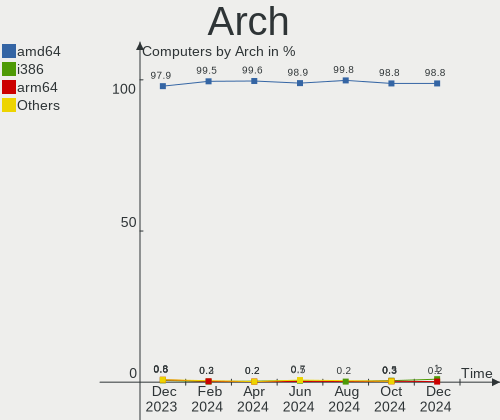
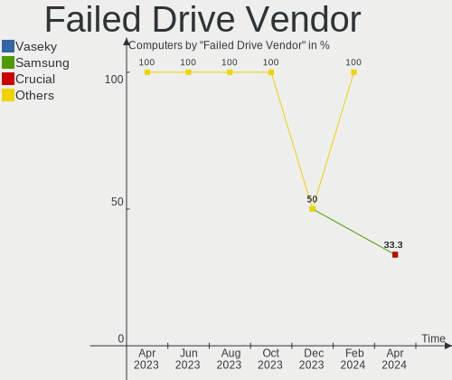
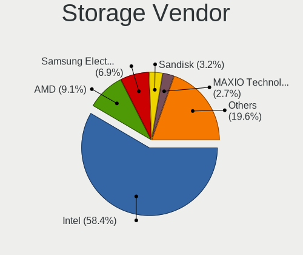

BSD - Hardware Trends
---------------------

A project to identify most popular hardware characteristics and track their change
over time based on data collected by BSD users at https://BSD-Hardware.info.

Anyone can contribute to this report by the [hw-probe](https://github.com/linuxhw/hw-probe/blob/master/INSTALL.BSD.md) tool:

    hw-probe -all -upload

This is a report for all computer types. See also reports for [desktops](/Desktop/README.md) and [notebooks](/Notebook/README.md).

OS-specific reports: [FreeBSD](/Dist/FreeBSD), [OPNsense](/Dist/OPNsense), [helloSystem](/Dist/helloSystem), [OpenBSD](/Dist/OpenBSD).

This report is for one last month. Overall report since the beginning of time: [TestDays](https://github.com/bsdhw/TestDays)

Period: Jan, 2024.

Contents
--------

* [ System ](#system)
  - [ OS                       ](#os)
  - [ OS Family                ](#os-family)
  - [ Arch                     ](#arch)
  - [ DE                       ](#de)
  - [ Display Server           ](#display-server)
  - [ Display Manager          ](#display-manager)
  - [ OS Lang                  ](#os-lang)
  - [ Boot Mode                ](#boot-mode)
  - [ Filesystem               ](#filesystem)
  - [ Part. scheme             ](#part-scheme)

* [ Board ](#board)
  - [ Vendor                   ](#vendor)
  - [ Model                    ](#model)
  - [ Model Family             ](#model-family)
  - [ MFG Year                 ](#mfg-year)
  - [ Form Factor              ](#form-factor)
  - [ Coreboot                 ](#coreboot)
  - [ RAM Size                 ](#ram-size)
  - [ RAM Used                 ](#ram-used)
  - [ Total Drives             ](#total-drives)
  - [ Has CD-ROM               ](#has-cd-rom)
  - [ Has Ethernet             ](#has-ethernet)
  - [ Has WiFi                 ](#has-wifi)
  - [ Has Bluetooth            ](#has-bluetooth)

* [ Location ](#location)
  - [ Country                  ](#country)
  - [ City                     ](#city)

* [ Drives ](#drives)
  - [ Drive Vendor             ](#drive-vendor)
  - [ Drive Model              ](#drive-model)
  - [ HDD Vendor               ](#hdd-vendor)
  - [ SSD Vendor               ](#ssd-vendor)
  - [ Drive Kind               ](#drive-kind)
  - [ Drive Connector          ](#drive-connector)
  - [ Drive Size               ](#drive-size)
  - [ Space Total              ](#space-total)
  - [ Space Used               ](#space-used)
  - [ Malfunc. Drives          ](#malfunc-drives)
  - [ Malfunc. Drive Vendor    ](#malfunc-drive-vendor)
  - [ Malfunc. HDD Vendor      ](#malfunc-hdd-vendor)
  - [ Malfunc. Drive Kind      ](#malfunc-drive-kind)
  - [ Failed Drives            ](#failed-drives)
  - [ Failed Drive Vendor      ](#failed-drive-vendor)
  - [ Drive Status             ](#drive-status)

* [ Storage controller ](#storage-controller)
  - [ Storage Vendor           ](#storage-vendor)
  - [ Storage Model            ](#storage-model)
  - [ Storage Kind             ](#storage-kind)

* [ Processor ](#processor)
  - [ CPU Vendor               ](#cpu-vendor)
  - [ CPU Model                ](#cpu-model)
  - [ CPU Model Family         ](#cpu-model-family)
  - [ CPU Cores                ](#cpu-cores)
  - [ CPU Sockets              ](#cpu-sockets)
  - [ CPU Threads              ](#cpu-threads)
  - [ CPU Microarch            ](#cpu-microarch)

* [ Graphics ](#graphics)
  - [ GPU Vendor               ](#gpu-vendor)
  - [ GPU Model                ](#gpu-model)
  - [ GPU Combo                ](#gpu-combo)
  - [ GPU Driver               ](#gpu-driver)
  - [ GPU Memory               ](#gpu-memory)

* [ Monitor ](#monitor)
  - [ Monitor Vendor           ](#monitor-vendor)
  - [ Monitor Model            ](#monitor-model)
  - [ Monitor Resolution       ](#monitor-resolution)
  - [ Monitor Diagonal         ](#monitor-diagonal)
  - [ Monitor Width            ](#monitor-width)
  - [ Aspect Ratio             ](#aspect-ratio)
  - [ Monitor Area             ](#monitor-area)
  - [ Pixel Density            ](#pixel-density)
  - [ Multiple Monitors        ](#multiple-monitors)

* [ Network ](#network)
  - [ Net Controller Vendor    ](#net-controller-vendor)
  - [ Net Controller Model     ](#net-controller-model)
  - [ Wireless Vendor          ](#wireless-vendor)
  - [ Wireless Model           ](#wireless-model)
  - [ Ethernet Vendor          ](#ethernet-vendor)
  - [ Ethernet Model           ](#ethernet-model)
  - [ Net Controller Kind      ](#net-controller-kind)
  - [ Used Controller          ](#used-controller)
  - [ NICs                     ](#nics)
  - [ IPv6                     ](#ipv6)

* [ Bluetooth ](#bluetooth)
  - [ Bluetooth Vendor         ](#bluetooth-vendor)
  - [ Bluetooth Model          ](#bluetooth-model)

* [ Sound ](#sound)
  - [ Sound Vendor             ](#sound-vendor)
  - [ Sound Model              ](#sound-model)

* [ Memory ](#memory)
  - [ Memory Vendor            ](#memory-vendor)
  - [ Memory Model             ](#memory-model)
  - [ Memory Kind              ](#memory-kind)
  - [ Memory Form Factor       ](#memory-form-factor)
  - [ Memory Size              ](#memory-size)
  - [ Memory Speed             ](#memory-speed)

* [ Printers & scanners ](#printers--scanners)
  - [ Printer Vendor           ](#printer-vendor)
  - [ Printer Model            ](#printer-model)
  - [ Scanner Vendor           ](#scanner-vendor)
  - [ Scanner Model            ](#scanner-model)

* [ Camera ](#camera)
  - [ Camera Vendor            ](#camera-vendor)
  - [ Camera Model             ](#camera-model)

* [ Security ](#security)
  - [ Fingerprint Vendor       ](#fingerprint-vendor)
  - [ Fingerprint Model        ](#fingerprint-model)
  - [ Chipcard Vendor          ](#chipcard-vendor)
  - [ Chipcard Model           ](#chipcard-model)

* [ Unsupported ](#unsupported)
  - [ Unsupported Devices      ](#unsupported-devices)
  - [ Unsupported Device Types ](#unsupported-device-types)

System
------

OS
--

Installed operating systems

| Name                 | Computers | Percent |
|----------------------|-----------|---------|
| OPNsense 23.7.12     | 148       | 28.03%  |
| OPNsense 23.7.11     | 146       | 27.65%  |
| OPNsense 23.7.10     | 60        | 11.36%  |
| OPNsense 24.1        | 24        | 4.55%   |
| FreeBSD 14.0-p4      | 23        | 4.36%   |
| helloSystem 0.8.1    | 15        | 2.84%   |
| helloSystem 0.9.0    | 14        | 2.65%   |
| FreeBSD 14.0         | 14        | 2.65%   |
| OpenBSD 7.4          | 7         | 1.33%   |
| GhostBSD 23.10.1     | 6         | 1.14%   |
| FreeBSD 15.0-CURRENT | 6         | 1.14%   |
| OPNsense 23.1.11     | 5         | 0.95%   |
| NomadBSD 20231121    | 5         | 0.95%   |
| NetBSD 10.0_RC2      | 5         | 0.95%   |
| FreeBSD 13.2-p9      | 5         | 0.95%   |
| FreeBSD 14.0-p2      | 4         | 0.76%   |
| FreeBSD 13.2         | 4         | 0.76%   |
| OPNsense 23.7.9      | 3         | 0.57%   |
| OPNsense 23.10.1     | 3         | 0.57%   |
| OpenBSD 7.0          | 2         | 0.38%   |
| FreeBSD 14.0-STABLE  | 2         | 0.38%   |
| Ting 22.7            | 1         | 0.19%   |
| pfSense 2.7.2        | 1         | 0.19%   |
| OPNsense 23.7.7      | 1         | 0.19%   |
| OPNsense 23.7.4      | 1         | 0.19%   |
| OPNsense 23.7.1      | 1         | 0.19%   |
| OPNsense 22.7        | 1         | 0.19%   |
| OPNsense 22.1.10     | 1         | 0.19%   |
| OPNsense 21.7.8      | 1         | 0.19%   |
| NetBSD 10.0_RC1      | 1         | 0.19%   |
| MyBee 14.0-p2        | 1         | 0.19%   |
| MyBee 13.2           | 1         | 0.19%   |
| MidnightBSD 3.1.3    | 1         | 0.19%   |
| MidnightBSD 3.1.1    | 1         | 0.19%   |
| helloSystem 0.7.0    | 1         | 0.19%   |
| GhostBSD 24.01.1     | 1         | 0.19%   |
| GhostBSD 22.06.18    | 1         | 0.19%   |
| FreeBSD 14.0-p3      | 1         | 0.19%   |
| FreeBSD 14.0-p1      | 1         | 0.19%   |
| FreeBSD 14.0-BETA5   | 1         | 0.19%   |

OS Family
---------

OS without a version

| Name        | Computers | Percent |
|-------------|-----------|---------|
| OPNsense    | 395       | 74.81%  |
| FreeBSD     | 68        | 12.88%  |
| helloSystem | 30        | 5.68%   |
| OpenBSD     | 9         | 1.7%    |
| GhostBSD    | 8         | 1.52%   |
| NetBSD      | 6         | 1.14%   |
| NomadBSD    | 5         | 0.95%   |
| MyBee       | 2         | 0.38%   |
| MidnightBSD | 2         | 0.38%   |
| Ting        | 1         | 0.19%   |
| pfSense     | 1         | 0.19%   |
| DragonFly   | 1         | 0.19%   |

Arch
----

OS architecture (x86_64, i586, etc.)

| Name    | Computers | Percent |
|---------|-----------|---------|
| amd64   | 516       | 97.73%  |
| arm64   | 6         | 1.14%   |
| i386    | 3         | 0.57%   |
| powerpc | 1         | 0.19%   |
| evbarm  | 1         | 0.19%   |
| arm     | 1         | 0.19%   |

DE
--

Desktop Environment

| Name         | Computers | Percent |
|--------------|-----------|---------|
| Console      | 429       | 81.25%  |
| helloDesktop | 35        | 6.63%   |
| XFCE         | 16        | 3.03%   |
| KDE5         | 12        | 2.27%   |
| MATE         | 10        | 1.89%   |
| Openbox      | 5         | 0.95%   |
| GNOME        | 5         | 0.95%   |
| TWM          | 3         | 0.57%   |
| i3           | 3         | 0.57%   |
| wlroots      | 2         | 0.38%   |
| fvwm         | 2         | 0.38%   |
| Cinnamon     | 2         | 0.38%   |
| xinitrc      | 1         | 0.19%   |
| LXQt         | 1         | 0.19%   |
| DWM          | 1         | 0.19%   |
| AwesomeWM    | 1         | 0.19%   |

Display Server
--------------

X11 or Wayland

| Name    | Computers | Percent |
|---------|-----------|---------|
| Console | 433       | 82.01%  |
| X11     | 92        | 17.42%  |
| Wayland | 3         | 0.57%   |

Display Manager
---------------

SDDM, LightDM, etc.

| Name    | Computers | Percent |
|---------|-----------|---------|
| Console | 457       | 86.55%  |
| SLiM    | 36        | 6.82%   |
| SDDM    | 16        | 3.03%   |
| LightDM | 14        | 2.65%   |
| GDM     | 3         | 0.57%   |
| XDM     | 2         | 0.38%   |

OS Lang
-------

Language

| Lang            | Computers | Percent |
|-----------------|-----------|---------|
| Unknown         | 415       | 78.6%   |
| C               | 68        | 12.88%  |
| en_US           | 28        | 5.3%    |
| fr_FR           | 4         | 0.76%   |
| de_DE           | 3         | 0.57%   |
| ru_RU           | 2         | 0.38%   |
| pl_PL           | 2         | 0.38%   |
| it_IT           | 2         | 0.38%   |
| zh_CN           | 1         | 0.19%   |
| nl_NL           | 1         | 0.19%   |
| es_ES           | 1         | 0.19%   |
| en_US.ISO8859-1 | 1         | 0.19%   |

Boot Mode
---------

EFI or BIOS

| Mode | Computers | Percent |
|------|-----------|---------|
| EFI  | 495       | 93.75%  |
| BIOS | 33        | 6.25%   |

Filesystem
----------

Type of filesystem

| Type    | Computers | Percent |
|---------|-----------|---------|
| Zfs     | 254       | 48.11%  |
| Ufs     | 248       | 46.97%  |
| Cd9660  | 16        | 3.03%   |
| Ffs     | 9         | 1.7%    |
| Hammer2 | 1         | 0.19%   |

Part. scheme
------------

Scheme of partitioning

| Type    | Computers | Percent |
|---------|-----------|---------|
| GPT     | 510       | 96.59%  |
| MBR     | 12        | 2.27%   |
| Unknown | 4         | 0.76%   |
| BSD     | 2         | 0.38%   |

Board
-----

Vendor
------

Motherboard manufacturer

| Name                    | Computers | Percent |
|-------------------------|-----------|---------|
| Unknown                 | 85        | 16.1%   |
| Hewlett-Packard         | 46        | 8.71%   |
| Dell                    | 46        | 8.71%   |
| Lenovo                  | 41        | 7.77%   |
| ASUSTek Computer        | 41        | 7.77%   |
| Supermicro              | 21        | 3.98%   |
| Intel                   | 20        | 3.79%   |
| Protectli               | 18        | 3.41%   |
| Gigabyte Technology     | 16        | 3.03%   |
| ASRock                  | 16        | 3.03%   |
| PC Engines              | 13        | 2.46%   |
| Fujitsu                 | 12        | 2.27%   |
| Sophos                  | 11        | 2.08%   |
| Techvision              | 10        | 1.89%   |
| AZW                     | 10        | 1.89%   |
| AMI                     | 9         | 1.7%    |
| MSI                     | 8         | 1.52%   |
| CWWK                    | 7         | 1.33%   |
| AWOW                    | 6         | 1.14%   |
| ZOTAC                   | 5         | 0.95%   |
| Apple                   | 5         | 0.95%   |
| Raspberry Pi Foundation | 4         | 0.76%   |
| MW                      | 4         | 0.76%   |
| BESSTAR Tech            | 4         | 0.76%   |
| Acer                    | 4         | 0.76%   |
| Gowin Solution          | 3         | 0.57%   |
| Deciso                  | 3         | 0.57%   |
| CncTion                 | 3         | 0.57%   |
| ASRockRack              | 3         | 0.57%   |
| Yanling                 | 2         | 0.38%   |
| Samsung Electronics     | 2         | 0.38%   |
| Razer                   | 2         | 0.38%   |
| OEM                     | 2         | 0.38%   |
| Foxconn                 | 2         | 0.38%   |
| ZX                      | 1         | 0.19%   |
| YANYU                   | 1         | 0.19%   |
| Star Labs               | 1         | 0.19%   |
| Standard                | 1         | 0.19%   |
| SolidRun                | 1         | 0.19%   |
| Silver Peak Systems     | 1         | 0.19%   |

Model
-----

Motherboard model

| Name                       | Computers | Percent |
|----------------------------|-----------|---------|
| Unknown                    | 88        | 16.67%  |
| Techvision TVI7309X        | 10        | 1.89%   |
| Supermicro Super Server    | 10        | 1.89%   |
| PC Engines APU2            | 8         | 1.52%   |
| Sophos SG                  | 7         | 1.33%   |
| AZW EQ                     | 7         | 1.33%   |
| Fujitsu FUTRO S920         | 6         | 1.14%   |
| PC Engines apu4            | 5         | 0.95%   |
| AMI Aptio CRB              | 5         | 0.95%   |
| RPi Raspberry Pi           | 4         | 0.76%   |
| Protectli FW4C             | 4         | 0.76%   |
| MW GMLK-2_5G4L             | 4         | 0.76%   |
| HP t730 Thin Client        | 4         | 0.76%   |
| ZOTAC ZBOX-CI329NANO       | 3         | 0.57%   |
| Sophos XG                  | 3         | 0.57%   |
| Protectli FW6              | 3         | 0.57%   |
| Protectli FW4B             | 3         | 0.57%   |
| Protectli FW2B             | 3         | 0.57%   |
| Intel Q3XXG4-P V1.0        | 3         | 0.57%   |
| Dell OptiPlex 7050         | 3         | 0.57%   |
| CWWK CW-AD4L-N V1          | 3         | 0.57%   |
| Supermicro X10SLH-N6-ST031 | 2         | 0.38%   |
| Protectli VP2420           | 2         | 0.38%   |
| OEM 1.0                    | 2         | 0.38%   |
| Intel CRESCENTBAY          | 2         | 0.38%   |
| HP Slim Desktop 290-p0xxx  | 2         | 0.38%   |
| HP ProLiant DL360 G7       | 2         | 0.38%   |
| GoWin Solution R86S        | 2         | 0.38%   |
| Foxconn Pro3500 Series     | 2         | 0.38%   |
| Dell PowerEdge R610        | 2         | 0.38%   |
| Dell OptiPlex 7070         | 2         | 0.38%   |
| Dell OptiPlex 7010         | 2         | 0.38%   |
| Dell Inspiron 660s         | 2         | 0.38%   |
| Deciso NetBoard-A20        | 2         | 0.38%   |
| CWWK CW-J6-6L              | 2         | 0.38%   |
| CncTion N4505-4L           | 2         | 0.38%   |
| BESSTAR Tech GK41          | 2         | 0.38%   |
| AWOW AZ51                  | 2         | 0.38%   |
| AWOW AK10                  | 2         | 0.38%   |
| ASUS TUF Gaming X570-PLUS  | 2         | 0.38%   |

Model Family
------------

Motherboard model prefix

| Name                       | Computers | Percent |
|----------------------------|-----------|---------|
| Unknown                    | 88        | 16.67%  |
| Dell OptiPlex              | 18        | 3.41%   |
| Lenovo ThinkPad            | 16        | 3.03%   |
| Lenovo ThinkCentre         | 14        | 2.65%   |
| Techvision TVI7309X        | 10        | 1.89%   |
| Supermicro Super           | 10        | 1.89%   |
| ASUS TUF                   | 10        | 1.89%   |
| HP ProLiant                | 9         | 1.7%    |
| Dell PowerEdge             | 9         | 1.7%    |
| PC Engines APU2            | 8         | 1.52%   |
| HP Compaq                  | 8         | 1.52%   |
| Sophos SG                  | 7         | 1.33%   |
| Fujitsu FUTRO              | 7         | 1.33%   |
| Dell Inspiron              | 7         | 1.33%   |
| AZW EQ                     | 7         | 1.33%   |
| ASUS PRIME                 | 7         | 1.33%   |
| HP EliteDesk               | 6         | 1.14%   |
| PC Engines apu4            | 5         | 0.95%   |
| Dell Latitude              | 5         | 0.95%   |
| AMI Aptio                  | 5         | 0.95%   |
| RPi Raspberry              | 4         | 0.76%   |
| Protectli FW4C             | 4         | 0.76%   |
| MW GMLK-2                  | 4         | 0.76%   |
| HP t730                    | 4         | 0.76%   |
| ASUS ROG                   | 4         | 0.76%   |
| ZOTAC ZBOX-CI329NANO       | 3         | 0.57%   |
| Sophos XG                  | 3         | 0.57%   |
| Protectli FW6              | 3         | 0.57%   |
| Protectli FW4B             | 3         | 0.57%   |
| Protectli FW2B             | 3         | 0.57%   |
| Intel Q3XXG4-P             | 3         | 0.57%   |
| HP Pavilion                | 3         | 0.57%   |
| Fujitsu PRIMERGY           | 3         | 0.57%   |
| CWWK CW-AD4L-N             | 3         | 0.57%   |
| Supermicro X10SLH-N6-ST031 | 2         | 0.38%   |
| Razer Blade                | 2         | 0.38%   |
| Protectli VP2420           | 2         | 0.38%   |
| OEM 1.0                    | 2         | 0.38%   |
| Lenovo ThinkStation        | 2         | 0.38%   |
| Lenovo IdeaPad             | 2         | 0.38%   |

MFG Year
--------

Motherboard manufacture year

| Year    | Computers | Percent |
|---------|-----------|---------|
| 2023    | 110       | 20.83%  |
| 2022    | 76        | 14.39%  |
| 2018    | 52        | 9.85%   |
| 2019    | 38        | 7.2%    |
| 2021    | 37        | 7.01%   |
| 2016    | 32        | 6.06%   |
| 2015    | 28        | 5.3%    |
| 2020    | 26        | 4.92%   |
| 2014    | 24        | 4.55%   |
| 2012    | 24        | 4.55%   |
| 2017    | 23        | 4.36%   |
| 2013    | 16        | 3.03%   |
| 2011    | 15        | 2.84%   |
| 2009    | 8         | 1.52%   |
| 2010    | 5         | 0.95%   |
| 2008    | 5         | 0.95%   |
| Unknown | 5         | 0.95%   |
| 2007    | 2         | 0.38%   |
| 2024    | 1         | 0.19%   |
| 2005    | 1         | 0.19%   |

Form Factor
-----------

Physical design of the computer

| Name           | Computers | Percent |
|----------------|-----------|---------|
| Desktop        | 352       | 66.67%  |
| Notebook       | 73        | 13.83%  |
| Mini pc        | 45        | 8.52%   |
| Server         | 38        | 7.2%    |
| Firewall       | 12        | 2.27%   |
| System on chip | 4         | 0.76%   |
| All in one     | 2         | 0.38%   |
| Stick pc       | 1         | 0.19%   |
| Convertible    | 1         | 0.19%   |

Coreboot
--------

Have coreboot on board

| Used | Computers | Percent |
|------|-----------|---------|
| No   | 509       | 96.4%   |
| Yes  | 19        | 3.6%    |

RAM Size
--------

Total RAM memory

| Size in GB      | Computers | Percent |
|-----------------|-----------|---------|
| 8.01-16.0       | 195       | 36.93%  |
| 16.01-24.0      | 151       | 28.6%   |
| 4.01-8.0        | 66        | 12.5%   |
| 32.01-64.0      | 61        | 11.55%  |
| 64.01-256.0     | 28        | 5.3%    |
| 2.01-3.0        | 13        | 2.46%   |
| 3.01-4.0        | 4         | 0.76%   |
| 24.01-32.0      | 4         | 0.76%   |
| 0.51-1.0        | 3         | 0.57%   |
| 0.01-0.5        | 2         | 0.38%   |
| More than 256.0 | 1         | 0.19%   |

RAM Used
--------

Used RAM memory

| Used GB   | Computers | Percent |
|-----------|-----------|---------|
| 0.01-0.5  | 213       | 40.34%  |
| 0.51-1.0  | 201       | 38.07%  |
| 1.01-2.0  | 74        | 14.02%  |
| 2.01-3.0  | 19        | 3.6%    |
| 3.01-4.0  | 7         | 1.33%   |
| Unknown   | 7         | 1.33%   |
| 4.01-8.0  | 3         | 0.57%   |
| 0         | 3         | 0.57%   |
| 8.01-16.0 | 1         | 0.19%   |

Total Drives
------------

Number of drives on board

| Drives | Computers | Percent |
|--------|-----------|---------|
| 1      | 373       | 70.64%  |
| 0      | 87        | 16.48%  |
| 2      | 44        | 8.33%   |
| 3      | 11        | 2.08%   |
| 4      | 7         | 1.33%   |
| 5      | 3         | 0.57%   |
| 13     | 1         | 0.19%   |
| 8      | 1         | 0.19%   |
| 6      | 1         | 0.19%   |

Has CD-ROM
----------

Has CD-ROM on board

| Presented | Computers | Percent |
|-----------|-----------|---------|
| No        | 466       | 88.26%  |
| Yes       | 62        | 11.74%  |

Has Ethernet
------------

Has Ethernet on board

| Presented | Computers | Percent |
|-----------|-----------|---------|
| Yes       | 507       | 96.02%  |
| No        | 21        | 3.98%   |

Has WiFi
--------

Has WiFi module

| Presented | Computers | Percent |
|-----------|-----------|---------|
| No        | 357       | 67.61%  |
| Yes       | 171       | 32.39%  |

Has Bluetooth
-------------

Has Bluetooth module

| Presented | Computers | Percent |
|-----------|-----------|---------|
| No        | 396       | 75%     |
| Yes       | 132       | 25%     |

Location
--------

Country
-------

Geographic location (country)

| Country         | Computers | Percent |
|-----------------|-----------|---------|
| USA             | 148       | 28.03%  |
| Germany         | 77        | 14.58%  |
| Canada          | 31        | 5.87%   |
| UK              | 25        | 4.73%   |
| France          | 23        | 4.36%   |
| Russia          | 18        | 3.41%   |
| Netherlands     | 17        | 3.22%   |
| Poland          | 12        | 2.27%   |
| Sweden          | 11        | 2.08%   |
| Brazil          | 11        | 2.08%   |
| Australia       | 11        | 2.08%   |
| Italy           | 10        | 1.89%   |
| Spain           | 8         | 1.52%   |
| Switzerland     | 7         | 1.33%   |
| Romania         | 7         | 1.33%   |
| Austria         | 7         | 1.33%   |
| South Korea     | 6         | 1.14%   |
| Turkey          | 5         | 0.95%   |
| Norway          | 5         | 0.95%   |
| New Zealand     | 5         | 0.95%   |
| Indonesia       | 5         | 0.95%   |
| India           | 5         | 0.95%   |
| Finland         | 5         | 0.95%   |
| Portugal        | 4         | 0.76%   |
| Ireland         | 4         | 0.76%   |
| Bulgaria        | 4         | 0.76%   |
| Belgium         | 4         | 0.76%   |
| The Netherlands | 3         | 0.57%   |
| Thailand        | 3         | 0.57%   |
| Belarus         | 3         | 0.57%   |
| Algeria         | 3         | 0.57%   |
| Taiwan          | 2         | 0.38%   |
| South Africa    | 2         | 0.38%   |
| Slovakia        | 2         | 0.38%   |
| Mexico          | 2         | 0.38%   |
| Japan           | 2         | 0.38%   |
| Greece          | 2         | 0.38%   |
| Estonia         | 2         | 0.38%   |
| Czechia         | 2         | 0.38%   |
| Croatia         | 2         | 0.38%   |

City
----

Geographic location (city)

| City          | Computers | Percent |
|---------------|-----------|---------|
| Moscow        | 6         | 1.14%   |
| Cologne       | 6         | 1.14%   |
| Berlin        | 6         | 1.14%   |
| Toronto       | 5         | 0.95%   |
| Seattle       | 5         | 0.95%   |
| Vienna        | 4         | 0.76%   |
| Sydney        | 4         | 0.76%   |
| Sofia         | 4         | 0.76%   |
| Sao Paulo     | 4         | 0.76%   |
| Paris         | 4         | 0.76%   |
| Munich        | 4         | 0.76%   |
| Leipzig       | 4         | 0.76%   |
| Auckland      | 4         | 0.76%   |
| Amsterdam     | 4         | 0.76%   |
| Ypsilanti     | 3         | 0.57%   |
| Vancouver     | 3         | 0.57%   |
| Stockholm     | 3         | 0.57%   |
| Spanish Fork  | 3         | 0.57%   |
| Hamburg       | 3         | 0.57%   |
| Edmonton      | 3         | 0.57%   |
| Düsseldorf   | 3         | 0.57%   |
| Brooklyn      | 3         | 0.57%   |
| Atlanta       | 3         | 0.57%   |
| Zagreb        | 2         | 0.38%   |
| Yekaterinburg | 2         | 0.38%   |
| Winnipeg      | 2         | 0.38%   |
| Westervoort   | 2         | 0.38%   |
| Victoria      | 2         | 0.38%   |
| Trondheim     | 2         | 0.38%   |
| Tallahassee   | 2         | 0.38%   |
| Sydenham      | 2         | 0.38%   |
| Salem         | 2         | 0.38%   |
| Rpety         | 2         | 0.38%   |
| Rocky Point   | 2         | 0.38%   |
| Redmond       | 2         | 0.38%   |
| Philadelphia  | 2         | 0.38%   |
| Ozersk        | 2         | 0.38%   |
| Oslo          | 2         | 0.38%   |
| Oakland       | 2         | 0.38%   |
| New York      | 2         | 0.38%   |

Drives
------

Drive Vendor
------------

Hard drive vendors

| Vendor              | Computers | Drives | Percent |
|---------------------|-----------|--------|---------|
| Samsung Electronics | 79        | 93     | 15.86%  |
| Kingston            | 48        | 50     | 9.64%   |
| WDC                 | 33        | 49     | 6.63%   |
| Seagate             | 29        | 37     | 5.82%   |
| Crucial             | 29        | 33     | 5.82%   |
| Intel               | 28        | 34     | 5.62%   |
| Transcend           | 21        | 23     | 4.22%   |
| SanDisk             | 17        | 17     | 3.41%   |
| SK hynix            | 15        | 16     | 3.01%   |
| China               | 15        | 16     | 3.01%   |
| Toshiba             | 14        | 15     | 2.81%   |
| A-DATA Technology   | 12        | 12     | 2.41%   |
| Silicon Motion      | 11        | 11     | 2.21%   |
| PNY                 | 10        | 11     | 2.01%   |
| Hewlett-Packard     | 10        | 16     | 2.01%   |
| Patriot             | 6         | 6      | 1.2%    |
| BIWIN               | 6         | 6      | 1.2%    |
| Team                | 5         | 5      | 1%      |
| SPCC                | 5         | 6      | 1%      |
| Phison              | 5         | 6      | 1%      |
| LITEON              | 5         | 5      | 1%      |
| HGST                | 5         | 7      | 1%      |
| FORESEE             | 5         | 5      | 1%      |
| OCZ                 | 4         | 4      | 0.8%    |
| Hoodisk             | 4         | 4      | 0.8%    |
| ShiJi               | 3         | 3      | 0.6%    |
| NVMe                | 3         | 3      | 0.6%    |
| Netac               | 3         | 3      | 0.6%    |
| Lexar               | 3         | 3      | 0.6%    |
| KIOXIA              | 3         | 3      | 0.6%    |
| KingSpec            | 3         | 3      | 0.6%    |
| Kimtigo             | 3         | 3      | 0.6%    |
| Hitachi             | 3         | 3      | 0.6%    |
| Dogfish             | 3         | 3      | 0.6%    |
| Protectli           | 2         | 2      | 0.4%    |
| Micron Technology   | 2         | 2      | 0.4%    |
| LITEONIT            | 2         | 2      | 0.4%    |
| Kingsand            | 2         | 2      | 0.4%    |
| Innodisk            | 2         | 2      | 0.4%    |
| Gigabyte Technology | 2         | 2      | 0.4%    |

Drive Model
-----------

Hard drive models

| Model                              | Computers | Percent |
|------------------------------------|-----------|---------|
| Kingston SKC600MS256G 256GB        | 10        | 1.91%   |
| Crucial CT240BX500SSD1 240GB       | 7         | 1.34%   |
| Samsung SSD 980 500GB              | 5         | 0.96%   |
| Samsung SSD 870 EVO 500GB          | 5         | 0.96%   |
| Samsung SSD 850 EVO 250GB          | 5         | 0.96%   |
| Phison PCIe SSD 512GB              | 5         | 0.96%   |
| Kingston SA400S37120G 120GB        | 5         | 0.96%   |
| SPCC M.2 PCIe SSD 128GB            | 4         | 0.76%   |
| Samsung SSD 860 EVO 500GB          | 4         | 0.76%   |
| Kingston SMS200S360G 64GB          | 4         | 0.76%   |
| Kingston SMS200S330G 32GB          | 4         | 0.76%   |
| Kingston SA400S37240G 240GB        | 4         | 0.76%   |
| Transcend TS64GSSD370 64GB         | 3         | 0.57%   |
| Silicon Motion NVME SSD 128GB      | 3         | 0.57%   |
| Samsung SSD 980 PRO 1TB            | 3         | 0.57%   |
| Kimtigo SSD 128GB                  | 3         | 0.57%   |
| Hoodisk SSD 128GB                  | 3         | 0.57%   |
| HP RAID 1(1+0) 73GB                | 3         | 0.57%   |
| Crucial M4-CT128M4SSD2 128GB       | 3         | 0.57%   |
| Crucial CT500P3SSD8 500GB          | 3         | 0.57%   |
| Crucial CT480BX500SSD1 480GB       | 3         | 0.57%   |
| BIWIN NA80Y1M10-512G               | 3         | 0.57%   |
| Transcend TS64GSSD420K 64GB        | 2         | 0.38%   |
| Transcend TS120GMTS420S 120GB      | 2         | 0.38%   |
| Toshiba MQ01ABD050 500GB           | 2         | 0.38%   |
| Toshiba KXG60ZNV256G NVMe 256GB    | 2         | 0.38%   |
| Team TM8PS7256G 256GB              | 2         | 0.38%   |
| SK hynix SC311 SATA 128GB          | 2         | 0.38%   |
| Silicon Motion GV-128-2242 128GB   | 2         | 0.38%   |
| Seagate ST500LT012-1DG142 500GB    | 2         | 0.38%   |
| Seagate ST4000DM000-1F2168 4TB     | 2         | 0.38%   |
| Seagate ST3500312CS 500GB          | 2         | 0.38%   |
| Seagate ST1000LM024 HN-M101MBB 1TB | 2         | 0.38%   |
| SanDisk SDSSDP128G 128GB           | 2         | 0.38%   |
| Samsung SSD 980 PRO 500GB          | 2         | 0.38%   |
| Samsung SSD 980 250GB              | 2         | 0.38%   |
| Samsung SSD 970 PRO 512GB          | 2         | 0.38%   |
| Samsung SSD 970 EVO Plus 500GB     | 2         | 0.38%   |
| Samsung SSD 970 EVO Plus 1TB       | 2         | 0.38%   |
| Samsung SSD 870 QVO 2TB            | 2         | 0.38%   |

HDD Vendor
----------

Hard disk drive vendors

| Vendor              | Computers | Drives | Percent |
|---------------------|-----------|--------|---------|
| Seagate             | 26        | 33     | 33.77%  |
| WDC                 | 24        | 39     | 31.17%  |
| Toshiba             | 8         | 9      | 10.39%  |
| HGST                | 5         | 7      | 6.49%   |
| Hewlett-Packard     | 5         | 10     | 6.49%   |
| NVMe                | 3         | 3      | 3.9%    |
| Hitachi             | 3         | 3      | 3.9%    |
| Samsung Electronics | 1         | 1      | 1.3%    |
| LSI                 | 1         | 1      | 1.3%    |
| China               | 1         | 1      | 1.3%    |

SSD Vendor
----------

Solid state drive vendors

| Vendor              | Computers | Drives | Percent |
|---------------------|-----------|--------|---------|
| Samsung Electronics | 45        | 54     | 15.25%  |
| Kingston            | 42        | 44     | 14.24%  |
| Crucial             | 22        | 26     | 7.46%   |
| Intel               | 21        | 27     | 7.12%   |
| Transcend           | 20        | 21     | 6.78%   |
| SanDisk             | 17        | 17     | 5.76%   |
| China               | 14        | 15     | 4.75%   |
| A-DATA Technology   | 11        | 11     | 3.73%   |
| PNY                 | 8         | 9      | 2.71%   |
| SK hynix            | 6         | 6      | 2.03%   |
| WDC                 | 5         | 5      | 1.69%   |
| LITEON              | 5         | 5      | 1.69%   |
| Team                | 4         | 4      | 1.36%   |
| Patriot             | 4         | 4      | 1.36%   |
| OCZ                 | 4         | 4      | 1.36%   |
| Hoodisk             | 4         | 4      | 1.36%   |
| Lexar               | 3         | 3      | 1.02%   |
| KingSpec            | 3         | 3      | 1.02%   |
| Hewlett-Packard     | 3         | 4      | 1.02%   |
| Dogfish             | 3         | 3      | 1.02%   |
| Toshiba             | 2         | 2      | 0.68%   |
| ShiJi               | 2         | 2      | 0.68%   |
| Seagate             | 2         | 3      | 0.68%   |
| Protectli           | 2         | 2      | 0.68%   |
| LITEONIT            | 2         | 2      | 0.68%   |
| Kingsand            | 2         | 2      | 0.68%   |
| Innodisk            | 2         | 2      | 0.68%   |
| Gigabyte Technology | 2         | 2      | 0.68%   |
| ATP                 | 2         | 2      | 0.68%   |
| Apacer              | 2         | 2      | 0.68%   |
| VICKTER             | 1         | 1      | 0.34%   |
| VICK                | 1         | 1      | 0.34%   |
| Verbatim            | 1         | 1      | 0.34%   |
| Vaseky              | 1         | 1      | 0.34%   |
| V-GeN               | 1         | 1      | 0.34%   |
| tecmiyo             | 1         | 1      | 0.34%   |
| SUNEAST             | 1         | 2      | 0.34%   |
| SPCC                | 1         | 1      | 0.34%   |
| Smartbuy            | 1         | 1      | 0.34%   |
| Pioneer             | 1         | 1      | 0.34%   |

Drive Kind
----------

HDD or SSD

| Kind | Computers | Drives | Percent |
|------|-----------|--------|---------|
| SSD  | 281       | 322    | 58.42%  |
| NVMe | 128       | 136    | 26.61%  |
| HDD  | 72        | 107    | 14.97%  |

Drive Connector
---------------

SATA, SAS, NVMe, etc.

| Type | Computers | Drives | Percent |
|------|-----------|--------|---------|
| SATA | 334       | 429    | 72.29%  |
| NVMe | 128       | 136    | 27.71%  |

Drive Size
----------

Size of hard drive

| Size in TB | Computers | Drives | Percent |
|------------|-----------|--------|---------|
| 0.01-0.5   | 283       | 322    | 78.61%  |
| 0.51-1.0   | 45        | 52     | 12.5%   |
| 1.01-2.0   | 16        | 25     | 4.44%   |
| 3.01-4.0   | 7         | 10     | 1.94%   |
| 4.01-10.0  | 5         | 15     | 1.39%   |
| 10.01-20.0 | 4         | 5      | 1.11%   |

Space Total
-----------

Amount of disk space available on the file system

| Size in GB     | Computers | Percent |
|----------------|-----------|---------|
| 101-250        | 252       | 47.73%  |
| 251-500        | 101       | 19.13%  |
| 51-100         | 45        | 8.52%   |
| 1-20           | 44        | 8.33%   |
| 21-50          | 36        | 6.82%   |
| 501-1000       | 32        | 6.06%   |
| 1001-2000      | 13        | 2.46%   |
| More than 3000 | 4         | 0.76%   |
| Unknown        | 1         | 0.19%   |

Space Used
----------

Amount of used disk space

| Used GB        | Computers | Percent |
|----------------|-----------|---------|
| 1-20           | 483       | 91.48%  |
| 21-50          | 28        | 5.3%    |
| 101-250        | 6         | 1.14%   |
| 51-100         | 6         | 1.14%   |
| More than 3000 | 2         | 0.38%   |
| 251-500        | 1         | 0.19%   |
| 501-1000       | 1         | 0.19%   |
| Unknown        | 1         | 0.19%   |

Malfunc. Drives
---------------

Drive models with a malfunction

| Model                                   | Computers | Drives | Percent |
|-----------------------------------------|-----------|--------|---------|
| Kingston SMS200S330G 32GB               | 2         | 2      | 3.92%   |
| Kingston SMS200S3120G 120GB             | 2         | 2      | 3.92%   |
| WDC WD7500BPKX-00HPJT0 752GB            | 1         | 2      | 1.96%   |
| WDC WD6400AAKS-22A7B2 640GB             | 1         | 1      | 1.96%   |
| WDC WD5000LPVX-22V0TT0 500GB            | 1         | 1      | 1.96%   |
| WDC WD40EFRX-68WT0N0 4TB                | 1         | 1      | 1.96%   |
| WDC WD10EZEX-60M2NA0 1TB                | 1         | 1      | 1.96%   |
| WDC WD10EARS-00MVWB0 1TB                | 1         | 1      | 1.96%   |
| Toshiba THNSNK128GCS8 SATA 128GB        | 1         | 1      | 1.96%   |
| Toshiba MQ01ABD050 500GB                | 1         | 1      | 1.96%   |
| tecmiyo SSD MSATA 64GB                  | 1         | 1      | 1.96%   |
| SUNEAST SE900 SSD 256GB                 | 1         | 2      | 1.96%   |
| SK hynix SC401 SATA 256GB               | 1         | 1      | 1.96%   |
| SK hynix SC313 HFS256G32TNF-N3A0A 256GB | 1         | 1      | 1.96%   |
| SK hynix SC308 SATA 128GB               | 1         | 1      | 1.96%   |
| ShiJi SSD 32GB                          | 1         | 1      | 1.96%   |
| Seagate ST9500325AS 500GB               | 1         | 1      | 1.96%   |
| Seagate ST9250610NS 250GB               | 1         | 1      | 1.96%   |
| Seagate ST500LT012-1DG142 500GB         | 1         | 1      | 1.96%   |
| Seagate ST3160318AS 160GB               | 1         | 1      | 1.96%   |
| SanDisk SSD U100 64GB                   | 1         | 1      | 1.96%   |
| SanDisk SD7SB3Q128G 128GB               | 1         | 1      | 1.96%   |
| Samsung Electronics SSD 970 EVO 250GB   | 1         | 1      | 1.96%   |
| Samsung Electronics SSD 870 EVO 500GB   | 1         | 1      | 1.96%   |
| Plextor PX-512M8PeG 512GB               | 1         | 1      | 1.96%   |
| Patriot Pyro SE 120GB                   | 1         | 1      | 1.96%   |
| Patriot Burst Elite 120GB               | 1         | 1      | 1.96%   |
| OCZ VERTEX460 480GB                     | 1         | 1      | 1.96%   |
| Micron Technology M550_mSATA_256GB      | 1         | 1      | 1.96%   |
| Lexar CFAST 64GB CARD                   | 1         | 1      | 1.96%   |
| Kingston SV300S37A120G 120GB            | 1         | 1      | 1.96%   |
| Kingston SMS200S360G 64GB               | 1         | 1      | 1.96%   |
| Kingston SHFS37A120G 120GB              | 1         | 1      | 1.96%   |
| KingSpec P4-120 120GB                   | 1         | 1      | 1.96%   |
| KingDian S100 32GB                      | 1         | 1      | 1.96%   |
| Intel SSDSC2KW128G8 128GB               | 1         | 1      | 1.96%   |
| Intel SSDSC2CW060A3 64GB                | 1         | 1      | 1.96%   |
| Intel SSDSC2BF180A4H 180GB              | 1         | 1      | 1.96%   |
| Intel SSDSA2M120G2GC 120GB              | 1         | 1      | 1.96%   |
| HP Phison PSSBN016GA27MC1 16GB          | 1         | 1      | 1.96%   |

Malfunc. Drive Vendor
---------------------

Vendors of faulty drives

| Vendor              | Computers | Drives | Percent |
|---------------------|-----------|--------|---------|
| Kingston            | 7         | 7      | 13.73%  |
| WDC                 | 6         | 7      | 11.76%  |
| Seagate             | 4         | 4      | 7.84%   |
| Intel               | 4         | 4      | 7.84%   |
| SK hynix            | 3         | 3      | 5.88%   |
| Toshiba             | 2         | 2      | 3.92%   |
| SanDisk             | 2         | 2      | 3.92%   |
| Samsung Electronics | 2         | 2      | 3.92%   |
| Patriot             | 2         | 2      | 3.92%   |
| HGST                | 2         | 2      | 3.92%   |
| Crucial             | 2         | 2      | 3.92%   |
| China               | 2         | 2      | 3.92%   |
| tecmiyo             | 1         | 1      | 1.96%   |
| SUNEAST             | 1         | 2      | 1.96%   |
| ShiJi               | 1         | 1      | 1.96%   |
| Plextor             | 1         | 1      | 1.96%   |
| OCZ                 | 1         | 1      | 1.96%   |
| Micron Technology   | 1         | 1      | 1.96%   |
| Lexar               | 1         | 1      | 1.96%   |
| KingSpec            | 1         | 1      | 1.96%   |
| KingDian            | 1         | 1      | 1.96%   |
| HP Phison           | 1         | 1      | 1.96%   |
| Hitachi             | 1         | 1      | 1.96%   |
| Hewlett-Packard     | 1         | 2      | 1.96%   |
| Apple               | 1         | 1      | 1.96%   |

Malfunc. HDD Vendor
-------------------

Vendors of faulty HDD drives

| Vendor  | Computers | Drives | Percent |
|---------|-----------|--------|---------|
| WDC     | 6         | 7      | 40%     |
| Seagate | 4         | 4      | 26.67%  |
| HGST    | 2         | 2      | 13.33%  |
| Toshiba | 1         | 1      | 6.67%   |
| Hitachi | 1         | 1      | 6.67%   |
| China   | 1         | 1      | 6.67%   |

Malfunc. Drive Kind
-------------------

Kinds of faulty drives

| Kind | Computers | Drives | Percent |
|------|-----------|--------|---------|
| SSD  | 34        | 36     | 66.67%  |
| HDD  | 15        | 16     | 29.41%  |
| NVMe | 2         | 2      | 3.92%   |

Failed Drives
-------------

Failed drive models

| Model                         | Computers | Drives | Percent |
|-------------------------------|-----------|--------|---------|
| SanDisk SD7TB6S256G1001 256GB | 1         | 1      | 50%     |
| Kingston SMS200S330G 32GB     | 1         | 1      | 50%     |

Failed Drive Vendor
-------------------

Failed drive vendors

| Vendor   | Computers | Drives | Percent |
|----------|-----------|--------|---------|
| SanDisk  | 1         | 1      | 50%     |
| Kingston | 1         | 1      | 50%     |

Drive Status
------------

Number of failed and malfunc. drives

| Status   | Computers | Drives | Percent |
|----------|-----------|--------|---------|
| Works    | 387       | 493    | 86%     |
| Malfunc  | 50        | 54     | 11.11%  |
| Detected | 11        | 16     | 2.44%   |
| Failed   | 2         | 2      | 0.44%   |

Storage controller
------------------

Storage Vendor
--------------

Storage controller vendors

| Vendor                                  | Computers | Percent |
|-----------------------------------------|-----------|---------|
| Intel                                   | 400       | 57.97%  |
| AMD                                     | 74        | 10.72%  |
| Samsung Electronics                     | 51        | 7.39%   |
| Silicon Motion                          | 21        | 3.04%   |
| Sandisk                                 | 20        | 2.9%    |
| MAXIO Technology (Hangzhou)             | 14        | 2.03%   |
| Broadcom / LSI                          | 13        | 1.88%   |
| SK hynix                                | 11        | 1.59%   |
| Phison Electronics                      | 11        | 1.59%   |
| Micron/Crucial Technology               | 11        | 1.59%   |
| Kingston Technology Company             | 7         | 1.01%   |
| Shenzhen Longsys Electronics            | 6         | 0.87%   |
| Hosin Global Electronics                | 6         | 0.87%   |
| ASMedia Technology                      | 6         | 0.87%   |
| Toshiba                                 | 5         | 0.72%   |
| KIOXIA                                  | 5         | 0.72%   |
| Hewlett-Packard                         | 5         | 0.72%   |
| Solid State Storage Technology          | 4         | 0.58%   |
| Realtek Semiconductor                   | 3         | 0.43%   |
| Micron Technology                       | 3         | 0.43%   |
| Marvell Technology Group                | 2         | 0.29%   |
| JMicron Technology                      | 2         | 0.29%   |
| Yangtze Memory Technologies             | 1         | 0.14%   |
| Transcend                               | 1         | 0.14%   |
| Shenzhen Unionmemory Information System | 1         | 0.14%   |
| Seagate Technology                      | 1         | 0.14%   |
| Nvidia                                  | 1         | 0.14%   |
| Netac Technology                        | 1         | 0.14%   |
| Lite-On Technology                      | 1         | 0.14%   |
| Chelsio Communications                  | 1         | 0.14%   |
| Apple                                   | 1         | 0.14%   |
| ADATA Technology                        | 1         | 0.14%   |

Storage Model
-------------

Storage controller models

| Model                                                                            | Computers | Percent |
|----------------------------------------------------------------------------------|-----------|---------|
| AMD FCH SATA Controller [AHCI mode]                                              | 52        | 6.99%   |
| Intel unknown                                                                    | 38        | 5.11%   |
| Intel Celeron/Pentium Silver Processor SATA Controller                           | 33        | 4.44%   |
| Intel 8 Series/C220 Series Chipset Family 6-port SATA Controller 1 [AHCI mode]   | 31        | 4.17%   |
| Intel Jasper Lake SATA AHCI Controller                                           | 26        | 3.49%   |
| Silicon Motion SM2263EN/SM2263XT (DRAM-less) NVMe SSD Controllers                | 21        | 2.82%   |
| Intel Cannon Lake PCH SATA AHCI Controller                                       | 21        | 2.82%   |
| Samsung NVMe SSD Controller SM981/PM981/PM983                                    | 18        | 2.42%   |
| Samsung NVMe SSD Controller 980 (DRAM-less)                                      | 18        | 2.42%   |
| Intel Atom Processor E3800 Series SATA AHCI Controller                           | 18        | 2.42%   |
| Intel Q170/Q150/B150/H170/H110/Z170/CM236 Chipset SATA Controller [AHCI Mode]    | 17        | 2.28%   |
| Intel 6 Series/C200 Series Chipset Family 6 port Desktop SATA AHCI Controller    | 16        | 2.15%   |
| Intel Atom/Celeron/Pentium Processor x5-E8000/J3xxx/N3xxx Series SATA Controller | 15        | 2.02%   |
| MAXIO (Hangzhou) NVMe SSD Controller MAP1202 (DRAM-less)                         | 14        | 1.88%   |
| Intel Wildcat Point-LP SATA Controller [AHCI Mode]                               | 14        | 1.88%   |
| Intel Sunrise Point-LP SATA Controller [AHCI mode]                               | 13        | 1.75%   |
| Intel 200 Series PCH SATA controller [AHCI mode]                                 | 10        | 1.34%   |
| Micron/Crucial P2 [Nick P2] / P3 / P3 Plus NVMe PCIe SSD (DRAM-less)             | 9         | 1.21%   |
| AMD 400 Series Chipset SATA Controller                                           | 9         | 1.21%   |
| Unknown                                                                          | 9         | 1.21%   |
| Samsung NVMe SSD Controller PM9A1/PM9A3/980PRO                                   | 8         | 1.08%   |
| Intel Celeron N3350/Pentium N4200/Atom E3900 Series SATA AHCI Controller         | 8         | 1.08%   |
| Intel Alder Lake-S PCH SATA Controller [AHCI Mode]                               | 8         | 1.08%   |
| Intel Elkhart Lake SATA AHCI                                                     | 7         | 0.94%   |
| Intel Alder Lake-P SATA AHCI Controller                                          | 7         | 0.94%   |
| Intel 6 Series/C200 Series Chipset Family 6 port Mobile SATA AHCI Controller     | 7         | 0.94%   |
| SK hynix Gold P31/BC711/PC711 NVMe Solid State Drive                             | 6         | 0.81%   |
| Intel NM10/ICH7 Family SATA Controller [IDE mode]                                | 6         | 0.81%   |
| Intel Comet Lake SATA AHCI Controller                                            | 6         | 0.81%   |
| Intel Atom Processor C3000 Series SATA Controller 0                              | 6         | 0.81%   |
| Intel 7 Series/C210 Series Chipset Family 6-port SATA Controller [AHCI mode]     | 6         | 0.81%   |
| ASMedia ASM1061/ASM1062 Serial ATA Controller                                    | 6         | 0.81%   |
| AMD SB7x0/SB8x0/SB9x0 SATA Controller [AHCI mode]                                | 6         | 0.81%   |
| AMD 500 Series Chipset SATA Controller                                           | 6         | 0.81%   |
| Phison PS5015-E15 PCIe3 NVMe Controller (DRAM-less)                              | 5         | 0.67%   |
| Intel SATA Controller [RAID mode]                                                | 5         | 0.67%   |
| Intel product 54d3                                                               | 5         | 0.67%   |
| Intel Atom Processor C3000 Series SATA Controller 1                              | 5         | 0.67%   |
| Intel 82801JI (ICH10 Family) 4 port SATA IDE Controller #1                       | 5         | 0.67%   |
| Intel 82801G (ICH7 Family) IDE Controller                                        | 5         | 0.67%   |

Storage Kind
------------

Kind of storage controller (IDE, SATA, NVMe, SAS, ...)

| Kind | Computers | Percent |
|------|-----------|---------|
| SATA | 440       | 63.4%   |
| NVMe | 187       | 26.95%  |
| IDE  | 35        | 5.04%   |
| RAID | 23        | 3.31%   |
| SAS  | 5         | 0.72%   |
| SCSI | 4         | 0.58%   |

Processor
---------

CPU Vendor
----------

Processor vendors

| Vendor  | Computers | Percent |
|---------|-----------|---------|
| Intel   | 435       | 82.39%  |
| AMD     | 84        | 15.91%  |
| ARM     | 6         | 1.14%   |
| NXP     | 1         | 0.19%   |
| IBM     | 1         | 0.19%   |
| Unknown | 1         | 0.19%   |

CPU Model
---------

Processor models

| Model                                    | Computers | Percent |
|------------------------------------------|-----------|---------|
| Intel N100                               | 44        | 8.33%   |
| Intel Celeron J4125 CPU @ 2.00GHz        | 23        | 4.36%   |
| Intel Celeron N5105 @ 2.00GHz            | 19        | 3.6%    |
| AMD GX-412TC SOC                         | 13        | 2.46%   |
| Intel Celeron CPU J1900 @ 1.99GHz        | 9         | 1.7%    |
| Intel Core i3-N305                       | 7         | 1.33%   |
| Intel Celeron J6412 @ 2.00GHz            | 5         | 0.95%   |
| Intel Celeron CPU J3160 @ 1.60GHz        | 5         | 0.95%   |
| AMD GX-415GA SOC with Radeon HD Graphics | 5         | 0.95%   |
| Intel Pentium Silver N6005 @ 2.00GHz     | 4         | 0.76%   |
| Intel Pentium CPU J3710 @ 1.60GHz        | 4         | 0.76%   |
| Intel Core i5-9500 CPU @ 3.00GHz         | 4         | 0.76%   |
| Intel Core i5-6500 CPU @ 3.20GHz         | 4         | 0.76%   |
| Intel Core i5-5300U CPU @ 2.30GHz        | 4         | 0.76%   |
| Intel Core i3-8100T CPU @ 3.10GHz        | 4         | 0.76%   |
| Intel Atom CPU C3758 @ 2.20GHz           | 4         | 0.76%   |
| Intel 11th Gen Core i5-1135G7 @ 2.40GHz  | 4         | 0.76%   |
| AMD RX-427BB with AMD Radeon R7 Graphics | 4         | 0.76%   |
| Intel Xeon CPU E5645 @ 2.40GHz           | 3         | 0.57%   |
| Intel Pentium Gold 8505                  | 3         | 0.57%   |
| Intel N95                                | 3         | 0.57%   |
| Intel Core i7-3770 CPU @ 3.40GHz         | 3         | 0.57%   |
| Intel Core i5-8500 CPU @ 3.00GHz         | 3         | 0.57%   |
| Intel Core i5-7500T CPU @ 2.70GHz        | 3         | 0.57%   |
| Intel Core i5-6400 CPU @ 2.70GHz         | 3         | 0.57%   |
| Intel Core i5-5200U CPU @ 2.20GHz        | 3         | 0.57%   |
| Intel Core i5-4570 CPU @ 3.20GHz         | 3         | 0.57%   |
| Intel Celeron N4100 CPU @ 1.10GHz        | 3         | 0.57%   |
| Intel Celeron N4000 CPU @ 1.10GHz        | 3         | 0.57%   |
| Intel Celeron CPU J3455 @ 1.50GHz        | 3         | 0.57%   |
| Intel Celeron CPU J3060 @ 1.60GHz        | 3         | 0.57%   |
| Intel Atom CPU C3558 @ 2.20GHz           | 3         | 0.57%   |
| ARM Cortex-A53 r0p4                      | 3         | 0.57%   |
| AMD Ryzen 9 3900X 12-Core Processor      | 3         | 0.57%   |
| AMD Ryzen 5 5600G with Radeon Graphics   | 3         | 0.57%   |
| Intel Xeon D-2146NT CPU @ 2.30GHz        | 2         | 0.38%   |
| Intel Xeon CPU E5620 @ 2.40GHz           | 2         | 0.38%   |
| Intel Xeon CPU E3-1270 v3 @ 3.50GHz      | 2         | 0.38%   |
| Intel Xeon CPU E3-1220 v3 @ 3.10GHz      | 2         | 0.38%   |
| Intel Pentium Silver J5005 CPU @ 1.50GHz | 2         | 0.38%   |

CPU Model Family
----------------

Processor model prefix

| Model                   | Computers | Percent |
|-------------------------|-----------|---------|
| Intel Celeron           | 100       | 18.94%  |
| Other                   | 85        | 16.1%   |
| Intel Core i5           | 82        | 15.53%  |
| Intel Xeon              | 44        | 8.33%   |
| Intel Core i7           | 34        | 6.44%   |
| Intel Core i3           | 31        | 5.87%   |
| Intel Atom              | 27        | 5.11%   |
| AMD GX                  | 22        | 4.17%   |
| Intel Pentium           | 14        | 2.65%   |
| AMD Ryzen 7             | 11        | 2.08%   |
| AMD Ryzen 5             | 11        | 2.08%   |
| AMD Ryzen 9             | 8         | 1.52%   |
| Intel Pentium Silver    | 6         | 1.14%   |
| Intel Core 2 Duo        | 6         | 1.14%   |
| Intel Pentium Gold      | 5         | 0.95%   |
| ARM Cortex              | 5         | 0.95%   |
| AMD Ryzen 3             | 5         | 0.95%   |
| AMD EPYC                | 4         | 0.76%   |
| AMD G                   | 3         | 0.57%   |
| AMD FX                  | 3         | 0.57%   |
| Intel Xeon Silver       | 2         | 0.38%   |
| Intel Pentium Dual-Core | 2         | 0.38%   |
| Intel Core 2 Quad       | 2         | 0.38%   |
| AMD Ryzen 5 PRO         | 2         | 0.38%   |
| AMD Athlon              | 2         | 0.38%   |
| Intel Pentium Dual      | 1         | 0.19%   |
| Intel Pentium 4         | 1         | 0.19%   |
| Intel Core i9           | 1         | 0.19%   |
| AMD Turion II Neo       | 1         | 0.19%   |
| AMD Ryzen Threadripper  | 1         | 0.19%   |
| AMD Ryzen 7 PRO         | 1         | 0.19%   |
| AMD Ryzen 3 PRO         | 1         | 0.19%   |
| AMD E2                  | 1         | 0.19%   |
| AMD Athlon II X3        | 1         | 0.19%   |
| AMD A6                  | 1         | 0.19%   |
| AMD A4                  | 1         | 0.19%   |
| AMD A10                 | 1         | 0.19%   |

CPU Cores
---------

Number of processor cores

| Number  | Computers | Percent |
|---------|-----------|---------|
| 4       | 291       | 55.11%  |
| 2       | 104       | 19.7%   |
| 8       | 32        | 6.06%   |
| 6       | 28        | 5.3%    |
| 12      | 17        | 3.22%   |
| Unknown | 16        | 3.03%   |
| 16      | 14        | 2.65%   |
| 10      | 6         | 1.14%   |
| 24      | 5         | 0.95%   |
| 1       | 5         | 0.95%   |
| 32      | 3         | 0.57%   |
| 20      | 3         | 0.57%   |
| 3       | 2         | 0.38%   |
| 64      | 1         | 0.19%   |
| 14      | 1         | 0.19%   |

CPU Sockets
-----------

Number of sockets

| Number  | Computers | Percent |
|---------|-----------|---------|
| 1       | 507       | 96.02%  |
| Unknown | 11        | 2.08%   |
| 2       | 10        | 1.89%   |

CPU Threads
-----------

Threads per core (Hyper-Threading)

| Number  | Computers | Percent |
|---------|-----------|---------|
| 1       | 354       | 67.05%  |
| 2       | 157       | 29.73%  |
| Unknown | 17        | 3.22%   |

CPU Microarch
-------------

Microarchitecture

| Name          | Computers | Percent |
|---------------|-----------|---------|
| Unknown       | 137       | 25.95%  |
| KabyLake      | 59        | 11.17%  |
| Silvermont    | 39        | 7.39%   |
| Haswell       | 39        | 7.39%   |
| Goldmont plus | 33        | 6.25%   |
| Skylake       | 24        | 4.55%   |
| SandyBridge   | 21        | 3.98%   |
| Broadwell     | 19        | 3.6%    |
| IvyBridge     | 18        | 3.41%   |
| Goldmont      | 16        | 3.03%   |
| Puma          | 14        | 2.65%   |
| Zen 3         | 12        | 2.27%   |
| Zen           | 12        | 2.27%   |
| Westmere      | 10        | 1.89%   |
| Penryn        | 9         | 1.7%    |
| Zen+          | 8         | 1.52%   |
| TigerLake     | 8         | 1.52%   |
| Jaguar        | 8         | 1.52%   |
| Zen 2         | 7         | 1.33%   |
| Bonnell       | 6         | 1.14%   |
| Core          | 5         | 0.95%   |
| Steamroller   | 4         | 0.76%   |
| Piledriver    | 4         | 0.76%   |
| CometLake     | 4         | 0.76%   |
| Bobcat        | 3         | 0.57%   |
| Nehalem       | 2         | 0.38%   |
| K10           | 2         | 0.38%   |
| NetBurst      | 1         | 0.19%   |
| K10 Llano     | 1         | 0.19%   |
| IceLake       | 1         | 0.19%   |
| Excavator     | 1         | 0.19%   |
| Bulldozer     | 1         | 0.19%   |

Graphics
--------

GPU Vendor
----------

Vendors of graphics cards

| Vendor                     | Computers | Percent |
|----------------------------|-----------|---------|
| Intel                      | 366       | 71.21%  |
| AMD                        | 61        | 11.87%  |
| Nvidia                     | 36        | 7%      |
| ASPEED Technology          | 32        | 6.23%   |
| Matrox Electronics Systems | 19        | 3.7%    |

GPU Model
---------

Graphics card models

| Model                                                                                    | Computers | Percent |
|------------------------------------------------------------------------------------------|-----------|---------|
| Intel Alder Lake-N [UHD Graphics]                                                        | 54        | 10.36%  |
| ASPEED Technology ASPEED Graphics Family                                                 | 32        | 6.14%   |
| Intel GeminiLake [UHD Graphics 600]                                                      | 31        | 5.95%   |
| Intel JasperLake [UHD Graphics]                                                          | 28        | 5.37%   |
| Intel CoffeeLake-S GT2 [UHD Graphics 630]                                                | 20        | 3.84%   |
| Intel Xeon E3-1200 v3/4th Gen Core Processor Integrated Graphics Controller              | 18        | 3.45%   |
| Intel Atom Processor Z36xxx/Z37xxx Series Graphics & Display                             | 18        | 3.45%   |
| Intel Atom/Celeron/Pentium Processor x5-E8000/J3xxx/N3xxx Integrated Graphics Controller | 16        | 3.07%   |
| Intel 2nd Generation Core Processor Family Integrated Graphics Controller                | 14        | 2.69%   |
| Intel HD Graphics 530                                                                    | 12        | 2.3%    |
| Intel HD Graphics 5500                                                                   | 11        | 2.11%   |
| Intel HD Graphics 630                                                                    | 8         | 1.54%   |
| Matrox Electronics Systems MGA G200eW WPCM450                                            | 7         | 1.34%   |
| Intel HD Graphics 620                                                                    | 7         | 1.34%   |
| Intel HD Graphics 500                                                                    | 7         | 1.34%   |
| Intel Elkhart Lake [UHD Graphics Gen11 16EU]                                             | 7         | 1.34%   |
| Matrox Electronics Systems MGA G200e [Pilot] ServerEngines (SEP1)                        | 6         | 1.15%   |
| Intel Xeon E3-1200 v2/3rd Gen Core processor Graphics Controller                         | 6         | 1.15%   |
| Intel 4 Series Chipset Integrated Graphics Controller                                    | 6         | 1.15%   |
| AMD Raven Ridge [Radeon Vega Series / Radeon Vega Mobile Series]                         | 6         | 1.15%   |
| AMD Picasso/Raven 2 [Radeon Vega Series / Radeon Vega Mobile Series]                     | 6         | 1.15%   |
| AMD Cezanne [Radeon Vega Series / Radeon Vega Mobile Series]                             | 6         | 1.15%   |
| Intel UHD Graphics 620                                                                   | 5         | 0.96%   |
| Intel TigerLake-LP GT2 [Iris Xe Graphics]                                                | 5         | 0.96%   |
| Intel Haswell-ULT Integrated Graphics Controller                                         | 5         | 0.96%   |
| Intel Alder Lake-UP3 GT1 [UHD Graphics]                                                  | 5         | 0.96%   |
| Intel 3rd Gen Core processor Graphics Controller                                         | 5         | 0.96%   |
| AMD Kabini [Radeon HD 8330E]                                                             | 5         | 0.96%   |
| Intel Raptor Lake-P [Iris Xe Graphics]                                                   | 4         | 0.77%   |
| Intel IvyBridge GT2 [HD Graphics 4000]                                                   | 4         | 0.77%   |
| Intel CoffeeLake-S GT1 [UHD Graphics 610]                                                | 4         | 0.77%   |
| Intel CoffeeLake-H GT2 [UHD Graphics 630]                                                | 4         | 0.77%   |
| Intel Atom Processor D4xx/D5xx/N4xx/N5xx Integrated Graphics Controller                  | 4         | 0.77%   |
| Intel Alder Lake-S GT1 [UHD Graphics 730]                                                | 4         | 0.77%   |
| AMD Rembrandt [Radeon 680M]                                                              | 4         | 0.77%   |
| AMD Kaveri [Radeon R7 Graphics]                                                          | 4         | 0.77%   |
| AMD ES1000                                                                               | 4         | 0.77%   |
| Nvidia GK208B [GeForce GT 710]                                                           | 3         | 0.58%   |
| Matrox Electronics Systems MGA G200EH                                                    | 3         | 0.58%   |
| Intel Skylake GT2 [HD Graphics 520]                                                      | 3         | 0.58%   |

GPU Combo
---------

Combinations of graphics cards

| Name           | Computers | Percent |
|----------------|-----------|---------|
| 1 x Intel      | 339       | 64.2%   |
| 1 x AMD        | 54        | 10.23%  |
| Other          | 32        | 6.06%   |
| 1 x ASPEED     | 30        | 5.68%   |
| 1 x Nvidia     | 21        | 3.98%   |
| 1 x Matrox     | 19        | 3.6%    |
| Intel + Nvidia | 14        | 2.65%   |
| 2 x Intel      | 10        | 1.89%   |
| 2 x AMD        | 5         | 0.95%   |
| Intel + ASPEED | 2         | 0.38%   |
| Intel + AMD    | 1         | 0.19%   |
| AMD + Nvidia   | 1         | 0.19%   |

GPU Driver
----------

Free vs proprietary

| Driver      | Computers | Percent |
|-------------|-----------|---------|
| Free        | 482       | 91.29%  |
| Unknown     | 36        | 6.82%   |
| Proprietary | 10        | 1.89%   |

GPU Memory
----------

Total video memory

| Size in GB | Computers | Percent |
|------------|-----------|---------|
| Unknown    | 507       | 96.02%  |
| 0.01-0.5   | 6         | 1.14%   |
| 7.01-8.0   | 3         | 0.57%   |
| 3.01-4.0   | 3         | 0.57%   |
| 1.01-2.0   | 3         | 0.57%   |
| 0.51-1.0   | 3         | 0.57%   |
| 4.01-5.0   | 1         | 0.19%   |
| 16.01-24.0 | 1         | 0.19%   |
| 8.01-16.0  | 1         | 0.19%   |

Monitor
-------

Monitor Vendor
--------------

Monitor vendors

| Vendor                  | Computers | Percent |
|-------------------------|-----------|---------|
| AU Optronics            | 11        | 13.58%  |
| Dell                    | 10        | 12.35%  |
| BOE                     | 10        | 12.35%  |
| Chimei Innolux          | 8         | 9.88%   |
| LG Display              | 6         | 7.41%   |
| Goldstar                | 5         | 6.17%   |
| Samsung Electronics     | 4         | 4.94%   |
| Lenovo                  | 4         | 4.94%   |
| Hewlett-Packard         | 4         | 4.94%   |
| HUAWEI                  | 2         | 2.47%   |
| TMX                     | 1         | 1.23%   |
| Sharp                   | 1         | 1.23%   |
| SDC                     | 1         | 1.23%   |
| RTK                     | 1         | 1.23%   |
| Quanta Display          | 1         | 1.23%   |
| Philips                 | 1         | 1.23%   |
| PANDA                   | 1         | 1.23%   |
| MSI                     | 1         | 1.23%   |
| LG Philips              | 1         | 1.23%   |
| InfoVision              | 1         | 1.23%   |
| HPN                     | 1         | 1.23%   |
| HKC                     | 1         | 1.23%   |
| HIC                     | 1         | 1.23%   |
| CSO                     | 1         | 1.23%   |
| Chi Mei Optoelectronics | 1         | 1.23%   |
| Apple                   | 1         | 1.23%   |
| AOC                     | 1         | 1.23%   |

Monitor Model
-------------

Monitor models

| Model                                                                   | Computers | Percent |
|-------------------------------------------------------------------------|-----------|---------|
| HUAWEI AD80HW HWV2402 1920x1080 530x300mm 24.0-inch                     | 2         | 2.35%   |
| Goldstar 24GM77 GSM5A91 1920x1080 530x300mm 24.0-inch                   | 2         | 2.35%   |
| Dell U3011 DEL4065 2560x1600 640x400mm 29.7-inch                        | 2         | 2.35%   |
| BOE LCD Monitor BOE06EE 1920x1080 310x170mm 13.9-inch                   | 2         | 2.35%   |
| TMX TL140BDXP02-0 TMX1400 2560x1440 310x170mm 13.9-inch                 | 1         | 1.18%   |
| Sharp LCD Monitor SHP1526 1920x1280 270x180mm 12.8-inch                 | 1         | 1.18%   |
| SDC LCD Monitor 3520x1080                                               | 1         | 1.18%   |
| Samsung Electronics SyncMaster SAM030D 1680x1050 470x300mm 22.0-inch    | 1         | 1.18%   |
| Samsung Electronics SA300/350/360 SAM07D5 1920x1080 530x300mm 24.0-inch | 1         | 1.18%   |
| Samsung Electronics LCD Monitor SEC5441 1366x768 340x190mm 15.3-inch    | 1         | 1.18%   |
| Samsung Electronics LCD Monitor SEC3342 1366x768 320x190mm 14.7-inch    | 1         | 1.18%   |
| RTK FHD RTK0039 1920x1080 300x190mm 14.0-inch                           | 1         | 1.18%   |
| Quanta Display LCD Monitor QDS0053 1280x800 300x190mm 14.0-inch         | 1         | 1.18%   |
| Philips PHL 273V7 PHLC156 1920x1080 600x340mm 27.2-inch                 | 1         | 1.18%   |
| PANDA LCD Monitor NCP0036 1920x1080 340x190mm 15.3-inch                 | 1         | 1.18%   |
| MSI MP242 MSI30A1 1920x1080 530x300mm 24.0-inch                         | 1         | 1.18%   |
| LG Philips LCD Monitor LPL0301 1280x800 330x210mm 15.4-inch             | 1         | 1.18%   |
| LG Display LCD Monitor LGD0773 1920x1200 340x220mm 15.9-inch            | 1         | 1.18%   |
| LG Display LCD Monitor LGD062C 1920x1080 310x170mm 13.9-inch            | 1         | 1.18%   |
| LG Display LCD Monitor LGD045D 1366x768 350x190mm 15.7-inch             | 1         | 1.18%   |
| LG Display LCD Monitor LGD03ED 1366x768 280x160mm 12.7-inch             | 1         | 1.18%   |
| LG Display LCD Monitor LGD032C 1920x1080 340x190mm 15.3-inch            | 1         | 1.18%   |
| LG Display LCD Monitor LGD02D3 1366x768 280x160mm 12.7-inch             | 1         | 1.18%   |
| Lenovo P27h-20 LEN61E9 2560x1440 600x340mm 27.2-inch                    | 1         | 1.18%   |
| Lenovo LEN LT2452pwC LEN1144 1920x1200 520x320mm 24.0-inch              | 1         | 1.18%   |
| Lenovo LCD Monitor LEN40B1 1600x900 340x190mm 15.3-inch                 | 1         | 1.18%   |
| Lenovo C19-10 LEN66A0 1366x768 410x230mm 18.5-inch                      | 1         | 1.18%   |
| InfoVision LCD Monitor IVO0489 1366x768 260x140mm 11.6-inch             | 1         | 1.18%   |
| HPN LCD Monitor HP P24h G4                                              | 1         | 1.18%   |
| HKC 27E6QC HKC274F 2560x1440 600x330mm 27.0-inch                        | 1         | 1.18%   |
| HIC LCD Monitor HIC0001 1920x1080 300x230mm 14.9-inch                   | 1         | 1.18%   |
| Hewlett-Packard ZR24w HWP286A 1920x1200 540x350mm 25.3-inch             | 1         | 1.18%   |
| Hewlett-Packard LV1911 HWP3005 1366x768 410x230mm 18.5-inch             | 1         | 1.18%   |
| Hewlett-Packard LA2405x HWP301E 1920x1200 520x320mm 24.0-inch           | 1         | 1.18%   |
| Hewlett-Packard 27f 4k HPN3639 3840x2160 600x340mm 27.2-inch            | 1         | 1.18%   |
| Goldstar LG ULTRAWIDE GSM59F1 2560x1080 580x240mm 24.7-inch             | 1         | 1.18%   |
| Goldstar LG ULTRAGEAR GSM5B73 1920x1080 530x300mm 24.0-inch             | 1         | 1.18%   |
| Goldstar LG FULL HD GSM5B55 1920x1080 480x270mm 21.7-inch               | 1         | 1.18%   |
| Dell U3417W DELA0DE 3440x1440 800x330mm 34.1-inch                       | 1         | 1.18%   |
| Dell U2917W DEL40F9 2560x1080 670x280mm 28.6-inch                       | 1         | 1.18%   |

Monitor Resolution
------------------

Monitor screen resolution

| Resolution         | Computers | Percent |
|--------------------|-----------|---------|
| 1920x1080 (FHD)    | 34        | 43.59%  |
| 1366x768 (WXGA)    | 14        | 17.95%  |
| 1920x1200 (WUXGA)  | 6         | 7.69%   |
| 2560x1440 (QHD)    | 4         | 5.13%   |
| Unknown            | 3         | 3.85%   |
| 2560x1600          | 2         | 2.56%   |
| 2560x1080          | 2         | 2.56%   |
| 1600x900 (HD+)     | 2         | 2.56%   |
| 1280x800 (WXGA)    | 2         | 2.56%   |
| 1024x600           | 2         | 2.56%   |
| 7860x2400          | 1         | 1.28%   |
| 5120x1440          | 1         | 1.28%   |
| 3840x2160 (4K)     | 1         | 1.28%   |
| 3520x1080          | 1         | 1.28%   |
| 3440x1440          | 1         | 1.28%   |
| 1920x1280          | 1         | 1.28%   |
| 1680x1050 (WSXGA+) | 1         | 1.28%   |

Monitor Diagonal
----------------

Diagonal size in inches

| Inches  | Computers | Percent |
|---------|-----------|---------|
| 15      | 21        | 26.92%  |
| 13      | 14        | 17.95%  |
| 24      | 7         | 8.97%   |
| 27      | 6         | 7.69%   |
| 14      | 5         | 6.41%   |
| 12      | 3         | 3.85%   |
| Unknown | 3         | 3.85%   |
| 34      | 2         | 2.56%   |
| 29      | 2         | 2.56%   |
| 23      | 2         | 2.56%   |
| 21      | 2         | 2.56%   |
| 18      | 2         | 2.56%   |
| 17      | 2         | 2.56%   |
| 11      | 2         | 2.56%   |
| 28      | 1         | 1.28%   |
| 25      | 1         | 1.28%   |
| 22      | 1         | 1.28%   |
| 10      | 1         | 1.28%   |
| 9       | 1         | 1.28%   |

Monitor Width
-------------

Physical width

| Width in mm | Computers | Percent |
|-------------|-----------|---------|
| 301-350     | 36        | 46.15%  |
| 501-600     | 16        | 20.51%  |
| 201-300     | 11        | 14.1%   |
| 401-500     | 5         | 6.41%   |
| 601-700     | 3         | 3.85%   |
| Unknown     | 3         | 3.85%   |
| 701-800     | 2         | 2.56%   |
| 351-400     | 2         | 2.56%   |

Aspect Ratio
------------

Proportional relationship between the width and the height

| Ratio   | Computers | Percent |
|---------|-----------|---------|
| 16/9    | 55        | 72.37%  |
| 16/10   | 10        | 13.16%  |
| 3/2     | 4         | 5.26%   |
| 21/9    | 3         | 3.95%   |
| Unknown | 3         | 3.95%   |
| 4/3     | 1         | 1.32%   |

Monitor Area
------------

Area in inch²

| Area in inch² | Computers | Percent |
|----------------|-----------|---------|
| 81-90          | 17        | 21.79%  |
| 91-100         | 16        | 20.51%  |
| 201-250        | 10        | 12.82%  |
| 301-350        | 6         | 7.69%   |
| 101-110        | 5         | 6.41%   |
| 351-500        | 4         | 5.13%   |
| 251-300        | 4         | 5.13%   |
| Unknown        | 3         | 3.85%   |
| 61-70          | 2         | 2.56%   |
| 51-60          | 2         | 2.56%   |
| 41-50          | 2         | 2.56%   |
| 141-150        | 2         | 2.56%   |
| 121-130        | 2         | 2.56%   |
| 111-120        | 2         | 2.56%   |
| 71-80          | 1         | 1.28%   |

Pixel Density
-------------

Pixels per inch

| Density | Computers | Percent |
|---------|-----------|---------|
| 121-160 | 32        | 41.56%  |
| 51-100  | 20        | 25.97%  |
| 101-120 | 18        | 23.38%  |
| 161-240 | 4         | 5.19%   |
| Unknown | 3         | 3.9%    |

Multiple Monitors
-----------------

Total monitors connected

| Total | Computers | Percent |
|-------|-----------|---------|
| 0     | 450       | 85.23%  |
| 1     | 70        | 13.26%  |
| 2     | 5         | 0.95%   |
| 3     | 2         | 0.38%   |
| 4     | 1         | 0.19%   |

Network
-------

Net Controller Vendor
---------------------

Controller vendors

| Vendor                     | Computers | Percent |
|----------------------------|-----------|---------|
| Intel                      | 427       | 60.31%  |
| Realtek Semiconductor      | 161       | 22.74%  |
| Broadcom                   | 38        | 5.37%   |
| Qualcomm Atheros           | 25        | 3.53%   |
| Mellanox Technologies      | 7         | 0.99%   |
| Marvell Technology Group   | 5         | 0.71%   |
| TP-Link                    | 3         | 0.42%   |
| Samsung Electronics        | 3         | 0.42%   |
| Ralink Technology          | 3         | 0.42%   |
| MediaTek                   | 3         | 0.42%   |
| Huawei Technologies        | 3         | 0.42%   |
| American Megatrends        | 3         | 0.42%   |
| Ralink                     | 2         | 0.28%   |
| Qualcomm Technologies      | 2         | 0.28%   |
| Insyde Software            | 2         | 0.28%   |
| IMC Networks               | 2         | 0.28%   |
| Chelsio Communications     | 2         | 0.28%   |
| ASUSTek Computer           | 2         | 0.28%   |
| AMD                        | 2         | 0.28%   |
| ZTE WCDMA Technologies MSM | 1         | 0.14%   |
| Solarflare Communications  | 1         | 0.14%   |
| Sierra Wireless            | 1         | 0.14%   |
| Qualcomm                   | 1         | 0.14%   |
| Nvidia                     | 1         | 0.14%   |
| LG Electronics             | 1         | 0.14%   |
| Lenovo                     | 1         | 0.14%   |
| Google                     | 1         | 0.14%   |
| Dell                       | 1         | 0.14%   |
| D-Link System              | 1         | 0.14%   |
| BUFFALO                    | 1         | 0.14%   |
| Arduino SA                 | 1         | 0.14%   |
| Accton Technology          | 1         | 0.14%   |

Net Controller Model
--------------------

Controller models

| Model                                                                         | Computers | Percent |
|-------------------------------------------------------------------------------|-----------|---------|
| Realtek RTL8111/8168/8211/8411 PCI Express Gigabit Ethernet Controller        | 128       | 14.08%  |
| Intel Ethernet Controller I226-V                                              | 74        | 8.14%   |
| Intel Ethernet Controller I225-V                                              | 56        | 6.16%   |
| Intel I211 Gigabit Network Connection                                         | 47        | 5.17%   |
| Intel I210 Gigabit Network Connection                                         | 32        | 3.52%   |
| Intel I350 Gigabit Network Connection                                         | 30        | 3.3%    |
| Realtek RTL8125 2.5GbE Controller                                             | 21        | 2.31%   |
| Intel 82599ES 10-Gigabit SFI/SFP+ Network Connection                          | 19        | 2.09%   |
| Intel 82574L Gigabit Network Connection                                       | 19        | 2.09%   |
| Intel Ethernet Controller 10-Gigabit X540-AT2                                 | 18        | 1.98%   |
| Intel Ethernet Controller X550                                                | 14        | 1.54%   |
| Intel Wireless 7265                                                           | 13        | 1.43%   |
| Intel Wi-Fi 6 AX200                                                           | 13        | 1.43%   |
| Intel Ethernet Connection I217-LM                                             | 12        | 1.32%   |
| Intel 82579LM Gigabit Network Connection (Lewisville)                         | 11        | 1.21%   |
| Intel 82576 Gigabit Network Connection                                        | 11        | 1.21%   |
| Realtek RTL8821CE 802.11ac PCIe Wireless Network Adapter                      | 9         | 0.99%   |
| Realtek RTL810xE PCI Express Fast Ethernet controller                         | 9         | 0.99%   |
| Intel Ethernet Connection (7) I219-V                                          | 9         | 0.99%   |
| Intel 82571EB/82571GB Gigabit Ethernet Controller (Copper)                    | 9         | 0.99%   |
| Broadcom NetXtreme II BCM5709 Gigabit Ethernet                                | 9         | 0.99%   |
| Intel CNVi: Wi-Fi                                                             | 8         | 0.88%   |
| Intel 82583V Gigabit Network Connection                                       | 8         | 0.88%   |
| Intel 82580 Gigabit Network Connection                                        | 8         | 0.88%   |
| Realtek RTL8111/8168/8411 PCI Express Gigabit Ethernet Controller             | 6         | 0.66%   |
| Intel Wireless 8265 / 8275                                                    | 6         | 0.66%   |
| Intel Wireless 3165                                                           | 6         | 0.66%   |
| Intel Wi-Fi 6E(802.11ax) AX210/AX1675* 2x2 [Typhoon Peak]                     | 6         | 0.66%   |
| Intel Ethernet Connection (7) I219-LM                                         | 6         | 0.66%   |
| Intel Ethernet Connection (2) I219-LM                                         | 6         | 0.66%   |
| Intel 82571EB/82571GB Gigabit Ethernet Controller D0/D1 (copper applications) | 6         | 0.66%   |
| Broadcom NetXtreme BCM5720 Gigabit Ethernet PCIe                              | 6         | 0.66%   |
| Qualcomm Atheros QCA9377 802.11ac Wireless Network Adapter                    | 5         | 0.55%   |
| Mellanox MT27500 Family [ConnectX-3]                                          | 5         | 0.55%   |
| Intel Wi-Fi 6 AX201                                                           | 5         | 0.55%   |
| Intel Ethernet Connection X553 1GbE                                           | 5         | 0.55%   |
| Intel Ethernet Connection (5) I219-LM                                         | 5         | 0.55%   |
| Qualcomm Atheros AR9485 Wireless Network Adapter                              | 4         | 0.44%   |
| Intel Wireless 8260                                                           | 4         | 0.44%   |
| Intel Wireless 7260                                                           | 4         | 0.44%   |

Wireless Vendor
---------------

Wireless vendors

| Vendor                   | Computers | Percent |
|--------------------------|-----------|---------|
| Intel                    | 100       | 57.47%  |
| Realtek Semiconductor    | 23        | 13.22%  |
| Qualcomm Atheros         | 22        | 12.64%  |
| Broadcom                 | 9         | 5.17%   |
| TP-Link                  | 3         | 1.72%   |
| Ralink Technology        | 3         | 1.72%   |
| MediaTek                 | 3         | 1.72%   |
| Ralink                   | 2         | 1.15%   |
| Qualcomm Technologies    | 2         | 1.15%   |
| IMC Networks             | 2         | 1.15%   |
| ASUSTek Computer         | 2         | 1.15%   |
| Sierra Wireless          | 1         | 0.57%   |
| Marvell Technology Group | 1         | 0.57%   |
| BUFFALO                  | 1         | 0.57%   |

Wireless Model
--------------

Wireless models

| Model                                                           | Computers | Percent |
|-----------------------------------------------------------------|-----------|---------|
| Intel Wireless 7265                                             | 13        | 7.34%   |
| Intel Wi-Fi 6 AX200                                             | 13        | 7.34%   |
| Realtek RTL8821CE 802.11ac PCIe Wireless Network Adapter        | 9         | 5.08%   |
| Intel CNVi: Wi-Fi                                               | 8         | 4.52%   |
| Intel Wireless 8265 / 8275                                      | 6         | 3.39%   |
| Intel Wireless 3165                                             | 6         | 3.39%   |
| Intel Wi-Fi 6E(802.11ax) AX210/AX1675* 2x2 [Typhoon Peak]       | 6         | 3.39%   |
| Qualcomm Atheros QCA9377 802.11ac Wireless Network Adapter      | 5         | 2.82%   |
| Intel Wi-Fi 6 AX201                                             | 5         | 2.82%   |
| Qualcomm Atheros AR9485 Wireless Network Adapter                | 4         | 2.26%   |
| Intel Wireless 8260                                             | 4         | 2.26%   |
| Intel Wireless 7260                                             | 4         | 2.26%   |
| Intel Raptor Lake PCH CNVi WiFi                                 | 4         | 2.26%   |
| Intel Centrino Advanced-N 6205 [Taylor Peak]                    | 4         | 2.26%   |
| Realtek RTL8188EE Wireless Network Adapter                      | 3         | 1.69%   |
| Qualcomm Atheros QCA986x/988x 802.11ac Wireless Network Adapter | 3         | 1.69%   |
| Qualcomm Atheros QCA9565 / AR9565 Wireless Network Adapter      | 3         | 1.69%   |
| Qualcomm Atheros AR9285 Wireless Network Adapter (PCI-Express)  | 3         | 1.69%   |
| Intel Wi-Fi 6 AX201 160MHz                                      | 3         | 1.69%   |
| Intel Gemini Lake PCH CNVi WiFi                                 | 3         | 1.69%   |
| Intel Dual Band Wireless-AC 3168NGW [Stone Peak]                | 3         | 1.69%   |
| TP-Link Archer T3U [Realtek RTL8812BU]                          | 2         | 1.13%   |
| Realtek RTL8852BE PCIe 802.11ax Wireless Network Controller     | 2         | 1.13%   |
| Realtek RTL8822CE 802.11ac PCIe Wireless Network Adapter        | 2         | 1.13%   |
| Realtek RTL8723BE PCIe Wireless Network Adapter                 | 2         | 1.13%   |
| Realtek RTL8188CUS 802.11n WLAN Adapter                         | 2         | 1.13%   |
| Qualcomm QCNFA765 Wireless Network Adapter                      | 2         | 1.13%   |
| Qualcomm Atheros AR9287 Wireless Network Adapter (PCI-Express)  | 2         | 1.13%   |
| Intel Tiger Lake PCH CNVi WiFi                                  | 2         | 1.13%   |
| Intel Raptor Lake-S PCH CNVi WiFi                               | 2         | 1.13%   |
| Intel PRO/Wireless 3945ABG [Golan] Network Connection           | 2         | 1.13%   |
| Intel Dual Band Wireless-AC 3165 Plus Bluetooth                 | 2         | 1.13%   |
| IMC Networks 802.11 n/g/b Wireless LAN USB Mini-Card            | 2         | 1.13%   |
| Broadcom BCM4331 802.11a/b/g/n                                  | 2         | 1.13%   |
| Broadcom BCM43224 802.11a/b/g/n                                 | 2         | 1.13%   |
| TP-Link TL-WN821N v5/v6 [RTL8192EU]                             | 1         | 0.56%   |
| Sierra Wireless EM7345 4G LTE                                   | 1         | 0.56%   |
| Realtek RTL88x2bu [AC1200 Techkey]                              | 1         | 0.56%   |
| Realtek RTL8852AE 802.11ax PCIe Wireless Network Adapter        | 1         | 0.56%   |
| Realtek RTL8822BE 802.11a/b/g/n/ac WiFi adapter                 | 1         | 0.56%   |

Ethernet Vendor
---------------

Ethernet vendors

| Vendor                    | Computers | Percent |
|---------------------------|-----------|---------|
| Intel                     | 377       | 64.01%  |
| Realtek Semiconductor     | 155       | 26.32%  |
| Broadcom                  | 32        | 5.43%   |
| Qualcomm Atheros          | 4         | 0.68%   |
| Marvell Technology Group  | 4         | 0.68%   |
| Samsung Electronics       | 3         | 0.51%   |
| American Megatrends       | 3         | 0.51%   |
| Insyde Software           | 2         | 0.34%   |
| AMD                       | 2         | 0.34%   |
| Solarflare Communications | 1         | 0.17%   |
| Qualcomm                  | 1         | 0.17%   |
| Nvidia                    | 1         | 0.17%   |
| Lenovo                    | 1         | 0.17%   |
| D-Link System             | 1         | 0.17%   |
| Chelsio Communications    | 1         | 0.17%   |
| Accton Technology         | 1         | 0.17%   |

Ethernet Model
--------------

Ethernet models

| Model                                                                         | Computers | Percent |
|-------------------------------------------------------------------------------|-----------|---------|
| Realtek RTL8111/8168/8211/8411 PCI Express Gigabit Ethernet Controller        | 128       | 17.93%  |
| Intel Ethernet Controller I226-V                                              | 74        | 10.36%  |
| Intel Ethernet Controller I225-V                                              | 56        | 7.84%   |
| Intel I211 Gigabit Network Connection                                         | 47        | 6.58%   |
| Intel I210 Gigabit Network Connection                                         | 32        | 4.48%   |
| Intel I350 Gigabit Network Connection                                         | 30        | 4.2%    |
| Realtek RTL8125 2.5GbE Controller                                             | 21        | 2.94%   |
| Intel 82599ES 10-Gigabit SFI/SFP+ Network Connection                          | 19        | 2.66%   |
| Intel 82574L Gigabit Network Connection                                       | 19        | 2.66%   |
| Intel Ethernet Controller 10-Gigabit X540-AT2                                 | 18        | 2.52%   |
| Intel Ethernet Controller X550                                                | 14        | 1.96%   |
| Intel Ethernet Connection I217-LM                                             | 12        | 1.68%   |
| Intel 82579LM Gigabit Network Connection (Lewisville)                         | 11        | 1.54%   |
| Intel 82576 Gigabit Network Connection                                        | 11        | 1.54%   |
| Realtek RTL810xE PCI Express Fast Ethernet controller                         | 9         | 1.26%   |
| Intel Ethernet Connection (7) I219-V                                          | 9         | 1.26%   |
| Intel 82571EB/82571GB Gigabit Ethernet Controller (Copper)                    | 9         | 1.26%   |
| Broadcom NetXtreme II BCM5709 Gigabit Ethernet                                | 9         | 1.26%   |
| Intel 82583V Gigabit Network Connection                                       | 8         | 1.12%   |
| Intel 82580 Gigabit Network Connection                                        | 8         | 1.12%   |
| Realtek RTL8111/8168/8411 PCI Express Gigabit Ethernet Controller             | 6         | 0.84%   |
| Intel Ethernet Connection (7) I219-LM                                         | 6         | 0.84%   |
| Intel Ethernet Connection (2) I219-LM                                         | 6         | 0.84%   |
| Intel 82571EB/82571GB Gigabit Ethernet Controller D0/D1 (copper applications) | 6         | 0.84%   |
| Broadcom NetXtreme BCM5720 Gigabit Ethernet PCIe                              | 6         | 0.84%   |
| Intel Ethernet Connection X553 1GbE                                           | 5         | 0.7%    |
| Intel Ethernet Connection (5) I219-LM                                         | 5         | 0.7%    |
| Intel Ethernet Controller I225-LM                                             | 4         | 0.56%   |
| Intel Ethernet Connection X722 for 10GbE SFP+                                 | 4         | 0.56%   |
| Intel Ethernet Connection X553 10 GbE SFP+                                    | 4         | 0.56%   |
| Intel Ethernet Connection I354                                                | 4         | 0.56%   |
| Intel Ethernet Connection (3) I218-LM                                         | 4         | 0.56%   |
| Intel 82575GB Gigabit Network Connection                                      | 4         | 0.56%   |
| Intel 82575EB Gigabit Network Connection                                      | 4         | 0.56%   |
| Intel Ethernet Connection X722 for 10GBASE-T                                  | 3         | 0.42%   |
| Intel Ethernet Connection I217-V                                              | 3         | 0.42%   |
| Intel Ethernet Connection (2) I219-V                                          | 3         | 0.42%   |
| Broadcom NetXtreme II BCM57810 10 Gigabit Ethernet                            | 3         | 0.42%   |
| Broadcom NetXtreme II BCM5716 Gigabit Ethernet                                | 3         | 0.42%   |
| Broadcom NetXtreme BCM5719 Gigabit Ethernet PCIe                              | 3         | 0.42%   |

Net Controller Kind
-------------------

Ethernet, WiFi or modem

| Kind     | Computers | Percent |
|----------|-----------|---------|
| Ethernet | 507       | 72.95%  |
| WiFi     | 171       | 24.6%   |
| Unknown  | 14        | 2.01%   |
| Modem    | 3         | 0.43%   |

Used Controller
---------------

Currently used network controller

| Kind     | Computers | Percent |
|----------|-----------|---------|
| Ethernet | 466       | 92.83%  |
| WiFi     | 36        | 7.17%   |

NICs
----

Total network controllers on board

| Total | Computers | Percent |
|-------|-----------|---------|
| 4     | 137       | 25.95%  |
| 2     | 123       | 23.3%   |
| 3     | 84        | 15.91%  |
| 1     | 53        | 10.04%  |
| 6     | 51        | 9.66%   |
| 5     | 35        | 6.63%   |
| 8     | 19        | 3.6%    |
| 0     | 8         | 1.52%   |
| 10    | 7         | 1.33%   |
| 9     | 4         | 0.76%   |
| 7     | 3         | 0.57%   |
| 17    | 1         | 0.19%   |
| 16    | 1         | 0.19%   |
| 14    | 1         | 0.19%   |
| 12    | 1         | 0.19%   |

IPv6
----

IPv6 vs IPv4

| Used | Computers | Percent |
|------|-----------|---------|
| No   | 420       | 79.55%  |
| Yes  | 108       | 20.45%  |

Bluetooth
---------

Bluetooth Vendor
----------------

Controller vendors

| Vendor                          | Computers | Percent |
|---------------------------------|-----------|---------|
| Intel                           | 89        | 67.42%  |
| Realtek Semiconductor           | 17        | 12.88%  |
| Qualcomm Atheros Communications | 5         | 3.79%   |
| IMC Networks                    | 5         | 3.79%   |
| Apple                           | 4         | 3.03%   |
| Foxconn / Hon Hai               | 3         | 2.27%   |
| MediaTek                        | 2         | 1.52%   |
| Broadcom                        | 2         | 1.52%   |
| USI                             | 1         | 0.76%   |
| Ralink                          | 1         | 0.76%   |
| Hewlett-Packard                 | 1         | 0.76%   |
| Cambridge Silicon Radio         | 1         | 0.76%   |
| ASUSTek Computer                | 1         | 0.76%   |

Bluetooth Model
---------------

Controller models

| Model                                                       | Computers | Percent |
|-------------------------------------------------------------|-----------|---------|
| Intel Bluetooth wireless interface                          | 32        | 24.24%  |
| Intel AX201 Bluetooth                                       | 20        | 15.15%  |
| Intel AX200 Bluetooth                                       | 13        | 9.85%   |
| Realtek Bluetooth Adapter                                   | 8         | 6.06%   |
| Intel Bluetooth 9460/9560 Jefferson Peak (JfP)              | 8         | 6.06%   |
| Intel AX210 Bluetooth                                       | 6         | 4.55%   |
| Intel AX211 Bluetooth                                       | 4         | 3.03%   |
| Realtek  Bluetooth 4.2 Adapter                              | 3         | 2.27%   |
| Realtek Bluetooth 4.2 Adapter                               | 3         | 2.27%   |
| Qualcomm Atheros QCA9377 Bluetooth 4.1                      | 3         | 2.27%   |
| Intel Wireless-AC 3168 Bluetooth                            | 3         | 2.27%   |
| Apple Bluetooth Host Controller                             | 3         | 2.27%   |
| Intel Centrino Bluetooth Wireless Transceiver               | 2         | 1.52%   |
| IMC Networks Qualcomm Atheros Bluetooth 4.1                 | 2         | 1.52%   |
| IMC Networks Qualcomm Atheros Bluetooth 4.0 + HS            | 2         | 1.52%   |
| USI Qualcomm WCN685x Bluetooth Adapter                      | 1         | 0.76%   |
| Realtek RTL8822BE Bluetooth 4.2 Adapter                     | 1         | 0.76%   |
| Realtek Dell Wireless 1801 Bluetooth 4.0 LE                 | 1         | 0.76%   |
| Realtek Bluetooth 4.0 Adapter                               | 1         | 0.76%   |
| Ralink RT3290 Bluetooth                                     | 1         | 0.76%   |
| Qualcomm Atheros Dell Wireless 1707 Bluetooth 4.0 LE Device | 1         | 0.76%   |
| Qualcomm Atheros Bluetooth                                  | 1         | 0.76%   |
| MediaTek RZ608 Bluetooth Adapter                            | 1         | 0.76%   |
| MediaTek Bluetooth Adapter                                  | 1         | 0.76%   |
| Intel Wireless-AC 9260 Bluetooth Adapter                    | 1         | 0.76%   |
| IMC Networks Realtek Bluetooth Adapter                      | 1         | 0.76%   |
| HP Bluetooth 2.0 Interface [Broadcom BCM2045]               | 1         | 0.76%   |
| Foxconn / Hon Hai RZ616 Bluetooth Adapter                   | 1         | 0.76%   |
| Foxconn / Hon Hai MediaTek Bluetooth Adapter                | 1         | 0.76%   |
| Foxconn / Hon Hai Bluetooth USB Module                      | 1         | 0.76%   |
| Cambridge Silicon Radio Bluetooth Dongle (HCI mode)         | 1         | 0.76%   |
| Broadcom BCM20702A0 Bluetooth                               | 1         | 0.76%   |
| Broadcom BCM2045B (BDC-2.1)                                 | 1         | 0.76%   |
| ASUS Broadcom BCM20702A0 Bluetooth                          | 1         | 0.76%   |
| Apple Built-in Bluetooth 2.0+EDR HCI                        | 1         | 0.76%   |

Sound
-----

Sound Vendor
------------

Sound card vendors

| Vendor                                       | Computers | Percent |
|----------------------------------------------|-----------|---------|
| Intel                                        | 336       | 74.17%  |
| AMD                                          | 63        | 13.91%  |
| Nvidia                                       | 25        | 5.52%   |
| C-Media Electronics                          | 8         | 1.77%   |
| Zoran Co. Personal Media Division (Nogatech) | 5         | 1.1%    |
| Texas Instruments                            | 2         | 0.44%   |
| MosArt Semiconductor                         | 2         | 0.44%   |
| Logitech                                     | 2         | 0.44%   |
| KTMicro                                      | 2         | 0.44%   |
| ASUSTek Computer                             | 2         | 0.44%   |
| Microsoft                                    | 1         | 0.22%   |
| Micro Star International                     | 1         | 0.22%   |
| Lenovo                                       | 1         | 0.22%   |
| Giga-Byte Technology                         | 1         | 0.22%   |
| Creative Technology                          | 1         | 0.22%   |
| Apple                                        | 1         | 0.22%   |

Sound Model
-----------

Sound card models

| Model                                                                                             | Computers | Percent |
|---------------------------------------------------------------------------------------------------|-----------|---------|
| Intel Alder Lake-N PCH High Definition Audio Controller                                           | 52        | 9.81%   |
| Intel Celeron/Pentium Silver Processor High Definition Audio                                      | 32        | 6.04%   |
| Intel Jasper Lake HD Audio                                                                        | 28        | 5.28%   |
| AMD Family 17h/19h HD Audio Controller                                                            | 24        | 4.53%   |
| Intel 8 Series/C220 Series Chipset High Definition Audio Controller                               | 19        | 3.58%   |
| Intel Xeon E3-1200 v3/4th Gen Core Processor HD Audio Controller                                  | 18        | 3.4%    |
| Intel Cannon Lake PCH cAVS                                                                        | 17        | 3.21%   |
| Intel Atom Processor Z36xxx/Z37xxx Series High Definition Audio Controller                        | 16        | 3.02%   |
| Intel Atom/Celeron/Pentium Processor x5-E8000/J3xxx/N3xxx Series High Definition Audio Controller | 15        | 2.83%   |
| Intel 6 Series/C200 Series Chipset Family High Definition Audio Controller                        | 15        | 2.83%   |
| Intel Wildcat Point-LP High Definition Audio Controller                                           | 14        | 2.64%   |
| Intel Broadwell-U Audio Controller                                                                | 14        | 2.64%   |
| Intel Sunrise Point-LP HD Audio                                                                   | 12        | 2.26%   |
| Intel 7 Series/C216 Chipset Family High Definition Audio Controller                               | 12        | 2.26%   |
| AMD Raven/Raven2/Fenghuang HDMI/DP Audio Controller                                               | 12        | 2.26%   |
| AMD FCH Azalia Controller                                                                         | 12        | 2.26%   |
| Intel 200 Series PCH HD Audio                                                                     | 11        | 2.08%   |
| Intel 100 Series/C230 Series Chipset Family HD Audio Controller                                   | 11        | 2.08%   |
| AMD Renoir Radeon High Definition Audio Controller                                                | 11        | 2.08%   |
| AMD Kabini HDMI/DP Audio                                                                          | 9         | 1.7%    |
| Intel Tiger Lake-LP Smart Sound Technology Audio Controller                                       | 8         | 1.51%   |
| Intel NM10/ICH7 Family High Definition Audio Controller                                           | 7         | 1.32%   |
| Intel Elkhart Lake High Density Audio bus interface                                               | 7         | 1.32%   |
| Intel Alder Lake PCH-P High Definition Audio Controller                                           | 7         | 1.32%   |
| Intel Alder Lake-S HD Audio Controller                                                            | 6         | 1.13%   |
| AMD Starship/Matisse HD Audio Controller                                                          | 6         | 1.13%   |
| AMD SBx00 Azalia (Intel HDA)                                                                      | 6         | 1.13%   |
| Zoran Co. Personal Media Division (Nogatech) USB Audio and HID                                    | 5         | 0.94%   |
| Intel Haswell-ULT HD Audio Controller                                                             | 5         | 0.94%   |
| Intel Celeron N3350/Pentium N4200/Atom E3900 Series Audio Cluster                                 | 5         | 0.94%   |
| Intel 8 Series HD Audio Controller                                                                | 5         | 0.94%   |
| AMD Rembrandt Radeon High Definition Audio Controller                                             | 5         | 0.94%   |
| Nvidia GK208 HDMI/DP Audio Controller                                                             | 4         | 0.75%   |
| Intel Tiger Lake-H HD Audio Controller                                                            | 4         | 0.75%   |
| Intel Comet Lake PCH-LP cAVS                                                                      | 4         | 0.75%   |
| Intel Cannon Point-LP High Definition Audio Controller                                            | 4         | 0.75%   |
| AMD Kaveri HDMI/DP Audio Controller                                                               | 4         | 0.75%   |
| Nvidia GP106 High Definition Audio Controller                                                     | 3         | 0.57%   |
| Intel Raptor Lake-P/U/H cAVS                                                                      | 3         | 0.57%   |
| Intel 82801I (ICH9 Family) HD Audio Controller                                                    | 3         | 0.57%   |

Memory
------

Memory Vendor
-------------

Memory module vendors

| Vendor                                  | Computers | Percent |
|-----------------------------------------|-----------|---------|
| Samsung Electronics                     | 115       | 21.38%  |
| Crucial                                 | 66        | 12.27%  |
| SK hynix                                | 60        | 11.15%  |
| Micron Technology                       | 45        | 8.36%   |
| Unknown                                 | 44        | 8.18%   |
| Kingston                                | 44        | 8.18%   |
| G.Skill                                 | 27        | 5.02%   |
| Corsair                                 | 21        | 3.9%    |
| A-DATA Technology                       | 14        | 2.6%    |
| Unknown                                 | 13        | 2.42%   |
| Ramaxel Technology                      | 8         | 1.49%   |
| Unknown (ABCD)                          | 7         | 1.3%    |
| Team                                    | 7         | 1.3%    |
| Kimtigo                                 | 5         | 0.93%   |
| Apacer                                  | 5         | 0.93%   |
| Nanya Technology                        | 4         | 0.74%   |
| Mushkin                                 | 4         | 0.74%   |
| Transcend                               | 3         | 0.56%   |
| Smart                                   | 3         | 0.56%   |
| ATP                                     | 3         | 0.56%   |
| Wodposit                                | 2         | 0.37%   |
| SK_Hynix                                | 2         | 0.37%   |
| Silicon Power                           | 2         | 0.37%   |
| Patriot                                 | 2         | 0.37%   |
| Hewlett-Packard                         | 2         | 0.37%   |
| GOODRAM                                 | 2         | 0.37%   |
| Unknown (89EC)                          | 1         | 0.19%   |
| Unifosa                                 | 1         | 0.19%   |
| Toshiba                                 | 1         | 0.19%   |
| Timetec                                 | 1         | 0.19%   |
| tigo                                    | 1         | 0.19%   |
| Silicon Power Computer & Communications | 1         | 0.19%   |
| Qimonda                                 | 1         | 0.19%   |
| PUSKILL                                 | 1         | 0.19%   |
| Patriot Memory (PDP Systems)            | 1         | 0.19%   |
| Netac                                   | 1         | 0.19%   |
| Lexar Co Limited                        | 1         | 0.19%   |
| Lenovo                                  | 1         | 0.19%   |
| Kimtigo Semiconductor (HK) Limited      | 1         | 0.19%   |
| Juhor                                   | 1         | 0.19%   |

Memory Model
------------

Memory module models

| Model                                                        | Computers | Percent |
|--------------------------------------------------------------|-----------|---------|
| Unknown                                                      | 13        | 2.31%   |
| Crucial RAM CT16G48C40S5.M8A1 16GB SODIMM DDR5 4800MT/s      | 9         | 1.6%    |
| Unknown RAM Module 4GB SODIMM DDR3 1333MT/s                  | 8         | 1.42%   |
| Samsung RAM M425R1GB4BB0-CQKOL 8GB SODIMM DDR5 4800MT/s      | 7         | 1.24%   |
| Unknown (ABCD) RAM 123456789012345678 4GB DIMM DDR4 2400MT/s | 6         | 1.07%   |
| Samsung RAM M471B5173EB0-YK0 4GB SODIMM DDR3 1600MT/s        | 6         | 1.07%   |
| Unknown RAM Module 4GB DIMM DDR3 1333MT/s                    | 5         | 0.89%   |
| Samsung RAM M471B1G73QH0-YK0 8GB DIMM DDR3 1600MT/s          | 5         | 0.89%   |
| Crucial RAM CT16G56C46S5.M8G1 16GB SODIMM DDR5 5600MT/s      | 5         | 0.89%   |
| SK hynix RAM HMT451S6BFR8A-PB 4GB SODIMM DDR3 1600MT/s       | 4         | 0.71%   |
| Samsung RAM Module 2GB Row Of Chips LPDDR5 6400MT/s          | 4         | 0.71%   |
| Samsung RAM M471B5173QH0-YK0 4GB SODIMM DDR3 1600MT/s        | 4         | 0.71%   |
| Samsung RAM M471B5173DB0-YK0 4GB SODIMM DDR3 1600MT/s        | 4         | 0.71%   |
| Samsung RAM M471A1K43CB1-CTD 8GB SODIMM DDR4 2667MT/s        | 4         | 0.71%   |
| Unknown RAM Module 8GB SODIMM DDR3 1600MT/s                  | 3         | 0.53%   |
| Unknown RAM Module 4GB SODIMM DDR3 667MT/s                   | 3         | 0.53%   |
| Unknown RAM Module 4GB DIMM 1333MT/s                         | 3         | 0.53%   |
| SK hynix RAM HMCG78MEBSA092N 16GB SODIMM DDR5 4800MT/s       | 3         | 0.53%   |
| SK hynix RAM HMA851S6AFR6N-UH 4GB SODIMM DDR4 2400MT/s       | 3         | 0.53%   |
| Samsung RAM M471A1K43DB1-CWE 8GB SODIMM DDR4 3200MT/s        | 3         | 0.53%   |
| Samsung RAM M471A1K43DB1-CTD 8GB SODIMM DDR4 2667MT/s        | 3         | 0.53%   |
| Micron RAM Module 4GB Row Of Chips LPDDR5 6400MT/s           | 3         | 0.53%   |
| Kimtigo RAM KT8GS3EDF 8GB SODIMM DDR3 1600MT/s               | 3         | 0.53%   |
| Crucial RAM CT8G48C40S5.M4A1 8GB SODIMM DDR5 4800MT/s        | 3         | 0.53%   |
| Crucial RAM CT32G4SFD832A.M16FE 32GB SODIMM DDR4 3200MT/s    | 3         | 0.53%   |
| Crucial RAM CT102464BF160B.M16 8GB SODIMM DDR3 1600MT/s      | 3         | 0.53%   |
| Crucial RAM CT102464BF160B.C16 8GB DIMM DDR3 1600MT/s        | 3         | 0.53%   |
| A-DATA RAM Module 4GB DIMM DDR3 1600MT/s                     | 3         | 0.53%   |
| Unknown RAM Module 8GB SODIMM DDR3 1333MT/s                  | 2         | 0.36%   |
| Unknown RAM Module 8GB DIMM DDR4 2400MT/s                    | 2         | 0.36%   |
| Unknown RAM Module 8GB DIMM DDR3 1600MT/s                    | 2         | 0.36%   |
| Unknown RAM Module 2GB DIMM SDRAM                            | 2         | 0.36%   |
| Unknown RAM Module 2GB DIMM 1333MT/s                         | 2         | 0.36%   |
| Team RAM TEAMGROUP-SD4-3200 16GB DIMM DDR4 3200MT/s          | 2         | 0.36%   |
| SK hynix RAM HMT451U6BFR8C-PB 4GB DIMM DDR3 1600MT/s         | 2         | 0.36%   |
| SK hynix RAM HMT41GS6BFR8A-PB 8GB SODIMM DDR3 1600MT/s       | 2         | 0.36%   |
| SK hynix RAM HMCG66MEBSA095N 8GB SODIMM DDR5 4800MT/s        | 2         | 0.36%   |
| SK hynix RAM HMA851U6AFR6N-UH 4GB DIMM DDR4 2400MT/s         | 2         | 0.36%   |
| SK hynix RAM HMA81GU6AFR8N-UH 8GB DIMM DDR4 2400MT/s         | 2         | 0.36%   |
| SK hynix RAM HMA81GS6CJR8N-VK 8GB SODIMM DDR4 2667MT/s       | 2         | 0.36%   |

Memory Kind
-----------

Memory module kinds

| Kind    | Computers | Percent |
|---------|-----------|---------|
| DDR4    | 225       | 45%     |
| DDR3    | 177       | 35.4%   |
| DDR5    | 52        | 10.4%   |
| LPDDR5  | 13        | 2.6%    |
| LPDDR4  | 12        | 2.4%    |
| DDR2    | 11        | 2.2%    |
| Unknown | 6         | 1.2%    |
| SDRAM   | 2         | 0.4%    |
| DDR     | 2         | 0.4%    |

Memory Form Factor
------------------

Physical design of the memory module

| Name         | Computers | Percent |
|--------------|-----------|---------|
| SODIMM       | 256       | 51.2%   |
| DIMM         | 225       | 45%     |
| Row Of Chips | 18        | 3.6%    |
| Unknown      | 1         | 0.2%    |

Memory Size
-----------

Memory module size

| Size  | Computers | Percent |
|-------|-----------|---------|
| 8192  | 205       | 39.27%  |
| 4096  | 138       | 26.44%  |
| 16384 | 98        | 18.77%  |
| 2048  | 45        | 8.62%   |
| 32768 | 30        | 5.75%   |
| 1024  | 6         | 1.15%   |

Memory Speed
------------

Memory module speed

| Speed   | Computers | Percent |
|---------|-----------|---------|
| 1600    | 124       | 24.22%  |
| 3200    | 84        | 16.41%  |
| 2400    | 63        | 12.3%   |
| 2667    | 51        | 9.96%   |
| 1333    | 49        | 9.57%   |
| 4800    | 40        | 7.81%   |
| 2133    | 21        | 4.1%    |
| 6400    | 13        | 2.54%   |
| 5600    | 10        | 1.95%   |
| 800     | 8         | 1.56%   |
| 3600    | 7         | 1.37%   |
| 2666    | 7         | 1.37%   |
| 667     | 7         | 1.37%   |
| 3000    | 6         | 1.17%   |
| Unknown | 4         | 0.78%   |
| 1867    | 3         | 0.59%   |
| 1067    | 3         | 0.59%   |
| 1066    | 3         | 0.59%   |
| 2933    | 2         | 0.39%   |
| 5200    | 1         | 0.2%    |
| 4267    | 1         | 0.2%    |
| 4266    | 1         | 0.2%    |
| 4000    | 1         | 0.2%    |
| 2800    | 1         | 0.2%    |
| 1400    | 1         | 0.2%    |
| 1033    | 1         | 0.2%    |

Printers & scanners
-------------------

Printer Vendor
--------------

Printer device vendors

| Vendor             | Computers | Percent |
|--------------------|-----------|---------|
| Brother Industries | 2         | 100%    |

Printer Model
-------------

Printer device models

| Model                      | Computers | Percent |
|----------------------------|-----------|---------|
| Brother HL-L3270CDW series | 1         | 50%     |
| Brother HL-L2340D series   | 1         | 50%     |

Scanner Vendor
--------------

Scanner device vendors

Zero info for selected period =(

Scanner Model
-------------

Scanner device models

Zero info for selected period =(

Camera
------

Camera Vendor
-------------

Camera device vendors

| Vendor                                 | Computers | Percent |
|----------------------------------------|-----------|---------|
| Chicony Electronics                    | 14        | 22.95%  |
| Microdia                               | 8         | 13.11%  |
| Realtek Semiconductor                  | 6         | 9.84%   |
| IMC Networks                           | 6         | 9.84%   |
| Lite-On Technology                     | 4         | 6.56%   |
| Bison Electronics                      | 4         | 6.56%   |
| Sunplus Innovation Technology          | 3         | 4.92%   |
| Silicon Motion                         | 3         | 4.92%   |
| Cheng Uei Precision Industry (Foxlink) | 3         | 4.92%   |
| Quanta                                 | 2         | 3.28%   |
| Z-Star Microelectronics                | 1         | 1.64%   |
| Syntek                                 | 1         | 1.64%   |
| Shenzhen Kingcome Optoelectronic       | 1         | 1.64%   |
| Pixart Imaging                         | 1         | 1.64%   |
| OmniVision Technologies                | 1         | 1.64%   |
| Luxvisions Innotech Limited            | 1         | 1.64%   |
| Logitech                               | 1         | 1.64%   |
| Apple                                  | 1         | 1.64%   |

Camera Model
------------

Camera device models

| Model                                                         | Computers | Percent |
|---------------------------------------------------------------|-----------|---------|
| Chicony Integrated Camera                                     | 5         | 8.2%    |
| Microdia Integrated_Webcam_HD                                 | 4         | 6.56%   |
| Lite-On Integrated Camera                                     | 3         | 4.92%   |
| Realtek USB Camera                                            | 2         | 3.28%   |
| IMC Networks Integrated RGB Camera                            | 2         | 3.28%   |
| Chicony Lenovo Integrated Camera (0.3MP)                      | 2         | 3.28%   |
| Chicony EasyCamera                                            | 2         | 3.28%   |
| Bison Integrated Camera                                       | 2         | 3.28%   |
| Z-Star Webcam                                                 | 1         | 1.64%   |
| Syntek Integrated Camera                                      | 1         | 1.64%   |
| Sunplus Integrated_Webcam_HD                                  | 1         | 1.64%   |
| Sunplus Integrated Camera                                     | 1         | 1.64%   |
| Sunplus HD WebCam                                             | 1         | 1.64%   |
| Silicon Motion Realtek DMFT RGB                               | 1         | 1.64%   |
| Silicon Motion HP Webcam-50                                   | 1         | 1.64%   |
| Silicon Motion 300k Pixel Camera                              | 1         | 1.64%   |
| Shenzhen Kingcome Optoelectronic NexiGo HelloCam N930W Camera | 1         | 1.64%   |
| Realtek USB2.0 VGA UVC WebCam                                 | 1         | 1.64%   |
| Realtek PC Camera                                             | 1         | 1.64%   |
| Realtek LG Camera                                             | 1         | 1.64%   |
| Realtek Integrated_Webcam_HD                                  | 1         | 1.64%   |
| Quanta HP TrueVision HD Camera                                | 1         | 1.64%   |
| Quanta HP True Vision 5MP Camera                              | 1         | 1.64%   |
| Pixart Imaging PAC731x Trust Webcam                           | 1         | 1.64%   |
| OmniVision OV2640 Webcam                                      | 1         | 1.64%   |
| Microdia USB2.0 Camera                                        | 1         | 1.64%   |
| Microdia REDRAGON  Live Camera                                | 1         | 1.64%   |
| Microdia Integrated Webcam HD                                 | 1         | 1.64%   |
| Microdia Integrated Webcam                                    | 1         | 1.64%   |
| Luxvisions Innotech Limited Integrated Camera                 | 1         | 1.64%   |
| Logitech BRIO Ultra HD Webcam                                 | 1         | 1.64%   |
| Lite-On Realtek PC Camera                                     | 1         | 1.64%   |
| IMC Networks Realtek PC Camera                                | 1         | 1.64%   |
| IMC Networks Lenovo EasyCamera                                | 1         | 1.64%   |
| IMC Networks Integrated Camera                                | 1         | 1.64%   |
| IMC Networks EasyCamera                                       | 1         | 1.64%   |
| Chicony USB2.0 VGA UVC WebCam                                 | 1         | 1.64%   |
| Chicony HP Wide Vision HD Camera                              | 1         | 1.64%   |
| Chicony HD WebCam                                             | 1         | 1.64%   |
| Chicony FJ Camera                                             | 1         | 1.64%   |

Security
--------

Fingerprint Vendor
------------------

Fingerprint sensor vendors

| Vendor                     | Computers | Percent |
|----------------------------|-----------|---------|
| Shenzhen Goodix Technology | 4         | 36.36%  |
| Validity Sensors           | 2         | 18.18%  |
| Synaptics                  | 2         | 18.18%  |
| LighTuning Technology      | 1         | 9.09%   |
| FocalTech Systems          | 1         | 9.09%   |
| AuthenTec                  | 1         | 9.09%   |

Fingerprint Model
-----------------

Fingerprint sensor models

| Model                                             | Computers | Percent |
|---------------------------------------------------|-----------|---------|
| Shenzhen Goodix Fingerprint Reader                | 3         | 27.27%  |
| Validity Sensors VFS 5011 fingerprint sensor      | 2         | 18.18%  |
| Synaptics Prometheus MIS Touch Fingerprint Reader | 2         | 18.18%  |
| Shenzhen Goodix Fingerprint Reader SGX            | 1         | 9.09%   |
| LighTuning ES603 Swipe Fingerprint Sensor         | 1         | 9.09%   |
| FocalTech Systems Fingerprint Reader              | 1         | 9.09%   |
| AuthenTec AES2501 Fingerprint Sensor              | 1         | 9.09%   |

Chipcard Vendor
---------------

Chipcard module vendors

Zero info for selected period =(

Chipcard Model
--------------

Chipcard module models

Zero info for selected period =(

Unsupported
-----------

Unsupported Devices
-------------------

Total unsupported devices on board

| Total | Computers | Percent |
|-------|-----------|---------|
| 1     | 237       | 44.89%  |
| 0     | 148       | 28.03%  |
| 2     | 91        | 17.23%  |
| 3     | 37        | 7.01%   |
| 4     | 12        | 2.27%   |
| 5     | 3         | 0.57%   |

Unsupported Device Types
------------------------

Types of unsupported devices

| Type                     | Computers | Percent |
|--------------------------|-----------|---------|
| Communication controller | 348       | 68.77%  |
| Bluetooth                | 65        | 12.85%  |
| Net/wireless             | 40        | 7.91%   |
| Card reader              | 22        | 4.35%   |
| Fingerprint reader       | 10        | 1.98%   |
| Sound                    | 6         | 1.19%   |
| Firewire controller      | 6         | 1.19%   |
| Net/ethernet             | 4         | 0.79%   |
| Network                  | 3         | 0.59%   |
| Storage/nvme             | 1         | 0.2%    |
| Graphics card            | 1         | 0.2%    |

