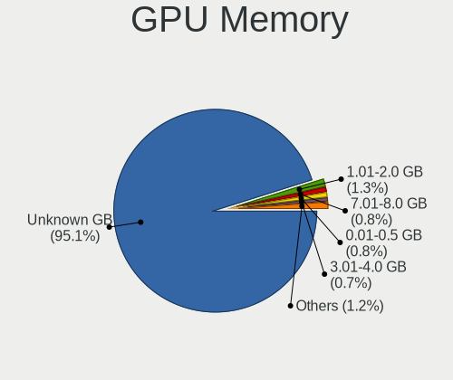
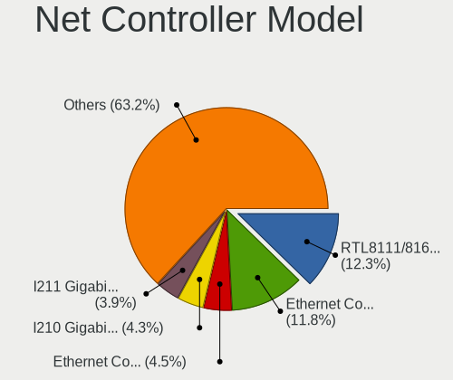
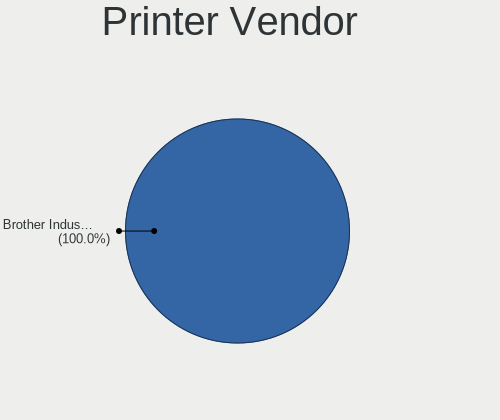

BSD - Hardware Trends
---------------------

A project to identify most popular hardware characteristics and track their change
over time based on data collected by BSD users at https://BSD-Hardware.info.

Anyone can contribute to this report by the [hw-probe](https://github.com/linuxhw/hw-probe/blob/master/INSTALL.BSD.md) tool:

    hw-probe -all -upload

This is a report for all computer types. See also reports for [desktops](/Desktop/README.md) and [notebooks](/Notebook/README.md).

OS-specific reports: [FreeBSD](/Dist/FreeBSD), [OPNsense](/Dist/OPNsense), [helloSystem](/Dist/helloSystem), [OpenBSD](/Dist/OpenBSD).

This report is for one last month. Overall report since the beginning of time: [TestCoverage](https://github.com/bsdhw/TestCoverage)

Period: Aug, 2022.

Contents
--------

* [ System ](#system)
  - [ OS                       ](#os)
  - [ OS Family                ](#os-family)
  - [ Arch                     ](#arch)
  - [ DE                       ](#de)
  - [ Display Server           ](#display-server)
  - [ Display Manager          ](#display-manager)
  - [ OS Lang                  ](#os-lang)
  - [ Boot Mode                ](#boot-mode)
  - [ Filesystem               ](#filesystem)
  - [ Part. scheme             ](#part-scheme)

* [ Board ](#board)
  - [ Vendor                   ](#vendor)
  - [ Model                    ](#model)
  - [ Model Family             ](#model-family)
  - [ MFG Year                 ](#mfg-year)
  - [ Form Factor              ](#form-factor)
  - [ Coreboot                 ](#coreboot)
  - [ RAM Size                 ](#ram-size)
  - [ RAM Used                 ](#ram-used)
  - [ Total Drives             ](#total-drives)
  - [ Has CD-ROM               ](#has-cd-rom)
  - [ Has Ethernet             ](#has-ethernet)
  - [ Has WiFi                 ](#has-wifi)
  - [ Has Bluetooth            ](#has-bluetooth)

* [ Location ](#location)
  - [ Country                  ](#country)
  - [ City                     ](#city)

* [ Drives ](#drives)
  - [ Drive Vendor             ](#drive-vendor)
  - [ Drive Model              ](#drive-model)
  - [ HDD Vendor               ](#hdd-vendor)
  - [ SSD Vendor               ](#ssd-vendor)
  - [ Drive Kind               ](#drive-kind)
  - [ Drive Connector          ](#drive-connector)
  - [ Drive Size               ](#drive-size)
  - [ Space Total              ](#space-total)
  - [ Space Used               ](#space-used)
  - [ Malfunc. Drives          ](#malfunc-drives)
  - [ Malfunc. Drive Vendor    ](#malfunc-drive-vendor)
  - [ Malfunc. HDD Vendor      ](#malfunc-hdd-vendor)
  - [ Malfunc. Drive Kind      ](#malfunc-drive-kind)
  - [ Failed Drives            ](#failed-drives)
  - [ Failed Drive Vendor      ](#failed-drive-vendor)
  - [ Drive Status             ](#drive-status)

* [ Storage controller ](#storage-controller)
  - [ Storage Vendor           ](#storage-vendor)
  - [ Storage Model            ](#storage-model)
  - [ Storage Kind             ](#storage-kind)

* [ Processor ](#processor)
  - [ CPU Vendor               ](#cpu-vendor)
  - [ CPU Model                ](#cpu-model)
  - [ CPU Model Family         ](#cpu-model-family)
  - [ CPU Cores                ](#cpu-cores)
  - [ CPU Sockets              ](#cpu-sockets)
  - [ CPU Threads              ](#cpu-threads)
  - [ CPU Microarch            ](#cpu-microarch)

* [ Graphics ](#graphics)
  - [ GPU Vendor               ](#gpu-vendor)
  - [ GPU Model                ](#gpu-model)
  - [ GPU Combo                ](#gpu-combo)
  - [ GPU Driver               ](#gpu-driver)
  - [ GPU Memory               ](#gpu-memory)

* [ Monitor ](#monitor)
  - [ Monitor Vendor           ](#monitor-vendor)
  - [ Monitor Model            ](#monitor-model)
  - [ Monitor Resolution       ](#monitor-resolution)
  - [ Monitor Diagonal         ](#monitor-diagonal)
  - [ Monitor Width            ](#monitor-width)
  - [ Aspect Ratio             ](#aspect-ratio)
  - [ Monitor Area             ](#monitor-area)
  - [ Pixel Density            ](#pixel-density)
  - [ Multiple Monitors        ](#multiple-monitors)

* [ Network ](#network)
  - [ Net Controller Vendor    ](#net-controller-vendor)
  - [ Net Controller Model     ](#net-controller-model)
  - [ Wireless Vendor          ](#wireless-vendor)
  - [ Wireless Model           ](#wireless-model)
  - [ Ethernet Vendor          ](#ethernet-vendor)
  - [ Ethernet Model           ](#ethernet-model)
  - [ Net Controller Kind      ](#net-controller-kind)
  - [ Used Controller          ](#used-controller)
  - [ NICs                     ](#nics)
  - [ IPv6                     ](#ipv6)

* [ Bluetooth ](#bluetooth)
  - [ Bluetooth Vendor         ](#bluetooth-vendor)
  - [ Bluetooth Model          ](#bluetooth-model)

* [ Sound ](#sound)
  - [ Sound Vendor             ](#sound-vendor)
  - [ Sound Model              ](#sound-model)

* [ Memory ](#memory)
  - [ Memory Vendor            ](#memory-vendor)
  - [ Memory Model             ](#memory-model)
  - [ Memory Kind              ](#memory-kind)
  - [ Memory Form Factor       ](#memory-form-factor)
  - [ Memory Size              ](#memory-size)
  - [ Memory Speed             ](#memory-speed)

* [ Printers & scanners ](#printers--scanners)
  - [ Printer Vendor           ](#printer-vendor)
  - [ Printer Model            ](#printer-model)
  - [ Scanner Vendor           ](#scanner-vendor)
  - [ Scanner Model            ](#scanner-model)

* [ Camera ](#camera)
  - [ Camera Vendor            ](#camera-vendor)
  - [ Camera Model             ](#camera-model)

* [ Security ](#security)
  - [ Fingerprint Vendor       ](#fingerprint-vendor)
  - [ Fingerprint Model        ](#fingerprint-model)
  - [ Chipcard Vendor          ](#chipcard-vendor)
  - [ Chipcard Model           ](#chipcard-model)

* [ Unsupported ](#unsupported)
  - [ Unsupported Devices      ](#unsupported-devices)
  - [ Unsupported Device Types ](#unsupported-device-types)

System
------

OS
--

Installed operating systems

| Name                 | Computers | Percent |
|----------------------|-----------|---------|
| OPNsense 22.7.2      | 107       | 26.95%  |
| OPNsense 22.7        | 77        | 19.4%   |
| OPNsense 22.7.1      | 63        | 15.87%  |
| OPNsense 22.1.10     | 23        | 5.79%   |
| FreeBSD 13.1-p1      | 23        | 5.79%   |
| FreeBSD 13.1         | 18        | 4.53%   |
| helloSystem 0.7.0    | 15        | 3.78%   |
| helloSystem 0.8.0    | 9         | 2.27%   |
| OpenBSD 7.1          | 8         | 2.02%   |
| OPNsense 23.1        | 6         | 1.51%   |
| OPNsense 22.4.3      | 5         | 1.26%   |
| OPNsense 21.7.8      | 3         | 0.76%   |
| OpenBSD 7.2          | 3         | 0.76%   |
| FreeBSD 14.0-CURRENT | 3         | 0.76%   |
| OPNsense 22.1.8      | 2         | 0.5%    |
| OPNsense 22.1        | 2         | 0.5%    |
| MyBee 13.1-p1        | 2         | 0.5%    |
| GhostBSD 22.08.23    | 2         | 0.5%    |
| GhostBSD 22.08.06    | 2         | 0.5%    |
| GhostBSD 22.06.18    | 2         | 0.5%    |
| FreeBSD 13.1-STABLE  | 2         | 0.5%    |
| FreeBSD 13.0-p12     | 2         | 0.5%    |
| FreeBSD 13.0-p11     | 2         | 0.5%    |
| TrueNAS 13.1         | 1         | 0.25%   |
| OPNsense 22.4.2      | 1         | 0.25%   |
| OPNsense 21.7.6      | 1         | 0.25%   |
| NomadBSD 5806f915    | 1         | 0.25%   |
| NetBSD 9.2           | 1         | 0.25%   |
| NetBSD 9.1           | 1         | 0.25%   |
| MidnightBSD 2.2.2    | 1         | 0.25%   |
| MidnightBSD 2.2.0    | 1         | 0.25%   |
| GhostBSD 22.08.27    | 1         | 0.25%   |
| GhostBSD 22.07.31    | 1         | 0.25%   |
| FuguIta 7.1          | 1         | 0.25%   |
| FreeBSD 13.0         | 1         | 0.25%   |
| FreeBSD 12.3-p6      | 1         | 0.25%   |
| FreeBSD 12.3-p5      | 1         | 0.25%   |
| FreeBSD 12.3         | 1         | 0.25%   |
| FreeBSD 12.1-p2      | 1         | 0.25%   |

OS Family
---------

OS without a version

| Name        | Computers | Percent |
|-------------|-----------|---------|
| OPNsense    | 290       | 73.05%  |
| FreeBSD     | 55        | 13.85%  |
| helloSystem | 24        | 6.05%   |
| OpenBSD     | 11        | 2.77%   |
| GhostBSD    | 8         | 2.02%   |
| NetBSD      | 2         | 0.5%    |
| MyBee       | 2         | 0.5%    |
| MidnightBSD | 2         | 0.5%    |
| TrueNAS     | 1         | 0.25%   |
| NomadBSD    | 1         | 0.25%   |
| FuguIta     | 1         | 0.25%   |

Arch
----

OS architecture (x86_64, i586, etc.)

| Name  | Computers | Percent |
|-------|-----------|---------|
| amd64 | 392       | 98.74%  |
| i386  | 3         | 0.76%   |
| arm64 | 2         | 0.5%    |

DE
--

Desktop Environment

| Name          | Computers | Percent |
|---------------|-----------|---------|
| Console       | 316       | 79.6%   |
| helloDesktop  | 37        | 9.32%   |
| KDE5          | 13        | 3.27%   |
| MATE          | 11        | 2.77%   |
| XFCE          | 8         | 2.02%   |
| Openbox       | 3         | 0.76%   |
| GNOME         | 3         | 0.76%   |
| xfwm          | 1         | 0.25%   |
| Lumina        | 1         | 0.25%   |
| i3            | 1         | 0.25%   |
| Enlightenment | 1         | 0.25%   |
| dwm           | 1         | 0.25%   |
| Cinnamon      | 1         | 0.25%   |

Display Server
--------------

X11 or Wayland

| Name    | Computers | Percent |
|---------|-----------|---------|
| Console | 321       | 80.86%  |
| X11     | 75        | 18.89%  |
| Wayland | 1         | 0.25%   |

Display Manager
---------------

SDDM, LightDM, etc.

| Name    | Computers | Percent |
|---------|-----------|---------|
| Console | 340       | 85.64%  |
| SLiM    | 29        | 7.3%    |
| SDDM    | 13        | 3.27%   |
| LightDM | 10        | 2.52%   |
| XDM     | 3         | 0.76%   |
| GDM     | 2         | 0.5%    |

OS Lang
-------

Language

| Lang    | Computers | Percent |
|---------|-----------|---------|
| Unknown | 304       | 76.57%  |
| C       | 40        | 10.08%  |
| en_US   | 39        | 9.82%   |
| ru_RU   | 4         | 1.01%   |
| es_ES   | 2         | 0.5%    |
| en_GB   | 2         | 0.5%    |
| sv_SE   | 1         | 0.25%   |
| pl_PL   | 1         | 0.25%   |
| es_AR   | 1         | 0.25%   |
| de_DE   | 1         | 0.25%   |
| da_DK   | 1         | 0.25%   |
| cs_CZ   | 1         | 0.25%   |

Boot Mode
---------

EFI or BIOS

| Mode | Computers | Percent |
|------|-----------|---------|
| EFI  | 348       | 87.66%  |
| BIOS | 49        | 12.34%  |

Filesystem
----------

Type of filesystem

| Type   | Computers | Percent |
|--------|-----------|---------|
| Ufs    | 191       | 48.11%  |
| Zfs    | 184       | 46.35%  |
| Ffs    | 12        | 3.02%   |
| Cd9660 | 10        | 2.52%   |

Part. scheme
------------

Scheme of partitioning

| Type    | Computers | Percent |
|---------|-----------|---------|
| GPT     | 370       | 93.2%   |
| MBR     | 22        | 5.54%   |
| Unknown | 5         | 1.26%   |

Board
-----

Vendor
------

Motherboard manufacturer

| Name                          | Computers | Percent |
|-------------------------------|-----------|---------|
| Dell                          | 61        | 15.37%  |
| Unknown                       | 39        | 9.82%   |
| Hewlett-Packard               | 31        | 7.81%   |
| Lenovo                        | 30        | 7.56%   |
| ASUSTek Computer              | 30        | 7.56%   |
| Intel                         | 22        | 5.54%   |
| Supermicro                    | 19        | 4.79%   |
| Gigabyte Technology           | 18        | 4.53%   |
| Fujitsu                       | 18        | 4.53%   |
| ASRock                        | 15        | 3.78%   |
| Protectli                     | 14        | 3.53%   |
| AMI                           | 11        | 2.77%   |
| PC Engines                    | 9         | 2.27%   |
| Sophos                        | 6         | 1.51%   |
| MSI                           | 6         | 1.51%   |
| Deciso                        | 5         | 1.26%   |
| BESSTAR Tech                  | 5         | 1.26%   |
| Acer                          | 5         | 1.26%   |
| YANYU                         | 3         | 0.76%   |
| MW                            | 3         | 0.76%   |
| AZW                           | 3         | 0.76%   |
| ZOTAC                         | 2         | 0.5%    |
| Toshiba                       | 2         | 0.5%    |
| SmbiosType2_BoardManufacturer | 2         | 0.5%    |
| Inventec                      | 2         | 0.5%    |
| iEi                           | 2         | 0.5%    |
| CompuLab                      | 2         | 0.5%    |
| Cisco                         | 2         | 0.5%    |
| AWOW                          | 2         | 0.5%    |
| WlanCN                        | 1         | 0.25%   |
| Wistron                       | 1         | 0.25%   |
| TUXEDO                        | 1         | 0.25%   |
| Sony                          | 1         | 0.25%   |
| Shuttle                       | 1         | 0.25%   |
| Seeed Studio                  | 1         | 0.25%   |
| Samsung Electronics           | 1         | 0.25%   |
| Pegatron                      | 1         | 0.25%   |
| NF792                         | 1         | 0.25%   |
| NF541                         | 1         | 0.25%   |
| MiTAC                         | 1         | 0.25%   |
| maiyunda                      | 1         | 0.25%   |
| Lex                           | 1         | 0.25%   |
| Jingsha                       | 1         | 0.25%   |
| IceWhale Technology           | 1         | 0.25%   |
| HUAWEI                        | 1         | 0.25%   |
| GVC                           | 1         | 0.25%   |
| Google                        | 1         | 0.25%   |
| Foxconn                       | 1         | 0.25%   |
| eMachines                     | 1         | 0.25%   |
| CncTion                       | 1         | 0.25%   |
| Cisco Systems                 | 1         | 0.25%   |
| CheckPoint                    | 1         | 0.25%   |
| Biostar                       | 1         | 0.25%   |
| ASRockRack                    | 1         | 0.25%   |
| AOpen                         | 1         | 0.25%   |
| AMD                           | 1         | 0.25%   |
| Alienware                     | 1         | 0.25%   |

Model
-----

Motherboard model

| Name                                                        | Computers | Percent |
|-------------------------------------------------------------|-----------|---------|
| Unknown                                                     | 40        | 10.08%  |
| Fujitsu FUTRO S920                                          | 8         | 2.02%   |
| Protectli FW4B                                              | 7         | 1.76%   |
| PC Engines APU2                                             | 7         | 1.76%   |
| HP t620 PLUS Quad Core TC                                   | 7         | 1.76%   |
| AMI Aptio CRB                                               | 7         | 1.76%   |
| Dell Wyse 5070 Extended Thin Client                         | 6         | 1.51%   |
| Protectli FW6                                               | 4         | 1.01%   |
| Intel Q3XXG4-P V1.0                                         | 4         | 1.01%   |
| HP t730 Thin Client                                         | 4         | 1.01%   |
| Dell PowerEdge R210 II                                      | 4         | 1.01%   |
| Supermicro Super Server                                     | 3         | 0.76%   |
| Sophos SG                                                   | 3         | 0.76%   |
| Protectli VP2410                                            | 3         | 0.76%   |
| MW GMLK-2_5G4L                                              | 3         | 0.76%   |
| HP ProDesk 600 G3 SFF                                       | 3         | 0.76%   |
| Gigabyte H61M-DS2                                           | 3         | 0.76%   |
| Fujitsu PRIMERGY RX200 S6                                   | 3         | 0.76%   |
| Dell PowerEdge R620                                         | 3         | 0.76%   |
| Dell OptiPlex 3020                                          | 3         | 0.76%   |
| Dell OptiPlex 3010                                          | 3         | 0.76%   |
| ZOTAC ZBOX-CI329NANO                                        | 2         | 0.5%    |
| Supermicro A1SAi                                            | 2         | 0.5%    |
| Sophos UTM                                                  | 2         | 0.5%    |
| SmbiosType2_BoardManufacturer SmbiosType1_SystemProductName | 2         | 0.5%    |
| PC Engines apu4                                             | 2         | 0.5%    |
| Lenovo ThinkCentre M75s Gen 2 11R8000JUS                    | 2         | 0.5%    |
| Lenovo IdeaPad Gaming 3 15ACH6 82K2                         | 2         | 0.5%    |
| Inventec Z CLASS                                            | 2         | 0.5%    |
| Intel DENLOW_WS                                             | 2         | 0.5%    |
| Dell PowerEdge T30                                          | 2         | 0.5%    |
| Dell PowerEdge R710                                         | 2         | 0.5%    |
| Dell PowerEdge R630                                         | 2         | 0.5%    |
| Dell OptiPlex 9020                                          | 2         | 0.5%    |
| Dell OptiPlex 7050                                          | 2         | 0.5%    |
| Dell OptiPlex 5060                                          | 2         | 0.5%    |
| Deciso NetBoard-A10                                         | 2         | 0.5%    |
| CompuLab fitlet2                                            | 2         | 0.5%    |
| Cisco SALEEN                                                | 2         | 0.5%    |
| BESSTAR Tech TH50                                           | 2         | 0.5%    |
| AZW GK55                                                    | 2         | 0.5%    |
| AWOW PC BOX                                                 | 2         | 0.5%    |
| ASUS ZenBook UX325UA_UM325UA                                | 2         | 0.5%    |
| ASUS PRIME X370-PRO                                         | 2         | 0.5%    |
| ASRock X570 Phantom Gaming 4                                | 2         | 0.5%    |
| YANYU R250                                                  | 1         | 0.25%   |
| YANYU H67SL                                                 | 1         | 0.25%   |
| YANYU D19SL_B                                               | 1         | 0.25%   |
| WlanCN 6000 Series                                          | 1         | 0.25%   |
| Wistron ProLiant ML110 G6                                   | 1         | 0.25%   |
| TUXEDO Pulse 14 Gen1                                        | 1         | 0.25%   |
| Toshiba Satellite S55t-B                                    | 1         | 0.25%   |
| Toshiba Satellite A300                                      | 1         | 0.25%   |
| Supermicro X9SCI/X9SCA                                      | 1         | 0.25%   |
| Supermicro X8DTL                                            | 1         | 0.25%   |
| Supermicro X10SLM+-LN4F                                     | 1         | 0.25%   |
| Supermicro X10SLH-F/X10SLM+-F                               | 1         | 0.25%   |
| Supermicro X10SBA-L                                         | 1         | 0.25%   |
| Supermicro TS-150                                           | 1         | 0.25%   |
| Supermicro SYS-E300-9A-4C                                   | 1         | 0.25%   |

Model Family
------------

Motherboard model prefix

| Name                                      | Computers | Percent |
|-------------------------------------------|-----------|---------|
| Unknown                                   | 40        | 10.08%  |
| Dell OptiPlex                             | 20        | 5.04%   |
| Dell PowerEdge                            | 18        | 4.53%   |
| Lenovo ThinkCentre                        | 13        | 3.27%   |
| Lenovo ThinkPad                           | 10        | 2.52%   |
| Fujitsu FUTRO                             | 9         | 2.27%   |
| HP t620                                   | 8         | 2.02%   |
| Protectli FW4B                            | 7         | 1.76%   |
| PC Engines APU2                           | 7         | 1.76%   |
| ASUS PRIME                                | 7         | 1.76%   |
| AMI Aptio                                 | 7         | 1.76%   |
| Dell Wyse                                 | 6         | 1.51%   |
| Dell Inspiron                             | 6         | 1.51%   |
| Lenovo IdeaPad                            | 5         | 1.26%   |
| Fujitsu PRIMERGY                          | 5         | 1.26%   |
| Dell Precision                            | 5         | 1.26%   |
| Protectli FW6                             | 4         | 1.01%   |
| Intel Q3XXG4-P                            | 4         | 1.01%   |
| HP t730                                   | 4         | 1.01%   |
| Gigabyte H61M-DS2                         | 4         | 1.01%   |
| Fujitsu ESPRIMO                           | 4         | 1.01%   |
| Acer Aspire                               | 4         | 1.01%   |
| Supermicro Super                          | 3         | 0.76%   |
| Sophos SG                                 | 3         | 0.76%   |
| Protectli VP2410                          | 3         | 0.76%   |
| MW GMLK-2                                 | 3         | 0.76%   |
| HP ProDesk                                | 3         | 0.76%   |
| HP EliteDesk                              | 3         | 0.76%   |
| HP Compaq                                 | 3         | 0.76%   |
| ASUS ZenBook                              | 3         | 0.76%   |
| ASRock X570                               | 3         | 0.76%   |
| ZOTAC ZBOX-CI329NANO                      | 2         | 0.5%    |
| Toshiba Satellite                         | 2         | 0.5%    |
| Supermicro A1SAi                          | 2         | 0.5%    |
| Sophos UTM                                | 2         | 0.5%    |
| SmbiosType2_BoardManufacturer SmbiosType1 | 2         | 0.5%    |
| PC Engines apu4                           | 2         | 0.5%    |
| Inventec Z                                | 2         | 0.5%    |
| Intel DENLOW                              | 2         | 0.5%    |
| HP ProLiant                               | 2         | 0.5%    |
| HP ENVY                                   | 2         | 0.5%    |
| HP EliteBook                              | 2         | 0.5%    |
| Gigabyte X570                             | 2         | 0.5%    |
| Deciso NetBoard-A10                       | 2         | 0.5%    |
| Deciso Netboard                           | 2         | 0.5%    |
| CompuLab fitlet2                          | 2         | 0.5%    |
| Cisco SALEEN                              | 2         | 0.5%    |
| BESSTAR Tech TH50                         | 2         | 0.5%    |
| AZW GK55                                  | 2         | 0.5%    |
| AWOW PC                                   | 2         | 0.5%    |
| ASUS VivoBook                             | 2         | 0.5%    |
| ASUS TUF                                  | 2         | 0.5%    |
| ASUS ROG                                  | 2         | 0.5%    |
| YANYU R250                                | 1         | 0.25%   |
| YANYU H67SL                               | 1         | 0.25%   |
| YANYU D19SL                               | 1         | 0.25%   |
| WlanCN 6000                               | 1         | 0.25%   |
| Wistron ProLiant                          | 1         | 0.25%   |
| TUXEDO Pulse                              | 1         | 0.25%   |
| Supermicro X9SCI                          | 1         | 0.25%   |

MFG Year
--------

Motherboard manufacture year

| Year    | Computers | Percent |
|---------|-----------|---------|
| 2021    | 45        | 11.34%  |
| 2020    | 44        | 11.08%  |
| 2019    | 42        | 10.58%  |
| 2018    | 39        | 9.82%   |
| 2014    | 36        | 9.07%   |
| 2022    | 34        | 8.56%   |
| 2016    | 32        | 8.06%   |
| 2017    | 24        | 6.05%   |
| 2011    | 17        | 4.28%   |
| 2015    | 16        | 4.03%   |
| 2013    | 16        | 4.03%   |
| 2012    | 16        | 4.03%   |
| 2010    | 13        | 3.27%   |
| 2009    | 8         | 2.02%   |
| 2008    | 6         | 1.51%   |
| Unknown | 5         | 1.26%   |
| 2007    | 2         | 0.5%    |
| 2006    | 2         | 0.5%    |

Form Factor
-----------

Physical design of the computer

| Name        | Computers | Percent |
|-------------|-----------|---------|
| Desktop     | 258       | 64.99%  |
| Notebook    | 58        | 14.61%  |
| Mini pc     | 37        | 9.32%   |
| Server      | 35        | 8.82%   |
| Firewall    | 6         | 1.51%   |
| Convertible | 2         | 0.5%    |
| All in one  | 1         | 0.25%   |

Coreboot
--------

Have coreboot on board

| Used | Computers | Percent |
|------|-----------|---------|
| No   | 383       | 96.47%  |
| Yes  | 14        | 3.53%   |

RAM Size
--------

Total RAM memory

| Size in GB      | Computers | Percent |
|-----------------|-----------|---------|
| 8.01-16.0       | 149       | 37.53%  |
| 16.01-24.0      | 93        | 23.43%  |
| 4.01-8.0        | 70        | 17.63%  |
| 32.01-64.0      | 36        | 9.07%   |
| 64.01-256.0     | 18        | 4.53%   |
| 2.01-3.0        | 15        | 3.78%   |
| 24.01-32.0      | 7         | 1.76%   |
| 3.01-4.0        | 4         | 1.01%   |
| 0.51-1.0        | 2         | 0.5%    |
| More than 256.0 | 1         | 0.25%   |
| 1.01-2.0        | 1         | 0.25%   |
| 0.01-0.5        | 1         | 0.25%   |

RAM Used
--------

Used RAM memory

| Used GB   | Computers | Percent |
|-----------|-----------|---------|
| 0.01-0.5  | 199       | 50.13%  |
| 0.51-1.0  | 123       | 30.98%  |
| 1.01-2.0  | 45        | 11.34%  |
| 2.01-3.0  | 13        | 3.27%   |
| 3.01-4.0  | 7         | 1.76%   |
| 4.01-8.0  | 6         | 1.51%   |
| Unknown   | 2         | 0.5%    |
| 8.01-16.0 | 1         | 0.25%   |
| 0         | 1         | 0.25%   |

Total Drives
------------

Number of drives on board

| Drives | Computers | Percent |
|--------|-----------|---------|
| 1      | 284       | 71.54%  |
| 0      | 45        | 11.34%  |
| 2      | 40        | 10.08%  |
| 3      | 13        | 3.27%   |
| 4      | 8         | 2.02%   |
| 6      | 2         | 0.5%    |
| 19     | 1         | 0.25%   |
| 13     | 1         | 0.25%   |
| 9      | 1         | 0.25%   |
| 8      | 1         | 0.25%   |
| 5      | 1         | 0.25%   |

Has CD-ROM
----------

Has CD-ROM on board

| Presented | Computers | Percent |
|-----------|-----------|---------|
| No        | 334       | 84.13%  |
| Yes       | 63        | 15.87%  |

Has Ethernet
------------

Has Ethernet on board

| Presented | Computers | Percent |
|-----------|-----------|---------|
| Yes       | 384       | 96.73%  |
| No        | 13        | 3.27%   |

Has WiFi
--------

Has WiFi module

| Presented | Computers | Percent |
|-----------|-----------|---------|
| No        | 279       | 70.28%  |
| Yes       | 118       | 29.72%  |

Has Bluetooth
-------------

Has Bluetooth module

| Presented | Computers | Percent |
|-----------|-----------|---------|
| No        | 324       | 81.61%  |
| Yes       | 73        | 18.39%  |

Location
--------

Country
-------

Geographic location (country)

| Country      | Computers | Percent |
|--------------|-----------|---------|
| USA          | 109       | 27.46%  |
| Germany      | 65        | 16.37%  |
| Russia       | 23        | 5.79%   |
| Canada       | 16        | 4.03%   |
| UK           | 15        | 3.78%   |
| Spain        | 14        | 3.53%   |
| Italy        | 13        | 3.27%   |
| Poland       | 12        | 3.02%   |
| France       | 12        | 3.02%   |
| Switzerland  | 9         | 2.27%   |
| Netherlands  | 9         | 2.27%   |
| Sweden       | 6         | 1.51%   |
| Austria      | 6         | 1.51%   |
| Brazil       | 5         | 1.26%   |
| Australia    | 5         | 1.26%   |
| South Korea  | 4         | 1.01%   |
| Slovenia     | 4         | 1.01%   |
| India        | 4         | 1.01%   |
| Greece       | 4         | 1.01%   |
| Czechia      | 4         | 1.01%   |
| Romania      | 3         | 0.76%   |
| Peru         | 3         | 0.76%   |
| New Zealand  | 3         | 0.76%   |
| Israel       | 3         | 0.76%   |
| Indonesia    | 3         | 0.76%   |
| Finland      | 3         | 0.76%   |
| Denmark      | 3         | 0.76%   |
| Belgium      | 3         | 0.76%   |
| Argentina    | 3         | 0.76%   |
| Vietnam      | 2         | 0.5%    |
| Slovakia     | 2         | 0.5%    |
| Philippines  | 2         | 0.5%    |
| Pakistan     | 2         | 0.5%    |
| Mexico       | 2         | 0.5%    |
| Lithuania    | 2         | 0.5%    |
| China        | 2         | 0.5%    |
| Venezuela    | 1         | 0.25%   |
| Thailand     | 1         | 0.25%   |
| Taiwan       | 1         | 0.25%   |
| South Africa | 1         | 0.25%   |
| Serbia       | 1         | 0.25%   |
| Paraguay     | 1         | 0.25%   |
| Norway       | 1         | 0.25%   |
| Montserrat   | 1         | 0.25%   |
| Malaysia     | 1         | 0.25%   |
| Latvia       | 1         | 0.25%   |
| Japan        | 1         | 0.25%   |
| Isle of Man  | 1         | 0.25%   |
| Iran         | 1         | 0.25%   |
| Hungary      | 1         | 0.25%   |
| Croatia      | 1         | 0.25%   |
| Costa Rica   | 1         | 0.25%   |
| Bahamas      | 1         | 0.25%   |

City
----

Geographic location (city)

| City                 | Computers | Percent |
|----------------------|-----------|---------|
| Ludwigsburg          | 6         | 1.51%   |
| St Petersburg        | 5         | 1.26%   |
| Warsaw               | 4         | 1.01%   |
| Vienna               | 4         | 1.01%   |
| Moscow               | 4         | 1.01%   |
| Essex                | 4         | 1.01%   |
| Winterthur           | 3         | 0.76%   |
| Munich               | 3         | 0.76%   |
| Lima                 | 3         | 0.76%   |
| Legionowo            | 3         | 0.76%   |
| Houston              | 3         | 0.76%   |
| Berlin               | 3         | 0.76%   |
| Amsterdam            | 3         | 0.76%   |
| Ypsilanti            | 2         | 0.5%    |
| Victoria             | 2         | 0.5%    |
| Verona               | 2         | 0.5%    |
| Vancouver            | 2         | 0.5%    |
| Toronto              | 2         | 0.5%    |
| Tel Aviv             | 2         | 0.5%    |
| Statesboro           | 2         | 0.5%    |
| Siegen               | 2         | 0.5%    |
| Seoul                | 2         | 0.5%    |
| Sao José dos Campos | 2         | 0.5%    |
| Salem                | 2         | 0.5%    |
| Redmond              | 2         | 0.5%    |
| Philadelphia         | 2         | 0.5%    |
| Perth                | 2         | 0.5%    |
| Paris                | 2         | 0.5%    |
| Ottawa               | 2         | 0.5%    |
| Melbourne            | 2         | 0.5%    |
| Madrid               | 2         | 0.5%    |
| Lille                | 2         | 0.5%    |
| Las Vegas            | 2         | 0.5%    |
| Kamensk-Ural'skiy    | 2         | 0.5%    |
| Horgen               | 2         | 0.5%    |
| Ho Chi Minh City     | 2         | 0.5%    |
| Göttingen           | 2         | 0.5%    |
| Fredericksburg       | 2         | 0.5%    |
| Florianópolis       | 2         | 0.5%    |
| Federal Way          | 2         | 0.5%    |
| Dresden              | 2         | 0.5%    |
| Cileungsir           | 2         | 0.5%    |
| Chicago              | 2         | 0.5%    |
| Celje                | 2         | 0.5%    |
| Burnaby              | 2         | 0.5%    |
| Brno                 | 2         | 0.5%    |
| Bilbao               | 2         | 0.5%    |
| Bellingham           | 2         | 0.5%    |
| Barcelona            | 2         | 0.5%    |
| Atlanta              | 2         | 0.5%    |
| Athens               | 2         | 0.5%    |
| Zeist                | 1         | 0.25%   |
| Zagreb               | 1         | 0.25%   |
| Wuppertal            | 1         | 0.25%   |
| Worms                | 1         | 0.25%   |
| Wolfsburg            | 1         | 0.25%   |
| Winter Park          | 1         | 0.25%   |
| Winschoten           | 1         | 0.25%   |
| Wiesbaden            | 1         | 0.25%   |
| West Orange          | 1         | 0.25%   |

Drives
------

Drive Vendor
------------

Hard drive vendors

| Vendor              | Computers | Drives | Percent |
|---------------------|-----------|--------|---------|
| Samsung Electronics | 62        | 73     | 15.16%  |
| Seagate             | 42        | 67     | 10.27%  |
| WDC                 | 40        | 67     | 9.78%   |
| Kingston            | 35        | 35     | 8.56%   |
| Transcend           | 29        | 29     | 7.09%   |
| Intel               | 22        | 26     | 5.38%   |
| SanDisk             | 20        | 20     | 4.89%   |
| Toshiba             | 13        | 18     | 3.18%   |
| Crucial             | 13        | 14     | 3.18%   |
| China               | 12        | 12     | 2.93%   |
| Hoodisk             | 10        | 10     | 2.44%   |
| Micron Technology   | 8         | 8      | 1.96%   |
| A-DATA Technology   | 8         | 9      | 1.96%   |
| SK hynix            | 7         | 7      | 1.71%   |
| Innodisk            | 6         | 6      | 1.47%   |
| Hitachi             | 5         | 17     | 1.22%   |
| FORESEE             | 5         | 5      | 1.22%   |
| Dogfish             | 5         | 5      | 1.22%   |
| PNY                 | 4         | 5      | 0.98%   |
| NVMe                | 4         | 5      | 0.98%   |
| SPCC                | 3         | 3      | 0.73%   |
| Patriot             | 3         | 3      | 0.73%   |
| KIOXIA              | 3         | 3      | 0.73%   |
| Intenso             | 3         | 3      | 0.73%   |
| Apacer              | 3         | 3      | 0.73%   |
| Silicon Motion      | 2         | 2      | 0.49%   |
| ShiJi               | 2         | 2      | 0.49%   |
| Protectli           | 2         | 2      | 0.49%   |
| Phison              | 2         | 2      | 0.49%   |
| LITEON              | 2         | 2      | 0.49%   |
| HGST                | 2         | 2      | 0.49%   |
| Hewlett-Packard     | 2         | 3      | 0.49%   |
| GOODRAM             | 2         | 3      | 0.49%   |
| Corsair             | 2         | 2      | 0.49%   |
| BIWIN               | 2         | 2      | 0.49%   |
| AMD                 | 2         | 2      | 0.49%   |
| Verbatim            | 1         | 1      | 0.24%   |
| Team                | 1         | 1      | 0.24%   |
| SATA3 60            | 1         | 1      | 0.24%   |
| OPENBSD             | 1         | 1      | 0.24%   |
| OCZ                 | 1         | 1      | 0.24%   |
| Netac               | 1         | 1      | 0.24%   |
| Maxtor              | 1         | 1      | 0.24%   |
| MARVELL             | 1         | 1      | 0.24%   |
| LuminouTek          | 1         | 1      | 0.24%   |
| LSI                 | 1         | 1      | 0.24%   |
| Lenovo              | 1         | 1      | 0.24%   |
| Kston               | 1         | 1      | 0.24%   |
| Jetflash            | 1         | 1      | 0.24%   |
| Integral            | 1         | 1      | 0.24%   |
| INDMEM              | 1         | 1      | 0.24%   |
| Indilinx            | 1         | 1      | 0.24%   |
| HP Phison           | 1         | 1      | 0.24%   |
| HCiPC               | 1         | 1      | 0.24%   |
| FLEXXON             | 1         | 1      | 0.24%   |
| EAGET               | 1         | 1      | 0.24%   |
| Cisco               | 1         | 1      | 0.24%   |
| BR                  | 1         | 1      | 0.24%   |

Drive Model
-----------

Hard drive models

| Model                              | Computers | Percent |
|------------------------------------|-----------|---------|
| Kingston SA400S37240G 240GB        | 7         | 1.6%    |
| Seagate ST1000LM035-1RK172 1TB     | 6         | 1.37%   |
| Transcend TS128GMSA230S 128GB      | 5         | 1.14%   |
| Kingston SA400S37120G 120GB        | 4         | 0.92%   |
| WDC WD40EFRX-68N32N0 4TB           | 3         | 0.69%   |
| Transcend TS64GMSA370 64GB         | 3         | 0.69%   |
| Transcend TS128GMSA370 128GB       | 3         | 0.69%   |
| Seagate ST1000DM003-1CH162 1TB     | 3         | 0.69%   |
| SanDisk SSD PLUS 120GB             | 3         | 0.69%   |
| Samsung SSD 980 500GB              | 3         | 0.69%   |
| Kingston SUV500MS240G 240GB        | 3         | 0.69%   |
| Hoodisk SSD 32GB                   | 3         | 0.69%   |
| Hoodisk SSD 256GB                  | 3         | 0.69%   |
| Hoodisk SSD 128GB                  | 3         | 0.69%   |
| Crucial CT250MX500SSD1 250GB       | 3         | 0.69%   |
| Crucial CT120BX500SSD1 120GB       | 3         | 0.69%   |
| WDC WDS500G3X0C-00SJG0 500GB       | 2         | 0.46%   |
| Transcend TS64GMSA230S 64GB        | 2         | 0.46%   |
| Transcend TS256GMTS952T2 256GB     | 2         | 0.46%   |
| Transcend TS256GMTE652T2 256GB     | 2         | 0.46%   |
| Transcend TS128GMTS430S 128GB      | 2         | 0.46%   |
| SK hynix HFM512GD3JX013N 512GB     | 2         | 0.46%   |
| ShiJi SSD 128GB                    | 2         | 0.46%   |
| Seagate ST500DM002-1BD142 500GB    | 2         | 0.46%   |
| Seagate ST4000DM000-1F2168 4TB     | 2         | 0.46%   |
| Seagate ST2000DM008-2FR102 2TB     | 2         | 0.46%   |
| Seagate ST1000LM049-2GH172 1TB     | 2         | 0.46%   |
| Seagate ST1000LM024 HN-M101MBB 1TB | 2         | 0.46%   |
| Seagate ST1000DM010-2EP102 1TB     | 2         | 0.46%   |
| Samsung SSD 970 EVO Plus 1TB       | 2         | 0.46%   |
| Samsung SSD 870 EVO 500GB          | 2         | 0.46%   |
| Samsung SSD 870 EVO 250GB          | 2         | 0.46%   |
| Samsung SSD 860 EVO 500GB          | 2         | 0.46%   |
| Samsung SSD 850 PRO 256GB          | 2         | 0.46%   |
| Samsung SSD 850 EVO 250GB          | 2         | 0.46%   |
| Samsung SSD 840 Series 120GB       | 2         | 0.46%   |
| Samsung SSD 840 EVO 250GB          | 2         | 0.46%   |
| Samsung SSD 750 EVO 120GB          | 2         | 0.46%   |
| Samsung MZVLB512HBJQ-000L7 512GB   | 2         | 0.46%   |
| Samsung MZALQ512HBLU-00BL2 512GB   | 2         | 0.46%   |
| Samsung MZ7PD128HCFV-000H1 128GB   | 2         | 0.46%   |
| Kingston SV300S37A60G 64GB         | 2         | 0.46%   |
| Kingston SKC600MS256G 256GB        | 2         | 0.46%   |
| Kingston OM8PDP3512B-A01 512GB     | 2         | 0.46%   |
| Intel SSDSCKKF128G8 SATA 128GB     | 2         | 0.46%   |
| Intel SSDSC2KW256G8 256GB          | 2         | 0.46%   |
| Intel SSDSC2KB240G8 240GB          | 2         | 0.46%   |
| Intel SSDSC2BB080G4 80GB           | 2         | 0.46%   |
| Innodisk DEMSR- 08GB mSATA 3ME3    | 2         | 0.46%   |
| FORESEE 64GB SSD                   | 2         | 0.46%   |
| FORESEE 128GB SSD                  | 2         | 0.46%   |
| Dogfish SSD 128GB                  | 2         | 0.46%   |
| Crucial CT240BX500SSD1 240GB       | 2         | 0.46%   |
| China SATA SSD 64GB                | 2         | 0.46%   |
| China SATA SSD 32GB                | 2         | 0.46%   |
| China SATA SSD 16GB                | 2         | 0.46%   |
| China SATA SSD 120GB               | 2         | 0.46%   |
| China NGFF 2280 256GB SSD          | 2         | 0.46%   |
| BIWIN SSD 128GB                    | 2         | 0.46%   |
| Apacer 16GB SATA Flash Drive       | 2         | 0.46%   |

HDD Vendor
----------

Hard disk drive vendors

| Vendor              | Computers | Drives | Percent |
|---------------------|-----------|--------|---------|
| Seagate             | 41        | 66     | 41.84%  |
| WDC                 | 30        | 55     | 30.61%  |
| Toshiba             | 9         | 14     | 9.18%   |
| Hitachi             | 4         | 13     | 4.08%   |
| Samsung Electronics | 2         | 2      | 2.04%   |
| NVMe                | 2         | 2      | 2.04%   |
| HGST                | 2         | 2      | 2.04%   |
| Hewlett-Packard     | 2         | 3      | 2.04%   |
| OPENBSD             | 1         | 1      | 1.02%   |
| Maxtor              | 1         | 1      | 1.02%   |
| MARVELL             | 1         | 1      | 1.02%   |
| LSI                 | 1         | 1      | 1.02%   |
| Jetflash            | 1         | 1      | 1.02%   |
| Cisco               | 1         | 1      | 1.02%   |

SSD Vendor
----------

Solid state drive vendors

| Vendor              | Computers | Drives | Percent |
|---------------------|-----------|--------|---------|
| Samsung Electronics | 39        | 46     | 16.18%  |
| Transcend           | 27        | 27     | 11.2%   |
| Kingston            | 27        | 27     | 11.2%   |
| SanDisk             | 20        | 20     | 8.3%    |
| Intel               | 20        | 24     | 8.3%    |
| Crucial             | 12        | 13     | 4.98%   |
| China               | 12        | 12     | 4.98%   |
| Hoodisk             | 9         | 9      | 3.73%   |
| Innodisk            | 6         | 6      | 2.49%   |
| A-DATA Technology   | 6         | 7      | 2.49%   |
| WDC                 | 5         | 6      | 2.07%   |
| FORESEE             | 5         | 5      | 2.07%   |
| Dogfish             | 5         | 5      | 2.07%   |
| Micron Technology   | 4         | 4      | 1.66%   |
| SPCC                | 3         | 3      | 1.24%   |
| PNY                 | 3         | 4      | 1.24%   |
| Patriot             | 3         | 3      | 1.24%   |
| Intenso             | 3         | 3      | 1.24%   |
| Apacer              | 3         | 3      | 1.24%   |
| SK hynix            | 2         | 2      | 0.83%   |
| ShiJi               | 2         | 2      | 0.83%   |
| Protectli           | 2         | 2      | 0.83%   |
| LITEON              | 2         | 2      | 0.83%   |
| BIWIN               | 2         | 2      | 0.83%   |
| AMD                 | 2         | 2      | 0.83%   |
| Verbatim            | 1         | 1      | 0.41%   |
| Toshiba             | 1         | 1      | 0.41%   |
| Seagate             | 1         | 1      | 0.41%   |
| SATA3 60            | 1         | 1      | 0.41%   |
| OCZ                 | 1         | 1      | 0.41%   |
| Netac               | 1         | 1      | 0.41%   |
| Kston               | 1         | 1      | 0.41%   |
| Integral            | 1         | 1      | 0.41%   |
| INDMEM              | 1         | 1      | 0.41%   |
| Indilinx            | 1         | 1      | 0.41%   |
| HP Phison           | 1         | 1      | 0.41%   |
| Hitachi             | 1         | 4      | 0.41%   |
| HCiPC               | 1         | 1      | 0.41%   |
| GOODRAM             | 1         | 2      | 0.41%   |
| FLEXXON             | 1         | 1      | 0.41%   |
| Corsair             | 1         | 1      | 0.41%   |
| BR                  | 1         | 1      | 0.41%   |

Drive Kind
----------

HDD or SSD

| Kind | Computers | Drives | Percent |
|------|-----------|--------|---------|
| SSD  | 235       | 260    | 60.26%  |
| HDD  | 84        | 163    | 21.54%  |
| NVMe | 71        | 76     | 18.21%  |

Drive Connector
---------------

SATA, SAS, NVMe, etc.

| Type | Computers | Drives | Percent |
|------|-----------|--------|---------|
| SATA | 299       | 423    | 80.81%  |
| NVMe | 71        | 76     | 19.19%  |

Drive Size
----------

Size of hard drive

| Size in TB | Computers | Drives | Percent |
|------------|-----------|--------|---------|
| 0.01-0.5   | 266       | 303    | 80.36%  |
| 0.51-1.0   | 39        | 46     | 11.78%  |
| 1.01-2.0   | 10        | 28     | 3.02%   |
| 3.01-4.0   | 7         | 16     | 2.11%   |
| 2.01-3.0   | 3         | 10     | 0.91%   |
| 10.01-20.0 | 3         | 10     | 0.91%   |
| 4.01-10.0  | 3         | 10     | 0.91%   |

Space Total
-----------

Amount of disk space available on the file system

| Size in GB     | Computers | Percent |
|----------------|-----------|---------|
| 101-250        | 196       | 49.37%  |
| 251-500        | 63        | 15.87%  |
| 1-20           | 39        | 9.82%   |
| 51-100         | 32        | 8.06%   |
| 21-50          | 29        | 7.3%    |
| 501-1000       | 25        | 6.3%    |
| 1001-2000      | 5         | 1.26%   |
| 2001-3000      | 4         | 1.01%   |
| More than 3000 | 2         | 0.5%    |
| Unknown        | 2         | 0.5%    |

Space Used
----------

Amount of used disk space

| Used GB   | Computers | Percent |
|-----------|-----------|---------|
| 1-20      | 361       | 90.93%  |
| 21-50     | 20        | 5.04%   |
| 51-100    | 9         | 2.27%   |
| 101-250   | 2         | 0.5%    |
| Unknown   | 2         | 0.5%    |
| 2001-3000 | 1         | 0.25%   |
| 1001-2000 | 1         | 0.25%   |
| 501-1000  | 1         | 0.25%   |

Malfunc. Drives
---------------

Drive models with a malfunction

| Model                                        | Computers | Drives | Percent |
|----------------------------------------------|-----------|--------|---------|
| Seagate ST1000DM003-1CH162 1TB               | 2         | 2      | 4.26%   |
| WDC WDS480G2G0A-00JH30 480GB                 | 1         | 2      | 2.13%   |
| WDC WD6400AARS-00Y5B1 640GB                  | 1         | 1      | 2.13%   |
| WDC WD5000AAKS-00M9A0 500GB                  | 1         | 1      | 2.13%   |
| WDC WD40EFRX-68N32N0 4TB                     | 1         | 2      | 2.13%   |
| WDC WD20EFRX-68EUZN0 2TB                     | 1         | 2      | 2.13%   |
| WDC WD1600BEKT-66F3T2 160GB                  | 1         | 1      | 2.13%   |
| WDC WD1000DHTZ-04N21V1 1TB                   | 1         | 2      | 2.13%   |
| Toshiba THNSNK128GCS8 SATA 128GB             | 1         | 1      | 2.13%   |
| Toshiba MQ01ABF050 500GB                     | 1         | 1      | 2.13%   |
| Toshiba MQ01ABD025 250GB                     | 1         | 1      | 2.13%   |
| SPCC M.2 SSD 256GB                           | 1         | 1      | 2.13%   |
| Seagate ST9500325AS 500GB                    | 1         | 1      | 2.13%   |
| Seagate ST500DM002-1BD142 500GB              | 1         | 1      | 2.13%   |
| Seagate ST380815AS 80GB                      | 1         | 1      | 2.13%   |
| Seagate ST3500418AS 500GB                    | 1         | 1      | 2.13%   |
| Seagate ST3250620NS 250GB                    | 1         | 1      | 2.13%   |
| Seagate ST320LM000 HM321HI 320GB             | 1         | 1      | 2.13%   |
| Seagate ST2000DM001-9YN164 2TB               | 1         | 1      | 2.13%   |
| Seagate ST1000LM035-1RK172 1TB               | 1         | 1      | 2.13%   |
| Seagate ST1000LM024 HN-M101MBB 1TB           | 1         | 1      | 2.13%   |
| SanDisk SDCFHS-016G                          | 1         | 1      | 2.13%   |
| SanDisk SD8TB8U-256G-1006 256GB              | 1         | 1      | 2.13%   |
| Samsung Electronics SSD 870 EVO 500GB        | 1         | 2      | 2.13%   |
| Samsung Electronics MZMTE128HMGR-00007 128GB | 1         | 1      | 2.13%   |
| Samsung Electronics HD081GJ 80GB             | 1         | 1      | 2.13%   |
| Micron Technology C400 RealSSD mSATA 128GB   | 1         | 1      | 2.13%   |
| LITEON CS1-SP32-11 M.2 2242 32GB             | 1         | 1      | 2.13%   |
| Kingston SV300S37A60G 64GB                   | 1         | 1      | 2.13%   |
| Kingston SUV400S37480G 480GB                 | 1         | 1      | 2.13%   |
| Kingston SUV400S37120G 120GB                 | 1         | 1      | 2.13%   |
| Intel SSDSC2KW256G8 256GB                    | 1         | 1      | 2.13%   |
| Intel SSDSC2BW120H6 120GB                    | 1         | 1      | 2.13%   |
| Intel SSDSC2BB480G4 480GB                    | 1         | 1      | 2.13%   |
| Intel SSDSA2M160G2GC 160GB                   | 1         | 1      | 2.13%   |
| Intel SSDSA2M080G2GC 80GB                    | 1         | 1      | 2.13%   |
| INDMEM SSD mSATA 128GB                       | 1         | 1      | 2.13%   |
| HP Phison PSSBN016GA27MC0 16GB               | 1         | 1      | 2.13%   |
| Hitachi HTS543232L9SA00 320GB                | 1         | 1      | 2.13%   |
| Hitachi HDS723020BLA642 2TB                  | 1         | 3      | 2.13%   |
| HGST HTS725050A7E630 500GB                   | 1         | 1      | 2.13%   |
| Hewlett-Packard VB0160EAVEQ 160GB            | 1         | 1      | 2.13%   |
| Dogfish SSD 128GB                            | 1         | 1      | 2.13%   |
| China SATA SSD 32GB                          | 1         | 1      | 2.13%   |
| Apacer 16GB SATA Flash Drive                 | 1         | 1      | 2.13%   |
| A-DATA Technology ASU800SS-256GT 256GB       | 1         | 1      | 2.13%   |

Malfunc. Drive Vendor
---------------------

Vendors of faulty drives

| Vendor              | Computers | Drives | Percent |
|---------------------|-----------|--------|---------|
| Seagate             | 11        | 11     | 24.44%  |
| WDC                 | 5         | 11     | 11.11%  |
| Intel               | 5         | 5      | 11.11%  |
| Toshiba             | 3         | 3      | 6.67%   |
| Samsung Electronics | 3         | 4      | 6.67%   |
| Kingston            | 3         | 3      | 6.67%   |
| SanDisk             | 2         | 2      | 4.44%   |
| Hitachi             | 2         | 4      | 4.44%   |
| SPCC                | 1         | 1      | 2.22%   |
| Micron Technology   | 1         | 1      | 2.22%   |
| LITEON              | 1         | 1      | 2.22%   |
| INDMEM              | 1         | 1      | 2.22%   |
| HP Phison           | 1         | 1      | 2.22%   |
| HGST                | 1         | 1      | 2.22%   |
| Hewlett-Packard     | 1         | 1      | 2.22%   |
| Dogfish             | 1         | 1      | 2.22%   |
| China               | 1         | 1      | 2.22%   |
| Apacer              | 1         | 1      | 2.22%   |
| A-DATA Technology   | 1         | 1      | 2.22%   |

Malfunc. HDD Vendor
-------------------

Vendors of faulty HDD drives

| Vendor              | Computers | Drives | Percent |
|---------------------|-----------|--------|---------|
| Seagate             | 11        | 11     | 50%     |
| WDC                 | 4         | 9      | 18.18%  |
| Toshiba             | 2         | 2      | 9.09%   |
| Hitachi             | 2         | 4      | 9.09%   |
| Samsung Electronics | 1         | 1      | 4.55%   |
| HGST                | 1         | 1      | 4.55%   |
| Hewlett-Packard     | 1         | 1      | 4.55%   |

Malfunc. Drive Kind
-------------------

Kinds of faulty drives

| Kind | Computers | Drives | Percent |
|------|-----------|--------|---------|
| SSD  | 23        | 25     | 52.27%  |
| HDD  | 21        | 29     | 47.73%  |

Failed Drives
-------------

Failed drive models

| Model                   | Computers | Drives | Percent |
|-------------------------|-----------|--------|---------|
| Toshiba MG05ACA800E 8TB | 1         | 1      | 100%    |

Failed Drive Vendor
-------------------

Failed drive vendors

| Vendor  | Computers | Drives | Percent |
|---------|-----------|--------|---------|
| Toshiba | 1         | 1      | 100%    |

Drive Status
------------

Number of failed and malfunc. drives

| Status   | Computers | Drives | Percent |
|----------|-----------|--------|---------|
| Works    | 311       | 432    | 85.21%  |
| Malfunc  | 43        | 54     | 11.78%  |
| Detected | 10        | 12     | 2.74%   |
| Failed   | 1         | 1      | 0.27%   |

Storage controller
------------------

Storage Vendor
--------------

Storage controller vendors

| Vendor                      | Computers | Percent |
|-----------------------------|-----------|---------|
| Intel                       | 296       | 61.41%  |
| AMD                         | 74        | 15.35%  |
| Samsung Electronics         | 24        | 4.98%   |
| Broadcom / LSI              | 20        | 4.15%   |
| SanDisk                     | 8         | 1.66%   |
| Kingston Technology Company | 8         | 1.66%   |
| SK hynix                    | 6         | 1.24%   |
| Silicon Motion              | 6         | 1.24%   |
| Phison Electronics          | 6         | 1.24%   |
| ASMedia Technology          | 6         | 1.24%   |
| Toshiba                     | 5         | 1.04%   |
| Marvell Technology Group    | 5         | 1.04%   |
| Micron Technology           | 4         | 0.83%   |
| Lenovo                      | 2         | 0.41%   |
| JMicron Technology          | 2         | 0.41%   |
| Chelsio Communications      | 2         | 0.41%   |
| Unknown                     | 2         | 0.41%   |
| Micron/Crucial Technology   | 1         | 0.21%   |
| MAXIO Technology (Hangzhou) | 1         | 0.21%   |
| KIOXIA                      | 1         | 0.21%   |
| Hewlett-Packard             | 1         | 0.21%   |
| Biwin Storage Technology    | 1         | 0.21%   |
| ADATA Technology            | 1         | 0.21%   |

Storage Model
-------------

Storage controller models

| Model                                                                            | Computers | Percent |
|----------------------------------------------------------------------------------|-----------|---------|
| AMD FCH SATA Controller [AHCI mode]                                              | 55        | 10.4%   |
| Intel Celeron/Pentium Silver Processor SATA Controller                           | 31        | 5.86%   |
| Intel 8 Series/C220 Series Chipset Family 6-port SATA Controller 1 [AHCI mode]   | 28        | 5.29%   |
| Intel Sunrise Point-LP SATA Controller [AHCI mode]                               | 22        | 4.16%   |
| Intel 6 Series/C200 Series Chipset Family 6 port Desktop SATA AHCI Controller    | 20        | 3.78%   |
| Intel Atom Processor E3800 Series SATA AHCI Controller                           | 15        | 2.84%   |
| Intel 200 Series PCH SATA controller [AHCI mode]                                 | 13        | 2.46%   |
| Intel Q170/Q150/B150/H170/H110/Z170/CM236 Chipset SATA Controller [AHCI Mode]    | 12        | 2.27%   |
| Intel Atom/Celeron/Pentium Processor x5-E8000/J3xxx/N3xxx Series SATA Controller | 12        | 2.27%   |
| Intel Celeron N3350/Pentium N4200/Atom E3900 Series SATA AHCI Controller         | 11        | 2.08%   |
| Unknown                                                                          | 11        | 2.08%   |
| AMD SB7x0/SB8x0/SB9x0 SATA Controller [AHCI mode]                                | 10        | 1.89%   |
| Samsung NVMe SSD Controller SM981/PM981/PM983                                    | 9         | 1.7%    |
| Samsung NVMe SSD Controller 980                                                  | 8         | 1.51%   |
| Intel Wildcat Point-LP SATA Controller [AHCI Mode]                               | 8         | 1.51%   |
| Intel C600/X79 series chipset 6-Port SATA AHCI Controller                        | 8         | 1.51%   |
| Intel SATA Controller [RAID mode]                                                | 7         | 1.32%   |
| Intel C610/X99 series chipset sSATA Controller [AHCI mode]                       | 6         | 1.13%   |
| Intel 82801IBM/IEM (ICH9M/ICH9M-E) 4 port SATA Controller [AHCI mode]            | 6         | 1.13%   |
| Intel 7 Series/C210 Series Chipset Family 6-port SATA Controller [AHCI mode]     | 6         | 1.13%   |
| Intel 5 Series/3400 Series Chipset 6 port SATA AHCI Controller                   | 6         | 1.13%   |
| ASMedia ASM1062 Serial ATA Controller                                            | 6         | 1.13%   |
| AMD SB7x0/SB8x0/SB9x0 IDE Controller                                             | 6         | 1.13%   |
| Silicon Motion SM2263EN/SM2263XT SSD Controller                                  | 5         | 0.95%   |
| Intel NM10/ICH7 Family SATA Controller [IDE mode]                                | 5         | 0.95%   |
| Intel Jasper Lake SATA AHCI Controller                                           | 5         | 0.95%   |
| Intel C610/X99 series chipset 6-Port SATA Controller [AHCI mode]                 | 5         | 0.95%   |
| Intel 82801G (ICH7 Family) IDE Controller                                        | 5         | 0.95%   |
| Broadcom / LSI SAS2008 PCI-Express Fusion-MPT SAS-2 [Falcon]                     | 5         | 0.95%   |
| AMD 500 Series Chipset SATA Controller                                           | 5         | 0.95%   |
| Samsung NVMe SSD Controller SM961/PM961/SM963                                    | 4         | 0.76%   |
| Intel Tiger Lake-LP SATA Controller                                              | 4         | 0.76%   |
| Intel NM10/ICH7 Family SATA Controller [AHCI mode]                               | 4         | 0.76%   |
| Intel Cannon Lake PCH SATA AHCI Controller                                       | 4         | 0.76%   |
| Intel Atom processor C2000 AHCI SATA3 Controller                                 | 4         | 0.76%   |
| Intel 7 Series Chipset Family 6-port SATA Controller [AHCI mode]                 | 4         | 0.76%   |
| Intel 400 Series Chipset Family SATA AHCI Controller                             | 4         | 0.76%   |
| Broadcom / LSI MegaRAID SAS 2008 [Falcon]                                        | 4         | 0.76%   |
| AMD FCH IDE Controller                                                           | 4         | 0.76%   |
| SK hynix Gold P31 SSD                                                            | 3         | 0.57%   |
| SanDisk WD Black SN750 / PC SN730 NVMe SSD                                       | 3         | 0.57%   |
| Samsung NVMe SSD Controller PM9A1/PM9A3/980PRO                                   | 3         | 0.57%   |
| Phison E12 NVMe Controller                                                       | 3         | 0.57%   |
| Kingston Company OM3PDP3 NVMe SSD                                                | 3         | 0.57%   |
| Intel C620 Series Chipset Family SSATA Controller [AHCI mode]                    | 3         | 0.57%   |
| Intel 82801JI (ICH10 Family) SATA AHCI Controller                                | 3         | 0.57%   |
| Intel 82801JI (ICH10 Family) 4 port SATA IDE Controller #1                       | 3         | 0.57%   |
| Intel 82801JI (ICH10 Family) 2 port SATA IDE Controller #2                       | 3         | 0.57%   |
| Intel 82801IB (ICH9) 2 port SATA Controller [IDE mode]                           | 3         | 0.57%   |
| Intel 82801HM/HEM (ICH8M/ICH8M-E) IDE Controller                                 | 3         | 0.57%   |
| Intel 8 Series SATA Controller 1 [AHCI mode]                                     | 3         | 0.57%   |
| AMD FCH SATA Controller [IDE mode]                                               | 3         | 0.57%   |
| AMD FCH SATA Controller D                                                        | 3         | 0.57%   |
| Toshiba BG3 NVMe SSD Controller                                                  | 2         | 0.38%   |
| SanDisk WD Blue SN570 NVMe SSD                                                   | 2         | 0.38%   |
| Phison PS5013 E13 NVMe Controller                                                | 2         | 0.38%   |
| Lenovo unknown                                                                   | 2         | 0.38%   |
| Kingston Company A2000 NVMe SSD                                                  | 2         | 0.38%   |
| Intel DH89xxCC 4 Port SATA AHCI Controller                                       | 2         | 0.38%   |
| Intel Cannon Point-LP SATA Controller [AHCI Mode]                                | 2         | 0.38%   |

Storage Kind
------------

Kind of storage controller (IDE, SATA, NVMe, SAS, ...)

| Kind | Computers | Percent |
|------|-----------|---------|
| SATA | 331       | 67.55%  |
| NVMe | 76        | 15.51%  |
| IDE  | 46        | 9.39%   |
| RAID | 28        | 5.71%   |
| SCSI | 5         | 1.02%   |
| SAS  | 4         | 0.82%   |

Processor
---------

CPU Vendor
----------

Processor vendors

| Vendor   | Computers | Percent |
|----------|-----------|---------|
| Intel    | 311       | 78.34%  |
| AMD      | 84        | 21.16%  |
| Research | 1         | 0.25%   |
| ARM      | 1         | 0.25%   |

CPU Model
---------

Processor models

| Model                                    | Computers | Percent |
|------------------------------------------|-----------|---------|
| Intel Celeron J4125 CPU @ 2.00GHz        | 19        | 4.79%   |
| Intel Celeron CPU J1900 @ 1.99GHz        | 10        | 2.52%   |
| Intel Core i5-3470 CPU @ 3.20GHz         | 9         | 2.27%   |
| Intel Celeron CPU J3160 @ 1.60GHz        | 9         | 2.27%   |
| AMD GX-412TC SOC                         | 9         | 2.27%   |
| AMD GX-420CA SOC with Radeon HD Graphics | 7         | 1.76%   |
| AMD GX-415GA SOC with Radeon HD Graphics | 7         | 1.76%   |
| Intel Pentium Silver J5005 CPU @ 1.50GHz | 6         | 1.51%   |
| Intel Celeron N5105 @ 2.00GHz            | 6         | 1.51%   |
| Intel Core i7-7500U CPU @ 2.70GHz        | 5         | 1.26%   |
| Intel Core i5-6500 CPU @ 3.20GHz         | 4         | 1.01%   |
| Intel Core i3-7100U CPU @ 2.40GHz        | 4         | 1.01%   |
| AMD RX-427BB with AMD Radeon R7 Graphics | 4         | 1.01%   |
| Intel Xeon CPU E3-1220 v3 @ 3.10GHz      | 3         | 0.76%   |
| Intel Xeon CPU D-1518 @ 2.20GHz          | 3         | 0.76%   |
| Intel Core i7-4770 CPU @ 3.40GHz         | 3         | 0.76%   |
| Intel Core i5-7500 CPU @ 3.40GHz         | 3         | 0.76%   |
| Intel Core i5-7200U CPU @ 2.50GHz        | 3         | 0.76%   |
| Intel Core i5-5200U CPU @ 2.20GHz        | 3         | 0.76%   |
| Intel Core i3-7100 CPU @ 3.90GHz         | 3         | 0.76%   |
| Intel Celeron N4100 CPU @ 1.10GHz        | 3         | 0.76%   |
| Intel Celeron CPU N3450 @ 1.10GHz        | 3         | 0.76%   |
| AMD Ryzen 9 3900X 12-Core Processor      | 3         | 0.76%   |
| AMD Ryzen 5 5600G with Radeon Graphics   | 3         | 0.76%   |
| Intel Xeon CPU X3430 @ 2.40GHz           | 2         | 0.5%    |
| Intel Xeon CPU E5520 @ 2.27GHz           | 2         | 0.5%    |
| Intel Xeon CPU E5-2609 v2 @ 2.50GHz      | 2         | 0.5%    |
| Intel Xeon CPU E31270 @ 3.40GHz          | 2         | 0.5%    |
| Intel Xeon CPU E31230 @ 3.20GHz          | 2         | 0.5%    |
| Intel Xeon CPU E31220 @ 3.10GHz          | 2         | 0.5%    |
| Intel Xeon CPU E3-1225 v5 @ 3.30GHz      | 2         | 0.5%    |
| Intel Xeon CPU E3-1220 v6 @ 3.00GHz      | 2         | 0.5%    |
| Intel Xeon                               | 2         | 0.5%    |
| Intel Pentium CPU N3700 @ 1.60GHz        | 2         | 0.5%    |
| Intel CPU Version                        | 2         | 0.5%    |
| Intel Core i7-8700 CPU @ 3.20GHz         | 2         | 0.5%    |
| Intel Core i7-8550U CPU @ 1.80GHz        | 2         | 0.5%    |
| Intel Core i7-7700K CPU @ 4.20GHz        | 2         | 0.5%    |
| Intel Core i7-6500U CPU @ 2.50GHz        | 2         | 0.5%    |
| Intel Core i5-9500 CPU @ 3.00GHz         | 2         | 0.5%    |
| Intel Core i5-9400 CPU @ 2.90GHz         | 2         | 0.5%    |
| Intel Core i5-8350U CPU @ 1.70GHz        | 2         | 0.5%    |
| Intel Core i5-6300U CPU @ 2.40GHz        | 2         | 0.5%    |
| Intel Core i5-5250U CPU @ 1.60GHz        | 2         | 0.5%    |
| Intel Core i5-4590S CPU @ 3.00GHz        | 2         | 0.5%    |
| Intel Core i5-4570 CPU @ 3.20GHz         | 2         | 0.5%    |
| Intel Core i5-2400 CPU @ 3.10GHz         | 2         | 0.5%    |
| Intel Core i3-7167U CPU @ 2.80GHz        | 2         | 0.5%    |
| Intel Core i3-10100 CPU @ 3.60GHz        | 2         | 0.5%    |
| Intel Core i3 CPU 530 @ 2.93GHz          | 2         | 0.5%    |
| Intel Core 2 Quad CPU Q6600 @ 2.40GHz    | 2         | 0.5%    |
| Intel Core 2 Duo                         | 2         | 0.5%    |
| Intel Celeron J4105 CPU @ 1.50GHz        | 2         | 0.5%    |
| Intel Celeron CPU N3160 @ 1.60GHz        | 2         | 0.5%    |
| Intel Celeron CPU J3455E @ 1.50GHz       | 2         | 0.5%    |
| Intel Celeron CPU J3455 @ 1.50GHz        | 2         | 0.5%    |
| Intel Celeron CPU 3865U @ 1.80GHz        | 2         | 0.5%    |
| Intel Celeron CPU 1037U @ 1.80GHz        | 2         | 0.5%    |
| Intel Atom Processor E3930 @ 1.30GHz     | 2         | 0.5%    |
| Intel Atom CPU C2758 @ 2.40GHz           | 2         | 0.5%    |

CPU Model Family
----------------

Processor model prefix

| Model                   | Computers | Percent |
|-------------------------|-----------|---------|
| Intel Celeron           | 74        | 18.64%  |
| Intel Core i5           | 59        | 14.86%  |
| Intel Xeon              | 56        | 14.11%  |
| Intel Core i7           | 30        | 7.56%   |
| AMD GX                  | 28        | 7.05%   |
| Intel Core i3           | 27        | 6.8%    |
| Other                   | 19        | 4.79%   |
| Intel Atom              | 17        | 4.28%   |
| AMD Ryzen 7             | 12        | 3.02%   |
| AMD Ryzen 5             | 12        | 3.02%   |
| Intel Pentium           | 9         | 2.27%   |
| Intel Core 2 Duo        | 9         | 2.27%   |
| Intel Pentium Silver    | 7         | 1.76%   |
| AMD Ryzen 5 PRO         | 4         | 1.01%   |
| AMD Ryzen 9             | 3         | 0.76%   |
| Intel Pentium Dual-Core | 2         | 0.5%    |
| Intel Core i9           | 2         | 0.5%    |
| Intel Core 2 Quad       | 2         | 0.5%    |
| Intel 686-class         | 2         | 0.5%    |
| AMD Ryzen Embedded      | 2         | 0.5%    |
| AMD G                   | 2         | 0.5%    |
| AMD FX                  | 2         | 0.5%    |
| AMD EPYC                | 2         | 0.5%    |
| AMD Athlon              | 2         | 0.5%    |
| Intel Xeon Gold         | 1         | 0.25%   |
| Intel Pentium 4         | 1         | 0.25%   |
| Intel Genuine           | 1         | 0.25%   |
| Intel Core Solo         | 1         | 0.25%   |
| Intel Celeron M         | 1         | 0.25%   |
| ARM Cortex              | 1         | 0.25%   |
| AMD Sempron             | 1         | 0.25%   |
| AMD Ryzen Threadripper  | 1         | 0.25%   |
| AMD Ryzen 3             | 1         | 0.25%   |
| AMD Phenom II X4        | 1         | 0.25%   |
| AMD Phenom              | 1         | 0.25%   |
| AMD E                   | 1         | 0.25%   |
| AMD A10                 | 1         | 0.25%   |

CPU Cores
---------

Number of processor cores

| Number  | Computers | Percent |
|---------|-----------|---------|
| 4       | 200       | 50.38%  |
| 2       | 94        | 23.68%  |
| 8       | 25        | 6.3%    |
| 6       | 21        | 5.29%   |
| 12      | 18        | 4.53%   |
| 16      | 13        | 3.27%   |
| Unknown | 10        | 2.52%   |
| 1       | 6         | 1.51%   |
| 24      | 4         | 1.01%   |
| 20      | 2         | 0.5%    |
| 40      | 1         | 0.25%   |
| 32      | 1         | 0.25%   |
| 10      | 1         | 0.25%   |
| 3       | 1         | 0.25%   |

CPU Sockets
-----------

Number of sockets

| Number  | Computers | Percent |
|---------|-----------|---------|
| 1       | 374       | 94.21%  |
| 2       | 17        | 4.28%   |
| Unknown | 5         | 1.26%   |
| 4       | 1         | 0.25%   |

CPU Threads
-----------

Threads per core (Hyper-Threading)

| Number  | Computers | Percent |
|---------|-----------|---------|
| 1       | 252       | 63.48%  |
| 2       | 132       | 33.25%  |
| Unknown | 13        | 3.27%   |

CPU Microarch
-------------

Microarchitecture

| Name          | Computers | Percent |
|---------------|-----------|---------|
| KabyLake      | 51        | 12.85%  |
| Silvermont    | 34        | 8.56%   |
| Haswell       | 34        | 8.56%   |
| Goldmont plus | 31        | 7.81%   |
| IvyBridge     | 28        | 7.05%   |
| Skylake       | 21        | 5.29%   |
| SandyBridge   | 19        | 4.79%   |
| Unknown       | 19        | 4.79%   |
| Broadwell     | 16        | 4.03%   |
| Puma          | 15        | 3.78%   |
| Jaguar        | 14        | 3.53%   |
| Goldmont      | 12        | 3.02%   |
| Zen           | 10        | 2.52%   |
| Penryn        | 10        | 2.52%   |
| Zen 3         | 9         | 2.27%   |
| Zen 2         | 9         | 2.27%   |
| Zen+          | 8         | 2.02%   |
| Westmere      | 8         | 2.02%   |
| Nehalem       | 7         | 1.76%   |
| Core          | 7         | 1.76%   |
| CometLake     | 6         | 1.51%   |
| TigerLake     | 5         | 1.26%   |
| K10           | 5         | 1.26%   |
| Bonnell       | 5         | 1.26%   |
| Steamroller   | 4         | 1.01%   |
| P6            | 3         | 0.76%   |
| Bobcat        | 3         | 0.76%   |
| Piledriver    | 2         | 0.5%    |
| NetBurst      | 1         | 0.25%   |
| Excavator     | 1         | 0.25%   |

Graphics
--------

GPU Vendor
----------

Vendors of graphics cards

| Vendor                               | Computers | Percent |
|--------------------------------------|-----------|---------|
| Intel                                | 232       | 59.34%  |
| AMD                                  | 72        | 18.41%  |
| Nvidia                               | 34        | 8.7%    |
| Matrox Electronics Systems           | 30        | 7.67%   |
| ASPEED Technology                    | 22        | 5.63%   |
| NVidia / SGS Thomson (Joint Venture) | 1         | 0.26%   |

GPU Model
---------

Graphics card models

| Model                                                                                    | Computers | Percent |
|------------------------------------------------------------------------------------------|-----------|---------|
| Intel GeminiLake [UHD Graphics 600]                                                      | 24        | 6.08%   |
| ASPEED Technology ASPEED Graphics Family                                                 | 22        | 5.57%   |
| Intel Xeon E3-1200 v3/4th Gen Core Processor Integrated Graphics Controller              | 16        | 4.05%   |
| Intel Atom Processor Z36xxx/Z37xxx Series Graphics & Display                             | 16        | 4.05%   |
| Intel Xeon E3-1200 v2/3rd Gen Core processor Graphics Controller                         | 14        | 3.54%   |
| Intel Atom/Celeron/Pentium Processor x5-E8000/J3xxx/N3xxx Integrated Graphics Controller | 13        | 3.29%   |
| Intel HD Graphics 620                                                                    | 12        | 3.04%   |
| Matrox Electronics Systems MGA G200eW WPCM450                                            | 10        | 2.53%   |
| Matrox Electronics Systems G200eR2                                                       | 10        | 2.53%   |
| Intel HD Graphics 500                                                                    | 10        | 2.53%   |
| Intel HD Graphics 630                                                                    | 9         | 2.28%   |
| Intel HD Graphics 530                                                                    | 9         | 2.28%   |
| Matrox Electronics Systems MGA G200e [Pilot] ServerEngines (SEP1)                        | 8         | 2.03%   |
| Intel CoffeeLake-S GT2 [UHD Graphics 630]                                                | 8         | 2.03%   |
| AMD Cezanne                                                                              | 8         | 2.03%   |
| Intel JasperLake [UHD Graphics]                                                          | 7         | 1.77%   |
| Intel GeminiLake [UHD Graphics 605]                                                      | 7         | 1.77%   |
| AMD Kabini [Radeon HD 8400E]                                                             | 7         | 1.77%   |
| AMD Kabini [Radeon HD 8330E]                                                             | 7         | 1.77%   |
| Intel 2nd Generation Core Processor Family Integrated Graphics Controller                | 6         | 1.52%   |
| AMD Picasso/Raven 2 [Radeon Vega Series / Radeon Vega Mobile Series]                     | 6         | 1.52%   |
| Intel UHD Graphics 620                                                                   | 5         | 1.27%   |
| Intel TigerLake-LP GT2 [Iris Xe Graphics]                                                | 5         | 1.27%   |
| Intel Skylake GT2 [HD Graphics 520]                                                      | 5         | 1.27%   |
| Intel HD Graphics 5500                                                                   | 5         | 1.27%   |
| Intel 4 Series Chipset Integrated Graphics Controller                                    | 5         | 1.27%   |
| Intel 3rd Gen Core processor Graphics Controller                                         | 5         | 1.27%   |
| Nvidia TU117M [GeForce GTX 1650 Mobile / Max-Q]                                          | 4         | 1.01%   |
| Intel CometLake-S GT2 [UHD Graphics 630]                                                 | 4         | 1.01%   |
| Intel Atom Processor D4xx/D5xx/N4xx/N5xx Integrated Graphics Controller                  | 4         | 1.01%   |
| AMD Renoir                                                                               | 4         | 1.01%   |
| AMD Kaveri [Radeon R7 Graphics]                                                          | 4         | 1.01%   |
| Intel Mobile 4 Series Chipset Integrated Graphics Controller                             | 3         | 0.76%   |
| Intel Kaby Lake-U GT1 Integrated Graphics Controller                                     | 3         | 0.76%   |
| Intel HD Graphics P530                                                                   | 3         | 0.76%   |
| Intel 4th Generation Core Processor Family Integrated Graphics Controller                | 3         | 0.76%   |
| AMD Wrestler [Radeon HD 6320]                                                            | 3         | 0.76%   |
| AMD Raven Ridge [Radeon Vega Series / Radeon Vega Mobile Series]                         | 3         | 0.76%   |
| AMD Mullins [Radeon R4/R5 Graphics]                                                      | 3         | 0.76%   |
| AMD Lucienne                                                                             | 3         | 0.76%   |
| Nvidia GP108 [GeForce GT 1030]                                                           | 2         | 0.51%   |
| Nvidia GK208B [GeForce GT 710]                                                           | 2         | 0.51%   |
| Matrox Electronics Systems MGA G200EH                                                    | 2         | 0.51%   |
| Intel WhiskeyLake-U GT2 [UHD Graphics 620]                                               | 2         | 0.51%   |
| Intel Mobile 945GM/GMS/GME, 943/940GML Express Integrated Graphics Controller            | 2         | 0.51%   |
| Intel Mobile 945GM/GMS, 943/940GML Express Integrated Graphics Controller                | 2         | 0.51%   |
| Intel Iris Plus Graphics 650                                                             | 2         | 0.51%   |
| Intel HD Graphics 6000                                                                   | 2         | 0.51%   |
| Intel Haswell-ULT Integrated Graphics Controller                                         | 2         | 0.51%   |
| Intel Core Processor Integrated Graphics Controller                                      | 2         | 0.51%   |
| Intel CometLake-U GT2 [UHD Graphics]                                                     | 2         | 0.51%   |
| Intel CometLake-H GT2 [UHD Graphics]                                                     | 2         | 0.51%   |
| Intel CoffeeLake-H GT2 [UHD Graphics 630]                                                | 2         | 0.51%   |
| AMD RV620/M82 [Mobility Radeon HD 3450/3470]                                             | 2         | 0.51%   |
| AMD Cedar [Radeon HD 5000/6000/7350/8350 Series]                                         | 2         | 0.51%   |
| Nvidia TU117M [GeForce GTX 1650 Ti Mobile]                                               | 1         | 0.25%   |
| Nvidia TU117GLM [Quadro T1000 Mobile]                                                    | 1         | 0.25%   |
| Nvidia TU117 [GeForce GTX 1650]                                                          | 1         | 0.25%   |
| Nvidia TU106GLM [Quadro RTX 3000 Mobile / Max-Q]                                         | 1         | 0.25%   |
| Nvidia TU104 [GeForce RTX 2060]                                                          | 1         | 0.25%   |

GPU Combo
---------

Combinations of graphics cards

| Name                                     | Computers | Percent |
|------------------------------------------|-----------|---------|
| 1 x Intel                                | 207       | 52.14%  |
| 1 x AMD                                  | 66        | 16.62%  |
| 1 x Matrox                               | 30        | 7.56%   |
| Other                                    | 24        | 6.05%   |
| 1 x ASPEED                               | 21        | 5.29%   |
| 1 x Nvidia                               | 18        | 4.53%   |
| 2 x Intel                                | 12        | 3.02%   |
| Intel + Nvidia                           | 11        | 2.77%   |
| AMD + Nvidia                             | 5         | 1.26%   |
| 1 x NVidia / SGS Thomson (Joint Venture) | 1         | 0.25%   |
| Intel + ASPEED                           | 1         | 0.25%   |
| Intel + AMD                              | 1         | 0.25%   |

GPU Driver
----------

Free vs proprietary

| Driver      | Computers | Percent |
|-------------|-----------|---------|
| Free        | 358       | 90.18%  |
| Unknown     | 26        | 6.55%   |
| Proprietary | 13        | 3.27%   |

GPU Memory
----------

Total video memory

| Size in GB | Computers | Percent |
|------------|-----------|---------|
| Unknown    | 373       | 93.95%  |
| 1.01-2.0   | 7         | 1.76%   |
| 3.01-4.0   | 6         | 1.51%   |
| 0.01-0.5   | 5         | 1.26%   |
| 7.01-8.0   | 2         | 0.5%    |
| 0.51-1.0   | 2         | 0.5%    |
| 5.01-6.0   | 1         | 0.25%   |
| 8.01-16.0  | 1         | 0.25%   |

Monitor
-------

Monitor Vendor
--------------

Monitor vendors

| Vendor              | Computers | Percent |
|---------------------|-----------|---------|
| Samsung Electronics | 11        | 16.92%  |
| AU Optronics        | 8         | 12.31%  |
| LG Display          | 6         | 9.23%   |
| Chimei Innolux      | 6         | 9.23%   |
| BOE                 | 5         | 7.69%   |
| Goldstar            | 4         | 6.15%   |
| Philips             | 3         | 4.62%   |
| LG Philips          | 2         | 3.08%   |
| Lenovo              | 2         | 3.08%   |
| Dell                | 2         | 3.08%   |
| Acer                | 2         | 3.08%   |
| Vizio               | 1         | 1.54%   |
| ViewSonic           | 1         | 1.54%   |
| Sharp               | 1         | 1.54%   |
| Sceptre Tech        | 1         | 1.54%   |
| SAC                 | 1         | 1.54%   |
| PANDA               | 1         | 1.54%   |
| Panasonic           | 1         | 1.54%   |
| MSI                 | 1         | 1.54%   |
| LG Electronics      | 1         | 1.54%   |
| InfoVision          | 1         | 1.54%   |
| Hewlett-Packard     | 1         | 1.54%   |
| BenQ                | 1         | 1.54%   |
| Apple               | 1         | 1.54%   |
| AOC                 | 1         | 1.54%   |

Monitor Model
-------------

Monitor models

| Model                                                                 | Computers | Percent |
|-----------------------------------------------------------------------|-----------|---------|
| Samsung Electronics LCD Monitor SEC5441 1280x800 330x210mm 15.4-inch  | 2         | 3.08%   |
| Vizio D43-D2 VIZ1004 1920x1080 930x520mm 41.9-inch                    | 1         | 1.54%   |
| ViewSonic LCD Monitor VSCD22B 1920x1080 520x290mm 23.4-inch           | 1         | 1.54%   |
| Sharp LCD Monitor SHP14BA 1920x1080 340x190mm 15.3-inch               | 1         | 1.54%   |
| Sceptre Tech C305W-2560UN SPT0C0D 2560x1080 690x290mm 29.5-inch       | 1         | 1.54%   |
| Samsung Electronics U32J59x SAM0F35 3840x2160 700x390mm 31.5-inch     | 1         | 1.54%   |
| Samsung Electronics SyncMaster SAM03CF 1280x1024 340x270mm 17.1-inch  | 1         | 1.54%   |
| Samsung Electronics SyncMaster SAM02E3 1440x900 370x230mm 17.2-inch   | 1         | 1.54%   |
| Samsung Electronics S24H85x SAM0E0C 2560x1440 530x300mm 24.0-inch     | 1         | 1.54%   |
| Samsung Electronics S22B300 SAM08AC 1920x1080 480x270mm 21.7-inch     | 1         | 1.54%   |
| Samsung Electronics LS24A40xU SAM71D1 1920x1080 530x300mm 24.0-inch   | 1         | 1.54%   |
| Samsung Electronics LCD Monitor T27C370 1920x1080                     | 1         | 1.54%   |
| Samsung Electronics LCD Monitor SEC4542 1280x800 300x190mm 14.0-inch  | 1         | 1.54%   |
| Samsung Electronics LCD Monitor SDC4158 1920x1080 290x170mm 13.2-inch | 1         | 1.54%   |
| SAC LED MONITOR SAC952D 1920x1080 470x280mm 21.5-inch                 | 1         | 1.54%   |
| Philips PHL 243V5 PHLC0D1 1920x1080 520x290mm 23.4-inch               | 1         | 1.54%   |
| Philips PHL 240V5 PHLC10A 1920x1080 530x300mm 24.0-inch               | 1         | 1.54%   |
| Philips PHL 221B6Q PHL08DF 1920x1080 480x270mm 21.7-inch              | 1         | 1.54%   |
| PANDA LCD Monitor NCP002D 1920x1080 340x190mm 15.3-inch               | 1         | 1.54%   |
| Panasonic TV MEIA296 1920x1080 1280x720mm 57.8-inch                   | 1         | 1.54%   |
| MSI MP242 MSI30A1 1920x1080 530x300mm 24.0-inch                       | 1         | 1.54%   |
| LG Philips LCD Monitor LPL3B01 1280x800 330x210mm 15.4-inch           | 1         | 1.54%   |
| LG Philips LCD Monitor LPL0120 1280x800 330x210mm 15.4-inch           | 1         | 1.54%   |
| LG Electronics LCD Monitor E2360 1920x1080                            | 1         | 1.54%   |
| LG Display LCD Monitor LGD064C 1920x1080 340x190mm 15.3-inch          | 1         | 1.54%   |
| LG Display LCD Monitor LGD05EE 2560x1440 310x170mm 13.9-inch          | 1         | 1.54%   |
| LG Display LCD Monitor LGD0599 1920x1080 310x170mm 13.9-inch          | 1         | 1.54%   |
| LG Display LCD Monitor LGD0470 1920x1080 350x190mm 15.7-inch          | 1         | 1.54%   |
| LG Display LCD Monitor LGD03CD 1366x768 280x160mm 12.7-inch           | 1         | 1.54%   |
| LG Display LCD Monitor LGD0395 1366x768 340x190mm 15.3-inch           | 1         | 1.54%   |
| Lenovo LEN-M93z-B  LEN0093 1920x1080 510x290mm 23.1-inch              | 1         | 1.54%   |
| Lenovo LCD Monitor LEN4040 1024x768 300x230mm 14.9-inch               | 1         | 1.54%   |
| InfoVision LCD Monitor IVO048E 1366x768 260x140mm 11.6-inch           | 1         | 1.54%   |
| Hewlett-Packard LE1711 HWP2856 1280x1024 340x270mm 17.1-inch          | 1         | 1.54%   |
| Goldstar W1943 GSM4BAD 1360x768 410x230mm 18.5-inch                   | 1         | 1.54%   |
| Goldstar LG ULTRAWIDE GSM76F9 2560x1080 800x340mm 34.2-inch           | 1         | 1.54%   |
| Goldstar LG ULTRAWIDE GSM59F1 2560x1080 800x340mm 34.2-inch           | 1         | 1.54%   |
| Goldstar 2D FHD LG TV GSM59C6 1920x1080 510x290mm 23.1-inch           | 1         | 1.54%   |
| Dell U2412M DELA07A 1920x1200 520x320mm 24.0-inch                     | 1         | 1.54%   |
| Dell LCD Monitor DELF003 1440x900 410x260mm 19.1-inch                 | 1         | 1.54%   |
| Chimei Innolux LCD Monitor CMN1738 1920x1080 380x210mm 17.1-inch      | 1         | 1.54%   |
| Chimei Innolux LCD Monitor CMN15C6 1366x768 340x190mm 15.3-inch       | 1         | 1.54%   |
| Chimei Innolux LCD Monitor CMN14D5 1920x1080 310x170mm 13.9-inch      | 1         | 1.54%   |
| Chimei Innolux LCD Monitor CMN14D2 1920x1080 310x170mm 13.9-inch      | 1         | 1.54%   |
| Chimei Innolux LCD Monitor CMN14C3 1366x768 310x170mm 13.9-inch       | 1         | 1.54%   |
| Chimei Innolux LCD Monitor CMN140A 1920x1080 310x170mm 13.9-inch      | 1         | 1.54%   |
| BOE LCD Monitor BOE09D2 1920x1080 340x190mm 15.3-inch                 | 1         | 1.54%   |
| BOE LCD Monitor BOE0931 2240x1400 300x190mm 14.0-inch                 | 1         | 1.54%   |
| BOE LCD Monitor BOE0872 1920x1080 340x190mm 15.3-inch                 | 1         | 1.54%   |
| BOE LCD Monitor BOE0802 1920x1080 340x190mm 15.3-inch                 | 1         | 1.54%   |
| BOE LCD Monitor BOE074F 1920x1080 310x170mm 13.9-inch                 | 1         | 1.54%   |
| BenQ FP222WH BNQ76CE 1680x1050 470x300mm 22.0-inch                    | 1         | 1.54%   |
| AU Optronics LCD Monitor AUOD0ED 1920x1080 340x190mm 15.3-inch        | 1         | 1.54%   |
| AU Optronics LCD Monitor AUO71EC 1366x768 340x190mm 15.3-inch         | 1         | 1.54%   |
| AU Optronics LCD Monitor AUO4A99 1920x1080 340x190mm 15.3-inch        | 1         | 1.54%   |
| AU Optronics LCD Monitor AUO462D 1920x1080 290x170mm 13.2-inch        | 1         | 1.54%   |
| AU Optronics LCD Monitor AUO315C 1366x768 260x140mm 11.6-inch         | 1         | 1.54%   |
| AU Optronics LCD Monitor AUO26EC 1366x768 340x190mm 15.3-inch         | 1         | 1.54%   |
| AU Optronics LCD Monitor AUO243D 1920x1080 310x170mm 13.9-inch        | 1         | 1.54%   |
| AU Optronics LCD Monitor AUO213E 1600x900 310x170mm 13.9-inch         | 1         | 1.54%   |

Monitor Resolution
------------------

Monitor screen resolution

| Resolution         | Computers | Percent |
|--------------------|-----------|---------|
| 1920x1080 (FHD)    | 32        | 50%     |
| 1366x768 (WXGA)    | 11        | 17.19%  |
| 2560x1440 (QHD)    | 3         | 4.69%   |
| 2560x1080          | 3         | 4.69%   |
| 1280x800 (WXGA)    | 3         | 4.69%   |
| 1280x1024 (SXGA)   | 3         | 4.69%   |
| 1440x900 (WXGA+)   | 2         | 3.13%   |
| 3840x2160 (4K)     | 1         | 1.56%   |
| 2240x1400          | 1         | 1.56%   |
| 1920x1200 (WUXGA)  | 1         | 1.56%   |
| 1680x1050 (WSXGA+) | 1         | 1.56%   |
| 1600x900 (HD+)     | 1         | 1.56%   |
| 1360x768           | 1         | 1.56%   |
| 1024x768 (XGA)     | 1         | 1.56%   |

Monitor Diagonal
----------------

Diagonal size in inches

| Inches  | Computers | Percent |
|---------|-----------|---------|
| 15      | 17        | 26.15%  |
| 13      | 12        | 18.46%  |
| 24      | 5         | 7.69%   |
| 23      | 4         | 6.15%   |
| 21      | 4         | 6.15%   |
| 17      | 4         | 6.15%   |
| 14      | 3         | 4.62%   |
| 34      | 2         | 3.08%   |
| 31      | 2         | 3.08%   |
| 19      | 2         | 3.08%   |
| 11      | 2         | 3.08%   |
| Unknown | 2         | 3.08%   |
| 57      | 1         | 1.54%   |
| 41      | 1         | 1.54%   |
| 29      | 1         | 1.54%   |
| 22      | 1         | 1.54%   |
| 18      | 1         | 1.54%   |
| 12      | 1         | 1.54%   |

Monitor Width
-------------

Physical width

| Width in mm | Computers | Percent |
|-------------|-----------|---------|
| 301-350     | 28        | 43.08%  |
| 501-600     | 9         | 13.85%  |
| 201-300     | 9         | 13.85%  |
| 401-500     | 7         | 10.77%  |
| 601-700     | 3         | 4.62%   |
| 351-400     | 3         | 4.62%   |
| 701-800     | 2         | 3.08%   |
| Unknown     | 2         | 3.08%   |
| 1001-1500   | 1         | 1.54%   |
| 901-1000    | 1         | 1.54%   |

Aspect Ratio
------------

Proportional relationship between the width and the height

| Ratio   | Computers | Percent |
|---------|-----------|---------|
| 16/9    | 44        | 68.75%  |
| 16/10   | 11        | 17.19%  |
| 5/4     | 3         | 4.69%   |
| 21/9    | 3         | 4.69%   |
| Unknown | 2         | 3.13%   |
| 4/3     | 1         | 1.56%   |

Monitor Area
------------

Area in inch²

| Area in inch² | Computers | Percent |
|----------------|-----------|---------|
| 201-250        | 13        | 20%     |
| 81-90          | 12        | 18.46%  |
| 91-100         | 12        | 18.46%  |
| 101-110        | 6         | 9.23%   |
| 351-500        | 4         | 6.15%   |
| 141-150        | 3         | 4.62%   |
| 71-80          | 2         | 3.08%   |
| 51-60          | 2         | 3.08%   |
| 151-200        | 2         | 3.08%   |
| Unknown        | 2         | 3.08%   |
| More than 1000 | 1         | 1.54%   |
| 61-70          | 1         | 1.54%   |
| 301-350        | 1         | 1.54%   |
| 251-300        | 1         | 1.54%   |
| 131-140        | 1         | 1.54%   |
| 121-130        | 1         | 1.54%   |
| 501-1000       | 1         | 1.54%   |

Pixel Density
-------------

Pixels per inch

| Density | Computers | Percent |
|---------|-----------|---------|
| 51-100  | 25        | 38.46%  |
| 121-160 | 22        | 33.85%  |
| 101-120 | 11        | 16.92%  |
| 161-240 | 4         | 6.15%   |
| Unknown | 2         | 3.08%   |
| 1-50    | 1         | 1.54%   |

Multiple Monitors
-----------------

Total monitors connected

| Total | Computers | Percent |
|-------|-----------|---------|
| 0     | 330       | 83.12%  |
| 1     | 65        | 16.37%  |
| 2     | 2         | 0.5%    |

Network
-------

Net Controller Vendor
---------------------

Controller vendors

| Vendor                                | Computers | Percent |
|---------------------------------------|-----------|---------|
| Intel                                 | 298       | 52.46%  |
| Realtek Semiconductor                 | 151       | 26.58%  |
| Broadcom                              | 38        | 6.69%   |
| Qualcomm Atheros                      | 29        | 5.11%   |
| Marvell Technology Group              | 6         | 1.06%   |
| Xiaomi                                | 4         | 0.7%    |
| MediaTek                              | 4         | 0.7%    |
| AMD                                   | 4         | 0.7%    |
| Mellanox Technologies                 | 3         | 0.53%   |
| Chelsio Communications                | 3         | 0.53%   |
| TP-Link                               | 2         | 0.35%   |
| Solarflare Communications             | 2         | 0.35%   |
| Samsung Electronics                   | 2         | 0.35%   |
| Ralink Technology                     | 2         | 0.35%   |
| IMC Networks                          | 2         | 0.35%   |
| ZyXEL Communications                  | 1         | 0.18%   |
| ZTE WCDMA Technologies MSM            | 1         | 0.18%   |
| VIA Technologies                      | 1         | 0.18%   |
| U-Blox                                | 1         | 0.18%   |
| SysKonnect                            | 1         | 0.18%   |
| Sitecom Europe                        | 1         | 0.18%   |
| Sierra Wireless                       | 1         | 0.18%   |
| Ralink                                | 1         | 0.18%   |
| Nuvoton                               | 1         | 0.18%   |
| Novatel Wireless                      | 1         | 0.18%   |
| Insyde Software                       | 1         | 0.18%   |
| IBM                                   | 1         | 0.18%   |
| Huawei Technologies                   | 1         | 0.18%   |
| Google                                | 1         | 0.18%   |
| D-Link                                | 1         | 0.18%   |
| American Megatrends                   | 1         | 0.18%   |
| 802.11g Adapter [Linksys WUSB54GC v3] | 1         | 0.18%   |
| 3Com                                  | 1         | 0.18%   |

Net Controller Model
--------------------

Controller models

| Model                                                                         | Computers | Percent |
|-------------------------------------------------------------------------------|-----------|---------|
| Realtek RTL8111/8168/8411 PCI Express Gigabit Ethernet Controller             | 131       | 19.01%  |
| Intel I211 Gigabit Network Connection                                         | 59        | 8.56%   |
| Intel I210 Gigabit Network Connection                                         | 37        | 5.37%   |
| Intel I350 Gigabit Network Connection                                         | 29        | 4.21%   |
| Intel Ethernet Controller I225-V                                              | 20        | 2.9%    |
| Intel 82574L Gigabit Network Connection                                       | 15        | 2.18%   |
| Intel 82579LM Gigabit Network Connection (Lewisville)                         | 12        | 1.74%   |
| Intel 82571EB/82571GB Gigabit Ethernet Controller D0/D1 (copper applications) | 11        | 1.6%    |
| Intel 82580 Gigabit Network Connection                                        | 10        | 1.45%   |
| Intel Wireless 8265 / 8275                                                    | 9         | 1.31%   |
| Intel 82599ES 10-Gigabit SFI/SFP+ Network Connection                          | 9         | 1.31%   |
| Intel 82583V Gigabit Network Connection                                       | 9         | 1.31%   |
| Realtek RTL8125 2.5GbE Controller                                             | 8         | 1.16%   |
| Intel Ethernet Controller 10-Gigabit X540-AT2                                 | 8         | 1.16%   |
| Intel 82576 Gigabit Network Connection                                        | 8         | 1.16%   |
| Intel Wi-Fi 6 AX200                                                           | 7         | 1.02%   |
| Intel Gemini Lake PCH CNVi WiFi                                               | 7         | 1.02%   |
| Realtek RTL810xE PCI Express Fast Ethernet controller                         | 6         | 0.87%   |
| Intel Ethernet Connection I217-LM                                             | 6         | 0.87%   |
| Intel 82571EB/82571GB Gigabit Ethernet Controller (Copper)                    | 6         | 0.87%   |
| Broadcom NetXtreme II BCM5709 Gigabit Ethernet                                | 6         | 0.87%   |
| Broadcom NetXtreme BCM5720 Gigabit Ethernet PCIe                              | 6         | 0.87%   |
| Intel Wireless 3165                                                           | 5         | 0.73%   |
| Intel WiFi Link 5100                                                          | 5         | 0.73%   |
| Intel Ethernet Connection (5) I219-LM                                         | 5         | 0.73%   |
| Broadcom NetXtreme II BCM5716 Gigabit Ethernet                                | 5         | 0.73%   |
| Qualcomm Atheros QCA9565 / AR9565 Wireless Network Adapter                    | 4         | 0.58%   |
| Qualcomm Atheros AR9287 Wireless Network Adapter (PCI-Express)                | 4         | 0.58%   |
| Intel Wireless 8260                                                           | 4         | 0.58%   |
| Intel Ethernet Controller X710 for 10GbE SFP+                                 | 4         | 0.58%   |
| Intel Ethernet Controller X550                                                | 4         | 0.58%   |
| Intel Ethernet Connection I354                                                | 4         | 0.58%   |
| Intel Ethernet Connection (2) I219-V                                          | 4         | 0.58%   |
| Intel Ethernet Connection (2) I219-LM                                         | 4         | 0.58%   |
| Intel 82575EB Gigabit Network Connection                                      | 4         | 0.58%   |
| AMD Family 17h Processor 10 Gb Ethernet Controller Port 0                     | 4         | 0.58%   |
| Unknown                                                                       | 4         | 0.58%   |
| Realtek RTL8188EUS 802.11n Wireless Network Adapter                           | 3         | 0.44%   |
| Qualcomm Atheros QCA9377 802.11ac Wireless Network Adapter                    | 3         | 0.44%   |
| Qualcomm Atheros AR93xx Wireless Network Adapter                              | 3         | 0.44%   |
| Qualcomm Atheros AR928X Wireless Network Adapter (PCI-Express)                | 3         | 0.44%   |
| Mellanox MT27500 Family [ConnectX-3]                                          | 3         | 0.44%   |
| Intel Wireless 7265                                                           | 3         | 0.44%   |
| Intel Ethernet Connection X552 10 GbE SFP+                                    | 3         | 0.44%   |
| Intel Ethernet Connection I219-V                                              | 3         | 0.44%   |
| Intel Ethernet Connection I217-V                                              | 3         | 0.44%   |
| Intel Ethernet Connection (7) I219-V                                          | 3         | 0.44%   |
| Intel DH8900CC Null Device                                                    | 3         | 0.44%   |
| Intel Centrino Advanced-N 6235                                                | 3         | 0.44%   |
| Intel 82572EI Gigabit Ethernet Controller (Copper)                            | 3         | 0.44%   |
| Intel 82541PI Gigabit Ethernet Controller                                     | 3         | 0.44%   |
| Broadcom NetXtreme II BCM57800 1/10 Gigabit Ethernet                          | 3         | 0.44%   |
| Xiaomi Mi/Redmi series (RNDIS)                                                | 2         | 0.29%   |
| Xiaomi Mi/Redmi series (RNDIS + ADB)                                          | 2         | 0.29%   |
| Solarflare SFC9020 10G Ethernet Controller                                    | 2         | 0.29%   |
| Samsung GT-I9070 (network tethering, USB debugging enabled)                   | 2         | 0.29%   |
| Realtek RTL8822CE 802.11ac PCIe Wireless Network Adapter                      | 2         | 0.29%   |
| Realtek RTL8821CE 802.11ac PCIe Wireless Network Adapter                      | 2         | 0.29%   |
| Ralink RT5370 Wireless Adapter                                                | 2         | 0.29%   |
| Qualcomm Atheros QCA986x/988x 802.11ac Wireless Network Adapter               | 2         | 0.29%   |

Wireless Vendor
---------------

Wireless vendors

| Vendor                                | Computers | Percent |
|---------------------------------------|-----------|---------|
| Intel                                 | 56        | 45.53%  |
| Qualcomm Atheros                      | 27        | 21.95%  |
| Realtek Semiconductor                 | 15        | 12.2%   |
| Broadcom                              | 8         | 6.5%    |
| MediaTek                              | 4         | 3.25%   |
| TP-Link                               | 2         | 1.63%   |
| Ralink Technology                     | 2         | 1.63%   |
| IMC Networks                          | 2         | 1.63%   |
| ZyXEL Communications                  | 1         | 0.81%   |
| Sitecom Europe                        | 1         | 0.81%   |
| Sierra Wireless                       | 1         | 0.81%   |
| Ralink                                | 1         | 0.81%   |
| Marvell Technology Group              | 1         | 0.81%   |
| D-Link                                | 1         | 0.81%   |
| 802.11g Adapter [Linksys WUSB54GC v3] | 1         | 0.81%   |

Wireless Model
--------------

Wireless models

| Model                                                                | Computers | Percent |
|----------------------------------------------------------------------|-----------|---------|
| Intel Wireless 8265 / 8275                                           | 9         | 7.26%   |
| Intel Wi-Fi 6 AX200                                                  | 7         | 5.65%   |
| Intel Gemini Lake PCH CNVi WiFi                                      | 7         | 5.65%   |
| Intel Wireless 3165                                                  | 5         | 4.03%   |
| Intel WiFi Link 5100                                                 | 5         | 4.03%   |
| Qualcomm Atheros QCA9565 / AR9565 Wireless Network Adapter           | 4         | 3.23%   |
| Qualcomm Atheros AR9287 Wireless Network Adapter (PCI-Express)       | 4         | 3.23%   |
| Intel Wireless 8260                                                  | 4         | 3.23%   |
| Realtek RTL8188EUS 802.11n Wireless Network Adapter                  | 3         | 2.42%   |
| Qualcomm Atheros QCA9377 802.11ac Wireless Network Adapter           | 3         | 2.42%   |
| Qualcomm Atheros AR93xx Wireless Network Adapter                     | 3         | 2.42%   |
| Qualcomm Atheros AR928X Wireless Network Adapter (PCI-Express)       | 3         | 2.42%   |
| Intel Wireless 7265                                                  | 3         | 2.42%   |
| Realtek RTL8822CE 802.11ac PCIe Wireless Network Adapter             | 2         | 1.61%   |
| Realtek RTL8821CE 802.11ac PCIe Wireless Network Adapter             | 2         | 1.61%   |
| Ralink RT5370 Wireless Adapter                                       | 2         | 1.61%   |
| Qualcomm Atheros QCA986x/988x 802.11ac Wireless Network Adapter      | 2         | 1.61%   |
| Qualcomm Atheros AR9462 Wireless Network Adapter                     | 2         | 1.61%   |
| Qualcomm Atheros AR9285 Wireless Network Adapter (PCI-Express)       | 2         | 1.61%   |
| MediaTek MT7921K (RZ608) Wi-Fi 6E 80MHz                              | 2         | 1.61%   |
| MediaTek MT7921 802.11ax PCI Express Wireless Network Adapter        | 2         | 1.61%   |
| Intel Wireless 3160                                                  | 2         | 1.61%   |
| Intel Dual Band Wireless-AC 3168NGW [Stone Peak]                     | 2         | 1.61%   |
| Intel Centrino Advanced-N 6235                                       | 2         | 1.61%   |
| IMC Networks 802.11 n/g/b Wireless LAN USB Mini-Card                 | 2         | 1.61%   |
| Broadcom BCM43228 802.11a/b/g/n                                      | 2         | 1.61%   |
| ZyXEL NWD2105 802.11bgn Wireless Adapter [Ralink RT3070]             | 1         | 0.81%   |
| TP-Link TL-WN821N v5/v6 [RTL8192EU]                                  | 1         | 0.81%   |
| TP-Link TL-WN722N v2/v3 [Realtek RTL8188EUS]                         | 1         | 0.81%   |
| Sitecom Europe 802.11n WLAN Adapter                                  | 1         | 0.81%   |
| Sierra Wireless EM7455                                               | 1         | 0.81%   |
| Realtek RTL8852AE 802.11ax PCIe Wireless Network Adapter             | 1         | 0.81%   |
| Realtek RTL8821AE 802.11ac PCIe Wireless Network Adapter             | 1         | 0.81%   |
| Realtek RTL8812AE 802.11ac PCIe Wireless Network Adapter             | 1         | 0.81%   |
| Realtek RTL8192EU 802.11b/g/n WLAN Adapter                           | 1         | 0.81%   |
| Realtek RTL8191SU 802.11n WLAN Adapter                               | 1         | 0.81%   |
| Realtek RTL8188EE Wireless Network Adapter                           | 1         | 0.81%   |
| Realtek RTL8188CUS 802.11n WLAN Adapter                              | 1         | 0.81%   |
| Realtek RTL8188CE 802.11b/g/n WiFi Adapter                           | 1         | 0.81%   |
| Ralink RT2790 Wireless 802.11n 1T/2R PCIe                            | 1         | 0.81%   |
| Qualcomm Atheros QCA6174 802.11ac Wireless Network Adapter           | 1         | 0.81%   |
| Qualcomm Atheros AR9485 Wireless Network Adapter                     | 1         | 0.81%   |
| Qualcomm Atheros AR9227 Wireless Network Adapter                     | 1         | 0.81%   |
| Qualcomm Atheros AR5212/5213/2414 Wireless Network Adapter           | 1         | 0.81%   |
| Qualcomm Atheros AR5212 802.11abg NIC                                | 1         | 0.81%   |
| Marvell Group 88W8897 [AVASTAR] 802.11ac Wireless                    | 1         | 0.81%   |
| Intel Wireless-AC 9260                                               | 1         | 0.81%   |
| Intel Wireless 7260                                                  | 1         | 0.81%   |
| Intel Wi-Fi 6 AX201 160MHz                                           | 1         | 0.81%   |
| Intel Wi-Fi 6 AX201                                                  | 1         | 0.81%   |
| Intel PRO/Wireless 3945ABG [Golan] Network Connection                | 1         | 0.81%   |
| Intel Dual Band Wireless-AC 3165 Plus Bluetooth                      | 1         | 0.81%   |
| Intel Comet Lake PCH-LP CNVi WiFi                                    | 1         | 0.81%   |
| Intel Comet Lake PCH CNVi WiFi                                       | 1         | 0.81%   |
| Intel Cannon Point-LP CNVi [Wireless-AC]                             | 1         | 0.81%   |
| Intel Cannon Lake PCH CNVi WiFi                                      | 1         | 0.81%   |
| D-Link DWA-131 Wireless N Nano Adapter (Rev. E1) [Realtek RTL8192EU] | 1         | 0.81%   |
| Broadcom BCM4360 802.11ac Wireless Network Adapter                   | 1         | 0.81%   |
| Broadcom BCM4352 802.11ac Wireless Network Adapter                   | 1         | 0.81%   |
| Broadcom BCM43225 802.11b/g/n                                        | 1         | 0.81%   |

Ethernet Vendor
---------------

Ethernet vendors

| Vendor                     | Computers | Percent |
|----------------------------|-----------|---------|
| Intel                      | 267       | 56.45%  |
| Realtek Semiconductor      | 145       | 30.66%  |
| Broadcom                   | 30        | 6.34%   |
| Marvell Technology Group   | 5         | 1.06%   |
| Xiaomi                     | 4         | 0.85%   |
| AMD                        | 4         | 0.85%   |
| Qualcomm Atheros           | 3         | 0.63%   |
| Solarflare Communications  | 2         | 0.42%   |
| Samsung Electronics        | 2         | 0.42%   |
| Chelsio Communications     | 2         | 0.42%   |
| ZTE WCDMA Technologies MSM | 1         | 0.21%   |
| VIA Technologies           | 1         | 0.21%   |
| SysKonnect                 | 1         | 0.21%   |
| Novatel Wireless           | 1         | 0.21%   |
| Insyde Software            | 1         | 0.21%   |
| IBM                        | 1         | 0.21%   |
| Google                     | 1         | 0.21%   |
| American Megatrends        | 1         | 0.21%   |
| 3Com                       | 1         | 0.21%   |

Ethernet Model
--------------

Ethernet models

| Model                                                                         | Computers | Percent |
|-------------------------------------------------------------------------------|-----------|---------|
| Realtek RTL8111/8168/8411 PCI Express Gigabit Ethernet Controller             | 131       | 23.77%  |
| Intel I211 Gigabit Network Connection                                         | 59        | 10.71%  |
| Intel I210 Gigabit Network Connection                                         | 37        | 6.72%   |
| Intel I350 Gigabit Network Connection                                         | 29        | 5.26%   |
| Intel Ethernet Controller I225-V                                              | 20        | 3.63%   |
| Intel 82574L Gigabit Network Connection                                       | 15        | 2.72%   |
| Intel 82579LM Gigabit Network Connection (Lewisville)                         | 12        | 2.18%   |
| Intel 82571EB/82571GB Gigabit Ethernet Controller D0/D1 (copper applications) | 11        | 2%      |
| Intel 82580 Gigabit Network Connection                                        | 10        | 1.81%   |
| Intel 82599ES 10-Gigabit SFI/SFP+ Network Connection                          | 9         | 1.63%   |
| Intel 82583V Gigabit Network Connection                                       | 9         | 1.63%   |
| Realtek RTL8125 2.5GbE Controller                                             | 8         | 1.45%   |
| Intel Ethernet Controller 10-Gigabit X540-AT2                                 | 8         | 1.45%   |
| Intel 82576 Gigabit Network Connection                                        | 8         | 1.45%   |
| Realtek RTL810xE PCI Express Fast Ethernet controller                         | 6         | 1.09%   |
| Intel Ethernet Connection I217-LM                                             | 6         | 1.09%   |
| Intel 82571EB/82571GB Gigabit Ethernet Controller (Copper)                    | 6         | 1.09%   |
| Broadcom NetXtreme II BCM5709 Gigabit Ethernet                                | 6         | 1.09%   |
| Broadcom NetXtreme BCM5720 Gigabit Ethernet PCIe                              | 6         | 1.09%   |
| Intel Ethernet Connection (5) I219-LM                                         | 5         | 0.91%   |
| Broadcom NetXtreme II BCM5716 Gigabit Ethernet                                | 5         | 0.91%   |
| Intel Ethernet Controller X710 for 10GbE SFP+                                 | 4         | 0.73%   |
| Intel Ethernet Controller X550                                                | 4         | 0.73%   |
| Intel Ethernet Connection I354                                                | 4         | 0.73%   |
| Intel Ethernet Connection (2) I219-V                                          | 4         | 0.73%   |
| Intel Ethernet Connection (2) I219-LM                                         | 4         | 0.73%   |
| Intel 82575EB Gigabit Network Connection                                      | 4         | 0.73%   |
| AMD Family 17h Processor 10 Gb Ethernet Controller Port 0                     | 4         | 0.73%   |
| Intel Ethernet Connection X552 10 GbE SFP+                                    | 3         | 0.54%   |
| Intel Ethernet Connection I219-V                                              | 3         | 0.54%   |
| Intel Ethernet Connection I217-V                                              | 3         | 0.54%   |
| Intel Ethernet Connection (7) I219-V                                          | 3         | 0.54%   |
| Intel 82572EI Gigabit Ethernet Controller (Copper)                            | 3         | 0.54%   |
| Intel 82541PI Gigabit Ethernet Controller                                     | 3         | 0.54%   |
| Broadcom NetXtreme II BCM57800 1/10 Gigabit Ethernet                          | 3         | 0.54%   |
| Xiaomi Mi/Redmi series (RNDIS)                                                | 2         | 0.36%   |
| Xiaomi Mi/Redmi series (RNDIS + ADB)                                          | 2         | 0.36%   |
| Solarflare SFC9020 10G Ethernet Controller                                    | 2         | 0.36%   |
| Samsung GT-I9070 (network tethering, USB debugging enabled)                   | 2         | 0.36%   |
| Qualcomm Atheros AR8131 Gigabit Ethernet                                      | 2         | 0.36%   |
| Marvell Group 88E8001 Gigabit Ethernet Controller                             | 2         | 0.36%   |
| Intel I210 Gigabit Fiber Network Connection                                   | 2         | 0.36%   |
| Intel Ethernet Controller I225-LM                                             | 2         | 0.36%   |
| Intel Ethernet Connection X722 for 10GbE SFP+                                 | 2         | 0.36%   |
| Intel Ethernet Connection I219-LM                                             | 2         | 0.36%   |
| Intel Ethernet Connection (4) I219-V                                          | 2         | 0.36%   |
| Intel Ethernet Connection (4) I219-LM                                         | 2         | 0.36%   |
| Intel Ethernet Connection (12) I219-V                                         | 2         | 0.36%   |
| Intel DH8900CC Series Gigabit Network Connection                              | 2         | 0.36%   |
| Intel 82599 10 Gigabit Network Connection                                     | 2         | 0.36%   |
| Intel 82578DC Gigabit Network Connection                                      | 2         | 0.36%   |
| Intel 82576NS Gigabit Network Connection                                      | 2         | 0.36%   |
| Intel 82575GB Gigabit Network Connection                                      | 2         | 0.36%   |
| Intel 82571EB Gigabit Ethernet Controller                                     | 2         | 0.36%   |
| Chelsio T420-CR Unified Wire Ethernet Controller                              | 2         | 0.36%   |
| Broadcom NetXtreme BCM5719 Gigabit Ethernet PCIe                              | 2         | 0.36%   |
| Unknown                                                                       | 2         | 0.36%   |
| ZTE WCDMA MSM AT Interface                                                    | 1         | 0.18%   |
| VIA VT6105/VT6106S [Rhine-III]                                                | 1         | 0.18%   |
| SysKonnect SK-98xx V2.0 Gigabit Ethernet Adapter [Marvell 88E8001]            | 1         | 0.18%   |

Net Controller Kind
-------------------

Ethernet, WiFi or modem

| Kind     | Computers | Percent |
|----------|-----------|---------|
| Ethernet | 384       | 74.42%  |
| WiFi     | 118       | 22.87%  |
| Unknown  | 12        | 2.33%   |
| Modem    | 2         | 0.39%   |

Used Controller
---------------

Currently used network controller

| Kind     | Computers | Percent |
|----------|-----------|---------|
| Ethernet | 349       | 91.84%  |
| WiFi     | 31        | 8.16%   |

NICs
----

Total network controllers on board

| Total | Computers | Percent |
|-------|-----------|---------|
| 2     | 93        | 23.43%  |
| 4     | 73        | 18.39%  |
| 3     | 63        | 15.87%  |
| 1     | 56        | 14.11%  |
| 5     | 41        | 10.33%  |
| 6     | 38        | 9.57%   |
| 8     | 14        | 3.53%   |
| 9     | 5         | 1.26%   |
| 7     | 4         | 1.01%   |
| 13    | 2         | 0.5%    |
| 12    | 2         | 0.5%    |
| 10    | 2         | 0.5%    |
| 0     | 2         | 0.5%    |
| 20    | 1         | 0.25%   |
| 16    | 1         | 0.25%   |

IPv6
----

IPv6 vs IPv4

| Used | Computers | Percent |
|------|-----------|---------|
| No   | 322       | 81.11%  |
| Yes  | 75        | 18.89%  |

Bluetooth
---------

Bluetooth Vendor
----------------

Controller vendors

| Vendor                          | Computers | Percent |
|---------------------------------|-----------|---------|
| Intel                           | 47        | 64.38%  |
| Qualcomm Atheros Communications | 6         | 8.22%   |
| IMC Networks                    | 6         | 8.22%   |
| Broadcom                        | 3         | 4.11%   |
| Realtek Semiconductor           | 2         | 2.74%   |
| MediaTek                        | 2         | 2.74%   |
| Foxconn / Hon Hai               | 2         | 2.74%   |
| TP-Link                         | 1         | 1.37%   |
| Realtek                         | 1         | 1.37%   |
| Cambridge Silicon Radio         | 1         | 1.37%   |
| ASUSTek Computer                | 1         | 1.37%   |
| Alps Electric                   | 1         | 1.37%   |

Bluetooth Model
---------------

Controller models

| Model                                                       | Computers | Percent |
|-------------------------------------------------------------|-----------|---------|
| Intel Bluetooth wireless interface                          | 22        | 30.14%  |
| Intel Bluetooth 9460/9560 Jefferson Peak (JfP)              | 10        | 13.7%   |
| Intel AX200 Bluetooth                                       | 6         | 8.22%   |
| Intel Centrino Bluetooth Wireless Transceiver               | 3         | 4.11%   |
| Intel AX201 Bluetooth                                       | 3         | 4.11%   |
| Qualcomm Atheros AR9462 Bluetooth                           | 2         | 2.74%   |
| MediaTek Wireless_Device                                    | 2         | 2.74%   |
| Intel Wireless-AC 3168 Bluetooth                            | 2         | 2.74%   |
| IMC Networks Realtek Bluetooth Adapter                      | 2         | 2.74%   |
| TP-Link TP-Link UB500 Adapter                               | 1         | 1.37%   |
| Realtek  Bluetooth 4.2 Adapter                              | 1         | 1.37%   |
| Realtek Bluetooth Radio                                     | 1         | 1.37%   |
| Realtek Bluetooth Radio                                     | 1         | 1.37%   |
| Qualcomm Atheros  QCA9377 Bluetooth 4.1                     | 1         | 1.37%   |
| Qualcomm Atheros QCA61x4 Bluetooth 4.0                      | 1         | 1.37%   |
| Qualcomm Atheros Dell Wireless 1707 Bluetooth 4.0 LE Device | 1         | 1.37%   |
| Qualcomm Atheros AR3012 Bluetooth                           | 1         | 1.37%   |
| Intel Wireless-AC 9260 Bluetooth Adapter                    | 1         | 1.37%   |
| IMC Networks Wireless_Device                                | 1         | 1.37%   |
| IMC Networks Realtek Bluetooth 4.0 + High Speed Chip        | 1         | 1.37%   |
| IMC Networks Qualcomm Atheros Bluetooth 4.1                 | 1         | 1.37%   |
| IMC Networks Qualcomm Atheros AR9462 Bluetooth 4.0          | 1         | 1.37%   |
| Foxconn / Hon Hai Wireless_Device                           | 1         | 1.37%   |
| Foxconn / Hon Hai Bluetooth USB Module                      | 1         | 1.37%   |
| Cambridge Silicon Radio Bluetooth Dongle (HCI mode)         | 1         | 1.37%   |
| Broadcom Broadcom Bluetooth 4.0                             | 1         | 1.37%   |
| Broadcom Broadcom BCM2070 Bluetooth 2.1+EDR USB Device      | 1         | 1.37%   |
| Broadcom BCM2045B (BDC-2.1)                                 | 1         | 1.37%   |
| ASUS BT-253 Bluetooth Adapter                               | 1         | 1.37%   |
| Alps Electric Bluetooth Controller (ALPS/UGPZ6)             | 1         | 1.37%   |

Sound
-----

Sound Vendor
------------

Sound card vendors

| Vendor          | Computers | Percent |
|-----------------|-----------|---------|
| Intel           | 218       | 67.28%  |
| AMD             | 79        | 24.38%  |
| Nvidia          | 22        | 6.79%   |
| SteelSeries ApS | 1         | 0.31%   |
| Plantronics     | 1         | 0.31%   |
| Lenovo          | 1         | 0.31%   |
| ESS Technology  | 1         | 0.31%   |
| Ensoniq         | 1         | 0.31%   |

Sound Model
-----------

Sound card models

| Model                                                                                             | Computers | Percent |
|---------------------------------------------------------------------------------------------------|-----------|---------|
| Intel Celeron/Pentium Silver Processor High Definition Audio                                      | 24        | 6.05%   |
| AMD Family 17h/19h HD Audio Controller                                                            | 23        | 5.79%   |
| Intel Sunrise Point-LP HD Audio                                                                   | 22        | 5.54%   |
| AMD FCH Azalia Controller                                                                         | 20        | 5.04%   |
| AMD Kabini HDMI/DP Audio                                                                          | 19        | 4.79%   |
| Intel 8 Series/C220 Series Chipset High Definition Audio Controller                               | 17        | 4.28%   |
| Intel Xeon E3-1200 v3/4th Gen Core Processor HD Audio Controller                                  | 15        | 3.78%   |
| Intel 6 Series/C200 Series Chipset Family High Definition Audio Controller                        | 14        | 3.53%   |
| AMD Renoir Radeon High Definition Audio Controller                                                | 14        | 3.53%   |
| Intel 200 Series PCH HD Audio                                                                     | 13        | 3.27%   |
| Intel Atom/Celeron/Pentium Processor x5-E8000/J3xxx/N3xxx Series High Definition Audio Controller | 12        | 3.02%   |
| Intel Atom Processor Z36xxx/Z37xxx Series High Definition Audio Controller                        | 12        | 3.02%   |
| Intel 7 Series/C216 Chipset Family High Definition Audio Controller                               | 12        | 3.02%   |
| Intel 100 Series/C230 Series Chipset Family HD Audio Controller                                   | 12        | 3.02%   |
| Intel Celeron N3350/Pentium N4200/Atom E3900 Series Audio Cluster                                 | 10        | 2.52%   |
| Intel NM10/ICH7 Family High Definition Audio Controller                                           | 8         | 2.02%   |
| Intel Broadwell-U Audio Controller                                                                | 8         | 2.02%   |
| AMD Raven/Raven2/Fenghuang HDMI/DP Audio Controller                                               | 8         | 2.02%   |
| Intel Wildcat Point-LP High Definition Audio Controller                                           | 7         | 1.76%   |
| Intel Jasper Lake HD Audio                                                                        | 7         | 1.76%   |
| Intel 82801I (ICH9 Family) HD Audio Controller                                                    | 7         | 1.76%   |
| AMD Starship/Matisse HD Audio Controller                                                          | 6         | 1.51%   |
| AMD SBx00 Azalia (Intel HDA)                                                                      | 6         | 1.51%   |
| AMD Family 17h (Models 00h-0fh) HD Audio Controller                                               | 6         | 1.51%   |
| Intel Tiger Lake-LP Smart Sound Technology Audio Controller                                       | 5         | 1.26%   |
| Intel Cannon Lake PCH cAVS                                                                        | 5         | 1.26%   |
| Nvidia TU107 GeForce GTX 1650 High Definition Audio Controller                                    | 4         | 1.01%   |
| Intel Comet Lake PCH-V cAVS                                                                       | 4         | 1.01%   |
| Intel 82801JI (ICH10 Family) HD Audio Controller                                                  | 4         | 1.01%   |
| AMD Kaveri HDMI/DP Audio Controller                                                               | 4         | 1.01%   |
| Intel Cannon Point-LP High Definition Audio Controller                                            | 3         | 0.76%   |
| Intel C600/X79 series chipset High Definition Audio Controller                                    | 3         | 0.76%   |
| AMD Wrestler HDMI Audio                                                                           | 3         | 0.76%   |
| Nvidia GP108 High Definition Audio Controller                                                     | 2         | 0.5%    |
| Nvidia GM107 High Definition Audio Controller [GeForce 940MX]                                     | 2         | 0.5%    |
| Nvidia GK208 HDMI/DP Audio Controller                                                             | 2         | 0.5%    |
| Nvidia GK104 HDMI Audio Controller                                                                | 2         | 0.5%    |
| Intel Haswell-ULT HD Audio Controller                                                             | 2         | 0.5%    |
| Intel Comet Lake PCH-LP cAVS                                                                      | 2         | 0.5%    |
| Intel Comet Lake PCH cAVS                                                                         | 2         | 0.5%    |
| Intel Alder Lake-S HD Audio Controller                                                            | 2         | 0.5%    |
| Intel 82801H (ICH8 Family) HD Audio Controller                                                    | 2         | 0.5%    |
| Intel 8 Series HD Audio Controller                                                                | 2         | 0.5%    |
| Intel 5 Series/3400 Series Chipset High Definition Audio                                          | 2         | 0.5%    |
| AMD Turks HDMI Audio [Radeon HD 6500/6600 / 6700M Series]                                         | 2         | 0.5%    |
| AMD RV620 HDMI Audio [Radeon HD 3450/3470/3550/3570]                                              | 2         | 0.5%    |
| AMD Oland/Hainan/Cape Verde/Pitcairn HDMI Audio [Radeon HD 7000 Series]                           | 2         | 0.5%    |
| AMD Navi 21/23 HDMI/DP Audio Controller                                                           | 2         | 0.5%    |
| AMD Cedar HDMI Audio [Radeon HD 5400/6300/7300 Series]                                            | 2         | 0.5%    |
| AMD Caicos HDMI Audio [Radeon HD 6450 / 7450/8450/8490 OEM / R5 230/235/235X OEM]                 | 2         | 0.5%    |
| SteelSeries ApS Arctis 7P+                                                                        | 1         | 0.25%   |
| Plantronics Plantronics Blackwire 315.1                                                           | 1         | 0.25%   |
| Nvidia TU106 High Definition Audio Controller                                                     | 1         | 0.25%   |
| Nvidia TU104 HD Audio Controller                                                                  | 1         | 0.25%   |
| Nvidia High Definition Audio Controller                                                           | 1         | 0.25%   |
| Nvidia GP107GL High Definition Audio Controller                                                   | 1         | 0.25%   |
| Nvidia GP106 High Definition Audio Controller                                                     | 1         | 0.25%   |
| Nvidia GP104 High Definition Audio Controller                                                     | 1         | 0.25%   |
| Nvidia GP102 HDMI Audio Controller                                                                | 1         | 0.25%   |
| Nvidia GF119 HDMI Audio Controller                                                                | 1         | 0.25%   |

Memory
------

Memory Vendor
-------------

Memory module vendors

| Vendor              | Computers | Percent |
|---------------------|-----------|---------|
| SK hynix            | 76        | 17.72%  |
| Samsung Electronics | 75        | 17.48%  |
| Kingston            | 49        | 11.42%  |
| Crucial             | 38        | 8.86%   |
| Unknown             | 36        | 8.39%   |
| Micron Technology   | 34        | 7.93%   |
| Unknown             | 22        | 5.13%   |
| Corsair             | 15        | 3.5%    |
| G.Skill             | 13        | 3.03%   |
| Transcend           | 12        | 2.8%    |
| Ramaxel Technology  | 8         | 1.86%   |
| Unknown (ABCD)      | 6         | 1.4%    |
| Team                | 4         | 0.93%   |
| A-DATA Technology   | 4         | 0.93%   |
| Nanya Technology    | 3         | 0.7%    |
| Kimtigo             | 3         | 0.7%    |
| GOODRAM             | 3         | 0.7%    |
| Apacer              | 3         | 0.7%    |
| Patriot             | 2         | 0.47%   |
| Hewlett-Packard     | 2         | 0.47%   |
| Goldkey             | 2         | 0.47%   |
| 019400B300CE        | 2         | 0.47%   |
| Unknown (AB)        | 1         | 0.23%   |
| Unknown (0B45)      | 1         | 0.23%   |
| Unifosa             | 1         | 0.23%   |
| Undefined-0002      | 1         | 0.23%   |
| Toshiba             | 1         | 0.23%   |
| PNY                 | 1         | 0.23%   |
| OCZ                 | 1         | 0.23%   |
| Kingmax             | 1         | 0.23%   |
| Hitachi             | 1         | 0.23%   |
| Heoriady            | 1         | 0.23%   |
| Goldenmars          | 1         | 0.23%   |
| GeIL                | 1         | 0.23%   |
| Essencore           | 1         | 0.23%   |
| ATP                 | 1         | 0.23%   |
| ASint Technology    | 1         | 0.23%   |
| AMD                 | 1         | 0.23%   |
| 48spaces            | 1         | 0.23%   |

Memory Model
------------

Memory module models

| Model                                                             | Computers | Percent |
|-------------------------------------------------------------------|-----------|---------|
| Unknown                                                           | 22        | 4.8%    |
| Unknown RAM Module 4GB SODIMM DDR3 1333MT/s                       | 5         | 1.09%   |
| Unknown (ABCD) RAM 123456789012345678 1536MB DIMM LPDDR3 2400MT/s | 5         | 1.09%   |
| SK hynix RAM HMT451S6BFR8A-PB 4GB SODIMM DDR3 1600MT/s            | 4         | 0.87%   |
| Samsung RAM M471B5173QH0-YK0 4GB SODIMM DDR3 1600MT/s             | 4         | 0.87%   |
| Unknown RAM Module 8GB DIMM DDR3 1600MT/s                         | 3         | 0.66%   |
| Unknown RAM Module 8GB DIMM DDR3 1333MT/s                         | 3         | 0.66%   |
| Unknown RAM Module 8GB 1600MT/s                                   | 3         | 0.66%   |
| Transcend RAM TS1GLH64V6BL 8GB SODIMM DDR4 2667MT/s               | 3         | 0.66%   |
| Team RAM TEAMGROUP-UD4-3200 16GB DIMM DDR4 3200MT/s               | 3         | 0.66%   |
| SK hynix RAM HMT451U6AFR8C-PB 4GB DIMM DDR3 1600MT/s              | 3         | 0.66%   |
| SK hynix RAM HMT351U6EFR8C-PB 4GB DIMM DDR3 1600MT/s              | 3         | 0.66%   |
| SK hynix RAM HMT351U6CFR8C-PB 4GB DIMM DDR3 1600MT/s              | 3         | 0.66%   |
| SK hynix RAM HMA851S6JJR6N-VK 4GB SODIMM DDR4 2666MT/s            | 3         | 0.66%   |
| SK hynix RAM HMA851S6AFR6N-UH 4GB SODIMM DDR4 2400MT/s            | 3         | 0.66%   |
| SK hynix RAM HMA81GU6AFR8N-UH 8GB DIMM DDR4 2400MT/s              | 3         | 0.66%   |
| SK hynix RAM HMA81GS6JJR8N-VK 8GB SODIMM DDR4 2667MT/s            | 3         | 0.66%   |
| Samsung RAM M471B5173DB0-YK0 4GB SODIMM DDR3 1600MT/s             | 3         | 0.66%   |
| Samsung RAM M391B1G73QH0-YK0 8GB DIMM DDR3 1600MT/s               | 3         | 0.66%   |
| Unknown RAM Module 2GB SODIMM DDR2 667MT/s                        | 2         | 0.44%   |
| Unknown RAM Module 2GB DIMM DDR3 1600MT/s                         | 2         | 0.44%   |
| Unknown RAM Module 2GB DIMM DDR2 800MT/s                          | 2         | 0.44%   |
| Transcend RAM TS512MLK72V6H 4GB DIMM DDR3 1600MT/s                | 2         | 0.44%   |
| SK hynix RAM Module 4GB DIMM DDR3 1333MT/s                        | 2         | 0.44%   |
| SK hynix RAM HMT451U6BFR8C-PB 4GB DIMM DDR3 1600MT/s              | 2         | 0.44%   |
| SK hynix RAM HMT425S6AFR6A-PB 2GB SODIMM DDR3 3200MT/s            | 2         | 0.44%   |
| SK hynix RAM HMT351S6BFR8C-H9 4GB SODIMM DDR3 1333MT/s            | 2         | 0.44%   |
| SK hynix RAM HKNNNFBMAVAR-NEH 2GB Row Of Chips LPDDR4 3200MT/s    | 2         | 0.44%   |
| SK hynix RAM H9HCNNNCPMMLXR-NEE 8GB SODIMM LPDDR4 4266MT/s        | 2         | 0.44%   |
| Samsung RAM Module 8GB SODIMM DDR4 2133MT/s                       | 2         | 0.44%   |
| Samsung RAM M471B1G73DB0-YK0 8GB DIMM DDR3 1600MT/s               | 2         | 0.44%   |
| Samsung RAM M471A2K43DB1-CWE 16GB SODIMM DDR4 3200MT/s            | 2         | 0.44%   |
| Samsung RAM M471A1K43BB1-CRC 8GB SODIMM DDR4 2400MT/s             | 2         | 0.44%   |
| Samsung RAM M393A2G40DB0-CPB 16GB DIMM DDR4 2133MT/s              | 2         | 0.44%   |
| Samsung RAM M378B5673FH0-CH9 2GB DIMM DDR3 1333MT/s               | 2         | 0.44%   |
| Samsung RAM M378B5273DH0-CK0 4GB DIMM DDR3 1600MT/s               | 2         | 0.44%   |
| Samsung RAM M378A2G43AB3-CWE 16GB DIMM DDR4 3200MT/s              | 2         | 0.44%   |
| Samsung RAM M378A1K43CB2-CRC 8GB DIMM DDR4 2400MT/s               | 2         | 0.44%   |
| Ramaxel RAM RMR5030ME68F9F1600 4GB DIMM DDR3 1600MT/s             | 2         | 0.44%   |
| Micron RAM Module 4GB DIMM DDR3 1333MT/s                          | 2         | 0.44%   |
| Micron RAM 8JTF51264AZ-1G6E1 4GB DIMM DDR3 1600MT/s               | 2         | 0.44%   |
| Kingston RAM KHX1600C9S3L/4G 4GB SODIMM DDR3 1600MT/s             | 2         | 0.44%   |
| Kingston RAM KF2666C15S4/8G 8GB SODIMM DDR4 2667MT/s              | 2         | 0.44%   |
| Kingston RAM 99U5471-066.A00LF 8GB DIMM DDR3 1600MT/s             | 2         | 0.44%   |
| Kingston RAM 9965745-002.A00G 16GB DIMM DDR4 3000MT/s             | 2         | 0.44%   |
| Kimtigo RAM KT8GS3EDF 8GB SODIMM DDR3 1600MT/s                    | 2         | 0.44%   |
| Goldkey RAM BKH400SO51208-1333 4GB SODIMM DDR3 1333MT/s           | 2         | 0.44%   |
| G.Skill RAM F4-3000C16-8GISB 8GB DIMM DDR4 2933MT/s               | 2         | 0.44%   |
| Crucial RAM CT4G4SFS8266.M8FG 4GB SODIMM DDR4 2667MT/s            | 2         | 0.44%   |
| Crucial RAM CT102464BF160B.M16 8GB SODIMM DDR3 1600MT/s           | 2         | 0.44%   |
| Crucial RAM CT102464BF160B.C16 8GB SODIMM DDR3 1600MT/s           | 2         | 0.44%   |
| 019400B300CE RAM SH5721G4FJ8P6TNSQS 8GB DIMM DDR3 1600MT/s        | 2         | 0.44%   |
| Unknown RAM Module 8GB SODIMM DDR3 1600MT/s                       | 1         | 0.22%   |
| Unknown RAM Module 8GB DIMM DDR4 2400MT/s                         | 1         | 0.22%   |
| Unknown RAM Module 8GB DIMM DDR3 1066MT/s                         | 1         | 0.22%   |
| Unknown RAM Module 512MB SODIMM DDR                               | 1         | 0.22%   |
| Unknown RAM Module 4GB DIMM SDRAM                                 | 1         | 0.22%   |
| Unknown RAM Module 4GB DIMM DDR3 1600MT/s                         | 1         | 0.22%   |
| Unknown RAM Module 4GB DIMM DDR3 1333MT/s                         | 1         | 0.22%   |
| Unknown RAM Module 2GB SODIMM DDR3 800MT/s                        | 1         | 0.22%   |

Memory Kind
-----------

Memory module kinds

| Kind    | Computers | Percent |
|---------|-----------|---------|
| DDR3    | 176       | 46.81%  |
| DDR4    | 156       | 41.49%  |
| DDR2    | 19        | 5.05%   |
| LPDDR4  | 10        | 2.66%   |
| Unknown | 9         | 2.39%   |
| DDR     | 3         | 0.8%    |
| LPDDR3  | 2         | 0.53%   |
| SDRAM   | 1         | 0.27%   |

Memory Form Factor
------------------

Physical design of the memory module

| Name         | Computers | Percent |
|--------------|-----------|---------|
| DIMM         | 196       | 52.55%  |
| SODIMM       | 167       | 44.77%  |
| Row Of Chips | 6         | 1.61%   |
| Unknown      | 3         | 0.8%    |
| Chip         | 1         | 0.27%   |

Memory Size
-----------

Memory module size

| Size  | Computers | Percent |
|-------|-----------|---------|
| 8192  | 160       | 39.9%   |
| 4096  | 118       | 29.43%  |
| 16384 | 55        | 13.72%  |
| 2048  | 47        | 11.72%  |
| 1024  | 12        | 2.99%   |
| 32768 | 7         | 1.75%   |
| 65536 | 1         | 0.25%   |
| 512   | 1         | 0.25%   |

Memory Speed
------------

Memory module speed

| Speed   | Computers | Percent |
|---------|-----------|---------|
| 1600    | 126       | 30.96%  |
| 2400    | 61        | 14.99%  |
| 1333    | 46        | 11.3%   |
| 2667    | 39        | 9.58%   |
| 3200    | 35        | 8.6%    |
| 2133    | 29        | 7.13%   |
| 800     | 12        | 2.95%   |
| 2666    | 10        | 2.46%   |
| 667     | 9         | 2.21%   |
| 1066    | 7         | 1.72%   |
| 2933    | 5         | 1.23%   |
| 1067    | 5         | 1.23%   |
| Unknown | 5         | 1.23%   |
| 1866    | 3         | 0.74%   |
| 4266    | 2         | 0.49%   |
| 3600    | 2         | 0.49%   |
| 3000    | 2         | 0.49%   |
| 1867    | 2         | 0.49%   |
| 533     | 2         | 0.49%   |
| 1777    | 1         | 0.25%   |
| 1334    | 1         | 0.25%   |
| 1332    | 1         | 0.25%   |
| 975     | 1         | 0.25%   |
| 333     | 1         | 0.25%   |

Printers & scanners
-------------------

Printer Vendor
--------------

Printer device vendors

| Vendor             | Computers | Percent |
|--------------------|-----------|---------|
| Brother Industries | 1         | 100%    |

Printer Model
-------------

Printer device models

| Model                         | Computers | Percent |
|-------------------------------|-----------|---------|
| Brother HL-1430 Laser Printer | 1         | 100%    |

Scanner Vendor
--------------

Scanner device vendors

Zero info for selected period =(

Scanner Model
-------------

Scanner device models

Zero info for selected period =(

Camera
------

Camera Vendor
-------------

Camera device vendors

| Vendor                        | Computers | Percent |
|-------------------------------|-----------|---------|
| Chicony Electronics           | 12        | 26.67%  |
| IMC Networks                  | 11        | 24.44%  |
| Logitech                      | 4         | 8.89%   |
| Acer                          | 4         | 8.89%   |
| Realtek Semiconductor         | 3         | 6.67%   |
| Sunplus Innovation Technology | 2         | 4.44%   |
| Microdia                      | 2         | 4.44%   |
| ALi                           | 2         | 4.44%   |
| Suyin                         | 1         | 2.22%   |
| Silicon Motion                | 1         | 2.22%   |
| Ricoh                         | 1         | 2.22%   |
| Luxvisions Innotech Limited   | 1         | 2.22%   |
| Lite-On Technology            | 1         | 2.22%   |

Camera Model
------------

Camera device models

| Model                                                | Computers | Percent |
|------------------------------------------------------|-----------|---------|
| IMC Networks Integrated Camera                       | 5         | 10.87%  |
| Realtek Integrated_Webcam_HD                         | 3         | 6.52%   |
| IMC Networks USB2.0 HD UVC WebCam                    | 3         | 6.52%   |
| Chicony integrated camera                            | 3         | 6.52%   |
| Acer Integrated Camera                               | 3         | 6.52%   |
| Logitech Webcam C270                                 | 2         | 4.35%   |
| IMC Networks USB2.0 VGA UVC WebCam                   | 2         | 4.35%   |
| ALi Gateway Webcam                                   | 2         | 4.35%   |
| Suyin HD Video WebCam                                | 1         | 2.17%   |
| Sunplus Integrated_Webcam_HD                         | 1         | 2.17%   |
| Sunplus HD WebCam                                    | 1         | 2.17%   |
| Silicon Motion WebCam SCB-0385N                      | 1         | 2.17%   |
| Ricoh Visual Communication Camera VGP-VCC3 [R5U870]  | 1         | 2.17%   |
| Microdia Integrated_Webcam_HD                        | 1         | 2.17%   |
| Microdia Integrated Webcam                           | 1         | 2.17%   |
| Luxvisions Innotech Limited HP Wide Vision HD Camera | 1         | 2.17%   |
| Logitech HD Webcam C525                              | 1         | 2.17%   |
| Logitech C505 HD Webcam                              | 1         | 2.17%   |
| Lite-On Integrated Camera                            | 1         | 2.17%   |
| IMC Networks EasyCamera                              | 1         | 2.17%   |
| Chicony USB2.0 HD UVC WebCam                         | 1         | 2.17%   |
| Chicony USB 2.0 Camera                               | 1         | 2.17%   |
| Chicony TOSHIBA Web Camera - HD                      | 1         | 2.17%   |
| Chicony Integrated Camera (1280x720@30)              | 1         | 2.17%   |
| Chicony HP Wide Vision HD Camera                     | 1         | 2.17%   |
| Chicony HP HD Webcam [Fixed]                         | 1         | 2.17%   |
| Chicony HP HD Camera                                 | 1         | 2.17%   |
| Chicony HD Webcam                                    | 1         | 2.17%   |
| Chicony 1.3M UVC Webcam                              | 1         | 2.17%   |
| Acer SunplusIT Integrated Camera                     | 1         | 2.17%   |
| Acer Lenovo Integrated Webcam                        | 1         | 2.17%   |

Security
--------

Fingerprint Vendor
------------------

Fingerprint sensor vendors

| Vendor                     | Computers | Percent |
|----------------------------|-----------|---------|
| Synaptics                  | 3         | 33.33%  |
| AuthenTec                  | 3         | 33.33%  |
| Validity Sensors           | 1         | 11.11%  |
| STMicroelectronics         | 1         | 11.11%  |
| Shenzhen Goodix Technology | 1         | 11.11%  |

Fingerprint Model
-----------------

Fingerprint sensor models

| Model                                                     | Computers | Percent |
|-----------------------------------------------------------|-----------|---------|
| AuthenTec AES1600                                         | 2         | 22.22%  |
| Validity Sensors Synaptics WBDI                           | 1         | 11.11%  |
| Synaptics  FS7604 Touch Fingerprint Sensor with PurePrint | 1         | 11.11%  |
| Synaptics Prometheus MIS Touch Fingerprint Reader         | 1         | 11.11%  |
| Synaptics Metallica MIS Touch Fingerprint Reader          | 1         | 11.11%  |
| STMicroelectronics Fingerprint Reader                     | 1         | 11.11%  |
| Shenzhen Goodix Fingerprint Reader                        | 1         | 11.11%  |
| AuthenTec AES2501 Fingerprint Sensor                      | 1         | 11.11%  |

Chipcard Vendor
---------------

Chipcard module vendors

Zero info for selected period =(

Chipcard Model
--------------

Chipcard module models

Zero info for selected period =(

Unsupported
-----------

Unsupported Devices
-------------------

Total unsupported devices on board

| Total | Computers | Percent |
|-------|-----------|---------|
| 1     | 156       | 39.29%  |
| 0     | 143       | 36.02%  |
| 2     | 70        | 17.63%  |
| 3     | 23        | 5.79%   |
| 4     | 5         | 1.26%   |

Unsupported Device Types
------------------------

Types of unsupported devices

| Type                     | Computers | Percent |
|--------------------------|-----------|---------|
| Communication controller | 221       | 68.21%  |
| Bluetooth                | 33        | 10.19%  |
| Net/wireless             | 27        | 8.33%   |
| Card reader              | 12        | 3.7%    |
| Firewire controller      | 7         | 2.16%   |
| Fingerprint reader       | 7         | 2.16%   |
| Network                  | 6         | 1.85%   |
| Sound                    | 5         | 1.54%   |
| Net/ethernet             | 3         | 0.93%   |
| Storage/ide              | 1         | 0.31%   |
| Storage                  | 1         | 0.31%   |
| Graphics card            | 1         | 0.31%   |

