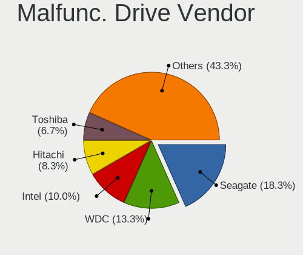
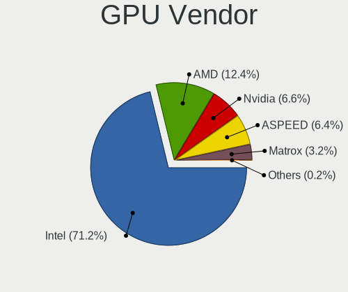
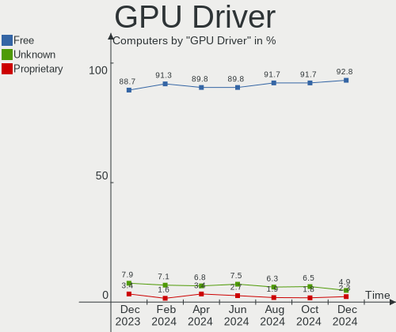
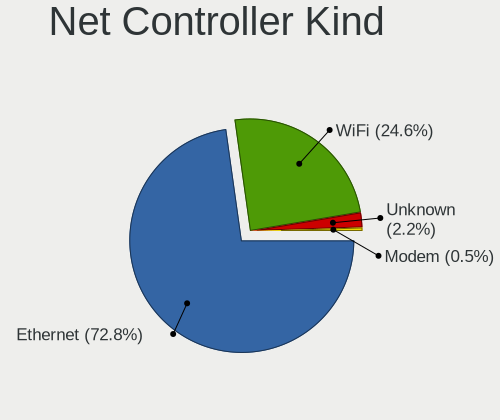

BSD - Hardware Trends
---------------------

A project to identify most popular hardware characteristics and track their change
over time based on data collected by BSD users at https://BSD-Hardware.info.

Anyone can contribute to this report by the [hw-probe](https://github.com/linuxhw/hw-probe/blob/master/INSTALL.BSD.md) tool:

    hw-probe -all -upload

This is a report for all computer types. See also reports for [desktops](/Desktop/README.md) and [notebooks](/Notebook/README.md).

OS-specific reports: [FreeBSD](/Dist/FreeBSD), [OPNsense](/Dist/OPNsense), [helloSystem](/Dist/helloSystem), [OpenBSD](/Dist/OpenBSD).

This report is for one last month. Overall report since the beginning of time: [TestDays](https://github.com/bsdhw/TestDays)

Period: Oct, 2023.

Contents
--------

* [ System ](#system)
  - [ OS                       ](#os)
  - [ OS Family                ](#os-family)
  - [ Arch                     ](#arch)
  - [ DE                       ](#de)
  - [ Display Server           ](#display-server)
  - [ Display Manager          ](#display-manager)
  - [ OS Lang                  ](#os-lang)
  - [ Boot Mode                ](#boot-mode)
  - [ Filesystem               ](#filesystem)
  - [ Part. scheme             ](#part-scheme)

* [ Board ](#board)
  - [ Vendor                   ](#vendor)
  - [ Model                    ](#model)
  - [ Model Family             ](#model-family)
  - [ MFG Year                 ](#mfg-year)
  - [ Form Factor              ](#form-factor)
  - [ Coreboot                 ](#coreboot)
  - [ RAM Size                 ](#ram-size)
  - [ RAM Used                 ](#ram-used)
  - [ Total Drives             ](#total-drives)
  - [ Has CD-ROM               ](#has-cd-rom)
  - [ Has Ethernet             ](#has-ethernet)
  - [ Has WiFi                 ](#has-wifi)
  - [ Has Bluetooth            ](#has-bluetooth)

* [ Location ](#location)
  - [ Country                  ](#country)
  - [ City                     ](#city)

* [ Drives ](#drives)
  - [ Drive Vendor             ](#drive-vendor)
  - [ Drive Model              ](#drive-model)
  - [ HDD Vendor               ](#hdd-vendor)
  - [ SSD Vendor               ](#ssd-vendor)
  - [ Drive Kind               ](#drive-kind)
  - [ Drive Connector          ](#drive-connector)
  - [ Drive Size               ](#drive-size)
  - [ Space Total              ](#space-total)
  - [ Space Used               ](#space-used)
  - [ Malfunc. Drives          ](#malfunc-drives)
  - [ Malfunc. Drive Vendor    ](#malfunc-drive-vendor)
  - [ Malfunc. HDD Vendor      ](#malfunc-hdd-vendor)
  - [ Malfunc. Drive Kind      ](#malfunc-drive-kind)
  - [ Failed Drives            ](#failed-drives)
  - [ Failed Drive Vendor      ](#failed-drive-vendor)
  - [ Drive Status             ](#drive-status)

* [ Storage controller ](#storage-controller)
  - [ Storage Vendor           ](#storage-vendor)
  - [ Storage Model            ](#storage-model)
  - [ Storage Kind             ](#storage-kind)

* [ Processor ](#processor)
  - [ CPU Vendor               ](#cpu-vendor)
  - [ CPU Model                ](#cpu-model)
  - [ CPU Model Family         ](#cpu-model-family)
  - [ CPU Cores                ](#cpu-cores)
  - [ CPU Sockets              ](#cpu-sockets)
  - [ CPU Threads              ](#cpu-threads)
  - [ CPU Microarch            ](#cpu-microarch)

* [ Graphics ](#graphics)
  - [ GPU Vendor               ](#gpu-vendor)
  - [ GPU Model                ](#gpu-model)
  - [ GPU Combo                ](#gpu-combo)
  - [ GPU Driver               ](#gpu-driver)
  - [ GPU Memory               ](#gpu-memory)

* [ Monitor ](#monitor)
  - [ Monitor Vendor           ](#monitor-vendor)
  - [ Monitor Model            ](#monitor-model)
  - [ Monitor Resolution       ](#monitor-resolution)
  - [ Monitor Diagonal         ](#monitor-diagonal)
  - [ Monitor Width            ](#monitor-width)
  - [ Aspect Ratio             ](#aspect-ratio)
  - [ Monitor Area             ](#monitor-area)
  - [ Pixel Density            ](#pixel-density)
  - [ Multiple Monitors        ](#multiple-monitors)

* [ Network ](#network)
  - [ Net Controller Vendor    ](#net-controller-vendor)
  - [ Net Controller Model     ](#net-controller-model)
  - [ Wireless Vendor          ](#wireless-vendor)
  - [ Wireless Model           ](#wireless-model)
  - [ Ethernet Vendor          ](#ethernet-vendor)
  - [ Ethernet Model           ](#ethernet-model)
  - [ Net Controller Kind      ](#net-controller-kind)
  - [ Used Controller          ](#used-controller)
  - [ NICs                     ](#nics)
  - [ IPv6                     ](#ipv6)

* [ Bluetooth ](#bluetooth)
  - [ Bluetooth Vendor         ](#bluetooth-vendor)
  - [ Bluetooth Model          ](#bluetooth-model)

* [ Sound ](#sound)
  - [ Sound Vendor             ](#sound-vendor)
  - [ Sound Model              ](#sound-model)

* [ Memory ](#memory)
  - [ Memory Vendor            ](#memory-vendor)
  - [ Memory Model             ](#memory-model)
  - [ Memory Kind              ](#memory-kind)
  - [ Memory Form Factor       ](#memory-form-factor)
  - [ Memory Size              ](#memory-size)
  - [ Memory Speed             ](#memory-speed)

* [ Printers & scanners ](#printers--scanners)
  - [ Printer Vendor           ](#printer-vendor)
  - [ Printer Model            ](#printer-model)
  - [ Scanner Vendor           ](#scanner-vendor)
  - [ Scanner Model            ](#scanner-model)

* [ Camera ](#camera)
  - [ Camera Vendor            ](#camera-vendor)
  - [ Camera Model             ](#camera-model)

* [ Security ](#security)
  - [ Fingerprint Vendor       ](#fingerprint-vendor)
  - [ Fingerprint Model        ](#fingerprint-model)
  - [ Chipcard Vendor          ](#chipcard-vendor)
  - [ Chipcard Model           ](#chipcard-model)

* [ Unsupported ](#unsupported)
  - [ Unsupported Devices      ](#unsupported-devices)
  - [ Unsupported Device Types ](#unsupported-device-types)

System
------

OS
--

Installed operating systems

| Name                 | Computers | Percent |
|----------------------|-----------|---------|
| OPNsense 23.7.6      | 123       | 26.39%  |
| OPNsense 23.7.5      | 105       | 22.53%  |
| OPNsense 23.7.7      | 68        | 14.59%  |
| helloSystem 0.8.1    | 20        | 4.29%   |
| OpenBSD 7.4          | 17        | 3.65%   |
| FreeBSD 13.2-p4      | 12        | 2.58%   |
| helloSystem 0.9.0    | 11        | 2.36%   |
| OPNsense 23.1.11     | 9         | 1.93%   |
| FreeBSD 13.2-p3      | 9         | 1.93%   |
| FreeBSD 14.0-RC2     | 8         | 1.72%   |
| FreeBSD 13.2         | 8         | 1.72%   |
| GhostBSD 23.06.01    | 7         | 1.5%    |
| OPNsense 24.1        | 6         | 1.29%   |
| NomadBSD 20231013    | 6         | 1.29%   |
| OPNsense 23.4.2      | 5         | 1.07%   |
| OPNsense 23.7.3      | 4         | 0.86%   |
| OPNsense 23.7.1      | 3         | 0.64%   |
| OpenBSD 7.3          | 3         | 0.64%   |
| FreeBSD 15.0-CURRENT | 3         | 0.64%   |
| FreeBSD 14.0-RC3     | 3         | 0.64%   |
| FreeBSD 14.0-RC1     | 3         | 0.64%   |
| OPNsense 23.7.4      | 2         | 0.43%   |
| OPNsense 23.1.10     | 2         | 0.43%   |
| NomadBSD 20221130    | 2         | 0.43%   |
| NetBSD 9.3           | 2         | 0.43%   |
| GhostBSD 23.09.29    | 2         | 0.43%   |
| FreeBSD 14.0-STABLE  | 2         | 0.43%   |
| FreeBSD 14.0-BETA5   | 2         | 0.43%   |
| XigmaNAS 13.2-p1     | 1         | 0.21%   |
| TrueNAS 13.1-p7      | 1         | 0.21%   |
| OPNsense 23.10       | 1         | 0.21%   |
| OPNsense 23.1.6      | 1         | 0.21%   |
| OPNsense 22.7.9      | 1         | 0.21%   |
| OPNsense 22.7.8      | 1         | 0.21%   |
| OPNsense 22.7.11     | 1         | 0.21%   |
| OPNsense 22.1.10     | 1         | 0.21%   |
| NetBSD 10.99.10      | 1         | 0.21%   |
| MyBee 14.0-BETA5     | 1         | 0.21%   |
| MyBee 14.0-BETA3     | 1         | 0.21%   |
| helloSystem 0.6.0    | 1         | 0.21%   |

OS Family
---------

OS without a version

| Name        | Computers | Percent |
|-------------|-----------|---------|
| OPNsense    | 333       | 71.46%  |
| FreeBSD     | 56        | 12.02%  |
| helloSystem | 32        | 6.87%   |
| OpenBSD     | 20        | 4.29%   |
| GhostBSD    | 10        | 2.15%   |
| NomadBSD    | 8         | 1.72%   |
| NetBSD      | 3         | 0.64%   |
| MyBee       | 2         | 0.43%   |
| XigmaNAS    | 1         | 0.21%   |
| TrueNAS     | 1         | 0.21%   |

Arch
----

OS architecture (x86_64, i586, etc.)

| Name    | Computers | Percent |
|---------|-----------|---------|
| amd64   | 453       | 97.21%  |
| arm64   | 6         | 1.29%   |
| i386    | 5         | 1.07%   |
| sparc64 | 1         | 0.21%   |
| macppc  | 1         | 0.21%   |

DE
--

Desktop Environment

| Name         | Computers | Percent |
|--------------|-----------|---------|
| Console      | 359       | 77.04%  |
| helloDesktop | 51        | 10.94%  |
| KDE5         | 15        | 3.22%   |
| MATE         | 12        | 2.58%   |
| XFCE         | 9         | 1.93%   |
| GNOME        | 5         | 1.07%   |
| Openbox      | 4         | 0.86%   |
| TWM          | 3         | 0.64%   |
| i3           | 2         | 0.43%   |
| xinitrc      | 1         | 0.21%   |
| Window Maker | 1         | 0.21%   |
| Picom        | 1         | 0.21%   |
| JWM          | 1         | 0.21%   |
| Fluxbox      | 1         | 0.21%   |
| Budgie       | 1         | 0.21%   |

Display Server
--------------

X11 or Wayland

| Name    | Computers | Percent |
|---------|-----------|---------|
| Console | 365       | 78.33%  |
| X11     | 100       | 21.46%  |
| Wayland | 1         | 0.21%   |

Display Manager
---------------

SDDM, LightDM, etc.

| Name    | Computers | Percent |
|---------|-----------|---------|
| Console | 392       | 84.12%  |
| SLiM    | 34        | 7.3%    |
| SDDM    | 17        | 3.65%   |
| LightDM | 17        | 3.65%   |
| XDM     | 4         | 0.86%   |
| GDM     | 2         | 0.43%   |

OS Lang
-------

Language

| Lang    | Computers | Percent |
|---------|-----------|---------|
| Unknown | 369       | 79.18%  |
| C       | 52        | 11.16%  |
| en_US   | 26        | 5.58%   |
| ru_RU   | 5         | 1.07%   |
| fr_FR   | 3         | 0.64%   |
| de_DE   | 3         | 0.64%   |
| zh_TW   | 2         | 0.43%   |
| tr_TR   | 1         | 0.21%   |
| pl_PL   | 1         | 0.21%   |
| ja_JP   | 1         | 0.21%   |
| fi_DK   | 1         | 0.21%   |
| es_ES   | 1         | 0.21%   |
| en_GB   | 1         | 0.21%   |

Boot Mode
---------

EFI or BIOS

| Mode | Computers | Percent |
|------|-----------|---------|
| EFI  | 424       | 90.99%  |
| BIOS | 42        | 9.01%   |

Filesystem
----------

Type of filesystem

| Type   | Computers | Percent |
|--------|-----------|---------|
| Zfs    | 224       | 48.07%  |
| Ufs    | 207       | 44.42%  |
| Ffs    | 20        | 4.29%   |
| Cd9660 | 15        | 3.22%   |

Part. scheme
------------

Scheme of partitioning

| Type    | Computers | Percent |
|---------|-----------|---------|
| GPT     | 435       | 93.35%  |
| MBR     | 25        | 5.36%   |
| Unknown | 6         | 1.29%   |

Board
-----

Vendor
------

Motherboard manufacturer

| Name                                 | Computers | Percent |
|--------------------------------------|-----------|---------|
| Unknown                              | 62        | 13.3%   |
| Dell                                 | 52        | 11.16%  |
| Lenovo                               | 39        | 8.37%   |
| ASUSTek Computer                     | 31        | 6.65%   |
| Intel                                | 26        | 5.58%   |
| Hewlett-Packard                      | 24        | 5.15%   |
| Gigabyte Technology                  | 20        | 4.29%   |
| Fujitsu                              | 17        | 3.65%   |
| Supermicro                           | 14        | 3%      |
| ASRock                               | 14        | 3%      |
| Sophos                               | 13        | 2.79%   |
| Protectli                            | 12        | 2.58%   |
| Deciso                               | 10        | 2.15%   |
| Apple                                | 9         | 1.93%   |
| AMI                                  | 9         | 1.93%   |
| PC Engines                           | 8         | 1.72%   |
| Techvision                           | 7         | 1.5%    |
| MSI                                  | 5         | 1.07%   |
| CWWK                                 | 5         | 1.07%   |
| AZW                                  | 5         | 1.07%   |
| Acer                                 | 5         | 1.07%   |
| Panasonic                            | 4         | 0.86%   |
| MW                                   | 4         | 0.86%   |
| Yanling                              | 3         | 0.64%   |
| Win element                          | 3         | 0.64%   |
| Toshiba                              | 3         | 0.64%   |
| Shuttle                              | 3         | 0.64%   |
| Hardkernel                           | 3         | 0.64%   |
| GoWin Solution                       | 3         | 0.64%   |
| CncTion                              | 3         | 0.64%   |
| ASRockRack                           | 3         | 0.64%   |
| ZOTAC                                | 2         | 0.43%   |
| ShenZhen MinWin Technology           | 2         | 0.43%   |
| Shenzhen Meigao Electronic Equipment | 2         | 0.43%   |
| Raspberry Pi Foundation              | 2         | 0.43%   |
| Matsushita Electric Industrial       | 2         | 0.43%   |
| YANYU                                | 1         | 0.21%   |
| YanRay Technology                    | 1         | 0.21%   |
| Wistron                              | 1         | 0.21%   |
| Winston Marriot                      | 1         | 0.21%   |

Model
-----

Motherboard model

| Name                                | Computers | Percent |
|-------------------------------------|-----------|---------|
| Unknown                             | 65        | 13.95%  |
| Sophos SG                           | 10        | 2.15%   |
| Techvision TVI7309X                 | 7         | 1.5%    |
| Fujitsu FUTRO S920                  | 7         | 1.5%    |
| Supermicro Super Server             | 5         | 1.07%   |
| AZW EQ                              | 5         | 1.07%   |
| AMI Aptio CRB                       | 5         | 1.07%   |
| PC Engines APU2                     | 4         | 0.86%   |
| MW GMLK-2_5G4L                      | 4         | 0.86%   |
| Dell OptiPlex 7050                  | 4         | 0.86%   |
| Win element M600                    | 3         | 0.64%   |
| Protectli FW4B                      | 3         | 0.64%   |
| PC Engines apu4                     | 3         | 0.64%   |
| Intel Q3XXG4-P V1.0                 | 3         | 0.64%   |
| Intel MAHOBAY                       | 3         | 0.64%   |
| HP Compaq Elite 8300 SFF            | 3         | 0.64%   |
| GoWin Solution R86S                 | 3         | 0.64%   |
| Dell OptiPlex 7020                  | 3         | 0.64%   |
| Dell OptiPlex 7010                  | 3         | 0.64%   |
| Dell OptiPlex 3050                  | 3         | 0.64%   |
| Deciso NetBoard-A20                 | 3         | 0.64%   |
| Deciso NetBoard-A10                 | 3         | 0.64%   |
| Yanling YL-KBR6L                    | 2         | 0.43%   |
| Sophos UTM                          | 2         | 0.43%   |
| RPi Raspberry Pi                    | 2         | 0.43%   |
| Protectli VP2410                    | 2         | 0.43%   |
| Protectli FW6                       | 2         | 0.43%   |
| Intel NUC11TNHi3                    | 2         | 0.43%   |
| HP t730 Thin Client                 | 2         | 0.43%   |
| HP EliteDesk 800 G3 SFF             | 2         | 0.43%   |
| Hardkernel ODROID-H3                | 2         | 0.43%   |
| Fujitsu FUTRO S940                  | 2         | 0.43%   |
| Fujitsu FUTRO S520                  | 2         | 0.43%   |
| Dell Wyse 5070 Extended Thin Client | 2         | 0.43%   |
| Dell OptiPlex 5050                  | 2         | 0.43%   |
| Dell Inspiron 5559                  | 2         | 0.43%   |
| Deciso Netboard A20                 | 2         | 0.43%   |
| CWWK CW-MBX-AD12                    | 2         | 0.43%   |
| CncTion N5105-4L                    | 2         | 0.43%   |
| ASUS P8Z77-V LX                     | 2         | 0.43%   |

Model Family
------------

Motherboard model prefix

| Name                | Computers | Percent |
|---------------------|-----------|---------|
| Unknown             | 65        | 13.95%  |
| Dell OptiPlex       | 24        | 5.15%   |
| Lenovo ThinkPad     | 18        | 3.86%   |
| Lenovo ThinkCentre  | 11        | 2.36%   |
| Fujitsu FUTRO       | 11        | 2.36%   |
| Sophos SG           | 10        | 2.15%   |
| Dell PowerEdge      | 10        | 2.15%   |
| Techvision TVI7309X | 7         | 1.5%    |
| HP EliteDesk        | 7         | 1.5%    |
| ASUS PRIME          | 6         | 1.29%   |
| Supermicro Super    | 5         | 1.07%   |
| AZW EQ              | 5         | 1.07%   |
| AMI Aptio           | 5         | 1.07%   |
| PC Engines APU2     | 4         | 0.86%   |
| MW GMLK-2           | 4         | 0.86%   |
| HP Compaq           | 4         | 0.86%   |
| Dell Precision      | 4         | 0.86%   |
| Dell Latitude       | 4         | 0.86%   |
| Acer Aspire         | 4         | 0.86%   |
| Win element M600    | 3         | 0.64%   |
| Protectli FW4B      | 3         | 0.64%   |
| PC Engines apu4     | 3         | 0.64%   |
| Intel Q3XXG4-P      | 3         | 0.64%   |
| Intel MAHOBAY       | 3         | 0.64%   |
| GoWin Solution R86S | 3         | 0.64%   |
| Dell Wyse           | 3         | 0.64%   |
| Dell Inspiron       | 3         | 0.64%   |
| Deciso NetBoard-A20 | 3         | 0.64%   |
| Deciso NetBoard-A10 | 3         | 0.64%   |
| Deciso Netboard     | 3         | 0.64%   |
| Yanling YL-KBR6L    | 2         | 0.43%   |
| Toshiba Satellite   | 2         | 0.43%   |
| Supermicro 1HE      | 2         | 0.43%   |
| Sophos UTM          | 2         | 0.43%   |
| RPi Raspberry       | 2         | 0.43%   |
| Protectli VP2410    | 2         | 0.43%   |
| Protectli FW6       | 2         | 0.43%   |
| Lenovo IdeaPad      | 2         | 0.43%   |
| Intel NUC11TNHi3    | 2         | 0.43%   |
| HP ZBook            | 2         | 0.43%   |

MFG Year
--------

Motherboard manufacture year

| Year    | Computers | Percent |
|---------|-----------|---------|
| 2023    | 68        | 14.59%  |
| 2022    | 54        | 11.59%  |
| 2021    | 49        | 10.52%  |
| 2018    | 41        | 8.8%    |
| 2014    | 35        | 7.51%   |
| 2020    | 33        | 7.08%   |
| 2019    | 30        | 6.44%   |
| 2016    | 28        | 6.01%   |
| 2017    | 24        | 5.15%   |
| 2012    | 19        | 4.08%   |
| 2011    | 18        | 3.86%   |
| 2015    | 17        | 3.65%   |
| 2013    | 13        | 2.79%   |
| 2010    | 10        | 2.15%   |
| 2009    | 9         | 1.93%   |
| Unknown | 9         | 1.93%   |
| 2008    | 4         | 0.86%   |
| 2007    | 2         | 0.43%   |
| 2006    | 1         | 0.21%   |
| 2005    | 1         | 0.21%   |
| 2002    | 1         | 0.21%   |

Form Factor
-----------

Physical design of the computer

| Name           | Computers | Percent |
|----------------|-----------|---------|
| Desktop        | 301       | 64.59%  |
| Notebook       | 90        | 19.31%  |
| Mini pc        | 35        | 7.51%   |
| Server         | 24        | 5.15%   |
| Firewall       | 14        | 3%      |
| System on chip | 2         | 0.43%   |

Coreboot
--------

Have coreboot on board

| Used | Computers | Percent |
|------|-----------|---------|
| No   | 454       | 97.42%  |
| Yes  | 12        | 2.58%   |

RAM Size
--------

Total RAM memory

| Size in GB  | Computers | Percent |
|-------------|-----------|---------|
| 8.01-16.0   | 166       | 35.62%  |
| 16.01-24.0  | 134       | 28.76%  |
| 4.01-8.0    | 63        | 13.52%  |
| 32.01-64.0  | 52        | 11.16%  |
| 64.01-256.0 | 20        | 4.29%   |
| 2.01-3.0    | 15        | 3.22%   |
| 3.01-4.0    | 5         | 1.07%   |
| 0.51-1.0    | 5         | 1.07%   |
| 24.01-32.0  | 4         | 0.86%   |
| 0.01-0.5    | 2         | 0.43%   |

RAM Used
--------

Used RAM memory

| Used GB    | Computers | Percent |
|------------|-----------|---------|
| 0.01-0.5   | 211       | 45.28%  |
| 0.51-1.0   | 169       | 36.27%  |
| 1.01-2.0   | 64        | 13.73%  |
| 2.01-3.0   | 9         | 1.93%   |
| 0          | 4         | 0.86%   |
| 3.01-4.0   | 3         | 0.64%   |
| Unknown    | 3         | 0.64%   |
| 4.01-8.0   | 2         | 0.43%   |
| 16.01-24.0 | 1         | 0.21%   |

Total Drives
------------

Number of drives on board

| Drives | Computers | Percent |
|--------|-----------|---------|
| 1      | 334       | 71.67%  |
| 0      | 57        | 12.23%  |
| 2      | 52        | 11.16%  |
| 3      | 17        | 3.65%   |
| 4      | 2         | 0.43%   |
| 13     | 1         | 0.21%   |
| 7      | 1         | 0.21%   |
| 6      | 1         | 0.21%   |
| 5      | 1         | 0.21%   |

Has CD-ROM
----------

Has CD-ROM on board

| Presented | Computers | Percent |
|-----------|-----------|---------|
| No        | 400       | 85.84%  |
| Yes       | 66        | 14.16%  |

Has Ethernet
------------

Has Ethernet on board

| Presented | Computers | Percent |
|-----------|-----------|---------|
| Yes       | 450       | 96.57%  |
| No        | 16        | 3.43%   |

Has WiFi
--------

Has WiFi module

| Presented | Computers | Percent |
|-----------|-----------|---------|
| No        | 309       | 66.31%  |
| Yes       | 157       | 33.69%  |

Has Bluetooth
-------------

Has Bluetooth module

| Presented | Computers | Percent |
|-----------|-----------|---------|
| No        | 357       | 76.61%  |
| Yes       | 109       | 23.39%  |

Location
--------

Country
-------

Geographic location (country)

| Country      | Computers | Percent |
|--------------|-----------|---------|
| USA          | 118       | 25.32%  |
| Germany      | 83        | 17.81%  |
| Canada       | 25        | 5.36%   |
| UK           | 21        | 4.51%   |
| Russia       | 21        | 4.51%   |
| Italy        | 14        | 3%      |
| Australia    | 14        | 3%      |
| Taiwan       | 12        | 2.58%   |
| Poland       | 12        | 2.58%   |
| Netherlands  | 12        | 2.58%   |
| France       | 12        | 2.58%   |
| Austria      | 10        | 2.15%   |
| Switzerland  | 8         | 1.72%   |
| Sweden       | 7         | 1.5%    |
| China        | 7         | 1.5%    |
| Turkey       | 6         | 1.29%   |
| Spain        | 6         | 1.29%   |
| Romania      | 6         | 1.29%   |
| Finland      | 6         | 1.29%   |
| Mexico       | 5         | 1.07%   |
| Japan        | 4         | 0.86%   |
| South Korea  | 3         | 0.64%   |
| New Zealand  | 3         | 0.64%   |
| Greece       | 3         | 0.64%   |
| Denmark      | 3         | 0.64%   |
| Bulgaria     | 3         | 0.64%   |
| Brazil       | 3         | 0.64%   |
| Vietnam      | 2         | 0.43%   |
| Ukraine      | 2         | 0.43%   |
| Thailand     | 2         | 0.43%   |
| Singapore    | 2         | 0.43%   |
| Norway       | 2         | 0.43%   |
| Latvia       | 2         | 0.43%   |
| India        | 2         | 0.43%   |
| Czechia      | 2         | 0.43%   |
| Croatia      | 2         | 0.43%   |
| UAE          | 1         | 0.21%   |
| Tunisia      | 1         | 0.21%   |
| South Africa | 1         | 0.21%   |
| Slovenia     | 1         | 0.21%   |

City
----

Geographic location (city)

| City              | Computers | Percent |
|-------------------|-----------|---------|
| Taichung          | 9         | 1.93%   |
| Saint-Laurent     | 7         | 1.5%    |
| St Petersburg     | 5         | 1.07%   |
| Melbourne         | 5         | 1.07%   |
| Hamburg           | 5         | 1.07%   |
| Berlin            | 5         | 1.07%   |
| Wuppertal         | 4         | 0.86%   |
| Perth             | 4         | 0.86%   |
| Paris             | 4         | 0.86%   |
| Frankfurt am Main | 4         | 0.86%   |
| Vienna            | 3         | 0.64%   |
| Sun Prairie       | 3         | 0.64%   |
| Nuremberg         | 3         | 0.64%   |
| Moscow            | 3         | 0.64%   |
| Los Angeles       | 3         | 0.64%   |
| Helsinki          | 3         | 0.64%   |
| Glasgow           | 3         | 0.64%   |
| Gdansk            | 3         | 0.64%   |
| Chicago           | 3         | 0.64%   |
| Charlottesville   | 3         | 0.64%   |
| Cabo San Lucas    | 3         | 0.64%   |
| Boston            | 3         | 0.64%   |
| Zurich            | 2         | 0.43%   |
| Zagreb            | 2         | 0.43%   |
| Wroclaw           | 2         | 0.43%   |
| Worthing          | 2         | 0.43%   |
| Victoria          | 2         | 0.43%   |
| Vancouver         | 2         | 0.43%   |
| Uckfield          | 2         | 0.43%   |
| The Hague         | 2         | 0.43%   |
| Tampa             | 2         | 0.43%   |
| Sydney            | 2         | 0.43%   |
| Surgut            | 2         | 0.43%   |
| Stockholm         | 2         | 0.43%   |
| Sofia             | 2         | 0.43%   |
| Singapore         | 2         | 0.43%   |
| Salem             | 2         | 0.43%   |
| Rome              | 2         | 0.43%   |
| Riga              | 2         | 0.43%   |
| Redmond           | 2         | 0.43%   |

Drives
------

Drive Vendor
------------

Hard drive vendors

| Vendor              | Computers | Drives | Percent |
|---------------------|-----------|--------|---------|
| Samsung Electronics | 76        | 89     | 16.31%  |
| WDC                 | 43        | 60     | 9.23%   |
| Transcend           | 39        | 41     | 8.37%   |
| Kingston            | 30        | 33     | 6.44%   |
| Crucial             | 29        | 30     | 6.22%   |
| Seagate             | 26        | 30     | 5.58%   |
| Intel               | 19        | 21     | 4.08%   |
| Toshiba             | 18        | 21     | 3.86%   |
| SanDisk             | 17        | 19     | 3.65%   |
| A-DATA Technology   | 13        | 13     | 2.79%   |
| China               | 10        | 10     | 2.15%   |
| Phison              | 8         | 8      | 1.72%   |
| Hitachi             | 8         | 8      | 1.72%   |
| SK hynix            | 7         | 7      | 1.5%    |
| Silicon Motion      | 7         | 7      | 1.5%    |
| HGST                | 7         | 8      | 1.5%    |
| FORESEE             | 7         | 7      | 1.5%    |
| Micron Technology   | 6         | 7      | 1.29%   |
| Hewlett-Packard     | 6         | 7      | 1.29%   |
| SPCC                | 5         | 6      | 1.07%   |
| Protectli           | 5         | 5      | 1.07%   |
| Innodisk            | 5         | 5      | 1.07%   |
| Patriot             | 4         | 4      | 0.86%   |
| Hoodisk             | 4         | 4      | 0.86%   |
| Apacer              | 4         | 4      | 0.86%   |
| Intenso             | 3         | 3      | 0.64%   |
| Fanxiang            | 3         | 3      | 0.64%   |
| Dogfish             | 3         | 3      | 0.64%   |
| ATP                 | 3         | 3      | 0.64%   |
| Team                | 2         | 3      | 0.43%   |
| PNY                 | 2         | 2      | 0.43%   |
| OCZ                 | 2         | 2      | 0.43%   |
| NVMe                | 2         | 3      | 0.43%   |
| Netac               | 2         | 2      | 0.43%   |
| LITEONIT            | 2         | 2      | 0.43%   |
| LITEON              | 2         | 2      | 0.43%   |
| Lexar               | 2         | 2      | 0.43%   |
| Gigabyte Technology | 2         | 3      | 0.43%   |
| Fujitsu             | 2         | 2      | 0.43%   |
| Corsair             | 2         | 2      | 0.43%   |

Drive Model
-----------

Hard drive models

| Model                                | Computers | Percent |
|--------------------------------------|-----------|---------|
| Transcend TS64GSSD370 64GB           | 6         | 1.24%   |
| Hitachi HTS541612J9SA00 120GB        | 6         | 1.24%   |
| Crucial CT240BX500SSD1 240GB         | 6         | 1.24%   |
| Transcend TS256GMTS952T2 256GB       | 5         | 1.04%   |
| Crucial CT500P3SSD8 500GB            | 5         | 1.04%   |
| Samsung SSD 980 1TB                  | 4         | 0.83%   |
| Phison PCIe SSD 512GB                | 4         | 0.83%   |
| Samsung SSD 970 EVO Plus 500GB       | 3         | 0.62%   |
| Samsung SSD 870 EVO 250GB            | 3         | 0.62%   |
| Samsung SSD 860 EVO 1TB              | 3         | 0.62%   |
| Samsung SSD 840 EVO 120GB            | 3         | 0.62%   |
| Kingston SKC600MS256G 256GB          | 3         | 0.62%   |
| Kingston SA400S37240G 240GB          | 3         | 0.62%   |
| Kingston SA400S37120G 120GB          | 3         | 0.62%   |
| FORESEE 64GB SSD                     | 3         | 0.62%   |
| FORESEE 128GB SSD                    | 3         | 0.62%   |
| Crucial CT500P3PSSD8 500GB           | 3         | 0.62%   |
| Crucial CT250MX500SSD1 250GB         | 3         | 0.62%   |
| China SATA SSD 16GB                  | 3         | 0.62%   |
| WDC WDS500G2B0A-00SM50 500GB         | 2         | 0.41%   |
| WDC WDS240G2G0A-00JH30 240GB         | 2         | 0.41%   |
| WDC WDS120G2G0A-00JH30 120GB         | 2         | 0.41%   |
| WDC WD7500BPKX-00HPJT0 752GB         | 2         | 0.41%   |
| WDC PC SN730 SDBQNTY-256G-1001 256GB | 2         | 0.41%   |
| Transcend TS512GSSD230S 512GB        | 2         | 0.41%   |
| Transcend TS32GMSA370S 32GB          | 2         | 0.41%   |
| Transcend TS256GMTE652T2 256GB       | 2         | 0.41%   |
| Transcend TS120GSSD220S 120GB        | 2         | 0.41%   |
| SPCC Solid State Disk 512GB          | 2         | 0.41%   |
| Seagate ST500LT012-1DG142 500GB      | 2         | 0.41%   |
| Seagate ST4000DM000-1F2168 4TB       | 2         | 0.41%   |
| Seagate ST2000LM003 HN-M201RAD 2TB   | 2         | 0.41%   |
| Samsung SSD 980 PRO 1TB              | 2         | 0.41%   |
| Samsung SSD 980 500GB                | 2         | 0.41%   |
| Samsung SSD 980 250GB                | 2         | 0.41%   |
| Samsung SSD 970 EVO Plus 1TB         | 2         | 0.41%   |
| Samsung SSD 960 EVO 500GB            | 2         | 0.41%   |
| Samsung SSD 870 QVO 2TB              | 2         | 0.41%   |
| Samsung SSD 870 EVO 500GB            | 2         | 0.41%   |
| Samsung SSD 860 EVO M.2 250GB        | 2         | 0.41%   |

HDD Vendor
----------

Hard disk drive vendors

| Vendor              | Computers | Drives | Percent |
|---------------------|-----------|--------|---------|
| WDC                 | 28        | 44     | 31.11%  |
| Seagate             | 25        | 29     | 27.78%  |
| Toshiba             | 10        | 13     | 11.11%  |
| Hitachi             | 8         | 8      | 8.89%   |
| HGST                | 7         | 8      | 7.78%   |
| Samsung Electronics | 3         | 4      | 3.33%   |
| Hewlett-Packard     | 3         | 4      | 3.33%   |
| Fujitsu             | 2         | 2      | 2.22%   |
| Maxtor              | 1         | 1      | 1.11%   |
| LSILOGIC            | 1         | 1      | 1.11%   |
| IBM/Hitachi         | 1         | 1      | 1.11%   |
| Apple               | 1         | 1      | 1.11%   |

SSD Vendor
----------

Solid state drive vendors

| Vendor              | Computers | Drives | Percent |
|---------------------|-----------|--------|---------|
| Samsung Electronics | 42        | 47     | 15.79%  |
| Transcend           | 34        | 36     | 12.78%  |
| Kingston            | 24        | 27     | 9.02%   |
| SanDisk             | 17        | 19     | 6.39%   |
| Intel               | 17        | 19     | 6.39%   |
| Crucial             | 16        | 17     | 6.02%   |
| China               | 10        | 10     | 3.76%   |
| A-DATA Technology   | 10        | 10     | 3.76%   |
| WDC                 | 9         | 9      | 3.38%   |
| FORESEE             | 6         | 6      | 2.26%   |
| Protectli           | 5         | 5      | 1.88%   |
| Innodisk            | 5         | 5      | 1.88%   |
| Toshiba             | 4         | 4      | 1.5%    |
| SK hynix            | 4         | 4      | 1.5%    |
| Micron Technology   | 4         | 5      | 1.5%    |
| Hoodisk             | 4         | 4      | 1.5%    |
| SPCC                | 3         | 4      | 1.13%   |
| Patriot             | 3         | 3      | 1.13%   |
| Intenso             | 3         | 3      | 1.13%   |
| Dogfish             | 3         | 3      | 1.13%   |
| ATP                 | 3         | 3      | 1.13%   |
| Apacer              | 3         | 3      | 1.13%   |
| Team                | 2         | 3      | 0.75%   |
| PNY                 | 2         | 2      | 0.75%   |
| OCZ                 | 2         | 2      | 0.75%   |
| NVMe                | 2         | 2      | 0.75%   |
| LITEONIT            | 2         | 2      | 0.75%   |
| LITEON              | 2         | 2      | 0.75%   |
| Lexar               | 2         | 2      | 0.75%   |
| Hewlett-Packard     | 2         | 2      | 0.75%   |
| XUNZHE              | 1         | 1      | 0.38%   |
| VICKTER             | 1         | 1      | 0.38%   |
| Vaseky              | 1         | 1      | 0.38%   |
| TrueNAS             | 1         | 1      | 0.38%   |
| Timetec             | 1         | 2      | 0.38%   |
| Silicon Power       | 1         | 1      | 0.38%   |
| ShiJi               | 1         | 1      | 0.38%   |
| SemsoTai            | 1         | 1      | 0.38%   |
| KingSpec            | 1         | 1      | 0.38%   |
| KeepData            | 1         | 1      | 0.38%   |

Drive Kind
----------

HDD or SSD

| Kind | Computers | Drives | Percent |
|------|-----------|--------|---------|
| SSD  | 257       | 286    | 58.28%  |
| NVMe | 108       | 120    | 24.49%  |
| HDD  | 76        | 116    | 17.23%  |

Drive Connector
---------------

SATA, SAS, NVMe, etc.

| Type | Computers | Drives | Percent |
|------|-----------|--------|---------|
| SATA | 316       | 402    | 74.53%  |
| NVMe | 108       | 120    | 25.47%  |

Drive Size
----------

Size of hard drive

| Size in TB | Computers | Drives | Percent |
|------------|-----------|--------|---------|
| 0.01-0.5   | 265       | 290    | 78.17%  |
| 0.51-1.0   | 45        | 59     | 13.27%  |
| 1.01-2.0   | 15        | 21     | 4.42%   |
| 3.01-4.0   | 7         | 14     | 2.06%   |
| 4.01-10.0  | 6         | 16     | 1.77%   |
| 10.01-20.0 | 1         | 2      | 0.29%   |

Space Total
-----------

Amount of disk space available on the file system

| Size in GB     | Computers | Percent |
|----------------|-----------|---------|
| 101-250        | 194       | 41.63%  |
| 251-500        | 95        | 20.39%  |
| 21-50          | 44        | 9.44%   |
| 51-100         | 44        | 9.44%   |
| 1-20           | 40        | 8.58%   |
| 501-1000       | 38        | 8.15%   |
| 1001-2000      | 8         | 1.72%   |
| More than 3000 | 2         | 0.43%   |
| Unknown        | 1         | 0.21%   |

Space Used
----------

Amount of used disk space

| Used GB  | Computers | Percent |
|----------|-----------|---------|
| 1-20     | 417       | 89.48%  |
| 21-50    | 25        | 5.36%   |
| 101-250  | 11        | 2.36%   |
| 51-100   | 7         | 1.5%    |
| 251-500  | 4         | 0.86%   |
| 501-1000 | 1         | 0.21%   |
| Unknown  | 1         | 0.21%   |

Malfunc. Drives
---------------

Drive models with a malfunction

| Model                                           | Computers | Drives | Percent |
|-------------------------------------------------|-----------|--------|---------|
| Hitachi HTS541612J9SA00 120GB                   | 4         | 4      | 7.69%   |
| Samsung Electronics HD161GJ 160GB               | 2         | 2      | 3.85%   |
| WDC WDS240G2G0A-00JH30 240GB                    | 1         | 1      | 1.92%   |
| WDC WD5003ABYX-18WERA0 500GB                    | 1         | 1      | 1.92%   |
| WDC WD5000AAKX-75U6AA0 500GB                    | 1         | 1      | 1.92%   |
| WDC WD40EFRX-68WT0N0 4TB                        | 1         | 3      | 1.92%   |
| WDC WD3200BPVT-80ZEST0 320GB                    | 1         | 1      | 1.92%   |
| WDC WD20EADS-00W4B0 2TB                         | 1         | 1      | 1.92%   |
| WDC WD10EZRZ-00Z5HB0 1TB                        | 1         | 1      | 1.92%   |
| Transcend TS8GMSM610 8GB                        | 1         | 1      | 1.92%   |
| Transcend TS120GSSD220S 120GB                   | 1         | 1      | 1.92%   |
| Toshiba THNSNK256GVN8 M.2 2280 256GB            | 1         | 1      | 1.92%   |
| Toshiba MK5065GSX 500GB                         | 1         | 1      | 1.92%   |
| Toshiba MD04ACA500 5TB                          | 1         | 1      | 1.92%   |
| SK hynix HFS256G39MND-2300A 256GB               | 1         | 1      | 1.92%   |
| Seagate ST9500325AS 500GB                       | 1         | 1      | 1.92%   |
| Seagate ST9250315AS 250GB                       | 1         | 1      | 1.92%   |
| Seagate ST3500418AS 500GB                       | 1         | 1      | 1.92%   |
| Seagate ST3360320AS 360GB                       | 1         | 1      | 1.92%   |
| Seagate ST250DM000-1BD141 250GB                 | 1         | 1      | 1.92%   |
| Seagate ST2000LM003 HN-M201RAD 2TB              | 1         | 1      | 1.92%   |
| Seagate ST1000DM003-1SB102 1TB                  | 1         | 1      | 1.92%   |
| SanDisk SSD PLUS 480GB                          | 1         | 1      | 1.92%   |
| SanDisk SD8SBAT256G1122 256GB                   | 1         | 1      | 1.92%   |
| Samsung Electronics SSD 870 EVO 2TB             | 1         | 1      | 1.92%   |
| Samsung Electronics SSD 870 EVO 250GB           | 1         | 1      | 1.92%   |
| Samsung Electronics SSD 870 EVO 1TB             | 1         | 1      | 1.92%   |
| Samsung Electronics SSD 850 EVO mSATA 1TB       | 1         | 1      | 1.92%   |
| Samsung Electronics MZMPA128HMFU-000H1 128GB    | 1         | 1      | 1.92%   |
| Samsung Electronics HD160JJ 160GB               | 1         | 1      | 1.92%   |
| OCZ AGILITY3 120GB                              | 1         | 1      | 1.92%   |
| Micron Technology MTFDDAK256TBN-1AR1ZABHA 256GB | 1         | 1      | 1.92%   |
| Micron Technology 2200S NVMe 256GB              | 1         | 1      | 1.92%   |
| Kingston SV300S37A120G 120GB                    | 1         | 1      | 1.92%   |
| Kingston SHFS37A120G 120GB                      | 1         | 1      | 1.92%   |
| Intel SSDSA2M120G2GC 120GB                      | 1         | 1      | 1.92%   |
| Intel SSDSA2BW120G3H 120GB                      | 1         | 1      | 1.92%   |
| IBM/Hitachi IC25N040ATMR04-0 40GB               | 1         | 1      | 1.92%   |
| HGST HTS725032A7E630 320GB                      | 1         | 1      | 1.92%   |
| HGST HTS545050A7E680 500GB                      | 1         | 1      | 1.92%   |

Malfunc. Drive Vendor
---------------------

Vendors of faulty drives

| Vendor              | Computers | Drives | Percent |
|---------------------|-----------|--------|---------|
| WDC                 | 7         | 9      | 13.73%  |
| Seagate             | 7         | 7      | 13.73%  |
| Samsung Electronics | 7         | 8      | 13.73%  |
| Hitachi             | 4         | 4      | 7.84%   |
| Toshiba             | 3         | 3      | 5.88%   |
| A-DATA Technology   | 3         | 3      | 5.88%   |
| Transcend           | 2         | 2      | 3.92%   |
| SanDisk             | 2         | 2      | 3.92%   |
| Micron Technology   | 2         | 2      | 3.92%   |
| Kingston            | 2         | 2      | 3.92%   |
| Intel               | 2         | 2      | 3.92%   |
| HGST                | 2         | 2      | 3.92%   |
| China               | 2         | 2      | 3.92%   |
| SK hynix            | 1         | 1      | 1.96%   |
| OCZ                 | 1         | 1      | 1.96%   |
| IBM/Hitachi         | 1         | 1      | 1.96%   |
| Hewlett-Packard     | 1         | 1      | 1.96%   |
| GLOWAY              | 1         | 1      | 1.96%   |
| Dogfish             | 1         | 1      | 1.96%   |

Malfunc. HDD Vendor
-------------------

Vendors of faulty HDD drives

| Vendor              | Computers | Drives | Percent |
|---------------------|-----------|--------|---------|
| Seagate             | 7         | 7      | 28%     |
| WDC                 | 6         | 8      | 24%     |
| Hitachi             | 4         | 4      | 16%     |
| Toshiba             | 2         | 2      | 8%      |
| Samsung Electronics | 2         | 3      | 8%      |
| HGST                | 2         | 2      | 8%      |
| IBM/Hitachi         | 1         | 1      | 4%      |
| Hewlett-Packard     | 1         | 1      | 4%      |

Malfunc. Drive Kind
-------------------

Kinds of faulty drives

| Kind | Computers | Drives | Percent |
|------|-----------|--------|---------|
| SSD  | 24        | 24     | 48%     |
| HDD  | 24        | 28     | 48%     |
| NVMe | 2         | 2      | 4%      |

Failed Drives
-------------

Failed drive models

| Model                       | Computers | Drives | Percent |
|-----------------------------|-----------|--------|---------|
| Kingston SA2000M8500G 500GB | 1         | 1      | 50%     |
| Intel SSDSC2KB019T8 1.9TB   | 1         | 2      | 50%     |

Failed Drive Vendor
-------------------

Failed drive vendors

| Vendor   | Computers | Drives | Percent |
|----------|-----------|--------|---------|
| Kingston | 1         | 1      | 50%     |
| Intel    | 1         | 2      | 50%     |

Drive Status
------------

Number of failed and malfunc. drives

| Status   | Computers | Drives | Percent |
|----------|-----------|--------|---------|
| Works    | 366       | 453    | 85.71%  |
| Malfunc  | 49        | 54     | 11.48%  |
| Detected | 10        | 12     | 2.34%   |
| Failed   | 2         | 3      | 0.47%   |

Storage controller
------------------

Storage Vendor
--------------

Storage controller vendors

| Vendor                         | Computers | Percent |
|--------------------------------|-----------|---------|
| Intel                          | 363       | 61.73%  |
| AMD                            | 53        | 9.01%   |
| Samsung Electronics            | 36        | 6.12%   |
| Silicon Motion                 | 14        | 2.38%   |
| SanDisk                        | 14        | 2.38%   |
| Phison Electronics             | 14        | 2.38%   |
| Micron/Crucial Technology      | 13        | 2.21%   |
| Broadcom / LSI                 | 11        | 1.87%   |
| Kingston Technology Company    | 8         | 1.36%   |
| ASMedia Technology             | 6         | 1.02%   |
| Transcend                      | 5         | 0.85%   |
| Toshiba                        | 4         | 0.68%   |
| SK hynix                       | 4         | 0.68%   |
| Shenzhen Longsys Electronics   | 4         | 0.68%   |
| Realtek Semiconductor          | 4         | 0.68%   |
| Nvidia                         | 4         | 0.68%   |
| Micron Technology              | 4         | 0.68%   |
| MAXIO Technology (Hangzhou)    | 4         | 0.68%   |
| Marvell Technology Group       | 3         | 0.51%   |
| Hosin Global Electronics       | 3         | 0.51%   |
| O2 Micro                       | 2         | 0.34%   |
| KIOXIA                         | 2         | 0.34%   |
| JMicron Technology             | 2         | 0.34%   |
| Hewlett-Packard                | 2         | 0.34%   |
| Solid State Storage Technology | 1         | 0.17%   |
| Seagate Technology             | 1         | 0.17%   |
| Netac Technology               | 1         | 0.17%   |
| Lite-On Technology             | 1         | 0.17%   |
| INNOGRIT                       | 1         | 0.17%   |
| Chelsio Communications         | 1         | 0.17%   |
| ADATA Technology               | 1         | 0.17%   |
| Adaptec                        | 1         | 0.17%   |
| Unknown                        | 1         | 0.17%   |

Storage Model
-------------

Storage controller models

| Model                                                                            | Computers | Percent |
|----------------------------------------------------------------------------------|-----------|---------|
| AMD FCH SATA Controller [AHCI mode]                                              | 36        | 5.74%   |
| Intel Celeron/Pentium Silver Processor SATA Controller                           | 30        | 4.78%   |
| Intel 8 Series/C220 Series Chipset Family 6-port SATA Controller 1 [AHCI mode]   | 28        | 4.47%   |
| Unknown                                                                          | 25        | 3.99%   |
| Intel Jasper Lake SATA AHCI Controller                                           | 17        | 2.71%   |
| Intel Sunrise Point-LP SATA Controller [AHCI mode]                               | 16        | 2.55%   |
| Intel Atom Processor E3800 Series SATA AHCI Controller                           | 16        | 2.55%   |
| Intel 200 Series PCH SATA controller [AHCI mode]                                 | 16        | 2.55%   |
| Silicon Motion SM2263EN/SM2263XT (DRAM-less) NVMe SSD Controllers                | 13        | 2.07%   |
| Intel Q170/Q150/B150/H170/H110/Z170/CM236 Chipset SATA Controller [AHCI Mode]    | 13        | 2.07%   |
| Intel Atom/Celeron/Pentium Processor x5-E8000/J3xxx/N3xxx Series SATA Controller | 13        | 2.07%   |
| Samsung NVMe SSD Controller SM981/PM981/PM983                                    | 12        | 1.91%   |
| Micron/Crucial P2 [Nick P2] / P3 / P3 Plus NVMe PCIe SSD (DRAM-less)             | 12        | 1.91%   |
| Intel 7 Series/C210 Series Chipset Family 6-port SATA Controller [AHCI mode]     | 12        | 1.91%   |
| Samsung NVMe SSD Controller 980 (DRAM-less)                                      | 10        | 1.59%   |
| Intel Wildcat Point-LP SATA Controller [AHCI Mode]                               | 10        | 1.59%   |
| Intel Cannon Lake PCH SATA AHCI Controller                                       | 10        | 1.59%   |
| Intel 6 Series/C200 Series Chipset Family 6 port Desktop SATA AHCI Controller    | 10        | 1.59%   |
| Intel 8 Series SATA Controller 1 [AHCI mode]                                     | 9         | 1.44%   |
| Intel 7 Series Chipset Family 6-port SATA Controller [AHCI mode]                 | 9         | 1.44%   |
| Intel Tiger Lake-LP SATA Controller                                              | 8         | 1.28%   |
| Intel Comet Lake SATA AHCI Controller                                            | 8         | 1.28%   |
| Intel Celeron N3350/Pentium N4200/Atom E3900 Series SATA AHCI Controller         | 7         | 1.12%   |
| Intel 6 Series/C200 Series Chipset Family 6 port Mobile SATA AHCI Controller     | 7         | 1.12%   |
| Intel 5 Series/3400 Series Chipset 6 port SATA AHCI Controller                   | 7         | 1.12%   |
| Samsung NVMe SSD Controller SM961/PM961/SM963                                    | 6         | 0.96%   |
| Samsung NVMe SSD Controller PM9A1/PM9A3/980PRO                                   | 6         | 0.96%   |
| Intel SATA Controller [RAID mode]                                                | 6         | 0.96%   |
| Intel Alder Lake-P SATA AHCI Controller                                          | 6         | 0.96%   |
| AMD FCH SATA Controller [IDE mode]                                               | 6         | 0.96%   |
| SanDisk Extreme Pro / WD Black SN750 / PC SN730 / Red SN700 NVMe SSD             | 5         | 0.8%    |
| Phison E12 NVMe Controller                                                       | 5         | 0.8%    |
| Intel Atom Processor C3000 Series SATA Controller 0                              | 5         | 0.8%    |
| Intel Atom processor C2000 AHCI SATA3 Controller                                 | 5         | 0.8%    |
| Intel Alder Lake-S PCH SATA Controller [AHCI Mode]                               | 5         | 0.8%    |
| SK hynix Gold P31/BC711/PC711 NVMe Solid State Drive                             | 4         | 0.64%   |
| Phison PS5013-E13 PCIe3 NVMe Controller (DRAM-less)                              | 4         | 0.64%   |
| Intel Volume Management Device NVMe RAID Controller                              | 4         | 0.64%   |
| Intel Atom Processor C3000 Series SATA Controller 1                              | 4         | 0.64%   |
| Intel 82801JI (ICH10 Family) 4 port SATA IDE Controller #1                       | 4         | 0.64%   |

Storage Kind
------------

Kind of storage controller (IDE, SATA, NVMe, SAS, ...)

| Kind | Computers | Percent |
|------|-----------|---------|
| SATA | 387       | 65.93%  |
| NVMe | 134       | 22.83%  |
| IDE  | 36        | 6.13%   |
| RAID | 24        | 4.09%   |
| SAS  | 3         | 0.51%   |
| SCSI | 3         | 0.51%   |

Processor
---------

CPU Vendor
----------

Processor vendors

| Vendor  | Computers | Percent |
|---------|-----------|---------|
| Intel   | 390       | 83.69%  |
| AMD     | 68        | 14.59%  |
| ARM     | 6         | 1.29%   |
| 7447A   | 1         | 0.21%   |
| Unknown | 1         | 0.21%   |

CPU Model
---------

Processor models

| Model                                    | Computers | Percent |
|------------------------------------------|-----------|---------|
| Intel N100                               | 26        | 5.58%   |
| Intel Celeron J4125 CPU @ 2.00GHz        | 19        | 4.08%   |
| Intel Celeron N5105 @ 2.00GHz            | 14        | 3%      |
| Intel Celeron CPU J3160 @ 1.60GHz        | 8         | 1.72%   |
| AMD GX-412TC SOC                         | 8         | 1.72%   |
| Intel Celeron CPU J1900 @ 1.99GHz        | 7         | 1.5%    |
| Intel Pentium Silver J5005 CPU @ 1.50GHz | 6         | 1.29%   |
| Intel Core i5-6500 CPU @ 3.20GHz         | 6         | 1.29%   |
| Intel Pentium Silver N6005 @ 2.00GHz     | 5         | 1.07%   |
| Intel Core i5-3470 CPU @ 3.20GHz         | 5         | 1.07%   |
| AMD GX-415GA SOC with Radeon HD Graphics | 5         | 1.07%   |
| AMD EPYC 3201 8-Core Processor           | 5         | 1.07%   |
| Intel Core i5-8250U CPU @ 1.60GHz        | 4         | 0.86%   |
| Intel Core i5-7500 CPU @ 3.40GHz         | 4         | 0.86%   |
| Intel Core i5-3210M CPU @ 2.50GHz        | 4         | 0.86%   |
| Intel Atom CPU C3558 @ 2.20GHz           | 4         | 0.86%   |
| Intel Core i7-6700 CPU @ 3.40GHz         | 3         | 0.64%   |
| Intel Core i5-8500T CPU @ 2.10GHz        | 3         | 0.64%   |
| Intel Core i5-6200U CPU @ 2.30GHz        | 3         | 0.64%   |
| Intel Core i5-5200U CPU @ 2.20GHz        | 3         | 0.64%   |
| Intel Core i5-4570 CPU @ 3.20GHz         | 3         | 0.64%   |
| Intel Core i5-4460 CPU @ 3.20GHz         | 3         | 0.64%   |
| Intel Core i5-10210U CPU @ 1.60GHz       | 3         | 0.64%   |
| Intel 11th Gen Core i7-1165G7 @ 2.80GHz  | 3         | 0.64%   |
| Intel 11th Gen Core i5-1135G7 @ 2.40GHz  | 3         | 0.64%   |
| ARM Cortex-A55 r2p0                      | 3         | 0.64%   |
| AMD Ryzen Embedded V1500B                | 3         | 0.64%   |
| AMD Ryzen 5 6600H with Radeon Graphics   | 3         | 0.64%   |
| Intel Xeon E-2236 CPU @ 3.40GHz          | 2         | 0.43%   |
| Intel Xeon CPU E5645 @ 2.40GHz           | 2         | 0.43%   |
| Intel Xeon CPU E3-1246 v3 @ 3.50GHz      | 2         | 0.43%   |
| Intel Pentium Gold 8505                  | 2         | 0.43%   |
| Intel CPU Version                        | 2         | 0.43%   |
| Intel Core i7-9750H CPU @ 2.60GHz        | 2         | 0.43%   |
| Intel Core i7-7700 CPU @ 3.60GHz         | 2         | 0.43%   |
| Intel Core i7-6500U CPU @ 2.50GHz        | 2         | 0.43%   |
| Intel Core i7-10510U CPU @ 1.80GHz       | 2         | 0.43%   |
| Intel Core i5-9400 CPU @ 2.90GHz         | 2         | 0.43%   |
| Intel Core i5-8500 CPU @ 3.00GHz         | 2         | 0.43%   |
| Intel Core i5-8365U CPU @ 1.60GHz        | 2         | 0.43%   |

CPU Model Family
----------------

Processor model prefix

| Model                   | Computers | Percent |
|-------------------------|-----------|---------|
| Intel Core i5           | 96        | 20.6%   |
| Intel Celeron           | 85        | 18.24%  |
| Other                   | 54        | 11.59%  |
| Intel Core i7           | 33        | 7.08%   |
| Intel Xeon              | 31        | 6.65%   |
| Intel Core i3           | 24        | 5.15%   |
| Intel Atom              | 21        | 4.51%   |
| AMD GX                  | 19        | 4.08%   |
| Intel Pentium Silver    | 12        | 2.58%   |
| Intel Pentium           | 12        | 2.58%   |
| AMD Ryzen 7             | 10        | 2.15%   |
| AMD Ryzen 5             | 9         | 1.93%   |
| AMD EPYC                | 9         | 1.93%   |
| Intel Core 2 Duo        | 6         | 1.29%   |
| ARM Cortex              | 6         | 1.29%   |
| AMD Ryzen 9             | 5         | 1.07%   |
| Intel Pentium Gold      | 4         | 0.86%   |
| Intel Core i9           | 3         | 0.64%   |
| Intel Core 2 Quad       | 3         | 0.64%   |
| AMD Ryzen Embedded      | 3         | 0.64%   |
| Intel Celeron Dual-Core | 2         | 0.43%   |
| AMD Phenom              | 2         | 0.43%   |
| AMD FX                  | 2         | 0.43%   |
| AMD Athlon              | 2         | 0.43%   |
| Intel Xeon Silver       | 1         | 0.21%   |
| Intel Xeon Gold         | 1         | 0.21%   |
| Intel Pentium M         | 1         | 0.21%   |
| Intel Pentium Dual-Core | 1         | 0.21%   |
| Intel Pentium Dual      | 1         | 0.21%   |
| Intel Pentium 4         | 1         | 0.21%   |
| Intel Genuine           | 1         | 0.21%   |
| Intel Core 2            | 1         | 0.21%   |
| AMD Ryzen 7 PRO         | 1         | 0.21%   |
| AMD Ryzen 3             | 1         | 0.21%   |
| AMD Athlon II X2        | 1         | 0.21%   |
| AMD A8                  | 1         | 0.21%   |
| AMD A10                 | 1         | 0.21%   |

CPU Cores
---------

Number of processor cores

| Number  | Computers | Percent |
|---------|-----------|---------|
| 4       | 243       | 52.15%  |
| 2       | 112       | 24.03%  |
| 6       | 25        | 5.36%   |
| 8       | 22        | 4.72%   |
| Unknown | 17        | 3.65%   |
| 12      | 15        | 3.22%   |
| 16      | 14        | 3%      |
| 10      | 5         | 1.07%   |
| 24      | 4         | 0.86%   |
| 1       | 4         | 0.86%   |
| 32      | 2         | 0.43%   |
| 22      | 1         | 0.21%   |
| 5       | 1         | 0.21%   |
| 3       | 1         | 0.21%   |

CPU Sockets
-----------

Number of sockets

| Number  | Computers | Percent |
|---------|-----------|---------|
| 1       | 448       | 96.14%  |
| 2       | 10        | 2.15%   |
| Unknown | 8         | 1.72%   |

CPU Threads
-----------

Threads per core (Hyper-Threading)

| Number  | Computers | Percent |
|---------|-----------|---------|
| 1       | 296       | 63.52%  |
| 2       | 151       | 32.4%   |
| Unknown | 19        | 4.08%   |

CPU Microarch
-------------

Microarchitecture

| Name          | Computers | Percent |
|---------------|-----------|---------|
| Unknown       | 87        | 18.67%  |
| KabyLake      | 54        | 11.59%  |
| Haswell       | 38        | 8.15%   |
| Silvermont    | 34        | 7.3%    |
| Goldmont plus | 31        | 6.65%   |
| Skylake       | 28        | 6.01%   |
| IvyBridge     | 28        | 6.01%   |
| SandyBridge   | 22        | 4.72%   |
| Penryn        | 14        | 3%      |
| Goldmont      | 14        | 3%      |
| Westmere      | 13        | 2.79%   |
| Zen           | 12        | 2.58%   |
| Puma          | 12        | 2.58%   |
| Broadwell     | 12        | 2.58%   |
| TigerLake     | 11        | 2.36%   |
| Zen 3         | 9         | 1.93%   |
| CometLake     | 8         | 1.72%   |
| Jaguar        | 7         | 1.5%    |
| Zen 2         | 6         | 1.29%   |
| Core          | 5         | 1.07%   |
| Zen+          | 3         | 0.64%   |
| P6            | 3         | 0.64%   |
| K10           | 3         | 0.64%   |
| Bonnell       | 3         | 0.64%   |
| Steamroller   | 2         | 0.43%   |
| Piledriver    | 2         | 0.43%   |
| Nehalem       | 2         | 0.43%   |
| NetBurst      | 1         | 0.21%   |
| K10 Llano     | 1         | 0.21%   |
| Bulldozer     | 1         | 0.21%   |

Graphics
--------

GPU Vendor
----------

Vendors of graphics cards

| Vendor                               | Computers | Percent |
|--------------------------------------|-----------|---------|
| Intel                                | 319       | 69.65%  |
| AMD                                  | 55        | 12.01%  |
| Nvidia                               | 42        | 9.17%   |
| ASPEED Technology                    | 25        | 5.46%   |
| Matrox Electronics Systems           | 16        | 3.49%   |
| NVidia / SGS Thomson (Joint Venture) | 1         | 0.22%   |

GPU Model
---------

Graphics card models

| Model                                                                                    | Computers | Percent |
|------------------------------------------------------------------------------------------|-----------|---------|
| Intel Alder Lake-N [UHD Graphics]                                                        | 28        | 6.05%   |
| ASPEED Technology ASPEED Graphics Family                                                 | 25        | 5.4%    |
| Intel GeminiLake [UHD Graphics 600]                                                      | 24        | 5.18%   |
| Intel JasperLake [UHD Graphics]                                                          | 21        | 4.54%   |
| Intel Xeon E3-1200 v3/4th Gen Core Processor Integrated Graphics Controller              | 20        | 4.32%   |
| Intel Atom Processor Z36xxx/Z37xxx Series Graphics & Display                             | 16        | 3.46%   |
| Intel 2nd Generation Core Processor Family Integrated Graphics Controller                | 16        | 3.46%   |
| Intel CoffeeLake-S GT2 [UHD Graphics 630]                                                | 14        | 3.02%   |
| Intel HD Graphics 530                                                                    | 13        | 2.81%   |
| Intel Atom/Celeron/Pentium Processor x5-E8000/J3xxx/N3xxx Integrated Graphics Controller | 13        | 2.81%   |
| Intel HD Graphics 630                                                                    | 10        | 2.16%   |
| Intel Xeon E3-1200 v2/3rd Gen Core processor Graphics Controller                         | 9         | 1.94%   |
| Intel Haswell-ULT Integrated Graphics Controller                                         | 9         | 1.94%   |
| Intel 3rd Gen Core processor Graphics Controller                                         | 9         | 1.94%   |
| Intel TigerLake-LP GT2 [Iris Xe Graphics]                                                | 7         | 1.51%   |
| Intel HD Graphics 500                                                                    | 7         | 1.51%   |
| Intel GeminiLake [UHD Graphics 605]                                                      | 7         | 1.51%   |
| Intel UHD Graphics 620                                                                   | 6         | 1.3%    |
| Intel Skylake GT2 [HD Graphics 520]                                                      | 6         | 1.3%    |
| Intel HD Graphics 5500                                                                   | 6         | 1.3%    |
| Matrox Electronics Systems MGA G200eW WPCM450                                            | 5         | 1.08%   |
| Intel HD Graphics 620                                                                    | 5         | 1.08%   |
| Intel Core Processor Integrated Graphics Controller                                      | 5         | 1.08%   |
| AMD Rembrandt [Radeon 680M]                                                              | 5         | 1.08%   |
| AMD Kabini [Radeon HD 8330E]                                                             | 5         | 1.08%   |
| AMD Cezanne [Radeon Vega Series / Radeon Vega Mobile Series]                             | 5         | 1.08%   |
| Matrox Electronics Systems MGA G200e [Pilot] ServerEngines (SEP1)                        | 4         | 0.86%   |
| Intel Tiger Lake-LP GT2 [UHD Graphics G4]                                                | 4         | 0.86%   |
| Intel CometLake-U GT2 [UHD Graphics]                                                     | 4         | 0.86%   |
| Intel CometLake-S GT2 [UHD Graphics 630]                                                 | 4         | 0.86%   |
| Intel 4 Series Chipset Integrated Graphics Controller                                    | 4         | 0.86%   |
| Nvidia GT216M [GeForce GT 330M]                                                          | 3         | 0.65%   |
| Nvidia GK208B [GeForce GT 710]                                                           | 3         | 0.65%   |
| Matrox Electronics Systems Integrated Matrox G200eW3 Graphics Controller                 | 3         | 0.65%   |
| Intel Elkhart Lake [UHD Graphics Gen11 16EU]                                             | 3         | 0.65%   |
| Intel Alder Lake-UP3 GT1 [UHD Graphics]                                                  | 3         | 0.65%   |
| AMD Mullins [Radeon R4/R5 Graphics]                                                      | 3         | 0.65%   |
| Nvidia TU117M [GeForce MX450]                                                            | 2         | 0.43%   |
| Nvidia GF117M [GeForce 610M/710M/810M/820M / GT 620M/625M/630M/720M]                     | 2         | 0.43%   |
| Nvidia GF108 [GeForce GT 440]                                                            | 2         | 0.43%   |

GPU Combo
---------

Combinations of graphics cards

| Name                                     | Computers | Percent |
|------------------------------------------|-----------|---------|
| 1 x Intel                                | 292       | 62.66%  |
| 1 x AMD                                  | 48        | 10.3%   |
| Other                                    | 29        | 6.22%   |
| 1 x Nvidia                               | 27        | 5.79%   |
| 1 x ASPEED                               | 21        | 4.51%   |
| 1 x Matrox                               | 16        | 3.43%   |
| Intel + Nvidia                           | 12        | 2.58%   |
| 2 x Intel                                | 10        | 2.15%   |
| 2 x AMD                                  | 2         | 0.43%   |
| Intel + ASPEED                           | 2         | 0.43%   |
| 1 x NVidia / SGS Thomson (Joint Venture) | 1         | 0.21%   |
| Nvidia + ASPEED                          | 1         | 0.21%   |
| Intel + 2 x AMD                          | 1         | 0.21%   |
| Intel + AMD + 1 x Nvidia                 | 1         | 0.21%   |
| Intel + AMD                              | 1         | 0.21%   |
| AMD + Nvidia                             | 1         | 0.21%   |
| AMD + ASPEED                             | 1         | 0.21%   |

GPU Driver
----------

Free vs proprietary

| Driver      | Computers | Percent |
|-------------|-----------|---------|
| Free        | 418       | 89.7%   |
| Unknown     | 35        | 7.51%   |
| Proprietary | 13        | 2.79%   |

GPU Memory
----------

Total video memory

| Size in GB | Computers | Percent |
|------------|-----------|---------|
| Unknown    | 438       | 93.99%  |
| 0.01-0.5   | 8         | 1.72%   |
| 3.01-4.0   | 6         | 1.29%   |
| 7.01-8.0   | 4         | 0.86%   |
| 1.01-2.0   | 4         | 0.86%   |
| 0.51-1.0   | 4         | 0.86%   |
| 5.01-6.0   | 1         | 0.21%   |
| 8.01-16.0  | 1         | 0.21%   |

Monitor
-------

Monitor Vendor
--------------

Monitor vendors

| Vendor                  | Computers | Percent |
|-------------------------|-----------|---------|
| Samsung Electronics     | 10        | 11.63%  |
| LG Display              | 9         | 10.47%  |
| BOE                     | 9         | 10.47%  |
| AU Optronics            | 8         | 9.3%    |
| Chimei Innolux          | 7         | 8.14%   |
| Fujitsu Siemens         | 5         | 5.81%   |
| Acer                    | 5         | 5.81%   |
| Lenovo                  | 4         | 4.65%   |
| Ancor Communications    | 4         | 4.65%   |
| Goldstar                | 3         | 3.49%   |
| Dell                    | 3         | 3.49%   |
| BenQ                    | 3         | 3.49%   |
| ViewSonic               | 2         | 2.33%   |
| Eizo                    | 2         | 2.33%   |
| Wacom                   | 1         | 1.16%   |
| SDC                     | 1         | 1.16%   |
| Philips                 | 1         | 1.16%   |
| LG Electronics          | 1         | 1.16%   |
| Impression              | 1         | 1.16%   |
| Hewlett-Packard         | 1         | 1.16%   |
| Daewoo                  | 1         | 1.16%   |
| Chi Mei Optoelectronics | 1         | 1.16%   |
| BOE Technology Group    | 1         | 1.16%   |
| ASUSTek Computer        | 1         | 1.16%   |
| Apple                   | 1         | 1.16%   |
| Unknown                 | 1         | 1.16%   |

Monitor Model
-------------

Monitor models

| Model                                                                 | Computers | Percent |
|-----------------------------------------------------------------------|-----------|---------|
| Fujitsu Siemens B24-9 WE FUS08C3 1920x1200 520x320mm 24.0-inch        | 3         | 3.49%   |
| Lenovo LEN X24A LEN60CF 1920x1080 530x300mm 24.0-inch                 | 2         | 2.33%   |
| Eizo M170 ENC1768 1280x1024 340x270mm 17.1-inch                       | 2         | 2.33%   |
| Acer G227HQL ACR03DE 1920x1080 480x270mm 21.7-inch                    | 2         | 2.33%   |
| Wacom One 13 WAC1070 1920x1080 290x170mm 13.2-inch                    | 1         | 1.16%   |
| ViewSonic VG2439 Series VSCD22B 1920x1080 520x290mm 23.4-inch         | 1         | 1.16%   |
| ViewSonic VA2418-FHD VSCD739 1920x1080 530x300mm 24.0-inch            | 1         | 1.16%   |
| SDC LCD Monitor 3520x1080                                             | 1         | 1.16%   |
| Samsung Electronics SyncMaster SAM05C5 1920x1080                      | 1         | 1.16%   |
| Samsung Electronics SyncMaster SAM00A4 1024x768 300x230mm 14.9-inch   | 1         | 1.16%   |
| Samsung Electronics S27D590C SAM0BEA 1920x1080 600x340mm 27.2-inch    | 1         | 1.16%   |
| Samsung Electronics LCD Monitor SEC304C 1366x768 310x170mm 13.9-inch  | 1         | 1.16%   |
| Samsung Electronics LCD Monitor SDC8B4F 1920x1080 340x190mm 15.3-inch | 1         | 1.16%   |
| Samsung Electronics LCD Monitor SDC5344 1920x1080 340x190mm 15.3-inch | 1         | 1.16%   |
| Samsung Electronics LCD Monitor SDC4158 1920x1080 290x170mm 13.2-inch | 1         | 1.16%   |
| Samsung Electronics LCD Monitor SDC280F 1366x768 340x190mm 15.3-inch  | 1         | 1.16%   |
| Samsung Electronics C27F398 SAM0D45 1920x1080 600x340mm 27.2-inch     | 1         | 1.16%   |
| Samsung Electronics C27F390 SAM0D32 1920x1080 600x340mm 27.2-inch     | 1         | 1.16%   |
| Philips LCD Monitor 271P4                                             | 1         | 1.16%   |
| LG Electronics LCD Monitor LG HDR WQHD+ 3840x1600                     | 1         | 1.16%   |
| LG Display LP156WH2-TLAA LGD0230 1366x768 340x190mm 15.3-inch         | 1         | 1.16%   |
| LG Display LCD Monitor LGD06CA 1920x1080 310x170mm 13.9-inch          | 1         | 1.16%   |
| LG Display LCD Monitor LGD046F 1920x1080 340x190mm 15.3-inch          | 1         | 1.16%   |
| LG Display LCD Monitor LGD044B 1366x768 340x190mm 15.3-inch           | 1         | 1.16%   |
| LG Display LCD Monitor LGD0404 1366x768 280x160mm 12.7-inch           | 1         | 1.16%   |
| LG Display LCD Monitor LGD0384 1366x768 340x190mm 15.3-inch           | 1         | 1.16%   |
| LG Display LCD Monitor LGD02E3 1366x768 340x190mm 15.3-inch           | 1         | 1.16%   |
| LG Display LCD Monitor LGD02D8 1366x768 280x160mm 12.7-inch           | 1         | 1.16%   |
| LG Display LCD Monitor LGD02D1 1600x900 380x210mm 17.1-inch           | 1         | 1.16%   |
| Lenovo LCD Monitor LEN40BA 1920x1080 340x190mm 15.3-inch              | 1         | 1.16%   |
| Lenovo LCD Monitor LEN4035 1280x800 300x190mm 14.0-inch               | 1         | 1.16%   |
| Impression *19W1*B IMP19C1 1440x900 410x260mm 19.1-inch               | 1         | 1.16%   |
| Hewlett-Packard 27wm HWP3354 1920x1080 600x340mm 27.2-inch            | 1         | 1.16%   |
| Goldstar LG HDR 4K GSM7707 3840x2160 600x340mm 27.2-inch              | 1         | 1.16%   |
| Goldstar 24GM77 GSM5A91 1920x1080 530x300mm 24.0-inch                 | 1         | 1.16%   |
| Goldstar 22M35 GSM5A31 1920x1080 480x270mm 21.7-inch                  | 1         | 1.16%   |
| Fujitsu Siemens L19-1 FUS07DB 1280x1024 380x300mm 19.1-inch           | 1         | 1.16%   |
| Fujitsu Siemens B24-9 WE FUS08C2 1920x1200 520x320mm 24.0-inch        | 1         | 1.16%   |
| Dell U2717D DEL40EB 2560x1440 600x340mm 27.2-inch                     | 1         | 1.16%   |
| Dell P2412H DELA07D 1920x1080 530x300mm 24.0-inch                     | 1         | 1.16%   |

Monitor Resolution
------------------

Monitor screen resolution

| Resolution        | Computers | Percent |
|-------------------|-----------|---------|
| 1920x1080 (FHD)   | 38        | 45.78%  |
| 1366x768 (WXGA)   | 19        | 22.89%  |
| 1920x1200 (WUXGA) | 4         | 4.82%   |
| 1280x1024 (SXGA)  | 4         | 4.82%   |
| 2560x1600         | 3         | 3.61%   |
| 2560x1440 (QHD)   | 3         | 3.61%   |
| 3840x2160 (4K)    | 2         | 2.41%   |
| 1440x900 (WXGA+)  | 2         | 2.41%   |
| 1280x800 (WXGA)   | 2         | 2.41%   |
| 3840x1600         | 1         | 1.2%    |
| 3840x1080         | 1         | 1.2%    |
| 3520x1080         | 1         | 1.2%    |
| 1600x900 (HD+)    | 1         | 1.2%    |
| 1024x768 (XGA)    | 1         | 1.2%    |
| Unknown           | 1         | 1.2%    |

Monitor Diagonal
----------------

Diagonal size in inches

| Inches  | Computers | Percent |
|---------|-----------|---------|
| 15      | 19        | 22.35%  |
| 13      | 14        | 16.47%  |
| 24      | 11        | 12.94%  |
| 27      | 7         | 8.24%   |
| 21      | 6         | 7.06%   |
| 17      | 5         | 5.88%   |
| 12      | 5         | 5.88%   |
| Unknown | 5         | 5.88%   |
| 23      | 3         | 3.53%   |
| 19      | 3         | 3.53%   |
| 18      | 2         | 2.35%   |
| 14      | 2         | 2.35%   |
| 48      | 1         | 1.18%   |
| 32      | 1         | 1.18%   |
| 11      | 1         | 1.18%   |

Monitor Width
-------------

Physical width

| Width in mm | Computers | Percent |
|-------------|-----------|---------|
| 301-350     | 31        | 36.9%   |
| 501-600     | 20        | 23.81%  |
| 201-300     | 12        | 14.29%  |
| 401-500     | 10        | 11.9%   |
| Unknown     | 5         | 5.95%   |
| 351-400     | 4         | 4.76%   |
| 701-800     | 1         | 1.19%   |
| 1001-1500   | 1         | 1.19%   |

Aspect Ratio
------------

Proportional relationship between the width and the height

| Ratio   | Computers | Percent |
|---------|-----------|---------|
| 16/9    | 62        | 76.54%  |
| 16/10   | 10        | 12.35%  |
| Unknown | 4         | 4.94%   |
| 5/4     | 3         | 3.7%    |
| 4/3     | 1         | 1.23%   |
| 32/9    | 1         | 1.23%   |

Monitor Area
------------

Area in inch

| Area in inch | Computers | Percent |
|----------------|-----------|---------|
| 201-250        | 15        | 17.65%  |
| 91-100         | 15        | 17.65%  |
| 81-90          | 13        | 15.29%  |
| 301-350        | 7         | 8.24%   |
| 61-70          | 5         | 5.88%   |
| Unknown        | 5         | 5.88%   |
| 251-300        | 4         | 4.71%   |
| 151-200        | 4         | 4.71%   |
| 141-150        | 4         | 4.71%   |
| 101-110        | 4         | 4.71%   |
| 121-130        | 3         | 3.53%   |
| 71-80          | 2         | 2.35%   |
| 51-60          | 1         | 1.18%   |
| 351-500        | 1         | 1.18%   |
| 111-120        | 1         | 1.18%   |
| 501-1000       | 1         | 1.18%   |

Pixel Density
-------------

Pixels per inch

| Density       | Computers | Percent |
|---------------|-----------|---------|
| 51-100        | 30        | 35.71%  |
| 121-160       | 21        | 25%     |
| 101-120       | 20        | 23.81%  |
| 161-240       | 7         | 8.33%   |
| Unknown       | 5         | 5.95%   |
| More than 240 | 1         | 1.19%   |

Multiple Monitors
-----------------

Total monitors connected

| Total | Computers | Percent |
|-------|-----------|---------|
| 0     | 377       | 80.9%   |
| 1     | 84        | 18.03%  |
| 2     | 5         | 1.07%   |

Network
-------

Net Controller Vendor
---------------------

Controller vendors

| Vendor                          | Computers | Percent |
|---------------------------------|-----------|---------|
| Intel                           | 356       | 55.02%  |
| Realtek Semiconductor           | 144       | 22.26%  |
| Broadcom                        | 48        | 7.42%   |
| Qualcomm Atheros                | 29        | 4.48%   |
| Mellanox Technologies           | 11        | 1.7%    |
| AMD                             | 9         | 1.39%   |
| Samsung Electronics             | 7         | 1.08%   |
| TP-Link                         | 5         | 0.77%   |
| MediaTek                        | 4         | 0.62%   |
| American Megatrends             | 4         | 0.62%   |
| Ralink Technology               | 3         | 0.46%   |
| Marvell Technology Group        | 3         | 0.46%   |
| Aquantia                        | 3         | 0.46%   |
| U-Blox                          | 2         | 0.31%   |
| Sierra Wireless                 | 2         | 0.31%   |
| Qualcomm Atheros Communications | 2         | 0.31%   |
| Nvidia                          | 2         | 0.31%   |
| IMC Networks                    | 2         | 0.31%   |
| Xiaomi                          | 1         | 0.15%   |
| Seeed Technology                | 1         | 0.15%   |
| Ralink                          | 1         | 0.15%   |
| NetGear                         | 1         | 0.15%   |
| Insyde Software                 | 1         | 0.15%   |
| ICS Advent                      | 1         | 0.15%   |
| Dell                            | 1         | 0.15%   |
| D-Link System                   | 1         | 0.15%   |
| Chelsio Communications          | 1         | 0.15%   |
| Arduino SA                      | 1         | 0.15%   |
| Android                         | 1         | 0.15%   |

Net Controller Model
--------------------

Controller models

| Model                                                                         | Computers | Percent |
|-------------------------------------------------------------------------------|-----------|---------|
| Realtek RTL8111/8168/8411 PCI Express Gigabit Ethernet Controller             | 110       | 13.45%  |
| Intel I211 Gigabit Network Connection                                         | 51        | 6.23%   |
| Intel Ethernet Controller I226-V                                              | 46        | 5.62%   |
| Intel Ethernet Controller I225-V                                              | 39        | 4.77%   |
| Intel I350 Gigabit Network Connection                                         | 33        | 4.03%   |
| Intel I210 Gigabit Network Connection                                         | 33        | 4.03%   |
| Realtek RTL8125 2.5GbE Controller                                             | 22        | 2.69%   |
| Intel 82579LM Gigabit Network Connection (Lewisville)                         | 15        | 1.83%   |
| Intel Ethernet Connection I217-LM                                             | 12        | 1.47%   |
| Intel 82599ES 10-Gigabit SFI/SFP+ Network Connection                          | 11        | 1.34%   |
| Intel 82576 Gigabit Network Connection                                        | 11        | 1.34%   |
| Intel 82574L Gigabit Network Connection                                       | 10        | 1.22%   |
| Intel Wireless 8265 / 8275                                                    | 9         | 1.1%    |
| Intel 82583V Gigabit Network Connection                                       | 9         | 1.1%    |
| Intel 82580 Gigabit Network Connection                                        | 9         | 1.1%    |
| AMD XGMAC 10GbE Controller                                                    | 9         | 1.1%    |
| Intel Wireless 7260                                                           | 8         | 0.98%   |
| Intel Ethernet Connection (7) I219-V                                          | 8         | 0.98%   |
| Intel Ethernet Connection (7) I219-LM                                         | 8         | 0.98%   |
| Samsung Galaxy series, misc. (tethering mode)                                 | 7         | 0.86%   |
| Mellanox MT27500 Family [ConnectX-3]                                          | 7         | 0.86%   |
| Intel Ethernet Connection (5) I219-LM                                         | 7         | 0.86%   |
| Intel Ethernet Connection (2) I219-LM                                         | 7         | 0.86%   |
| Intel 82571EB/82571GB Gigabit Ethernet Controller (Copper)                    | 7         | 0.86%   |
| Broadcom NetXtreme BCM5720 Gigabit Ethernet PCIe                              | 7         | 0.86%   |
| Intel Wi-Fi 6 AX201                                                           | 6         | 0.73%   |
| Realtek RTL810xE PCI Express Fast Ethernet controller                         | 5         | 0.61%   |
| Intel Wireless 8260                                                           | 5         | 0.61%   |
| Intel Wireless 7265                                                           | 5         | 0.61%   |
| Intel I210 Gigabit Fiber Network Connection                                   | 5         | 0.61%   |
| Intel Ethernet Connection X553 1GbE                                           | 5         | 0.61%   |
| Intel Ethernet Connection I354                                                | 5         | 0.61%   |
| Intel CNVi: Wi-Fi                                                             | 5         | 0.61%   |
| Intel Centrino Advanced-N 6205 [Taylor Peak]                                  | 5         | 0.61%   |
| Intel 82575EB Gigabit Network Connection                                      | 5         | 0.61%   |
| Intel 82571EB/82571GB Gigabit Ethernet Controller D0/D1 (copper applications) | 5         | 0.61%   |
| Broadcom NetXtreme II BCM5709 Gigabit Ethernet                                | 5         | 0.61%   |
| Realtek RTL8821CE 802.11ac PCIe Wireless Network Adapter                      | 4         | 0.49%   |
| Realtek RTL-8100/8101L/8139 PCI Fast Ethernet Adapter                         | 4         | 0.49%   |
| Qualcomm Atheros AR9485 Wireless Network Adapter                              | 4         | 0.49%   |

Wireless Vendor
---------------

Wireless vendors

| Vendor                          | Computers | Percent |
|---------------------------------|-----------|---------|
| Intel                           | 86        | 52.76%  |
| Qualcomm Atheros                | 22        | 13.5%   |
| Realtek Semiconductor           | 20        | 12.27%  |
| Broadcom                        | 16        | 9.82%   |
| TP-Link                         | 5         | 3.07%   |
| MediaTek                        | 4         | 2.45%   |
| Ralink Technology               | 3         | 1.84%   |
| Qualcomm Atheros Communications | 2         | 1.23%   |
| IMC Networks                    | 2         | 1.23%   |
| Sierra Wireless                 | 1         | 0.61%   |
| Ralink                          | 1         | 0.61%   |
| NetGear                         | 1         | 0.61%   |

Wireless Model
--------------

Wireless models

| Model                                                          | Computers | Percent |
|----------------------------------------------------------------|-----------|---------|
| Intel Wireless 8265 / 8275                                     | 9         | 5.49%   |
| Intel Wireless 7260                                            | 8         | 4.88%   |
| Intel Wi-Fi 6 AX201                                            | 6         | 3.66%   |
| Intel Wireless 8260                                            | 5         | 3.05%   |
| Intel Wireless 7265                                            | 5         | 3.05%   |
| Intel CNVi: Wi-Fi                                              | 5         | 3.05%   |
| Intel Centrino Advanced-N 6205 [Taylor Peak]                   | 5         | 3.05%   |
| Realtek RTL8821CE 802.11ac PCIe Wireless Network Adapter       | 4         | 2.44%   |
| Qualcomm Atheros AR9485 Wireless Network Adapter               | 4         | 2.44%   |
| Qualcomm Atheros AR93xx Wireless Network Adapter               | 4         | 2.44%   |
| Qualcomm Atheros AR928X Wireless Network Adapter (PCI-Express) | 4         | 2.44%   |
| Intel Wi-Fi 6 AX200                                            | 4         | 2.44%   |
| Intel Gemini Lake PCH CNVi WiFi                                | 4         | 2.44%   |
| Broadcom BCM4331 802.11a/b/g/n                                 | 4         | 2.44%   |
| Realtek RTL8852BE PCIe 802.11ax Wireless Network Controller    | 3         | 1.83%   |
| Qualcomm Atheros QCA9377 802.11ac Wireless Network Adapter     | 3         | 1.83%   |
| Intel Wireless 3165                                            | 3         | 1.83%   |
| Intel Wireless 3160                                            | 3         | 1.83%   |
| Intel Wi-Fi 6 AX201 160MHz                                     | 3         | 1.83%   |
| Broadcom BCM4360 802.11ac Dual Band Wireless Network Adapter   | 3         | 1.83%   |
| Broadcom BCM4322 802.11a/b/g/n Wireless LAN Controller         | 3         | 1.83%   |
| TP-Link AC600 wireless Realtek RTL8811AU [Archer T2U Nano]     | 2         | 1.22%   |
| Realtek RTL8723BE PCIe Wireless Network Adapter                | 2         | 1.22%   |
| Realtek RTL8192CU 802.11n WLAN Adapter                         | 2         | 1.22%   |
| Ralink RT2501/RT2573 Wireless Adapter                          | 2         | 1.22%   |
| Qualcomm Atheros QCA9565 / AR9565 Wireless Network Adapter     | 2         | 1.22%   |
| Qualcomm Atheros AR9271 802.11n                                | 2         | 1.22%   |
| Qualcomm Atheros AR9285 Wireless Network Adapter (PCI-Express) | 2         | 1.22%   |
| MediaTek MT7922 802.11ax PCI Express Wireless Network Adapter  | 2         | 1.22%   |
| MediaTek MT7921K (RZ608) Wi-Fi 6E 80MHz                        | 2         | 1.22%   |
| Intel Wi-Fi 6 AX210/AX211/AX411 160MHz                         | 2         | 1.22%   |
| Intel PRO/Wireless 4965 AG or AGN [Kedron] Network Connection  | 2         | 1.22%   |
| Intel Dual Band Wireless-AC 3168NGW [Stone Peak]               | 2         | 1.22%   |
| Intel Centrino Advanced-N 6200                                 | 2         | 1.22%   |
| Intel Cannon Point-LP CNVi [Wireless-AC]                       | 2         | 1.22%   |
| Intel Cannon Lake PCH CNVi WiFi                                | 2         | 1.22%   |
| IMC Networks 802.11 n/g/b Wireless LAN USB Mini-Card           | 2         | 1.22%   |
| Broadcom BCM43224 802.11a/b/g/n                                | 2         | 1.22%   |
| Broadcom BCM4313 802.11bgn Wireless Network Adapter            | 2         | 1.22%   |
| TP-Link Wireless USB Adapter                                   | 1         | 0.61%   |

Ethernet Vendor
---------------

Ethernet vendors

| Vendor                   | Computers | Percent |
|--------------------------|-----------|---------|
| Intel                    | 326       | 59.82%  |
| Realtek Semiconductor    | 137       | 25.14%  |
| Broadcom                 | 40        | 7.34%   |
| AMD                      | 9         | 1.65%   |
| Qualcomm Atheros         | 8         | 1.47%   |
| Samsung Electronics      | 7         | 1.28%   |
| American Megatrends      | 4         | 0.73%   |
| Marvell Technology Group | 3         | 0.55%   |
| Aquantia                 | 3         | 0.55%   |
| Nvidia                   | 2         | 0.37%   |
| Xiaomi                   | 1         | 0.18%   |
| Insyde Software          | 1         | 0.18%   |
| ICS Advent               | 1         | 0.18%   |
| D-Link System            | 1         | 0.18%   |
| Chelsio Communications   | 1         | 0.18%   |
| Android                  | 1         | 0.18%   |

Ethernet Model
--------------

Ethernet models

| Model                                                                         | Computers | Percent |
|-------------------------------------------------------------------------------|-----------|---------|
| Realtek RTL8111/8168/8411 PCI Express Gigabit Ethernet Controller             | 110       | 17.38%  |
| Intel I211 Gigabit Network Connection                                         | 51        | 8.06%   |
| Intel Ethernet Controller I226-V                                              | 46        | 7.27%   |
| Intel Ethernet Controller I225-V                                              | 39        | 6.16%   |
| Intel I350 Gigabit Network Connection                                         | 33        | 5.21%   |
| Intel I210 Gigabit Network Connection                                         | 33        | 5.21%   |
| Realtek RTL8125 2.5GbE Controller                                             | 22        | 3.48%   |
| Intel 82579LM Gigabit Network Connection (Lewisville)                         | 15        | 2.37%   |
| Intel Ethernet Connection I217-LM                                             | 12        | 1.9%    |
| Intel 82599ES 10-Gigabit SFI/SFP+ Network Connection                          | 11        | 1.74%   |
| Intel 82576 Gigabit Network Connection                                        | 11        | 1.74%   |
| Intel 82574L Gigabit Network Connection                                       | 10        | 1.58%   |
| Intel 82583V Gigabit Network Connection                                       | 9         | 1.42%   |
| Intel 82580 Gigabit Network Connection                                        | 9         | 1.42%   |
| AMD XGMAC 10GbE Controller                                                    | 9         | 1.42%   |
| Intel Ethernet Connection (7) I219-V                                          | 8         | 1.26%   |
| Intel Ethernet Connection (7) I219-LM                                         | 8         | 1.26%   |
| Samsung Galaxy series, misc. (tethering mode)                                 | 7         | 1.11%   |
| Intel Ethernet Connection (5) I219-LM                                         | 7         | 1.11%   |
| Intel Ethernet Connection (2) I219-LM                                         | 7         | 1.11%   |
| Intel 82571EB/82571GB Gigabit Ethernet Controller (Copper)                    | 7         | 1.11%   |
| Broadcom NetXtreme BCM5720 Gigabit Ethernet PCIe                              | 7         | 1.11%   |
| Realtek RTL810xE PCI Express Fast Ethernet controller                         | 5         | 0.79%   |
| Intel I210 Gigabit Fiber Network Connection                                   | 5         | 0.79%   |
| Intel Ethernet Connection X553 1GbE                                           | 5         | 0.79%   |
| Intel Ethernet Connection I354                                                | 5         | 0.79%   |
| Intel 82575EB Gigabit Network Connection                                      | 5         | 0.79%   |
| Intel 82571EB/82571GB Gigabit Ethernet Controller D0/D1 (copper applications) | 5         | 0.79%   |
| Broadcom NetXtreme II BCM5709 Gigabit Ethernet                                | 5         | 0.79%   |
| Realtek RTL-8100/8101L/8139 PCI Fast Ethernet Adapter                         | 4         | 0.63%   |
| Intel Ethernet Controller X710 for 10GbE SFP+                                 | 4         | 0.63%   |
| Broadcom NetXtreme BCM57765 Gigabit Ethernet PCIe                             | 4         | 0.63%   |
| Broadcom NetXtreme BCM5719 Gigabit Ethernet PCIe                              | 4         | 0.63%   |
| American Megatrends Virtual Ethernet                                          | 4         | 0.63%   |
| Intel Ethernet Controller X550                                                | 3         | 0.47%   |
| Intel Ethernet Controller I225-LM                                             | 3         | 0.47%   |
| Intel Ethernet Connection (11) I219-V                                         | 3         | 0.47%   |
| Intel 82577LM Gigabit Network Connection                                      | 3         | 0.47%   |
| Intel 82575GB Gigabit Network Connection                                      | 3         | 0.47%   |
| Broadcom NetXtreme II BCM57810 10 Gigabit Ethernet                            | 3         | 0.47%   |

Net Controller Kind
-------------------

Ethernet, WiFi or modem

| Kind     | Computers | Percent |
|----------|-----------|---------|
| Ethernet | 450       | 71.66%  |
| WiFi     | 157       | 25%     |
| Unknown  | 15        | 2.39%   |
| Modem    | 6         | 0.96%   |

Used Controller
---------------

Currently used network controller

| Kind     | Computers | Percent |
|----------|-----------|---------|
| Ethernet | 399       | 89.86%  |
| WiFi     | 44        | 9.91%   |
| Unknown  | 1         | 0.23%   |

NICs
----

Total network controllers on board

| Total | Computers | Percent |
|-------|-----------|---------|
| 2     | 123       | 26.39%  |
| 4     | 95        | 20.39%  |
| 3     | 67        | 14.38%  |
| 6     | 58        | 12.45%  |
| 1     | 52        | 11.16%  |
| 5     | 38        | 8.15%   |
| 8     | 11        | 2.36%   |
| 0     | 7         | 1.5%    |
| 9     | 5         | 1.07%   |
| 7     | 4         | 0.86%   |
| 10    | 3         | 0.64%   |
| 20    | 1         | 0.21%   |
| 13    | 1         | 0.21%   |
| 12    | 1         | 0.21%   |

IPv6
----

IPv6 vs IPv4

| Used | Computers | Percent |
|------|-----------|---------|
| No   | 382       | 81.97%  |
| Yes  | 84        | 18.03%  |

Bluetooth
---------

Bluetooth Vendor
----------------

Controller vendors

| Vendor                          | Computers | Percent |
|---------------------------------|-----------|---------|
| Intel                           | 66        | 60%     |
| Apple                           | 11        | 10%     |
| Realtek Semiconductor           | 8         | 7.27%   |
| IMC Networks                    | 6         | 5.45%   |
| Qualcomm Atheros Communications | 3         | 2.73%   |
| Lite-On Technology              | 3         | 2.73%   |
| Broadcom                        | 3         | 2.73%   |
| MediaTek                        | 2         | 1.82%   |
| Foxconn / Hon Hai               | 2         | 1.82%   |
| ASUSTek Computer                | 2         | 1.82%   |
| Alps Electric                   | 2         | 1.82%   |
| Dell                            | 1         | 0.91%   |
| Cambridge Silicon Radio         | 1         | 0.91%   |

Bluetooth Model
---------------

Controller models

| Model                                                       | Computers | Percent |
|-------------------------------------------------------------|-----------|---------|
| Intel Bluetooth wireless interface                          | 28        | 25.23%  |
| Intel AX201 Bluetooth                                       | 17        | 15.32%  |
| Intel Bluetooth 9460/9560 Jefferson Peak (JfP)              | 9         | 8.11%   |
| Apple Bluetooth Host Controller                             | 9         | 8.11%   |
| Realtek Bluetooth Adapter                                   | 6         | 5.41%   |
| Intel AX200 Bluetooth                                       | 5         | 4.5%    |
| Qualcomm Atheros AR3012 Bluetooth 4.0                       | 2         | 1.8%    |
| MediaTek RZ608 Bluetooth Adapter                            | 2         | 1.8%    |
| Lite-On Qualcomm Atheros QCA9377 Bluetooth                  | 2         | 1.8%    |
| Intel Wireless-AC 3168 Bluetooth                            | 2         | 1.8%    |
| Intel AX210 Bluetooth                                       | 2         | 1.8%    |
| IMC Networks Realtek Bluetooth 4.0 + High Speed Chip        | 2         | 1.8%    |
| Broadcom BCM20702 Bluetooth 4.0 [ThinkPad]                  | 2         | 1.8%    |
| Alps Electric UGTZ4 Bluetooth                               | 2         | 1.8%    |
| Realtek Wireless Bluetooth Adapter                          | 1         | 0.9%    |
| Realtek RTL8723B Bluetooth                                  | 1         | 0.9%    |
| Qualcomm Atheros AR9462 Bluetooth                           | 1         | 0.9%    |
| Lite-On BCM43142A0 Bluetooth Module                         | 1         | 0.9%    |
| Intel Wireless-AC 9260 Bluetooth Adapter                    | 1         | 0.9%    |
| Intel Centrino Bluetooth Wireless Transceiver               | 1         | 0.9%    |
| Intel AX211 Bluetooth                                       | 1         | 0.9%    |
| IMC Networks Realtek Bluetooth Adapter                      | 1         | 0.9%    |
| IMC Networks Qualcomm Atheros Bluetooth 4.1                 | 1         | 0.9%    |
| IMC Networks Qualcomm Atheros AR9462 Bluetooth 4.0          | 1         | 0.9%    |
| IMC Networks Atheros AR3012 Bluetooth 4.0 Adapter           | 1         | 0.9%    |
| Foxconn / Hon Hai RZ616 Bluetooth Adapter                   | 1         | 0.9%    |
| Foxconn / Hon Hai Qualcomm Atheros AR3012 Bluetooth Adapter | 1         | 0.9%    |
| Dell Wireless 360 Bluetooth                                 | 1         | 0.9%    |
| Cambridge Silicon Radio Bluetooth Dongle (HCI mode)         | 1         | 0.9%    |
| Broadcom BCM2045B (BDC-2.1)                                 | 1         | 0.9%    |
| ASUS Broadcom Bluetooth 2.1                                 | 1         | 0.9%    |
| ASUS Broadcom BCM20702A0 Bluetooth                          | 1         | 0.9%    |
| Apple Built-in iSight (no firmware loaded)                  | 1         | 0.9%    |
| Apple Built-in Bluetooth 2.0+EDR HCI                        | 1         | 0.9%    |
| Apple Broadcom Built-in Bluetooth                           | 1         | 0.9%    |

Sound
-----

Sound Vendor
------------

Sound card vendors

| Vendor                                       | Computers | Percent |
|----------------------------------------------|-----------|---------|
| Intel                                        | 303       | 74.26%  |
| AMD                                          | 63        | 15.44%  |
| Nvidia                                       | 29        | 7.11%   |
| Zoran Co. Personal Media Division (Nogatech) | 4         | 0.98%   |
| C-Media Electronics                          | 4         | 0.98%   |
| Realtek Semiconductor                        | 1         | 0.25%   |
| Logitech                                     | 1         | 0.25%   |
| Generalplus Technology                       | 1         | 0.25%   |
| Ensoniq                                      | 1         | 0.25%   |
| Creative Technology                          | 1         | 0.25%   |

Sound Model
-----------

Sound card models

| Model                                                                                             | Computers | Percent |
|---------------------------------------------------------------------------------------------------|-----------|---------|
| Intel Alder Lake-N HD Graphics SGPC                                                               | 27        | 5.72%   |
| Intel Celeron/Pentium Silver Processor High Definition Audio                                      | 26        | 5.51%   |
| AMD Family 17h/19h HD Audio Controller                                                            | 24        | 5.08%   |
| Intel Jasper Lake HD Audio                                                                        | 21        | 4.45%   |
| Intel 7 Series/C216 Chipset Family High Definition Audio Controller                               | 21        | 4.45%   |
| Intel Xeon E3-1200 v3/4th Gen Core Processor HD Audio Controller                                  | 19        | 4.03%   |
| Intel 8 Series/C220 Series Chipset High Definition Audio Controller                               | 19        | 4.03%   |
| Intel 200 Series PCH HD Audio                                                                     | 18        | 3.81%   |
| Intel Sunrise Point-LP HD Audio                                                                   | 15        | 3.18%   |
| Intel 6 Series/C200 Series Chipset Family High Definition Audio Controller                        | 15        | 3.18%   |
| Intel Cannon Lake PCH cAVS                                                                        | 13        | 2.75%   |
| Intel Atom/Celeron/Pentium Processor x5-E8000/J3xxx/N3xxx Series High Definition Audio Controller | 12        | 2.54%   |
| Intel 100 Series/C230 Series Chipset Family HD Audio Controller                                   | 11        | 2.33%   |
| Intel Tiger Lake-LP Smart Sound Technology Audio Controller                                       | 10        | 2.12%   |
| Intel Atom Processor Z36xxx/Z37xxx Series High Definition Audio Controller                        | 10        | 2.12%   |
| AMD Renoir Radeon High Definition Audio Controller                                                | 10        | 2.12%   |
| AMD Kabini HDMI/DP Audio                                                                          | 10        | 2.12%   |
| Intel Wildcat Point-LP High Definition Audio Controller                                           | 9         | 1.91%   |
| Intel Broadwell-U Audio Controller                                                                | 9         | 1.91%   |
| Intel 8 Series HD Audio Controller                                                                | 9         | 1.91%   |
| AMD FCH Azalia Controller                                                                         | 9         | 1.91%   |
| Intel Haswell-ULT HD Audio Controller                                                             | 8         | 1.69%   |
| Intel 5 Series/3400 Series Chipset High Definition Audio                                          | 8         | 1.69%   |
| Intel Comet Lake PCH-LP cAVS                                                                      | 7         | 1.48%   |
| Intel Alder Lake PCH-P High Definition Audio Controller                                           | 6         | 1.27%   |
| AMD Rembrandt Radeon High Definition Audio Controller                                             | 6         | 1.27%   |
| AMD Family 17h (Models 00h-0fh) HD Audio Controller                                               | 6         | 1.27%   |
| Intel NM10/ICH7 Family High Definition Audio Controller                                           | 5         | 1.06%   |
| AMD Starship/Matisse HD Audio Controller                                                          | 5         | 1.06%   |
| AMD SBx00 Azalia (Intel HDA)                                                                      | 5         | 1.06%   |
| Zoran Co. Personal Media Division (Nogatech) USB Audio and HID                                    | 4         | 0.85%   |
| Nvidia GK107 HDMI Audio Controller                                                                | 4         | 0.85%   |
| Intel Cannon Point-LP High Definition Audio Controller                                            | 4         | 0.85%   |
| Intel Alder Lake-S HD Audio Controller                                                            | 4         | 0.85%   |
| Intel 82801I (ICH9 Family) HD Audio Controller                                                    | 4         | 0.85%   |
| Nvidia MCP79 High Definition Audio                                                                | 3         | 0.64%   |
| Nvidia GT216 HDMI Audio Controller                                                                | 3         | 0.64%   |
| Nvidia GK208 HDMI/DP Audio Controller                                                             | 3         | 0.64%   |
| Intel Elkhart Lake High Density Audio bus interface                                               | 3         | 0.64%   |
| Intel Comet Lake PCH cAVS                                                                         | 3         | 0.64%   |

Memory
------

Memory Vendor
-------------

Memory module vendors

| Vendor                                  | Computers | Percent |
|-----------------------------------------|-----------|---------|
| Samsung Electronics                     | 89        | 18.54%  |
| SK hynix                                | 61        | 12.71%  |
| Crucial                                 | 56        | 11.67%  |
| Micron Technology                       | 42        | 8.75%   |
| Kingston                                | 42        | 8.75%   |
| Unknown                                 | 35        | 7.29%   |
| Unknown                                 | 23        | 4.79%   |
| Corsair                                 | 22        | 4.58%   |
| Transcend                               | 18        | 3.75%   |
| G.Skill                                 | 17        | 3.54%   |
| Team                                    | 11        | 2.29%   |
| A-DATA Technology                       | 11        | 2.29%   |
| Ramaxel Technology                      | 6         | 1.25%   |
| Unknown (ABCD)                          | 5         | 1.04%   |
| Elpida                                  | 4         | 0.83%   |
| Apacer                                  | 4         | 0.83%   |
| Patriot                                 | 3         | 0.63%   |
| GOODRAM                                 | 3         | 0.63%   |
| Silicon Power Computer & Communications | 2         | 0.42%   |
| Nanya Technology                        | 2         | 0.42%   |
| Heoriady                                | 2         | 0.42%   |
| CSX                                     | 2         | 0.42%   |
| ATP                                     | 2         | 0.42%   |
| Wodposit                                | 1         | 0.21%   |
| Unknown (AB)                            | 1         | 0.21%   |
| Unknown (0x0B45)                        | 1         | 0.21%   |
| Toshiba                                 | 1         | 0.21%   |
| Timetec                                 | 1         | 0.21%   |
| Teikon                                  | 1         | 0.21%   |
| SK_Hynix                                | 1         | 0.21%   |
| SemsoTai                                | 1         | 0.21%   |
| PUSKILL                                 | 1         | 0.21%   |
| PNY                                     | 1         | 0.21%   |
| Lexar Co Limited                        | 1         | 0.21%   |
| Kimtigo                                 | 1         | 0.21%   |
| HPE                                     | 1         | 0.21%   |
| Hewlett-Packard                         | 1         | 0.21%   |
| AMD                                     | 1         | 0.21%   |
| 83250000802C                            | 1         | 0.21%   |
| 83130000802C                            | 1         | 0.21%   |

Memory Model
------------

Memory module models

| Model                                                          | Computers | Percent |
|----------------------------------------------------------------|-----------|---------|
| Unknown                                                        | 23        | 4.51%   |
| Transcend RAM TS1GLH64V6BL 8GB SODIMM DDR4 2667MT/s            | 6         | 1.18%   |
| Crucial RAM CT16G48C40S5.M8A1 16GB SODIMM DDR5 4800MT/s        | 6         | 1.18%   |
| Unknown (ABCD) RAM 123456789012345678 2GB DIMM LPDDR4 2400MT/s | 5         | 0.98%   |
| SK hynix RAM HMA81GS6AFR8N-UH 8GB SODIMM DDR4 2400MT/s         | 5         | 0.98%   |
| Samsung RAM M471A1K43CB1-CRC 8GB SODIMM DDR4 2667MT/s          | 5         | 0.98%   |
| Unknown RAM Module 8GB SODIMM DDR3 1600MT/s                    | 4         | 0.78%   |
| Samsung RAM M471B5173QH0-YK0 4GB SODIMM DDR3 1600MT/s          | 4         | 0.78%   |
| Unknown RAM Module 4GB SODIMM DDR3 1333MT/s                    | 3         | 0.59%   |
| Unknown RAM Module 4GB DIMM DDR3 1333MT/s                      | 3         | 0.59%   |
| Unknown RAM Module 4GB DIMM 1333MT/s                           | 3         | 0.59%   |
| SK hynix RAM HMT451U6AFR8C-PB 4GB DIMM DDR3 1600MT/s           | 3         | 0.59%   |
| SK hynix RAM HMT451S6BFR8A-PB 4GB SODIMM DDR3 1600MT/s         | 3         | 0.59%   |
| SK hynix RAM HMT41GS6BFR8A-PB 8GB SODIMM DDR3 1600MT/s         | 3         | 0.59%   |
| Samsung RAM M471B5673FH0-CF8 2GB SODIMM DDR3 1067MT/s          | 3         | 0.59%   |
| Samsung RAM M471A1K43CB1-CTD 8GB SODIMM DDR4 2667MT/s          | 3         | 0.59%   |
| Micron RAM MTC4C10163S1SC48BA1 8GB SODIMM DDR5 4800MT/s        | 3         | 0.59%   |
| Micron RAM 8JTF51264AZ-1G6E1 4GB DIMM DDR3 1600MT/s            | 3         | 0.59%   |
| Crucial RAM CT8G48C40S5.M4A1 8GB SODIMM DDR5 4800MT/s          | 3         | 0.59%   |
| Crucial RAM CT16G56C46S5.M8G1 16GB SODIMM DDR5 5600MT/s        | 3         | 0.59%   |
| Corsair RAM CMK16GX4M2B3200C16 8GB DIMM DDR4 3200MT/s          | 3         | 0.59%   |
| Unknown RAM Module 8GB DIMM DDR3 1600MT/s                      | 2         | 0.39%   |
| Unknown RAM Module 8GB 1600MT/s                                | 2         | 0.39%   |
| Unknown RAM Module 2GB DIMM DDR2 800MT/s                       | 2         | 0.39%   |
| Transcend RAM TS512MLK64W6H 4GB DIMM DDR3 1600MT/s             | 2         | 0.39%   |
| Team RAM TEAMGROUP-SD4-3200 32GB SODIMM DDR4 3200MT/s          | 2         | 0.39%   |
| Team RAM Elite-1333 2GB DIMM DDR3 1333MT/s                     | 2         | 0.39%   |
| SK hynix RAM Module 2GB SODIMM DDR3 1067MT/s                   | 2         | 0.39%   |
| SK hynix RAM HMT451U6BFR8C-PB 4GB DIMM DDR3 1600MT/s           | 2         | 0.39%   |
| SK hynix RAM HMT451U6BFR8A-PB 4GB DIMM DDR3 1600MT/s           | 2         | 0.39%   |
| SK hynix RAM HMT351S6EFR8A-PB 4GB SODIMM DDR3 1600MT/s         | 2         | 0.39%   |
| SK hynix RAM HMT351S6CFR8C-PB 4GB SODIMM DDR3 1600MT/s         | 2         | 0.39%   |
| SK hynix RAM HMT151R7BFR4C-H9 4GB DIMM DDR3 1333MT/s           | 2         | 0.39%   |
| SK hynix RAM HMA81GU7AFR8N-UH 8GB DIMM DDR4 2400MT/s           | 2         | 0.39%   |
| SK hynix RAM HMA81GU6AFR8N-UH 8GB DIMM DDR4 2400MT/s           | 2         | 0.39%   |
| SK hynix RAM HMA81GS6MFR8N-UH 8GB SODIMM DDR4 2400MT/s         | 2         | 0.39%   |
| SK hynix RAM HMA41GS6AFR8N-TF 8GB SODIMM DDR4 2133MT/s         | 2         | 0.39%   |
| Silicon Power & RAM Module 8GB DIMM DDR4 3200MT/s              | 2         | 0.39%   |
| Samsung RAM Module 8GB DIMM DDR4 2133MT/s                      | 2         | 0.39%   |
| Samsung RAM Module 4GB SODIMM DDR3 1333MT/s                    | 2         | 0.39%   |

Memory Kind
-----------

Memory module kinds

| Kind    | Computers | Percent |
|---------|-----------|---------|
| DDR4    | 195       | 45.14%  |
| DDR3    | 160       | 37.04%  |
| DDR5    | 32        | 7.41%   |
| DDR2    | 14        | 3.24%   |
| LPDDR4  | 10        | 2.31%   |
| Unknown | 9         | 2.08%   |
| LPDDR5  | 5         | 1.16%   |
| SDRAM   | 4         | 0.93%   |
| DDR     | 3         | 0.69%   |

Memory Form Factor
------------------

Physical design of the memory module

| Name         | Computers | Percent |
|--------------|-----------|---------|
| SODIMM       | 234       | 53.92%  |
| DIMM         | 181       | 41.71%  |
| Row Of Chips | 11        | 2.53%   |
| Unknown      | 4         | 0.92%   |
| FB-DIMM      | 2         | 0.46%   |
| Chip         | 2         | 0.46%   |

Memory Size
-----------

Memory module size

| Size  | Computers | Percent |
|-------|-----------|---------|
| 8192  | 183       | 39.7%   |
| 4096  | 112       | 24.3%   |
| 16384 | 86        | 18.66%  |
| 2048  | 51        | 11.06%  |
| 32768 | 19        | 4.12%   |
| 1024  | 7         | 1.52%   |
| 512   | 2         | 0.43%   |
| 3072  | 1         | 0.22%   |

Memory Speed
------------

Memory module speed

| Speed   | Computers | Percent |
|---------|-----------|---------|
| 1600    | 112       | 24.72%  |
| 3200    | 69        | 15.23%  |
| 2400    | 54        | 11.92%  |
| 2667    | 48        | 10.6%   |
| 1333    | 45        | 9.93%   |
| 4800    | 27        | 5.96%   |
| 2133    | 19        | 4.19%   |
| 800     | 11        | 2.43%   |
| 2666    | 10        | 2.21%   |
| 1067    | 10        | 2.21%   |
| 6400    | 6         | 1.32%   |
| 667     | 6         | 1.32%   |
| Unknown | 5         | 1.1%    |
| 3000    | 4         | 0.88%   |
| 1867    | 4         | 0.88%   |
| 1866    | 4         | 0.88%   |
| 5600    | 3         | 0.66%   |
| 1334    | 3         | 0.66%   |
| 1066    | 3         | 0.66%   |
| 4267    | 2         | 0.44%   |
| 3600    | 2         | 0.44%   |
| 5200    | 1         | 0.22%   |
| 4266    | 1         | 0.22%   |
| 1639    | 1         | 0.22%   |
| 1332    | 1         | 0.22%   |
| 1033    | 1         | 0.22%   |
| 533     | 1         | 0.22%   |

Printers & scanners
-------------------

Printer Vendor
--------------

Printer device vendors

Zero info for selected period =(

Printer Model
-------------

Printer device models

Zero info for selected period =(

Scanner Vendor
--------------

Scanner device vendors

| Vendor      | Computers | Percent |
|-------------|-----------|---------|
| Seiko Epson | 1         | 100%    |

Scanner Model
-------------

Scanner device models

| Model                                                                               | Computers | Percent |
|-------------------------------------------------------------------------------------|-----------|---------|
| Seiko Epson WF-2850 Series EPSON Scanner USB2.0 Printer EPSON Utility USB2.0 Faxout | 1         | 100%    |

Camera
------

Camera Vendor
-------------

Camera device vendors

| Vendor                                 | Computers | Percent |
|----------------------------------------|-----------|---------|
| Chicony Electronics                    | 14        | 24.14%  |
| Bison Electronics                      | 10        | 17.24%  |
| Microdia                               | 6         | 10.34%  |
| IMC Networks                           | 4         | 6.9%    |
| Syntek                                 | 3         | 5.17%   |
| Sunplus Innovation Technology          | 3         | 5.17%   |
| Realtek Semiconductor                  | 3         | 5.17%   |
| Luxvisions Innotech Limited            | 2         | 3.45%   |
| Lite-On Technology                     | 2         | 3.45%   |
| Intel                                  | 2         | 3.45%   |
| Cheng Uei Precision Industry (Foxlink) | 2         | 3.45%   |
| Apple                                  | 2         | 3.45%   |
| Logitech                               | 1         | 1.72%   |
| Importek                               | 1         | 1.72%   |
| GEMBIRD                                | 1         | 1.72%   |
| Cubeternet                             | 1         | 1.72%   |
| ALi                                    | 1         | 1.72%   |

Camera Model
------------

Camera device models

| Model                                               | Computers | Percent |
|-----------------------------------------------------|-----------|---------|
| Chicony Integrated Camera                           | 4         | 6.9%    |
| Microdia Integrated_Webcam_HD                       | 3         | 5.17%   |
| Bison Integrated Camera                             | 3         | 5.17%   |
| Syntek Integrated Camera                            | 2         | 3.45%   |
| Lite-On Integrated Camera                           | 2         | 3.45%   |
| Intel RealSense 3D Camera (Front F200)              | 2         | 3.45%   |
| Chicony 2.0M UVC Webcam / CNF7129                   | 2         | 3.45%   |
| Bison USB HD Webcam                                 | 2         | 3.45%   |
| Bison SunplusIT Integrated Camera                   | 2         | 3.45%   |
| Bison Lenovo EasyCamera                             | 2         | 3.45%   |
| Apple FaceTime HD Camera                            | 2         | 3.45%   |
| Syntek Lenovo EasyCamera                            | 1         | 1.72%   |
| Sunplus XiaoMi USB 2.0 Webcam                       | 1         | 1.72%   |
| Sunplus Integrated_Webcam_HD                        | 1         | 1.72%   |
| Sunplus hama C-600 Pro Webcam                       | 1         | 1.72%   |
| Realtek USB Camera                                  | 1         | 1.72%   |
| Realtek Integrated_Webcam_HD                        | 1         | 1.72%   |
| Realtek HD WebCam                                   | 1         | 1.72%   |
| Microdia Lenovo EasyCamera                          | 1         | 1.72%   |
| Microdia Integrated_Webcam_FHD                      | 1         | 1.72%   |
| Microdia Integrated Webcam                          | 1         | 1.72%   |
| Luxvisions Innotech Limited HP Universal Camera     | 1         | 1.72%   |
| Luxvisions Innotech Limited HP TrueVision HD Camera | 1         | 1.72%   |
| Logitech Webcam C170                                | 1         | 1.72%   |
| Importek TOSHIBA HD Web Camera                      | 1         | 1.72%   |
| IMC Networks XHC Camera                             | 1         | 1.72%   |
| IMC Networks UVC VGA Webcam                         | 1         | 1.72%   |
| IMC Networks Realtek PC Camera                      | 1         | 1.72%   |
| IMC Networks Integrated Camera                      | 1         | 1.72%   |
| GEMBIRD USB2.0 PC CAMERA                            | 1         | 1.72%   |
| Cubeternet WebCam                                   | 1         | 1.72%   |
| Chicony UVC 1.00 device HD UVC WebCam               | 1         | 1.72%   |
| Chicony USB 2.0 Camera                              | 1         | 1.72%   |
| Chicony Toshiba Integrated Webcam                   | 1         | 1.72%   |
| Chicony Lenovo Integrated Camera (0.3MP)            | 1         | 1.72%   |
| Chicony Integrated Camera [ThinkPad]                | 1         | 1.72%   |
| Chicony Integrated Camera (1280x720@30)             | 1         | 1.72%   |
| Chicony HD WebCam (Asus N-series)                   | 1         | 1.72%   |
| Chicony HD WebCam                                   | 1         | 1.72%   |
| Cheng Uei Precision Industry (Foxlink) HP HD Camera | 1         | 1.72%   |

Security
--------

Fingerprint Vendor
------------------

Fingerprint sensor vendors

| Vendor                | Computers | Percent |
|-----------------------|-----------|---------|
| Validity Sensors      | 6         | 46.15%  |
| Synaptics             | 3         | 23.08%  |
| Elan Microelectronics | 2         | 15.38%  |
| Upek                  | 1         | 7.69%   |
| STMicroelectronics    | 1         | 7.69%   |

Fingerprint Model
-----------------

Fingerprint sensor models

| Model                                                  | Computers | Percent |
|--------------------------------------------------------|-----------|---------|
| Validity Sensors VFS 5011 fingerprint sensor           | 3         | 23.08%  |
| Synaptics Metallica MIS Touch Fingerprint Reader       | 2         | 15.38%  |
| Elan Fingerprint Sensor                                | 2         | 15.38%  |
| Validity Sensors VFS7500 Touch Fingerprint Sensor      | 1         | 7.69%   |
| Validity Sensors VFS495 Fingerprint Reader             | 1         | 7.69%   |
| Validity Sensors Synaptics WBDI                        | 1         | 7.69%   |
| Upek Biometric Touchchip/Touchstrip Fingerprint Sensor | 1         | 7.69%   |
| Synaptics Metallica MOH Touch Fingerprint Reader       | 1         | 7.69%   |
| STMicroelectronics Fingerprint Reader                  | 1         | 7.69%   |

Chipcard Vendor
---------------

Chipcard module vendors

Zero info for selected period =(

Chipcard Model
--------------

Chipcard module models

Zero info for selected period =(

Unsupported
-----------

Unsupported Devices
-------------------

Total unsupported devices on board

| Total | Computers | Percent |
|-------|-----------|---------|
| 1     | 228       | 48.93%  |
| 0     | 122       | 26.18%  |
| 2     | 84        | 18.03%  |
| 3     | 21        | 4.51%   |
| 4     | 9         | 1.93%   |
| 5     | 2         | 0.43%   |

Unsupported Device Types
------------------------

Types of unsupported devices

| Type                     | Computers | Percent |
|--------------------------|-----------|---------|
| Communication controller | 305       | 67.63%  |
| Bluetooth                | 51        | 11.31%  |
| Net/wireless             | 31        | 6.87%   |
| Firewire controller      | 14        | 3.1%    |
| Fingerprint reader       | 13        | 2.88%   |
| Card reader              | 10        | 2.22%   |
| Net/ethernet             | 9         | 2%      |
| Sound                    | 5         | 1.11%   |
| Network                  | 5         | 1.11%   |
| Graphics card            | 3         | 0.67%   |
| Storage/ata              | 2         | 0.44%   |
| Storage/raid             | 1         | 0.22%   |
| Storage                  | 1         | 0.22%   |
| Modem                    | 1         | 0.22%   |

