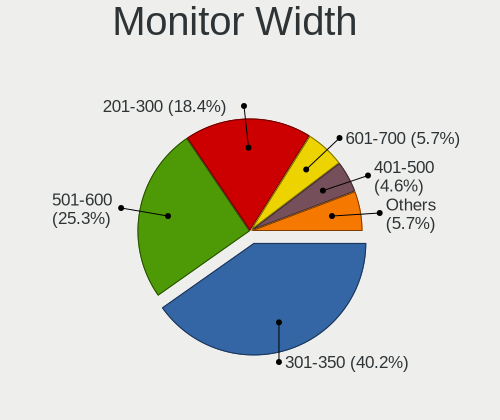
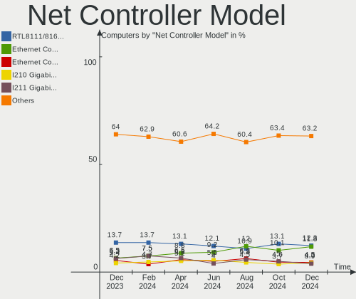
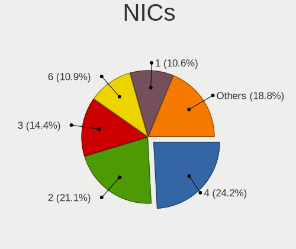
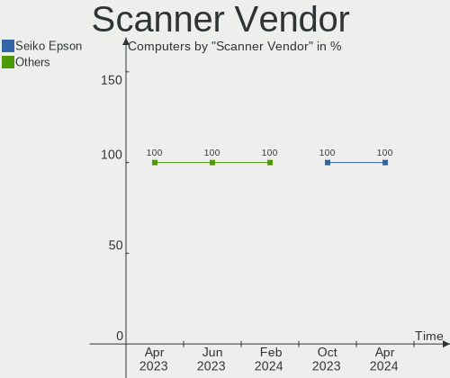
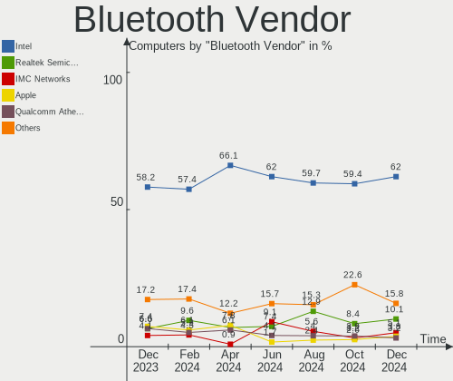

BSD Hardware Trends
-------------------

A project to identify most popular hardware characteristics and track their change
over time based on data collected by BSD users at https://BSD-Hardware.info.

Anyone can contribute to the study by uploading probes of their computers by
the [hw-probe](https://github.com/linuxhw/hw-probe/blob/master/INSTALL.BSD.md) tool:

    hw-probe -all -upload

This is a report for all computer types. See also reports for [desktops](/Desktop/README.md) and [notebooks](/Notebook/README.md).

Full-feature report is available here: https://bsd-hardware.info/?view=trends

OS-specific reports: [FreeBSD](/Dist/FreeBSD), [OPNsense](/Dist/OPNsense), [helloSystem](/Dist/helloSystem), [OpenBSD](/Dist/OpenBSD).

Period: Mar, 2021.

Contents
--------

- [ OS                       ](#os)
- [ OS Family                ](#os-family)
- [ Arch                     ](#arch)
- [ DE                       ](#de)
- [ Display Server           ](#display-server)
- [ Display Manager          ](#display-manager)
- [ OS Lang                  ](#os-lang)
- [ Boot Mode                ](#boot-mode)
- [ Filesystem               ](#filesystem)
- [ Part. scheme             ](#part-scheme)
- [ Country                  ](#country)
- [ City                     ](#city)
- [ Vendor                   ](#vendor)
- [ Model                    ](#model)
- [ Model Family             ](#model-family)
- [ MFG Year                 ](#mfg-year)
- [ Form Factor              ](#form-factor)
- [ Coreboot                 ](#coreboot)
- [ RAM Size                 ](#ram-size)
- [ RAM Used                 ](#ram-used)
- [ Has CD-ROM               ](#has-cd-rom)
- [ Total Drives             ](#total-drives)
- [ Has Ethernet             ](#has-ethernet)
- [ Has WiFi                 ](#has-wifi)
- [ Has Bluetooth            ](#has-bluetooth)
- [ Drive Vendor             ](#drive-vendor)
- [ Drive Model              ](#drive-model)
- [ HDD Vendor               ](#hdd-vendor)
- [ SSD Vendor               ](#ssd-vendor)
- [ Drive Kind               ](#drive-kind)
- [ Drive Connector          ](#drive-connector)
- [ Drive Size               ](#drive-size)
- [ Space Total              ](#space-total)
- [ Space Used               ](#space-used)
- [ Malfunc. Drives          ](#malfunc-drives)
- [ Malfunc. Drive Vendor    ](#malfunc-drive-vendor)
- [ Malfunc. HDD Vendor      ](#malfunc-hdd-vendor)
- [ Malfunc. Drive Kind      ](#malfunc-drive-kind)
- [ Failed Drives            ](#failed-drives)
- [ Failed Drive Vendor      ](#failed-drive-vendor)
- [ Drive Status             ](#drive-status)
- [ Storage Vendor           ](#storage-vendor)
- [ Storage Model            ](#storage-model)
- [ Storage Kind             ](#storage-kind)
- [ CPU Vendor               ](#cpu-vendor)
- [ CPU Model                ](#cpu-model)
- [ CPU Model Family         ](#cpu-model-family)
- [ CPU Cores                ](#cpu-cores)
- [ CPU Sockets              ](#cpu-sockets)
- [ CPU Threads              ](#cpu-threads)
- [ CPU Microarch            ](#cpu-microarch)
- [ GPU Vendor               ](#gpu-vendor)
- [ GPU Model                ](#gpu-model)
- [ GPU Combo                ](#gpu-combo)
- [ GPU Driver               ](#gpu-driver)
- [ GPU Memory               ](#gpu-memory)
- [ Monitor Vendor           ](#monitor-vendor)
- [ Monitor Model            ](#monitor-model)
- [ Monitor Resolution       ](#monitor-resolution)
- [ Monitor Diagonal         ](#monitor-diagonal)
- [ Monitor Width            ](#monitor-width)
- [ Aspect Ratio             ](#aspect-ratio)
- [ Monitor Area             ](#monitor-area)
- [ Pixel Density            ](#pixel-density)
- [ Multiple Monitors        ](#multiple-monitors)
- [ Net Controller Vendor    ](#net-controller-vendor)
- [ Net Controller Model     ](#net-controller-model)
- [ Wireless Vendor          ](#wireless-vendor)
- [ Wireless Model           ](#wireless-model)
- [ Ethernet Vendor          ](#ethernet-vendor)
- [ Ethernet Model           ](#ethernet-model)
- [ Net Controller Kind      ](#net-controller-kind)
- [ Used Controller          ](#used-controller)
- [ NICs                     ](#nics)
- [ IPv6                     ](#ipv6)
- [ Memory Vendor            ](#memory-vendor)
- [ Memory Model             ](#memory-model)
- [ Memory Kind              ](#memory-kind)
- [ Memory Form Factor       ](#memory-form-factor)
- [ Memory Size              ](#memory-size)
- [ Memory Speed             ](#memory-speed)
- [ Sound Vendor             ](#sound-vendor)
- [ Sound Model              ](#sound-model)
- [ Camera Vendor            ](#camera-vendor)
- [ Camera Model             ](#camera-model)
- [ Fingerprint Vendor       ](#fingerprint-vendor)
- [ Fingerprint Model        ](#fingerprint-model)
- [ Chipcard Vendor          ](#chipcard-vendor)
- [ Chipcard Model           ](#chipcard-model)
- [ Printer Vendor           ](#printer-vendor)
- [ Printer Model            ](#printer-model)
- [ Scanner Vendor           ](#scanner-vendor)
- [ Scanner Model            ](#scanner-model)
- [ Bluetooth Vendor         ](#bluetooth-vendor)
- [ Bluetooth Model          ](#bluetooth-model)
- [ Unsupported Devices      ](#unsupported-devices)
- [ Unsupported Device Types ](#unsupported-device-types)

OS
--

Installed operating systems

| Name                         | Computers | Percent |
|------------------------------|-----------|---------|
| OPNsense 21.1.3              | 201       | 35.58%  |
| OPNsense 21.1.2              | 85        | 15.04%  |
| helloSystem 0.5.0            | 37        | 6.55%   |
| FreeBSD 12.2-p4              | 35        | 6.19%   |
| helloSystem 0.4.0            | 28        | 4.96%   |
| OPNsense 21.1                | 17        | 3.01%   |
| NomadBSD 1.4                 | 17        | 3.01%   |
| OPNsense 21.1.4              | 12        | 2.12%   |
| GhostBSD 20.04.02            | 12        | 2.12%   |
| OpenBSD 6.9                  | 11        | 1.95%   |
| FreeBSD 12.2                 | 10        | 1.77%   |
| FreeBSD 14.0-CURRENT         | 9         | 1.59%   |
| FreeBSD 13.0-RC2             | 9         | 1.59%   |
| OpenBSD 6.8                  | 8         | 1.42%   |
| OPNsense 21.1.1              | 7         | 1.24%   |
| FreeBSD 13.0-STABLE          | 6         | 1.06%   |
| FreeBSD 13.0-RC1             | 6         | 1.06%   |
| HardenedBSD 12.2--HBSD       | 5         | 0.88%   |
| FreeBSD 12.2-p3              | 5         | 0.88%   |
| OPNsense 20.7.8              | 4         | 0.71%   |
| FreeBSD 12.2-STABLE          | 4         | 0.71%   |
| OPNsense 21.7                | 3         | 0.53%   |
| NomadBSD 1.4-RC1             | 3         | 0.53%   |
| NetBSD 9.1                   | 3         | 0.53%   |
| FreeBSD 13.0-RC3             | 3         | 0.53%   |
| FreeBSD 13.0-BETA4           | 3         | 0.53%   |
| FreeBSD 12.2-p5              | 3         | 0.53%   |
| FreeBSD 12.2-p2              | 3         | 0.53%   |
| FreeBSD 11.4-p8              | 2         | 0.35%   |
| pfSense 2.4.5                | 1         | 0.18%   |
| pfSense 12.2-STABLE          | 1         | 0.18%   |
| OPNsense 20.7.7              | 1         | 0.18%   |
| OPNsense 20.7.3              | 1         | 0.18%   |
| NomadBSD 1.0                 | 1         | 0.18%   |
| helloSystem 0.3.0            | 1         | 0.18%   |
| HardenedBSD 13.0-STABLE-HBSD | 1         | 0.18%   |
| FuryBSD 12.2-p3              | 1         | 0.18%   |
| FreeBSD 13.0-BETA3-p1        | 1         | 0.18%   |
| FreeBSD 12.1-p8              | 1         | 0.18%   |
| FreeBSD 12.1-p12-HBSD        | 1         | 0.18%   |
| FreeBSD 12.1-p10             | 1         | 0.18%   |
| FreeBSD 12.1                 | 1         | 0.18%   |
| ClonOS 12.2-p4               | 1         | 0.18%   |

OS Family
---------

OS without a version

| Name        | Computers | Percent |
|-------------|-----------|---------|
| OPNsense    | 331       | 58.58%  |
| FreeBSD     | 103       | 18.23%  |
| helloSystem | 66        | 11.68%  |
| NomadBSD    | 21        | 3.72%   |
| OpenBSD     | 19        | 3.36%   |
| GhostBSD    | 12        | 2.12%   |
| HardenedBSD | 6         | 1.06%   |
| NetBSD      | 3         | 0.53%   |
| pfSense     | 2         | 0.35%   |
| FuryBSD     | 1         | 0.18%   |
| ClonOS      | 1         | 0.18%   |

Arch
----

OS architecture (x86_64, i586, etc.)

| Name  | Computers | Percent |
|-------|-----------|---------|
| amd64 | 554       | 98.05%  |
| i386  | 6         | 1.06%   |
| arm64 | 4         | 0.71%   |
| arm   | 1         | 0.18%   |

DE
--

Desktop Environment

| Name          | Computers | Percent |
|---------------|-----------|---------|
| Console       | 369       | 65.31%  |
| helloDesktop  | 66        | 11.68%  |
| XFCE          | 23        | 4.07%   |
| Openbox       | 20        | 3.54%   |
| KDE5          | 19        | 3.36%   |
| fvwm          | 15        | 2.65%   |
| MATE          | 14        | 2.48%   |
| GNOME         | 12        | 2.12%   |
| TWM           | 8         | 1.42%   |
| i3            | 3         | 0.53%   |
| Cinnamon      | 3         | 0.53%   |
| LXDE          | 2         | 0.35%   |
| Lumina        | 2         | 0.35%   |
| Enlightenment | 2         | 0.35%   |
| dwm           | 2         | 0.35%   |
| AwesomeWM     | 2         | 0.35%   |
| Xfwm4         | 1         | 0.18%   |
| LXQt          | 1         | 0.18%   |
| CDE           | 1         | 0.18%   |

Display Server
--------------

X11 or Wayland

| Name    | Computers | Percent |
|---------|-----------|---------|
| Console | 374       | 66.19%  |
| X11     | 190       | 33.63%  |
| Wayland | 1         | 0.18%   |

Display Manager
---------------

SDDM, LightDM, etc.

| Name    | Computers | Percent |
|---------|-----------|---------|
| Console | 407       | 72.04%  |
| SLiM    | 107       | 18.94%  |
| LightDM | 19        | 3.36%   |
| SDDM    | 14        | 2.48%   |
| GDM     | 9         | 1.59%   |
| XDM     | 8         | 1.42%   |
| Ly      | 1         | 0.18%   |

OS Lang
-------

Language

| Lang             | Computers | Percent |
|------------------|-----------|---------|
| Unknown          | 396       | 70.09%  |
| en_US            | 100       | 17.7%   |
| C                | 24        | 4.25%   |
| ru_RU            | 8         | 1.42%   |
| it_IT            | 5         | 0.88%   |
| fr_FR            | 4         | 0.71%   |
| de_DE            | 4         | 0.71%   |
| zh_CN            | 2         | 0.35%   |
| uk_UA            | 2         | 0.35%   |
| tr_TR            | 2         | 0.35%   |
| sv_SE            | 2         | 0.35%   |
| sv_SE.US-ASCII   | 1         | 0.18%   |
| ru_RU.KOI8-R     | 1         | 0.18%   |
| pt_BR            | 1         | 0.18%   |
| pl_PL            | 1         | 0.18%   |
| ko_KR            | 1         | 0.18%   |
| es_ES            | 1         | 0.18%   |
| en_NZ            | 1         | 0.18%   |
| en_GB.US-ASCII   | 1         | 0.18%   |
| en_GB            | 1         | 0.18%   |
| en_EN            | 1         | 0.18%   |
| en_AU            | 1         | 0.18%   |
| el_GR            | 1         | 0.18%   |
| de_DE.ISO8859-15 | 1         | 0.18%   |
| de_DE.ISO8859-1  | 1         | 0.18%   |
| de_CH            | 1         | 0.18%   |
| cv_RU.US-ASCII   | 1         | 0.18%   |

Boot Mode
---------

EFI or BIOS

| Mode | Computers | Percent |
|------|-----------|---------|
| EFI  | 454       | 80.35%  |
| BIOS | 111       | 19.65%  |

Filesystem
----------

Type of filesystem

| Type | Computers | Percent |
|------|-----------|---------|
| Ufs  | 395       | 69.91%  |
| Zfs  | 151       | 26.73%  |
| Ffs  | 19        | 3.36%   |

Part. scheme
------------

Scheme of partitioning

| Type    | Computers | Percent |
|---------|-----------|---------|
| GPT     | 488       | 86.37%  |
| MBR     | 70        | 12.39%  |
| Unknown | 6         | 1.06%   |
| BSD     | 1         | 0.18%   |

Country
-------

Geographic location (country)

| Country      | Computers | Percent |
|--------------|-----------|---------|
| USA          | 129       | 22.83%  |
| Germany      | 94        | 16.64%  |
| Netherlands  | 30        | 5.31%   |
| France       | 28        | 4.96%   |
| UK           | 25        | 4.42%   |
| Russia       | 24        | 4.25%   |
| Canada       | 23        | 4.07%   |
| Brazil       | 20        | 3.54%   |
| Italy        | 17        | 3.01%   |
| Sweden       | 15        | 2.65%   |
| Austria      | 15        | 2.65%   |
| China        | 12        | 2.12%   |
| Spain        | 11        | 1.95%   |
| Switzerland  | 10        | 1.77%   |
| Australia    | 10        | 1.77%   |
| Ukraine      | 8         | 1.42%   |
| Poland       | 8         | 1.42%   |
| Turkey       | 7         | 1.24%   |
| Indonesia    | 5         | 0.88%   |
| Czechia      | 5         | 0.88%   |
| Romania      | 4         | 0.71%   |
| Portugal     | 4         | 0.71%   |
| India        | 4         | 0.71%   |
| Belgium      | 4         | 0.71%   |
| South Africa | 3         | 0.53%   |
| Norway       | 3         | 0.53%   |
| New Zealand  | 3         | 0.53%   |
| Japan        | 3         | 0.53%   |
| Greece       | 3         | 0.53%   |
| Egypt        | 3         | 0.53%   |
| Bulgaria     | 3         | 0.53%   |
| Argentina    | 3         | 0.53%   |
| Thailand     | 2         | 0.35%   |
| Taiwan       | 2         | 0.35%   |
| South Korea  | 2         | 0.35%   |
| Slovakia     | 2         | 0.35%   |
| Mexico       | 2         | 0.35%   |
| Latvia       | 2         | 0.35%   |
| Finland      | 2         | 0.35%   |
| Denmark      | 2         | 0.35%   |
| Singapore    | 1         | 0.18%   |
| Saudi Arabia | 1         | 0.18%   |
| Philippines  | 1         | 0.18%   |
| Pakistan     | 1         | 0.18%   |
| Oman         | 1         | 0.18%   |
| Moldova      | 1         | 0.18%   |
| Luxembourg   | 1         | 0.18%   |
| Hungary      | 1         | 0.18%   |
| Estonia      | 1         | 0.18%   |
| Cyprus       | 1         | 0.18%   |
| Costa Rica   | 1         | 0.18%   |
| Colombia     | 1         | 0.18%   |
| Belarus      | 1         | 0.18%   |

City
----

Geographic location (city)

| City                     | Computers | Percent |
|--------------------------|-----------|---------|
| Vienna                   | 8         | 1.42%   |
| Moscow                   | 8         | 1.42%   |
| Berlin                   | 7         | 1.24%   |
| Paris                    | 6         | 1.06%   |
| Munich                   | 6         | 1.06%   |
| Chicago                  | 6         | 1.06%   |
| Milan                    | 5         | 0.88%   |
| Hamburg                  | 5         | 0.88%   |
| Brooklyn                 | 5         | 0.88%   |
| Prague                   | 4         | 0.71%   |
| Istanbul                 | 4         | 0.71%   |
| Dallas                   | 4         | 0.71%   |
| Cologne                  | 4         | 0.71%   |
| Washington               | 3         | 0.53%   |
| Victoria                 | 3         | 0.53%   |
| Ulyanovsk                | 3         | 0.53%   |
| Stockholm                | 3         | 0.53%   |
| Redmond                  | 3         | 0.53%   |
| Portland                 | 3         | 0.53%   |
| Perth                    | 3         | 0.53%   |
| Markt Indersdorf         | 3         | 0.53%   |
| Malmo                    | 3         | 0.53%   |
| Las Vegas                | 3         | 0.53%   |
| Jakarta                  | 3         | 0.53%   |
| Franconville             | 3         | 0.53%   |
| Columbus                 | 3         | 0.53%   |
| Barneveld                | 3         | 0.53%   |
| Athens                   | 3         | 0.53%   |
| Amsterdam                | 3         | 0.53%   |
| Zwingenberg              | 2         | 0.35%   |
| Zurich                   | 2         | 0.35%   |
| Yekaterinburg            | 2         | 0.35%   |
| Villeneuve-Saint-Georges | 2         | 0.35%   |
| Toronto                  | 2         | 0.35%   |
| São Paulo               | 2         | 0.35%   |
| São José dos Campos    | 2         | 0.35%   |
| Seattle                  | 2         | 0.35%   |
| Sandhausen               | 2         | 0.35%   |
| Salt Lake City           | 2         | 0.35%   |
| Salem                    | 2         | 0.35%   |
| Rousse                   | 2         | 0.35%   |
| Riga                     | 2         | 0.35%   |
| Melbourne                | 2         | 0.35%   |
| Mannheim                 | 2         | 0.35%   |
| Manaus                   | 2         | 0.35%   |
| Lübeck                  | 2         | 0.35%   |
| Ludwigshafen am Rhein    | 2         | 0.35%   |
| Hazel Green              | 2         | 0.35%   |
| Hanover                  | 2         | 0.35%   |
| Gordola                  | 2         | 0.35%   |
| Glasgow                  | 2         | 0.35%   |
| Gibraleón               | 2         | 0.35%   |
| Gettorf                  | 2         | 0.35%   |
| Frisco                   | 2         | 0.35%   |
| Fort Lauderdale          | 2         | 0.35%   |
| Falkenstein              | 2         | 0.35%   |
| Devizes                  | 2         | 0.35%   |
| Denver                   | 2         | 0.35%   |
| Colorado Springs         | 2         | 0.35%   |
| Christchurch             | 2         | 0.35%   |

Vendor
------

Motherboard manufacturer

| Name                       | Computers | Percent |
|----------------------------|-----------|---------|
| Dell                       | 78        | 13.81%  |
| Lenovo                     | 54        | 9.56%   |
| Hewlett-Packard            | 54        | 9.56%   |
| ASUSTek Computer           | 53        | 9.38%   |
| Unknown                    | 45        | 7.96%   |
| Supermicro                 | 26        | 4.6%    |
| Gigabyte Technology        | 25        | 4.42%   |
| Intel                      | 23        | 4.07%   |
| ASRock                     | 20        | 3.54%   |
| PC Engines                 | 19        | 3.36%   |
| Protectli                  | 15        | 2.65%   |
| MSI                        | 15        | 2.65%   |
| AMI                        | 15        | 2.65%   |
| Fujitsu                    | 10        | 1.77%   |
| Shuttle                    | 8         | 1.42%   |
| Apple                      | 8         | 1.42%   |
| Acer                       | 8         | 1.42%   |
| ZOTAC                      | 7         | 1.24%   |
| Samsung Electronics        | 5         | 0.88%   |
| Toshiba                    | 4         | 0.71%   |
| Sophos                     | 4         | 0.71%   |
| HARDKERNEL                 | 4         | 0.71%   |
| Thomas-Krenn.AG            | 3         | 0.53%   |
| IBM                        | 3         | 0.53%   |
| Deciso                     | 3         | 0.53%   |
| Compulab                   | 3         | 0.53%   |
| BESSTAR Tech               | 3         | 0.53%   |
| TUXEDO                     | 2         | 0.35%   |
| ShenZhen MinWin Technology | 2         | 0.35%   |
| SeeedStudio                | 2         | 0.35%   |
| Pegatron                   | 2         | 0.35%   |
| Packard Bell               | 2         | 0.35%   |
| Notebook                   | 2         | 0.35%   |
| HPE                        | 2         | 0.35%   |
| ECS                        | 2         | 0.35%   |
| Clevo                      | 2         | 0.35%   |
| AWOW                       | 2         | 0.35%   |
| ASRockRack                 | 2         | 0.35%   |
| VeryPC                     | 1         | 0.18%   |
| TYAN Computer              | 1         | 0.18%   |
| SECO                       | 1         | 0.18%   |
| Raspberry Pi Foundation    | 1         | 0.18%   |
| Quanmax                    | 1         | 0.18%   |
| pine64                     | 1         | 0.18%   |
| Panasonic                  | 1         | 0.18%   |
| OEM                        | 1         | 0.18%   |
| NU941                      | 1         | 0.18%   |
| NF541                      | 1         | 0.18%   |
| MiTAC                      | 1         | 0.18%   |
| Medion                     | 1         | 0.18%   |
| Kontron                    | 1         | 0.18%   |
| Inventec                   | 1         | 0.18%   |
| iEi                        | 1         | 0.18%   |
| HUAWEI                     | 1         | 0.18%   |
| Huanan                     | 1         | 0.18%   |
| Gateway                    | 1         | 0.18%   |
| Foxconn                    | 1         | 0.18%   |
| DFI                        | 1         | 0.18%   |
| Biostar                    | 1         | 0.18%   |
| Barracuda Networks         | 1         | 0.18%   |

Model
-----

Motherboard model

| Name                                 | Computers | Percent |
|--------------------------------------|-----------|---------|
| Unknown                              | 46        | 8.14%   |
| Supermicro Super Server              | 12        | 2.12%   |
| AMI Aptio CRB                        | 12        | 2.12%   |
| Protectli FW4B                       | 8         | 1.42%   |
| Intel Q3XXG4-P V1.0                  | 8         | 1.42%   |
| PC Engines apu4                      | 6         | 1.06%   |
| PC Engines apu2                      | 6         | 1.06%   |
| Dell OptiPlex 3020                   | 5         | 0.88%   |
| ASUS All Series                      | 5         | 0.88%   |
| PC Engines APU                       | 4         | 0.71%   |
| HARDKERNEL ODROID-H2                 | 4         | 0.71%   |
| Dell OptiPlex 9020                   | 4         | 0.71%   |
| Thomas-Krenn.AG LES network+         | 3         | 0.53%   |
| Protectli FW6                        | 3         | 0.53%   |
| HP Compaq Elite 8300 SFF             | 3         | 0.53%   |
| Dell PowerEdge R610                  | 3         | 0.53%   |
| Dell PowerEdge R210 II               | 3         | 0.53%   |
| Dell OptiPlex 380                    | 3         | 0.53%   |
| Compulab fitlet2                     | 3         | 0.53%   |
| ASUS P5Q-E                           | 3         | 0.53%   |
| Supermicro X9SCL/X9SCM               | 2         | 0.35%   |
| Supermicro A1SAi                     | 2         | 0.35%   |
| Sophos UTM                           | 2         | 0.35%   |
| Sophos SG                            | 2         | 0.35%   |
| Shuttle DS10U                        | 2         | 0.35%   |
| ShenZhen MinWin MW-NANO-APL-4L       | 2         | 0.35%   |
| SeeedStudio ODYSSEY-X86J4105         | 2         | 0.35%   |
| Samsung N145P/N250P/N260P            | 2         | 0.35%   |
| Protectli FW1                        | 2         | 0.35%   |
| PC Engines APU3                      | 2         | 0.35%   |
| MSI MS-7693                          | 2         | 0.35%   |
| Lenovo ThinkCentre M90n-1 11AHS0B200 | 2         | 0.35%   |
| HPE ProLiant MicroServer Gen10       | 2         | 0.35%   |
| HP ProLiant DL360 G6                 | 2         | 0.35%   |
| HP ProDesk 600 G1 SFF                | 2         | 0.35%   |
| HP Laptop 15-da0xxx                  | 2         | 0.35%   |
| HP EliteDesk 800 G1 SFF              | 2         | 0.35%   |
| Gigabyte 970A-DS3P                   | 2         | 0.35%   |
| Fujitsu FUTRO S920                   | 2         | 0.35%   |
| Dell OptiPlex 790                    | 2         | 0.35%   |
| Dell OptiPlex 7020                   | 2         | 0.35%   |
| Dell OptiPlex 7010                   | 2         | 0.35%   |
| Dell OptiPlex 5040                   | 2         | 0.35%   |
| Dell Inspiron 7520                   | 2         | 0.35%   |
| Deciso Netboard A20                  | 2         | 0.35%   |
| BESSTAR Tech DMAF5                   | 2         | 0.35%   |
| AWOW PC BOX                          | 2         | 0.35%   |
| ASUS P8H61-M LE/USB3                 | 2         | 0.35%   |
| ASUS H110M-K                         | 2         | 0.35%   |
| ASRock Q1900M                        | 2         | 0.35%   |
| ASRock B75M                          | 2         | 0.35%   |
| Apple MacBookPro5,5                  | 2         | 0.35%   |
| Acer Veriton M460                    | 2         | 0.35%   |
| ZOTAC ZBOX-MI640/MI660/MI620NANO     | 1         | 0.18%   |
| ZOTAC ZBOX-MI522NANO/MI542NANO       | 1         | 0.18%   |
| ZOTAC ZBOX-ID88/ID89/ID90            | 1         | 0.18%   |
| ZOTAC ZBOX-CI527/CI547NANO           | 1         | 0.18%   |
| ZOTAC ZBOX-CI527/CI547               | 1         | 0.18%   |
| ZOTAC ZBOX-CI341                     | 1         | 0.18%   |
| ZOTAC ZBOX-CI329NANO                 | 1         | 0.18%   |

Model Family
------------

Motherboard model prefix

| Name                           | Computers | Percent |
|--------------------------------|-----------|---------|
| Unknown                        | 46        | 8.14%   |
| Lenovo ThinkPad                | 35        | 6.19%   |
| Dell OptiPlex                  | 29        | 5.13%   |
| Dell PowerEdge                 | 18        | 3.19%   |
| Supermicro Super               | 12        | 2.12%   |
| Dell Latitude                  | 12        | 2.12%   |
| AMI Aptio                      | 12        | 2.12%   |
| Lenovo ThinkCentre             | 11        | 1.95%   |
| HP ProLiant                    | 11        | 1.95%   |
| Dell Inspiron                  | 10        | 1.77%   |
| Protectli FW4B                 | 8         | 1.42%   |
| Intel Q3XXG4-P                 | 8         | 1.42%   |
| HP EliteDesk                   | 7         | 1.24%   |
| HP Compaq                      | 7         | 1.24%   |
| PC Engines apu4                | 6         | 1.06%   |
| PC Engines apu2                | 6         | 1.06%   |
| HP ProDesk                     | 5         | 0.88%   |
| HP Pavilion                    | 5         | 0.88%   |
| Dell Precision                 | 5         | 0.88%   |
| ASUS All                       | 5         | 0.88%   |
| Acer Aspire                    | 5         | 0.88%   |
| Toshiba Satellite              | 4         | 0.71%   |
| PC Engines APU                 | 4         | 0.71%   |
| Lenovo IdeaPad                 | 4         | 0.71%   |
| HP ProBook                     | 4         | 0.71%   |
| HP EliteBook                   | 4         | 0.71%   |
| HARDKERNEL ODROID-H2           | 4         | 0.71%   |
| ASUS PRIME                     | 4         | 0.71%   |
| ASUS P8H61-M                   | 4         | 0.71%   |
| Thomas-Krenn.AG LES            | 3         | 0.53%   |
| Protectli FW6                  | 3         | 0.53%   |
| IBM System                     | 3         | 0.53%   |
| HP Laptop                      | 3         | 0.53%   |
| Fujitsu LIFEBOOK               | 3         | 0.53%   |
| Compulab fitlet2               | 3         | 0.53%   |
| ASUS P5Q-E                     | 3         | 0.53%   |
| ZOTAC ZBOX-CI527               | 2         | 0.35%   |
| Supermicro X9SCL               | 2         | 0.35%   |
| Supermicro A1SAi               | 2         | 0.35%   |
| Supermicro 1HE                 | 2         | 0.35%   |
| Sophos UTM                     | 2         | 0.35%   |
| Sophos SG                      | 2         | 0.35%   |
| Shuttle DS10U                  | 2         | 0.35%   |
| ShenZhen MinWin MW-NANO-APL-4L | 2         | 0.35%   |
| SeeedStudio ODYSSEY-X86J4105   | 2         | 0.35%   |
| Samsung N145P                  | 2         | 0.35%   |
| Protectli FW1                  | 2         | 0.35%   |
| PC Engines APU3                | 2         | 0.35%   |
| MSI MS-7693                    | 2         | 0.35%   |
| HPE ProLiant                   | 2         | 0.35%   |
| HP t620                        | 2         | 0.35%   |
| HP 255                         | 2         | 0.35%   |
| Gigabyte 970A-DS3P             | 2         | 0.35%   |
| Fujitsu PRIMERGY               | 2         | 0.35%   |
| Fujitsu FUTRO                  | 2         | 0.35%   |
| Dell Vostro                    | 2         | 0.35%   |
| Deciso Netboard                | 2         | 0.35%   |
| BESSTAR Tech DMAF5             | 2         | 0.35%   |
| AWOW PC                        | 2         | 0.35%   |
| ASUS ROG                       | 2         | 0.35%   |

MFG Year
--------

Motherboard manufacture year

| Year    | Computers | Percent |
|---------|-----------|---------|
| 2020    | 114       | 20.18%  |
| 2019    | 91        | 16.11%  |
| 2018    | 73        | 12.92%  |
| 2014    | 37        | 6.55%   |
| 2017    | 33        | 5.84%   |
| 2012    | 30        | 5.31%   |
| 2016    | 28        | 4.96%   |
| 2013    | 25        | 4.42%   |
| 2015    | 23        | 4.07%   |
| 2010    | 23        | 4.07%   |
| 2021    | 22        | 3.89%   |
| 2011    | 20        | 3.54%   |
| 2009    | 20        | 3.54%   |
| 2008    | 12        | 2.12%   |
| 2007    | 6         | 1.06%   |
| Unknown | 4         | 0.71%   |
| 2006    | 2         | 0.35%   |
| 2005    | 1         | 0.18%   |
| 2002    | 1         | 0.18%   |

Form Factor
-----------

Physical design of the computer

| Name        | Computers | Percent |
|-------------|-----------|---------|
| Desktop     | 328       | 58.05%  |
| Notebook    | 135       | 23.89%  |
| Server      | 56        | 9.91%   |
| Mini pc     | 37        | 6.55%   |
| Firewall    | 6         | 1.06%   |
| All in one  | 2         | 0.35%   |
| Convertible | 1         | 0.18%   |

Coreboot
--------

Have coreboot on board

| Used | Computers | Percent |
|------|-----------|---------|
| No   | 541       | 95.75%  |
| Yes  | 24        | 4.25%   |

RAM Size
--------

Total RAM memory

| Size in GB      | Computers | Percent |
|-----------------|-----------|---------|
| 8.01-16.0       | 195       | 34.51%  |
| 4.01-8.0        | 143       | 25.31%  |
| 16.01-24.0      | 125       | 22.12%  |
| 32.01-64.0      | 42        | 7.43%   |
| 2.01-3.0        | 18        | 3.19%   |
| 64.01-256.0     | 17        | 3.01%   |
| 3.01-4.0        | 9         | 1.59%   |
| 24.01-32.0      | 7         | 1.24%   |
| 1.01-2.0        | 3         | 0.53%   |
| 0.51-1.0        | 3         | 0.53%   |
| 0.01-0.5        | 2         | 0.35%   |
| More than 256.0 | 1         | 0.18%   |

RAM Used
--------

Used RAM memory

| Used GB     | Computers | Percent |
|-------------|-----------|---------|
| 0.01-0.5    | 309       | 54.69%  |
| 0.51-1.0    | 161       | 28.5%   |
| 1.01-2.0    | 42        | 7.43%   |
| 4.01-8.0    | 12        | 2.12%   |
| 8.01-16.0   | 11        | 1.95%   |
| 2.01-3.0    | 9         | 1.59%   |
| 3.01-4.0    | 8         | 1.42%   |
| 32.01-64.0  | 3         | 0.53%   |
| Unknown     | 3         | 0.53%   |
| 24.01-32.0  | 2         | 0.35%   |
| 16.01-24.0  | 2         | 0.35%   |
| 0           | 2         | 0.35%   |
| 64.01-256.0 | 1         | 0.18%   |

Has CD-ROM
----------

Has CD-ROM on board

| Presented | Computers | Percent |
|-----------|-----------|---------|
| No        | 440       | 77.88%  |
| Yes       | 125       | 22.12%  |

Total Drives
------------

Number of drives on board

| Drives | Computers | Percent |
|--------|-----------|---------|
| 1      | 385       | 68.14%  |
| 2      | 83        | 14.69%  |
| 0      | 53        | 9.38%   |
| 3      | 22        | 3.89%   |
| 4      | 13        | 2.3%    |
| 5      | 4         | 0.71%   |
| 6      | 2         | 0.35%   |
| 12     | 1         | 0.18%   |
| 8      | 1         | 0.18%   |
| 7      | 1         | 0.18%   |

Has Ethernet
------------

Has Ethernet on board

| Presented | Computers | Percent |
|-----------|-----------|---------|
| Yes       | 548       | 96.99%  |
| No        | 17        | 3.01%   |

Has WiFi
--------

Has WiFi module

| Presented | Computers | Percent |
|-----------|-----------|---------|
| No        | 349       | 61.77%  |
| Yes       | 216       | 38.23%  |

Has Bluetooth
-------------

Has Bluetooth module

| Presented | Computers | Percent |
|-----------|-----------|---------|
| No        | 427       | 75.58%  |
| Yes       | 138       | 24.42%  |

Drive Vendor
------------

Hard drive vendors

| Vendor              | Computers | Drives | Percent |
|---------------------|-----------|--------|---------|
| Samsung Electronics | 101       | 113    | 16.32%  |
| WDC                 | 87        | 123    | 14.05%  |
| Seagate             | 66        | 81     | 10.66%  |
| Kingston            | 49        | 51     | 7.92%   |
| Intel               | 32        | 37     | 5.17%   |
| SanDisk             | 31        | 32     | 5.01%   |
| Toshiba             | 30        | 34     | 4.85%   |
| Crucial             | 29        | 30     | 4.68%   |
| Transcend           | 18        | 18     | 2.91%   |
| Hitachi             | 17        | 19     | 2.75%   |
| Phison              | 15        | 15     | 2.42%   |
| Hoodisk             | 13        | 13     | 2.1%    |
| Hewlett-Packard     | 11        | 18     | 1.78%   |
| A-DATA Technology   | 10        | 12     | 1.62%   |
| Micron Technology   | 9         | 9      | 1.45%   |
| HGST                | 8         | 12     | 1.29%   |
| OCZ                 | 6         | 6      | 0.97%   |
| SK Hynix            | 5         | 5      | 0.81%   |
| Apacer              | 5         | 5      | 0.81%   |
| SPCC                | 4         | 4      | 0.65%   |
| FORESEE             | 4         | 4      | 0.65%   |
| China               | 4         | 4      | 0.65%   |
| Apple               | 4         | 5      | 0.65%   |
| PNY                 | 3         | 10     | 0.48%   |
| NVMe                | 3         | 3      | 0.48%   |
| MAXTOR              | 3         | 3      | 0.48%   |
| LITEON              | 3         | 3      | 0.48%   |
| KingSpec            | 3         | 3      | 0.48%   |
| Gigabyte Technology | 3         | 4      | 0.48%   |
| Dogfish             | 3         | 3      | 0.48%   |
| Corsair             | 3         | 3      | 0.48%   |
| PLEXTOR             | 2         | 2      | 0.32%   |
| OWC                 | 2         | 2      | 0.32%   |
| Mushkin             | 2         | 2      | 0.32%   |
| Lenovo              | 2         | 4      | 0.32%   |
| Kston               | 2         | 2      | 0.32%   |
| KingDian            | 2         | 2      | 0.32%   |
| Intenso             | 2         | 2      | 0.32%   |
| Innodisk            | 2         | 2      | 0.32%   |
| HPE                 | 2         | 2      | 0.32%   |
| DREVO               | 2         | 2      | 0.32%   |
| BIWIN               | 2         | 2      | 0.32%   |
| ZTC                 | 1         | 1      | 0.16%   |
| Zheino              | 1         | 1      | 0.16%   |
| V-GeN               | 1         | 1      | 0.16%   |
| Union Memory        | 1         | 1      | 0.16%   |
| TCSUNBOW            | 1         | 1      | 0.16%   |
| SMART               | 1         | 1      | 0.16%   |
| Patriot             | 1         | 1      | 0.16%   |
| OPENBSD             | 1         | 1      | 0.16%   |
| LSILOGIC            | 1         | 1      | 0.16%   |
| LEXAR               | 1         | 1      | 0.16%   |
| INDMEM              | 1         | 1      | 0.16%   |
| GOODRAM             | 1         | 1      | 0.16%   |
| Fujitsu             | 1         | 1      | 0.16%   |
| EMTEC               | 1         | 1      | 0.16%   |
| AMD                 | 1         | 1      | 0.16%   |

Drive Model
-----------

Hard drive models

| Model                              | Computers | Percent |
|------------------------------------|-----------|---------|
| Phison SATA SSD 16GB               | 12        | 1.81%   |
| Kingston SA400S37240G 240GB        | 12        | 1.81%   |
| Seagate ST500DM002-1BD142 500GB    | 7         | 1.06%   |
| Kingston SA400S37120G 120GB        | 7         | 1.06%   |
| Crucial CT120BX500SSD1 120GB       | 7         | 1.06%   |
| Kingston SUV500MS120G 120GB        | 6         | 0.91%   |
| HP RAID 1(1+0) 73GB                | 6         | 0.91%   |
| SanDisk SDSSDA240G 240GB           | 5         | 0.76%   |
| Samsung SSD 860 EVO 250GB          | 5         | 0.76%   |
| Samsung SSD 850 EVO 250GB          | 5         | 0.76%   |
| WDC WDS120G2G0A-00JH30 120GB       | 4         | 0.6%    |
| Seagate ST4000DM000-1F2168 4TB     | 4         | 0.6%    |
| Samsung SSD 960 EVO 250GB          | 4         | 0.6%    |
| Samsung SSD 860 EVO 500GB          | 4         | 0.6%    |
| Samsung SSD 850 EVO 500GB          | 4         | 0.6%    |
| Kingston SUV500MS240G 240GB        | 4         | 0.6%    |
| Intel SSDSA2CT040G3 40GB           | 4         | 0.6%    |
| Hoodisk SSD 32GB                   | 4         | 0.6%    |
| Crucial CT240BX500SSD1 240GB       | 4         | 0.6%    |
| WDC WDS120G2G0B-00EPW0 120GB       | 3         | 0.45%   |
| Transcend TS64GMSA230S 64GB        | 3         | 0.45%   |
| Transcend TS128GMSA230S 128GB      | 3         | 0.45%   |
| SPCC Solid State Disk 128GB        | 3         | 0.45%   |
| Seagate ST1000LM024 HN-M101MBB 1TB | 3         | 0.45%   |
| Seagate ST1000DM010-2EP102 1TB     | 3         | 0.45%   |
| Seagate ST1000DM003-1SB102 1TB     | 3         | 0.45%   |
| Samsung SSD 970 EVO Plus 250GB     | 3         | 0.45%   |
| Samsung SSD 860 QVO 1TB            | 3         | 0.45%   |
| Samsung SSD 860 PRO 256GB          | 3         | 0.45%   |
| Samsung SSD 850 PRO 512GB          | 3         | 0.45%   |
| Samsung SSD 840 EVO 250GB          | 3         | 0.45%   |
| Micron 1100 SATA 256GB             | 3         | 0.45%   |
| Kingston SV300S37A120G 120GB       | 3         | 0.45%   |
| Intel SSDSC2KG240G8 240GB          | 3         | 0.45%   |
| Hoodisk SSD 64GB                   | 3         | 0.45%   |
| Hoodisk SSD 128GB                  | 3         | 0.45%   |
| HGST HTS725050A7E630 500GB         | 3         | 0.45%   |
| FORESEE 128GB SSD                  | 3         | 0.45%   |
| Apacer 16GB SATA Flash Drive       | 3         | 0.45%   |
| A-DATA SU650 240GB                 | 3         | 0.45%   |
| WDC WDS100T2B0A-00SM50 1TB         | 2         | 0.3%    |
| WDC WD80EFAX-68KNBN0 8TB           | 2         | 0.3%    |
| WDC WD60EFRX-68L0BN1 6TB           | 2         | 0.3%    |
| WDC WD1600AAJS-22L7A0 160GB        | 2         | 0.3%    |
| WDC WD10JPVX-75JC3T0 1TB           | 2         | 0.3%    |
| WDC WD10EZEX-08WN4A0 1TB           | 2         | 0.3%    |
| WDC WD10EZEX-00RKKA0 1TB           | 2         | 0.3%    |
| Transcend TS256GMTS952T2 256GB     | 2         | 0.3%    |
| Toshiba TR200 240GB                | 2         | 0.3%    |
| Toshiba MQ01ABD100 1TB             | 2         | 0.3%    |
| Toshiba DT01ACA100 1TB             | 2         | 0.3%    |
| SK Hynix BC511 NVMe 512GB          | 2         | 0.3%    |
| Seagate ST9500325AS 500GB          | 2         | 0.3%    |
| Seagate ST250DM000-1BD141 250GB    | 2         | 0.3%    |
| Seagate ST2000LM007-1R8174 2TB     | 2         | 0.3%    |
| Seagate ST1000LM049-2GH172 1TB     | 2         | 0.3%    |
| Seagate ST1000LM048-2E7172 1TB     | 2         | 0.3%    |
| Seagate ST1000LM035-1RK172 1TB     | 2         | 0.3%    |
| Seagate ST1000DM003-1CH162 1TB     | 2         | 0.3%    |
| SanDisk SSD PLUS 240 GB            | 2         | 0.3%    |

HDD Vendor
----------

Hard disk drive vendors

| Vendor              | Computers | Drives | Percent |
|---------------------|-----------|--------|---------|
| WDC                 | 67        | 95     | 32.68%  |
| Seagate             | 62        | 76     | 30.24%  |
| Toshiba             | 17        | 20     | 8.29%   |
| Hitachi             | 17        | 19     | 8.29%   |
| Samsung Electronics | 11        | 12     | 5.37%   |
| Hewlett-Packard     | 10        | 17     | 4.88%   |
| HGST                | 8         | 12     | 3.9%    |
| Maxtor              | 3         | 3      | 1.46%   |
| Apple               | 3         | 4      | 1.46%   |
| NVMe                | 2         | 2      | 0.98%   |
| Lenovo              | 2         | 4      | 0.98%   |
| OPENBSD             | 1         | 1      | 0.49%   |
| LSILOGIC            | 1         | 1      | 0.49%   |
| Fujitsu             | 1         | 1      | 0.49%   |

SSD Vendor
----------

Solid state drive vendors

| Vendor              | Computers | Drives | Percent |
|---------------------|-----------|--------|---------|
| Samsung Electronics | 64        | 73     | 18.08%  |
| Kingston            | 44        | 46     | 12.43%  |
| SanDisk             | 31        | 32     | 8.76%   |
| Crucial             | 27        | 28     | 7.63%   |
| Intel               | 26        | 31     | 7.34%   |
| Transcend           | 18        | 18     | 5.08%   |
| WDC                 | 15        | 19     | 4.24%   |
| Hoodisk             | 13        | 13     | 3.67%   |
| Phison              | 12        | 12     | 3.39%   |
| Toshiba             | 10        | 10     | 2.82%   |
| Micron Technology   | 9         | 9      | 2.54%   |
| A-DATA Technology   | 8         | 10     | 2.26%   |
| OCZ                 | 6         | 6      | 1.69%   |
| Apacer              | 5         | 5      | 1.41%   |
| SPCC                | 4         | 4      | 1.13%   |
| FORESEE             | 4         | 4      | 1.13%   |
| China               | 4         | 4      | 1.13%   |
| SK Hynix            | 3         | 3      | 0.85%   |
| Seagate             | 3         | 4      | 0.85%   |
| PNY                 | 3         | 8      | 0.85%   |
| LITEON              | 3         | 3      | 0.85%   |
| KingSpec            | 3         | 3      | 0.85%   |
| Dogfish             | 3         | 3      | 0.85%   |
| PLEXTOR             | 2         | 2      | 0.56%   |
| OWC                 | 2         | 2      | 0.56%   |
| Mushkin             | 2         | 2      | 0.56%   |
| Kston               | 2         | 2      | 0.56%   |
| KingDian            | 2         | 2      | 0.56%   |
| Intenso             | 2         | 2      | 0.56%   |
| Innodisk            | 2         | 2      | 0.56%   |
| HPE                 | 2         | 2      | 0.56%   |
| Gigabyte Technology | 2         | 2      | 0.56%   |
| DREVO               | 2         | 2      | 0.56%   |
| Corsair             | 2         | 2      | 0.56%   |
| BIWIN               | 2         | 2      | 0.56%   |
| ZTC                 | 1         | 1      | 0.28%   |
| Zheino              | 1         | 1      | 0.28%   |
| V-GeN               | 1         | 1      | 0.28%   |
| TCSUNBOW            | 1         | 1      | 0.28%   |
| SMART               | 1         | 1      | 0.28%   |
| Patriot             | 1         | 1      | 0.28%   |
| NVMe                | 1         | 1      | 0.28%   |
| LEXAR               | 1         | 1      | 0.28%   |
| INDMEM              | 1         | 1      | 0.28%   |
| GOODRAM             | 1         | 1      | 0.28%   |
| Apple               | 1         | 1      | 0.28%   |
| AMD                 | 1         | 1      | 0.28%   |

Drive Kind
----------

HDD or SSD

| Kind | Computers | Drives | Percent |
|------|-----------|--------|---------|
| SSD  | 335       | 384    | 58.57%  |
| HDD  | 171       | 267    | 29.9%   |
| NVMe | 66        | 70     | 11.54%  |

Drive Connector
---------------

SATA, SAS, NVMe, etc.

| Type | Computers | Drives | Percent |
|------|-----------|--------|---------|
| SATA | 469       | 651    | 87.66%  |
| NVMe | 66        | 70     | 12.34%  |

Drive Size
----------

Size of hard drive

| Size in TB | Computers | Drives | Percent |
|------------|-----------|--------|---------|
| 0.01-0.5   | 406       | 474    | 77.48%  |
| 0.51-1.0   | 66        | 91     | 12.6%   |
| 1.01-2.0   | 25        | 32     | 4.77%   |
| 3.01-4.0   | 10        | 18     | 1.91%   |
| 4.01-10.0  | 9         | 23     | 1.72%   |
| 2.01-3.0   | 7         | 11     | 1.34%   |
| 10.01-20.0 | 1         | 2      | 0.19%   |

Space Total
-----------

Amount of disk space available on the file system

| Size in GB     | Computers | Percent |
|----------------|-----------|---------|
| 101-250        | 201       | 35.58%  |
| 1-20           | 109       | 19.29%  |
| 251-500        | 88        | 15.58%  |
| 21-50          | 62        | 10.97%  |
| 51-100         | 57        | 10.09%  |
| 501-1000       | 26        | 4.6%    |
| 1001-2000      | 14        | 2.48%   |
| More than 3000 | 3         | 0.53%   |
| 2001-3000      | 3         | 0.53%   |
| Unknown        | 2         | 0.35%   |

Space Used
----------

Amount of used disk space

| Used GB   | Computers | Percent |
|-----------|-----------|---------|
| 1-20      | 504       | 89.2%   |
| 21-50     | 28        | 4.96%   |
| 51-100    | 13        | 2.3%    |
| 101-250   | 10        | 1.77%   |
| 251-500   | 4         | 0.71%   |
| 501-1000  | 3         | 0.53%   |
| Unknown   | 2         | 0.35%   |
| 2001-3000 | 1         | 0.18%   |

Malfunc. Drives
---------------

Drive models with a malfunction

| Model                                            | Computers | Drives | Percent |
|--------------------------------------------------|-----------|--------|---------|
| Seagate ST500DM002-1BD142 500GB                  | 3         | 3      | 3.09%   |
| Seagate ST1000LM024 HN-M101MBB 1TB               | 2         | 2      | 2.06%   |
| Samsung Electronics HM321HI 320GB                | 2         | 2      | 2.06%   |
| Kingston SV300S37A120G 120GB                     | 2         | 2      | 2.06%   |
| HGST HTS725050A7E630 500GB                       | 2         | 2      | 2.06%   |
| ZTC SM201-064G                                   | 1         | 1      | 1.03%   |
| WDC WDS240G2G0A-00JH30 240GB                     | 1         | 1      | 1.03%   |
| WDC WDS200T2B0A 2TB                              | 1         | 1      | 1.03%   |
| WDC WD800JD-60LSA5 80GB                          | 1         | 1      | 1.03%   |
| WDC WD7501AALS-00E8B0 752GB                      | 1         | 1      | 1.03%   |
| WDC WD6002FRYZ-01WD5B1 6TB                       | 1         | 1      | 1.03%   |
| WDC WD5000AAKX-001CA0 500GB                      | 1         | 1      | 1.03%   |
| WDC WD5000AAKS-00UU3A0 500GB                     | 1         | 1      | 1.03%   |
| WDC WD3200BEVT-22ZCT0 320GB                      | 1         | 1      | 1.03%   |
| WDC WD3200BEKT-60V5T1 320GB                      | 1         | 1      | 1.03%   |
| WDC WD2500JS-22NCB1 250GB                        | 1         | 1      | 1.03%   |
| WDC WD2500BEVT-80A23T0 250GB                     | 1         | 1      | 1.03%   |
| WDC WD20EARX-00ZUDB0 2TB                         | 1         | 1      | 1.03%   |
| WDC WD1600BEVS-00UST0 160GB                      | 1         | 1      | 1.03%   |
| WDC WD1600AAJS-75M0A0 160GB                      | 1         | 1      | 1.03%   |
| WDC WD1600AAJS-00WAA0 160GB                      | 1         | 1      | 1.03%   |
| WDC WD15EARS-00Z5B1 1.5TB                        | 1         | 1      | 1.03%   |
| WDC WD10JPVX-75JC3T0 1TB                         | 1         | 1      | 1.03%   |
| WDC WD10JMVW-11AJGS1 1TB                         | 1         | 1      | 1.03%   |
| WDC WD10EZEX-00RKKA0 1TB                         | 1         | 1      | 1.03%   |
| Transcend TS32GMSM610 32GB                       | 1         | 1      | 1.03%   |
| Toshiba THNSNK256GVN8 M.2 2280 256GB             | 1         | 1      | 1.03%   |
| Toshiba THNSNK128GCS8 SATA 128GB                 | 1         | 1      | 1.03%   |
| Toshiba MQ02ABF050H-SSHD-8GB                     | 1         | 1      | 1.03%   |
| Toshiba MQ01ABD050 500GB                         | 1         | 1      | 1.03%   |
| Toshiba MQ01ABD032 320GB                         | 1         | 1      | 1.03%   |
| Toshiba MK3261GSYN 320GB                         | 1         | 1      | 1.03%   |
| SK Hynix HFS256G3AMNB-2200A 256GB                | 1         | 1      | 1.03%   |
| Seagate ST9500325AS 500GB                        | 1         | 1      | 1.03%   |
| Seagate ST9320325AS 320GB                        | 1         | 1      | 1.03%   |
| Seagate ST9320320AS 320GB                        | 1         | 1      | 1.03%   |
| Seagate ST9160412AS 160GB                        | 1         | 1      | 1.03%   |
| Seagate ST9160314AS 160GB                        | 1         | 1      | 1.03%   |
| Seagate ST500LT012-9WS142 500GB                  | 1         | 1      | 1.03%   |
| Seagate ST500LT012-1DG142 500GB                  | 1         | 1      | 1.03%   |
| Seagate ST3500418AS 500GB                        | 1         | 1      | 1.03%   |
| Seagate ST3320418AS 320GB                        | 1         | 1      | 1.03%   |
| Seagate ST320LM001 HN-M320MBB 320GB              | 1         | 1      | 1.03%   |
| Seagate ST31000333AS 1TB                         | 1         | 1      | 1.03%   |
| Seagate ST2000DM006-2DM164 2TB                   | 1         | 1      | 1.03%   |
| Seagate ST1000DX001-1CM162 1TB                   | 1         | 1      | 1.03%   |
| Seagate ST1000DL002-9TT153 1TB                   | 1         | 1      | 1.03%   |
| SanDisk SSD PLUS 240 GB                          | 1         | 1      | 1.03%   |
| SanDisk SD9SN8W-128G-1006 128GB                  | 1         | 1      | 1.03%   |
| Samsung Electronics SSD SM841 2.5-inch 7mm 512GB | 1         | 1      | 1.03%   |
| Samsung Electronics SSD 840 PRO Series 128GB     | 1         | 1      | 1.03%   |
| Samsung Electronics HM121HI 120GB                | 1         | 1      | 1.03%   |
| Samsung Electronics HD103UJ 1TB                  | 1         | 1      | 1.03%   |
| OCZ VERTEX3 120GB                                | 1         | 1      | 1.03%   |
| OCZ AGILITY3 240GB                               | 1         | 1      | 1.03%   |
| OCZ AGILITY3 120GB                               | 1         | 1      | 1.03%   |
| Micron Technology P300-MTFDBAC050SAL 50GB        | 1         | 1      | 1.03%   |
| Micron Technology MTFDDAV256TDL-1AW1ZABHA 256GB  | 1         | 1      | 1.03%   |
| MAXTOR STM3320613AS 320GB                        | 1         | 1      | 1.03%   |
| LEXAR CFAST 64GB CARD                            | 1         | 1      | 1.03%   |

Malfunc. Drive Vendor
---------------------

Vendors of faulty drives

| Vendor              | Computers | Drives | Percent |
|---------------------|-----------|--------|---------|
| WDC                 | 19        | 19     | 19.59%  |
| Seagate             | 19        | 19     | 19.59%  |
| Hitachi             | 9         | 9      | 9.28%   |
| Toshiba             | 6         | 6      | 6.19%   |
| Samsung Electronics | 6         | 6      | 6.19%   |
| Intel               | 6         | 6      | 6.19%   |
| HGST                | 4         | 4      | 4.12%   |
| Crucial             | 4         | 4      | 4.12%   |
| OCZ                 | 3         | 3      | 3.09%   |
| Kingston            | 3         | 3      | 3.09%   |
| SanDisk             | 2         | 2      | 2.06%   |
| Micron Technology   | 2         | 2      | 2.06%   |
| Apple               | 2         | 2      | 2.06%   |
| A-DATA Technology   | 2         | 3      | 2.06%   |
| ZTC                 | 1         | 1      | 1.03%   |
| Transcend           | 1         | 1      | 1.03%   |
| SK Hynix            | 1         | 1      | 1.03%   |
| MAXTOR              | 1         | 1      | 1.03%   |
| LEXAR               | 1         | 1      | 1.03%   |
| KingDian            | 1         | 1      | 1.03%   |
| Hewlett-Packard     | 1         | 1      | 1.03%   |
| Fujitsu             | 1         | 1      | 1.03%   |
| Corsair             | 1         | 1      | 1.03%   |
| China               | 1         | 1      | 1.03%   |

Malfunc. HDD Vendor
-------------------

Vendors of faulty HDD drives

| Vendor              | Computers | Drives | Percent |
|---------------------|-----------|--------|---------|
| Seagate             | 19        | 19     | 31.15%  |
| WDC                 | 17        | 17     | 27.87%  |
| Hitachi             | 9         | 9      | 14.75%  |
| Toshiba             | 4         | 4      | 6.56%   |
| Samsung Electronics | 4         | 4      | 6.56%   |
| HGST                | 4         | 4      | 6.56%   |
| MAXTOR              | 1         | 1      | 1.64%   |
| Hewlett-Packard     | 1         | 1      | 1.64%   |
| Fujitsu             | 1         | 1      | 1.64%   |
| Apple               | 1         | 1      | 1.64%   |

Malfunc. Drive Kind
-------------------

Kinds of faulty drives

| Kind | Computers | Drives | Percent |
|------|-----------|--------|---------|
| HDD  | 57        | 61     | 61.29%  |
| SSD  | 36        | 37     | 38.71%  |

Failed Drives
-------------

Failed drive models

| Model                                 | Computers | Drives | Percent |
|---------------------------------------|-----------|--------|---------|
| Samsung Electronics SSD 960 EVO 250GB | 1         | 1      | 50%     |
| HPE MK000480GWUGF 480GB               | 1         | 1      | 50%     |

Failed Drive Vendor
-------------------

Failed drive vendors

| Vendor              | Computers | Drives | Percent |
|---------------------|-----------|--------|---------|
| Samsung Electronics | 1         | 1      | 50%     |
| HPE                 | 1         | 1      | 50%     |

Drive Status
------------

Number of failed and malfunc. drives

| Status   | Computers | Drives | Percent |
|----------|-----------|--------|---------|
| Works    | 433       | 596    | 79.74%  |
| Malfunc  | 91        | 98     | 16.76%  |
| Detected | 17        | 25     | 3.13%   |
| Failed   | 2         | 2      | 0.37%   |

Storage Vendor
--------------

Storage controller vendors

| Vendor                        | Computers | Percent |
|-------------------------------|-----------|---------|
| Intel                         | 461       | 71.03%  |
| AMD                           | 68        | 10.48%  |
| Samsung Electronics           | 29        | 4.47%   |
| Broadcom / LSI                | 16        | 2.47%   |
| Marvell Technology Group      | 10        | 1.54%   |
| Sandisk                       | 9         | 1.39%   |
| Hewlett-Packard               | 9         | 1.39%   |
| Phison Electronics            | 8         | 1.23%   |
| ASMedia Technology            | 7         | 1.08%   |
| Kingston Technology Company   | 4         | 0.62%   |
| VIA Technologies              | 3         | 0.46%   |
| Toshiba                       | 3         | 0.46%   |
| Silicon Motion                | 3         | 0.46%   |
| Nvidia                        | 3         | 0.46%   |
| SK Hynix                      | 2         | 0.31%   |
| Micron/Crucial Technology     | 2         | 0.31%   |
| ADATA Technology              | 2         | 0.31%   |
| Union Memory (Shenzhen)       | 1         | 0.15%   |
| Silicon Image                 | 1         | 0.15%   |
| Seagate Technology            | 1         | 0.15%   |
| Lite-On Technology            | 1         | 0.15%   |
| JMicron Technology            | 1         | 0.15%   |
| Integrated Technology Express | 1         | 0.15%   |
| Chelsio Communications        | 1         | 0.15%   |
| Broadcom                      | 1         | 0.15%   |
| Areca Technology              | 1         | 0.15%   |
| Adaptec                       | 1         | 0.15%   |

Storage Model
-------------

Storage controller models

| Model                                                                                   | Computers | Percent |
|-----------------------------------------------------------------------------------------|-----------|---------|
| Intel Sunrise Point-LP SATA Controller [AHCI mode]                                      | 45        | 6.09%   |
| AMD FCH SATA Controller [AHCI mode]                                                     | 43        | 5.82%   |
| Intel 8 Series/C220 Series Chipset Family 6-port SATA Controller 1 [AHCI mode]          | 39        | 5.28%   |
| Intel Atom Processor E3800 Series SATA AHCI Controller                                  | 26        | 3.52%   |
| Intel Atom/Celeron/Pentium Processor x5-E8000/J3xxx/N3xxx Series SATA Controller        | 25        | 3.38%   |
| Intel 6 Series/C200 Series Chipset Family 6 port Desktop SATA AHCI Controller           | 23        | 3.11%   |
| Intel Q170/Q150/B150/H170/H110/Z170/CM236 Chipset SATA Controller [AHCI Mode]           | 19        | 2.57%   |
| Samsung NVMe SSD Controller SM981/PM981/PM983                                           | 18        | 2.44%   |
| Intel 82801G (ICH7 Family) IDE Controller                                               | 18        | 2.44%   |
| Intel 7 Series/C210 Series Chipset Family 6-port SATA Controller [AHCI mode]            | 18        | 2.44%   |
| Intel Wildcat Point-LP SATA Controller [AHCI Mode]                                      | 14        | 1.89%   |
| Intel NM10/ICH7 Family SATA Controller [IDE mode]                                       | 14        | 1.89%   |
| Intel 7 Series Chipset Family 6-port SATA Controller [AHCI mode]                        | 14        | 1.89%   |
| AMD SB7x0/SB8x0/SB9x0 SATA Controller [AHCI mode]                                       | 14        | 1.89%   |
| Intel Cannon Point-LP SATA Controller [AHCI Mode]                                       | 11        | 1.49%   |
| Intel Cannon Lake PCH SATA AHCI Controller                                              | 11        | 1.49%   |
| Intel 82801 Mobile SATA Controller [RAID mode]                                          | 11        | 1.49%   |
| Intel SATA Controller [RAID mode]                                                       | 10        | 1.35%   |
| Intel 8 Series SATA Controller 1 [AHCI mode]                                            | 10        | 1.35%   |
| Intel Celeron/Pentium Silver Processor SATA Controller                                  | 9         | 1.22%   |
| Intel Celeron N3350/Pentium N4200/Atom E3900 Series SATA AHCI Controller                | 9         | 1.22%   |
| Intel 82801JI (ICH10 Family) 4 port SATA IDE Controller #1                              | 9         | 1.22%   |
| Intel NM10/ICH7 Family SATA Controller [AHCI mode]                                      | 8         | 1.08%   |
| Intel 82801JI (ICH10 Family) SATA AHCI Controller                                       | 8         | 1.08%   |
| Intel 82801HM/HEM (ICH8M/ICH8M-E) IDE Controller                                        | 8         | 1.08%   |
| AMD FCH SATA Controller [IDE mode]                                                      | 8         | 1.08%   |
| Intel 82801IBM/IEM (ICH9M/ICH9M-E) 4 port SATA Controller [AHCI mode]                   | 7         | 0.95%   |
| Intel 82801HM/HEM (ICH8M/ICH8M-E) SATA Controller [AHCI mode]                           | 7         | 0.95%   |
| Intel 6 Series/C200 Series Chipset Family Desktop SATA Controller (IDE mode, ports 4-5) | 7         | 0.95%   |
| Intel 6 Series/C200 Series Chipset Family Desktop SATA Controller (IDE mode, ports 0-3) | 7         | 0.95%   |
| Intel 6 Series/C200 Series Chipset Family 6 port Mobile SATA AHCI Controller            | 7         | 0.95%   |
| Intel 5 Series/3400 Series Chipset 6 port SATA AHCI Controller                          | 7         | 0.95%   |
| ASMedia ASM1062 Serial ATA Controller                                                   | 7         | 0.95%   |
| Samsung NVMe SSD Controller SM961/PM961/SM963                                           | 6         | 0.81%   |
| Intel C610/X99 series chipset 6-Port SATA Controller [AHCI mode]                        | 6         | 0.81%   |
| Intel Atom processor C2000 AHCI SATA3 Controller                                        | 6         | 0.81%   |
| Intel 82801JI (ICH10 Family) 2 port SATA IDE Controller #2                              | 6         | 0.81%   |
| Intel 200 Series PCH SATA controller [AHCI mode]                                        | 6         | 0.81%   |
| Phison E12 NVMe Controller                                                              | 5         | 0.68%   |
| Intel HM170/QM170 Chipset SATA Controller [AHCI Mode]                                   | 5         | 0.68%   |
| Intel Comet Lake SATA AHCI Controller                                                   | 5         | 0.68%   |
| Intel Atom Processor C3000 Series SATA Controller 1                                     | 5         | 0.68%   |
| AMD 400 Series Chipset SATA Controller                                                  | 5         | 0.68%   |
| Intel SSD Pro 7600p/760p/E 6100p Series                                                 | 4         | 0.54%   |
| Intel Cannon Lake Mobile PCH SATA AHCI Controller                                       | 4         | 0.54%   |
| Intel 82801GBM/GHM (ICH7-M Family) SATA Controller [AHCI mode]                          | 4         | 0.54%   |
| Intel 400 Series Chipset Family SATA AHCI Controller                                    | 4         | 0.54%   |
| HP Smart Array G6 controllers                                                           | 4         | 0.54%   |
| AMD SB7x0/SB8x0/SB9x0 IDE Controller                                                    | 4         | 0.54%   |
| Silicon Motion SM2263EN/SM2263XT SSD Controller                                         | 3         | 0.41%   |
| Sandisk WD Blue SN550 NVMe SSD                                                          | 3         | 0.41%   |
| Sandisk WD Black SN750 / PC SN730 NVMe SSD                                              | 3         | 0.41%   |
| Samsung NVMe Controller                                                                 | 3         | 0.41%   |
| Marvell Group 88SE9230 PCIe 2.0 x2 4-port SATA 6 Gb/s RAID Controller                   | 3         | 0.41%   |
| Intel C620 Series Chipset Family SSATA Controller [AHCI mode]                           | 3         | 0.41%   |
| Intel C620 Series Chipset Family SATA Controller [AHCI mode]                            | 3         | 0.41%   |
| Intel C610/X99 series chipset sSATA Controller [AHCI mode]                              | 3         | 0.41%   |
| Intel C600/X79 series chipset 6-Port SATA AHCI Controller                               | 3         | 0.41%   |
| Intel Atom Processor C3000 Series SATA Controller 0                                     | 3         | 0.41%   |
| Intel Atom processor C2000 AHCI SATA2 Controller                                        | 3         | 0.41%   |

Storage Kind
------------

Kind of storage controller (IDE, SATA, NVMe, SAS, ...)

| Kind | Computers | Percent |
|------|-----------|---------|
| SATA | 438       | 66.77%  |
| IDE  | 86        | 13.11%  |
| NVMe | 72        | 10.98%  |
| RAID | 50        | 7.62%   |
| SCSI | 7         | 1.07%   |
| SAS  | 3         | 0.46%   |

CPU Vendor
----------

Processor vendors

| Vendor  | Computers | Percent |
|---------|-----------|---------|
| Intel   | 488       | 86.37%  |
| AMD     | 72        | 12.74%  |
| Unknown | 3         | 0.53%   |
| ARM     | 2         | 0.35%   |

CPU Model
---------

Processor models

| Model                                       | Computers | Percent |
|---------------------------------------------|-----------|---------|
| Intel Celeron CPU J1900 @ 1.99GHz           | 16        | 2.83%   |
| AMD GX-412TC SOC                            | 14        | 2.48%   |
| Intel Celeron CPU J3160 @ 1.60GHz           | 13        | 2.3%    |
| Intel Core i5-7200U CPU @ 2.50GHz           | 11        | 1.95%   |
| Intel Core i3-7100U CPU @ 2.40GHz           | 8         | 1.42%   |
| Intel Core i5-8365U CPU @ 1.60GHz           | 7         | 1.24%   |
| Intel CPU Version                           | 6         | 1.06%   |
| Intel Core i5-4590 CPU @ 3.30GHz            | 6         | 1.06%   |
| Intel Core i7-3770 CPU @ 3.40GHz            | 5         | 0.88%   |
| Intel Core i5-3470 CPU @ 3.20GHz            | 5         | 0.88%   |
| Intel Core i5-2400 CPU @ 3.10GHz            | 5         | 0.88%   |
| Intel Core i3-3220 CPU @ 3.30GHz            | 5         | 0.88%   |
| Intel Core 2 Duo                            | 5         | 0.88%   |
| Intel Celeron CPU J3455 @ 1.50GHz           | 5         | 0.88%   |
| AMD G-T40E Processor                        | 5         | 0.88%   |
| Intel Core i7-8565U CPU @ 1.80GHz           | 4         | 0.71%   |
| Intel Core i5-6300U CPU @ 2.40GHz           | 4         | 0.71%   |
| Intel Core i5-6200U CPU @ 2.30GHz           | 4         | 0.71%   |
| Intel Core i5-4570 CPU @ 3.20GHz            | 4         | 0.71%   |
| Intel Core 2 Duo CPU E7300 @ 2.66GHz        | 4         | 0.71%   |
| Intel Celeron J4105 CPU @ 1.50GHz           | 4         | 0.71%   |
| Intel Celeron CPU N3160 @ 1.60GHz           | 4         | 0.71%   |
| Intel Xeon CPU X5650 @ 2.67GHz              | 3         | 0.53%   |
| Intel Xeon CPU D-1521 @ 2.40GHz             | 3         | 0.53%   |
| Intel Pentium CPU N3700 @ 1.60GHz           | 3         | 0.53%   |
| Intel Core i7-8700 CPU @ 3.20GHz            | 3         | 0.53%   |
| Intel Core i7-8550U CPU @ 1.80GHz           | 3         | 0.53%   |
| Intel Core i7-6700HQ CPU @ 2.60GHz          | 3         | 0.53%   |
| Intel Core i5-8265U CPU @ 1.60GHz           | 3         | 0.53%   |
| Intel Core i5-7267U CPU @ 3.10GHz           | 3         | 0.53%   |
| Intel Core i5-6500 CPU @ 3.20GHz            | 3         | 0.53%   |
| Intel Core i5-5300U CPU @ 2.30GHz           | 3         | 0.53%   |
| Intel Core i5-2520M CPU @ 2.50GHz           | 3         | 0.53%   |
| Intel Core i3-8145U CPU @ 2.10GHz           | 3         | 0.53%   |
| Intel Core i3-6100 CPU @ 3.70GHz            | 3         | 0.53%   |
| Intel Celeron J4115 CPU @ 1.80GHz           | 3         | 0.53%   |
| Intel Celeron CPU N3150 @ 1.60GHz           | 3         | 0.53%   |
| Intel Celeron CPU 3855U @ 1.60GHz           | 3         | 0.53%   |
| Intel C1                                    | 3         | 0.53%   |
| Intel Atom CPU E3845 @ 1.91GHz              | 3         | 0.53%   |
| Intel Atom CPU C2358 @ 1.74GHz              | 3         | 0.53%   |
| AMD FX-8320E Eight-Core Processor           | 3         | 0.53%   |
|                                             | 3         | 0.53%   |
| Intel Xeon CPU E5620 @ 2.40GHz              | 2         | 0.35%   |
| Intel Xeon CPU E5-2450L 0 @ 1.80GHz         | 2         | 0.35%   |
| Intel Xeon CPU E31220 @ 3.10GHz             | 2         | 0.35%   |
| Intel Xeon CPU D-1518 @ 2.20GHz             | 2         | 0.35%   |
| Intel Xeon                                  | 2         | 0.35%   |
| Intel Pentium Dual-Core CPU E6700 @ 3.20GHz | 2         | 0.35%   |
| Intel Pentium Dual CPU E2180 @ 2.00GHz      | 2         | 0.35%   |
| Intel Pentium CPU N3710 @ 1.60GHz           | 2         | 0.35%   |
| Intel Pentium CPU G4560 @ 3.50GHz           | 2         | 0.35%   |
| Intel Pentium CPU G3220 @ 3.00GHz           | 2         | 0.35%   |
| Intel Core i7-7500U CPU @ 2.70GHz           | 2         | 0.35%   |
| Intel Core i7-6700 CPU @ 3.40GHz            | 2         | 0.35%   |
| Intel Core i7-5550U CPU @ 2.00GHz           | 2         | 0.35%   |
| Intel Core i7-4790K CPU @ 4.00GHz           | 2         | 0.35%   |
| Intel Core i7-4770 CPU @ 3.40GHz            | 2         | 0.35%   |
| Intel Core i7-4600U CPU @ 2.10GHz           | 2         | 0.35%   |
| Intel Core i7-3520M CPU @ 2.90GHz           | 2         | 0.35%   |

CPU Model Family
----------------

Processor model prefix

| Model                   | Computers | Percent |
|-------------------------|-----------|---------|
| Intel Core i5           | 119       | 21.06%  |
| Intel Celeron           | 71        | 12.57%  |
| Intel Core i7           | 67        | 11.86%  |
| Intel Core i3           | 66        | 11.68%  |
| Intel Xeon              | 61        | 10.8%   |
| Intel Atom              | 29        | 5.13%   |
| Intel Core 2 Duo        | 21        | 3.72%   |
| AMD GX                  | 20        | 3.54%   |
| Other                   | 17        | 3.01%   |
| Intel Pentium           | 15        | 2.65%   |
| AMD Ryzen 5             | 8         | 1.42%   |
| AMD FX                  | 8         | 1.42%   |
| AMD Ryzen 7             | 7         | 1.24%   |
| Intel Core 2 Quad       | 5         | 0.88%   |
| AMD G                   | 5         | 0.88%   |
| Intel Pentium Dual      | 4         | 0.71%   |
| AMD A4                  | 4         | 0.71%   |
| Intel Pentium Gold      | 3         | 0.53%   |
| Intel Pentium Dual-Core | 3         | 0.53%   |
| Intel Core 2            | 3         | 0.53%   |
| AMD Opteron             | 3         | 0.53%   |
| AMD EPYC                | 3         | 0.53%   |
| Intel Xeon Silver       | 2         | 0.35%   |
| Intel Pentium 4         | 2         | 0.35%   |
| Intel 686-class         | 2         | 0.35%   |
| AMD Ryzen 3             | 2         | 0.35%   |
| AMD Phenom II X4        | 2         | 0.35%   |
| Intel Xeon Platinum     | 1         | 0.18%   |
| Intel Mobile Pentium 4  | 1         | 0.18%   |
| Intel Genuine           | 1         | 0.18%   |
| Intel Core i9           | 1         | 0.18%   |
| Intel Core 2 Solo       | 1         | 0.18%   |
| ARM Cortex              | 1         | 0.18%   |
| AMD Ryzen 9             | 1         | 0.18%   |
| AMD Ryzen 5 PRO         | 1         | 0.18%   |
| AMD E1                  | 1         | 0.18%   |
| AMD E                   | 1         | 0.18%   |
| AMD C-50                | 1         | 0.18%   |
| AMD Athlon X4           | 1         | 0.18%   |
| AMD Athlon              | 1         | 0.18%   |

CPU Cores
---------

Number of processor cores

| Number  | Computers | Percent |
|---------|-----------|---------|
| 4       | 251       | 44.42%  |
| 2       | 198       | 35.04%  |
| 8       | 38        | 6.73%   |
| Unknown | 34        | 6.02%   |
| 6       | 20        | 3.54%   |
| 12      | 8         | 1.42%   |
| 1       | 7         | 1.24%   |
| 16      | 5         | 0.88%   |
| 64      | 1         | 0.18%   |
| 32      | 1         | 0.18%   |
| 24      | 1         | 0.18%   |
| 10      | 1         | 0.18%   |

CPU Sockets
-----------

Number of sockets

| Number  | Computers | Percent |
|---------|-----------|---------|
| 1       | 540       | 95.58%  |
| 2       | 18        | 3.19%   |
| Unknown | 7         | 1.24%   |

CPU Threads
-----------

Threads per core (Hyper-Threading)

| Number  | Computers | Percent |
|---------|-----------|---------|
| 1       | 266       | 47.08%  |
| 2       | 262       | 46.37%  |
| Unknown | 36        | 6.37%   |
| 4       | 1         | 0.18%   |

CPU Microarch
-------------

Microarchitecture

| Name          | Computers | Percent |
|---------------|-----------|---------|
| KabyLake      | 90        | 15.93%  |
| Silvermont    | 59        | 10.44%  |
| Haswell       | 54        | 9.56%   |
| IvyBridge     | 42        | 7.43%   |
| Skylake       | 41        | 7.26%   |
| SandyBridge   | 41        | 7.26%   |
| Penryn        | 30        | 5.31%   |
| Broadwell     | 23        | 4.07%   |
| Core          | 20        | 3.54%   |
| Westmere      | 17        | 3.01%   |
| Puma          | 17        | 3.01%   |
| Bonnell       | 15        | 2.65%   |
| Goldmont      | 14        | 2.48%   |
| Goldmont plus | 12        | 2.12%   |
| CometLake     | 12        | 2.12%   |
| Nehalem       | 11        | 1.95%   |
| Zen+          | 9         | 1.59%   |
| Piledriver    | 8         | 1.42%   |
| Unknown       | 8         | 1.42%   |
| Zen           | 7         | 1.24%   |
| Jaguar        | 7         | 1.24%   |
| Bobcat        | 7         | 1.24%   |
| Zen 2         | 5         | 0.88%   |
| Excavator     | 4         | 0.71%   |
| NetBurst      | 3         | 0.53%   |
| Steamroller   | 2         | 0.35%   |
| K8 Hammer     | 2         | 0.35%   |
| K10           | 2         | 0.35%   |
| Zen 3         | 1         | 0.18%   |
| IceLake       | 1         | 0.18%   |
| Bulldozer     | 1         | 0.18%   |

GPU Vendor
----------

Vendors of graphics cards

| Vendor                                       | Computers | Percent |
|----------------------------------------------|-----------|---------|
| Intel                                        | 371       | 65.66%  |
| Nvidia                                       | 71        | 12.57%  |
| AMD                                          | 62        | 10.97%  |
| Matrox Electronics Systems                   | 32        | 5.66%   |
| ASPEED Technology                            | 28        | 4.96%   |
| XGI Technology (eXtreme Graphics Innovation) | 1         | 0.18%   |

GPU Model
---------

Graphics card models

| Model                                                                                    | Computers | Percent |
|------------------------------------------------------------------------------------------|-----------|---------|
| ASPEED Technology ASPEED Graphics Family                                                 | 28        | 4.9%    |
| Intel Atom Processor Z36xxx/Z37xxx Series Graphics & Display                             | 27        | 4.72%   |
| Intel Atom/Celeron/Pentium Processor x5-E8000/J3xxx/N3xxx Integrated Graphics Controller | 26        | 4.55%   |
| Intel 2nd Generation Core Processor Family Integrated Graphics Controller                | 25        | 4.37%   |
| Intel HD Graphics 620                                                                    | 24        | 4.2%    |
| Intel Xeon E3-1200 v3/4th Gen Core Processor Integrated Graphics Controller              | 22        | 3.85%   |
| Intel Xeon E3-1200 v2/3rd Gen Core processor Graphics Controller                         | 21        | 3.67%   |
| Intel WhiskeyLake-U GT2 [UHD Graphics 620]                                               | 18        | 3.15%   |
| Matrox Electronics Systems MGA G200eW WPCM450                                            | 14        | 2.45%   |
| Intel 3rd Gen Core processor Graphics Controller                                         | 14        | 2.45%   |
| Intel Skylake GT2 [HD Graphics 520]                                                      | 13        | 2.27%   |
| Intel HD Graphics 530                                                                    | 13        | 2.27%   |
| Intel GeminiLake [UHD Graphics 600]                                                      | 12        | 2.1%    |
| Intel HD Graphics 5500                                                                   | 11        | 1.92%   |
| Intel Haswell-ULT Integrated Graphics Controller                                         | 11        | 1.92%   |
| Intel CometLake-S GT2 [UHD Graphics 630]                                                 | 11        | 1.92%   |
| Intel Atom Processor D4xx/D5xx/N4xx/N5xx Integrated Graphics Controller                  | 9         | 1.57%   |
| Intel 4 Series Chipset Integrated Graphics Controller                                    | 9         | 1.57%   |
| Intel Mobile 4 Series Chipset Integrated Graphics Controller                             | 8         | 1.4%    |
| Intel HD Graphics 630                                                                    | 8         | 1.4%    |
| Intel HD Graphics 500                                                                    | 8         | 1.4%    |
| AMD ES1000                                                                               | 8         | 1.4%    |
| Intel UHD Graphics 620                                                                   | 7         | 1.22%   |
| Nvidia GK208B [GeForce GT 710]                                                           | 6         | 1.05%   |
| Intel 4th Gen Core Processor Integrated Graphics Controller                              | 6         | 1.05%   |
| Matrox Electronics Systems MGA G200EH                                                    | 5         | 0.87%   |
| Intel CoffeeLake-H GT2 [UHD Graphics 630]                                                | 5         | 0.87%   |
| Intel 4th Generation Core Processor Family Integrated Graphics Controller                | 5         | 0.87%   |
| AMD Picasso                                                                              | 5         | 0.87%   |
| Matrox Electronics Systems MGA G200e [Pilot] ServerEngines (SEP1)                        | 4         | 0.7%    |
| Matrox Electronics Systems G200eR2                                                       | 4         | 0.7%    |
| Intel Mobile 945GSE Express Integrated Graphics Controller                               | 4         | 0.7%    |
| Intel Mobile 945GM/GMS/GME, 943/940GML Express Integrated Graphics Controller            | 4         | 0.7%    |
| Intel HD Graphics 510                                                                    | 4         | 0.7%    |
| Intel Core Processor Integrated Graphics Controller                                      | 4         | 0.7%    |
| Intel CometLake-U GT2 [UHD Graphics]                                                     | 4         | 0.7%    |
| Intel 82G33/G31 Express Integrated Graphics Controller                                   | 4         | 0.7%    |
| AMD Ellesmere [Radeon RX 470/480/570/570X/580/580X/590]                                  | 4         | 0.7%    |
| Nvidia TU117M                                                                            | 3         | 0.52%   |
| Nvidia GP107 [GeForce GTX 1050 Ti]                                                       | 3         | 0.52%   |
| Nvidia GK107 [GeForce GTX 650]                                                           | 3         | 0.52%   |
| Matrox Electronics Systems MGA G200EV                                                    | 3         | 0.52%   |
| Intel Mobile GM965/GL960 Integrated Graphics Controller (secondary)                      | 3         | 0.52%   |
| Intel Mobile GM965/GL960 Integrated Graphics Controller (primary)                        | 3         | 0.52%   |
| Intel Iris Plus Graphics 650                                                             | 3         | 0.52%   |
| Intel HD Graphics 6000                                                                   | 3         | 0.52%   |
| Intel 82945G/GZ Integrated Graphics Controller                                           | 3         | 0.52%   |
| AMD Renoir                                                                               | 3         | 0.52%   |
| AMD Baffin [Radeon RX 460/560D / Pro 450/455/460/555/555X/560/560X]                      | 3         | 0.52%   |
| Nvidia GP106 [GeForce GTX 1060 6GB]                                                      | 2         | 0.35%   |
| Nvidia GP104 [GeForce GTX 1070]                                                          | 2         | 0.35%   |
| Nvidia GM206 [GeForce GTX 960]                                                           | 2         | 0.35%   |
| Nvidia GM107M [GeForce GTX 960M]                                                         | 2         | 0.35%   |
| Nvidia GM107M [GeForce GTX 950M]                                                         | 2         | 0.35%   |
| Nvidia GM107 [GeForce GTX 750 Ti]                                                        | 2         | 0.35%   |
| Nvidia GF119 [GeForce GT 610]                                                            | 2         | 0.35%   |
| Nvidia GF117M [GeForce 610M/710M/810M/820M / GT 620M/625M/630M/720M]                     | 2         | 0.35%   |
| Nvidia GF108 [GeForce GT 530]                                                            | 2         | 0.35%   |
| Nvidia C79 [GeForce 9400M]                                                               | 2         | 0.35%   |
| Matrox Electronics Systems Integrated Matrox G200eW3 Graphics Controller                 | 2         | 0.35%   |

GPU Combo
---------

Combinations of graphics cards

| Name            | Computers | Percent |
|-----------------|-----------|---------|
| 1 x Intel       | 311       | 55.04%  |
| 1 x AMD         | 53        | 9.38%   |
| 1 x Nvidia      | 49        | 8.67%   |
| Other           | 34        | 6.02%   |
| 1 x Matrox      | 32        | 5.66%   |
| 2 x Intel       | 29        | 5.13%   |
| 1 x ASPEED      | 24        | 4.25%   |
| Intel + Nvidia  | 19        | 3.36%   |
| Intel + AMD     | 8         | 1.42%   |
| Intel + ASPEED  | 3         | 0.53%   |
| 1 x XGI         | 1         | 0.18%   |
| Nvidia + ASPEED | 1         | 0.18%   |
| AMD + Nvidia    | 1         | 0.18%   |

GPU Driver
----------

Free vs proprietary

| Driver      | Computers | Percent |
|-------------|-----------|---------|
| Free        | 484       | 85.66%  |
| Unknown     | 46        | 8.14%   |
| Proprietary | 35        | 6.19%   |

GPU Memory
----------

Total video memory

| Size in GB | Computers | Percent |
|------------|-----------|---------|
| Unknown    | 506       | 89.56%  |
| 3.01-4.0   | 15        | 2.65%   |
| 1.01-2.0   | 15        | 2.65%   |
| 0.51-1.0   | 12        | 2.12%   |
| 0.01-0.5   | 10        | 1.77%   |
| 7.01-8.0   | 5         | 0.88%   |
| 5.01-6.0   | 1         | 0.18%   |
| 2.01-3.0   | 1         | 0.18%   |

Monitor Vendor
--------------

Monitor vendors

| Vendor                  | Computers | Percent |
|-------------------------|-----------|---------|
| LG Display              | 21        | 12.07%  |
| Samsung Electronics     | 20        | 11.49%  |
| AU Optronics            | 17        | 9.77%   |
| Dell                    | 12        | 6.9%    |
| Chimei Innolux          | 11        | 6.32%   |
| BOE                     | 11        | 6.32%   |
| Acer                    | 10        | 5.75%   |
| Hewlett-Packard         | 7         | 4.02%   |
| Lenovo                  | 6         | 3.45%   |
| Goldstar                | 6         | 3.45%   |
| AOC                     | 6         | 3.45%   |
| Ancor Communications    | 5         | 2.87%   |
| LG Electronics          | 4         | 2.3%    |
| BenQ                    | 4         | 2.3%    |
| Apple                   | 4         | 2.3%    |
| InfoVision              | 3         | 1.72%   |
| ViewSonic               | 2         | 1.15%   |
| Sharp                   | 2         | 1.15%   |
| Philips                 | 2         | 1.15%   |
| LGD                     | 2         | 1.15%   |
| Iiyama                  | 2         | 1.15%   |
| Chi Mei Optoelectronics | 2         | 1.15%   |
| Vestel Elektronik       | 1         | 0.57%   |
| Unknown                 | 1         | 0.57%   |
| Toshiba                 | 1         | 0.57%   |
| Sony                    | 1         | 0.57%   |
| RS                      | 1         | 0.57%   |
| PRI                     | 1         | 0.57%   |
| PANDA                   | 1         | 0.57%   |
| Packard Bell            | 1         | 0.57%   |
| Medion                  | 1         | 0.57%   |
| LG Philips              | 1         | 0.57%   |
| JDI                     | 1         | 0.57%   |
| Fujitsu Siemens         | 1         | 0.57%   |
| Eizo                    | 1         | 0.57%   |
| CSO                     | 1         | 0.57%   |
| CPT                     | 1         | 0.57%   |

Monitor Model
-------------

Monitor models

| Model                                                                 | Computers | Percent |
|-----------------------------------------------------------------------|-----------|---------|
| AU Optronics LCD Monitor AUO106C 1366x768 280x160mm 12.7-inch         | 4         | 2.22%   |
| Samsung Electronics LCD Monitor SEC3030 1024x600 220x130mm 10.1-inch  | 2         | 1.11%   |
| LG Display LCD Monitor LGD0532 1920x1080 340x190mm 15.3-inch          | 2         | 1.11%   |
| LG Display LCD Monitor LGD02DC 1366x768 340x190mm 15.3-inch           | 2         | 1.11%   |
| Lenovo LCD Monitor LEN40B1 1600x900 340x190mm 15.3-inch               | 2         | 1.11%   |
| Lenovo LCD Monitor LEN4031 1280x800 300x190mm 14.0-inch               | 2         | 1.11%   |
| Hewlett-Packard 2310e HWP2909 1920x1080 510x290mm 23.1-inch           | 2         | 1.11%   |
| BOE LCD Monitor BOE07C8 3840x2160 310x170mm 13.9-inch                 | 2         | 1.11%   |
| AU Optronics LCD Monitor AUO70EC 1366x768 340x190mm 15.3-inch         | 2         | 1.11%   |
| AU Optronics LCD Monitor AUO38ED 1920x1080 340x190mm 15.3-inch        | 2         | 1.11%   |
| Apple LCD Monitor APP9C5F 1280x800 290x180mm 13.4-inch                | 2         | 1.11%   |
| ViewSonic LCD Monitor VSCDC2E 1920x1080 480x270mm 21.7-inch           | 1         | 0.56%   |
| ViewSonic LCD Monitor VA1938 Series                                   | 1         | 0.56%   |
| Vestel Elektronik 22W_LCD_TV VES3700 1920x540                         | 1         | 0.56%   |
| Unknown LCD Monitor KJT4K2K60DP 3840x2160                             | 1         | 0.56%   |
| Toshiba LCD-MONITOR LCDC980 1280x1024 380x300mm 19.1-inch             | 1         | 0.56%   |
| Sony TV SNY5D01 1360x768                                              | 1         | 0.56%   |
| Sharp LQ133M1JW01 SHP141B 1920x1080 290x170mm 13.2-inch               | 1         | 0.56%   |
| Sharp LCD Monitor SHP143A 3840x2160 350x190mm 15.7-inch               | 1         | 0.56%   |
| Samsung Electronics T22C300 SAM0AB3 1920x1080 480x270mm 21.7-inch     | 1         | 0.56%   |
| Samsung Electronics SyncMaster SAM0600 1600x900 440x250mm 19.9-inch   | 1         | 0.56%   |
| Samsung Electronics SyncMaster SAM05FC 1920x1080                      | 1         | 0.56%   |
| Samsung Electronics SyncMaster SAM03E4 1680x1050 470x300mm 22.0-inch  | 1         | 0.56%   |
| Samsung Electronics SyncMaster SAM0364 1360x768 340x190mm 15.3-inch   | 1         | 0.56%   |
| Samsung Electronics S27D590 SAM0B49 1920x1080 600x340mm 27.2-inch     | 1         | 0.56%   |
| Samsung Electronics S22E390 SAM0C18 1920x1080 480x270mm 21.7-inch     | 1         | 0.56%   |
| Samsung Electronics LCD Monitor SyncMaster                            | 1         | 0.56%   |
| Samsung Electronics LCD Monitor SMT27A550 1920x1080                   | 1         | 0.56%   |
| Samsung Electronics LCD Monitor SEC5441 1280x800 330x210mm 15.4-inch  | 1         | 0.56%   |
| Samsung Electronics LCD Monitor SEC3047 1366x768 280x160mm 12.7-inch  | 1         | 0.56%   |
| Samsung Electronics LCD Monitor SDC4D42 1366x768 310x170mm 13.9-inch  | 1         | 0.56%   |
| Samsung Electronics LCD Monitor SDC4141 1366x768 340x190mm 15.3-inch  | 1         | 0.56%   |
| Samsung Electronics LCD Monitor SDC324D 1366x768 310x170mm 13.9-inch  | 1         | 0.56%   |
| Samsung Electronics LCD Monitor SAM4A75 1024x768 300x230mm 14.9-inch  | 1         | 0.56%   |
| Samsung Electronics LCD Monitor SAM07C0 1920x1080 480x270mm 21.7-inch | 1         | 0.56%   |
| Samsung Electronics LCD Monitor S23E650 3840x1080                     | 1         | 0.56%   |
| Samsung Electronics C27F390 SAM0D32 1920x1080 600x340mm 27.2-inch     | 1         | 0.56%   |
| Samsung Electronics C24F390 SAM0D2D 1920x1080 520x290mm 23.4-inch     | 1         | 0.56%   |
| RS LE2262 BTC2262 1680x1050 470x290mm 21.7-inch                       | 1         | 0.56%   |
| PRI LED-MONITOR PRI0828 3840x2160 1150x650mm 52.0-inch                | 1         | 0.56%   |
| Philips LCD Monitor PHL08C3 1920x1080 600x340mm 27.2-inch             | 1         | 0.56%   |
| Philips LCD Monitor PHL 240V5 1920x1080                               | 1         | 0.56%   |
| PANDA LCD Monitor NCP002B 1920x1080 310x170mm 13.9-inch               | 1         | 0.56%   |
| Packard Bell Viseo 193 Ws PKB008C 1440x900 410x260mm 19.1-inch        | 1         | 0.56%   |
| Medion MD21281 MED3947 1366x768 410x230mm 18.5-inch                   | 1         | 0.56%   |
| LGD LCD Monitor 4480x1080                                             | 1         | 0.56%   |
| LGD LCD Monitor 1920x1080                                             | 1         | 0.56%   |
| LG Philips LCD Monitor LPL3B01 1280x800 330x210mm 15.4-inch           | 1         | 0.56%   |
| LG Electronics LCD Monitor W1952 2806x900                             | 1         | 0.56%   |
| LG Electronics LCD Monitor LG ULTRAWIDE                               | 1         | 0.56%   |
| LG Electronics LCD Monitor LG TV SSCR 1280x1024                       | 1         | 0.56%   |
| LG Electronics LCD Monitor LG HDR QHD 2560x1440                       | 1         | 0.56%   |
| LG Display LCD Monitor LGD063F 1920x1080 380x210mm 17.1-inch          | 1         | 0.56%   |
| LG Display LCD Monitor LGD062E 1920x1080 340x190mm 15.3-inch          | 1         | 0.56%   |
| LG Display LCD Monitor LGD05FA 1920x1080 310x170mm 13.9-inch          | 1         | 0.56%   |
| LG Display LCD Monitor LGD052D 1920x1080 290x170mm 13.2-inch          | 1         | 0.56%   |
| LG Display LCD Monitor LGD0527 1366x768 310x170mm 13.9-inch           | 1         | 0.56%   |
| LG Display LCD Monitor LGD0525 1366x768 340x190mm 15.3-inch           | 1         | 0.56%   |
| LG Display LCD Monitor LGD04B6 1366x768 310x170mm 13.9-inch           | 1         | 0.56%   |
| LG Display LCD Monitor LGD046B 1366x768 340x190mm 15.3-inch           | 1         | 0.56%   |

Monitor Resolution
------------------

Monitor screen resolution

| Resolution         | Computers | Percent |
|--------------------|-----------|---------|
| 1920x1080 (FHD)    | 62        | 36.26%  |
| 1366x768 (WXGA)    | 36        | 21.05%  |
| 3840x2160 (4K)     | 11        | 6.43%   |
| 1280x1024 (SXGA)   | 9         | 5.26%   |
| 2560x1440 (QHD)    | 8         | 4.68%   |
| 1280x800 (WXGA)    | 8         | 4.68%   |
| 1600x900 (HD+)     | 6         | 3.51%   |
| 1024x600           | 5         | 2.92%   |
| 1920x1200 (WUXGA)  | 4         | 2.34%   |
| 1680x1050 (WSXGA+) | 4         | 2.34%   |
| 1440x900 (WXGA+)   | 3         | 1.75%   |
| Unknown            | 3         | 1.75%   |
| 1360x768           | 2         | 1.17%   |
| 848x480            | 1         | 0.58%   |
| 4480x1080          | 1         | 0.58%   |
| 3840x1600          | 1         | 0.58%   |
| 3840x1080          | 1         | 0.58%   |
| 3000x2000          | 1         | 0.58%   |
| 2806x900           | 1         | 0.58%   |
| 2560x1600          | 1         | 0.58%   |
| 1920x540           | 1         | 0.58%   |
| 1400x1050          | 1         | 0.58%   |
| 1024x768 (XGA)     | 1         | 0.58%   |

Monitor Diagonal
----------------

Diagonal size in inches

| Inches  | Computers | Percent |
|---------|-----------|---------|
| 15      | 38        | 22.35%  |
| 13      | 30        | 17.65%  |
| 27      | 15        | 8.82%   |
| 21      | 15        | 8.82%   |
| Unknown | 14        | 8.24%   |
| 12      | 11        | 6.47%   |
| 23      | 10        | 5.88%   |
| 19      | 7         | 4.12%   |
| 24      | 6         | 3.53%   |
| 17      | 6         | 3.53%   |
| 14      | 4         | 2.35%   |
| 10      | 4         | 2.35%   |
| 18      | 3         | 1.76%   |
| 22      | 2         | 1.18%   |
| 52      | 1         | 0.59%   |
| 37      | 1         | 0.59%   |
| 32      | 1         | 0.59%   |
| 11      | 1         | 0.59%   |
| 9       | 1         | 0.59%   |

Monitor Width
-------------

Physical width

| Width in mm | Computers | Percent |
|-------------|-----------|---------|
| 301-350     | 61        | 36.09%  |
| 201-300     | 31        | 18.34%  |
| 501-600     | 28        | 16.57%  |
| 401-500     | 23        | 13.61%  |
| Unknown     | 14        | 8.28%   |
| 351-400     | 6         | 3.55%   |
| 601-700     | 2         | 1.18%   |
| 801-900     | 1         | 0.59%   |
| 701-800     | 1         | 0.59%   |
| 101-200     | 1         | 0.59%   |
| 1001-1500   | 1         | 0.59%   |

Aspect Ratio
------------

Proportional relationship between the width and the height

| Ratio   | Computers | Percent |
|---------|-----------|---------|
| 16/9    | 116       | 72.5%   |
| 16/10   | 20        | 12.5%   |
| Unknown | 11        | 6.88%   |
| 5/4     | 8         | 5%      |
| 4/3     | 3         | 1.88%   |
| 32/9    | 1         | 0.63%   |
| 21/9    | 1         | 0.63%   |

Monitor Area
------------

Area in inch²

| Area in inch² | Computers | Percent |
|----------------|-----------|---------|
| 91-100         | 31        | 18.45%  |
| 201-250        | 28        | 16.67%  |
| 81-90          | 27        | 16.07%  |
| 301-350        | 15        | 8.93%   |
| Unknown        | 14        | 8.33%   |
| 61-70          | 11        | 6.55%   |
| 101-110        | 9         | 5.36%   |
| 151-200        | 7         | 4.17%   |
| 141-150        | 7         | 4.17%   |
| 71-80          | 5         | 2.98%   |
| 41-50          | 4         | 2.38%   |
| 251-300        | 3         | 1.79%   |
| 121-130        | 2         | 1.19%   |
| More than 1000 | 1         | 0.6%    |
| 51-60          | 1         | 0.6%    |
| 351-500        | 1         | 0.6%    |
| 1-40           | 1         | 0.6%    |
| 501-1000       | 1         | 0.6%    |

Pixel Density
-------------

Pixels per inch

| Density       | Computers | Percent |
|---------------|-----------|---------|
| 101-120       | 51        | 30.54%  |
| 51-100        | 45        | 26.95%  |
| 121-160       | 39        | 23.35%  |
| Unknown       | 14        | 8.38%   |
| 161-240       | 12        | 7.19%   |
| More than 240 | 5         | 2.99%   |
| 1-50          | 1         | 0.6%    |

Multiple Monitors
-----------------

Total monitors connected

| Total | Computers | Percent |
|-------|-----------|---------|
| 0     | 403       | 71.33%  |
| 1     | 137       | 24.25%  |
| 2     | 23        | 4.07%   |
| 3     | 2         | 0.35%   |

Net Controller Vendor
---------------------

Controller vendors

| Vendor                            | Computers | Percent |
|-----------------------------------|-----------|---------|
| Intel                             | 414       | 51.36%  |
| Realtek Semiconductor             | 208       | 25.81%  |
| Broadcom Inc. and subsidiaries    | 60        | 7.44%   |
| Qualcomm Atheros                  | 50        | 6.2%    |
| Marvell Technology Group          | 10        | 1.24%   |
| Ralink Technology                 | 9         | 1.12%   |
| TP-Link                           | 6         | 0.74%   |
| Ralink                            | 4         | 0.5%    |
| Mellanox Technologies             | 4         | 0.5%    |
| IMC Networks                      | 4         | 0.5%    |
| Ericsson Business Mobile Networks | 4         | 0.5%    |
| U-Blox                            | 3         | 0.37%   |
| IBM                               | 3         | 0.37%   |
| Solarflare Communications         | 2         | 0.25%   |
| Nvidia                            | 2         | 0.25%   |
| Fibocom                           | 2         | 0.25%   |
| Aquantia                          | 2         | 0.25%   |
| AMD                               | 2         | 0.25%   |
| Xiaomi                            | 1         | 0.12%   |
| VIA Technologies                  | 1         | 0.12%   |
| Silicom                           | 1         | 0.12%   |
| Realtek                           | 1         | 0.12%   |
| Qualcomm Atheros Communications   | 1         | 0.12%   |
| NetGear                           | 1         | 0.12%   |
| Microsoft                         | 1         | 0.12%   |
| Hewlett-Packard                   | 1         | 0.12%   |
| Edimax Technology                 | 1         | 0.12%   |
| Dresden Elektronik                | 1         | 0.12%   |
| Digital Equipment                 | 1         | 0.12%   |
| D-Link System                     | 1         | 0.12%   |
| Chelsio Communications            | 1         | 0.12%   |
| BUFFALO                           | 1         | 0.12%   |
| Brooktrout Technology             | 1         | 0.12%   |
| ASUSTek Computer                  | 1         | 0.12%   |
| AboCom Systems                    | 1         | 0.12%   |

Net Controller Model
--------------------

Controller models

| Model                                                                         | Computers | Percent |
|-------------------------------------------------------------------------------|-----------|---------|
| Realtek RTL8111/8168/8411 PCI Express Gigabit Ethernet Controller             | 168       | 16.87%  |
| Intel I211 Gigabit Network Connection                                         | 70        | 7.03%   |
| Intel I210 Gigabit Network Connection                                         | 51        | 5.12%   |
| Intel I350 Gigabit Network Connection                                         | 35        | 3.51%   |
| Intel 82579LM Gigabit Network Connection (Lewisville)                         | 34        | 3.41%   |
| Intel 82574L Gigabit Network Connection                                       | 32        | 3.21%   |
| Intel Ethernet Connection I217-LM                                             | 20        | 2.01%   |
| Intel 82576 Gigabit Network Connection                                        | 19        | 1.91%   |
| Intel 82583V Gigabit Network Connection                                       | 15        | 1.51%   |
| Realtek RTL810xE PCI Express Fast Ethernet controller                         | 14        | 1.41%   |
| Broadcom Inc. and subsidiaries NetXtreme II BCM5709 Gigabit Ethernet          | 14        | 1.41%   |
| Intel Ethernet Connection I219-LM                                             | 11        | 1.1%    |
| Intel Wireless 7265                                                           | 10        | 1%      |
| Intel Wireless 3165                                                           | 10        | 1%      |
| Intel 82571EB/82571GB Gigabit Ethernet Controller D0/D1 (copper applications) | 10        | 1%      |
| Intel 82571EB/82571GB Gigabit Ethernet Controller (Copper)                    | 10        | 1%      |
| Intel Wireless 8260                                                           | 9         | 0.9%    |
| Intel Wireless 7260                                                           | 9         | 0.9%    |
| Broadcom Inc. and subsidiaries NetXtreme BCM5720 Gigabit Ethernet PCIe        | 9         | 0.9%    |
| Intel Wireless 8265 / 8275                                                    | 8         | 0.8%    |
| Intel Cannon Point-LP CNVi [Wireless-AC]                                      | 8         | 0.8%    |
| Intel 82580 Gigabit Network Connection                                        | 8         | 0.8%    |
| Realtek RTL8821CE 802.11ac PCIe Wireless Network Adapter                      | 7         | 0.7%    |
| Realtek RTL8188EUS 802.11n Wireless Network Adapter                           | 7         | 0.7%    |
| Ralink RT5370 Wireless Adapter                                                | 7         | 0.7%    |
| Qualcomm Atheros AR928X Wireless Network Adapter (PCI-Express)                | 7         | 0.7%    |
| Intel Wi-Fi 6 AX200                                                           | 7         | 0.7%    |
| Intel Centrino Advanced-N 6205 [Taylor Peak]                                  | 7         | 0.7%    |
| Realtek RTL8125 2.5GbE Controller                                             | 6         | 0.6%    |
| Realtek RTL-8100/8101L/8139 PCI Fast Ethernet Adapter                         | 6         | 0.6%    |
| Qualcomm Atheros AR9485 Wireless Network Adapter                              | 6         | 0.6%    |
| Intel NM10/ICH7 Family LAN Controller                                         | 6         | 0.6%    |
| Intel Ethernet Controller 10G X550T                                           | 6         | 0.6%    |
| Intel Ethernet Connection I354                                                | 6         | 0.6%    |
| Intel Ethernet Connection (7) I219-LM                                         | 6         | 0.6%    |
| Intel Ethernet Connection (6) I219-V                                          | 6         | 0.6%    |
| Intel Ethernet Connection (2) I219-V                                          | 6         | 0.6%    |
| Realtek RTL8188CE 802.11b/g/n WiFi Adapter                                    | 5         | 0.5%    |
| Realtek RTL8169 PCI Gigabit Ethernet Controller                               | 5         | 0.5%    |
| Qualcomm Atheros AR9285 Wireless Network Adapter (PCI-Express)                | 5         | 0.5%    |
| Intel Ethernet Connection (2) I219-LM                                         | 5         | 0.5%    |
| Intel Comet Lake PCH CNVi WiFi                                                | 5         | 0.5%    |
| Intel 82579V Gigabit Network Connection                                       | 5         | 0.5%    |
| Broadcom Inc. and subsidiaries NetXtreme II BCM5716 Gigabit Ethernet          | 5         | 0.5%    |
| Realtek RTL8821AE 802.11ac PCIe Wireless Network Adapter                      | 4         | 0.4%    |
| Qualcomm Atheros QCA9565 / AR9565 Wireless Network Adapter                    | 4         | 0.4%    |
| Qualcomm Atheros QCA9377 802.11ac Wireless Network Adapter                    | 4         | 0.4%    |
| Qualcomm Atheros AR9462 Wireless Network Adapter                              | 4         | 0.4%    |
| Qualcomm Atheros AR93xx Wireless Network Adapter                              | 4         | 0.4%    |
| Qualcomm Atheros AR8151 v2.0 Gigabit Ethernet                                 | 4         | 0.4%    |
| Marvell Group 88E8056 PCI-E Gigabit Ethernet Controller                       | 4         | 0.4%    |
| Intel Wireless-AC 9560 [Jefferson Peak]                                       | 4         | 0.4%    |
| Intel Wireless-AC 9260                                                        | 4         | 0.4%    |
| Intel Wireless 3160                                                           | 4         | 0.4%    |
| Intel WiFi Link 5100                                                          | 4         | 0.4%    |
| Intel Ethernet Connection X552/X557-AT 10GBASE-T                              | 4         | 0.4%    |
| Intel Ethernet Connection (7) I219-V                                          | 4         | 0.4%    |
| Intel Ethernet Connection (6) I219-LM                                         | 4         | 0.4%    |
| Intel Dual Band Wireless-AC 3165 Plus Bluetooth                               | 4         | 0.4%    |
| Intel 82573L Gigabit Ethernet Controller                                      | 4         | 0.4%    |

Wireless Vendor
---------------

Wireless vendors

| Vendor                          | Computers | Percent |
|---------------------------------|-----------|---------|
| Intel                           | 117       | 50%     |
| Qualcomm Atheros                | 44        | 18.8%   |
| Realtek Semiconductor           | 31        | 13.25%  |
| Broadcom Inc. and subsidiaries  | 13        | 5.56%   |
| Ralink Technology               | 9         | 3.85%   |
| TP-Link                         | 6         | 2.56%   |
| Ralink                          | 4         | 1.71%   |
| IMC Networks                    | 4         | 1.71%   |
| Qualcomm Atheros Communications | 1         | 0.43%   |
| NetGear                         | 1         | 0.43%   |
| Edimax Technology               | 1         | 0.43%   |
| BUFFALO                         | 1         | 0.43%   |
| ASUSTek Computer                | 1         | 0.43%   |
| AboCom Systems                  | 1         | 0.43%   |

Wireless Model
--------------

Wireless models

| Model                                                                                         | Computers | Percent |
|-----------------------------------------------------------------------------------------------|-----------|---------|
| Intel Wireless 7265                                                                           | 10        | 4.26%   |
| Intel Wireless 3165                                                                           | 10        | 4.26%   |
| Intel Wireless 8260                                                                           | 9         | 3.83%   |
| Intel Wireless 7260                                                                           | 9         | 3.83%   |
| Intel Wireless 8265 / 8275                                                                    | 8         | 3.4%    |
| Intel Cannon Point-LP CNVi [Wireless-AC]                                                      | 8         | 3.4%    |
| Realtek RTL8821CE 802.11ac PCIe Wireless Network Adapter                                      | 7         | 2.98%   |
| Realtek RTL8188EUS 802.11n Wireless Network Adapter                                           | 7         | 2.98%   |
| Ralink RT5370 Wireless Adapter                                                                | 7         | 2.98%   |
| Qualcomm Atheros AR928X Wireless Network Adapter (PCI-Express)                                | 7         | 2.98%   |
| Intel Wi-Fi 6 AX200                                                                           | 7         | 2.98%   |
| Intel Centrino Advanced-N 6205 [Taylor Peak]                                                  | 7         | 2.98%   |
| Qualcomm Atheros AR9485 Wireless Network Adapter                                              | 6         | 2.55%   |
| Realtek RTL8188CE 802.11b/g/n WiFi Adapter                                                    | 5         | 2.13%   |
| Qualcomm Atheros AR9285 Wireless Network Adapter (PCI-Express)                                | 5         | 2.13%   |
| Intel Comet Lake PCH CNVi WiFi                                                                | 5         | 2.13%   |
| Realtek RTL8821AE 802.11ac PCIe Wireless Network Adapter                                      | 4         | 1.7%    |
| Qualcomm Atheros QCA9565 / AR9565 Wireless Network Adapter                                    | 4         | 1.7%    |
| Qualcomm Atheros QCA9377 802.11ac Wireless Network Adapter                                    | 4         | 1.7%    |
| Qualcomm Atheros AR9462 Wireless Network Adapter                                              | 4         | 1.7%    |
| Qualcomm Atheros AR93xx Wireless Network Adapter                                              | 4         | 1.7%    |
| Intel Wireless-AC 9560 [Jefferson Peak]                                                       | 4         | 1.7%    |
| Intel Wireless-AC 9260                                                                        | 4         | 1.7%    |
| Intel Wireless 3160                                                                           | 4         | 1.7%    |
| Intel WiFi Link 5100                                                                          | 4         | 1.7%    |
| Intel Dual Band Wireless-AC 3165 Plus Bluetooth                                               | 4         | 1.7%    |
| IMC Networks 802.11 n/g/b Wireless LAN USB Mini-Card                                          | 4         | 1.7%    |
| Qualcomm Atheros AR9287 Wireless Network Adapter (PCI-Express)                                | 3         | 1.28%   |
| Intel PRO/Wireless 3945ABG [Golan] Network Connection                                         | 3         | 1.28%   |
| Intel Comet Lake PCH-LP CNVi WiFi                                                             | 3         | 1.28%   |
| Intel Centrino Advanced-N 6235                                                                | 3         | 1.28%   |
| TP-Link TL-WN722N v2/v3 [Realtek RTL8188EUS]                                                  | 2         | 0.85%   |
| TP-Link AC600 wireless Realtek RTL8811AU [Archer T2U Nano]                                    | 2         | 0.85%   |
| Realtek RTL8188CUS 802.11n WLAN Adapter                                                       | 2         | 0.85%   |
| Ralink MT7601U Wireless Adapter                                                               | 2         | 0.85%   |
| Qualcomm Atheros AR5418 Wireless Network Adapter [AR5008E 802.11(a)bgn] (PCI-Express)         | 2         | 0.85%   |
| Qualcomm Atheros AR242x / AR542x Wireless Network Adapter (PCI-Express)                       | 2         | 0.85%   |
| Intel PRO/Wireless 5100 AGN [Shiloh] Network Connection                                       | 2         | 0.85%   |
| Intel Dual Band Wireless-AC 3168NGW [Stone Peak]                                              | 2         | 0.85%   |
| Intel Centrino Wireless-N 2230                                                                | 2         | 0.85%   |
| Intel Centrino Wireless-N 135                                                                 | 2         | 0.85%   |
| Intel Centrino Ultimate-N 6300                                                                | 2         | 0.85%   |
| Intel AC 1550i Wireless                                                                       | 2         | 0.85%   |
| Broadcom Inc. and subsidiaries BCM4360 802.11ac Wireless Network Adapter                      | 2         | 0.85%   |
| Broadcom Inc. and subsidiaries BCM43228 802.11a/b/g/n                                         | 2         | 0.85%   |
| Broadcom Inc. and subsidiaries BCM43224 802.11a/b/g/n                                         | 2         | 0.85%   |
| Broadcom Inc. and subsidiaries BCM4322 802.11a/b/g/n Wireless LAN Controller                  | 2         | 0.85%   |
| TP-Link TL-WN821N v5/v6 [RTL8192EU]                                                           | 1         | 0.43%   |
| TP-Link Archer T1U 802.11a/n/ac Wireless Adapter [MediaTek MT7610U]                           | 1         | 0.43%   |
| Realtek RTL8822BE 802.11a/b/g/n/ac WiFi adapter                                               | 1         | 0.43%   |
| Realtek RTL8812AE 802.11ac PCIe Wireless Network Adapter                                      | 1         | 0.43%   |
| Realtek RTL8723DE Wireless Network Adapter                                                    | 1         | 0.43%   |
| Realtek RTL8192CE PCIe Wireless Network Adapter                                               | 1         | 0.43%   |
| Realtek RTL8191SEvB Wireless LAN Controller                                                   | 1         | 0.43%   |
| Realtek Realtek Bluetooth 4.2 Adapter                                                         | 1         | 0.43%   |
| Realtek Realtek 8812AU/8821AU 802.11ac WLAN Adapter [USB Wireless Dual-Band Adapter 2.4/5Ghz] | 1         | 0.43%   |
| Ralink RT5390R 802.11bgn PCIe Wireless Network Adapter                                        | 1         | 0.43%   |
| Ralink RT3060 Wireless 802.11n 1T/1R                                                          | 1         | 0.43%   |
| Ralink RT2790 Wireless 802.11n 1T/2R PCIe                                                     | 1         | 0.43%   |
| Ralink RT2561/RT61 rev B 802.11g                                                              | 1         | 0.43%   |

Ethernet Vendor
---------------

Ethernet vendors

| Vendor                         | Computers | Percent |
|--------------------------------|-----------|---------|
| Intel                          | 359       | 56.09%  |
| Realtek Semiconductor          | 196       | 30.63%  |
| Broadcom Inc. and subsidiaries | 49        | 7.66%   |
| Qualcomm Atheros               | 11        | 1.72%   |
| Marvell Technology Group       | 10        | 1.56%   |
| Solarflare Communications      | 2         | 0.31%   |
| Nvidia                         | 2         | 0.31%   |
| Aquantia                       | 2         | 0.31%   |
| AMD                            | 2         | 0.31%   |
| Xiaomi                         | 1         | 0.16%   |
| VIA Technologies               | 1         | 0.16%   |
| Silicom                        | 1         | 0.16%   |
| Realtek                        | 1         | 0.16%   |
| Microsoft                      | 1         | 0.16%   |
| Digital Equipment              | 1         | 0.16%   |
| Chelsio Communications         | 1         | 0.16%   |

Ethernet Model
--------------

Ethernet models

| Model                                                                         | Computers | Percent |
|-------------------------------------------------------------------------------|-----------|---------|
| Realtek RTL8111/8168/8411 PCI Express Gigabit Ethernet Controller             | 168       | 22.76%  |
| Intel I211 Gigabit Network Connection                                         | 70        | 9.49%   |
| Intel I210 Gigabit Network Connection                                         | 51        | 6.91%   |
| Intel I350 Gigabit Network Connection                                         | 35        | 4.74%   |
| Intel 82579LM Gigabit Network Connection (Lewisville)                         | 34        | 4.61%   |
| Intel 82574L Gigabit Network Connection                                       | 32        | 4.34%   |
| Intel Ethernet Connection I217-LM                                             | 20        | 2.71%   |
| Intel 82576 Gigabit Network Connection                                        | 19        | 2.57%   |
| Intel 82583V Gigabit Network Connection                                       | 15        | 2.03%   |
| Realtek RTL810xE PCI Express Fast Ethernet controller                         | 14        | 1.9%    |
| Broadcom Inc. and subsidiaries NetXtreme II BCM5709 Gigabit Ethernet          | 14        | 1.9%    |
| Intel Ethernet Connection I219-LM                                             | 11        | 1.49%   |
| Intel 82571EB/82571GB Gigabit Ethernet Controller D0/D1 (copper applications) | 10        | 1.36%   |
| Intel 82571EB/82571GB Gigabit Ethernet Controller (Copper)                    | 10        | 1.36%   |
| Broadcom Inc. and subsidiaries NetXtreme BCM5720 Gigabit Ethernet PCIe        | 9         | 1.22%   |
| Intel 82580 Gigabit Network Connection                                        | 8         | 1.08%   |
| Realtek RTL8125 2.5GbE Controller                                             | 6         | 0.81%   |
| Realtek RTL-8100/8101L/8139 PCI Fast Ethernet Adapter                         | 6         | 0.81%   |
| Intel NM10/ICH7 Family LAN Controller                                         | 6         | 0.81%   |
| Intel Ethernet Controller 10G X550T                                           | 6         | 0.81%   |
| Intel Ethernet Connection I354                                                | 6         | 0.81%   |
| Intel Ethernet Connection (7) I219-LM                                         | 6         | 0.81%   |
| Intel Ethernet Connection (6) I219-V                                          | 6         | 0.81%   |
| Intel Ethernet Connection (2) I219-V                                          | 6         | 0.81%   |
| Realtek RTL8169 PCI Gigabit Ethernet Controller                               | 5         | 0.68%   |
| Intel Ethernet Connection (2) I219-LM                                         | 5         | 0.68%   |
| Intel 82579V Gigabit Network Connection                                       | 5         | 0.68%   |
| Broadcom Inc. and subsidiaries NetXtreme II BCM5716 Gigabit Ethernet          | 5         | 0.68%   |
| Qualcomm Atheros AR8151 v2.0 Gigabit Ethernet                                 | 4         | 0.54%   |
| Marvell Group 88E8056 PCI-E Gigabit Ethernet Controller                       | 4         | 0.54%   |
| Intel Ethernet Connection X552/X557-AT 10GBASE-T                              | 4         | 0.54%   |
| Intel Ethernet Connection (7) I219-V                                          | 4         | 0.54%   |
| Intel Ethernet Connection (6) I219-LM                                         | 4         | 0.54%   |
| Intel 82573L Gigabit Ethernet Controller                                      | 4         | 0.54%   |
| Intel 82567LM Gigabit Network Connection                                      | 4         | 0.54%   |
| Broadcom Inc. and subsidiaries NetXtreme BCM5764M Gigabit Ethernet PCIe       | 4         | 0.54%   |
| Broadcom Inc. and subsidiaries NetXtreme BCM5719 Gigabit Ethernet PCIe        | 4         | 0.54%   |
| Marvell Group 88E8040 PCI-E Fast Ethernet Controller                          | 3         | 0.41%   |
| Marvell Group 88E8001 Gigabit Ethernet Controller                             | 3         | 0.41%   |
| Intel Ethernet Controller X710 for 10GbE SFP+                                 | 3         | 0.41%   |
| Intel Ethernet Connection X553 10 GbE SFP+                                    | 3         | 0.41%   |
| Intel Ethernet Connection I219-V                                              | 3         | 0.41%   |
| Intel Ethernet Connection I218-LM                                             | 3         | 0.41%   |
| Intel Ethernet Connection (4) I219-LM                                         | 3         | 0.41%   |
| Intel Ethernet Connection (11) I219-V                                         | 3         | 0.41%   |
| Intel 82575GB Gigabit Network Connection                                      | 3         | 0.41%   |
| Broadcom Inc. and subsidiaries NetLink BCM57780 Gigabit Ethernet PCIe         | 3         | 0.41%   |
| Solarflare SFC9120 10G Ethernet Controller                                    | 2         | 0.27%   |
| Qualcomm Atheros Killer E220x Gigabit Ethernet Controller                     | 2         | 0.27%   |
| Nvidia MCP79 Ethernet                                                         | 2         | 0.27%   |
| Intel Ethernet Connection X553/X557-AT 10GBASE-T                              | 2         | 0.27%   |
| Intel Ethernet Connection I217-V                                              | 2         | 0.27%   |
| Intel Ethernet Connection (5) I219-LM                                         | 2         | 0.27%   |
| Intel Ethernet Connection (4) I219-V                                          | 2         | 0.27%   |
| Intel Ethernet Connection (3) I218-LM                                         | 2         | 0.27%   |
| Intel 82599 10 Gigabit Network Connection                                     | 2         | 0.27%   |
| Intel 82572EI Gigabit Ethernet Controller (Copper)                            | 2         | 0.27%   |
| Intel 82566MM Gigabit Network Connection                                      | 2         | 0.27%   |
| Broadcom Inc. and subsidiaries NetXtreme II BCM57810 10 Gigabit Ethernet      | 2         | 0.27%   |
| Broadcom Inc. and subsidiaries NetXtreme II BCM5708 Gigabit Ethernet          | 2         | 0.27%   |

Net Controller Kind
-------------------

Ethernet, WiFi or modem

| Kind     | Computers | Percent |
|----------|-----------|---------|
| Ethernet | 548       | 69.63%  |
| WiFi     | 216       | 27.45%  |
| Modem    | 12        | 1.52%   |
| Unknown  | 11        | 1.4%    |

Used Controller
---------------

Currently used network controller

| Kind     | Computers | Percent |
|----------|-----------|---------|
| Ethernet | 529       | 81.64%  |
| WiFi     | 118       | 18.21%  |
| Modem    | 1         | 0.15%   |

NICs
----

Total network controllers on board

| Total | Computers | Percent |
|-------|-----------|---------|
| 2     | 214       | 37.88%  |
| 1     | 79        | 13.98%  |
| 3     | 78        | 13.81%  |
| 4     | 74        | 13.1%   |
| 6     | 48        | 8.5%    |
| 5     | 32        | 5.66%   |
| 7     | 15        | 2.65%   |
| 8     | 11        | 1.95%   |
| 0     | 6         | 1.06%   |
| 10    | 4         | 0.71%   |
| 14    | 1         | 0.18%   |
| 13    | 1         | 0.18%   |
| 12    | 1         | 0.18%   |
| 9     | 1         | 0.18%   |

IPv6
----

IPv6 vs IPv4

| Used | Computers | Percent |
|------|-----------|---------|
| No   | 486       | 86.02%  |
| Yes  | 79        | 13.98%  |

Memory Vendor
-------------

Memory module vendors

| Vendor              | Computers | Percent |
|---------------------|-----------|---------|
| Samsung Electronics | 122       | 21.22%  |
| SK Hynix            | 85        | 14.78%  |
| Kingston            | 83        | 14.43%  |
| Unknown             | 76        | 13.22%  |
| Micron Technology   | 47        | 8.17%   |
| Crucial             | 38        | 6.61%   |
| Corsair             | 31        | 5.39%   |
| G.Skill             | 16        | 2.78%   |
| Transcend           | 11        | 1.91%   |
| Elpida              | 11        | 1.91%   |
| Unknown (ABCD)      | 8         | 1.39%   |
| Nanya Technology    | 6         | 1.04%   |
| A-DATA Technology   | 5         | 0.87%   |
| Toshiba             | 3         | 0.52%   |
| Teikon              | 3         | 0.52%   |
| Ramaxel Technology  | 3         | 0.52%   |
| Apacer              | 3         | 0.52%   |
| 48spaces            | 3         | 0.52%   |
| Silicon Power       | 2         | 0.35%   |
| Hewlett-Packard     | 2         | 0.35%   |
| Atermiter           | 2         | 0.35%   |
| Unknown (0x0191)    | 1         | 0.17%   |
| Unknown (0A94)      | 1         | 0.17%   |
| Unknown (09D5)      | 1         | 0.17%   |
| Unknown (07FB)      | 1         | 0.17%   |
| Tigo                | 1         | 0.17%   |
| Super Talent        | 1         | 0.17%   |
| S                   | 1         | 0.17%   |
| Qimonda             | 1         | 0.17%   |
| Patriot             | 1         | 0.17%   |
| Nany                | 1         | 0.17%   |
| Intel               | 1         | 0.17%   |
| Goldkey             | 1         | 0.17%   |
| Avant               | 1         | 0.17%   |
| ATP                 | 1         | 0.17%   |
| 0194000000CE        | 1         | 0.17%   |

Memory Model
------------

Memory module models

| Model                                                                        | Computers | Percent |
|------------------------------------------------------------------------------|-----------|---------|
| Unknown (ABCD) RAM 123456789012345678 1536MB DIMM LPDDR3 2400MT/s            | 8         | 1.28%   |
| Samsung RAM M471A1K43CB1-CTD 8GB SODIMM DDR4 2667MT/s                        | 7         | 1.12%   |
| Unknown RAM Module 4GB DIMM DDR3 1333MT/s                                    | 6         | 0.96%   |
| Unknown RAM Module 2GB DIMM DDR2 800MT/s                                     | 6         | 0.96%   |
| SK Hynix RAM HMT451U6AFR8C-PB 4GB DIMM DDR3 1600MT/s                         | 6         | 0.96%   |
| Unknown RAM Module 4GB SODIMM DDR3 1333MT/s                                  | 5         | 0.8%    |
| Unknown RAM Module 2GB SODIMM DDR2 667MT/s                                   | 5         | 0.8%    |
| Unknown RAM Module 1GB DIMM SDRAM                                            | 5         | 0.8%    |
| Samsung RAM M471B5273CH0-CH9 4GB SODIMM DDR3 1333MT/s                        | 5         | 0.8%    |
| Samsung RAM M471B1G73QH0-YK0 8GB SODIMM DDR3 1600MT/s                        | 5         | 0.8%    |
| Samsung RAM M471A5244CB0-CTD 4GB SODIMM DDR4 2667MT/s                        | 5         | 0.8%    |
| Samsung RAM M378B5173QH0-CK0 4GB DIMM DDR3 1600MT/s                          | 5         | 0.8%    |
| Samsung RAM M471A1K43CB1-CRC 8GB SODIMM DDR4 2400MT/s                        | 4         | 0.64%   |
| Samsung RAM M471A1K43BB0-CPB 8GB SODIMM DDR4 2133MT/s                        | 4         | 0.64%   |
| Crucial RAM CT102464BF160B.M16 8GB DIMM DDR3 1600MT/s                        | 4         | 0.64%   |
| Unknown RAM Module 2GB DIMM SDRAM                                            | 3         | 0.48%   |
| Unknown RAM Module 2GB DIMM DDR3 1333MT/s                                    | 3         | 0.48%   |
| SK Hynix RAM HMT451U6BFR8C-PB 4GB DIMM DDR3 1600MT/s                         | 3         | 0.48%   |
| SK Hynix RAM HMT451U6BFR8A-PB 4GB DIMM DDR3 1600MT/s                         | 3         | 0.48%   |
| SK Hynix RAM HMA81GS6AFR8N-UH 8GB SODIMM DDR4 2400MT/s                       | 3         | 0.48%   |
| Samsung RAM M471B5273DH0-CH9 4GB SODIMM DDR3 1334MT/s                        | 3         | 0.48%   |
| Samsung RAM M471B5173QH0-YK0 4096MB SODIMM DDR3 1600MT/s                     | 3         | 0.48%   |
| Samsung RAM M471B5173EB0-YK0 4GB SODIMM DDR3 1600MT/s                        | 3         | 0.48%   |
| Samsung RAM M471B5173DB0-YK0 4GB SODIMM DDR3 1600MT/s                        | 3         | 0.48%   |
| Samsung RAM M471B1G73QH0-YK0 8GB DIMM DDR3 1600MT/s                          | 3         | 0.48%   |
| Samsung RAM M378B5673FH0-CH9 2GB DIMM DDR3 1333MT/s                          | 3         | 0.48%   |
| Micron RAM 4ATF51264HZ-2G3E1 4GB SODIMM DDR4 2400MT/s                        | 3         | 0.48%   |
| Micron RAM 16KTF1G64HZ-1G6E1 8GB SODIMM DDR3 1600MT/s                        | 3         | 0.48%   |
| Kingston RAM KHX1600C9D3/4GX 4GB DIMM DDR3 1600MT/s                          | 3         | 0.48%   |
| Kingston RAM 99U5428-018.A00LF 8GB DIMM DDR3 1600MT/s                        | 3         | 0.48%   |
| Corsair RAM CMZ8GX3M2A1600C9 4GB DIMM DDR3 1600MT/s                          | 3         | 0.48%   |
| 48spaces RAM 012345678901234567890123456789012345 2048MB SODIMM DDR2 667MT/s | 3         | 0.48%   |
| Unknown RAM X4B08QD8BNWESO-7-TN1 8GB DIMM DDR4 3200MT/s                      | 2         | 0.32%   |
| Unknown RAM Module 8GB DIMM DDR3 1600MT/s                                    | 2         | 0.32%   |
| Unknown RAM Module 8GB 1600MT/s                                              | 2         | 0.32%   |
| Unknown RAM Module 4GB SODIMM DDR3 667MT/s                                   | 2         | 0.32%   |
| Unknown RAM Module 2GB SODIMM DDR2                                           | 2         | 0.32%   |
| Unknown RAM Module 2048MB SODIMM DDR2 667MT/s                                | 2         | 0.32%   |
| Unknown RAM Module 1GB SODIMM DDR2 667MT/s                                   | 2         | 0.32%   |
| Transcend RAM TS1GLH64V6B 8GB SODIMM DDR4 1333MT/s                           | 2         | 0.32%   |
| SK Hynix RAM Module 4GB SODIMM DDR3 1067MT/s                                 | 2         | 0.32%   |
| SK Hynix RAM HMT451S6BFR8A-PB 4GB SODIMM DDR3 1600MT/s                       | 2         | 0.32%   |
| SK Hynix RAM HMT41GU6MFR8C-PB 8GB DIMM DDR3 1600MT/s                         | 2         | 0.32%   |
| SK Hynix RAM HMT41GS6BFR8A-PB 8GB SODIMM DDR3 1600MT/s                       | 2         | 0.32%   |
| SK Hynix RAM HMT351U6EFR8C-PB 4GB DIMM DDR3 1600MT/s                         | 2         | 0.32%   |
| SK Hynix RAM HMT351S6CFR8C-PB 4GB SODIMM DDR3 1600MT/s                       | 2         | 0.32%   |
| SK Hynix RAM HMT351S6CFR8C-PB 4GB DIMM DDR3 1600MT/s                         | 2         | 0.32%   |
| SK Hynix RAM HMT325U6CFR8C-H9 2GB DIMM DDR3 1333MT/s                         | 2         | 0.32%   |
| SK Hynix RAM HMA82GS6AFR8N-UH 16GB SODIMM DDR4 2400MT/s                      | 2         | 0.32%   |
| SK Hynix RAM HMA451S6AFR8N-TF 4096MB SODIMM DDR4 2133MT/s                    | 2         | 0.32%   |
| SK Hynix RAM HMA41GS6AFR8N-TF 8GB SODIMM DDR4 2133MT/s                       | 2         | 0.32%   |
| Samsung RAM Module 8GB DIMM DDR3 1600MT/s                                    | 2         | 0.32%   |
| Samsung RAM M471B5773DH0-CH9 2GB SODIMM DDR3 1333MT/s                        | 2         | 0.32%   |
| Samsung RAM M471B5674-M0-YK0 4GB Chip DDR3 1600MT/s                          | 2         | 0.32%   |
| Samsung RAM M471B5173EB0-YK0 4GB DIMM DDR3 1600MT/s                          | 2         | 0.32%   |
| Samsung RAM M471B1G73DB0-YK0 8GB SODIMM DDR3 1600MT/s                        | 2         | 0.32%   |
| Samsung RAM M471A1K43DB1-CWE 8GB SODIMM DDR4 3200MT/s                        | 2         | 0.32%   |
| Samsung RAM M393A2G40DB0-CPB 16GB DIMM DDR4 2133MT/s                         | 2         | 0.32%   |
| Samsung RAM M391B5773DH0-YK0 2GB DIMM DDR2 1333MT/s                          | 2         | 0.32%   |
| Samsung RAM M391A2K43BB1-CPB 16GB DIMM DDR4 2133MT/s                         | 2         | 0.32%   |

Memory Kind
-----------

Memory module kinds

| Kind    | Computers | Percent |
|---------|-----------|---------|
| DDR3    | 262       | 51.57%  |
| DDR4    | 169       | 33.27%  |
| DDR2    | 37        | 7.28%   |
| Unknown | 17        | 3.35%   |
| SDRAM   | 9         | 1.77%   |
| LPDDR4  | 9         | 1.77%   |
| LPDDR3  | 2         | 0.39%   |
| SRAM    | 1         | 0.2%    |
| DRAM    | 1         | 0.2%    |
| DDR     | 1         | 0.2%    |

Memory Form Factor
------------------

Physical design of the memory module

| Name         | Computers | Percent |
|--------------|-----------|---------|
| DIMM         | 287       | 56.27%  |
| SODIMM       | 208       | 40.78%  |
| Chip         | 6         | 1.18%   |
| Row Of Chips | 4         | 0.78%   |
| Unknown      | 3         | 0.59%   |
| RIMM         | 1         | 0.2%    |
| FB-DIMM      | 1         | 0.2%    |

Memory Size
-----------

Memory module size

| Size  | Computers | Percent |
|-------|-----------|---------|
| 8192  | 187       | 34.19%  |
| 4096  | 181       | 33.09%  |
| 2048  | 98        | 17.92%  |
| 16384 | 53        | 9.69%   |
| 1024  | 15        | 2.74%   |
| 32768 | 8         | 1.46%   |
| 512   | 4         | 0.73%   |
| 256   | 1         | 0.18%   |

Memory Speed
------------

Memory module speed

| Speed   | Computers | Percent |
|---------|-----------|---------|
| 1600    | 157       | 29.24%  |
| 1333    | 93        | 17.32%  |
| 2400    | 72        | 13.41%  |
| 2667    | 45        | 8.38%   |
| 2133    | 41        | 7.64%   |
| 667     | 25        | 4.66%   |
| 800     | 21        | 3.91%   |
| Unknown | 14        | 2.61%   |
| 3200    | 12        | 2.23%   |
| 2666    | 12        | 2.23%   |
| 1066    | 11        | 2.05%   |
| 1067    | 9         | 1.68%   |
| 2933    | 3         | 0.56%   |
| 1867    | 3         | 0.56%   |
| 1334    | 3         | 0.56%   |
| 533     | 3         | 0.56%   |
| 1866    | 2         | 0.37%   |
| 400     | 2         | 0.37%   |
| 6400    | 1         | 0.19%   |
| 3066    | 1         | 0.19%   |
| 3000    | 1         | 0.19%   |
| 2800    | 1         | 0.19%   |
| 1800    | 1         | 0.19%   |
| 1777    | 1         | 0.19%   |
| 975     | 1         | 0.19%   |
| 200     | 1         | 0.19%   |
| 192     | 1         | 0.19%   |

Sound Vendor
------------

Sound card vendors

| Vendor                 | Computers | Percent |
|------------------------|-----------|---------|
| Intel                  | 350       | 73.84%  |
| AMD                    | 58        | 12.24%  |
| Nvidia                 | 50        | 10.55%  |
| Lenovo                 | 2         | 0.42%   |
| Creative Technology    | 2         | 0.42%   |
| C-Media Electronics    | 2         | 0.42%   |
| XMOS                   | 1         | 0.21%   |
| Realtek Semiconductor  | 1         | 0.21%   |
| Philips (or NXP)       | 1         | 0.21%   |
| Logitech               | 1         | 0.21%   |
| Kingston Technology    | 1         | 0.21%   |
| JMTek                  | 1         | 0.21%   |
| GN Netcom              | 1         | 0.21%   |
| Generalplus Technology | 1         | 0.21%   |
| ESS Technology         | 1         | 0.21%   |
| Cirrus Logic           | 1         | 0.21%   |

Sound Model
-----------

Sound card models

| Model                                                                                             | Computers | Percent |
|---------------------------------------------------------------------------------------------------|-----------|---------|
| Intel Sunrise Point-LP HD Audio                                                                   | 41        | 7.43%   |
| Intel 8 Series/C220 Series Chipset High Definition Audio Controller                               | 33        | 5.98%   |
| Intel 6 Series/C200 Series Chipset Family High Definition Audio Controller                        | 32        | 5.8%    |
| Intel Xeon E3-1200 v3/4th Gen Core Processor HD Audio Controller                                  | 30        | 5.43%   |
| Intel 7 Series/C216 Chipset Family High Definition Audio Controller                               | 28        | 5.07%   |
| Intel Atom/Celeron/Pentium Processor x5-E8000/J3xxx/N3xxx Series High Definition Audio Controller | 22        | 3.99%   |
| Intel Atom Processor Z36xxx/Z37xxx Series High Definition Audio Controller                        | 20        | 3.62%   |
| Intel NM10/ICH7 Family High Definition Audio Controller                                           | 19        | 3.44%   |
| Intel Cannon Point-LP High Definition Audio Controller                                            | 19        | 3.44%   |
| Intel 100 Series/C230 Series Chipset Family HD Audio Controller                                   | 18        | 3.26%   |
| Intel Cannon Lake PCH cAVS                                                                        | 14        | 2.54%   |
| Intel Wildcat Point-LP High Definition Audio Controller                                           | 13        | 2.36%   |
| Intel Broadwell-U Audio Controller                                                                | 13        | 2.36%   |
| Intel Haswell-ULT HD Audio Controller                                                             | 11        | 1.99%   |
| Intel 82801I (ICH9 Family) HD Audio Controller                                                    | 11        | 1.99%   |
| Intel 8 Series HD Audio Controller                                                                | 11        | 1.99%   |
| AMD SBx00 Azalia (Intel HDA)                                                                      | 11        | 1.99%   |
| AMD FCH Azalia Controller                                                                         | 11        | 1.99%   |
| Intel Celeron/Pentium Silver Processor High Definition Audio                                      | 10        | 1.81%   |
| Intel 82801JI (ICH10 Family) HD Audio Controller                                                  | 9         | 1.63%   |
| AMD Family 17h (Models 10h-1fh) HD Audio Controller                                               | 9         | 1.63%   |
| AMD Family 17h (Models 00h-0fh) HD Audio Controller                                               | 9         | 1.63%   |
| Intel Comet Lake PCH cAVS                                                                         | 8         | 1.45%   |
| Intel Celeron N3350/Pentium N4200/Atom E3900 Series Audio Cluster                                 | 8         | 1.45%   |
| AMD Kabini HDMI/DP Audio                                                                          | 8         | 1.45%   |
| Nvidia GK208 HDMI/DP Audio Controller                                                             | 7         | 1.27%   |
| Intel 82801H (ICH8 Family) HD Audio Controller                                                    | 7         | 1.27%   |
| Intel 200 Series PCH HD Audio                                                                     | 7         | 1.27%   |
| Nvidia GP107GL High Definition Audio Controller                                                   | 5         | 0.91%   |
| Nvidia GK107 HDMI Audio Controller                                                                | 5         | 0.91%   |
| Intel 5 Series/3400 Series Chipset High Definition Audio                                          | 5         | 0.91%   |
| AMD Raven/Raven2/Fenghuang HDMI/DP Audio Controller                                               | 5         | 0.91%   |
| AMD Baffin HDMI/DP Audio [Radeon RX 550 640SP / RX 560/560X]                                      | 5         | 0.91%   |
| Nvidia TU107 GeForce GTX 1650 High Definition Audio Controller                                    | 4         | 0.72%   |
| Nvidia GM107 High Definition Audio Controller [GeForce 940MX]                                     | 4         | 0.72%   |
| AMD Ellesmere HDMI Audio [Radeon RX 470/480 / 570/580/590]                                        | 4         | 0.72%   |
| Nvidia GP106 High Definition Audio Controller                                                     | 3         | 0.54%   |
| Nvidia GP104 High Definition Audio Controller                                                     | 3         | 0.54%   |
| Nvidia GF108 High Definition Audio Controller                                                     | 3         | 0.54%   |
| Intel Comet Lake PCH-LP cAVS                                                                      | 3         | 0.54%   |
| Intel C610/X99 series chipset HD Audio Controller                                                 | 3         | 0.54%   |
| AMD Turks HDMI Audio [Radeon HD 6500/6600 / 6700M Series]                                         | 3         | 0.54%   |
| AMD Starship/Matisse HD Audio Controller                                                          | 3         | 0.54%   |
| Nvidia TU116 High Definition Audio Controller                                                     | 2         | 0.36%   |
| Nvidia TU104 HD Audio Controller                                                                  | 2         | 0.36%   |
| Nvidia MCP79 High Definition Audio                                                                | 2         | 0.36%   |
| Nvidia High Definition Audio Controller                                                           | 2         | 0.36%   |
| Nvidia GM206 High Definition Audio Controller                                                     | 2         | 0.36%   |
| Nvidia GF119 HDMI Audio Controller                                                                | 2         | 0.36%   |
| Nvidia GF106 High Definition Audio Controller                                                     | 2         | 0.36%   |
| Lenovo Realtek USB Audio                                                                          | 2         | 0.36%   |
| AMD Wrestler HDMI Audio                                                                           | 2         | 0.36%   |
| AMD RV710/730 HDMI Audio [Radeon HD 4000 series]                                                  | 2         | 0.36%   |
| AMD Renoir Radeon High Definition Audio Controller                                                | 2         | 0.36%   |
| AMD Kaveri HDMI/DP Audio Controller                                                               | 2         | 0.36%   |
| AMD High Definition Audio Controller                                                              | 2         | 0.36%   |
| AMD Family 15h (Models 60h-6fh) Audio Controller                                                  | 2         | 0.36%   |
| AMD Caicos HDMI Audio [Radeon HD 6450 / 7450/8450/8490 OEM / R5 230/235/235X OEM]                 | 2         | 0.36%   |
| XMOS XMOS XS1-U8 MFA (ST)                                                                         | 1         | 0.18%   |
| Realtek Semiconductor USB Audio Maono Elf retrieving string failed                                | 1         | 0.18%   |

Camera Vendor
-------------

Camera device vendors

| Vendor                                 | Computers | Percent |
|----------------------------------------|-----------|---------|
| Chicony Electronics                    | 31        | 30.39%  |
| Realtek Semiconductor                  | 12        | 11.76%  |
| Microdia                               | 11        | 10.78%  |
| IMC Networks                           | 9         | 8.82%   |
| Acer                                   | 8         | 7.84%   |
| Sunplus Innovation Technology          | 6         | 5.88%   |
| Lite-On Technology                     | 5         | 4.9%    |
| Logitech                               | 4         | 3.92%   |
| Cheng Uei Precision Industry (Foxlink) | 4         | 3.92%   |
| Suyin                                  | 3         | 2.94%   |
| Silicon Motion                         | 3         | 2.94%   |
| Z-Star Microelectronics                | 1         | 0.98%   |
| Unknown                                | 1         | 0.98%   |
| Syntek                                 | 1         | 0.98%   |
| Linux Foundation                       | 1         | 0.98%   |
| Aveo Technology                        | 1         | 0.98%   |
| Apple                                  | 1         | 0.98%   |

Camera Model
------------

Camera device models

| Model                                                          | Computers | Percent |
|----------------------------------------------------------------|-----------|---------|
| Chicony Integrated Camera                                      | 11        | 10.68%  |
| Realtek Integrated_Webcam_HD                                   | 8         | 7.77%   |
| Chicony Lenovo Integrated Camera (0.3MP)                       | 5         | 4.85%   |
| Acer Integrated Camera                                         | 4         | 3.88%   |
| Microdia Laptop_Integrated_Webcam_HD                           | 3         | 2.91%   |
| Microdia Integrated_Webcam_HD                                  | 3         | 2.91%   |
| IMC Networks Integrated Camera                                 | 3         | 2.91%   |
| Sunplus Integrated_Webcam_HD                                   | 2         | 1.94%   |
| Silicon Motion WebCam SCX Series                               | 2         | 1.94%   |
| Logitech Webcam C270                                           | 2         | 1.94%   |
| Lite-On Integrated Camera                                      | 2         | 1.94%   |
| Chicony Webcam                                                 | 2         | 1.94%   |
| Chicony HD Webcam                                              | 2         | 1.94%   |
| Cheng Uei Precision Industry (Foxlink) HP HD Webcam            | 2         | 1.94%   |
| Z-Star Webcam                                                  | 1         | 0.97%   |
| Unknown 720p HD Camera                                         | 1         | 0.97%   |
| Syntek Lenovo EasyCamera                                       | 1         | 0.97%   |
| Suyin UVC 1.3MPixel WebCam                                     | 1         | 0.97%   |
| Suyin USB 2.0 Camera                                           | 1         | 0.97%   |
| Suyin HP Webcam                                                | 1         | 0.97%   |
| Sunplus Laptop_Integrated_Webcam_HD                            | 1         | 0.97%   |
| Sunplus Laptop_Integrated_Webcam_FHD                           | 1         | 0.97%   |
| Sunplus Laptop_Integrated_Webcam_1.3M                          | 1         | 0.97%   |
| Sunplus ASUS Webcam                                            | 1         | 0.97%   |
| Silicon Motion Realtek USB2.0 PC Camera                        | 1         | 0.97%   |
| Realtek USB Video Device                                       | 1         | 0.97%   |
| Realtek Realtek USB2.0 PC Camera                               | 1         | 0.97%   |
| Realtek Lenovo EasyCamera                                      | 1         | 0.97%   |
| Realtek Integrated Webcam HD                                   | 1         | 0.97%   |
| Microdia Webcam Vitade AF                                      | 1         | 0.97%   |
| Microdia Sonix USB 2.0 Camera                                  | 1         | 0.97%   |
| Microdia Integrated Webcam                                     | 1         | 0.97%   |
| Microdia HP Integrated Webcam                                  | 1         | 0.97%   |
| Microdia ASUS USB2.0 Webcam                                    | 1         | 0.97%   |
| Logitech HD Pro Webcam C920                                    | 1         | 0.97%   |
| Logitech C505 HD Webcam                                        | 1         | 0.97%   |
| Lite-On Realtek DMFT - RGB                                     | 1         | 0.97%   |
| Lite-On HP TrueVision HD Camera                                | 1         | 0.97%   |
| Lite-On HP HD Camera                                           | 1         | 0.97%   |
| Linux Foundation HD Camera                                     | 1         | 0.97%   |
| IMC Networks VGA UVC WebCam                                    | 1         | 0.97%   |
| IMC Networks UVC VGA Webcam                                    | 1         | 0.97%   |
| IMC Networks USB2.0 VGA UVC WebCam                             | 1         | 0.97%   |
| IMC Networks USB2.0 UVC VGA WebCam                             | 1         | 0.97%   |
| IMC Networks HP TrueVision HD Camera                           | 1         | 0.97%   |
| IMC Networks EasyCamera                                        | 1         | 0.97%   |
| Chicony UVC 1.00 device HD UVC WebCam                          | 1         | 0.97%   |
| Chicony USB2.0 VGA UVC WebCam                                  | 1         | 0.97%   |
| Chicony USB2.0 HD UVC WebCam                                   | 1         | 0.97%   |
| Chicony TOSHIBA Web Camera - HD                                | 1         | 0.97%   |
| Chicony ThinkPad T490 Webcam                                   | 1         | 0.97%   |
| Chicony Lenovo EasyCamera                                      | 1         | 0.97%   |
| Chicony Integrated IR Camera                                   | 1         | 0.97%   |
| Chicony Integrated HP HD Webcam                                | 1         | 0.97%   |
| Chicony Integrated Camera [ThinkPad]                           | 1         | 0.97%   |
| Chicony HP TrueVision HD Camera                                | 1         | 0.97%   |
| Chicony HP HD Webcam [Fixed]                                   | 1         | 0.97%   |
| Chicony FJ Camera                                              | 1         | 0.97%   |
| Cheng Uei Precision Industry (Foxlink) HP TrueVision HD Camera | 1         | 0.97%   |
| Cheng Uei Precision Industry (Foxlink) HP HD Webcam [Fixed]    | 1         | 0.97%   |

Fingerprint Vendor
------------------

Fingerprint sensor vendors

| Vendor              | Computers | Percent |
|---------------------|-----------|---------|
| Synaptics           | 9         | 32.14%  |
| Validity Sensors    | 7         | 25%     |
| Upek                | 5         | 17.86%  |
| STMicroelectronics  | 3         | 10.71%  |
| AuthenTec           | 2         | 7.14%   |
| Samsung Electronics | 1         | 3.57%   |
| Broadcom            | 1         | 3.57%   |

Fingerprint Model
-----------------

Fingerprint sensor models

| Model                                                                        | Computers | Percent |
|------------------------------------------------------------------------------|-----------|---------|
| Synaptics Prometheus MIS Touch Fingerprint Reader                            | 6         | 21.43%  |
| Upek Biometric Touchchip/Touchstrip Fingerprint Sensor                       | 5         | 17.86%  |
| STMicroelectronics Fingerprint Reader                                        | 3         | 10.71%  |
| Validity Sensors VFS 5011 fingerprint sensor                                 | 2         | 7.14%   |
| Validity Sensors Swipe Fingerprint Sensor                                    | 2         | 7.14%   |
| Validity Sensors VFS5011 Fingerprint Reader                                  | 1         | 3.57%   |
| Validity Sensors VFS495 Fingerprint Reader                                   | 1         | 3.57%   |
| Validity Sensors VFS471 Fingerprint Reader                                   | 1         | 3.57%   |
| Synaptics  FS7604 Touch Fingerprint Sensor with PurePrint                    | 1         | 3.57%   |
| Synaptics Metallica MIS Touch Fingerprint Reader                             | 1         | 3.57%   |
| Samsung Fingerprint Sensor Device - 730B                                     | 1         | 3.57%   |
| Broadcom BCM5880 Secure Applications Processor with fingerprint swipe sensor | 1         | 3.57%   |
| AuthenTec AES2810                                                            | 1         | 3.57%   |
| AuthenTec AES2501 Fingerprint Sensor                                         | 1         | 3.57%   |
| Unknown                                                                      | 1         | 3.57%   |

Chipcard Vendor
---------------

Chipcard module vendors

Zero info for selected period =(

Chipcard Model
--------------

Chipcard module models

Zero info for selected period =(

Printer Vendor
--------------

Printer device vendors

| Vendor              | Computers | Percent |
|---------------------|-----------|---------|
| Hewlett-Packard     | 4         | 50%     |
| ELGIN               | 2         | 25%     |
| Samsung Electronics | 1         | 12.5%   |
| Dymo-CoStar         | 1         | 12.5%   |

Printer Model
-------------

Printer device models

| Model                                | Computers | Percent |
|--------------------------------------|-----------|---------|
| ELGIN L42PRO                         | 2         | 22.22%  |
| Samsung ML-1610 Mono Laser Printer   | 1         | 11.11%  |
| HP LaserJet P3005                    | 1         | 11.11%  |
| HP LaserJet 1200                     | 1         | 11.11%  |
| HP HP Laser 107w                     | 1         | 11.11%  |
| HP DeskJet 5850c                     | 1         | 11.11%  |
| HP Color LaserJet CP1215             | 1         | 11.11%  |
| Dymo-CoStar DYMO LabelWriter 450 DUO | 1         | 11.11%  |

Scanner Vendor
--------------

Scanner device vendors

| Vendor | Computers | Percent |
|--------|-----------|---------|
| Canon  | 1         | 100%    |

Scanner Model
-------------

Scanner device models

| Model                   | Computers | Percent |
|-------------------------|-----------|---------|
| Canon CanoScan LiDE 110 | 1         | 100%    |

Bluetooth Vendor
----------------

Controller vendors

| Vendor                          | Computers | Percent |
|---------------------------------|-----------|---------|
| Intel                           | 77        | 55%     |
| Apple                           | 10        | 7.14%   |
| Cambridge Silicon Radio         | 9         | 6.43%   |
| Broadcom                        | 9         | 6.43%   |
| IMC Networks                    | 8         | 5.71%   |
| Realtek Semiconductor           | 7         | 5%      |
| Qualcomm Atheros Communications | 6         | 4.29%   |
| Lite-On Technology              | 3         | 2.14%   |
| Dell                            | 3         | 2.14%   |
| ASUSTek Computer                | 3         | 2.14%   |
| Hewlett-Packard                 | 2         | 1.43%   |
| Integrated System Solution      | 1         | 0.71%   |
| Foxconn / Hon Hai               | 1         | 0.71%   |
| Alps Electric                   | 1         | 0.71%   |

Bluetooth Model
---------------

Controller models

| Model                                                | Computers | Percent |
|------------------------------------------------------|-----------|---------|
| Intel Bluetooth wireless interface                   | 40        | 28.57%  |
| Intel Bluetooth 9460/9560 Jefferson Peak (JfP)       | 14        | 10%     |
| Cambridge Silicon Radio Bluetooth Dongle (HCI mode)  | 9         | 6.43%   |
| Intel Intel Wireless Bluetooth                       | 8         | 5.71%   |
| Intel AX200 Bluetooth                                | 7         | 5%      |
| Realtek  Bluetooth 4.2 Adapter                       | 4         | 2.86%   |
| Intel Centrino Bluetooth Wireless Transceiver        | 4         | 2.86%   |
| Broadcom BCM2045B (BDC-2.1)                          | 4         | 2.86%   |
| Apple Bluetooth Host Controller                      | 4         | 2.86%   |
| IMC Networks Realtek Bluetooth Adapter               | 3         | 2.14%   |
| Apple Apple Broadcom Built-in Bluetooth              | 3         | 2.14%   |
| Realtek RTL8821A Bluetooth                           | 2         | 1.43%   |
| Qualcomm Atheros AR3012 Bluetooth 4.0                | 2         | 1.43%   |
| Intel Wireless-AC 9260 Bluetooth Adapter             | 2         | 1.43%   |
| Intel Wireless-AC 3168 Bluetooth                     | 2         | 1.43%   |
| IMC Networks Realtek Bluetooth 4.0 + High Speed Chip | 2         | 1.43%   |
| IMC Networks Atheros AR3012 Bluetooth 4.0 Adapter    | 2         | 1.43%   |
| Broadcom BCM20702 Bluetooth 4.0 [ThinkPad]           | 2         | 1.43%   |
| ASUS Broadcom BCM20702A0 Bluetooth                   | 2         | 1.43%   |
| Apple Built-in iSight (no firmware loaded)           | 2         | 1.43%   |
| Realtek CSR Bluetooth Chip                           | 1         | 0.71%   |
| Qualcomm Atheros  QCA9565 Bluetooth 4.0 + HS Adapter | 1         | 0.71%   |
| Qualcomm Atheros  QCA9377 Bluetooth 4.1              | 1         | 0.71%   |
| Qualcomm Atheros Dell Wireless 1703 Bluetooth        | 1         | 0.71%   |
| Qualcomm Atheros AR9462 Bluetooth                    | 1         | 0.71%   |
| Lite-On Qualcomm Atheros QCA9377 Bluetooth           | 1         | 0.71%   |
| Lite-On Qualcomm Atheros Bluetooth 4.0 + HS          | 1         | 0.71%   |
| Lite-On Bluetooth USB Module                         | 1         | 0.71%   |
| Integrated System Solution Bluetooth Device          | 1         | 0.71%   |
| IMC Networks Qualcomm Atheros Bluetooth 4.0          | 1         | 0.71%   |
| HP Bluetooth 2.0 Interface [Broadcom BCM2045]        | 1         | 0.71%   |
| HP Atheros AR9285 Malbec Bluetooth Adapter           | 1         | 0.71%   |
| Foxconn / Hon Hai Bluetooth USB Module               | 1         | 0.71%   |
| Dell DW375 Bluetooth Module                          | 1         | 0.71%   |
| Dell Dell Wireless 380 Bluetooth 4.0 Module          | 1         | 0.71%   |
| Dell Broadcom BCM20702A0 Bluetooth                   | 1         | 0.71%   |
| Broadcom HP Bluethunder                              | 1         | 0.71%   |
| Broadcom BCM2045B (BDC-2) [Bluetooth Controller]     | 1         | 0.71%   |
| Broadcom BCM2045 Bluetooth                           | 1         | 0.71%   |
| ASUS Bluetooth Controller                            | 1         | 0.71%   |
| Apple Built-in Bluetooth 2.0+EDR HCI                 | 1         | 0.71%   |
| Alps Electric UGTZ4 Bluetooth                        | 1         | 0.71%   |

Unsupported Devices
-------------------

Total unsupported devices on board

| Total | Computers | Percent |
|-------|-----------|---------|
| 1     | 217       | 38.41%  |
| 0     | 200       | 35.4%   |
| 2     | 85        | 15.04%  |
| 3     | 37        | 6.55%   |
| 4     | 19        | 3.36%   |
| 5     | 4         | 0.71%   |
| 6     | 2         | 0.35%   |
| 9     | 1         | 0.18%   |

Unsupported Device Types
------------------------

Types of unsupported devices

| Type                     | Computers | Percent |
|--------------------------|-----------|---------|
| Communication controller | 321       | 58.47%  |
| Card reader              | 55        | 10.02%  |
| Bluetooth                | 52        | 9.47%   |
| Net/wireless             | 50        | 9.11%   |
| Fingerprint reader       | 24        | 4.37%   |
| Firewire controller      | 19        | 3.46%   |
| Net/ethernet             | 10        | 1.82%   |
| Network                  | 4         | 0.73%   |
| Graphics card            | 4         | 0.73%   |
| Storage/raid             | 2         | 0.36%   |
| Storage/ata              | 2         | 0.36%   |
| Storage                  | 2         | 0.36%   |
| Sound                    | 2         | 0.36%   |
| Wireless                 | 1         | 0.18%   |
| Modem                    | 1         | 0.18%   |

