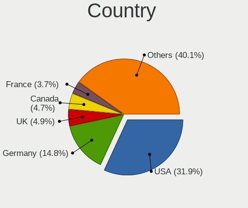
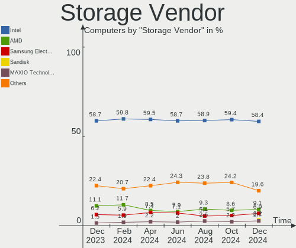
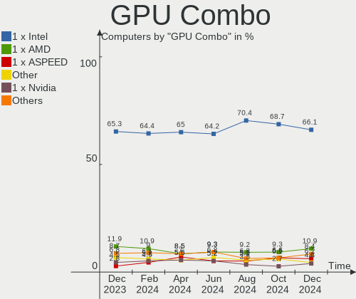
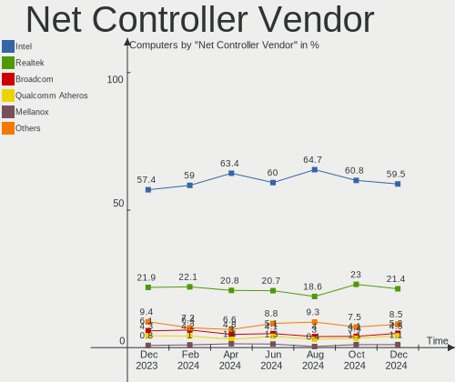

BSD Hardware Trends
-------------------

A project to identify most popular hardware characteristics and track their change
over time based on data collected by BSD users at https://BSD-Hardware.info.

Anyone can contribute to the study by uploading probes of their computers by
the [hw-probe](https://github.com/linuxhw/hw-probe/blob/master/INSTALL.BSD.md) tool:

    hw-probe -all -upload

This is a report for all computer types. See also reports for [desktops](/Desktop/README.md) and [notebooks](/Notebook/README.md).

Full-feature report is available here: https://bsd-hardware.info/?view=trends

OS-specific reports: [FreeBSD](/Dist/FreeBSD), [OPNsense](/Dist/OPNsense), [helloSystem](/Dist/helloSystem), [OpenBSD](/Dist/OpenBSD).

Period: Apr, 2021.

Contents
--------

- [ OS                       ](#os)
- [ OS Family                ](#os-family)
- [ Arch                     ](#arch)
- [ DE                       ](#de)
- [ Display Server           ](#display-server)
- [ Display Manager          ](#display-manager)
- [ OS Lang                  ](#os-lang)
- [ Boot Mode                ](#boot-mode)
- [ Filesystem               ](#filesystem)
- [ Part. scheme             ](#part-scheme)
- [ Country                  ](#country)
- [ City                     ](#city)
- [ Vendor                   ](#vendor)
- [ Model                    ](#model)
- [ Model Family             ](#model-family)
- [ MFG Year                 ](#mfg-year)
- [ Form Factor              ](#form-factor)
- [ Coreboot                 ](#coreboot)
- [ RAM Size                 ](#ram-size)
- [ RAM Used                 ](#ram-used)
- [ Has CD-ROM               ](#has-cd-rom)
- [ Total Drives             ](#total-drives)
- [ Has Ethernet             ](#has-ethernet)
- [ Has WiFi                 ](#has-wifi)
- [ Has Bluetooth            ](#has-bluetooth)
- [ Drive Vendor             ](#drive-vendor)
- [ Drive Model              ](#drive-model)
- [ HDD Vendor               ](#hdd-vendor)
- [ SSD Vendor               ](#ssd-vendor)
- [ Drive Kind               ](#drive-kind)
- [ Drive Connector          ](#drive-connector)
- [ Drive Size               ](#drive-size)
- [ Space Total              ](#space-total)
- [ Space Used               ](#space-used)
- [ Malfunc. Drives          ](#malfunc-drives)
- [ Malfunc. Drive Vendor    ](#malfunc-drive-vendor)
- [ Malfunc. HDD Vendor      ](#malfunc-hdd-vendor)
- [ Malfunc. Drive Kind      ](#malfunc-drive-kind)
- [ Failed Drives            ](#failed-drives)
- [ Failed Drive Vendor      ](#failed-drive-vendor)
- [ Drive Status             ](#drive-status)
- [ Storage Vendor           ](#storage-vendor)
- [ Storage Model            ](#storage-model)
- [ Storage Kind             ](#storage-kind)
- [ CPU Vendor               ](#cpu-vendor)
- [ CPU Model                ](#cpu-model)
- [ CPU Model Family         ](#cpu-model-family)
- [ CPU Cores                ](#cpu-cores)
- [ CPU Sockets              ](#cpu-sockets)
- [ CPU Threads              ](#cpu-threads)
- [ CPU Microarch            ](#cpu-microarch)
- [ GPU Vendor               ](#gpu-vendor)
- [ GPU Model                ](#gpu-model)
- [ GPU Combo                ](#gpu-combo)
- [ GPU Driver               ](#gpu-driver)
- [ GPU Memory               ](#gpu-memory)
- [ Monitor Vendor           ](#monitor-vendor)
- [ Monitor Model            ](#monitor-model)
- [ Monitor Resolution       ](#monitor-resolution)
- [ Monitor Diagonal         ](#monitor-diagonal)
- [ Monitor Width            ](#monitor-width)
- [ Aspect Ratio             ](#aspect-ratio)
- [ Monitor Area             ](#monitor-area)
- [ Pixel Density            ](#pixel-density)
- [ Multiple Monitors        ](#multiple-monitors)
- [ Net Controller Vendor    ](#net-controller-vendor)
- [ Net Controller Model     ](#net-controller-model)
- [ Wireless Vendor          ](#wireless-vendor)
- [ Wireless Model           ](#wireless-model)
- [ Ethernet Vendor          ](#ethernet-vendor)
- [ Ethernet Model           ](#ethernet-model)
- [ Net Controller Kind      ](#net-controller-kind)
- [ Used Controller          ](#used-controller)
- [ NICs                     ](#nics)
- [ IPv6                     ](#ipv6)
- [ Memory Vendor            ](#memory-vendor)
- [ Memory Model             ](#memory-model)
- [ Memory Kind              ](#memory-kind)
- [ Memory Form Factor       ](#memory-form-factor)
- [ Memory Size              ](#memory-size)
- [ Memory Speed             ](#memory-speed)
- [ Sound Vendor             ](#sound-vendor)
- [ Sound Model              ](#sound-model)
- [ Camera Vendor            ](#camera-vendor)
- [ Camera Model             ](#camera-model)
- [ Fingerprint Vendor       ](#fingerprint-vendor)
- [ Fingerprint Model        ](#fingerprint-model)
- [ Chipcard Vendor          ](#chipcard-vendor)
- [ Chipcard Model           ](#chipcard-model)
- [ Printer Vendor           ](#printer-vendor)
- [ Printer Model            ](#printer-model)
- [ Scanner Vendor           ](#scanner-vendor)
- [ Scanner Model            ](#scanner-model)
- [ Bluetooth Vendor         ](#bluetooth-vendor)
- [ Bluetooth Model          ](#bluetooth-model)
- [ Unsupported Devices      ](#unsupported-devices)
- [ Unsupported Device Types ](#unsupported-device-types)

OS
--

Installed operating systems

| Name                          | Computers | Percent |
|-------------------------------|-----------|---------|
| OPNsense 21.1.4               | 162       | 41.97%  |
| OPNsense 21.1.5               | 54        | 13.99%  |
| FreeBSD 13.0                  | 47        | 12.18%  |
| OPNsense 21.1                 | 13        | 3.37%   |
| FreeBSD 12.2-p6               | 13        | 3.37%   |
| helloSystem 0.4.0             | 9         | 2.33%   |
| FreeBSD 13.0-STABLE           | 9         | 2.33%   |
| OpenBSD 6.8                   | 7         | 1.81%   |
| FreeBSD 13.0-RC5              | 7         | 1.81%   |
| OPNsense 21.7                 | 6         | 1.55%   |
| FreeBSD 14.0-CURRENT          | 6         | 1.55%   |
| GhostBSD 20.04.02             | 5         | 1.3%    |
| FreeBSD 12.2-p5               | 5         | 1.3%    |
| NomadBSD 1.4                  | 4         | 1.04%   |
| OPNsense 21.1.3               | 3         | 0.78%   |
| OPNsense 20.7.8               | 3         | 0.78%   |
| FreeBSD 12.2-p4               | 3         | 0.78%   |
| OPNsense 21.1.1               | 2         | 0.52%   |
| OPNsense 20.7                 | 2         | 0.52%   |
| OpenBSD 6.9                   | 2         | 0.52%   |
| FreeBSD 13.0-RC4              | 2         | 0.52%   |
| FreeBSD 12.2-p3               | 2         | 0.52%   |
| FreeBSD 12.2-p2               | 2         | 0.52%   |
| FreeBSD 12.2                  | 2         | 0.52%   |
| FreeBSD 12.1                  | 2         | 0.52%   |
| OPNsense 21.1.2               | 1         | 0.26%   |
| OPNsense 20.7.5               | 1         | 0.26%   |
| OPNsense 12.1-p15-HBSD        | 1         | 0.26%   |
| NomadBSD 1.3.2                | 1         | 0.26%   |
| NetBSD 9.99.81                | 1         | 0.26%   |
| NetBSD 9.1_STABLE             | 1         | 0.26%   |
| NetBSD 9.1                    | 1         | 0.26%   |
| helloSystem 0.5.0             | 1         | 0.26%   |
| HardenedBSD 14.0-CURRENT-HBSD | 1         | 0.26%   |
| FuguIta 6.8                   | 1         | 0.26%   |
| FreeNAS 11.4-p9               | 1         | 0.26%   |
| FreeBSD 13.0-RC3              | 1         | 0.26%   |
| FreeBSD 12.1-p13              | 1         | 0.26%   |
| FreeBSD 11.4-p8               | 1         | 0.26%   |

OS Family
---------

OS without a version

| Name        | Computers | Percent |
|-------------|-----------|---------|
| OPNsense    | 248       | 64.25%  |
| FreeBSD     | 103       | 26.68%  |
| helloSystem | 10        | 2.59%   |
| OpenBSD     | 9         | 2.33%   |
| NomadBSD    | 5         | 1.3%    |
| GhostBSD    | 5         | 1.3%    |
| NetBSD      | 3         | 0.78%   |
| HardenedBSD | 1         | 0.26%   |
| FuguIta     | 1         | 0.26%   |
| FreeNAS     | 1         | 0.26%   |

Arch
----

OS architecture (x86_64, i586, etc.)

| Name   | Computers | Percent |
|--------|-----------|---------|
| amd64  | 375       | 97.15%  |
| arm64  | 6         | 1.55%   |
| i386   | 4         | 1.04%   |
| evbarm | 1         | 0.26%   |

DE
--

Desktop Environment

| Name          | Computers | Percent |
|---------------|-----------|---------|
| Console       | 288       | 74.61%  |
| KDE5          | 20        | 5.18%   |
| XFCE          | 12        | 3.11%   |
| helloDesktop  | 10        | 2.59%   |
| MATE          | 9         | 2.33%   |
| fvwm          | 9         | 2.33%   |
| GNOME         | 8         | 2.07%   |
| TWM           | 7         | 1.81%   |
| Openbox       | 6         | 1.55%   |
| Cinnamon      | 5         | 1.3%    |
| i3            | 3         | 0.78%   |
| Fluxbox       | 2         | 0.52%   |
| Enlightenment | 2         | 0.52%   |
| Xfwm4         | 1         | 0.26%   |
| DWM           | 1         | 0.26%   |
| CTWM          | 1         | 0.26%   |
| CDE           | 1         | 0.26%   |
| AwesomeWM     | 1         | 0.26%   |

Display Server
--------------

X11 or Wayland

| Name    | Computers | Percent |
|---------|-----------|---------|
| Console | 288       | 74.61%  |
| X11     | 98        | 25.39%  |

Display Manager
---------------

SDDM, LightDM, etc.

| Name    | Computers | Percent |
|---------|-----------|---------|
| Console | 324       | 83.94%  |
| SLiM    | 29        | 7.51%   |
| SDDM    | 17        | 4.4%    |
| LightDM | 9         | 2.33%   |
| XDM     | 4         | 1.04%   |
| GDM     | 3         | 0.78%   |

OS Lang
-------

Language

| Lang             | Computers | Percent |
|------------------|-----------|---------|
| Unknown          | 280       | 72.54%  |
| C                | 48        | 12.44%  |
| en_US            | 30        | 7.77%   |
| de_DE            | 6         | 1.55%   |
| en_GB            | 5         | 1.3%    |
| ru_RU            | 2         | 0.52%   |
| nb_NO            | 2         | 0.52%   |
| fr_FR            | 2         | 0.52%   |
| pt_PT            | 1         | 0.26%   |
| pl_PL            | 1         | 0.26%   |
| it_IT            | 1         | 0.26%   |
| hu_HU.US-ASCII   | 1         | 0.26%   |
| es_AR            | 1         | 0.26%   |
| en_US.utf-8      | 1         | 0.26%   |
| en_US.US-ASCII   | 1         | 0.26%   |
| en_AU            | 1         | 0.26%   |
| de_DE.ISO8859-15 | 1         | 0.26%   |
| de_CH            | 1         | 0.26%   |
| bg_BG            | 1         | 0.26%   |

Boot Mode
---------

EFI or BIOS

| Mode | Computers | Percent |
|------|-----------|---------|
| EFI  | 319       | 82.64%  |
| BIOS | 67        | 17.36%  |

Filesystem
----------

Type of filesystem

| Type | Computers | Percent |
|------|-----------|---------|
| Ufs  | 281       | 72.8%   |
| Zfs  | 95        | 24.61%  |
| Ffs  | 10        | 2.59%   |

Part. scheme
------------

Scheme of partitioning

| Type    | Computers | Percent |
|---------|-----------|---------|
| GPT     | 345       | 89.38%  |
| MBR     | 39        | 10.1%   |
| BSD     | 1         | 0.26%   |
| Unknown | 1         | 0.26%   |

Country
-------

Geographic location (country)

| Country      | Computers | Percent |
|--------------|-----------|---------|
| USA          | 124       | 32.12%  |
| Germany      | 77        | 19.95%  |
| UK           | 22        | 5.7%    |
| Canada       | 14        | 3.63%   |
| France       | 13        | 3.37%   |
| Russia       | 10        | 2.59%   |
| Austria      | 10        | 2.59%   |
| Netherlands  | 9         | 2.33%   |
| Australia    | 8         | 2.07%   |
| Switzerland  | 7         | 1.81%   |
| Sweden       | 6         | 1.55%   |
| China        | 6         | 1.55%   |
| Brazil       | 6         | 1.55%   |
| Japan        | 5         | 1.3%    |
| Thailand     | 4         | 1.04%   |
| Spain        | 4         | 1.04%   |
| Denmark      | 4         | 1.04%   |
| Ukraine      | 3         | 0.78%   |
| Portugal     | 3         | 0.78%   |
| Norway       | 3         | 0.78%   |
| Hungary      | 3         | 0.78%   |
| Finland      | 3         | 0.78%   |
| Argentina    | 3         | 0.78%   |
| Vietnam      | 2         | 0.52%   |
| South Africa | 2         | 0.52%   |
| Romania      | 2         | 0.52%   |
| Poland       | 2         | 0.52%   |
| Pakistan     | 2         | 0.52%   |
| Namibia      | 2         | 0.52%   |
| Lithuania    | 2         | 0.52%   |
| Italy        | 2         | 0.52%   |
| Indonesia    | 2         | 0.52%   |
| India        | 2         | 0.52%   |
| Colombia     | 2         | 0.52%   |
| Bulgaria     | 2         | 0.52%   |
| Belgium      | 2         | 0.52%   |
| UAE          | 1         | 0.26%   |
| Turkey       | 1         | 0.26%   |
| Taiwan       | 1         | 0.26%   |
| Slovenia     | 1         | 0.26%   |
| Slovakia     | 1         | 0.26%   |
| New Zealand  | 1         | 0.26%   |
| Mexico       | 1         | 0.26%   |
| Israel       | 1         | 0.26%   |
| Ireland      | 1         | 0.26%   |
| Hong Kong    | 1         | 0.26%   |
| Czechia      | 1         | 0.26%   |
| Croatia      | 1         | 0.26%   |
| Chile        | 1         | 0.26%   |

City
----

Geographic location (city)

| City                     | Computers | Percent |
|--------------------------|-----------|---------|
| Vienna                   | 5         | 1.3%    |
| Frankfurt am Main        | 5         | 1.3%    |
| New York                 | 4         | 1.04%   |
| Chicago                  | 4         | 1.04%   |
| Berlin                   | 4         | 1.04%   |
| Stuttgart                | 3         | 0.78%   |
| Salem                    | 3         | 0.78%   |
| Mountain View            | 3         | 0.78%   |
| Lübeck                  | 3         | 0.78%   |
| Hamburg                  | 3         | 0.78%   |
| Cologne                  | 3         | 0.78%   |
| Beijing                  | 3         | 0.78%   |
| Agen                     | 3         | 0.78%   |
| Zurich                   | 2         | 0.52%   |
| West Valley City         | 2         | 0.52%   |
| Vilnius                  | 2         | 0.52%   |
| Villeneuve-Saint-Georges | 2         | 0.52%   |
| Vichy                    | 2         | 0.52%   |
| Toronto                  | 2         | 0.52%   |
| São José dos Campos    | 2         | 0.52%   |
| Sofia                    | 2         | 0.52%   |
| Roanoke                  | 2         | 0.52%   |
| Redmond                  | 2         | 0.52%   |
| Portland                 | 2         | 0.52%   |
| Pleasant Grove           | 2         | 0.52%   |
| Pasadena                 | 2         | 0.52%   |
| Ottawa                   | 2         | 0.52%   |
| Münster                 | 2         | 0.52%   |
| Munich                   | 2         | 0.52%   |
| Montreal                 | 2         | 0.52%   |
| Leicester                | 2         | 0.52%   |
| Langenhagen              | 2         | 0.52%   |
| Lahore                   | 2         | 0.52%   |
| Kyiv                     | 2         | 0.52%   |
| Irkutsk                  | 2         | 0.52%   |
| Hohenlockstedt           | 2         | 0.52%   |
| Hemel Hempstead          | 2         | 0.52%   |
| Hanover                  | 2         | 0.52%   |
| Glasgow                  | 2         | 0.52%   |
| Frisco                   | 2         | 0.52%   |
| Düsseldorf              | 2         | 0.52%   |
| Buford                   | 2         | 0.52%   |
| Buenos Aires             | 2         | 0.52%   |
| Brooklyn                 | 2         | 0.52%   |
| Brighton                 | 2         | 0.52%   |
| Bangkok                  | 2         | 0.52%   |
| Atlanta                  | 2         | 0.52%   |
| Alameda                  | 2         | 0.52%   |
| Zutphen                  | 1         | 0.26%   |
| Zoetermeer               | 1         | 0.26%   |
| Zhengzhou                | 1         | 0.26%   |
| Zeuthen                  | 1         | 0.26%   |
| Zeist                    | 1         | 0.26%   |
| Zaltbommel               | 1         | 0.26%   |
| Yokohama                 | 1         | 0.26%   |
| Wroclaw                  | 1         | 0.26%   |
| Worms                    | 1         | 0.26%   |
| Woking                   | 1         | 0.26%   |
| Winterthur               | 1         | 0.26%   |
| Windsor                  | 1         | 0.26%   |

Vendor
------

Motherboard manufacturer

| Name                       | Computers | Percent |
|----------------------------|-----------|---------|
| Dell                       | 56        | 14.51%  |
| Lenovo                     | 40        | 10.36%  |
| Unknown                    | 36        | 9.33%   |
| Hewlett-Packard            | 32        | 8.29%   |
| ASUSTek Computer           | 23        | 5.96%   |
| Supermicro                 | 22        | 5.7%    |
| ASRock                     | 19        | 4.92%   |
| PC Engines                 | 17        | 4.4%    |
| Protectli                  | 15        | 3.89%   |
| Intel                      | 13        | 3.37%   |
| Gigabyte Technology        | 12        | 3.11%   |
| AMI                        | 10        | 2.59%   |
| BESSTAR Tech               | 8         | 2.07%   |
| MSI                        | 7         | 1.81%   |
| Sophos                     | 6         | 1.55%   |
| Shuttle                    | 6         | 1.55%   |
| HARDKERNEL                 | 4         | 1.04%   |
| Fujitsu                    | 4         | 1.04%   |
| Compulab                   | 4         | 1.04%   |
| ZOTAC                      | 3         | 0.78%   |
| Beckhoff Automation        | 3         | 0.78%   |
| Acer                       | 3         | 0.78%   |
| Toshiba                    | 2         | 0.52%   |
| ShenZhen MinWin Technology | 2         | 0.52%   |
| Samsung Electronics        | 2         | 0.52%   |
| Deciso                     | 2         | 0.52%   |
| CheckPoint                 | 2         | 0.52%   |
| Biostar                    | 2         | 0.52%   |
| Apple                      | 2         | 0.52%   |
| Advantech                  | 2         | 0.52%   |
| Yanling                    | 1         | 0.26%   |
| Wistron                    | 1         | 0.26%   |
| Thomas-Krenn.AG            | 1         | 0.26%   |
| System76                   | 1         | 0.26%   |
| Sony                       | 1         | 0.26%   |
| SeeedStudio                | 1         | 0.26%   |
| Quanta                     | 1         | 0.26%   |
| pine64                     | 1         | 0.26%   |
| Pegatron                   | 1         | 0.26%   |
| Panasonic                  | 1         | 0.26%   |
| OmniOS                     | 1         | 0.26%   |
| Notebook                   | 1         | 0.26%   |
| Maxtang                    | 1         | 0.26%   |
| Jetway                     | 1         | 0.26%   |
| IBM                        | 1         | 0.26%   |
| HUAWEI                     | 1         | 0.26%   |
| HPE                        | 1         | 0.26%   |
| GEEK+                      | 1         | 0.26%   |
| Gateway                    | 1         | 0.26%   |
| ECT                        | 1         | 0.26%   |
| Colorful Technology        | 1         | 0.26%   |
| Clevo                      | 1         | 0.26%   |
| Barracuda Networks         | 1         | 0.26%   |
| AWOW                       | 1         | 0.26%   |
| Astaro                     | 1         | 0.26%   |
| ASRockRack                 | 1         | 0.26%   |
| Alienware                  | 1         | 0.26%   |

Model
-----

Motherboard model

| Name                                             | Computers | Percent |
|--------------------------------------------------|-----------|---------|
| Unknown                                          | 36        | 9.33%   |
| PC Engines apu2                                  | 8         | 2.07%   |
| AMI Aptio CRB                                    | 8         | 2.07%   |
| Supermicro Super Server                          | 6         | 1.55%   |
| Protectli FW4B                                   | 6         | 1.55%   |
| PC Engines apu4                                  | 6         | 1.55%   |
| Intel Q3XXG4-P V1.0                              | 6         | 1.55%   |
| Protectli FW6                                    | 5         | 1.3%    |
| Dell PowerEdge R210 II                           | 5         | 1.3%    |
| BESSTAR Tech X35G                                | 5         | 1.3%    |
| Sophos SG                                        | 4         | 1.04%   |
| HARDKERNEL ODROID-H2                             | 4         | 1.04%   |
| Dell OptiPlex 3020                               | 4         | 1.04%   |
| Supermicro X7SPA-HF                              | 3         | 0.78%   |
| PC Engines apu3                                  | 3         | 0.78%   |
| HP t620 PLUS Quad Core TC                        | 3         | 0.78%   |
| HP EliteDesk 800 G1 SFF                          | 3         | 0.78%   |
| Dell OptiPlex 390                                | 3         | 0.78%   |
| Compulab fitlet2                                 | 3         | 0.78%   |
| ASUS All Series                                  | 3         | 0.78%   |
| ZOTAC ZBOX-CI329NANO                             | 2         | 0.52%   |
| Supermicro X9SCL/X9SCM                           | 2         | 0.52%   |
| Shuttle DS81D                                    | 2         | 0.52%   |
| ShenZhen MinWin MW-NANO-APL-4L                   | 2         | 0.52%   |
| Protectli FW6D                                   | 2         | 0.52%   |
| Lenovo ThinkPad E490 20N8CTO1WW                  | 2         | 0.52%   |
| Fujitsu ESPRIMO C720                             | 2         | 0.52%   |
| Dell PowerEdge R630                              | 2         | 0.52%   |
| Dell OptiPlex 9010                               | 2         | 0.52%   |
| Dell Latitude E5420                              | 2         | 0.52%   |
| Dell Inspiron 3793                               | 2         | 0.52%   |
| Deciso Netboard A20                              | 2         | 0.52%   |
| CheckPoint T-110-00                              | 2         | 0.52%   |
| Beckhoff Automation Industrial PC                | 2         | 0.52%   |
| ASUS SABERTOOTH 990FX R2.0                       | 2         | 0.52%   |
| ASUS P8H61-M LX3 PLUS R2.0                       | 2         | 0.52%   |
| ASRock J4105M                                    | 2         | 0.52%   |
| Apple MacBookPro8,1                              | 2         | 0.52%   |
| ZOTAC ZBOX-CI327NANO-GS-01                       | 1         | 0.26%   |
| Yanling YL-KBR6L                                 | 1         | 0.26%   |
| Wistron ProLiant ML110 G6                        | 1         | 0.26%   |
| Toshiba Satellite L50-C                          | 1         | 0.26%   |
| Toshiba Satellite C655D                          | 1         | 0.26%   |
| Thomas-Krenn.AG LES network+                     | 1         | 0.26%   |
| System76 Lemur Pro                               | 1         | 0.26%   |
| Supermicro X8DTU-LN4+                            | 1         | 0.26%   |
| Supermicro X7SLA                                 | 1         | 0.26%   |
| Supermicro X10SLH-N6-ST031                       | 1         | 0.26%   |
| Supermicro SYS-E300-8D                           | 1         | 0.26%   |
| Supermicro SYS-E200-9B                           | 1         | 0.26%   |
| Supermicro SYS-5019C-FL                          | 1         | 0.26%   |
| Supermicro SYS-5018D-FN8T                        | 1         | 0.26%   |
| Supermicro SYS-5018D-FN4T                        | 1         | 0.26%   |
| Supermicro SYS-5017A-EP                          | 1         | 0.26%   |
| Supermicro A1SAi                                 | 1         | 0.26%   |
| Supermicro 1HE Intel Single-CPU RI1102D-F Server | 1         | 0.26%   |
| Sophos XG                                        | 1         | 0.26%   |
| Sophos UTM                                       | 1         | 0.26%   |
| Sony VGN-FW290J                                  | 1         | 0.26%   |
| Shuttle TERRA_PC                                 | 1         | 0.26%   |

Model Family
------------

Motherboard model prefix

| Name                           | Computers | Percent |
|--------------------------------|-----------|---------|
| Unknown                        | 36        | 9.33%   |
| Lenovo ThinkPad                | 25        | 6.48%   |
| Dell OptiPlex                  | 16        | 4.15%   |
| Dell PowerEdge                 | 11        | 2.85%   |
| Dell Latitude                  | 11        | 2.85%   |
| AMI Aptio                      | 9         | 2.33%   |
| PC Engines APU2                | 8         | 2.07%   |
| Lenovo ThinkCentre             | 7         | 1.81%   |
| Dell Inspiron                  | 7         | 1.81%   |
| Supermicro Super               | 6         | 1.55%   |
| Protectli FW4B                 | 6         | 1.55%   |
| PC Engines apu4                | 6         | 1.55%   |
| Intel Q3XXG4-P                 | 6         | 1.55%   |
| Dell Precision                 | 6         | 1.55%   |
| Protectli FW6                  | 5         | 1.3%    |
| HP ProLiant                    | 5         | 1.3%    |
| HP EliteDesk                   | 5         | 1.3%    |
| HP Compaq                      | 5         | 1.3%    |
| BESSTAR Tech X35G              | 5         | 1.3%    |
| Sophos SG                      | 4         | 1.04%   |
| Lenovo IdeaCentre              | 4         | 1.04%   |
| HP EliteBook                   | 4         | 1.04%   |
| HARDKERNEL ODROID-H2           | 4         | 1.04%   |
| Supermicro X7SPA-HF            | 3         | 0.78%   |
| PC Engines APU3                | 3         | 0.78%   |
| HP t620                        | 3         | 0.78%   |
| Dell XPS                       | 3         | 0.78%   |
| Compulab fitlet2               | 3         | 0.78%   |
| ASUS P8H61-M                   | 3         | 0.78%   |
| ASUS All                       | 3         | 0.78%   |
| ZOTAC ZBOX-CI329NANO           | 2         | 0.52%   |
| Toshiba Satellite              | 2         | 0.52%   |
| Supermicro X9SCL               | 2         | 0.52%   |
| Shuttle DS81D                  | 2         | 0.52%   |
| ShenZhen MinWin MW-NANO-APL-4L | 2         | 0.52%   |
| Protectli FW6D                 | 2         | 0.52%   |
| Lenovo ThinkStation            | 2         | 0.52%   |
| HP Laptop                      | 2         | 0.52%   |
| Fujitsu ESPRIMO                | 2         | 0.52%   |
| Deciso Netboard                | 2         | 0.52%   |
| CheckPoint T-110-00            | 2         | 0.52%   |
| Beckhoff Automation Industrial | 2         | 0.52%   |
| ASUS SABERTOOTH                | 2         | 0.52%   |
| ASUS PRIME                     | 2         | 0.52%   |
| ASRock X570                    | 2         | 0.52%   |
| ASRock J4105M                  | 2         | 0.52%   |
| Apple MacBookPro8              | 2         | 0.52%   |
| Acer Aspire                    | 2         | 0.52%   |
| ZOTAC ZBOX-CI327NANO-GS-01     | 1         | 0.26%   |
| Yanling YL-KBR6L               | 1         | 0.26%   |
| Wistron ProLiant               | 1         | 0.26%   |
| Thomas-Krenn.AG LES            | 1         | 0.26%   |
| System76 Lemur                 | 1         | 0.26%   |
| Supermicro X8DTU-LN4+          | 1         | 0.26%   |
| Supermicro X7SLA               | 1         | 0.26%   |
| Supermicro X10SLH-N6-ST031     | 1         | 0.26%   |
| Supermicro SYS-E300-8D         | 1         | 0.26%   |
| Supermicro SYS-E200-9B         | 1         | 0.26%   |
| Supermicro SYS-5019C-FL        | 1         | 0.26%   |
| Supermicro SYS-5018D-FN8T      | 1         | 0.26%   |

MFG Year
--------

Motherboard manufacture year

| Year    | Computers | Percent |
|---------|-----------|---------|
| 2020    | 88        | 22.8%   |
| 2019    | 59        | 15.28%  |
| 2018    | 52        | 13.47%  |
| 2014    | 24        | 6.22%   |
| 2012    | 23        | 5.96%   |
| 2021    | 22        | 5.7%    |
| 2017    | 22        | 5.7%    |
| 2013    | 22        | 5.7%    |
| 2016    | 17        | 4.4%    |
| 2015    | 17        | 4.4%    |
| 2010    | 12        | 3.11%   |
| 2011    | 10        | 2.59%   |
| Unknown | 8         | 2.07%   |
| 2009    | 4         | 1.04%   |
| 2008    | 4         | 1.04%   |
| 2007    | 1         | 0.26%   |
| 2005    | 1         | 0.26%   |

Form Factor
-----------

Physical design of the computer

| Name           | Computers | Percent |
|----------------|-----------|---------|
| Desktop        | 236       | 61.14%  |
| Notebook       | 78        | 20.21%  |
| Server         | 31        | 8.03%   |
| Mini pc        | 27        | 6.99%   |
| Firewall       | 7         | 1.81%   |
| System on chip | 5         | 1.3%    |
| Convertible    | 1         | 0.26%   |
| All in one     | 1         | 0.26%   |

Coreboot
--------

Have coreboot on board

| Used | Computers | Percent |
|------|-----------|---------|
| No   | 364       | 94.3%   |
| Yes  | 22        | 5.7%    |

RAM Size
--------

Total RAM memory

| Size in GB  | Computers | Percent |
|-------------|-----------|---------|
| 8.01-16.0   | 129       | 33.42%  |
| 4.01-8.0    | 95        | 24.61%  |
| 16.01-24.0  | 89        | 23.06%  |
| 32.01-64.0  | 31        | 8.03%   |
| 2.01-3.0    | 13        | 3.37%   |
| 64.01-256.0 | 13        | 3.37%   |
| 24.01-32.0  | 8         | 2.07%   |
| 3.01-4.0    | 4         | 1.04%   |
| 0.51-1.0    | 3         | 0.78%   |
| 1.01-2.0    | 1         | 0.26%   |

RAM Used
--------

Used RAM memory

| Used GB    | Computers | Percent |
|------------|-----------|---------|
| 0.01-0.5   | 195       | 50.52%  |
| 0.51-1.0   | 122       | 31.61%  |
| 1.01-2.0   | 39        | 10.1%   |
| 4.01-8.0   | 7         | 1.81%   |
| 2.01-3.0   | 7         | 1.81%   |
| 3.01-4.0   | 4         | 1.04%   |
| 8.01-16.0  | 3         | 0.78%   |
| Unknown    | 3         | 0.78%   |
| 32.01-64.0 | 2         | 0.52%   |
| 0          | 2         | 0.52%   |
| 24.01-32.0 | 1         | 0.26%   |
| 16.01-24.0 | 1         | 0.26%   |

Has CD-ROM
----------

Has CD-ROM on board

| Presented | Computers | Percent |
|-----------|-----------|---------|
| No        | 311       | 80.57%  |
| Yes       | 75        | 19.43%  |

Total Drives
------------

Number of drives on board

| Drives | Computers | Percent |
|--------|-----------|---------|
| 1      | 274       | 70.98%  |
| 2      | 53        | 13.73%  |
| 0      | 31        | 8.03%   |
| 3      | 10        | 2.59%   |
| 5      | 7         | 1.81%   |
| 4      | 5         | 1.3%    |
| 6      | 2         | 0.52%   |
| 17     | 1         | 0.26%   |
| 12     | 1         | 0.26%   |
| 11     | 1         | 0.26%   |
| 10     | 1         | 0.26%   |

Has Ethernet
------------

Has Ethernet on board

| Presented | Computers | Percent |
|-----------|-----------|---------|
| Yes       | 369       | 95.6%   |
| No        | 17        | 4.4%    |

Has WiFi
--------

Has WiFi module

| Presented | Computers | Percent |
|-----------|-----------|---------|
| No        | 248       | 64.25%  |
| Yes       | 138       | 35.75%  |

Has Bluetooth
-------------

Has Bluetooth module

| Presented | Computers | Percent |
|-----------|-----------|---------|
| No        | 294       | 76.17%  |
| Yes       | 92        | 23.83%  |

Drive Vendor
------------

Hard drive vendors

| Vendor              | Computers | Drives | Percent |
|---------------------|-----------|--------|---------|
| Samsung Electronics | 71        | 84     | 16.59%  |
| Seagate             | 54        | 66     | 12.62%  |
| WDC                 | 45        | 81     | 10.51%  |
| Kingston            | 37        | 38     | 8.64%   |
| Crucial             | 33        | 38     | 7.71%   |
| Toshiba             | 22        | 23     | 5.14%   |
| Transcend           | 18        | 18     | 4.21%   |
| Intel               | 16        | 20     | 3.74%   |
| SanDisk             | 14        | 14     | 3.27%   |
| Hoodisk             | 14        | 14     | 3.27%   |
| Phison              | 10        | 10     | 2.34%   |
| Hitachi             | 10        | 21     | 2.34%   |
| HGST                | 9         | 9      | 2.1%    |
| A-DATA Technology   | 9         | 9      | 2.1%    |
| Hewlett-Packard     | 6         | 8      | 1.4%    |
| Corsair             | 5         | 5      | 1.17%   |
| SK Hynix            | 4         | 4      | 0.93%   |
| PNY                 | 4         | 4      | 0.93%   |
| PLEXTOR             | 4         | 4      | 0.93%   |
| FORESEE             | 4         | 4      | 0.93%   |
| Dogfish             | 4         | 4      | 0.93%   |
| NVMe                | 3         | 3      | 0.7%    |
| KingSpec            | 3         | 3      | 0.7%    |
| TCSUNBOW            | 2         | 2      | 0.47%   |
| SuperMicro          | 2         | 2      | 0.47%   |
| SPCC                | 2         | 17     | 0.47%   |
| Patriot             | 2         | 2      | 0.47%   |
| OCZ                 | 2         | 2      | 0.47%   |
| LITEONIT            | 2         | 2      | 0.47%   |
| Intenso             | 2         | 2      | 0.47%   |
| Fujitsu             | 2         | 2      | 0.47%   |
| Zheino              | 1         | 1      | 0.23%   |
| Solid State Storage | 1         | 1      | 0.23%   |
| LITEON              | 1         | 1      | 0.23%   |
| KingDian            | 1         | 1      | 0.23%   |
| JetFlash            | 1         | 1      | 0.23%   |
| Indilinx            | 1         | 1      | 0.23%   |
| General             | 1         | 1      | 0.23%   |
| faspeed             | 1         | 1      | 0.23%   |
| Dell                | 1         | 1      | 0.23%   |
| Colorful            | 1         | 1      | 0.23%   |
| China               | 1         | 1      | 0.23%   |
| BIWIN               | 1         | 1      | 0.23%   |
| Apple               | 1         | 1      | 0.23%   |

Drive Model
-----------

Hard drive models

| Model                            | Computers | Percent |
|----------------------------------|-----------|---------|
| Kingston SA400S37120G 120GB      | 8         | 1.74%   |
| Crucial CT120BX500SSD1 120GB     | 8         | 1.74%   |
| Kingston SUV500MS120G 120GB      | 6         | 1.3%    |
| Samsung SSD 970 EVO Plus 250GB   | 5         | 1.09%   |
| Samsung SSD 860 EVO 500GB        | 5         | 1.09%   |
| Hoodisk SSD 128GB                | 5         | 1.09%   |
| Crucial CT250MX500SSD1 250GB     | 5         | 1.09%   |
| Seagate ST500DM002-1BD142 500GB  | 4         | 0.87%   |
| Seagate ST3500418AS 500GB        | 4         | 0.87%   |
| Samsung SSD 850 EVO 500GB        | 4         | 0.87%   |
| Phison SATA SSD 16GB             | 4         | 0.87%   |
| FORESEE 128GB SSD                | 4         | 0.87%   |
| Crucial CT240BX500SSD1 240GB     | 4         | 0.87%   |
| WDC WD40EFRX-68N32N0 4TB         | 3         | 0.65%   |
| Transcend TS128GMSA230S 128GB    | 3         | 0.65%   |
| Toshiba MG03ACA100 1TB           | 3         | 0.65%   |
| Toshiba DT01ACA050 500GB         | 3         | 0.65%   |
| Seagate ST1000LM035-1RK172 1TB   | 3         | 0.65%   |
| SanDisk SSD PLUS 240GB           | 3         | 0.65%   |
| Samsung SSD 970 EVO Plus 500GB   | 3         | 0.65%   |
| Samsung SSD 860 EVO 250GB        | 3         | 0.65%   |
| Samsung SSD 840 EVO 250GB        | 3         | 0.65%   |
| Kingston SUV500MS240G 240GB      | 3         | 0.65%   |
| Kingston SA400S37480G 480GB      | 3         | 0.65%   |
| Hoodisk SSD 64GB                 | 3         | 0.65%   |
| Hoodisk SSD 32GB                 | 3         | 0.65%   |
| Crucial M4-CT064M4SSD2 64GB      | 3         | 0.65%   |
| Crucial CT500MX500SSD1 500GB     | 3         | 0.65%   |
| WDC WD20EFRX-68EUZN0 2TB         | 2         | 0.43%   |
| WDC WD120EMAZ-11BLFA0 12TB       | 2         | 0.43%   |
| WDC WD10EZEX-08WN4A0 1TB         | 2         | 0.43%   |
| Transcend TS256GMTS952T2 256GB   | 2         | 0.43%   |
| Toshiba KXG50ZNV256G NVMe 256GB  | 2         | 0.43%   |
| TCSUNBOW M1 32GB                 | 2         | 0.43%   |
| Seagate ST500LM021-1KJ152 500GB  | 2         | 0.43%   |
| Seagate ST4000DM004-2CV104 4TB   | 2         | 0.43%   |
| Seagate ST4000DM000-1F2168 4TB   | 2         | 0.43%   |
| Seagate ST2000LM007-1R8174 2TB   | 2         | 0.43%   |
| Seagate ST2000DM008-2FR102 2TB   | 2         | 0.43%   |
| Seagate ST1000DM010-2EP102 1TB   | 2         | 0.43%   |
| SanDisk SSD U100 24GB            | 2         | 0.43%   |
| Samsung SSD PM851 mSATA 256GB    | 2         | 0.43%   |
| Samsung SSD 970 EVO 500GB        | 2         | 0.43%   |
| Samsung SSD 960 EVO 250GB        | 2         | 0.43%   |
| Samsung SSD 870 EVO 250GB        | 2         | 0.43%   |
| Samsung SSD 860 QVO 1TB          | 2         | 0.43%   |
| Samsung SSD 860 EVO 1TB          | 2         | 0.43%   |
| Samsung SSD 850 PRO 512GB        | 2         | 0.43%   |
| Samsung SSD 850 EVO 250GB        | 2         | 0.43%   |
| Samsung SSD 840 Series 120GB     | 2         | 0.43%   |
| Samsung SSD 840 PRO Series 256GB | 2         | 0.43%   |
| Samsung SSD 840 EVO 120GB        | 2         | 0.43%   |
| Samsung MZALQ128HBHQ-000L1 128GB | 2         | 0.43%   |
| Phison minisforum 512GB          | 2         | 0.43%   |
| Kingston SUV500MS480G 480GB      | 2         | 0.43%   |
| Kingston OM8PDP3256B-A01 256GB   | 2         | 0.43%   |
| Intel SSDSC2KG240G8 240GB        | 2         | 0.43%   |
| Intel SSDSC2BB150G7 150GB        | 2         | 0.43%   |
| Hoodisk SSD 16GB                 | 2         | 0.43%   |
| Hitachi HUA721050KLA330 500GB    | 2         | 0.43%   |

HDD Vendor
----------

Hard disk drive vendors

| Vendor              | Computers | Drives | Percent |
|---------------------|-----------|--------|---------|
| Seagate             | 52        | 64     | 37.14%  |
| WDC                 | 37        | 73     | 26.43%  |
| Toshiba             | 16        | 17     | 11.43%  |
| Hitachi             | 10        | 21     | 7.14%   |
| HGST                | 9         | 9      | 6.43%   |
| Samsung Electronics | 5         | 6      | 3.57%   |
| Hewlett-Packard     | 4         | 6      | 2.86%   |
| NVMe                | 2         | 2      | 1.43%   |
| Fujitsu             | 2         | 2      | 1.43%   |
| JetFlash            | 1         | 1      | 0.71%   |
| General             | 1         | 1      | 0.71%   |
| Dell                | 1         | 1      | 0.71%   |

SSD Vendor
----------

Solid state drive vendors

| Vendor              | Computers | Drives | Percent |
|---------------------|-----------|--------|---------|
| Samsung Electronics | 45        | 50     | 18.67%  |
| Kingston            | 32        | 33     | 13.28%  |
| Crucial             | 32        | 37     | 13.28%  |
| Transcend           | 18        | 18     | 7.47%   |
| SanDisk             | 14        | 14     | 5.81%   |
| Intel               | 14        | 18     | 5.81%   |
| Hoodisk             | 14        | 14     | 5.81%   |
| A-DATA Technology   | 8         | 8      | 3.32%   |
| Phison              | 7         | 7      | 2.9%    |
| WDC                 | 4         | 4      | 1.66%   |
| PLEXTOR             | 4         | 4      | 1.66%   |
| FORESEE             | 4         | 4      | 1.66%   |
| Dogfish             | 4         | 4      | 1.66%   |
| Corsair             | 4         | 4      | 1.66%   |
| Toshiba             | 3         | 3      | 1.24%   |
| PNY                 | 3         | 3      | 1.24%   |
| KingSpec            | 3         | 3      | 1.24%   |
| TCSUNBOW            | 2         | 2      | 0.83%   |
| SuperMicro          | 2         | 2      | 0.83%   |
| SPCC                | 2         | 17     | 0.83%   |
| SK Hynix            | 2         | 2      | 0.83%   |
| Patriot             | 2         | 2      | 0.83%   |
| OCZ                 | 2         | 2      | 0.83%   |
| LITEONIT            | 2         | 2      | 0.83%   |
| Intenso             | 2         | 2      | 0.83%   |
| Hewlett-Packard     | 2         | 2      | 0.83%   |
| Zheino              | 1         | 1      | 0.41%   |
| Seagate             | 1         | 1      | 0.41%   |
| NVMe                | 1         | 1      | 0.41%   |
| LITEON              | 1         | 1      | 0.41%   |
| KingDian            | 1         | 1      | 0.41%   |
| Indilinx            | 1         | 1      | 0.41%   |
| faspeed             | 1         | 1      | 0.41%   |
| China               | 1         | 1      | 0.41%   |
| BIWIN               | 1         | 1      | 0.41%   |
| Apple               | 1         | 1      | 0.41%   |

Drive Kind
----------

HDD or SSD

| Kind | Computers | Drives | Percent |
|------|-----------|--------|---------|
| SSD  | 228       | 271    | 56.44%  |
| HDD  | 124       | 203    | 30.69%  |
| NVMe | 52        | 54     | 12.87%  |

Drive Connector
---------------

SATA, SAS, NVMe, etc.

| Type | Computers | Drives | Percent |
|------|-----------|--------|---------|
| SATA | 320       | 474    | 86.02%  |
| NVMe | 52        | 54     | 13.98%  |

Drive Size
----------

Size of hard drive

| Size in TB | Computers | Drives | Percent |
|------------|-----------|--------|---------|
| 0.01-0.5   | 272       | 320    | 74.93%  |
| 0.51-1.0   | 50        | 61     | 13.77%  |
| 1.01-2.0   | 16        | 36     | 4.41%   |
| 3.01-4.0   | 12        | 25     | 3.31%   |
| 4.01-10.0  | 5         | 14     | 1.38%   |
| 2.01-3.0   | 4         | 8      | 1.1%    |
| 10.01-20.0 | 4         | 10     | 1.1%    |

Space Total
-----------

Amount of disk space available on the file system

| Size in GB     | Computers | Percent |
|----------------|-----------|---------|
| 101-250        | 136       | 35.23%  |
| 251-500        | 85        | 22.02%  |
| 51-100         | 43        | 11.14%  |
| 21-50          | 41        | 10.62%  |
| 501-1000       | 33        | 8.55%   |
| 1-20           | 32        | 8.29%   |
| More than 3000 | 6         | 1.55%   |
| 1001-2000      | 5         | 1.3%    |
| 2001-3000      | 3         | 0.78%   |
| Unknown        | 2         | 0.52%   |

Space Used
----------

Amount of used disk space

| Used GB        | Computers | Percent |
|----------------|-----------|---------|
| 1-20           | 344       | 89.12%  |
| 21-50          | 16        | 4.15%   |
| 51-100         | 11        | 2.85%   |
| 101-250        | 6         | 1.55%   |
| More than 3000 | 3         | 0.78%   |
| 251-500        | 3         | 0.78%   |
| Unknown        | 2         | 0.52%   |
| 1001-2000      | 1         | 0.26%   |

Malfunc. Drives
---------------

Drive models with a malfunction

| Model                                            | Computers | Drives | Percent |
|--------------------------------------------------|-----------|--------|---------|
| Seagate ST500DM002-1BD142 500GB                  | 3         | 3      | 6.12%   |
| Seagate ST3500418AS 500GB                        | 3         | 3      | 6.12%   |
| WDC WD7500BPVT-80HXZT3 752GB                     | 1         | 1      | 2.04%   |
| WDC WD5000AAKX-001CA0 500GB                      | 1         | 1      | 2.04%   |
| WDC WD4001FAEX-00MJRA0 4TB                       | 1         | 2      | 2.04%   |
| WDC WD3200BPVT-75ZEST0 320GB                     | 1         | 1      | 2.04%   |
| WDC WD2500AAKX-001CA0 250GB                      | 1         | 1      | 2.04%   |
| Transcend TS256GSSD320 256GB                     | 1         | 1      | 2.04%   |
| Toshiba MK5061GSYN 500GB                         | 1         | 1      | 2.04%   |
| Toshiba MK3265GSXN 320GB                         | 1         | 1      | 2.04%   |
| Toshiba DT01ACA050 500GB                         | 1         | 1      | 2.04%   |
| Seagate ST980816AS 80GB                          | 1         | 1      | 2.04%   |
| Seagate ST9500325AS 500GB                        | 1         | 1      | 2.04%   |
| Seagate ST500LT012-1DG142 500GB                  | 1         | 1      | 2.04%   |
| Seagate ST3160815AS 160GB                        | 1         | 1      | 2.04%   |
| Seagate ST31500541AS 1.5TB                       | 1         | 1      | 2.04%   |
| Seagate ST31000340NS 1TB                         | 1         | 1      | 2.04%   |
| Seagate ST3000DM008-2DM166 3TB                   | 1         | 1      | 2.04%   |
| Seagate ST2000DM008-2FR102 2TB                   | 1         | 1      | 2.04%   |
| Seagate ST1000NM0011 1TB                         | 1         | 1      | 2.04%   |
| Seagate ST1000LX015-1U7172 1TB                   | 1         | 1      | 2.04%   |
| Seagate ST1000DL002-9TT153 1TB                   | 1         | 1      | 2.04%   |
| SanDisk SSD i110 32GB                            | 1         | 1      | 2.04%   |
| Samsung Electronics SSD PM841 2.5-inch 7mm 256GB | 1         | 1      | 2.04%   |
| Samsung Electronics SSD 840 PRO Series 256GB     | 1         | 1      | 2.04%   |
| Samsung Electronics SP0411N 40GB                 | 1         | 1      | 2.04%   |
| Samsung Electronics HM500LI 500GB                | 1         | 1      | 2.04%   |
| PLEXTOR PX-128M5S 128GB                          | 1         | 1      | 2.04%   |
| Kingston SNS4151S316GD 16GB                      | 1         | 1      | 2.04%   |
| Intenso SSD SATAIII 120GB                        | 1         | 1      | 2.04%   |
| Intel SSDSCKKF256G8H 256GB                       | 1         | 1      | 2.04%   |
| Intel SSDSC2BB150G7 150GB                        | 1         | 1      | 2.04%   |
| Intel SSDSA2M080G2GC 80GB                        | 1         | 1      | 2.04%   |
| Hitachi HUA721050KLA330 500GB                    | 1         | 1      | 2.04%   |
| Hitachi HTS545032B9A302 320GB                    | 1         | 1      | 2.04%   |
| Hitachi HTS545032B9A300 320GB                    | 1         | 1      | 2.04%   |
| Hitachi HTS541612J9SA00 120GB                    | 1         | 1      | 2.04%   |
| Hitachi HDS721010CLA332 1TB                      | 1         | 1      | 2.04%   |
| HGST HTS725050A7E630 500GB                       | 1         | 1      | 2.04%   |
| HGST HTS545032A7E380 320GB                       | 1         | 1      | 2.04%   |
| Crucial M4-CT128M4SSD1 128GB                     | 1         | 1      | 2.04%   |
| Crucial CT275MX300SSD1 275GB                     | 1         | 1      | 2.04%   |
| Crucial CT128MX100SSD1 128GB                     | 1         | 1      | 2.04%   |
| Corsair Neutron GTX SSD 120GB                    | 1         | 1      | 2.04%   |
| Corsair CSSD-F80GBP2 90GB                        | 1         | 1      | 2.04%   |

Malfunc. Drive Vendor
---------------------

Vendors of faulty drives

| Vendor              | Computers | Drives | Percent |
|---------------------|-----------|--------|---------|
| Seagate             | 17        | 17     | 34.69%  |
| WDC                 | 5         | 6      | 10.2%   |
| Hitachi             | 5         | 5      | 10.2%   |
| Samsung Electronics | 4         | 4      | 8.16%   |
| Toshiba             | 3         | 3      | 6.12%   |
| Intel               | 3         | 3      | 6.12%   |
| Crucial             | 3         | 3      | 6.12%   |
| HGST                | 2         | 2      | 4.08%   |
| Corsair             | 2         | 2      | 4.08%   |
| Transcend           | 1         | 1      | 2.04%   |
| SanDisk             | 1         | 1      | 2.04%   |
| PLEXTOR             | 1         | 1      | 2.04%   |
| Kingston            | 1         | 1      | 2.04%   |
| Intenso             | 1         | 1      | 2.04%   |

Malfunc. HDD Vendor
-------------------

Vendors of faulty HDD drives

| Vendor              | Computers | Drives | Percent |
|---------------------|-----------|--------|---------|
| Seagate             | 17        | 17     | 50%     |
| WDC                 | 5         | 6      | 14.71%  |
| Hitachi             | 5         | 5      | 14.71%  |
| Toshiba             | 3         | 3      | 8.82%   |
| Samsung Electronics | 2         | 2      | 5.88%   |
| HGST                | 2         | 2      | 5.88%   |

Malfunc. Drive Kind
-------------------

Kinds of faulty drives

| Kind | Computers | Drives | Percent |
|------|-----------|--------|---------|
| HDD  | 33        | 35     | 68.75%  |
| SSD  | 15        | 15     | 31.25%  |

Failed Drives
-------------

Failed drive models

Zero info for selected period =(

Failed Drive Vendor
-------------------

Failed drive vendors

Zero info for selected period =(

Drive Status
------------

Number of failed and malfunc. drives

| Status   | Computers | Drives | Percent |
|----------|-----------|--------|---------|
| Works    | 314       | 464    | 84.41%  |
| Malfunc  | 48        | 50     | 12.9%   |
| Detected | 10        | 14     | 2.69%   |

Storage Vendor
--------------

Storage controller vendors

| Vendor                         | Computers | Percent |
|--------------------------------|-----------|---------|
| Intel                          | 302       | 67.41%  |
| AMD                            | 58        | 12.95%  |
| Samsung Electronics            | 30        | 6.7%    |
| Broadcom / LSI                 | 11        | 2.46%   |
| ASMedia Technology             | 8         | 1.79%   |
| Sandisk                        | 6         | 1.34%   |
| Phison Electronics             | 5         | 1.12%   |
| Kingston Technology Company    | 5         | 1.12%   |
| Marvell Technology Group       | 4         | 0.89%   |
| Toshiba                        | 3         | 0.67%   |
| SK Hynix                       | 2         | 0.45%   |
| Silicon Motion                 | 2         | 0.45%   |
| Hewlett-Packard                | 2         | 0.45%   |
| VIA Technologies               | 1         | 0.22%   |
| Unknown                        | 1         | 0.22%   |
| Solid State Storage Technology | 1         | 0.22%   |
| Seagate Technology             | 1         | 0.22%   |
| Micron Technology              | 1         | 0.22%   |
| JMicron Technology             | 1         | 0.22%   |
| Dell                           | 1         | 0.22%   |
| Chelsio Communications         | 1         | 0.22%   |
| ADATA Technology               | 1         | 0.22%   |
| Adaptec                        | 1         | 0.22%   |

Storage Model
-------------

Storage controller models

| Model                                                                                   | Computers | Percent |
|-----------------------------------------------------------------------------------------|-----------|---------|
| AMD FCH SATA Controller [AHCI mode]                                                     | 41        | 8.2%    |
| Intel 8 Series/C220 Series Chipset Family 6-port SATA Controller 1 [AHCI mode]          | 37        | 7.4%    |
| Intel Sunrise Point-LP SATA Controller [AHCI mode]                                      | 26        | 5.2%    |
| Intel Q170/Q150/B150/H170/H110/Z170/CM236 Chipset SATA Controller [AHCI Mode]           | 18        | 3.6%    |
| Samsung NVMe SSD Controller SM981/PM981/PM983                                           | 17        | 3.4%    |
| Intel Atom/Celeron/Pentium Processor x5-E8000/J3xxx/N3xxx Series SATA Controller        | 17        | 3.4%    |
| Intel Atom Processor E3800 Series SATA AHCI Controller                                  | 17        | 3.4%    |
| Intel 6 Series/C200 Series Chipset Family 6 port Desktop SATA AHCI Controller           | 15        | 3%      |
| Intel Celeron/Pentium Silver Processor SATA Controller                                  | 13        | 2.6%    |
| Intel Celeron N3350/Pentium N4200/Atom E3900 Series SATA AHCI Controller                | 12        | 2.4%    |
| Intel 82801 Mobile SATA Controller [RAID mode]                                          | 12        | 2.4%    |
| Intel 6 Series/C200 Series Chipset Family 6 port Mobile SATA AHCI Controller            | 12        | 2.4%    |
| Intel 7 Series Chipset Family 6-port SATA Controller [AHCI mode]                        | 10        | 2%      |
| ASMedia ASM1062 Serial ATA Controller                                                   | 8         | 1.6%    |
| AMD FCH SATA Controller [IDE mode]                                                      | 8         | 1.6%    |
| Intel 82801G (ICH7 Family) IDE Controller                                               | 7         | 1.4%    |
| Intel 8 Series SATA Controller 1 [AHCI mode]                                            | 7         | 1.4%    |
| Intel 7 Series/C210 Series Chipset Family 6-port SATA Controller [AHCI mode]            | 7         | 1.4%    |
| Samsung NVMe SSD Controller SM961/PM961/SM963                                           | 6         | 1.2%    |
| Intel SATA Controller [RAID mode]                                                       | 6         | 1.2%    |
| Intel Wildcat Point-LP SATA Controller [AHCI Mode]                                      | 5         | 1%      |
| Intel NM10/ICH7 Family SATA Controller [IDE mode]                                       | 5         | 1%      |
| Intel Comet Lake SATA AHCI Controller                                                   | 5         | 1%      |
| Intel Cannon Point-LP SATA Controller [AHCI Mode]                                       | 5         | 1%      |
| Intel Cannon Lake PCH SATA AHCI Controller                                              | 5         | 1%      |
| Intel 82801HM/HEM (ICH8M/ICH8M-E) IDE Controller                                        | 5         | 1%      |
| Intel 6 Series/C200 Series Chipset Family Desktop SATA Controller (IDE mode, ports 4-5) | 5         | 1%      |
| Intel 6 Series/C200 Series Chipset Family Desktop SATA Controller (IDE mode, ports 0-3) | 5         | 1%      |
| AMD SB7x0/SB8x0/SB9x0 SATA Controller [AHCI mode]                                       | 5         | 1%      |
| Samsung NVMe Controller                                                                 | 4         | 0.8%    |
| Intel NM10/ICH7 Family SATA Controller [AHCI mode]                                      | 4         | 0.8%    |
| Intel 82801IR/IO/IH (ICH9R/DO/DH) 4 port SATA Controller [IDE mode]                     | 4         | 0.8%    |
| Intel 82801I (ICH9 Family) 2 port SATA Controller [IDE mode]                            | 4         | 0.8%    |
| Sandisk WD Blue SN550 NVMe SSD                                                          | 3         | 0.6%    |
| Phison E12 NVMe Controller                                                              | 3         | 0.6%    |
| Kingston Company OM3PDP3 NVMe SSD                                                       | 3         | 0.6%    |
| Intel C610/X99 series chipset sSATA Controller [AHCI mode]                              | 3         | 0.6%    |
| Intel C610/X99 series chipset 6-Port SATA Controller [AHCI mode]                        | 3         | 0.6%    |
| Intel Atom processor C2000 AHCI SATA3 Controller                                        | 3         | 0.6%    |
| Intel 82801JI (ICH10 Family) SATA AHCI Controller                                       | 3         | 0.6%    |
| Intel 82801IBM/IEM (ICH9M/ICH9M-E) 4 port SATA Controller [AHCI mode]                   | 3         | 0.6%    |
| Intel 82801HM/HEM (ICH8M/ICH8M-E) SATA Controller [IDE mode]                            | 3         | 0.6%    |
| Intel 631xESB/632xESB IDE Controller                                                    | 3         | 0.6%    |
| Intel 5 Series/3400 Series Chipset 6 port SATA AHCI Controller                          | 3         | 0.6%    |
| Intel 5 Series/3400 Series Chipset 4 port SATA IDE Controller                           | 3         | 0.6%    |
| Intel 5 Series/3400 Series Chipset 2 port SATA IDE Controller                           | 3         | 0.6%    |
| Intel 200 Series PCH SATA controller [AHCI mode]                                        | 3         | 0.6%    |
| AMD Starship/Matisse Chipset SATA Controller [AHCI mode]                                | 3         | 0.6%    |
| AMD FCH IDE Controller                                                                  | 3         | 0.6%    |
| Unknown                                                                                 | 3         | 0.6%    |
| Toshiba unknown                                                                         | 2         | 0.4%    |
| Silicon Motion SM2263EN/SM2263XT SSD Controller                                         | 2         | 0.4%    |
| Sandisk WD Black SN750 / PC SN730 NVMe SSD                                              | 2         | 0.4%    |
| Samsung NVMe SSD Controller SM951/PM951                                                 | 2         | 0.4%    |
| Phison PS5013 E13 NVMe Controller                                                       | 2         | 0.4%    |
| Kingston Company A2000 NVMe SSD                                                         | 2         | 0.4%    |
| Intel C602 chipset 4-Port SATA Storage Control Unit                                     | 2         | 0.4%    |
| Intel C600/X79 series chipset 6-Port SATA AHCI Controller                               | 2         | 0.4%    |
| Intel Atom Processor C3000 Series SATA Controller 1                                     | 2         | 0.4%    |
| Intel Atom processor C2000 AHCI SATA2 Controller                                        | 2         | 0.4%    |

Storage Kind
------------

Kind of storage controller (IDE, SATA, NVMe, SAS, ...)

| Kind | Computers | Percent |
|------|-----------|---------|
| SATA | 301       | 66.59%  |
| NVMe | 59        | 13.05%  |
| IDE  | 52        | 11.5%   |
| RAID | 29        | 6.42%   |
| SAS  | 7         | 1.55%   |
| SCSI | 4         | 0.88%   |

CPU Vendor
----------

Processor vendors

| Vendor  | Computers | Percent |
|---------|-----------|---------|
| Intel   | 317       | 82.12%  |
| AMD     | 61        | 15.8%   |
| ARM     | 5         | 1.3%    |
| Unknown | 2         | 0.52%   |
| VIA     | 1         | 0.26%   |

CPU Model
---------

Processor models

| Model                                    | Computers | Percent |
|------------------------------------------|-----------|---------|
| AMD GX-412TC SOC                         | 17        | 4.4%    |
| Intel Celeron CPU J3160 @ 1.60GHz        | 11        | 2.85%   |
| Intel Celeron CPU J1900 @ 1.99GHz        | 9         | 2.33%   |
| Intel Core i5-7200U CPU @ 2.50GHz        | 6         | 1.55%   |
| Intel Atom CPU D525 @ 1.80GHz            | 6         | 1.55%   |
| Intel Core i5-8250U CPU @ 1.60GHz        | 5         | 1.3%    |
| Intel Core i5-4590 CPU @ 3.30GHz         | 5         | 1.3%    |
| Intel Core i3-1005G1 CPU @ 1.20GHz       | 5         | 1.3%    |
| Intel Celeron J4105 CPU @ 1.50GHz        | 5         | 1.3%    |
| Intel Core i7-8565U CPU @ 1.80GHz        | 4         | 1.04%   |
| Intel Core i7-8550U CPU @ 1.80GHz        | 4         | 1.04%   |
| Intel Core i5-10210U CPU @ 1.60GHz       | 4         | 1.04%   |
| Intel Core i3-7100U CPU @ 2.40GHz        | 4         | 1.04%   |
| Intel Celeron J4115 CPU @ 1.80GHz        | 4         | 1.04%   |
| Intel Celeron CPU J3455 @ 1.50GHz        | 4         | 1.04%   |
| AMD GX-420CA SOC with Radeon HD Graphics | 4         | 1.04%   |
| Intel Xeon CPU E3-1225 v3 @ 3.20GHz      | 3         | 0.78%   |
| Intel Xeon CPU E3-1220 V2 @ 3.10GHz      | 3         | 0.78%   |
| Intel Xeon CPU D-1518 @ 2.20GHz          | 3         | 0.78%   |
| Intel Pentium CPU G4400 @ 3.30GHz        | 3         | 0.78%   |
| Intel Pentium CPU G3220 @ 3.00GHz        | 3         | 0.78%   |
| Intel Core i5-4570 CPU @ 3.20GHz         | 3         | 0.78%   |
| Intel Core i5-3470 CPU @ 3.20GHz         | 3         | 0.78%   |
| Intel Core i3-4130 CPU @ 3.40GHz         | 3         | 0.78%   |
| AMD FX-8350 Eight-Core Processor         | 3         | 0.78%   |
| AMD EPYC 3101 4-Core Processor           | 3         | 0.78%   |
| Intel Xeon CPU X3430 @ 2.40GHz           | 2         | 0.52%   |
| Intel Xeon CPU E5620 @ 2.40GHz           | 2         | 0.52%   |
| Intel Xeon CPU E31220 @ 3.10GHz          | 2         | 0.52%   |
| Intel Xeon CPU E3-1270 V2 @ 3.50GHz      | 2         | 0.52%   |
| Intel Xeon                               | 2         | 0.52%   |
| Intel Pentium CPU N3700 @ 1.60GHz        | 2         | 0.52%   |
| Intel CPU Version                        | 2         | 0.52%   |
| Intel Core i7-7500U CPU @ 2.70GHz        | 2         | 0.52%   |
| Intel Core i7-6700 CPU @ 3.40GHz         | 2         | 0.52%   |
| Intel Core i7-4770K CPU @ 3.50GHz        | 2         | 0.52%   |
| Intel Core i7-1065G7 CPU @ 1.30GHz       | 2         | 0.52%   |
| Intel Core i5-8365U CPU @ 1.60GHz        | 2         | 0.52%   |
| Intel Core i5-8350U CPU @ 1.70GHz        | 2         | 0.52%   |
| Intel Core i5-6500 CPU @ 3.20GHz         | 2         | 0.52%   |
| Intel Core i5-6200U CPU @ 2.30GHz        | 2         | 0.52%   |
| Intel Core i5-5300U CPU @ 2.30GHz        | 2         | 0.52%   |
| Intel Core i5-4690 CPU @ 3.50GHz         | 2         | 0.52%   |
| Intel Core i5-3570 CPU @ 3.40GHz         | 2         | 0.52%   |
| Intel Core i5-3230M CPU @ 2.60GHz        | 2         | 0.52%   |
| Intel Core i5-2520M CPU @ 2.50GHz        | 2         | 0.52%   |
| Intel Core i5-2400 CPU @ 3.10GH          | 2         | 0.52%   |
| Intel Core i3-9100 CPU @ 3.60GHz         | 2         | 0.52%   |
| Intel Core i3-4030U CPU @ 1.90GHz        | 2         | 0.52%   |
| Intel Core i3-3220 CPU @ 3.30GHz         | 2         | 0.52%   |
| Intel Core i3-2120 CPU @ 3.30GH          | 2         | 0.52%   |
| Intel Core i3-10100 CPU @ 3.60GHz        | 2         | 0.52%   |
| Intel Celeron N4100 CPU @ 1.10GHz        | 2         | 0.52%   |
| Intel Celeron CPU N3160 @ 1.60GHz        | 2         | 0.52%   |
| Intel Celeron CPU N2940 @ 1.83GHz        | 2         | 0.52%   |
| Intel Celeron CPU N2930 @ 1.83GHz        | 2         | 0.52%   |
| Intel Celeron CPU J3455E @ 1.50GHz       | 2         | 0.52%   |
| Intel Celeron CPU G1850 @ 2.90GHz        | 2         | 0.52%   |
| Intel Atom Processor E3950 @ 1.60GHz     | 2         | 0.52%   |
| Intel Atom Processor E3930 @ 1.30GHz     | 2         | 0.52%   |

CPU Model Family
----------------

Processor model prefix

| Model                   | Computers | Percent |
|-------------------------|-----------|---------|
| Intel Core i5           | 77        | 19.95%  |
| Intel Celeron           | 55        | 14.25%  |
| Intel Xeon              | 45        | 11.66%  |
| Intel Core i7           | 41        | 10.62%  |
| Intel Core i3           | 39        | 10.1%   |
| Intel Atom              | 25        | 6.48%   |
| AMD GX                  | 21        | 5.44%   |
| Intel Pentium           | 14        | 3.63%   |
| Other                   | 9         | 2.33%   |
| Intel Core 2 Duo        | 6         | 1.55%   |
| ARM Cortex              | 5         | 1.3%    |
| AMD Ryzen 7             | 5         | 1.3%    |
| AMD Ryzen 9             | 3         | 0.78%   |
| AMD Ryzen 7 PRO         | 3         | 0.78%   |
| AMD Ryzen 5             | 3         | 0.78%   |
| AMD FX                  | 3         | 0.78%   |
| AMD EPYC                | 3         | 0.78%   |
| AMD A6                  | 3         | 0.78%   |
| Intel Genuine           | 2         | 0.52%   |
| AMD Ryzen Embedded      | 2         | 0.52%   |
| AMD Ryzen 5 PRO         | 2         | 0.52%   |
| Intel Xeon Silver       | 1         | 0.26%   |
| Intel Pentium Silver    | 1         | 0.26%   |
| Intel Pentium M         | 1         | 0.26%   |
| Intel Pentium Gold      | 1         | 0.26%   |
| Intel Pentium Dual-Core | 1         | 0.26%   |
| Intel Pentium Dual      | 1         | 0.26%   |
| Intel Pentium 4         | 1         | 0.26%   |
| Intel Core i9           | 1         | 0.26%   |
| Intel Core 2 Quad       | 1         | 0.26%   |
| Intel 686-class         | 1         | 0.26%   |
| AMD Ryzen 3             | 1         | 0.26%   |
| AMD Phenom II X6        | 1         | 0.26%   |
| AMD Opteron             | 1         | 0.26%   |
| AMD Embedded            | 1         | 0.26%   |
| AMD C-50                | 1         | 0.26%   |
| AMD Athlon X4           | 1         | 0.26%   |
| AMD Athlon II X2        | 1         | 0.26%   |
| AMD Athlon              | 1         | 0.26%   |
| AMD A4                  | 1         | 0.26%   |
| AMD A10                 | 1         | 0.26%   |

CPU Cores
---------

Number of processor cores

| Number  | Computers | Percent |
|---------|-----------|---------|
| 4       | 193       | 50%     |
| 2       | 127       | 32.9%   |
| 8       | 21        | 5.44%   |
| Unknown | 16        | 4.15%   |
| 16      | 8         | 2.07%   |
| 6       | 8         | 2.07%   |
| 1       | 5         | 1.3%    |
| 24      | 2         | 0.52%   |
| 12      | 2         | 0.52%   |
| 32      | 1         | 0.26%   |
| 28      | 1         | 0.26%   |
| 20      | 1         | 0.26%   |
| 10      | 1         | 0.26%   |

CPU Sockets
-----------

Number of sockets

| Number  | Computers | Percent |
|---------|-----------|---------|
| 1       | 366       | 94.82%  |
| 2       | 11        | 2.85%   |
| Unknown | 8         | 2.07%   |
| 4       | 1         | 0.26%   |

CPU Threads
-----------

Threads per core (Hyper-Threading)

| Number  | Computers | Percent |
|---------|-----------|---------|
| 1       | 205       | 53.11%  |
| 2       | 164       | 42.49%  |
| Unknown | 17        | 4.4%    |

CPU Microarch
-------------

Microarchitecture

| Name          | Computers | Percent |
|---------------|-----------|---------|
| KabyLake      | 57        | 14.77%  |
| Haswell       | 50        | 12.95%  |
| Silvermont    | 38        | 9.84%   |
| IvyBridge     | 32        | 8.29%   |
| SandyBridge   | 26        | 6.74%   |
| Skylake       | 22        | 5.7%    |
| Puma          | 18        | 4.66%   |
| Goldmont      | 14        | 3.63%   |
| Bonnell       | 14        | 3.63%   |
| Goldmont plus | 13        | 3.37%   |
| Broadwell     | 10        | 2.59%   |
| Unknown       | 10        | 2.59%   |
| Zen           | 9         | 2.33%   |
| Penryn        | 8         | 2.07%   |
| Zen 2         | 7         | 1.81%   |
| IceLake       | 7         | 1.81%   |
| Core          | 7         | 1.81%   |
| Westmere      | 6         | 1.55%   |
| Jaguar        | 6         | 1.55%   |
| Zen+          | 5         | 1.3%    |
| Piledriver    | 5         | 1.3%    |
| Nehalem       | 5         | 1.3%    |
| Excavator     | 5         | 1.3%    |
| CometLake     | 4         | 1.04%   |
| Steamroller   | 2         | 0.52%   |
| K10           | 2         | 0.52%   |
| Zen 3         | 1         | 0.26%   |
| P6            | 1         | 0.26%   |
| NetBurst      | 1         | 0.26%   |
| Bobcat        | 1         | 0.26%   |

GPU Vendor
----------

Vendors of graphics cards

| Vendor                     | Computers | Percent |
|----------------------------|-----------|---------|
| Intel                      | 257       | 68.17%  |
| AMD                        | 45        | 11.94%  |
| Nvidia                     | 36        | 9.55%   |
| Matrox Electronics Systems | 20        | 5.31%   |
| ASPEED Technology          | 18        | 4.77%   |
| VIA Technologies           | 1         | 0.27%   |

GPU Model
---------

Graphics card models

| Model                                                                                    | Computers | Percent |
|------------------------------------------------------------------------------------------|-----------|---------|
| Intel 2nd Generation Core Processor Family Integrated Graphics Controller                | 22        | 5.76%   |
| Intel Xeon E3-1200 v3/4th Gen Core Processor Integrated Graphics Controller              | 20        | 5.24%   |
| Intel Atom Processor Z36xxx/Z37xxx Series Graphics & Display                             | 18        | 4.71%   |
| ASPEED Technology ASPEED Graphics Family                                                 | 18        | 4.71%   |
| Intel Atom/Celeron/Pentium Processor x5-E8000/J3xxx/N3xxx Integrated Graphics Controller | 17        | 4.45%   |
| Intel HD Graphics 620                                                                    | 14        | 3.66%   |
| Intel GeminiLake [UHD Graphics 600]                                                      | 12        | 3.14%   |
| Matrox Electronics Systems MGA G200eW WPCM450                                            | 11        | 2.88%   |
| Intel Xeon E3-1200 v2/3rd Gen Core processor Graphics Controller                         | 11        | 2.88%   |
| Intel UHD Graphics 620                                                                   | 11        | 2.88%   |
| Intel 3rd Gen Core processor Graphics Controller                                         | 11        | 2.88%   |
| Intel HD Graphics 500                                                                    | 10        | 2.62%   |
| Intel WhiskeyLake-U GT2 [UHD Graphics 620]                                               | 8         | 2.09%   |
| Intel HD Graphics 530                                                                    | 8         | 2.09%   |
| Intel Haswell-ULT Integrated Graphics Controller                                         | 8         | 2.09%   |
| Intel Atom Processor D4xx/D5xx/N4xx/N5xx Integrated Graphics Controller                  | 6         | 1.57%   |
| Intel 4th Generation Core Processor Family Integrated Graphics Controller                | 6         | 1.57%   |
| Intel Skylake GT2 [HD Graphics 520]                                                      | 5         | 1.31%   |
| Intel Iris Plus Graphics G1 (Ice Lake)                                                   | 5         | 1.31%   |
| Intel HD Graphics 630                                                                    | 5         | 1.31%   |
| Intel CometLake-U GT2 [UHD Graphics]                                                     | 5         | 1.31%   |
| Intel CometLake-S GT2 [UHD Graphics 630]                                                 | 5         | 1.31%   |
| AMD Raven Ridge [Radeon Vega Series / Radeon Vega Mobile Series]                         | 5         | 1.31%   |
| AMD Ellesmere [Radeon RX 470/480/570/570X/580/580X/590]                                  | 5         | 1.31%   |
| Intel Xeon E3-1200 v3 Processor Integrated Graphics Controller                           | 4         | 1.05%   |
| Intel CoffeeLake-S GT2 [UHD Graphics 630]                                                | 4         | 1.05%   |
| AMD Renoir                                                                               | 4         | 1.05%   |
| AMD Kabini [Radeon HD 8400E]                                                             | 4         | 1.05%   |
| Matrox Electronics Systems MGA G200e [Pilot] ServerEngines (SEP1)                        | 3         | 0.79%   |
| Matrox Electronics Systems G200eR2                                                       | 3         | 0.79%   |
| Intel Mobile 4 Series Chipset Integrated Graphics Controller                             | 3         | 0.79%   |
| Intel HD Graphics 5500                                                                   | 3         | 0.79%   |
| Intel HD Graphics 510                                                                    | 3         | 0.79%   |
| Intel Core Processor Integrated Graphics Controller                                      | 3         | 0.79%   |
| Intel 4 Series Chipset Integrated Graphics Controller                                    | 3         | 0.79%   |
| AMD Stoney [Radeon R2/R3/R4/R5 Graphics]                                                 | 3         | 0.79%   |
| AMD Picasso                                                                              | 3         | 0.79%   |
| AMD ES1000                                                                               | 3         | 0.79%   |
| Nvidia GT218 [GeForce 210]                                                               | 2         | 0.52%   |
| Nvidia GP108M [GeForce MX230]                                                            | 2         | 0.52%   |
| Nvidia GP108 [GeForce GT 1030]                                                           | 2         | 0.52%   |
| Nvidia GP106 [GeForce GTX 1060 6GB]                                                      | 2         | 0.52%   |
| Matrox Electronics Systems MGA G200EH                                                    | 2         | 0.52%   |
| Intel Iris Plus Graphics G7                                                              | 2         | 0.52%   |
| Intel HD Graphics P530                                                                   | 2         | 0.52%   |
| Intel HD Graphics 6000                                                                   | 2         | 0.52%   |
| Intel Celeron N3350/Pentium N4200/Atom E3900 Series Integrated Graphics Controller       | 2         | 0.52%   |
| Intel Atom Processor D2xxx/N2xxx Integrated Graphics Controller                          | 2         | 0.52%   |
| Intel 82945G/GZ Integrated Graphics Controller                                           | 2         | 0.52%   |
| Intel 4th Gen Core Processor Integrated Graphics Controller                              | 2         | 0.52%   |
| AMD Wani [Radeon R5/R6/R7 Graphics]                                                      | 2         | 0.52%   |
| AMD Lexa PRO [Radeon 540/540X/550/550X / RX 540X/550/550X]                               | 2         | 0.52%   |
| AMD Caicos [Radeon HD 6450/7450/8450 / R5 230 OEM]                                       | 2         | 0.52%   |
| VIA Technologies VX900 Graphics [Chrome9 HD]                                             | 1         | 0.26%   |
| Nvidia TU116M [GeForce GTX 1660 Ti Mobile]                                               | 1         | 0.26%   |
| Nvidia TU116 [GeForce GTX 1660 SUPER]                                                    | 1         | 0.26%   |
| Nvidia TU116 [GeForce GTX 1650 SUPER]                                                    | 1         | 0.26%   |
| Nvidia GT218 [NVS 300]                                                                   | 1         | 0.26%   |
| Nvidia GT218 [ION]                                                                       | 1         | 0.26%   |
| Nvidia GT218 [GeForce 8400 GS Rev. 3]                                                    | 1         | 0.26%   |

GPU Combo
---------

Combinations of graphics cards

| Name            | Computers | Percent |
|-----------------|-----------|---------|
| 1 x Intel       | 225       | 58.29%  |
| 1 x AMD         | 38        | 9.84%   |
| Other           | 30        | 7.77%   |
| 1 x Nvidia      | 20        | 5.18%   |
| 1 x Matrox      | 20        | 5.18%   |
| 1 x ASPEED      | 16        | 4.15%   |
| Intel + Nvidia  | 15        | 3.89%   |
| 2 x Intel       | 12        | 3.11%   |
| Intel + AMD     | 4         | 1.04%   |
| 2 x AMD         | 3         | 0.78%   |
| 1 x VIA         | 1         | 0.26%   |
| Nvidia + ASPEED | 1         | 0.26%   |
| Intel + ASPEED  | 1         | 0.26%   |

GPU Driver
----------

Free vs proprietary

| Driver      | Computers | Percent |
|-------------|-----------|---------|
| Free        | 337       | 87.31%  |
| Unknown     | 32        | 8.29%   |
| Proprietary | 17        | 4.4%    |

GPU Memory
----------

Total video memory

| Size in GB | Computers | Percent |
|------------|-----------|---------|
| Unknown    | 358       | 92.75%  |
| 1.01-2.0   | 8         | 2.07%   |
| 0.51-1.0   | 8         | 2.07%   |
| 3.01-4.0   | 4         | 1.04%   |
| 5.01-6.0   | 3         | 0.78%   |
| 0.01-0.5   | 3         | 0.78%   |
| 7.01-8.0   | 2         | 0.52%   |

Monitor Vendor
--------------

Monitor vendors

| Vendor               | Computers | Percent |
|----------------------|-----------|---------|
| LG Display           | 14        | 14.43%  |
| AU Optronics         | 14        | 14.43%  |
| Dell                 | 9         | 9.28%   |
| Chimei Innolux       | 6         | 6.19%   |
| BOE                  | 6         | 6.19%   |
| Goldstar             | 5         | 5.15%   |
| Sharp                | 4         | 4.12%   |
| Samsung Electronics  | 4         | 4.12%   |
| Lenovo               | 3         | 3.09%   |
| InfoVision           | 3         | 3.09%   |
| BenQ                 | 3         | 3.09%   |
| Apple                | 3         | 3.09%   |
| Acer                 | 3         | 3.09%   |
| Panasonic            | 2         | 2.06%   |
| LG Electronics       | 2         | 2.06%   |
| Hewlett-Packard      | 2         | 2.06%   |
| Eizo                 | 2         | 2.06%   |
| AOC                  | 2         | 2.06%   |
| Ancor Communications | 2         | 2.06%   |
| ViewSonic            | 1         | 1.03%   |
| Unknown              | 1         | 1.03%   |
| Toshiba              | 1         | 1.03%   |
| Philips              | 1         | 1.03%   |
| PANDA                | 1         | 1.03%   |
| NEC Computers        | 1         | 1.03%   |
| Insignia             | 1         | 1.03%   |
| CPT                  | 1         | 1.03%   |

Monitor Model
-------------

Monitor models

| Model                                                                | Computers | Percent |
|----------------------------------------------------------------------|-----------|---------|
| Panasonic VVX13F009G00 MEI96A2 1920x1080 290x170mm 13.2-inch         | 2         | 2.04%   |
| Apple LCD Monitor APP9CCB 1280x800 290x180mm 13.4-inch               | 2         | 2.04%   |
| ViewSonic VX1940w VSC6A20 1680x1050 410x260mm 19.1-inch              | 1         | 1.02%   |
| Unknown LCD Monitor Sharp 3840x2160                                  | 1         | 1.02%   |
| Toshiba TV TSB0108 1360x768 480x270mm 21.7-inch                      | 1         | 1.02%   |
| Sharp LCD Monitor SHP1476 3840x2160 350x190mm 15.7-inch              | 1         | 1.02%   |
| Sharp LCD Monitor SHP1449 1920x1080 290x170mm 13.2-inch              | 1         | 1.02%   |
| Sharp LCD Monitor SHP143E 3840x2160 350x190mm 15.7-inch              | 1         | 1.02%   |
| Sharp LCD Monitor SHP143A 3840x2160 350x190mm 15.7-inch              | 1         | 1.02%   |
| Samsung Electronics U32J59x SAM0F35 3840x2160 700x390mm 31.5-inch    | 1         | 1.02%   |
| Samsung Electronics SyncMaster SAM0236 2560x1600 640x400mm 29.7-inch | 1         | 1.02%   |
| Samsung Electronics LCD Monitor SEC4351 1366x768 340x190mm 15.3-inch | 1         | 1.02%   |
| Samsung Electronics LCD Monitor SDC4141 1366x768 340x190mm 15.3-inch | 1         | 1.02%   |
| Philips LCD Monitor PHL08C3 1920x1080 600x340mm 27.2-inch            | 1         | 1.02%   |
| PANDA LM156LF1L03 NCP001C 1920x1080 340x190mm 15.3-inch              | 1         | 1.02%   |
| NEC Computers LCD1970NX NEC6662 1280x1024 380x300mm 19.1-inch        | 1         | 1.02%   |
| LG Electronics LCD Monitor LG HDR QHD 2560x1440                      | 1         | 1.02%   |
| LG Electronics LCD Monitor 4K@30Hz 1920x1080                         | 1         | 1.02%   |
| LG Display LCD Monitor LGD04B1 1366x768 310x170mm 13.9-inch          | 1         | 1.02%   |
| LG Display LCD Monitor LGD04AF 1366x768 340x190mm 15.3-inch          | 1         | 1.02%   |
| LG Display LCD Monitor LGD0414 1920x1080 280x160mm 12.7-inch         | 1         | 1.02%   |
| LG Display LCD Monitor LGD03DC 1366x768 280x160mm 12.7-inch          | 1         | 1.02%   |
| LG Display LCD Monitor LGD03D3 1600x900 310x170mm 13.9-inch          | 1         | 1.02%   |
| LG Display LCD Monitor LGD03AB 1366x768 340x190mm 15.3-inch          | 1         | 1.02%   |
| LG Display LCD Monitor LGD0366 1600x900 310x170mm 13.9-inch          | 1         | 1.02%   |
| LG Display LCD Monitor LGD0353 1366x768 350x190mm 15.7-inch          | 1         | 1.02%   |
| LG Display LCD Monitor LGD0335 1366x768 310x170mm 13.9-inch          | 1         | 1.02%   |
| LG Display LCD Monitor LGD0314 1366x768 290x160mm 13.0-inch          | 1         | 1.02%   |
| LG Display LCD Monitor LGD02DC 1366x768 340x190mm 15.3-inch          | 1         | 1.02%   |
| LG Display LCD Monitor LGD02D9 1920x1080 340x190mm 15.3-inch         | 1         | 1.02%   |
| LG Display LCD Monitor LGD0258 1600x900 350x190mm 15.7-inch          | 1         | 1.02%   |
| LG Display LCD Monitor LGD0214 1600x900 350x190mm 15.7-inch          | 1         | 1.02%   |
| Lenovo LCD Monitor LEN4031 1280x800 300x190mm 14.0-inch              | 1         | 1.02%   |
| Lenovo LCD Monitor LEN4011 1280x800 260x160mm 12.0-inch              | 1         | 1.02%   |
| Lenovo LCD Monitor LEN0990 1440x900 410x260mm 19.1-inch              | 1         | 1.02%   |
| Insignia LCD Monitor BBY0032 1680x1050 610x350mm 27.7-inch           | 1         | 1.02%   |
| InfoVision LCD Monitor IVO057D 1920x1080 310x170mm 13.9-inch         | 1         | 1.02%   |
| InfoVision LCD Monitor IVO0536 1920x1080 290x170mm 13.2-inch         | 1         | 1.02%   |
| InfoVision LCD Monitor IVO04E5 1366x768 280x160mm 12.7-inch          | 1         | 1.02%   |
| Hewlett-Packard Z24nf HWP3209 1920x1080 530x300mm 24.0-inch          | 1         | 1.02%   |
| Hewlett-Packard LCD Monitor HPN401E 1920x1080 480x270mm 21.7-inch    | 1         | 1.02%   |
| Goldstar LG Ultra HD GSM5B09 3840x2160 600x340mm 27.2-inch           | 1         | 1.02%   |
| Goldstar LG HDR WFHD GSM7714 2560x1080 800x340mm 34.2-inch           | 1         | 1.02%   |
| Goldstar E2441 GSM581F 1920x1080 530x300mm 24.0-inch                 | 1         | 1.02%   |
| Goldstar 23MP65 GSM5A45 1920x1080 510x290mm 23.1-inch                | 1         | 1.02%   |
| Goldstar 22EA53 GSM59A6 1920x1080 480x270mm 21.7-inch                | 1         | 1.02%   |
| Eizo FX2431 ENC2036 1920x1200 520x330mm 24.2-inch                    | 1         | 1.02%   |
| Eizo CS2420 ENC2741 1920x1200 520x330mm 24.2-inch                    | 1         | 1.02%   |
| Dell UP2715K DEL40B6 848x480 600x340mm 27.2-inch                     | 1         | 1.02%   |
| Dell U2718Q DELA0E9 3840x2160 610x350mm 27.7-inch                    | 1         | 1.02%   |
| Dell U2412M DELA07B 1920x1200 520x320mm 24.0-inch                    | 1         | 1.02%   |
| Dell SE2717H/HX DELD0A1 1920x1080 600x340mm 27.2-inch                | 1         | 1.02%   |
| Dell P2415Q DELA0BE 3840x2160 530x300mm 24.0-inch                    | 1         | 1.02%   |
| Dell LCD Monitor SP2309W 2048x1152                                   | 1         | 1.02%   |
| Dell LCD Monitor S2740L 1920x1080                                    | 1         | 1.02%   |
| Dell LCD Monitor DELF004 1440x900 410x260mm 19.1-inch                | 1         | 1.02%   |
| Dell LCD Monitor 1908FP 3200x1080                                    | 1         | 1.02%   |
| CPT LCD Monitor CPT04C4 1024x600 230x140mm 10.6-inch                 | 1         | 1.02%   |
| Chimei Innolux P130ZFA-BA1 CMN8201 2160x1440 280x180mm 13.1-inch     | 1         | 1.02%   |
| Chimei Innolux LCD Monitor CMN15DB 1366x768 340x190mm 15.3-inch      | 1         | 1.02%   |

Monitor Resolution
------------------

Monitor screen resolution

| Resolution         | Computers | Percent |
|--------------------|-----------|---------|
| 1920x1080 (FHD)    | 34        | 35.42%  |
| 1366x768 (WXGA)    | 18        | 18.75%  |
| 3840x2160 (4K)     | 8         | 8.33%   |
| 1600x900 (HD+)     | 7         | 7.29%   |
| 1280x800 (WXGA)    | 5         | 5.21%   |
| 1920x1200 (WUXGA)  | 4         | 4.17%   |
| 2880x1620          | 2         | 2.08%   |
| 2560x1600          | 2         | 2.08%   |
| 2560x1440 (QHD)    | 2         | 2.08%   |
| 1680x1050 (WSXGA+) | 2         | 2.08%   |
| 1440x900 (WXGA+)   | 2         | 2.08%   |
| 848x480            | 1         | 1.04%   |
| 3200x1080          | 1         | 1.04%   |
| 2880x1800          | 1         | 1.04%   |
| 2560x1080          | 1         | 1.04%   |
| 2160x1440          | 1         | 1.04%   |
| 2048x1152          | 1         | 1.04%   |
| 1360x768           | 1         | 1.04%   |
| 1280x1024 (SXGA)   | 1         | 1.04%   |
| 1024x600           | 1         | 1.04%   |
| Unknown            | 1         | 1.04%   |

Monitor Diagonal
----------------

Diagonal size in inches

| Inches  | Computers | Percent |
|---------|-----------|---------|
| 15      | 28        | 29.47%  |
| 13      | 20        | 21.05%  |
| 27      | 9         | 9.47%   |
| 24      | 8         | 8.42%   |
| Unknown | 7         | 7.37%   |
| 12      | 6         | 6.32%   |
| 21      | 4         | 4.21%   |
| 19      | 4         | 4.21%   |
| 31      | 2         | 2.11%   |
| 17      | 2         | 2.11%   |
| 34      | 1         | 1.05%   |
| 29      | 1         | 1.05%   |
| 23      | 1         | 1.05%   |
| 14      | 1         | 1.05%   |
| 10      | 1         | 1.05%   |

Monitor Width
-------------

Physical width

| Width in mm | Computers | Percent |
|-------------|-----------|---------|
| 301-350     | 41        | 43.16%  |
| 501-600     | 16        | 16.84%  |
| 201-300     | 15        | 15.79%  |
| 401-500     | 7         | 7.37%   |
| Unknown     | 7         | 7.37%   |
| 601-700     | 5         | 5.26%   |
| 351-400     | 3         | 3.16%   |
| 701-800     | 1         | 1.05%   |

Aspect Ratio
------------

Proportional relationship between the width and the height

| Ratio   | Computers | Percent |
|---------|-----------|---------|
| 16/9    | 64        | 72.73%  |
| 16/10   | 15        | 17.05%  |
| Unknown | 7         | 7.95%   |
| 5/4     | 1         | 1.14%   |
| 21/9    | 1         | 1.14%   |

Monitor Area
------------

Area in inch²

| Area in inch² | Computers | Percent |
|----------------|-----------|---------|
| 91-100         | 20        | 20.83%  |
| 81-90          | 17        | 17.71%  |
| 301-350        | 9         | 9.38%   |
| 201-250        | 9         | 9.38%   |
| 101-110        | 8         | 8.33%   |
| Unknown        | 7         | 7.29%   |
| 61-70          | 6         | 6.25%   |
| 251-300        | 5         | 5.21%   |
| 71-80          | 4         | 4.17%   |
| 351-500        | 4         | 4.17%   |
| 151-200        | 4         | 4.17%   |
| 121-130        | 2         | 2.08%   |
| 41-50          | 1         | 1.04%   |

Pixel Density
-------------

Pixels per inch

| Density       | Computers | Percent |
|---------------|-----------|---------|
| 121-160       | 26        | 27.66%  |
| 101-120       | 25        | 26.6%   |
| 51-100        | 22        | 23.4%   |
| 161-240       | 10        | 10.64%  |
| Unknown       | 7         | 7.45%   |
| More than 240 | 3         | 3.19%   |
| 1-50          | 1         | 1.06%   |

Multiple Monitors
-----------------

Total monitors connected

| Total | Computers | Percent |
|-------|-----------|---------|
| 0     | 295       | 76.42%  |
| 1     | 79        | 20.47%  |
| 2     | 11        | 2.85%   |
| 3     | 1         | 0.26%   |

Net Controller Vendor
---------------------

Controller vendors

| Vendor                            | Computers | Percent |
|-----------------------------------|-----------|---------|
| Intel                             | 294       | 55.79%  |
| Realtek Semiconductor             | 134       | 25.43%  |
| Broadcom                          | 31        | 5.88%   |
| Qualcomm Atheros                  | 27        | 5.12%   |
| Marvell Technology Group          | 5         | 0.95%   |
| TP-Link                           | 3         | 0.57%   |
| Ralink Technology                 | 3         | 0.57%   |
| Ralink                            | 3         | 0.57%   |
| Solarflare Communications         | 2         | 0.38%   |
| QLogic                            | 2         | 0.38%   |
| NetXen Incorporated               | 2         | 0.38%   |
| Mellanox Technologies             | 2         | 0.38%   |
| IMC Networks                      | 2         | 0.38%   |
| Hewlett-Packard                   | 2         | 0.38%   |
| Edimax Technology                 | 2         | 0.38%   |
| Chelsio Communications            | 2         | 0.38%   |
| AMD                               | 2         | 0.38%   |
| VIA Technologies                  | 1         | 0.19%   |
| Red Hat                           | 1         | 0.19%   |
| Qualcomm Atheros Communications   | 1         | 0.19%   |
| Oculus VR                         | 1         | 0.19%   |
| NetGear                           | 1         | 0.19%   |
| IBM                               | 1         | 0.19%   |
| Ericsson Business Mobile Networks | 1         | 0.19%   |
| Digium                            | 1         | 0.19%   |
| Broadcom Inc. and subsidiaries    | 1         | 0.19%   |

Net Controller Model
--------------------

Controller models

| Model                                                                         | Computers | Percent |
|-------------------------------------------------------------------------------|-----------|---------|
| Realtek RTL8111/8168/8411 PCI Express Gigabit Ethernet Controller             | 109       | 16.62%  |
| Intel I211 Gigabit Network Connection                                         | 57        | 8.69%   |
| Intel I210 Gigabit Network Connection                                         | 41        | 6.25%   |
| Intel 82579LM Gigabit Network Connection (Lewisville)                         | 23        | 3.51%   |
| Intel 82574L Gigabit Network Connection                                       | 23        | 3.51%   |
| Intel I350 Gigabit Network Connection                                         | 20        | 3.05%   |
| Intel 82583V Gigabit Network Connection                                       | 15        | 2.29%   |
| Intel Ethernet Connection I217-LM                                             | 13        | 1.98%   |
| Intel 82576 Gigabit Network Connection                                        | 13        | 1.98%   |
| Intel Wi-Fi 6 AX200                                                           | 12        | 1.83%   |
| Intel 82571EB/82571GB Gigabit Ethernet Controller D0/D1 (copper applications) | 11        | 1.68%   |
| Intel Wireless 8265 / 8275                                                    | 10        | 1.52%   |
| Intel 82580 Gigabit Network Connection                                        | 8         | 1.22%   |
| Realtek RTL8125 2.5GbE Controller                                             | 7         | 1.07%   |
| Realtek RTL8821CE 802.11ac PCIe Wireless Network Adapter                      | 6         | 0.91%   |
| Realtek RTL810xE PCI Express Fast Ethernet controller                         | 6         | 0.91%   |
| Intel Wireless 7260                                                           | 6         | 0.91%   |
| Intel Ethernet Connection (2) I219-LM                                         | 6         | 0.91%   |
| Intel 82571EB/82571GB Gigabit Ethernet Controller (Copper)                    | 6         | 0.91%   |
| Broadcom NetXtreme II BCM5716 Gigabit Ethernet                                | 6         | 0.91%   |
| Intel Wireless-AC 9260                                                        | 5         | 0.76%   |
| Intel Wireless 8260                                                           | 5         | 0.76%   |
| Intel Ethernet Connection I219-LM                                             | 5         | 0.76%   |
| Intel Centrino Advanced-N 6205 [Taylor Peak]                                  | 5         | 0.76%   |
| Qualcomm Atheros AR9485 Wireless Network Adapter                              | 4         | 0.61%   |
| Intel Wireless 3160                                                           | 4         | 0.61%   |
| Intel Ethernet Connection (4) I219-V                                          | 4         | 0.61%   |
| Intel Ethernet Connection (2) I219-V                                          | 4         | 0.61%   |
| Intel Dual Band Wireless-AC 3168NGW [Stone Peak]                              | 4         | 0.61%   |
| Intel AC 1550i Wireless                                                       | 4         | 0.61%   |
| Intel 82572EI Gigabit Ethernet Controller (Copper)                            | 4         | 0.61%   |
| Intel 82541PI Gigabit Ethernet Controller                                     | 4         | 0.61%   |
| Broadcom NetXtreme BCM5720 Gigabit Ethernet PCIe                              | 4         | 0.61%   |
| Realtek RTL8188CE 802.11b/g/n WiFi Adapter                                    | 3         | 0.46%   |
| Realtek RTL-8100/8101L/8139 PCI Fast Ethernet Adapter                         | 3         | 0.46%   |
| Ralink RT5370 Wireless Adapter                                                | 3         | 0.46%   |
| Qualcomm Atheros QCA9565 / AR9565 Wireless Network Adapter                    | 3         | 0.46%   |
| Qualcomm Atheros AR93xx Wireless Network Adapter                              | 3         | 0.46%   |
| Qualcomm Atheros AR9285 Wireless Network Adapter (PCI-Express)                | 3         | 0.46%   |
| Intel Wireless 7265                                                           | 3         | 0.46%   |
| Intel I210 Gigabit Fiber Network Connection                                   | 3         | 0.46%   |
| Intel Ethernet Connection X552 10 GbE SFP+                                    | 3         | 0.46%   |
| Intel Ethernet Connection I354                                                | 3         | 0.46%   |
| Intel Ethernet Connection I217-V                                              | 3         | 0.46%   |
| Intel Ethernet Connection (7) I219-V                                          | 3         | 0.46%   |
| Intel Comet Lake PCH-LP CNVi WiFi                                             | 3         | 0.46%   |
| Intel Centrino Advanced-N 6235                                                | 3         | 0.46%   |
| Intel 82599ES 10-Gigabit SFI/SFP+ Network Connection                          | 3         | 0.46%   |
| Solarflare SFC9120 10G Ethernet Controller                                    | 2         | 0.3%    |
| Realtek RTL8822CE 802.11ac PCIe Wireless Network Adapter                      | 2         | 0.3%    |
| Realtek RTL8821AE 802.11ac PCIe Wireless Network Adapter                      | 2         | 0.3%    |
| Realtek RTL8723BE PCIe Wireless Network Adapter                               | 2         | 0.3%    |
| Realtek RTL8188EUS 802.11n Wireless Network Adapter                           | 2         | 0.3%    |
| Qualcomm Atheros QCA9377 802.11ac Wireless Network Adapter                    | 2         | 0.3%    |
| Qualcomm Atheros AR928X Wireless Network Adapter (PCI-Express)                | 2         | 0.3%    |
| Qualcomm Atheros AR8151 v2.0 Gigabit Ethernet                                 | 2         | 0.3%    |
| QLogic cLOM8214 1/10GbE Controller                                            | 2         | 0.3%    |
| NetXen Incorporated NX3031 Multifunction 1/10-Gigabit Server Adapter          | 2         | 0.3%    |
| Intel Wireless-AC 9560 [Jefferson Peak]                                       | 2         | 0.3%    |
| Intel Wireless 3165                                                           | 2         | 0.3%    |

Wireless Vendor
---------------

Wireless vendors

| Vendor                          | Computers | Percent |
|---------------------------------|-----------|---------|
| Intel                           | 79        | 54.48%  |
| Qualcomm Atheros                | 23        | 15.86%  |
| Realtek Semiconductor           | 18        | 12.41%  |
| Broadcom                        | 9         | 6.21%   |
| TP-Link                         | 3         | 2.07%   |
| Ralink Technology               | 3         | 2.07%   |
| Ralink                          | 3         | 2.07%   |
| IMC Networks                    | 2         | 1.38%   |
| Edimax Technology               | 2         | 1.38%   |
| Qualcomm Atheros Communications | 1         | 0.69%   |
| NetGear                         | 1         | 0.69%   |
| Broadcom Inc. and subsidiaries  | 1         | 0.69%   |

Wireless Model
--------------

Wireless models

| Model                                                                                     | Computers | Percent |
|-------------------------------------------------------------------------------------------|-----------|---------|
| Intel Wi-Fi 6 AX200                                                                       | 12        | 8.22%   |
| Intel Wireless 8265 / 8275                                                                | 10        | 6.85%   |
| Realtek RTL8821CE 802.11ac PCIe Wireless Network Adapter                                  | 6         | 4.11%   |
| Intel Wireless 7260                                                                       | 6         | 4.11%   |
| Intel Wireless-AC 9260                                                                    | 5         | 3.42%   |
| Intel Wireless 8260                                                                       | 5         | 3.42%   |
| Intel Centrino Advanced-N 6205 [Taylor Peak]                                              | 5         | 3.42%   |
| Qualcomm Atheros AR9485 Wireless Network Adapter                                          | 4         | 2.74%   |
| Intel Wireless 3160                                                                       | 4         | 2.74%   |
| Intel Dual Band Wireless-AC 3168NGW [Stone Peak]                                          | 4         | 2.74%   |
| Intel AC 1550i Wireless                                                                   | 4         | 2.74%   |
| Realtek RTL8188CE 802.11b/g/n WiFi Adapter                                                | 3         | 2.05%   |
| Ralink RT5370 Wireless Adapter                                                            | 3         | 2.05%   |
| Qualcomm Atheros QCA9565 / AR9565 Wireless Network Adapter                                | 3         | 2.05%   |
| Qualcomm Atheros AR93xx Wireless Network Adapter                                          | 3         | 2.05%   |
| Qualcomm Atheros AR9285 Wireless Network Adapter (PCI-Express)                            | 3         | 2.05%   |
| Intel Wireless 7265                                                                       | 3         | 2.05%   |
| Intel Comet Lake PCH-LP CNVi WiFi                                                         | 3         | 2.05%   |
| Intel Centrino Advanced-N 6235                                                            | 3         | 2.05%   |
| Realtek RTL8822CE 802.11ac PCIe Wireless Network Adapter                                  | 2         | 1.37%   |
| Realtek RTL8821AE 802.11ac PCIe Wireless Network Adapter                                  | 2         | 1.37%   |
| Realtek RTL8723BE PCIe Wireless Network Adapter                                           | 2         | 1.37%   |
| Realtek RTL8188EUS 802.11n Wireless Network Adapter                                       | 2         | 1.37%   |
| Qualcomm Atheros QCA9377 802.11ac Wireless Network Adapter                                | 2         | 1.37%   |
| Qualcomm Atheros AR928X Wireless Network Adapter (PCI-Express)                            | 2         | 1.37%   |
| Intel Wireless-AC 9560 [Jefferson Peak]                                                   | 2         | 1.37%   |
| Intel Wireless 3165                                                                       | 2         | 1.37%   |
| Intel WiFi Link 5100                                                                      | 2         | 1.37%   |
| Intel Cannon Point-LP CNVi [Wireless-AC]                                                  | 2         | 1.37%   |
| IMC Networks 802.11 n/g/b Wireless LAN USB Mini-Card                                      | 2         | 1.37%   |
| Broadcom BCM43602 802.11ac Wireless LAN SoC                                               | 2         | 1.37%   |
| Broadcom BCM4331 802.11a/b/g/n                                                            | 2         | 1.37%   |
| Broadcom BCM43225 802.11b/g/n                                                             | 2         | 1.37%   |
| Broadcom BCM4313 802.11bgn Wireless Network Adapter                                       | 2         | 1.37%   |
| TP-Link TL-WN823N v2/v3 [Realtek RTL8192EU]                                               | 1         | 0.68%   |
| TP-Link RTL8812AU Archer T4U 802.11ac                                                     | 1         | 0.68%   |
| TP-Link AC600 wireless Realtek RTL8811AU [Archer T2U Nano]                                | 1         | 0.68%   |
| Realtek RTL8822BE 802.11a/b/g/n/ac WiFi adapter                                           | 1         | 0.68%   |
| Ralink RT3090 Wireless 802.11n 1T/1R PCIe                                                 | 1         | 0.68%   |
| Ralink RT3062 Wireless 802.11n 2T/2R                                                      | 1         | 0.68%   |
| Ralink RT2500 Wireless 802.11bg                                                           | 1         | 0.68%   |
| Qualcomm Atheros QCA986x/988x 802.11ac Wireless Network Adapter                           | 1         | 0.68%   |
| Qualcomm Atheros QCA6174 802.11ac Wireless Network Adapter                                | 1         | 0.68%   |
| Qualcomm Atheros AR9271 802.11n                                                           | 1         | 0.68%   |
| Qualcomm Atheros AR9462 Wireless Network Adapter                                          | 1         | 0.68%   |
| Qualcomm Atheros AR9227 Wireless Network Adapter                                          | 1         | 0.68%   |
| Qualcomm Atheros AR5418 Wireless Network Adapter [AR5008E 802.11(a)bgn] (PCI-Express)     | 1         | 0.68%   |
| Qualcomm Atheros AR242x / AR542x Wireless Network Adapter (PCI-Express)                   | 1         | 0.68%   |
| NetGear A6100 AC600 DB Wireless Adapter [Realtek RTL8811AU]                               | 1         | 0.68%   |
| Intel PRO/Wireless 5100 AGN [Shiloh] Network Connection                                   | 1         | 0.68%   |
| Intel Dual Band Wireless-AC 3165 Plus Bluetooth                                           | 1         | 0.68%   |
| Intel Comet Lake PCH CNVi WiFi                                                            | 1         | 0.68%   |
| Intel Centrino Wireless-N 2230                                                            | 1         | 0.68%   |
| Intel Centrino Wireless-N 135                                                             | 1         | 0.68%   |
| Intel Centrino Ultimate-N 6300                                                            | 1         | 0.68%   |
| Intel Centrino Advanced-N 6200                                                            | 1         | 0.68%   |
| Edimax EW-7811Un 802.11n Wireless Adapter [Realtek RTL8188CUS]                            | 1         | 0.68%   |
| Edimax EW-7711UTn nLite Wireless Adapter [Ralink RT3070]                                  | 1         | 0.68%   |
| Broadcom Inc. and subsidiaries BCM4318 [AirForce One 54g] 802.11g Wireless LAN Controller | 1         | 0.68%   |
| Broadcom BCM4360 802.11ac Wireless Network Adapter                                        | 1         | 0.68%   |

Ethernet Vendor
---------------

Ethernet vendors

| Vendor                         | Computers | Percent |
|--------------------------------|-----------|---------|
| Intel                          | 252       | 59.86%  |
| Realtek Semiconductor          | 125       | 29.69%  |
| Broadcom                       | 25        | 5.94%   |
| Qualcomm Atheros               | 5         | 1.19%   |
| Marvell Technology Group       | 5         | 1.19%   |
| Solarflare Communications      | 2         | 0.48%   |
| QLogic                         | 2         | 0.48%   |
| AMD                            | 2         | 0.48%   |
| VIA Technologies               | 1         | 0.24%   |
| Chelsio Communications         | 1         | 0.24%   |
| Broadcom Inc. and subsidiaries | 1         | 0.24%   |

Ethernet Model
--------------

Ethernet models

| Model                                                                          | Computers | Percent |
|--------------------------------------------------------------------------------|-----------|---------|
| Realtek RTL8111/8168/8411 PCI Express Gigabit Ethernet Controller              | 109       | 22.02%  |
| Intel I211 Gigabit Network Connection                                          | 57        | 11.52%  |
| Intel I210 Gigabit Network Connection                                          | 41        | 8.28%   |
| Intel 82579LM Gigabit Network Connection (Lewisville)                          | 23        | 4.65%   |
| Intel 82574L Gigabit Network Connection                                        | 23        | 4.65%   |
| Intel I350 Gigabit Network Connection                                          | 20        | 4.04%   |
| Intel 82583V Gigabit Network Connection                                        | 15        | 3.03%   |
| Intel Ethernet Connection I217-LM                                              | 13        | 2.63%   |
| Intel 82576 Gigabit Network Connection                                         | 13        | 2.63%   |
| Intel 82571EB/82571GB Gigabit Ethernet Controller D0/D1 (copper applications)  | 11        | 2.22%   |
| Intel 82580 Gigabit Network Connection                                         | 8         | 1.62%   |
| Realtek RTL8125 2.5GbE Controller                                              | 7         | 1.41%   |
| Realtek RTL810xE PCI Express Fast Ethernet controller                          | 6         | 1.21%   |
| Intel Ethernet Connection (2) I219-LM                                          | 6         | 1.21%   |
| Intel 82571EB/82571GB Gigabit Ethernet Controller (Copper)                     | 6         | 1.21%   |
| Broadcom NetXtreme II BCM5716 Gigabit Ethernet                                 | 6         | 1.21%   |
| Intel Ethernet Connection I219-LM                                              | 5         | 1.01%   |
| Intel Ethernet Connection (4) I219-V                                           | 4         | 0.81%   |
| Intel Ethernet Connection (2) I219-V                                           | 4         | 0.81%   |
| Intel 82572EI Gigabit Ethernet Controller (Copper)                             | 4         | 0.81%   |
| Intel 82541PI Gigabit Ethernet Controller                                      | 4         | 0.81%   |
| Broadcom NetXtreme BCM5720 Gigabit Ethernet PCIe                               | 4         | 0.81%   |
| Realtek RTL-8100/8101L/8139 PCI Fast Ethernet Adapter                          | 3         | 0.61%   |
| Intel I210 Gigabit Fiber Network Connection                                    | 3         | 0.61%   |
| Intel Ethernet Connection X552 10 GbE SFP+                                     | 3         | 0.61%   |
| Intel Ethernet Connection I354                                                 | 3         | 0.61%   |
| Intel Ethernet Connection I217-V                                               | 3         | 0.61%   |
| Intel Ethernet Connection (7) I219-V                                           | 3         | 0.61%   |
| Intel 82599ES 10-Gigabit SFI/SFP+ Network Connection                           | 3         | 0.61%   |
| Solarflare SFC9120 10G Ethernet Controller                                     | 2         | 0.4%    |
| Qualcomm Atheros AR8151 v2.0 Gigabit Ethernet                                  | 2         | 0.4%    |
| QLogic cLOM8214 1/10GbE Controller                                             | 2         | 0.4%    |
| Intel Ethernet Controller X710 for 10GbE SFP+                                  | 2         | 0.4%    |
| Intel Ethernet Controller 10G X550T                                            | 2         | 0.4%    |
| Intel Ethernet Controller 10-Gigabit X540-AT2                                  | 2         | 0.4%    |
| Intel Ethernet Connection I218-LM                                              | 2         | 0.4%    |
| Intel Ethernet Connection (7) I219-LM                                          | 2         | 0.4%    |
| Intel Ethernet Connection (4) I219-LM                                          | 2         | 0.4%    |
| Intel Ethernet Connection (3) I218-LM                                          | 2         | 0.4%    |
| Intel Ethernet Connection (2) I218-V                                           | 2         | 0.4%    |
| Intel Ethernet Connection (10) I219-V                                          | 2         | 0.4%    |
| Intel 82599 10 Gigabit Network Connection                                      | 2         | 0.4%    |
| Broadcom NetXtreme II BCM5709 Gigabit Ethernet                                 | 2         | 0.4%    |
| Broadcom NetXtreme II BCM5708 Gigabit Ethernet                                 | 2         | 0.4%    |
| Broadcom NetXtreme BCM57765 Gigabit Ethernet PCIe                              | 2         | 0.4%    |
| Broadcom NetXtreme BCM57762 Gigabit Ethernet PCIe                              | 2         | 0.4%    |
| Broadcom NetXtreme BCM5761 Gigabit Ethernet PCIe                               | 2         | 0.4%    |
| Broadcom NetXtreme BCM5754 Gigabit Ethernet PCI Express                        | 2         | 0.4%    |
| Broadcom NetXtreme BCM5715 Gigabit Ethernet                                    | 2         | 0.4%    |
| AMD Family 17h Processor 10 Gb Ethernet Controller Port 0                      | 2         | 0.4%    |
| VIA VT6105/VT6106S [Rhine-III]                                                 | 1         | 0.2%    |
| Realtek Killer E2600 Gigabit Ethernet Controller                               | 1         | 0.2%    |
| Realtek Killer E2500 Gigabit Ethernet Controller                               | 1         | 0.2%    |
| Qualcomm Atheros Killer E2400 Gigabit Ethernet Controller                      | 1         | 0.2%    |
| Qualcomm Atheros AR8152 v2.0 Fast Ethernet                                     | 1         | 0.2%    |
| Qualcomm Atheros AR8152 v1.1 Fast Ethernet                                     | 1         | 0.2%    |
| Marvell Group Yukon Optima 88E8059 [PCIe Gigabit Ethernet Controller with AVB] | 1         | 0.2%    |
| Marvell Group 88E8075 PCI-E Gigabit Ethernet Controller                        | 1         | 0.2%    |
| Marvell Group 88E8056 PCI-E Gigabit Ethernet Controller                        | 1         | 0.2%    |
| Marvell Group 88E8055 PCI-E Gigabit Ethernet Controller                        | 1         | 0.2%    |

Net Controller Kind
-------------------

Ethernet, WiFi or modem

| Kind     | Computers | Percent |
|----------|-----------|---------|
| Ethernet | 369       | 70.83%  |
| WiFi     | 138       | 26.49%  |
| Unknown  | 9         | 1.73%   |
| Modem    | 5         | 0.96%   |

Used Controller
---------------

Currently used network controller

| Kind     | Computers | Percent |
|----------|-----------|---------|
| Ethernet | 356       | 83.18%  |
| WiFi     | 71        | 16.59%  |
| Modem    | 1         | 0.23%   |

NICs
----

Total network controllers on board

| Total | Computers | Percent |
|-------|-----------|---------|
| 2     | 137       | 35.49%  |
| 3     | 65        | 16.84%  |
| 4     | 64        | 16.58%  |
| 6     | 40        | 10.36%  |
| 1     | 34        | 8.81%   |
| 5     | 22        | 5.7%    |
| 8     | 8         | 2.07%   |
| 0     | 7         | 1.81%   |
| 7     | 5         | 1.3%    |
| 14    | 1         | 0.26%   |
| 12    | 1         | 0.26%   |
| 10    | 1         | 0.26%   |
| 9     | 1         | 0.26%   |

IPv6
----

IPv6 vs IPv4

| Used | Computers | Percent |
|------|-----------|---------|
| No   | 310       | 80.31%  |
| Yes  | 76        | 19.69%  |

Memory Vendor
-------------

Memory module vendors

| Vendor              | Computers | Percent |
|---------------------|-----------|---------|
| Samsung Electronics | 66        | 17.51%  |
| Unknown             | 55        | 14.59%  |
| SK Hynix            | 55        | 14.59%  |
| Kingston            | 51        | 13.53%  |
| Micron Technology   | 38        | 10.08%  |
| Crucial             | 37        | 9.81%   |
| Corsair             | 17        | 4.51%   |
| G.Skill             | 9         | 2.39%   |
| Transcend           | 8         | 2.12%   |
| Ramaxel Technology  | 7         | 1.86%   |
| Unknown (ABCD)      | 4         | 1.06%   |
| Team                | 4         | 1.06%   |
| Toshiba             | 3         | 0.8%    |
| Nanya Technology    | 3         | 0.8%    |
| A-DATA Technology   | 3         | 0.8%    |
| Patriot             | 2         | 0.53%   |
| ATP                 | 2         | 0.53%   |
| Unknown (8C26)      | 1         | 0.27%   |
| Unknown (89F8)      | 1         | 0.27%   |
| Unknown (08B5)      | 1         | 0.27%   |
| Unknown (07FB)      | 1         | 0.27%   |
| Smart               | 1         | 0.27%   |
| Qimonda             | 1         | 0.27%   |
| PUSKILL             | 1         | 0.27%   |
| GSkill              | 1         | 0.27%   |
| GOODRAM             | 1         | 0.27%   |
| Goldenmars          | 1         | 0.27%   |
| Elpida              | 1         | 0.27%   |
| Apacer              | 1         | 0.27%   |
| Apac                | 1         | 0.27%   |

Memory Model
------------

Memory module models

| Model                                                             | Computers | Percent |
|-------------------------------------------------------------------|-----------|---------|
| Unknown RAM Module 4GB SODIMM DDR3 1333MT/s                       | 7         | 1.73%   |
| Unknown RAM Module 8GB DIMM DDR3 1600MT/s                         | 5         | 1.23%   |
| Micron RAM Module 8GB Row Of Chips LPDDR4 3200MT/s                | 5         | 1.23%   |
| Crucial RAM CT102464BF160B.C16 8GB SODIMM DDR3 1600MT/s           | 5         | 1.23%   |
| Unknown (ABCD) RAM 123456789012345678 1536MB DIMM LPDDR3 2400MT/s | 4         | 0.99%   |
| Samsung RAM M471B1G73DB0-YK0 8GB SODIMM DDR3 1600MT/s             | 4         | 0.99%   |
| Kingston RAM 99U5469-045.A00LF 4GB DIMM DDR3 1600MT/s             | 4         | 0.99%   |
| Unknown RAM Module 2GB SODIMM DDR2 667MT/s                        | 3         | 0.74%   |
| SK Hynix RAM HMT351U6CFR8C-PB 4GB DIMM DDR3 1600MT/s              | 3         | 0.74%   |
| SK Hynix RAM HMT351S6EFR8C-PB 4GB SODIMM DDR3 1600MT/s            | 3         | 0.74%   |
| Samsung RAM M471B5773DH0-CH9 2GB SODIMM DDR3 1333MT/s             | 3         | 0.74%   |
| Samsung RAM M471B5773CHS-CH9 2GB SODIMM DDR3 1333MT/s             | 3         | 0.74%   |
| Samsung RAM M471B5273DH0-CH9 4GB SODIMM DDR3 1334MT/s             | 3         | 0.74%   |
| Samsung RAM M471B1G73QH0-YK0 8GB SODIMM DDR3 1600MT/s             | 3         | 0.74%   |
| Samsung RAM M471A1K43CB1-CTD 8GB SODIMM DDR4 2667MT/s             | 3         | 0.74%   |
| Unknown RAM Module 8GB DIMM DDR3 1333MT/s                         | 2         | 0.49%   |
| Unknown RAM Module 8GB 1600MT/s                                   | 2         | 0.49%   |
| Unknown RAM Module 4GB SODIMM DDR3 667MT/s                        | 2         | 0.49%   |
| Unknown RAM Module 2GB SODIMM DDR3 800MT/s                        | 2         | 0.49%   |
| Unknown RAM Module 2GB SODIMM DDR3 1333MT/s                       | 2         | 0.49%   |
| Unknown RAM Module 2GB SODIMM DDR2 800MT/s                        | 2         | 0.49%   |
| Unknown RAM Module 2GB DIMM DDR3 1333MT/s                         | 2         | 0.49%   |
| Unknown RAM Module 2GB DIMM DDR2 800MT/s                          | 2         | 0.49%   |
| Unknown RAM Module 2GB DIMM DDR2 667MT/s                          | 2         | 0.49%   |
| Unknown RAM Module 1GB DIMM SDRAM                                 | 2         | 0.49%   |
| Transcend RAM TS1GLH64V6B 8GB SODIMM DDR4 1333MT/s                | 2         | 0.49%   |
| SK Hynix RAM HMT451S6BFR8A-PB 4GB SODIMM DDR3 1600MT/s            | 2         | 0.49%   |
| SK Hynix RAM HMT451S6AFR8A-PB 4GB SODIMM DDR3 1600MT/s            | 2         | 0.49%   |
| SK Hynix RAM HMT41GS6BFR8A-PB 8GB SODIMM DDR3 1600MT/s            | 2         | 0.49%   |
| SK Hynix RAM HMT351U6CFR8C-H9 4GB DIMM DDR3 1333MT/s              | 2         | 0.49%   |
| SK Hynix RAM HMA82GS6CJR8N-VK 16GB SODIMM DDR4 2667MT/s           | 2         | 0.49%   |
| SK Hynix RAM HMA81GS6JJR8N-VK 8GB SODIMM DDR4 2667MT/s            | 2         | 0.49%   |
| SK Hynix RAM HMA81GS6AFR8N-UH 8GB SODIMM DDR4 2400MT/s            | 2         | 0.49%   |
| SK Hynix RAM HMA41GS6AFR8N-TF 8GB SODIMM DDR4 2133MT/s            | 2         | 0.49%   |
| Samsung RAM M471B5173QH0-YK0 4GB SODIMM DDR3 1600MT/s             | 2         | 0.49%   |
| Samsung RAM M471B5173QH0-YK0 4GB DIMM DDR3 1600MT/s               | 2         | 0.49%   |
| Samsung RAM M471B5173DB0-YK0 4096MB SODIMM DDR3 1600MT/s          | 2         | 0.49%   |
| Samsung RAM M471B1G73QH0-YK0 8GB DIMM DDR3 1600MT/s               | 2         | 0.49%   |
| Samsung RAM M471A2K43CB1-CTD 16GB SODIMM DDR4 2667MT/s            | 2         | 0.49%   |
| Samsung RAM M393B5170FH0-CH9 4GB DIMM DDR3 1333MT/s               | 2         | 0.49%   |
| Samsung RAM M391B5773DH0-CH9 2GB DIMM DDR3 1333MT/s               | 2         | 0.49%   |
| Samsung RAM M378B5173DB0-CK0 4GB DIMM DDR3 1600MT/s               | 2         | 0.49%   |
| Micron RAM 16KTF1G64HZ-1G6E1 8GB SODIMM DDR3 1600MT/s             | 2         | 0.49%   |
| Micron RAM 16JTF1G64AZ-1G6E1 8192MB DIMM DDR3 1600MT/s            | 2         | 0.49%   |
| Kingston RAM KHX2400C15/8G 8GB DIMM DDR4 2400MT/s                 | 2         | 0.49%   |
| Kingston RAM CBD26D4S9S8K1C-8 8GB SODIMM DDR4 2666MT/s            | 2         | 0.49%   |
| Kingston RAM 99U5700-028.A00G 8GB SODIMM DDR4 2400MT/s            | 2         | 0.49%   |
| Kingston RAM 9965745-002.A00G 16GB DIMM DDR4 3000MT/s             | 2         | 0.49%   |
| Crucial RAM CT8G4SFS824A.C8BD1 8GB SODIMM DDR4 2400MT/s           | 2         | 0.49%   |
| Crucial RAM CT102464BF160B.M16 8GB SODIMM DDR3 1600MT/s           | 2         | 0.49%   |
| Crucial RAM BLS8G3D1609DS1S00. 8GB DIMM DDR3 1600MT/s             | 2         | 0.49%   |
| Corsair RAM CMZ8GX3M2A1600C9 4GB DIMM DDR3 1600MT/s               | 2         | 0.49%   |
| Corsair RAM CMZ4GX3M1A1600C9 4GB DIMM DDR3 1333MT/s               | 2         | 0.49%   |
| Unknown SODIMM 2GB SODIMM DDR2 533MT/s                            | 1         | 0.25%   |
| Unknown RAM X4C08QD8BNTDSE-7-TO 8GB DIMM DDR4 2667MT/s            | 1         | 0.25%   |
| Unknown RAM Module 4GB SODIMM DDR3 800MT/s                        | 1         | 0.25%   |
| Unknown RAM Module 4GB SODIMM DDR2                                | 1         | 0.25%   |
| Unknown RAM Module 4GB DIMM DDR3 1600MT/s                         | 1         | 0.25%   |
| Unknown RAM Module 4GB DIMM DDR3 1333MT/s                         | 1         | 0.25%   |
| Unknown RAM Module 4GB DIMM DDR3                                  | 1         | 0.25%   |

Memory Kind
-----------

Memory module kinds

| Kind    | Computers | Percent |
|---------|-----------|---------|
| DDR3    | 190       | 54.91%  |
| DDR4    | 116       | 33.53%  |
| DDR2    | 16        | 4.62%   |
| LPDDR4  | 9         | 2.6%    |
| Unknown | 5         | 1.45%   |
| DDR     | 4         | 1.16%   |
| SDRAM   | 3         | 0.87%   |
| LPDDR3  | 3         | 0.87%   |

Memory Form Factor
------------------

Physical design of the memory module

| Name         | Computers | Percent |
|--------------|-----------|---------|
| DIMM         | 172       | 49.57%  |
| SODIMM       | 161       | 46.4%   |
| Row Of Chips | 7         | 2.02%   |
| Unknown      | 3         | 0.86%   |
| FB-DIMM      | 2         | 0.58%   |
| Chip         | 2         | 0.58%   |

Memory Size
-----------

Memory module size

| Size  | Computers | Percent |
|-------|-----------|---------|
| 8192  | 134       | 36.81%  |
| 4096  | 123       | 33.79%  |
| 2048  | 52        | 14.29%  |
| 16384 | 45        | 12.36%  |
| 1024  | 7         | 1.92%   |
| 32768 | 3         | 0.82%   |

Memory Speed
------------

Memory module speed

| Speed   | Computers | Percent |
|---------|-----------|---------|
| 1600    | 116       | 32.13%  |
| 1333    | 70        | 19.39%  |
| 2400    | 52        | 14.4%   |
| 2667    | 28        | 7.76%   |
| 2133    | 21        | 5.82%   |
| 3200    | 17        | 4.71%   |
| 800     | 11        | 3.05%   |
| 667     | 11        | 3.05%   |
| Unknown | 6         | 1.66%   |
| 2666    | 5         | 1.39%   |
| 1066    | 5         | 1.39%   |
| 1867    | 4         | 1.11%   |
| 1067    | 4         | 1.11%   |
| 1334    | 3         | 0.83%   |
| 533     | 3         | 0.83%   |
| 3000    | 2         | 0.55%   |
| 2933    | 1         | 0.28%   |
| 1866    | 1         | 0.28%   |
| 1332    | 1         | 0.28%   |

Sound Vendor
------------

Sound card vendors

| Vendor                  | Computers | Percent |
|-------------------------|-----------|---------|
| Intel                   | 234       | 74.29%  |
| AMD                     | 45        | 14.29%  |
| Nvidia                  | 21        | 6.67%   |
| Texas Instruments       | 3         | 0.95%   |
| C-Media Electronics     | 3         | 0.95%   |
| Yamaha                  | 1         | 0.32%   |
| XMOS                    | 1         | 0.32%   |
| VIA Technologies        | 1         | 0.32%   |
| Nam Tai E&E Products    | 1         | 0.32%   |
| Lenovo                  | 1         | 0.32%   |
| JMTek                   | 1         | 0.32%   |
| Creative Technology     | 1         | 0.32%   |
| Creative Labs           | 1         | 0.32%   |
| Cambridge Silicon Radio | 1         | 0.32%   |

Sound Model
-----------

Sound card models

| Model                                                                                             | Computers | Percent |
|---------------------------------------------------------------------------------------------------|-----------|---------|
| Intel Sunrise Point-LP HD Audio                                                                   | 28        | 7.37%   |
| Intel Xeon E3-1200 v3/4th Gen Core Processor HD Audio Controller                                  | 27        | 7.11%   |
| Intel 8 Series/C220 Series Chipset High Definition Audio Controller                               | 25        | 6.58%   |
| Intel 6 Series/C200 Series Chipset Family High Definition Audio Controller                        | 22        | 5.79%   |
| Intel Atom Processor Z36xxx/Z37xxx Series High Definition Audio Controller                        | 16        | 4.21%   |
| Intel 7 Series/C216 Chipset Family High Definition Audio Controller                               | 16        | 4.21%   |
| Intel Atom/Celeron/Pentium Processor x5-E8000/J3xxx/N3xxx Series High Definition Audio Controller | 15        | 3.95%   |
| Intel 100 Series/C230 Series Chipset Family HD Audio Controller                                   | 15        | 3.95%   |
| AMD FCH Azalia Controller                                                                         | 10        | 2.63%   |
| AMD Family 17h (Models 10h-1fh) HD Audio Controller                                               | 10        | 2.63%   |
| Intel Celeron/Pentium Silver Processor High Definition Audio                                      | 9         | 2.37%   |
| Intel Celeron N3350/Pentium N4200/Atom E3900 Series Audio Cluster                                 | 9         | 2.37%   |
| Intel 8 Series HD Audio Controller                                                                | 9         | 2.37%   |
| Intel Haswell-ULT HD Audio Controller                                                             | 8         | 2.11%   |
| Intel Cannon Point-LP High Definition Audio Controller                                            | 8         | 2.11%   |
| AMD Raven/Raven2/Fenghuang HDMI/DP Audio Controller                                               | 8         | 2.11%   |
| Intel NM10/ICH7 Family High Definition Audio Controller                                           | 7         | 1.84%   |
| Intel Ice Lake-LP Smart Sound Technology Audio Controller                                         | 7         | 1.84%   |
| Intel Cannon Lake PCH cAVS                                                                        | 7         | 1.84%   |
| AMD Kabini HDMI/DP Audio                                                                          | 7         | 1.84%   |
| Intel Wildcat Point-LP High Definition Audio Controller                                           | 6         | 1.58%   |
| Intel Broadwell-U Audio Controller                                                                | 6         | 1.58%   |
| Intel 82801I (ICH9 Family) HD Audio Controller                                                    | 6         | 1.58%   |
| Nvidia High Definition Audio Controller                                                           | 5         | 1.32%   |
| AMD SBx00 Azalia (Intel HDA)                                                                      | 5         | 1.32%   |
| AMD Family 17h (Models 00h-0fh) HD Audio Controller                                               | 5         | 1.32%   |
| AMD Ellesmere HDMI Audio [Radeon RX 470/480 / 570/580/590]                                        | 5         | 1.32%   |
| Intel Comet Lake PCH-LP cAVS                                                                      | 4         | 1.05%   |
| Intel 5 Series/3400 Series Chipset High Definition Audio                                          | 4         | 1.05%   |
| Intel 200 Series PCH HD Audio                                                                     | 4         | 1.05%   |
| AMD Renoir Radeon High Definition Audio Controller                                                | 4         | 1.05%   |
| AMD Family 15h (Models 60h-6fh) Audio Controller                                                  | 4         | 1.05%   |
| Nvidia TU116 High Definition Audio Controller                                                     | 3         | 0.79%   |
| AMD Starship/Matisse HD Audio Controller                                                          | 3         | 0.79%   |
| AMD High Definition Audio Controller                                                              | 3         | 0.79%   |
| Texas Instruments PCM2704 16-bit stereo audio DAC                                                 | 2         | 0.53%   |
| Nvidia GP108 High Definition Audio Controller                                                     | 2         | 0.53%   |
| Nvidia GP107GL High Definition Audio Controller                                                   | 2         | 0.53%   |
| Nvidia GP106 High Definition Audio Controller                                                     | 2         | 0.53%   |
| Nvidia GM107 High Definition Audio Controller [GeForce 940MX]                                     | 2         | 0.53%   |
| Intel Comet Lake PCH-V Smart Sound Technology Audio Controller                                    | 2         | 0.53%   |
| Intel 631xESB/632xESB High Definition Audio Controller                                            | 2         | 0.53%   |
| AMD Kaveri HDMI/DP Audio Controller                                                               | 2         | 0.53%   |
| AMD Caicos HDMI Audio [Radeon HD 6450 / 7450/8450/8490 OEM / R5 230/235/235X OEM]                 | 2         | 0.53%   |
| Yamaha AG06/AG03                                                                                  | 1         | 0.26%   |
| XMOS XMOS XS1-U8 MFA (ST)                                                                         | 1         | 0.26%   |
| VIA Technologies VX900/VT8xxx High Definition Audio Controller                                    | 1         | 0.26%   |
| VIA Technologies High Definition Audio Controller                                                 | 1         | 0.26%   |
| Texas Instruments PCM2900C Audio CODEC                                                            | 1         | 0.26%   |
| Nvidia GT216 HDMI Audio Controller                                                                | 1         | 0.26%   |
| Nvidia GK208 HDMI/DP Audio Controller                                                             | 1         | 0.26%   |
| Nvidia GK107 HDMI Audio Controller                                                                | 1         | 0.26%   |
| Nvidia GF119 HDMI Audio Controller                                                                | 1         | 0.26%   |
| Nvidia GF108 High Definition Audio Controller                                                     | 1         | 0.26%   |
| Nam Tai E&E Products Sony SingStar USBMIC                                                         | 1         | 0.26%   |
| Lenovo Realtek USB Audio                                                                          | 1         | 0.26%   |
| JMTek USB PnP Audio Device                                                                        | 1         | 0.26%   |
| Intel Crystal Well HD Audio Controller                                                            | 1         | 0.26%   |
| Intel Comet Lake PCH cAVS                                                                         | 1         | 0.26%   |
| Intel CM238 HD Audio Controller                                                                   | 1         | 0.26%   |

Camera Vendor
-------------

Camera device vendors

| Vendor                                 | Computers | Percent |
|----------------------------------------|-----------|---------|
| Chicony Electronics                    | 20        | 29.85%  |
| Microdia                               | 8         | 11.94%  |
| IMC Networks                           | 6         | 8.96%   |
| Acer                                   | 6         | 8.96%   |
| Sunplus Innovation Technology          | 4         | 5.97%   |
| Realtek Semiconductor                  | 4         | 5.97%   |
| Suyin                                  | 3         | 4.48%   |
| Lite-On Technology                     | 3         | 4.48%   |
| Logitech                               | 2         | 2.99%   |
| ARC International                      | 2         | 2.99%   |
| Apple                                  | 2         | 2.99%   |
| Z-Star Microelectronics                | 1         | 1.49%   |
| Silicon Motion                         | 1         | 1.49%   |
| Primax Electronics                     | 1         | 1.49%   |
| OmniVision Technologies                | 1         | 1.49%   |
| Luxvisions Innotech Limited            | 1         | 1.49%   |
| Importek                               | 1         | 1.49%   |
| Cheng Uei Precision Industry (Foxlink) | 1         | 1.49%   |

Camera Model
------------

Camera device models

| Model                                                       | Computers | Percent |
|-------------------------------------------------------------|-----------|---------|
| Chicony Integrated Camera                                   | 4         | 5.8%    |
| Microdia Integrated Webcam                                  | 3         | 4.35%   |
| Chicony HD WebCam                                           | 3         | 4.35%   |
| Acer Integrated Camera                                      | 3         | 4.35%   |
| Realtek USB 2 Webcam                                        | 2         | 2.9%    |
| Lite-On HP TrueVision HD Camera                             | 2         | 2.9%    |
| IMC Networks EasyCamera                                     | 2         | 2.9%    |
| Chicony Ltd., Integrated Camera                             | 2         | 2.9%    |
| Chicony Integrated IR Camera                                | 2         | 2.9%    |
| ARC International Camera                                    | 2         | 2.9%    |
| Apple FaceTime HD Camera                                    | 2         | 2.9%    |
| Z-Star Namuga 1.3M Webcam                                   | 1         | 1.45%   |
| Suyin Integrated Camera                                     | 1         | 1.45%   |
| Suyin HP Webcam-101                                         | 1         | 1.45%   |
| Suyin Acer Crystal Eye webcam                               | 1         | 1.45%   |
| Sunplus Laptop_Integrated_Webcam_FHD                        | 1         | 1.45%   |
| Sunplus Laptop_Integrated_Webcam_1.3M                       | 1         | 1.45%   |
| Sunplus Integrated_Webcam_HD                                | 1         | 1.45%   |
| Sunplus Dell E5570 integrated webcam                        | 1         | 1.45%   |
| Silicon Motion Realtek USB2.0 PC Camera                     | 1         | 1.45%   |
| Realtek Integrated_Webcam_HD                                | 1         | 1.45%   |
| Realtek Acer 640 x 480 laptop camera                        | 1         | 1.45%   |
| Primax HP HD Webcam [Fixed]                                 | 1         | 1.45%   |
| OmniVision Monitor Webcam                                   | 1         | 1.45%   |
| Microdia Laptop_Integrated_Webcam_2M                        | 1         | 1.45%   |
| Microdia Integrated_Webcam_HD                               | 1         | 1.45%   |
| Microdia HP Integrated Webcam                               | 1         | 1.45%   |
| Microdia Dell Laptop Integrated Webcam HD                   | 1         | 1.45%   |
| Microdia 1.3 MPixel Integrated Webcam                       | 1         | 1.45%   |
| Luxvisions Innotech Limited Integrated Camera               | 1         | 1.45%   |
| Logitech HD Webcam C615                                     | 1         | 1.45%   |
| Logitech HD Pro Webcam C920                                 | 1         | 1.45%   |
| Lite-On Integrated Camera                                   | 1         | 1.45%   |
| Importek TOSHIBA Web Camera                                 | 1         | 1.45%   |
| IMC Networks USB2.0 UVC HD Webcam                           | 1         | 1.45%   |
| IMC Networks USB2.0 HD UVC WebCam                           | 1         | 1.45%   |
| IMC Networks Integrated Camera                              | 1         | 1.45%   |
| IMC Networks HD Camera                                      | 1         | 1.45%   |
| Chicony USB2.0 VGA UVC WebCam                               | 1         | 1.45%   |
| Chicony TOSHIBA Web Camera - HD                             | 1         | 1.45%   |
| Chicony Thinkpad T430 camera                                | 1         | 1.45%   |
| Chicony Lenovo Integrated Camera (0.3MP)                    | 1         | 1.45%   |
| Chicony Lenovo EasyCamera                                   | 1         | 1.45%   |
| Chicony Integrated HP HD Webcam                             | 1         | 1.45%   |
| Chicony Integrated Camera (1280x720@30)                     | 1         | 1.45%   |
| Chicony HP Universal Camera                                 | 1         | 1.45%   |
| Chicony HP TrueVision HD Camera                             | 1         | 1.45%   |
| Chicony HP HD Webcam [Fixed]                                | 1         | 1.45%   |
| Chicony Chicony USB2.0 Camera                               | 1         | 1.45%   |
| Cheng Uei Precision Industry (Foxlink) HP HD Webcam [Fixed] | 1         | 1.45%   |
| Acer USB HD Webcam                                          | 1         | 1.45%   |
| Acer SunplusIT Integrated Camera                            | 1         | 1.45%   |
| Acer Lenovo EasyCamera                                      | 1         | 1.45%   |

Fingerprint Vendor
------------------

Fingerprint sensor vendors

| Vendor                     | Computers | Percent |
|----------------------------|-----------|---------|
| Validity Sensors           | 8         | 38.1%   |
| Synaptics                  | 5         | 23.81%  |
| Shenzhen Goodix Technology | 3         | 14.29%  |
| Broadcom                   | 2         | 9.52%   |
| Upek                       | 1         | 4.76%   |
| Elan Microelectronics      | 1         | 4.76%   |
| AuthenTec                  | 1         | 4.76%   |

Fingerprint Model
-----------------

Fingerprint sensor models

| Model                                                                        | Computers | Percent |
|------------------------------------------------------------------------------|-----------|---------|
| Validity Sensors Synaptics WBDI                                              | 3         | 14.29%  |
| Validity Sensors VFS491                                                      | 2         | 9.52%   |
| Synaptics Prometheus MIS Touch Fingerprint Reader                            | 2         | 9.52%   |
| Synaptics Metallica MOH Touch Fingerprint Reader                             | 2         | 9.52%   |
| Shenzhen Goodix Fingerprint Reader                                           | 2         | 9.52%   |
| Broadcom BCM5880 Secure Applications Processor with fingerprint swipe sensor | 2         | 9.52%   |
| Validity Sensors VFS7500 Touch Fingerprint Sensor                            | 1         | 4.76%   |
| Validity Sensors VFS471 Fingerprint Reader                                   | 1         | 4.76%   |
| Validity Sensors VFS 5011 fingerprint sensor                                 | 1         | 4.76%   |
| Upek Biometric Touchchip/Touchstrip Fingerprint Sensor                       | 1         | 4.76%   |
| Synaptics Metallica MIS Touch Fingerprint Reader                             | 1         | 4.76%   |
| Shenzhen Goodix  FingerPrint Device                                          | 1         | 4.76%   |
| Elan ELAN WBF Fingerprint Sensor                                             | 1         | 4.76%   |
| AuthenTec AES2810                                                            | 1         | 4.76%   |

Chipcard Vendor
---------------

Chipcard module vendors

Zero info for selected period =(

Chipcard Model
--------------

Chipcard module models

Zero info for selected period =(

Printer Vendor
--------------

Printer device vendors

Zero info for selected period =(

Printer Model
-------------

Printer device models

Zero info for selected period =(

Scanner Vendor
--------------

Scanner device vendors

Zero info for selected period =(

Scanner Model
-------------

Scanner device models

Zero info for selected period =(

Bluetooth Vendor
----------------

Controller vendors

| Vendor                          | Computers | Percent |
|---------------------------------|-----------|---------|
| Intel                           | 57        | 61.96%  |
| Realtek Semiconductor           | 6         | 6.52%   |
| IMC Networks                    | 5         | 5.43%   |
| Broadcom                        | 5         | 5.43%   |
| Qualcomm Atheros Communications | 4         | 4.35%   |
| Apple                           | 4         | 4.35%   |
| ASUSTek Computer                | 3         | 3.26%   |
| Lite-On Technology              | 2         | 2.17%   |
| Alps Electric                   | 2         | 2.17%   |
| Realtek                         | 1         | 1.09%   |
| Hewlett-Packard                 | 1         | 1.09%   |
| Dell                            | 1         | 1.09%   |
| Cambridge Silicon Radio         | 1         | 1.09%   |

Bluetooth Model
---------------

Controller models

| Model                                                   | Computers | Percent |
|---------------------------------------------------------|-----------|---------|
| Intel Bluetooth wireless interface                      | 20        | 21.74%  |
| Intel AX200 Bluetooth                                   | 12        | 13.04%  |
| Intel Bluetooth 9460/9560 Jefferson Peak (JfP)          | 9         | 9.78%   |
| Intel Wireless-AC 9260 Bluetooth Adapter                | 5         | 5.43%   |
| Intel Wireless-AC 3168 Bluetooth                        | 4         | 4.35%   |
| Intel Centrino Bluetooth Wireless Transceiver           | 4         | 4.35%   |
| Realtek  Bluetooth 4.2 Adapter                          | 3         | 3.26%   |
| Intel Intel Wireless Bluetooth                          | 3         | 3.26%   |
| IMC Networks Realtek Bluetooth 4.0 + High Speed Chip    | 3         | 3.26%   |
| Apple Bluetooth Host Controller                         | 3         | 3.26%   |
| Realtek  Bluetooth Adapter                              | 2         | 2.17%   |
| Lite-On Atheros AR3012 Bluetooth                        | 2         | 2.17%   |
| IMC Networks Realtek Bluetooth Adapter                  | 2         | 2.17%   |
| Broadcom HP Bluethunder                                 | 2         | 2.17%   |
| Realtek RTL8821A Bluetooth                              | 1         | 1.09%   |
| Realtek Bluetooth Radio                                 | 1         | 1.09%   |
| Qualcomm Atheros  QCA61x4 Bluetooth 4.1                 | 1         | 1.09%   |
| Qualcomm Atheros Dell Wireless 1703 Bluetooth           | 1         | 1.09%   |
| Qualcomm Atheros AR9462 Bluetooth                       | 1         | 1.09%   |
| Qualcomm Atheros AR3011 Bluetooth (no firmware)         | 1         | 1.09%   |
| HP Atheros AR9285 Malbec Bluetooth Adapter              | 1         | 1.09%   |
| Dell Dell Wireless 380 Bluetooth 4.0 Module             | 1         | 1.09%   |
| Cambridge Silicon Radio Bluetooth Dongle (HCI mode)     | 1         | 1.09%   |
| Broadcom BCM20702 Bluetooth 4.0 [ThinkPad]              | 1         | 1.09%   |
| Broadcom BCM2045B (BDC-2.1)                             | 1         | 1.09%   |
| Broadcom BCM2045 Bluetooth                              | 1         | 1.09%   |
| ASUS Qualcomm Atheros AR9462 Bluetooth 4.0 + HS Adapter | 1         | 1.09%   |
| ASUS BT-253 Bluetooth Adapter                           | 1         | 1.09%   |
| ASUS ASUS USB-BT500                                     | 1         | 1.09%   |
| Apple Apple Broadcom Built-in Bluetooth                 | 1         | 1.09%   |
| Alps Electric UGTZ4 Bluetooth                           | 1         | 1.09%   |
| Alps Electric BCM2046 Bluetooth Device                  | 1         | 1.09%   |

Unsupported Devices
-------------------

Total unsupported devices on board

| Total | Computers | Percent |
|-------|-----------|---------|
| 1     | 143       | 37.05%  |
| 0     | 129       | 33.42%  |
| 2     | 73        | 18.91%  |
| 3     | 24        | 6.22%   |
| 4     | 9         | 2.33%   |
| 5     | 7         | 1.81%   |
| 6     | 1         | 0.26%   |

Unsupported Device Types
------------------------

Types of unsupported devices

| Type                     | Computers | Percent |
|--------------------------|-----------|---------|
| Communication controller | 230       | 58.23%  |
| Net/wireless             | 45        | 11.39%  |
| Bluetooth                | 36        | 9.11%   |
| Card reader              | 30        | 7.59%   |
| Fingerprint reader       | 17        | 4.3%    |
| Firewire controller      | 13        | 3.29%   |
| Network                  | 6         | 1.52%   |
| Net/ethernet             | 6         | 1.52%   |
| Sound                    | 4         | 1.01%   |
| Graphics card            | 3         | 0.76%   |
| Storage                  | 2         | 0.51%   |
| Storage/raid             | 1         | 0.25%   |
| Storage/ide              | 1         | 0.25%   |
| Modem                    | 1         | 0.25%   |

