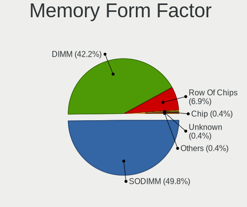

BSD - Hardware Trends
---------------------

A project to identify most popular hardware characteristics and track their change
over time based on data collected by BSD users at https://BSD-Hardware.info.

Anyone can contribute to this report by the [hw-probe](https://github.com/linuxhw/hw-probe/blob/master/INSTALL.BSD.md) tool:

    hw-probe -all -upload

This is a report for all computer types. See also reports for [desktops](/Desktop/README.md) and [notebooks](/Notebook/README.md).

OS-specific reports: [FreeBSD](/Dist/FreeBSD), [OPNsense](/Dist/OPNsense), [helloSystem](/Dist/helloSystem), [OpenBSD](/Dist/OpenBSD).

This report is for one last month. Overall report since the beginning of time: [TestCoverage](https://github.com/bsdhw/TestCoverage)

Period: Jun, 2022.

Contents
--------

* [ System ](#system)
  - [ OS                       ](#os)
  - [ OS Family                ](#os-family)
  - [ Arch                     ](#arch)
  - [ DE                       ](#de)
  - [ Display Server           ](#display-server)
  - [ Display Manager          ](#display-manager)
  - [ OS Lang                  ](#os-lang)
  - [ Boot Mode                ](#boot-mode)
  - [ Filesystem               ](#filesystem)
  - [ Part. scheme             ](#part-scheme)

* [ Board ](#board)
  - [ Vendor                   ](#vendor)
  - [ Model                    ](#model)
  - [ Model Family             ](#model-family)
  - [ MFG Year                 ](#mfg-year)
  - [ Form Factor              ](#form-factor)
  - [ Coreboot                 ](#coreboot)
  - [ RAM Size                 ](#ram-size)
  - [ RAM Used                 ](#ram-used)
  - [ Total Drives             ](#total-drives)
  - [ Has CD-ROM               ](#has-cd-rom)
  - [ Has Ethernet             ](#has-ethernet)
  - [ Has WiFi                 ](#has-wifi)
  - [ Has Bluetooth            ](#has-bluetooth)

* [ Location ](#location)
  - [ Country                  ](#country)
  - [ City                     ](#city)

* [ Drives ](#drives)
  - [ Drive Vendor             ](#drive-vendor)
  - [ Drive Model              ](#drive-model)
  - [ HDD Vendor               ](#hdd-vendor)
  - [ SSD Vendor               ](#ssd-vendor)
  - [ Drive Kind               ](#drive-kind)
  - [ Drive Connector          ](#drive-connector)
  - [ Drive Size               ](#drive-size)
  - [ Space Total              ](#space-total)
  - [ Space Used               ](#space-used)
  - [ Malfunc. Drives          ](#malfunc-drives)
  - [ Malfunc. Drive Vendor    ](#malfunc-drive-vendor)
  - [ Malfunc. HDD Vendor      ](#malfunc-hdd-vendor)
  - [ Malfunc. Drive Kind      ](#malfunc-drive-kind)
  - [ Failed Drives            ](#failed-drives)
  - [ Failed Drive Vendor      ](#failed-drive-vendor)
  - [ Drive Status             ](#drive-status)

* [ Storage controller ](#storage-controller)
  - [ Storage Vendor           ](#storage-vendor)
  - [ Storage Model            ](#storage-model)
  - [ Storage Kind             ](#storage-kind)

* [ Processor ](#processor)
  - [ CPU Vendor               ](#cpu-vendor)
  - [ CPU Model                ](#cpu-model)
  - [ CPU Model Family         ](#cpu-model-family)
  - [ CPU Cores                ](#cpu-cores)
  - [ CPU Sockets              ](#cpu-sockets)
  - [ CPU Threads              ](#cpu-threads)
  - [ CPU Microarch            ](#cpu-microarch)

* [ Graphics ](#graphics)
  - [ GPU Vendor               ](#gpu-vendor)
  - [ GPU Model                ](#gpu-model)
  - [ GPU Combo                ](#gpu-combo)
  - [ GPU Driver               ](#gpu-driver)
  - [ GPU Memory               ](#gpu-memory)

* [ Monitor ](#monitor)
  - [ Monitor Vendor           ](#monitor-vendor)
  - [ Monitor Model            ](#monitor-model)
  - [ Monitor Resolution       ](#monitor-resolution)
  - [ Monitor Diagonal         ](#monitor-diagonal)
  - [ Monitor Width            ](#monitor-width)
  - [ Aspect Ratio             ](#aspect-ratio)
  - [ Monitor Area             ](#monitor-area)
  - [ Pixel Density            ](#pixel-density)
  - [ Multiple Monitors        ](#multiple-monitors)

* [ Network ](#network)
  - [ Net Controller Vendor    ](#net-controller-vendor)
  - [ Net Controller Model     ](#net-controller-model)
  - [ Wireless Vendor          ](#wireless-vendor)
  - [ Wireless Model           ](#wireless-model)
  - [ Ethernet Vendor          ](#ethernet-vendor)
  - [ Ethernet Model           ](#ethernet-model)
  - [ Net Controller Kind      ](#net-controller-kind)
  - [ Used Controller          ](#used-controller)
  - [ NICs                     ](#nics)
  - [ IPv6                     ](#ipv6)

* [ Bluetooth ](#bluetooth)
  - [ Bluetooth Vendor         ](#bluetooth-vendor)
  - [ Bluetooth Model          ](#bluetooth-model)

* [ Sound ](#sound)
  - [ Sound Vendor             ](#sound-vendor)
  - [ Sound Model              ](#sound-model)

* [ Memory ](#memory)
  - [ Memory Vendor            ](#memory-vendor)
  - [ Memory Model             ](#memory-model)
  - [ Memory Kind              ](#memory-kind)
  - [ Memory Form Factor       ](#memory-form-factor)
  - [ Memory Size              ](#memory-size)
  - [ Memory Speed             ](#memory-speed)

* [ Printers & scanners ](#printers--scanners)
  - [ Printer Vendor           ](#printer-vendor)
  - [ Printer Model            ](#printer-model)
  - [ Scanner Vendor           ](#scanner-vendor)
  - [ Scanner Model            ](#scanner-model)

* [ Camera ](#camera)
  - [ Camera Vendor            ](#camera-vendor)
  - [ Camera Model             ](#camera-model)

* [ Security ](#security)
  - [ Fingerprint Vendor       ](#fingerprint-vendor)
  - [ Fingerprint Model        ](#fingerprint-model)
  - [ Chipcard Vendor          ](#chipcard-vendor)
  - [ Chipcard Model           ](#chipcard-model)

* [ Unsupported ](#unsupported)
  - [ Unsupported Devices      ](#unsupported-devices)
  - [ Unsupported Device Types ](#unsupported-device-types)

System
------

OS
--

Installed operating systems

| Name                 | Computers | Percent |
|----------------------|-----------|---------|
| OPNsense 22.1.8      | 152       | 45.65%  |
| OPNsense 22.1.9      | 48        | 14.41%  |
| FreeBSD 13.1         | 47        | 14.11%  |
| helloSystem 0.7.0    | 25        | 7.51%   |
| OpenBSD 7.1          | 8         | 2.4%    |
| OPNsense 22.7        | 4         | 1.2%    |
| OPNsense 22.4.1      | 4         | 1.2%    |
| OPNsense 22.1.7      | 4         | 1.2%    |
| NomadBSD 5806f915    | 4         | 1.2%    |
| helloSystem 0.8.0    | 4         | 1.2%    |
| FreeBSD 14.0-CURRENT | 3         | 0.9%    |
| OPNsense 22.1.6      | 2         | 0.6%    |
| OPNsense 22.1        | 2         | 0.6%    |
| MyBee 13.1           | 2         | 0.6%    |
| MidnightBSD 2.2.0    | 2         | 0.6%    |
| GhostBSD 22.01.12    | 2         | 0.6%    |
| FreeBSD 13.1-STABLE  | 2         | 0.6%    |
| FreeBSD 13.0-p11     | 2         | 0.6%    |
| FreeBSD 12.3         | 2         | 0.6%    |
| TrueNAS 12.2-p14     | 1         | 0.3%    |
| pfSense 12.3-STABLE  | 1         | 0.3%    |
| OPNsense 22.1.5      | 1         | 0.3%    |
| OPNsense 22.1.3      | 1         | 0.3%    |
| OPNsense 21.7.7      | 1         | 0.3%    |
| OPNsense 21.7.6      | 1         | 0.3%    |
| OpenBSD 7.0          | 1         | 0.3%    |
| MyBee 14.0-CURRENT   | 1         | 0.3%    |
| helloSystem 0.5.0    | 1         | 0.3%    |
| GhostBSD 22.06.20    | 1         | 0.3%    |
| GhostBSD 22.06.07    | 1         | 0.3%    |
| GhostBSD 21.11.24    | 1         | 0.3%    |
| FreeBSD 13.0-p6      | 1         | 0.3%    |
| FreeBSD 12.3-STABLE  | 1         | 0.3%    |

OS Family
---------

OS without a version

| Name        | Computers | Percent |
|-------------|-----------|---------|
| OPNsense    | 220       | 66.07%  |
| FreeBSD     | 58        | 17.42%  |
| helloSystem | 30        | 9.01%   |
| OpenBSD     | 9         | 2.7%    |
| GhostBSD    | 5         | 1.5%    |
| NomadBSD    | 4         | 1.2%    |
| MyBee       | 3         | 0.9%    |
| MidnightBSD | 2         | 0.6%    |
| TrueNAS     | 1         | 0.3%    |
| pfSense     | 1         | 0.3%    |

Arch
----

OS architecture (x86_64, i586, etc.)

| Name  | Computers | Percent |
|-------|-----------|---------|
| amd64 | 330       | 99.1%   |
| i386  | 2         | 0.6%    |
| arm64 | 1         | 0.3%    |

DE
--

Desktop Environment

| Name         | Computers | Percent |
|--------------|-----------|---------|
| Console      | 244       | 73.27%  |
| helloDesktop | 36        | 10.81%  |
| KDE5         | 12        | 3.6%    |
| XFCE         | 9         | 2.7%    |
| MATE         | 8         | 2.4%    |
| TWM          | 6         | 1.8%    |
| Openbox      | 6         | 1.8%    |
| i3           | 4         | 1.2%    |
| GNOME        | 4         | 1.2%    |
| LXQt         | 1         | 0.3%    |
| LXDE         | 1         | 0.3%    |
| fvwm         | 1         | 0.3%    |
| Cinnamon     | 1         | 0.3%    |

Display Server
--------------

X11 or Wayland

| Name    | Computers | Percent |
|---------|-----------|---------|
| Console | 245       | 73.57%  |
| X11     | 86        | 25.83%  |
| Wayland | 2         | 0.6%    |

Display Manager
---------------

SDDM, LightDM, etc.

| Name    | Computers | Percent |
|---------|-----------|---------|
| Console | 265       | 79.58%  |
| SLiM    | 43        | 12.91%  |
| SDDM    | 10        | 3%      |
| LightDM | 8         | 2.4%    |
| XDM     | 4         | 1.2%    |
| GDM     | 3         | 0.9%    |

OS Lang
-------

Language

| Lang    | Computers | Percent |
|---------|-----------|---------|
| Unknown | 235       | 70.57%  |
| C       | 50        | 15.02%  |
| en_US   | 38        | 11.41%  |
| ru_RU   | 3         | 0.9%    |
| fr_FR   | 3         | 0.9%    |
| zh_CN   | 2         | 0.6%    |
| de_DE   | 2         | 0.6%    |

Boot Mode
---------

EFI or BIOS

| Mode | Computers | Percent |
|------|-----------|---------|
| EFI  | 299       | 89.79%  |
| BIOS | 34        | 10.21%  |

Filesystem
----------

Type of filesystem

| Type   | Computers | Percent |
|--------|-----------|---------|
| Ufs    | 182       | 54.65%  |
| Zfs    | 128       | 38.44%  |
| Cd9660 | 14        | 4.2%    |
| Ffs    | 9         | 2.7%    |

Part. scheme
------------

Scheme of partitioning

| Type    | Computers | Percent |
|---------|-----------|---------|
| GPT     | 313       | 93.99%  |
| MBR     | 17        | 5.11%   |
| Unknown | 3         | 0.9%    |

Board
-----

Vendor
------

Motherboard manufacturer

| Name                          | Computers | Percent |
|-------------------------------|-----------|---------|
| Dell                          | 41        | 12.31%  |
| Hewlett-Packard               | 35        | 10.51%  |
| ASUSTek Computer              | 29        | 8.71%   |
| Lenovo                        | 28        | 8.41%   |
| Unknown                       | 23        | 6.91%   |
| Intel                         | 16        | 4.8%    |
| Gigabyte Technology           | 16        | 4.8%    |
| Supermicro                    | 15        | 4.5%    |
| Protectli                     | 14        | 4.2%    |
| ASRock                        | 14        | 4.2%    |
| AMI                           | 10        | 3%      |
| MSI                           | 9         | 2.7%    |
| PC Engines                    | 8         | 2.4%    |
| AWOW                          | 7         | 2.1%    |
| Apple                         | 7         | 2.1%    |
| Sophos                        | 6         | 1.8%    |
| Fujitsu                       | 6         | 1.8%    |
| Acer                          | 6         | 1.8%    |
| Biostar                       | 4         | 1.2%    |
| ZOTAC                         | 3         | 0.9%    |
| Toshiba                       | 2         | 0.6%    |
| Seeed Studio                  | 2         | 0.6%    |
| Pegatron                      | 2         | 0.6%    |
| MW                            | 2         | 0.6%    |
| Deciso                        | 2         | 0.6%    |
| BESSTAR Tech                  | 2         | 0.6%    |
| AZW                           | 2         | 0.6%    |
| YANYU                         | 1         | 0.3%    |
| TYAN Computer                 | 1         | 0.3%    |
| Thomas-Krenn.AG               | 1         | 0.3%    |
| System76                      | 1         | 0.3%    |
| Sony                          | 1         | 0.3%    |
| SmbiosType2_BoardManufacturer | 1         | 0.3%    |
| ShenZhen MinWin Technology    | 1         | 0.3%    |
| Samsung Electronics           | 1         | 0.3%    |
| Raspberry Pi Foundation       | 1         | 0.3%    |
| NF692                         | 1         | 0.3%    |
| Lanner                        | 1         | 0.3%    |
| Lanix                         | 1         | 0.3%    |
| IceWhale Technology           | 1         | 0.3%    |
| Fujitsu Siemens               | 1         | 0.3%    |
| CompuLab                      | 1         | 0.3%    |
| CloudGenix                    | 1         | 0.3%    |
| Cisco                         | 1         | 0.3%    |
| AOpen                         | 1         | 0.3%    |
| AMD                           | 1         | 0.3%    |
| ALLEGIANCE GAMING             | 1         | 0.3%    |
| Alienware                     | 1         | 0.3%    |
| ADI                           | 1         | 0.3%    |

Model
-----

Motherboard model

| Name                                                        | Computers | Percent |
|-------------------------------------------------------------|-----------|---------|
| Unknown                                                     | 24        | 7.21%   |
| AMI Aptio CRB                                               | 9         | 2.7%    |
| Protectli FW6                                               | 6         | 1.8%    |
| Supermicro Super Server                                     | 5         | 1.5%    |
| Protectli FW4B                                              | 5         | 1.5%    |
| PC Engines APU2                                             | 5         | 1.5%    |
| Intel Q3XXG4-P V1.0                                         | 5         | 1.5%    |
| MSI MS-7817                                                 | 4         | 1.2%    |
| Dell OptiPlex 3020                                          | 4         | 1.2%    |
| Sophos SG                                                   | 3         | 0.9%    |
| HP EliteDesk 800 G1 SFF                                     | 3         | 0.9%    |
| AWOW PC BOX                                                 | 3         | 0.9%    |
| ASUS All Series                                             | 3         | 0.9%    |
| Sophos UTM                                                  | 2         | 0.6%    |
| Protectli VP2410                                            | 2         | 0.6%    |
| PC Engines apu4                                             | 2         | 0.6%    |
| MW GMLK-2_5G4L                                              | 2         | 0.6%    |
| Intel NUC8i5BEH                                             | 2         | 0.6%    |
| Intel MAHOBAY                                               | 2         | 0.6%    |
| HP t730 Thin Client                                         | 2         | 0.6%    |
| Fujitsu FUTRO S920                                          | 2         | 0.6%    |
| Dell PowerEdge R630                                         | 2         | 0.6%    |
| Dell OptiPlex 9020                                          | 2         | 0.6%    |
| Dell OptiPlex 790                                           | 2         | 0.6%    |
| Dell OptiPlex 7020                                          | 2         | 0.6%    |
| AWOW AK34Pro                                                | 2         | 0.6%    |
| AWOW AK34                                                   | 2         | 0.6%    |
| ASRock X570 Phantom Gaming 4                                | 2         | 0.6%    |
| ZOTAC ZBOX-CI331NANO                                        | 1         | 0.3%    |
| ZOTAC ZBOX-CI327NANO-GS-01                                  | 1         | 0.3%    |
| ZOTAC ZBOX-CI323NANO                                        | 1         | 0.3%    |
| YANYU EPIC-N31 Ver:1.1                                      | 1         | 0.3%    |
| TYAN Tiger K8W Dual AMD Opteron, S2875                      | 1         | 0.3%    |
| Toshiba Satellite A300                                      | 1         | 0.3%    |
| Toshiba PORTEGE R700                                        | 1         | 0.3%    |
| Thomas-Krenn.AG LES network 6L                              | 1         | 0.3%    |
| System76 Gazelle                                            | 1         | 0.3%    |
| Supermicro X9SCL/X9SCM                                      | 1         | 0.3%    |
| Supermicro X7SPA-HF                                         | 1         | 0.3%    |
| Supermicro X11SSQ-L                                         | 1         | 0.3%    |
| Supermicro X10SLH-N6-ST031                                  | 1         | 0.3%    |
| Supermicro X10SBA                                           | 1         | 0.3%    |
| Supermicro SYS-E300-9D-8CN8TP                               | 1         | 0.3%    |
| Supermicro SYS-5019A-12TN4                                  | 1         | 0.3%    |
| Supermicro mGuard centerport2                               | 1         | 0.3%    |
| Supermicro Icebreaker 4824                                  | 1         | 0.3%    |
| Supermicro A1SRM-2758F                                      | 1         | 0.3%    |
| Sophos XG                                                   | 1         | 0.3%    |
| Sony VGN-NS21M_S                                            | 1         | 0.3%    |
| SmbiosType2_BoardManufacturer SmbiosType1_SystemProductName | 1         | 0.3%    |
| ShenZhen MinWin MW-GMLK-2.5G6L                              | 1         | 0.3%    |
| Seeed Studio ODYSSEY-X86J4125                               | 1         | 0.3%    |
| Seeed Studio ODYSSEY-X86J4105                               | 1         | 0.3%    |
| Samsung R530/R730/R540                                      | 1         | 0.3%    |
| RPi Raspberry Pi                                            | 1         | 0.3%    |
| Protectli FW6D                                              | 1         | 0.3%    |
| Pegatron Pro 3405 Series                                    | 1         | 0.3%    |
| Pegatron Pro 3010 Microtower PC                             | 1         | 0.3%    |
| PC Engines APU                                              | 1         | 0.3%    |
| NF692 1.0                                                   | 1         | 0.3%    |

Model Family
------------

Motherboard model prefix

| Name                          | Computers | Percent |
|-------------------------------|-----------|---------|
| Unknown                       | 24        | 7.21%   |
| Lenovo ThinkPad               | 17        | 5.11%   |
| Dell OptiPlex                 | 16        | 4.8%    |
| Dell PowerEdge                | 12        | 3.6%    |
| AMI Aptio                     | 10        | 3%      |
| Protectli FW6                 | 6         | 1.8%    |
| Lenovo ThinkCentre            | 6         | 1.8%    |
| HP ProLiant                   | 6         | 1.8%    |
| Dell Latitude                 | 6         | 1.8%    |
| ASUS PRIME                    | 6         | 1.8%    |
| Supermicro Super              | 5         | 1.5%    |
| Protectli FW4B                | 5         | 1.5%    |
| PC Engines APU2               | 5         | 1.5%    |
| Intel Q3XXG4-P                | 5         | 1.5%    |
| HP Compaq                     | 5         | 1.5%    |
| ASUS ROG                      | 5         | 1.5%    |
| MSI MS-7817                   | 4         | 1.2%    |
| HP Pavilion                   | 4         | 1.2%    |
| HP EliteDesk                  | 4         | 1.2%    |
| HP EliteBook                  | 4         | 1.2%    |
| Acer Aspire                   | 4         | 1.2%    |
| Sophos SG                     | 3         | 0.9%    |
| HP ProDesk                    | 3         | 0.9%    |
| Fujitsu FUTRO                 | 3         | 0.9%    |
| Dell Precision                | 3         | 0.9%    |
| Dell Inspiron                 | 3         | 0.9%    |
| AWOW PC                       | 3         | 0.9%    |
| ASUS ZenBook                  | 3         | 0.9%    |
| ASUS All                      | 3         | 0.9%    |
| Sophos UTM                    | 2         | 0.6%    |
| Protectli VP2410              | 2         | 0.6%    |
| Pegatron Pro                  | 2         | 0.6%    |
| PC Engines apu4               | 2         | 0.6%    |
| MW GMLK-2                     | 2         | 0.6%    |
| Intel NUC8i5BEH               | 2         | 0.6%    |
| Intel MAHOBAY                 | 2         | 0.6%    |
| HP t730                       | 2         | 0.6%    |
| AWOW AK34Pro                  | 2         | 0.6%    |
| AWOW AK34                     | 2         | 0.6%    |
| ASRock X570                   | 2         | 0.6%    |
| ASRock B550                   | 2         | 0.6%    |
| ZOTAC ZBOX-CI331NANO          | 1         | 0.3%    |
| ZOTAC ZBOX-CI327NANO-GS-01    | 1         | 0.3%    |
| ZOTAC ZBOX-CI323NANO          | 1         | 0.3%    |
| YANYU EPIC-N31                | 1         | 0.3%    |
| TYAN Tiger                    | 1         | 0.3%    |
| Toshiba Satellite             | 1         | 0.3%    |
| Toshiba PORTEGE               | 1         | 0.3%    |
| Thomas-Krenn.AG LES           | 1         | 0.3%    |
| System76 Gazelle              | 1         | 0.3%    |
| Supermicro X9SCL              | 1         | 0.3%    |
| Supermicro X7SPA-HF           | 1         | 0.3%    |
| Supermicro X11SSQ-L           | 1         | 0.3%    |
| Supermicro X10SLH-N6-ST031    | 1         | 0.3%    |
| Supermicro X10SBA             | 1         | 0.3%    |
| Supermicro SYS-E300-9D-8CN8TP | 1         | 0.3%    |
| Supermicro SYS-5019A-12TN4    | 1         | 0.3%    |
| Supermicro mGuard             | 1         | 0.3%    |
| Supermicro Icebreaker         | 1         | 0.3%    |
| Supermicro A1SRM-2758F        | 1         | 0.3%    |

MFG Year
--------

Motherboard manufacture year

| Year | Computers | Percent |
|------|-----------|---------|
| 2021 | 47        | 14.11%  |
| 2019 | 40        | 12.01%  |
| 2018 | 35        | 10.51%  |
| 2020 | 33        | 9.91%   |
| 2014 | 28        | 8.41%   |
| 2016 | 22        | 6.61%   |
| 2015 | 21        | 6.31%   |
| 2022 | 19        | 5.71%   |
| 2011 | 17        | 5.11%   |
| 2013 | 16        | 4.8%    |
| 2017 | 15        | 4.5%    |
| 2012 | 12        | 3.6%    |
| 2009 | 10        | 3%      |
| 2008 | 8         | 2.4%    |
| 2010 | 6         | 1.8%    |
| 2006 | 2         | 0.6%    |
| 2007 | 1         | 0.3%    |
| 2004 | 1         | 0.3%    |

Form Factor
-----------

Physical design of the computer

| Name           | Computers | Percent |
|----------------|-----------|---------|
| Desktop        | 197       | 59.16%  |
| Notebook       | 62        | 18.62%  |
| Mini pc        | 33        | 9.91%   |
| Server         | 29        | 8.71%   |
| Firewall       | 7         | 2.1%    |
| Convertible    | 3         | 0.9%    |
| System on chip | 1         | 0.3%    |
| All in one     | 1         | 0.3%    |

Coreboot
--------

Have coreboot on board

| Used | Computers | Percent |
|------|-----------|---------|
| No   | 324       | 97.3%   |
| Yes  | 9         | 2.7%    |

RAM Size
--------

Total RAM memory

| Size in GB  | Computers | Percent |
|-------------|-----------|---------|
| 8.01-16.0   | 114       | 34.23%  |
| 4.01-8.0    | 82        | 24.62%  |
| 16.01-24.0  | 67        | 20.12%  |
| 32.01-64.0  | 31        | 9.31%   |
| 64.01-256.0 | 19        | 5.71%   |
| 2.01-3.0    | 10        | 3%      |
| 24.01-32.0  | 5         | 1.5%    |
| 0.51-1.0    | 3         | 0.9%    |
| 3.01-4.0    | 2         | 0.6%    |

RAM Used
--------

Used RAM memory

| Used GB    | Computers | Percent |
|------------|-----------|---------|
| 0.01-0.5   | 192       | 57.66%  |
| 0.51-1.0   | 89        | 26.73%  |
| 1.01-2.0   | 36        | 10.81%  |
| 2.01-3.0   | 8         | 2.4%    |
| 3.01-4.0   | 4         | 1.2%    |
| 16.01-24.0 | 2         | 0.6%    |
| 24.01-32.0 | 1         | 0.3%    |
| 8.01-16.0  | 1         | 0.3%    |

Total Drives
------------

Number of drives on board

| Drives | Computers | Percent |
|--------|-----------|---------|
| 1      | 248       | 74.47%  |
| 2      | 29        | 8.71%   |
| 0      | 22        | 6.61%   |
| 3      | 15        | 4.5%    |
| 4      | 9         | 2.7%    |
| 8      | 2         | 0.6%    |
| 6      | 2         | 0.6%    |
| 5      | 2         | 0.6%    |
| 18     | 1         | 0.3%    |
| 15     | 1         | 0.3%    |
| 13     | 1         | 0.3%    |
| 10     | 1         | 0.3%    |

Has CD-ROM
----------

Has CD-ROM on board

| Presented | Computers | Percent |
|-----------|-----------|---------|
| No        | 268       | 80.48%  |
| Yes       | 65        | 19.52%  |

Has Ethernet
------------

Has Ethernet on board

| Presented | Computers | Percent |
|-----------|-----------|---------|
| Yes       | 324       | 97.3%   |
| No        | 9         | 2.7%    |

Has WiFi
--------

Has WiFi module

| Presented | Computers | Percent |
|-----------|-----------|---------|
| No        | 218       | 65.47%  |
| Yes       | 115       | 34.53%  |

Has Bluetooth
-------------

Has Bluetooth module

| Presented | Computers | Percent |
|-----------|-----------|---------|
| No        | 254       | 76.28%  |
| Yes       | 79        | 23.72%  |

Location
--------

Country
-------

Geographic location (country)

| Country            | Computers | Percent |
|--------------------|-----------|---------|
| USA                | 97        | 29.13%  |
| Germany            | 62        | 18.62%  |
| France             | 14        | 4.2%    |
| Canada             | 14        | 4.2%    |
| Russia             | 13        | 3.9%    |
| UK                 | 12        | 3.6%    |
| Switzerland        | 7         | 2.1%    |
| Italy              | 7         | 2.1%    |
| Australia          | 7         | 2.1%    |
| Brazil             | 6         | 1.8%    |
| Austria            | 6         | 1.8%    |
| China              | 5         | 1.5%    |
| South Korea        | 4         | 1.2%    |
| Poland             | 4         | 1.2%    |
| Lithuania          | 4         | 1.2%    |
| Colombia           | 4         | 1.2%    |
| Belgium            | 4         | 1.2%    |
| Sweden             | 3         | 0.9%    |
| Spain              | 3         | 0.9%    |
| Philippines        | 3         | 0.9%    |
| Netherlands        | 3         | 0.9%    |
| Indonesia          | 3         | 0.9%    |
| Hungary            | 3         | 0.9%    |
| Finland            | 3         | 0.9%    |
| Thailand           | 2         | 0.6%    |
| Slovenia           | 2         | 0.6%    |
| Romania            | 2         | 0.6%    |
| Paraguay           | 2         | 0.6%    |
| New Zealand        | 2         | 0.6%    |
| Hong Kong          | 2         | 0.6%    |
| Chile              | 2         | 0.6%    |
| Bulgaria           | 2         | 0.6%    |
| Uruguay            | 1         | 0.3%    |
| Ukraine            | 1         | 0.3%    |
| UAE                | 1         | 0.3%    |
| Turkey             | 1         | 0.3%    |
| Taiwan             | 1         | 0.3%    |
| South Africa       | 1         | 0.3%    |
| Slovakia           | 1         | 0.3%    |
| Singapore          | 1         | 0.3%    |
| Portugal           | 1         | 0.3%    |
| Myanmar            | 1         | 0.3%    |
| Morocco            | 1         | 0.3%    |
| Mexico             | 1         | 0.3%    |
| Malaysia           | 1         | 0.3%    |
| Latvia             | 1         | 0.3%    |
| Japan              | 1         | 0.3%    |
| Isle of Man        | 1         | 0.3%    |
| Ireland            | 1         | 0.3%    |
| India              | 1         | 0.3%    |
| Greece             | 1         | 0.3%    |
| Estonia            | 1         | 0.3%    |
| Dominican Republic | 1         | 0.3%    |
| Denmark            | 1         | 0.3%    |
| Czechia            | 1         | 0.3%    |
| Croatia            | 1         | 0.3%    |
| Costa Rica         | 1         | 0.3%    |
| Bolivia            | 1         | 0.3%    |

City
----

Geographic location (city)

| City                | Computers | Percent |
|---------------------|-----------|---------|
| Vienna              | 4         | 1.2%    |
| Toronto             | 4         | 1.2%    |
| Moscow              | 4         | 1.2%    |
| Munich              | 3         | 0.9%    |
| Duncan              | 3         | 0.9%    |
| Bochum              | 3         | 0.9%    |
| Austin              | 3         | 0.9%    |
| Ypsilanti           | 2         | 0.6%    |
| Windsor             | 2         | 0.6%    |
| Wexford             | 2         | 0.6%    |
| Wellington          | 2         | 0.6%    |
| Tamm                | 2         | 0.6%    |
| Sydney              | 2         | 0.6%    |
| St Petersburg       | 2         | 0.6%    |
| Sofia               | 2         | 0.6%    |
| Sao Paulo           | 2         | 0.6%    |
| Salem               | 2         | 0.6%    |
| Redmond             | 2         | 0.6%    |
| Quezon City         | 2         | 0.6%    |
| Omaha               | 2         | 0.6%    |
| New York            | 2         | 0.6%    |
| Montreal            | 2         | 0.6%    |
| Melbourne           | 2         | 0.6%    |
| Medellín           | 2         | 0.6%    |
| Madrid              | 2         | 0.6%    |
| Mâcon              | 2         | 0.6%    |
| Las Condes          | 2         | 0.6%    |
| Krasnodar           | 2         | 0.6%    |
| Karlsruhe           | 2         | 0.6%    |
| Himmelpforten       | 2         | 0.6%    |
| Gachnang            | 2         | 0.6%    |
| Fremont             | 2         | 0.6%    |
| Frankfurt am Main   | 2         | 0.6%    |
| Durham              | 2         | 0.6%    |
| Dovilai             | 2         | 0.6%    |
| Denver              | 2         | 0.6%    |
| Chelyabinsk         | 2         | 0.6%    |
| Central             | 2         | 0.6%    |
| Budapest            | 2         | 0.6%    |
| Bordeaux            | 2         | 0.6%    |
| Berlin              | 2         | 0.6%    |
| Bergisch Gladbach   | 2         | 0.6%    |
| Bangkok             | 2         | 0.6%    |
| Zurich              | 1         | 0.3%    |
| Zagreb              | 1         | 0.3%    |
| Yangon              | 1         | 0.3%    |
| Xi'an               | 1         | 0.3%    |
| Worcester           | 1         | 0.3%    |
| Wolverhampton       | 1         | 0.3%    |
| Wolfhagen           | 1         | 0.3%    |
| Winter Haven        | 1         | 0.3%    |
| Winnipeg            | 1         | 0.3%    |
| Willich             | 1         | 0.3%    |
| West Hanningfield   | 1         | 0.3%    |
| Wentorf bei Hamburg | 1         | 0.3%    |
| Wenatchee           | 1         | 0.3%    |
| Webberville         | 1         | 0.3%    |
| Warsaw              | 1         | 0.3%    |
| Warminster          | 1         | 0.3%    |
| Wallan              | 1         | 0.3%    |

Drives
------

Drive Vendor
------------

Hard drive vendors

| Vendor              | Computers | Drives | Percent |
|---------------------|-----------|--------|---------|
| Samsung Electronics | 56        | 68     | 14.7%   |
| WDC                 | 49        | 78     | 12.86%  |
| Seagate             | 41        | 69     | 10.76%  |
| Kingston            | 26        | 27     | 6.82%   |
| Crucial             | 25        | 27     | 6.56%   |
| Transcend           | 22        | 22     | 5.77%   |
| Toshiba             | 19        | 33     | 4.99%   |
| Intel               | 18        | 21     | 4.72%   |
| SanDisk             | 10        | 10     | 2.62%   |
| Hitachi             | 9         | 10     | 2.36%   |
| OCZ                 | 7         | 8      | 1.84%   |
| Hoodisk             | 6         | 6      | 1.57%   |
| China               | 6         | 6      | 1.57%   |
| A-DATA Technology   | 6         | 8      | 1.57%   |
| FORESEE             | 5         | 5      | 1.31%   |
| SK hynix            | 4         | 4      | 1.05%   |
| ShiJi               | 4         | 4      | 1.05%   |
| KingSpec            | 4         | 4      | 1.05%   |
| Hewlett-Packard     | 4         | 6      | 1.05%   |
| Apacer              | 4         | 4      | 1.05%   |
| Protectli           | 3         | 3      | 0.79%   |
| Micron Technology   | 3         | 6      | 0.79%   |
| KIOXIA              | 3         | 3      | 0.79%   |
| Intenso             | 3         | 3      | 0.79%   |
| HGST                | 3         | 3      | 0.79%   |
| Corsair             | 3         | 3      | 0.79%   |
| Team                | 2         | 2      | 0.52%   |
| SPCC                | 2         | 2      | 0.52%   |
| PNY                 | 2         | 2      | 0.52%   |
| Plextor             | 2         | 2      | 0.52%   |
| Phison              | 2         | 2      | 0.52%   |
| LITEONIT            | 2         | 2      | 0.52%   |
| Lexar               | 2         | 2      | 0.52%   |
| Dogfish             | 2         | 2      | 0.52%   |
| Apple               | 2         | 2      | 0.52%   |
| AirDisk             | 2         | 2      | 0.52%   |
| Verbatim            | 1         | 1      | 0.26%   |
| NVMe                | 1         | 1      | 0.26%   |
| Netac               | 1         | 1      | 0.26%   |
| Mushkin             | 1         | 1      | 0.26%   |
| Maxtor              | 1         | 2      | 0.26%   |
| Lenovo              | 1         | 1      | 0.26%   |
| Kingchuxing         | 1         | 1      | 0.26%   |
| INDMEM              | 1         | 1      | 0.26%   |
| HPE                 | 1         | 2      | 0.26%   |
| Gigabyte Technology | 1         | 1      | 0.26%   |
| Generic             | 1         | 1      | 0.26%   |
| Fujitsu             | 1         | 1      | 0.26%   |
| FLEXXON             | 1         | 1      | 0.26%   |
| BR                  | 1         | 1      | 0.26%   |
| BIWIN               | 1         | 1      | 0.26%   |
| Axiom               | 1         | 1      | 0.26%   |
| ATP                 | 1         | 1      | 0.26%   |
| Advantech           | 1         | 1      | 0.26%   |

Drive Model
-----------

Hard drive models

| Model                             | Computers | Percent |
|-----------------------------------|-----------|---------|
| Kingston SA400S37240G 240GB       | 6         | 1.46%   |
| Transcend TS128GMSA230S 128GB     | 5         | 1.21%   |
| Samsung SSD 850 EVO 500GB         | 5         | 1.21%   |
| Samsung SSD 850 EVO 250GB         | 4         | 0.97%   |
| FORESEE 128GB SSD                 | 4         | 0.97%   |
| Crucial CT240BX500SSD1 240GB      | 4         | 0.97%   |
| Crucial CT1000MX500SSD1 1TB       | 4         | 0.97%   |
| WDC WD10EZEX-08WN4A0 1TB          | 3         | 0.73%   |
| Toshiba MQ01ABD100 1TB            | 3         | 0.73%   |
| Seagate ST1000DM010-2EP102 1TB    | 3         | 0.73%   |
| SanDisk SDSSDA120G 120GB          | 3         | 0.73%   |
| Samsung SSD 860 EVO 500GB         | 3         | 0.73%   |
| Samsung SSD 850 EVO 120GB         | 3         | 0.73%   |
| Kingston SA400S37120G 120GB       | 3         | 0.73%   |
| WDC WD30EFRX-68EUZN0 3TB          | 2         | 0.49%   |
| WDC WD2503ABYX-01WERA1 256GB      | 2         | 0.49%   |
| Transcend TS64GSSD370S 64GB       | 2         | 0.49%   |
| Transcend TS256GMSA230S 256GB     | 2         | 0.49%   |
| Transcend TS128GMTE110S 128GB     | 2         | 0.49%   |
| Toshiba MQ04ABF100 1TB            | 2         | 0.49%   |
| Toshiba MG06ACA800E 8TB           | 2         | 0.49%   |
| ShiJi SSD 128GB                   | 2         | 0.49%   |
| Seagate ST8000VN0022-2EL112 8TB   | 2         | 0.49%   |
| Seagate ST500DM002-1BD142 500GB   | 2         | 0.49%   |
| Seagate ST4000DM000-1F2168 4TB    | 2         | 0.49%   |
| Seagate ST3250318AS 250GB         | 2         | 0.49%   |
| Seagate ST16000NM001G-2KK103 16TB | 2         | 0.49%   |
| Seagate ST1000LM035-1RK172 1TB    | 2         | 0.49%   |
| Samsung SSD PM871 2.5 7mm 128GB   | 2         | 0.49%   |
| Samsung SSD 960 EVO 500GB         | 2         | 0.49%   |
| Samsung SSD 860 EVO 250GB         | 2         | 0.49%   |
| Samsung SSD 850 EVO mSATA 120GB   | 2         | 0.49%   |
| Samsung MZVLW256HEHP-000L7 256GB  | 2         | 0.49%   |
| Samsung MZMPC032HBCD-000H1 32GB   | 2         | 0.49%   |
| Protectli 120GB mSATA             | 2         | 0.49%   |
| KIOXIA KBG40ZNS256G NVMe 256GB    | 2         | 0.49%   |
| Kingston SUV500MS120G 120GB       | 2         | 0.49%   |
| Kingston SA400S37480G 480GB       | 2         | 0.49%   |
| Intel HBRPEKNX0101AH 256GB        | 2         | 0.49%   |
| Hoodisk SSD 32GB                  | 2         | 0.49%   |
| Hoodisk SSD 128GB                 | 2         | 0.49%   |
| Hitachi HTS547564A9E384 640GB     | 2         | 0.49%   |
| HP RAID 1(1+0) 2TB                | 2         | 0.49%   |
| Crucial CT500P2SSD8 500GB         | 2         | 0.49%   |
| Crucial CT500MX500SSD1 500GB      | 2         | 0.49%   |
| Crucial CT480BX500SSD1 480GB      | 2         | 0.49%   |
| Crucial CT250MX500SSD1 250GB      | 2         | 0.49%   |
| Crucial CT1000BX500SSD1 1TB       | 2         | 0.49%   |
| Corsair Force MP600 500GB         | 2         | 0.49%   |
| China SATA SSD 16GB               | 2         | 0.49%   |
| Apacer 32GB SATA Flash Drive      | 2         | 0.49%   |
| AirDisk 128GB SSD                 | 2         | 0.49%   |
| A-DATA SU800 128GB                | 2         | 0.49%   |
| WDC WDS500G2X0C-00L350 500GB      | 1         | 0.24%   |
| WDC WDS500G2B0A-00SM50 500GB      | 1         | 0.24%   |
| WDC WDS250G2B0A-00SM50 250GB      | 1         | 0.24%   |
| WDC WDS120G2G0A-00JH30 120GB      | 1         | 0.24%   |
| WDC WDS100T3X0C-00SJG0 1TB        | 1         | 0.24%   |
| WDC WDS100T1X0E-00AFY0 1TB        | 1         | 0.24%   |
| WDC WD80EZZX-11CSGA0 8TB          | 1         | 0.24%   |

HDD Vendor
----------

Hard disk drive vendors

| Vendor              | Computers | Drives | Percent |
|---------------------|-----------|--------|---------|
| Seagate             | 40        | 68     | 33.33%  |
| WDC                 | 39        | 66     | 32.5%   |
| Toshiba             | 15        | 28     | 12.5%   |
| Hitachi             | 9         | 10     | 7.5%    |
| Samsung Electronics | 5         | 8      | 4.17%   |
| HGST                | 3         | 3      | 2.5%    |
| Hewlett-Packard     | 3         | 5      | 2.5%    |
| NVMe                | 1         | 1      | 0.83%   |
| Maxtor              | 1         | 2      | 0.83%   |
| HPE                 | 1         | 2      | 0.83%   |
| Generic             | 1         | 1      | 0.83%   |
| Fujitsu             | 1         | 1      | 0.83%   |
| Apple               | 1         | 1      | 0.83%   |

SSD Vendor
----------

Solid state drive vendors

| Vendor              | Computers | Drives | Percent |
|---------------------|-----------|--------|---------|
| Samsung Electronics | 38        | 44     | 17.84%  |
| Kingston            | 24        | 25     | 11.27%  |
| Crucial             | 21        | 21     | 9.86%   |
| Transcend           | 19        | 19     | 8.92%   |
| Intel               | 14        | 17     | 6.57%   |
| SanDisk             | 10        | 10     | 4.69%   |
| OCZ                 | 7         | 8      | 3.29%   |
| Hoodisk             | 6         | 6      | 2.82%   |
| China               | 6         | 6      | 2.82%   |
| A-DATA Technology   | 6         | 8      | 2.82%   |
| FORESEE             | 5         | 5      | 2.35%   |
| KingSpec            | 4         | 4      | 1.88%   |
| Apacer              | 4         | 4      | 1.88%   |
| WDC                 | 3         | 3      | 1.41%   |
| Toshiba             | 3         | 3      | 1.41%   |
| ShiJi               | 3         | 3      | 1.41%   |
| Protectli           | 3         | 3      | 1.41%   |
| Micron Technology   | 3         | 6      | 1.41%   |
| Intenso             | 3         | 3      | 1.41%   |
| Team                | 2         | 2      | 0.94%   |
| SPCC                | 2         | 2      | 0.94%   |
| SK hynix            | 2         | 2      | 0.94%   |
| PNY                 | 2         | 2      | 0.94%   |
| Plextor             | 2         | 2      | 0.94%   |
| LITEONIT            | 2         | 2      | 0.94%   |
| Dogfish             | 2         | 2      | 0.94%   |
| AirDisk             | 2         | 2      | 0.94%   |
| Verbatim            | 1         | 1      | 0.47%   |
| Mushkin             | 1         | 1      | 0.47%   |
| Lexar               | 1         | 1      | 0.47%   |
| Lenovo              | 1         | 1      | 0.47%   |
| Kingchuxing         | 1         | 1      | 0.47%   |
| INDMEM              | 1         | 1      | 0.47%   |
| Gigabyte Technology | 1         | 1      | 0.47%   |
| FLEXXON             | 1         | 1      | 0.47%   |
| Corsair             | 1         | 1      | 0.47%   |
| BR                  | 1         | 1      | 0.47%   |
| BIWIN               | 1         | 1      | 0.47%   |
| Axiom               | 1         | 1      | 0.47%   |
| ATP                 | 1         | 1      | 0.47%   |
| Apple               | 1         | 1      | 0.47%   |
| Advantech           | 1         | 1      | 0.47%   |

Drive Kind
----------

HDD or SSD

| Kind | Computers | Drives | Percent |
|------|-----------|--------|---------|
| SSD  | 203       | 229    | 58.33%  |
| HDD  | 97        | 196    | 27.87%  |
| NVMe | 48        | 56     | 13.79%  |

Drive Connector
---------------

SATA, SAS, NVMe, etc.

| Type | Computers | Drives | Percent |
|------|-----------|--------|---------|
| SATA | 275       | 425    | 85.14%  |
| NVMe | 48        | 56     | 14.86%  |

Drive Size
----------

Size of hard drive

| Size in TB | Computers | Drives | Percent |
|------------|-----------|--------|---------|
| 0.01-0.5   | 234       | 268    | 75.24%  |
| 0.51-1.0   | 49        | 64     | 15.76%  |
| 1.01-2.0   | 8         | 14     | 2.57%   |
| 4.01-10.0  | 7         | 45     | 2.25%   |
| 3.01-4.0   | 6         | 11     | 1.93%   |
| 10.01-20.0 | 4         | 7      | 1.29%   |
| 2.01-3.0   | 3         | 16     | 0.96%   |

Space Total
-----------

Amount of disk space available on the file system

| Size in GB     | Computers | Percent |
|----------------|-----------|---------|
| 101-250        | 154       | 46.25%  |
| 251-500        | 52        | 15.62%  |
| 51-100         | 35        | 10.51%  |
| 21-50          | 31        | 9.31%   |
| 1-20           | 31        | 9.31%   |
| 501-1000       | 22        | 6.61%   |
| 2001-3000      | 3         | 0.9%    |
| 1001-2000      | 3         | 0.9%    |
| More than 3000 | 2         | 0.6%    |

Space Used
----------

Amount of used disk space

| Used GB        | Computers | Percent |
|----------------|-----------|---------|
| 1-20           | 296       | 88.89%  |
| 21-50          | 26        | 7.81%   |
| 51-100         | 6         | 1.8%    |
| 101-250        | 2         | 0.6%    |
| More than 3000 | 1         | 0.3%    |
| 251-500        | 1         | 0.3%    |
| 501-1000       | 1         | 0.3%    |

Malfunc. Drives
---------------

Drive models with a malfunction

| Model                                 | Computers | Drives | Percent |
|---------------------------------------|-----------|--------|---------|
| WDC WDS500G2B0A-00SM50 500GB          | 1         | 1      | 2.17%   |
| WDC WD6400AAKS-22A7B2 640GB           | 1         | 1      | 2.17%   |
| WDC WD5003ABYX-18WERA0 500GB          | 1         | 2      | 2.17%   |
| WDC WD5000AAKX-60U6AA0 500GB          | 1         | 1      | 2.17%   |
| WDC WD40PURX-64GVNY0 4TB              | 1         | 1      | 2.17%   |
| WDC WD3200BEKT-60PVMT0 320GB          | 1         | 1      | 2.17%   |
| WDC WD30EFRX-68EUZN0 3TB              | 1         | 3      | 2.17%   |
| WDC WD2503ABYX-01WERA1 256GB          | 1         | 1      | 2.17%   |
| WDC WD2503ABYX-01WERA0 256GB          | 1         | 1      | 2.17%   |
| WDC WD2500BEVT-24A23T0 250GB          | 1         | 1      | 2.17%   |
| WDC WD20EURS-63S48Y0 2TB              | 1         | 1      | 2.17%   |
| WDC WD1600AAJS-60M0A0 160GB           | 1         | 1      | 2.17%   |
| WDC WD10JPVX-22JC3T0 1TB              | 1         | 1      | 2.17%   |
| Toshiba MQ01ABD100 1TB                | 1         | 1      | 2.17%   |
| Toshiba MQ01ABD075 752GB              | 1         | 1      | 2.17%   |
| Toshiba MK2546GSX 250GB               | 1         | 1      | 2.17%   |
| SPCC Solid State Disk 128GB           | 1         | 1      | 2.17%   |
| Seagate ST9500530NS 42D0743 500GB     | 1         | 1      | 2.17%   |
| Seagate ST9320423AS 320GB             | 1         | 1      | 2.17%   |
| Seagate ST500LT012-9WS142 500GB       | 1         | 1      | 2.17%   |
| Seagate ST500LM012 HN-M500MBB 500GB   | 1         | 1      | 2.17%   |
| Seagate ST500DM002-1BD142 500GB       | 1         | 1      | 2.17%   |
| Seagate ST380811AS 80GB               | 1         | 1      | 2.17%   |
| Seagate ST380013AS 80GB               | 1         | 1      | 2.17%   |
| Seagate ST3500413AS 500GB             | 1         | 1      | 2.17%   |
| Seagate ST3160212AS 160GB             | 1         | 1      | 2.17%   |
| SanDisk SDSSDP064G 64GB               | 1         | 1      | 2.17%   |
| Samsung Electronics SSD 870 EVO 1TB   | 1         | 2      | 2.17%   |
| Samsung Electronics SSD 850 EVO 500GB | 1         | 1      | 2.17%   |
| Samsung Electronics HD753LJ 752GB     | 1         | 1      | 2.17%   |
| Samsung Electronics HD161HJ 160GB     | 1         | 1      | 2.17%   |
| Kingston SUV500MS480G 480GB           | 1         | 1      | 2.17%   |
| Kingston SUV400S37120G 120GB          | 1         | 2      | 2.17%   |
| Kingston SMS200S360G 64GB             | 1         | 1      | 2.17%   |
| Kingston SH103S3240G 240GB            | 1         | 1      | 2.17%   |
| Kingston SA400S37120G 120GB           | 1         | 1      | 2.17%   |
| KingSpec P3-128 128GB                 | 1         | 1      | 2.17%   |
| Intel SSDSC2CT080A4 80GB              | 1         | 1      | 2.17%   |
| Intel SSDSA2M160G2GC 160GB            | 1         | 1      | 2.17%   |
| Hitachi HTS727550A9E364 500GB         | 1         | 1      | 2.17%   |
| Hitachi HTS545025B9SA02 250GB         | 1         | 1      | 2.17%   |
| Hitachi HCS5C1032CLA382 320GB         | 1         | 1      | 2.17%   |
| HGST HTS721010A9E630 1TB              | 1         | 1      | 2.17%   |
| Dogfish SSD 480GB                     | 1         | 1      | 2.17%   |
| Apacer 16GB SATA Flash Drive          | 1         | 1      | 2.17%   |
| A-DATA Technology SU630 240GB         | 1         | 1      | 2.17%   |

Malfunc. Drive Vendor
---------------------

Vendors of faulty drives

| Vendor              | Computers | Drives | Percent |
|---------------------|-----------|--------|---------|
| WDC                 | 12        | 16     | 26.67%  |
| Seagate             | 9         | 9      | 20%     |
| Kingston            | 5         | 6      | 11.11%  |
| Samsung Electronics | 4         | 5      | 8.89%   |
| Toshiba             | 3         | 3      | 6.67%   |
| Hitachi             | 3         | 3      | 6.67%   |
| Intel               | 2         | 2      | 4.44%   |
| SPCC                | 1         | 1      | 2.22%   |
| SanDisk             | 1         | 1      | 2.22%   |
| KingSpec            | 1         | 1      | 2.22%   |
| HGST                | 1         | 1      | 2.22%   |
| Dogfish             | 1         | 1      | 2.22%   |
| Apacer              | 1         | 1      | 2.22%   |
| A-DATA Technology   | 1         | 1      | 2.22%   |

Malfunc. HDD Vendor
-------------------

Vendors of faulty HDD drives

| Vendor              | Computers | Drives | Percent |
|---------------------|-----------|--------|---------|
| WDC                 | 11        | 15     | 37.93%  |
| Seagate             | 9         | 9      | 31.03%  |
| Toshiba             | 3         | 3      | 10.34%  |
| Hitachi             | 3         | 3      | 10.34%  |
| Samsung Electronics | 2         | 2      | 6.9%    |
| HGST                | 1         | 1      | 3.45%   |

Malfunc. Drive Kind
-------------------

Kinds of faulty drives

| Kind | Computers | Drives | Percent |
|------|-----------|--------|---------|
| HDD  | 26        | 33     | 61.9%   |
| SSD  | 16        | 18     | 38.1%   |

Failed Drives
-------------

Failed drive models

Zero info for selected period =(

Failed Drive Vendor
-------------------

Failed drive vendors

Zero info for selected period =(

Drive Status
------------

Number of failed and malfunc. drives

| Status   | Computers | Drives | Percent |
|----------|-----------|--------|---------|
| Works    | 271       | 414    | 84.16%  |
| Malfunc  | 42        | 51     | 13.04%  |
| Detected | 9         | 16     | 2.8%    |

Storage controller
------------------

Storage Vendor
--------------

Storage controller vendors

| Vendor                       | Computers | Percent |
|------------------------------|-----------|---------|
| Intel                        | 268       | 66.83%  |
| AMD                          | 46        | 11.47%  |
| Samsung Electronics          | 16        | 3.99%   |
| Broadcom / LSI               | 12        | 2.99%   |
| SanDisk                      | 10        | 2.49%   |
| Micron/Crucial Technology    | 5         | 1.25%   |
| Marvell Technology Group     | 5         | 1.25%   |
| ASMedia Technology           | 5         | 1.25%   |
| Phison Electronics           | 4         | 1%      |
| Nvidia                       | 4         | 1%      |
| Silicon Motion               | 3         | 0.75%   |
| Silicon Image                | 3         | 0.75%   |
| Hewlett-Packard              | 3         | 0.75%   |
| Toshiba                      | 2         | 0.5%    |
| SK hynix                     | 2         | 0.5%    |
| Shenzhen Longsys Electronics | 2         | 0.5%    |
| KIOXIA                       | 2         | 0.5%    |
| Kingston Technology Company  | 2         | 0.5%    |
| Chelsio Communications       | 2         | 0.5%    |
| Unknown                      | 2         | 0.5%    |
| Seagate Technology           | 1         | 0.25%   |
| Biwin Storage Technology     | 1         | 0.25%   |
| ADATA Technology             | 1         | 0.25%   |

Storage Model
-------------

Storage controller models

| Model                                                                            | Computers | Percent |
|----------------------------------------------------------------------------------|-----------|---------|
| AMD FCH SATA Controller [AHCI mode]                                              | 35        | 7.9%    |
| Intel 8 Series/C220 Series Chipset Family 6-port SATA Controller 1 [AHCI mode]   | 31        | 7%      |
| Intel Celeron/Pentium Silver Processor SATA Controller                           | 24        | 5.42%   |
| Intel Sunrise Point-LP SATA Controller [AHCI mode]                               | 21        | 4.74%   |
| Intel Q170/Q150/B150/H170/H110/Z170/CM236 Chipset SATA Controller [AHCI Mode]    | 15        | 3.39%   |
| Intel Atom Processor E3800 Series SATA AHCI Controller                           | 15        | 3.39%   |
| Intel Celeron N3350/Pentium N4200/Atom E3900 Series SATA AHCI Controller         | 13        | 2.93%   |
| Intel Atom/Celeron/Pentium Processor x5-E8000/J3xxx/N3xxx Series SATA Controller | 12        | 2.71%   |
| Intel 6 Series/C200 Series Chipset Family 6 port Desktop SATA AHCI Controller    | 10        | 2.26%   |
| Intel 7 Series Chipset Family 6-port SATA Controller [AHCI mode]                 | 8         | 1.81%   |
| Unknown                                                                          | 8         | 1.81%   |
| Samsung NVMe SSD Controller SM981/PM981/PM983                                    | 7         | 1.58%   |
| Intel 6 Series/C200 Series Chipset Family 6 port Mobile SATA AHCI Controller     | 7         | 1.58%   |
| Intel Wildcat Point-LP SATA Controller [AHCI Mode]                               | 6         | 1.35%   |
| Intel Cannon Lake PCH SATA AHCI Controller                                       | 6         | 1.35%   |
| Intel 82801 Mobile SATA Controller [RAID mode]                                   | 6         | 1.35%   |
| Intel 7 Series/C210 Series Chipset Family 6-port SATA Controller [AHCI mode]     | 6         | 1.35%   |
| Intel 5 Series/3400 Series Chipset 6 port SATA AHCI Controller                   | 6         | 1.35%   |
| AMD 400 Series Chipset SATA Controller                                           | 6         | 1.35%   |
| Intel 82801JI (ICH10 Family) SATA AHCI Controller                                | 5         | 1.13%   |
| Intel 82801G (ICH7 Family) IDE Controller                                        | 5         | 1.13%   |
| Intel 500 Series Chipset Family SATA AHCI Controller                             | 5         | 1.13%   |
| Intel 400 Series Chipset Family SATA AHCI Controller                             | 5         | 1.13%   |
| Intel 200 Series PCH SATA controller [AHCI mode]                                 | 5         | 1.13%   |
| Samsung NVMe SSD Controller SM961/PM961/SM963                                    | 4         | 0.9%    |
| Intel NM10/ICH7 Family SATA Controller [IDE mode]                                | 4         | 0.9%    |
| ASMedia ASM1062 Serial ATA Controller                                            | 4         | 0.9%    |
| AMD SB7x0/SB8x0/SB9x0 SATA Controller [AHCI mode]                                | 4         | 0.9%    |
| AMD 500 Series Chipset SATA Controller                                           | 4         | 0.9%    |
| Silicon Motion SM2263EN/SM2263XT SSD Controller                                  | 3         | 0.68%   |
| Samsung NVMe SSD Controller PM9A1/PM9A3/980PRO                                   | 3         | 0.68%   |
| Nvidia MCP79 AHCI Controller                                                     | 3         | 0.68%   |
| Micron/Crucial P2 NVMe PCIe SSD                                                  | 3         | 0.68%   |
| Intel SATA Controller [RAID mode]                                                | 3         | 0.68%   |
| Intel NM10/ICH7 Family SATA Controller [AHCI mode]                               | 3         | 0.68%   |
| Intel Jasper Lake SATA AHCI Controller                                           | 3         | 0.68%   |
| Intel Comet Lake SATA AHCI Controller                                            | 3         | 0.68%   |
| Intel C610/X99 series chipset sSATA Controller [AHCI mode]                       | 3         | 0.68%   |
| Intel C610/X99 series chipset 6-Port SATA Controller [AHCI mode]                 | 3         | 0.68%   |
| Intel C600/X79 series chipset SATA RAID Controller                               | 3         | 0.68%   |
| Intel 82801JI (ICH10 Family) 4 port SATA IDE Controller #1                       | 3         | 0.68%   |
| Intel 82801JI (ICH10 Family) 2 port SATA IDE Controller #2                       | 3         | 0.68%   |
| Intel 82801IBM/IEM (ICH9M/ICH9M-E) 4 port SATA Controller [AHCI mode]            | 3         | 0.68%   |
| HP Smart Array G6 controllers                                                    | 3         | 0.68%   |
| Broadcom / LSI SAS2008 PCI-Express Fusion-MPT SAS-2 [Falcon]                     | 3         | 0.68%   |
| SanDisk WD Blue SN550 NVMe SSD                                                   | 2         | 0.45%   |
| SanDisk WD Blue SN500 / PC SN520 NVMe SSD                                        | 2         | 0.45%   |
| SanDisk WD Black SN750 / PC SN730 NVMe SSD                                       | 2         | 0.45%   |
| Samsung NVMe SSD Controller 980                                                  | 2         | 0.45%   |
| Phison E16 PCIe4 NVMe Controller                                                 | 2         | 0.45%   |
| KIOXIA unknown                                                                   | 2         | 0.45%   |
| Intel Volume Management Device NVMe RAID Controller                              | 2         | 0.45%   |
| Intel HM170/QM170 Chipset SATA Controller [AHCI Mode]                            | 2         | 0.45%   |
| Intel C620 Series Chipset Family SSATA Controller [AHCI mode]                    | 2         | 0.45%   |
| Intel C620 Series Chipset Family SATA Controller [AHCI mode]                     | 2         | 0.45%   |
| Intel C602 chipset 4-Port SATA Storage Control Unit                              | 2         | 0.45%   |
| Intel C600/X79 series chipset 6-Port SATA AHCI Controller                        | 2         | 0.45%   |
| Intel Atom processor C2000 AHCI SATA3 Controller                                 | 2         | 0.45%   |
| Intel Atom processor C2000 AHCI SATA2 Controller                                 | 2         | 0.45%   |
| Intel Alder Lake-S PCH SATA Controller [AHCI Mode]                               | 2         | 0.45%   |

Storage Kind
------------

Kind of storage controller (IDE, SATA, NVMe, SAS, ...)

| Kind | Computers | Percent |
|------|-----------|---------|
| SATA | 285       | 70.9%   |
| NVMe | 51        | 12.69%  |
| IDE  | 32        | 7.96%   |
| RAID | 25        | 6.22%   |
| SCSI | 5         | 1.24%   |
| SAS  | 4         | 1%      |

Processor
---------

CPU Vendor
----------

Processor vendors

| Vendor | Computers | Percent |
|--------|-----------|---------|
| Intel  | 283       | 84.98%  |
| AMD    | 49        | 14.71%  |
| ARM    | 1         | 0.3%    |

CPU Model
---------

Processor models

| Model                                           | Computers | Percent |
|-------------------------------------------------|-----------|---------|
| Intel Celeron J4125 CPU @ 2.00GHz               | 17        | 5.11%   |
| Intel Celeron CPU J3160 @ 1.60GHz               | 7         | 2.1%    |
| Intel Celeron CPU J1900 @ 1.99GHz               | 7         | 2.1%    |
| AMD GX-412TC SOC                                | 7         | 2.1%    |
| Intel Core i5-4590 CPU @ 3.30GHz                | 6         | 1.8%    |
| Intel Celeron CPU N3450 @ 1.10GHz               | 6         | 1.8%    |
| Intel Core i5-4570 CPU @ 3.20GHz                | 4         | 1.2%    |
| Intel Celeron J4105 CPU @ 1.50GHz               | 4         | 1.2%    |
| Intel Core i7-4790 CPU @ 3.60GHz                | 3         | 0.9%    |
| Intel Core i7-10510U CPU @ 1.80GHz              | 3         | 0.9%    |
| Intel Core i5-7200U CPU @ 2.50GHz               | 3         | 0.9%    |
| Intel Celeron CPU N3150 @ 1.60GHz               | 3         | 0.9%    |
| Intel Celeron CPU N2940 @ 1.83GHz               | 3         | 0.9%    |
| AMD Ryzen 9 3900X 12-Core Processor             | 3         | 0.9%    |
| Intel Xeon CPU X5650 @ 2.67GHz                  | 2         | 0.6%    |
| Intel Xeon CPU E5620 @ 2.40GHz                  | 2         | 0.6%    |
| Intel Xeon CPU E5520 @ 2.27GHz                  | 2         | 0.6%    |
| Intel Xeon CPU E5-2620 v3 @ 2.40GHz             | 2         | 0.6%    |
| Intel Xeon CPU E3-1220 v3 @ 3.10GHz             | 2         | 0.6%    |
| Intel Core i7-9700K CPU @ 3.60GHz               | 2         | 0.6%    |
| Intel Core i7-8565U CPU @ 1.80GHz               | 2         | 0.6%    |
| Intel Core i7-7700 CPU @ 3.60GHz                | 2         | 0.6%    |
| Intel Core i7-6500U CPU @ 2.50GHz               | 2         | 0.6%    |
| Intel Core i5-8500 CPU @ 3.00GHz                | 2         | 0.6%    |
| Intel Core i5-8350U CPU @ 1.70GHz               | 2         | 0.6%    |
| Intel Core i5-8265U CPU @ 1.60GHz               | 2         | 0.6%    |
| Intel Core i5-8259U CPU @ 2.30GHz               | 2         | 0.6%    |
| Intel Core i5-8250U CPU @ 1.60GHz               | 2         | 0.6%    |
| Intel Core i5-6500T CPU @ 2.50GHz               | 2         | 0.6%    |
| Intel Core i5-6300U CPU @ 2.40GHz               | 2         | 0.6%    |
| Intel Core i5-6200U CPU @ 2.30GHz               | 2         | 0.6%    |
| Intel Core i5-4460 CPU @ 3.20GHz                | 2         | 0.6%    |
| Intel Core i5-3570K CPU @ 3.40GHz               | 2         | 0.6%    |
| Intel Core i5-3470 CPU @ 3.20GHz                | 2         | 0.6%    |
| Intel Core i5-2400 CPU @ 3.10GH                 | 2         | 0.6%    |
| Intel Core i5-10400 CPU @ 2.90GHz               | 2         | 0.6%    |
| Intel Core i5 CPU M 520 @ 2.40GHz               | 2         | 0.6%    |
| Intel Core i3-7100U CPU @ 2.40GHz               | 2         | 0.6%    |
| Intel Core i3-5005U CPU @ 2.00GHz               | 2         | 0.6%    |
| Intel Core i3-4160 CPU @ 3.60GHz                | 2         | 0.6%    |
| Intel Core i3-4150 CPU @ 3.50GHz                | 2         | 0.6%    |
| Intel Celeron CPU N2930 @ 1.83GHz               | 2         | 0.6%    |
| Intel Celeron CPU J3455E @ 1.50GHz              | 2         | 0.6%    |
| Intel Celeron CPU J3455 @ 1.50GHz               | 2         | 0.6%    |
| Intel Celeron CPU G3900 @ 2.80GHz               | 2         | 0.6%    |
| Intel Celeron CPU 3865U @ 1.80GHz               | 2         | 0.6%    |
| AMD Ryzen 9 5900X 12-Core Processor             | 2         | 0.6%    |
| AMD Ryzen 7 5800X 8-Core Processor              | 2         | 0.6%    |
| AMD Ryzen 5 PRO 2500U w/ Radeon Vega Mobile Gfx | 2         | 0.6%    |
| AMD Ryzen 5 3600 6-Core Processor               | 2         | 0.6%    |
| AMD RX-427BB with AMD Radeon R7 Graphics        | 2         | 0.6%    |
| AMD GX-415GA SOC with Radeon HD Graphics        | 2         | 0.6%    |
| Intel Xeon Silver 4210R CPU @ 2.40GHz           | 1         | 0.3%    |
| Intel Xeon processor                            | 1         | 0.3%    |
| Intel Xeon Gold 5218R CPU @ 2.10GHz             | 1         | 0.3%    |
| Intel Xeon D-2146NT CPU @ 2.30GHz               | 1         | 0.3%    |
| Intel Xeon CPU X3470 @ 2.93GHz                  | 1         | 0.3%    |
| Intel Xeon CPU X3360 @ 2.83GHz                  | 1         | 0.3%    |
| Intel Xeon CPU E5645 @ 2.40GHz                  | 1         | 0.3%    |
| Intel Xeon CPU E5640 @ 2.67GHz                  | 1         | 0.3%    |

CPU Model Family
----------------

Processor model prefix

| Model                   | Computers | Percent |
|-------------------------|-----------|---------|
| Intel Celeron           | 69        | 20.72%  |
| Intel Core i5           | 65        | 19.52%  |
| Intel Xeon              | 38        | 11.41%  |
| Intel Core i7           | 34        | 10.21%  |
| Intel Core i3           | 29        | 8.71%   |
| Intel Atom              | 11        | 3.3%    |
| AMD GX                  | 10        | 3%      |
| Other                   | 8         | 2.4%    |
| Intel Core 2 Duo        | 7         | 2.1%    |
| Intel Pentium           | 6         | 1.8%    |
| AMD Ryzen 7             | 6         | 1.8%    |
| AMD Ryzen 9             | 5         | 1.5%    |
| AMD Ryzen 5             | 4         | 1.2%    |
| Intel Pentium Silver    | 3         | 0.9%    |
| Intel Pentium Dual-Core | 3         | 0.9%    |
| Intel Core 2 Quad       | 3         | 0.9%    |
| AMD A10                 | 3         | 0.9%    |
| Intel Pentium Gold      | 2         | 0.6%    |
| Intel Core 2            | 2         | 0.6%    |
| AMD Ryzen 5 PRO         | 2         | 0.6%    |
| AMD Ryzen 3             | 2         | 0.6%    |
| AMD G                   | 2         | 0.6%    |
| AMD FX                  | 2         | 0.6%    |
| AMD E2                  | 2         | 0.6%    |
| Intel Xeon Silver       | 1         | 0.3%    |
| Intel Xeon Gold         | 1         | 0.3%    |
| Intel Pentium Dual      | 1         | 0.3%    |
| Intel Genuine           | 1         | 0.3%    |
| Intel Celeron M         | 1         | 0.3%    |
| ARM Cortex              | 1         | 0.3%    |
| AMD Ryzen Threadripper  | 1         | 0.3%    |
| AMD Ryzen Embedded      | 1         | 0.3%    |
| AMD Phenom II X4        | 1         | 0.3%    |
| AMD Opteron             | 1         | 0.3%    |
| AMD EPYC                | 1         | 0.3%    |
| AMD Athlon 64 X2        | 1         | 0.3%    |
| AMD Athlon              | 1         | 0.3%    |
| AMD A8                  | 1         | 0.3%    |
| AMD A6                  | 1         | 0.3%    |

CPU Cores
---------

Number of processor cores

| Number  | Computers | Percent |
|---------|-----------|---------|
| 4       | 177       | 53.15%  |
| 2       | 89        | 26.73%  |
| 8       | 21        | 6.31%   |
| 6       | 12        | 3.6%    |
| Unknown | 10        | 3%      |
| 16      | 6         | 1.8%    |
| 12      | 6         | 1.8%    |
| 24      | 5         | 1.5%    |
| 1       | 3         | 0.9%    |
| 20      | 2         | 0.6%    |
| 32      | 1         | 0.3%    |
| 10      | 1         | 0.3%    |

CPU Sockets
-----------

Number of sockets

| Number  | Computers | Percent |
|---------|-----------|---------|
| 1       | 313       | 93.99%  |
| 2       | 17        | 5.11%   |
| Unknown | 3         | 0.9%    |

CPU Threads
-----------

Threads per core (Hyper-Threading)

| Number  | Computers | Percent |
|---------|-----------|---------|
| 1       | 186       | 55.86%  |
| 2       | 136       | 40.84%  |
| Unknown | 11        | 3.3%    |

CPU Microarch
-------------

Microarchitecture

| Name          | Computers | Percent |
|---------------|-----------|---------|
| KabyLake      | 48        | 14.41%  |
| Haswell       | 40        | 12.01%  |
| Silvermont    | 30        | 9.01%   |
| Goldmont plus | 24        | 7.21%   |
| Skylake       | 22        | 6.61%   |
| IvyBridge     | 20        | 6.01%   |
| SandyBridge   | 16        | 4.8%    |
| Penryn        | 14        | 4.2%    |
| Goldmont      | 14        | 4.2%    |
| Westmere      | 12        | 3.6%    |
| Unknown       | 10        | 3%      |
| Puma          | 9         | 2.7%    |
| Core          | 8         | 2.4%    |
| CometLake     | 8         | 2.4%    |
| Zen 2         | 7         | 2.1%    |
| Broadwell     | 7         | 2.1%    |
| Zen 3         | 6         | 1.8%    |
| Zen           | 6         | 1.8%    |
| Nehalem       | 4         | 1.2%    |
| Zen+          | 3         | 0.9%    |
| Steamroller   | 3         | 0.9%    |
| Jaguar        | 3         | 0.9%    |
| Bonnell       | 3         | 0.9%    |
| TigerLake     | 2         | 0.6%    |
| Piledriver    | 2         | 0.6%    |
| K8 Hammer     | 2         | 0.6%    |
| K10 Llano     | 2         | 0.6%    |
| Excavator     | 2         | 0.6%    |
| Bobcat        | 2         | 0.6%    |
| P6            | 1         | 0.3%    |
| NetBurst      | 1         | 0.3%    |
| K10           | 1         | 0.3%    |
| IceLake       | 1         | 0.3%    |

Graphics
--------

GPU Vendor
----------

Vendors of graphics cards

| Vendor                                       | Computers | Percent |
|----------------------------------------------|-----------|---------|
| Intel                                        | 221       | 68%     |
| AMD                                          | 44        | 13.54%  |
| Nvidia                                       | 29        | 8.92%   |
| Matrox Electronics Systems                   | 19        | 5.85%   |
| ASPEED Technology                            | 11        | 3.38%   |
| XGI Technology (eXtreme Graphics Innovation) | 1         | 0.31%   |

GPU Model
---------

Graphics card models

| Model                                                                                    | Computers | Percent |
|------------------------------------------------------------------------------------------|-----------|---------|
| Intel GeminiLake [UHD Graphics 600]                                                      | 22        | 6.67%   |
| Intel Xeon E3-1200 v3/4th Gen Core Processor Integrated Graphics Controller              | 21        | 6.36%   |
| Intel Atom Processor Z36xxx/Z37xxx Series Graphics & Display                             | 16        | 4.85%   |
| Intel HD Graphics 500                                                                    | 12        | 3.64%   |
| Intel Atom/Celeron/Pentium Processor x5-E8000/J3xxx/N3xxx Integrated Graphics Controller | 12        | 3.64%   |
| Intel 2nd Generation Core Processor Family Integrated Graphics Controller                | 12        | 3.64%   |
| ASPEED Technology ASPEED Graphics Family                                                 | 11        | 3.33%   |
| Matrox Electronics Systems MGA G200eW WPCM450                                            | 8         | 2.42%   |
| Intel HD Graphics 620                                                                    | 8         | 2.42%   |
| Intel CoffeeLake-S GT2 [UHD Graphics 630]                                                | 8         | 2.42%   |
| Intel Skylake GT2 [HD Graphics 520]                                                      | 7         | 2.12%   |
| Intel 4 Series Chipset Integrated Graphics Controller                                    | 6         | 1.82%   |
| Intel UHD Graphics 620                                                                   | 5         | 1.52%   |
| Intel CometLake-U GT2 [UHD Graphics]                                                     | 5         | 1.52%   |
| Intel 4th Generation Core Processor Family Integrated Graphics Controller                | 5         | 1.52%   |
| Intel 3rd Gen Core processor Graphics Controller                                         | 5         | 1.52%   |
| Matrox Electronics Systems MGA G200e [Pilot] ServerEngines (SEP1)                        | 4         | 1.21%   |
| Intel Xeon E3-1200 v2/3rd Gen Core processor Graphics Controller                         | 4         | 1.21%   |
| Intel WhiskeyLake-U GT2 [UHD Graphics 620]                                               | 4         | 1.21%   |
| Intel Kaby Lake-U GT1 Integrated Graphics Controller                                     | 4         | 1.21%   |
| Intel HD Graphics 630                                                                    | 4         | 1.21%   |
| Intel HD Graphics 5500                                                                   | 4         | 1.21%   |
| Intel HD Graphics 530                                                                    | 4         | 1.21%   |
| Intel CometLake-S GT2 [UHD Graphics 630]                                                 | 4         | 1.21%   |
| AMD ES1000                                                                               | 4         | 1.21%   |
| Nvidia GP108 [GeForce GT 1030]                                                           | 3         | 0.91%   |
| Matrox Electronics Systems MGA G200EH                                                    | 3         | 0.91%   |
| Matrox Electronics Systems G200eR2                                                       | 3         | 0.91%   |
| Intel Mobile 4 Series Chipset Integrated Graphics Controller                             | 3         | 0.91%   |
| Intel JasperLake [UHD Graphics]                                                          | 3         | 0.91%   |
| Intel IvyBridge GT2 [HD Graphics 4000]                                                   | 3         | 0.91%   |
| Intel Core Processor Integrated Graphics Controller                                      | 3         | 0.91%   |
| AMD Kaveri [Radeon R7 Graphics]                                                          | 3         | 0.91%   |
| Unknown                                                                                  | 3         | 0.91%   |
| Nvidia GP107 [GeForce GTX 1050 Ti]                                                       | 2         | 0.61%   |
| Nvidia GP104 [GeForce GTX 1070]                                                          | 2         | 0.61%   |
| Nvidia GK208B [GeForce GT 710]                                                           | 2         | 0.61%   |
| Nvidia C79 [GeForce 9400M]                                                               | 2         | 0.61%   |
| Intel TigerLake-LP GT2 [Iris Xe Graphics]                                                | 2         | 0.61%   |
| Intel Mobile 945GM/GMS/GME, 943/940GML Express Integrated Graphics Controller            | 2         | 0.61%   |
| Intel Mobile 945GM/GMS, 943/940GML Express Integrated Graphics Controller                | 2         | 0.61%   |
| Intel HD Graphics 610                                                                    | 2         | 0.61%   |
| Intel HD Graphics 6000                                                                   | 2         | 0.61%   |
| Intel HD Graphics 510                                                                    | 2         | 0.61%   |
| Intel Haswell-ULT Integrated Graphics Controller                                         | 2         | 0.61%   |
| Intel GeminiLake [UHD Graphics 605]                                                      | 2         | 0.61%   |
| Intel CometLake-H GT2 [UHD Graphics]                                                     | 2         | 0.61%   |
| Intel CoffeeLake-U GT3e [Iris Plus Graphics 655]                                         | 2         | 0.61%   |
| Intel 4th Gen Core Processor Integrated Graphics Controller                              | 2         | 0.61%   |
| AMD RV100 [Radeon 7000 / Radeon VE]                                                      | 2         | 0.61%   |
| AMD Raven Ridge [Radeon Vega Series / Radeon Vega Mobile Series]                         | 2         | 0.61%   |
| AMD Picasso/Raven 2 [Radeon Vega Series / Radeon Vega Mobile Series]                     | 2         | 0.61%   |
| AMD Kabini [Radeon HD 8330E]                                                             | 2         | 0.61%   |
| AMD Juniper XT [Radeon HD 5770]                                                          | 2         | 0.61%   |
| AMD Cezanne                                                                              | 2         | 0.61%   |
| AMD Caicos XTX [Radeon HD 8490 / R5 235X OEM]                                            | 2         | 0.61%   |
| XGI Technology (eXtreme Graphics Innovation) Z7/Z9 (XG20 core)                           | 1         | 0.3%    |
| Nvidia TU117M [GeForce MX450]                                                            | 1         | 0.3%    |
| Nvidia TU117M                                                                            | 1         | 0.3%    |
| Nvidia TU102 [GeForce RTX 2080 Ti Rev. A]                                                | 1         | 0.3%    |

GPU Combo
---------

Combinations of graphics cards

| Name           | Computers | Percent |
|----------------|-----------|---------|
| 1 x Intel      | 202       | 60.66%  |
| 1 x AMD        | 40        | 12.01%  |
| 1 x Nvidia     | 23        | 6.91%   |
| 1 x Matrox     | 18        | 5.41%   |
| Other          | 17        | 5.11%   |
| 2 x Intel      | 11        | 3.3%    |
| 1 x ASPEED     | 11        | 3.3%    |
| Intel + Nvidia | 6         | 1.8%    |
| 2 x AMD        | 2         | 0.6%    |
| Intel + AMD    | 2         | 0.6%    |
| 1 x XGI        | 1         | 0.3%    |

GPU Driver
----------

Free vs proprietary

| Driver      | Computers | Percent |
|-------------|-----------|---------|
| Free        | 302       | 90.69%  |
| Unknown     | 19        | 5.71%   |
| Proprietary | 12        | 3.6%    |

GPU Memory
----------

Total video memory

| Size in GB | Computers | Percent |
|------------|-----------|---------|
| Unknown    | 312       | 93.69%  |
| 0.51-1.0   | 6         | 1.8%    |
| 0.01-0.5   | 6         | 1.8%    |
| 1.01-2.0   | 4         | 1.2%    |
| 3.01-4.0   | 3         | 0.9%    |
| 7.01-8.0   | 1         | 0.3%    |
| 5.01-6.0   | 1         | 0.3%    |

Monitor
-------

Monitor Vendor
--------------

Monitor vendors

| Vendor                  | Computers | Percent |
|-------------------------|-----------|---------|
| Samsung Electronics     | 12        | 14.12%  |
| AU Optronics            | 10        | 11.76%  |
| BOE                     | 9         | 10.59%  |
| LG Display              | 8         | 9.41%   |
| Philips                 | 6         | 7.06%   |
| Chimei Innolux          | 6         | 7.06%   |
| Dell                    | 4         | 4.71%   |
| Apple                   | 4         | 4.71%   |
| Ancor Communications    | 4         | 4.71%   |
| Goldstar                | 3         | 3.53%   |
| ASUSTek Computer        | 3         | 3.53%   |
| Lenovo                  | 2         | 2.35%   |
| AOC                     | 2         | 2.35%   |
| ViewSonic               | 1         | 1.18%   |
| Vestel Elektronik       | 1         | 1.18%   |
| NEC Computers           | 1         | 1.18%   |
| MSI                     | 1         | 1.18%   |
| JDI                     | 1         | 1.18%   |
| HannStar                | 1         | 1.18%   |
| CSO                     | 1         | 1.18%   |
| CPT                     | 1         | 1.18%   |
| Compal                  | 1         | 1.18%   |
| Chi Mei Optoelectronics | 1         | 1.18%   |
| BenQ                    | 1         | 1.18%   |
| Acer                    | 1         | 1.18%   |

Monitor Model
-------------

Monitor models

| Model                                                                    | Computers | Percent |
|--------------------------------------------------------------------------|-----------|---------|
| Chimei Innolux LCD Monitor CMN14C9 1920x1080 310x170mm 13.9-inch         | 2         | 2.33%   |
| ASUSTek Computer VG245 AUS24A1 1920x1080 530x300mm 24.0-inch             | 2         | 2.33%   |
| ViewSonic LCD Monitor VSCD22B 1920x1080 520x290mm 23.4-inch              | 1         | 1.16%   |
| Vestel Elektronik 32W_LCD_TV VES3700 1920x1080 710x400mm 32.1-inch       | 1         | 1.16%   |
| Samsung Electronics SyncMaster SAM02FA 1440x900 410x260mm 19.1-inch      | 1         | 1.16%   |
| Samsung Electronics SA300/SA350 SAM078C 1600x900 440x250mm 19.9-inch     | 1         | 1.16%   |
| Samsung Electronics S22D390 SAM0B63 1920x1080 480x270mm 21.7-inch        | 1         | 1.16%   |
| Samsung Electronics LCD Monitor SEC5448 1920x1080 410x230mm 18.5-inch    | 1         | 1.16%   |
| Samsung Electronics LCD Monitor SEC5441 1280x800 330x210mm 15.4-inch     | 1         | 1.16%   |
| Samsung Electronics LCD Monitor SEC4E41 1280x800 260x160mm 12.0-inch     | 1         | 1.16%   |
| Samsung Electronics LCD Monitor SEC4149 1366x768 280x170mm 12.9-inch     | 1         | 1.16%   |
| Samsung Electronics LCD Monitor SEC324C 1600x900 310x170mm 13.9-inch     | 1         | 1.16%   |
| Samsung Electronics LCD Monitor SEC3245 1366x768 340x190mm 15.3-inch     | 1         | 1.16%   |
| Samsung Electronics LCD Monitor SDC8B4F 1920x1080 340x190mm 15.3-inch    | 1         | 1.16%   |
| Samsung Electronics LCD Monitor SAM0F13 3840x2160 1420x800mm 64.2-inch   | 1         | 1.16%   |
| Samsung Electronics LCD Monitor S24R35x 1920x1080                        | 1         | 1.16%   |
| Philips PHL 439P1 PHL0973 3840x2160 940x530mm 42.5-inch                  | 1         | 1.16%   |
| Philips PHL 276E7 PHLC108 1920x1080 600x340mm 27.2-inch                  | 1         | 1.16%   |
| Philips LCD Monitor PHLC01A 1680x1050 470x300mm 22.0-inch                | 1         | 1.16%   |
| Philips LCD Monitor PHL08C3 1920x1080 600x340mm 27.2-inch                | 1         | 1.16%   |
| Philips 22PFL3404D PHLD05D 1920x1080 640x360mm 28.9-inch                 | 1         | 1.16%   |
| Philips 227E4LH PHLC0AC 1920x1080 480x270mm 21.7-inch                    | 1         | 1.16%   |
| NEC Computers EA223WM NEC6891 1680x1050 470x300mm 22.0-inch              | 1         | 1.16%   |
| MSI MAG241C MSI3EA2 1920x1080 520x290mm 23.4-inch                        | 1         | 1.16%   |
| LG Display LCD Monitor LGD6E01 1366x768 340x190mm 15.3-inch              | 1         | 1.16%   |
| LG Display LCD Monitor LGD064C 1920x1080 340x190mm 15.3-inch             | 1         | 1.16%   |
| LG Display LCD Monitor LGD0508 1366x768 310x170mm 13.9-inch              | 1         | 1.16%   |
| LG Display LCD Monitor LGD046F 1920x1080 340x190mm 15.3-inch             | 1         | 1.16%   |
| LG Display LCD Monitor LGD0455 1366x768 310x170mm 13.9-inch              | 1         | 1.16%   |
| LG Display LCD Monitor LGD0353 1366x768 350x190mm 15.7-inch              | 1         | 1.16%   |
| LG Display LCD Monitor LGD02E9 1366x768 310x170mm 13.9-inch              | 1         | 1.16%   |
| LG Display LCD Monitor LGD02D3 1366x768 280x160mm 12.7-inch              | 1         | 1.16%   |
| Lenovo LCD Monitor LEN40B2 1920x1080 340x190mm 15.3-inch                 | 1         | 1.16%   |
| Lenovo LCD Monitor LEN4035 1280x800 300x190mm 14.0-inch                  | 1         | 1.16%   |
| JDI LCD Monitor JDI385A 3840x2160 290x170mm 13.2-inch                    | 1         | 1.16%   |
| HannStar HL198DPB HSD629C 1440x900 410x260mm 19.1-inch                   | 1         | 1.16%   |
| Goldstar LG ULTRAGEAR GSM776E 2560x1440 700x390mm 31.5-inch              | 1         | 1.16%   |
| Goldstar L1752T GSM4434 1280x1024 340x270mm 17.1-inch                    | 1         | 1.16%   |
| Goldstar 22EA53 GSM59A5 1920x1080 480x270mm 21.7-inch                    | 1         | 1.16%   |
| Dell LCD Monitor U2715H 2560x1440                                        | 1         | 1.16%   |
| Dell E196FP DELA015 1280x1024 380x300mm 19.1-inch                        | 1         | 1.16%   |
| Dell E151FPp DEL7006 1024x768 300x230mm 14.9-inch                        | 1         | 1.16%   |
| Dell 2001FP DELA008 1600x1200 410x310mm 20.2-inch                        | 1         | 1.16%   |
| CSO LCD Monitor CSO1400 3840x2160 310x170mm 13.9-inch                    | 1         | 1.16%   |
| CPT LCD Monitor CPT1401 1280x800 330x210mm 15.4-inch                     | 1         | 1.16%   |
| Compal LCD Monitor WOR2760 2560x1440 600x340mm 27.2-inch                 | 1         | 1.16%   |
| Chimei Innolux LCD Monitor CMN150D 1920x1080 340x190mm 15.3-inch         | 1         | 1.16%   |
| Chimei Innolux LCD Monitor CMN14C3 1366x768 310x170mm 13.9-inch          | 1         | 1.16%   |
| Chimei Innolux LCD Monitor CMN1493 1366x768 310x170mm 13.9-inch          | 1         | 1.16%   |
| Chimei Innolux LCD Monitor CMN1239 1920x1080 280x160mm 12.7-inch         | 1         | 1.16%   |
| Chi Mei Optoelectronics LCD Monitor CMO15A7 1366x768 350x190mm 15.7-inch | 1         | 1.16%   |
| BOE LCD Monitor BOE0928 1920x1080 340x190mm 15.3-inch                    | 1         | 1.16%   |
| BOE LCD Monitor BOE08D6 1920x1080 310x170mm 13.9-inch                    | 1         | 1.16%   |
| BOE LCD Monitor BOE0899 1024x768 240x180mm 11.8-inch                     | 1         | 1.16%   |
| BOE LCD Monitor BOE07BB 1920x1080 310x170mm 13.9-inch                    | 1         | 1.16%   |
| BOE LCD Monitor BOE075A 1366x768 310x170mm 13.9-inch                     | 1         | 1.16%   |
| BOE LCD Monitor BOE0734 1920x1080 290x170mm 13.2-inch                    | 1         | 1.16%   |
| BOE LCD Monitor BOE06EE 1920x1080 310x170mm 13.9-inch                    | 1         | 1.16%   |
| BOE LCD Monitor BOE0675 1366x768 340x190mm 15.3-inch                     | 1         | 1.16%   |
| BOE LCD Monitor BOE0643 1920x1080 270x150mm 12.2-inch                    | 1         | 1.16%   |

Monitor Resolution
------------------

Monitor screen resolution

| Resolution         | Computers | Percent |
|--------------------|-----------|---------|
| 1920x1080 (FHD)    | 31        | 37.35%  |
| 1366x768 (WXGA)    | 19        | 22.89%  |
| 3840x2160 (4K)     | 5         | 6.02%   |
| 1280x800 (WXGA)    | 5         | 6.02%   |
| 2560x1440 (QHD)    | 4         | 4.82%   |
| 1600x900 (HD+)     | 4         | 4.82%   |
| 1680x1050 (WSXGA+) | 3         | 3.61%   |
| 1440x900 (WXGA+)   | 3         | 3.61%   |
| 1280x1024 (SXGA)   | 2         | 2.41%   |
| 1024x768 (XGA)     | 2         | 2.41%   |
| 2880x1800          | 1         | 1.2%    |
| 1920x540           | 1         | 1.2%    |
| 1920x1200 (WUXGA)  | 1         | 1.2%    |
| 1600x1200          | 1         | 1.2%    |
| Unknown            | 1         | 1.2%    |

Monitor Diagonal
----------------

Diagonal size in inches

| Inches  | Computers | Percent |
|---------|-----------|---------|
| 13      | 20        | 23.81%  |
| 15      | 18        | 21.43%  |
| 27      | 6         | 7.14%   |
| 12      | 6         | 7.14%   |
| 19      | 5         | 5.95%   |
| 24      | 4         | 4.76%   |
| 21      | 3         | 3.57%   |
| 20      | 3         | 3.57%   |
| 11      | 3         | 3.57%   |
| Unknown | 3         | 3.57%   |
| 42      | 2         | 2.38%   |
| 23      | 2         | 2.38%   |
| 14      | 2         | 2.38%   |
| 64      | 1         | 1.19%   |
| 31      | 1         | 1.19%   |
| 28      | 1         | 1.19%   |
| 25      | 1         | 1.19%   |
| 22      | 1         | 1.19%   |
| 18      | 1         | 1.19%   |
| 17      | 1         | 1.19%   |

Monitor Width
-------------

Physical width

| Width in mm | Computers | Percent |
|-------------|-----------|---------|
| 301-350     | 34        | 41.46%  |
| 201-300     | 16        | 19.51%  |
| 501-600     | 11        | 13.41%  |
| 401-500     | 11        | 13.41%  |
| 601-700     | 3         | 3.66%   |
| Unknown     | 3         | 3.66%   |
| 901-1000    | 2         | 2.44%   |
| 351-400     | 1         | 1.22%   |
| 1001-1500   | 1         | 1.22%   |

Aspect Ratio
------------

Proportional relationship between the width and the height

| Ratio   | Computers | Percent |
|---------|-----------|---------|
| 16/9    | 58        | 71.6%   |
| 16/10   | 15        | 18.52%  |
| 4/3     | 3         | 3.7%    |
| Unknown | 3         | 3.7%    |
| 5/4     | 2         | 2.47%   |

Monitor Area
------------

Area in inch²

| Area in inch² | Computers | Percent |
|----------------|-----------|---------|
| 81-90          | 18        | 21.69%  |
| 91-100         | 12        | 14.46%  |
| 201-250        | 9         | 10.84%  |
| 151-200        | 8         | 9.64%   |
| 101-110        | 7         | 8.43%   |
| 61-70          | 6         | 7.23%   |
| 301-350        | 6         | 7.23%   |
| 71-80          | 4         | 4.82%   |
| Unknown        | 3         | 3.61%   |
| 51-60          | 2         | 2.41%   |
| 351-500        | 2         | 2.41%   |
| 141-150        | 2         | 2.41%   |
| 501-1000       | 2         | 2.41%   |
| More than 1000 | 1         | 1.2%    |
| 251-300        | 1         | 1.2%    |

Pixel Density
-------------

Pixels per inch

| Density       | Computers | Percent |
|---------------|-----------|---------|
| 51-100        | 26        | 32.1%   |
| 121-160       | 23        | 28.4%   |
| 101-120       | 22        | 27.16%  |
| 161-240       | 5         | 6.17%   |
| Unknown       | 3         | 3.7%    |
| More than 240 | 2         | 2.47%   |

Multiple Monitors
-----------------

Total monitors connected

| Total | Computers | Percent |
|-------|-----------|---------|
| 0     | 251       | 75.38%  |
| 1     | 74        | 22.22%  |
| 2     | 7         | 2.1%    |
| 3     | 1         | 0.3%    |

Network
-------

Net Controller Vendor
---------------------

Controller vendors

| Vendor                            | Computers | Percent |
|-----------------------------------|-----------|---------|
| Intel                             | 249       | 54.01%  |
| Realtek Semiconductor             | 122       | 26.46%  |
| Broadcom                          | 34        | 7.38%   |
| Qualcomm Atheros                  | 21        | 4.56%   |
| Marvell Technology Group          | 5         | 1.08%   |
| IMC Networks                      | 4         | 0.87%   |
| Ralink Technology                 | 3         | 0.65%   |
| Nvidia                            | 3         | 0.65%   |
| Chelsio Communications            | 3         | 0.65%   |
| Xiaomi                            | 2         | 0.43%   |
| Aquantia                          | 2         | 0.43%   |
| AMD                               | 2         | 0.43%   |
| U-Blox                            | 1         | 0.22%   |
| TP-Link                           | 1         | 0.22%   |
| Solarflare Communications         | 1         | 0.22%   |
| Seeed Technology                  | 1         | 0.22%   |
| QLogic                            | 1         | 0.22%   |
| Huawei Technologies               | 1         | 0.22%   |
| HMD Global                        | 1         | 0.22%   |
| Hewlett-Packard                   | 1         | 0.22%   |
| Ericsson Business Mobile Networks | 1         | 0.22%   |
| Edimax Technology                 | 1         | 0.22%   |
| D-Link                            | 1         | 0.22%   |

Net Controller Model
--------------------

Controller models

| Model                                                                         | Computers | Percent |
|-------------------------------------------------------------------------------|-----------|---------|
| Realtek RTL8111/8168/8411 PCI Express Gigabit Ethernet Controller             | 97        | 16.87%  |
| Intel I211 Gigabit Network Connection                                         | 50        | 8.7%    |
| Intel I210 Gigabit Network Connection                                         | 25        | 4.35%   |
| Intel 82574L Gigabit Network Connection                                       | 19        | 3.3%    |
| Intel I350 Gigabit Network Connection                                         | 18        | 3.13%   |
| Intel 82579LM Gigabit Network Connection (Lewisville)                         | 15        | 2.61%   |
| Intel Ethernet Controller I225-V                                              | 13        | 2.26%   |
| Intel Ethernet Connection I217-LM                                             | 12        | 2.09%   |
| Realtek RTL8125 2.5GbE Controller                                             | 11        | 1.91%   |
| Intel 82571EB/82571GB Gigabit Ethernet Controller D0/D1 (copper applications) | 11        | 1.91%   |
| Intel Wireless 8265 / 8275                                                    | 9         | 1.57%   |
| Intel 82583V Gigabit Network Connection                                       | 9         | 1.57%   |
| Intel 82571EB/82571GB Gigabit Ethernet Controller (Copper)                    | 9         | 1.57%   |
| Intel 82576 Gigabit Network Connection                                        | 8         | 1.39%   |
| Realtek RTL810xE PCI Express Fast Ethernet controller                         | 7         | 1.22%   |
| Intel Wireless 3165                                                           | 7         | 1.22%   |
| Intel Wireless 7265                                                           | 6         | 1.04%   |
| Intel Centrino Advanced-N 6205 [Taylor Peak]                                  | 6         | 1.04%   |
| Intel 82599ES 10-Gigabit SFI/SFP+ Network Connection                          | 6         | 1.04%   |
| Intel 82580 Gigabit Network Connection                                        | 6         | 1.04%   |
| Broadcom NetXtreme BCM5720 Gigabit Ethernet PCIe                              | 6         | 1.04%   |
| Intel Wireless 8260                                                           | 5         | 0.87%   |
| Intel Ethernet Controller 10-Gigabit X540-AT2                                 | 5         | 0.87%   |
| Broadcom NetXtreme II BCM5709 Gigabit Ethernet                                | 5         | 0.87%   |
| Intel Wi-Fi 6 AX200                                                           | 4         | 0.7%    |
| Intel Ethernet Controller X710 for 10GbE SFP+                                 | 4         | 0.7%    |
| Intel Ethernet Connection (7) I219-V                                          | 4         | 0.7%    |
| Intel Ethernet Connection (2) I219-LM                                         | 4         | 0.7%    |
| Intel Cannon Point-LP CNVi [Wireless-AC]                                      | 4         | 0.7%    |
| IMC Networks 802.11 n/g/b Wireless LAN USB Mini-Card                          | 4         | 0.7%    |
| Broadcom BCM4352 802.11ac Wireless Network Adapter                            | 4         | 0.7%    |
| Broadcom BCM4322 802.11a/b/g/n Wireless LAN Controller                        | 4         | 0.7%    |
| Realtek RTL8821CE 802.11ac PCIe Wireless Network Adapter                      | 3         | 0.52%   |
| Realtek RTL8188CE 802.11b/g/n WiFi Adapter                                    | 3         | 0.52%   |
| Qualcomm Atheros QCA9565 / AR9565 Wireless Network Adapter                    | 3         | 0.52%   |
| Qualcomm Atheros AR9285 Wireless Network Adapter (PCI-Express)                | 3         | 0.52%   |
| Nvidia MCP79 Ethernet                                                         | 3         | 0.52%   |
| Intel Ethernet Connection (6) I219-V                                          | 3         | 0.52%   |
| Intel Ethernet Connection (4) I219-LM                                         | 3         | 0.52%   |
| Intel Comet Lake PCH-LP CNVi WiFi                                             | 3         | 0.52%   |
| Intel 82577LM Gigabit Network Connection                                      | 3         | 0.52%   |
| Intel 82572EI Gigabit Ethernet Controller (Copper)                            | 3         | 0.52%   |
| Xiaomi Mi/Redmi series (RNDIS)                                                | 2         | 0.35%   |
| Realtek RTL8723BE PCIe Wireless Network Adapter                               | 2         | 0.35%   |
| Realtek RTL8188EUS 802.11n Wireless Network Adapter                           | 2         | 0.35%   |
| Realtek RTL8188EE Wireless Network Adapter                                    | 2         | 0.35%   |
| Realtek RTL8169 PCI Gigabit Ethernet Controller                               | 2         | 0.35%   |
| Qualcomm Atheros QCA986x/988x 802.11ac Wireless Network Adapter               | 2         | 0.35%   |
| Qualcomm Atheros QCA9377 802.11ac Wireless Network Adapter                    | 2         | 0.35%   |
| Qualcomm Atheros AR9485 Wireless Network Adapter                              | 2         | 0.35%   |
| Qualcomm Atheros AR9462 Wireless Network Adapter                              | 2         | 0.35%   |
| Qualcomm Atheros AR928X Wireless Network Adapter (PCI-Express)                | 2         | 0.35%   |
| Qualcomm Atheros AR8132 Fast Ethernet                                         | 2         | 0.35%   |
| Marvell Group 88E8056 PCI-E Gigabit Ethernet Controller                       | 2         | 0.35%   |
| Intel Wireless 3160                                                           | 2         | 0.35%   |
| Intel Wi-Fi 6 AX210/AX211/AX411 160MHz                                        | 2         | 0.35%   |
| Intel Wi-Fi 6 AX201 160MHz                                                    | 2         | 0.35%   |
| Intel PRO/Wireless 3945ABG [Golan] Network Connection                         | 2         | 0.35%   |
| Intel I350 Gigabit Fiber Network Connection                                   | 2         | 0.35%   |
| Intel Ethernet Connection I354                                                | 2         | 0.35%   |

Wireless Vendor
---------------

Wireless vendors

| Vendor                | Computers | Percent |
|-----------------------|-----------|---------|
| Intel                 | 66        | 54.55%  |
| Qualcomm Atheros      | 18        | 14.88%  |
| Realtek Semiconductor | 14        | 11.57%  |
| Broadcom              | 13        | 10.74%  |
| IMC Networks          | 4         | 3.31%   |
| Ralink Technology     | 3         | 2.48%   |
| TP-Link               | 1         | 0.83%   |
| Edimax Technology     | 1         | 0.83%   |
| D-Link                | 1         | 0.83%   |

Wireless Model
--------------

Wireless models

| Model                                                                   | Computers | Percent |
|-------------------------------------------------------------------------|-----------|---------|
| Intel Wireless 8265 / 8275                                              | 9         | 7.44%   |
| Intel Wireless 3165                                                     | 7         | 5.79%   |
| Intel Wireless 7265                                                     | 6         | 4.96%   |
| Intel Centrino Advanced-N 6205 [Taylor Peak]                            | 6         | 4.96%   |
| Intel Wireless 8260                                                     | 5         | 4.13%   |
| Intel Wi-Fi 6 AX200                                                     | 4         | 3.31%   |
| Intel Cannon Point-LP CNVi [Wireless-AC]                                | 4         | 3.31%   |
| IMC Networks 802.11 n/g/b Wireless LAN USB Mini-Card                    | 4         | 3.31%   |
| Broadcom BCM4352 802.11ac Wireless Network Adapter                      | 4         | 3.31%   |
| Broadcom BCM4322 802.11a/b/g/n Wireless LAN Controller                  | 4         | 3.31%   |
| Realtek RTL8821CE 802.11ac PCIe Wireless Network Adapter                | 3         | 2.48%   |
| Realtek RTL8188CE 802.11b/g/n WiFi Adapter                              | 3         | 2.48%   |
| Qualcomm Atheros QCA9565 / AR9565 Wireless Network Adapter              | 3         | 2.48%   |
| Qualcomm Atheros AR9285 Wireless Network Adapter (PCI-Express)          | 3         | 2.48%   |
| Intel Comet Lake PCH-LP CNVi WiFi                                       | 3         | 2.48%   |
| Realtek RTL8723BE PCIe Wireless Network Adapter                         | 2         | 1.65%   |
| Realtek RTL8188EUS 802.11n Wireless Network Adapter                     | 2         | 1.65%   |
| Realtek RTL8188EE Wireless Network Adapter                              | 2         | 1.65%   |
| Qualcomm Atheros QCA986x/988x 802.11ac Wireless Network Adapter         | 2         | 1.65%   |
| Qualcomm Atheros QCA9377 802.11ac Wireless Network Adapter              | 2         | 1.65%   |
| Qualcomm Atheros AR9485 Wireless Network Adapter                        | 2         | 1.65%   |
| Qualcomm Atheros AR9462 Wireless Network Adapter                        | 2         | 1.65%   |
| Qualcomm Atheros AR928X Wireless Network Adapter (PCI-Express)          | 2         | 1.65%   |
| Intel Wireless 3160                                                     | 2         | 1.65%   |
| Intel Wi-Fi 6 AX210/AX211/AX411 160MHz                                  | 2         | 1.65%   |
| Intel Wi-Fi 6 AX201 160MHz                                              | 2         | 1.65%   |
| Intel PRO/Wireless 3945ABG [Golan] Network Connection                   | 2         | 1.65%   |
| Intel Centrino Advanced-N 6235                                          | 2         | 1.65%   |
| Intel Centrino Advanced-N 6200                                          | 2         | 1.65%   |
| TP-Link RTL8812AU Archer T4U 802.11ac                                   | 1         | 0.83%   |
| Realtek RTL88x2bu [AC1200 Techkey]                                      | 1         | 0.83%   |
| Realtek RTL8821AE 802.11ac PCIe Wireless Network Adapter                | 1         | 0.83%   |
| Ralink RT5572 Wireless Adapter                                          | 1         | 0.83%   |
| Ralink RT5370 Wireless Adapter                                          | 1         | 0.83%   |
| Ralink MT7601U Wireless Adapter                                         | 1         | 0.83%   |
| Qualcomm Atheros AR5212 802.11abg NIC                                   | 1         | 0.83%   |
| Qualcomm Atheros AR242x / AR542x Wireless Network Adapter (PCI-Express) | 1         | 0.83%   |
| Intel Wireless-AC 9260                                                  | 1         | 0.83%   |
| Intel Wireless 7260                                                     | 1         | 0.83%   |
| Intel Wi-Fi 6 AX201                                                     | 1         | 0.83%   |
| Intel Ice Lake-LP PCH CNVi WiFi                                         | 1         | 0.83%   |
| Intel Gemini Lake PCH CNVi WiFi                                         | 1         | 0.83%   |
| Intel Dual Band Wireless-AC 3168NGW [Stone Peak]                        | 1         | 0.83%   |
| Intel Comet Lake PCH CNVi WiFi                                          | 1         | 0.83%   |
| Intel Centrino Ultimate-N 6300                                          | 1         | 0.83%   |
| Intel Cannon Lake PCH CNVi WiFi                                         | 1         | 0.83%   |
| Intel Alder Lake-S PCH CNVi WiFi                                        | 1         | 0.83%   |
| Edimax EW-7811Un 802.11n Wireless Adapter [Realtek RTL8188CUS]          | 1         | 0.83%   |
| D-Link DWA-140 RangeBooster N Adapter(rev.B3) [Ralink RT5372]           | 1         | 0.83%   |
| Broadcom BCM43602 802.11ac Wireless LAN SoC                             | 1         | 0.83%   |
| Broadcom BCM4331 802.11a/b/g/n                                          | 1         | 0.83%   |
| Broadcom BCM43228 802.11a/b/g/n                                         | 1         | 0.83%   |
| Broadcom BCM43224 802.11a/b/g/n                                         | 1         | 0.83%   |
| Broadcom BCM43142 802.11b/g/n                                           | 1         | 0.83%   |

Ethernet Vendor
---------------

Ethernet vendors

| Vendor                    | Computers | Percent |
|---------------------------|-----------|---------|
| Intel                     | 220       | 57.14%  |
| Realtek Semiconductor     | 118       | 30.65%  |
| Broadcom                  | 23        | 5.97%   |
| Qualcomm Atheros          | 5         | 1.3%    |
| Marvell Technology Group  | 5         | 1.3%    |
| Nvidia                    | 3         | 0.78%   |
| Xiaomi                    | 2         | 0.52%   |
| Chelsio Communications    | 2         | 0.52%   |
| Aquantia                  | 2         | 0.52%   |
| AMD                       | 2         | 0.52%   |
| Solarflare Communications | 1         | 0.26%   |
| QLogic                    | 1         | 0.26%   |
| HMD Global                | 1         | 0.26%   |

Ethernet Model
--------------

Ethernet models

| Model                                                                         | Computers | Percent |
|-------------------------------------------------------------------------------|-----------|---------|
| Realtek RTL8111/8168/8411 PCI Express Gigabit Ethernet Controller             | 97        | 21.75%  |
| Intel I211 Gigabit Network Connection                                         | 50        | 11.21%  |
| Intel I210 Gigabit Network Connection                                         | 25        | 5.61%   |
| Intel 82574L Gigabit Network Connection                                       | 19        | 4.26%   |
| Intel I350 Gigabit Network Connection                                         | 18        | 4.04%   |
| Intel 82579LM Gigabit Network Connection (Lewisville)                         | 15        | 3.36%   |
| Intel Ethernet Controller I225-V                                              | 13        | 2.91%   |
| Intel Ethernet Connection I217-LM                                             | 12        | 2.69%   |
| Realtek RTL8125 2.5GbE Controller                                             | 11        | 2.47%   |
| Intel 82571EB/82571GB Gigabit Ethernet Controller D0/D1 (copper applications) | 11        | 2.47%   |
| Intel 82583V Gigabit Network Connection                                       | 9         | 2.02%   |
| Intel 82571EB/82571GB Gigabit Ethernet Controller (Copper)                    | 9         | 2.02%   |
| Intel 82576 Gigabit Network Connection                                        | 8         | 1.79%   |
| Realtek RTL810xE PCI Express Fast Ethernet controller                         | 7         | 1.57%   |
| Intel 82599ES 10-Gigabit SFI/SFP+ Network Connection                          | 6         | 1.35%   |
| Intel 82580 Gigabit Network Connection                                        | 6         | 1.35%   |
| Broadcom NetXtreme BCM5720 Gigabit Ethernet PCIe                              | 6         | 1.35%   |
| Intel Ethernet Controller 10-Gigabit X540-AT2                                 | 5         | 1.12%   |
| Broadcom NetXtreme II BCM5709 Gigabit Ethernet                                | 5         | 1.12%   |
| Intel Ethernet Controller X710 for 10GbE SFP+                                 | 4         | 0.9%    |
| Intel Ethernet Connection (7) I219-V                                          | 4         | 0.9%    |
| Intel Ethernet Connection (2) I219-LM                                         | 4         | 0.9%    |
| Nvidia MCP79 Ethernet                                                         | 3         | 0.67%   |
| Intel Ethernet Connection (6) I219-V                                          | 3         | 0.67%   |
| Intel Ethernet Connection (4) I219-LM                                         | 3         | 0.67%   |
| Intel 82577LM Gigabit Network Connection                                      | 3         | 0.67%   |
| Intel 82572EI Gigabit Ethernet Controller (Copper)                            | 3         | 0.67%   |
| Xiaomi Mi/Redmi series (RNDIS)                                                | 2         | 0.45%   |
| Realtek RTL8169 PCI Gigabit Ethernet Controller                               | 2         | 0.45%   |
| Qualcomm Atheros AR8132 Fast Ethernet                                         | 2         | 0.45%   |
| Marvell Group 88E8056 PCI-E Gigabit Ethernet Controller                       | 2         | 0.45%   |
| Intel I350 Gigabit Fiber Network Connection                                   | 2         | 0.45%   |
| Intel Ethernet Connection I354                                                | 2         | 0.45%   |
| Intel Ethernet Connection I219-LM                                             | 2         | 0.45%   |
| Intel Ethernet Connection (7) I219-LM                                         | 2         | 0.45%   |
| Intel Ethernet Connection (4) I219-V                                          | 2         | 0.45%   |
| Intel Ethernet Connection (2) I219-V                                          | 2         | 0.45%   |
| Intel Ethernet Connection (17) I219-V                                         | 2         | 0.45%   |
| Intel Ethernet Connection (10) I219-V                                         | 2         | 0.45%   |
| Intel 82567LM-3 Gigabit Network Connection                                    | 2         | 0.45%   |
| Intel 82541GI Gigabit Ethernet Controller                                     | 2         | 0.45%   |
| Intel 80003ES2LAN Gigabit Ethernet Controller (Copper)                        | 2         | 0.45%   |
| Chelsio T520-CR Unified Wire Ethernet Controller                              | 2         | 0.45%   |
| Broadcom NetXtreme II BCM5716 Gigabit Ethernet                                | 2         | 0.45%   |
| Broadcom NetXtreme BCM5722 Gigabit Ethernet PCI Express                       | 2         | 0.45%   |
| Broadcom NetXtreme BCM5721 Gigabit Ethernet PCI Express                       | 2         | 0.45%   |
| Broadcom NetXtreme BCM5719 Gigabit Ethernet PCIe                              | 2         | 0.45%   |
| Aquantia AQC107 NBase-T/IEEE 802.3bz Ethernet Controller [AQtion]             | 2         | 0.45%   |
| AMD Family 17h Processor 10 Gb Ethernet Controller Port 0                     | 2         | 0.45%   |
| Solarflare SFC9020 10G Ethernet Controller                                    | 1         | 0.22%   |
| Realtek RTL-8100/8101L/8139 PCI Fast Ethernet Adapter                         | 1         | 0.22%   |
| Realtek Killer E2600 Gigabit Ethernet Controller                              | 1         | 0.22%   |
| Qualcomm Atheros AR8162 Fast Ethernet                                         | 1         | 0.22%   |
| Qualcomm Atheros AR8151 v2.0 Gigabit Ethernet                                 | 1         | 0.22%   |
| Qualcomm Atheros AR8151 v1.0 Gigabit Ethernet                                 | 1         | 0.22%   |
| QLogic cLOM8214 1/10GbE Controller                                            | 1         | 0.22%   |
| Marvell Group 88E8055 PCI-E Gigabit Ethernet Controller                       | 1         | 0.22%   |
| Marvell Group 88E8040T PCI-E Fast Ethernet Controller                         | 1         | 0.22%   |
| Marvell Group 88E8040 PCI-E Fast Ethernet Controller                          | 1         | 0.22%   |
| Marvell Group 88E8001 Gigabit Ethernet Controller                             | 1         | 0.22%   |

Net Controller Kind
-------------------

Ethernet, WiFi or modem

| Kind     | Computers | Percent |
|----------|-----------|---------|
| Ethernet | 324       | 72.48%  |
| WiFi     | 115       | 25.73%  |
| Modem    | 4         | 0.89%   |
| Unknown  | 4         | 0.89%   |

Used Controller
---------------

Currently used network controller

| Kind     | Computers | Percent |
|----------|-----------|---------|
| Ethernet | 278       | 86.6%   |
| WiFi     | 43        | 13.4%   |

NICs
----

Total network controllers on board

| Total | Computers | Percent |
|-------|-----------|---------|
| 2     | 99        | 29.73%  |
| 4     | 51        | 15.32%  |
| 3     | 49        | 14.71%  |
| 5     | 39        | 11.71%  |
| 1     | 39        | 11.71%  |
| 6     | 32        | 9.61%   |
| 8     | 9         | 2.7%    |
| 7     | 5         | 1.5%    |
| 0     | 5         | 1.5%    |
| 10    | 2         | 0.6%    |
| 9     | 2         | 0.6%    |
| 12    | 1         | 0.3%    |

IPv6
----

IPv6 vs IPv4

| Used | Computers | Percent |
|------|-----------|---------|
| No   | 282       | 84.68%  |
| Yes  | 51        | 15.32%  |

Bluetooth
---------

Bluetooth Vendor
----------------

Controller vendors

| Vendor                          | Computers | Percent |
|---------------------------------|-----------|---------|
| Intel                           | 49        | 60.49%  |
| Realtek Semiconductor           | 7         | 8.64%   |
| Apple                           | 7         | 8.64%   |
| Broadcom                        | 4         | 4.94%   |
| Qualcomm Atheros Communications | 3         | 3.7%    |
| IMC Networks                    | 3         | 3.7%    |
| Foxconn / Hon Hai               | 2         | 2.47%   |
| Dell                            | 2         | 2.47%   |
| Lite-On Technology              | 1         | 1.23%   |
| Hewlett-Packard                 | 1         | 1.23%   |
| Cambridge Silicon Radio         | 1         | 1.23%   |
| ASUSTek Computer                | 1         | 1.23%   |

Bluetooth Model
---------------

Controller models

| Model                                                       | Computers | Percent |
|-------------------------------------------------------------|-----------|---------|
| Intel Bluetooth wireless interface                          | 26        | 32.1%   |
| Intel Bluetooth 9460/9560 Jefferson Peak (JfP)              | 9         | 11.11%  |
| Intel AX201 Bluetooth                                       | 6         | 7.41%   |
| Intel AX200 Bluetooth                                       | 4         | 4.94%   |
| Apple Bluetooth Host Controller                             | 4         | 4.94%   |
| Apple Built-in Bluetooth 2.0+EDR HCI                        | 3         | 3.7%    |
| Realtek RTL8723B Bluetooth                                  | 2         | 2.47%   |
| Realtek  Bluetooth 4.2 Adapter                              | 2         | 2.47%   |
| Intel Centrino Bluetooth Wireless Transceiver               | 2         | 2.47%   |
| Broadcom BCM2045B (BDC-2.1)                                 | 2         | 2.47%   |
| Realtek RTL8822BE Bluetooth 4.2 Adapter                     | 1         | 1.23%   |
| Realtek  Bluetooth Adapter                                  | 1         | 1.23%   |
| Realtek  Bluetooth 4.0 Adapter                              | 1         | 1.23%   |
| Qualcomm Atheros Dell Wireless 1707 Bluetooth 4.0 LE Device | 1         | 1.23%   |
| Qualcomm Atheros Dell Wireless 1703 Bluetooth               | 1         | 1.23%   |
| Qualcomm Atheros AR9462 Bluetooth                           | 1         | 1.23%   |
| Lite-On Qualcomm Atheros QCA9377 Bluetooth                  | 1         | 1.23%   |
| Intel Wireless-AC 9260 Bluetooth Adapter                    | 1         | 1.23%   |
| Intel Wireless-AC 3168 Bluetooth                            | 1         | 1.23%   |
| IMC Networks Realtek Bluetooth 4.0 + High Speed Chip        | 1         | 1.23%   |
| IMC Networks Qualcomm Atheros Bluetooth 4.0 + HS            | 1         | 1.23%   |
| IMC Networks Atheros AR3012 Bluetooth 4.0 Adapter           | 1         | 1.23%   |
| HP Broadcom 2070 Bluetooth Combo                            | 1         | 1.23%   |
| Foxconn / Hon Hai Qualcomm Atheros AR3011 Bluetooth Adapter | 1         | 1.23%   |
| Foxconn / Hon Hai Bluetooth USB Module                      | 1         | 1.23%   |
| Dell DW375 Bluetooth Module                                 | 1         | 1.23%   |
| Dell Broadcom BCM20702A0 Bluetooth                          | 1         | 1.23%   |
| Cambridge Silicon Radio Bluetooth Dongle (HCI mode)         | 1         | 1.23%   |
| Broadcom BCM43142A0 Bluetooth Device                        | 1         | 1.23%   |
| Broadcom BCM20702 Bluetooth 4.0 [ThinkPad]                  | 1         | 1.23%   |
| ASUS Bluetooth USB module                                   | 1         | 1.23%   |

Sound
-----

Sound Vendor
------------

Sound card vendors

| Vendor               | Computers | Percent |
|----------------------|-----------|---------|
| Intel                | 215       | 72.39%  |
| AMD                  | 47        | 15.82%  |
| Nvidia               | 26        | 8.75%   |
| SteelSeries ApS      | 2         | 0.67%   |
| XMOS                 | 1         | 0.34%   |
| Texas Instruments    | 1         | 0.34%   |
| Plantronics          | 1         | 0.34%   |
| Lenovo               | 1         | 0.34%   |
| Giga-Byte Technology | 1         | 0.34%   |
| Focusrite-Novation   | 1         | 0.34%   |
| ESS Technology       | 1         | 0.34%   |

Sound Model
-----------

Sound card models

| Model                                                                                             | Computers | Percent |
|---------------------------------------------------------------------------------------------------|-----------|---------|
| Intel Xeon E3-1200 v3/4th Gen Core Processor HD Audio Controller                                  | 25        | 7.2%    |
| Intel Celeron/Pentium Silver Processor High Definition Audio                                      | 23        | 6.63%   |
| Intel 8 Series/C220 Series Chipset High Definition Audio Controller                               | 23        | 6.63%   |
| Intel Sunrise Point-LP HD Audio                                                                   | 21        | 6.05%   |
| Intel Atom Processor Z36xxx/Z37xxx Series High Definition Audio Controller                        | 13        | 3.75%   |
| Intel 7 Series/C216 Chipset Family High Definition Audio Controller                               | 12        | 3.46%   |
| Intel 6 Series/C200 Series Chipset Family High Definition Audio Controller                        | 12        | 3.46%   |
| Intel Celeron N3350/Pentium N4200/Atom E3900 Series Audio Cluster                                 | 11        | 3.17%   |
| Intel 100 Series/C230 Series Chipset Family HD Audio Controller                                   | 10        | 2.88%   |
| AMD Starship/Matisse HD Audio Controller                                                          | 10        | 2.88%   |
| Intel Atom/Celeron/Pentium Processor x5-E8000/J3xxx/N3xxx Series High Definition Audio Controller | 9         | 2.59%   |
| Intel Cannon Lake PCH cAVS                                                                        | 8         | 2.31%   |
| AMD FCH Azalia Controller                                                                         | 8         | 2.31%   |
| Intel NM10/ICH7 Family High Definition Audio Controller                                           | 7         | 2.02%   |
| Intel Wildcat Point-LP High Definition Audio Controller                                           | 6         | 1.73%   |
| Intel Cannon Point-LP High Definition Audio Controller                                            | 6         | 1.73%   |
| AMD Family 17h/19h HD Audio Controller                                                            | 6         | 1.73%   |
| Intel Comet Lake PCH-LP cAVS                                                                      | 5         | 1.44%   |
| Intel 5 Series/3400 Series Chipset High Definition Audio                                          | 5         | 1.44%   |
| AMD Kabini HDMI/DP Audio                                                                          | 5         | 1.44%   |
| Nvidia GP107GL High Definition Audio Controller                                                   | 4         | 1.15%   |
| Intel Broadwell-U Audio Controller                                                                | 4         | 1.15%   |
| Intel 82801JI (ICH10 Family) HD Audio Controller                                                  | 4         | 1.15%   |
| Intel 200 Series PCH HD Audio                                                                     | 4         | 1.15%   |
| AMD Raven/Raven2/Fenghuang HDMI/DP Audio Controller                                               | 4         | 1.15%   |
| Nvidia MCP79 High Definition Audio                                                                | 3         | 0.86%   |
| Nvidia GP108 High Definition Audio Controller                                                     | 3         | 0.86%   |
| Nvidia GK208 HDMI/DP Audio Controller                                                             | 3         | 0.86%   |
| Nvidia GF108 High Definition Audio Controller                                                     | 3         | 0.86%   |
| Intel Jasper Lake HD Audio                                                                        | 3         | 0.86%   |
| Intel Comet Lake PCH-V cAVS                                                                       | 3         | 0.86%   |
| Intel Alder Lake-S HD Audio Controller                                                            | 3         | 0.86%   |
| Intel 82801I (ICH9 Family) HD Audio Controller                                                    | 3         | 0.86%   |
| AMD SBx00 Azalia (Intel HDA)                                                                      | 3         | 0.86%   |
| AMD Renoir Radeon High Definition Audio Controller                                                | 3         | 0.86%   |
| AMD Oland/Hainan/Cape Verde/Pitcairn HDMI Audio [Radeon HD 7000 Series]                           | 3         | 0.86%   |
| AMD Kaveri HDMI/DP Audio Controller                                                               | 3         | 0.86%   |
| AMD Family 17h (Models 00h-0fh) HD Audio Controller                                               | 3         | 0.86%   |
| AMD Caicos HDMI Audio [Radeon HD 6450 / 7450/8450/8490 OEM / R5 230/235/235X OEM]                 | 3         | 0.86%   |
| SteelSeries ApS SteelSeries Siberia 350                                                           | 2         | 0.58%   |
| Nvidia High Definition Audio Controller                                                           | 2         | 0.58%   |
| Nvidia GP106 High Definition Audio Controller                                                     | 2         | 0.58%   |
| Nvidia GP104 High Definition Audio Controller                                                     | 2         | 0.58%   |
| Intel Tiger Lake-LP Smart Sound Technology Audio Controller                                       | 2         | 0.58%   |
| Intel Tiger Lake-H HD Audio Controller                                                            | 2         | 0.58%   |
| Intel Haswell-ULT HD Audio Controller                                                             | 2         | 0.58%   |
| Intel Comet Lake PCH cAVS                                                                         | 2         | 0.58%   |
| Intel C600/X79 series chipset High Definition Audio Controller                                    | 2         | 0.58%   |
| Intel 82801H (ICH8 Family) HD Audio Controller                                                    | 2         | 0.58%   |
| Intel 8 Series HD Audio Controller                                                                | 2         | 0.58%   |
| AMD Turks HDMI Audio [Radeon HD 6500/6600 / 6700M Series]                                         | 2         | 0.58%   |
| AMD Juniper HDMI Audio [Radeon HD 5700 Series]                                                    | 2         | 0.58%   |
| AMD Family 15h (Models 60h-6fh) Audio Controller                                                  | 2         | 0.58%   |
| Unknown                                                                                           | 2         | 0.58%   |
| XMOS Shanling UA2                                                                                 | 1         | 0.29%   |
| Texas Instruments PCM2904 Audio Codec                                                             | 1         | 0.29%   |
| Plantronics Plantronics Blackwire 315.1                                                           | 1         | 0.29%   |
| Nvidia TU107 GeForce GTX 1650 High Definition Audio Controller                                    | 1         | 0.29%   |
| Nvidia TU102 High Definition Audio Controller                                                     | 1         | 0.29%   |
| Nvidia MCP61 High Definition Audio                                                                | 1         | 0.29%   |

Memory
------

Memory Vendor
-------------

Memory module vendors

| Vendor                       | Computers | Percent |
|------------------------------|-----------|---------|
| Samsung Electronics          | 68        | 19.05%  |
| SK hynix                     | 56        | 15.69%  |
| Unknown                      | 41        | 11.48%  |
| Kingston                     | 40        | 11.2%   |
| Micron Technology            | 30        | 8.4%    |
| Crucial                      | 29        | 8.12%   |
| G.Skill                      | 16        | 4.48%   |
| Unknown (ABCD)               | 11        | 3.08%   |
| Corsair                      | 11        | 3.08%   |
| A-DATA Technology            | 6         | 1.68%   |
| Transcend                    | 5         | 1.4%    |
| Ramaxel Technology           | 5         | 1.4%    |
| Nanya Technology             | 5         | 1.4%    |
| Toshiba                      | 3         | 0.84%   |
| Team                         | 3         | 0.84%   |
| Elpida                       | 3         | 0.84%   |
| Tigo                         | 2         | 0.56%   |
| Kimtigo                      | 2         | 0.56%   |
| Hewlett-Packard              | 2         | 0.56%   |
| Avant                        | 2         | 0.56%   |
| Apacer                       | 2         | 0.56%   |
| V-GeN                        | 1         | 0.28%   |
| Smart Modular                | 1         | 0.28%   |
| Silicon Power                | 1         | 0.28%   |
| Qimonda                      | 1         | 0.28%   |
| PNY                          | 1         | 0.28%   |
| Patriot Memory (PDP Systems) | 1         | 0.28%   |
| OCZ                          | 1         | 0.28%   |
| Kingmax Semiconductor        | 1         | 0.28%   |
| Hyundai lnc                  | 1         | 0.28%   |
| ATP                          | 1         | 0.28%   |
| ASint Technology             | 1         | 0.28%   |
| 2C0C0843D7349CA2             | 1         | 0.28%   |
| 2C0C0843D7349C9D             | 1         | 0.28%   |
| 2C080815D82F5C7B             | 1         | 0.28%   |
| 2C0108214C359D20             | 1         | 0.28%   |

Memory Model
------------

Memory module models

| Model                                                             | Computers | Percent |
|-------------------------------------------------------------------|-----------|---------|
| Unknown                                                           | 41        | 10.93%  |
| Unknown (ABCD) RAM 123456789012345678 1536MB DIMM LPDDR3 2400MT/s | 11        | 2.93%   |
| SK hynix RAM HMT451S6BFR8A-PB 4GB SODIMM DDR3 1600MT/s            | 3         | 0.8%    |
| SK hynix RAM HMA81GS6AFR8N-UH 8GB SODIMM DDR4 2400MT/s            | 3         | 0.8%    |
| Samsung RAM M471A5244CB0-CWE 4GB SODIMM DDR4 3200MT/s             | 3         | 0.8%    |
| Samsung RAM M471A2K43DB1-CWE 16GB SODIMM DDR4 3200MT/s            | 3         | 0.8%    |
| Samsung RAM M378B1G73DB0-CK0 8GB DIMM DDR3 1600MT/s               | 3         | 0.8%    |
| SK hynix RAM HYMP125S64CP8-S6 2GB SODIMM DDR2 975MT/s             | 2         | 0.53%   |
| SK hynix RAM HMT451U6BFR8C-PB 4GB DIMM DDR3 1600MT/s              | 2         | 0.53%   |
| SK hynix RAM HMT451U6BFR8A-PB 4GB DIMM DDR3 1600MT/s              | 2         | 0.53%   |
| SK hynix RAM HMT325U6CFR8C-PB 2GB DIMM DDR3 1600MT/s              | 2         | 0.53%   |
| SK hynix RAM HMA81GU6AFR8N-UH 8GB DIMM DDR4 2400MT/s              | 2         | 0.53%   |
| SK hynix RAM HMA81GS6DJR8N-XN 8GB SODIMM DDR4 3200MT/s            | 2         | 0.53%   |
| SK hynix RAM HMA41GR7AFR4N-TF 8GB DIMM DDR4 2133MT/s              | 2         | 0.53%   |
| Samsung RAM M471B5773DH0-CH9 2GB SODIMM DDR3 1334MT/s             | 2         | 0.53%   |
| Samsung RAM M471B5273DH0-CH9 4GB SODIMM DDR3 1334MT/s             | 2         | 0.53%   |
| Samsung RAM M471B1G73QH0-YK0 8GB SODIMM DDR3 1867MT/s             | 2         | 0.53%   |
| Samsung RAM M471B1G73EB0-YK0 8GB SODIMM DDR3 1600MT/s             | 2         | 0.53%   |
| Samsung RAM M471B1G73EB0-YK0 8GB DIMM DDR3 1600MT/s               | 2         | 0.53%   |
| Samsung RAM M471B1G73DB0-YK0 8GB DIMM DDR3 1600MT/s               | 2         | 0.53%   |
| Samsung RAM M471A5244CB0-CTD 4GB SODIMM DDR4 2667MT/s             | 2         | 0.53%   |
| Samsung RAM M471A1K43CB1-CTD 8GB SODIMM DDR4 2667MT/s             | 2         | 0.53%   |
| Samsung RAM M378B5173EB0-YK0 4GB DIMM DDR3 1600MT/s               | 2         | 0.53%   |
| Samsung RAM M378B5173DB0-CK0 4GB DIMM DDR3 1600MT/s               | 2         | 0.53%   |
| Nanya RAM NT2GC64B88G0NF-CG 2GB DIMM DDR3 1333MT/s                | 2         | 0.53%   |
| Micron RAM M471A1K43BB1-CRC 8GB SODIMM DDR4 2667MT/s              | 2         | 0.53%   |
| Kingston RAM KHX3200C16D4/32GX 32GB DIMM DDR4 3200MT/s            | 2         | 0.53%   |
| Kingston RAM 99U5471-052.A00LF 8GB DIMM DDR3 1333MT/s             | 2         | 0.53%   |
| Kimtigo RAM KT8GS3EDF 8GB SODIMM DDR3 1600MT/s                    | 2         | 0.53%   |
| G.Skill RAM F4-3200C16-8GVKB 8GB DIMM DDR4 3200MT/s               | 2         | 0.53%   |
| G.Skill RAM F3-1600C9-8GXM 8GB DIMM DDR3 1600MT/s                 | 2         | 0.53%   |
| Crucial RAM CT51264BF160B.C16F 4GB DIMM DDR3 1600MT/s             | 2         | 0.53%   |
| Crucial RAM BLS4G4D240FSC.8FBD 4GB DIMM DDR4 2400MT/s             | 2         | 0.53%   |
| V-GeN RAM D4S8GL26A8 8GB DIMM DDR4 2667MT/s                       | 1         | 0.27%   |
| Transcend RAM TS512MLH64V6HL 4GB SODIMM DDR4 2667MT/s             | 1         | 0.27%   |
| Transcend RAM TS4L30BA20SNS1 4GB SODIMM DDR3 800MT/s              | 1         | 0.27%   |
| Transcend RAM TS256MSK64W6N 2GB DIMM DDR3 1600MT/s                | 1         | 0.27%   |
| Transcend RAM TS1GLH64V6BL 8GB SODIMM DDR4 2667MT/s               | 1         | 0.27%   |
| Transcend RAM TS128MSK64V1U 1GB SODIMM DDR3 1066MT/s              | 1         | 0.27%   |
| Toshiba RAM KCDT82-MIE 4GB SODIMM DDR4 2400MT/s                   | 1         | 0.27%   |
| Toshiba RAM 9965525-140.A00LF 8GB DIMM DDR3 1333MT/s              | 1         | 0.27%   |
| Toshiba RAM 9905665-017.A00G 4GB DIMM DDR4 2400MT/s               | 1         | 0.27%   |
| Tigo RAM 2666MHz-4G 4GB SODIMM DDR4 2400MT/s                      | 1         | 0.27%   |
| Tigo RAM 1600Mhz-4G 4GB DIMM DDR3 1600MT/s                        | 1         | 0.27%   |
| Team RAM TEAMGROUP-UD4-2666 16GB DIMM DDR4 2667MT/s               | 1         | 0.27%   |
| Team RAM TEAMGROUP-SD4-2400 8GB SODIMM DDR4 2400MT/s              | 1         | 0.27%   |
| Team RAM TEAMGROUP-SD3-1600 8GB DIMM DDR3 1600MT/s                | 1         | 0.27%   |
| Smart Modular RAM Module 4GB DIMM DDR3 1333MT/s                   | 1         | 0.27%   |
| SK hynix RAM Module 8GB SODIMM DDR4 2400MT/s                      | 1         | 0.27%   |
| SK hynix RAM Module 8GB SODIMM DDR3 1600MT/s                      | 1         | 0.27%   |
| SK hynix RAM Module 8GB DIMM DDR4 2400MT/s                        | 1         | 0.27%   |
| SK hynix RAM Module 8GB DIMM DDR3 1600MT/s                        | 1         | 0.27%   |
| SK hynix RAM Module 4GB SODIMM DDR4 2400MT/s                      | 1         | 0.27%   |
| SK hynix RAM Module 4GB DIMM DDR3 1333MT/s                        | 1         | 0.27%   |
| SK hynix RAM Module 16GB SODIMM DDR4 3200MT/s                     | 1         | 0.27%   |
| SK hynix RAM HYMP564U64CP8-Y5 512MB DIMM DDR2 667MT/s             | 1         | 0.27%   |
| SK hynix RAM HYMP512F72CP8N3-Y5 1GB FB-DIMM DDR2 667MT/s          | 1         | 0.27%   |
| SK hynix RAM HYMP512F72BP8N3-Y5 1GB FB-DIMM DDR2 667MT/s          | 1         | 0.27%   |
| SK hynix RAM HYMP125U72CP8-Y5 2GB DIMM DDR2 667MT/s               | 1         | 0.27%   |
| SK hynix RAM HMT451S6BFR8A-PB 4GB DIMM DDR3 1600MT/s              | 1         | 0.27%   |

Memory Kind
-----------

Memory module kinds

| Kind    | Computers | Percent |
|---------|-----------|---------|
| DDR3    | 146       | 46.65%  |
| DDR4    | 124       | 39.62%  |
| DDR2    | 18        | 5.75%   |
| LPDDR4  | 14        | 4.47%   |
| Unknown | 6         | 1.92%   |
| SDRAM   | 2         | 0.64%   |
| LPDDR3  | 2         | 0.64%   |
| DDR     | 1         | 0.32%   |

Memory Form Factor
------------------

Physical design of the memory module

| Name         | Computers | Percent |
|--------------|-----------|---------|
| DIMM         | 178       | 56.87%  |
| SODIMM       | 128       | 40.89%  |
| Row Of Chips | 2         | 0.64%   |
| FB-DIMM      | 2         | 0.64%   |
| Unknown      | 2         | 0.64%   |
| RIMM         | 1         | 0.32%   |

Memory Size
-----------

Memory module size

| Size  | Computers | Percent |
|-------|-----------|---------|
| 8192  | 112       | 34.15%  |
| 4096  | 96        | 29.27%  |
| 16384 | 55        | 16.77%  |
| 2048  | 44        | 13.41%  |
| 32768 | 10        | 3.05%   |
| 1024  | 10        | 3.05%   |
| 512   | 1         | 0.3%    |

Memory Speed
------------

Memory module speed

| Speed   | Computers | Percent |
|---------|-----------|---------|
| 1600    | 85        | 25.68%  |
| 2400    | 56        | 16.92%  |
| 1333    | 37        | 11.18%  |
| 2667    | 30        | 9.06%   |
| 3200    | 26        | 7.85%   |
| 2133    | 24        | 7.25%   |
| 1066    | 9         | 2.72%   |
| 667     | 9         | 2.72%   |
| 1067    | 8         | 2.42%   |
| 800     | 7         | 2.11%   |
| 2666    | 6         | 1.81%   |
| 1867    | 5         | 1.51%   |
| 1334    | 5         | 1.51%   |
| Unknown | 5         | 1.51%   |
| 3600    | 4         | 1.21%   |
| 3000    | 2         | 0.6%    |
| 1866    | 2         | 0.6%    |
| 975     | 2         | 0.6%    |
| 533     | 2         | 0.6%    |
| 65535   | 1         | 0.3%    |
| 5200    | 1         | 0.3%    |
| 4266    | 1         | 0.3%    |
| 2933    | 1         | 0.3%    |
| 1400    | 1         | 0.3%    |
| 933     | 1         | 0.3%    |
| 400     | 1         | 0.3%    |

Printers & scanners
-------------------

Printer Vendor
--------------

Printer device vendors

| Vendor          | Computers | Percent |
|-----------------|-----------|---------|
| Hewlett-Packard | 1         | 100%    |

Printer Model
-------------

Printer device models

| Model            | Computers | Percent |
|------------------|-----------|---------|
| HP LaserJet 1012 | 1         | 100%    |

Scanner Vendor
--------------

Scanner device vendors

| Vendor | Computers | Percent |
|--------|-----------|---------|
| Canon  | 1         | 100%    |

Scanner Model
-------------

Scanner device models

| Model                   | Computers | Percent |
|-------------------------|-----------|---------|
| Canon CanoScan LiDE 220 | 1         | 100%    |

Camera
------

Camera Vendor
-------------

Camera device vendors

| Vendor                        | Computers | Percent |
|-------------------------------|-----------|---------|
| Chicony Electronics           | 17        | 36.17%  |
| IMC Networks                  | 6         | 12.77%  |
| Sunplus Innovation Technology | 4         | 8.51%   |
| Acer                          | 4         | 8.51%   |
| Realtek Semiconductor         | 3         | 6.38%   |
| Quanta                        | 3         | 6.38%   |
| Microdia                      | 2         | 4.26%   |
| Suyin                         | 1         | 2.13%   |
| SHENZHEN EMEET TECHNOLOGY     | 1         | 2.13%   |
| Lite-On Technology            | 1         | 2.13%   |
| Lenovo                        | 1         | 2.13%   |
| Intel                         | 1         | 2.13%   |
| DigiTech                      | 1         | 2.13%   |
| ALi                           | 1         | 2.13%   |
| Alcor Micro                   | 1         | 2.13%   |

Camera Model
------------

Camera device models

| Model                                          | Computers | Percent |
|------------------------------------------------|-----------|---------|
| Chicony Integrated Camera                      | 4         | 8.51%   |
| Sunplus Integrated_Webcam_HD                   | 2         | 4.26%   |
| IMC Networks USB2.0 HD UVC WebCam              | 2         | 4.26%   |
| IMC Networks EasyCamera                        | 2         | 4.26%   |
| Chicony Lenovo Integrated Camera (0.3MP)       | 2         | 4.26%   |
| Chicony Integrated Camera [ThinkPad]           | 2         | 4.26%   |
| Acer Integrated Camera                         | 2         | 4.26%   |
| Suyin Laptop_Integrated_Webcam_FHD             | 1         | 2.13%   |
| Sunplus Laptop_Integrated_Webcam_FHD           | 1         | 2.13%   |
| Sunplus HP HD Webcam [Fixed]                   | 1         | 2.13%   |
| SHENZHEN EMEET TECHNOLOGY HD Webcam eMeet C960 | 1         | 2.13%   |
| Realtek Realtek USB2.0 PC Camera               | 1         | 2.13%   |
| Realtek Integrated_Webcam_HD                   | 1         | 2.13%   |
| Realtek Integrated Webcam HD                   | 1         | 2.13%   |
| Quanta VGA WebCam                              | 1         | 2.13%   |
| Quanta Realtek DMFT - RGB                      | 1         | 2.13%   |
| Quanta HP Universal Camera                     | 1         | 2.13%   |
| Microdia Lenovo EasyCamera                     | 1         | 2.13%   |
| Microdia Integrated Webcam                     | 1         | 2.13%   |
| Lite-On Integrated Camera                      | 1         | 2.13%   |
| Lenovo Integrated Webcam [R5U877]              | 1         | 2.13%   |
| Intel RealSense 3D Camera (Front F200)         | 1         | 2.13%   |
| IMC Networks USB2.0 UVC HD Webcam              | 1         | 2.13%   |
| IMC Networks HP TrueVision HD Camera           | 1         | 2.13%   |
| DigiTech WebCam SCB-0350M                      | 1         | 2.13%   |
| Chicony Webcam                                 | 1         | 2.13%   |
| Chicony VGA WebCam                             | 1         | 2.13%   |
| Chicony USB2.0 VGA UVC WebCam                  | 1         | 2.13%   |
| Chicony USB 2.0 Camera                         | 1         | 2.13%   |
| Chicony Integrated HP HD Webcam                | 1         | 2.13%   |
| Chicony Integrated Camera (1280x720@30)        | 1         | 2.13%   |
| Chicony HP Webcam [2 MP Macro]                 | 1         | 2.13%   |
| Chicony HP HD Camera                           | 1         | 2.13%   |
| Chicony HD WebCam                              | 1         | 2.13%   |
| ALi Gateway Webcam                             | 1         | 2.13%   |
| Alcor Micro ASUS USB2.0 WebCam                 | 1         | 2.13%   |
| Acer SunplusIT INC. Integrated Camera          | 1         | 2.13%   |
| Acer EasyCamera                                | 1         | 2.13%   |

Security
--------

Fingerprint Vendor
------------------

Fingerprint sensor vendors

| Vendor                     | Computers | Percent |
|----------------------------|-----------|---------|
| Validity Sensors           | 6         | 40%     |
| Upek                       | 3         | 20%     |
| Synaptics                  | 3         | 20%     |
| AuthenTec                  | 2         | 13.33%  |
| Shenzhen Goodix Technology | 1         | 6.67%   |

Fingerprint Model
-----------------

Fingerprint sensor models

| Model                                                                      | Computers | Percent |
|----------------------------------------------------------------------------|-----------|---------|
| Upek Biometric Touchchip/Touchstrip Fingerprint Sensor                     | 3         | 20%     |
| Validity Sensors VFS7500 Touch Fingerprint Sensor                          | 1         | 6.67%   |
| Validity Sensors VFS471 Fingerprint Reader                                 | 1         | 6.67%   |
| Validity Sensors VFS451 Fingerprint Reader                                 | 1         | 6.67%   |
| Validity Sensors VFS 5011 fingerprint sensor                               | 1         | 6.67%   |
| Validity Sensors Synaptics WBDI                                            | 1         | 6.67%   |
| Validity Sensors Synaptics VFS7552 Touch Fingerprint Sensor with PurePrint | 1         | 6.67%   |
| Synaptics  FS7604 Touch Fingerprint Sensor with PurePrint                  | 1         | 6.67%   |
| Synaptics Prometheus MIS Touch Fingerprint Reader                          | 1         | 6.67%   |
| Synaptics product 0x00be                                                   | 1         | 6.67%   |
| Shenzhen Goodix Fingerprint Reader                                         | 1         | 6.67%   |
| AuthenTec AuthenTec Inc. AES1660                                           | 1         | 6.67%   |
| AuthenTec AES2501 Fingerprint Sensor                                       | 1         | 6.67%   |

Chipcard Vendor
---------------

Chipcard module vendors

Zero info for selected period =(

Chipcard Model
--------------

Chipcard module models

Zero info for selected period =(

Unsupported
-----------

Unsupported Devices
-------------------

Total unsupported devices on board

| Total | Computers | Percent |
|-------|-----------|---------|
| 1     | 139       | 41.74%  |
| 0     | 96        | 28.83%  |
| 2     | 61        | 18.32%  |
| 3     | 24        | 7.21%   |
| 4     | 11        | 3.3%    |
| 5     | 2         | 0.6%    |

Unsupported Device Types
------------------------

Types of unsupported devices

| Type                     | Computers | Percent |
|--------------------------|-----------|---------|
| Communication controller | 210       | 61.4%   |
| Bluetooth                | 46        | 13.45%  |
| Net/wireless             | 24        | 7.02%   |
| Card reader              | 18        | 5.26%   |
| Firewire controller      | 14        | 4.09%   |
| Fingerprint reader       | 11        | 3.22%   |
| Net/ethernet             | 6         | 1.75%   |
| Network                  | 4         | 1.17%   |
| Storage                  | 3         | 0.88%   |
| Sound                    | 3         | 0.88%   |
| Graphics card            | 2         | 0.58%   |
| Storage/ide              | 1         | 0.29%   |

