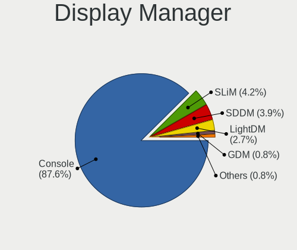
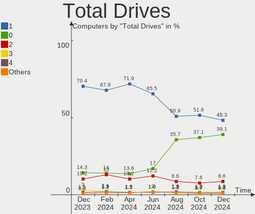
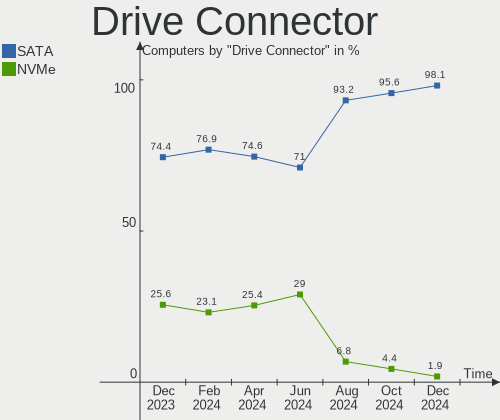
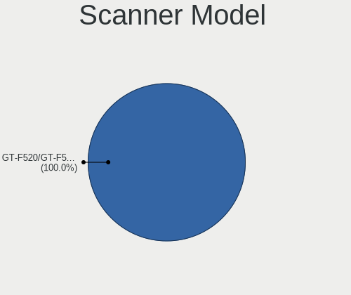

BSD - Hardware Trends
---------------------

A project to identify most popular hardware characteristics and track their change
over time based on data collected by BSD users at https://BSD-Hardware.info.

Anyone can contribute to this report by the [hw-probe](https://github.com/linuxhw/hw-probe/blob/master/INSTALL.BSD.md) tool:

    hw-probe -all -upload

This is a report for all computer types. See also reports for [desktops](/Desktop/README.md) and [notebooks](/Notebook/README.md).

OS-specific reports: [FreeBSD](/Dist/FreeBSD), [OPNsense](/Dist/OPNsense), [helloSystem](/Dist/helloSystem), [OpenBSD](/Dist/OpenBSD).

This report is for one last month. Overall report since the beginning of time: [TestDays](https://github.com/bsdhw/TestDays)

Period: Apr, 2023.

Contents
--------

* [ System ](#system)
  - [ OS                       ](#os)
  - [ OS Family                ](#os-family)
  - [ Arch                     ](#arch)
  - [ DE                       ](#de)
  - [ Display Server           ](#display-server)
  - [ Display Manager          ](#display-manager)
  - [ OS Lang                  ](#os-lang)
  - [ Boot Mode                ](#boot-mode)
  - [ Filesystem               ](#filesystem)
  - [ Part. scheme             ](#part-scheme)

* [ Board ](#board)
  - [ Vendor                   ](#vendor)
  - [ Model                    ](#model)
  - [ Model Family             ](#model-family)
  - [ MFG Year                 ](#mfg-year)
  - [ Form Factor              ](#form-factor)
  - [ Coreboot                 ](#coreboot)
  - [ RAM Size                 ](#ram-size)
  - [ RAM Used                 ](#ram-used)
  - [ Total Drives             ](#total-drives)
  - [ Has CD-ROM               ](#has-cd-rom)
  - [ Has Ethernet             ](#has-ethernet)
  - [ Has WiFi                 ](#has-wifi)
  - [ Has Bluetooth            ](#has-bluetooth)

* [ Location ](#location)
  - [ Country                  ](#country)
  - [ City                     ](#city)

* [ Drives ](#drives)
  - [ Drive Vendor             ](#drive-vendor)
  - [ Drive Model              ](#drive-model)
  - [ HDD Vendor               ](#hdd-vendor)
  - [ SSD Vendor               ](#ssd-vendor)
  - [ Drive Kind               ](#drive-kind)
  - [ Drive Connector          ](#drive-connector)
  - [ Drive Size               ](#drive-size)
  - [ Space Total              ](#space-total)
  - [ Space Used               ](#space-used)
  - [ Malfunc. Drives          ](#malfunc-drives)
  - [ Malfunc. Drive Vendor    ](#malfunc-drive-vendor)
  - [ Malfunc. HDD Vendor      ](#malfunc-hdd-vendor)
  - [ Malfunc. Drive Kind      ](#malfunc-drive-kind)
  - [ Failed Drives            ](#failed-drives)
  - [ Failed Drive Vendor      ](#failed-drive-vendor)
  - [ Drive Status             ](#drive-status)

* [ Storage controller ](#storage-controller)
  - [ Storage Vendor           ](#storage-vendor)
  - [ Storage Model            ](#storage-model)
  - [ Storage Kind             ](#storage-kind)

* [ Processor ](#processor)
  - [ CPU Vendor               ](#cpu-vendor)
  - [ CPU Model                ](#cpu-model)
  - [ CPU Model Family         ](#cpu-model-family)
  - [ CPU Cores                ](#cpu-cores)
  - [ CPU Sockets              ](#cpu-sockets)
  - [ CPU Threads              ](#cpu-threads)
  - [ CPU Microarch            ](#cpu-microarch)

* [ Graphics ](#graphics)
  - [ GPU Vendor               ](#gpu-vendor)
  - [ GPU Model                ](#gpu-model)
  - [ GPU Combo                ](#gpu-combo)
  - [ GPU Driver               ](#gpu-driver)
  - [ GPU Memory               ](#gpu-memory)

* [ Monitor ](#monitor)
  - [ Monitor Vendor           ](#monitor-vendor)
  - [ Monitor Model            ](#monitor-model)
  - [ Monitor Resolution       ](#monitor-resolution)
  - [ Monitor Diagonal         ](#monitor-diagonal)
  - [ Monitor Width            ](#monitor-width)
  - [ Aspect Ratio             ](#aspect-ratio)
  - [ Monitor Area             ](#monitor-area)
  - [ Pixel Density            ](#pixel-density)
  - [ Multiple Monitors        ](#multiple-monitors)

* [ Network ](#network)
  - [ Net Controller Vendor    ](#net-controller-vendor)
  - [ Net Controller Model     ](#net-controller-model)
  - [ Wireless Vendor          ](#wireless-vendor)
  - [ Wireless Model           ](#wireless-model)
  - [ Ethernet Vendor          ](#ethernet-vendor)
  - [ Ethernet Model           ](#ethernet-model)
  - [ Net Controller Kind      ](#net-controller-kind)
  - [ Used Controller          ](#used-controller)
  - [ NICs                     ](#nics)
  - [ IPv6                     ](#ipv6)

* [ Bluetooth ](#bluetooth)
  - [ Bluetooth Vendor         ](#bluetooth-vendor)
  - [ Bluetooth Model          ](#bluetooth-model)

* [ Sound ](#sound)
  - [ Sound Vendor             ](#sound-vendor)
  - [ Sound Model              ](#sound-model)

* [ Memory ](#memory)
  - [ Memory Vendor            ](#memory-vendor)
  - [ Memory Model             ](#memory-model)
  - [ Memory Kind              ](#memory-kind)
  - [ Memory Form Factor       ](#memory-form-factor)
  - [ Memory Size              ](#memory-size)
  - [ Memory Speed             ](#memory-speed)

* [ Printers & scanners ](#printers--scanners)
  - [ Printer Vendor           ](#printer-vendor)
  - [ Printer Model            ](#printer-model)
  - [ Scanner Vendor           ](#scanner-vendor)
  - [ Scanner Model            ](#scanner-model)

* [ Camera ](#camera)
  - [ Camera Vendor            ](#camera-vendor)
  - [ Camera Model             ](#camera-model)

* [ Security ](#security)
  - [ Fingerprint Vendor       ](#fingerprint-vendor)
  - [ Fingerprint Model        ](#fingerprint-model)
  - [ Chipcard Vendor          ](#chipcard-vendor)
  - [ Chipcard Model           ](#chipcard-model)

* [ Unsupported ](#unsupported)
  - [ Unsupported Devices      ](#unsupported-devices)
  - [ Unsupported Device Types ](#unsupported-device-types)

System
------

OS
--

Installed operating systems

| Name                 | Computers | Percent |
|----------------------|-----------|---------|
| OPNsense 23.1.5      | 200       | 39.06%  |
| OPNsense 23.1.6      | 121       | 23.63%  |
| helloSystem 0.8.1    | 44        | 8.59%   |
| FreeBSD 13.2         | 32        | 6.25%   |
| FreeBSD 13.1-p7      | 13        | 2.54%   |
| OpenBSD 7.3          | 12        | 2.34%   |
| helloSystem 0.8.2    | 12        | 2.34%   |
| OPNsense 23.7        | 10        | 1.95%   |
| FreeBSD 14.0-CURRENT | 8         | 1.56%   |
| OPNsense 22.7.11     | 5         | 0.98%   |
| NomadBSD 20221130    | 5         | 0.98%   |
| OPNsense 23.1.4      | 4         | 0.78%   |
| OpenBSD 7.2          | 4         | 0.78%   |
| FreeBSD 13.2-STABLE  | 4         | 0.78%   |
| OPNsense 23.1        | 3         | 0.59%   |
| helloSystem 0.8.0    | 3         | 0.59%   |
| FreeBSD 13.1         | 3         | 0.59%   |
| XigmaNAS 12.3-p6     | 2         | 0.39%   |
| OPNsense 23.4        | 2         | 0.39%   |
| OPNsense 23.1.3      | 2         | 0.39%   |
| NetBSD 10.0_BETA     | 2         | 0.39%   |
| ClonOS 13.1.2        | 2         | 0.39%   |
| pfSense 2.6.0        | 1         | 0.2%    |
| OPNsense 23.1.1      | 1         | 0.2%    |
| OPNsense 22.7.9      | 1         | 0.2%    |
| OPNsense 22.7.10     | 1         | 0.2%    |
| OPNsense 22.10.2     | 1         | 0.2%    |
| NetBSD 9.3           | 1         | 0.2%    |
| MyBee 13.2-RC5       | 1         | 0.2%    |
| MidnightBSD 3.0.1    | 1         | 0.2%    |
| MidnightBSD 2.1.5    | 1         | 0.2%    |
| GhostBSD 23.04.15    | 1         | 0.2%    |
| GhostBSD 23.04.02    | 1         | 0.2%    |
| GhostBSD 22.06.18    | 1         | 0.2%    |
| FuguIta 7.2          | 1         | 0.2%    |
| FreeBSD 13.2-RC6     | 1         | 0.2%    |
| FreeBSD 13.2-RC5     | 1         | 0.2%    |
| FreeBSD 13.2-RC3     | 1         | 0.2%    |
| FreeBSD 13.1-p5      | 1         | 0.2%    |
| FreeBSD 13.1-p2      | 1         | 0.2%    |

OS Family
---------

OS without a version

| Name        | Computers | Percent |
|-------------|-----------|---------|
| OPNsense    | 351       | 68.55%  |
| FreeBSD     | 66        | 12.89%  |
| helloSystem | 59        | 11.52%  |
| OpenBSD     | 16        | 3.13%   |
| NomadBSD    | 5         | 0.98%   |
| NetBSD      | 3         | 0.59%   |
| GhostBSD    | 3         | 0.59%   |
| XigmaNAS    | 2         | 0.39%   |
| MidnightBSD | 2         | 0.39%   |
| ClonOS      | 2         | 0.39%   |
| pfSense     | 1         | 0.2%    |
| MyBee       | 1         | 0.2%    |
| FuguIta     | 1         | 0.2%    |

Arch
----

OS architecture (x86_64, i586, etc.)

| Name    | Computers | Percent |
|---------|-----------|---------|
| amd64   | 501       | 97.85%  |
| arm64   | 6         | 1.17%   |
| i386    | 3         | 0.59%   |
| sparc64 | 1         | 0.2%    |
| powerpc | 1         | 0.2%    |

DE
--

Desktop Environment

| Name          | Computers | Percent |
|---------------|-----------|---------|
| Console       | 383       | 74.8%   |
| helloDesktop  | 71        | 13.87%  |
| KDE5          | 19        | 3.71%   |
| XFCE          | 13        | 2.54%   |
| GNOME         | 10        | 1.95%   |
| MATE          | 5         | 0.98%   |
| TWM           | 4         | 0.78%   |
| xinitrc       | 2         | 0.39%   |
| Enlightenment | 2         | 0.39%   |
| sdorfehs      | 1         | 0.2%    |
| LXQt          | 1         | 0.2%    |
| Fluxbox       | 1         | 0.2%    |

Display Server
--------------

X11 or Wayland

| Name    | Computers | Percent |
|---------|-----------|---------|
| Console | 391       | 76.37%  |
| X11     | 120       | 23.44%  |
| Wayland | 1         | 0.2%    |

Display Manager
---------------

SDDM, LightDM, etc.

| Name    | Computers | Percent |
|---------|-----------|---------|
| Console | 414       | 80.86%  |
| SLiM    | 61        | 11.91%  |
| SDDM    | 16        | 3.13%   |
| LightDM | 8         | 1.56%   |
| XDM     | 6         | 1.17%   |
| GDM     | 5         | 0.98%   |
| Ly      | 2         | 0.39%   |

OS Lang
-------

Language

| Lang             | Computers | Percent |
|------------------|-----------|---------|
| Unknown          | 373       | 72.85%  |
| en_US            | 51        | 9.96%   |
| C                | 46        | 8.98%   |
| fr_FR            | 10        | 1.95%   |
| ru_RU            | 8         | 1.56%   |
| es_ES            | 7         | 1.37%   |
| de_DE            | 4         | 0.78%   |
| en_GB            | 3         | 0.59%   |
| en               | 3         | 0.59%   |
| it_IT            | 2         | 0.39%   |
| zh_CN            | 1         | 0.2%    |
| pt_BR            | 1         | 0.2%    |
| pl_PL            | 1         | 0.2%    |
| fi_FI.ISO8859-15 | 1         | 0.2%    |
| en_AU            | 1         | 0.2%    |

Boot Mode
---------

EFI or BIOS

| Mode | Computers | Percent |
|------|-----------|---------|
| EFI  | 475       | 92.77%  |
| BIOS | 37        | 7.23%   |

Filesystem
----------

Type of filesystem

| Type   | Computers | Percent |
|--------|-----------|---------|
| Zfs    | 237       | 46.29%  |
| Ufs    | 228       | 44.53%  |
| Cd9660 | 30        | 5.86%   |
| Ffs    | 17        | 3.32%   |

Part. scheme
------------

Scheme of partitioning

| Type    | Computers | Percent |
|---------|-----------|---------|
| GPT     | 485       | 94.73%  |
| MBR     | 22        | 4.3%    |
| Unknown | 5         | 0.98%   |

Board
-----

Vendor
------

Motherboard manufacturer

| Name                       | Computers | Percent |
|----------------------------|-----------|---------|
| ASUSTek Computer           | 51        | 9.96%   |
| Unknown                    | 51        | 9.96%   |
| Dell                       | 47        | 9.18%   |
| Hewlett-Packard            | 44        | 8.59%   |
| Lenovo                     | 43        | 8.4%    |
| Supermicro                 | 27        | 5.27%   |
| Intel                      | 23        | 4.49%   |
| Protectli                  | 21        | 4.1%    |
| Gigabyte Technology        | 21        | 4.1%    |
| Techvision                 | 18        | 3.52%   |
| PC Engines                 | 14        | 2.73%   |
| Sophos                     | 13        | 2.54%   |
| Fujitsu                    | 12        | 2.34%   |
| ASRock                     | 12        | 2.34%   |
| Acer                       | 9         | 1.76%   |
| MW                         | 7         | 1.37%   |
| MSI                        | 7         | 1.37%   |
| Apple                      | 7         | 1.37%   |
| AMI                        | 7         | 1.37%   |
| Deciso                     | 6         | 1.17%   |
| AZW                        | 5         | 0.98%   |
| Samsung Electronics        | 4         | 0.78%   |
| Google                     | 4         | 0.78%   |
| CWWK                       | 4         | 0.78%   |
| CncTion                    | 4         | 0.78%   |
| Shuttle                    | 3         | 0.59%   |
| ASRockRack                 | 3         | 0.59%   |
| ZOTAC                      | 2         | 0.39%   |
| Pegatron                   | 2         | 0.39%   |
| IceWhale Technology        | 2         | 0.39%   |
| GoWin Solution             | 2         | 0.39%   |
| BYTENUC                    | 2         | 0.39%   |
| AWOW                       | 2         | 0.39%   |
| YENTEK                     | 1         | 0.2%    |
| TUXEDO                     | 1         | 0.2%    |
| Toshiba                    | 1         | 0.2%    |
| Sun                        | 1         | 0.2%    |
| SIEMENS                    | 1         | 0.2%    |
| ShenZhen MinWin Technology | 1         | 0.2%    |
| ReachingTech               | 1         | 0.2%    |

Model
-----

Motherboard model

| Name                                | Computers | Percent |
|-------------------------------------|-----------|---------|
| Unknown                             | 54        | 10.55%  |
| Techvision TVI7309X                 | 18        | 3.52%   |
| Sophos SG                           | 9         | 1.76%   |
| Protectli FW4B                      | 9         | 1.76%   |
| Supermicro Super Server             | 8         | 1.56%   |
| PC Engines APU2                     | 8         | 1.56%   |
| Fujitsu FUTRO S920                  | 8         | 1.56%   |
| MW GMLK-2_5G4L                      | 7         | 1.37%   |
| Intel Q3XXG4-P V1.0                 | 7         | 1.37%   |
| AMI Aptio CRB                       | 6         | 1.17%   |
| Protectli FW4C                      | 4         | 0.78%   |
| Protectli VP2410                    | 3         | 0.59%   |
| Intel MAHOBAY                       | 3         | 0.59%   |
| HP t730 Thin Client                 | 3         | 0.59%   |
| HP EliteDesk 800 G4 SFF             | 3         | 0.59%   |
| Dell OptiPlex 7020                  | 3         | 0.59%   |
| Dell OptiPlex 3060                  | 3         | 0.59%   |
| Supermicro X10SLH-N6-ST031          | 2         | 0.39%   |
| Supermicro A1SAi                    | 2         | 0.39%   |
| Sophos XG                           | 2         | 0.39%   |
| Sophos UTM                          | 2         | 0.39%   |
| Protectli VP2420                    | 2         | 0.39%   |
| Protectli FW6                       | 2         | 0.39%   |
| PC Engines apu4                     | 2         | 0.39%   |
| PC Engines apu1                     | 2         | 0.39%   |
| Lenovo G570 20079                   | 2         | 0.39%   |
| IceWhale ZimaBoard 832 ZMB          | 2         | 0.39%   |
| HP ProDesk 600 G3 SFF               | 2         | 0.39%   |
| HP ProDesk 600 G1 SFF               | 2         | 0.39%   |
| HP EliteDesk 800 G2 DM 65W          | 2         | 0.39%   |
| HP EliteDesk 800 G1 SFF             | 2         | 0.39%   |
| GoWin Solution R86S                 | 2         | 0.39%   |
| Dell Wyse 5070 Extended Thin Client | 2         | 0.39%   |
| Dell Precision WorkStation T3500    | 2         | 0.39%   |
| Dell OptiPlex 9020                  | 2         | 0.39%   |
| Dell OptiPlex 7040                  | 2         | 0.39%   |
| Dell OptiPlex 7010                  | 2         | 0.39%   |
| Deciso NetBoard-A20                 | 2         | 0.39%   |
| Deciso Netboard A10 GEN2 Model G    | 2         | 0.39%   |
| CWWK CW-MBX-AD12                    | 2         | 0.39%   |

Model Family
------------

Motherboard model prefix

| Name                       | Computers | Percent |
|----------------------------|-----------|---------|
| Unknown                    | 54        | 10.55%  |
| Techvision TVI7309X        | 18        | 3.52%   |
| Dell OptiPlex              | 18        | 3.52%   |
| Lenovo ThinkPad            | 14        | 2.73%   |
| Lenovo ThinkCentre         | 14        | 2.73%   |
| HP ProDesk                 | 12        | 2.34%   |
| ASUS PRIME                 | 11        | 2.15%   |
| HP EliteDesk               | 10        | 1.95%   |
| Sophos SG                  | 9         | 1.76%   |
| Protectli FW4B             | 9         | 1.76%   |
| Supermicro Super           | 8         | 1.56%   |
| PC Engines APU2            | 8         | 1.56%   |
| Fujitsu FUTRO              | 8         | 1.56%   |
| Dell PowerEdge             | 8         | 1.56%   |
| MW GMLK-2                  | 7         | 1.37%   |
| Intel Q3XXG4-P             | 7         | 1.37%   |
| Dell Precision             | 6         | 1.17%   |
| ASUS TUF                   | 6         | 1.17%   |
| ASUS ROG                   | 6         | 1.17%   |
| AMI Aptio                  | 6         | 1.17%   |
| Dell Inspiron              | 5         | 0.98%   |
| Protectli FW4C             | 4         | 0.78%   |
| Dell Latitude              | 4         | 0.78%   |
| Acer Aspire                | 4         | 0.78%   |
| Protectli VP2410           | 3         | 0.59%   |
| Lenovo Yoga                | 3         | 0.59%   |
| Intel MAHOBAY              | 3         | 0.59%   |
| HP t730                    | 3         | 0.59%   |
| HP ProLiant                | 3         | 0.59%   |
| HP Pavilion                | 3         | 0.59%   |
| Dell Wyse                  | 3         | 0.59%   |
| Deciso Netboard            | 3         | 0.59%   |
| Supermicro X10SLH-N6-ST031 | 2         | 0.39%   |
| Supermicro A1SAi           | 2         | 0.39%   |
| Sophos XG                  | 2         | 0.39%   |
| Sophos UTM                 | 2         | 0.39%   |
| Protectli VP2420           | 2         | 0.39%   |
| Protectli FW6              | 2         | 0.39%   |
| PC Engines apu4            | 2         | 0.39%   |
| PC Engines apu1            | 2         | 0.39%   |

MFG Year
--------

Motherboard manufacture year

| Year    | Computers | Percent |
|---------|-----------|---------|
| 2022    | 101       | 19.73%  |
| 2021    | 54        | 10.55%  |
| 2018    | 48        | 9.38%   |
| 2019    | 40        | 7.81%   |
| 2014    | 40        | 7.81%   |
| 2020    | 36        | 7.03%   |
| 2016    | 34        | 6.64%   |
| 2013    | 26        | 5.08%   |
| 2017    | 22        | 4.3%    |
| 2023    | 19        | 3.71%   |
| 2015    | 19        | 3.71%   |
| 2012    | 18        | 3.52%   |
| 2011    | 14        | 2.73%   |
| 2010    | 12        | 2.34%   |
| 2008    | 11        | 2.15%   |
| Unknown | 9         | 1.76%   |
| 2009    | 5         | 0.98%   |
| 2007    | 3         | 0.59%   |
| 2001    | 1         | 0.2%    |

Form Factor
-----------

Physical design of the computer

| Name           | Computers | Percent |
|----------------|-----------|---------|
| Desktop        | 357       | 69.73%  |
| Notebook       | 79        | 15.43%  |
| Mini pc        | 29        | 5.66%   |
| Server         | 28        | 5.47%   |
| Firewall       | 13        | 2.54%   |
| Convertible    | 3         | 0.59%   |
| All in one     | 2         | 0.39%   |
| System on chip | 1         | 0.2%    |

Coreboot
--------

Have coreboot on board

| Used | Computers | Percent |
|------|-----------|---------|
| No   | 487       | 95.12%  |
| Yes  | 25        | 4.88%   |

RAM Size
--------

Total RAM memory

| Size in GB      | Computers | Percent |
|-----------------|-----------|---------|
| 8.01-16.0       | 194       | 37.89%  |
| 16.01-24.0      | 124       | 24.22%  |
| 4.01-8.0        | 83        | 16.21%  |
| 32.01-64.0      | 52        | 10.16%  |
| 64.01-256.0     | 24        | 4.69%   |
| 2.01-3.0        | 20        | 3.91%   |
| 3.01-4.0        | 6         | 1.17%   |
| 24.01-32.0      | 3         | 0.59%   |
| 0.01-0.5        | 3         | 0.59%   |
| More than 256.0 | 1         | 0.2%    |
| 1.01-2.0        | 1         | 0.2%    |
| 0.51-1.0        | 1         | 0.2%    |

RAM Used
--------

Used RAM memory

| Used GB   | Computers | Percent |
|-----------|-----------|---------|
| 0.01-0.5  | 252       | 49.22%  |
| 0.51-1.0  | 169       | 33.01%  |
| 1.01-2.0  | 60        | 11.72%  |
| 2.01-3.0  | 12        | 2.34%   |
| 3.01-4.0  | 6         | 1.17%   |
| 4.01-8.0  | 5         | 0.98%   |
| 0         | 4         | 0.78%   |
| Unknown   | 3         | 0.59%   |
| 8.01-16.0 | 1         | 0.2%    |

Total Drives
------------

Number of drives on board

| Drives | Computers | Percent |
|--------|-----------|---------|
| 1      | 371       | 72.46%  |
| 2      | 60        | 11.72%  |
| 0      | 47        | 9.18%   |
| 3      | 15        | 2.93%   |
| 4      | 7         | 1.37%   |
| 8      | 2         | 0.39%   |
| 7      | 2         | 0.39%   |
| 6      | 2         | 0.39%   |
| 5      | 2         | 0.39%   |
| 13     | 1         | 0.2%    |
| 12     | 1         | 0.2%    |
| 10     | 1         | 0.2%    |
| 9      | 1         | 0.2%    |

Has CD-ROM
----------

Has CD-ROM on board

| Presented | Computers | Percent |
|-----------|-----------|---------|
| No        | 443       | 86.52%  |
| Yes       | 69        | 13.48%  |

Has Ethernet
------------

Has Ethernet on board

| Presented | Computers | Percent |
|-----------|-----------|---------|
| Yes       | 487       | 95.12%  |
| No        | 25        | 4.88%   |

Has WiFi
--------

Has WiFi module

| Presented | Computers | Percent |
|-----------|-----------|---------|
| No        | 349       | 68.16%  |
| Yes       | 163       | 31.84%  |

Has Bluetooth
-------------

Has Bluetooth module

| Presented | Computers | Percent |
|-----------|-----------|---------|
| No        | 383       | 74.8%   |
| Yes       | 129       | 25.2%   |

Location
--------

Country
-------

Geographic location (country)

| Country     | Computers | Percent |
|-------------|-----------|---------|
| USA         | 149       | 29.1%   |
| Germany     | 69        | 13.48%  |
| Russia      | 29        | 5.66%   |
| Canada      | 25        | 4.88%   |
| UK          | 23        | 4.49%   |
| France      | 19        | 3.71%   |
| Poland      | 14        | 2.73%   |
| Brazil      | 14        | 2.73%   |
| Italy       | 12        | 2.34%   |
| Austria     | 12        | 2.34%   |
| Australia   | 12        | 2.34%   |
| Romania     | 10        | 1.95%   |
| Netherlands | 10        | 1.95%   |
| China       | 9         | 1.76%   |
| Switzerland | 8         | 1.56%   |
| Spain       | 8         | 1.56%   |
| Mexico      | 7         | 1.37%   |
| Belgium     | 6         | 1.17%   |
| Sweden      | 5         | 0.98%   |
| Portugal    | 5         | 0.98%   |
| Denmark     | 5         | 0.98%   |
| Norway      | 4         | 0.78%   |
| Indonesia   | 4         | 0.78%   |
| Finland     | 4         | 0.78%   |
| Vietnam     | 3         | 0.59%   |
| Singapore   | 3         | 0.59%   |
| Hungary     | 3         | 0.59%   |
| Czechia     | 3         | 0.59%   |
| Taiwan      | 2         | 0.39%   |
| Sri Lanka   | 2         | 0.39%   |
| South Korea | 2         | 0.39%   |
| Paraguay    | 2         | 0.39%   |
| Israel      | 2         | 0.39%   |
| Isle of Man | 2         | 0.39%   |
| Chile       | 2         | 0.39%   |
| Argentina   | 2         | 0.39%   |
| Uruguay     | 1         | 0.2%    |
| Ukraine     | 1         | 0.2%    |
| Turkey      | 1         | 0.2%    |
| Thailand    | 1         | 0.2%    |

City
----

Geographic location (city)

| City                | Computers | Percent |
|---------------------|-----------|---------|
| Phoenix             | 7         | 1.37%   |
| Moscow              | 7         | 1.37%   |
| Berlin              | 7         | 1.37%   |
| Krasnodar           | 5         | 0.98%   |
| Sydney              | 4         | 0.78%   |
| St. Jean Baptiste   | 4         | 0.78%   |
| St Petersburg       | 4         | 0.78%   |
| Sao Paulo           | 4         | 0.78%   |
| Melbourne           | 4         | 0.78%   |
| Los Angeles         | 4         | 0.78%   |
| London              | 4         | 0.78%   |
| Bucharest           | 4         | 0.78%   |
| Zurich              | 3         | 0.59%   |
| Vienna              | 3         | 0.59%   |
| Singapore           | 3         | 0.59%   |
| Salem               | 3         | 0.59%   |
| Rome                | 3         | 0.59%   |
| Puebla City         | 3         | 0.59%   |
| Paris               | 3         | 0.59%   |
| Oslo                | 3         | 0.59%   |
| Ludwigsburg         | 3         | 0.59%   |
| Edmonton            | 3         | 0.59%   |
| Budapest            | 3         | 0.59%   |
| Blumenau            | 3         | 0.59%   |
| Zhengzhou           | 2         | 0.39%   |
| Yekaterinburg       | 2         | 0.39%   |
| Warsaw              | 2         | 0.39%   |
| Victoria            | 2         | 0.39%   |
| Vantaa              | 2         | 0.39%   |
| Vancouver           | 2         | 0.39%   |
| Trieste             | 2         | 0.39%   |
| Toronto             | 2         | 0.39%   |
| Tel Aviv            | 2         | 0.39%   |
| South San Francisco | 2         | 0.39%   |
| Shoreham-by-Sea     | 2         | 0.39%   |
| Seattle             | 2         | 0.39%   |
| Saratov             | 2         | 0.39%   |
| Rockford            | 2         | 0.39%   |
| Regina              | 2         | 0.39%   |
| Redmond             | 2         | 0.39%   |

Drives
------

Drive Vendor
------------

Hard drive vendors

| Vendor              | Computers | Drives | Percent |
|---------------------|-----------|--------|---------|
| Samsung Electronics | 84        | 106    | 14.95%  |
| WDC                 | 61        | 94     | 10.85%  |
| Kingston            | 52        | 55     | 9.25%   |
| Seagate             | 45        | 62     | 8.01%   |
| Crucial             | 35        | 39     | 6.23%   |
| Transcend           | 26        | 27     | 4.63%   |
| Intel               | 21        | 23     | 3.74%   |
| China               | 17        | 18     | 3.02%   |
| Toshiba             | 16        | 18     | 2.85%   |
| SanDisk             | 14        | 14     | 2.49%   |
| Hitachi             | 13        | 13     | 2.31%   |
| SPCC                | 12        | 17     | 2.14%   |
| Fanxiang            | 9         | 9      | 1.6%    |
| A-DATA Technology   | 9         | 10     | 1.6%    |
| Silicon Motion      | 8         | 8      | 1.42%   |
| Hoodisk             | 8         | 8      | 1.42%   |
| SK hynix            | 7         | 7      | 1.25%   |
| Protectli           | 6         | 6      | 1.07%   |
| PNY                 | 6         | 6      | 1.07%   |
| Patriot             | 6         | 6      | 1.07%   |
| HGST                | 5         | 7      | 0.89%   |
| FORESEE             | 5         | 5      | 0.89%   |
| Apacer              | 5         | 5      | 0.89%   |
| Team                | 4         | 4      | 0.71%   |
| NVMe                | 4         | 4      | 0.71%   |
| Micron Technology   | 4         | 4      | 0.71%   |
| KeepData            | 4         | 4      | 0.71%   |
| Hewlett-Packard     | 4         | 6      | 0.71%   |
| Dogfish             | 4         | 4      | 0.71%   |
| Corsair             | 4         | 4      | 0.71%   |
| BAITITON            | 4         | 4      | 0.71%   |
| Phison              | 3         | 3      | 0.53%   |
| Lexar               | 3         | 3      | 0.53%   |
| KIOXIA              | 3         | 3      | 0.53%   |
| Innodisk            | 3         | 3      | 0.53%   |
| BORY                | 3         | 3      | 0.53%   |
| Apple               | 3         | 3      | 0.53%   |
| Verbatim            | 2         | 4      | 0.36%   |
| OPENBSD             | 2         | 2      | 0.36%   |
| OCZ                 | 2         | 2      | 0.36%   |

Drive Model
-----------

Hard drive models

| Model                                | Computers | Percent |
|--------------------------------------|-----------|---------|
| Kingston SA400S37240G 240GB          | 11        | 1.83%   |
| Samsung SSD 860 EVO 500GB            | 5         | 0.83%   |
| Kingston SV300S37A120G 120GB         | 5         | 0.83%   |
| Kingston SA400S37480G 480GB          | 5         | 0.83%   |
| Fanxiang S501 128GB                  | 5         | 0.83%   |
| Crucial CT240BX500SSD1 240GB         | 5         | 0.83%   |
| SPCC Solid State Disk 128GB          | 4         | 0.67%   |
| Seagate ST500DM002-1BD142 500GB      | 4         | 0.67%   |
| Samsung SSD 850 EVO mSATA 250GB      | 4         | 0.67%   |
| KeepData GIM128 128GB                | 4         | 0.67%   |
| Crucial CT120BX500SSD1 120GB         | 4         | 0.67%   |
| China SATA SSD 16GB                  | 4         | 0.67%   |
| WDC WDS500G2B0A-00SM50 500GB         | 3         | 0.5%    |
| WDC PC SN520 SDAPNUW-128G-1014 128GB | 3         | 0.5%    |
| Transcend TS64GMTS400SD 64GB         | 3         | 0.5%    |
| Transcend TS64GMSA230S 64GB          | 3         | 0.5%    |
| SanDisk SSD PLUS 120GB               | 3         | 0.5%    |
| Samsung SSD 970 EVO Plus 250GB       | 3         | 0.5%    |
| Samsung SSD 870 EVO 500GB            | 3         | 0.5%    |
| Samsung SSD 870 EVO 250GB            | 3         | 0.5%    |
| Protectli 120GB M.2                  | 3         | 0.5%    |
| PNY CS900 120GB SSD                  | 3         | 0.5%    |
| Kingston SA400S37120G 120GB          | 3         | 0.5%    |
| Kingston OM8PGP4512Q-A0 512GB        | 3         | 0.5%    |
| Hoodisk SSD 64GB                     | 3         | 0.5%    |
| Hoodisk SSD 128GB                    | 3         | 0.5%    |
| Crucial CT500P3SSD8 500GB            | 3         | 0.5%    |
| BAITITON BT58SSD08M 128GB            | 3         | 0.5%    |
| WDC WDS240G2G0A-00JH30 240GB         | 2         | 0.33%   |
| WDC WDS100T3X0C-00SJG0 1TB           | 2         | 0.33%   |
| WDC WDS100T1X0E-00AFY0 1TB           | 2         | 0.33%   |
| WDC WD80EFAX-68LHPN0 8TB             | 2         | 0.33%   |
| WDC WD20EZRX-22D8PB0 2TB             | 2         | 0.33%   |
| WDC WD20EZRX-00D8PB0 2TB             | 2         | 0.33%   |
| WDC WD20EFZX-68AWUN0 2TB             | 2         | 0.33%   |
| WDC WD20EFRX-68EUZN0 2TB             | 2         | 0.33%   |
| WDC WD1600BEVT-22ZCT0 160GB          | 2         | 0.33%   |
| Verbatim Vi550 S3 256GB              | 2         | 0.33%   |
| Transcend TS32GMSA370 32GB           | 2         | 0.33%   |
| Transcend TS256GMTE710T 256GB        | 2         | 0.33%   |

HDD Vendor
----------

Hard disk drive vendors

| Vendor              | Computers | Drives | Percent |
|---------------------|-----------|--------|---------|
| Seagate             | 42        | 57     | 34.71%  |
| WDC                 | 39        | 64     | 32.23%  |
| Hitachi             | 13        | 13     | 10.74%  |
| Toshiba             | 8         | 10     | 6.61%   |
| HGST                | 5         | 7      | 4.13%   |
| Samsung Electronics | 3         | 3      | 2.48%   |
| NVMe                | 3         | 3      | 2.48%   |
| OPENBSD             | 2         | 2      | 1.65%   |
| Maxtor              | 2         | 2      | 1.65%   |
| Memorex             | 1         | 1      | 0.83%   |
| Lexar               | 1         | 1      | 0.83%   |
| IBM-ESXS            | 1         | 1      | 0.83%   |
| Hewlett-Packard     | 1         | 2      | 0.83%   |

SSD Vendor
----------

Solid state drive vendors

| Vendor              | Computers | Drives | Percent |
|---------------------|-----------|--------|---------|
| Samsung Electronics | 55        | 72     | 17.13%  |
| Kingston            | 41        | 44     | 12.77%  |
| Crucial             | 28        | 29     | 8.72%   |
| Transcend           | 23        | 24     | 7.17%   |
| Intel               | 17        | 19     | 5.3%    |
| China               | 17        | 18     | 5.3%    |
| SanDisk             | 12        | 12     | 3.74%   |
| WDC                 | 11        | 16     | 3.43%   |
| SPCC                | 9         | 14     | 2.8%    |
| Hoodisk             | 8         | 8      | 2.49%   |
| A-DATA Technology   | 7         | 8      | 2.18%   |
| Protectli           | 6         | 6      | 1.87%   |
| PNY                 | 5         | 5      | 1.56%   |
| Apacer              | 5         | 5      | 1.56%   |
| Patriot             | 4         | 4      | 1.25%   |
| KeepData            | 4         | 4      | 1.25%   |
| Dogfish             | 4         | 4      | 1.25%   |
| BAITITON            | 4         | 4      | 1.25%   |
| SK hynix            | 3         | 3      | 0.93%   |
| Seagate             | 3         | 4      | 0.93%   |
| Innodisk            | 3         | 3      | 0.93%   |
| FORESEE             | 3         | 3      | 0.93%   |
| BORY                | 3         | 3      | 0.93%   |
| Apple               | 3         | 3      | 0.93%   |
| Verbatim            | 2         | 4      | 0.62%   |
| Toshiba             | 2         | 2      | 0.62%   |
| Team                | 2         | 2      | 0.62%   |
| OCZ                 | 2         | 2      | 0.62%   |
| Mushkin             | 2         | 5      | 0.62%   |
| Lexar               | 2         | 2      | 0.62%   |
| KingSpec            | 2         | 3      | 0.62%   |
| Hikvision           | 2         | 2      | 0.62%   |
| Hewlett-Packard     | 2         | 3      | 0.62%   |
| Corsair             | 2         | 2      | 0.62%   |
| VICKTER             | 1         | 1      | 0.31%   |
| Vaseky              | 1         | 1      | 0.31%   |
| V-GeN               | 1         | 1      | 0.31%   |
| TCSUNBOW            | 1         | 1      | 0.31%   |
| SSSTC               | 1         | 1      | 0.31%   |
| Silicon Power       | 1         | 1      | 0.31%   |

Drive Kind
----------

HDD or SSD

| Kind | Computers | Drives | Percent |
|------|-----------|--------|---------|
| SSD  | 300       | 365    | 58.25%  |
| NVMe | 121       | 132    | 23.5%   |
| HDD  | 94        | 166    | 18.25%  |

Drive Connector
---------------

SATA, SAS, NVMe, etc.

| Type | Computers | Drives | Percent |
|------|-----------|--------|---------|
| SATA | 367       | 531    | 75.2%   |
| NVMe | 121       | 132    | 24.8%   |

Drive Size
----------

Size of hard drive

| Size in TB | Computers | Drives | Percent |
|------------|-----------|--------|---------|
| 0.01-0.5   | 327       | 384    | 79.37%  |
| 0.51-1.0   | 42        | 50     | 10.19%  |
| 1.01-2.0   | 21        | 48     | 5.1%    |
| 3.01-4.0   | 9         | 12     | 2.18%   |
| 4.01-10.0  | 6         | 15     | 1.46%   |
| 2.01-3.0   | 4         | 9      | 0.97%   |
| 10.01-20.0 | 3         | 13     | 0.73%   |

Space Total
-----------

Amount of disk space available on the file system

| Size in GB     | Computers | Percent |
|----------------|-----------|---------|
| 101-250        | 237       | 46.29%  |
| 251-500        | 84        | 16.41%  |
| 51-100         | 51        | 9.96%   |
| 1-20           | 48        | 9.38%   |
| 21-50          | 43        | 8.4%    |
| 501-1000       | 30        | 5.86%   |
| 1001-2000      | 10        | 1.95%   |
| More than 3000 | 5         | 0.98%   |
| 2001-3000      | 2         | 0.39%   |
| Unknown        | 2         | 0.39%   |

Space Used
----------

Amount of used disk space

| Used GB        | Computers | Percent |
|----------------|-----------|---------|
| 1-20           | 474       | 92.58%  |
| 21-50          | 17        | 3.32%   |
| 51-100         | 8         | 1.56%   |
| 101-250        | 5         | 0.98%   |
| More than 3000 | 2         | 0.39%   |
| 251-500        | 2         | 0.39%   |
| Unknown        | 2         | 0.39%   |
| 2001-3000      | 1         | 0.2%    |
| 501-1000       | 1         | 0.2%    |

Malfunc. Drives
---------------

Drive models with a malfunction

| Model                                        | Computers | Drives | Percent |
|----------------------------------------------|-----------|--------|---------|
| Seagate ST500DM002-1BD142 500GB              | 2         | 2      | 3.08%   |
| Kingston SV300S37A120G 120GB                 | 2         | 2      | 3.08%   |
| WDC WDS240G2G0A-00JH30 240GB                 | 1         | 4      | 1.54%   |
| WDC WD80EDAZ-11TA3A0 8TB                     | 1         | 1      | 1.54%   |
| WDC WD6400AAKS-22A7B2 640GB                  | 1         | 1      | 1.54%   |
| WDC WD5003AZEX-00K1GA0 500GB                 | 1         | 1      | 1.54%   |
| WDC WD5000AAKX-603CA0 500GB                  | 1         | 1      | 1.54%   |
| WDC WD2500AAKX-083CA1 250GB                  | 1         | 1      | 1.54%   |
| WDC WD20EFZX-68AWUN0 2TB                     | 1         | 2      | 1.54%   |
| WDC WD1600AAJS-75M0A0 160GB                  | 1         | 1      | 1.54%   |
| WDC WD1600AAJS-60Z0A0 160GB                  | 1         | 1      | 1.54%   |
| WDC WD10EZRZ-00HTKB0 1TB                     | 1         | 1      | 1.54%   |
| Transcend TS128GMSA230S 128GB                | 1         | 1      | 1.54%   |
| Toshiba MQ01ACF050 500GB                     | 1         | 1      | 1.54%   |
| Toshiba DT01ACA050 500GB                     | 1         | 1      | 1.54%   |
| SSSTC CVB-8D128-HP 128GB                     | 1         | 1      | 1.54%   |
| SPCC Solid State Disk 128GB                  | 1         | 1      | 1.54%   |
| SK hynix HFS120G32TND-N1A2A 120GB            | 1         | 1      | 1.54%   |
| Silicon Motion Asgard AN1TNVMe-M.2-80 1TB    | 1         | 1      | 1.54%   |
| Seagate ST9250315AS 250GB                    | 1         | 1      | 1.54%   |
| Seagate ST9160827AS 160GB                    | 1         | 1      | 1.54%   |
| Seagate ST9160821AS 160GB                    | 1         | 1      | 1.54%   |
| Seagate ST9100821AS 100GB                    | 1         | 1      | 1.54%   |
| Seagate ST750LM022 HN-M750MBB 752GB          | 1         | 1      | 1.54%   |
| Seagate ST500NM0011 500GB                    | 1         | 1      | 1.54%   |
| Seagate ST500LM021-1KJ152 500GB              | 1         | 1      | 1.54%   |
| Seagate ST500LM000-SSHD-8GB                  | 1         | 1      | 1.54%   |
| Seagate ST3500418AS 500GB                    | 1         | 1      | 1.54%   |
| Seagate ST3320620AS 320GB                    | 1         | 1      | 1.54%   |
| Seagate ST3300831AS 304GB                    | 1         | 1      | 1.54%   |
| Seagate ST320LT020-9YG142 320GB              | 1         | 1      | 1.54%   |
| Seagate ST320LT012-9WS14C 320GB              | 1         | 1      | 1.54%   |
| Seagate ST32000542AS 2TB                     | 1         | 1      | 1.54%   |
| Seagate ST250DM000-1BD141 250GB              | 1         | 1      | 1.54%   |
| SanDisk SSD U100 64GB                        | 1         | 1      | 1.54%   |
| SanDisk SSD PLUS 240GB                       | 1         | 1      | 1.54%   |
| Samsung Electronics SSD PM810 2.5-inch 256GB | 1         | 1      | 1.54%   |
| Samsung Electronics SSD 850 PRO 256GB        | 1         | 2      | 1.54%   |
| Samsung Electronics MZNLH128HBHQ-000H1 128GB | 1         | 1      | 1.54%   |
| Samsung Electronics MZ7PA128HMCD-010H1 128GB | 1         | 1      | 1.54%   |

Malfunc. Drive Vendor
---------------------

Vendors of faulty drives

| Vendor              | Computers | Drives | Percent |
|---------------------|-----------|--------|---------|
| Seagate             | 16        | 17     | 25%     |
| WDC                 | 10        | 14     | 15.63%  |
| Samsung Electronics | 6         | 7      | 9.38%   |
| Kingston            | 6         | 6      | 9.38%   |
| Hitachi             | 4         | 4      | 6.25%   |
| Crucial             | 3         | 4      | 4.69%   |
| Toshiba             | 2         | 2      | 3.13%   |
| SanDisk             | 2         | 2      | 3.13%   |
| Intel               | 2         | 2      | 3.13%   |
| HGST                | 2         | 2      | 3.13%   |
| Transcend           | 1         | 1      | 1.56%   |
| SSSTC               | 1         | 1      | 1.56%   |
| SPCC                | 1         | 1      | 1.56%   |
| SK hynix            | 1         | 1      | 1.56%   |
| Silicon Motion      | 1         | 1      | 1.56%   |
| KeepData            | 1         | 1      | 1.56%   |
| Dogfish             | 1         | 1      | 1.56%   |
| China               | 1         | 1      | 1.56%   |
| BORY                | 1         | 1      | 1.56%   |
| Apple               | 1         | 1      | 1.56%   |
| Apacer              | 1         | 1      | 1.56%   |

Malfunc. HDD Vendor
-------------------

Vendors of faulty HDD drives

| Vendor              | Computers | Drives | Percent |
|---------------------|-----------|--------|---------|
| Seagate             | 16        | 17     | 45.71%  |
| WDC                 | 9         | 10     | 25.71%  |
| Hitachi             | 4         | 4      | 11.43%  |
| Toshiba             | 2         | 2      | 5.71%   |
| Samsung Electronics | 2         | 2      | 5.71%   |
| HGST                | 2         | 2      | 5.71%   |

Malfunc. Drive Kind
-------------------

Kinds of faulty drives

| Kind | Computers | Drives | Percent |
|------|-----------|--------|---------|
| HDD  | 32        | 37     | 52.46%  |
| SSD  | 28        | 33     | 45.9%   |
| NVMe | 1         | 1      | 1.64%   |

Failed Drives
-------------

Failed drive models

| Model                       | Computers | Drives | Percent |
|-----------------------------|-----------|--------|---------|
| WDC WD1600BEVT-22ZCT0 160GB | 1         | 1      | 50%     |
| Kingston SMS200S360G 64GB   | 1         | 1      | 50%     |

Failed Drive Vendor
-------------------

Failed drive vendors

| Vendor   | Computers | Drives | Percent |
|----------|-----------|--------|---------|
| WDC      | 1         | 1      | 50%     |
| Kingston | 1         | 1      | 50%     |

Drive Status
------------

Number of failed and malfunc. drives

| Status   | Computers | Drives | Percent |
|----------|-----------|--------|---------|
| Works    | 414       | 576    | 85.01%  |
| Malfunc  | 61        | 71     | 12.53%  |
| Detected | 10        | 14     | 2.05%   |
| Failed   | 2         | 2      | 0.41%   |

Storage controller
------------------

Storage Vendor
--------------

Storage controller vendors

| Vendor                           | Computers | Percent |
|----------------------------------|-----------|---------|
| Intel                            | 385       | 60.06%  |
| AMD                              | 81        | 12.64%  |
| Samsung Electronics              | 32        | 4.99%   |
| SanDisk                          | 26        | 4.06%   |
| Silicon Motion                   | 20        | 3.12%   |
| Phison Electronics               | 11        | 1.72%   |
| Kingston Technology Company      | 11        | 1.72%   |
| Micron/Crucial Technology        | 9         | 1.4%    |
| Broadcom / LSI                   | 9         | 1.4%    |
| Toshiba                          | 7         | 1.09%   |
| MAXIO Technology (Hangzhou)      | 7         | 1.09%   |
| ASMedia Technology               | 4         | 0.62%   |
| SK hynix                         | 3         | 0.47%   |
| Nvidia                           | 3         | 0.47%   |
| Micron Technology                | 3         | 0.47%   |
| Marvell Technology Group         | 3         | 0.47%   |
| JMicron Technology               | 3         | 0.47%   |
| Hewlett-Packard                  | 3         | 0.47%   |
| Transcend                        | 2         | 0.31%   |
| Shenzhen Longsys Electronics     | 2         | 0.31%   |
| Netac Technology                 | 2         | 0.31%   |
| KIOXIA                           | 2         | 0.31%   |
| INNOGRIT                         | 2         | 0.31%   |
| ADATA Technology                 | 2         | 0.31%   |
| VIA Technologies                 | 1         | 0.16%   |
| Union Memory (Shenzhen)          | 1         | 0.16%   |
| Solid State Storage Technology   | 1         | 0.16%   |
| Silicon Integrated Systems [SiS] | 1         | 0.16%   |
| Silicon Image                    | 1         | 0.16%   |
| Seagate Technology               | 1         | 0.16%   |
| Realtek Semiconductor            | 1         | 0.16%   |
| Chelsio Communications           | 1         | 0.16%   |
| Adaptec                          | 1         | 0.16%   |

Storage Model
-------------

Storage controller models

| Model                                                                            | Computers | Percent |
|----------------------------------------------------------------------------------|-----------|---------|
| AMD FCH SATA Controller [AHCI mode]                                              | 57        | 8.06%   |
| Intel 8 Series/C220 Series Chipset Family 6-port SATA Controller 1 [AHCI mode]   | 38        | 5.37%   |
| Intel Jasper Lake SATA AHCI Controller                                           | 34        | 4.81%   |
| Intel Celeron/Pentium Silver Processor SATA Controller                           | 29        | 4.1%    |
| Intel Q170/Q150/B150/H170/H110/Z170/CM236 Chipset SATA Controller [AHCI Mode]    | 27        | 3.82%   |
| Silicon Motion SM2263EN/SM2263XT SSD Controller                                  | 20        | 2.83%   |
| Unknown                                                                          | 19        | 2.69%   |
| Intel Cannon Lake PCH SATA AHCI Controller                                       | 17        | 2.4%    |
| Intel Atom/Celeron/Pentium Processor x5-E8000/J3xxx/N3xxx Series SATA Controller | 16        | 2.26%   |
| Intel Sunrise Point-LP SATA Controller [AHCI mode]                               | 15        | 2.12%   |
| Samsung NVMe SSD Controller SM981/PM981/PM983                                    | 12        | 1.7%    |
| Intel SATA Controller [RAID mode]                                                | 12        | 1.7%    |
| Intel 7 Series Chipset Family 6-port SATA Controller [AHCI mode]                 | 11        | 1.56%   |
| Intel 200 Series PCH SATA controller [AHCI mode]                                 | 11        | 1.56%   |
| Intel Atom Processor E3800 Series SATA AHCI Controller                           | 10        | 1.41%   |
| AMD SB7x0/SB8x0/SB9x0 SATA Controller [AHCI mode]                                | 10        | 1.41%   |
| Intel Wildcat Point-LP SATA Controller [AHCI Mode]                               | 9         | 1.27%   |
| Intel 8 Series SATA Controller 1 [AHCI mode]                                     | 9         | 1.27%   |
| Intel 6 Series/C200 Series Chipset Family 6 port Desktop SATA AHCI Controller    | 9         | 1.27%   |
| Phison PS5013 E13 NVMe Controller                                                | 8         | 1.13%   |
| Intel Celeron N3350/Pentium N4200/Atom E3900 Series SATA AHCI Controller         | 8         | 1.13%   |
| Intel 500 Series Chipset Family SATA AHCI Controller                             | 8         | 1.13%   |
| AMD 500 Series Chipset SATA Controller                                           | 8         | 1.13%   |
| Micron/Crucial P2 NVMe PCIe SSD                                                  | 7         | 0.99%   |
| MAXIO (Hangzhou) NVMe SSD Controller MAP1202                                     | 7         | 0.99%   |
| Intel 82801HM/HEM (ICH8M/ICH8M-E) IDE Controller                                 | 7         | 0.99%   |
| Intel 7 Series/C210 Series Chipset Family 6-port SATA Controller [AHCI mode]     | 7         | 0.99%   |
| SanDisk WD Blue SN570 NVMe SSD 1TB                                               | 6         | 0.85%   |
| Samsung NVMe SSD Controller SM961/PM961/SM963                                    | 6         | 0.85%   |
| Samsung NVMe SSD Controller PM9A1/PM9A3/980PRO                                   | 6         | 0.85%   |
| Intel Tiger Lake-LP SATA Controller                                              | 6         | 0.85%   |
| Intel NM10/ICH7 Family SATA Controller [IDE mode]                                | 6         | 0.85%   |
| Intel Atom Processor C3000 Series SATA Controller 0                              | 6         | 0.85%   |
| Intel 82801HM/HEM (ICH8M/ICH8M-E) SATA Controller [AHCI mode]                    | 6         | 0.85%   |
| Intel 82801G (ICH7 Family) IDE Controller                                        | 6         | 0.85%   |
| Sandisk WD Black SN770 NVMe SSD                                                  | 5         | 0.71%   |
| Intel Volume Management Device NVMe RAID Controller                              | 5         | 0.71%   |
| Intel Elkhart Lake SATA AHCI                                                     | 5         | 0.71%   |
| Intel Comet Lake SATA AHCI Controller                                            | 5         | 0.71%   |
| Intel Atom Processor C3000 Series SATA Controller 1                              | 5         | 0.71%   |

Storage Kind
------------

Kind of storage controller (IDE, SATA, NVMe, SAS, ...)

| Kind | Computers | Percent |
|------|-----------|---------|
| SATA | 417       | 64.06%  |
| NVMe | 141       | 21.66%  |
| IDE  | 52        | 7.99%   |
| RAID | 35        | 5.38%   |
| SAS  | 4         | 0.61%   |
| SCSI | 2         | 0.31%   |

Processor
---------

CPU Vendor
----------

Processor vendors

| Vendor  | Computers | Percent |
|---------|-----------|---------|
| Intel   | 411       | 80.27%  |
| AMD     | 93        | 18.16%  |
| ARM     | 6         | 1.17%   |
| Unknown | 2         | 0.39%   |

CPU Model
---------

Processor models

| Model                                    | Computers | Percent |
|------------------------------------------|-----------|---------|
| Intel Celeron N5105 @ 2.00GHz            | 28        | 5.47%   |
| Intel Celeron J4125 CPU @ 2.00GHz        | 23        | 4.49%   |
| AMD GX-412TC SOC                         | 11        | 2.15%   |
| Intel Celeron CPU J3160 @ 1.60GHz        | 9         | 1.76%   |
| Intel Pentium Silver N6005 @ 2.00GHz     | 8         | 1.56%   |
| Intel Core i5-6500 CPU @ 3.20GHz         | 7         | 1.37%   |
| Intel Celeron CPU J1900 @ 1.99GHz        | 7         | 1.37%   |
| AMD GX-415GA SOC with Radeon HD Graphics | 6         | 1.17%   |
| Intel Core i5-7400 CPU @ 3.00GHz         | 5         | 0.98%   |
| Intel Core i5-4590 CPU @ 3.30GHz         | 5         | 0.98%   |
| Intel Core i3-4160 CPU @ 3.60GHz         | 5         | 0.98%   |
| Intel 11th Gen Core i7-1165G7 @ 2.80GHz  | 5         | 0.98%   |
| Intel Pentium CPU J3710 @ 1.60GHz        | 4         | 0.78%   |
| Intel N100                               | 4         | 0.78%   |
| Intel Core i5-8500 CPU @ 3.00GHz         | 4         | 0.78%   |
| Intel Core i5-8250U CPU @ 1.60GHz        | 4         | 0.78%   |
| Intel Core i5-5200U CPU @ 2.20GHz        | 4         | 0.78%   |
| Intel Celeron N5100 @ 1.10GHz            | 4         | 0.78%   |
| Intel Atom Processor E3940 @ 1.60GHz     | 4         | 0.78%   |
| Intel Atom CPU D525 @ 1.80GHz            | 4         | 0.78%   |
| Intel Atom CPU C3558 @ 2.20GHz           | 4         | 0.78%   |
| ARM Cortex-A55 r2p0                      | 4         | 0.78%   |
| Intel Xeon D-2123IT CPU @ 2.20GHz        | 3         | 0.59%   |
| Intel Pentium CPU G3420 @ 3.20GHz        | 3         | 0.59%   |
| Intel Core i7-4790 CPU @ 3.60GHz         | 3         | 0.59%   |
| Intel Core i7-3770 CPU @ 3.40GHz         | 3         | 0.59%   |
| Intel Core i5-4570 CPU @ 3.20GHz         | 3         | 0.59%   |
| Intel Core i5-4460 CPU @ 3.20GHz         | 3         | 0.59%   |
| Intel Core i3-8100 CPU @ 3.60GHz         | 3         | 0.59%   |
| Intel Core 2 Duo                         | 3         | 0.59%   |
| Intel Celeron CPU N3450 @ 1.10GHz        | 3         | 0.59%   |
| AMD Ryzen 9 5950X 16-Core Processor      | 3         | 0.59%   |
| AMD RX-427BB with AMD Radeon R7 Graphics | 3         | 0.59%   |
| AMD G-T40E Processor                     | 3         | 0.59%   |
| AMD EPYC 3101 4-Core Processor           | 3         | 0.59%   |
| Intel Xeon D-2146NT CPU @ 2.30GHz        | 2         | 0.39%   |
| Intel Xeon CPU E5530 @ 2.40GHz           | 2         | 0.39%   |
| Intel Xeon CPU E3-1220 v5 @ 3.00GHz      | 2         | 0.39%   |
| Intel Xeon CPU D-1521 @ 2.40GHz          | 2         | 0.39%   |
| Intel Xeon                               | 2         | 0.39%   |

CPU Model Family
----------------

Processor model prefix

| Model                   | Computers | Percent |
|-------------------------|-----------|---------|
| Intel Celeron           | 105       | 20.51%  |
| Intel Core i5           | 93        | 18.16%  |
| Intel Core i7           | 45        | 8.79%   |
| Intel Xeon              | 40        | 7.81%   |
| Other                   | 34        | 6.64%   |
| Intel Core i3           | 28        | 5.47%   |
| AMD GX                  | 24        | 4.69%   |
| Intel Atom              | 23        | 4.49%   |
| Intel Pentium           | 17        | 3.32%   |
| AMD Ryzen 7             | 14        | 2.73%   |
| Intel Core 2 Duo        | 13        | 2.54%   |
| Intel Pentium Silver    | 10        | 1.95%   |
| AMD Ryzen 9             | 8         | 1.56%   |
| AMD Ryzen 5             | 7         | 1.37%   |
| ARM Cortex              | 6         | 1.17%   |
| AMD EPYC                | 6         | 1.17%   |
| AMD Ryzen 3             | 5         | 0.98%   |
| AMD G                   | 3         | 0.59%   |
| AMD Athlon II X2        | 3         | 0.59%   |
| AMD Athlon              | 3         | 0.59%   |
| Intel Pentium Dual-Core | 2         | 0.39%   |
| Intel Core i9           | 2         | 0.39%   |
| Intel Core 2 Quad       | 2         | 0.39%   |
| AMD Ryzen 5 PRO         | 2         | 0.39%   |
| AMD FX                  | 2         | 0.39%   |
| AMD E                   | 2         | 0.39%   |
| AMD A6                  | 2         | 0.39%   |
| AMD A10                 | 2         | 0.39%   |
| Intel Xeon Gold         | 1         | 0.2%    |
| Intel Pentium Gold      | 1         | 0.2%    |
| Intel Genuine           | 1         | 0.2%    |
| Intel Celeron D         | 1         | 0.2%    |
| AMD Ryzen Embedded      | 1         | 0.2%    |
| AMD Ryzen 3 PRO         | 1         | 0.2%    |
| AMD Phenom II X6        | 1         | 0.2%    |
| AMD Phenom II X4        | 1         | 0.2%    |
| AMD Athlon X2           | 1         | 0.2%    |

CPU Cores
---------

Number of processor cores

| Number  | Computers | Percent |
|---------|-----------|---------|
| 4       | 281       | 54.88%  |
| 2       | 125       | 24.41%  |
| 6       | 26        | 5.08%   |
| 16      | 17        | 3.32%   |
| 8       | 17        | 3.32%   |
| Unknown | 15        | 2.93%   |
| 12      | 9         | 1.76%   |
| 1       | 7         | 1.37%   |
| 24      | 5         | 0.98%   |
| 32      | 4         | 0.78%   |
| 10      | 4         | 0.78%   |
| 40      | 1         | 0.2%    |
| 14      | 1         | 0.2%    |

CPU Sockets
-----------

Number of sockets

| Number  | Computers | Percent |
|---------|-----------|---------|
| 1       | 493       | 96.29%  |
| Unknown | 11        | 2.15%   |
| 2       | 8         | 1.56%   |

CPU Threads
-----------

Threads per core (Hyper-Threading)

| Number  | Computers | Percent |
|---------|-----------|---------|
| 1       | 318       | 62.11%  |
| 2       | 174       | 33.98%  |
| Unknown | 20        | 3.91%   |

CPU Microarch
-------------

Microarchitecture

| Name          | Computers | Percent |
|---------------|-----------|---------|
| Unknown       | 76        | 14.84%  |
| KabyLake      | 61        | 11.91%  |
| Haswell       | 52        | 10.16%  |
| Skylake       | 36        | 7.03%   |
| Silvermont    | 32        | 6.25%   |
| IvyBridge     | 32        | 6.25%   |
| Goldmont plus | 29        | 5.66%   |
| Puma          | 17        | 3.32%   |
| Broadwell     | 17        | 3.32%   |
| Zen 3         | 15        | 2.93%   |
| Goldmont      | 15        | 2.93%   |
| Penryn        | 14        | 2.73%   |
| TigerLake     | 12        | 2.34%   |
| SandyBridge   | 11        | 2.15%   |
| Zen           | 10        | 1.95%   |
| Zen+          | 9         | 1.76%   |
| Zen 2         | 8         | 1.56%   |
| Jaguar        | 8         | 1.56%   |
| Core          | 8         | 1.56%   |
| CometLake     | 7         | 1.37%   |
| Bonnell       | 7         | 1.37%   |
| Westmere      | 6         | 1.17%   |
| Nehalem       | 6         | 1.17%   |
| K10           | 6         | 1.17%   |
| Piledriver    | 5         | 0.98%   |
| Bobcat        | 5         | 0.98%   |
| Steamroller   | 3         | 0.59%   |
| P6            | 2         | 0.39%   |
| K6            | 1         | 0.2%    |
| IceLake       | 1         | 0.2%    |
| Excavator     | 1         | 0.2%    |

Graphics
--------

GPU Vendor
----------

Vendors of graphics cards

| Vendor                                       | Computers | Percent |
|----------------------------------------------|-----------|---------|
| Intel                                        | 330       | 66.13%  |
| AMD                                          | 75        | 15.03%  |
| Nvidia                                       | 41        | 8.22%   |
| ASPEED Technology                            | 38        | 7.62%   |
| Matrox Electronics Systems                   | 12        | 2.4%    |
| XGI Technology (eXtreme Graphics Innovation) | 1         | 0.2%    |
| Silicon Integrated Systems [SiS]             | 1         | 0.2%    |
| NVidia / SGS Thomson (Joint Venture)         | 1         | 0.2%    |

GPU Model
---------

Graphics card models

| Model                                                                                    | Computers | Percent |
|------------------------------------------------------------------------------------------|-----------|---------|
| Intel JasperLake [UHD Graphics]                                                          | 40        | 7.89%   |
| ASPEED Technology ASPEED Graphics Family                                                 | 38        | 7.5%    |
| Intel Xeon E3-1200 v3/4th Gen Core Processor Integrated Graphics Controller              | 27        | 5.33%   |
| Intel GeminiLake [UHD Graphics 600]                                                      | 27        | 5.33%   |
| Intel Atom/Celeron/Pentium Processor x5-E8000/J3xxx/N3xxx Integrated Graphics Controller | 18        | 3.55%   |
| Intel CoffeeLake-S GT2 [UHD Graphics 630]                                                | 16        | 3.16%   |
| Intel HD Graphics 530                                                                    | 15        | 2.96%   |
| Intel HD Graphics 630                                                                    | 11        | 2.17%   |
| Intel Xeon E3-1200 v2/3rd Gen Core processor Graphics Controller                         | 10        | 1.97%   |
| Intel Atom Processor Z36xxx/Z37xxx Series Graphics & Display                             | 10        | 1.97%   |
| Intel 3rd Gen Core processor Graphics Controller                                         | 10        | 1.97%   |
| Intel TigerLake-LP GT2 [Iris Xe Graphics]                                                | 9         | 1.78%   |
| Intel HD Graphics 5500                                                                   | 9         | 1.78%   |
| Intel 2nd Generation Core Processor Family Integrated Graphics Controller                | 9         | 1.78%   |
| Intel HD Graphics 500                                                                    | 8         | 1.58%   |
| Intel Haswell-ULT Integrated Graphics Controller                                         | 8         | 1.58%   |
| AMD Picasso/Raven 2 [Radeon Vega Series / Radeon Vega Mobile Series]                     | 8         | 1.58%   |
| Intel HD Graphics 620                                                                    | 7         | 1.38%   |
| Intel UHD Graphics 620                                                                   | 6         | 1.18%   |
| Intel Atom Processor D4xx/D5xx/N4xx/N5xx Integrated Graphics Controller                  | 6         | 1.18%   |
| AMD Kabini [Radeon HD 8330E]                                                             | 6         | 1.18%   |
| Intel WhiskeyLake-U GT2 [UHD Graphics 620]                                               | 5         | 0.99%   |
| Intel Elkhart Lake [UHD Graphics Gen11 16EU]                                             | 5         | 0.99%   |
| Intel Alder Lake-N [UHD Graphics]                                                        | 5         | 0.99%   |
| Intel 4th Generation Core Processor Family Integrated Graphics Controller                | 5         | 0.99%   |
| Intel 4 Series Chipset Integrated Graphics Controller                                    | 5         | 0.99%   |
| AMD Cezanne [Radeon Vega Series / Radeon Vega Mobile Series]                             | 5         | 0.99%   |
| Matrox Electronics Systems MGA G200eW WPCM450                                            | 4         | 0.79%   |
| Matrox Electronics Systems G200eR2                                                       | 4         | 0.79%   |
| Intel Skylake GT2 [HD Graphics 520]                                                      | 4         | 0.79%   |
| Intel RocketLake-S GT1 [UHD Graphics 750]                                                | 4         | 0.79%   |
| Intel HD Graphics 610                                                                    | 4         | 0.79%   |
| Intel CometLake-U GT2 [UHD Graphics]                                                     | 4         | 0.79%   |
| AMD Renoir                                                                               | 4         | 0.79%   |
| Intel Tiger Lake-LP GT2 [UHD Graphics G4]                                                | 3         | 0.59%   |
| Intel IvyBridge GT2 [HD Graphics 4000]                                                   | 3         | 0.59%   |
| Intel HD Graphics 510                                                                    | 3         | 0.59%   |
| Intel 82G33/G31 Express Integrated Graphics Controller                                   | 3         | 0.59%   |
| AMD Raphael                                                                              | 3         | 0.59%   |
| AMD Mullins [Radeon R4/R5 Graphics]                                                      | 3         | 0.59%   |

GPU Combo
---------

Combinations of graphics cards

| Name                                     | Computers | Percent |
|------------------------------------------|-----------|---------|
| 1 x Intel                                | 300       | 58.59%  |
| 1 x AMD                                  | 62        | 12.11%  |
| 1 x ASPEED                               | 37        | 7.23%   |
| 1 x Nvidia                               | 33        | 6.45%   |
| Other                                    | 31        | 6.05%   |
| 2 x Intel                                | 14        | 2.73%   |
| 1 x Matrox                               | 12        | 2.34%   |
| Intel + AMD                              | 8         | 1.56%   |
| Intel + Nvidia                           | 6         | 1.17%   |
| 2 x AMD                                  | 4         | 0.78%   |
| 1 x XGI                                  | 1         | 0.2%    |
| 1 x SiS                                  | 1         | 0.2%    |
| 1 x NVidia / SGS Thomson (Joint Venture) | 1         | 0.2%    |
| Intel + ASPEED                           | 1         | 0.2%    |
| AMD + Nvidia                             | 1         | 0.2%    |

GPU Driver
----------

Free vs proprietary

| Driver      | Computers | Percent |
|-------------|-----------|---------|
| Free        | 450       | 87.89%  |
| Unknown     | 41        | 8.01%   |
| Proprietary | 21        | 4.1%    |

GPU Memory
----------

Total video memory

| Size in GB | Computers | Percent |
|------------|-----------|---------|
| Unknown    | 472       | 92.19%  |
| 0.01-0.5   | 11        | 2.15%   |
| 3.01-4.0   | 7         | 1.37%   |
| 0.51-1.0   | 6         | 1.17%   |
| 5.01-6.0   | 5         | 0.98%   |
| 1.01-2.0   | 5         | 0.98%   |
| 7.01-8.0   | 4         | 0.78%   |
| 2.01-3.0   | 1         | 0.2%    |
| 8.01-16.0  | 1         | 0.2%    |

Monitor
-------

Monitor Vendor
--------------

Monitor vendors

| Vendor               | Computers | Percent |
|----------------------|-----------|---------|
| Unknown              | 6         | 31.58%  |
| Samsung Electronics  | 2         | 10.53%  |
| LG Electronics       | 2         | 10.53%  |
| Seiko/Epson          | 1         | 5.26%   |
| Pioneer Electronic   | 1         | 5.26%   |
| LGD                  | 1         | 5.26%   |
| Lenovo Group Limited | 1         | 5.26%   |
| Idek Iiyama          | 1         | 5.26%   |
| HPN                  | 1         | 5.26%   |
| Hewlett-Packard      | 1         | 5.26%   |
| BOE Technology Group | 1         | 5.26%   |
| Acer                 | 1         | 5.26%   |

Monitor Model
-------------

Monitor models

| Model                                             | Computers | Percent |
|---------------------------------------------------|-----------|---------|
| Unknown                                           | 6         | 31.58%  |
| Seiko/Epson LCD Monitor 1920x1200                 | 1         | 5.26%   |
| Samsung Electronics LCD Monitor S24F350 1920x1080 | 1         | 5.26%   |
| Samsung Electronics LCD Monitor S24C300 1920x1080 | 1         | 5.26%   |
| Pioneer Electronic LCD Monitor SC-1223 1920x1080  | 1         | 5.26%   |
| LGD LCD Monitor 3840x1080                         | 1         | 5.26%   |
| LG Electronics LCD Monitor LG Ultra HD            | 1         | 5.26%   |
| LG Electronics LCD Monitor LG FULL HD 1920x1080   | 1         | 5.26%   |
| Lenovo Group Limited LCD Monitor 1920x1080        | 1         | 5.26%   |
| Idek Iiyama LCD Monitor PL2473HD 1920x1080        | 1         | 5.26%   |
| HPN LCD Monitor OMEN 25i                          | 1         | 5.26%   |
| Hewlett-Packard LCD Monitor Inc. OMEN 25i         | 1         | 5.26%   |
| BOE Technology Group LCD Monitor 1920x1080        | 1         | 5.26%   |
| Acer LCD Monitor QG241Y 1920x1080                 | 1         | 5.26%   |

Monitor Resolution
------------------

Monitor screen resolution

| Resolution        | Computers | Percent |
|-------------------|-----------|---------|
| 1920x1080 (FHD)   | 9         | 52.94%  |
| Unknown           | 2         | 11.76%  |
| 4480x1440         | 1         | 5.88%   |
| 3840x2160 (4K)    | 1         | 5.88%   |
| 3840x1080         | 1         | 5.88%   |
| 2560x1600         | 1         | 5.88%   |
| 1920x1200 (WUXGA) | 1         | 5.88%   |
| 1366x768 (WXGA)   | 1         | 5.88%   |

Monitor Diagonal
----------------

Diagonal size in inches

| Inches  | Computers | Percent |
|---------|-----------|---------|
| Unknown | 15        | 100%    |

Monitor Width
-------------

Physical width

| Width in mm | Computers | Percent |
|-------------|-----------|---------|
| Unknown     | 15        | 100%    |

Aspect Ratio
------------

Proportional relationship between the width and the height

| Ratio   | Computers | Percent |
|---------|-----------|---------|
| Unknown | 15        | 100%    |

Monitor Area
------------

Area in inch

| Area in inch | Computers | Percent |
|----------------|-----------|---------|
| Unknown        | 15        | 100%    |

Pixel Density
-------------

Pixels per inch

| Density | Computers | Percent |
|---------|-----------|---------|
| Unknown | 15        | 100%    |

Multiple Monitors
-----------------

Total monitors connected

| Total | Computers | Percent |
|-------|-----------|---------|
| 0     | 410       | 80.08%  |
| 1     | 96        | 18.75%  |
| 2     | 6         | 1.17%   |

Network
-------

Net Controller Vendor
---------------------

Controller vendors

| Vendor                           | Computers | Percent |
|----------------------------------|-----------|---------|
| Intel                            | 393       | 56.79%  |
| Realtek Semiconductor            | 163       | 23.55%  |
| Broadcom                         | 36        | 5.2%    |
| Qualcomm Atheros                 | 32        | 4.62%   |
| TP-Link                          | 8         | 1.16%   |
| Mellanox Technologies            | 8         | 1.16%   |
| Marvell Technology Group         | 8         | 1.16%   |
| IMC Networks                     | 4         | 0.58%   |
| Solarflare Communications        | 3         | 0.43%   |
| Aquantia                         | 3         | 0.43%   |
| AMD                              | 3         | 0.43%   |
| Ralink Technology                | 2         | 0.29%   |
| Ralink                           | 2         | 0.29%   |
| NetXen Incorporated              | 2         | 0.29%   |
| Chelsio Communications           | 2         | 0.29%   |
| Xiaomi                           | 1         | 0.14%   |
| VIA Technologies                 | 1         | 0.14%   |
| U-Blox                           | 1         | 0.14%   |
| T & A Mobile Phones              | 1         | 0.14%   |
| Silicon Integrated Systems [SiS] | 1         | 0.14%   |
| Samsung Electronics              | 1         | 0.14%   |
| Qualcomm Atheros Communications  | 1         | 0.14%   |
| Oracle/SUN                       | 1         | 0.14%   |
| Nvidia                           | 1         | 0.14%   |
| Mercucys                         | 1         | 0.14%   |
| MediaTek                         | 1         | 0.14%   |
| Linksys                          | 1         | 0.14%   |
| ICS Advent                       | 1         | 0.14%   |
| Huawei Technologies              | 1         | 0.14%   |
| Hewlett-Packard                  | 1         | 0.14%   |
| Google                           | 1         | 0.14%   |
| Edimax Technology                | 1         | 0.14%   |
| Dell                             | 1         | 0.14%   |
| D-Link System                    | 1         | 0.14%   |
| Belkin Components                | 1         | 0.14%   |
| Apple                            | 1         | 0.14%   |
| American Megatrends              | 1         | 0.14%   |
| 3Com                             | 1         | 0.14%   |

Net Controller Model
--------------------

Controller models

| Model                                                                         | Computers | Percent |
|-------------------------------------------------------------------------------|-----------|---------|
| Realtek RTL8111/8168/8411 PCI Express Gigabit Ethernet Controller             | 120       | 13.7%   |
| Intel I211 Gigabit Network Connection                                         | 45        | 5.14%   |
| Intel I210 Gigabit Network Connection                                         | 44        | 5.02%   |
| Intel Ethernet Controller I226-V                                              | 44        | 5.02%   |
| Intel Ethernet Controller I225-V                                              | 43        | 4.91%   |
| Intel I350 Gigabit Network Connection                                         | 27        | 3.08%   |
| Intel 82599ES 10-Gigabit SFI/SFP+ Network Connection                          | 21        | 2.4%    |
| Intel 82574L Gigabit Network Connection                                       | 19        | 2.17%   |
| Realtek RTL8125 2.5GbE Controller                                             | 17        | 1.94%   |
| Intel Ethernet Connection I217-LM                                             | 17        | 1.94%   |
| Realtek RTL810xE PCI Express Fast Ethernet controller                         | 14        | 1.6%    |
| Intel Ethernet Connection (2) I219-LM                                         | 13        | 1.48%   |
| Intel 82579LM Gigabit Network Connection (Lewisville)                         | 13        | 1.48%   |
| Intel 82576 Gigabit Network Connection                                        | 13        | 1.48%   |
| Intel 82583V Gigabit Network Connection                                       | 12        | 1.37%   |
| Intel Wi-Fi 6 AX200                                                           | 10        | 1.14%   |
| Intel Wi-Fi 6 AX201                                                           | 8         | 0.91%   |
| Intel Ethernet Controller 10-Gigabit X540-AT2                                 | 8         | 0.91%   |
| Intel Ethernet Connection (7) I219-LM                                         | 8         | 0.91%   |
| Intel 82580 Gigabit Network Connection                                        | 8         | 0.91%   |
| Intel 82571EB/82571GB Gigabit Ethernet Controller D0/D1 (copper applications) | 8         | 0.91%   |
| Realtek RTL8821CE 802.11ac PCIe Wireless Network Adapter                      | 7         | 0.8%    |
| Mellanox MT27500 Family [ConnectX-3]                                          | 7         | 0.8%    |
| Intel Wireless 8265 / 8275                                                    | 7         | 0.8%    |
| Intel Wireless 3165                                                           | 7         | 0.8%    |
| Broadcom NetXtreme BCM5720 Gigabit Ethernet PCIe                              | 7         | 0.8%    |
| Qualcomm Atheros AR9485 Wireless Network Adapter                              | 6         | 0.68%   |
| Intel Wireless 7265                                                           | 6         | 0.68%   |
| Intel Wireless 7260                                                           | 6         | 0.68%   |
| Intel Wi-Fi 6 AX210/AX211/AX411 160MHz                                        | 6         | 0.68%   |
| Intel Ethernet Connection X553 1GbE                                           | 6         | 0.68%   |
| Intel Ethernet Connection (2) I219-V                                          | 6         | 0.68%   |
| Intel 82575EB Gigabit Network Connection                                      | 6         | 0.68%   |
| Intel Ethernet Controller X550                                                | 5         | 0.57%   |
| Intel Ethernet Controller I225-LM                                             | 5         | 0.57%   |
| Intel Ethernet Connection X722 for 10GbE SFP+                                 | 5         | 0.57%   |
| Intel Ethernet Connection X722 for 10GBASE-T                                  | 5         | 0.57%   |
| Broadcom NetXtreme II BCM5709 Gigabit Ethernet                                | 5         | 0.57%   |
| Realtek RTL-8100/8101L/8139 PCI Fast Ethernet Adapter                         | 4         | 0.46%   |
| Qualcomm Atheros QCA6174 802.11ac Wireless Network Adapter                    | 4         | 0.46%   |

Wireless Vendor
---------------

Wireless vendors

| Vendor                          | Computers | Percent |
|---------------------------------|-----------|---------|
| Intel                           | 92        | 53.49%  |
| Qualcomm Atheros                | 31        | 18.02%  |
| Realtek Semiconductor           | 19        | 11.05%  |
| Broadcom                        | 9         | 5.23%   |
| TP-Link                         | 8         | 4.65%   |
| IMC Networks                    | 4         | 2.33%   |
| Ralink Technology               | 2         | 1.16%   |
| Ralink                          | 2         | 1.16%   |
| Qualcomm Atheros Communications | 1         | 0.58%   |
| Mercucys                        | 1         | 0.58%   |
| MediaTek                        | 1         | 0.58%   |
| Edimax Technology               | 1         | 0.58%   |
| Belkin Components               | 1         | 0.58%   |

Wireless Model
--------------

Wireless models

| Model                                                                   | Computers | Percent |
|-------------------------------------------------------------------------|-----------|---------|
| Intel Wi-Fi 6 AX200                                                     | 10        | 5.78%   |
| Intel Wi-Fi 6 AX201                                                     | 8         | 4.62%   |
| Realtek RTL8821CE 802.11ac PCIe Wireless Network Adapter                | 7         | 4.05%   |
| Intel Wireless 8265 / 8275                                              | 7         | 4.05%   |
| Intel Wireless 3165                                                     | 7         | 4.05%   |
| Qualcomm Atheros AR9485 Wireless Network Adapter                        | 6         | 3.47%   |
| Intel Wireless 7265                                                     | 6         | 3.47%   |
| Intel Wireless 7260                                                     | 6         | 3.47%   |
| Intel Wi-Fi 6 AX210/AX211/AX411 160MHz                                  | 6         | 3.47%   |
| Qualcomm Atheros QCA6174 802.11ac Wireless Network Adapter              | 4         | 2.31%   |
| Qualcomm Atheros AR9462 Wireless Network Adapter                        | 4         | 2.31%   |
| Intel Wireless 8260                                                     | 4         | 2.31%   |
| Intel Wi-Fi 6 AX201 160MHz                                              | 4         | 2.31%   |
| Intel Centrino Advanced-N 6205 [Taylor Peak]                            | 4         | 2.31%   |
| Intel Alder Lake-N Wireless-AC                                          | 4         | 2.31%   |
| IMC Networks 802.11 n/g/b Wireless LAN USB Mini-Card                    | 4         | 2.31%   |
| TP-Link AC600 wireless Realtek RTL8811AU [Archer T2U Nano]              | 3         | 1.73%   |
| Realtek RTL8188EUS 802.11n Wireless Network Adapter                     | 3         | 1.73%   |
| Qualcomm Atheros QCA9565 / AR9565 Wireless Network Adapter              | 3         | 1.73%   |
| Qualcomm Atheros AR9285 Wireless Network Adapter (PCI-Express)          | 3         | 1.73%   |
| Intel Wireless 3160                                                     | 3         | 1.73%   |
| TP-Link Archer T2U PLUS [RTL8821AU]                                     | 2         | 1.16%   |
| Realtek RTL8852AE 802.11ax PCIe Wireless Network Adapter                | 2         | 1.16%   |
| Qualcomm Atheros QCA986x/988x 802.11ac Wireless Network Adapter         | 2         | 1.16%   |
| Qualcomm Atheros AR928X Wireless Network Adapter (PCI-Express)          | 2         | 1.16%   |
| Qualcomm Atheros AR242x / AR542x Wireless Network Adapter (PCI-Express) | 2         | 1.16%   |
| Intel Wireless-AC 9260                                                  | 2         | 1.16%   |
| Intel Tiger Lake PCH CNVi WiFi                                          | 2         | 1.16%   |
| Intel Dual Band Wireless-AC 3168NGW [Stone Peak]                        | 2         | 1.16%   |
| Intel Comet Lake PCH-LP CNVi WiFi                                       | 2         | 1.16%   |
| Intel Centrino Ultimate-N 6300                                          | 2         | 1.16%   |
| Intel Centrino Advanced-N 6235                                          | 2         | 1.16%   |
| Intel Cannon Point-LP CNVi [Wireless-AC]                                | 2         | 1.16%   |
| Intel Cannon Lake PCH CNVi WiFi                                         | 2         | 1.16%   |
| Broadcom BCM43602 802.11ac Wireless LAN SoC                             | 2         | 1.16%   |
| TP-Link Wireless MU-MIMO USB Adapter                                    | 1         | 0.58%   |
| TP-Link TL-WN722N v2/v3 [Realtek RTL8188EUS]                            | 1         | 0.58%   |
| TP-Link Archer T9UH v1 [Realtek RTL8814AU]                              | 1         | 0.58%   |
| Realtek RTL88x2bu [AC1200 Techkey]                                      | 1         | 0.58%   |
| Realtek RTL8822CE 802.11ac PCIe Wireless Network Adapter                | 1         | 0.58%   |

Ethernet Vendor
---------------

Ethernet vendors

| Vendor                           | Computers | Percent |
|----------------------------------|-----------|---------|
| Intel                            | 353       | 61.82%  |
| Realtek Semiconductor            | 150       | 26.27%  |
| Broadcom                         | 31        | 5.43%   |
| Marvell Technology Group         | 8         | 1.4%    |
| Qualcomm Atheros                 | 6         | 1.05%   |
| Solarflare Communications        | 3         | 0.53%   |
| Aquantia                         | 3         | 0.53%   |
| AMD                              | 3         | 0.53%   |
| Xiaomi                           | 1         | 0.18%   |
| VIA Technologies                 | 1         | 0.18%   |
| T & A Mobile Phones              | 1         | 0.18%   |
| Silicon Integrated Systems [SiS] | 1         | 0.18%   |
| Samsung Electronics              | 1         | 0.18%   |
| Oracle/SUN                       | 1         | 0.18%   |
| Nvidia                           | 1         | 0.18%   |
| Linksys                          | 1         | 0.18%   |
| ICS Advent                       | 1         | 0.18%   |
| D-Link System                    | 1         | 0.18%   |
| Chelsio Communications           | 1         | 0.18%   |
| Apple                            | 1         | 0.18%   |
| American Megatrends              | 1         | 0.18%   |
| 3Com                             | 1         | 0.18%   |

Ethernet Model
--------------

Ethernet models

| Model                                                                         | Computers | Percent |
|-------------------------------------------------------------------------------|-----------|---------|
| Realtek RTL8111/8168/8411 PCI Express Gigabit Ethernet Controller             | 120       | 17.54%  |
| Intel I211 Gigabit Network Connection                                         | 45        | 6.58%   |
| Intel I210 Gigabit Network Connection                                         | 44        | 6.43%   |
| Intel Ethernet Controller I226-V                                              | 44        | 6.43%   |
| Intel Ethernet Controller I225-V                                              | 43        | 6.29%   |
| Intel I350 Gigabit Network Connection                                         | 27        | 3.95%   |
| Intel 82599ES 10-Gigabit SFI/SFP+ Network Connection                          | 21        | 3.07%   |
| Intel 82574L Gigabit Network Connection                                       | 19        | 2.78%   |
| Realtek RTL8125 2.5GbE Controller                                             | 17        | 2.49%   |
| Intel Ethernet Connection I217-LM                                             | 17        | 2.49%   |
| Realtek RTL810xE PCI Express Fast Ethernet controller                         | 14        | 2.05%   |
| Intel Ethernet Connection (2) I219-LM                                         | 13        | 1.9%    |
| Intel 82579LM Gigabit Network Connection (Lewisville)                         | 13        | 1.9%    |
| Intel 82576 Gigabit Network Connection                                        | 13        | 1.9%    |
| Intel 82583V Gigabit Network Connection                                       | 12        | 1.75%   |
| Intel Ethernet Controller 10-Gigabit X540-AT2                                 | 8         | 1.17%   |
| Intel Ethernet Connection (7) I219-LM                                         | 8         | 1.17%   |
| Intel 82580 Gigabit Network Connection                                        | 8         | 1.17%   |
| Intel 82571EB/82571GB Gigabit Ethernet Controller D0/D1 (copper applications) | 8         | 1.17%   |
| Broadcom NetXtreme BCM5720 Gigabit Ethernet PCIe                              | 7         | 1.02%   |
| Intel Ethernet Connection X553 1GbE                                           | 6         | 0.88%   |
| Intel Ethernet Connection (2) I219-V                                          | 6         | 0.88%   |
| Intel 82575EB Gigabit Network Connection                                      | 6         | 0.88%   |
| Intel Ethernet Controller X550                                                | 5         | 0.73%   |
| Intel Ethernet Controller I225-LM                                             | 5         | 0.73%   |
| Intel Ethernet Connection X722 for 10GbE SFP+                                 | 5         | 0.73%   |
| Intel Ethernet Connection X722 for 10GBASE-T                                  | 5         | 0.73%   |
| Broadcom NetXtreme II BCM5709 Gigabit Ethernet                                | 5         | 0.73%   |
| Realtek RTL-8100/8101L/8139 PCI Fast Ethernet Adapter                         | 4         | 0.58%   |
| Intel Ethernet Controller X710 for 10GbE SFP+                                 | 4         | 0.58%   |
| Intel Ethernet Connection I354                                                | 4         | 0.58%   |
| Intel 82571EB/82571GB Gigabit Ethernet Controller (Copper)                    | 4         | 0.58%   |
| Broadcom NetXtreme II BCM57810 10 Gigabit Ethernet                            | 4         | 0.58%   |
| Qualcomm Atheros AR8152 v2.0 Fast Ethernet                                    | 3         | 0.44%   |
| Marvell Group 88E8056 PCI-E Gigabit Ethernet Controller                       | 3         | 0.44%   |
| Intel I210 Gigabit Fiber Network Connection                                   | 3         | 0.44%   |
| Intel Ethernet Connection X552/X557-AT 10GBASE-T                              | 3         | 0.44%   |
| Intel Ethernet Connection I219-LM                                             | 3         | 0.44%   |
| Intel Ethernet Connection (5) I219-LM                                         | 3         | 0.44%   |
| Intel Ethernet Connection (14) I219-V                                         | 3         | 0.44%   |

Net Controller Kind
-------------------

Ethernet, WiFi or modem

| Kind     | Computers | Percent |
|----------|-----------|---------|
| Ethernet | 487       | 72.9%   |
| WiFi     | 163       | 24.4%   |
| Unknown  | 16        | 2.4%    |
| Modem    | 2         | 0.3%    |

Used Controller
---------------

Currently used network controller

| Kind     | Computers | Percent |
|----------|-----------|---------|
| Ethernet | 431       | 88.68%  |
| WiFi     | 55        | 11.32%  |

NICs
----

Total network controllers on board

| Total | Computers | Percent |
|-------|-----------|---------|
| 2     | 131       | 25.59%  |
| 4     | 116       | 22.66%  |
| 3     | 77        | 15.04%  |
| 1     | 72        | 14.06%  |
| 6     | 43        | 8.4%    |
| 5     | 34        | 6.64%   |
| 8     | 12        | 2.34%   |
| 7     | 10        | 1.95%   |
| 9     | 5         | 0.98%   |
| 0     | 5         | 0.98%   |
| 10    | 2         | 0.39%   |
| 20    | 1         | 0.2%    |
| 17    | 1         | 0.2%    |
| 16    | 1         | 0.2%    |
| 13    | 1         | 0.2%    |
| 12    | 1         | 0.2%    |

IPv6
----

IPv6 vs IPv4

| Used | Computers | Percent |
|------|-----------|---------|
| No   | 420       | 82.03%  |
| Yes  | 92        | 17.97%  |

Bluetooth
---------

Bluetooth Vendor
----------------

Controller vendors

| Vendor                          | Computers | Percent |
|---------------------------------|-----------|---------|
| Intel                           | 78        | 60%     |
| Realtek Semiconductor           | 10        | 7.69%   |
| Qualcomm Atheros Communications | 9         | 6.92%   |
| Broadcom                        | 8         | 6.15%   |
| Apple                           | 6         | 4.62%   |
| Foxconn / Hon Hai               | 5         | 3.85%   |
| Cambridge Silicon Radio         | 5         | 3.85%   |
| IMC Networks                    | 3         | 2.31%   |
| Lite-On Technology              | 2         | 1.54%   |
| Taiyo Yuden                     | 1         | 0.77%   |
| Ralink                          | 1         | 0.77%   |
| MediaTek                        | 1         | 0.77%   |
| ASUSTek Computer                | 1         | 0.77%   |

Bluetooth Model
---------------

Controller models

| Model                                                    | Computers | Percent |
|----------------------------------------------------------|-----------|---------|
| Intel Bluetooth wireless interface                       | 29        | 22.31%  |
| Intel AX201 Bluetooth                                    | 19        | 14.62%  |
| Intel AX200 Bluetooth                                    | 10        | 7.69%   |
| Realtek Bluetooth Adapter                                | 9         | 6.92%   |
| Intel Bluetooth 9460/9560 Jefferson Peak (JfP)           | 7         | 5.38%   |
| Intel AX210 Bluetooth                                    | 6         | 4.62%   |
| Cambridge Silicon Radio Bluetooth Dongle (HCI mode)      | 5         | 3.85%   |
| Apple Bluetooth Host Controller                          | 5         | 3.85%   |
| Qualcomm Atheros AR3012 Bluetooth 4.0                    | 4         | 3.08%   |
| Intel Wireless-AC 9260 Bluetooth Adapter                 | 3         | 2.31%   |
| Lite-On Bluetooth USB Module                             | 2         | 1.54%   |
| Intel Wireless-AC 3168 Bluetooth                         | 2         | 1.54%   |
| Intel Centrino Bluetooth Wireless Transceiver            | 2         | 1.54%   |
| Foxconn / Hon Hai Broadcom Bluetooth 2.1 Device          | 2         | 1.54%   |
| Foxconn / Hon Hai Broadcom BCM20702 Bluetooth USB Device | 2         | 1.54%   |
| Broadcom BCM20702A0 Bluetooth 4.0                        | 2         | 1.54%   |
| Broadcom BCM20702 Bluetooth 4.0 [ThinkPad]               | 2         | 1.54%   |
| Taiyo Yuden Bluetooth Device (V2.0+EDR)                  | 1         | 0.77%   |
| Realtek  Bluetooth 4.2 Adapter                           | 1         | 0.77%   |
| Ralink RT3290 Bluetooth                                  | 1         | 0.77%   |
| Qualcomm Atheros QCA9377 Bluetooth 4.1                   | 1         | 0.77%   |
| Qualcomm Atheros Dell Wireless 1901 Bluetooth            | 1         | 0.77%   |
| Qualcomm Atheros Dell Wireless 1703 Bluetooth            | 1         | 0.77%   |
| Qualcomm Atheros AR9462 Bluetooth                        | 1         | 0.77%   |
| Qualcomm Atheros AR3011 Bluetooth (no firmware)          | 1         | 0.77%   |
| MediaTek Bluetooth Adapter                               | 1         | 0.77%   |
| IMC Networks Realtek Bluetooth Adapter                   | 1         | 0.77%   |
| IMC Networks Qualcomm Atheros Bluetooth 4.0 + HS         | 1         | 0.77%   |
| IMC Networks MediaTek Bluetooth Adapter                  | 1         | 0.77%   |
| Foxconn / Hon Hai Bluetooth USB Module                   | 1         | 0.77%   |
| Broadcom Bluetooth 2.1 Device                            | 1         | 0.77%   |
| Broadcom BCM43142 Bluetooth 4.0                          | 1         | 0.77%   |
| Broadcom BCM20702A0 Bluetooth                            | 1         | 0.77%   |
| Broadcom BCM2045B (BDC-2) [Bluetooth Controller]         | 1         | 0.77%   |
| ASUS Qualcomm Bluetooth 4.1                              | 1         | 0.77%   |
| Apple Built-in iSight (no firmware loaded)               | 1         | 0.77%   |

Sound
-----

Sound Vendor
------------

Sound card vendors

| Vendor                                       | Computers | Percent |
|----------------------------------------------|-----------|---------|
| Intel                                        | 324       | 69.38%  |
| AMD                                          | 83        | 17.77%  |
| Nvidia                                       | 34        | 7.28%   |
| Zoran Co. Personal Media Division (Nogatech) | 5         | 1.07%   |
| Creative Labs                                | 3         | 0.64%   |
| Texas Instruments                            | 2         | 0.43%   |
| Tenx Technology                              | 2         | 0.43%   |
| MosArt Semiconductor                         | 2         | 0.43%   |
| C-Media Electronics                          | 2         | 0.43%   |
| Xilinx                                       | 1         | 0.21%   |
| VIA Technologies                             | 1         | 0.21%   |
| Silicon Integrated Systems [SiS]             | 1         | 0.21%   |
| Realtek Semiconductor                        | 1         | 0.21%   |
| Logitech                                     | 1         | 0.21%   |
| Lenovo                                       | 1         | 0.21%   |
| JMTek                                        | 1         | 0.21%   |
| Generalplus Technology                       | 1         | 0.21%   |
| Ensoniq                                      | 1         | 0.21%   |
| Apple                                        | 1         | 0.21%   |

Sound Model
-----------

Sound card models

| Model                                                                                             | Computers | Percent |
|---------------------------------------------------------------------------------------------------|-----------|---------|
| Intel Jasper Lake HD Audio                                                                        | 40        | 7.34%   |
| Intel Xeon E3-1200 v3/4th Gen Core Processor HD Audio Controller                                  | 31        | 5.69%   |
| Intel Celeron/Pentium Silver Processor High Definition Audio                                      | 26        | 4.77%   |
| Intel 8 Series/C220 Series Chipset High Definition Audio Controller                               | 25        | 4.59%   |
| Intel 100 Series/C230 Series Chipset Family HD Audio Controller                                   | 22        | 4.04%   |
| AMD Family 17h/19h HD Audio Controller                                                            | 22        | 4.04%   |
| Intel 7 Series/C216 Chipset Family High Definition Audio Controller                               | 21        | 3.85%   |
| Intel Sunrise Point-LP HD Audio                                                                   | 16        | 2.94%   |
| Intel Atom/Celeron/Pentium Processor x5-E8000/J3xxx/N3xxx Series High Definition Audio Controller | 16        | 2.94%   |
| Intel Cannon Lake PCH cAVS                                                                        | 15        | 2.75%   |
| AMD FCH Azalia Controller                                                                         | 13        | 2.39%   |
| Intel Tiger Lake-LP Smart Sound Technology Audio Controller                                       | 12        | 2.2%    |
| AMD Renoir Radeon High Definition Audio Controller                                                | 12        | 2.2%    |
| Intel 200 Series PCH HD Audio                                                                     | 11        | 2.02%   |
| Intel Wildcat Point-LP High Definition Audio Controller                                           | 10        | 1.83%   |
| Intel 6 Series/C200 Series Chipset Family High Definition Audio Controller                        | 10        | 1.83%   |
| AMD Kabini HDMI/DP Audio                                                                          | 10        | 1.83%   |
| Intel Broadwell-U Audio Controller                                                                | 9         | 1.65%   |
| Intel Atom Processor Z36xxx/Z37xxx Series High Definition Audio Controller                        | 9         | 1.65%   |
| AMD Starship/Matisse HD Audio Controller                                                          | 9         | 1.65%   |
| Intel Haswell-ULT HD Audio Controller                                                             | 8         | 1.47%   |
| Intel 8 Series HD Audio Controller                                                                | 8         | 1.47%   |
| AMD Raven/Raven2/Fenghuang HDMI/DP Audio Controller                                               | 8         | 1.47%   |
| Intel NM10/ICH7 Family High Definition Audio Controller                                           | 7         | 1.28%   |
| Intel Cannon Point-LP High Definition Audio Controller                                            | 6         | 1.1%    |
| AMD SBx00 Azalia (Intel HDA)                                                                      | 6         | 1.1%    |
| AMD Oland/Hainan/Cape Verde/Pitcairn HDMI Audio [Radeon HD 7000 Series]                           | 6         | 1.1%    |
| Zoran Co. Personal Media Division (Nogatech) USB Audio and HID                                    | 5         | 0.92%   |
| Intel Tiger Lake-H HD Audio Controller                                                            | 5         | 0.92%   |
| Intel Elkhart Lake High Density Audio bus interface                                               | 5         | 0.92%   |
| Intel Comet Lake PCH-LP cAVS                                                                      | 5         | 0.92%   |
| Intel Alder Lake-N HD Graphics SGPC                                                               | 5         | 0.92%   |
| AMD Family 17h (Models 00h-0fh) HD Audio Controller                                               | 5         | 0.92%   |
| Nvidia GK208 HDMI/DP Audio Controller                                                             | 4         | 0.73%   |
| Intel Celeron N3350/Pentium N4200/Atom E3900 Series Audio Cluster                                 | 4         | 0.73%   |
| Intel 82801I (ICH9 Family) HD Audio Controller                                                    | 4         | 0.73%   |
| Intel 82801H (ICH8 Family) HD Audio Controller                                                    | 4         | 0.73%   |
| AMD Rembrandt Radeon High Definition Audio Controller                                             | 4         | 0.73%   |
| AMD Navi 21/23 HDMI/DP Audio Controller                                                           | 4         | 0.73%   |
| Nvidia GP106 High Definition Audio Controller                                                     | 3         | 0.55%   |

Memory
------

Memory Vendor
-------------

Memory module vendors

| Vendor                                  | Computers | Percent |
|-----------------------------------------|-----------|---------|
| Samsung Electronics                     | 83        | 15.96%  |
| SK hynix                                | 69        | 13.27%  |
| Kingston                                | 64        | 12.31%  |
| Crucial                                 | 53        | 10.19%  |
| Micron Technology                       | 52        | 10%     |
| Unknown                                 | 36        | 6.92%   |
| G.Skill                                 | 24        | 4.62%   |
| Corsair                                 | 23        | 4.42%   |
| Unknown                                 | 21        | 4.04%   |
| A-DATA Technology                       | 9         | 1.73%   |
| Unknown (ABCD)                          | 8         | 1.54%   |
| Ramaxel Technology                      | 8         | 1.54%   |
| Transcend                               | 7         | 1.35%   |
| Team                                    | 6         | 1.15%   |
| Kimtigo                                 | 5         | 0.96%   |
| Nanya Technology                        | 4         | 0.77%   |
| Toshiba                                 | 3         | 0.58%   |
| Patriot                                 | 3         | 0.58%   |
| Elpida                                  | 3         | 0.58%   |
| Apacer                                  | 3         | 0.58%   |
| Smart                                   | 2         | 0.38%   |
| Silicon Power Computer & Communications | 2         | 0.38%   |
| Silicon Power                           | 2         | 0.38%   |
| PNY                                     | 2         | 0.38%   |
| Lexar                                   | 2         | 0.38%   |
| ATP                                     | 2         | 0.38%   |
| Wodposit                                | 1         | 0.19%   |
| Wilk                                    | 1         | 0.19%   |
| Vasekey                                 | 1         | 0.19%   |
| Unknown (AB)                            | 1         | 0.19%   |
| Unknown (8A02)                          | 1         | 0.19%   |
| Unknown (0x1636)                        | 1         | 0.19%   |
| Unknown (09C7)                          | 1         | 0.19%   |
| Timetec                                 | 1         | 0.19%   |
| tigo                                    | 1         | 0.19%   |
| Teikon                                  | 1         | 0.19%   |
| SHARETRONIC                             | 1         | 0.19%   |
| OCZ                                     | 1         | 0.19%   |
| NOT SUPPORT                             | 1         | 0.19%   |
| Lexar Co Limited                        | 1         | 0.19%   |

Memory Model
------------

Memory module models

| Model                                                          | Computers | Percent |
|----------------------------------------------------------------|-----------|---------|
| Unknown                                                        | 21        | 3.9%    |
| Unknown RAM Module 4GB SODIMM DDR3 1333MT/s                    | 7         | 1.3%    |
| Unknown (ABCD) RAM 123456789012345678 2GB DIMM LPDDR4 2400MT/s | 7         | 1.3%    |
| SK hynix RAM HMA81GS6AFR8N-UH 8GB SODIMM DDR4 2400MT/s         | 7         | 1.3%    |
| Samsung RAM M471A5244CB0-CRC 4GB SODIMM DDR4 2400MT/s          | 5         | 0.93%   |
| Unknown RAM Module 8GB 1600MT/s                                | 4         | 0.74%   |
| Micron RAM MTA8ATF1G64HZ-3G2J1 8GB SODIMM DDR4 3200MT/s        | 4         | 0.74%   |
| Micron RAM 8ATF1G64HZ-3G2R1 8GB SODIMM DDR4 3200MT/s           | 4         | 0.74%   |
| Kimtigo RAM KT8GS3EDF 8GB SODIMM DDR3 1600MT/s                 | 4         | 0.74%   |
| G.Skill RAM Module 16GB DIMM DDR4 2133MT/s                     | 4         | 0.74%   |
| Unknown RAM Module 2GB DIMM DDR2 800MT/s                       | 3         | 0.56%   |
| Transcend RAM TS1GLH64V6BL 8GB SODIMM DDR4 2667MT/s            | 3         | 0.56%   |
| SK hynix RAM HMT451S6BFR8A-PB 4GB SODIMM DDR3 1600MT/s         | 3         | 0.56%   |
| SK hynix RAM HMT425S6AFR6A-PB 2GB SODIMM DDR3 3200MT/s         | 3         | 0.56%   |
| Samsung RAM M471B5173QH0-YK0 4GB SODIMM DDR3 1600MT/s          | 3         | 0.56%   |
| Samsung RAM M471B1G73QH0-YK0 8GB SODIMM DDR3 1867MT/s          | 3         | 0.56%   |
| Samsung RAM M471B1G73DB0-YK0 8GB DIMM DDR3 1600MT/s            | 3         | 0.56%   |
| Samsung RAM M471A5244CB0-CWE 4GB SODIMM DDR4 3200MT/s          | 3         | 0.56%   |
| Samsung RAM M471A1K43EB1-CWE 8GB SODIMM DDR4 3200MT/s          | 3         | 0.56%   |
| Samsung RAM M378B5173EB0-YK0 4GB DIMM DDR3 1600MT/s            | 3         | 0.56%   |
| Micron RAM Module 8GB SODIMM DDR4 3200MT/s                     | 3         | 0.56%   |
| Kingston RAM 99U5474-028.A00LF 4GB DIMM 1333MT/s               | 3         | 0.56%   |
| Crucial RAM CT16G48C40S5.M8A1 16GB SODIMM DDR5 4800MT/s        | 3         | 0.56%   |
| Corsair RAM CMK16GX4M2B3200C16 8GB DIMM DDR4 3200MT/s          | 3         | 0.56%   |
| Unknown RAM Module 2GB SODIMM DDR3 1333MT/s                    | 2         | 0.37%   |
| Unknown RAM Module 2GB SODIMM DDR2 667MT/s                     | 2         | 0.37%   |
| Unknown RAM Module 2GB DIMM DDR3 1333MT/s                      | 2         | 0.37%   |
| Unknown RAM Module 1GB DIMM SDRAM                              | 2         | 0.37%   |
| Team RAM TEAMGROUP-UD4-3200 32GB DIMM DDR4 3200MT/s            | 2         | 0.37%   |
| Team RAM TEAMGROUP-UD3-1600 8GB DIMM DDR3 1600MT/s             | 2         | 0.37%   |
| SK hynix RAM HMT451U6BFR8A-PB 4GB DIMM DDR3 1600MT/s           | 2         | 0.37%   |
| SK hynix RAM HMT351U6CFR8C-PB 4GB DIMM DDR3 1600MT/s           | 2         | 0.37%   |
| SK hynix RAM HMT31GR7BFR4C-H9 8GB DIMM DDR3 1333MT/s           | 2         | 0.37%   |
| SK hynix RAM HMA851S6DJR6N-XN 4GB Row Of Chips DDR4 3200MT/s   | 2         | 0.37%   |
| SK hynix RAM HMA851S6CJR6N-VK 4GB SODIMM DDR4 2667MT/s         | 2         | 0.37%   |
| SK hynix RAM HMA82GS6JJR8N-VK 16GB SODIMM DDR4 2667MT/s        | 2         | 0.37%   |
| SK hynix RAM HMA81GU6AFR8N-UH 8GB DIMM DDR4 2400MT/s           | 2         | 0.37%   |
| SK hynix RAM HMA451U6AFR8N-TF 4GB DIMM DDR4 2133MT/s           | 2         | 0.37%   |
| Samsung RAM M471B5273DH0-CH9 4GB SODIMM DDR3 1334MT/s          | 2         | 0.37%   |
| Samsung RAM M471B5273CH0-CH9 4GB SODIMM DDR3 1334MT/s          | 2         | 0.37%   |

Memory Kind
-----------

Memory module kinds

| Kind    | Computers | Percent |
|---------|-----------|---------|
| DDR4    | 241       | 50.84%  |
| DDR3    | 170       | 35.86%  |
| LPDDR4  | 17        | 3.59%   |
| DDR2    | 17        | 3.59%   |
| Unknown | 11        | 2.32%   |
| DDR5    | 7         | 1.48%   |
| SDRAM   | 6         | 1.27%   |
| LPDDR3  | 2         | 0.42%   |
| DDR     | 2         | 0.42%   |
| DRAM    | 1         | 0.21%   |

Memory Form Factor
------------------

Physical design of the memory module

| Name         | Computers | Percent |
|--------------|-----------|---------|
| DIMM         | 230       | 48.63%  |
| SODIMM       | 220       | 46.51%  |
| Row Of Chips | 14        | 2.96%   |
| Unknown      | 6         | 1.27%   |
| Chip         | 2         | 0.42%   |
| RIMM         | 1         | 0.21%   |

Memory Size
-----------

Memory module size

| Size   | Computers | Percent |
|--------|-----------|---------|
| 8192   | 186       | 37.13%  |
| 4096   | 141       | 28.14%  |
| 16384  | 84        | 16.77%  |
| 2048   | 59        | 11.78%  |
| 32768  | 20        | 3.99%   |
| 1024   | 8         | 1.6%    |
| 131072 | 1         | 0.2%    |
| 256    | 1         | 0.2%    |
| 64     | 1         | 0.2%    |

Memory Speed
------------

Memory module speed

| Speed   | Computers | Percent |
|---------|-----------|---------|
| 1600    | 112       | 22.81%  |
| 3200    | 85        | 17.31%  |
| 2400    | 76        | 15.48%  |
| 2667    | 51        | 10.39%  |
| 1333    | 50        | 10.18%  |
| 2133    | 40        | 8.15%   |
| 800     | 16        | 3.26%   |
| 4800    | 7         | 1.43%   |
| 667     | 7         | 1.43%   |
| 2666    | 6         | 1.22%   |
| 1067    | 6         | 1.22%   |
| Unknown | 6         | 1.22%   |
| 1867    | 4         | 0.81%   |
| 1866    | 4         | 0.81%   |
| 1334    | 4         | 0.81%   |
| 4267    | 3         | 0.61%   |
| 3600    | 3         | 0.61%   |
| 2933    | 3         | 0.61%   |
| 3000    | 2         | 0.41%   |
| 1066    | 2         | 0.41%   |
| 533     | 2         | 0.41%   |
| 4000    | 1         | 0.2%    |
| 3733    | 1         | 0.2%    |

Printers & scanners
-------------------

Printer Vendor
--------------

Printer device vendors

| Vendor             | Computers | Percent |
|--------------------|-----------|---------|
| Brother Industries | 2         | 100%    |

Printer Model
-------------

Printer device models

| Model                    | Computers | Percent |
|--------------------------|-----------|---------|
| Brother HL-L2300D series | 1         | 50%     |
| Brother DCP-J152W        | 1         | 50%     |

Scanner Vendor
--------------

Scanner device vendors

| Vendor | Computers | Percent |
|--------|-----------|---------|
| Canon  | 1         | 100%    |

Scanner Model
-------------

Scanner device models

| Model                   | Computers | Percent |
|-------------------------|-----------|---------|
| Canon CanoScan LiDE 210 | 1         | 100%    |

Camera
------

Camera Vendor
-------------

Camera device vendors

| Vendor                                 | Computers | Percent |
|----------------------------------------|-----------|---------|
| Chicony Electronics                    | 15        | 26.32%  |
| Sunplus Innovation Technology          | 7         | 12.28%  |
| Microdia                               | 6         | 10.53%  |
| Bison Electronics                      | 6         | 10.53%  |
| Realtek Semiconductor                  | 5         | 8.77%   |
| Lite-On Technology                     | 4         | 7.02%   |
| Silicon Motion                         | 3         | 5.26%   |
| Z-Star Microelectronics                | 2         | 3.51%   |
| Luxvisions Innotech Limited            | 2         | 3.51%   |
| Cheng Uei Precision Industry (Foxlink) | 2         | 3.51%   |
| USB Camera                             | 1         | 1.75%   |
| Syntek                                 | 1         | 1.75%   |
| Suyin                                  | 1         | 1.75%   |
| IMC Networks                           | 1         | 1.75%   |
| Apple                                  | 1         | 1.75%   |

Camera Model
------------

Camera device models

| Model                                                       | Computers | Percent |
|-------------------------------------------------------------|-----------|---------|
| Realtek Integrated_Webcam_HD                                | 4         | 7.02%   |
| Chicony Integrated Camera                                   | 4         | 7.02%   |
| Bison Integrated Camera                                     | 4         | 7.02%   |
| Lite-On Integrated Camera                                   | 3         | 5.26%   |
| Microdia Integrated_Webcam_HD                               | 2         | 3.51%   |
| Chicony FJ Camera                                           | 2         | 3.51%   |
| Z-Star Webcam                                               | 1         | 1.75%   |
| Z-Star Lenovo USB 2.0 UVC Camera                            | 1         | 1.75%   |
| USB Camera USB Camera                                       | 1         | 1.75%   |
| Syntek Integrated Camera                                    | 1         | 1.75%   |
| Suyin 1.3M WebCam (notebook emachines E730, Acer sub-brand) | 1         | 1.75%   |
| Sunplus USB 2.0 Camera                                      | 1         | 1.75%   |
| Sunplus SPCA2650 AV Camera                                  | 1         | 1.75%   |
| Sunplus Integrated_Webcam_HD                                | 1         | 1.75%   |
| Sunplus Integrated_Webcam_FHD                               | 1         | 1.75%   |
| Sunplus HP TrueVision HD Camera                             | 1         | 1.75%   |
| Sunplus HD WebCam                                           | 1         | 1.75%   |
| Sunplus 1.3M HD WebCam                                      | 1         | 1.75%   |
| Silicon Motion WebCam SC-10IRQ12340N                        | 1         | 1.75%   |
| Silicon Motion Realtek DMFT RGB                             | 1         | 1.75%   |
| Silicon Motion ATIV VGA Camera                              | 1         | 1.75%   |
| Realtek USB 2.0 PC Camera                                   | 1         | 1.75%   |
| Microdia USB Camera                                         | 1         | 1.75%   |
| Microdia REDRAGON Live Camera Audio                         | 1         | 1.75%   |
| Microdia Lenovo EasyCamera                                  | 1         | 1.75%   |
| Microdia Dell Laptop Integrated Webcam HD                   | 1         | 1.75%   |
| Luxvisions Innotech Limited Integrated Camera               | 1         | 1.75%   |
| Luxvisions Innotech Limited HP Wide Vision HD Camera        | 1         | 1.75%   |
| Lite-On Realtek DMFT RGB                                    | 1         | 1.75%   |
| IMC Networks Integrated Camera                              | 1         | 1.75%   |
| Chicony USB2.0 VGA UVC WebCam                               | 1         | 1.75%   |
| Chicony USB2.0 HD UVC WebCam                                | 1         | 1.75%   |
| Chicony Lenovo Integrated Camera (0.3MP)                    | 1         | 1.75%   |
| Chicony Lenovo EasyCamera                                   | 1         | 1.75%   |
| Chicony Integrated IR Camera                                | 1         | 1.75%   |
| Chicony Integrated HP HD Webcam                             | 1         | 1.75%   |
| Chicony Integrated Camera [ThinkPad]                        | 1         | 1.75%   |
| Chicony Integrated Camera (1280x720@30)                     | 1         | 1.75%   |
| Chicony EasyCamera                                          | 1         | 1.75%   |
| Cheng Uei Precision Industry (Foxlink) Webcam               | 1         | 1.75%   |

Security
--------

Fingerprint Vendor
------------------

Fingerprint sensor vendors

| Vendor                     | Computers | Percent |
|----------------------------|-----------|---------|
| Validity Sensors           | 4         | 28.57%  |
| AuthenTec                  | 4         | 28.57%  |
| Upek                       | 2         | 14.29%  |
| Synaptics                  | 2         | 14.29%  |
| Shenzhen Goodix Technology | 1         | 7.14%   |
| FocalTech Systems          | 1         | 7.14%   |

Fingerprint Model
-----------------

Fingerprint sensor models

| Model                                                  | Computers | Percent |
|--------------------------------------------------------|-----------|---------|
| Validity Sensors VFS 5011 fingerprint sensor           | 2         | 14.29%  |
| Upek Biometric Touchchip/Touchstrip Fingerprint Sensor | 2         | 14.29%  |
| AuthenTec AES2660                                      | 2         | 14.29%  |
| Validity Sensors VFS495 Fingerprint Reader             | 1         | 7.14%   |
| Validity Sensors Synaptics WBDI                        | 1         | 7.14%   |
| Synaptics WBDI                                         | 1         | 7.14%   |
| Synaptics Prometheus MIS Touch Fingerprint Reader      | 1         | 7.14%   |
| Shenzhen Goodix Fingerprint Reader SGX                 | 1         | 7.14%   |
| FocalTech Systems Fingerprint Reader                   | 1         | 7.14%   |
| AuthenTec AES2501 Fingerprint Sensor                   | 1         | 7.14%   |
| AuthenTec AES1660                                      | 1         | 7.14%   |

Chipcard Vendor
---------------

Chipcard module vendors

Zero info for selected period =(

Chipcard Model
--------------

Chipcard module models

Zero info for selected period =(

Unsupported
-----------

Unsupported Devices
-------------------

Total unsupported devices on board

| Total | Computers | Percent |
|-------|-----------|---------|
| 1     | 235       | 45.9%   |
| 0     | 144       | 28.13%  |
| 2     | 86        | 16.8%   |
| 3     | 36        | 7.03%   |
| 4     | 8         | 1.56%   |
| 8     | 1         | 0.2%    |
| 7     | 1         | 0.2%    |
| 6     | 1         | 0.2%    |

Unsupported Device Types
------------------------

Types of unsupported devices

| Type                     | Computers | Percent |
|--------------------------|-----------|---------|
| Communication controller | 325       | 66.6%   |
| Bluetooth                | 57        | 11.68%  |
| Net/wireless             | 39        | 7.99%   |
| Card reader              | 15        | 3.07%   |
| Net/ethernet             | 12        | 2.46%   |
| Fingerprint reader       | 10        | 2.05%   |
| Firewire controller      | 9         | 1.84%   |
| Sound                    | 8         | 1.64%   |
| Network                  | 7         | 1.43%   |
| Graphics card            | 4         | 0.82%   |
| Storage/raid             | 2         | 0.41%   |

