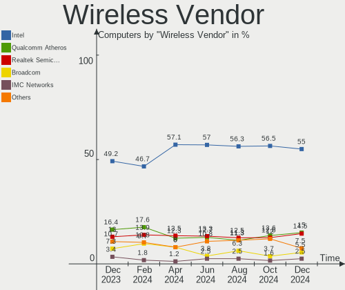
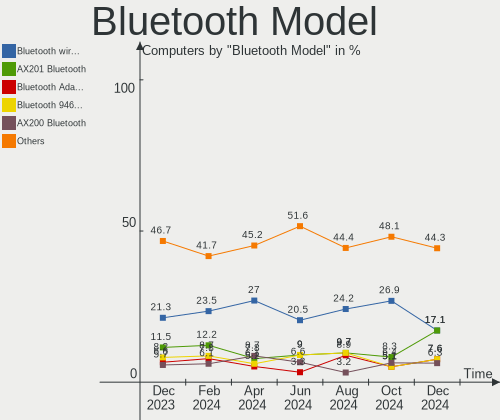

BSD Hardware Trends
-------------------

A project to identify most popular hardware characteristics and track their change
over time based on data collected by BSD users at https://BSD-Hardware.info.

Anyone can contribute to the study by uploading probes of their computers by
the [hw-probe](https://github.com/linuxhw/hw-probe/blob/master/INSTALL.BSD.md) tool:

    hw-probe -all -upload

This is a report for all computer types. See also reports for [desktops](/Desktop/README.md) and [notebooks](/Notebook/README.md).

Full-feature report is available here: https://bsd-hardware.info/?view=trends

OS-specific reports: [FreeBSD](/Dist/FreeBSD), [OpenBSD](/Dist/OpenBSD).

Period: May, 2020.

Contents
--------

- [ OS                       ](#os)
- [ OS Family                ](#os-family)
- [ Arch                     ](#arch)
- [ DE                       ](#de)
- [ Display Server           ](#display-server)
- [ Display Manager          ](#display-manager)
- [ OS Lang                  ](#os-lang)
- [ Boot Mode                ](#boot-mode)
- [ Filesystem               ](#filesystem)
- [ Part. scheme             ](#part-scheme)
- [ Country                  ](#country)
- [ City                     ](#city)
- [ Vendor                   ](#vendor)
- [ Model                    ](#model)
- [ Model Family             ](#model-family)
- [ MFG Year                 ](#mfg-year)
- [ Form Factor              ](#form-factor)
- [ Coreboot                 ](#coreboot)
- [ RAM Size                 ](#ram-size)
- [ RAM Used                 ](#ram-used)
- [ Drive Vendor             ](#drive-vendor)
- [ Drive Model              ](#drive-model)
- [ Drive Kind               ](#drive-kind)
- [ Drive Connector          ](#drive-connector)
- [ Drive Size               ](#drive-size)
- [ Space Total              ](#space-total)
- [ Space Used               ](#space-used)
- [ Malfunc. Drives          ](#malfunc-drives)
- [ Malfunc. Drive Vendor    ](#malfunc-drive-vendor)
- [ Malfunc. HDD Vendor      ](#malfunc-hdd-vendor)
- [ Malfunc. Drive Kind      ](#malfunc-drive-kind)
- [ Failed Drives            ](#failed-drives)
- [ Failed Drive Vendor      ](#failed-drive-vendor)
- [ Drive Status             ](#drive-status)
- [ Storage Vendor           ](#storage-vendor)
- [ Storage Model            ](#storage-model)
- [ Storage Kind             ](#storage-kind)
- [ CPU Vendor               ](#cpu-vendor)
- [ CPU Model                ](#cpu-model)
- [ CPU Model Family         ](#cpu-model-family)
- [ CPU Cores                ](#cpu-cores)
- [ CPU Sockets              ](#cpu-sockets)
- [ CPU Threads              ](#cpu-threads)
- [ CPU Microarch            ](#cpu-microarch)
- [ GPU Vendor               ](#gpu-vendor)
- [ GPU Model                ](#gpu-model)
- [ GPU Combo                ](#gpu-combo)
- [ GPU Driver               ](#gpu-driver)
- [ GPU Memory               ](#gpu-memory)
- [ Monitor Vendor           ](#monitor-vendor)
- [ Monitor Model            ](#monitor-model)
- [ Monitor Resolution       ](#monitor-resolution)
- [ Monitor Diagonal         ](#monitor-diagonal)
- [ Monitor Width            ](#monitor-width)
- [ Aspect Ratio             ](#aspect-ratio)
- [ Monitor Area             ](#monitor-area)
- [ Pixel Density            ](#pixel-density)
- [ Multiple Monitors        ](#multiple-monitors)
- [ Net Controller Vendor    ](#net-controller-vendor)
- [ Net Controller Model     ](#net-controller-model)
- [ Wireless Vendor          ](#wireless-vendor)
- [ Wireless Model           ](#wireless-model)
- [ Ethernet Vendor          ](#ethernet-vendor)
- [ Ethernet Model           ](#ethernet-model)
- [ Net Controller Kind      ](#net-controller-kind)
- [ Used Controller          ](#used-controller)
- [ NICs                     ](#nics)
- [ Bluetooth Vendor         ](#bluetooth-vendor)
- [ Bluetooth Model          ](#bluetooth-model)
- [ Unsupported Devices      ](#unsupported-devices)
- [ Unsupported Device Types ](#unsupported-device-types)

OS
--

Installed operating systems

| Name                          | Computers | Percent |
|-------------------------------|-----------|---------|
| FreeBSD 12.1-p5               | 50        | 31.25%  |
| OpenBSD 6.7                   | 20        | 12.5%   |
| FreeBSD 12.1-STABLE           | 16        | 10%     |
| FreeBSD 13.0-CURRENT          | 8         | 5%      |
| FreeBSD 12.1-p4               | 8         | 5%      |
| FreeBSD 12.1-p3               | 5         | 3.13%   |
| MidnightBSD 1.2               | 4         | 2.5%    |
| FreeBSD 10.4-p13              | 4         | 2.5%    |
| NomadBSD 1.3.1                | 3         | 1.88%   |
| NetBSD 9.0                    | 3         | 1.88%   |
| GhostBSD 20.04.02             | 3         | 1.88%   |
| FreeBSD 12.1-p2               | 3         | 1.88%   |
| FreeNAS 11.3-p9               | 2         | 1.25%   |
| FreeNAS 11.3-p7               | 2         | 1.25%   |
| FreeBSD 12.1                  | 2         | 1.25%   |
| FreeBSD 11.3-p5               | 2         | 1.25%   |
| DragonFly 5.8                 | 2         | 1.25%   |
| pfSense 2.4.4                 | 1         | 0.63%   |
| OS108 9.0                     | 1         | 0.63%   |
| OpenBSD 6.6                   | 1         | 0.63%   |
| NetBSD 9.99.61                | 1         | 0.63%   |
| NetBSD 9.99.23                | 1         | 0.63%   |
| NetBSD 9.0_STABLE             | 1         | 0.63%   |
| NetBSD 7.2                    | 1         | 0.63%   |
| HardenedBSD 13.0-CURRENT-HBSD | 1         | 0.63%   |
| HardenedBSD 12.1--HBSD        | 1         | 0.63%   |
| GhostBSD 20.03.01             | 1         | 0.63%   |
| GhostBSD 19.12                | 1         | 0.63%   |
| FreeNAS 11.3-p8               | 1         | 0.63%   |
| FreeNAS 10.3                  | 1         | 0.63%   |
| FreeBSD 8.4                   | 1         | 0.63%   |
| FreeBSD 12.1-p1               | 1         | 0.63%   |
| FreeBSD 12.0-p3               | 1         | 0.63%   |
| FreeBSD 12.0-p10              | 1         | 0.63%   |
| FreeBSD 11.3-STABLE           | 1         | 0.63%   |
| FreeBSD 11.3-p9               | 1         | 0.63%   |
| FreeBSD 11.3-p6               | 1         | 0.63%   |
| FreeBSD 10.3-p29              | 1         | 0.63%   |
| FreeBSD 10.3-p16              | 1         | 0.63%   |
| DragonFly 5.9-DEVELOPMENT     | 1         | 0.63%   |

OS Family
---------

OS without a version

| Name        | Computers | Percent |
|-------------|-----------|---------|
| FreeBSD     | 107       | 66.88%  |
| OpenBSD     | 21        | 13.13%  |
| NetBSD      | 7         | 4.38%   |
| FreeNAS     | 6         | 3.75%   |
| GhostBSD    | 5         | 3.13%   |
| MidnightBSD | 4         | 2.5%    |
| NomadBSD    | 3         | 1.88%   |
| DragonFly   | 3         | 1.88%   |
| HardenedBSD | 2         | 1.25%   |
| pfSense     | 1         | 0.63%   |
| OS108       | 1         | 0.63%   |

Arch
----

OS architecture (x86_64, i586, etc.)

| Name   | Computers | Percent |
|--------|-----------|---------|
| amd64  | 144       | 90%     |
| i386   | 8         | 5%      |
| x86_64 | 3         | 1.88%   |
| arm64  | 2         | 1.25%   |
| evbarm | 1         | 0.63%   |
| armv7  | 1         | 0.63%   |
| arm    | 1         | 0.63%   |

DE
--

Desktop Environment

| Name     | Computers | Percent |
|----------|-----------|---------|
| Terminal | 113       | 70.63%  |
| XFCE     | 23        | 14.38%  |
| GNOME    | 11        | 6.88%   |
| MATE     | 6         | 3.75%   |
| KDE5     | 3         | 1.88%   |
| LXQt     | 1         | 0.63%   |
| LXDE     | 1         | 0.63%   |
| Lumina   | 1         | 0.63%   |
| KDE      | 1         | 0.63%   |

Display Server
--------------

X11 or Wayland

| Name     | Computers | Percent |
|----------|-----------|---------|
| X11      | 89        | 55.63%  |
| Terminal | 70        | 43.75%  |
| Wayland  | 1         | 0.63%   |

Display Manager
---------------

SDDM, LightDM, etc.

| Name     | Computers | Percent |
|----------|-----------|---------|
| Terminal | 111       | 69.38%  |
| SLiM     | 19        | 11.88%  |
| SDDM     | 11        | 6.88%   |
| LightDM  | 9         | 5.63%   |
| XDM      | 7         | 4.38%   |
| GDM      | 3         | 1.88%   |

OS Lang
-------

Language

| Lang         | Computers | Percent |
|--------------|-----------|---------|
| Unknown      | 67        | 41.88%  |
| en_US        | 40        | 25%     |
| ru_RU        | 30        | 18.75%  |
| ja_JP        | 5         | 3.13%   |
| en_GB        | 4         | 2.5%    |
| de_DE        | 4         | 2.5%    |
| ""           | 4         | 2.5%    |
| sk_SK        | 1         | 0.63%   |
| ru_RU.KOI8-R | 1         | 0.63%   |
| pl_PL        | 1         | 0.63%   |
| fr_FR        | 1         | 0.63%   |
| en_IE        | 1         | 0.63%   |
| cs_CZ        | 1         | 0.63%   |

Boot Mode
---------

EFI or BIOS

| Mode | Computers | Percent |
|------|-----------|---------|
| BIOS | 93        | 58.13%  |
| EFI  | 67        | 41.88%  |

Filesystem
----------

Type of filesystem

| Type    | Computers | Percent |
|---------|-----------|---------|
| Zfs     | 79        | 49.38%  |
| Ufs     | 78        | 48.75%  |
| Hammer2 | 2         | 1.25%   |
| Unknown | 1         | 0.63%   |

Part. scheme
------------

Scheme of partitioning

| Type    | Computers | Percent |
|---------|-----------|---------|
| GPT     | 121       | 75.63%  |
| MBR     | 26        | 16.25%  |
| Unknown | 12        | 7.5%    |
| BSD     | 1         | 0.63%   |

Country
-------

Geographic location (country)

| Country     | Computers | Percent |
|-------------|-----------|---------|
| Russia      | 47        | 29.38%  |
| USA         | 31        | 19.38%  |
| Germany     | 18        | 11.25%  |
| France      | 9         | 5.63%   |
| Ukraine     | 6         | 3.75%   |
| Japan       | 5         | 3.13%   |
| Canada      | 5         | 3.13%   |
| UK          | 4         | 2.5%    |
| Switzerland | 4         | 2.5%    |
| Finland     | 4         | 2.5%    |
| Austria     | 4         | 2.5%    |
| Netherlands | 3         | 1.88%   |
| Italy       | 3         | 1.88%   |
| Spain       | 2         | 1.25%   |
| Latvia      | 2         | 1.25%   |
| Australia   | 2         | 1.25%   |
| Sweden      | 1         | 0.63%   |
| Slovakia    | 1         | 0.63%   |
| Romania     | 1         | 0.63%   |
| Portugal    | 1         | 0.63%   |
| Poland      | 1         | 0.63%   |
| Kazakhstan  | 1         | 0.63%   |
| Ireland     | 1         | 0.63%   |
| Indonesia   | 1         | 0.63%   |
| Croatia     | 1         | 0.63%   |
| Belgium     | 1         | 0.63%   |
| Armenia     | 1         | 0.63%   |

City
----

Geographic location (city)

| City               | Computers | Percent |
|--------------------|-----------|---------|
| Moscow             | 22        | 13.75%  |
| Ypsilanti          | 4         | 2.5%    |
| Vienna             | 4         | 2.5%    |
| St Petersburg      | 4         | 2.5%    |
| Ekaterinburg       | 4         | 2.5%    |
| Zurich             | 3         | 1.88%   |
| Stuttgart          | 2         | 1.25%   |
| Riga               | 2         | 1.25%   |
| Ozersk             | 2         | 1.25%   |
| Orsk               | 2         | 1.25%   |
| Neuss              | 2         | 1.25%   |
| Millinocket        | 2         | 1.25%   |
| Limonest           | 2         | 1.25%   |
| Kyiv               | 2         | 1.25%   |
| Kiliya             | 2         | 1.25%   |
| Helsinki           | 2         | 1.25%   |
| Hamilton           | 2         | 1.25%   |
| Eindhoven          | 2         | 1.25%   |
| Clemmons           | 2         | 1.25%   |
| Chiyoda            | 2         | 1.25%   |
| Bellevue           | 2         | 1.25%   |
| Abakan             | 2         | 1.25%   |
| Yverdon-les-Bains  | 1         | 0.63%   |
| Yerevan            | 1         | 0.63%   |
| Yegor'yevsk        | 1         | 0.63%   |
| Yaroslavl          | 1         | 0.63%   |
| West Hartford      | 1         | 0.63%   |
| Warsaw             | 1         | 0.63%   |
| Walthamstow        | 1         | 0.63%   |
| Waldbrunn          | 1         | 0.63%   |
| Vol'sk             | 1         | 0.63%   |
| Vitry-sur-Seine    | 1         | 0.63%   |
| Varaždin          | 1         | 0.63%   |
| Vancouver          | 1         | 0.63%   |
| Treviglio          | 1         | 0.63%   |
| Tokyo              | 1         | 0.63%   |
| Tenhult            | 1         | 0.63%   |
| Stupava            | 1         | 0.63%   |
| Slijk-Ewijk        | 1         | 0.63%   |
| Seattle            | 1         | 0.63%   |
| Sayville           | 1         | 0.63%   |
| Saratov            | 1         | 0.63%   |
| Saone              | 1         | 0.63%   |
| San Francisco      | 1         | 0.63%   |
| San Diego          | 1         | 0.63%   |
| Revonnas           | 1         | 0.63%   |
| Regensburg         | 1         | 0.63%   |
| Portland           | 1         | 0.63%   |
| Pittsford          | 1         | 0.63%   |
| Pine Mountain Club | 1         | 0.63%   |
| Peterborough       | 1         | 0.63%   |
| Penza              | 1         | 0.63%   |
| Paris              | 1         | 0.63%   |
| Oradea             | 1         | 0.63%   |
| Omsk               | 1         | 0.63%   |
| Nuremberg          | 1         | 0.63%   |
| Novosibirsk        | 1         | 0.63%   |
| Nottingham         | 1         | 0.63%   |
| Northeim           | 1         | 0.63%   |
| Nishinomiya        | 1         | 0.63%   |

Vendor
------

Motherboard manufacturer

| Name                | Computers | Percent |
|---------------------|-----------|---------|
| Lenovo              | 35        | 21.88%  |
| ASUSTek Computer    | 27        | 16.88%  |
| Gigabyte Technology | 20        | 12.5%   |
| Dell                | 15        | 9.38%   |
| Unknown             | 11        | 6.88%   |
| Intel               | 9         | 5.63%   |
| Hewlett-Packard     | 9         | 5.63%   |
| Supermicro          | 6         | 3.75%   |
| MSI                 | 6         | 3.75%   |
| ASRock              | 5         | 3.13%   |
| Acer                | 3         | 1.88%   |
| Sony                | 2         | 1.25%   |
| IBM                 | 2         | 1.25%   |
| Fujitsu             | 2         | 1.25%   |
| VIA Technologies    | 1         | 0.63%   |
| TUXEDO              | 1         | 0.63%   |
| Toshiba             | 1         | 0.63%   |
| Sony UK             | 1         | 0.63%   |
| Schenker            | 1         | 0.63%   |
| Panasonic           | 1         | 0.63%   |
| MiTAC               | 1         | 0.63%   |
| Apple               | 1         | 0.63%   |

Model
-----

Motherboard model

| Name                                       | Computers | Percent |
|--------------------------------------------|-----------|---------|
| Unknown                                    | 12        | 7.5%    |
| Supermicro SSG-6029P-E1CR12L               | 2         | 1.25%   |
| Lenovo ThinkPad T430s 2352CTO              | 2         | 1.25%   |
| Lenovo ThinkPad T420 4180B39               | 2         | 1.25%   |
| Lenovo ThinkPad T410s 291245G              | 2         | 1.25%   |
| Gigabyte M68MT-S2P                         | 2         | 1.25%   |
| Dell XPS 13 9360                           | 2         | 1.25%   |
| Dell Latitude E6420                        | 2         | 1.25%   |
| ASUS TUF B350M-PLUS GAMING                 | 2         | 1.25%   |
| ASUS P6T SE                                | 2         | 1.25%   |
| ASUS All Series                            | 2         | 1.25%   |
| VIA Technologies VT8623-8235               | 1         | 0.63%   |
| TUXEDO N13xWU                              | 1         | 0.63%   |
| Toshiba Satellite L355D                    | 1         | 0.63%   |
| Supermicro X9DBL-3F/X9DBL-iF               | 1         | 0.63%   |
| Supermicro X7SPA-HF                        | 1         | 0.63%   |
| Supermicro Super Server                    | 1         | 0.63%   |
| Supermicro SSG-2028R-E1CR24N               | 1         | 0.63%   |
| Sony VPCM12M1E                             | 1         | 0.63%   |
| Sony UK Raspberry Pi 4 Model B             | 1         | 0.63%   |
| Sony SVE1713S1RW                           | 1         | 0.63%   |
| Schenker SCHENKER_COMPACT15_17_SCO15_17M19 | 1         | 0.63%   |
| Panasonic CF-19ADUAX1M                     | 1         | 0.63%   |
| MSI MS-7B90                                | 1         | 0.63%   |
| MSI MS-7B89                                | 1         | 0.63%   |
| MSI MS-7887                                | 1         | 0.63%   |
| MSI MS-7817                                | 1         | 0.63%   |
| MSI MS-7693                                | 1         | 0.63%   |
| MSI MS-7255                                | 1         | 0.63%   |
| MiTAC PH12SI                               | 1         | 0.63%   |
| Lenovo ThinkPad X60 1707YF8                | 1         | 0.63%   |
| Lenovo ThinkPad X270 20HNCTO1WW            | 1         | 0.63%   |
| Lenovo ThinkPad X260 20F5S1H800            | 1         | 0.63%   |
| Lenovo ThinkPad X240 20AMS0J01N            | 1         | 0.63%   |
| Lenovo ThinkPad X240 20AMA52RUK            | 1         | 0.63%   |
| Lenovo ThinkPad X230 2325V4M               | 1         | 0.63%   |
| Lenovo ThinkPad X230 2324A57               | 1         | 0.63%   |
| Lenovo ThinkPad X220 4291C35               | 1         | 0.63%   |
| Lenovo ThinkPad X220 42902WU               | 1         | 0.63%   |
| Lenovo ThinkPad X220 42872WU               | 1         | 0.63%   |
| Lenovo ThinkPad X1 Carbon 6th 20KH002RUS   | 1         | 0.63%   |
| Lenovo ThinkPad X1 Carbon 5th 20HRCTO1WW   | 1         | 0.63%   |
| Lenovo ThinkPad X1 Carbon 4th 20FCS1DW00   | 1         | 0.63%   |
| Lenovo ThinkPad X1 Carbon 3460AWU          | 1         | 0.63%   |
| Lenovo ThinkPad T60 2007J3G                | 1         | 0.63%   |
| Lenovo ThinkPad T495 20NJCTO1WW            | 1         | 0.63%   |
| Lenovo ThinkPad T460p 20FXS0H700           | 1         | 0.63%   |
| Lenovo ThinkPad T440s 20AR003VMS           | 1         | 0.63%   |
| Lenovo ThinkPad T440p 20AWS07F00           | 1         | 0.63%   |
| Lenovo ThinkPad T440p 20AN00DEUS           | 1         | 0.63%   |
| Lenovo ThinkPad T440 20B7S1C600            | 1         | 0.63%   |
| Lenovo ThinkPad T430s 23539LU              | 1         | 0.63%   |
| Lenovo ThinkPad T410 2537H21               | 1         | 0.63%   |
| Lenovo ThinkPad P51 20HH001RMX             | 1         | 0.63%   |
| Lenovo ThinkPad A485 20MU000VUS            | 1         | 0.63%   |
| Lenovo IdeaPad Z570 HuronRiver Platform    | 1         | 0.63%   |
| Lenovo IdeaPad 320-15ISK 80XH              | 1         | 0.63%   |
| Lenovo G570 20079                          | 1         | 0.63%   |
| Lenovo 70AQ0009UX ThinkServer TS440        | 1         | 0.63%   |
| Intel S3420GP                              | 1         | 0.63%   |

Model Family
------------

Motherboard model prefix

| Name                         | Computers | Percent |
|------------------------------|-----------|---------|
| Lenovo ThinkPad              | 31        | 19.38%  |
| Unknown                      | 12        | 7.5%    |
| Dell Latitude                | 5         | 3.13%   |
| Gigabyte B450M               | 3         | 1.88%   |
| Dell PowerEdge               | 3         | 1.88%   |
| ASUS PRIME                   | 3         | 1.88%   |
| Supermicro SSG-6029P-E1CR12L | 2         | 1.25%   |
| Lenovo IdeaPad               | 2         | 1.25%   |
| HP ProLiant                  | 2         | 1.25%   |
| HP EliteBook                 | 2         | 1.25%   |
| Gigabyte M68MT-S2P           | 2         | 1.25%   |
| Dell XPS                     | 2         | 1.25%   |
| Dell Precision               | 2         | 1.25%   |
| Dell OptiPlex                | 2         | 1.25%   |
| ASUS TUF                     | 2         | 1.25%   |
| ASUS P6T                     | 2         | 1.25%   |
| ASUS P5Q                     | 2         | 1.25%   |
| ASUS All                     | 2         | 1.25%   |
| Acer Aspire                  | 2         | 1.25%   |
| VIA Technologies VT8623-8235 | 1         | 0.63%   |
| TUXEDO N13xWU                | 1         | 0.63%   |
| Toshiba Satellite            | 1         | 0.63%   |
| Supermicro X9DBL-3F          | 1         | 0.63%   |
| Supermicro X7SPA-HF          | 1         | 0.63%   |
| Supermicro Super             | 1         | 0.63%   |
| Supermicro SSG-2028R-E1CR24N | 1         | 0.63%   |
| Sony VPCM12M1E               | 1         | 0.63%   |
| Sony UK Raspberry            | 1         | 0.63%   |
| Sony SVE1713S1RW             | 1         | 0.63%   |
| Schenker SCHENKER            | 1         | 0.63%   |
| Panasonic CF-19ADUAX1M       | 1         | 0.63%   |
| MSI MS-7B90                  | 1         | 0.63%   |
| MSI MS-7B89                  | 1         | 0.63%   |
| MSI MS-7887                  | 1         | 0.63%   |
| MSI MS-7817                  | 1         | 0.63%   |
| MSI MS-7693                  | 1         | 0.63%   |
| MSI MS-7255                  | 1         | 0.63%   |
| MiTAC PH12SI                 | 1         | 0.63%   |
| Lenovo G570                  | 1         | 0.63%   |
| Lenovo 70AQ0009UX            | 1         | 0.63%   |
| Intel S3420GP                | 1         | 0.63%   |
| Intel S1200RP                | 1         | 0.63%   |
| Intel NUC7CJYH               | 1         | 0.63%   |
| Intel NUC6i5SYB              | 1         | 0.63%   |
| Intel MP                     | 1         | 0.63%   |
| Intel Intel                  | 1         | 0.63%   |
| Intel DN2820FYK              | 1         | 0.63%   |
| Intel DG41RQ                 | 1         | 0.63%   |
| Intel D54250WYK              | 1         | 0.63%   |
| IBM ThinkPad                 | 1         | 0.63%   |
| IBM 81832BG                  | 1         | 0.63%   |
| HP ZBook                     | 1         | 0.63%   |
| HP Z620                      | 1         | 0.63%   |
| HP Z600                      | 1         | 0.63%   |
| HP t620                      | 1         | 0.63%   |
| HP Compaq                    | 1         | 0.63%   |
| Gigabyte Z68P-DS3            | 1         | 0.63%   |
| Gigabyte Z68MA-D2H-B3        | 1         | 0.63%   |
| Gigabyte Z170X-UD5           | 1         | 0.63%   |
| Gigabyte X570                | 1         | 0.63%   |

MFG Year
--------

Motherboard manufacture year

| Year    | Computers | Percent |
|---------|-----------|---------|
| 2019    | 29        | 18.13%  |
| 2018    | 19        | 11.88%  |
| 2013    | 12        | 7.5%    |
| 2016    | 11        | 6.88%   |
| 2012    | 10        | 6.25%   |
| 2014    | 9         | 5.63%   |
| 2010    | 9         | 5.63%   |
| Unknown | 9         | 5.63%   |
| 2017    | 8         | 5%      |
| 2020    | 7         | 4.38%   |
| 2011    | 7         | 4.38%   |
| 2015    | 6         | 3.75%   |
| 2009    | 6         | 3.75%   |
| 2007    | 6         | 3.75%   |
| 2008    | 5         | 3.13%   |
| 2005    | 4         | 2.5%    |
| 2006    | 2         | 1.25%   |
| 2004    | 1         | 0.63%   |

Form Factor
-----------

Physical design of the computer

| Name     | Computers | Percent |
|----------|-----------|---------|
| Desktop  | 84        | 52.5%   |
| Notebook | 64        | 40%     |
| Server   | 9         | 5.63%   |
| Mini pc  | 3         | 1.88%   |

Coreboot
--------

Have coreboot on board

| Used | Computers | Percent |
|------|-----------|---------|
| No   | 160       | 100%    |

RAM Size
--------

Total RAM memory

| Size in GB  | Computers | Percent |
|-------------|-----------|---------|
| 8.01-16.0   | 46        | 28.75%  |
| 16.01-24.0  | 36        | 22.5%   |
| 32.01-64.0  | 22        | 13.75%  |
| 4.01-8.0    | 19        | 11.88%  |
| 2.01-3.0    | 7         | 4.38%   |
| 64.01-256.0 | 7         | 4.38%   |
| 1.01-2.0    | 7         | 4.38%   |
| 0.01-1.0    | 7         | 4.38%   |
| 3.01-4.0    | 6         | 3.75%   |
| 24.01-32.0  | 2         | 1.25%   |
| Unknown     | 1         | 0.63%   |

RAM Used
--------

Used RAM memory

| Used GB     | Computers | Percent |
|-------------|-----------|---------|
| 0.01-1.0    | 89        | 55.63%  |
| 1.01-2.0    | 19        | 11.88%  |
| 4.01-8.0    | 13        | 8.13%   |
| Unknown     | 9         | 5.63%   |
| 8.01-16.0   | 6         | 3.75%   |
| 3.01-4.0    | 5         | 3.13%   |
| 24.01-32.0  | 5         | 3.13%   |
| 16.01-24.0  | 4         | 2.5%    |
| 0           | 4         | 2.5%    |
| 32.01-64.0  | 2         | 1.25%   |
| 2.01-3.0    | 2         | 1.25%   |
| 64.01-256.0 | 2         | 1.25%   |

Drive Vendor
------------

Hard drive vendors

| Vendor              | Computers | Drives | Percent |
|---------------------|-----------|--------|---------|
| WDC                 | 42        | 114    | 20.19%  |
| Samsung Electronics | 36        | 50     | 17.31%  |
| Seagate             | 34        | 68     | 16.35%  |
| Hitachi             | 13        | 17     | 6.25%   |
| Crucial             | 11        | 12     | 5.29%   |
| Toshiba             | 10        | 16     | 4.81%   |
| Intel               | 8         | 11     | 3.85%   |
| SanDisk             | 7         | 9      | 3.37%   |
| Kingston            | 7         | 9      | 3.37%   |
| HGST                | 7         | 13     | 3.37%   |
| Micron Technology   | 4         | 6      | 1.92%   |
| SPCC                | 3         | 3      | 1.44%   |
| Transcend           | 2         | 2      | 0.96%   |
| NVMe                | 2         | 2      | 0.96%   |
| LITEON              | 2         | 2      | 0.96%   |
| Corsair             | 2         | 2      | 0.96%   |
| Verbatim            | 1         | 1      | 0.48%   |
| SuperMicro          | 1         | 1      | 0.48%   |
| PLEXTOR             | 1         | 1      | 0.48%   |
| OPENBSD             | 1         | 1      | 0.48%   |
| OCZ                 | 1         | 1      | 0.48%   |
| LSI                 | 1         | 1      | 0.48%   |
| LITEONIT            | 1         | 1      | 0.48%   |
| Leven               | 1         | 1      | 0.48%   |
| KingSpec            | 1         | 1      | 0.48%   |
| Hoodisk             | 1         | 1      | 0.48%   |
| Hewlett-Packard     | 1         | 1      | 0.48%   |
| Gigabyte Technology | 1         | 1      | 0.48%   |
| Fujitsu             | 1         | 1      | 0.48%   |
| Areca               | 1         | 2      | 0.48%   |
| Apple               | 1         | 1      | 0.48%   |
| AEGO                | 1         | 1      | 0.48%   |
| Adaptec             | 1         | 5      | 0.48%   |
| A-DATA Technology   | 1         | 1      | 0.48%   |

Drive Model
-----------

Hard drive models

| Model                    | Computers | Percent |
|--------------------------|-----------|---------|
| SSD 850 EVO 250GB        | 5         | 1.93%   |
| WD40EFRX-68N32N0 4TB     | 4         | 1.54%   |
| ST3300657SS 304GB        | 4         | 1.54%   |
| SSD 860 EVO 500GB        | 4         | 1.54%   |
| WD20EZRZ-00Z5HB0 2TB     | 3         | 1.16%   |
| WD15EADS-00P8B0 1.5TB    | 3         | 1.16%   |
| ST2000DM001-1CH164 2TB   | 3         | 1.16%   |
| SSD 850 EVO 500GB        | 3         | 1.16%   |
| SSD 850 EVO 1TB          | 3         | 1.16%   |
| HTS721010A9E630 1TB      | 3         | 1.16%   |
| WDS100T2B0A-00SM50 1TB   | 2         | 0.77%   |
| WD6400AARS-00Y5B1 640GB  | 2         | 0.77%   |
| WD60EFAX-68SHWN0 6TB     | 2         | 0.77%   |
| WD40EFRX-68WT0N0 4TB     | 2         | 0.77%   |
| WD20EARX-00PASB0 2TB     | 2         | 0.77%   |
| WD2002FYPS-01U1B0 2TB    | 2         | 0.77%   |
| SUV500MS480G 480GB       | 2         | 0.77%   |
| ST4000DM000-1F2168 4TB   | 2         | 0.77%   |
| ST250DM000-1BD141 250GB  | 2         | 0.77%   |
| ST2000LM015-2E8174 2TB   | 2         | 0.77%   |
| SSD 860 EVO 1TB          | 2         | 0.77%   |
| MQ04ABF100 1TB           | 2         | 0.77%   |
| LCH-128V2S 128GB         | 2         | 0.77%   |
| HTS725050A7E630 500GB    | 2         | 0.77%   |
| HTS541075A7E630 752GB    | 2         | 0.77%   |
| HD501LJ 500GB            | 2         | 0.77%   |
| DT01ACA100 1TB           | 2         | 0.77%   |
| CT250MX200SSD1 250GB     | 2         | 0.77%   |
| CT240M500SSD3 240GB      | 2         | 0.77%   |
| 5100_MTFDDAK240TCB 240GB | 2         | 0.77%   |
| WDS500G1B0A-00H9H0 500GB | 1         | 0.39%   |
| WDS480G2G0A-00JH30 480GB | 1         | 0.39%   |
| WDC PC SN720 SDA 1TB     | 1         | 0.39%   |
| WD80EFZX-68UW8N0 8TB     | 1         | 0.39%   |
| WD7500AYYS-01RCA0 752GB  | 1         | 0.39%   |
| WD6002FRYZ-01WD5B1 6TB   | 1         | 0.39%   |
| WD5003AZEX-00MK2A0 500GB | 1         | 0.39%   |
| WD5003AZEX-00K3CA0 500GB | 1         | 0.39%   |
| WD5003AZEX-00K1GA0 500GB | 1         | 0.39%   |
| WD5000LPLX-08ZNTT0 500GB | 1         | 0.39%   |
| WD5000LPLX-00ZNTT0 500GB | 1         | 0.39%   |
| WD5000BPVT-24HXZT3 500GB | 1         | 0.39%   |
| WD5000AAKX-08U6AA0 500GB | 1         | 0.39%   |
| WD5000AAKS-00A7B0 500GB  | 1         | 0.39%   |
| WD40EZRZ-75GXCB0 4TB     | 1         | 0.39%   |
| WD40EZRZ-22GXCB0 4TB     | 1         | 0.39%   |
| WD4002FFWX-68TZ4N0 4TB   | 1         | 0.39%   |
| WD30EZRX-00SPEB0 3TB     | 1         | 0.39%   |
| WD30EZRX-00DC0B0 3TB     | 1         | 0.39%   |
| WD30EZRX-00D8PB0 3TB     | 1         | 0.39%   |
| WD30EFRX-68EUZN0 3TB     | 1         | 0.39%   |
| WD2500BEVT-22A23T0 250GB | 1         | 0.39%   |
| WD20NMVW-11EDZS7 2TB     | 1         | 0.39%   |
| WD20NMVW-11AV3S2 2TB     | 1         | 0.39%   |
| WD20EZRX-00DC0B0 2TB     | 1         | 0.39%   |
| WD20EZRX-00D8PB0 2TB     | 1         | 0.39%   |
| WD20EFRX-68AX9N0 2TB     | 1         | 0.39%   |
| WD20EARS-00MVWB0 2TB     | 1         | 0.39%   |
| WD2003FZEX-00SRLA0 2TB   | 1         | 0.39%   |
| WD2003FYYS-02W0B0 2TB    | 1         | 0.39%   |

Drive Kind
----------

HDD or SSD

| Kind | Computers | Drives | Percent |
|------|-----------|--------|---------|
| HDD  | 90        | 217    | 52.63%  |
| SSD  | 77        | 138    | 45.03%  |
| NVMe | 4         | 4      | 2.34%   |

Drive Connector
---------------

SATA, SAS, NVMe, etc.

| Type | Computers | Drives | Percent |
|------|-----------|--------|---------|
| SATA | 135       | 355    | 97.12%  |
| NVMe | 4         | 4      | 2.88%   |

Drive Size
----------

Size of hard drive

| Size in TB | Computers | Drives | Percent |
|------------|-----------|--------|---------|
| 0.01-0.5   | 108       | 157    | 53.47%  |
| 0.51-1.0   | 39        | 81     | 19.31%  |
| 1.01-2.0   | 27        | 49     | 13.37%  |
| 3.01-4.0   | 13        | 24     | 6.44%   |
| 4.01-10.0  | 8         | 24     | 3.96%   |
| 2.01-3.0   | 6         | 8      | 2.97%   |
| 10.01-20.0 | 1         | 16     | 0.5%    |

Space Total
-----------

Amount of disk space available on the file system

| Size in GB     | Computers | Percent |
|----------------|-----------|---------|
| 251-500        | 44        | 27.5%   |
| 101-250        | 39        | 24.38%  |
| 21-50          | 13        | 8.13%   |
| 51-100         | 13        | 8.13%   |
| 501-1000       | 12        | 7.5%    |
| 1-20           | 11        | 6.88%   |
| Unknown        | 10        | 6.25%   |
| 1001-2000      | 7         | 4.38%   |
| 2001-3000      | 6         | 3.75%   |
| More than 3000 | 5         | 3.13%   |

Space Used
----------

Amount of used disk space

| Used GB        | Computers | Percent |
|----------------|-----------|---------|
| 1-20           | 87        | 54.38%  |
| 21-50          | 27        | 16.88%  |
| 51-100         | 14        | 8.75%   |
| Unknown        | 10        | 6.25%   |
| 251-500        | 6         | 3.75%   |
| 101-250        | 6         | 3.75%   |
| 501-1000       | 5         | 3.13%   |
| More than 3000 | 3         | 1.88%   |
| 1001-2000      | 2         | 1.25%   |

Malfunc. Drives
---------------

Drive models with a malfunction

| Model                    | Computers | Drives | Percent |
|--------------------------|-----------|--------|---------|
| WD2002FYPS-01U1B0 2TB    | 2         | 2      | 6.25%   |
| WD15EADS-00P8B0 1.5TB    | 2         | 2      | 6.25%   |
| HD501LJ 500GB            | 2         | 4      | 6.25%   |
| WD6002FRYZ-01WD5B1 6TB   | 1         | 1      | 3.13%   |
| WD5003AZEX-00MK2A0 500GB | 1         | 1      | 3.13%   |
| WD40EFRX-68N32N0 4TB     | 1         | 3      | 3.13%   |
| WD20EFRX-68AX9N0 2TB     | 1         | 1      | 3.13%   |
| WD2003FZEX-00SRLA0 2TB   | 1         | 1      | 3.13%   |
| ST9500420AS 500GB        | 1         | 1      | 3.13%   |
| ST500LM021-1KJ152 500GB  | 1         | 1      | 3.13%   |
| ST3500514NS 500GB        | 1         | 1      | 3.13%   |
| ST2000DM008-2FR102 2TB   | 1         | 1      | 3.13%   |
| ST2000DM001-1CH164 2TB   | 1         | 1      | 3.13%   |
| SSDSCKKF256G8H 256GB     | 1         | 1      | 3.13%   |
| SSDSC2KW480H6 480GB      | 1         | 1      | 3.13%   |
| SSDSC2BF180A4L 180GB     | 1         | 1      | 3.13%   |
| SSDSC2BB480G7 480GB      | 1         | 1      | 3.13%   |
| SSDSA2M080G2GC 80GB      | 1         | 1      | 3.13%   |
| SSD 960 EVO 1TB          | 1         | 1      | 3.13%   |
| SSD 850 EVO mSATA 1TB    | 1         | 1      | 3.13%   |
| SSD 850 EVO 1TB          | 1         | 1      | 3.13%   |
| MQ04ABF100 1TB           | 1         | 1      | 3.13%   |
| HTS721060G9AT00 64GB     | 1         | 1      | 3.13%   |
| HTS543212L9A300 120GB    | 1         | 1      | 3.13%   |
| HTS541075A7E630 752GB    | 1         | 1      | 3.13%   |
| HTS421260H9AT00 64GB     | 1         | 1      | 3.13%   |
| HTC426060G9AT00 64GB     | 1         | 1      | 3.13%   |
| HDS721010CLA332 1TB      | 1         | 1      | 3.13%   |
| CT525MX300SSD1 528GB     | 1         | 1      | 3.13%   |

Malfunc. Drive Vendor
---------------------

Vendors of faulty drives

| Vendor              | Computers | Drives | Percent |
|---------------------|-----------|--------|---------|
| WDC                 | 7         | 11     | 24.14%  |
| Seagate             | 5         | 5      | 17.24%  |
| Intel               | 5         | 5      | 17.24%  |
| Hitachi             | 5         | 5      | 17.24%  |
| Samsung Electronics | 4         | 7      | 13.79%  |
| Toshiba             | 1         | 1      | 3.45%   |
| HGST                | 1         | 1      | 3.45%   |
| Crucial             | 1         | 1      | 3.45%   |

Malfunc. HDD Vendor
-------------------

Vendors of faulty HDD drives

| Vendor              | Computers | Drives | Percent |
|---------------------|-----------|--------|---------|
| WDC                 | 7         | 11     | 33.33%  |
| Seagate             | 5         | 5      | 23.81%  |
| Hitachi             | 5         | 5      | 23.81%  |
| Samsung Electronics | 2         | 4      | 9.52%   |
| Toshiba             | 1         | 1      | 4.76%   |
| HGST                | 1         | 1      | 4.76%   |

Malfunc. Drive Kind
-------------------

Kinds of faulty drives

| Kind | Computers | Drives | Percent |
|------|-----------|--------|---------|
| HDD  | 21        | 27     | 72.41%  |
| SSD  | 7         | 8      | 24.14%  |
| NVMe | 1         | 1      | 3.45%   |

Failed Drives
-------------

Failed drive models

Zero info for selected period =(

Failed Drive Vendor
-------------------

Failed drive vendors

Zero info for selected period =(

Drive Status
------------

Number of failed and malfunc. drives

| Status   | Computers | Drives | Percent |
|----------|-----------|--------|---------|
| Works    | 118       | 308    | 76.13%  |
| Malfunc  | 29        | 36     | 18.71%  |
| Detected | 8         | 15     | 5.16%   |

Storage Vendor
--------------

Storage controller vendors

| Vendor                           | Computers | Percent |
|----------------------------------|-----------|---------|
| Intel                            | 115       | 56.37%  |
| AMD                              | 26        | 12.75%  |
| Samsung Electronics              | 10        | 4.9%    |
| Marvell Technology Group         | 7         | 3.43%   |
| ASMedia Technology               | 7         | 3.43%   |
| Broadcom / LSI                   | 6         | 2.94%   |
| Areca Technology                 | 6         | 2.94%   |
| JMicron Technology               | 4         | 1.96%   |
| VIA Technologies                 | 3         | 1.47%   |
| Nvidia                           | 3         | 1.47%   |
| SK Hynix                         | 2         | 0.98%   |
| Silicon Integrated Systems [SiS] | 2         | 0.98%   |
| Phison Electronics               | 2         | 0.98%   |
| Toshiba                          | 1         | 0.49%   |
| Silicon Image                    | 1         | 0.49%   |
| Sandisk                          | 1         | 0.49%   |
| Realtek Semiconductor            | 1         | 0.49%   |
| Lite-On Technology               | 1         | 0.49%   |
| Lenovo                           | 1         | 0.49%   |
| KIOXIA                           | 1         | 0.49%   |
| Hewlett-Packard                  | 1         | 0.49%   |
| Broadcom                         | 1         | 0.49%   |
| ADATA Technology                 | 1         | 0.49%   |
| Adaptec                          | 1         | 0.49%   |

Storage Model
-------------

Storage controller models

| Model                                                                      | Computers | Percent |
|----------------------------------------------------------------------------|-----------|---------|
| FCH SATA Controller [AHCI mode]                                            | 18        | 7.47%   |
| 6 Series/C200 Series Chipset Family 6 port Mobile SATA AHCI Controller     | 12        | 4.98%   |
| 7 Series Chipset Family 6-port SATA Controller [AHCI mode]                 | 11        | 4.56%   |
| 8 Series/C220 Series Chipset Family 6-port SATA Controller 1 [AHCI mode]   | 10        | 4.15%   |
| ASM1062 Serial ATA Controller                                              | 7         | 2.9%    |
| 400 Series Chipset SATA Controller                                         | 7         | 2.9%    |
| Sunrise Point-LP SATA Controller [AHCI mode]                               | 6         | 2.49%   |
| SB7x0/SB8x0/SB9x0 SATA Controller [AHCI mode]                              | 6         | 2.49%   |
| 82801JI (ICH10 Family) SATA AHCI Controller                                | 6         | 2.49%   |
| 8 Series SATA Controller 1 [AHCI mode]                                     | 6         | 2.49%   |
| 6 Series/C200 Series Chipset Family 6 port Desktop SATA AHCI Controller    | 6         | 2.49%   |
| Q170/Q150/B150/H170/H110/Z170/CM236 Chipset SATA Controller [AHCI Mode]    | 5         | 2.07%   |
| NVMe SSD Controller SM981/PM981/PM983                                      | 5         | 2.07%   |
| 5 Series/3400 Series Chipset 6 port SATA AHCI Controller                   | 5         | 2.07%   |
| SB7x0/SB8x0/SB9x0 IDE Controller                                           | 4         | 1.66%   |
| NVMe SSD Controller SM961/PM961                                            | 4         | 1.66%   |
| ARC-1300ix-16 16-Port PCI-Express to SAS Non-RAID Host Adapter             | 4         | 1.66%   |
| 82801G (ICH7 Family) IDE Controller                                        | 4         | 1.66%   |
| Unknown                                                                    | 4         | 1.66%   |
| SAS3008 PCI-Express Fusion-MPT SAS-3                                       | 3         | 1.24%   |
| JMB363 SATA/IDE Controller                                                 | 3         | 1.24%   |
| Atom Processor E3800 Series SATA AHCI Controller                           | 3         | 1.24%   |
| 92xx SATA 6G Controller                                                    | 3         | 1.24%   |
| 7 Series/C210 Series Chipset Family 6-port SATA Controller [AHCI mode]     | 3         | 1.24%   |
| 300 Series Chipset SATA Controller                                         | 3         | 1.24%   |
| Wildcat Point-LP SATA Controller [AHCI Mode]                               | 2         | 0.83%   |
| SATA Controller [RAID mode]                                                | 2         | 0.83%   |
| SAS2008 PCI-Express Fusion-MPT SAS-2 [Falcon]                              | 2         | 0.83%   |
| Optane SSD 900P Series                                                     | 2         | 0.83%   |
| NM10/ICH7 Family SATA Controller [IDE mode]                                | 2         | 0.83%   |
| NM10/ICH7 Family SATA Controller [AHCI mode]                               | 2         | 0.83%   |
| MCP61 SATA Controller                                                      | 2         | 0.83%   |
| HM170/QM170 Chipset SATA Controller [AHCI Mode]                            | 2         | 0.83%   |
| FCH SATA Controller D                                                      | 2         | 0.83%   |
| E12 NVMe Controller                                                        | 2         | 0.83%   |
| Celeron N3350/Pentium N4200/Atom E3900 Series SATA AHCI Controller         | 2         | 0.83%   |
| Cannon Lake Mobile PCH SATA AHCI Controller                                | 2         | 0.83%   |
| C620 Series Chipset Family SSATA Controller [AHCI mode]                    | 2         | 0.83%   |
| C620 Series Chipset Family SATA Controller [AHCI mode]                     | 2         | 0.83%   |
| C602 chipset 4-Port SATA Storage Control Unit                              | 2         | 0.83%   |
| C600/X79 series chipset SATA RAID Controller                               | 2         | 0.83%   |
| C600/X79 series chipset 6-Port SATA AHCI Controller                        | 2         | 0.83%   |
| Atom/Celeron/Pentium Processor x5-E8000/J3xxx/N3xxx Series SATA Controller | 2         | 0.83%   |
| 88SE6111/6121 SATA II / PATA Controller                                    | 2         | 0.83%   |
| 82801IR/IO/IH (ICH9R/DO/DH) 6 port SATA Controller [AHCI mode]             | 2         | 0.83%   |
| 82801GBM/GHM (ICH7-M Family) SATA Controller [AHCI mode]                   | 2         | 0.83%   |
| 82801EB/ER (ICH5/ICH5R) IDE Controller                                     | 2         | 0.83%   |
| 82801EB (ICH5) SATA Controller                                             | 2         | 0.83%   |
| 5513 IDE Controller                                                        | 2         | 0.83%   |
| 5 Series/3400 Series Chipset 4 port SATA AHCI Controller                   | 2         | 0.83%   |
| XPG SX8200 Pro PCIe Gen3x4 M.2 2280 Solid State Drive                      | 1         | 0.41%   |
| XG4 NVMe SSD Controller                                                    | 1         | 0.41%   |
| X399 Series Chipset SATA Controller                                        | 1         | 0.41%   |
| X370 Series Chipset SATA Controller                                        | 1         | 0.41%   |
| WD Black 2018/PC SN720 NVMe SSD                                            | 1         | 0.41%   |
| VT82C586A/B/VT82C686/A/B/VT823x/A/C PIPC Bus Master IDE                    | 1         | 0.41%   |
| VT6421 IDE/SATA Controller                                                 | 1         | 0.41%   |
| unknown                                                                    | 1         | 0.41%   |
| SSD 660P Series                                                            | 1         | 0.41%   |
| Smart Array Controller                                                     | 1         | 0.41%   |

Storage Kind
------------

Kind of storage controller (IDE, SATA, NVMe, SAS, ...)

| Kind | Computers | Percent |
|------|-----------|---------|
| SATA | 125       | 61.58%  |
| IDE  | 34        | 16.75%  |
| NVMe | 23        | 11.33%  |
| RAID | 9         | 4.43%   |
| SAS  | 8         | 3.94%   |
| SCSI | 4         | 1.97%   |

CPU Vendor
----------

Processor vendors

| Vendor | Computers | Percent |
|--------|-----------|---------|
| Intel  | 123       | 76.88%  |
| AMD    | 31        | 19.38%  |
| Arm    | 5         | 3.13%   |
| VIA    | 1         | 0.63%   |

CPU Model
---------

Processor models

| Model                                                  | Computers | Percent |
|--------------------------------------------------------|-----------|---------|
| Intel Core i5-2520M CPU @ 2.50GHz                      | 5         | 3.13%   |
| Intel Core i5-3320M CPU @ 2.60GHz                      | 4         | 2.5%    |
| Intel Core i5-4300U CPU @ 1.90GHz                      | 3         | 1.88%   |
| Intel Core 2 Quad CPU Q6600 @ 2.40GHz                  | 3         | 1.88%   |
| AMD AMD Ryzen 7 2700 Eight-Core Processor              | 3         | 1.88%   |
| Intel Xeon Bronze 3104 CPU @ 1.70GHz                   | 2         | 1.25%   |
| Intel Core i7-7500U CPU @ 2.70GHz                      | 2         | 1.25%   |
| Intel Core i7-4770 CPU @ 3.40GHz                       | 2         | 1.25%   |
| Intel Core i7-3770 CPU @ 3.40GHz                       | 2         | 1.25%   |
| Intel Core i7 CPU 920 @ 2.67GHz                        | 2         | 1.25%   |
| Intel Core i5-2540M CPU @ 2.60GHz                      | 2         | 1.25%   |
| Intel Core i5-2430M CPU @ 2.40GHz                      | 2         | 1.25%   |
| Intel Core i5 CPU M 560 @ 2.67GHz                      | 2         | 1.25%   |
| Intel Core i3-6006U CPU @ 2.00GHz                      | 2         | 1.25%   |
| Intel Core 2 CPU                                       | 2         | 1.25%   |
| Intel Celeron CPU J1900 @ 1.99GHz                      | 2         | 1.25%   |
| AMD Athlon II X3 455 Processor                         | 2         | 1.25%   |
| AMD AMD Ryzen 7 2700X Eight-Core Processor             | 2         | 1.25%   |
| AMD AMD Ryzen 7 1700 Eight-Core Processor              | 2         | 1.25%   |
| VIA C3                                                 | 1         | 0.63%   |
| Intel Xeon E-2286M CPU @ 2.40GHz                       | 1         | 0.63%   |
| Intel Xeon CPU X3430 @ 2.40GHz                         | 1         | 0.63%   |
| Intel Xeon CPU L5630 @ 2.13GHz                         | 1         | 0.63%   |
| Intel Xeon CPU E5630 @ 2.53GHz                         | 1         | 0.63%   |
| Intel Xeon CPU E5504 @ 2.00GHz                         | 1         | 0.63%   |
| Intel Xeon CPU E5-2690 @ 2.90GHz                       | 1         | 0.63%   |
| Intel Xeon CPU E5-2660 v4 @ 2.00GHz                    | 1         | 0.63%   |
| Intel Xeon CPU E5-2407 v2 @ 2.40GHz                    | 1         | 0.63%   |
| Intel Xeon CPU E5-2403 0 @ 1.80GHz                     | 1         | 0.63%   |
| Intel Xeon CPU E31220 @ 3.10GHz                        | 1         | 0.63%   |
| Intel Xeon CPU E3-1241 v3 @ 3.50GH                     | 1         | 0.63%   |
| Intel Xeon CPU E3-1240 v5 @ 3.50GHz                    | 1         | 0.63%   |
| Intel Xeon CPU E3-1225 v3 @ 3.20GHz                    | 1         | 0.63%   |
| Intel Xeon CPU E3-1220 v6 @ 3.00GHz                    | 1         | 0.63%   |
| Intel Xeon CPU D-1541 @ 2.10GHz                        | 1         | 0.63%   |
| Intel Xeon CPU 2.66GHz                                 | 1         | 0.63%   |
| Intel Pentium M processor 1.60GHz                      | 1         | 0.63%   |
| Intel Pentium M processor                              | 1         | 0.63%   |
| Intel Pentium D CPU                                    | 1         | 0.63%   |
| Intel Pentium CPU J4205 @ 1.50GHz                      | 1         | 0.63%   |
| Intel Pentium CPU G3240 @ 3.10GHz                      | 1         | 0.63%   |
| Intel Pentium CPU G3220 @ 3.00GHz                      | 1         | 0.63%   |
| Intel Pentium CPU G2120 @ 3.10GHz                      | 1         | 0.63%   |
| Intel Pentium 4 CPU 3.00GHz                            | 1         | 0.63%   |
| Intel Pentium 4 CPU 2.80GHz ("GenuineIntel" 686-class) | 1         | 0.63%   |
| Intel Pentium 4 CPU 2.66GHz                            | 1         | 0.63%   |
| Intel Pentium 3805U @ 1.90GHz                          | 1         | 0.63%   |
| Intel Core i7-9750H CPU @ 2.60GHz                      | 1         | 0.63%   |
| Intel Core i7-8650U CPU @ 1.90GHz                      | 1         | 0.63%   |
| Intel Core i7-7820HQ CPU @ 2.90GHz                     | 1         | 0.63%   |
| Intel Core i7-7700K CPU @ 4.20GHz                      | 1         | 0.63%   |
| Intel Core i7-7700HQ CPU @ 2.80GHz                     | 1         | 0.63%   |
| Intel Core i7-7600U CPU @ 2.80GHz                      | 1         | 0.63%   |
| Intel Core i7-6820HQ CPU @ 2.70GHz                     | 1         | 0.63%   |
| Intel Core i7-6700K CPU @ 4.00GHz                      | 1         | 0.63%   |
| Intel Core i7-6600U CPU @ 2.60GHz                      | 1         | 0.63%   |
| Intel Core i7-5500U CPU @ 2.40GHz                      | 1         | 0.63%   |
| Intel Core i7-4900MQ CPU @ 2.80GHz                     | 1         | 0.63%   |
| Intel Core i7-4600U CPU @ 2.10GHz                      | 1         | 0.63%   |
| Intel Core i7-3740QM CPU @ 2.70GHz                     | 1         | 0.63%   |

CPU Model Family
----------------

Processor model prefix

| Model                          | Computers | Percent |
|--------------------------------|-----------|---------|
| Intel Core i5                  | 36        | 22.5%   |
| Intel Core i7                  | 29        | 18.13%  |
| Other                          | 24        | 15%     |
| Intel Xeon                     | 16        | 10%     |
| Intel Celeron                  | 8         | 5%      |
| Intel Core i3                  | 6         | 3.75%   |
| Intel Pentium                  | 5         | 3.13%   |
| Intel Core 2                   | 4         | 2.5%    |
| Intel Pentium 4                | 3         | 1.88%   |
| Intel Core 2 Quad              | 3         | 1.88%   |
| Intel Core 2 Duo               | 3         | 1.88%   |
| AMD FX                         | 3         | 1.88%   |
| Intel Xeon Bronze              | 2         | 1.25%   |
| Intel Pentium M                | 2         | 1.25%   |
| Intel Atom                     | 2         | 1.25%   |
| AMD Phenom                     | 2         | 1.25%   |
| AMD Athlon II X3               | 2         | 1.25%   |
| Intel Pentium D                | 1         | 0.63%   |
| Intel Celeron M                | 1         | 0.63%   |
| AMD Turion X2 Dual-Core Mobile | 1         | 0.63%   |
| AMD Sempron                    | 1         | 0.63%   |
| AMD Ryzen 7 PRO                | 1         | 0.63%   |
| AMD Ryzen 3                    | 1         | 0.63%   |
| AMD GX                         | 1         | 0.63%   |
| AMD Geode Integrated           | 1         | 0.63%   |
| AMD Athlon X4                  | 1         | 0.63%   |
| AMD Athlon II X2               | 1         | 0.63%   |

CPU Cores
---------

Number of processor cores

| Number  | Computers | Percent |
|---------|-----------|---------|
| 2       | 57        | 35.63%  |
| 4       | 45        | 28.13%  |
| Unknown | 20        | 12.5%   |
| 8       | 13        | 8.13%   |
| 1       | 9         | 5.63%   |
| 16      | 7         | 4.38%   |
| 6       | 3         | 1.88%   |
| 32      | 2         | 1.25%   |
| 3       | 2         | 1.25%   |
| 28      | 1         | 0.63%   |
| 12      | 1         | 0.63%   |

CPU Sockets
-----------

Number of sockets

| Number  | Computers | Percent |
|---------|-----------|---------|
| 1       | 144       | 90%     |
| 2       | 8         | 5%      |
| Unknown | 8         | 5%      |

CPU Threads
-----------

Threads per core (Hyper-Threading)

| Number  | Computers | Percent |
|---------|-----------|---------|
| 2       | 81        | 50.63%  |
| 1       | 54        | 33.75%  |
| Unknown | 25        | 15.63%  |

CPU Microarch
-------------

Microarchitecture

| Name            | Computers | Percent |
|-----------------|-----------|---------|
| SandyBridge     | 19        | 11.88%  |
| Haswell         | 17        | 10.63%  |
| IvyBridge       | 16        | 10%     |
| Unknown         | 15        | 9.38%   |
| Skylake         | 12        | 7.5%    |
| KabyLake        | 12        | 7.5%    |
| K10             | 7         | 4.38%   |
| Core            | 7         | 4.38%   |
| Westmere        | 6         | 3.75%   |
| Zen+            | 5         | 3.13%   |
| Zen             | 5         | 3.13%   |
| NetBurst        | 5         | 3.13%   |
| Nehalem         | 5         | 3.13%   |
| Silvermont      | 4         | 2.5%    |
| Piledriver      | 4         | 2.5%    |
| Broadwell       | 4         | 2.5%    |
| Penryn          | 3         | 1.88%   |
| P6              | 3         | 1.88%   |
| Bonnell         | 3         | 1.88%   |
| Zen 2           | 2         | 1.25%   |
| Goldmont        | 2         | 1.25%   |
| K8 & K10 hybrid | 1         | 0.63%   |
| Jaguar          | 1         | 0.63%   |
| Goldmont plus   | 1         | 0.63%   |
| Geode           | 1         | 0.63%   |

GPU Vendor
----------

Vendors of graphics cards

| Vendor                           | Computers | Percent |
|----------------------------------|-----------|---------|
| Intel                            | 80        | 48.78%  |
| Nvidia                           | 35        | 21.34%  |
| AMD                              | 31        | 18.9%   |
| Matrox Electronics Systems       | 8         | 4.88%   |
| ASPEED Technology                | 6         | 3.66%   |
| VIA Technologies                 | 2         | 1.22%   |
| Silicon Integrated Systems [SiS] | 1         | 0.61%   |
| ATI                              | 1         | 0.61%   |

GPU Model
---------

Graphics card models

| Model                                                                              | Computers | Percent |
|------------------------------------------------------------------------------------|-----------|---------|
| 2nd Generation Core Processor Family Integrated Graphics Controller                | 12        | 7.27%   |
| 3rd Gen Core processor Graphics Controller                                         | 8         | 4.85%   |
| Xeon E3-1200 v2/3rd Gen Core processor Graphics Controller                         | 6         | 3.64%   |
| Haswell-ULT Integrated Graphics Controller                                         | 6         | 3.64%   |
| ASPEED Graphics Family                                                             | 6         | 3.64%   |
| Ellesmere [Radeon RX 470/480/570/570X/580/580X/590]                                | 5         | 3.03%   |
| Core Processor Integrated Graphics Controller                                      | 5         | 3.03%   |
| Skylake GT2 [HD Graphics 520]                                                      | 4         | 2.42%   |
| HD Graphics 620                                                                    | 4         | 2.42%   |
| G98 [GeForce 8400 GS Rev. 2]                                                       | 4         | 2.42%   |
| Raven Ridge [Radeon Vega Series / Radeon Vega Mobile Series]                       | 3         | 1.82%   |
| MGA G200e [Pilot] ServerEngines (SEP1)                                             | 3         | 1.82%   |
| GK208B [GeForce GT 710]                                                            | 3         | 1.82%   |
| GK107 [GeForce GT 640]                                                             | 3         | 1.82%   |
| ES1000                                                                             | 3         | 1.82%   |
| Atom Processor Z36xxx/Z37xxx Series Graphics & Display                             | 3         | 1.82%   |
| Atom Processor D4xx/D5xx/N4xx/N5xx Integrated Graphics Controller                  | 3         | 1.82%   |
| 4th Gen Core Processor Integrated Graphics Controller                              | 3         | 1.82%   |
| Xeon E3-1200 v3/4th Gen Core Processor Integrated Graphics Controller              | 2         | 1.21%   |
| UHD Graphics 620                                                                   | 2         | 1.21%   |
| RV710/M92 [Mobility Radeon HD 4350/4550]                                           | 2         | 1.21%   |
| MGA G200eW WPCM450                                                                 | 2         | 1.21%   |
| HD Graphics 630                                                                    | 2         | 1.21%   |
| HD Graphics 530                                                                    | 2         | 1.21%   |
| GP108 [GeForce GT 1030]                                                            | 2         | 1.21%   |
| GM107 [GeForce GTX 750 Ti]                                                         | 2         | 1.21%   |
| G200eR2                                                                            | 2         | 1.21%   |
| Caicos PRO [Radeon HD 7450]                                                        | 2         | 1.21%   |
| Atom/Celeron/Pentium Processor x5-E8000/J3xxx/N3xxx Integrated Graphics Controller | 2         | 1.21%   |
| 82865G Integrated Graphics Controller                                              | 2         | 1.21%   |
| Xeon E3-1200 v3 Processor Integrated Graphics Controller                           | 1         | 0.61%   |
| Whistler [Radeon HD 6630M/6650M/6750M/7670M/7690M]                                 | 1         | 0.61%   |
| VT8623 [Apollo CLE266] integrated CastleRock graphics                              | 1         | 0.61%   |
| Vega 20 [Radeon VII]                                                               | 1         | 0.61%   |
| Vega 10 XL/XT [Radeon RX Vega 56/64]                                               | 1         | 0.61%   |
| UHD Graphics 630 (Mobile)                                                          | 1         | 0.61%   |
| UHD Graphics 605                                                                   | 1         | 0.61%   |
| TU106M [GeForce RTX 2070 Mobile]                                                   | 1         | 0.61%   |
| TU106GLM [Quadro RTX 3000 Mobile / Max-Q]                                          | 1         | 0.61%   |
| Thames [Radeon HD 7550M/7570M/7650M]                                               | 1         | 0.61%   |
| Tahiti PRO [Radeon HD 7950/8950 OEM / R9 280]                                      | 1         | 0.61%   |
| RV710/M92 [Mobility Radeon HD 4530/4570/545v]                                      | 1         | 0.61%   |
| RV515/M52 [Mobility Radeon X1300]                                                  | 1         | 0.61%   |
| RV370 [Radeon X300]                                                                | 1         | 0.61%   |
| RV370 [Radeon X300 SE]                                                             | 1         | 0.61%   |
| RS780MC [Mobility Radeon HD 3100]                                                  | 1         | 0.61%   |
| RS780L [Radeon 3000]                                                               | 1         | 0.61%   |
| RS780 [Radeon HD 3200]                                                             | 1         | 0.61%   |
| Robson CE [Radeon HD 6370M/7370M]                                                  | 1         | 0.61%   |
| Picasso                                                                            | 1         | 0.61%   |
| Oland [Radeon HD 8570 / R7 240/340 / Radeon 520 OEM]                               | 1         | 0.61%   |
| NV18 [GeForce4 MX 4000]                                                            | 1         | 0.61%   |
| Mobile 945GM/GMS/GME, 943/940GML Express Integrated Graphics Controller            | 1         | 0.61%   |
| Mobile 945GM/GMS, 943/940GML Express Integrated Graphics Controller                | 1         | 0.61%   |
| Mobile 915GM/GMS/910GML Express Graphics Controller                                | 1         | 0.61%   |
| MGA G200EH                                                                         | 1         | 0.61%   |
| Kabini [Radeon HD 8400E]                                                           | 1         | 0.61%   |
| Iris Graphics 540                                                                  | 1         | 0.61%   |
| HD Graphics 5500                                                                   | 1         | 0.61%   |
| HD Graphics 520                                                                    | 1         | 0.61%   |

GPU Combo
---------

Combinations of graphics cards

| Name            | Computers | Percent |
|-----------------|-----------|---------|
| 1 x Intel       | 67        | 41.88%  |
| 1 x Nvidia      | 28        | 17.5%   |
| 1 x AMD         | 28        | 17.5%   |
| 1 x Matrox      | 8         | 5%      |
| Other           | 6         | 3.75%   |
| Intel + Nvidia  | 6         | 3.75%   |
| 2 x Intel       | 5         | 3.13%   |
| 1 x ASPEED      | 5         | 3.13%   |
| 1 x VIA         | 2         | 1.25%   |
| Intel + AMD     | 2         | 1.25%   |
| 2 x AMD         | 1         | 0.63%   |
| 1 x SiS         | 1         | 0.63%   |
| Nvidia + ASPEED | 1         | 0.63%   |

GPU Driver
----------

Free vs proprietary

| Driver  | Computers | Percent |
|---------|-----------|---------|
| Free    | 154       | 96.25%  |
| Unknown | 6         | 3.75%   |

GPU Memory
----------

Total video memory

| Size in GB | Computers | Percent |
|------------|-----------|---------|
| Unknown    | 117       | 73.13%  |
| 1.01-2.0   | 19        | 11.88%  |
| 7.01-8.0   | 5         | 3.13%   |
| 3.01-4.0   | 5         | 3.13%   |
| 0.51-1.0   | 5         | 3.13%   |
| 0.01-0.5   | 4         | 2.5%    |
| 2.01-3.0   | 2         | 1.25%   |
| 8.01-16.0  | 2         | 1.25%   |
| 5.01-6.0   | 1         | 0.63%   |

Monitor Vendor
--------------

Monitor vendors

| Vendor                  | Computers | Percent |
|-------------------------|-----------|---------|
| LG Display              | 15        | 16.85%  |
| AU Optronics            | 11        | 12.36%  |
| Samsung Electronics     | 10        | 11.24%  |
| Lenovo                  | 8         | 8.99%   |
| Ancor Communications    | 7         | 7.87%   |
| Dell                    | 6         | 6.74%   |
| Chimei Innolux          | 6         | 6.74%   |
| Goldstar                | 5         | 5.62%   |
| Acer                    | 3         | 3.37%   |
| NEC Computers           | 2         | 2.25%   |
| BenQ                    | 2         | 2.25%   |
| AOC                     | 2         | 2.25%   |
| Unknown (CDD)           | 1         | 1.12%   |
| Sharp                   | 1         | 1.12%   |
| Philips                 | 1         | 1.12%   |
| LG Philips              | 1         | 1.12%   |
| LG Electronics          | 1         | 1.12%   |
| Impression              | 1         | 1.12%   |
| Hewlett-Packard         | 1         | 1.12%   |
| Fujitsu Siemens         | 1         | 1.12%   |
| Eizo                    | 1         | 1.12%   |
| CPT                     | 1         | 1.12%   |
| Chi Mei Optoelectronics | 1         | 1.12%   |
| BOE                     | 1         | 1.12%   |

Monitor Model
-------------

Monitor models

| Model                                             | Computers | Percent |
|---------------------------------------------------|-----------|---------|
| LCD Monitor LEN4036 1440x900 300x190mm 14.0-inch  | 3         | 3.37%   |
| U2414H DELA0A2 1920x1080 530x300mm 24.0-inch      | 2         | 2.25%   |
| U2312HM DEL4071 1920x1080 510x290mm 23.1-inch     | 2         | 2.25%   |
| LCD Monitor AUO106C 1366x768 280x160mm 12.7-inch  | 2         | 2.25%   |
| FE791SB NEC61D7 1600x1200 330x240mm 16.1-inch     | 2         | 2.25%   |
| ASUS VW199 ACI19ED 1440x900 410x260mm 19.1-inch   | 2         | 2.25%   |
| XB271HU A ACR052F 2560x1440 600x340mm 27.2-inch   | 1         | 1.12%   |
| W2242 GSM5677 1680x1050 490x320mm 23.0-inch       | 1         | 1.12%   |
| VGA CDD0030 1920x1080 1150x650mm 52.0-inch        | 1         | 1.12%   |
| SyncMaster SAM037C 1680x1050 470x300mm 22.0-inch  | 1         | 1.12%   |
| SyncMaster SAM011E 1280x1024 340x270mm 17.1-inch  | 1         | 1.12%   |
| SW2700 BNQ7F47 2560x1440 600x340mm 27.2-inch      | 1         | 1.12%   |
| S24E650 SAM0CC1 1920x1200 520x320mm 24.0-inch     | 1         | 1.12%   |
| R240HY ACR046F 1920x1080 530x300mm 24.0-inch      | 1         | 1.12%   |
| R19W11 IMP1911 1440x900 410x260mm 19.1-inch       | 1         | 1.12%   |
| PHL 328E1 PHLC204 3840x2160 700x390mm 31.5-inch   | 1         | 1.12%   |
| P27T-6 IPS FUS07EF 2560x1440 600x340mm 27.2-inch  | 1         | 1.12%   |
| LG Ultra HD GSM5B09 3840x2160 600x340mm 27.2-inch | 1         | 1.12%   |
| LG FULL HD GSM5B55 1920x1080 480x270mm 21.7-inch  | 1         | 1.12%   |
| LEN P27q-10 LEN61A8 2560x1440 600x340mm 27.2-inch | 1         | 1.12%   |
| LCD Monitor U2414H 1920x1080                      | 1         | 1.12%   |
| LCD Monitor U2414H                                | 1         | 1.12%   |
| LCD Monitor SyncMaster 3520x1200                  | 1         | 1.12%   |
| LCD Monitor SHP1449 1920x1080 290x170mm 13.2-inch | 1         | 1.12%   |
| LCD Monitor SEC4542 1366x768 310x170mm 13.9-inch  | 1         | 1.12%   |
| LCD Monitor SEC3047 1366x768 280x160mm 12.7-inch  | 1         | 1.12%   |
| LCD Monitor SEC3030 1024x600 220x130mm 10.1-inch  | 1         | 1.12%   |
| LCD Monitor SDCA029 3840x2160 340x190mm 15.3-inch | 1         | 1.12%   |
| LCD Monitor SDC364D 1920x1080 310x170mm 13.9-inch | 1         | 1.12%   |
| LCD Monitor MX27AQ 2560x1440                      | 1         | 1.12%   |
| LCD Monitor LPLA101 1440x900 370x230mm 17.2-inch  | 1         | 1.12%   |
| LCD Monitor LGD058B 2560x1440 310x170mm 13.9-inch | 1         | 1.12%   |
| LCD Monitor LGD04A3 1366x768 280x160mm 12.7-inch  | 1         | 1.12%   |
| LCD Monitor LGD046F 1920x1080 340x190mm 15.3-inch | 1         | 1.12%   |
| LCD Monitor LGD045E 1366x768 310x170mm 13.9-inch  | 1         | 1.12%   |
| LCD Monitor LGD0408 1920x1080 280x160mm 12.7-inch | 1         | 1.12%   |
| LCD Monitor LGD03ED 1366x768 280x160mm 12.7-inch  | 1         | 1.12%   |
| LCD Monitor LGD03CD 1366x768 280x160mm 12.7-inch  | 1         | 1.12%   |
| LCD Monitor LGD0382 1600x900 310x170mm 13.9-inch  | 1         | 1.12%   |
| LCD Monitor LGD0362 1600x900 310x170mm 13.9-inch  | 1         | 1.12%   |
| LCD Monitor LGD0335 1366x768 310x170mm 13.9-inch  | 1         | 1.12%   |
| LCD Monitor LGD032C 1920x1080 340x190mm 15.3-inch | 1         | 1.12%   |
| LCD Monitor LGD02EB 1366x768 310x170mm 13.9-inch  | 1         | 1.12%   |
| LCD Monitor LGD02E2 1600x900 310x170mm 13.9-inch  | 1         | 1.12%   |
| LCD Monitor LGD02DC 1366x768 340x190mm 15.3-inch  | 1         | 1.12%   |
| LCD Monitor LGD02D8 1366x768 280x160mm 12.7-inch  | 1         | 1.12%   |
| LCD Monitor LG ULTRAWIDE 3440x1440                | 1         | 1.12%   |
| LCD Monitor LEN40B0 1366x768 340x190mm 15.3-inch  | 1         | 1.12%   |
| LCD Monitor LEN4043 1400x1050 300x230mm 14.9-inch | 1         | 1.12%   |
| LCD Monitor LEN4000 1024x768 250x180mm 12.1-inch  | 1         | 1.12%   |
| LCD Monitor LEN0990 1440x900 410x260mm 19.1-inch  | 1         | 1.12%   |
| LCD Monitor GSM5AB6 1920x1080 480x270mm 21.7-inch | 1         | 1.12%   |
| LCD Monitor COR0207 1366x768 310x170mm 13.9-inch  | 1         | 1.12%   |
| LCD Monitor CMO1457 1366x768 310x170mm 13.9-inch  | 1         | 1.12%   |
| LCD Monitor CMN15DB 1366x768 340x190mm 15.3-inch  | 1         | 1.12%   |
| LCD Monitor CMN15C2 1920x1080 340x190mm 15.3-inch | 1         | 1.12%   |
| LCD Monitor CMN14F2 1920x1080 310x170mm 13.9-inch | 1         | 1.12%   |
| LCD Monitor CMN14C3 1366x768 310x170mm 13.9-inch  | 1         | 1.12%   |
| LCD Monitor CMN1471 1366x768 310x170mm 13.9-inch  | 1         | 1.12%   |
| LCD Monitor CMN1375 1920x1080 290x170mm 13.2-inch | 1         | 1.12%   |

Monitor Resolution
------------------

Monitor screen resolution

| Resolution         | Computers | Percent |
|--------------------|-----------|---------|
| 1920x1080 (FHD)    | 30        | 33.71%  |
| 1366x768 (WXGA)    | 21        | 23.6%   |
| 1440x900 (WXGA+)   | 8         | 8.99%   |
| 2560x1440 (QHD)    | 7         | 7.87%   |
| 3840x2160 (4K)     | 5         | 5.62%   |
| 1920x1200 (WUXGA)  | 3         | 3.37%   |
| 1600x900 (HD+)     | 3         | 3.37%   |
| 3440x1440          | 2         | 2.25%   |
| 1680x1050 (WSXGA+) | 2         | 2.25%   |
| 1600x1200          | 2         | 2.25%   |
| 3520x1200          | 1         | 1.12%   |
| 1400x1050          | 1         | 1.12%   |
| 1280x1024 (SXGA)   | 1         | 1.12%   |
| 1024x768 (XGA)     | 1         | 1.12%   |
| 1024x600           | 1         | 1.12%   |
| Unknown            | 1         | 1.12%   |

Monitor Diagonal
----------------

Diagonal size in inches

| Inches  | Computers | Percent |
|---------|-----------|---------|
| 13      | 21        | 23.86%  |
| 12      | 10        | 11.36%  |
| 15      | 9         | 10.23%  |
| 24      | 8         | 9.09%   |
| Unknown | 8         | 9.09%   |
| 27      | 6         | 6.82%   |
| 23      | 4         | 4.55%   |
| 21      | 4         | 4.55%   |
| 19      | 4         | 4.55%   |
| 14      | 4         | 4.55%   |
| 31      | 2         | 2.27%   |
| 22      | 2         | 2.27%   |
| 17      | 2         | 2.27%   |
| 16      | 2         | 2.27%   |
| 52      | 1         | 1.14%   |
| 10      | 1         | 1.14%   |

Monitor Width
-------------

Physical width

| Width in mm | Computers | Percent |
|-------------|-----------|---------|
| 301-350     | 31        | 35.63%  |
| 501-600     | 17        | 19.54%  |
| 201-300     | 17        | 19.54%  |
| 401-500     | 10        | 11.49%  |
| Unknown     | 8         | 9.2%    |
| 601-700     | 2         | 2.3%    |
| 351-400     | 1         | 1.15%   |
| 1001-1500   | 1         | 1.15%   |

Aspect Ratio
------------

Proportional relationship between the width and the height

| Ratio   | Computers | Percent |
|---------|-----------|---------|
| 16/9    | 56        | 68.29%  |
| 16/10   | 12        | 14.63%  |
| Unknown | 8         | 9.76%   |
| 4/3     | 4         | 4.88%   |
| 5/4     | 1         | 1.22%   |
| 3/2     | 1         | 1.22%   |

Monitor Area
------------

Area in inch²

| Area in inch² | Computers | Percent |
|----------------|-----------|---------|
| 81-90          | 22        | 25%     |
| 201-250        | 14        | 15.91%  |
| 61-70          | 10        | 11.36%  |
| 91-100         | 9         | 10.23%  |
| Unknown        | 8         | 9.09%   |
| 301-350        | 6         | 6.82%   |
| 251-300        | 4         | 4.55%   |
| 151-200        | 4         | 4.55%   |
| 71-80          | 2         | 2.27%   |
| 351-500        | 2         | 2.27%   |
| 121-130        | 2         | 2.27%   |
| More than 1000 | 1         | 1.14%   |
| 41-50          | 1         | 1.14%   |
| 141-150        | 1         | 1.14%   |
| 131-140        | 1         | 1.14%   |
| 101-110        | 1         | 1.14%   |

Pixel Density
-------------

Pixels per inch

| Density       | Computers | Percent |
|---------------|-----------|---------|
| 101-120       | 27        | 31.03%  |
| 121-160       | 26        | 29.89%  |
| 51-100        | 18        | 20.69%  |
| Unknown       | 8         | 9.2%    |
| 161-240       | 6         | 6.9%    |
| More than 240 | 1         | 1.15%   |
| 1-50          | 1         | 1.15%   |

Multiple Monitors
-----------------

Total monitors connected

| Total | Computers | Percent |
|-------|-----------|---------|
| 1     | 80        | 50%     |
| 0     | 70        | 43.75%  |
| 2     | 9         | 5.63%   |
| 3     | 1         | 0.63%   |

Net Controller Vendor
---------------------

Controller vendors

| Vendor                           | Computers | Percent |
|----------------------------------|-----------|---------|
| Intel                            | 95        | 45.89%  |
| Realtek Semiconductor            | 59        | 28.5%   |
| Qualcomm Atheros                 | 20        | 9.66%   |
| Broadcom Inc. and subsidiaries   | 11        | 5.31%   |
| VIA Technologies                 | 3         | 1.45%   |
| Marvell Technology Group         | 3         | 1.45%   |
| Silicon Integrated Systems [SiS] | 2         | 0.97%   |
| JMicron Technology               | 2         | 0.97%   |
| Realtek                          | 1         | 0.48%   |
| Ralink                           | 1         | 0.48%   |
| Qualcomm Atheros Communications  | 1         | 0.48%   |
| Nvidia                           | 1         | 0.48%   |
| Hewlett-Packard                  | 1         | 0.48%   |
| Emulex                           | 1         | 0.48%   |
| D-Link System                    | 1         | 0.48%   |
| Attansic                         | 1         | 0.48%   |
| Atmel                            | 1         | 0.48%   |
| Atheros                          | 1         | 0.48%   |
| ASUSTek Computer                 | 1         | 0.48%   |
| Accton Technology                | 1         | 0.48%   |

Net Controller Model
--------------------

Controller models

| Model                                                                   | Computers | Percent |
|-------------------------------------------------------------------------|-----------|---------|
| RTL8111/8168/8411 PCI Express Gigabit Ethernet Controller               | 47        | 18.22%  |
| 82579LM Gigabit Network Connection (Lewisville)                         | 17        | 6.59%   |
| Centrino Advanced-N 6205 [Taylor Peak]                                  | 11        | 4.26%   |
| Wireless 8265 / 8275                                                    | 8         | 3.1%    |
| 82574L Gigabit Network Connection                                       | 8         | 3.1%    |
| Wireless 7260                                                           | 7         | 2.71%   |
| Wireless 8260                                                           | 5         | 1.94%   |
| Ethernet Connection I217-LM                                             | 5         | 1.94%   |
| RTL8188EUS 802.11n Wireless Network Adapter                             | 4         | 1.55%   |
| RTL810xE PCI Express Fast Ethernet controller                           | 4         | 1.55%   |
| RTL-8100/8101L/8139 PCI Fast Ethernet Adapter                           | 4         | 1.55%   |
| I211 Gigabit Network Connection                                         | 4         | 1.55%   |
| Ethernet Connection I218-LM                                             | 4         | 1.55%   |
| Centrino Ultimate-N 6300                                                | 4         | 1.55%   |
| NetXtreme BCM5720 2-port Gigabit Ethernet PCIe                          | 3         | 1.16%   |
| I210 Gigabit Network Connection                                         | 3         | 1.16%   |
| Ethernet Connection (2) I219-LM                                         | 3         | 1.16%   |
| AR9285 Wireless Network Adapter (PCI-Express)                           | 3         | 1.16%   |
| 82577LM Gigabit Network Connection                                      | 3         | 1.16%   |
| 82571EB/82571GB Gigabit Ethernet Controller D0/D1 (copper applications) | 3         | 1.16%   |
| 82557/8/9/0/1 Ethernet Pro 100                                          | 3         | 1.16%   |
| Wireless-AC 9260                                                        | 2         | 0.78%   |
| Wireless 7265                                                           | 2         | 0.78%   |
| Wi-Fi 6 AX200                                                           | 2         | 0.78%   |
| VT6102/VT6103 [Rhine-II]                                                | 2         | 0.78%   |
| RTL8188CE 802.11b/g/n WiFi Adapter                                      | 2         | 0.78%   |
| NetXtreme BCM5721 Gigabit Ethernet PCI Express                          | 2         | 0.78%   |
| Killer E220x Gigabit Ethernet Controller                                | 2         | 0.78%   |
| I350 Gigabit Network Connection                                         | 2         | 0.78%   |
| Ethernet Controller 10-Gigabit X540-AT2                                 | 2         | 0.78%   |
| Ethernet Connection X722 for 10GBASE-T                                  | 2         | 0.78%   |
| Ethernet Connection I219-V                                              | 2         | 0.78%   |
| Ethernet Connection I219-LM                                             | 2         | 0.78%   |
| Ethernet Connection I218-V                                              | 2         | 0.78%   |
| Ethernet Connection (4) I219-LM                                         | 2         | 0.78%   |
| Centrino Advanced-N 6200                                                | 2         | 0.78%   |
| AR9462 Wireless Network Adapter                                         | 2         | 0.78%   |
| AR8151 v2.0 Gigabit Ethernet                                            | 2         | 0.78%   |
| 88E8056 PCI-E Gigabit Ethernet Controller                               | 2         | 0.78%   |
| 82578DM Gigabit Network Connection                                      | 2         | 0.78%   |
| 82573L Gigabit Ethernet Controller                                      | 2         | 0.78%   |
| Wireless-AC 1550i Wireless Network Adapter (9560NGW)                    | 1         | 0.39%   |
| Wireless 3160                                                           | 1         | 0.39%   |
| VT6105M [Rhine-III]                                                     | 1         | 0.39%   |
| VT6105/VT6106S [Rhine-III]                                              | 1         | 0.39%   |
| TP-Link TL-WN821N v3 / TL-WN822N v2 802.11n [Atheros AR7010+AR9287]     | 1         | 0.39%   |
| SMC2-1211TX                                                             | 1         | 0.39%   |
| SiS900 PCI Fast Ethernet                                                | 1         | 0.39%   |
| RTL8192CU 802.11n WLAN Adapter                                          | 1         | 0.39%   |
| RTL8191SEvB Wireless LAN Controller                                     | 1         | 0.39%   |
| RTL8139 Ethernet                                                        | 1         | 0.39%   |
| RT3090 Wireless 802.11n 1T/1R PCIe                                      | 1         | 0.39%   |
| QCA6174 802.11ac Wireless Network Adapter                               | 1         | 0.39%   |
| PRO/Wireless 3945ABG [Golan] Network Connection                         | 1         | 0.39%   |
| PRO/Wireless 2915ABG [Calexico2] Network Connection                     | 1         | 0.39%   |
| OneConnect 10Gb NIC (be3)                                               | 1         | 0.39%   |
| NetXtreme II BCM5709 Gigabit Ethernet                                   | 1         | 0.39%   |
| NetXtreme II BCM5708 Gigabit Ethernet                                   | 1         | 0.39%   |
| NetXtreme BCM57765 Gigabit Ethernet PCIe                                | 1         | 0.39%   |
| NetXtreme BCM5764M Gigabit Ethernet PCIe                                | 1         | 0.39%   |

Wireless Vendor
---------------

Wireless vendors

| Vendor                          | Computers | Percent |
|---------------------------------|-----------|---------|
| Intel                           | 52        | 65.82%  |
| Qualcomm Atheros                | 12        | 15.19%  |
| Realtek Semiconductor           | 9         | 11.39%  |
| Broadcom Inc. and subsidiaries  | 2         | 2.53%   |
| Ralink                          | 1         | 1.27%   |
| Qualcomm Atheros Communications | 1         | 1.27%   |
| Atheros                         | 1         | 1.27%   |
| ASUSTek Computer                | 1         | 1.27%   |

Wireless Model
--------------

Wireless models

| Model                                                               | Computers | Percent |
|---------------------------------------------------------------------|-----------|---------|
| Centrino Advanced-N 6205 [Taylor Peak]                              | 11        | 13.92%  |
| Wireless 8265 / 8275                                                | 8         | 10.13%  |
| Wireless 7260                                                       | 7         | 8.86%   |
| Wireless 8260                                                       | 5         | 6.33%   |
| RTL8188EUS 802.11n Wireless Network Adapter                         | 4         | 5.06%   |
| Centrino Ultimate-N 6300                                            | 4         | 5.06%   |
| AR9285 Wireless Network Adapter (PCI-Express)                       | 3         | 3.8%    |
| Wireless-AC 9260                                                    | 2         | 2.53%   |
| Wireless 7265                                                       | 2         | 2.53%   |
| Wi-Fi 6 AX200                                                       | 2         | 2.53%   |
| RTL8188CE 802.11b/g/n WiFi Adapter                                  | 2         | 2.53%   |
| Centrino Advanced-N 6200                                            | 2         | 2.53%   |
| AR9462 Wireless Network Adapter                                     | 2         | 2.53%   |
| Wireless-AC 1550i Wireless Network Adapter (9560NGW)                | 1         | 1.27%   |
| Wireless 3160                                                       | 1         | 1.27%   |
| TP-Link TL-WN821N v3 / TL-WN822N v2 802.11n [Atheros AR7010+AR9287] | 1         | 1.27%   |
| RTL8192CU 802.11n WLAN Adapter                                      | 1         | 1.27%   |
| RTL8191SEvB Wireless LAN Controller                                 | 1         | 1.27%   |
| RT3090 Wireless 802.11n 1T/1R PCIe                                  | 1         | 1.27%   |
| QCA6174 802.11ac Wireless Network Adapter                           | 1         | 1.27%   |
| PRO/Wireless 3945ABG [Golan] Network Connection                     | 1         | 1.27%   |
| PRO/Wireless 2915ABG [Calexico2] Network Connection                 | 1         | 1.27%   |
| Dual Band Wireless-AC 3165 Plus Bluetooth                           | 1         | 1.27%   |
| Centrino Wireless-N 6150                                            | 1         | 1.27%   |
| Centrino Wireless-N 2230                                            | 1         | 1.27%   |
| Centrino Wireless-N 1000 [Condor Peak]                              | 1         | 1.27%   |
| Centrino WiMAX 6150                                                 | 1         | 1.27%   |
| Centrino Advanced-N 6235                                            | 1         | 1.27%   |
| BCM4331 802.11a/b/g/n                                               | 1         | 1.27%   |
| BCM4313 802.11bgn Wireless Network Adapter                          | 1         | 1.27%   |
| ASUS USB-AC53 Nano USB Wieless adapter                              | 1         | 1.27%   |
| AR9485 Wireless Network Adapter                                     | 1         | 1.27%   |
| AR93xx Wireless Network Adapter                                     | 1         | 1.27%   |
| AR928X Wireless Network Adapter (PCI-Express)                       | 1         | 1.27%   |
| AR5212 802.11abg NIC                                                | 1         | 1.27%   |
| AR242x / AR542x Wireless Network Adapter (PCI-Express)              | 1         | 1.27%   |
| AR2413/AR2414 Wireless Network Adapter [AR5005G(S) 802.11bg]        | 1         | 1.27%   |
| 802.11n WLAN Adapter                                                | 1         | 1.27%   |

Ethernet Vendor
---------------

Ethernet vendors

| Vendor                           | Computers | Percent |
|----------------------------------|-----------|---------|
| Intel                            | 79        | 47.02%  |
| Realtek Semiconductor            | 54        | 32.14%  |
| Broadcom Inc. and subsidiaries   | 10        | 5.95%   |
| Qualcomm Atheros                 | 9         | 5.36%   |
| VIA Technologies                 | 3         | 1.79%   |
| Marvell Technology Group         | 3         | 1.79%   |
| Silicon Integrated Systems [SiS] | 2         | 1.19%   |
| JMicron Technology               | 2         | 1.19%   |
| Realtek                          | 1         | 0.6%    |
| Nvidia                           | 1         | 0.6%    |
| Emulex                           | 1         | 0.6%    |
| D-Link System                    | 1         | 0.6%    |
| Attansic                         | 1         | 0.6%    |
| Accton Technology                | 1         | 0.6%    |

Ethernet Model
--------------

Ethernet models

| Model                                                                   | Computers | Percent |
|-------------------------------------------------------------------------|-----------|---------|
| RTL8111/8168/8411 PCI Express Gigabit Ethernet Controller               | 47        | 26.7%   |
| 82579LM Gigabit Network Connection (Lewisville)                         | 17        | 9.66%   |
| 82574L Gigabit Network Connection                                       | 8         | 4.55%   |
| Ethernet Connection I217-LM                                             | 5         | 2.84%   |
| RTL810xE PCI Express Fast Ethernet controller                           | 4         | 2.27%   |
| RTL-8100/8101L/8139 PCI Fast Ethernet Adapter                           | 4         | 2.27%   |
| I211 Gigabit Network Connection                                         | 4         | 2.27%   |
| Ethernet Connection I218-LM                                             | 4         | 2.27%   |
| NetXtreme BCM5720 2-port Gigabit Ethernet PCIe                          | 3         | 1.7%    |
| I210 Gigabit Network Connection                                         | 3         | 1.7%    |
| Ethernet Connection (2) I219-LM                                         | 3         | 1.7%    |
| 82577LM Gigabit Network Connection                                      | 3         | 1.7%    |
| 82571EB/82571GB Gigabit Ethernet Controller D0/D1 (copper applications) | 3         | 1.7%    |
| 82557/8/9/0/1 Ethernet Pro 100                                          | 3         | 1.7%    |
| VT6102/VT6103 [Rhine-II]                                                | 2         | 1.14%   |
| NetXtreme BCM5721 Gigabit Ethernet PCI Express                          | 2         | 1.14%   |
| Killer E220x Gigabit Ethernet Controller                                | 2         | 1.14%   |
| I350 Gigabit Network Connection                                         | 2         | 1.14%   |
| Ethernet Controller 10-Gigabit X540-AT2                                 | 2         | 1.14%   |
| Ethernet Connection X722 for 10GBASE-T                                  | 2         | 1.14%   |
| Ethernet Connection I219-V                                              | 2         | 1.14%   |
| Ethernet Connection I219-LM                                             | 2         | 1.14%   |
| Ethernet Connection I218-V                                              | 2         | 1.14%   |
| Ethernet Connection (4) I219-LM                                         | 2         | 1.14%   |
| AR8151 v2.0 Gigabit Ethernet                                            | 2         | 1.14%   |
| 88E8056 PCI-E Gigabit Ethernet Controller                               | 2         | 1.14%   |
| 82578DM Gigabit Network Connection                                      | 2         | 1.14%   |
| 82573L Gigabit Ethernet Controller                                      | 2         | 1.14%   |
| VT6105M [Rhine-III]                                                     | 1         | 0.57%   |
| VT6105/VT6106S [Rhine-III]                                              | 1         | 0.57%   |
| SMC2-1211TX                                                             | 1         | 0.57%   |
| SiS900 PCI Fast Ethernet                                                | 1         | 0.57%   |
| RTL8139 Ethernet                                                        | 1         | 0.57%   |
| OneConnect 10Gb NIC (be3)                                               | 1         | 0.57%   |
| NetXtreme II BCM5709 Gigabit Ethernet                                   | 1         | 0.57%   |
| NetXtreme II BCM5708 Gigabit Ethernet                                   | 1         | 0.57%   |
| NetXtreme BCM57765 Gigabit Ethernet PCIe                                | 1         | 0.57%   |
| NetXtreme BCM5764M Gigabit Ethernet PCIe                                | 1         | 0.57%   |
| NetXtreme BCM5751M Gigabit Ethernet PCI Express                         | 1         | 0.57%   |
| NetXtreme BCM5719 Gigabit Ethernet PCIe                                 | 1         | 0.57%   |
| MCP77 Ethernet                                                          | 1         | 0.57%   |
| Killer E2500 Gigabit Ethernet Controller                                | 1         | 0.57%   |
| JMC260 PCI Express Fast Ethernet Controller                             | 1         | 0.57%   |
| JMC250 PCI Express Gigabit Ethernet Controller                          | 1         | 0.57%   |
| Ethernet Controller 10G X550T                                           | 1         | 0.57%   |
| Ethernet Connection X552 10 GbE SFP+                                    | 1         | 0.57%   |
| Ethernet Connection I217-V                                              | 1         | 0.57%   |
| Ethernet Connection (7) I219-LM                                         | 1         | 0.57%   |
| Ethernet Connection (5) I219-LM                                         | 1         | 0.57%   |
| Ethernet Connection (4) I219-V                                          | 1         | 0.57%   |
| Ethernet Connection (2) I219-V                                          | 1         | 0.57%   |
| AR8161 Gigabit Ethernet                                                 | 1         | 0.57%   |
| AR8152 v2.0 Fast Ethernet                                               | 1         | 0.57%   |
| AR8151 v1.0 Gigabit Ethernet                                            | 1         | 0.57%   |
| AR8121/AR8113/AR8114 Gigabit or Fast Ethernet                           | 1         | 0.57%   |
| 88E8053 PCI-E Gigabit Ethernet Controller                               | 1         | 0.57%   |
| 88E8001 Gigabit Ethernet Controller                                     | 1         | 0.57%   |
| 82599ES 10-Gigabit SFI/SFP+ Network Connection                          | 1         | 0.57%   |
| 82580 Gigabit Network Connection                                        | 1         | 0.57%   |
| 82576 Gigabit Network Connection                                        | 1         | 0.57%   |

Net Controller Kind
-------------------

Ethernet, WiFi or modem

| Kind     | Computers | Percent |
|----------|-----------|---------|
| Ethernet | 150       | 65.5%   |
| WiFi     | 76        | 33.19%  |
| Modem    | 3         | 1.31%   |

Used Controller
---------------

Currently used network controller

| Kind     | Computers | Percent |
|----------|-----------|---------|
| Ethernet | 131       | 67.88%  |
| WiFi     | 62        | 32.12%  |

NICs
----

Total network controllers on board

| Total | Computers | Percent |
|-------|-----------|---------|
| 2     | 85        | 53.13%  |
| 1     | 61        | 38.13%  |
| 0     | 8         | 5%      |
| 3     | 6         | 3.75%   |

Bluetooth Vendor
----------------

Controller vendors

| Vendor                          | Computers | Percent |
|---------------------------------|-----------|---------|
| Intel                           | 19        | 51.35%  |
| Broadcom                        | 5         | 13.51%  |
| ASUSTek Computer                | 3         | 8.11%   |
| Qualcomm Atheros Communications | 2         | 5.41%   |
| Dell                            | 2         | 5.41%   |
| Realtek Semiconductor           | 1         | 2.7%    |
| Hewlett-Packard                 | 1         | 2.7%    |
| Foxconn / Hon Hai               | 1         | 2.7%    |
| Cambridge Silicon Radio         | 1         | 2.7%    |
| Apple                           | 1         | 2.7%    |
| Alps Electric                   | 1         | 2.7%    |

Bluetooth Model
---------------

Controller models

| Model                                              | Computers | Percent |
|----------------------------------------------------|-----------|---------|
| Bluetooth V4.2 Module                              | 8         | 21.62%  |
| Bluetooth V4.0 Module                              | 6         | 16.22%  |
| Intel Wireless Bluetooth                           | 3         | 8.11%   |
| BCM20702 Bluetooth 4.0 [ThinkPad]                  | 3         | 8.11%   |
| USB 2.0 Bluetooth Adapter                          | 2         | 5.41%   |
| BCM2045B (BDC-2.1)                                 | 2         | 5.41%   |
| UGTZ4 Bluetooth                                    | 1         | 2.7%    |
| Realtek Bluetooth 4.0 Adapter                      | 1         | 2.7%    |
| Qualcomm Atheros AR9462 Bluetooth 4.0 + HS Adapter | 1         | 2.7%    |
| Qualcomm Atheros AR3012 Bluetooth Adapter          | 1         | 2.7%    |
| DW375 Bluetooth Module                             | 1         | 2.7%    |
| Dell Wireless 380 Bluetooth 4.0 Module             | 1         | 2.7%    |
| Dell Wireless 1820 Bluetooth 4.1LE                 | 1         | 2.7%    |
| Dell Wireless 1601 Bluetooth Device                | 1         | 2.7%    |
| BT-253 Bluetooth Adapter                           | 1         | 2.7%    |
| Broadcom BCM20702A0 Bluetooth                      | 1         | 2.7%    |
| Broadcom 2070 Bluetooth Combo                      | 1         | 2.7%    |
| Bluetooth Host Controller                          | 1         | 2.7%    |
| Bluetooth Dongle (HCI mode)                        | 1         | 2.7%    |

Unsupported Devices
-------------------

Total unsupported devices on board

| Total | Computers | Percent |
|-------|-----------|---------|
| 0     | 57        | 35.63%  |
| 1     | 45        | 28.13%  |
| 2     | 31        | 19.38%  |
| 3     | 19        | 11.88%  |
| 4     | 6         | 3.75%   |
| 7     | 1         | 0.63%   |
| 5     | 1         | 0.63%   |

Unsupported Device Types
------------------------

Types of unsupported devices

| Type                     | Computers | Percent |
|--------------------------|-----------|---------|
| Communication controller | 86        | 47.78%  |
| Card reader              | 27        | 15%     |
| Fingerprint reader       | 18        | 10%     |
| Firewire controller      | 13        | 7.22%   |
| Net/wireless             | 11        | 6.11%   |
| Bluetooth                | 10        | 5.56%   |
| Sound                    | 8         | 4.44%   |
| Storage                  | 2         | 1.11%   |
| Network                  | 2         | 1.11%   |
| Graphics card            | 2         | 1.11%   |
| Modem                    | 1         | 0.56%   |

