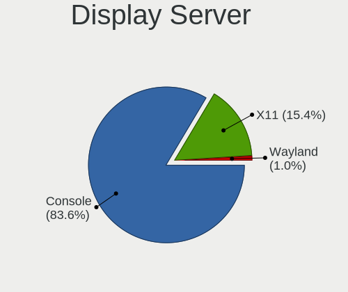
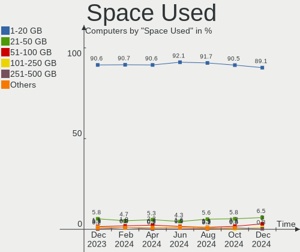
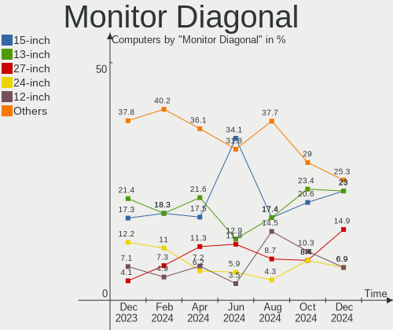

BSD Hardware Trends
-------------------

A project to identify most popular hardware characteristics and track their change
over time based on data collected by BSD users at https://BSD-Hardware.info.

Anyone can contribute to this report by the [hw-probe](https://github.com/linuxhw/hw-probe/blob/master/INSTALL.BSD.md) tool:

    hw-probe -all -upload

This is a report for all computer types. See also reports for [desktops](/Desktop/README.md) and [notebooks](/Notebook/README.md).

Full-feature report is available here: https://bsd-hardware.info/?view=trends

OS-specific reports: [FreeBSD](/Dist/FreeBSD), [OPNsense](/Dist/OPNsense), [helloSystem](/Dist/helloSystem), [OpenBSD](/Dist/OpenBSD).

Period: Jul, 2021.

Contents
--------

* [ System ](#system)
  - [ OS                       ](#os)
  - [ OS Family                ](#os-family)
  - [ Arch                     ](#arch)
  - [ DE                       ](#de)
  - [ Display Server           ](#display-server)
  - [ Display Manager          ](#display-manager)
  - [ OS Lang                  ](#os-lang)
  - [ Boot Mode                ](#boot-mode)
  - [ Filesystem               ](#filesystem)
  - [ Part. scheme             ](#part-scheme)

* [ Board ](#board)
  - [ Vendor                   ](#vendor)
  - [ Model                    ](#model)
  - [ Model Family             ](#model-family)
  - [ MFG Year                 ](#mfg-year)
  - [ Form Factor              ](#form-factor)
  - [ Coreboot                 ](#coreboot)
  - [ RAM Size                 ](#ram-size)
  - [ RAM Used                 ](#ram-used)
  - [ Total Drives             ](#total-drives)
  - [ Has CD-ROM               ](#has-cd-rom)
  - [ Has Ethernet             ](#has-ethernet)
  - [ Has WiFi                 ](#has-wifi)
  - [ Has Bluetooth            ](#has-bluetooth)

* [ Location ](#location)
  - [ Country                  ](#country)
  - [ City                     ](#city)

* [ Drives ](#drives)
  - [ Drive Vendor             ](#drive-vendor)
  - [ Drive Model              ](#drive-model)
  - [ HDD Vendor               ](#hdd-vendor)
  - [ SSD Vendor               ](#ssd-vendor)
  - [ Drive Kind               ](#drive-kind)
  - [ Drive Connector          ](#drive-connector)
  - [ Drive Size               ](#drive-size)
  - [ Space Total              ](#space-total)
  - [ Space Used               ](#space-used)
  - [ Malfunc. Drives          ](#malfunc-drives)
  - [ Malfunc. Drive Vendor    ](#malfunc-drive-vendor)
  - [ Malfunc. HDD Vendor      ](#malfunc-hdd-vendor)
  - [ Malfunc. Drive Kind      ](#malfunc-drive-kind)
  - [ Failed Drives            ](#failed-drives)
  - [ Failed Drive Vendor      ](#failed-drive-vendor)
  - [ Drive Status             ](#drive-status)

* [ Storage controller ](#storage-controller)
  - [ Storage Vendor           ](#storage-vendor)
  - [ Storage Model            ](#storage-model)
  - [ Storage Kind             ](#storage-kind)

* [ Processor ](#processor)
  - [ CPU Vendor               ](#cpu-vendor)
  - [ CPU Model                ](#cpu-model)
  - [ CPU Model Family         ](#cpu-model-family)
  - [ CPU Cores                ](#cpu-cores)
  - [ CPU Sockets              ](#cpu-sockets)
  - [ CPU Threads              ](#cpu-threads)
  - [ CPU Microarch            ](#cpu-microarch)

* [ Graphics ](#graphics)
  - [ GPU Vendor               ](#gpu-vendor)
  - [ GPU Model                ](#gpu-model)
  - [ GPU Combo                ](#gpu-combo)
  - [ GPU Driver               ](#gpu-driver)
  - [ GPU Memory               ](#gpu-memory)

* [ Monitor ](#monitor)
  - [ Monitor Vendor           ](#monitor-vendor)
  - [ Monitor Model            ](#monitor-model)
  - [ Monitor Resolution       ](#monitor-resolution)
  - [ Monitor Diagonal         ](#monitor-diagonal)
  - [ Monitor Width            ](#monitor-width)
  - [ Aspect Ratio             ](#aspect-ratio)
  - [ Monitor Area             ](#monitor-area)
  - [ Pixel Density            ](#pixel-density)
  - [ Multiple Monitors        ](#multiple-monitors)

* [ Network ](#network)
  - [ Net Controller Vendor    ](#net-controller-vendor)
  - [ Net Controller Model     ](#net-controller-model)
  - [ Wireless Vendor          ](#wireless-vendor)
  - [ Wireless Model           ](#wireless-model)
  - [ Ethernet Vendor          ](#ethernet-vendor)
  - [ Ethernet Model           ](#ethernet-model)
  - [ Net Controller Kind      ](#net-controller-kind)
  - [ Used Controller          ](#used-controller)
  - [ NICs                     ](#nics)
  - [ IPv6                     ](#ipv6)

* [ Bluetooth ](#bluetooth)
  - [ Bluetooth Vendor         ](#bluetooth-vendor)
  - [ Bluetooth Model          ](#bluetooth-model)

* [ Sound ](#sound)
  - [ Sound Vendor             ](#sound-vendor)
  - [ Sound Model              ](#sound-model)

* [ Memory ](#memory)
  - [ Memory Vendor            ](#memory-vendor)
  - [ Memory Model             ](#memory-model)
  - [ Memory Kind              ](#memory-kind)
  - [ Memory Form Factor       ](#memory-form-factor)
  - [ Memory Size              ](#memory-size)
  - [ Memory Speed             ](#memory-speed)

* [ Printers & scanners ](#printers-scanners)
  - [ Printer Vendor           ](#printer-vendor)
  - [ Printer Model            ](#printer-model)
  - [ Scanner Vendor           ](#scanner-vendor)
  - [ Scanner Model            ](#scanner-model)

* [ Camera ](#camera)
  - [ Camera Vendor            ](#camera-vendor)
  - [ Camera Model             ](#camera-model)

* [ Security ](#security)
  - [ Fingerprint Vendor       ](#fingerprint-vendor)
  - [ Fingerprint Model        ](#fingerprint-model)
  - [ Chipcard Vendor          ](#chipcard-vendor)
  - [ Chipcard Model           ](#chipcard-model)

* [ Unsupported ](#unsupported)
  - [ Unsupported Devices      ](#unsupported-devices)
  - [ Unsupported Device Types ](#unsupported-device-types)

System
------

OS
--

Installed operating systems

| Name                          | Computers | Percent |
|-------------------------------|-----------|---------|
| OPNsense 21.1.8               | 117       | 33.52%  |
| OPNsense 21.1.7               | 48        | 13.75%  |
| OPNsense 21.7                 | 32        | 9.17%   |
| helloSystem 0.5.0             | 27        | 7.74%   |
| FreeBSD 13.0-p3               | 21        | 6.02%   |
| FreeBSD 13.0                  | 21        | 6.02%   |
| OpenBSD 6.9                   | 15        | 4.3%    |
| OPNsense 21.1.9               | 12        | 3.44%   |
| FreeBSD 14.0-CURRENT          | 8         | 2.29%   |
| OPNsense 21.1                 | 5         | 1.43%   |
| helloSystem 0.1.0             | 5         | 1.43%   |
| FreeBSD 12.2-p9               | 5         | 1.43%   |
| TrueNAS 12.2-p6               | 3         | 0.86%   |
| GhostBSD 20.04.02             | 3         | 0.86%   |
| FreeBSD 13.0-STABLE           | 3         | 0.86%   |
| OPNsense 21.1.6               | 2         | 0.57%   |
| NomadBSD 5806f915             | 2         | 0.57%   |
| helloSystem 0.6.0             | 2         | 0.57%   |
| FreeBSD 13.0-p2               | 2         | 0.57%   |
| FreeBSD 12.2-p6               | 2         | 0.57%   |
| FreeBSD 12.2-p2               | 2         | 0.57%   |
| TrueNAS 12.2-p9               | 1         | 0.29%   |
| pfSense 2.5.0                 | 1         | 0.29%   |
| OPNsense 21.1.5               | 1         | 0.29%   |
| OPNsense 21.1.4               | 1         | 0.29%   |
| OPNsense 21.1.3               | 1         | 0.29%   |
| OPNsense 21.1.2               | 1         | 0.29%   |
| OPNsense 12.1-p19-HBSD        | 1         | 0.29%   |
| NomadBSD 1.4                  | 1         | 0.29%   |
| helloSystem 0.4.0             | 1         | 0.29%   |
| HardenedBSD 14.0-CURRENT-HBSD | 1         | 0.29%   |
| FreeBSD 12.2                  | 1         | 0.29%   |
| FreeBSD 12.1-p8               | 1         | 0.29%   |

OS Family
---------

OS without a version

| Name        | Computers | Percent |
|-------------|-----------|---------|
| OPNsense    | 221       | 63.32%  |
| FreeBSD     | 66        | 18.91%  |
| helloSystem | 35        | 10.03%  |
| OpenBSD     | 15        | 4.3%    |
| TrueNAS     | 4         | 1.15%   |
| NomadBSD    | 3         | 0.86%   |
| GhostBSD    | 3         | 0.86%   |
| pfSense     | 1         | 0.29%   |
| HardenedBSD | 1         | 0.29%   |

Arch
----

OS architecture (x86_64, i586, etc.)

| Name    | Computers | Percent |
|---------|-----------|---------|
| amd64   | 339       | 97.13%  |
| i386    | 5         | 1.43%   |
| arm64   | 3         | 0.86%   |
| riscv   | 1         | 0.29%   |
| powerpc | 1         | 0.29%   |

DE
--

Desktop Environment

| Name         | Computers | Percent |
|--------------|-----------|---------|
| Console      | 253       | 72.49%  |
| helloDesktop | 35        | 10.03%  |
| XFCE         | 14        | 4.01%   |
| KDE5         | 11        | 3.15%   |
| fvwm         | 11        | 3.15%   |
| MATE         | 6         | 1.72%   |
| GNOME        | 5         | 1.43%   |
| TWM          | 3         | 0.86%   |
| Openbox      | 3         | 0.86%   |
| Fluxbox      | 3         | 0.86%   |
| LXQt         | 2         | 0.57%   |
| i3           | 1         | 0.29%   |
| Cinnamon     | 1         | 0.29%   |
| AwesomeWM    | 1         | 0.29%   |

Display Server
--------------

X11 or Wayland

| Name    | Computers | Percent |
|---------|-----------|---------|
| Console | 252       | 72.21%  |
| X11     | 97        | 27.79%  |

Display Manager
---------------

SDDM, LightDM, etc.

| Name    | Computers | Percent |
|---------|-----------|---------|
| Console | 277       | 79.37%  |
| SLiM    | 46        | 13.18%  |
| SDDM    | 12        | 3.44%   |
| XDM     | 6         | 1.72%   |
| LightDM | 5         | 1.43%   |
| GDM     | 3         | 0.86%   |

OS Lang
-------

Language

| Lang             | Computers | Percent |
|------------------|-----------|---------|
| Unknown          | 241       | 69.05%  |
| en_US            | 52        | 14.9%   |
| C                | 43        | 12.32%  |
| ru_RU            | 5         | 1.43%   |
| de_DE            | 2         | 0.57%   |
| pl_PL            | 1         | 0.29%   |
| it_IT.ISO8859-15 | 1         | 0.29%   |
| it_IT            | 1         | 0.29%   |
| fr_FR            | 1         | 0.29%   |
| fi_FI            | 1         | 0.29%   |
| en_GB            | 1         | 0.29%   |

Boot Mode
---------

EFI or BIOS

| Mode | Computers | Percent |
|------|-----------|---------|
| EFI  | 287       | 82.23%  |
| BIOS | 62        | 17.77%  |

Filesystem
----------

Type of filesystem

| Type    | Computers | Percent |
|---------|-----------|---------|
| Ufs     | 242       | 69.34%  |
| Zfs     | 91        | 26.07%  |
| Ffs     | 15        | 4.3%    |
| Unknown | 1         | 0.29%   |

Part. scheme
------------

Scheme of partitioning

| Type    | Computers | Percent |
|---------|-----------|---------|
| GPT     | 308       | 88.25%  |
| MBR     | 36        | 10.32%  |
| Unknown | 5         | 1.43%   |

Board
-----

Vendor
------

Motherboard manufacturer

| Name                    | Computers | Percent |
|-------------------------|-----------|---------|
| Dell                    | 41        | 11.75%  |
| Unknown                 | 37        | 10.6%   |
| Hewlett-Packard         | 35        | 10.03%  |
| ASUSTek Computer        | 31        | 8.88%   |
| Supermicro              | 28        | 8.02%   |
| Lenovo                  | 26        | 7.45%   |
| ASRock                  | 15        | 4.3%    |
| Protectli               | 14        | 4.01%   |
| Intel                   | 14        | 4.01%   |
| PC Engines              | 12        | 3.44%   |
| Gigabyte Technology     | 12        | 3.44%   |
| AMI                     | 11        | 3.15%   |
| MSI                     | 7         | 2.01%   |
| Apple                   | 7         | 2.01%   |
| Sophos                  | 4         | 1.15%   |
| Fujitsu                 | 4         | 1.15%   |
| Acer                    | 4         | 1.15%   |
| Samsung Electronics     | 3         | 0.86%   |
| IBM                     | 3         | 0.86%   |
| Cisco Systems           | 3         | 0.86%   |
| Biostar                 | 3         | 0.86%   |
| Shuttle                 | 2         | 0.57%   |
| SeeedStudio             | 2         | 0.57%   |
| NEXCOM                  | 2         | 0.57%   |
| HPE                     | 2         | 0.57%   |
| Foxconn                 | 2         | 0.57%   |
| ZOTAC                   | 1         | 0.29%   |
| Yanling                 | 1         | 0.29%   |
| Wistron                 | 1         | 0.29%   |
| Thomas-Krenn.AG         | 1         | 0.29%   |
| Raspberry Pi Foundation | 1         | 0.29%   |
| Pegatron                | 1         | 0.29%   |
| PCPartner               | 1         | 0.29%   |
| Notebook                | 1         | 0.29%   |
| NF841                   | 1         | 0.29%   |
| NF541                   | 1         | 0.29%   |
| MouseComputer           | 1         | 0.29%   |
| Microsoft               | 1         | 0.29%   |
| GuoGuang                | 1         | 0.29%   |
| GPU Company             | 1         | 0.29%   |
| Fujitsu Siemens         | 1         | 0.29%   |
| eMachines               | 1         | 0.29%   |
| Deciso                  | 1         | 0.29%   |
| Compulab                | 1         | 0.29%   |
| CheckPoint              | 1         | 0.29%   |
| BESSTAR Tech            | 1         | 0.29%   |
| Barracuda Networks      | 1         | 0.29%   |
| AWOW                    | 1         | 0.29%   |
| Avell High Performance  | 1         | 0.29%   |
| ASRockRack              | 1         | 0.29%   |
| Alienware               | 1         | 0.29%   |

Model
-----

Motherboard model

| Name                                             | Computers | Percent |
|--------------------------------------------------|-----------|---------|
| Unknown                                          | 37        | 10.6%   |
| Protectli FW4B                                   | 10        | 2.87%   |
| Supermicro Super Server                          | 8         | 2.29%   |
| AMI Aptio CRB                                    | 8         | 2.29%   |
| PC Engines APU2                                  | 7         | 2.01%   |
| Intel Q3XXG4-P V1.0                              | 6         | 1.72%   |
| PC Engines apu4                                  | 5         | 1.43%   |
| Dell OptiPlex 990                                | 4         | 1.15%   |
| Supermicro X9SCL/X9SCM                           | 3         | 0.86%   |
| HP t620 PLUS Quad Core TC                        | 3         | 0.86%   |
| Dell OptiPlex 790                                | 3         | 0.86%   |
| Dell OptiPlex 7010                               | 3         | 0.86%   |
| Supermicro 1HE Intel Single-CPU RI1102D-F Server | 2         | 0.57%   |
| Sophos XG                                        | 2         | 0.57%   |
| SeeedStudio ODYSSEY-X86J4125                     | 2         | 0.57%   |
| Samsung 3570R/370R/470R/450R/510R/4450RV         | 2         | 0.57%   |
| Protectli FW6                                    | 2         | 0.57%   |
| NEXCOM ASG                                       | 2         | 0.57%   |
| HP t730 Thin Client                              | 2         | 0.57%   |
| HP ProLiant MicroServer Gen8                     | 2         | 0.57%   |
| HP ProLiant DL380 G5                             | 2         | 0.57%   |
| HP ProLiant DL360e Gen8                          | 2         | 0.57%   |
| Fujitsu ESPRIMO_D756                             | 2         | 0.57%   |
| Dell Wyse 5070 Extended Thin Client              | 2         | 0.57%   |
| Dell OptiPlex 3040                               | 2         | 0.57%   |
| Cisco Systems UCSC-C240-M4L                      | 2         | 0.57%   |
| ASRock B365M Pro4                                | 2         | 0.57%   |
| ZOTAC ZBOX-CI323NANO                             | 1         | 0.29%   |
| Yanling NS-1U8L                                  | 1         | 0.29%   |
| Wistron ProLiant ML110 G6                        | 1         | 0.29%   |
| Thomas-Krenn.AG LES network+                     | 1         | 0.29%   |
| Supermicro X8DTU-LN4+                            | 1         | 0.29%   |
| Supermicro X8DTU                                 | 1         | 0.29%   |
| Supermicro X7SPA-HF                              | 1         | 0.29%   |
| Supermicro X7SBL                                 | 1         | 0.29%   |
| Supermicro X10SLL-F                              | 1         | 0.29%   |
| Supermicro SYS-5018D-FN8T                        | 1         | 0.29%   |
| Supermicro SYS-5018A-MLTN4                       | 1         | 0.29%   |
| Supermicro SYS-1028U-TN10RT+                     | 1         | 0.29%   |
| Supermicro SYS-1019D-4C-FHN13TP                  | 1         | 0.29%   |
| Supermicro ReadyDATA 5200                        | 1         | 0.29%   |
| Supermicro Pro546267                             | 1         | 0.29%   |
| Supermicro PDSML                                 | 1         | 0.29%   |
| Supermicro GN#16664                              | 1         | 0.29%   |
| Supermicro C7Z270-CG-L                           | 1         | 0.29%   |
| Supermicro 1HE Intel Single-CPU RI1102A-F Server | 1         | 0.29%   |
| Sophos UTM                                       | 1         | 0.29%   |
| Sophos SG                                        | 1         | 0.29%   |
| Shuttle NC10U                                    | 1         | 0.29%   |
| Shuttle DS10U                                    | 1         | 0.29%   |
| Samsung 340XAA/350XAA/550XAA                     | 1         | 0.29%   |
| RPi Raspberry Pi                                 | 1         | 0.29%   |
| Protectli FW6D                                   | 1         | 0.29%   |
| Protectli FW4A                                   | 1         | 0.29%   |
| Pegatron SAISHIAT2                               | 1         | 0.29%   |
| PCPartner DREAMSYS                               | 1         | 0.29%   |
| Notebook W510LU                                  | 1         | 0.29%   |
| NF841 1.0                                        | 1         | 0.29%   |
| NF541 1.0                                        | 1         | 0.29%   |
| MSI WC791AA-UUW HPE-119sc                        | 1         | 0.29%   |

Model Family
------------

Motherboard model prefix

| Name                            | Computers | Percent |
|---------------------------------|-----------|---------|
| Unknown                         | 37        | 10.6%   |
| Dell OptiPlex                   | 18        | 5.16%   |
| Lenovo ThinkPad                 | 16        | 4.58%   |
| Protectli FW4B                  | 10        | 2.87%   |
| HP ProLiant                     | 9         | 2.58%   |
| Supermicro Super                | 8         | 2.29%   |
| Dell Inspiron                   | 8         | 2.29%   |
| AMI Aptio                       | 8         | 2.29%   |
| PC Engines APU2                 | 7         | 2.01%   |
| Dell PowerEdge                  | 7         | 2.01%   |
| Intel Q3XXG4-P                  | 6         | 1.72%   |
| PC Engines apu4                 | 5         | 1.43%   |
| ASUS PRIME                      | 5         | 1.43%   |
| HP Compaq                       | 4         | 1.15%   |
| Acer Aspire                     | 4         | 1.15%   |
| Supermicro X9SCL                | 3         | 0.86%   |
| Supermicro 1HE                  | 3         | 0.86%   |
| Lenovo ThinkCentre              | 3         | 0.86%   |
| HP t620                         | 3         | 0.86%   |
| Sophos XG                       | 2         | 0.57%   |
| SeeedStudio ODYSSEY-X86J4125    | 2         | 0.57%   |
| Samsung 3570R                   | 2         | 0.57%   |
| Protectli FW6                   | 2         | 0.57%   |
| NEXCOM ASG                      | 2         | 0.57%   |
| IBM System                      | 2         | 0.57%   |
| HPE ProLiant                    | 2         | 0.57%   |
| HP t730                         | 2         | 0.57%   |
| HP ProDesk                      | 2         | 0.57%   |
| HP ProBook                      | 2         | 0.57%   |
| HP Pavilion                     | 2         | 0.57%   |
| Gigabyte X570                   | 2         | 0.57%   |
| Fujitsu ESPRIMO                 | 2         | 0.57%   |
| Dell Wyse                       | 2         | 0.57%   |
| Cisco Systems UCSC-C240-M4L     | 2         | 0.57%   |
| ASUS ROG                        | 2         | 0.57%   |
| ASRock X570                     | 2         | 0.57%   |
| ASRock B365M                    | 2         | 0.57%   |
| ZOTAC ZBOX-CI323NANO            | 1         | 0.29%   |
| Yanling NS-1U8L                 | 1         | 0.29%   |
| Wistron ProLiant                | 1         | 0.29%   |
| Thomas-Krenn.AG LES             | 1         | 0.29%   |
| Supermicro X8DTU-LN4+           | 1         | 0.29%   |
| Supermicro X8DTU                | 1         | 0.29%   |
| Supermicro X7SPA-HF             | 1         | 0.29%   |
| Supermicro X7SBL                | 1         | 0.29%   |
| Supermicro X10SLL-F             | 1         | 0.29%   |
| Supermicro SYS-5018D-FN8T       | 1         | 0.29%   |
| Supermicro SYS-5018A-MLTN4      | 1         | 0.29%   |
| Supermicro SYS-1028U-TN10RT+    | 1         | 0.29%   |
| Supermicro SYS-1019D-4C-FHN13TP | 1         | 0.29%   |
| Supermicro ReadyDATA            | 1         | 0.29%   |
| Supermicro Pro546267            | 1         | 0.29%   |
| Supermicro PDSML                | 1         | 0.29%   |
| Supermicro GN#16664             | 1         | 0.29%   |
| Supermicro C7Z270-CG-L          | 1         | 0.29%   |
| Sophos UTM                      | 1         | 0.29%   |
| Sophos SG                       | 1         | 0.29%   |
| Shuttle NC10U                   | 1         | 0.29%   |
| Shuttle DS10U                   | 1         | 0.29%   |
| Samsung 340XAA                  | 1         | 0.29%   |

MFG Year
--------

Motherboard manufacture year

| Year    | Computers | Percent |
|---------|-----------|---------|
| 2019    | 59        | 16.91%  |
| 2020    | 58        | 16.62%  |
| 2018    | 48        | 13.75%  |
| 2021    | 42        | 12.03%  |
| 2013    | 24        | 6.88%   |
| 2015    | 17        | 4.87%   |
| 2014    | 17        | 4.87%   |
| 2012    | 14        | 4.01%   |
| 2011    | 14        | 4.01%   |
| 2017    | 12        | 3.44%   |
| 2016    | 12        | 3.44%   |
| 2010    | 11        | 3.15%   |
| 2009    | 6         | 1.72%   |
| 2008    | 5         | 1.43%   |
| Unknown | 5         | 1.43%   |
| 2006    | 3         | 0.86%   |
| 2007    | 2         | 0.57%   |

Form Factor
-----------

Physical design of the computer

| Name           | Computers | Percent |
|----------------|-----------|---------|
| Desktop        | 209       | 59.89%  |
| Notebook       | 69        | 19.77%  |
| Server         | 35        | 10.03%  |
| Mini pc        | 25        | 7.16%   |
| Firewall       | 5         | 1.43%   |
| System on chip | 2         | 0.57%   |
| All in one     | 2         | 0.57%   |
| Tablet         | 1         | 0.29%   |
| Convertible    | 1         | 0.29%   |

Coreboot
--------

Have coreboot on board

| Used | Computers | Percent |
|------|-----------|---------|
| No   | 333       | 95.42%  |
| Yes  | 16        | 4.58%   |

RAM Size
--------

Total RAM memory

| Size in GB      | Computers | Percent |
|-----------------|-----------|---------|
| 8.01-16.0       | 126       | 36.1%   |
| 4.01-8.0        | 84        | 24.07%  |
| 16.01-24.0      | 75        | 21.49%  |
| 32.01-64.0      | 24        | 6.88%   |
| 2.01-3.0        | 14        | 4.01%   |
| 64.01-256.0     | 11        | 3.15%   |
| 3.01-4.0        | 5         | 1.43%   |
| 24.01-32.0      | 4         | 1.15%   |
| 0.51-1.0        | 4         | 1.15%   |
| More than 256.0 | 2         | 0.57%   |

RAM Used
--------

Used RAM memory

| Used GB    | Computers | Percent |
|------------|-----------|---------|
| 0.01-0.5   | 196       | 56.16%  |
| 0.51-1.0   | 96        | 27.51%  |
| 1.01-2.0   | 25        | 7.16%   |
| 2.01-3.0   | 9         | 2.58%   |
| 3.01-4.0   | 6         | 1.72%   |
| 4.01-8.0   | 5         | 1.43%   |
| 24.01-32.0 | 3         | 0.86%   |
| 8.01-16.0  | 3         | 0.86%   |
| 32.01-64.0 | 2         | 0.57%   |
| 16.01-24.0 | 2         | 0.57%   |
| 0          | 1         | 0.29%   |
| Unknown    | 1         | 0.29%   |

Total Drives
------------

Number of drives on board

| Drives | Computers | Percent |
|--------|-----------|---------|
| 1      | 258       | 73.93%  |
| 2      | 29        | 8.31%   |
| 0      | 29        | 8.31%   |
| 3      | 12        | 3.44%   |
| 4      | 6         | 1.72%   |
| 5      | 4         | 1.15%   |
| 12     | 3         | 0.86%   |
| 6      | 2         | 0.57%   |
| 27     | 1         | 0.29%   |
| 18     | 1         | 0.29%   |
| 14     | 1         | 0.29%   |
| 13     | 1         | 0.29%   |
| 9      | 1         | 0.29%   |
| 7      | 1         | 0.29%   |

Has CD-ROM
----------

Has CD-ROM on board

| Presented | Computers | Percent |
|-----------|-----------|---------|
| No        | 272       | 77.94%  |
| Yes       | 77        | 22.06%  |

Has Ethernet
------------

Has Ethernet on board

| Presented | Computers | Percent |
|-----------|-----------|---------|
| Yes       | 334       | 95.7%   |
| No        | 15        | 4.3%    |

Has WiFi
--------

Has WiFi module

| Presented | Computers | Percent |
|-----------|-----------|---------|
| No        | 224       | 64.18%  |
| Yes       | 125       | 35.82%  |

Has Bluetooth
-------------

Has Bluetooth module

| Presented | Computers | Percent |
|-----------|-----------|---------|
| No        | 276       | 79.08%  |
| Yes       | 73        | 20.92%  |

Location
--------

Country
-------

Geographic location (country)

| Country            | Computers | Percent |
|--------------------|-----------|---------|
| USA                | 114       | 32.66%  |
| Germany            | 54        | 15.47%  |
| UK                 | 20        | 5.73%   |
| Russia             | 12        | 3.44%   |
| France             | 10        | 2.87%   |
| Austria            | 10        | 2.87%   |
| Italy              | 9         | 2.58%   |
| Canada             | 9         | 2.58%   |
| Switzerland        | 7         | 2.01%   |
| Sweden             | 7         | 2.01%   |
| Norway             | 6         | 1.72%   |
| China              | 6         | 1.72%   |
| Brazil             | 6         | 1.72%   |
| Poland             | 5         | 1.43%   |
| Netherlands        | 5         | 1.43%   |
| Australia          | 5         | 1.43%   |
| Taiwan             | 4         | 1.15%   |
| Portugal           | 4         | 1.15%   |
| Finland            | 4         | 1.15%   |
| Spain              | 3         | 0.86%   |
| South Korea        | 3         | 0.86%   |
| India              | 3         | 0.86%   |
| Ukraine            | 2         | 0.57%   |
| Thailand           | 2         | 0.57%   |
| South Africa       | 2         | 0.57%   |
| Singapore          | 2         | 0.57%   |
| Latvia             | 2         | 0.57%   |
| Japan              | 2         | 0.57%   |
| Iran               | 2         | 0.57%   |
| Indonesia          | 2         | 0.57%   |
| Denmark            | 2         | 0.57%   |
| Czechia            | 2         | 0.57%   |
| Chile              | 2         | 0.57%   |
| Bulgaria           | 2         | 0.57%   |
| Belgium            | 2         | 0.57%   |
| Venezuela          | 1         | 0.29%   |
| UAE                | 1         | 0.29%   |
| Tanzania           | 1         | 0.29%   |
| Romania            | 1         | 0.29%   |
| New Zealand        | 1         | 0.29%   |
| Malaysia           | 1         | 0.29%   |
| Lithuania          | 1         | 0.29%   |
| Israel             | 1         | 0.29%   |
| Ireland            | 1         | 0.29%   |
| Guatemala          | 1         | 0.29%   |
| Greece             | 1         | 0.29%   |
| Estonia            | 1         | 0.29%   |
| Egypt              | 1         | 0.29%   |
| Dominican Republic | 1         | 0.29%   |
| Colombia           | 1         | 0.29%   |
| Cabo Verde         | 1         | 0.29%   |
| Belarus            | 1         | 0.29%   |

City
----

Geographic location (city)

| City              | Computers | Percent |
|-------------------|-----------|---------|
| Vienna            | 7         | 2.01%   |
| Moscow            | 7         | 2.01%   |
| Lexington         | 3         | 0.86%   |
| Bielefeld         | 3         | 0.86%   |
| Berlin            | 3         | 0.86%   |
| Vaulx-en-Velin    | 2         | 0.57%   |
| Toronto           | 2         | 0.57%   |
| The Hague         | 2         | 0.57%   |
| Tehran            | 2         | 0.57%   |
| Tampere           | 2         | 0.57%   |
| Stockholm         | 2         | 0.57%   |
| Singapore         | 2         | 0.57%   |
| Shanghai          | 2         | 0.57%   |
| San Jose          | 2         | 0.57%   |
| Salem             | 2         | 0.57%   |
| Riga              | 2         | 0.57%   |
| Perth             | 2         | 0.57%   |
| Oslo              | 2         | 0.57%   |
| Montreal          | 2         | 0.57%   |
| London            | 2         | 0.57%   |
| Kirkland          | 2         | 0.57%   |
| Karlsruhe         | 2         | 0.57%   |
| Hannibal          | 2         | 0.57%   |
| Hamburg           | 2         | 0.57%   |
| Graz              | 2         | 0.57%   |
| Franklin          | 2         | 0.57%   |
| Frankfurt am Main | 2         | 0.57%   |
| Dresden           | 2         | 0.57%   |
| Denver            | 2         | 0.57%   |
| Dallas            | 2         | 0.57%   |
| Canal Fulton      | 2         | 0.57%   |
| Brno              | 2         | 0.57%   |
| Brighton          | 2         | 0.57%   |
| Bremerhaven       | 2         | 0.57%   |
| Bologna           | 2         | 0.57%   |
| Bergen            | 2         | 0.57%   |
| Augsburg          | 2         | 0.57%   |
| Auburn            | 2         | 0.57%   |
| Åhus             | 1         | 0.29%   |
| Zurich            | 1         | 0.29%   |
| Zaltbommel        | 1         | 0.29%   |
| Yuanlin           | 1         | 0.29%   |
| Yegorlykskaya     | 1         | 0.29%   |
| Wuhan             | 1         | 0.29%   |
| Wroclaw           | 1         | 0.29%   |
| Worms             | 1         | 0.29%   |
| Woodmead          | 1         | 0.29%   |
| Wloszczowa        | 1         | 0.29%   |
| Whittier          | 1         | 0.29%   |
| Westland          | 1         | 0.29%   |
| West Valley City  | 1         | 0.29%   |
| West Fargo        | 1         | 0.29%   |
| Wenatchee         | 1         | 0.29%   |
| Weimar            | 1         | 0.29%   |
| Waverly           | 1         | 0.29%   |
| Washington        | 1         | 0.29%   |
| Warminster        | 1         | 0.29%   |
| Villeurbanne      | 1         | 0.29%   |
| Vila Nova de Gaia | 1         | 0.29%   |
| Vigo              | 1         | 0.29%   |

Drives
------

Drive Vendor
------------

Hard drive vendors

| Vendor              | Computers | Drives | Percent |
|---------------------|-----------|--------|---------|
| Samsung Electronics | 58        | 70     | 14.95%  |
| WDC                 | 45        | 83     | 11.6%   |
| Seagate             | 43        | 82     | 11.08%  |
| Kingston            | 24        | 31     | 6.19%   |
| SanDisk             | 20        | 20     | 5.15%   |
| Transcend           | 19        | 19     | 4.9%    |
| Intel               | 18        | 20     | 4.64%   |
| Crucial             | 16        | 16     | 4.12%   |
| Hoodisk             | 14        | 14     | 3.61%   |
| Hewlett-Packard     | 12        | 25     | 3.09%   |
| Hitachi             | 9         | 12     | 2.32%   |
| Toshiba             | 8         | 16     | 2.06%   |
| OCZ                 | 8         | 8      | 2.06%   |
| HGST                | 8         | 24     | 2.06%   |
| SPCC                | 7         | 7      | 1.8%    |
| A-DATA Technology   | 7         | 8      | 1.8%    |
| Micron Technology   | 6         | 7      | 1.55%   |
| Corsair             | 6         | 6      | 1.55%   |
| ATP                 | 6         | 6      | 1.55%   |
| Phison              | 5         | 5      | 1.29%   |
| SK Hynix            | 3         | 3      | 0.77%   |
| Protectli           | 3         | 3      | 0.77%   |
| PNY                 | 3         | 4      | 0.77%   |
| KingDian            | 3         | 3      | 0.77%   |
| China               | 3         | 3      | 0.77%   |
| Apple               | 3         | 3      | 0.77%   |
| OPENBSD             | 2         | 2      | 0.52%   |
| LITEON              | 2         | 2      | 0.52%   |
| Kston               | 2         | 2      | 0.52%   |
| KingSpec            | 2         | 2      | 0.52%   |
| Fujitsu             | 2         | 2      | 0.52%   |
| FORESEE             | 2         | 2      | 0.52%   |
| Apacer              | 2         | 2      | 0.52%   |
| XrayDisk            | 1         | 1      | 0.26%   |
| Team                | 1         | 1      | 0.26%   |
| TCSUNBOW            | 1         | 1      | 0.26%   |
| Smartbuy            | 1         | 1      | 0.26%   |
| SATADOM             | 1         | 2      | 0.26%   |
| Product:            | 1         | 1      | 0.26%   |
| PLEXTOR             | 1         | 1      | 0.26%   |
| Patriot             | 1         | 1      | 0.26%   |
| Netac               | 1         | 1      | 0.26%   |
| MEMXPRO             | 1         | 1      | 0.26%   |
| Leven               | 1         | 1      | 0.26%   |
| KLEVV               | 1         | 2      | 0.26%   |
| Indilinx            | 1         | 1      | 0.26%   |
| HPE                 | 1         | 1      | 0.26%   |
| Dell                | 1         | 1      | 0.26%   |
| BIWIN               | 1         | 1      | 0.26%   |
| asmedia             | 1         | 1      | 0.26%   |

Drive Model
-----------

Hard drive models

| Model                           | Computers | Percent |
|---------------------------------|-----------|---------|
| Hoodisk SSD 64GB                | 8         | 1.81%   |
| Samsung SSD 850 EVO 250GB       | 6         | 1.36%   |
| Samsung SSD 860 EVO 1TB         | 4         | 0.91%   |
| HGST HTS725050A7E630 500GB      | 4         | 0.91%   |
| WDC WD30EFRX-68EUZN0 3TB        | 3         | 0.68%   |
| Transcend TS128GMSA230S 128GB   | 3         | 0.68%   |
| Samsung SSD 970 EVO Plus 250GB  | 3         | 0.68%   |
| Samsung SSD 860 EVO M.2 250GB   | 3         | 0.68%   |
| Samsung SSD 860 EVO 500GB       | 3         | 0.68%   |
| Samsung SSD 860 EVO 250GB       | 3         | 0.68%   |
| Samsung SSD 840 EVO 120GB       | 3         | 0.68%   |
| Phison SATA SSD 16GB            | 3         | 0.68%   |
| Kingston SUV500MS240G 240GB     | 3         | 0.68%   |
| Kingston SUV500MS120G 120GB     | 3         | 0.68%   |
| Kingston SA400S37480G 480GB     | 3         | 0.68%   |
| Kingston SA400S37240G 240GB     | 3         | 0.68%   |
| Kingston SA400S37120G 120GB     | 3         | 0.68%   |
| HP RAID 0 450GB                 | 3         | 0.68%   |
| WDC WDS500G3X0C-00SJG0 500GB    | 2         | 0.45%   |
| Transcend TS64GMSA370 64GB      | 2         | 0.45%   |
| Toshiba MG04SCA20EN 2TB         | 2         | 0.45%   |
| SPCC Solid State Disk 128GB     | 2         | 0.45%   |
| SPCC Solid State Disk 120GB     | 2         | 0.45%   |
| Seagate ST500LM000-1EJ162 500GB | 2         | 0.45%   |
| Seagate ST500DM002-1BD142 500GB | 2         | 0.45%   |
| Seagate ST4000DM000-1F2168 4TB  | 2         | 0.45%   |
| Seagate ST3160318AS 160GB       | 2         | 0.45%   |
| Seagate ST3000DM001-1CH166 3TB  | 2         | 0.45%   |
| Seagate ST2000NM0023 2TB        | 2         | 0.45%   |
| Seagate ST1000NM0023 1TB        | 2         | 0.45%   |
| Seagate ST1000LM048-2E7172 1TB  | 2         | 0.45%   |
| SanDisk SSD PLUS 120 GB         | 2         | 0.45%   |
| SanDisk SDSSDA240G 240GB        | 2         | 0.45%   |
| Samsung SSD 970 EVO 500GB       | 2         | 0.45%   |
| Samsung SSD 850 EVO M.2 500GB   | 2         | 0.45%   |
| Samsung SSD 840 Series 250GB    | 2         | 0.45%   |
| Samsung SSD 840 Series 120GB    | 2         | 0.45%   |
| Samsung SSD 840 EVO 250GB       | 2         | 0.45%   |
| Samsung HM251JX 250GB           | 2         | 0.45%   |
| Protectli 120GB mSATA           | 2         | 0.45%   |
| PNY CS900 120GB SSD             | 2         | 0.45%   |
| Phison Sabrent 512GB            | 2         | 0.45%   |
| OPENBSD SR RAID 1 304GB         | 2         | 0.45%   |
| OCZ AGILITY3 64GB               | 2         | 0.45%   |
| Kingston SV300S37A120G 120GB    | 2         | 0.45%   |
| Kingston SA2000M8500G 500GB     | 2         | 0.45%   |
| Intel SSDSC2KW256G8 256GB       | 2         | 0.45%   |
| Intel SSDSC2KG240G8 240GB       | 2         | 0.45%   |
| Hoodisk SSD 32GB                | 2         | 0.45%   |
| Hoodisk SSD 16GB                | 2         | 0.45%   |
| HP RAID 5 513GB                 | 2         | 0.45%   |
| HP RAID 1(1+0) 146GB            | 2         | 0.45%   |
| Crucial CT480BX500SSD1 480GB    | 2         | 0.45%   |
| Crucial CT240BX500SSD1 240GB    | 2         | 0.45%   |
| Corsair Force LS SSD 64GB       | 2         | 0.45%   |
| ATP SATA III mSATA 64GB         | 2         | 0.45%   |
| ATP NVMe M.2 2280 SSD 240GB     | 2         | 0.45%   |
| A-DATA SX8200PNP 512GB          | 2         | 0.45%   |
| A-DATA SU650 120GB              | 2         | 0.45%   |
| XrayDisk SSD 128GB              | 1         | 0.23%   |

HDD Vendor
----------

Hard disk drive vendors

| Vendor              | Computers | Drives | Percent |
|---------------------|-----------|--------|---------|
| Seagate             | 42        | 81     | 35.29%  |
| WDC                 | 35        | 70     | 29.41%  |
| Hitachi             | 9         | 12     | 7.56%   |
| HGST                | 8         | 24     | 6.72%   |
| Hewlett-Packard     | 8         | 13     | 6.72%   |
| Toshiba             | 7         | 13     | 5.88%   |
| Samsung Electronics | 3         | 4      | 2.52%   |
| OPENBSD             | 2         | 2      | 1.68%   |
| Fujitsu             | 2         | 2      | 1.68%   |
| Product:            | 1         | 1      | 0.84%   |
| Dell                | 1         | 1      | 0.84%   |
| Apple               | 1         | 1      | 0.84%   |

SSD Vendor
----------

Solid state drive vendors

| Vendor              | Computers | Drives | Percent |
|---------------------|-----------|--------|---------|
| Samsung Electronics | 47        | 54     | 19.83%  |
| SanDisk             | 20        | 20     | 8.44%   |
| Transcend           | 19        | 19     | 8.02%   |
| Kingston            | 19        | 24     | 8.02%   |
| Intel               | 18        | 20     | 7.59%   |
| Crucial             | 15        | 15     | 6.33%   |
| Hoodisk             | 14        | 14     | 5.91%   |
| OCZ                 | 8         | 8      | 3.38%   |
| WDC                 | 6         | 6      | 2.53%   |
| SPCC                | 6         | 6      | 2.53%   |
| Micron Technology   | 5         | 5      | 2.11%   |
| Corsair             | 4         | 4      | 1.69%   |
| ATP                 | 4         | 4      | 1.69%   |
| A-DATA Technology   | 4         | 4      | 1.69%   |
| Protectli           | 3         | 3      | 1.27%   |
| PNY                 | 3         | 4      | 1.27%   |
| Phison              | 3         | 3      | 1.27%   |
| KingDian            | 3         | 3      | 1.27%   |
| Hewlett-Packard     | 3         | 4      | 1.27%   |
| China               | 3         | 3      | 1.27%   |
| LITEON              | 2         | 2      | 0.84%   |
| Kston               | 2         | 2      | 0.84%   |
| KingSpec            | 2         | 2      | 0.84%   |
| FORESEE             | 2         | 2      | 0.84%   |
| Apple               | 2         | 2      | 0.84%   |
| Apacer              | 2         | 2      | 0.84%   |
| XrayDisk            | 1         | 1      | 0.42%   |
| Toshiba             | 1         | 2      | 0.42%   |
| Team                | 1         | 1      | 0.42%   |
| TCSUNBOW            | 1         | 1      | 0.42%   |
| Smartbuy            | 1         | 1      | 0.42%   |
| SK Hynix            | 1         | 1      | 0.42%   |
| Seagate             | 1         | 1      | 0.42%   |
| SATADOM             | 1         | 2      | 0.42%   |
| PLEXTOR             | 1         | 1      | 0.42%   |
| Patriot             | 1         | 1      | 0.42%   |
| Netac               | 1         | 1      | 0.42%   |
| MEMXPRO             | 1         | 1      | 0.42%   |
| Leven               | 1         | 1      | 0.42%   |
| KLEVV               | 1         | 2      | 0.42%   |
| Indilinx            | 1         | 1      | 0.42%   |
| HPE                 | 1         | 1      | 0.42%   |
| BIWIN               | 1         | 1      | 0.42%   |
| asmedia             | 1         | 1      | 0.42%   |

Drive Kind
----------

HDD or SSD

| Kind | Computers | Drives | Percent |
|------|-----------|--------|---------|
| SSD  | 223       | 256    | 62.64%  |
| HDD  | 96        | 224    | 26.97%  |
| NVMe | 37        | 51     | 10.39%  |

Drive Connector
---------------

SATA, SAS, NVMe, etc.

| Type | Computers | Drives | Percent |
|------|-----------|--------|---------|
| SATA | 295       | 480    | 88.86%  |
| NVMe | 37        | 51     | 11.14%  |

Drive Size
----------

Size of hard drive

| Size in TB      | Computers | Drives | Percent |
|-----------------|-----------|--------|---------|
| 0.01-0.5        | 264       | 318    | 79.76%  |
| 0.51-1.0        | 37        | 61     | 11.18%  |
| 2.01-3.0        | 9         | 35     | 2.72%   |
| 1.01-2.0        | 9         | 20     | 2.72%   |
| 3.01-4.0        | 5         | 23     | 1.51%   |
| 4.01-10.0       | 4         | 18     | 1.21%   |
| 10.01-20.0      | 2         | 4      | 0.6%    |
| More than 100.0 | 1         | 1      | 0.3%    |

Space Total
-----------

Amount of disk space available on the file system

| Size in GB | Computers | Percent |
|------------|-----------|---------|
| 101-250    | 124       | 35.53%  |
| 251-500    | 54        | 15.47%  |
| 21-50      | 49        | 14.04%  |
| 1-20       | 47        | 13.47%  |
| 51-100     | 46        | 13.18%  |
| 501-1000   | 22        | 6.3%    |
| 1001-2000  | 6         | 1.72%   |
| 2001-3000  | 1         | 0.29%   |

Space Used
----------

Amount of used disk space

| Used GB | Computers | Percent |
|---------|-----------|---------|
| 1-20    | 317       | 90.83%  |
| 21-50   | 21        | 6.02%   |
| 51-100  | 8         | 2.29%   |
| 101-250 | 2         | 0.57%   |
| 251-500 | 1         | 0.29%   |

Malfunc. Drives
---------------

Drive models with a malfunction

| Model                                    | Computers | Drives | Percent |
|------------------------------------------|-----------|--------|---------|
| HGST HTS725050A7E630 500GB               | 3         | 3      | 6%      |
| WDC WD800JD-55MUA1 80GB                  | 1         | 1      | 2%      |
| WDC WD5000BEVT-75A0RT0 500GB             | 1         | 1      | 2%      |
| WDC WD5000AAKX-083CA0 500GB              | 1         | 1      | 2%      |
| WDC WD5000AAKX-001CA0 500GB              | 1         | 1      | 2%      |
| WDC WD5000AAKS-00V1A0 500GB              | 1         | 1      | 2%      |
| WDC WD3200BPVT-75ZEST0 320GB             | 1         | 1      | 2%      |
| WDC WD30PURX-64P6ZY0 3TB                 | 1         | 1      | 2%      |
| WDC WD30EZRX-00MMMB0 3TB                 | 1         | 2      | 2%      |
| WDC WD30EFRX-68EUZN0 3TB                 | 1         | 3      | 2%      |
| WDC WD30EFRX-68AX9N0 3TB                 | 1         | 1      | 2%      |
| WDC WD2500AAKS-60L9A0 250GB              | 1         | 1      | 2%      |
| WDC WD1200BEVS-07LAT0 120GB              | 1         | 1      | 2%      |
| WDC WD10JMVW-11AJGS0 1TB                 | 1         | 1      | 2%      |
| WDC WD1001FALS-00J7B1 1TB                | 1         | 1      | 2%      |
| Toshiba HDWD130 3TB                      | 1         | 2      | 2%      |
| SK Hynix HFS256G3AMNB-2200A 256GB        | 1         | 1      | 2%      |
| Seagate ST9320320AS 320GB                | 1         | 1      | 2%      |
| Seagate ST9160310AS 160GB                | 1         | 1      | 2%      |
| Seagate ST3500418AS 500GB                | 1         | 1      | 2%      |
| Seagate ST3500413AS 500GB                | 1         | 1      | 2%      |
| Seagate ST3320311CS 320GB                | 1         | 1      | 2%      |
| Seagate ST3250410AS 250GB                | 1         | 1      | 2%      |
| Seagate ST320LT012-9WS14C 320GB          | 1         | 1      | 2%      |
| Seagate ST3160318AS 160GB                | 1         | 1      | 2%      |
| Seagate ST31000340NS 1TB                 | 1         | 1      | 2%      |
| Seagate ST2000LX001-1RG174 2TB           | 1         | 2      | 2%      |
| Seagate ST1000VM002-1SD102 1TB           | 1         | 1      | 2%      |
| Seagate ST1000DL002-9TT153 1TB           | 1         | 1      | 2%      |
| SanDisk SSD PLUS 120 GB                  | 1         | 1      | 2%      |
| Samsung Electronics SSD 840 Series 500GB | 1         | 1      | 2%      |
| Samsung Electronics SSD 840 EVO 500GB    | 1         | 1      | 2%      |
| Kingston SUV400S37120G 120GB             | 1         | 1      | 2%      |
| Intel SSDSC2BX200G4R 200GB               | 1         | 1      | 2%      |
| Intel SSDSC2BF256A5 SATA 256GB           | 1         | 1      | 2%      |
| Intel SSDSA2M160G2GN 160GB               | 1         | 1      | 2%      |
| Intel SSDSA2BW160G3H 160GB               | 1         | 1      | 2%      |
| Hitachi HUA722020ALA331 2TB              | 1         | 1      | 2%      |
| Hitachi HTS723232A7A364 320GB            | 1         | 1      | 2%      |
| Hitachi HTS541612J9SA00 120GB            | 1         | 1      | 2%      |
| Hitachi HDS721050CLA660 500GB            | 1         | 2      | 2%      |
| HGST HTS541010A7E630 1TB                 | 1         | 1      | 2%      |
| Hewlett-Packard VB0250EAVER 250GB        | 1         | 1      | 2%      |
| Hewlett-Packard SSD S700 1TB             | 1         | 1      | 2%      |
| Crucial CT525MX300SSD4 528GB             | 1         | 1      | 2%      |
| Crucial CT128M550SSD3 128GB              | 1         | 1      | 2%      |
| Apple HDD HTS545050A7E362 500GB          | 1         | 1      | 2%      |
| A-DATA Technology SU650 120GB            | 1         | 1      | 2%      |

Malfunc. Drive Vendor
---------------------

Vendors of faulty drives

| Vendor              | Computers | Drives | Percent |
|---------------------|-----------|--------|---------|
| WDC                 | 12        | 17     | 25.53%  |
| Seagate             | 11        | 13     | 23.4%   |
| Intel               | 4         | 4      | 8.51%   |
| Hitachi             | 4         | 5      | 8.51%   |
| HGST                | 4         | 4      | 8.51%   |
| Samsung Electronics | 2         | 2      | 4.26%   |
| Hewlett-Packard     | 2         | 2      | 4.26%   |
| Crucial             | 2         | 2      | 4.26%   |
| Toshiba             | 1         | 2      | 2.13%   |
| SK Hynix            | 1         | 1      | 2.13%   |
| SanDisk             | 1         | 1      | 2.13%   |
| Kingston            | 1         | 1      | 2.13%   |
| Apple               | 1         | 1      | 2.13%   |
| A-DATA Technology   | 1         | 1      | 2.13%   |

Malfunc. HDD Vendor
-------------------

Vendors of faulty HDD drives

| Vendor          | Computers | Drives | Percent |
|-----------------|-----------|--------|---------|
| WDC             | 12        | 17     | 35.29%  |
| Seagate         | 11        | 13     | 32.35%  |
| Hitachi         | 4         | 5      | 11.76%  |
| HGST            | 4         | 4      | 11.76%  |
| Toshiba         | 1         | 2      | 2.94%   |
| Hewlett-Packard | 1         | 1      | 2.94%   |
| Apple           | 1         | 1      | 2.94%   |

Malfunc. Drive Kind
-------------------

Kinds of faulty drives

| Kind | Computers | Drives | Percent |
|------|-----------|--------|---------|
| HDD  | 32        | 43     | 71.11%  |
| SSD  | 13        | 13     | 28.89%  |

Failed Drives
-------------

Failed drive models

| Model                         | Computers | Drives | Percent |
|-------------------------------|-----------|--------|---------|
| SanDisk pSSD 256GB            | 1         | 1      | 50%     |
| Hitachi HTS545025B9A300 250GB | 1         | 1      | 50%     |

Failed Drive Vendor
-------------------

Failed drive vendors

| Vendor  | Computers | Drives | Percent |
|---------|-----------|--------|---------|
| SanDisk | 1         | 1      | 50%     |
| Hitachi | 1         | 1      | 50%     |

Drive Status
------------

Number of failed and malfunc. drives

| Status   | Computers | Drives | Percent |
|----------|-----------|--------|---------|
| Works    | 279       | 454    | 81.82%  |
| Malfunc  | 45        | 56     | 13.2%   |
| Detected | 15        | 19     | 4.4%    |
| Failed   | 2         | 2      | 0.59%   |

Storage controller
------------------

Storage Vendor
--------------

Storage controller vendors

| Vendor                        | Computers | Percent |
|-------------------------------|-----------|---------|
| Intel                         | 289       | 69.47%  |
| AMD                           | 39        | 9.38%   |
| Broadcom / LSI                | 19        | 4.57%   |
| Samsung Electronics           | 14        | 3.37%   |
| Kingston Technology Company   | 7         | 1.68%   |
| Sandisk                       | 6         | 1.44%   |
| Hewlett-Packard               | 6         | 1.44%   |
| Phison Electronics            | 5         | 1.2%    |
| Marvell Technology Group      | 5         | 1.2%    |
| ASMedia Technology            | 5         | 1.2%    |
| Nvidia                        | 3         | 0.72%   |
| JMicron Technology            | 3         | 0.72%   |
| ADATA Technology              | 3         | 0.72%   |
| SK Hynix                      | 2         | 0.48%   |
| Micron Technology             | 2         | 0.48%   |
| ATP ELECTRONICS               | 2         | 0.48%   |
| VIA Technologies              | 1         | 0.24%   |
| Toshiba                       | 1         | 0.24%   |
| Silicon Motion                | 1         | 0.24%   |
| Integrated Technology Express | 1         | 0.24%   |
| Broadcom                      | 1         | 0.24%   |
| Adaptec                       | 1         | 0.24%   |

Storage Model
-------------

Storage controller models

| Model                                                                            | Computers | Percent |
|----------------------------------------------------------------------------------|-----------|---------|
| AMD FCH SATA Controller [AHCI mode]                                              | 33        | 7.13%   |
| Intel Atom/Celeron/Pentium Processor x5-E8000/J3xxx/N3xxx Series SATA Controller | 23        | 4.97%   |
| Intel Sunrise Point-LP SATA Controller [AHCI mode]                               | 22        | 4.75%   |
| Intel 8 Series/C220 Series Chipset Family 6-port SATA Controller 1 [AHCI mode]   | 21        | 4.54%   |
| Intel Atom Processor E3800 Series SATA AHCI Controller                           | 16        | 3.46%   |
| Intel Q170/Q150/B150/H170/H110/Z170/CM236 Chipset SATA Controller [AHCI Mode]    | 15        | 3.24%   |
| Intel 7 Series Chipset Family 6-port SATA Controller [AHCI mode]                 | 15        | 3.24%   |
| Intel 6 Series/C200 Series Chipset Family 6 port Desktop SATA AHCI Controller    | 15        | 3.24%   |
| Samsung NVMe SSD Controller SM981/PM981/PM983                                    | 12        | 2.59%   |
| Intel SATA Controller [RAID mode]                                                | 10        | 2.16%   |
| Intel Cannon Lake PCH SATA AHCI Controller                                       | 10        | 2.16%   |
| Intel Wildcat Point-LP SATA Controller [AHCI Mode]                               | 9         | 1.94%   |
| Intel 7 Series/C210 Series Chipset Family 6-port SATA Controller [AHCI mode]     | 9         | 1.94%   |
| Intel 200 Series PCH SATA controller [AHCI mode]                                 | 9         | 1.94%   |
| Intel 8 Series SATA Controller 1 [AHCI mode]                                     | 8         | 1.73%   |
| Intel NM10/ICH7 Family SATA Controller [AHCI mode]                               | 7         | 1.51%   |
| Intel 82801G (ICH7 Family) IDE Controller                                        | 7         | 1.51%   |
| Intel Celeron/Pentium Silver Processor SATA Controller                           | 6         | 1.3%    |
| Intel 6 Series/C200 Series Chipset Family 6 port Mobile SATA AHCI Controller     | 6         | 1.3%    |
| Intel 5 Series/3400 Series Chipset 6 port SATA AHCI Controller                   | 6         | 1.3%    |
| Intel Celeron N3350/Pentium N4200/Atom E3900 Series SATA AHCI Controller         | 5         | 1.08%   |
| Intel C610/X99 series chipset 6-Port SATA Controller [AHCI mode]                 | 5         | 1.08%   |
| Intel 82801HM/HEM (ICH8M/ICH8M-E) IDE Controller                                 | 5         | 1.08%   |
| Broadcom / LSI SAS2008 PCI-Express Fusion-MPT SAS-2 [Falcon]                     | 5         | 1.08%   |
| Unknown                                                                          | 5         | 1.08%   |
| Sandisk WD Black SN750 / PC SN730 NVMe SSD                                       | 4         | 0.86%   |
| Kingston Company A2000 NVMe SSD                                                  | 4         | 0.86%   |
| Intel Comet Lake SATA AHCI Controller                                            | 4         | 0.86%   |
| Intel Cannon Point-LP SATA Controller [AHCI Mode]                                | 4         | 0.86%   |
| Intel C600/X79 series chipset 6-Port SATA AHCI Controller                        | 4         | 0.86%   |
| Intel 82801JI (ICH10 Family) SATA AHCI Controller                                | 4         | 0.86%   |
| Broadcom / LSI MegaRAID SAS-3 3108 [Invader]                                     | 4         | 0.86%   |
| Phison E12 NVMe Controller                                                       | 3         | 0.65%   |
| Intel NM10/ICH7 Family SATA Controller [IDE mode]                                | 3         | 0.65%   |
| Intel C610/X99 series chipset sSATA Controller [AHCI mode]                       | 3         | 0.65%   |
| Intel C600/X79 series chipset SATA RAID Controller                               | 3         | 0.65%   |
| Intel Atom Processor C3000 Series SATA Controller 0                              | 3         | 0.65%   |
| Intel Atom processor C2000 AHCI SATA3 Controller                                 | 3         | 0.65%   |
| Intel 82801JI (ICH10 Family) 2 port SATA IDE Controller #2                       | 3         | 0.65%   |
| Intel 82801IBM/IEM (ICH9M/ICH9M-E) 4 port SATA Controller [AHCI mode]            | 3         | 0.65%   |
| Intel 82801HM/HEM (ICH8M/ICH8M-E) SATA Controller [IDE mode]                     | 3         | 0.65%   |
| Intel 82801GBM/GHM (ICH7-M Family) SATA Controller [IDE mode]                    | 3         | 0.65%   |
| Intel 500 Series Chipset Family SATA AHCI Controller                             | 3         | 0.65%   |
| Intel 5 Series/3400 Series Chipset 4 port SATA IDE Controller                    | 3         | 0.65%   |
| Intel 5 Series/3400 Series Chipset 2 port SATA IDE Controller                    | 3         | 0.65%   |
| Intel 400 Series Chipset Family SATA AHCI Controller                             | 3         | 0.65%   |
| HP Smart Array Controller                                                        | 3         | 0.65%   |
| Broadcom / LSI MegaRAID SAS 2208 [Thunderbolt]                                   | 3         | 0.65%   |
| ASMedia ASM1062 Serial ATA Controller                                            | 3         | 0.65%   |
| AMD SB7x0/SB8x0/SB9x0 SATA Controller [AHCI mode]                                | 3         | 0.65%   |
| AMD FCH IDE Controller                                                           | 3         | 0.65%   |
| AMD 400 Series Chipset SATA Controller                                           | 3         | 0.65%   |
| Nvidia MCP61 SATA Controller                                                     | 2         | 0.43%   |
| Nvidia MCP61 IDE                                                                 | 2         | 0.43%   |
| Marvell Group 88SE9215 PCIe 2.0 x1 4-port SATA 6 Gb/s Controller                 | 2         | 0.43%   |
| Kingston Company U-SNS8154P3 NVMe SSD                                            | 2         | 0.43%   |
| JMicron JMB58x AHCI SATA controller                                              | 2         | 0.43%   |
| Intel HM170/QM170 Chipset SATA Controller [AHCI Mode]                            | 2         | 0.43%   |
| Intel C620 Series Chipset Family SSATA Controller [AHCI mode]                    | 2         | 0.43%   |
| Intel C620 Series Chipset Family SATA Controller [AHCI mode]                     | 2         | 0.43%   |

Storage Kind
------------

Kind of storage controller (IDE, SATA, NVMe, SAS, ...)

| Kind | Computers | Percent |
|------|-----------|---------|
| SATA | 287       | 68.66%  |
| IDE  | 48        | 11.48%  |
| NVMe | 40        | 9.57%   |
| RAID | 32        | 7.66%   |
| SAS  | 11        | 2.63%   |

Processor
---------

CPU Vendor
----------

Processor vendors

| Vendor  | Computers | Percent |
|---------|-----------|---------|
| Intel   | 302       | 86.53%  |
| AMD     | 42        | 12.03%  |
| ARM     | 2         | 0.57%   |
| Unknown | 2         | 0.57%   |
| IBM     | 1         | 0.29%   |

CPU Model
---------

Processor models

| Model                                       | Computers | Percent |
|---------------------------------------------|-----------|---------|
| Intel Celeron CPU J3160 @ 1.60GHz           | 15        | 4.3%    |
| AMD GX-412TC SOC                            | 12        | 3.44%   |
| Intel Celeron CPU J1900 @ 1.99GHz           | 7         | 2.01%   |
| Intel Core i5-7500 CPU @ 3.40GHz            | 6         | 1.72%   |
| Intel Core i5-7200U CPU @ 2.50GHz           | 6         | 1.72%   |
| Intel Core i5-3470 CPU @ 3.20GHz            | 6         | 1.72%   |
| Intel Xeon CPU D-1518 @ 2.20GHz             | 5         | 1.43%   |
| Intel Atom CPU D525 @ 1.80GHz               | 5         | 1.43%   |
| Intel Core i7-7500U CPU @ 2.70GHz           | 4         | 1.15%   |
| Intel Core i5-2400 CPU @ 3.10GH             | 4         | 1.15%   |
| Intel Core i3-4130 CPU @ 3.40GHz            | 4         | 1.15%   |
| Intel Atom CPU E3845 @ 1.91GHz              | 4         | 1.15%   |
| Intel Pentium CPU N3700 @ 1.60GHz           | 3         | 0.86%   |
| Intel Core i5-6500 CPU @ 3.20GHz            | 3         | 0.86%   |
| Intel Core i5-6200U CPU @ 2.30GHz           | 3         | 0.86%   |
| Intel Core i5-5300U CPU @ 2.30GHz           | 3         | 0.86%   |
| Intel Celeron CPU N3150 @ 1.60GHz           | 3         | 0.86%   |
| Intel Celeron CPU J3455 @ 1.50GHz           | 3         | 0.86%   |
| Intel Atom CPU C3558 @ 2.20GHz              | 3         | 0.86%   |
| AMD GX-420CA SOC with Radeon HD Graphics    | 3         | 0.86%   |
| Intel Xeon E-2224 CPU @ 3.40GHz             | 2         | 0.57%   |
| Intel Xeon D-2123IT CPU @ 2.20GHz           | 2         | 0.57%   |
| Intel Xeon CPU X3430 @ 2.40GHz              | 2         | 0.57%   |
| Intel Xeon CPU E5530 @ 2.40GHz              | 2         | 0.57%   |
| Intel Xeon CPU E5-2630 v3 @ 2.40GHz         | 2         | 0.57%   |
| Intel Xeon CPU E5-2630 v2 @ 2.60GHz         | 2         | 0.57%   |
| Intel Xeon                                  | 2         | 0.57%   |
| Intel Pentium Silver J5005 CPU @ 1.50GHz    | 2         | 0.57%   |
| Intel Core i7-9700K CPU @ 3.60GHz           | 2         | 0.57%   |
| Intel Core i7-8565U CPU @ 1.80GHz           | 2         | 0.57%   |
| Intel Core i7-7700 CPU @ 3.60GHz            | 2         | 0.57%   |
| Intel Core i7-6500U CPU @ 2.50GHz           | 2         | 0.57%   |
| Intel Core i7-3520M CPU @ 2.90GHz           | 2         | 0.57%   |
| Intel Core i7-2600 CPU @ 3.40GH             | 2         | 0.57%   |
| Intel Core i5-8250U CPU @ 1.60GHz           | 2         | 0.57%   |
| Intel Core i5-6400 CPU @ 2.70GHz            | 2         | 0.57%   |
| Intel Core i5-4460 CPU @ 3.20GHz            | 2         | 0.57%   |
| Intel Core i5-4210U CPU @ 1.70GHz           | 2         | 0.57%   |
| Intel Core i5-4200U CPU @ 1.60GHz           | 2         | 0.57%   |
| Intel Core i5-3570 CPU @ 3.40GHz            | 2         | 0.57%   |
| Intel Core i5-3320M CPU @ 2.60GHz           | 2         | 0.57%   |
| Intel Core i5-3210M CPU @ 2.50GHz           | 2         | 0.57%   |
| Intel Core i5-2400 CPU @ 3.10GHz            | 2         | 0.57%   |
| Intel Core i5 CPU M 560 @ 2.67GHz           | 2         | 0.57%   |
| Intel Core i3-9100F CPU @ 3.60GHz           | 2         | 0.57%   |
| Intel Core i3-8100 CPU @ 3.60GHz            | 2         | 0.57%   |
| Intel Core i3-6100 CPU @ 3.70GHz            | 2         | 0.57%   |
| Intel Core i3-5005U CPU @ 2.00GHz           | 2         | 0.57%   |
| Intel Core i3-3217U CPU @ 1.80GHz           | 2         | 0.57%   |
| Intel Core i3-2100 CPU @ 3.10GH             | 2         | 0.57%   |
| Intel Celeron J4125 CPU @ 2.00GHz           | 2         | 0.57%   |
| Intel Celeron CPU N3060 @ 1.60GHz           | 2         | 0.57%   |
| Intel Celeron CPU J1800 @ 2.41GHz           | 2         | 0.57%   |
| Intel Celeron CPU G1610T @ 2.30GHz          | 2         | 0.57%   |
| Intel Celeron                               | 2         | 0.57%   |
| Intel Atom CPU D2550 @ 1.86GHz              | 2         | 0.57%   |
| Intel Atom CPU C2558 @ 2.40GHz              | 2         | 0.57%   |
| Intel 11th Gen Core i5-11600K @ 3.90GHz     | 2         | 0.57%   |
| AMD Ryzen 7 4800U with Radeon Graphics      | 2         | 0.57%   |
| AMD Ryzen 3 2200G with Radeon Vega Graphics | 2         | 0.57%   |

CPU Model Family
----------------

Processor model prefix

| Model                | Computers | Percent |
|----------------------|-----------|---------|
| Intel Core i5        | 79        | 22.64%  |
| Intel Celeron        | 51        | 14.61%  |
| Intel Xeon           | 48        | 13.75%  |
| Intel Core i7        | 34        | 9.74%   |
| Intel Core i3        | 32        | 9.17%   |
| Intel Atom           | 23        | 6.59%   |
| AMD GX               | 16        | 4.58%   |
| Other                | 10        | 2.87%   |
| Intel Pentium        | 10        | 2.87%   |
| Intel Core 2 Duo     | 6         | 1.72%   |
| AMD Ryzen 7          | 6         | 1.72%   |
| AMD Ryzen 5          | 4         | 1.15%   |
| Intel Pentium Silver | 3         | 0.86%   |
| Intel Core 2 Quad    | 3         | 0.86%   |
| Intel Core i9        | 2         | 0.57%   |
| Intel Celeron M      | 2         | 0.57%   |
| ARM Cortex           | 2         | 0.57%   |
| AMD Ryzen 3          | 2         | 0.57%   |
| Intel Pentium M      | 1         | 0.29%   |
| Intel Pentium Dual   | 1         | 0.29%   |
| Intel Core 2         | 1         | 0.29%   |
| Intel Celeron D      | 1         | 0.29%   |
| AMD Ryzen 9          | 1         | 0.29%   |
| AMD Phenom II X6     | 1         | 0.29%   |
| AMD Opteron          | 1         | 0.29%   |
| AMD G                | 1         | 0.29%   |
| AMD FX               | 1         | 0.29%   |
| AMD E2               | 1         | 0.29%   |
| AMD E                | 1         | 0.29%   |
| AMD Athlon II X2     | 1         | 0.29%   |
| AMD Athlon II Neo    | 1         | 0.29%   |
| AMD Athlon           | 1         | 0.29%   |
| AMD A6               | 1         | 0.29%   |
| AMD A10              | 1         | 0.29%   |

CPU Cores
---------

Number of processor cores

| Number  | Computers | Percent |
|---------|-----------|---------|
| 4       | 159       | 45.56%  |
| 2       | 120       | 34.38%  |
| 6       | 16        | 4.58%   |
| Unknown | 15        | 4.3%    |
| 8       | 13        | 3.72%   |
| 16      | 9         | 2.58%   |
| 12      | 7         | 2.01%   |
| 1       | 6         | 1.72%   |
| 24      | 1         | 0.29%   |
| 20      | 1         | 0.29%   |
| 14      | 1         | 0.29%   |
| 10      | 1         | 0.29%   |

CPU Sockets
-----------

Number of sockets

| Number  | Computers | Percent |
|---------|-----------|---------|
| 1       | 326       | 93.41%  |
| 2       | 15        | 4.3%    |
| Unknown | 8         | 2.29%   |

CPU Threads
-----------

Threads per core (Hyper-Threading)

| Number  | Computers | Percent |
|---------|-----------|---------|
| 1       | 177       | 50.72%  |
| 2       | 153       | 43.84%  |
| Unknown | 19        | 5.44%   |

CPU Microarch
-------------

Microarchitecture

| Name          | Computers | Percent |
|---------------|-----------|---------|
| KabyLake      | 55        | 15.76%  |
| Silvermont    | 44        | 12.61%  |
| IvyBridge     | 35        | 10.03%  |
| Haswell       | 32        | 9.17%   |
| SandyBridge   | 29        | 8.31%   |
| Skylake       | 19        | 5.44%   |
| Broadwell     | 16        | 4.58%   |
| Puma          | 14        | 4.01%   |
| Bonnell       | 11        | 3.15%   |
| Core          | 10        | 2.87%   |
| Westmere      | 9         | 2.58%   |
| Goldmont      | 9         | 2.58%   |
| Unknown       | 8         | 2.29%   |
| Penryn        | 7         | 2.01%   |
| Nehalem       | 7         | 2.01%   |
| Goldmont plus | 6         | 1.72%   |
| CometLake     | 6         | 1.72%   |
| Jaguar        | 5         | 1.43%   |
| Zen+          | 4         | 1.15%   |
| Zen 2         | 4         | 1.15%   |
| Zen           | 3         | 0.86%   |
| P6            | 3         | 0.86%   |
| K10           | 3         | 0.86%   |
| Zen 3         | 2         | 0.57%   |
| Steamroller   | 2         | 0.57%   |
| Piledriver    | 2         | 0.57%   |
| Bobcat        | 2         | 0.57%   |
| NetBurst      | 1         | 0.29%   |
| Excavator     | 1         | 0.29%   |

Graphics
--------

GPU Vendor
----------

Vendors of graphics cards

| Vendor                                       | Computers | Percent |
|----------------------------------------------|-----------|---------|
| Intel                                        | 213       | 61.38%  |
| Nvidia                                       | 40        | 11.53%  |
| AMD                                          | 40        | 11.53%  |
| ASPEED Technology                            | 26        | 7.49%   |
| Matrox Electronics Systems                   | 25        | 7.2%    |
| XGI Technology (eXtreme Graphics Innovation) | 2         | 0.58%   |
| VIA Technologies                             | 1         | 0.29%   |

GPU Model
---------

Graphics card models

| Model                                                                                    | Computers | Percent |
|------------------------------------------------------------------------------------------|-----------|---------|
| ASPEED Technology ASPEED Graphics Family                                                 | 26        | 7.41%   |
| Intel Atom/Celeron/Pentium Processor x5-E8000/J3xxx/N3xxx Integrated Graphics Controller | 24        | 6.84%   |
| Intel 2nd Generation Core Processor Family Integrated Graphics Controller                | 18        | 5.13%   |
| Intel Atom Processor Z36xxx/Z37xxx Series Graphics & Display                             | 17        | 4.84%   |
| Intel HD Graphics 620                                                                    | 12        | 3.42%   |
| Intel 3rd Gen Core processor Graphics Controller                                         | 12        | 3.42%   |
| Intel Xeon E3-1200 v2/3rd Gen Core processor Graphics Controller                         | 11        | 3.13%   |
| Intel HD Graphics 530                                                                    | 10        | 2.85%   |
| Matrox Electronics Systems MGA G200eW WPCM450                                            | 9         | 2.56%   |
| Intel HD Graphics 630                                                                    | 8         | 2.28%   |
| Intel Haswell-ULT Integrated Graphics Controller                                         | 8         | 2.28%   |
| Intel Xeon E3-1200 v3/4th Gen Core Processor Integrated Graphics Controller              | 7         | 1.99%   |
| Intel Atom Processor D4xx/D5xx/N4xx/N5xx Integrated Graphics Controller                  | 7         | 1.99%   |
| Intel HD Graphics 5500                                                                   | 6         | 1.71%   |
| Intel CoffeeLake-S GT2 [UHD Graphics 630]                                                | 6         | 1.71%   |
| Intel 4th Generation Core Processor Family Integrated Graphics Controller                | 6         | 1.71%   |
| Matrox Electronics Systems G200eR2                                                       | 5         | 1.42%   |
| Intel Skylake GT2 [HD Graphics 520]                                                      | 5         | 1.42%   |
| Intel HD Graphics 500                                                                    | 5         | 1.42%   |
| Matrox Electronics Systems MGA G200EH                                                    | 4         | 1.14%   |
| Matrox Electronics Systems MGA G200e [Pilot] ServerEngines (SEP1)                        | 4         | 1.14%   |
| Intel Core Processor Integrated Graphics Controller                                      | 4         | 1.14%   |
| Intel 4 Series Chipset Integrated Graphics Controller                                    | 4         | 1.14%   |
| AMD ES1000                                                                               | 4         | 1.14%   |
| Nvidia GT218 [GeForce 210]                                                               | 3         | 0.85%   |
| Intel WhiskeyLake-U GT2 [UHD Graphics 620]                                               | 3         | 0.85%   |
| Intel GeminiLake [UHD Graphics 605]                                                      | 3         | 0.85%   |
| Intel GeminiLake [UHD Graphics 600]                                                      | 3         | 0.85%   |
| Intel CometLake-U GT2 [UHD Graphics]                                                     | 3         | 0.85%   |
| Intel CometLake-S GT2 [UHD Graphics 630]                                                 | 3         | 0.85%   |
| Intel Atom Processor D2xxx/N2xxx Integrated Graphics Controller                          | 3         | 0.85%   |
| AMD Renoir                                                                               | 3         | 0.85%   |
| AMD Kabini [Radeon HD 8400E]                                                             | 3         | 0.85%   |
| Nvidia TU117M                                                                            | 2         | 0.57%   |
| Nvidia GK208B [GeForce GT 710]                                                           | 2         | 0.57%   |
| Matrox Electronics Systems Integrated Matrox G200eW3 Graphics Controller                 | 2         | 0.57%   |
| Intel UHD Graphics 620                                                                   | 2         | 0.57%   |
| Intel Mobile 945GM/GMS/GME, 943/940GML Express Integrated Graphics Controller            | 2         | 0.57%   |
| Intel Mobile 4 Series Chipset Integrated Graphics Controller                             | 2         | 0.57%   |
| Intel Iris Plus Graphics 650                                                             | 2         | 0.57%   |
| Intel HD Graphics 6000                                                                   | 2         | 0.57%   |
| Intel Comet Lake UHD Graphics                                                            | 2         | 0.57%   |
| Intel Coffee Lake UHD 610 Graphics Controller                                            | 2         | 0.57%   |
| Intel 4th Gen Core Processor Integrated Graphics Controller                              | 2         | 0.57%   |
| AMD Picasso                                                                              | 2         | 0.57%   |
| AMD Navi 10 [Radeon RX 5600 OEM/5600 XT / 5700/5700 XT]                                  | 2         | 0.57%   |
| AMD Lexa PRO [Radeon 540/540X/550/550X / RX 540X/550/550X]                               | 2         | 0.57%   |
| AMD Kaveri [Radeon R7 Graphics]                                                          | 2         | 0.57%   |
| XGI Technology (eXtreme Graphics Innovation) Z9s/Z9m (XG21 core)                         | 1         | 0.28%   |
| XGI Technology (eXtreme Graphics Innovation) Z7/Z9 (XG20 core)                           | 1         | 0.28%   |
| VIA Technologies CN896/VN896/P4M900 [Chrome 9 HC]                                        | 1         | 0.28%   |
| Nvidia TU116 [GeForce GTX 1660 SUPER]                                                    | 1         | 0.28%   |
| Nvidia TU104 [GeForce RTX 2080 Rev. A]                                                   | 1         | 0.28%   |
| Nvidia TU104 [GeForce RTX 2070 SUPER]                                                    | 1         | 0.28%   |
| Nvidia TU102 [GeForce RTX 2080 Ti Rev. A]                                                | 1         | 0.28%   |
| Nvidia NV43 [GeForce 6600]                                                               | 1         | 0.28%   |
| Nvidia GT218 [NVS 300]                                                                   | 1         | 0.28%   |
| Nvidia GT218 [GeForce 8400 GS Rev. 3]                                                    | 1         | 0.28%   |
| Nvidia GT216M [GeForce GT 330M]                                                          | 1         | 0.28%   |
| Nvidia GP108M [GeForce MX250]                                                            | 1         | 0.28%   |

GPU Combo
---------

Combinations of graphics cards

| Name            | Computers | Percent |
|-----------------|-----------|---------|
| 1 x Intel       | 181       | 51.86%  |
| 1 x AMD         | 34        | 9.74%   |
| 1 x Nvidia      | 26        | 7.45%   |
| 1 x Matrox      | 25        | 7.16%   |
| 1 x ASPEED      | 24        | 6.88%   |
| Other           | 21        | 6.02%   |
| 2 x Intel       | 15        | 4.3%    |
| Intel + Nvidia  | 12        | 3.44%   |
| Intel + AMD     | 4         | 1.15%   |
| 1 x XGI         | 2         | 0.57%   |
| 2 x AMD         | 1         | 0.29%   |
| 1 x VIA         | 1         | 0.29%   |
| Nvidia + ASPEED | 1         | 0.29%   |
| Intel + ASPEED  | 1         | 0.29%   |
| AMD + Nvidia    | 1         | 0.29%   |

GPU Driver
----------

Free vs proprietary

| Driver      | Computers | Percent |
|-------------|-----------|---------|
| Free        | 308       | 88.25%  |
| Unknown     | 25        | 7.16%   |
| Proprietary | 16        | 4.58%   |

GPU Memory
----------

Total video memory

| Size in GB | Computers | Percent |
|------------|-----------|---------|
| Unknown    | 326       | 93.41%  |
| 1.01-2.0   | 9         | 2.58%   |
| 3.01-4.0   | 4         | 1.15%   |
| 0.51-1.0   | 3         | 0.86%   |
| 7.01-8.0   | 2         | 0.57%   |
| 0.01-0.5   | 2         | 0.57%   |
| 5.01-6.0   | 1         | 0.29%   |
| 2.01-3.0   | 1         | 0.29%   |
| 8.01-16.0  | 1         | 0.29%   |

Monitor
-------

Monitor Vendor
--------------

Monitor vendors

| Vendor                  | Computers | Percent |
|-------------------------|-----------|---------|
| Samsung Electronics     | 17        | 18.89%  |
| Dell                    | 10        | 11.11%  |
| AU Optronics            | 10        | 11.11%  |
| LG Display              | 9         | 10%     |
| Lenovo                  | 5         | 5.56%   |
| BOE                     | 5         | 5.56%   |
| Chimei Innolux          | 4         | 4.44%   |
| Apple                   | 4         | 4.44%   |
| Philips                 | 3         | 3.33%   |
| Acer                    | 3         | 3.33%   |
| Sharp                   | 2         | 2.22%   |
| PANDA                   | 2         | 2.22%   |
| Hewlett-Packard         | 2         | 2.22%   |
| Chi Mei Optoelectronics | 2         | 2.22%   |
| AOC                     | 2         | 2.22%   |
| Unknown                 | 1         | 1.11%   |
| SDC                     | 1         | 1.11%   |
| NEC Computers           | 1         | 1.11%   |
| LGD                     | 1         | 1.11%   |
| LED                     | 1         | 1.11%   |
| InfoVision              | 1         | 1.11%   |
| Goldstar                | 1         | 1.11%   |
| Eizo                    | 1         | 1.11%   |
| BenQ                    | 1         | 1.11%   |
| Ancor Communications    | 1         | 1.11%   |

Monitor Model
-------------

Monitor models

| Model                                                                 | Computers | Percent |
|-----------------------------------------------------------------------|-----------|---------|
| LG Display LCD Monitor LGD02D8 1366x768 280x160mm 12.7-inch           | 2         | 2.15%   |
| Apple LCD Monitor APP9CC5 1280x800 290x180mm 13.4-inch                | 2         | 2.15%   |
| Unknown LCD Monitor SAMSUNG 5760x2160                                 | 1         | 1.08%   |
| Unknown LCD Monitor SAMSUNG                                           | 1         | 1.08%   |
| Sharp LQ100P1JX51 SHP14A6 1800x1200 210x140mm 9.9-inch                | 1         | 1.08%   |
| Sharp LCD Monitor SHP1420 1920x1080 290x170mm 13.2-inch               | 1         | 1.08%   |
| SDC LCD Monitor 3520x1080                                             | 1         | 1.08%   |
| Samsung Electronics U28E590 SAM0C4C 3840x2160 610x350mm 27.7-inch     | 1         | 1.08%   |
| Samsung Electronics U28D590 SAM0B80 3840x2160 610x350mm 27.7-inch     | 1         | 1.08%   |
| Samsung Electronics SyncMaster SAM021E 1680x1050 430x270mm 20.0-inch  | 1         | 1.08%   |
| Samsung Electronics SyncMaster SAM01BB 1280x1024 380x300mm 19.1-inch  | 1         | 1.08%   |
| Samsung Electronics SyncMaster SAM01B7 1280x1024 340x270mm 17.1-inch  | 1         | 1.08%   |
| Samsung Electronics SE790C SAM0C62 2560x1080 700x310mm 30.1-inch      | 1         | 1.08%   |
| Samsung Electronics S27D590 SAM0B49 1920x1080 600x340mm 27.2-inch     | 1         | 1.08%   |
| Samsung Electronics S24F350 SAM0D20 1920x1080 520x290mm 23.4-inch     | 1         | 1.08%   |
| Samsung Electronics S22F350 SAM0D1A 1920x1080 480x270mm 21.7-inch     | 1         | 1.08%   |
| Samsung Electronics LCD Monitor SEC5441 1280x800 330x210mm 15.4-inch  | 1         | 1.08%   |
| Samsung Electronics LCD Monitor SEC3849 1366x768 310x170mm 13.9-inch  | 1         | 1.08%   |
| Samsung Electronics LCD Monitor SEC324C 1600x900 310x170mm 13.9-inch  | 1         | 1.08%   |
| Samsung Electronics LCD Monitor SDC8B4F 1920x1080 340x190mm 15.3-inch | 1         | 1.08%   |
| Samsung Electronics LCD Monitor SDC4253 1366x768 260x150mm 11.8-inch  | 1         | 1.08%   |
| Samsung Electronics LCD Monitor SDC3754 1600x900 380x210mm 17.1-inch  | 1         | 1.08%   |
| Samsung Electronics LCD Monitor SAM4A75 1024x768 300x230mm 14.9-inch  | 1         | 1.08%   |
| Samsung Electronics LCD Monitor S27D850                               | 1         | 1.08%   |
| Samsung Electronics LC24RG50 SAM0F91 1920x1080 530x300mm 24.0-inch    | 1         | 1.08%   |
| Philips PHL 243V5 PHLC0D1 1920x1080 520x290mm 23.4-inch               | 1         | 1.08%   |
| Philips LCD Monitor PHL08C3 1920x1080 600x340mm 27.2-inch             | 1         | 1.08%   |
| Philips LCD Monitor 271P4                                             | 1         | 1.08%   |
| PANDA LCD Monitor NCP004F 1920x1080 310x170mm 13.9-inch               | 1         | 1.08%   |
| PANDA LCD Monitor NCP0040 1920x1080 340x190mm 15.3-inch               | 1         | 1.08%   |
| NEC Computers EA244UHD NEC2B1D 3840x2160 530x300mm 24.0-inch          | 1         | 1.08%   |
| LGD LCD Monitor 1920x1080                                             | 1         | 1.08%   |
| LG Display LCD Monitor LGD0437 1920x1080 280x160mm 12.7-inch          | 1         | 1.08%   |
| LG Display LCD Monitor LGD03AB 1366x768 340x190mm 15.3-inch           | 1         | 1.08%   |
| LG Display LCD Monitor LGD0360 1600x900 290x170mm 13.2-inch           | 1         | 1.08%   |
| LG Display LCD Monitor LGD02E2 1600x900 310x170mm 13.9-inch           | 1         | 1.08%   |
| LG Display LCD Monitor LGD02DC 1366x768 340x190mm 15.3-inch           | 1         | 1.08%   |
| LG Display LCD Monitor LGD02DA 1920x1080 380x210mm 17.1-inch          | 1         | 1.08%   |
| LG Display LCD Monitor LGD0258 1600x900 350x190mm 15.7-inch           | 1         | 1.08%   |
| Lenovo LCD Monitor LEN40BA 1920x1080 340x190mm 15.3-inch              | 1         | 1.08%   |
| Lenovo LCD Monitor LEN40B1 1600x900 340x190mm 15.3-inch               | 1         | 1.08%   |
| Lenovo LCD Monitor LEN40B0 1366x768 340x190mm 15.3-inch               | 1         | 1.08%   |
| Lenovo LCD Monitor LEN4036 1440x900 300x190mm 14.0-inch               | 1         | 1.08%   |
| Lenovo LCD Monitor LEN4035 1280x800 300x190mm 14.0-inch               | 1         | 1.08%   |
| LED 2250W LED2250 1920x1080 480x270mm 21.7-inch                       | 1         | 1.08%   |
| InfoVision LCD Monitor IVO03F4 1024x600 220x130mm 10.1-inch           | 1         | 1.08%   |
| Hewlett-Packard LCD Monitor LA2306 3520x1080                          | 1         | 1.08%   |
| Hewlett-Packard LCD Monitor LA2306                                    | 1         | 1.08%   |
| Goldstar LG ULTRAWIDE GSM5AFB 2560x1080 800x340mm 34.2-inch           | 1         | 1.08%   |
| Eizo EV2450 ENC2530 1920x1080 530x300mm 24.0-inch                     | 1         | 1.08%   |
| Dell U3415W DELA0AA 3440x1440 800x330mm 34.1-inch                     | 1         | 1.08%   |
| Dell U2515H DELD06E 2560x1440 550x310mm 24.9-inch                     | 1         | 1.08%   |
| Dell ST2420L DELA068 1920x1080 530x300mm 24.0-inch                    | 1         | 1.08%   |
| Dell P2715Q DEL40BD 3840x2160 600x340mm 27.2-inch                     | 1         | 1.08%   |
| Dell P2317H DEL40F3 1920x1080 480x270mm 21.7-inch                     | 1         | 1.08%   |
| Dell P2312H DEL4076 1920x1080 510x290mm 23.1-inch                     | 1         | 1.08%   |
| Dell LCD Monitor U2412M 3840x1200                                     | 1         | 1.08%   |
| Dell LCD Monitor U2412M                                               | 1         | 1.08%   |
| Dell LCD Monitor P2314H 2560x2520                                     | 1         | 1.08%   |
| Dell E1916H DELF065 1366x768 410x230mm 18.5-inch                      | 1         | 1.08%   |

Monitor Resolution
------------------

Monitor screen resolution

| Resolution         | Computers | Percent |
|--------------------|-----------|---------|
| 1920x1080 (FHD)    | 28        | 31.46%  |
| 1366x768 (WXGA)    | 24        | 26.97%  |
| 1600x900 (HD+)     | 7         | 7.87%   |
| 3840x2160 (4K)     | 4         | 4.49%   |
| 2560x1440 (QHD)    | 4         | 4.49%   |
| Unknown            | 4         | 4.49%   |
| 1280x800 (WXGA)    | 3         | 3.37%   |
| 2560x1080          | 2         | 2.25%   |
| 1680x1050 (WSXGA+) | 2         | 2.25%   |
| 1280x1024 (SXGA)   | 2         | 2.25%   |
| 5760x2160          | 1         | 1.12%   |
| 3840x1200          | 1         | 1.12%   |
| 3520x1080          | 1         | 1.12%   |
| 3440x1440          | 1         | 1.12%   |
| 2560x2520          | 1         | 1.12%   |
| 1800x1200          | 1         | 1.12%   |
| 1440x900 (WXGA+)   | 1         | 1.12%   |
| 1024x768 (XGA)     | 1         | 1.12%   |
| 1024x600           | 1         | 1.12%   |

Monitor Diagonal
----------------

Diagonal size in inches

| Inches  | Computers | Percent |
|---------|-----------|---------|
| 15      | 20        | 22.99%  |
| 13      | 11        | 12.64%  |
| 27      | 8         | 9.2%    |
| 12      | 6         | 6.9%    |
| Unknown | 6         | 6.9%    |
| 24      | 5         | 5.75%   |
| 11      | 5         | 5.75%   |
| 23      | 4         | 4.6%    |
| 21      | 4         | 4.6%    |
| 18      | 3         | 3.45%   |
| 17      | 3         | 3.45%   |
| 14      | 3         | 3.45%   |
| 34      | 2         | 2.3%    |
| 20      | 2         | 2.3%    |
| 19      | 2         | 2.3%    |
| 30      | 1         | 1.15%   |
| 10      | 1         | 1.15%   |
| 9       | 1         | 1.15%   |

Monitor Width
-------------

Physical width

| Width in mm | Computers | Percent |
|-------------|-----------|---------|
| 301-350     | 28        | 32.56%  |
| 201-300     | 20        | 23.26%  |
| 501-600     | 15        | 17.44%  |
| 401-500     | 9         | 10.47%  |
| Unknown     | 6         | 6.98%   |
| 601-700     | 3         | 3.49%   |
| 351-400     | 3         | 3.49%   |
| 701-800     | 2         | 2.33%   |

Aspect Ratio
------------

Proportional relationship between the width and the height

| Ratio   | Computers | Percent |
|---------|-----------|---------|
| 16/9    | 62        | 75.61%  |
| 16/10   | 7         | 8.54%   |
| Unknown | 6         | 7.32%   |
| 21/9    | 3         | 3.66%   |
| 5/4     | 2         | 2.44%   |
| 4/3     | 1         | 1.22%   |
| 3/2     | 1         | 1.22%   |

Monitor Area
------------

Area in inch²

| Area in inch² | Computers | Percent |
|----------------|-----------|---------|
| 91-100         | 15        | 17.24%  |
| 201-250        | 12        | 13.79%  |
| 81-90          | 11        | 12.64%  |
| 301-350        | 9         | 10.34%  |
| 61-70          | 6         | 6.9%    |
| 101-110        | 6         | 6.9%    |
| Unknown        | 6         | 6.9%    |
| 51-60          | 5         | 5.75%   |
| 151-200        | 4         | 4.6%    |
| 141-150        | 4         | 4.6%    |
| 71-80          | 2         | 2.3%    |
| 351-500        | 2         | 2.3%    |
| 41-50          | 2         | 2.3%    |
| 121-130        | 2         | 2.3%    |
| 251-300        | 1         | 1.15%   |

Pixel Density
-------------

Pixels per inch

| Density | Computers | Percent |
|---------|-----------|---------|
| 101-120 | 26        | 30.23%  |
| 121-160 | 24        | 27.91%  |
| 51-100  | 23        | 26.74%  |
| 161-240 | 7         | 8.14%   |
| Unknown | 6         | 6.98%   |

Multiple Monitors
-----------------

Total monitors connected

| Total | Computers | Percent |
|-------|-----------|---------|
| 0     | 269       | 77.08%  |
| 1     | 69        | 19.77%  |
| 2     | 10        | 2.87%   |
| 3     | 1         | 0.29%   |

Network
-------

Net Controller Vendor
---------------------

Controller vendors

| Vendor                    | Computers | Percent |
|---------------------------|-----------|---------|
| Intel                     | 263       | 53.56%  |
| Realtek Semiconductor     | 106       | 21.59%  |
| Broadcom                  | 40        | 8.15%   |
| Qualcomm Atheros          | 31        | 6.31%   |
| Ralink Technology         | 4         | 0.81%   |
| Ralink                    | 3         | 0.61%   |
| Qualcomm                  | 3         | 0.61%   |
| Marvell Technology Group  | 3         | 0.61%   |
| Xiaomi                    | 2         | 0.41%   |
| VIA Technologies          | 2         | 0.41%   |
| U-Blox                    | 2         | 0.41%   |
| TP-Link                   | 2         | 0.41%   |
| Solarflare Communications | 2         | 0.41%   |
| Seeed Technology          | 2         | 0.41%   |
| Mellanox Technologies     | 2         | 0.41%   |
| IMC Networks              | 2         | 0.41%   |
| IBM                       | 2         | 0.41%   |
| D-Link                    | 2         | 0.41%   |
| Apple                     | 2         | 0.41%   |
| Realtek                   | 1         | 0.2%    |
| QLogic                    | 1         | 0.2%    |
| Nvidia                    | 1         | 0.2%    |
| NetXen Incorporated       | 1         | 0.2%    |
| NetGear                   | 1         | 0.2%    |
| Micro Star International  | 1         | 0.2%    |
| MediaTek                  | 1         | 0.2%    |
| LG Electronics            | 1         | 0.2%    |
| Hewlett-Packard           | 1         | 0.2%    |
| Emulex                    | 1         | 0.2%    |
| Edimax Technology         | 1         | 0.2%    |
| D-Link System             | 1         | 0.2%    |
| Atheros                   | 1         | 0.2%    |
| ASUSTek Computer          | 1         | 0.2%    |
| Aquantia                  | 1         | 0.2%    |
| American Megatrends       | 1         | 0.2%    |

Net Controller Model
--------------------

Controller models

| Model                                                                         | Computers | Percent |
|-------------------------------------------------------------------------------|-----------|---------|
| Realtek RTL8111/8168/8411 PCI Express Gigabit Ethernet Controller             | 82        | 13.02%  |
| Intel I211 Gigabit Network Connection                                         | 48        | 7.62%   |
| Intel I210 Gigabit Network Connection                                         | 47        | 7.46%   |
| Intel I350 Gigabit Network Connection                                         | 36        | 5.71%   |
| Intel 82579LM Gigabit Network Connection (Lewisville)                         | 28        | 4.44%   |
| Intel 82574L Gigabit Network Connection                                       | 23        | 3.65%   |
| Realtek RTL810xE PCI Express Fast Ethernet controller                         | 11        | 1.75%   |
| Intel Ethernet Connection (2) I219-V                                          | 11        | 1.75%   |
| Intel 82583V Gigabit Network Connection                                       | 10        | 1.59%   |
| Intel Centrino Advanced-N 6205 [Taylor Peak]                                  | 9         | 1.43%   |
| Intel 82580 Gigabit Network Connection                                        | 9         | 1.43%   |
| Intel 82571EB/82571GB Gigabit Ethernet Controller D0/D1 (copper applications) | 9         | 1.43%   |
| Intel 82571EB/82571GB Gigabit Ethernet Controller (Copper)                    | 9         | 1.43%   |
| Broadcom NetXtreme BCM5720 Gigabit Ethernet PCIe                              | 9         | 1.43%   |
| Intel Ethernet Connection I217-LM                                             | 8         | 1.27%   |
| Intel 82576 Gigabit Network Connection                                        | 8         | 1.27%   |
| Intel Wireless 7265                                                           | 6         | 0.95%   |
| Intel Wi-Fi 6 AX200                                                           | 6         | 0.95%   |
| Intel Ethernet Connection X552 10 GbE SFP+                                    | 6         | 0.95%   |
| Intel 82599ES 10-Gigabit SFI/SFP+ Network Connection                          | 6         | 0.95%   |
| Realtek RTL8125 2.5GbE Controller                                             | 5         | 0.79%   |
| Qualcomm Atheros AR9485 Wireless Network Adapter                              | 5         | 0.79%   |
| Qualcomm Atheros AR93xx Wireless Network Adapter                              | 5         | 0.79%   |
| Broadcom NetXtreme II BCM5709 Gigabit Ethernet                                | 5         | 0.79%   |
| Qualcomm Atheros AR9285 Wireless Network Adapter (PCI-Express)                | 4         | 0.63%   |
| Intel Wireless 8265 / 8275                                                    | 4         | 0.63%   |
| Intel Wireless 3165                                                           | 4         | 0.63%   |
| Intel Wireless 3160                                                           | 4         | 0.63%   |
| Intel I210 Gigabit Fiber Network Connection                                   | 4         | 0.63%   |
| Intel Ethernet Controller 10G X550T                                           | 4         | 0.63%   |
| Qualcomm Atheros QCA9565 / AR9565 Wireless Network Adapter                    | 3         | 0.48%   |
| Qualcomm Atheros QCA6174 802.11ac Wireless Network Adapter                    | 3         | 0.48%   |
| Qualcomm Atheros AR928X Wireless Network Adapter (PCI-Express)                | 3         | 0.48%   |
| Qualcomm ALCATEL Composite RNDIS Interface                                    | 3         | 0.48%   |
| Intel Wireless 7260                                                           | 3         | 0.48%   |
| Intel Gemini Lake PCH CNVi WiFi                                               | 3         | 0.48%   |
| Intel Ethernet Connection X722 for 10GbE SFP+                                 | 3         | 0.48%   |
| Intel Ethernet Connection X553 1GbE                                           | 3         | 0.48%   |
| Intel Ethernet Connection I354                                                | 3         | 0.48%   |
| Intel Comet Lake PCH-LP CNVi WiFi                                             | 3         | 0.48%   |
| Intel 82579V Gigabit Network Connection                                       | 3         | 0.48%   |
| Intel 82577LM Gigabit Network Connection                                      | 3         | 0.48%   |
| Broadcom NetXtreme BCM57765 Gigabit Ethernet PCIe                             | 3         | 0.48%   |
| U-Blox [u-blox 7]                                                             | 2         | 0.32%   |
| Solarflare SFC9120 10G Ethernet Controller                                    | 2         | 0.32%   |
| Seeed Seeeduino_Cortex_M0+                                                    | 2         | 0.32%   |
| Realtek RTL8821CE 802.11ac PCIe Wireless Network Adapter                      | 2         | 0.32%   |
| Realtek RTL8723BE PCIe Wireless Network Adapter                               | 2         | 0.32%   |
| Realtek RTL8723AE PCIe Wireless Network Adapter                               | 2         | 0.32%   |
| Realtek RTL8169 PCI Gigabit Ethernet Controller                               | 2         | 0.32%   |
| Ralink MT7601U Wireless Adapter                                               | 2         | 0.32%   |
| Qualcomm Atheros QCA9377 802.11ac Wireless Network Adapter                    | 2         | 0.32%   |
| Marvell Group 88E8053 PCI-E Gigabit Ethernet Controller                       | 2         | 0.32%   |
| Intel Wireless-AC 9260                                                        | 2         | 0.32%   |
| Intel Wireless 8260                                                           | 2         | 0.32%   |
| Intel Ethernet Controller 10-Gigabit X540-AT2                                 | 2         | 0.32%   |
| Intel Ethernet Connection X722 for 10GBASE-T                                  | 2         | 0.32%   |
| Intel Ethernet Connection (7) I219-V                                          | 2         | 0.32%   |
| Intel Ethernet Connection (4) I219-V                                          | 2         | 0.32%   |
| Intel Ethernet Connection (14) I219-V                                         | 2         | 0.32%   |

Wireless Vendor
---------------

Wireless vendors

| Vendor                   | Computers | Percent |
|--------------------------|-----------|---------|
| Intel                    | 58        | 43.94%  |
| Qualcomm Atheros         | 27        | 20.45%  |
| Broadcom                 | 14        | 10.61%  |
| Realtek Semiconductor    | 13        | 9.85%   |
| Ralink Technology        | 4         | 3.03%   |
| Ralink                   | 3         | 2.27%   |
| TP-Link                  | 2         | 1.52%   |
| IMC Networks             | 2         | 1.52%   |
| D-Link                   | 2         | 1.52%   |
| NetGear                  | 1         | 0.76%   |
| Micro Star International | 1         | 0.76%   |
| MediaTek                 | 1         | 0.76%   |
| Edimax Technology        | 1         | 0.76%   |
| D-Link System            | 1         | 0.76%   |
| Atheros                  | 1         | 0.76%   |
| ASUSTek Computer         | 1         | 0.76%   |

Wireless Model
--------------

Wireless models

| Model                                                                      | Computers | Percent |
|----------------------------------------------------------------------------|-----------|---------|
| Intel Centrino Advanced-N 6205 [Taylor Peak]                               | 9         | 6.82%   |
| Intel Wireless 7265                                                        | 6         | 4.55%   |
| Intel Wi-Fi 6 AX200                                                        | 6         | 4.55%   |
| Qualcomm Atheros AR9485 Wireless Network Adapter                           | 5         | 3.79%   |
| Qualcomm Atheros AR93xx Wireless Network Adapter                           | 5         | 3.79%   |
| Qualcomm Atheros AR9285 Wireless Network Adapter (PCI-Express)             | 4         | 3.03%   |
| Intel Wireless 8265 / 8275                                                 | 4         | 3.03%   |
| Intel Wireless 3165                                                        | 4         | 3.03%   |
| Intel Wireless 3160                                                        | 4         | 3.03%   |
| Qualcomm Atheros QCA9565 / AR9565 Wireless Network Adapter                 | 3         | 2.27%   |
| Qualcomm Atheros QCA6174 802.11ac Wireless Network Adapter                 | 3         | 2.27%   |
| Qualcomm Atheros AR928X Wireless Network Adapter (PCI-Express)             | 3         | 2.27%   |
| Intel Wireless 7260                                                        | 3         | 2.27%   |
| Intel Gemini Lake PCH CNVi WiFi                                            | 3         | 2.27%   |
| Intel Comet Lake PCH-LP CNVi WiFi                                          | 3         | 2.27%   |
| Realtek RTL8821CE 802.11ac PCIe Wireless Network Adapter                   | 2         | 1.52%   |
| Realtek RTL8723BE PCIe Wireless Network Adapter                            | 2         | 1.52%   |
| Realtek RTL8723AE PCIe Wireless Network Adapter                            | 2         | 1.52%   |
| Ralink MT7601U Wireless Adapter                                            | 2         | 1.52%   |
| Qualcomm Atheros QCA9377 802.11ac Wireless Network Adapter                 | 2         | 1.52%   |
| Intel Wireless-AC 9260                                                     | 2         | 1.52%   |
| Intel Wireless 8260                                                        | 2         | 1.52%   |
| Intel Dual Band Wireless-AC 3168NGW [Stone Peak]                           | 2         | 1.52%   |
| Intel Dual Band Wireless-AC 3165 Plus Bluetooth                            | 2         | 1.52%   |
| IMC Networks 802.11 n/g/b Wireless LAN USB Mini-Card                       | 2         | 1.52%   |
| Broadcom BCM4352 802.11ac Wireless Network Adapter                         | 2         | 1.52%   |
| Broadcom BCM4331 802.11a/b/g/n                                             | 2         | 1.52%   |
| Broadcom BCM43224 802.11a/b/g/n                                            | 2         | 1.52%   |
| Broadcom BCM4313 802.11bgn Wireless Network Adapter                        | 2         | 1.52%   |
| TP-Link RTL8812AU Archer T4U 802.11ac                                      | 1         | 0.76%   |
| TP-Link AC600 wireless Realtek RTL8811AU [Archer T2U Nano]                 | 1         | 0.76%   |
| Realtek RTL8822CE 802.11ac PCIe Wireless Network Adapter                   | 1         | 0.76%   |
| Realtek RTL8821AE 802.11ac PCIe Wireless Network Adapter                   | 1         | 0.76%   |
| Realtek RTL8191SEvB Wireless LAN Controller                                | 1         | 0.76%   |
| Realtek RTL8188FTV 802.11b/g/n 1T1R 2.4G WLAN Adapter                      | 1         | 0.76%   |
| Realtek RTL8188EUS 802.11n Wireless Network Adapter                        | 1         | 0.76%   |
| Realtek RTL8188EE Wireless Network Adapter                                 | 1         | 0.76%   |
| Realtek RTL8188CE 802.11b/g/n WiFi Adapter                                 | 1         | 0.76%   |
| Ralink RT5370 Wireless Adapter                                             | 1         | 0.76%   |
| Ralink RT2870/RT3070 Wireless Adapter                                      | 1         | 0.76%   |
| Ralink RT3290 Wireless 802.11n 1T/1R PCIe                                  | 1         | 0.76%   |
| Ralink RT3092 Wireless 802.11n 2T/2R PCIe                                  | 1         | 0.76%   |
| Ralink RT2790 Wireless 802.11n 1T/2R PCIe                                  | 1         | 0.76%   |
| Qualcomm Atheros AR5416 Wireless Network Adapter [AR5008 802.11(a)bgn]     | 1         | 0.76%   |
| Qualcomm Atheros AR242x / AR542x Wireless Network Adapter (PCI-Express)    | 1         | 0.76%   |
| NetGear WNDA3100v2 802.11abgn [Broadcom BCM4323]                           | 1         | 0.76%   |
| Micro Star International RT2573                                            | 1         | 0.76%   |
| MediaTek 802.11ac Wireless LAN Card                                        | 1         | 0.76%   |
| Intel Wi-Fi 6 AX210/AX211/AX411 160MHz                                     | 1         | 0.76%   |
| Intel PRO/Wireless 2915ABG [Calexico2] Network Connection                  | 1         | 0.76%   |
| Intel Comet Lake PCH CNVi WiFi                                             | 1         | 0.76%   |
| Intel Centrino Wireless-N 2200                                             | 1         | 0.76%   |
| Intel Centrino Ultimate-N 6300                                             | 1         | 0.76%   |
| Intel Centrino Advanced-N 6235                                             | 1         | 0.76%   |
| Intel Centrino Advanced-N 6200                                             | 1         | 0.76%   |
| Intel Cannon Lake PCH CNVi WiFi                                            | 1         | 0.76%   |
| Edimax EW-7811Un 802.11n Wireless Adapter [Realtek RTL8188CUS]             | 1         | 0.76%   |
| D-Link System AirPlus G DWL-G122 Wireless Adapter(rev.C1) [Ralink RT2571W] | 1         | 0.76%   |
| D-Link DWA-171 AC600 DB Wireless Adapter(rev.A1) [Realtek RTL8811AU]       | 1         | 0.76%   |
| D-Link DWA-125 Wireless N 150 Adapter(rev.B1) [Ralink RT5370]              | 1         | 0.76%   |

Ethernet Vendor
---------------

Ethernet vendors

| Vendor                    | Computers | Percent |
|---------------------------|-----------|---------|
| Intel                     | 237       | 60%     |
| Realtek Semiconductor     | 99        | 25.06%  |
| Broadcom                  | 32        | 8.1%    |
| Qualcomm Atheros          | 6         | 1.52%   |
| Qualcomm                  | 3         | 0.76%   |
| Marvell Technology Group  | 3         | 0.76%   |
| Xiaomi                    | 2         | 0.51%   |
| VIA Technologies          | 2         | 0.51%   |
| Solarflare Communications | 2         | 0.51%   |
| IBM                       | 2         | 0.51%   |
| Realtek                   | 1         | 0.25%   |
| QLogic                    | 1         | 0.25%   |
| Nvidia                    | 1         | 0.25%   |
| Emulex                    | 1         | 0.25%   |
| Aquantia                  | 1         | 0.25%   |
| Apple                     | 1         | 0.25%   |
| American Megatrends       | 1         | 0.25%   |

Ethernet Model
--------------

Ethernet models

| Model                                                                         | Computers | Percent |
|-------------------------------------------------------------------------------|-----------|---------|
| Realtek RTL8111/8168/8411 PCI Express Gigabit Ethernet Controller             | 82        | 16.94%  |
| Intel I211 Gigabit Network Connection                                         | 48        | 9.92%   |
| Intel I210 Gigabit Network Connection                                         | 47        | 9.71%   |
| Intel I350 Gigabit Network Connection                                         | 36        | 7.44%   |
| Intel 82579LM Gigabit Network Connection (Lewisville)                         | 28        | 5.79%   |
| Intel 82574L Gigabit Network Connection                                       | 23        | 4.75%   |
| Realtek RTL810xE PCI Express Fast Ethernet controller                         | 11        | 2.27%   |
| Intel Ethernet Connection (2) I219-V                                          | 11        | 2.27%   |
| Intel 82583V Gigabit Network Connection                                       | 10        | 2.07%   |
| Intel 82580 Gigabit Network Connection                                        | 9         | 1.86%   |
| Intel 82571EB/82571GB Gigabit Ethernet Controller D0/D1 (copper applications) | 9         | 1.86%   |
| Intel 82571EB/82571GB Gigabit Ethernet Controller (Copper)                    | 9         | 1.86%   |
| Broadcom NetXtreme BCM5720 Gigabit Ethernet PCIe                              | 9         | 1.86%   |
| Intel Ethernet Connection I217-LM                                             | 8         | 1.65%   |
| Intel 82576 Gigabit Network Connection                                        | 8         | 1.65%   |
| Intel Ethernet Connection X552 10 GbE SFP+                                    | 6         | 1.24%   |
| Intel 82599ES 10-Gigabit SFI/SFP+ Network Connection                          | 6         | 1.24%   |
| Realtek RTL8125 2.5GbE Controller                                             | 5         | 1.03%   |
| Broadcom NetXtreme II BCM5709 Gigabit Ethernet                                | 5         | 1.03%   |
| Intel I210 Gigabit Fiber Network Connection                                   | 4         | 0.83%   |
| Intel Ethernet Controller 10G X550T                                           | 4         | 0.83%   |
| Qualcomm ALCATEL Composite RNDIS Interface                                    | 3         | 0.62%   |
| Intel Ethernet Connection X722 for 10GbE SFP+                                 | 3         | 0.62%   |
| Intel Ethernet Connection X553 1GbE                                           | 3         | 0.62%   |
| Intel Ethernet Connection I354                                                | 3         | 0.62%   |
| Intel 82579V Gigabit Network Connection                                       | 3         | 0.62%   |
| Intel 82577LM Gigabit Network Connection                                      | 3         | 0.62%   |
| Broadcom NetXtreme BCM57765 Gigabit Ethernet PCIe                             | 3         | 0.62%   |
| Solarflare SFC9120 10G Ethernet Controller                                    | 2         | 0.41%   |
| Realtek RTL8169 PCI Gigabit Ethernet Controller                               | 2         | 0.41%   |
| Marvell Group 88E8053 PCI-E Gigabit Ethernet Controller                       | 2         | 0.41%   |
| Intel Ethernet Controller 10-Gigabit X540-AT2                                 | 2         | 0.41%   |
| Intel Ethernet Connection X722 for 10GBASE-T                                  | 2         | 0.41%   |
| Intel Ethernet Connection (7) I219-V                                          | 2         | 0.41%   |
| Intel Ethernet Connection (4) I219-V                                          | 2         | 0.41%   |
| Intel Ethernet Connection (14) I219-V                                         | 2         | 0.41%   |
| Intel 82573L Gigabit Ethernet Controller                                      | 2         | 0.41%   |
| Intel 82572EI Gigabit Ethernet Controller (Copper)                            | 2         | 0.41%   |
| IBM IBM USB Remote NDIS Network Device                                        | 2         | 0.41%   |
| Broadcom NetXtreme II BCM5708 Gigabit Ethernet                                | 2         | 0.41%   |
| Broadcom NetXtreme BCM5764M Gigabit Ethernet PCIe                             | 2         | 0.41%   |
| Xiaomi Mi/Redmi series (RNDIS)                                                | 1         | 0.21%   |
| Xiaomi Mi/Redmi series (RNDIS + ADB)                                          | 1         | 0.21%   |
| VIA VT6105/VT6106S [Rhine-III]                                                | 1         | 0.21%   |
| VIA VT6102/VT6103 [Rhine-II]                                                  | 1         | 0.21%   |
| Realtek RTL-8100/8101L/8139 PCI Fast Ethernet Adapter                         | 1         | 0.21%   |
| Realtek RTL-8100/8101L/8139 PCI Fast Ethernet Adapter                         | 1         | 0.21%   |
| Qualcomm Atheros QCA8172 Fast Ethernet                                        | 1         | 0.21%   |
| Qualcomm Atheros Killer E220x Gigabit Ethernet Controller                     | 1         | 0.21%   |
| Qualcomm Atheros AR8152 v2.0 Fast Ethernet                                    | 1         | 0.21%   |
| Qualcomm Atheros AR8151 v2.0 Gigabit Ethernet                                 | 1         | 0.21%   |
| Qualcomm Atheros AR8132 Fast Ethernet                                         | 1         | 0.21%   |
| Qualcomm Atheros AR8121/AR8113/AR8114 Gigabit or Fast Ethernet                | 1         | 0.21%   |
| QLogic ISP4032-based Ethernet IPv6 NIC                                        | 1         | 0.21%   |
| Nvidia MCP79 Ethernet                                                         | 1         | 0.21%   |
| Marvell Group 88E8056 PCI-E Gigabit Ethernet Controller                       | 1         | 0.21%   |
| Marvell Group 88E8001 Gigabit Ethernet Controller                             | 1         | 0.21%   |
| Intel I350 Gigabit Fiber Network Connection                                   | 1         | 0.21%   |
| Intel Ethernet Controller X710 for 10GbE SFP+                                 | 1         | 0.21%   |
| Intel Ethernet Controller I225-V                                              | 1         | 0.21%   |

Net Controller Kind
-------------------

Ethernet, WiFi or modem

| Kind     | Computers | Percent |
|----------|-----------|---------|
| Ethernet | 334       | 70.61%  |
| WiFi     | 125       | 26.43%  |
| Modem    | 7         | 1.48%   |
| Unknown  | 7         | 1.48%   |

Used Controller
---------------

Currently used network controller

| Kind     | Computers | Percent |
|----------|-----------|---------|
| Ethernet | 316       | 83.82%  |
| WiFi     | 59        | 15.65%  |
| Modem    | 1         | 0.27%   |
| Unknown  | 1         | 0.27%   |

NICs
----

Total network controllers on board

| Total | Computers | Percent |
|-------|-----------|---------|
| 2     | 110       | 31.52%  |
| 4     | 62        | 17.77%  |
| 3     | 44        | 12.61%  |
| 1     | 41        | 11.75%  |
| 6     | 36        | 10.32%  |
| 5     | 19        | 5.44%   |
| 8     | 16        | 4.58%   |
| 10    | 7         | 2.01%   |
| 7     | 5         | 1.43%   |
| 0     | 5         | 1.43%   |
| 14    | 1         | 0.29%   |
| 13    | 1         | 0.29%   |
| 12    | 1         | 0.29%   |
| 9     | 1         | 0.29%   |

IPv6
----

IPv6 vs IPv4

| Used | Computers | Percent |
|------|-----------|---------|
| No   | 283       | 81.09%  |
| Yes  | 66        | 18.91%  |

Bluetooth
---------

Bluetooth Vendor
----------------

Controller vendors

| Vendor                          | Computers | Percent |
|---------------------------------|-----------|---------|
| Intel                           | 37        | 50%     |
| Qualcomm Atheros Communications | 9         | 12.16%  |
| Apple                           | 7         | 9.46%   |
| Broadcom                        | 6         | 8.11%   |
| IMC Networks                    | 5         | 6.76%   |
| Realtek Semiconductor           | 3         | 4.05%   |
| Lite-On Technology              | 2         | 2.7%    |
| ASUSTek Computer                | 2         | 2.7%    |
| Ralink                          | 1         | 1.35%   |
| Edimax Technology               | 1         | 1.35%   |
| Cambridge Silicon Radio         | 1         | 1.35%   |

Bluetooth Model
---------------

Controller models

| Model                                                       | Computers | Percent |
|-------------------------------------------------------------|-----------|---------|
| Intel Bluetooth wireless interface                          | 17        | 22.97%  |
| Intel AX200 Bluetooth                                       | 6         | 8.11%   |
| Intel Bluetooth 9460/9560 Jefferson Peak (JfP)              | 4         | 5.41%   |
| Intel AX201 Bluetooth                                       | 4         | 5.41%   |
| Apple Bluetooth Host Controller                             | 4         | 5.41%   |
| Qualcomm Atheros AR3012 Bluetooth 4.0                       | 2         | 2.7%    |
| Intel Wireless-AC 9260 Bluetooth Adapter                    | 2         | 2.7%    |
| Intel Wireless-AC 3168 Bluetooth                            | 2         | 2.7%    |
| Broadcom BCM20702 Bluetooth 4.0 [ThinkPad]                  | 2         | 2.7%    |
| ASUS Broadcom BCM20702A0 Bluetooth                          | 2         | 2.7%    |
| Realtek RTL8723B Bluetooth                                  | 1         | 1.35%   |
| Realtek  Bluetooth Adapter                                  | 1         | 1.35%   |
| Realtek  Bluetooth 4.0 Adapter                              | 1         | 1.35%   |
| Ralink RT3290 Bluetooth                                     | 1         | 1.35%   |
| Qualcomm Atheros  QCA9377 Bluetooth 4.1                     | 1         | 1.35%   |
| Qualcomm Atheros  QCA61x4 Bluetooth 4.1                     | 1         | 1.35%   |
| Qualcomm Atheros QCA61x4 Bluetooth 4.0                      | 1         | 1.35%   |
| Qualcomm Atheros Dell Wireless 1707 Bluetooth 4.0 LE Device | 1         | 1.35%   |
| Qualcomm Atheros AR3012 Bluetooth                           | 1         | 1.35%   |
| Qualcomm Atheros AR3011 Bluetooth (no firmware)             | 1         | 1.35%   |
| Qualcomm Atheros AR3011 Bluetooth                           | 1         | 1.35%   |
| Lite-On Qualcomm Atheros QCA9377 Bluetooth                  | 1         | 1.35%   |
| Lite-On Atheros AR3012 Bluetooth                            | 1         | 1.35%   |
| Intel Centrino Bluetooth Wireless Transceiver               | 1         | 1.35%   |
| Intel AX210 Bluetooth                                       | 1         | 1.35%   |
| IMC Networks Realtek Bluetooth Adapter                      | 1         | 1.35%   |
| IMC Networks Realtek Bluetooth 4.0 + High Speed Chip        | 1         | 1.35%   |
| IMC Networks Broadcom BCM20702 Bluetooth 4.0 +HS USB Device | 1         | 1.35%   |
| IMC Networks Bluetooth Radio                                | 1         | 1.35%   |
| IMC Networks Bluetooth                                      | 1         | 1.35%   |
| Edimax EW-7611ULB 802.11b/g/n and Bluetooth 4.0 Adapter     | 1         | 1.35%   |
| Cambridge Silicon Radio Bluetooth Dongle (HCI mode)         | 1         | 1.35%   |
| Broadcom Bluetooth Device                                   | 1         | 1.35%   |
| Broadcom BCM43142 Bluetooth 4.0                             | 1         | 1.35%   |
| Broadcom BCM20702A0 Bluetooth 4.0                           | 1         | 1.35%   |
| Broadcom BCM2045B (BDC-2.1)                                 | 1         | 1.35%   |
| Apple Built-in iSight (no firmware loaded)                  | 1         | 1.35%   |
| Apple Built-in Bluetooth 2.0+EDR HCI                        | 1         | 1.35%   |
| Apple Apple Broadcom Built-in Bluetooth                     | 1         | 1.35%   |

Sound
-----

Sound Vendor
------------

Sound card vendors

| Vendor                | Computers | Percent |
|-----------------------|-----------|---------|
| Intel                 | 208       | 73.24%  |
| AMD                   | 36        | 12.68%  |
| Nvidia                | 28        | 9.86%   |
| Texas Instruments     | 2         | 0.7%    |
| SteelSeries ApS       | 2         | 0.7%    |
| Logitech              | 2         | 0.7%    |
| VIA Technologies      | 1         | 0.35%   |
| Realtek Semiconductor | 1         | 0.35%   |
| M-Audio               | 1         | 0.35%   |
| Lenovo                | 1         | 0.35%   |
| Creative Labs         | 1         | 0.35%   |
| CMX Systems           | 1         | 0.35%   |

Sound Model
-----------

Sound card models

| Model                                                                                                     | Computers | Percent |
|-----------------------------------------------------------------------------------------------------------|-----------|---------|
| Intel 7 Series/C216 Chipset Family High Definition Audio Controller                                       | 26        | 7.85%   |
| Intel 6 Series/C200 Series Chipset Family High Definition Audio Controller                                | 21        | 6.34%   |
| Intel Sunrise Point-LP HD Audio                                                                           | 20        | 6.04%   |
| Intel Atom/Celeron/Pentium Processor x5-E8000/J3xxx/N3xxx Series High Definition Audio Controller         | 20        | 6.04%   |
| Intel Xeon E3-1200 v3/4th Gen Core Processor HD Audio Controller                                          | 14        | 4.23%   |
| Intel 8 Series/C220 Series Chipset High Definition Audio Controller                                       | 14        | 4.23%   |
| Intel Atom Processor Z36xxx/Z37xxx Series High Definition Audio Controller                                | 11        | 3.32%   |
| Intel 100 Series/C230 Series Chipset Family HD Audio Controller                                           | 11        | 3.32%   |
| AMD FCH Azalia Controller                                                                                 | 10        | 3.02%   |
| Intel Broadwell-U Audio Controller                                                                        | 9         | 2.72%   |
| Intel Haswell-ULT HD Audio Controller                                                                     | 8         | 2.42%   |
| Intel 8 Series HD Audio Controller                                                                        | 8         | 2.42%   |
| Intel Wildcat Point-LP High Definition Audio Controller                                                   | 7         | 2.11%   |
| Intel NM10/ICH7 Family High Definition Audio Controller                                                   | 7         | 2.11%   |
| Intel 5 Series/3400 Series Chipset High Definition Audio                                                  | 7         | 2.11%   |
| AMD Family 17h (Models 10h-1fh) HD Audio Controller                                                       | 7         | 2.11%   |
| Intel Celeron/Pentium Silver Processor High Definition Audio                                              | 6         | 1.81%   |
| Intel 200 Series PCH HD Audio                                                                             | 6         | 1.81%   |
| AMD Kabini HDMI/DP Audio                                                                                  | 6         | 1.81%   |
| Intel Celeron N3350/Pentium N4200/Atom E3900 Series Audio Cluster                                         | 5         | 1.51%   |
| Intel Cannon Point-LP High Definition Audio Controller                                                    | 5         | 1.51%   |
| Intel Cannon Lake PCH cAVS                                                                                | 5         | 1.51%   |
| Nvidia High Definition Audio Controller                                                                   | 4         | 1.21%   |
| Nvidia GF108 High Definition Audio Controller                                                             | 3         | 0.91%   |
| Intel Tiger Lake-H HD Audio Controller                                                                    | 3         | 0.91%   |
| Intel Comet Lake PCH-LP cAVS                                                                              | 3         | 0.91%   |
| Intel Comet Lake PCH cAVS                                                                                 | 3         | 0.91%   |
| Intel 82801JI (ICH10 Family) HD Audio Controller                                                          | 3         | 0.91%   |
| Intel 82801I (ICH9 Family) HD Audio Controller                                                            | 3         | 0.91%   |
| AMD Starship/Matisse HD Audio Controller                                                                  | 3         | 0.91%   |
| AMD SBx00 Azalia (Intel HDA)                                                                              | 3         | 0.91%   |
| AMD Renoir Radeon High Definition Audio Controller                                                        | 3         | 0.91%   |
| Nvidia TU107 GeForce GTX 1650 High Definition Audio Controller                                            | 2         | 0.6%    |
| Nvidia TU104 HD Audio Controller                                                                          | 2         | 0.6%    |
| Nvidia MCP61 High Definition Audio                                                                        | 2         | 0.6%    |
| Nvidia GP107GL High Definition Audio Controller                                                           | 2         | 0.6%    |
| Nvidia GK208 HDMI/DP Audio Controller                                                                     | 2         | 0.6%    |
| Nvidia GK107 HDMI Audio Controller                                                                        | 2         | 0.6%    |
| Intel Comet Lake PCH-V Smart Sound Technology Audio Controller                                            | 2         | 0.6%    |
| Intel C600/X79 series chipset High Definition Audio Controller                                            | 2         | 0.6%    |
| Intel 82801H (ICH8 Family) HD Audio Controller                                                            | 2         | 0.6%    |
| AMD Wrestler HDMI Audio                                                                                   | 2         | 0.6%    |
| AMD Raven/Raven2/Fenghuang HDMI/DP Audio Controller                                                       | 2         | 0.6%    |
| AMD Navi 10 HDMI Audio                                                                                    | 2         | 0.6%    |
| AMD Kaveri HDMI/DP Audio Controller                                                                       | 2         | 0.6%    |
| AMD Family 17h (Models 00h-0fh) HD Audio Controller                                                       | 2         | 0.6%    |
| AMD Baffin HDMI/DP Audio [Radeon RX 550 640SP / RX 560/560X]                                              | 2         | 0.6%    |
| VIA Technologies VX900/VT8xxx High Definition Audio Controller                                            | 1         | 0.3%    |
| Texas Instruments SMSL Q5 AMP                                                                             | 1         | 0.3%    |
| Texas Instruments PCM2902 Audio Codec                                                                     | 1         | 0.3%    |
| SteelSeries ApS Arctis Pro Wireless Arctis Pro Wireless Chat Arctis Pro Wireless Game Arctis Pro Wireless | 1         | 0.3%    |
| SteelSeries ApS Arctis 7 wireless adapter                                                                 | 1         | 0.3%    |
| Realtek Semiconductor Realtek Audio USB Realtek Audio USB Microphone                                      | 1         | 0.3%    |
| Nvidia TU116 High Definition Audio Controller                                                             | 1         | 0.3%    |
| Nvidia TU102 High Definition Audio Controller                                                             | 1         | 0.3%    |
| Nvidia MCP79 High Definition Audio                                                                        | 1         | 0.3%    |
| Nvidia GT216 HDMI Audio Controller                                                                        | 1         | 0.3%    |
| Nvidia GP106 High Definition Audio Controller                                                             | 1         | 0.3%    |
| Nvidia GM206 High Definition Audio Controller                                                             | 1         | 0.3%    |
| Nvidia GM204 High Definition Audio Controller                                                             | 1         | 0.3%    |

Memory
------

Memory Vendor
-------------

Memory module vendors

| Vendor              | Computers | Percent |
|---------------------|-----------|---------|
| Samsung Electronics | 78        | 21.49%  |
| Unknown             | 63        | 17.36%  |
| SK Hynix            | 48        | 13.22%  |
| Kingston            | 34        | 9.37%   |
| Crucial             | 29        | 7.99%   |
| Micron Technology   | 21        | 5.79%   |
| Corsair             | 18        | 4.96%   |
| G.Skill             | 12        | 3.31%   |
| PNY                 | 5         | 1.38%   |
| A-DATA Technology   | 5         | 1.38%   |
| Unknown (ABCD)      | 4         | 1.1%    |
| Transcend           | 4         | 1.1%    |
| Team                | 4         | 1.1%    |
| Elpida              | 4         | 1.1%    |
| Ramaxel Technology  | 3         | 0.83%   |
| Patriot             | 3         | 0.83%   |
| Nanya Technology    | 3         | 0.83%   |
| Apacer              | 3         | 0.83%   |
| Super Talent        | 2         | 0.55%   |
| Kimtigo             | 2         | 0.55%   |
| Innodisk            | 2         | 0.55%   |
| Hewlett-Packard     | 2         | 0.55%   |
| ATP                 | 2         | 0.55%   |
| Unknown (07FB)      | 1         | 0.28%   |
| Toshiba             | 1         | 0.28%   |
| Tigo                | 1         | 0.28%   |
| Teikon              | 1         | 0.28%   |
| Silicon Power       | 1         | 0.28%   |
| SHARETRONIC         | 1         | 0.28%   |
| PUSKILL             | 1         | 0.28%   |
| KLEVV               | 1         | 0.28%   |
| HPE                 | 1         | 0.28%   |
| GSkill              | 1         | 0.28%   |
| Exceleram           | 1         | 0.28%   |
| Cors                | 1         | 0.28%   |

Memory Model
------------

Memory module models

| Model                                                             | Computers | Percent |
|-------------------------------------------------------------------|-----------|---------|
| Unknown RAM Module 4GB SODIMM DDR3 1333MT/s                       | 7         | 1.8%    |
| Unknown RAM Module 8GB DIMM DDR3 1600MT/s                         | 6         | 1.55%   |
| Samsung RAM M471B5273CH0-CH9 4GB SODIMM 1333MT/s                  | 6         | 1.55%   |
| Samsung RAM M471B5173DB0-YK0 4GB SODIMM DDR3 1600MT/s             | 5         | 1.29%   |
| Unknown (ABCD) RAM 123456789012345678 1536MB DIMM LPDDR3 2400MT/s | 4         | 1.03%   |
| Samsung RAM M471B5273DH0-CH9 4GB SODIMM DDR3 1334MT/s             | 4         | 1.03%   |
| Samsung RAM M471B5173QH0-YK0 4GB SODIMM DDR3 1600MT/s             | 4         | 1.03%   |
| Kingston RAM KHX2666C16/8G 8GB DIMM DDR4 2667MT/s                 | 4         | 1.03%   |
| Unknown RAM Module 2GB SODIMM DDR2 667MT/s                        | 3         | 0.77%   |
| SK Hynix RAM HMT451S6BFR8A-PB 4GB SODIMM DDR3 1600MT/s            | 3         | 0.77%   |
| Samsung RAM M378B1G73EB0-YK0 8GB DIMM DDR3 1600MT/s               | 3         | 0.77%   |
| Kingston RAM 99U5428-018.A00LF 8GB SODIMM DDR3 1600MT/s           | 3         | 0.77%   |
| Crucial RAM CT102464BF160B.M16 8GB DIMM DDR3 1600MT/s             | 3         | 0.77%   |
| Unknown RAM Module 8GB SODIMM DDR3 1600MT/s                       | 2         | 0.52%   |
| Unknown RAM Module 8GB DIMM DDR3 1333MT/s                         | 2         | 0.52%   |
| Unknown RAM Module 8GB 1600MT/s                                   | 2         | 0.52%   |
| Unknown RAM Module 4GB SODIMM DDR3 667MT/s                        | 2         | 0.52%   |
| Unknown RAM Module 4GB DIMM DDR3 1600MT/s                         | 2         | 0.52%   |
| Unknown RAM Module 4GB DIMM DDR3 1333MT/s                         | 2         | 0.52%   |
| Unknown RAM Module 4GB DIMM DDR2 800MT/s                          | 2         | 0.52%   |
| Unknown RAM Module 2GB SODIMM DDR2 800MT/s                        | 2         | 0.52%   |
| Unknown RAM Module 2GB FB-DIMM DDR2 667MT/s                       | 2         | 0.52%   |
| Unknown RAM Module 2GB DIMM DDR2 800MT/s                          | 2         | 0.52%   |
| Unknown RAM Module 2GB DIMM 1333MT/s                              | 2         | 0.52%   |
| Unknown RAM AW24P64F8BLK0S 8GB DIMM DDR3 1600MT/s                 | 2         | 0.52%   |
| Super Talent RAM SUPERTALENT02 4GB DIMM DDR3 1333MT/s             | 2         | 0.52%   |
| SK Hynix RAM Module 2GB SODIMM DDR3 1600MT/s                      | 2         | 0.52%   |
| SK Hynix RAM HMT41GS6BFR8A-PB 8GB SODIMM DDR3 1600MT/s            | 2         | 0.52%   |
| SK Hynix RAM HMT351U6CFR8C-PB 4GB DIMM DDR3 1600MT/s              | 2         | 0.52%   |
| SK Hynix RAM HMT351S6CFR8C-PB 4GB SODIMM DDR3 1600MT/s            | 2         | 0.52%   |
| SK Hynix RAM HMA851S6AFR6N-UH 4GB SODIMM DDR4 2400MT/s            | 2         | 0.52%   |
| SK Hynix RAM HMA82GS6AFR8N-UH 16GB SODIMM DDR4 2400MT/s           | 2         | 0.52%   |
| Samsung RAM M471B5173QH0-YK0 4GB DIMM DDR3 1600MT/s               | 2         | 0.52%   |
| Samsung RAM M471B1G73QH0-YK0 8GB SODIMM DDR3 1600MT/s             | 2         | 0.52%   |
| Samsung RAM M471B1G73DB0-YK0 8GB DIMM DDR3 1600MT/s               | 2         | 0.52%   |
| Samsung RAM M471A5244CB0-CRC 4GB SODIMM DDR4 2400MT/s             | 2         | 0.52%   |
| Samsung RAM M393A2G40DB0-CPB 16GB DIMM DDR4 2133MT/s              | 2         | 0.52%   |
| Samsung RAM M378B5173DB0-CK0 4GB DIMM DDR3 1600MT/s               | 2         | 0.52%   |
| Micron RAM 18ASF2G72PDZ-2G6E1 16GB DIMM DDR4 2667MT/s             | 2         | 0.52%   |
| Kingston RAM KHX2400C15/8G 8GB DIMM DDR4 2400MT/s                 | 2         | 0.52%   |
| G.Skill RAM F4-3200C16-4GVKB 4GB DIMM DDR4 2667MT/s               | 2         | 0.52%   |
| Crucial RAM CT16G4SFRA266.C16FJ 16GB SODIMM DDR4 2667MT/s         | 2         | 0.52%   |
| Corsair RAM CMSO8GX3M2C1600C11 4GB DIMM DDR3 1600MT/s             | 2         | 0.52%   |
| Corsair RAM CML8GX3M2A1600C9 4GB DIMM DDR3 1600MT/s               | 2         | 0.52%   |
| Unknown RAM X4C08QD8BNTDSE-7-TO 8GB DIMM DDR4 2667MT/s            | 1         | 0.26%   |
| Unknown RAM X4B08QD8BNVFSO-7-TO1 8GB DIMM DDR4 2933MT/s           | 1         | 0.26%   |
| Unknown RAM R9P5316-007.A02LF 2GB DIMM 533MT/s                    | 1         | 0.26%   |
| Unknown RAM Module 8GB DIMM DDR4 2667MT/s                         | 1         | 0.26%   |
| Unknown RAM Module 8GB DIMM DDR3 1067MT/s                         | 1         | 0.26%   |
| Unknown RAM Module 8GB DIMM DDR3                                  | 1         | 0.26%   |
| Unknown RAM Module 8GB DIMM 1333MT/s                              | 1         | 0.26%   |
| Unknown RAM Module 512MB DIMM DDR2 667MT/s                        | 1         | 0.26%   |
| Unknown RAM Module 4GB SODIMM DDR4 2667MT/s                       | 1         | 0.26%   |
| Unknown RAM Module 4GB SODIMM DDR3 800MT/s                        | 1         | 0.26%   |
| Unknown RAM Module 4GB DIMM 667MT/s                               | 1         | 0.26%   |
| Unknown RAM Module 4GB DIMM 400MT/s                               | 1         | 0.26%   |
| Unknown RAM Module 2GB SODIMM DDR3 800MT/s                        | 1         | 0.26%   |
| Unknown RAM Module 2GB SODIMM DDR3 1333MT/s                       | 1         | 0.26%   |
| Unknown RAM Module 2GB DIMM DDR3 1600MT/s                         | 1         | 0.26%   |
| Unknown RAM Module 2GB DIMM DDR3 1332MT/s                         | 1         | 0.26%   |

Memory Kind
-----------

Memory module kinds

| Kind    | Computers | Percent |
|---------|-----------|---------|
| DDR3    | 187       | 57.19%  |
| DDR4    | 105       | 32.11%  |
| DDR2    | 15        | 4.59%   |
| Unknown | 10        | 3.06%   |
| LPDDR4  | 4         | 1.22%   |
| DDR     | 3         | 0.92%   |
| LPDDR3  | 2         | 0.61%   |
| DRAM    | 1         | 0.31%   |

Memory Form Factor
------------------

Physical design of the memory module

| Name         | Computers | Percent |
|--------------|-----------|---------|
| DIMM         | 193       | 59.02%  |
| SODIMM       | 125       | 38.23%  |
| Row Of Chips | 4         | 1.22%   |
| FB-DIMM      | 2         | 0.61%   |
| Unknown      | 2         | 0.61%   |
| Chip         | 1         | 0.31%   |

Memory Size
-----------

Memory module size

| Size  | Computers | Percent |
|-------|-----------|---------|
| 4096  | 142       | 40%     |
| 8192  | 116       | 32.68%  |
| 2048  | 48        | 13.52%  |
| 16384 | 32        | 9.01%   |
| 1024  | 9         | 2.54%   |
| 32768 | 7         | 1.97%   |
| 512   | 1         | 0.28%   |

Memory Speed
------------

Memory module speed

| Speed   | Computers | Percent |
|---------|-----------|---------|
| 1600    | 120       | 34.68%  |
| 1333    | 58        | 16.76%  |
| 2400    | 37        | 10.69%  |
| 2667    | 34        | 9.83%   |
| 2133    | 25        | 7.23%   |
| 800     | 12        | 3.47%   |
| 667     | 12        | 3.47%   |
| 3200    | 8         | 2.31%   |
| 1066    | 8         | 2.31%   |
| 2666    | 7         | 2.02%   |
| 1334    | 5         | 1.45%   |
| 2933    | 3         | 0.87%   |
| 1067    | 3         | 0.87%   |
| 3600    | 2         | 0.58%   |
| 1867    | 2         | 0.58%   |
| 533     | 2         | 0.58%   |
| Unknown | 2         | 0.58%   |
| 3400    | 1         | 0.29%   |
| 3000    | 1         | 0.29%   |
| 1866    | 1         | 0.29%   |
| 1332    | 1         | 0.29%   |
| 1033    | 1         | 0.29%   |
| 400     | 1         | 0.29%   |

Printers & scanners
-------------------

Printer Vendor
--------------

Printer device vendors

| Vendor                | Computers | Percent |
|-----------------------|-----------|---------|
| Lexmark International | 2         | 66.67%  |
| Seiko Epson           | 1         | 33.33%  |

Printer Model
-------------

Printer device models

| Model                                        | Computers | Percent |
|----------------------------------------------|-----------|---------|
| Seiko Epson USB2.0 Printer (Hi-speed)        | 1         | 33.33%  |
| Lexmark International SINDOH A603_A608 Print | 1         | 33.33%  |
| Lexmark International Lexmark MS710 Print    | 1         | 33.33%  |

Scanner Vendor
--------------

Scanner device vendors

Zero info for selected period =(

Scanner Model
-------------

Scanner device models

Zero info for selected period =(

Camera
------

Camera Vendor
-------------

Camera device vendors

| Vendor                                 | Computers | Percent |
|----------------------------------------|-----------|---------|
| Chicony Electronics                    | 11        | 20.75%  |
| Sunplus Innovation Technology          | 7         | 13.21%  |
| Microdia                               | 4         | 7.55%   |
| IMC Networks                           | 4         | 7.55%   |
| Silicon Motion                         | 3         | 5.66%   |
| Realtek Semiconductor                  | 3         | 5.66%   |
| Cheng Uei Precision Industry (Foxlink) | 3         | 5.66%   |
| Apple                                  | 3         | 5.66%   |
| Acer                                   | 3         | 5.66%   |
| Suyin                                  | 2         | 3.77%   |
| Logitech                               | 2         | 3.77%   |
| Syntek                                 | 1         | 1.89%   |
| Quanta                                 | 1         | 1.89%   |
| Lite-On Technology                     | 1         | 1.89%   |
| Lenovo                                 | 1         | 1.89%   |
| Intel                                  | 1         | 1.89%   |
| ALi                                    | 1         | 1.89%   |
| Alcor Micro                            | 1         | 1.89%   |
| A4Tech                                 | 1         | 1.89%   |

Camera Model
------------

Camera device models

| Model                                                                    | Computers | Percent |
|--------------------------------------------------------------------------|-----------|---------|
| Chicony Integrated Camera                                                | 4         | 7.55%   |
| Apple FaceTime HD Camera                                                 | 3         | 5.66%   |
| Sunplus Integrated Camera                                                | 2         | 3.77%   |
| Silicon Motion Realtek USB2.0 PC Camera                                  | 2         | 3.77%   |
| Realtek Integrated_Webcam_HD                                             | 2         | 3.77%   |
| Cheng Uei Precision Industry (Foxlink) Realtek DMFT - RGB                | 2         | 3.77%   |
| Syntek Lenovo EasyCamera                                                 | 1         | 1.89%   |
| Suyin UVC 1.3MPixel WebCam                                               | 1         | 1.89%   |
| Suyin HP Integrated Webcam                                               | 1         | 1.89%   |
| Sunplus MTD camera                                                       | 1         | 1.89%   |
| Sunplus Laptop_Integrated_Webcam_FHD                                     | 1         | 1.89%   |
| Sunplus Integrated_Webcam_HD                                             | 1         | 1.89%   |
| Sunplus Integrated Webcam                                                | 1         | 1.89%   |
| Sunplus Dell HD Webcam                                                   | 1         | 1.89%   |
| Silicon Motion Web Camera                                                | 1         | 1.89%   |
| Realtek Realtek USB2.0 PC Camera                                         | 1         | 1.89%   |
| Quanta HP Webcam-50                                                      | 1         | 1.89%   |
| Microdia Laptop_Integrated_Webcam_FHD                                    | 1         | 1.89%   |
| Microdia Laptop_Integrated_Webcam_0.3M                                   | 1         | 1.89%   |
| Microdia Integrated Webcam HD                                            | 1         | 1.89%   |
| Microdia Dell Laptop Integrated Webcam HD                                | 1         | 1.89%   |
| Logitech Webcam C270                                                     | 1         | 1.89%   |
| Logitech HD Webcam C525                                                  | 1         | 1.89%   |
| Lite-On HP HD Camera                                                     | 1         | 1.89%   |
| Lenovo Integrated Webcam [R5U877]                                        | 1         | 1.89%   |
| Intel Intel(R) RealSense(TM) 3D Camera (Front F200)                      | 1         | 1.89%   |
| IMC Networks USB2.0 HD UVC WebCam                                        | 1         | 1.89%   |
| IMC Networks Integrated Webcam                                           | 1         | 1.89%   |
| IMC Networks Integrated Camera                                           | 1         | 1.89%   |
| IMC Networks EasyCamera                                                  | 1         | 1.89%   |
| Chicony Lenovo Integrated Camera (0.3MP)                                 | 1         | 1.89%   |
| Chicony Integrated HP HD Webcam                                          | 1         | 1.89%   |
| Chicony Integrated Camera [ThinkPad]                                     | 1         | 1.89%   |
| Chicony HP HD Webcam [Fixed]                                             | 1         | 1.89%   |
| Chicony HD WebCam                                                        | 1         | 1.89%   |
| Chicony Chicony USB2.0 Camera                                            | 1         | 1.89%   |
| Chicony Chicony USB 2.0 Camera                                           | 1         | 1.89%   |
| Cheng Uei Precision Industry (Foxlink) HP EliteBook integrated HD Webcam | 1         | 1.89%   |
| ALi WebCam                                                               | 1         | 1.89%   |
| Alcor Micro USB 2.0 Camera                                               | 1         | 1.89%   |
| Acer Lenovo EasyCamera                                                   | 1         | 1.89%   |
| Acer HD Webcam                                                           | 1         | 1.89%   |
| Acer EasyCamera                                                          | 1         | 1.89%   |
| A4Tech A4tech FHD 1080P PC Camera                                        | 1         | 1.89%   |

Security
--------

Fingerprint Vendor
------------------

Fingerprint sensor vendors

| Vendor             | Computers | Percent |
|--------------------|-----------|---------|
| Synaptics          | 3         | 37.5%   |
| Validity Sensors   | 1         | 12.5%   |
| Upek               | 1         | 12.5%   |
| STMicroelectronics | 1         | 12.5%   |
| Focal-systems.Corp | 1         | 12.5%   |
| AuthenTec          | 1         | 12.5%   |

Fingerprint Model
-----------------

Fingerprint sensor models

| Model                                                     | Computers | Percent |
|-----------------------------------------------------------|-----------|---------|
| Validity Sensors Synaptics WBDI                           | 1         | 12.5%   |
| Upek Biometric Touchchip/Touchstrip Fingerprint Sensor    | 1         | 12.5%   |
| Synaptics  FS7604 Touch Fingerprint Sensor with PurePrint | 1         | 12.5%   |
| Synaptics Prometheus MIS Touch Fingerprint Reader         | 1         | 12.5%   |
| Synaptics Metallica MOH Touch Fingerprint Reader          | 1         | 12.5%   |
| STMicroelectronics Fingerprint Reader                     | 1         | 12.5%   |
| Focal-systems.Corp FocalTech Fingerprint reader           | 1         | 12.5%   |
| AuthenTec AES2550 Fingerprint Sensor                      | 1         | 12.5%   |

Chipcard Vendor
---------------

Chipcard module vendors

Zero info for selected period =(

Chipcard Model
--------------

Chipcard module models

Zero info for selected period =(

Unsupported
-----------

Unsupported Devices
-------------------

Total unsupported devices on board

| Total | Computers | Percent |
|-------|-----------|---------|
| 1     | 125       | 35.82%  |
| 0     | 122       | 34.96%  |
| 2     | 62        | 17.77%  |
| 3     | 28        | 8.02%   |
| 4     | 9         | 2.58%   |
| 5     | 2         | 0.57%   |
| 6     | 1         | 0.29%   |

Unsupported Device Types
------------------------

Types of unsupported devices

| Type                     | Computers | Percent |
|--------------------------|-----------|---------|
| Communication controller | 196       | 58.33%  |
| Net/wireless             | 41        | 12.2%   |
| Bluetooth                | 27        | 8.04%   |
| Card reader              | 26        | 7.74%   |
| Firewire controller      | 16        | 4.76%   |
| Net/ethernet             | 7         | 2.08%   |
| Fingerprint reader       | 7         | 2.08%   |
| Network                  | 5         | 1.49%   |
| Sound                    | 4         | 1.19%   |
| Graphics card            | 3         | 0.89%   |
| Storage/raid             | 1         | 0.3%    |
| Storage/ide              | 1         | 0.3%    |
| Storage                  | 1         | 0.3%    |
| Modem                    | 1         | 0.3%    |

