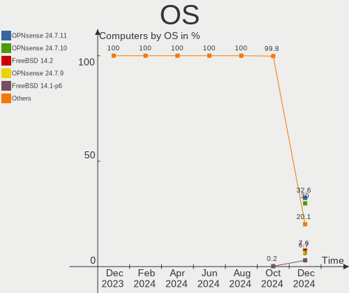
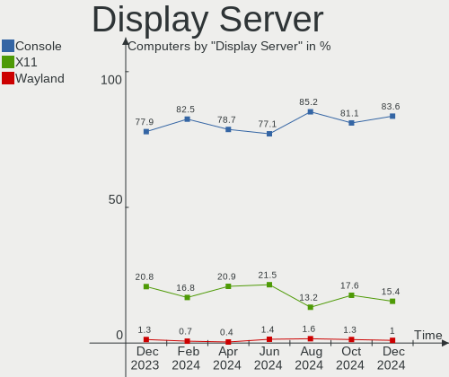
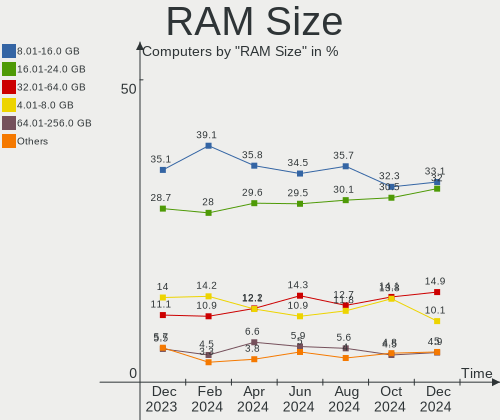
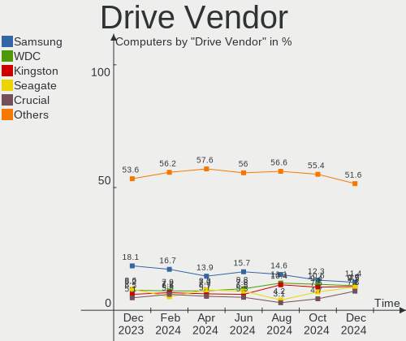
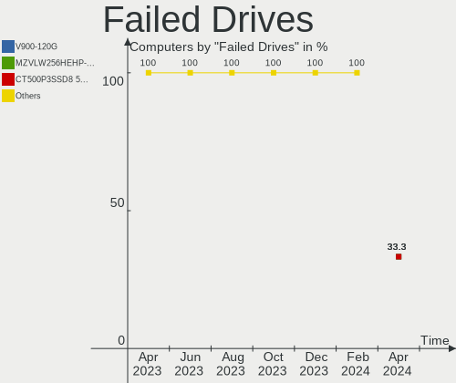
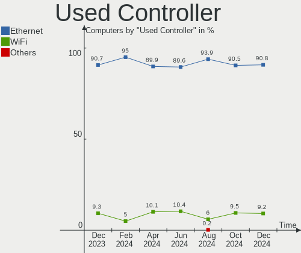
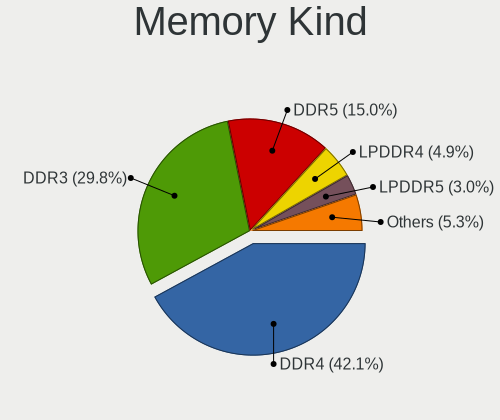

BSD - Hardware Trends
---------------------

A project to identify most popular hardware characteristics and track their change
over time based on data collected by BSD users at https://BSD-Hardware.info.

Anyone can contribute to this report by the [hw-probe](https://github.com/linuxhw/hw-probe/blob/master/INSTALL.BSD.md) tool:

    hw-probe -all -upload

This is a report for all computer types. See also reports for [desktops](/Desktop/README.md) and [notebooks](/Notebook/README.md).

OS-specific reports: [FreeBSD](/Dist/FreeBSD), [OPNsense](/Dist/OPNsense), [helloSystem](/Dist/helloSystem), [OpenBSD](/Dist/OpenBSD).

This report is for one last month. Overall report since the beginning of time: [TestDays](https://github.com/bsdhw/TestDays)

Period: Dec, 2025.

Contents
--------

* [ System ](#system)
  - [ OS                       ](#os)
  - [ OS Family                ](#os-family)
  - [ Arch                     ](#arch)
  - [ DE                       ](#de)
  - [ Display Server           ](#display-server)
  - [ Display Manager          ](#display-manager)
  - [ OS Lang                  ](#os-lang)
  - [ Boot Mode                ](#boot-mode)
  - [ Filesystem               ](#filesystem)
  - [ Part. scheme             ](#part-scheme)

* [ Board ](#board)
  - [ Vendor                   ](#vendor)
  - [ Model                    ](#model)
  - [ Model Family             ](#model-family)
  - [ MFG Year                 ](#mfg-year)
  - [ Form Factor              ](#form-factor)
  - [ Coreboot                 ](#coreboot)
  - [ RAM Size                 ](#ram-size)
  - [ RAM Used                 ](#ram-used)
  - [ Total Drives             ](#total-drives)
  - [ Has CD-ROM               ](#has-cd-rom)
  - [ Has Ethernet             ](#has-ethernet)
  - [ Has WiFi                 ](#has-wifi)
  - [ Has Bluetooth            ](#has-bluetooth)

* [ Location ](#location)
  - [ Country                  ](#country)
  - [ City                     ](#city)

* [ Drives ](#drives)
  - [ Drive Vendor             ](#drive-vendor)
  - [ Drive Model              ](#drive-model)
  - [ HDD Vendor               ](#hdd-vendor)
  - [ SSD Vendor               ](#ssd-vendor)
  - [ Drive Kind               ](#drive-kind)
  - [ Drive Connector          ](#drive-connector)
  - [ Drive Size               ](#drive-size)
  - [ Space Total              ](#space-total)
  - [ Space Used               ](#space-used)
  - [ Malfunc. Drives          ](#malfunc-drives)
  - [ Malfunc. Drive Vendor    ](#malfunc-drive-vendor)
  - [ Malfunc. HDD Vendor      ](#malfunc-hdd-vendor)
  - [ Malfunc. Drive Kind      ](#malfunc-drive-kind)
  - [ Failed Drives            ](#failed-drives)
  - [ Failed Drive Vendor      ](#failed-drive-vendor)
  - [ Drive Status             ](#drive-status)

* [ Storage controller ](#storage-controller)
  - [ Storage Vendor           ](#storage-vendor)
  - [ Storage Model            ](#storage-model)
  - [ Storage Kind             ](#storage-kind)

* [ Processor ](#processor)
  - [ CPU Vendor               ](#cpu-vendor)
  - [ CPU Model                ](#cpu-model)
  - [ CPU Model Family         ](#cpu-model-family)
  - [ CPU Cores                ](#cpu-cores)
  - [ CPU Sockets              ](#cpu-sockets)
  - [ CPU Threads              ](#cpu-threads)
  - [ CPU Microarch            ](#cpu-microarch)

* [ Graphics ](#graphics)
  - [ GPU Vendor               ](#gpu-vendor)
  - [ GPU Model                ](#gpu-model)
  - [ GPU Combo                ](#gpu-combo)
  - [ GPU Driver               ](#gpu-driver)
  - [ GPU Memory               ](#gpu-memory)

* [ Monitor ](#monitor)
  - [ Monitor Vendor           ](#monitor-vendor)
  - [ Monitor Model            ](#monitor-model)
  - [ Monitor Resolution       ](#monitor-resolution)
  - [ Monitor Diagonal         ](#monitor-diagonal)
  - [ Monitor Width            ](#monitor-width)
  - [ Aspect Ratio             ](#aspect-ratio)
  - [ Monitor Area             ](#monitor-area)
  - [ Pixel Density            ](#pixel-density)
  - [ Multiple Monitors        ](#multiple-monitors)

* [ Network ](#network)
  - [ Net Controller Vendor    ](#net-controller-vendor)
  - [ Net Controller Model     ](#net-controller-model)
  - [ Wireless Vendor          ](#wireless-vendor)
  - [ Wireless Model           ](#wireless-model)
  - [ Ethernet Vendor          ](#ethernet-vendor)
  - [ Ethernet Model           ](#ethernet-model)
  - [ Net Controller Kind      ](#net-controller-kind)
  - [ Used Controller          ](#used-controller)
  - [ NICs                     ](#nics)
  - [ IPv6                     ](#ipv6)

* [ Bluetooth ](#bluetooth)
  - [ Bluetooth Vendor         ](#bluetooth-vendor)
  - [ Bluetooth Model          ](#bluetooth-model)

* [ Sound ](#sound)
  - [ Sound Vendor             ](#sound-vendor)
  - [ Sound Model              ](#sound-model)

* [ Memory ](#memory)
  - [ Memory Vendor            ](#memory-vendor)
  - [ Memory Model             ](#memory-model)
  - [ Memory Kind              ](#memory-kind)
  - [ Memory Form Factor       ](#memory-form-factor)
  - [ Memory Size              ](#memory-size)
  - [ Memory Speed             ](#memory-speed)

* [ Printers & scanners ](#printers--scanners)
  - [ Printer Vendor           ](#printer-vendor)
  - [ Printer Model            ](#printer-model)
  - [ Scanner Vendor           ](#scanner-vendor)
  - [ Scanner Model            ](#scanner-model)

* [ Camera ](#camera)
  - [ Camera Vendor            ](#camera-vendor)
  - [ Camera Model             ](#camera-model)

* [ Security ](#security)
  - [ Fingerprint Vendor       ](#fingerprint-vendor)
  - [ Fingerprint Model        ](#fingerprint-model)
  - [ Chipcard Vendor          ](#chipcard-vendor)
  - [ Chipcard Model           ](#chipcard-model)

* [ Unsupported ](#unsupported)
  - [ Unsupported Devices      ](#unsupported-devices)
  - [ Unsupported Device Types ](#unsupported-device-types)

System
------

OS
--

Installed operating systems

| Name                      | Computers | Percent |
|---------------------------|-----------|---------|
| OPNsense 25.7.9           | 146       | 28.52%  |
| OPNsense 25.7.10          | 138       | 26.95%  |
| OPNsense 25.7.8           | 40        | 7.81%   |
| FreeBSD 15.0              | 32        | 6.25%   |
| FreeBSD 15.0-p1           | 18        | 3.52%   |
| OpenBSD 7.8               | 15        | 2.93%   |
| OPNsense 25.10.1          | 11        | 2.15%   |
| helloSystem 0.8.1         | 11        | 2.15%   |
| GhostBSD 25.02-R14.3p2    | 11        | 2.15%   |
| OPNsense 25.1.12          | 10        | 1.95%   |
| OPNsense 25.7.7           | 8         | 1.56%   |
| FreeBSD 15.0-STABLE       | 7         | 1.37%   |
| GhostBSD 25.02-R14.3p4    | 6         | 1.17%   |
| FreeBSD 14.3-p6           | 6         | 1.17%   |
| FreeBSD 16.0-CURRENT      | 5         | 0.98%   |
| FreeBSD 14.3-p7           | 5         | 0.98%   |
| OPNsense 25.10            | 4         | 0.78%   |
| OPNsense 26.1             | 3         | 0.59%   |
| OPNsense 25.7.6           | 3         | 0.59%   |
| FreeBSD 14.3-p5           | 3         | 0.59%   |
| FreeBSD 14.3              | 3         | 0.59%   |
| OPNsense 25.7.5           | 2         | 0.39%   |
| OPNsense 25.7.4           | 2         | 0.39%   |
| OPNsense 25.7.3           | 2         | 0.39%   |
| OPNsense 25.7.2           | 2         | 0.39%   |
| OPNsense 25.1.5           | 2         | 0.39%   |
| OPNsense 25.1             | 2         | 0.39%   |
| MidnightBSD 4.0           | 2         | 0.39%   |
| helloSystem 0.9.0         | 2         | 0.39%   |
| TrueNAS 13.3-p4           | 1         | 0.2%    |
| OPNsense 25.4.3           | 1         | 0.2%    |
| OPNsense 25.1.8           | 1         | 0.2%    |
| OPNsense 25.1.11          | 1         | 0.2%    |
| OPNsense 24.7.12          | 1         | 0.2%    |
| OPNsense 22.7.11          | 1         | 0.2%    |
| NetBSD 10.1_STABLE        | 1         | 0.2%    |
| FreeBSD 15.0-RC4-p1       | 1         | 0.2%    |
| FreeBSD 14.3-STABLE       | 1         | 0.2%    |
| FreeBSD 13.5-p3           | 1         | 0.2%    |
| DragonFly 6.5-DEVELOPMENT | 1         | 0.2%    |

OS Family
---------

OS without a version

| Name        | Computers | Percent |
|-------------|-----------|---------|
| OPNsense    | 380       | 74.22%  |
| FreeBSD     | 82        | 16.02%  |
| GhostBSD    | 17        | 3.32%   |
| OpenBSD     | 15        | 2.93%   |
| helloSystem | 13        | 2.54%   |
| MidnightBSD | 2         | 0.39%   |
| TrueNAS     | 1         | 0.2%    |
| NetBSD      | 1         | 0.2%    |
| DragonFly   | 1         | 0.2%    |

Arch
----

OS architecture (x86_64, i586, etc.)

| Name   | Computers | Percent |
|--------|-----------|---------|
| amd64  | 500       | 97.66%  |
| i386   | 5         | 0.98%   |
| arm64  | 4         | 0.78%   |
| macppc | 3         | 0.59%   |

DE
--

Desktop Environment

| Name         | Computers | Percent |
|--------------|-----------|---------|
| Console      | 409       | 79.88%  |
| helloDesktop | 26        | 5.08%   |
| XFCE         | 22        | 4.3%    |
| TWM          | 17        | 3.32%   |
| MATE         | 17        | 3.32%   |
| GNOME        | 5         | 0.98%   |
| KDE6         | 4         | 0.78%   |
| i3           | 2         | 0.39%   |
| AwesomeWM    | 2         | 0.39%   |
| sway:wlroots | 1         | 0.2%    |
| Openbox      | 1         | 0.2%    |
| mango        | 1         | 0.2%    |
| LXQt         | 1         | 0.2%    |
| KDE          | 1         | 0.2%    |
| IceWM        | 1         | 0.2%    |
| fvwm         | 1         | 0.2%    |
| cwm          | 1         | 0.2%    |

Display Server
--------------

X11 or Wayland

| Name    | Computers | Percent |
|---------|-----------|---------|
| Console | 410       | 80.08%  |
| X11     | 92        | 17.97%  |
| Wayland | 10        | 1.95%   |

Display Manager
---------------

SDDM, LightDM, etc.

| Name    | Computers | Percent |
|---------|-----------|---------|
| Console | 447       | 87.3%   |
| SDDM    | 23        | 4.49%   |
| LightDM | 23        | 4.49%   |
| SLiM    | 15        | 2.93%   |
| Ly      | 2         | 0.39%   |
| XDM     | 1         | 0.2%    |
| GDM     | 1         | 0.2%    |

OS Lang
-------

Language

| Lang    | Computers | Percent |
|---------|-----------|---------|
| Unknown | 402       | 78.52%  |
| C       | 71        | 13.87%  |
| en_US   | 24        | 4.69%   |
| fr_FR   | 3         | 0.59%   |
| es_ES   | 3         | 0.59%   |
| de_DE   | 3         | 0.59%   |
| ru_RU   | 2         | 0.39%   |
| pt_PT   | 1         | 0.2%    |
| pt_BR   | 1         | 0.2%    |
| pl_PL   | 1         | 0.2%    |
| en_CA   | 1         | 0.2%    |

Boot Mode
---------

EFI or BIOS

| Mode | Computers | Percent |
|------|-----------|---------|
| EFI  | 475       | 92.77%  |
| BIOS | 37        | 7.23%   |

Filesystem
----------

Type of filesystem

| Type    | Computers | Percent |
|---------|-----------|---------|
| Zfs     | 371       | 72.46%  |
| Ufs     | 119       | 23.24%  |
| Ffs     | 15        | 2.93%   |
| Cd9660  | 6         | 1.17%   |
| Hammer2 | 1         | 0.2%    |

Part. scheme
------------

Scheme of partitioning

| Type    | Computers | Percent |
|---------|-----------|---------|
| GPT     | 491       | 95.9%   |
| MBR     | 18        | 3.52%   |
| Unknown | 2         | 0.39%   |
| BSD     | 1         | 0.2%    |

Board
-----

Vendor
------

Motherboard manufacturer

| Name                                 | Computers | Percent |
|--------------------------------------|-----------|---------|
| Unknown                              | 80        | 15.63%  |
| Lenovo                               | 55        | 10.74%  |
| Dell                                 | 52        | 10.16%  |
| Hewlett-Packard                      | 42        | 8.2%    |
| Protectli                            | 27        | 5.27%   |
| ASUSTek Computer                     | 23        | 4.49%   |
| Supermicro                           | 20        | 3.91%   |
| Intel                                | 19        | 3.71%   |
| Deciso                               | 18        | 3.52%   |
| Gigabyte Technology                  | 13        | 2.54%   |
| MSI                                  | 11        | 2.15%   |
| ASRock                               | 11        | 2.15%   |
| Sophos                               | 10        | 1.95%   |
| Fujitsu                              | 9         | 1.76%   |
| AMI                                  | 9         | 1.76%   |
| Techvision                           | 8         | 1.56%   |
| Apple                                | 8         | 1.56%   |
| Shenzhen Meigao Electronic Equipment | 7         | 1.37%   |
| PC Engines                           | 7         | 1.37%   |
| ASRockRack                           | 5         | 0.98%   |
| TianBei                              | 4         | 0.78%   |
| AZW                                  | 4         | 0.78%   |
| Acer                                 | 4         | 0.78%   |
| CWWK                                 | 3         | 0.59%   |
| Biostar                              | 3         | 0.59%   |
| AWOW                                 | 3         | 0.59%   |
| Toshiba                              | 2         | 0.39%   |
| SLIMBOOK                             | 2         | 0.39%   |
| Shuttle                              | 2         | 0.39%   |
| OEM                                  | 2         | 0.39%   |
| MW                                   | 2         | 0.39%   |
| Framework                            | 2         | 0.39%   |
| Foxconn                              | 2         | 0.39%   |
| Datto                                | 2         | 0.39%   |
| YF                                   | 1         | 0.2%    |
| Yanling                              | 1         | 0.2%    |
| Wistron                              | 1         | 0.2%    |
| Wincor Nixdorf                       | 1         | 0.2%    |
| Trigkey                              | 1         | 0.2%    |
| Thomas-Krenn.AG                      | 1         | 0.2%    |

Model
-----

Motherboard model

| Name                                              | Computers | Percent |
|---------------------------------------------------|-----------|---------|
| Unknown                                           | 81        | 15.82%  |
| Techvision TVI7309X                               | 8         | 1.56%   |
| Shenzhen Meigao Electronic Equipment Venus Series | 6         | 1.17%   |
| Protectli V1410                                   | 6         | 1.17%   |
| PC Engines APU2                                   | 6         | 1.17%   |
| Sophos SG                                         | 5         | 0.98%   |
| Protectli VP2420                                  | 5         | 0.98%   |
| AMI Aptio CRB                                     | 5         | 0.98%   |
| Supermicro Super Server                           | 4         | 0.78%   |
| Sophos XG                                         | 4         | 0.78%   |
| Dell OptiPlex 7010                                | 4         | 0.78%   |
| Dell OptiPlex 3050                                | 4         | 0.78%   |
| TianBei N1 PRO                                    | 3         | 0.59%   |
| Supermicro A1SAi                                  | 3         | 0.59%   |
| Protectli FW6                                     | 3         | 0.59%   |
| Intel BKHD-1264-SFP                               | 3         | 0.59%   |
| HP t730 Thin Client                               | 3         | 0.59%   |
| Deciso OPNsense Rack Security Appliance           | 3         | 0.59%   |
| Deciso NetBoard-A20                               | 3         | 0.59%   |
| Deciso NetBoard-A10                               | 3         | 0.59%   |
| Deciso Netboard A20                               | 3         | 0.59%   |
| AZW EQ                                            | 3         | 0.59%   |
| Supermicro X10SLM-F                               | 2         | 0.39%   |
| SLIMBOOK ZERO-N100-4RJ                            | 2         | 0.39%   |
| Protectli VP6630                                  | 2         | 0.39%   |
| Protectli FW4B                                    | 2         | 0.39%   |
| MW GMLK-2_5G4L                                    | 2         | 0.39%   |
| Lenovo ThinkCentre M720q 10T7002CUS               | 2         | 0.39%   |
| Lenovo Tablet 10 20L4S00U00                       | 2         | 0.39%   |
| Intel Jasper Lake Client Platform                 | 2         | 0.39%   |
| HP Slim Desktop S01-pF1xxx                        | 2         | 0.39%   |
| HP ProDesk 600 G3 DM                              | 2         | 0.39%   |
| HP EliteDesk 805 G6 Small Form Factor PC          | 2         | 0.39%   |
| HP EliteDesk 800 G3 SFF                           | 2         | 0.39%   |
| Fujitsu FUTRO S930                                | 2         | 0.39%   |
| Dell XPS 8700                                     | 2         | 0.39%   |
| Dell PowerEdge R440                               | 2         | 0.39%   |
| Dell OptiPlex 9020                                | 2         | 0.39%   |
| Dell OptiPlex 3010                                | 2         | 0.39%   |
| Dell Inspiron 3521                                | 2         | 0.39%   |

Model Family
------------

Motherboard model prefix

| Name                                       | Computers | Percent |
|--------------------------------------------|-----------|---------|
| Unknown                                    | 81        | 15.82%  |
| Lenovo ThinkPad                            | 24        | 4.69%   |
| Dell OptiPlex                              | 22        | 4.3%    |
| Lenovo ThinkCentre                         | 20        | 3.91%   |
| HP EliteDesk                               | 10        | 1.95%   |
| Techvision TVI7309X                        | 8         | 1.56%   |
| Dell PowerEdge                             | 7         | 1.37%   |
| Shenzhen Meigao Electronic Equipment Venus | 6         | 1.17%   |
| Protectli V1410                            | 6         | 1.17%   |
| PC Engines APU2                            | 6         | 1.17%   |
| HP ProDesk                                 | 6         | 1.17%   |
| Sophos SG                                  | 5         | 0.98%   |
| Protectli VP2420                           | 5         | 0.98%   |
| Dell Precision                             | 5         | 0.98%   |
| Dell Latitude                              | 5         | 0.98%   |
| Dell Inspiron                              | 5         | 0.98%   |
| Deciso NetBoard-A10                        | 5         | 0.98%   |
| Deciso Netboard                            | 5         | 0.98%   |
| ASUS PRIME                                 | 5         | 0.98%   |
| AMI Aptio                                  | 5         | 0.98%   |
| Supermicro Super                           | 4         | 0.78%   |
| Sophos XG                                  | 4         | 0.78%   |
| Lenovo IdeaPad                             | 4         | 0.78%   |
| HP EliteBook                               | 4         | 0.78%   |
| TianBei N1                                 | 3         | 0.59%   |
| Supermicro A1SAi                           | 3         | 0.59%   |
| Protectli FW6                              | 3         | 0.59%   |
| Intel BKHD-1264-SFP                        | 3         | 0.59%   |
| HP t730                                    | 3         | 0.59%   |
| HP ProLiant                                | 3         | 0.59%   |
| HP ProBook                                 | 3         | 0.59%   |
| Fujitsu FUTRO                              | 3         | 0.59%   |
| Dell XPS                                   | 3         | 0.59%   |
| Deciso OPNsense                            | 3         | 0.59%   |
| Deciso NetBoard-A20                        | 3         | 0.59%   |
| AZW EQ                                     | 3         | 0.59%   |
| Apple PowerBook6                           | 3         | 0.59%   |
| Acer Veriton                               | 3         | 0.59%   |
| Toshiba Satellite                          | 2         | 0.39%   |
| Supermicro X10SLM-F                        | 2         | 0.39%   |

MFG Year
--------

Motherboard manufacture year

| Year    | Computers | Percent |
|---------|-----------|---------|
| 2024    | 74        | 14.45%  |
| 2025    | 48        | 9.38%   |
| 2023    | 47        | 9.18%   |
| 2022    | 46        | 8.98%   |
| 2021    | 39        | 7.62%   |
| 2018    | 36        | 7.03%   |
| 2016    | 34        | 6.64%   |
| 2020    | 33        | 6.45%   |
| 2014    | 28        | 5.47%   |
| 2019    | 27        | 5.27%   |
| 2013    | 26        | 5.08%   |
| 2017    | 19        | 3.71%   |
| 2015    | 16        | 3.13%   |
| 2012    | 6         | 1.17%   |
| 2010    | 6         | 1.17%   |
| 2008    | 6         | 1.17%   |
| Unknown | 6         | 1.17%   |
| 2009    | 5         | 0.98%   |
| 2011    | 4         | 0.78%   |
| 2007    | 3         | 0.59%   |
| 2006    | 2         | 0.39%   |
| 2004    | 1         | 0.2%    |

Form Factor
-----------

Physical design of the computer

| Name        | Computers | Percent |
|-------------|-----------|---------|
| Desktop     | 316       | 61.72%  |
| Notebook    | 88        | 17.19%  |
| Mini pc     | 62        | 12.11%  |
| Server      | 31        | 6.05%   |
| Firewall    | 11        | 2.15%   |
| Tablet      | 2         | 0.39%   |
| Convertible | 1         | 0.2%    |
| All in one  | 1         | 0.2%    |

Coreboot
--------

Have coreboot on board

| Used | Computers | Percent |
|------|-----------|---------|
| No   | 497       | 97.07%  |
| Yes  | 15        | 2.93%   |

RAM Size
--------

Total RAM memory

| Size in GB      | Computers | Percent |
|-----------------|-----------|---------|
| 16.01-24.0      | 167       | 32.62%  |
| 8.01-16.0       | 160       | 31.25%  |
| 32.01-64.0      | 77        | 15.04%  |
| 4.01-8.0        | 55        | 10.74%  |
| 64.01-256.0     | 32        | 6.25%   |
| 2.01-3.0        | 8         | 1.56%   |
| 1.01-2.0        | 4         | 0.78%   |
| 24.01-32.0      | 3         | 0.59%   |
| More than 256.0 | 2         | 0.39%   |
| 0.51-1.0        | 2         | 0.39%   |
| 3.01-4.0        | 1         | 0.2%    |
| 0.01-0.5        | 1         | 0.2%    |

RAM Used
--------

Used RAM memory

| Used GB    | Computers | Percent |
|------------|-----------|---------|
| 0.51-1.0   | 221       | 43.16%  |
| 0.01-0.5   | 163       | 31.84%  |
| 1.01-2.0   | 96        | 18.75%  |
| 2.01-3.0   | 10        | 1.95%   |
| 3.01-4.0   | 8         | 1.56%   |
| 4.01-8.0   | 7         | 1.37%   |
| 0          | 4         | 0.78%   |
| 16.01-24.0 | 1         | 0.2%    |
| 8.01-16.0  | 1         | 0.2%    |
| Unknown    | 1         | 0.2%    |

Total Drives
------------

Number of drives on board

| Drives | Computers | Percent |
|--------|-----------|---------|
| 1      | 236       | 46.09%  |
| 0      | 210       | 41.02%  |
| 2      | 47        | 9.18%   |
| 4      | 8         | 1.56%   |
| 3      | 4         | 0.78%   |
| 5      | 3         | 0.59%   |
| 11     | 1         | 0.2%    |
| 10     | 1         | 0.2%    |
| 7      | 1         | 0.2%    |
| 6      | 1         | 0.2%    |

Has CD-ROM
----------

Has CD-ROM on board

| Presented | Computers | Percent |
|-----------|-----------|---------|
| No        | 464       | 90.63%  |
| Yes       | 48        | 9.38%   |

Has Ethernet
------------

Has Ethernet on board

| Presented | Computers | Percent |
|-----------|-----------|---------|
| Yes       | 489       | 95.51%  |
| No        | 23        | 4.49%   |

Has WiFi
--------

Has WiFi module

| Presented | Computers | Percent |
|-----------|-----------|---------|
| No        | 338       | 66.02%  |
| Yes       | 174       | 33.98%  |

Has Bluetooth
-------------

Has Bluetooth module

| Presented | Computers | Percent |
|-----------|-----------|---------|
| No        | 374       | 73.05%  |
| Yes       | 138       | 26.95%  |

Location
--------

Country
-------

Geographic location (country)

| Country             | Computers | Percent |
|---------------------|-----------|---------|
| USA                 | 162       | 31.64%  |
| Germany             | 70        | 13.67%  |
| UK                  | 34        | 6.64%   |
| Canada              | 26        | 5.08%   |
| Poland              | 20        | 3.91%   |
| Australia           | 17        | 3.32%   |
| Russia              | 16        | 3.13%   |
| France              | 16        | 3.13%   |
| Italy               | 15        | 2.93%   |
| Brazil              | 12        | 2.34%   |
| Netherlands         | 10        | 1.95%   |
| Austria             | 9         | 1.76%   |
| Sweden              | 7         | 1.37%   |
| Spain               | 6         | 1.17%   |
| China               | 6         | 1.17%   |
| Portugal            | 5         | 0.98%   |
| Mexico              | 5         | 0.98%   |
| Vietnam             | 4         | 0.78%   |
| Venezuela           | 4         | 0.78%   |
| Thailand            | 4         | 0.78%   |
| Switzerland         | 4         | 0.78%   |
| Belgium             | 4         | 0.78%   |
| The Netherlands     | 3         | 0.59%   |
| South Africa        | 3         | 0.59%   |
| Romania             | 3         | 0.59%   |
| Norway              | 3         | 0.59%   |
| Hungary             | 3         | 0.59%   |
| Finland             | 3         | 0.59%   |
| Chile               | 3         | 0.59%   |
| Turkey              | 2         | 0.39%   |
| Taiwan              | 2         | 0.39%   |
| Slovakia            | 2         | 0.39%   |
| Puerto Rico         | 2         | 0.39%   |
| New Zealand         | 2         | 0.39%   |
| Malaysia            | 2         | 0.39%   |
| Japan               | 2         | 0.39%   |
| Israel              | 2         | 0.39%   |
| Tunisia             | 1         | 0.2%    |
| Trinidad and Tobago | 1         | 0.2%    |
| Slovenia            | 1         | 0.2%    |

City
----

Geographic location (city)

| City                  | Computers | Percent |
|-----------------------|-----------|---------|
| Berlin                | 12        | 2.34%   |
| Seattle               | 8         | 1.56%   |
| Paris                 | 6         | 1.17%   |
| Melbourne             | 6         | 1.17%   |
| Edgware               | 6         | 1.17%   |
| Vienna                | 5         | 0.98%   |
| Sydney                | 5         | 0.98%   |
| St Petersburg         | 5         | 0.98%   |
| Cambridge             | 4         | 0.78%   |
| Zurich                | 3         | 0.59%   |
| Wroclaw               | 3         | 0.59%   |
| Warsaw                | 3         | 0.59%   |
| Queens                | 3         | 0.59%   |
| Pontotoc              | 3         | 0.59%   |
| Moscow                | 3         | 0.59%   |
| Madison               | 3         | 0.59%   |
| London                | 3         | 0.59%   |
| Lisbon                | 3         | 0.59%   |
| Krakow                | 3         | 0.59%   |
| Hornsea               | 3         | 0.59%   |
| Helsinki              | 3         | 0.59%   |
| Frankfurt am Main     | 3         | 0.59%   |
| Duncan                | 3         | 0.59%   |
| Denver                | 3         | 0.59%   |
| Budapest              | 3         | 0.59%   |
| Zielona Góra         | 2         | 0.39%   |
| Winnipeg              | 2         | 0.39%   |
| Tacoma                | 2         | 0.39%   |
| Springville           | 2         | 0.39%   |
| Southwark             | 2         | 0.39%   |
| Seville               | 2         | 0.39%   |
| Santa Ana             | 2         | 0.39%   |
| San Fernando de Apure | 2         | 0.39%   |
| San Antonio           | 2         | 0.39%   |
| Rockville             | 2         | 0.39%   |
| Redmond               | 2         | 0.39%   |
| Reading               | 2         | 0.39%   |
| Rancagua              | 2         | 0.39%   |
| Philadelphia          | 2         | 0.39%   |
| Oslo                  | 2         | 0.39%   |

Drives
------

Drive Vendor
------------

Hard drive vendors

| Vendor              | Computers | Drives | Percent |
|---------------------|-----------|--------|---------|
| Samsung Electronics | 50        | 60     | 14.2%   |
| WDC                 | 34        | 47     | 9.66%   |
| Seagate             | 23        | 43     | 6.53%   |
| Kingston            | 23        | 26     | 6.53%   |
| Crucial             | 22        | 27     | 6.25%   |
| SanDisk             | 20        | 21     | 5.68%   |
| Transcend           | 19        | 21     | 5.4%    |
| China               | 18        | 18     | 5.11%   |
| Intel               | 17        | 19     | 4.83%   |
| A-DATA Technology   | 14        | 16     | 3.98%   |
| Hitachi             | 9         | 9      | 2.56%   |
| Toshiba             | 8         | 9      | 2.27%   |
| Protectli           | 7         | 7      | 1.99%   |
| PNY                 | 6         | 6      | 1.7%    |
| Patriot             | 6         | 7      | 1.7%    |
| Micron Technology   | 5         | 5      | 1.42%   |
| KingSpec            | 5         | 6      | 1.42%   |
| FORESEE             | 5         | 5      | 1.42%   |
| SK hynix            | 4         | 4      | 1.14%   |
| Apple               | 4         | 4      | 1.14%   |
| Team                | 3         | 3      | 0.85%   |
| SPCC                | 3         | 3      | 0.85%   |
| Hoodisk             | 3         | 3      | 0.85%   |
| Fujitsu             | 3         | 3      | 0.85%   |
| ShiJi               | 2         | 2      | 0.57%   |
| OCZ                 | 2         | 2      | 0.57%   |
| Netac               | 2         | 3      | 0.57%   |
| LITEONIT            | 2         | 2      | 0.57%   |
| LITEON              | 2         | 2      | 0.57%   |
| Lexar               | 2         | 2      | 0.57%   |
| XrayDisk            | 1         | 1      | 0.28%   |
| VICK                | 1         | 1      | 0.28%   |
| Verbatim            | 1         | 1      | 0.28%   |
| UMIS                | 1         | 1      | 0.28%   |
| SSSTC               | 1         | 1      | 0.28%   |
| PUSKILL             | 1         | 1      | 0.28%   |
| MSI                 | 1         | 1      | 0.28%   |
| LuminouTek          | 1         | 1      | 0.28%   |
| Kston               | 1         | 1      | 0.28%   |
| KLEVV               | 1         | 1      | 0.28%   |

Drive Model
-----------

Hard drive models

| Model                            | Computers | Percent |
|----------------------------------|-----------|---------|
| Crucial CT240BX500SSD1 240GB     | 7         | 1.9%    |
| Samsung SSD 870 EVO 500GB        | 5         | 1.36%   |
| Kingston SA400S37480G 480GB      | 4         | 1.08%   |
| Kingston SA400S37240G 240GB      | 4         | 1.08%   |
| Samsung SSD 860 EVO 1TB          | 3         | 0.81%   |
| Samsung SSD 840 EVO 500GB        | 3         | 0.81%   |
| Kingston SUV500MS120G 120GB      | 3         | 0.81%   |
| KingSpec P3-128 128GB            | 3         | 0.81%   |
| Crucial CT250MX500SSD1 250GB     | 3         | 0.81%   |
| A-DATA SP550 240GB               | 3         | 0.81%   |
| A-DATA IM2S3134N-064GM 64GB      | 3         | 0.81%   |
| WDC WDS100T2B0A-00SM50 1TB       | 2         | 0.54%   |
| WDC WD5000AAKX-75U6AA0 500GB     | 2         | 0.54%   |
| Transcend TS64GMSA230S 64GB      | 2         | 0.54%   |
| Transcend TS32GSSD370S 32GB      | 2         | 0.54%   |
| Transcend TS256GMSA230S 256GB    | 2         | 0.54%   |
| Transcend TS128GMSA230S 128GB    | 2         | 0.54%   |
| Toshiba MQ01ABF050 500GB         | 2         | 0.54%   |
| SK hynix SC311 SATA 256GB        | 2         | 0.54%   |
| SK hynix SC311 SATA 128GB        | 2         | 0.54%   |
| Seagate ST8000DM004-2U9188 8TB   | 2         | 0.54%   |
| Seagate ST4000DM000-1F2168 4TB   | 2         | 0.54%   |
| Seagate ST3250312AS 250GB        | 2         | 0.54%   |
| Seagate ST1000DM010-2EP102 1TB   | 2         | 0.54%   |
| SanDisk SDSSDA120G 120GB         | 2         | 0.54%   |
| Samsung SSD 870 EVO 2TB          | 2         | 0.54%   |
| Samsung SSD 870 EVO 250GB        | 2         | 0.54%   |
| Samsung SSD 860 QVO 1TB          | 2         | 0.54%   |
| Samsung SSD 860 EVO mSATA 250GB  | 2         | 0.54%   |
| Samsung SSD 860 EVO 500GB        | 2         | 0.54%   |
| Samsung SSD 850 EVO 250GB        | 2         | 0.54%   |
| Samsung SSD 840 PRO Series 512GB | 2         | 0.54%   |
| Samsung SSD 840 EVO 250GB        | 2         | 0.54%   |
| Samsung MZ7PD128HCFV-000H1 128GB | 2         | 0.54%   |
| Samsung MZ7LN256HMJP-000H1 256GB | 2         | 0.54%   |
| Protectli 64GB mSATA             | 2         | 0.54%   |
| Protectli 1TB M.2                | 2         | 0.54%   |
| Protectli 120GB M.2              | 2         | 0.54%   |
| PNY CS900 240GB SSD              | 2         | 0.54%   |
| Patriot P210 128GB               | 2         | 0.54%   |

HDD Vendor
----------

Hard disk drive vendors

| Vendor              | Computers | Drives | Percent |
|---------------------|-----------|--------|---------|
| WDC                 | 25        | 34     | 36.23%  |
| Seagate             | 21        | 41     | 30.43%  |
| Hitachi             | 9         | 9      | 13.04%  |
| Toshiba             | 6         | 7      | 8.7%    |
| Fujitsu             | 3         | 3      | 4.35%   |
| Apple               | 2         | 2      | 2.9%    |
| Samsung Electronics | 1         | 1      | 1.45%   |
| HPE                 | 1         | 6      | 1.45%   |
| HGST                | 1         | 1      | 1.45%   |

SSD Vendor
----------

Solid state drive vendors

| Vendor              | Computers | Drives | Percent |
|---------------------|-----------|--------|---------|
| Samsung Electronics | 47        | 57     | 17.03%  |
| Kingston            | 23        | 26     | 8.33%   |
| Crucial             | 22        | 27     | 7.97%   |
| Transcend           | 19        | 21     | 6.88%   |
| SanDisk             | 19        | 20     | 6.88%   |
| China               | 18        | 18     | 6.52%   |
| Intel               | 16        | 18     | 5.8%    |
| A-DATA Technology   | 14        | 16     | 5.07%   |
| WDC                 | 8         | 10     | 2.9%    |
| Protectli           | 7         | 7      | 2.54%   |
| Patriot             | 6         | 7      | 2.17%   |
| PNY                 | 5         | 5      | 1.81%   |
| Micron Technology   | 5         | 5      | 1.81%   |
| KingSpec            | 5         | 6      | 1.81%   |
| FORESEE             | 5         | 5      | 1.81%   |
| SK hynix            | 4         | 4      | 1.45%   |
| Team                | 3         | 3      | 1.09%   |
| SPCC                | 3         | 3      | 1.09%   |
| Hoodisk             | 3         | 3      | 1.09%   |
| Toshiba             | 2         | 2      | 0.72%   |
| ShiJi               | 2         | 2      | 0.72%   |
| Seagate             | 2         | 2      | 0.72%   |
| OCZ                 | 2         | 2      | 0.72%   |
| Netac               | 2         | 3      | 0.72%   |
| LITEONIT            | 2         | 2      | 0.72%   |
| LITEON              | 2         | 2      | 0.72%   |
| Lexar               | 2         | 2      | 0.72%   |
| Apple               | 2         | 2      | 0.72%   |
| XrayDisk            | 1         | 1      | 0.36%   |
| VICK                | 1         | 1      | 0.36%   |
| Verbatim            | 1         | 1      | 0.36%   |
| UMIS                | 1         | 1      | 0.36%   |
| SSSTC               | 1         | 1      | 0.36%   |
| PUSKILL             | 1         | 1      | 0.36%   |
| MSI                 | 1         | 1      | 0.36%   |
| LuminouTek          | 1         | 1      | 0.36%   |
| Kston               | 1         | 1      | 0.36%   |
| KLEVV               | 1         | 1      | 0.36%   |
| KIOXIA-EXCERIA      | 1         | 1      | 0.36%   |
| Intenso             | 1         | 1      | 0.36%   |

Drive Kind
----------

HDD or SSD

| Kind | Computers | Drives | Percent |
|------|-----------|--------|---------|
| SSD  | 255       | 306    | 78.46%  |
| HDD  | 63        | 104    | 19.38%  |
| NVMe | 7         | 9      | 2.15%   |

Drive Connector
---------------

SATA, SAS, NVMe, etc.

| Type | Computers | Drives | Percent |
|------|-----------|--------|---------|
| SATA | 296       | 410    | 97.69%  |
| NVMe | 7         | 9      | 2.31%   |

Drive Size
----------

Size of hard drive

| Size in TB | Computers | Drives | Percent |
|------------|-----------|--------|---------|
| 0.01-0.5   | 252       | 291    | 78.26%  |
| 0.51-1.0   | 37        | 48     | 11.49%  |
| 1.01-2.0   | 15        | 24     | 4.66%   |
| 4.01-10.0  | 8         | 12     | 2.48%   |
| 3.01-4.0   | 6         | 16     | 1.86%   |
| 10.01-20.0 | 2         | 17     | 0.62%   |
| 20.01-50.0 | 1         | 1      | 0.31%   |
| 2.01-3.0   | 1         | 1      | 0.31%   |

Space Total
-----------

Amount of disk space available on the file system

| Size in GB     | Computers | Percent |
|----------------|-----------|---------|
| 101-250        | 219       | 42.77%  |
| 251-500        | 112       | 21.88%  |
| 51-100         | 51        | 9.96%   |
| 501-1000       | 50        | 9.77%   |
| 21-50          | 31        | 6.05%   |
| 1-20           | 29        | 5.66%   |
| 1001-2000      | 14        | 2.73%   |
| More than 3000 | 3         | 0.59%   |
| Unknown        | 2         | 0.39%   |
| 2001-3000      | 1         | 0.2%    |

Space Used
----------

Amount of used disk space

| Used GB   | Computers | Percent |
|-----------|-----------|---------|
| 1-20      | 462       | 90.23%  |
| 21-50     | 28        | 5.47%   |
| 51-100    | 11        | 2.15%   |
| 101-250   | 4         | 0.78%   |
| 251-500   | 2         | 0.39%   |
| 501-1000  | 2         | 0.39%   |
| Unknown   | 2         | 0.39%   |
| 2001-3000 | 1         | 0.2%    |

Malfunc. Drives
---------------

Drive models with a malfunction

| Model                                           | Computers | Drives | Percent |
|-------------------------------------------------|-----------|--------|---------|
| WDC WD5000AAKX-75U6AA0 500GB                    | 2         | 2      | 4.65%   |
| Hitachi HTS723216L9SA60 160GB                   | 2         | 2      | 4.65%   |
| XrayDisk SSD 256GB                              | 1         | 1      | 2.33%   |
| WDC WDS480G2G0A-00JH30 480GB                    | 1         | 1      | 2.33%   |
| WDC WD5000AAKX-221CA1 500GB                     | 1         | 1      | 2.33%   |
| WDC WD5000AAKX-083CA1 500GB                     | 1         | 1      | 2.33%   |
| WDC WD3200BPVT-75JJ5T0 320GB                    | 1         | 1      | 2.33%   |
| WDC WD3200BEVT-11ZCT0 320GB                     | 1         | 1      | 2.33%   |
| WDC WD2500AAJS-00YZCA0 250GB                    | 1         | 1      | 2.33%   |
| WDC WD10EZEX-21M2NA0 1TB                        | 1         | 1      | 2.33%   |
| Toshiba HDWD110 1TB                             | 1         | 1      | 2.33%   |
| Seagate ST8000DM004-2CX188 8TB                  | 1         | 2      | 2.33%   |
| Seagate ST4000DM000-1F2168 4TB                  | 1         | 1      | 2.33%   |
| Seagate ST3250312AS 250GB                       | 1         | 1      | 2.33%   |
| Seagate ST320LT007-9ZV142 320GB                 | 1         | 1      | 2.33%   |
| Seagate ST18000NM014J-2WS103 18TB               | 1         | 5      | 2.33%   |
| Seagate ST1000DM010-2EP102 1TB                  | 1         | 1      | 2.33%   |
| SanDisk SSD PLUS 1000GB                         | 1         | 1      | 2.33%   |
| SanDisk SDSA6PM-064G-1006 64GB                  | 1         | 1      | 2.33%   |
| SanDisk SD8SBAT128G 128GB                       | 1         | 1      | 2.33%   |
| Samsung Electronics SSD 860 EVO 500GB           | 1         | 1      | 2.33%   |
| Samsung Electronics SSD 850 PRO 256GB           | 1         | 1      | 2.33%   |
| Samsung Electronics HD161HJ 160GB               | 1         | 1      | 2.33%   |
| PNY CS900 SSD 120GB                             | 1         | 1      | 2.33%   |
| Micron Technology MTFDDAK256MAY-1AH12ABHA 256GB | 1         | 1      | 2.33%   |
| Micron Technology MTFDDAK256MAM-1K12 256GB      | 1         | 1      | 2.33%   |
| Kingston SV300S37A120G 120GB                    | 1         | 1      | 2.33%   |
| Intel SSDSC2BX400G4R 400GB                      | 1         | 1      | 2.33%   |
| Intel SSDSC2BB480G6R 480GB                      | 1         | 1      | 2.33%   |
| HP Phison PSSBN016GA27MC0 16GB                  | 1         | 1      | 2.33%   |
| Hitachi HTS723225A7A364 250GB                   | 1         | 1      | 2.33%   |
| Hitachi HTS543216L9SA00 160GB                   | 1         | 1      | 2.33%   |
| Hitachi HTS541612J9SA00 120GB                   | 1         | 1      | 2.33%   |
| Hitachi HDS728080PLAT20 82GB                    | 1         | 1      | 2.33%   |
| FCS SSD 480GB                                   | 1         | 1      | 2.33%   |
| Crucial CT275MX300SSD4 275GB                    | 1         | 1      | 2.33%   |
| China SH00M256GB                                | 1         | 1      | 2.33%   |
| China SATA SSD 128GB                            | 1         | 1      | 2.33%   |
| China BK-32GB MSATA SSD                         | 1         | 1      | 2.33%   |
| Apple SSD SM0128G 121GB                         | 1         | 1      | 2.33%   |

Malfunc. Drive Vendor
---------------------

Vendors of faulty drives

| Vendor              | Computers | Drives | Percent |
|---------------------|-----------|--------|---------|
| WDC                 | 9         | 9      | 20.93%  |
| Seagate             | 6         | 11     | 13.95%  |
| Hitachi             | 6         | 6      | 13.95%  |
| SanDisk             | 3         | 3      | 6.98%   |
| Samsung Electronics | 3         | 3      | 6.98%   |
| China               | 3         | 3      | 6.98%   |
| Micron Technology   | 2         | 2      | 4.65%   |
| Intel               | 2         | 2      | 4.65%   |
| Apple               | 2         | 2      | 4.65%   |
| XrayDisk            | 1         | 1      | 2.33%   |
| Toshiba             | 1         | 1      | 2.33%   |
| PNY                 | 1         | 1      | 2.33%   |
| Kingston            | 1         | 1      | 2.33%   |
| HP Phison           | 1         | 1      | 2.33%   |
| FCS                 | 1         | 1      | 2.33%   |
| Crucial             | 1         | 1      | 2.33%   |

Malfunc. HDD Vendor
-------------------

Vendors of faulty HDD drives

| Vendor              | Computers | Drives | Percent |
|---------------------|-----------|--------|---------|
| WDC                 | 8         | 8      | 34.78%  |
| Seagate             | 6         | 11     | 26.09%  |
| Hitachi             | 6         | 6      | 26.09%  |
| Toshiba             | 1         | 1      | 4.35%   |
| Samsung Electronics | 1         | 1      | 4.35%   |
| Apple               | 1         | 1      | 4.35%   |

Malfunc. Drive Kind
-------------------

Kinds of faulty drives

| Kind | Computers | Drives | Percent |
|------|-----------|--------|---------|
| HDD  | 22        | 28     | 52.38%  |
| SSD  | 20        | 20     | 47.62%  |

Failed Drives
-------------

Failed drive models

| Model                                        | Computers | Drives | Percent |
|----------------------------------------------|-----------|--------|---------|
| Toshiba MQ01ABD075 752GB                     | 1         | 1      | 50%     |
| Samsung Electronics MZ7LN128HCHP-000H1 128GB | 1         | 1      | 50%     |

Failed Drive Vendor
-------------------

Failed drive vendors

| Vendor              | Computers | Drives | Percent |
|---------------------|-----------|--------|---------|
| Toshiba             | 1         | 1      | 50%     |
| Samsung Electronics | 1         | 1      | 50%     |

Drive Status
------------

Number of failed and malfunc. drives

| Status   | Computers | Drives | Percent |
|----------|-----------|--------|---------|
| Works    | 265       | 365    | 84.94%  |
| Malfunc  | 42        | 48     | 13.46%  |
| Detected | 3         | 4      | 0.96%   |
| Failed   | 2         | 2      | 0.64%   |

Storage controller
------------------

Storage Vendor
--------------

Storage controller vendors

| Vendor                                  | Computers | Percent |
|-----------------------------------------|-----------|---------|
| Intel                                   | 361       | 54.12%  |
| AMD                                     | 54        | 8.1%    |
| Samsung Electronics                     | 37        | 5.55%   |
| SanDisk                                 | 31        | 4.65%   |
| MAXIO Technology (Hangzhou)             | 25        | 3.75%   |
| Transcend                               | 17        | 2.55%   |
| Kingston Technology Company             | 14        | 2.1%    |
| Phison Electronics                      | 13        | 1.95%   |
| Micron/Crucial Technology               | 12        | 1.8%    |
| Toshiba                                 | 10        | 1.5%    |
| Silicon Motion                          | 10        | 1.5%    |
| SK hynix                                | 9         | 1.35%   |
| Shenzhen Longsys Electronics            | 8         | 1.2%    |
| INNOGRIT                                | 8         | 1.2%    |
| Broadcom / LSI                          | 8         | 1.2%    |
| ASMedia Technology                      | 8         | 1.2%    |
| Realtek Semiconductor                   | 5         | 0.75%   |
| VIA Technologies                        | 3         | 0.45%   |
| Micron Technology                       | 3         | 0.45%   |
| KIOXIA                                  | 3         | 0.45%   |
| Hosin Global Electronics                | 3         | 0.45%   |
| Chelsio Communications                  | 3         | 0.45%   |
| ADATA Technology                        | 3         | 0.45%   |
| Solidigm                                | 2         | 0.3%    |
| Shenzhen Techwinsemi Technology         | 2         | 0.3%    |
| Nvidia                                  | 2         | 0.3%    |
| Marvell Technology Group                | 2         | 0.3%    |
| Yangtze Memory Technologies             | 1         | 0.15%   |
| Union Memory (Shenzhen)                 | 1         | 0.15%   |
| Solid State Storage Technology          | 1         | 0.15%   |
| Shenzhen Unionmemory Information System | 1         | 0.15%   |
| Seagate Technology                      | 1         | 0.15%   |
| Lite-On Technology                      | 1         | 0.15%   |
| JMicron Technology                      | 1         | 0.15%   |
| Integrated Technology Express           | 1         | 0.15%   |
| Biwin Storage Technology                | 1         | 0.15%   |
| ATP ELECTRONICS                         | 1         | 0.15%   |
| Unknown                                 | 1         | 0.15%   |

Storage Model
-------------

Storage controller models

| Model                                                                            | Computers | Percent |
|----------------------------------------------------------------------------------|-----------|---------|
| Intel Alder Lake-N SATA AHCI Controller                                          | 42        | 5.75%   |
| Intel 8 Series/C220 Series Chipset Family 6-port SATA Controller 1 [AHCI mode]   | 37        | 5.07%   |
| AMD FCH SATA Controller [AHCI mode]                                              | 30        | 4.11%   |
| MAXIO (Hangzhou) NVMe SSD Controller MAP1202 (DRAM-less)                         | 23        | 3.15%   |
| Intel Sunrise Point-LP SATA Controller [AHCI mode]                               | 22        | 3.01%   |
| Intel Cannon Lake PCH SATA AHCI Controller                                       | 20        | 2.74%   |
| Intel Celeron/Pentium Silver Processor SATA Controller                           | 19        | 2.6%    |
| Intel Q170/Q150/B150/H170/H110/Z170/CM236 Chipset SATA Controller [AHCI Mode]    | 18        | 2.47%   |
| Intel Jasper Lake SATA AHCI Controller                                           | 16        | 2.19%   |
| Intel 200 Series PCH SATA controller [AHCI mode]                                 | 14        | 1.92%   |
| Samsung NVMe SSD Controller SM981/PM981/PM983                                    | 13        | 1.78%   |
| Intel Elkhart Lake SATA AHCI                                                     | 11        | 1.51%   |
| SanDisk Extreme Pro / WD Black SN750 / PC SN730 / Red SN700 NVMe SSD             | 10        | 1.37%   |
| Intel Atom Processor E3800 Series SATA AHCI Controller                           | 10        | 1.37%   |
| Intel Alder Lake-P SATA AHCI Controller                                          | 9         | 1.23%   |
| AMD 400 Series Chipset SATA Controller                                           | 9         | 1.23%   |
| Silicon Motion SM2263EN/SM2263XT (DRAM-less) NVMe SSD Controllers                | 8         | 1.1%    |
| Intel Celeron N3350/Pentium N4200/Atom E3900 Series SATA AHCI Controller         | 8         | 1.1%    |
| Intel Atom/Celeron/Pentium Processor x5-E8000/J3xxx/N3xxx Series SATA Controller | 8         | 1.1%    |
| Intel 7 Series Chipset Family 6-port SATA Controller [AHCI mode]                 | 8         | 1.1%    |
| AMD FCH SATA Controller [IDE mode]                                               | 8         | 1.1%    |
| Transcend NVMe PCIe SSD 220S/240S/MTE710T                                        | 7         | 0.96%   |
| Intel Wildcat Point-LP SATA Controller [AHCI Mode]                               | 7         | 0.96%   |
| Intel Atom Processor C3000 Series SATA Controller 0                              | 7         | 0.96%   |
| Intel 7 Series/C210 Series Chipset Family 6-port SATA Controller [AHCI mode]     | 7         | 0.96%   |
| ASMedia ASM1061/ASM1062 Serial ATA Controller                                    | 7         | 0.96%   |
| Samsung NVMe SSD Controller SM961/PM961/SM963                                    | 6         | 0.82%   |
| Micron/Crucial P310 NVMe PCIe SSD (DRAM-less)                                    | 6         | 0.82%   |
| Intel Tiger Lake-LP SATA Controller                                              | 6         | 0.82%   |
| Intel SATA Controller [RAID mode]                                                | 6         | 0.82%   |
| Intel Atom Processor C3000 Series SATA Controller 1                              | 6         | 0.82%   |
| Intel Atom processor C2000 AHCI SATA2 Controller                                 | 6         | 0.82%   |
| SanDisk Ultra 3D / WD PC SN530, IX SN530, Blue SN550 NVMe SSD (DRAM-less)        | 5         | 0.68%   |
| Samsung NVMe SSD Controller PM9A1/PM9A3/980PRO                                   | 5         | 0.68%   |
| Phison PS5013-E13 PCIe3 NVMe Controller (DRAM-less)                              | 5         | 0.68%   |
| Intel Volume Management Device NVMe RAID Controller                              | 5         | 0.68%   |
| Intel Comet Lake SATA AHCI Controller                                            | 5         | 0.68%   |
| Intel C610/X99 series chipset 6-Port SATA Controller [AHCI mode]                 | 5         | 0.68%   |
| Intel Atom processor C2000 AHCI SATA3 Controller                                 | 5         | 0.68%   |
| Intel Alder Lake-S PCH SATA Controller [AHCI Mode]                               | 5         | 0.68%   |

Storage Kind
------------

Kind of storage controller (IDE, SATA, NVMe, SAS, ...)

| Kind | Computers | Percent |
|------|-----------|---------|
| SATA | 389       | 58.41%  |
| NVMe | 218       | 32.73%  |
| IDE  | 34        | 5.11%   |
| RAID | 18        | 2.7%    |
| SAS  | 4         | 0.6%    |
| SCSI | 3         | 0.45%   |

Processor
---------

CPU Vendor
----------

Processor vendors

| Vendor               | Computers | Percent |
|----------------------|-----------|---------|
| Intel                | 420       | 82.03%  |
| AMD                  | 85        | 16.6%   |
| PowerPC              | 3         | 0.59%   |
| ARM                  | 3         | 0.59%   |
| Cix Technology Group | 1         | 0.2%    |

CPU Model
---------

Processor models

| Model                                   | Computers | Percent |
|-----------------------------------------|-----------|---------|
| Intel N150                              | 25        | 4.88%   |
| Intel N100                              | 20        | 3.91%   |
| Intel Celeron N5105 @ 2.00GHz           | 13        | 2.54%   |
| Intel Celeron J4125 CPU @ 2.00GHz       | 13        | 2.54%   |
| Intel Core i3-N305                      | 10        | 1.95%   |
| Intel Celeron J6412 @ 2.00GHz           | 7         | 1.37%   |
| AMD Ryzen Embedded V1500B               | 7         | 1.37%   |
| Intel Core i5-8400T CPU @ 1.70GHz       | 6         | 1.17%   |
| Intel Celeron CPU J1900 @ 1.99GHz       | 6         | 1.17%   |
| AMD GX-412TC SOC                        | 6         | 1.17%   |
| Intel Core i5-6500 CPU @ 3.20GHz        | 5         | 0.98%   |
| Intel Celeron J6413 @ 1.80GHz           | 5         | 0.98%   |
| AMD EPYC 3201 8-Core Processor          | 5         | 0.98%   |
| Intel Core i7-8550U CPU @ 1.80GHz       | 4         | 0.78%   |
| Intel Core i7-6700 CPU @ 3.40GHz        | 4         | 0.78%   |
| Intel Core 3 N355                       | 4         | 0.78%   |
| Intel Celeron N5100 @ 1.10GHz           | 4         | 0.78%   |
| Intel Celeron CPU J3160 @ 1.60GHz       | 4         | 0.78%   |
| Intel Atom CPU C3558 @ 2.20GHz          | 4         | 0.78%   |
| Intel 11th Gen Core i5-1135G7 @ 2.40GHz | 4         | 0.78%   |
| PowerPC 7447A (Revision 0x102)          | 3         | 0.59%   |
| Intel Core i7-9850H CPU @ 2.60GHz       | 3         | 0.59%   |
| Intel Core i7-4790 CPU @ 3.60GHz        | 3         | 0.59%   |
| Intel Core i5-8500T CPU @ 2.10GHz       | 3         | 0.59%   |
| Intel Core i5-7500T CPU @ 2.70GHz       | 3         | 0.59%   |
| Intel Core i5-7500 CPU @ 3.40GHz        | 3         | 0.59%   |
| Intel Core i5-5250U CPU @ 1.60GHz       | 3         | 0.59%   |
| Intel Core i5-4590 CPU @ 3.30GHz        | 3         | 0.59%   |
| Intel Core i5-3470 CPU @ 3.20GHz        | 3         | 0.59%   |
| Intel Core i3-8100T CPU @ 3.10GHz       | 3         | 0.59%   |
| Intel Core i3-7100U CPU @ 2.40GHz       | 3         | 0.59%   |
| Intel Core i3-7100 CPU @ 3.90GHz        | 3         | 0.59%   |
| Intel Core i3-6100 CPU @ 3.70GHz        | 3         | 0.59%   |
| Intel Core i3-4130 CPU @ 3.40GHz        | 3         | 0.59%   |
| Intel Celeron CPU 3865U @ 1.80GHz       | 3         | 0.59%   |
| Intel Atom CPU C2758 @ 2.40GHz          | 3         | 0.59%   |
| Intel 12th Gen Core i5-12600H           | 3         | 0.59%   |
| Intel 12th Gen Core i3-1215U            | 3         | 0.59%   |
| Intel 11th Gen Core i5-1145G7 @ 2.60GHz | 3         | 0.59%   |
| AMD Ryzen 5 3600 6-Core Processor       | 3         | 0.59%   |

CPU Model Family
----------------

Processor model prefix

| Model                   | Computers | Percent |
|-------------------------|-----------|---------|
| Other                   | 92        | 17.97%  |
| Intel Core i5           | 79        | 15.43%  |
| Intel Celeron           | 76        | 14.84%  |
| Intel Core i3           | 45        | 8.79%   |
| Intel Core i7           | 39        | 7.62%   |
| Intel Xeon              | 32        | 6.25%   |
| Intel Atom              | 23        | 4.49%   |
| AMD Ryzen 5             | 13        | 2.54%   |
| AMD GX                  | 13        | 2.54%   |
| AMD EPYC                | 10        | 1.95%   |
| Intel Pentium           | 9         | 1.76%   |
| AMD Ryzen Embedded      | 8         | 1.56%   |
| AMD Ryzen 7             | 8         | 1.56%   |
| Intel Core              | 6         | 1.17%   |
| AMD Ryzen 9             | 6         | 1.17%   |
| Intel Pentium Silver    | 4         | 0.78%   |
| Intel Pentium Gold      | 4         | 0.78%   |
| Intel Core 2 Duo        | 4         | 0.78%   |
| AMD A8                  | 4         | 0.78%   |
| ARM Cortex              | 3         | 0.59%   |
| AMD Ryzen 5 PRO         | 3         | 0.59%   |
| AMD Ryzen 3             | 3         | 0.59%   |
| Intel Xeon Gold         | 2         | 0.39%   |
| Intel Pentium Dual-Core | 2         | 0.39%   |
| Intel Genuine           | 2         | 0.39%   |
| Intel Core i9           | 2         | 0.39%   |
| AMD Athlon              | 2         | 0.39%   |
| Intel Xeon Silver       | 1         | 0.2%    |
| Intel Xeon Bronze       | 1         | 0.2%    |
| Intel Pentium Dual      | 1         | 0.2%    |
| Intel Pentium D         | 1         | 0.2%    |
| Intel Core 2 Quad       | 1         | 0.2%    |
| Intel Core 2            | 1         | 0.2%    |
| Intel Celeron M         | 1         | 0.2%    |
| AMD Turion II Neo       | 1         | 0.2%    |
| AMD Ryzen Threadripper  | 1         | 0.2%    |
| AMD Ryzen 3 PRO         | 1         | 0.2%    |
| AMD PRO A8              | 1         | 0.2%    |
| AMD Phenom              | 1         | 0.2%    |
| AMD Opteron             | 1         | 0.2%    |

CPU Cores
---------

Number of processor cores

| Number  | Computers | Percent |
|---------|-----------|---------|
| 4       | 255       | 49.8%   |
| 2       | 103       | 20.12%  |
| 8       | 49        | 9.57%   |
| 6       | 47        | 9.18%   |
| Unknown | 13        | 2.54%   |
| 16      | 11        | 2.15%   |
| 1       | 9         | 1.76%   |
| 12      | 8         | 1.56%   |
| 10      | 6         | 1.17%   |
| 32      | 2         | 0.39%   |
| 28      | 2         | 0.39%   |
| 44      | 1         | 0.2%    |
| 40      | 1         | 0.2%    |
| 24      | 1         | 0.2%    |
| 20      | 1         | 0.2%    |
| 18      | 1         | 0.2%    |
| 14      | 1         | 0.2%    |
| 3       | 1         | 0.2%    |

CPU Sockets
-----------

Number of sockets

| Number  | Computers | Percent |
|---------|-----------|---------|
| 1       | 497       | 97.07%  |
| Unknown | 8         | 1.56%   |
| 2       | 7         | 1.37%   |

CPU Threads
-----------

Threads per core (Hyper-Threading)

| Number  | Computers | Percent |
|---------|-----------|---------|
| 1       | 282       | 55.08%  |
| 2       | 213       | 41.6%   |
| Unknown | 17        | 3.32%   |

CPU Microarch
-------------

Microarchitecture

| Name          | Computers | Percent |
|---------------|-----------|---------|
| Unknown       | 145       | 28.32%  |
| KabyLake      | 70        | 13.67%  |
| Haswell       | 39        | 7.62%   |
| Skylake       | 30        | 5.86%   |
| Silvermont    | 26        | 5.08%   |
| Goldmont plus | 21        | 4.1%    |
| Zen           | 19        | 3.71%   |
| IvyBridge     | 17        | 3.32%   |
| Broadwell     | 17        | 3.32%   |
| Goldmont      | 16        | 3.13%   |
| TigerLake     | 12        | 2.34%   |
| Zen 3         | 11        | 2.15%   |
| Puma          | 11        | 2.15%   |
| Zen 2         | 10        | 1.95%   |
| CometLake     | 10        | 1.95%   |
| SandyBridge   | 9         | 1.76%   |
| Steamroller   | 7         | 1.37%   |
| Penryn        | 6         | 1.17%   |
| Core          | 5         | 0.98%   |
| Zen+          | 4         | 0.78%   |
| Jaguar        | 4         | 0.78%   |
| Bonnell       | 4         | 0.78%   |
| Westmere      | 3         | 0.59%   |
| Nehalem       | 3         | 0.59%   |
| Excavator     | 3         | 0.59%   |
| P6            | 2         | 0.39%   |
| K10           | 2         | 0.39%   |
| NetBurst      | 1         | 0.2%    |
| K8 Hammer     | 1         | 0.2%    |
| K6            | 1         | 0.2%    |
| CannonLake    | 1         | 0.2%    |
| Bulldozer     | 1         | 0.2%    |
| Bobcat        | 1         | 0.2%    |

Graphics
--------

GPU Vendor
----------

Vendors of graphics cards

| Vendor                     | Computers | Percent |
|----------------------------|-----------|---------|
| Intel                      | 354       | 70.66%  |
| AMD                        | 55        | 10.98%  |
| Nvidia                     | 40        | 7.98%   |
| ASPEED Technology          | 37        | 7.39%   |
| Matrox Electronics Systems | 11        | 2.2%    |
| VIA Technologies           | 2         | 0.4%    |
| S3 Graphics                | 1         | 0.2%    |
| RDC Semiconductor          | 1         | 0.2%    |

GPU Model
---------

Graphics card models

| Model                                                                                    | Computers | Percent |
|------------------------------------------------------------------------------------------|-----------|---------|
| ASPEED Technology ASPEED Graphics Family                                                 | 37        | 7.33%   |
| Intel Alder Lake-N [UHD Graphics]                                                        | 34        | 6.73%   |
| Intel Alder Lake-N [Intel Graphics]                                                      | 29        | 5.74%   |
| Intel CoffeeLake-S GT2 [UHD Graphics 630]                                                | 24        | 4.75%   |
| Intel Xeon E3-1200 v3/4th Gen Core Processor Integrated Graphics Controller              | 19        | 3.76%   |
| Intel JasperLake [UHD Graphics]                                                          | 19        | 3.76%   |
| Intel GeminiLake [UHD Graphics 600]                                                      | 18        | 3.56%   |
| Intel Skylake-S GT2 [HD Graphics 530]                                                    | 16        | 3.17%   |
| Intel Elkhart Lake [UHD Graphics Gen11 16EU]                                             | 12        | 2.38%   |
| Intel Kaby Lake-S GT2 [HD Graphics 630]                                                  | 10        | 1.98%   |
| Intel Atom/Celeron/Pentium Processor x5-E8000/J3xxx/N3xxx Integrated Graphics Controller | 10        | 1.98%   |
| Intel Atom Processor Z36xxx/Z37xxx Series Graphics & Display                             | 10        | 1.98%   |
| Intel 3rd Gen Core processor Graphics Controller                                         | 9         | 1.78%   |
| Intel Kaby Lake-U GT2 [HD Graphics 620]                                                  | 8         | 1.58%   |
| Intel Apollo Lake GT1 [HD Graphics 500]                                                  | 8         | 1.58%   |
| Intel TigerLake-LP GT2 [Iris Xe Graphics]                                                | 7         | 1.39%   |
| Intel Kaby Lake-R GT2 [UHD Graphics 620]                                                 | 7         | 1.39%   |
| AMD Cezanne [Radeon Vega Series / Radeon Vega Mobile Series]                             | 7         | 1.39%   |
| Intel Xeon E3-1200 v2/3rd Gen Core processor Graphics Controller                         | 6         | 1.19%   |
| Intel Skylake-U GT2 [HD Graphics 520]                                                    | 6         | 1.19%   |
| AMD Kaveri [Radeon R7 Graphics]                                                          | 6         | 1.19%   |
| Intel Tiger Lake-LP GT2 [UHD Graphics G4]                                                | 5         | 0.99%   |
| Intel Broadwell-U GT2 [HD Graphics 5500]                                                 | 5         | 0.99%   |
| Intel Alder Lake-UP3 GT1 [UHD Graphics]                                                  | 5         | 0.99%   |
| Intel Alder Lake-P GT2 [Iris Xe Graphics]                                                | 5         | 0.99%   |
| Intel 4th Generation Core Processor Family Integrated Graphics Controller                | 5         | 0.99%   |
| Intel 2nd Generation Core Processor Family Integrated Graphics Controller                | 5         | 0.99%   |
| Nvidia GK208B [GeForce GT 710]                                                           | 4         | 0.79%   |
| Intel Kaby Lake-U GT1 [HD Graphics 610]                                                  | 4         | 0.79%   |
| Intel CometLake-U GT2 [UHD Graphics]                                                     | 4         | 0.79%   |
| Intel Comet Lake UHD Graphics                                                            | 4         | 0.79%   |
| Intel CoffeeLake-H GT2 [UHD Graphics 630]                                                | 4         | 0.79%   |
| AMD Renoir [Radeon Vega Series / Radeon Vega Mobile Series]                              | 4         | 0.79%   |
| AMD Granite Ridge [Radeon Graphics]                                                      | 4         | 0.79%   |
| Matrox Electronics Systems MGA G200e [Pilot] ServerEngines (SEP1)                        | 3         | 0.59%   |
| Matrox Electronics Systems Integrated Matrox G200eW3 Graphics Controller                 | 3         | 0.59%   |
| Intel Haswell-ULT Integrated Graphics Controller                                         | 3         | 0.59%   |
| Intel GeminiLake [UHD Graphics 605]                                                      | 3         | 0.59%   |
| Intel CometLake-S GT2 [UHD Graphics 630]                                                 | 3         | 0.59%   |
| Intel Broadwell-U GT3 [HD Graphics 6000]                                                 | 3         | 0.59%   |

GPU Combo
---------

Combinations of graphics cards

| Name                  | Computers | Percent |
|-----------------------|-----------|---------|
| 1 x Intel             | 325       | 63.48%  |
| 1 x AMD               | 50        | 9.77%   |
| Other                 | 38        | 7.42%   |
| 1 x ASPEED            | 33        | 6.45%   |
| 1 x Nvidia            | 19        | 3.71%   |
| Intel + Nvidia        | 19        | 3.71%   |
| 1 x Matrox            | 10        | 1.95%   |
| 2 x Intel             | 7         | 1.37%   |
| 1 x VIA               | 2         | 0.39%   |
| Intel + ASPEED        | 2         | 0.39%   |
| AMD + ASPEED          | 2         | 0.39%   |
| 1 x S3 Graphics       | 1         | 0.2%    |
| 1 x RDC Semiconductor | 1         | 0.2%    |
| Nvidia + Matrox       | 1         | 0.2%    |
| Intel + AMD           | 1         | 0.2%    |
| AMD + Nvidia          | 1         | 0.2%    |

GPU Driver
----------

Free vs proprietary

| Driver      | Computers | Percent |
|-------------|-----------|---------|
| Free        | 456       | 89.06%  |
| Unknown     | 43        | 8.4%    |
| Proprietary | 13        | 2.54%   |

GPU Memory
----------

Total video memory

| Size in GB | Computers | Percent |
|------------|-----------|---------|
| Unknown    | 492       | 96.09%  |
| 3.01-4.0   | 4         | 0.78%   |
| 1.01-2.0   | 4         | 0.78%   |
| 0.01-0.5   | 4         | 0.78%   |
| 0.51-1.0   | 3         | 0.59%   |
| 8.01-16.0  | 2         | 0.39%   |
| 7.01-8.0   | 1         | 0.2%    |
| 5.01-6.0   | 1         | 0.2%    |
| 16.01-24.0 | 1         | 0.2%    |

Monitor
-------

Monitor Vendor
--------------

Monitor vendors

| Vendor                  | Computers | Percent |
|-------------------------|-----------|---------|
| AU Optronics            | 12        | 13.04%  |
| LG Display              | 11        | 11.96%  |
| BOE                     | 9         | 9.78%   |
| Samsung Electronics     | 8         | 8.7%    |
| Chimei Innolux          | 7         | 7.61%   |
| Goldstar                | 5         | 5.43%   |
| Dell                    | 5         | 5.43%   |
| Apple                   | 4         | 4.35%   |
| Lenovo                  | 3         | 3.26%   |
| Hewlett-Packard         | 3         | 3.26%   |
| Philips                 | 2         | 2.17%   |
| LG Philips              | 2         | 2.17%   |
| HKC                     | 2         | 2.17%   |
| HannStar                | 2         | 2.17%   |
| Chi Mei Optoelectronics | 2         | 2.17%   |
| AOC                     | 2         | 2.17%   |
| Unknown                 | 2         | 2.17%   |
| ViewSonic               | 1         | 1.09%   |
| Unknown                 | 1         | 1.09%   |
| Philco                  | 1         | 1.09%   |
| PANDA                   | 1         | 1.09%   |
| LG Electronics          | 1         | 1.09%   |
| IPS                     | 1         | 1.09%   |
| InfoVision              | 1         | 1.09%   |
| Iiyama                  | 1         | 1.09%   |
| ASUSTek Computer        | 1         | 1.09%   |
| Ancor Communications    | 1         | 1.09%   |
| Acer                    | 1         | 1.09%   |

Monitor Model
-------------

Monitor models

| Model                                                                | Computers | Percent |
|----------------------------------------------------------------------|-----------|---------|
| Chimei Innolux LCD Monitor CMN15D5 1920x1080 340x190mm 15.3-inch     | 2         | 2.17%   |
| Chimei Innolux LCD Monitor CMN14C9 1920x1080 310x170mm 13.9-inch     | 2         | 2.17%   |
| BOE LCD Monitor BOE095F 2256x1504 280x190mm 13.3-inch                | 2         | 2.17%   |
| AU Optronics LCD Monitor AUO323D 1920x1080 310x170mm 13.9-inch       | 2         | 2.17%   |
| Unknown                                                              | 2         | 2.17%   |
| ViewSonic VA703-4SERIES VSC6A1E 1280x1024 340x270mm 17.1-inch        | 1         | 1.09%   |
| Unknown LCD Monitor Sharp 3840x2160                                  | 1         | 1.09%   |
| Samsung Electronics U28E590 SAM0C4E 3840x2160 610x350mm 27.7-inch    | 1         | 1.09%   |
| Samsung Electronics SyncMaster SAM0471 1360x768 340x190mm 15.3-inch  | 1         | 1.09%   |
| Samsung Electronics SyncMaster SAM0286 1280x720 370x210mm 16.7-inch  | 1         | 1.09%   |
| Samsung Electronics S27C500 SAM0AF3 1920x1080 600x340mm 27.2-inch    | 1         | 1.09%   |
| Samsung Electronics LCD Monitor SEC544B 1600x900 340x190mm 15.3-inch | 1         | 1.09%   |
| Samsung Electronics LCD Monitor SEC3633 1280x800 330x210mm 15.4-inch | 1         | 1.09%   |
| Samsung Electronics LCD Monitor SAM07BA 1920x1080                    | 1         | 1.09%   |
| Samsung Electronics C24F390 SAM0D2C 1920x1080 520x290mm 23.4-inch    | 1         | 1.09%   |
| Philips FTV PHL0583 3840x2160 1440x810mm 65.0-inch                   | 1         | 1.09%   |
| Philips 227E4LH PHLC0AC 1920x1080 480x270mm 21.7-inch                | 1         | 1.09%   |
| Philco Digital TV GDH0030 1440x900 1150x650mm 52.0-inch              | 1         | 1.09%   |
| PANDA LCD Monitor NCP0021 1920x1080 340x190mm 15.3-inch              | 1         | 1.09%   |
| LG Philips LCD Monitor LPLDC00 1280x800 330x210mm 15.4-inch          | 1         | 1.09%   |
| LG Philips LCD Monitor LPLAC00 1280x800 330x210mm 15.4-inch          | 1         | 1.09%   |
| LG Electronics LCD Monitor LG HDR WQHD 3440x1440                     | 1         | 1.09%   |
| LG Display LCD Monitor LGD06EF 1920x1080 310x170mm 13.9-inch         | 1         | 1.09%   |
| LG Display LCD Monitor LGD062E 1920x1080 340x190mm 15.3-inch         | 1         | 1.09%   |
| LG Display LCD Monitor LGD05D0 1920x1080 340x190mm 15.3-inch         | 1         | 1.09%   |
| LG Display LCD Monitor LGD0521 1920x1080 310x170mm 13.9-inch         | 1         | 1.09%   |
| LG Display LCD Monitor LGD04B9 1920x1080 340x190mm 15.3-inch         | 1         | 1.09%   |
| LG Display LCD Monitor LGD0490 1920x1080 310x170mm 13.9-inch         | 1         | 1.09%   |
| LG Display LCD Monitor LGD040A 1920x1080 310x170mm 13.9-inch         | 1         | 1.09%   |
| LG Display LCD Monitor LGD03D2 1366x768 310x170mm 13.9-inch          | 1         | 1.09%   |
| LG Display LCD Monitor LGD03AB 1366x768 340x190mm 15.3-inch          | 1         | 1.09%   |
| LG Display LCD Monitor LGD03A3 1366x768 280x160mm 12.7-inch          | 1         | 1.09%   |
| LG Display LCD Monitor LGD0354 1366x768 290x170mm 13.2-inch          | 1         | 1.09%   |
| Lenovo LEN-24IKL-B LEN1206 1920x1080 530x300mm 24.0-inch             | 1         | 1.09%   |
| Lenovo LEN L174 LEN240B 1280x1024 340x270mm 17.1-inch                | 1         | 1.09%   |
| Lenovo LCD Monitor LEN4010 1280x800 260x160mm 12.0-inch              | 1         | 1.09%   |
| IPS HDMI IPS0001 1280x1024 340x270mm 17.1-inch                       | 1         | 1.09%   |
| InfoVision LCD Monitor IVO0536 1920x1080 290x170mm 13.2-inch         | 1         | 1.09%   |
| Iiyama PLX2483H IVM6114 1920x1080 530x300mm 24.0-inch                | 1         | 1.09%   |
| HKC S01 HKC2113 1920x1080 480x260mm 21.5-inch                        | 1         | 1.09%   |

Monitor Resolution
------------------

Monitor screen resolution

| Resolution        | Computers | Percent |
|-------------------|-----------|---------|
| 1920x1080 (FHD)   | 43        | 47.25%  |
| 1366x768 (WXGA)   | 13        | 14.29%  |
| 3840x2160 (4K)    | 6         | 6.59%   |
| 1280x800 (WXGA)   | 5         | 5.49%   |
| 2560x1440 (QHD)   | 4         | 4.4%    |
| 1280x1024 (SXGA)  | 4         | 4.4%    |
| 1920x1200 (WUXGA) | 3         | 3.3%    |
| 1440x900 (WXGA+)  | 3         | 3.3%    |
| 2560x1600         | 2         | 2.2%    |
| 2256x1504         | 2         | 2.2%    |
| 1600x900 (HD+)    | 2         | 2.2%    |
| 3440x1440         | 1         | 1.1%    |
| 1360x768          | 1         | 1.1%    |
| 1280x720 (HD)     | 1         | 1.1%    |
| 1024x768 (XGA)    | 1         | 1.1%    |

Monitor Diagonal
----------------

Diagonal size in inches

| Inches  | Computers | Percent |
|---------|-----------|---------|
| 13      | 26        | 28.26%  |
| 15      | 24        | 26.09%  |
| Unknown | 6         | 6.52%   |
| 27      | 5         | 5.43%   |
| 24      | 5         | 5.43%   |
| 21      | 5         | 5.43%   |
| 19      | 3         | 3.26%   |
| 17      | 3         | 3.26%   |
| 12      | 3         | 3.26%   |
| 31      | 2         | 2.17%   |
| 23      | 2         | 2.17%   |
| 11      | 2         | 2.17%   |
| 65      | 1         | 1.09%   |
| 52      | 1         | 1.09%   |
| 29      | 1         | 1.09%   |
| 26      | 1         | 1.09%   |
| 18      | 1         | 1.09%   |
| 16      | 1         | 1.09%   |

Monitor Width
-------------

Physical width

| Width in mm | Computers | Percent |
|-------------|-----------|---------|
| 301-350     | 46        | 50.55%  |
| 201-300     | 12        | 13.19%  |
| 501-600     | 11        | 12.09%  |
| 401-500     | 8         | 8.79%   |
| Unknown     | 6         | 6.59%   |
| 601-700     | 4         | 4.4%    |
| 351-400     | 2         | 2.2%    |
| 1001-1500   | 2         | 2.2%    |

Aspect Ratio
------------

Proportional relationship between the width and the height

| Ratio   | Computers | Percent |
|---------|-----------|---------|
| 16/9    | 63        | 72.41%  |
| 16/10   | 9         | 10.34%  |
| 3/2     | 5         | 5.75%   |
| Unknown | 5         | 5.75%   |
| 5/4     | 4         | 4.6%    |
| 4/3     | 1         | 1.15%   |

Monitor Area
------------

Area in inch²

| Area in inch² | Computers | Percent |
|----------------|-----------|---------|
| 81-90          | 24        | 26.37%  |
| 91-100         | 17        | 18.68%  |
| 201-250        | 11        | 12.09%  |
| Unknown        | 6         | 6.59%   |
| 301-350        | 5         | 5.49%   |
| 61-70          | 4         | 4.4%    |
| 151-200        | 4         | 4.4%    |
| 141-150        | 4         | 4.4%    |
| 111-120        | 4         | 4.4%    |
| 101-110        | 4         | 4.4%    |
| 351-500        | 3         | 3.3%    |
| More than 1000 | 2         | 2.2%    |
| 71-80          | 2         | 2.2%    |
| 51-60          | 1         | 1.1%    |

Pixel Density
-------------

Pixels per inch

| Density | Computers | Percent |
|---------|-----------|---------|
| 121-160 | 35        | 39.33%  |
| 51-100  | 22        | 24.72%  |
| 101-120 | 19        | 21.35%  |
| 161-240 | 6         | 6.74%   |
| Unknown | 6         | 6.74%   |
| 1-50    | 1         | 1.12%   |

Multiple Monitors
-----------------

Total monitors connected

| Total | Computers | Percent |
|-------|-----------|---------|
| 0     | 427       | 83.4%   |
| 1     | 77        | 15.04%  |
| 2     | 8         | 1.56%   |

Network
-------

Net Controller Vendor
---------------------

Controller vendors

| Vendor                     | Computers | Percent |
|----------------------------|-----------|---------|
| Intel                      | 410       | 58.99%  |
| Realtek Semiconductor      | 147       | 21.15%  |
| Broadcom                   | 38        | 5.47%   |
| Qualcomm Atheros           | 16        | 2.3%    |
| AMD                        | 16        | 2.3%    |
| MediaTek                   | 11        | 1.58%   |
| Mellanox Technologies      | 9         | 1.29%   |
| TP-Link                    | 5         | 0.72%   |
| American Megatrends        | 5         | 0.72%   |
| VIA Technologies           | 3         | 0.43%   |
| Sierra Wireless            | 3         | 0.43%   |
| Marvell Technology Group   | 3         | 0.43%   |
| IMC Networks               | 3         | 0.43%   |
| Chelsio Communications     | 3         | 0.43%   |
| Aquantia                   | 3         | 0.43%   |
| Apple                      | 3         | 0.43%   |
| Insyde Software            | 2         | 0.29%   |
| ZTE WCDMA Technologies MSM | 1         | 0.14%   |
| U-Blox                     | 1         | 0.14%   |
| Solarflare Communications  | 1         | 0.14%   |
| sipeed                     | 1         | 0.14%   |
| Qualcomm Technologies      | 1         | 0.14%   |
| QinHeng Electronics        | 1         | 0.14%   |
| Nvidia                     | 1         | 0.14%   |
| Google                     | 1         | 0.14%   |
| Espressif                  | 1         | 0.14%   |
| Emulex                     | 1         | 0.14%   |
| Edimax Technology          | 1         | 0.14%   |
| Dell                       | 1         | 0.14%   |
| Atheros                    | 1         | 0.14%   |
| American Future Technology | 1         | 0.14%   |
| 3Com                       | 1         | 0.14%   |

Net Controller Model
--------------------

Controller models

| Model                                                                         | Computers | Percent |
|-------------------------------------------------------------------------------|-----------|---------|
| Intel Ethernet Controller I226-V                                              | 120       | 12.57%  |
| Realtek RTL8111/8168/8211/8411 PCI Express Gigabit Ethernet Controller        | 109       | 11.41%  |
| Intel I210 Gigabit Network Connection                                         | 52        | 5.45%   |
| Intel Ethernet Controller I225-V                                              | 36        | 3.77%   |
| Intel I350 Gigabit Network Connection                                         | 28        | 2.93%   |
| Intel I211 Gigabit Network Connection                                         | 27        | 2.83%   |
| Intel 82599ES 10-Gigabit SFI/SFP+ Network Connection                          | 27        | 2.83%   |
| Realtek RTL8125 2.5GbE Controller                                             | 24        | 2.51%   |
| Intel Ethernet Controller X710 for 10GbE SFP+                                 | 16        | 1.68%   |
| AMD XGMAC 10GbE Controller                                                    | 16        | 1.68%   |
| Intel Ethernet Connection I217-LM                                             | 14        | 1.47%   |
| Intel Wireless 8265 / 8275                                                    | 13        | 1.36%   |
| Intel Ethernet Controller 10-Gigabit X540-AT2                                 | 13        | 1.36%   |
| Intel Ethernet Controller X550                                                | 11        | 1.15%   |
| Intel Ethernet Connection (7) I219-V                                          | 11        | 1.15%   |
| Realtek RTL8821CE 802.11ac PCIe Wireless Network Adapter                      | 10        | 1.05%   |
| Intel Wireless 7265                                                           | 10        | 1.05%   |
| Intel 82579LM Gigabit Network Connection (Lewisville)                         | 10        | 1.05%   |
| Intel 82576 Gigabit Network Connection                                        | 10        | 1.05%   |
| Intel Ethernet Connection (2) I219-LM                                         | 9         | 0.94%   |
| Realtek RTL810xE PCI Express Fast Ethernet controller                         | 8         | 0.84%   |
| Intel Wi-Fi 6 AX200                                                           | 8         | 0.84%   |
| Intel Ethernet Connection (7) I219-LM                                         | 8         | 0.84%   |
| Intel 82574L Gigabit Network Connection                                       | 8         | 0.84%   |
| Realtek USB 2.5GbE Controller                                                 | 7         | 0.73%   |
| MediaTek MT7922 802.11ax PCI Express Wireless Network Adapter                 | 7         | 0.73%   |
| Intel Wi-Fi 6 AX201                                                           | 7         | 0.73%   |
| Broadcom NetXtreme BCM5720 Gigabit Ethernet PCIe                              | 7         | 0.73%   |
| Intel Ethernet Controller X710 for 10GBASE-T                                  | 6         | 0.63%   |
| Intel Ethernet Controller I226-LM                                             | 6         | 0.63%   |
| Intel Ethernet Connection (4) I219-V                                          | 6         | 0.63%   |
| Intel Alder Lake-N PCH CNVi WiFi                                              | 6         | 0.63%   |
| Intel 82571EB/82571GB Gigabit Ethernet Controller D0/D1 (copper applications) | 6         | 0.63%   |
| Realtek RTL8111/8168/8411 PCI Express Gigabit Ethernet Controller             | 5         | 0.52%   |
| Intel Wireless 3165                                                           | 5         | 0.52%   |
| Intel I210 Gigabit Fiber Network Connection                                   | 5         | 0.52%   |
| Intel Ethernet Connection X553 10 GbE SFP+                                    | 5         | 0.52%   |
| Intel Ethernet Connection I354                                                | 5         | 0.52%   |
| Intel Comet Lake PCH-LP CNVi WiFi                                             | 5         | 0.52%   |
| Intel 82580 Gigabit Network Connection                                        | 5         | 0.52%   |

Wireless Vendor
---------------

Wireless vendors

| Vendor                   | Computers | Percent |
|--------------------------|-----------|---------|
| Intel                    | 92        | 51.69%  |
| Realtek Semiconductor    | 32        | 17.98%  |
| Qualcomm Atheros         | 15        | 8.43%   |
| Broadcom                 | 12        | 6.74%   |
| MediaTek                 | 11        | 6.18%   |
| TP-Link                  | 5         | 2.81%   |
| Sierra Wireless          | 3         | 1.69%   |
| IMC Networks             | 3         | 1.69%   |
| Qualcomm Technologies    | 1         | 0.56%   |
| Marvell Technology Group | 1         | 0.56%   |
| Edimax Technology        | 1         | 0.56%   |
| Dell                     | 1         | 0.56%   |
| Atheros                  | 1         | 0.56%   |

Wireless Model
--------------

Wireless models

| Model                                                           | Computers | Percent |
|-----------------------------------------------------------------|-----------|---------|
| Intel Wireless 8265 / 8275                                      | 13        | 7.22%   |
| Realtek RTL8821CE 802.11ac PCIe Wireless Network Adapter        | 10        | 5.56%   |
| Intel Wireless 7265                                             | 10        | 5.56%   |
| Intel Wi-Fi 6 AX200                                             | 8         | 4.44%   |
| MediaTek MT7922 802.11ax PCI Express Wireless Network Adapter   | 7         | 3.89%   |
| Intel Wi-Fi 6 AX201                                             | 7         | 3.89%   |
| Intel Alder Lake-N PCH CNVi WiFi                                | 6         | 3.33%   |
| Intel Wireless 3165                                             | 5         | 2.78%   |
| Intel Comet Lake PCH-LP CNVi WiFi                               | 5         | 2.78%   |
| Realtek RTL8822CE 802.11ac PCIe Wireless Network Adapter        | 4         | 2.22%   |
| Qualcomm Atheros AR9485 Wireless Network Adapter                | 4         | 2.22%   |
| Intel Wireless 8260                                             | 4         | 2.22%   |
| Intel Wireless 7260                                             | 4         | 2.22%   |
| Intel Alder Lake-S PCH CNVi WiFi                                | 4         | 2.22%   |
| Realtek RTL8822BE 802.11a/b/g/n/ac WiFi adapter                 | 3         | 1.67%   |
| Realtek RTL8188EUS 802.11n Wireless Network Adapter             | 3         | 1.67%   |
| Qualcomm Atheros QCA9565 / AR9565 Wireless Network Adapter      | 3         | 1.67%   |
| Qualcomm Atheros QCA9377 802.11ac Wireless Network Adapter      | 3         | 1.67%   |
| Intel Dual Band Wireless-AC 3165 Plus Bluetooth                 | 3         | 1.67%   |
| Intel Alder Lake-P PCH CNVi WiFi                                | 3         | 1.67%   |
| IMC Networks 802.11 n/g/b Wireless LAN USB Mini-Card            | 3         | 1.67%   |
| Broadcom BCM43142 802.11b/g/n                                   | 3         | 1.67%   |
| Broadcom BCM4306 802.11b/g Wireless LAN Controller              | 3         | 1.67%   |
| TP-Link TL-WN722N v2/v3 [Realtek RTL8188EUS]                    | 2         | 1.11%   |
| TP-Link AC600 wireless Realtek RTL8811AU [Archer T2U Nano]      | 2         | 1.11%   |
| Sierra Wireless EM7455                                          | 2         | 1.11%   |
| Realtek RTL8851BE PCIe 802.11ax Wireless Network Controller     | 2         | 1.11%   |
| Realtek 8811CU Wireless LAN 802.11ac USB NIC                    | 2         | 1.11%   |
| Intel Wi-Fi 7(802.11be) AX1775*/AX1790*/BE20*/BE401/BE1750* 2x2 | 2         | 1.11%   |
| Intel Wi-Fi 6E(802.11ax) AX210/AX1675* 2x2 [Typhoon Peak]       | 2         | 1.11%   |
| Intel Tiger Lake PCH CNVi WiFi                                  | 2         | 1.11%   |
| Intel PRO/Wireless 3945ABG [Golan] Network Connection           | 2         | 1.11%   |
| Intel Centrino Ultimate-N 6300                                  | 2         | 1.11%   |
| Intel Cannon Lake PCH CNVi WiFi                                 | 2         | 1.11%   |
| Broadcom BCM4360 802.11ac Dual Band Wireless Network Adapter    | 2         | 1.11%   |
| Broadcom BCM4331 802.11a/b/g/n                                  | 2         | 1.11%   |
| TP-Link Archer T3U [Realtek RTL8812BU]                          | 1         | 0.56%   |
| Sierra Wireless EM7345 4G LTE                                   | 1         | 0.56%   |
| Realtek RTL8852BE PCIe 802.11ax Wireless Network Controller     | 1         | 0.56%   |
| Realtek RTL8852AE 802.11ax PCIe Wireless Network Adapter        | 1         | 0.56%   |

Ethernet Vendor
---------------

Ethernet vendors

| Vendor                     | Computers | Percent |
|----------------------------|-----------|---------|
| Intel                      | 379       | 64.46%  |
| Realtek Semiconductor      | 134       | 22.79%  |
| Broadcom                   | 29        | 4.93%   |
| AMD                        | 16        | 2.72%   |
| American Megatrends        | 5         | 0.85%   |
| VIA Technologies           | 3         | 0.51%   |
| Qualcomm Atheros           | 3         | 0.51%   |
| Chelsio Communications     | 3         | 0.51%   |
| Aquantia                   | 3         | 0.51%   |
| Apple                      | 3         | 0.51%   |
| Marvell Technology Group   | 2         | 0.34%   |
| Insyde Software            | 2         | 0.34%   |
| ZTE WCDMA Technologies MSM | 1         | 0.17%   |
| Solarflare Communications  | 1         | 0.17%   |
| sipeed                     | 1         | 0.17%   |
| Nvidia                     | 1         | 0.17%   |
| Emulex                     | 1         | 0.17%   |
| 3Com                       | 1         | 0.17%   |

Ethernet Model
--------------

Ethernet models

| Model                                                                         | Computers | Percent |
|-------------------------------------------------------------------------------|-----------|---------|
| Intel Ethernet Controller I226-V                                              | 120       | 15.81%  |
| Realtek RTL8111/8168/8211/8411 PCI Express Gigabit Ethernet Controller        | 109       | 14.36%  |
| Intel I210 Gigabit Network Connection                                         | 52        | 6.85%   |
| Intel Ethernet Controller I225-V                                              | 36        | 4.74%   |
| Intel I350 Gigabit Network Connection                                         | 28        | 3.69%   |
| Intel I211 Gigabit Network Connection                                         | 27        | 3.56%   |
| Intel 82599ES 10-Gigabit SFI/SFP+ Network Connection                          | 27        | 3.56%   |
| Realtek RTL8125 2.5GbE Controller                                             | 23        | 3.03%   |
| Intel Ethernet Controller X710 for 10GbE SFP+                                 | 16        | 2.11%   |
| AMD XGMAC 10GbE Controller                                                    | 16        | 2.11%   |
| Intel Ethernet Connection I217-LM                                             | 14        | 1.84%   |
| Intel Ethernet Controller 10-Gigabit X540-AT2                                 | 13        | 1.71%   |
| Intel Ethernet Controller X550                                                | 11        | 1.45%   |
| Intel Ethernet Connection (7) I219-V                                          | 11        | 1.45%   |
| Intel 82579LM Gigabit Network Connection (Lewisville)                         | 10        | 1.32%   |
| Intel 82576 Gigabit Network Connection                                        | 10        | 1.32%   |
| Intel Ethernet Connection (2) I219-LM                                         | 9         | 1.19%   |
| Realtek RTL810xE PCI Express Fast Ethernet controller                         | 8         | 1.05%   |
| Intel Ethernet Connection (7) I219-LM                                         | 8         | 1.05%   |
| Intel 82574L Gigabit Network Connection                                       | 8         | 1.05%   |
| Realtek USB 2.5GbE Controller                                                 | 7         | 0.92%   |
| Broadcom NetXtreme BCM5720 Gigabit Ethernet PCIe                              | 7         | 0.92%   |
| Intel Ethernet Controller X710 for 10GBASE-T                                  | 6         | 0.79%   |
| Intel Ethernet Controller I226-LM                                             | 6         | 0.79%   |
| Intel Ethernet Connection (4) I219-V                                          | 6         | 0.79%   |
| Intel 82571EB/82571GB Gigabit Ethernet Controller D0/D1 (copper applications) | 6         | 0.79%   |
| Realtek RTL8111/8168/8411 PCI Express Gigabit Ethernet Controller             | 5         | 0.66%   |
| Intel I210 Gigabit Fiber Network Connection                                   | 5         | 0.66%   |
| Intel Ethernet Connection X553 10 GbE SFP+                                    | 5         | 0.66%   |
| Intel Ethernet Connection I354                                                | 5         | 0.66%   |
| Intel 82580 Gigabit Network Connection                                        | 5         | 0.66%   |
| Intel 82571EB/82571GB Gigabit Ethernet Controller (Copper)                    | 5         | 0.66%   |
| Broadcom NetXtreme II BCM5709 Gigabit Ethernet                                | 5         | 0.66%   |
| American Megatrends Virtual Ethernet                                          | 5         | 0.66%   |
| Intel Ethernet Connection X552 10 GbE SFP+                                    | 4         | 0.53%   |
| Intel Ethernet Connection I219-LM                                             | 4         | 0.53%   |
| Intel Ethernet Connection (5) I219-LM                                         | 4         | 0.53%   |
| Intel Ethernet Connection (4) I219-LM                                         | 4         | 0.53%   |
| Intel 82583V Gigabit Network Connection                                       | 4         | 0.53%   |
| Intel Ethernet Controller E810-C for SFP                                      | 3         | 0.4%    |

Net Controller Kind
-------------------

Ethernet, WiFi or modem

| Kind     | Computers | Percent |
|----------|-----------|---------|
| Ethernet | 489       | 72.02%  |
| WiFi     | 174       | 25.63%  |
| Unknown  | 12        | 1.77%   |
| Modem    | 4         | 0.59%   |

Used Controller
---------------

Currently used network controller

| Kind     | Computers | Percent |
|----------|-----------|---------|
| Ethernet | 439       | 89.59%  |
| WiFi     | 51        | 10.41%  |

NICs
----

Total network controllers on board

| Total | Computers | Percent |
|-------|-----------|---------|
| 2     | 125       | 24.41%  |
| 4     | 109       | 21.29%  |
| 3     | 89        | 17.38%  |
| 6     | 62        | 12.11%  |
| 5     | 45        | 8.79%   |
| 1     | 41        | 8.01%   |
| 9     | 10        | 1.95%   |
| 7     | 8         | 1.56%   |
| 8     | 7         | 1.37%   |
| 12    | 5         | 0.98%   |
| 0     | 5         | 0.98%   |
| 10    | 3         | 0.59%   |
| 18    | 1         | 0.2%    |
| 16    | 1         | 0.2%    |
| 11    | 1         | 0.2%    |

IPv6
----

IPv6 vs IPv4

| Used | Computers | Percent |
|------|-----------|---------|
| No   | 378       | 73.83%  |
| Yes  | 134       | 26.17%  |

Bluetooth
---------

Bluetooth Vendor
----------------

Controller vendors

| Vendor                          | Computers | Percent |
|---------------------------------|-----------|---------|
| Intel                           | 80        | 56.74%  |
| Realtek Semiconductor           | 20        | 14.18%  |
| MediaTek                        | 11        | 7.8%    |
| Qualcomm Atheros Communications | 8         | 5.67%   |
| Broadcom                        | 5         | 3.55%   |
| Apple                           | 5         | 3.55%   |
| IMC Networks                    | 3         | 2.13%   |
| Cambridge Silicon Radio         | 3         | 2.13%   |
| Foxconn / Hon Hai               | 2         | 1.42%   |
| ASUSTek Computer                | 2         | 1.42%   |
| Toshiba                         | 1         | 0.71%   |
| Lite-On Technology              | 1         | 0.71%   |

Bluetooth Model
---------------

Controller models

| Model                                                       | Computers | Percent |
|-------------------------------------------------------------|-----------|---------|
| Intel Bluetooth wireless interface                          | 32        | 22.7%   |
| Intel AX201 Bluetooth                                       | 21        | 14.89%  |
| Realtek Bluetooth Adapter                                   | 13        | 9.22%   |
| Intel AX200 Bluetooth                                       | 8         | 5.67%   |
| MediaTek Wireless_Device                                    | 7         | 4.96%   |
| Intel Bluetooth 9460/9560 Jefferson Peak (JfP)              | 6         | 4.26%   |
| Intel AX211 Bluetooth                                       | 4         | 2.84%   |
| Intel AX210 Bluetooth                                       | 3         | 2.13%   |
| Cambridge Silicon Radio Bluetooth Dongle (HCI mode)         | 3         | 2.13%   |
| Apple Bluetooth Host Controller                             | 3         | 2.13%   |
| Realtek RTL8822BE Bluetooth 4.2 Adapter                     | 2         | 1.42%   |
| Realtek Bluetooth 4.2 Adapter                               | 2         | 1.42%   |
| Qualcomm Atheros Dell Wireless 1703 Bluetooth               | 2         | 1.42%   |
| Qualcomm Atheros AR9462 Bluetooth                           | 2         | 1.42%   |
| MediaTek RZ608 Bluetooth Adapter                            | 2         | 1.42%   |
| Intel Centrino Bluetooth Wireless Transceiver               | 2         | 1.42%   |
| Intel BE200 Bluetooth                                       | 2         | 1.42%   |
| Apple Broadcom Built-in Bluetooth                           | 2         | 1.42%   |
| Toshiba Realtek Bluetooth 4.0 + High Speed Chip             | 1         | 0.71%   |
| Realtek Wireless Bluetooth Adapter                          | 1         | 0.71%   |
| Realtek Bluetooth Radio                                     | 1         | 0.71%   |
| Realtek Bluetooth 4.0 + High Speed Chip                     | 1         | 0.71%   |
| Qualcomm Atheros QCA61x4 Bluetooth 4.0                      | 1         | 0.71%   |
| Qualcomm Atheros Dell Wireless 1901 Bluetooth               | 1         | 0.71%   |
| Qualcomm Atheros Dell Wireless 1707 Bluetooth 4.0 LE Device | 1         | 0.71%   |
| Qualcomm Atheros AR3012 Bluetooth 4.0                       | 1         | 0.71%   |
| MediaTek RZ616 Bluetooth Adapter                            | 1         | 0.71%   |
| MediaTek Bluetooth Adapter                                  | 1         | 0.71%   |
| Lite-On Qualcomm Atheros QCA9377 Bluetooth                  | 1         | 0.71%   |
| Intel Wireless-AC 3168 Bluetooth                            | 1         | 0.71%   |
| IMC Networks Wireless_Device                                | 1         | 0.71%   |
| IMC Networks Qualcomm Atheros Bluetooth 4.1                 | 1         | 0.71%   |
| IMC Networks MediaTek Bluetooth Adapter                     | 1         | 0.71%   |
| Foxconn / Hon Hai Qualcomm Atheros AR3012 Bluetooth Adapter | 1         | 0.71%   |
| Foxconn / Hon Hai Android ADB Interface                     | 1         | 0.71%   |
| Broadcom BCM43142A0 Bluetooth Device                        | 1         | 0.71%   |
| Broadcom BCM43142 Bluetooth 4.0                             | 1         | 0.71%   |
| Broadcom BCM20702 Bluetooth 4.0 [ThinkPad]                  | 1         | 0.71%   |
| Broadcom BCM2045B (BDC-2.1) [Bluetooth Controller]          | 1         | 0.71%   |
| Broadcom BCM2045B (BDC-2.1)                                 | 1         | 0.71%   |

Sound
-----

Sound Vendor
------------

Sound card vendors

| Vendor                                       | Computers | Percent |
|----------------------------------------------|-----------|---------|
| Intel                                        | 332       | 73.61%  |
| AMD                                          | 68        | 15.08%  |
| Nvidia                                       | 30        | 6.65%   |
| C-Media Electronics                          | 4         | 0.89%   |
| VIA Technologies                             | 3         | 0.67%   |
| Zoran Co. Personal Media Division (Nogatech) | 2         | 0.44%   |
| Realtek Semiconductor                        | 2         | 0.44%   |
| Walmart                                      | 1         | 0.22%   |
| Trust                                        | 1         | 0.22%   |
| Plantronics                                  | 1         | 0.22%   |
| MosArt Semiconductor                         | 1         | 0.22%   |
| Micro Star International                     | 1         | 0.22%   |
| Kingston Technology                          | 1         | 0.22%   |
| Focusrite-Novation                           | 1         | 0.22%   |
| Creative Labs                                | 1         | 0.22%   |
| Cambridge Silicon Radio                      | 1         | 0.22%   |
| ASUSTek Computer                             | 1         | 0.22%   |

Sound Model
-----------

Sound card models

| Model                                                                                             | Computers | Percent |
|---------------------------------------------------------------------------------------------------|-----------|---------|
| Intel Alder Lake-N PCH High Definition Audio Controller                                           | 60        | 11.47%  |
| AMD Ryzen HD Audio Controller                                                                     | 30        | 5.74%   |
| Intel Xeon E3-1200 v3/4th Gen Core Processor HD Audio Controller                                  | 24        | 4.59%   |
| Intel 8 Series/C220 Series Chipset High Definition Audio Controller                               | 23        | 4.4%    |
| Intel Sunrise Point-LP HD Audio                                                                   | 22        | 4.21%   |
| Intel Cannon Lake PCH cAVS                                                                        | 21        | 4.02%   |
| Intel Jasper Lake HD Audio                                                                        | 18        | 3.44%   |
| Intel Celeron/Pentium Silver Processor High Definition Audio                                      | 17        | 3.25%   |
| Intel 7 Series/C216 Chipset Family High Definition Audio Controller                               | 17        | 3.25%   |
| Intel 200 Series PCH HD Audio                                                                     | 16        | 3.06%   |
| AMD Renoir/Cezanne HDMI/DP Audio Controller                                                       | 15        | 2.87%   |
| AMD FCH Azalia Controller                                                                         | 14        | 2.68%   |
| Intel Alder Lake PCH-P High Definition Audio Controller                                           | 13        | 2.49%   |
| Intel Tiger Lake-LP Smart Sound Technology Audio Controller                                       | 12        | 2.29%   |
| Intel Elkhart Lake High Density Audio bus interface                                               | 11        | 2.1%    |
| Intel 100 Series/C230 Series Chipset Family HD Audio Controller                                   | 11        | 2.1%    |
| Intel Atom/Celeron/Pentium Processor x5-E8000/J3xxx/N3xxx Series High Definition Audio Controller | 10        | 1.91%   |
| Intel Broadwell-U Audio Controller                                                                | 9         | 1.72%   |
| Intel Wildcat Point-LP High Definition Audio Controller                                           | 8         | 1.53%   |
| Intel Comet Lake PCH-LP cAVS                                                                      | 8         | 1.53%   |
| Intel Atom Processor Z36xxx/Z37xxx Series High Definition Audio Controller                        | 8         | 1.53%   |
| AMD Starship/Matisse HD Audio Controller                                                          | 8         | 1.53%   |
| AMD Kaveri HDMI/DP Audio Controller                                                               | 7         | 1.34%   |
| AMD Kabini HDMI/DP Audio                                                                          | 7         | 1.34%   |
| AMD Radeon High Definition Audio Controller                                                       | 6         | 1.15%   |
| Nvidia GK208 HDMI/DP Audio Controller                                                             | 5         | 0.96%   |
| Intel NM10/ICH7 Family High Definition Audio Controller                                           | 5         | 0.96%   |
| Intel Alder Lake-S HD Audio Controller                                                            | 5         | 0.96%   |
| Intel 6 Series/C200 Series Chipset Family High Definition Audio Controller                        | 5         | 0.96%   |
| Intel Raptor Lake-P/U/H cAVS                                                                      | 4         | 0.76%   |
| Intel Celeron N3350/Pentium N4200/Atom E3900 Series Audio Cluster                                 | 4         | 0.76%   |
| Intel Cannon Point-LP High Definition Audio Controller                                            | 4         | 0.76%   |
| Intel 82801JI (ICH10 Family) HD Audio Controller                                                  | 4         | 0.76%   |
| AMD Raven/Raven2/Fenghuang HDMI/DP Audio Controller                                               | 4         | 0.76%   |
| Nvidia TU116 High Definition Audio Controller                                                     | 3         | 0.57%   |
| Nvidia TU107 GeForce GTX 1650 High Definition Audio Controller                                    | 3         | 0.57%   |
| Nvidia GA106 High Definition Audio Controller                                                     | 3         | 0.57%   |
| Intel Tiger Lake-H HD Audio Controller                                                            | 3         | 0.57%   |
| Intel Haswell-ULT HD Audio Controller                                                             | 3         | 0.57%   |
| Intel 82801H (ICH8 Family) HD Audio Controller                                                    | 3         | 0.57%   |

Memory
------

Memory Vendor
-------------

Memory module vendors

| Vendor                                  | Computers | Percent |
|-----------------------------------------|-----------|---------|
| Samsung Electronics                     | 119       | 22.2%   |
| SK hynix                                | 77        | 14.37%  |
| Micron Technology                       | 61        | 11.38%  |
| Kingston                                | 53        | 9.89%   |
| Crucial                                 | 42        | 7.84%   |
| Unknown                                 | 28        | 5.22%   |
| Unknown                                 | 24        | 4.48%   |
| Transcend                               | 18        | 3.36%   |
| Corsair                                 | 18        | 3.36%   |
| G.Skill                                 | 13        | 2.43%   |
| Ramaxel Technology                      | 9         | 1.68%   |
| A-DATA Technology                       | 8         | 1.49%   |
| Team                                    | 6         | 1.12%   |
| Toshiba                                 | 4         | 0.75%   |
| Timetec                                 | 4         | 0.75%   |
| Unknown (ABCD)                          | 3         | 0.56%   |
| Nanya Technology                        | 3         | 0.56%   |
| Hoodisk                                 | 3         | 0.56%   |
| Elpida                                  | 3         | 0.56%   |
| Apacer                                  | 3         | 0.56%   |
| Unknown (0x0B45)                        | 2         | 0.37%   |
| Unknown (0x0080)                        | 2         | 0.37%   |
| Silicon Power Computer & Communications | 2         | 0.37%   |
| Patriot Memory (PDP Systems)            | 2         | 0.37%   |
| Patriot                                 | 2         | 0.37%   |
| Wilk                                    | 1         | 0.19%   |
| Unknown (768A)                          | 1         | 0.19%   |
| Unknown (0x0FBA)                        | 1         | 0.19%   |
| Unknown (0x0CAB)                        | 1         | 0.19%   |
| Unknown (0x0C32)                        | 1         | 0.19%   |
| Unknown (0x0C26)                        | 1         | 0.19%   |
| Unknown (0x0702)                        | 1         | 0.19%   |
| Unknown (08C8)                          | 1         | 0.19%   |
| Unknown (00009B001100)                  | 1         | 0.19%   |
| Smart                                   | 1         | 0.19%   |
| SK_Hynix                                | 1         | 0.19%   |
| Qimonda                                 | 1         | 0.19%   |
| PNY                                     | 1         | 0.19%   |
| Patriot Memory                          | 1         | 0.19%   |
| Novatech                                | 1         | 0.19%   |

Memory Model
------------

Memory module models

| Model                                                         | Computers | Percent |
|---------------------------------------------------------------|-----------|---------|
| Unknown                                                       | 24        | 4.28%   |
| Transcend RAM TS1GLH64V6BL 8GB SODIMM DDR4 2667MT/s           | 7         | 1.25%   |
| SK hynix RAM HMA81GS6AFR8N-UH 8GB SODIMM DDR4 2400MT/s        | 7         | 1.25%   |
| Samsung RAM M471A1K43CB1-CTD 8GB SODIMM DDR4 3200MT/s         | 7         | 1.25%   |
| Samsung RAM M425R1GB4BB0-CQKOL 8GB SODIMM DDR5 4800MT/s       | 7         | 1.25%   |
| SK hynix RAM HMA81GU6AFR8N-UH 8GB DIMM DDR4 2400MT/s          | 6         | 1.07%   |
| Micron RAM 53D512M64D4RQ-046 8GB Row Of Chips LPDDR4 4800MT/s | 6         | 1.07%   |
| Unknown RAM Module 4GB SODIMM DDR3 1333MT/s                   | 4         | 0.71%   |
| SK hynix RAM HMT451U6BFR8A-PB 4GB DIMM DDR3 1600MT/s          | 4         | 0.71%   |
| SK hynix RAM HMT451U6AFR8C-PB 4GB DIMM DDR3 1600MT/s          | 4         | 0.71%   |
| Samsung RAM M471A1K43CB1-CRC 8GB SODIMM DDR4 2667MT/s         | 4         | 0.71%   |
| Unknown RAM Module 4GB DIMM DDR3 1600MT/s                     | 3         | 0.53%   |
| Unknown (ABCD) RAM 123456789012345678 8GB DIMM DDR4 2400MT/s  | 3         | 0.53%   |
| SK hynix RAM Module 3GB Row Of Chips LPDDR5 4800MT/s          | 3         | 0.53%   |
| SK hynix RAM HMT451S6BFR8A-PB 4GB SODIMM DDR3 1600MT/s        | 3         | 0.53%   |
| SK hynix RAM HMT41GS6BFR8A-PB 8GB SODIMM DDR3 1600MT/s        | 3         | 0.53%   |
| SK hynix RAM HMAA1GS6CJR6N-XN 8GB SODIMM DDR4 3200MT/s        | 3         | 0.53%   |
| SK hynix RAM HMA81GS6CJR8N-VK 8GB SODIMM DDR4 2667MT/s        | 3         | 0.53%   |
| Samsung RAM M471B5173QH0-YK0 4GB SODIMM DDR3 1600MT/s         | 3         | 0.53%   |
| Samsung RAM M471B5173EB0-YK0 4GB SODIMM DDR3 1600MT/s         | 3         | 0.53%   |
| Samsung RAM M471B1G73EB0-YK0 8GB SODIMM DDR3 1600MT/s         | 3         | 0.53%   |
| Samsung RAM M471B1G73EB0-YK0 8GB DIMM DDR3 1600MT/s           | 3         | 0.53%   |
| Samsung RAM M471A5244CB0-CWE 4GB SODIMM DDR4 3200MT/s         | 3         | 0.53%   |
| Samsung RAM M471A5244CB0-CTD 4GB SODIMM DDR4 3200MT/s         | 3         | 0.53%   |
| Samsung RAM M471A5244CB0-CRC 4GB SODIMM DDR4 2400MT/s         | 3         | 0.53%   |
| Samsung RAM M471A2G44AM0-CWE 16GiB SODIMM DDR4 3200MT/s       | 3         | 0.53%   |
| Samsung RAM M471A1G44AB0-CWE 8GB SODIMM DDR4 3200MT/s         | 3         | 0.53%   |
| Samsung RAM M425R1GB4BB0-CQKOD 8GB SODIMM DDR5 4800MT/s       | 3         | 0.53%   |
| Hoodisk RAM 16G 2666 16GB SODIMM DDR4 2667MT/s                | 3         | 0.53%   |
| Unknown RAM Module 8GB 1600MT/s                               | 2         | 0.36%   |
| Transcend RAM TS512MLH64V6HL 4GB SODIMM DDR4 2667MT/s         | 2         | 0.36%   |
| Transcend RAM TS2GLH64V2E1 16GB DIMM DDR4 1600MT/s            | 2         | 0.36%   |
| Timetec RAM SD4-2666 16GB SODIMM DDR4 2667MT/s                | 2         | 0.36%   |
| Team RAM TEAMGROUP-SD4-3200 32GB SODIMM DDR4 3200MT/s         | 2         | 0.36%   |
| SK hynix RAM HMT41GU7MFR8C-H9 8GB DIMM DDR3 1333MT/s          | 2         | 0.36%   |
| SK hynix RAM HMT41GU7BFR8A-PB 8GB DIMM DDR3 1600MT/s          | 2         | 0.36%   |
| SK hynix RAM HMCG66MEBSA092N 8GB SODIMM DDR5 4800MT/s         | 2         | 0.36%   |
| SK hynix RAM HMA851S6CJR6N-VK 4GB SODIMM DDR4 2667MT/s        | 2         | 0.36%   |
| SK hynix RAM HMA851S6AFR6N-UH 4GB SODIMM DDR4 2400MT/s        | 2         | 0.36%   |
| SK hynix RAM HMA82GS6CJR8N-VK 16GB SODIMM DDR4 2667MT/s       | 2         | 0.36%   |

Memory Kind
-----------

Memory module kinds

| Kind    | Computers | Percent |
|---------|-----------|---------|
| DDR4    | 239       | 49.69%  |
| DDR3    | 123       | 25.57%  |
| DDR5    | 71        | 14.76%  |
| LPDDR4  | 16        | 3.33%   |
| LPDDR5  | 11        | 2.29%   |
| DDR2    | 9         | 1.87%   |
| SDRAM   | 4         | 0.83%   |
| Unknown | 4         | 0.83%   |
| DDR     | 2         | 0.42%   |
| LPDDR3  | 1         | 0.21%   |
| DRAM    | 1         | 0.21%   |

Memory Form Factor
------------------

Physical design of the memory module

| Name         | Computers | Percent |
|--------------|-----------|---------|
| SODIMM       | 264       | 54.89%  |
| DIMM         | 187       | 38.88%  |
| Row Of Chips | 24        | 4.99%   |
| Unknown      | 4         | 0.83%   |
| Chip         | 2         | 0.42%   |

Memory Size
-----------

Memory module size

| Size  | Computers | Percent |
|-------|-----------|---------|
| 8192  | 196       | 38.66%  |
| 16384 | 125       | 24.65%  |
| 4096  | 98        | 19.33%  |
| 32768 | 41        | 8.09%   |
| 2048  | 31        | 6.11%   |
| 1024  | 9         | 1.78%   |
| 49152 | 3         | 0.59%   |
| 3072  | 3         | 0.59%   |
| 6144  | 1         | 0.2%    |

Memory Speed
------------

Memory module speed

| Speed   | Computers | Percent |
|---------|-----------|---------|
| 3200    | 100       | 19.49%  |
| 1600    | 98        | 19.1%   |
| 2667    | 65        | 12.67%  |
| 2400    | 51        | 9.94%   |
| 4800    | 49        | 9.55%   |
| 1333    | 36        | 7.02%   |
| 2133    | 32        | 6.24%   |
| 5600    | 28        | 5.46%   |
| Unknown | 7         | 1.36%   |
| 800     | 5         | 0.97%   |
| 6400    | 4         | 0.78%   |
| 3733    | 4         | 0.78%   |
| 3600    | 4         | 0.78%   |
| 1066    | 4         | 0.78%   |
| 667     | 4         | 0.78%   |
| 2933    | 3         | 0.58%   |
| 2666    | 3         | 0.58%   |
| 1867    | 3         | 0.58%   |
| 1067    | 3         | 0.58%   |
| 6000    | 2         | 0.39%   |
| 8533    | 1         | 0.19%   |
| 7467    | 1         | 0.19%   |
| 5500    | 1         | 0.19%   |
| 5200    | 1         | 0.19%   |
| 4267    | 1         | 0.19%   |
| 4000    | 1         | 0.19%   |
| 2800    | 1         | 0.19%   |
| 1866    | 1         | 0.19%   |

Printers & scanners
-------------------

Printer Vendor
--------------

Printer device vendors

Zero info for selected period =(

Printer Model
-------------

Printer device models

Zero info for selected period =(

Scanner Vendor
--------------

Scanner device vendors

Zero info for selected period =(

Scanner Model
-------------

Scanner device models

Zero info for selected period =(

Camera
------

Camera Vendor
-------------

Camera device vendors

| Vendor                                 | Computers | Percent |
|----------------------------------------|-----------|---------|
| Chicony Electronics                    | 16        | 27.59%  |
| Bison Electronics                      | 9         | 15.52%  |
| Sunplus Innovation Technology          | 5         | 8.62%   |
| Microdia                               | 5         | 8.62%   |
| Syntek                                 | 4         | 6.9%    |
| Luxvisions Innotech Limited            | 4         | 6.9%    |
| Lite-On Technology                     | 3         | 5.17%   |
| IMC Networks                           | 3         | 5.17%   |
| Realtek Semiconductor                  | 2         | 3.45%   |
| Cheng Uei Precision Industry (Foxlink) | 2         | 3.45%   |
| Suyin                                  | 1         | 1.72%   |
| Shenzhen Kingcome Optoelectronic       | 1         | 1.72%   |
| Logitech                               | 1         | 1.72%   |
| Generalplus Technology                 | 1         | 1.72%   |
| Apple                                  | 1         | 1.72%   |

Camera Model
------------

Camera device models

| Model                                                                    | Computers | Percent |
|--------------------------------------------------------------------------|-----------|---------|
| Chicony Integrated Camera                                                | 11        | 18.97%  |
| Syntek Integrated Camera                                                 | 4         | 6.9%    |
| Luxvisions Innotech Limited Integrated Camera                            | 3         | 5.17%   |
| Sunplus Integrated_Webcam_HD                                             | 2         | 3.45%   |
| Microdia Laptop_Integrated_Webcam_HD                                     | 2         | 3.45%   |
| Microdia Integrated_Webcam_HD                                            | 2         | 3.45%   |
| Lite-On Integrated Camera                                                | 2         | 3.45%   |
| IMC Networks EasyCamera                                                  | 2         | 3.45%   |
| Bison Integrated Camera                                                  | 2         | 3.45%   |
| Suyin Laptop_Integrated_Webcam_HD                                        | 1         | 1.72%   |
| Sunplus SPCA2281 Web Camera                                              | 1         | 1.72%   |
| Sunplus LTD, NexiGo N930AF FHD Webcam                                    | 1         | 1.72%   |
| Sunplus Integrated_Webcam_FHD                                            | 1         | 1.72%   |
| Shenzhen Kingcome Optoelectronic HD Webcam                               | 1         | 1.72%   |
| Realtek Integrated_Webcam_HD                                             | 1         | 1.72%   |
| Realtek HD WebCam                                                        | 1         | 1.72%   |
| Microdia Laptop_Integrated_Webcam_E4HD                                   | 1         | 1.72%   |
| Luxvisions Innotech Limited HP TrueVision HD Camera                      | 1         | 1.72%   |
| Logitech C922 Pro Stream Webcam                                          | 1         | 1.72%   |
| Lite-On HP HD Webcam [Fixed]                                             | 1         | 1.72%   |
| IMC Networks Integrated Camera                                           | 1         | 1.72%   |
| Generalplus HD Webcam                                                    | 1         | 1.72%   |
| Chicony USB2.0 VGA UVC WebCam                                            | 1         | 1.72%   |
| Chicony Integrated Camera (1280x720@30)                                  | 1         | 1.72%   |
| Chicony HP Universal Camera                                              | 1         | 1.72%   |
| Chicony HP HD Webcam [Fixed]                                             | 1         | 1.72%   |
| Chicony HP HD Camera                                                     | 1         | 1.72%   |
| Cheng Uei Precision Industry (Foxlink) HP Wide Vision HD Camera          | 1         | 1.72%   |
| Cheng Uei Precision Industry (Foxlink) HP EliteBook integrated HD Webcam | 1         | 1.72%   |
| Bison Web Camera - FHD                                                   | 1         | 1.72%   |
| Bison USB2.0 Camera                                                      | 1         | 1.72%   |
| Bison USB HD Webcam                                                      | 1         | 1.72%   |
| Bison ThinkPad Integrated Camera                                         | 1         | 1.72%   |
| Bison SunplusIT INC. Integrated Camera                                   | 1         | 1.72%   |
| Bison HD Webcam                                                          | 1         | 1.72%   |
| Bison EasyCamera                                                         | 1         | 1.72%   |
| Apple FaceTime HD Camera                                                 | 1         | 1.72%   |

Security
--------

Fingerprint Vendor
------------------

Fingerprint sensor vendors

| Vendor           | Computers | Percent |
|------------------|-----------|---------|
| Synaptics        | 10        | 52.63%  |
| Validity Sensors | 9         | 47.37%  |

Fingerprint Model
-----------------

Fingerprint sensor models

| Model                                                    | Computers | Percent |
|----------------------------------------------------------|-----------|---------|
| Synaptics Prometheus MIS Touch Fingerprint Reader        | 4         | 21.05%  |
| Validity Sensors VFS 5011 fingerprint sensor             | 3         | 15.79%  |
| Synaptics Metallica MIS Touch Fingerprint Reader         | 3         | 15.79%  |
| Validity Sensors VFS495 Fingerprint Reader               | 2         | 10.53%  |
| Validity Sensors VFS7500 Touch Fingerprint Sensor        | 1         | 5.26%   |
| Validity Sensors VFS5011 Fingerprint Reader              | 1         | 5.26%   |
| Validity Sensors VFS491                                  | 1         | 5.26%   |
| Validity Sensors Synaptics WBDI                          | 1         | 5.26%   |
| Synaptics WBDI Fingerprint Reader USB 086                | 1         | 5.26%   |
| Synaptics UWP WBDI Device                                | 1         | 5.26%   |
| Synaptics FS7604 Touch Fingerprint Sensor with PurePrint | 1         | 5.26%   |

Chipcard Vendor
---------------

Chipcard module vendors

Zero info for selected period =(

Chipcard Model
--------------

Chipcard module models

Zero info for selected period =(

Unsupported
-----------

Unsupported Devices
-------------------

Total unsupported devices on board

| Total | Computers | Percent |
|-------|-----------|---------|
| 1     | 226       | 44.14%  |
| 0     | 122       | 23.83%  |
| 2     | 93        | 18.16%  |
| 3     | 51        | 9.96%   |
| 4     | 16        | 3.13%   |
| 5     | 4         | 0.78%   |

Unsupported Device Types
------------------------

Types of unsupported devices

| Type                     | Computers | Percent |
|--------------------------|-----------|---------|
| Communication controller | 350       | 64.22%  |
| Bluetooth                | 83        | 15.23%  |
| Net/wireless             | 46        | 8.44%   |
| Fingerprint reader       | 19        | 3.49%   |
| Card reader              | 14        | 2.57%   |
| Net/ethernet             | 13        | 2.39%   |
| Firewire controller      | 10        | 1.83%   |
| Network                  | 4         | 0.73%   |
| Storage/raid             | 2         | 0.37%   |
| Sound                    | 2         | 0.37%   |
| Graphics card            | 2         | 0.37%   |

