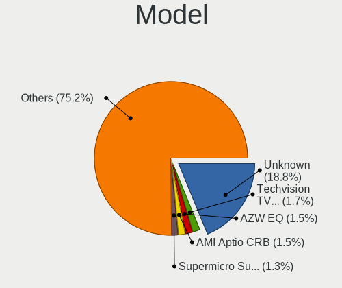
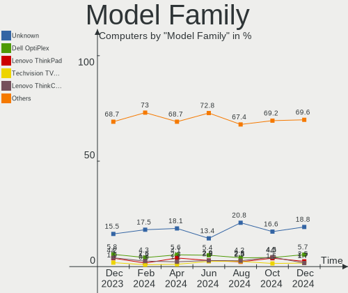
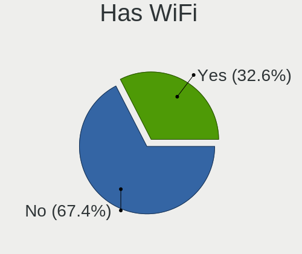
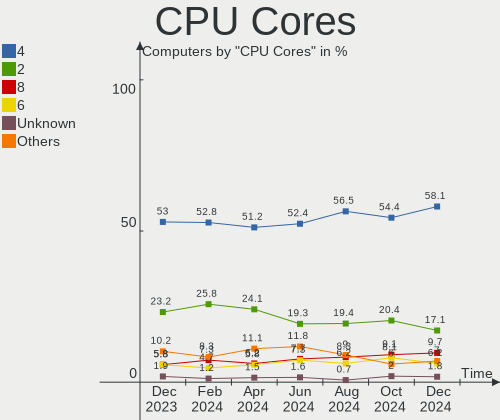
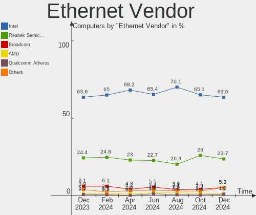

BSD - Hardware Trends
---------------------

A project to identify most popular hardware characteristics and track their change
over time based on data collected by BSD users at https://BSD-Hardware.info.

Anyone can contribute to this report by the [hw-probe](https://github.com/linuxhw/hw-probe/blob/master/INSTALL.BSD.md) tool:

    hw-probe -all -upload

This is a report for all computer types. See also reports for [desktops](/Desktop/README.md) and [notebooks](/Notebook/README.md).

OS-specific reports: [FreeBSD](/Dist/FreeBSD), [OPNsense](/Dist/OPNsense), [helloSystem](/Dist/helloSystem), [OpenBSD](/Dist/OpenBSD).

This report is for one last month. Overall report since the beginning of time: [TestDays](https://github.com/bsdhw/TestDays)

Period: Jul, 2023.

Contents
--------

* [ System ](#system)
  - [ OS                       ](#os)
  - [ OS Family                ](#os-family)
  - [ Arch                     ](#arch)
  - [ DE                       ](#de)
  - [ Display Server           ](#display-server)
  - [ Display Manager          ](#display-manager)
  - [ OS Lang                  ](#os-lang)
  - [ Boot Mode                ](#boot-mode)
  - [ Filesystem               ](#filesystem)
  - [ Part. scheme             ](#part-scheme)

* [ Board ](#board)
  - [ Vendor                   ](#vendor)
  - [ Model                    ](#model)
  - [ Model Family             ](#model-family)
  - [ MFG Year                 ](#mfg-year)
  - [ Form Factor              ](#form-factor)
  - [ Coreboot                 ](#coreboot)
  - [ RAM Size                 ](#ram-size)
  - [ RAM Used                 ](#ram-used)
  - [ Total Drives             ](#total-drives)
  - [ Has CD-ROM               ](#has-cd-rom)
  - [ Has Ethernet             ](#has-ethernet)
  - [ Has WiFi                 ](#has-wifi)
  - [ Has Bluetooth            ](#has-bluetooth)

* [ Location ](#location)
  - [ Country                  ](#country)
  - [ City                     ](#city)

* [ Drives ](#drives)
  - [ Drive Vendor             ](#drive-vendor)
  - [ Drive Model              ](#drive-model)
  - [ HDD Vendor               ](#hdd-vendor)
  - [ SSD Vendor               ](#ssd-vendor)
  - [ Drive Kind               ](#drive-kind)
  - [ Drive Connector          ](#drive-connector)
  - [ Drive Size               ](#drive-size)
  - [ Space Total              ](#space-total)
  - [ Space Used               ](#space-used)
  - [ Malfunc. Drives          ](#malfunc-drives)
  - [ Malfunc. Drive Vendor    ](#malfunc-drive-vendor)
  - [ Malfunc. HDD Vendor      ](#malfunc-hdd-vendor)
  - [ Malfunc. Drive Kind      ](#malfunc-drive-kind)
  - [ Failed Drives            ](#failed-drives)
  - [ Failed Drive Vendor      ](#failed-drive-vendor)
  - [ Drive Status             ](#drive-status)

* [ Storage controller ](#storage-controller)
  - [ Storage Vendor           ](#storage-vendor)
  - [ Storage Model            ](#storage-model)
  - [ Storage Kind             ](#storage-kind)

* [ Processor ](#processor)
  - [ CPU Vendor               ](#cpu-vendor)
  - [ CPU Model                ](#cpu-model)
  - [ CPU Model Family         ](#cpu-model-family)
  - [ CPU Cores                ](#cpu-cores)
  - [ CPU Sockets              ](#cpu-sockets)
  - [ CPU Threads              ](#cpu-threads)
  - [ CPU Microarch            ](#cpu-microarch)

* [ Graphics ](#graphics)
  - [ GPU Vendor               ](#gpu-vendor)
  - [ GPU Model                ](#gpu-model)
  - [ GPU Combo                ](#gpu-combo)
  - [ GPU Driver               ](#gpu-driver)
  - [ GPU Memory               ](#gpu-memory)

* [ Monitor ](#monitor)
  - [ Monitor Vendor           ](#monitor-vendor)
  - [ Monitor Model            ](#monitor-model)
  - [ Monitor Resolution       ](#monitor-resolution)
  - [ Monitor Diagonal         ](#monitor-diagonal)
  - [ Monitor Width            ](#monitor-width)
  - [ Aspect Ratio             ](#aspect-ratio)
  - [ Monitor Area             ](#monitor-area)
  - [ Pixel Density            ](#pixel-density)
  - [ Multiple Monitors        ](#multiple-monitors)

* [ Network ](#network)
  - [ Net Controller Vendor    ](#net-controller-vendor)
  - [ Net Controller Model     ](#net-controller-model)
  - [ Wireless Vendor          ](#wireless-vendor)
  - [ Wireless Model           ](#wireless-model)
  - [ Ethernet Vendor          ](#ethernet-vendor)
  - [ Ethernet Model           ](#ethernet-model)
  - [ Net Controller Kind      ](#net-controller-kind)
  - [ Used Controller          ](#used-controller)
  - [ NICs                     ](#nics)
  - [ IPv6                     ](#ipv6)

* [ Bluetooth ](#bluetooth)
  - [ Bluetooth Vendor         ](#bluetooth-vendor)
  - [ Bluetooth Model          ](#bluetooth-model)

* [ Sound ](#sound)
  - [ Sound Vendor             ](#sound-vendor)
  - [ Sound Model              ](#sound-model)

* [ Memory ](#memory)
  - [ Memory Vendor            ](#memory-vendor)
  - [ Memory Model             ](#memory-model)
  - [ Memory Kind              ](#memory-kind)
  - [ Memory Form Factor       ](#memory-form-factor)
  - [ Memory Size              ](#memory-size)
  - [ Memory Speed             ](#memory-speed)

* [ Printers & scanners ](#printers--scanners)
  - [ Printer Vendor           ](#printer-vendor)
  - [ Printer Model            ](#printer-model)
  - [ Scanner Vendor           ](#scanner-vendor)
  - [ Scanner Model            ](#scanner-model)

* [ Camera ](#camera)
  - [ Camera Vendor            ](#camera-vendor)
  - [ Camera Model             ](#camera-model)

* [ Security ](#security)
  - [ Fingerprint Vendor       ](#fingerprint-vendor)
  - [ Fingerprint Model        ](#fingerprint-model)
  - [ Chipcard Vendor          ](#chipcard-vendor)
  - [ Chipcard Model           ](#chipcard-model)

* [ Unsupported ](#unsupported)
  - [ Unsupported Devices      ](#unsupported-devices)
  - [ Unsupported Device Types ](#unsupported-device-types)

System
------

OS
--

Installed operating systems

| Name                 | Computers | Percent |
|----------------------|-----------|---------|
| OPNsense 23.1.11     | 275       | 60.84%  |
| FreeBSD 13.2         | 29        | 6.42%   |
| helloSystem 0.8.1    | 25        | 5.53%   |
| OPNsense 23.7        | 18        | 3.98%   |
| FreeBSD 13.2-p1      | 15        | 3.32%   |
| OpenBSD 7.3          | 11        | 2.43%   |
| helloSystem 0.8.2    | 11        | 2.43%   |
| FreeBSD 13.1-p8      | 10        | 2.21%   |
| OPNsense 23.1.9      | 6         | 1.33%   |
| OPNsense 22.7.11     | 6         | 1.33%   |
| OPNsense 23.1.7      | 4         | 0.88%   |
| OPNsense 23.1.10     | 4         | 0.88%   |
| GhostBSD 23.07.13    | 4         | 0.88%   |
| FreeBSD 14.0-CURRENT | 3         | 0.66%   |
| OPNsense 23.4.1      | 2         | 0.44%   |
| OPNsense 23.1.5      | 2         | 0.44%   |
| OPNsense 23.1        | 2         | 0.44%   |
| NetBSD 9.3           | 2         | 0.44%   |
| helloSystem 0.8.0    | 2         | 0.44%   |
| GhostBSD 23.06.22    | 2         | 0.44%   |
| FreeBSD 13.1         | 2         | 0.44%   |
| Ting 22.7            | 1         | 0.22%   |
| OPNsense 22.7.10     | 1         | 0.22%   |
| OPNsense 22.7        | 1         | 0.22%   |
| OPNsense 22.1.10     | 1         | 0.22%   |
| OpenBSD 6.9          | 1         | 0.22%   |
| NomadBSD 20221130    | 1         | 0.22%   |
| MyBee 13.2           | 1         | 0.22%   |
| GhostBSD 23.07.20    | 1         | 0.22%   |
| GhostBSD 23.07.04    | 1         | 0.22%   |
| GhostBSD 23.06.05    | 1         | 0.22%   |
| GhostBSD 23.06.01    | 1         | 0.22%   |
| FuguIta 7.3          | 1         | 0.22%   |
| FreeBSD 13.2-STABLE  | 1         | 0.22%   |
| FreeBSD 13.1-p7      | 1         | 0.22%   |
| FreeBSD 13.1-p5      | 1         | 0.22%   |
| FreeBSD 12.4         | 1         | 0.22%   |
| ClonOS 14.0-CURRENT  | 1         | 0.22%   |

OS Family
---------

OS without a version

| Name        | Computers | Percent |
|-------------|-----------|---------|
| OPNsense    | 322       | 71.24%  |
| FreeBSD     | 63        | 13.94%  |
| helloSystem | 38        | 8.41%   |
| OpenBSD     | 12        | 2.65%   |
| GhostBSD    | 10        | 2.21%   |
| NetBSD      | 2         | 0.44%   |
| Ting        | 1         | 0.22%   |
| NomadBSD    | 1         | 0.22%   |
| MyBee       | 1         | 0.22%   |
| FuguIta     | 1         | 0.22%   |
| ClonOS      | 1         | 0.22%   |

Arch
----

OS architecture (x86_64, i586, etc.)

| Name  | Computers | Percent |
|-------|-----------|---------|
| amd64 | 443       | 98.01%  |
| arm64 | 6         | 1.33%   |
| i386  | 3         | 0.66%   |

DE
--

Desktop Environment

| Name         | Computers | Percent |
|--------------|-----------|---------|
| Console      | 345       | 76.33%  |
| helloDesktop | 45        | 9.96%   |
| KDE5         | 11        | 2.43%   |
| GNOME        | 11        | 2.43%   |
| XFCE         | 10        | 2.21%   |
| MATE         | 8         | 1.77%   |
| TWM          | 6         | 1.33%   |
| LXQt         | 5         | 1.11%   |
| Openbox      | 3         | 0.66%   |
| Window Maker | 1         | 0.22%   |
| stumpwm      | 1         | 0.22%   |
| Picom        | 1         | 0.22%   |
| LXDE         | 1         | 0.22%   |
| JWM          | 1         | 0.22%   |
| i3           | 1         | 0.22%   |
| DWM          | 1         | 0.22%   |
| Budgie       | 1         | 0.22%   |

Display Server
--------------

X11 or Wayland

| Name    | Computers | Percent |
|---------|-----------|---------|
| Console | 347       | 76.77%  |
| X11     | 100       | 22.12%  |
| Wayland | 5         | 1.11%   |

Display Manager
---------------

SDDM, LightDM, etc.

| Name    | Computers | Percent |
|---------|-----------|---------|
| Console | 370       | 81.86%  |
| SLiM    | 40        | 8.85%   |
| LightDM | 20        | 4.42%   |
| SDDM    | 12        | 2.65%   |
| GDM     | 7         | 1.55%   |
| XDM     | 3         | 0.66%   |

OS Lang
-------

Language

| Lang    | Computers | Percent |
|---------|-----------|---------|
| Unknown | 336       | 74.34%  |
| C       | 56        | 12.39%  |
| en_US   | 29        | 6.42%   |
| ru_RU   | 6         | 1.33%   |
| de_DE   | 5         | 1.11%   |
| pl_PL   | 3         | 0.66%   |
| fr_FR   | 3         | 0.66%   |
| it_IT   | 2         | 0.44%   |
| fi_FI   | 2         | 0.44%   |
| zh_TW   | 1         | 0.22%   |
| zh_CN   | 1         | 0.22%   |
| pt_PT   | 1         | 0.22%   |
| pt_BR   | 1         | 0.22%   |
| nl_NL   | 1         | 0.22%   |
| ko      | 1         | 0.22%   |
| jp_JP   | 1         | 0.22%   |
| fr      | 1         | 0.22%   |
| es_MX   | 1         | 0.22%   |
| es_ES   | 1         | 0.22%   |

Boot Mode
---------

EFI or BIOS

| Mode | Computers | Percent |
|------|-----------|---------|
| EFI  | 425       | 94.03%  |
| BIOS | 27        | 5.97%   |

Filesystem
----------

Type of filesystem

| Type   | Computers | Percent |
|--------|-----------|---------|
| Zfs    | 220       | 48.67%  |
| Ufs    | 201       | 44.47%  |
| Cd9660 | 18        | 3.98%   |
| Ffs    | 13        | 2.88%   |

Part. scheme
------------

Scheme of partitioning

| Type    | Computers | Percent |
|---------|-----------|---------|
| GPT     | 435       | 96.24%  |
| MBR     | 14        | 3.1%    |
| Unknown | 3         | 0.66%   |

Board
-----

Vendor
------

Motherboard manufacturer

| Name                    | Computers | Percent |
|-------------------------|-----------|---------|
| Unknown                 | 54        | 11.95%  |
| Dell                    | 44        | 9.73%   |
| Hewlett-Packard         | 43        | 9.51%   |
| Lenovo                  | 34        | 7.52%   |
| ASUSTek Computer        | 33        | 7.3%    |
| Protectli               | 23        | 5.09%   |
| Intel                   | 21        | 4.65%   |
| Gigabyte Technology     | 21        | 4.65%   |
| ASRock                  | 17        | 3.76%   |
| Supermicro              | 13        | 2.88%   |
| Techvision              | 12        | 2.65%   |
| PC Engines              | 11        | 2.43%   |
| Fujitsu                 | 9         | 1.99%   |
| AZW                     | 9         | 1.99%   |
| Sophos                  | 7         | 1.55%   |
| MSI                     | 7         | 1.55%   |
| Deciso                  | 7         | 1.55%   |
| AMI                     | 7         | 1.55%   |
| MW                      | 5         | 1.11%   |
| ZOTAC                   | 4         | 0.88%   |
| Shuttle                 | 4         | 0.88%   |
| IceWhale Technology     | 4         | 0.88%   |
| Acer                    | 4         | 0.88%   |
| Yanling                 | 3         | 0.66%   |
| Hardkernel              | 3         | 0.66%   |
| Apple                   | 3         | 0.66%   |
| Seeed Studio            | 2         | 0.44%   |
| Samsung Electronics     | 2         | 0.44%   |
| Panasonic               | 2         | 0.44%   |
| CWWK                    | 2         | 0.44%   |
| CompuLab                | 2         | 0.44%   |
| BESSTAR Tech            | 2         | 0.44%   |
| ASRockRack              | 2         | 0.44%   |
| YANYU                   | 1         | 0.22%   |
| VSP                     | 1         | 0.22%   |
| Toshiba                 | 1         | 0.22%   |
| Tactus                  | 1         | 0.22%   |
| Sony                    | 1         | 0.22%   |
| SLIMBOOK                | 1         | 0.22%   |
| Raspberry Pi Foundation | 1         | 0.22%   |

Model
-----

Motherboard model

| Name                        | Computers | Percent |
|-----------------------------|-----------|---------|
| Unknown                     | 54        | 11.95%  |
| Techvision TVI7309X         | 12        | 2.65%   |
| Protectli FW4B              | 7         | 1.55%   |
| PC Engines APU2             | 6         | 1.33%   |
| AMI Aptio CRB               | 6         | 1.33%   |
| Supermicro Super Server     | 5         | 1.11%   |
| MW GMLK-2_5G4L              | 5         | 1.11%   |
| Gigabyte B360N WIFI         | 5         | 1.11%   |
| Fujitsu FUTRO S920          | 5         | 1.11%   |
| Protectli VP2420            | 4         | 0.88%   |
| Protectli FW6               | 4         | 0.88%   |
| PC Engines apu4             | 4         | 0.88%   |
| Dell OptiPlex 3020          | 4         | 0.88%   |
| AZW EQ                      | 4         | 0.88%   |
| Sophos XG                   | 3         | 0.66%   |
| Intel Q3XXG4-P V1.0         | 3         | 0.66%   |
| Intel CRESCENTBAY           | 3         | 0.66%   |
| HP EliteDesk 800 G3 SFF     | 3         | 0.66%   |
| Gigabyte B150N Phoenix-WIFI | 3         | 0.66%   |
| Dell OptiPlex 7060          | 3         | 0.66%   |
| Deciso Netboard A20         | 3         | 0.66%   |
| ZOTAC ZBOX-CI323NANO        | 2         | 0.44%   |
| Sophos SG                   | 2         | 0.44%   |
| Protectli VP2410            | 2         | 0.44%   |
| Protectli FW1               | 2         | 0.44%   |
| IceWhale ZimaBoard 832 ZMB  | 2         | 0.44%   |
| IceWhale ZimaBoard 432 ZMB  | 2         | 0.44%   |
| HP t620 PLUS Quad Core TC   | 2         | 0.44%   |
| HP ProLiant DL360 G7        | 2         | 0.44%   |
| HP EliteDesk 800 G1 TWR     | 2         | 0.44%   |
| HP Compaq Pro 6300 SFF      | 2         | 0.44%   |
| HP Compaq Elite 8300 SFF    | 2         | 0.44%   |
| HP Compaq 8200 Elite SFF PC | 2         | 0.44%   |
| HP 500-459                  | 2         | 0.44%   |
| Hardkernel ODROID-H3        | 2         | 0.44%   |
| Gigabyte H270N-WIFI         | 2         | 0.44%   |
| Dell PowerEdge R210 II      | 2         | 0.44%   |
| Dell OptiPlex 9020          | 2         | 0.44%   |
| Dell OptiPlex 7040          | 2         | 0.44%   |
| Dell OptiPlex 3060          | 2         | 0.44%   |

Model Family
------------

Motherboard model prefix

| Name                 | Computers | Percent |
|----------------------|-----------|---------|
| Unknown              | 54        | 11.95%  |
| Dell OptiPlex        | 25        | 5.53%   |
| Lenovo ThinkPad      | 18        | 3.98%   |
| Techvision TVI7309X  | 12        | 2.65%   |
| HP EliteDesk         | 11        | 2.43%   |
| Dell PowerEdge       | 10        | 2.21%   |
| HP Compaq            | 8         | 1.77%   |
| ASUS PRIME           | 8         | 1.77%   |
| Protectli FW4B       | 7         | 1.55%   |
| PC Engines APU2      | 6         | 1.33%   |
| Lenovo ThinkCentre   | 6         | 1.33%   |
| Fujitsu FUTRO        | 6         | 1.33%   |
| AMI Aptio            | 6         | 1.33%   |
| Supermicro Super     | 5         | 1.11%   |
| MW GMLK-2            | 5         | 1.11%   |
| Gigabyte B360N       | 5         | 1.11%   |
| Protectli VP2420     | 4         | 0.88%   |
| Protectli FW6        | 4         | 0.88%   |
| PC Engines apu4      | 4         | 0.88%   |
| IceWhale ZimaBoard   | 4         | 0.88%   |
| HP ProLiant          | 4         | 0.88%   |
| AZW EQ               | 4         | 0.88%   |
| Sophos XG            | 3         | 0.66%   |
| Lenovo IdeaPad       | 3         | 0.66%   |
| Intel Q3XXG4-P       | 3         | 0.66%   |
| Intel CRESCENTBAY    | 3         | 0.66%   |
| HP ProDesk           | 3         | 0.66%   |
| Gigabyte B150N       | 3         | 0.66%   |
| Deciso Netboard      | 3         | 0.66%   |
| ASUS ROG             | 3         | 0.66%   |
| Acer Aspire          | 3         | 0.66%   |
| ZOTAC ZBOX-CI323NANO | 2         | 0.44%   |
| Sophos SG            | 2         | 0.44%   |
| Protectli VP2410     | 2         | 0.44%   |
| Protectli FW1        | 2         | 0.44%   |
| Intel NUC5i7RYB      | 2         | 0.44%   |
| HP t620              | 2         | 0.44%   |
| HP Pavilion          | 2         | 0.44%   |
| HP EliteBook         | 2         | 0.44%   |
| HP 500-459           | 2         | 0.44%   |

MFG Year
--------

Motherboard manufacture year

| Year    | Computers | Percent |
|---------|-----------|---------|
| 2022    | 82        | 18.14%  |
| 2021    | 53        | 11.73%  |
| 2018    | 49        | 10.84%  |
| 2023    | 35        | 7.74%   |
| 2016    | 28        | 6.19%   |
| 2019    | 26        | 5.75%   |
| 2017    | 25        | 5.53%   |
| 2014    | 25        | 5.53%   |
| 2015    | 22        | 4.87%   |
| 2013    | 21        | 4.65%   |
| 2011    | 18        | 3.98%   |
| 2012    | 17        | 3.76%   |
| 2020    | 15        | 3.32%   |
| 2009    | 14        | 3.1%    |
| 2010    | 8         | 1.77%   |
| 2008    | 7         | 1.55%   |
| Unknown | 4         | 0.88%   |
| 2006    | 3         | 0.66%   |

Form Factor
-----------

Physical design of the computer

| Name           | Computers | Percent |
|----------------|-----------|---------|
| Desktop        | 308       | 68.14%  |
| Notebook       | 73        | 16.15%  |
| Mini pc        | 31        | 6.86%   |
| Server         | 28        | 6.19%   |
| Firewall       | 8         | 1.77%   |
| System on chip | 2         | 0.44%   |
| Convertible    | 2         | 0.44%   |

Coreboot
--------

Have coreboot on board

| Used | Computers | Percent |
|------|-----------|---------|
| No   | 438       | 96.9%   |
| Yes  | 14        | 3.1%    |

RAM Size
--------

Total RAM memory

| Size in GB  | Computers | Percent |
|-------------|-----------|---------|
| 8.01-16.0   | 157       | 34.73%  |
| 16.01-24.0  | 143       | 31.64%  |
| 4.01-8.0    | 75        | 16.59%  |
| 32.01-64.0  | 36        | 7.96%   |
| 64.01-256.0 | 16        | 3.54%   |
| 2.01-3.0    | 15        | 3.32%   |
| 3.01-4.0    | 4         | 0.88%   |
| 24.01-32.0  | 4         | 0.88%   |
| 0.51-1.0    | 2         | 0.44%   |

RAM Used
--------

Used RAM memory

| Used GB    | Computers | Percent |
|------------|-----------|---------|
| 0.01-0.5   | 206       | 45.58%  |
| 0.51-1.0   | 177       | 39.16%  |
| 1.01-2.0   | 46        | 10.18%  |
| 2.01-3.0   | 11        | 2.43%   |
| 4.01-8.0   | 6         | 1.33%   |
| 3.01-4.0   | 3         | 0.66%   |
| Unknown    | 2         | 0.44%   |
| 32.01-64.0 | 1         | 0.22%   |

Total Drives
------------

Number of drives on board

| Drives | Computers | Percent |
|--------|-----------|---------|
| 1      | 327       | 72.35%  |
| 2      | 56        | 12.39%  |
| 0      | 49        | 10.84%  |
| 3      | 11        | 2.43%   |
| 4      | 4         | 0.88%   |
| 30     | 1         | 0.22%   |
| 13     | 1         | 0.22%   |
| 10     | 1         | 0.22%   |
| 6      | 1         | 0.22%   |
| 5      | 1         | 0.22%   |

Has CD-ROM
----------

Has CD-ROM on board

| Presented | Computers | Percent |
|-----------|-----------|---------|
| No        | 380       | 84.07%  |
| Yes       | 72        | 15.93%  |

Has Ethernet
------------

Has Ethernet on board

| Presented | Computers | Percent |
|-----------|-----------|---------|
| Yes       | 438       | 96.9%   |
| No        | 14        | 3.1%    |

Has WiFi
--------

Has WiFi module

| Presented | Computers | Percent |
|-----------|-----------|---------|
| No        | 296       | 65.49%  |
| Yes       | 156       | 34.51%  |

Has Bluetooth
-------------

Has Bluetooth module

| Presented | Computers | Percent |
|-----------|-----------|---------|
| No        | 336       | 74.34%  |
| Yes       | 116       | 25.66%  |

Location
--------

Country
-------

Geographic location (country)

| Country      | Computers | Percent |
|--------------|-----------|---------|
| USA          | 140       | 30.97%  |
| Germany      | 60        | 13.27%  |
| Russia       | 27        | 5.97%   |
| Poland       | 19        | 4.2%    |
| Canada       | 19        | 4.2%    |
| Netherlands  | 17        | 3.76%   |
| UK           | 15        | 3.32%   |
| Australia    | 15        | 3.32%   |
| Brazil       | 11        | 2.43%   |
| Italy        | 9         | 1.99%   |
| China        | 9         | 1.99%   |
| France       | 8         | 1.77%   |
| Belgium      | 8         | 1.77%   |
| Switzerland  | 6         | 1.33%   |
| Sweden       | 6         | 1.33%   |
| India        | 6         | 1.33%   |
| Romania      | 5         | 1.11%   |
| Spain        | 4         | 0.88%   |
| Portugal     | 4         | 0.88%   |
| Japan        | 4         | 0.88%   |
| Argentina    | 4         | 0.88%   |
| South Korea  | 3         | 0.66%   |
| South Africa | 3         | 0.66%   |
| Norway       | 3         | 0.66%   |
| Mexico       | 3         | 0.66%   |
| Finland      | 3         | 0.66%   |
| Denmark      | 3         | 0.66%   |
| Austria      | 3         | 0.66%   |
| Uruguay      | 2         | 0.44%   |
| Thailand     | 2         | 0.44%   |
| Taiwan       | 2         | 0.44%   |
| Indonesia    | 2         | 0.44%   |
| Hungary      | 2         | 0.44%   |
| Hong Kong    | 2         | 0.44%   |
| Vietnam      | 1         | 0.22%   |
| Uganda       | 1         | 0.22%   |
| Turkey       | 1         | 0.22%   |
| Slovenia     | 1         | 0.22%   |
| Singapore    | 1         | 0.22%   |
| Serbia       | 1         | 0.22%   |

City
----

Geographic location (city)

| City              | Computers | Percent |
|-------------------|-----------|---------|
| St Petersburg     | 13        | 2.88%   |
| Sydney            | 7         | 1.55%   |
| Lublin            | 7         | 1.55%   |
| Melbourne         | 5         | 1.11%   |
| Seattle           | 4         | 0.88%   |
| Shenzhen          | 3         | 0.66%   |
| Oakland           | 3         | 0.66%   |
| Los Angeles       | 3         | 0.66%   |
| Longueuil         | 3         | 0.66%   |
| Gmina Świebodzin | 3         | 0.66%   |
| Dresden           | 3         | 0.66%   |
| Wroclaw           | 2         | 0.44%   |
| Winterthur        | 2         | 0.44%   |
| Wanchai           | 2         | 0.44%   |
| Vancouver         | 2         | 0.44%   |
| Tucson            | 2         | 0.44%   |
| Tokyo             | 2         | 0.44%   |
| Tampa             | 2         | 0.44%   |
| Stavropol         | 2         | 0.44%   |
| Saratov           | 2         | 0.44%   |
| Salem             | 2         | 0.44%   |
| Rome              | 2         | 0.44%   |
| Redmond           | 2         | 0.44%   |
| Reading           | 2         | 0.44%   |
| Portland          | 2         | 0.44%   |
| Pittsburgh        | 2         | 0.44%   |
| Philadelphia      | 2         | 0.44%   |
| Penza             | 2         | 0.44%   |
| New York          | 2         | 0.44%   |
| Munfordville      | 2         | 0.44%   |
| Moscow            | 2         | 0.44%   |
| Montevideo        | 2         | 0.44%   |
| Miramar           | 2         | 0.44%   |
| Milan             | 2         | 0.44%   |
| Manchester        | 2         | 0.44%   |
| Louisville        | 2         | 0.44%   |
| Lisbon            | 2         | 0.44%   |
| Jinrongjie        | 2         | 0.44%   |
| Indianapolis      | 2         | 0.44%   |
| Hamburg           | 2         | 0.44%   |

Drives
------

Drive Vendor
------------

Hard drive vendors

| Vendor              | Computers | Drives | Percent |
|---------------------|-----------|--------|---------|
| Samsung Electronics | 80        | 91     | 16.99%  |
| WDC                 | 52        | 79     | 11.04%  |
| Kingston            | 42        | 46     | 8.92%   |
| Seagate             | 33        | 49     | 7.01%   |
| Crucial             | 26        | 30     | 5.52%   |
| Transcend           | 23        | 24     | 4.88%   |
| Intel               | 22        | 25     | 4.67%   |
| Toshiba             | 13        | 15     | 2.76%   |
| SanDisk             | 12        | 12     | 2.55%   |
| China               | 11        | 11     | 2.34%   |
| SK hynix            | 10        | 10     | 2.12%   |
| Micron Technology   | 10        | 10     | 2.12%   |
| Hitachi             | 9         | 10     | 1.91%   |
| A-DATA Technology   | 9         | 10     | 1.91%   |
| SPCC                | 8         | 8      | 1.7%    |
| Protectli           | 6         | 6      | 1.27%   |
| Hoodisk             | 6         | 6      | 1.27%   |
| Fanxiang            | 6         | 6      | 1.27%   |
| Patriot             | 5         | 5      | 1.06%   |
| Innodisk            | 5         | 5      | 1.06%   |
| Hewlett-Packard     | 5         | 9      | 1.06%   |
| FORESEE             | 5         | 5      | 1.06%   |
| Apacer              | 5         | 6      | 1.06%   |
| Silicon Motion      | 4         | 4      | 0.85%   |
| Team                | 3         | 3      | 0.64%   |
| PNY                 | 3         | 3      | 0.64%   |
| OCZ                 | 3         | 3      | 0.64%   |
| HGST                | 3         | 4      | 0.64%   |
| Verbatim            | 2         | 2      | 0.42%   |
| Vaseky              | 2         | 2      | 0.42%   |
| Phison              | 2         | 2      | 0.42%   |
| NVMe                | 2         | 2      | 0.42%   |
| Netac               | 2         | 2      | 0.42%   |
| LITEON              | 2         | 3      | 0.42%   |
| KIOXIA              | 2         | 2      | 0.42%   |
| Intenso             | 2         | 2      | 0.42%   |
| Dogfish             | 2         | 2      | 0.42%   |
| Corsair             | 2         | 2      | 0.42%   |
| BIWIN               | 2         | 2      | 0.42%   |
| ZOTAC               | 1         | 1      | 0.21%   |

Drive Model
-----------

Hard drive models

| Model                                | Computers | Percent |
|--------------------------------------|-----------|---------|
| WDC WDS500G1R0A-68A4W0 500GB         | 6         | 1.18%   |
| Kingston SKC600MS256G 256GB          | 6         | 1.18%   |
| WDC WD5000LPLX-22ZNTT0 500GB         | 5         | 0.99%   |
| Transcend TS256GMTS952T2 256GB       | 5         | 0.99%   |
| Samsung SSD 870 QVO 1TB              | 5         | 0.99%   |
| Samsung SSD 850 EVO 250GB            | 5         | 0.99%   |
| Kingston SA400S37240G 240GB          | 5         | 0.99%   |
| Kingston SA400S37120G 120GB          | 5         | 0.99%   |
| Fanxiang S501 128GB                  | 5         | 0.99%   |
| Seagate ST500DM002-1BD142 496GB      | 4         | 0.79%   |
| Seagate ST1000LM024 HN-M101MBB 1TB   | 4         | 0.79%   |
| Samsung SSD 970 EVO Plus 500GB       | 4         | 0.79%   |
| Samsung SSD 870 EVO 500GB            | 4         | 0.79%   |
| Samsung SSD 850 EVO 500GB            | 4         | 0.79%   |
| Kingston SA400S37480G 480GB          | 4         | 0.79%   |
| Innodisk DEMSR- 08GB mSATA 3ME3      | 4         | 0.79%   |
| Transcend TS64GMSA230S 64GB          | 3         | 0.59%   |
| SPCC Solid State Disk 128GB          | 3         | 0.59%   |
| Samsung SSD 860 EVO 500GB            | 3         | 0.59%   |
| Samsung SSD 850 EVO 120GB            | 3         | 0.59%   |
| Samsung MZVLB256HAHQ-000L7 256GB     | 3         | 0.59%   |
| PNY CS900 120GB SSD                  | 3         | 0.59%   |
| Kingston SUV500MS120G 120GB          | 3         | 0.59%   |
| Hoodisk SSD 64GB                     | 3         | 0.59%   |
| FORESEE 128GB SSD                    | 3         | 0.59%   |
| Crucial CT500MX500SSD1 500GB         | 3         | 0.59%   |
| WDC WDS500G2B0B-00YS70 500GB         | 2         | 0.39%   |
| WDC WD80EMAZ-00WJTA0 8TB             | 2         | 0.39%   |
| WDC WD6400AAKS-00A7B0 640GB          | 2         | 0.39%   |
| WDC WD5000LPLX-00ZNTT0 500GB         | 2         | 0.39%   |
| WDC WD10JPLX-00MBPT0 1TB             | 2         | 0.39%   |
| WDC PC SN730 SDBQNTY-256G-1001 256GB | 2         | 0.39%   |
| Transcend TS64GSSD370S 64GB          | 2         | 0.39%   |
| Transcend TS32GMSA370 32GB           | 2         | 0.39%   |
| Transcend TS256GMTE710T 256GB        | 2         | 0.39%   |
| Transcend TS256GMSA230S 256GB        | 2         | 0.39%   |
| Toshiba MQ01ACF050 500GB             | 2         | 0.39%   |
| Toshiba MQ01ABD050 500GB             | 2         | 0.39%   |
| SPCC Solid State Disk 256GB          | 2         | 0.39%   |
| SK hynix SC311 SATA 128GB            | 2         | 0.39%   |

HDD Vendor
----------

Hard disk drive vendors

| Vendor              | Computers | Drives | Percent |
|---------------------|-----------|--------|---------|
| WDC                 | 33        | 52     | 34.74%  |
| Seagate             | 32        | 48     | 33.68%  |
| Toshiba             | 10        | 12     | 10.53%  |
| Hitachi             | 8         | 9      | 8.42%   |
| HGST                | 3         | 4      | 3.16%   |
| Hewlett-Packard     | 3         | 6      | 3.16%   |
| Samsung Electronics | 2         | 2      | 2.11%   |
| NVMe                | 1         | 1      | 1.05%   |
| Maxtor              | 1         | 1      | 1.05%   |
| Fujitsu             | 1         | 1      | 1.05%   |
| CLOVER              | 1         | 1      | 1.05%   |

SSD Vendor
----------

Solid state drive vendors

| Vendor              | Computers | Drives | Percent |
|---------------------|-----------|--------|---------|
| Samsung Electronics | 50        | 56     | 17.67%  |
| Kingston            | 37        | 40     | 13.07%  |
| Transcend           | 21        | 22     | 7.42%   |
| Crucial             | 20        | 22     | 7.07%   |
| WDC                 | 14        | 15     | 4.95%   |
| Intel               | 14        | 16     | 4.95%   |
| SanDisk             | 12        | 12     | 4.24%   |
| China               | 11        | 11     | 3.89%   |
| SPCC                | 7         | 7      | 2.47%   |
| A-DATA Technology   | 7         | 8      | 2.47%   |
| Protectli           | 6         | 6      | 2.12%   |
| Hoodisk             | 6         | 6      | 2.12%   |
| Micron Technology   | 5         | 5      | 1.77%   |
| Innodisk            | 5         | 5      | 1.77%   |
| FORESEE             | 5         | 5      | 1.77%   |
| SK hynix            | 4         | 4      | 1.41%   |
| Patriot             | 4         | 4      | 1.41%   |
| Apacer              | 4         | 5      | 1.41%   |
| PNY                 | 3         | 3      | 1.06%   |
| OCZ                 | 3         | 3      | 1.06%   |
| Verbatim            | 2         | 2      | 0.71%   |
| Vaseky              | 2         | 2      | 0.71%   |
| Team                | 2         | 2      | 0.71%   |
| Netac               | 2         | 2      | 0.71%   |
| LITEON              | 2         | 3      | 0.71%   |
| Intenso             | 2         | 2      | 0.71%   |
| Dogfish             | 2         | 2      | 0.71%   |
| BIWIN               | 2         | 2      | 0.71%   |
| ZOTAC               | 1         | 1      | 0.35%   |
| VICK                | 1         | 1      | 0.35%   |
| Toshiba             | 1         | 1      | 0.35%   |
| TAMMUZ              | 1         | 1      | 0.35%   |
| T-FORCE             | 1         | 1      | 0.35%   |
| SUNEAST             | 1         | 2      | 0.35%   |
| SSSTC               | 1         | 1      | 0.35%   |
| SHAREVDI            | 1         | 1      | 0.35%   |
| Seagate             | 1         | 1      | 0.35%   |
| SCY                 | 1         | 1      | 0.35%   |
| Qunion              | 1         | 1      | 0.35%   |
| NVMe                | 1         | 1      | 0.35%   |

Drive Kind
----------

HDD or SSD

| Kind | Computers | Drives | Percent |
|------|-----------|--------|---------|
| SSD  | 267       | 304    | 60.14%  |
| NVMe | 98        | 109    | 22.07%  |
| HDD  | 79        | 137    | 17.79%  |

Drive Connector
---------------

SATA, SAS, NVMe, etc.

| Type | Computers | Drives | Percent |
|------|-----------|--------|---------|
| SATA | 323       | 441    | 76.72%  |
| NVMe | 98        | 109    | 23.28%  |

Drive Size
----------

Size of hard drive

| Size in TB | Computers | Drives | Percent |
|------------|-----------|--------|---------|
| 0.01-0.5   | 282       | 324    | 80.34%  |
| 0.51-1.0   | 41        | 54     | 11.68%  |
| 1.01-2.0   | 12        | 18     | 3.42%   |
| 3.01-4.0   | 8         | 9      | 2.28%   |
| 4.01-10.0  | 4         | 21     | 1.14%   |
| 2.01-3.0   | 2         | 9      | 0.57%   |
| 10.01-20.0 | 2         | 6      | 0.57%   |

Space Total
-----------

Amount of disk space available on the file system

| Size in GB     | Computers | Percent |
|----------------|-----------|---------|
| 101-250        | 175       | 38.72%  |
| 251-500        | 93        | 20.58%  |
| 51-100         | 63        | 13.94%  |
| 501-1000       | 41        | 9.07%   |
| 1-20           | 36        | 7.96%   |
| 21-50          | 35        | 7.74%   |
| 1001-2000      | 5         | 1.11%   |
| More than 3000 | 3         | 0.66%   |
| 2001-3000      | 1         | 0.22%   |

Space Used
----------

Amount of used disk space

| Used GB        | Computers | Percent |
|----------------|-----------|---------|
| 1-20           | 405       | 89.6%   |
| 21-50          | 21        | 4.65%   |
| 101-250        | 9         | 1.99%   |
| 51-100         | 9         | 1.99%   |
| 251-500        | 6         | 1.33%   |
| More than 3000 | 1         | 0.22%   |
| 501-1000       | 1         | 0.22%   |

Malfunc. Drives
---------------

Drive models with a malfunction

| Model                                      | Computers | Drives | Percent |
|--------------------------------------------|-----------|--------|---------|
| WDC WD5000LPLX-22ZNTT0 500GB               | 2         | 2      | 3.92%   |
| Seagate ST500DM002-1BD142 496GB            | 2         | 2      | 3.92%   |
| Seagate ST1000LM024 HN-M101MBB 1TB         | 2         | 2      | 3.92%   |
| Patriot Burst Elite 120GB                  | 2         | 2      | 3.92%   |
| Intel SSDSC2BW480H6 480GB                  | 2         | 2      | 3.92%   |
| WDC WD7500BPKT-00PK4T0 752GB               | 1         | 1      | 1.96%   |
| WDC WD6400AAKS-00A7B0 640GB                | 1         | 1      | 1.96%   |
| WDC WD30EFRX-68EUZN0 3TB                   | 1         | 6      | 1.96%   |
| WDC WD2503ABYX-01WERA1 256GB               | 1         | 1      | 1.96%   |
| WDC WD20NPVX-00EA4T0 2TB                   | 1         | 2      | 1.96%   |
| WDC WD1002FAEX-00Y9A0 1TB                  | 1         | 1      | 1.96%   |
| VICK SSD 256GB                             | 1         | 1      | 1.96%   |
| Toshiba MQ01ABF050 500GB                   | 1         | 1      | 1.96%   |
| Toshiba MK1252GSX 120GB                    | 1         | 1      | 1.96%   |
| SUNEAST SE900 SSD 256GB                    | 1         | 2      | 1.96%   |
| SSSTC CVB-8D128-HP 128GB                   | 1         | 1      | 1.96%   |
| SK hynix SC215 M.2 2242 32GB               | 1         | 1      | 1.96%   |
| Seagate ST9500325ASG 500GB                 | 1         | 1      | 1.96%   |
| Seagate ST9320325AS 320GB                  | 1         | 1      | 1.96%   |
| Seagate ST9250315AS 250GB                  | 1         | 1      | 1.96%   |
| Seagate ST9120821AS 120GB                  | 1         | 1      | 1.96%   |
| Seagate ST3250312AS 250GB                  | 1         | 1      | 1.96%   |
| Seagate ST3160827AS 160GB                  | 1         | 1      | 1.96%   |
| Seagate ST2000LM015-2E8174 2TB             | 1         | 2      | 1.96%   |
| Seagate ST2000DM006-2DM164 2TB             | 1         | 1      | 1.96%   |
| Seagate ST1000DM010-2EP102 1TB             | 1         | 1      | 1.96%   |
| Seagate ST10000DM0004-2GR11L 10TB          | 1         | 4      | 1.96%   |
| SanDisk SSD P4 16GB                        | 1         | 1      | 1.96%   |
| SanDisk SD8TN8U-256G-1006 256GB            | 1         | 1      | 1.96%   |
| Samsung Electronics 470 Series SSD 64GB    | 1         | 1      | 1.96%   |
| Micron Technology M550_MTFDDAK128MAY 128GB | 1         | 1      | 1.96%   |
| Maxtor 6L080P0 82GB                        | 1         | 1      | 1.96%   |
| Kingston SUV400S37240G 240GB               | 1         | 1      | 1.96%   |
| Kingston SMS200S360G 64GB                  | 1         | 1      | 1.96%   |
| KingDian S100 32GB                         | 1         | 1      | 1.96%   |
| Intel SSDSC2BF180A4L 180GB                 | 1         | 1      | 1.96%   |
| Intel SSDPEKKW256G7 256GB                  | 1         | 1      | 1.96%   |
| Hitachi HUA722020ALA330 2TB                | 1         | 1      | 1.96%   |
| Hitachi HTS721060G9SA00 64GB               | 1         | 1      | 1.96%   |
| Hitachi HTS542512K9SA00 120GB              | 1         | 1      | 1.96%   |

Malfunc. Drive Vendor
---------------------

Vendors of faulty drives

| Vendor              | Computers | Drives | Percent |
|---------------------|-----------|--------|---------|
| Seagate             | 14        | 18     | 28%     |
| WDC                 | 7         | 14     | 14%     |
| Intel               | 4         | 4      | 8%      |
| Hitachi             | 4         | 4      | 8%      |
| Toshiba             | 2         | 2      | 4%      |
| SanDisk             | 2         | 2      | 4%      |
| Patriot             | 2         | 2      | 4%      |
| Kingston            | 2         | 2      | 4%      |
| Crucial             | 2         | 2      | 4%      |
| VICK                | 1         | 1      | 2%      |
| SUNEAST             | 1         | 2      | 2%      |
| SSSTC               | 1         | 1      | 2%      |
| SK hynix            | 1         | 1      | 2%      |
| Samsung Electronics | 1         | 1      | 2%      |
| Micron Technology   | 1         | 1      | 2%      |
| Maxtor              | 1         | 1      | 2%      |
| KingDian            | 1         | 1      | 2%      |
| HGST                | 1         | 1      | 2%      |
| Apacer              | 1         | 1      | 2%      |
| A-DATA Technology   | 1         | 1      | 2%      |

Malfunc. HDD Vendor
-------------------

Vendors of faulty HDD drives

| Vendor  | Computers | Drives | Percent |
|---------|-----------|--------|---------|
| Seagate | 14        | 18     | 48.28%  |
| WDC     | 7         | 14     | 24.14%  |
| Hitachi | 4         | 4      | 13.79%  |
| Toshiba | 2         | 2      | 6.9%    |
| Maxtor  | 1         | 1      | 3.45%   |
| HGST    | 1         | 1      | 3.45%   |

Malfunc. Drive Kind
-------------------

Kinds of faulty drives

| Kind | Computers | Drives | Percent |
|------|-----------|--------|---------|
| HDD  | 25        | 40     | 54.35%  |
| SSD  | 20        | 21     | 43.48%  |
| NVMe | 1         | 1      | 2.17%   |

Failed Drives
-------------

Failed drive models

| Model                                            | Computers | Drives | Percent |
|--------------------------------------------------|-----------|--------|---------|
| WDC WD3200L 320GB                                | 1         | 1      | 16.67%  |
| Transcend TS32GSSD370S 32GB                      | 1         | 1      | 16.67%  |
| SK hynix BC501 HFM256GDJTNG-8310A 256GB          | 1         | 1      | 16.67%  |
| Samsung Electronics SSD PM830 2.5-inch 7mm 256GB | 1         | 1      | 16.67%  |
| Samsung Electronics MZVLW256HEHP-00000 256GB     | 1         | 1      | 16.67%  |
| Crucial CT500P3SSD8 500GB                        | 1         | 1      | 16.67%  |

Failed Drive Vendor
-------------------

Failed drive vendors

| Vendor              | Computers | Drives | Percent |
|---------------------|-----------|--------|---------|
| Samsung Electronics | 2         | 2      | 33.33%  |
| WDC                 | 1         | 1      | 16.67%  |
| Transcend           | 1         | 1      | 16.67%  |
| SK hynix            | 1         | 1      | 16.67%  |
| Crucial             | 1         | 1      | 16.67%  |

Drive Status
------------

Number of failed and malfunc. drives

| Status   | Computers | Drives | Percent |
|----------|-----------|--------|---------|
| Works    | 357       | 472    | 85.41%  |
| Malfunc  | 46        | 62     | 11%     |
| Detected | 9         | 10     | 2.15%   |
| Failed   | 6         | 6      | 1.44%   |

Storage controller
------------------

Storage Vendor
--------------

Storage controller vendors

| Vendor                                  | Computers | Percent |
|-----------------------------------------|-----------|---------|
| Intel                                   | 352       | 62.3%   |
| AMD                                     | 62        | 10.97%  |
| Samsung Electronics                     | 32        | 5.66%   |
| SanDisk                                 | 17        | 3.01%   |
| Silicon Motion                          | 12        | 2.12%   |
| Broadcom / LSI                          | 10        | 1.77%   |
| Micron/Crucial Technology               | 8         | 1.42%   |
| MAXIO Technology (Hangzhou)             | 8         | 1.42%   |
| Marvell Technology Group                | 8         | 1.42%   |
| Micron Technology                       | 7         | 1.24%   |
| Kingston Technology Company             | 7         | 1.24%   |
| ASMedia Technology                      | 7         | 1.24%   |
| SK hynix                                | 6         | 1.06%   |
| Phison Electronics                      | 4         | 0.71%   |
| JMicron Technology                      | 4         | 0.71%   |
| KIOXIA                                  | 3         | 0.53%   |
| Hewlett-Packard                         | 3         | 0.53%   |
| Transcend                               | 2         | 0.35%   |
| Shenzhen Longsys Electronics            | 2         | 0.35%   |
| Nvidia                                  | 2         | 0.35%   |
| ADATA Technology                        | 2         | 0.35%   |
| Adaptec                                 | 2         | 0.35%   |
| Toshiba                                 | 1         | 0.18%   |
| Shenzhen Unionmemory Information System | 1         | 0.18%   |
| Realtek Semiconductor                   | 1         | 0.18%   |
| Dell                                    | 1         | 0.18%   |
| Chelsio Communications                  | 1         | 0.18%   |

Storage Model
-------------

Storage controller models

| Model                                                                            | Computers | Percent |
|----------------------------------------------------------------------------------|-----------|---------|
| AMD FCH SATA Controller [AHCI mode]                                              | 49        | 7.99%   |
| Intel 8 Series/C220 Series Chipset Family 6-port SATA Controller 1 [AHCI mode]   | 33        | 5.38%   |
| Intel Celeron/Pentium Silver Processor SATA Controller                           | 32        | 5.22%   |
| Intel Jasper Lake SATA AHCI Controller                                           | 22        | 3.59%   |
| Intel 6 Series/C200 Series Chipset Family 6 port Desktop SATA AHCI Controller    | 17        | 2.77%   |
| Intel Cannon Lake PCH SATA AHCI Controller                                       | 16        | 2.61%   |
| Intel Atom/Celeron/Pentium Processor x5-E8000/J3xxx/N3xxx Series SATA Controller | 16        | 2.61%   |
| Samsung NVMe SSD Controller SM981/PM981/PM983                                    | 15        | 2.45%   |
| Unknown                                                                          | 14        | 2.28%   |
| Intel Sunrise Point-LP SATA Controller [AHCI mode]                               | 13        | 2.12%   |
| Intel Q170/Q150/B150/H170/H110/Z170/CM236 Chipset SATA Controller [AHCI Mode]    | 13        | 2.12%   |
| Intel Atom Processor E3800 Series SATA AHCI Controller                           | 13        | 2.12%   |
| Silicon Motion SM2263EN/SM2263XT (DRAM-less) NVMe SSD Controllers                | 11        | 1.79%   |
| Intel SATA Controller [RAID mode]                                                | 11        | 1.79%   |
| Intel Celeron N3350/Pentium N4200/Atom E3900 Series SATA AHCI Controller         | 9         | 1.47%   |
| Intel 7 Series/C210 Series Chipset Family 6-port SATA Controller [AHCI mode]     | 9         | 1.47%   |
| Intel 200 Series PCH SATA controller [AHCI mode]                                 | 9         | 1.47%   |
| Micron/Crucial P2 [Nick P2] / P3 / P3 Plus NVMe PCIe SSD (DRAM-less)             | 8         | 1.31%   |
| MAXIO (Hangzhou) NVMe SSD Controller MAP1202                                     | 8         | 1.31%   |
| Intel Wildcat Point-LP SATA Controller [AHCI Mode]                               | 8         | 1.31%   |
| Intel Tiger Lake-LP SATA Controller                                              | 8         | 1.31%   |
| Intel Elkhart Lake SATA AHCI                                                     | 7         | 1.14%   |
| Intel 8 Series SATA Controller 1 [AHCI mode]                                     | 7         | 1.14%   |
| AMD 400 Series Chipset SATA Controller                                           | 7         | 1.14%   |
| Samsung NVMe SSD Controller SM961/PM961/SM963                                    | 6         | 0.98%   |
| Intel 7 Series Chipset Family 6-port SATA Controller [AHCI mode]                 | 6         | 0.98%   |
| Intel 500 Series Chipset Family SATA AHCI Controller                             | 6         | 0.98%   |
| Intel 5 Series/3400 Series Chipset 6 port SATA AHCI Controller                   | 6         | 0.98%   |
| Samsung NVMe SSD Controller 980                                                  | 5         | 0.82%   |
| Intel NM10/ICH7 Family SATA Controller [AHCI mode]                               | 5         | 0.82%   |
| Intel Comet Lake SATA AHCI Controller                                            | 5         | 0.82%   |
| Intel 82801IBM/IEM (ICH9M/ICH9M-E) 4 port SATA Controller [AHCI mode]            | 5         | 0.82%   |
| Intel 82801G (ICH7 Family) IDE Controller                                        | 5         | 0.82%   |
| ASMedia ASM1062 Serial ATA Controller                                            | 5         | 0.82%   |
| SK hynix Gold P31/BC711/PC711 NVMe Solid State Drive                             | 4         | 0.65%   |
| SanDisk WD Black SN750 / PC SN730 NVMe SSD                                       | 4         | 0.65%   |
| Intel NM10/ICH7 Family SATA Controller [IDE mode]                                | 4         | 0.65%   |
| Intel Atom Processor C3000 Series SATA Controller 0                              | 4         | 0.65%   |
| Intel Alder Lake-S PCH SATA Controller [AHCI Mode]                               | 4         | 0.65%   |
| Intel 6 Series/C200 Series Chipset Family 6 port Mobile SATA AHCI Controller     | 4         | 0.65%   |

Storage Kind
------------

Kind of storage controller (IDE, SATA, NVMe, SAS, ...)

| Kind | Computers | Percent |
|------|-----------|---------|
| SATA | 372       | 66.91%  |
| NVMe | 113       | 20.32%  |
| IDE  | 36        | 6.47%   |
| RAID | 29        | 5.22%   |
| SAS  | 5         | 0.9%    |
| SCSI | 1         | 0.18%   |

Processor
---------

CPU Vendor
----------

Processor vendors

| Vendor | Computers | Percent |
|--------|-----------|---------|
| Intel  | 371       | 82.08%  |
| AMD    | 75        | 16.59%  |
| ARM    | 6         | 1.33%   |

CPU Model
---------

Processor models

| Model                                       | Computers | Percent |
|---------------------------------------------|-----------|---------|
| Intel Celeron J4125 CPU @ 2.00GHz           | 25        | 5.53%   |
| Intel Celeron N5105 @ 2.00GHz               | 21        | 4.65%   |
| AMD GX-412TC SOC                            | 10        | 2.21%   |
| Intel Core i5-6500 CPU @ 3.20GHz            | 8         | 1.77%   |
| Intel Celeron CPU J3160 @ 1.60GHz           | 8         | 1.77%   |
| Intel N100                                  | 7         | 1.55%   |
| Intel Celeron J6412 @ 2.00GHz               | 6         | 1.33%   |
| Intel Celeron CPU J1900 @ 1.99GHz           | 6         | 1.33%   |
| Intel Core i5-4570 CPU @ 3.20GHz            | 5         | 1.11%   |
| Intel 11th Gen Core i7-1165G7 @ 2.80GHz     | 5         | 1.11%   |
| Intel Core i5-8500 CPU @ 3.00GHz            | 4         | 0.88%   |
| Intel Core i5-7500 CPU @ 3.40GHz            | 4         | 0.88%   |
| Intel Core i5-4590 CPU @ 3.30GHz            | 4         | 0.88%   |
| Intel Core i5-3470 CPU @ 3.20GHz            | 4         | 0.88%   |
| Intel Core i3-8300T CPU @ 3.20GHz           | 4         | 0.88%   |
| Intel Celeron CPU N3450 @ 1.10GHz           | 4         | 0.88%   |
| Intel Atom CPU C3558 @ 2.20GHz              | 4         | 0.88%   |
| Intel 11th Gen Core i5-1135G7 @ 2.40GHz     | 4         | 0.88%   |
| AMD Ryzen 5 5600G with Radeon Graphics      | 4         | 0.88%   |
| AMD EPYC 3201 8-Core Processor              | 4         | 0.88%   |
| Intel Pentium Silver N6005 @ 2.00GHz        | 3         | 0.66%   |
| Intel Core i7-3770 CPU @ 3.40GHz            | 3         | 0.66%   |
| Intel Core i5-7200U CPU @ 2.50GHz           | 3         | 0.66%   |
| Intel Core i5-3570 CPU @ 3.40GHz            | 3         | 0.66%   |
| Intel Core i3-7100U CPU @ 2.40GHz           | 3         | 0.66%   |
| Intel Core i3-6100 CPU @ 3.70GHz            | 3         | 0.66%   |
| Intel Core i3-4130 CPU @ 3.40GHz            | 3         | 0.66%   |
| Intel Core i3-10110U CPU @ 2.10GHz          | 3         | 0.66%   |
| Intel Core 2 Quad CPU Q6600 @ 2.40GHz       | 3         | 0.66%   |
| Intel Celeron N5100 @ 1.10GHz               | 3         | 0.66%   |
| Intel Celeron CPU N3150 @ 1.60GHz           | 3         | 0.66%   |
| Intel Celeron CPU J3455 @ 1.50GHz           | 3         | 0.66%   |
| ARM Cortex-A55 r2p0                         | 3         | 0.66%   |
| AMD Ryzen 3 3200G with Radeon Vega Graphics | 3         | 0.66%   |
| AMD GX-222GC SOC with Radeon R5E Graphics   | 3         | 0.66%   |
| Intel Xeon CPU E31220 @ 3.10GHz             | 2         | 0.44%   |
| Intel Pentium Dual-Core CPU E5300 @ 2.60GHz | 2         | 0.44%   |
| Intel Pentium CPU G4600T @ 3.00GHz          | 2         | 0.44%   |
| Intel N95                                   | 2         | 0.44%   |
| Intel Core i7-8550U CPU @ 1.80GHz           | 2         | 0.44%   |

CPU Model Family
----------------

Processor model prefix

| Model                   | Computers | Percent |
|-------------------------|-----------|---------|
| Intel Celeron           | 97        | 21.46%  |
| Intel Core i5           | 77        | 17.04%  |
| Intel Core i3           | 45        | 9.96%   |
| Other                   | 34        | 7.52%   |
| Intel Core i7           | 32        | 7.08%   |
| Intel Xeon              | 30        | 6.64%   |
| Intel Atom              | 18        | 3.98%   |
| AMD GX                  | 18        | 3.98%   |
| Intel Pentium           | 12        | 2.65%   |
| AMD Ryzen 7             | 12        | 2.65%   |
| AMD Ryzen 5             | 7         | 1.55%   |
| ARM Cortex              | 6         | 1.33%   |
| AMD Ryzen 3             | 6         | 1.33%   |
| AMD EPYC                | 6         | 1.33%   |
| Intel Pentium Silver    | 5         | 1.11%   |
| Intel Pentium Dual-Core | 5         | 1.11%   |
| Intel Core 2 Quad       | 5         | 1.11%   |
| AMD Ryzen 9             | 4         | 0.88%   |
| Intel Xeon Silver       | 3         | 0.66%   |
| Intel Pentium Gold      | 3         | 0.66%   |
| Intel Core 2 Duo        | 3         | 0.66%   |
| AMD Ryzen Embedded      | 3         | 0.66%   |
| AMD Ryzen 7 PRO         | 2         | 0.44%   |
| AMD Ryzen 5 PRO         | 2         | 0.44%   |
| AMD G                   | 2         | 0.44%   |
| AMD A6                  | 2         | 0.44%   |
| Intel Pentium M         | 1         | 0.22%   |
| Intel Genuine           | 1         | 0.22%   |
| Intel Core 2            | 1         | 0.22%   |
| Intel Celeron M         | 1         | 0.22%   |
| Intel Celeron Dual-Core | 1         | 0.22%   |
| AMD Ryzen 3 PRO         | 1         | 0.22%   |
| AMD FX                  | 1         | 0.22%   |
| AMD E1                  | 1         | 0.22%   |
| AMD Athlon X2           | 1         | 0.22%   |
| AMD Athlon 64           | 1         | 0.22%   |
| AMD A8                  | 1         | 0.22%   |
| AMD A4                  | 1         | 0.22%   |
| AMD A10                 | 1         | 0.22%   |

CPU Cores
---------

Number of processor cores

| Number  | Computers | Percent |
|---------|-----------|---------|
| 4       | 259       | 57.3%   |
| 2       | 105       | 23.23%  |
| 8       | 19        | 4.2%    |
| 16      | 16        | 3.54%   |
| 6       | 16        | 3.54%   |
| Unknown | 13        | 2.88%   |
| 12      | 12        | 2.65%   |
| 24      | 4         | 0.88%   |
| 1       | 4         | 0.88%   |
| 10      | 2         | 0.44%   |
| 32      | 1         | 0.22%   |
| 20      | 1         | 0.22%   |

CPU Sockets
-----------

Number of sockets

| Number  | Computers | Percent |
|---------|-----------|---------|
| 1       | 434       | 96.02%  |
| 2       | 10        | 2.21%   |
| Unknown | 8         | 1.77%   |

CPU Threads
-----------

Threads per core (Hyper-Threading)

| Number  | Computers | Percent |
|---------|-----------|---------|
| 1       | 286       | 63.27%  |
| 2       | 151       | 33.41%  |
| Unknown | 15        | 3.32%   |

CPU Microarch
-------------

Microarchitecture

| Name          | Computers | Percent |
|---------------|-----------|---------|
| Unknown       | 71        | 15.71%  |
| KabyLake      | 43        | 9.51%   |
| Haswell       | 41        | 9.07%   |
| Goldmont plus | 33        | 7.3%    |
| Silvermont    | 32        | 7.08%   |
| Skylake       | 26        | 5.75%   |
| SandyBridge   | 23        | 5.09%   |
| IvyBridge     | 23        | 5.09%   |
| Puma          | 15        | 3.32%   |
| Broadwell     | 15        | 3.32%   |
| Zen           | 13        | 2.88%   |
| Goldmont      | 13        | 2.88%   |
| TigerLake     | 12        | 2.65%   |
| Penryn        | 12        | 2.65%   |
| Westmere      | 10        | 2.21%   |
| CometLake     | 10        | 2.21%   |
| Zen+          | 9         | 1.99%   |
| Zen 3         | 9         | 1.99%   |
| Bonnell       | 8         | 1.77%   |
| Zen 2         | 6         | 1.33%   |
| Nehalem       | 4         | 0.88%   |
| Jaguar        | 4         | 0.88%   |
| Excavator     | 4         | 0.88%   |
| Core          | 4         | 0.88%   |
| Piledriver    | 3         | 0.66%   |
| Steamroller   | 2         | 0.44%   |
| P6            | 2         | 0.44%   |
| Bobcat        | 2         | 0.44%   |
| NetBurst      | 1         | 0.22%   |
| K8 Hammer     | 1         | 0.22%   |
| K10           | 1         | 0.22%   |

Graphics
--------

GPU Vendor
----------

Vendors of graphics cards

| Vendor                     | Computers | Percent |
|----------------------------|-----------|---------|
| Intel                      | 307       | 69.93%  |
| AMD                        | 65        | 14.81%  |
| Nvidia                     | 33        | 7.52%   |
| Matrox Electronics Systems | 17        | 3.87%   |
| ASPEED Technology          | 17        | 3.87%   |

GPU Model
---------

Graphics card models

| Model                                                                                    | Computers | Percent |
|------------------------------------------------------------------------------------------|-----------|---------|
| Intel GeminiLake [UHD Graphics 600]                                                      | 31        | 7.06%   |
| Intel JasperLake [UHD Graphics]                                                          | 28        | 6.38%   |
| Intel Xeon E3-1200 v3/4th Gen Core Processor Integrated Graphics Controller              | 21        | 4.78%   |
| Intel HD Graphics 530                                                                    | 17        | 3.87%   |
| Intel Atom/Celeron/Pentium Processor x5-E8000/J3xxx/N3xxx Integrated Graphics Controller | 17        | 3.87%   |
| ASPEED Technology ASPEED Graphics Family                                                 | 17        | 3.87%   |
| Intel CoffeeLake-S GT2 [UHD Graphics 630]                                                | 16        | 3.64%   |
| Intel 2nd Generation Core Processor Family Integrated Graphics Controller                | 15        | 3.42%   |
| Intel Atom Processor Z36xxx/Z37xxx Series Graphics & Display                             | 13        | 2.96%   |
| Intel Alder Lake-N [UHD Graphics]                                                        | 11        | 2.51%   |
| Intel TigerLake-LP GT2 [Iris Xe Graphics]                                                | 10        | 2.28%   |
| Intel Xeon E3-1200 v2/3rd Gen Core processor Graphics Controller                         | 8         | 1.82%   |
| Intel HD Graphics 620                                                                    | 8         | 1.82%   |
| Matrox Electronics Systems MGA G200eW WPCM450                                            | 7         | 1.59%   |
| Intel HD Graphics 630                                                                    | 7         | 1.59%   |
| Intel HD Graphics 500                                                                    | 7         | 1.59%   |
| Intel Haswell-ULT Integrated Graphics Controller                                         | 7         | 1.59%   |
| Intel Elkhart Lake [UHD Graphics Gen11 16EU]                                             | 7         | 1.59%   |
| AMD Cezanne [Radeon Vega Series / Radeon Vega Mobile Series]                             | 7         | 1.59%   |
| Intel 4th Generation Core Processor Family Integrated Graphics Controller                | 6         | 1.37%   |
| AMD Picasso/Raven 2 [Radeon Vega Series / Radeon Vega Mobile Series]                     | 6         | 1.37%   |
| Intel Mobile 4 Series Chipset Integrated Graphics Controller                             | 5         | 1.14%   |
| Intel HD Graphics 5500                                                                   | 5         | 1.14%   |
| Intel Core Processor Integrated Graphics Controller                                      | 5         | 1.14%   |
| Intel UHD Graphics 620                                                                   | 4         | 0.91%   |
| Intel Skylake GT2 [HD Graphics 520]                                                      | 4         | 0.91%   |
| Intel CometLake-S GT2 [UHD Graphics 630]                                                 | 4         | 0.91%   |
| Intel Atom Processor D4xx/D5xx/N4xx/N5xx Integrated Graphics Controller                  | 4         | 0.91%   |
| AMD Renoir                                                                               | 4         | 0.91%   |
| AMD Mullins [Radeon R4/R5 Graphics]                                                      | 4         | 0.91%   |
| Matrox Electronics Systems MGA G200e [Pilot] ServerEngines (SEP1)                        | 3         | 0.68%   |
| Matrox Electronics Systems Integrated Matrox G200eW3 Graphics Controller                 | 3         | 0.68%   |
| Intel 4 Series Chipset Integrated Graphics Controller                                    | 3         | 0.68%   |
| Intel 3rd Gen Core processor Graphics Controller                                         | 3         | 0.68%   |
| AMD Stoney [Radeon R2/R3/R4/R5 Graphics]                                                 | 3         | 0.68%   |
| AMD Lucienne                                                                             | 3         | 0.68%   |
| Nvidia GT218 [GeForce 210]                                                               | 2         | 0.46%   |
| Nvidia GK208B [GeForce GT 710]                                                           | 2         | 0.46%   |
| Matrox Electronics Systems MGA G200EH                                                    | 2         | 0.46%   |
| Intel TigerLake-H GT1 [UHD Graphics]                                                     | 2         | 0.46%   |

GPU Combo
---------

Combinations of graphics cards

| Name           | Computers | Percent |
|----------------|-----------|---------|
| 1 x Intel      | 282       | 62.39%  |
| 1 x AMD        | 60        | 13.27%  |
| Other          | 28        | 6.19%   |
| 1 x Nvidia     | 22        | 4.87%   |
| 1 x Matrox     | 17        | 3.76%   |
| 1 x ASPEED     | 17        | 3.76%   |
| 2 x Intel      | 12        | 2.65%   |
| Intel + Nvidia | 9         | 1.99%   |
| Intel + AMD    | 4         | 0.88%   |
| AMD + Nvidia   | 1         | 0.22%   |

GPU Driver
----------

Free vs proprietary

| Driver      | Computers | Percent |
|-------------|-----------|---------|
| Free        | 406       | 89.82%  |
| Unknown     | 33        | 7.3%    |
| Proprietary | 13        | 2.88%   |

GPU Memory
----------

Total video memory

| Size in GB | Computers | Percent |
|------------|-----------|---------|
| Unknown    | 418       | 92.48%  |
| 0.01-0.5   | 9         | 1.99%   |
| 1.01-2.0   | 8         | 1.77%   |
| 0.51-1.0   | 6         | 1.33%   |
| 3.01-4.0   | 5         | 1.11%   |
| 7.01-8.0   | 3         | 0.66%   |
| 8.01-16.0  | 2         | 0.44%   |
| 2.01-3.0   | 1         | 0.22%   |

Monitor
-------

Monitor Vendor
--------------

Monitor vendors

| Vendor                  | Computers | Percent |
|-------------------------|-----------|---------|
| Samsung Electronics     | 12        | 14.29%  |
| BOE                     | 10        | 11.9%   |
| Chimei Innolux          | 9         | 10.71%  |
| Iiyama                  | 8         | 9.52%   |
| AU Optronics            | 7         | 8.33%   |
| LG Display              | 5         | 5.95%   |
| Philips                 | 3         | 3.57%   |
| Lenovo                  | 3         | 3.57%   |
| Goldstar                | 3         | 3.57%   |
| Apple                   | 3         | 3.57%   |
| Sharp                   | 2         | 2.38%   |
| Hewlett-Packard         | 2         | 2.38%   |
| Dell                    | 2         | 2.38%   |
| CSO                     | 2         | 2.38%   |
| Acer                    | 2         | 2.38%   |
| ViewSonic               | 1         | 1.19%   |
| Mi                      | 1         | 1.19%   |
| KDC                     | 1         | 1.19%   |
| InfoVision              | 1         | 1.19%   |
| HKC                     | 1         | 1.19%   |
| HannStar                | 1         | 1.19%   |
| Eizo                    | 1         | 1.19%   |
| CVT                     | 1         | 1.19%   |
| Chi Mei Optoelectronics | 1         | 1.19%   |
| ASRock                  | 1         | 1.19%   |
| AOC                     | 1         | 1.19%   |

Monitor Model
-------------

Monitor models

| Model                                                                  | Computers | Percent |
|------------------------------------------------------------------------|-----------|---------|
| Iiyama PL2775HD IVM6604 1920x1080 600x340mm 27.2-inch                  | 6         | 7.06%   |
| LG Display LP156WH2-TLAA LGD0230 1366x768 340x190mm 15.3-inch          | 2         | 2.35%   |
| ViewSonic VA2418-FHD VSCD739 1920x1080 530x300mm 24.0-inch             | 1         | 1.18%   |
| Sharp LCD Monitor SHP14D1 1920x1200 340x210mm 15.7-inch                | 1         | 1.18%   |
| Sharp HDMI SHP0FD0 1360x768                                            | 1         | 1.18%   |
| Samsung Electronics SA300/SA350 SAM078D 1600x900 440x250mm 19.9-inch   | 1         | 1.18%   |
| Samsung Electronics S19B150 SAM08A2 1366x768 410x230mm 18.5-inch       | 1         | 1.18%   |
| Samsung Electronics Odyssey G50A SAM7181 2560x1440 600x340mm 27.2-inch | 1         | 1.18%   |
| Samsung Electronics LS24A40xU SAM71D1 1920x1080 530x300mm 24.0-inch    | 1         | 1.18%   |
| Samsung Electronics LCD Monitor SyncMaster 1920x1200                   | 1         | 1.18%   |
| Samsung Electronics LCD Monitor SEC4E41 1366x768 350x200mm 15.9-inch   | 1         | 1.18%   |
| Samsung Electronics LCD Monitor SEC3245 1366x768 340x190mm 15.3-inch   | 1         | 1.18%   |
| Samsung Electronics LCD Monitor SEC3050 1366x768 320x190mm 14.7-inch   | 1         | 1.18%   |
| Samsung Electronics LCD Monitor SAM0C3C 1366x768 530x300mm 24.0-inch   | 1         | 1.18%   |
| Samsung Electronics LCD Monitor B2430L 1920x1080                       | 1         | 1.18%   |
| Samsung Electronics C27JG5x SAM0FDB 2560x1440 600x340mm 27.2-inch      | 1         | 1.18%   |
| Samsung Electronics C27FG7x SAM0E42 1920x1080 600x340mm 27.2-inch      | 1         | 1.18%   |
| Philips PHL 276E8V PHLC18F 3840x2160 600x340mm 27.2-inch               | 1         | 1.18%   |
| Philips PHL 241E1 PHLC207 1920x1080 530x300mm 24.0-inch                | 1         | 1.18%   |
| Philips 271P4 PHL08C3 1920x1080 600x340mm 27.2-inch                    | 1         | 1.18%   |
| Mi 27 NFGL XMIB004 1920x1080 600x330mm 27.0-inch                       | 1         | 1.18%   |
| LG Display LCD Monitor LGD040A 1920x1080 310x170mm 13.9-inch           | 1         | 1.18%   |
| LG Display LCD Monitor LGD0384 1366x768 340x190mm 15.3-inch            | 1         | 1.18%   |
| LG Display LCD Monitor LGD0258 1600x900 350x190mm 15.7-inch            | 1         | 1.18%   |
| Lenovo LEN S22e-19 LEN61C9 1920x1080 480x270mm 21.7-inch               | 1         | 1.18%   |
| Lenovo LCD Monitor LEN40BA 1920x1080 340x190mm 15.3-inch               | 1         | 1.18%   |
| Lenovo D27-30 LEN66B8 1920x1080 600x340mm 27.2-inch                    | 1         | 1.18%   |
| KDC LCD Monitor KDC05F1 1366x768 280x170mm 12.9-inch                   | 1         | 1.18%   |
| InfoVision LCD Monitor IVO03F4 1024x600 220x130mm 10.1-inch            | 1         | 1.18%   |
| Iiyama PLE2607WS IVM5608 1920x1080 550x340mm 25.5-inch                 | 1         | 1.18%   |
| Iiyama PL2283H IVM562E 1920x1080 500x290mm 22.8-inch                   | 1         | 1.18%   |
| HKC 27E6QC HKC274F 2560x1440 600x330mm 27.0-inch                       | 1         | 1.18%   |
| Hewlett-Packard E221c HWP3092 1920x1080 500x290mm 22.8-inch            | 1         | 1.18%   |
| Hewlett-Packard 20kd HWP332F 1440x900 420x260mm 19.4-inch              | 1         | 1.18%   |
| HannStar LCD Monitor HSD03E9 1024x600 220x130mm 10.1-inch              | 1         | 1.18%   |
| Goldstar LG ULTRAWIDE GSM59F1 2560x1080 670x280mm 28.6-inch            | 1         | 1.18%   |
| Goldstar LG ULTRAGEAR GSM775B 1920x1080 700x390mm 31.5-inch            | 1         | 1.18%   |
| Goldstar 34GK950F GSM7727 3440x1440 800x330mm 34.1-inch                | 1         | 1.18%   |
| Eizo FS2331 ENC2211 1920x1080 510x290mm 23.1-inch                      | 1         | 1.18%   |
| Dell P2418HZ DELD0AF 1920x1080 530x300mm 24.0-inch                     | 1         | 1.18%   |

Monitor Resolution
------------------

Monitor screen resolution

| Resolution         | Computers | Percent |
|--------------------|-----------|---------|
| 1920x1080 (FHD)    | 41        | 49.4%   |
| 1366x768 (WXGA)    | 22        | 26.51%  |
| 2560x1440 (QHD)    | 3         | 3.61%   |
| 1920x1200 (WUXGA)  | 3         | 3.61%   |
| 3440x1440          | 2         | 2.41%   |
| 1600x900 (HD+)     | 2         | 2.41%   |
| 1024x600           | 2         | 2.41%   |
| 3840x2160 (4K)     | 1         | 1.2%    |
| 3120x2080          | 1         | 1.2%    |
| 2880x1800          | 1         | 1.2%    |
| 2560x1080          | 1         | 1.2%    |
| 1680x1050 (WSXGA+) | 1         | 1.2%    |
| 1440x900 (WXGA+)   | 1         | 1.2%    |
| 1360x768           | 1         | 1.2%    |
| 1280x800 (WXGA)    | 1         | 1.2%    |

Monitor Diagonal
----------------

Diagonal size in inches

| Inches  | Computers | Percent |
|---------|-----------|---------|
| 15      | 17        | 20.24%  |
| 27      | 14        | 16.67%  |
| 13      | 12        | 14.29%  |
| 24      | 7         | 8.33%   |
| 12      | 4         | 4.76%   |
| 11      | 4         | 4.76%   |
| Unknown | 4         | 4.76%   |
| 34      | 3         | 3.57%   |
| 22      | 3         | 3.57%   |
| 19      | 3         | 3.57%   |
| 14      | 3         | 3.57%   |
| 21      | 2         | 2.38%   |
| 17      | 2         | 2.38%   |
| 10      | 2         | 2.38%   |
| 31      | 1         | 1.19%   |
| 25      | 1         | 1.19%   |
| 23      | 1         | 1.19%   |
| 18      | 1         | 1.19%   |

Monitor Width
-------------

Physical width

| Width in mm | Computers | Percent |
|-------------|-----------|---------|
| 301-350     | 28        | 33.73%  |
| 501-600     | 22        | 26.51%  |
| 201-300     | 14        | 16.87%  |
| 401-500     | 9         | 10.84%  |
| Unknown     | 4         | 4.82%   |
| 701-800     | 3         | 3.61%   |
| 351-400     | 2         | 2.41%   |
| 601-700     | 1         | 1.2%    |

Aspect Ratio
------------

Proportional relationship between the width and the height

| Ratio   | Computers | Percent |
|---------|-----------|---------|
| 16/9    | 65        | 81.25%  |
| 16/10   | 8         | 10%     |
| 21/9    | 3         | 3.75%   |
| Unknown | 3         | 3.75%   |
| 3/2     | 1         | 1.25%   |

Monitor Area
------------

Area in inch²

| Area in inch² | Computers | Percent |
|----------------|-----------|---------|
| 91-100         | 15        | 18.07%  |
| 301-350        | 14        | 16.87%  |
| 81-90          | 12        | 14.46%  |
| 201-250        | 12        | 14.46%  |
| 51-60          | 4         | 4.82%   |
| 351-500        | 4         | 4.82%   |
| Unknown        | 4         | 4.82%   |
| 61-70          | 3         | 3.61%   |
| 151-200        | 3         | 3.61%   |
| 101-110        | 3         | 3.61%   |
| 71-80          | 2         | 2.41%   |
| 41-50          | 2         | 2.41%   |
| 121-130        | 2         | 2.41%   |
| 251-300        | 1         | 1.2%    |
| 141-150        | 1         | 1.2%    |
| 111-120        | 1         | 1.2%    |

Pixel Density
-------------

Pixels per inch

| Density       | Computers | Percent |
|---------------|-----------|---------|
| 51-100        | 29        | 34.52%  |
| 121-160       | 25        | 29.76%  |
| 101-120       | 22        | 26.19%  |
| Unknown       | 4         | 4.76%   |
| More than 240 | 2         | 2.38%   |
| 161-240       | 2         | 2.38%   |

Multiple Monitors
-----------------

Total monitors connected

| Total | Computers | Percent |
|-------|-----------|---------|
| 0     | 364       | 80.53%  |
| 1     | 81        | 17.92%  |
| 2     | 7         | 1.55%   |

Network
-------

Net Controller Vendor
---------------------

Controller vendors

| Vendor                          | Computers | Percent |
|---------------------------------|-----------|---------|
| Intel                           | 348       | 54.89%  |
| Realtek Semiconductor           | 158       | 24.92%  |
| Qualcomm Atheros                | 38        | 5.99%   |
| Broadcom                        | 30        | 4.73%   |
| AMD                             | 7         | 1.1%    |
| Mellanox Technologies           | 5         | 0.79%   |
| Marvell Technology Group        | 5         | 0.79%   |
| Ralink Technology               | 4         | 0.63%   |
| IMC Networks                    | 4         | 0.63%   |
| TP-Link                         | 3         | 0.47%   |
| Solarflare Communications       | 3         | 0.47%   |
| MediaTek                        | 2         | 0.32%   |
| Google                          | 2         | 0.32%   |
| Aquantia                        | 2         | 0.32%   |
| American Megatrends             | 2         | 0.32%   |
| ZTE WCDMA Technologies MSM      | 1         | 0.16%   |
| Xiaomi                          | 1         | 0.16%   |
| U-Blox                          | 1         | 0.16%   |
| Sierra Wireless                 | 1         | 0.16%   |
| Seeed Technology                | 1         | 0.16%   |
| Samsung Electronics             | 1         | 0.16%   |
| Ralink                          | 1         | 0.16%   |
| Qualcomm Technologies           | 1         | 0.16%   |
| Qualcomm Atheros Communications | 1         | 0.16%   |
| Qualcomm                        | 1         | 0.16%   |
| QLogic                          | 1         | 0.16%   |
| OnePlus Technology (Shenzhen)   | 1         | 0.16%   |
| Nvidia                          | 1         | 0.16%   |
| Motorola PCS                    | 1         | 0.16%   |
| JMicron Technology              | 1         | 0.16%   |
| Hewlett-Packard                 | 1         | 0.16%   |
| Emulex                          | 1         | 0.16%   |
| D-Link System                   | 1         | 0.16%   |
| Chelsio Communications          | 1         | 0.16%   |
| ASUSTek Computer                | 1         | 0.16%   |
| 3Com                            | 1         | 0.16%   |

Net Controller Model
--------------------

Controller models

| Model                                                                         | Computers | Percent |
|-------------------------------------------------------------------------------|-----------|---------|
| Realtek RTL8111/8168/8411 PCI Express Gigabit Ethernet Controller             | 120       | 14.94%  |
| Intel I211 Gigabit Network Connection                                         | 54        | 6.72%   |
| Intel Ethernet Controller I225-V                                              | 45        | 5.6%    |
| Intel I210 Gigabit Network Connection                                         | 33        | 4.11%   |
| Intel Ethernet Controller I226-V                                              | 32        | 3.99%   |
| Intel 82579LM Gigabit Network Connection (Lewisville)                         | 23        | 2.86%   |
| Intel I350 Gigabit Network Connection                                         | 22        | 2.74%   |
| Realtek RTL8125 2.5GbE Controller                                             | 19        | 2.37%   |
| Intel 82576 Gigabit Network Connection                                        | 12        | 1.49%   |
| Intel Wi-Fi 6 AX200                                                           | 11        | 1.37%   |
| Intel 82574L Gigabit Network Connection                                       | 11        | 1.37%   |
| Realtek RTL810xE PCI Express Fast Ethernet controller                         | 10        | 1.25%   |
| Intel Ethernet Connection I217-LM                                             | 10        | 1.25%   |
| Intel 82599ES 10-Gigabit SFI/SFP+ Network Connection                          | 10        | 1.25%   |
| Intel Wireless 8265 / 8275                                                    | 9         | 1.12%   |
| Intel 82580 Gigabit Network Connection                                        | 9         | 1.12%   |
| Intel Ethernet Controller X550                                                | 8         | 1%      |
| Intel Ethernet Connection (2) I219-V                                          | 8         | 1%      |
| Intel 82583V Gigabit Network Connection                                       | 8         | 1%      |
| Realtek RTL8821CE 802.11ac PCIe Wireless Network Adapter                      | 7         | 0.87%   |
| Qualcomm Atheros AR9285 Wireless Network Adapter (PCI-Express)                | 7         | 0.87%   |
| Intel Wireless 7265                                                           | 7         | 0.87%   |
| Intel Ethernet Connection (2) I219-LM                                         | 7         | 0.87%   |
| Intel Cannon Lake PCH CNVi WiFi                                               | 7         | 0.87%   |
| Intel 82571EB/82571GB Gigabit Ethernet Controller (Copper)                    | 7         | 0.87%   |
| Broadcom NetXtreme II BCM5709 Gigabit Ethernet                                | 7         | 0.87%   |
| Broadcom NetXtreme BCM5719 Gigabit Ethernet PCIe                              | 7         | 0.87%   |
| AMD Family 17h Processor 10 Gb Ethernet Controller Port 0                     | 7         | 0.87%   |
| Intel Wireless 8260                                                           | 6         | 0.75%   |
| Intel Ethernet Connection (7) I219-V                                          | 6         | 0.75%   |
| Intel Ethernet Connection (7) I219-LM                                         | 6         | 0.75%   |
| Intel 82571EB/82571GB Gigabit Ethernet Controller D0/D1 (copper applications) | 6         | 0.75%   |
| Qualcomm Atheros AR9485 Wireless Network Adapter                              | 5         | 0.62%   |
| Intel Wireless 7260                                                           | 5         | 0.62%   |
| Intel Ethernet Controller X710 for 10GbE SFP+                                 | 5         | 0.62%   |
| Intel CNVi: Wi-Fi                                                             | 5         | 0.62%   |
| Intel 82575EB Gigabit Network Connection                                      | 5         | 0.62%   |
| Broadcom NetXtreme BCM5720 Gigabit Ethernet PCIe                              | 5         | 0.62%   |
| Qualcomm Atheros QCA9377 802.11ac Wireless Network Adapter                    | 4         | 0.5%    |
| Qualcomm Atheros QCA6174 802.11ac Wireless Network Adapter                    | 4         | 0.5%    |

Wireless Vendor
---------------

Wireless vendors

| Vendor                          | Computers | Percent |
|---------------------------------|-----------|---------|
| Intel                           | 94        | 58.02%  |
| Qualcomm Atheros                | 29        | 17.9%   |
| Realtek Semiconductor           | 18        | 11.11%  |
| Broadcom                        | 5         | 3.09%   |
| Ralink Technology               | 4         | 2.47%   |
| IMC Networks                    | 4         | 2.47%   |
| TP-Link                         | 2         | 1.23%   |
| MediaTek                        | 2         | 1.23%   |
| Ralink                          | 1         | 0.62%   |
| Qualcomm Technologies           | 1         | 0.62%   |
| Qualcomm Atheros Communications | 1         | 0.62%   |
| ASUSTek Computer                | 1         | 0.62%   |

Wireless Model
--------------

Wireless models

| Model                                                                   | Computers | Percent |
|-------------------------------------------------------------------------|-----------|---------|
| Intel Wi-Fi 6 AX200                                                     | 11        | 6.79%   |
| Intel Wireless 8265 / 8275                                              | 9         | 5.56%   |
| Realtek RTL8821CE 802.11ac PCIe Wireless Network Adapter                | 7         | 4.32%   |
| Qualcomm Atheros AR9285 Wireless Network Adapter (PCI-Express)          | 7         | 4.32%   |
| Intel Wireless 7265                                                     | 7         | 4.32%   |
| Intel Cannon Lake PCH CNVi WiFi                                         | 7         | 4.32%   |
| Intel Wireless 8260                                                     | 6         | 3.7%    |
| Qualcomm Atheros AR9485 Wireless Network Adapter                        | 5         | 3.09%   |
| Intel Wireless 7260                                                     | 5         | 3.09%   |
| Intel CNVi: Wi-Fi                                                       | 5         | 3.09%   |
| Qualcomm Atheros QCA9377 802.11ac Wireless Network Adapter              | 4         | 2.47%   |
| Qualcomm Atheros QCA6174 802.11ac Wireless Network Adapter              | 4         | 2.47%   |
| Intel Wi-Fi 6 AX201 160MHz                                              | 4         | 2.47%   |
| Intel Wi-Fi 6 AX201                                                     | 4         | 2.47%   |
| Intel Centrino Advanced-N 6205 [Taylor Peak]                            | 4         | 2.47%   |
| IMC Networks 802.11 n/g/b Wireless LAN USB Mini-Card                    | 4         | 2.47%   |
| Realtek RTL8188EE Wireless Network Adapter                              | 3         | 1.85%   |
| Qualcomm Atheros AR9287 Wireless Network Adapter (PCI-Express)          | 3         | 1.85%   |
| Intel Wireless-AC 9260                                                  | 3         | 1.85%   |
| Intel Tiger Lake PCH CNVi WiFi                                          | 3         | 1.85%   |
| Intel Gemini Lake PCH CNVi WiFi                                         | 3         | 1.85%   |
| TP-Link TL-WN722N v2/v3 [Realtek RTL8188EUS]                            | 2         | 1.23%   |
| Qualcomm Atheros QCA9565 / AR9565 Wireless Network Adapter              | 2         | 1.23%   |
| Qualcomm Atheros AR242x / AR542x Wireless Network Adapter (PCI-Express) | 2         | 1.23%   |
| Intel Wireless 3165                                                     | 2         | 1.23%   |
| Intel Wireless 3160                                                     | 2         | 1.23%   |
| Intel WiFi Link 5100                                                    | 2         | 1.23%   |
| Intel Comet Lake PCH CNVi WiFi                                          | 2         | 1.23%   |
| Intel Centrino Ultimate-N 6300                                          | 2         | 1.23%   |
| Intel Centrino Advanced-N 6200                                          | 2         | 1.23%   |
| Broadcom BCM4331 802.11a/b/g/n                                          | 2         | 1.23%   |
| Realtek RTL8852BE PCIe 802.11ax Wireless Network Controller             | 1         | 0.62%   |
| Realtek RTL8852AE 802.11ax PCIe Wireless Network Adapter                | 1         | 0.62%   |
| Realtek RTL8822CE 802.11ac PCIe Wireless Network Adapter                | 1         | 0.62%   |
| Realtek RTL8812AU 802.11a/b/g/n/ac 2T2R DB WLAN Adapter                 | 1         | 0.62%   |
| Realtek RTL8723BE PCIe Wireless Network Adapter                         | 1         | 0.62%   |
| Realtek RTL8192CE PCIe Wireless Network Adapter                         | 1         | 0.62%   |
| Realtek RTL8188EUS 802.11n Wireless Network Adapter                     | 1         | 0.62%   |
| Realtek RTL8188CE 802.11b/g/n WiFi Adapter                              | 1         | 0.62%   |
| Ralink RT5572 Wireless Adapter                                          | 1         | 0.62%   |

Ethernet Vendor
---------------

Ethernet vendors

| Vendor                        | Computers | Percent |
|-------------------------------|-----------|---------|
| Intel                         | 312       | 58.76%  |
| Realtek Semiconductor         | 148       | 27.87%  |
| Broadcom                      | 29        | 5.46%   |
| Qualcomm Atheros              | 12        | 2.26%   |
| AMD                           | 7         | 1.32%   |
| Solarflare Communications     | 3         | 0.56%   |
| Marvell Technology Group      | 3         | 0.56%   |
| American Megatrends           | 2         | 0.38%   |
| Xiaomi                        | 1         | 0.19%   |
| TP-Link                       | 1         | 0.19%   |
| Samsung Electronics           | 1         | 0.19%   |
| Qualcomm                      | 1         | 0.19%   |
| QLogic                        | 1         | 0.19%   |
| OnePlus Technology (Shenzhen) | 1         | 0.19%   |
| Nvidia                        | 1         | 0.19%   |
| Motorola PCS                  | 1         | 0.19%   |
| JMicron Technology            | 1         | 0.19%   |
| Google                        | 1         | 0.19%   |
| Emulex                        | 1         | 0.19%   |
| D-Link System                 | 1         | 0.19%   |
| Chelsio Communications        | 1         | 0.19%   |
| Aquantia                      | 1         | 0.19%   |
| 3Com                          | 1         | 0.19%   |

Ethernet Model
--------------

Ethernet models

| Model                                                                         | Computers | Percent |
|-------------------------------------------------------------------------------|-----------|---------|
| Realtek RTL8111/8168/8411 PCI Express Gigabit Ethernet Controller             | 120       | 19.26%  |
| Intel I211 Gigabit Network Connection                                         | 54        | 8.67%   |
| Intel Ethernet Controller I225-V                                              | 45        | 7.22%   |
| Intel I210 Gigabit Network Connection                                         | 33        | 5.3%    |
| Intel Ethernet Controller I226-V                                              | 32        | 5.14%   |
| Intel 82579LM Gigabit Network Connection (Lewisville)                         | 23        | 3.69%   |
| Intel I350 Gigabit Network Connection                                         | 22        | 3.53%   |
| Realtek RTL8125 2.5GbE Controller                                             | 17        | 2.73%   |
| Intel 82576 Gigabit Network Connection                                        | 12        | 1.93%   |
| Intel 82574L Gigabit Network Connection                                       | 11        | 1.77%   |
| Realtek RTL810xE PCI Express Fast Ethernet controller                         | 10        | 1.61%   |
| Intel Ethernet Connection I217-LM                                             | 10        | 1.61%   |
| Intel 82599ES 10-Gigabit SFI/SFP+ Network Connection                          | 10        | 1.61%   |
| Intel 82580 Gigabit Network Connection                                        | 9         | 1.44%   |
| Intel Ethernet Controller X550                                                | 8         | 1.28%   |
| Intel Ethernet Connection (2) I219-V                                          | 8         | 1.28%   |
| Intel 82583V Gigabit Network Connection                                       | 8         | 1.28%   |
| Intel Ethernet Connection (2) I219-LM                                         | 7         | 1.12%   |
| Intel 82571EB/82571GB Gigabit Ethernet Controller (Copper)                    | 7         | 1.12%   |
| Broadcom NetXtreme II BCM5709 Gigabit Ethernet                                | 7         | 1.12%   |
| Broadcom NetXtreme BCM5719 Gigabit Ethernet PCIe                              | 7         | 1.12%   |
| AMD Family 17h Processor 10 Gb Ethernet Controller Port 0                     | 7         | 1.12%   |
| Intel Ethernet Connection (7) I219-V                                          | 6         | 0.96%   |
| Intel Ethernet Connection (7) I219-LM                                         | 6         | 0.96%   |
| Intel 82571EB/82571GB Gigabit Ethernet Controller D0/D1 (copper applications) | 6         | 0.96%   |
| Intel Ethernet Controller X710 for 10GbE SFP+                                 | 5         | 0.8%    |
| Intel 82575EB Gigabit Network Connection                                      | 5         | 0.8%    |
| Broadcom NetXtreme BCM5720 Gigabit Ethernet PCIe                              | 5         | 0.8%    |
| Intel I210 Gigabit Fiber Network Connection                                   | 4         | 0.64%   |
| Intel Ethernet Connection X553 1GbE                                           | 4         | 0.64%   |
| Broadcom NetXtreme II BCM5716 Gigabit Ethernet                                | 4         | 0.64%   |
| Qualcomm Atheros AR8152 v2.0 Fast Ethernet                                    | 3         | 0.48%   |
| Qualcomm Atheros AR8151 v2.0 Gigabit Ethernet                                 | 3         | 0.48%   |
| Intel Ethernet Connection I217-V                                              | 3         | 0.48%   |
| Intel Ethernet Connection (5) I219-LM                                         | 3         | 0.48%   |
| Intel Ethernet Connection (4) I219-LM                                         | 3         | 0.48%   |
| Intel Ethernet Connection (14) I219-V                                         | 3         | 0.48%   |
| Solarflare SFC9020 10G Ethernet Controller                                    | 2         | 0.32%   |
| Realtek RTL8169 PCI Gigabit Ethernet Controller                               | 2         | 0.32%   |
| Realtek Killer E3000 2.5GbE Controller                                        | 2         | 0.32%   |

Net Controller Kind
-------------------

Ethernet, WiFi or modem

| Kind     | Computers | Percent |
|----------|-----------|---------|
| Ethernet | 438       | 71.57%  |
| WiFi     | 156       | 25.49%  |
| Unknown  | 13        | 2.12%   |
| Modem    | 5         | 0.82%   |

Used Controller
---------------

Currently used network controller

| Kind     | Computers | Percent |
|----------|-----------|---------|
| Ethernet | 402       | 93.27%  |
| WiFi     | 29        | 6.73%   |

NICs
----

Total network controllers on board

| Total | Computers | Percent |
|-------|-----------|---------|
| 2     | 125       | 27.65%  |
| 4     | 83        | 18.36%  |
| 3     | 75        | 16.59%  |
| 6     | 49        | 10.84%  |
| 1     | 47        | 10.4%   |
| 5     | 42        | 9.29%   |
| 7     | 10        | 2.21%   |
| 8     | 8         | 1.77%   |
| 10    | 4         | 0.88%   |
| 0     | 4         | 0.88%   |
| 9     | 3         | 0.66%   |
| 12    | 1         | 0.22%   |
| 11    | 1         | 0.22%   |

IPv6
----

IPv6 vs IPv4

| Used | Computers | Percent |
|------|-----------|---------|
| No   | 368       | 81.42%  |
| Yes  | 84        | 18.58%  |

Bluetooth
---------

Bluetooth Vendor
----------------

Controller vendors

| Vendor                          | Computers | Percent |
|---------------------------------|-----------|---------|
| Intel                           | 79        | 68.1%   |
| Realtek Semiconductor           | 8         | 6.9%    |
| IMC Networks                    | 5         | 4.31%   |
| Qualcomm Atheros Communications | 4         | 3.45%   |
| Lite-On Technology              | 4         | 3.45%   |
| Broadcom                        | 4         | 3.45%   |
| Cambridge Silicon Radio         | 3         | 2.59%   |
| Apple                           | 3         | 2.59%   |
| Foxconn / Hon Hai               | 2         | 1.72%   |
| ASUSTek Computer                | 2         | 1.72%   |
| Dell                            | 1         | 0.86%   |
| Alps Electric                   | 1         | 0.86%   |

Bluetooth Model
---------------

Controller models

| Model                                                | Computers | Percent |
|------------------------------------------------------|-----------|---------|
| Intel Bluetooth wireless interface                   | 32        | 27.59%  |
| Intel AX201 Bluetooth                                | 15        | 12.93%  |
| Intel Bluetooth 9460/9560 Jefferson Peak (JfP)       | 14        | 12.07%  |
| Intel AX200 Bluetooth                                | 11        | 9.48%   |
| Realtek Bluetooth Adapter                            | 5         | 4.31%   |
| Intel Wireless-AC 9260 Bluetooth Adapter             | 3         | 2.59%   |
| IMC Networks Realtek Bluetooth Adapter               | 3         | 2.59%   |
| Cambridge Silicon Radio Bluetooth Dongle (HCI mode)  | 3         | 2.59%   |
| Realtek  Bluetooth 4.2 Adapter                       | 2         | 1.72%   |
| Qualcomm Atheros AR3012 Bluetooth 4.0                | 2         | 1.72%   |
| Intel Wireless-AC 3168 Bluetooth                     | 2         | 1.72%   |
| IMC Networks Qualcomm Atheros Bluetooth 4.1          | 2         | 1.72%   |
| Broadcom BCM2045B (BDC-2.1)                          | 2         | 1.72%   |
| Realtek Bluetooth 4.0 Adapter                        | 1         | 0.86%   |
| Qualcomm Atheros QCA61x4 Bluetooth 4.0               | 1         | 0.86%   |
| Qualcomm Atheros AR3011 Bluetooth                    | 1         | 0.86%   |
| Lite-On Qualcomm Atheros QCA9377 Bluetooth           | 1         | 0.86%   |
| Lite-On Qualcomm Atheros Bluetooth 4.0 + HS          | 1         | 0.86%   |
| Lite-On Bluetooth USB Module                         | 1         | 0.86%   |
| Lite-On Atheros AR3012 Bluetooth                     | 1         | 0.86%   |
| Intel Centrino Bluetooth Wireless Transceiver        | 1         | 0.86%   |
| Intel AX210 Bluetooth                                | 1         | 0.86%   |
| Foxconn / Hon Hai Qualcomm WCN685x Bluetooth Adapter | 1         | 0.86%   |
| Foxconn / Hon Hai MediaTek Bluetooth Adapter         | 1         | 0.86%   |
| Dell Wireless 355C Bluetooth 2.0 + EDR module        | 1         | 0.86%   |
| Broadcom BCM43142 Bluetooth 4.0                      | 1         | 0.86%   |
| Broadcom BCM20702A0 Bluetooth 4.0                    | 1         | 0.86%   |
| ASUS Qualcomm Bluetooth 4.1                          | 1         | 0.86%   |
| ASUS BT-270 Bluetooth Adapter                        | 1         | 0.86%   |
| Apple Built-in Bluetooth 2.0+EDR HCI                 | 1         | 0.86%   |
| Apple Broadcom Built-in Bluetooth                    | 1         | 0.86%   |
| Apple Bluetooth Host Controller                      | 1         | 0.86%   |
| Alps Electric BCM2046 Bluetooth Device               | 1         | 0.86%   |

Sound
-----

Sound Vendor
------------

Sound card vendors

| Vendor                                       | Computers | Percent |
|----------------------------------------------|-----------|---------|
| Intel                                        | 297       | 73.51%  |
| AMD                                          | 72        | 17.82%  |
| Nvidia                                       | 22        | 5.45%   |
| Zoran Co. Personal Media Division (Nogatech) | 3         | 0.74%   |
| KTMicro                                      | 2         | 0.5%    |
| Samsung Electronics                          | 1         | 0.25%   |
| Samson Technologies                          | 1         | 0.25%   |
| Plantronics                                  | 1         | 0.25%   |
| Harman                                       | 1         | 0.25%   |
| Generalplus Technology                       | 1         | 0.25%   |
| ESS Technology                               | 1         | 0.25%   |
| Corsair                                      | 1         | 0.25%   |
| C-Media Electronics                          | 1         | 0.25%   |

Sound Model
-----------

Sound card models

| Model                                                                                             | Computers | Percent |
|---------------------------------------------------------------------------------------------------|-----------|---------|
| Intel Celeron/Pentium Silver Processor High Definition Audio                                      | 30        | 6.26%   |
| Intel Jasper Lake HD Audio                                                                        | 27        | 5.64%   |
| AMD Family 17h/19h HD Audio Controller                                                            | 27        | 5.64%   |
| Intel 8 Series/C220 Series Chipset High Definition Audio Controller                               | 25        | 5.22%   |
| Intel Xeon E3-1200 v3/4th Gen Core Processor HD Audio Controller                                  | 24        | 5.01%   |
| Intel 6 Series/C200 Series Chipset Family High Definition Audio Controller                        | 19        | 3.97%   |
| Intel 7 Series/C216 Chipset Family High Definition Audio Controller                               | 16        | 3.34%   |
| Intel Cannon Lake PCH cAVS                                                                        | 15        | 3.13%   |
| Intel Atom/Celeron/Pentium Processor x5-E8000/J3xxx/N3xxx Series High Definition Audio Controller | 15        | 3.13%   |
| AMD Renoir Radeon High Definition Audio Controller                                                | 15        | 3.13%   |
| Intel Sunrise Point-LP HD Audio                                                                   | 13        | 2.71%   |
| Intel 100 Series/C230 Series Chipset Family HD Audio Controller                                   | 12        | 2.51%   |
| Intel Tiger Lake-LP Smart Sound Technology Audio Controller                                       | 11        | 2.3%    |
| Intel Atom Processor Z36xxx/Z37xxx Series High Definition Audio Controller                        | 10        | 2.09%   |
| Intel 200 Series PCH HD Audio                                                                     | 10        | 2.09%   |
| AMD Kabini HDMI/DP Audio                                                                          | 10        | 2.09%   |
| Intel Alder Lake-N HD Graphics SGPC                                                               | 9         | 1.88%   |
| AMD FCH Azalia Controller                                                                         | 9         | 1.88%   |
| AMD Family 17h (Models 00h-0fh) HD Audio Controller                                               | 9         | 1.88%   |
| Intel Wildcat Point-LP High Definition Audio Controller                                           | 8         | 1.67%   |
| AMD Raven/Raven2/Fenghuang HDMI/DP Audio Controller                                               | 8         | 1.67%   |
| Intel Elkhart Lake High Density Audio bus interface                                               | 7         | 1.46%   |
| Intel Celeron N3350/Pentium N4200/Atom E3900 Series Audio Cluster                                 | 7         | 1.46%   |
| Intel Broadwell-U Audio Controller                                                                | 7         | 1.46%   |
| Intel 8 Series HD Audio Controller                                                                | 7         | 1.46%   |
| Intel Haswell-ULT HD Audio Controller                                                             | 6         | 1.25%   |
| Intel 82801I (ICH9 Family) HD Audio Controller                                                    | 6         | 1.25%   |
| Intel 5 Series/3400 Series Chipset High Definition Audio                                          | 6         | 1.25%   |
| Intel NM10/ICH7 Family High Definition Audio Controller                                           | 5         | 1.04%   |
| Nvidia GK208 HDMI/DP Audio Controller                                                             | 4         | 0.84%   |
| Intel Smart Sound Technology (SST) Audio Controller                                               | 4         | 0.84%   |
| Intel Comet Lake PCH-LP cAVS                                                                      | 4         | 0.84%   |
| Intel Alder Lake-S HD Audio Controller                                                            | 4         | 0.84%   |
| Intel 82801JI (ICH10 Family) HD Audio Controller                                                  | 4         | 0.84%   |
| AMD Family 15h (Models 60h-6fh) Audio Controller                                                  | 4         | 0.84%   |
| Zoran Co. Personal Media Division (Nogatech) USB Audio and HID                                    | 3         | 0.63%   |
| Nvidia High Definition Audio Controller                                                           | 3         | 0.63%   |
| Intel Tiger Lake-H HD Audio Controller                                                            | 3         | 0.63%   |
| Intel Alder Lake PCH-P High Definition Audio Controller                                           | 3         | 0.63%   |
| Intel 82801H (ICH8 Family) HD Audio Controller                                                    | 3         | 0.63%   |

Memory
------

Memory Vendor
-------------

Memory module vendors

| Vendor                       | Computers | Percent |
|------------------------------|-----------|---------|
| Samsung Electronics          | 95        | 19.75%  |
| Crucial                      | 59        | 12.27%  |
| Kingston                     | 53        | 11.02%  |
| SK hynix                     | 51        | 10.6%   |
| Micron Technology            | 43        | 8.94%   |
| Unknown                      | 40        | 8.32%   |
| G.Skill                      | 21        | 4.37%   |
| Unknown                      | 21        | 4.37%   |
| Corsair                      | 12        | 2.49%   |
| Transcend                    | 10        | 2.08%   |
| Unknown (ABCD)               | 9         | 1.87%   |
| A-DATA Technology            | 8         | 1.66%   |
| Team                         | 7         | 1.46%   |
| Patriot                      | 5         | 1.04%   |
| Wodposit                     | 3         | 0.62%   |
| Ramaxel Technology           | 3         | 0.62%   |
| Patriot Memory (PDP Systems) | 3         | 0.62%   |
| Kimtigo                      | 3         | 0.62%   |
| Elpida                       | 3         | 0.62%   |
| Unknown (AB)                 | 2         | 0.42%   |
| Timetec                      | 2         | 0.42%   |
| Smart                        | 2         | 0.42%   |
| Nanya Technology             | 2         | 0.42%   |
| Hewlett-Packard              | 2         | 0.42%   |
| GOODRAM                      | 2         | 0.42%   |
| CSX                          | 2         | 0.42%   |
| ATP                          | 2         | 0.42%   |
| AMD                          | 2         | 0.42%   |
| Wintec Industries            | 1         | 0.21%   |
| Vasekey                      | 1         | 0.21%   |
| Silicon Power                | 1         | 0.21%   |
| Shenzhen Longsys             | 1         | 0.21%   |
| SHARETRONIC                  | 1         | 0.21%   |
| Magnum Tech                  | 1         | 0.21%   |
| Lenovo                       | 1         | 0.21%   |
| Kingmax                      | 1         | 0.21%   |
| HPE                          | 1         | 0.21%   |
| High Bridge                  | 1         | 0.21%   |
| Goldkey                      | 1         | 0.21%   |
| GeIL                         | 1         | 0.21%   |

Memory Model
------------

Memory module models

| Model                                                          | Computers | Percent |
|----------------------------------------------------------------|-----------|---------|
| Unknown                                                        | 21        | 4.09%   |
| Unknown RAM Module 4GB SODIMM DDR3 1333MT/s                    | 9         | 1.75%   |
| Unknown (ABCD) RAM 123456789012345678 2GB DIMM LPDDR4 2400MT/s | 9         | 1.75%   |
| Samsung RAM M378B5173DB0-CK0 4GB DIMM DDR3 1600MT/s            | 5         | 0.97%   |
| Transcend RAM TS1GLH64V6BL 8GB SODIMM DDR4 2667MT/s            | 4         | 0.78%   |
| SK hynix RAM HMA81GS6AFR8N-UH 8GB SODIMM DDR4 2400MT/s         | 4         | 0.78%   |
| Samsung RAM M471B5173QH0-YK0 4GB SODIMM DDR3 1600MT/s          | 4         | 0.78%   |
| Samsung RAM M471B5173EB0-YK0 4GB SODIMM DDR3 1600MT/s          | 4         | 0.78%   |
| Kingston RAM KHX2400C15/8G 8GB DIMM DDR4 2400MT/s              | 4         | 0.78%   |
| Wodposit RAM WPBH26D408SWA-8G 8GB SODIMM DDR4 2400MT/s         | 3         | 0.58%   |
| Unknown RAM Module 2GB DIMM DDR2 800MT/s                       | 3         | 0.58%   |
| Transcend RAM TS1GLH64V6B3 8GB SODIMM DDR4 1333MT/s            | 3         | 0.58%   |
| SK hynix RAM HMT41GU6BFR8A-PB 8GB DIMM DDR3 1600MT/s           | 3         | 0.58%   |
| Samsung RAM M471B5273DH0-CK0 4GB SODIMM DDR3 1600MT/s          | 3         | 0.58%   |
| Samsung RAM M471A2K43DB1-CWE 16GB SODIMM DDR4 3200MT/s         | 3         | 0.58%   |
| Samsung RAM M471A1K43CB1-CRC 8GB SODIMM DDR4 2667MT/s          | 3         | 0.58%   |
| Samsung RAM M378B5173QH0-CK0 4GB DIMM DDR3 1600MT/s            | 3         | 0.58%   |
| Samsung RAM M378B1G73EB0-YK0 8GB DIMM DDR3 1600MT/s            | 3         | 0.58%   |
| Samsung RAM M378A5244CB0-CRC 4GB DIMM DDR4 2666MT/s            | 3         | 0.58%   |
| Micron RAM 8JTF51264AZ-1G6E1 4GB DIMM DDR3 1600MT/s            | 3         | 0.58%   |
| Crucial RAM CT8G4SFS824A.M8FR 8GB SODIMM DDR4 2400MT/s         | 3         | 0.58%   |
| Crucial RAM CT8G48C40S5.M4A1 8GB SODIMM DDR5 4800MT/s          | 3         | 0.58%   |
| Crucial RAM CT102464BF160B.M16 8GB SODIMM DDR3 1600MT/s        | 3         | 0.58%   |
| Unknown RAM Module 8GB DIMM DDR3 1333MT/s                      | 2         | 0.39%   |
| Unknown RAM Module 4GB DIMM DDR3 1600MT/s                      | 2         | 0.39%   |
| Unknown RAM Module 4GB DIMM DDR3 1333MT/s                      | 2         | 0.39%   |
| Unknown (AB) RAM Module 2GB DIMM LPDDR4 1600MT/s               | 2         | 0.39%   |
| SK hynix RAM Module 4GB DIMM DDR3 1333MT/s                     | 2         | 0.39%   |
| SK hynix RAM HMT451U6AFR8C-PB 4GB DIMM DDR3 1600MT/s           | 2         | 0.39%   |
| SK hynix RAM HMT41GS6AFR8A-PB 8GB DIMM DDR3 1600MT/s           | 2         | 0.39%   |
| SK hynix RAM HMA451S6AFR8N-TF 4GB SODIMM DDR4 2133MT/s         | 2         | 0.39%   |
| Samsung RAM Module 2GB Row Of Chips LPDDR5 6400MT/s            | 2         | 0.39%   |
| Samsung RAM Module 2GB DIMM DDR3 1333MT/s                      | 2         | 0.39%   |
| Samsung RAM M471B5173DB0-YK0 4GB SODIMM DDR3 1600MT/s          | 2         | 0.39%   |
| Samsung RAM M471B1G73QH0-YK0 8GB SODIMM DDR3 1867MT/s          | 2         | 0.39%   |
| Samsung RAM M471B1G73DB0-YK0 8GB DIMM DDR3 1600MT/s            | 2         | 0.39%   |
| Samsung RAM M471A5244CB0-CWE 4GB SODIMM DDR4 3200MT/s          | 2         | 0.39%   |
| Samsung RAM M471A5143EB0-CPB 4GB SODIMM DDR4 2133MT/s          | 2         | 0.39%   |
| Samsung RAM M471A2K43EB1-CWE 16GB SODIMM DDR4 3200MT/s         | 2         | 0.39%   |
| Samsung RAM M471A2K43CB1-CTD 16GB SODIMM DDR4 2667MT/s         | 2         | 0.39%   |

Memory Kind
-----------

Memory module kinds

| Kind    | Computers | Percent |
|---------|-----------|---------|
| DDR4    | 207       | 47.48%  |
| DDR3    | 172       | 39.45%  |
| LPDDR4  | 12        | 2.75%   |
| DDR2    | 12        | 2.75%   |
| DDR5    | 10        | 2.29%   |
| Unknown | 8         | 1.83%   |
| SDRAM   | 7         | 1.61%   |
| LPDDR5  | 3         | 0.69%   |
| DDR     | 3         | 0.69%   |
| LPDDR3  | 1         | 0.23%   |
| DRAM    | 1         | 0.23%   |

Memory Form Factor
------------------

Physical design of the memory module

| Name         | Computers | Percent |
|--------------|-----------|---------|
| DIMM         | 211       | 48.51%  |
| SODIMM       | 210       | 48.28%  |
| Row Of Chips | 11        | 2.53%   |
| Unknown      | 2         | 0.46%   |
| Chip         | 1         | 0.23%   |

Memory Size
-----------

Memory module size

| Size  | Computers | Percent |
|-------|-----------|---------|
| 8192  | 189       | 40.65%  |
| 4096  | 124       | 26.67%  |
| 16384 | 76        | 16.34%  |
| 2048  | 49        | 10.54%  |
| 32768 | 16        | 3.44%   |
| 1024  | 10        | 2.15%   |
| 3072  | 1         | 0.22%   |

Memory Speed
------------

Memory module speed

| Speed   | Computers | Percent |
|---------|-----------|---------|
| 1600    | 122       | 26.46%  |
| 3200    | 66        | 14.32%  |
| 2400    | 60        | 13.02%  |
| 2667    | 51        | 11.06%  |
| 1333    | 41        | 8.89%   |
| 2133    | 36        | 7.81%   |
| 800     | 10        | 2.17%   |
| 4800    | 9         | 1.95%   |
| 2666    | 8         | 1.74%   |
| 1067    | 8         | 1.74%   |
| 667     | 8         | 1.74%   |
| 1867    | 6         | 1.3%    |
| Unknown | 6         | 1.3%    |
| 1066    | 4         | 0.87%   |
| 400     | 4         | 0.87%   |
| 6400    | 3         | 0.65%   |
| 4267    | 3         | 0.65%   |
| 3600    | 3         | 0.65%   |
| 3000    | 3         | 0.65%   |
| 1866    | 3         | 0.65%   |
| 1334    | 2         | 0.43%   |
| 5600    | 1         | 0.22%   |
| 2933    | 1         | 0.22%   |
| 2048    | 1         | 0.22%   |
| 1200    | 1         | 0.22%   |
| 1033    | 1         | 0.22%   |

Printers & scanners
-------------------

Printer Vendor
--------------

Printer device vendors

Zero info for selected period =(

Printer Model
-------------

Printer device models

Zero info for selected period =(

Scanner Vendor
--------------

Scanner device vendors

Zero info for selected period =(

Scanner Model
-------------

Scanner device models

Zero info for selected period =(

Camera
------

Camera Vendor
-------------

Camera device vendors

| Vendor                                 | Computers | Percent |
|----------------------------------------|-----------|---------|
| Chicony Electronics                    | 18        | 33.33%  |
| IMC Networks                           | 7         | 12.96%  |
| Bison Electronics                      | 6         | 11.11%  |
| Realtek Semiconductor                  | 4         | 7.41%   |
| Lite-On Technology                     | 3         | 5.56%   |
| Syntek                                 | 2         | 3.7%    |
| Silicon Motion                         | 2         | 3.7%    |
| Trust                                  | 1         | 1.85%   |
| Suyin                                  | 1         | 1.85%   |
| SunplusIT                              | 1         | 1.85%   |
| Sunplus Innovation Technology          | 1         | 1.85%   |
| Qtech                                  | 1         | 1.85%   |
| Luxvisions Innotech Limited            | 1         | 1.85%   |
| Lenovo                                 | 1         | 1.85%   |
| Jiangxi Shinetech Optical              | 1         | 1.85%   |
| Genesys Logic                          | 1         | 1.85%   |
| Cheng Uei Precision Industry (Foxlink) | 1         | 1.85%   |
| Apple                                  | 1         | 1.85%   |
| Alcor Micro                            | 1         | 1.85%   |

Camera Model
------------

Camera device models

| Model                                                   | Computers | Percent |
|---------------------------------------------------------|-----------|---------|
| Chicony Integrated Camera                               | 5         | 9.26%   |
| Lite-On Integrated Camera                               | 2         | 3.7%    |
| IMC Networks Integrated Camera                          | 2         | 3.7%    |
| Chicony Lenovo Integrated Camera (0.3MP)                | 2         | 3.7%    |
| Chicony Integrated Camera (1280x720@30)                 | 2         | 3.7%    |
| Trust Trust QHD Webcam                                  | 1         | 1.85%   |
| Syntek Integrated Camera                                | 1         | 1.85%   |
| Syntek EasyCamera                                       | 1         | 1.85%   |
| Suyin Acer/HP Integrated Webcam [CN0314]                | 1         | 1.85%   |
| SunplusIT USB camera                                    | 1         | 1.85%   |
| Sunplus Integrated_Webcam_HD                            | 1         | 1.85%   |
| Silicon Motion WebCam SCB-1100N                         | 1         | 1.85%   |
| Silicon Motion Realtek USB 2.0 PC Camera                | 1         | 1.85%   |
| Realtek USB 2.0 Webcam                                  | 1         | 1.85%   |
| Realtek USB 2.0 PC Camera                               | 1         | 1.85%   |
| Realtek PC Camera                                       | 1         | 1.85%   |
| Realtek HD WebCam                                       | 1         | 1.85%   |
| Qtech USB Camera                                        | 1         | 1.85%   |
| Luxvisions Innotech Limited Integrated Camera           | 1         | 1.85%   |
| Lite-On Realtek DMFT RGB                                | 1         | 1.85%   |
| Lenovo Integrated Webcam [R5U877]                       | 1         | 1.85%   |
| Jiangxi Shinetech Optical Realtek PC Camera             | 1         | 1.85%   |
| IMC Networks UVC VGA Webcam                             | 1         | 1.85%   |
| IMC Networks USB2.0 VGA UVC WebCam                      | 1         | 1.85%   |
| IMC Networks USB 2.0 UVC VGA WebCam                     | 1         | 1.85%   |
| IMC Networks SunplusIT Integrated Camera                | 1         | 1.85%   |
| IMC Networks ov9734_azurewave_camera                    | 1         | 1.85%   |
| Genesys Logic ASUS USB 2.0 UVC 1.3M WebCam              | 1         | 1.85%   |
| Chicony USB2.0 VGA UVC WebCam                           | 1         | 1.85%   |
| Chicony USB 2.0 Camera                                  | 1         | 1.85%   |
| Chicony ThinkPad T490 Webcam                            | 1         | 1.85%   |
| Chicony Integrated IR Camera                            | 1         | 1.85%   |
| Chicony Integrated HP HD Webcam                         | 1         | 1.85%   |
| Chicony Integrated Camera [ThinkPad]                    | 1         | 1.85%   |
| Chicony HP TrueVision HD Camera                         | 1         | 1.85%   |
| Chicony HD camera                                       | 1         | 1.85%   |
| Chicony 2.0M UVC Webcam / CNF7129                       | 1         | 1.85%   |
| Cheng Uei Precision Industry (Foxlink) Realtek DMFT RGB | 1         | 1.85%   |
| Bison USB HD Webcam                                     | 1         | 1.85%   |
| Bison ThinkPad Integrated Camera                        | 1         | 1.85%   |

Security
--------

Fingerprint Vendor
------------------

Fingerprint sensor vendors

| Vendor                     | Computers | Percent |
|----------------------------|-----------|---------|
| Validity Sensors           | 3         | 21.43%  |
| Shenzhen Goodix Technology | 3         | 21.43%  |
| Upek                       | 2         | 14.29%  |
| Synaptics                  | 2         | 14.29%  |
| STMicroelectronics         | 1         | 7.14%   |
| Fingerprint Cards          | 1         | 7.14%   |
| Broadcom                   | 1         | 7.14%   |
| AuthenTec                  | 1         | 7.14%   |

Fingerprint Model
-----------------

Fingerprint sensor models

| Model                                                                        | Computers | Percent |
|------------------------------------------------------------------------------|-----------|---------|
| Validity Sensors Synaptics WBDI                                              | 2         | 14.29%  |
| Upek Biometric Touchchip/Touchstrip Fingerprint Sensor                       | 2         | 14.29%  |
| Synaptics Prometheus MIS Touch Fingerprint Reader                            | 2         | 14.29%  |
| Shenzhen Goodix  Fingerprint Device                                          | 2         | 14.29%  |
| Validity Sensors VFS 5011 fingerprint sensor                                 | 1         | 7.14%   |
| STMicroelectronics Fingerprint Reader                                        | 1         | 7.14%   |
| Shenzhen Goodix Fingerprint Reader                                           | 1         | 7.14%   |
| Fingerprint Cards FPC Fingerprint Reader                                     | 1         | 7.14%   |
| Broadcom BCM5880 Secure Applications Processor with fingerprint swipe sensor | 1         | 7.14%   |
| AuthenTec AES2810                                                            | 1         | 7.14%   |

Chipcard Vendor
---------------

Chipcard module vendors

Zero info for selected period =(

Chipcard Model
--------------

Chipcard module models

Zero info for selected period =(

Unsupported
-----------

Unsupported Devices
-------------------

Total unsupported devices on board

| Total | Computers | Percent |
|-------|-----------|---------|
| 1     | 204       | 45.13%  |
| 0     | 133       | 29.42%  |
| 2     | 76        | 16.81%  |
| 3     | 27        | 5.97%   |
| 4     | 10        | 2.21%   |
| 5     | 2         | 0.44%   |

Unsupported Device Types
------------------------

Types of unsupported devices

| Type                     | Computers | Percent |
|--------------------------|-----------|---------|
| Communication controller | 284       | 66.05%  |
| Bluetooth                | 60        | 13.95%  |
| Net/wireless             | 28        | 6.51%   |
| Fingerprint reader       | 12        | 2.79%   |
| Network                  | 9         | 2.09%   |
| Firewire controller      | 9         | 2.09%   |
| Card reader              | 9         | 2.09%   |
| Sound                    | 6         | 1.4%    |
| Net/ethernet             | 5         | 1.16%   |
| Graphics card            | 4         | 0.93%   |
| Storage/raid             | 1         | 0.23%   |
| Storage/ata              | 1         | 0.23%   |
| Storage                  | 1         | 0.23%   |
| Modem                    | 1         | 0.23%   |

