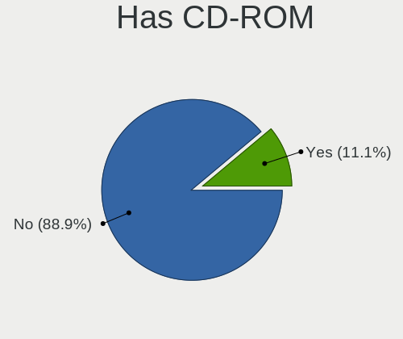
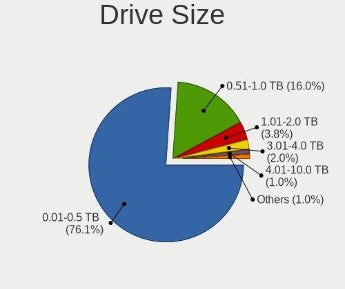
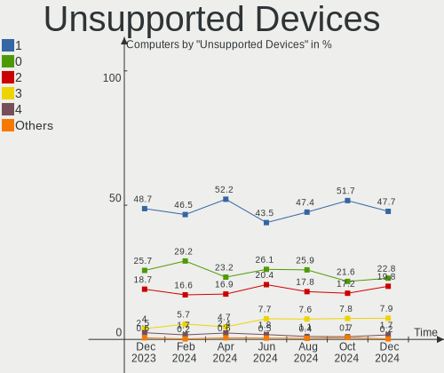

BSD - Hardware Trends
---------------------

A project to identify most popular hardware characteristics and track their change
over time based on data collected by BSD users at https://BSD-Hardware.info.

Anyone can contribute to this report by the [hw-probe](https://github.com/linuxhw/hw-probe/blob/master/INSTALL.BSD.md) tool:

    hw-probe -all -upload

This is a report for all computer types. See also reports for [desktops](/Desktop/README.md) and [notebooks](/Notebook/README.md).

OS-specific reports: [FreeBSD](/Dist/FreeBSD), [OPNsense](/Dist/OPNsense), [helloSystem](/Dist/helloSystem), [OpenBSD](/Dist/OpenBSD).

This report is for one last month. Overall report since the beginning of time: [TestDays](https://github.com/bsdhw/TestDays)

Period: Dec, 2024.

Contents
--------

* [ System ](#system)
  - [ OS                       ](#os)
  - [ OS Family                ](#os-family)
  - [ Arch                     ](#arch)
  - [ DE                       ](#de)
  - [ Display Server           ](#display-server)
  - [ Display Manager          ](#display-manager)
  - [ OS Lang                  ](#os-lang)
  - [ Boot Mode                ](#boot-mode)
  - [ Filesystem               ](#filesystem)
  - [ Part. scheme             ](#part-scheme)

* [ Board ](#board)
  - [ Vendor                   ](#vendor)
  - [ Model                    ](#model)
  - [ Model Family             ](#model-family)
  - [ MFG Year                 ](#mfg-year)
  - [ Form Factor              ](#form-factor)
  - [ Coreboot                 ](#coreboot)
  - [ RAM Size                 ](#ram-size)
  - [ RAM Used                 ](#ram-used)
  - [ Total Drives             ](#total-drives)
  - [ Has CD-ROM               ](#has-cd-rom)
  - [ Has Ethernet             ](#has-ethernet)
  - [ Has WiFi                 ](#has-wifi)
  - [ Has Bluetooth            ](#has-bluetooth)

* [ Location ](#location)
  - [ Country                  ](#country)
  - [ City                     ](#city)

* [ Drives ](#drives)
  - [ Drive Vendor             ](#drive-vendor)
  - [ Drive Model              ](#drive-model)
  - [ HDD Vendor               ](#hdd-vendor)
  - [ SSD Vendor               ](#ssd-vendor)
  - [ Drive Kind               ](#drive-kind)
  - [ Drive Connector          ](#drive-connector)
  - [ Drive Size               ](#drive-size)
  - [ Space Total              ](#space-total)
  - [ Space Used               ](#space-used)
  - [ Malfunc. Drives          ](#malfunc-drives)
  - [ Malfunc. Drive Vendor    ](#malfunc-drive-vendor)
  - [ Malfunc. HDD Vendor      ](#malfunc-hdd-vendor)
  - [ Malfunc. Drive Kind      ](#malfunc-drive-kind)
  - [ Failed Drives            ](#failed-drives)
  - [ Failed Drive Vendor      ](#failed-drive-vendor)
  - [ Drive Status             ](#drive-status)

* [ Storage controller ](#storage-controller)
  - [ Storage Vendor           ](#storage-vendor)
  - [ Storage Model            ](#storage-model)
  - [ Storage Kind             ](#storage-kind)

* [ Processor ](#processor)
  - [ CPU Vendor               ](#cpu-vendor)
  - [ CPU Model                ](#cpu-model)
  - [ CPU Model Family         ](#cpu-model-family)
  - [ CPU Cores                ](#cpu-cores)
  - [ CPU Sockets              ](#cpu-sockets)
  - [ CPU Threads              ](#cpu-threads)
  - [ CPU Microarch            ](#cpu-microarch)

* [ Graphics ](#graphics)
  - [ GPU Vendor               ](#gpu-vendor)
  - [ GPU Model                ](#gpu-model)
  - [ GPU Combo                ](#gpu-combo)
  - [ GPU Driver               ](#gpu-driver)
  - [ GPU Memory               ](#gpu-memory)

* [ Monitor ](#monitor)
  - [ Monitor Vendor           ](#monitor-vendor)
  - [ Monitor Model            ](#monitor-model)
  - [ Monitor Resolution       ](#monitor-resolution)
  - [ Monitor Diagonal         ](#monitor-diagonal)
  - [ Monitor Width            ](#monitor-width)
  - [ Aspect Ratio             ](#aspect-ratio)
  - [ Monitor Area             ](#monitor-area)
  - [ Pixel Density            ](#pixel-density)
  - [ Multiple Monitors        ](#multiple-monitors)

* [ Network ](#network)
  - [ Net Controller Vendor    ](#net-controller-vendor)
  - [ Net Controller Model     ](#net-controller-model)
  - [ Wireless Vendor          ](#wireless-vendor)
  - [ Wireless Model           ](#wireless-model)
  - [ Ethernet Vendor          ](#ethernet-vendor)
  - [ Ethernet Model           ](#ethernet-model)
  - [ Net Controller Kind      ](#net-controller-kind)
  - [ Used Controller          ](#used-controller)
  - [ NICs                     ](#nics)
  - [ IPv6                     ](#ipv6)

* [ Bluetooth ](#bluetooth)
  - [ Bluetooth Vendor         ](#bluetooth-vendor)
  - [ Bluetooth Model          ](#bluetooth-model)

* [ Sound ](#sound)
  - [ Sound Vendor             ](#sound-vendor)
  - [ Sound Model              ](#sound-model)

* [ Memory ](#memory)
  - [ Memory Vendor            ](#memory-vendor)
  - [ Memory Model             ](#memory-model)
  - [ Memory Kind              ](#memory-kind)
  - [ Memory Form Factor       ](#memory-form-factor)
  - [ Memory Size              ](#memory-size)
  - [ Memory Speed             ](#memory-speed)

* [ Printers & scanners ](#printers--scanners)
  - [ Printer Vendor           ](#printer-vendor)
  - [ Printer Model            ](#printer-model)
  - [ Scanner Vendor           ](#scanner-vendor)
  - [ Scanner Model            ](#scanner-model)

* [ Camera ](#camera)
  - [ Camera Vendor            ](#camera-vendor)
  - [ Camera Model             ](#camera-model)

* [ Security ](#security)
  - [ Fingerprint Vendor       ](#fingerprint-vendor)
  - [ Fingerprint Model        ](#fingerprint-model)
  - [ Chipcard Vendor          ](#chipcard-vendor)
  - [ Chipcard Model           ](#chipcard-model)

* [ Unsupported ](#unsupported)
  - [ Unsupported Devices      ](#unsupported-devices)
  - [ Unsupported Device Types ](#unsupported-device-types)

System
------

OS
--

Installed operating systems

| Name                         | Computers | Percent |
|------------------------------|-----------|---------|
| OPNsense 24.7.11             | 194       | 32.55%  |
| OPNsense 24.7.10             | 179       | 30.03%  |
| FreeBSD 14.2                 | 45        | 7.55%   |
| OPNsense 24.7.9              | 40        | 6.71%   |
| FreeBSD 14.1-p6              | 18        | 3.02%   |
| OpenBSD 7.6                  | 14        | 2.35%   |
| helloSystem 0.8.1            | 11        | 1.85%   |
| OPNsense 25.1                | 10        | 1.68%   |
| helloSystem 0.9.0            | 10        | 1.68%   |
| OPNsense 24.7.8              | 9         | 1.51%   |
| GhostBSD 24.10.1             | 8         | 1.34%   |
| OPNsense 24.10.1             | 6         | 1.01%   |
| OPNsense 24.1.10             | 6         | 1.01%   |
| FreeBSD 14.1                 | 6         | 1.01%   |
| OPNsense 23.7.12             | 5         | 0.84%   |
| FreeBSD 15.0-CURRENT         | 4         | 0.67%   |
| FreeBSD 14.1-STABLE          | 4         | 0.67%   |
| OPNsense 24.7                | 3         | 0.5%    |
| TrueNAS 13.1-p9              | 2         | 0.34%   |
| OPNsense 24.7.7              | 2         | 0.34%   |
| OpenBSD 7.5                  | 2         | 0.34%   |
| MyBee 14.1-p6                | 2         | 0.34%   |
| FreeBSD 14.2-STABLE          | 2         | 0.34%   |
| FreeBSD 14.1-p5              | 2         | 0.34%   |
| ClonOS 24.12                 | 2         | 0.34%   |
| pfSense 2.7.2                | 1         | 0.17%   |
| OPNsense 24.7.4              | 1         | 0.17%   |
| OPNsense 24.7.3              | 1         | 0.17%   |
| OPNsense 24.4                | 1         | 0.17%   |
| OPNsense 24.1.9              | 1         | 0.17%   |
| NomadBSD 20240711            | 1         | 0.17%   |
| NetBSD 10.1                  | 1         | 0.17%   |
| MidnightBSD 3.2.1            | 1         | 0.17%   |
| HardenedBSD 14.2-STABLE-HBSD | 1         | 0.17%   |
| FreeBSD 14.1-p3              | 1         | 0.17%   |

OS Family
---------

OS without a version

| Name        | Computers | Percent |
|-------------|-----------|---------|
| OPNsense    | 458       | 76.85%  |
| FreeBSD     | 82        | 13.76%  |
| helloSystem | 21        | 3.52%   |
| OpenBSD     | 16        | 2.68%   |
| GhostBSD    | 8         | 1.34%   |
| TrueNAS     | 2         | 0.34%   |
| MyBee       | 2         | 0.34%   |
| ClonOS      | 2         | 0.34%   |
| pfSense     | 1         | 0.17%   |
| NomadBSD    | 1         | 0.17%   |
| NetBSD      | 1         | 0.17%   |
| MidnightBSD | 1         | 0.17%   |
| HardenedBSD | 1         | 0.17%   |

Arch
----

OS architecture (x86_64, i586, etc.)

| Name  | Computers | Percent |
|-------|-----------|---------|
| amd64 | 589       | 98.83%  |
| i386  | 6         | 1.01%   |
| arm64 | 1         | 0.17%   |

DE
--

Desktop Environment

| Name         | Computers | Percent |
|--------------|-----------|---------|
| Console      | 494       | 82.89%  |
| helloDesktop | 35        | 5.87%   |
| MATE         | 14        | 2.35%   |
| KDE5         | 13        | 2.18%   |
| XFCE         | 11        | 1.85%   |
| GNOME        | 10        | 1.68%   |
| TWM          | 5         | 0.84%   |
| KDE6         | 2         | 0.34%   |
| KDE          | 2         | 0.34%   |
| i3           | 2         | 0.34%   |
| Fluxbox      | 2         | 0.34%   |
| openbox      | 1         | 0.17%   |
| LXQt         | 1         | 0.17%   |
| LXDE         | 1         | 0.17%   |
| iwm          | 1         | 0.17%   |
| fvwm         | 1         | 0.17%   |
| EXWM         | 1         | 0.17%   |

Display Server
--------------

X11 or Wayland

| Name    | Computers | Percent |
|---------|-----------|---------|
| Console | 498       | 83.56%  |
| X11     | 92        | 15.44%  |
| Wayland | 6         | 1.01%   |

Display Manager
---------------

SDDM, LightDM, etc.

| Name    | Computers | Percent |
|---------|-----------|---------|
| Console | 522       | 87.58%  |
| SLiM    | 25        | 4.19%   |
| SDDM    | 23        | 3.86%   |
| LightDM | 16        | 2.68%   |
| GDM     | 5         | 0.84%   |
| Ly      | 3         | 0.5%    |
| XDM     | 2         | 0.34%   |

OS Lang
-------

Language

| Lang         | Computers | Percent |
|--------------|-----------|---------|
| Unknown      | 477       | 80.03%  |
| C            | 68        | 11.41%  |
| en_US        | 28        | 4.7%    |
| fr_FR        | 6         | 1.01%   |
| ru_RU        | 5         | 0.84%   |
| de_DE        | 3         | 0.5%    |
| zh_CN        | 2         | 0.34%   |
| es_ES        | 2         | 0.34%   |
| LANG="en_US" | 1         | 0.17%   |
| es_PY        | 1         | 0.17%   |
| es_AR        | 1         | 0.17%   |
| en_CA        | 1         | 0.17%   |
| de_CH        | 1         | 0.17%   |

Boot Mode
---------

EFI or BIOS

| Mode | Computers | Percent |
|------|-----------|---------|
| EFI  | 556       | 93.29%  |
| BIOS | 40        | 6.71%   |

Filesystem
----------

Type of filesystem

| Type   | Computers | Percent |
|--------|-----------|---------|
| Zfs    | 388       | 65.1%   |
| Ufs    | 180       | 30.2%   |
| Ffs    | 16        | 2.68%   |
| Cd9660 | 12        | 2.01%   |

Part. scheme
------------

Scheme of partitioning

| Type    | Computers | Percent |
|---------|-----------|---------|
| GPT     | 577       | 96.81%  |
| MBR     | 11        | 1.85%   |
| Unknown | 6         | 1.01%   |
| BSD     | 2         | 0.34%   |

Board
-----

Vendor
------

Motherboard manufacturer

| Name                                 | Computers | Percent |
|--------------------------------------|-----------|---------|
| Unknown                              | 112       | 18.79%  |
| Dell                                 | 68        | 11.41%  |
| ASUSTek Computer                     | 39        | 6.54%   |
| Lenovo                               | 38        | 6.38%   |
| Hewlett-Packard                      | 33        | 5.54%   |
| Protectli                            | 29        | 4.87%   |
| Intel                                | 29        | 4.87%   |
| Supermicro                           | 24        | 4.03%   |
| Gigabyte Technology                  | 18        | 3.02%   |
| MSI                                  | 15        | 2.52%   |
| ASRock                               | 15        | 2.52%   |
| Sophos                               | 14        | 2.35%   |
| Fujitsu                              | 11        | 1.85%   |
| AMI                                  | 11        | 1.85%   |
| Techvision                           | 10        | 1.68%   |
| AZW                                  | 10        | 1.68%   |
| PC Engines                           | 9         | 1.51%   |
| Deciso                               | 8         | 1.34%   |
| Shenzhen Meigao Electronic Equipment | 6         | 1.01%   |
| Apple                                | 5         | 0.84%   |
| IceWhale Technology                  | 4         | 0.67%   |
| GoWin Solution                       | 4         | 0.67%   |
| BESSTAR Tech                         | 4         | 0.67%   |
| ZOTAC                                | 3         | 0.5%    |
| HUAWEI                               | 3         | 0.5%    |
| Alienware                            | 3         | 0.5%    |
| Acer                                 | 3         | 0.5%    |
| AAEON                                | 3         | 0.5%    |
| TUXEDO                               | 2         | 0.34%   |
| Star Labs                            | 2         | 0.34%   |
| Sony                                 | 2         | 0.34%   |
| SJRC                                 | 2         | 0.34%   |
| MW                                   | 2         | 0.34%   |
| Inventec                             | 2         | 0.34%   |
| IGEL Technology                      | 2         | 0.34%   |
| IBM                                  | 2         | 0.34%   |
| HPE                                  | 2         | 0.34%   |
| Hardkernel                           | 2         | 0.34%   |
| Framework                            | 2         | 0.34%   |
| CncTion                              | 2         | 0.34%   |

Model
-----

Motherboard model

| Name                                              | Computers | Percent |
|---------------------------------------------------|-----------|---------|
| Unknown                                           | 112       | 18.79%  |
| Techvision TVI7309X                               | 10        | 1.68%   |
| AZW EQ                                            | 9         | 1.51%   |
| AMI Aptio CRB                                     | 9         | 1.51%   |
| Supermicro Super Server                           | 8         | 1.34%   |
| Protectli FW6                                     | 7         | 1.17%   |
| Sophos XG                                         | 6         | 1.01%   |
| PC Engines APU2                                   | 6         | 1.01%   |
| Sophos SG                                         | 5         | 0.84%   |
| Shenzhen Meigao Electronic Equipment Venus Series | 5         | 0.84%   |
| Protectli VP2420                                  | 5         | 0.84%   |
| Protectli V1410                                   | 5         | 0.84%   |
| HP EliteDesk 800 G1 SFF                           | 5         | 0.84%   |
| IceWhale ZimaBoard 832 ZMB                        | 4         | 0.67%   |
| GoWin Solution R86S                               | 4         | 0.67%   |
| Fujitsu FUTRO S920                                | 4         | 0.67%   |
| Dell OptiPlex 5070                                | 4         | 0.67%   |
| Dell OptiPlex 5040                                | 4         | 0.67%   |
| Sophos UTM                                        | 3         | 0.5%    |
| Protectli FW4B                                    | 3         | 0.5%    |
| PC Engines apu4                                   | 3         | 0.5%    |
| Dell PowerEdge R210 II                            | 3         | 0.5%    |
| Dell OptiPlex 7050                                | 3         | 0.5%    |
| Dell OptiPlex 7020                                | 3         | 0.5%    |
| Dell OptiPlex 3020                                | 3         | 0.5%    |
| Deciso Netboard A20                               | 3         | 0.5%    |
| BESSTAR Tech GK41                                 | 3         | 0.5%    |
| AAEON UP-APL01                                    | 3         | 0.5%    |
| Supermicro SYS-5018A-FTN4                         | 2         | 0.34%   |
| Star Labs StarLite                                | 2         | 0.34%   |
| SJRC ADLN-6L                                      | 2         | 0.34%   |
| Protectli VP6630                                  | 2         | 0.34%   |
| MW GMLK-2_5G4L                                    | 2         | 0.34%   |
| MSI MS-7758                                       | 2         | 0.34%   |
| Intel QHSW02                                      | 2         | 0.34%   |
| Intel MAHOBAY                                     | 2         | 0.34%   |
| Intel Jasper Lake Client Platform                 | 2         | 0.34%   |
| HUAWEI KPL-W0X                                    | 2         | 0.34%   |
| HP EliteDesk 800 G2 DM 35W                        | 2         | 0.34%   |
| HP Compaq Pro 6300 SFF                            | 2         | 0.34%   |

Model Family
------------

Motherboard model prefix

| Name                                       | Computers | Percent |
|--------------------------------------------|-----------|---------|
| Unknown                                    | 112       | 18.79%  |
| Dell OptiPlex                              | 34        | 5.7%    |
| Lenovo ThinkPad                            | 15        | 2.52%   |
| Techvision TVI7309X                        | 10        | 1.68%   |
| Lenovo ThinkCentre                         | 10        | 1.68%   |
| HP EliteDesk                               | 10        | 1.68%   |
| ASUS PRIME                                 | 10        | 1.68%   |
| AZW EQ                                     | 9         | 1.51%   |
| AMI Aptio                                  | 9         | 1.51%   |
| Supermicro Super                           | 8         | 1.34%   |
| Protectli FW6                              | 7         | 1.17%   |
| Fujitsu FUTRO                              | 7         | 1.17%   |
| Dell PowerEdge                             | 7         | 1.17%   |
| Dell Inspiron                              | 7         | 1.17%   |
| Sophos XG                                  | 6         | 1.01%   |
| PC Engines APU2                            | 6         | 1.01%   |
| Dell Latitude                              | 6         | 1.01%   |
| Sophos SG                                  | 5         | 0.84%   |
| Shenzhen Meigao Electronic Equipment Venus | 5         | 0.84%   |
| Protectli VP2420                           | 5         | 0.84%   |
| Protectli V1410                            | 5         | 0.84%   |
| Lenovo ThinkStation                        | 5         | 0.84%   |
| Dell Precision                             | 5         | 0.84%   |
| IceWhale ZimaBoard                         | 4         | 0.67%   |
| GoWin Solution R86S                        | 4         | 0.67%   |
| ASUS ROG                                   | 4         | 0.67%   |
| Sophos UTM                                 | 3         | 0.5%    |
| Protectli FW4B                             | 3         | 0.5%    |
| PC Engines apu4                            | 3         | 0.5%    |
| Lenovo ThinkBook                           | 3         | 0.5%    |
| HP ProLiant                                | 3         | 0.5%    |
| HP Compaq                                  | 3         | 0.5%    |
| Dell Wyse                                  | 3         | 0.5%    |
| Deciso Netboard                            | 3         | 0.5%    |
| BESSTAR Tech GK41                          | 3         | 0.5%    |
| AAEON UP-APL01                             | 3         | 0.5%    |
| Supermicro SYS-5018A-FTN4                  | 2         | 0.34%   |
| Star Labs StarLite                         | 2         | 0.34%   |
| SJRC ADLN-6L                               | 2         | 0.34%   |
| Protectli VP6630                           | 2         | 0.34%   |

MFG Year
--------

Motherboard manufacture year

| Year    | Computers | Percent |
|---------|-----------|---------|
| 2023    | 101       | 16.95%  |
| 2024    | 73        | 12.25%  |
| 2022    | 69        | 11.58%  |
| 2018    | 45        | 7.55%   |
| 2014    | 43        | 7.21%   |
| 2021    | 39        | 6.54%   |
| 2019    | 37        | 6.21%   |
| 2016    | 33        | 5.54%   |
| 2020    | 29        | 4.87%   |
| 2017    | 29        | 4.87%   |
| 2012    | 24        | 4.03%   |
| 2013    | 17        | 2.85%   |
| 2015    | 16        | 2.68%   |
| 2011    | 15        | 2.52%   |
| 2008    | 8         | 1.34%   |
| 2007    | 6         | 1.01%   |
| 2009    | 4         | 0.67%   |
| 2010    | 3         | 0.5%    |
| 2006    | 3         | 0.5%    |
| Unknown | 2         | 0.34%   |

Form Factor
-----------

Physical design of the computer

| Name           | Computers | Percent |
|----------------|-----------|---------|
| Desktop        | 416       | 69.8%   |
| Notebook       | 79        | 13.26%  |
| Mini pc        | 44        | 7.38%   |
| Server         | 33        | 5.54%   |
| Firewall       | 16        | 2.68%   |
| Tablet         | 3         | 0.5%    |
| Convertible    | 3         | 0.5%    |
| System on chip | 1         | 0.17%   |
| All in one     | 1         | 0.17%   |

Coreboot
--------

Have coreboot on board

| Used | Computers | Percent |
|------|-----------|---------|
| No   | 582       | 97.65%  |
| Yes  | 14        | 2.35%   |

RAM Size
--------

Total RAM memory

| Size in GB  | Computers | Percent |
|-------------|-----------|---------|
| 8.01-16.0   | 197       | 33.05%  |
| 16.01-24.0  | 191       | 32.05%  |
| 32.01-64.0  | 89        | 14.93%  |
| 4.01-8.0    | 60        | 10.07%  |
| 64.01-256.0 | 29        | 4.87%   |
| 2.01-3.0    | 15        | 2.52%   |
| 24.01-32.0  | 11        | 1.85%   |
| 3.01-4.0    | 2         | 0.34%   |
| 1.01-2.0    | 1         | 0.17%   |
| 0.01-0.5    | 1         | 0.17%   |

RAM Used
--------

Used RAM memory

| Used GB  | Computers | Percent |
|----------|-----------|---------|
| 0.51-1.0 | 261       | 43.79%  |
| 0.01-0.5 | 207       | 34.73%  |
| 1.01-2.0 | 105       | 17.62%  |
| 2.01-3.0 | 12        | 2.01%   |
| 3.01-4.0 | 5         | 0.84%   |
| 4.01-8.0 | 4         | 0.67%   |
| 0        | 1         | 0.17%   |
| Unknown  | 1         | 0.17%   |

Total Drives
------------

Number of drives on board

| Drives | Computers | Percent |
|--------|-----------|---------|
| 1      | 288       | 48.32%  |
| 0      | 233       | 39.09%  |
| 2      | 51        | 8.56%   |
| 3      | 11        | 1.85%   |
| 4      | 8         | 1.34%   |
| 5      | 3         | 0.5%    |
| 10     | 1         | 0.17%   |
| 6      | 1         | 0.17%   |

Has CD-ROM
----------

Has CD-ROM on board

| Presented | Computers | Percent |
|-----------|-----------|---------|
| No        | 530       | 88.93%  |
| Yes       | 66        | 11.07%  |

Has Ethernet
------------

Has Ethernet on board

| Presented | Computers | Percent |
|-----------|-----------|---------|
| Yes       | 575       | 96.48%  |
| No        | 21        | 3.52%   |

Has WiFi
--------

Has WiFi module

| Presented | Computers | Percent |
|-----------|-----------|---------|
| No        | 402       | 67.45%  |
| Yes       | 194       | 32.55%  |

Has Bluetooth
-------------

Has Bluetooth module

| Presented | Computers | Percent |
|-----------|-----------|---------|
| No        | 441       | 73.99%  |
| Yes       | 155       | 26.01%  |

Location
--------

Country
-------

Geographic location (country)

| Country         | Computers | Percent |
|-----------------|-----------|---------|
| USA             | 190       | 31.88%  |
| Germany         | 88        | 14.77%  |
| UK              | 29        | 4.87%   |
| Canada          | 28        | 4.7%    |
| France          | 22        | 3.69%   |
| Russia          | 21        | 3.52%   |
| Spain           | 14        | 2.35%   |
| Italy           | 13        | 2.18%   |
| Australia       | 13        | 2.18%   |
| Brazil          | 12        | 2.01%   |
| Switzerland     | 10        | 1.68%   |
| Poland          | 10        | 1.68%   |
| Austria         | 10        | 1.68%   |
| Netherlands     | 9         | 1.51%   |
| China           | 9         | 1.51%   |
| Portugal        | 8         | 1.34%   |
| Sweden          | 7         | 1.17%   |
| Turkey          | 5         | 0.84%   |
| South Korea     | 5         | 0.84%   |
| Norway          | 5         | 0.84%   |
| Finland         | 5         | 0.84%   |
| Vietnam         | 4         | 0.67%   |
| Indonesia       | 4         | 0.67%   |
| Hungary         | 4         | 0.67%   |
| Czechia         | 4         | 0.67%   |
| Chile           | 4         | 0.67%   |
| Belgium         | 4         | 0.67%   |
| The Netherlands | 3         | 0.5%    |
| Lithuania       | 3         | 0.5%    |
| India           | 3         | 0.5%    |
| Denmark         | 3         | 0.5%    |
| Ukraine         | 2         | 0.34%   |
| Thailand        | 2         | 0.34%   |
| Slovakia        | 2         | 0.34%   |
| Singapore       | 2         | 0.34%   |
| Serbia          | 2         | 0.34%   |
| Paraguay        | 2         | 0.34%   |
| Mexico          | 2         | 0.34%   |
| Malaysia        | 2         | 0.34%   |
| Japan           | 2         | 0.34%   |

City
----

Geographic location (city)

| City             | Computers | Percent |
|------------------|-----------|---------|
| St Petersburg    | 7         | 1.17%   |
| Moscow           | 7         | 1.17%   |
| Vienna           | 6         | 1.01%   |
| Denver           | 6         | 1.01%   |
| Berlin           | 6         | 1.01%   |
| Sydney           | 5         | 0.84%   |
| Lisbon           | 5         | 0.84%   |
| Cologne          | 5         | 0.84%   |
| Toronto          | 4         | 0.67%   |
| Sao Paulo        | 4         | 0.67%   |
| Portland         | 4         | 0.67%   |
| Paris            | 4         | 0.67%   |
| Mannheim         | 4         | 0.67%   |
| Los Angeles      | 4         | 0.67%   |
| Ho Chi Minh City | 4         | 0.67%   |
| Vilnius          | 3         | 0.5%    |
| Victoria         | 3         | 0.5%    |
| Vancouver        | 3         | 0.5%    |
| Turin            | 3         | 0.5%    |
| Strasbourg       | 3         | 0.5%    |
| Stockholm        | 3         | 0.5%    |
| Seattle          | 3         | 0.5%    |
| Salt Lake City   | 3         | 0.5%    |
| Poole            | 3         | 0.5%    |
| Phoenix          | 3         | 0.5%    |
| Philadelphia     | 3         | 0.5%    |
| Ottawa           | 3         | 0.5%    |
| Oslo             | 3         | 0.5%    |
| Nottuln          | 3         | 0.5%    |
| Munich           | 3         | 0.5%    |
| Jakarta          | 3         | 0.5%    |
| Istanbul         | 3         | 0.5%    |
| Hanover          | 3         | 0.5%    |
| Dortmund         | 3         | 0.5%    |
| Budapest         | 3         | 0.5%    |
| Austin           | 3         | 0.5%    |
| Warsaw           | 2         | 0.34%   |
| Valladolid       | 2         | 0.34%   |
| Tampa            | 2         | 0.34%   |
| Suzhou           | 2         | 0.34%   |

Drives
------

Drive Vendor
------------

Hard drive vendors

| Vendor              | Computers | Drives | Percent |
|---------------------|-----------|--------|---------|
| Samsung Electronics | 47        | 55     | 11.44%  |
| WDC                 | 41        | 54     | 9.98%   |
| Kingston            | 40        | 46     | 9.73%   |
| Seagate             | 39        | 52     | 9.49%   |
| Crucial             | 32        | 35     | 7.79%   |
| SanDisk             | 21        | 22     | 5.11%   |
| China               | 19        | 19     | 4.62%   |
| Transcend           | 12        | 12     | 2.92%   |
| Intel               | 12        | 15     | 2.92%   |
| A-DATA Technology   | 11        | 11     | 2.68%   |
| Protectli           | 10        | 10     | 2.43%   |
| Toshiba             | 9         | 14     | 2.19%   |
| SPCC                | 8         | 11     | 1.95%   |
| Hitachi             | 8         | 12     | 1.95%   |
| PNY                 | 7         | 8      | 1.7%    |
| Team                | 6         | 6      | 1.46%   |
| SK hynix            | 5         | 5      | 1.22%   |
| Hoodisk             | 5         | 5      | 1.22%   |
| HGST                | 5         | 6      | 1.22%   |
| FORESEE             | 5         | 5      | 1.22%   |
| OCZ                 | 4         | 4      | 0.97%   |
| Micron Technology   | 4         | 6      | 0.97%   |
| Hewlett-Packard     | 4         | 4      | 0.97%   |
| Apacer              | 4         | 4      | 0.97%   |
| ShiJi               | 3         | 3      | 0.73%   |
| Lexar               | 3         | 3      | 0.73%   |
| KingSpec            | 3         | 4      | 0.73%   |
| Dogfish             | 3         | 3      | 0.73%   |
| Patriot             | 2         | 4      | 0.49%   |
| Netac               | 2         | 2      | 0.49%   |
| Corsair             | 2         | 2      | 0.49%   |
| ATP                 | 2         | 2      | 0.49%   |
| Apple               | 2         | 3      | 0.49%   |
| Advantech           | 2         | 3      | 0.49%   |
| ZOTAC               | 1         | 1      | 0.24%   |
| Wicgtyp             | 1         | 1      | 0.24%   |
| WD MediaMax         | 1         | 1      | 0.24%   |
| walram              | 1         | 1      | 0.24%   |
| VICK                | 1         | 1      | 0.24%   |
| USB3.0              | 1         | 1      | 0.24%   |

Drive Model
-----------

Hard drive models

| Model                              | Computers | Percent |
|------------------------------------|-----------|---------|
| Kingston SA400S37240G 240GB        | 7         | 1.59%   |
| Crucial CT1000MX500SSD1 1TB        | 7         | 1.59%   |
| Kingston SKC600MS256G 256GB        | 6         | 1.36%   |
| WDC WDS500G2B0A-00SM50 500GB       | 5         | 1.14%   |
| Kingston SA400S37120G 120GB        | 5         | 1.14%   |
| Kingston SV300S37A120G 120GB       | 4         | 0.91%   |
| Crucial CT250MX500SSD1 250GB       | 4         | 0.91%   |
| Crucial CT240BX500SSD1 240GB       | 4         | 0.91%   |
| WDC WD10EZEX-00BN5A0 1TB           | 3         | 0.68%   |
| SPCC Solid State Disk 128GB        | 3         | 0.68%   |
| Seagate ST1000NM0033-9ZM173 1TB    | 3         | 0.68%   |
| Samsung SSD 850 EVO 250GB          | 3         | 0.68%   |
| HP RAID 1(1+0) 240GB               | 3         | 0.68%   |
| Crucial CT500MX500SSD1 500GB       | 3         | 0.68%   |
| China SATA SSD 240GB               | 3         | 0.68%   |
| A-DATA ASU800SS-128GT 128GB        | 3         | 0.68%   |
| WDC WD10EZEX-00BBHA0 1TB           | 2         | 0.45%   |
| Transcend TS256GMTS952T2 256GB     | 2         | 0.45%   |
| Transcend TS128GMSA230S 128GB      | 2         | 0.45%   |
| SPCC Solid State Disk 256GB        | 2         | 0.45%   |
| Seagate ST500LM021-1KJ152 500GB    | 2         | 0.45%   |
| Seagate ST320LT020-9YG142 320GB    | 2         | 0.45%   |
| Seagate ST3160815AS 160GB          | 2         | 0.45%   |
| Seagate ST1000LM035-1RK172 1TB     | 2         | 0.45%   |
| Seagate ST1000LM024 HN-M101MBB 1TB | 2         | 0.45%   |
| Seagate ST1000DM010-2EP102 1TB     | 2         | 0.45%   |
| SanDisk SD6SB1M-128G-1006 128GB    | 2         | 0.45%   |
| Samsung SSD 870 EVO 250GB          | 2         | 0.45%   |
| Samsung SSD 860 EVO 250GB          | 2         | 0.45%   |
| Samsung SSD 850 PRO 512GB          | 2         | 0.45%   |
| Samsung SSD 850 PRO 256GB          | 2         | 0.45%   |
| Samsung SSD 850 EVO 1TB            | 2         | 0.45%   |
| Samsung SSD 840 PRO Series 128GB   | 2         | 0.45%   |
| Samsung SSD 840 EVO 120GB          | 2         | 0.45%   |
| Samsung SSD 830 Series 128GB       | 2         | 0.45%   |
| Protectli 64GB mSATA               | 2         | 0.45%   |
| Protectli 480GB M.2                | 2         | 0.45%   |
| Protectli 240GB mSATA              | 2         | 0.45%   |
| Protectli 240GB M.2                | 2         | 0.45%   |
| PNY CS900 240GB SSD                | 2         | 0.45%   |

HDD Vendor
----------

Hard disk drive vendors

| Vendor              | Computers | Drives | Percent |
|---------------------|-----------|--------|---------|
| Seagate             | 38        | 51     | 36.89%  |
| WDC                 | 33        | 43     | 32.04%  |
| Toshiba             | 8         | 13     | 7.77%   |
| Hitachi             | 8         | 12     | 7.77%   |
| HGST                | 5         | 6      | 4.85%   |
| Samsung Electronics | 4         | 4      | 3.88%   |
| WD MediaMax         | 1         | 1      | 0.97%   |
| USB3.0              | 1         | 1      | 0.97%   |
| MARVELL             | 1         | 1      | 0.97%   |
| Hewlett-Packard     | 1         | 1      | 0.97%   |
| Fujitsu             | 1         | 1      | 0.97%   |
| ASMedia             | 1         | 1      | 0.97%   |
| Apple               | 1         | 1      | 0.97%   |

SSD Vendor
----------

Solid state drive vendors

| Vendor              | Computers | Drives | Percent |
|---------------------|-----------|--------|---------|
| Samsung Electronics | 43        | 48     | 14.1%   |
| Kingston            | 37        | 43     | 12.13%  |
| Crucial             | 32        | 35     | 10.49%  |
| SanDisk             | 21        | 22     | 6.89%   |
| China               | 19        | 19     | 6.23%   |
| Transcend           | 12        | 12     | 3.93%   |
| Intel               | 11        | 13     | 3.61%   |
| A-DATA Technology   | 11        | 11     | 3.61%   |
| Protectli           | 10        | 10     | 3.28%   |
| WDC                 | 9         | 10     | 2.95%   |
| SPCC                | 8         | 11     | 2.62%   |
| PNY                 | 7         | 8      | 2.3%    |
| Team                | 6         | 6      | 1.97%   |
| SK hynix            | 5         | 5      | 1.64%   |
| Hoodisk             | 5         | 5      | 1.64%   |
| FORESEE             | 5         | 5      | 1.64%   |
| OCZ                 | 4         | 4      | 1.31%   |
| Micron Technology   | 4         | 6      | 1.31%   |
| Apacer              | 4         | 4      | 1.31%   |
| ShiJi               | 3         | 3      | 0.98%   |
| Lexar               | 3         | 3      | 0.98%   |
| KingSpec            | 3         | 4      | 0.98%   |
| Hewlett-Packard     | 3         | 3      | 0.98%   |
| Dogfish             | 3         | 3      | 0.98%   |
| Patriot             | 2         | 4      | 0.66%   |
| Netac               | 2         | 2      | 0.66%   |
| Corsair             | 2         | 2      | 0.66%   |
| ATP                 | 2         | 2      | 0.66%   |
| Apple               | 2         | 2      | 0.66%   |
| Advantech           | 2         | 3      | 0.66%   |
| ZOTAC               | 1         | 1      | 0.33%   |
| Wicgtyp             | 1         | 1      | 0.33%   |
| walram              | 1         | 1      | 0.33%   |
| VICK                | 1         | 1      | 0.33%   |
| Toshiba             | 1         | 1      | 0.33%   |
| SHAREVDI            | 1         | 1      | 0.33%   |
| Seagate             | 1         | 1      | 0.33%   |
| S3+                 | 1         | 1      | 0.33%   |
| Plextor             | 1         | 2      | 0.33%   |
| Phison              | 1         | 1      | 0.33%   |

Drive Kind
----------

HDD or SSD

| Kind | Computers | Drives | Percent |
|------|-----------|--------|---------|
| SSD  | 294       | 336    | 75.38%  |
| HDD  | 89        | 136    | 22.82%  |
| NVMe | 7         | 10     | 1.79%   |

Drive Connector
---------------

SATA, SAS, NVMe, etc.

| Type | Computers | Drives | Percent |
|------|-----------|--------|---------|
| SATA | 356       | 472    | 98.07%  |
| NVMe | 7         | 10     | 1.93%   |

Drive Size
----------

Size of hard drive

| Size in TB | Computers | Drives | Percent |
|------------|-----------|--------|---------|
| 0.01-0.5   | 299       | 338    | 76.08%  |
| 0.51-1.0   | 63        | 78     | 16.03%  |
| 1.01-2.0   | 15        | 26     | 3.82%   |
| 3.01-4.0   | 8         | 11     | 2.04%   |
| 4.01-10.0  | 4         | 7      | 1.02%   |
| 2.01-3.0   | 2         | 5      | 0.51%   |
| 10.01-20.0 | 2         | 7      | 0.51%   |

Space Total
-----------

Amount of disk space available on the file system

| Size in GB     | Computers | Percent |
|----------------|-----------|---------|
| 101-250        | 269       | 45.13%  |
| 251-500        | 123       | 20.64%  |
| 501-1000       | 57        | 9.56%   |
| 51-100         | 53        | 8.89%   |
| 21-50          | 42        | 7.05%   |
| 1-20           | 33        | 5.54%   |
| 1001-2000      | 13        | 2.18%   |
| More than 3000 | 5         | 0.84%   |
| 2001-3000      | 1         | 0.17%   |

Space Used
----------

Amount of used disk space

| Used GB | Computers | Percent |
|---------|-----------|---------|
| 1-20    | 531       | 89.09%  |
| 21-50   | 39        | 6.54%   |
| 51-100  | 18        | 3.02%   |
| 101-250 | 6         | 1.01%   |
| 251-500 | 2         | 0.34%   |

Malfunc. Drives
---------------

Drive models with a malfunction

| Model                                      | Computers | Drives | Percent |
|--------------------------------------------|-----------|--------|---------|
| Seagate ST3160815AS 160GB                  | 2         | 2      | 3.17%   |
| WDC WD5000AAKX-603CA0 500GB                | 1         | 1      | 1.59%   |
| WDC WD5000AAKS-22A7B2 500GB                | 1         | 1      | 1.59%   |
| WDC WD5000AAKS-08V0A0 500GB                | 1         | 1      | 1.59%   |
| WDC WD5000AAKS-00V1A0 500GB                | 1         | 1      | 1.59%   |
| WDC WD5000AAKS-00UU3A0 500GB               | 1         | 1      | 1.59%   |
| WDC WD40EZRZ-00WN9B0 4TB                   | 1         | 1      | 1.59%   |
| WDC WD40EZRZ-00GXCB0 4TB                   | 1         | 1      | 1.59%   |
| WDC WD1500ADFD-00NLR1 150GB                | 1         | 1      | 1.59%   |
| Transcend TS256GMTS830S 256GB              | 1         | 1      | 1.59%   |
| Toshiba THNSNK256GVN8 M.2 2280 256GB       | 1         | 1      | 1.59%   |
| Toshiba MK3252GSX 320GB                    | 1         | 1      | 1.59%   |
| Toshiba DT01ACA300 3TB                     | 1         | 1      | 1.59%   |
| Toshiba DT01ACA200V 2TB                    | 1         | 1      | 1.59%   |
| Toshiba DT01ACA050 500GB                   | 1         | 1      | 1.59%   |
| Team XS2 SSD 64GB                          | 1         | 1      | 1.59%   |
| SK hynix SC308 SATA 128GB                  | 1         | 1      | 1.59%   |
| SK hynix HFS064G3AMNB-2200A 64GB           | 1         | 1      | 1.59%   |
| Seagate ST98823AS 80GB                     | 1         | 1      | 1.59%   |
| Seagate ST500LM021-1KJ152 500GB            | 1         | 3      | 1.59%   |
| Seagate ST500DM002-1BD142 500GB            | 1         | 1      | 1.59%   |
| Seagate ST380811AS 80GB                    | 1         | 1      | 1.59%   |
| Seagate ST3320620AS 320GB                  | 1         | 1      | 1.59%   |
| Seagate ST3250410AS 250GB                  | 1         | 1      | 1.59%   |
| Seagate ST31000525SV 1TB                   | 1         | 1      | 1.59%   |
| Seagate ST2000DM001-9YN164 2TB             | 1         | 1      | 1.59%   |
| Seagate ST1000NM0033-9ZM173 1TB            | 1         | 2      | 1.59%   |
| Seagate ST1000LM024 HN-M101MBB 1TB         | 1         | 1      | 1.59%   |
| Seagate ST1000DM010-2EP102 1TB             | 1         | 1      | 1.59%   |
| SanDisk SD7SB3Q128G1001 128GB              | 1         | 1      | 1.59%   |
| Samsung Electronics SSD 840 EVO 120GB      | 1         | 1      | 1.59%   |
| Samsung Electronics HD403LJ 400GB          | 1         | 1      | 1.59%   |
| Patriot Burst Elite 240GB                  | 1         | 2      | 1.59%   |
| Micron Technology MTFDDAK128MAM-1J1 128GB  | 1         | 2      | 1.59%   |
| Micron Technology M500_MTFDDAK480MAV 480GB | 1         | 2      | 1.59%   |
| LITEON CV8-8E128-HP 128GB                  | 1         | 1      | 1.59%   |
| Kingston SUV500MS120G 120GB                | 1         | 1      | 1.59%   |
| Kingston SNS4151S316GD 16GB                | 1         | 1      | 1.59%   |
| Kingston SHFS37A120G 120GB                 | 1         | 1      | 1.59%   |
| KingSpec P4-120 120GB                      | 1         | 1      | 1.59%   |

Malfunc. Drive Vendor
---------------------

Vendors of faulty drives

| Vendor              | Computers | Drives | Percent |
|---------------------|-----------|--------|---------|
| Seagate             | 11        | 16     | 18.33%  |
| WDC                 | 8         | 8      | 13.33%  |
| Intel               | 6         | 7      | 10%     |
| Hitachi             | 5         | 7      | 8.33%   |
| Toshiba             | 4         | 5      | 6.67%   |
| Kingston            | 3         | 3      | 5%      |
| HGST                | 3         | 3      | 5%      |
| Crucial             | 3         | 4      | 5%      |
| SK hynix            | 2         | 2      | 3.33%   |
| Samsung Electronics | 2         | 2      | 3.33%   |
| Micron Technology   | 2         | 4      | 3.33%   |
| Corsair             | 2         | 2      | 3.33%   |
| A-DATA Technology   | 2         | 2      | 3.33%   |
| Transcend           | 1         | 1      | 1.67%   |
| Team                | 1         | 1      | 1.67%   |
| SanDisk             | 1         | 1      | 1.67%   |
| Patriot             | 1         | 2      | 1.67%   |
| LITEON              | 1         | 1      | 1.67%   |
| KingSpec            | 1         | 1      | 1.67%   |
| Apacer              | 1         | 1      | 1.67%   |

Malfunc. HDD Vendor
-------------------

Vendors of faulty HDD drives

| Vendor              | Computers | Drives | Percent |
|---------------------|-----------|--------|---------|
| Seagate             | 11        | 16     | 35.48%  |
| WDC                 | 8         | 8      | 25.81%  |
| Hitachi             | 5         | 7      | 16.13%  |
| Toshiba             | 3         | 4      | 9.68%   |
| HGST                | 3         | 3      | 9.68%   |
| Samsung Electronics | 1         | 1      | 3.23%   |

Malfunc. Drive Kind
-------------------

Kinds of faulty drives

| Kind | Computers | Drives | Percent |
|------|-----------|--------|---------|
| HDD  | 30        | 39     | 50.85%  |
| SSD  | 29        | 34     | 49.15%  |

Failed Drives
-------------

Failed drive models

Zero info for selected period =(

Failed Drive Vendor
-------------------

Failed drive vendors

Zero info for selected period =(

Drive Status
------------

Number of failed and malfunc. drives

| Status   | Computers | Drives | Percent |
|----------|-----------|--------|---------|
| Works    | 313       | 402    | 83.47%  |
| Malfunc  | 56        | 73     | 14.93%  |
| Detected | 6         | 7      | 1.6%    |

Storage controller
------------------

Storage Vendor
--------------

Storage controller vendors

| Vendor                                  | Computers | Percent |
|-----------------------------------------|-----------|---------|
| Intel                                   | 450       | 58.44%  |
| AMD                                     | 70        | 9.09%   |
| Samsung Electronics                     | 53        | 6.88%   |
| Sandisk                                 | 25        | 3.25%   |
| MAXIO Technology (Hangzhou)             | 21        | 2.73%   |
| Silicon Motion                          | 20        | 2.6%    |
| Phison Electronics                      | 14        | 1.82%   |
| Kingston Technology Company             | 14        | 1.82%   |
| Micron Technology                       | 13        | 1.69%   |
| Micron/Crucial Technology               | 10        | 1.3%    |
| SK hynix                                | 9         | 1.17%   |
| ASMedia Technology                      | 7         | 0.91%   |
| Transcend                               | 6         | 0.78%   |
| Realtek Semiconductor                   | 6         | 0.78%   |
| Marvell Technology Group                | 6         | 0.78%   |
| KIOXIA                                  | 6         | 0.78%   |
| Broadcom / LSI                          | 5         | 0.65%   |
| Nvidia                                  | 4         | 0.52%   |
| Hosin Global Electronics                | 4         | 0.52%   |
| Chelsio Communications                  | 4         | 0.52%   |
| Toshiba                                 | 3         | 0.39%   |
| Shenzhen Longsys Electronics            | 3         | 0.39%   |
| INNOGRIT                                | 3         | 0.39%   |
| Hewlett-Packard                         | 3         | 0.39%   |
| Shenzhen Unionmemory Information System | 2         | 0.26%   |
| Netac Technology                        | 2         | 0.26%   |
| JMicron Technology                      | 2         | 0.26%   |
| Union Memory (Shenzhen)                 | 1         | 0.13%   |
| Seagate Technology                      | 1         | 0.13%   |
| Lenovo                                  | 1         | 0.13%   |
| ADATA Technology                        | 1         | 0.13%   |
| Unknown                                 | 1         | 0.13%   |

Storage Model
-------------

Storage controller models

| Model                                                                            | Computers | Percent |
|----------------------------------------------------------------------------------|-----------|---------|
| Intel Alder Lake-N SATA AHCI Controller                                          | 69        | 8.33%   |
| AMD FCH SATA Controller [AHCI mode]                                              | 44        | 5.31%   |
| Intel 8 Series/C220 Series Chipset Family 6-port SATA Controller 1 [AHCI mode]   | 32        | 3.86%   |
| Intel Q170/Q150/B150/H170/H110/Z170/CM236 Chipset SATA Controller [AHCI Mode]    | 31        | 3.74%   |
| Intel Jasper Lake SATA AHCI Controller                                           | 27        | 3.26%   |
| Intel Celeron/Pentium Silver Processor SATA Controller                           | 25        | 3.02%   |
| Silicon Motion SM2263EN/SM2263XT (DRAM-less) NVMe SSD Controllers                | 20        | 2.42%   |
| MAXIO (Hangzhou) NVMe SSD Controller MAP1202 (DRAM-less)                         | 20        | 2.42%   |
| Intel Atom Processor E3800 Series SATA AHCI Controller                           | 17        | 2.05%   |
| Samsung NVMe SSD Controller SM981/PM981/PM983                                    | 16        | 1.93%   |
| Intel 6 Series/C200 Series Chipset Family 6 port Desktop SATA AHCI Controller    | 16        | 1.93%   |
| Intel Sunrise Point-LP SATA Controller [AHCI mode]                               | 15        | 1.81%   |
| Intel SATA Controller [RAID mode]                                                | 14        | 1.69%   |
| Intel Cannon Lake PCH SATA AHCI Controller                                       | 14        | 1.69%   |
| Intel Atom/Celeron/Pentium Processor x5-E8000/J3xxx/N3xxx Series SATA Controller | 14        | 1.69%   |
| Intel Atom Processor C3000 Series SATA Controller 0                              | 14        | 1.69%   |
| Intel 7 Series/C210 Series Chipset Family 6-port SATA Controller [AHCI mode]     | 13        | 1.57%   |
| Intel Atom Processor C3000 Series SATA Controller 1                              | 12        | 1.45%   |
| Intel 200 Series PCH SATA controller [AHCI mode]                                 | 12        | 1.45%   |
| Intel 7 Series Chipset Family 6-port SATA Controller [AHCI mode]                 | 10        | 1.21%   |
| AMD 500 Series Chipset SATA Controller                                           | 10        | 1.21%   |
| Samsung NVMe SSD Controller PM9A1/PM9A3/980PRO                                   | 9         | 1.09%   |
| Samsung NVMe SSD Controller 980 (DRAM-less)                                      | 9         | 1.09%   |
| Samsung NVMe SSD Controller SM961/PM961/SM963                                    | 8         | 0.97%   |
| Intel Elkhart Lake SATA AHCI                                                     | 8         | 0.97%   |
| Intel Celeron N3350/Pentium N4200/Atom E3900 Series SATA AHCI Controller         | 8         | 0.97%   |
| Micron/Crucial P2 [Nick P2] / P3 / P3 Plus NVMe PCIe SSD (DRAM-less)             | 7         | 0.85%   |
| AMD SB7x0/SB8x0/SB9x0 SATA Controller [AHCI mode]                                | 7         | 0.85%   |
| AMD 400 Series Chipset SATA Controller                                           | 7         | 0.85%   |
| Phison PS5013-E13 PCIe3 NVMe Controller (DRAM-less)                              | 6         | 0.72%   |
| Micron 2550 NVMe SSD (DRAM-less)                                                 | 6         | 0.72%   |
| Intel Alder Lake-P SATA AHCI Controller                                          | 6         | 0.72%   |
| SanDisk Extreme Pro / WD Black SN750 / PC SN730 / Red SN700 NVMe SSD             | 5         | 0.6%    |
| KIOXIA NVMe SSD Controller BG4 (DRAM-less)                                       | 5         | 0.6%    |
| Intel Wildcat Point-LP SATA Controller [AHCI Mode]                               | 5         | 0.6%    |
| Intel Comet Lake SATA AHCI Controller                                            | 5         | 0.6%    |
| Intel 9 Series Chipset Family SATA Controller [AHCI Mode]                        | 5         | 0.6%    |
| Intel 8 Series SATA Controller 1 [AHCI mode]                                     | 5         | 0.6%    |
| Intel 500 Series Chipset Family SATA AHCI Controller                             | 5         | 0.6%    |
| Sandisk WD Black SN770 / PC SN740 256GB / PC SN560 (DRAM-less) NVMe SSD          | 4         | 0.48%   |

Storage Kind
------------

Kind of storage controller (IDE, SATA, NVMe, SAS, ...)

| Kind | Computers | Percent |
|------|-----------|---------|
| SATA | 480       | 62.66%  |
| NVMe | 213       | 27.81%  |
| IDE  | 36        | 4.7%    |
| RAID | 29        | 3.79%   |
| SCSI | 5         | 0.65%   |
| SAS  | 3         | 0.39%   |

Processor
---------

CPU Vendor
----------

Processor vendors

| Vendor | Computers | Percent |
|--------|-----------|---------|
| Intel  | 508       | 85.23%  |
| AMD    | 87        | 14.6%   |
| ARM    | 1         | 0.17%   |

CPU Model
---------

Processor models

| Model                                     | Computers | Percent |
|-------------------------------------------|-----------|---------|
| Intel N100                                | 70        | 11.74%  |
| Intel Celeron N5105 @ 2.00GHz             | 25        | 4.19%   |
| Intel Celeron J4125 CPU @ 2.00GHz         | 17        | 2.85%   |
| Intel Core i3-N305                        | 11        | 1.85%   |
| Intel Celeron CPU J1900 @ 1.99GHz         | 11        | 1.85%   |
| AMD GX-412TC SOC                          | 9         | 1.51%   |
| Intel Atom CPU C3758R @ 2.40GHz           | 8         | 1.34%   |
| Intel Core i5-4590 CPU @ 3.30GHz          | 7         | 1.17%   |
| Intel Core i5-6500 CPU @ 3.20GHz          | 6         | 1.01%   |
| Intel Celeron CPU J3160 @ 1.60GHz         | 6         | 1.01%   |
| Intel Core i7-8550U CPU @ 1.80GHz         | 5         | 0.84%   |
| Intel Core i5-9500 CPU @ 3.00GHz          | 5         | 0.84%   |
| Intel Core i5-6500T CPU @ 2.50GHz         | 5         | 0.84%   |
| Intel Celeron J6412 @ 2.00GHz             | 5         | 0.84%   |
| Intel Pentium Silver J5005 CPU @ 1.50GHz  | 4         | 0.67%   |
| Intel N95                                 | 4         | 0.67%   |
| Intel Core i7-4790 CPU @ 3.60GHz          | 4         | 0.67%   |
| Intel Core i5-7500 CPU @ 3.40GHz          | 4         | 0.67%   |
| Intel Core i5-7200U CPU @ 2.50GHz         | 4         | 0.67%   |
| Intel Core i5-3470 CPU @ 3.20GHz          | 4         | 0.67%   |
| Intel Celeron CPU G3900 @ 2.80GHz         | 4         | 0.67%   |
| AMD EPYC 3201 8-Core Processor            | 4         | 0.67%   |
| Intel Pentium Silver N6005 @ 2.00GHz      | 3         | 0.5%    |
| Intel N97                                 | 3         | 0.5%    |
| Intel N200                                | 3         | 0.5%    |
| Intel Core i7-6700 CPU @ 3.40GHz          | 3         | 0.5%    |
| Intel Core i7-3770K CPU @ 3.50GHz         | 3         | 0.5%    |
| Intel Core i5-8400 CPU @ 2.80GHz          | 3         | 0.5%    |
| Intel Core i5-8250U CPU @ 1.60GHz         | 3         | 0.5%    |
| Intel Core i5-10400 CPU @ 2.90GHz         | 3         | 0.5%    |
| Intel Celeron N5100 @ 1.10GHz             | 3         | 0.5%    |
| Intel Celeron J6413 @ 1.80GHz             | 3         | 0.5%    |
| Intel Celeron CPU N3450 @ 1.10GHz         | 3         | 0.5%    |
| Intel Celeron CPU N2930 @ 1.83GHz         | 3         | 0.5%    |
| Intel Celeron CPU J3455 @ 1.50GHz         | 3         | 0.5%    |
| Intel 12th Gen Core i5-12600H             | 3         | 0.5%    |
| Intel 12th Gen Core i3-1215U              | 3         | 0.5%    |
| Intel 11th Gen Core i7-11800H @ 2.30GHz   | 3         | 0.5%    |
| AMD Ryzen Embedded V1500B                 | 3         | 0.5%    |
| AMD GX-222GC SOC with Radeon R5E Graphics | 3         | 0.5%    |

CPU Model Family
----------------

Processor model prefix

| Model                   | Computers | Percent |
|-------------------------|-----------|---------|
| Other                   | 114       | 19.13%  |
| Intel Celeron           | 106       | 17.79%  |
| Intel Core i5           | 90        | 15.1%   |
| Intel Core i7           | 48        | 8.05%   |
| Intel Xeon              | 45        | 7.55%   |
| Intel Core i3           | 40        | 6.71%   |
| Intel Atom              | 28        | 4.7%    |
| AMD GX                  | 18        | 3.02%   |
| AMD Ryzen 5             | 16        | 2.68%   |
| Intel Pentium           | 9         | 1.51%   |
| Intel Pentium Silver    | 8         | 1.34%   |
| AMD Ryzen 7             | 8         | 1.34%   |
| AMD EPYC                | 7         | 1.17%   |
| Intel Pentium Gold      | 5         | 0.84%   |
| AMD FX                  | 5         | 0.84%   |
| Intel Core i9           | 4         | 0.67%   |
| Intel Core 2 Quad       | 4         | 0.67%   |
| AMD Ryzen Embedded      | 4         | 0.67%   |
| AMD E                   | 4         | 0.67%   |
| Intel Core 2 Duo        | 3         | 0.5%    |
| AMD Ryzen 9             | 3         | 0.5%    |
| AMD Ryzen 5 PRO         | 3         | 0.5%    |
| AMD Embedded            | 3         | 0.5%    |
| AMD Opteron             | 2         | 0.34%   |
| AMD Athlon 64 X2        | 2         | 0.34%   |
| Intel Xeon Silver       | 1         | 0.17%   |
| Intel Pentium M         | 1         | 0.17%   |
| Intel Pentium III       | 1         | 0.17%   |
| Intel Pentium Dual-Core | 1         | 0.17%   |
| Intel Core Duo          | 1         | 0.17%   |
| Intel Core 2            | 1         | 0.17%   |
| Intel Celeron M         | 1         | 0.17%   |
| ARM Cortex              | 1         | 0.17%   |
| AMD Ryzen 7 PRO         | 1         | 0.17%   |
| AMD Ryzen 3 PRO         | 1         | 0.17%   |
| AMD Ryzen 3             | 1         | 0.17%   |
| AMD Phenom II X6        | 1         | 0.17%   |
| AMD G                   | 1         | 0.17%   |
| AMD E2                  | 1         | 0.17%   |
| AMD Athlon II X3        | 1         | 0.17%   |

CPU Cores
---------

Number of processor cores

| Number  | Computers | Percent |
|---------|-----------|---------|
| 4       | 346       | 58.05%  |
| 2       | 102       | 17.11%  |
| 8       | 58        | 9.73%   |
| 6       | 37        | 6.21%   |
| Unknown | 11        | 1.85%   |
| 10      | 9         | 1.51%   |
| 1       | 9         | 1.51%   |
| 16      | 8         | 1.34%   |
| 12      | 8         | 1.34%   |
| 20      | 3         | 0.5%    |
| 28      | 2         | 0.34%   |
| 3       | 2         | 0.34%   |
| 14      | 1         | 0.17%   |

CPU Sockets
-----------

Number of sockets

| Number  | Computers | Percent |
|---------|-----------|---------|
| 1       | 581       | 97.48%  |
| 2       | 9         | 1.51%   |
| Unknown | 6         | 1.01%   |

CPU Threads
-----------

Threads per core (Hyper-Threading)

| Number  | Computers | Percent |
|---------|-----------|---------|
| 1       | 369       | 61.91%  |
| 2       | 213       | 35.74%  |
| Unknown | 14        | 2.35%   |

CPU Microarch
-------------

Microarchitecture

| Name          | Computers | Percent |
|---------------|-----------|---------|
| Unknown       | 174       | 29.19%  |
| KabyLake      | 63        | 10.57%  |
| Haswell       | 46        | 7.72%   |
| Skylake       | 40        | 6.71%   |
| Silvermont    | 35        | 5.87%   |
| IvyBridge     | 30        | 5.03%   |
| Goldmont plus | 25        | 4.19%   |
| Goldmont      | 24        | 4.03%   |
| SandyBridge   | 21        | 3.52%   |
| Zen           | 15        | 2.52%   |
| Zen 2         | 14        | 2.35%   |
| Puma          | 13        | 2.18%   |
| CometLake     | 10        | 1.68%   |
| Broadwell     | 10        | 1.68%   |
| Zen 3         | 9         | 1.51%   |
| Penryn        | 6         | 1.01%   |
| Nehalem       | 6         | 1.01%   |
| Excavator     | 6         | 1.01%   |
| Core          | 6         | 1.01%   |
| Bonnell       | 6         | 1.01%   |
| TigerLake     | 5         | 0.84%   |
| Jaguar        | 5         | 0.84%   |
| Bobcat        | 5         | 0.84%   |
| P6            | 4         | 0.67%   |
| Bulldozer     | 4         | 0.67%   |
| K10           | 3         | 0.5%    |
| Zen+          | 2         | 0.34%   |
| Westmere      | 2         | 0.34%   |
| Steamroller   | 2         | 0.34%   |
| K8 Hammer     | 2         | 0.34%   |
| IceLake       | 2         | 0.34%   |
| Piledriver    | 1         | 0.17%   |

Graphics
--------

GPU Vendor
----------

Vendors of graphics cards

| Vendor                               | Computers | Percent |
|--------------------------------------|-----------|---------|
| Intel                                | 421       | 71.24%  |
| AMD                                  | 73        | 12.35%  |
| Nvidia                               | 39        | 6.6%    |
| ASPEED Technology                    | 38        | 6.43%   |
| Matrox Electronics Systems           | 19        | 3.21%   |
| NVidia / SGS Thomson (Joint Venture) | 1         | 0.17%   |

GPU Model
---------

Graphics card models

| Model                                                                                    | Computers | Percent |
|------------------------------------------------------------------------------------------|-----------|---------|
| Intel Alder Lake-N [UHD Graphics]                                                        | 91        | 15.29%  |
| ASPEED Technology ASPEED Graphics Family                                                 | 38        | 6.39%   |
| Intel JasperLake [UHD Graphics]                                                          | 34        | 5.71%   |
| Intel Xeon E3-1200 v3/4th Gen Core Processor Integrated Graphics Controller              | 24        | 4.03%   |
| Intel HD Graphics 530                                                                    | 22        | 3.7%    |
| Intel GeminiLake [UHD Graphics 600]                                                      | 20        | 3.36%   |
| Intel CoffeeLake-S GT2 [UHD Graphics 630]                                                | 18        | 3.03%   |
| Intel Atom Processor Z36xxx/Z37xxx Series Graphics & Display                             | 17        | 2.86%   |
| Intel Atom/Celeron/Pentium Processor x5-E8000/J3xxx/N3xxx Integrated Graphics Controller | 14        | 2.35%   |
| Intel 2nd Generation Core Processor Family Integrated Graphics Controller                | 13        | 2.18%   |
| Intel HD Graphics 630                                                                    | 12        | 2.02%   |
| Matrox Electronics Systems MGA G200eW WPCM450                                            | 11        | 1.85%   |
| Intel UHD Graphics 620                                                                   | 11        | 1.85%   |
| Intel Xeon E3-1200 v2/3rd Gen Core processor Graphics Controller                         | 9         | 1.51%   |
| AMD Renoir [Radeon Vega Series / Radeon Vega Mobile Series]                              | 9         | 1.51%   |
| Intel HD Graphics 500                                                                    | 8         | 1.34%   |
| Intel Elkhart Lake [UHD Graphics Gen11 16EU]                                             | 8         | 1.34%   |
| Intel Haswell-ULT Integrated Graphics Controller                                         | 7         | 1.18%   |
| Intel 3rd Gen Core processor Graphics Controller                                         | 7         | 1.18%   |
| Matrox Electronics Systems G200eR2                                                       | 6         | 1.01%   |
| Intel HD Graphics 510                                                                    | 6         | 1.01%   |
| Intel CometLake-S GT2 [UHD Graphics 630]                                                 | 6         | 1.01%   |
| Intel Alder Lake-UP3 GT1 [UHD Graphics]                                                  | 6         | 1.01%   |
| Intel WhiskeyLake-U GT2 [UHD Graphics 620]                                               | 5         | 0.84%   |
| Intel HD Graphics 620                                                                    | 5         | 0.84%   |
| Intel GeminiLake [UHD Graphics 605]                                                      | 5         | 0.84%   |
| Intel Raptor Lake-P [Iris Xe Graphics]                                                   | 4         | 0.67%   |
| Intel HD Graphics 5500                                                                   | 4         | 0.67%   |
| Intel Alder Lake-P GT2 [Iris Xe Graphics]                                                | 4         | 0.67%   |
| Intel 4th Gen Core Processor Integrated Graphics Controller                              | 4         | 0.67%   |
| AMD Mullins [Radeon R4/R5 Graphics]                                                      | 4         | 0.67%   |
| AMD ES1000                                                                               | 4         | 0.67%   |
| AMD Ellesmere [Radeon RX 470/480/570/570X/580/580X/590]                                  | 4         | 0.67%   |
| AMD Cezanne [Radeon Vega Series / Radeon Vega Mobile Series]                             | 4         | 0.67%   |
| Nvidia GF119 [GeForce GT 610]                                                            | 3         | 0.5%    |
| Intel TigerLake-LP GT2 [Iris Xe Graphics]                                                | 3         | 0.5%    |
| Intel TigerLake-H GT1 [UHD Graphics]                                                     | 3         | 0.5%    |
| Intel IvyBridge GT2 [HD Graphics 4000]                                                   | 3         | 0.5%    |
| Intel Atom Processor D4xx/D5xx/N4xx/N5xx Integrated Graphics Controller                  | 3         | 0.5%    |
| Intel Atom Processor D2xxx/N2xxx Integrated Graphics Controller                          | 3         | 0.5%    |

GPU Combo
---------

Combinations of graphics cards

| Name                                     | Computers | Percent |
|------------------------------------------|-----------|---------|
| 1 x Intel                                | 394       | 66.11%  |
| 1 x AMD                                  | 65        | 10.91%  |
| 1 x ASPEED                               | 37        | 6.21%   |
| Other                                    | 26        | 4.36%   |
| 1 x Nvidia                               | 24        | 4.03%   |
| 1 x Matrox                               | 19        | 3.19%   |
| Intel + Nvidia                           | 14        | 2.35%   |
| 2 x Intel                                | 7         | 1.17%   |
| Intel + AMD                              | 5         | 0.84%   |
| 2 x AMD                                  | 2         | 0.34%   |
| 1 x NVidia / SGS Thomson (Joint Venture) | 1         | 0.17%   |
| Intel + ASPEED                           | 1         | 0.17%   |
| AMD + Nvidia                             | 1         | 0.17%   |

GPU Driver
----------

Free vs proprietary

| Driver      | Computers | Percent |
|-------------|-----------|---------|
| Free        | 553       | 92.79%  |
| Unknown     | 29        | 4.87%   |
| Proprietary | 14        | 2.35%   |

GPU Memory
----------

Total video memory

| Size in GB | Computers | Percent |
|------------|-----------|---------|
| Unknown    | 567       | 95.13%  |
| 1.01-2.0   | 8         | 1.34%   |
| 7.01-8.0   | 5         | 0.84%   |
| 0.01-0.5   | 5         | 0.84%   |
| 3.01-4.0   | 4         | 0.67%   |
| 8.01-16.0  | 3         | 0.5%    |
| 0.51-1.0   | 3         | 0.5%    |
| 5.01-6.0   | 1         | 0.17%   |

Monitor
-------

Monitor Vendor
--------------

Monitor vendors

| Vendor                  | Computers | Percent |
|-------------------------|-----------|---------|
| BOE                     | 11        | 12.5%   |
| Chimei Innolux          | 9         | 10.23%  |
| AU Optronics            | 9         | 10.23%  |
| LG Display              | 7         | 7.95%   |
| Dell                    | 6         | 6.82%   |
| Philips                 | 5         | 5.68%   |
| Sharp                   | 4         | 4.55%   |
| Samsung Electronics     | 4         | 4.55%   |
| ASUSTek Computer        | 4         | 4.55%   |
| ViewSonic               | 3         | 3.41%   |
| Lenovo                  | 3         | 3.41%   |
| Goldstar                | 3         | 3.41%   |
| Acer                    | 3         | 3.41%   |
| RTK                     | 2         | 2.27%   |
| Iiyama                  | 2         | 2.27%   |
| Hewlett-Packard         | 2         | 2.27%   |
| CSO                     | 2         | 2.27%   |
| Chi Mei Optoelectronics | 2         | 2.27%   |
| BenQ                    | 2         | 2.27%   |
| InfoVision              | 1         | 1.14%   |
| CSW                     | 1         | 1.14%   |
| CHO                     | 1         | 1.14%   |
| Apple                   | 1         | 1.14%   |
| Ancor Communications    | 1         | 1.14%   |

Monitor Model
-------------

Monitor models

| Model                                                                    | Computers | Percent |
|--------------------------------------------------------------------------|-----------|---------|
| ViewSonic VA2342 SERIES VSCFA2B 1920x1080 510x290mm 23.1-inch            | 2         | 2.27%   |
| Sharp LCD Monitor SHP143E 3840x2160 350x190mm 15.7-inch                  | 2         | 2.27%   |
| Chimei Innolux LCD Monitor CMN15BA 1920x1080 340x190mm 15.3-inch         | 2         | 2.27%   |
| Chi Mei Optoelectronics LCD Monitor CMO15A2 1366x768 340x190mm 15.3-inch | 2         | 2.27%   |
| BOE LCD Monitor BOE0B36 2160x1440 270x180mm 12.8-inch                    | 2         | 2.27%   |
| ViewSonic VG2755 VSC2B37 1920x1080 600x340mm 27.2-inch                   | 1         | 1.14%   |
| Sharp LCD Monitor SHP1548 1920x1200 290x180mm 13.4-inch                  | 1         | 1.14%   |
| Sharp LCD Monitor SHP14AF 1920x1200 290x180mm 13.4-inch                  | 1         | 1.14%   |
| Samsung Electronics SyncMaster SAM01D0 1600x1200 430x320mm 21.1-inch     | 1         | 1.14%   |
| Samsung Electronics S27C350 SAM0A3E 1920x1080 600x340mm 27.2-inch        | 1         | 1.14%   |
| Samsung Electronics LCD Monitor SDC41AB 2560x1600 340x220mm 15.9-inch    | 1         | 1.14%   |
| Samsung Electronics LCD Monitor SDC324C 1920x1080 340x190mm 15.3-inch    | 1         | 1.14%   |
| RTK FHD RTK0013 1920x1080 340x200mm 15.5-inch                            | 1         | 1.14%   |
| RTK '' RTK1920 1920x1080 336x210mm 15.6-inch                             | 1         | 1.14%   |
| Philips PHL 221V8 PHLC211 1920x1080 480x270mm 21.7-inch                  | 1         | 1.14%   |
| Philips 298P4 PHLC0BE 2560x1080 670x280mm 28.6-inch                      | 1         | 1.14%   |
| Philips 27M1C5500V PHLC29B 2560x1440 600x340mm 27.2-inch                 | 1         | 1.14%   |
| Philips 273ELH PHLC07D 1920x1080 600x340mm 27.2-inch                     | 1         | 1.14%   |
| Philips 221B PHL08A1 1920x1080 480x270mm 21.7-inch                       | 1         | 1.14%   |
| LG Display LCD Monitor LGD0773 1920x1200 340x220mm 15.9-inch             | 1         | 1.14%   |
| LG Display LCD Monitor LGD06B8 1920x1080 340x190mm 15.3-inch             | 1         | 1.14%   |
| LG Display LCD Monitor LGD068F 1920x1080 310x170mm 13.9-inch             | 1         | 1.14%   |
| LG Display LCD Monitor LGD0521 1920x1080 310x170mm 13.9-inch             | 1         | 1.14%   |
| LG Display LCD Monitor LGD046B 1366x768 340x190mm 15.3-inch              | 1         | 1.14%   |
| LG Display LCD Monitor LGD03ED 1366x768 280x160mm 12.7-inch              | 1         | 1.14%   |
| LG Display LCD Monitor LGD02E9 1366x768 310x170mm 13.9-inch              | 1         | 1.14%   |
| Lenovo P24h-10 LEN61AE 2560x1440 530x300mm 24.0-inch                     | 1         | 1.14%   |
| Lenovo LEN L174 LEN240B 1280x1024 340x270mm 17.1-inch                    | 1         | 1.14%   |
| Lenovo LCD Monitor LEN4011 1280x800 260x160mm 12.0-inch                  | 1         | 1.14%   |
| InfoVision LCD Monitor IVO057D 1920x1080 310x170mm 13.9-inch             | 1         | 1.14%   |
| Iiyama PLX2783H IVM6648 1920x1080 600x340mm 27.2-inch                    | 1         | 1.14%   |
| Iiyama PL3270Q IVM7607 2560x1440 700x390mm 31.5-inch                     | 1         | 1.14%   |
| Hewlett-Packard E272q HWP326A 2560x1440 600x340mm 27.2-inch              | 1         | 1.14%   |
| Hewlett-Packard E271i HWP3107 1920x1080 600x340mm 27.2-inch              | 1         | 1.14%   |
| Goldstar LG ULTRAWIDE GSM7770 2560x1080 800x340mm 34.2-inch              | 1         | 1.14%   |
| Goldstar LG ULTRAWIDE GSM5BF7 2560x1080 670x280mm 28.6-inch              | 1         | 1.14%   |
| Goldstar LG FHD GSM5C66 1920x1080 530x300mm 24.0-inch                    | 1         | 1.14%   |
| Dell U2720Q DEL41B4 3840x2160 600x340mm 27.2-inch                        | 1         | 1.14%   |
| Dell U2414H DELA0A4 1920x1080 530x300mm 24.0-inch                        | 1         | 1.14%   |
| Dell S2721DGF DEL41DA 2560x1440 600x340mm 27.2-inch                      | 1         | 1.14%   |

Monitor Resolution
------------------

Monitor screen resolution

| Resolution        | Computers | Percent |
|-------------------|-----------|---------|
| 1920x1080 (FHD)   | 38        | 44.71%  |
| 1366x768 (WXGA)   | 15        | 17.65%  |
| 2560x1440 (QHD)   | 7         | 8.24%   |
| 3840x2160 (4K)    | 5         | 5.88%   |
| 2560x1600         | 3         | 3.53%   |
| 2560x1080         | 3         | 3.53%   |
| 1920x1200 (WUXGA) | 3         | 3.53%   |
| 2160x1440         | 2         | 2.35%   |
| 1600x900 (HD+)    | 2         | 2.35%   |
| 1280x1024 (SXGA)  | 2         | 2.35%   |
| 3840x2400         | 1         | 1.18%   |
| 3120x2080         | 1         | 1.18%   |
| 2880x1800         | 1         | 1.18%   |
| 1600x1200         | 1         | 1.18%   |
| 1280x800 (WXGA)   | 1         | 1.18%   |

Monitor Diagonal
----------------

Diagonal size in inches

| Inches | Computers | Percent |
|--------|-----------|---------|
| 15     | 20        | 22.99%  |
| 13     | 20        | 22.99%  |
| 27     | 13        | 14.94%  |
| 24     | 6         | 6.9%    |
| 12     | 6         | 6.9%    |
| 23     | 4         | 4.6%    |
| 21     | 4         | 4.6%    |
| 14     | 3         | 3.45%   |
| 31     | 2         | 2.3%    |
| 28     | 2         | 2.3%    |
| 17     | 2         | 2.3%    |
| 52     | 1         | 1.15%   |
| 34     | 1         | 1.15%   |
| 19     | 1         | 1.15%   |
| 16     | 1         | 1.15%   |
| 11     | 1         | 1.15%   |

Monitor Width
-------------

Physical width

| Width in mm | Computers | Percent |
|-------------|-----------|---------|
| 301-350     | 35        | 40.23%  |
| 501-600     | 22        | 25.29%  |
| 201-300     | 16        | 18.39%  |
| 601-700     | 5         | 5.75%   |
| 401-500     | 4         | 4.6%    |
| 351-400     | 3         | 3.45%   |
| 701-800     | 1         | 1.15%   |
| 1001-1500   | 1         | 1.15%   |

Aspect Ratio
------------

Proportional relationship between the width and the height

| Ratio | Computers | Percent |
|-------|-----------|---------|
| 16/9  | 62        | 76.54%  |
| 3/2   | 7         | 8.64%   |
| 16/10 | 6         | 7.41%   |
| 21/9  | 3         | 3.7%    |
| 6/5   | 1         | 1.23%   |
| 5/4   | 1         | 1.23%   |
| 4/3   | 1         | 1.23%   |

Monitor Area
------------

Area in inch

| Area in inch | Computers | Percent |
|----------------|-----------|---------|
| 81-90          | 19        | 21.59%  |
| 301-350        | 13        | 14.77%  |
| 201-250        | 13        | 14.77%  |
| 91-100         | 12        | 13.64%  |
| 101-110        | 6         | 6.82%   |
| 71-80          | 5         | 5.68%   |
| 61-70          | 4         | 4.55%   |
| 111-120        | 4         | 4.55%   |
| 351-500        | 3         | 3.41%   |
| 251-300        | 3         | 3.41%   |
| 151-200        | 2         | 2.27%   |
| More than 1000 | 1         | 1.14%   |
| 51-60          | 1         | 1.14%   |
| 141-150        | 1         | 1.14%   |
| 121-130        | 1         | 1.14%   |

Pixel Density
-------------

Pixels per inch

| Density       | Computers | Percent |
|---------------|-----------|---------|
| 51-100        | 25        | 29.41%  |
| 121-160       | 23        | 27.06%  |
| 101-120       | 19        | 22.35%  |
| 161-240       | 13        | 15.29%  |
| More than 240 | 5         | 5.88%   |

Multiple Monitors
-----------------

Total monitors connected

| Total | Computers | Percent |
|-------|-----------|---------|
| 0     | 513       | 86.07%  |
| 1     | 72        | 12.08%  |
| 2     | 11        | 1.85%   |

Network
-------

Net Controller Vendor
---------------------

Controller vendors

| Vendor                                 | Computers | Percent |
|----------------------------------------|-----------|---------|
| Intel                                  | 496       | 59.54%  |
| Realtek Semiconductor                  | 178       | 21.37%  |
| Broadcom                               | 43        | 5.16%   |
| Qualcomm Atheros                       | 36        | 4.32%   |
| Mellanox Technologies                  | 9         | 1.08%   |
| AMD                                    | 8         | 0.96%   |
| D-Link System                          | 7         | 0.84%   |
| MediaTek                               | 6         | 0.72%   |
| IMC Networks                           | 5         | 0.6%    |
| Chelsio Communications                 | 4         | 0.48%   |
| TP-Link                                | 3         | 0.36%   |
| Marvell Technology Group               | 3         | 0.36%   |
| Motorola PCS                           | 2         | 0.24%   |
| Lenovo                                 | 2         | 0.24%   |
| IBM                                    | 2         | 0.24%   |
| Emulex                                 | 2         | 0.24%   |
| American Megatrends                    | 2         | 0.24%   |
| 3Com                                   | 2         | 0.24%   |
| Xiaomi                                 | 1         | 0.12%   |
| U-Blox                                 | 1         | 0.12%   |
| Suzhou Motorcomm Electronic Technology | 1         | 0.12%   |
| Solarflare Communications              | 1         | 0.12%   |
| sipeed                                 | 1         | 0.12%   |
| Sierra Wireless                        | 1         | 0.12%   |
| Ralink Technology                      | 1         | 0.12%   |
| Ralink                                 | 1         | 0.12%   |
| Qualcomm Technologies                  | 1         | 0.12%   |
| Qualcomm                               | 1         | 0.12%   |
| QinHeng Electronics                    | 1         | 0.12%   |
| OPPO Electronics                       | 1         | 0.12%   |
| NetXen Incorporated                    | 1         | 0.12%   |
| National Semiconductor                 | 1         | 0.12%   |
| Microsoft                              | 1         | 0.12%   |
| LG Electronics                         | 1         | 0.12%   |
| Huawei Technologies                    | 1         | 0.12%   |
| Google                                 | 1         | 0.12%   |
| Edimax Technology                      | 1         | 0.12%   |
| Davicom Semiconductor                  | 1         | 0.12%   |
| D-Link                                 | 1         | 0.12%   |
| BUFFALO                                | 1         | 0.12%   |

Net Controller Model
--------------------

Controller models

| Model                                                                  | Computers | Percent |
|------------------------------------------------------------------------|-----------|---------|
| Realtek RTL8111/8168/8211/8411 PCI Express Gigabit Ethernet Controller | 133       | 12.3%   |
| Intel Ethernet Controller I226-V                                       | 128       | 11.84%  |
| Intel Ethernet Controller I225-V                                       | 49        | 4.53%   |
| Intel I210 Gigabit Network Connection                                  | 46        | 4.26%   |
| Intel I211 Gigabit Network Connection                                  | 42        | 3.89%   |
| Intel I350 Gigabit Network Connection                                  | 33        | 3.05%   |
| Intel 82599ES 10-Gigabit SFI/SFP+ Network Connection                   | 25        | 2.31%   |
| Realtek RTL8125 2.5GbE Controller                                      | 21        | 1.94%   |
| Intel 82574L Gigabit Network Connection                                | 18        | 1.67%   |
| Intel Ethernet Connection I217-LM                                      | 17        | 1.57%   |
| Intel Ethernet Controller 10-Gigabit X540-AT2                          | 16        | 1.48%   |
| Intel CNVi: Wi-Fi                                                      | 15        | 1.39%   |
| Intel 82579LM Gigabit Network Connection (Lewisville)                  | 14        | 1.3%    |
| Intel Ethernet Controller X710 for 10GbE SFP+                          | 13        | 1.2%    |
| Intel Ethernet Connection X553 10 GbE SFP+                             | 12        | 1.11%   |
| Intel Ethernet Connection (2) I219-V                                   | 11        | 1.02%   |
| Intel Ethernet Connection (2) I219-LM                                  | 11        | 1.02%   |
| Intel Wi-Fi 6 AX200                                                    | 10        | 0.93%   |
| Intel 82583V Gigabit Network Connection                                | 10        | 0.93%   |
| Realtek RTL8821CE 802.11ac PCIe Wireless Network Adapter               | 9         | 0.83%   |
| Realtek RTL810xE PCI Express Fast Ethernet controller                  | 9         | 0.83%   |
| Intel 82580 Gigabit Network Connection                                 | 9         | 0.83%   |
| Intel Wireless 8265 / 8275                                             | 8         | 0.74%   |
| Intel Wi-Fi 6E(802.11ax) AX210/AX1675* 2x2 [Typhoon Peak]              | 8         | 0.74%   |
| Intel I210 Gigabit Fiber Network Connection                            | 8         | 0.74%   |
| Intel 82576 Gigabit Network Connection                                 | 8         | 0.74%   |
| Broadcom NetXtreme BCM5720 Gigabit Ethernet PCIe                       | 8         | 0.74%   |
| AMD XGMAC 10GbE Controller                                             | 8         | 0.74%   |
| Qualcomm Atheros AR9485 Wireless Network Adapter                       | 7         | 0.65%   |
| Intel Ethernet Connection (7) I219-V                                   | 7         | 0.65%   |
| Intel Wi-Fi 6 AX201 160MHz                                             | 6         | 0.56%   |
| Intel Ethernet Controller X550                                         | 6         | 0.56%   |
| Intel Ethernet Controller I226-LM                                      | 6         | 0.56%   |
| Intel 82575EB Gigabit Network Connection                               | 6         | 0.56%   |
| Intel 82571EB/82571GB Gigabit Ethernet Controller (Copper)             | 6         | 0.56%   |
| Realtek RTL8852BE PCIe 802.11ax Wireless Network Controller            | 5         | 0.46%   |
| Realtek RTL8111/8168/8411 PCI Express Gigabit Ethernet Controller      | 5         | 0.46%   |
| Qualcomm Atheros QCA986x/988x 802.11ac Wireless Network Adapter        | 5         | 0.46%   |
| Mellanox MT27500 Family [ConnectX-3]                                   | 5         | 0.46%   |
| Intel Wireless 8260                                                    | 5         | 0.46%   |

Wireless Vendor
---------------

Wireless vendors

| Vendor                | Computers | Percent |
|-----------------------|-----------|---------|
| Intel                 | 110       | 55%     |
| Qualcomm Atheros      | 30        | 15%     |
| Realtek Semiconductor | 29        | 14.5%   |
| Broadcom              | 11        | 5.5%    |
| IMC Networks          | 5         | 2.5%    |
| MediaTek              | 4         | 2%      |
| TP-Link               | 3         | 1.5%    |
| D-Link System         | 2         | 1%      |
| Ralink Technology     | 1         | 0.5%    |
| Ralink                | 1         | 0.5%    |
| Qualcomm Technologies | 1         | 0.5%    |
| Edimax Technology     | 1         | 0.5%    |
| D-Link                | 1         | 0.5%    |
| BUFFALO               | 1         | 0.5%    |

Wireless Model
--------------

Wireless models

| Model                                                                      | Computers | Percent |
|----------------------------------------------------------------------------|-----------|---------|
| Intel CNVi: Wi-Fi                                                          | 15        | 7.39%   |
| Intel Wi-Fi 6 AX200                                                        | 10        | 4.93%   |
| Realtek RTL8821CE 802.11ac PCIe Wireless Network Adapter                   | 9         | 4.43%   |
| Intel Wireless 8265 / 8275                                                 | 8         | 3.94%   |
| Intel Wi-Fi 6E(802.11ax) AX210/AX1675* 2x2 [Typhoon Peak]                  | 8         | 3.94%   |
| Qualcomm Atheros AR9485 Wireless Network Adapter                           | 7         | 3.45%   |
| Intel Wi-Fi 6 AX201 160MHz                                                 | 6         | 2.96%   |
| Realtek RTL8852BE PCIe 802.11ax Wireless Network Controller                | 5         | 2.46%   |
| Qualcomm Atheros QCA986x/988x 802.11ac Wireless Network Adapter            | 5         | 2.46%   |
| Intel Wireless 8260                                                        | 5         | 2.46%   |
| Intel Wireless 7265                                                        | 5         | 2.46%   |
| IMC Networks 802.11 n/g/b Wireless LAN USB Mini-Card                       | 5         | 2.46%   |
| Qualcomm Atheros QCA9377 802.11ac Wireless Network Adapter                 | 4         | 1.97%   |
| Qualcomm Atheros AR93xx Wireless Network Adapter                           | 4         | 1.97%   |
| Qualcomm Atheros AR928X Wireless Network Adapter (PCI-Express)             | 4         | 1.97%   |
| MediaTek MT7922 802.11ax PCI Express Wireless Network Adapter              | 4         | 1.97%   |
| Intel Wi-Fi 6 AX201                                                        | 4         | 1.97%   |
| Intel Wi-Fi 5(802.11ac) Wireless-AC 9x6x [Thunder Peak]                    | 4         | 1.97%   |
| Intel Tiger Lake PCH CNVi WiFi                                             | 4         | 1.97%   |
| Intel Dual Band Wireless-AC 3168NGW [Stone Peak]                           | 4         | 1.97%   |
| Intel Cannon Point-LP CNVi [Wireless-AC]                                   | 4         | 1.97%   |
| Broadcom BCM4360 802.11ac Dual Band Wireless Network Adapter               | 4         | 1.97%   |
| Realtek RTL8188EUS 802.11n Wireless Network Adapter                        | 3         | 1.48%   |
| Intel Centrino Advanced-N 6205 [Taylor Peak]                               | 3         | 1.48%   |
| Intel Cannon Lake PCH CNVi WiFi                                            | 3         | 1.48%   |
| Intel Alder Lake-P PCH CNVi WiFi                                           | 3         | 1.48%   |
| TP-Link AC600 wireless Realtek RTL8811AU [Archer T2U Nano]                 | 2         | 0.99%   |
| Realtek RTL8723BE PCIe Wireless Network Adapter                            | 2         | 0.99%   |
| Realtek 8811CU Wireless LAN 802.11ac USB NIC                               | 2         | 0.99%   |
| Qualcomm Atheros QCA9565 / AR9565 Wireless Network Adapter                 | 2         | 0.99%   |
| Qualcomm Atheros AR9285 Wireless Network Adapter (PCI-Express)             | 2         | 0.99%   |
| Intel Wireless 7260                                                        | 2         | 0.99%   |
| Intel Wireless 3165                                                        | 2         | 0.99%   |
| Intel Raptor Lake PCH CNVi WiFi                                            | 2         | 0.99%   |
| Intel PRO/Wireless 3945ABG [Golan] Network Connection                      | 2         | 0.99%   |
| Intel Dual Band Wireless-AC 3165 Plus Bluetooth                            | 2         | 0.99%   |
| Intel Comet Lake PCH-LP CNVi WiFi                                          | 2         | 0.99%   |
| D-Link System AirPlus G DWL-G122 Wireless Adapter(rev.C1) [Ralink RT2571W] | 2         | 0.99%   |
| Broadcom BCM4331 802.11a/b/g/n                                             | 2         | 0.99%   |
| TP-Link Wireless USB Adapter                                               | 1         | 0.49%   |

Ethernet Vendor
---------------

Ethernet vendors

| Vendor                                 | Computers | Percent |
|----------------------------------------|-----------|---------|
| Intel                                  | 441       | 63.64%  |
| Realtek Semiconductor                  | 164       | 23.67%  |
| Broadcom                               | 37        | 5.34%   |
| AMD                                    | 8         | 1.15%   |
| Qualcomm Atheros                       | 7         | 1.01%   |
| D-Link System                          | 5         | 0.72%   |
| Chelsio Communications                 | 4         | 0.58%   |
| Marvell Technology Group               | 3         | 0.43%   |
| Motorola PCS                           | 2         | 0.29%   |
| Lenovo                                 | 2         | 0.29%   |
| IBM                                    | 2         | 0.29%   |
| Emulex                                 | 2         | 0.29%   |
| American Megatrends                    | 2         | 0.29%   |
| 3Com                                   | 2         | 0.29%   |
| Xiaomi                                 | 1         | 0.14%   |
| Suzhou Motorcomm Electronic Technology | 1         | 0.14%   |
| Solarflare Communications              | 1         | 0.14%   |
| sipeed                                 | 1         | 0.14%   |
| Qualcomm                               | 1         | 0.14%   |
| OPPO Electronics                       | 1         | 0.14%   |
| National Semiconductor                 | 1         | 0.14%   |
| Microsoft                              | 1         | 0.14%   |
| MediaTek                               | 1         | 0.14%   |
| Google                                 | 1         | 0.14%   |
| Davicom Semiconductor                  | 1         | 0.14%   |
| Aquantia                               | 1         | 0.14%   |

Ethernet Model
--------------

Ethernet models

| Model                                                                         | Computers | Percent |
|-------------------------------------------------------------------------------|-----------|---------|
| Realtek RTL8111/8168/8211/8411 PCI Express Gigabit Ethernet Controller        | 133       | 15.52%  |
| Intel Ethernet Controller I226-V                                              | 128       | 14.94%  |
| Intel Ethernet Controller I225-V                                              | 49        | 5.72%   |
| Intel I210 Gigabit Network Connection                                         | 46        | 5.37%   |
| Intel I211 Gigabit Network Connection                                         | 42        | 4.9%    |
| Intel I350 Gigabit Network Connection                                         | 33        | 3.85%   |
| Intel 82599ES 10-Gigabit SFI/SFP+ Network Connection                          | 25        | 2.92%   |
| Realtek RTL8125 2.5GbE Controller                                             | 20        | 2.33%   |
| Intel 82574L Gigabit Network Connection                                       | 18        | 2.1%    |
| Intel Ethernet Connection I217-LM                                             | 17        | 1.98%   |
| Intel Ethernet Controller 10-Gigabit X540-AT2                                 | 16        | 1.87%   |
| Intel 82579LM Gigabit Network Connection (Lewisville)                         | 14        | 1.63%   |
| Intel Ethernet Controller X710 for 10GbE SFP+                                 | 13        | 1.52%   |
| Intel Ethernet Connection X553 10 GbE SFP+                                    | 12        | 1.4%    |
| Intel Ethernet Connection (2) I219-V                                          | 11        | 1.28%   |
| Intel Ethernet Connection (2) I219-LM                                         | 11        | 1.28%   |
| Intel 82583V Gigabit Network Connection                                       | 10        | 1.17%   |
| Realtek RTL810xE PCI Express Fast Ethernet controller                         | 9         | 1.05%   |
| Intel 82580 Gigabit Network Connection                                        | 9         | 1.05%   |
| Intel I210 Gigabit Fiber Network Connection                                   | 8         | 0.93%   |
| Intel 82576 Gigabit Network Connection                                        | 8         | 0.93%   |
| Broadcom NetXtreme BCM5720 Gigabit Ethernet PCIe                              | 8         | 0.93%   |
| AMD XGMAC 10GbE Controller                                                    | 8         | 0.93%   |
| Intel Ethernet Connection (7) I219-V                                          | 7         | 0.82%   |
| Intel Ethernet Controller X550                                                | 6         | 0.7%    |
| Intel Ethernet Controller I226-LM                                             | 6         | 0.7%    |
| Intel 82575EB Gigabit Network Connection                                      | 6         | 0.7%    |
| Intel 82571EB/82571GB Gigabit Ethernet Controller (Copper)                    | 6         | 0.7%    |
| Realtek RTL8111/8168/8411 PCI Express Gigabit Ethernet Controller             | 5         | 0.58%   |
| Intel Ethernet Controller I225-LM                                             | 5         | 0.58%   |
| Intel Ethernet Connection (5) I219-LM                                         | 5         | 0.58%   |
| Broadcom NetXtreme II BCM5716 Gigabit Ethernet                                | 5         | 0.58%   |
| Broadcom NetXtreme BCM5719 Gigabit Ethernet PCIe                              | 5         | 0.58%   |
| Realtek RTL8169 PCI Gigabit Ethernet Controller                               | 4         | 0.47%   |
| Intel Ethernet Connection X553 1GbE                                           | 4         | 0.47%   |
| Intel Ethernet Connection I354                                                | 4         | 0.47%   |
| Intel 82579V Gigabit Network Connection                                       | 4         | 0.47%   |
| Intel 82571EB/82571GB Gigabit Ethernet Controller D0/D1 (copper applications) | 4         | 0.47%   |
| Intel Ethernet Connection (7) I219-LM                                         | 3         | 0.35%   |
| Intel Ethernet Connection (6) I219-LM                                         | 3         | 0.35%   |

Net Controller Kind
-------------------

Ethernet, WiFi or modem

| Kind     | Computers | Percent |
|----------|-----------|---------|
| Ethernet | 575       | 72.78%  |
| WiFi     | 194       | 24.56%  |
| Unknown  | 17        | 2.15%   |
| Modem    | 4         | 0.51%   |

Used Controller
---------------

Currently used network controller

| Kind     | Computers | Percent |
|----------|-----------|---------|
| Ethernet | 532       | 90.78%  |
| WiFi     | 54        | 9.22%   |

NICs
----

Total network controllers on board

| Total | Computers | Percent |
|-------|-----------|---------|
| 4     | 144       | 24.16%  |
| 2     | 126       | 21.14%  |
| 3     | 86        | 14.43%  |
| 6     | 65        | 10.91%  |
| 1     | 63        | 10.57%  |
| 5     | 53        | 8.89%   |
| 9     | 17        | 2.85%   |
| 7     | 12        | 2.01%   |
| 8     | 11        | 1.85%   |
| 10    | 9         | 1.51%   |
| 0     | 4         | 0.67%   |
| 12    | 3         | 0.5%    |
| 17    | 1         | 0.17%   |
| 15    | 1         | 0.17%   |
| 11    | 1         | 0.17%   |

IPv6
----

IPv6 vs IPv4

| Used | Computers | Percent |
|------|-----------|---------|
| No   | 446       | 74.83%  |
| Yes  | 150       | 25.17%  |

Bluetooth
---------

Bluetooth Vendor
----------------

Controller vendors

| Vendor                          | Computers | Percent |
|---------------------------------|-----------|---------|
| Intel                           | 98        | 62.03%  |
| Realtek Semiconductor           | 16        | 10.13%  |
| IMC Networks                    | 8         | 5.06%   |
| Apple                           | 6         | 3.8%    |
| Qualcomm Atheros Communications | 5         | 3.16%   |
| MediaTek                        | 5         | 3.16%   |
| Broadcom                        | 5         | 3.16%   |
| ASUSTek Computer                | 4         | 2.53%   |
| Foxconn / Hon Hai               | 3         | 1.9%    |
| Cambridge Silicon Radio         | 3         | 1.9%    |
| TP-Link                         | 1         | 0.63%   |
| Ralink                          | 1         | 0.63%   |
| Hewlett-Packard                 | 1         | 0.63%   |
| Alps Electric                   | 1         | 0.63%   |
| Unknown                         | 1         | 0.63%   |

Bluetooth Model
---------------

Controller models

| Model                                                       | Computers | Percent |
|-------------------------------------------------------------|-----------|---------|
| Intel Bluetooth wireless interface                          | 27        | 17.09%  |
| Intel AX201 Bluetooth                                       | 27        | 17.09%  |
| Realtek Bluetooth Adapter                                   | 12        | 7.59%   |
| Intel Bluetooth 9460/9560 Jefferson Peak (JfP)              | 12        | 7.59%   |
| Intel AX200 Bluetooth                                       | 10        | 6.33%   |
| Intel AX210 Bluetooth                                       | 7         | 4.43%   |
| MediaTek Wireless_Device                                    | 4         | 2.53%   |
| Intel Wireless-AC 9260 Bluetooth Adapter                    | 4         | 2.53%   |
| Intel Wireless-AC 3168 Bluetooth                            | 4         | 2.53%   |
| Intel AX211 Bluetooth                                       | 4         | 2.53%   |
| Apple Bluetooth Host Controller                             | 4         | 2.53%   |
| IMC Networks Qualcomm Atheros Bluetooth 4.1                 | 3         | 1.9%    |
| Cambridge Silicon Radio Bluetooth Dongle (HCI mode)         | 3         | 1.9%    |
| ASUS Broadcom BCM20702A0 Bluetooth                          | 3         | 1.9%    |
| Qualcomm Atheros AR9462 Bluetooth                           | 2         | 1.27%   |
| Intel Centrino Bluetooth Wireless Transceiver               | 2         | 1.27%   |
| IMC Networks Realtek Bluetooth Adapter                      | 2         | 1.27%   |
| Broadcom BCM20702 Bluetooth 4.0 [ThinkPad]                  | 2         | 1.27%   |
| Apple Broadcom Built-in Bluetooth                           | 2         | 1.27%   |
| TP-Link Bluetooth 5.0 USB Adapter                           | 1         | 0.63%   |
| Realtek Wireless Bluetooth Adapter                          | 1         | 0.63%   |
| Realtek Dell Wireless 1801 Bluetooth 4.0 LE                 | 1         | 0.63%   |
| Realtek Bluetooth 5.1 Adapter                               | 1         | 0.63%   |
| Realtek Bluetooth 4.2 Adapter                               | 1         | 0.63%   |
| Ralink RT3290 Bluetooth                                     | 1         | 0.63%   |
| Qualcomm Atheros QCA61x4 Bluetooth 4.0                      | 1         | 0.63%   |
| Qualcomm Atheros Dell Wireless 1802 Bluetooth 4.0 LE        | 1         | 0.63%   |
| Qualcomm Atheros Dell Wireless 1703 Bluetooth               | 1         | 0.63%   |
| MediaTek RZ616 Bluetooth Adapter                            | 1         | 0.63%   |
| Intel Centrino Advanced-N 6230 Bluetooth adapter            | 1         | 0.63%   |
| IMC Networks Realtek Bluetooth 4.0 + High Speed Chip        | 1         | 0.63%   |
| IMC Networks Qualcomm Atheros AR3012 Bluetooth 4.0 + HS     | 1         | 0.63%   |
| IMC Networks Bluetooth                                      | 1         | 0.63%   |
| HP Atheros AR9285 Malbec Bluetooth Adapter                  | 1         | 0.63%   |
| Foxconn / Hon Hai Wireless_Device                           | 1         | 0.63%   |
| Foxconn / Hon Hai Qualcomm Atheros AR3012 Bluetooth Adapter | 1         | 0.63%   |
| Foxconn / Hon Hai Android ADB Interface                     | 1         | 0.63%   |
| Broadcom HP Bluethunder                                     | 1         | 0.63%   |
| Broadcom BCM20702A0 Bluetooth 4.0                           | 1         | 0.63%   |
| Broadcom BCM2045B (BDC-2.1)                                 | 1         | 0.63%   |

Sound
-----

Sound Vendor
------------

Sound card vendors

| Vendor                                       | Computers | Percent |
|----------------------------------------------|-----------|---------|
| Intel                                        | 389       | 74.81%  |
| AMD                                          | 78        | 15%     |
| Nvidia                                       | 26        | 5%      |
| Zoran Co. Personal Media Division (Nogatech) | 6         | 1.15%   |
| C-Media Electronics                          | 5         | 0.96%   |
| Lenovo                                       | 3         | 0.58%   |
| Focusrite-Novation                           | 3         | 0.58%   |
| Realtek Semiconductor                        | 2         | 0.38%   |
| ESS Technology                               | 2         | 0.38%   |
| Thesycon Systemsoftware & Consulting         | 1         | 0.19%   |
| Plantronics                                  | 1         | 0.19%   |
| Logitech                                     | 1         | 0.19%   |
| KTMicro                                      | 1         | 0.19%   |
| Creative Labs                                | 1         | 0.19%   |
| ASUSTek Computer                             | 1         | 0.19%   |

Sound Model
-----------

Sound card models

| Model                                                                                             | Computers | Percent |
|---------------------------------------------------------------------------------------------------|-----------|---------|
| Intel Alder Lake-N PCH High Definition Audio Controller                                           | 83        | 13.67%  |
| Intel Jasper Lake HD Audio                                                                        | 34        | 5.6%    |
| Intel Xeon E3-1200 v3/4th Gen Core Processor HD Audio Controller                                  | 29        | 4.78%   |
| AMD Family 17h/19h/1ah HD Audio Controller                                                        | 29        | 4.78%   |
| Intel 100 Series/C230 Series Chipset Family HD Audio Controller                                   | 27        | 4.45%   |
| Intel 8 Series/C220 Series Chipset High Definition Audio Controller                               | 21        | 3.46%   |
| Intel 7 Series/C216 Chipset Family High Definition Audio Controller                               | 20        | 3.29%   |
| Intel Celeron/Pentium Silver Processor High Definition Audio                                      | 19        | 3.13%   |
| AMD Renoir Radeon High Definition Audio Controller                                                | 16        | 2.64%   |
| Intel Sunrise Point-LP HD Audio                                                                   | 15        | 2.47%   |
| Intel 200 Series PCH HD Audio                                                                     | 15        | 2.47%   |
| Intel Atom Processor Z36xxx/Z37xxx Series High Definition Audio Controller                        | 14        | 2.31%   |
| Intel Cannon Lake PCH cAVS                                                                        | 13        | 2.14%   |
| Intel Atom/Celeron/Pentium Processor x5-E8000/J3xxx/N3xxx Series High Definition Audio Controller | 13        | 2.14%   |
| Intel 6 Series/C200 Series Chipset Family High Definition Audio Controller                        | 11        | 1.81%   |
| AMD FCH Azalia Controller                                                                         | 11        | 1.81%   |
| AMD Kabini HDMI/DP Audio                                                                          | 10        | 1.65%   |
| Intel Alder Lake PCH-P High Definition Audio Controller                                           | 9         | 1.48%   |
| Intel Elkhart Lake High Density Audio bus interface                                               | 8         | 1.32%   |
| Intel Haswell-ULT HD Audio Controller                                                             | 7         | 1.15%   |
| Intel Celeron N3350/Pentium N4200/Atom E3900 Series Audio Cluster                                 | 7         | 1.15%   |
| Intel 8 Series HD Audio Controller                                                                | 7         | 1.15%   |
| AMD Starship/Matisse HD Audio Controller                                                          | 7         | 1.15%   |
| Zoran Co. Personal Media Division (Nogatech) USB Audio and HID                                    | 6         | 0.99%   |
| Intel Tiger Lake-H HD Audio Controller                                                            | 6         | 0.99%   |
| AMD SBx00 Azalia (Intel HDA)                                                                      | 6         | 0.99%   |
| Intel Wildcat Point-LP High Definition Audio Controller                                           | 5         | 0.82%   |
| Intel Tiger Lake-LP Smart Sound Technology Audio Controller                                       | 5         | 0.82%   |
| Intel NM10/ICH7 Family High Definition Audio Controller                                           | 5         | 0.82%   |
| Intel Comet Lake PCH-LP cAVS                                                                      | 5         | 0.82%   |
| Intel Cannon Point-LP High Definition Audio Controller                                            | 5         | 0.82%   |
| Intel Broadwell-U Audio Controller                                                                | 5         | 0.82%   |
| Intel 9 Series Chipset Family HD Audio Controller                                                 | 5         | 0.82%   |
| Intel 82801JI (ICH10 Family) HD Audio Controller                                                  | 5         | 0.82%   |
| AMD Wrestler HDMI Audio                                                                           | 5         | 0.82%   |
| AMD Rembrandt Radeon High Definition Audio Controller                                             | 5         | 0.82%   |
| AMD Raven/Raven2/Fenghuang HDMI/DP Audio Controller                                               | 5         | 0.82%   |
| AMD Family 15h (Models 60h-6fh) Audio Controller                                                  | 5         | 0.82%   |
| Nvidia GA106 High Definition Audio Controller                                                     | 4         | 0.66%   |
| Intel Raptor Lake-P/U/H cAVS                                                                      | 4         | 0.66%   |

Memory
------

Memory Vendor
-------------

Memory module vendors

| Vendor                                  | Computers | Percent |
|-----------------------------------------|-----------|---------|
| Samsung Electronics                     | 123       | 19.52%  |
| Crucial                                 | 80        | 12.7%   |
| Micron Technology                       | 76        | 12.06%  |
| SK hynix                                | 75        | 11.9%   |
| Kingston                                | 66        | 10.48%  |
| Unknown                                 | 32        | 5.08%   |
| Unknown                                 | 27        | 4.29%   |
| G.Skill                                 | 24        | 3.81%   |
| Corsair                                 | 22        | 3.49%   |
| Transcend                               | 14        | 2.22%   |
| A-DATA Technology                       | 12        | 1.9%    |
| Team                                    | 10        | 1.59%   |
| Unknown (ABCD)                          | 9         | 1.43%   |
| Ramaxel Technology                      | 9         | 1.43%   |
| Toshiba                                 | 5         | 0.79%   |
| Patriot Memory (PDP Systems)            | 4         | 0.63%   |
| Kimtigo                                 | 4         | 0.63%   |
| Timetec                                 | 3         | 0.48%   |
| Patriot                                 | 3         | 0.48%   |
| Elpida                                  | 3         | 0.48%   |
| Nanya Technology                        | 2         | 0.32%   |
| Juhor                                   | 2         | 0.32%   |
| Innodisk                                | 2         | 0.32%   |
| GeIL                                    | 2         | 0.32%   |
| Essencore Limited                       | 2         | 0.32%   |
| Vasekey                                 | 1         | 0.16%   |
| Unknown (0x0C26)                        | 1         | 0.16%   |
| Unknown (0B38)                          | 1         | 0.16%   |
| Unknown (08C8)                          | 1         | 0.16%   |
| Unknown (0000BA000000)                  | 1         | 0.16%   |
| Smart Modular                           | 1         | 0.16%   |
| Silicon Power Computer & Communications | 1         | 0.16%   |
| Samsung / Micron                        | 1         | 0.16%   |
| RZX                                     | 1         | 0.16%   |
| PNY                                     | 1         | 0.16%   |
| Novatech                                | 1         | 0.16%   |
| Lexar Co Limited                        | 1         | 0.16%   |
| Lexar                                   | 1         | 0.16%   |
| KingSpec                                | 1         | 0.16%   |
| HPE                                     | 1         | 0.16%   |

Memory Model
------------

Memory module models

| Model                                                          | Computers | Percent |
|----------------------------------------------------------------|-----------|---------|
| Unknown                                                        | 27        | 4.07%   |
| Unknown (ABCD) RAM 123456789012345678 2GB DIMM LPDDR4 2133MT/s | 9         | 1.36%   |
| Crucial RAM CT16G48C40S5.M8A1 16GB SODIMM DDR5 4800MT/s        | 9         | 1.36%   |
| Crucial RAM CT16G56C46S5.M8G1 16GB SODIMM DDR5 5600MT/s        | 8         | 1.21%   |
| Samsung RAM M471A1K43CB1-CTD 8GB SODIMM DDR4 2667MT/s          | 6         | 0.9%    |
| Samsung RAM M425R1GB4BB0-CQKOL 8GB SODIMM DDR5 4800MT/s        | 6         | 0.9%    |
| Micron RAM 53D512M64D4RQ-046 8GB Row Of Chips LPDDR4 4800MT/s  | 6         | 0.9%    |
| Unknown RAM Module 4GB SODIMM DDR3 1333MT/s                    | 5         | 0.75%   |
| SK hynix RAM HMT451S6BFR8A-PB 4GB SODIMM DDR3 1600MT/s         | 5         | 0.75%   |
| Samsung RAM M425R1GB4BB0-CWMOD 8GB SODIMM DDR5 5600MT/s        | 5         | 0.75%   |
| Samsung RAM M378B5173DB0-CK0 4GB DIMM DDR3 1600MT/s            | 5         | 0.75%   |
| Micron RAM Module 8GB Row Of Chips LPDDR4 3200MT/s             | 5         | 0.75%   |
| Crucial RAM CT8G48C40S5.M4A1 8GB SODIMM DDR5 4800MT/s          | 5         | 0.75%   |
| Transcend RAM TS1GLH64V6BL 8GB SODIMM DDR4 2667MT/s            | 4         | 0.6%    |
| Samsung RAM Module 2GB Row Of Chips LPDDR5 6400MT/s            | 4         | 0.6%    |
| Samsung RAM M471A5244CB0-CRC 4GB SODIMM DDR4 2400MT/s          | 4         | 0.6%    |
| Team RAM TEAMGROUP-UD4-3200 8GB DIMM DDR4 3200MT/s             | 3         | 0.45%   |
| SK hynix RAM HMT451U6AFR8C-PB 4GB DIMM DDR3 1600MT/s           | 3         | 0.45%   |
| SK hynix RAM HMT41GS6AFR8A-PB 8GB SODIMM DDR3 1600MT/s         | 3         | 0.45%   |
| SK hynix RAM HMCG88AGBSA092N 32GB SODIMM DDR5 5600MT/s         | 3         | 0.45%   |
| Samsung RAM M471B5173EB0-YK0 4GB SODIMM DDR3 1600MT/s          | 3         | 0.45%   |
| Samsung RAM M471B1G73EB0-YK0 8GB SODIMM DDR3 1600MT/s          | 3         | 0.45%   |
| Samsung RAM M425R1GB4BB0-CQKOD 8GB SODIMM DDR5 4800MT/s        | 3         | 0.45%   |
| Micron RAM Module 4GB Row Of Chips LPDDR5 6400MT/s             | 3         | 0.45%   |
| Crucial RAM CT32G56C46S5.C16D 32GB SODIMM DDR5 5600MT/s        | 3         | 0.45%   |
| Crucial RAM CT16G56C46S5.M8D1 16GB SODIMM DDR5 5600MT/s        | 3         | 0.45%   |
| Crucial RAM CT102464BF160B.C16 8GB SODIMM DDR3 1600MT/s        | 3         | 0.45%   |
| Unknown RAM Module 8GB DIMM DDR3 1600MT/s                      | 2         | 0.3%    |
| Unknown RAM Module 4GB DIMM DDR3 1333MT/s                      | 2         | 0.3%    |
| Unknown RAM Module 2GB SODIMM DDR2 667MT/s                     | 2         | 0.3%    |
| Unknown RAM AW24P64F8BLK0S 8GB DIMM DDR3 1600MT/s              | 2         | 0.3%    |
| Transcend RAM TS1GLH64V6B3 8GB SODIMM DDR4 1333MT/s            | 2         | 0.3%    |
| Toshiba RAM K4YRP4-MIE 4GB SODIMM DDR4 2400MT/s                | 2         | 0.3%    |
| Toshiba RAM 9965527-021.A00LF 8GB SODIMM DDR3 1600MT/s         | 2         | 0.3%    |
| Team RAM SD5-4800 16GB SODIMM DDR5 4800MT/s                    | 2         | 0.3%    |
| SK hynix RAM HMT451U6DFR8A-PB 4GB DIMM DDR3 1600MT/s           | 2         | 0.3%    |
| SK hynix RAM HMT451U6BFR8A-PB 4GB DIMM DDR3 1600MT/s           | 2         | 0.3%    |
| SK hynix RAM HMT41GU7AFR8A-PB 8GB DIMM DDR3 1600MT/s           | 2         | 0.3%    |
| SK hynix RAM HMT41GU6BFR8A-PB 8GB DIMM DDR3 1600MT/s           | 2         | 0.3%    |
| SK hynix RAM HMT351U6EFR8C-PB 4GB DIMM DDR3 1600MT/s           | 2         | 0.3%    |

Memory Kind
-----------

Memory module kinds

| Kind    | Computers | Percent |
|---------|-----------|---------|
| DDR4    | 239       | 42.08%  |
| DDR3    | 169       | 29.75%  |
| DDR5    | 85        | 14.96%  |
| LPDDR4  | 28        | 4.93%   |
| LPDDR5  | 17        | 2.99%   |
| DDR2    | 15        | 2.64%   |
| Unknown | 7         | 1.23%   |
| LPDDR3  | 3         | 0.53%   |
| SDRAM   | 2         | 0.35%   |
| DDR     | 2         | 0.35%   |
| DRAM    | 1         | 0.18%   |

Memory Form Factor
------------------

Physical design of the memory module

| Name         | Computers | Percent |
|--------------|-----------|---------|
| SODIMM       | 282       | 49.82%  |
| DIMM         | 239       | 42.23%  |
| Row Of Chips | 39        | 6.89%   |
| Chip         | 2         | 0.35%   |
| Unknown      | 2         | 0.35%   |
| RIMM         | 1         | 0.18%   |
| FB-DIMM      | 1         | 0.18%   |

Memory Size
-----------

Memory module size

| Size  | Computers | Percent |
|-------|-----------|---------|
| 8192  | 224       | 37.4%   |
| 16384 | 139       | 23.21%  |
| 4096  | 127       | 21.2%   |
| 32768 | 52        | 8.68%   |
| 2048  | 45        | 7.51%   |
| 1024  | 9         | 1.5%    |
| 49152 | 2         | 0.33%   |
| 3072  | 1         | 0.17%   |

Memory Speed
------------

Memory module speed

| Speed   | Computers | Percent |
|---------|-----------|---------|
| 1600    | 125       | 20.87%  |
| 3200    | 91        | 15.19%  |
| 2400    | 67        | 11.19%  |
| 2667    | 62        | 10.35%  |
| 4800    | 52        | 8.68%   |
| 1333    | 48        | 8.01%   |
| 5600    | 36        | 6.01%   |
| 2133    | 28        | 4.67%   |
| 6400    | 13        | 2.17%   |
| 2666    | 11        | 1.84%   |
| 800     | 11        | 1.84%   |
| 667     | 8         | 1.34%   |
| Unknown | 7         | 1.17%   |
| 1866    | 5         | 0.83%   |
| 5200    | 4         | 0.67%   |
| 4267    | 4         | 0.67%   |
| 3600    | 4         | 0.67%   |
| 3000    | 4         | 0.67%   |
| 1867    | 3         | 0.5%    |
| 1334    | 3         | 0.5%    |
| 1067    | 3         | 0.5%    |
| 400     | 2         | 0.33%   |
| 7500    | 1         | 0.17%   |
| 6000    | 1         | 0.17%   |
| 4266    | 1         | 0.17%   |
| 4000    | 1         | 0.17%   |
| 1896    | 1         | 0.17%   |
| 1400    | 1         | 0.17%   |
| 1066    | 1         | 0.17%   |
| 533     | 1         | 0.17%   |

Printers & scanners
-------------------

Printer Vendor
--------------

Printer device vendors

Zero info for selected period =(

Printer Model
-------------

Printer device models

Zero info for selected period =(

Scanner Vendor
--------------

Scanner device vendors

Zero info for selected period =(

Scanner Model
-------------

Scanner device models

Zero info for selected period =(

Camera
------

Camera Vendor
-------------

Camera device vendors

| Vendor                                 | Computers | Percent |
|----------------------------------------|-----------|---------|
| Chicony Electronics                    | 12        | 21.82%  |
| Sunplus Innovation Technology          | 7         | 12.73%  |
| Bison Electronics                      | 6         | 10.91%  |
| Realtek Semiconductor                  | 5         | 9.09%   |
| Microdia                               | 5         | 9.09%   |
| IMC Networks                           | 3         | 5.45%   |
| Quanta                                 | 2         | 3.64%   |
| Luxvisions Innotech Limited            | 2         | 3.64%   |
| Logitech                               | 2         | 3.64%   |
| Alcor Micro                            | 2         | 3.64%   |
| Unknown (3730304233343731345430)       | 1         | 1.82%   |
| Syntek                                 | 1         | 1.82%   |
| Suyin                                  | 1         | 1.82%   |
| Shenzhen Kingcome Optoelectronic       | 1         | 1.82%   |
| Ricoh                                  | 1         | 1.82%   |
| Lite-On Technology                     | 1         | 1.82%   |
| Lenovo                                 | 1         | 1.82%   |
| Cheng Uei Precision Industry (Foxlink) | 1         | 1.82%   |
| Apple                                  | 1         | 1.82%   |

Camera Model
------------

Camera device models

| Model                                                | Computers | Percent |
|------------------------------------------------------|-----------|---------|
| Sunplus Integrated_Webcam_HD                         | 4         | 7.14%   |
| IMC Networks Integrated Camera                       | 3         | 5.36%   |
| Chicony Integrated Camera                            | 3         | 5.36%   |
| Bison Integrated Camera                              | 3         | 5.36%   |
| Sunplus USB 2.0 Camera                               | 2         | 3.57%   |
| Realtek PC Camera                                    | 2         | 3.57%   |
| Microdia Integrated_Webcam_HD                        | 2         | 3.57%   |
| Luxvisions Innotech Limited Integrated Camera        | 2         | 3.57%   |
| Chicony thinkpad t430s camera                        | 2         | 3.57%   |
| Bison SunplusIT Integrated Camera                    | 2         | 3.57%   |
| Unknown (3730304233343731345430) USB Camera          | 1         | 1.79%   |
| Syntek Integrated Camera                             | 1         | 1.79%   |
| Suyin Integrated_Webcam_HD                           | 1         | 1.79%   |
| Sunplus HP HD Webcam [Fixed]                         | 1         | 1.79%   |
| Shenzhen Kingcome Optoelectronic FHD WebCam          | 1         | 1.79%   |
| Ricoh USB2.0 Camera                                  | 1         | 1.79%   |
| Realtek LG Camera                                    | 1         | 1.79%   |
| Realtek Integrated_Webcam_HD                         | 1         | 1.79%   |
| Realtek Integrated Webcam HD                         | 1         | 1.79%   |
| Quanta HP Wide Vision HD Camera                      | 1         | 1.79%   |
| Quanta HP TrueVision HD Camera                       | 1         | 1.79%   |
| Microdia USB 2.0 Camera                              | 1         | 1.79%   |
| Microdia Integrated Webcam                           | 1         | 1.79%   |
| Microdia Dell Laptop Integrated Webcam HD            | 1         | 1.79%   |
| Logitech QuickCam OEM Cisco VT Camera II             | 1         | 1.79%   |
| Logitech C920 HD Pro Webcam                          | 1         | 1.79%   |
| Lite-On Integrated Camera                            | 1         | 1.79%   |
| Lenovo Integrated Webcam                             | 1         | 1.79%   |
| Chicony XiaoMi USB 2.0 Webcam                        | 1         | 1.79%   |
| Chicony WebCam                                       | 1         | 1.79%   |
| Chicony ThinkPad T490 Webcam                         | 1         | 1.79%   |
| Chicony Realtek DMFT RGB                             | 1         | 1.79%   |
| Chicony HD WebCam (Asus N-series)                    | 1         | 1.79%   |
| Chicony FJ Camera                                    | 1         | 1.79%   |
| Chicony EasyCamera                                   | 1         | 1.79%   |
| Cheng Uei Precision Industry (Foxlink) HP Webcam-101 | 1         | 1.79%   |
| Bison HD Webcam                                      | 1         | 1.79%   |
| Bison EasyCamera                                     | 1         | 1.79%   |
| Apple FaceTime HD Camera                             | 1         | 1.79%   |
| Alcor Micro ASUS USB2.0 WebCam                       | 1         | 1.79%   |

Security
--------

Fingerprint Vendor
------------------

Fingerprint sensor vendors

| Vendor                     | Computers | Percent |
|----------------------------|-----------|---------|
| Synaptics                  | 5         | 31.25%  |
| Elan Microelectronics      | 4         | 25%     |
| Validity Sensors           | 2         | 12.5%   |
| STMicroelectronics         | 2         | 12.5%   |
| Upek                       | 1         | 6.25%   |
| Shenzhen Goodix Technology | 1         | 6.25%   |
| Fingerprint Cards          | 1         | 6.25%   |

Fingerprint Model
-----------------

Fingerprint sensor models

| Model                                                  | Computers | Percent |
|--------------------------------------------------------|-----------|---------|
| Elan Fingerprint Sensor                                | 4         | 25%     |
| Synaptics Prometheus MIS Touch Fingerprint Reader      | 3         | 18.75%  |
| Synaptics Metallica MIS Touch Fingerprint Reader       | 2         | 12.5%   |
| STMicroelectronics Fingerprint Reader                  | 2         | 12.5%   |
| Validity Sensors VFS 5011 fingerprint sensor           | 1         | 6.25%   |
| Validity Sensors Synaptics WBDI                        | 1         | 6.25%   |
| Upek Biometric Touchchip/Touchstrip Fingerprint Sensor | 1         | 6.25%   |
| Shenzhen Goodix Fingerprint Reader                     | 1         | 6.25%   |
| Fingerprint Cards FPC Fingerprint Reader               | 1         | 6.25%   |

Chipcard Vendor
---------------

Chipcard module vendors

Zero info for selected period =(

Chipcard Model
--------------

Chipcard module models

Zero info for selected period =(

Unsupported
-----------

Unsupported Devices
-------------------

Total unsupported devices on board

| Total | Computers | Percent |
|-------|-----------|---------|
| 1     | 284       | 47.65%  |
| 0     | 136       | 22.82%  |
| 2     | 118       | 19.8%   |
| 3     | 47        | 7.89%   |
| 4     | 10        | 1.68%   |
| 5     | 1         | 0.17%   |

Unsupported Device Types
------------------------

Types of unsupported devices

| Type                     | Computers | Percent |
|--------------------------|-----------|---------|
| Communication controller | 421       | 68.34%  |
| Bluetooth                | 80        | 12.99%  |
| Net/wireless             | 47        | 7.63%   |
| Card reader              | 16        | 2.6%    |
| Fingerprint reader       | 12        | 1.95%   |
| Sound                    | 10        | 1.62%   |
| Net/ethernet             | 8         | 1.3%    |
| Network                  | 7         | 1.14%   |
| Firewire controller      | 7         | 1.14%   |
| Graphics card            | 4         | 0.65%   |
| Storage/raid             | 1         | 0.16%   |
| Storage                  | 1         | 0.16%   |
| Modem                    | 1         | 0.16%   |
| Dvb card                 | 1         | 0.16%   |

