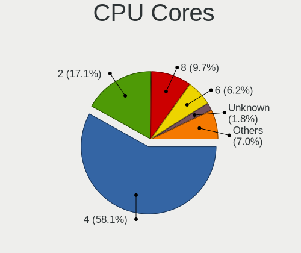
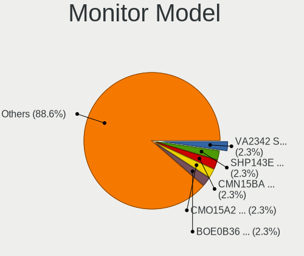
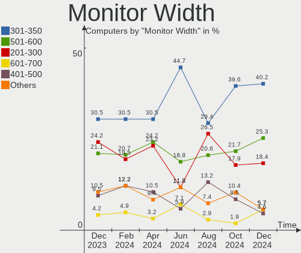
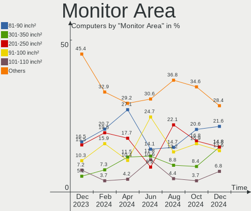
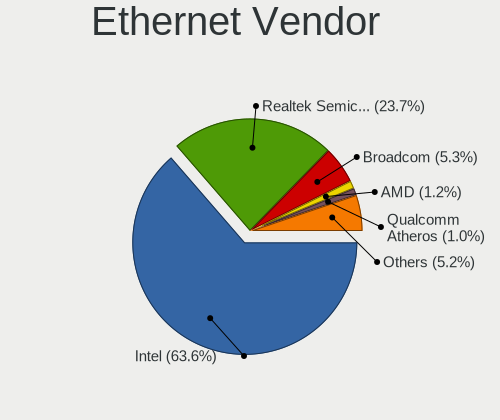
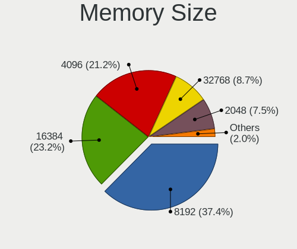

BSD - Hardware Trends
---------------------

A project to identify most popular hardware characteristics and track their change
over time based on data collected by BSD users at https://BSD-Hardware.info.

Anyone can contribute to this report by the [hw-probe](https://github.com/linuxhw/hw-probe/blob/master/INSTALL.BSD.md) tool:

    hw-probe -all -upload

This is a report for all computer types. See also reports for [desktops](/Desktop/README.md) and [notebooks](/Notebook/README.md).

OS-specific reports: [FreeBSD](/Dist/FreeBSD), [OPNsense](/Dist/OPNsense), [helloSystem](/Dist/helloSystem), [OpenBSD](/Dist/OpenBSD).

This report is for one last month. Overall report since the beginning of time: [TestDays](https://github.com/bsdhw/TestDays)

Period: Aug, 2023.

Contents
--------

* [ System ](#system)
  - [ OS                       ](#os)
  - [ OS Family                ](#os-family)
  - [ Arch                     ](#arch)
  - [ DE                       ](#de)
  - [ Display Server           ](#display-server)
  - [ Display Manager          ](#display-manager)
  - [ OS Lang                  ](#os-lang)
  - [ Boot Mode                ](#boot-mode)
  - [ Filesystem               ](#filesystem)
  - [ Part. scheme             ](#part-scheme)

* [ Board ](#board)
  - [ Vendor                   ](#vendor)
  - [ Model                    ](#model)
  - [ Model Family             ](#model-family)
  - [ MFG Year                 ](#mfg-year)
  - [ Form Factor              ](#form-factor)
  - [ Coreboot                 ](#coreboot)
  - [ RAM Size                 ](#ram-size)
  - [ RAM Used                 ](#ram-used)
  - [ Total Drives             ](#total-drives)
  - [ Has CD-ROM               ](#has-cd-rom)
  - [ Has Ethernet             ](#has-ethernet)
  - [ Has WiFi                 ](#has-wifi)
  - [ Has Bluetooth            ](#has-bluetooth)

* [ Location ](#location)
  - [ Country                  ](#country)
  - [ City                     ](#city)

* [ Drives ](#drives)
  - [ Drive Vendor             ](#drive-vendor)
  - [ Drive Model              ](#drive-model)
  - [ HDD Vendor               ](#hdd-vendor)
  - [ SSD Vendor               ](#ssd-vendor)
  - [ Drive Kind               ](#drive-kind)
  - [ Drive Connector          ](#drive-connector)
  - [ Drive Size               ](#drive-size)
  - [ Space Total              ](#space-total)
  - [ Space Used               ](#space-used)
  - [ Malfunc. Drives          ](#malfunc-drives)
  - [ Malfunc. Drive Vendor    ](#malfunc-drive-vendor)
  - [ Malfunc. HDD Vendor      ](#malfunc-hdd-vendor)
  - [ Malfunc. Drive Kind      ](#malfunc-drive-kind)
  - [ Failed Drives            ](#failed-drives)
  - [ Failed Drive Vendor      ](#failed-drive-vendor)
  - [ Drive Status             ](#drive-status)

* [ Storage controller ](#storage-controller)
  - [ Storage Vendor           ](#storage-vendor)
  - [ Storage Model            ](#storage-model)
  - [ Storage Kind             ](#storage-kind)

* [ Processor ](#processor)
  - [ CPU Vendor               ](#cpu-vendor)
  - [ CPU Model                ](#cpu-model)
  - [ CPU Model Family         ](#cpu-model-family)
  - [ CPU Cores                ](#cpu-cores)
  - [ CPU Sockets              ](#cpu-sockets)
  - [ CPU Threads              ](#cpu-threads)
  - [ CPU Microarch            ](#cpu-microarch)

* [ Graphics ](#graphics)
  - [ GPU Vendor               ](#gpu-vendor)
  - [ GPU Model                ](#gpu-model)
  - [ GPU Combo                ](#gpu-combo)
  - [ GPU Driver               ](#gpu-driver)
  - [ GPU Memory               ](#gpu-memory)

* [ Monitor ](#monitor)
  - [ Monitor Vendor           ](#monitor-vendor)
  - [ Monitor Model            ](#monitor-model)
  - [ Monitor Resolution       ](#monitor-resolution)
  - [ Monitor Diagonal         ](#monitor-diagonal)
  - [ Monitor Width            ](#monitor-width)
  - [ Aspect Ratio             ](#aspect-ratio)
  - [ Monitor Area             ](#monitor-area)
  - [ Pixel Density            ](#pixel-density)
  - [ Multiple Monitors        ](#multiple-monitors)

* [ Network ](#network)
  - [ Net Controller Vendor    ](#net-controller-vendor)
  - [ Net Controller Model     ](#net-controller-model)
  - [ Wireless Vendor          ](#wireless-vendor)
  - [ Wireless Model           ](#wireless-model)
  - [ Ethernet Vendor          ](#ethernet-vendor)
  - [ Ethernet Model           ](#ethernet-model)
  - [ Net Controller Kind      ](#net-controller-kind)
  - [ Used Controller          ](#used-controller)
  - [ NICs                     ](#nics)
  - [ IPv6                     ](#ipv6)

* [ Bluetooth ](#bluetooth)
  - [ Bluetooth Vendor         ](#bluetooth-vendor)
  - [ Bluetooth Model          ](#bluetooth-model)

* [ Sound ](#sound)
  - [ Sound Vendor             ](#sound-vendor)
  - [ Sound Model              ](#sound-model)

* [ Memory ](#memory)
  - [ Memory Vendor            ](#memory-vendor)
  - [ Memory Model             ](#memory-model)
  - [ Memory Kind              ](#memory-kind)
  - [ Memory Form Factor       ](#memory-form-factor)
  - [ Memory Size              ](#memory-size)
  - [ Memory Speed             ](#memory-speed)

* [ Printers & scanners ](#printers--scanners)
  - [ Printer Vendor           ](#printer-vendor)
  - [ Printer Model            ](#printer-model)
  - [ Scanner Vendor           ](#scanner-vendor)
  - [ Scanner Model            ](#scanner-model)

* [ Camera ](#camera)
  - [ Camera Vendor            ](#camera-vendor)
  - [ Camera Model             ](#camera-model)

* [ Security ](#security)
  - [ Fingerprint Vendor       ](#fingerprint-vendor)
  - [ Fingerprint Model        ](#fingerprint-model)
  - [ Chipcard Vendor          ](#chipcard-vendor)
  - [ Chipcard Model           ](#chipcard-model)

* [ Unsupported ](#unsupported)
  - [ Unsupported Devices      ](#unsupported-devices)
  - [ Unsupported Device Types ](#unsupported-device-types)

System
------

OS
--

Installed operating systems

| Name                 | Computers | Percent |
|----------------------|-----------|---------|
| OPNsense 23.7.1      | 158       | 31.23%  |
| OPNsense 23.7        | 80        | 15.81%  |
| OPNsense 23.7.2      | 66        | 13.04%  |
| OPNsense 23.1.11     | 37        | 7.31%   |
| helloSystem 0.8.1    | 33        | 6.52%   |
| FreeBSD 13.2-p2      | 26        | 5.14%   |
| helloSystem 0.8.2    | 13        | 2.57%   |
| OPNsense 23.7.3      | 12        | 2.37%   |
| OpenBSD 7.3          | 12        | 2.37%   |
| FreeBSD 13.2         | 7         | 1.38%   |
| helloSystem 0.9.0    | 6         | 1.19%   |
| FreeBSD 14.0-CURRENT | 6         | 1.19%   |
| OPNsense 23.4.2      | 5         | 0.99%   |
| OPNsense 22.7.11     | 3         | 0.59%   |
| NomadBSD 20221130    | 3         | 0.59%   |
| GhostBSD 23.07.29    | 3         | 0.59%   |
| OPNsense 24.1        | 2         | 0.4%    |
| OPNsense 22.1.10     | 2         | 0.4%    |
| OPNsense 21.7.8      | 2         | 0.4%    |
| MidnightBSD 3.1.0    | 2         | 0.4%    |
| helloSystem 0.8.0    | 2         | 0.4%    |
| GhostBSD 23.06.01    | 2         | 0.4%    |
| FreeBSD 15.0-CURRENT | 2         | 0.4%    |
| FreeBSD 14.0-ALPHA3  | 2         | 0.4%    |
| FreeBSD 14.0-ALPHA2  | 2         | 0.4%    |
| FreeBSD 13.2-p1      | 2         | 0.4%    |
| OPNsense 23.4.1      | 1         | 0.2%    |
| OPNsense 23.1.9      | 1         | 0.2%    |
| OPNsense 23.1.7      | 1         | 0.2%    |
| OPNsense 23.1.10     | 1         | 0.2%    |
| OPNsense 23.1.1      | 1         | 0.2%    |
| OPNsense 23.1        | 1         | 0.2%    |
| NetBSD 9.3           | 1         | 0.2%    |
| NetBSD 10.99.7       | 1         | 0.2%    |
| MyBee 13.2           | 1         | 0.2%    |
| GhostBSD 23.07.20    | 1         | 0.2%    |
| FuguIta 7.3          | 1         | 0.2%    |
| FreeBSD 14.0-ALPHA1  | 1         | 0.2%    |
| FreeBSD 13.2-STABLE  | 1         | 0.2%    |
| FreeBSD 13.1-p9      | 1         | 0.2%    |

OS Family
---------

OS without a version

| Name        | Computers | Percent |
|-------------|-----------|---------|
| OPNsense    | 373       | 73.72%  |
| helloSystem | 54        | 10.67%  |
| FreeBSD     | 52        | 10.28%  |
| OpenBSD     | 12        | 2.37%   |
| GhostBSD    | 6         | 1.19%   |
| NomadBSD    | 3         | 0.59%   |
| NetBSD      | 2         | 0.4%    |
| MidnightBSD | 2         | 0.4%    |
| MyBee       | 1         | 0.2%    |
| FuguIta     | 1         | 0.2%    |

Arch
----

OS architecture (x86_64, i586, etc.)

| Name   | Computers | Percent |
|--------|-----------|---------|
| amd64  | 499       | 98.62%  |
| i386   | 3         | 0.59%   |
| arm64  | 3         | 0.59%   |
| evbarm | 1         | 0.2%    |

DE
--

Desktop Environment

| Name         | Computers | Percent |
|--------------|-----------|---------|
| Console      | 398       | 78.66%  |
| helloDesktop | 64        | 12.65%  |
| KDE5         | 10        | 1.98%   |
| MATE         | 9         | 1.78%   |
| XFCE         | 8         | 1.58%   |
| Openbox      | 4         | 0.79%   |
| GNOME        | 4         | 0.79%   |
| TWM          | 2         | 0.4%    |
| LXQt         | 2         | 0.4%    |
| i3           | 2         | 0.4%    |
| X-Cinnamon   | 1         | 0.2%    |
| Potato       | 1         | 0.2%    |
| Budgie       | 1         | 0.2%    |

Display Server
--------------

X11 or Wayland

| Name    | Computers | Percent |
|---------|-----------|---------|
| Console | 400       | 79.05%  |
| X11     | 103       | 20.36%  |
| Wayland | 3         | 0.59%   |

Display Manager
---------------

SDDM, LightDM, etc.

| Name    | Computers | Percent |
|---------|-----------|---------|
| Console | 421       | 83.2%   |
| SLiM    | 56        | 11.07%  |
| LightDM | 11        | 2.17%   |
| SDDM    | 8         | 1.58%   |
| XDM     | 5         | 0.99%   |
| GDM     | 5         | 0.99%   |

OS Lang
-------

Language

| Lang    | Computers | Percent |
|---------|-----------|---------|
| Unknown | 396       | 78.26%  |
| C       | 51        | 10.08%  |
| en_US   | 26        | 5.14%   |
| fr_FR   | 9         | 1.78%   |
| pt_BR   | 4         | 0.79%   |
| it_IT   | 3         | 0.59%   |
| es_ES   | 3         | 0.59%   |
| ru_RU   | 2         | 0.4%    |
| en_GB   | 2         | 0.4%    |
| en      | 2         | 0.4%    |
| zh_TW   | 1         | 0.2%    |
| pl_PL   | 1         | 0.2%    |
| nl_NL   | 1         | 0.2%    |
| jp_JP   | 1         | 0.2%    |
| en_UK   | 1         | 0.2%    |
| en_AU   | 1         | 0.2%    |
| de_DE   | 1         | 0.2%    |
| Default | 1         | 0.2%    |

Boot Mode
---------

EFI or BIOS

| Mode | Computers | Percent |
|------|-----------|---------|
| EFI  | 473       | 93.48%  |
| BIOS | 33        | 6.52%   |

Filesystem
----------

Type of filesystem

| Type   | Computers | Percent |
|--------|-----------|---------|
| Zfs    | 234       | 46.25%  |
| Ufs    | 229       | 45.26%  |
| Cd9660 | 30        | 5.93%   |
| Ffs    | 13        | 2.57%   |

Part. scheme
------------

Scheme of partitioning

| Type    | Computers | Percent |
|---------|-----------|---------|
| GPT     | 484       | 95.65%  |
| MBR     | 16        | 3.16%   |
| Unknown | 5         | 0.99%   |
| BSD     | 1         | 0.2%    |

Board
-----

Vendor
------

Motherboard manufacturer

| Name                | Computers | Percent |
|---------------------|-----------|---------|
| Unknown             | 60        | 11.86%  |
| Dell                | 48        | 9.49%   |
| Lenovo              | 36        | 7.11%   |
| Hewlett-Packard     | 36        | 7.11%   |
| ASUSTek Computer    | 32        | 6.32%   |
| Supermicro          | 28        | 5.53%   |
| Intel               | 28        | 5.53%   |
| Protectli           | 24        | 4.74%   |
| MSI                 | 20        | 3.95%   |
| Techvision          | 17        | 3.36%   |
| ASRock              | 17        | 3.36%   |
| Gigabyte Technology | 16        | 3.16%   |
| PC Engines          | 15        | 2.96%   |
| Fujitsu             | 11        | 2.17%   |
| AMI                 | 11        | 2.17%   |
| CncTion             | 8         | 1.58%   |
| Acer                | 8         | 1.58%   |
| Sophos              | 7         | 1.38%   |
| MW                  | 7         | 1.38%   |
| CWWK                | 7         | 1.38%   |
| IceWhale Technology | 5         | 0.99%   |
| Deciso              | 5         | 0.99%   |
| AZW                 | 5         | 0.99%   |
| ZOTAC               | 3         | 0.59%   |
| Shuttle             | 3         | 0.59%   |
| Hardkernel          | 3         | 0.59%   |
| IGEL Technology     | 2         | 0.4%    |
| HPE                 | 2         | 0.4%    |
| CompuLab            | 2         | 0.4%    |
| Cisco               | 2         | 0.4%    |
| BESSTAR Tech        | 2         | 0.4%    |
| ATOPNUC             | 2         | 0.4%    |
| ASRockRack          | 2         | 0.4%    |
| Apple               | 2         | 0.4%    |
| Advantech           | 2         | 0.4%    |
| YANYU               | 1         | 0.2%    |
| WeiBu               | 1         | 0.2%    |
| VIA Technologies    | 1         | 0.2%    |
| Toshiba             | 1         | 0.2%    |
| Star Labs           | 1         | 0.2%    |

Model
-----

Motherboard model

| Name                                | Computers | Percent |
|-------------------------------------|-----------|---------|
| Unknown                             | 63        | 12.45%  |
| Techvision TVI7309X                 | 17        | 3.36%   |
| Supermicro Super Server             | 8         | 1.58%   |
| PC Engines APU2                     | 8         | 1.58%   |
| Protectli FW4B                      | 7         | 1.38%   |
| MW GMLK-2_5G4L                      | 7         | 1.38%   |
| Intel Q3XXG4-P V1.0                 | 7         | 1.38%   |
| Fujitsu FUTRO S920                  | 6         | 1.19%   |
| Protectli VP2420                    | 5         | 0.99%   |
| Dell OptiPlex 7010                  | 5         | 0.99%   |
| AMI Aptio CRB                       | 5         | 0.99%   |
| Protectli FW6                       | 4         | 0.79%   |
| PC Engines apu4                     | 4         | 0.79%   |
| Deciso NetBoard-A20                 | 4         | 0.79%   |
| Sophos SG                           | 3         | 0.59%   |
| Protectli VP2410                    | 3         | 0.59%   |
| Intel SKYBAY                        | 3         | 0.59%   |
| Intel Jasper Lake Client Platform   | 3         | 0.59%   |
| IceWhale ZimaBoard 832 ZMB          | 3         | 0.59%   |
| Dell PowerEdge R340                 | 3         | 0.59%   |
| Dell OptiPlex 7060                  | 3         | 0.59%   |
| Dell OptiPlex 3060                  | 3         | 0.59%   |
| CWWK CW-MBX-AD12                    | 3         | 0.59%   |
| CWWK CW-AD4L-N V1                   | 3         | 0.59%   |
| CncTion N5105-4L                    | 3         | 0.59%   |
| AZW EQ                              | 3         | 0.59%   |
| AMI SG                              | 3         | 0.59%   |
| Supermicro X10SLL-F                 | 2         | 0.4%    |
| Supermicro SYS-E300-9D-8CN8TP       | 2         | 0.4%    |
| Supermicro SYS-5018A-FTN4           | 2         | 0.4%    |
| Sophos XG                           | 2         | 0.4%    |
| Sophos UTM                          | 2         | 0.4%    |
| IceWhale ZimaBoard 432 ZMB          | 2         | 0.4%    |
| HP t730 Thin Client                 | 2         | 0.4%    |
| HP t620 PLUS Quad Core TC           | 2         | 0.4%    |
| HP ProLiant DL380 G7                | 2         | 0.4%    |
| HP ProLiant DL360 Gen9              | 2         | 0.4%    |
| Hardkernel ODROID-H3                | 2         | 0.4%    |
| Dell Wyse 5070 Extended Thin Client | 2         | 0.4%    |
| Dell PowerEdge R210 II              | 2         | 0.4%    |

Model Family
------------

Motherboard model prefix

| Name                          | Computers | Percent |
|-------------------------------|-----------|---------|
| Unknown                       | 63        | 12.45%  |
| Dell OptiPlex                 | 23        | 4.55%   |
| Techvision TVI7309X           | 17        | 3.36%   |
| Lenovo ThinkPad               | 16        | 3.16%   |
| Lenovo ThinkCentre            | 11        | 2.17%   |
| Dell PowerEdge                | 11        | 2.17%   |
| Supermicro Super              | 8         | 1.58%   |
| PC Engines APU2               | 8         | 1.58%   |
| HP EliteDesk                  | 8         | 1.58%   |
| ASUS PRIME                    | 8         | 1.58%   |
| Protectli FW4B                | 7         | 1.38%   |
| MW GMLK-2                     | 7         | 1.38%   |
| Intel Q3XXG4-P                | 7         | 1.38%   |
| Fujitsu FUTRO                 | 7         | 1.38%   |
| Acer Aspire                   | 7         | 1.38%   |
| HP ProLiant                   | 6         | 1.19%   |
| Dell Latitude                 | 6         | 1.19%   |
| Protectli VP2420              | 5         | 0.99%   |
| IceWhale ZimaBoard            | 5         | 0.99%   |
| HP ProDesk                    | 5         | 0.99%   |
| AMI Aptio                     | 5         | 0.99%   |
| Protectli FW6                 | 4         | 0.79%   |
| PC Engines apu4               | 4         | 0.79%   |
| Lenovo IdeaPad                | 4         | 0.79%   |
| HP Compaq                     | 4         | 0.79%   |
| Deciso NetBoard-A20           | 4         | 0.79%   |
| Sophos SG                     | 3         | 0.59%   |
| Protectli VP2410              | 3         | 0.59%   |
| Intel SKYBAY                  | 3         | 0.59%   |
| Intel Jasper                  | 3         | 0.59%   |
| Dell Wyse                     | 3         | 0.59%   |
| Dell Inspiron                 | 3         | 0.59%   |
| CWWK CW-MBX-AD12              | 3         | 0.59%   |
| CWWK CW-AD4L-N                | 3         | 0.59%   |
| CncTion N5105-4L              | 3         | 0.59%   |
| AZW EQ                        | 3         | 0.59%   |
| ASUS ROG                      | 3         | 0.59%   |
| AMI SG                        | 3         | 0.59%   |
| Supermicro X10SLL-F           | 2         | 0.4%    |
| Supermicro SYS-E300-9D-8CN8TP | 2         | 0.4%    |

MFG Year
--------

Motherboard manufacture year

| Year    | Computers | Percent |
|---------|-----------|---------|
| 2022    | 83        | 16.4%   |
| 2023    | 56        | 11.07%  |
| 2021    | 49        | 9.68%   |
| 2018    | 49        | 9.68%   |
| 2016    | 42        | 8.3%    |
| 2019    | 39        | 7.71%   |
| 2020    | 34        | 6.72%   |
| 2017    | 33        | 6.52%   |
| 2014    | 26        | 5.14%   |
| 2011    | 18        | 3.56%   |
| 2015    | 16        | 3.16%   |
| 2012    | 16        | 3.16%   |
| 2010    | 14        | 2.77%   |
| 2013    | 12        | 2.37%   |
| 2008    | 5         | 0.99%   |
| 2009    | 4         | 0.79%   |
| 2006    | 4         | 0.79%   |
| Unknown | 3         | 0.59%   |
| 2007    | 2         | 0.4%    |
| 2004    | 1         | 0.2%    |

Form Factor
-----------

Physical design of the computer

| Name           | Computers | Percent |
|----------------|-----------|---------|
| Desktop        | 357       | 70.55%  |
| Notebook       | 69        | 13.64%  |
| Mini pc        | 36        | 7.11%   |
| Server         | 36        | 7.11%   |
| Firewall       | 7         | 1.38%   |
| System on chip | 1         | 0.2%    |

Coreboot
--------

Have coreboot on board

| Used | Computers | Percent |
|------|-----------|---------|
| No   | 487       | 96.25%  |
| Yes  | 19        | 3.75%   |

RAM Size
--------

Total RAM memory

| Size in GB      | Computers | Percent |
|-----------------|-----------|---------|
| 8.01-16.0       | 168       | 33.2%   |
| 16.01-24.0      | 144       | 28.46%  |
| 4.01-8.0        | 88        | 17.39%  |
| 32.01-64.0      | 54        | 10.67%  |
| 64.01-256.0     | 28        | 5.53%   |
| 2.01-3.0        | 13        | 2.57%   |
| 24.01-32.0      | 6         | 1.19%   |
| More than 256.0 | 2         | 0.4%    |
| 3.01-4.0        | 1         | 0.2%    |
| 0.51-1.0        | 1         | 0.2%    |
| 0.01-0.5        | 1         | 0.2%    |

RAM Used
--------

Used RAM memory

| Used GB    | Computers | Percent |
|------------|-----------|---------|
| 0.01-0.5   | 232       | 45.85%  |
| 0.51-1.0   | 176       | 34.78%  |
| 1.01-2.0   | 61        | 12.06%  |
| 2.01-3.0   | 16        | 3.16%   |
| 3.01-4.0   | 8         | 1.58%   |
| 4.01-8.0   | 5         | 0.99%   |
| Unknown    | 3         | 0.59%   |
| 8.01-16.0  | 2         | 0.4%    |
| 0          | 2         | 0.4%    |
| 32.01-64.0 | 1         | 0.2%    |

Total Drives
------------

Number of drives on board

| Drives | Computers | Percent |
|--------|-----------|---------|
| 1      | 365       | 72.13%  |
| 2      | 55        | 10.87%  |
| 0      | 54        | 10.67%  |
| 3      | 15        | 2.96%   |
| 4      | 6         | 1.19%   |
| 5      | 3         | 0.59%   |
| 13     | 2         | 0.4%    |
| 8      | 2         | 0.4%    |
| 6      | 2         | 0.4%    |
| 24     | 1         | 0.2%    |
| 7      | 1         | 0.2%    |

Has CD-ROM
----------

Has CD-ROM on board

| Presented | Computers | Percent |
|-----------|-----------|---------|
| No        | 438       | 86.56%  |
| Yes       | 68        | 13.44%  |

Has Ethernet
------------

Has Ethernet on board

| Presented | Computers | Percent |
|-----------|-----------|---------|
| Yes       | 487       | 96.25%  |
| No        | 19        | 3.75%   |

Has WiFi
--------

Has WiFi module

| Presented | Computers | Percent |
|-----------|-----------|---------|
| No        | 367       | 72.53%  |
| Yes       | 139       | 27.47%  |

Has Bluetooth
-------------

Has Bluetooth module

| Presented | Computers | Percent |
|-----------|-----------|---------|
| No        | 404       | 79.84%  |
| Yes       | 102       | 20.16%  |

Location
--------

Country
-------

Geographic location (country)

| Country      | Computers | Percent |
|--------------|-----------|---------|
| USA          | 162       | 32.02%  |
| Germany      | 70        | 13.83%  |
| UK           | 30        | 5.93%   |
| Russia       | 25        | 4.94%   |
| France       | 21        | 4.15%   |
| Canada       | 20        | 3.95%   |
| Australia    | 12        | 2.37%   |
| Netherlands  | 11        | 2.17%   |
| Italy        | 11        | 2.17%   |
| Brazil       | 10        | 1.98%   |
| Switzerland  | 9         | 1.78%   |
| Poland       | 8         | 1.58%   |
| India        | 7         | 1.38%   |
| Austria      | 7         | 1.38%   |
| China        | 6         | 1.19%   |
| Belgium      | 6         | 1.19%   |
| Sweden       | 5         | 0.99%   |
| Denmark      | 5         | 0.99%   |
| Spain        | 4         | 0.79%   |
| Singapore    | 4         | 0.79%   |
| Romania      | 4         | 0.79%   |
| Norway       | 4         | 0.79%   |
| Japan        | 4         | 0.79%   |
| Hungary      | 4         | 0.79%   |
| Czechia      | 4         | 0.79%   |
| Turkey       | 3         | 0.59%   |
| South Korea  | 3         | 0.59%   |
| Peru         | 3         | 0.59%   |
| Indonesia    | 3         | 0.59%   |
| Hong Kong    | 3         | 0.59%   |
| Finland      | 3         | 0.59%   |
| Bulgaria     | 3         | 0.59%   |
| Argentina    | 3         | 0.59%   |
| Taiwan       | 2         | 0.4%    |
| South Africa | 2         | 0.4%    |
| Paraguay     | 2         | 0.4%    |
| New Zealand  | 2         | 0.4%    |
| Israel       | 2         | 0.4%    |
| Iceland      | 2         | 0.4%    |
| Vietnam      | 1         | 0.2%    |

City
----

Geographic location (city)

| City          | Computers | Percent |
|---------------|-----------|---------|
| St Petersburg | 12        | 2.37%   |
| Hamburg       | 7         | 1.38%   |
| London        | 5         | 0.99%   |
| Vancouver     | 4         | 0.79%   |
| Singapore     | 4         | 0.79%   |
| New York      | 4         | 0.79%   |
| Brisbane      | 4         | 0.79%   |
| Vienna        | 3         | 0.59%   |
| Seattle       | 3         | 0.59%   |
| Redmond       | 3         | 0.59%   |
| Paris         | 3         | 0.59%   |
| Palo Alto     | 3         | 0.59%   |
| Moscow        | 3         | 0.59%   |
| Manchester    | 3         | 0.59%   |
| Lima          | 3         | 0.59%   |
| Chennai       | 3         | 0.59%   |
| Bucharest     | 3         | 0.59%   |
| Austin        | 3         | 0.59%   |
| Amsterdam     | 3         | 0.59%   |
| Akron         | 3         | 0.59%   |
| Zurich        | 2         | 0.4%    |
| Ypsilanti     | 2         | 0.4%    |
| York          | 2         | 0.4%    |
| Wroclaw       | 2         | 0.4%    |
| Woking        | 2         | 0.4%    |
| Winnipeg      | 2         | 0.4%    |
| Victoria      | 2         | 0.4%    |
| Urcuit        | 2         | 0.4%    |
| Toronto       | 2         | 0.4%    |
| Tomball       | 2         | 0.4%    |
| Sydney        | 2         | 0.4%    |
| Stuttgart     | 2         | 0.4%    |
| Shenzhen      | 2         | 0.4%    |
| Scarborough   | 2         | 0.4%    |
| Salem         | 2         | 0.4%    |
| Reykjavik     | 2         | 0.4%    |
| Portland      | 2         | 0.4%    |
| Perry Hall    | 2         | 0.4%    |
| Ozersk        | 2         | 0.4%    |
| Orlando       | 2         | 0.4%    |

Drives
------

Drive Vendor
------------

Hard drive vendors

| Vendor              | Computers | Drives | Percent |
|---------------------|-----------|--------|---------|
| Samsung Electronics | 84        | 110    | 15.73%  |
| WDC                 | 52        | 80     | 9.74%   |
| Kingston            | 46        | 51     | 8.61%   |
| Crucial             | 37        | 46     | 6.93%   |
| Seagate             | 33        | 54     | 6.18%   |
| Transcend           | 30        | 30     | 5.62%   |
| Intel               | 21        | 24     | 3.93%   |
| Hoodisk             | 17        | 17     | 3.18%   |
| China               | 16        | 16     | 3%      |
| Toshiba             | 15        | 37     | 2.81%   |
| SanDisk             | 15        | 15     | 2.81%   |
| Micron Technology   | 15        | 16     | 2.81%   |
| SPCC                | 9         | 9      | 1.69%   |
| SK hynix            | 9         | 11     | 1.69%   |
| A-DATA Technology   | 7         | 7      | 1.31%   |
| Silicon Motion      | 6         | 6      | 1.12%   |
| Hewlett-Packard     | 6         | 8      | 1.12%   |
| Fanxiang            | 6         | 6      | 1.12%   |
| Team                | 5         | 6      | 0.94%   |
| Protectli           | 5         | 5      | 0.94%   |
| Innodisk            | 5         | 5      | 0.94%   |
| PNY                 | 4         | 4      | 0.75%   |
| Patriot             | 4         | 6      | 0.75%   |
| NVMe                | 4         | 5      | 0.75%   |
| Hitachi             | 4         | 4      | 0.75%   |
| HGST                | 4         | 4      | 0.75%   |
| Corsair             | 4         | 4      | 0.75%   |
| KIOXIA              | 3         | 3      | 0.56%   |
| KingSpec            | 3         | 3      | 0.56%   |
| Intenso             | 3         | 3      | 0.56%   |
| BR                  | 3         | 3      | 0.56%   |
| SCY                 | 2         | 2      | 0.37%   |
| Plextor             | 2         | 2      | 0.37%   |
| Maxtor              | 2         | 2      | 0.37%   |
| LITEON              | 2         | 2      | 0.37%   |
| Lexar               | 2         | 2      | 0.37%   |
| JWX                 | 2         | 2      | 0.37%   |
| JetFlash            | 2         | 2      | 0.37%   |
| GOODRAM             | 2         | 2      | 0.37%   |
| Gigabyte Technology | 2         | 2      | 0.37%   |

Drive Model
-----------

Hard drive models

| Model                                  | Computers | Percent |
|----------------------------------------|-----------|---------|
| Kingston SA400S37240G 240GB            | 9         | 1.55%   |
| Samsung SSD 860 EVO 500GB              | 7         | 1.2%    |
| Hoodisk SSD 64GB                       | 7         | 1.2%    |
| Transcend TS128GMSA230S 128GB          | 6         | 1.03%   |
| Kingston SKC600MS256G 256GB            | 5         | 0.86%   |
| Transcend TS256GMSA230S 256GB          | 4         | 0.69%   |
| SPCC Solid State Disk 128GB            | 4         | 0.69%   |
| Samsung SSD 870 EVO 500GB              | 4         | 0.69%   |
| Samsung SSD 870 EVO 250GB              | 4         | 0.69%   |
| Samsung SSD 860 EVO 250GB              | 4         | 0.69%   |
| Samsung SSD 850 EVO 500GB              | 4         | 0.69%   |
| Samsung SSD 850 EVO 250GB              | 4         | 0.69%   |
| Kingston SUV500MS120G 120GB            | 4         | 0.69%   |
| Kingston SNV2S250G 250GB               | 4         | 0.69%   |
| Hoodisk SSD 32GB                       | 4         | 0.69%   |
| Hoodisk SSD 128GB                      | 4         | 0.69%   |
| Crucial CT500MX500SSD1 500GB           | 4         | 0.69%   |
| Crucial CT240BX500SSD1 240GB           | 4         | 0.69%   |
| Transcend TS64GSSD370S 64GB            | 3         | 0.52%   |
| Samsung SSD 980 500GB                  | 3         | 0.52%   |
| Samsung SSD 970 EVO Plus 500GB         | 3         | 0.52%   |
| Samsung SSD 870 EVO 1TB                | 3         | 0.52%   |
| Samsung SSD 860 EVO mSATA 250GB        | 3         | 0.52%   |
| Samsung SSD 840 EVO 250GB              | 3         | 0.52%   |
| PNY CS900 120GB SSD                    | 3         | 0.52%   |
| Fanxiang S501 128GB                    | 3         | 0.52%   |
| Crucial CT480BX500SSD1 480GB           | 3         | 0.52%   |
| Crucial CT1000MX500SSD1 1TB            | 3         | 0.52%   |
| WDC WDS500G2B0A-00SM50 500GB           | 2         | 0.34%   |
| WDC WDS500G1R0B-68A4Z0 500GB           | 2         | 0.34%   |
| WDC WDS100T3X0C-00SJG0 1TB             | 2         | 0.34%   |
| WDC WD40EFRX-68N32N0 4TB               | 2         | 0.34%   |
| Transcend TS64GSSD370 64GB             | 2         | 0.34%   |
| Transcend TS256GMTS952T2 256GB         | 2         | 0.34%   |
| Transcend TS128GMSA370 128GB           | 2         | 0.34%   |
| Toshiba MQ01ABD050 500GB               | 2         | 0.34%   |
| Team TM8FP6512G 512GB                  | 2         | 0.34%   |
| SPCC M.2 PCIe SSD 256GB                | 2         | 0.34%   |
| SK hynix SKHynix_HFS512GDE9X084N 512GB | 2         | 0.34%   |
| SK hynix HFS960G3H2X069N 960GB         | 2         | 0.34%   |

HDD Vendor
----------

Hard disk drive vendors

| Vendor              | Computers | Drives | Percent |
|---------------------|-----------|--------|---------|
| WDC                 | 35        | 61     | 36.46%  |
| Seagate             | 30        | 50     | 31.25%  |
| Toshiba             | 9         | 31     | 9.38%   |
| Hitachi             | 4         | 4      | 4.17%   |
| HGST                | 4         | 4      | 4.17%   |
| NVMe                | 3         | 3      | 3.13%   |
| Hewlett-Packard     | 3         | 3      | 3.13%   |
| Maxtor              | 2         | 2      | 2.08%   |
| JetFlash            | 2         | 2      | 2.08%   |
| Fujitsu             | 2         | 2      | 2.08%   |
| Samsung Electronics | 1         | 1      | 1.04%   |
| Lexar               | 1         | 1      | 1.04%   |

SSD Vendor
----------

Solid state drive vendors

| Vendor              | Computers | Drives | Percent |
|---------------------|-----------|--------|---------|
| Samsung Electronics | 57        | 80     | 18.04%  |
| Kingston            | 34        | 39     | 10.76%  |
| Transcend           | 27        | 27     | 8.54%   |
| Crucial             | 26        | 30     | 8.23%   |
| Hoodisk             | 17        | 17     | 5.38%   |
| China               | 16        | 16     | 5.06%   |
| SanDisk             | 15        | 15     | 4.75%   |
| Intel               | 14        | 16     | 4.43%   |
| Micron Technology   | 10        | 11     | 3.16%   |
| WDC                 | 6         | 6      | 1.9%    |
| SPCC                | 6         | 6      | 1.9%    |
| A-DATA Technology   | 6         | 6      | 1.9%    |
| Protectli           | 5         | 5      | 1.58%   |
| Innodisk            | 5         | 5      | 1.58%   |
| SK hynix            | 4         | 6      | 1.27%   |
| Toshiba             | 3         | 3      | 0.95%   |
| PNY                 | 3         | 3      | 0.95%   |
| KingSpec            | 3         | 3      | 0.95%   |
| Intenso             | 3         | 3      | 0.95%   |
| Corsair             | 3         | 3      | 0.95%   |
| Seagate             | 2         | 3      | 0.63%   |
| SCY                 | 2         | 2      | 0.63%   |
| Plextor             | 2         | 2      | 0.63%   |
| Patriot             | 2         | 4      | 0.63%   |
| NVMe                | 2         | 2      | 0.63%   |
| LITEON              | 2         | 2      | 0.63%   |
| JWX                 | 2         | 2      | 0.63%   |
| Hewlett-Packard     | 2         | 4      | 0.63%   |
| FORESEE             | 2         | 2      | 0.63%   |
| BORY                | 2         | 2      | 0.63%   |
| BIWIN               | 2         | 2      | 0.63%   |
| Apple               | 2         | 2      | 0.63%   |
| Apacer              | 2         | 2      | 0.63%   |
| AMD                 | 2         | 2      | 0.63%   |
| Wicgtyp             | 1         | 1      | 0.32%   |
| WALRAM              | 1         | 1      | 0.32%   |
| VICKTER             | 1         | 1      | 0.32%   |
| Verbatim            | 1         | 1      | 0.32%   |
| Vaseky              | 1         | 1      | 0.32%   |
| V-GeN               | 1         | 1      | 0.32%   |

Drive Kind
----------

HDD or SSD

| Kind | Computers | Drives | Percent |
|------|-----------|--------|---------|
| SSD  | 294       | 358    | 58.92%  |
| NVMe | 124       | 135    | 24.85%  |
| HDD  | 81        | 164    | 16.23%  |

Drive Connector
---------------

SATA, SAS, NVMe, etc.

| Type | Computers | Drives | Percent |
|------|-----------|--------|---------|
| SATA | 354       | 522    | 74.06%  |
| NVMe | 124       | 135    | 25.94%  |

Drive Size
----------

Size of hard drive

| Size in TB | Computers | Drives | Percent |
|------------|-----------|--------|---------|
| 0.01-0.5   | 303       | 350    | 76.52%  |
| 0.51-1.0   | 53        | 70     | 13.38%  |
| 1.01-2.0   | 18        | 28     | 4.55%   |
| 3.01-4.0   | 9         | 28     | 2.27%   |
| 4.01-10.0  | 7         | 31     | 1.77%   |
| 2.01-3.0   | 4         | 12     | 1.01%   |
| 10.01-20.0 | 2         | 3      | 0.51%   |

Space Total
-----------

Amount of disk space available on the file system

| Size in GB     | Computers | Percent |
|----------------|-----------|---------|
| 101-250        | 221       | 43.68%  |
| 251-500        | 100       | 19.76%  |
| 1-20           | 56        | 11.07%  |
| 501-1000       | 40        | 7.91%   |
| 51-100         | 40        | 7.91%   |
| 21-50          | 33        | 6.52%   |
| 1001-2000      | 8         | 1.58%   |
| More than 3000 | 4         | 0.79%   |
| 2001-3000      | 4         | 0.79%   |

Space Used
----------

Amount of used disk space

| Used GB   | Computers | Percent |
|-----------|-----------|---------|
| 1-20      | 459       | 90.71%  |
| 21-50     | 29        | 5.73%   |
| 51-100    | 8         | 1.58%   |
| 501-1000  | 4         | 0.79%   |
| 101-250   | 3         | 0.59%   |
| 251-500   | 2         | 0.4%    |
| 1001-2000 | 1         | 0.2%    |

Malfunc. Drives
---------------

Drive models with a malfunction

| Model                                      | Computers | Drives | Percent |
|--------------------------------------------|-----------|--------|---------|
| Intel SSDSC2BW480H6 480GB                  | 2         | 2      | 3.33%   |
| WDC WD5003ABYX-18WERA0 500GB               | 1         | 1      | 1.67%   |
| WDC WD5000AAKX-60U6AA0 500GB               | 1         | 1      | 1.67%   |
| WDC WD4500HLHX-01JJPV0 450GB               | 1         | 1      | 1.67%   |
| WDC WD3200AAKS-75L9A0 320GB                | 1         | 1      | 1.67%   |
| WDC WD3000FYYZ-05UL1B0 3TB                 | 1         | 1      | 1.67%   |
| WDC WD2503ABYX-01WERA1 256GB               | 1         | 1      | 1.67%   |
| WDC WD20EARS-00MVWB0 2TB                   | 1         | 1      | 1.67%   |
| WDC WD15EARS-00Z5B1 1.5TB                  | 1         | 1      | 1.67%   |
| WDC WD15EARS-00MVWB0 1.5TB                 | 1         | 1      | 1.67%   |
| WDC WD10EZEX-60M2NA0 1TB                   | 1         | 1      | 1.67%   |
| WDC WD10EADS-11M2B2 1TB                    | 1         | 1      | 1.67%   |
| V-GeN V-GEN08AS19FS120IT 120GB             | 1         | 1      | 1.67%   |
| Toshiba THNSNK256GVN8 M.2 2280 256GB       | 1         | 1      | 1.67%   |
| Toshiba MQ01ABD050 500GB                   | 1         | 1      | 1.67%   |
| Toshiba MK8034GSX 80GB                     | 1         | 1      | 1.67%   |
| Toshiba HDWE140 4TB                        | 1         | 3      | 1.67%   |
| SPCC M.2 PCIe SSD 256GB                    | 1         | 1      | 1.67%   |
| SK hynix HFS064G3AMNB-2220A 64GB           | 1         | 1      | 1.67%   |
| Seagate ST9500420AS 500GB                  | 1         | 1      | 1.67%   |
| Seagate ST9100824AS 100GB                  | 1         | 1      | 1.67%   |
| Seagate ST8000AS0002-1NA17Z 8TB            | 1         | 1      | 1.67%   |
| Seagate ST5000DM000-1FK178 5TB             | 1         | 1      | 1.67%   |
| Seagate ST3750330AS 752GB                  | 1         | 1      | 1.67%   |
| Seagate ST3250312AS 250GB                  | 1         | 1      | 1.67%   |
| Seagate ST31000524AS 1TB                   | 1         | 1      | 1.67%   |
| SanDisk SSD U100 64GB                      | 1         | 1      | 1.67%   |
| SanDisk SSD PLUS 240GB                     | 1         | 1      | 1.67%   |
| SanDisk SSD PLUS 120GB                     | 1         | 1      | 1.67%   |
| SanDisk SD8TB8U-256G-1006 256GB            | 1         | 1      | 1.67%   |
| Samsung Electronics SSD 870 EVO 500GB      | 1         | 1      | 1.67%   |
| Samsung Electronics SSD 870 EVO 2TB        | 1         | 1      | 1.67%   |
| Samsung Electronics SSD 870 EVO 250GB      | 1         | 1      | 1.67%   |
| Samsung Electronics SSD 850 EVO 1TB        | 1         | 1      | 1.67%   |
| Samsung Electronics SSD 840 EVO 120GB      | 1         | 1      | 1.67%   |
| Samsung Electronics HM320JI 320GB          | 1         | 1      | 1.67%   |
| Plextor PX-128M5Pro 128GB                  | 1         | 1      | 1.67%   |
| Micron Technology P300-MTFDDAC200SAL 200GB | 1         | 2      | 1.67%   |
| Micron Technology 1100 SATA 256GB          | 1         | 1      | 1.67%   |
| Maxtor STM380215AS 80GB                    | 1         | 1      | 1.67%   |

Malfunc. Drive Vendor
---------------------

Vendors of faulty drives

| Vendor              | Computers | Drives | Percent |
|---------------------|-----------|--------|---------|
| WDC                 | 8         | 11     | 14.29%  |
| Seagate             | 7         | 7      | 12.5%   |
| Samsung Electronics | 5         | 6      | 8.93%   |
| Kingston            | 5         | 5      | 8.93%   |
| Toshiba             | 4         | 6      | 7.14%   |
| SanDisk             | 4         | 4      | 7.14%   |
| HGST                | 4         | 4      | 7.14%   |
| Crucial             | 4         | 5      | 7.14%   |
| Intel               | 3         | 3      | 5.36%   |
| Micron Technology   | 2         | 3      | 3.57%   |
| Maxtor              | 2         | 2      | 3.57%   |
| Hitachi             | 2         | 2      | 3.57%   |
| V-GeN               | 1         | 1      | 1.79%   |
| SPCC                | 1         | 1      | 1.79%   |
| SK hynix            | 1         | 1      | 1.79%   |
| Plextor             | 1         | 1      | 1.79%   |
| HP Phison           | 1         | 1      | 1.79%   |
| A-DATA Technology   | 1         | 1      | 1.79%   |

Malfunc. HDD Vendor
-------------------

Vendors of faulty HDD drives

| Vendor              | Computers | Drives | Percent |
|---------------------|-----------|--------|---------|
| WDC                 | 8         | 11     | 29.63%  |
| Seagate             | 7         | 7      | 25.93%  |
| HGST                | 4         | 4      | 14.81%  |
| Toshiba             | 3         | 5      | 11.11%  |
| Maxtor              | 2         | 2      | 7.41%   |
| Hitachi             | 2         | 2      | 7.41%   |
| Samsung Electronics | 1         | 1      | 3.7%    |

Malfunc. Drive Kind
-------------------

Kinds of faulty drives

| Kind | Computers | Drives | Percent |
|------|-----------|--------|---------|
| SSD  | 28        | 31     | 52.83%  |
| HDD  | 24        | 32     | 45.28%  |
| NVMe | 1         | 1      | 1.89%   |

Failed Drives
-------------

Failed drive models

| Model              | Computers | Drives | Percent |
|--------------------|-----------|--------|---------|
| SanDisk pSSD 256GB | 1         | 1      | 100%    |

Failed Drive Vendor
-------------------

Failed drive vendors

| Vendor  | Computers | Drives | Percent |
|---------|-----------|--------|---------|
| SanDisk | 1         | 1      | 100%    |

Drive Status
------------

Number of failed and malfunc. drives

| Status   | Computers | Drives | Percent |
|----------|-----------|--------|---------|
| Works    | 404       | 576    | 85.77%  |
| Malfunc  | 53        | 64     | 11.25%  |
| Detected | 13        | 16     | 2.76%   |
| Failed   | 1         | 1      | 0.21%   |

Storage controller
------------------

Storage Vendor
--------------

Storage controller vendors

| Vendor                                  | Computers | Percent |
|-----------------------------------------|-----------|---------|
| Intel                                   | 383       | 58.3%   |
| AMD                                     | 82        | 12.48%  |
| Samsung Electronics                     | 32        | 4.87%   |
| Sandisk                                 | 23        | 3.5%    |
| Silicon Motion                          | 18        | 2.74%   |
| Broadcom / LSI                          | 13        | 1.98%   |
| MAXIO Technology (Hangzhou)             | 12        | 1.83%   |
| Kingston Technology Company             | 12        | 1.83%   |
| Micron/Crucial Technology               | 11        | 1.67%   |
| ASMedia Technology                      | 9         | 1.37%   |
| Phison Electronics                      | 8         | 1.22%   |
| Micron Technology                       | 8         | 1.22%   |
| SK hynix                                | 6         | 0.91%   |
| Hewlett-Packard                         | 6         | 0.91%   |
| Toshiba                                 | 4         | 0.61%   |
| Hosin Global Electronics                | 4         | 0.61%   |
| Chelsio Communications                  | 4         | 0.61%   |
| Realtek Semiconductor                   | 3         | 0.46%   |
| Marvell Technology Group                | 3         | 0.46%   |
| JMicron Technology                      | 3         | 0.46%   |
| VIA Technologies                        | 2         | 0.3%    |
| Transcend                               | 2         | 0.3%    |
| Nvidia                                  | 2         | 0.3%    |
| KIOXIA                                  | 2         | 0.3%    |
| Solidigm                                | 1         | 0.15%   |
| Shenzhen Unionmemory Information System | 1         | 0.15%   |
| Seagate Technology                      | 1         | 0.15%   |
| INNOGRIT                                | 1         | 0.15%   |
| HGST                                    | 1         | 0.15%   |

Storage Model
-------------

Storage controller models

| Model                                                                            | Computers | Percent |
|----------------------------------------------------------------------------------|-----------|---------|
| AMD FCH SATA Controller [AHCI mode]                                              | 56        | 7.77%   |
| Intel Jasper Lake SATA AHCI Controller                                           | 37        | 5.13%   |
| Intel Celeron/Pentium Silver Processor SATA Controller                           | 28        | 3.88%   |
| Intel Sunrise Point-LP SATA Controller [AHCI mode]                               | 25        | 3.47%   |
| Intel 8 Series/C220 Series Chipset Family 6-port SATA Controller 1 [AHCI mode]   | 24        | 3.33%   |
| Intel Q170/Q150/B150/H170/H110/Z170/CM236 Chipset SATA Controller [AHCI Mode]    | 21        | 2.91%   |
| Intel Cannon Lake PCH SATA AHCI Controller                                       | 21        | 2.91%   |
| Intel Atom Processor E3800 Series SATA AHCI Controller                           | 19        | 2.64%   |
| Silicon Motion SM2263EN/SM2263XT (DRAM-less) NVMe SSD Controllers                | 17        | 2.36%   |
| Intel Atom/Celeron/Pentium Processor x5-E8000/J3xxx/N3xxx Series SATA Controller | 17        | 2.36%   |
| Unknown                                                                          | 15        | 2.08%   |
| Samsung NVMe SSD Controller SM981/PM981/PM983                                    | 12        | 1.66%   |
| MAXIO (Hangzhou) NVMe SSD Controller MAP1202                                     | 12        | 1.66%   |
| Intel 6 Series/C200 Series Chipset Family 6 port Desktop SATA AHCI Controller    | 12        | 1.66%   |
| Intel 200 Series PCH SATA controller [AHCI mode]                                 | 12        | 1.66%   |
| Intel Celeron N3350/Pentium N4200/Atom E3900 Series SATA AHCI Controller         | 10        | 1.39%   |
| AMD 500 Series Chipset SATA Controller                                           | 9         | 1.25%   |
| Samsung NVMe SSD Controller 980                                                  | 8         | 1.11%   |
| Intel Elkhart Lake SATA AHCI                                                     | 8         | 1.11%   |
| Intel 8 Series SATA Controller 1 [AHCI mode]                                     | 8         | 1.11%   |
| ASMedia ASM1062 Serial ATA Controller                                            | 8         | 1.11%   |
| SanDisk WD Black SN750 / PC SN730 NVMe SSD                                       | 7         | 0.97%   |
| Micron/Crucial P2 [Nick P2] / P3 / P3 Plus NVMe PCIe SSD (DRAM-less)             | 7         | 0.97%   |
| Intel Wildcat Point-LP SATA Controller [AHCI Mode]                               | 7         | 0.97%   |
| Intel NM10/ICH7 Family SATA Controller [AHCI mode]                               | 7         | 0.97%   |
| Intel C600/X79 series chipset 6-Port SATA AHCI Controller                        | 7         | 0.97%   |
| Intel 82801G (ICH7 Family) IDE Controller                                        | 7         | 0.97%   |
| SanDisk WD Blue SN570 NVMe SSD 1TB                                               | 6         | 0.83%   |
| Samsung NVMe SSD Controller SM961/PM961/SM963                                    | 6         | 0.83%   |
| Phison PS5013 E13 NVMe Controller                                                | 6         | 0.83%   |
| Intel Volume Management Device NVMe RAID Controller                              | 6         | 0.83%   |
| Intel Comet Lake SATA AHCI Controller                                            | 6         | 0.83%   |
| Intel Alder Lake-S PCH SATA Controller [AHCI Mode]                               | 6         | 0.83%   |
| Intel Alder Lake-P SATA AHCI Controller                                          | 6         | 0.83%   |
| Intel 7 Series/C210 Series Chipset Family 6-port SATA Controller [AHCI mode]     | 6         | 0.83%   |
| Intel 500 Series Chipset Family SATA AHCI Controller                             | 6         | 0.83%   |
| AMD SB7x0/SB8x0/SB9x0 SATA Controller [AHCI mode]                                | 6         | 0.83%   |
| AMD SB7x0/SB8x0/SB9x0 IDE Controller                                             | 6         | 0.83%   |
| Kingston Company unknown                                                         | 5         | 0.69%   |
| Intel Tiger Lake-LP SATA Controller                                              | 5         | 0.69%   |

Storage Kind
------------

Kind of storage controller (IDE, SATA, NVMe, SAS, ...)

| Kind | Computers | Percent |
|------|-----------|---------|
| SATA | 429       | 64.61%  |
| NVMe | 152       | 22.89%  |
| IDE  | 43        | 6.48%   |
| RAID | 24        | 3.61%   |
| SAS  | 11        | 1.66%   |
| SCSI | 5         | 0.75%   |

Processor
---------

CPU Vendor
----------

Processor vendors

| Vendor   | Computers | Percent |
|----------|-----------|---------|
| Intel    | 411       | 81.23%  |
| AMD      | 89        | 17.59%  |
| ARM      | 2         | 0.4%    |
| VIA      | 1         | 0.2%    |
| NXP      | 1         | 0.2%    |
| Broadcom | 1         | 0.2%    |
| 11th     | 1         | 0.2%    |

CPU Model
---------

Processor models

| Model                                     | Computers | Percent |
|-------------------------------------------|-----------|---------|
| Intel Celeron N5105 @ 2.00GHz             | 29        | 5.73%   |
| Intel Celeron J4125 CPU @ 2.00GHz         | 20        | 3.95%   |
| Intel N100                                | 14        | 2.77%   |
| AMD GX-412TC SOC                          | 13        | 2.57%   |
| Intel Celeron CPU J3160 @ 1.60GHz         | 9         | 1.78%   |
| Intel Celeron CPU J1900 @ 1.99GHz         | 7         | 1.38%   |
| Intel Pentium Silver N6005 @ 2.00GHz      | 6         | 1.19%   |
| Intel Core i5-8500 CPU @ 3.00GHz          | 6         | 1.19%   |
| Intel Core i5-6500 CPU @ 3.20GHz          | 6         | 1.19%   |
| Intel Core i7-8550U CPU @ 1.80GHz         | 5         | 0.99%   |
| Intel Core i5-6600 CPU @ 3.30GHz          | 5         | 0.99%   |
| Intel Celeron J6412 @ 2.00GHz             | 5         | 0.99%   |
| Intel Celeron CPU N3450 @ 1.10GHz         | 5         | 0.99%   |
| Intel Core i7-6700 CPU @ 3.40GHz          | 4         | 0.79%   |
| Intel Core i5-5200U CPU @ 2.20GHz         | 4         | 0.79%   |
| Intel Core i5-4590T CPU @ 2.00GHz         | 4         | 0.79%   |
| Intel Core i5-3570 CPU @ 3.40GHz          | 4         | 0.79%   |
| Intel 11th Gen Core i5-1135G7 @ 2.40GHz   | 4         | 0.79%   |
| AMD Ryzen 7 5700G with Radeon Graphics    | 4         | 0.79%   |
| AMD GX-222GC SOC with Radeon R5E Graphics | 4         | 0.79%   |
| Intel Xeon D-2146NT CPU @ 2.30GHz         | 3         | 0.59%   |
| Intel Pentium Silver J5005 CPU @ 1.50GHz  | 3         | 0.59%   |
| Intel Pentium CPU N3700 @ 1.60GHz         | 3         | 0.59%   |
| Intel Core i7-7500U CPU @ 2.70GHz         | 3         | 0.59%   |
| Intel Core i5-9500 CPU @ 3.00GHz          | 3         | 0.59%   |
| Intel Core i5-6200U CPU @ 2.30GHz         | 3         | 0.59%   |
| Intel Core i5-3470 CPU @ 3.20GHz          | 3         | 0.59%   |
| Intel Core i3-N305                        | 3         | 0.59%   |
| Intel Core i3-10100 CPU @ 3.60GHz         | 3         | 0.59%   |
| Intel Celeron N5100 @ 1.10GHz             | 3         | 0.59%   |
| Intel Celeron N5095 @ 2.00GHz             | 3         | 0.59%   |
| Intel Celeron J6413 @ 1.80GHz             | 3         | 0.59%   |
| Intel Celeron J4105 CPU @ 1.50GHz         | 3         | 0.59%   |
| Intel Atom CPU E3845 @ 1.91GHz            | 3         | 0.59%   |
| Intel Atom CPU E3827 @ 1.74GHz            | 3         | 0.59%   |
| Intel Atom CPU D525 @ 1.80GHz             | 3         | 0.59%   |
| Intel Atom CPU D510 @ 1.66GHz             | 3         | 0.59%   |
| Intel Atom CPU C3558 @ 2.20GHz            | 3         | 0.59%   |
| Intel Atom CPU C2758 @ 2.40GHz            | 3         | 0.59%   |
| Intel 12th Gen Core i5-1235U              | 3         | 0.59%   |

CPU Model Family
----------------

Processor model prefix

| Model                   | Computers | Percent |
|-------------------------|-----------|---------|
| Intel Celeron           | 107       | 21.15%  |
| Intel Core i5           | 90        | 17.79%  |
| Other                   | 49        | 9.68%   |
| Intel Xeon              | 45        | 8.89%   |
| Intel Core i7           | 37        | 7.31%   |
| Intel Core i3           | 26        | 5.14%   |
| Intel Atom              | 25        | 4.94%   |
| AMD GX                  | 22        | 4.35%   |
| AMD Ryzen 7             | 13        | 2.57%   |
| Intel Pentium           | 12        | 2.37%   |
| Intel Pentium Silver    | 11        | 2.17%   |
| AMD Ryzen 5             | 9         | 1.78%   |
| AMD EPYC                | 7         | 1.38%   |
| Intel Core 2 Duo        | 6         | 1.19%   |
| AMD Ryzen 9             | 5         | 0.99%   |
| Intel Pentium Dual-Core | 4         | 0.79%   |
| Intel Core 2 Quad       | 3         | 0.59%   |
| AMD G                   | 3         | 0.59%   |
| AMD FX                  | 3         | 0.59%   |
| Intel Pentium Gold      | 2         | 0.4%    |
| ARM Cortex              | 2         | 0.4%    |
| AMD Ryzen 7 PRO         | 2         | 0.4%    |
| AMD E2                  | 2         | 0.4%    |
| AMD Athlon II X2        | 2         | 0.4%    |
| AMD Athlon              | 2         | 0.4%    |
| AMD A8                  | 2         | 0.4%    |
| Intel Xeon Silver       | 1         | 0.2%    |
| Intel Genuine           | 1         | 0.2%    |
| Intel Core 2            | 1         | 0.2%    |
| Intel 686-class         | 1         | 0.2%    |
| AMD Ryzen Threadripper  | 1         | 0.2%    |
| AMD Ryzen Embedded      | 1         | 0.2%    |
| AMD Ryzen 5 PRO         | 1         | 0.2%    |
| AMD PRO A10             | 1         | 0.2%    |
| AMD Phenom II X6        | 1         | 0.2%    |
| AMD Phenom II X4        | 1         | 0.2%    |
| AMD Opteron             | 1         | 0.2%    |
| AMD E                   | 1         | 0.2%    |
| AMD Athlon X4           | 1         | 0.2%    |
| AMD Athlon 64           | 1         | 0.2%    |

CPU Cores
---------

Number of processor cores

| Number  | Computers | Percent |
|---------|-----------|---------|
| 4       | 276       | 54.55%  |
| 2       | 113       | 22.33%  |
| 6       | 29        | 5.73%   |
| 8       | 28        | 5.53%   |
| 12      | 19        | 3.75%   |
| 16      | 16        | 3.16%   |
| Unknown | 12        | 2.37%   |
| 1       | 5         | 0.99%   |
| 24      | 4         | 0.79%   |
| 32      | 2         | 0.4%    |
| 36      | 1         | 0.2%    |
| 20      | 1         | 0.2%    |

CPU Sockets
-----------

Number of sockets

| Number  | Computers | Percent |
|---------|-----------|---------|
| 1       | 492       | 97.23%  |
| 2       | 10        | 1.98%   |
| Unknown | 4         | 0.79%   |

CPU Threads
-----------

Threads per core (Hyper-Threading)

| Number  | Computers | Percent |
|---------|-----------|---------|
| 1       | 335       | 66.21%  |
| 2       | 157       | 31.03%  |
| Unknown | 14        | 2.77%   |

CPU Microarch
-------------

Microarchitecture

| Name          | Computers | Percent |
|---------------|-----------|---------|
| Unknown       | 99        | 19.57%  |
| KabyLake      | 61        | 12.06%  |
| Skylake       | 41        | 8.1%    |
| Silvermont    | 40        | 7.91%   |
| Haswell       | 34        | 6.72%   |
| Goldmont plus | 28        | 5.53%   |
| IvyBridge     | 21        | 4.15%   |
| Puma          | 19        | 3.75%   |
| SandyBridge   | 16        | 3.16%   |
| Zen 3         | 13        | 2.57%   |
| Goldmont      | 13        | 2.57%   |
| Zen           | 11        | 2.17%   |
| Penryn        | 11        | 2.17%   |
| Broadwell     | 11        | 2.17%   |
| Zen 2         | 10        | 1.98%   |
| TigerLake     | 9         | 1.78%   |
| Bonnell       | 8         | 1.58%   |
| CometLake     | 7         | 1.38%   |
| Westmere      | 6         | 1.19%   |
| Zen+          | 5         | 0.99%   |
| Jaguar        | 5         | 0.99%   |
| Excavator     | 5         | 0.99%   |
| Core          | 5         | 0.99%   |
| Bobcat        | 5         | 0.99%   |
| Steamroller   | 4         | 0.79%   |
| Piledriver    | 4         | 0.79%   |
| Nehalem       | 4         | 0.79%   |
| K10           | 4         | 0.79%   |
| IceLake       | 2         | 0.4%    |
| P6            | 1         | 0.2%    |
| NetBurst      | 1         | 0.2%    |
| K8 Hammer     | 1         | 0.2%    |
| K10 Llano     | 1         | 0.2%    |
| Bulldozer     | 1         | 0.2%    |

Graphics
--------

GPU Vendor
----------

Vendors of graphics cards

| Vendor                     | Computers | Percent |
|----------------------------|-----------|---------|
| Intel                      | 338       | 68.42%  |
| AMD                        | 67        | 13.56%  |
| Nvidia                     | 35        | 7.09%   |
| ASPEED Technology          | 31        | 6.28%   |
| Matrox Electronics Systems | 22        | 4.45%   |
| VIA Technologies           | 1         | 0.2%    |

GPU Model
---------

Graphics card models

| Model                                                                                    | Computers | Percent |
|------------------------------------------------------------------------------------------|-----------|---------|
| Intel JasperLake [UHD Graphics]                                                          | 43        | 8.63%   |
| ASPEED Technology ASPEED Graphics Family                                                 | 31        | 6.22%   |
| Intel GeminiLake [UHD Graphics 600]                                                      | 25        | 5.02%   |
| Intel HD Graphics 530                                                                    | 19        | 3.82%   |
| Intel Atom Processor Z36xxx/Z37xxx Series Graphics & Display                             | 19        | 3.82%   |
| Intel Alder Lake-N [UHD Graphics]                                                        | 18        | 3.61%   |
| Intel Atom/Celeron/Pentium Processor x5-E8000/J3xxx/N3xxx Integrated Graphics Controller | 17        | 3.41%   |
| Intel CoffeeLake-S GT2 [UHD Graphics 630]                                                | 15        | 3.01%   |
| Intel Xeon E3-1200 v3/4th Gen Core Processor Integrated Graphics Controller              | 13        | 2.61%   |
| Intel HD Graphics 630                                                                    | 11        | 2.21%   |
| Intel UHD Graphics 620                                                                   | 10        | 2.01%   |
| Intel 2nd Generation Core Processor Family Integrated Graphics Controller                | 9         | 1.81%   |
| Matrox Electronics Systems MGA G200eW WPCM450                                            | 8         | 1.61%   |
| Intel TigerLake-LP GT2 [Iris Xe Graphics]                                                | 8         | 1.61%   |
| Intel HD Graphics 500                                                                    | 8         | 1.61%   |
| Intel Haswell-ULT Integrated Graphics Controller                                         | 8         | 1.61%   |
| Intel Elkhart Lake [UHD Graphics Gen11 16EU]                                             | 8         | 1.61%   |
| Intel Xeon E3-1200 v2/3rd Gen Core processor Graphics Controller                         | 7         | 1.41%   |
| Intel Skylake GT2 [HD Graphics 520]                                                      | 7         | 1.41%   |
| Intel HD Graphics 620                                                                    | 7         | 1.41%   |
| Intel HD Graphics 5500                                                                   | 7         | 1.41%   |
| AMD Cezanne [Radeon Vega Series / Radeon Vega Mobile Series]                             | 7         | 1.41%   |
| Intel Atom Processor D4xx/D5xx/N4xx/N5xx Integrated Graphics Controller                  | 6         | 1.2%    |
| Intel HD Graphics 510                                                                    | 5         | 1%      |
| Intel 3rd Gen Core processor Graphics Controller                                         | 5         | 1%      |
| AMD Mullins [Radeon R4/R5 Graphics]                                                      | 5         | 1%      |
| Matrox Electronics Systems MGA G200EH                                                    | 4         | 0.8%    |
| Matrox Electronics Systems Integrated Matrox G200eW3 Graphics Controller                 | 4         | 0.8%    |
| Intel CometLake-S GT2 [UHD Graphics 630]                                                 | 4         | 0.8%    |
| Intel Alder Lake-UP3 GT2 [Iris Xe Graphics]                                              | 4         | 0.8%    |
| Intel Alder Lake-UP3 GT1 [UHD Graphics]                                                  | 4         | 0.8%    |
| AMD Renoir                                                                               | 4         | 0.8%    |
| Nvidia GK208B [GeForce GT 710]                                                           | 3         | 0.6%    |
| Intel WhiskeyLake-U GT2 [UHD Graphics 620]                                               | 3         | 0.6%    |
| Intel GeminiLake [UHD Graphics 605]                                                      | 3         | 0.6%    |
| Intel Alder Lake-S GT1 [UHD Graphics 730]                                                | 3         | 0.6%    |
| Intel 82G33/G31 Express Integrated Graphics Controller                                   | 3         | 0.6%    |
| Intel 4 Series Chipset Integrated Graphics Controller                                    | 3         | 0.6%    |
| AMD Stoney [Radeon R2/R3/R4/R5 Graphics]                                                 | 3         | 0.6%    |
| AMD Picasso/Raven 2 [Radeon Vega Series / Radeon Vega Mobile Series]                     | 3         | 0.6%    |

GPU Combo
---------

Combinations of graphics cards

| Name            | Computers | Percent |
|-----------------|-----------|---------|
| 1 x Intel       | 314       | 62.06%  |
| 1 x AMD         | 63        | 12.45%  |
| 1 x ASPEED      | 30        | 5.93%   |
| 1 x Nvidia      | 26        | 5.14%   |
| Other           | 24        | 4.74%   |
| 1 x Matrox      | 22        | 4.35%   |
| 2 x Intel       | 14        | 2.77%   |
| Intel + Nvidia  | 7         | 1.38%   |
| Intel + AMD     | 3         | 0.59%   |
| 1 x VIA         | 1         | 0.2%    |
| Nvidia + ASPEED | 1         | 0.2%    |
| AMD + Nvidia    | 1         | 0.2%    |

GPU Driver
----------

Free vs proprietary

| Driver      | Computers | Percent |
|-------------|-----------|---------|
| Free        | 465       | 91.9%   |
| Unknown     | 26        | 5.14%   |
| Proprietary | 15        | 2.96%   |

GPU Memory
----------

Total video memory

| Size in GB | Computers | Percent |
|------------|-----------|---------|
| Unknown    | 481       | 95.06%  |
| 0.51-1.0   | 6         | 1.19%   |
| 1.01-2.0   | 5         | 0.99%   |
| 7.01-8.0   | 4         | 0.79%   |
| 3.01-4.0   | 3         | 0.59%   |
| 0.01-0.5   | 3         | 0.59%   |
| 5.01-6.0   | 2         | 0.4%    |
| 8.01-16.0  | 2         | 0.4%    |

Monitor
-------

Monitor Vendor
--------------

Monitor vendors

| Vendor                  | Computers | Percent |
|-------------------------|-----------|---------|
| AU Optronics            | 13        | 13.68%  |
| LG Display              | 11        | 11.58%  |
| Goldstar                | 7         | 7.37%   |
| Dell                    | 7         | 7.37%   |
| Samsung Electronics     | 6         | 6.32%   |
| AOC                     | 5         | 5.26%   |
| Philips                 | 4         | 4.21%   |
| Chimei Innolux          | 4         | 4.21%   |
| BOE                     | 4         | 4.21%   |
| BenQ                    | 4         | 4.21%   |
| Lenovo                  | 3         | 3.16%   |
| Hewlett-Packard         | 3         | 3.16%   |
| Apple                   | 3         | 3.16%   |
| ViewSonic               | 2         | 2.11%   |
| Sharp                   | 2         | 2.11%   |
| InfoVision              | 2         | 2.11%   |
| Chi Mei Optoelectronics | 2         | 2.11%   |
| Acer                    | 2         | 2.11%   |
| Unknown                 | 1         | 1.05%   |
| RS                      | 1         | 1.05%   |
| Microstep               | 1         | 1.05%   |
| ITE                     | 1         | 1.05%   |
| HKC                     | 1         | 1.05%   |
| HannStar                | 1         | 1.05%   |
| Gigabyte Technology     | 1         | 1.05%   |
| CTO                     | 1         | 1.05%   |
| BOE Technology Group    | 1         | 1.05%   |
| ASUSTek Computer        | 1         | 1.05%   |
| Ancor Communications    | 1         | 1.05%   |

Monitor Model
-------------

Monitor models

| Model                                                                 | Computers | Percent |
|-----------------------------------------------------------------------|-----------|---------|
| Philips 170S PHL0839 1280x1024 340x270mm 17.1-inch                    | 3         | 3.13%   |
| Samsung Electronics SyncMaster SAM03CF 1280x1024 340x270mm 17.1-inch  | 2         | 2.08%   |
| Chimei Innolux LCD Monitor CMN15E7 1920x1080 340x190mm 15.3-inch      | 2         | 2.08%   |
| AU Optronics LCD Monitor AUO323D 1920x1080 310x170mm 13.9-inch        | 2         | 2.08%   |
| ViewSonic VX2250 SERIES VSCCB25 1920x1080 480x270mm 21.7-inch         | 1         | 1.04%   |
| ViewSonic TD2420 SERIES VSC452D 1920x1080 520x290mm 23.4-inch         | 1         | 1.04%   |
| Unknown LCD Monitor KJT4K2K60DP 3840x2160                             | 1         | 1.04%   |
| Sharp LCD Monitor SHP143B 3840x2160 350x190mm 15.7-inch               | 1         | 1.04%   |
| Sharp HDMI SHP0FD0 1360x768                                           | 1         | 1.04%   |
| Samsung Electronics S22F350 SAM0D1A 1920x1080 480x270mm 21.7-inch     | 1         | 1.04%   |
| Samsung Electronics LF27T370F SAM711E 1920x1080 600x340mm 27.2-inch   | 1         | 1.04%   |
| Samsung Electronics LCD Monitor SDC4C46 3840x2160 340x190mm 15.3-inch | 1         | 1.04%   |
| Samsung Electronics LCD Monitor SAM0FEE 3840x2160 950x540mm 43.0-inch | 1         | 1.04%   |
| RS LM-1702 BTC1702 1280x1024 340x270mm 17.1-inch                      | 1         | 1.04%   |
| Philips 271P4 PHL08C3 1920x1080 600x340mm 27.2-inch                   | 1         | 1.04%   |
| Microstep LCD Monitor MSI G2412 1920x1080                             | 1         | 1.04%   |
| LG Display LCD Monitor LGD05A2 1920x1080 310x170mm 13.9-inch          | 1         | 1.04%   |
| LG Display LCD Monitor LGD04FF 1920x1080 310x170mm 13.9-inch          | 1         | 1.04%   |
| LG Display LCD Monitor LGD04F9 1920x1080 310x170mm 13.9-inch          | 1         | 1.04%   |
| LG Display LCD Monitor LGD04E8 1920x1080 380x210mm 17.1-inch          | 1         | 1.04%   |
| LG Display LCD Monitor LGD04A7 1920x1080 340x190mm 15.3-inch          | 1         | 1.04%   |
| LG Display LCD Monitor LGD0470 1920x1080 350x190mm 15.7-inch          | 1         | 1.04%   |
| LG Display LCD Monitor LGD046C 1920x1080 380x210mm 17.1-inch          | 1         | 1.04%   |
| LG Display LCD Monitor LGD03A3 1366x768 280x160mm 12.7-inch           | 1         | 1.04%   |
| LG Display LCD Monitor LGD02D3 1366x768 280x160mm 12.7-inch           | 1         | 1.04%   |
| LG Display LCD Monitor LGD0258 1600x900 350x190mm 15.7-inch           | 1         | 1.04%   |
| LG Display LCD Monitor LGD024D 1366x768 290x170mm 13.2-inch           | 1         | 1.04%   |
| Lenovo LCD Monitor LEN40A3 1920x1080 310x170mm 13.9-inch              | 1         | 1.04%   |
| Lenovo LCD Monitor LEN4022 1400x1050 290x210mm 14.1-inch              | 1         | 1.04%   |
| Lenovo LCD Monitor LEN4010 1280x800 260x160mm 12.0-inch               | 1         | 1.04%   |
| ITE DP2VGA V235 ITE6516 1920x1080 600x340mm 27.2-inch                 | 1         | 1.04%   |
| InfoVision LCD Monitor IVO057D 1920x1080 310x170mm 13.9-inch          | 1         | 1.04%   |
| InfoVision LCD Monitor IVO048E 1366x768 260x140mm 11.6-inch           | 1         | 1.04%   |
| HKC 27E6QC HKC274F 2560x1440 600x330mm 27.0-inch                      | 1         | 1.04%   |
| Hewlett-Packard Z24i HWP309F 1920x1200 520x320mm 24.0-inch            | 1         | 1.04%   |
| Hewlett-Packard w2007 HWP26A6 1680x1050 430x270mm 20.0-inch           | 1         | 1.04%   |
| Hewlett-Packard 32 Display HPN351A 1920x1080 700x390mm 31.5-inch      | 1         | 1.04%   |
| HannStar LCD Monitor HSD03E9 1024x600 220x130mm 10.1-inch             | 1         | 1.04%   |
| Goldstar W1934 GSM4B7A 1440x900 410x260mm 19.1-inch                   | 1         | 1.04%   |
| Goldstar LG IPS FULLHD GSM5AB8 1920x1080 480x270mm 21.7-inch          | 1         | 1.04%   |

Monitor Resolution
------------------

Monitor screen resolution

| Resolution         | Computers | Percent |
|--------------------|-----------|---------|
| 1920x1080 (FHD)    | 48        | 51.06%  |
| 1366x768 (WXGA)    | 13        | 13.83%  |
| 3840x2160 (4K)     | 8         | 8.51%   |
| 1280x1024 (SXGA)   | 6         | 6.38%   |
| 2560x1440 (QHD)    | 4         | 4.26%   |
| 1920x1200 (WUXGA)  | 4         | 4.26%   |
| 2560x1600          | 2         | 2.13%   |
| 1600x900 (HD+)     | 2         | 2.13%   |
| 1440x900 (WXGA+)   | 2         | 2.13%   |
| 1680x1050 (WSXGA+) | 1         | 1.06%   |
| 1400x1050          | 1         | 1.06%   |
| 1360x768           | 1         | 1.06%   |
| 1280x800 (WXGA)    | 1         | 1.06%   |
| 1024x600           | 1         | 1.06%   |

Monitor Diagonal
----------------

Diagonal size in inches

| Inches  | Computers | Percent |
|---------|-----------|---------|
| 13      | 20        | 20.83%  |
| 15      | 14        | 14.58%  |
| 21      | 10        | 10.42%  |
| 27      | 9         | 9.38%   |
| 17      | 9         | 9.38%   |
| 24      | 6         | 6.25%   |
| 23      | 5         | 5.21%   |
| Unknown | 5         | 5.21%   |
| 31      | 3         | 3.13%   |
| 14      | 3         | 3.13%   |
| 12      | 3         | 3.13%   |
| 20      | 2         | 2.08%   |
| 11      | 2         | 2.08%   |
| 43      | 1         | 1.04%   |
| 26      | 1         | 1.04%   |
| 19      | 1         | 1.04%   |
| 18      | 1         | 1.04%   |
| 10      | 1         | 1.04%   |

Monitor Width
-------------

Physical width

| Width in mm | Computers | Percent |
|-------------|-----------|---------|
| 301-350     | 34        | 35.79%  |
| 501-600     | 20        | 21.05%  |
| 201-300     | 15        | 15.79%  |
| 401-500     | 14        | 14.74%  |
| Unknown     | 5         | 5.26%   |
| 601-700     | 3         | 3.16%   |
| 351-400     | 3         | 3.16%   |
| 901-1000    | 1         | 1.05%   |

Aspect Ratio
------------

Proportional relationship between the width and the height

| Ratio   | Computers | Percent |
|---------|-----------|---------|
| 16/9    | 73        | 78.49%  |
| 16/10   | 9         | 9.68%   |
| 5/4     | 6         | 6.45%   |
| Unknown | 4         | 4.3%    |
| 4/3     | 1         | 1.08%   |

Monitor Area
------------

Area in inch

| Area in inch | Computers | Percent |
|----------------|-----------|---------|
| 201-250        | 19        | 19.79%  |
| 81-90          | 18        | 18.75%  |
| 91-100         | 11        | 11.46%  |
| 301-350        | 10        | 10.42%  |
| 141-150        | 7         | 7.29%   |
| Unknown        | 5         | 5.21%   |
| 71-80          | 4         | 4.17%   |
| 101-110        | 4         | 4.17%   |
| 61-70          | 3         | 3.13%   |
| 351-500        | 3         | 3.13%   |
| 151-200        | 3         | 3.13%   |
| 121-130        | 3         | 3.13%   |
| 51-60          | 2         | 2.08%   |
| 251-300        | 2         | 2.08%   |
| 41-50          | 1         | 1.04%   |
| 501-1000       | 1         | 1.04%   |

Pixel Density
-------------

Pixels per inch

| Density       | Computers | Percent |
|---------------|-----------|---------|
| 121-160       | 31        | 32.29%  |
| 51-100        | 29        | 30.21%  |
| 101-120       | 22        | 22.92%  |
| 161-240       | 6         | 6.25%   |
| Unknown       | 5         | 5.21%   |
| More than 240 | 3         | 3.13%   |

Multiple Monitors
-----------------

Total monitors connected

| Total | Computers | Percent |
|-------|-----------|---------|
| 0     | 407       | 80.43%  |
| 1     | 93        | 18.38%  |
| 2     | 6         | 1.19%   |

Network
-------

Net Controller Vendor
---------------------

Controller vendors

| Vendor                    | Computers | Percent |
|---------------------------|-----------|---------|
| Intel                     | 400       | 58.65%  |
| Realtek Semiconductor     | 157       | 23.02%  |
| Broadcom                  | 35        | 5.13%   |
| Qualcomm Atheros          | 24        | 3.52%   |
| Mellanox Technologies     | 9         | 1.32%   |
| AMD                       | 5         | 0.73%   |
| Marvell Technology Group  | 4         | 0.59%   |
| Chelsio Communications    | 4         | 0.59%   |
| U-Blox                    | 3         | 0.44%   |
| TP-Link                   | 3         | 0.44%   |
| Samsung Electronics       | 3         | 0.44%   |
| Ralink Technology         | 3         | 0.44%   |
| Ralink                    | 3         | 0.44%   |
| Insyde Software           | 3         | 0.44%   |
| Aquantia                  | 3         | 0.44%   |
| MediaTek                  | 2         | 0.29%   |
| Dell                      | 2         | 0.29%   |
| Xiaomi                    | 1         | 0.15%   |
| VIA Technologies          | 1         | 0.15%   |
| Solarflare Communications | 1         | 0.15%   |
| Qualcomm                  | 1         | 0.15%   |
| Nvidia                    | 1         | 0.15%   |
| Novatel Wireless          | 1         | 0.15%   |
| NetXen Incorporated       | 1         | 0.15%   |
| National Semiconductor    | 1         | 0.15%   |
| MYRICOM                   | 1         | 0.15%   |
| Microsoft                 | 1         | 0.15%   |
| IMC Networks              | 1         | 0.15%   |
| Huawei Technologies       | 1         | 0.15%   |
| Hewlett-Packard           | 1         | 0.15%   |
| Edimax Technology         | 1         | 0.15%   |
| D-Link System             | 1         | 0.15%   |
| D-Link                    | 1         | 0.15%   |
| ASUSTek Computer          | 1         | 0.15%   |
| Apple                     | 1         | 0.15%   |
| American Megatrends       | 1         | 0.15%   |

Net Controller Model
--------------------

Controller models

| Model                                                                         | Computers | Percent |
|-------------------------------------------------------------------------------|-----------|---------|
| Realtek RTL8111/8168/8411 PCI Express Gigabit Ethernet Controller             | 130       | 15.35%  |
| Intel I211 Gigabit Network Connection                                         | 62        | 7.32%   |
| Intel Ethernet Controller I226-V                                              | 50        | 5.9%    |
| Intel I210 Gigabit Network Connection                                         | 41        | 4.84%   |
| Intel Ethernet Controller I225-V                                              | 41        | 4.84%   |
| Intel I350 Gigabit Network Connection                                         | 34        | 4.01%   |
| Intel 82574L Gigabit Network Connection                                       | 20        | 2.36%   |
| Intel 82579LM Gigabit Network Connection (Lewisville)                         | 17        | 2.01%   |
| Intel 82599ES 10-Gigabit SFI/SFP+ Network Connection                          | 14        | 1.65%   |
| Intel 82583V Gigabit Network Connection                                       | 14        | 1.65%   |
| Realtek RTL8125 2.5GbE Controller                                             | 13        | 1.53%   |
| Intel 82580 Gigabit Network Connection                                        | 13        | 1.53%   |
| Intel Ethernet Connection I217-LM                                             | 11        | 1.3%    |
| Intel Ethernet Connection (2) I219-LM                                         | 11        | 1.3%    |
| Broadcom NetXtreme BCM5719 Gigabit Ethernet PCIe                              | 10        | 1.18%   |
| Intel 82576 Gigabit Network Connection                                        | 9         | 1.06%   |
| Intel Wireless 7265                                                           | 8         | 0.94%   |
| Intel Wi-Fi 6 AX201                                                           | 8         | 0.94%   |
| Broadcom NetXtreme BCM5720 Gigabit Ethernet PCIe                              | 8         | 0.94%   |
| Realtek RTL8821CE 802.11ac PCIe Wireless Network Adapter                      | 7         | 0.83%   |
| Intel Wireless 3165                                                           | 7         | 0.83%   |
| Intel Wi-Fi 6 AX200                                                           | 7         | 0.83%   |
| Intel Ethernet Controller X710 for 10GbE SFP+                                 | 7         | 0.83%   |
| Mellanox MT27500 Family [ConnectX-3]                                          | 6         | 0.71%   |
| Intel Wireless 8265 / 8275                                                    | 6         | 0.71%   |
| Intel Ethernet Connection (7) I219-LM                                         | 6         | 0.71%   |
| Intel I210 Gigabit Fiber Network Connection                                   | 5         | 0.59%   |
| Intel 82575EB Gigabit Network Connection                                      | 5         | 0.59%   |
| Intel 82571EB/82571GB Gigabit Ethernet Controller D0/D1 (copper applications) | 5         | 0.59%   |
| AMD Family 17h Processor 10 Gb Ethernet Controller Port 0                     | 5         | 0.59%   |
| Realtek RTL8188EUS 802.11n Wireless Network Adapter                           | 4         | 0.47%   |
| Realtek RTL8169 PCI Gigabit Ethernet Controller                               | 4         | 0.47%   |
| Realtek RTL810xE PCI Express Fast Ethernet controller                         | 4         | 0.47%   |
| Qualcomm Atheros AR93xx Wireless Network Adapter                              | 4         | 0.47%   |
| Intel Ethernet Controller X710 for 10GBASE-T                                  | 4         | 0.47%   |
| Intel Ethernet Controller X550                                                | 4         | 0.47%   |
| Intel Ethernet Controller I225-LM                                             | 4         | 0.47%   |
| Intel Ethernet Controller 10-Gigabit X540-AT2                                 | 4         | 0.47%   |
| Intel Ethernet Connection X722 for 10GbE SFP+                                 | 4         | 0.47%   |
| Intel Ethernet Connection X722 for 10GBASE-T                                  | 4         | 0.47%   |

Wireless Vendor
---------------

Wireless vendors

| Vendor                | Computers | Percent |
|-----------------------|-----------|---------|
| Intel                 | 78        | 53.42%  |
| Realtek Semiconductor | 25        | 17.12%  |
| Qualcomm Atheros      | 21        | 14.38%  |
| Broadcom              | 6         | 4.11%   |
| TP-Link               | 3         | 2.05%   |
| Ralink Technology     | 3         | 2.05%   |
| Ralink                | 3         | 2.05%   |
| MediaTek              | 2         | 1.37%   |
| IMC Networks          | 1         | 0.68%   |
| Edimax Technology     | 1         | 0.68%   |
| Dell                  | 1         | 0.68%   |
| D-Link                | 1         | 0.68%   |
| ASUSTek Computer      | 1         | 0.68%   |

Wireless Model
--------------

Wireless models

| Model                                                          | Computers | Percent |
|----------------------------------------------------------------|-----------|---------|
| Intel Wireless 7265                                            | 8         | 5.48%   |
| Intel Wi-Fi 6 AX201                                            | 8         | 5.48%   |
| Realtek RTL8821CE 802.11ac PCIe Wireless Network Adapter       | 7         | 4.79%   |
| Intel Wireless 3165                                            | 7         | 4.79%   |
| Intel Wi-Fi 6 AX200                                            | 7         | 4.79%   |
| Intel Wireless 8265 / 8275                                     | 6         | 4.11%   |
| Realtek RTL8188EUS 802.11n Wireless Network Adapter            | 4         | 2.74%   |
| Qualcomm Atheros AR93xx Wireless Network Adapter               | 4         | 2.74%   |
| Intel Cannon Lake PCH CNVi WiFi                                | 4         | 2.74%   |
| Realtek RTL8822CE 802.11ac PCIe Wireless Network Adapter       | 3         | 2.05%   |
| Qualcomm Atheros QCA9377 802.11ac Wireless Network Adapter     | 3         | 2.05%   |
| Qualcomm Atheros AR9485 Wireless Network Adapter               | 3         | 2.05%   |
| Qualcomm Atheros AR9462 Wireless Network Adapter               | 3         | 2.05%   |
| Qualcomm Atheros AR9287 Wireless Network Adapter (PCI-Express) | 3         | 2.05%   |
| Intel Wireless 8260                                            | 3         | 2.05%   |
| Intel CNVi: Wi-Fi                                              | 3         | 2.05%   |
| Intel Centrino Advanced-N 6205 [Taylor Peak]                   | 3         | 2.05%   |
| Intel Alder Lake-P PCH CNVi WiFi                               | 3         | 2.05%   |
| Realtek RTL8852BE PCIe 802.11ax Wireless Network Controller    | 2         | 1.37%   |
| Realtek RTL8192CU 802.11n WLAN Adapter                         | 2         | 1.37%   |
| Realtek RTL8188CUS 802.11n WLAN Adapter                        | 2         | 1.37%   |
| Intel Wireless-AC 9260                                         | 2         | 1.37%   |
| Intel Wireless 7260                                            | 2         | 1.37%   |
| Intel Wireless 3160                                            | 2         | 1.37%   |
| Intel Tiger Lake PCH CNVi WiFi                                 | 2         | 1.37%   |
| Intel Dual Band Wireless-AC 3168NGW [Stone Peak]               | 2         | 1.37%   |
| Intel Dual Band Wireless-AC 3165 Plus Bluetooth                | 2         | 1.37%   |
| Intel Comet Lake PCH-LP CNVi WiFi                              | 2         | 1.37%   |
| Broadcom BCM4360 802.11ac Wireless Network Adapter             | 2         | 1.37%   |
| Broadcom BCM43224 802.11a/b/g/n                                | 2         | 1.37%   |
| TP-Link TL-WN722N v2/v3 [Realtek RTL8188EUS]                   | 1         | 0.68%   |
| TP-Link Archer T3U [Realtek RTL8812BU]                         | 1         | 0.68%   |
| TP-Link Archer T2U PLUS [RTL8821AU]                            | 1         | 0.68%   |
| Realtek RTL88x2bu [AC1200 Techkey]                             | 1         | 0.68%   |
| Realtek RTL8852AE 802.11ax PCIe Wireless Network Adapter       | 1         | 0.68%   |
| Realtek RTL8822BE 802.11a/b/g/n/ac WiFi adapter                | 1         | 0.68%   |
| Realtek RTL8812AU 802.11a/b/g/n/ac 2T2R DB WLAN Adapter        | 1         | 0.68%   |
| Realtek 8811CU Wireless LAN 802.11ac USB NIC                   | 1         | 0.68%   |
| Ralink RT5572 Wireless Adapter                                 | 1         | 0.68%   |
| Ralink RT5370 Wireless Adapter                                 | 1         | 0.68%   |

Ethernet Vendor
---------------

Ethernet vendors

| Vendor                    | Computers | Percent |
|---------------------------|-----------|---------|
| Intel                     | 363       | 62.59%  |
| Realtek Semiconductor     | 149       | 25.69%  |
| Broadcom                  | 30        | 5.17%   |
| AMD                       | 5         | 0.86%   |
| Qualcomm Atheros          | 4         | 0.69%   |
| Marvell Technology Group  | 4         | 0.69%   |
| Chelsio Communications    | 4         | 0.69%   |
| Samsung Electronics       | 3         | 0.52%   |
| Insyde Software           | 3         | 0.52%   |
| Aquantia                  | 3         | 0.52%   |
| Xiaomi                    | 1         | 0.17%   |
| VIA Technologies          | 1         | 0.17%   |
| Solarflare Communications | 1         | 0.17%   |
| Qualcomm                  | 1         | 0.17%   |
| Nvidia                    | 1         | 0.17%   |
| Novatel Wireless          | 1         | 0.17%   |
| National Semiconductor    | 1         | 0.17%   |
| MYRICOM                   | 1         | 0.17%   |
| Microsoft                 | 1         | 0.17%   |
| D-Link System             | 1         | 0.17%   |
| Apple                     | 1         | 0.17%   |
| American Megatrends       | 1         | 0.17%   |

Ethernet Model
--------------

Ethernet models

| Model                                                                         | Computers | Percent |
|-------------------------------------------------------------------------------|-----------|---------|
| Realtek RTL8111/8168/8411 PCI Express Gigabit Ethernet Controller             | 130       | 19.06%  |
| Intel I211 Gigabit Network Connection                                         | 62        | 9.09%   |
| Intel Ethernet Controller I226-V                                              | 50        | 7.33%   |
| Intel I210 Gigabit Network Connection                                         | 41        | 6.01%   |
| Intel Ethernet Controller I225-V                                              | 41        | 6.01%   |
| Intel I350 Gigabit Network Connection                                         | 34        | 4.99%   |
| Intel 82574L Gigabit Network Connection                                       | 20        | 2.93%   |
| Intel 82579LM Gigabit Network Connection (Lewisville)                         | 17        | 2.49%   |
| Intel 82599ES 10-Gigabit SFI/SFP+ Network Connection                          | 14        | 2.05%   |
| Intel 82583V Gigabit Network Connection                                       | 14        | 2.05%   |
| Intel 82580 Gigabit Network Connection                                        | 13        | 1.91%   |
| Realtek RTL8125 2.5GbE Controller                                             | 12        | 1.76%   |
| Intel Ethernet Connection I217-LM                                             | 11        | 1.61%   |
| Intel Ethernet Connection (2) I219-LM                                         | 11        | 1.61%   |
| Broadcom NetXtreme BCM5719 Gigabit Ethernet PCIe                              | 10        | 1.47%   |
| Intel 82576 Gigabit Network Connection                                        | 9         | 1.32%   |
| Broadcom NetXtreme BCM5720 Gigabit Ethernet PCIe                              | 8         | 1.17%   |
| Intel Ethernet Controller X710 for 10GbE SFP+                                 | 7         | 1.03%   |
| Intel Ethernet Connection (7) I219-LM                                         | 6         | 0.88%   |
| Intel I210 Gigabit Fiber Network Connection                                   | 5         | 0.73%   |
| Intel 82575EB Gigabit Network Connection                                      | 5         | 0.73%   |
| Intel 82571EB/82571GB Gigabit Ethernet Controller D0/D1 (copper applications) | 5         | 0.73%   |
| AMD Family 17h Processor 10 Gb Ethernet Controller Port 0                     | 5         | 0.73%   |
| Realtek RTL8169 PCI Gigabit Ethernet Controller                               | 4         | 0.59%   |
| Realtek RTL810xE PCI Express Fast Ethernet controller                         | 4         | 0.59%   |
| Intel Ethernet Controller X710 for 10GBASE-T                                  | 4         | 0.59%   |
| Intel Ethernet Controller X550                                                | 4         | 0.59%   |
| Intel Ethernet Controller I225-LM                                             | 4         | 0.59%   |
| Intel Ethernet Controller 10-Gigabit X540-AT2                                 | 4         | 0.59%   |
| Intel Ethernet Connection X722 for 10GbE SFP+                                 | 4         | 0.59%   |
| Intel Ethernet Connection X722 for 10GBASE-T                                  | 4         | 0.59%   |
| Intel Ethernet Connection I354                                                | 4         | 0.59%   |
| Intel Ethernet Connection (7) I219-V                                          | 4         | 0.59%   |
| Intel Ethernet Connection (5) I219-LM                                         | 4         | 0.59%   |
| Intel Ethernet Connection (2) I219-V                                          | 4         | 0.59%   |
| Intel 82571EB/82571GB Gigabit Ethernet Controller (Copper)                    | 4         | 0.59%   |
| Broadcom NetXtreme II BCM5709 Gigabit Ethernet                                | 4         | 0.59%   |
| Intel Ethernet Connection X553 1GbE                                           | 3         | 0.44%   |
| Intel Ethernet Connection (4) I219-LM                                         | 3         | 0.44%   |
| Intel Ethernet Connection (17) I219-V                                         | 3         | 0.44%   |

Net Controller Kind
-------------------

Ethernet, WiFi or modem

| Kind     | Computers | Percent |
|----------|-----------|---------|
| Ethernet | 487       | 75.5%   |
| WiFi     | 139       | 21.55%  |
| Unknown  | 15        | 2.33%   |
| Modem    | 4         | 0.62%   |

Used Controller
---------------

Currently used network controller

| Kind     | Computers | Percent |
|----------|-----------|---------|
| Ethernet | 442       | 91.51%  |
| WiFi     | 41        | 8.49%   |

NICs
----

Total network controllers on board

| Total | Computers | Percent |
|-------|-----------|---------|
| 4     | 135       | 26.68%  |
| 2     | 113       | 22.33%  |
| 1     | 65        | 12.85%  |
| 3     | 62        | 12.25%  |
| 6     | 58        | 11.46%  |
| 5     | 38        | 7.51%   |
| 8     | 14        | 2.77%   |
| 9     | 6         | 1.19%   |
| 7     | 4         | 0.79%   |
| 0     | 4         | 0.79%   |
| 10    | 3         | 0.59%   |
| 15    | 2         | 0.4%    |
| 13    | 1         | 0.2%    |
| 12    | 1         | 0.2%    |

IPv6
----

IPv6 vs IPv4

| Used | Computers | Percent |
|------|-----------|---------|
| No   | 404       | 79.84%  |
| Yes  | 102       | 20.16%  |

Bluetooth
---------

Bluetooth Vendor
----------------

Controller vendors

| Vendor                          | Computers | Percent |
|---------------------------------|-----------|---------|
| Intel                           | 67        | 65.69%  |
| Realtek Semiconductor           | 10        | 9.8%    |
| IMC Networks                    | 6         | 5.88%   |
| Broadcom                        | 5         | 4.9%    |
| Lite-On Technology              | 3         | 2.94%   |
| Apple                           | 3         | 2.94%   |
| ASUSTek Computer                | 2         | 1.96%   |
| Taiyo Yuden                     | 1         | 0.98%   |
| Qualcomm Atheros Communications | 1         | 0.98%   |
| Hewlett-Packard                 | 1         | 0.98%   |
| Fujitsu                         | 1         | 0.98%   |
| Dell                            | 1         | 0.98%   |
| Cambridge Silicon Radio         | 1         | 0.98%   |

Bluetooth Model
---------------

Controller models

| Model                                                      | Computers | Percent |
|------------------------------------------------------------|-----------|---------|
| Intel Bluetooth wireless interface                         | 30        | 29.41%  |
| Intel AX201 Bluetooth                                      | 16        | 15.69%  |
| Realtek Bluetooth Adapter                                  | 9         | 8.82%   |
| Intel Bluetooth 9460/9560 Jefferson Peak (JfP)             | 9         | 8.82%   |
| Intel AX200 Bluetooth                                      | 6         | 5.88%   |
| IMC Networks Realtek Bluetooth Adapter                     | 3         | 2.94%   |
| Lite-On Atheros AR3012 Bluetooth                           | 2         | 1.96%   |
| Intel Wireless-AC 3168 Bluetooth                           | 2         | 1.96%   |
| Taiyo Yuden Bluetooth Device (V2.0+EDR)                    | 1         | 0.98%   |
| Realtek  Bluetooth 4.2 Adapter                             | 1         | 0.98%   |
| Qualcomm Atheros QCA9377 Bluetooth 4.1                     | 1         | 0.98%   |
| Lite-On Qualcomm Atheros Bluetooth 4.0 + HS                | 1         | 0.98%   |
| Intel Wireless-AC 9260 Bluetooth Adapter                   | 1         | 0.98%   |
| Intel Wireless Bluetooth                                   | 1         | 0.98%   |
| Intel Centrino Bluetooth Wireless Transceiver              | 1         | 0.98%   |
| Intel AX210 Bluetooth                                      | 1         | 0.98%   |
| IMC Networks Qualcomm Atheros Bluetooth 4.1                | 1         | 0.98%   |
| IMC Networks Qualcomm Atheros AR3012 Bluetooth 4.0 + HS    | 1         | 0.98%   |
| IMC Networks MediaTek Bluetooth Adapter                    | 1         | 0.98%   |
| HP Bluetooth 2.0 Interface [Broadcom BCM2045]              | 1         | 0.98%   |
| Fujitsu Qualcomm Atheros AR9462 Bluetooth 4.0 + HS Adapter | 1         | 0.98%   |
| Dell DW375 Bluetooth Module                                | 1         | 0.98%   |
| Cambridge Silicon Radio Bluetooth Dongle (HCI mode)        | 1         | 0.98%   |
| Broadcom BCM43142 Bluetooth 4.0                            | 1         | 0.98%   |
| Broadcom BCM20702 Bluetooth 4.0 [ThinkPad]                 | 1         | 0.98%   |
| Broadcom BCM2045B (BDC-2.1) [Bluetooth Controller]         | 1         | 0.98%   |
| Broadcom BCM2045B (BDC-2) [Bluetooth Controller]           | 1         | 0.98%   |
| Broadcom BCM2045 Bluetooth                                 | 1         | 0.98%   |
| ASUS USB-BT500                                             | 1         | 0.98%   |
| ASUS Bluetooth Controller                                  | 1         | 0.98%   |
| Apple Built-in Bluetooth 2.0+EDR HCI                       | 1         | 0.98%   |
| Apple Broadcom Built-in Bluetooth                          | 1         | 0.98%   |
| Apple Bluetooth Host Controller                            | 1         | 0.98%   |

Sound
-----

Sound Vendor
------------

Sound card vendors

| Vendor                                       | Computers | Percent |
|----------------------------------------------|-----------|---------|
| Intel                                        | 311       | 71%     |
| AMD                                          | 78        | 17.81%  |
| Nvidia                                       | 25        | 5.71%   |
| C-Media Electronics                          | 8         | 1.83%   |
| Generalplus Technology                       | 3         | 0.68%   |
| Zoran Co. Personal Media Division (Nogatech) | 2         | 0.46%   |
| VIA Technologies                             | 1         | 0.23%   |
| Trust International                          | 1         | 0.23%   |
| Realtek Semiconductor                        | 1         | 0.23%   |
| KTMicro                                      | 1         | 0.23%   |
| JMTek                                        | 1         | 0.23%   |
| Hewlett-Packard                              | 1         | 0.23%   |
| HECATE G2 GAMING HEADSET                     | 1         | 0.23%   |
| GN Netcom                                    | 1         | 0.23%   |
| Creative Technology                          | 1         | 0.23%   |
| Anlya.cn                                     | 1         | 0.23%   |
| Unknown                                      | 1         | 0.23%   |

Sound Model
-----------

Sound card models

| Model                                                                                             | Computers | Percent |
|---------------------------------------------------------------------------------------------------|-----------|---------|
| Intel Jasper Lake HD Audio                                                                        | 43        | 8.38%   |
| Intel Celeron/Pentium Silver Processor High Definition Audio                                      | 27        | 5.26%   |
| Intel Sunrise Point-LP HD Audio                                                                   | 20        | 3.9%    |
| Intel 100 Series/C230 Series Chipset Family HD Audio Controller                                   | 20        | 3.9%    |
| Intel 8 Series/C220 Series Chipset High Definition Audio Controller                               | 18        | 3.51%   |
| Intel Alder Lake-N HD Graphics SGPC                                                               | 17        | 3.31%   |
| AMD FCH Azalia Controller                                                                         | 17        | 3.31%   |
| Intel Xeon E3-1200 v3/4th Gen Core Processor HD Audio Controller                                  | 15        | 2.92%   |
| Intel Atom/Celeron/Pentium Processor x5-E8000/J3xxx/N3xxx Series High Definition Audio Controller | 15        | 2.92%   |
| AMD Family 17h/19h HD Audio Controller                                                            | 14        | 2.73%   |
| Intel Cannon Lake PCH cAVS                                                                        | 13        | 2.53%   |
| AMD Kabini HDMI/DP Audio                                                                          | 13        | 2.53%   |
| Intel 7 Series/C216 Chipset Family High Definition Audio Controller                               | 12        | 2.34%   |
| Intel 200 Series PCH HD Audio                                                                     | 12        | 2.34%   |
| AMD Renoir Radeon High Definition Audio Controller                                                | 11        | 2.14%   |
| Intel Atom Processor Z36xxx/Z37xxx Series High Definition Audio Controller                        | 10        | 1.95%   |
| Intel NM10/ICH7 Family High Definition Audio Controller                                           | 9         | 1.75%   |
| Intel Haswell-ULT HD Audio Controller                                                             | 9         | 1.75%   |
| Intel Celeron N3350/Pentium N4200/Atom E3900 Series Audio Cluster                                 | 9         | 1.75%   |
| Intel 8 Series HD Audio Controller                                                                | 9         | 1.75%   |
| AMD SBx00 Azalia (Intel HDA)                                                                      | 9         | 1.75%   |
| Intel Wildcat Point-LP High Definition Audio Controller                                           | 8         | 1.56%   |
| Intel Tiger Lake-LP Smart Sound Technology Audio Controller                                       | 8         | 1.56%   |
| Intel Elkhart Lake High Density Audio bus interface                                               | 8         | 1.56%   |
| AMD Starship/Matisse HD Audio Controller                                                          | 8         | 1.56%   |
| Intel Broadwell-U Audio Controller                                                                | 7         | 1.36%   |
| Intel Alder Lake PCH-P High Definition Audio Controller                                           | 7         | 1.36%   |
| Intel 6 Series/C200 Series Chipset Family High Definition Audio Controller                        | 7         | 1.36%   |
| AMD Family 17h (Models 00h-0fh) HD Audio Controller                                               | 7         | 1.36%   |
| Intel Alder Lake-S HD Audio Controller                                                            | 6         | 1.17%   |
| AMD Cedar HDMI Audio [Radeon HD 5400/6300/7300 Series]                                            | 6         | 1.17%   |
| Intel Comet Lake PCH-LP cAVS                                                                      | 5         | 0.97%   |
| C-Media Electronics Audio Adapter (Unitek Y-247A)                                                 | 5         | 0.97%   |
| AMD Raven/Raven2/Fenghuang HDMI/DP Audio Controller                                               | 5         | 0.97%   |
| AMD Family 15h (Models 60h-6fh) Audio Controller                                                  | 5         | 0.97%   |
| Nvidia GK208 HDMI/DP Audio Controller                                                             | 4         | 0.78%   |
| Intel 82801I (ICH9 Family) HD Audio Controller                                                    | 4         | 0.78%   |
| Nvidia High Definition Audio Controller                                                           | 3         | 0.58%   |
| Intel CM238 HD Audio Controller                                                                   | 3         | 0.58%   |
| Intel Cannon Point-LP High Definition Audio Controller                                            | 3         | 0.58%   |

Memory
------

Memory Vendor
-------------

Memory module vendors

| Vendor                                  | Computers | Percent |
|-----------------------------------------|-----------|---------|
| Samsung Electronics                     | 88        | 16.45%  |
| SK hynix                                | 63        | 11.78%  |
| Crucial                                 | 56        | 10.47%  |
| Micron Technology                       | 53        | 9.91%   |
| Kingston                                | 53        | 9.91%   |
| Unknown                                 | 49        | 9.16%   |
| G.Skill                                 | 26        | 4.86%   |
| Unknown                                 | 22        | 4.11%   |
| Corsair                                 | 18        | 3.36%   |
| Unknown (ABCD)                          | 10        | 1.87%   |
| Team                                    | 10        | 1.87%   |
| Ramaxel Technology                      | 10        | 1.87%   |
| Transcend                               | 8         | 1.5%    |
| Kimtigo                                 | 8         | 1.5%    |
| A-DATA Technology                       | 8         | 1.5%    |
| Nanya Technology                        | 5         | 0.93%   |
| Wodposit                                | 4         | 0.75%   |
| Patriot                                 | 4         | 0.75%   |
| Timetec                                 | 3         | 0.56%   |
| Hewlett-Packard                         | 3         | 0.56%   |
| Unknown (AB)                            | 2         | 0.37%   |
| Unknown (000000000A07)                  | 2         | 0.37%   |
| Unknown (000000000A02)                  | 2         | 0.37%   |
| Elpida                                  | 2         | 0.37%   |
| Avant                                   | 2         | 0.37%   |
| Apacer                                  | 2         | 0.37%   |
| Wilk                                    | 1         | 0.19%   |
| Unknown (8A02)                          | 1         | 0.19%   |
| Unknown (0x0B45)                        | 1         | 0.19%   |
| Unknown (07FB)                          | 1         | 0.19%   |
| Toshiba                                 | 1         | 0.19%   |
| TakeMS                                  | 1         | 0.19%   |
| Smart Modular                           | 1         | 0.19%   |
| Silicon Power Computer & Communications | 1         | 0.19%   |
| Shenzhen Longsys                        | 1         | 0.19%   |
| PUSKILL                                 | 1         | 0.19%   |
| PNY                                     | 1         | 0.19%   |
| Patriot Memory (PDP Systems)            | 1         | 0.19%   |
| Mushkin                                 | 1         | 0.19%   |
| Multilaser                              | 1         | 0.19%   |

Memory Model
------------

Memory module models

| Model                                                            | Computers | Percent |
|------------------------------------------------------------------|-----------|---------|
| Unknown                                                          | 22        | 3.85%   |
| Unknown RAM Module 4GB SODIMM DDR3 1333MT/s                      | 8         | 1.4%    |
| Unknown (ABCD) RAM 123456789012345678 2GB DIMM LPDDR4 2400MT/s   | 8         | 1.4%    |
| SK hynix RAM HMT451S6BFR8A-PB 4GB SODIMM DDR3 1600MT/s           | 6         | 1.05%   |
| Crucial RAM CT16G48C40S5.M8A1 16GB SODIMM DDR5 4800MT/s          | 6         | 1.05%   |
| Samsung RAM M471A1K43CB1-CTD 8GB SODIMM DDR4 2667MT/s            | 5         | 0.88%   |
| Team RAM TEAMGROUP-SD4-3200 8GB SODIMM DDR4 3200MT/s             | 4         | 0.7%    |
| Samsung RAM M378B5173DB0-CK0 4GB DIMM DDR3 1600MT/s              | 4         | 0.7%    |
| Micron RAM 8KTF51264HZ-1G9P1 4GB SODIMM DDR3 1867MT/s            | 4         | 0.7%    |
| Micron RAM 8ATF1G64AZ-2G6E1 8GB DIMM DDR4 2667MT/s               | 4         | 0.7%    |
| Kimtigo RAM KT8GS3EDF 8GB SODIMM DDR3 1600MT/s                   | 4         | 0.7%    |
| Wodposit RAM WPBH26D408SWA-8G 8GB SODIMM DDR4 2400MT/s           | 3         | 0.53%   |
| Unknown RAM Module 4GB DIMM DDR3 1333MT/s                        | 3         | 0.53%   |
| SK hynix RAM HMA851S6AFR6N-UH 4GB SODIMM DDR4 2400MT/s           | 3         | 0.53%   |
| Samsung RAM M471B1G73DB0-YK0 8GB SODIMM DDR3 1600MT/s            | 3         | 0.53%   |
| Samsung RAM M471A1K43DB1-CWE 8GB SODIMM DDR4 3200MT/s            | 3         | 0.53%   |
| Micron RAM 8JTF51264AZ-1G6E1 4GB DIMM DDR3 1600MT/s              | 3         | 0.53%   |
| Micron RAM 8ATF1G64HZ-3G2R1 8GB SODIMM DDR4 3200MT/s             | 3         | 0.53%   |
| Kingston RAM KF3200C20S4/32GX 32GB SODIMM DDR4 3200MT/s          | 3         | 0.53%   |
| Kingston RAM 99U5428-018.A00LF 8GB SODIMM DDR3 1600MT/s          | 3         | 0.53%   |
| Crucial RAM CT32G4SFD832A.M16FF 32GB SODIMM DDR4 3200MT/s        | 3         | 0.53%   |
| Crucial RAM CT16G4SFRA32A.M16FR 16GB SODIMM DDR4 3200MT/s        | 3         | 0.53%   |
| Crucial RAM CT102464BF160B.C16 8GB DIMM DDR3 1600MT/s            | 3         | 0.53%   |
| Unknown RAM Module 8GB SODIMM DDR4 2400MT/s                      | 2         | 0.35%   |
| Unknown RAM Module 8GB SODIMM DDR3 1333MT/s                      | 2         | 0.35%   |
| Unknown RAM Module 8GB DIMM DDR3 1333MT/s                        | 2         | 0.35%   |
| Unknown RAM Module 4GB SODIMM DDR3 667MT/s                       | 2         | 0.35%   |
| Unknown RAM Module 2GB SODIMM DDR3 1333MT/s                      | 2         | 0.35%   |
| Unknown RAM Module 2GB SODIMM DDR2 667MT/s                       | 2         | 0.35%   |
| Unknown RAM Module 2GB DIMM DDR2 800MT/s                         | 2         | 0.35%   |
| Unknown RAM Module 2GB DIMM DDR2 667MT/s                         | 2         | 0.35%   |
| Unknown RAM Module 1GB SODIMM DDR2 667MT/s                       | 2         | 0.35%   |
| Unknown (ABCD) RAM 123456789012345678 4GB SODIMM LPDDR4 2400MT/s | 2         | 0.35%   |
| Unknown (AB) RAM Module 2GB DIMM LPDDR4 1600MT/s                 | 2         | 0.35%   |
| Unknown (000000000A07) RAM Module 16GB DIMM DDR4 2666MT/s        | 2         | 0.35%   |
| Unknown (000000000A02) RAM Module 16GB DIMM DDR4 2666MT/s        | 2         | 0.35%   |
| Transcend RAM TS1GLH64V6BL 8GB SODIMM DDR4 2667MT/s              | 2         | 0.35%   |
| Timetec RAM SD3-1600 8GB DIMM DDR3 1600MT/s                      | 2         | 0.35%   |
| SK hynix RAM Module 8GB SODIMM DDR4 2667MT/s                     | 2         | 0.35%   |
| SK hynix RAM Module 16GB SODIMM DDR4 3200MT/s                    | 2         | 0.35%   |

Memory Kind
-----------

Memory module kinds

| Kind    | Computers | Percent |
|---------|-----------|---------|
| DDR4    | 245       | 50.41%  |
| DDR3    | 168       | 34.57%  |
| LPDDR4  | 20        | 4.12%   |
| DDR5    | 17        | 3.5%    |
| DDR2    | 16        | 3.29%   |
| Unknown | 12        | 2.47%   |
| LPDDR5  | 3         | 0.62%   |
| SDRAM   | 2         | 0.41%   |
| DDR     | 2         | 0.41%   |
| LPDDR3  | 1         | 0.21%   |

Memory Form Factor
------------------

Physical design of the memory module

| Name         | Computers | Percent |
|--------------|-----------|---------|
| SODIMM       | 243       | 50%     |
| DIMM         | 222       | 45.68%  |
| Row Of Chips | 13        | 2.67%   |
| Unknown      | 5         | 1.03%   |
| Chip         | 3         | 0.62%   |

Memory Size
-----------

Memory module size

| Size  | Computers | Percent |
|-------|-----------|---------|
| 8192  | 196       | 37.69%  |
| 4096  | 130       | 25%     |
| 16384 | 95        | 18.27%  |
| 2048  | 47        | 9.04%   |
| 32768 | 37        | 7.12%   |
| 1024  | 14        | 2.69%   |
| 512   | 1         | 0.19%   |

Memory Speed
------------

Memory module speed

| Speed   | Computers | Percent |
|---------|-----------|---------|
| 1600    | 119       | 22.8%   |
| 3200    | 95        | 18.2%   |
| 2400    | 69        | 13.22%  |
| 2667    | 53        | 10.15%  |
| 1333    | 50        | 9.58%   |
| 2133    | 30        | 5.75%   |
| 667     | 16        | 3.07%   |
| 4800    | 14        | 2.68%   |
| 2666    | 14        | 2.68%   |
| 1867    | 10        | 1.92%   |
| 800     | 9         | 1.72%   |
| 1066    | 6         | 1.15%   |
| Unknown | 6         | 1.15%   |
| 3000    | 5         | 0.96%   |
| 6400    | 3         | 0.57%   |
| 5600    | 3         | 0.57%   |
| 4267    | 3         | 0.57%   |
| 3600    | 3         | 0.57%   |
| 2933    | 3         | 0.57%   |
| 1866    | 2         | 0.38%   |
| 1067    | 2         | 0.38%   |
| 4000    | 1         | 0.19%   |
| 3066    | 1         | 0.19%   |
| 1400    | 1         | 0.19%   |
| 1334    | 1         | 0.19%   |
| 1033    | 1         | 0.19%   |
| 400     | 1         | 0.19%   |
| 266     | 1         | 0.19%   |

Printers & scanners
-------------------

Printer Vendor
--------------

Printer device vendors

Zero info for selected period =(

Printer Model
-------------

Printer device models

Zero info for selected period =(

Scanner Vendor
--------------

Scanner device vendors

Zero info for selected period =(

Scanner Model
-------------

Scanner device models

Zero info for selected period =(

Camera
------

Camera Vendor
-------------

Camera device vendors

| Vendor                                 | Computers | Percent |
|----------------------------------------|-----------|---------|
| Chicony Electronics                    | 13        | 27.08%  |
| Realtek Semiconductor                  | 5         | 10.42%  |
| IMC Networks                           | 5         | 10.42%  |
| Bison Electronics                      | 5         | 10.42%  |
| Sunplus Innovation Technology          | 4         | 8.33%   |
| Microdia                               | 2         | 4.17%   |
| Logitech                               | 2         | 4.17%   |
| Lite-On Technology                     | 2         | 4.17%   |
| Alcor Micro                            | 2         | 4.17%   |
| Syntek                                 | 1         | 2.08%   |
| Primax Electronics                     | 1         | 2.08%   |
| Jiangxi Shinetech Optical              | 1         | 2.08%   |
| Importek                               | 1         | 2.08%   |
| Genesys Logic                          | 1         | 2.08%   |
| Generalplus Technology                 | 1         | 2.08%   |
| Cheng Uei Precision Industry (Foxlink) | 1         | 2.08%   |
| Apple                                  | 1         | 2.08%   |

Camera Model
------------

Camera device models

| Model                                                    | Computers | Percent |
|----------------------------------------------------------|-----------|---------|
| Chicony Integrated Camera                                | 4         | 8.16%   |
| IMC Networks Integrated Camera                           | 3         | 6.12%   |
| Sunplus Integrated_Webcam_HD                             | 2         | 4.08%   |
| Realtek USB Camera                                       | 2         | 4.08%   |
| Lite-On Integrated Camera                                | 2         | 4.08%   |
| Chicony EasyCamera                                       | 2         | 4.08%   |
| Bison Integrated Camera                                  | 2         | 4.08%   |
| Syntek USB 2.0 UVC 1.3M WebCam                           | 1         | 2.04%   |
| Sunplus Laptop Integrated WebCam HD                      | 1         | 2.04%   |
| Sunplus Hy HD Camera                                     | 1         | 2.04%   |
| Realtek USB 2.0 PC Camera                                | 1         | 2.04%   |
| Realtek Integrated Webcam HD                             | 1         | 2.04%   |
| Realtek Integrated Webcam                                | 1         | 2.04%   |
| Primax Dell Laptop Integrated Webcam 2Mpix               | 1         | 2.04%   |
| Microdia Webcam Vitade AF                                | 1         | 2.04%   |
| Microdia Integrated_Webcam_HD                            | 1         | 2.04%   |
| Logitech C922 Pro Stream Webcam                          | 1         | 2.04%   |
| Logitech BRIO Ultra HD Webcam                            | 1         | 2.04%   |
| Jiangxi Shinetech Optical Realtek PC Camera              | 1         | 2.04%   |
| Importek HP Webcam                                       | 1         | 2.04%   |
| IMC Networks USB2.0 HD UVC WebCam                        | 1         | 2.04%   |
| IMC Networks Integrated Webcam                           | 1         | 2.04%   |
| Genesys Logic Digital Microscope                         | 1         | 2.04%   |
| Generalplus HD Webcam                                    | 1         | 2.04%   |
| Chicony USB Video Device                                 | 1         | 2.04%   |
| Chicony Realtek DMFT RGB                                 | 1         | 2.04%   |
| Chicony Ltd., USB 2.0 Camera                             | 1         | 2.04%   |
| Chicony Lenovo Integrated Camera (0.3MP)                 | 1         | 2.04%   |
| Chicony Integrated HP HD Webcam                          | 1         | 2.04%   |
| Chicony HP HD Camera                                     | 1         | 2.04%   |
| Chicony HD WebCam (Asus N-series)                        | 1         | 2.04%   |
| Cheng Uei Precision Industry (Foxlink) Realtek PC Camera | 1         | 2.04%   |
| Bison VGA WebCam                                         | 1         | 2.04%   |
| Bison ThinkPad Integrated Camera                         | 1         | 2.04%   |
| Bison Integrated IR Camera                               | 1         | 2.04%   |
| Bison HD Webcam                                          | 1         | 2.04%   |
| Apple FaceTime Camera                                    | 1         | 2.04%   |
| Alcor Micro USB2.0 Camera                                | 1         | 2.04%   |
| Alcor Micro USB 2.0 Camera                               | 1         | 2.04%   |

Security
--------

Fingerprint Vendor
------------------

Fingerprint sensor vendors

| Vendor                | Computers | Percent |
|-----------------------|-----------|---------|
| Validity Sensors      | 3         | 30%     |
| Synaptics             | 2         | 20%     |
| Broadcom              | 2         | 20%     |
| Upek                  | 1         | 10%     |
| LighTuning Technology | 1         | 10%     |
| AuthenTec             | 1         | 10%     |

Fingerprint Model
-----------------

Fingerprint sensor models

| Model                                                                        | Computers | Percent |
|------------------------------------------------------------------------------|-----------|---------|
| Validity Sensors VFS7500 Touch Fingerprint Sensor                            | 2         | 20%     |
| Broadcom BCM5880 Secure Applications Processor with fingerprint swipe sensor | 2         | 20%     |
| Validity Sensors VFS101 Fingerprint Reader                                   | 1         | 10%     |
| Upek Biometric Touchchip/Touchstrip Fingerprint Sensor                       | 1         | 10%     |
| Synaptics Prometheus MIS Touch Fingerprint Reader                            | 1         | 10%     |
| Synaptics Metallica MIS Touch Fingerprint Reader                             | 1         | 10%     |
| LighTuning ES603 Swipe Fingerprint Sensor                                    | 1         | 10%     |
| AuthenTec AES2501 Fingerprint Sensor                                         | 1         | 10%     |

Chipcard Vendor
---------------

Chipcard module vendors

Zero info for selected period =(

Chipcard Model
--------------

Chipcard module models

Zero info for selected period =(

Unsupported
-----------

Unsupported Devices
-------------------

Total unsupported devices on board

| Total | Computers | Percent |
|-------|-----------|---------|
| 1     | 240       | 47.43%  |
| 0     | 154       | 30.43%  |
| 2     | 73        | 14.43%  |
| 3     | 32        | 6.32%   |
| 4     | 6         | 1.19%   |
| 9     | 1         | 0.2%    |

Unsupported Device Types
------------------------

Types of unsupported devices

| Type                     | Computers | Percent |
|--------------------------|-----------|---------|
| Communication controller | 326       | 75.29%  |
| Bluetooth                | 40        | 9.24%   |
| Net/wireless             | 26        | 6%      |
| Card reader              | 11        | 2.54%   |
| Net/ethernet             | 7         | 1.62%   |
| Fingerprint reader       | 7         | 1.62%   |
| Network                  | 6         | 1.39%   |
| Sound                    | 3         | 0.69%   |
| Graphics card            | 3         | 0.69%   |
| Firewire controller      | 3         | 0.69%   |
| Storage                  | 1         | 0.23%   |

