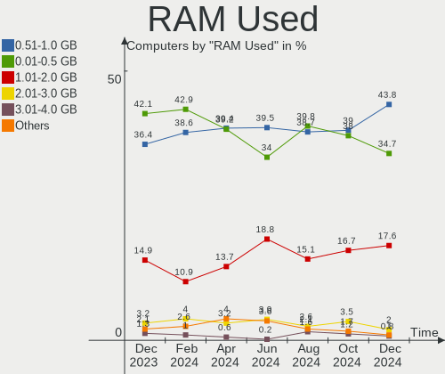
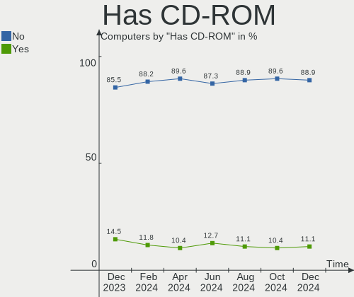

BSD - Hardware Trends
---------------------

A project to identify most popular hardware characteristics and track their change
over time based on data collected by BSD users at https://BSD-Hardware.info.

Anyone can contribute to this report by the [hw-probe](https://github.com/linuxhw/hw-probe/blob/master/INSTALL.BSD.md) tool:

    hw-probe -all -upload

This is a report for all computer types. See also reports for [desktops](/Desktop/README.md) and [notebooks](/Notebook/README.md).

OS-specific reports: [FreeBSD](/Dist/FreeBSD), [OPNsense](/Dist/OPNsense), [helloSystem](/Dist/helloSystem), [OpenBSD](/Dist/OpenBSD).

This report is for one last month. Overall report since the beginning of time: [TestCoverage](https://github.com/bsdhw/TestCoverage)

Period: Nov, 2022.

Contents
--------

* [ System ](#system)
  - [ OS                       ](#os)
  - [ OS Family                ](#os-family)
  - [ Arch                     ](#arch)
  - [ DE                       ](#de)
  - [ Display Server           ](#display-server)
  - [ Display Manager          ](#display-manager)
  - [ OS Lang                  ](#os-lang)
  - [ Boot Mode                ](#boot-mode)
  - [ Filesystem               ](#filesystem)
  - [ Part. scheme             ](#part-scheme)

* [ Board ](#board)
  - [ Vendor                   ](#vendor)
  - [ Model                    ](#model)
  - [ Model Family             ](#model-family)
  - [ MFG Year                 ](#mfg-year)
  - [ Form Factor              ](#form-factor)
  - [ Coreboot                 ](#coreboot)
  - [ RAM Size                 ](#ram-size)
  - [ RAM Used                 ](#ram-used)
  - [ Total Drives             ](#total-drives)
  - [ Has CD-ROM               ](#has-cd-rom)
  - [ Has Ethernet             ](#has-ethernet)
  - [ Has WiFi                 ](#has-wifi)
  - [ Has Bluetooth            ](#has-bluetooth)

* [ Location ](#location)
  - [ Country                  ](#country)
  - [ City                     ](#city)

* [ Drives ](#drives)
  - [ Drive Vendor             ](#drive-vendor)
  - [ Drive Model              ](#drive-model)
  - [ HDD Vendor               ](#hdd-vendor)
  - [ SSD Vendor               ](#ssd-vendor)
  - [ Drive Kind               ](#drive-kind)
  - [ Drive Connector          ](#drive-connector)
  - [ Drive Size               ](#drive-size)
  - [ Space Total              ](#space-total)
  - [ Space Used               ](#space-used)
  - [ Malfunc. Drives          ](#malfunc-drives)
  - [ Malfunc. Drive Vendor    ](#malfunc-drive-vendor)
  - [ Malfunc. HDD Vendor      ](#malfunc-hdd-vendor)
  - [ Malfunc. Drive Kind      ](#malfunc-drive-kind)
  - [ Failed Drives            ](#failed-drives)
  - [ Failed Drive Vendor      ](#failed-drive-vendor)
  - [ Drive Status             ](#drive-status)

* [ Storage controller ](#storage-controller)
  - [ Storage Vendor           ](#storage-vendor)
  - [ Storage Model            ](#storage-model)
  - [ Storage Kind             ](#storage-kind)

* [ Processor ](#processor)
  - [ CPU Vendor               ](#cpu-vendor)
  - [ CPU Model                ](#cpu-model)
  - [ CPU Model Family         ](#cpu-model-family)
  - [ CPU Cores                ](#cpu-cores)
  - [ CPU Sockets              ](#cpu-sockets)
  - [ CPU Threads              ](#cpu-threads)
  - [ CPU Microarch            ](#cpu-microarch)

* [ Graphics ](#graphics)
  - [ GPU Vendor               ](#gpu-vendor)
  - [ GPU Model                ](#gpu-model)
  - [ GPU Combo                ](#gpu-combo)
  - [ GPU Driver               ](#gpu-driver)
  - [ GPU Memory               ](#gpu-memory)

* [ Monitor ](#monitor)
  - [ Monitor Vendor           ](#monitor-vendor)
  - [ Monitor Model            ](#monitor-model)
  - [ Monitor Resolution       ](#monitor-resolution)
  - [ Monitor Diagonal         ](#monitor-diagonal)
  - [ Monitor Width            ](#monitor-width)
  - [ Aspect Ratio             ](#aspect-ratio)
  - [ Monitor Area             ](#monitor-area)
  - [ Pixel Density            ](#pixel-density)
  - [ Multiple Monitors        ](#multiple-monitors)

* [ Network ](#network)
  - [ Net Controller Vendor    ](#net-controller-vendor)
  - [ Net Controller Model     ](#net-controller-model)
  - [ Wireless Vendor          ](#wireless-vendor)
  - [ Wireless Model           ](#wireless-model)
  - [ Ethernet Vendor          ](#ethernet-vendor)
  - [ Ethernet Model           ](#ethernet-model)
  - [ Net Controller Kind      ](#net-controller-kind)
  - [ Used Controller          ](#used-controller)
  - [ NICs                     ](#nics)
  - [ IPv6                     ](#ipv6)

* [ Bluetooth ](#bluetooth)
  - [ Bluetooth Vendor         ](#bluetooth-vendor)
  - [ Bluetooth Model          ](#bluetooth-model)

* [ Sound ](#sound)
  - [ Sound Vendor             ](#sound-vendor)
  - [ Sound Model              ](#sound-model)

* [ Memory ](#memory)
  - [ Memory Vendor            ](#memory-vendor)
  - [ Memory Model             ](#memory-model)
  - [ Memory Kind              ](#memory-kind)
  - [ Memory Form Factor       ](#memory-form-factor)
  - [ Memory Size              ](#memory-size)
  - [ Memory Speed             ](#memory-speed)

* [ Printers & scanners ](#printers--scanners)
  - [ Printer Vendor           ](#printer-vendor)
  - [ Printer Model            ](#printer-model)
  - [ Scanner Vendor           ](#scanner-vendor)
  - [ Scanner Model            ](#scanner-model)

* [ Camera ](#camera)
  - [ Camera Vendor            ](#camera-vendor)
  - [ Camera Model             ](#camera-model)

* [ Security ](#security)
  - [ Fingerprint Vendor       ](#fingerprint-vendor)
  - [ Fingerprint Model        ](#fingerprint-model)
  - [ Chipcard Vendor          ](#chipcard-vendor)
  - [ Chipcard Model           ](#chipcard-model)

* [ Unsupported ](#unsupported)
  - [ Unsupported Devices      ](#unsupported-devices)
  - [ Unsupported Device Types ](#unsupported-device-types)

System
------

OS
--

Installed operating systems

| Name                 | Computers | Percent |
|----------------------|-----------|---------|
| OPNsense 22.7.8      | 114       | 27.74%  |
| OPNsense 22.7.7      | 113       | 27.49%  |
| helloSystem 0.7.0    | 29        | 7.06%   |
| OPNsense 22.7.6      | 25        | 6.08%   |
| FreeBSD 13.1-p4      | 19        | 4.62%   |
| FreeBSD 13.1-p3      | 13        | 3.16%   |
| helloSystem 0.8.0    | 12        | 2.92%   |
| FreeBSD 13.1         | 11        | 2.68%   |
| FreeBSD 13.1-p2      | 10        | 2.43%   |
| OPNsense 22.10       | 9         | 2.19%   |
| OpenBSD 7.2          | 9         | 2.19%   |
| FreeBSD 14.0-CURRENT | 4         | 0.97%   |
| FreeBSD 12.3-p2      | 4         | 0.97%   |
| OPNsense 23.1        | 3         | 0.73%   |
| OPNsense 22.1.10     | 3         | 0.73%   |
| GhostBSD 22.11.02    | 3         | 0.73%   |
| XigmaNAS 12.3-p6     | 2         | 0.49%   |
| pfSense 2.6.0        | 2         | 0.49%   |
| GhostBSD 22.11.22    | 2         | 0.49%   |
| FreeBSD 12.3-p7      | 2         | 0.49%   |
| FreeBSD 12.1-p13     | 2         | 0.49%   |
| TrueNAS 13.1-p2      | 1         | 0.24%   |
| TrueNAS 12.3-p2      | 1         | 0.24%   |
| Ting 22.1            | 1         | 0.24%   |
| pfSense 12.3-STABLE  | 1         | 0.24%   |
| OPNsense 22.7.5      | 1         | 0.24%   |
| OPNsense 22.1.1      | 1         | 0.24%   |
| OpenBSD 6.8          | 1         | 0.24%   |
| NomadBSD 80dec9b9    | 1         | 0.24%   |
| NetBSD 9.99.107      | 1         | 0.24%   |
| NetBSD 9.3_STABLE    | 1         | 0.24%   |
| NetBSD 9.3           | 1         | 0.24%   |
| MidnightBSD 2.2.6    | 1         | 0.24%   |
| helloSystem 0.6.0    | 1         | 0.24%   |
| helloSystem 0.5.0    | 1         | 0.24%   |
| FreeBSD 13.1-STABLE  | 1         | 0.24%   |
| FreeBSD 13.1-RC4     | 1         | 0.24%   |
| FreeBSD 13.1-p1      | 1         | 0.24%   |
| FreeBSD 12.3-p9      | 1         | 0.24%   |
| FreeBSD 12.3-p8      | 1         | 0.24%   |

OS Family
---------

OS without a version

| Name        | Computers | Percent |
|-------------|-----------|---------|
| OPNsense    | 269       | 65.45%  |
| FreeBSD     | 71        | 17.27%  |
| helloSystem | 43        | 10.46%  |
| OpenBSD     | 10        | 2.43%   |
| GhostBSD    | 5         | 1.22%   |
| pfSense     | 3         | 0.73%   |
| NetBSD      | 3         | 0.73%   |
| XigmaNAS    | 2         | 0.49%   |
| TrueNAS     | 2         | 0.49%   |
| Ting        | 1         | 0.24%   |
| NomadBSD    | 1         | 0.24%   |
| MidnightBSD | 1         | 0.24%   |

Arch
----

OS architecture (x86_64, i586, etc.)

| Name   | Computers | Percent |
|--------|-----------|---------|
| amd64  | 408       | 99.27%  |
| macppc | 1         | 0.24%   |
| i386   | 1         | 0.24%   |
| arm    | 1         | 0.24%   |

DE
--

Desktop Environment

| Name         | Computers | Percent |
|--------------|-----------|---------|
| Console      | 312       | 75.91%  |
| helloDesktop | 51        | 12.41%  |
| XFCE         | 16        | 3.89%   |
| KDE5         | 11        | 2.68%   |
| MATE         | 8         | 1.95%   |
| i3           | 3         | 0.73%   |
| Fluxbox      | 2         | 0.49%   |
| Window Maker | 1         | 0.24%   |
| Openbox      | 1         | 0.24%   |
| LXQt         | 1         | 0.24%   |
| GNUstep      | 1         | 0.24%   |
| GNOME        | 1         | 0.24%   |
| fvwm         | 1         | 0.24%   |
| Cinnamon     | 1         | 0.24%   |
| AwesomeWM    | 1         | 0.24%   |

Display Server
--------------

X11 or Wayland

| Name    | Computers | Percent |
|---------|-----------|---------|
| Console | 314       | 76.4%   |
| X11     | 95        | 23.11%  |
| Wayland | 2         | 0.49%   |

Display Manager
---------------

SDDM, LightDM, etc.

| Name    | Computers | Percent |
|---------|-----------|---------|
| Console | 331       | 80.54%  |
| SLiM    | 50        | 12.17%  |
| SDDM    | 12        | 2.92%   |
| LightDM | 10        | 2.43%   |
| XDM     | 6         | 1.46%   |
| GDM     | 2         | 0.49%   |

OS Lang
-------

Language

| Lang    | Computers | Percent |
|---------|-----------|---------|
| Unknown | 293       | 71.29%  |
| en_US   | 55        | 13.38%  |
| C       | 51        | 12.41%  |
| es_ES   | 3         | 0.73%   |
| zh_CN   | 2         | 0.49%   |
| nl_NL   | 2         | 0.49%   |
| pt_BR   | 1         | 0.24%   |
| it_IT   | 1         | 0.24%   |
| fr_FR   | 1         | 0.24%   |
| en_CA   | 1         | 0.24%   |
| de_DE   | 1         | 0.24%   |

Boot Mode
---------

EFI or BIOS

| Mode | Computers | Percent |
|------|-----------|---------|
| EFI  | 369       | 89.78%  |
| BIOS | 42        | 10.22%  |

Filesystem
----------

Type of filesystem

| Type   | Computers | Percent |
|--------|-----------|---------|
| Zfs    | 191       | 46.47%  |
| Ufs    | 182       | 44.28%  |
| Cd9660 | 28        | 6.81%   |
| Ffs    | 10        | 2.43%   |

Part. scheme
------------

Scheme of partitioning

| Type    | Computers | Percent |
|---------|-----------|---------|
| GPT     | 400       | 97.32%  |
| MBR     | 10        | 2.43%   |
| Unknown | 1         | 0.24%   |

Board
-----

Vendor
------

Motherboard manufacturer

| Name                       | Computers | Percent |
|----------------------------|-----------|---------|
| Dell                       | 49        | 11.92%  |
| Hewlett-Packard            | 45        | 10.95%  |
| ASUSTek Computer           | 41        | 9.98%   |
| Lenovo                     | 29        | 7.06%   |
| Unknown                    | 29        | 7.06%   |
| ASRock                     | 18        | 4.38%   |
| Gigabyte Technology        | 17        | 4.14%   |
| Protectli                  | 16        | 3.89%   |
| Intel                      | 14        | 3.41%   |
| Supermicro                 | 13        | 3.16%   |
| Sophos                     | 12        | 2.92%   |
| MSI                        | 12        | 2.92%   |
| PC Engines                 | 11        | 2.68%   |
| Fujitsu                    | 11        | 2.68%   |
| Deciso                     | 7         | 1.7%    |
| AMI                        | 7         | 1.7%    |
| Shuttle                    | 6         | 1.46%   |
| MW                         | 6         | 1.46%   |
| Acer                       | 6         | 1.46%   |
| Techvision                 | 5         | 1.22%   |
| Apple                      | 5         | 1.22%   |
| ZOTAC                      | 4         | 0.97%   |
| Samsung Electronics        | 3         | 0.73%   |
| BESSTAR Tech               | 3         | 0.73%   |
| IceWhale Technology        | 2         | 0.49%   |
| Hardkernel                 | 2         | 0.49%   |
| Google                     | 2         | 0.49%   |
| Foxconn                    | 2         | 0.49%   |
| Datto                      | 2         | 0.49%   |
| Cisco                      | 2         | 0.49%   |
| AZW                        | 2         | 0.49%   |
| AWOW                       | 2         | 0.49%   |
| ASRockRack                 | 2         | 0.49%   |
| YANYU                      | 1         | 0.24%   |
| Toshiba                    | 1         | 0.24%   |
| TOPFEEL                    | 1         | 0.24%   |
| Thomas-Krenn.AG            | 1         | 0.24%   |
| Sony                       | 1         | 0.24%   |
| ShenZhen MinWin Technology | 1         | 0.24%   |
| Seeed Studio               | 1         | 0.24%   |

Model
-----

Motherboard model

| Name                                               | Computers | Percent |
|----------------------------------------------------|-----------|---------|
| Unknown                                            | 29        | 7.06%   |
| Sophos SG                                          | 8         | 1.95%   |
| Fujitsu FUTRO S920                                 | 8         | 1.95%   |
| Protectli FW4B                                     | 6         | 1.46%   |
| MW GMLK-2_5G4L                                     | 6         | 1.46%   |
| AMI Aptio CRB                                      | 6         | 1.46%   |
| Techvision TVI7309X                                | 5         | 1.22%   |
| Supermicro Super Server                            | 5         | 1.22%   |
| Protectli FW6                                      | 5         | 1.22%   |
| PC Engines apu4                                    | 5         | 1.22%   |
| PC Engines APU2                                    | 5         | 1.22%   |
| Sophos XG                                          | 3         | 0.73%   |
| Intel Q3XXG4-P V1.0                                | 3         | 0.73%   |
| HP t620 Quad Core TC                               | 3         | 0.73%   |
| Dell OEM-R 720xd                                   | 3         | 0.73%   |
| ASUS All Series                                    | 3         | 0.73%   |
| ASRock Q1900B-ITX                                  | 3         | 0.73%   |
| Protectli FW2B                                     | 2         | 0.49%   |
| Intel D54250WYK H13922-303                         | 2         | 0.49%   |
| Intel CRESCENTBAY                                  | 2         | 0.49%   |
| HP Slim Desktop 290-p0xxx                          | 2         | 0.49%   |
| HP ProDesk 600 G1 SFF                              | 2         | 0.49%   |
| Gigabyte J3455N-D3H                                | 2         | 0.49%   |
| Dell Wyse 5070 Extended Thin Client                | 2         | 0.49%   |
| Dell PowerEdge R710                                | 2         | 0.49%   |
| Dell OptiPlex 960                                  | 2         | 0.49%   |
| Deciso NetBoard-A20                                | 2         | 0.49%   |
| Deciso NetBoard-A10                                | 2         | 0.49%   |
| Datto SSD                                          | 2         | 0.49%   |
| AWOW PC BOX                                        | 2         | 0.49%   |
| ASRock H670M-ITX/ax                                | 2         | 0.49%   |
| ZOTAC ZBOX-QCM7T3000/EN072080S/EN072070S/EN052060C | 1         | 0.24%   |
| ZOTAC ZBOX-CI622/CI642/CI662NANO                   | 1         | 0.24%   |
| ZOTAC ZBOX-CI341                                   | 1         | 0.24%   |
| ZOTAC ZBOX-CI327NANO-GS-01                         | 1         | 0.24%   |
| YANYU R250                                         | 1         | 0.24%   |
| Toshiba TECRA Z40-C-12Z                            | 1         | 0.24%   |
| TOPFEEL Topone series                              | 1         | 0.24%   |
| Thomas-Krenn.AG P9A-I/2550/4L                      | 1         | 0.24%   |
| Supermicro X7SPA-HF                                | 1         | 0.24%   |

Model Family
------------

Motherboard model prefix

| Name                | Computers | Percent |
|---------------------|-----------|---------|
| Unknown             | 29        | 7.06%   |
| Dell OptiPlex       | 13        | 3.16%   |
| Dell PowerEdge      | 12        | 2.92%   |
| Lenovo ThinkPad     | 11        | 2.68%   |
| HP ProLiant         | 9         | 2.19%   |
| Sophos SG           | 8         | 1.95%   |
| Fujitsu FUTRO       | 8         | 1.95%   |
| Lenovo ThinkCentre  | 7         | 1.7%    |
| HP ProDesk          | 7         | 1.7%    |
| HP EliteDesk        | 7         | 1.7%    |
| ASUS PRIME          | 7         | 1.7%    |
| Protectli FW4B      | 6         | 1.46%   |
| MW GMLK-2           | 6         | 1.46%   |
| AMI Aptio           | 6         | 1.46%   |
| Techvision TVI7309X | 5         | 1.22%   |
| Supermicro Super    | 5         | 1.22%   |
| Protectli FW6       | 5         | 1.22%   |
| PC Engines apu4     | 5         | 1.22%   |
| PC Engines APU2     | 5         | 1.22%   |
| HP Compaq           | 5         | 1.22%   |
| Dell Inspiron       | 5         | 1.22%   |
| HP t620             | 4         | 0.97%   |
| Dell Precision      | 4         | 0.97%   |
| ASUS ROG            | 4         | 0.97%   |
| Sophos XG           | 3         | 0.73%   |
| Intel Q3XXG4-P      | 3         | 0.73%   |
| HP Slim             | 3         | 0.73%   |
| Fujitsu PRIMERGY    | 3         | 0.73%   |
| Dell Wyse           | 3         | 0.73%   |
| Dell OEM-R          | 3         | 0.73%   |
| Dell Latitude       | 3         | 0.73%   |
| ASUS ZenBook        | 3         | 0.73%   |
| ASUS TUF            | 3         | 0.73%   |
| ASUS All            | 3         | 0.73%   |
| ASRock Q1900B-ITX   | 3         | 0.73%   |
| Acer Aspire         | 3         | 0.73%   |
| Protectli FW2B      | 2         | 0.49%   |
| Lenovo ThinkStation | 2         | 0.49%   |
| Intel D54250WYK     | 2         | 0.49%   |
| Intel CRESCENTBAY   | 2         | 0.49%   |

MFG Year
--------

Motherboard manufacture year

| Year    | Computers | Percent |
|---------|-----------|---------|
| 2018    | 54        | 13.14%  |
| 2021    | 48        | 11.68%  |
| 2022    | 44        | 10.71%  |
| 2014    | 38        | 9.25%   |
| 2016    | 33        | 8.03%   |
| 2020    | 32        | 7.79%   |
| 2019    | 30        | 7.3%    |
| 2013    | 29        | 7.06%   |
| 2017    | 21        | 5.11%   |
| 2015    | 21        | 5.11%   |
| 2012    | 17        | 4.14%   |
| 2010    | 15        | 3.65%   |
| 2011    | 9         | 2.19%   |
| 2008    | 8         | 1.95%   |
| 2009    | 5         | 1.22%   |
| Unknown | 4         | 0.97%   |
| 2007    | 2         | 0.49%   |
| 2005    | 1         | 0.24%   |

Form Factor
-----------

Physical design of the computer

| Name       | Computers | Percent |
|------------|-----------|---------|
| Desktop    | 280       | 68.13%  |
| Notebook   | 54        | 13.14%  |
| Server     | 35        | 8.52%   |
| Mini pc    | 27        | 6.57%   |
| Firewall   | 14        | 3.41%   |
| All in one | 1         | 0.24%   |

Coreboot
--------

Have coreboot on board

| Used | Computers | Percent |
|------|-----------|---------|
| No   | 395       | 96.11%  |
| Yes  | 16        | 3.89%   |

RAM Size
--------

Total RAM memory

| Size in GB      | Computers | Percent |
|-----------------|-----------|---------|
| 8.01-16.0       | 156       | 37.96%  |
| 16.01-24.0      | 91        | 22.14%  |
| 4.01-8.0        | 87        | 21.17%  |
| 32.01-64.0      | 37        | 9%      |
| 64.01-256.0     | 17        | 4.14%   |
| 24.01-32.0      | 9         | 2.19%   |
| 2.01-3.0        | 9         | 2.19%   |
| More than 256.0 | 2         | 0.49%   |
| 3.01-4.0        | 1         | 0.24%   |
| 1.01-2.0        | 1         | 0.24%   |
| 0.01-0.5        | 1         | 0.24%   |

RAM Used
--------

Used RAM memory

| Used GB     | Computers | Percent |
|-------------|-----------|---------|
| 0.01-0.5    | 212       | 51.58%  |
| 0.51-1.0    | 131       | 31.87%  |
| 1.01-2.0    | 40        | 9.73%   |
| 2.01-3.0    | 11        | 2.68%   |
| 3.01-4.0    | 6         | 1.46%   |
| 8.01-16.0   | 3         | 0.73%   |
| Unknown     | 3         | 0.73%   |
| 4.01-8.0    | 2         | 0.49%   |
| 64.01-256.0 | 1         | 0.24%   |
| 16.01-24.0  | 1         | 0.24%   |
| 0           | 1         | 0.24%   |

Total Drives
------------

Number of drives on board

| Drives | Computers | Percent |
|--------|-----------|---------|
| 1      | 282       | 68.61%  |
| 2      | 49        | 11.92%  |
| 0      | 43        | 10.46%  |
| 3      | 19        | 4.62%   |
| 4      | 10        | 2.43%   |
| 6      | 2         | 0.49%   |
| 5      | 2         | 0.49%   |
| 25     | 1         | 0.24%   |
| 13     | 1         | 0.24%   |
| 11     | 1         | 0.24%   |
| 7      | 1         | 0.24%   |

Has CD-ROM
----------

Has CD-ROM on board

| Presented | Computers | Percent |
|-----------|-----------|---------|
| No        | 339       | 82.48%  |
| Yes       | 72        | 17.52%  |

Has Ethernet
------------

Has Ethernet on board

| Presented | Computers | Percent |
|-----------|-----------|---------|
| Yes       | 395       | 96.11%  |
| No        | 16        | 3.89%   |

Has WiFi
--------

Has WiFi module

| Presented | Computers | Percent |
|-----------|-----------|---------|
| No        | 291       | 70.8%   |
| Yes       | 120       | 29.2%   |

Has Bluetooth
-------------

Has Bluetooth module

| Presented | Computers | Percent |
|-----------|-----------|---------|
| No        | 322       | 78.35%  |
| Yes       | 89        | 21.65%  |

Location
--------

Country
-------

Geographic location (country)

| Country     | Computers | Percent |
|-------------|-----------|---------|
| USA         | 108       | 26.28%  |
| Germany     | 63        | 15.33%  |
| Canada      | 24        | 5.84%   |
| UK          | 19        | 4.62%   |
| Russia      | 14        | 3.41%   |
| France      | 14        | 3.41%   |
| Spain       | 13        | 3.16%   |
| Brazil      | 13        | 3.16%   |
| Poland      | 12        | 2.92%   |
| Taiwan      | 8         | 1.95%   |
| Sweden      | 8         | 1.95%   |
| Netherlands | 7         | 1.7%    |
| Italy       | 7         | 1.7%    |
| Indonesia   | 7         | 1.7%    |
| Denmark     | 6         | 1.46%   |
| China       | 6         | 1.46%   |
| Austria     | 6         | 1.46%   |
| South Korea | 5         | 1.22%   |
| Belgium     | 5         | 1.22%   |
| Switzerland | 4         | 0.97%   |
| Slovenia    | 4         | 0.97%   |
| Portugal    | 4         | 0.97%   |
| India       | 4         | 0.97%   |
| Czechia     | 4         | 0.97%   |
| Australia   | 4         | 0.97%   |
| Mexico      | 3         | 0.73%   |
| Greece      | 3         | 0.73%   |
| Finland     | 3         | 0.73%   |
| Chile       | 3         | 0.73%   |
| Bulgaria    | 3         | 0.73%   |
| Venezuela   | 2         | 0.49%   |
| Singapore   | 2         | 0.49%   |
| New Zealand | 2         | 0.49%   |
| Japan       | 2         | 0.49%   |
| Colombia    | 2         | 0.49%   |
| Turkey      | 1         | 0.24%   |
| Thailand    | 1         | 0.24%   |
| Slovakia    | 1         | 0.24%   |
| Romania     | 1         | 0.24%   |
| Philippines | 1         | 0.24%   |

City
----

Geographic location (city)

| City                 | Computers | Percent |
|----------------------|-----------|---------|
| Ludwigsburg          | 7         | 1.7%    |
| London               | 5         | 1.22%   |
| Munich               | 4         | 0.97%   |
| Moscow               | 4         | 0.97%   |
| Montreal             | 4         | 0.97%   |
| Aquan                | 4         | 0.97%   |
| Sao Paulo            | 3         | 0.73%   |
| Renton               | 3         | 0.73%   |
| Paris                | 3         | 0.73%   |
| Papendrecht          | 3         | 0.73%   |
| Oakland              | 3         | 0.73%   |
| Lezno                | 3         | 0.73%   |
| Karlsruhe            | 3         | 0.73%   |
| Jakarta              | 3         | 0.73%   |
| Gdynia               | 3         | 0.73%   |
| Gdansk               | 3         | 0.73%   |
| Wuppertal            | 2         | 0.49%   |
| Vienna               | 2         | 0.49%   |
| Teplice              | 2         | 0.49%   |
| Taichung City        | 2         | 0.49%   |
| Stuttgart            | 2         | 0.49%   |
| St Petersburg        | 2         | 0.49%   |
| Springfield          | 2         | 0.49%   |
| Sofia                | 2         | 0.49%   |
| Singapore            | 2         | 0.49%   |
| Shenzhen             | 2         | 0.49%   |
| Seattle              | 2         | 0.49%   |
| Sarcelles            | 2         | 0.49%   |
| Sao José dos Campos | 2         | 0.49%   |
| Salem                | 2         | 0.49%   |
| Saint Paul           | 2         | 0.49%   |
| Redmond              | 2         | 0.49%   |
| Plano                | 2         | 0.49%   |
| Phoenix              | 2         | 0.49%   |
| Philadelphia         | 2         | 0.49%   |
| Perth                | 2         | 0.49%   |
| Ozersk               | 2         | 0.49%   |
| Madrid               | 2         | 0.49%   |
| Leipzig              | 2         | 0.49%   |
| Jiangbei             | 2         | 0.49%   |

Drives
------

Drive Vendor
------------

Hard drive vendors

| Vendor              | Computers | Drives | Percent |
|---------------------|-----------|--------|---------|
| Samsung Electronics | 61        | 79     | 13.77%  |
| WDC                 | 54        | 90     | 12.19%  |
| Seagate             | 37        | 47     | 8.35%   |
| Crucial             | 31        | 33     | 7%      |
| Transcend           | 29        | 33     | 6.55%   |
| Kingston            | 28        | 31     | 6.32%   |
| Intel               | 20        | 20     | 4.51%   |
| Toshiba             | 18        | 26     | 4.06%   |
| SanDisk             | 16        | 18     | 3.61%   |
| A-DATA Technology   | 13        | 13     | 2.93%   |
| Hitachi             | 11        | 11     | 2.48%   |
| Hoodisk             | 9         | 9      | 2.03%   |
| SK hynix            | 8         | 8      | 1.81%   |
| Hewlett-Packard     | 6         | 7      | 1.35%   |
| China               | 6         | 6      | 1.35%   |
| PNY                 | 5         | 6      | 1.13%   |
| HGST                | 5         | 6      | 1.13%   |
| FORESEE             | 5         | 5      | 1.13%   |
| Silicon Motion      | 4         | 4      | 0.9%    |
| Protectli           | 4         | 4      | 0.9%    |
| Intenso             | 4         | 4      | 0.9%    |
| Innodisk            | 4         | 4      | 0.9%    |
| BIWIN               | 4         | 4      | 0.9%    |
| ShiJi               | 3         | 3      | 0.68%   |
| Phison              | 3         | 3      | 0.68%   |
| NVMe                | 3         | 3      | 0.68%   |
| LITEON              | 3         | 3      | 0.68%   |
| KIOXIA              | 3         | 3      | 0.68%   |
| GOODRAM             | 3         | 4      | 0.68%   |
| Corsair             | 3         | 3      | 0.68%   |
| Apacer              | 3         | 3      | 0.68%   |
| SPCC                | 2         | 2      | 0.45%   |
| OCZ                 | 2         | 2      | 0.45%   |
| CWDISK              | 2         | 2      | 0.45%   |
| Zheino              | 1         | 1      | 0.23%   |
| Yeyian              | 1         | 2      | 0.23%   |
| Verbatim            | 1         | 1      | 0.23%   |
| Vaseky              | 1         | 1      | 0.23%   |
| Timetec             | 1         | 1      | 0.23%   |
| Team                | 1         | 1      | 0.23%   |

Drive Model
-----------

Hard drive models

| Model                                | Computers | Percent |
|--------------------------------------|-----------|---------|
| Kingston SKC600MS256G 256GB          | 6         | 1.27%   |
| Samsung SSD 860 EVO 500GB            | 5         | 1.06%   |
| HP RAID 1(1+0) 119GB                 | 5         | 1.06%   |
| Crucial CT480BX500SSD1 480GB         | 5         | 1.06%   |
| Seagate ST500DM002-1BD142 500GB      | 4         | 0.85%   |
| Kingston SA400S37240G 240GB          | 4         | 0.85%   |
| Innodisk DEMSR- 08GB mSATA 3ME3      | 4         | 0.85%   |
| Hoodisk SSD 64GB                     | 4         | 0.85%   |
| Hoodisk SSD 32GB                     | 4         | 0.85%   |
| FORESEE 128GB SSD                    | 4         | 0.85%   |
| Crucial CT500MX500SSD1 500GB         | 4         | 0.85%   |
| Crucial CT240BX500SSD1 240GB         | 4         | 0.85%   |
| Crucial CT1000MX500SSD1 1TB          | 4         | 0.85%   |
| Transcend TS64GSSD370 64GB           | 3         | 0.63%   |
| Transcend TS256GMTS952T2 256GB       | 3         | 0.63%   |
| SanDisk SDSA6MM-008G-1006 8GB        | 3         | 0.63%   |
| Samsung SSD 860 QVO 1TB              | 3         | 0.63%   |
| Samsung SSD 860 EVO 1TB              | 3         | 0.63%   |
| BIWIN SSD 128GB                      | 3         | 0.63%   |
| A-DATA IM2S3134N-064GM 64GB          | 3         | 0.63%   |
| WDC WDS500G2B0A-00SM50 500GB         | 2         | 0.42%   |
| WDC WDS240G2G0B-00EPW0 240GB         | 2         | 0.42%   |
| WDC WDS240G2G0A-00JH30 240GB         | 2         | 0.42%   |
| WDC WD10EFRX-68FYTN0 1TB             | 2         | 0.42%   |
| WDC PC SN730 SDBQNTY-256G-1001 256GB | 2         | 0.42%   |
| WDC PC SN520 SDAPNUW-256G-1006 256GB | 2         | 0.42%   |
| Transcend TS64GMSA230S 64GB          | 2         | 0.42%   |
| Transcend TS256GSSD452K2 256GB       | 2         | 0.42%   |
| Transcend TS256GMTE652T2 256GB       | 2         | 0.42%   |
| Transcend TS256GMSA230S 256GB        | 2         | 0.42%   |
| Toshiba MQ01ABF050 500GB             | 2         | 0.42%   |
| Toshiba DT01ACA100 1TB               | 2         | 0.42%   |
| SK hynix SC311 SATA 256GB            | 2         | 0.42%   |
| ShiJi SSD 128GB                      | 2         | 0.42%   |
| Seagate ST500LT012-1DG142 500GB      | 2         | 0.42%   |
| Seagate ST4000DM000-1F2168 4TB       | 2         | 0.42%   |
| SanDisk SSD PLUS 120GB               | 2         | 0.42%   |
| SanDisk SDSSDP064G 64GB              | 2         | 0.42%   |
| Samsung SSD 980 PRO 1TB              | 2         | 0.42%   |
| Samsung SSD 970 EVO Plus 500GB       | 2         | 0.42%   |

HDD Vendor
----------

Hard disk drive vendors

| Vendor              | Computers | Drives | Percent |
|---------------------|-----------|--------|---------|
| Seagate             | 35        | 44     | 32.71%  |
| WDC                 | 34        | 65     | 31.78%  |
| Toshiba             | 12        | 19     | 11.21%  |
| Hitachi             | 11        | 11     | 10.28%  |
| HGST                | 5         | 6      | 4.67%   |
| Samsung Electronics | 2         | 3      | 1.87%   |
| NVMe                | 2         | 2      | 1.87%   |
| OPENBSD             | 1         | 1      | 0.93%   |
| NETAPP              | 1         | 2      | 0.93%   |
| Hewlett-Packard     | 1         | 2      | 0.93%   |
| Dell                | 1         | 23     | 0.93%   |
| Cisco               | 1         | 1      | 0.93%   |
| Apple               | 1         | 1      | 0.93%   |

SSD Vendor
----------

Solid state drive vendors

| Vendor              | Computers | Drives | Percent |
|---------------------|-----------|--------|---------|
| Samsung Electronics | 44        | 55     | 16.06%  |
| Crucial             | 28        | 30     | 10.22%  |
| Transcend           | 27        | 31     | 9.85%   |
| Kingston            | 25        | 28     | 9.12%   |
| SanDisk             | 16        | 18     | 5.84%   |
| Intel               | 16        | 16     | 5.84%   |
| A-DATA Technology   | 12        | 12     | 4.38%   |
| WDC                 | 9         | 12     | 3.28%   |
| Hoodisk             | 9         | 9      | 3.28%   |
| Toshiba             | 6         | 7      | 2.19%   |
| China               | 6         | 6      | 2.19%   |
| SK hynix            | 5         | 5      | 1.82%   |
| PNY                 | 5         | 6      | 1.82%   |
| Hewlett-Packard     | 5         | 5      | 1.82%   |
| FORESEE             | 5         | 5      | 1.82%   |
| Protectli           | 4         | 4      | 1.46%   |
| Intenso             | 4         | 4      | 1.46%   |
| Innodisk            | 4         | 4      | 1.46%   |
| ShiJi               | 3         | 3      | 1.09%   |
| LITEON              | 3         | 3      | 1.09%   |
| GOODRAM             | 3         | 4      | 1.09%   |
| BIWIN               | 3         | 3      | 1.09%   |
| Apacer              | 3         | 3      | 1.09%   |
| Seagate             | 2         | 2      | 0.73%   |
| OCZ                 | 2         | 2      | 0.73%   |
| Corsair             | 2         | 2      | 0.73%   |
| Zheino              | 1         | 1      | 0.36%   |
| Yeyian              | 1         | 2      | 0.36%   |
| Verbatim            | 1         | 1      | 0.36%   |
| Vaseky              | 1         | 1      | 0.36%   |
| Supermicro          | 1         | 1      | 0.36%   |
| SPCC                | 1         | 1      | 0.36%   |
| Patriot             | 1         | 1      | 0.36%   |
| ORTIAL              | 1         | 1      | 0.36%   |
| Mushkin             | 1         | 1      | 0.36%   |
| Micron Technology   | 1         | 1      | 0.36%   |
| Maximus             | 1         | 1      | 0.36%   |
| MARVELL             | 1         | 1      | 0.36%   |
| LITEONIT            | 1         | 1      | 0.36%   |
| KingSpec            | 1         | 1      | 0.36%   |

Drive Kind
----------

HDD or SSD

| Kind | Computers | Drives | Percent |
|------|-----------|--------|---------|
| SSD  | 253       | 303    | 60.82%  |
| HDD  | 95        | 180    | 22.84%  |
| NVMe | 68        | 71     | 16.35%  |

Drive Connector
---------------

SATA, SAS, NVMe, etc.

| Type | Computers | Drives | Percent |
|------|-----------|--------|---------|
| SATA | 322       | 483    | 82.56%  |
| NVMe | 68        | 71     | 17.44%  |

Drive Size
----------

Size of hard drive

| Size in TB | Computers | Drives | Percent |
|------------|-----------|--------|---------|
| 0.01-0.5   | 279       | 370    | 78.59%  |
| 0.51-1.0   | 46        | 64     | 12.96%  |
| 1.01-2.0   | 14        | 20     | 3.94%   |
| 3.01-4.0   | 9         | 14     | 2.54%   |
| 2.01-3.0   | 3         | 3      | 0.85%   |
| 4.01-10.0  | 3         | 10     | 0.85%   |
| 10.01-20.0 | 1         | 2      | 0.28%   |

Space Total
-----------

Amount of disk space available on the file system

| Size in GB     | Computers | Percent |
|----------------|-----------|---------|
| 101-250        | 165       | 40.15%  |
| 251-500        | 72        | 17.52%  |
| 1-20           | 51        | 12.41%  |
| 51-100         | 44        | 10.71%  |
| 21-50          | 40        | 9.73%   |
| 501-1000       | 29        | 7.06%   |
| 1001-2000      | 5         | 1.22%   |
| More than 3000 | 2         | 0.49%   |
| 2001-3000      | 2         | 0.49%   |
| Unknown        | 1         | 0.24%   |

Space Used
----------

Amount of used disk space

| Used GB        | Computers | Percent |
|----------------|-----------|---------|
| 1-20           | 380       | 92.46%  |
| 21-50          | 17        | 4.14%   |
| 51-100         | 7         | 1.7%    |
| 251-500        | 3         | 0.73%   |
| More than 3000 | 1         | 0.24%   |
| 101-250        | 1         | 0.24%   |
| 501-1000       | 1         | 0.24%   |
| Unknown        | 1         | 0.24%   |

Malfunc. Drives
---------------

Drive models with a malfunction

| Model                                     | Computers | Drives | Percent |
|-------------------------------------------|-----------|--------|---------|
| Seagate ST500DM002-1BD142 500GB           | 3         | 3      | 6.52%   |
| Seagate ST500LT012-1DG142 500GB           | 2         | 2      | 4.35%   |
| Samsung Electronics SSD 970 EVO 500GB     | 2         | 2      | 4.35%   |
| HGST HTS725050A7E630 500GB                | 2         | 2      | 4.35%   |
| Crucial CT480BX500SSD1 480GB              | 2         | 2      | 4.35%   |
| WDC WD6400AAKS-22A7B2 640GB               | 1         | 1      | 2.17%   |
| WDC WD4000AAKS-00C8A0 400GB               | 1         | 1      | 2.17%   |
| WDC WD30EZRX-00D8PB0 3TB                  | 1         | 1      | 2.17%   |
| WDC WD10EZEX-60WN4A1 1TB                  | 1         | 1      | 2.17%   |
| Toshiba MQ01ABF032 320GB                  | 1         | 1      | 2.17%   |
| Toshiba MK3254GSY 320GB                   | 1         | 1      | 2.17%   |
| Toshiba MK1255GSX H 120GB                 | 1         | 1      | 2.17%   |
| Toshiba DT01ACA100 1TB                    | 1         | 1      | 2.17%   |
| SK hynix SC308 SATA 128GB                 | 1         | 1      | 2.17%   |
| Seagate ST9750420AS 752GB                 | 1         | 1      | 2.17%   |
| Seagate ST9320325ASG 320GB                | 1         | 1      | 2.17%   |
| Seagate ST500LT012-9WS142 500GB           | 1         | 1      | 2.17%   |
| Seagate ST500LM021-1KJ152 500GB           | 1         | 1      | 2.17%   |
| Seagate ST500LM012 HN-M500MBB 500GB       | 1         | 1      | 2.17%   |
| Seagate ST3750640NS 752GB                 | 1         | 2      | 2.17%   |
| Seagate ST3500414CS 500GB                 | 1         | 1      | 2.17%   |
| Seagate ST320LT007-9ZV142 320GB           | 1         | 1      | 2.17%   |
| Seagate ST3160211AS 160GB                 | 1         | 1      | 2.17%   |
| Seagate ST31000340NS 1TB                  | 1         | 1      | 2.17%   |
| Samsung Electronics SSD PM851 mSATA 256GB | 1         | 1      | 2.17%   |
| Samsung Electronics SSD 960 PRO 512GB     | 1         | 1      | 2.17%   |
| Samsung Electronics SSD 850 PRO 256GB     | 1         | 2      | 2.17%   |
| Samsung Electronics HD502HJ 500GB         | 1         | 1      | 2.17%   |
| LITEON IT LST-16S9G-HP 16GB               | 1         | 1      | 2.17%   |
| Intel SSDSC2CT120A3 120GB                 | 1         | 1      | 2.17%   |
| Intel SSDSC2CT060A3 64GB                  | 1         | 1      | 2.17%   |
| Hitachi HTS542525K9A300 250GB             | 1         | 1      | 2.17%   |
| Hitachi HDS728080PLA380 82GB              | 1         | 1      | 2.17%   |
| Hitachi HDS721010CLA332 1TB               | 1         | 1      | 2.17%   |
| HGST HTS721010A9E630 1TB                  | 1         | 1      | 2.17%   |
| HGST HTS541010A7E630 1TB                  | 1         | 1      | 2.17%   |
| Crucial CT480M500SSD1 480GB               | 1         | 1      | 2.17%   |
| Crucial CT240M500SSD1 240GB               | 1         | 1      | 2.17%   |
| A-DATA Technology SX300 128GB             | 1         | 1      | 2.17%   |
| A-DATA Technology SU650 120GB             | 1         | 1      | 2.17%   |

Malfunc. Drive Vendor
---------------------

Vendors of faulty drives

| Vendor              | Computers | Drives | Percent |
|---------------------|-----------|--------|---------|
| Seagate             | 14        | 16     | 31.11%  |
| Samsung Electronics | 6         | 7      | 13.33%  |
| WDC                 | 4         | 4      | 8.89%   |
| Toshiba             | 4         | 4      | 8.89%   |
| HGST                | 4         | 4      | 8.89%   |
| Crucial             | 4         | 4      | 8.89%   |
| Hitachi             | 3         | 3      | 6.67%   |
| Intel               | 2         | 2      | 4.44%   |
| A-DATA Technology   | 2         | 2      | 4.44%   |
| SK hynix            | 1         | 1      | 2.22%   |
| LITEON              | 1         | 1      | 2.22%   |

Malfunc. HDD Vendor
-------------------

Vendors of faulty HDD drives

| Vendor              | Computers | Drives | Percent |
|---------------------|-----------|--------|---------|
| Seagate             | 14        | 16     | 46.67%  |
| WDC                 | 4         | 4      | 13.33%  |
| Toshiba             | 4         | 4      | 13.33%  |
| HGST                | 4         | 4      | 13.33%  |
| Hitachi             | 3         | 3      | 10%     |
| Samsung Electronics | 1         | 1      | 3.33%   |

Malfunc. Drive Kind
-------------------

Kinds of faulty drives

| Kind | Computers | Drives | Percent |
|------|-----------|--------|---------|
| HDD  | 29        | 32     | 65.91%  |
| SSD  | 12        | 13     | 27.27%  |
| NVMe | 3         | 3      | 6.82%   |

Failed Drives
-------------

Failed drive models

| Model                        | Computers | Drives | Percent |
|------------------------------|-----------|--------|---------|
| WDC WD3200BPVT-16JJ5T0 320GB | 1         | 1      | 33.33%  |
| SK hynix SC308 SATA 256GB    | 1         | 1      | 33.33%  |
| Seagate ST3500418AS 500GB    | 1         | 1      | 33.33%  |

Failed Drive Vendor
-------------------

Failed drive vendors

| Vendor   | Computers | Drives | Percent |
|----------|-----------|--------|---------|
| WDC      | 1         | 1      | 33.33%  |
| SK hynix | 1         | 1      | 33.33%  |
| Seagate  | 1         | 1      | 33.33%  |

Drive Status
------------

Number of failed and malfunc. drives

| Status   | Computers | Drives | Percent |
|----------|-----------|--------|---------|
| Works    | 325       | 486    | 84.42%  |
| Malfunc  | 42        | 48     | 10.91%  |
| Detected | 15        | 17     | 3.9%    |
| Failed   | 3         | 3      | 0.78%   |

Storage controller
------------------

Storage Vendor
--------------

Storage controller vendors

| Vendor                       | Computers | Percent |
|------------------------------|-----------|---------|
| Intel                        | 316       | 62.33%  |
| AMD                          | 70        | 13.81%  |
| Samsung Electronics          | 21        | 4.14%   |
| SanDisk                      | 18        | 3.55%   |
| Broadcom / LSI               | 18        | 3.55%   |
| ASMedia Technology           | 11        | 2.17%   |
| Silicon Motion               | 9         | 1.78%   |
| Hewlett-Packard              | 6         | 1.18%   |
| Phison Electronics           | 4         | 0.79%   |
| Nvidia                       | 4         | 0.79%   |
| Marvell Technology Group     | 4         | 0.79%   |
| SK hynix                     | 3         | 0.59%   |
| Micron/Crucial Technology    | 3         | 0.59%   |
| Kingston Technology Company  | 3         | 0.59%   |
| Transcend                    | 2         | 0.39%   |
| Shenzhen Longsys Electronics | 2         | 0.39%   |
| KIOXIA                       | 2         | 0.39%   |
| JMicron Technology           | 2         | 0.39%   |
| ADATA Technology             | 2         | 0.39%   |
| VIA Technologies             | 1         | 0.2%    |
| Toshiba                      | 1         | 0.2%    |
| Silicon Image                | 1         | 0.2%    |
| Seagate Technology           | 1         | 0.2%    |
| MAXIO Technology (Hangzhou)  | 1         | 0.2%    |
| Biwin Storage Technology     | 1         | 0.2%    |
| 3ware                        | 1         | 0.2%    |

Storage Model
-------------

Storage controller models

| Model                                                                                   | Computers | Percent |
|-----------------------------------------------------------------------------------------|-----------|---------|
| AMD FCH SATA Controller [AHCI mode]                                                     | 45        | 8.05%   |
| Intel Celeron/Pentium Silver Processor SATA Controller                                  | 26        | 4.65%   |
| Intel 8 Series/C220 Series Chipset Family 6-port SATA Controller 1 [AHCI mode]          | 26        | 4.65%   |
| Intel Q170/Q150/B150/H170/H110/Z170/CM236 Chipset SATA Controller [AHCI Mode]           | 20        | 3.58%   |
| Intel Atom Processor E3800 Series SATA AHCI Controller                                  | 17        | 3.04%   |
| Intel Sunrise Point-LP SATA Controller [AHCI mode]                                      | 15        | 2.68%   |
| Intel Jasper Lake SATA AHCI Controller                                                  | 12        | 2.15%   |
| Intel 200 Series PCH SATA controller [AHCI mode]                                        | 12        | 2.15%   |
| Unknown                                                                                 | 12        | 2.15%   |
| Intel 7 Series/C210 Series Chipset Family 6-port SATA Controller [AHCI mode]            | 11        | 1.97%   |
| Intel 7 Series Chipset Family 6-port SATA Controller [AHCI mode]                        | 11        | 1.97%   |
| ASMedia ASM1062 Serial ATA Controller                                                   | 11        | 1.97%   |
| AMD 400 Series Chipset SATA Controller                                                  | 11        | 1.97%   |
| Intel Atom/Celeron/Pentium Processor x5-E8000/J3xxx/N3xxx Series SATA Controller        | 10        | 1.79%   |
| Silicon Motion SM2263EN/SM2263XT SSD Controller                                         | 9         | 1.61%   |
| Intel Wildcat Point-LP SATA Controller [AHCI Mode]                                      | 9         | 1.61%   |
| Intel Cannon Lake PCH SATA AHCI Controller                                              | 9         | 1.61%   |
| Intel 8 Series SATA Controller 1 [AHCI mode]                                            | 9         | 1.61%   |
| Intel 6 Series/C200 Series Chipset Family 6 port Desktop SATA AHCI Controller           | 9         | 1.61%   |
| Intel Celeron N3350/Pentium N4200/Atom E3900 Series SATA AHCI Controller                | 8         | 1.43%   |
| Samsung NVMe SSD Controller SM981/PM981/PM983                                           | 7         | 1.25%   |
| Intel 500 Series Chipset Family SATA AHCI Controller                                    | 7         | 1.25%   |
| AMD SB7x0/SB8x0/SB9x0 SATA Controller [AHCI mode]                                       | 7         | 1.25%   |
| Samsung NVMe SSD Controller SM961/PM961/SM963                                           | 6         | 1.07%   |
| Intel NM10/ICH7 Family SATA Controller [IDE mode]                                       | 6         | 1.07%   |
| Intel Comet Lake SATA AHCI Controller                                                   | 6         | 1.07%   |
| Intel Atom Processor C3000 Series SATA Controller 0                                     | 6         | 1.07%   |
| Intel Atom processor C2000 AHCI SATA3 Controller                                        | 6         | 1.07%   |
| Intel 82801JI (ICH10 Family) 4 port SATA IDE Controller #1                              | 6         | 1.07%   |
| Broadcom / LSI MegaRAID SAS 2208 [Thunderbolt]                                          | 6         | 1.07%   |
| AMD FCH SATA Controller [IDE mode]                                                      | 6         | 1.07%   |
| Samsung NVMe SSD Controller 980                                                         | 5         | 0.89%   |
| Intel SATA Controller [RAID mode]                                                       | 5         | 0.89%   |
| Intel C610/X99 series chipset sSATA Controller [AHCI mode]                              | 5         | 0.89%   |
| Intel C610/X99 series chipset 6-Port SATA Controller [AHCI mode]                        | 5         | 0.89%   |
| Intel C600/X79 series chipset 6-Port SATA AHCI Controller                               | 5         | 0.89%   |
| Intel 6 Series/C200 Series Chipset Family Desktop SATA Controller (IDE mode, ports 4-5) | 5         | 0.89%   |
| Intel 6 Series/C200 Series Chipset Family Desktop SATA Controller (IDE mode, ports 0-3) | 5         | 0.89%   |
| Intel 400 Series Chipset Family SATA AHCI Controller                                    | 5         | 0.89%   |
| Broadcom / LSI MegaRAID SAS 2108 [Liberator]                                            | 5         | 0.89%   |

Storage Kind
------------

Kind of storage controller (IDE, SATA, NVMe, SAS, ...)

| Kind | Computers | Percent |
|------|-----------|---------|
| SATA | 343       | 67.65%  |
| NVMe | 76        | 14.99%  |
| IDE  | 50        | 9.86%   |
| RAID | 33        | 6.51%   |
| SAS  | 5         | 0.99%   |

Processor
---------

CPU Vendor
----------

Processor vendors

| Vendor  | Computers | Percent |
|---------|-----------|---------|
| Intel   | 331       | 80.54%  |
| AMD     | 77        | 18.73%  |
| VIA     | 1         | 0.24%   |
| PowerPC | 1         | 0.24%   |
| ARM     | 1         | 0.24%   |

CPU Model
---------

Processor models

| Model                                       | Computers | Percent |
|---------------------------------------------|-----------|---------|
| Intel Celeron J4125 CPU @ 2.00GHz           | 17        | 4.14%   |
| AMD GX-412TC SOC                            | 11        | 2.68%   |
| Intel Celeron N5105 @ 2.00GHz               | 9         | 2.19%   |
| Intel Celeron CPU J1900 @ 1.99GHz           | 9         | 2.19%   |
| AMD GX-415GA SOC with Radeon HD Graphics    | 7         | 1.7%    |
| Intel Celeron CPU J3160 @ 1.60GHz           | 6         | 1.46%   |
| Intel Core i5-6500 CPU @ 3.20GHz            | 5         | 1.22%   |
| Intel Xeon CPU E5-2650 v2 @ 2.60GHz         | 4         | 0.97%   |
| Intel Core i5-6300U CPU @ 2.40GHz           | 4         | 0.97%   |
| Intel Core i5-3470 CPU @ 3.20GHz            | 4         | 0.97%   |
| Intel Celeron CPU J3455 @ 1.50GHz           | 4         | 0.97%   |
| Intel Atom CPU C3558 @ 2.20GHz              | 4         | 0.97%   |
| Intel Atom CPU C2558 @ 2.40GHz              | 4         | 0.97%   |
| AMD Ryzen 5 3600 6-Core Processor           | 4         | 0.97%   |
| AMD GX-222GC SOC with Radeon R5E Graphics   | 4         | 0.97%   |
| AMD EPYC 3201 8-Core Processor              | 4         | 0.97%   |
| Intel Pentium CPU G3220 @ 3.00GHz           | 3         | 0.73%   |
| Intel Core i5-6500T CPU @ 2.50GHz           | 3         | 0.73%   |
| Intel Core i5-3570 CPU @ 3.40GHz            | 3         | 0.73%   |
| Intel Core i5-10210U CPU @ 1.60GHz          | 3         | 0.73%   |
| Intel Core i3-7100 CPU @ 3.90GHz            | 3         | 0.73%   |
| Intel Core i3-6100 CPU @ 3.70GHz            | 3         | 0.73%   |
| Intel Core i3-5005U CPU @ 2.00GHz           | 3         | 0.73%   |
| Intel Core 2 Quad CPU Q6600 @ 2.40GHz       | 3         | 0.73%   |
| Intel Celeron J4105 CPU @ 1.50GHz           | 3         | 0.73%   |
| Intel Atom CPU D525 @ 1.80GHz               | 3         | 0.73%   |
| AMD Ryzen 3 3200G with Radeon Vega Graphics | 3         | 0.73%   |
| Intel Xeon CPU E5620 @ 2.40GHz              | 2         | 0.49%   |
| Intel Xeon CPU E5-2630 v3 @ 2.40GHz         | 2         | 0.49%   |
| Intel Xeon CPU E5-2420 v2 @ 2.20GHz         | 2         | 0.49%   |
| Intel Xeon CPU E5-1620 0 @ 3.60GH           | 2         | 0.49%   |
| Intel Xeon CPU E3-1220 v3 @ 3.10GHz         | 2         | 0.49%   |
| Intel Xeon CPU D-1537 @ 1.70GHz             | 2         | 0.49%   |
| Intel Xeon                                  | 2         | 0.49%   |
| Intel Pentium Silver N6005 @ 2.00GHz        | 2         | 0.49%   |
| Intel Pentium Silver J5005 CPU @ 1.50GHz    | 2         | 0.49%   |
| Intel Pentium Gold G7400                    | 2         | 0.49%   |
| Intel Core i7-8550U CPU @ 1.80GHz           | 2         | 0.49%   |
| Intel Core i7-6700 CPU @ 3.40GHz            | 2         | 0.49%   |
| Intel Core i7-6600U CPU @ 2.60GHz           | 2         | 0.49%   |

CPU Model Family
----------------

Processor model prefix

| Model                | Computers | Percent |
|----------------------|-----------|---------|
| Intel Core i5        | 80        | 19.46%  |
| Intel Celeron        | 73        | 17.76%  |
| Intel Xeon           | 49        | 11.92%  |
| Intel Core i7        | 29        | 7.06%   |
| Intel Core i3        | 27        | 6.57%   |
| AMD GX               | 24        | 5.84%   |
| Intel Atom           | 19        | 4.62%   |
| Other                | 15        | 3.65%   |
| Intel Pentium        | 11        | 2.68%   |
| Intel Pentium Silver | 7         | 1.7%    |
| Intel Core 2 Quad    | 7         | 1.7%    |
| Intel Core 2 Duo     | 7         | 1.7%    |
| AMD Ryzen 7          | 7         | 1.7%    |
| AMD Ryzen 5          | 7         | 1.7%    |
| AMD EPYC             | 7         | 1.7%    |
| AMD Ryzen 3          | 6         | 1.46%   |
| Intel Pentium Gold   | 3         | 0.73%   |
| AMD Ryzen 9          | 3         | 0.73%   |
| Intel Core i9        | 2         | 0.49%   |
| AMD Ryzen Embedded   | 2         | 0.49%   |
| AMD Phenom II X6     | 2         | 0.49%   |
| AMD Phenom II X4     | 2         | 0.49%   |
| AMD G                | 2         | 0.49%   |
| AMD Athlon           | 2         | 0.49%   |
| AMD A8               | 2         | 0.49%   |
| Intel Xeon Gold      | 1         | 0.24%   |
| Intel Pentium M      | 1         | 0.24%   |
| Intel Genuine        | 1         | 0.24%   |
| Intel Core 2         | 1         | 0.24%   |
| Intel 686-class      | 1         | 0.24%   |
| ARM Cortex           | 1         | 0.24%   |
| AMD V120             | 1         | 0.24%   |
| AMD Turion II Neo    | 1         | 0.24%   |
| AMD Ryzen 5 PRO      | 1         | 0.24%   |
| AMD Phenom II X2     | 1         | 0.24%   |
| AMD Opteron          | 1         | 0.24%   |
| AMD FX               | 1         | 0.24%   |
| AMD E1               | 1         | 0.24%   |
| AMD Athlon X4        | 1         | 0.24%   |
| AMD Athlon II X4     | 1         | 0.24%   |

CPU Cores
---------

Number of processor cores

| Number  | Computers | Percent |
|---------|-----------|---------|
| 4       | 208       | 50.61%  |
| 2       | 107       | 26.03%  |
| 6       | 25        | 6.08%   |
| 8       | 23        | 5.6%    |
| 16      | 14        | 3.41%   |
| 12      | 11        | 2.68%   |
| Unknown | 10        | 2.43%   |
| 1       | 4         | 0.97%   |
| 24      | 3         | 0.73%   |
| 10      | 3         | 0.73%   |
| 64      | 1         | 0.24%   |
| 40      | 1         | 0.24%   |
| 28      | 1         | 0.24%   |

CPU Sockets
-----------

Number of sockets

| Number  | Computers | Percent |
|---------|-----------|---------|
| 1       | 388       | 94.4%   |
| 2       | 18        | 4.38%   |
| Unknown | 3         | 0.73%   |
| 4       | 2         | 0.49%   |

CPU Threads
-----------

Threads per core (Hyper-Threading)

| Number  | Computers | Percent |
|---------|-----------|---------|
| 1       | 248       | 60.34%  |
| 2       | 151       | 36.74%  |
| Unknown | 12        | 2.92%   |

CPU Microarch
-------------

Microarchitecture

| Name          | Computers | Percent |
|---------------|-----------|---------|
| Haswell       | 41        | 9.98%   |
| KabyLake      | 39        | 9.49%   |
| IvyBridge     | 36        | 8.76%   |
| Silvermont    | 35        | 8.52%   |
| Skylake       | 32        | 7.79%   |
| Unknown       | 28        | 6.81%   |
| Goldmont plus | 26        | 6.33%   |
| Puma          | 17        | 4.14%   |
| SandyBridge   | 15        | 3.65%   |
| Broadwell     | 15        | 3.65%   |
| Goldmont      | 14        | 3.41%   |
| Penryn        | 13        | 3.16%   |
| Zen           | 12        | 2.92%   |
| Westmere      | 12        | 2.92%   |
| Zen 2         | 10        | 2.43%   |
| CometLake     | 10        | 2.43%   |
| Zen+          | 9         | 2.19%   |
| Jaguar        | 9         | 2.19%   |
| K10           | 8         | 1.95%   |
| Core          | 7         | 1.7%    |
| TigerLake     | 4         | 0.97%   |
| Zen 3         | 3         | 0.73%   |
| Piledriver    | 3         | 0.73%   |
| Nehalem       | 3         | 0.73%   |
| Bonnell       | 3         | 0.73%   |
| Steamroller   | 2         | 0.49%   |
| Bobcat        | 2         | 0.49%   |
| P6            | 1         | 0.24%   |
| IceLake       | 1         | 0.24%   |
| Excavator     | 1         | 0.24%   |

Graphics
--------

GPU Vendor
----------

Vendors of graphics cards

| Vendor                     | Computers | Percent |
|----------------------------|-----------|---------|
| Intel                      | 240       | 59.85%  |
| AMD                        | 58        | 14.46%  |
| Nvidia                     | 46        | 11.47%  |
| Matrox Electronics Systems | 28        | 6.98%   |
| ASPEED Technology          | 28        | 6.98%   |
| VIA Technologies           | 1         | 0.25%   |

GPU Model
---------

Graphics card models

| Model                                                                                    | Computers | Percent |
|------------------------------------------------------------------------------------------|-----------|---------|
| ASPEED Technology ASPEED Graphics Family                                                 | 28        | 6.93%   |
| Intel GeminiLake [UHD Graphics 600]                                                      | 22        | 5.45%   |
| Intel Xeon E3-1200 v3/4th Gen Core Processor Integrated Graphics Controller              | 19        | 4.7%    |
| Intel HD Graphics 530                                                                    | 18        | 4.46%   |
| Intel Atom Processor Z36xxx/Z37xxx Series Graphics & Display                             | 17        | 4.21%   |
| Intel JasperLake [UHD Graphics]                                                          | 13        | 3.22%   |
| Intel Atom/Celeron/Pentium Processor x5-E8000/J3xxx/N3xxx Integrated Graphics Controller | 12        | 2.97%   |
| Intel 3rd Gen Core processor Graphics Controller                                         | 11        | 2.72%   |
| Matrox Electronics Systems G200eR2                                                       | 10        | 2.48%   |
| Matrox Electronics Systems MGA G200eW WPCM450                                            | 9         | 2.23%   |
| Intel Xeon E3-1200 v2/3rd Gen Core processor Graphics Controller                         | 9         | 2.23%   |
| Intel Haswell-ULT Integrated Graphics Controller                                         | 9         | 2.23%   |
| Intel Skylake GT2 [HD Graphics 520]                                                      | 8         | 1.98%   |
| Intel HD Graphics 630                                                                    | 8         | 1.98%   |
| Intel HD Graphics 5500                                                                   | 8         | 1.98%   |
| Intel HD Graphics 500                                                                    | 8         | 1.98%   |
| Intel CometLake-S GT2 [UHD Graphics 630]                                                 | 7         | 1.73%   |
| Intel CoffeeLake-S GT2 [UHD Graphics 630]                                                | 7         | 1.73%   |
| Intel 2nd Generation Core Processor Family Integrated Graphics Controller                | 7         | 1.73%   |
| AMD Kabini [Radeon HD 8330E]                                                             | 7         | 1.73%   |
| Matrox Electronics Systems MGA G200e [Pilot] ServerEngines (SEP1)                        | 5         | 1.24%   |
| Intel CometLake-U GT2 [UHD Graphics]                                                     | 5         | 1.24%   |
| AMD Picasso/Raven 2 [Radeon Vega Series / Radeon Vega Mobile Series]                     | 5         | 1.24%   |
| AMD Mullins [Radeon R4/R5 Graphics]                                                      | 5         | 1.24%   |
| AMD ES1000                                                                               | 5         | 1.24%   |
| Intel TigerLake-LP GT2 [Iris Xe Graphics]                                                | 4         | 0.99%   |
| Intel HD Graphics 620                                                                    | 4         | 0.99%   |
| Intel GeminiLake [UHD Graphics 605]                                                      | 4         | 0.99%   |
| Nvidia GP107 [GeForce GTX 1050 Ti]                                                       | 3         | 0.74%   |
| Nvidia GP106 [GeForce GTX 1060 6GB]                                                      | 3         | 0.74%   |
| Matrox Electronics Systems MGA G200EH                                                    | 3         | 0.74%   |
| Intel UHD Graphics 620                                                                   | 3         | 0.74%   |
| Intel HD Graphics 610                                                                    | 3         | 0.74%   |
| Intel 82G33/G31 Express Integrated Graphics Controller                                   | 3         | 0.74%   |
| Intel 4 Series Chipset Integrated Graphics Controller                                    | 3         | 0.74%   |
| AMD Renoir                                                                               | 3         | 0.74%   |
| Nvidia TU117 [GeForce GTX 1650]                                                          | 2         | 0.5%    |
| Nvidia GP108 [GeForce GT 1030]                                                           | 2         | 0.5%    |
| Nvidia GK208B [GeForce GT 710]                                                           | 2         | 0.5%    |
| Nvidia GF119M [GeForce 610M]                                                             | 2         | 0.5%    |

GPU Combo
---------

Combinations of graphics cards

| Name           | Computers | Percent |
|----------------|-----------|---------|
| 1 x Intel      | 222       | 54.01%  |
| 1 x AMD        | 54        | 13.14%  |
| 1 x Nvidia     | 37        | 9%      |
| 1 x ASPEED     | 28        | 6.81%   |
| 1 x Matrox     | 27        | 6.57%   |
| Other          | 25        | 6.08%   |
| Intel + Nvidia | 7         | 1.7%    |
| 2 x Intel      | 5         | 1.22%   |
| Intel + AMD    | 3         | 0.73%   |
| 1 x VIA        | 1         | 0.24%   |
| Intel + Matrox | 1         | 0.24%   |
| AMD + Nvidia   | 1         | 0.24%   |

GPU Driver
----------

Free vs proprietary

| Driver      | Computers | Percent |
|-------------|-----------|---------|
| Free        | 360       | 87.59%  |
| Unknown     | 28        | 6.81%   |
| Proprietary | 23        | 5.6%    |

GPU Memory
----------

Total video memory

| Size in GB | Computers | Percent |
|------------|-----------|---------|
| Unknown    | 375       | 91.24%  |
| 0.51-1.0   | 12        | 2.92%   |
| 0.01-0.5   | 6         | 1.46%   |
| 1.01-2.0   | 5         | 1.22%   |
| 5.01-6.0   | 4         | 0.97%   |
| 3.01-4.0   | 4         | 0.97%   |
| 2.01-3.0   | 3         | 0.73%   |
| 7.01-8.0   | 2         | 0.49%   |

Monitor
-------

Monitor Vendor
--------------

Monitor vendors

| Vendor                  | Computers | Percent |
|-------------------------|-----------|---------|
| Samsung Electronics     | 11        | 12.94%  |
| LG Display              | 8         | 9.41%   |
| Chimei Innolux          | 7         | 8.24%   |
| AU Optronics            | 7         | 8.24%   |
| BOE                     | 6         | 7.06%   |
| Dell                    | 5         | 5.88%   |
| BenQ                    | 4         | 4.71%   |
| AOC                     | 4         | 4.71%   |
| Philips                 | 3         | 3.53%   |
| Hewlett-Packard         | 3         | 3.53%   |
| ViewSonic               | 2         | 2.35%   |
| PANDA                   | 2         | 2.35%   |
| Iiyama                  | 2         | 2.35%   |
| Goldstar                | 2         | 2.35%   |
| Chi Mei Optoelectronics | 2         | 2.35%   |
| Apple                   | 2         | 2.35%   |
| Ancor Communications    | 2         | 2.35%   |
| Acer                    | 2         | 2.35%   |
| YTH                     | 1         | 1.18%   |
| unknown                 | 1         | 1.18%   |
| Toshiba                 | 1         | 1.18%   |
| Sharp                   | 1         | 1.18%   |
| Panasonic               | 1         | 1.18%   |
| Mi                      | 1         | 1.18%   |
| LG Philips              | 1         | 1.18%   |
| LG Electronics          | 1         | 1.18%   |
| Lenovo                  | 1         | 1.18%   |
| InfoVision              | 1         | 1.18%   |
| Eizo                    | 1         | 1.18%   |

Monitor Model
-------------

Monitor models

| Model                                                                 | Computers | Percent |
|-----------------------------------------------------------------------|-----------|---------|
| Chimei Innolux LCD Monitor CMN14A8 1920x1080 310x170mm 13.9-inch      | 2         | 2.33%   |
| Chimei Innolux LCD Monitor CMN1239 1920x1080 280x160mm 12.7-inch      | 2         | 2.33%   |
| Acer G227HQL ACR03DE 1920x1080 480x270mm 21.7-inch                    | 2         | 2.33%   |
| YTH HS133PC YTH1330 1920x1080 250x220mm 13.1-inch                     | 1         | 1.16%   |
| ViewSonic LCD Monitor VX3276-QHD 2560x1440                            | 1         | 1.16%   |
| ViewSonic LCD Monitor VSCD22B 1920x1080 520x290mm 23.4-inch           | 1         | 1.16%   |
| unknown LCD Monitor SAMSUNG 1920x1080                                 | 1         | 1.16%   |
| Toshiba ScreenXpert- TSB8888 1080x2160 60x130mm 5.6-inch              | 1         | 1.16%   |
| Sharp LCD Monitor SHP1421 3200x1800 290x170mm 13.2-inch               | 1         | 1.16%   |
| Samsung Electronics SyncMaster SAM05C5 1920x1080                      | 1         | 1.16%   |
| Samsung Electronics SyncMaster SAM030D 1680x1050 470x300mm 22.0-inch  | 1         | 1.16%   |
| Samsung Electronics SyncMaster SAM021E 1680x1050 430x270mm 20.0-inch  | 1         | 1.16%   |
| Samsung Electronics SMT22A300 SAM087B 1920x1080 480x270mm 21.7-inch   | 1         | 1.16%   |
| Samsung Electronics SME2020 SAM06A0 1600x900 440x250mm 19.9-inch      | 1         | 1.16%   |
| Samsung Electronics S24B300 SAM08B3 1920x1080 520x290mm 23.4-inch     | 1         | 1.16%   |
| Samsung Electronics LCD Monitor SEC324C 1600x900 310x170mm 13.9-inch  | 1         | 1.16%   |
| Samsung Electronics LCD Monitor SDC4158 1920x1080 290x170mm 13.2-inch | 1         | 1.16%   |
| Samsung Electronics LCD Monitor SAM7103 3840x2160 700x390mm 31.5-inch | 1         | 1.16%   |
| Samsung Electronics LCD Monitor SAM0D4F 1920x1080 890x500mm 40.2-inch | 1         | 1.16%   |
| Samsung Electronics C27FG7x SAM0E41 1920x1080 600x340mm 27.2-inch     | 1         | 1.16%   |
| Philips PHL BDM3270 PHL08E7 2560x1440 710x400mm 32.1-inch             | 1         | 1.16%   |
| Philips LCD Monitor PHL08C3 1920x1080 600x340mm 27.2-inch             | 1         | 1.16%   |
| Philips 227E4LH PHLC0AC 1920x1080 480x270mm 21.7-inch                 | 1         | 1.16%   |
| PANDA LCD Monitor NCP0035 1920x1080 310x170mm 13.9-inch               | 1         | 1.16%   |
| PANDA LCD Monitor NCP0029 1920x1080 340x190mm 15.3-inch               | 1         | 1.16%   |
| Panasonic VVX13F009G00 MEI96A2 1920x1080 290x170mm 13.2-inch          | 1         | 1.16%   |
| Mi 27 NFGL XMIB004 1920x1080 600x330mm 27.0-inch                      | 1         | 1.16%   |
| LG Philips LCD Monitor LPL00E5 1440x900 300x190mm 14.0-inch           | 1         | 1.16%   |
| LG Electronics LCD Monitor LG FULL HD 1920x1080                       | 1         | 1.16%   |
| LG Display LCD Monitor LGD0569 1920x1080 310x170mm 13.9-inch          | 1         | 1.16%   |
| LG Display LCD Monitor LGD03CD 1366x768 280x160mm 12.7-inch           | 1         | 1.16%   |
| LG Display LCD Monitor LGD03B7 1366x768 310x170mm 13.9-inch           | 1         | 1.16%   |
| LG Display LCD Monitor LGD0395 1366x768 340x190mm 15.3-inch           | 1         | 1.16%   |
| LG Display LCD Monitor LGD0382 1600x900 310x170mm 13.9-inch           | 1         | 1.16%   |
| LG Display LCD Monitor LGD02D8 1366x768 280x160mm 12.7-inch           | 1         | 1.16%   |
| LG Display LCD Monitor LGD029E 1600x900 340x190mm 15.3-inch           | 1         | 1.16%   |
| LG Display LCD Monitor LGD0258 1600x900 350x190mm 15.7-inch           | 1         | 1.16%   |
| Lenovo L197 Wide LEN1152 1440x900 410x260mm 19.1-inch                 | 1         | 1.16%   |
| InfoVision LCD Monitor IVO8544 1920x1080 290x170mm 13.2-inch          | 1         | 1.16%   |
| Iiyama PLX2283H IVM5638 1920x1080 480x270mm 21.7-inch                 | 1         | 1.16%   |

Monitor Resolution
------------------

Monitor screen resolution

| Resolution         | Computers | Percent |
|--------------------|-----------|---------|
| 1920x1080 (FHD)    | 40        | 47.62%  |
| 1366x768 (WXGA)    | 16        | 19.05%  |
| 1600x900 (HD+)     | 7         | 8.33%   |
| 1440x900 (WXGA+)   | 5         | 5.95%   |
| 3840x2160 (4K)     | 3         | 3.57%   |
| 2560x1440 (QHD)    | 3         | 3.57%   |
| 1680x1050 (WSXGA+) | 2         | 2.38%   |
| 1280x800 (WXGA)    | 2         | 2.38%   |
| 3200x1800 (QHD+)   | 1         | 1.19%   |
| 2880x1620          | 1         | 1.19%   |
| 2560x1600          | 1         | 1.19%   |
| 1920x1200 (WUXGA)  | 1         | 1.19%   |
| 1080x2160          | 1         | 1.19%   |
| 1024x768 (XGA)     | 1         | 1.19%   |

Monitor Diagonal
----------------

Diagonal size in inches

| Inches  | Computers | Percent |
|---------|-----------|---------|
| 13      | 19        | 22.09%  |
| 15      | 15        | 17.44%  |
| 24      | 8         | 9.3%    |
| 21      | 7         | 8.14%   |
| 19      | 7         | 8.14%   |
| 12      | 6         | 6.98%   |
| 27      | 5         | 5.81%   |
| Unknown | 4         | 4.65%   |
| 31      | 3         | 3.49%   |
| 23      | 3         | 3.49%   |
| 14      | 2         | 2.33%   |
| 46      | 1         | 1.16%   |
| 32      | 1         | 1.16%   |
| 29      | 1         | 1.16%   |
| 22      | 1         | 1.16%   |
| 20      | 1         | 1.16%   |
| 11      | 1         | 1.16%   |
| 5       | 1         | 1.16%   |

Monitor Width
-------------

Physical width

| Width in mm | Computers | Percent |
|-------------|-----------|---------|
| 301-350     | 28        | 33.33%  |
| 401-500     | 16        | 19.05%  |
| 501-600     | 15        | 17.86%  |
| 201-300     | 14        | 16.67%  |
| 601-700     | 4         | 4.76%   |
| Unknown     | 4         | 4.76%   |
| 701-800     | 1         | 1.19%   |
| 1001-1500   | 1         | 1.19%   |
| 1-100       | 1         | 1.19%   |

Aspect Ratio
------------

Proportional relationship between the width and the height

| Ratio   | Computers | Percent |
|---------|-----------|---------|
| 16/9    | 65        | 79.27%  |
| 16/10   | 11        | 13.41%  |
| Unknown | 3         | 3.66%   |
| 4/3     | 1         | 1.22%   |
| 11/10   | 1         | 1.22%   |
| 0.46    | 1         | 1.22%   |

Monitor Area
------------

Area in inch²

| Area in inch² | Computers | Percent |
|----------------|-----------|---------|
| 201-250        | 18        | 20.93%  |
| 81-90          | 17        | 19.77%  |
| 91-100         | 12        | 13.95%  |
| 151-200        | 8         | 9.3%    |
| 61-70          | 6         | 6.98%   |
| 351-500        | 5         | 5.81%   |
| 301-350        | 5         | 5.81%   |
| 101-110        | 4         | 4.65%   |
| Unknown        | 4         | 4.65%   |
| 71-80          | 3         | 3.49%   |
| 51-60          | 1         | 1.16%   |
| 1-40           | 1         | 1.16%   |
| 251-300        | 1         | 1.16%   |
| 501-1000       | 1         | 1.16%   |

Pixel Density
-------------

Pixels per inch

| Density       | Computers | Percent |
|---------------|-----------|---------|
| 51-100        | 28        | 33.33%  |
| 101-120       | 22        | 26.19%  |
| 121-160       | 20        | 23.81%  |
| 161-240       | 7         | 8.33%   |
| Unknown       | 4         | 4.76%   |
| More than 240 | 2         | 2.38%   |
| 1-50          | 1         | 1.19%   |

Multiple Monitors
-----------------

Total monitors connected

| Total | Computers | Percent |
|-------|-----------|---------|
| 0     | 325       | 79.08%  |
| 1     | 78        | 18.98%  |
| 2     | 8         | 1.95%   |

Network
-------

Net Controller Vendor
---------------------

Controller vendors

| Vendor                            | Computers | Percent |
|-----------------------------------|-----------|---------|
| Intel                             | 302       | 52.71%  |
| Realtek Semiconductor             | 148       | 25.83%  |
| Broadcom                          | 41        | 7.16%   |
| Qualcomm Atheros                  | 25        | 4.36%   |
| Marvell Technology Group          | 6         | 1.05%   |
| AMD                               | 6         | 1.05%   |
| Mellanox Technologies             | 5         | 0.87%   |
| IMC Networks                      | 5         | 0.87%   |
| Ralink Technology                 | 4         | 0.7%    |
| TP-Link                           | 3         | 0.52%   |
| MediaTek                          | 3         | 0.52%   |
| Sierra Wireless                   | 2         | 0.35%   |
| QLogic                            | 2         | 0.35%   |
| Apple                             | 2         | 0.35%   |
| SysKonnect                        | 1         | 0.17%   |
| Solarflare Communications         | 1         | 0.17%   |
| Samsung Electronics               | 1         | 0.17%   |
| Ralink                            | 1         | 0.17%   |
| Nvidia                            | 1         | 0.17%   |
| Novatel Wireless                  | 1         | 0.17%   |
| Microchip Technology              | 1         | 0.17%   |
| LG Electronics                    | 1         | 0.17%   |
| IBM                               | 1         | 0.17%   |
| Hewlett-Packard                   | 1         | 0.17%   |
| Ericsson Business Mobile Networks | 1         | 0.17%   |
| Emulex                            | 1         | 0.17%   |
| Edimax Technology                 | 1         | 0.17%   |
| Dell                              | 1         | 0.17%   |
| D-Link System                     | 1         | 0.17%   |
| Chelsio Communications            | 1         | 0.17%   |
| ASUSTek Computer                  | 1         | 0.17%   |
| American Megatrends               | 1         | 0.17%   |
| Accton Technology                 | 1         | 0.17%   |

Net Controller Model
--------------------

Controller models

| Model                                                                         | Computers | Percent |
|-------------------------------------------------------------------------------|-----------|---------|
| Realtek RTL8111/8168/8411 PCI Express Gigabit Ethernet Controller             | 128       | 18.21%  |
| Intel I211 Gigabit Network Connection                                         | 60        | 8.53%   |
| Intel I350 Gigabit Network Connection                                         | 25        | 3.56%   |
| Intel I210 Gigabit Network Connection                                         | 24        | 3.41%   |
| Intel Ethernet Controller I225-V                                              | 24        | 3.41%   |
| Intel 82579LM Gigabit Network Connection (Lewisville)                         | 22        | 3.13%   |
| Intel 82574L Gigabit Network Connection                                       | 19        | 2.7%    |
| Intel 82571EB/82571GB Gigabit Ethernet Controller D0/D1 (copper applications) | 14        | 1.99%   |
| Realtek RTL8125 2.5GbE Controller                                             | 12        | 1.71%   |
| Intel 82576 Gigabit Network Connection                                        | 11        | 1.56%   |
| Intel Ethernet Controller 10-Gigabit X540-AT2                                 | 10        | 1.42%   |
| Intel 82583V Gigabit Network Connection                                       | 9         | 1.28%   |
| Intel 82580 Gigabit Network Connection                                        | 9         | 1.28%   |
| Broadcom NetXtreme BCM5720 Gigabit Ethernet PCIe                              | 9         | 1.28%   |
| Intel Wireless 8260                                                           | 8         | 1.14%   |
| Qualcomm Atheros AR9485 Wireless Network Adapter                              | 7         | 1%      |
| Intel Wireless 3165                                                           | 7         | 1%      |
| Intel Ethernet Connection I217-LM                                             | 7         | 1%      |
| Intel 82599ES 10-Gigabit SFI/SFP+ Network Connection                          | 7         | 1%      |
| Broadcom NetXtreme II BCM5709 Gigabit Ethernet                                | 7         | 1%      |
| Realtek RTL810xE PCI Express Fast Ethernet controller                         | 6         | 0.85%   |
| Qualcomm Atheros AR928X Wireless Network Adapter (PCI-Express)                | 6         | 0.85%   |
| Intel Wireless 8265 / 8275                                                    | 6         | 0.85%   |
| Intel Ethernet Connection X553 1GbE                                           | 6         | 0.85%   |
| Intel Ethernet Connection I354                                                | 6         | 0.85%   |
| Intel Ethernet Connection I219-LM                                             | 6         | 0.85%   |
| Intel Centrino Advanced-N 6205 [Taylor Peak]                                  | 6         | 0.85%   |
| AMD Family 17h Processor 10 Gb Ethernet Controller Port 0                     | 6         | 0.85%   |
| Marvell Group 88E8056 PCI-E Gigabit Ethernet Controller                       | 5         | 0.71%   |
| Intel I210 Gigabit Fiber Network Connection                                   | 5         | 0.71%   |
| Intel Ethernet Controller I226-V                                              | 5         | 0.71%   |
| Intel Ethernet Connection (2) I219-V                                          | 5         | 0.71%   |
| Intel Ethernet Connection (2) I219-LM                                         | 5         | 0.71%   |
| IMC Networks 802.11 n/g/b Wireless LAN USB Mini-Card                          | 5         | 0.71%   |
| Mellanox MT27500 Family [ConnectX-3]                                          | 4         | 0.57%   |
| Intel Wireless 7265                                                           | 4         | 0.57%   |
| Intel Ethernet Controller X550                                                | 4         | 0.57%   |
| Intel Ethernet Connection I217-V                                              | 4         | 0.57%   |
| Intel Ethernet Connection (7) I219-LM                                         | 4         | 0.57%   |
| Intel Comet Lake PCH-LP CNVi WiFi                                             | 4         | 0.57%   |

Wireless Vendor
---------------

Wireless vendors

| Vendor                   | Computers | Percent |
|--------------------------|-----------|---------|
| Intel                    | 63        | 48.84%  |
| Qualcomm Atheros         | 21        | 16.28%  |
| Realtek Semiconductor    | 15        | 11.63%  |
| Broadcom                 | 8         | 6.2%    |
| IMC Networks             | 5         | 3.88%   |
| Ralink Technology        | 4         | 3.1%    |
| TP-Link                  | 3         | 2.33%   |
| MediaTek                 | 3         | 2.33%   |
| Sierra Wireless          | 1         | 0.78%   |
| Ralink                   | 1         | 0.78%   |
| Marvell Technology Group | 1         | 0.78%   |
| Edimax Technology        | 1         | 0.78%   |
| D-Link System            | 1         | 0.78%   |
| ASUSTek Computer         | 1         | 0.78%   |
| Accton Technology        | 1         | 0.78%   |

Wireless Model
--------------

Wireless models

| Model                                                          | Computers | Percent |
|----------------------------------------------------------------|-----------|---------|
| Intel Wireless 8260                                            | 8         | 6.2%    |
| Qualcomm Atheros AR9485 Wireless Network Adapter               | 7         | 5.43%   |
| Intel Wireless 3165                                            | 7         | 5.43%   |
| Qualcomm Atheros AR928X Wireless Network Adapter (PCI-Express) | 6         | 4.65%   |
| Intel Wireless 8265 / 8275                                     | 6         | 4.65%   |
| Intel Centrino Advanced-N 6205 [Taylor Peak]                   | 6         | 4.65%   |
| IMC Networks 802.11 n/g/b Wireless LAN USB Mini-Card           | 5         | 3.88%   |
| Intel Wireless 7265                                            | 4         | 3.1%    |
| Intel Comet Lake PCH-LP CNVi WiFi                              | 4         | 3.1%    |
| Realtek RTL8822CE 802.11ac PCIe Wireless Network Adapter       | 3         | 2.33%   |
| Realtek RTL8821CE 802.11ac PCIe Wireless Network Adapter       | 3         | 2.33%   |
| Intel Wireless 7260                                            | 3         | 2.33%   |
| Intel Wi-Fi 6 AX200                                            | 3         | 2.33%   |
| Intel Cannon Lake PCH CNVi WiFi                                | 3         | 2.33%   |
| Realtek RTL8723AE PCIe Wireless Network Adapter                | 2         | 1.55%   |
| Realtek RTL8188EUS 802.11n Wireless Network Adapter            | 2         | 1.55%   |
| Ralink RT5572 Wireless Adapter                                 | 2         | 1.55%   |
| Qualcomm Atheros AR9462 Wireless Network Adapter               | 2         | 1.55%   |
| Qualcomm Atheros AR9285 Wireless Network Adapter (PCI-Express) | 2         | 1.55%   |
| MediaTek MT7921K (RZ608) Wi-Fi 6E 80MHz                        | 2         | 1.55%   |
| Intel Wi-Fi 6 AX210/AX211/AX411 160MHz                         | 2         | 1.55%   |
| Intel Gemini Lake PCH CNVi WiFi                                | 2         | 1.55%   |
| Intel Cannon Point-LP CNVi [Wireless-AC]                       | 2         | 1.55%   |
| Intel Alder Lake-S PCH CNVi WiFi                               | 2         | 1.55%   |
| Broadcom BCM4360 802.11ac Wireless Network Adapter             | 2         | 1.55%   |
| TP-Link TP-Link Wireless MU-MIMO USB Adapter                   | 1         | 0.78%   |
| TP-Link TL-WN823N v2/v3 [Realtek RTL8192EU]                    | 1         | 0.78%   |
| TP-Link TL-WN722N v2/v3 [Realtek RTL8188EUS]                   | 1         | 0.78%   |
| Sierra Wireless EM7455                                         | 1         | 0.78%   |
| Realtek RTL8822BE 802.11a/b/g/n/ac WiFi adapter                | 1         | 0.78%   |
| Realtek RTL8192EE PCIe Wireless Network Adapter                | 1         | 0.78%   |
| Realtek RTL8188SU 802.11n WLAN Adapter                         | 1         | 0.78%   |
| Realtek RTL8188FTV 802.11b/g/n 1T1R 2.4G WLAN Adapter          | 1         | 0.78%   |
| Realtek RTL8188CUS 802.11n WLAN Adapter                        | 1         | 0.78%   |
| Ralink RT5370 Wireless Adapter                                 | 1         | 0.78%   |
| Ralink MT7601U Wireless Adapter                                | 1         | 0.78%   |
| Ralink RT3290 Wireless 802.11n 1T/1R PCIe                      | 1         | 0.78%   |
| Qualcomm Atheros QCA9565 / AR9565 Wireless Network Adapter     | 1         | 0.78%   |
| Qualcomm Atheros QCA9377 802.11ac Wireless Network Adapter     | 1         | 0.78%   |
| Qualcomm Atheros AR93xx Wireless Network Adapter               | 1         | 0.78%   |

Ethernet Vendor
---------------

Ethernet vendors

| Vendor                    | Computers | Percent |
|---------------------------|-----------|---------|
| Intel                     | 270       | 56.96%  |
| Realtek Semiconductor     | 142       | 29.96%  |
| Broadcom                  | 36        | 7.59%   |
| AMD                       | 6         | 1.27%   |
| Marvell Technology Group  | 5         | 1.05%   |
| Qualcomm Atheros          | 4         | 0.84%   |
| QLogic                    | 2         | 0.42%   |
| Apple                     | 2         | 0.42%   |
| SysKonnect                | 1         | 0.21%   |
| Solarflare Communications | 1         | 0.21%   |
| Samsung Electronics       | 1         | 0.21%   |
| Nvidia                    | 1         | 0.21%   |
| Novatel Wireless          | 1         | 0.21%   |
| IBM                       | 1         | 0.21%   |
| American Megatrends       | 1         | 0.21%   |

Ethernet Model
--------------

Ethernet models

| Model                                                                         | Computers | Percent |
|-------------------------------------------------------------------------------|-----------|---------|
| Realtek RTL8111/8168/8411 PCI Express Gigabit Ethernet Controller             | 128       | 22.94%  |
| Intel I211 Gigabit Network Connection                                         | 60        | 10.75%  |
| Intel I350 Gigabit Network Connection                                         | 25        | 4.48%   |
| Intel I210 Gigabit Network Connection                                         | 24        | 4.3%    |
| Intel Ethernet Controller I225-V                                              | 24        | 4.3%    |
| Intel 82579LM Gigabit Network Connection (Lewisville)                         | 22        | 3.94%   |
| Intel 82574L Gigabit Network Connection                                       | 19        | 3.41%   |
| Intel 82571EB/82571GB Gigabit Ethernet Controller D0/D1 (copper applications) | 14        | 2.51%   |
| Realtek RTL8125 2.5GbE Controller                                             | 11        | 1.97%   |
| Intel 82576 Gigabit Network Connection                                        | 11        | 1.97%   |
| Intel Ethernet Controller 10-Gigabit X540-AT2                                 | 10        | 1.79%   |
| Intel 82583V Gigabit Network Connection                                       | 9         | 1.61%   |
| Intel 82580 Gigabit Network Connection                                        | 9         | 1.61%   |
| Broadcom NetXtreme BCM5720 Gigabit Ethernet PCIe                              | 9         | 1.61%   |
| Intel Ethernet Connection I217-LM                                             | 7         | 1.25%   |
| Intel 82599ES 10-Gigabit SFI/SFP+ Network Connection                          | 7         | 1.25%   |
| Broadcom NetXtreme II BCM5709 Gigabit Ethernet                                | 7         | 1.25%   |
| Realtek RTL810xE PCI Express Fast Ethernet controller                         | 6         | 1.08%   |
| Intel Ethernet Connection X553 1GbE                                           | 6         | 1.08%   |
| Intel Ethernet Connection I354                                                | 6         | 1.08%   |
| Intel Ethernet Connection I219-LM                                             | 6         | 1.08%   |
| AMD Family 17h Processor 10 Gb Ethernet Controller Port 0                     | 6         | 1.08%   |
| Marvell Group 88E8056 PCI-E Gigabit Ethernet Controller                       | 5         | 0.9%    |
| Intel I210 Gigabit Fiber Network Connection                                   | 5         | 0.9%    |
| Intel Ethernet Controller I226-V                                              | 5         | 0.9%    |
| Intel Ethernet Connection (2) I219-V                                          | 5         | 0.9%    |
| Intel Ethernet Connection (2) I219-LM                                         | 5         | 0.9%    |
| Intel Ethernet Controller X550                                                | 4         | 0.72%   |
| Intel Ethernet Connection I217-V                                              | 4         | 0.72%   |
| Intel Ethernet Connection (7) I219-LM                                         | 4         | 0.72%   |
| Intel 82572EI Gigabit Ethernet Controller (Copper)                            | 4         | 0.72%   |
| Broadcom NetXtreme II BCM57810 10 Gigabit Ethernet                            | 4         | 0.72%   |
| Intel Ethernet Connection X552 10 GbE SFP+                                    | 3         | 0.54%   |
| Intel Ethernet Connection (17) I219-V                                         | 3         | 0.54%   |
| Intel 82575EB Gigabit Network Connection                                      | 3         | 0.54%   |
| Intel 82571EB/82571GB Gigabit Ethernet Controller (Copper)                    | 3         | 0.54%   |
| Intel 82567LM-3 Gigabit Network Connection                                    | 3         | 0.54%   |
| Broadcom NetXtreme BCM5719 Gigabit Ethernet PCIe                              | 3         | 0.54%   |
| Realtek RTL8169 PCI Gigabit Ethernet Controller                               | 2         | 0.36%   |
| Realtek RTL-8100/8101L/8139 PCI Fast Ethernet Adapter                         | 2         | 0.36%   |

Net Controller Kind
-------------------

Ethernet, WiFi or modem

| Kind     | Computers | Percent |
|----------|-----------|---------|
| Ethernet | 395       | 74.67%  |
| WiFi     | 120       | 22.68%  |
| Unknown  | 10        | 1.89%   |
| Modem    | 4         | 0.76%   |

Used Controller
---------------

Currently used network controller

| Kind     | Computers | Percent |
|----------|-----------|---------|
| Ethernet | 364       | 91.69%  |
| WiFi     | 33        | 8.31%   |

NICs
----

Total network controllers on board

| Total | Computers | Percent |
|-------|-----------|---------|
| 2     | 100       | 24.33%  |
| 4     | 79        | 19.22%  |
| 1     | 77        | 18.73%  |
| 3     | 63        | 15.33%  |
| 6     | 38        | 9.25%   |
| 5     | 20        | 4.87%   |
| 8     | 16        | 3.89%   |
| 9     | 6         | 1.46%   |
| 7     | 5         | 1.22%   |
| 10    | 4         | 0.97%   |
| 0     | 3         | 0.73%   |

IPv6
----

IPv6 vs IPv4

| Used | Computers | Percent |
|------|-----------|---------|
| No   | 339       | 82.48%  |
| Yes  | 72        | 17.52%  |

Bluetooth
---------

Bluetooth Vendor
----------------

Controller vendors

| Vendor                          | Computers | Percent |
|---------------------------------|-----------|---------|
| Intel                           | 51        | 56.67%  |
| Realtek Semiconductor           | 7         | 7.78%   |
| Cambridge Silicon Radio         | 7         | 7.78%   |
| Qualcomm Atheros Communications | 5         | 5.56%   |
| Foxconn / Hon Hai               | 4         | 4.44%   |
| Apple                           | 4         | 4.44%   |
| IMC Networks                    | 3         | 3.33%   |
| Broadcom                        | 3         | 3.33%   |
| MediaTek                        | 2         | 2.22%   |
| Ralink                          | 1         | 1.11%   |
| Integrated System Solution      | 1         | 1.11%   |
| Dell                            | 1         | 1.11%   |
| ASUSTek Computer                | 1         | 1.11%   |

Bluetooth Model
---------------

Controller models

| Model                                                       | Computers | Percent |
|-------------------------------------------------------------|-----------|---------|
| Intel Bluetooth wireless interface                          | 26        | 28.89%  |
| Intel Bluetooth 9460/9560 Jefferson Peak (JfP)              | 9         | 10%     |
| Cambridge Silicon Radio Bluetooth Dongle (HCI mode)         | 7         | 7.78%   |
| Realtek  Bluetooth 4.2 Adapter                              | 5         | 5.56%   |
| Intel AX201 Bluetooth                                       | 5         | 5.56%   |
| Apple Bluetooth Host Controller                             | 4         | 4.44%   |
| Intel Intel Wireless Bluetooth                              | 3         | 3.33%   |
| Intel AX200 Bluetooth                                       | 3         | 3.33%   |
| Broadcom BCM20702 Bluetooth 4.0 [ThinkPad]                  | 3         | 3.33%   |
| MediaTek Wireless_Device                                    | 2         | 2.22%   |
| Intel Centrino Bluetooth Wireless Transceiver               | 2         | 2.22%   |
| Realtek RTL8822BE Bluetooth 4.2 Adapter                     | 1         | 1.11%   |
| Realtek RTL8723A Bluetooth                                  | 1         | 1.11%   |
| Ralink RT3290 Bluetooth                                     | 1         | 1.11%   |
| Qualcomm Atheros  QCA9377 Bluetooth 4.1                     | 1         | 1.11%   |
| Qualcomm Atheros Dell Wireless 1703 Bluetooth               | 1         | 1.11%   |
| Qualcomm Atheros Atheros AR9462 Bluetooth 3.0 + HS Adapter  | 1         | 1.11%   |
| Qualcomm Atheros AR3012 Bluetooth 4.0                       | 1         | 1.11%   |
| Qualcomm Atheros AR3011 Bluetooth                           | 1         | 1.11%   |
| Intel Wireless-AC 9260 Bluetooth Adapter                    | 1         | 1.11%   |
| Intel Wireless-AC 3168 Bluetooth                            | 1         | 1.11%   |
| Intel AX210 Bluetooth                                       | 1         | 1.11%   |
| Integrated System Solution Bluetooth Device                 | 1         | 1.11%   |
| IMC Networks Qualcomm Atheros Bluetooth 4.0 + HS            | 1         | 1.11%   |
| IMC Networks Bluetooth Radio                                | 1         | 1.11%   |
| IMC Networks Bluetooth                                      | 1         | 1.11%   |
| Foxconn / Hon Hai Wireless_Device                           | 1         | 1.11%   |
| Foxconn / Hon Hai Qualcomm Atheros AR3012 Bluetooth Adapter | 1         | 1.11%   |
| Foxconn / Hon Hai Broadcom Bluetooth 4.0 USB                | 1         | 1.11%   |
| Foxconn / Hon Hai Bluetooth USB Module                      | 1         | 1.11%   |
| Dell Wireless 350 Bluetooth                                 | 1         | 1.11%   |
| ASUS Broadcom BCM20702 Single-Chip Bluetooth 4.0 + LE       | 1         | 1.11%   |

Sound
-----

Sound Vendor
------------

Sound card vendors

| Vendor                                       | Computers | Percent |
|----------------------------------------------|-----------|---------|
| Intel                                        | 233       | 66.38%  |
| AMD                                          | 64        | 18.23%  |
| Nvidia                                       | 38        | 10.83%  |
| C-Media Electronics                          | 4         | 1.14%   |
| Logitech                                     | 2         | 0.57%   |
| Zoran Co. Personal Media Division (Nogatech) | 1         | 0.28%   |
| VIA Technologies                             | 1         | 0.28%   |
| Texas Instruments                            | 1         | 0.28%   |
| Tenx Technology                              | 1         | 0.28%   |
| Sony                                         | 1         | 0.28%   |
| KTMicro                                      | 1         | 0.28%   |
| Kingston Technology                          | 1         | 0.28%   |
| Hewlett-Packard                              | 1         | 0.28%   |
| GN Netcom                                    | 1         | 0.28%   |
| BEHRINGER International                      | 1         | 0.28%   |

Sound Model
-----------

Sound card models

| Model                                                                                             | Computers | Percent |
|---------------------------------------------------------------------------------------------------|-----------|---------|
| Intel 7 Series/C216 Chipset Family High Definition Audio Controller                               | 23        | 5.67%   |
| Intel Celeron/Pentium Silver Processor High Definition Audio                                      | 21        | 5.17%   |
| Intel Xeon E3-1200 v3/4th Gen Core Processor HD Audio Controller                                  | 16        | 3.94%   |
| AMD Family 17h/19h HD Audio Controller                                                            | 16        | 3.94%   |
| Intel 100 Series/C230 Series Chipset Family HD Audio Controller                                   | 15        | 3.69%   |
| AMD Kabini HDMI/DP Audio                                                                          | 15        | 3.69%   |
| Intel Sunrise Point-LP HD Audio                                                                   | 13        | 3.2%    |
| Intel Jasper Lake HD Audio                                                                        | 13        | 3.2%    |
| Intel 8 Series/C220 Series Chipset High Definition Audio Controller                               | 12        | 2.96%   |
| AMD FCH Azalia Controller                                                                         | 12        | 2.96%   |
| Intel 6 Series/C200 Series Chipset Family High Definition Audio Controller                        | 11        | 2.71%   |
| Intel Cannon Lake PCH cAVS                                                                        | 10        | 2.46%   |
| Intel Atom Processor Z36xxx/Z37xxx Series High Definition Audio Controller                        | 10        | 2.46%   |
| Intel Haswell-ULT HD Audio Controller                                                             | 9         | 2.22%   |
| Intel Atom/Celeron/Pentium Processor x5-E8000/J3xxx/N3xxx Series High Definition Audio Controller | 9         | 2.22%   |
| Intel 8 Series HD Audio Controller                                                                | 9         | 2.22%   |
| Intel 200 Series PCH HD Audio                                                                     | 9         | 2.22%   |
| Intel Celeron N3350/Pentium N4200/Atom E3900 Series Audio Cluster                                 | 8         | 1.97%   |
| Intel Broadwell-U Audio Controller                                                                | 8         | 1.97%   |
| AMD SBx00 Azalia (Intel HDA)                                                                      | 7         | 1.72%   |
| AMD Starship/Matisse HD Audio Controller                                                          | 6         | 1.48%   |
| AMD Raven/Raven2/Fenghuang HDMI/DP Audio Controller                                               | 6         | 1.48%   |
| AMD Family 17h (Models 00h-0fh) HD Audio Controller                                               | 6         | 1.48%   |
| Intel Wildcat Point-LP High Definition Audio Controller                                           | 5         | 1.23%   |
| Intel NM10/ICH7 Family High Definition Audio Controller                                           | 5         | 1.23%   |
| AMD Renoir Radeon High Definition Audio Controller                                                | 5         | 1.23%   |
| Nvidia High Definition Audio Controller                                                           | 4         | 0.99%   |
| Nvidia GP107GL High Definition Audio Controller                                                   | 4         | 0.99%   |
| Nvidia GP106 High Definition Audio Controller                                                     | 4         | 0.99%   |
| Nvidia GF108 High Definition Audio Controller                                                     | 4         | 0.99%   |
| Intel Tiger Lake-LP Smart Sound Technology Audio Controller                                       | 4         | 0.99%   |
| Intel Comet Lake PCH-LP cAVS                                                                      | 4         | 0.99%   |
| Intel Comet Lake PCH cAVS                                                                         | 4         | 0.99%   |
| Intel C600/X79 series chipset High Definition Audio Controller                                    | 4         | 0.99%   |
| Intel Alder Lake-S HD Audio Controller                                                            | 4         | 0.99%   |
| Intel 9 Series Chipset Family HD Audio Controller                                                 | 4         | 0.99%   |
| Intel 82801JI (ICH10 Family) HD Audio Controller                                                  | 4         | 0.99%   |
| Unknown                                                                                           | 4         | 0.99%   |
| Nvidia GK208 HDMI/DP Audio Controller                                                             | 3         | 0.74%   |
| Intel Comet Lake PCH-V cAVS                                                                       | 3         | 0.74%   |

Memory
------

Memory Vendor
-------------

Memory module vendors

| Vendor                                  | Computers | Percent |
|-----------------------------------------|-----------|---------|
| Samsung Electronics                     | 90        | 20.36%  |
| SK hynix                                | 76        | 17.19%  |
| Kingston                                | 50        | 11.31%  |
| Unknown                                 | 38        | 8.6%    |
| Crucial                                 | 31        | 7.01%   |
| Micron Technology                       | 27        | 6.11%   |
| Unknown                                 | 20        | 4.52%   |
| Corsair                                 | 13        | 2.94%   |
| G.Skill                                 | 12        | 2.71%   |
| A-DATA Technology                       | 11        | 2.49%   |
| Transcend                               | 10        | 2.26%   |
| Team                                    | 8         | 1.81%   |
| Nanya Technology                        | 7         | 1.58%   |
| Unknown (ABCD)                          | 6         | 1.36%   |
| GOODRAM                                 | 4         | 0.9%    |
| Elpida                                  | 4         | 0.9%    |
| Teikon                                  | 3         | 0.68%   |
| Ramaxel Technology                      | 3         | 0.68%   |
| Patriot                                 | 3         | 0.68%   |
| Hewlett-Packard                         | 3         | 0.68%   |
| Silicon Power                           | 2         | 0.45%   |
| Kllisre                                 | 2         | 0.45%   |
| Kimtigo                                 | 2         | 0.45%   |
| Vasekey                                 | 1         | 0.23%   |
| V-Color                                 | 1         | 0.23%   |
| Unknown (D386)                          | 1         | 0.23%   |
| Unknown (AB)                            | 1         | 0.23%   |
| Unknown (0x0DD5)                        | 1         | 0.23%   |
| Unknown (0x0C26)                        | 1         | 0.23%   |
| Unknown (0B45)                          | 1         | 0.23%   |
| Unknown (0B38)                          | 1         | 0.23%   |
| Toshiba                                 | 1         | 0.23%   |
| Smart                                   | 1         | 0.23%   |
| Silicon Power Computer & Communications | 1         | 0.23%   |
| Sesame                                  | 1         | 0.23%   |
| Patriot Memory (PDP Systems)            | 1         | 0.23%   |
| KomputerBay                             | 1         | 0.23%   |
| Essencore Limited                       | 1         | 0.23%   |
| DSL                                     | 1         | 0.23%   |
| Apacer                                  | 1         | 0.23%   |

Memory Model
------------

Memory module models

| Model                                                             | Computers | Percent |
|-------------------------------------------------------------------|-----------|---------|
| Unknown                                                           | 20        | 4.24%   |
| Unknown (ABCD) RAM 123456789012345678 1536MB DIMM LPDDR3 2400MT/s | 6         | 1.27%   |
| Unknown RAM Module 4GB DIMM DDR3 1333MT/s                         | 5         | 1.06%   |
| SK hynix RAM HMT451S6BFR8A-PB 4GB SODIMM DDR3 1600MT/s            | 5         | 1.06%   |
| Samsung RAM M471A1K43CB1-CTD 8GB SODIMM DDR4 2667MT/s             | 5         | 1.06%   |
| Unknown RAM Module 4GB SODIMM DDR3 1333MT/s                       | 4         | 0.85%   |
| SK hynix RAM HMA81GU6AFR8N-UH 8GB DIMM DDR4 2400MT/s              | 4         | 0.85%   |
| Samsung RAM M471B5173QH0-YK0 4GB SODIMM DDR3 1600MT/s             | 4         | 0.85%   |
| Samsung RAM M471B5173EB0-YK0 4GB SODIMM DDR3 1600MT/s             | 4         | 0.85%   |
| Samsung RAM Module 8GB DIMM DDR4 2133MT/s                         | 3         | 0.64%   |
| Samsung RAM M471B1G73QH0-YK0 8GB SODIMM DDR3 1867MT/s             | 3         | 0.64%   |
| Samsung RAM M471B1G73DB0-YK0 8GB DIMM DDR3 1600MT/s               | 3         | 0.64%   |
| Samsung RAM M471A5244CB0-CWE 4GB SODIMM DDR4 3200MT/s             | 3         | 0.64%   |
| Samsung RAM M393B1G70QH0-YK0 8192MB DIMM DDR3 1600MT/s            | 3         | 0.64%   |
| Kingston RAM KF3200C16D4/8GX 8GB DIMM DDR4 3200MT/s               | 3         | 0.64%   |
| Kingston RAM 99U5428-082.A00LF 8GB DIMM DDR3 1600MT/s             | 3         | 0.64%   |
| Unknown RAM Module 4GB DIMM DDR3 1600MT/s                         | 2         | 0.42%   |
| Unknown RAM Module 4GB DIMM 1333MT/s                              | 2         | 0.42%   |
| Unknown RAM Module 2GB SODIMM DDR3 800MT/s                        | 2         | 0.42%   |
| Unknown RAM Module 2GB DIMM DDR2 800MT/s                          | 2         | 0.42%   |
| Unknown RAM Module 2GB DIMM DDR 800MT/s                           | 2         | 0.42%   |
| Unknown RAM Module 2GB DIMM 800MT/s                               | 2         | 0.42%   |
| Transcend RAM TS1GLH64V6BL 8GB SODIMM DDR4 2667MT/s               | 2         | 0.42%   |
| Transcend RAM JM1333KLN-4G 4GB DIMM DDR3 1333MT/s                 | 2         | 0.42%   |
| SK hynix RAM Module 8GB DIMM DDR4 2133MT/s                        | 2         | 0.42%   |
| SK hynix RAM HMT451U6BFR8A-PB 4GB DIMM DDR3 1600MT/s              | 2         | 0.42%   |
| SK hynix RAM HMT425S6CFR6A-PB 2GB SODIMM DDR3 1600MT/s            | 2         | 0.42%   |
| SK hynix RAM HMT351S6CFR8C-PB 4GB SODIMM DDR3 1600MT/s            | 2         | 0.42%   |
| SK hynix RAM HMA851S6JJR6N-VK 4GB SODIMM DDR4 2666MT/s            | 2         | 0.42%   |
| SK hynix RAM HMA82GS6DJR8N-XN 16GB SODIMM DDR4 3200MT/s           | 2         | 0.42%   |
| SK hynix RAM HMA81GS6JJR8N-VK 8GB SODIMM DDR4 2667MT/s            | 2         | 0.42%   |
| SK hynix RAM HMA81GS6CJR8N-VK 8GB SODIMM DDR4 2667MT/s            | 2         | 0.42%   |
| SK hynix RAM HMA81GS6AFR8N-UH 8GB SODIMM DDR4 2400MT/s            | 2         | 0.42%   |
| SK hynix RAM HMA81GR7CJR8N-VK 8GB DIMM DDR4 2667MT/s              | 2         | 0.42%   |
| Samsung RAM Module 4GB SODIMM DDR4 2133MT/s                       | 2         | 0.42%   |
| Samsung RAM M471B5173DB0-YK0 4GB SODIMM DDR3 1600MT/s             | 2         | 0.42%   |
| Samsung RAM M471B1G73EB0-YK0 8GB SODIMM DDR3 1600MT/s             | 2         | 0.42%   |
| Samsung RAM M471A1K43DB1-CTD 8GB SODIMM DDR4 2667MT/s             | 2         | 0.42%   |
| Samsung RAM M471A1K43BB1-CRC 8GB SODIMM DDR4 2400MT/s             | 2         | 0.42%   |
| Samsung RAM M393A2G40DB0-CPB 16GB DIMM DDR4 2133MT/s              | 2         | 0.42%   |

Memory Kind
-----------

Memory module kinds

| Kind    | Computers | Percent |
|---------|-----------|---------|
| DDR3    | 183       | 46.8%   |
| DDR4    | 167       | 42.71%  |
| LPDDR4  | 12        | 3.07%   |
| DDR2    | 12        | 3.07%   |
| Unknown | 10        | 2.56%   |
| DDR     | 3         | 0.77%   |
| SDRAM   | 2         | 0.51%   |
| LPDDR3  | 2         | 0.51%   |

Memory Form Factor
------------------

Physical design of the memory module

| Name         | Computers | Percent |
|--------------|-----------|---------|
| DIMM         | 216       | 55.24%  |
| SODIMM       | 161       | 41.18%  |
| Row Of Chips | 6         | 1.53%   |
| Chip         | 3         | 0.77%   |
| Unknown      | 3         | 0.77%   |
| FB-DIMM      | 2         | 0.51%   |

Memory Size
-----------

Memory module size

| Size   | Computers | Percent |
|--------|-----------|---------|
| 8192   | 155       | 36.47%  |
| 4096   | 148       | 34.82%  |
| 16384  | 54        | 12.71%  |
| 2048   | 53        | 12.47%  |
| 32768  | 7         | 1.65%   |
| 1024   | 6         | 1.41%   |
| 131072 | 1         | 0.24%   |
| 32767  | 1         | 0.24%   |

Memory Speed
------------

Memory module speed

| Speed   | Computers | Percent |
|---------|-----------|---------|
| 1600    | 122       | 29.76%  |
| 2400    | 62        | 15.12%  |
| 1333    | 53        | 12.93%  |
| 2667    | 37        | 9.02%   |
| 3200    | 35        | 8.54%   |
| 2133    | 30        | 7.32%   |
| 800     | 12        | 2.93%   |
| 667     | 10        | 2.44%   |
| 1867    | 9         | 2.2%    |
| 2666    | 7         | 1.71%   |
| Unknown | 6         | 1.46%   |
| 1866    | 4         | 0.98%   |
| 1067    | 4         | 0.98%   |
| 3000    | 3         | 0.73%   |
| 4267    | 2         | 0.49%   |
| 3600    | 2         | 0.49%   |
| 2933    | 2         | 0.49%   |
| 1400    | 2         | 0.49%   |
| 533     | 2         | 0.49%   |
| 4266    | 1         | 0.24%   |
| 3400    | 1         | 0.24%   |
| 1334    | 1         | 0.24%   |
| 1200    | 1         | 0.24%   |
| 1066    | 1         | 0.24%   |
| 400     | 1         | 0.24%   |

Printers & scanners
-------------------

Printer Vendor
--------------

Printer device vendors

| Vendor             | Computers | Percent |
|--------------------|-----------|---------|
| Brother Industries | 1         | 100%    |

Printer Model
-------------

Printer device models

| Model               | Computers | Percent |
|---------------------|-----------|---------|
| Brother MFC-L2685DW | 1         | 100%    |

Scanner Vendor
--------------

Scanner device vendors

Zero info for selected period =(

Scanner Model
-------------

Scanner device models

Zero info for selected period =(

Camera
------

Camera Vendor
-------------

Camera device vendors

| Vendor                                 | Computers | Percent |
|----------------------------------------|-----------|---------|
| IMC Networks                           | 8         | 15.69%  |
| Chicony Electronics                    | 7         | 13.73%  |
| Sunplus Innovation Technology          | 4         | 7.84%   |
| Microdia                               | 4         | 7.84%   |
| Logitech                               | 4         | 7.84%   |
| Acer                                   | 4         | 7.84%   |
| Suyin                                  | 3         | 5.88%   |
| Syntek                                 | 2         | 3.92%   |
| Realtek Semiconductor                  | 2         | 3.92%   |
| Lite-On Technology                     | 2         | 3.92%   |
| Z-Star Microelectronics                | 1         | 1.96%   |
| Sonix Technology                       | 1         | 1.96%   |
| Silicon Motion                         | 1         | 1.96%   |
| Quanta                                 | 1         | 1.96%   |
| icSpring                               | 1         | 1.96%   |
| Genesys Logic                          | 1         | 1.96%   |
| Creative Technology                    | 1         | 1.96%   |
| Cheng Uei Precision Industry (Foxlink) | 1         | 1.96%   |
| Arkmicro Technologies                  | 1         | 1.96%   |
| Apple                                  | 1         | 1.96%   |
| Alcor Micro                            | 1         | 1.96%   |

Camera Model
------------

Camera device models

| Model                                                       | Computers | Percent |
|-------------------------------------------------------------|-----------|---------|
| Acer Integrated Camera                                      | 4         | 7.84%   |
| IMC Networks USB2.0 HD UVC WebCam                           | 3         | 5.88%   |
| Logitech HD Pro Webcam C920                                 | 2         | 3.92%   |
| Chicony thinkpad t430s camera                               | 2         | 3.92%   |
| Chicony Integrated Camera                                   | 2         | 3.92%   |
| Z-Star WebCam SC-03FFL11739P                                | 1         | 1.96%   |
| Syntek Integrated Camera                                    | 1         | 1.96%   |
| Syntek EasyCamera                                           | 1         | 1.96%   |
| Suyin Integrated_Webcam_HD                                  | 1         | 1.96%   |
| Suyin Acer/HP Integrated Webcam [CN0314]                    | 1         | 1.96%   |
| Suyin 1.3M WebCam (notebook emachines E730, Acer sub-brand) | 1         | 1.96%   |
| Sunplus Laptop_Integrated_Webcam_FHD                        | 1         | 1.96%   |
| Sunplus Integrated_Webcam_FHD                               | 1         | 1.96%   |
| Sunplus HP HD Webcam [Fixed]                                | 1         | 1.96%   |
| Sunplus HD WebCam                                           | 1         | 1.96%   |
| Sonix FHD Webcam                                            | 1         | 1.96%   |
| Silicon Motion Realtek USB2.0 PC Camera                     | 1         | 1.96%   |
| Realtek USB Webcam                                          | 1         | 1.96%   |
| Realtek Integrated_Webcam_HD                                | 1         | 1.96%   |
| Quanta HP TrueVision HD Camera                              | 1         | 1.96%   |
| Microdia Integrated_Webcam_HD                               | 1         | 1.96%   |
| Microdia Integrated Webcam                                  | 1         | 1.96%   |
| Microdia FHD Webcam                                         | 1         | 1.96%   |
| Microdia Dell Laptop Integrated Webcam HD                   | 1         | 1.96%   |
| Logitech HD Webcam C525                                     | 1         | 1.96%   |
| Logitech BRIO Ultra HD Webcam                               | 1         | 1.96%   |
| Lite-On Integrated Camera                                   | 1         | 1.96%   |
| Lite-On HP TrueVision HD Camera                             | 1         | 1.96%   |
| IMC Networks USB2.0 HD IR UVC WebCam                        | 1         | 1.96%   |
| IMC Networks Integrated Camera                              | 1         | 1.96%   |
| IMC Networks HP TrueVision HD Camera                        | 1         | 1.96%   |
| IMC Networks HD Camera                                      | 1         | 1.96%   |
| IMC Networks EasyCamera                                     | 1         | 1.96%   |
| icSpring icspring camera                                    | 1         | 1.96%   |
| Genesys Logic Digital Microscope                            | 1         | 1.96%   |
| Creative Webcam Instant                                     | 1         | 1.96%   |
| Chicony TOSHIBA Web Camera - FHD                            | 1         | 1.96%   |
| Chicony Integrated HP HD Webcam                             | 1         | 1.96%   |
| Chicony Integrated Camera [ThinkPad]                        | 1         | 1.96%   |
| Cheng Uei Precision Industry (Foxlink) HP HD Camera         | 1         | 1.96%   |

Security
--------

Fingerprint Vendor
------------------

Fingerprint sensor vendors

| Vendor                     | Computers | Percent |
|----------------------------|-----------|---------|
| Validity Sensors           | 8         | 80%     |
| Shenzhen Goodix Technology | 1         | 10%     |
| DigitalPersona             | 1         | 10%     |

Fingerprint Model
-----------------

Fingerprint sensor models

| Model                                             | Computers | Percent |
|---------------------------------------------------|-----------|---------|
| Validity Sensors VFS Fingerprint sensor           | 2         | 20%     |
| Validity Sensors VFS 5011 fingerprint sensor      | 2         | 20%     |
| Validity Sensors Synaptics WBDI                   | 2         | 20%     |
| Validity Sensors VFS7500 Touch Fingerprint Sensor | 1         | 10%     |
| Validity Sensors VFS5011 Fingerprint Reader       | 1         | 10%     |
| Shenzhen Goodix Fingerprint Reader                | 1         | 10%     |
| DigitalPersona Fingerprint Reader                 | 1         | 10%     |

Chipcard Vendor
---------------

Chipcard module vendors

Zero info for selected period =(

Chipcard Model
--------------

Chipcard module models

Zero info for selected period =(

Unsupported
-----------

Unsupported Devices
-------------------

Total unsupported devices on board

| Total | Computers | Percent |
|-------|-----------|---------|
| 1     | 176       | 42.82%  |
| 0     | 144       | 35.04%  |
| 2     | 61        | 14.84%  |
| 3     | 24        | 5.84%   |
| 4     | 5         | 1.22%   |
| 6     | 1         | 0.24%   |

Unsupported Device Types
------------------------

Types of unsupported devices

| Type                     | Computers | Percent |
|--------------------------|-----------|---------|
| Communication controller | 241       | 69.05%  |
| Bluetooth                | 44        | 12.61%  |
| Net/wireless             | 26        | 7.45%   |
| Card reader              | 11        | 3.15%   |
| Fingerprint reader       | 7         | 2.01%   |
| Firewire controller      | 6         | 1.72%   |
| Sound                    | 4         | 1.15%   |
| Network                  | 4         | 1.15%   |
| Net/ethernet             | 3         | 0.86%   |
| Storage/raid             | 2         | 0.57%   |
| Storage/ata              | 1         | 0.29%   |

