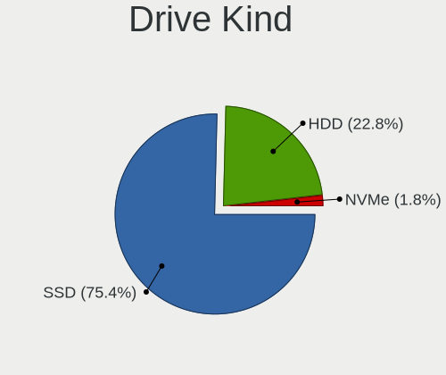
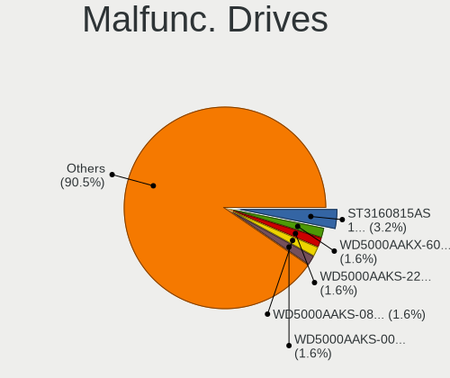
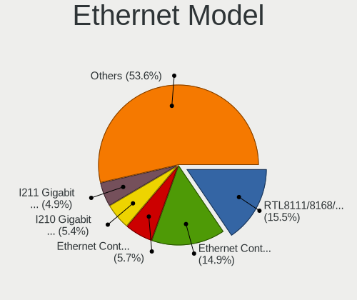

BSD Hardware Trends
-------------------

A project to identify most popular hardware characteristics and track their change
over time based on data collected by BSD users at https://BSD-Hardware.info.

Anyone can contribute to this report by the [hw-probe](https://github.com/linuxhw/hw-probe/blob/master/INSTALL.BSD.md) tool:

    hw-probe -all -upload

This is a report for all computer types. See also reports for [desktops](/Desktop/README.md) and [notebooks](/Notebook/README.md).

Full-feature report is available here: https://bsd-hardware.info/?view=trends

OS-specific reports: [FreeBSD](/Dist/FreeBSD), [OPNsense](/Dist/OPNsense), [helloSystem](/Dist/helloSystem), [OpenBSD](/Dist/OpenBSD).

Period: Feb, 2022.

Contents
--------

* [ System ](#system)
  - [ OS                       ](#os)
  - [ OS Family                ](#os-family)
  - [ Arch                     ](#arch)
  - [ DE                       ](#de)
  - [ Display Server           ](#display-server)
  - [ Display Manager          ](#display-manager)
  - [ OS Lang                  ](#os-lang)
  - [ Boot Mode                ](#boot-mode)
  - [ Filesystem               ](#filesystem)
  - [ Part. scheme             ](#part-scheme)

* [ Board ](#board)
  - [ Vendor                   ](#vendor)
  - [ Model                    ](#model)
  - [ Model Family             ](#model-family)
  - [ MFG Year                 ](#mfg-year)
  - [ Form Factor              ](#form-factor)
  - [ Coreboot                 ](#coreboot)
  - [ RAM Size                 ](#ram-size)
  - [ RAM Used                 ](#ram-used)
  - [ Total Drives             ](#total-drives)
  - [ Has CD-ROM               ](#has-cd-rom)
  - [ Has Ethernet             ](#has-ethernet)
  - [ Has WiFi                 ](#has-wifi)
  - [ Has Bluetooth            ](#has-bluetooth)

* [ Location ](#location)
  - [ Country                  ](#country)
  - [ City                     ](#city)

* [ Drives ](#drives)
  - [ Drive Vendor             ](#drive-vendor)
  - [ Drive Model              ](#drive-model)
  - [ HDD Vendor               ](#hdd-vendor)
  - [ SSD Vendor               ](#ssd-vendor)
  - [ Drive Kind               ](#drive-kind)
  - [ Drive Connector          ](#drive-connector)
  - [ Drive Size               ](#drive-size)
  - [ Space Total              ](#space-total)
  - [ Space Used               ](#space-used)
  - [ Malfunc. Drives          ](#malfunc-drives)
  - [ Malfunc. Drive Vendor    ](#malfunc-drive-vendor)
  - [ Malfunc. HDD Vendor      ](#malfunc-hdd-vendor)
  - [ Malfunc. Drive Kind      ](#malfunc-drive-kind)
  - [ Failed Drives            ](#failed-drives)
  - [ Failed Drive Vendor      ](#failed-drive-vendor)
  - [ Drive Status             ](#drive-status)

* [ Storage controller ](#storage-controller)
  - [ Storage Vendor           ](#storage-vendor)
  - [ Storage Model            ](#storage-model)
  - [ Storage Kind             ](#storage-kind)

* [ Processor ](#processor)
  - [ CPU Vendor               ](#cpu-vendor)
  - [ CPU Model                ](#cpu-model)
  - [ CPU Model Family         ](#cpu-model-family)
  - [ CPU Cores                ](#cpu-cores)
  - [ CPU Sockets              ](#cpu-sockets)
  - [ CPU Threads              ](#cpu-threads)
  - [ CPU Microarch            ](#cpu-microarch)

* [ Graphics ](#graphics)
  - [ GPU Vendor               ](#gpu-vendor)
  - [ GPU Model                ](#gpu-model)
  - [ GPU Combo                ](#gpu-combo)
  - [ GPU Driver               ](#gpu-driver)
  - [ GPU Memory               ](#gpu-memory)

* [ Monitor ](#monitor)
  - [ Monitor Vendor           ](#monitor-vendor)
  - [ Monitor Model            ](#monitor-model)
  - [ Monitor Resolution       ](#monitor-resolution)
  - [ Monitor Diagonal         ](#monitor-diagonal)
  - [ Monitor Width            ](#monitor-width)
  - [ Aspect Ratio             ](#aspect-ratio)
  - [ Monitor Area             ](#monitor-area)
  - [ Pixel Density            ](#pixel-density)
  - [ Multiple Monitors        ](#multiple-monitors)

* [ Network ](#network)
  - [ Net Controller Vendor    ](#net-controller-vendor)
  - [ Net Controller Model     ](#net-controller-model)
  - [ Wireless Vendor          ](#wireless-vendor)
  - [ Wireless Model           ](#wireless-model)
  - [ Ethernet Vendor          ](#ethernet-vendor)
  - [ Ethernet Model           ](#ethernet-model)
  - [ Net Controller Kind      ](#net-controller-kind)
  - [ Used Controller          ](#used-controller)
  - [ NICs                     ](#nics)
  - [ IPv6                     ](#ipv6)

* [ Bluetooth ](#bluetooth)
  - [ Bluetooth Vendor         ](#bluetooth-vendor)
  - [ Bluetooth Model          ](#bluetooth-model)

* [ Sound ](#sound)
  - [ Sound Vendor             ](#sound-vendor)
  - [ Sound Model              ](#sound-model)

* [ Memory ](#memory)
  - [ Memory Vendor            ](#memory-vendor)
  - [ Memory Model             ](#memory-model)
  - [ Memory Kind              ](#memory-kind)
  - [ Memory Form Factor       ](#memory-form-factor)
  - [ Memory Size              ](#memory-size)
  - [ Memory Speed             ](#memory-speed)

* [ Printers & scanners ](#printers--scanners)
  - [ Printer Vendor           ](#printer-vendor)
  - [ Printer Model            ](#printer-model)
  - [ Scanner Vendor           ](#scanner-vendor)
  - [ Scanner Model            ](#scanner-model)

* [ Camera ](#camera)
  - [ Camera Vendor            ](#camera-vendor)
  - [ Camera Model             ](#camera-model)

* [ Security ](#security)
  - [ Fingerprint Vendor       ](#fingerprint-vendor)
  - [ Fingerprint Model        ](#fingerprint-model)
  - [ Chipcard Vendor          ](#chipcard-vendor)
  - [ Chipcard Model           ](#chipcard-model)

* [ Unsupported ](#unsupported)
  - [ Unsupported Devices      ](#unsupported-devices)
  - [ Unsupported Device Types ](#unsupported-device-types)

System
------

OS
--

Installed operating systems

| Name                     | Computers | Percent |
|--------------------------|-----------|---------|
| OPNsense 22.1            | 136       | 30.36%  |
| OPNsense 22.1.1          | 107       | 23.88%  |
| helloSystem 0.7.0        | 51        | 11.38%  |
| OPNsense 21.7.8          | 28        | 6.25%   |
| FreeBSD 13.0-p7          | 27        | 6.03%   |
| OpenBSD 7.0              | 20        | 4.46%   |
| helloSystem 0.8.0        | 11        | 2.46%   |
| FreeBSD 13.0-STABLE      | 11        | 2.46%   |
| FreeBSD 13.0             | 9         | 2.01%   |
| NomadBSD 5806f915        | 5         | 1.12%   |
| FreeBSD 14.0-CURRENT     | 5         | 1.12%   |
| helloSystem 0.6.0        | 3         | 0.67%   |
| GhostBSD 22.01.12        | 3         | 0.67%   |
| FreeBSD 13.0-p6          | 3         | 0.67%   |
| FreeBSD 13.0-p4          | 3         | 0.67%   |
| TrueNAS 12.2-p12         | 2         | 0.45%   |
| OPNsense 21.7.7          | 2         | 0.45%   |
| OPNsense 21.7.4          | 2         | 0.45%   |
| OPNsense 20.7.8          | 2         | 0.45%   |
| OpenBSD 7.1              | 2         | 0.45%   |
| NetBSD 9.2               | 2         | 0.45%   |
| FreeBSD 13.0-p5          | 2         | 0.45%   |
| FreeBSD 12.3-p2          | 2         | 0.45%   |
| TrueNAS 12.2-p10         | 1         | 0.22%   |
| OPNsense 22.7            | 1         | 0.22%   |
| OPNsense 21.7.3          | 1         | 0.22%   |
| OPNsense 21.1.9          | 1         | 0.22%   |
| OPNsense 20.7            | 1         | 0.22%   |
| helloSystem 13.0-STABLE  | 1         | 0.22%   |
| helloSystem 0.4.0        | 1         | 0.22%   |
| GhostBSD 22.02.20        | 1         | 0.22%   |
| FreeBSD 13.0-STABLE-HBSD | 1         | 0.22%   |
| FreeBSD 12.3             | 1         | 0.22%   |

OS Family
---------

OS without a version

| Name        | Computers | Percent |
|-------------|-----------|---------|
| OPNsense    | 281       | 62.72%  |
| helloSystem | 67        | 14.96%  |
| FreeBSD     | 64        | 14.29%  |
| OpenBSD     | 22        | 4.91%   |
| NomadBSD    | 5         | 1.12%   |
| GhostBSD    | 4         | 0.89%   |
| TrueNAS     | 3         | 0.67%   |
| NetBSD      | 2         | 0.45%   |

Arch
----

OS architecture (x86_64, i586, etc.)

| Name  | Computers | Percent |
|-------|-----------|---------|
| amd64 | 437       | 97.54%  |
| i386  | 5         | 1.12%   |
| arm64 | 5         | 1.12%   |
| armv7 | 1         | 0.22%   |

DE
--

Desktop Environment

| Name         | Computers | Percent |
|--------------|-----------|---------|
| Console      | 309       | 68.97%  |
| helloDesktop | 69        | 15.4%   |
| fvwm         | 19        | 4.24%   |
| KDE5         | 15        | 3.35%   |
| XFCE         | 6         | 1.34%   |
| Openbox      | 5         | 1.12%   |
| MATE         | 5         | 1.12%   |
| i3           | 4         | 0.89%   |
| GNOME        | 3         | 0.67%   |
| xfwm         | 2         | 0.45%   |
| Lumina       | 2         | 0.45%   |
| Xfwm4        | 1         | 0.22%   |
| Mutter       | 1         | 0.22%   |
| LXQt         | 1         | 0.22%   |
| KWin         | 1         | 0.22%   |
| GNUstep      | 1         | 0.22%   |
| Compton      | 1         | 0.22%   |
| AwesomeWM    | 1         | 0.22%   |
| awesome      | 1         | 0.22%   |
| akonadi_newm | 1         | 0.22%   |

Display Server
--------------

X11 or Wayland

| Name    | Computers | Percent |
|---------|-----------|---------|
| Console | 313       | 69.87%  |
| X11     | 132       | 29.46%  |
| Wayland | 3         | 0.67%   |

Display Manager
---------------

SDDM, LightDM, etc.

| Name    | Computers | Percent |
|---------|-----------|---------|
| Console | 342       | 76.34%  |
| SLiM    | 79        | 17.63%  |
| SDDM    | 16        | 3.57%   |
| LightDM | 7         | 1.56%   |
| XDM     | 2         | 0.45%   |
| GDM     | 2         | 0.45%   |

OS Lang
-------

Language

| Lang    | Computers | Percent |
|---------|-----------|---------|
| Unknown | 303       | 67.63%  |
| en_US   | 80        | 17.86%  |
| C       | 47        | 10.49%  |
| ru_RU   | 6         | 1.34%   |
| fr_FR   | 3         | 0.67%   |
| pl_PL   | 2         | 0.45%   |
| es_ES   | 2         | 0.45%   |
| uk_UA   | 1         | 0.22%   |
| en_NZ   | 1         | 0.22%   |
| en_GB   | 1         | 0.22%   |
| en_AU   | 1         | 0.22%   |
| de_DE   | 1         | 0.22%   |

Boot Mode
---------

EFI or BIOS

| Mode | Computers | Percent |
|------|-----------|---------|
| EFI  | 402       | 89.73%  |
| BIOS | 46        | 10.27%  |

Filesystem
----------

Type of filesystem

| Type   | Computers | Percent |
|--------|-----------|---------|
| Ufs    | 216       | 48.21%  |
| Zfs    | 177       | 39.51%  |
| Cd9660 | 31        | 6.92%   |
| Ffs    | 22        | 4.91%   |
| XXX    | 2         | 0.45%   |

Part. scheme
------------

Scheme of partitioning

| Type    | Computers | Percent |
|---------|-----------|---------|
| GPT     | 423       | 94.42%  |
| MBR     | 24        | 5.36%   |
| Unknown | 1         | 0.22%   |

Board
-----

Vendor
------

Motherboard manufacturer

| Name                    | Computers | Percent |
|-------------------------|-----------|---------|
| Dell                    | 52        | 11.61%  |
| Hewlett-Packard         | 37        | 8.26%   |
| Lenovo                  | 31        | 6.92%   |
| Supermicro              | 29        | 6.47%   |
| ASRock                  | 29        | 6.47%   |
| Intel                   | 28        | 6.25%   |
| ASUSTek Computer        | 26        | 5.8%    |
| Unknown                 | 24        | 5.36%   |
| Protectli               | 22        | 4.91%   |
| MSI                     | 16        | 3.57%   |
| PC Engines              | 14        | 3.13%   |
| Gigabyte Technology     | 13        | 2.9%    |
| Apple                   | 12        | 2.68%   |
| AMI                     | 10        | 2.23%   |
| Sophos                  | 9         | 2.01%   |
| Acer                    | 8         | 1.79%   |
| ZOTAC                   | 5         | 1.12%   |
| Shuttle                 | 5         | 1.12%   |
| SeeedStudio             | 5         | 1.12%   |
| Fujitsu                 | 5         | 1.12%   |
| Biostar                 | 4         | 0.89%   |
| BESSTAR Tech            | 4         | 0.89%   |
| Raspberry Pi Foundation | 3         | 0.67%   |
| Pegatron                | 3         | 0.67%   |
| MW                      | 3         | 0.67%   |
| CompuLab                | 3         | 0.67%   |
| CheckPoint              | 3         | 0.67%   |
| Samsung Electronics     | 2         | 0.45%   |
| Notebook                | 2         | 0.45%   |
| HPE                     | 2         | 0.45%   |
| HARDKERNEL              | 2         | 0.45%   |
| Gateway                 | 2         | 0.45%   |
| Deciso                  | 2         | 0.45%   |
| Cisco Systems           | 2         | 0.45%   |
| AZW                     | 2         | 0.45%   |
| AWOW                    | 2         | 0.45%   |
| AAEON                   | 2         | 0.45%   |
| YANYU                   | 1         | 0.22%   |
| WOOKING                 | 1         | 0.22%   |
| TWINHEAD                | 1         | 0.22%   |
| TUXEDO                  | 1         | 0.22%   |
| Timi                    | 1         | 0.22%   |
| Thomas-Krenn.AG         | 1         | 0.22%   |
| System76                | 1         | 0.22%   |
| Sony                    | 1         | 0.22%   |
| PCSTICK                 | 1         | 0.22%   |
| PAIQ                    | 1         | 0.22%   |
| MiTAC                   | 1         | 0.22%   |
| Medion                  | 1         | 0.22%   |
| MACHINIST               | 1         | 0.22%   |
| Kontron                 | 1         | 0.22%   |
| KLLISRE                 | 1         | 0.22%   |
| Jumper                  | 1         | 0.22%   |
| HUAWEI                  | 1         | 0.22%   |
| GALAX                   | 1         | 0.22%   |
| Fujitsu Siemens         | 1         | 0.22%   |
| Firefly                 | 1         | 0.22%   |
| ECS                     | 1         | 0.22%   |
| ASRockRack              | 1         | 0.22%   |
| AOpen                   | 1         | 0.22%   |

Model
-----

Motherboard model

| Name                           | Computers | Percent |
|--------------------------------|-----------|---------|
| Unknown                        | 25        | 5.58%   |
| AMI Aptio CRB                  | 10        | 2.23%   |
| Intel Q3XXG4-P V1.0            | 9         | 2.01%   |
| Protectli FW4B                 | 8         | 1.79%   |
| PC Engines APU2                | 8         | 1.79%   |
| Protectli FW6                  | 7         | 1.56%   |
| Supermicro Super Server        | 6         | 1.34%   |
| Sophos XG                      | 5         | 1.12%   |
| PC Engines apu4                | 5         | 1.12%   |
| SeeedStudio ODYSSEY-X86J4105   | 4         | 0.89%   |
| Lenovo ThinkPad X200 745969G   | 4         | 0.89%   |
| HP t620 PLUS Quad Core TC      | 4         | 0.89%   |
| ASUS All Series                | 4         | 0.89%   |
| Supermicro X9SCL/X9SCM         | 3         | 0.67%   |
| Supermicro A1SAi               | 3         | 0.67%   |
| MW GMLK-2_5G4L                 | 3         | 0.67%   |
| Supermicro HYVE-ZEUS           | 2         | 0.45%   |
| Sophos UTM                     | 2         | 0.45%   |
| Sophos SG                      | 2         | 0.45%   |
| Shuttle DS77U                  | 2         | 0.45%   |
| RPi Raspberry Pi               | 2         | 0.45%   |
| Protectli VP2410               | 2         | 0.45%   |
| Intel MAHOBAY                  | 2         | 0.45%   |
| HP t730 Thin Client            | 2         | 0.45%   |
| HP ProDesk 600 G3 SFF          | 2         | 0.45%   |
| HARDKERNEL ODROID-H2           | 2         | 0.45%   |
| Gigabyte Z390 GAMING X         | 2         | 0.45%   |
| Gateway DX4870                 | 2         | 0.45%   |
| Dell PowerEdge R710            | 2         | 0.45%   |
| Dell PowerEdge R210 II         | 2         | 0.45%   |
| Dell PowerEdge R210            | 2         | 0.45%   |
| Dell OptiPlex 755              | 2         | 0.45%   |
| Dell OptiPlex 3020             | 2         | 0.45%   |
| Dell Latitude D630             | 2         | 0.45%   |
| Dell Latitude 7480             | 2         | 0.45%   |
| Deciso Netboard A20            | 2         | 0.45%   |
| CompuLab fitlet2               | 2         | 0.45%   |
| CheckPoint T-110-00            | 2         | 0.45%   |
| AZW GK55                       | 2         | 0.45%   |
| AWOW PC BOX                    | 2         | 0.45%   |
| ASRock AM1H-ITX                | 2         | 0.45%   |
| Apple Macmini5,1               | 2         | 0.45%   |
| Acer V5-131                    | 2         | 0.45%   |
| ZOTAC ZBOX-MI623/MI643         | 1         | 0.22%   |
| ZOTAC ZBOX-MI522NANO/MI542NANO | 1         | 0.22%   |
| ZOTAC ZBOX-CI329NANO           | 1         | 0.22%   |
| ZOTAC ZBOX-CI327NANO-GS-01     | 1         | 0.22%   |
| ZOTAC B410                     | 1         | 0.22%   |
| YANYU M9F baytrail             | 1         | 0.22%   |
| WOOKING X5                     | 1         | 0.22%   |
| TWINHEAD U12CT                 | 1         | 0.22%   |
| TUXEDO InfinityBook13V3        | 1         | 0.22%   |
| Timi RedmiBook Pro 15          | 1         | 0.22%   |
| Thomas-Krenn.AG LES network 6L | 1         | 0.22%   |
| System76 Lemur Pro             | 1         | 0.22%   |
| Supermicro X9DRD-7LN4F         | 1         | 0.22%   |
| Supermicro X8STi               | 1         | 0.22%   |
| Supermicro X8SIL               | 1         | 0.22%   |
| Supermicro X8DTU-LN4+          | 1         | 0.22%   |
| Supermicro X7SPA-H             | 1         | 0.22%   |

Model Family
------------

Motherboard model prefix

| Name                         | Computers | Percent |
|------------------------------|-----------|---------|
| Unknown                      | 25        | 5.58%   |
| Lenovo ThinkPad              | 16        | 3.57%   |
| Dell OptiPlex                | 16        | 3.57%   |
| Dell PowerEdge               | 15        | 3.35%   |
| Dell Latitude                | 11        | 2.46%   |
| AMI Aptio                    | 10        | 2.23%   |
| Intel Q3XXG4-P               | 9         | 2.01%   |
| Protectli FW4B               | 8         | 1.79%   |
| PC Engines APU2              | 8         | 1.79%   |
| Protectli FW6                | 7         | 1.56%   |
| Supermicro Super             | 6         | 1.34%   |
| HP ProDesk                   | 6         | 1.34%   |
| ASUS PRIME                   | 6         | 1.34%   |
| Sophos XG                    | 5         | 1.12%   |
| PC Engines apu4              | 5         | 1.12%   |
| Lenovo ThinkCentre           | 5         | 1.12%   |
| HP t620                      | 5         | 1.12%   |
| Dell Inspiron                | 5         | 1.12%   |
| Acer Aspire                  | 5         | 1.12%   |
| SeeedStudio ODYSSEY-X86J4105 | 4         | 0.89%   |
| HP ProLiant                  | 4         | 0.89%   |
| HP EliteBook                 | 4         | 0.89%   |
| ASUS All                     | 4         | 0.89%   |
| Supermicro X9SCL             | 3         | 0.67%   |
| Supermicro A1SAi             | 3         | 0.67%   |
| RPi Raspberry                | 3         | 0.67%   |
| MW GMLK-2                    | 3         | 0.67%   |
| HP EliteDesk                 | 3         | 0.67%   |
| ASUS ROG                     | 3         | 0.67%   |
| Apple Macmini5               | 3         | 0.67%   |
| Supermicro HYVE-ZEUS         | 2         | 0.45%   |
| Sophos UTM                   | 2         | 0.45%   |
| Sophos SG                    | 2         | 0.45%   |
| Shuttle DS77U                | 2         | 0.45%   |
| Protectli VP2410             | 2         | 0.45%   |
| Lenovo IdeaPad               | 2         | 0.45%   |
| Intel MAHOBAY                | 2         | 0.45%   |
| HPE ProLiant                 | 2         | 0.45%   |
| HP t730                      | 2         | 0.45%   |
| HP Compaq                    | 2         | 0.45%   |
| HARDKERNEL ODROID-H2         | 2         | 0.45%   |
| Gigabyte Z390                | 2         | 0.45%   |
| Gigabyte X570                | 2         | 0.45%   |
| Gateway DX4870               | 2         | 0.45%   |
| Fujitsu FUTRO                | 2         | 0.45%   |
| Deciso Netboard              | 2         | 0.45%   |
| CompuLab fitlet2             | 2         | 0.45%   |
| CheckPoint T-110-00          | 2         | 0.45%   |
| AZW GK55                     | 2         | 0.45%   |
| AWOW PC                      | 2         | 0.45%   |
| ASRock AM1H-ITX              | 2         | 0.45%   |
| Acer V5-131                  | 2         | 0.45%   |
| ZOTAC ZBOX-MI623             | 1         | 0.22%   |
| ZOTAC ZBOX-MI522NANO         | 1         | 0.22%   |
| ZOTAC ZBOX-CI329NANO         | 1         | 0.22%   |
| ZOTAC ZBOX-CI327NANO-GS-01   | 1         | 0.22%   |
| ZOTAC B410                   | 1         | 0.22%   |
| YANYU M9F                    | 1         | 0.22%   |
| WOOKING X5                   | 1         | 0.22%   |
| TWINHEAD U12CT               | 1         | 0.22%   |

MFG Year
--------

Motherboard manufacture year

| Year    | Computers | Percent |
|---------|-----------|---------|
| 2018    | 66        | 14.73%  |
| 2021    | 59        | 13.17%  |
| 2020    | 53        | 11.83%  |
| 2019    | 48        | 10.71%  |
| 2016    | 44        | 9.82%   |
| 2014    | 30        | 6.7%    |
| 2012    | 26        | 5.8%    |
| 2015    | 23        | 5.13%   |
| 2013    | 23        | 5.13%   |
| 2017    | 17        | 3.79%   |
| 2011    | 15        | 3.35%   |
| 2010    | 13        | 2.9%    |
| 2009    | 11        | 2.46%   |
| 2008    | 10        | 2.23%   |
| 2007    | 3         | 0.67%   |
| Unknown | 3         | 0.67%   |
| 2005    | 2         | 0.45%   |
| 2022    | 1         | 0.22%   |
| 2004    | 1         | 0.22%   |

Form Factor
-----------

Physical design of the computer

| Name           | Computers | Percent |
|----------------|-----------|---------|
| Desktop        | 274       | 61.16%  |
| Notebook       | 83        | 18.53%  |
| Mini pc        | 40        | 8.93%   |
| Server         | 33        | 7.37%   |
| Firewall       | 9         | 2.01%   |
| All in one     | 6         | 1.34%   |
| System on chip | 3         | 0.67%   |

Coreboot
--------

Have coreboot on board

| Used | Computers | Percent |
|------|-----------|---------|
| No   | 430       | 95.98%  |
| Yes  | 18        | 4.02%   |

RAM Size
--------

Total RAM memory

| Size in GB      | Computers | Percent |
|-----------------|-----------|---------|
| 8.01-16.0       | 166       | 37.05%  |
| 4.01-8.0        | 90        | 20.09%  |
| 16.01-24.0      | 87        | 19.42%  |
| 32.01-64.0      | 38        | 8.48%   |
| 2.01-3.0        | 24        | 5.36%   |
| 64.01-256.0     | 20        | 4.46%   |
| 3.01-4.0        | 7         | 1.56%   |
| 24.01-32.0      | 7         | 1.56%   |
| More than 256.0 | 3         | 0.67%   |
| 1.01-2.0        | 3         | 0.67%   |
| 0.51-1.0        | 2         | 0.45%   |
| 0               | 1         | 0.22%   |

RAM Used
--------

Used RAM memory

| Used GB     | Computers | Percent |
|-------------|-----------|---------|
| 0.01-0.5    | 242       | 54.02%  |
| 0.51-1.0    | 125       | 27.9%   |
| 1.01-2.0    | 53        | 11.83%  |
| 2.01-3.0    | 8         | 1.79%   |
| 4.01-8.0    | 5         | 1.12%   |
| 3.01-4.0    | 4         | 0.89%   |
| 8.01-16.0   | 3         | 0.67%   |
| 24.01-32.0  | 2         | 0.45%   |
| 64.01-256.0 | 2         | 0.45%   |
| 0           | 2         | 0.45%   |
| Unknown     | 2         | 0.45%   |

Total Drives
------------

Number of drives on board

| Drives | Computers | Percent |
|--------|-----------|---------|
| 1      | 312       | 69.64%  |
| 2      | 70        | 15.63%  |
| 0      | 28        | 6.25%   |
| 3      | 17        | 3.79%   |
| 4      | 10        | 2.23%   |
| 5      | 4         | 0.89%   |
| 7      | 2         | 0.45%   |
| 6      | 2         | 0.45%   |
| 25     | 1         | 0.22%   |
| 14     | 1         | 0.22%   |
| 13     | 1         | 0.22%   |

Has CD-ROM
----------

Has CD-ROM on board

| Presented | Computers | Percent |
|-----------|-----------|---------|
| No        | 370       | 82.59%  |
| Yes       | 78        | 17.41%  |

Has Ethernet
------------

Has Ethernet on board

| Presented | Computers | Percent |
|-----------|-----------|---------|
| Yes       | 430       | 95.98%  |
| No        | 18        | 4.02%   |

Has WiFi
--------

Has WiFi module

| Presented | Computers | Percent |
|-----------|-----------|---------|
| No        | 292       | 65.18%  |
| Yes       | 156       | 34.82%  |

Has Bluetooth
-------------

Has Bluetooth module

| Presented | Computers | Percent |
|-----------|-----------|---------|
| No        | 345       | 77.01%  |
| Yes       | 103       | 22.99%  |

Location
--------

Country
-------

Geographic location (country)

| Country       | Computers | Percent |
|---------------|-----------|---------|
| USA           | 127       | 28.35%  |
| Germany       | 72        | 16.07%  |
| Poland        | 24        | 5.36%   |
| France        | 22        | 4.91%   |
| Russia        | 17        | 3.79%   |
| Canada        | 17        | 3.79%   |
| UK            | 15        | 3.35%   |
| Ukraine       | 12        | 2.68%   |
| Netherlands   | 12        | 2.68%   |
| Switzerland   | 11        | 2.46%   |
| Spain         | 11        | 2.46%   |
| Austria       | 11        | 2.46%   |
| Italy         | 9         | 2.01%   |
| Brazil        | 9         | 2.01%   |
| Australia     | 9         | 2.01%   |
| Thailand      | 5         | 1.12%   |
| Mexico        | 5         | 1.12%   |
| Hungary       | 5         | 1.12%   |
| Hong Kong     | 5         | 1.12%   |
| Sweden        | 4         | 0.89%   |
| China         | 4         | 0.89%   |
| Taiwan        | 3         | 0.67%   |
| Portugal      | 3         | 0.67%   |
| India         | 3         | 0.67%   |
| Greece        | 3         | 0.67%   |
| Finland       | 3         | 0.67%   |
| Denmark       | 3         | 0.67%   |
| Romania       | 2         | 0.45%   |
| Israel        | 2         | 0.45%   |
| Indonesia     | 2         | 0.45%   |
| Tanzania      | 1         | 0.22%   |
| South Korea   | 1         | 0.22%   |
| Slovakia      | 1         | 0.22%   |
| Peru          | 1         | 0.22%   |
| New Zealand   | 1         | 0.22%   |
| Malaysia      | 1         | 0.22%   |
| Liechtenstein | 1         | 0.22%   |
| Ireland       | 1         | 0.22%   |
| Guatemala     | 1         | 0.22%   |
| Guadeloupe    | 1         | 0.22%   |
| Georgia       | 1         | 0.22%   |
| Estonia       | 1         | 0.22%   |
| Czechia       | 1         | 0.22%   |
| Colombia      | 1         | 0.22%   |
| Chile         | 1         | 0.22%   |
| Bulgaria      | 1         | 0.22%   |
| Belarus       | 1         | 0.22%   |
| Unknown       | 1         | 0.22%   |

City
----

Geographic location (city)

| City                          | Computers | Percent |
|-------------------------------|-----------|---------|
| Moscow                        | 8         | 1.79%   |
| Gdansk                        | 7         | 1.56%   |
| Paris                         | 6         | 1.34%   |
| Zurich                        | 5         | 1.12%   |
| Vienna                        | 5         | 1.12%   |
| Teaneck                       | 5         | 1.12%   |
| Berlin                        | 5         | 1.12%   |
| Bangkok                       | 5         | 1.12%   |
| Munich                        | 4         | 0.89%   |
| Kharkiv                       | 4         | 0.89%   |
| Amsterdam                     | 4         | 0.89%   |
| Victoria                      | 3         | 0.67%   |
| Tijuana                       | 3         | 0.67%   |
| Salem                         | 3         | 0.67%   |
| Quarry Bay                    | 3         | 0.67%   |
| Oakland                       | 3         | 0.67%   |
| Melbourne                     | 3         | 0.67%   |
| Kyiv                          | 3         | 0.67%   |
| Hanover                       | 3         | 0.67%   |
| Tel Aviv                      | 2         | 0.45%   |
| Sherwood Park                 | 2         | 0.45%   |
| Shenzhen                      | 2         | 0.45%   |
| San Sebastián de los Reyes | 2         | 0.45%   |
| Rio de Janeiro                | 2         | 0.45%   |
| Redmond                       | 2         | 0.45%   |
| Poznan                        | 2         | 0.45%   |
| Perth                         | 2         | 0.45%   |
| Paderborn                     | 2         | 0.45%   |
| Montreal                      | 2         | 0.45%   |
| Milan                         | 2         | 0.45%   |
| Logroño                    | 2         | 0.45%   |
| Lexington                     | 2         | 0.45%   |
| Leipzig                       | 2         | 0.45%   |
| Katowice                      | 2         | 0.45%   |
| Kastrup                       | 2         | 0.45%   |
| Innsbruck                     | 2         | 0.45%   |
| Herford                       | 2         | 0.45%   |
| Hamburg                       | 2         | 0.45%   |
| Hagerstown                    | 2         | 0.45%   |
| Graz                          | 2         | 0.45%   |
| Frankfurt am Main             | 2         | 0.45%   |
| Denver                        | 2         | 0.45%   |
| Cary                          | 2         | 0.45%   |
| Calgary                       | 2         | 0.45%   |
| Buckeye                       | 2         | 0.45%   |
| Bucharest                     | 2         | 0.45%   |
| Bad Vilbel                    | 2         | 0.45%   |
| Zwickau                       | 1         | 0.22%   |
| Zeven                         | 1         | 0.22%   |
| Zeist                         | 1         | 0.22%   |
| Zagnansk                      | 1         | 0.22%   |
| Yunlin                        | 1         | 0.22%   |
| Youngsville                   | 1         | 0.22%   |
| York                          | 1         | 0.22%   |
| Wroclaw                       | 1         | 0.22%   |
| Woodstock                     | 1         | 0.22%   |
| Wollongong                    | 1         | 0.22%   |
| Windsor                       | 1         | 0.22%   |
| Willich                       | 1         | 0.22%   |
| Whittier                      | 1         | 0.22%   |

Drives
------

Drive Vendor
------------

Hard drive vendors

| Vendor              | Computers | Drives | Percent |
|---------------------|-----------|--------|---------|
| Samsung Electronics | 85        | 95     | 16.57%  |
| WDC                 | 69        | 96     | 13.45%  |
| Seagate             | 53        | 71     | 10.33%  |
| Kingston            | 35        | 38     | 6.82%   |
| Transcend           | 29        | 30     | 5.65%   |
| Crucial             | 25        | 26     | 4.87%   |
| Intel               | 24        | 31     | 4.68%   |
| Toshiba             | 21        | 24     | 4.09%   |
| SanDisk             | 19        | 19     | 3.7%    |
| Phison              | 12        | 13     | 2.34%   |
| Hitachi             | 12        | 24     | 2.34%   |
| Hoodisk             | 10        | 10     | 1.95%   |
| A-DATA Technology   | 10        | 11     | 1.95%   |
| SPCC                | 9         | 11     | 1.75%   |
| FORESEE             | 6         | 6      | 1.17%   |
| Patriot             | 5         | 5      | 0.97%   |
| Dogfish             | 5         | 5      | 0.97%   |
| SK Hynix            | 4         | 4      | 0.78%   |
| Protectli           | 4         | 4      | 0.78%   |
| LITEONIT            | 4         | 4      | 0.78%   |
| Intenso             | 4         | 4      | 0.78%   |
| HGST                | 4         | 5      | 0.78%   |
| Hewlett-Packard     | 4         | 9      | 0.78%   |
| Apple               | 4         | 4      | 0.78%   |
| GOODRAM             | 3         | 3      | 0.58%   |
| Gigabyte Technology | 3         | 3      | 0.58%   |
| Corsair             | 3         | 3      | 0.58%   |
| BIWIN               | 3         | 3      | 0.58%   |
| SSSTC               | 2         | 2      | 0.39%   |
| PNY                 | 2         | 2      | 0.39%   |
| OCZ                 | 2         | 2      | 0.39%   |
| Netac               | 2         | 2      | 0.39%   |
| Mushkin             | 2         | 2      | 0.39%   |
| Micron Technology   | 2         | 2      | 0.39%   |
| MAXTOR              | 2         | 3      | 0.39%   |
| Hikvision           | 2         | 2      | 0.39%   |
| Fujitsu             | 2         | 2      | 0.39%   |
| China               | 2         | 2      | 0.39%   |
| Zheino              | 1         | 1      | 0.19%   |
| XPG                 | 1         | 1      | 0.19%   |
| VisionTek           | 1         | 1      | 0.19%   |
| V-GeN               | 1         | 1      | 0.19%   |
| Team                | 1         | 1      | 0.19%   |
| SSDPR-CX            | 1         | 1      | 0.19%   |
| Silicon Motion      | 1         | 1      | 0.19%   |
| NVMe                | 1         | 1      | 0.19%   |
| NETAPP              | 1         | 2      | 0.19%   |
| Micro Center        | 1         | 1      | 0.19%   |
| LITEON              | 1         | 1      | 0.19%   |
| Lexar               | 1         | 2      | 0.19%   |
| Leven               | 1         | 1      | 0.19%   |
| Kston               | 1         | 1      | 0.19%   |
| KIOXIA              | 1         | 1      | 0.19%   |
| KingSpec            | 1         | 1      | 0.19%   |
| Innodisk            | 1         | 1      | 0.19%   |
| Indilinx            | 1         | 1      | 0.19%   |
| Generic             | 1         | 1      | 0.19%   |
| faspeed             | 1         | 1      | 0.19%   |
| Drevo               | 1         | 1      | 0.19%   |
| Dell                | 1         | 23     | 0.19%   |

Drive Model
-----------

Hard drive models

| Model                              | Computers | Percent |
|------------------------------------|-----------|---------|
| Transcend TS256GMSA230S 256GB      | 8         | 1.45%   |
| Kingston SA400S37240G 240GB        | 8         | 1.45%   |
| Samsung SSD 860 EVO 500GB          | 6         | 1.09%   |
| Kingston SA400S37120G 120GB        | 5         | 0.91%   |
| Transcend TS64GMSA370 64GB         | 4         | 0.73%   |
| Samsung SSD 970 EVO Plus 1TB       | 4         | 0.73%   |
| Samsung SSD 850 EVO 500GB          | 4         | 0.73%   |
| Samsung HM321HI 320GB              | 4         | 0.73%   |
| Kingston SUV500MS120G 120GB        | 4         | 0.73%   |
| FORESEE 128GB SSD                  | 4         | 0.73%   |
| Crucial CT120BX500SSD1 120GB       | 4         | 0.73%   |
| WDC WDS240G2G0A-00JH30 240GB       | 3         | 0.55%   |
| WDC WDS120G2G0B-00EPW0 120GB       | 3         | 0.55%   |
| SPCC Solid State Disk 256GB        | 3         | 0.55%   |
| SPCC Solid State Disk 128GB        | 3         | 0.55%   |
| Seagate ST9500420AS 500GB          | 3         | 0.55%   |
| Seagate ST500DM002-1BD142 500GB    | 3         | 0.55%   |
| Seagate ST2000DM008-2FR102 2TB     | 3         | 0.55%   |
| Seagate ST1000DM010-2EP102 1TB     | 3         | 0.55%   |
| Samsung SSD 870 EVO 250GB          | 3         | 0.55%   |
| Intel SSDSC2KW256G8 256GB          | 3         | 0.55%   |
| Hoodisk SSD 128GB                  | 3         | 0.55%   |
| Dogfish SSD 128GB                  | 3         | 0.55%   |
| Crucial CT500MX500SSD1 500GB       | 3         | 0.55%   |
| Crucial CT250BX100SSD1 250GB       | 3         | 0.55%   |
| BIWIN SSD 128GB                    | 3         | 0.55%   |
| WDC WDS500G2B0C-00PXH0 500GB       | 2         | 0.36%   |
| WDC WD6002FRYZ-01WD5B1 6TB         | 2         | 0.36%   |
| WDC WD2503ABYX-01WERA1 256GB       | 2         | 0.36%   |
| WDC WD20PURZ-85GU6Y0 2TB           | 2         | 0.36%   |
| WDC WD10EZEX-22MFCA0 1TB           | 2         | 0.36%   |
| WDC WD10EZEX-08WN4A0 1TB           | 2         | 0.36%   |
| Transcend TS64GMTS400SD 64GB       | 2         | 0.36%   |
| Transcend TS64GMSA230S 64GB        | 2         | 0.36%   |
| Transcend TS256GMTS952T2 256GB     | 2         | 0.36%   |
| Transcend TS240GMTS420S 240GB      | 2         | 0.36%   |
| Transcend TS128GMSA230S 128GB      | 2         | 0.36%   |
| Toshiba THNSFJ256GCSU 256GB        | 2         | 0.36%   |
| Toshiba MQ04ABF100 1TB             | 2         | 0.36%   |
| Toshiba MQ01ACF050 500GB           | 2         | 0.36%   |
| Toshiba DT01ACA100 1TB             | 2         | 0.36%   |
| SPCC Solid State Disk 512GB        | 2         | 0.36%   |
| Seagate XA960LE10063 960GB         | 2         | 0.36%   |
| Seagate ST500DM002-1BC142 500GB    | 2         | 0.36%   |
| Seagate ST4000LM024-2AN17V 4TB     | 2         | 0.36%   |
| Seagate ST4000DM004-2CV104 4TB     | 2         | 0.36%   |
| Seagate ST4000DM000-1F2168 4TB     | 2         | 0.36%   |
| Seagate ST2000VN000-1HJ164 2TB     | 2         | 0.36%   |
| Seagate ST1000LM024 HN-M101MBB 1TB | 2         | 0.36%   |
| SanDisk X400 M.2 2280 128GB        | 2         | 0.36%   |
| SanDisk SSD PLUS 240GB             | 2         | 0.36%   |
| SanDisk SDSA6MM-016G-1006 16GB     | 2         | 0.36%   |
| Samsung SSD 980 250GB              | 2         | 0.36%   |
| Samsung SSD 970 EVO Plus 250GB     | 2         | 0.36%   |
| Samsung SSD 960 EVO 500GB          | 2         | 0.36%   |
| Samsung SSD 950 PRO 512GB          | 2         | 0.36%   |
| Samsung SSD 870 EVO 1TB            | 2         | 0.36%   |
| Samsung SSD 860 QVO 1TB            | 2         | 0.36%   |
| Samsung SSD 860 EVO 250GB          | 2         | 0.36%   |
| Samsung SSD 850 EVO 250GB          | 2         | 0.36%   |

HDD Vendor
----------

Hard disk drive vendors

| Vendor              | Computers | Drives | Percent |
|---------------------|-----------|--------|---------|
| WDC                 | 54        | 77     | 35.76%  |
| Seagate             | 48        | 61     | 31.79%  |
| Toshiba             | 14        | 17     | 9.27%   |
| Hitachi             | 12        | 24     | 7.95%   |
| Samsung Electronics | 6         | 6      | 3.97%   |
| HGST                | 4         | 5      | 2.65%   |
| Apple               | 3         | 3      | 1.99%   |
| MAXTOR              | 2         | 3      | 1.32%   |
| Hewlett-Packard     | 2         | 7      | 1.32%   |
| SSDPR-CX            | 1         | 1      | 0.66%   |
| NVMe                | 1         | 1      | 0.66%   |
| NETAPP              | 1         | 2      | 0.66%   |
| Generic             | 1         | 1      | 0.66%   |
| Fujitsu             | 1         | 1      | 0.66%   |
| Dell                | 1         | 23     | 0.66%   |

SSD Vendor
----------

Solid state drive vendors

| Vendor              | Computers | Drives | Percent |
|---------------------|-----------|--------|---------|
| Samsung Electronics | 57        | 61     | 18.57%  |
| Kingston            | 34        | 36     | 11.07%  |
| Transcend           | 27        | 27     | 8.79%   |
| Intel               | 24        | 31     | 7.82%   |
| Crucial             | 23        | 24     | 7.49%   |
| SanDisk             | 19        | 19     | 6.19%   |
| WDC                 | 11        | 12     | 3.58%   |
| Hoodisk             | 10        | 10     | 3.26%   |
| SPCC                | 9         | 11     | 2.93%   |
| Phison              | 8         | 9      | 2.61%   |
| A-DATA Technology   | 8         | 9      | 2.61%   |
| Toshiba             | 6         | 6      | 1.95%   |
| FORESEE             | 6         | 6      | 1.95%   |
| Patriot             | 5         | 5      | 1.63%   |
| Dogfish             | 5         | 5      | 1.63%   |
| Seagate             | 4         | 6      | 1.3%    |
| Protectli           | 4         | 4      | 1.3%    |
| LITEONIT            | 4         | 4      | 1.3%    |
| Intenso             | 4         | 4      | 1.3%    |
| BIWIN               | 3         | 3      | 0.98%   |
| PNY                 | 2         | 2      | 0.65%   |
| OCZ                 | 2         | 2      | 0.65%   |
| Netac               | 2         | 2      | 0.65%   |
| Mushkin             | 2         | 2      | 0.65%   |
| GOODRAM             | 2         | 2      | 0.65%   |
| Gigabyte Technology | 2         | 2      | 0.65%   |
| Corsair             | 2         | 2      | 0.65%   |
| China               | 2         | 2      | 0.65%   |
| Zheino              | 1         | 1      | 0.33%   |
| VisionTek           | 1         | 1      | 0.33%   |
| V-GeN               | 1         | 1      | 0.33%   |
| Team                | 1         | 1      | 0.33%   |
| Micron Technology   | 1         | 1      | 0.33%   |
| Micro Center        | 1         | 1      | 0.33%   |
| LITEON              | 1         | 1      | 0.33%   |
| Lexar               | 1         | 1      | 0.33%   |
| Leven               | 1         | 1      | 0.33%   |
| Kston               | 1         | 1      | 0.33%   |
| KingSpec            | 1         | 1      | 0.33%   |
| Innodisk            | 1         | 1      | 0.33%   |
| Indilinx            | 1         | 1      | 0.33%   |
| Hewlett-Packard     | 1         | 1      | 0.33%   |
| Fujitsu             | 1         | 1      | 0.33%   |
| faspeed             | 1         | 1      | 0.33%   |
| Drevo               | 1         | 1      | 0.33%   |
| Biostar             | 1         | 1      | 0.33%   |
| Apple               | 1         | 1      | 0.33%   |
| Apacer              | 1         | 1      | 0.33%   |

Drive Kind
----------

HDD or SSD

| Kind | Computers | Drives | Percent |
|------|-----------|--------|---------|
| SSD  | 290       | 328    | 60.92%  |
| HDD  | 126       | 232    | 26.47%  |
| NVMe | 60        | 70     | 12.61%  |

Drive Connector
---------------

SATA, SAS, NVMe, etc.

| Type | Computers | Drives | Percent |
|------|-----------|--------|---------|
| SATA | 380       | 560    | 86.36%  |
| NVMe | 60        | 70     | 13.64%  |

Drive Size
----------

Size of hard drive

| Size in TB | Computers | Drives | Percent |
|------------|-----------|--------|---------|
| 0.01-0.5   | 331       | 415    | 77.52%  |
| 0.51-1.0   | 55        | 74     | 12.88%  |
| 1.01-2.0   | 17        | 27     | 3.98%   |
| 3.01-4.0   | 11        | 19     | 2.58%   |
| 2.01-3.0   | 5         | 8      | 1.17%   |
| 4.01-10.0  | 5         | 12     | 1.17%   |
| 10.01-20.0 | 3         | 5      | 0.7%    |

Space Total
-----------

Amount of disk space available on the file system

| Size in GB     | Computers | Percent |
|----------------|-----------|---------|
| 101-250        | 192       | 42.86%  |
| 251-500        | 76        | 16.96%  |
| 1-20           | 56        | 12.5%   |
| 21-50          | 44        | 9.82%   |
| 51-100         | 44        | 9.82%   |
| 501-1000       | 27        | 6.03%   |
| More than 3000 | 3         | 0.67%   |
| 1001-2000      | 3         | 0.67%   |
| Unknown        | 2         | 0.45%   |
| 2001-3000      | 1         | 0.22%   |

Space Used
----------

Amount of used disk space

| Used GB        | Computers | Percent |
|----------------|-----------|---------|
| 1-20           | 406       | 90.63%  |
| 21-50          | 29        | 6.47%   |
| 101-250        | 7         | 1.56%   |
| More than 3000 | 2         | 0.45%   |
| Unknown        | 2         | 0.45%   |
| 251-500        | 1         | 0.22%   |
| 51-100         | 1         | 0.22%   |

Malfunc. Drives
---------------

Drive models with a malfunction

| Model                                            | Computers | Drives | Percent |
|--------------------------------------------------|-----------|--------|---------|
| Seagate ST9500420AS 500GB                        | 2         | 2      | 3.33%   |
| Seagate ST500DM002-1BD142 500GB                  | 2         | 2      | 3.33%   |
| WDC WD6003FZBX-00K5WB0 6TB                       | 1         | 1      | 1.67%   |
| WDC WD6002FRYZ-01WD5B1 6TB                       | 1         | 1      | 1.67%   |
| WDC WD5000LPCX-75VHAT0 500GB                     | 1         | 1      | 1.67%   |
| WDC WD5000AZLX-00CL5A0 500GB                     | 1         | 1      | 1.67%   |
| WDC WD3200AAVS-00ZTB0 320GB                      | 1         | 1      | 1.67%   |
| WDC WD3200AAJS-22B4A0 320GB                      | 1         | 1      | 1.67%   |
| WDC WD2000FYYZ-01UL1B2 2TB                       | 1         | 2      | 1.67%   |
| WDC WD1600BEKT-66F3T2 160GB                      | 1         | 1      | 1.67%   |
| WDC WD10JPVX-60JC3T0 1TB                         | 1         | 1      | 1.67%   |
| WDC WD10EZEX-08M2NA0 1TB                         | 1         | 1      | 1.67%   |
| WDC WD10EARS-003BB1 1TB                          | 1         | 1      | 1.67%   |
| VisionTek mSATA 120GB                            | 1         | 1      | 1.67%   |
| Toshiba THNSNK256GVN8 M.2 2280 256GB             | 1         | 1      | 1.67%   |
| Toshiba MK2555GSX 250GB                          | 1         | 1      | 1.67%   |
| Toshiba MK1629GSGF 160GB                         | 1         | 1      | 1.67%   |
| Toshiba MD04ACA400 4TB                           | 1         | 1      | 1.67%   |
| Toshiba DT01ABA300 3TB                           | 1         | 1      | 1.67%   |
| SPCC Solid State Disk 128GB                      | 1         | 1      | 1.67%   |
| Seagate ST9320423AS 320GB                        | 1         | 1      | 1.67%   |
| Seagate ST9320325ASG 320GB                       | 1         | 1      | 1.67%   |
| Seagate ST500DM002-1BC142 500GB                  | 1         | 1      | 1.67%   |
| Seagate ST3750528AS 752GB                        | 1         | 1      | 1.67%   |
| Seagate ST3500418AS 500GB                        | 1         | 1      | 1.67%   |
| Seagate ST3500413AS 500GB                        | 1         | 1      | 1.67%   |
| Seagate ST3320418AS 320GB                        | 1         | 1      | 1.67%   |
| Seagate ST3160812AS 160GB                        | 1         | 1      | 1.67%   |
| Seagate ST3160318AS 160GB                        | 1         | 1      | 1.67%   |
| Seagate ST31000528AS 1TB                         | 1         | 1      | 1.67%   |
| Seagate ST3000DM008-2DM166 3TB                   | 1         | 1      | 1.67%   |
| Seagate ST1000LM035-1RK172 1TB                   | 1         | 1      | 1.67%   |
| Seagate ST1000LM024 HN-M101MBB 1TB               | 1         | 1      | 1.67%   |
| Seagate ST1000DM003-9YN162 1TB                   | 1         | 1      | 1.67%   |
| SanDisk SD8TB8U-256G-1006 256GB                  | 1         | 1      | 1.67%   |
| Samsung Electronics SSD RBX Series 128GB M       | 1         | 1      | 1.67%   |
| Samsung Electronics SSD PM810 2.5-inch 7mm 256GB | 1         | 1      | 1.67%   |
| Samsung Electronics SSD 960 PRO 512GB            | 1         | 1      | 1.67%   |
| Samsung Electronics HM160HI 160GB                | 1         | 1      | 1.67%   |
| Kingston SV200S3128G 128GB                       | 1         | 1      | 1.67%   |
| Kingston SMS200S3120G 120GB                      | 1         | 1      | 1.67%   |
| Kingston SHFS37A120G 120GB                       | 1         | 2      | 1.67%   |
| Intel SSDSC2BW240A4 240GB                        | 1         | 1      | 1.67%   |
| Intel SSDSC2BF180A5L 180GB                       | 1         | 1      | 1.67%   |
| Intel SSDSC2BB012T7 1.2TB                        | 1         | 2      | 1.67%   |
| Intel SSDSA2BW160G3H 160GB                       | 1         | 1      | 1.67%   |
| Intel SSDMCEAW240A4 240GB                        | 1         | 1      | 1.67%   |
| Intel SSDMCEAC060B3 64GB                         | 1         | 1      | 1.67%   |
| Hitachi HTS545050A7E380 500GB                    | 1         | 1      | 1.67%   |
| Hitachi HTS542516K9SA00 160GB                    | 1         | 1      | 1.67%   |
| Hitachi HTS541616J9SA00 160GB                    | 1         | 1      | 1.67%   |
| Hitachi HTS421260H9AT00 64GB                     | 1         | 1      | 1.67%   |
| Hitachi HDT721010SLA360 1TB                      | 1         | 1      | 1.67%   |
| Hitachi HDS723030ALA640 3TB                      | 1         | 2      | 1.67%   |
| Hitachi HDS723020BLA642 2TB                      | 1         | 1      | 1.67%   |
| HGST HTS545050A7E660 500GB                       | 1         | 1      | 1.67%   |
| Dogfish SSD 128GB                                | 1         | 1      | 1.67%   |
| Apple HDD HTS547550A9E384 500GB                  | 1         | 1      | 1.67%   |

Malfunc. Drive Vendor
---------------------

Vendors of faulty drives

| Vendor              | Computers | Drives | Percent |
|---------------------|-----------|--------|---------|
| Seagate             | 17        | 18     | 29.31%  |
| WDC                 | 11        | 12     | 18.97%  |
| Hitachi             | 7         | 8      | 12.07%  |
| Intel               | 6         | 7      | 10.34%  |
| Toshiba             | 4         | 5      | 6.9%    |
| Samsung Electronics | 4         | 4      | 6.9%    |
| Kingston            | 3         | 4      | 5.17%   |
| VisionTek           | 1         | 1      | 1.72%   |
| SPCC                | 1         | 1      | 1.72%   |
| SanDisk             | 1         | 1      | 1.72%   |
| HGST                | 1         | 1      | 1.72%   |
| Dogfish             | 1         | 1      | 1.72%   |
| Apple               | 1         | 1      | 1.72%   |

Malfunc. HDD Vendor
-------------------

Vendors of faulty HDD drives

| Vendor              | Computers | Drives | Percent |
|---------------------|-----------|--------|---------|
| Seagate             | 17        | 18     | 41.46%  |
| WDC                 | 11        | 12     | 26.83%  |
| Hitachi             | 7         | 8      | 17.07%  |
| Toshiba             | 3         | 4      | 7.32%   |
| Samsung Electronics | 1         | 1      | 2.44%   |
| HGST                | 1         | 1      | 2.44%   |
| Apple               | 1         | 1      | 2.44%   |

Malfunc. Drive Kind
-------------------

Kinds of faulty drives

| Kind | Computers | Drives | Percent |
|------|-----------|--------|---------|
| HDD  | 39        | 45     | 69.64%  |
| SSD  | 16        | 18     | 28.57%  |
| NVMe | 1         | 1      | 1.79%   |

Failed Drives
-------------

Failed drive models

Zero info for selected period =(

Failed Drive Vendor
-------------------

Failed drive vendors

Zero info for selected period =(

Drive Status
------------

Number of failed and malfunc. drives

| Status   | Computers | Drives | Percent |
|----------|-----------|--------|---------|
| Works    | 377       | 550    | 85.68%  |
| Malfunc  | 54        | 64     | 12.27%  |
| Detected | 9         | 16     | 2.05%   |

Storage controller
------------------

Storage Vendor
--------------

Storage controller vendors

| Vendor                           | Computers | Percent |
|----------------------------------|-----------|---------|
| Intel                            | 344       | 66.03%  |
| AMD                              | 78        | 14.97%  |
| Samsung Electronics              | 27        | 5.18%   |
| Broadcom / LSI                   | 10        | 1.92%   |
| Sandisk                          | 7         | 1.34%   |
| Phison Electronics               | 6         | 1.15%   |
| SK Hynix                         | 4         | 0.77%   |
| Silicon Motion                   | 4         | 0.77%   |
| Nvidia                           | 4         | 0.77%   |
| ASMedia Technology               | 4         | 0.77%   |
| Marvell Technology Group         | 3         | 0.58%   |
| Chelsio Communications           | 3         | 0.58%   |
| Solid State Storage Technology   | 2         | 0.38%   |
| Silicon Integrated Systems [SiS] | 2         | 0.38%   |
| Seagate Technology               | 2         | 0.38%   |
| Micron/Crucial Technology        | 2         | 0.38%   |
| MAXIO Technology (Hangzhou)      | 2         | 0.38%   |
| Kingston Technology Company      | 2         | 0.38%   |
| Hewlett-Packard                  | 2         | 0.38%   |
| ADATA Technology                 | 2         | 0.38%   |
| Unknown                          | 2         | 0.38%   |
| VIA Technologies                 | 1         | 0.19%   |
| Toshiba                          | 1         | 0.19%   |
| Shenzhen Longsys Electronics     | 1         | 0.19%   |
| Realtek Semiconductor            | 1         | 0.19%   |
| Micron Technology                | 1         | 0.19%   |
| KIOXIA                           | 1         | 0.19%   |
| Biwin Storage Technology         | 1         | 0.19%   |
| Areca Technology                 | 1         | 0.19%   |
| Adaptec                          | 1         | 0.19%   |

Storage Model
-------------

Storage controller models

| Model                                                                                   | Computers | Percent |
|-----------------------------------------------------------------------------------------|-----------|---------|
| AMD FCH SATA Controller [AHCI mode]                                                     | 59        | 10.19%  |
| Intel 8 Series/C220 Series Chipset Family 6-port SATA Controller 1 [AHCI mode]          | 33        | 5.7%    |
| Intel Sunrise Point-LP SATA Controller [AHCI mode]                                      | 32        | 5.53%   |
| Intel Celeron/Pentium Silver Processor SATA Controller                                  | 23        | 3.97%   |
| Intel Atom Processor E3800 Series SATA AHCI Controller                                  | 19        | 3.28%   |
| Intel 6 Series/C200 Series Chipset Family 6 port Desktop SATA AHCI Controller           | 18        | 3.11%   |
| Intel Atom/Celeron/Pentium Processor x5-E8000/J3xxx/N3xxx Series SATA Controller        | 17        | 2.94%   |
| Samsung NVMe SSD Controller SM981/PM981/PM983                                           | 15        | 2.59%   |
| Intel Wildcat Point-LP SATA Controller [AHCI Mode]                                      | 13        | 2.25%   |
| Intel Q170/Q150/B150/H170/H110/Z170/CM236 Chipset SATA Controller [AHCI Mode]           | 12        | 2.07%   |
| Intel Cannon Lake PCH SATA AHCI Controller                                              | 12        | 2.07%   |
| Intel 7 Series Chipset Family 6-port SATA Controller [AHCI mode]                        | 11        | 1.9%    |
| Intel 82801HM/HEM (ICH8M/ICH8M-E) IDE Controller                                        | 10        | 1.73%   |
| Intel 8 Series SATA Controller 1 [AHCI mode]                                            | 10        | 1.73%   |
| Intel 200 Series PCH SATA controller [AHCI mode]                                        | 9         | 1.55%   |
| Intel Celeron N3350/Pentium N4200/Atom E3900 Series SATA AHCI Controller                | 8         | 1.38%   |
| Intel 6 Series/C200 Series Chipset Family 6 port Mobile SATA AHCI Controller            | 8         | 1.38%   |
| Unknown                                                                                 | 8         | 1.38%   |
| Intel SATA Controller [RAID mode]                                                       | 7         | 1.21%   |
| Intel Comet Lake SATA AHCI Controller                                                   | 7         | 1.21%   |
| Intel C600/X79 series chipset 6-Port SATA AHCI Controller                               | 7         | 1.21%   |
| Intel 82801IBM/IEM (ICH9M/ICH9M-E) 4 port SATA Controller [AHCI mode]                   | 7         | 1.21%   |
| Intel 7 Series/C210 Series Chipset Family 6-port SATA Controller [AHCI mode]            | 7         | 1.21%   |
| AMD 400 Series Chipset SATA Controller                                                  | 7         | 1.21%   |
| Intel 82801JI (ICH10 Family) 4 port SATA IDE Controller #1                              | 6         | 1.04%   |
| Intel 82801HM/HEM (ICH8M/ICH8M-E) SATA Controller [AHCI mode]                           | 6         | 1.04%   |
| AMD FCH SATA Controller [IDE mode]                                                      | 6         | 1.04%   |
| Intel NM10/ICH7 Family SATA Controller [AHCI mode]                                      | 5         | 0.86%   |
| Intel 82801G (ICH7 Family) IDE Controller                                               | 5         | 0.86%   |
| AMD SB7x0/SB8x0/SB9x0 SATA Controller [AHCI mode]                                       | 5         | 0.86%   |
| Silicon Motion SM2263EN/SM2263XT SSD Controller                                         | 4         | 0.69%   |
| Samsung NVMe SSD Controller SM961/PM961/SM963                                           | 4         | 0.69%   |
| Samsung NVMe SSD Controller 980                                                         | 4         | 0.69%   |
| Intel NM10/ICH7 Family SATA Controller [IDE mode]                                       | 4         | 0.69%   |
| Intel Atom processor C2000 AHCI SATA3 Controller                                        | 4         | 0.69%   |
| Intel 82801JI (ICH10 Family) 2 port SATA IDE Controller #2                              | 4         | 0.69%   |
| Intel 82801HM/HEM (ICH8M/ICH8M-E) SATA Controller [IDE mode]                            | 4         | 0.69%   |
| ASMedia ASM1062 Serial ATA Controller                                                   | 4         | 0.69%   |
| AMD Starship/Matisse Chipset SATA Controller [AHCI mode]                                | 4         | 0.69%   |
| Sandisk WD Blue SN550 NVMe SSD                                                          | 3         | 0.52%   |
| Phison E12 NVMe Controller                                                              | 3         | 0.52%   |
| Nvidia MCP79 AHCI Controller                                                            | 3         | 0.52%   |
| Intel C602 chipset 4-Port SATA Storage Control Unit                                     | 3         | 0.52%   |
| Intel Atom processor C2000 AHCI SATA2 Controller                                        | 3         | 0.52%   |
| Intel 82Q35 Express PT IDER Controller                                                  | 3         | 0.52%   |
| Intel 82801JI (ICH10 Family) SATA AHCI Controller                                       | 3         | 0.52%   |
| Intel 82801IR/IO/IH (ICH9R/DO/DH) 4 port SATA Controller [IDE mode]                     | 3         | 0.52%   |
| Intel 82801IB (ICH9) 2 port SATA Controller [IDE mode]                                  | 3         | 0.52%   |
| Intel 6 Series/C200 Series Chipset Family Desktop SATA Controller (IDE mode, ports 4-5) | 3         | 0.52%   |
| Intel 6 Series/C200 Series Chipset Family Desktop SATA Controller (IDE mode, ports 0-3) | 3         | 0.52%   |
| Intel 500 Series Chipset Family SATA AHCI Controller                                    | 3         | 0.52%   |
| Intel 5 Series/3400 Series Chipset 6 port SATA AHCI Controller                          | 3         | 0.52%   |
| Intel 5 Series/3400 Series Chipset 4 port SATA AHCI Controller                          | 3         | 0.52%   |
| Intel 400 Series Chipset Family SATA AHCI Controller                                    | 3         | 0.52%   |
| AMD X370 Series Chipset SATA Controller                                                 | 3         | 0.52%   |
| AMD FCH IDE Controller                                                                  | 3         | 0.52%   |
| SK Hynix Gold P31 SSD                                                                   | 2         | 0.35%   |
| SK Hynix BC511                                                                          | 2         | 0.35%   |
| Seagate FireCuda 520 SSD                                                                | 2         | 0.35%   |
| Sandisk WD PC SN810 / Black SN850 NVMe SSD                                              | 2         | 0.35%   |

Storage Kind
------------

Kind of storage controller (IDE, SATA, NVMe, SAS, ...)

| Kind | Computers | Percent |
|------|-----------|---------|
| SATA | 379       | 71.24%  |
| NVMe | 64        | 12.03%  |
| IDE  | 58        | 10.9%   |
| RAID | 21        | 3.95%   |
| SAS  | 6         | 1.13%   |
| SCSI | 4         | 0.75%   |

Processor
---------

CPU Vendor
----------

Processor vendors

| Vendor   | Computers | Percent |
|----------|-----------|---------|
| Intel    | 359       | 80.13%  |
| AMD      | 83        | 18.53%  |
| ARM      | 5         | 1.12%   |
| Rockchip | 1         | 0.22%   |

CPU Model
---------

Processor models

| Model                                    | Computers | Percent |
|------------------------------------------|-----------|---------|
| AMD GX-412TC SOC                         | 13        | 2.9%    |
| Intel Celeron CPU J1900 @ 1.99GHz        | 12        | 2.68%   |
| Intel Celeron J4125 CPU @ 2.00GHz        | 10        | 2.23%   |
| Intel Celeron CPU J3160 @ 1.60GHz        | 9         | 2.01%   |
| Intel Celeron J4105 CPU @ 1.50GHz        | 8         | 1.79%   |
| Intel Core i5-4570 CPU @ 3.20GHz         | 6         | 1.34%   |
| Intel Core i5-7200U CPU @ 2.50GHz        | 5         | 1.12%   |
| Intel Core i3-7100U CPU @ 2.40GHz        | 5         | 1.12%   |
| Intel Core 2 Duo CPU P8600 @ 2.40GHz     | 5         | 1.12%   |
| Intel Core i5-5300U CPU @ 2.30GHz        | 4         | 0.89%   |
| Intel Core 2 Duo                         | 4         | 0.89%   |
| Intel Atom CPU E3845 @ 1.91GHz           | 4         | 0.89%   |
| Intel Atom CPU D525 @ 1.80GHz            | 4         | 0.89%   |
| AMD Ryzen 9 3900X 12-Core Processor      | 4         | 0.89%   |
| AMD GX-420CA SOC with Radeon HD Graphics | 4         | 0.89%   |
| AMD Athlon 5350 APU with Radeon R3       | 4         | 0.89%   |
| Intel Core i7-8550U CPU @ 1.80GHz        | 3         | 0.67%   |
| Intel Core i7-6500U CPU @ 2.50GHz        | 3         | 0.67%   |
| Intel Core i5-9400 CPU @ 2.90GHz         | 3         | 0.67%   |
| Intel Core i5-3470 CPU @ 3.20GHz         | 3         | 0.67%   |
| Intel Core i5-2415M CPU @ 2.30GHz        | 3         | 0.67%   |
| Intel Core i3-4130 CPU @ 3.40GHz         | 3         | 0.67%   |
| Intel Core i3-2120 CPU @ 3.30GHz         | 3         | 0.67%   |
| Intel Core i3-10110U CPU @ 2.10GHz       | 3         | 0.67%   |
| Intel Celeron CPU J3455 @ 1.50GHz        | 3         | 0.67%   |
| Intel Celeron CPU J1800 @ 2.41GHz        | 3         | 0.67%   |
| Intel Celeron CPU G1840 @ 2.80GHz        | 3         | 0.67%   |
| Intel Celeron CPU 3865U @ 1.80GHz        | 3         | 0.67%   |
| Intel Atom CPU N450 @ 1.66GHz            | 3         | 0.67%   |
| ARM Cortex-A72 r0p3                      | 3         | 0.67%   |
| Intel Xeon CPU X3430 @ 2.40GHz           | 2         | 0.45%   |
| Intel Xeon CPU E5-2650 v2 @ 2.60GHz      | 2         | 0.45%   |
| Intel Xeon CPU E5-2609 0 @ 2.40GHz       | 2         | 0.45%   |
| Intel Xeon CPU E31220 @ 3.10GHz          | 2         | 0.45%   |
| Intel Xeon CPU E3-1270 v3 @ 3.50GHz      | 2         | 0.45%   |
| Intel Xeon CPU E3-1230 V2 @ 3.30GHz      | 2         | 0.45%   |
| Intel Xeon CPU E3-1225 v3 @ 3.20GHz      | 2         | 0.45%   |
| Intel Pentium CPU N3700 @ 1.60GHz        | 2         | 0.45%   |
| Intel Pentium CPU G3220 @ 3.00GHz        | 2         | 0.45%   |
| Intel Core i7-8565U CPU @ 1.80GHz        | 2         | 0.45%   |
| Intel Core i7-6700 CPU @ 3.40GHz         | 2         | 0.45%   |
| Intel Core i7-5600U CPU @ 2.60GHz        | 2         | 0.45%   |
| Intel Core i5-9600K CPU @ 3.70GHz        | 2         | 0.45%   |
| Intel Core i5-8500 CPU @ 3.00GHz         | 2         | 0.45%   |
| Intel Core i5-8250U CPU @ 1.60GHz        | 2         | 0.45%   |
| Intel Core i5-6500T CPU @ 2.50GHz        | 2         | 0.45%   |
| Intel Core i5-6500 CPU @ 3.20GHz         | 2         | 0.45%   |
| Intel Core i5-5200U CPU @ 2.20GHz        | 2         | 0.45%   |
| Intel Core i5-4590 CPU @ 3.30GHz         | 2         | 0.45%   |
| Intel Core i5-4300Y CPU @ 1.60GHz        | 2         | 0.45%   |
| Intel Core i5-4300U CPU @ 1.90GHz        | 2         | 0.45%   |
| Intel Core i5-4300M CPU @ 2.60GHz        | 2         | 0.45%   |
| Intel Core i5-3330 CPU @ 3.00GHz         | 2         | 0.45%   |
| Intel Core i5-2520M CPU @ 2.50GHz        | 2         | 0.45%   |
| Intel Core i5-10500 CPU @ 3.10GHz        | 2         | 0.45%   |
| Intel Core i5-10400 CPU @ 2.90GHz        | 2         | 0.45%   |
| Intel Core i5-10210U CPU @ 1.60GHz       | 2         | 0.45%   |
| Intel Core i3-6100 CPU @ 3.70GHz         | 2         | 0.45%   |
| Intel Core i3-4010U CPU @ 1.70GHz        | 2         | 0.45%   |
| Intel Core i3-3225 CPU @ 3.30GHz         | 2         | 0.45%   |

CPU Model Family
----------------

Processor model prefix

| Model                   | Computers | Percent |
|-------------------------|-----------|---------|
| Intel Core i5           | 83        | 18.53%  |
| Intel Celeron           | 77        | 17.19%  |
| Intel Xeon              | 53        | 11.83%  |
| Intel Core i3           | 39        | 8.71%   |
| Intel Core i7           | 30        | 6.7%    |
| Intel Atom              | 25        | 5.58%   |
| Intel Core 2 Duo        | 22        | 4.91%   |
| AMD GX                  | 19        | 4.24%   |
| Intel Pentium           | 13        | 2.9%    |
| Other                   | 11        | 2.46%   |
| AMD Ryzen 9             | 8         | 1.79%   |
| AMD Ryzen 7             | 8         | 1.79%   |
| AMD EPYC                | 6         | 1.34%   |
| AMD Athlon              | 6         | 1.34%   |
| ARM Cortex              | 5         | 1.12%   |
| AMD Ryzen 5             | 5         | 1.12%   |
| AMD Ryzen 3             | 5         | 1.12%   |
| Intel Pentium Silver    | 3         | 0.67%   |
| AMD Ryzen Embedded      | 3         | 0.67%   |
| Intel Pentium Dual-Core | 2         | 0.45%   |
| Intel Pentium 4         | 2         | 0.45%   |
| AMD Opteron             | 2         | 0.45%   |
| AMD G                   | 2         | 0.45%   |
| AMD A6                  | 2         | 0.45%   |
| AMD A10                 | 2         | 0.45%   |
| Intel Pentium Gold      | 1         | 0.22%   |
| Intel Core M            | 1         | 0.22%   |
| Intel Core 2 Quad       | 1         | 0.22%   |
| Intel Core 2            | 1         | 0.22%   |
| Intel Celeron M         | 1         | 0.22%   |
| AMD Ryzen Threadripper  | 1         | 0.22%   |
| AMD Ryzen 5 PRO         | 1         | 0.22%   |
| AMD Phenom II X4        | 1         | 0.22%   |
| AMD FX                  | 1         | 0.22%   |
| AMD E2                  | 1         | 0.22%   |
| AMD E                   | 1         | 0.22%   |
| AMD C-70                | 1         | 0.22%   |
| AMD C-60                | 1         | 0.22%   |
| AMD Athlon 64 X2        | 1         | 0.22%   |
| AMD A8                  | 1         | 0.22%   |

CPU Cores
---------

Number of processor cores

| Number  | Computers | Percent |
|---------|-----------|---------|
| 4       | 203       | 45.31%  |
| 2       | 140       | 31.25%  |
| Unknown | 28        | 6.25%   |
| 8       | 21        | 4.69%   |
| 6       | 20        | 4.46%   |
| 16      | 9         | 2.01%   |
| 12      | 8         | 1.79%   |
| 1       | 7         | 1.56%   |
| 24      | 6         | 1.34%   |
| 64      | 3         | 0.67%   |
| 32      | 1         | 0.22%   |
| 20      | 1         | 0.22%   |
| 10      | 1         | 0.22%   |

CPU Sockets
-----------

Number of sockets

| Number  | Computers | Percent |
|---------|-----------|---------|
| 1       | 415       | 92.63%  |
| 2       | 16        | 3.57%   |
| Unknown | 16        | 3.57%   |
| 4       | 1         | 0.22%   |

CPU Threads
-----------

Threads per core (Hyper-Threading)

| Number  | Computers | Percent |
|---------|-----------|---------|
| 1       | 248       | 55.36%  |
| 2       | 169       | 37.72%  |
| Unknown | 31        | 6.92%   |

CPU Microarch
-------------

Microarchitecture

| Name          | Computers | Percent |
|---------------|-----------|---------|
| KabyLake      | 58        | 12.95%  |
| Haswell       | 46        | 10.27%  |
| Silvermont    | 44        | 9.82%   |
| SandyBridge   | 30        | 6.7%    |
| IvyBridge     | 27        | 6.03%   |
| Skylake       | 25        | 5.58%   |
| Goldmont plus | 23        | 5.13%   |
| Penryn        | 21        | 4.69%   |
| Broadwell     | 17        | 3.79%   |
| Zen 2         | 15        | 3.35%   |
| Puma          | 15        | 3.35%   |
| Westmere      | 13        | 2.9%    |
| Unknown       | 12        | 2.68%   |
| Jaguar        | 11        | 2.46%   |
| Goldmont      | 11        | 2.46%   |
| Bonnell       | 11        | 2.46%   |
| Zen           | 10        | 2.23%   |
| Core          | 8         | 1.79%   |
| CometLake     | 8         | 1.79%   |
| Zen+          | 7         | 1.56%   |
| Zen 3         | 6         | 1.34%   |
| Nehalem       | 6         | 1.34%   |
| Bobcat        | 5         | 1.12%   |
| TigerLake     | 4         | 0.89%   |
| Piledriver    | 4         | 0.89%   |
| Excavator     | 3         | 0.67%   |
| Steamroller   | 2         | 0.45%   |
| NetBurst      | 2         | 0.45%   |
| P6            | 1         | 0.22%   |
| K10 Llano     | 1         | 0.22%   |
| K10           | 1         | 0.22%   |
| Geode         | 1         | 0.22%   |

Graphics
--------

GPU Vendor
----------

Vendors of graphics cards

| Vendor                           | Computers | Percent |
|----------------------------------|-----------|---------|
| Intel                            | 278       | 62.19%  |
| AMD                              | 75        | 16.78%  |
| Nvidia                           | 39        | 8.72%   |
| Matrox Electronics Systems       | 28        | 6.26%   |
| ASPEED Technology                | 24        | 5.37%   |
| Silicon Integrated Systems [SiS] | 2         | 0.45%   |
| Trident Microsystems             | 1         | 0.22%   |

GPU Model
---------

Graphics card models

| Model                                                                                    | Computers | Percent |
|------------------------------------------------------------------------------------------|-----------|---------|
| ASPEED Technology ASPEED Graphics Family                                                 | 24        | 5.32%   |
| Intel Atom Processor Z36xxx/Z37xxx Series Graphics & Display                             | 22        | 4.88%   |
| Intel GeminiLake [UHD Graphics 600]                                                      | 21        | 4.66%   |
| Matrox Electronics Systems MGA G200eW WPCM450                                            | 19        | 4.21%   |
| Intel 2nd Generation Core Processor Family Integrated Graphics Controller                | 19        | 4.21%   |
| Intel Atom/Celeron/Pentium Processor x5-E8000/J3xxx/N3xxx Integrated Graphics Controller | 17        | 3.77%   |
| Intel Xeon E3-1200 v3/4th Gen Core Processor Integrated Graphics Controller              | 16        | 3.55%   |
| Intel HD Graphics 620                                                                    | 12        | 2.66%   |
| Intel HD Graphics 530                                                                    | 12        | 2.66%   |
| Intel 3rd Gen Core processor Graphics Controller                                         | 11        | 2.44%   |
| Intel HD Graphics 5500                                                                   | 10        | 2.22%   |
| Intel HD Graphics 500                                                                    | 8         | 1.77%   |
| Intel Haswell-ULT Integrated Graphics Controller                                         | 8         | 1.77%   |
| Intel CoffeeLake-S GT2 [UHD Graphics 630]                                                | 8         | 1.77%   |
| Intel Atom Processor D4xx/D5xx/N4xx/N5xx Integrated Graphics Controller                  | 8         | 1.77%   |
| Intel CometLake-S GT2 [UHD Graphics 630]                                                 | 7         | 1.55%   |
| Intel UHD Graphics 620                                                                   | 6         | 1.33%   |
| Intel Skylake GT2 [HD Graphics 520]                                                      | 6         | 1.33%   |
| Intel Mobile 4 Series Chipset Integrated Graphics Controller                             | 6         | 1.33%   |
| Intel CometLake-U GT2 [UHD Graphics]                                                     | 6         | 1.33%   |
| AMD Renoir                                                                               | 6         | 1.33%   |
| AMD Ellesmere [Radeon RX 470/480/570/570X/580/580X/590]                                  | 6         | 1.33%   |
| Intel Xeon E3-1200 v2/3rd Gen Core processor Graphics Controller                         | 5         | 1.11%   |
| Intel Kaby Lake-U GT1 Integrated Graphics Controller                                     | 5         | 1.11%   |
| Intel 4th Generation Core Processor Family Integrated Graphics Controller                | 5         | 1.11%   |
| Intel 4 Series Chipset Integrated Graphics Controller                                    | 5         | 1.11%   |
| AMD Kabini [Radeon HD 8400 / R3 Series]                                                  | 5         | 1.11%   |
| Nvidia GF117M [GeForce 610M/710M/810M/820M / GT 620M/625M/630M/720M]                     | 4         | 0.89%   |
| Intel TigerLake-LP GT2 [Iris Xe Graphics]                                                | 4         | 0.89%   |
| Intel HD Graphics 630                                                                    | 4         | 0.89%   |
| AMD Picasso/Raven 2 [Radeon Vega Series / Radeon Vega Mobile Series]                     | 4         | 0.89%   |
| AMD Kabini [Radeon HD 8400E]                                                             | 4         | 0.89%   |
| Matrox Electronics Systems MGA G200EH                                                    | 3         | 0.67%   |
| Matrox Electronics Systems MGA G200e [Pilot] ServerEngines (SEP1)                        | 3         | 0.67%   |
| Intel Xeon E3-1200 v3 Processor Integrated Graphics Controller                           | 3         | 0.67%   |
| Intel WhiskeyLake-U GT2 [UHD Graphics 620]                                               | 3         | 0.67%   |
| Intel IvyBridge GT2 [HD Graphics 4000]                                                   | 3         | 0.67%   |
| Intel Core Processor Integrated Graphics Controller                                      | 3         | 0.67%   |
| Intel 82Q35 Express Integrated Graphics Controller                                       | 3         | 0.67%   |
| AMD Raven Ridge [Radeon Vega Series / Radeon Vega Mobile Series]                         | 3         | 0.67%   |
| AMD Lexa PRO [Radeon 540/540X/550/550X / RX 540X/550/550X]                               | 3         | 0.67%   |
| Nvidia GT218 [GeForce 210]                                                               | 2         | 0.44%   |
| Nvidia GF119 [GeForce GT 610]                                                            | 2         | 0.44%   |
| Matrox Electronics Systems G200eR2                                                       | 2         | 0.44%   |
| Intel Mobile GM965/GL960 Integrated Graphics Controller (secondary)                      | 2         | 0.44%   |
| Intel Mobile GM965/GL960 Integrated Graphics Controller (primary)                        | 2         | 0.44%   |
| Intel JasperLake [UHD Graphics]                                                          | 2         | 0.44%   |
| Intel HD Graphics 510                                                                    | 2         | 0.44%   |
| Intel Haswell-ULT High Definition Audio Controller [HD Graphics]                         | 2         | 0.44%   |
| Intel GeminiLake [UHD Graphics 605]                                                      | 2         | 0.44%   |
| Intel 4th Gen Core Processor Integrated Graphics Controller                              | 2         | 0.44%   |
| AMD Stoney [Radeon R2/R3/R4/R5 Graphics]                                                 | 2         | 0.44%   |
| AMD Navi 21 [Radeon RX 6800/6800 XT / 6900 XT]                                           | 2         | 0.44%   |
| AMD Mullins [Radeon R4/R5 Graphics]                                                      | 2         | 0.44%   |
| AMD Kaveri [Radeon R7 Graphics]                                                          | 2         | 0.44%   |
| AMD Kabini [Radeon HD 8330E]                                                             | 2         | 0.44%   |
| AMD ES1000                                                                               | 2         | 0.44%   |
| AMD Cezanne                                                                              | 2         | 0.44%   |
| AMD Cedar [Radeon HD 5000/6000/7350/8350 Series]                                         | 2         | 0.44%   |
| Trident Microsystems TGUI 9660/938x/968x                                                 | 1         | 0.22%   |

GPU Combo
---------

Combinations of graphics cards

| Name                     | Computers | Percent |
|--------------------------|-----------|---------|
| 1 x Intel                | 235       | 52.46%  |
| 1 x AMD                  | 64        | 14.29%  |
| 1 x Matrox               | 28        | 6.25%   |
| 1 x Nvidia               | 27        | 6.03%   |
| Other                    | 24        | 5.36%   |
| 2 x Intel                | 23        | 5.13%   |
| 1 x ASPEED               | 20        | 4.46%   |
| Intel + Nvidia           | 10        | 2.23%   |
| Intel + AMD              | 7         | 1.56%   |
| Intel + ASPEED           | 3         | 0.67%   |
| 1 x SiS                  | 2         | 0.45%   |
| AMD + Nvidia             | 2         | 0.45%   |
| 2 x AMD                  | 1         | 0.22%   |
| 1 x Trident Microsystems | 1         | 0.22%   |
| AMD + ASPEED             | 1         | 0.22%   |

GPU Driver
----------

Free vs proprietary

| Driver      | Computers | Percent |
|-------------|-----------|---------|
| Free        | 401       | 89.51%  |
| Unknown     | 26        | 5.8%    |
| Proprietary | 21        | 4.69%   |

GPU Memory
----------

Total video memory

| Size in GB | Computers | Percent |
|------------|-----------|---------|
| Unknown    | 406       | 90.63%  |
| 0.01-0.5   | 13        | 2.9%    |
| 0.51-1.0   | 8         | 1.79%   |
| 1.01-2.0   | 7         | 1.56%   |
| 7.01-8.0   | 6         | 1.34%   |
| 3.01-4.0   | 6         | 1.34%   |
| 5.01-6.0   | 2         | 0.45%   |

Monitor
-------

Monitor Vendor
--------------

Monitor vendors

| Vendor                  | Computers | Percent |
|-------------------------|-----------|---------|
| AU Optronics            | 14        | 11.97%  |
| LG Display              | 11        | 9.4%    |
| Samsung Electronics     | 10        | 8.55%   |
| Lenovo                  | 8         | 6.84%   |
| Dell                    | 8         | 6.84%   |
| Chimei Innolux          | 8         | 6.84%   |
| Goldstar                | 7         | 5.98%   |
| BOE                     | 7         | 5.98%   |
| Philips                 | 6         | 5.13%   |
| Acer                    | 6         | 5.13%   |
| Apple                   | 5         | 4.27%   |
| Ancor Communications    | 3         | 2.56%   |
| Hewlett-Packard         | 2         | 1.71%   |
| Chi Mei Optoelectronics | 2         | 1.71%   |
| AOC                     | 2         | 1.71%   |
| Westinghouse            | 1         | 0.85%   |
| Toshiba                 | 1         | 0.85%   |
| TMX                     | 1         | 0.85%   |
| Sony                    | 1         | 0.85%   |
| SHI                     | 1         | 0.85%   |
| Sharp                   | 1         | 0.85%   |
| SGT                     | 1         | 0.85%   |
| Pixio                   | 1         | 0.85%   |
| Panasonic               | 1         | 0.85%   |
| Lenovo Group Limited    | 1         | 0.85%   |
| KTC                     | 1         | 0.85%   |
| InfoVision              | 1         | 0.85%   |
| Iiyama                  | 1         | 0.85%   |
| HannStar                | 1         | 0.85%   |
| Fujitsu Siemens         | 1         | 0.85%   |
| Denver                  | 1         | 0.85%   |
| BenQ                    | 1         | 0.85%   |
| ASUSTek Computer        | 1         | 0.85%   |

Monitor Model
-------------

Monitor models

| Model                                                                    | Computers | Percent |
|--------------------------------------------------------------------------|-----------|---------|
| Lenovo LCD Monitor LEN4010 1280x800 260x160mm 12.0-inch                  | 4         | 3.39%   |
| LG Display LCD Monitor LGD0437 1920x1080 280x160mm 12.7-inch             | 2         | 1.69%   |
| Chimei Innolux LCD Monitor CMN1482 1600x900 310x170mm 13.9-inch          | 2         | 1.69%   |
| Chi Mei Optoelectronics LCD Monitor CMO15A7 1366x768 350x190mm 15.7-inch | 2         | 1.69%   |
| AU Optronics LCD Monitor AUO325C 1366x768 260x140mm 11.6-inch            | 2         | 1.69%   |
| Westinghouse LCM-19w4 WDE1904 1440x900 410x260mm 19.1-inch               | 1         | 0.85%   |
| Toshiba TV TSB0108 1360x768 700x390mm 31.5-inch                          | 1         | 0.85%   |
| TMX LCD Monitor TMX1560 3200x2000 340x210mm 15.7-inch                    | 1         | 0.85%   |
| Sony TV SNY9C01 1360x768                                                 | 1         | 0.85%   |
| SHI LCD-TV**** SHI6102 1360x768 700x390mm 31.5-inch                      | 1         | 0.85%   |
| Sharp LCD Monitor SHP1542 1920x1080 310x170mm 13.9-inch                  | 1         | 0.85%   |
| SGT YSD SGT1700 1280x1024 380x210mm 17.1-inch                            | 1         | 0.85%   |
| Samsung Electronics S27C750 SAM0A60 1920x1080 600x340mm 27.2-inch        | 1         | 0.85%   |
| Samsung Electronics S24C450 SAM09CB 1920x1080 530x300mm 24.0-inch        | 1         | 0.85%   |
| Samsung Electronics LCD Monitor SEC544B 1600x900 310x170mm 13.9-inch     | 1         | 0.85%   |
| Samsung Electronics LCD Monitor SEC4457 1440x900 300x190mm 14.0-inch     | 1         | 0.85%   |
| Samsung Electronics LCD Monitor SEC324C 1600x900 310x170mm 13.9-inch     | 1         | 0.85%   |
| Samsung Electronics LCD Monitor SEC3157 1280x800 300x190mm 14.0-inch     | 1         | 0.85%   |
| Samsung Electronics LCD Monitor SDC8B4F 1920x1080 340x190mm 15.3-inch    | 1         | 0.85%   |
| Samsung Electronics LCD Monitor SDC5441 1366x768 310x170mm 13.9-inch     | 1         | 0.85%   |
| Samsung Electronics LCD Monitor SDC4C48 1920x1080 240x130mm 10.7-inch    | 1         | 0.85%   |
| Samsung Electronics C24FG7x SAM0E44 1920x1080 530x300mm 24.0-inch        | 1         | 0.85%   |
| Samsung Electronics C24F390 SAM0D2C 1920x1080 520x290mm 23.4-inch        | 1         | 0.85%   |
| Pixio PX7 Prime HYC2700 2560x1440 600x340mm 27.2-inch                    | 1         | 0.85%   |
| Philips PHL 276E8V PHLC18F 3840x2160 600x340mm 27.2-inch                 | 1         | 0.85%   |
| Philips PHL 243V5 PHLC0D1 1920x1080 520x290mm 23.4-inch                  | 1         | 0.85%   |
| Philips PHL 193V5 PHLC0CD 1366x768 410x230mm 18.5-inch                   | 1         | 0.85%   |
| Philips LCD Monitor PHLC00B 1280x1024 340x270mm 17.1-inch                | 1         | 0.85%   |
| Philips 220E PHLC02E 1920x1080 470x260mm 21.1-inch                       | 1         | 0.85%   |
| Philips 190V PHL0081 1440x900 400x250mm 18.6-inch                        | 1         | 0.85%   |
| Panasonic TV MEIC136 1280x720 698x392mm 31.5-inch                        | 1         | 0.85%   |
| LG Display LCD Monitor LGD046D 1920x1080 310x170mm 13.9-inch             | 1         | 0.85%   |
| LG Display LCD Monitor LGD045E 1366x768 310x170mm 13.9-inch              | 1         | 0.85%   |
| LG Display LCD Monitor LGD045C 1366x768 350x190mm 15.7-inch              | 1         | 0.85%   |
| LG Display LCD Monitor LGD0438 1366x768 340x190mm 15.3-inch              | 1         | 0.85%   |
| LG Display LCD Monitor LGD03DF 1366x768 340x190mm 15.3-inch              | 1         | 0.85%   |
| LG Display LCD Monitor LGD039F 1366x768 350x190mm 15.7-inch              | 1         | 0.85%   |
| LG Display LCD Monitor LGD0324 1280x800 220x140mm 10.3-inch              | 1         | 0.85%   |
| LG Display LCD Monitor LGD02DC 1366x768 340x190mm 15.3-inch              | 1         | 0.85%   |
| LG Display LCD Monitor LGD024D 1366x768 290x170mm 13.2-inch              | 1         | 0.85%   |
| Lenovo LEN T22i-10 LEN61A9 1920x1080 480x270mm 21.7-inch                 | 1         | 0.85%   |
| Lenovo LCD Monitor LEN4033 1440x900 300x190mm 14.0-inch                  | 1         | 0.85%   |
| Lenovo LCD Monitor LEN4031 1280x800 300x190mm 14.0-inch                  | 1         | 0.85%   |
| Lenovo LCD Monitor LEN4011 1280x800 260x160mm 12.0-inch                  | 1         | 0.85%   |
| Lenovo Group Limited LCD Monitor 1280x800                                | 1         | 0.85%   |
| KTC M-9005L11-D KTC1990 1280x1024 340x270mm 17.1-inch                    | 1         | 0.85%   |
| InfoVision LCD Monitor IVO8C5F 1920x1080 310x170mm 13.9-inch             | 1         | 0.85%   |
| Iiyama PLE2407HDS IVM560D 1920x1080 520x300mm 23.6-inch                  | 1         | 0.85%   |
| Hewlett-Packard E233 HPN345F 1920x1080 510x290mm 23.1-inch               | 1         | 0.85%   |
| Hewlett-Packard 24ea HPN3393 1920x1080 530x300mm 24.0-inch               | 1         | 0.85%   |
| HannStar LCD Monitor HSD03E9 1024x600 220x130mm 10.1-inch                | 1         | 0.85%   |
| Goldstar W2361 GSM56FB 1920x1080 510x290mm 23.1-inch                     | 1         | 0.85%   |
| Goldstar W1952 GSM4B78 1440x900 410x260mm 19.1-inch                      | 1         | 0.85%   |
| Goldstar LG Ultra HD GSM5B09 3840x2160 600x340mm 27.2-inch               | 1         | 0.85%   |
| Goldstar LG FULL HD GSM5B55 1920x1080 480x270mm 21.7-inch                | 1         | 0.85%   |
| Goldstar LCD Monitor GSM5AB8 1920x1080 480x270mm 21.7-inch               | 1         | 0.85%   |
| Goldstar L1751SQ GSM43F1 1280x1024 340x270mm 17.1-inch                   | 1         | 0.85%   |
| Goldstar E2411 GSM583B 1920x1080 530x300mm 24.0-inch                     | 1         | 0.85%   |
| Fujitsu Siemens L19-8 FUS075B 1280x1024 380x300mm 19.1-inch              | 1         | 0.85%   |
| Denver UXGA-100-C LHC2900 2560x1080 680x280mm 29.0-inch                  | 1         | 0.85%   |

Monitor Resolution
------------------

Monitor screen resolution

| Resolution         | Computers | Percent |
|--------------------|-----------|---------|
| 1920x1080 (FHD)    | 38        | 33.04%  |
| 1366x768 (WXGA)    | 27        | 23.48%  |
| 1280x800 (WXGA)    | 13        | 11.3%   |
| 1440x900 (WXGA+)   | 7         | 6.09%   |
| 1280x1024 (SXGA)   | 6         | 5.22%   |
| 1600x900 (HD+)     | 5         | 4.35%   |
| 2560x1440 (QHD)    | 4         | 3.48%   |
| 3840x2160 (4K)     | 3         | 2.61%   |
| 1920x1200 (WUXGA)  | 2         | 1.74%   |
| 1360x768           | 2         | 1.74%   |
| 1024x600           | 2         | 1.74%   |
| 3440x1440          | 1         | 0.87%   |
| 3200x2000          | 1         | 0.87%   |
| 2560x1080          | 1         | 0.87%   |
| 1920x540           | 1         | 0.87%   |
| 1680x1050 (WSXGA+) | 1         | 0.87%   |
| 1280x720 (HD)      | 1         | 0.87%   |

Monitor Diagonal
----------------

Diagonal size in inches

| Inches  | Computers | Percent |
|---------|-----------|---------|
| 13      | 22        | 18.8%   |
| 15      | 21        | 17.95%  |
| 12      | 11        | 9.4%    |
| 24      | 8         | 6.84%   |
| 23      | 8         | 6.84%   |
| 27      | 6         | 5.13%   |
| 19      | 6         | 5.13%   |
| 21      | 5         | 4.27%   |
| 17      | 5         | 4.27%   |
| 31      | 4         | 3.42%   |
| 18      | 4         | 3.42%   |
| 14      | 4         | 3.42%   |
| 11      | 3         | 2.56%   |
| 10      | 3         | 2.56%   |
| Unknown | 3         | 2.56%   |
| 34      | 1         | 0.85%   |
| 33      | 1         | 0.85%   |
| 29      | 1         | 0.85%   |
| 20      | 1         | 0.85%   |

Monitor Width
-------------

Physical width

| Width in mm | Computers | Percent |
|-------------|-----------|---------|
| 301-350     | 38        | 32.76%  |
| 201-300     | 28        | 24.14%  |
| 501-600     | 22        | 18.97%  |
| 401-500     | 12        | 10.34%  |
| 351-400     | 6         | 5.17%   |
| 601-700     | 5         | 4.31%   |
| Unknown     | 3         | 2.59%   |
| 701-800     | 2         | 1.72%   |

Aspect Ratio
------------

Proportional relationship between the width and the height

| Ratio   | Computers | Percent |
|---------|-----------|---------|
| 16/9    | 79        | 69.91%  |
| 16/10   | 25        | 22.12%  |
| 5/4     | 5         | 4.42%   |
| 21/9    | 2         | 1.77%   |
| Unknown | 2         | 1.77%   |

Monitor Area
------------

Area in inch²

| Area in inch² | Computers | Percent |
|----------------|-----------|---------|
| 81-90          | 23        | 19.66%  |
| 201-250        | 18        | 15.38%  |
| 91-100         | 16        | 13.68%  |
| 61-70          | 11        | 9.4%    |
| 151-200        | 10        | 8.55%   |
| 351-500        | 6         | 5.13%   |
| 301-350        | 6         | 5.13%   |
| 141-150        | 5         | 4.27%   |
| 101-110        | 4         | 3.42%   |
| 71-80          | 3         | 2.56%   |
| 51-60          | 3         | 2.56%   |
| 41-50          | 3         | 2.56%   |
| 251-300        | 3         | 2.56%   |
| Unknown        | 3         | 2.56%   |
| 121-130        | 2         | 1.71%   |
| 111-120        | 1         | 0.85%   |

Pixel Density
-------------

Pixels per inch

| Density | Computers | Percent |
|---------|-----------|---------|
| 51-100  | 38        | 33.33%  |
| 121-160 | 33        | 28.95%  |
| 101-120 | 30        | 26.32%  |
| 161-240 | 8         | 7.02%   |
| Unknown | 3         | 2.63%   |
| 1-50    | 2         | 1.75%   |

Multiple Monitors
-----------------

Total monitors connected

| Total | Computers | Percent |
|-------|-----------|---------|
| 0     | 331       | 73.88%  |
| 1     | 110       | 24.55%  |
| 2     | 7         | 1.56%   |

Network
-------

Net Controller Vendor
---------------------

Controller vendors

| Vendor                            | Computers | Percent |
|-----------------------------------|-----------|---------|
| Intel                             | 337       | 52.82%  |
| Realtek Semiconductor             | 156       | 24.45%  |
| Broadcom                          | 55        | 8.62%   |
| Qualcomm Atheros                  | 25        | 3.92%   |
| TP-Link                           | 5         | 0.78%   |
| Marvell Technology Group          | 5         | 0.78%   |
| Qualcomm Atheros Communications   | 4         | 0.63%   |
| Dell                              | 4         | 0.63%   |
| Ralink Technology                 | 3         | 0.47%   |
| Ralink                            | 3         | 0.47%   |
| Nvidia                            | 3         | 0.47%   |
| Chelsio Communications            | 3         | 0.47%   |
| Apple                             | 3         | 0.47%   |
| VIA Technologies                  | 2         | 0.31%   |
| Samsung Electronics               | 2         | 0.31%   |
| Mellanox Technologies             | 2         | 0.31%   |
| MEDIATEK                          | 2         | 0.31%   |
| D-Link System                     | 2         | 0.31%   |
| Aquantia                          | 2         | 0.31%   |
| AMD                               | 2         | 0.31%   |
| 3Com                              | 2         | 0.31%   |
| Tehuti Networks                   | 1         | 0.16%   |
| Silicon Integrated Systems [SiS]  | 1         | 0.16%   |
| Sierra Wireless                   | 1         | 0.16%   |
| NetGear                           | 1         | 0.16%   |
| Napatech A/S                      | 1         | 0.16%   |
| Mercucys                          | 1         | 0.16%   |
| LG Electronics                    | 1         | 0.16%   |
| IMC Networks                      | 1         | 0.16%   |
| ICS Advent                        | 1         | 0.16%   |
| Hewlett-Packard                   | 1         | 0.16%   |
| Google                            | 1         | 0.16%   |
| Ericsson Business Mobile Networks | 1         | 0.16%   |
| Cisco Systems                     | 1         | 0.16%   |
| Cavium QLogic                     | 1         | 0.16%   |
| Belkin Components                 | 1         | 0.16%   |
| American Megatrends               | 1         | 0.16%   |

Net Controller Model
--------------------

Controller models

| Model                                                                         | Computers | Percent |
|-------------------------------------------------------------------------------|-----------|---------|
| Realtek RTL8111/8168/8411 PCI Express Gigabit Ethernet Controller             | 125       | 15.55%  |
| Intel I211 Gigabit Network Connection                                         | 70        | 8.71%   |
| Intel I210 Gigabit Network Connection                                         | 44        | 5.47%   |
| Intel I350 Gigabit Network Connection                                         | 32        | 3.98%   |
| Intel 82574L Gigabit Network Connection                                       | 21        | 2.61%   |
| Intel 82579LM Gigabit Network Connection (Lewisville)                         | 19        | 2.36%   |
| Intel 82583V Gigabit Network Connection                                       | 17        | 2.11%   |
| Realtek RTL810xE PCI Express Fast Ethernet controller                         | 12        | 1.49%   |
| Intel 82576 Gigabit Network Connection                                        | 12        | 1.49%   |
| Intel 82571EB/82571GB Gigabit Ethernet Controller D0/D1 (copper applications) | 12        | 1.49%   |
| Intel Ethernet Connection (2) I219-LM                                         | 11        | 1.37%   |
| Intel Wireless 7265                                                           | 10        | 1.24%   |
| Intel 82571EB/82571GB Gigabit Ethernet Controller (Copper)                    | 10        | 1.24%   |
| Intel Ethernet Connection I217-LM                                             | 9         | 1.12%   |
| Intel Wireless 3165                                                           | 8         | 1%      |
| Broadcom NetXtreme II BCM5709 Gigabit Ethernet                                | 8         | 1%      |
| Realtek RTL8125 2.5GbE Controller                                             | 7         | 0.87%   |
| Intel 82567LM Gigabit Network Connection                                      | 7         | 0.87%   |
| Intel Wireless 8265 / 8275                                                    | 6         | 0.75%   |
| Intel Wireless 7260                                                           | 6         | 0.75%   |
| Intel Ultimate N WiFi Link 5300                                               | 6         | 0.75%   |
| Intel Ethernet Controller 10-Gigabit X540-AT2                                 | 6         | 0.75%   |
| Intel Ethernet Connection (7) I219-LM                                         | 6         | 0.75%   |
| Intel Dual Band Wireless-AC 3168NGW [Stone Peak]                              | 6         | 0.75%   |
| Intel 82599ES 10-Gigabit SFI/SFP+ Network Connection                          | 6         | 0.75%   |
| Broadcom NetXtreme II BCM57810 10 Gigabit Ethernet                            | 6         | 0.75%   |
| Realtek RTL8188EUS 802.11n Wireless Network Adapter                           | 5         | 0.62%   |
| Intel Wireless 8260                                                           | 5         | 0.62%   |
| Intel Wi-Fi 6 AX200                                                           | 5         | 0.62%   |
| Intel Gemini Lake PCH CNVi WiFi                                               | 5         | 0.62%   |
| Intel Ethernet Controller I225-V                                              | 5         | 0.62%   |
| Intel Ethernet Connection I354                                                | 5         | 0.62%   |
| Intel Ethernet Connection (3) I218-LM                                         | 5         | 0.62%   |
| Intel 82575GB Gigabit Network Connection                                      | 5         | 0.62%   |
| Broadcom NetXtreme II BCM5716 Gigabit Ethernet                                | 5         | 0.62%   |
| Broadcom BCM4331 802.11a/b/g/n                                                | 5         | 0.62%   |
| Qualcomm Atheros AR9271 802.11n                                               | 4         | 0.5%    |
| Qualcomm Atheros AR9285 Wireless Network Adapter (PCI-Express)                | 4         | 0.5%    |
| Intel Wi-Fi 6 AX201                                                           | 4         | 0.5%    |
| Intel Ethernet Connection (5) I219-LM                                         | 4         | 0.5%    |
| Intel Comet Lake PCH-LP CNVi WiFi                                             | 4         | 0.5%    |
| Intel 82572EI Gigabit Ethernet Controller (Copper)                            | 4         | 0.5%    |
| Broadcom NetXtreme BCM57765 Gigabit Ethernet PCIe                             | 4         | 0.5%    |
| Broadcom NetXtreme BCM5720 Gigabit Ethernet PCIe                              | 4         | 0.5%    |
| Broadcom BCM4322 802.11a/b/g/n Wireless LAN Controller                        | 4         | 0.5%    |
| Realtek RTL8821CE 802.11ac PCIe Wireless Network Adapter                      | 3         | 0.37%   |
| Realtek RTL8188EE Wireless Network Adapter                                    | 3         | 0.37%   |
| Realtek RTL-8100/8101L/8139 PCI Fast Ethernet Adapter                         | 3         | 0.37%   |
| Ralink RT5370 Wireless Adapter                                                | 3         | 0.37%   |
| Qualcomm Atheros AR9485 Wireless Network Adapter                              | 3         | 0.37%   |
| Nvidia MCP79 Ethernet                                                         | 3         | 0.37%   |
| Marvell Group 88E8058 PCI-E Gigabit Ethernet Controller                       | 3         | 0.37%   |
| Intel I350 Gigabit Fiber Network Connection                                   | 3         | 0.37%   |
| Intel I210 Gigabit Fiber Network Connection                                   | 3         | 0.37%   |
| Intel Ethernet Connection X722 for 10GbE SFP+                                 | 3         | 0.37%   |
| Intel Ethernet Connection I219-LM                                             | 3         | 0.37%   |
| Intel Ethernet Connection (7) I219-V                                          | 3         | 0.37%   |
| Intel Centrino Advanced-N 6205 [Taylor Peak]                                  | 3         | 0.37%   |
| Intel Cannon Lake PCH CNVi WiFi                                               | 3         | 0.37%   |
| Intel 82580 Gigabit Network Connection                                        | 3         | 0.37%   |

Wireless Vendor
---------------

Wireless vendors

| Vendor                          | Computers | Percent |
|---------------------------------|-----------|---------|
| Intel                           | 88        | 49.72%  |
| Realtek Semiconductor           | 25        | 14.12%  |
| Broadcom                        | 23        | 12.99%  |
| Qualcomm Atheros                | 17        | 9.6%    |
| TP-Link                         | 5         | 2.82%   |
| Qualcomm Atheros Communications | 4         | 2.26%   |
| Ralink Technology               | 3         | 1.69%   |
| Ralink                          | 3         | 1.69%   |
| Dell                            | 3         | 1.69%   |
| Sierra Wireless                 | 1         | 0.56%   |
| NetGear                         | 1         | 0.56%   |
| Mercucys                        | 1         | 0.56%   |
| MEDIATEK                        | 1         | 0.56%   |
| IMC Networks                    | 1         | 0.56%   |
| Belkin Components               | 1         | 0.56%   |

Wireless Model
--------------

Wireless models

| Model                                                          | Computers | Percent |
|----------------------------------------------------------------|-----------|---------|
| Intel Wireless 7265                                            | 10        | 5.56%   |
| Intel Wireless 3165                                            | 8         | 4.44%   |
| Intel Wireless 8265 / 8275                                     | 6         | 3.33%   |
| Intel Wireless 7260                                            | 6         | 3.33%   |
| Intel Ultimate N WiFi Link 5300                                | 6         | 3.33%   |
| Intel Dual Band Wireless-AC 3168NGW [Stone Peak]               | 6         | 3.33%   |
| Realtek RTL8188EUS 802.11n Wireless Network Adapter            | 5         | 2.78%   |
| Intel Wireless 8260                                            | 5         | 2.78%   |
| Intel Wi-Fi 6 AX200                                            | 5         | 2.78%   |
| Intel Gemini Lake PCH CNVi WiFi                                | 5         | 2.78%   |
| Broadcom BCM4331 802.11a/b/g/n                                 | 5         | 2.78%   |
| Qualcomm Atheros AR9271 802.11n                                | 4         | 2.22%   |
| Qualcomm Atheros AR9285 Wireless Network Adapter (PCI-Express) | 4         | 2.22%   |
| Intel Wi-Fi 6 AX201                                            | 4         | 2.22%   |
| Intel Comet Lake PCH-LP CNVi WiFi                              | 4         | 2.22%   |
| Broadcom BCM4322 802.11a/b/g/n Wireless LAN Controller         | 4         | 2.22%   |
| Realtek RTL8821CE 802.11ac PCIe Wireless Network Adapter       | 3         | 1.67%   |
| Realtek RTL8188EE Wireless Network Adapter                     | 3         | 1.67%   |
| Ralink RT5370 Wireless Adapter                                 | 3         | 1.67%   |
| Qualcomm Atheros AR9485 Wireless Network Adapter               | 3         | 1.67%   |
| Intel Centrino Advanced-N 6205 [Taylor Peak]                   | 3         | 1.67%   |
| Intel Cannon Lake PCH CNVi WiFi                                | 3         | 1.67%   |
| Broadcom BCM43228 802.11a/b/g/n                                | 3         | 1.67%   |
| Broadcom BCM4321 802.11a/b/g/n                                 | 3         | 1.67%   |
| Broadcom BCM4313 802.11bgn Wireless Network Adapter            | 3         | 1.67%   |
| TP-Link AC600 wireless Realtek RTL8811AU [Archer T2U Nano]     | 2         | 1.11%   |
| Realtek RTL8188CUS 802.11n WLAN Adapter                        | 2         | 1.11%   |
| Realtek Realtek 8811CU Wireless LAN 802.11ac USB NIC           | 2         | 1.11%   |
| Qualcomm Atheros QCA9565 / AR9565 Wireless Network Adapter     | 2         | 1.11%   |
| Qualcomm Atheros QCA9377 802.11ac Wireless Network Adapter     | 2         | 1.11%   |
| Qualcomm Atheros AR9462 Wireless Network Adapter               | 2         | 1.11%   |
| Intel Wireless 3160                                            | 2         | 1.11%   |
| Intel Centrino Wireless-N 1000 [Condor Peak]                   | 2         | 1.11%   |
| Broadcom BCM43142 802.11b/g/n                                  | 2         | 1.11%   |
| TP-Link TP-Link Wireless MU-MIMO USB Adapter                   | 1         | 0.56%   |
| TP-Link TL-WN821N v5/v6 [RTL8192EU]                            | 1         | 0.56%   |
| TP-Link RTL8812AU Archer T4U 802.11ac                          | 1         | 0.56%   |
| TP-Link Archer T2U PLUS [RTL8821AU]                            | 1         | 0.56%   |
| Sierra Wireless Sierra Wireless EM7345 4G LTE                  | 1         | 0.56%   |
| Realtek RTL88x2bu [AC1200 Techkey]                             | 1         | 0.56%   |
| Realtek RTL8822CE 802.11ac PCIe Wireless Network Adapter       | 1         | 0.56%   |
| Realtek RTL8822BE 802.11a/b/g/n/ac WiFi adapter                | 1         | 0.56%   |
| Realtek RTL8814AU 802.11a/b/g/n/ac Wireless Adapter            | 1         | 0.56%   |
| Realtek RTL8812AU 802.11a/b/g/n/ac 2T2R DB WLAN Adapter        | 1         | 0.56%   |
| Realtek RTL8812AE 802.11ac PCIe Wireless Network Adapter       | 1         | 0.56%   |
| Realtek RTL8723DE Wireless Network Adapter                     | 1         | 0.56%   |
| Realtek RTL8723BE PCIe Wireless Network Adapter                | 1         | 0.56%   |
| Realtek RTL8723AE PCIe Wireless Network Adapter                | 1         | 0.56%   |
| Realtek RTL8192EE PCIe Wireless Network Adapter                | 1         | 0.56%   |
| Realtek Realtek Bluetooth 4.2 Adapter                          | 1         | 0.56%   |
| Realtek 802.11n WLAN Adapter                                   | 1         | 0.56%   |
| Ralink RT5390 Wireless 802.11n 1T/1R PCIe                      | 1         | 0.56%   |
| Ralink RT2790 Wireless 802.11n 1T/2R PCIe                      | 1         | 0.56%   |
| Ralink RT2561/RT61 802.11g PCI                                 | 1         | 0.56%   |
| Qualcomm Atheros QCA6174 802.11ac Wireless Network Adapter     | 1         | 0.56%   |
| Qualcomm Atheros AR93xx Wireless Network Adapter               | 1         | 0.56%   |
| Qualcomm Atheros AR928X Wireless Network Adapter (PCI-Express) | 1         | 0.56%   |
| Qualcomm Atheros AR9287 Wireless Network Adapter (PCI-Express) | 1         | 0.56%   |
| NetGear WNA1000M 802.11bgn [Realtek RTL8188CUS]                | 1         | 0.56%   |
| Mercucys MERCUSYS Wireless USB Adapter                         | 1         | 0.56%   |

Ethernet Vendor
---------------

Ethernet vendors

| Vendor                           | Computers | Percent |
|----------------------------------|-----------|---------|
| Intel                            | 295       | 57.17%  |
| Realtek Semiconductor            | 143       | 27.71%  |
| Broadcom                         | 37        | 7.17%   |
| Qualcomm Atheros                 | 9         | 1.74%   |
| Marvell Technology Group         | 5         | 0.97%   |
| Nvidia                           | 3         | 0.58%   |
| Chelsio Communications           | 3         | 0.58%   |
| Apple                            | 3         | 0.58%   |
| VIA Technologies                 | 2         | 0.39%   |
| Samsung Electronics              | 2         | 0.39%   |
| D-Link System                    | 2         | 0.39%   |
| Aquantia                         | 2         | 0.39%   |
| AMD                              | 2         | 0.39%   |
| 3Com                             | 2         | 0.39%   |
| Tehuti Networks                  | 1         | 0.19%   |
| Silicon Integrated Systems [SiS] | 1         | 0.19%   |
| ICS Advent                       | 1         | 0.19%   |
| Google                           | 1         | 0.19%   |
| Cisco Systems                    | 1         | 0.19%   |
| American Megatrends              | 1         | 0.19%   |

Ethernet Model
--------------

Ethernet models

| Model                                                                         | Computers | Percent |
|-------------------------------------------------------------------------------|-----------|---------|
| Realtek RTL8111/8168/8411 PCI Express Gigabit Ethernet Controller             | 125       | 20.46%  |
| Intel I211 Gigabit Network Connection                                         | 70        | 11.46%  |
| Intel I210 Gigabit Network Connection                                         | 44        | 7.2%    |
| Intel I350 Gigabit Network Connection                                         | 32        | 5.24%   |
| Intel 82574L Gigabit Network Connection                                       | 21        | 3.44%   |
| Intel 82579LM Gigabit Network Connection (Lewisville)                         | 19        | 3.11%   |
| Intel 82583V Gigabit Network Connection                                       | 17        | 2.78%   |
| Realtek RTL810xE PCI Express Fast Ethernet controller                         | 12        | 1.96%   |
| Intel 82576 Gigabit Network Connection                                        | 12        | 1.96%   |
| Intel 82571EB/82571GB Gigabit Ethernet Controller D0/D1 (copper applications) | 12        | 1.96%   |
| Intel Ethernet Connection (2) I219-LM                                         | 11        | 1.8%    |
| Intel 82571EB/82571GB Gigabit Ethernet Controller (Copper)                    | 10        | 1.64%   |
| Intel Ethernet Connection I217-LM                                             | 9         | 1.47%   |
| Broadcom NetXtreme II BCM5709 Gigabit Ethernet                                | 8         | 1.31%   |
| Realtek RTL8125 2.5GbE Controller                                             | 7         | 1.15%   |
| Intel 82567LM Gigabit Network Connection                                      | 7         | 1.15%   |
| Intel Ethernet Controller 10-Gigabit X540-AT2                                 | 6         | 0.98%   |
| Intel Ethernet Connection (7) I219-LM                                         | 6         | 0.98%   |
| Intel 82599ES 10-Gigabit SFI/SFP+ Network Connection                          | 6         | 0.98%   |
| Broadcom NetXtreme II BCM57810 10 Gigabit Ethernet                            | 6         | 0.98%   |
| Intel Ethernet Controller I225-V                                              | 5         | 0.82%   |
| Intel Ethernet Connection I354                                                | 5         | 0.82%   |
| Intel Ethernet Connection (3) I218-LM                                         | 5         | 0.82%   |
| Intel 82575GB Gigabit Network Connection                                      | 5         | 0.82%   |
| Broadcom NetXtreme II BCM5716 Gigabit Ethernet                                | 5         | 0.82%   |
| Intel Ethernet Connection (5) I219-LM                                         | 4         | 0.65%   |
| Intel 82572EI Gigabit Ethernet Controller (Copper)                            | 4         | 0.65%   |
| Broadcom NetXtreme BCM57765 Gigabit Ethernet PCIe                             | 4         | 0.65%   |
| Broadcom NetXtreme BCM5720 Gigabit Ethernet PCIe                              | 4         | 0.65%   |
| Realtek RTL-8100/8101L/8139 PCI Fast Ethernet Adapter                         | 3         | 0.49%   |
| Nvidia MCP79 Ethernet                                                         | 3         | 0.49%   |
| Marvell Group 88E8058 PCI-E Gigabit Ethernet Controller                       | 3         | 0.49%   |
| Intel I350 Gigabit Fiber Network Connection                                   | 3         | 0.49%   |
| Intel I210 Gigabit Fiber Network Connection                                   | 3         | 0.49%   |
| Intel Ethernet Connection X722 for 10GbE SFP+                                 | 3         | 0.49%   |
| Intel Ethernet Connection I219-LM                                             | 3         | 0.49%   |
| Intel Ethernet Connection (7) I219-V                                          | 3         | 0.49%   |
| Intel 82580 Gigabit Network Connection                                        | 3         | 0.49%   |
| Intel 82579V Gigabit Network Connection                                       | 3         | 0.49%   |
| Intel 82566DM-2 Gigabit Network Connection                                    | 3         | 0.49%   |
| Broadcom NetXtreme BCM5719 Gigabit Ethernet PCIe                              | 3         | 0.49%   |
| Broadcom NetLink BCM57785 Gigabit Ethernet PCIe                               | 3         | 0.49%   |
| Apple Ethernet Adapter [A1277]                                                | 3         | 0.49%   |
| Samsung GT-I9070 (network tethering, USB debugging enabled)                   | 2         | 0.33%   |
| Qualcomm Atheros QCA8171 Gigabit Ethernet                                     | 2         | 0.33%   |
| Intel Ethernet Controller X710 for 10GbE SFP+                                 | 2         | 0.33%   |
| Intel Ethernet Controller 10G X550T                                           | 2         | 0.33%   |
| Intel Ethernet Connection X722 for 10GBASE-T                                  | 2         | 0.33%   |
| Intel Ethernet Connection X553 1GbE                                           | 2         | 0.33%   |
| Intel Ethernet Connection I219-V                                              | 2         | 0.33%   |
| Intel Ethernet Connection I218-LM                                             | 2         | 0.33%   |
| Intel Ethernet Connection (4) I219-LM                                         | 2         | 0.33%   |
| Intel Ethernet Connection (12) I219-V                                         | 2         | 0.33%   |
| Intel Ethernet 10G 2P X520 Adapter                                            | 2         | 0.33%   |
| Intel 82557/8/9/0/1 Ethernet Pro 100                                          | 2         | 0.33%   |
| Broadcom NetXtreme BCM57762 Gigabit Ethernet PCIe                             | 2         | 0.33%   |
| Broadcom NetXtreme BCM5764M Gigabit Ethernet PCIe                             | 2         | 0.33%   |
| Broadcom NetXtreme BCM5755M Gigabit Ethernet PCI Express                      | 2         | 0.33%   |
| Broadcom NetXtreme BCM5721 Gigabit Ethernet PCI Express                       | 2         | 0.33%   |
| Aquantia AQC107 NBase-T/IEEE 802.3bz Ethernet Controller [AQtion]             | 2         | 0.33%   |

Net Controller Kind
-------------------

Ethernet, WiFi or modem

| Kind     | Computers | Percent |
|----------|-----------|---------|
| Ethernet | 430       | 71.79%  |
| WiFi     | 156       | 26.04%  |
| Unknown  | 10        | 1.67%   |
| Modem    | 3         | 0.5%    |

Used Controller
---------------

Currently used network controller

| Kind     | Computers | Percent |
|----------|-----------|---------|
| Ethernet | 414       | 83.98%  |
| WiFi     | 78        | 15.82%  |
| Unknown  | 1         | 0.2%    |

NICs
----

Total network controllers on board

| Total | Computers | Percent |
|-------|-----------|---------|
| 2     | 138       | 30.8%   |
| 3     | 69        | 15.4%   |
| 4     | 67        | 14.96%  |
| 1     | 56        | 12.5%   |
| 6     | 38        | 8.48%   |
| 5     | 36        | 8.04%   |
| 8     | 15        | 3.35%   |
| 0     | 9         | 2.01%   |
| 7     | 7         | 1.56%   |
| 10    | 5         | 1.12%   |
| 9     | 4         | 0.89%   |
| 12    | 2         | 0.45%   |
| 13    | 1         | 0.22%   |
| 11    | 1         | 0.22%   |

IPv6
----

IPv6 vs IPv4

| Used | Computers | Percent |
|------|-----------|---------|
| No   | 380       | 84.82%  |
| Yes  | 68        | 15.18%  |

Bluetooth
---------

Bluetooth Vendor
----------------

Controller vendors

| Vendor                          | Computers | Percent |
|---------------------------------|-----------|---------|
| Intel                           | 63        | 60.58%  |
| Apple                           | 11        | 10.58%  |
| Broadcom                        | 6         | 5.77%   |
| Realtek Semiconductor           | 5         | 4.81%   |
| Qualcomm Atheros Communications | 4         | 3.85%   |
| Cambridge Silicon Radio         | 4         | 3.85%   |
| IMC Networks                    | 3         | 2.88%   |
| Foxconn / Hon Hai               | 2         | 1.92%   |
| Dell                            | 2         | 1.92%   |
| ASUSTek Computer                | 2         | 1.92%   |
| MediaTek                        | 1         | 0.96%   |
| Hewlett-Packard                 | 1         | 0.96%   |

Bluetooth Model
---------------

Controller models

| Model                                                      | Computers | Percent |
|------------------------------------------------------------|-----------|---------|
| Intel Bluetooth wireless interface                         | 31        | 29.52%  |
| Intel Bluetooth 9460/9560 Jefferson Peak (JfP)             | 13        | 12.38%  |
| Intel Wireless-AC 3168 Bluetooth                           | 6         | 5.71%   |
| Intel AX201 Bluetooth                                      | 6         | 5.71%   |
| Apple Bluetooth Host Controller                            | 6         | 5.71%   |
| Intel AX200 Bluetooth                                      | 5         | 4.76%   |
| Cambridge Silicon Radio Bluetooth Dongle (HCI mode)        | 4         | 3.81%   |
| Broadcom BCM2045B (BDC-2.1) [Bluetooth Controller]         | 2         | 1.9%    |
| Apple Built-in iSight (no firmware loaded)                 | 2         | 1.9%    |
| Apple Built-in Bluetooth 2.0+EDR HCI                       | 2         | 1.9%    |
| Realtek RTL8822BE Bluetooth 4.2 Adapter                    | 1         | 0.95%   |
| Realtek RTL8723A Bluetooth                                 | 1         | 0.95%   |
| Realtek  Bluetooth Adapter                                 | 1         | 0.95%   |
| Realtek  Bluetooth 4.2 Adapter                             | 1         | 0.95%   |
| Realtek  Bluetooth 4.0 Adapter                             | 1         | 0.95%   |
| Qualcomm Atheros  QCA9377 Bluetooth 4.1                    | 1         | 0.95%   |
| Qualcomm Atheros QCA61x4 Bluetooth 4.0                     | 1         | 0.95%   |
| Qualcomm Atheros Atheros AR9462 Bluetooth 3.0 + HS Adapter | 1         | 0.95%   |
| Qualcomm Atheros AR3012 Bluetooth 4.0                      | 1         | 0.95%   |
| MediaTek Wireless_Device                                   | 1         | 0.95%   |
| Intel Centrino Bluetooth Wireless Transceiver              | 1         | 0.95%   |
| Intel Centrino Advanced-N 6230 Bluetooth adapter           | 1         | 0.95%   |
| IMC Networks Realtek Bluetooth Adapter                     | 1         | 0.95%   |
| IMC Networks Qualcomm Atheros Bluetooth 4.1                | 1         | 0.95%   |
| IMC Networks Bluetooth module                              | 1         | 0.95%   |
| HP Bluetooth 2.0 Interface [Broadcom BCM2045]              | 1         | 0.95%   |
| Foxconn / Hon Hai Broadcom BCM20702 Bluetooth              | 1         | 0.95%   |
| Foxconn / Hon Hai Bluetooth USB Module                     | 1         | 0.95%   |
| Dell DW375 Bluetooth Module                                | 1         | 0.95%   |
| Dell Dell Wireless 380 Bluetooth 4.0 Module                | 1         | 0.95%   |
| Broadcom BCM43142A0 Bluetooth Module                       | 1         | 0.95%   |
| Broadcom BCM43142A0 Bluetooth 4.0                          | 1         | 0.95%   |
| Broadcom BCM20702 Bluetooth 4.0 [ThinkPad]                 | 1         | 0.95%   |
| Broadcom BCM2045B (BDC-2.1)                                | 1         | 0.95%   |
| ASUS Broadcom BCM20702A0 Bluetooth                         | 1         | 0.95%   |
| ASUS ASUS USB-BT500                                        | 1         | 0.95%   |
| Apple Bluetooth HCI                                        | 1         | 0.95%   |
| Apple Apple Broadcom Built-in Bluetooth                    | 1         | 0.95%   |

Sound
-----

Sound Vendor
------------

Sound card vendors

| Vendor                           | Computers | Percent |
|----------------------------------|-----------|---------|
| Intel                            | 248       | 66.13%  |
| AMD                              | 75        | 20%     |
| Nvidia                           | 26        | 6.93%   |
| C-Media Electronics              | 6         | 1.6%    |
| Realtek Semiconductor            | 4         | 1.07%   |
| Texas Instruments                | 3         | 0.8%    |
| Silicon Integrated Systems [SiS] | 2         | 0.53%   |
| Creative Labs                    | 2         | 0.53%   |
| VIA Technologies                 | 1         | 0.27%   |
| Sony                             | 1         | 0.27%   |
| Logitech                         | 1         | 0.27%   |
| Generalplus Technology           | 1         | 0.27%   |
| Focusrite-Novation               | 1         | 0.27%   |
| Creative Technology              | 1         | 0.27%   |
| Corsair                          | 1         | 0.27%   |
| Cambridge Silicon Radio          | 1         | 0.27%   |
| ASUSTek Computer                 | 1         | 0.27%   |

Sound Model
-----------

Sound card models

| Model                                                                                             | Computers | Percent |
|---------------------------------------------------------------------------------------------------|-----------|---------|
| Intel 8 Series/C220 Series Chipset High Definition Audio Controller                               | 23        | 5.1%    |
| Intel Sunrise Point-LP HD Audio                                                                   | 22        | 4.88%   |
| Intel Xeon E3-1200 v3/4th Gen Core Processor HD Audio Controller                                  | 20        | 4.43%   |
| Intel 7 Series/C216 Chipset Family High Definition Audio Controller                               | 19        | 4.21%   |
| Intel Celeron/Pentium Silver Processor High Definition Audio                                      | 18        | 3.99%   |
| AMD FCH Azalia Controller                                                                         | 18        | 3.99%   |
| Intel Atom Processor Z36xxx/Z37xxx Series High Definition Audio Controller                        | 16        | 3.55%   |
| Intel 6 Series/C200 Series Chipset Family High Definition Audio Controller                        | 15        | 3.33%   |
| Intel Broadwell-U Audio Controller                                                                | 13        | 2.88%   |
| AMD Kabini HDMI/DP Audio                                                                          | 13        | 2.88%   |
| Intel Wildcat Point-LP High Definition Audio Controller                                           | 12        | 2.66%   |
| Intel Atom/Celeron/Pentium Processor x5-E8000/J3xxx/N3xxx Series High Definition Audio Controller | 12        | 2.66%   |
| AMD Starship/Matisse HD Audio Controller                                                          | 12        | 2.66%   |
| AMD Family 17h/19h HD Audio Controller                                                            | 12        | 2.66%   |
| Intel 82801I (ICH9 Family) HD Audio Controller                                                    | 10        | 2.22%   |
| Intel Haswell-ULT HD Audio Controller                                                             | 9         | 2%      |
| Intel 8 Series HD Audio Controller                                                                | 9         | 2%      |
| Intel 100 Series/C230 Series Chipset Family HD Audio Controller                                   | 9         | 2%      |
| Intel Cannon Lake PCH cAVS                                                                        | 8         | 1.77%   |
| Intel 82801H (ICH8 Family) HD Audio Controller                                                    | 8         | 1.77%   |
| Intel NM10/ICH7 Family High Definition Audio Controller                                           | 7         | 1.55%   |
| Intel 200 Series PCH HD Audio                                                                     | 7         | 1.55%   |
| AMD Raven/Raven2/Fenghuang HDMI/DP Audio Controller                                               | 7         | 1.55%   |
| Intel Comet Lake PCH-LP cAVS                                                                      | 6         | 1.33%   |
| Intel 82801JI (ICH10 Family) HD Audio Controller                                                  | 6         | 1.33%   |
| AMD Renoir Radeon High Definition Audio Controller                                                | 6         | 1.33%   |
| AMD Ellesmere HDMI Audio [Radeon RX 470/480 / 570/580/590]                                        | 6         | 1.33%   |
| Intel Celeron N3350/Pentium N4200/Atom E3900 Series Audio Cluster                                 | 5         | 1.11%   |
| AMD Family 17h (Models 00h-0fh) HD Audio Controller                                               | 5         | 1.11%   |
| AMD Baffin HDMI/DP Audio [Radeon RX 550 640SP / RX 560/560X]                                      | 5         | 1.11%   |
| Nvidia High Definition Audio Controller                                                           | 4         | 0.89%   |
| Intel Tiger Lake-LP Smart Sound Technology Audio Controller                                       | 4         | 0.89%   |
| Intel Comet Lake PCH-V cAVS                                                                       | 4         | 0.89%   |
| Intel 5 Series/3400 Series Chipset High Definition Audio                                          | 4         | 0.89%   |
| Realtek Semiconductor Realtek USB Audio                                                           | 3         | 0.67%   |
| Nvidia TU107 GeForce GTX 1650 High Definition Audio Controller                                    | 3         | 0.67%   |
| Nvidia MCP79 High Definition Audio                                                                | 3         | 0.67%   |
| Nvidia GK107 HDMI Audio Controller                                                                | 3         | 0.67%   |
| Intel CM238 HD Audio Controller                                                                   | 3         | 0.67%   |
| Intel Cannon Point-LP High Definition Audio Controller                                            | 3         | 0.67%   |
| C-Media Electronics Audio Adapter (Unitek Y-247A)                                                 | 3         | 0.67%   |
| AMD Wrestler HDMI Audio                                                                           | 3         | 0.67%   |
| AMD SBx00 Azalia (Intel HDA)                                                                      | 3         | 0.67%   |
| AMD Navi 21 HDMI Audio [Radeon RX 6800/6800 XT / 6900 XT]                                         | 3         | 0.67%   |
| AMD Cedar HDMI Audio [Radeon HD 5400/6300/7300 Series]                                            | 3         | 0.67%   |
| Texas Instruments PCM2902 Audio Codec                                                             | 2         | 0.44%   |
| Nvidia GF119 HDMI Audio Controller                                                                | 2         | 0.44%   |
| Intel Jasper Lake HD Audio                                                                        | 2         | 0.44%   |
| Intel Comet Lake PCH cAVS                                                                         | 2         | 0.44%   |
| Intel C600/X79 series chipset High Definition Audio Controller                                    | 2         | 0.44%   |
| AMD Polaris 22 HDMI Audio                                                                         | 2         | 0.44%   |
| AMD Oland/Hainan/Cape Verde/Pitcairn HDMI Audio [Radeon HD 7000 Series]                           | 2         | 0.44%   |
| AMD Navi 10 HDMI Audio                                                                            | 2         | 0.44%   |
| AMD Kaveri HDMI/DP Audio Controller                                                               | 2         | 0.44%   |
| AMD High Definition Audio Controller                                                              | 2         | 0.44%   |
| AMD Family 15h (Models 60h-6fh) Audio Controller                                                  | 2         | 0.44%   |
| Unknown                                                                                           | 2         | 0.44%   |
| VIA Technologies VX900/VT8xxx High Definition Audio Controller                                    | 1         | 0.22%   |
| Texas Instruments PCM2902C Audio CODEC                                                            | 1         | 0.22%   |
| Sony Sony Audio                                                                                   | 1         | 0.22%   |

Memory
------

Memory Vendor
-------------

Memory module vendors

| Vendor              | Computers | Percent |
|---------------------|-----------|---------|
| Samsung Electronics | 84        | 18.3%   |
| Kingston            | 76        | 16.56%  |
| SK Hynix            | 54        | 11.76%  |
| Crucial             | 52        | 11.33%  |
| Unknown             | 41        | 8.93%   |
| Micron Technology   | 30        | 6.54%   |
| G.Skill             | 26        | 5.66%   |
| Corsair             | 21        | 4.58%   |
| Unknown (ABCD)      | 10        | 2.18%   |
| Nanya Technology    | 9         | 1.96%   |
| A-DATA Technology   | 8         | 1.74%   |
| Unknown             | 6         | 1.31%   |
| Transcend           | 5         | 1.09%   |
| Toshiba             | 3         | 0.65%   |
| Ramaxel Technology  | 3         | 0.65%   |
| Patriot             | 3         | 0.65%   |
| Elpida              | 3         | 0.65%   |
| PNY                 | 2         | 0.44%   |
| Neo Forza           | 2         | 0.44%   |
| Hewlett-Packard     | 2         | 0.44%   |
| GOODRAM             | 2         | 0.44%   |
| Apacer              | 2         | 0.44%   |
| TIMETEC             | 1         | 0.22%   |
| Tigo                | 1         | 0.22%   |
| SMART               | 1         | 0.22%   |
| Sesame              | 1         | 0.22%   |
| Kimtigo             | 1         | 0.22%   |
| InnoDisk            | 1         | 0.22%   |
| HPE                 | 1         | 0.22%   |
| Hikvision           | 1         | 0.22%   |
| Goldenmars          | 1         | 0.22%   |
| Gold Key            | 1         | 0.22%   |
| GeIL                | 1         | 0.22%   |
| Exceleram           | 1         | 0.22%   |
| ATP                 | 1         | 0.22%   |
| 48spaces            | 1         | 0.22%   |
| 019400B300CE        | 1         | 0.22%   |

Memory Model
------------

Memory module models

| Model                                                        | Computers | Percent |
|--------------------------------------------------------------|-----------|---------|
| Unknown (ABCD) RAM 123456789012345678 4GB DIMM DDR4 2400MT/s | 9         | 1.86%   |
| Unknown RAM Module 4GB SODIMM DDR3 1333MT/s                  | 7         | 1.45%   |
| Unknown                                                      | 6         | 1.24%   |
| Samsung RAM M471B5173QH0-YK0 4GB SODIMM DDR3 1600MT/s        | 5         | 1.04%   |
| Samsung RAM M471B1G73QH0-YK0 8GB DIMM DDR3 1600MT/s          | 4         | 0.83%   |
| Crucial RAM CT102464BF160B.M16 8GB SODIMM DDR3 1600MT/s      | 4         | 0.83%   |
| Corsair RAM CMK16GX4M2B3200C16 8GB DIMM DDR4 3200MT/s        | 4         | 0.83%   |
| Unknown RAM Module 2GB SODIMM DDR2 800MT/s                   | 3         | 0.62%   |
| Unknown RAM Module 2GB SODIMM DDR2 667MT/s                   | 3         | 0.62%   |
| SK Hynix RAM HMT451S6BFR8A-PB 4GB SODIMM DDR3 1600MT/s       | 3         | 0.62%   |
| SK Hynix RAM HMT351U6CFR8C-PB 4GB DIMM DDR3 1600MT/s         | 3         | 0.62%   |
| SK Hynix RAM HMA81GS6AFR8N-UH 8GB SODIMM DDR4 2400MT/s       | 3         | 0.62%   |
| Samsung RAM Module 4GB DIMM DDR4 2133MT/s                    | 3         | 0.62%   |
| Samsung RAM M471B5273DH0-CH9 4GB SODIMM DDR3 1334MT/s        | 3         | 0.62%   |
| Samsung RAM M471B1G73EB0-YK0 8GB SODIMM DDR3 1600MT/s        | 3         | 0.62%   |
| Samsung RAM M471A1K43CB1-CTD 8GB SODIMM DDR4 2667MT/s        | 3         | 0.62%   |
| Kingston RAM Module 4GB SODIMM DDR3 1333MT/s                 | 3         | 0.62%   |
| Kingston RAM Module 2GB SODIMM DDR2 667MT/s                  | 3         | 0.62%   |
| Kingston RAM 99U5469-045.A00LF 4GB DIMM DDR3 1600MT/s        | 3         | 0.62%   |
| Crucial RAM CT102464BF160B.C16 8GB SODIMM DDR3 1600MT/s      | 3         | 0.62%   |
| Crucial RAM CT102464BF160B.C16 8GB DIMM DDR3 1600MT/s        | 3         | 0.62%   |
| Crucial RAM BLS4G3D1609DS1S00. 4GB DIMM DDR3 1600MT/s        | 3         | 0.62%   |
| Unknown RAM Module 8GB DIMM DDR3 1333MT/s                    | 2         | 0.41%   |
| Unknown RAM Module 8GB 1600MT/s                              | 2         | 0.41%   |
| Unknown RAM Module 4GB DIMM DDR3 1600MT/s                    | 2         | 0.41%   |
| Unknown RAM Module 4GB DIMM DDR3 1333MT/s                    | 2         | 0.41%   |
| Unknown RAM Module 2GB DIMM DDR3 1600MT/s                    | 2         | 0.41%   |
| SK Hynix RAM HMT451U6AFR8C-PB 4GB DIMM DDR3 1600MT/s         | 2         | 0.41%   |
| SK Hynix RAM HMT41GS6BFR8A-PB 8GB SODIMM DDR3 1600MT/s       | 2         | 0.41%   |
| Samsung RAM Module 8GB SODIMM DDR4 2133MT/s                  | 2         | 0.41%   |
| Samsung RAM M471B5273CH0-CH9 4GB SODIMM DDR3 1334MT/s        | 2         | 0.41%   |
| Samsung RAM M471B5173DB0-YK0 4GB SODIMM DDR3 1600MT/s        | 2         | 0.41%   |
| Samsung RAM M471B1G73QH0-YK0 8GB SODIMM DDR3 1600MT/s        | 2         | 0.41%   |
| Samsung RAM M471B1G73DB0-YK0 8GB SODIMM DDR3 1600MT/s        | 2         | 0.41%   |
| Samsung RAM M471B1G73DB0-YK0 8GB DIMM DDR3 1600MT/s          | 2         | 0.41%   |
| Samsung RAM M471A1K43DB1-CWE 8GB SODIMM DDR4 3200MT/s        | 2         | 0.41%   |
| Samsung RAM M471A1K43BB1-CRC 8GB SODIMM DDR4 2400MT/s        | 2         | 0.41%   |
| Samsung RAM M391B5273CH0-CH9 4GB DIMM DDR3 1333MT/s          | 2         | 0.41%   |
| Samsung RAM M3 78T5663EH3-CF7 2GB DIMM DDR2 800MT/s          | 2         | 0.41%   |
| Nanya RAM NT2GC64B88G0NS-CG 2GB SODIMM DDR3 1333MT/s         | 2         | 0.41%   |
| Micron RAM 8KTF51264HZ-1G6E1 4GB SODIMM DDR3 1600MT/s        | 2         | 0.41%   |
| Kingston RAM Module 4GB DIMM DDR3 1600MT/s                   | 2         | 0.41%   |
| Kingston RAM KHX2666C16/8G 8GB DIMM DDR4 2667MT/s            | 2         | 0.41%   |
| Kingston RAM KHX2400C14S4/8G 8GB SODIMM DDR4 2400MT/s        | 2         | 0.41%   |
| Kingston RAM KF3200C16D4/16GX 16GB DIMM DDR4 2400MT/s        | 2         | 0.41%   |
| Kingston RAM 99U5428-018.A00LF 8GB SODIMM DDR3 1600MT/s      | 2         | 0.41%   |
| Kingston RAM 9965745-002.A00G 16GB DIMM DDR4 3000MT/s        | 2         | 0.41%   |
| Kingston RAM 9965516-113.A00LF 8GB DIMM DDR3 1600MT/s        | 2         | 0.41%   |
| Kingston RAM 9965516-100.A00LF 8GB DIMM DDR3 1600MT/s        | 2         | 0.41%   |
| G.Skill RAM F4-3200C22-16GRS 16GB SODIMM DDR4 3200MT/s       | 2         | 0.41%   |
| G.Skill RAM F4-3200C16-16GTZSW 16GB DIMM DDR4 2133MT/s       | 2         | 0.41%   |
| G.Skill RAM F4-2400C16-4GRS 4GB SODIMM DDR4 2400MT/s         | 2         | 0.41%   |
| G.Skill RAM F4-2400C16-16GRS 16GB SODIMM DDR4 2400MT/s       | 2         | 0.41%   |
| Crucial RAM CT8G4SFS824A.M8FD 8GB SODIMM DDR4 2400MT/s       | 2         | 0.41%   |
| Crucial RAM CT8G4SFRA266.M8FRS 8GB SODIMM DDR4 2667MT/s      | 2         | 0.41%   |
| Crucial RAM CT4G4SFS824A.C8FF 4GB SODIMM DDR4 2400MT/s       | 2         | 0.41%   |
| Crucial RAM CT16G4SFD824A.C16FDD 16GB SODIMM DDR4 2400MT/s   | 2         | 0.41%   |
| Crucial RAM CT102464BD160B.M16 8GB DIMM DDR3 1600MT/s        | 2         | 0.41%   |
| Corsair RAM CMSO4GX3M1C1600C11 4GB DIMM DDR3 1600MT/s        | 2         | 0.41%   |
| A-DATA RAM Module 4GB DIMM DDR4 1866MT/s                     | 2         | 0.41%   |

Memory Kind
-----------

Memory module kinds

| Kind    | Computers | Percent |
|---------|-----------|---------|
| DDR3    | 212       | 51.33%  |
| DDR4    | 152       | 36.8%   |
| DDR2    | 22        | 5.33%   |
| LPDDR4  | 12        | 2.91%   |
| Unknown | 6         | 1.45%   |
| SDRAM   | 4         | 0.97%   |
| DDR     | 3         | 0.73%   |
| LPDDR3  | 2         | 0.48%   |

Memory Form Factor
------------------

Physical design of the memory module

| Name         | Computers | Percent |
|--------------|-----------|---------|
| DIMM         | 222       | 53.88%  |
| SODIMM       | 184       | 44.66%  |
| Row Of Chips | 3         | 0.73%   |
| Unknown      | 2         | 0.49%   |
| Chip         | 1         | 0.24%   |

Memory Size
-----------

Memory module size

| Size  | Computers | Percent |
|-------|-----------|---------|
| 8192  | 168       | 38.27%  |
| 4096  | 143       | 32.57%  |
| 16384 | 62        | 14.12%  |
| 2048  | 49        | 11.16%  |
| 1024  | 7         | 1.59%   |
| 32768 | 6         | 1.37%   |
| 512   | 3         | 0.68%   |
| 32767 | 1         | 0.23%   |

Memory Speed
------------

Memory module speed

| Speed   | Computers | Percent |
|---------|-----------|---------|
| 1600    | 136       | 31.7%   |
| 1333    | 63        | 14.69%  |
| 2400    | 59        | 13.75%  |
| 2667    | 35        | 8.16%   |
| 2133    | 30        | 6.99%   |
| 3200    | 29        | 6.76%   |
| 667     | 16        | 3.73%   |
| 800     | 14        | 3.26%   |
| 2666    | 9         | 2.1%    |
| Unknown | 8         | 1.86%   |
| 1334    | 5         | 1.17%   |
| 1067    | 5         | 1.17%   |
| 1066    | 5         | 1.17%   |
| 1866    | 3         | 0.7%    |
| 3600    | 2         | 0.47%   |
| 3000    | 2         | 0.47%   |
| 1867    | 2         | 0.47%   |
| 400     | 2         | 0.47%   |
| 4267    | 1         | 0.23%   |
| 3534    | 1         | 0.23%   |
| 2600    | 1         | 0.23%   |
| 1200    | 1         | 0.23%   |

Printers & scanners
-------------------

Printer Vendor
--------------

Printer device vendors

Zero info for selected period =(

Printer Model
-------------

Printer device models

Zero info for selected period =(

Scanner Vendor
--------------

Scanner device vendors

Zero info for selected period =(

Scanner Model
-------------

Scanner device models

Zero info for selected period =(

Camera
------

Camera Vendor
-------------

Camera device vendors

| Vendor                                 | Computers | Percent |
|----------------------------------------|-----------|---------|
| Chicony Electronics                    | 12        | 19.67%  |
| Realtek Semiconductor                  | 7         | 11.48%  |
| Sunplus Innovation Technology          | 5         | 8.2%    |
| Microdia                               | 4         | 6.56%   |
| Lite-On Technology                     | 4         | 6.56%   |
| IMC Networks                           | 4         | 6.56%   |
| Syntek                                 | 3         | 4.92%   |
| Logitech                               | 3         | 4.92%   |
| Cheng Uei Precision Industry (Foxlink) | 3         | 4.92%   |
| Alcor Micro                            | 3         | 4.92%   |
| Acer                                   | 3         | 4.92%   |
| Apple                                  | 2         | 3.28%   |
| Z-Star Microelectronics                | 1         | 1.64%   |
| WCM_USB                                | 1         | 1.64%   |
| Suyin                                  | 1         | 1.64%   |
| Silicon Motion                         | 1         | 1.64%   |
| Ricoh                                  | 1         | 1.64%   |
| Quanta                                 | 1         | 1.64%   |
| Primax Electronics                     | 1         | 1.64%   |
| Intel                                  | 1         | 1.64%   |

Camera Model
------------

Camera device models

| Model                                                          | Computers | Percent |
|----------------------------------------------------------------|-----------|---------|
| Lite-On Integrated Camera                                      | 4         | 6.45%   |
| Chicony Chicony USB2.0 Camera                                  | 3         | 4.84%   |
| Syntek Lenovo EasyCamera                                       | 2         | 3.23%   |
| Realtek Integrated_Webcam_HD                                   | 2         | 3.23%   |
| Logitech Webcam C270                                           | 2         | 3.23%   |
| IMC Networks USB2.0 UVC VGA WebCam                             | 2         | 3.23%   |
| Chicony Integrated Camera                                      | 2         | 3.23%   |
| Z-Star WebCam SC-03FFL11739P                                   | 1         | 1.61%   |
| WCM_USB WEB CAM                                                | 1         | 1.61%   |
| Syntek Integrated Camera                                       | 1         | 1.61%   |
| Suyin HD WebCam                                                | 1         | 1.61%   |
| Sunplus XiaoMi USB 2.0 Webcam                                  | 1         | 1.61%   |
| Sunplus Laptop_Integrated_Webcam_HD                            | 1         | 1.61%   |
| Sunplus Laptop Integrated Webcam HD                            | 1         | 1.61%   |
| Sunplus Integrated_Webcam_HD                                   | 1         | 1.61%   |
| Sunplus Integrated_Webcam_FHD                                  | 1         | 1.61%   |
| Silicon Motion HP Webcam-50                                    | 1         | 1.61%   |
| Ricoh Integrated Webcam                                        | 1         | 1.61%   |
| Realtek USB Camera                                             | 1         | 1.61%   |
| Realtek Realtek USB2.0 PC Camera                               | 1         | 1.61%   |
| Realtek Realtek PC Camera                                      | 1         | 1.61%   |
| Realtek Lenovo EasyCamera                                      | 1         | 1.61%   |
| Realtek Integrated_Webcam_FHD                                  | 1         | 1.61%   |
| Realtek Integrated_Webcam_8M                                   | 1         | 1.61%   |
| Quanta VGA WebCam                                              | 1         | 1.61%   |
| Primax Dell Laptop Integrated Webcam 2Mpix                     | 1         | 1.61%   |
| Microdia Webcam                                                | 1         | 1.61%   |
| Microdia Sonix USB 2.0 Camera                                  | 1         | 1.61%   |
| Microdia Dell Laptop Integrated Webcam HD                      | 1         | 1.61%   |
| Microdia Camera                                                | 1         | 1.61%   |
| Logitech BRIO Ultra HD Webcam                                  | 1         | 1.61%   |
| Intel Intel(R) RealSense(TM) 3D Camera (Front F200)            | 1         | 1.61%   |
| IMC Networks XHC Camera                                        | 1         | 1.61%   |
| IMC Networks Integrated Camera                                 | 1         | 1.61%   |
| Chicony Webcam-101                                             | 1         | 1.61%   |
| Chicony thinkpad t430s camera                                  | 1         | 1.61%   |
| Chicony Lenovo Integrated Camera (0.3MP)                       | 1         | 1.61%   |
| Chicony HP Webcam [2 MP]                                       | 1         | 1.61%   |
| Chicony HD WebCam (Acer)                                       | 1         | 1.61%   |
| Chicony HD WebCam                                              | 1         | 1.61%   |
| Chicony EasyCamera                                             | 1         | 1.61%   |
| Cheng Uei Precision Industry (Foxlink) HP TrueVision HD Camera | 1         | 1.61%   |
| Cheng Uei Precision Industry (Foxlink) HP HD Webcam [Fixed]    | 1         | 1.61%   |
| Cheng Uei Precision Industry (Foxlink) HD Camera               | 1         | 1.61%   |
| Apple FaceTime HD Camera (Built-in)                            | 1         | 1.61%   |
| Apple FaceTime HD Camera                                       | 1         | 1.61%   |
| Alcor Micro USB 2.0 Camera                                     | 1         | 1.61%   |
| Alcor Micro HD WebCam                                          | 1         | 1.61%   |
| Alcor Micro Acer Integrated Webcam                             | 1         | 1.61%   |
| Acer Lenovo EasyCamera                                         | 1         | 1.61%   |
| Acer Integrated Camera                                         | 1         | 1.61%   |
| Acer EasyCamera                                                | 1         | 1.61%   |

Security
--------

Fingerprint Vendor
------------------

Fingerprint sensor vendors

| Vendor                     | Computers | Percent |
|----------------------------|-----------|---------|
| Validity Sensors           | 5         | 45.45%  |
| Upek                       | 2         | 18.18%  |
| AuthenTec                  | 2         | 18.18%  |
| STMicroelectronics         | 1         | 9.09%   |
| Shenzhen Goodix Technology | 1         | 9.09%   |

Fingerprint Model
-----------------

Fingerprint sensor models

| Model                                                  | Computers | Percent |
|--------------------------------------------------------|-----------|---------|
| Validity Sensors VFS5011 Fingerprint Reader            | 2         | 18.18%  |
| AuthenTec AES2810                                      | 2         | 18.18%  |
| Validity Sensors VFS491                                | 1         | 9.09%   |
| Validity Sensors VFS 5011 fingerprint sensor           | 1         | 9.09%   |
| Validity Sensors Synaptics WBDI                        | 1         | 9.09%   |
| Upek TCS5B Fingerprint sensor                          | 1         | 9.09%   |
| Upek Biometric Touchchip/Touchstrip Fingerprint Sensor | 1         | 9.09%   |
| STMicroelectronics Fingerprint Reader                  | 1         | 9.09%   |
| Shenzhen Goodix Fingerprint Reader                     | 1         | 9.09%   |

Chipcard Vendor
---------------

Chipcard module vendors

Zero info for selected period =(

Chipcard Model
--------------

Chipcard module models

Zero info for selected period =(

Unsupported
-----------

Unsupported Devices
-------------------

Total unsupported devices on board

| Total | Computers | Percent |
|-------|-----------|---------|
| 1     | 182       | 40.63%  |
| 0     | 153       | 34.15%  |
| 2     | 75        | 16.74%  |
| 3     | 29        | 6.47%   |
| 4     | 9         | 2.01%   |

Unsupported Device Types
------------------------

Types of unsupported devices

| Type                     | Computers | Percent |
|--------------------------|-----------|---------|
| Communication controller | 252       | 62.38%  |
| Bluetooth                | 41        | 10.15%  |
| Net/wireless             | 40        | 9.9%    |
| Card reader              | 21        | 5.2%    |
| Firewire controller      | 11        | 2.72%   |
| Network                  | 10        | 2.48%   |
| Fingerprint reader       | 10        | 2.48%   |
| Graphics card            | 9         | 2.23%   |
| Net/ethernet             | 6         | 1.49%   |
| Sound                    | 4         | 0.99%   |

