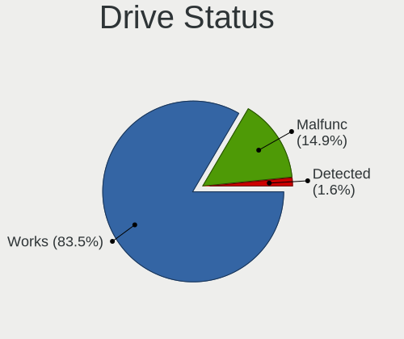
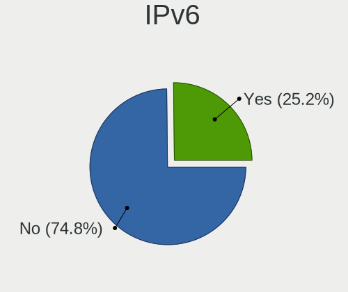

BSD - Hardware Trends
---------------------

A project to identify most popular hardware characteristics and track their change
over time based on data collected by BSD users at https://BSD-Hardware.info.

Anyone can contribute to this report by the [hw-probe](https://github.com/linuxhw/hw-probe/blob/master/INSTALL.BSD.md) tool:

    hw-probe -all -upload

This is a report for all computer types. See also reports for [desktops](/Desktop/README.md) and [notebooks](/Notebook/README.md).

OS-specific reports: [FreeBSD](/Dist/FreeBSD), [OPNsense](/Dist/OPNsense), [helloSystem](/Dist/helloSystem), [OpenBSD](/Dist/OpenBSD).

This report is for one last month. Overall report since the beginning of time: [TestCoverage](https://github.com/bsdhw/TestCoverage)

Period: Sep, 2022.

Contents
--------

* [ System ](#system)
  - [ OS                       ](#os)
  - [ OS Family                ](#os-family)
  - [ Arch                     ](#arch)
  - [ DE                       ](#de)
  - [ Display Server           ](#display-server)
  - [ Display Manager          ](#display-manager)
  - [ OS Lang                  ](#os-lang)
  - [ Boot Mode                ](#boot-mode)
  - [ Filesystem               ](#filesystem)
  - [ Part. scheme             ](#part-scheme)

* [ Board ](#board)
  - [ Vendor                   ](#vendor)
  - [ Model                    ](#model)
  - [ Model Family             ](#model-family)
  - [ MFG Year                 ](#mfg-year)
  - [ Form Factor              ](#form-factor)
  - [ Coreboot                 ](#coreboot)
  - [ RAM Size                 ](#ram-size)
  - [ RAM Used                 ](#ram-used)
  - [ Total Drives             ](#total-drives)
  - [ Has CD-ROM               ](#has-cd-rom)
  - [ Has Ethernet             ](#has-ethernet)
  - [ Has WiFi                 ](#has-wifi)
  - [ Has Bluetooth            ](#has-bluetooth)

* [ Location ](#location)
  - [ Country                  ](#country)
  - [ City                     ](#city)

* [ Drives ](#drives)
  - [ Drive Vendor             ](#drive-vendor)
  - [ Drive Model              ](#drive-model)
  - [ HDD Vendor               ](#hdd-vendor)
  - [ SSD Vendor               ](#ssd-vendor)
  - [ Drive Kind               ](#drive-kind)
  - [ Drive Connector          ](#drive-connector)
  - [ Drive Size               ](#drive-size)
  - [ Space Total              ](#space-total)
  - [ Space Used               ](#space-used)
  - [ Malfunc. Drives          ](#malfunc-drives)
  - [ Malfunc. Drive Vendor    ](#malfunc-drive-vendor)
  - [ Malfunc. HDD Vendor      ](#malfunc-hdd-vendor)
  - [ Malfunc. Drive Kind      ](#malfunc-drive-kind)
  - [ Failed Drives            ](#failed-drives)
  - [ Failed Drive Vendor      ](#failed-drive-vendor)
  - [ Drive Status             ](#drive-status)

* [ Storage controller ](#storage-controller)
  - [ Storage Vendor           ](#storage-vendor)
  - [ Storage Model            ](#storage-model)
  - [ Storage Kind             ](#storage-kind)

* [ Processor ](#processor)
  - [ CPU Vendor               ](#cpu-vendor)
  - [ CPU Model                ](#cpu-model)
  - [ CPU Model Family         ](#cpu-model-family)
  - [ CPU Cores                ](#cpu-cores)
  - [ CPU Sockets              ](#cpu-sockets)
  - [ CPU Threads              ](#cpu-threads)
  - [ CPU Microarch            ](#cpu-microarch)

* [ Graphics ](#graphics)
  - [ GPU Vendor               ](#gpu-vendor)
  - [ GPU Model                ](#gpu-model)
  - [ GPU Combo                ](#gpu-combo)
  - [ GPU Driver               ](#gpu-driver)
  - [ GPU Memory               ](#gpu-memory)

* [ Monitor ](#monitor)
  - [ Monitor Vendor           ](#monitor-vendor)
  - [ Monitor Model            ](#monitor-model)
  - [ Monitor Resolution       ](#monitor-resolution)
  - [ Monitor Diagonal         ](#monitor-diagonal)
  - [ Monitor Width            ](#monitor-width)
  - [ Aspect Ratio             ](#aspect-ratio)
  - [ Monitor Area             ](#monitor-area)
  - [ Pixel Density            ](#pixel-density)
  - [ Multiple Monitors        ](#multiple-monitors)

* [ Network ](#network)
  - [ Net Controller Vendor    ](#net-controller-vendor)
  - [ Net Controller Model     ](#net-controller-model)
  - [ Wireless Vendor          ](#wireless-vendor)
  - [ Wireless Model           ](#wireless-model)
  - [ Ethernet Vendor          ](#ethernet-vendor)
  - [ Ethernet Model           ](#ethernet-model)
  - [ Net Controller Kind      ](#net-controller-kind)
  - [ Used Controller          ](#used-controller)
  - [ NICs                     ](#nics)
  - [ IPv6                     ](#ipv6)

* [ Bluetooth ](#bluetooth)
  - [ Bluetooth Vendor         ](#bluetooth-vendor)
  - [ Bluetooth Model          ](#bluetooth-model)

* [ Sound ](#sound)
  - [ Sound Vendor             ](#sound-vendor)
  - [ Sound Model              ](#sound-model)

* [ Memory ](#memory)
  - [ Memory Vendor            ](#memory-vendor)
  - [ Memory Model             ](#memory-model)
  - [ Memory Kind              ](#memory-kind)
  - [ Memory Form Factor       ](#memory-form-factor)
  - [ Memory Size              ](#memory-size)
  - [ Memory Speed             ](#memory-speed)

* [ Printers & scanners ](#printers--scanners)
  - [ Printer Vendor           ](#printer-vendor)
  - [ Printer Model            ](#printer-model)
  - [ Scanner Vendor           ](#scanner-vendor)
  - [ Scanner Model            ](#scanner-model)

* [ Camera ](#camera)
  - [ Camera Vendor            ](#camera-vendor)
  - [ Camera Model             ](#camera-model)

* [ Security ](#security)
  - [ Fingerprint Vendor       ](#fingerprint-vendor)
  - [ Fingerprint Model        ](#fingerprint-model)
  - [ Chipcard Vendor          ](#chipcard-vendor)
  - [ Chipcard Model           ](#chipcard-model)

* [ Unsupported ](#unsupported)
  - [ Unsupported Devices      ](#unsupported-devices)
  - [ Unsupported Device Types ](#unsupported-device-types)

System
------

OS
--

Installed operating systems

| Name                      | Computers | Percent |
|---------------------------|-----------|---------|
| OPNsense 22.7.4           | 183       | 49.33%  |
| OPNsense 22.7.3           | 51        | 13.75%  |
| FreeBSD 13.1-p2           | 35        | 9.43%   |
| OPNsense 22.7.2           | 14        | 3.77%   |
| helloSystem 0.7.0         | 13        | 3.5%    |
| FreeBSD 13.1              | 12        | 3.23%   |
| OPNsense 22.1.10          | 8         | 2.16%   |
| FreeBSD 12.3-p5           | 8         | 2.16%   |
| helloSystem 0.8.0         | 6         | 1.62%   |
| OPNsense 22.4.3           | 5         | 1.35%   |
| OpenBSD 7.1               | 5         | 1.35%   |
| FreeBSD 14.0-CURRENT      | 5         | 1.35%   |
| OPNsense 21.7.8           | 4         | 1.08%   |
| FreeBSD 13.1-p1           | 4         | 1.08%   |
| OPNsense 23.1             | 3         | 0.81%   |
| FreeBSD 13.1-STABLE       | 3         | 0.81%   |
| GhostBSD 22.08.23         | 2         | 0.54%   |
| DragonFly 6.3-DEVELOPMENT | 2         | 0.54%   |
| OPNsense 22.7             | 1         | 0.27%   |
| OpenBSD 7.2               | 1         | 0.27%   |
| NomadBSD 5806f915         | 1         | 0.27%   |
| helloSystem 13.1-p2       | 1         | 0.27%   |
| helloSystem 13.1          | 1         | 0.27%   |
| GhostBSD 22.09.16         | 1         | 0.27%   |
| FreeBSD 13.1-STABLE-HBSD  | 1         | 0.27%   |
| FreeBSD 12.3-p7           | 1         | 0.27%   |

OS Family
---------

OS without a version

| Name        | Computers | Percent |
|-------------|-----------|---------|
| OPNsense    | 269       | 72.51%  |
| FreeBSD     | 69        | 18.6%   |
| helloSystem | 21        | 5.66%   |
| OpenBSD     | 6         | 1.62%   |
| GhostBSD    | 3         | 0.81%   |
| DragonFly   | 2         | 0.54%   |
| NomadBSD    | 1         | 0.27%   |

Arch
----

OS architecture (x86_64, i586, etc.)

| Name  | Computers | Percent |
|-------|-----------|---------|
| amd64 | 366       | 98.65%  |
| i386  | 3         | 0.81%   |
| arm64 | 1         | 0.27%   |
| arm   | 1         | 0.27%   |

DE
--

Desktop Environment

| Name          | Computers | Percent |
|---------------|-----------|---------|
| Console       | 294       | 79.25%  |
| helloDesktop  | 26        | 7.01%   |
| XFCE          | 15        | 4.04%   |
| KDE5          | 15        | 4.04%   |
| TWM           | 4         | 1.08%   |
| MATE          | 4         | 1.08%   |
| GNOME         | 4         | 1.08%   |
| Openbox       | 2         | 0.54%   |
| i3            | 2         | 0.54%   |
| spectrwm      | 1         | 0.27%   |
| plasma        | 1         | 0.27%   |
| LXDE          | 1         | 0.27%   |
| Enlightenment | 1         | 0.27%   |
| AwesomeWM     | 1         | 0.27%   |

Display Server
--------------

X11 or Wayland

| Name    | Computers | Percent |
|---------|-----------|---------|
| Console | 299       | 80.59%  |
| X11     | 70        | 18.87%  |
| Wayland | 2         | 0.54%   |

Display Manager
---------------

SDDM, LightDM, etc.

| Name    | Computers | Percent |
|---------|-----------|---------|
| Console | 320       | 86.25%  |
| SLiM    | 27        | 7.28%   |
| SDDM    | 14        | 3.77%   |
| LightDM | 5         | 1.35%   |
| XDM     | 4         | 1.08%   |
| GDM     | 1         | 0.27%   |

OS Lang
-------

Language

| Lang    | Computers | Percent |
|---------|-----------|---------|
| Unknown | 289       | 77.9%   |
| C       | 47        | 12.67%  |
| en_US   | 23        | 6.2%    |
| ru_RU   | 5         | 1.35%   |
| zh_CN   | 3         | 0.81%   |
| de_DE   | 2         | 0.54%   |
| fr_FR   | 1         | 0.27%   |
| en_CA   | 1         | 0.27%   |

Boot Mode
---------

EFI or BIOS

| Mode | Computers | Percent |
|------|-----------|---------|
| EFI  | 327       | 88.14%  |
| BIOS | 44        | 11.86%  |

Filesystem
----------

Type of filesystem

| Type    | Computers | Percent |
|---------|-----------|---------|
| Ufs     | 180       | 48.52%  |
| Zfs     | 169       | 45.55%  |
| Cd9660  | 14        | 3.77%   |
| Ffs     | 6         | 1.62%   |
| Hammer2 | 2         | 0.54%   |

Part. scheme
------------

Scheme of partitioning

| Type    | Computers | Percent |
|---------|-----------|---------|
| GPT     | 352       | 94.88%  |
| MBR     | 12        | 3.23%   |
| Unknown | 6         | 1.62%   |
| BSD     | 1         | 0.27%   |

Board
-----

Vendor
------

Motherboard manufacturer

| Name                | Computers | Percent |
|---------------------|-----------|---------|
| Dell                | 43        | 11.59%  |
| Unknown             | 33        | 8.89%   |
| Hewlett-Packard     | 31        | 8.36%   |
| Intel               | 30        | 8.09%   |
| Lenovo              | 23        | 6.2%    |
| ASUSTek Computer    | 20        | 5.39%   |
| Supermicro          | 19        | 5.12%   |
| ASRock              | 15        | 4.04%   |
| Gigabyte Technology | 14        | 3.77%   |
| Protectli           | 11        | 2.96%   |
| MSI                 | 11        | 2.96%   |
| Deciso              | 11        | 2.96%   |
| Techvision          | 9         | 2.43%   |
| Sophos              | 9         | 2.43%   |
| Fujitsu             | 9         | 2.43%   |
| AMI                 | 8         | 2.16%   |
| PC Engines          | 5         | 1.35%   |
| BESSTAR Tech        | 5         | 1.35%   |
| ASRockRack          | 5         | 1.35%   |
| Apple               | 4         | 1.08%   |
| Toshiba             | 3         | 0.81%   |
| maiyunda            | 3         | 0.81%   |
| CncTion             | 3         | 0.81%   |
| Acer                | 3         | 0.81%   |
| System76            | 2         | 0.54%   |
| Pegatron            | 2         | 0.54%   |
| MW                  | 2         | 0.54%   |
| IBM                 | 2         | 0.54%   |
| Cisco               | 2         | 0.54%   |
| Biostar             | 2         | 0.54%   |
| AZW                 | 2         | 0.54%   |
| AMD                 | 2         | 0.54%   |
| ZOTAC               | 1         | 0.27%   |
| YANYU               | 1         | 0.27%   |
| Yanling             | 1         | 0.27%   |
| Valve               | 1         | 0.27%   |
| TYAN Computer       | 1         | 0.27%   |
| TUXEDO              | 1         | 0.27%   |
| Tactus              | 1         | 0.27%   |
| Standard            | 1         | 0.27%   |

Model
-----

Motherboard model

| Name                             | Computers | Percent |
|----------------------------------|-----------|---------|
| Unknown                          | 33        | 8.89%   |
| Techvision TVI7309X              | 9         | 2.43%   |
| Protectli FW4B                   | 9         | 2.43%   |
| Intel Q3XXG4-P V1.0              | 6         | 1.62%   |
| AMI Aptio CRB                    | 6         | 1.62%   |
| Fujitsu FUTRO S920               | 5         | 1.35%   |
| Sophos SG                        | 4         | 1.08%   |
| PC Engines APU2                  | 4         | 1.08%   |
| Supermicro Super Server          | 3         | 0.81%   |
| Sophos UTM                       | 3         | 0.81%   |
| maiyunda www.maiyunda.com        | 3         | 0.81%   |
| HP t730 Thin Client              | 3         | 0.81%   |
| HP t620 PLUS Quad Core TC        | 3         | 0.81%   |
| HP ProDesk 600 G1 SFF            | 3         | 0.81%   |
| Dell OptiPlex 3010               | 3         | 0.81%   |
| Deciso Netboard A10 V2           | 3         | 0.81%   |
| ASUS M5A78L-M/USB3               | 3         | 0.81%   |
| System76 Gazelle                 | 2         | 0.54%   |
| Supermicro X9SCL/X9SCM           | 2         | 0.54%   |
| Supermicro PIO-518D-N6TRF-ST031  | 2         | 0.54%   |
| Sophos XG                        | 2         | 0.54%   |
| MW GMLK-2_5G4L                   | 2         | 0.54%   |
| MSI MS-7817                      | 2         | 0.54%   |
| MSI MS-7721                      | 2         | 0.54%   |
| Intel MAHOBAY                    | 2         | 0.54%   |
| HP ProLiant DL360 G5             | 2         | 0.54%   |
| HP ProLiant DL20 Gen9            | 2         | 0.54%   |
| HP EliteBook 840 G3              | 2         | 0.54%   |
| Gigabyte GB-BSi5A-6200           | 2         | 0.54%   |
| Dell Precision 7710              | 2         | 0.54%   |
| Dell PowerEdge R720              | 2         | 0.54%   |
| Dell PowerEdge R710              | 2         | 0.54%   |
| Dell OptiPlex 3020               | 2         | 0.54%   |
| Deciso NetBoard-A10              | 2         | 0.54%   |
| Deciso Netboard A20              | 2         | 0.54%   |
| Deciso Netboard A10 GEN2 Model G | 2         | 0.54%   |
| CncTion N5105-4L                 | 2         | 0.54%   |
| Cisco SALEEN                     | 2         | 0.54%   |
| BESSTAR Tech GK41                | 2         | 0.54%   |
| AZW Green G1                     | 2         | 0.54%   |

Model Family
------------

Motherboard model prefix

| Name                            | Computers | Percent |
|---------------------------------|-----------|---------|
| Unknown                         | 33        | 8.89%   |
| Dell OptiPlex                   | 14        | 3.77%   |
| Dell PowerEdge                  | 12        | 3.23%   |
| Lenovo ThinkPad                 | 10        | 2.7%    |
| Techvision TVI7309X             | 9         | 2.43%   |
| Protectli FW4B                  | 9         | 2.43%   |
| HP ProLiant                     | 8         | 2.16%   |
| Lenovo ThinkCentre              | 7         | 1.89%   |
| Fujitsu FUTRO                   | 7         | 1.89%   |
| Deciso Netboard                 | 7         | 1.89%   |
| Intel Q3XXG4-P                  | 6         | 1.62%   |
| AMI Aptio                       | 6         | 1.62%   |
| HP ProDesk                      | 5         | 1.35%   |
| Dell Precision                  | 5         | 1.35%   |
| Sophos SG                       | 4         | 1.08%   |
| PC Engines APU2                 | 4         | 1.08%   |
| Dell Inspiron                   | 4         | 1.08%   |
| ASUS PRIME                      | 4         | 1.08%   |
| Supermicro Super                | 3         | 0.81%   |
| Sophos UTM                      | 3         | 0.81%   |
| maiyunda www.maiyunda.com       | 3         | 0.81%   |
| HP t730                         | 3         | 0.81%   |
| HP t620                         | 3         | 0.81%   |
| HP EliteBook                    | 3         | 0.81%   |
| HP Compaq                       | 3         | 0.81%   |
| Dell Latitude                   | 3         | 0.81%   |
| ASUS M5A78L-M                   | 3         | 0.81%   |
| Toshiba Satellite               | 2         | 0.54%   |
| System76 Gazelle                | 2         | 0.54%   |
| Supermicro X9SCL                | 2         | 0.54%   |
| Supermicro PIO-518D-N6TRF-ST031 | 2         | 0.54%   |
| Sophos XG                       | 2         | 0.54%   |
| MW GMLK-2                       | 2         | 0.54%   |
| MSI MS-7817                     | 2         | 0.54%   |
| MSI MS-7721                     | 2         | 0.54%   |
| Intel MAHOBAY                   | 2         | 0.54%   |
| IBM ThinkPad                    | 2         | 0.54%   |
| HP EliteDesk                    | 2         | 0.54%   |
| Gigabyte X570                   | 2         | 0.54%   |
| Gigabyte GB-BSi5A-6200          | 2         | 0.54%   |

MFG Year
--------

Motherboard manufacture year

| Year    | Computers | Percent |
|---------|-----------|---------|
| 2022    | 49        | 13.21%  |
| 2021    | 40        | 10.78%  |
| 2019    | 35        | 9.43%   |
| 2018    | 35        | 9.43%   |
| 2014    | 30        | 8.09%   |
| 2016    | 29        | 7.82%   |
| 2015    | 25        | 6.74%   |
| 2020    | 24        | 6.47%   |
| 2013    | 24        | 6.47%   |
| 2017    | 18        | 4.85%   |
| 2012    | 16        | 4.31%   |
| 2011    | 15        | 4.04%   |
| 2010    | 11        | 2.96%   |
| 2009    | 7         | 1.89%   |
| 2008    | 7         | 1.89%   |
| 2007    | 3         | 0.81%   |
| 2006    | 1         | 0.27%   |
| 2003    | 1         | 0.27%   |
| Unknown | 1         | 0.27%   |

Form Factor
-----------

Physical design of the computer

| Name     | Computers | Percent |
|----------|-----------|---------|
| Desktop  | 246       | 66.31%  |
| Notebook | 62        | 16.71%  |
| Server   | 31        | 8.36%   |
| Mini pc  | 23        | 6.2%    |
| Firewall | 9         | 2.43%   |

Coreboot
--------

Have coreboot on board

| Used | Computers | Percent |
|------|-----------|---------|
| No   | 354       | 95.42%  |
| Yes  | 17        | 4.58%   |

RAM Size
--------

Total RAM memory

| Size in GB  | Computers | Percent |
|-------------|-----------|---------|
| 8.01-16.0   | 140       | 37.74%  |
| 16.01-24.0  | 85        | 22.91%  |
| 4.01-8.0    | 68        | 18.33%  |
| 32.01-64.0  | 35        | 9.43%   |
| 64.01-256.0 | 18        | 4.85%   |
| 2.01-3.0    | 13        | 3.5%    |
| 24.01-32.0  | 7         | 1.89%   |
| 3.01-4.0    | 2         | 0.54%   |
| 0.01-0.5    | 2         | 0.54%   |
| 0.51-1.0    | 1         | 0.27%   |

RAM Used
--------

Used RAM memory

| Used GB  | Computers | Percent |
|----------|-----------|---------|
| 0.01-0.5 | 184       | 49.6%   |
| 0.51-1.0 | 122       | 32.88%  |
| 1.01-2.0 | 46        | 12.4%   |
| 3.01-4.0 | 6         | 1.62%   |
| 2.01-3.0 | 6         | 1.62%   |
| 4.01-8.0 | 5         | 1.35%   |
| 0        | 2         | 0.54%   |

Total Drives
------------

Number of drives on board

| Drives | Computers | Percent |
|--------|-----------|---------|
| 1      | 264       | 71.16%  |
| 2      | 41        | 11.05%  |
| 0      | 38        | 10.24%  |
| 3      | 12        | 3.23%   |
| 4      | 7         | 1.89%   |
| 6      | 3         | 0.81%   |
| 5      | 3         | 0.81%   |
| 13     | 1         | 0.27%   |
| 11     | 1         | 0.27%   |
| 10     | 1         | 0.27%   |

Has CD-ROM
----------

Has CD-ROM on board

| Presented | Computers | Percent |
|-----------|-----------|---------|
| No        | 313       | 84.37%  |
| Yes       | 58        | 15.63%  |

Has Ethernet
------------

Has Ethernet on board

| Presented | Computers | Percent |
|-----------|-----------|---------|
| Yes       | 358       | 96.5%   |
| No        | 13        | 3.5%    |

Has WiFi
--------

Has WiFi module

| Presented | Computers | Percent |
|-----------|-----------|---------|
| No        | 262       | 70.62%  |
| Yes       | 109       | 29.38%  |

Has Bluetooth
-------------

Has Bluetooth module

| Presented | Computers | Percent |
|-----------|-----------|---------|
| No        | 296       | 79.78%  |
| Yes       | 75        | 20.22%  |

Location
--------

Country
-------

Geographic location (country)

| Country      | Computers | Percent |
|--------------|-----------|---------|
| USA          | 97        | 26.15%  |
| Germany      | 67        | 18.06%  |
| UK           | 14        | 3.77%   |
| Russia       | 13        | 3.5%    |
| Canada       | 13        | 3.5%    |
| Switzerland  | 11        | 2.96%   |
| Poland       | 11        | 2.96%   |
| France       | 11        | 2.96%   |
| China        | 10        | 2.7%    |
| Brazil       | 10        | 2.7%    |
| Netherlands  | 9         | 2.43%   |
| Australia    | 9         | 2.43%   |
| Italy        | 8         | 2.16%   |
| Austria      | 7         | 1.89%   |
| Indonesia    | 6         | 1.62%   |
| Spain        | 5         | 1.35%   |
| Norway       | 4         | 1.08%   |
| India        | 4         | 1.08%   |
| Denmark      | 4         | 1.08%   |
| Belgium      | 4         | 1.08%   |
| South Korea  | 3         | 0.81%   |
| South Africa | 3         | 0.81%   |
| Israel       | 3         | 0.81%   |
| Greece       | 3         | 0.81%   |
| Finland      | 3         | 0.81%   |
| Vietnam      | 2         | 0.54%   |
| Turkey       | 2         | 0.54%   |
| Thailand     | 2         | 0.54%   |
| Slovenia     | 2         | 0.54%   |
| Slovakia     | 2         | 0.54%   |
| Singapore    | 2         | 0.54%   |
| Romania      | 2         | 0.54%   |
| Portugal     | 2         | 0.54%   |
| Philippines  | 2         | 0.54%   |
| Hong Kong    | 2         | 0.54%   |
| Czechia      | 2         | 0.54%   |
| Argentina    | 2         | 0.54%   |
| UAE          | 1         | 0.27%   |
| Sweden       | 1         | 0.27%   |
| Saudi Arabia | 1         | 0.27%   |

City
----

Geographic location (city)

| City                 | Computers | Percent |
|----------------------|-----------|---------|
| Habichtswald         | 6         | 1.62%   |
| Melbourne            | 5         | 1.35%   |
| Zurich               | 4         | 1.08%   |
| Moscow               | 4         | 1.08%   |
| Frankfurt am Main    | 4         | 1.08%   |
| Unknown              | 4         | 1.08%   |
| San Antonio          | 3         | 0.81%   |
| New York             | 3         | 0.81%   |
| Munich               | 3         | 0.81%   |
| Ludwigsburg          | 3         | 0.81%   |
| Jakarta              | 3         | 0.81%   |
| Berlin               | 3         | 0.81%   |
| Xiamen               | 2         | 0.54%   |
| Wels                 | 2         | 0.54%   |
| Vancouver            | 2         | 0.54%   |
| Tel Aviv             | 2         | 0.54%   |
| Sydney               | 2         | 0.54%   |
| Stuttgart            | 2         | 0.54%   |
| Singapore            | 2         | 0.54%   |
| Seattle              | 2         | 0.54%   |
| Sao José dos Campos | 2         | 0.54%   |
| Salem                | 2         | 0.54%   |
| Redmond              | 2         | 0.54%   |
| Orenburg             | 2         | 0.54%   |
| Olympia              | 2         | 0.54%   |
| Mountain View        | 2         | 0.54%   |
| Martin               | 2         | 0.54%   |
| Madrid               | 2         | 0.54%   |
| London               | 2         | 0.54%   |
| Lodz                 | 2         | 0.54%   |
| Krefeld              | 2         | 0.54%   |
| Krasnodar            | 2         | 0.54%   |
| Kassel               | 2         | 0.54%   |
| Ho Chi Minh City     | 2         | 0.54%   |
| Hamburg              | 2         | 0.54%   |
| Gdynia               | 2         | 0.54%   |
| Fort Worth           | 2         | 0.54%   |
| Curitiba             | 2         | 0.54%   |
| Cologne              | 2         | 0.54%   |
| Chengdu              | 2         | 0.54%   |

Drives
------

Drive Vendor
------------

Hard drive vendors

| Vendor              | Computers | Drives | Percent |
|---------------------|-----------|--------|---------|
| Samsung Electronics | 63        | 82     | 15.99%  |
| WDC                 | 40        | 61     | 10.15%  |
| Seagate             | 32        | 44     | 8.12%   |
| Transcend           | 28        | 29     | 7.11%   |
| Kingston            | 26        | 29     | 6.6%    |
| Intel               | 19        | 23     | 4.82%   |
| SanDisk             | 16        | 16     | 4.06%   |
| Toshiba             | 13        | 14     | 3.3%    |
| Crucial             | 11        | 13     | 2.79%   |
| Hoodisk             | 10        | 10     | 2.54%   |
| Silicon Motion      | 9         | 9      | 2.28%   |
| Hitachi             | 9         | 10     | 2.28%   |
| HGST                | 9         | 21     | 2.28%   |
| A-DATA Technology   | 9         | 10     | 2.28%   |
| China               | 7         | 7      | 1.78%   |
| PNY                 | 6         | 8      | 1.52%   |
| Patriot             | 5         | 5      | 1.27%   |
| KIOXIA              | 5         | 5      | 1.27%   |
| Innodisk            | 5         | 5      | 1.27%   |
| Hewlett-Packard     | 5         | 11     | 1.27%   |
| Apacer              | 5         | 5      | 1.27%   |
| Protectli           | 4         | 4      | 1.02%   |
| Phison              | 4         | 4      | 1.02%   |
| FORESEE             | 4         | 4      | 1.02%   |
| SPCC                | 3         | 3      | 0.76%   |
| OCZ                 | 3         | 3      | 0.76%   |
| SK hynix            | 2         | 2      | 0.51%   |
| Plextor             | 2         | 2      | 0.51%   |
| NVMe                | 2         | 3      | 0.51%   |
| Micron Technology   | 2         | 2      | 0.51%   |
| Maxtor              | 2         | 2      | 0.51%   |
| Lexar               | 2         | 2      | 0.51%   |
| KingDian            | 2         | 2      | 0.51%   |
| Intenso             | 2         | 2      | 0.51%   |
| GOODRAM             | 2         | 2      | 0.51%   |
| Gigabyte Technology | 2         | 2      | 0.51%   |
| XrayDisk            | 1         | 1      | 0.25%   |
| Wicgtyp             | 1         | 1      | 0.25%   |
| WD MediaMax         | 1         | 1      | 0.25%   |
| Verbatim            | 1         | 1      | 0.25%   |

Drive Model
-----------

Hard drive models

| Model                                | Computers | Percent |
|--------------------------------------|-----------|---------|
| Samsung SSD 970 EVO Plus 500GB       | 6         | 1.41%   |
| Transcend TS128GMSA370 128GB         | 5         | 1.17%   |
| Kingston SA400S37240G 240GB          | 5         | 1.17%   |
| Seagate ST500DM002-1BD142 500GB      | 4         | 0.94%   |
| Samsung SSD 860 EVO 250GB            | 4         | 0.94%   |
| Samsung SSD 850 EVO 250GB            | 4         | 0.94%   |
| Hoodisk SSD 128GB                    | 4         | 0.94%   |
| HP RAID 1(1+0) 240GB                 | 4         | 0.94%   |
| Transcend TS256GMTS952T2 256GB       | 3         | 0.7%    |
| Transcend TS128GMSA230S 128GB        | 3         | 0.7%    |
| Samsung SSD 870 EVO 250GB            | 3         | 0.7%    |
| PNY CS900 120GB SSD                  | 3         | 0.7%    |
| Phison Sabrent 256GB                 | 3         | 0.7%    |
| Kingston SUV500MS120G 120GB          | 3         | 0.7%    |
| WDC WDS500G3X0C-00SJG0 500GB         | 2         | 0.47%   |
| WDC PC SN730 SDBQNTY-512G-1001 512GB | 2         | 0.47%   |
| Transcend TS64GMSA230S 64GB          | 2         | 0.47%   |
| Transcend TS256GMTE652T2 256GB       | 2         | 0.47%   |
| Transcend TS128GMTE110S 128GB        | 2         | 0.47%   |
| Toshiba MQ01UBD100 1TB               | 2         | 0.47%   |
| Silicon Motion Fanxiang S500 128GB   | 2         | 0.47%   |
| Silicon Motion 128GB                 | 2         | 0.47%   |
| Seagate ST500LT012-1DG142 500GB      | 2         | 0.47%   |
| Seagate ST4000DM000-1F2168 4TB       | 2         | 0.47%   |
| Seagate ST1000DM010-2EP102 1TB       | 2         | 0.47%   |
| SanDisk SSD PLUS 240GB               | 2         | 0.47%   |
| SanDisk SSD PLUS 120GB               | 2         | 0.47%   |
| SanDisk SDSSDA240G 240GB             | 2         | 0.47%   |
| SanDisk SDSSDA120G 120GB             | 2         | 0.47%   |
| Samsung SSD 980 PRO 1TB              | 2         | 0.47%   |
| Samsung SSD 980 500GB                | 2         | 0.47%   |
| Samsung SSD 980 1TB                  | 2         | 0.47%   |
| Samsung SSD 970 EVO Plus 1TB         | 2         | 0.47%   |
| Samsung SSD 970 EVO 500GB            | 2         | 0.47%   |
| Samsung SSD 860 EVO mSATA 250GB      | 2         | 0.47%   |
| Samsung SSD 850 EVO 500GB            | 2         | 0.47%   |
| Samsung SSD 850 EVO 1TB              | 2         | 0.47%   |
| KIOXIA KBG40ZNS256G NVMe 256GB       | 2         | 0.47%   |
| Kingston OM8PDP3512B-A01 512GB       | 2         | 0.47%   |
| Intel SSDSC2KG240G8 240GB            | 2         | 0.47%   |

HDD Vendor
----------

Hard disk drive vendors

| Vendor              | Computers | Drives | Percent |
|---------------------|-----------|--------|---------|
| Seagate             | 32        | 44     | 32%     |
| WDC                 | 24        | 44     | 24%     |
| Toshiba             | 11        | 12     | 11%     |
| Hitachi             | 9         | 10     | 9%      |
| HGST                | 9         | 21     | 9%      |
| Hewlett-Packard     | 5         | 11     | 5%      |
| Samsung Electronics | 4         | 5      | 4%      |
| NVMe                | 2         | 3      | 2%      |
| Maxtor              | 2         | 2      | 2%      |
| WD MediaMax         | 1         | 1      | 1%      |
| Fujitsu             | 1         | 1      | 1%      |

SSD Vendor
----------

Solid state drive vendors

| Vendor              | Computers | Drives | Percent |
|---------------------|-----------|--------|---------|
| Samsung Electronics | 38        | 46     | 17.27%  |
| Transcend           | 24        | 25     | 10.91%  |
| Kingston            | 21        | 24     | 9.55%   |
| SanDisk             | 16        | 16     | 7.27%   |
| Intel               | 14        | 18     | 6.36%   |
| Hoodisk             | 10        | 10     | 4.55%   |
| Crucial             | 10        | 12     | 4.55%   |
| A-DATA Technology   | 9         | 10     | 4.09%   |
| China               | 7         | 7      | 3.18%   |
| PNY                 | 6         | 8      | 2.73%   |
| Innodisk            | 5         | 5      | 2.27%   |
| Apacer              | 5         | 5      | 2.27%   |
| WDC                 | 4         | 4      | 1.82%   |
| Protectli           | 4         | 4      | 1.82%   |
| Patriot             | 4         | 4      | 1.82%   |
| FORESEE             | 4         | 4      | 1.82%   |
| SPCC                | 3         | 3      | 1.36%   |
| OCZ                 | 3         | 3      | 1.36%   |
| Lexar               | 2         | 2      | 0.91%   |
| KingDian            | 2         | 2      | 0.91%   |
| Intenso             | 2         | 2      | 0.91%   |
| GOODRAM             | 2         | 2      | 0.91%   |
| Gigabyte Technology | 2         | 2      | 0.91%   |
| XrayDisk            | 1         | 1      | 0.45%   |
| Wicgtyp             | 1         | 1      | 0.45%   |
| Verbatim            | 1         | 1      | 0.45%   |
| Vaseky              | 1         | 1      | 0.45%   |
| V-GeN               | 1         | 1      | 0.45%   |
| Toshiba             | 1         | 1      | 0.45%   |
| SK hynix            | 1         | 1      | 0.45%   |
| ShiJi               | 1         | 1      | 0.45%   |
| SATADOM             | 1         | 1      | 0.45%   |
| Plextor             | 1         | 1      | 0.45%   |
| Netac               | 1         | 1      | 0.45%   |
| Mushkin             | 1         | 1      | 0.45%   |
| LITEON              | 1         | 1      | 0.45%   |
| Leven               | 1         | 1      | 0.45%   |
| Lenovo              | 1         | 1      | 0.45%   |
| KingSpec            | 1         | 1      | 0.45%   |
| Indilinx            | 1         | 1      | 0.45%   |

Drive Kind
----------

HDD or SSD

| Kind | Computers | Drives | Percent |
|------|-----------|--------|---------|
| SSD  | 208       | 241    | 56.22%  |
| HDD  | 85        | 154    | 22.97%  |
| NVMe | 77        | 85     | 20.81%  |

Drive Connector
---------------

SATA, SAS, NVMe, etc.

| Type | Computers | Drives | Percent |
|------|-----------|--------|---------|
| SATA | 277       | 395    | 78.25%  |
| NVMe | 77        | 85     | 21.75%  |

Drive Size
----------

Size of hard drive

| Size in TB | Computers | Drives | Percent |
|------------|-----------|--------|---------|
| 0.01-0.5   | 241       | 284    | 80.07%  |
| 0.51-1.0   | 34        | 45     | 11.3%   |
| 1.01-2.0   | 11        | 18     | 3.65%   |
| 3.01-4.0   | 6         | 21     | 1.99%   |
| 4.01-10.0  | 6         | 20     | 1.99%   |
| 2.01-3.0   | 2         | 5      | 0.66%   |
| 10.01-20.0 | 1         | 2      | 0.33%   |

Space Total
-----------

Amount of disk space available on the file system

| Size in GB     | Computers | Percent |
|----------------|-----------|---------|
| 101-250        | 173       | 46.63%  |
| 251-500        | 64        | 17.25%  |
| 1-20           | 36        | 9.7%    |
| 51-100         | 34        | 9.16%   |
| 21-50          | 30        | 8.09%   |
| 501-1000       | 20        | 5.39%   |
| Unknown        | 6         | 1.62%   |
| 1001-2000      | 4         | 1.08%   |
| 2001-3000      | 3         | 0.81%   |
| More than 3000 | 1         | 0.27%   |

Space Used
----------

Amount of used disk space

| Used GB        | Computers | Percent |
|----------------|-----------|---------|
| 1-20           | 326       | 87.87%  |
| 21-50          | 23        | 6.2%    |
| 51-100         | 8         | 2.16%   |
| Unknown        | 6         | 1.62%   |
| 101-250        | 4         | 1.08%   |
| 501-1000       | 2         | 0.54%   |
| More than 3000 | 1         | 0.27%   |
| 251-500        | 1         | 0.27%   |

Malfunc. Drives
---------------

Drive models with a malfunction

| Model                                 | Computers | Drives | Percent |
|---------------------------------------|-----------|--------|---------|
| Seagate ST500DM002-1BD142 500GB       | 2         | 2      | 3.57%   |
| Apacer 16GB SATA Flash Drive          | 2         | 2      | 3.57%   |
| XrayDisk SSD 240GB                    | 1         | 1      | 1.79%   |
| WDC WD7500BPKX-00HPJT0 752GB          | 1         | 2      | 1.79%   |
| WDC WD6400AAKS-22A7B2 640GB           | 1         | 1      | 1.79%   |
| WDC WD6400AAKS-22A7B0 640GB           | 1         | 1      | 1.79%   |
| WDC WD6002FRYZ-01WD5B1 6TB            | 1         | 1      | 1.79%   |
| WDC WD5000LPCX-60VHAT0 500GB          | 1         | 1      | 1.79%   |
| WDC WD5000AAKX-75U6AA0 500GB          | 1         | 1      | 1.79%   |
| WDC WD20EFRX-68EUZN0 2TB              | 1         | 2      | 1.79%   |
| WDC WD1600AAJS-08L7A0 160GB           | 1         | 1      | 1.79%   |
| WDC WD10EJRX-89N74Y0 1TB              | 1         | 1      | 1.79%   |
| Toshiba THNSNK256GCS8 SATA 256GB      | 1         | 1      | 1.79%   |
| Toshiba MQ01UBD100 1TB                | 1         | 1      | 1.79%   |
| Toshiba MK8034GSX 80GB                | 1         | 1      | 1.79%   |
| Toshiba MK6475GSX 640GB               | 1         | 1      | 1.79%   |
| Toshiba MK5076GSX 500GB               | 1         | 1      | 1.79%   |
| SK hynix SC308 SATA 128GB             | 1         | 1      | 1.79%   |
| Seagate ST9500420ASG 500GB            | 1         | 1      | 1.79%   |
| Seagate ST9160412AS 160GB             | 1         | 1      | 1.79%   |
| Seagate ST3750330NS 752GB             | 1         | 1      | 1.79%   |
| Seagate ST3500413AS 500GB             | 1         | 1      | 1.79%   |
| Seagate ST3160318AS 160GB             | 1         | 1      | 1.79%   |
| Seagate ST31000520AS 1TB              | 1         | 1      | 1.79%   |
| Samsung Electronics SSD 970 EVO 500GB | 1         | 1      | 1.79%   |
| Samsung Electronics SSD 870 EVO 250GB | 1         | 1      | 1.79%   |
| Samsung Electronics SSD 850 PRO 256GB | 1         | 2      | 1.79%   |
| Samsung Electronics HD204UI 2TB       | 1         | 1      | 1.79%   |
| Samsung Electronics HD103SJ 1TB       | 1         | 1      | 1.79%   |
| Patriot Inferno 60GB SSD              | 1         | 1      | 1.79%   |
| OCZ AGILITY3 240GB                    | 1         | 1      | 1.79%   |
| OCZ AGILITY2 64GB                     | 1         | 1      | 1.79%   |
| Maxtor STM380815AS 80GB               | 1         | 1      | 1.79%   |
| Maxtor STM3250820AS 250GB             | 1         | 1      | 1.79%   |
| Kingston SV300S37A60G 64GB            | 1         | 1      | 1.79%   |
| Kingston SV300S37A120G 120GB          | 1         | 1      | 1.79%   |
| Kingston SNS4151S316GD 16GB           | 1         | 1      | 1.79%   |
| KingDian S100 32GB                    | 1         | 1      | 1.79%   |
| Intel SSDSCKKF256G8H 256GB            | 1         | 1      | 1.79%   |
| Intel SSDSC2BW240A4 240GB             | 1         | 1      | 1.79%   |

Malfunc. Drive Vendor
---------------------

Vendors of faulty drives

| Vendor              | Computers | Drives | Percent |
|---------------------|-----------|--------|---------|
| WDC                 | 9         | 11     | 16.07%  |
| Seagate             | 8         | 8      | 14.29%  |
| Toshiba             | 5         | 5      | 8.93%   |
| Samsung Electronics | 5         | 6      | 8.93%   |
| Intel               | 5         | 5      | 8.93%   |
| Hitachi             | 4         | 5      | 7.14%   |
| HGST                | 4         | 4      | 7.14%   |
| Kingston            | 3         | 3      | 5.36%   |
| OCZ                 | 2         | 2      | 3.57%   |
| Maxtor              | 2         | 2      | 3.57%   |
| Apacer              | 2         | 2      | 3.57%   |
| XrayDisk            | 1         | 1      | 1.79%   |
| SK hynix            | 1         | 1      | 1.79%   |
| Patriot             | 1         | 1      | 1.79%   |
| KingDian            | 1         | 1      | 1.79%   |
| Fujitsu             | 1         | 1      | 1.79%   |
| Crucial             | 1         | 1      | 1.79%   |
| A-DATA Technology   | 1         | 1      | 1.79%   |

Malfunc. HDD Vendor
-------------------

Vendors of faulty HDD drives

| Vendor              | Computers | Drives | Percent |
|---------------------|-----------|--------|---------|
| WDC                 | 9         | 11     | 26.47%  |
| Seagate             | 8         | 8      | 23.53%  |
| Toshiba             | 4         | 4      | 11.76%  |
| Hitachi             | 4         | 5      | 11.76%  |
| HGST                | 4         | 4      | 11.76%  |
| Samsung Electronics | 2         | 2      | 5.88%   |
| Maxtor              | 2         | 2      | 5.88%   |
| Fujitsu             | 1         | 1      | 2.94%   |

Malfunc. Drive Kind
-------------------

Kinds of faulty drives

| Kind | Computers | Drives | Percent |
|------|-----------|--------|---------|
| HDD  | 32        | 37     | 59.26%  |
| SSD  | 21        | 22     | 38.89%  |
| NVMe | 1         | 1      | 1.85%   |

Failed Drives
-------------

Failed drive models

Zero info for selected period =(

Failed Drive Vendor
-------------------

Failed drive vendors

Zero info for selected period =(

Drive Status
------------

Number of failed and malfunc. drives

| Status   | Computers | Drives | Percent |
|----------|-----------|--------|---------|
| Works    | 288       | 402    | 81.82%  |
| Malfunc  | 52        | 60     | 14.77%  |
| Detected | 12        | 18     | 3.41%   |

Storage controller
------------------

Storage Vendor
--------------

Storage controller vendors

| Vendor                       | Computers | Percent |
|------------------------------|-----------|---------|
| Intel                        | 282       | 60.26%  |
| AMD                          | 68        | 14.53%  |
| Samsung Electronics          | 25        | 5.34%   |
| SanDisk                      | 18        | 3.85%   |
| Broadcom / LSI               | 13        | 2.78%   |
| Silicon Motion               | 10        | 2.14%   |
| Phison Electronics           | 5         | 1.07%   |
| KIOXIA                       | 5         | 1.07%   |
| Kingston Technology Company  | 5         | 1.07%   |
| Hewlett-Packard              | 5         | 1.07%   |
| Nvidia                       | 4         | 0.85%   |
| ASMedia Technology           | 4         | 0.85%   |
| Chelsio Communications       | 3         | 0.64%   |
| Unknown                      | 3         | 0.64%   |
| Toshiba                      | 2         | 0.43%   |
| Shenzhen Longsys Electronics | 2         | 0.43%   |
| Micron/Crucial Technology    | 2         | 0.43%   |
| Micron Technology            | 2         | 0.43%   |
| JMicron Technology           | 2         | 0.43%   |
| 3ware                        | 2         | 0.43%   |
| SK hynix                     | 1         | 0.21%   |
| Seagate Technology           | 1         | 0.21%   |
| MAXIO Technology (Hangzhou)  | 1         | 0.21%   |
| Marvell Technology Group     | 1         | 0.21%   |
| Lite-On Technology           | 1         | 0.21%   |
| Adaptec                      | 1         | 0.21%   |

Storage Model
-------------

Storage controller models

| Model                                                                            | Computers | Percent |
|----------------------------------------------------------------------------------|-----------|---------|
| AMD FCH SATA Controller [AHCI mode]                                              | 53        | 10.15%  |
| Intel 8 Series/C220 Series Chipset Family 6-port SATA Controller 1 [AHCI mode]   | 34        | 6.51%   |
| Intel Celeron/Pentium Silver Processor SATA Controller                           | 21        | 4.02%   |
| Intel Jasper Lake SATA AHCI Controller                                           | 20        | 3.83%   |
| Intel 6 Series/C200 Series Chipset Family 6 port Desktop SATA AHCI Controller    | 19        | 3.64%   |
| Intel Atom/Celeron/Pentium Processor x5-E8000/J3xxx/N3xxx Series SATA Controller | 16        | 3.07%   |
| Intel Atom Processor E3800 Series SATA AHCI Controller                           | 15        | 2.87%   |
| Samsung NVMe SSD Controller SM981/PM981/PM983                                    | 12        | 2.3%    |
| Intel Q170/Q150/B150/H170/H110/Z170/CM236 Chipset SATA Controller [AHCI Mode]    | 12        | 2.3%    |
| Silicon Motion SM2263EN/SM2263XT SSD Controller                                  | 10        | 1.92%   |
| Intel Wildcat Point-LP SATA Controller [AHCI Mode]                               | 10        | 1.92%   |
| Intel Sunrise Point-LP SATA Controller [AHCI mode]                               | 10        | 1.92%   |
| Unknown                                                                          | 10        | 1.92%   |
| AMD SB7x0/SB8x0/SB9x0 SATA Controller [AHCI mode]                                | 9         | 1.72%   |
| SanDisk WD Black SN750 / PC SN730 NVMe SSD                                       | 8         | 1.53%   |
| Intel Cannon Lake PCH SATA AHCI Controller                                       | 7         | 1.34%   |
| Intel Atom Processor C3000 Series SATA Controller 0                              | 7         | 1.34%   |
| Intel 82801HM/HEM (ICH8M/ICH8M-E) IDE Controller                                 | 7         | 1.34%   |
| Intel 8 Series SATA Controller 1 [AHCI mode]                                     | 7         | 1.34%   |
| AMD 400 Series Chipset SATA Controller                                           | 7         | 1.34%   |
| Samsung NVMe SSD Controller 980                                                  | 6         | 1.15%   |
| Intel Comet Lake SATA AHCI Controller                                            | 6         | 1.15%   |
| Intel Atom Processor C3000 Series SATA Controller 1                              | 6         | 1.15%   |
| Intel 82801JI (ICH10 Family) SATA AHCI Controller                                | 6         | 1.15%   |
| Intel 82801HM/HEM (ICH8M/ICH8M-E) SATA Controller [AHCI mode]                    | 6         | 1.15%   |
| Intel 7 Series Chipset Family 6-port SATA Controller [AHCI mode]                 | 6         | 1.15%   |
| Intel NM10/ICH7 Family SATA Controller [IDE mode]                                | 5         | 0.96%   |
| Intel 82801G (ICH7 Family) IDE Controller                                        | 5         | 0.96%   |
| Intel 631xESB/632xESB IDE Controller                                             | 5         | 0.96%   |
| Intel 200 Series PCH SATA controller [AHCI mode]                                 | 5         | 0.96%   |
| AMD SB7x0/SB8x0/SB9x0 IDE Controller                                             | 5         | 0.96%   |
| Samsung NVMe SSD Controller PM9A1/PM9A3/980PRO                                   | 4         | 0.77%   |
| Phison E12 NVMe Controller                                                       | 4         | 0.77%   |
| KIOXIA NVMe SSD Controller BG4                                                   | 4         | 0.77%   |
| Intel Celeron N3350/Pentium N4200/Atom E3900 Series SATA AHCI Controller         | 4         | 0.77%   |
| Intel 6 Series/C200 Series Chipset Family 6 port Mobile SATA AHCI Controller     | 4         | 0.77%   |
| Intel 5 Series/3400 Series Chipset 6 port SATA AHCI Controller                   | 4         | 0.77%   |
| Broadcom / LSI SAS2008 PCI-Express Fusion-MPT SAS-2 [Falcon]                     | 4         | 0.77%   |
| ASMedia ASM1062 Serial ATA Controller                                            | 4         | 0.77%   |
| SanDisk WD Blue SN570 NVMe SSD                                                   | 3         | 0.57%   |

Storage Kind
------------

Kind of storage controller (IDE, SATA, NVMe, SAS, ...)

| Kind | Computers | Percent |
|------|-----------|---------|
| SATA | 321       | 66.05%  |
| NVMe | 85        | 17.49%  |
| IDE  | 48        | 9.88%   |
| RAID | 24        | 4.94%   |
| SAS  | 4         | 0.82%   |
| SCSI | 4         | 0.82%   |

Processor
---------

CPU Vendor
----------

Processor vendors

| Vendor | Computers | Percent |
|--------|-----------|---------|
| Intel  | 293       | 78.98%  |
| AMD    | 76        | 20.49%  |
| ARM    | 2         | 0.54%   |

CPU Model
---------

Processor models

| Model                                       | Computers | Percent |
|---------------------------------------------|-----------|---------|
| Intel Celeron N5105 @ 2.00GHz               | 20        | 5.39%   |
| Intel Celeron J4125 CPU @ 2.00GHz           | 14        | 3.77%   |
| Intel Celeron CPU J3160 @ 1.60GHz           | 10        | 2.7%    |
| Intel Celeron CPU J1900 @ 1.99GHz           | 7         | 1.89%   |
| Intel Core i5-4570 CPU @ 3.20GHz            | 5         | 1.35%   |
| AMD GX-420MC SOC                            | 5         | 1.35%   |
| Intel Core i5-5200U CPU @ 2.20GHz           | 4         | 1.08%   |
| AMD GX-415GA SOC with Radeon HD Graphics    | 4         | 1.08%   |
| AMD GX-412TC SOC                            | 4         | 1.08%   |
| Intel Xeon CPU E3-1275 V2 @ 3.50GHz         | 3         | 0.81%   |
| Intel Xeon                                  | 3         | 0.81%   |
| Intel Pentium CPU N3700 @ 1.60GHz           | 3         | 0.81%   |
| Intel Core i7-9750H CPU @ 2.60GHz           | 3         | 0.81%   |
| Intel Core i3-4160 CPU @ 3.60GHz            | 3         | 0.81%   |
| Intel Celeron CPU G1820 @ 2.70GHz           | 3         | 0.81%   |
| Intel Atom CPU N450 @ 1.66GHz               | 3         | 0.81%   |
| Intel Atom CPU C3558 @ 2.20GHz              | 3         | 0.81%   |
| AMD Ryzen Embedded V1500B                   | 3         | 0.81%   |
| AMD Ryzen 9 3900X 12-Core Processor         | 3         | 0.81%   |
| AMD RX-427BB with AMD Radeon R7 Graphics    | 3         | 0.81%   |
| AMD GX-420CA SOC with Radeon HD Graphics    | 3         | 0.81%   |
| AMD EPYC 3201 8-Core Processor              | 3         | 0.81%   |
| Intel Xeon CPU E5645 @ 2.40GHz              | 2         | 0.54%   |
| Intel Xeon CPU E5-2609 0 @ 2.40GHz          | 2         | 0.54%   |
| Intel Xeon CPU E31260L @ 2.40GHz            | 2         | 0.54%   |
| Intel Xeon CPU E31220 @ 3.10GHz             | 2         | 0.54%   |
| Intel Xeon CPU E3-1270 v3 @ 3.50GHz         | 2         | 0.54%   |
| Intel Xeon CPU E3-1220 v5 @ 3.00GHz         | 2         | 0.54%   |
| Intel Xeon CPU E3-1220 v3 @ 3.10GHz         | 2         | 0.54%   |
| Intel Pentium M processor                   | 2         | 0.54%   |
| Intel Pentium Dual-Core CPU E5200 @ 2.50GHz | 2         | 0.54%   |
| Intel Core i7-7700 CPU @ 3.60GHz            | 2         | 0.54%   |
| Intel Core i7-6820HQ CPU @ 2.70GHz          | 2         | 0.54%   |
| Intel Core i7-4770 CPU @ 3.40GHz            | 2         | 0.54%   |
| Intel Core i5-9500 CPU @ 3.00GHz            | 2         | 0.54%   |
| Intel Core i5-8250U CPU @ 1.60GHz           | 2         | 0.54%   |
| Intel Core i5-6200U CPU @ 2.30GHz           | 2         | 0.54%   |
| Intel Core i5-5300U CPU @ 2.30GHz           | 2         | 0.54%   |
| Intel Core i5-4200U CPU @ 1.60GHz           | 2         | 0.54%   |
| Intel Core i5-3470S CPU @ 2.90GHz           | 2         | 0.54%   |

CPU Model Family
----------------

Processor model prefix

| Model                   | Computers | Percent |
|-------------------------|-----------|---------|
| Intel Celeron           | 72        | 19.41%  |
| Intel Core i5           | 53        | 14.29%  |
| Intel Xeon              | 49        | 13.21%  |
| Intel Core i3           | 30        | 8.09%   |
| Intel Core i7           | 27        | 7.28%   |
| Intel Atom              | 21        | 5.66%   |
| AMD GX                  | 20        | 5.39%   |
| Other                   | 11        | 2.96%   |
| Intel Pentium           | 10        | 2.7%    |
| AMD Ryzen 7             | 8         | 2.16%   |
| Intel Core 2 Duo        | 7         | 1.89%   |
| AMD Ryzen 9             | 6         | 1.62%   |
| Intel Pentium Dual-Core | 5         | 1.35%   |
| AMD FX                  | 5         | 1.35%   |
| AMD EPYC                | 5         | 1.35%   |
| Intel Pentium Silver    | 4         | 1.08%   |
| AMD Ryzen 5             | 4         | 1.08%   |
| AMD Ryzen 3             | 4         | 1.08%   |
| Intel Core i9           | 3         | 0.81%   |
| AMD Ryzen Embedded      | 3         | 0.81%   |
| AMD Ryzen 5 PRO         | 3         | 0.81%   |
| AMD G                   | 3         | 0.81%   |
| Intel Pentium M         | 2         | 0.54%   |
| Intel Core 2 Quad       | 2         | 0.54%   |
| AMD Ryzen 7 PRO         | 2         | 0.54%   |
| AMD A4                  | 2         | 0.54%   |
| Intel Pentium Gold      | 1         | 0.27%   |
| Intel Genuine           | 1         | 0.27%   |
| Intel Core Duo          | 1         | 0.27%   |
| ARM Cortex              | 1         | 0.27%   |
| AMD Phenom II X4        | 1         | 0.27%   |
| AMD C-50                | 1         | 0.27%   |
| AMD Athlon II X4        | 1         | 0.27%   |
| AMD Athlon II X3        | 1         | 0.27%   |
| AMD Athlon              | 1         | 0.27%   |
| AMD A10                 | 1         | 0.27%   |

CPU Cores
---------

Number of processor cores

| Number  | Computers | Percent |
|---------|-----------|---------|
| 4       | 187       | 50.4%   |
| 2       | 91        | 24.53%  |
| 8       | 26        | 7.01%   |
| 6       | 18        | 4.85%   |
| 16      | 15        | 4.04%   |
| 12      | 11        | 2.96%   |
| Unknown | 10        | 2.7%    |
| 1       | 6         | 1.62%   |
| 24      | 4         | 1.08%   |
| 32      | 1         | 0.27%   |
| 10      | 1         | 0.27%   |
| 3       | 1         | 0.27%   |

CPU Sockets
-----------

Number of sockets

| Number  | Computers | Percent |
|---------|-----------|---------|
| 1       | 355       | 95.69%  |
| 2       | 13        | 3.5%    |
| Unknown | 2         | 0.54%   |
| 4       | 1         | 0.27%   |

CPU Threads
-----------

Threads per core (Hyper-Threading)

| Number  | Computers | Percent |
|---------|-----------|---------|
| 1       | 234       | 63.07%  |
| 2       | 125       | 33.69%  |
| Unknown | 12        | 3.23%   |

CPU Microarch
-------------

Microarchitecture

| Name          | Computers | Percent |
|---------------|-----------|---------|
| Haswell       | 43        | 11.59%  |
| Silvermont    | 33        | 8.89%   |
| KabyLake      | 30        | 8.09%   |
| Unknown       | 30        | 8.09%   |
| IvyBridge     | 21        | 5.66%   |
| Goldmont plus | 21        | 5.66%   |
| SandyBridge   | 18        | 4.85%   |
| Skylake       | 17        | 4.58%   |
| Penryn        | 16        | 4.31%   |
| Broadwell     | 14        | 3.77%   |
| Zen 2         | 13        | 3.5%    |
| Puma          | 13        | 3.5%    |
| Goldmont      | 12        | 3.23%   |
| CometLake     | 11        | 2.96%   |
| Zen           | 10        | 2.7%    |
| Westmere      | 9         | 2.43%   |
| Jaguar        | 8         | 2.16%   |
| Zen 3         | 7         | 1.89%   |
| Core          | 6         | 1.62%   |
| Bonnell       | 6         | 1.62%   |
| Piledriver    | 5         | 1.35%   |
| Zen+          | 4         | 1.08%   |
| Steamroller   | 4         | 1.08%   |
| Nehalem       | 4         | 1.08%   |
| Bobcat        | 4         | 1.08%   |
| TigerLake     | 3         | 0.81%   |
| P6            | 3         | 0.81%   |
| K10           | 3         | 0.81%   |
| IceLake       | 2         | 0.54%   |
| Bulldozer     | 1         | 0.27%   |

Graphics
--------

GPU Vendor
----------

Vendors of graphics cards

| Vendor                     | Computers | Percent |
|----------------------------|-----------|---------|
| Intel                      | 213       | 59.83%  |
| AMD                        | 55        | 15.45%  |
| Nvidia                     | 38        | 10.67%  |
| Matrox Electronics Systems | 25        | 7.02%   |
| ASPEED Technology          | 24        | 6.74%   |
| Silicon Motion             | 1         | 0.28%   |

GPU Model
---------

Graphics card models

| Model                                                                                    | Computers | Percent |
|------------------------------------------------------------------------------------------|-----------|---------|
| ASPEED Technology ASPEED Graphics Family                                                 | 24        | 6.65%   |
| Intel JasperLake [UHD Graphics]                                                          | 21        | 5.82%   |
| Intel GeminiLake [UHD Graphics 600]                                                      | 18        | 4.99%   |
| Intel Xeon E3-1200 v3/4th Gen Core Processor Integrated Graphics Controller              | 16        | 4.43%   |
| Intel Atom/Celeron/Pentium Processor x5-E8000/J3xxx/N3xxx Integrated Graphics Controller | 16        | 4.43%   |
| Intel Atom Processor Z36xxx/Z37xxx Series Graphics & Display                             | 14        | 3.88%   |
| Matrox Electronics Systems MGA G200eW WPCM450                                            | 10        | 2.77%   |
| Intel HD Graphics 5500                                                                   | 10        | 2.77%   |
| Intel 2nd Generation Core Processor Family Integrated Graphics Controller                | 10        | 2.77%   |
| Intel HD Graphics 530                                                                    | 9         | 2.49%   |
| Intel Xeon E3-1200 v2/3rd Gen Core processor Graphics Controller                         | 8         | 2.22%   |
| Intel Haswell-ULT Integrated Graphics Controller                                         | 7         | 1.94%   |
| Intel 4th Generation Core Processor Family Integrated Graphics Controller                | 7         | 1.94%   |
| Intel CoffeeLake-S GT2 [UHD Graphics 630]                                                | 6         | 1.66%   |
| Matrox Electronics Systems MGA G200e [Pilot] ServerEngines (SEP1)                        | 5         | 1.39%   |
| Matrox Electronics Systems G200eR2                                                       | 5         | 1.39%   |
| Intel Skylake GT2 [HD Graphics 520]                                                      | 5         | 1.39%   |
| Intel CometLake-S GT2 [UHD Graphics 630]                                                 | 5         | 1.39%   |
| Intel 3rd Gen Core processor Graphics Controller                                         | 5         | 1.39%   |
| AMD ES1000                                                                               | 5         | 1.39%   |
| AMD Cezanne                                                                              | 5         | 1.39%   |
| Matrox Electronics Systems MGA G200EH                                                    | 4         | 1.11%   |
| Intel Atom Processor D4xx/D5xx/N4xx/N5xx Integrated Graphics Controller                  | 4         | 1.11%   |
| Intel 4 Series Chipset Integrated Graphics Controller                                    | 4         | 1.11%   |
| AMD Renoir                                                                               | 4         | 1.11%   |
| AMD Kaveri [Radeon R7 Graphics]                                                          | 4         | 1.11%   |
| AMD Kabini [Radeon HD 8330E]                                                             | 4         | 1.11%   |
| Intel TigerLake-LP GT2 [Iris Xe Graphics]                                                | 3         | 0.83%   |
| Intel Mobile GM965/GL960 Integrated Graphics Controller (secondary)                      | 3         | 0.83%   |
| Intel Mobile GM965/GL960 Integrated Graphics Controller (primary)                        | 3         | 0.83%   |
| Intel HD Graphics 620                                                                    | 3         | 0.83%   |
| Intel HD Graphics 500                                                                    | 3         | 0.83%   |
| Intel GeminiLake [UHD Graphics 605]                                                      | 3         | 0.83%   |
| Intel CometLake-U GT2 [UHD Graphics]                                                     | 3         | 0.83%   |
| Intel CometLake-H GT2 [UHD Graphics]                                                     | 3         | 0.83%   |
| AMD RS780L [Radeon 3000]                                                                 | 3         | 0.83%   |
| AMD Picasso/Raven 2 [Radeon Vega Series / Radeon Vega Mobile Series]                     | 3         | 0.83%   |
| AMD Mullins [Radeon R4/R5 Graphics]                                                      | 3         | 0.83%   |
| AMD Kabini [Radeon HD 8400E]                                                             | 3         | 0.83%   |
| AMD Cedar [Radeon HD 5000/6000/7350/8350 Series]                                         | 3         | 0.83%   |

GPU Combo
---------

Combinations of graphics cards

| Name               | Computers | Percent |
|--------------------|-----------|---------|
| 1 x Intel          | 187       | 50.4%   |
| 1 x AMD            | 52        | 14.02%  |
| Other              | 32        | 8.63%   |
| 1 x Matrox         | 24        | 6.47%   |
| 1 x Nvidia         | 23        | 6.2%    |
| 1 x ASPEED         | 23        | 6.2%    |
| 2 x Intel          | 12        | 3.23%   |
| Intel + Nvidia     | 11        | 2.96%   |
| AMD + Nvidia       | 2         | 0.54%   |
| 2 x Nvidia         | 1         | 0.27%   |
| 1 x Silicon Motion | 1         | 0.27%   |
| Intel + Matrox     | 1         | 0.27%   |
| Intel + ASPEED     | 1         | 0.27%   |
| Intel + AMD        | 1         | 0.27%   |

GPU Driver
----------

Free vs proprietary

| Driver      | Computers | Percent |
|-------------|-----------|---------|
| Free        | 322       | 86.79%  |
| Unknown     | 33        | 8.89%   |
| Proprietary | 16        | 4.31%   |

GPU Memory
----------

Total video memory

| Size in GB | Computers | Percent |
|------------|-----------|---------|
| Unknown    | 344       | 92.72%  |
| 1.01-2.0   | 7         | 1.89%   |
| 3.01-4.0   | 6         | 1.62%   |
| 0.01-0.5   | 5         | 1.35%   |
| 5.01-6.0   | 4         | 1.08%   |
| 0.51-1.0   | 4         | 1.08%   |
| 7.01-8.0   | 1         | 0.27%   |

Monitor
-------

Monitor Vendor
--------------

Monitor vendors

| Vendor               | Computers | Percent |
|----------------------|-----------|---------|
| LG Display           | 9         | 12.5%   |
| Dell                 | 8         | 11.11%  |
| AU Optronics         | 8         | 11.11%  |
| Samsung Electronics  | 5         | 6.94%   |
| Philips              | 5         | 6.94%   |
| BOE                  | 5         | 6.94%   |
| Goldstar             | 3         | 4.17%   |
| BenQ                 | 3         | 4.17%   |
| AOC                  | 3         | 4.17%   |
| Acer                 | 3         | 4.17%   |
| Lenovo               | 2         | 2.78%   |
| Hewlett-Packard      | 2         | 2.78%   |
| Chimei Innolux       | 2         | 2.78%   |
| Apple                | 2         | 2.78%   |
| Vizio                | 1         | 1.39%   |
| Unknown              | 1         | 1.39%   |
| TRU                  | 1         | 1.39%   |
| Toshiba              | 1         | 1.39%   |
| Sharp                | 1         | 1.39%   |
| Sceptre Tech         | 1         | 1.39%   |
| InfoVision           | 1         | 1.39%   |
| Iiyama               | 1         | 1.39%   |
| Fujitsu Siemens      | 1         | 1.39%   |
| Belinea              | 1         | 1.39%   |
| Aosiman              | 1         | 1.39%   |
| Ancor Communications | 1         | 1.39%   |

Monitor Model
-------------

Monitor models

| Model                                                                | Computers | Percent |
|----------------------------------------------------------------------|-----------|---------|
| LG Display LCD Monitor LGD0459 1920x1080 380x210mm 17.1-inch         | 2         | 2.7%    |
| Vizio M260VA VIZ0067 1360x768 580x320mm 26.1-inch                    | 1         | 1.35%   |
| Unknown LCD Monitor KJT4K2K60DP 3840x2160                            | 1         | 1.35%   |
| TRU LCD Monitor TRU235C 1366x768 260x140mm 11.6-inch                 | 1         | 1.35%   |
| Toshiba TV TSB0200 1360x768 530x300mm 24.0-inch                      | 1         | 1.35%   |
| Sharp LCD Monitor SHP1421 3200x1800 290x170mm 13.2-inch              | 1         | 1.35%   |
| Sceptre Tech Sceptre C35 SPT0DB7 3440x1440 820x350mm 35.1-inch       | 1         | 1.35%   |
| Samsung Electronics SyncMaster SAM0601 1600x900                      | 1         | 1.35%   |
| Samsung Electronics SME1920NR SAM06A4 1280x1024 380x300mm 19.1-inch  | 1         | 1.35%   |
| Samsung Electronics LCD Monitor SEC3633 1280x800 330x210mm 15.4-inch | 1         | 1.35%   |
| Samsung Electronics LCD Monitor SDC4852 1366x768 340x190mm 15.3-inch | 1         | 1.35%   |
| Samsung Electronics C27F390 SAM0D32 1920x1080 600x340mm 27.2-inch    | 1         | 1.35%   |
| Philips PHL 243V7 PHLC155 1920x1080 530x300mm 24.0-inch              | 1         | 1.35%   |
| Philips PHL 221V8 PHLC211 1920x1080 480x270mm 21.7-inch              | 1         | 1.35%   |
| Philips LCD Monitor PHL08C3 1920x1080 600x340mm 27.2-inch            | 1         | 1.35%   |
| Philips LCD Monitor PHL086D 1440x900 400x250mm 18.6-inch             | 1         | 1.35%   |
| Philips LCD Monitor PHL BDM3470UP 3440x1440                          | 1         | 1.35%   |
| LG Display LCD Monitor LGD06FF 1920x1080 340x190mm 15.3-inch         | 1         | 1.35%   |
| LG Display LCD Monitor LGD05E5 1920x1080 340x190mm 15.3-inch         | 1         | 1.35%   |
| LG Display LCD Monitor LGD046F 1920x1080 340x190mm 15.3-inch         | 1         | 1.35%   |
| LG Display LCD Monitor LGD03CD 1366x768 280x160mm 12.7-inch          | 1         | 1.35%   |
| LG Display LCD Monitor LGD0353 1366x768 350x190mm 15.7-inch          | 1         | 1.35%   |
| LG Display LCD Monitor LGD0303 1600x900 380x210mm 17.1-inch          | 1         | 1.35%   |
| LG Display LCD Monitor LGD0258 1600x900 350x190mm 15.7-inch          | 1         | 1.35%   |
| Lenovo LCD Monitor LEN4002 1024x768 250x180mm 12.1-inch              | 1         | 1.35%   |
| Lenovo L197 Wide LEN1152 1440x900 410x260mm 19.1-inch                | 1         | 1.35%   |
| InfoVision LCD Monitor IVO04E3 1366x768 280x160mm 12.7-inch          | 1         | 1.35%   |
| Iiyama PL4071UH IVM0009 3840x2160 880x490mm 39.7-inch                | 1         | 1.35%   |
| Iiyama PL4071UH IVM0006 3840x2160 880x490mm 39.7-inch                | 1         | 1.35%   |
| Hewlett-Packard x23LED HWP2912 1920x1080 510x290mm 23.1-inch         | 1         | 1.35%   |
| Hewlett-Packard LA2405 HWP284C 1920x1200 520x320mm 24.0-inch         | 1         | 1.35%   |
| Goldstar L1918S GSM4B31 1280x1024 380x300mm 19.1-inch                | 1         | 1.35%   |
| Goldstar E2041 GSM4EC9 1600x900 450x250mm 20.3-inch                  | 1         | 1.35%   |
| Goldstar 27GL650F GSM5B71 1920x1080 530x300mm 24.0-inch              | 1         | 1.35%   |
| Fujitsu Siemens S19-1 FUS0517 1280x1024 380x300mm 19.1-inch          | 1         | 1.35%   |
| Dell U4021QW DEL4206 2560x1080 930x390mm 39.7-inch                   | 1         | 1.35%   |
| Dell U2415 DELA0B8 1920x1200 520x320mm 24.0-inch                     | 1         | 1.35%   |
| Dell U2414H DELA0A4 1920x1080 530x300mm 24.0-inch                    | 1         | 1.35%   |
| Dell U2412M DELA07B 1920x1200 520x320mm 24.0-inch                    | 1         | 1.35%   |
| Dell U2412M DELA07A 1920x1200 520x320mm 24.0-inch                    | 1         | 1.35%   |

Monitor Resolution
------------------

Monitor screen resolution

| Resolution        | Computers | Percent |
|-------------------|-----------|---------|
| 1920x1080 (FHD)   | 27        | 39.71%  |
| 1366x768 (WXGA)   | 8         | 11.76%  |
| 3840x2160 (4K)    | 5         | 7.35%   |
| 1920x1200 (WUXGA) | 4         | 5.88%   |
| 1600x900 (HD+)    | 4         | 5.88%   |
| 1280x1024 (SXGA)  | 4         | 5.88%   |
| 1440x900 (WXGA+)  | 3         | 4.41%   |
| 3440x1440         | 2         | 2.94%   |
| 2560x1440 (QHD)   | 2         | 2.94%   |
| 2256x1504         | 2         | 2.94%   |
| 1360x768          | 2         | 2.94%   |
| 1280x800 (WXGA)   | 2         | 2.94%   |
| 3200x1800 (QHD+)  | 1         | 1.47%   |
| 2560x1080         | 1         | 1.47%   |
| 1024x768 (XGA)    | 1         | 1.47%   |

Monitor Diagonal
----------------

Diagonal size in inches

| Inches  | Computers | Percent |
|---------|-----------|---------|
| 24      | 12        | 17.14%  |
| 15      | 12        | 17.14%  |
| 13      | 9         | 12.86%  |
| 27      | 5         | 7.14%   |
| 19      | 5         | 7.14%   |
| 21      | 4         | 5.71%   |
| 17      | 4         | 5.71%   |
| 12      | 4         | 5.71%   |
| Unknown | 4         | 5.71%   |
| 39      | 2         | 2.86%   |
| 11      | 2         | 2.86%   |
| 35      | 1         | 1.43%   |
| 32      | 1         | 1.43%   |
| 26      | 1         | 1.43%   |
| 23      | 1         | 1.43%   |
| 20      | 1         | 1.43%   |
| 18      | 1         | 1.43%   |
| 10      | 1         | 1.43%   |

Monitor Width
-------------

Physical width

| Width in mm | Computers | Percent |
|-------------|-----------|---------|
| 501-600     | 18        | 25.71%  |
| 301-350     | 16        | 22.86%  |
| 201-300     | 13        | 18.57%  |
| 351-400     | 9         | 12.86%  |
| 401-500     | 6         | 8.57%   |
| Unknown     | 4         | 5.71%   |
| 801-900     | 2         | 2.86%   |
| 701-800     | 1         | 1.43%   |
| 901-1000    | 1         | 1.43%   |

Aspect Ratio
------------

Proportional relationship between the width and the height

| Ratio   | Computers | Percent |
|---------|-----------|---------|
| 16/9    | 43        | 66.15%  |
| 16/10   | 9         | 13.85%  |
| 5/4     | 4         | 6.15%   |
| Unknown | 3         | 4.62%   |
| 3/2     | 2         | 3.08%   |
| 21/9    | 2         | 3.08%   |
| 6/5     | 1         | 1.54%   |
| 4/3     | 1         | 1.54%   |

Monitor Area
------------

Area in inch²

| Area in inch² | Computers | Percent |
|----------------|-----------|---------|
| 201-250        | 12        | 17.14%  |
| 151-200        | 8         | 11.43%  |
| 81-90          | 7         | 10%     |
| 91-100         | 7         | 10%     |
| 301-350        | 5         | 7.14%   |
| 121-130        | 5         | 7.14%   |
| 101-110        | 5         | 7.14%   |
| 61-70          | 4         | 5.71%   |
| 251-300        | 4         | 5.71%   |
| Unknown        | 4         | 5.71%   |
| 71-80          | 2         | 2.86%   |
| 51-60          | 2         | 2.86%   |
| 351-500        | 2         | 2.86%   |
| 501-1000       | 2         | 2.86%   |
| 41-50          | 1         | 1.43%   |

Pixel Density
-------------

Pixels per inch

| Density       | Computers | Percent |
|---------------|-----------|---------|
| 51-100        | 26        | 37.14%  |
| 121-160       | 17        | 24.29%  |
| 101-120       | 16        | 22.86%  |
| 161-240       | 5         | 7.14%   |
| Unknown       | 4         | 5.71%   |
| More than 240 | 2         | 2.86%   |

Multiple Monitors
-----------------

Total monitors connected

| Total | Computers | Percent |
|-------|-----------|---------|
| 0     | 304       | 81.94%  |
| 1     | 59        | 15.9%   |
| 2     | 6         | 1.62%   |
| 4     | 1         | 0.27%   |
| 3     | 1         | 0.27%   |

Network
-------

Net Controller Vendor
---------------------

Controller vendors

| Vendor                          | Computers | Percent |
|---------------------------------|-----------|---------|
| Intel                           | 293       | 56.02%  |
| Realtek Semiconductor           | 118       | 22.56%  |
| Broadcom                        | 39        | 7.46%   |
| Qualcomm Atheros                | 19        | 3.63%   |
| AMD                             | 6         | 1.15%   |
| Marvell Technology Group        | 5         | 0.96%   |
| IMC Networks                    | 5         | 0.96%   |
| Chelsio Communications          | 4         | 0.76%   |
| American Megatrends             | 4         | 0.76%   |
| Ralink Technology               | 3         | 0.57%   |
| Nvidia                          | 3         | 0.57%   |
| Mellanox Technologies           | 3         | 0.57%   |
| MediaTek                        | 2         | 0.38%   |
| ASUSTek Computer                | 2         | 0.38%   |
| ZTE WCDMA Technologies MSM      | 1         | 0.19%   |
| Xiaomi                          | 1         | 0.19%   |
| U-Blox                          | 1         | 0.19%   |
| TP-Link                         | 1         | 0.19%   |
| Solarflare Communications       | 1         | 0.19%   |
| Samsung Electronics             | 1         | 0.19%   |
| Qualcomm Atheros Communications | 1         | 0.19%   |
| OnePlus Technology (Shenzhen)   | 1         | 0.19%   |
| Novatel Wireless                | 1         | 0.19%   |
| Netronome Systems               | 1         | 0.19%   |
| Netchip Technology              | 1         | 0.19%   |
| ICS Advent                      | 1         | 0.19%   |
| Huawei Technologies             | 1         | 0.19%   |
| Hewlett-Packard                 | 1         | 0.19%   |
| Aquantia                        | 1         | 0.19%   |
| ADMtek                          | 1         | 0.19%   |
| Unknown                         | 1         | 0.19%   |

Net Controller Model
--------------------

Controller models

| Model                                                                         | Computers | Percent |
|-------------------------------------------------------------------------------|-----------|---------|
| Realtek RTL8111/8168/8411 PCI Express Gigabit Ethernet Controller             | 103       | 15.94%  |
| Intel I210 Gigabit Network Connection                                         | 44        | 6.81%   |
| Intel I211 Gigabit Network Connection                                         | 41        | 6.35%   |
| Intel Ethernet Controller I225-V                                              | 33        | 5.11%   |
| Intel I350 Gigabit Network Connection                                         | 25        | 3.87%   |
| Intel 82574L Gigabit Network Connection                                       | 22        | 3.41%   |
| Intel Wi-Fi 6 AX200                                                           | 14        | 2.17%   |
| Intel 82579LM Gigabit Network Connection (Lewisville)                         | 13        | 2.01%   |
| Intel 82599ES 10-Gigabit SFI/SFP+ Network Connection                          | 11        | 1.7%    |
| Intel 82571EB/82571GB Gigabit Ethernet Controller D0/D1 (copper applications) | 11        | 1.7%    |
| Intel 82583V Gigabit Network Connection                                       | 10        | 1.55%   |
| Intel 82580 Gigabit Network Connection                                        | 9         | 1.39%   |
| Intel 82576 Gigabit Network Connection                                        | 9         | 1.39%   |
| Intel Wireless 3165                                                           | 8         | 1.24%   |
| Broadcom NetXtreme BCM5720 Gigabit Ethernet PCIe                              | 8         | 1.24%   |
| Realtek RTL8125 2.5GbE Controller                                             | 7         | 1.08%   |
| Intel Ethernet Connection X553 1GbE                                           | 7         | 1.08%   |
| Intel Ethernet Connection I217-LM                                             | 7         | 1.08%   |
| Intel Wireless 7265                                                           | 6         | 0.93%   |
| Broadcom NetXtreme II BCM5709 Gigabit Ethernet                                | 6         | 0.93%   |
| AMD Family 17h Processor 10 Gb Ethernet Controller Port 0                     | 6         | 0.93%   |
| Unknown                                                                       | 6         | 0.93%   |
| Intel Wireless 8260                                                           | 5         | 0.77%   |
| Intel Ethernet Controller 10-Gigabit X540-AT2                                 | 5         | 0.77%   |
| Intel Ethernet Connection (2) I219-LM                                         | 5         | 0.77%   |
| IMC Networks 802.11 n/g/b Wireless LAN USB Mini-Card                          | 5         | 0.77%   |
| Marvell Group 88E8056 PCI-E Gigabit Ethernet Controller                       | 4         | 0.62%   |
| Intel Wireless 7260                                                           | 4         | 0.62%   |
| Intel I350 Gigabit Fiber Network Connection                                   | 4         | 0.62%   |
| Intel Ethernet Controller X550                                                | 4         | 0.62%   |
| Intel Ethernet Connection I217-V                                              | 4         | 0.62%   |
| Intel Ethernet Connection (7) I219-LM                                         | 4         | 0.62%   |
| Intel 82571EB/82571GB Gigabit Ethernet Controller (Copper)                    | 4         | 0.62%   |
| Broadcom NetXtreme BCM5722 Gigabit Ethernet PCI Express                       | 4         | 0.62%   |
| American Megatrends Virtual Ethernet                                          | 4         | 0.62%   |
| Realtek RTL8822CE 802.11ac PCIe Wireless Network Adapter                      | 3         | 0.46%   |
| Realtek RTL810xE PCI Express Fast Ethernet controller                         | 3         | 0.46%   |
| Qualcomm Atheros QCA9377 802.11ac Wireless Network Adapter                    | 3         | 0.46%   |
| Qualcomm Atheros AR9462 Wireless Network Adapter                              | 3         | 0.46%   |
| Mellanox MT27500 Family [ConnectX-3]                                          | 3         | 0.46%   |

Wireless Vendor
---------------

Wireless vendors

| Vendor                          | Computers | Percent |
|---------------------------------|-----------|---------|
| Intel                           | 61        | 53.04%  |
| Qualcomm Atheros                | 17        | 14.78%  |
| Realtek Semiconductor           | 14        | 12.17%  |
| Broadcom                        | 9         | 7.83%   |
| IMC Networks                    | 5         | 4.35%   |
| Ralink Technology               | 3         | 2.61%   |
| MediaTek                        | 2         | 1.74%   |
| ASUSTek Computer                | 2         | 1.74%   |
| TP-Link                         | 1         | 0.87%   |
| Qualcomm Atheros Communications | 1         | 0.87%   |

Wireless Model
--------------

Wireless models

| Model                                                                         | Computers | Percent |
|-------------------------------------------------------------------------------|-----------|---------|
| Intel Wi-Fi 6 AX200                                                           | 14        | 12.17%  |
| Intel Wireless 3165                                                           | 8         | 6.96%   |
| Intel Wireless 7265                                                           | 6         | 5.22%   |
| Intel Wireless 8260                                                           | 5         | 4.35%   |
| IMC Networks 802.11 n/g/b Wireless LAN USB Mini-Card                          | 5         | 4.35%   |
| Intel Wireless 7260                                                           | 4         | 3.48%   |
| Realtek RTL8822CE 802.11ac PCIe Wireless Network Adapter                      | 3         | 2.61%   |
| Qualcomm Atheros QCA9377 802.11ac Wireless Network Adapter                    | 3         | 2.61%   |
| Qualcomm Atheros AR9462 Wireless Network Adapter                              | 3         | 2.61%   |
| Intel Comet Lake PCH CNVi WiFi                                                | 3         | 2.61%   |
| Realtek RTL8812AE 802.11ac PCIe Wireless Network Adapter                      | 2         | 1.74%   |
| Ralink RT5370 Wireless Adapter                                                | 2         | 1.74%   |
| Qualcomm Atheros QCA986x/988x 802.11ac Wireless Network Adapter               | 2         | 1.74%   |
| Qualcomm Atheros AR9285 Wireless Network Adapter (PCI-Express)                | 2         | 1.74%   |
| MediaTek MT7921K (RZ608) Wi-Fi 6E 80MHz                                       | 2         | 1.74%   |
| Intel Wireless-AC 9260                                                        | 2         | 1.74%   |
| Intel Wireless 8265 / 8275                                                    | 2         | 1.74%   |
| Intel Comet Lake PCH-LP CNVi WiFi                                             | 2         | 1.74%   |
| Intel Cannon Point-LP CNVi [Wireless-AC]                                      | 2         | 1.74%   |
| Broadcom BCM4322 802.11a/b/g/n Wireless LAN Controller                        | 2         | 1.74%   |
| Broadcom BCM43142 802.11b/g/n                                                 | 2         | 1.74%   |
| TP-Link Archer T4U ver.3                                                      | 1         | 0.87%   |
| Realtek RTL88x2bu [AC1200 Techkey]                                            | 1         | 0.87%   |
| Realtek RTL8852AE 802.11ax PCIe Wireless Network Adapter                      | 1         | 0.87%   |
| Realtek RTL8821CE 802.11ac PCIe Wireless Network Adapter                      | 1         | 0.87%   |
| Realtek RTL8723AE PCIe Wireless Network Adapter                               | 1         | 0.87%   |
| Realtek RTL8192CU 802.11n WLAN Adapter                                        | 1         | 0.87%   |
| Realtek RTL8191SU 802.11n WLAN Adapter                                        | 1         | 0.87%   |
| Realtek RTL8188EUS 802.11n Wireless Network Adapter                           | 1         | 0.87%   |
| Realtek RTL8188EE Wireless Network Adapter                                    | 1         | 0.87%   |
| Realtek RTL8188CUS 802.11n WLAN Adapter                                       | 1         | 0.87%   |
| Ralink MT7601U Wireless Adapter                                               | 1         | 0.87%   |
| Qualcomm Atheros QCA9565 / AR9565 Wireless Network Adapter                    | 1         | 0.87%   |
| Qualcomm Atheros QCA6174 802.11ac Wireless Network Adapter                    | 1         | 0.87%   |
| Qualcomm Atheros TP-Link TL-WN322G v3 / TL-WN422G v2 802.11g [Atheros AR9271] | 1         | 0.87%   |
| Qualcomm Atheros AR958x 802.11abgn Wireless Network Adapter                   | 1         | 0.87%   |
| Qualcomm Atheros AR93xx Wireless Network Adapter                              | 1         | 0.87%   |
| Qualcomm Atheros AR928X Wireless Network Adapter (PCI-Express)                | 1         | 0.87%   |
| Qualcomm Atheros AR9287 Wireless Network Adapter (PCI-Express)                | 1         | 0.87%   |
| Qualcomm Atheros AR5212/5213/2414 Wireless Network Adapter                    | 1         | 0.87%   |

Ethernet Vendor
---------------

Ethernet vendors

| Vendor                        | Computers | Percent |
|-------------------------------|-----------|---------|
| Intel                         | 266       | 60.59%  |
| Realtek Semiconductor         | 109       | 24.83%  |
| Broadcom                      | 31        | 7.06%   |
| AMD                           | 6         | 1.37%   |
| Marvell Technology Group      | 5         | 1.14%   |
| American Megatrends           | 4         | 0.91%   |
| Qualcomm Atheros              | 3         | 0.68%   |
| Nvidia                        | 3         | 0.68%   |
| Chelsio Communications        | 3         | 0.68%   |
| Xiaomi                        | 1         | 0.23%   |
| Solarflare Communications     | 1         | 0.23%   |
| Samsung Electronics           | 1         | 0.23%   |
| OnePlus Technology (Shenzhen) | 1         | 0.23%   |
| Novatel Wireless              | 1         | 0.23%   |
| Netchip Technology            | 1         | 0.23%   |
| ICS Advent                    | 1         | 0.23%   |
| Aquantia                      | 1         | 0.23%   |
| ADMtek                        | 1         | 0.23%   |

Ethernet Model
--------------

Ethernet models

| Model                                                                         | Computers | Percent |
|-------------------------------------------------------------------------------|-----------|---------|
| Realtek RTL8111/8168/8411 PCI Express Gigabit Ethernet Controller             | 103       | 19.96%  |
| Intel I210 Gigabit Network Connection                                         | 44        | 8.53%   |
| Intel I211 Gigabit Network Connection                                         | 41        | 7.95%   |
| Intel Ethernet Controller I225-V                                              | 33        | 6.4%    |
| Intel I350 Gigabit Network Connection                                         | 25        | 4.84%   |
| Intel 82574L Gigabit Network Connection                                       | 22        | 4.26%   |
| Intel 82579LM Gigabit Network Connection (Lewisville)                         | 13        | 2.52%   |
| Intel 82599ES 10-Gigabit SFI/SFP+ Network Connection                          | 11        | 2.13%   |
| Intel 82571EB/82571GB Gigabit Ethernet Controller D0/D1 (copper applications) | 11        | 2.13%   |
| Intel 82583V Gigabit Network Connection                                       | 10        | 1.94%   |
| Intel 82580 Gigabit Network Connection                                        | 9         | 1.74%   |
| Intel 82576 Gigabit Network Connection                                        | 9         | 1.74%   |
| Broadcom NetXtreme BCM5720 Gigabit Ethernet PCIe                              | 8         | 1.55%   |
| Intel Ethernet Connection X553 1GbE                                           | 7         | 1.36%   |
| Intel Ethernet Connection I217-LM                                             | 7         | 1.36%   |
| Realtek RTL8125 2.5GbE Controller                                             | 6         | 1.16%   |
| Broadcom NetXtreme II BCM5709 Gigabit Ethernet                                | 6         | 1.16%   |
| AMD Family 17h Processor 10 Gb Ethernet Controller Port 0                     | 6         | 1.16%   |
| Intel Ethernet Controller 10-Gigabit X540-AT2                                 | 5         | 0.97%   |
| Intel Ethernet Connection (2) I219-LM                                         | 5         | 0.97%   |
| Unknown                                                                       | 5         | 0.97%   |
| Marvell Group 88E8056 PCI-E Gigabit Ethernet Controller                       | 4         | 0.78%   |
| Intel I350 Gigabit Fiber Network Connection                                   | 4         | 0.78%   |
| Intel Ethernet Controller X550                                                | 4         | 0.78%   |
| Intel Ethernet Connection I217-V                                              | 4         | 0.78%   |
| Intel Ethernet Connection (7) I219-LM                                         | 4         | 0.78%   |
| Intel 82571EB/82571GB Gigabit Ethernet Controller (Copper)                    | 4         | 0.78%   |
| Broadcom NetXtreme BCM5722 Gigabit Ethernet PCI Express                       | 4         | 0.78%   |
| American Megatrends Virtual Ethernet                                          | 4         | 0.78%   |
| Realtek RTL810xE PCI Express Fast Ethernet controller                         | 3         | 0.58%   |
| Intel I210 Gigabit Fiber Network Connection                                   | 3         | 0.58%   |
| Intel Ethernet Connection I219-LM                                             | 3         | 0.58%   |
| Intel Ethernet Connection (6) I219-V                                          | 3         | 0.58%   |
| Broadcom NetXtreme II BCM57810 10 Gigabit Ethernet                            | 3         | 0.58%   |
| Qualcomm Atheros Killer E220x Gigabit Ethernet Controller                     | 2         | 0.39%   |
| Nvidia MCP79 Ethernet                                                         | 2         | 0.39%   |
| Intel Ethernet Connection X553 10 GbE SFP+                                    | 2         | 0.39%   |
| Intel Ethernet Connection I354                                                | 2         | 0.39%   |
| Intel Ethernet Connection I219-V                                              | 2         | 0.39%   |
| Intel Ethernet Connection I218-V                                              | 2         | 0.39%   |

Net Controller Kind
-------------------

Ethernet, WiFi or modem

| Kind     | Computers | Percent |
|----------|-----------|---------|
| Ethernet | 358       | 74.27%  |
| WiFi     | 109       | 22.61%  |
| Unknown  | 10        | 2.07%   |
| Modem    | 5         | 1.04%   |

Used Controller
---------------

Currently used network controller

| Kind     | Computers | Percent |
|----------|-----------|---------|
| Ethernet | 333       | 92.24%  |
| WiFi     | 28        | 7.76%   |

NICs
----

Total network controllers on board

| Total | Computers | Percent |
|-------|-----------|---------|
| 2     | 94        | 25.34%  |
| 4     | 91        | 24.53%  |
| 3     | 52        | 14.02%  |
| 1     | 45        | 12.13%  |
| 6     | 32        | 8.63%   |
| 5     | 27        | 7.28%   |
| 8     | 11        | 2.96%   |
| 7     | 7         | 1.89%   |
| 9     | 5         | 1.35%   |
| 10    | 4         | 1.08%   |
| 0     | 2         | 0.54%   |
| 14    | 1         | 0.27%   |

IPv6
----

IPv6 vs IPv4

| Used | Computers | Percent |
|------|-----------|---------|
| No   | 285       | 76.82%  |
| Yes  | 86        | 23.18%  |

Bluetooth
---------

Bluetooth Vendor
----------------

Controller vendors

| Vendor                          | Computers | Percent |
|---------------------------------|-----------|---------|
| Intel                           | 45        | 60%     |
| IMC Networks                    | 5         | 6.67%   |
| Apple                           | 5         | 6.67%   |
| Realtek Semiconductor           | 4         | 5.33%   |
| Qualcomm Atheros Communications | 3         | 4%      |
| Foxconn / Hon Hai               | 3         | 4%      |
| Broadcom                        | 3         | 4%      |
| MediaTek                        | 2         | 2.67%   |
| Lite-On Technology              | 1         | 1.33%   |
| Hewlett-Packard                 | 1         | 1.33%   |
| Dell                            | 1         | 1.33%   |
| Bluetooth Device                | 1         | 1.33%   |
| ASUSTek Computer                | 1         | 1.33%   |

Bluetooth Model
---------------

Controller models

| Model                                                       | Computers | Percent |
|-------------------------------------------------------------|-----------|---------|
| Intel Bluetooth wireless interface                          | 19        | 25%     |
| Intel AX200 Bluetooth                                       | 13        | 17.11%  |
| Intel AX201 Bluetooth                                       | 7         | 9.21%   |
| IMC Networks Qualcomm Atheros Bluetooth 4.1                 | 3         | 3.95%   |
| Realtek Bluetooth Radio                                     | 2         | 2.63%   |
| MediaTek Wireless_Device                                    | 2         | 2.63%   |
| Intel Wireless-AC 9260 Bluetooth Adapter                    | 2         | 2.63%   |
| Intel Bluetooth 9460/9560 Jefferson Peak (JfP)              | 2         | 2.63%   |
| IMC Networks Bluetooth Radio                                | 2         | 2.63%   |
| Apple Built-in Bluetooth 2.0+EDR HCI                        | 2         | 2.63%   |
| Apple Bluetooth Host Controller                             | 2         | 2.63%   |
| Realtek  Bluetooth Adapter                                  | 1         | 1.32%   |
| Realtek  Bluetooth 4.2 Adapter                              | 1         | 1.32%   |
| Qualcomm Atheros Dell Wireless 1820 Bluetooth 4.1LE         | 1         | 1.32%   |
| Qualcomm Atheros Atheros AR9462 Bluetooth 3.0 + HS Adapter  | 1         | 1.32%   |
| Qualcomm Atheros AR9462 Bluetooth                           | 1         | 1.32%   |
| Lite-On BCM43142A0 Bluetooth Module                         | 1         | 1.32%   |
| Intel Wireless-AC 3168 Bluetooth                            | 1         | 1.32%   |
| Intel Centrino Advanced-N 6230 Bluetooth adapter            | 1         | 1.32%   |
| HP Bluetooth 2.0 Interface [Broadcom BCM2045]               | 1         | 1.32%   |
| Foxconn / Hon Hai Qualcomm Atheros AR3011 Bluetooth Adapter | 1         | 1.32%   |
| Foxconn / Hon Hai Broadcom Bluetooth 2.1 Device             | 1         | 1.32%   |
| Foxconn / Hon Hai Bluetooth USB Module                      | 1         | 1.32%   |
| Dell Wireless 355 Bluetooth                                 | 1         | 1.32%   |
| Broadcom BCM43142A0 Bluetooth Module                        | 1         | 1.32%   |
| Broadcom BCM20702 Bluetooth 4.0 [ThinkPad]                  | 1         | 1.32%   |
| Broadcom BCM2045B (BDC-2.1)                                 | 1         | 1.32%   |
| Bluetooth Device Silicon Wave Bluetooth Wireless Adapter    | 1         | 1.32%   |
| ASUS Broadcom BCM20702A0 Bluetooth                          | 1         | 1.32%   |
| Apple Built-in iSight (no firmware loaded)                  | 1         | 1.32%   |
| Apple Apple Broadcom Built-in Bluetooth                     | 1         | 1.32%   |

Sound
-----

Sound Vendor
------------

Sound card vendors

| Vendor                                       | Computers | Percent |
|----------------------------------------------|-----------|---------|
| Intel                                        | 203       | 65.48%  |
| AMD                                          | 74        | 23.87%  |
| Nvidia                                       | 27        | 8.71%   |
| C-Media Electronics                          | 2         | 0.65%   |
| Zoran Co. Personal Media Division (Nogatech) | 1         | 0.32%   |
| Realtek Semiconductor                        | 1         | 0.32%   |
| GN Netcom                                    | 1         | 0.32%   |
| BEHRINGER International                      | 1         | 0.32%   |

Sound Model
-----------

Sound card models

| Model                                                                                             | Computers | Percent |
|---------------------------------------------------------------------------------------------------|-----------|---------|
| Intel Xeon E3-1200 v3/4th Gen Core Processor HD Audio Controller                                  | 21        | 5.63%   |
| Intel Jasper Lake HD Audio                                                                        | 21        | 5.63%   |
| Intel Celeron/Pentium Silver Processor High Definition Audio                                      | 19        | 5.09%   |
| Intel 8 Series/C220 Series Chipset High Definition Audio Controller                               | 18        | 4.83%   |
| AMD Family 17h/19h HD Audio Controller                                                            | 18        | 4.83%   |
| AMD FCH Azalia Controller                                                                         | 17        | 4.56%   |
| Intel Atom/Celeron/Pentium Processor x5-E8000/J3xxx/N3xxx Series High Definition Audio Controller | 13        | 3.49%   |
| Intel Atom Processor Z36xxx/Z37xxx Series High Definition Audio Controller                        | 12        | 3.22%   |
| Intel 6 Series/C200 Series Chipset Family High Definition Audio Controller                        | 11        | 2.95%   |
| AMD Starship/Matisse HD Audio Controller                                                          | 11        | 2.95%   |
| AMD Renoir Radeon High Definition Audio Controller                                                | 11        | 2.95%   |
| AMD Kabini HDMI/DP Audio                                                                          | 11        | 2.95%   |
| Intel Broadwell-U Audio Controller                                                                | 10        | 2.68%   |
| Intel Wildcat Point-LP High Definition Audio Controller                                           | 9         | 2.41%   |
| Intel Cannon Lake PCH cAVS                                                                        | 9         | 2.41%   |
| Intel 7 Series/C216 Chipset Family High Definition Audio Controller                               | 8         | 2.14%   |
| Intel 100 Series/C230 Series Chipset Family HD Audio Controller                                   | 8         | 2.14%   |
| AMD SBx00 Azalia (Intel HDA)                                                                      | 8         | 2.14%   |
| Intel Sunrise Point-LP HD Audio                                                                   | 7         | 1.88%   |
| Intel NM10/ICH7 Family High Definition Audio Controller                                           | 7         | 1.88%   |
| Intel Haswell-ULT HD Audio Controller                                                             | 7         | 1.88%   |
| Intel Comet Lake PCH cAVS                                                                         | 7         | 1.88%   |
| Intel 8 Series HD Audio Controller                                                                | 7         | 1.88%   |
| Unknown                                                                                           | 5         | 1.34%   |
| Intel Celeron N3350/Pentium N4200/Atom E3900 Series Audio Cluster                                 | 4         | 1.07%   |
| Intel 82801H (ICH8 Family) HD Audio Controller                                                    | 4         | 1.07%   |
| Intel 200 Series PCH HD Audio                                                                     | 4         | 1.07%   |
| AMD Raven/Raven2/Fenghuang HDMI/DP Audio Controller                                               | 4         | 1.07%   |
| AMD Kaveri HDMI/DP Audio Controller                                                               | 4         | 1.07%   |
| AMD Family 17h (Models 00h-0fh) HD Audio Controller                                               | 4         | 1.07%   |
| Nvidia TU116 High Definition Audio Controller                                                     | 3         | 0.8%    |
| Nvidia High Definition Audio Controller                                                           | 3         | 0.8%    |
| Nvidia GP107GL High Definition Audio Controller                                                   | 3         | 0.8%    |
| Intel Tiger Lake-LP Smart Sound Technology Audio Controller                                       | 3         | 0.8%    |
| Intel Comet Lake PCH-LP cAVS                                                                      | 3         | 0.8%    |
| Intel 82801JI (ICH10 Family) HD Audio Controller                                                  | 3         | 0.8%    |
| AMD RS780 HDMI Audio [Radeon 3000/3100 / HD 3200/3300]                                            | 3         | 0.8%    |
| AMD Cedar HDMI Audio [Radeon HD 5400/6300/7300 Series]                                            | 3         | 0.8%    |
| Nvidia TU107 GeForce GTX 1650 High Definition Audio Controller                                    | 2         | 0.54%   |
| Nvidia TU106 High Definition Audio Controller                                                     | 2         | 0.54%   |

Memory
------

Memory Vendor
-------------

Memory module vendors

| Vendor              | Computers | Percent |
|---------------------|-----------|---------|
| Samsung Electronics | 61        | 15.89%  |
| SK hynix            | 53        | 13.8%   |
| Unknown             | 46        | 11.98%  |
| Kingston            | 40        | 10.42%  |
| Crucial             | 35        | 9.11%   |
| Micron Technology   | 33        | 8.59%   |
| Unknown             | 23        | 5.99%   |
| G.Skill             | 13        | 3.39%   |
| Corsair             | 12        | 3.13%   |
| Transcend           | 10        | 2.6%    |
| Unknown (ABCD)      | 7         | 1.82%   |
| Nanya Technology    | 4         | 1.04%   |
| Kimtigo             | 4         | 1.04%   |
| Hewlett-Packard     | 4         | 1.04%   |
| A-DATA Technology   | 4         | 1.04%   |
| Ramaxel Technology  | 3         | 0.78%   |
| Patriot             | 3         | 0.78%   |
| GOODRAM             | 3         | 0.78%   |
| Elpida              | 3         | 0.78%   |
| Timetec             | 2         | 0.52%   |
| Team                | 2         | 0.52%   |
| Smart               | 2         | 0.52%   |
| SK_Hynix            | 2         | 0.52%   |
| Apacer              | 2         | 0.52%   |
| Vasekey             | 1         | 0.26%   |
| Unknown (0x0C26)    | 1         | 0.26%   |
| Toshiba             | 1         | 0.26%   |
| Teikon              | 1         | 0.26%   |
| Smart Modular       | 1         | 0.26%   |
| PNY                 | 1         | 0.26%   |
| OSCOO               | 1         | 0.26%   |
| Neo Forza           | 1         | 0.26%   |
| Mushkin             | 1         | 0.26%   |
| Goldenmars          | 1         | 0.26%   |
| GeIL                | 1         | 0.26%   |
| Avant               | 1         | 0.26%   |
| AMD                 | 1         | 0.26%   |

Memory Model
------------

Memory module models

| Model                                                             | Computers | Percent |
|-------------------------------------------------------------------|-----------|---------|
| Unknown                                                           | 23        | 5.67%   |
| Unknown (ABCD) RAM 123456789012345678 1536MB DIMM LPDDR3 2400MT/s | 7         | 1.72%   |
| SK hynix RAM HMT451S6BFR8A-PB 4GB SODIMM DDR3 1600MT/s            | 5         | 1.23%   |
| Unknown RAM Module 8GB DIMM DDR3 1600MT/s                         | 4         | 0.99%   |
| Unknown RAM Module 8GB 1600MT/s                                   | 3         | 0.74%   |
| Unknown RAM Module 4GB FB-DIMM DDR2 667MT/s                       | 3         | 0.74%   |
| Unknown RAM Module 2GB SODIMM DDR2 667MT/s                        | 3         | 0.74%   |
| Transcend RAM TS1GLH64V6BL 8GB SODIMM DDR4 2667MT/s               | 3         | 0.74%   |
| SK hynix RAM HMT41GS6BFR8A-PB 8GB SODIMM DDR3 1600MT/s            | 3         | 0.74%   |
| Samsung RAM M471A2K43DB1-CWE 16GB SODIMM DDR4 3200MT/s            | 3         | 0.74%   |
| Samsung RAM M391A2K43BB1-CTD 16GB DIMM DDR4 3200MT/s              | 3         | 0.74%   |
| Kimtigo RAM KT8GS3EDF 8GB SODIMM DDR3 1600MT/s                    | 3         | 0.74%   |
| Unknown RAM Module 8GB DIMM 1333MT/s                              | 2         | 0.49%   |
| Unknown RAM Module 4GB SODIMM DDR3 1333MT/s                       | 2         | 0.49%   |
| Unknown RAM Module 4GB DIMM DDR3 1600MT/s                         | 2         | 0.49%   |
| Unknown RAM Module 4GB DIMM DDR3 1333MT/s                         | 2         | 0.49%   |
| Unknown RAM Module 4GB DIMM 1333MT/s                              | 2         | 0.49%   |
| Unknown RAM Module 4GB 1600MT/s                                   | 2         | 0.49%   |
| Unknown RAM Module 2GB DIMM DDR2 667MT/s                          | 2         | 0.49%   |
| Unknown RAM Module 1GB SODIMM DDR2 667MT/s                        | 2         | 0.49%   |
| Transcend RAM TS1GLH64V6B3 8GB SODIMM DDR4 1333MT/s               | 2         | 0.49%   |
| SK hynix RAM HMT451U6AFR8C-PB 4GB DIMM DDR3 1600MT/s              | 2         | 0.49%   |
| SK hynix RAM HMT41GU7AFR8A-PB 8GB DIMM DDR3 1600MT/s              | 2         | 0.49%   |
| SK hynix RAM HMT351U7BFR8A-H9 4GB DIMM DDR3 1333MT/s              | 2         | 0.49%   |
| SK hynix RAM HMT351U6EFR8C-PB 4GB DIMM DDR3 1600MT/s              | 2         | 0.49%   |
| SK hynix RAM HMAA1GS6CJR6N-XN 8GB SODIMM DDR4 3200MT/s            | 2         | 0.49%   |
| SK hynix RAM HMA82GS6MFR8N-TF 16GB SODIMM DDR4 2133MT/s           | 2         | 0.49%   |
| SK hynix RAM HMA81GU6AFR8N-UH 8GB DIMM DDR4 2400MT/s              | 2         | 0.49%   |
| SK hynix RAM HMA81GS6AFR8N-UH 8GB SODIMM DDR4 2400MT/s            | 2         | 0.49%   |
| Samsung RAM Module 8GB SODIMM DDR4 2133MT/s                       | 2         | 0.49%   |
| Samsung RAM M471B5273DH0-CK0 4GB SODIMM DDR3 1600MT/s             | 2         | 0.49%   |
| Samsung RAM M471B5273CH0-CK0 4GB SODIMM DDR3 1600MT/s             | 2         | 0.49%   |
| Samsung RAM M471B1G73QH0-YK0 8GB SODIMM DDR3 1867MT/s             | 2         | 0.49%   |
| Samsung RAM M471B1G73DB0-YK0 8GB DIMM DDR3 1600MT/s               | 2         | 0.49%   |
| Samsung RAM M471A4G43AB1-CWE 32GB SODIMM DDR4 3200MT/s            | 2         | 0.49%   |
| Samsung RAM M471A1K43CB1-CRC 8GB SODIMM DDR4 2400MT/s             | 2         | 0.49%   |
| Samsung RAM M393B1G70QH0-YK0 8GB DIMM DDR3 1600MT/s               | 2         | 0.49%   |
| Samsung RAM M378B5173QH0-CK0 4GB DIMM DDR3 1600MT/s               | 2         | 0.49%   |
| Samsung RAM M378B5173DB0-CK0 4GB DIMM DDR3 1600MT/s               | 2         | 0.49%   |
| Micron RAM 16KTF1G64HZ-1G6E1 8GB SODIMM DDR3 1600MT/s             | 2         | 0.49%   |

Memory Kind
-----------

Memory module kinds

| Kind    | Computers | Percent |
|---------|-----------|---------|
| DDR3    | 149       | 42.82%  |
| DDR4    | 143       | 41.09%  |
| DDR2    | 20        | 5.75%   |
| Unknown | 17        | 4.89%   |
| LPDDR4  | 12        | 3.45%   |
| DDR     | 4         | 1.15%   |
| SDRAM   | 2         | 0.57%   |
| LPDDR5  | 1         | 0.29%   |

Memory Form Factor
------------------

Physical design of the memory module

| Name         | Computers | Percent |
|--------------|-----------|---------|
| DIMM         | 184       | 52.87%  |
| SODIMM       | 149       | 42.82%  |
| Unknown      | 5         | 1.44%   |
| Chip         | 4         | 1.15%   |
| Row Of Chips | 3         | 0.86%   |
| FB-DIMM      | 3         | 0.86%   |

Memory Size
-----------

Memory module size

| Size  | Computers | Percent |
|-------|-----------|---------|
| 8192  | 147       | 40.27%  |
| 4096  | 99        | 27.12%  |
| 16384 | 56        | 15.34%  |
| 2048  | 45        | 12.33%  |
| 32768 | 9         | 2.47%   |
| 1024  | 7         | 1.92%   |
| 65536 | 1         | 0.27%   |
| 512   | 1         | 0.27%   |

Memory Speed
------------

Memory module speed

| Speed   | Computers | Percent |
|---------|-----------|---------|
| 1600    | 112       | 30.6%   |
| 3200    | 44        | 12.02%  |
| 2667    | 38        | 10.38%  |
| 2400    | 38        | 10.38%  |
| 1333    | 36        | 9.84%   |
| 2133    | 27        | 7.38%   |
| 667     | 20        | 5.46%   |
| Unknown | 9         | 2.46%   |
| 800     | 8         | 2.19%   |
| 1067    | 7         | 1.91%   |
| 2666    | 6         | 1.64%   |
| 1867    | 5         | 1.37%   |
| 3000    | 4         | 1.09%   |
| 1066    | 4         | 1.09%   |
| 1866    | 2         | 0.55%   |
| 5354    | 1         | 0.27%   |
| 4266    | 1         | 0.27%   |
| 3600    | 1         | 0.27%   |
| 3066    | 1         | 0.27%   |
| 2933    | 1         | 0.27%   |
| 533     | 1         | 0.27%   |

Printers & scanners
-------------------

Printer Vendor
--------------

Printer device vendors

Zero info for selected period =(

Printer Model
-------------

Printer device models

Zero info for selected period =(

Scanner Vendor
--------------

Scanner device vendors

Zero info for selected period =(

Scanner Model
-------------

Scanner device models

Zero info for selected period =(

Camera
------

Camera Vendor
-------------

Camera device vendors

| Vendor                        | Computers | Percent |
|-------------------------------|-----------|---------|
| Chicony Electronics           | 10        | 28.57%  |
| Realtek Semiconductor         | 9         | 25.71%  |
| Acer                          | 3         | 8.57%   |
| Sunplus Innovation Technology | 2         | 5.71%   |
| Microdia                      | 2         | 5.71%   |
| Z-Star Microelectronics       | 1         | 2.86%   |
| Tripath Technology            | 1         | 2.86%   |
| Suyin                         | 1         | 2.86%   |
| Sonix Technology              | 1         | 2.86%   |
| OmniVision Technologies       | 1         | 2.86%   |
| Logitech                      | 1         | 2.86%   |
| IMC Networks                  | 1         | 2.86%   |
| Arkmicro Technologies         | 1         | 2.86%   |
| Apple                         | 1         | 2.86%   |

Camera Model
------------

Camera device models

| Model                                | Computers | Percent |
|--------------------------------------|-----------|---------|
| Realtek Integrated_Webcam_HD         | 6         | 17.14%  |
| Chicony HD WebCam                    | 3         | 8.57%   |
| Realtek Realtek USB2.0 PC Camera     | 2         | 5.71%   |
| Microdia Integrated_Webcam_HD        | 2         | 5.71%   |
| Acer Integrated Camera               | 2         | 5.71%   |
| Z-Star Venus USB2.0 Camera           | 1         | 2.86%   |
| Tripath PC Camera                    | 1         | 2.86%   |
| Suyin HP Webcam                      | 1         | 2.86%   |
| Sunplus Laptop Integrated WebCam HD  | 1         | 2.86%   |
| Sunplus Integrated_Webcam_HD         | 1         | 2.86%   |
| Sonix USB2.0 HD UVC WebCam           | 1         | 2.86%   |
| Realtek Lenovo EasyCamera            | 1         | 2.86%   |
| OmniVision OV2640 Webcam             | 1         | 2.86%   |
| Logitech Webcam C270                 | 1         | 2.86%   |
| IMC Networks Integrated Camera       | 1         | 2.86%   |
| Chicony USB2.0 VGA UVC WebCam        | 1         | 2.86%   |
| Chicony USB 2.0 Camera               | 1         | 2.86%   |
| Chicony ThinkPad T490 Webcam         | 1         | 2.86%   |
| Chicony Integrated HP HD Webcam      | 1         | 2.86%   |
| Chicony Integrated Camera [ThinkPad] | 1         | 2.86%   |
| Chicony Integrated Camera            | 1         | 2.86%   |
| Chicony HP Universal Camera          | 1         | 2.86%   |
| Arkmicro Webcam Carrefour            | 1         | 2.86%   |
| Apple FaceTime HD Camera             | 1         | 2.86%   |
| Acer Lenovo Integrated Webcam        | 1         | 2.86%   |

Security
--------

Fingerprint Vendor
------------------

Fingerprint sensor vendors

| Vendor                | Computers | Percent |
|-----------------------|-----------|---------|
| Validity Sensors      | 2         | 25%     |
| Synaptics             | 2         | 25%     |
| STMicroelectronics    | 1         | 12.5%   |
| LighTuning Technology | 1         | 12.5%   |
| Broadcom              | 1         | 12.5%   |
| AuthenTec             | 1         | 12.5%   |

Fingerprint Model
-----------------

Fingerprint sensor models

| Model                                                                        | Computers | Percent |
|------------------------------------------------------------------------------|-----------|---------|
| Synaptics Prometheus MIS Touch Fingerprint Reader                            | 2         | 25%     |
| Validity Sensors VFS7500 Touch Fingerprint Sensor                            | 1         | 12.5%   |
| Validity Sensors VFS 5011 fingerprint sensor                                 | 1         | 12.5%   |
| STMicroelectronics Fingerprint Reader                                        | 1         | 12.5%   |
| LighTuning EgisTec Touch Fingerprint Sensor                                  | 1         | 12.5%   |
| Broadcom BCM5880 Secure Applications Processor with fingerprint swipe sensor | 1         | 12.5%   |
| AuthenTec AuthenTec Inc. AES1660                                             | 1         | 12.5%   |

Chipcard Vendor
---------------

Chipcard module vendors

Zero info for selected period =(

Chipcard Model
--------------

Chipcard module models

Zero info for selected period =(

Unsupported
-----------

Unsupported Devices
-------------------

Total unsupported devices on board

| Total | Computers | Percent |
|-------|-----------|---------|
| 1     | 150       | 40.43%  |
| 0     | 132       | 35.58%  |
| 2     | 66        | 17.79%  |
| 3     | 19        | 5.12%   |
| 4     | 3         | 0.81%   |
| 5     | 1         | 0.27%   |

Unsupported Device Types
------------------------

Types of unsupported devices

| Type                     | Computers | Percent |
|--------------------------|-----------|---------|
| Communication controller | 205       | 65.5%   |
| Bluetooth                | 38        | 12.14%  |
| Net/wireless             | 21        | 6.71%   |
| Firewire controller      | 11        | 3.51%   |
| Fingerprint reader       | 8         | 2.56%   |
| Card reader              | 8         | 2.56%   |
| Network                  | 7         | 2.24%   |
| Sound                    | 5         | 1.6%    |
| Net/ethernet             | 3         | 0.96%   |
| Storage/raid             | 2         | 0.64%   |
| Modem                    | 2         | 0.64%   |
| Storage                  | 1         | 0.32%   |
| Graphics card            | 1         | 0.32%   |
| Dvb card                 | 1         | 0.32%   |

