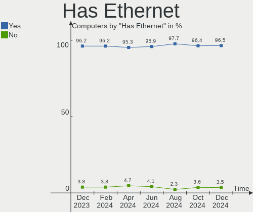
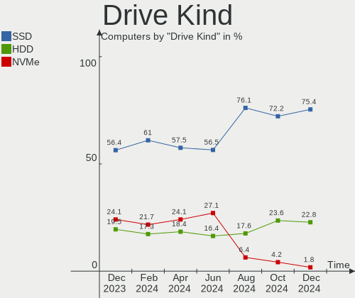
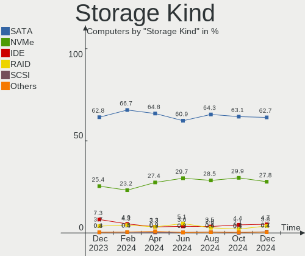
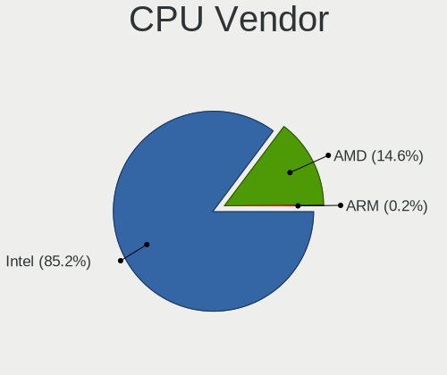
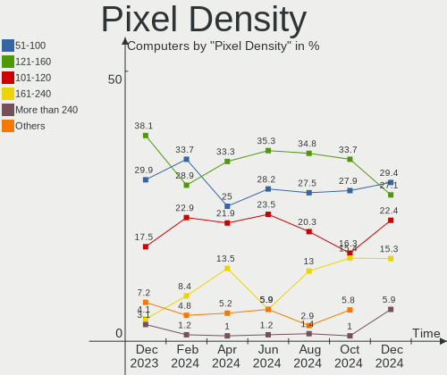
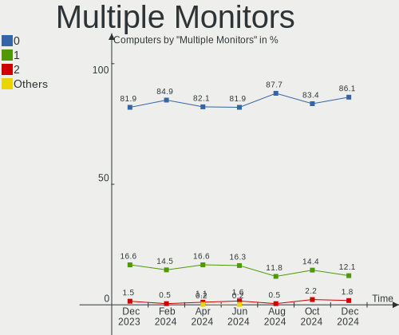
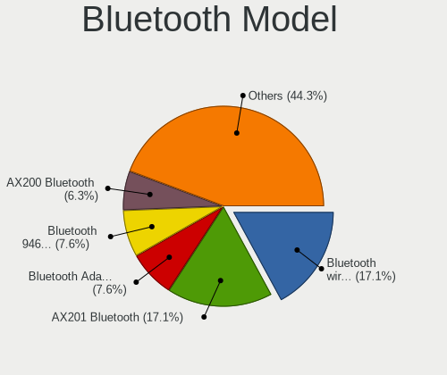

BSD Hardware Trends
-------------------

A project to identify most popular hardware characteristics and track their change
over time based on data collected by BSD users at https://BSD-Hardware.info.

Anyone can contribute to this report by the [hw-probe](https://github.com/linuxhw/hw-probe/blob/master/INSTALL.BSD.md) tool:

    hw-probe -all -upload

This is a report for all computer types. See also reports for [desktops](/Desktop/README.md) and [notebooks](/Notebook/README.md).

Full-feature report is available here: https://bsd-hardware.info/?view=trends

OS-specific reports: [FreeBSD](/Dist/FreeBSD), [OPNsense](/Dist/OPNsense), [helloSystem](/Dist/helloSystem), [OpenBSD](/Dist/OpenBSD).

Period: Nov, 2021.

Contents
--------

* [ System ](#system)
  - [ OS                       ](#os)
  - [ OS Family                ](#os-family)
  - [ Arch                     ](#arch)
  - [ DE                       ](#de)
  - [ Display Server           ](#display-server)
  - [ Display Manager          ](#display-manager)
  - [ OS Lang                  ](#os-lang)
  - [ Boot Mode                ](#boot-mode)
  - [ Filesystem               ](#filesystem)
  - [ Part. scheme             ](#part-scheme)

* [ Board ](#board)
  - [ Vendor                   ](#vendor)
  - [ Model                    ](#model)
  - [ Model Family             ](#model-family)
  - [ MFG Year                 ](#mfg-year)
  - [ Form Factor              ](#form-factor)
  - [ Coreboot                 ](#coreboot)
  - [ RAM Size                 ](#ram-size)
  - [ RAM Used                 ](#ram-used)
  - [ Total Drives             ](#total-drives)
  - [ Has CD-ROM               ](#has-cd-rom)
  - [ Has Ethernet             ](#has-ethernet)
  - [ Has WiFi                 ](#has-wifi)
  - [ Has Bluetooth            ](#has-bluetooth)

* [ Location ](#location)
  - [ Country                  ](#country)
  - [ City                     ](#city)

* [ Drives ](#drives)
  - [ Drive Vendor             ](#drive-vendor)
  - [ Drive Model              ](#drive-model)
  - [ HDD Vendor               ](#hdd-vendor)
  - [ SSD Vendor               ](#ssd-vendor)
  - [ Drive Kind               ](#drive-kind)
  - [ Drive Connector          ](#drive-connector)
  - [ Drive Size               ](#drive-size)
  - [ Space Total              ](#space-total)
  - [ Space Used               ](#space-used)
  - [ Malfunc. Drives          ](#malfunc-drives)
  - [ Malfunc. Drive Vendor    ](#malfunc-drive-vendor)
  - [ Malfunc. HDD Vendor      ](#malfunc-hdd-vendor)
  - [ Malfunc. Drive Kind      ](#malfunc-drive-kind)
  - [ Failed Drives            ](#failed-drives)
  - [ Failed Drive Vendor      ](#failed-drive-vendor)
  - [ Drive Status             ](#drive-status)

* [ Storage controller ](#storage-controller)
  - [ Storage Vendor           ](#storage-vendor)
  - [ Storage Model            ](#storage-model)
  - [ Storage Kind             ](#storage-kind)

* [ Processor ](#processor)
  - [ CPU Vendor               ](#cpu-vendor)
  - [ CPU Model                ](#cpu-model)
  - [ CPU Model Family         ](#cpu-model-family)
  - [ CPU Cores                ](#cpu-cores)
  - [ CPU Sockets              ](#cpu-sockets)
  - [ CPU Threads              ](#cpu-threads)
  - [ CPU Microarch            ](#cpu-microarch)

* [ Graphics ](#graphics)
  - [ GPU Vendor               ](#gpu-vendor)
  - [ GPU Model                ](#gpu-model)
  - [ GPU Combo                ](#gpu-combo)
  - [ GPU Driver               ](#gpu-driver)
  - [ GPU Memory               ](#gpu-memory)

* [ Monitor ](#monitor)
  - [ Monitor Vendor           ](#monitor-vendor)
  - [ Monitor Model            ](#monitor-model)
  - [ Monitor Resolution       ](#monitor-resolution)
  - [ Monitor Diagonal         ](#monitor-diagonal)
  - [ Monitor Width            ](#monitor-width)
  - [ Aspect Ratio             ](#aspect-ratio)
  - [ Monitor Area             ](#monitor-area)
  - [ Pixel Density            ](#pixel-density)
  - [ Multiple Monitors        ](#multiple-monitors)

* [ Network ](#network)
  - [ Net Controller Vendor    ](#net-controller-vendor)
  - [ Net Controller Model     ](#net-controller-model)
  - [ Wireless Vendor          ](#wireless-vendor)
  - [ Wireless Model           ](#wireless-model)
  - [ Ethernet Vendor          ](#ethernet-vendor)
  - [ Ethernet Model           ](#ethernet-model)
  - [ Net Controller Kind      ](#net-controller-kind)
  - [ Used Controller          ](#used-controller)
  - [ NICs                     ](#nics)
  - [ IPv6                     ](#ipv6)

* [ Bluetooth ](#bluetooth)
  - [ Bluetooth Vendor         ](#bluetooth-vendor)
  - [ Bluetooth Model          ](#bluetooth-model)

* [ Sound ](#sound)
  - [ Sound Vendor             ](#sound-vendor)
  - [ Sound Model              ](#sound-model)

* [ Memory ](#memory)
  - [ Memory Vendor            ](#memory-vendor)
  - [ Memory Model             ](#memory-model)
  - [ Memory Kind              ](#memory-kind)
  - [ Memory Form Factor       ](#memory-form-factor)
  - [ Memory Size              ](#memory-size)
  - [ Memory Speed             ](#memory-speed)

* [ Printers & scanners ](#printers--scanners)
  - [ Printer Vendor           ](#printer-vendor)
  - [ Printer Model            ](#printer-model)
  - [ Scanner Vendor           ](#scanner-vendor)
  - [ Scanner Model            ](#scanner-model)

* [ Camera ](#camera)
  - [ Camera Vendor            ](#camera-vendor)
  - [ Camera Model             ](#camera-model)

* [ Security ](#security)
  - [ Fingerprint Vendor       ](#fingerprint-vendor)
  - [ Fingerprint Model        ](#fingerprint-model)
  - [ Chipcard Vendor          ](#chipcard-vendor)
  - [ Chipcard Model           ](#chipcard-model)

* [ Unsupported ](#unsupported)
  - [ Unsupported Devices      ](#unsupported-devices)
  - [ Unsupported Device Types ](#unsupported-device-types)

System
------

OS
--

Installed operating systems

| Name                   | Computers | Percent |
|------------------------|-----------|---------|
| OPNsense 21.7.5        | 111       | 28.61%  |
| OPNsense 21.7.4        | 55        | 14.18%  |
| OPNsense 21.7.6        | 33        | 8.51%   |
| helloSystem 0.6.0      | 31        | 7.99%   |
| FreeBSD 13.0-p5        | 26        | 6.7%    |
| helloSystem 0.7.0      | 15        | 3.87%   |
| OpenBSD 7.0            | 14        | 3.61%   |
| FreeBSD 13.0-p4        | 13        | 3.35%   |
| FreeBSD 12.2-p6        | 13        | 3.35%   |
| OPNsense 21.7.3        | 11        | 2.84%   |
| GhostBSD 21.08.27      | 8         | 2.06%   |
| FreeBSD 13.0           | 8         | 2.06%   |
| FreeBSD 12.2-p10       | 8         | 2.06%   |
| FreeBSD 13.0-STABLE    | 7         | 1.8%    |
| NomadBSD 5806f915      | 6         | 1.55%   |
| OPNsense 22.1          | 4         | 1.03%   |
| FreeBSD 14.0-CURRENT   | 4         | 1.03%   |
| FreeBSD 12.2-p11       | 4         | 1.03%   |
| helloSystem 0.5.0      | 3         | 0.77%   |
| FreeBSD 12.1-p13       | 2         | 0.52%   |
| TrueNAS 12.2-p10       | 1         | 0.26%   |
| pfSense 2.5.0          | 1         | 0.26%   |
| PC-BSD 13.0-p5         | 1         | 0.26%   |
| OPNsense 21.7.1        | 1         | 0.26%   |
| OPNsense 20.7          | 1         | 0.26%   |
| OPNsense 12.1-p20-HBSD | 1         | 0.26%   |
| OpenBSD 6.8            | 1         | 0.26%   |
| FreeBSD 12.2-STABLE    | 1         | 0.26%   |
| FreeBSD 12.2-p9        | 1         | 0.26%   |
| FreeBSD 12.2-p4        | 1         | 0.26%   |
| FreeBSD 12.2           | 1         | 0.26%   |
| FreeBSD 12.1-p9        | 1         | 0.26%   |

OS Family
---------

OS without a version

| Name        | Computers | Percent |
|-------------|-----------|---------|
| OPNsense    | 217       | 55.93%  |
| FreeBSD     | 90        | 23.2%   |
| helloSystem | 49        | 12.63%  |
| OpenBSD     | 15        | 3.87%   |
| GhostBSD    | 8         | 2.06%   |
| NomadBSD    | 6         | 1.55%   |
| TrueNAS     | 1         | 0.26%   |
| pfSense     | 1         | 0.26%   |
| PC-BSD      | 1         | 0.26%   |

Arch
----

OS architecture (x86_64, i586, etc.)

| Name  | Computers | Percent |
|-------|-----------|---------|
| amd64 | 376       | 96.91%  |
| i386  | 7         | 1.8%    |
| arm64 | 5         | 1.29%   |

DE
--

Desktop Environment

| Name         | Computers | Percent |
|--------------|-----------|---------|
| Console      | 274       | 70.62%  |
| helloDesktop | 49        | 12.63%  |
| MATE         | 14        | 3.61%   |
| XFCE         | 11        | 2.84%   |
| fvwm         | 11        | 2.84%   |
| KDE5         | 10        | 2.58%   |
| i3           | 8         | 2.06%   |
| Openbox      | 7         | 1.8%    |
| Mutter       | 1         | 0.26%   |
| LXQt         | 1         | 0.26%   |
| GNOME        | 1         | 0.26%   |
| AwesomeWM    | 1         | 0.26%   |

Display Server
--------------

X11 or Wayland

| Name    | Computers | Percent |
|---------|-----------|---------|
| Console | 274       | 70.62%  |
| X11     | 111       | 28.61%  |
| Wayland | 3         | 0.77%   |

Display Manager
---------------

SDDM, LightDM, etc.

| Name    | Computers | Percent |
|---------|-----------|---------|
| Console | 295       | 76.03%  |
| SLiM    | 64        | 16.49%  |
| LightDM | 13        | 3.35%   |
| SDDM    | 11        | 2.84%   |
| XDM     | 4         | 1.03%   |
| GDM     | 1         | 0.26%   |

OS Lang
-------

Language

| Lang    | Computers | Percent |
|---------|-----------|---------|
| Unknown | 263       | 67.78%  |
| en_US   | 62        | 15.98%  |
| C       | 47        | 12.11%  |
| de_DE   | 5         | 1.29%   |
| nl_NL   | 2         | 0.52%   |
| es_ES   | 2         | 0.52%   |
| uk_UA   | 1         | 0.26%   |
| ru_RU   | 1         | 0.26%   |
| pt_BR   | 1         | 0.26%   |
| fi_FI   | 1         | 0.26%   |
| es_AR   | 1         | 0.26%   |
| en_GB   | 1         | 0.26%   |
| en_AU   | 1         | 0.26%   |

Boot Mode
---------

EFI or BIOS

| Mode | Computers | Percent |
|------|-----------|---------|
| EFI  | 310       | 79.9%   |
| BIOS | 78        | 20.1%   |

Filesystem
----------

Type of filesystem

| Type   | Computers | Percent |
|--------|-----------|---------|
| Ufs    | 216       | 55.67%  |
| Zfs    | 150       | 38.66%  |
| Ffs    | 15        | 3.87%   |
| Cd9660 | 7         | 1.8%    |

Part. scheme
------------

Scheme of partitioning

| Type    | Computers | Percent |
|---------|-----------|---------|
| GPT     | 351       | 90.46%  |
| MBR     | 31        | 7.99%   |
| BSD     | 3         | 0.77%   |
| Unknown | 3         | 0.77%   |

Board
-----

Vendor
------

Motherboard manufacturer

| Name                                       | Computers | Percent |
|--------------------------------------------|-----------|---------|
| Dell                                       | 55        | 14.18%  |
| Hewlett-Packard                            | 39        | 10.05%  |
| Unknown                                    | 31        | 7.99%   |
| Lenovo                                     | 30        | 7.73%   |
| ASUSTek Computer                           | 28        | 7.22%   |
| PC Engines                                 | 20        | 5.15%   |
| ASRock                                     | 18        | 4.64%   |
| Intel                                      | 16        | 4.12%   |
| Gigabyte Technology                        | 15        | 3.87%   |
| Supermicro                                 | 13        | 3.35%   |
| Protectli                                  | 11        | 2.84%   |
| MSI                                        | 11        | 2.84%   |
| Acer                                       | 9         | 2.32%   |
| IBM                                        | 8         | 2.06%   |
| Fujitsu                                    | 8         | 2.06%   |
| Shuttle                                    | 7         | 1.8%    |
| AMI                                        | 7         | 1.8%    |
| Toshiba                                    | 5         | 1.29%   |
| Apple                                      | 5         | 1.29%   |
| BESSTAR Tech                               | 4         | 1.03%   |
| Sun Microsystems                           | 3         | 0.77%   |
| HARDKERNEL                                 | 3         | 0.77%   |
| ASRockRack                                 | 3         | 0.77%   |
| RUNING                                     | 2         | 0.52%   |
| HPE                                        | 2         | 0.52%   |
| ECS                                        | 2         | 0.52%   |
| Alienware                                  | 2         | 0.52%   |
| ZOTAC                                      | 1         | 0.26%   |
| Yanling                                    | 1         | 0.26%   |
| Winston Marriot                            | 1         | 0.26%   |
| TUXEDO                                     | 1         | 0.26%   |
| T-bao                                      | 1         | 0.26%   |
| Sophos                                     | 1         | 0.26%   |
| Sony                                       | 1         | 0.26%   |
| ShenZhen MinWin Technology                 | 1         | 0.26%   |
| Seneca                                     | 1         | 0.26%   |
| Semp Toshiba                               | 1         | 0.26%   |
| SeeedStudio                                | 1         | 0.26%   |
| NF841                                      | 1         | 0.26%   |
| Medion                                     | 1         | 0.26%   |
| Lex                                        | 1         | 0.26%   |
| Itautec                                    | 1         | 0.26%   |
| Inventec                                   | 1         | 0.26%   |
| GuoGuang                                   | 1         | 0.26%   |
| Google                                     | 1         | 0.26%   |
| Gateway                                    | 1         | 0.26%   |
| friendlyelec                               | 1         | 0.26%   |
| firefly                                    | 1         | 0.26%   |
| Dell EMC                                   | 1         | 0.26%   |
| Deciso                                     | 1         | 0.26%   |
| Datto                                      | 1         | 0.26%   |
| CompuLab                                   | 1         | 0.26%   |
| Colorful YuGong Technology And Development | 1         | 0.26%   |
| CheckPoint                                 | 1         | 0.26%   |
| Biostar                                    | 1         | 0.26%   |
| AZW                                        | 1         | 0.26%   |
| AWOW                                       | 1         | 0.26%   |
| AAEON                                      | 1         | 0.26%   |

Model
-----

Motherboard model

| Name                                     | Computers | Percent |
|------------------------------------------|-----------|---------|
| Unknown                                  | 31        | 7.99%   |
| PC Engines APU2                          | 11        | 2.84%   |
| AMI Aptio CRB                            | 7         | 1.8%    |
| Intel Q3XXG4-P V1.0                      | 6         | 1.55%   |
| Protectli FW4B                           | 5         | 1.29%   |
| PC Engines APU                           | 5         | 1.29%   |
| Supermicro Super Server                  | 4         | 1.03%   |
| PC Engines apu4                          | 4         | 1.03%   |
| Sun Microsystems Sun Fire X4150          | 3         | 0.77%   |
| Protectli FW2B                           | 3         | 0.77%   |
| HP t730 Thin Client                      | 3         | 0.77%   |
| HARDKERNEL ODROID-H2                     | 3         | 0.77%   |
| Dell OptiPlex 390                        | 3         | 0.77%   |
| Dell OptiPlex 3020                       | 3         | 0.77%   |
| Dell OEM-R 720xd                         | 3         | 0.77%   |
| RUNING B75M INTEL H3V                    | 2         | 0.52%   |
| Protectli FW6                            | 2         | 0.52%   |
| MSI MS-9129                              | 2         | 0.52%   |
| MSI MS-7721                              | 2         | 0.52%   |
| IBM System x3650 -[797941Y]-             | 2         | 0.52%   |
| IBM System x3550 M3 -[7944ZJN]-          | 2         | 0.52%   |
| HP ProLiant MicroServer Gen8             | 2         | 0.52%   |
| HP Compaq Elite 8300 SFF                 | 2         | 0.52%   |
| HP Compaq 6720s                          | 2         | 0.52%   |
| Gigabyte MX33-BS1-V1                     | 2         | 0.52%   |
| Fujitsu FUTRO S920                       | 2         | 0.52%   |
| Dell Wyse 5070 Extended Thin Client      | 2         | 0.52%   |
| Dell PowerEdge R410                      | 2         | 0.52%   |
| Dell PowerEdge R220                      | 2         | 0.52%   |
| Dell OptiPlex 9010                       | 2         | 0.52%   |
| Dell OptiPlex 3010                       | 2         | 0.52%   |
| BESSTAR Tech GK41                        | 2         | 0.52%   |
| ASUS TUF GAMING X570-PLUS                | 2         | 0.52%   |
| ASUS P5Q-E                               | 2         | 0.52%   |
| ASRock Q1900B-ITX                        | 2         | 0.52%   |
| ZOTAC ZBOX-CI327NANO-GS-01               | 1         | 0.26%   |
| Yanling YL-KBR6L                         | 1         | 0.26%   |
| Winston Marriot PICO PC                  | 1         | 0.26%   |
| TUXEDO Pulse 15 Gen1                     | 1         | 0.26%   |
| Toshiba Satellite S55t-B                 | 1         | 0.26%   |
| Toshiba Satellite Pro L510               | 1         | 0.26%   |
| Toshiba Satellite C855-1U4               | 1         | 0.26%   |
| Toshiba Satellite C640                   | 1         | 0.26%   |
| Toshiba PORTEGE M780                     | 1         | 0.26%   |
| T-bao MINI PC                            | 1         | 0.26%   |
| Supermicro X9SRE/X9SRE-3F/X9SRi/X9SRi-3F | 1         | 0.26%   |
| Supermicro X8DTU-LN4+                    | 1         | 0.26%   |
| Supermicro X7SPA-HF                      | 1         | 0.26%   |
| Supermicro SYS-E300-8D                   | 1         | 0.26%   |
| Supermicro SYS-E200-9A                   | 1         | 0.26%   |
| Supermicro SYS-5019A-FTN4                | 1         | 0.26%   |
| Supermicro SYS-5018A-TN4                 | 1         | 0.26%   |
| Supermicro SYS-5018A-FTN4                | 1         | 0.26%   |
| Supermicro HYVE-ZEUS                     | 1         | 0.26%   |
| Sophos XG                                | 1         | 0.26%   |
| Sony SVP13225SCBI                        | 1         | 0.26%   |
| Shuttle XS35V3                           | 1         | 0.26%   |
| Shuttle XH270                            | 1         | 0.26%   |
| Shuttle SZ270R9                          | 1         | 0.26%   |
| Shuttle SH61R                            | 1         | 0.26%   |

Model Family
------------

Motherboard model prefix

| Name                       | Computers | Percent |
|----------------------------|-----------|---------|
| Unknown                    | 31        | 7.99%   |
| Dell OptiPlex              | 20        | 5.15%   |
| Lenovo ThinkPad            | 19        | 4.9%    |
| Dell PowerEdge             | 13        | 3.35%   |
| PC Engines APU2            | 11        | 2.84%   |
| HP Compaq                  | 10        | 2.58%   |
| IBM System                 | 7         | 1.8%    |
| AMI Aptio                  | 7         | 1.8%    |
| Acer Aspire                | 7         | 1.8%    |
| Lenovo IdeaPad             | 6         | 1.55%   |
| Intel Q3XXG4-P             | 6         | 1.55%   |
| Protectli FW4B             | 5         | 1.29%   |
| PC Engines APU             | 5         | 1.29%   |
| HP ProLiant                | 5         | 1.29%   |
| Toshiba Satellite          | 4         | 1.03%   |
| Supermicro Super           | 4         | 1.03%   |
| PC Engines apu4            | 4         | 1.03%   |
| HP ProDesk                 | 4         | 1.03%   |
| HP EliteBook               | 4         | 1.03%   |
| Dell Inspiron              | 4         | 1.03%   |
| Sun Microsystems Sun       | 3         | 0.77%   |
| Protectli FW2B             | 3         | 0.77%   |
| HP t730                    | 3         | 0.77%   |
| HARDKERNEL ODROID-H2       | 3         | 0.77%   |
| Fujitsu FUTRO              | 3         | 0.77%   |
| Dell XPS                   | 3         | 0.77%   |
| Dell Vostro                | 3         | 0.77%   |
| Dell OEM-R                 | 3         | 0.77%   |
| Dell Latitude              | 3         | 0.77%   |
| ASUS ROG                   | 3         | 0.77%   |
| RUNING B75M                | 2         | 0.52%   |
| Protectli FW6              | 2         | 0.52%   |
| MSI MS-9129                | 2         | 0.52%   |
| MSI MS-7721                | 2         | 0.52%   |
| Lenovo ThinkStation        | 2         | 0.52%   |
| HPE ProLiant               | 2         | 0.52%   |
| HP Pavilion                | 2         | 0.52%   |
| HP Laptop                  | 2         | 0.52%   |
| Gigabyte MX33-BS1-V1       | 2         | 0.52%   |
| Fujitsu ESPRIMO            | 2         | 0.52%   |
| Dell Wyse                  | 2         | 0.52%   |
| BESSTAR Tech GK41          | 2         | 0.52%   |
| ASUS TUF                   | 2         | 0.52%   |
| ASUS PRIME                 | 2         | 0.52%   |
| ASUS P5Q-E                 | 2         | 0.52%   |
| ASRock Q1900B-ITX          | 2         | 0.52%   |
| Alienware m15              | 2         | 0.52%   |
| ZOTAC ZBOX-CI327NANO-GS-01 | 1         | 0.26%   |
| Yanling YL-KBR6L           | 1         | 0.26%   |
| Winston Marriot PICO       | 1         | 0.26%   |
| TUXEDO Pulse               | 1         | 0.26%   |
| Toshiba PORTEGE            | 1         | 0.26%   |
| T-bao MINI                 | 1         | 0.26%   |
| Supermicro X9SRE           | 1         | 0.26%   |
| Supermicro X8DTU-LN4+      | 1         | 0.26%   |
| Supermicro X7SPA-HF        | 1         | 0.26%   |
| Supermicro SYS-E300-8D     | 1         | 0.26%   |
| Supermicro SYS-E200-9A     | 1         | 0.26%   |
| Supermicro SYS-5019A-FTN4  | 1         | 0.26%   |
| Supermicro SYS-5018A-TN4   | 1         | 0.26%   |

MFG Year
--------

Motherboard manufacture year

| Year    | Computers | Percent |
|---------|-----------|---------|
| 2021    | 63        | 16.24%  |
| 2018    | 55        | 14.18%  |
| 2019    | 46        | 11.86%  |
| 2020    | 40        | 10.31%  |
| 2014    | 30        | 7.73%   |
| 2015    | 27        | 6.96%   |
| 2017    | 18        | 4.64%   |
| 2013    | 18        | 4.64%   |
| 2012    | 18        | 4.64%   |
| 2011    | 15        | 3.87%   |
| 2016    | 13        | 3.35%   |
| 2010    | 12        | 3.09%   |
| 2009    | 11        | 2.84%   |
| 2008    | 10        | 2.58%   |
| 2007    | 3         | 0.77%   |
| 2006    | 3         | 0.77%   |
| Unknown | 3         | 0.77%   |
| 2002    | 2         | 0.52%   |
| 2004    | 1         | 0.26%   |

Form Factor
-----------

Physical design of the computer

| Name        | Computers | Percent |
|-------------|-----------|---------|
| Desktop     | 236       | 60.82%  |
| Notebook    | 81        | 20.88%  |
| Server      | 40        | 10.31%  |
| Mini pc     | 22        | 5.67%   |
| Convertible | 4         | 1.03%   |
| Firewall    | 3         | 0.77%   |
| All in one  | 2         | 0.52%   |

Coreboot
--------

Have coreboot on board

| Used | Computers | Percent |
|------|-----------|---------|
| No   | 364       | 93.81%  |
| Yes  | 24        | 6.19%   |

RAM Size
--------

Total RAM memory

| Size in GB  | Computers | Percent |
|-------------|-----------|---------|
| 8.01-16.0   | 129       | 33.25%  |
| 4.01-8.0    | 109       | 28.09%  |
| 16.01-24.0  | 65        | 16.75%  |
| 32.01-64.0  | 31        | 7.99%   |
| 64.01-256.0 | 18        | 4.64%   |
| 2.01-3.0    | 14        | 3.61%   |
| 3.01-4.0    | 8         | 2.06%   |
| 24.01-32.0  | 7         | 1.8%    |
| 0.51-1.0    | 4         | 1.03%   |
| 1.01-2.0    | 2         | 0.52%   |
| 0.01-0.5    | 1         | 0.26%   |

RAM Used
--------

Used RAM memory

| Used GB     | Computers | Percent |
|-------------|-----------|---------|
| 0.01-0.5    | 217       | 55.93%  |
| 0.51-1.0    | 84        | 21.65%  |
| 1.01-2.0    | 41        | 10.57%  |
| 4.01-8.0    | 13        | 3.35%   |
| 2.01-3.0    | 10        | 2.58%   |
| 24.01-32.0  | 5         | 1.29%   |
| 8.01-16.0   | 5         | 1.29%   |
| 3.01-4.0    | 4         | 1.03%   |
| 16.01-24.0  | 4         | 1.03%   |
| 32.01-64.0  | 3         | 0.77%   |
| 64.01-256.0 | 2         | 0.52%   |

Total Drives
------------

Number of drives on board

| Drives | Computers | Percent |
|--------|-----------|---------|
| 1      | 261       | 67.27%  |
| 2      | 51        | 13.14%  |
| 0      | 41        | 10.57%  |
| 3      | 15        | 3.87%   |
| 4      | 10        | 2.58%   |
| 5      | 4         | 1.03%   |
| 6      | 3         | 0.77%   |
| 23     | 1         | 0.26%   |
| 17     | 1         | 0.26%   |
| 13     | 1         | 0.26%   |

Has CD-ROM
----------

Has CD-ROM on board

| Presented | Computers | Percent |
|-----------|-----------|---------|
| No        | 298       | 76.8%   |
| Yes       | 90        | 23.2%   |

Has Ethernet
------------

Has Ethernet on board

| Presented | Computers | Percent |
|-----------|-----------|---------|
| Yes       | 373       | 96.13%  |
| No        | 15        | 3.87%   |

Has WiFi
--------

Has WiFi module

| Presented | Computers | Percent |
|-----------|-----------|---------|
| No        | 247       | 63.66%  |
| Yes       | 141       | 36.34%  |

Has Bluetooth
-------------

Has Bluetooth module

| Presented | Computers | Percent |
|-----------|-----------|---------|
| No        | 304       | 78.35%  |
| Yes       | 84        | 21.65%  |

Location
--------

Country
-------

Geographic location (country)

| Country        | Computers | Percent |
|----------------|-----------|---------|
| USA            | 92        | 23.71%  |
| Germany        | 75        | 19.33%  |
| Czechia        | 21        | 5.41%   |
| Poland         | 18        | 4.64%   |
| UK             | 17        | 4.38%   |
| Netherlands    | 14        | 3.61%   |
| Canada         | 13        | 3.35%   |
| Australia      | 11        | 2.84%   |
| China          | 10        | 2.58%   |
| Brazil         | 8         | 2.06%   |
| Switzerland    | 6         | 1.55%   |
| Spain          | 6         | 1.55%   |
| France         | 6         | 1.55%   |
| Ukraine        | 5         | 1.29%   |
| Sweden         | 5         | 1.29%   |
| Indonesia      | 5         | 1.29%   |
| Finland        | 5         | 1.29%   |
| Singapore      | 4         | 1.03%   |
| Russia         | 4         | 1.03%   |
| Peru           | 4         | 1.03%   |
| Norway         | 4         | 1.03%   |
| Mexico         | 4         | 1.03%   |
| Italy          | 4         | 1.03%   |
| Denmark        | 4         | 1.03%   |
| Austria        | 4         | 1.03%   |
| Czech Republic | 3         | 0.77%   |
| Vietnam        | 2         | 0.52%   |
| South Africa   | 2         | 0.52%   |
| Slovenia       | 2         | 0.52%   |
| Romania        | 2         | 0.52%   |
| Japan          | 2         | 0.52%   |
| India          | 2         | 0.52%   |
| Hong Kong      | 2         | 0.52%   |
| Colombia       | 2         | 0.52%   |
| Belgium        | 2         | 0.52%   |
| Turkey         | 1         | 0.26%   |
| Taiwan         | 1         | 0.26%   |
| South Korea    | 1         | 0.26%   |
| Slovakia       | 1         | 0.26%   |
| Portugal       | 1         | 0.26%   |
| New Zealand    | 1         | 0.26%   |
| Namibia        | 1         | 0.26%   |
| Lithuania      | 1         | 0.26%   |
| Jersey         | 1         | 0.26%   |
| Israel         | 1         | 0.26%   |
| Hungary        | 1         | 0.26%   |
| Guatemala      | 1         | 0.26%   |
| Greece         | 1         | 0.26%   |
| Cuba           | 1         | 0.26%   |
| Chile          | 1         | 0.26%   |
| Bulgaria       | 1         | 0.26%   |
| Argentina      | 1         | 0.26%   |
| Albania        | 1         | 0.26%   |

City
----

Geographic location (city)

| City                | Computers | Percent |
|---------------------|-----------|---------|
| Tuklaty             | 12        | 3.09%   |
| Munich              | 6         | 1.55%   |
| Warsaw              | 4         | 1.03%   |
| Singapore           | 4         | 1.03%   |
| Prague              | 4         | 1.03%   |
| Lima                | 4         | 1.03%   |
| Frankfurt am Main   | 4         | 1.03%   |
| Amsterdam           | 4         | 1.03%   |
| Vlaardingen         | 3         | 0.77%   |
| S??o Paulo          | 3         | 0.77%   |
| Salem               | 3         | 0.77%   |
| Redmond             | 3         | 0.77%   |
| Portland            | 3         | 0.77%   |
| Poplar              | 3         | 0.77%   |
| New Town            | 3         | 0.77%   |
| Jakarta             | 3         | 0.77%   |
| Gdynia              | 3         | 0.77%   |
| Cambridge           | 3         | 0.77%   |
| Brooklyn            | 3         | 0.77%   |
| Berlin              | 3         | 0.77%   |
| Valencia            | 2         | 0.52%   |
| Stralsund           | 2         | 0.52%   |
| Smiths Falls        | 2         | 0.52%   |
| Rochester           | 2         | 0.52%   |
| Playa del Carmen    | 2         | 0.52%   |
| Perth               | 2         | 0.52%   |
| Oslo                | 2         | 0.52%   |
| Newcastle upon Tyne | 2         | 0.52%   |
| Moscow              | 2         | 0.52%   |
| Melbourne           | 2         | 0.52%   |
| Madrid              | 2         | 0.52%   |
| Macon               | 2         | 0.52%   |
| London              | 2         | 0.52%   |
| Johannesburg        | 2         | 0.52%   |
| Hobart              | 2         | 0.52%   |
| Henan               | 2         | 0.52%   |
| Helsinki            | 2         | 0.52%   |
| Glincz              | 2         | 0.52%   |
| Dortmund            | 2         | 0.52%   |
| Columbus            | 2         | 0.52%   |
| Cologne             | 2         | 0.52%   |
| Chengdu             | 2         | 0.52%   |
| Cheb                | 2         | 0.52%   |
| Brisbane            | 2         | 0.52%   |
| Beijing             | 2         | 0.52%   |
| Zurich              | 1         | 0.26%   |
| Zuidhorn            | 1         | 0.26%   |
| Zhengzhou           | 1         | 0.26%   |
| Zell im Wiesental   | 1         | 0.26%   |
| Zarrentin           | 1         | 0.26%   |
| Yens                | 1         | 0.26%   |
| Yekaterinburg       | 1         | 0.26%   |
| Winter Haven        | 1         | 0.26%   |
| Windhoek            | 1         | 0.26%   |
| Whittier            | 1         | 0.26%   |
| Whitewater          | 1         | 0.26%   |
| Wendell             | 1         | 0.26%   |
| Wenatchee           | 1         | 0.26%   |
| W??rzburg           | 1         | 0.26%   |
| Watertown           | 1         | 0.26%   |

Drives
------

Drive Vendor
------------

Hard drive vendors

| Vendor              | Computers | Drives | Percent |
|---------------------|-----------|--------|---------|
| Samsung Electronics | 77        | 92     | 18.16%  |
| WDC                 | 67        | 122    | 15.8%   |
| Kingston            | 39        | 40     | 9.2%    |
| Seagate             | 37        | 60     | 8.73%   |
| Toshiba             | 24        | 25     | 5.66%   |
| Crucial             | 20        | 22     | 4.72%   |
| Intel               | 19        | 21     | 4.48%   |
| Transcend           | 14        | 14     | 3.3%    |
| SanDisk             | 11        | 13     | 2.59%   |
| Phison              | 10        | 10     | 2.36%   |
| HGST                | 10        | 21     | 2.36%   |
| Hitachi             | 8         | 9      | 1.89%   |
| A-DATA Technology   | 8         | 9      | 1.89%   |
| Micron Technology   | 7         | 7      | 1.65%   |
| Protectli           | 6         | 6      | 1.42%   |
| SK Hynix            | 5         | 5      | 1.18%   |
| PNY                 | 4         | 5      | 0.94%   |
| NVMe                | 4         | 5      | 0.94%   |
| Hoodisk             | 4         | 4      | 0.94%   |
| GOODRAM             | 3         | 4      | 0.71%   |
| Corsair             | 3         | 3      | 0.71%   |
| Apple               | 3         | 3      | 0.71%   |
| TCSUNBOW            | 2         | 2      | 0.47%   |
| SPCC                | 2         | 2      | 0.47%   |
| Kston               | 2         | 2      | 0.47%   |
| KIOXIA              | 2         | 2      | 0.47%   |
| KingSpec            | 2         | 2      | 0.47%   |
| Intenso             | 2         | 2      | 0.47%   |
| InnoDisk            | 2         | 2      | 0.47%   |
| HPE                 | 2         | 3      | 0.47%   |
| Gigabyte Technology | 2         | 2      | 0.47%   |
| DOGFISH             | 2         | 2      | 0.47%   |
| BIWIN               | 2         | 2      | 0.47%   |
| XUM                 | 1         | 1      | 0.24%   |
| V-GeN               | 1         | 1      | 0.24%   |
| Silicon Motion      | 1         | 1      | 0.24%   |
| Ramsta              | 1         | 1      | 0.24%   |
| OCZ                 | 1         | 1      | 0.24%   |
| MyDigitalSSD        | 1         | 1      | 0.24%   |
| Mushkin             | 1         | 1      | 0.24%   |
| MAXTOR              | 1         | 1      | 0.24%   |
| Mach Xtreme         | 1         | 1      | 0.24%   |
| LSI                 | 1         | 1      | 0.24%   |
| Hewlett-Packard     | 1         | 1      | 0.24%   |
| Fujitsu             | 1         | 1      | 0.24%   |
| FORESEE             | 1         | 1      | 0.24%   |
| Fordisk             | 1         | 1      | 0.24%   |
| Colorful            | 1         | 1      | 0.24%   |
| ATP                 | 1         | 1      | 0.24%   |
| ASMT                | 1         | 1      | 0.24%   |
| Apacer              | 1         | 1      | 0.24%   |
| Advantech           | 1         | 2      | 0.24%   |

Drive Model
-----------

Hard drive models

| Model                                   | Computers | Percent |
|-----------------------------------------|-----------|---------|
| Phison SATA SSD 16GB                    | 7         | 1.53%   |
| Kingston SUV500MS120G 120GB             | 5         | 1.09%   |
| Seagate ST500DM002-1BD142 500GB         | 4         | 0.87%   |
| Samsung SSD 860 EVO M.2 250GB           | 4         | 0.87%   |
| Samsung SSD 860 EVO 250GB               | 4         | 0.87%   |
| Samsung SSD 850 EVO 500GB               | 4         | 0.87%   |
| Samsung SSD 850 EVO 250GB               | 4         | 0.87%   |
| Samsung SSD 850 EVO 120GB               | 4         | 0.87%   |
| Kingston SA400S37240G 240GB             | 4         | 0.87%   |
| WDC WDS240G2G0A-00JH30 240GB            | 3         | 0.65%   |
| WDC WDS120G2G0B-00EPW0 120GB            | 3         | 0.65%   |
| WDC WD20EFRX-68EUZN0 2TB                | 3         | 0.65%   |
| WDC WD10EFRX-68FYTN0 1TB                | 3         | 0.65%   |
| Transcend TS32GMSA370 32GB              | 3         | 0.65%   |
| Transcend TS128GMSA230S 128GB           | 3         | 0.65%   |
| Toshiba MQ01ABF050 500GB                | 3         | 0.65%   |
| Toshiba DT01ACA100 1TB                  | 3         | 0.65%   |
| Seagate ST4000DM000-1F2168 4TB          | 3         | 0.65%   |
| Seagate ST1000LM048-2E7172 1TB          | 3         | 0.65%   |
| SanDisk SDSSDA120G 120GB                | 3         | 0.65%   |
| Samsung SSD 860 EVO 1TB                 | 3         | 0.65%   |
| Samsung SSD 840 EVO 250GB               | 3         | 0.65%   |
| Kingston SV300S37A240G 240GB            | 3         | 0.65%   |
| Kingston SUV400S37240G 240GB            | 3         | 0.65%   |
| Kingston SMS200S360G 64GB               | 3         | 0.65%   |
| Kingston SA400S37480G 480GB             | 3         | 0.65%   |
| Kingston SA400S37120G 120GB             | 3         | 0.65%   |
| Crucial M4-CT064M4SSD2 64GB             | 3         | 0.65%   |
| Crucial CT120BX500SSD1 120GB            | 3         | 0.65%   |
| WDC WDS500G3X0C-00SJG0 500GB            | 2         | 0.44%   |
| WDC WD80EFZX-68UW8N0 8TB                | 2         | 0.44%   |
| WDC WD5000AAKX-08U6AA0 500GB            | 2         | 0.44%   |
| WDC WD40EFRX-68WT0N0 4TB                | 2         | 0.44%   |
| WDC WD10JPCX-24UE4T0 1TB                | 2         | 0.44%   |
| Transcend TS64GMSA370 64GB              | 2         | 0.44%   |
| Transcend TS32GSSD370S 32GB             | 2         | 0.44%   |
| Toshiba MQ01ABD100 1TB                  | 2         | 0.44%   |
| Toshiba MK3261GSYN 320GB                | 2         | 0.44%   |
| Toshiba MK2546GSX 250GB                 | 2         | 0.44%   |
| Toshiba DT01ACA050 500GB                | 2         | 0.44%   |
| SK Hynix BC511 HFM256GDJTNI-82A0A 256GB | 2         | 0.44%   |
| Seagate ST3160318AS 160GB               | 2         | 0.44%   |
| Seagate ST1000LM024 HN-M101MBB 1TB      | 2         | 0.44%   |
| Samsung SSD 970 EVO Plus 500GB          | 2         | 0.44%   |
| Samsung SSD 960 EVO 500GB               | 2         | 0.44%   |
| Samsung SSD 860 QVO 1TB                 | 2         | 0.44%   |
| Samsung SSD 850 PRO 256GB               | 2         | 0.44%   |
| Samsung SSD 850 EVO 1TB                 | 2         | 0.44%   |
| Samsung SSD 840 Series 250GB            | 2         | 0.44%   |
| Samsung SSD 840 Series 120GB            | 2         | 0.44%   |
| Samsung SSD 840 EVO 120GB               | 2         | 0.44%   |
| Samsung SSD 650 120GB                   | 2         | 0.44%   |
| Samsung MZVL2512HCJQ-00B07 512GB        | 2         | 0.44%   |
| Samsung MZ7TE128HMGR-000L1 128GB        | 2         | 0.44%   |
| Protectli 240GB mSATA                   | 2         | 0.44%   |
| Protectli 120GB mSATA                   | 2         | 0.44%   |
| PNY CS900 240GB SSD                     | 2         | 0.44%   |
| Micron MTFDDAT064MAM-1J2 64GB           | 2         | 0.44%   |
| Kston SSD 64GB                          | 2         | 0.44%   |
| Kingston SV300S37A120G 120GB            | 2         | 0.44%   |

HDD Vendor
----------

Hard disk drive vendors

| Vendor              | Computers | Drives | Percent |
|---------------------|-----------|--------|---------|
| WDC                 | 49        | 99     | 35.77%  |
| Seagate             | 35        | 57     | 25.55%  |
| Toshiba             | 20        | 21     | 14.6%   |
| HGST                | 10        | 21     | 7.3%    |
| Hitachi             | 8         | 9      | 5.84%   |
| Samsung Electronics | 5         | 6      | 3.65%   |
| NVMe                | 2         | 3      | 1.46%   |
| HPE                 | 2         | 3      | 1.46%   |
| Apple               | 2         | 2      | 1.46%   |
| MAXTOR              | 1         | 1      | 0.73%   |
| Hewlett-Packard     | 1         | 1      | 0.73%   |
| Fujitsu             | 1         | 1      | 0.73%   |
| ASMT                | 1         | 1      | 0.73%   |

SSD Vendor
----------

Solid state drive vendors

| Vendor              | Computers | Drives | Percent |
|---------------------|-----------|--------|---------|
| Samsung Electronics | 55        | 63     | 23.11%  |
| Kingston            | 36        | 37     | 15.13%  |
| Crucial             | 18        | 20     | 7.56%   |
| Intel               | 16        | 17     | 6.72%   |
| Transcend           | 14        | 14     | 5.88%   |
| WDC                 | 13        | 17     | 5.46%   |
| SanDisk             | 11        | 13     | 4.62%   |
| Phison              | 8         | 8      | 3.36%   |
| Protectli           | 6         | 6      | 2.52%   |
| Micron Technology   | 6         | 6      | 2.52%   |
| A-DATA Technology   | 6         | 7      | 2.52%   |
| PNY                 | 4         | 5      | 1.68%   |
| Hoodisk             | 4         | 4      | 1.68%   |
| GOODRAM             | 3         | 4      | 1.26%   |
| Toshiba             | 2         | 2      | 0.84%   |
| TCSUNBOW            | 2         | 2      | 0.84%   |
| Kston               | 2         | 2      | 0.84%   |
| KingSpec            | 2         | 2      | 0.84%   |
| Intenso             | 2         | 2      | 0.84%   |
| Innodisk            | 2         | 2      | 0.84%   |
| Gigabyte Technology | 2         | 2      | 0.84%   |
| Dogfish             | 2         | 2      | 0.84%   |
| Corsair             | 2         | 2      | 0.84%   |
| BIWIN               | 2         | 2      | 0.84%   |
| XUM                 | 1         | 1      | 0.42%   |
| V-GeN               | 1         | 1      | 0.42%   |
| SPCC                | 1         | 1      | 0.42%   |
| SK Hynix            | 1         | 1      | 0.42%   |
| Seagate             | 1         | 2      | 0.42%   |
| Ramsta              | 1         | 1      | 0.42%   |
| OCZ                 | 1         | 1      | 0.42%   |
| MyDigitalSSD        | 1         | 1      | 0.42%   |
| Mushkin             | 1         | 1      | 0.42%   |
| Mach Xtreme         | 1         | 1      | 0.42%   |
| LSI                 | 1         | 1      | 0.42%   |
| FORESEE             | 1         | 1      | 0.42%   |
| Fordisk             | 1         | 1      | 0.42%   |
| Colorful            | 1         | 1      | 0.42%   |
| ATP                 | 1         | 1      | 0.42%   |
| Apple               | 1         | 1      | 0.42%   |
| Apacer              | 1         | 1      | 0.42%   |
| Advantech           | 1         | 2      | 0.42%   |

Drive Kind
----------

HDD or SSD

| Kind | Computers | Drives | Percent |
|------|-----------|--------|---------|
| SSD  | 221       | 261    | 56.52%  |
| HDD  | 120       | 225    | 30.69%  |
| NVMe | 50        | 57     | 12.79%  |

Drive Connector
---------------

SATA, SAS, NVMe, etc.

| Type | Computers | Drives | Percent |
|------|-----------|--------|---------|
| SATA | 308       | 486    | 86.03%  |
| NVMe | 50        | 57     | 13.97%  |

Drive Size
----------

Size of hard drive

| Size in TB | Computers | Drives | Percent |
|------------|-----------|--------|---------|
| 0.01-0.5   | 265       | 320    | 76.81%  |
| 0.51-1.0   | 44        | 60     | 12.75%  |
| 1.01-2.0   | 13        | 23     | 3.77%   |
| 4.01-10.0  | 10        | 51     | 2.9%    |
| 3.01-4.0   | 9         | 22     | 2.61%   |
| 2.01-3.0   | 3         | 8      | 0.87%   |
| 10.01-20.0 | 1         | 2      | 0.29%   |

Space Total
-----------

Amount of disk space available on the file system

| Size in GB     | Computers | Percent |
|----------------|-----------|---------|
| 101-250        | 120       | 30.93%  |
| 51-100         | 64        | 16.49%  |
| 251-500        | 63        | 16.24%  |
| 1-20           | 62        | 15.98%  |
| 21-50          | 35        | 9.02%   |
| 501-1000       | 30        | 7.73%   |
| More than 3000 | 7         | 1.8%    |
| 1001-2000      | 4         | 1.03%   |
| 2001-3000      | 3         | 0.77%   |

Space Used
----------

Amount of used disk space

| Used GB        | Computers | Percent |
|----------------|-----------|---------|
| 1-20           | 348       | 89.69%  |
| 21-50          | 16        | 4.12%   |
| 51-100         | 12        | 3.09%   |
| 101-250        | 6         | 1.55%   |
| 1001-2000      | 2         | 0.52%   |
| 501-1000       | 2         | 0.52%   |
| More than 3000 | 1         | 0.26%   |
| 2001-3000      | 1         | 0.26%   |

Malfunc. Drives
---------------

Drive models with a malfunction

| Model                                            | Computers | Drives | Percent |
|--------------------------------------------------|-----------|--------|---------|
| WDC WD20EFRX-68EUZN0 2TB                         | 2         | 2      | 3.13%   |
| Toshiba MK3261GSYN 320GB                         | 2         | 2      | 3.13%   |
| Seagate ST500DM002-1BD142 500GB                  | 2         | 2      | 3.13%   |
| Kingston SMS200S360G 64GB                        | 2         | 2      | 3.13%   |
| WDC WD800JB-00JJC0 80GB                          | 1         | 1      | 1.56%   |
| WDC WD5000AAKX-60U6AA0 500GB                     | 1         | 1      | 1.56%   |
| WDC WD5000AAKX-001CA0 500GB                      | 1         | 1      | 1.56%   |
| WDC WD5000AAKS-08V0A0 500GB                      | 1         | 1      | 1.56%   |
| WDC WD5000AADS-00S9B0 500GB                      | 1         | 1      | 1.56%   |
| WDC WD40EFRX-68WT0N0 4TB                         | 1         | 4      | 1.56%   |
| WDC WD3200BEKX-00B7WT0 320GB                     | 1         | 1      | 1.56%   |
| WDC WD2000FYYZ-01UL1B1 2TB                       | 1         | 2      | 1.56%   |
| WDC WD1600JS-56MHB1 160GB                        | 1         | 1      | 1.56%   |
| WDC WD1600BEKT-08PVMT1 160GB                     | 1         | 2      | 1.56%   |
| Toshiba MQ01ABF050 500GB                         | 1         | 1      | 1.56%   |
| Toshiba MK3265GSXN 320GB                         | 1         | 1      | 1.56%   |
| Toshiba MK2546GSX 250GB                          | 1         | 1      | 1.56%   |
| Toshiba MK1637GSX 160GB                          | 1         | 1      | 1.56%   |
| Toshiba DT01ACA100 1TB                           | 1         | 1      | 1.56%   |
| Seagate ST96812AS 64GB                           | 1         | 4      | 1.56%   |
| Seagate ST9640320AS 640GB                        | 1         | 1      | 1.56%   |
| Seagate ST9500420AS 500GB                        | 1         | 1      | 1.56%   |
| Seagate ST500LT012-1DG142 500GB                  | 1         | 1      | 1.56%   |
| Seagate ST500DM002-1BC142 500GB                  | 1         | 1      | 1.56%   |
| Seagate ST3750640AS 752GB                        | 1         | 1      | 1.56%   |
| Seagate ST3500418AS 500GB                        | 1         | 1      | 1.56%   |
| Seagate ST3500413AS 500GB                        | 1         | 1      | 1.56%   |
| Seagate ST3320620AS 320GB                        | 1         | 1      | 1.56%   |
| Seagate ST3160318AS 160GB                        | 1         | 1      | 1.56%   |
| Seagate ST250DM000-1BD141 250GB                  | 1         | 1      | 1.56%   |
| Seagate ST1000LM048-2E7172 1TB                   | 1         | 1      | 1.56%   |
| Seagate ST1000DL002-9TT153 1TB                   | 1         | 1      | 1.56%   |
| SanDisk SDSSDA120G 120GB                         | 1         | 1      | 1.56%   |
| SanDisk SD8TB8U-256G-1006 256GB                  | 1         | 1      | 1.56%   |
| Samsung Electronics SSD PM810 2.5-inch 7mm 256GB | 1         | 1      | 1.56%   |
| Samsung Electronics SSD 840 Series 250GB         | 1         | 1      | 1.56%   |
| Samsung Electronics SSD 840 EVO 120GB            | 1         | 1      | 1.56%   |
| Samsung Electronics HM251JX 250GB                | 1         | 1      | 1.56%   |
| MyDigitalSSD SB2 128GB                           | 1         | 1      | 1.56%   |
| Micron Technology MTFDDAV256TBN-1AR15ABHA 256GB  | 1         | 1      | 1.56%   |
| MAXTOR 6Y080M0 82GB                              | 1         | 1      | 1.56%   |
| Kingston SV300S37A60G 64GB                       | 1         | 1      | 1.56%   |
| Kingston SV300S37A120G 120GB                     | 1         | 1      | 1.56%   |
| Kingston SUV400S37240G 240GB                     | 1         | 1      | 1.56%   |
| Kingston SNV425S264GB                            | 1         | 1      | 1.56%   |
| Kingston SNS4151S316G 16GB                       | 1         | 1      | 1.56%   |
| Kingston SMS200S330G 32GB                        | 1         | 1      | 1.56%   |
| Intel SSDSC2CW060A3 64GB                         | 1         | 1      | 1.56%   |
| Intel SSDSC2CT120A3 120GB                        | 1         | 1      | 1.56%   |
| Intel SSDSA2M080G2GC 80GB                        | 1         | 1      | 1.56%   |
| Intel SSDSA2BW160G3H 160GB                       | 1         | 1      | 1.56%   |
| HPE MB0500EBNCR 500GB                            | 1         | 1      | 1.56%   |
| Hitachi HTS545016B9SA02 160GB                    | 1         | 1      | 1.56%   |
| Hitachi HTS541680J9SA00 80GB                     | 1         | 1      | 1.56%   |
| Hitachi HDT721064SLA360 640GB                    | 1         | 1      | 1.56%   |
| HGST HTS721010A9E630 1TB                         | 1         | 1      | 1.56%   |
| Crucial CT1050MX300SSD4 1TB                      | 1         | 1      | 1.56%   |
| Corsair Force GT 120GB                           | 1         | 1      | 1.56%   |
| Colorful SL500 640GB                             | 1         | 1      | 1.56%   |
| BIWIN SSD 32GB                                   | 1         | 1      | 1.56%   |

Malfunc. Drive Vendor
---------------------

Vendors of faulty drives

| Vendor              | Computers | Drives | Percent |
|---------------------|-----------|--------|---------|
| Seagate             | 15        | 18     | 23.44%  |
| WDC                 | 12        | 17     | 18.75%  |
| Kingston            | 8         | 8      | 12.5%   |
| Toshiba             | 7         | 7      | 10.94%  |
| Samsung Electronics | 4         | 4      | 6.25%   |
| Intel               | 4         | 4      | 6.25%   |
| Hitachi             | 3         | 3      | 4.69%   |
| SanDisk             | 2         | 2      | 3.13%   |
| MyDigitalSSD        | 1         | 1      | 1.56%   |
| Micron Technology   | 1         | 1      | 1.56%   |
| MAXTOR              | 1         | 1      | 1.56%   |
| HPE                 | 1         | 1      | 1.56%   |
| HGST                | 1         | 1      | 1.56%   |
| Crucial             | 1         | 1      | 1.56%   |
| Corsair             | 1         | 1      | 1.56%   |
| Colorful            | 1         | 1      | 1.56%   |
| BIWIN               | 1         | 1      | 1.56%   |

Malfunc. HDD Vendor
-------------------

Vendors of faulty HDD drives

| Vendor              | Computers | Drives | Percent |
|---------------------|-----------|--------|---------|
| Seagate             | 15        | 18     | 36.59%  |
| WDC                 | 12        | 17     | 29.27%  |
| Toshiba             | 7         | 7      | 17.07%  |
| Hitachi             | 3         | 3      | 7.32%   |
| Samsung Electronics | 1         | 1      | 2.44%   |
| MAXTOR              | 1         | 1      | 2.44%   |
| HPE                 | 1         | 1      | 2.44%   |
| HGST                | 1         | 1      | 2.44%   |

Malfunc. Drive Kind
-------------------

Kinds of faulty drives

| Kind | Computers | Drives | Percent |
|------|-----------|--------|---------|
| HDD  | 38        | 49     | 62.3%   |
| SSD  | 23        | 23     | 37.7%   |

Failed Drives
-------------

Failed drive models

| Model                       | Computers | Drives | Percent |
|-----------------------------|-----------|--------|---------|
| WDC WD6400AARS-00Y5B1 640GB | 1         | 1      | 100%    |

Failed Drive Vendor
-------------------

Failed drive vendors

| Vendor | Computers | Drives | Percent |
|--------|-----------|--------|---------|
| WDC    | 1         | 1      | 100%    |

Drive Status
------------

Number of failed and malfunc. drives

| Status   | Computers | Drives | Percent |
|----------|-----------|--------|---------|
| Works    | 299       | 457    | 80.38%  |
| Malfunc  | 61        | 72     | 16.4%   |
| Detected | 11        | 13     | 2.96%   |
| Failed   | 1         | 1      | 0.27%   |

Storage controller
------------------

Storage Vendor
--------------

Storage controller vendors

| Vendor                      | Computers | Percent |
|-----------------------------|-----------|---------|
| Intel                       | 293       | 64.11%  |
| AMD                         | 70        | 15.32%  |
| Samsung Electronics         | 20        | 4.38%   |
| Broadcom / LSI              | 14        | 3.06%   |
| Adaptec                     | 8         | 1.75%   |
| Sandisk                     | 5         | 1.09%   |
| Marvell Technology Group    | 5         | 1.09%   |
| ASMedia Technology          | 5         | 1.09%   |
| SK Hynix                    | 4         | 0.88%   |
| Phison Electronics          | 4         | 0.88%   |
| Kingston Technology Company | 4         | 0.88%   |
| Toshiba                     | 3         | 0.66%   |
| Silicon Image               | 3         | 0.66%   |
| Nvidia                      | 3         | 0.66%   |
| Realtek Semiconductor       | 2         | 0.44%   |
| Promise Technology          | 2         | 0.44%   |
| Micron/Crucial Technology   | 2         | 0.44%   |
| Chelsio Communications      | 2         | 0.44%   |
| VMware                      | 1         | 0.22%   |
| Silicon Motion              | 1         | 0.22%   |
| Seagate Technology          | 1         | 0.22%   |
| Micron Technology           | 1         | 0.22%   |
| KIOXIA                      | 1         | 0.22%   |
| JMicron Technology          | 1         | 0.22%   |
| Hewlett-Packard             | 1         | 0.22%   |
| Dell                        | 1         | 0.22%   |

Storage Model
-------------

Storage controller models

| Model                                                                                   | Computers | Percent |
|-----------------------------------------------------------------------------------------|-----------|---------|
| AMD FCH SATA Controller [AHCI mode]                                                     | 44        | 8.48%   |
| Intel 8 Series/C220 Series Chipset Family 6-port SATA Controller 1 [AHCI mode]          | 24        | 4.62%   |
| Intel Sunrise Point-LP SATA Controller [AHCI mode]                                      | 23        | 4.43%   |
| Intel Atom/Celeron/Pentium Processor x5-E8000/J3xxx/N3xxx Series SATA Controller        | 14        | 2.7%    |
| Intel 7 Series/C210 Series Chipset Family 6-port SATA Controller [AHCI mode]            | 13        | 2.5%    |
| Intel 6 Series/C200 Series Chipset Family 6 port Desktop SATA AHCI Controller           | 13        | 2.5%    |
| Intel 7 Series Chipset Family 6-port SATA Controller [AHCI mode]                        | 12        | 2.31%   |
| AMD SB7x0/SB8x0/SB9x0 SATA Controller [AHCI mode]                                       | 12        | 2.31%   |
| Intel Atom Processor E3800 Series SATA AHCI Controller                                  | 11        | 2.12%   |
| Intel Q170/Q150/B150/H170/H110/Z170/CM236 Chipset SATA Controller [AHCI Mode]           | 10        | 1.93%   |
| Intel Celeron/Pentium Silver Processor SATA Controller                                  | 10        | 1.93%   |
| Intel Cannon Lake PCH SATA AHCI Controller                                              | 10        | 1.93%   |
| Intel 8 Series SATA Controller 1 [AHCI mode]                                            | 10        | 1.93%   |
| AMD FCH SATA Controller [IDE mode]                                                      | 10        | 1.93%   |
| Samsung NVMe SSD Controller SM981/PM981/PM983                                           | 8         | 1.54%   |
| Intel Wildcat Point-LP SATA Controller [AHCI Mode]                                      | 8         | 1.54%   |
| Intel Celeron N3350/Pentium N4200/Atom E3900 Series SATA AHCI Controller                | 8         | 1.54%   |
| Intel 6 Series/C200 Series Chipset Family 6 port Mobile SATA AHCI Controller            | 8         | 1.54%   |
| Intel SATA Controller [RAID mode]                                                       | 6         | 1.16%   |
| Intel NM10/ICH7 Family SATA Controller [IDE mode]                                       | 6         | 1.16%   |
| Intel NM10/ICH7 Family SATA Controller [AHCI mode]                                      | 6         | 1.16%   |
| Intel 82801HM/HEM (ICH8M/ICH8M-E) IDE Controller                                        | 6         | 1.16%   |
| Intel 6 Series/C200 Series Chipset Family Desktop SATA Controller (IDE mode, ports 4-5) | 6         | 1.16%   |
| Intel 6 Series/C200 Series Chipset Family Desktop SATA Controller (IDE mode, ports 0-3) | 6         | 1.16%   |
| Intel 200 Series PCH SATA controller [AHCI mode]                                        | 6         | 1.16%   |
| Unknown                                                                                 | 6         | 1.16%   |
| Samsung NVMe SSD Controller PM9A1/PM9A3/980PRO                                          | 5         | 0.96%   |
| Intel Comet Lake SATA AHCI Controller                                                   | 5         | 0.96%   |
| Intel C600/X79 series chipset 6-Port SATA AHCI Controller                               | 5         | 0.96%   |
| Intel 82801HM/HEM (ICH8M/ICH8M-E) SATA Controller [AHCI mode]                           | 5         | 0.96%   |
| Intel 82801G (ICH7 Family) IDE Controller                                               | 5         | 0.96%   |
| Intel 631xESB/632xESB IDE Controller                                                    | 5         | 0.96%   |
| ASMedia ASM1062 Serial ATA Controller                                                   | 5         | 0.96%   |
| Adaptec AAC-RAID (Rocket)                                                               | 5         | 0.96%   |
| Samsung NVMe SSD Controller SM961/PM961/SM963                                           | 4         | 0.77%   |
| Intel Atom Processor C3000 Series SATA Controller 0                                     | 4         | 0.77%   |
| Intel Atom processor C2000 AHCI SATA3 Controller                                        | 4         | 0.77%   |
| Intel 82801JI (ICH10 Family) SATA AHCI Controller                                       | 4         | 0.77%   |
| Intel 82801JI (ICH10 Family) 4 port SATA IDE Controller #1                              | 4         | 0.77%   |
| Intel 82801JI (ICH10 Family) 2 port SATA IDE Controller #2                              | 4         | 0.77%   |
| Intel 82801IR/IO/IH (ICH9R/DO/DH) 6 port SATA Controller [AHCI mode]                    | 4         | 0.77%   |
| Intel 500 Series Chipset Family SATA AHCI Controller                                    | 4         | 0.77%   |
| Intel 5 Series/3400 Series Chipset 4 port SATA AHCI Controller                          | 4         | 0.77%   |
| Broadcom / LSI MegaRAID SAS 2108 [Liberator]                                            | 4         | 0.77%   |
| AMD 400 Series Chipset SATA Controller                                                  | 4         | 0.77%   |
| Intel Cannon Point-LP SATA Controller [AHCI Mode]                                       | 3         | 0.58%   |
| Intel C620 Series Chipset Family SSATA Controller [AHCI mode]                           | 3         | 0.58%   |
| Intel Atom Processor C3000 Series SATA Controller 1                                     | 3         | 0.58%   |
| Intel Atom processor C2000 AHCI SATA2 Controller                                        | 3         | 0.58%   |
| Intel 82801JD/DO (ICH10 Family) SATA AHCI Controller                                    | 3         | 0.58%   |
| Intel 82801DB (ICH4) IDE Controller                                                     | 3         | 0.58%   |
| Intel 82801 Mobile SATA Controller [RAID mode]                                          | 3         | 0.58%   |
| Intel 631xESB/632xESB/3100 Chipset SATA IDE Controller                                  | 3         | 0.58%   |
| Intel 631xESB/632xESB SATA AHCI Controller                                              | 3         | 0.58%   |
| Intel 5 Series/3400 Series Chipset 6 port SATA AHCI Controller                          | 3         | 0.58%   |
| Intel 5 Series/3400 Series Chipset 4 port SATA IDE Controller                           | 3         | 0.58%   |
| Broadcom / LSI SAS2008 PCI-Express Fusion-MPT SAS-2 [Falcon]                            | 3         | 0.58%   |
| AMD FCH IDE Controller                                                                  | 3         | 0.58%   |
| Adaptec AAC-RAID                                                                        | 3         | 0.58%   |
| SK Hynix BC511                                                                          | 2         | 0.39%   |

Storage Kind
------------

Kind of storage controller (IDE, SATA, NVMe, SAS, ...)

| Kind | Computers | Percent |
|------|-----------|---------|
| SATA | 307       | 65.46%  |
| IDE  | 72        | 15.35%  |
| NVMe | 52        | 11.09%  |
| RAID | 31        | 6.61%   |
| SAS  | 4         | 0.85%   |
| SCSI | 3         | 0.64%   |

Processor
---------

CPU Vendor
----------

Processor vendors

| Vendor  | Computers | Percent |
|---------|-----------|---------|
| Intel   | 310       | 79.9%   |
| AMD     | 73        | 18.81%  |
| Unknown | 4         | 1.03%   |
| ARM     | 1         | 0.26%   |

CPU Model
---------

Processor models

| Model                                    | Computers | Percent |
|------------------------------------------|-----------|---------|
| AMD GX-412TC SOC                         | 15        | 3.87%   |
| Intel Celeron CPU J3160 @ 1.60GHz        | 8         | 2.06%   |
| Intel Celeron CPU J1900 @ 1.99GHz        | 7         | 1.8%    |
| Intel Core i5-3470 CPU @ 3.20GHz         | 6         | 1.55%   |
| Intel Celeron CPU 3865U @ 1.80GHz        | 6         | 1.55%   |
| Intel Xeon CPU E5-2650 v2 @ 2.60GHz      | 5         | 1.29%   |
| Intel Xeon                               | 5         | 1.29%   |
| Intel Core i5-6500 CPU @ 3.20GHz         | 5         | 1.29%   |
| Intel Core i5-2520M CPU @ 2.50GHz        | 5         | 1.29%   |
| AMD G-T40E Processor                     | 5         | 1.29%   |
| Intel Core i7-7500U CPU @ 2.70GHz        | 4         | 1.03%   |
| Intel Core i5-5200U CPU @ 2.20GHz        | 4         | 1.03%   |
| Intel Core 2 Duo                         | 4         | 1.03%   |
| Intel Celeron J4125 CPU @ 2.00GHz        | 4         | 1.03%   |
| AMD Ryzen 9 3900X 12-Core Processor      | 4         | 1.03%   |
|                                          | 4         | 1.03%   |
| Intel Core i7-8550U CPU @ 1.80GHz        | 3         | 0.77%   |
| Intel Core i7-3520M CPU @ 2.90GHz        | 3         | 0.77%   |
| Intel Core i5-6300U CPU @ 2.40GHz        | 3         | 0.77%   |
| Intel Core i3-2120 CPU @ 3.30GHz         | 3         | 0.77%   |
| Intel Celeron J4105 CPU @ 1.50GHz        | 3         | 0.77%   |
| Intel Celeron CPU N3450 @ 1.10GHz        | 3         | 0.77%   |
| Intel Celeron CPU J3060 @ 1.60GHz        | 3         | 0.77%   |
| AMD RX-427BB with AMD Radeon R7 Graphics | 3         | 0.77%   |
| Intel Xeon CPU X5450 @ 3.00GHz           | 2         | 0.52%   |
| Intel Xeon CPU L5640 @ 2.27GHz           | 2         | 0.52%   |
| Intel Xeon CPU E5645 @ 2.40GHz           | 2         | 0.52%   |
| Intel Pentium Silver J5005 CPU @ 1.50GHz | 2         | 0.52%   |
| Intel Pentium Gold G5420 CPU @ 3.80GHz   | 2         | 0.52%   |
| Intel Pentium Dual CPU T2390 @ 1.86GHz   | 2         | 0.52%   |
| Intel Core i7-3770 CPU @ 3.40GHz         | 2         | 0.52%   |
| Intel Core i7-3720QM CPU @ 2.60GHz       | 2         | 0.52%   |
| Intel Core i7-2620M CPU @ 2.70GHz        | 2         | 0.52%   |
| Intel Core i5-7500 CPU @ 3.40GHz         | 2         | 0.52%   |
| Intel Core i5-7200U CPU @ 2.50GHz        | 2         | 0.52%   |
| Intel Core i5-6200U CPU @ 2.30GHz        | 2         | 0.52%   |
| Intel Core i5-4590T CPU @ 2.00GHz        | 2         | 0.52%   |
| Intel Core i5-4570 CPU @ 3.20GHz         | 2         | 0.52%   |
| Intel Core i5-4210Y CPU @ 1.50GHz        | 2         | 0.52%   |
| Intel Core i5-4200U CPU @ 1.60GHz        | 2         | 0.52%   |
| Intel Core i5-3550 CPU @ 3.30GHz         | 2         | 0.52%   |
| Intel Core i5-3317U CPU @ 1.70GHz        | 2         | 0.52%   |
| Intel Core i5-2500K CPU @ 3.30GHz        | 2         | 0.52%   |
| Intel Core i5-2400 CPU @ 3.10GH          | 2         | 0.52%   |
| Intel Core i5-10400 CPU @ 2.90GHz        | 2         | 0.52%   |
| Intel Core i3-7100U CPU @ 2.40GHz        | 2         | 0.52%   |
| Intel Core i3-6100 CPU @ 3.70GHz         | 2         | 0.52%   |
| Intel Core i3-4160 CPU @ 3.60GHz         | 2         | 0.52%   |
| Intel Core i3-4130 CPU @ 3.40GHz         | 2         | 0.52%   |
| Intel Core i3-4010U CPU @ 1.70GHz        | 2         | 0.52%   |
| Intel Core i3-10100 CPU @ 3.60GHz        | 2         | 0.52%   |
| Intel Core i3 CPU M 370 @ 2.40GHz        | 2         | 0.52%   |
| Intel Core 2 Quad CPU Q6600 @ 2.40GHz    | 2         | 0.52%   |
| Intel Core 2 Duo CPU E8400 @ 3.00GHz     | 2         | 0.52%   |
| Intel Celeron CPU N3150 @ 1.60GHz        | 2         | 0.52%   |
| Intel Celeron CPU N2930 @ 1.83GHz        | 2         | 0.52%   |
| Intel Celeron CPU J3455 @ 1.50GHz        | 2         | 0.52%   |
| Intel Celeron CPU J1800 @ 2.41GHz        | 2         | 0.52%   |
| Intel Celeron CPU 1037U @ 1.80GHz        | 2         | 0.52%   |
| Intel Atom CPU D2550 @ 1.86GHz           | 2         | 0.52%   |

CPU Model Family
----------------

Processor model prefix

| Model                   | Computers | Percent |
|-------------------------|-----------|---------|
| Intel Core i5           | 85        | 21.91%  |
| Intel Celeron           | 53        | 13.66%  |
| Intel Xeon              | 43        | 11.08%  |
| Intel Core i7           | 35        | 9.02%   |
| Intel Core i3           | 31        | 7.99%   |
| Intel Atom              | 20        | 5.15%   |
| AMD GX                  | 20        | 5.15%   |
| Other                   | 13        | 3.35%   |
| Intel Core 2 Duo        | 13        | 3.35%   |
| AMD Ryzen 7             | 7         | 1.8%    |
| AMD G                   | 7         | 1.8%    |
| AMD Ryzen 9             | 5         | 1.29%   |
| AMD Ryzen 5             | 5         | 1.29%   |
| AMD A4                  | 4         | 1.03%   |
| Intel Pentium Silver    | 3         | 0.77%   |
| Intel Pentium Dual-Core | 3         | 0.77%   |
| Intel Pentium Dual      | 3         | 0.77%   |
| Intel Genuine           | 3         | 0.77%   |
| Intel Core 2 Quad       | 3         | 0.77%   |
| AMD Ryzen 3             | 3         | 0.77%   |
| AMD A6                  | 3         | 0.77%   |
| Intel Pentium Gold      | 2         | 0.52%   |
| AMD FX                  | 2         | 0.52%   |
| AMD EPYC                | 2         | 0.52%   |
| AMD C-50                | 2         | 0.52%   |
| Intel Xeon Silver       | 1         | 0.26%   |
| Intel Pentium M         | 1         | 0.26%   |
| Intel Pentium D         | 1         | 0.26%   |
| Intel Pentium 4         | 1         | 0.26%   |
| Intel Pentium           | 1         | 0.26%   |
| Intel Core i9           | 1         | 0.26%   |
| Intel Core 2            | 1         | 0.26%   |
| Intel Celeron M         | 1         | 0.26%   |
| Intel Celeron D         | 1         | 0.26%   |
| ARM Cortex              | 1         | 0.26%   |
| AMD Sempron             | 1         | 0.26%   |
| AMD Ryzen Embedded      | 1         | 0.26%   |
| AMD Ryzen 5 PRO         | 1         | 0.26%   |
| AMD Opteron             | 1         | 0.26%   |
| AMD Geode Integrated    | 1         | 0.26%   |
| AMD E                   | 1         | 0.26%   |
| AMD C-60                | 1         | 0.26%   |
| AMD Athlon              | 1         | 0.26%   |

CPU Cores
---------

Number of processor cores

| Number  | Computers | Percent |
|---------|-----------|---------|
| 4       | 157       | 40.46%  |
| 2       | 132       | 34.02%  |
| Unknown | 27        | 6.96%   |
| 8       | 18        | 4.64%   |
| 6       | 16        | 4.12%   |
| 16      | 13        | 3.35%   |
| 12      | 10        | 2.58%   |
| 1       | 9         | 2.32%   |
| 24      | 5         | 1.29%   |
| 10      | 1         | 0.26%   |

CPU Sockets
-----------

Number of sockets

| Number  | Computers | Percent |
|---------|-----------|---------|
| 1       | 362       | 93.3%   |
| 2       | 23        | 5.93%   |
| Unknown | 3         | 0.77%   |

CPU Threads
-----------

Threads per core (Hyper-Threading)

| Number  | Computers | Percent |
|---------|-----------|---------|
| 1       | 214       | 55.15%  |
| 2       | 142       | 36.6%   |
| Unknown | 32        | 8.25%   |

CPU Microarch
-------------

Microarchitecture

| Name          | Computers | Percent |
|---------------|-----------|---------|
| KabyLake      | 44        | 11.34%  |
| Haswell       | 35        | 9.02%   |
| IvyBridge     | 34        | 8.76%   |
| Silvermont    | 31        | 7.99%   |
| SandyBridge   | 31        | 7.99%   |
| Skylake       | 21        | 5.41%   |
| Penryn        | 18        | 4.64%   |
| Puma          | 17        | 4.38%   |
| Core          | 15        | 3.87%   |
| Westmere      | 14        | 3.61%   |
| Goldmont      | 12        | 3.09%   |
| Goldmont plus | 11        | 2.84%   |
| Bobcat        | 11        | 2.84%   |
| CometLake     | 10        | 2.58%   |
| Zen 2         | 9         | 2.32%   |
| Zen           | 9         | 2.32%   |
| Broadwell     | 9         | 2.32%   |
| Bonnell       | 9         | 2.32%   |
| Unknown       | 9         | 2.32%   |
| Piledriver    | 5         | 1.29%   |
| Excavator     | 5         | 1.29%   |
| Zen 3         | 4         | 1.03%   |
| NetBurst      | 4         | 1.03%   |
| Nehalem       | 4         | 1.03%   |
| Jaguar        | 4         | 1.03%   |
| Steamroller   | 3         | 0.77%   |
| Zen+          | 2         | 0.52%   |
| TigerLake     | 2         | 0.52%   |
| P6            | 2         | 0.52%   |
| K10 Llano     | 1         | 0.26%   |
| K10           | 1         | 0.26%   |
| IceLake       | 1         | 0.26%   |
| Geode         | 1         | 0.26%   |

Graphics
--------

GPU Vendor
----------

Vendors of graphics cards

| Vendor                     | Computers | Percent |
|----------------------------|-----------|---------|
| Intel                      | 228       | 60.96%  |
| AMD                        | 59        | 15.78%  |
| Nvidia                     | 37        | 9.89%   |
| Matrox Electronics Systems | 26        | 6.95%   |
| ASPEED Technology          | 22        | 5.88%   |
| VMware                     | 1         | 0.27%   |
| S3 Graphics                | 1         | 0.27%   |

GPU Model
---------

Graphics card models

| Model                                                                                    | Computers | Percent |
|------------------------------------------------------------------------------------------|-----------|---------|
| Intel 2nd Generation Core Processor Family Integrated Graphics Controller                | 24        | 6.27%   |
| ASPEED Technology ASPEED Graphics Family                                                 | 22        | 5.74%   |
| Intel Atom/Celeron/Pentium Processor x5-E8000/J3xxx/N3xxx Integrated Graphics Controller | 15        | 3.92%   |
| Intel Xeon E3-1200 v3/4th Gen Core Processor Integrated Graphics Controller              | 14        | 3.66%   |
| Intel Atom Processor Z36xxx/Z37xxx Series Graphics & Display                             | 12        | 3.13%   |
| Intel HD Graphics 530                                                                    | 11        | 2.87%   |
| Matrox Electronics Systems MGA G200eW WPCM450                                            | 10        | 2.61%   |
| Intel Xeon E3-1200 v2/3rd Gen Core processor Graphics Controller                         | 8         | 2.09%   |
| Intel HD Graphics 620                                                                    | 8         | 2.09%   |
| Intel HD Graphics 500                                                                    | 8         | 2.09%   |
| Intel Haswell-ULT Integrated Graphics Controller                                         | 8         | 2.09%   |
| Intel GeminiLake [UHD Graphics 600]                                                      | 8         | 2.09%   |
| Intel 3rd Gen Core processor Graphics Controller                                         | 8         | 2.09%   |
| Intel 4 Series Chipset Integrated Graphics Controller                                    | 7         | 1.83%   |
| Matrox Electronics Systems G200eR2                                                       | 6         | 1.57%   |
| Intel Skylake GT2 [HD Graphics 520]                                                      | 6         | 1.57%   |
| Intel Kaby Lake-U GT1 Integrated Graphics Controller                                     | 6         | 1.57%   |
| Intel HD Graphics 5500                                                                   | 6         | 1.57%   |
| Intel CometLake-S GT2 [UHD Graphics 630]                                                 | 6         | 1.57%   |
| Matrox Electronics Systems MGA G200EH                                                    | 5         | 1.31%   |
| Intel IvyBridge GT2 [HD Graphics 4000]                                                   | 5         | 1.31%   |
| Intel Core Processor Integrated Graphics Controller                                      | 5         | 1.31%   |
| Intel CoffeeLake-S GT2 [UHD Graphics 630]                                                | 5         | 1.31%   |
| Intel 4th Generation Core Processor Family Integrated Graphics Controller                | 5         | 1.31%   |
| AMD ES1000                                                                               | 5         | 1.31%   |
| Intel UHD Graphics 620                                                                   | 4         | 1.04%   |
| Intel Atom Processor D4xx/D5xx/N4xx/N5xx Integrated Graphics Controller                  | 4         | 1.04%   |
| Intel Atom Processor D2xxx/N2xxx Integrated Graphics Controller                          | 4         | 1.04%   |
| AMD Stoney [Radeon R2/R3/R4/R5 Graphics]                                                 | 4         | 1.04%   |
| AMD Raven Ridge [Radeon Vega Series / Radeon Vega Mobile Series]                         | 4         | 1.04%   |
| Intel Mobile GM965/GL960 Integrated Graphics Controller (secondary)                      | 3         | 0.78%   |
| Intel Mobile GM965/GL960 Integrated Graphics Controller (primary)                        | 3         | 0.78%   |
| Intel Mobile 945GM/GMS/GME, 943/940GML Express Integrated Graphics Controller            | 3         | 0.78%   |
| Intel HD Graphics 630                                                                    | 3         | 0.78%   |
| Intel GeminiLake [UHD Graphics 605]                                                      | 3         | 0.78%   |
| AMD Wrestler [Radeon HD 6250]                                                            | 3         | 0.78%   |
| AMD Renoir                                                                               | 3         | 0.78%   |
| AMD Kaveri [Radeon R7 Graphics]                                                          | 3         | 0.78%   |
| Nvidia GT218 [GeForce 210]                                                               | 2         | 0.52%   |
| Nvidia GP108 [GeForce GT 1030]                                                           | 2         | 0.52%   |
| Nvidia GP104 [GeForce GTX 1080]                                                          | 2         | 0.52%   |
| Nvidia GK208B [GeForce GT 710]                                                           | 2         | 0.52%   |
| Matrox Electronics Systems MGA G200EV                                                    | 2         | 0.52%   |
| Matrox Electronics Systems Integrated Matrox G200eW3 Graphics Controller                 | 2         | 0.52%   |
| Intel WhiskeyLake-U GT2 [UHD Graphics 620]                                               | 2         | 0.52%   |
| Intel TigerLake-LP GT2 [Iris Xe Graphics]                                                | 2         | 0.52%   |
| Intel Mobile GME965/GLE960 Integrated Graphics Controller                                | 2         | 0.52%   |
| Intel Mobile 945GM/GMS, 943/940GML Express Integrated Graphics Controller                | 2         | 0.52%   |
| Intel Iris Plus Graphics G7                                                              | 2         | 0.52%   |
| Intel Iris Plus Graphics 650                                                             | 2         | 0.52%   |
| Intel Haswell-ULT High Definition Audio Controller [HD Graphics]                         | 2         | 0.52%   |
| Intel CometLake-U GT2 [UHD Graphics]                                                     | 2         | 0.52%   |
| Intel CometLake-H GT2 [UHD Graphics]                                                     | 2         | 0.52%   |
| Intel 82Q963/Q965 Integrated Graphics Controller                                         | 2         | 0.52%   |
| AMD Wrestler [Radeon HD 6320]                                                            | 2         | 0.52%   |
| AMD Richland [Radeon HD 8470D]                                                           | 2         | 0.52%   |
| AMD Rage 3 [Rage XL PCI]                                                                 | 2         | 0.52%   |
| AMD Picasso/Raven 2 [Radeon Vega Series / Radeon Vega Mobile Series]                     | 2         | 0.52%   |
| AMD Mullins [Radeon R4/R5 Graphics]                                                      | 2         | 0.52%   |
| AMD Kabini [Radeon HD 8400E]                                                             | 2         | 0.52%   |

GPU Combo
---------

Combinations of graphics cards

| Name            | Computers | Percent |
|-----------------|-----------|---------|
| 1 x Intel       | 195       | 50.26%  |
| 1 x AMD         | 57        | 14.69%  |
| Other           | 30        | 7.73%   |
| 1 x Matrox      | 26        | 6.7%    |
| 1 x Nvidia      | 25        | 6.44%   |
| 1 x ASPEED      | 21        | 5.41%   |
| 2 x Intel       | 17        | 4.38%   |
| Intel + Nvidia  | 12        | 3.09%   |
| 2 x AMD         | 1         | 0.26%   |
| 1 x VMware      | 1         | 0.26%   |
| 1 x S3 Graphics | 1         | 0.26%   |
| Intel + ASPEED  | 1         | 0.26%   |
| Intel + AMD     | 1         | 0.26%   |

GPU Driver
----------

Free vs proprietary

| Driver      | Computers | Percent |
|-------------|-----------|---------|
| Free        | 337       | 86.86%  |
| Unknown     | 35        | 9.02%   |
| Proprietary | 16        | 4.12%   |

GPU Memory
----------

Total video memory

| Size in GB | Computers | Percent |
|------------|-----------|---------|
| Unknown    | 356       | 91.75%  |
| 0.01-0.5   | 12        | 3.09%   |
| 0.51-1.0   | 6         | 1.55%   |
| 3.01-4.0   | 5         | 1.29%   |
| 1.01-2.0   | 5         | 1.29%   |
| 7.01-8.0   | 3         | 0.77%   |
| 5.01-6.0   | 1         | 0.26%   |

Monitor
-------

Monitor Vendor
--------------

Monitor vendors

| Vendor                  | Computers | Percent |
|-------------------------|-----------|---------|
| AU Optronics            | 14        | 14%     |
| Samsung Electronics     | 12        | 12%     |
| LG Display              | 12        | 12%     |
| Chimei Innolux          | 8         | 8%      |
| Lenovo                  | 7         | 7%      |
| BOE                     | 6         | 6%      |
| Apple                   | 4         | 4%      |
| Philips                 | 3         | 3%      |
| Hewlett-Packard         | 3         | 3%      |
| Goldstar                | 3         | 3%      |
| Dell                    | 3         | 3%      |
| AOC                     | 3         | 3%      |
| Ancor Communications    | 3         | 3%      |
| Sharp                   | 2         | 2%      |
| InfoVision              | 2         | 2%      |
| Acer                    | 2         | 2%      |
| ___                     | 1         | 1%      |
| ViewSonic               | 1         | 1%      |
| Toshiba                 | 1         | 1%      |
| Panasonic               | 1         | 1%      |
| NEC Computers           | 1         | 1%      |
| LG Electronics          | 1         | 1%      |
| Iiyama                  | 1         | 1%      |
| HannStar                | 1         | 1%      |
| Gigabyte Technology     | 1         | 1%      |
| CSO                     | 1         | 1%      |
| Chi Mei Optoelectronics | 1         | 1%      |
| BenQ                    | 1         | 1%      |
| ASUSTek Computer        | 1         | 1%      |

Monitor Model
-------------

Monitor models

| Model                                                                 | Computers | Percent |
|-----------------------------------------------------------------------|-----------|---------|
| Lenovo LCD Monitor LEN40B2 1920x1080 340x190mm 15.3-inch              | 3         | 3%      |
| Lenovo LCD Monitor LEN4040 1024x768 300x230mm 14.9-inch               | 2         | 2%      |
| Chimei Innolux LCD Monitor CMN1132 1366x768 260x140mm 11.6-inch       | 2         | 2%      |
| ___ LCD TV ___0101 1360x768                                           | 1         | 1%      |
| ViewSonic LCD Monitor VX3276-QHD 2560x1440                            | 1         | 1%      |
| Toshiba TV TSB0108 1360x768 480x270mm 21.7-inch                       | 1         | 1%      |
| Sharp LCD Monitor SHP1449 1920x1080 290x170mm 13.2-inch               | 1         | 1%      |
| Sharp LCD Monitor SHP1421 3200x1800 290x170mm 13.2-inch               | 1         | 1%      |
| Samsung Electronics U28E590 SAM0C4E 3840x2160 610x350mm 27.7-inch     | 1         | 1%      |
| Samsung Electronics SMT27A300 SAM087A 1920x1080 600x340mm 27.2-inch   | 1         | 1%      |
| Samsung Electronics SMS24A450 SAM083A 1920x1200 520x320mm 24.0-inch   | 1         | 1%      |
| Samsung Electronics S27E390 SAM0C1B 1920x1080 600x340mm 27.2-inch     | 1         | 1%      |
| Samsung Electronics S24F350 SAM0D20 1920x1080 520x290mm 23.4-inch     | 1         | 1%      |
| Samsung Electronics S24D390 SAM0B65 1920x1080 520x290mm 23.4-inch     | 1         | 1%      |
| Samsung Electronics LCD Monitor SEC544B 1600x900 310x170mm 13.9-inch  | 1         | 1%      |
| Samsung Electronics LCD Monitor SEC4457 1440x900 300x190mm 14.0-inch  | 1         | 1%      |
| Samsung Electronics LCD Monitor SEC324C 1600x900 310x170mm 13.9-inch  | 1         | 1%      |
| Samsung Electronics LCD Monitor SEC3157 1280x800 300x190mm 14.0-inch  | 1         | 1%      |
| Samsung Electronics LCD Monitor SEC3143 1366x768 310x180mm 14.1-inch  | 1         | 1%      |
| Samsung Electronics LCD Monitor SDC4142 3840x2160 290x170mm 13.2-inch | 1         | 1%      |
| Philips PHL 243V7 PHLC155 1920x1080 530x300mm 24.0-inch               | 1         | 1%      |
| Philips PHL 221V8 PHLC211 1920x1080 480x270mm 21.7-inch               | 1         | 1%      |
| Philips LCD Monitor PHL08C3 1920x1080 600x340mm 27.2-inch             | 1         | 1%      |
| Panasonic VVX13F009G00 MEI96A2 1920x1080 290x170mm 13.2-inch          | 1         | 1%      |
| NEC Computers LCD1770VX NEC6696 1280x1024 340x270mm 17.1-inch         | 1         | 1%      |
| LG Electronics LCD Monitor LG HDR WQHD 3440x1440                      | 1         | 1%      |
| LG Display LCD Monitor LGD066E 1920x1080 340x190mm 15.3-inch          | 1         | 1%      |
| LG Display LCD Monitor LGD0470 1920x1080 350x190mm 15.7-inch          | 1         | 1%      |
| LG Display LCD Monitor LGD03CD 1366x768 280x160mm 12.7-inch           | 1         | 1%      |
| LG Display LCD Monitor LGD03C4 1366x768 350x190mm 15.7-inch           | 1         | 1%      |
| LG Display LCD Monitor LGD0385 1366x768 310x170mm 13.9-inch           | 1         | 1%      |
| LG Display LCD Monitor LGD02DC 1366x768 340x190mm 15.3-inch           | 1         | 1%      |
| LG Display LCD Monitor LGD02D8 1366x768 280x160mm 12.7-inch           | 1         | 1%      |
| LG Display LCD Monitor LGD029B 1366x768 310x170mm 13.9-inch           | 1         | 1%      |
| LG Display LCD Monitor LGD0258 1600x900 350x190mm 15.7-inch           | 1         | 1%      |
| LG Display LCD Monitor LGD021D 1600x900 380x210mm 17.1-inch           | 1         | 1%      |
| LG Display LCD Monitor LGD01F7 1366x768 290x160mm 13.0-inch           | 1         | 1%      |
| LG Display LCD Monitor LGD01E6 1366x768 310x170mm 13.9-inch           | 1         | 1%      |
| Lenovo LEN-E73Z-D LEN00A1 1600x900 440x240mm 19.7-inch                | 1         | 1%      |
| Lenovo LEN X24A LEN60CF 1920x1080 530x300mm 24.0-inch                 | 1         | 1%      |
| InfoVision LCD Monitor IVO057F 1920x1080 310x170mm 13.9-inch          | 1         | 1%      |
| InfoVision LCD Monitor IVO03F4 1024x600 220x130mm 10.1-inch           | 1         | 1%      |
| Iiyama PLE2407HDS IVM560D 1920x1080 520x300mm 23.6-inch               | 1         | 1%      |
| Hewlett-Packard V24 HPN36B5 1920x1080 540x300mm 24.3-inch             | 1         | 1%      |
| Hewlett-Packard LA2306 HWP294B 1920x1080 510x290mm 23.1-inch          | 1         | 1%      |
| Hewlett-Packard 24fw HPN3545 1920x1080 530x300mm 24.0-inch            | 1         | 1%      |
| HannStar HSD100IFW1 HSD03E9 1024x600 220x130mm 10.1-inch              | 1         | 1%      |
| Goldstar E2241 GSM581A 1920x1080 480x270mm 21.7-inch                  | 1         | 1%      |
| Goldstar D2342P GSM5840 1920x1080 510x290mm 23.1-inch                 | 1         | 1%      |
| Goldstar 700E GSM4317 1280x1024 330x250mm 16.3-inch                   | 1         | 1%      |
| Gigabyte Technology M28U GBT2800 3840x2160 630x360mm 28.6-inch        | 1         | 1%      |
| Dell U3415W DELA0A6 3440x1440 800x330mm 34.1-inch                     | 1         | 1%      |
| Dell U2515H DELD06F 2560x1440 550x310mm 24.9-inch                     | 1         | 1%      |
| Dell E228WFP DELD014 1680x1050 470x300mm 22.0-inch                    | 1         | 1%      |
| CSO LCD Monitor CSO1404 1920x1200 300x190mm 14.0-inch                 | 1         | 1%      |
| Chimei Innolux LCD Monitor CMN15DB 1366x768 340x190mm 15.3-inch       | 1         | 1%      |
| Chimei Innolux LCD Monitor CMN15CC 1366x768 340x190mm 15.3-inch       | 1         | 1%      |
| Chimei Innolux LCD Monitor CMN15C6 1366x768 340x190mm 15.3-inch       | 1         | 1%      |
| Chimei Innolux LCD Monitor CMN14A7 1920x1080 310x170mm 13.9-inch      | 1         | 1%      |
| Chimei Innolux LCD Monitor CMN1490 1366x768 310x170mm 13.9-inch       | 1         | 1%      |

Monitor Resolution
------------------

Monitor screen resolution

| Resolution         | Computers | Percent |
|--------------------|-----------|---------|
| 1920x1080 (FHD)    | 34        | 34.34%  |
| 1366x768 (WXGA)    | 28        | 28.28%  |
| 1600x900 (HD+)     | 6         | 6.06%   |
| 1920x1200 (WUXGA)  | 5         | 5.05%   |
| 3840x2160 (4K)     | 4         | 4.04%   |
| 2560x1440 (QHD)    | 3         | 3.03%   |
| 1280x800 (WXGA)    | 3         | 3.03%   |
| 1280x1024 (SXGA)   | 3         | 3.03%   |
| 3440x1440          | 2         | 2.02%   |
| 1440x900 (WXGA+)   | 2         | 2.02%   |
| 1024x768 (XGA)     | 2         | 2.02%   |
| 1024x600           | 2         | 2.02%   |
| 3200x1800 (QHD+)   | 1         | 1.01%   |
| 2880x1620          | 1         | 1.01%   |
| 1920x540           | 1         | 1.01%   |
| 1680x1050 (WSXGA+) | 1         | 1.01%   |
| 1360x768           | 1         | 1.01%   |

Monitor Diagonal
----------------

Diagonal size in inches

| Inches  | Computers | Percent |
|---------|-----------|---------|
| 13      | 22        | 22%     |
| 15      | 19        | 19%     |
| 24      | 9         | 9%      |
| 23      | 7         | 7%      |
| 11      | 7         | 7%      |
| 14      | 6         | 6%      |
| 21      | 5         | 5%      |
| 12      | 5         | 5%      |
| 27      | 4         | 4%      |
| 17      | 3         | 3%      |
| Unknown | 3         | 3%      |
| 31      | 2         | 2%      |
| 19      | 2         | 2%      |
| 10      | 2         | 2%      |
| 34      | 1         | 1%      |
| 28      | 1         | 1%      |
| 22      | 1         | 1%      |
| 16      | 1         | 1%      |

Monitor Width
-------------

Physical width

| Width in mm | Computers | Percent |
|-------------|-----------|---------|
| 301-350     | 39        | 39.8%   |
| 201-300     | 24        | 24.49%  |
| 501-600     | 18        | 18.37%  |
| 401-500     | 8         | 8.16%   |
| 601-700     | 4         | 4.08%   |
| Unknown     | 3         | 3.06%   |
| 701-800     | 1         | 1.02%   |
| 351-400     | 1         | 1.02%   |

Aspect Ratio
------------

Proportional relationship between the width and the height

| Ratio   | Computers | Percent |
|---------|-----------|---------|
| 16/9    | 74        | 79.57%  |
| 16/10   | 11        | 11.83%  |
| 4/3     | 3         | 3.23%   |
| 5/4     | 2         | 2.15%   |
| Unknown | 2         | 2.15%   |
| 21/9    | 1         | 1.08%   |

Monitor Area
------------

Area in inch

| Area in inch | Computers | Percent |
|----------------|-----------|---------|
| 81-90          | 22        | 22%     |
| 201-250        | 16        | 16%     |
| 91-100         | 16        | 16%     |
| 51-60          | 7         | 7%      |
| 251-300        | 6         | 6%      |
| 61-70          | 5         | 5%      |
| 101-110        | 5         | 5%      |
| 71-80          | 4         | 4%      |
| 351-500        | 4         | 4%      |
| 301-350        | 4         | 4%      |
| Unknown        | 3         | 3%      |
| 41-50          | 2         | 2%      |
| 151-200        | 2         | 2%      |
| 141-150        | 2         | 2%      |
| 121-130        | 2         | 2%      |

Pixel Density
-------------

Pixels per inch

| Density       | Computers | Percent |
|---------------|-----------|---------|
| 121-160       | 32        | 32%     |
| 101-120       | 30        | 30%     |
| 51-100        | 28        | 28%     |
| 161-240       | 4         | 4%      |
| More than 240 | 3         | 3%      |
| Unknown       | 3         | 3%      |

Multiple Monitors
-----------------

Total monitors connected

| Total | Computers | Percent |
|-------|-----------|---------|
| 0     | 294       | 75.77%  |
| 1     | 87        | 22.42%  |
| 2     | 7         | 1.8%    |

Network
-------

Net Controller Vendor
---------------------

Controller vendors

| Vendor                            | Computers | Percent |
|-----------------------------------|-----------|---------|
| Intel                             | 263       | 48.17%  |
| Realtek Semiconductor             | 142       | 26.01%  |
| Broadcom                          | 51        | 9.34%   |
| Qualcomm Atheros                  | 36        | 6.59%   |
| Marvell Technology Group          | 4         | 0.73%   |
| Ericsson Business Mobile Networks | 4         | 0.73%   |
| IMC Networks                      | 3         | 0.55%   |
| American Megatrends               | 3         | 0.55%   |
| Xiaomi                            | 2         | 0.37%   |
| TP-Link                           | 2         | 0.37%   |
| Ralink Technology                 | 2         | 0.37%   |
| JMicron Technology                | 2         | 0.37%   |
| IBM                               | 2         | 0.37%   |
| Huawei Technologies               | 2         | 0.37%   |
| Chelsio Communications            | 2         | 0.37%   |
| VIA Technologies                  | 1         | 0.18%   |
| U-Blox                            | 1         | 0.18%   |
| Standard Microsystems [SMC]       | 1         | 0.18%   |
| Solarflare Communications         | 1         | 0.18%   |
| Sierra Wireless                   | 1         | 0.18%   |
| Seeed Technology                  | 1         | 0.18%   |
| Ralink                            | 1         | 0.18%   |
| QLogic                            | 1         | 0.18%   |
| OPPO Electronics                  | 1         | 0.18%   |
| Nvidia                            | 1         | 0.18%   |
| Novatel Wireless                  | 1         | 0.18%   |
| NetGear                           | 1         | 0.18%   |
| Microchip Technology              | 1         | 0.18%   |
| Mellanox Technologies             | 1         | 0.18%   |
| Insyde Software                   | 1         | 0.18%   |
| Hewlett-Packard                   | 1         | 0.18%   |
| Google                            | 1         | 0.18%   |
| Emulex                            | 1         | 0.18%   |
| Edimax Technology                 | 1         | 0.18%   |
| Dell                              | 1         | 0.18%   |
| D-Link System                     | 1         | 0.18%   |
| D-Link                            | 1         | 0.18%   |
| Belkin Components                 | 1         | 0.18%   |
| ASUSTek Computer                  | 1         | 0.18%   |
| Aquantia                          | 1         | 0.18%   |
| AMD                               | 1         | 0.18%   |

Net Controller Model
--------------------

Controller models

| Model                                                                         | Computers | Percent |
|-------------------------------------------------------------------------------|-----------|---------|
| Realtek RTL8111/8168/8411 PCI Express Gigabit Ethernet Controller             | 116       | 16.69%  |
| Intel I211 Gigabit Network Connection                                         | 57        | 8.2%    |
| Intel I210 Gigabit Network Connection                                         | 29        | 4.17%   |
| Intel 82579LM Gigabit Network Connection (Lewisville)                         | 24        | 3.45%   |
| Intel I350 Gigabit Network Connection                                         | 22        | 3.17%   |
| Intel 82574L Gigabit Network Connection                                       | 17        | 2.45%   |
| Intel 82571EB/82571GB Gigabit Ethernet Controller D0/D1 (copper applications) | 14        | 2.01%   |
| Intel 82580 Gigabit Network Connection                                        | 13        | 1.87%   |
| Broadcom NetXtreme BCM5720 Gigabit Ethernet PCIe                              | 13        | 1.87%   |
| Intel Centrino Advanced-N 6205 [Taylor Peak]                                  | 11        | 1.58%   |
| Realtek RTL8188EUS 802.11n Wireless Network Adapter                           | 8         | 1.15%   |
| Realtek RTL8125 2.5GbE Controller                                             | 8         | 1.15%   |
| Intel Wireless 7265                                                           | 8         | 1.15%   |
| Intel 82571EB/82571GB Gigabit Ethernet Controller (Copper)                    | 8         | 1.15%   |
| Intel Wireless 7260                                                           | 7         | 1.01%   |
| Intel Wi-Fi 6 AX200                                                           | 7         | 1.01%   |
| Intel Ethernet Controller 10G X550T                                           | 7         | 1.01%   |
| Intel 82583V Gigabit Network Connection                                       | 7         | 1.01%   |
| Intel 82576 Gigabit Network Connection                                        | 7         | 1.01%   |
| Broadcom NetXtreme II BCM5709 Gigabit Ethernet                                | 7         | 1.01%   |
| Realtek RTL810xE PCI Express Fast Ethernet controller                         | 6         | 0.86%   |
| Qualcomm Atheros AR9285 Wireless Network Adapter (PCI-Express)                | 6         | 0.86%   |
| Intel Ethernet Connection I217-V                                              | 6         | 0.86%   |
| Qualcomm Atheros QCA9377 802.11ac Wireless Network Adapter                    | 5         | 0.72%   |
| Intel Wireless-AC 9260                                                        | 5         | 0.72%   |
| Intel Ethernet Connection I217-LM                                             | 5         | 0.72%   |
| Broadcom NetXtreme II BCM5708 Gigabit Ethernet                                | 5         | 0.72%   |
| Realtek RTL-8100/8101L/8139 PCI Fast Ethernet Adapter                         | 4         | 0.58%   |
| Qualcomm Atheros AR9485 Wireless Network Adapter                              | 4         | 0.58%   |
| Qualcomm Atheros AR928X Wireless Network Adapter (PCI-Express)                | 4         | 0.58%   |
| Intel Wireless 8265 / 8275                                                    | 4         | 0.58%   |
| Intel Ethernet Controller 10-Gigabit X540-AT2                                 | 4         | 0.58%   |
| Intel Ethernet Connection X553 1GbE                                           | 4         | 0.58%   |
| Intel Ethernet Connection I354                                                | 4         | 0.58%   |
| Intel Ethernet Connection (2) I219-LM                                         | 4         | 0.58%   |
| Ericsson Business Mobile Networks F5521 gw Mobile Broadband Serial Port III   | 4         | 0.58%   |
| Realtek RTL8821CE 802.11ac PCIe Wireless Network Adapter                      | 3         | 0.43%   |
| Realtek RTL8188CE 802.11b/g/n WiFi Adapter                                    | 3         | 0.43%   |
| Qualcomm Atheros QCA9565 / AR9565 Wireless Network Adapter                    | 3         | 0.43%   |
| Marvell Group 88E8056 PCI-E Gigabit Ethernet Controller                       | 3         | 0.43%   |
| Intel Wireless 8260                                                           | 3         | 0.43%   |
| Intel Wireless 3165                                                           | 3         | 0.43%   |
| Intel Ethernet Connection I219-LM                                             | 3         | 0.43%   |
| Intel Ethernet Connection (4) I219-V                                          | 3         | 0.43%   |
| Intel Ethernet Connection (2) I219-V                                          | 3         | 0.43%   |
| Intel Dual Band Wireless-AC 3168NGW [Stone Peak]                              | 3         | 0.43%   |
| Intel 82579V Gigabit Network Connection                                       | 3         | 0.43%   |
| Intel 82572EI Gigabit Ethernet Controller (Copper)                            | 3         | 0.43%   |
| Intel 82567LM-3 Gigabit Network Connection                                    | 3         | 0.43%   |
| Intel 82557/8/9/0/1 Ethernet Pro 100                                          | 3         | 0.43%   |
| Intel 82541PI Gigabit Ethernet Controller                                     | 3         | 0.43%   |
| Intel 80003ES2LAN Gigabit Ethernet Controller (Copper)                        | 3         | 0.43%   |
| IMC Networks 802.11 n/g/b Wireless LAN USB Mini-Card                          | 3         | 0.43%   |
| Broadcom NetXtreme II BCM5716 Gigabit Ethernet                                | 3         | 0.43%   |
| American Megatrends Virtual Ethernet                                          | 3         | 0.43%   |
| Xiaomi Mi/Redmi series (RNDIS)                                                | 2         | 0.29%   |
| Realtek RTL8822BE 802.11a/b/g/n/ac WiFi adapter                               | 2         | 0.29%   |
| Realtek RTL8169 PCI Gigabit Ethernet Controller                               | 2         | 0.29%   |
| Ralink RT5370 Wireless Adapter                                                | 2         | 0.29%   |
| Qualcomm Atheros QCA986x/988x 802.11ac Wireless Network Adapter               | 2         | 0.29%   |

Wireless Vendor
---------------

Wireless vendors

| Vendor                | Computers | Percent |
|-----------------------|-----------|---------|
| Intel                 | 72        | 45.86%  |
| Qualcomm Atheros      | 29        | 18.47%  |
| Realtek Semiconductor | 27        | 17.2%   |
| Broadcom              | 14        | 8.92%   |
| IMC Networks          | 3         | 1.91%   |
| TP-Link               | 2         | 1.27%   |
| Ralink Technology     | 2         | 1.27%   |
| Sierra Wireless       | 1         | 0.64%   |
| Ralink                | 1         | 0.64%   |
| NetGear               | 1         | 0.64%   |
| Edimax Technology     | 1         | 0.64%   |
| Dell                  | 1         | 0.64%   |
| D-Link                | 1         | 0.64%   |
| Belkin Components     | 1         | 0.64%   |
| ASUSTek Computer      | 1         | 0.64%   |

Wireless Model
--------------

Wireless models

| Model                                                                   | Computers | Percent |
|-------------------------------------------------------------------------|-----------|---------|
| Intel Centrino Advanced-N 6205 [Taylor Peak]                            | 11        | 6.92%   |
| Realtek RTL8188EUS 802.11n Wireless Network Adapter                     | 8         | 5.03%   |
| Intel Wireless 7265                                                     | 8         | 5.03%   |
| Intel Wireless 7260                                                     | 7         | 4.4%    |
| Intel Wi-Fi 6 AX200                                                     | 7         | 4.4%    |
| Qualcomm Atheros AR9285 Wireless Network Adapter (PCI-Express)          | 6         | 3.77%   |
| Qualcomm Atheros QCA9377 802.11ac Wireless Network Adapter              | 5         | 3.14%   |
| Intel Wireless-AC 9260                                                  | 5         | 3.14%   |
| Qualcomm Atheros AR9485 Wireless Network Adapter                        | 4         | 2.52%   |
| Qualcomm Atheros AR928X Wireless Network Adapter (PCI-Express)          | 4         | 2.52%   |
| Intel Wireless 8265 / 8275                                              | 4         | 2.52%   |
| Realtek RTL8821CE 802.11ac PCIe Wireless Network Adapter                | 3         | 1.89%   |
| Realtek RTL8188CE 802.11b/g/n WiFi Adapter                              | 3         | 1.89%   |
| Qualcomm Atheros QCA9565 / AR9565 Wireless Network Adapter              | 3         | 1.89%   |
| Intel Wireless 8260                                                     | 3         | 1.89%   |
| Intel Wireless 3165                                                     | 3         | 1.89%   |
| Intel Dual Band Wireless-AC 3168NGW [Stone Peak]                        | 3         | 1.89%   |
| IMC Networks 802.11 n/g/b Wireless LAN USB Mini-Card                    | 3         | 1.89%   |
| Realtek RTL8822BE 802.11a/b/g/n/ac WiFi adapter                         | 2         | 1.26%   |
| Ralink RT5370 Wireless Adapter                                          | 2         | 1.26%   |
| Qualcomm Atheros QCA986x/988x 802.11ac Wireless Network Adapter         | 2         | 1.26%   |
| Intel Wireless 3160                                                     | 2         | 1.26%   |
| Intel Wi-Fi 6 AX201                                                     | 2         | 1.26%   |
| Intel Ice Lake-LP PCH CNVi WiFi                                         | 2         | 1.26%   |
| Intel Gemini Lake PCH CNVi WiFi                                         | 2         | 1.26%   |
| Intel Dual Band Wireless-AC 3165 Plus Bluetooth                         | 2         | 1.26%   |
| Intel Comet Lake PCH CNVi WiFi                                          | 2         | 1.26%   |
| Broadcom BCM4360 802.11ac Wireless Network Adapter                      | 2         | 1.26%   |
| Broadcom BCM4331 802.11a/b/g/n                                          | 2         | 1.26%   |
| Broadcom BCM4311 802.11a/b/g                                            | 2         | 1.26%   |
| TP-Link TP-LINK Wireless USB Adapter                                    | 1         | 0.63%   |
| TP-Link AC600 wireless Realtek RTL8811AU [Archer T2U Nano]              | 1         | 0.63%   |
| Sierra Wireless EM7455                                                  | 1         | 0.63%   |
| Realtek RTL8822CE 802.11ac PCIe Wireless Network Adapter                | 1         | 0.63%   |
| Realtek RTL8821AE 802.11ac PCIe Wireless Network Adapter                | 1         | 0.63%   |
| Realtek RTL8814AU 802.11a/b/g/n/ac Wireless Adapter                     | 1         | 0.63%   |
| Realtek RTL8723DE Wireless Network Adapter                              | 1         | 0.63%   |
| Realtek RTL8723AU 802.11n WLAN Adapter                                  | 1         | 0.63%   |
| Realtek RTL8723AE PCIe Wireless Network Adapter                         | 1         | 0.63%   |
| Realtek RTL8192SU 802.11n WLAN Adapter                                  | 1         | 0.63%   |
| Realtek RTL8192CE PCIe Wireless Network Adapter                         | 1         | 0.63%   |
| Realtek RTL8188FTV 802.11b/g/n 1T1R 2.4G WLAN Adapter                   | 1         | 0.63%   |
| Realtek RTL8188EE Wireless Network Adapter                              | 1         | 0.63%   |
| Realtek RTL8188CUS 802.11n WLAN Adapter                                 | 1         | 0.63%   |
| Realtek Realtek Bluetooth Adapter                                       | 1         | 0.63%   |
| Realtek Realtek Bluetooth 4.2 Adapter                                   | 1         | 0.63%   |
| Ralink RT2500 Wireless 802.11bg                                         | 1         | 0.63%   |
| Qualcomm Atheros AR9462 Wireless Network Adapter                        | 1         | 0.63%   |
| Qualcomm Atheros AR9287 Wireless Network Adapter (PCI-Express)          | 1         | 0.63%   |
| Qualcomm Atheros AR5212 802.11abg NIC                                   | 1         | 0.63%   |
| Qualcomm Atheros AR242x / AR542x Wireless Network Adapter (PCI-Express) | 1         | 0.63%   |
| Qualcomm Atheros AR2427 802.11bg Wireless Network Adapter (PCI-Express) | 1         | 0.63%   |
| NetGear A6100 AC600 DB Wireless Adapter [Realtek RTL8811AU]             | 1         | 0.63%   |
| Intel WiMAX/WiFi Link 5150                                              | 1         | 0.63%   |
| Intel Wi-Fi 6 AX210/AX211/AX411 160MHz                                  | 1         | 0.63%   |
| Intel PRO/Wireless 5100 AGN [Shiloh] Network Connection                 | 1         | 0.63%   |
| Intel PRO/Wireless 3945ABG [Golan] Network Connection                   | 1         | 0.63%   |
| Intel PRO/Wireless 2200BG [Calexico2] Network Connection                | 1         | 0.63%   |
| Intel Comet Lake PCH-LP CNVi WiFi                                       | 1         | 0.63%   |
| Intel Centrino Wireless-N 2230                                          | 1         | 0.63%   |

Ethernet Vendor
---------------

Ethernet vendors

| Vendor                      | Computers | Percent |
|-----------------------------|-----------|---------|
| Intel                       | 228       | 52.29%  |
| Realtek Semiconductor       | 130       | 29.82%  |
| Broadcom                    | 40        | 9.17%   |
| Qualcomm Atheros            | 12        | 2.75%   |
| Marvell Technology Group    | 4         | 0.92%   |
| American Megatrends         | 3         | 0.69%   |
| Xiaomi                      | 2         | 0.46%   |
| JMicron Technology          | 2         | 0.46%   |
| Chelsio Communications      | 2         | 0.46%   |
| VIA Technologies            | 1         | 0.23%   |
| Standard Microsystems [SMC] | 1         | 0.23%   |
| Solarflare Communications   | 1         | 0.23%   |
| QLogic                      | 1         | 0.23%   |
| OPPO Electronics            | 1         | 0.23%   |
| Nvidia                      | 1         | 0.23%   |
| Novatel Wireless            | 1         | 0.23%   |
| Insyde Software             | 1         | 0.23%   |
| Google                      | 1         | 0.23%   |
| Emulex                      | 1         | 0.23%   |
| D-Link System               | 1         | 0.23%   |
| Aquantia                    | 1         | 0.23%   |
| AMD                         | 1         | 0.23%   |

Ethernet Model
--------------

Ethernet models

| Model                                                                         | Computers | Percent |
|-------------------------------------------------------------------------------|-----------|---------|
| Realtek RTL8111/8168/8411 PCI Express Gigabit Ethernet Controller             | 116       | 22.22%  |
| Intel I211 Gigabit Network Connection                                         | 57        | 10.92%  |
| Intel I210 Gigabit Network Connection                                         | 29        | 5.56%   |
| Intel 82579LM Gigabit Network Connection (Lewisville)                         | 24        | 4.6%    |
| Intel I350 Gigabit Network Connection                                         | 22        | 4.21%   |
| Intel 82574L Gigabit Network Connection                                       | 17        | 3.26%   |
| Intel 82571EB/82571GB Gigabit Ethernet Controller D0/D1 (copper applications) | 14        | 2.68%   |
| Intel 82580 Gigabit Network Connection                                        | 13        | 2.49%   |
| Broadcom NetXtreme BCM5720 Gigabit Ethernet PCIe                              | 13        | 2.49%   |
| Realtek RTL8125 2.5GbE Controller                                             | 8         | 1.53%   |
| Intel 82571EB/82571GB Gigabit Ethernet Controller (Copper)                    | 8         | 1.53%   |
| Intel Ethernet Controller 10G X550T                                           | 7         | 1.34%   |
| Intel 82583V Gigabit Network Connection                                       | 7         | 1.34%   |
| Intel 82576 Gigabit Network Connection                                        | 7         | 1.34%   |
| Broadcom NetXtreme II BCM5709 Gigabit Ethernet                                | 7         | 1.34%   |
| Realtek RTL810xE PCI Express Fast Ethernet controller                         | 6         | 1.15%   |
| Intel Ethernet Connection I217-V                                              | 6         | 1.15%   |
| Intel Ethernet Connection I217-LM                                             | 5         | 0.96%   |
| Broadcom NetXtreme II BCM5708 Gigabit Ethernet                                | 5         | 0.96%   |
| Realtek RTL-8100/8101L/8139 PCI Fast Ethernet Adapter                         | 4         | 0.77%   |
| Intel Ethernet Controller 10-Gigabit X540-AT2                                 | 4         | 0.77%   |
| Intel Ethernet Connection X553 1GbE                                           | 4         | 0.77%   |
| Intel Ethernet Connection I354                                                | 4         | 0.77%   |
| Intel Ethernet Connection (2) I219-LM                                         | 4         | 0.77%   |
| Marvell Group 88E8056 PCI-E Gigabit Ethernet Controller                       | 3         | 0.57%   |
| Intel Ethernet Connection I219-LM                                             | 3         | 0.57%   |
| Intel Ethernet Connection (4) I219-V                                          | 3         | 0.57%   |
| Intel Ethernet Connection (2) I219-V                                          | 3         | 0.57%   |
| Intel 82579V Gigabit Network Connection                                       | 3         | 0.57%   |
| Intel 82572EI Gigabit Ethernet Controller (Copper)                            | 3         | 0.57%   |
| Intel 82567LM-3 Gigabit Network Connection                                    | 3         | 0.57%   |
| Intel 82557/8/9/0/1 Ethernet Pro 100                                          | 3         | 0.57%   |
| Intel 82541PI Gigabit Ethernet Controller                                     | 3         | 0.57%   |
| Intel 80003ES2LAN Gigabit Ethernet Controller (Copper)                        | 3         | 0.57%   |
| Broadcom NetXtreme II BCM5716 Gigabit Ethernet                                | 3         | 0.57%   |
| American Megatrends Virtual Ethernet                                          | 3         | 0.57%   |
| Xiaomi Mi/Redmi series (RNDIS)                                                | 2         | 0.38%   |
| Realtek RTL8169 PCI Gigabit Ethernet Controller                               | 2         | 0.38%   |
| Qualcomm Atheros AR8152 v2.0 Fast Ethernet                                    | 2         | 0.38%   |
| Qualcomm Atheros AR8152 v1.1 Fast Ethernet                                    | 2         | 0.38%   |
| Qualcomm Atheros AR8132 Fast Ethernet                                         | 2         | 0.38%   |
| Marvell Group 88E8001 Gigabit Ethernet Controller                             | 2         | 0.38%   |
| JMicron JMC250 PCI Express Gigabit Ethernet Controller                        | 2         | 0.38%   |
| Intel Ethernet Controller I225-V                                              | 2         | 0.38%   |
| Intel Ethernet Controller I225-LM                                             | 2         | 0.38%   |
| Intel Ethernet Connection X722 for 10GbE SFP+                                 | 2         | 0.38%   |
| Intel Ethernet Connection (7) I219-LM                                         | 2         | 0.38%   |
| Intel Ethernet Connection (3) I218-V                                          | 2         | 0.38%   |
| Intel Ethernet Connection (11) I219-LM                                        | 2         | 0.38%   |
| Intel Ethernet 10G 2P X520 Adapter                                            | 2         | 0.38%   |
| Intel 82599ES 10-Gigabit SFI/SFP+ Network Connection                          | 2         | 0.38%   |
| Intel 82562GT 10/100 Network Connection                                       | 2         | 0.38%   |
| Intel 82540EM Gigabit Ethernet Controller                                     | 2         | 0.38%   |
| Broadcom NetXtreme BCM5751M Gigabit Ethernet PCI Express                      | 2         | 0.38%   |
| Broadcom NetXtreme BCM5721 Gigabit Ethernet PCI Express                       | 2         | 0.38%   |
| VIA VT6105M [Rhine-III]                                                       | 1         | 0.19%   |
| Standard Microsystems [SMC] 83c170 EPIC/100 Fast Ethernet Adapter             | 1         | 0.19%   |
| Solarflare SFC9120 10G Ethernet Controller                                    | 1         | 0.19%   |
| Realtek RTL-8029(AS)                                                          | 1         | 0.19%   |
| Qualcomm Atheros QCA8171 Gigabit Ethernet                                     | 1         | 0.19%   |

Net Controller Kind
-------------------

Ethernet, WiFi or modem

| Kind     | Computers | Percent |
|----------|-----------|---------|
| Ethernet | 373       | 70.64%  |
| WiFi     | 141       | 26.7%   |
| Modem    | 7         | 1.33%   |
| Unknown  | 7         | 1.33%   |

Used Controller
---------------

Currently used network controller

| Kind     | Computers | Percent |
|----------|-----------|---------|
| Ethernet | 359       | 82.91%  |
| WiFi     | 71        | 16.4%   |
| Unknown  | 3         | 0.69%   |

NICs
----

Total network controllers on board

| Total | Computers | Percent |
|-------|-----------|---------|
| 2     | 146       | 37.63%  |
| 4     | 68        | 17.53%  |
| 1     | 55        | 14.18%  |
| 3     | 44        | 11.34%  |
| 6     | 32        | 8.25%   |
| 5     | 21        | 5.41%   |
| 8     | 6         | 1.55%   |
| 7     | 4         | 1.03%   |
| 0     | 4         | 1.03%   |
| 10    | 3         | 0.77%   |
| 11    | 2         | 0.52%   |
| 9     | 2         | 0.52%   |
| 13    | 1         | 0.26%   |

IPv6
----

IPv6 vs IPv4

| Used | Computers | Percent |
|------|-----------|---------|
| No   | 326       | 84.02%  |
| Yes  | 62        | 15.98%  |

Bluetooth
---------

Bluetooth Vendor
----------------

Controller vendors

| Vendor                          | Computers | Percent |
|---------------------------------|-----------|---------|
| Intel                           | 47        | 55.29%  |
| Apple                           | 7         | 8.24%   |
| Realtek Semiconductor           | 6         | 7.06%   |
| Qualcomm Atheros Communications | 6         | 7.06%   |
| Broadcom                        | 5         | 5.88%   |
| IMC Networks                    | 3         | 3.53%   |
| Hewlett-Packard                 | 3         | 3.53%   |
| Cambridge Silicon Radio         | 3         | 3.53%   |
| Lite-On Technology              | 2         | 2.35%   |
| Toshiba                         | 1         | 1.18%   |
| Dell                            | 1         | 1.18%   |
| ASUSTek Computer                | 1         | 1.18%   |

Bluetooth Model
---------------

Controller models

| Model                                                       | Computers | Percent |
|-------------------------------------------------------------|-----------|---------|
| Intel Bluetooth wireless interface                          | 22        | 25.88%  |
| Intel AX200 Bluetooth                                       | 7         | 8.24%   |
| Intel AX201 Bluetooth                                       | 6         | 7.06%   |
| Intel Wireless-AC 9260 Bluetooth Adapter                    | 5         | 5.88%   |
| Realtek  Bluetooth 4.2 Adapter                              | 4         | 4.71%   |
| Apple Apple Broadcom Built-in Bluetooth                     | 4         | 4.71%   |
| Intel Wireless-AC 3168 Bluetooth                            | 3         | 3.53%   |
| Intel Bluetooth 9460/9560 Jefferson Peak (JfP)              | 3         | 3.53%   |
| Cambridge Silicon Radio Bluetooth Dongle (HCI mode)         | 3         | 3.53%   |
| Realtek  Bluetooth Adapter                                  | 2         | 2.35%   |
| Qualcomm Atheros AR3012 Bluetooth 4.0                       | 2         | 2.35%   |
| IMC Networks Qualcomm Atheros Bluetooth 4.1                 | 2         | 2.35%   |
| HP Bluetooth 2.0 Interface [Broadcom BCM2045]               | 2         | 2.35%   |
| Broadcom BCM2045B (BDC-2.1)                                 | 2         | 2.35%   |
| Apple Built-in Bluetooth 2.0+EDR HCI                        | 2         | 2.35%   |
| Toshiba Realtek Bluetooth 4.0 + High Speed Chip             | 1         | 1.18%   |
| Qualcomm Atheros  QCA9377 Bluetooth 4.1                     | 1         | 1.18%   |
| Qualcomm Atheros Dell Wireless 1707 Bluetooth 4.0 LE Device | 1         | 1.18%   |
| Qualcomm Atheros Dell Wireless 1703 Bluetooth               | 1         | 1.18%   |
| Qualcomm Atheros AR3011 Bluetooth (no firmware)             | 1         | 1.18%   |
| Lite-On Qualcomm Atheros QCA9377 Bluetooth                  | 1         | 1.18%   |
| Lite-On Atheros AR3012 Bluetooth                            | 1         | 1.18%   |
| Intel Centrino Bluetooth Wireless Transceiver               | 1         | 1.18%   |
| IMC Networks Realtek Bluetooth 4.0 + High Speed Chip        | 1         | 1.18%   |
| HP Broadcom 2070 Bluetooth Combo                            | 1         | 1.18%   |
| Dell Dell Wireless 380 Bluetooth 4.0 Module                 | 1         | 1.18%   |
| Broadcom Broadcom Bluetooth 4.0                             | 1         | 1.18%   |
| Broadcom BCM20702 Bluetooth 4.0 [ThinkPad]                  | 1         | 1.18%   |
| Broadcom BCM2045B (BDC-2) [Bluetooth Controller]            | 1         | 1.18%   |
| ASUS ASUS USB-BT500                                         | 1         | 1.18%   |
| Apple Built-in iSight (no firmware loaded)                  | 1         | 1.18%   |

Sound
-----

Sound Vendor
------------

Sound card vendors

| Vendor            | Computers | Percent |
|-------------------|-----------|---------|
| Intel             | 219       | 70.65%  |
| AMD               | 58        | 18.71%  |
| Nvidia            | 26        | 8.39%   |
| Texas Instruments | 2         | 0.65%   |
| XMOS              | 1         | 0.32%   |
| VMware            | 1         | 0.32%   |
| Sony              | 1         | 0.32%   |
| JMTek             | 1         | 0.32%   |
| Audio-Technica    | 1         | 0.32%   |

Sound Model
-----------

Sound card models

| Model                                                                                             | Computers | Percent |
|---------------------------------------------------------------------------------------------------|-----------|---------|
| Intel 7 Series/C216 Chipset Family High Definition Audio Controller                               | 25        | 6.76%   |
| Intel Sunrise Point-LP HD Audio                                                                   | 23        | 6.22%   |
| Intel 6 Series/C200 Series Chipset Family High Definition Audio Controller                        | 21        | 5.68%   |
| Intel 8 Series/C220 Series Chipset High Definition Audio Controller                               | 17        | 4.59%   |
| Intel Xeon E3-1200 v3/4th Gen Core Processor HD Audio Controller                                  | 16        | 4.32%   |
| Intel NM10/ICH7 Family High Definition Audio Controller                                           | 12        | 3.24%   |
| Intel Atom/Celeron/Pentium Processor x5-E8000/J3xxx/N3xxx Series High Definition Audio Controller | 12        | 3.24%   |
| Intel Haswell-ULT HD Audio Controller                                                             | 10        | 2.7%    |
| Intel 8 Series HD Audio Controller                                                                | 10        | 2.7%    |
| Intel 100 Series/C230 Series Chipset Family HD Audio Controller                                   | 10        | 2.7%    |
| AMD FCH Azalia Controller                                                                         | 10        | 2.7%    |
| AMD Family 17h (Models 10h-1fh) HD Audio Controller                                               | 10        | 2.7%    |
| Intel 5 Series/3400 Series Chipset High Definition Audio                                          | 9         | 2.43%   |
| Intel Celeron/Pentium Silver Processor High Definition Audio                                      | 8         | 2.16%   |
| Intel 82801H (ICH8 Family) HD Audio Controller                                                    | 8         | 2.16%   |
| AMD Starship/Matisse HD Audio Controller                                                          | 8         | 2.16%   |
| Intel Comet Lake PCH cAVS                                                                         | 7         | 1.89%   |
| Intel Celeron N3350/Pentium N4200/Atom E3900 Series Audio Cluster                                 | 7         | 1.89%   |
| Intel Cannon Lake PCH cAVS                                                                        | 7         | 1.89%   |
| Intel Atom Processor Z36xxx/Z37xxx Series High Definition Audio Controller                        | 7         | 1.89%   |
| AMD SBx00 Azalia (Intel HDA)                                                                      | 7         | 1.89%   |
| Intel Wildcat Point-LP High Definition Audio Controller                                           | 6         | 1.62%   |
| AMD Wrestler HDMI Audio                                                                           | 6         | 1.62%   |
| AMD Raven/Raven2/Fenghuang HDMI/DP Audio Controller                                               | 6         | 1.62%   |
| AMD Kabini HDMI/DP Audio                                                                          | 6         | 1.62%   |
| Intel Broadwell-U Audio Controller                                                                | 5         | 1.35%   |
| AMD Renoir Radeon High Definition Audio Controller                                                | 5         | 1.35%   |
| Intel 200 Series PCH HD Audio                                                                     | 4         | 1.08%   |
| AMD High Definition Audio Controller                                                              | 4         | 1.08%   |
| AMD Family 17h (Models 00h-0fh) HD Audio Controller                                               | 4         | 1.08%   |
| Nvidia High Definition Audio Controller                                                           | 3         | 0.81%   |
| Nvidia GP104 High Definition Audio Controller                                                     | 3         | 0.81%   |
| Intel Cannon Point-LP High Definition Audio Controller                                            | 3         | 0.81%   |
| Intel 82801JI (ICH10 Family) HD Audio Controller                                                  | 3         | 0.81%   |
| Intel 82801JD/DO (ICH10 Family) HD Audio Controller                                               | 3         | 0.81%   |
| Intel 82801I (ICH9 Family) HD Audio Controller                                                    | 3         | 0.81%   |
| AMD Turks HDMI Audio [Radeon HD 6500/6600 / 6700M Series]                                         | 3         | 0.81%   |
| AMD Kaveri HDMI/DP Audio Controller                                                               | 3         | 0.81%   |
| AMD Family 15h (Models 60h-6fh) Audio Controller                                                  | 3         | 0.81%   |
| Nvidia TU107 GeForce GTX 1650 High Definition Audio Controller                                    | 2         | 0.54%   |
| Nvidia GP108 High Definition Audio Controller                                                     | 2         | 0.54%   |
| Nvidia GK208 HDMI/DP Audio Controller                                                             | 2         | 0.54%   |
| Nvidia GF108 High Definition Audio Controller                                                     | 2         | 0.54%   |
| Intel Tiger Lake-LP Smart Sound Technology Audio Controller                                       | 2         | 0.54%   |
| Intel Ice Lake-LP Smart Sound Technology Audio Controller                                         | 2         | 0.54%   |
| Intel Comet Lake PCH-V cAVS                                                                       | 2         | 0.54%   |
| Intel Comet Lake PCH-LP cAVS                                                                      | 2         | 0.54%   |
| AMD Trinity HDMI Audio Controller                                                                 | 2         | 0.54%   |
| AMD RV710/730 HDMI Audio [Radeon HD 4000 series]                                                  | 2         | 0.54%   |
| AMD Oland/Hainan/Cape Verde/Pitcairn HDMI Audio [Radeon HD 7000 Series]                           | 2         | 0.54%   |
| AMD Ellesmere HDMI Audio [Radeon RX 470/480 / 570/580/590]                                        | 2         | 0.54%   |
| AMD Cedar HDMI Audio [Radeon HD 5400/6300/7300 Series]                                            | 2         | 0.54%   |
| XMOS retrieving string failed                                                                     | 1         | 0.27%   |
| VMware HD Audio Controller                                                                        | 1         | 0.27%   |
| Texas Instruments PCM2902 Audio Codec                                                             | 1         | 0.27%   |
| Texas Instruments PCM2900 Audio Codec                                                             | 1         | 0.27%   |
| Sony DualShock 4 [CUH-ZCT2x]                                                                      | 1         | 0.27%   |
| Nvidia unknown                                                                                    | 1         | 0.27%   |
| Nvidia TU116 High Definition Audio Controller                                                     | 1         | 0.27%   |
| Nvidia MCP79 High Definition Audio                                                                | 1         | 0.27%   |

Memory
------

Memory Vendor
-------------

Memory module vendors

| Vendor              | Computers | Percent |
|---------------------|-----------|---------|
| Samsung Electronics | 85        | 21.41%  |
| Kingston            | 55        | 13.85%  |
| SK Hynix            | 48        | 12.09%  |
| Unknown             | 47        | 11.84%  |
| Micron Technology   | 29        | 7.3%    |
| Crucial             | 25        | 6.3%    |
| G.Skill             | 15        | 3.78%   |
| Corsair             | 13        | 3.27%   |
| Nanya Technology    | 10        | 2.52%   |
| Unknown             | 9         | 2.27%   |
| Transcend           | 8         | 2.02%   |
| Ramaxel Technology  | 6         | 1.51%   |
| Elpida              | 6         | 1.51%   |
| A-DATA Technology   | 6         | 1.51%   |
| Unknown (ABCD)      | 4         | 1.01%   |
| Hewlett-Packard     | 4         | 1.01%   |
| GOODRAM             | 4         | 1.01%   |
| Patriot             | 3         | 0.76%   |
| Team                | 2         | 0.5%    |
| PNY                 | 2         | 0.5%    |
| Kimtigo             | 2         | 0.5%    |
| Avant               | 2         | 0.5%    |
| Unknown (8A26)      | 1         | 0.25%   |
| Toshiba             | 1         | 0.25%   |
| TIMETEC             | 1         | 0.25%   |
| Smart               | 1         | 0.25%   |
| SK_Hynix            | 1         | 0.25%   |
| Innodisk            | 1         | 0.25%   |
| HPE                 | 1         | 0.25%   |
| Hikvision           | 1         | 0.25%   |
| Goldenmars          | 1         | 0.25%   |
| ATP                 | 1         | 0.25%   |
| Apacer              | 1         | 0.25%   |
| 09490000802C        | 1         | 0.25%   |

Memory Model
------------

Memory module models

| Model                                                             | Computers | Percent |
|-------------------------------------------------------------------|-----------|---------|
| Unknown                                                           | 9         | 2.11%   |
| Unknown RAM Module 4GB SODIMM DDR3 1333MT/s                       | 6         | 1.41%   |
| Samsung RAM M471B5273DH0-CH9 4GB SODIMM DDR3 1334MT/s             | 6         | 1.41%   |
| Unknown (ABCD) RAM 123456789012345678 1536MB DIMM LPDDR3 2400MT/s | 4         | 0.94%   |
| Samsung RAM M471B1G73QH0-YK0 8GB SODIMM DDR3 1600MT/s             | 4         | 0.94%   |
| Samsung RAM M471A5244CB0-CTD 4GB SODIMM DDR4 2667MT/s             | 4         | 0.94%   |
| Unknown RAM Module 2GB FB-DIMM DDR2 667MT/s                       | 3         | 0.7%    |
| Unknown RAM Module 2GB DIMM DDR3 1333MT/s                         | 3         | 0.7%    |
| Unknown RAM Module 2GB DIMM DDR 800MT/s                           | 3         | 0.7%    |
| SK Hynix RAM HMT351U6CFR8C-PB 4GB DIMM DDR3 1600MT/s              | 3         | 0.7%    |
| Samsung RAM M471A1K43CB1-CTD 8GB SODIMM DDR4 2667MT/s             | 3         | 0.7%    |
| Samsung RAM M393B1G70QH0-YK0 8GB DIMM DDR3 1600MT/s               | 3         | 0.7%    |
| Samsung RAM M378B5273CH0-CK0 4GB DIMM DDR3 1600MT/s               | 3         | 0.7%    |
| Samsung RAM M378B5173QH0-CK0 4GB DIMM DDR3 1600MT/s               | 3         | 0.7%    |
| Kingston RAM 99U5471-012.A00LF 4GB DIMM DDR3 1333MT/s             | 3         | 0.7%    |
| Unknown RAM Module 8GB 1600MT/s                                   | 2         | 0.47%   |
| Unknown RAM Module 512MB DIMM SDRAM                               | 2         | 0.47%   |
| Unknown RAM Module 4GB SODIMM DDR3 667MT/s                        | 2         | 0.47%   |
| Unknown RAM Module 4GB FB-DIMM DDR2 667MT/s                       | 2         | 0.47%   |
| Unknown RAM Module 4GB DIMM DDR3 1333MT/s                         | 2         | 0.47%   |
| Unknown RAM Module 2GB SODIMM DDR2 667MT/s                        | 2         | 0.47%   |
| Unknown RAM Module 2GB SODIMM DDR2                                | 2         | 0.47%   |
| Unknown RAM Module 2GB DIMM DDR2 800MT/s                          | 2         | 0.47%   |
| Unknown RAM Module 1GB DIMM SDRAM                                 | 2         | 0.47%   |
| Transcend RAM TS2GSH64V1B 16GB SODIMM DDR4 2133MT/s               | 2         | 0.47%   |
| SK Hynix RAM Module 2GB SODIMM DDR3 1600MT/s                      | 2         | 0.47%   |
| SK Hynix RAM HMT451S6BFR8A-PB 4GB SODIMM DDR3 1600MT/s            | 2         | 0.47%   |
| SK Hynix RAM HMT41GS6BFR8A-PB 8GB SODIMM DDR3 1600MT/s            | 2         | 0.47%   |
| SK Hynix RAM HMT351U6EFR8C-PB 4GB DIMM DDR3 1600MT/s              | 2         | 0.47%   |
| SK Hynix RAM HMT351S6EFR8C-PB 4GB SODIMM DDR3 1600MT/s            | 2         | 0.47%   |
| SK Hynix RAM HMT351S6CFR8C-PB 4GB SODIMM DDR3 1600MT/s            | 2         | 0.47%   |
| SK Hynix RAM HMA851S6AFR6N-UH 4GB SODIMM DDR4 2400MT/s            | 2         | 0.47%   |
| Samsung RAM M471B5674QH0-YK0 2GB SODIMM DDR3 1600MT/s             | 2         | 0.47%   |
| Samsung RAM M471B5173QH0-YK0 4GB SODIMM DDR3 1600MT/s             | 2         | 0.47%   |
| Samsung RAM M471B5173EB0-YK0 4GB SODIMM DDR3 1600MT/s             | 2         | 0.47%   |
| Samsung RAM M471B5173DB0-YK0 4GB SODIMM DDR3 1600MT/s             | 2         | 0.47%   |
| Samsung RAM M471B1G73QH0-YK0 8GB DIMM DDR3 1600MT/s               | 2         | 0.47%   |
| Samsung RAM M393B5170FH0-CH9 4GB DIMM 1333MT/s                    | 2         | 0.47%   |
| Samsung RAM M378B5773DH0-CH9 2GB DIMM DDR3 1333MT/s               | 2         | 0.47%   |
| Samsung RAM M378B5173DB0-CK0 4GB DIMM DDR3 1600MT/s               | 2         | 0.47%   |
| Micron RAM 9ASF1G72AZ-2G3B1 8GB DIMM DDR4 2400MT/s                | 2         | 0.47%   |
| Micron RAM 8KTF51264HZ-1G9P1 4GB SODIMM DDR3 1867MT/s             | 2         | 0.47%   |
| Micron RAM 8JTF25664AZ-1G4M1 2GB DIMM DDR3 1333MT/s               | 2         | 0.47%   |
| Kingston RAM CBD26D4S9S8K1C-8 8GB SODIMM DDR4 2667MT/s            | 2         | 0.47%   |
| Kingston RAM ACR16D3LS1KFG/4G 4GB SODIMM DDR3 1600MT/s            | 2         | 0.47%   |
| Kingston RAM 99U5428-082.A00LF 8GB DIMM DDR3 1600MT/s             | 2         | 0.47%   |
| Kingston RAM 99U5428-065.A00LF 8GB SODIMM DDR3 1333MT/s           | 2         | 0.47%   |
| Kingston RAM 9965516-100.A00LF 8GB DIMM DDR3 1600MT/s             | 2         | 0.47%   |
| Kimtigo RAM KT8GS3EDF 8GB SODIMM DDR3 1600MT/s                    | 2         | 0.47%   |
| G.Skill RAM F4-3200C16-32GVK 32GB DIMM DDR4 2666MT/s              | 2         | 0.47%   |
| Elpida RAM EBJ21UE8BDS0-DJ-F 2GB SODIMM DDR3 1333MT/s             | 2         | 0.47%   |
| Crucial RAM CT8G4SFD824A.C16FF 8GB SODIMM DDR4 2400MT/s           | 2         | 0.47%   |
| Crucial RAM CT102464BF160B.M16 8GB DIMM DDR3 1600MT/s             | 2         | 0.47%   |
| Crucial RAM BLS4G3D1609DS1S00. 4GB DIMM DDR3 1600MT/s             | 2         | 0.47%   |
| Corsair RAM CMK16GX4M2B3200C16 8GB DIMM DDR4 3200MT/s             | 2         | 0.47%   |
| Unknown RAM TE416G26D819K-VKC 16GB DIMM DDR4 2666MT/s             | 1         | 0.23%   |
| Unknown RAM Module 8GB SODIMM DDR3 1600MT/s                       | 1         | 0.23%   |
| Unknown RAM Module 8GB DIMM DDR3 1600MT/s                         | 1         | 0.23%   |
| Unknown RAM Module 8GB DIMM 1600MT/s                              | 1         | 0.23%   |
| Unknown RAM Module 4GB DIMM DDR3 800MT/s                          | 1         | 0.23%   |

Memory Kind
-----------

Memory module kinds

| Kind    | Computers | Percent |
|---------|-----------|---------|
| DDR3    | 192       | 53.63%  |
| DDR4    | 109       | 30.45%  |
| DDR2    | 27        | 7.54%   |
| LPDDR4  | 8         | 2.23%   |
| SDRAM   | 7         | 1.96%   |
| DDR     | 7         | 1.96%   |
| Unknown | 6         | 1.68%   |
| LPDDR3  | 2         | 0.56%   |

Memory Form Factor
------------------

Physical design of the memory module

| Name         | Computers | Percent |
|--------------|-----------|---------|
| DIMM         | 191       | 53.8%   |
| SODIMM       | 150       | 42.25%  |
| Row Of Chips | 5         | 1.41%   |
| FB-DIMM      | 3         | 0.85%   |
| Chip         | 3         | 0.85%   |
| Unknown      | 3         | 0.85%   |

Memory Size
-----------

Memory module size

| Size  | Computers | Percent |
|-------|-----------|---------|
| 4096  | 141       | 37.2%   |
| 8192  | 109       | 28.76%  |
| 2048  | 61        | 16.09%  |
| 16384 | 38        | 10.03%  |
| 1024  | 19        | 5.01%   |
| 32768 | 8         | 2.11%   |
| 512   | 3         | 0.79%   |

Memory Speed
------------

Memory module speed

| Speed   | Computers | Percent |
|---------|-----------|---------|
| 1600    | 116       | 30.93%  |
| 1333    | 61        | 16.27%  |
| 2400    | 38        | 10.13%  |
| 2667    | 25        | 6.67%   |
| 3200    | 20        | 5.33%   |
| 2133    | 19        | 5.07%   |
| 667     | 15        | 4%      |
| 800     | 13        | 3.47%   |
| 2666    | 12        | 3.2%    |
| Unknown | 11        | 2.93%   |
| 1067    | 8         | 2.13%   |
| 1334    | 6         | 1.6%    |
| 1066    | 6         | 1.6%    |
| 1866    | 4         | 1.07%   |
| 266     | 4         | 1.07%   |
| 4267    | 3         | 0.8%    |
| 2933    | 3         | 0.8%    |
| 1867    | 3         | 0.8%    |
| 1200    | 2         | 0.53%   |
| 3600    | 1         | 0.27%   |
| 3000    | 1         | 0.27%   |
| 1400    | 1         | 0.27%   |
| 975     | 1         | 0.27%   |
| 533     | 1         | 0.27%   |
| 400     | 1         | 0.27%   |

Printers & scanners
-------------------

Printer Vendor
--------------

Printer device vendors

| Vendor             | Computers | Percent |
|--------------------|-----------|---------|
| Brother Industries | 1         | 100%    |

Printer Model
-------------

Printer device models

| Model                         | Computers | Percent |
|-------------------------------|-----------|---------|
| Brother HL-1430 Laser Printer | 1         | 100%    |

Scanner Vendor
--------------

Scanner device vendors

Zero info for selected period =(

Scanner Model
-------------

Scanner device models

Zero info for selected period =(

Camera
------

Camera Vendor
-------------

Camera device vendors

| Vendor                                 | Computers | Percent |
|----------------------------------------|-----------|---------|
| Chicony Electronics                    | 19        | 28.79%  |
| Acer                                   | 12        | 18.18%  |
| Microdia                               | 6         | 9.09%   |
| Realtek Semiconductor                  | 5         | 7.58%   |
| IMC Networks                           | 4         | 6.06%   |
| Importek                               | 3         | 4.55%   |
| Cheng Uei Precision Industry (Foxlink) | 3         | 4.55%   |
| Apple                                  | 3         | 4.55%   |
| Sunplus Innovation Technology          | 2         | 3.03%   |
| Z-Star Microelectronics                | 1         | 1.52%   |
| Suyin                                  | 1         | 1.52%   |
| Sonix Technology                       | 1         | 1.52%   |
| OmniVision Technologies                | 1         | 1.52%   |
| Luxvisions Innotech Limited            | 1         | 1.52%   |
| Logitech                               | 1         | 1.52%   |
| Intel                                  | 1         | 1.52%   |
| Hewlett-Packard                        | 1         | 1.52%   |
| ALi                                    | 1         | 1.52%   |

Camera Model
------------

Camera device models

| Model                                                          | Computers | Percent |
|----------------------------------------------------------------|-----------|---------|
| Acer Integrated Camera                                         | 5         | 7.58%   |
| Realtek Integrated_Webcam_HD                                   | 4         | 6.06%   |
| Chicony Lenovo Integrated Camera (0.3MP)                       | 3         | 4.55%   |
| Chicony HD WebCam                                              | 3         | 4.55%   |
| Microdia Integrated_Webcam_HD                                  | 2         | 3.03%   |
| Microdia Integrated Webcam HD                                  | 2         | 3.03%   |
| Chicony Lenovo EasyCamera                                      | 2         | 3.03%   |
| Chicony Integrated Camera                                      | 2         | 3.03%   |
| Chicony EasyCamera                                             | 2         | 3.03%   |
| Apple FaceTime HD Camera (Built-in)                            | 2         | 3.03%   |
| Acer Lenovo EasyCamera                                         | 2         | 3.03%   |
| Acer EasyCamera                                                | 2         | 3.03%   |
| Z-Star Integrated Camera                                       | 1         | 1.52%   |
| Suyin 1.3M HD WebCam                                           | 1         | 1.52%   |
| Sunplus Integrated_Webcam_FHD                                  | 1         | 1.52%   |
| Sunplus HP Universal Camera                                    | 1         | 1.52%   |
| Sonix FHD Webcam                                               | 1         | 1.52%   |
| Realtek Front Camera                                           | 1         | 1.52%   |
| OmniVision OV2640 Webcam                                       | 1         | 1.52%   |
| Microdia Laptop_Integrated_Webcam_HD                           | 1         | 1.52%   |
| Microdia Laptop_Integrated_Webcam_2M                           | 1         | 1.52%   |
| Luxvisions Innotech Limited HP TrueVision HD Camera            | 1         | 1.52%   |
| Logitech Webcam C270                                           | 1         | 1.52%   |
| Intel WiMAX Connection 2400m                                   | 1         | 1.52%   |
| Importek Webcam-101                                            | 1         | 1.52%   |
| Importek USB 2.0 Camera                                        | 1         | 1.52%   |
| Importek TOSHIBA Web Camera                                    | 1         | 1.52%   |
| IMC Networks XHC Camera                                        | 1         | 1.52%   |
| IMC Networks USB2.0 UVC VGA WebCam                             | 1         | 1.52%   |
| IMC Networks Integrated Webcam                                 | 1         | 1.52%   |
| IMC Networks Integrated Camera                                 | 1         | 1.52%   |
| HP Premium Starter Webcam                                      | 1         | 1.52%   |
| Chicony VGA WebCam                                             | 1         | 1.52%   |
| Chicony USB 2.0 VGA UVC WebCam                                 | 1         | 1.52%   |
| Chicony TOSHIBA Web Camera - HD                                | 1         | 1.52%   |
| Chicony thinkpad t430s camera                                  | 1         | 1.52%   |
| Chicony Integrated HP HD Webcam                                | 1         | 1.52%   |
| Chicony HP HD Camera                                           | 1         | 1.52%   |
| Chicony 1.3M Webcam                                            | 1         | 1.52%   |
| Cheng Uei Precision Industry (Foxlink) HP Universal Camera     | 1         | 1.52%   |
| Cheng Uei Precision Industry (Foxlink) HP TrueVision HD Camera | 1         | 1.52%   |
| Cheng Uei Precision Industry (Foxlink) HP HD Camera            | 1         | 1.52%   |
| Apple FaceTime HD Camera                                       | 1         | 1.52%   |
| ALi WebCam                                                     | 1         | 1.52%   |
| Acer ThinkPad Integrated Camera                                | 1         | 1.52%   |
| Acer SunplusIT Integrated Camera                               | 1         | 1.52%   |
| Acer HD Webcam                                                 | 1         | 1.52%   |

Security
--------

Fingerprint Vendor
------------------

Fingerprint sensor vendors

| Vendor             | Computers | Percent |
|--------------------|-----------|---------|
| Validity Sensors   | 7         | 38.89%  |
| Upek               | 6         | 33.33%  |
| Synaptics          | 3         | 16.67%  |
| STMicroelectronics | 1         | 5.56%   |
| AuthenTec          | 1         | 5.56%   |

Fingerprint Model
-----------------

Fingerprint sensor models

| Model                                                                      | Computers | Percent |
|----------------------------------------------------------------------------|-----------|---------|
| Upek Biometric Touchchip/Touchstrip Fingerprint Sensor                     | 6         | 33.33%  |
| Validity Sensors VFS5011 Fingerprint Reader                                | 2         | 11.11%  |
| Validity Sensors Synaptics WBDI                                            | 2         | 11.11%  |
| Validity Sensors VFS495 Fingerprint Reader                                 | 1         | 5.56%   |
| Validity Sensors VFS 5011 fingerprint sensor                               | 1         | 5.56%   |
| Validity Sensors Synaptics VFS7552 Touch Fingerprint Sensor with PurePrint | 1         | 5.56%   |
| Synaptics Prometheus MIS Touch Fingerprint Reader                          | 1         | 5.56%   |
| Synaptics Metallica MOH Touch Fingerprint Reader                           | 1         | 5.56%   |
| STMicroelectronics Fingerprint Reader                                      | 1         | 5.56%   |
| AuthenTec AES1600                                                          | 1         | 5.56%   |
| Unknown                                                                    | 1         | 5.56%   |

Chipcard Vendor
---------------

Chipcard module vendors

Zero info for selected period =(

Chipcard Model
--------------

Chipcard module models

Zero info for selected period =(

Unsupported
-----------

Unsupported Devices
-------------------

Total unsupported devices on board

| Total | Computers | Percent |
|-------|-----------|---------|
| 1     | 156       | 40.21%  |
| 0     | 139       | 35.82%  |
| 2     | 49        | 12.63%  |
| 4     | 21        | 5.41%   |
| 3     | 20        | 5.15%   |
| 5     | 2         | 0.52%   |
| 6     | 1         | 0.26%   |

Unsupported Device Types
------------------------

Types of unsupported devices

| Type                     | Computers | Percent |
|--------------------------|-----------|---------|
| Communication controller | 209       | 59.04%  |
| Net/wireless             | 46        | 12.99%  |
| Bluetooth                | 28        | 7.91%   |
| Card reader              | 19        | 5.37%   |
| Fingerprint reader       | 15        | 4.24%   |
| Firewire controller      | 12        | 3.39%   |
| Net/ethernet             | 8         | 2.26%   |
| Sound                    | 7         | 1.98%   |
| Graphics card            | 5         | 1.41%   |
| Storage                  | 2         | 0.56%   |
| Storage/raid             | 1         | 0.28%   |
| Network                  | 1         | 0.28%   |
| Modem                    | 1         | 0.28%   |

