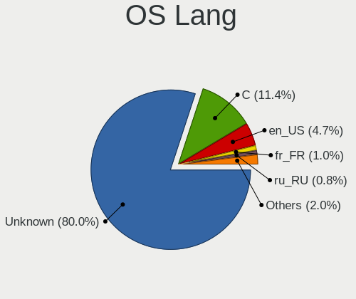
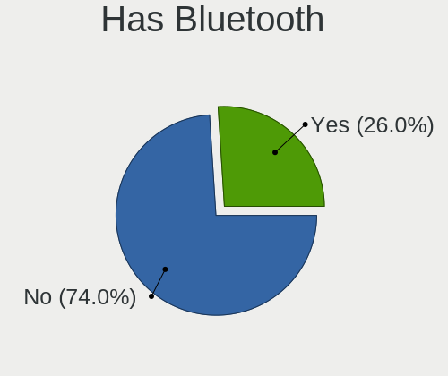
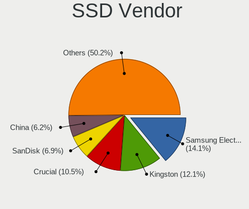
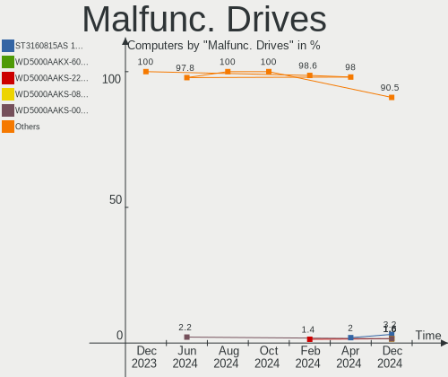
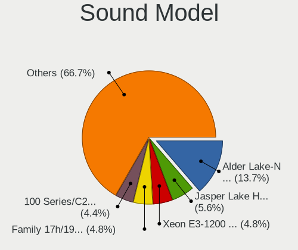
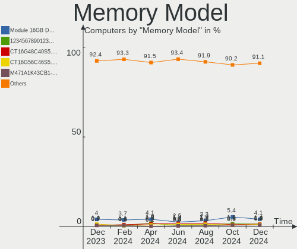
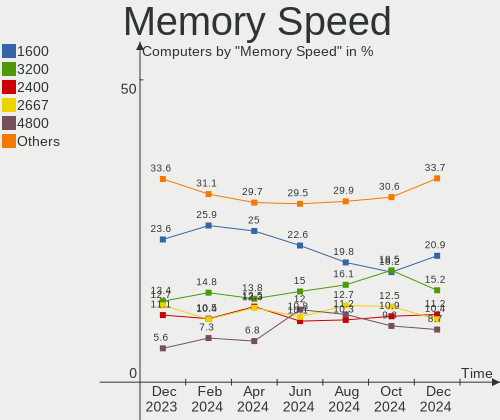
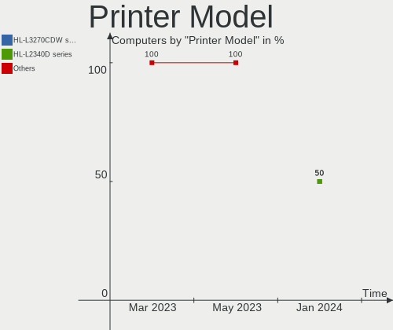
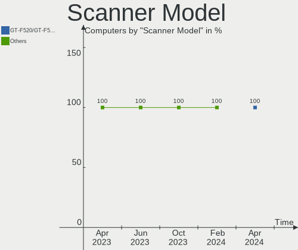

BSD Hardware Trends
-------------------

A project to identify most popular hardware characteristics and track their change
over time based on data collected by BSD users at https://BSD-Hardware.info.

Anyone can contribute to this report by the [hw-probe](https://github.com/linuxhw/hw-probe/blob/master/INSTALL.BSD.md) tool:

    hw-probe -all -upload

This is a report for all computer types. See also reports for [desktops](/Desktop/README.md) and [notebooks](/Notebook/README.md).

Full-feature report is available here: https://bsd-hardware.info/?view=trends

OS-specific reports: [FreeBSD](/Dist/FreeBSD), [OPNsense](/Dist/OPNsense), [helloSystem](/Dist/helloSystem), [OpenBSD](/Dist/OpenBSD).

Period: Sep, 2021.

Contents
--------

* [ System ](#system)
  - [ OS                       ](#os)
  - [ OS Family                ](#os-family)
  - [ Arch                     ](#arch)
  - [ DE                       ](#de)
  - [ Display Server           ](#display-server)
  - [ Display Manager          ](#display-manager)
  - [ OS Lang                  ](#os-lang)
  - [ Boot Mode                ](#boot-mode)
  - [ Filesystem               ](#filesystem)
  - [ Part. scheme             ](#part-scheme)

* [ Board ](#board)
  - [ Vendor                   ](#vendor)
  - [ Model                    ](#model)
  - [ Model Family             ](#model-family)
  - [ MFG Year                 ](#mfg-year)
  - [ Form Factor              ](#form-factor)
  - [ Coreboot                 ](#coreboot)
  - [ RAM Size                 ](#ram-size)
  - [ RAM Used                 ](#ram-used)
  - [ Total Drives             ](#total-drives)
  - [ Has CD-ROM               ](#has-cd-rom)
  - [ Has Ethernet             ](#has-ethernet)
  - [ Has WiFi                 ](#has-wifi)
  - [ Has Bluetooth            ](#has-bluetooth)

* [ Location ](#location)
  - [ Country                  ](#country)
  - [ City                     ](#city)

* [ Drives ](#drives)
  - [ Drive Vendor             ](#drive-vendor)
  - [ Drive Model              ](#drive-model)
  - [ HDD Vendor               ](#hdd-vendor)
  - [ SSD Vendor               ](#ssd-vendor)
  - [ Drive Kind               ](#drive-kind)
  - [ Drive Connector          ](#drive-connector)
  - [ Drive Size               ](#drive-size)
  - [ Space Total              ](#space-total)
  - [ Space Used               ](#space-used)
  - [ Malfunc. Drives          ](#malfunc-drives)
  - [ Malfunc. Drive Vendor    ](#malfunc-drive-vendor)
  - [ Malfunc. HDD Vendor      ](#malfunc-hdd-vendor)
  - [ Malfunc. Drive Kind      ](#malfunc-drive-kind)
  - [ Failed Drives            ](#failed-drives)
  - [ Failed Drive Vendor      ](#failed-drive-vendor)
  - [ Drive Status             ](#drive-status)

* [ Storage controller ](#storage-controller)
  - [ Storage Vendor           ](#storage-vendor)
  - [ Storage Model            ](#storage-model)
  - [ Storage Kind             ](#storage-kind)

* [ Processor ](#processor)
  - [ CPU Vendor               ](#cpu-vendor)
  - [ CPU Model                ](#cpu-model)
  - [ CPU Model Family         ](#cpu-model-family)
  - [ CPU Cores                ](#cpu-cores)
  - [ CPU Sockets              ](#cpu-sockets)
  - [ CPU Threads              ](#cpu-threads)
  - [ CPU Microarch            ](#cpu-microarch)

* [ Graphics ](#graphics)
  - [ GPU Vendor               ](#gpu-vendor)
  - [ GPU Model                ](#gpu-model)
  - [ GPU Combo                ](#gpu-combo)
  - [ GPU Driver               ](#gpu-driver)
  - [ GPU Memory               ](#gpu-memory)

* [ Monitor ](#monitor)
  - [ Monitor Vendor           ](#monitor-vendor)
  - [ Monitor Model            ](#monitor-model)
  - [ Monitor Resolution       ](#monitor-resolution)
  - [ Monitor Diagonal         ](#monitor-diagonal)
  - [ Monitor Width            ](#monitor-width)
  - [ Aspect Ratio             ](#aspect-ratio)
  - [ Monitor Area             ](#monitor-area)
  - [ Pixel Density            ](#pixel-density)
  - [ Multiple Monitors        ](#multiple-monitors)

* [ Network ](#network)
  - [ Net Controller Vendor    ](#net-controller-vendor)
  - [ Net Controller Model     ](#net-controller-model)
  - [ Wireless Vendor          ](#wireless-vendor)
  - [ Wireless Model           ](#wireless-model)
  - [ Ethernet Vendor          ](#ethernet-vendor)
  - [ Ethernet Model           ](#ethernet-model)
  - [ Net Controller Kind      ](#net-controller-kind)
  - [ Used Controller          ](#used-controller)
  - [ NICs                     ](#nics)
  - [ IPv6                     ](#ipv6)

* [ Bluetooth ](#bluetooth)
  - [ Bluetooth Vendor         ](#bluetooth-vendor)
  - [ Bluetooth Model          ](#bluetooth-model)

* [ Sound ](#sound)
  - [ Sound Vendor             ](#sound-vendor)
  - [ Sound Model              ](#sound-model)

* [ Memory ](#memory)
  - [ Memory Vendor            ](#memory-vendor)
  - [ Memory Model             ](#memory-model)
  - [ Memory Kind              ](#memory-kind)
  - [ Memory Form Factor       ](#memory-form-factor)
  - [ Memory Size              ](#memory-size)
  - [ Memory Speed             ](#memory-speed)

* [ Printers & scanners ](#printers--scanners)
  - [ Printer Vendor           ](#printer-vendor)
  - [ Printer Model            ](#printer-model)
  - [ Scanner Vendor           ](#scanner-vendor)
  - [ Scanner Model            ](#scanner-model)

* [ Camera ](#camera)
  - [ Camera Vendor            ](#camera-vendor)
  - [ Camera Model             ](#camera-model)

* [ Security ](#security)
  - [ Fingerprint Vendor       ](#fingerprint-vendor)
  - [ Fingerprint Model        ](#fingerprint-model)
  - [ Chipcard Vendor          ](#chipcard-vendor)
  - [ Chipcard Model           ](#chipcard-model)

* [ Unsupported ](#unsupported)
  - [ Unsupported Devices      ](#unsupported-devices)
  - [ Unsupported Device Types ](#unsupported-device-types)

System
------

OS
--

Installed operating systems

| Name                         | Computers | Percent |
|------------------------------|-----------|---------|
| OPNsense 21.7.2              | 89        | 25.14%  |
| OPNsense 21.7.3              | 59        | 16.67%  |
| OPNsense 21.7.1              | 41        | 11.58%  |
| FreeBSD 13.0-p4              | 30        | 8.47%   |
| helloSystem 0.5.0            | 21        | 5.93%   |
| FreeBSD 13.0                 | 19        | 5.37%   |
| OpenBSD 6.9                  | 12        | 3.39%   |
| helloSystem 0.6.0            | 12        | 3.39%   |
| GhostBSD 21.08.27            | 11        | 3.11%   |
| FreeBSD 13.0-STABLE          | 9         | 2.54%   |
| OPNsense 21.7                | 7         | 1.98%   |
| FreeBSD 13.0-p3              | 7         | 1.98%   |
| OPNsense 21.1.9              | 5         | 1.41%   |
| FreeBSD 12.2-p10             | 5         | 1.41%   |
| FreeBSD 14.0-CURRENT         | 4         | 1.13%   |
| TrueNAS 12.2-p9              | 3         | 0.85%   |
| OpenBSD 7.0                  | 3         | 0.85%   |
| NomadBSD 5806f915            | 3         | 0.85%   |
| HardenedBSD 13.0-STABLE-HBSD | 3         | 0.85%   |
| OS108 9.2                    | 2         | 0.56%   |
| NetBSD 9.2                   | 2         | 0.56%   |
| TrueNAS 12.2-p6              | 1         | 0.28%   |
| OPNsense 21.1.8              | 1         | 0.28%   |
| OPNsense 21.1.7              | 1         | 0.28%   |
| OPNsense 21.1                | 1         | 0.28%   |
| GhostBSD 20.04.02            | 1         | 0.28%   |
| FreeBSD 12.2-STABLE          | 1         | 0.28%   |
| FreeBSD 12.2-p6              | 1         | 0.28%   |

OS Family
---------

OS without a version

| Name        | Computers | Percent |
|-------------|-----------|---------|
| OPNsense    | 204       | 57.63%  |
| FreeBSD     | 76        | 21.47%  |
| helloSystem | 33        | 9.32%   |
| OpenBSD     | 15        | 4.24%   |
| GhostBSD    | 12        | 3.39%   |
| TrueNAS     | 4         | 1.13%   |
| NomadBSD    | 3         | 0.85%   |
| HardenedBSD | 3         | 0.85%   |
| OS108       | 2         | 0.56%   |
| NetBSD      | 2         | 0.56%   |

Arch
----

OS architecture (x86_64, i586, etc.)

| Name  | Computers | Percent |
|-------|-----------|---------|
| amd64 | 344       | 97.18%  |
| arm64 | 8         | 2.26%   |
| i386  | 2         | 0.56%   |

DE
--

Desktop Environment

| Name          | Computers | Percent |
|---------------|-----------|---------|
| Console       | 232       | 65.54%  |
| helloDesktop  | 33        | 9.32%   |
| MATE          | 18        | 5.08%   |
| XFCE          | 16        | 4.52%   |
| KDE5          | 14        | 3.95%   |
| fvwm          | 11        | 3.11%   |
| Openbox       | 6         | 1.69%   |
| GNOME         | 6         | 1.69%   |
| TWM           | 4         | 1.13%   |
| i3            | 4         | 1.13%   |
| Cinnamon      | 3         | 0.85%   |
| AwesomeWM     | 2         | 0.56%   |
| Lumina        | 1         | 0.28%   |
| iwm           | 1         | 0.28%   |
| Fluxbox       | 1         | 0.28%   |
| Enlightenment | 1         | 0.28%   |
| dwm           | 1         | 0.28%   |

Display Server
--------------

X11 or Wayland

| Name    | Computers | Percent |
|---------|-----------|---------|
| Console | 232       | 65.54%  |
| X11     | 121       | 34.18%  |
| Wayland | 1         | 0.28%   |

Display Manager
---------------

SDDM, LightDM, etc.

| Name    | Computers | Percent |
|---------|-----------|---------|
| Console | 264       | 74.58%  |
| SLiM    | 51        | 14.41%  |
| LightDM | 17        | 4.8%    |
| SDDM    | 10        | 2.82%   |
| XDM     | 7         | 1.98%   |
| GDM     | 5         | 1.41%   |

OS Lang
-------

Language

| Lang             | Computers | Percent |
|------------------|-----------|---------|
| Unknown          | 227       | 64.12%  |
| en_US            | 59        | 16.67%  |
| C                | 49        | 13.84%  |
| de_DE            | 4         | 1.13%   |
| en_GB            | 3         | 0.85%   |
| ru_RU            | 2         | 0.56%   |
| fr_FR            | 2         | 0.56%   |
| de_CH            | 2         | 0.56%   |
| uk_UA            | 1         | 0.28%   |
| pt_PT            | 1         | 0.28%   |
| pt_BR            | 1         | 0.28%   |
| it_IT.ISO8859-15 | 1         | 0.28%   |
| fi_FI            | 1         | 0.28%   |
| en_AU            | 1         | 0.28%   |

Boot Mode
---------

EFI or BIOS

| Mode | Computers | Percent |
|------|-----------|---------|
| EFI  | 298       | 84.18%  |
| BIOS | 56        | 15.82%  |

Filesystem
----------

Type of filesystem

| Type | Computers | Percent |
|------|-----------|---------|
| Ufs  | 185       | 52.26%  |
| Zfs  | 154       | 43.5%   |
| Ffs  | 15        | 4.24%   |

Part. scheme
------------

Scheme of partitioning

| Type    | Computers | Percent |
|---------|-----------|---------|
| GPT     | 330       | 93.22%  |
| MBR     | 21        | 5.93%   |
| Unknown | 3         | 0.85%   |

Board
-----

Vendor
------

Motherboard manufacturer

| Name                       | Computers | Percent |
|----------------------------|-----------|---------|
| Dell                       | 39        | 11.02%  |
| ASUSTek Computer           | 39        | 11.02%  |
| Lenovo                     | 34        | 9.6%    |
| Unknown                    | 31        | 8.76%   |
| Hewlett-Packard            | 30        | 8.47%   |
| Supermicro                 | 22        | 6.21%   |
| ASRock                     | 20        | 5.65%   |
| Gigabyte Technology        | 19        | 5.37%   |
| Intel                      | 14        | 3.95%   |
| MSI                        | 12        | 3.39%   |
| Protectli                  | 10        | 2.82%   |
| PC Engines                 | 9         | 2.54%   |
| ZOTAC                      | 7         | 1.98%   |
| Fujitsu                    | 7         | 1.98%   |
| AMI                        | 7         | 1.98%   |
| Apple                      | 5         | 1.41%   |
| BESSTAR Tech               | 4         | 1.13%   |
| Toshiba                    | 3         | 0.85%   |
| System76                   | 3         | 0.85%   |
| Sophos                     | 3         | 0.85%   |
| Foxconn                    | 3         | 0.85%   |
| Biostar                    | 3         | 0.85%   |
| Shuttle                    | 2         | 0.56%   |
| SeeedStudio                | 2         | 0.56%   |
| AWOW                       | 2         | 0.56%   |
| YANYU                      | 1         | 0.28%   |
| Yanling                    | 1         | 0.28%   |
| ShenZhen MinWin Technology | 1         | 0.28%   |
| Sapphire                   | 1         | 0.28%   |
| QTQD                       | 1         | 0.28%   |
| PCWare                     | 1         | 0.28%   |
| Panasonic                  | 1         | 0.28%   |
| Packard Bell               | 1         | 0.28%   |
| NF541                      | 1         | 0.28%   |
| NEC Computers              | 1         | 0.28%   |
| Medion                     | 1         | 0.28%   |
| Lex                        | 1         | 0.28%   |
| Kraftway                   | 1         | 0.28%   |
| IBM                        | 1         | 0.28%   |
| HUAWEI                     | 1         | 0.28%   |
| HPE                        | 1         | 0.28%   |
| friendlyelec               | 1         | 0.28%   |
| Essentiel B                | 1         | 0.28%   |
| ECS                        | 1         | 0.28%   |
| Deciso                     | 1         | 0.28%   |
| Compulab                   | 1         | 0.28%   |
| CNCTION-IAF-E3845          | 1         | 0.28%   |
| ASRockRack                 | 1         | 0.28%   |
| Acer                       | 1         | 0.28%   |

Model
-----

Motherboard model

| Name                               | Computers | Percent |
|------------------------------------|-----------|---------|
| Unknown                            | 33        | 9.32%   |
| Supermicro Super Server            | 9         | 2.54%   |
| PC Engines apu4                    | 5         | 1.41%   |
| AMI Aptio CRB                      | 5         | 1.41%   |
| Supermicro X10SLH-N6-ST031         | 4         | 1.13%   |
| PC Engines APU2                    | 4         | 1.13%   |
| Dell PowerEdge R210 II             | 4         | 1.13%   |
| ZOTAC ZBOX-CI323NANO               | 3         | 0.85%   |
| Protectli FW4B                     | 3         | 0.85%   |
| Intel Q3XXG4-P V1.0                | 3         | 0.85%   |
| HP Compaq Elite 8300 SFF           | 3         | 0.85%   |
| Fujitsu FUTRO S920                 | 3         | 0.85%   |
| Dell OptiPlex 9020                 | 3         | 0.85%   |
| ASUS All Series                    | 3         | 0.85%   |
| Sophos SG                          | 2         | 0.56%   |
| Protectli FW6                      | 2         | 0.56%   |
| Lenovo Yoga Slim 7 Pro 14ACH5 82MS | 2         | 0.56%   |
| HP t730 Thin Client                | 2         | 0.56%   |
| HP t620 PLUS Quad Core TC          | 2         | 0.56%   |
| Dell Precision 3630 Tower          | 2         | 0.56%   |
| Dell OptiPlex 7010                 | 2         | 0.56%   |
| Dell OptiPlex 3020                 | 2         | 0.56%   |
| AWOW PC BOX                        | 2         | 0.56%   |
| ASRock X570 Phantom Gaming 4       | 2         | 0.56%   |
| ZOTAC ZBOX-MI640/MI660/MI620NANO   | 1         | 0.28%   |
| ZOTAC ZBOX-CI341                   | 1         | 0.28%   |
| ZOTAC ZBOX-CI329NANO               | 1         | 0.28%   |
| ZOTAC ZBOX-CI327NANO-GS-01         | 1         | 0.28%   |
| YANYU ITX-N29 VER:1.5 baytrail     | 1         | 0.28%   |
| Yanling YL-KBR6L                   | 1         | 0.28%   |
| Toshiba Satellite P300             | 1         | 0.28%   |
| Toshiba Satellite A100             | 1         | 0.28%   |
| Toshiba Dakar10FW8                 | 1         | 0.28%   |
| System76 Kudu                      | 1         | 0.28%   |
| System76 Galago Pro                | 1         | 0.28%   |
| System76 Darter Pro                | 1         | 0.28%   |
| Supermicro X8SIL                   | 1         | 0.28%   |
| Supermicro X8DTU-LN4+              | 1         | 0.28%   |
| Supermicro X7SPA-HF                | 1         | 0.28%   |
| Supermicro X7SLA                   | 1         | 0.28%   |
| Supermicro X10SLM+-LN4F            | 1         | 0.28%   |
| Supermicro SYS-E300-8D             | 1         | 0.28%   |
| Supermicro SYS-5019A-FTN4          | 1         | 0.28%   |
| Supermicro HYVE-ZEUS               | 1         | 0.28%   |
| Supermicro A1SRM-2758F             | 1         | 0.28%   |
| Sophos UTM                         | 1         | 0.28%   |
| Shuttle XH310V2                    | 1         | 0.28%   |
| Shuttle DS10U                      | 1         | 0.28%   |
| ShenZhen MinWin 3865U-6L           | 1         | 0.28%   |
| SeeedStudio ODYSSEY-X86J4125       | 1         | 0.28%   |
| SeeedStudio ODYSSEY-X86J4105       | 1         | 0.28%   |
| Sapphire EDGE-FT1M1 E450 1AOVU044  | 1         | 0.28%   |
| QTQD Board                         | 1         | 0.28%   |
| Protectli VP2410                   | 1         | 0.28%   |
| Protectli FW6E                     | 1         | 0.28%   |
| Protectli FW6D                     | 1         | 0.28%   |
| Protectli FW2                      | 1         | 0.28%   |
| Protectli FW1                      | 1         | 0.28%   |
| PCWare PW-945GCX                   | 1         | 0.28%   |
| Panasonic CF-F9KWHZZQ2             | 1         | 0.28%   |

Model Family
------------

Motherboard model prefix

| Name                         | Computers | Percent |
|------------------------------|-----------|---------|
| Unknown                      | 33        | 9.32%   |
| Lenovo ThinkPad              | 20        | 5.65%   |
| Dell PowerEdge               | 13        | 3.67%   |
| Dell OptiPlex                | 13        | 3.67%   |
| Supermicro Super             | 9         | 2.54%   |
| ASUS PRIME                   | 6         | 1.69%   |
| PC Engines apu4              | 5         | 1.41%   |
| Lenovo ThinkCentre           | 5         | 1.41%   |
| HP Compaq                    | 5         | 1.41%   |
| Fujitsu FUTRO                | 5         | 1.41%   |
| AMI Aptio                    | 5         | 1.41%   |
| Supermicro X10SLH-N6-ST031   | 4         | 1.13%   |
| PC Engines APU2              | 4         | 1.13%   |
| Dell XPS                     | 4         | 1.13%   |
| Dell Latitude                | 4         | 1.13%   |
| ASUS ROG                     | 4         | 1.13%   |
| ZOTAC ZBOX-CI323NANO         | 3         | 0.85%   |
| Protectli FW4B               | 3         | 0.85%   |
| Lenovo IdeaPad               | 3         | 0.85%   |
| Intel Q3XXG4-P               | 3         | 0.85%   |
| HP EliteDesk                 | 3         | 0.85%   |
| Dell Precision               | 3         | 0.85%   |
| ASUS M5A78L-M                | 3         | 0.85%   |
| ASUS All                     | 3         | 0.85%   |
| ASRock X570                  | 3         | 0.85%   |
| Toshiba Satellite            | 2         | 0.56%   |
| Sophos SG                    | 2         | 0.56%   |
| Protectli FW6                | 2         | 0.56%   |
| Lenovo Yoga                  | 2         | 0.56%   |
| HP t730                      | 2         | 0.56%   |
| HP t620                      | 2         | 0.56%   |
| HP ProLiant                  | 2         | 0.56%   |
| HP ProDesk                   | 2         | 0.56%   |
| HP Pavilion                  | 2         | 0.56%   |
| AWOW PC                      | 2         | 0.56%   |
| ASUS P8H61-M                 | 2         | 0.56%   |
| ZOTAC ZBOX-MI640             | 1         | 0.28%   |
| ZOTAC ZBOX-CI341             | 1         | 0.28%   |
| ZOTAC ZBOX-CI329NANO         | 1         | 0.28%   |
| ZOTAC ZBOX-CI327NANO-GS-01   | 1         | 0.28%   |
| YANYU ITX-N29                | 1         | 0.28%   |
| Yanling YL-KBR6L             | 1         | 0.28%   |
| Toshiba Dakar10FW8           | 1         | 0.28%   |
| System76 Kudu                | 1         | 0.28%   |
| System76 Galago              | 1         | 0.28%   |
| System76 Darter              | 1         | 0.28%   |
| Supermicro X8SIL             | 1         | 0.28%   |
| Supermicro X8DTU-LN4+        | 1         | 0.28%   |
| Supermicro X7SPA-HF          | 1         | 0.28%   |
| Supermicro X7SLA             | 1         | 0.28%   |
| Supermicro X10SLM+-LN4F      | 1         | 0.28%   |
| Supermicro SYS-E300-8D       | 1         | 0.28%   |
| Supermicro SYS-5019A-FTN4    | 1         | 0.28%   |
| Supermicro HYVE-ZEUS         | 1         | 0.28%   |
| Supermicro A1SRM-2758F       | 1         | 0.28%   |
| Sophos UTM                   | 1         | 0.28%   |
| Shuttle XH310V2              | 1         | 0.28%   |
| Shuttle DS10U                | 1         | 0.28%   |
| ShenZhen MinWin 3865U-6L     | 1         | 0.28%   |
| SeeedStudio ODYSSEY-X86J4125 | 1         | 0.28%   |

MFG Year
--------

Motherboard manufacture year

| Year    | Computers | Percent |
|---------|-----------|---------|
| 2020    | 59        | 16.67%  |
| 2021    | 51        | 14.41%  |
| 2019    | 51        | 14.41%  |
| 2018    | 41        | 11.58%  |
| 2014    | 26        | 7.34%   |
| 2016    | 19        | 5.37%   |
| 2013    | 19        | 5.37%   |
| 2011    | 18        | 5.08%   |
| 2017    | 15        | 4.24%   |
| 2015    | 15        | 4.24%   |
| 2012    | 13        | 3.67%   |
| 2010    | 9         | 2.54%   |
| Unknown | 8         | 2.26%   |
| 2009    | 5         | 1.41%   |
| 2008    | 2         | 0.56%   |
| 2006    | 2         | 0.56%   |
| 2007    | 1         | 0.28%   |

Form Factor
-----------

Physical design of the computer

| Name           | Computers | Percent |
|----------------|-----------|---------|
| Desktop        | 217       | 61.3%   |
| Notebook       | 70        | 19.77%  |
| Server         | 35        | 9.89%   |
| Mini pc        | 25        | 7.06%   |
| Firewall       | 3         | 0.85%   |
| System on chip | 2         | 0.56%   |
| All in one     | 2         | 0.56%   |

Coreboot
--------

Have coreboot on board

| Used | Computers | Percent |
|------|-----------|---------|
| No   | 337       | 95.2%   |
| Yes  | 17        | 4.8%    |

RAM Size
--------

Total RAM memory

| Size in GB  | Computers | Percent |
|-------------|-----------|---------|
| 8.01-16.0   | 136       | 38.42%  |
| 16.01-24.0  | 76        | 21.47%  |
| 4.01-8.0    | 68        | 19.21%  |
| 32.01-64.0  | 30        | 8.47%   |
| 64.01-256.0 | 16        | 4.52%   |
| 2.01-3.0    | 11        | 3.11%   |
| 24.01-32.0  | 6         | 1.69%   |
| 3.01-4.0    | 4         | 1.13%   |
| 1.01-2.0    | 4         | 1.13%   |
| 0.51-1.0    | 3         | 0.85%   |

RAM Used
--------

Used RAM memory

| Used GB    | Computers | Percent |
|------------|-----------|---------|
| 0.01-0.5   | 172       | 48.59%  |
| 0.51-1.0   | 97        | 27.4%   |
| 1.01-2.0   | 44        | 12.43%  |
| 2.01-3.0   | 14        | 3.95%   |
| 3.01-4.0   | 9         | 2.54%   |
| 4.01-8.0   | 5         | 1.41%   |
| Unknown    | 5         | 1.41%   |
| 24.01-32.0 | 2         | 0.56%   |
| 16.01-24.0 | 2         | 0.56%   |
| 0          | 2         | 0.56%   |
| 32.01-64.0 | 1         | 0.28%   |
| 8.01-16.0  | 1         | 0.28%   |

Total Drives
------------

Number of drives on board

| Drives | Computers | Percent |
|--------|-----------|---------|
| 1      | 245       | 69.21%  |
| 2      | 43        | 12.15%  |
| 0      | 25        | 7.06%   |
| 3      | 15        | 4.24%   |
| 5      | 8         | 2.26%   |
| 4      | 8         | 2.26%   |
| 6      | 6         | 1.69%   |
| 17     | 1         | 0.28%   |
| 14     | 1         | 0.28%   |
| 13     | 1         | 0.28%   |
| 10     | 1         | 0.28%   |

Has CD-ROM
----------

Has CD-ROM on board

| Presented | Computers | Percent |
|-----------|-----------|---------|
| No        | 276       | 77.97%  |
| Yes       | 78        | 22.03%  |

Has Ethernet
------------

Has Ethernet on board

| Presented | Computers | Percent |
|-----------|-----------|---------|
| Yes       | 333       | 94.07%  |
| No        | 21        | 5.93%   |

Has WiFi
--------

Has WiFi module

| Presented | Computers | Percent |
|-----------|-----------|---------|
| No        | 221       | 62.43%  |
| Yes       | 133       | 37.57%  |

Has Bluetooth
-------------

Has Bluetooth module

| Presented | Computers | Percent |
|-----------|-----------|---------|
| No        | 272       | 76.84%  |
| Yes       | 82        | 23.16%  |

Location
--------

Country
-------

Geographic location (country)

| Country      | Computers | Percent |
|--------------|-----------|---------|
| USA          | 124       | 35.03%  |
| Germany      | 54        | 15.25%  |
| UK           | 15        | 4.24%   |
| Australia    | 14        | 3.95%   |
| France       | 11        | 3.11%   |
| Canada       | 11        | 3.11%   |
| Russia       | 9         | 2.54%   |
| Netherlands  | 9         | 2.54%   |
| Switzerland  | 8         | 2.26%   |
| Poland       | 8         | 2.26%   |
| South Africa | 7         | 1.98%   |
| Spain        | 6         | 1.69%   |
| Brazil       | 6         | 1.69%   |
| Austria      | 6         | 1.69%   |
| Romania      | 5         | 1.41%   |
| Japan        | 5         | 1.41%   |
| Italy        | 5         | 1.41%   |
| China        | 5         | 1.41%   |
| New Zealand  | 4         | 1.13%   |
| Slovakia     | 3         | 0.85%   |
| Israel       | 3         | 0.85%   |
| India        | 3         | 0.85%   |
| Singapore    | 2         | 0.56%   |
| Saudi Arabia | 2         | 0.56%   |
| Portugal     | 2         | 0.56%   |
| Indonesia    | 2         | 0.56%   |
| Hungary      | 2         | 0.56%   |
| Finland      | 2         | 0.56%   |
| Denmark      | 2         | 0.56%   |
| Czechia      | 2         | 0.56%   |
| Ukraine      | 1         | 0.28%   |
| Thailand     | 1         | 0.28%   |
| Sweden       | 1         | 0.28%   |
| Slovenia     | 1         | 0.28%   |
| Philippines  | 1         | 0.28%   |
| Peru         | 1         | 0.28%   |
| Paraguay     | 1         | 0.28%   |
| Norway       | 1         | 0.28%   |
| Nigeria      | 1         | 0.28%   |
| Montenegro   | 1         | 0.28%   |
| Lithuania    | 1         | 0.28%   |
| Latvia       | 1         | 0.28%   |
| Greece       | 1         | 0.28%   |
| Eswatini     | 1         | 0.28%   |
| Ecuador      | 1         | 0.28%   |
| Belgium      | 1         | 0.28%   |
| Argentina    | 1         | 0.28%   |

City
----

Geographic location (city)

| City                  | Computers | Percent |
|-----------------------|-----------|---------|
| Vienna                | 5         | 1.41%   |
| London                | 5         | 1.41%   |
| Denver                | 5         | 1.41%   |
| Zurich                | 4         | 1.13%   |
| Sydney                | 4         | 1.13%   |
| Apex                  | 4         | 1.13%   |
| Seattle               | 3         | 0.85%   |
| Perth                 | 3         | 0.85%   |
| Munich                | 3         | 0.85%   |
| Moscow                | 3         | 0.85%   |
| Lake Forest           | 3         | 0.85%   |
| Johannesburg          | 3         | 0.85%   |
| Dallas                | 3         | 0.85%   |
| Yokohama              | 2         | 0.56%   |
| Tulsa                 | 2         | 0.56%   |
| Stiring-Wendel        | 2         | 0.56%   |
| Springfield           | 2         | 0.56%   |
| Singapore             | 2         | 0.56%   |
| Salem                 | 2         | 0.56%   |
| Round Rock            | 2         | 0.56%   |
| Riyadh                | 2         | 0.56%   |
| Paris                 | 2         | 0.56%   |
| Oensingen             | 2         | 0.56%   |
| Marlborough           | 2         | 0.56%   |
| Krasnoyarsk           | 2         | 0.56%   |
| Koblenz               | 2         | 0.56%   |
| Ko??ice               | 2         | 0.56%   |
| Kirkland              | 2         | 0.56%   |
| Hamburg               | 2         | 0.56%   |
| Groningen             | 2         | 0.56%   |
| Gdansk                | 2         | 0.56%   |
| Fairfax               | 2         | 0.56%   |
| Drobeta-Turnu Severin | 2         | 0.56%   |
| Dortmund              | 2         | 0.56%   |
| Cologne               | 2         | 0.56%   |
| Chemnitz              | 2         | 0.56%   |
| Cambridge             | 2         | 0.56%   |
| Bucharest             | 2         | 0.56%   |
| Brookline             | 2         | 0.56%   |
| Brisbane              | 2         | 0.56%   |
| Bielefeld             | 2         | 0.56%   |
| Berlin                | 2         | 0.56%   |
| Barrington            | 2         | 0.56%   |
| Auburn                | 2         | 0.56%   |
| Zaltbommel            | 1         | 0.28%   |
| Yverdon-les-Bains     | 1         | 0.28%   |
| Yarang                | 1         | 0.28%   |
| Wylie                 | 1         | 0.28%   |
| Woodmead              | 1         | 0.28%   |
| Wolfsburg             | 1         | 0.28%   |
| Wittersham            | 1         | 0.28%   |
| Wittenberg            | 1         | 0.28%   |
| Witbank               | 1         | 0.28%   |
| Williston             | 1         | 0.28%   |
| Wezeren               | 1         | 0.28%   |
| West Kelowna          | 1         | 0.28%   |
| Wentzville            | 1         | 0.28%   |
| Wenatchee             | 1         | 0.28%   |
| Warsaw                | 1         | 0.28%   |
| Waiuku                | 1         | 0.28%   |

Drives
------

Drive Vendor
------------

Hard drive vendors

| Vendor              | Computers | Drives | Percent |
|---------------------|-----------|--------|---------|
| Samsung Electronics | 58        | 68     | 13.62%  |
| WDC                 | 54        | 95     | 12.68%  |
| Seagate             | 51        | 77     | 11.97%  |
| Kingston            | 37        | 38     | 8.69%   |
| Crucial             | 28        | 37     | 6.57%   |
| Transcend           | 23        | 24     | 5.4%    |
| Sandisk             | 22        | 22     | 5.16%   |
| Intel               | 19        | 22     | 4.46%   |
| Toshiba             | 18        | 21     | 4.23%   |
| A-DATA Technology   | 8         | 9      | 1.88%   |
| Phison              | 7         | 7      | 1.64%   |
| Hitachi             | 7         | 9      | 1.64%   |
| SK Hynix            | 6         | 6      | 1.41%   |
| Micron Technology   | 6         | 7      | 1.41%   |
| NVMe                | 5         | 6      | 1.17%   |
| HGST                | 5         | 5      | 1.17%   |
| China               | 5         | 5      | 1.17%   |
| SPCC                | 4         | 5      | 0.94%   |
| PNY                 | 4         | 4      | 0.94%   |
| OCZ                 | 4         | 4      | 0.94%   |
| Hoodisk             | 4         | 4      | 0.94%   |
| Hewlett-Packard     | 4         | 4      | 0.94%   |
| FORESEE             | 4         | 4      | 0.94%   |
| Protectli           | 3         | 3      | 0.7%    |
| Corsair             | 3         | 3      | 0.7%    |
| PLEXTOR             | 2         | 2      | 0.47%   |
| Patriot             | 2         | 2      | 0.47%   |
| LITEONIT            | 2         | 2      | 0.47%   |
| LITEON              | 2         | 2      | 0.47%   |
| Intenso             | 2         | 2      | 0.47%   |
| XPG                 | 1         | 1      | 0.23%   |
| VMware              | 1         | 1      | 0.23%   |
| Vaseky              | 1         | 1      | 0.23%   |
| TCSUNBOW            | 1         | 1      | 0.23%   |
| SATADOM             | 1         | 1      | 0.23%   |
| Pioneer             | 1         | 1      | 0.23%   |
| OPENBSD             | 1         | 1      | 0.23%   |
| Netac               | 1         | 1      | 0.23%   |
| MEMXPRO             | 1         | 1      | 0.23%   |
| MAXTOR              | 1         | 1      | 0.23%   |
| Kston               | 1         | 1      | 0.23%   |
| KIOXIA              | 1         | 1      | 0.23%   |
| KingSpec            | 1         | 1      | 0.23%   |
| KingDian            | 1         | 1      | 0.23%   |
| Integral            | 1         | 1      | 0.23%   |
| INDMEM              | 1         | 1      | 0.23%   |
| Indilinx            | 1         | 1      | 0.23%   |
| HPT                 | 1         | 16     | 0.23%   |
| Hikvision           | 1         | 1      | 0.23%   |
| GOODRAM             | 1         | 1      | 0.23%   |
| Gigabyte Technology | 1         | 1      | 0.23%   |
| Fordisk             | 1         | 1      | 0.23%   |
| Dogfish             | 1         | 1      | 0.23%   |
| BIWIN               | 1         | 1      | 0.23%   |
| Apple               | 1         | 1      | 0.23%   |
| Advantech           | 1         | 1      | 0.23%   |
| Adaptec             | 1         | 1      | 0.23%   |

Drive Model
-----------

Hard drive models

| Model                              | Computers | Percent |
|------------------------------------|-----------|---------|
| Seagate ST500DM002-1BD142 500GB    | 6         | 1.25%   |
| Kingston SA400S37240G 240GB        | 6         | 1.25%   |
| Kingston SA400S37120G 120GB        | 6         | 1.25%   |
| Crucial CT250MX500SSD1 250GB       | 6         | 1.25%   |
| Samsung SSD 850 EVO 250GB          | 5         | 1.04%   |
| Kingston SUV500MS120G 120GB        | 5         | 1.04%   |
| Transcend TS128GMSA230S 128GB      | 4         | 0.84%   |
| Toshiba MQ01ABF050 500GB           | 4         | 0.84%   |
| Seagate ST4000DM000-1F2168 4TB     | 4         | 0.84%   |
| WDC WD10EZEX-08WN4A0 1TB           | 3         | 0.63%   |
| Transcend TS64GSSD25S-M 64GB       | 3         | 0.63%   |
| Transcend TS32GMSA370 32GB         | 3         | 0.63%   |
| SPCC Solid State Disk 128GB        | 3         | 0.63%   |
| Seagate ST1000LM024 HN-M101MBB 1TB | 3         | 0.63%   |
| Seagate ST1000DM010-2EP102 1TB     | 3         | 0.63%   |
| SanDisk SDSSDA240G 240GB           | 3         | 0.63%   |
| Samsung SSD 970 EVO Plus 500GB     | 3         | 0.63%   |
| Samsung SSD 860 EVO 500GB          | 3         | 0.63%   |
| Samsung SSD 860 EVO 1TB            | 3         | 0.63%   |
| Samsung SSD 850 EVO mSATA 250GB    | 3         | 0.63%   |
| Phison SATA SSD 16GB               | 3         | 0.63%   |
| Kingston SV300S37A120G 120GB       | 3         | 0.63%   |
| Kingston SA400S37480G 480GB        | 3         | 0.63%   |
| Intel SSDSC2KB240G8 240GB          | 3         | 0.63%   |
| Hoodisk SSD 128GB                  | 3         | 0.63%   |
| Crucial CT500MX500SSD1 500GB       | 3         | 0.63%   |
| Crucial CT1000P1SSD8 1TB           | 3         | 0.63%   |
| WDC WDS500G2B0A-00SM50 500GB       | 2         | 0.42%   |
| Toshiba MQ01ABD100 1TB             | 2         | 0.42%   |
| Toshiba DT01ACA200 2TB             | 2         | 0.42%   |
| Toshiba DT01ACA100 1TB             | 2         | 0.42%   |
| Seagate ST4000VN008-2DR166 4TB     | 2         | 0.42%   |
| Seagate ST4000DM004-2CV104 4TB     | 2         | 0.42%   |
| Seagate ST380815AS 80GB            | 2         | 0.42%   |
| Seagate ST3000DM001-1ER166 3TB     | 2         | 0.42%   |
| Seagate ST250DM000-1BD141 250GB    | 2         | 0.42%   |
| Seagate ST2000LM003 HN-M201RAD 2TB | 2         | 0.42%   |
| Seagate ST1000DM003-1ER162 1TB     | 2         | 0.42%   |
| SanDisk SSD PLUS 240GB             | 2         | 0.42%   |
| SanDisk SDSSDA120G 120GB           | 2         | 0.42%   |
| SanDisk SDSA6MM-016G-1006 16GB     | 2         | 0.42%   |
| Samsung SSD 970 EVO 500GB          | 2         | 0.42%   |
| Samsung SSD 860 QVO 1TB            | 2         | 0.42%   |
| Samsung SSD 860 EVO 250GB          | 2         | 0.42%   |
| Samsung SSD 850 EVO 1TB            | 2         | 0.42%   |
| Samsung SSD 850 EVO 120GB          | 2         | 0.42%   |
| Samsung MZALQ512HBLU-00BL1 512GB   | 2         | 0.42%   |
| Samsung HD204UI 2TB                | 2         | 0.42%   |
| Protectli 120GB mSATA              | 2         | 0.42%   |
| PNY CS1311 120GB SSD               | 2         | 0.42%   |
| Phison SATA SSD 32GB               | 2         | 0.42%   |
| NVMe Samsung SSD 970 250GB         | 2         | 0.42%   |
| Kingston RBUSNS8154P3512GJ 512GB   | 2         | 0.42%   |
| Intenso SSD 120GB                  | 2         | 0.42%   |
| Intel SSDSC2KW256G8 256GB          | 2         | 0.42%   |
| HGST HTS721010A9E630 1TB           | 2         | 0.42%   |
| HP RAID 1(1+0) 200GB               | 2         | 0.42%   |
| FORESEE 128GB SSD                  | 2         | 0.42%   |
| Crucial CT275MX300SSD4 275GB       | 2         | 0.42%   |
| Crucial CT1050MX300SSD4 1TB        | 2         | 0.42%   |

HDD Vendor
----------

Hard disk drive vendors

| Vendor              | Computers | Drives | Percent |
|---------------------|-----------|--------|---------|
| Seagate             | 50        | 75     | 36.23%  |
| WDC                 | 43        | 82     | 31.16%  |
| Toshiba             | 16        | 19     | 11.59%  |
| Samsung Electronics | 7         | 12     | 5.07%   |
| Hitachi             | 7         | 9      | 5.07%   |
| HGST                | 5         | 5      | 3.62%   |
| NVMe                | 3         | 4      | 2.17%   |
| Hewlett-Packard     | 3         | 3      | 2.17%   |
| OPENBSD             | 1         | 1      | 0.72%   |
| MAXTOR              | 1         | 1      | 0.72%   |
| HPT                 | 1         | 16     | 0.72%   |
| Adaptec             | 1         | 1      | 0.72%   |

SSD Vendor
----------

Solid state drive vendors

| Vendor              | Computers | Drives | Percent |
|---------------------|-----------|--------|---------|
| Samsung Electronics | 36        | 38     | 15%     |
| Kingston            | 33        | 34     | 13.75%  |
| Transcend           | 23        | 24     | 9.58%   |
| Crucial             | 23        | 32     | 9.58%   |
| SanDisk             | 21        | 21     | 8.75%   |
| Intel               | 16        | 19     | 6.67%   |
| WDC                 | 8         | 8      | 3.33%   |
| Phison              | 6         | 6      | 2.5%    |
| A-DATA Technology   | 6         | 6      | 2.5%    |
| China               | 5         | 5      | 2.08%   |
| OCZ                 | 4         | 4      | 1.67%   |
| Micron Technology   | 4         | 4      | 1.67%   |
| Hoodisk             | 4         | 4      | 1.67%   |
| FORESEE             | 4         | 4      | 1.67%   |
| SPCC                | 3         | 4      | 1.25%   |
| SK Hynix            | 3         | 3      | 1.25%   |
| Protectli           | 3         | 3      | 1.25%   |
| PNY                 | 3         | 3      | 1.25%   |
| PLEXTOR             | 2         | 2      | 0.83%   |
| Patriot             | 2         | 2      | 0.83%   |
| NVMe                | 2         | 2      | 0.83%   |
| LITEONIT            | 2         | 2      | 0.83%   |
| LITEON              | 2         | 2      | 0.83%   |
| Intenso             | 2         | 2      | 0.83%   |
| Corsair             | 2         | 2      | 0.83%   |
| VMware              | 1         | 1      | 0.42%   |
| Vaseky              | 1         | 1      | 0.42%   |
| TCSUNBOW            | 1         | 1      | 0.42%   |
| Seagate             | 1         | 2      | 0.42%   |
| SATADOM             | 1         | 1      | 0.42%   |
| Pioneer             | 1         | 1      | 0.42%   |
| Netac               | 1         | 1      | 0.42%   |
| MEMXPRO             | 1         | 1      | 0.42%   |
| Kston               | 1         | 1      | 0.42%   |
| KingSpec            | 1         | 1      | 0.42%   |
| KingDian            | 1         | 1      | 0.42%   |
| Integral            | 1         | 1      | 0.42%   |
| INDMEM              | 1         | 1      | 0.42%   |
| Indilinx            | 1         | 1      | 0.42%   |
| Hikvision           | 1         | 1      | 0.42%   |
| GOODRAM             | 1         | 1      | 0.42%   |
| Fordisk             | 1         | 1      | 0.42%   |
| Dogfish             | 1         | 1      | 0.42%   |
| BIWIN               | 1         | 1      | 0.42%   |
| Apple               | 1         | 1      | 0.42%   |
| Advantech           | 1         | 1      | 0.42%   |

Drive Kind
----------

HDD or SSD

| Kind | Computers | Drives | Percent |
|------|-----------|--------|---------|
| SSD  | 221       | 258    | 57.55%  |
| HDD  | 115       | 228    | 29.95%  |
| NVMe | 48        | 55     | 12.5%   |

Drive Connector
---------------

SATA, SAS, NVMe, etc.

| Type | Computers | Drives | Percent |
|------|-----------|--------|---------|
| SATA | 298       | 486    | 86.13%  |
| NVMe | 48        | 55     | 13.87%  |

Drive Size
----------

Size of hard drive

| Size in TB | Computers | Drives | Percent |
|------------|-----------|--------|---------|
| 0.01-0.5   | 254       | 305    | 72.57%  |
| 0.51-1.0   | 52        | 80     | 14.86%  |
| 1.01-2.0   | 20        | 32     | 5.71%   |
| 3.01-4.0   | 12        | 22     | 3.43%   |
| 2.01-3.0   | 5         | 13     | 1.43%   |
| 4.01-10.0  | 5         | 29     | 1.43%   |
| 10.01-20.0 | 2         | 5      | 0.57%   |

Space Total
-----------

Amount of disk space available on the file system

| Size in GB     | Computers | Percent |
|----------------|-----------|---------|
| 101-250        | 125       | 35.31%  |
| 251-500        | 58        | 16.38%  |
| 1-20           | 45        | 12.71%  |
| 51-100         | 43        | 12.15%  |
| 21-50          | 34        | 9.6%    |
| 501-1000       | 33        | 9.32%   |
| 1001-2000      | 9         | 2.54%   |
| More than 3000 | 3         | 0.85%   |
| 2001-3000      | 3         | 0.85%   |
| Unknown        | 1         | 0.28%   |

Space Used
----------

Amount of used disk space

| Used GB   | Computers | Percent |
|-----------|-----------|---------|
| 1-20      | 313       | 88.42%  |
| 21-50     | 24        | 6.78%   |
| 101-250   | 7         | 1.98%   |
| 51-100    | 4         | 1.13%   |
| 251-500   | 2         | 0.56%   |
| 2001-3000 | 2         | 0.56%   |
| 1001-2000 | 1         | 0.28%   |
| Unknown   | 1         | 0.28%   |

Malfunc. Drives
---------------

Drive models with a malfunction

| Model                                        | Computers | Drives | Percent |
|----------------------------------------------|-----------|--------|---------|
| Seagate ST500DM002-1BD142 500GB              | 3         | 3      | 5.56%   |
| WDC WD5000AAKX-00U6AA0 500GB                 | 1         | 1      | 1.85%   |
| WDC WD3200AAJS-56M0A0 320GB                  | 1         | 1      | 1.85%   |
| WDC WD1600AAJS-60WAA0 160GB                  | 1         | 1      | 1.85%   |
| WDC WD10PURX-64E5EY0 1TB                     | 1         | 1      | 1.85%   |
| WDC WD10EZEX-08WN4A0 1TB                     | 1         | 1      | 1.85%   |
| WDC WD10EZEX-00RKKA0 1TB                     | 1         | 1      | 1.85%   |
| WDC WD10EAVS-00D7B0 1TB                      | 1         | 1      | 1.85%   |
| Toshiba MQ01ABD032 320GB                     | 1         | 1      | 1.85%   |
| Toshiba MK5061GSYN 500GB                     | 1         | 1      | 1.85%   |
| Toshiba DT01ACA200 2TB                       | 1         | 1      | 1.85%   |
| SK Hynix HFS128G39TND-N210A 128GB            | 1         | 1      | 1.85%   |
| Seagate ST96023AS 58GB                       | 1         | 1      | 1.85%   |
| Seagate ST9500325AS 500GB                    | 1         | 1      | 1.85%   |
| Seagate ST9160827AS 160GB                    | 1         | 1      | 1.85%   |
| Seagate ST500VT000-1DK142 500GB              | 1         | 1      | 1.85%   |
| Seagate ST380815AS 80GB                      | 1         | 1      | 1.85%   |
| Seagate ST3500418AS 500GB                    | 1         | 1      | 1.85%   |
| Seagate ST3500413AS 500GB                    | 1         | 1      | 1.85%   |
| Seagate ST32000542AS 2TB                     | 1         | 1      | 1.85%   |
| Seagate ST31000528AS 1TB                     | 1         | 1      | 1.85%   |
| Seagate ST3000DM001-1ER166 3TB               | 1         | 1      | 1.85%   |
| Seagate ST250DM000-1BD141 250GB              | 1         | 1      | 1.85%   |
| Seagate ST2000DM001-9YN164 2TB               | 1         | 1      | 1.85%   |
| Seagate ST1000LM024 HN-M101MBB 1TB           | 1         | 1      | 1.85%   |
| Seagate ST1000DM003-1CH162 1TB               | 1         | 1      | 1.85%   |
| Seagate ST1000DL002-9TT153 1TB               | 1         | 1      | 1.85%   |
| SanDisk SSD PLUS 480GB                       | 1         | 1      | 1.85%   |
| SanDisk SDSSDA240G 240GB                     | 1         | 1      | 1.85%   |
| Samsung Electronics SSD 870 EVO 1TB          | 1         | 1      | 1.85%   |
| Samsung Electronics SSD 840 PRO Series 256GB | 1         | 1      | 1.85%   |
| Samsung Electronics HD501LJ 500GB            | 1         | 1      | 1.85%   |
| Samsung Electronics HD322GJ 320GB            | 1         | 1      | 1.85%   |
| Samsung Electronics HD256GJ 250GB            | 1         | 1      | 1.85%   |
| Samsung Electronics HD103UJ 1TB              | 1         | 1      | 1.85%   |
| Kingston SMS200S3120G 120GB                  | 1         | 1      | 1.85%   |
| Intel SSDSC2KW256G8 256GB                    | 1         | 1      | 1.85%   |
| Intel SSDSC2CW060A3 64GB                     | 1         | 1      | 1.85%   |
| Intel SSDSC2BF240A5 240GB                    | 1         | 1      | 1.85%   |
| Intel SSDSA2M120G2GC 120GB                   | 1         | 1      | 1.85%   |
| Hitachi HDT721010SLA360 1TB                  | 1         | 1      | 1.85%   |
| HGST HTS725050A7E630 500GB                   | 1         | 1      | 1.85%   |
| HGST HTS721010A9E630 1TB                     | 1         | 1      | 1.85%   |
| HGST HTS541010A9E680 1TB                     | 1         | 1      | 1.85%   |
| Hewlett-Packard MB1000GCWCV 1TB              | 1         | 1      | 1.85%   |
| Dogfish SSD 128GB                            | 1         | 1      | 1.85%   |
| Crucial CT525MX300SSD1 528GB                 | 1         | 1      | 1.85%   |
| Crucial CT275MX300SSD1 275GB                 | 1         | 3      | 1.85%   |
| Crucial CT128MX100SSD1 128GB                 | 1         | 1      | 1.85%   |
| Crucial CT1050MX300SSD4 1TB                  | 1         | 1      | 1.85%   |
| Crucial CT1000P1SSD8 1TB                     | 1         | 1      | 1.85%   |
| Crucial CT1000MX500SSD1 1TB                  | 1         | 1      | 1.85%   |

Malfunc. Drive Vendor
---------------------

Vendors of faulty drives

| Vendor              | Computers | Drives | Percent |
|---------------------|-----------|--------|---------|
| Seagate             | 18        | 18     | 36%     |
| Crucial             | 6         | 8      | 12%     |
| WDC                 | 5         | 7      | 10%     |
| Samsung Electronics | 4         | 6      | 8%      |
| Intel               | 4         | 4      | 8%      |
| Toshiba             | 3         | 3      | 6%      |
| HGST                | 3         | 3      | 6%      |
| SanDisk             | 2         | 2      | 4%      |
| SK Hynix            | 1         | 1      | 2%      |
| Kingston            | 1         | 1      | 2%      |
| Hitachi             | 1         | 1      | 2%      |
| Hewlett-Packard     | 1         | 1      | 2%      |
| Dogfish             | 1         | 1      | 2%      |

Malfunc. HDD Vendor
-------------------

Vendors of faulty HDD drives

| Vendor              | Computers | Drives | Percent |
|---------------------|-----------|--------|---------|
| Seagate             | 18        | 18     | 54.55%  |
| WDC                 | 5         | 7      | 15.15%  |
| Toshiba             | 3         | 3      | 9.09%   |
| HGST                | 3         | 3      | 9.09%   |
| Samsung Electronics | 2         | 4      | 6.06%   |
| Hitachi             | 1         | 1      | 3.03%   |
| Hewlett-Packard     | 1         | 1      | 3.03%   |

Malfunc. Drive Kind
-------------------

Kinds of faulty drives

| Kind | Computers | Drives | Percent |
|------|-----------|--------|---------|
| HDD  | 31        | 37     | 64.58%  |
| SSD  | 16        | 18     | 33.33%  |
| NVMe | 1         | 1      | 2.08%   |

Failed Drives
-------------

Failed drive models

Zero info for selected period =(

Failed Drive Vendor
-------------------

Failed drive vendors

Zero info for selected period =(

Drive Status
------------

Number of failed and malfunc. drives

| Status   | Computers | Drives | Percent |
|----------|-----------|--------|---------|
| Works    | 293       | 451    | 82.54%  |
| Malfunc  | 46        | 56     | 12.96%  |
| Detected | 16        | 34     | 4.51%   |

Storage controller
------------------

Storage Vendor
--------------

Storage controller vendors

| Vendor                      | Computers | Percent |
|-----------------------------|-----------|---------|
| Intel                       | 268       | 63.21%  |
| AMD                         | 62        | 14.62%  |
| Samsung Electronics         | 22        | 5.19%   |
| Broadcom / LSI              | 8         | 1.89%   |
| Sandisk                     | 7         | 1.65%   |
| Phison Electronics          | 7         | 1.65%   |
| ASMedia Technology          | 6         | 1.42%   |
| Micron/Crucial Technology   | 5         | 1.18%   |
| Marvell Technology Group    | 4         | 0.94%   |
| Kingston Technology Company | 4         | 0.94%   |
| SK Hynix                    | 3         | 0.71%   |
| JMicron Technology          | 3         | 0.71%   |
| ADATA Technology            | 3         | 0.71%   |
| VMware                      | 2         | 0.47%   |
| Toshiba                     | 2         | 0.47%   |
| Silicon Image               | 2         | 0.47%   |
| Nvidia                      | 2         | 0.47%   |
| Micron Technology           | 2         | 0.47%   |
| KIOXIA                      | 2         | 0.47%   |
| Hewlett-Packard             | 2         | 0.47%   |
| Chelsio Communications      | 2         | 0.47%   |
| Adaptec                     | 2         | 0.47%   |
| XenSource                   | 1         | 0.24%   |
| Silicon Motion              | 1         | 0.24%   |
| HighPoint Technologies      | 1         | 0.24%   |
| Apple                       | 1         | 0.24%   |

Storage Model
-------------

Storage controller models

| Model                                                                            | Computers | Percent |
|----------------------------------------------------------------------------------|-----------|---------|
| AMD FCH SATA Controller [AHCI mode]                                              | 44        | 9.34%   |
| Intel 8 Series/C220 Series Chipset Family 6-port SATA Controller 1 [AHCI mode]   | 30        | 6.37%   |
| Intel 6 Series/C200 Series Chipset Family 6 port Desktop SATA AHCI Controller    | 22        | 4.67%   |
| Intel Atom Processor E3800 Series SATA AHCI Controller                           | 19        | 4.03%   |
| Intel Cannon Lake PCH SATA AHCI Controller                                       | 13        | 2.76%   |
| Intel Atom/Celeron/Pentium Processor x5-E8000/J3xxx/N3xxx Series SATA Controller | 13        | 2.76%   |
| Samsung NVMe SSD Controller SM981/PM981/PM983                                    | 12        | 2.55%   |
| Intel Sunrise Point-LP SATA Controller [AHCI mode]                               | 12        | 2.55%   |
| Intel 7 Series/C210 Series Chipset Family 6-port SATA Controller [AHCI mode]     | 11        | 2.34%   |
| Intel SATA Controller [RAID mode]                                                | 10        | 2.12%   |
| Intel Q170/Q150/B150/H170/H110/Z170/CM236 Chipset SATA Controller [AHCI Mode]    | 10        | 2.12%   |
| AMD 400 Series Chipset SATA Controller                                           | 10        | 2.12%   |
| Intel Wildcat Point-LP SATA Controller [AHCI Mode]                               | 9         | 1.91%   |
| Intel Celeron/Pentium Silver Processor SATA Controller                           | 9         | 1.91%   |
| Intel 8 Series SATA Controller 1 [AHCI mode]                                     | 9         | 1.91%   |
| Intel 7 Series Chipset Family 6-port SATA Controller [AHCI mode]                 | 9         | 1.91%   |
| AMD SB7x0/SB8x0/SB9x0 SATA Controller [AHCI mode]                                | 8         | 1.7%    |
| Intel Celeron N3350/Pentium N4200/Atom E3900 Series SATA AHCI Controller         | 6         | 1.27%   |
| Intel 82801G (ICH7 Family) IDE Controller                                        | 6         | 1.27%   |
| Intel 200 Series PCH SATA controller [AHCI mode]                                 | 6         | 1.27%   |
| Unknown                                                                          | 6         | 1.27%   |
| Samsung NVMe SSD Controller SM961/PM961/SM963                                    | 5         | 1.06%   |
| Intel Comet Lake SATA AHCI Controller                                            | 5         | 1.06%   |
| Intel 82801HM/HEM (ICH8M/ICH8M-E) IDE Controller                                 | 5         | 1.06%   |
| Intel 6 Series/C200 Series Chipset Family 6 port Mobile SATA AHCI Controller     | 5         | 1.06%   |
| Intel 500 Series Chipset Family SATA AHCI Controller                             | 5         | 1.06%   |
| Intel 5 Series/3400 Series Chipset 6 port SATA AHCI Controller                   | 5         | 1.06%   |
| ASMedia ASM1062 Serial ATA Controller                                            | 5         | 1.06%   |
| AMD SB7x0/SB8x0/SB9x0 IDE Controller                                             | 5         | 1.06%   |
| Samsung NVMe SSD Controller 980                                                  | 4         | 0.85%   |
| Phison PS5013 E13 NVMe Controller                                                | 4         | 0.85%   |
| Intel NM10/ICH7 Family SATA Controller [IDE mode]                                | 4         | 0.85%   |
| Intel Cannon Lake Mobile PCH SATA AHCI Controller                                | 4         | 0.85%   |
| Intel 82801JI (ICH10 Family) SATA AHCI Controller                                | 4         | 0.85%   |
| Intel 82801JI (ICH10 Family) 4 port SATA IDE Controller #1                       | 4         | 0.85%   |
| Intel 82801HM/HEM (ICH8M/ICH8M-E) SATA Controller [AHCI mode]                    | 4         | 0.85%   |
| AMD Starship/Matisse Chipset SATA Controller [AHCI mode]                         | 4         | 0.85%   |
| Micron/Crucial P1 NVMe PCIe SSD                                                  | 3         | 0.64%   |
| Kingston Company U-SNS8154P3 NVMe SSD                                            | 3         | 0.64%   |
| Intel NM10/ICH7 Family SATA Controller [AHCI mode]                               | 3         | 0.64%   |
| Intel C600/X79 series chipset 6-Port SATA AHCI Controller                        | 3         | 0.64%   |
| Intel 82801IBM/IEM (ICH9M/ICH9M-E) 4 port SATA Controller [AHCI mode]            | 3         | 0.64%   |
| Intel 82801 Mobile SATA Controller [RAID mode]                                   | 3         | 0.64%   |
| Intel 400 Series Chipset Family SATA AHCI Controller                             | 3         | 0.64%   |
| AMD FCH SATA Controller [IDE mode]                                               | 3         | 0.64%   |
| ADATA XPG SX8200 Pro PCIe Gen3x4 M.2 2280 Solid State Drive                      | 3         | 0.64%   |
| VMware SATA AHCI controller                                                      | 2         | 0.42%   |
| SK Hynix Gold P31 SSD                                                            | 2         | 0.42%   |
| Sandisk WD Blue SN550 NVMe SSD                                                   | 2         | 0.42%   |
| Sandisk WD Black SN850                                                           | 2         | 0.42%   |
| Sandisk WD Black SN750 / PC SN730 NVMe SSD                                       | 2         | 0.42%   |
| Phison E12 NVMe Controller                                                       | 2         | 0.42%   |
| KIOXIA unknown                                                                   | 2         | 0.42%   |
| Intel HM170/QM170 Chipset SATA Controller [AHCI Mode]                            | 2         | 0.42%   |
| Intel Cannon Point-LP SATA Controller [AHCI Mode]                                | 2         | 0.42%   |
| Intel C602 chipset 4-Port SATA Storage Control Unit                              | 2         | 0.42%   |
| Intel Atom Processor C3000 Series SATA Controller 1                              | 2         | 0.42%   |
| Intel Atom Processor C3000 Series SATA Controller 0                              | 2         | 0.42%   |
| Intel 9 Series Chipset Family SATA Controller [AHCI Mode]                        | 2         | 0.42%   |
| Intel 82801JI (ICH10 Family) 2 port SATA IDE Controller #2                       | 2         | 0.42%   |

Storage Kind
------------

Kind of storage controller (IDE, SATA, NVMe, SAS, ...)

| Kind | Computers | Percent |
|------|-----------|---------|
| SATA | 299       | 69.7%   |
| NVMe | 57        | 13.29%  |
| IDE  | 38        | 8.86%   |
| RAID | 25        | 5.83%   |
| SAS  | 5         | 1.17%   |
| SCSI | 5         | 1.17%   |

Processor
---------

CPU Vendor
----------

Processor vendors

| Vendor  | Computers | Percent |
|---------|-----------|---------|
| Intel   | 276       | 77.97%  |
| AMD     | 70        | 19.77%  |
| ARM     | 5         | 1.41%   |
| Unknown | 2         | 0.56%   |
| Unknown | 1         | 0.28%   |

CPU Model
---------

Processor models

| Model                                     | Computers | Percent |
|-------------------------------------------|-----------|---------|
| Intel Core i5-3470 CPU @ 3.20GHz          | 8         | 2.26%   |
| Intel Celeron CPU J1900 @ 1.99GHz         | 8         | 2.26%   |
| AMD GX-412TC SOC                          | 8         | 2.26%   |
| Intel Celeron CPU J3160 @ 1.60GHz         | 5         | 1.41%   |
| Intel Core i5-2400 CPU @ 3.10GHz          | 4         | 1.13%   |
| Intel Celeron J4125 CPU @ 2.00GHz         | 4         | 1.13%   |
| AMD Ryzen 9 3900X 12-Core Processor       | 4         | 1.13%   |
| Intel Xeon CPU D-1518 @ 2.20GHz           | 3         | 0.85%   |
| Intel Core i7-7500U CPU @ 2.70GHz         | 3         | 0.85%   |
| Intel Core i7-10510U CPU @ 1.80GHz        | 3         | 0.85%   |
| Intel Core i5-5300U CPU @ 2.30GHz         | 3         | 0.85%   |
| Intel Core i5-4570 CPU @ 3.20GHz          | 3         | 0.85%   |
| Intel Core i3-9100F CPU @ 3.60GHz         | 3         | 0.85%   |
| Intel Core i3-2120 CPU @ 3.30GHz          | 3         | 0.85%   |
| Intel Core i3-10100 CPU @ 3.60GHz         | 3         | 0.85%   |
| Intel Core 2 Duo CPU P8600 @ 2.40GHz      | 3         | 0.85%   |
| Intel Celeron CPU N3150 @ 1.60GHz         | 3         | 0.85%   |
| Intel Celeron CPU J3455 @ 1.50GHz         | 3         | 0.85%   |
| Intel Celeron CPU J1800 @ 2.41GHz         | 3         | 0.85%   |
| AMD Ryzen 7 5700G with Radeon Graphics    | 3         | 0.85%   |
| AMD GX-222GC SOC with Radeon R5E Graphics | 3         | 0.85%   |
| Intel Xeon CPU E31220 @ 3.10GHz           | 2         | 0.56%   |
| Intel Xeon CPU E3-1231 v3 @ 3.40GHz       | 2         | 0.56%   |
| Intel Pentium CPU N3700 @ 1.60GHz         | 2         | 0.56%   |
| Intel Pentium CPU G3220 @ 3.00GHz         | 2         | 0.56%   |
| Intel Core i7-7700 CPU @ 3.60GHz          | 2         | 0.56%   |
| Intel Core i7-6700HQ CPU @ 2.60GHz        | 2         | 0.56%   |
| Intel Core i7-5550U CPU @ 2.00GHz         | 2         | 0.56%   |
| Intel Core i7-4790 CPU @ 3.60GHz          | 2         | 0.56%   |
| Intel Core i7-4770 CPU @ 3.40GHz          | 2         | 0.56%   |
| Intel Core i7-4510U CPU @ 2.00GHz         | 2         | 0.56%   |
| Intel Core i7-4500U CPU @ 1.80GHz         | 2         | 0.56%   |
| Intel Core i5-8500 CPU @ 3.00GHz          | 2         | 0.56%   |
| Intel Core i5-8250U CPU @ 1.60GHz         | 2         | 0.56%   |
| Intel Core i5-7500 CPU @ 3.40GHz          | 2         | 0.56%   |
| Intel Core i5-7400 CPU @ 3.00GHz          | 2         | 0.56%   |
| Intel Core i5-6500 CPU @ 3.20GHz          | 2         | 0.56%   |
| Intel Core i5-4590S CPU @ 3.00GHz         | 2         | 0.56%   |
| Intel Core i5-2520M CPU @ 2.50GHz         | 2         | 0.56%   |
| Intel Core i5-2405S CPU @ 2.50GHz         | 2         | 0.56%   |
| Intel Core i5 CPU M 540 @ 2.53GHz         | 2         | 0.56%   |
| Intel Core i3-9100 CPU @ 3.60GHz          | 2         | 0.56%   |
| Intel Core i3-8100 CPU @ 3.60GHz          | 2         | 0.56%   |
| Intel Core i3-7100U CPU @ 2.40GHz         | 2         | 0.56%   |
| Intel Core i3-6100T CPU @ 3.20GHz         | 2         | 0.56%   |
| Intel Core i3-5005U CPU @ 2.00GHz         | 2         | 0.56%   |
| Intel Core i3-3110M CPU @ 2.40GHz         | 2         | 0.56%   |
| Intel Core i3-10110U CPU @ 2.10GHz        | 2         | 0.56%   |
| Intel Celeron N4100 CPU @ 1.10GHz         | 2         | 0.56%   |
| Intel Celeron CPU N3060 @ 1.60GHz         | 2         | 0.56%   |
| Intel Celeron CPU N2940 @ 1.83GHz         | 2         | 0.56%   |
| Intel Celeron CPU N2930 @ 1.83GHz         | 2         | 0.56%   |
| ARM Cortex-A57 r1p3                       | 2         | 0.56%   |
| ARM Cortex-A53 r0p4                       | 2         | 0.56%   |
| AMD Ryzen 7 5800H with Radeon Graphics    | 2         | 0.56%   |
| AMD Ryzen 7 2700 Eight-Core Processor     | 2         | 0.56%   |
| AMD Ryzen 7 1700 Eight-Core Processor     | 2         | 0.56%   |
| AMD RX-427BB with AMD Radeon R7 Graphics  | 2         | 0.56%   |
| AMD GX-420CA SOC with Radeon HD Graphics  | 2         | 0.56%   |
|                                           | 2         | 0.56%   |

CPU Model Family
----------------

Processor model prefix

| Model                   | Computers | Percent |
|-------------------------|-----------|---------|
| Intel Core i5           | 65        | 18.36%  |
| Intel Core i7           | 50        | 14.12%  |
| Intel Celeron           | 46        | 12.99%  |
| Intel Core i3           | 38        | 10.73%  |
| Intel Xeon              | 34        | 9.6%    |
| AMD Ryzen 7             | 15        | 4.24%   |
| AMD GX                  | 15        | 4.24%   |
| Intel Atom              | 14        | 3.95%   |
| Other                   | 9         | 2.54%   |
| Intel Pentium           | 8         | 2.26%   |
| AMD Ryzen 5             | 8         | 2.26%   |
| Intel Core 2 Duo        | 6         | 1.69%   |
| AMD Ryzen 9             | 6         | 1.69%   |
| ARM Cortex              | 5         | 1.41%   |
| Intel Core 2 Quad       | 3         | 0.85%   |
| AMD E1                  | 3         | 0.85%   |
| AMD A8                  | 3         | 0.85%   |
| Intel Core 2            | 2         | 0.56%   |
| AMD FX                  | 2         | 0.56%   |
| Intel Pentium Silver    | 1         | 0.28%   |
| Intel Pentium M         | 1         | 0.28%   |
| Intel Pentium Gold      | 1         | 0.28%   |
| Intel Pentium Dual-Core | 1         | 0.28%   |
| Intel Pentium D         | 1         | 0.28%   |
| Intel Core M            | 1         | 0.28%   |
| Intel Core 2 Extreme    | 1         | 0.28%   |
| Intel 686-class         | 1         | 0.28%   |
| AMD Sempron             | 1         | 0.28%   |
| AMD Ryzen Threadripper  | 1         | 0.28%   |
| AMD Ryzen 7 PRO         | 1         | 0.28%   |
| AMD Ryzen 5 PRO         | 1         | 0.28%   |
| AMD Ryzen 3             | 1         | 0.28%   |
| AMD Phenom II X6        | 1         | 0.28%   |
| AMD Phenom II X4        | 1         | 0.28%   |
| AMD Phenom II           | 1         | 0.28%   |
| AMD EPYC                | 1         | 0.28%   |
| AMD E                   | 1         | 0.28%   |
| AMD Athlon II X3        | 1         | 0.28%   |
| AMD Athlon              | 1         | 0.28%   |
| AMD A4                  | 1         | 0.28%   |
| AMD A10                 | 1         | 0.28%   |

CPU Cores
---------

Number of processor cores

| Number  | Computers | Percent |
|---------|-----------|---------|
| 4       | 167       | 47.18%  |
| 2       | 100       | 28.25%  |
| 8       | 20        | 5.65%   |
| Unknown | 20        | 5.65%   |
| 16      | 15        | 4.24%   |
| 6       | 14        | 3.95%   |
| 24      | 5         | 1.41%   |
| 12      | 5         | 1.41%   |
| 1       | 4         | 1.13%   |
| 32      | 2         | 0.56%   |
| 48      | 1         | 0.28%   |
| 3       | 1         | 0.28%   |

CPU Sockets
-----------

Number of sockets

| Number  | Computers | Percent |
|---------|-----------|---------|
| 1       | 339       | 95.76%  |
| Unknown | 8         | 2.26%   |
| 2       | 7         | 1.98%   |

CPU Threads
-----------

Threads per core (Hyper-Threading)

| Number  | Computers | Percent |
|---------|-----------|---------|
| 1       | 197       | 55.65%  |
| 2       | 136       | 38.42%  |
| Unknown | 21        | 5.93%   |

CPU Microarch
-------------

Microarchitecture

| Name          | Computers | Percent |
|---------------|-----------|---------|
| KabyLake      | 48        | 13.56%  |
| Haswell       | 40        | 11.3%   |
| Silvermont    | 35        | 9.89%   |
| IvyBridge     | 29        | 8.19%   |
| SandyBridge   | 25        | 7.06%   |
| Skylake       | 15        | 4.24%   |
| Broadwell     | 15        | 4.24%   |
| Puma          | 14        | 3.95%   |
| Zen 2         | 12        | 3.39%   |
| Unknown       | 12        | 3.39%   |
| Goldmont plus | 9         | 2.54%   |
| CometLake     | 9         | 2.54%   |
| Zen+          | 8         | 2.26%   |
| Westmere      | 8         | 2.26%   |
| Nehalem       | 8         | 2.26%   |
| Goldmont      | 8         | 2.26%   |
| Core          | 8         | 2.26%   |
| Zen 3         | 7         | 1.98%   |
| Penryn        | 7         | 1.98%   |
| Zen           | 6         | 1.69%   |
| Bonnell       | 6         | 1.69%   |
| K10           | 5         | 1.41%   |
| Jaguar        | 5         | 1.41%   |
| Steamroller   | 4         | 1.13%   |
| Piledriver    | 4         | 1.13%   |
| IceLake       | 2         | 0.56%   |
| Bobcat        | 2         | 0.56%   |
| P6            | 1         | 0.28%   |
| NetBurst      | 1         | 0.28%   |
| Excavator     | 1         | 0.28%   |

Graphics
--------

GPU Vendor
----------

Vendors of graphics cards

| Vendor                     | Computers | Percent |
|----------------------------|-----------|---------|
| Intel                      | 209       | 58.06%  |
| AMD                        | 62        | 17.22%  |
| Nvidia                     | 47        | 13.06%  |
| ASPEED Technology          | 20        | 5.56%   |
| Matrox Electronics Systems | 18        | 5%      |
| VMware                     | 2         | 0.56%   |
| Silicon Motion             | 1         | 0.28%   |
| Cirrus Logic               | 1         | 0.28%   |

GPU Model
---------

Graphics card models

| Model                                                                                    | Computers | Percent |
|------------------------------------------------------------------------------------------|-----------|---------|
| Intel Atom Processor Z36xxx/Z37xxx Series Graphics & Display                             | 20        | 5.49%   |
| ASPEED Technology ASPEED Graphics Family                                                 | 20        | 5.49%   |
| Intel Xeon E3-1200 v3/4th Gen Core Processor Integrated Graphics Controller              | 18        | 4.95%   |
| Intel 2nd Generation Core Processor Family Integrated Graphics Controller                | 16        | 4.4%    |
| Intel Xeon E3-1200 v2/3rd Gen Core processor Graphics Controller                         | 15        | 4.12%   |
| Intel Atom/Celeron/Pentium Processor x5-E8000/J3xxx/N3xxx Integrated Graphics Controller | 14        | 3.85%   |
| Matrox Electronics Systems MGA G200eW WPCM450                                            | 11        | 3.02%   |
| Intel Haswell-ULT Integrated Graphics Controller                                         | 9         | 2.47%   |
| Intel CometLake-S GT2 [UHD Graphics 630]                                                 | 9         | 2.47%   |
| Intel HD Graphics 530                                                                    | 8         | 2.2%    |
| Intel GeminiLake [UHD Graphics 600]                                                      | 8         | 2.2%    |
| Intel 3rd Gen Core processor Graphics Controller                                         | 7         | 1.92%   |
| Nvidia GK208B [GeForce GT 710]                                                           | 6         | 1.65%   |
| Intel HD Graphics 630                                                                    | 6         | 1.65%   |
| Intel HD Graphics 5500                                                                   | 6         | 1.65%   |
| Intel HD Graphics 500                                                                    | 6         | 1.65%   |
| AMD Picasso                                                                              | 6         | 1.65%   |
| Intel UHD Graphics 620                                                                   | 5         | 1.37%   |
| Intel HD Graphics 620                                                                    | 5         | 1.37%   |
| Intel Core Processor Integrated Graphics Controller                                      | 5         | 1.37%   |
| Intel CometLake-U GT2 [UHD Graphics]                                                     | 5         | 1.37%   |
| Intel CoffeeLake-S GT2 [UHD Graphics 630]                                                | 5         | 1.37%   |
| AMD Renoir                                                                               | 5         | 1.37%   |
| AMD Cezanne                                                                              | 5         | 1.37%   |
| Intel CoffeeLake-H GT2 [UHD Graphics 630]                                                | 4         | 1.1%    |
| Intel Atom Processor D4xx/D5xx/N4xx/N5xx Integrated Graphics Controller                  | 4         | 1.1%    |
| AMD Mullins [Radeon R4/R5 Graphics]                                                      | 4         | 1.1%    |
| AMD Kaveri [Radeon R7 Graphics]                                                          | 4         | 1.1%    |
| Nvidia GP108 [GeForce GT 1030]                                                           | 3         | 0.82%   |
| Nvidia GM206 [GeForce GTX 960]                                                           | 3         | 0.82%   |
| Matrox Electronics Systems G200eR2                                                       | 3         | 0.82%   |
| Intel 4th Generation Core Processor Family Integrated Graphics Controller                | 3         | 0.82%   |
| Nvidia TU117M [GeForce GTX 1650 Ti Mobile]                                               | 2         | 0.55%   |
| Nvidia GP107M [GeForce GTX 1050 Mobile]                                                  | 2         | 0.55%   |
| Nvidia GF117M [GeForce 610M/710M/810M/820M / GT 620M/625M/630M/720M]                     | 2         | 0.55%   |
| Nvidia G86M [Quadro NVS 140M]                                                            | 2         | 0.55%   |
| Matrox Electronics Systems Integrated Matrox G200eW3 Graphics Controller                 | 2         | 0.55%   |
| Intel Xeon E3-1200 v3 Processor Integrated Graphics Controller                           | 2         | 0.55%   |
| Intel Skylake GT2 [HD Graphics 520]                                                      | 2         | 0.55%   |
| Intel HD Graphics 6000                                                                   | 2         | 0.55%   |
| Intel Coffee Lake UHD 610 Graphics Controller                                            | 2         | 0.55%   |
| Intel 82G33/G31 Express Integrated Graphics Controller                                   | 2         | 0.55%   |
| Intel 82945G/GZ Integrated Graphics Controller                                           | 2         | 0.55%   |
| Intel 4th Gen Core Processor Integrated Graphics Controller                              | 2         | 0.55%   |
| AMD RS780L [Radeon 3000]                                                                 | 2         | 0.55%   |
| AMD Lucienne                                                                             | 2         | 0.55%   |
| AMD Kabini [Radeon HD 8400E]                                                             | 2         | 0.55%   |
| AMD ES1000                                                                               | 2         | 0.55%   |
| AMD Baffin [Radeon RX 550 640SP / RX 560/560X]                                           | 2         | 0.55%   |
| Unknown                                                                                  | 2         | 0.55%   |
| Silicon Motion SM712 LynxEM+                                                             | 1         | 0.27%   |
| Nvidia TU117M [GeForce GTX 1650 Mobile / Max-Q]                                          | 1         | 0.27%   |
| Nvidia TU117M                                                                            | 1         | 0.27%   |
| Nvidia GT218M [NVS 3100M]                                                                | 1         | 0.27%   |
| Nvidia GT218 [NVS 300]                                                                   | 1         | 0.27%   |
| Nvidia GT216M [GeForce GT 330M]                                                          | 1         | 0.27%   |
| Nvidia GT216 [GeForce GT 220]                                                            | 1         | 0.27%   |
| Nvidia GP107GL [Quadro P620]                                                             | 1         | 0.27%   |
| Nvidia GP107 [GeForce GTX 1050 Ti]                                                       | 1         | 0.27%   |
| Nvidia GP106M [GeForce GTX 1060 Mobile]                                                  | 1         | 0.27%   |

GPU Combo
---------

Combinations of graphics cards

| Name               | Computers | Percent |
|--------------------|-----------|---------|
| 1 x Intel          | 181       | 51.13%  |
| 1 x AMD            | 55        | 15.54%  |
| 1 x Nvidia         | 29        | 8.19%   |
| Other              | 18        | 5.08%   |
| 1 x Matrox         | 17        | 4.8%    |
| 1 x ASPEED         | 17        | 4.8%    |
| Intel + Nvidia     | 15        | 4.24%   |
| 2 x Intel          | 7         | 1.98%   |
| Intel + ASPEED     | 3         | 0.85%   |
| Intel + AMD        | 3         | 0.85%   |
| 2 x AMD            | 2         | 0.56%   |
| 1 x VMware         | 2         | 0.56%   |
| AMD + Nvidia       | 2         | 0.56%   |
| 2 x Nvidia         | 1         | 0.28%   |
| 1 x Silicon Motion | 1         | 0.28%   |
| 1 x Cirrus Logic   | 1         | 0.28%   |

GPU Driver
----------

Free vs proprietary

| Driver      | Computers | Percent |
|-------------|-----------|---------|
| Free        | 305       | 86.16%  |
| Unknown     | 27        | 7.63%   |
| Proprietary | 22        | 6.21%   |

GPU Memory
----------

Total video memory

| Size in GB | Computers | Percent |
|------------|-----------|---------|
| Unknown    | 315       | 88.98%  |
| 0.01-0.5   | 13        | 3.67%   |
| 0.51-1.0   | 11        | 3.11%   |
| 1.01-2.0   | 9         | 2.54%   |
| 3.01-4.0   | 4         | 1.13%   |
| 5.01-6.0   | 1         | 0.28%   |
| 2.01-3.0   | 1         | 0.28%   |

Monitor
-------

Monitor Vendor
--------------

Monitor vendors

| Vendor               | Computers | Percent |
|----------------------|-----------|---------|
| Samsung Electronics  | 14        | 13.21%  |
| AU Optronics         | 13        | 12.26%  |
| LG Display           | 10        | 9.43%   |
| Chimei Innolux       | 8         | 7.55%   |
| Goldstar             | 6         | 5.66%   |
| Dell                 | 6         | 5.66%   |
| Acer                 | 5         | 4.72%   |
| Sceptre Tech         | 4         | 3.77%   |
| Lenovo               | 4         | 3.77%   |
| Iiyama               | 4         | 3.77%   |
| Hewlett-Packard      | 4         | 3.77%   |
| BOE                  | 4         | 3.77%   |
| Sharp                | 3         | 2.83%   |
| Philips              | 3         | 2.83%   |
| LG Electronics       | 2         | 1.89%   |
| IBM                  | 2         | 1.89%   |
| BenQ                 | 2         | 1.89%   |
| VIE                  | 1         | 0.94%   |
| Videoseven           | 1         | 0.94%   |
| Unknown              | 1         | 0.94%   |
| NEC Computers        | 1         | 0.94%   |
| Medion               | 1         | 0.94%   |
| LG Philips           | 1         | 0.94%   |
| InfoVision           | 1         | 0.94%   |
| Idek Iiyama          | 1         | 0.94%   |
| ASUSTek Computer     | 1         | 0.94%   |
| Apple                | 1         | 0.94%   |
| AOC                  | 1         | 0.94%   |
| Ancor Communications | 1         | 0.94%   |

Monitor Model
-------------

Monitor models

| Model                                                                 | Computers | Percent |
|-----------------------------------------------------------------------|-----------|---------|
| Sceptre Tech Sceptre P30 SPT0BCC 2560x1080 690x290mm 29.5-inch        | 3         | 2.78%   |
| Iiyama PLE2407HDS IVM560D 1920x1080 520x300mm 23.6-inch               | 2         | 1.85%   |
| IBM LCD Monitor IBM2887 1680x1050 330x210mm 15.4-inch                 | 2         | 1.85%   |
| VIE A/G2356 VIE2300 1920x1080 500x300mm 23.0-inch                     | 1         | 0.93%   |
| Videoseven WL19A IGM1908 1280x1024 380x300mm 19.1-inch                | 1         | 0.93%   |
| Unknown LCD Monitor KJT4K2K60DP 3840x2160                             | 1         | 0.93%   |
| Sharp LCD Monitor SHP14D1 1920x1200 340x210mm 15.7-inch               | 1         | 0.93%   |
| Sharp LCD Monitor SHP143A 3840x2160 350x190mm 15.7-inch               | 1         | 0.93%   |
| Sharp LCD Monitor SHP1421 3200x1800 290x170mm 13.2-inch               | 1         | 0.93%   |
| Sceptre Tech Sceptre C35 SPT0DB7 3440x1440 820x350mm 35.1-inch        | 1         | 0.93%   |
| Samsung Electronics U28E510 SAM0D68 3840x2160 610x350mm 27.7-inch     | 1         | 0.93%   |
| Samsung Electronics SyncMaster SAM05C5 1920x1080                      | 1         | 0.93%   |
| Samsung Electronics SyncMaster SAM04D4 1920x1080 530x300mm 24.0-inch  | 1         | 0.93%   |
| Samsung Electronics SA300/SA350 SAM078A 1366x768 410x230mm 18.5-inch  | 1         | 0.93%   |
| Samsung Electronics S24C650 SAM09E9 1920x1080 520x290mm 23.4-inch     | 1         | 0.93%   |
| Samsung Electronics S24C650 SAM09E8 1920x1080 520x290mm 23.4-inch     | 1         | 0.93%   |
| Samsung Electronics LF32TU87 SAM706B 3840x2160 700x400mm 31.7-inch    | 1         | 0.93%   |
| Samsung Electronics LF24T450F SAM7094 1920x1080 530x300mm 24.0-inch   | 1         | 0.93%   |
| Samsung Electronics LCD Monitor SEC3942 1366x768 310x170mm 13.9-inch  | 1         | 0.93%   |
| Samsung Electronics LCD Monitor SEC3847 1440x900 370x230mm 17.2-inch  | 1         | 0.93%   |
| Samsung Electronics LCD Monitor SEC3150 1366x768 340x190mm 15.3-inch  | 1         | 0.93%   |
| Samsung Electronics LCD Monitor SEC314C 1920x1080 340x190mm 15.3-inch | 1         | 0.93%   |
| Samsung Electronics LCD Monitor SEC3047 1366x768 280x160mm 12.7-inch  | 1         | 0.93%   |
| Samsung Electronics LCD Monitor SDC374A 3200x1800 290x170mm 13.2-inch | 1         | 0.93%   |
| Samsung Electronics C34J79x SAM0F1E 3440x1440 800x330mm 34.1-inch     | 1         | 0.93%   |
| Philips PHL 276E8V PHLC18F 3840x2160 600x340mm 27.2-inch              | 1         | 0.93%   |
| Philips PHL 273V7 PHLC156 1920x1080 600x340mm 27.2-inch               | 1         | 0.93%   |
| Philips LCD Monitor PHL08C3 1920x1080 600x340mm 27.2-inch             | 1         | 0.93%   |
| NEC Computers LCD24WMCX NEC6720 1920x1200 520x320mm 24.0-inch         | 1         | 0.93%   |
| Medion MD21281 MED3947 1366x768 410x230mm 18.5-inch                   | 1         | 0.93%   |
| LG Philips LCD Monitor LPLDD00 1280x800 330x210mm 15.4-inch           | 1         | 0.93%   |
| LG Electronics LCD Monitor LG Ultra HD 11520x2160                     | 1         | 0.93%   |
| LG Electronics LCD Monitor LG Ultra HD                                | 1         | 0.93%   |
| LG Electronics LCD Monitor LG HDR QHD 2560x1440                       | 1         | 0.93%   |
| LG Display LCD Monitor LGD060A 1920x1080 290x170mm 13.2-inch          | 1         | 0.93%   |
| LG Display LCD Monitor LGD05E5 1920x1080 340x190mm 15.3-inch          | 1         | 0.93%   |
| LG Display LCD Monitor LGD058B 2560x1440 310x170mm 13.9-inch          | 1         | 0.93%   |
| LG Display LCD Monitor LGD0459 1920x1080 380x210mm 17.1-inch          | 1         | 0.93%   |
| LG Display LCD Monitor LGD03ED 1366x768 280x160mm 12.7-inch           | 1         | 0.93%   |
| LG Display LCD Monitor LGD03CD 1366x768 280x160mm 12.7-inch           | 1         | 0.93%   |
| LG Display LCD Monitor LGD034D 1366x768 340x190mm 15.3-inch           | 1         | 0.93%   |
| LG Display LCD Monitor LGD032C 1920x1080 340x190mm 15.3-inch          | 1         | 0.93%   |
| LG Display LCD Monitor LGD02D8 1366x768 280x160mm 12.7-inch           | 1         | 0.93%   |
| LG Display LCD Monitor LGD0258 1600x900 350x190mm 15.7-inch           | 1         | 0.93%   |
| Lenovo LEN P44w-10 LEN61D5 3840x1200 1050x330mm 43.3-inch             | 1         | 0.93%   |
| Lenovo LCD Monitor LEN4036 1440x900 300x190mm 14.0-inch               | 1         | 0.93%   |
| Lenovo LCD Monitor LEN4035 1280x800 300x190mm 14.0-inch               | 1         | 0.93%   |
| Lenovo LCD Monitor LEN4031 1280x800 300x190mm 14.0-inch               | 1         | 0.93%   |
| InfoVision LCD Monitor IVO0533 1366x768 290x160mm 13.0-inch           | 1         | 0.93%   |
| Iiyama PL3288UH IVM7610 3840x2160 700x390mm 31.5-inch                 | 1         | 0.93%   |
| Iiyama PL2409HD IVM560C 1920x1080 520x290mm 23.4-inch                 | 1         | 0.93%   |
| Idek Iiyama LCD Monitor PL2206W 1680x1050                             | 1         | 0.93%   |
| Hewlett-Packard W2371b HWP3045 1920x1080 510x290mm 23.1-inch          | 1         | 0.93%   |
| Hewlett-Packard E243i HPN3462 1920x1200 520x320mm 24.0-inch           | 1         | 0.93%   |
| Hewlett-Packard 24xw HWP3256 1920x1080 530x300mm 24.0-inch            | 1         | 0.93%   |
| Hewlett-Packard 2211 HWP2938 1920x1080 480x270mm 21.7-inch            | 1         | 0.93%   |
| Goldstar W2246 GSM5784 1920x1080 480x270mm 21.7-inch                  | 1         | 0.93%   |
| Goldstar W2243 GSM56FE 1920x1080 480x270mm 21.7-inch                  | 1         | 0.93%   |
| Goldstar W2052 GSM4E88 1680x1050 470x300mm 22.0-inch                  | 1         | 0.93%   |
| Goldstar MP59G GSM5B34 1920x1080 480x270mm 21.7-inch                  | 1         | 0.93%   |

Monitor Resolution
------------------

Monitor screen resolution

| Resolution         | Computers | Percent |
|--------------------|-----------|---------|
| 1920x1080 (FHD)    | 38        | 35.85%  |
| 1366x768 (WXGA)    | 21        | 19.81%  |
| 3840x2160 (4K)     | 8         | 7.55%   |
| 1920x1200 (WUXGA)  | 6         | 5.66%   |
| 2560x1440 (QHD)    | 5         | 4.72%   |
| 1680x1050 (WSXGA+) | 5         | 4.72%   |
| 1440x900 (WXGA+)   | 4         | 3.77%   |
| 2560x1080          | 3         | 2.83%   |
| 1280x800 (WXGA)    | 3         | 2.83%   |
| 3440x1440          | 2         | 1.89%   |
| 3200x1800 (QHD+)   | 2         | 1.89%   |
| 1600x900 (HD+)     | 2         | 1.89%   |
| 1280x1024 (SXGA)   | 2         | 1.89%   |
| 3840x1200          | 1         | 0.94%   |
| 3840x1080          | 1         | 0.94%   |
| 1600x1200          | 1         | 0.94%   |
| 11520x2160         | 1         | 0.94%   |
| Unknown            | 1         | 0.94%   |

Monitor Diagonal
----------------

Diagonal size in inches

| Inches  | Computers | Percent |
|---------|-----------|---------|
| 15      | 21        | 19.81%  |
| 13      | 16        | 15.09%  |
| 23      | 9         | 8.49%   |
| 24      | 8         | 7.55%   |
| 27      | 7         | 6.6%    |
| 21      | 6         | 5.66%   |
| Unknown | 5         | 4.72%   |
| 18      | 4         | 3.77%   |
| 17      | 4         | 3.77%   |
| 12      | 4         | 3.77%   |
| 29      | 3         | 2.83%   |
| 14      | 3         | 2.83%   |
| 31      | 2         | 1.89%   |
| 22      | 2         | 1.89%   |
| 19      | 2         | 1.89%   |
| 11      | 2         | 1.89%   |
| 49      | 1         | 0.94%   |
| 43      | 1         | 0.94%   |
| 42      | 1         | 0.94%   |
| 35      | 1         | 0.94%   |
| 34      | 1         | 0.94%   |
| 20      | 1         | 0.94%   |
| 16      | 1         | 0.94%   |
| 10      | 1         | 0.94%   |

Monitor Width
-------------

Physical width

| Width in mm | Computers | Percent |
|-------------|-----------|---------|
| 301-350     | 34        | 32.08%  |
| 501-600     | 22        | 20.75%  |
| 401-500     | 14        | 13.21%  |
| 201-300     | 14        | 13.21%  |
| 601-700     | 6         | 5.66%   |
| 351-400     | 6         | 5.66%   |
| Unknown     | 5         | 4.72%   |
| 1001-1500   | 2         | 1.89%   |
| 801-900     | 1         | 0.94%   |
| 701-800     | 1         | 0.94%   |
| 901-1000    | 1         | 0.94%   |

Aspect Ratio
------------

Proportional relationship between the width and the height

| Ratio   | Computers | Percent |
|---------|-----------|---------|
| 16/9    | 72        | 69.9%   |
| 16/10   | 17        | 16.5%   |
| 21/9    | 5         | 4.85%   |
| Unknown | 4         | 3.88%   |
| 5/4     | 2         | 1.94%   |
| 4/3     | 1         | 0.97%   |
| 32/9    | 1         | 0.97%   |
| 3.18    | 1         | 0.97%   |

Monitor Area
------------

Area in inch

| Area in inch | Computers | Percent |
|----------------|-----------|---------|
| 201-250        | 21        | 20.19%  |
| 81-90          | 15        | 14.42%  |
| 91-100         | 15        | 14.42%  |
| 301-350        | 10        | 9.62%   |
| 101-110        | 5         | 4.81%   |
| Unknown        | 5         | 4.81%   |
| 71-80          | 4         | 3.85%   |
| 61-70          | 4         | 3.85%   |
| 351-500        | 4         | 3.85%   |
| 251-300        | 4         | 3.85%   |
| 151-200        | 3         | 2.88%   |
| 141-150        | 3         | 2.88%   |
| 501-1000       | 3         | 2.88%   |
| 51-60          | 2         | 1.92%   |
| 121-130        | 2         | 1.92%   |
| 111-120        | 2         | 1.92%   |
| 41-50          | 1         | 0.96%   |
| 131-140        | 1         | 0.96%   |

Pixel Density
-------------

Pixels per inch

| Density       | Computers | Percent |
|---------------|-----------|---------|
| 51-100        | 34        | 32.69%  |
| 121-160       | 30        | 28.85%  |
| 101-120       | 26        | 25%     |
| 161-240       | 6         | 5.77%   |
| Unknown       | 5         | 4.81%   |
| More than 240 | 3         | 2.88%   |

Multiple Monitors
-----------------

Total monitors connected

| Total | Computers | Percent |
|-------|-----------|---------|
| 0     | 258       | 72.88%  |
| 1     | 83        | 23.45%  |
| 2     | 13        | 3.67%   |

Network
-------

Net Controller Vendor
---------------------

Controller vendors

| Vendor                            | Computers | Percent |
|-----------------------------------|-----------|---------|
| Intel                             | 259       | 52.32%  |
| Realtek Semiconductor             | 144       | 29.09%  |
| Broadcom                          | 31        | 6.26%   |
| Qualcomm Atheros                  | 22        | 4.44%   |
| TP-Link                           | 4         | 0.81%   |
| Ralink Technology                 | 3         | 0.61%   |
| Marvell Technology Group          | 3         | 0.61%   |
| IMC Networks                      | 3         | 0.61%   |
| Chelsio Communications            | 3         | 0.61%   |
| Ralink                            | 2         | 0.4%    |
| Nvidia                            | 2         | 0.4%    |
| Ericsson Business Mobile Networks | 2         | 0.4%    |
| ASUSTek Computer                  | 2         | 0.4%    |
| Solarflare Communications         | 1         | 0.2%    |
| Seeed Technology                  | 1         | 0.2%    |
| QLogic                            | 1         | 0.2%    |
| Lenovo                            | 1         | 0.2%    |
| ICS Advent                        | 1         | 0.2%    |
| Huawei Technologies               | 1         | 0.2%    |
| Hewlett-Packard                   | 1         | 0.2%    |
| Google                            | 1         | 0.2%    |
| Edimax Technology                 | 1         | 0.2%    |
| D-Link System                     | 1         | 0.2%    |
| Bluegiga Technologies             | 1         | 0.2%    |
| Aquantia                          | 1         | 0.2%    |
| American Megatrends               | 1         | 0.2%    |
| Accton Technology                 | 1         | 0.2%    |
| 3Com                              | 1         | 0.2%    |

Net Controller Model
--------------------

Controller models

| Model                                                                         | Computers | Percent |
|-------------------------------------------------------------------------------|-----------|---------|
| Realtek RTL8111/8168/8411 PCI Express Gigabit Ethernet Controller             | 125       | 20.06%  |
| Intel I211 Gigabit Network Connection                                         | 45        | 7.22%   |
| Intel I210 Gigabit Network Connection                                         | 28        | 4.49%   |
| Intel I350 Gigabit Network Connection                                         | 21        | 3.37%   |
| Intel 82574L Gigabit Network Connection                                       | 20        | 3.21%   |
| Intel 82579LM Gigabit Network Connection (Lewisville)                         | 17        | 2.73%   |
| Intel 82571EB/82571GB Gigabit Ethernet Controller (Copper)                    | 13        | 2.09%   |
| Intel 82571EB/82571GB Gigabit Ethernet Controller D0/D1 (copper applications) | 12        | 1.93%   |
| Intel 82576 Gigabit Network Connection                                        | 11        | 1.77%   |
| Intel Wi-Fi 6 AX200                                                           | 9         | 1.44%   |
| Intel Ethernet Connection I217-LM                                             | 9         | 1.44%   |
| Intel 82583V Gigabit Network Connection                                       | 9         | 1.44%   |
| Intel 82580 Gigabit Network Connection                                        | 9         | 1.44%   |
| Intel Wireless 8265 / 8275                                                    | 7         | 1.12%   |
| Intel Wireless 3165                                                           | 7         | 1.12%   |
| Realtek RTL810xE PCI Express Fast Ethernet controller                         | 6         | 0.96%   |
| Intel Wireless 7265                                                           | 6         | 0.96%   |
| Intel Ethernet Controller 10-Gigabit X540-AT2                                 | 6         | 0.96%   |
| Intel Ethernet Connection (7) I219-V                                          | 6         | 0.96%   |
| Broadcom NetXtreme II BCM5716 Gigabit Ethernet                                | 6         | 0.96%   |
| Realtek RTL8822CE 802.11ac PCIe Wireless Network Adapter                      | 5         | 0.8%    |
| Intel Wireless 7260                                                           | 5         | 0.8%    |
| Intel Centrino Advanced-N 6205 [Taylor Peak]                                  | 5         | 0.8%    |
| Intel Cannon Lake PCH CNVi WiFi                                               | 5         | 0.8%    |
| Broadcom NetXtreme II BCM5709 Gigabit Ethernet                                | 5         | 0.8%    |
| Broadcom NetXtreme BCM5720 Gigabit Ethernet PCIe                              | 5         | 0.8%    |
| Qualcomm Atheros AR928X Wireless Network Adapter (PCI-Express)                | 4         | 0.64%   |
| Intel Ethernet Controller I225-V                                              | 4         | 0.64%   |
| Intel Ethernet Connection (7) I219-LM                                         | 4         | 0.64%   |
| Realtek RTL8723BE PCIe Wireless Network Adapter                               | 3         | 0.48%   |
| Realtek RTL8188EUS 802.11n Wireless Network Adapter                           | 3         | 0.48%   |
| Qualcomm Atheros AR9485 Wireless Network Adapter                              | 3         | 0.48%   |
| Intel Ethernet Controller 10G X550T                                           | 3         | 0.48%   |
| Intel Ethernet Connection X552 10 GbE SFP+                                    | 3         | 0.48%   |
| Intel Ethernet Connection (3) I218-LM                                         | 3         | 0.48%   |
| Intel Comet Lake PCH-LP CNVi WiFi                                             | 3         | 0.48%   |
| Intel 82599ES 10-Gigabit SFI/SFP+ Network Connection                          | 3         | 0.48%   |
| Intel 82579V Gigabit Network Connection                                       | 3         | 0.48%   |
| Intel 82577LM Gigabit Network Connection                                      | 3         | 0.48%   |
| TP-Link TL-WN823N v2/v3 [Realtek RTL8192EU]                                   | 2         | 0.32%   |
| TP-Link AC600 wireless Realtek RTL8811AU [Archer T2U Nano]                    | 2         | 0.32%   |
| Realtek RTL8852AE 802.11ax PCIe Wireless Network Adapter                      | 2         | 0.32%   |
| Realtek RTL8821CE 802.11ac PCIe Wireless Network Adapter                      | 2         | 0.32%   |
| Realtek RTL8192CE PCIe Wireless Network Adapter                               | 2         | 0.32%   |
| Realtek RTL8169 PCI Gigabit Ethernet Controller                               | 2         | 0.32%   |
| Realtek RTL8125 2.5GbE Controller                                             | 2         | 0.32%   |
| Qualcomm Atheros QCA9377 802.11ac Wireless Network Adapter                    | 2         | 0.32%   |
| Qualcomm Atheros AR9462 Wireless Network Adapter                              | 2         | 0.32%   |
| Qualcomm Atheros AR9285 Wireless Network Adapter (PCI-Express)                | 2         | 0.32%   |
| Nvidia MCP79 Ethernet                                                         | 2         | 0.32%   |
| Intel Wireless-AC 9260                                                        | 2         | 0.32%   |
| Intel Wireless 8260                                                           | 2         | 0.32%   |
| Intel Wireless 3160                                                           | 2         | 0.32%   |
| Intel PRO/Wireless 5100 AGN [Shiloh] Network Connection                       | 2         | 0.32%   |
| Intel PRO/Wireless 4965 AG or AGN [Kedron] Network Connection                 | 2         | 0.32%   |
| Intel I350 Gigabit Fiber Network Connection                                   | 2         | 0.32%   |
| Intel I210 Gigabit Fiber Network Connection                                   | 2         | 0.32%   |
| Intel Gemini Lake PCH CNVi WiFi                                               | 2         | 0.32%   |
| Intel Ethernet Connection X553 1GbE                                           | 2         | 0.32%   |
| Intel Ethernet Connection X552/X557-AT 10GBASE-T                              | 2         | 0.32%   |

Wireless Vendor
---------------

Wireless vendors

| Vendor                | Computers | Percent |
|-----------------------|-----------|---------|
| Intel                 | 77        | 53.85%  |
| Realtek Semiconductor | 24        | 16.78%  |
| Qualcomm Atheros      | 17        | 11.89%  |
| Broadcom              | 10        | 6.99%   |
| TP-Link               | 4         | 2.8%    |
| Ralink Technology     | 3         | 2.1%    |
| IMC Networks          | 3         | 2.1%    |
| Ralink                | 2         | 1.4%    |
| ASUSTek Computer      | 2         | 1.4%    |
| Edimax Technology     | 1         | 0.7%    |

Wireless Model
--------------

Wireless models

| Model                                                          | Computers | Percent |
|----------------------------------------------------------------|-----------|---------|
| Intel Wi-Fi 6 AX200                                            | 9         | 6.21%   |
| Intel Wireless 8265 / 8275                                     | 7         | 4.83%   |
| Intel Wireless 3165                                            | 7         | 4.83%   |
| Intel Wireless 7265                                            | 6         | 4.14%   |
| Realtek RTL8822CE 802.11ac PCIe Wireless Network Adapter       | 5         | 3.45%   |
| Intel Wireless 7260                                            | 5         | 3.45%   |
| Intel Centrino Advanced-N 6205 [Taylor Peak]                   | 5         | 3.45%   |
| Intel Cannon Lake PCH CNVi WiFi                                | 5         | 3.45%   |
| Qualcomm Atheros AR928X Wireless Network Adapter (PCI-Express) | 4         | 2.76%   |
| Realtek RTL8723BE PCIe Wireless Network Adapter                | 3         | 2.07%   |
| Realtek RTL8188EUS 802.11n Wireless Network Adapter            | 3         | 2.07%   |
| Qualcomm Atheros AR9485 Wireless Network Adapter               | 3         | 2.07%   |
| Intel Comet Lake PCH-LP CNVi WiFi                              | 3         | 2.07%   |
| TP-Link TL-WN823N v2/v3 [Realtek RTL8192EU]                    | 2         | 1.38%   |
| TP-Link AC600 wireless Realtek RTL8811AU [Archer T2U Nano]     | 2         | 1.38%   |
| Realtek RTL8852AE 802.11ax PCIe Wireless Network Adapter       | 2         | 1.38%   |
| Realtek RTL8821CE 802.11ac PCIe Wireless Network Adapter       | 2         | 1.38%   |
| Realtek RTL8192CE PCIe Wireless Network Adapter                | 2         | 1.38%   |
| Qualcomm Atheros QCA9377 802.11ac Wireless Network Adapter     | 2         | 1.38%   |
| Qualcomm Atheros AR9462 Wireless Network Adapter               | 2         | 1.38%   |
| Qualcomm Atheros AR9285 Wireless Network Adapter (PCI-Express) | 2         | 1.38%   |
| Intel Wireless-AC 9260                                         | 2         | 1.38%   |
| Intel Wireless 8260                                            | 2         | 1.38%   |
| Intel Wireless 3160                                            | 2         | 1.38%   |
| Intel PRO/Wireless 5100 AGN [Shiloh] Network Connection        | 2         | 1.38%   |
| Intel PRO/Wireless 4965 AG or AGN [Kedron] Network Connection  | 2         | 1.38%   |
| Intel Gemini Lake PCH CNVi WiFi                                | 2         | 1.38%   |
| Intel Dual Band Wireless-AC 3168NGW [Stone Peak]               | 2         | 1.38%   |
| Intel Centrino Wireless-N 2230                                 | 2         | 1.38%   |
| Intel Centrino Advanced-N 6200                                 | 2         | 1.38%   |
| IMC Networks 802.11 n/g/b Wireless LAN USB Mini-Card           | 2         | 1.38%   |
| Broadcom BCM4360 802.11ac Wireless Network Adapter             | 2         | 1.38%   |
| Broadcom BCM43224 802.11a/b/g/n                                | 2         | 1.38%   |
| Broadcom BCM4313 802.11bgn Wireless Network Adapter            | 2         | 1.38%   |
| Realtek RTL8822BE 802.11a/b/g/n/ac WiFi adapter                | 1         | 0.69%   |
| Realtek RTL8812AU 802.11a/b/g/n/ac 2T2R DB WLAN Adapter        | 1         | 0.69%   |
| Realtek RTL8811AU 802.11a/b/g/n/ac WLAN Adapter                | 1         | 0.69%   |
| Realtek RTL8723BU 802.11b/g/n WLAN Adapter                     | 1         | 0.69%   |
| Realtek RTL8723AE PCIe Wireless Network Adapter                | 1         | 0.69%   |
| Realtek RTL8192CU 802.11n WLAN Adapter                         | 1         | 0.69%   |
| Realtek RTL8188EE Wireless Network Adapter                     | 1         | 0.69%   |
| Realtek RTL8188CE 802.11b/g/n WiFi Adapter                     | 1         | 0.69%   |
| Realtek Realtek Bluetooth Adapter                              | 1         | 0.69%   |
| Ralink RT5572 Wireless Adapter                                 | 1         | 0.69%   |
| Ralink RT5372 Wireless Adapter                                 | 1         | 0.69%   |
| Ralink RT2501/RT2573 Wireless Adapter                          | 1         | 0.69%   |
| Ralink RT5390R 802.11bgn PCIe Wireless Network Adapter         | 1         | 0.69%   |
| Ralink RT3090 Wireless 802.11n 1T/1R PCIe                      | 1         | 0.69%   |
| Qualcomm Atheros QCA9565 / AR9565 Wireless Network Adapter     | 1         | 0.69%   |
| Qualcomm Atheros QCA6174 802.11ac Wireless Network Adapter     | 1         | 0.69%   |
| Qualcomm Atheros AR93xx Wireless Network Adapter               | 1         | 0.69%   |
| Qualcomm Atheros AR922X Wireless Network Adapter               | 1         | 0.69%   |
| Intel WiFi Link 5100                                           | 1         | 0.69%   |
| Intel Wi-Fi 6 AX210/AX211/AX411 160MHz                         | 1         | 0.69%   |
| Intel Tiger Lake PCH CNVi WiFi                                 | 1         | 0.69%   |
| Intel PRO/Wireless 3945ABG [Golan] Network Connection          | 1         | 0.69%   |
| Intel PRO/Wireless 2915ABG [Calexico2] Network Connection      | 1         | 0.69%   |
| Intel Ice Lake-LP PCH CNVi WiFi                                | 1         | 0.69%   |
| Intel Dual Band Wireless-AC 3165 Plus Bluetooth                | 1         | 0.69%   |
| Intel Comet Lake PCH CNVi WiFi                                 | 1         | 0.69%   |

Ethernet Vendor
---------------

Ethernet vendors

| Vendor                    | Computers | Percent |
|---------------------------|-----------|---------|
| Intel                     | 219       | 55.16%  |
| Realtek Semiconductor     | 134       | 33.75%  |
| Broadcom                  | 23        | 5.79%   |
| Qualcomm Atheros          | 5         | 1.26%   |
| Marvell Technology Group  | 3         | 0.76%   |
| Nvidia                    | 2         | 0.5%    |
| Chelsio Communications    | 2         | 0.5%    |
| Solarflare Communications | 1         | 0.25%   |
| QLogic                    | 1         | 0.25%   |
| Lenovo                    | 1         | 0.25%   |
| ICS Advent                | 1         | 0.25%   |
| Google                    | 1         | 0.25%   |
| D-Link System             | 1         | 0.25%   |
| Aquantia                  | 1         | 0.25%   |
| American Megatrends       | 1         | 0.25%   |
| 3Com                      | 1         | 0.25%   |

Ethernet Model
--------------

Ethernet models

| Model                                                                          | Computers | Percent |
|--------------------------------------------------------------------------------|-----------|---------|
| Realtek RTL8111/8168/8411 PCI Express Gigabit Ethernet Controller              | 125       | 26.77%  |
| Intel I211 Gigabit Network Connection                                          | 45        | 9.64%   |
| Intel I210 Gigabit Network Connection                                          | 28        | 6%      |
| Intel I350 Gigabit Network Connection                                          | 21        | 4.5%    |
| Intel 82574L Gigabit Network Connection                                        | 20        | 4.28%   |
| Intel 82579LM Gigabit Network Connection (Lewisville)                          | 17        | 3.64%   |
| Intel 82571EB/82571GB Gigabit Ethernet Controller (Copper)                     | 13        | 2.78%   |
| Intel 82571EB/82571GB Gigabit Ethernet Controller D0/D1 (copper applications)  | 12        | 2.57%   |
| Intel 82576 Gigabit Network Connection                                         | 11        | 2.36%   |
| Intel Ethernet Connection I217-LM                                              | 9         | 1.93%   |
| Intel 82583V Gigabit Network Connection                                        | 9         | 1.93%   |
| Intel 82580 Gigabit Network Connection                                         | 9         | 1.93%   |
| Realtek RTL810xE PCI Express Fast Ethernet controller                          | 6         | 1.28%   |
| Intel Ethernet Controller 10-Gigabit X540-AT2                                  | 6         | 1.28%   |
| Intel Ethernet Connection (7) I219-V                                           | 6         | 1.28%   |
| Broadcom NetXtreme II BCM5716 Gigabit Ethernet                                 | 6         | 1.28%   |
| Broadcom NetXtreme II BCM5709 Gigabit Ethernet                                 | 5         | 1.07%   |
| Broadcom NetXtreme BCM5720 Gigabit Ethernet PCIe                               | 5         | 1.07%   |
| Intel Ethernet Controller I225-V                                               | 4         | 0.86%   |
| Intel Ethernet Connection (7) I219-LM                                          | 4         | 0.86%   |
| Intel Ethernet Controller 10G X550T                                            | 3         | 0.64%   |
| Intel Ethernet Connection X552 10 GbE SFP+                                     | 3         | 0.64%   |
| Intel Ethernet Connection (3) I218-LM                                          | 3         | 0.64%   |
| Intel 82599ES 10-Gigabit SFI/SFP+ Network Connection                           | 3         | 0.64%   |
| Intel 82579V Gigabit Network Connection                                        | 3         | 0.64%   |
| Intel 82577LM Gigabit Network Connection                                       | 3         | 0.64%   |
| Realtek RTL8169 PCI Gigabit Ethernet Controller                                | 2         | 0.43%   |
| Realtek RTL8125 2.5GbE Controller                                              | 2         | 0.43%   |
| Nvidia MCP79 Ethernet                                                          | 2         | 0.43%   |
| Intel I350 Gigabit Fiber Network Connection                                    | 2         | 0.43%   |
| Intel I210 Gigabit Fiber Network Connection                                    | 2         | 0.43%   |
| Intel Ethernet Connection X553 1GbE                                            | 2         | 0.43%   |
| Intel Ethernet Connection X552/X557-AT 10GBASE-T                               | 2         | 0.43%   |
| Intel Ethernet Connection I217-V                                               | 2         | 0.43%   |
| Intel Ethernet Connection (6) I219-LM                                          | 2         | 0.43%   |
| Intel Ethernet Connection (4) I219-V                                           | 2         | 0.43%   |
| Intel Ethernet Connection (2) I219-LM                                          | 2         | 0.43%   |
| Intel Ethernet Connection (12) I219-V                                          | 2         | 0.43%   |
| Intel Ethernet Connection (11) I219-V                                          | 2         | 0.43%   |
| Intel Ethernet 10G 2P X520 Adapter                                             | 2         | 0.43%   |
| Intel 82567LM Gigabit Network Connection                                       | 2         | 0.43%   |
| Intel 82566MM Gigabit Network Connection                                       | 2         | 0.43%   |
| Intel 82557/8/9/0/1 Ethernet Pro 100                                           | 2         | 0.43%   |
| Broadcom NetXtreme II BCM57810 10 Gigabit Ethernet                             | 2         | 0.43%   |
| Broadcom NetXtreme BCM5764M Gigabit Ethernet PCIe                              | 2         | 0.43%   |
| Broadcom NetXtreme BCM5722 Gigabit Ethernet PCI Express                        | 2         | 0.43%   |
| Solarflare SFC9120 10G Ethernet Controller                                     | 1         | 0.21%   |
| Realtek RTL-8110SC/8169SC Gigabit Ethernet                                     | 1         | 0.21%   |
| Qualcomm Atheros QCA8172 Fast Ethernet                                         | 1         | 0.21%   |
| Qualcomm Atheros QCA8171 Gigabit Ethernet                                      | 1         | 0.21%   |
| Qualcomm Atheros Killer E220x Gigabit Ethernet Controller                      | 1         | 0.21%   |
| Qualcomm Atheros AR8162 Fast Ethernet                                          | 1         | 0.21%   |
| Qualcomm Atheros AR8121/AR8113/AR8114 Gigabit or Fast Ethernet                 | 1         | 0.21%   |
| QLogic cLOM8214 1/10GbE Controller                                             | 1         | 0.21%   |
| Marvell Group Yukon Optima 88E8059 [PCIe Gigabit Ethernet Controller with AVB] | 1         | 0.21%   |
| Marvell Group 88E8056 PCI-E Gigabit Ethernet Controller                        | 1         | 0.21%   |
| Marvell Group 88E8040T PCI-E Fast Ethernet Controller                          | 1         | 0.21%   |
| Marvell Group 88E8001 Gigabit Ethernet Controller                              | 1         | 0.21%   |
| Lenovo ThinkPad Dock Ethernet [Realtek RTL8153B]                               | 1         | 0.21%   |
| Intel PRO/100 VE Network Connection                                            | 1         | 0.21%   |

Net Controller Kind
-------------------

Ethernet, WiFi or modem

| Kind     | Computers | Percent |
|----------|-----------|---------|
| Ethernet | 333       | 69.81%  |
| WiFi     | 133       | 27.88%  |
| Modem    | 7         | 1.47%   |
| Unknown  | 4         | 0.84%   |

Used Controller
---------------

Currently used network controller

| Kind     | Computers | Percent |
|----------|-----------|---------|
| Ethernet | 315       | 83.11%  |
| WiFi     | 62        | 16.36%  |
| Modem    | 2         | 0.53%   |

NICs
----

Total network controllers on board

| Total | Computers | Percent |
|-------|-----------|---------|
| 2     | 100       | 28.25%  |
| 1     | 70        | 19.77%  |
| 3     | 56        | 15.82%  |
| 4     | 43        | 12.15%  |
| 5     | 31        | 8.76%   |
| 6     | 27        | 7.63%   |
| 8     | 9         | 2.54%   |
| 10    | 7         | 1.98%   |
| 0     | 5         | 1.41%   |
| 7     | 4         | 1.13%   |
| 15    | 1         | 0.28%   |
| 11    | 1         | 0.28%   |

IPv6
----

IPv6 vs IPv4

| Used | Computers | Percent |
|------|-----------|---------|
| No   | 298       | 84.18%  |
| Yes  | 56        | 15.82%  |

Bluetooth
---------

Bluetooth Vendor
----------------

Controller vendors

| Vendor                          | Computers | Percent |
|---------------------------------|-----------|---------|
| Intel                           | 44        | 53.01%  |
| Realtek Semiconductor           | 8         | 9.64%   |
| Broadcom                        | 8         | 9.64%   |
| IMC Networks                    | 6         | 7.23%   |
| Apple                           | 6         | 7.23%   |
| Qualcomm Atheros Communications | 4         | 4.82%   |
| Cambridge Silicon Radio         | 3         | 3.61%   |
| ASUSTek Computer                | 2         | 2.41%   |
| VMware                          | 1         | 1.2%    |
| Alps Electric                   | 1         | 1.2%    |

Bluetooth Model
---------------

Controller models

| Model                                                      | Computers | Percent |
|------------------------------------------------------------|-----------|---------|
| Intel Bluetooth wireless interface                         | 17        | 20.48%  |
| Intel Bluetooth 9460/9560 Jefferson Peak (JfP)             | 12        | 14.46%  |
| Intel AX200 Bluetooth                                      | 7         | 8.43%   |
| Cambridge Silicon Radio Bluetooth Dongle (HCI mode)        | 3         | 3.61%   |
| Apple Bluetooth Host Controller                            | 3         | 3.61%   |
| Realtek  Bluetooth 4.2 Adapter                             | 2         | 2.41%   |
| Realtek Bluetooth Radio                                    | 2         | 2.41%   |
| Intel Wireless-AC 9260 Bluetooth Adapter                   | 2         | 2.41%   |
| Intel Wireless-AC 3168 Bluetooth                           | 2         | 2.41%   |
| Intel Centrino Bluetooth Wireless Transceiver              | 2         | 2.41%   |
| Intel AX201 Bluetooth                                      | 2         | 2.41%   |
| IMC Networks Realtek Bluetooth Adapter                     | 2         | 2.41%   |
| Broadcom BCM20702 Bluetooth 4.0 [ThinkPad]                 | 2         | 2.41%   |
| Broadcom BCM2045B (BDC-2.1)                                | 2         | 2.41%   |
| Broadcom BCM2045B (BDC-2) [Bluetooth Controller]           | 2         | 2.41%   |
| Apple Apple Broadcom Built-in Bluetooth                    | 2         | 2.41%   |
| VMware Virtual Bluetooth Adapter                           | 1         | 1.2%    |
| Realtek RTL8822BE Bluetooth 4.2 Adapter                    | 1         | 1.2%    |
| Realtek RTL8723B Bluetooth                                 | 1         | 1.2%    |
| Realtek  Bluetooth Adapter                                 | 1         | 1.2%    |
| Realtek  Bluetooth 4.0 Adapter                             | 1         | 1.2%    |
| Qualcomm Atheros  QCA9377 Bluetooth 4.1                    | 1         | 1.2%    |
| Qualcomm Atheros QCA61x4 Bluetooth 4.0                     | 1         | 1.2%    |
| Qualcomm Atheros Atheros AR9462 Bluetooth 3.0 + HS Adapter | 1         | 1.2%    |
| Qualcomm Atheros AR3012 Bluetooth 4.0                      | 1         | 1.2%    |
| IMC Networks Realtek Bluetooth 4.0 + High Speed Chip       | 1         | 1.2%    |
| IMC Networks Qualcomm Atheros Bluetooth 4.1                | 1         | 1.2%    |
| IMC Networks Bluetooth Radio                               | 1         | 1.2%    |
| IMC Networks Atheros AR3012 Bluetooth 4.0 Adapter          | 1         | 1.2%    |
| Broadcom BCM20702A0 Bluetooth 4.0                          | 1         | 1.2%    |
| Broadcom BCM2045B (BDC-2.1) [Bluetooth Controller]         | 1         | 1.2%    |
| ASUS BT-270 Bluetooth Adapter                              | 1         | 1.2%    |
| ASUS Broadcom BCM20702A0 Bluetooth                         | 1         | 1.2%    |
| Apple Built-in Bluetooth 2.0+EDR HCI                       | 1         | 1.2%    |
| Alps Electric UGTZ4 Bluetooth                              | 1         | 1.2%    |

Sound
-----

Sound Vendor
------------

Sound card vendors

| Vendor                  | Computers | Percent |
|-------------------------|-----------|---------|
| Intel                   | 199       | 63.78%  |
| AMD                     | 64        | 20.51%  |
| Nvidia                  | 36        | 11.54%  |
| Logitech                | 3         | 0.96%   |
| C-Media Electronics     | 3         | 0.96%   |
| XMOS                    | 1         | 0.32%   |
| VMware                  | 1         | 0.32%   |
| Texas Instruments       | 1         | 0.32%   |
| Lenovo                  | 1         | 0.32%   |
| Generalplus Technology  | 1         | 0.32%   |
| Ensoniq                 | 1         | 0.32%   |
| AKAI  Professional M.I. | 1         | 0.32%   |

Sound Model
-----------

Sound card models

| Model                                                                                             | Computers | Percent |
|---------------------------------------------------------------------------------------------------|-----------|---------|
| Intel Xeon E3-1200 v3/4th Gen Core Processor HD Audio Controller                                  | 21        | 5.48%   |
| Intel 7 Series/C216 Chipset Family High Definition Audio Controller                               | 20        | 5.22%   |
| AMD Family 17h (Models 10h-1fh) HD Audio Controller                                               | 17        | 4.44%   |
| Intel Atom Processor Z36xxx/Z37xxx Series High Definition Audio Controller                        | 16        | 4.18%   |
| Intel 8 Series/C220 Series Chipset High Definition Audio Controller                               | 16        | 4.18%   |
| Intel 6 Series/C200 Series Chipset Family High Definition Audio Controller                        | 16        | 4.18%   |
| Intel Cannon Lake PCH cAVS                                                                        | 13        | 3.39%   |
| Intel Sunrise Point-LP HD Audio                                                                   | 11        | 2.87%   |
| AMD Renoir Radeon High Definition Audio Controller                                                | 11        | 2.87%   |
| Intel Broadwell-U Audio Controller                                                                | 10        | 2.61%   |
| Intel Atom/Celeron/Pentium Processor x5-E8000/J3xxx/N3xxx Series High Definition Audio Controller | 10        | 2.61%   |
| Intel 100 Series/C230 Series Chipset Family HD Audio Controller                                   | 10        | 2.61%   |
| Intel Wildcat Point-LP High Definition Audio Controller                                           | 9         | 2.35%   |
| Intel Haswell-ULT HD Audio Controller                                                             | 9         | 2.35%   |
| Intel 8 Series HD Audio Controller                                                                | 9         | 2.35%   |
| AMD Kabini HDMI/DP Audio                                                                          | 9         | 2.35%   |
| AMD FCH Azalia Controller                                                                         | 9         | 2.35%   |
| Intel Celeron/Pentium Silver Processor High Definition Audio                                      | 8         | 2.09%   |
| AMD Starship/Matisse HD Audio Controller                                                          | 8         | 2.09%   |
| AMD SBx00 Azalia (Intel HDA)                                                                      | 8         | 2.09%   |
| Nvidia GK208 HDMI/DP Audio Controller                                                             | 7         | 1.83%   |
| Intel Celeron N3350/Pentium N4200/Atom E3900 Series Audio Cluster                                 | 6         | 1.57%   |
| Intel 5 Series/3400 Series Chipset High Definition Audio                                          | 6         | 1.57%   |
| Intel 200 Series PCH HD Audio                                                                     | 6         | 1.57%   |
| AMD Raven/Raven2/Fenghuang HDMI/DP Audio Controller                                               | 6         | 1.57%   |
| AMD Family 17h (Models 00h-0fh) HD Audio Controller                                               | 6         | 1.57%   |
| Intel Comet Lake PCH-LP cAVS                                                                      | 5         | 1.31%   |
| Nvidia GM206 High Definition Audio Controller                                                     | 4         | 1.04%   |
| Intel NM10/ICH7 Family High Definition Audio Controller                                           | 4         | 1.04%   |
| Intel 82801JI (ICH10 Family) HD Audio Controller                                                  | 4         | 1.04%   |
| AMD Kaveri HDMI/DP Audio Controller                                                               | 4         | 1.04%   |
| Nvidia TU107 GeForce GTX 1650 High Definition Audio Controller                                    | 3         | 0.78%   |
| Nvidia GP108 High Definition Audio Controller                                                     | 3         | 0.78%   |
| Nvidia GP107GL High Definition Audio Controller                                                   | 3         | 0.78%   |
| Nvidia GM107 High Definition Audio Controller [GeForce 940MX]                                     | 3         | 0.78%   |
| Intel Comet Lake PCH-V Smart Sound Technology Audio Controller                                    | 3         | 0.78%   |
| Intel 82801I (ICH9 Family) HD Audio Controller                                                    | 3         | 0.78%   |
| Intel 82801H (ICH8 Family) HD Audio Controller                                                    | 3         | 0.78%   |
| AMD Turks HDMI Audio [Radeon HD 6500/6600 / 6700M Series]                                         | 3         | 0.78%   |
| AMD Baffin HDMI/DP Audio [Radeon RX 550 640SP / RX 560/560X]                                      | 3         | 0.78%   |
| Unknown                                                                                           | 3         | 0.78%   |
| Nvidia MCP79 High Definition Audio                                                                | 2         | 0.52%   |
| Nvidia High Definition Audio Controller                                                           | 2         | 0.52%   |
| Nvidia GT216 HDMI Audio Controller                                                                | 2         | 0.52%   |
| Nvidia GP106 High Definition Audio Controller                                                     | 2         | 0.52%   |
| Nvidia GF116 High Definition Audio Controller                                                     | 2         | 0.52%   |
| Intel Ice Lake-LP Smart Sound Technology Audio Controller                                         | 2         | 0.52%   |
| Intel Comet Lake PCH cAVS                                                                         | 2         | 0.52%   |
| Intel Cannon Point-LP High Definition Audio Controller                                            | 2         | 0.52%   |
| Intel 9 Series Chipset Family HD Audio Controller                                                 | 2         | 0.52%   |
| AMD Wrestler HDMI Audio                                                                           | 2         | 0.52%   |
| AMD RV710/730 HDMI Audio [Radeon HD 4000 series]                                                  | 2         | 0.52%   |
| AMD RS880 HDMI Audio [Radeon HD 4200 Series]                                                      | 2         | 0.52%   |
| AMD Caicos HDMI Audio [Radeon HD 6450 / 7450/8450/8490 OEM / R5 230/235/235X OEM]                 | 2         | 0.52%   |
| XMOS XMOS XS1-U8 MFA (ST)                                                                         | 1         | 0.26%   |
| VMware HD Audio Controller                                                                        | 1         | 0.26%   |
| Texas Instruments PCM2902 Audio Codec                                                             | 1         | 0.26%   |
| Nvidia GP102 HDMI Audio Controller                                                                | 1         | 0.26%   |
| Nvidia GM204 High Definition Audio Controller                                                     | 1         | 0.26%   |
| Nvidia GF119 HDMI Audio Controller                                                                | 1         | 0.26%   |

Memory
------

Memory Vendor
-------------

Memory module vendors

| Vendor                       | Computers | Percent |
|------------------------------|-----------|---------|
| Samsung Electronics          | 63        | 17.95%  |
| SK Hynix                     | 53        | 15.1%   |
| Unknown                      | 49        | 13.96%  |
| Kingston                     | 41        | 11.68%  |
| Crucial                      | 33        | 9.4%    |
| Micron Technology            | 20        | 5.7%    |
| G.Skill                      | 20        | 5.7%    |
| Corsair                      | 18        | 5.13%   |
| Transcend                    | 6         | 1.71%   |
| Nanya Technology             | 6         | 1.71%   |
| Unknown (ABCD)               | 5         | 1.42%   |
| Team                         | 4         | 1.14%   |
| PNY                          | 4         | 1.14%   |
| Unknown                      | 4         | 1.14%   |
| Elpida                       | 3         | 0.85%   |
| Ramaxel Technology           | 2         | 0.57%   |
| Patriot                      | 2         | 0.57%   |
| GeIL                         | 2         | 0.57%   |
| A-DATA Technology            | 2         | 0.57%   |
| Unknown (07FB)               | 1         | 0.28%   |
| Unknown (00000000FFFF)       | 1         | 0.28%   |
| TIMETEC                      | 1         | 0.28%   |
| Tigo                         | 1         | 0.28%   |
| Teikon                       | 1         | 0.28%   |
| Sesame                       | 1         | 0.28%   |
| PKI/Kingston                 | 1         | 0.28%   |
| Patriot Memory (PDP Systems) | 1         | 0.28%   |
| Klevv                        | 1         | 0.28%   |
| HPE                          | 1         | 0.28%   |
| GOODRAM                      | 1         | 0.28%   |
| Goldkey                      | 1         | 0.28%   |
| Axiom                        | 1         | 0.28%   |
| ATP                          | 1         | 0.28%   |

Memory Model
------------

Memory module models

| Model                                                          | Computers | Percent |
|----------------------------------------------------------------|-----------|---------|
| Unknown RAM Module 4GB SODIMM DDR3 1333MT/s                    | 5         | 1.32%   |
| Unknown RAM Module 2GB DIMM SDRAM                              | 5         | 1.32%   |
| Unknown (ABCD) RAM 123456789012345678 2GB DIMM LPDDR4 2400MT/s | 5         | 1.32%   |
| SK Hynix RAM HMT451U6AFR8C-PB 4GB DIMM DDR3 1600MT/s           | 4         | 1.05%   |
| Samsung RAM M471B5273DH0-CH9 4GB SODIMM DDR3 1334MT/s          | 4         | 1.05%   |
| Unknown                                                        | 4         | 1.05%   |
| Unknown RAM Module 4GB DIMM DDR3 1333MT/s                      | 3         | 0.79%   |
| Unknown RAM Module 4GB DIMM 1333MT/s                           | 3         | 0.79%   |
| Unknown RAM Module 2GB SODIMM DDR2 667MT/s                     | 3         | 0.79%   |
| SK Hynix RAM HMT451S6BFR8A-PB 4GB SODIMM DDR3 1600MT/s         | 3         | 0.79%   |
| Samsung RAM M471B5173QH0-YK0 4GB SODIMM DDR3 1600MT/s          | 3         | 0.79%   |
| Samsung RAM M378B5173QH0-CK0 4GB DIMM DDR3 1600MT/s            | 3         | 0.79%   |
| Samsung RAM M378B5173DB0-CK0 4GB DIMM DDR3 1600MT/s            | 3         | 0.79%   |
| Unknown RAM Module 8GB SODIMM DDR3 1600MT/s                    | 2         | 0.53%   |
| Unknown RAM Module 8GB DIMM DDR3 1333MT/s                      | 2         | 0.53%   |
| Unknown RAM Module 8GB 1600MT/s                                | 2         | 0.53%   |
| Unknown RAM Module 4GB SODIMM DDR3 800MT/s                     | 2         | 0.53%   |
| Unknown RAM Module 4GB SODIMM DDR2 667MT/s                     | 2         | 0.53%   |
| Unknown RAM Module 2GB DIMM DDR3 1333MT/s                      | 2         | 0.53%   |
| Unknown RAM Module 2GB DIMM 1333MT/s                           | 2         | 0.53%   |
| Team RAM TEAMGROUP-UD4-2666 8GB DIMM DDR4 2667MT/s             | 2         | 0.53%   |
| SK Hynix RAM HMT425S6AFR6A-PB 2GB SODIMM DDR3 1600MT/s         | 2         | 0.53%   |
| SK Hynix RAM HMT41GS6BFR8A-PB 8GB SODIMM DDR3 1600MT/s         | 2         | 0.53%   |
| SK Hynix RAM HMT351U6CFR8C-H9 4GB DIMM DDR3 1333MT/s           | 2         | 0.53%   |
| SK Hynix RAM HMT31GR7BFR4C-H9 8GB DIMM DDR3 1333MT/s           | 2         | 0.53%   |
| SK Hynix RAM HMA851U6AFR6N-UH 4GB DIMM DDR4 2400MT/s           | 2         | 0.53%   |
| SK Hynix RAM HMA851S6CJR6N-VK 4GB SODIMM DDR4 2667MT/s         | 2         | 0.53%   |
| Samsung RAM M471B1G73DH0-YK0 8GB DIMM DDR3 1600MT/s            | 2         | 0.53%   |
| Samsung RAM M471B1G73DB0-YK0 8GB SODIMM DDR3 1600MT/s          | 2         | 0.53%   |
| Samsung RAM M471A4G43MB1-CTD 32GB SODIMM DDR4 2667MT/s         | 2         | 0.53%   |
| Samsung RAM M471A1K43DB1-CWE 8GB SODIMM DDR4 3200MT/s          | 2         | 0.53%   |
| Samsung RAM M471A1G44AB0-CWE 8GB Row Of Chips DDR4 3200MT/s    | 2         | 0.53%   |
| Samsung RAM M378B5273CH0-CK0 4GB DIMM DDR3 1600MT/s            | 2         | 0.53%   |
| Micron RAM 8KTF51264HZ-1G9P1 4GB SODIMM DDR3 1867MT/s          | 2         | 0.53%   |
| Micron RAM 8JTF51264AZ-1G6E1 4GB DIMM DDR3 1600MT/s            | 2         | 0.53%   |
| Micron RAM 4ATF51264HZ-3G2J1 4GB SODIMM DDR4 3200MT/s          | 2         | 0.53%   |
| Kingston RAM KHX1600C9D3/4GX 4GB DIMM DDR3 1600MT/s            | 2         | 0.53%   |
| Kingston RAM 99U5469-045.A00LF 4GB DIMM DDR3 1600MT/s          | 2         | 0.53%   |
| G.Skill RAM F4-3200C16-16GVK 16GB DIMM DDR4 3200MT/s           | 2         | 0.53%   |
| G.Skill RAM F3-10666CL9-4GBSQ 4GB SODIMM DDR3 1334MT/s         | 2         | 0.53%   |
| Elpida RAM EBJ21UE8BDS0-DJ-F 2GB SODIMM DDR3 1333MT/s          | 2         | 0.53%   |
| Crucial RAM Module 8GB SODIMM DDR3 1600MT/s                    | 2         | 0.53%   |
| Crucial RAM CT8G4DFS8266.M8FD 8GB DIMM DDR4 2667MT/s           | 2         | 0.53%   |
| Crucial RAM CT102464BF160B.C16 8GB SODIMM DDR3 1600MT/s        | 2         | 0.53%   |
| Crucial RAM CT102464BF160B.C16 8GB DIMM DDR3 1600MT/s          | 2         | 0.53%   |
| Corsair RAM CMX8GX3M2B1600C9 4GB DIMM DDR3 1600MT/s            | 2         | 0.53%   |
| Corsair RAM CMK16GX4M2B3200C16 8GB DIMM DDR4 3200MT/s          | 2         | 0.53%   |
| A-DATA RAM Module 4GB DIMM DDR3 1333MT/s                       | 2         | 0.53%   |
| Unknown RAM XinJuHuo 8GB DIMM DDR3 1600MT/s                    | 1         | 0.26%   |
| Unknown RAM TE416G26D819K-VKC 16GB DIMM DDR4 2666MT/s          | 1         | 0.26%   |
| Unknown RAM Module 8GB SODIMM DDR4 2133MT/s                    | 1         | 0.26%   |
| Unknown RAM Module 8GB DIMM DDR4 2666MT/s                      | 1         | 0.26%   |
| Unknown RAM Module 8GB DIMM DDR4 2133MT/s                      | 1         | 0.26%   |
| Unknown RAM Module 8GB DIMM DDR3 1600MT/s                      | 1         | 0.26%   |
| Unknown RAM Module 8GB DIMM 1600MT/s                           | 1         | 0.26%   |
| Unknown RAM Module 8GB DIMM 1333MT/s                           | 1         | 0.26%   |
| Unknown RAM Module 8192MB DIMM DDR3 1333MT/s                   | 1         | 0.26%   |
| Unknown RAM Module 512MB SODIMM DDR2 533MT/s                   | 1         | 0.26%   |
| Unknown RAM Module 512MB SODIMM DDR                            | 1         | 0.26%   |
| Unknown RAM Module 512MB DIMM DDR2 667MT/s                     | 1         | 0.26%   |

Memory Kind
-----------

Memory module kinds

| Kind    | Computers | Percent |
|---------|-----------|---------|
| DDR3    | 169       | 53.65%  |
| DDR4    | 111       | 35.24%  |
| Unknown | 12        | 3.81%   |
| DDR2    | 8         | 2.54%   |
| LPDDR4  | 6         | 1.9%    |
| SDRAM   | 5         | 1.59%   |
| DDR     | 2         | 0.63%   |
| RAM     | 1         | 0.32%   |
| LPDDR3  | 1         | 0.32%   |

Memory Form Factor
------------------

Physical design of the memory module

| Name         | Computers | Percent |
|--------------|-----------|---------|
| DIMM         | 193       | 61.27%  |
| SODIMM       | 112       | 35.56%  |
| Row Of Chips | 4         | 1.27%   |
| Chip         | 3         | 0.95%   |
| Unknown      | 3         | 0.95%   |

Memory Size
-----------

Memory module size

| Size  | Computers | Percent |
|-------|-----------|---------|
| 4096  | 126       | 36.95%  |
| 8192  | 123       | 36.07%  |
| 2048  | 45        | 13.2%   |
| 16384 | 34        | 9.97%   |
| 32768 | 5         | 1.47%   |
| 1024  | 4         | 1.17%   |
| 512   | 3         | 0.88%   |
| 1556  | 1         | 0.29%   |

Memory Speed
------------

Memory module speed

| Speed   | Computers | Percent |
|---------|-----------|---------|
| 1600    | 100       | 30.3%   |
| 1333    | 59        | 17.88%  |
| 2400    | 36        | 10.91%  |
| 2667    | 29        | 8.79%   |
| 2133    | 22        | 6.67%   |
| 3200    | 17        | 5.15%   |
| 2666    | 9         | 2.73%   |
| 1066    | 9         | 2.73%   |
| 1334    | 7         | 2.12%   |
| 800     | 7         | 2.12%   |
| Unknown | 7         | 2.12%   |
| 667     | 6         | 1.82%   |
| 1867    | 5         | 1.52%   |
| 1067    | 5         | 1.52%   |
| 2933    | 4         | 1.21%   |
| 3600    | 2         | 0.61%   |
| 3000    | 2         | 0.61%   |
| 533     | 2         | 0.61%   |
| 3066    | 1         | 0.3%    |
| 1866    | 1         | 0.3%    |

Printers & scanners
-------------------

Printer Vendor
--------------

Printer device vendors

| Vendor              | Computers | Percent |
|---------------------|-----------|---------|
| Prolific Technology | 1         | 50%     |
| Hewlett-Packard     | 1         | 50%     |

Printer Model
-------------

Printer device models

| Model                                                                    | Computers | Percent |
|--------------------------------------------------------------------------|-----------|---------|
| Prolific PL2305 Parallel Port                                            | 1         | 33.33%  |
| HP PNP Fax Null                                                          | 1         | 33.33%  |
| HP HP LaserJet M101-M106 Printer HP LEDM HP LEDM IPP Printer IPP Printer | 1         | 33.33%  |

Scanner Vendor
--------------

Scanner device vendors

| Vendor | Computers | Percent |
|--------|-----------|---------|
| Canon  | 1         | 100%    |

Scanner Model
-------------

Scanner device models

| Model                  | Computers | Percent |
|------------------------|-----------|---------|
| Canon CanoScan LIDE 25 | 1         | 100%    |

Camera
------

Camera Vendor
-------------

Camera device vendors

| Vendor                        | Computers | Percent |
|-------------------------------|-----------|---------|
| Chicony Electronics           | 9         | 16.36%  |
| Realtek Semiconductor         | 7         | 12.73%  |
| IMC Networks                  | 7         | 12.73%  |
| Acer                          | 7         | 12.73%  |
| Suyin                         | 3         | 5.45%   |
| Sunplus Innovation Technology | 3         | 5.45%   |
| Logitech                      | 3         | 5.45%   |
| Lite-On Technology            | 3         | 5.45%   |
| Microdia                      | 2         | 3.64%   |
| Lenovo                        | 2         | 3.64%   |
| Importek                      | 2         | 3.64%   |
| Syntek                        | 1         | 1.82%   |
| SHENZHEN EMEET TECHNOLOGY     | 1         | 1.82%   |
| Quanta                        | 1         | 1.82%   |
| Luxvisions Innotech Limited   | 1         | 1.82%   |
| Hewlett-Packard               | 1         | 1.82%   |
| GEMBIRD                       | 1         | 1.82%   |
| Apple                         | 1         | 1.82%   |

Camera Model
------------

Camera device models

| Model                                             | Computers | Percent |
|---------------------------------------------------|-----------|---------|
| Acer Integrated Camera                            | 5         | 9.09%   |
| Realtek Realtek USB2.0 PC Camera                  | 3         | 5.45%   |
| Lite-On Integrated Camera                         | 3         | 5.45%   |
| IMC Networks Integrated Camera                    | 3         | 5.45%   |
| Chicony Integrated Camera                         | 3         | 5.45%   |
| Suyin Asus Integrated Webcam                      | 2         | 3.64%   |
| Sunplus Integrated_Webcam_HD                      | 2         | 3.64%   |
| Realtek Integrated_Webcam_HD                      | 2         | 3.64%   |
| Logitech HD Pro Webcam C920                       | 2         | 3.64%   |
| Lenovo Integrated Webcam [R5U877]                 | 2         | 3.64%   |
| IMC Networks USB2.0 HD UVC WebCam                 | 2         | 3.64%   |
| Chicony Chicony USB2.0 Camera                     | 2         | 3.64%   |
| Acer Lenovo EasyCamera                            | 2         | 3.64%   |
| Syntek EasyCamera                                 | 1         | 1.82%   |
| Suyin HP Webcam-101                               | 1         | 1.82%   |
| Sunplus Dell E5570 integrated webcam              | 1         | 1.82%   |
| SHENZHEN EMEET TECHNOLOGY HD Webcam eMeet C960    | 1         | 1.82%   |
| Realtek USB2.0 VGA UVC WebCam                     | 1         | 1.82%   |
| Realtek Realtek PC Camera                         | 1         | 1.82%   |
| Quanta HP TrueVision HD Camera                    | 1         | 1.82%   |
| Microdia Webcam Vitade AF                         | 1         | 1.82%   |
| Microdia Integrated Webcam                        | 1         | 1.82%   |
| Luxvisions Innotech Limited Integrated Camera     | 1         | 1.82%   |
| Logitech Webcam C270                              | 1         | 1.82%   |
| Importek TOSHIBA Web Camera - HD                  | 1         | 1.82%   |
| Importek HP Webcam                                | 1         | 1.82%   |
| IMC Networks USB2.0 UVC HD Webcam                 | 1         | 1.82%   |
| IMC Networks USB2.0 UVC 2M WebCam                 | 1         | 1.82%   |
| HP Premium Starter Webcam                         | 1         | 1.82%   |
| GEMBIRD Generic UVC 1.00 camera [AppoTech AX2311] | 1         | 1.82%   |
| Chicony USB 2.0 Camera                            | 1         | 1.82%   |
| Chicony ThinkPad T490 Webcam                      | 1         | 1.82%   |
| Chicony Lenovo EasyCamera                         | 1         | 1.82%   |
| Chicony Integrated HP HD Webcam                   | 1         | 1.82%   |
| Apple FaceTime HD Camera                          | 1         | 1.82%   |

Security
--------

Fingerprint Vendor
------------------

Fingerprint sensor vendors

| Vendor                     | Computers | Percent |
|----------------------------|-----------|---------|
| Validity Sensors           | 5         | 38.46%  |
| Synaptics                  | 2         | 15.38%  |
| STMicroelectronics         | 2         | 15.38%  |
| Shenzhen Goodix Technology | 2         | 15.38%  |
| Upek                       | 1         | 7.69%   |
| Elan Microelectronics      | 1         | 7.69%   |

Fingerprint Model
-----------------

Fingerprint sensor models

| Model                                                  | Computers | Percent |
|--------------------------------------------------------|-----------|---------|
| Validity Sensors VFS 5011 fingerprint sensor           | 4         | 30.77%  |
| Synaptics Prometheus MIS Touch Fingerprint Reader      | 2         | 15.38%  |
| STMicroelectronics Fingerprint Reader                  | 2         | 15.38%  |
| Validity Sensors VFS301 Fingerprint Reader             | 1         | 7.69%   |
| Upek Biometric Touchchip/Touchstrip Fingerprint Sensor | 1         | 7.69%   |
| Shenzhen Goodix Fingerprint Reader                     | 1         | 7.69%   |
| Shenzhen Goodix FingerPrint                            | 1         | 7.69%   |
| Elan ELAN WBF Fingerprint Sensor                       | 1         | 7.69%   |

Chipcard Vendor
---------------

Chipcard module vendors

Zero info for selected period =(

Chipcard Model
--------------

Chipcard module models

Zero info for selected period =(

Unsupported
-----------

Unsupported Devices
-------------------

Total unsupported devices on board

| Total | Computers | Percent |
|-------|-----------|---------|
| 1     | 141       | 39.83%  |
| 0     | 122       | 34.46%  |
| 2     | 51        | 14.41%  |
| 3     | 28        | 7.91%   |
| 4     | 7         | 1.98%   |
| 5     | 3         | 0.85%   |
| 7     | 1         | 0.28%   |
| 6     | 1         | 0.28%   |

Unsupported Device Types
------------------------

Types of unsupported devices

| Type                     | Computers | Percent |
|--------------------------|-----------|---------|
| Communication controller | 193       | 57.78%  |
| Net/wireless             | 45        | 13.47%  |
| Card reader              | 26        | 7.78%   |
| Bluetooth                | 23        | 6.89%   |
| Firewire controller      | 12        | 3.59%   |
| Fingerprint reader       | 11        | 3.29%   |
| Sound                    | 6         | 1.8%    |
| Graphics card            | 5         | 1.5%    |
| Net/ethernet             | 4         | 1.2%    |
| Network                  | 3         | 0.9%    |
| Storage                  | 2         | 0.6%    |
| Wireless                 | 1         | 0.3%    |
| Storage/nvme             | 1         | 0.3%    |
| Storage/ata              | 1         | 0.3%    |
| Modem                    | 1         | 0.3%    |

