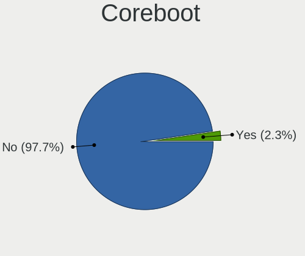
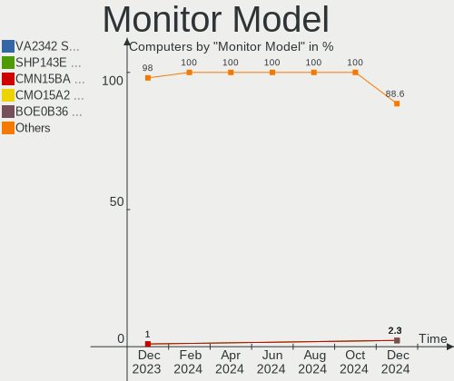
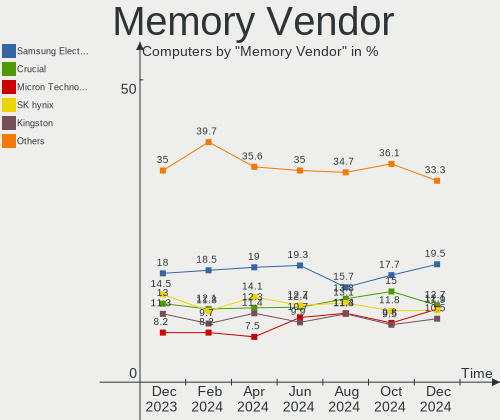

BSD Hardware Trends
-------------------

A project to identify most popular hardware characteristics and track their change
over time based on data collected by BSD users at https://BSD-Hardware.info.

Anyone can contribute to the study by uploading probes of their computers by
the [hw-probe](https://github.com/linuxhw/hw-probe/blob/master/INSTALL.BSD.md) tool:

    hw-probe -all -upload

This is a report for all computer types. See also reports for [desktops](/Desktop/README.md) and [notebooks](/Notebook/README.md).

Full-feature report is available here: https://bsd-hardware.info/?view=trends

OS-specific reports: [FreeBSD](/Dist/FreeBSD), [OpenBSD](/Dist/OpenBSD).

Period: Dec, 2020.

Contents
--------

- [ OS                       ](#os)
- [ OS Family                ](#os-family)
- [ Arch                     ](#arch)
- [ DE                       ](#de)
- [ Display Server           ](#display-server)
- [ Display Manager          ](#display-manager)
- [ OS Lang                  ](#os-lang)
- [ Boot Mode                ](#boot-mode)
- [ Filesystem               ](#filesystem)
- [ Part. scheme             ](#part-scheme)
- [ Country                  ](#country)
- [ City                     ](#city)
- [ Vendor                   ](#vendor)
- [ Model                    ](#model)
- [ Model Family             ](#model-family)
- [ MFG Year                 ](#mfg-year)
- [ Form Factor              ](#form-factor)
- [ Coreboot                 ](#coreboot)
- [ RAM Size                 ](#ram-size)
- [ RAM Used                 ](#ram-used)
- [ Has CD-ROM               ](#has-cd-rom)
- [ Total Drives             ](#total-drives)
- [ Has Ethernet             ](#has-ethernet)
- [ Drive Vendor             ](#drive-vendor)
- [ Drive Model              ](#drive-model)
- [ HDD Vendor               ](#hdd-vendor)
- [ SSD Vendor               ](#ssd-vendor)
- [ Drive Kind               ](#drive-kind)
- [ Drive Connector          ](#drive-connector)
- [ Drive Size               ](#drive-size)
- [ Space Total              ](#space-total)
- [ Space Used               ](#space-used)
- [ Malfunc. Drives          ](#malfunc-drives)
- [ Malfunc. Drive Vendor    ](#malfunc-drive-vendor)
- [ Malfunc. HDD Vendor      ](#malfunc-hdd-vendor)
- [ Malfunc. Drive Kind      ](#malfunc-drive-kind)
- [ Failed Drives            ](#failed-drives)
- [ Failed Drive Vendor      ](#failed-drive-vendor)
- [ Drive Status             ](#drive-status)
- [ Storage Vendor           ](#storage-vendor)
- [ Storage Model            ](#storage-model)
- [ Storage Kind             ](#storage-kind)
- [ CPU Vendor               ](#cpu-vendor)
- [ CPU Model                ](#cpu-model)
- [ CPU Model Family         ](#cpu-model-family)
- [ CPU Cores                ](#cpu-cores)
- [ CPU Sockets              ](#cpu-sockets)
- [ CPU Threads              ](#cpu-threads)
- [ CPU Microarch            ](#cpu-microarch)
- [ GPU Vendor               ](#gpu-vendor)
- [ GPU Model                ](#gpu-model)
- [ GPU Combo                ](#gpu-combo)
- [ GPU Driver               ](#gpu-driver)
- [ GPU Memory               ](#gpu-memory)
- [ Monitor Vendor           ](#monitor-vendor)
- [ Monitor Model            ](#monitor-model)
- [ Monitor Resolution       ](#monitor-resolution)
- [ Monitor Diagonal         ](#monitor-diagonal)
- [ Monitor Width            ](#monitor-width)
- [ Aspect Ratio             ](#aspect-ratio)
- [ Monitor Area             ](#monitor-area)
- [ Pixel Density            ](#pixel-density)
- [ Multiple Monitors        ](#multiple-monitors)
- [ Net Controller Vendor    ](#net-controller-vendor)
- [ Net Controller Model     ](#net-controller-model)
- [ Wireless Vendor          ](#wireless-vendor)
- [ Wireless Model           ](#wireless-model)
- [ Ethernet Vendor          ](#ethernet-vendor)
- [ Ethernet Model           ](#ethernet-model)
- [ Net Controller Kind      ](#net-controller-kind)
- [ Used Controller          ](#used-controller)
- [ NICs                     ](#nics)
- [ Memory Vendor            ](#memory-vendor)
- [ Memory Model             ](#memory-model)
- [ Memory Kind              ](#memory-kind)
- [ Memory Form Factor       ](#memory-form-factor)
- [ Memory Size              ](#memory-size)
- [ Memory Speed             ](#memory-speed)
- [ Sound Vendor             ](#sound-vendor)
- [ Sound Model              ](#sound-model)
- [ Camera Vendor            ](#camera-vendor)
- [ Camera Model             ](#camera-model)
- [ Fingerprint Vendor       ](#fingerprint-vendor)
- [ Fingerprint Model        ](#fingerprint-model)
- [ Chipcard Vendor          ](#chipcard-vendor)
- [ Chipcard Model           ](#chipcard-model)
- [ Printer Vendor           ](#printer-vendor)
- [ Printer Model            ](#printer-model)
- [ Scanner Vendor           ](#scanner-vendor)
- [ Scanner Model            ](#scanner-model)
- [ Bluetooth Vendor         ](#bluetooth-vendor)
- [ Bluetooth Model          ](#bluetooth-model)
- [ Unsupported Devices      ](#unsupported-devices)
- [ Unsupported Device Types ](#unsupported-device-types)

OS
--

Installed operating systems

| Name                          | Computers | Percent |
|-------------------------------|-----------|---------|
| FreeBSD 12.2-p2               | 50        | 25.25%  |
| FreeBSD 12.2                  | 34        | 17.17%  |
| OpenBSD 6.8                   | 20        | 10.1%   |
| GhostBSD 20.04.02             | 13        | 6.57%   |
| FreeBSD 13.0-CURRENT          | 11        | 5.56%   |
| FreeBSD 12.2-p1               | 9         | 4.55%   |
| pfSense 2.4.5                 | 7         | 3.54%   |
| NomadBSD 1.3.2                | 7         | 3.54%   |
| FreeBSD 12.1-p12              | 6         | 3.03%   |
| FreeBSD 12.1-p10              | 5         | 2.53%   |
| MidnightBSD 2.0.2             | 4         | 2.02%   |
| OPNsense 12.1--HBSD           | 3         | 1.52%   |
| FreeBSD 12.2-STABLE           | 3         | 1.52%   |
| FreeBSD 12.2-RC3              | 3         | 1.52%   |
| FreeBSD 12.1-STABLE           | 3         | 1.52%   |
| FreeBSD 12.1                  | 3         | 1.52%   |
| NetBSD 9.1                    | 2         | 1.01%   |
| NetBSD 9.0_STABLE             | 2         | 1.01%   |
| FreeBSD 12.1-p9               | 2         | 1.01%   |
| FreeBSD 12.1-p11              | 2         | 1.01%   |
| OPNsense 20.7.7               | 1         | 0.51%   |
| NetBSD 9.99.77                | 1         | 0.51%   |
| NetBSD 9.0                    | 1         | 0.51%   |
| HardenedBSD 13.0-CURRENT-HBSD | 1         | 0.51%   |
| HardenedBSD 12.2--HBSD        | 1         | 0.51%   |
| FreeNAS 11.4-p6               | 1         | 0.51%   |
| FreeNAS 11.3-p14              | 1         | 0.51%   |
| FreeBSD 12.1-p3               | 1         | 0.51%   |
| FreeBSD 11.4-p5               | 1         | 0.51%   |

OS Family
---------

OS without a version

| Name        | Computers | Percent |
|-------------|-----------|---------|
| FreeBSD     | 133       | 67.17%  |
| OpenBSD     | 20        | 10.1%   |
| GhostBSD    | 13        | 6.57%   |
| pfSense     | 7         | 3.54%   |
| NomadBSD    | 7         | 3.54%   |
| NetBSD      | 6         | 3.03%   |
| OPNsense    | 4         | 2.02%   |
| MidnightBSD | 4         | 2.02%   |
| HardenedBSD | 2         | 1.01%   |
| FreeNAS     | 2         | 1.01%   |

Arch
----

OS architecture (x86_64, i586, etc.)

| Name   | Computers | Percent |
|--------|-----------|---------|
| amd64  | 184       | 92.93%  |
| i386   | 10        | 5.05%   |
| macppc | 1         | 0.51%   |
| evbarm | 1         | 0.51%   |
| arm64  | 1         | 0.51%   |
| arm    | 1         | 0.51%   |

DE
--

Desktop Environment

| Name      | Computers | Percent |
|-----------|-----------|---------|
| Console   | 82        | 41.41%  |
| XFCE      | 20        | 10.1%   |
| MATE      | 19        | 9.6%    |
| fvwm      | 15        | 7.58%   |
| GNOME     | 14        | 7.07%   |
| Openbox   | 10        | 5.05%   |
| TWM       | 9         | 4.55%   |
| KDE5      | 9         | 4.55%   |
| i3        | 5         | 2.53%   |
| CDE       | 3         | 1.52%   |
| GNUstep   | 2         | 1.01%   |
| Fluxbox   | 2         | 1.01%   |
| Cinnamon  | 2         | 1.01%   |
| AwesomeWM | 2         | 1.01%   |
| spectrwm  | 1         | 0.51%   |
| LXDE      | 1         | 0.51%   |
| Lumina    | 1         | 0.51%   |
| KDE       | 1         | 0.51%   |

Display Server
--------------

X11 or Wayland

| Name    | Computers | Percent |
|---------|-----------|---------|
| X11     | 109       | 55.05%  |
| Console | 88        | 44.44%  |
| Wayland | 1         | 0.51%   |

Display Manager
---------------

SDDM, LightDM, etc.

| Name    | Computers | Percent |
|---------|-----------|---------|
| Console | 125       | 63.13%  |
| SDDM    | 19        | 9.6%    |
| LightDM | 19        | 9.6%    |
| SLiM    | 16        | 8.08%   |
| XDM     | 9         | 4.55%   |
| GDM     | 8         | 4.04%   |
| Ly      | 2         | 1.01%   |

OS Lang
-------

Language

| Lang            | Computers | Percent |
|-----------------|-----------|---------|
| Unknown         | 109       | 55.05%  |
| en_US           | 49        | 24.75%  |
| ru_RU           | 6         | 3.03%   |
| C               | 6         | 3.03%   |
| C               | 6         | 3.03%   |
| de_DE           | 4         | 2.02%   |
| fr_FR           | 3         | 1.52%   |
| nb_NO           | 2         | 1.01%   |
| en_SG           | 2         | 1.01%   |
| en_GB           | 2         | 1.01%   |
| zh_CN           | 1         | 0.51%   |
| pt_BR           | 1         | 0.51%   |
| hu_HU           | 1         | 0.51%   |
| fi_FI           | 1         | 0.51%   |
| en_NZ           | 1         | 0.51%   |
| en_IE           | 1         | 0.51%   |
| en_GB.US-ASCII  | 1         | 0.51%   |
| en_GB.ISO8859-1 | 1         | 0.51%   |
| en_AU           | 1         | 0.51%   |

Boot Mode
---------

EFI or BIOS

| Mode | Computers | Percent |
|------|-----------|---------|
| EFI  | 111       | 56.06%  |
| BIOS | 87        | 43.94%  |

Filesystem
----------

Type of filesystem

| Type | Computers | Percent |
|------|-----------|---------|
| Zfs  | 112       | 56.57%  |
| Ufs  | 65        | 32.83%  |
| Ffs  | 20        | 10.1%   |
| Xfs  | 1         | 0.51%   |

Part. scheme
------------

Scheme of partitioning

| Type    | Computers | Percent |
|---------|-----------|---------|
| GPT     | 160       | 80.81%  |
| MBR     | 32        | 16.16%  |
| Unknown | 5         | 2.53%   |
| BSD     | 1         | 0.51%   |

Country
-------

Geographic location (country)

| Country        | Computers | Percent |
|----------------|-----------|---------|
| USA            | 66        | 33.33%  |
| Germany        | 21        | 10.61%  |
| Russia         | 15        | 7.58%   |
| UK             | 10        | 5.05%   |
| Australia      | 8         | 4.04%   |
| Poland         | 7         | 3.54%   |
| Norway         | 6         | 3.03%   |
| Canada         | 6         | 3.03%   |
| Greece         | 5         | 2.53%   |
| France         | 5         | 2.53%   |
| Ukraine        | 4         | 2.02%   |
| Hungary        | 4         | 2.02%   |
| Singapore      | 3         | 1.52%   |
| Philippines    | 3         | 1.52%   |
| Argentina      | 3         | 1.52%   |
| Switzerland    | 2         | 1.01%   |
| Spain          | 2         | 1.01%   |
| Japan          | 2         | 1.01%   |
| Italy          | 2         | 1.01%   |
| Denmark        | 2         | 1.01%   |
| Czech Republic | 2         | 1.01%   |
| Brazil         | 2         | 1.01%   |
| Austria        | 2         | 1.01%   |
| Taiwan         | 1         | 0.51%   |
| Sweden         | 1         | 0.51%   |
| Slovakia       | 1         | 0.51%   |
| Serbia         | 1         | 0.51%   |
| New Zealand    | 1         | 0.51%   |
| Malaysia       | 1         | 0.51%   |
| Luxembourg     | 1         | 0.51%   |
| Ireland        | 1         | 0.51%   |
| India          | 1         | 0.51%   |
| Hong Kong      | 1         | 0.51%   |
| Honduras       | 1         | 0.51%   |
| Guadeloupe     | 1         | 0.51%   |
| Finland        | 1         | 0.51%   |
| Colombia       | 1         | 0.51%   |
| Belgium        | 1         | 0.51%   |
| Bangladesh     | 1         | 0.51%   |

City
----

Geographic location (city)

| City                 | Computers | Percent |
|----------------------|-----------|---------|
| Sydney               | 5         | 2.53%   |
| Moscow               | 5         | 2.53%   |
| Ypsilanti            | 4         | 2.02%   |
| St Petersburg        | 4         | 2.02%   |
| Krasnoyarsk          | 4         | 2.02%   |
| City of Saint Peters | 4         | 2.02%   |
| Singapore            | 3         | 1.52%   |
| Portland             | 3         | 1.52%   |
| Gardony              | 3         | 1.52%   |
| Frankfurt am Main    | 3         | 1.52%   |
| Athens               | 3         | 1.52%   |
| Warsaw               | 2         | 1.01%   |
| Toronto              | 2         | 1.01%   |
| Salem                | 2         | 1.01%   |
| Rustington           | 2         | 1.01%   |
| Raleigh              | 2         | 1.01%   |
| Omaha                | 2         | 1.01%   |
| New Braunfels        | 2         | 1.01%   |
| Nantes               | 2         | 1.01%   |
| London               | 2         | 1.01%   |
| Krakow               | 2         | 1.01%   |
| Kitchener            | 2         | 1.01%   |
| Kalvag               | 2         | 1.01%   |
| Heddesheim           | 2         | 1.01%   |
| Hamilton             | 2         | 1.01%   |
| Glasgow              | 2         | 1.01%   |
| Charlotte            | 2         | 1.01%   |
| Berlin               | 2         | 1.01%   |
| Český Těšín     | 1         | 0.51%   |
| Zaporizhia           | 1         | 0.51%   |
| Wolfsburg            | 1         | 0.51%   |
| Williamsport         | 1         | 0.51%   |
| Washington           | 1         | 0.51%   |
| Versmold             | 1         | 0.51%   |
| Vari                 | 1         | 0.51%   |
| Urbana               | 1         | 0.51%   |
| Tychy                | 1         | 0.51%   |
| Tromsø              | 1         | 0.51%   |
| Tolyatti             | 1         | 0.51%   |
| Tokyo                | 1         | 0.51%   |
| The Bronx            | 1         | 0.51%   |
| Tegucigalpa          | 1         | 0.51%   |
| Taoyuan District     | 1         | 0.51%   |
| São Paulo           | 1         | 0.51%   |
| Szigetszentmiklos    | 1         | 0.51%   |
| Stavanger            | 1         | 0.51%   |
| St Kilda             | 1         | 0.51%   |
| Springfield          | 1         | 0.51%   |
| Soreide              | 1         | 0.51%   |
| Somerset             | 1         | 0.51%   |
| Sokal'               | 1         | 0.51%   |
| Smyrna               | 1         | 0.51%   |
| Shinnston            | 1         | 0.51%   |
| Sevastopol           | 1         | 0.51%   |
| Seraing              | 1         | 0.51%   |
| Saro                 | 1         | 0.51%   |
| Santa Rosa           | 1         | 0.51%   |
| San Marcos           | 1         | 0.51%   |
| Salzano              | 1         | 0.51%   |
| Rotherham            | 1         | 0.51%   |

Vendor
------

Motherboard manufacturer

| Name                | Computers | Percent |
|---------------------|-----------|---------|
| Lenovo              | 37        | 18.69%  |
| ASUSTek Computer    | 21        | 10.61%  |
| Hewlett-Packard     | 20        | 10.1%   |
| Supermicro          | 18        | 9.09%   |
| Dell                | 16        | 8.08%   |
| Gigabyte Technology | 12        | 6.06%   |
| ASRock              | 11        | 5.56%   |
| Unknown             | 9         | 4.55%   |
| Acer                | 7         | 3.54%   |
| MSI                 | 6         | 3.03%   |
| Apple               | 5         | 2.53%   |
| Intel               | 4         | 2.02%   |
| Toshiba             | 3         | 1.52%   |
| Sony                | 2         | 1.01%   |
| Samsung Electronics | 2         | 1.01%   |
| PC Engines          | 2         | 1.01%   |
| Panasonic           | 2         | 1.01%   |
| Foxconn             | 2         | 1.01%   |
| AWOW                | 2         | 1.01%   |
| ASRockRack          | 2         | 1.01%   |
| Wistron             | 1         | 0.51%   |
| TYAN Computer       | 1         | 0.51%   |
| Pegatron            | 1         | 0.51%   |
| PC Specialist       | 1         | 0.51%   |
| Notebook            | 1         | 0.51%   |
| Netgate             | 1         | 0.51%   |
| IBM                 | 1         | 0.51%   |
| HPE                 | 1         | 0.51%   |
| HARDKERNEL          | 1         | 0.51%   |
| Fujitsu Siemens     | 1         | 0.51%   |
| Fujitsu             | 1         | 0.51%   |
| Eluktronics         | 1         | 0.51%   |
| Clevo               | 1         | 0.51%   |
| Centerm             | 1         | 0.51%   |
| AMI                 | 1         | 0.51%   |

Model
-----

Motherboard model

| Name                                     | Computers | Percent |
|------------------------------------------|-----------|---------|
| Unknown                                  | 10        | 5.05%   |
| Supermicro Super Server                  | 5         | 2.53%   |
| Supermicro X7SPA-HF                      | 2         | 1.01%   |
| PC Engines APU2                          | 2         | 1.01%   |
| HP ProLiant MicroServer                  | 2         | 1.01%   |
| Dell PowerEdge R610                      | 2         | 1.01%   |
| AWOW PC BOX                              | 2         | 1.01%   |
| ASUS TUF GAMING B450M-PLUS II            | 2         | 1.01%   |
| ASUS All Series                          | 2         | 1.01%   |
| Wistron ProLiant ML110 G6                | 1         | 0.51%   |
| TYAN Intel 440BX/GX Rev. 4               | 1         | 0.51%   |
| Toshiba Satellite L50-C                  | 1         | 0.51%   |
| Toshiba Satellite C855                   | 1         | 0.51%   |
| Toshiba Satellite C655D                  | 1         | 0.51%   |
| Supermicro X9SPV-F/LN4F                  | 1         | 0.51%   |
| Supermicro X8STi                         | 1         | 0.51%   |
| Supermicro X11DDW-L                      | 1         | 0.51%   |
| Supermicro X10SLL-F                      | 1         | 0.51%   |
| Supermicro X10SLH-F/X10SLM+-F            | 1         | 0.51%   |
| Supermicro X10SAE                        | 1         | 0.51%   |
| Supermicro SYS-5019S-ML                  | 1         | 0.51%   |
| Supermicro SYS-5018R-M                   | 1         | 0.51%   |
| Supermicro Icebreaker 4824               | 1         | 0.51%   |
| Supermicro C7Z270-CG-L                   | 1         | 0.51%   |
| Supermicro A1SAi                         | 1         | 0.51%   |
| Sony VPCCB17FG                           | 1         | 0.51%   |
| Sony SVP1321V9RB                         | 1         | 0.51%   |
| Samsung N145P/N250P/N260P                | 1         | 0.51%   |
| Samsung N140                             | 1         | 0.51%   |
| Pegatron T12Ah                           | 1         | 0.51%   |
| PC Specialist Recoil II                  | 1         | 0.51%   |
| Panasonic CFMX4-1                        | 1         | 0.51%   |
| Panasonic CF-19AHNC8FN                   | 1         | 0.51%   |
| Notebook N7x0WU                          | 1         | 0.51%   |
| Netgate SG-5100                          | 1         | 0.51%   |
| MSI X460/X460DX                          | 1         | 0.51%   |
| MSI MS-7B48                              | 1         | 0.51%   |
| MSI MS-7846                              | 1         | 0.51%   |
| MSI MS-7757                              | 1         | 0.51%   |
| MSI MS-7576                              | 1         | 0.51%   |
| MSI GP60 2PE                             | 1         | 0.51%   |
| Lenovo Yoga 2 13 20344                   | 1         | 0.51%   |
| Lenovo Y50-70 20378                      | 1         | 0.51%   |
| Lenovo ThinkPad X380 Yoga 20LJ000WUK     | 1         | 0.51%   |
| Lenovo ThinkPad X250 20CLS8S900          | 1         | 0.51%   |
| Lenovo ThinkPad X250 20CLS02000          | 1         | 0.51%   |
| Lenovo ThinkPad X240 20AMS0RR00          | 1         | 0.51%   |
| Lenovo ThinkPad X230 23244A9             | 1         | 0.51%   |
| Lenovo ThinkPad X220 42872VU             | 1         | 0.51%   |
| Lenovo ThinkPad X201 Tablet 311396U      | 1         | 0.51%   |
| Lenovo ThinkPad X201 3680FAG             | 1         | 0.51%   |
| Lenovo ThinkPad X200s 7470A98            | 1         | 0.51%   |
| Lenovo ThinkPad X1 Yoga 3rd 20LDS1CG00   | 1         | 0.51%   |
| Lenovo ThinkPad X1 Extreme 20MF000BUS    | 1         | 0.51%   |
| Lenovo ThinkPad X1 Carbon 7th 20QD003MGE | 1         | 0.51%   |
| Lenovo ThinkPad X1 Carbon 6th 20KG0022US | 1         | 0.51%   |
| Lenovo ThinkPad X1 Carbon 4th 20FC0019AU | 1         | 0.51%   |
| Lenovo ThinkPad W500 4063HK6             | 1         | 0.51%   |
| Lenovo ThinkPad T490 20RYS06R00          | 1         | 0.51%   |
| Lenovo ThinkPad T490 20N3X50500          | 1         | 0.51%   |

Model Family
------------

Motherboard model prefix

| Name                    | Computers | Percent |
|-------------------------|-----------|---------|
| Lenovo ThinkPad         | 29        | 14.65%  |
| Unknown                 | 10        | 5.05%   |
| ASUS TUF                | 6         | 3.03%   |
| Supermicro Super        | 5         | 2.53%   |
| Dell PowerEdge          | 5         | 2.53%   |
| ASUS PRIME              | 5         | 2.53%   |
| Acer Aspire             | 5         | 2.53%   |
| Lenovo IdeaPad          | 4         | 2.02%   |
| HP ProLiant             | 4         | 2.02%   |
| Dell OptiPlex           | 4         | 2.02%   |
| Toshiba Satellite       | 3         | 1.52%   |
| HP Compaq               | 3         | 1.52%   |
| Dell Latitude           | 3         | 1.52%   |
| ASRock X570             | 3         | 1.52%   |
| Supermicro X7SPA-HF     | 2         | 1.01%   |
| PC Engines apu2         | 2         | 1.01%   |
| HP ProDesk              | 2         | 1.01%   |
| Dell XPS                | 2         | 1.01%   |
| AWOW PC                 | 2         | 1.01%   |
| ASUS All                | 2         | 1.01%   |
| Wistron ProLiant        | 1         | 0.51%   |
| TYAN Intel              | 1         | 0.51%   |
| Supermicro X9SPV-F      | 1         | 0.51%   |
| Supermicro X8STi        | 1         | 0.51%   |
| Supermicro X11DDW-L     | 1         | 0.51%   |
| Supermicro X10SLL-F     | 1         | 0.51%   |
| Supermicro X10SLH-F     | 1         | 0.51%   |
| Supermicro X10SAE       | 1         | 0.51%   |
| Supermicro SYS-5019S-ML | 1         | 0.51%   |
| Supermicro SYS-5018R-M  | 1         | 0.51%   |
| Supermicro Icebreaker   | 1         | 0.51%   |
| Supermicro C7Z270-CG-L  | 1         | 0.51%   |
| Supermicro A1SAi        | 1         | 0.51%   |
| Sony VPCCB17FG          | 1         | 0.51%   |
| Sony SVP1321V9RB        | 1         | 0.51%   |
| Samsung N145P           | 1         | 0.51%   |
| Samsung N140            | 1         | 0.51%   |
| Pegatron T12Ah          | 1         | 0.51%   |
| PC Specialist Recoil    | 1         | 0.51%   |
| Panasonic CFMX4-1       | 1         | 0.51%   |
| Panasonic CF-19AHNC8FN  | 1         | 0.51%   |
| Notebook N7x0WU         | 1         | 0.51%   |
| Netgate SG-5100         | 1         | 0.51%   |
| MSI X460                | 1         | 0.51%   |
| MSI MS-7B48             | 1         | 0.51%   |
| MSI MS-7846             | 1         | 0.51%   |
| MSI MS-7757             | 1         | 0.51%   |
| MSI MS-7576             | 1         | 0.51%   |
| MSI GP60                | 1         | 0.51%   |
| Lenovo Yoga             | 1         | 0.51%   |
| Lenovo Y50-70           | 1         | 0.51%   |
| Lenovo ThinkCentre      | 1         | 0.51%   |
| Lenovo G50-80           | 1         | 0.51%   |
| Intel S5000PSL          | 1         | 0.51%   |
| Intel Q3XXG4-P          | 1         | 0.51%   |
| Intel NUC8i5BEH         | 1         | 0.51%   |
| Intel NUC5i5RYB         | 1         | 0.51%   |
| IBM ThinkPad            | 1         | 0.51%   |
| HPE ProLiant            | 1         | 0.51%   |
| HP Z600                 | 1         | 0.51%   |

MFG Year
--------

Motherboard manufacture year

| Year    | Computers | Percent |
|---------|-----------|---------|
| 2020    | 34        | 17.17%  |
| 2019    | 29        | 14.65%  |
| 2018    | 25        | 12.63%  |
| 2013    | 14        | 7.07%   |
| 2015    | 13        | 6.57%   |
| 2011    | 13        | 6.57%   |
| 2010    | 12        | 6.06%   |
| 2014    | 11        | 5.56%   |
| 2017    | 10        | 5.05%   |
| 2016    | 10        | 5.05%   |
| 2012    | 9         | 4.55%   |
| Unknown | 8         | 4.04%   |
| 2009    | 3         | 1.52%   |
| 2008    | 2         | 1.01%   |
| 2005    | 2         | 1.01%   |
| 2007    | 1         | 0.51%   |
| 2006    | 1         | 0.51%   |
| 2004    | 1         | 0.51%   |

Form Factor
-----------

Physical design of the computer

| Name        | Computers | Percent |
|-------------|-----------|---------|
| Desktop     | 106       | 53.54%  |
| Notebook    | 64        | 32.32%  |
| Server      | 17        | 8.59%   |
| Mini pc     | 5         | 2.53%   |
| Convertible | 3         | 1.52%   |
| All in one  | 2         | 1.01%   |
| Other       | 1         | 0.51%   |

Coreboot
--------

Have coreboot on board

| Used | Computers | Percent |
|------|-----------|---------|
| No   | 194       | 97.98%  |
| Yes  | 4         | 2.02%   |

RAM Size
--------

Total RAM memory

| Size in GB      | Computers | Percent |
|-----------------|-----------|---------|
| 8.01-16.0       | 54        | 27.27%  |
| 16.01-24.0      | 45        | 22.73%  |
| 32.01-64.0      | 30        | 15.15%  |
| 4.01-8.0        | 27        | 13.64%  |
| 64.01-256.0     | 12        | 6.06%   |
| 2.01-3.0        | 8         | 4.04%   |
| 24.01-32.0      | 7         | 3.54%   |
| 0.51-1.0        | 6         | 3.03%   |
| 3.01-4.0        | 3         | 1.52%   |
| More than 256.0 | 2         | 1.01%   |
| 1.01-2.0        | 2         | 1.01%   |
| 0.01-0.5        | 2         | 1.01%   |

RAM Used
--------

Used RAM memory

| Used GB         | Computers | Percent |
|-----------------|-----------|---------|
| 0.01-0.5        | 75        | 37.88%  |
| 0.51-1.0        | 55        | 27.78%  |
| 1.01-2.0        | 24        | 12.12%  |
| 4.01-8.0        | 8         | 4.04%   |
| 2.01-3.0        | 6         | 3.03%   |
| 8.01-16.0       | 6         | 3.03%   |
| Unknown         | 6         | 3.03%   |
| 16.01-24.0      | 5         | 2.53%   |
| 24.01-32.0      | 4         | 2.02%   |
| 32.01-64.0      | 3         | 1.52%   |
| 3.01-4.0        | 2         | 1.01%   |
| 64.01-256.0     | 2         | 1.01%   |
| More than 256.0 | 1         | 0.51%   |
| 0               | 1         | 0.51%   |

Has CD-ROM
----------

Has CD-ROM on board

| Presented | Computers | Percent |
|-----------|-----------|---------|
| No        | 161       | 81.31%  |
| Yes       | 37        | 18.69%  |

Total Drives
------------

Number of drives on board

| Drives | Computers | Percent |
|--------|-----------|---------|
| 1      | 89        | 44.95%  |
| 2      | 35        | 17.68%  |
| 3      | 17        | 8.59%   |
| 4      | 16        | 8.08%   |
| 5      | 10        | 5.05%   |
| 0      | 7         | 3.54%   |
| 7      | 6         | 3.03%   |
| 6      | 6         | 3.03%   |
| 8      | 4         | 2.02%   |
| 14     | 2         | 1.01%   |
| 12     | 2         | 1.01%   |
| 10     | 2         | 1.01%   |
| 17     | 1         | 0.51%   |
| 13     | 1         | 0.51%   |

Has Ethernet
------------

Has Ethernet on board

| Presented | Computers | Percent |
|-----------|-----------|---------|
| Yes       | 185       | 93.43%  |
| No        | 13        | 6.57%   |

Drive Vendor
------------

Hard drive vendors

| Vendor              | Computers | Drives | Percent |
|---------------------|-----------|--------|---------|
| WDC                 | 65        | 152    | 20.83%  |
| Seagate             | 40        | 86     | 12.82%  |
| Samsung Electronics | 39        | 56     | 12.5%   |
| SanDisk             | 20        | 21     | 6.41%   |
| Toshiba             | 19        | 26     | 6.09%   |
| Intel               | 18        | 24     | 5.77%   |
| Kingston            | 16        | 16     | 5.13%   |
| Crucial             | 12        | 12     | 3.85%   |
| Hitachi             | 10        | 23     | 3.21%   |
| Phison              | 6         | 7      | 1.92%   |
| NVMe                | 6         | 7      | 1.92%   |
| HGST                | 6         | 17     | 1.92%   |
| Hewlett-Packard     | 5         | 13     | 1.6%    |
| SK Hynix            | 4         | 4      | 1.28%   |
| PNY                 | 4         | 5      | 1.28%   |
| A-DATA Technology   | 4         | 5      | 1.28%   |
| Mushkin             | 3         | 4      | 0.96%   |
| Micron Technology   | 3         | 6      | 0.96%   |
| KingSpec            | 3         | 3      | 0.96%   |
| Transcend           | 2         | 2      | 0.64%   |
| PLEXTOR             | 2         | 2      | 0.64%   |
| Hoodisk             | 2         | 2      | 0.64%   |
| Apple               | 2         | 2      | 0.64%   |
| Apacer              | 2         | 2      | 0.64%   |
| Zheino              | 1         | 1      | 0.32%   |
| WD MediaMax         | 1         | 3      | 0.32%   |
| Team                | 1         | 1      | 0.32%   |
| SPCC                | 1         | 1      | 0.32%   |
| Silicon Motion      | 1         | 1      | 0.32%   |
| SATADOM             | 1         | 2      | 0.32%   |
| QUANTUM             | 1         | 1      | 0.32%   |
| OWC                 | 1         | 4      | 0.32%   |
| OPENBSD             | 1         | 1      | 0.32%   |
| Maxtor              | 1         | 4      | 0.32%   |
| LITEONIT            | 1         | 1      | 0.32%   |
| Lenovo              | 1         | 1      | 0.32%   |
| JetFlash            | 1         | 1      | 0.32%   |
| Hikvision           | 1         | 1      | 0.32%   |
| Gigabyte Technology | 1         | 1      | 0.32%   |
| Fujitsu             | 1         | 1      | 0.32%   |
| FORESEE             | 1         | 1      | 0.32%   |
| Corsair             | 1         | 1      | 0.32%   |
| Adaptec             | 1         | 7      | 0.32%   |

Drive Model
-----------

Hard drive models

| Model                            | Computers | Percent |
|----------------------------------|-----------|---------|
| WDC WD40EFRX-68N32N0 4TB         | 7         | 1.88%   |
| Seagate ST4000DM000-1F2168 4TB   | 6         | 1.61%   |
| WDC WDS240G2G0A-00JH30 240GB     | 4         | 1.07%   |
| WDC WD40EFRX-68WT0N0 4TB         | 4         | 1.07%   |
| Seagate ST8000VN0022-2EL112 8TB  | 4         | 1.07%   |
| Samsung SSD 860 EVO 500GB        | 4         | 1.07%   |
| Samsung HD204UI 2TB              | 4         | 1.07%   |
| WDC WD30EFRX-68EUZN0 3TB         | 3         | 0.8%    |
| Toshiba DT01ACA100 1TB           | 3         | 0.8%    |
| Samsung SSD 970 PRO 512GB        | 3         | 0.8%    |
| Crucial CT500MX500SSD1 500GB     | 3         | 0.8%    |
| WDC WDS500G2B0B-00YS70 500GB     | 2         | 0.54%   |
| WDC WDS250G2B0A-00SM50 250GB     | 2         | 0.54%   |
| WDC WDS240G2G0B-00EPW0 240GB     | 2         | 0.54%   |
| WDC WD40EZRZ-22GXCB0 4TB         | 2         | 0.54%   |
| WDC WD20EZRX-00D8PB0 2TB         | 2         | 0.54%   |
| WDC WD20EARX-00PASB0 2TB         | 2         | 0.54%   |
| WDC WD10EFRX-68PJCN0 1TB         | 2         | 0.54%   |
| WDC WD100EMAZ-00WJTA0 10TB       | 2         | 0.54%   |
| Toshiba MQ01ABF050 500GB         | 2         | 0.54%   |
| Seagate ST4000VN008-2DR166 4TB   | 2         | 0.54%   |
| Seagate ST4000DM004-2CV104 4TB   | 2         | 0.54%   |
| Seagate ST3500413AS 500GB        | 2         | 0.54%   |
| Seagate ST31000528AS 1TB         | 2         | 0.54%   |
| Seagate ST2000DM001-1CH164 2TB   | 2         | 0.54%   |
| SanDisk SSD PLUS 120GB           | 2         | 0.54%   |
| SanDisk SDSSDA240G 240GB         | 2         | 0.54%   |
| SanDisk pSSD 128GB               | 2         | 0.54%   |
| Samsung SSD 970 EVO Plus 1TB     | 2         | 0.54%   |
| Samsung SSD 860 QVO 1TB          | 2         | 0.54%   |
| Samsung SSD 860 EVO 250GB        | 2         | 0.54%   |
| Samsung SSD 850 EVO M.2 250GB    | 2         | 0.54%   |
| Samsung SSD 840 EVO 250GB        | 2         | 0.54%   |
| Samsung SSD 750 EVO 250GB        | 2         | 0.54%   |
| Samsung MZVLB256HBHQ-000L7 256GB | 2         | 0.54%   |
| NVMe WDC PC SN730 SDB 512GB      | 2         | 0.54%   |
| NVMe Samsung SSD 970 1TB         | 2         | 0.54%   |
| Kingston SV300S37A120G 120GB     | 2         | 0.54%   |
| Kingston SA400S37120G 120GB      | 2         | 0.54%   |
| Intel SSDSC2KG480G8 480GB        | 2         | 0.54%   |
| Intel MEMPEK1W016GA 16GB         | 2         | 0.54%   |
| Hitachi HUA722020ALA330 2TB      | 2         | 0.54%   |
| Hitachi HDS721010CLA332 1TB      | 2         | 0.54%   |
| Crucial M4-CT064M4SSD2 64GB      | 2         | 0.54%   |
| Crucial CT240BX500SSD1 240GB     | 2         | 0.54%   |
| Crucial CT1000MX500SSD1 1TB      | 2         | 0.54%   |
| Zheino CHN-mSATAM3-256 256GB     | 1         | 0.27%   |
| WDC WDS500G2B0A-00SM50 500GB     | 1         | 0.27%   |
| WDC WDS256G1X0C-00ENX0 256GB     | 1         | 0.27%   |
| WDC WDS120G2G0B-00EPW0 120GB     | 1         | 0.27%   |
| WDC WDS120G2G0A-00JH30 120GB     | 1         | 0.27%   |
| WDC WDS100T3X0C-00SJG0 1TB       | 1         | 0.27%   |
| WDC WDBNCE2500PNC 250GB          | 1         | 0.27%   |
| WDC WD80PURZ-85YNPY0 8TB         | 1         | 0.27%   |
| WDC WD80EMAZ-00WJTA0 8TB         | 1         | 0.27%   |
| WDC WD80EFZX-68UW8N0 8TB         | 1         | 0.27%   |
| WDC WD80EFAX-68LHPN0 8TB         | 1         | 0.27%   |
| WDC WD80EFAX-68KNBN0 8TB         | 1         | 0.27%   |
| WDC WD800JB-00JJC0 80GB          | 1         | 0.27%   |
| WDC WD800EB-00DJF0 80GB          | 1         | 0.27%   |

HDD Vendor
----------

Hard disk drive vendors

| Vendor              | Computers | Drives | Percent |
|---------------------|-----------|--------|---------|
| WDC                 | 54        | 131    | 36.73%  |
| Seagate             | 40        | 86     | 27.21%  |
| Toshiba             | 14        | 21     | 9.52%   |
| Hitachi             | 10        | 23     | 6.8%    |
| Samsung Electronics | 7         | 15     | 4.76%   |
| HGST                | 6         | 17     | 4.08%   |
| NVMe                | 4         | 4      | 2.72%   |
| Hewlett-Packard     | 4         | 12     | 2.72%   |
| WD MediaMax         | 1         | 3      | 0.68%   |
| QUANTUM             | 1         | 1      | 0.68%   |
| OPENBSD             | 1         | 1      | 0.68%   |
| Maxtor              | 1         | 4      | 0.68%   |
| JetFlash            | 1         | 1      | 0.68%   |
| Fujitsu             | 1         | 1      | 0.68%   |
| Apple               | 1         | 1      | 0.68%   |
| Adaptec             | 1         | 7      | 0.68%   |

SSD Vendor
----------

Solid state drive vendors

| Vendor              | Computers | Drives | Percent |
|---------------------|-----------|--------|---------|
| Samsung Electronics | 23        | 28     | 17.29%  |
| SanDisk             | 19        | 20     | 14.29%  |
| Kingston            | 16        | 16     | 12.03%  |
| WDC                 | 13        | 15     | 9.77%   |
| Intel               | 13        | 17     | 9.77%   |
| Crucial             | 11        | 11     | 8.27%   |
| PNY                 | 3         | 4      | 2.26%   |
| Phison              | 3         | 4      | 2.26%   |
| KingSpec            | 3         | 3      | 2.26%   |
| Transcend           | 2         | 2      | 1.5%    |
| Toshiba             | 2         | 2      | 1.5%    |
| SK Hynix            | 2         | 2      | 1.5%    |
| PLEXTOR             | 2         | 2      | 1.5%    |
| NVMe                | 2         | 2      | 1.5%    |
| Mushkin             | 2         | 2      | 1.5%    |
| Micron Technology   | 2         | 5      | 1.5%    |
| Hoodisk             | 2         | 2      | 1.5%    |
| Apacer              | 2         | 2      | 1.5%    |
| A-DATA Technology   | 2         | 3      | 1.5%    |
| Zheino              | 1         | 1      | 0.75%   |
| Team                | 1         | 1      | 0.75%   |
| SPCC                | 1         | 1      | 0.75%   |
| SATADOM             | 1         | 2      | 0.75%   |
| OWC                 | 1         | 4      | 0.75%   |
| LITEONIT            | 1         | 1      | 0.75%   |
| Hikvision           | 1         | 1      | 0.75%   |
| FORESEE             | 1         | 1      | 0.75%   |
| Apple               | 1         | 1      | 0.75%   |

Drive Kind
----------

HDD or SSD

| Kind | Computers | Drives | Percent |
|------|-----------|--------|---------|
| SSD  | 114       | 155    | 44.36%  |
| HDD  | 104       | 328    | 40.47%  |
| NVMe | 39        | 48     | 15.18%  |

Drive Connector
---------------

SATA, SAS, NVMe, etc.

| Type | Computers | Drives | Percent |
|------|-----------|--------|---------|
| SATA | 175       | 483    | 81.78%  |
| NVMe | 39        | 48     | 18.22%  |

Drive Size
----------

Size of hard drive

| Size in TB | Computers | Drives | Percent |
|------------|-----------|--------|---------|
| 0.01-0.5   | 141       | 208    | 58.02%  |
| 0.51-1.0   | 37        | 71     | 15.23%  |
| 3.01-4.0   | 20        | 68     | 8.23%   |
| 1.01-2.0   | 20        | 57     | 8.23%   |
| 4.01-10.0  | 17        | 57     | 7%      |
| 2.01-3.0   | 6         | 16     | 2.47%   |
| 10.01-20.0 | 2         | 6      | 0.82%   |

Space Total
-----------

Amount of disk space available on the file system

| Size in GB     | Computers | Percent |
|----------------|-----------|---------|
| 101-250        | 70        | 35.35%  |
| 251-500        | 46        | 23.23%  |
| 1-20           | 27        | 13.64%  |
| 51-100         | 19        | 9.6%    |
| 501-1000       | 17        | 8.59%   |
| 21-50          | 7         | 3.54%   |
| 1001-2000      | 6         | 3.03%   |
| More than 3000 | 3         | 1.52%   |
| 2001-3000      | 2         | 1.01%   |
| Unknown        | 1         | 0.51%   |

Space Used
----------

Amount of used disk space

| Used GB   | Computers | Percent |
|-----------|-----------|---------|
| 1-20      | 151       | 76.26%  |
| 21-50     | 20        | 10.1%   |
| 51-100    | 12        | 6.06%   |
| 101-250   | 6         | 3.03%   |
| 501-1000  | 4         | 2.02%   |
| 251-500   | 2         | 1.01%   |
| 1001-2000 | 2         | 1.01%   |
| Unknown   | 1         | 0.51%   |

Malfunc. Drives
---------------

Drive models with a malfunction

| Model                                      | Computers | Drives | Percent |
|--------------------------------------------|-----------|--------|---------|
| WDC WDS240G2G0A-00JH30 240GB               | 2         | 2      | 3.85%   |
| WDC WD30EFRX-68EUZN0 3TB                   | 2         | 7      | 3.85%   |
| Seagate ST3500413AS 500GB                  | 2         | 2      | 3.85%   |
| Hitachi HDS721010CLA332 1TB                | 2         | 2      | 3.85%   |
| WDC WD800JB-00JJC0 80GB                    | 1         | 1      | 1.92%   |
| WDC WD6002FRYZ-01WD5B1 6TB                 | 1         | 1      | 1.92%   |
| WDC WD5000AAKX-221CA1 500GB                | 1         | 1      | 1.92%   |
| WDC WD40EFRX-68WT0N0 4TB                   | 1         | 1      | 1.92%   |
| WDC WD3200BPVT-75JJ5T0 320GB               | 1         | 1      | 1.92%   |
| WDC WD2500AAKS-60L9A0 250GB                | 1         | 1      | 1.92%   |
| WDC WD20EARX-008FB0 2TB                    | 1         | 1      | 1.92%   |
| WDC WD2000JB-00GVC0 200GB                  | 1         | 1      | 1.92%   |
| WDC WD1200JS-00MHB1 120GB                  | 1         | 1      | 1.92%   |
| WDC WD1200BB-00HTA0 120GB                  | 1         | 2      | 1.92%   |
| WDC WD10EFRX-68PJCN0 1TB                   | 1         | 2      | 1.92%   |
| WDC WD1003FBYX-88 LEN 1TB                  | 1         | 1      | 1.92%   |
| WD MediaMax WL2000GSA6454 2TB              | 1         | 3      | 1.92%   |
| Toshiba MQ01ABF050 500GB                   | 1         | 1      | 1.92%   |
| Toshiba MQ01ABD100 1TB                     | 1         | 1      | 1.92%   |
| Toshiba MK6006GAH 64GB                     | 1         | 1      | 1.92%   |
| Toshiba MK3265GSXN 320GB                   | 1         | 1      | 1.92%   |
| Seagate ST9320423AS 320GB                  | 1         | 1      | 1.92%   |
| Seagate ST500VT000-1DK142 500GB            | 1         | 1      | 1.92%   |
| Seagate ST500LM021-1KJ152 500GB            | 1         | 1      | 1.92%   |
| Seagate ST4000DM000-1F2168 4TB             | 1         | 1      | 1.92%   |
| Seagate ST3500418AS 500GB                  | 1         | 2      | 1.92%   |
| Seagate ST32000542AS 2TB                   | 1         | 1      | 1.92%   |
| Seagate ST31000528AS 1TB                   | 1         | 1      | 1.92%   |
| Seagate ST3000VN007-2E4166 3TB             | 1         | 1      | 1.92%   |
| Seagate ST2000DL003-9VT166 2TB             | 1         | 1      | 1.92%   |
| Seagate ST2000DL001-9VT156 2TB             | 1         | 1      | 1.92%   |
| SanDisk SSD PLUS 240GB                     | 1         | 1      | 1.92%   |
| Samsung Electronics HD642JJ 640GB          | 1         | 1      | 1.92%   |
| Micron Technology M500_MTFDDAK960MAV 960GB | 1         | 4      | 1.92%   |
| Micron Technology 1100_MTFDDAV256TBN 256GB | 1         | 1      | 1.92%   |
| Maxtor 6Y080P0 82GB                        | 1         | 1      | 1.92%   |
| MAXTOR 6L080J4 80GB                        | 1         | 3      | 1.92%   |
| Kingston SV300S37A120G 120GB               | 1         | 1      | 1.92%   |
| Kingston SNS4151S316G 16GB                 | 1         | 1      | 1.92%   |
| Intel SSDSC2CW120A3 120GB                  | 1         | 1      | 1.92%   |
| Intel SSDSC2BA200G3T 200GB                 | 1         | 2      | 1.92%   |
| Intel SSDSA2M160G2GC 160GB                 | 1         | 1      | 1.92%   |
| Hitachi HTS548040M9AT00 40GB               | 1         | 1      | 1.92%   |
| Hitachi HTS547550A9E384 500GB              | 1         | 1      | 1.92%   |
| HGST HTS725050A7E630 500GB                 | 1         | 1      | 1.92%   |
| Apacer AS330 240GB                         | 1         | 1      | 1.92%   |
| A-DATA Technology SU630 240GB              | 1         | 1      | 1.92%   |
| A-DATA Technology SP610 128GB              | 1         | 1      | 1.92%   |

Malfunc. Drive Vendor
---------------------

Vendors of faulty drives

| Vendor              | Computers | Drives | Percent |
|---------------------|-----------|--------|---------|
| WDC                 | 16        | 23     | 33.33%  |
| Seagate             | 10        | 13     | 20.83%  |
| Toshiba             | 4         | 4      | 8.33%   |
| Hitachi             | 4         | 4      | 8.33%   |
| Intel               | 3         | 4      | 6.25%   |
| Micron Technology   | 2         | 5      | 4.17%   |
| Kingston            | 2         | 2      | 4.17%   |
| WD MediaMax         | 1         | 3      | 2.08%   |
| SanDisk             | 1         | 1      | 2.08%   |
| Samsung Electronics | 1         | 1      | 2.08%   |
| Maxtor              | 1         | 4      | 2.08%   |
| HGST                | 1         | 1      | 2.08%   |
| Apacer              | 1         | 1      | 2.08%   |
| A-DATA Technology   | 1         | 2      | 2.08%   |

Malfunc. HDD Vendor
-------------------

Vendors of faulty HDD drives

| Vendor              | Computers | Drives | Percent |
|---------------------|-----------|--------|---------|
| WDC                 | 14        | 21     | 38.89%  |
| Seagate             | 10        | 13     | 27.78%  |
| Toshiba             | 4         | 4      | 11.11%  |
| Hitachi             | 4         | 4      | 11.11%  |
| WD MediaMax         | 1         | 3      | 2.78%   |
| Samsung Electronics | 1         | 1      | 2.78%   |
| Maxtor              | 1         | 4      | 2.78%   |
| HGST                | 1         | 1      | 2.78%   |

Malfunc. Drive Kind
-------------------

Kinds of faulty drives

| Kind | Computers | Drives | Percent |
|------|-----------|--------|---------|
| HDD  | 34        | 51     | 73.91%  |
| SSD  | 12        | 17     | 26.09%  |

Failed Drives
-------------

Failed drive models

Zero info for selected period =(

Failed Drive Vendor
-------------------

Failed drive vendors

Zero info for selected period =(

Drive Status
------------

Number of failed and malfunc. drives

| Status   | Computers | Drives | Percent |
|----------|-----------|--------|---------|
| Works    | 170       | 437    | 75.56%  |
| Malfunc  | 45        | 68     | 20%     |
| Detected | 10        | 26     | 4.44%   |

Storage Vendor
--------------

Storage controller vendors

| Vendor                       | Computers | Percent |
|------------------------------|-----------|---------|
| Intel                        | 131       | 50.19%  |
| AMD                          | 46        | 17.62%  |
| Samsung Electronics          | 16        | 6.13%   |
| Broadcom / LSI               | 16        | 6.13%   |
| Sandisk                      | 9         | 3.45%   |
| Phison Electronics           | 6         | 2.3%    |
| ASMedia Technology           | 6         | 2.3%    |
| Marvell Technology Group     | 5         | 1.92%   |
| Silicon Motion               | 4         | 1.53%   |
| Toshiba                      | 3         | 1.15%   |
| SK Hynix                     | 3         | 1.15%   |
| Adaptec                      | 3         | 1.15%   |
| VIA Technologies             | 2         | 0.77%   |
| Silicon Image                | 2         | 0.77%   |
| Micron Technology            | 2         | 0.77%   |
| Shenzhen Longsys Electronics | 1         | 0.38%   |
| Realtek Semiconductor        | 1         | 0.38%   |
| Nvidia                       | 1         | 0.38%   |
| Lenovo                       | 1         | 0.38%   |
| Kingston Technology Company  | 1         | 0.38%   |
| Hewlett-Packard              | 1         | 0.38%   |
| 3ware                        | 1         | 0.38%   |

Storage Model
-------------

Storage controller models

| Model                                                                          | Computers | Percent |
|--------------------------------------------------------------------------------|-----------|---------|
| AMD FCH SATA Controller [AHCI mode]                                            | 28        | 9.24%   |
| Samsung NVMe SSD Controller SM981/PM981/PM983                                  | 12        | 3.96%   |
| Intel 8 Series/C220 Series Chipset Family 6-port SATA Controller 1 [AHCI mode] | 12        | 3.96%   |
| AMD SB7x0/SB8x0/SB9x0 SATA Controller [AHCI mode]                              | 12        | 3.96%   |
| Intel Wildcat Point-LP SATA Controller [AHCI Mode]                             | 8         | 2.64%   |
| Intel 7 Series Chipset Family 6-port SATA Controller [AHCI mode]               | 8         | 2.64%   |
| Broadcom / LSI SAS2008 PCI-Express Fusion-MPT SAS-2 [Falcon]                   | 8         | 2.64%   |
| Unknown                                                                        | 8         | 2.64%   |
| Intel 6 Series/C200 Series Chipset Family 6 port Mobile SATA AHCI Controller   | 7         | 2.31%   |
| AMD SB7x0/SB8x0/SB9x0 IDE Controller                                           | 7         | 2.31%   |
| Intel 8 Series SATA Controller 1 [AHCI mode]                                   | 6         | 1.98%   |
| AMD 400 Series Chipset SATA Controller                                         | 6         | 1.98%   |
| Intel Q170/Q150/B150/H170/H110/Z170/CM236 Chipset SATA Controller [AHCI Mode]  | 5         | 1.65%   |
| Intel C600/X79 series chipset 6-Port SATA AHCI Controller                      | 5         | 1.65%   |
| Intel 82801IBM/IEM (ICH9M/ICH9M-E) 4 port SATA Controller [AHCI mode]          | 5         | 1.65%   |
| Intel 200 Series PCH SATA controller [AHCI mode]                               | 5         | 1.65%   |
| ASMedia ASM1062 Serial ATA Controller                                          | 5         | 1.65%   |
| Phison E12 NVMe Controller                                                     | 4         | 1.32%   |
| Intel Sunrise Point-LP SATA Controller [AHCI mode]                             | 4         | 1.32%   |
| Intel SATA Controller [RAID mode]                                              | 4         | 1.32%   |
| Intel Celeron N3350/Pentium N4200/Atom E3900 Series SATA AHCI Controller       | 4         | 1.32%   |
| Intel 7 Series/C210 Series Chipset Family 6-port SATA Controller [AHCI mode]   | 4         | 1.32%   |
| Intel 6 Series/C200 Series Chipset Family 6 port Desktop SATA AHCI Controller  | 4         | 1.32%   |
| Intel 5 Series/3400 Series Chipset 6 port SATA AHCI Controller                 | 4         | 1.32%   |
| AMD FCH SATA Controller D                                                      | 4         | 1.32%   |
| Sandisk WD Black SN750 / PC SN730 NVMe SSD                                     | 3         | 0.99%   |
| Marvell Group 88SE9172 SATA 6Gb/s Controller                                   | 3         | 0.99%   |
| Intel Cannon Point-LP SATA Controller [AHCI Mode]                              | 3         | 0.99%   |
| Intel C610/X99 series chipset 6-Port SATA Controller [AHCI mode]               | 3         | 0.99%   |
| Intel 9 Series Chipset Family SATA Controller [AHCI Mode]                      | 3         | 0.99%   |
| Intel 82801JI (ICH10 Family) SATA AHCI Controller                              | 3         | 0.99%   |
| Intel 82801IR/IO/IH (ICH9R/DO/DH) 6 port SATA Controller [AHCI mode]           | 3         | 0.99%   |
| Broadcom / LSI SAS3008 PCI-Express Fusion-MPT SAS-3                            | 3         | 0.99%   |
| Toshiba unknown                                                                | 2         | 0.66%   |
| Silicon Motion SM2263EN/SM2263XT SSD Controller                                | 2         | 0.66%   |
| Silicon Motion SM2262/SM2262EN SSD Controller                                  | 2         | 0.66%   |
| Sandisk WD Blue SN550 NVMe SSD                                                 | 2         | 0.66%   |
| Sandisk WD Black 2018 / PC SN720 NVMe SSD                                      | 2         | 0.66%   |
| Samsung NVMe SSD Controller SM961/PM961/SM963                                  | 2         | 0.66%   |
| Intel SSD 660P Series                                                          | 2         | 0.66%   |
| Intel Optane SSD 900P Series                                                   | 2         | 0.66%   |
| Intel NVMe Optane Memory Series                                                | 2         | 0.66%   |
| Intel NM10/ICH7 Family SATA Controller [IDE mode]                              | 2         | 0.66%   |
| Intel Celeron/Pentium Silver Processor SATA Controller                         | 2         | 0.66%   |
| Intel Cannon Lake Mobile PCH SATA AHCI Controller                              | 2         | 0.66%   |
| Intel C610/X99 series chipset sSATA Controller [AHCI mode]                     | 2         | 0.66%   |
| Intel C602 chipset 4-Port SATA Storage Control Unit                            | 2         | 0.66%   |
| Intel Atom Processor E3800 Series SATA AHCI Controller                         | 2         | 0.66%   |
| Intel Atom Processor C3000 Series SATA Controller 1                            | 2         | 0.66%   |
| Intel Atom Processor C3000 Series SATA Controller 0                            | 2         | 0.66%   |
| Intel Atom processor C2000 AHCI SATA3 Controller                               | 2         | 0.66%   |
| Intel Atom processor C2000 AHCI SATA2 Controller                               | 2         | 0.66%   |
| Intel 82801GBM/GHM (ICH7-M Family) SATA Controller [IDE mode]                  | 2         | 0.66%   |
| Intel 82801G (ICH7 Family) IDE Controller                                      | 2         | 0.66%   |
| Broadcom / LSI MegaRAID SAS 1078                                               | 2         | 0.66%   |
| AMD FCH SATA Controller [IDE mode]                                             | 2         | 0.66%   |
| VIA VT82C586A/B/VT82C686/A/B/VT823x/A/C PIPC Bus Master IDE                    | 1         | 0.33%   |
| VIA VT6415 PATA IDE Host Controller                                            | 1         | 0.33%   |
| Toshiba NVMe Controller                                                        | 1         | 0.33%   |
| SK Hynix hynix unknown                                                         | 1         | 0.33%   |

Storage Kind
------------

Kind of storage controller (IDE, SATA, NVMe, SAS, ...)

| Kind | Computers | Percent |
|------|-----------|---------|
| SATA | 158       | 61%     |
| NVMe | 45        | 17.37%  |
| IDE  | 27        | 10.42%  |
| SAS  | 14        | 5.41%   |
| RAID | 13        | 5.02%   |
| SCSI | 2         | 0.77%   |

CPU Vendor
----------

Processor vendors

| Vendor       | Computers | Percent |
|--------------|-----------|---------|
| Intel        | 146       | 73.74%  |
| AMD          | 46        | 23.23%  |
| Arm          | 3         | 1.52%   |
| PowerPC      | 1         | 0.51%   |
| i            | 1         | 0.51%   |
| 123456789ABC | 1         | 0.51%   |

CPU Model
---------

Processor models

| Model                                       | Computers | Percent |
|---------------------------------------------|-----------|---------|
| Intel Core i5-5300U CPU @ 2.30GHz           | 4         | 2.02%   |
| Intel Core i5-2520M CPU @ 2.50GHz           | 3         | 1.52%   |
| AMD Ryzen 3 3200G with Radeon Vega Graphics | 3         | 1.52%   |
| Intel Xeon CPU E5520 @ 2.27GHz              | 2         | 1.01%   |
| Intel Xeon CPU E3-1240L v5 @ 2.10GHz        | 2         | 1.01%   |
| Intel Pentium CPU N4200 @ 1.10GHz           | 2         | 1.01%   |
| Intel Core i7-8750H CPU @ 2.20GHz           | 2         | 1.01%   |
| Intel Core i7-1065G7 CPU @ 1.30GHz          | 2         | 1.01%   |
| Intel Core i5-8350U CPU @ 1.70GHz           | 2         | 1.01%   |
| Intel Core i5-3470 CPU @ 3.20GHz            | 2         | 1.01%   |
| Intel Core i5-3320M CPU @ 2.60GHz           | 2         | 1.01%   |
| Intel Core i5-2410M CPU @ 2.30GHz           | 2         | 1.01%   |
| Intel Core i3-4030U CPU @ 1.90GHz           | 2         | 1.01%   |
| Intel Celeron J4105 CPU @ 1.50GHz           | 2         | 1.01%   |
| Intel Celeron CPU J1900 @ 1.99GHz           | 2         | 1.01%   |
| AMD Turion II Neo N40L Dual-Core Processor  | 2         | 1.01%   |
| AMD Ryzen 9 3950X 16-Core Processor         | 2         | 1.01%   |
| AMD Ryzen 7 4800H with Radeon Graphics      | 2         | 1.01%   |
| AMD Ryzen 7 2700X Eight-Core Processor      | 2         | 1.01%   |
| AMD Ryzen 5 2600 Six-Core Processor         | 2         | 1.01%   |
| AMD GX-412TC SOC                            | 2         | 1.01%   |
| AMD FX-8350 Eight-Core Processor            | 2         | 1.01%   |
| AMD E2-1800 APU with Radeon HD Graphics     | 2         | 1.01%   |
| AMD E-450 APU with Radeon HD Graphics       | 2         | 1.01%   |
| PowerPC 7447A (Revision 0x105)              | 1         | 0.51%   |
| Intel Xeon Gold 5220 CPU @ 2.20GHz          | 1         | 0.51%   |
| Intel Xeon E-2276G CPU @ 3.80GHz            | 1         | 0.51%   |
| Intel Xeon CPU X5560 @ 2.80GHz              | 1         | 0.51%   |
| Intel Xeon CPU X5550 @ 2.67GHz              | 1         | 0.51%   |
| Intel Xeon CPU W3680 @ 3.33GHz              | 1         | 0.51%   |
| Intel Xeon CPU W3530 @ 2.80GHz              | 1         | 0.51%   |
| Intel Xeon CPU E5630 @ 2.53GHz              | 1         | 0.51%   |
| Intel Xeon CPU E5540 @ 2.53GHz              | 1         | 0.51%   |
| Intel Xeon CPU E5345 @ 2.33GHz              | 1         | 0.51%   |
| Intel Xeon CPU E5-2650L v3 @ 1.80GHz        | 1         | 0.51%   |
| Intel Xeon CPU E5-2650L @ 1.80GHz           | 1         | 0.51%   |
| Intel Xeon CPU E5-2650 v2 @ 2.60GHz         | 1         | 0.51%   |
| Intel Xeon CPU E5-2630L v3 @ 1.80GHz        | 1         | 0.51%   |
| Intel Xeon CPU E5-2620 v3 @ 2.40GHz         | 1         | 0.51%   |
| Intel Xeon CPU E5-2403 v2 @ 1.80GHz         | 1         | 0.51%   |
| Intel Xeon CPU E5-1650 v3 @ 3.50GHz         | 1         | 0.51%   |
| Intel Xeon CPU E5-1620 @ 3.60GHz            | 1         | 0.51%   |
| Intel Xeon CPU E3-1245 v3 @ 3.40GHz         | 1         | 0.51%   |
| Intel Xeon CPU E3-1231 v3 @ 3.40GHz         | 1         | 0.51%   |
| Intel Xeon CPU E3-1230 v3 @ 3.30GHz         | 1         | 0.51%   |
| Intel Xeon CPU E3-1220 v6 @ 3.00GHz         | 1         | 0.51%   |
| Intel Xeon CPU E3-1220 V2 @ 3.10GHz         | 1         | 0.51%   |
| Intel Xeon CPU D-1541 @ 2.10GHz             | 1         | 0.51%   |
| Intel Xeon CPU D-1540 @ 2.00GHz             | 1         | 0.51%   |
| Intel Xeon                                  | 1         | 0.51%   |
| Intel Pentium M processor                   | 1         | 0.51%   |
| Intel Pentium D CPU 3.00GHz                 | 1         | 0.51%   |
| Intel Pentium CPU N3700 @ 1.60GHz           | 1         | 0.51%   |
| Intel Pentium CPU G6950 @ 2.80GHz           | 1         | 0.51%   |
| Intel Pentium CPU G3220 @ 3.00GHz           | 1         | 0.51%   |
| Intel Pentium CPU G2120 @ 3.10GHz           | 1         | 0.51%   |
| Intel Pentium CPU 967 @ 1.30GHz             | 1         | 0.51%   |
| Intel Pentium 4 CPU 2.80GHz                 | 1         | 0.51%   |
| Intel Pentium 4                             | 1         | 0.51%   |
| Intel CPU Version                           | 1         | 0.51%   |

CPU Model Family
----------------

Processor model prefix

| Model             | Computers | Percent |
|-------------------|-----------|---------|
| Intel Core i5     | 40        | 20.2%   |
| Intel Xeon        | 28        | 14.14%  |
| Intel Core i7     | 27        | 13.64%  |
| Intel Core i3     | 11        | 5.56%   |
| Intel Celeron     | 9         | 4.55%   |
| Intel Pentium     | 7         | 3.54%   |
| Intel Atom        | 7         | 3.54%   |
| AMD Ryzen 7       | 7         | 3.54%   |
| AMD Ryzen 5       | 7         | 3.54%   |
| Other             | 6         | 3.03%   |
| Intel Core 2 Duo  | 6         | 3.03%   |
| AMD Ryzen 3       | 6         | 3.03%   |
| AMD Ryzen 9       | 3         | 1.52%   |
| AMD GX            | 3         | 1.52%   |
| AMD FX            | 3         | 1.52%   |
| Intel Pentium 4   | 2         | 1.01%   |
| Intel Core i9     | 2         | 1.01%   |
| ARM Cortex        | 2         | 1.01%   |
| AMD Turion II Neo | 2         | 1.01%   |
| AMD E2            | 2         | 1.01%   |
| AMD E             | 2         | 1.01%   |
| Intel Xeon Gold   | 1         | 0.51%   |
| Intel Pentium M   | 1         | 0.51%   |
| Intel Pentium D   | 1         | 0.51%   |
| Intel Core Solo   | 1         | 0.51%   |
| Intel Celeron D   | 1         | 0.51%   |
| AMD Sempron       | 1         | 0.51%   |
| AMD Phenom II X6  | 1         | 0.51%   |
| AMD Phenom        | 1         | 0.51%   |
| AMD Opteron       | 1         | 0.51%   |
| AMD EPYC          | 1         | 0.51%   |
| AMD C-70          | 1         | 0.51%   |
| AMD C-50          | 1         | 0.51%   |
| AMD Athlon        | 1         | 0.51%   |
| AMD A8            | 1         | 0.51%   |
| AMD A6            | 1         | 0.51%   |
| AMD A4            | 1         | 0.51%   |

CPU Cores
---------

Number of processor cores

| Number  | Computers | Percent |
|---------|-----------|---------|
| 4       | 64        | 32.32%  |
| 2       | 59        | 29.8%   |
| 8       | 19        | 9.6%    |
| 6       | 14        | 7.07%   |
| Unknown | 14        | 7.07%   |
| 16      | 9         | 4.55%   |
| 1       | 9         | 4.55%   |
| 12      | 5         | 2.53%   |
| 36      | 1         | 0.51%   |
| 32      | 1         | 0.51%   |
| 24      | 1         | 0.51%   |
| 14      | 1         | 0.51%   |
| 3       | 1         | 0.51%   |

CPU Sockets
-----------

Number of sockets

| Number  | Computers | Percent |
|---------|-----------|---------|
| 1       | 183       | 92.42%  |
| 2       | 9         | 4.55%   |
| Unknown | 6         | 3.03%   |

CPU Threads
-----------

Threads per core (Hyper-Threading)

| Number  | Computers | Percent |
|---------|-----------|---------|
| 2       | 102       | 51.52%  |
| 1       | 78        | 39.39%  |
| Unknown | 18        | 9.09%   |

CPU Microarch
-------------

Microarchitecture

| Name          | Computers | Percent |
|---------------|-----------|---------|
| Haswell       | 26        | 13.13%  |
| KabyLake      | 23        | 11.62%  |
| IvyBridge     | 16        | 8.08%   |
| Zen+          | 12        | 6.06%   |
| SandyBridge   | 12        | 6.06%   |
| Skylake       | 10        | 5.05%   |
| Broadwell     | 10        | 5.05%   |
| Zen 2         | 9         | 4.55%   |
| Unknown       | 9         | 4.55%   |
| Westmere      | 7         | 3.54%   |
| Penryn        | 7         | 3.54%   |
| Nehalem       | 6         | 3.03%   |
| Bonnell       | 6         | 3.03%   |
| Bobcat        | 6         | 3.03%   |
| Silvermont    | 5         | 2.53%   |
| K10           | 5         | 2.53%   |
| Zen           | 4         | 2.02%   |
| NetBurst      | 4         | 2.02%   |
| Goldmont      | 4         | 2.02%   |
| Piledriver    | 3         | 1.52%   |
| Puma          | 2         | 1.01%   |
| P6            | 2         | 1.01%   |
| Jaguar        | 2         | 1.01%   |
| IceLake       | 2         | 1.01%   |
| Goldmont plus | 2         | 1.01%   |
| K10 Llano     | 1         | 0.51%   |
| Core          | 1         | 0.51%   |
| CometLake     | 1         | 0.51%   |
| Bulldozer     | 1         | 0.51%   |

GPU Vendor
----------

Vendors of graphics cards

| Vendor                     | Computers | Percent |
|----------------------------|-----------|---------|
| Intel                      | 96        | 46.83%  |
| Nvidia                     | 43        | 20.98%  |
| AMD                        | 38        | 18.54%  |
| ASPEED Technology          | 16        | 7.8%    |
| Matrox Electronics Systems | 11        | 5.37%   |
| VIA Technologies           | 1         | 0.49%   |

GPU Model
---------

Graphics card models

| Model                                                                              | Computers | Percent |
|------------------------------------------------------------------------------------|-----------|---------|
| ASPEED Technology ASPEED Graphics Family                                           | 16        | 7.66%   |
| Intel 2nd Generation Core Processor Family Integrated Graphics Controller          | 8         | 3.83%   |
| Matrox Electronics Systems MGA G200eW WPCM450                                      | 7         | 3.35%   |
| Intel Xeon E3-1200 v3/4th Gen Core Processor Integrated Graphics Controller        | 7         | 3.35%   |
| Intel HD Graphics 5500                                                             | 7         | 3.35%   |
| Intel Haswell-ULT Integrated Graphics Controller                                   | 7         | 3.35%   |
| AMD Picasso                                                                        | 7         | 3.35%   |
| Nvidia GK208B [GeForce GT 710]                                                     | 6         | 2.87%   |
| Intel Xeon E3-1200 v2/3rd Gen Core processor Graphics Controller                   | 5         | 2.39%   |
| Intel UHD Graphics 620                                                             | 5         | 2.39%   |
| Intel Mobile 4 Series Chipset Integrated Graphics Controller                       | 5         | 2.39%   |
| Intel 3rd Gen Core processor Graphics Controller                                   | 5         | 2.39%   |
| Intel UHD Graphics 620 (Whiskey Lake)                                              | 4         | 1.91%   |
| Intel UHD Graphics 630 (Mobile)                                                    | 3         | 1.44%   |
| Intel Mobile 945GM/GMS/GME, 943/940GML Express Integrated Graphics Controller      | 3         | 1.44%   |
| Intel HD Graphics 530                                                              | 3         | 1.44%   |
| Intel Core Processor Integrated Graphics Controller                                | 3         | 1.44%   |
| Nvidia GP108 [GeForce GT 1030]                                                     | 2         | 0.96%   |
| Nvidia GP107M [GeForce GTX 1050 Ti Mobile]                                         | 2         | 0.96%   |
| Nvidia GF114 [GeForce GTX 560 Ti]                                                  | 2         | 0.96%   |
| Intel UHD Graphics 605                                                             | 2         | 0.96%   |
| Intel Skylake GT2 [HD Graphics 520]                                                | 2         | 0.96%   |
| Intel Mobile 945GSE Express Integrated Graphics Controller                         | 2         | 0.96%   |
| Intel Iris Plus Graphics G7                                                        | 2         | 0.96%   |
| Intel HD Graphics 500                                                              | 2         | 0.96%   |
| Intel Celeron N3350/Pentium N4200/Atom E3900 Series Integrated Graphics Controller | 2         | 0.96%   |
| Intel Atom Processor Z36xxx/Z37xxx Series Graphics & Display                       | 2         | 0.96%   |
| Intel Atom Processor D4xx/D5xx/N4xx/N5xx Integrated Graphics Controller            | 2         | 0.96%   |
| Intel 4th Gen Core Processor Integrated Graphics Controller                        | 2         | 0.96%   |
| AMD Wrestler [Radeon HD 7340]                                                      | 2         | 0.96%   |
| AMD Wrestler [Radeon HD 6320]                                                      | 2         | 0.96%   |
| AMD RS880M [Mobility Radeon HD 4225/4250]                                          | 2         | 0.96%   |
| AMD Renoir                                                                         | 2         | 0.96%   |
| AMD ES1000                                                                         | 2         | 0.96%   |
| AMD Ellesmere [Radeon RX 470/480/570/570X/580/580X/590]                            | 2         | 0.96%   |
| AMD Baffin [Radeon RX 460/560D / Pro 450/455/460/555/555X/560/560X]                | 2         | 0.96%   |
| VIA Technologies CN400/PM800/PM880/PN800/PN880 [S3 UniChrome Pro]                  | 1         | 0.48%   |
| Nvidia TU117M [GeForce GTX 1650 Mobile / Max-Q]                                    | 1         | 0.48%   |
| Nvidia TU117GLM [Quadro T1000 Mobile]                                              | 1         | 0.48%   |
| Nvidia TU116M [GeForce GTX 1660 Ti Mobile]                                         | 1         | 0.48%   |
| Nvidia TU116 [GeForce GTX 1660]                                                    | 1         | 0.48%   |
| Nvidia TU104 [GeForce RTX 2080 Rev. A]                                             | 1         | 0.48%   |
| Nvidia NV34 [GeForce FX 5200]                                                      | 1         | 0.48%   |
| Nvidia GT218M [NVS 3100M]                                                          | 1         | 0.48%   |
| Nvidia GT218 [GeForce 210]                                                         | 1         | 0.48%   |
| Nvidia GP107M [GeForce MX350]                                                      | 1         | 0.48%   |
| Nvidia GP106M [GeForce GTX 1060 Mobile]                                            | 1         | 0.48%   |
| Nvidia GP106 [GeForce GTX 1060 3GB]                                                | 1         | 0.48%   |
| Nvidia GP104 [GeForce GTX 1070]                                                    | 1         | 0.48%   |
| Nvidia GP102 [GeForce GTX 1080 Ti]                                                 | 1         | 0.48%   |
| Nvidia GM204 [GeForce GTX 970]                                                     | 1         | 0.48%   |
| Nvidia GM108M [GeForce 940MX]                                                      | 1         | 0.48%   |
| Nvidia GM108M [GeForce 840M]                                                       | 1         | 0.48%   |
| Nvidia GM107M [GeForce GTX 860M]                                                   | 1         | 0.48%   |
| Nvidia GM107GL [Quadro K620]                                                       | 1         | 0.48%   |
| Nvidia GM107 [GeForce GTX 750]                                                     | 1         | 0.48%   |
| Nvidia GK208BM [GeForce 920M]                                                      | 1         | 0.48%   |
| Nvidia GK107M [GeForce GTX 660M Mac Edition]                                       | 1         | 0.48%   |
| Nvidia GK107M [GeForce GT 750M Mac Edition]                                        | 1         | 0.48%   |
| Nvidia GK107GL [Quadro K2000]                                                      | 1         | 0.48%   |

GPU Combo
---------

Combinations of graphics cards

| Name           | Computers | Percent |
|----------------|-----------|---------|
| 1 x Intel      | 74        | 37.37%  |
| 1 x AMD        | 34        | 17.17%  |
| 1 x Nvidia     | 30        | 15.15%  |
| 1 x ASPEED     | 16        | 8.08%   |
| 2 x Intel      | 11        | 5.56%   |
| 1 x Matrox     | 11        | 5.56%   |
| Intel + Nvidia | 10        | 5.05%   |
| Other          | 7         | 3.54%   |
| AMD + Nvidia   | 2         | 1.01%   |
| 2 x AMD        | 1         | 0.51%   |
| 1 x VIA        | 1         | 0.51%   |
| Intel + AMD    | 1         | 0.51%   |

GPU Driver
----------

Free vs proprietary

| Driver      | Computers | Percent |
|-------------|-----------|---------|
| Free        | 163       | 82.32%  |
| Proprietary | 22        | 11.11%  |
| Unknown     | 13        | 6.57%   |

GPU Memory
----------

Total video memory

| Size in GB | Computers | Percent |
|------------|-----------|---------|
| Unknown    | 163       | 82.32%  |
| 1.01-2.0   | 14        | 7.07%   |
| 0.01-0.5   | 9         | 4.55%   |
| 7.01-8.0   | 3         | 1.52%   |
| 0.51-1.0   | 3         | 1.52%   |
| 5.01-6.0   | 2         | 1.01%   |
| 3.01-4.0   | 2         | 1.01%   |
| 2.01-3.0   | 1         | 0.51%   |
| 8.01-16.0  | 1         | 0.51%   |

Monitor Vendor
--------------

Monitor vendors

| Vendor              | Computers | Percent |
|---------------------|-----------|---------|
| Samsung Electronics | 16        | 14.81%  |
| LG Display          | 13        | 12.04%  |
| Dell                | 9         | 8.33%   |
| AU Optronics        | 9         | 8.33%   |
| Goldstar            | 8         | 7.41%   |
| Chimei Innolux      | 7         | 6.48%   |
| BOE                 | 7         | 6.48%   |
| Lenovo              | 5         | 4.63%   |
| BenQ                | 4         | 3.7%    |
| Sharp               | 3         | 2.78%   |
| Hewlett-Packard     | 3         | 2.78%   |
| Apple               | 3         | 2.78%   |
| Acer                | 3         | 2.78%   |
| ViewSonic           | 2         | 1.85%   |
| Philips             | 2         | 1.85%   |
| PANDA               | 2         | 1.85%   |
| NEC Computers       | 2         | 1.85%   |
| LG Electronics      | 2         | 1.85%   |
| Iiyama              | 2         | 1.85%   |
| Eizo                | 2         | 1.85%   |
| Vizio               | 1         | 0.93%   |
| Toshiba             | 1         | 0.93%   |
| JDI                 | 1         | 0.93%   |
| InnoLux Display     | 1         | 0.93%   |

Monitor Model
-------------

Monitor models

| Model                                                                  | Computers | Percent |
|------------------------------------------------------------------------|-----------|---------|
| Samsung Electronics LCD Monitor SEC3047 1366x768 280x160mm 12.7-inch   | 2         | 1.77%   |
| Lenovo LCD Monitor LEN4035 1280x800 300x190mm 14.0-inch                | 2         | 1.77%   |
| Lenovo LCD Monitor LEN4011 1280x800 260x160mm 12.0-inch                | 2         | 1.77%   |
| Iiyama PL2474H IVM6137 1920x1080 520x290mm 23.4-inch                   | 2         | 1.77%   |
| Vizio E65-F1 VIZ1035 3840x2160 1430x800mm 64.5-inch                    | 1         | 0.88%   |
| ViewSonic N2635w-3M VSC1B24 1360x768 580x330mm 26.3-inch               | 1         | 0.88%   |
| ViewSonic LCD Monitor VSCE02C 1920x1080 480x270mm 21.7-inch            | 1         | 0.88%   |
| Toshiba TV TSB010E 1920x1080 1040x590mm 47.1-inch                      | 1         | 0.88%   |
| Sharp LQ156M1JW01 SHP14C3 1920x1080 340x190mm 15.3-inch                | 1         | 0.88%   |
| Sharp LCD Monitor SHP14CB 1920x1200 290x180mm 13.4-inch                | 1         | 0.88%   |
| Sharp LCD Monitor SHP148D 3840x2160 340x190mm 15.3-inch                | 1         | 0.88%   |
| Samsung Electronics U28E590 SAM0C4D 3840x2160 610x350mm 27.7-inch      | 1         | 0.88%   |
| Samsung Electronics SyncMaster SAM011F 1280x1024 380x300mm 19.1-inch   | 1         | 0.88%   |
| Samsung Electronics SyncMaster SAM010B 1280x1024 340x270mm 17.1-inch   | 1         | 0.88%   |
| Samsung Electronics SyncMaster SAM00A4 1024x768 300x230mm 14.9-inch    | 1         | 0.88%   |
| Samsung Electronics SMS19A300B SAM0788 1366x768 410x230mm 18.5-inch    | 1         | 0.88%   |
| Samsung Electronics SMBX2231 SAM076D 1920x1080 480x270mm 21.7-inch     | 1         | 0.88%   |
| Samsung Electronics S24F350 SAM0D20 1920x1080 520x290mm 23.4-inch      | 1         | 0.88%   |
| Samsung Electronics S20B300 SAM08A8 1600x900 440x250mm 19.9-inch       | 1         | 0.88%   |
| Samsung Electronics LCD Monitor SEC324C 1600x900 310x170mm 13.9-inch   | 1         | 0.88%   |
| Samsung Electronics LCD Monitor SEC315A 1366x768 340x190mm 15.3-inch   | 1         | 0.88%   |
| Samsung Electronics LCD Monitor SEC3150 1366x768 340x190mm 15.3-inch   | 1         | 0.88%   |
| Samsung Electronics LCD Monitor SDC4141 1366x768 340x190mm 15.3-inch   | 1         | 0.88%   |
| Samsung Electronics LCD Monitor SAM0FA2 3840x2160 1420x800mm 64.2-inch | 1         | 0.88%   |
| Samsung Electronics LCD Monitor SAM04FB 1920x1080                      | 1         | 0.88%   |
| Samsung Electronics LCD Monitor S27D850 2560x2520                      | 1         | 0.88%   |
| Samsung Electronics C34H89x SAM0E25 3440x1440 800x330mm 34.1-inch      | 1         | 0.88%   |
| Philips PHL 275S1 PHL094B 2560x1440 600x340mm 27.2-inch                | 1         | 0.88%   |
| Philips LCD Monitor PHL08C3 1920x1080 600x340mm 27.2-inch              | 1         | 0.88%   |
| PANDA LM116LF3L02 NCP000A 1920x1080 260x150mm 11.8-inch                | 1         | 0.88%   |
| PANDA LCD Monitor NCP002D 1920x1080 340x190mm 15.3-inch                | 1         | 0.88%   |
| NEC Computers LCD24WMCX NEC6720 1920x1200 520x320mm 24.0-inch          | 1         | 0.88%   |
| NEC Computers EA243WM NEC6866 1920x1200 520x320mm 24.0-inch            | 1         | 0.88%   |
| LG Electronics LCD Monitor LG ULTRAWIDE 3640x1920                      | 1         | 0.88%   |
| LG Electronics LCD Monitor LG Ultra HD 3840x2160                       | 1         | 0.88%   |
| LG Electronics LCD Monitor 23MP55                                      | 1         | 0.88%   |
| LG Display LCD Monitor LGD05B3 1920x1080 290x170mm 13.2-inch           | 1         | 0.88%   |
| LG Display LCD Monitor LGD04A9 1920x1080 310x170mm 13.9-inch           | 1         | 0.88%   |
| LG Display LCD Monitor LGD04A4 1920x1080 310x170mm 13.9-inch           | 1         | 0.88%   |
| LG Display LCD Monitor LGD049A 2560x1440 310x170mm 13.9-inch           | 1         | 0.88%   |
| LG Display LCD Monitor LGD042D 1920x1080 290x170mm 13.2-inch           | 1         | 0.88%   |
| LG Display LCD Monitor LGD03CD 1366x768 280x160mm 12.7-inch            | 1         | 0.88%   |
| LG Display LCD Monitor LGD0335 1366x768 310x170mm 13.9-inch            | 1         | 0.88%   |
| LG Display LCD Monitor LGD02F1 1366x768 340x190mm 15.3-inch            | 1         | 0.88%   |
| LG Display LCD Monitor LGD02DC 1366x768 340x190mm 15.3-inch            | 1         | 0.88%   |
| LG Display LCD Monitor LGD02AD 1366x768 340x190mm 15.3-inch            | 1         | 0.88%   |
| LG Display LCD Monitor LGD0259 1920x1080 350x190mm 15.7-inch           | 1         | 0.88%   |
| LG Display LCD Monitor LGD0258 1600x900 350x190mm 15.7-inch            | 1         | 0.88%   |
| LG Display LCD Monitor LGD01DD 1600x900 380x210mm 17.1-inch            | 1         | 0.88%   |
| Lenovo LCD Monitor LEN4033 1440x900 300x190mm 14.0-inch                | 1         | 0.88%   |
| JDI LAM125M007D JDI1402 1920x1080 280x160mm 12.7-inch                  | 1         | 0.88%   |
| InnoLux Display BT101IW03V1 INL000D 1024x600 220x120mm 9.9-inch        | 1         | 0.88%   |
| Hewlett-Packard W2071d HWP299C 1600x900 440x250mm 19.9-inch            | 1         | 0.88%   |
| Hewlett-Packard LCD Monitor LA2306                                     | 1         | 0.88%   |
| Hewlett-Packard LA2205 HWP2848 1680x1050 470x300mm 22.0-inch           | 1         | 0.88%   |
| Goldstar W2261 GSM56CF 1920x1080 530x300mm 24.0-inch                   | 1         | 0.88%   |
| Goldstar W1943 GSM4BAD 1360x768 410x230mm 18.5-inch                    | 1         | 0.88%   |
| Goldstar MP59G GSM5B34 1920x1080 480x270mm 21.7-inch                   | 1         | 0.88%   |
| Goldstar LG Ultra HD GSM5B08 3840x2160 600x340mm 27.2-inch             | 1         | 0.88%   |
| Goldstar LG HDR WFHD GSM7714 2560x1080 800x340mm 34.2-inch             | 1         | 0.88%   |

Monitor Resolution
------------------

Monitor screen resolution

| Resolution         | Computers | Percent |
|--------------------|-----------|---------|
| 1920x1080 (FHD)    | 37        | 33.94%  |
| 1366x768 (WXGA)    | 20        | 18.35%  |
| 1600x900 (HD+)     | 8         | 7.34%   |
| 3840x2160 (4K)     | 7         | 6.42%   |
| 2560x1440 (QHD)    | 6         | 5.5%    |
| 1920x1200 (WUXGA)  | 5         | 4.59%   |
| 1280x800 (WXGA)    | 5         | 4.59%   |
| 1280x1024 (SXGA)   | 5         | 4.59%   |
| 1440x900 (WXGA+)   | 3         | 2.75%   |
| 1360x768           | 2         | 1.83%   |
| 1024x768 (XGA)     | 2         | 1.83%   |
| Unknown            | 2         | 1.83%   |
| 3640x1920          | 1         | 0.92%   |
| 3440x1440          | 1         | 0.92%   |
| 2560x2520          | 1         | 0.92%   |
| 2560x1080          | 1         | 0.92%   |
| 1680x1050 (WSXGA+) | 1         | 0.92%   |
| 1440x960           | 1         | 0.92%   |
| 1024x600           | 1         | 0.92%   |

Monitor Diagonal
----------------

Diagonal size in inches

| Inches  | Computers | Percent |
|---------|-----------|---------|
| 15      | 21        | 19.27%  |
| 13      | 18        | 16.51%  |
| 24      | 9         | 8.26%   |
| 27      | 8         | 7.34%   |
| 21      | 8         | 7.34%   |
| 12      | 8         | 7.34%   |
| 19      | 7         | 6.42%   |
| 17      | 5         | 4.59%   |
| 23      | 4         | 3.67%   |
| 14      | 4         | 3.67%   |
| Unknown | 4         | 3.67%   |
| 64      | 2         | 1.83%   |
| 34      | 2         | 1.83%   |
| 18      | 2         | 1.83%   |
| 11      | 2         | 1.83%   |
| 47      | 1         | 0.92%   |
| 26      | 1         | 0.92%   |
| 22      | 1         | 0.92%   |
| 10      | 1         | 0.92%   |
| 9       | 1         | 0.92%   |

Monitor Width
-------------

Physical width

| Width in mm | Computers | Percent |
|-------------|-----------|---------|
| 301-350     | 36        | 33.33%  |
| 501-600     | 21        | 19.44%  |
| 201-300     | 21        | 19.44%  |
| 401-500     | 16        | 14.81%  |
| 351-400     | 4         | 3.7%    |
| Unknown     | 4         | 3.7%    |
| 1001-1500   | 3         | 2.78%   |
| 701-800     | 2         | 1.85%   |
| 601-700     | 1         | 0.93%   |

Aspect Ratio
------------

Proportional relationship between the width and the height

| Ratio   | Computers | Percent |
|---------|-----------|---------|
| 16/9    | 72        | 72.73%  |
| 16/10   | 14        | 14.14%  |
| 5/4     | 5         | 5.05%   |
| Unknown | 3         | 3.03%   |
| 4/3     | 2         | 2.02%   |
| 21/9    | 2         | 2.02%   |
| 3/2     | 1         | 1.01%   |

Monitor Area
------------

Area in inch²

| Area in inch² | Computers | Percent |
|----------------|-----------|---------|
| 81-90          | 17        | 15.6%   |
| 201-250        | 17        | 15.6%   |
| 91-100         | 16        | 14.68%  |
| 61-70          | 8         | 7.34%   |
| 301-350        | 8         | 7.34%   |
| 151-200        | 7         | 6.42%   |
| 251-300        | 6         | 5.5%    |
| 141-150        | 5         | 4.59%   |
| 101-110        | 5         | 4.59%   |
| 71-80          | 4         | 3.67%   |
| Unknown        | 4         | 3.67%   |
| More than 1000 | 2         | 1.83%   |
| 51-60          | 2         | 1.83%   |
| 351-500        | 2         | 1.83%   |
| 41-50          | 2         | 1.83%   |
| 121-130        | 2         | 1.83%   |
| 111-120        | 1         | 0.92%   |
| 501-1000       | 1         | 0.92%   |

Pixel Density
-------------

Pixels per inch

| Density       | Computers | Percent |
|---------------|-----------|---------|
| 51-100        | 33        | 30.84%  |
| 121-160       | 30        | 28.04%  |
| 101-120       | 29        | 27.1%   |
| 161-240       | 8         | 7.48%   |
| Unknown       | 4         | 3.74%   |
| More than 240 | 2         | 1.87%   |
| 1-50          | 1         | 0.93%   |

Multiple Monitors
-----------------

Total monitors connected

| Total | Computers | Percent |
|-------|-----------|---------|
| 0     | 97        | 48.99%  |
| 1     | 81        | 40.91%  |
| 2     | 20        | 10.1%   |

Net Controller Vendor
---------------------

Controller vendors

| Vendor                            | Computers | Percent |
|-----------------------------------|-----------|---------|
| Intel                             | 126       | 48.65%  |
| Realtek Semiconductor             | 65        | 25.1%   |
| Qualcomm Atheros                  | 23        | 8.88%   |
| Broadcom Inc. and subsidiaries    | 18        | 6.95%   |
| Ralink Technology                 | 3         | 1.16%   |
| Ralink                            | 3         | 1.16%   |
| Marvell Technology Group          | 2         | 0.77%   |
| Ericsson Business Mobile Networks | 2         | 0.77%   |
| VIA Technologies                  | 1         | 0.39%   |
| U.S. Robotics                     | 1         | 0.39%   |
| TP-Link                           | 1         | 0.39%   |
| Sierra Wireless                   | 1         | 0.39%   |
| Insyde Software                   | 1         | 0.39%   |
| Hewlett-Packard                   | 1         | 0.39%   |
| Fibocom                           | 1         | 0.39%   |
| Emulex                            | 1         | 0.39%   |
| Edimax Technology                 | 1         | 0.39%   |
| D-Link System                     | 1         | 0.39%   |
| D-Link                            | 1         | 0.39%   |
| Aquantia                          | 1         | 0.39%   |
| Apple                             | 1         | 0.39%   |
| ADMtek                            | 1         | 0.39%   |
| Accton Technology                 | 1         | 0.39%   |
| AboCom Systems                    | 1         | 0.39%   |
| 3Com                              | 1         | 0.39%   |

Net Controller Model
--------------------

Controller models

| Model                                                                         | Computers | Percent |
|-------------------------------------------------------------------------------|-----------|---------|
| Realtek RTL8111/8168/8411 PCI Express Gigabit Ethernet Controller             | 52        | 16.3%   |
| Intel I210 Gigabit Network Connection                                         | 11        | 3.45%   |
| Intel 82579LM Gigabit Network Connection (Lewisville)                         | 11        | 3.45%   |
| Intel I211 Gigabit Network Connection                                         | 10        | 3.13%   |
| Intel 82574L Gigabit Network Connection                                       | 9         | 2.82%   |
| Qualcomm Atheros AR9285 Wireless Network Adapter (PCI-Express)                | 7         | 2.19%   |
| Intel Wireless 8265 / 8275                                                    | 7         | 2.19%   |
| Intel Wireless 7265                                                           | 7         | 2.19%   |
| Intel I350 Gigabit Network Connection                                         | 7         | 2.19%   |
| Realtek RTL810xE PCI Express Fast Ethernet controller                         | 6         | 1.88%   |
| Intel Centrino Advanced-N 6205 [Taylor Peak]                                  | 6         | 1.88%   |
| Intel Ethernet Connection I217-LM                                             | 5         | 1.57%   |
| Intel Ethernet Connection (3) I218-LM                                         | 5         | 1.57%   |
| Intel Wireless 7260                                                           | 4         | 1.25%   |
| Intel Wi-Fi 6 AX200                                                           | 4         | 1.25%   |
| Intel 82567LM Gigabit Network Connection                                      | 4         | 1.25%   |
| Qualcomm Atheros QCA9565 / AR9565 Wireless Network Adapter                    | 3         | 0.94%   |
| Qualcomm Atheros AR9462 Wireless Network Adapter                              | 3         | 0.94%   |
| Intel Wireless-AC 9560 [Jefferson Peak]                                       | 3         | 0.94%   |
| Intel Wireless 8260                                                           | 3         | 0.94%   |
| Intel Wireless 3160                                                           | 3         | 0.94%   |
| Intel Ethernet Connection (6) I219-V                                          | 3         | 0.94%   |
| Intel Ethernet Connection (2) I219-V                                          | 3         | 0.94%   |
| Intel Centrino Advanced-N 6200                                                | 3         | 0.94%   |
| Intel Cannon Point-LP CNVi [Wireless-AC]                                      | 3         | 0.94%   |
| Intel 82577LM Gigabit Network Connection                                      | 3         | 0.94%   |
| Intel 82571EB/82571GB Gigabit Ethernet Controller D0/D1 (copper applications) | 3         | 0.94%   |
| Broadcom Inc. and subsidiaries NetXtreme II BCM5709 Gigabit Ethernet          | 3         | 0.94%   |
| Broadcom Inc. and subsidiaries NetXtreme BCM5764M Gigabit Ethernet PCIe       | 3         | 0.94%   |
| Broadcom Inc. and subsidiaries NetXtreme BCM5723 Gigabit Ethernet PCIe        | 3         | 0.94%   |
| Broadcom Inc. and subsidiaries NetXtreme BCM5720 2-port Gigabit Ethernet PCIe | 3         | 0.94%   |
| Realtek RTL8821CE 802.11ac PCIe Wireless Network Adapter                      | 2         | 0.63%   |
| Realtek RTL8188EUS 802.11n Wireless Network Adapter                           | 2         | 0.63%   |
| Realtek RTL8188CE 802.11b/g/n WiFi Adapter                                    | 2         | 0.63%   |
| Ralink RT5370 Wireless Adapter                                                | 2         | 0.63%   |
| Qualcomm Atheros AR9485 Wireless Network Adapter                              | 2         | 0.63%   |
| Intel Wireless-AC 9260                                                        | 2         | 0.63%   |
| Intel Wireless 3165                                                           | 2         | 0.63%   |
| Intel PRO/Wireless 5100 AGN [Shiloh] Network Connection                       | 2         | 0.63%   |
| Intel Ethernet Controller 10G X550T                                           | 2         | 0.63%   |
| Intel Ethernet Connection X553 1GbE                                           | 2         | 0.63%   |
| Intel Ethernet Connection I219-LM                                             | 2         | 0.63%   |
| Intel Ethernet Connection I218-LM                                             | 2         | 0.63%   |
| Intel Ethernet Connection (7) I219-V                                          | 2         | 0.63%   |
| Intel Ethernet Connection (4) I219-LM                                         | 2         | 0.63%   |
| Intel Ethernet Connection (2) I219-LM                                         | 2         | 0.63%   |
| Intel Dual Band Wireless-AC 3168NGW [Stone Peak]                              | 2         | 0.63%   |
| Intel Dual Band Wireless-AC 3165 Plus Bluetooth                               | 2         | 0.63%   |
| Intel 82580 Gigabit Network Connection                                        | 2         | 0.63%   |
| Intel 82579V Gigabit Network Connection                                       | 2         | 0.63%   |
| VIA VT6102/VT6103 [Rhine-II]                                                  | 1         | 0.31%   |
| U.S. Robotics USR997902 10/100/1000 Mbps PCI Network Card                     | 1         | 0.31%   |
| TP-Link AC600 wireless Realtek RTL8811AU [Archer T2U Nano]                    | 1         | 0.31%   |
| Sierra Wireless EM7305 Modem                                                  | 1         | 0.31%   |
| Realtek RTL8188EE Wireless Network Adapter                                    | 1         | 0.31%   |
| Realtek RTL8169 PCI Gigabit Ethernet Controller                               | 1         | 0.31%   |
| Realtek RTL8125 2.5GbE Controller                                             | 1         | 0.31%   |
| Realtek RTL-8100/8101L/8139 PCI Fast Ethernet Adapter                         | 1         | 0.31%   |
| Realtek RTL-8029(AS)                                                          | 1         | 0.31%   |
| Ralink MT7601U Wireless Adapter                                               | 1         | 0.31%   |

Wireless Vendor
---------------

Wireless vendors

| Vendor                         | Computers | Percent |
|--------------------------------|-----------|---------|
| Intel                          | 62        | 60.78%  |
| Qualcomm Atheros               | 20        | 19.61%  |
| Realtek Semiconductor          | 7         | 6.86%   |
| Broadcom Inc. and subsidiaries | 4         | 3.92%   |
| Ralink Technology              | 3         | 2.94%   |
| Ralink                         | 3         | 2.94%   |
| TP-Link                        | 1         | 0.98%   |
| Edimax Technology              | 1         | 0.98%   |
| AboCom Systems                 | 1         | 0.98%   |

Wireless Model
--------------

Wireless models

| Model                                                                         | Computers | Percent |
|-------------------------------------------------------------------------------|-----------|---------|
| Qualcomm Atheros AR9285 Wireless Network Adapter (PCI-Express)                | 7         | 6.86%   |
| Intel Wireless 8265 / 8275                                                    | 7         | 6.86%   |
| Intel Wireless 7265                                                           | 7         | 6.86%   |
| Intel Centrino Advanced-N 6205 [Taylor Peak]                                  | 6         | 5.88%   |
| Intel Wireless 7260                                                           | 4         | 3.92%   |
| Intel Wi-Fi 6 AX200                                                           | 4         | 3.92%   |
| Qualcomm Atheros QCA9565 / AR9565 Wireless Network Adapter                    | 3         | 2.94%   |
| Qualcomm Atheros AR9462 Wireless Network Adapter                              | 3         | 2.94%   |
| Intel Wireless-AC 9560 [Jefferson Peak]                                       | 3         | 2.94%   |
| Intel Wireless 8260                                                           | 3         | 2.94%   |
| Intel Wireless 3160                                                           | 3         | 2.94%   |
| Intel Centrino Advanced-N 6200                                                | 3         | 2.94%   |
| Intel Cannon Point-LP CNVi [Wireless-AC]                                      | 3         | 2.94%   |
| Realtek RTL8821CE 802.11ac PCIe Wireless Network Adapter                      | 2         | 1.96%   |
| Realtek RTL8188EUS 802.11n Wireless Network Adapter                           | 2         | 1.96%   |
| Realtek RTL8188CE 802.11b/g/n WiFi Adapter                                    | 2         | 1.96%   |
| Ralink RT5370 Wireless Adapter                                                | 2         | 1.96%   |
| Qualcomm Atheros AR9485 Wireless Network Adapter                              | 2         | 1.96%   |
| Intel Wireless-AC 9260                                                        | 2         | 1.96%   |
| Intel Wireless 3165                                                           | 2         | 1.96%   |
| Intel PRO/Wireless 5100 AGN [Shiloh] Network Connection                       | 2         | 1.96%   |
| Intel Dual Band Wireless-AC 3168NGW [Stone Peak]                              | 2         | 1.96%   |
| Intel Dual Band Wireless-AC 3165 Plus Bluetooth                               | 2         | 1.96%   |
| TP-Link AC600 wireless Realtek RTL8811AU [Archer T2U Nano]                    | 1         | 0.98%   |
| Realtek RTL8188EE Wireless Network Adapter                                    | 1         | 0.98%   |
| Ralink MT7601U Wireless Adapter                                               | 1         | 0.98%   |
| Ralink RT5390 Wireless 802.11n 1T/1R PCIe                                     | 1         | 0.98%   |
| Ralink RT3290 Wireless 802.11n 1T/1R PCIe                                     | 1         | 0.98%   |
| Ralink RT3090 Wireless 802.11n 1T/1R PCIe                                     | 1         | 0.98%   |
| Qualcomm Atheros QCA9377 802.11ac Wireless Network Adapter                    | 1         | 0.98%   |
| Qualcomm Atheros QCA6174 802.11ac Wireless Network Adapter                    | 1         | 0.98%   |
| Qualcomm Atheros AR928X Wireless Network Adapter (PCI-Express)                | 1         | 0.98%   |
| Qualcomm Atheros AR9287 Wireless Network Adapter (PCI-Express)                | 1         | 0.98%   |
| Qualcomm Atheros AR2413/AR2414 Wireless Network Adapter [AR5005G(S) 802.11bg] | 1         | 0.98%   |
| Intel WiFi Link 5100                                                          | 1         | 0.98%   |
| Intel Ultimate N WiFi Link 5300                                               | 1         | 0.98%   |
| Intel PRO/Wireless 3945ABG [Golan] Network Connection                         | 1         | 0.98%   |
| Intel PRO/Wireless 2200BG [Calexico2] Network Connection                      | 1         | 0.98%   |
| Intel Killer Wi-Fi 6 AX1650i 160MHz Wireless Network Adapter (201NGW)         | 1         | 0.98%   |
| Intel Comet Lake PCH-LP CNVi WiFi                                             | 1         | 0.98%   |
| Intel Centrino Wireless-N 2230                                                | 1         | 0.98%   |
| Intel Centrino Wireless-N 1030 [Rainbow Peak]                                 | 1         | 0.98%   |
| Intel Centrino Wireless-N 1000 [Condor Peak]                                  | 1         | 0.98%   |
| Edimax EW-7811Un 802.11n Wireless Adapter [Realtek RTL8188CUS]                | 1         | 0.98%   |
| Broadcom Inc. and subsidiaries BCM4360 802.11ac Wireless Network Adapter      | 1         | 0.98%   |
| Broadcom Inc. and subsidiaries BCM4331 802.11a/b/g/n                          | 1         | 0.98%   |
| Broadcom Inc. and subsidiaries BCM4322 802.11a/b/g/n Wireless LAN Controller  | 1         | 0.98%   |
| Broadcom Inc. and subsidiaries BCM4306 802.11b/g Wireless LAN Controller      | 1         | 0.98%   |
| AboCom Systems RT2573                                                         | 1         | 0.98%   |

Ethernet Vendor
---------------

Ethernet vendors

| Vendor                         | Computers | Percent |
|--------------------------------|-----------|---------|
| Intel                          | 103       | 52.28%  |
| Realtek Semiconductor          | 61        | 30.96%  |
| Broadcom Inc. and subsidiaries | 17        | 8.63%   |
| Qualcomm Atheros               | 5         | 2.54%   |
| Marvell Technology Group       | 2         | 1.02%   |
| VIA Technologies               | 1         | 0.51%   |
| U.S. Robotics                  | 1         | 0.51%   |
| Insyde Software                | 1         | 0.51%   |
| Emulex                         | 1         | 0.51%   |
| D-Link System                  | 1         | 0.51%   |
| Aquantia                       | 1         | 0.51%   |
| ADMtek                         | 1         | 0.51%   |
| Accton Technology              | 1         | 0.51%   |
| 3Com                           | 1         | 0.51%   |

Ethernet Model
--------------

Ethernet models

| Model                                                                         | Computers | Percent |
|-------------------------------------------------------------------------------|-----------|---------|
| Realtek RTL8111/8168/8411 PCI Express Gigabit Ethernet Controller             | 52        | 24.88%  |
| Intel I210 Gigabit Network Connection                                         | 11        | 5.26%   |
| Intel 82579LM Gigabit Network Connection (Lewisville)                         | 11        | 5.26%   |
| Intel I211 Gigabit Network Connection                                         | 10        | 4.78%   |
| Intel 82574L Gigabit Network Connection                                       | 9         | 4.31%   |
| Intel I350 Gigabit Network Connection                                         | 7         | 3.35%   |
| Realtek RTL810xE PCI Express Fast Ethernet controller                         | 6         | 2.87%   |
| Intel Ethernet Connection I217-LM                                             | 5         | 2.39%   |
| Intel Ethernet Connection (3) I218-LM                                         | 5         | 2.39%   |
| Intel 82567LM Gigabit Network Connection                                      | 4         | 1.91%   |
| Intel Ethernet Connection (6) I219-V                                          | 3         | 1.44%   |
| Intel Ethernet Connection (2) I219-V                                          | 3         | 1.44%   |
| Intel 82577LM Gigabit Network Connection                                      | 3         | 1.44%   |
| Intel 82571EB/82571GB Gigabit Ethernet Controller D0/D1 (copper applications) | 3         | 1.44%   |
| Broadcom Inc. and subsidiaries NetXtreme II BCM5709 Gigabit Ethernet          | 3         | 1.44%   |
| Broadcom Inc. and subsidiaries NetXtreme BCM5764M Gigabit Ethernet PCIe       | 3         | 1.44%   |
| Broadcom Inc. and subsidiaries NetXtreme BCM5723 Gigabit Ethernet PCIe        | 3         | 1.44%   |
| Broadcom Inc. and subsidiaries NetXtreme BCM5720 2-port Gigabit Ethernet PCIe | 3         | 1.44%   |
| Intel Ethernet Controller 10G X550T                                           | 2         | 0.96%   |
| Intel Ethernet Connection X553 1GbE                                           | 2         | 0.96%   |
| Intel Ethernet Connection I219-LM                                             | 2         | 0.96%   |
| Intel Ethernet Connection I218-LM                                             | 2         | 0.96%   |
| Intel Ethernet Connection (7) I219-V                                          | 2         | 0.96%   |
| Intel Ethernet Connection (4) I219-LM                                         | 2         | 0.96%   |
| Intel Ethernet Connection (2) I219-LM                                         | 2         | 0.96%   |
| Intel 82580 Gigabit Network Connection                                        | 2         | 0.96%   |
| Intel 82579V Gigabit Network Connection                                       | 2         | 0.96%   |
| VIA VT6102/VT6103 [Rhine-II]                                                  | 1         | 0.48%   |
| U.S. Robotics USR997902 10/100/1000 Mbps PCI Network Card                     | 1         | 0.48%   |
| Realtek RTL8169 PCI Gigabit Ethernet Controller                               | 1         | 0.48%   |
| Realtek RTL8125 2.5GbE Controller                                             | 1         | 0.48%   |
| Realtek RTL-8100/8101L/8139 PCI Fast Ethernet Adapter                         | 1         | 0.48%   |
| Realtek RTL-8029(AS)                                                          | 1         | 0.48%   |
| Qualcomm Atheros Killer E220x Gigabit Ethernet Controller                     | 1         | 0.48%   |
| Qualcomm Atheros AR8162 Fast Ethernet                                         | 1         | 0.48%   |
| Qualcomm Atheros AR8152 v2.0 Fast Ethernet                                    | 1         | 0.48%   |
| Qualcomm Atheros AR8151 v2.0 Gigabit Ethernet                                 | 1         | 0.48%   |
| Qualcomm Atheros AR8131 Gigabit Ethernet                                      | 1         | 0.48%   |
| Marvell Group 88E8055 PCI-E Gigabit Ethernet Controller                       | 1         | 0.48%   |
| Marvell Group 88E8040 PCI-E Fast Ethernet Controller                          | 1         | 0.48%   |
| Intel I210 Gigabit Fiber Network Connection                                   | 1         | 0.48%   |
| Intel Ethernet Controller 10-Gigabit X540-AT2                                 | 1         | 0.48%   |
| Intel Ethernet Connection X722 for 1GbE                                       | 1         | 0.48%   |
| Intel Ethernet Connection X552/X557-AT 10GBASE-T                              | 1         | 0.48%   |
| Intel Ethernet Connection X552 10 GbE SFP+                                    | 1         | 0.48%   |
| Intel Ethernet Connection I354                                                | 1         | 0.48%   |
| Intel Ethernet Connection I217-V                                              | 1         | 0.48%   |
| Intel Ethernet Connection (7) I219-LM                                         | 1         | 0.48%   |
| Intel Ethernet Connection (6) I219-LM                                         | 1         | 0.48%   |
| Intel Ethernet Connection (4) I219-V                                          | 1         | 0.48%   |
| Intel Ethernet Connection (3) I218-V                                          | 1         | 0.48%   |
| Intel Ethernet Connection (2) I218-V                                          | 1         | 0.48%   |
| Intel Ethernet Connection (2) I218-LM                                         | 1         | 0.48%   |
| Intel 82801DB PRO/100 VE (MOB) Ethernet Controller                            | 1         | 0.48%   |
| Intel 82599ES 10-Gigabit SFI/SFP+ Network Connection                          | 1         | 0.48%   |
| Intel 82583V Gigabit Network Connection                                       | 1         | 0.48%   |
| Intel 82576 Gigabit Network Connection                                        | 1         | 0.48%   |
| Intel 82571EB/82571GB Gigabit Ethernet Controller (Copper)                    | 1         | 0.48%   |
| Intel 82567LM-3 Gigabit Network Connection                                    | 1         | 0.48%   |
| Intel 82566DM-2 Gigabit Network Connection                                    | 1         | 0.48%   |

Net Controller Kind
-------------------

Ethernet, WiFi or modem

| Kind     | Computers | Percent |
|----------|-----------|---------|
| Ethernet | 185       | 64.24%  |
| WiFi     | 95        | 32.99%  |
| Unknown  | 5         | 1.74%   |
| Modem    | 3         | 1.04%   |

Used Controller
---------------

Currently used network controller

| Kind     | Computers | Percent |
|----------|-----------|---------|
| Ethernet | 173       | 68.92%  |
| WiFi     | 75        | 29.88%  |
| Modem    | 2         | 0.8%    |
| Unknown  | 1         | 0.4%    |

NICs
----

Total network controllers on board

| Total | Computers | Percent |
|-------|-----------|---------|
| 2     | 107       | 54.04%  |
| 1     | 85        | 42.93%  |
| 0     | 4         | 2.02%   |
| 3     | 2         | 1.01%   |

Memory Vendor
-------------

Memory module vendors

| Vendor              | Computers | Percent |
|---------------------|-----------|---------|
| Samsung Electronics | 43        | 23.12%  |
| Unknown             | 30        | 16.13%  |
| SK Hynix            | 24        | 12.9%   |
| Micron Technology   | 16        | 8.6%    |
| Kingston            | 15        | 8.06%   |
| Crucial             | 13        | 6.99%   |
| Corsair             | 8         | 4.3%    |
| G.Skill             | 5         | 2.69%   |
| Elpida              | 5         | 2.69%   |
| Unknown (ABCD)      | 3         | 1.61%   |
| PNY                 | 3         | 1.61%   |
| Patriot             | 3         | 1.61%   |
| A-DATA Technology   | 3         | 1.61%   |
| Transcend           | 2         | 1.08%   |
| Team                | 2         | 1.08%   |
| Ramaxel Technology  | 2         | 1.08%   |
| Nanya Technology    | 2         | 1.08%   |
| Toshiba             | 1         | 0.54%   |
| Tigo                | 1         | 0.54%   |
| Miron               | 1         | 0.54%   |
| InnoDisk            | 1         | 0.54%   |
| HPE                 | 1         | 0.54%   |
| Hewlett-Packard     | 1         | 0.54%   |
| 48spaces            | 1         | 0.54%   |

Memory Model
------------

Memory module models

| Model                                                            | Computers | Percent |
|------------------------------------------------------------------|-----------|---------|
| Samsung RAM M471B1G73EB0-YK0 8192MB SODIMM DDR3 1600MT/s         | 4         | 1.94%   |
| Unknown (ABCD) RAM 123456789012345678 16384MB DIMM DDR4 2400MT/s | 3         | 1.46%   |
| SK Hynix RAM HMT41GS6BFR8A-PB 8GB SODIMM DDR3 1600MT/s           | 3         | 1.46%   |
| Samsung RAM M471B5273DH0-CH9 4096MB SODIMM DDR3 1334MT/s         | 3         | 1.46%   |
| Unknown RAM Module 8GB DIMM 1333MT/s                             | 2         | 0.97%   |
| Unknown RAM Module 4096MB DIMM 1333MT/s                          | 2         | 0.97%   |
| Samsung RAM M471B5673FH0-CF8 2048MB SODIMM DDR3 1066MT/s         | 2         | 0.97%   |
| Samsung RAM M471B5173QH0-YK0 4096MB SODIMM DDR3 1600MT/s         | 2         | 0.97%   |
| Samsung RAM M471A5244CB0-CRC 4GB SODIMM DDR4 2400MT/s            | 2         | 0.97%   |
| Kingston RAM KHX2400C15/8G 8GB DIMM DDR4 2400MT/s                | 2         | 0.97%   |
| Corsair RAM CMK32GX4M2B3200C16 16GB DIMM DDR4 2933MT/s           | 2         | 0.97%   |
| Unknown SODIMM 2048MB SODIMM DDR2 533MT/s                        | 1         | 0.49%   |
| Unknown RAM PartNum 0 512MB Chip DDR2 533MT/s                    | 1         | 0.49%   |
| Unknown RAM Module 8GB Row Of Chips LPDDR4 4267MT/s              | 1         | 0.49%   |
| Unknown RAM Module 8GB DIMM DDR4 2133MT/s                        | 1         | 0.49%   |
| Unknown RAM Module 8192MB SODIMM DDR3 1600MT/s                   | 1         | 0.49%   |
| Unknown RAM Module 8192MB DIMM DDR3 1600MT/s                     | 1         | 0.49%   |
| Unknown RAM Module 8192MB DIMM 400MT/s                           | 1         | 0.49%   |
| Unknown RAM Module 8192MB DIMM 1600MT/s                          | 1         | 0.49%   |
| Unknown RAM Module 512MB SODIMM DRAM 166MT/s                     | 1         | 0.49%   |
| Unknown RAM Module 512MB DIMM SDRAM                              | 1         | 0.49%   |
| Unknown RAM Module 4GB SODIMM DDR3 1067MT/s                      | 1         | 0.49%   |
| Unknown RAM Module 4GB SODIMM DDR3                               | 1         | 0.49%   |
| Unknown RAM Module 4GB DIMM SDRAM 1066MT/s                       | 1         | 0.49%   |
| Unknown RAM Module 4GB DIMM SDRAM                                | 1         | 0.49%   |
| Unknown RAM Module 4GB DIMM DDR3 1066MT/s                        | 1         | 0.49%   |
| Unknown RAM Module 4GB DIMM 1333MT/s                             | 1         | 0.49%   |
| Unknown RAM Module 4096MB SODIMM DDR3 800MT/s                    | 1         | 0.49%   |
| Unknown RAM Module 2GB SODIMM DDR2 667MT/s                       | 1         | 0.49%   |
| Unknown RAM Module 256MB SODIMM DDR                              | 1         | 0.49%   |
| Unknown RAM Module 2048MB SODIMM DDR3                            | 1         | 0.49%   |
| Unknown RAM Module 2048MB SODIMM DDR2 667MT/s                    | 1         | 0.49%   |
| Unknown RAM Module 2048MB DIMM DDR3 1333MT/s                     | 1         | 0.49%   |
| Unknown RAM Module 2048MB DIMM DDR2 667MT/s                      | 1         | 0.49%   |
| Unknown RAM Module 2048MB DIMM 400MT/s                           | 1         | 0.49%   |
| Unknown RAM Module 1GB DIMM SDRAM                                | 1         | 0.49%   |
| Unknown RAM Module 1GB DIMM 1333MT/s                             | 1         | 0.49%   |
| Unknown RAM Module 16384MB DIMM DDR3 1067MT/s                    | 1         | 0.49%   |
| Unknown RAM Module 16384MB DIMM DDR3 1066MT/s                    | 1         | 0.49%   |
| Unknown RAM Module 1024MB DIMM DDR2 667MT/s                      | 1         | 0.49%   |
| Unknown RAM GD2.09293S.001 16GB SODIMM DDR4 2400MT/s             | 1         | 0.49%   |
| Unknown RAM CL18-22-22 D4-3600 16384MB DIMM 2667MT/s             | 1         | 0.49%   |
| Transcend RAM TS512MSH64V4H 4096MB DIMM DDR4 2400MT/s            | 1         | 0.49%   |
| Transcend RAM TS512MLK64V3N 4096MB DIMM DDR3 1333MT/s            | 1         | 0.49%   |
| Toshiba RAM 9965525-138.A00LF 8192MB DIMM DDR3 1600MT/s          | 1         | 0.49%   |
| Tigo RAM Module 1GB DIMM DDR3 667MT/s                            | 1         | 0.49%   |
| Team RAM TEAMGROUP-SD4-2400 8192MB SODIMM DDR4 2400MT/s          | 1         | 0.49%   |
| Team RAM TEAMGROUP-SD3-1600 8GB SODIMM DDR3 1600MT/s             | 1         | 0.49%   |
| SK Hynix RAM Module 8GB DIMM DDR4 2133MT/s                       | 1         | 0.49%   |
| SK Hynix RAM Module 4096MB SODIMM DDR3 1600MT/s                  | 1         | 0.49%   |
| SK Hynix RAM HMT451S6BFR8A-PB 4GB SODIMM DDR3 1600MT/s           | 1         | 0.49%   |
| SK Hynix RAM HMT425S6AFR6A-PB 2048MB SODIMM DDR3 1600MT/s        | 1         | 0.49%   |
| SK Hynix RAM HMT41GU7BFR8A-PB 8192MB DIMM DDR3 1600MT/s          | 1         | 0.49%   |
| SK Hynix RAM HMT351S6CFR8C-PB 4GB SODIMM DDR3 1600MT/s           | 1         | 0.49%   |
| SK Hynix RAM HMT351S6CFR8C-H9 4096MB SODIMM DDR3 1333MT/s        | 1         | 0.49%   |
| SK Hynix RAM HMT351S6BFR8C-H9 4096MB SODIMM DDR3 1333MT/s        | 1         | 0.49%   |
| SK Hynix RAM HMT325S6BFR8C-H9 2GB SODIMM DDR3 1066MT/s           | 1         | 0.49%   |
| SK Hynix RAM HMT31GR7BFR4C-H9 8192MB DIMM DDR3 1333MT/s          | 1         | 0.49%   |
| SK Hynix RAM HMT151R7BFR4C-H9 4GB DIMM DDR3 1333MT/s             | 1         | 0.49%   |
| SK Hynix RAM HMT125U6AFP8C-G7 2048MB DIMM DDR3 1066MT/s          | 1         | 0.49%   |

Memory Kind
-----------

Memory module kinds

| Kind    | Computers | Percent |
|---------|-----------|---------|
| DDR3    | 81        | 48.8%   |
| DDR4    | 54        | 32.53%  |
| DDR2    | 8         | 4.82%   |
| Unknown | 8         | 4.82%   |
| LPDDR4  | 5         | 3.01%   |
| SDRAM   | 4         | 2.41%   |
| LPDDR3  | 3         | 1.81%   |
| DDR     | 2         | 1.2%    |
| DRAM    | 1         | 0.6%    |

Memory Form Factor
------------------

Physical design of the memory module

| Name         | Computers | Percent |
|--------------|-----------|---------|
| DIMM         | 91        | 54.49%  |
| SODIMM       | 68        | 40.72%  |
| Row Of Chips | 4         | 2.4%    |
| Chip         | 3         | 1.8%    |
| RIMM         | 1         | 0.6%    |

Memory Size
-----------

Memory module size

| Size  | Computers | Percent |
|-------|-----------|---------|
| 8192  | 71        | 38.38%  |
| 4096  | 47        | 25.41%  |
| 16384 | 33        | 17.84%  |
| 2048  | 22        | 11.89%  |
| 1024  | 7         | 3.78%   |
| 32768 | 2         | 1.08%   |
| 512   | 2         | 1.08%   |
| 256   | 1         | 0.54%   |

Memory Speed
------------

Memory module speed

| Speed   | Computers | Percent |
|---------|-----------|---------|
| 1600    | 43        | 24.86%  |
| 1333    | 27        | 15.61%  |
| 2400    | 18        | 10.4%   |
| 2133    | 16        | 9.25%   |
| 2667    | 13        | 7.51%   |
| 1066    | 10        | 5.78%   |
| 667     | 7         | 4.05%   |
| 3200    | 6         | 3.47%   |
| Unknown | 6         | 3.47%   |
| 2666    | 5         | 2.89%   |
| 3600    | 3         | 1.73%   |
| 1334    | 3         | 1.73%   |
| 800     | 3         | 1.73%   |
| 533     | 3         | 1.73%   |
| 4267    | 2         | 1.16%   |
| 2933    | 2         | 1.16%   |
| 1067    | 2         | 1.16%   |
| 3000    | 1         | 0.58%   |
| 1867    | 1         | 0.58%   |
| 400     | 1         | 0.58%   |
| 166     | 1         | 0.58%   |

Sound Vendor
------------

Sound card vendors

| Vendor                | Computers | Percent |
|-----------------------|-----------|---------|
| Intel                 | 108       | 57.45%  |
| AMD                   | 38        | 20.21%  |
| Nvidia                | 30        | 15.96%  |
| SteelSeries ApS       | 2         | 1.06%   |
| VIA Technologies      | 1         | 0.53%   |
| Texas Instruments     | 1         | 0.53%   |
| Realtek Semiconductor | 1         | 0.53%   |
| M-Audio               | 1         | 0.53%   |
| Logitech              | 1         | 0.53%   |
| Creative Technology   | 1         | 0.53%   |
| Creative Labs         | 1         | 0.53%   |
| C-Media Electronics   | 1         | 0.53%   |
| Blue Microphones      | 1         | 0.53%   |
| Apple                 | 1         | 0.53%   |

Sound Model
-----------

Sound card models

| Model                                                                                 | Computers | Percent |
|---------------------------------------------------------------------------------------|-----------|---------|
| Intel 7 Series/C216 Chipset Family High Definition Audio Controller                   | 11        | 4.68%   |
| AMD SBx00 Azalia (Intel HDA)                                                          | 11        | 4.68%   |
| AMD Family 17h (Models 10h-1fh) HD Audio Controller                                   | 10        | 4.26%   |
| Intel Sunrise Point-LP HD Audio                                                       | 9         | 3.83%   |
| Intel 8 Series/C220 Series Chipset High Definition Audio Controller                   | 9         | 3.83%   |
| Intel 6 Series/C200 Series Chipset Family High Definition Audio Controller            | 9         | 3.83%   |
| Intel Xeon E3-1200 v3/4th Gen Core Processor HD Audio Controller                      | 8         | 3.4%    |
| Intel Wildcat Point-LP High Definition Audio Controller                               | 8         | 3.4%    |
| Intel Broadwell-U Audio Controller                                                    | 8         | 3.4%    |
| Intel Haswell-ULT HD Audio Controller                                                 | 7         | 2.98%   |
| Intel 8 Series HD Audio Controller                                                    | 7         | 2.98%   |
| AMD Raven/Raven2/Fenghuang HDMI/DP Audio Controller                                   | 7         | 2.98%   |
| Nvidia GK208 HDMI/DP Audio Controller                                                 | 6         | 2.55%   |
| Intel NM10/ICH7 Family High Definition Audio Controller                               | 6         | 2.55%   |
| Intel 82801I (ICH9 Family) HD Audio Controller                                        | 6         | 2.55%   |
| AMD Starship/Matisse HD Audio Controller                                              | 6         | 2.55%   |
| Intel Cannon Lake PCH cAVS                                                            | 5         | 2.13%   |
| AMD FCH Azalia Controller                                                             | 5         | 2.13%   |
| Nvidia GK107 HDMI Audio Controller                                                    | 4         | 1.7%    |
| Intel Celeron N3350/Pentium N4200/Atom E3900 Series Audio Cluster                     | 4         | 1.7%    |
| Intel Cannon Point-LP High Definition Audio Controller                                | 4         | 1.7%    |
| Intel 82801JI (ICH10 Family) HD Audio Controller                                      | 4         | 1.7%    |
| Intel 5 Series/3400 Series Chipset High Definition Audio                              | 4         | 1.7%    |
| Intel 200 Series PCH HD Audio                                                         | 4         | 1.7%    |
| AMD Wrestler HDMI Audio                                                               | 4         | 1.7%    |
| AMD Family 17h (Models 00h-0fh) HD Audio Controller                                   | 4         | 1.7%    |
| Intel 100 Series/C230 Series Chipset Family HD Audio Controller                       | 3         | 1.28%   |
| AMD Kabini HDMI/DP Audio                                                              | 3         | 1.28%   |
| AMD Ellesmere HDMI Audio [Radeon RX 470/480 / 570/580/590]                            | 3         | 1.28%   |
| Nvidia TU116 High Definition Audio Controller                                         | 2         | 0.85%   |
| Nvidia TU107 GeForce GTX 1650 High Definition Audio Controller                        | 2         | 0.85%   |
| Nvidia High Definition Audio Controller                                               | 2         | 0.85%   |
| Nvidia GP108 High Definition Audio Controller                                         | 2         | 0.85%   |
| Nvidia GM107 High Definition Audio Controller [GeForce 940MX]                         | 2         | 0.85%   |
| Nvidia GF114 HDMI Audio Controller                                                    | 2         | 0.85%   |
| Intel Ice Lake-LP Smart Sound Technology Audio Controller                             | 2         | 0.85%   |
| Intel Atom Processor Z36xxx/Z37xxx Series High Definition Audio Controller            | 2         | 0.85%   |
| Intel 9 Series Chipset Family HD Audio Controller                                     | 2         | 0.85%   |
| Intel 82801DB/DBL/DBM (ICH4/ICH4-L/ICH4-M) AC'97 Audio Controller                     | 2         | 0.85%   |
| AMD Baffin HDMI/DP Audio [Radeon RX 550 640SP / RX 560/560X]                          | 2         | 0.85%   |
| VIA Technologies VT8233/A/8235/8237 AC97 Audio Controller                             | 1         | 0.43%   |
| Texas Instruments PCM2900C Audio CODEC                                                | 1         | 0.43%   |
| SteelSeries ApS SteelSeries GameDAC GameDAC Hi-Res                                    | 1         | 0.43%   |
| SteelSeries ApS SteelSeries Arctis 7 Arctis 7 Chat Arctis 7 Game SteelSeries Arctis 7 | 1         | 0.43%   |
| Realtek Semiconductor USB Audio Maono Elf retrieving string failed                    | 1         | 0.43%   |
| Nvidia TU104 HD Audio Controller                                                      | 1         | 0.43%   |
| Nvidia GP107GL High Definition Audio Controller                                       | 1         | 0.43%   |
| Nvidia GP106 High Definition Audio Controller                                         | 1         | 0.43%   |
| Nvidia GP104 High Definition Audio Controller                                         | 1         | 0.43%   |
| Nvidia GP102 HDMI Audio Controller                                                    | 1         | 0.43%   |
| Nvidia GM204 High Definition Audio Controller                                         | 1         | 0.43%   |
| Nvidia GF100 High Definition Audio Controller                                         | 1         | 0.43%   |
| Nvidia GA104 High Definition Audio Controller                                         | 1         | 0.43%   |
| M-Audio M-Audio Fast Track                                                            | 1         | 0.43%   |
| Logitech H600 [Wireless Headset]                                                      | 1         | 0.43%   |
| Intel USB PnP Sound Device                                                            | 1         | 0.43%   |
| Intel Comet Lake PCH-LP cAVS                                                          | 1         | 0.43%   |
| Intel Celeron/Pentium Silver Processor High Definition Audio                          | 1         | 0.43%   |
| Intel C610/X99 series chipset HD Audio Controller                                     | 1         | 0.43%   |
| Intel C600/X79 series chipset High Definition Audio Controller                        | 1         | 0.43%   |

Camera Vendor
-------------

Camera device vendors

| Vendor                                 | Computers | Percent |
|----------------------------------------|-----------|---------|
| Chicony Electronics                    | 19        | 28.36%  |
| Acer                                   | 7         | 10.45%  |
| Suyin                                  | 5         | 7.46%   |
| IMC Networks                           | 5         | 7.46%   |
| Realtek Semiconductor                  | 4         | 5.97%   |
| Microdia                               | 4         | 5.97%   |
| Lite-On Technology                     | 4         | 5.97%   |
| Logitech                               | 3         | 4.48%   |
| Syntek                                 | 2         | 2.99%   |
| Lenovo                                 | 2         | 2.99%   |
| Importek                               | 2         | 2.99%   |
| Z-Star Microelectronics                | 1         | 1.49%   |
| Sunplus Innovation Technology          | 1         | 1.49%   |
| Silicon Motion                         | 1         | 1.49%   |
| Ricoh                                  | 1         | 1.49%   |
| Quanta                                 | 1         | 1.49%   |
| Primax Electronics                     | 1         | 1.49%   |
| Luxvisions Innotech Limited            | 1         | 1.49%   |
| Cubeternet                             | 1         | 1.49%   |
| Cheng Uei Precision Industry (Foxlink) | 1         | 1.49%   |
| Apple                                  | 1         | 1.49%   |

Camera Model
------------

Camera device models

| Model                                                         | Computers | Percent |
|---------------------------------------------------------------|-----------|---------|
| Chicony Integrated Camera                                     | 8         | 11.76%  |
| Lite-On Integrated Camera                                     | 4         | 5.88%   |
| Chicony HD WebCam                                             | 4         | 5.88%   |
| Acer Integrated Camera                                        | 4         | 5.88%   |
| Lenovo Integrated Webcam                                      | 2         | 2.94%   |
| IMC Networks Integrated Camera                                | 2         | 2.94%   |
| Z-Star Webcam                                                 | 1         | 1.47%   |
| Syntek Lenovo EasyCamera                                      | 1         | 1.47%   |
| Syntek EasyCamera                                             | 1         | 1.47%   |
| Suyin Integrated_Webcam_HD                                    | 1         | 1.47%   |
| Suyin Integrated Webcam                                       | 1         | 1.47%   |
| Suyin HD WebCam                                               | 1         | 1.47%   |
| Suyin Acer Crystal Eye webcam                                 | 1         | 1.47%   |
| Suyin 1.3M HD Webcam                                          | 1         | 1.47%   |
| Sunplus HD WebCam                                             | 1         | 1.47%   |
| Silicon Motion WebCam SCX Series                              | 1         | 1.47%   |
| Ricoh USB2.0 Camera                                           | 1         | 1.47%   |
| Realtek USB Webcam                                            | 1         | 1.47%   |
| Realtek Realtek PC Camera                                     | 1         | 1.47%   |
| Realtek Integrated_Webcam_HD                                  | 1         | 1.47%   |
| Realtek Integrated_Webcam_FHD                                 | 1         | 1.47%   |
| Quanta HP TrueVision HD Camera                                | 1         | 1.47%   |
| Primax HP HD Webcam [Fixed]                                   | 1         | 1.47%   |
| Microdia Webcam Vitade AF                                     | 1         | 1.47%   |
| Microdia Lenovo EasyCamera                                    | 1         | 1.47%   |
| Microdia Integrated_Webcam_HD                                 | 1         | 1.47%   |
| Microdia Integrated Webcam                                    | 1         | 1.47%   |
| Luxvisions Innotech Limited HP Wide Vision HD Camera          | 1         | 1.47%   |
| Logitech Webcam C310                                          | 1         | 1.47%   |
| Logitech Webcam C270                                          | 1         | 1.47%   |
| Logitech HD Pro Webcam C920                                   | 1         | 1.47%   |
| Importek TOSHIBA Web Camera - HD                              | 1         | 1.47%   |
| Importek TOSHIBA Web Camera                                   | 1         | 1.47%   |
| IMC Networks USB2.0 HD UVC WebCam                             | 1         | 1.47%   |
| IMC Networks Integrated Webcam                                | 1         | 1.47%   |
| IMC Networks EasyCamera                                       | 1         | 1.47%   |
| Cubeternet GL-UPC822 UVC WebCam                               | 1         | 1.47%   |
| Chicony TOSHIBA Web Camera - HD                               | 1         | 1.47%   |
| Chicony Realtek DMFT - IR                                     | 1         | 1.47%   |
| Chicony Ltd., USB2.0 HD UVC WebCam                            | 1         | 1.47%   |
| Chicony Lenovo Integrated Camera (0.3MP)                      | 1         | 1.47%   |
| Chicony Lenovo EasyCamera                                     | 1         | 1.47%   |
| Chicony Integrated HP HD Webcam                               | 1         | 1.47%   |
| Chicony Integrated Camera (1280x720@30)                       | 1         | 1.47%   |
| Chicony Chicony USB2.0 Camera                                 | 1         | 1.47%   |
| Cheng Uei Precision Industry (Foxlink) USB2.0 UVC 1.3M WebCam | 1         | 1.47%   |
| Apple FaceTime HD camera                                      | 1         | 1.47%   |
| Acer USB HD Webcam                                            | 1         | 1.47%   |
| Acer ThinkPad P50 Integrated Camera                           | 1         | 1.47%   |
| Acer SunplusIT INC. Integrated Camera                         | 1         | 1.47%   |

Fingerprint Vendor
------------------

Fingerprint sensor vendors

| Vendor                     | Computers | Percent |
|----------------------------|-----------|---------|
| Validity Sensors           | 5         | 31.25%  |
| Upek                       | 4         | 25%     |
| Synaptics                  | 4         | 25%     |
| Shenzhen Goodix Technology | 1         | 6.25%   |
| Broadcom                   | 1         | 6.25%   |
| AuthenTec                  | 1         | 6.25%   |

Fingerprint Model
-----------------

Fingerprint sensor models

| Model                                                                        | Computers | Percent |
|------------------------------------------------------------------------------|-----------|---------|
| Upek Biometric Touchchip/Touchstrip Fingerprint Sensor                       | 4         | 25%     |
| Validity Sensors VFS 5011 fingerprint sensor                                 | 3         | 18.75%  |
| Synaptics Metallica MIS Touch Fingerprint Reader                             | 3         | 18.75%  |
| Validity Sensors VFS7500 Touch Fingerprint Sensor                            | 1         | 6.25%   |
| Validity Sensors Synaptics WBDI                                              | 1         | 6.25%   |
| Synaptics Prometheus MIS Touch Fingerprint Reader                            | 1         | 6.25%   |
| Shenzhen Goodix Fingerprint Reader                                           | 1         | 6.25%   |
| Broadcom BCM5880 Secure Applications Processor with fingerprint swipe sensor | 1         | 6.25%   |
| AuthenTec AES2501 Fingerprint Sensor                                         | 1         | 6.25%   |

Chipcard Vendor
---------------

Chipcard module vendors

Zero info for selected period =(

Chipcard Model
--------------

Chipcard module models

Zero info for selected period =(

Printer Vendor
--------------

Printer device vendors

Zero info for selected period =(

Printer Model
-------------

Printer device models

Zero info for selected period =(

Scanner Vendor
--------------

Scanner device vendors

| Vendor          | Computers | Percent |
|-----------------|-----------|---------|
| Hewlett-Packard | 1         | 100%    |

Scanner Model
-------------

Scanner device models

| Model                  | Computers | Percent |
|------------------------|-----------|---------|
| HP ScanJet 5300c/5370c | 1         | 100%    |

Bluetooth Vendor
----------------

Controller vendors

| Vendor                          | Computers | Percent |
|---------------------------------|-----------|---------|
| Intel                           | 32        | 51.61%  |
| Broadcom                        | 9         | 14.52%  |
| Qualcomm Atheros Communications | 5         | 8.06%   |
| Foxconn / Hon Hai               | 4         | 6.45%   |
| Apple                           | 3         | 4.84%   |
| Realtek Semiconductor           | 2         | 3.23%   |
| ASUSTek Computer                | 2         | 3.23%   |
| Ralink                          | 1         | 1.61%   |
| Lite-On Technology              | 1         | 1.61%   |
| IMC Networks                    | 1         | 1.61%   |
| Cambridge Silicon Radio         | 1         | 1.61%   |
| Alps Electric                   | 1         | 1.61%   |

Bluetooth Model
---------------

Controller models

| Model                                                                               | Computers | Percent |
|-------------------------------------------------------------------------------------|-----------|---------|
| Intel Bluetooth wireless interface                                                  | 17        | 27.42%  |
| Broadcom BCM2045B (BDC-2.1)                                                         | 5         | 8.06%   |
| Intel Bluetooth 9460/9560 Jefferson Peak (JfP)                                      | 4         | 6.45%   |
| Intel AX200 Bluetooth                                                               | 4         | 6.45%   |
| Foxconn / Hon Hai Bluetooth USB Module                                              | 3         | 4.84%   |
| Intel Wireless-AC 9260 Bluetooth Adapter                                            | 2         | 3.23%   |
| Intel Wireless-AC 3168 Bluetooth                                                    | 2         | 3.23%   |
| Intel Intel Wireless Bluetooth                                                      | 2         | 3.23%   |
| Broadcom BCM20702 Bluetooth 4.0 [ThinkPad]                                          | 2         | 3.23%   |
| Realtek  Bluetooth Adapter                                                          | 1         | 1.61%   |
| Realtek  Bluetooth 4.2 Adapter                                                      | 1         | 1.61%   |
| Ralink RT3290 Bluetooth                                                             | 1         | 1.61%   |
| Qualcomm Atheros  QCA9377 Bluetooth 4.1                                             | 1         | 1.61%   |
| Qualcomm Atheros  QCA61x4 Bluetooth 4.1                                             | 1         | 1.61%   |
| Qualcomm Atheros Dell Wireless 1802 Bluetooth 4.0 LE                                | 1         | 1.61%   |
| Qualcomm Atheros Dell Wireless 1707 Bluetooth 4.0 LE Device                         | 1         | 1.61%   |
| Qualcomm Atheros Bluetooth                                                          | 1         | 1.61%   |
| Lite-On Atheros AR3012 Bluetooth                                                    | 1         | 1.61%   |
| Intel Centrino Bluetooth Wireless Transceiver                                       | 1         | 1.61%   |
| IMC Networks Asus Integrated Bluetooth module [AR3011]                              | 1         | 1.61%   |
| Foxconn / Hon Hai Foxconn T77H114 BCM2070 [Single-Chip Bluetooth 2.1 + EDR Adapter] | 1         | 1.61%   |
| Cambridge Silicon Radio Bluetooth Dongle (HCI mode)                                 | 1         | 1.61%   |
| Broadcom Bluetooth                                                                  | 1         | 1.61%   |
| Broadcom BCM20702A0 Bluetooth 4.0                                                   | 1         | 1.61%   |
| ASUS BT-253 Bluetooth Adapter                                                       | 1         | 1.61%   |
| ASUS Broadcom BCM20702A0 Bluetooth                                                  | 1         | 1.61%   |
| Apple Built-in Bluetooth 2.0+EDR HCI                                                | 1         | 1.61%   |
| Apple Bluetooth Host Controller                                                     | 1         | 1.61%   |
| Apple Apple Broadcom Built-in Bluetooth                                             | 1         | 1.61%   |
| Alps Electric UGTZ4 Bluetooth                                                       | 1         | 1.61%   |

Unsupported Devices
-------------------

Total unsupported devices on board

| Total | Computers | Percent |
|-------|-----------|---------|
| 0     | 62        | 31.31%  |
| 1     | 56        | 28.28%  |
| 2     | 46        | 23.23%  |
| 3     | 19        | 9.6%    |
| 4     | 8         | 4.04%   |
| 5     | 4         | 2.02%   |
| 6     | 3         | 1.52%   |

Unsupported Device Types
------------------------

Types of unsupported devices

| Type                     | Computers | Percent |
|--------------------------|-----------|---------|
| Communication controller | 114       | 48.72%  |
| Card reader              | 31        | 13.25%  |
| Bluetooth                | 26        | 11.11%  |
| Firewire controller      | 15        | 6.41%   |
| Net/wireless             | 14        | 5.98%   |
| Fingerprint reader       | 12        | 5.13%   |
| Sound                    | 7         | 2.99%   |
| Network                  | 6         | 2.56%   |
| Graphics card            | 5         | 2.14%   |
| Storage/ata              | 2         | 0.85%   |
| Net/ethernet             | 1         | 0.43%   |
| Modem                    | 1         | 0.43%   |

