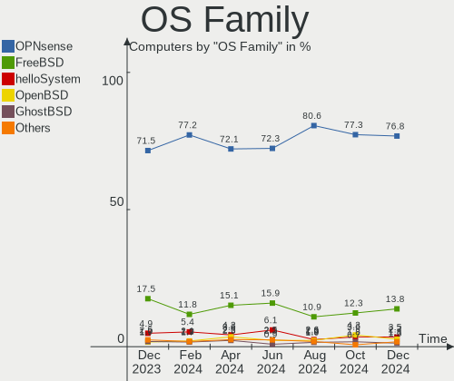
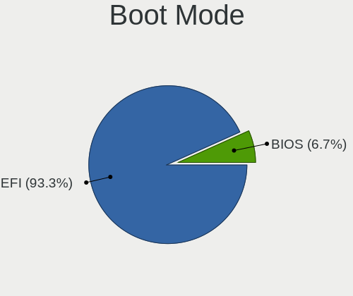
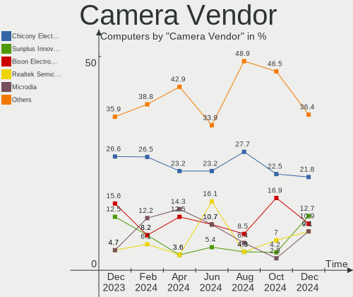
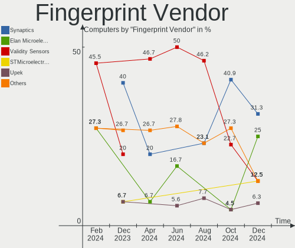

BSD - Hardware Trends
---------------------

A project to identify most popular hardware characteristics and track their change
over time based on data collected by BSD users at https://BSD-Hardware.info.

Anyone can contribute to this report by the [hw-probe](https://github.com/linuxhw/hw-probe/blob/master/INSTALL.BSD.md) tool:

    hw-probe -all -upload

This is a report for all computer types. See also reports for [desktops](/Desktop/README.md) and [notebooks](/Notebook/README.md).

OS-specific reports: [FreeBSD](/Dist/FreeBSD), [OPNsense](/Dist/OPNsense), [helloSystem](/Dist/helloSystem), [OpenBSD](/Dist/OpenBSD).

This report is for one last month. Overall report since the beginning of time: [TestCoverage](https://github.com/bsdhw/TestCoverage)

Period: Dec, 2022.

Contents
--------

* [ System ](#system)
  - [ OS                       ](#os)
  - [ OS Family                ](#os-family)
  - [ Arch                     ](#arch)
  - [ DE                       ](#de)
  - [ Display Server           ](#display-server)
  - [ Display Manager          ](#display-manager)
  - [ OS Lang                  ](#os-lang)
  - [ Boot Mode                ](#boot-mode)
  - [ Filesystem               ](#filesystem)
  - [ Part. scheme             ](#part-scheme)

* [ Board ](#board)
  - [ Vendor                   ](#vendor)
  - [ Model                    ](#model)
  - [ Model Family             ](#model-family)
  - [ MFG Year                 ](#mfg-year)
  - [ Form Factor              ](#form-factor)
  - [ Coreboot                 ](#coreboot)
  - [ RAM Size                 ](#ram-size)
  - [ RAM Used                 ](#ram-used)
  - [ Total Drives             ](#total-drives)
  - [ Has CD-ROM               ](#has-cd-rom)
  - [ Has Ethernet             ](#has-ethernet)
  - [ Has WiFi                 ](#has-wifi)
  - [ Has Bluetooth            ](#has-bluetooth)

* [ Location ](#location)
  - [ Country                  ](#country)
  - [ City                     ](#city)

* [ Drives ](#drives)
  - [ Drive Vendor             ](#drive-vendor)
  - [ Drive Model              ](#drive-model)
  - [ HDD Vendor               ](#hdd-vendor)
  - [ SSD Vendor               ](#ssd-vendor)
  - [ Drive Kind               ](#drive-kind)
  - [ Drive Connector          ](#drive-connector)
  - [ Drive Size               ](#drive-size)
  - [ Space Total              ](#space-total)
  - [ Space Used               ](#space-used)
  - [ Malfunc. Drives          ](#malfunc-drives)
  - [ Malfunc. Drive Vendor    ](#malfunc-drive-vendor)
  - [ Malfunc. HDD Vendor      ](#malfunc-hdd-vendor)
  - [ Malfunc. Drive Kind      ](#malfunc-drive-kind)
  - [ Failed Drives            ](#failed-drives)
  - [ Failed Drive Vendor      ](#failed-drive-vendor)
  - [ Drive Status             ](#drive-status)

* [ Storage controller ](#storage-controller)
  - [ Storage Vendor           ](#storage-vendor)
  - [ Storage Model            ](#storage-model)
  - [ Storage Kind             ](#storage-kind)

* [ Processor ](#processor)
  - [ CPU Vendor               ](#cpu-vendor)
  - [ CPU Model                ](#cpu-model)
  - [ CPU Model Family         ](#cpu-model-family)
  - [ CPU Cores                ](#cpu-cores)
  - [ CPU Sockets              ](#cpu-sockets)
  - [ CPU Threads              ](#cpu-threads)
  - [ CPU Microarch            ](#cpu-microarch)

* [ Graphics ](#graphics)
  - [ GPU Vendor               ](#gpu-vendor)
  - [ GPU Model                ](#gpu-model)
  - [ GPU Combo                ](#gpu-combo)
  - [ GPU Driver               ](#gpu-driver)
  - [ GPU Memory               ](#gpu-memory)

* [ Monitor ](#monitor)
  - [ Monitor Vendor           ](#monitor-vendor)
  - [ Monitor Model            ](#monitor-model)
  - [ Monitor Resolution       ](#monitor-resolution)
  - [ Monitor Diagonal         ](#monitor-diagonal)
  - [ Monitor Width            ](#monitor-width)
  - [ Aspect Ratio             ](#aspect-ratio)
  - [ Monitor Area             ](#monitor-area)
  - [ Pixel Density            ](#pixel-density)
  - [ Multiple Monitors        ](#multiple-monitors)

* [ Network ](#network)
  - [ Net Controller Vendor    ](#net-controller-vendor)
  - [ Net Controller Model     ](#net-controller-model)
  - [ Wireless Vendor          ](#wireless-vendor)
  - [ Wireless Model           ](#wireless-model)
  - [ Ethernet Vendor          ](#ethernet-vendor)
  - [ Ethernet Model           ](#ethernet-model)
  - [ Net Controller Kind      ](#net-controller-kind)
  - [ Used Controller          ](#used-controller)
  - [ NICs                     ](#nics)
  - [ IPv6                     ](#ipv6)

* [ Bluetooth ](#bluetooth)
  - [ Bluetooth Vendor         ](#bluetooth-vendor)
  - [ Bluetooth Model          ](#bluetooth-model)

* [ Sound ](#sound)
  - [ Sound Vendor             ](#sound-vendor)
  - [ Sound Model              ](#sound-model)

* [ Memory ](#memory)
  - [ Memory Vendor            ](#memory-vendor)
  - [ Memory Model             ](#memory-model)
  - [ Memory Kind              ](#memory-kind)
  - [ Memory Form Factor       ](#memory-form-factor)
  - [ Memory Size              ](#memory-size)
  - [ Memory Speed             ](#memory-speed)

* [ Printers & scanners ](#printers--scanners)
  - [ Printer Vendor           ](#printer-vendor)
  - [ Printer Model            ](#printer-model)
  - [ Scanner Vendor           ](#scanner-vendor)
  - [ Scanner Model            ](#scanner-model)

* [ Camera ](#camera)
  - [ Camera Vendor            ](#camera-vendor)
  - [ Camera Model             ](#camera-model)

* [ Security ](#security)
  - [ Fingerprint Vendor       ](#fingerprint-vendor)
  - [ Fingerprint Model        ](#fingerprint-model)
  - [ Chipcard Vendor          ](#chipcard-vendor)
  - [ Chipcard Model           ](#chipcard-model)

* [ Unsupported ](#unsupported)
  - [ Unsupported Devices      ](#unsupported-devices)
  - [ Unsupported Device Types ](#unsupported-device-types)

System
------

OS
--

Installed operating systems

| Name                 | Computers | Percent |
|----------------------|-----------|---------|
| OPNsense 22.7.9      | 169       | 40.33%  |
| OPNsense 22.7.10     | 95        | 22.67%  |
| FreeBSD 13.1-p5      | 34        | 8.11%   |
| helloSystem 0.7.0    | 20        | 4.77%   |
| OpenBSD 7.2          | 19        | 4.53%   |
| OPNsense 22.7.8      | 12        | 2.86%   |
| FreeBSD 13.1         | 12        | 2.86%   |
| OPNsense 22.1.10     | 7         | 1.67%   |
| OPNsense 23.1        | 6         | 1.43%   |
| helloSystem 0.8.0    | 5         | 1.19%   |
| FreeBSD 14.0-CURRENT | 5         | 1.19%   |
| FreeBSD 13.1-STABLE  | 5         | 1.19%   |
| OPNsense 22.7.6      | 4         | 0.95%   |
| OPNsense 22.7.7      | 3         | 0.72%   |
| GhostBSD 22.11.22    | 3         | 0.72%   |
| OPNsense 22.10       | 2         | 0.48%   |
| OpenBSD 7.1          | 2         | 0.48%   |
| NomadBSD 20221130    | 2         | 0.48%   |
| MidnightBSD 2.2.6    | 2         | 0.48%   |
| FreeBSD 13.1-p2      | 2         | 0.48%   |
| FreeBSD 12.4         | 2         | 0.48%   |
| OPNsense 22.7.2      | 1         | 0.24%   |
| OPNsense 22.1.6      | 1         | 0.24%   |
| OpenBSD 7.0          | 1         | 0.24%   |
| MyBee 13.1-p3        | 1         | 0.24%   |
| GhostBSD 22.11.02    | 1         | 0.24%   |
| GhostBSD 22.06.18    | 1         | 0.24%   |
| FreeBSD 13.1-p4      | 1         | 0.24%   |
| FreeBSD 13.1-p3      | 1         | 0.24%   |

OS Family
---------

OS without a version

| Name        | Computers | Percent |
|-------------|-----------|---------|
| OPNsense    | 300       | 71.6%   |
| FreeBSD     | 62        | 14.8%   |
| helloSystem | 25        | 5.97%   |
| OpenBSD     | 22        | 5.25%   |
| GhostBSD    | 5         | 1.19%   |
| NomadBSD    | 2         | 0.48%   |
| MidnightBSD | 2         | 0.48%   |
| MyBee       | 1         | 0.24%   |

Arch
----

OS architecture (x86_64, i586, etc.)

| Name  | Computers | Percent |
|-------|-----------|---------|
| amd64 | 413       | 98.57%  |
| arm64 | 5         | 1.19%   |
| i386  | 1         | 0.24%   |

DE
--

Desktop Environment

| Name          | Computers | Percent |
|---------------|-----------|---------|
| Console       | 322       | 76.85%  |
| helloDesktop  | 45        | 10.74%  |
| XFCE          | 11        | 2.63%   |
| KDE5          | 11        | 2.63%   |
| MATE          | 8         | 1.91%   |
| GNOME         | 8         | 1.91%   |
| i3            | 4         | 0.95%   |
| TWM           | 3         | 0.72%   |
| Openbox       | 2         | 0.48%   |
| LXQt          | 2         | 0.48%   |
| Fluxbox       | 1         | 0.24%   |
| Enlightenment | 1         | 0.24%   |
| bspwm         | 1         | 0.24%   |

Display Server
--------------

X11 or Wayland

| Name    | Computers | Percent |
|---------|-----------|---------|
| Console | 326       | 77.8%   |
| X11     | 91        | 21.72%  |
| Wayland | 2         | 0.48%   |

Display Manager
---------------

SDDM, LightDM, etc.

| Name    | Computers | Percent |
|---------|-----------|---------|
| Console | 354       | 84.49%  |
| SLiM    | 33        | 7.88%   |
| SDDM    | 15        | 3.58%   |
| LightDM | 10        | 2.39%   |
| XDM     | 4         | 0.95%   |
| GDM     | 3         | 0.72%   |

OS Lang
-------

Language

| Lang    | Computers | Percent |
|---------|-----------|---------|
| Unknown | 321       | 76.61%  |
| C       | 48        | 11.46%  |
| en_US   | 35        | 8.35%   |
| ru_RU   | 3         | 0.72%   |
| zh_TW   | 1         | 0.24%   |
| zh_CN   | 1         | 0.24%   |
| pt_BR   | 1         | 0.24%   |
| ja_JP   | 1         | 0.24%   |
| fr_FR   | 1         | 0.24%   |
| fr      | 1         | 0.24%   |
| es_ES   | 1         | 0.24%   |
| en_BE   | 1         | 0.24%   |
| en      | 1         | 0.24%   |
| de_DE   | 1         | 0.24%   |
| de      | 1         | 0.24%   |
| ba_RU   | 1         | 0.24%   |

Boot Mode
---------

EFI or BIOS

| Mode | Computers | Percent |
|------|-----------|---------|
| EFI  | 376       | 89.74%  |
| BIOS | 43        | 10.26%  |

Filesystem
----------

Type of filesystem

| Type   | Computers | Percent |
|--------|-----------|---------|
| Ufs    | 203       | 48.45%  |
| Zfs    | 176       | 42%     |
| Ffs    | 22        | 5.25%   |
| Cd9660 | 18        | 4.3%    |

Part. scheme
------------

Scheme of partitioning

| Type    | Computers | Percent |
|---------|-----------|---------|
| GPT     | 398       | 94.99%  |
| MBR     | 17        | 4.06%   |
| Unknown | 4         | 0.95%   |

Board
-----

Vendor
------

Motherboard manufacturer

| Name                       | Computers | Percent |
|----------------------------|-----------|---------|
| Dell                       | 46        | 10.98%  |
| Unknown                    | 46        | 10.98%  |
| Lenovo                     | 34        | 8.11%   |
| ASUSTek Computer           | 32        | 7.64%   |
| Hewlett-Packard            | 27        | 6.44%   |
| Intel                      | 22        | 5.25%   |
| Supermicro                 | 19        | 4.53%   |
| MSI                        | 15        | 3.58%   |
| Fujitsu                    | 15        | 3.58%   |
| AMI                        | 14        | 3.34%   |
| Protectli                  | 13        | 3.1%    |
| Gigabyte Technology        | 13        | 3.1%    |
| ASRock                     | 12        | 2.86%   |
| PC Engines                 | 10        | 2.39%   |
| ZOTAC                      | 9         | 2.15%   |
| Sophos                     | 8         | 1.91%   |
| Techvision                 | 7         | 1.67%   |
| Acer                       | 7         | 1.67%   |
| Apple                      | 6         | 1.43%   |
| Shuttle                    | 4         | 0.95%   |
| Deciso                     | 4         | 0.95%   |
| MW                         | 3         | 0.72%   |
| Google                     | 3         | 0.72%   |
| CncTion                    | 3         | 0.72%   |
| Biostar                    | 3         | 0.72%   |
| TUXEDO                     | 2         | 0.48%   |
| ShenZhen MinWin Technology | 2         | 0.48%   |
| Raspberry Pi Foundation    | 2         | 0.48%   |
| Pegatron                   | 2         | 0.48%   |
| HUAWEI                     | 2         | 0.48%   |
| Hardkernel                 | 2         | 0.48%   |
| BESSTAR Tech               | 2         | 0.48%   |
| YANYU                      | 1         | 0.24%   |
| Toshiba                    | 1         | 0.24%   |
| Timi                       | 1         | 0.24%   |
| Thomas-Krenn.AG            | 1         | 0.24%   |
| Tactus                     | 1         | 0.24%   |
| Star Labs                  | 1         | 0.24%   |
| Sony                       | 1         | 0.24%   |
| Panasonic                  | 1         | 0.24%   |

Model
-----

Motherboard model

| Name                                             | Computers | Percent |
|--------------------------------------------------|-----------|---------|
| Unknown                                          | 46        | 10.98%  |
| AMI Aptio CRB                                    | 10        | 2.39%   |
| Supermicro Super Server                          | 8         | 1.91%   |
| Techvision TVI7309X                              | 7         | 1.67%   |
| Protectli FW4B                                   | 7         | 1.67%   |
| Fujitsu FUTRO S920                               | 7         | 1.67%   |
| Intel Q3XXG4-P V1.0                              | 6         | 1.43%   |
| Sophos SG                                        | 5         | 1.19%   |
| PC Engines APU2                                  | 5         | 1.19%   |
| Dell OptiPlex 7010                               | 5         | 1.19%   |
| ZOTAC ZBOX-MI640/MI660/MI620NANO                 | 4         | 0.95%   |
| ZOTAC ZBOX-CI329NANO                             | 4         | 0.95%   |
| Supermicro X10SLH-N6-ST031                       | 3         | 0.72%   |
| Protectli FW6                                    | 3         | 0.72%   |
| MW GMLK-2_5G4L                                   | 3         | 0.72%   |
| HP ProLiant MicroServer Gen8                     | 3         | 0.72%   |
| Dell PowerEdge R210 II                           | 3         | 0.72%   |
| Dell OptiPlex 7020                               | 3         | 0.72%   |
| Dell OptiPlex 3020                               | 3         | 0.72%   |
| CncTion N5105-4L                                 | 3         | 0.72%   |
| ASUS PRIME B550-PLUS                             | 3         | 0.72%   |
| ASUS All Series                                  | 3         | 0.72%   |
| Supermicro 1HE Intel Single-CPU RI1102D-F Server | 2         | 0.48%   |
| Sophos XG                                        | 2         | 0.48%   |
| PC Engines apu4                                  | 2         | 0.48%   |
| PC Engines APU3                                  | 2         | 0.48%   |
| MSI MS-7D20                                      | 2         | 0.48%   |
| MSI MS-7817                                      | 2         | 0.48%   |
| Lenovo ThinkCentre M720q 10T7004BMB              | 2         | 0.48%   |
| Intel SHARKBAY                                   | 2         | 0.48%   |
| HP t620 PLUS Quad Core TC                        | 2         | 0.48%   |
| HP Compaq 8200 Elite SFF PC                      | 2         | 0.48%   |
| Dell Wyse 5070 Extended Thin Client              | 2         | 0.48%   |
| Deciso NetBoard-A10                              | 2         | 0.48%   |
| ASUS TUF Gaming B450M-PLUS II                    | 2         | 0.48%   |
| AMI SG                                           | 2         | 0.48%   |
| Acer Swift SF114-34                              | 2         | 0.48%   |
| ZOTAC ZBOX-CI341                                 | 1         | 0.24%   |
| YANYU R250                                       | 1         | 0.24%   |
| TUXEDO Pulse 15 Gen1                             | 1         | 0.24%   |

Model Family
------------

Motherboard model prefix

| Name                       | Computers | Percent |
|----------------------------|-----------|---------|
| Unknown                    | 46        | 10.98%  |
| Dell OptiPlex              | 18        | 4.3%    |
| Lenovo ThinkCentre         | 14        | 3.34%   |
| Lenovo ThinkPad            | 12        | 2.86%   |
| AMI Aptio                  | 10        | 2.39%   |
| ASUS PRIME                 | 9         | 2.15%   |
| Supermicro Super           | 8         | 1.91%   |
| Fujitsu FUTRO              | 8         | 1.91%   |
| Dell PowerEdge             | 8         | 1.91%   |
| Techvision TVI7309X        | 7         | 1.67%   |
| Protectli FW4B             | 7         | 1.67%   |
| Intel Q3XXG4-P             | 6         | 1.43%   |
| HP ProLiant                | 6         | 1.43%   |
| Sophos SG                  | 5         | 1.19%   |
| PC Engines APU2            | 5         | 1.19%   |
| HP EliteDesk               | 5         | 1.19%   |
| Dell Inspiron              | 5         | 1.19%   |
| ASUS ROG                   | 5         | 1.19%   |
| ZOTAC ZBOX-MI640           | 4         | 0.95%   |
| ZOTAC ZBOX-CI329NANO       | 4         | 0.95%   |
| HP ProDesk                 | 4         | 0.95%   |
| Fujitsu ESPRIMO            | 4         | 0.95%   |
| Dell Precision             | 4         | 0.95%   |
| Supermicro X10SLH-N6-ST031 | 3         | 0.72%   |
| Protectli FW6              | 3         | 0.72%   |
| MW GMLK-2                  | 3         | 0.72%   |
| HP Compaq                  | 3         | 0.72%   |
| Dell Wyse                  | 3         | 0.72%   |
| Dell Vostro                | 3         | 0.72%   |
| Dell Latitude              | 3         | 0.72%   |
| CncTion N5105-4L           | 3         | 0.72%   |
| ASUS TUF                   | 3         | 0.72%   |
| ASUS All                   | 3         | 0.72%   |
| Acer Aspire                | 3         | 0.72%   |
| Supermicro 1HE             | 2         | 0.48%   |
| Sophos XG                  | 2         | 0.48%   |
| RPi Raspberry              | 2         | 0.48%   |
| PC Engines apu4            | 2         | 0.48%   |
| PC Engines APU3            | 2         | 0.48%   |
| MSI MS-7D20                | 2         | 0.48%   |

MFG Year
--------

Motherboard manufacture year

| Year    | Computers | Percent |
|---------|-----------|---------|
| 2022    | 79        | 18.85%  |
| 2019    | 51        | 12.17%  |
| 2021    | 40        | 9.55%   |
| 2018    | 39        | 9.31%   |
| 2014    | 38        | 9.07%   |
| 2020    | 35        | 8.35%   |
| 2016    | 34        | 8.11%   |
| 2017    | 20        | 4.77%   |
| 2013    | 18        | 4.3%    |
| 2015    | 17        | 4.06%   |
| 2012    | 17        | 4.06%   |
| 2010    | 10        | 2.39%   |
| 2011    | 9         | 2.15%   |
| 2008    | 4         | 0.95%   |
| 2009    | 3         | 0.72%   |
| Unknown | 3         | 0.72%   |
| 2007    | 1         | 0.24%   |
| 2006    | 1         | 0.24%   |

Form Factor
-----------

Physical design of the computer

| Name       | Computers | Percent |
|------------|-----------|---------|
| Desktop    | 274       | 65.39%  |
| Notebook   | 64        | 15.27%  |
| Mini pc    | 42        | 10.02%  |
| Server     | 27        | 6.44%   |
| Firewall   | 10        | 2.39%   |
| All in one | 2         | 0.48%   |

Coreboot
--------

Have coreboot on board

| Used | Computers | Percent |
|------|-----------|---------|
| No   | 402       | 95.94%  |
| Yes  | 17        | 4.06%   |

RAM Size
--------

Total RAM memory

| Size in GB      | Computers | Percent |
|-----------------|-----------|---------|
| 8.01-16.0       | 167       | 39.86%  |
| 16.01-24.0      | 91        | 21.72%  |
| 4.01-8.0        | 85        | 20.29%  |
| 32.01-64.0      | 34        | 8.11%   |
| 64.01-256.0     | 14        | 3.34%   |
| 2.01-3.0        | 11        | 2.63%   |
| 3.01-4.0        | 10        | 2.39%   |
| 24.01-32.0      | 4         | 0.95%   |
| More than 256.0 | 1         | 0.24%   |
| 1.01-2.0        | 1         | 0.24%   |
| 0.51-1.0        | 1         | 0.24%   |

RAM Used
--------

Used RAM memory

| Used GB    | Computers | Percent |
|------------|-----------|---------|
| 0.01-0.5   | 241       | 57.52%  |
| 0.51-1.0   | 121       | 28.88%  |
| 1.01-2.0   | 48        | 11.46%  |
| 3.01-4.0   | 4         | 0.95%   |
| 2.01-3.0   | 3         | 0.72%   |
| 24.01-32.0 | 1         | 0.24%   |
| 16.01-24.0 | 1         | 0.24%   |

Total Drives
------------

Number of drives on board

| Drives | Computers | Percent |
|--------|-----------|---------|
| 1      | 307       | 73.27%  |
| 2      | 44        | 10.5%   |
| 0      | 38        | 9.07%   |
| 3      | 14        | 3.34%   |
| 5      | 5         | 1.19%   |
| 4      | 5         | 1.19%   |
| 6      | 2         | 0.48%   |
| 13     | 1         | 0.24%   |
| 10     | 1         | 0.24%   |
| 8      | 1         | 0.24%   |
| 7      | 1         | 0.24%   |

Has CD-ROM
----------

Has CD-ROM on board

| Presented | Computers | Percent |
|-----------|-----------|---------|
| No        | 369       | 88.07%  |
| Yes       | 50        | 11.93%  |

Has Ethernet
------------

Has Ethernet on board

| Presented | Computers | Percent |
|-----------|-----------|---------|
| Yes       | 396       | 94.51%  |
| No        | 23        | 5.49%   |

Has WiFi
--------

Has WiFi module

| Presented | Computers | Percent |
|-----------|-----------|---------|
| No        | 288       | 68.74%  |
| Yes       | 131       | 31.26%  |

Has Bluetooth
-------------

Has Bluetooth module

| Presented | Computers | Percent |
|-----------|-----------|---------|
| No        | 320       | 76.37%  |
| Yes       | 99        | 23.63%  |

Location
--------

Country
-------

Geographic location (country)

| Country      | Computers | Percent |
|--------------|-----------|---------|
| USA          | 108       | 25.78%  |
| Germany      | 87        | 20.76%  |
| Canada       | 24        | 5.73%   |
| France       | 19        | 4.53%   |
| Russia       | 16        | 3.82%   |
| UK           | 15        | 3.58%   |
| Australia    | 11        | 2.63%   |
| Netherlands  | 10        | 2.39%   |
| Italy        | 8         | 1.91%   |
| Switzerland  | 7         | 1.67%   |
| Sweden       | 7         | 1.67%   |
| Spain        | 7         | 1.67%   |
| Poland       | 6         | 1.43%   |
| China        | 6         | 1.43%   |
| Brazil       | 6         | 1.43%   |
| Belgium      | 6         | 1.43%   |
| Austria      | 6         | 1.43%   |
| Norway       | 4         | 0.95%   |
| Finland      | 4         | 0.95%   |
| Denmark      | 4         | 0.95%   |
| Czechia      | 4         | 0.95%   |
| Thailand     | 3         | 0.72%   |
| South Korea  | 3         | 0.72%   |
| Romania      | 3         | 0.72%   |
| Mexico       | 3         | 0.72%   |
| Lithuania    | 3         | 0.72%   |
| India        | 3         | 0.72%   |
| Taiwan       | 2         | 0.48%   |
| South Africa | 2         | 0.48%   |
| Paraguay     | 2         | 0.48%   |
| Malaysia     | 2         | 0.48%   |
| Egypt        | 2         | 0.48%   |
| Cyprus       | 2         | 0.48%   |
| Colombia     | 2         | 0.48%   |
| Bulgaria     | 2         | 0.48%   |
| Vietnam      | 1         | 0.24%   |
| Turkey       | 1         | 0.24%   |
| Slovenia     | 1         | 0.24%   |
| Portugal     | 1         | 0.24%   |
| Peru         | 1         | 0.24%   |

City
----

Geographic location (city)

| City               | Computers | Percent |
|--------------------|-----------|---------|
| London             | 7         | 1.67%   |
| Moscow             | 6         | 1.43%   |
| Berlin             | 5         | 1.19%   |
| St Petersburg      | 4         | 0.95%   |
| Hamburg            | 4         | 0.95%   |
| Victoria           | 3         | 0.72%   |
| Sydney             | 3         | 0.72%   |
| Stockholm          | 3         | 0.72%   |
| Paris              | 3         | 0.72%   |
| Krasnodar          | 3         | 0.72%   |
| Chicago            | 3         | 0.72%   |
| Bonn               | 3         | 0.72%   |
| Bangkok            | 3         | 0.72%   |
| Austin             | 3         | 0.72%   |
| Amsterdam          | 3         | 0.72%   |
| Ypsilanti          | 2         | 0.48%   |
| Würzburg          | 2         | 0.48%   |
| Vilnius            | 2         | 0.48%   |
| Vienna             | 2         | 0.48%   |
| Ulm                | 2         | 0.48%   |
| Tempe              | 2         | 0.48%   |
| Stuttgart          | 2         | 0.48%   |
| St. Jean Baptiste  | 2         | 0.48%   |
| South Burlington   | 2         | 0.48%   |
| Sofia              | 2         | 0.48%   |
| Siggenthal Station | 2         | 0.48%   |
| Seattle            | 2         | 0.48%   |
| Redmond            | 2         | 0.48%   |
| Perth              | 2         | 0.48%   |
| Nuremberg          | 2         | 0.48%   |
| New York           | 2         | 0.48%   |
| Navalcarnero       | 2         | 0.48%   |
| Munich             | 2         | 0.48%   |
| Melbourne          | 2         | 0.48%   |
| Littleton          | 2         | 0.48%   |
| Larnaca            | 2         | 0.48%   |
| Lafayette          | 2         | 0.48%   |
| Kortrijk           | 2         | 0.48%   |
| Jistebnik          | 2         | 0.48%   |
| Helsinki           | 2         | 0.48%   |

Drives
------

Drive Vendor
------------

Hard drive vendors

| Vendor              | Computers | Drives | Percent |
|---------------------|-----------|--------|---------|
| Samsung Electronics | 69        | 85     | 15.51%  |
| WDC                 | 53        | 89     | 11.91%  |
| Kingston            | 41        | 44     | 9.21%   |
| Transcend           | 29        | 30     | 6.52%   |
| Seagate             | 29        | 39     | 6.52%   |
| Crucial             | 20        | 21     | 4.49%   |
| Intel               | 18        | 20     | 4.04%   |
| Toshiba             | 16        | 22     | 3.6%    |
| SanDisk             | 16        | 16     | 3.6%    |
| Hoodisk             | 11        | 11     | 2.47%   |
| China               | 11        | 15     | 2.47%   |
| A-DATA Technology   | 10        | 11     | 2.25%   |
| PNY                 | 9         | 9      | 2.02%   |
| NVMe                | 7         | 8      | 1.57%   |
| Innodisk            | 7         | 7      | 1.57%   |
| SK hynix            | 6         | 6      | 1.35%   |
| Phison              | 6         | 6      | 1.35%   |
| HGST                | 6         | 7      | 1.35%   |
| SPCC                | 4         | 4      | 0.9%    |
| OCZ                 | 4         | 4      | 0.9%    |
| Gigabyte Technology | 4         | 4      | 0.9%    |
| FORESEE             | 4         | 4      | 0.9%    |
| Corsair             | 4         | 4      | 0.9%    |
| Team                | 3         | 3      | 0.67%   |
| Silicon Motion      | 3         | 3      | 0.67%   |
| ShiJi               | 3         | 3      | 0.67%   |
| Micron Technology   | 3         | 3      | 0.67%   |
| Intenso             | 3         | 3      | 0.67%   |
| Hitachi             | 3         | 3      | 0.67%   |
| Apple               | 3         | 4      | 0.67%   |
| Zheino              | 2         | 2      | 0.45%   |
| Supermicro          | 2         | 2      | 0.45%   |
| Protectli           | 2         | 2      | 0.45%   |
| Patriot             | 2         | 2      | 0.45%   |
| OPENBSD             | 2         | 3      | 0.45%   |
| LITEONIT            | 2         | 2      | 0.45%   |
| LITEON              | 2         | 2      | 0.45%   |
| Hewlett-Packard     | 2         | 2      | 0.45%   |
| Dogfish             | 2         | 2      | 0.45%   |
| BIWIN               | 2         | 2      | 0.45%   |

Drive Model
-----------

Hard drive models

| Model                           | Computers | Percent |
|---------------------------------|-----------|---------|
| Kingston SA400S37240G 240GB     | 9         | 1.88%   |
| Kingston SA400S37120G 120GB     | 7         | 1.46%   |
| Samsung SSD 860 EVO 500GB       | 6         | 1.25%   |
| Samsung SSD 850 EVO 120GB       | 5         | 1.04%   |
| Samsung SSD 840 EVO 120GB       | 5         | 1.04%   |
| Samsung SSD 970 EVO Plus 250GB  | 4         | 0.83%   |
| Kingston SUV500MS120G 120GB     | 4         | 0.83%   |
| Hoodisk SSD 64GB                | 4         | 0.83%   |
| WDC WDS240G2G0A-00JH30 240GB    | 3         | 0.63%   |
| WDC WD30EFRX-68EUZN0 3TB        | 3         | 0.63%   |
| Transcend TS64GSSD370 64GB      | 3         | 0.63%   |
| Transcend TS128GMSA230S 128GB   | 3         | 0.63%   |
| Seagate ST500DM002-1BD142 500GB | 3         | 0.63%   |
| Samsung SSD 970 PRO 512GB       | 3         | 0.63%   |
| Samsung SSD 870 EVO 1TB         | 3         | 0.63%   |
| Samsung SSD 850 EVO 500GB       | 3         | 0.63%   |
| PNY CS900 240GB SSD             | 3         | 0.63%   |
| NVMe Samsung SSD 980 2TB        | 3         | 0.63%   |
| Kingston SUV400S37120G 120GB    | 3         | 0.63%   |
| Kingston SKC600MS256G 256GB     | 3         | 0.63%   |
| Intel SSDSC2KG480G8 480GB       | 3         | 0.63%   |
| Hoodisk SSD 128GB               | 3         | 0.63%   |
| HGST HTS725050A7E630 500GB      | 3         | 0.63%   |
| Crucial CT480BX500SSD1 480GB    | 3         | 0.63%   |
| Crucial CT240BX500SSD1 240GB    | 3         | 0.63%   |
| Crucial CT120BX500SSD1 120GB    | 3         | 0.63%   |
| WDC WDS120G2G0A-00JH30 120GB    | 2         | 0.42%   |
| WDC WD40EZRZ-22GXCB0 4TB        | 2         | 0.42%   |
| Transcend TS64GMTS400SD 64GB    | 2         | 0.42%   |
| Transcend TS64GMSA230S 64GB     | 2         | 0.42%   |
| Transcend TS256GMTE652T2 256GB  | 2         | 0.42%   |
| Transcend TS256GMSA230S 256GB   | 2         | 0.42%   |
| Transcend TS128GSSD230S 128GB   | 2         | 0.42%   |
| Transcend TS120GMTS420S 120GB   | 2         | 0.42%   |
| Toshiba MQ01ABF050 500GB        | 2         | 0.42%   |
| Toshiba MQ01ABD100 1TB          | 2         | 0.42%   |
| Seagate ST4000LM024-2AN17V 4TB  | 2         | 0.42%   |
| Seagate ST4000DM000-1F2168 4TB  | 2         | 0.42%   |
| Seagate ST2000DM008-2FR102 2TB  | 2         | 0.42%   |
| Seagate ST1000LM048-2E7172 1TB  | 2         | 0.42%   |

HDD Vendor
----------

Hard disk drive vendors

| Vendor              | Computers | Drives | Percent |
|---------------------|-----------|--------|---------|
| WDC                 | 35        | 68     | 38.89%  |
| Seagate             | 28        | 38     | 31.11%  |
| Toshiba             | 9         | 14     | 10%     |
| HGST                | 6         | 7      | 6.67%   |
| NVMe                | 4         | 5      | 4.44%   |
| Hitachi             | 3         | 3      | 3.33%   |
| OPENBSD             | 2         | 3      | 2.22%   |
| Samsung Electronics | 1         | 1      | 1.11%   |
| Fujitsu             | 1         | 1      | 1.11%   |
| Apple               | 1         | 1      | 1.11%   |

SSD Vendor
----------

Solid state drive vendors

| Vendor              | Computers | Drives | Percent |
|---------------------|-----------|--------|---------|
| Samsung Electronics | 49        | 57     | 17.07%  |
| Kingston            | 38        | 40     | 13.24%  |
| Transcend           | 27        | 28     | 9.41%   |
| SanDisk             | 16        | 16     | 5.57%   |
| Crucial             | 15        | 16     | 5.23%   |
| Intel               | 13        | 15     | 4.53%   |
| Hoodisk             | 11        | 11     | 3.83%   |
| China               | 11        | 15     | 3.83%   |
| PNY                 | 9         | 9      | 3.14%   |
| A-DATA Technology   | 9         | 10     | 3.14%   |
| WDC                 | 7         | 9      | 2.44%   |
| Toshiba             | 7         | 8      | 2.44%   |
| Innodisk            | 7         | 7      | 2.44%   |
| OCZ                 | 4         | 4      | 1.39%   |
| Corsair             | 4         | 4      | 1.39%   |
| Team                | 3         | 3      | 1.05%   |
| SPCC                | 3         | 3      | 1.05%   |
| SK hynix            | 3         | 3      | 1.05%   |
| ShiJi               | 3         | 3      | 1.05%   |
| NVMe                | 3         | 3      | 1.05%   |
| Micron Technology   | 3         | 3      | 1.05%   |
| Intenso             | 3         | 3      | 1.05%   |
| FORESEE             | 3         | 3      | 1.05%   |
| Zheino              | 2         | 2      | 0.7%    |
| Supermicro          | 2         | 2      | 0.7%    |
| Protectli           | 2         | 2      | 0.7%    |
| LITEONIT            | 2         | 2      | 0.7%    |
| LITEON              | 2         | 2      | 0.7%    |
| Hewlett-Packard     | 2         | 2      | 0.7%    |
| Dogfish             | 2         | 2      | 0.7%    |
| BIWIN               | 2         | 2      | 0.7%    |
| Apple               | 2         | 3      | 0.7%    |
| Apacer              | 2         | 2      | 0.7%    |
| Advantech           | 2         | 3      | 0.7%    |
| Vaseky              | 1         | 1      | 0.35%   |
| TEXTORM             | 1         | 1      | 0.35%   |
| Star Drive          | 1         | 1      | 0.35%   |
| Seagate             | 1         | 1      | 0.35%   |
| Plextor             | 1         | 1      | 0.35%   |
| Phison              | 1         | 1      | 0.35%   |

Drive Kind
----------

HDD or SSD

| Kind | Computers | Drives | Percent |
|------|-----------|--------|---------|
| SSD  | 270       | 311    | 64.75%  |
| HDD  | 74        | 141    | 17.75%  |
| NVMe | 73        | 78     | 17.51%  |

Drive Connector
---------------

SATA, SAS, NVMe, etc.

| Type | Computers | Drives | Percent |
|------|-----------|--------|---------|
| SATA | 323       | 452    | 81.57%  |
| NVMe | 73        | 78     | 18.43%  |

Drive Size
----------

Size of hard drive

| Size in TB | Computers | Drives | Percent |
|------------|-----------|--------|---------|
| 0.01-0.5   | 288       | 325    | 79.34%  |
| 0.51-1.0   | 35        | 48     | 9.64%   |
| 1.01-2.0   | 19        | 30     | 5.23%   |
| 3.01-4.0   | 10        | 14     | 2.75%   |
| 2.01-3.0   | 5         | 9      | 1.38%   |
| 4.01-10.0  | 4         | 19     | 1.1%    |
| 10.01-20.0 | 2         | 7      | 0.55%   |

Space Total
-----------

Amount of disk space available on the file system

| Size in GB     | Computers | Percent |
|----------------|-----------|---------|
| 101-250        | 184       | 43.91%  |
| 251-500        | 75        | 17.9%   |
| 51-100         | 53        | 12.65%  |
| 21-50          | 37        | 8.83%   |
| 1-20           | 37        | 8.83%   |
| 501-1000       | 22        | 5.25%   |
| More than 3000 | 4         | 0.95%   |
| 1001-2000      | 4         | 0.95%   |
| 2001-3000      | 2         | 0.48%   |
| Unknown        | 1         | 0.24%   |

Space Used
----------

Amount of used disk space

| Used GB        | Computers | Percent |
|----------------|-----------|---------|
| 1-20           | 379       | 90.45%  |
| 21-50          | 23        | 5.49%   |
| 51-100         | 10        | 2.39%   |
| 251-500        | 3         | 0.72%   |
| 1001-2000      | 2         | 0.48%   |
| More than 3000 | 1         | 0.24%   |
| Unknown        | 1         | 0.24%   |

Malfunc. Drives
---------------

Drive models with a malfunction

| Model                               | Computers | Drives | Percent |
|-------------------------------------|-----------|--------|---------|
| HGST HTS725050A7E630 500GB          | 3         | 4      | 5.56%   |
| WDC WDS240G2G0A-00JH30 240GB        | 2         | 3      | 3.7%    |
| Seagate ST500DM002-1BD142 500GB     | 2         | 2      | 3.7%    |
| WDC WDS120G2G0A-00JH30 120GB        | 1         | 1      | 1.85%   |
| WDC WD6400AAKS-22A7B2 640GB         | 1         | 1      | 1.85%   |
| WDC WD5000AAKX-00ERMA0 500GB        | 1         | 1      | 1.85%   |
| WDC WD3200BEVT-60A23T0 320GB        | 1         | 1      | 1.85%   |
| WDC WD3200AAKX-001CA0 320GB         | 1         | 1      | 1.85%   |
| WDC WD3200AAKS-75L9A0 320GB         | 1         | 1      | 1.85%   |
| WDC WD30EFRX-68EUZN0 3TB            | 1         | 1      | 1.85%   |
| WDC WD2500BEVS-22UST0 250GB         | 1         | 1      | 1.85%   |
| WDC WD20EARX-008FB0 2TB             | 1         | 1      | 1.85%   |
| WDC WD1600AAJS-60Z0A0 160GB         | 1         | 1      | 1.85%   |
| WDC WD10SPZX-21Z10T0 1TB            | 1         | 1      | 1.85%   |
| Toshiba MQ01ACF032 320GB            | 1         | 1      | 1.85%   |
| Toshiba MQ01ABF050 500GB            | 1         | 1      | 1.85%   |
| Toshiba MK6475GSX 640GB             | 1         | 1      | 1.85%   |
| Toshiba MK1637GSX 160GB             | 1         | 1      | 1.85%   |
| Toshiba KSG60ZSE256G SATA 256GB     | 1         | 1      | 1.85%   |
| SK hynix SC308 SATA 128GB           | 1         | 1      | 1.85%   |
| ShiJi SSD 32GB                      | 1         | 1      | 1.85%   |
| Seagate ST8000VN004-2M2101 8TB      | 1         | 1      | 1.85%   |
| Seagate ST3250310AS 250GB           | 1         | 1      | 1.85%   |
| Seagate ST2000VN004-2E4164 2TB      | 1         | 2      | 1.85%   |
| Seagate ST1000LM024 HN-M101MBB 1TB  | 1         | 1      | 1.85%   |
| SanDisk SD8TB8U-256G-1006 256GB     | 1         | 1      | 1.85%   |
| Samsung Electronics SSD 870 EVO 1TB | 1         | 1      | 1.85%   |
| Samsung Electronics HD204UI 2TB     | 1         | 1      | 1.85%   |
| PNY CS1311 120GB SSD                | 1         | 1      | 1.85%   |
| OCZ VERTEX 32GB                     | 1         | 1      | 1.85%   |
| OCZ AGILITY3 64GB                   | 1         | 1      | 1.85%   |
| Micron Technology 1100 SATA 256GB   | 1         | 1      | 1.85%   |
| LITEONIT LCT-128M3S 128GB           | 1         | 1      | 1.85%   |
| Kingston SV300S37A60G 64GB          | 1         | 1      | 1.85%   |
| Kingston SV300S37A120G 120GB        | 1         | 1      | 1.85%   |
| Kingston SNS4151S316GD 16GB         | 1         | 1      | 1.85%   |
| Kingston SMS200S360G 64GB           | 1         | 1      | 1.85%   |
| Kingston SMS200S3120G 120GB         | 1         | 1      | 1.85%   |
| Kingston SHFS37A120G 120GB          | 1         | 1      | 1.85%   |
| Kingston SA400S37120G 120GB         | 1         | 1      | 1.85%   |

Malfunc. Drive Vendor
---------------------

Vendors of faulty drives

| Vendor              | Computers | Drives | Percent |
|---------------------|-----------|--------|---------|
| WDC                 | 13        | 14     | 24.53%  |
| Kingston            | 7         | 7      | 13.21%  |
| Toshiba             | 5         | 5      | 9.43%   |
| Seagate             | 5         | 7      | 9.43%   |
| HGST                | 4         | 5      | 7.55%   |
| Intel               | 3         | 3      | 5.66%   |
| Samsung Electronics | 2         | 2      | 3.77%   |
| OCZ                 | 2         | 2      | 3.77%   |
| Hitachi             | 2         | 2      | 3.77%   |
| SK hynix            | 1         | 1      | 1.89%   |
| ShiJi               | 1         | 1      | 1.89%   |
| SanDisk             | 1         | 1      | 1.89%   |
| PNY                 | 1         | 1      | 1.89%   |
| Micron Technology   | 1         | 1      | 1.89%   |
| LITEONIT            | 1         | 1      | 1.89%   |
| KingDian            | 1         | 1      | 1.89%   |
| Crucial             | 1         | 1      | 1.89%   |
| Corsair             | 1         | 1      | 1.89%   |
| A-DATA Technology   | 1         | 1      | 1.89%   |

Malfunc. HDD Vendor
-------------------

Vendors of faulty HDD drives

| Vendor              | Computers | Drives | Percent |
|---------------------|-----------|--------|---------|
| WDC                 | 10        | 10     | 38.46%  |
| Seagate             | 5         | 7      | 19.23%  |
| Toshiba             | 4         | 4      | 15.38%  |
| HGST                | 4         | 5      | 15.38%  |
| Hitachi             | 2         | 2      | 7.69%   |
| Samsung Electronics | 1         | 1      | 3.85%   |

Malfunc. Drive Kind
-------------------

Kinds of faulty drives

| Kind | Computers | Drives | Percent |
|------|-----------|--------|---------|
| SSD  | 26        | 27     | 50%     |
| HDD  | 25        | 29     | 48.08%  |
| NVMe | 1         | 1      | 1.92%   |

Failed Drives
-------------

Failed drive models

| Model                       | Computers | Drives | Percent |
|-----------------------------|-----------|--------|---------|
| Transcend TS32GSSD370S 32GB | 1         | 1      | 33.33%  |
| Seagate ST3500418AS 500GB   | 1         | 1      | 33.33%  |
| Crucial CT250P2SSD8 250GB   | 1         | 1      | 33.33%  |

Failed Drive Vendor
-------------------

Failed drive vendors

| Vendor    | Computers | Drives | Percent |
|-----------|-----------|--------|---------|
| Transcend | 1         | 1      | 33.33%  |
| Seagate   | 1         | 1      | 33.33%  |
| Crucial   | 1         | 1      | 33.33%  |

Drive Status
------------

Number of failed and malfunc. drives

| Status   | Computers | Drives | Percent |
|----------|-----------|--------|---------|
| Works    | 335       | 456    | 83.96%  |
| Malfunc  | 52        | 57     | 13.03%  |
| Detected | 9         | 14     | 2.26%   |
| Failed   | 3         | 3      | 0.75%   |

Storage controller
------------------

Storage Vendor
--------------

Storage controller vendors

| Vendor                         | Computers | Percent |
|--------------------------------|-----------|---------|
| Intel                          | 316       | 64.75%  |
| AMD                            | 69        | 14.14%  |
| Samsung Electronics            | 28        | 5.74%   |
| SanDisk                        | 14        | 2.87%   |
| Phison Electronics             | 10        | 2.05%   |
| Silicon Motion                 | 6         | 1.23%   |
| Broadcom / LSI                 | 6         | 1.23%   |
| Micron/Crucial Technology      | 5         | 1.02%   |
| ASMedia Technology             | 5         | 1.02%   |
| SK hynix                       | 4         | 0.82%   |
| Nvidia                         | 4         | 0.82%   |
| Kingston Technology Company    | 4         | 0.82%   |
| Transcend                      | 2         | 0.41%   |
| MAXIO Technology (Hangzhou)    | 2         | 0.41%   |
| JMicron Technology             | 2         | 0.41%   |
| ADATA Technology               | 2         | 0.41%   |
| Yangtze Memory Technologies    | 1         | 0.2%    |
| Solid State Storage Technology | 1         | 0.2%    |
| Silicon Image                  | 1         | 0.2%    |
| Shenzhen Longsys Electronics   | 1         | 0.2%    |
| Micron Technology              | 1         | 0.2%    |
| Marvell Technology Group       | 1         | 0.2%    |
| KIOXIA                         | 1         | 0.2%    |
| Hewlett-Packard                | 1         | 0.2%    |
| 3ware                          | 1         | 0.2%    |

Storage Model
-------------

Storage controller models

| Model                                                                            | Computers | Percent |
|----------------------------------------------------------------------------------|-----------|---------|
| AMD FCH SATA Controller [AHCI mode]                                              | 50        | 9.42%   |
| Intel 8 Series/C220 Series Chipset Family 6-port SATA Controller 1 [AHCI mode]   | 43        | 8.1%    |
| Intel Celeron/Pentium Silver Processor SATA Controller                           | 33        | 6.21%   |
| Intel Jasper Lake SATA AHCI Controller                                           | 24        | 4.52%   |
| Intel Atom/Celeron/Pentium Processor x5-E8000/J3xxx/N3xxx Series SATA Controller | 19        | 3.58%   |
| Intel Sunrise Point-LP SATA Controller [AHCI mode]                               | 17        | 3.2%    |
| Unknown                                                                          | 15        | 2.82%   |
| Intel Q170/Q150/B150/H170/H110/Z170/CM236 Chipset SATA Controller [AHCI Mode]    | 14        | 2.64%   |
| Intel Atom Processor E3800 Series SATA AHCI Controller                           | 14        | 2.64%   |
| Intel 200 Series PCH SATA controller [AHCI mode]                                 | 13        | 2.45%   |
| Samsung NVMe SSD Controller SM981/PM981/PM983                                    | 12        | 2.26%   |
| Intel Cannon Lake PCH SATA AHCI Controller                                       | 11        | 2.07%   |
| Intel 7 Series/C210 Series Chipset Family 6-port SATA Controller [AHCI mode]     | 11        | 2.07%   |
| Intel 8 Series SATA Controller 1 [AHCI mode]                                     | 10        | 1.88%   |
| Samsung NVMe SSD Controller PM9A1/PM9A3/980PRO                                   | 9         | 1.69%   |
| Intel 6 Series/C200 Series Chipset Family 6 port Desktop SATA AHCI Controller    | 9         | 1.69%   |
| Intel Wildcat Point-LP SATA Controller [AHCI Mode]                               | 7         | 1.32%   |
| Intel Celeron N3350/Pentium N4200/Atom E3900 Series SATA AHCI Controller         | 7         | 1.32%   |
| Intel 7 Series Chipset Family 6-port SATA Controller [AHCI mode]                 | 7         | 1.32%   |
| AMD 400 Series Chipset SATA Controller                                           | 7         | 1.32%   |
| Phison PS5013 E13 NVMe Controller                                                | 6         | 1.13%   |
| AMD 500 Series Chipset SATA Controller                                           | 6         | 1.13%   |
| Silicon Motion SM2263EN/SM2263XT SSD Controller                                  | 5         | 0.94%   |
| Micron/Crucial P2 NVMe PCIe SSD                                                  | 5         | 0.94%   |
| Intel 82801HM/HEM (ICH8M/ICH8M-E) IDE Controller                                 | 5         | 0.94%   |
| ASMedia ASM1062 Serial ATA Controller                                            | 5         | 0.94%   |
| SanDisk WD Black SN750 / PC SN730 NVMe SSD                                       | 4         | 0.75%   |
| Samsung NVMe SSD Controller SM961/PM961/SM963                                    | 4         | 0.75%   |
| Samsung NVMe SSD Controller 980                                                  | 4         | 0.75%   |
| Intel SATA Controller [RAID mode]                                                | 4         | 0.75%   |
| Intel Cannon Point-LP SATA Controller [AHCI Mode]                                | 4         | 0.75%   |
| Intel C610/X99 series chipset sSATA Controller [AHCI mode]                       | 4         | 0.75%   |
| Intel C600/X79 series chipset 6-Port SATA AHCI Controller                        | 4         | 0.75%   |
| Intel 82801HM/HEM (ICH8M/ICH8M-E) SATA Controller [AHCI mode]                    | 4         | 0.75%   |
| Intel 500 Series Chipset Family SATA AHCI Controller                             | 4         | 0.75%   |
| Intel 5 Series/3400 Series Chipset 6 port SATA AHCI Controller                   | 4         | 0.75%   |
| AMD FCH SATA Controller [IDE mode]                                               | 4         | 0.75%   |
| AMD FCH SATA Controller D                                                        | 4         | 0.75%   |
| SanDisk WD Blue SN550 NVMe SSD                                                   | 3         | 0.56%   |
| SanDisk WD Blue SN500 / PC SN520 NVMe SSD                                        | 3         | 0.56%   |

Storage Kind
------------

Kind of storage controller (IDE, SATA, NVMe, SAS, ...)

| Kind | Computers | Percent |
|------|-----------|---------|
| SATA | 363       | 73.63%  |
| NVMe | 85        | 17.24%  |
| IDE  | 29        | 5.88%   |
| RAID | 10        | 2.03%   |
| SAS  | 6         | 1.22%   |

Processor
---------

CPU Vendor
----------

Processor vendors

| Vendor | Computers | Percent |
|--------|-----------|---------|
| Intel  | 336       | 80.19%  |
| AMD    | 78        | 18.62%  |
| ARM    | 5         | 1.19%   |

CPU Model
---------

Processor models

| Model                                     | Computers | Percent |
|-------------------------------------------|-----------|---------|
| Intel Celeron N5105 @ 2.00GHz             | 20        | 4.77%   |
| Intel Celeron J4125 CPU @ 2.00GHz         | 16        | 3.82%   |
| AMD GX-412TC SOC                          | 9         | 2.15%   |
| Intel Pentium CPU N3700 @ 1.60GHz         | 7         | 1.67%   |
| Intel Celeron CPU J3160 @ 1.60GHz         | 7         | 1.67%   |
| Intel Pentium Silver N6005 @ 2.00GHz      | 6         | 1.43%   |
| Intel Core i3-4160 CPU @ 3.60GHz          | 6         | 1.43%   |
| Intel Core i5-6500 CPU @ 3.20GHz          | 5         | 1.19%   |
| Intel Core i3-6100 CPU @ 3.70GHz          | 5         | 1.19%   |
| Intel Celeron N4100 CPU @ 1.10GHz         | 5         | 1.19%   |
| Intel Core i5-8400T CPU @ 1.70GHz         | 4         | 0.95%   |
| Intel Core i5-4590 CPU @ 3.30GHz          | 4         | 0.95%   |
| Intel Core i5-3470 CPU @ 3.20GHz          | 4         | 0.95%   |
| Intel Core i3-8130U CPU @ 2.20GHz         | 4         | 0.95%   |
| Intel Celeron J4105 CPU @ 1.50GHz         | 4         | 0.95%   |
| Intel Celeron CPU J1900 @ 1.99GHz         | 4         | 0.95%   |
| Intel 11th Gen Core i5-1135G7 @ 2.40GHz   | 4         | 0.95%   |
| AMD GX-420CA SOC with Radeon HD Graphics  | 4         | 0.95%   |
| AMD GX-415GA SOC with Radeon HD Graphics  | 4         | 0.95%   |
| Intel Xeon CPU D-1518 @ 2.20GHz           | 3         | 0.72%   |
| Intel Core i5-8250U CPU @ 1.60GHz         | 3         | 0.72%   |
| Intel Core i5-5300U CPU @ 2.30GHz         | 3         | 0.72%   |
| Intel Core i5-4570 CPU @ 3.20GHz          | 3         | 0.72%   |
| Intel Core i5-10400 CPU @ 2.90GHz         | 3         | 0.72%   |
| Intel Celeron J6413 @ 1.80GHz             | 3         | 0.72%   |
| Intel Celeron CPU J3455 @ 1.50GHz         | 3         | 0.72%   |
| Intel Celeron CPU G1820 @ 2.70GHz         | 3         | 0.72%   |
| Intel Atom CPU E3827 @ 1.74GHz            | 3         | 0.72%   |
| AMD GX-424CC SOC with Radeon R5E Graphics | 3         | 0.72%   |
| AMD GX-222GC SOC with Radeon R5E Graphics | 3         | 0.72%   |
| Intel Xeon E-2234 CPU @ 3.60GHz           | 2         | 0.48%   |
| Intel Xeon CPU E5-2630 v3 @ 2.40GHz       | 2         | 0.48%   |
| Intel Xeon CPU E3-1270 v3 @ 3.50GHz       | 2         | 0.48%   |
| Intel Xeon CPU E3-1240 V2 @ 3.40GHz       | 2         | 0.48%   |
| Intel Xeon CPU E3-1220 v3 @ 3.10GHz       | 2         | 0.48%   |
| Intel Xeon CPU D-1537 @ 1.70GHz           | 2         | 0.48%   |
| Intel Pentium Silver N5030 CPU @ 1.10GHz  | 2         | 0.48%   |
| Intel Pentium Silver J5005 CPU @ 1.50GHz  | 2         | 0.48%   |
| Intel Core i7-8650U CPU @ 1.90GHz         | 2         | 0.48%   |
| Intel Core i7-7700 CPU @ 3.60GHz          | 2         | 0.48%   |

CPU Model Family
----------------

Processor model prefix

| Model                   | Computers | Percent |
|-------------------------|-----------|---------|
| Intel Celeron           | 89        | 21.24%  |
| Intel Core i5           | 73        | 17.42%  |
| Intel Xeon              | 36        | 8.59%   |
| Intel Core i3           | 36        | 8.59%   |
| Intel Core i7           | 27        | 6.44%   |
| AMD GX                  | 26        | 6.21%   |
| Intel Atom              | 18        | 4.3%    |
| Intel Pentium           | 17        | 4.06%   |
| Other                   | 14        | 3.34%   |
| AMD Ryzen 7             | 14        | 3.34%   |
| Intel Pentium Silver    | 12        | 2.86%   |
| AMD Ryzen 5             | 7         | 1.67%   |
| Intel Core 2 Duo        | 5         | 1.19%   |
| ARM Cortex              | 5         | 1.19%   |
| Intel Pentium Dual-Core | 4         | 0.95%   |
| Intel Core i9           | 3         | 0.72%   |
| AMD EPYC                | 3         | 0.72%   |
| AMD Athlon              | 3         | 0.72%   |
| AMD Ryzen Embedded      | 2         | 0.48%   |
| AMD Ryzen 9             | 2         | 0.48%   |
| AMD Ryzen 5 PRO         | 2         | 0.48%   |
| AMD A8                  | 2         | 0.48%   |
| Intel Xeon Gold         | 1         | 0.24%   |
| Intel Pentium Gold      | 1         | 0.24%   |
| Intel Pentium Dual      | 1         | 0.24%   |
| Intel Core Duo          | 1         | 0.24%   |
| Intel Core 2 Quad       | 1         | 0.24%   |
| AMD Turion II Neo       | 1         | 0.24%   |
| AMD Ryzen Threadripper  | 1         | 0.24%   |
| AMD Ryzen 7 PRO         | 1         | 0.24%   |
| AMD G                   | 1         | 0.24%   |
| AMD FX                  | 1         | 0.24%   |
| AMD E2                  | 1         | 0.24%   |
| AMD E1                  | 1         | 0.24%   |
| AMD E                   | 1         | 0.24%   |
| AMD Athlon II X4        | 1         | 0.24%   |
| AMD Athlon II X2        | 1         | 0.24%   |
| AMD Athlon Dual Core    | 1         | 0.24%   |
| AMD Athlon 64 X2        | 1         | 0.24%   |
| AMD A4                  | 1         | 0.24%   |

CPU Cores
---------

Number of processor cores

| Number  | Computers | Percent |
|---------|-----------|---------|
| 4       | 222       | 52.98%  |
| 2       | 120       | 28.64%  |
| 6       | 21        | 5.01%   |
| 16      | 17        | 4.06%   |
| 8       | 13        | 3.1%    |
| Unknown | 9         | 2.15%   |
| 12      | 7         | 1.67%   |
| 10      | 3         | 0.72%   |
| 24      | 2         | 0.48%   |
| 48      | 1         | 0.24%   |
| 32      | 1         | 0.24%   |
| 28      | 1         | 0.24%   |
| 20      | 1         | 0.24%   |
| 1       | 1         | 0.24%   |

CPU Sockets
-----------

Number of sockets

| Number  | Computers | Percent |
|---------|-----------|---------|
| 1       | 405       | 96.66%  |
| 2       | 7         | 1.67%   |
| Unknown | 7         | 1.67%   |

CPU Threads
-----------

Threads per core (Hyper-Threading)

| Number  | Computers | Percent |
|---------|-----------|---------|
| 1       | 264       | 63.01%  |
| 2       | 146       | 34.84%  |
| Unknown | 9         | 2.15%   |

CPU Microarch
-------------

Microarchitecture

| Name          | Computers | Percent |
|---------------|-----------|---------|
| Haswell       | 58        | 13.84%  |
| KabyLake      | 51        | 12.17%  |
| Unknown       | 47        | 11.22%  |
| Silvermont    | 37        | 8.83%   |
| Goldmont plus | 34        | 8.11%   |
| IvyBridge     | 26        | 6.21%   |
| Skylake       | 21        | 5.01%   |
| Puma          | 16        | 3.82%   |
| Broadwell     | 15        | 3.58%   |
| Jaguar        | 13        | 3.1%    |
| Zen           | 11        | 2.63%   |
| Goldmont      | 10        | 2.39%   |
| Penryn        | 9         | 2.15%   |
| Zen 2         | 8         | 1.91%   |
| SandyBridge   | 8         | 1.91%   |
| Zen+          | 6         | 1.43%   |
| Zen 3         | 6         | 1.43%   |
| Westmere      | 6         | 1.43%   |
| TigerLake     | 6         | 1.43%   |
| CometLake     | 6         | 1.43%   |
| Bonnell       | 4         | 0.95%   |
| Nehalem       | 3         | 0.72%   |
| K10           | 3         | 0.72%   |
| Core          | 3         | 0.72%   |
| Steamroller   | 2         | 0.48%   |
| K8 Hammer     | 2         | 0.48%   |
| K10 Llano     | 2         | 0.48%   |
| Excavator     | 2         | 0.48%   |
| Bobcat        | 2         | 0.48%   |
| Piledriver    | 1         | 0.24%   |
| P6            | 1         | 0.24%   |

Graphics
--------

GPU Vendor
----------

Vendors of graphics cards

| Vendor                     | Computers | Percent |
|----------------------------|-----------|---------|
| Intel                      | 276       | 67.98%  |
| AMD                        | 64        | 15.76%  |
| Nvidia                     | 27        | 6.65%   |
| ASPEED Technology          | 25        | 6.16%   |
| Matrox Electronics Systems | 14        | 3.45%   |

GPU Model
---------

Graphics card models

| Model                                                                                    | Computers | Percent |
|------------------------------------------------------------------------------------------|-----------|---------|
| Intel JasperLake [UHD Graphics]                                                          | 29        | 7.06%   |
| Intel GeminiLake [UHD Graphics 600]                                                      | 29        | 7.06%   |
| ASPEED Technology ASPEED Graphics Family                                                 | 25        | 6.08%   |
| Intel Atom/Celeron/Pentium Processor x5-E8000/J3xxx/N3xxx Integrated Graphics Controller | 20        | 4.87%   |
| Intel Xeon E3-1200 v3/4th Gen Core Processor Integrated Graphics Controller              | 19        | 4.62%   |
| Intel Atom Processor Z36xxx/Z37xxx Series Graphics & Display                             | 14        | 3.41%   |
| Intel HD Graphics 530                                                                    | 13        | 3.16%   |
| Intel CoffeeLake-S GT2 [UHD Graphics 630]                                                | 12        | 2.92%   |
| Intel Xeon E3-1200 v2/3rd Gen Core processor Graphics Controller                         | 10        | 2.43%   |
| Intel UHD Graphics 620                                                                   | 10        | 2.43%   |
| Intel 4th Generation Core Processor Family Integrated Graphics Controller                | 9         | 2.19%   |
| Intel Haswell-ULT Integrated Graphics Controller                                         | 8         | 1.95%   |
| Intel HD Graphics 500                                                                    | 7         | 1.7%    |
| AMD Mullins [Radeon R4/R5 Graphics]                                                      | 7         | 1.7%    |
| Matrox Electronics Systems MGA G200eW WPCM450                                            | 6         | 1.46%   |
| Intel 3rd Gen Core processor Graphics Controller                                         | 6         | 1.46%   |
| Matrox Electronics Systems MGA G200EH                                                    | 5         | 1.22%   |
| Intel WhiskeyLake-U GT2 [UHD Graphics 620]                                               | 5         | 1.22%   |
| Intel TigerLake-LP GT2 [Iris Xe Graphics]                                                | 5         | 1.22%   |
| Intel HD Graphics 630                                                                    | 5         | 1.22%   |
| Intel GeminiLake [UHD Graphics 605]                                                      | 5         | 1.22%   |
| Intel CometLake-S GT2 [UHD Graphics 630]                                                 | 5         | 1.22%   |
| Intel 2nd Generation Core Processor Family Integrated Graphics Controller                | 5         | 1.22%   |
| AMD Renoir                                                                               | 5         | 1.22%   |
| Intel HD Graphics 620                                                                    | 4         | 0.97%   |
| Intel HD Graphics 5500                                                                   | 4         | 0.97%   |
| Intel Elkhart Lake [UHD Graphics Gen11 16EU]                                             | 4         | 0.97%   |
| Intel 4 Series Chipset Integrated Graphics Controller                                    | 4         | 0.97%   |
| AMD Raven Ridge [Radeon Vega Series / Radeon Vega Mobile Series]                         | 4         | 0.97%   |
| AMD Kabini [Radeon HD 8400E]                                                             | 4         | 0.97%   |
| AMD Kabini [Radeon HD 8330E]                                                             | 4         | 0.97%   |
| Nvidia GK208B [GeForce GT 710]                                                           | 3         | 0.73%   |
| Intel HD Graphics 510                                                                    | 3         | 0.73%   |
| Intel CometLake-U GT2 [UHD Graphics]                                                     | 3         | 0.73%   |
| Intel Atom Processor D4xx/D5xx/N4xx/N5xx Integrated Graphics Controller                  | 3         | 0.73%   |
| Intel 4th Gen Core Processor Integrated Graphics Controller                              | 3         | 0.73%   |
| AMD Ellesmere [Radeon RX 470/480/570/570X/580/580X/590]                                  | 3         | 0.73%   |
| AMD Cezanne [Radeon Vega Series / Radeon Vega Mobile Series]                             | 3         | 0.73%   |
| Nvidia TU116 [GeForce GTX 1660 Ti]                                                       | 2         | 0.49%   |
| Nvidia GP107M [GeForce GTX 1050 Ti Mobile]                                               | 2         | 0.49%   |

GPU Combo
---------

Combinations of graphics cards

| Name           | Computers | Percent |
|----------------|-----------|---------|
| 1 x Intel      | 253       | 60.38%  |
| 1 x AMD        | 59        | 14.08%  |
| Other          | 27        | 6.44%   |
| 1 x ASPEED     | 23        | 5.49%   |
| 1 x Nvidia     | 19        | 4.53%   |
| 1 x Matrox     | 14        | 3.34%   |
| 2 x Intel      | 10        | 2.39%   |
| Intel + Nvidia | 7         | 1.67%   |
| Intel + AMD    | 4         | 0.95%   |
| Intel + ASPEED | 2         | 0.48%   |
| 2 x AMD        | 1         | 0.24%   |

GPU Driver
----------

Free vs proprietary

| Driver      | Computers | Percent |
|-------------|-----------|---------|
| Free        | 379       | 90.45%  |
| Unknown     | 28        | 6.68%   |
| Proprietary | 12        | 2.86%   |

GPU Memory
----------

Total video memory

| Size in GB | Computers | Percent |
|------------|-----------|---------|
| Unknown    | 392       | 93.56%  |
| 0.01-0.5   | 10        | 2.39%   |
| 0.51-1.0   | 6         | 1.43%   |
| 5.01-6.0   | 4         | 0.95%   |
| 7.01-8.0   | 3         | 0.72%   |
| 3.01-4.0   | 3         | 0.72%   |
| 1.01-2.0   | 1         | 0.24%   |

Monitor
-------

Monitor Vendor
--------------

Monitor vendors

| Vendor                  | Computers | Percent |
|-------------------------|-----------|---------|
| BOE                     | 12        | 13.95%  |
| Samsung Electronics     | 10        | 11.63%  |
| LG Display              | 10        | 11.63%  |
| AU Optronics            | 6         | 6.98%   |
| Hewlett-Packard         | 5         | 5.81%   |
| Dell                    | 5         | 5.81%   |
| Chimei Innolux          | 5         | 5.81%   |
| Apple                   | 5         | 5.81%   |
| ASUSTek Computer        | 4         | 4.65%   |
| Acer                    | 4         | 4.65%   |
| Lenovo                  | 3         | 3.49%   |
| BenQ                    | 3         | 3.49%   |
| Philips                 | 2         | 2.33%   |
| Goldstar                | 2         | 2.33%   |
| TRU                     | 1         | 1.16%   |
| SGT                     | 1         | 1.16%   |
| PANDA                   | 1         | 1.16%   |
| Mi                      | 1         | 1.16%   |
| LG Electronics          | 1         | 1.16%   |
| Idek Iiyama             | 1         | 1.16%   |
| DSC                     | 1         | 1.16%   |
| CSO                     | 1         | 1.16%   |
| Chi Mei Optoelectronics | 1         | 1.16%   |
| Belinea                 | 1         | 1.16%   |

Monitor Model
-------------

Monitor models

| Model                                                                 | Computers | Percent |
|-----------------------------------------------------------------------|-----------|---------|
| TRU LCD Monitor TRU235C 1366x768 260x140mm 11.6-inch                  | 1         | 1.16%   |
| SGT LC156LF1L_03 SGT1560 1920x1080 300x260mm 15.6-inch                | 1         | 1.16%   |
| Samsung Electronics U32E850 SAM0CE3 3840x2160 700x390mm 31.5-inch     | 1         | 1.16%   |
| Samsung Electronics SyncMaster SAM027F 1680x1050 470x300mm 22.0-inch  | 1         | 1.16%   |
| Samsung Electronics SyncMaster SAM0226 1440x900 410x260mm 19.1-inch   | 1         | 1.16%   |
| Samsung Electronics S24D300 SAM0B43 1920x1080 530x300mm 24.0-inch     | 1         | 1.16%   |
| Samsung Electronics LCD Monitor SEC5441 1366x768 340x190mm 15.3-inch  | 1         | 1.16%   |
| Samsung Electronics LCD Monitor SEC3157 1280x800 300x190mm 14.0-inch  | 1         | 1.16%   |
| Samsung Electronics LCD Monitor SDC4158 1920x1080 290x170mm 13.2-inch | 1         | 1.16%   |
| Samsung Electronics LCD Monitor SAM0C26 1920x1080 700x390mm 31.5-inch | 1         | 1.16%   |
| Samsung Electronics LCD Monitor SAM04FB 1920x1080                     | 1         | 1.16%   |
| Samsung Electronics C24F390 SAM0D2C 1920x1080 520x290mm 23.4-inch     | 1         | 1.16%   |
| Philips PHL 221V8 PHLC211 1920x1080 480x270mm 21.7-inch               | 1         | 1.16%   |
| Philips LCD Monitor PHL08C3 1920x1080 600x340mm 27.2-inch             | 1         | 1.16%   |
| PANDA LM156LF1L03 NCP001C 1920x1080 340x190mm 15.3-inch               | 1         | 1.16%   |
| Mi 27 NFGL XMIB004 1920x1080 600x330mm 27.0-inch                      | 1         | 1.16%   |
| LG Electronics LCD Monitor LG FULL HD 1920x1080                       | 1         | 1.16%   |
| LG Display LCD Monitor LGD06AA 3840x2400 340x210mm 15.7-inch          | 1         | 1.16%   |
| LG Display LCD Monitor LGD066E 1920x1080 340x190mm 15.3-inch          | 1         | 1.16%   |
| LG Display LCD Monitor LGD05CF 1920x1080 340x190mm 15.3-inch          | 1         | 1.16%   |
| LG Display LCD Monitor LGD058B 2560x1440 310x170mm 13.9-inch          | 1         | 1.16%   |
| LG Display LCD Monitor LGD046F 1920x1080 340x190mm 15.3-inch          | 1         | 1.16%   |
| LG Display LCD Monitor LGD045E 1366x768 310x170mm 13.9-inch           | 1         | 1.16%   |
| LG Display LCD Monitor LGD03ED 1366x768 280x160mm 12.7-inch           | 1         | 1.16%   |
| LG Display LCD Monitor LGD033E 1366x768 310x170mm 13.9-inch           | 1         | 1.16%   |
| LG Display LCD Monitor LGD033A 1366x768 340x190mm 15.3-inch           | 1         | 1.16%   |
| LG Display LCD Monitor LGD0258 1600x900 350x190mm 15.7-inch           | 1         | 1.16%   |
| Lenovo LCD Monitor LEN40B1 1600x900 340x190mm 15.3-inch               | 1         | 1.16%   |
| Lenovo LCD Monitor LEN4035 1280x800 300x190mm 14.0-inch               | 1         | 1.16%   |
| Lenovo LCD Monitor LEN4011 1280x800 260x160mm 12.0-inch               | 1         | 1.16%   |
| Idek Iiyama LCD Monitor PLX2783H 1920x1080                            | 1         | 1.16%   |
| Hewlett-Packard LCD Monitor 22es 1920x1080                            | 1         | 1.16%   |
| Hewlett-Packard 32f HPN365B 1920x1080 700x400mm 31.7-inch             | 1         | 1.16%   |
| Hewlett-Packard 27er HWP3325 1920x1080 600x340mm 27.2-inch            | 1         | 1.16%   |
| Hewlett-Packard 24w HPN3431 1920x1080 530x300mm 24.0-inch             | 1         | 1.16%   |
| Hewlett-Packard 24fw HPN3545 1920x1080 530x300mm 24.0-inch            | 1         | 1.16%   |
| Goldstar W2242 GSM4B6F 1680x1050 490x320mm 23.0-inch                  | 1         | 1.16%   |
| Goldstar 22EN33 GSM597C 1920x1080 480x270mm 21.7-inch                 | 1         | 1.16%   |
| DSC LCD Monitor DSC0001 2200x1650 200x150mm 9.8-inch                  | 1         | 1.16%   |
| Dell U2913WM DEL408B 2560x1080 670x280mm 28.6-inch                    | 1         | 1.16%   |

Monitor Resolution
------------------

Monitor screen resolution

| Resolution         | Computers | Percent |
|--------------------|-----------|---------|
| 1920x1080 (FHD)    | 34        | 41.46%  |
| 1366x768 (WXGA)    | 17        | 20.73%  |
| 2560x1440 (QHD)    | 5         | 6.1%    |
| 1280x800 (WXGA)    | 5         | 6.1%    |
| 1680x1050 (WSXGA+) | 4         | 4.88%   |
| 1600x900 (HD+)     | 3         | 3.66%   |
| 1280x1024 (SXGA)   | 3         | 3.66%   |
| 2880x1800          | 2         | 2.44%   |
| 3840x2400          | 1         | 1.22%   |
| 3840x2160 (4K)     | 1         | 1.22%   |
| 2560x1080          | 1         | 1.22%   |
| 2520x1680          | 1         | 1.22%   |
| 2256x1504          | 1         | 1.22%   |
| 2200x1650          | 1         | 1.22%   |
| 2160x1440          | 1         | 1.22%   |
| 1600x1200          | 1         | 1.22%   |
| 1440x900 (WXGA+)   | 1         | 1.22%   |

Monitor Diagonal
----------------

Diagonal size in inches

| Inches  | Computers | Percent |
|---------|-----------|---------|
| 15      | 18        | 20.93%  |
| 13      | 15        | 17.44%  |
| 27      | 7         | 8.14%   |
| 24      | 7         | 8.14%   |
| 14      | 5         | 5.81%   |
| 11      | 5         | 5.81%   |
| 23      | 4         | 4.65%   |
| 19      | 4         | 4.65%   |
| Unknown | 4         | 4.65%   |
| 31      | 3         | 3.49%   |
| 21      | 3         | 3.49%   |
| 22      | 2         | 2.33%   |
| 16      | 2         | 2.33%   |
| 12      | 2         | 2.33%   |
| 28      | 1         | 1.16%   |
| 20      | 1         | 1.16%   |
| 18      | 1         | 1.16%   |
| 17      | 1         | 1.16%   |
| 9       | 1         | 1.16%   |

Monitor Width
-------------

Physical width

| Width in mm | Computers | Percent |
|-------------|-----------|---------|
| 301-350     | 29        | 34.12%  |
| 201-300     | 18        | 21.18%  |
| 501-600     | 16        | 18.82%  |
| 401-500     | 9         | 10.59%  |
| 601-700     | 4         | 4.71%   |
| 351-400     | 4         | 4.71%   |
| Unknown     | 4         | 4.71%   |
| 101-200     | 1         | 1.18%   |

Aspect Ratio
------------

Proportional relationship between the width and the height

| Ratio   | Computers | Percent |
|---------|-----------|---------|
| 16/9    | 51        | 65.38%  |
| 16/10   | 12        | 15.38%  |
| 3/2     | 5         | 6.41%   |
| 5/4     | 3         | 3.85%   |
| Unknown | 3         | 3.85%   |
| 4/3     | 2         | 2.56%   |
| 6/5     | 1         | 1.28%   |
| 21/9    | 1         | 1.28%   |

Monitor Area
------------

Area in inch²

| Area in inch² | Computers | Percent |
|----------------|-----------|---------|
| 81-90          | 17        | 20%     |
| 201-250        | 13        | 15.29%  |
| 91-100         | 13        | 15.29%  |
| 301-350        | 7         | 8.24%   |
| 51-60          | 5         | 5.88%   |
| 151-200        | 5         | 5.88%   |
| 121-130        | 4         | 4.71%   |
| 101-110        | 4         | 4.71%   |
| Unknown        | 4         | 4.71%   |
| 351-500        | 3         | 3.53%   |
| 251-300        | 3         | 3.53%   |
| 71-80          | 2         | 2.35%   |
| 61-70          | 2         | 2.35%   |
| 41-50          | 1         | 1.18%   |
| 141-150        | 1         | 1.18%   |
| 111-120        | 1         | 1.18%   |

Pixel Density
-------------

Pixels per inch

| Density       | Computers | Percent |
|---------------|-----------|---------|
| 51-100        | 25        | 29.76%  |
| 101-120       | 24        | 28.57%  |
| 121-160       | 18        | 21.43%  |
| 161-240       | 9         | 10.71%  |
| More than 240 | 4         | 4.76%   |
| Unknown       | 4         | 4.76%   |

Multiple Monitors
-----------------

Total monitors connected

| Total | Computers | Percent |
|-------|-----------|---------|
| 0     | 334       | 79.71%  |
| 1     | 76        | 18.14%  |
| 2     | 9         | 2.15%   |

Network
-------

Net Controller Vendor
---------------------

Controller vendors

| Vendor                          | Computers | Percent |
|---------------------------------|-----------|---------|
| Intel                           | 320       | 56.24%  |
| Realtek Semiconductor           | 148       | 26.01%  |
| Broadcom                        | 36        | 6.33%   |
| Qualcomm Atheros                | 27        | 4.75%   |
| Marvell Technology Group        | 3         | 0.53%   |
| AMD                             | 3         | 0.53%   |
| TP-Link                         | 2         | 0.35%   |
| SysKonnect                      | 2         | 0.35%   |
| Ralink Technology               | 2         | 0.35%   |
| QLogic                          | 2         | 0.35%   |
| Mellanox Technologies           | 2         | 0.35%   |
| IMC Networks                    | 2         | 0.35%   |
| Google                          | 2         | 0.35%   |
| Apple                           | 2         | 0.35%   |
| ZTE WCDMA Technologies MSM      | 1         | 0.18%   |
| Xiaomi                          | 1         | 0.18%   |
| U-Blox                          | 1         | 0.18%   |
| Tehuti Networks                 | 1         | 0.18%   |
| T & A Mobile Phones             | 1         | 0.18%   |
| Solarflare Communications       | 1         | 0.18%   |
| Sierra Wireless                 | 1         | 0.18%   |
| Qualcomm Atheros Communications | 1         | 0.18%   |
| NetXen Incorporated             | 1         | 0.18%   |
| MediaTek                        | 1         | 0.18%   |
| Hewlett-Packard                 | 1         | 0.18%   |
| Edimax Technology               | 1         | 0.18%   |
| Chelsio Communications          | 1         | 0.18%   |
| ASUSTek Computer                | 1         | 0.18%   |
| American Megatrends             | 1         | 0.18%   |
| 3Com                            | 1         | 0.18%   |

Net Controller Model
--------------------

Controller models

| Model                                                                         | Computers | Percent |
|-------------------------------------------------------------------------------|-----------|---------|
| Realtek RTL8111/8168/8411 PCI Express Gigabit Ethernet Controller             | 128       | 18.16%  |
| Intel I211 Gigabit Network Connection                                         | 57        | 8.09%   |
| Intel Ethernet Controller I225-V                                              | 38        | 5.39%   |
| Intel I210 Gigabit Network Connection                                         | 34        | 4.82%   |
| Intel I350 Gigabit Network Connection                                         | 28        | 3.97%   |
| Intel Ethernet Controller I226-V                                              | 16        | 2.27%   |
| Intel 82579LM Gigabit Network Connection (Lewisville)                         | 16        | 2.27%   |
| Intel 82574L Gigabit Network Connection                                       | 14        | 1.99%   |
| Realtek RTL8125 2.5GbE Controller                                             | 13        | 1.84%   |
| Intel 82580 Gigabit Network Connection                                        | 12        | 1.7%    |
| Intel Ethernet Connection I217-LM                                             | 11        | 1.56%   |
| Intel 82571EB/82571GB Gigabit Ethernet Controller D0/D1 (copper applications) | 10        | 1.42%   |
| Intel 82571EB/82571GB Gigabit Ethernet Controller (Copper)                    | 9         | 1.28%   |
| Intel Wi-Fi 6 AX200                                                           | 8         | 1.13%   |
| Intel Wireless 8265 / 8275                                                    | 7         | 0.99%   |
| Intel Wireless 3165                                                           | 7         | 0.99%   |
| Intel Gemini Lake PCH CNVi WiFi                                               | 7         | 0.99%   |
| Intel 82576 Gigabit Network Connection                                        | 7         | 0.99%   |
| Intel Wireless 7265                                                           | 6         | 0.85%   |
| Intel Wireless 7260                                                           | 6         | 0.85%   |
| Intel Ethernet Controller 10-Gigabit X540-AT2                                 | 6         | 0.85%   |
| Intel Ethernet Connection (7) I219-V                                          | 6         | 0.85%   |
| Broadcom NetXtreme BCM5720 Gigabit Ethernet PCIe                              | 6         | 0.85%   |
| Qualcomm Atheros AR9462 Wireless Network Adapter                              | 5         | 0.71%   |
| Intel Wi-Fi 6 AX201 160MHz                                                    | 5         | 0.71%   |
| Intel 82583V Gigabit Network Connection                                       | 5         | 0.71%   |
| Broadcom NetXtreme BCM5719 Gigabit Ethernet PCIe                              | 5         | 0.71%   |
| Realtek RTL810xE PCI Express Fast Ethernet controller                         | 4         | 0.57%   |
| Intel Ethernet Controller X550                                                | 4         | 0.57%   |
| Intel Ethernet Connection X552 10 GbE SFP+                                    | 4         | 0.57%   |
| Intel Ethernet Connection I217-V                                              | 4         | 0.57%   |
| Intel Ethernet Connection (6) I219-V                                          | 4         | 0.57%   |
| Intel Ethernet Connection (2) I219-LM                                         | 4         | 0.57%   |
| Intel Dual Band Wireless-AC 3168NGW [Stone Peak]                              | 4         | 0.57%   |
| Intel 82599ES 10-Gigabit SFI/SFP+ Network Connection                          | 4         | 0.57%   |
| Broadcom NetXtreme II BCM5716 Gigabit Ethernet                                | 4         | 0.57%   |
| Realtek RTL8822CE 802.11ac PCIe Wireless Network Adapter                      | 3         | 0.43%   |
| Realtek RTL8821CE 802.11ac PCIe Wireless Network Adapter                      | 3         | 0.43%   |
| Realtek RTL8169 PCI Gigabit Ethernet Controller                               | 3         | 0.43%   |
| Qualcomm Atheros QCA986x/988x 802.11ac Wireless Network Adapter               | 3         | 0.43%   |

Wireless Vendor
---------------

Wireless vendors

| Vendor                          | Computers | Percent |
|---------------------------------|-----------|---------|
| Intel                           | 74        | 54.41%  |
| Qualcomm Atheros                | 24        | 17.65%  |
| Realtek Semiconductor           | 17        | 12.5%   |
| Broadcom                        | 10        | 7.35%   |
| TP-Link                         | 2         | 1.47%   |
| Ralink Technology               | 2         | 1.47%   |
| IMC Networks                    | 2         | 1.47%   |
| Qualcomm Atheros Communications | 1         | 0.74%   |
| MediaTek                        | 1         | 0.74%   |
| Marvell Technology Group        | 1         | 0.74%   |
| Edimax Technology               | 1         | 0.74%   |
| ASUSTek Computer                | 1         | 0.74%   |

Wireless Model
--------------

Wireless models

| Model                                                           | Computers | Percent |
|-----------------------------------------------------------------|-----------|---------|
| Intel Wi-Fi 6 AX200                                             | 8         | 5.71%   |
| Intel Wireless 8265 / 8275                                      | 7         | 5%      |
| Intel Wireless 3165                                             | 7         | 5%      |
| Intel Gemini Lake PCH CNVi WiFi                                 | 7         | 5%      |
| Intel Wireless 7265                                             | 6         | 4.29%   |
| Intel Wireless 7260                                             | 6         | 4.29%   |
| Qualcomm Atheros AR9462 Wireless Network Adapter                | 5         | 3.57%   |
| Intel Wi-Fi 6 AX201 160MHz                                      | 5         | 3.57%   |
| Intel Dual Band Wireless-AC 3168NGW [Stone Peak]                | 4         | 2.86%   |
| Realtek RTL8822CE 802.11ac PCIe Wireless Network Adapter        | 3         | 2.14%   |
| Realtek RTL8821CE 802.11ac PCIe Wireless Network Adapter        | 3         | 2.14%   |
| Qualcomm Atheros QCA986x/988x 802.11ac Wireless Network Adapter | 3         | 2.14%   |
| Qualcomm Atheros QCA9565 / AR9565 Wireless Network Adapter      | 3         | 2.14%   |
| Qualcomm Atheros AR9285 Wireless Network Adapter (PCI-Express)  | 3         | 2.14%   |
| Intel Wireless 8260                                             | 3         | 2.14%   |
| Intel Wi-Fi 6 AX210/AX211/AX411 160MHz                          | 3         | 2.14%   |
| Intel Wi-Fi 6 AX201                                             | 3         | 2.14%   |
| Intel Comet Lake PCH-LP CNVi WiFi                               | 3         | 2.14%   |
| Intel Cannon Point-LP CNVi [Wireless-AC]                        | 3         | 2.14%   |
| Broadcom BCM4360 802.11ac Wireless Network Adapter              | 3         | 2.14%   |
| Realtek RTL8188EUS 802.11n Wireless Network Adapter             | 2         | 1.43%   |
| Qualcomm Atheros QCA9377 802.11ac Wireless Network Adapter      | 2         | 1.43%   |
| Qualcomm Atheros QCA6174 802.11ac Wireless Network Adapter      | 2         | 1.43%   |
| Qualcomm Atheros AR93xx Wireless Network Adapter                | 2         | 1.43%   |
| Intel Wireless-AC 9260                                          | 2         | 1.43%   |
| Intel Centrino Advanced-N 6205 [Taylor Peak]                    | 2         | 1.43%   |
| IMC Networks 802.11 n/g/b Wireless LAN USB Mini-Card            | 2         | 1.43%   |
| Broadcom BCM4350 802.11ac Wireless Network Adapter              | 2         | 1.43%   |
| TP-Link TL-WN722N v2/v3 [Realtek RTL8188EUS]                    | 1         | 0.71%   |
| TP-Link 802.11ac WLAN Adapter 802.11ac WLAN Adapter             | 1         | 0.71%   |
| Realtek RTL8822BE 802.11a/b/g/n/ac WiFi adapter                 | 1         | 0.71%   |
| Realtek RTL8821AE 802.11ac PCIe Wireless Network Adapter        | 1         | 0.71%   |
| Realtek RTL8812AE 802.11ac PCIe Wireless Network Adapter        | 1         | 0.71%   |
| Realtek RTL8723DE Wireless Network Adapter                      | 1         | 0.71%   |
| Realtek RTL8723BE PCIe Wireless Network Adapter                 | 1         | 0.71%   |
| Realtek RTL8723AE PCIe Wireless Network Adapter                 | 1         | 0.71%   |
| Realtek RTL8191SEvB Wireless LAN Controller                     | 1         | 0.71%   |
| Realtek RTL8188FTV 802.11b/g/n 1T1R 2.4G WLAN Adapter           | 1         | 0.71%   |
| Realtek RTL8188EE Wireless Network Adapter                      | 1         | 0.71%   |
| Realtek RTL8188CUS 802.11n WLAN Adapter                         | 1         | 0.71%   |

Ethernet Vendor
---------------

Ethernet vendors

| Vendor                    | Computers | Percent |
|---------------------------|-----------|---------|
| Intel                     | 277       | 59.19%  |
| Realtek Semiconductor     | 140       | 29.91%  |
| Broadcom                  | 29        | 6.2%    |
| Qualcomm Atheros          | 4         | 0.85%   |
| AMD                       | 3         | 0.64%   |
| SysKonnect                | 2         | 0.43%   |
| QLogic                    | 2         | 0.43%   |
| Marvell Technology Group  | 2         | 0.43%   |
| Apple                     | 2         | 0.43%   |
| Xiaomi                    | 1         | 0.21%   |
| Tehuti Networks           | 1         | 0.21%   |
| T & A Mobile Phones       | 1         | 0.21%   |
| Solarflare Communications | 1         | 0.21%   |
| Google                    | 1         | 0.21%   |
| American Megatrends       | 1         | 0.21%   |
| 3Com                      | 1         | 0.21%   |

Ethernet Model
--------------

Ethernet models

| Model                                                                         | Computers | Percent |
|-------------------------------------------------------------------------------|-----------|---------|
| Realtek RTL8111/8168/8411 PCI Express Gigabit Ethernet Controller             | 128       | 23.15%  |
| Intel I211 Gigabit Network Connection                                         | 57        | 10.31%  |
| Intel Ethernet Controller I225-V                                              | 38        | 6.87%   |
| Intel I210 Gigabit Network Connection                                         | 34        | 6.15%   |
| Intel I350 Gigabit Network Connection                                         | 28        | 5.06%   |
| Intel Ethernet Controller I226-V                                              | 16        | 2.89%   |
| Intel 82579LM Gigabit Network Connection (Lewisville)                         | 16        | 2.89%   |
| Intel 82574L Gigabit Network Connection                                       | 14        | 2.53%   |
| Realtek RTL8125 2.5GbE Controller                                             | 12        | 2.17%   |
| Intel 82580 Gigabit Network Connection                                        | 12        | 2.17%   |
| Intel Ethernet Connection I217-LM                                             | 11        | 1.99%   |
| Intel 82571EB/82571GB Gigabit Ethernet Controller D0/D1 (copper applications) | 10        | 1.81%   |
| Intel 82571EB/82571GB Gigabit Ethernet Controller (Copper)                    | 9         | 1.63%   |
| Intel 82576 Gigabit Network Connection                                        | 7         | 1.27%   |
| Intel Ethernet Controller 10-Gigabit X540-AT2                                 | 6         | 1.08%   |
| Intel Ethernet Connection (7) I219-V                                          | 6         | 1.08%   |
| Broadcom NetXtreme BCM5720 Gigabit Ethernet PCIe                              | 6         | 1.08%   |
| Intel 82583V Gigabit Network Connection                                       | 5         | 0.9%    |
| Broadcom NetXtreme BCM5719 Gigabit Ethernet PCIe                              | 5         | 0.9%    |
| Realtek RTL810xE PCI Express Fast Ethernet controller                         | 4         | 0.72%   |
| Intel Ethernet Controller X550                                                | 4         | 0.72%   |
| Intel Ethernet Connection X552 10 GbE SFP+                                    | 4         | 0.72%   |
| Intel Ethernet Connection I217-V                                              | 4         | 0.72%   |
| Intel Ethernet Connection (6) I219-V                                          | 4         | 0.72%   |
| Intel Ethernet Connection (2) I219-LM                                         | 4         | 0.72%   |
| Intel 82599ES 10-Gigabit SFI/SFP+ Network Connection                          | 4         | 0.72%   |
| Broadcom NetXtreme II BCM5716 Gigabit Ethernet                                | 4         | 0.72%   |
| Realtek RTL8169 PCI Gigabit Ethernet Controller                               | 3         | 0.54%   |
| Intel Ethernet Connection X553 1GbE                                           | 3         | 0.54%   |
| Intel Ethernet Connection I354                                                | 3         | 0.54%   |
| Intel Ethernet Connection (5) I219-LM                                         | 3         | 0.54%   |
| Intel Ethernet Connection (2) I219-V                                          | 3         | 0.54%   |
| Broadcom NetXtreme II BCM57810 10 Gigabit Ethernet                            | 3         | 0.54%   |
| Broadcom NetXtreme BCM5721 Gigabit Ethernet PCI Express                       | 3         | 0.54%   |
| AMD Family 17h Processor 10 Gb Ethernet Controller Port 0                     | 3         | 0.54%   |
| SysKonnect SK-98xx V2.0 Gigabit Ethernet Adapter [Marvell 88E8001]            | 2         | 0.36%   |
| Qualcomm Atheros Killer E2500 Gigabit Ethernet Controller                     | 2         | 0.36%   |
| Intel I350 Gigabit Fiber Network Connection                                   | 2         | 0.36%   |
| Intel I210 Gigabit Fiber Network Connection                                   | 2         | 0.36%   |
| Intel Ethernet Controller X710 for 10GbE SFP+                                 | 2         | 0.36%   |

Net Controller Kind
-------------------

Ethernet, WiFi or modem

| Kind     | Computers | Percent |
|----------|-----------|---------|
| Ethernet | 396       | 73.47%  |
| WiFi     | 131       | 24.3%   |
| Unknown  | 9         | 1.67%   |
| Modem    | 3         | 0.56%   |

Used Controller
---------------

Currently used network controller

| Kind     | Computers | Percent |
|----------|-----------|---------|
| Ethernet | 364       | 90.55%  |
| WiFi     | 38        | 9.45%   |

NICs
----

Total network controllers on board

| Total | Computers | Percent |
|-------|-----------|---------|
| 2     | 109       | 26.01%  |
| 4     | 87        | 20.76%  |
| 3     | 64        | 15.27%  |
| 1     | 55        | 13.13%  |
| 6     | 37        | 8.83%   |
| 5     | 34        | 8.11%   |
| 8     | 13        | 3.1%    |
| 0     | 6         | 1.43%   |
| 7     | 5         | 1.19%   |
| 10    | 3         | 0.72%   |
| 9     | 3         | 0.72%   |
| 14    | 2         | 0.48%   |
| 15    | 1         | 0.24%   |

IPv6
----

IPv6 vs IPv4

| Used | Computers | Percent |
|------|-----------|---------|
| No   | 329       | 78.52%  |
| Yes  | 90        | 21.48%  |

Bluetooth
---------

Bluetooth Vendor
----------------

Controller vendors

| Vendor                          | Computers | Percent |
|---------------------------------|-----------|---------|
| Intel                           | 65        | 65%     |
| Qualcomm Atheros Communications | 9         | 9%      |
| Realtek Semiconductor           | 5         | 5%      |
| Apple                           | 5         | 5%      |
| IMC Networks                    | 3         | 3%      |
| Realtek                         | 2         | 2%      |
| Foxconn / Hon Hai               | 2         | 2%      |
| Broadcom                        | 2         | 2%      |
| ASUSTek Computer                | 2         | 2%      |
| Opticis                         | 1         | 1%      |
| Hewlett-Packard                 | 1         | 1%      |
| Dell                            | 1         | 1%      |
| Creative Technology             | 1         | 1%      |
| Cambridge Silicon Radio         | 1         | 1%      |

Bluetooth Model
---------------

Controller models

| Model                                                       | Computers | Percent |
|-------------------------------------------------------------|-----------|---------|
| Intel Bluetooth wireless interface                          | 24        | 24%     |
| Intel Bluetooth 9460/9560 Jefferson Peak (JfP)              | 13        | 13%     |
| Intel AX201 Bluetooth                                       | 9         | 9%      |
| Intel AX200 Bluetooth                                       | 8         | 8%      |
| Intel Wireless-AC 3168 Bluetooth                            | 4         | 4%      |
| Realtek  Bluetooth Adapter                                  | 3         | 3%      |
| Qualcomm Atheros AR3012 Bluetooth 4.0                       | 3         | 3%      |
| Realtek Bluetooth Radio                                     | 2         | 2%      |
| Intel Wireless-AC 9260 Bluetooth Adapter                    | 2         | 2%      |
| Intel Centrino Bluetooth Wireless Transceiver               | 2         | 2%      |
| Intel AX210 Bluetooth                                       | 2         | 2%      |
| Foxconn / Hon Hai Bluetooth USB Module                      | 2         | 2%      |
| Apple Built-in Bluetooth 2.0+EDR HCI                        | 2         | 2%      |
| Realtek RTL8822BE Bluetooth 4.2 Adapter                     | 1         | 1%      |
| Realtek RTL8723B Bluetooth                                  | 1         | 1%      |
| Qualcomm Atheros  QCA9377 Bluetooth 4.1                     | 1         | 1%      |
| Qualcomm Atheros QCA61x4 Bluetooth 4.0                      | 1         | 1%      |
| Qualcomm Atheros Dell Wireless 1707 Bluetooth 4.0 LE Device | 1         | 1%      |
| Qualcomm Atheros Atheros AR9462 Bluetooth 3.0 + HS Adapter  | 1         | 1%      |
| Qualcomm Atheros AR9462 Bluetooth                           | 1         | 1%      |
| Qualcomm Atheros AR3011 Bluetooth (no firmware)             | 1         | 1%      |
| Opticis Bluetooth Radio                                     | 1         | 1%      |
| Intel Intel Wireless Bluetooth                              | 1         | 1%      |
| IMC Networks Realtek Bluetooth Adapter                      | 1         | 1%      |
| IMC Networks Realtek Bluetooth 4.0 + High Speed Chip        | 1         | 1%      |
| IMC Networks Bluetooth Radio                                | 1         | 1%      |
| HP Bluetooth 2.0 Interface [Broadcom BCM2045]               | 1         | 1%      |
| Dell Broadcom BCM20702A0 Bluetooth                          | 1         | 1%      |
| Creative Creative Bluetooth Audio W2                        | 1         | 1%      |
| Cambridge Silicon Radio Bluetooth Dongle (HCI mode)         | 1         | 1%      |
| Broadcom BCM2045B (BDC-2.1) [Bluetooth Controller]          | 1         | 1%      |
| Broadcom BCM2045B (BDC-2) [Bluetooth Controller]            | 1         | 1%      |
| ASUS Qualcomm Bluetooth 4.1                                 | 1         | 1%      |
| ASUS Broadcom BCM20702 Single-Chip Bluetooth 4.0 + LE       | 1         | 1%      |
| Apple Built-in iSight (no firmware loaded)                  | 1         | 1%      |
| Apple Bluetooth Host Controller                             | 1         | 1%      |
| Apple Apple Broadcom Built-in Bluetooth                     | 1         | 1%      |

Sound
-----

Sound Vendor
------------

Sound card vendors

| Vendor                               | Computers | Percent |
|--------------------------------------|-----------|---------|
| Intel                                | 257       | 71.79%  |
| AMD                                  | 69        | 19.27%  |
| Nvidia                               | 21        | 5.87%   |
| JMTek                                | 2         | 0.56%   |
| Thesycon Systemsoftware & Consulting | 1         | 0.28%   |
| Texas Instruments                    | 1         | 0.28%   |
| KTMicro                              | 1         | 0.28%   |
| Generalplus Technology               | 1         | 0.28%   |
| Focusrite-Novation                   | 1         | 0.28%   |
| Elgato Systems                       | 1         | 0.28%   |
| C-Media Electronics                  | 1         | 0.28%   |
| Blue Microphones                     | 1         | 0.28%   |
| ASUSTek Computer                     | 1         | 0.28%   |

Sound Model
-----------

Sound card models

| Model                                                                                             | Computers | Percent |
|---------------------------------------------------------------------------------------------------|-----------|---------|
| Intel Celeron/Pentium Silver Processor High Definition Audio                                      | 31        | 7.19%   |
| Intel Jasper Lake HD Audio                                                                        | 29        | 6.73%   |
| Intel Xeon E3-1200 v3/4th Gen Core Processor HD Audio Controller                                  | 27        | 6.26%   |
| Intel 8 Series/C220 Series Chipset High Definition Audio Controller                               | 23        | 5.34%   |
| AMD Kabini HDMI/DP Audio                                                                          | 20        | 4.64%   |
| AMD FCH Azalia Controller                                                                         | 19        | 4.41%   |
| Intel 7 Series/C216 Chipset Family High Definition Audio Controller                               | 18        | 4.18%   |
| Intel Sunrise Point-LP HD Audio                                                                   | 16        | 3.71%   |
| Intel Atom/Celeron/Pentium Processor x5-E8000/J3xxx/N3xxx Series High Definition Audio Controller | 16        | 3.71%   |
| AMD Family 17h/19h HD Audio Controller                                                            | 16        | 3.71%   |
| Intel 200 Series PCH HD Audio                                                                     | 11        | 2.55%   |
| Intel 100 Series/C230 Series Chipset Family HD Audio Controller                                   | 11        | 2.55%   |
| Intel Haswell-ULT HD Audio Controller                                                             | 10        | 2.32%   |
| Intel Cannon Lake PCH cAVS                                                                        | 10        | 2.32%   |
| Intel 8 Series HD Audio Controller                                                                | 10        | 2.32%   |
| AMD Renoir Radeon High Definition Audio Controller                                                | 10        | 2.32%   |
| Intel Atom Processor Z36xxx/Z37xxx Series High Definition Audio Controller                        | 8         | 1.86%   |
| Intel Wildcat Point-LP High Definition Audio Controller                                           | 7         | 1.62%   |
| Intel Broadwell-U Audio Controller                                                                | 7         | 1.62%   |
| Unknown                                                                                           | 7         | 1.62%   |
| Intel Tiger Lake-LP Smart Sound Technology Audio Controller                                       | 6         | 1.39%   |
| Intel Cannon Point-LP High Definition Audio Controller                                            | 6         | 1.39%   |
| Intel Celeron N3350/Pentium N4200/Atom E3900 Series Audio Cluster                                 | 5         | 1.16%   |
| AMD Starship/Matisse HD Audio Controller                                                          | 5         | 1.16%   |
| AMD Raven/Raven2/Fenghuang HDMI/DP Audio Controller                                               | 5         | 1.16%   |
| AMD Family 17h (Models 00h-0fh) HD Audio Controller                                               | 5         | 1.16%   |
| Intel NM10/ICH7 Family High Definition Audio Controller                                           | 4         | 0.93%   |
| Intel 82801JI (ICH10 Family) HD Audio Controller                                                  | 4         | 0.93%   |
| Nvidia GK208 HDMI/DP Audio Controller                                                             | 3         | 0.7%    |
| Intel Comet Lake PCH-LP cAVS                                                                      | 3         | 0.7%    |
| Intel C610/X99 series chipset HD Audio Controller                                                 | 3         | 0.7%    |
| Intel 9 Series Chipset Family HD Audio Controller                                                 | 3         | 0.7%    |
| Intel 6 Series/C200 Series Chipset Family High Definition Audio Controller                        | 3         | 0.7%    |
| AMD Ellesmere HDMI Audio [Radeon RX 470/480 / 570/580/590]                                        | 3         | 0.7%    |
| Nvidia TU116 High Definition Audio Controller                                                     | 2         | 0.46%   |
| Nvidia GP107GL High Definition Audio Controller                                                   | 2         | 0.46%   |
| Nvidia GF108 High Definition Audio Controller                                                     | 2         | 0.46%   |
| Intel Comet Lake PCH-V cAVS                                                                       | 2         | 0.46%   |
| Intel Comet Lake PCH cAVS                                                                         | 2         | 0.46%   |
| Intel 82801I (ICH9 Family) HD Audio Controller                                                    | 2         | 0.46%   |

Memory
------

Memory Vendor
-------------

Memory module vendors

| Vendor                                  | Computers | Percent |
|-----------------------------------------|-----------|---------|
| Samsung Electronics                     | 74        | 17.13%  |
| SK hynix                                | 60        | 13.89%  |
| Kingston                                | 56        | 12.96%  |
| Crucial                                 | 42        | 9.72%   |
| Micron Technology                       | 39        | 9.03%   |
| Unknown                                 | 24        | 5.56%   |
| Unknown                                 | 21        | 4.86%   |
| G.Skill                                 | 19        | 4.4%    |
| Corsair                                 | 19        | 4.4%    |
| Transcend                               | 10        | 2.31%   |
| A-DATA Technology                       | 8         | 1.85%   |
| Ramaxel Technology                      | 7         | 1.62%   |
| Nanya Technology                        | 7         | 1.62%   |
| Unknown (ABCD)                          | 4         | 0.93%   |
| Avant                                   | 4         | 0.93%   |
| PNY                                     | 3         | 0.69%   |
| Kimtigo                                 | 3         | 0.69%   |
| Hewlett-Packard                         | 3         | 0.69%   |
| Team                                    | 2         | 0.46%   |
| Shenzhen Jinge Information              | 2         | 0.46%   |
| Lexar Co Limited                        | 2         | 0.46%   |
| Apacer                                  | 2         | 0.46%   |
| Unknown (8AFD)                          | 1         | 0.23%   |
| Unknown (0x3D7F000000000000)            | 1         | 0.23%   |
| Unknown (0x0DD5)                        | 1         | 0.23%   |
| Unknown (0B45)                          | 1         | 0.23%   |
| Unknown (0B38)                          | 1         | 0.23%   |
| Toshiba                                 | 1         | 0.23%   |
| Super Talent                            | 1         | 0.23%   |
| Smart Modular                           | 1         | 0.23%   |
| Smart                                   | 1         | 0.23%   |
| Silicon Power Computer & Communications | 1         | 0.23%   |
| Patriot Memory                          | 1         | 0.23%   |
| Patriot                                 | 1         | 0.23%   |
| Heoriady                                | 1         | 0.23%   |
| GeIL                                    | 1         | 0.23%   |
| Elpida                                  | 1         | 0.23%   |
| DSL Memory                              | 1         | 0.23%   |
| CSX                                     | 1         | 0.23%   |
| Centon                                  | 1         | 0.23%   |

Memory Model
------------

Memory module models

| Model                                                        | Computers | Percent |
|--------------------------------------------------------------|-----------|---------|
| Unknown                                                      | 21        | 4.63%   |
| Unknown RAM Module 4GB SODIMM DDR3 1333MT/s                  | 7         | 1.54%   |
| Samsung RAM M471A1K43CB1-CTD 8GB SODIMM DDR4 2667MT/s        | 6         | 1.32%   |
| SK hynix RAM HMT451U6BFR8A-PB 4GB DIMM DDR3 1600MT/s         | 5         | 1.1%    |
| Unknown (ABCD) RAM 123456789012345678 4GB DIMM DDR4 2400MT/s | 4         | 0.88%   |
| Samsung RAM M471B5173QH0-YK0 4GB SODIMM DDR3 1600MT/s        | 4         | 0.88%   |
| Samsung RAM M471B1G73QH0-YK0 8GB SODIMM DDR3 1867MT/s        | 4         | 0.88%   |
| Crucial RAM CT8G4SFRA266.C8FJ 8GB SODIMM DDR4 2667MT/s       | 4         | 0.88%   |
| Transcend RAM TS1GLH64V6BL 8GB SODIMM DDR4 2667MT/s          | 3         | 0.66%   |
| SK hynix RAM HMT451S6BFR8A-PB 4GB SODIMM DDR3 1600MT/s       | 3         | 0.66%   |
| SK hynix RAM HMT41GS6BFR8A-PB 8GB SODIMM DDR3 1600MT/s       | 3         | 0.66%   |
| Samsung RAM Module 8GB DIMM DDR4 2133MT/s                    | 3         | 0.66%   |
| Samsung RAM M471B5173DB0-YK0 4GB SODIMM DDR3 1600MT/s        | 3         | 0.66%   |
| Samsung RAM M471B1G73QH0-YK0 8GB DIMM DDR3 1600MT/s          | 3         | 0.66%   |
| Samsung RAM M471B1G73DB0-YK0 8GB DIMM DDR3 1600MT/s          | 3         | 0.66%   |
| Samsung RAM M471A1K43DB1-CTD 8GB SODIMM DDR4 2667MT/s        | 3         | 0.66%   |
| Ramaxel RAM RMT3170EB68F9W1600 4GB SODIMM DDR3 1600MT/s      | 3         | 0.66%   |
| Micron RAM 8JTF51264AZ-1G6E1 4GB DIMM DDR3 1600MT/s          | 3         | 0.66%   |
| Kingston RAM KHX1600C10D3/4G 4GB DIMM DDR3 1600MT/s          | 3         | 0.66%   |
| G.Skill RAM F4-2400C16-8GRS 8GB SODIMM DDR4 2400MT/s         | 3         | 0.66%   |
| Crucial RAM CT102464BF160B.M16 8GB SODIMM DDR3 1600MT/s      | 3         | 0.66%   |
| Corsair RAM CMK32GX4M2B3200C16 16GB DIMM DDR4 3200MT/s       | 3         | 0.66%   |
| Unknown RAM Module 2GB DIMM DDR2 800MT/s                     | 2         | 0.44%   |
| Team RAM TEAMGROUP-SD4-3200 8GB SODIMM DDR4 3200MT/s         | 2         | 0.44%   |
| SK hynix RAM Module 2GB SODIMM DDR3 1600MT/s                 | 2         | 0.44%   |
| SK hynix RAM HYMP125U64CP8-S6 2GB DIMM DDR2 800MT/s          | 2         | 0.44%   |
| SK hynix RAM HMT325U6CFR8C-PB 2GB DIMM DDR3 1600MT/s         | 2         | 0.44%   |
| SK hynix RAM HMT325U6CFR8C-H9 2GB DIMM DDR3 1333MT/s         | 2         | 0.44%   |
| SK hynix RAM HMA81GU6AFR8N-UH 8GB DIMM DDR4 2400MT/s         | 2         | 0.44%   |
| Samsung RAM M471A5244CB0-CWE 4GB SODIMM DDR4 3200MT/s        | 2         | 0.44%   |
| Samsung RAM M471A5244CB0-CTD 4GB SODIMM DDR4 2667MT/s        | 2         | 0.44%   |
| Samsung RAM M471A5244CB0-CRC 4GB SODIMM DDR4 2400MT/s        | 2         | 0.44%   |
| Samsung RAM M471A1K43DB1-CWE 8GB SODIMM DDR4 3200MT/s        | 2         | 0.44%   |
| Samsung RAM M471A1K43BB1-CRC 8GB SODIMM DDR4 2400MT/s        | 2         | 0.44%   |
| Samsung RAM M378B5173QH0-CK0 4GB DIMM DDR3 1600MT/s          | 2         | 0.44%   |
| Micron RAM CT102464BF160B.M16 8GB SODIMM DDR3 1600MT/s       | 2         | 0.44%   |
| Micron RAM 9ASF1G72PZ-2G6J1 8GB DIMM DDR4 2667MT/s           | 2         | 0.44%   |
| Micron RAM 4ATF51264HZ-2G6E1 4GB SODIMM DDR4 2667MT/s        | 2         | 0.44%   |
| Kingston RAM KR1P74-HYC 4GB DIMM DDR3 1333MT/s               | 2         | 0.44%   |
| Kingston RAM KNWMX1-ETB 4GB SODIMM DDR3 1600MT/s             | 2         | 0.44%   |

Memory Kind
-----------

Memory module kinds

| Kind    | Computers | Percent |
|---------|-----------|---------|
| DDR4    | 177       | 46.21%  |
| DDR3    | 170       | 44.39%  |
| DDR2    | 11        | 2.87%   |
| LPDDR4  | 10        | 2.61%   |
| Unknown | 6         | 1.57%   |
| LPDDR3  | 3         | 0.78%   |
| LPDDR5  | 2         | 0.52%   |
| DDR     | 2         | 0.52%   |
| SDRAM   | 1         | 0.26%   |
| DDR5    | 1         | 0.26%   |

Memory Form Factor
------------------

Physical design of the memory module

| Name         | Computers | Percent |
|--------------|-----------|---------|
| DIMM         | 192       | 50.13%  |
| SODIMM       | 178       | 46.48%  |
| Row Of Chips | 10        | 2.61%   |
| Unknown      | 3         | 0.78%   |

Memory Size
-----------

Memory module size

| Size  | Computers | Percent |
|-------|-----------|---------|
| 8192  | 162       | 40.1%   |
| 4096  | 129       | 31.93%  |
| 16384 | 47        | 11.63%  |
| 2048  | 47        | 11.63%  |
| 32768 | 10        | 2.48%   |
| 1024  | 7         | 1.73%   |
| 65536 | 1         | 0.25%   |
| 512   | 1         | 0.25%   |

Memory Speed
------------

Memory module speed

| Speed   | Computers | Percent |
|---------|-----------|---------|
| 1600    | 117       | 28.75%  |
| 2667    | 53        | 13.02%  |
| 2400    | 51        | 12.53%  |
| 3200    | 44        | 10.81%  |
| 1333    | 44        | 10.81%  |
| 2133    | 29        | 7.13%   |
| 1867    | 12        | 2.95%   |
| 2666    | 10        | 2.46%   |
| 800     | 8         | 1.97%   |
| 1066    | 6         | 1.47%   |
| 667     | 6         | 1.47%   |
| 1067    | 5         | 1.23%   |
| 3000    | 4         | 0.98%   |
| 2933    | 3         | 0.74%   |
| 1334    | 3         | 0.74%   |
| 6400    | 2         | 0.49%   |
| 4267    | 2         | 0.49%   |
| Unknown | 2         | 0.49%   |
| 4800    | 1         | 0.25%   |
| 4266    | 1         | 0.25%   |
| 3600    | 1         | 0.25%   |
| 2600    | 1         | 0.25%   |
| 2048    | 1         | 0.25%   |
| 1866    | 1         | 0.25%   |

Printers & scanners
-------------------

Printer Vendor
--------------

Printer device vendors

Zero info for selected period =(

Printer Model
-------------

Printer device models

Zero info for selected period =(

Scanner Vendor
--------------

Scanner device vendors

Zero info for selected period =(

Scanner Model
-------------

Scanner device models

Zero info for selected period =(

Camera
------

Camera Vendor
-------------

Camera device vendors

| Vendor                                 | Computers | Percent |
|----------------------------------------|-----------|---------|
| Chicony Electronics                    | 9         | 16.98%  |
| Microdia                               | 7         | 13.21%  |
| IMC Networks                           | 7         | 13.21%  |
| Acer                                   | 7         | 13.21%  |
| Logitech                               | 5         | 9.43%   |
| Realtek Semiconductor                  | 4         | 7.55%   |
| Syntek                                 | 3         | 5.66%   |
| Apple                                  | 2         | 3.77%   |
| Tripath Technology                     | 1         | 1.89%   |
| Suyin                                  | 1         | 1.89%   |
| SunplusIT                              | 1         | 1.89%   |
| Sunplus Innovation Technology          | 1         | 1.89%   |
| ShineTech                              | 1         | 1.89%   |
| OmniVision Technologies                | 1         | 1.89%   |
| Luxvisions Innotech Limited            | 1         | 1.89%   |
| Lite-On Technology                     | 1         | 1.89%   |
| Cheng Uei Precision Industry (Foxlink) | 1         | 1.89%   |

Camera Model
------------

Camera device models

| Model                                                                      | Computers | Percent |
|----------------------------------------------------------------------------|-----------|---------|
| Microdia Integrated_Webcam_HD                                              | 3         | 5.56%   |
| Chicony HD WebCam                                                          | 3         | 5.56%   |
| Acer Integrated Camera                                                     | 3         | 5.56%   |
| Syntek EasyCamera                                                          | 2         | 3.7%    |
| Realtek Integrated_Webcam_HD                                               | 2         | 3.7%    |
| Microdia Integrated Webcam                                                 | 2         | 3.7%    |
| IMC Networks EasyCamera                                                    | 2         | 3.7%    |
| Chicony Integrated Camera (1280x720@30)                                    | 2         | 3.7%    |
| Apple FaceTime HD Camera (Built-in)                                        | 2         | 3.7%    |
| Tripath PC Camera                                                          | 1         | 1.85%   |
| Syntek Lenovo EasyCamera                                                   | 1         | 1.85%   |
| Suyin HP webcam [dv6-1190en]                                               | 1         | 1.85%   |
| SunplusIT XiaoMi USB 2.0 Webcam                                            | 1         | 1.85%   |
| Sunplus Integrated Webcam                                                  | 1         | 1.85%   |
| ShineTech HD Camera                                                        | 1         | 1.85%   |
| Realtek Laptop Camera                                                      | 1         | 1.85%   |
| Realtek Acer 640 x 480 laptop camera                                       | 1         | 1.85%   |
| OmniVision OV2640 Webcam                                                   | 1         | 1.85%   |
| Microdia USB 2.0 Camera                                                    | 1         | 1.85%   |
| Microdia Ltd., USB 2.0 Camera                                              | 1         | 1.85%   |
| Luxvisions Innotech Limited HP HD Camera                                   | 1         | 1.85%   |
| Logitech Webcam C270                                                       | 1         | 1.85%   |
| Logitech HD Webcam C525                                                    | 1         | 1.85%   |
| Logitech HD Pro Webcam C920                                                | 1         | 1.85%   |
| Logitech C922 Pro Stream Webcam                                            | 1         | 1.85%   |
| Logitech C920 PRO HD Webcam                                                | 1         | 1.85%   |
| Lite-On Integrated Camera                                                  | 1         | 1.85%   |
| IMC Networks USB2.0 HD UVC WebCam                                          | 1         | 1.85%   |
| IMC Networks USB2.0 HD IR UVC WebCam                                       | 1         | 1.85%   |
| IMC Networks Integrated RGB Camera                                         | 1         | 1.85%   |
| IMC Networks Integrated Camera                                             | 1         | 1.85%   |
| IMC Networks HD Camera                                                     | 1         | 1.85%   |
| Chicony Realtek DMFT - RGB                                                 | 1         | 1.85%   |
| Chicony Integrated HP HD Webcam                                            | 1         | 1.85%   |
| Chicony Chicony USB2.0 Camera                                              | 1         | 1.85%   |
| Chicony 2.0M UVC Webcam / CNF7129                                          | 1         | 1.85%   |
| Cheng Uei Precision Industry (Foxlink) HP Wide Vision HD Integrated Webcam | 1         | 1.85%   |
| Acer ThinkPad P50 Integrated Camera                                        | 1         | 1.85%   |
| Acer ThinkPad Integrated Camera                                            | 1         | 1.85%   |
| Acer SunplusIT Integrated Camera                                           | 1         | 1.85%   |

Security
--------

Fingerprint Vendor
------------------

Fingerprint sensor vendors

| Vendor                     | Computers | Percent |
|----------------------------|-----------|---------|
| Validity Sensors           | 3         | 33.33%  |
| Shenzhen Goodix Technology | 2         | 22.22%  |
| LighTuning Technology      | 2         | 22.22%  |
| Synaptics                  | 1         | 11.11%  |
| AuthenTec                  | 1         | 11.11%  |

Fingerprint Model
-----------------

Fingerprint sensor models

| Model                                                     | Computers | Percent |
|-----------------------------------------------------------|-----------|---------|
| Shenzhen Goodix  Fingerprint Device                       | 2         | 22.22%  |
| LighTuning EgisTec EH575                                  | 2         | 22.22%  |
| Validity Sensors VFS5011 Fingerprint Reader               | 1         | 11.11%  |
| Validity Sensors VFS101 Fingerprint Reader                | 1         | 11.11%  |
| Validity Sensors VFS 5011 fingerprint sensor              | 1         | 11.11%  |
| Synaptics  FS7604 Touch Fingerprint Sensor with PurePrint | 1         | 11.11%  |
| AuthenTec AES2810                                         | 1         | 11.11%  |

Chipcard Vendor
---------------

Chipcard module vendors

Zero info for selected period =(

Chipcard Model
--------------

Chipcard module models

Zero info for selected period =(

Unsupported
-----------

Unsupported Devices
-------------------

Total unsupported devices on board

| Total | Computers | Percent |
|-------|-----------|---------|
| 1     | 182       | 43.44%  |
| 0     | 130       | 31.03%  |
| 2     | 74        | 17.66%  |
| 3     | 26        | 6.21%   |
| 4     | 6         | 1.43%   |
| 5     | 1         | 0.24%   |

Unsupported Device Types
------------------------

Types of unsupported devices

| Type                     | Computers | Percent |
|--------------------------|-----------|---------|
| Communication controller | 255       | 66.58%  |
| Bluetooth                | 56        | 14.62%  |
| Net/wireless             | 30        | 7.83%   |
| Card reader              | 10        | 2.61%   |
| Fingerprint reader       | 7         | 1.83%   |
| Network                  | 6         | 1.57%   |
| Sound                    | 5         | 1.31%   |
| Net/ethernet             | 5         | 1.31%   |
| Graphics card            | 4         | 1.04%   |
| Firewire controller      | 3         | 0.78%   |
| Storage/ata              | 2         | 0.52%   |

